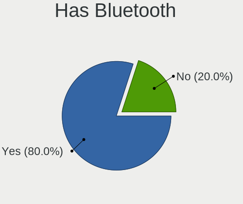
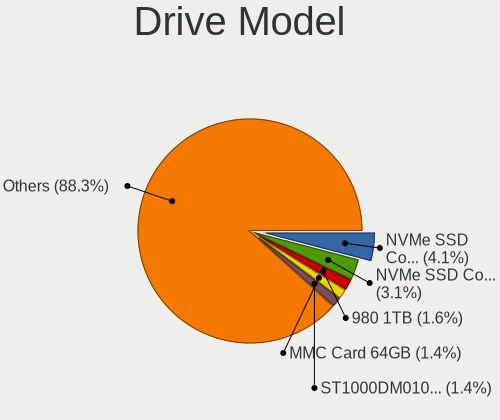
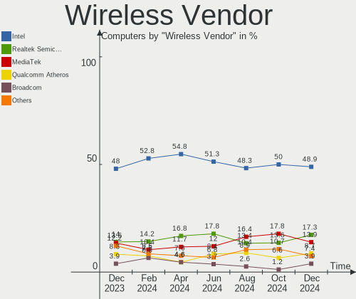
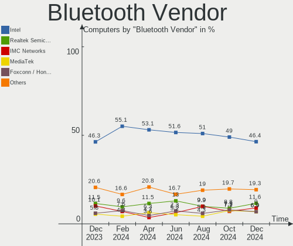

Arch Hardware Trends
--------------------

A project to identify most popular hardware characteristics and track their change
over time based on data collected by Arch users at https://Linux-Hardware.org.

Anyone can contribute to the study by uploading probes of their computers by
the [hw-probe](https://github.com/linuxhw/hw-probe) tool:

    sudo -E hw-probe -all -upload

This is a report for all computer types. See also reports for [desktops](/Dist/Arch/Desktop/README.md) and [notebooks](/Dist/Arch/Notebook/README.md).

Full-feature report is available here: https://linux-hardware.org/?view=trends

Period: Apr, 2021.

Contents
--------

- [ OS                       ](#os)
- [ OS Family                ](#os-family)
- [ Kernel                   ](#kernel)
- [ Kernel Family            ](#kernel-family)
- [ Kernel Major Ver.        ](#kernel-major-ver)
- [ Arch                     ](#arch)
- [ DE                       ](#de)
- [ Display Server           ](#display-server)
- [ Display Manager          ](#display-manager)
- [ OS Lang                  ](#os-lang)
- [ Boot Mode                ](#boot-mode)
- [ Filesystem               ](#filesystem)
- [ Part. scheme             ](#part-scheme)
- [ Dual Boot with Linux/BSD ](#dual-boot-with-linux/bsd)
- [ Dual Boot (Win)          ](#dual-boot-win)
- [ Country                  ](#country)
- [ City                     ](#city)
- [ Vendor                   ](#vendor)
- [ Model                    ](#model)
- [ Model Family             ](#model-family)
- [ MFG Year                 ](#mfg-year)
- [ Form Factor              ](#form-factor)
- [ Secure Boot              ](#secure-boot)
- [ Coreboot                 ](#coreboot)
- [ RAM Size                 ](#ram-size)
- [ RAM Used                 ](#ram-used)
- [ Has CD-ROM               ](#has-cd-rom)
- [ Total Drives             ](#total-drives)
- [ Has Ethernet             ](#has-ethernet)
- [ Has WiFi                 ](#has-wifi)
- [ Has Bluetooth            ](#has-bluetooth)
- [ Drive Vendor             ](#drive-vendor)
- [ Drive Model              ](#drive-model)
- [ HDD Vendor               ](#hdd-vendor)
- [ SSD Vendor               ](#ssd-vendor)
- [ Drive Kind               ](#drive-kind)
- [ Drive Connector          ](#drive-connector)
- [ Drive Size               ](#drive-size)
- [ Space Total              ](#space-total)
- [ Space Used               ](#space-used)
- [ Malfunc. Drives          ](#malfunc-drives)
- [ Malfunc. Drive Vendor    ](#malfunc-drive-vendor)
- [ Malfunc. HDD Vendor      ](#malfunc-hdd-vendor)
- [ Malfunc. Drive Kind      ](#malfunc-drive-kind)
- [ Failed Drives            ](#failed-drives)
- [ Failed Drive Vendor      ](#failed-drive-vendor)
- [ Drive Status             ](#drive-status)
- [ Storage Vendor           ](#storage-vendor)
- [ Storage Model            ](#storage-model)
- [ Storage Kind             ](#storage-kind)
- [ CPU Vendor               ](#cpu-vendor)
- [ CPU Model                ](#cpu-model)
- [ CPU Model Family         ](#cpu-model-family)
- [ CPU Cores                ](#cpu-cores)
- [ CPU Sockets              ](#cpu-sockets)
- [ CPU Threads              ](#cpu-threads)
- [ CPU Op-Modes             ](#cpu-op-modes)
- [ CPU Microcode            ](#cpu-microcode)
- [ CPU Microarch            ](#cpu-microarch)
- [ GPU Vendor               ](#gpu-vendor)
- [ GPU Model                ](#gpu-model)
- [ GPU Combo                ](#gpu-combo)
- [ GPU Driver               ](#gpu-driver)
- [ GPU Memory               ](#gpu-memory)
- [ Monitor Vendor           ](#monitor-vendor)
- [ Monitor Model            ](#monitor-model)
- [ Monitor Resolution       ](#monitor-resolution)
- [ Monitor Diagonal         ](#monitor-diagonal)
- [ Monitor Width            ](#monitor-width)
- [ Aspect Ratio             ](#aspect-ratio)
- [ Monitor Area             ](#monitor-area)
- [ Pixel Density            ](#pixel-density)
- [ Multiple Monitors        ](#multiple-monitors)
- [ Net Controller Vendor    ](#net-controller-vendor)
- [ Net Controller Model     ](#net-controller-model)
- [ Wireless Vendor          ](#wireless-vendor)
- [ Wireless Model           ](#wireless-model)
- [ Ethernet Vendor          ](#ethernet-vendor)
- [ Ethernet Model           ](#ethernet-model)
- [ Net Controller Kind      ](#net-controller-kind)
- [ Used Controller          ](#used-controller)
- [ NICs                     ](#nics)
- [ IPv6                     ](#ipv6)
- [ Memory Vendor            ](#memory-vendor)
- [ Memory Model             ](#memory-model)
- [ Memory Kind              ](#memory-kind)
- [ Memory Form Factor       ](#memory-form-factor)
- [ Memory Size              ](#memory-size)
- [ Memory Speed             ](#memory-speed)
- [ Sound Vendor             ](#sound-vendor)
- [ Sound Model              ](#sound-model)
- [ Camera Vendor            ](#camera-vendor)
- [ Camera Model             ](#camera-model)
- [ Fingerprint Vendor       ](#fingerprint-vendor)
- [ Fingerprint Model        ](#fingerprint-model)
- [ Chipcard Vendor          ](#chipcard-vendor)
- [ Chipcard Model           ](#chipcard-model)
- [ Printer Vendor           ](#printer-vendor)
- [ Printer Model            ](#printer-model)
- [ Scanner Vendor           ](#scanner-vendor)
- [ Scanner Model            ](#scanner-model)
- [ Bluetooth Vendor         ](#bluetooth-vendor)
- [ Bluetooth Model          ](#bluetooth-model)
- [ Unsupported Devices      ](#unsupported-devices)
- [ Unsupported Device Types ](#unsupported-device-types)

OS
--

Installed operating systems

| Name         | Computers | Percent |
|--------------|-----------|---------|
| Arch         | 97        | 65.99%  |
| Arch Rolling | 50        | 34.01%  |

OS Family
---------

OS without a version

| Name | Computers | Percent |
|------|-----------|---------|
| Arch | 147       | 100%    |

Kernel
------

Version of the Linux kernel

| Version                         | Computers | Percent |
|---------------------------------|-----------|---------|
| 5.11.11-arch1-1                 | 32        | 21.77%  |
| 5.11.15-arch1-2                 | 22        | 14.97%  |
| 5.11.16-arch1-1                 | 21        | 14.29%  |
| 5.11.12-arch1-1                 | 12        | 8.16%   |
| 5.11.13-arch1-1                 | 8         | 5.44%   |
| 5.11.14-arch1-1                 | 7         | 4.76%   |
| 5.11.16-zen1-1-zen              | 5         | 3.4%    |
| 5.10.27-1-lts                   | 5         | 3.4%    |
| 5.11.10-arch1-1                 | 3         | 2.04%   |
| 5.11.12-1-ck                    | 2         | 1.36%   |
| 5.11.11-zen1-1-zen              | 2         | 1.36%   |
| 5.10.29-1-lts                   | 2         | 1.36%   |
| 5.10.28-1-lts                   | 2         | 1.36%   |
| 5.10.19-1-lts                   | 2         | 1.36%   |
| 5.9.12-arch1-1                  | 1         | 0.68%   |
| 5.12.0-rc6-1-mainline           | 1         | 0.68%   |
| 5.12.0-arch1-1-custom           | 1         | 0.68%   |
| 5.11.8-arch1-1                  | 1         | 0.68%   |
| 5.11.7-arch1-1                  | 1         | 0.68%   |
| 5.11.15-zen1-2-zen              | 1         | 0.68%   |
| 5.11.15-148-tkg-bmq             | 1         | 0.68%   |
| 5.11.14-zen1-1-zen              | 1         | 0.68%   |
| 5.11.14-147-tkg-bmq             | 1         | 0.68%   |
| 5.11.13-zen2-1-zen              | 1         | 0.68%   |
| 5.11.13-zen1-1-zen              | 1         | 0.68%   |
| 5.11.12-xanmod1-cacule-1-cacule | 1         | 0.68%   |
| 5.11.11.ll59-1-amd-git+         | 1         | 0.68%   |
| 5.11.11-2-ck-sandybridge        | 1         | 0.68%   |
| 5.11.11-144-tkg-upds            | 1         | 0.68%   |
| 5.11.11-144-tkg-bmq             | 1         | 0.68%   |
| 5.10.32-1-lts                   | 1         | 0.68%   |
| 5.10.31-1033.native             | 1         | 0.68%   |
| 5.10.31-1-lts                   | 1         | 0.68%   |
| 5.10.30-1-lts                   | 1         | 0.68%   |
| 5.10.23-1-lts                   | 1         | 0.68%   |
| 5.10.16-arch1-1                 | 1         | 0.68%   |

Kernel Family
-------------

Linux kernel without a distro release

| Version | Computers | Percent |
|---------|-----------|---------|
| 5.11.11 | 38        | 25.85%  |
| 5.11.16 | 26        | 17.69%  |
| 5.11.15 | 24        | 16.33%  |
| 5.11.12 | 15        | 10.2%   |
| 5.11.13 | 10        | 6.8%    |
| 5.11.14 | 9         | 6.12%   |
| 5.10.27 | 5         | 3.4%    |
| 5.11.10 | 3         | 2.04%   |
| 5.12.0  | 2         | 1.36%   |
| 5.10.31 | 2         | 1.36%   |
| 5.10.29 | 2         | 1.36%   |
| 5.10.28 | 2         | 1.36%   |
| 5.10.19 | 2         | 1.36%   |
| 5.9.12  | 1         | 0.68%   |
| 5.11.8  | 1         | 0.68%   |
| 5.11.7  | 1         | 0.68%   |
| 5.10.32 | 1         | 0.68%   |
| 5.10.30 | 1         | 0.68%   |
| 5.10.23 | 1         | 0.68%   |
| 5.10.16 | 1         | 0.68%   |

Kernel Major Ver.
-----------------

Linux kernel major version

| Version | Computers | Percent |
|---------|-----------|---------|
| 5.11    | 127       | 86.39%  |
| 5.10    | 17        | 11.56%  |
| 5.12    | 2         | 1.36%   |
| 5.9     | 1         | 0.68%   |

Arch
----

OS architecture (x86_64, i586, etc.)

| Name   | Computers | Percent |
|--------|-----------|---------|
| x86_64 | 147       | 100%    |

DE
--

Desktop Environment

| Name       | Computers | Percent |
|------------|-----------|---------|
| GNOME      | 56        | 38.1%   |
| KDE5       | 28        | 19.05%  |
| KDE        | 15        | 10.2%   |
| i3         | 11        | 7.48%   |
| Unknown    | 11        | 7.48%   |
| XFCE       | 10        | 6.8%    |
| MATE       | 4         | 2.72%   |
| DWM        | 2         | 1.36%   |
| Budgie     | 2         | 1.36%   |
| bspwm      | 2         | 1.36%   |
| xmonad     | 1         | 0.68%   |
| X-Cinnamon | 1         | 0.68%   |
| sway       | 1         | 0.68%   |
| LXQt       | 1         | 0.68%   |
| ICEWM      | 1         | 0.68%   |
| Cinnamon   | 1         | 0.68%   |

Display Server
--------------

X11 or Wayland

| Name    | Computers | Percent |
|---------|-----------|---------|
| X11     | 94        | 63.95%  |
| Wayland | 27        | 18.37%  |
| Tty     | 14        | 9.52%   |
| Unknown | 12        | 8.16%   |

Display Manager
---------------

SDDM, LightDM, etc.

| Name    | Computers | Percent |
|---------|-----------|---------|
| Unknown | 67        | 45.58%  |
| SDDM    | 31        | 21.09%  |
| GDM     | 21        | 14.29%  |
| TDM     | 12        | 8.16%   |
| LightDM | 6         | 4.08%   |
| Ly      | 4         | 2.72%   |
| XDM     | 3         | 2.04%   |
| LXDM    | 2         | 1.36%   |
| SLiM    | 1         | 0.68%   |

OS Lang
-------

Language

| Lang        | Computers | Percent |
|-------------|-----------|---------|
| en_US       | 75        | 51.02%  |
| en_GB       | 12        | 8.16%   |
| ru_RU       | 10        | 6.8%    |
| pt_BR       | 5         | 3.4%    |
| it_IT       | 5         | 3.4%    |
| C           | 5         | 3.4%    |
| fr_FR       | 4         | 2.72%   |
| pl_PL       | 3         | 2.04%   |
| de_DE       | 3         | 2.04%   |
| Unknown     | 3         | 2.04%   |
| sk_SK       | 2         | 1.36%   |
| es_ES       | 2         | 1.36%   |
| en_IE       | 2         | 1.36%   |
| en_CA       | 2         | 1.36%   |
| en_AU       | 2         | 1.36%   |
| zh_CN       | 1         | 0.68%   |
| sv_SE       | 1         | 0.68%   |
| pt_PT       | 1         | 0.68%   |
| fi_FI       | 1         | 0.68%   |
| et_EE       | 1         | 0.68%   |
| es_VE       | 1         | 0.68%   |
| es_AR.UtF-8 | 1         | 0.68%   |
| en_US.UTF8  | 1         | 0.68%   |
| en_GB.utf-8 | 1         | 0.68%   |
| en_DK       | 1         | 0.68%   |
| en_DE       | 1         | 0.68%   |
| de_DE.utf-8 | 1         | 0.68%   |

Boot Mode
---------

EFI or BIOS

| Mode | Computers | Percent |
|------|-----------|---------|
| EFI  | 85        | 57.82%  |
| BIOS | 62        | 42.18%  |

Filesystem
----------

Type of filesystem

| Type    | Computers | Percent |
|---------|-----------|---------|
| Ext4    | 115       | 78.23%  |
| Btrfs   | 25        | 17.01%  |
| F2fs    | 3         | 2.04%   |
| Xfs     | 2         | 1.36%   |
| Zfs     | 1         | 0.68%   |
| Unknown | 1         | 0.68%   |

Part. scheme
------------

Scheme of partitioning

| Type    | Computers | Percent |
|---------|-----------|---------|
| GPT     | 98        | 66.67%  |
| Unknown | 45        | 30.61%  |
| MBR     | 4         | 2.72%   |

Dual Boot with Linux/BSD
------------------------

Hosting more than one Linux/BSD

| Dual boot | Computers | Percent |
|-----------|-----------|---------|
| No        | 127       | 86.39%  |
| Yes       | 20        | 13.61%  |

Dual Boot (Win)
---------------

Hosting Linux and Windows

| Dual boot | Computers | Percent |
|-----------|-----------|---------|
| No        | 101       | 68.71%  |
| Yes       | 46        | 31.29%  |

Country
-------

Geographic location (country)

| Country            | Computers | Percent |
|--------------------|-----------|---------|
| USA                | 23        | 15.65%  |
| Russia             | 15        | 10.2%   |
| Germany            | 14        | 9.52%   |
| Italy              | 8         | 5.44%   |
| Poland             | 7         | 4.76%   |
| France             | 6         | 4.08%   |
| Brazil             | 6         | 4.08%   |
| Spain              | 5         | 3.4%    |
| Netherlands        | 5         | 3.4%    |
| UK                 | 4         | 2.72%   |
| Canada             | 4         | 2.72%   |
| Sweden             | 3         | 2.04%   |
| Lithuania          | 3         | 2.04%   |
| Iran               | 3         | 2.04%   |
| Austria            | 3         | 2.04%   |
| Slovakia           | 2         | 1.36%   |
| Qatar              | 2         | 1.36%   |
| India              | 2         | 1.36%   |
| Hungary            | 2         | 1.36%   |
| Denmark            | 2         | 1.36%   |
| Australia          | 2         | 1.36%   |
| Ukraine            | 1         | 0.68%   |
| Turkey             | 1         | 0.68%   |
| Tunisia            | 1         | 0.68%   |
| South Korea        | 1         | 0.68%   |
| Slovenia           | 1         | 0.68%   |
| Réunion           | 1         | 0.68%   |
| Portugal           | 1         | 0.68%   |
| Philippines        | 1         | 0.68%   |
| Norway             | 1         | 0.68%   |
| Latvia             | 1         | 0.68%   |
| Kuwait             | 1         | 0.68%   |
| Kazakhstan         | 1         | 0.68%   |
| Ireland            | 1         | 0.68%   |
| Greece             | 1         | 0.68%   |
| Finland            | 1         | 0.68%   |
| Estonia            | 1         | 0.68%   |
| Dominican Republic | 1         | 0.68%   |
| Czechia            | 1         | 0.68%   |
| Croatia            | 1         | 0.68%   |
| Costa Rica         | 1         | 0.68%   |
| Colombia           | 1         | 0.68%   |
| China              | 1         | 0.68%   |
| Chile              | 1         | 0.68%   |
| Belgium            | 1         | 0.68%   |
| Belarus            | 1         | 0.68%   |
| Argentina          | 1         | 0.68%   |

City
----

Geographic location (city)

| City                  | Computers | Percent |
|-----------------------|-----------|---------|
| Moscow                | 5         | 3.4%    |
| Vienna                | 3         | 2.04%   |
| Berlin                | 3         | 2.04%   |
| Wroclaw               | 2         | 1.36%   |
| Vilnius               | 2         | 1.36%   |
| St Petersburg         | 2         | 1.36%   |
| Ludwigshafen am Rhein | 2         | 1.36%   |
| Lodz                  | 2         | 1.36%   |
| Hamburg               | 2         | 1.36%   |
| Germantown            | 2         | 1.36%   |
| Doha                  | 2         | 1.36%   |
| Bratislava            | 2         | 1.36%   |
| Zagreb                | 1         | 0.68%   |
| Yingchuan             | 1         | 0.68%   |
| Yekaterinburg         | 1         | 0.68%   |
| Wooster               | 1         | 0.68%   |
| Wichita               | 1         | 0.68%   |
| White Lake            | 1         | 0.68%   |
| West Lafayette        | 1         | 0.68%   |
| Warsaw                | 1         | 0.68%   |
| Viña del Mar         | 1         | 0.68%   |
| Villeurbanne          | 1         | 0.68%   |
| Vaasa                 | 1         | 0.68%   |
| Umeå                 | 1         | 0.68%   |
| Tunis                 | 1         | 0.68%   |
| Tourcoing             | 1         | 0.68%   |
| Tomsk                 | 1         | 0.68%   |
| The Hague             | 1         | 0.68%   |
| Tehran                | 1         | 0.68%   |
| Tallinn               | 1         | 0.68%   |
| São Paulo            | 1         | 0.68%   |
| Södermalm            | 1         | 0.68%   |
| Stockholm             | 1         | 0.68%   |
| Stavanger             | 1         | 0.68%   |
| State College         | 1         | 0.68%   |
| St. Petersburg        | 1         | 0.68%   |
| Springfield           | 1         | 0.68%   |
| Slonim                | 1         | 0.68%   |
| Scott Depot           | 1         | 0.68%   |
| Schwäbisch Gmünd    | 1         | 0.68%   |
| Sceaux                | 1         | 0.68%   |
| Santa Maria           | 1         | 0.68%   |
| Santa Ana             | 1         | 0.68%   |
| Sangruda              | 1         | 0.68%   |
| Salt Lake City        | 1         | 0.68%   |
| Saint-Pierre          | 1         | 0.68%   |
| Rostov-on-Don         | 1         | 0.68%   |
| Rome                  | 1         | 0.68%   |
| Riga                  | 1         | 0.68%   |
| Prague                | 1         | 0.68%   |
| Pomezia               | 1         | 0.68%   |
| Pilisvorosvar         | 1         | 0.68%   |
| Phoenix               | 1         | 0.68%   |
| Pesnica               | 1         | 0.68%   |
| Pervouralsk           | 1         | 0.68%   |
| Perugia               | 1         | 0.68%   |
| Perm                  | 1         | 0.68%   |
| Paulo Afonso          | 1         | 0.68%   |
| Palermo               | 1         | 0.68%   |
| Oxted                 | 1         | 0.68%   |

Vendor
------

Motherboard manufacturer

| Name                | Computers | Percent |
|---------------------|-----------|---------|
| ASUSTek Computer    | 28        | 19.05%  |
| Lenovo              | 23        | 15.65%  |
| Hewlett-Packard     | 23        | 15.65%  |
| MSI                 | 16        | 10.88%  |
| Gigabyte Technology | 12        | 8.16%   |
| Dell                | 12        | 8.16%   |
| ASRock              | 8         | 5.44%   |
| Acer                | 8         | 5.44%   |
| Alienware           | 2         | 1.36%   |
| Toshiba             | 1         | 0.68%   |
| Timi                | 1         | 0.68%   |
| Supermicro          | 1         | 0.68%   |
| SLIMBOOK            | 1         | 0.68%   |
| Samsung Electronics | 1         | 0.68%   |
| Positivo            | 1         | 0.68%   |
| Pegatron            | 1         | 0.68%   |
| Packard Bell        | 1         | 0.68%   |
| MAIBENBEN           | 1         | 0.68%   |
| Intel               | 1         | 0.68%   |
| HUAWEI              | 1         | 0.68%   |
| Google              | 1         | 0.68%   |
| GEO                 | 1         | 0.68%   |
| Apple               | 1         | 0.68%   |
| Unknown             | 1         | 0.68%   |

Model
-----

Motherboard model

| Name                                       | Computers | Percent |
|--------------------------------------------|-----------|---------|
| MSI MS-7C91                                | 2         | 1.36%   |
| MSI MS-7C37                                | 2         | 1.36%   |
| Gigabyte B450 I AORUS PRO WIFI             | 2         | 1.36%   |
| Dell XPS 15 9500                           | 2         | 1.36%   |
| Toshiba Satellite L55-C                    | 1         | 0.68%   |
| Timi TM1701                                | 1         | 0.68%   |
| Supermicro SYS-6027AX-72RF-HFT3            | 1         | 0.68%   |
| SLIMBOOK PROX14-AMD                        | 1         | 0.68%   |
| Samsung 300E5M/300E5L                      | 1         | 0.68%   |
| Positivo CHT14B                            | 1         | 0.68%   |
| Pegatron p2-1113w                          | 1         | 0.68%   |
| Packard Bell ixtreme M5740                 | 1         | 0.68%   |
| MSI MS-7C88                                | 1         | 0.68%   |
| MSI MS-7C84                                | 1         | 0.68%   |
| MSI MS-7C52                                | 1         | 0.68%   |
| MSI MS-7B89                                | 1         | 0.68%   |
| MSI MS-7B86                                | 1         | 0.68%   |
| MSI MS-7B79                                | 1         | 0.68%   |
| MSI MS-7B50                                | 1         | 0.68%   |
| MSI MS-7A74                                | 1         | 0.68%   |
| MSI MS-7A39                                | 1         | 0.68%   |
| MSI MS-7A38                                | 1         | 0.68%   |
| MSI MS-7922                                | 1         | 0.68%   |
| MSI MS-7681                                | 1         | 0.68%   |
| MAIBENBEN MaiBook M                        | 1         | 0.68%   |
| Lenovo Yoga 920-13IKB 80Y7                 | 1         | 0.68%   |
| Lenovo V330-14IKB 81B0                     | 1         | 0.68%   |
| Lenovo ThinkPad X1 Carbon Gen 9 20XWCTO1WW | 1         | 0.68%   |
| Lenovo ThinkPad X1 Carbon 5th 20HR003GMX   | 1         | 0.68%   |
| Lenovo ThinkPad T530 2394BK7               | 1         | 0.68%   |
| Lenovo ThinkPad T495s 20QJ001MGE           | 1         | 0.68%   |
| Lenovo ThinkPad T490s 20NXCTO1WW           | 1         | 0.68%   |
| Lenovo ThinkPad T440p 20AWS0DU00           | 1         | 0.68%   |
| Lenovo ThinkPad T430 2351BL9               | 1         | 0.68%   |
| Lenovo ThinkPad T430 2349OB6               | 1         | 0.68%   |
| Lenovo ThinkPad T410s 2912B99              | 1         | 0.68%   |
| Lenovo ThinkPad T14 Gen 1 20UD0013CK       | 1         | 0.68%   |
| Lenovo ThinkPad P53 20QNCTO1WW             | 1         | 0.68%   |
| Lenovo ThinkPad P53 20QN0034MH             | 1         | 0.68%   |
| Lenovo ThinkPad P50 20EN0005PG             | 1         | 0.68%   |
| Lenovo ThinkPad E14 Gen 2 20T6S00D00       | 1         | 0.68%   |
| Lenovo ThinkPad 20QJ000DRT                 | 1         | 0.68%   |
| Lenovo Legion Y540-15IRH-PG0 81SY          | 1         | 0.68%   |
| Lenovo IdeaPad Y510P 20217                 | 1         | 0.68%   |
| Lenovo IdeaPad L340-15API 81LW             | 1         | 0.68%   |
| Lenovo IdeaPad Flex 5 14ALC05 82HU         | 1         | 0.68%   |
| Lenovo IdeaPad 5 14ARE05 81YM              | 1         | 0.68%   |
| Lenovo G710 20252                          | 1         | 0.68%   |
| Intel H81                                  | 1         | 0.68%   |
| HUAWEI HN-WX9X                             | 1         | 0.68%   |
| HP Z620 Workstation                        | 1         | 0.68%   |
| HP Z230 Tower Workstation                  | 1         | 0.68%   |
| HP Spectre x360 Convertible 13-aw0xxx      | 1         | 0.68%   |
| HP ProDesk 405 G6 Desktop Mini PC          | 1         | 0.68%   |
| HP ProBook 640 G2                          | 1         | 0.68%   |
| HP ProBook 445 G6                          | 1         | 0.68%   |
| HP ProBook 440 G7                          | 1         | 0.68%   |
| HP Pavilion x360 Convertible 14-dh0xxx     | 1         | 0.68%   |
| HP Pavilion Laptop 15-ck069tx              | 1         | 0.68%   |
| HP Pavilion Gaming Laptop 15-ec0xxx        | 1         | 0.68%   |

Model Family
------------

Motherboard model prefix

| Name                            | Computers | Percent |
|---------------------------------|-----------|---------|
| Lenovo ThinkPad                 | 15        | 10.2%   |
| HP EliteBook                    | 6         | 4.08%   |
| Dell XPS                        | 6         | 4.08%   |
| HP Pavilion                     | 5         | 3.4%    |
| ASUS TUF                        | 5         | 3.4%    |
| ASUS PRIME                      | 5         | 3.4%    |
| Lenovo IdeaPad                  | 4         | 2.72%   |
| ASUS ROG                        | 4         | 2.72%   |
| Acer Aspire                     | 4         | 2.72%   |
| HP ProBook                      | 3         | 2.04%   |
| HP ENVY                         | 3         | 2.04%   |
| Dell Latitude                   | 3         | 2.04%   |
| MSI MS-7C91                     | 2         | 1.36%   |
| MSI MS-7C37                     | 2         | 1.36%   |
| Gigabyte X570                   | 2         | 1.36%   |
| Gigabyte B450                   | 2         | 1.36%   |
| Gigabyte AX370-Gaming           | 2         | 1.36%   |
| Dell Inspiron                   | 2         | 1.36%   |
| Toshiba Satellite               | 1         | 0.68%   |
| Timi TM1701                     | 1         | 0.68%   |
| Supermicro SYS-6027AX-72RF-HFT3 | 1         | 0.68%   |
| SLIMBOOK PROX14-AMD             | 1         | 0.68%   |
| Samsung 300E5M                  | 1         | 0.68%   |
| Positivo CHT14B                 | 1         | 0.68%   |
| Pegatron p2-1113w               | 1         | 0.68%   |
| Packard Bell ixtreme            | 1         | 0.68%   |
| MSI MS-7C88                     | 1         | 0.68%   |
| MSI MS-7C84                     | 1         | 0.68%   |
| MSI MS-7C52                     | 1         | 0.68%   |
| MSI MS-7B89                     | 1         | 0.68%   |
| MSI MS-7B86                     | 1         | 0.68%   |
| MSI MS-7B79                     | 1         | 0.68%   |
| MSI MS-7B50                     | 1         | 0.68%   |
| MSI MS-7A74                     | 1         | 0.68%   |
| MSI MS-7A39                     | 1         | 0.68%   |
| MSI MS-7A38                     | 1         | 0.68%   |
| MSI MS-7922                     | 1         | 0.68%   |
| MSI MS-7681                     | 1         | 0.68%   |
| MAIBENBEN MaiBook               | 1         | 0.68%   |
| Lenovo Yoga                     | 1         | 0.68%   |
| Lenovo V330-14IKB               | 1         | 0.68%   |
| Lenovo Legion                   | 1         | 0.68%   |
| Lenovo G710                     | 1         | 0.68%   |
| Intel H81                       | 1         | 0.68%   |
| HUAWEI HN-WX9X                  | 1         | 0.68%   |
| HP Z620                         | 1         | 0.68%   |
| HP Z230                         | 1         | 0.68%   |
| HP Spectre                      | 1         | 0.68%   |
| HP ProDesk                      | 1         | 0.68%   |
| HP Laptop                       | 1         | 0.68%   |
| HP Elite                        | 1         | 0.68%   |
| Google Lars                     | 1         | 0.68%   |
| Gigabyte X399                   | 1         | 0.68%   |
| Gigabyte TRX40                  | 1         | 0.68%   |
| Gigabyte P41T-D3                | 1         | 0.68%   |
| Gigabyte H81M-S2PV              | 1         | 0.68%   |
| Gigabyte H81M-S1                | 1         | 0.68%   |
| Gigabyte 970A-UD3               | 1         | 0.68%   |
| GEO GeoBook3                    | 1         | 0.68%   |
| Dell Vostro                     | 1         | 0.68%   |

MFG Year
--------

Motherboard manufacture year

| Year | Computers | Percent |
|------|-----------|---------|
| 2020 | 54        | 36.73%  |
| 2019 | 25        | 17.01%  |
| 2021 | 19        | 12.93%  |
| 2018 | 8         | 5.44%   |
| 2015 | 8         | 5.44%   |
| 2017 | 7         | 4.76%   |
| 2016 | 7         | 4.76%   |
| 2013 | 6         | 4.08%   |
| 2012 | 5         | 3.4%    |
| 2011 | 4         | 2.72%   |
| 2010 | 2         | 1.36%   |
| 2014 | 1         | 0.68%   |
| 2009 | 1         | 0.68%   |

Form Factor
-----------

Physical design of the computer

| Name        | Computers | Percent |
|-------------|-----------|---------|
| Notebook    | 76        | 51.7%   |
| Desktop     | 61        | 41.5%   |
| Convertible | 7         | 4.76%   |
| Tablet      | 1         | 0.68%   |
| Mini pc     | 1         | 0.68%   |
| All in one  | 1         | 0.68%   |

Secure Boot
-----------

Enabled or disabled

| State    | Computers | Percent |
|----------|-----------|---------|
| Disabled | 146       | 99.32%  |
| Enabled  | 1         | 0.68%   |

Coreboot
--------

Have coreboot on board

| Used | Computers | Percent |
|------|-----------|---------|
| No   | 146       | 99.32%  |
| Yes  | 1         | 0.68%   |

RAM Size
--------

Total RAM memory

| Size in GB  | Computers | Percent |
|-------------|-----------|---------|
| 16.01-24.0  | 53        | 36.05%  |
| 8.01-16.0   | 31        | 21.09%  |
| 32.01-64.0  | 27        | 18.37%  |
| 4.01-8.0    | 17        | 11.56%  |
| 3.01-4.0    | 10        | 6.8%    |
| 64.01-256.0 | 4         | 2.72%   |
| 24.01-32.0  | 3         | 2.04%   |
| 1.01-2.0    | 1         | 0.68%   |
| 0.51-1.0    | 1         | 0.68%   |

RAM Used
--------

Used RAM memory

| Used GB   | Computers | Percent |
|-----------|-----------|---------|
| 2.01-3.0  | 38        | 25.85%  |
| 4.01-8.0  | 35        | 23.81%  |
| 1.01-2.0  | 32        | 21.77%  |
| 3.01-4.0  | 26        | 17.69%  |
| 8.01-16.0 | 11        | 7.48%   |
| 0.51-1.0  | 3         | 2.04%   |
| 0.01-0.5  | 2         | 1.36%   |

Has CD-ROM
----------

Has CD-ROM on board

| Presented | Computers | Percent |
|-----------|-----------|---------|
| No        | 123       | 83.67%  |
| Yes       | 24        | 16.33%  |

Total Drives
------------

Number of drives on board

| Drives | Computers | Percent |
|--------|-----------|---------|
| 1      | 65        | 44.22%  |
| 2      | 40        | 27.21%  |
| 3      | 29        | 19.73%  |
| 4      | 6         | 4.08%   |
| 5      | 3         | 2.04%   |
| 6      | 2         | 1.36%   |
| 8      | 1         | 0.68%   |
| 7      | 1         | 0.68%   |

Has Ethernet
------------

Has Ethernet on board

| Presented | Computers | Percent |
|-----------|-----------|---------|
| Yes       | 123       | 83.67%  |
| No        | 24        | 16.33%  |

Has WiFi
--------

Has WiFi module

| Presented | Computers | Percent |
|-----------|-----------|---------|
| Yes       | 109       | 74.15%  |
| No        | 38        | 25.85%  |

Has Bluetooth
-------------

Has Bluetooth module

| Presented | Computers | Percent |
|-----------|-----------|---------|
| Yes       | 99        | 67.35%  |
| No        | 48        | 32.65%  |

Drive Vendor
------------

Hard drive vendors

| Vendor                    | Computers | Drives | Percent |
|---------------------------|-----------|--------|---------|
| Samsung Electronics       | 47        | 70     | 19.34%  |
| WDC                       | 36        | 48     | 14.81%  |
| Seagate                   | 23        | 27     | 9.47%   |
| Toshiba                   | 20        | 20     | 8.23%   |
| SanDisk                   | 17        | 17     | 7%      |
| Kingston                  | 14        | 16     | 5.76%   |
| SK Hynix                  | 13        | 13     | 5.35%   |
| Crucial                   | 10        | 11     | 4.12%   |
| Unknown                   | 7         | 8      | 2.88%   |
| Intel                     | 6         | 8      | 2.47%   |
| Micron Technology         | 5         | 5      | 2.06%   |
| Hitachi                   | 5         | 5      | 2.06%   |
| Phison                    | 4         | 11     | 1.65%   |
| JMicron                   | 4         | 4      | 1.65%   |
| HGST                      | 4         | 4      | 1.65%   |
| Micron/Crucial Technology | 3         | 3      | 1.23%   |
| XPG                       | 2         | 2      | 0.82%   |
| Transcend                 | 2         | 2      | 0.82%   |
| Silicon Motion            | 2         | 2      | 0.82%   |
| A-DATA Technology         | 2         | 2      | 0.82%   |
| XrayDisk                  | 1         | 1      | 0.41%   |
| USB30                     | 1         | 1      | 0.41%   |
| Union Memory (Shenzhen)   | 1         | 1      | 0.41%   |
| UMAX                      | 1         | 1      | 0.41%   |
| Team                      | 1         | 1      | 0.41%   |
| SPCC                      | 1         | 1      | 0.41%   |
| Smartbuy                  | 1         | 1      | 0.41%   |
| OCZ                       | 1         | 4      | 0.41%   |
| Mushkin                   | 1         | 1      | 0.41%   |
| LITEON                    | 1         | 1      | 0.41%   |
| Lenovo                    | 1         | 1      | 0.41%   |
| Hewlett-Packard           | 1         | 1      | 0.41%   |
| GOODRAM                   | 1         | 1      | 0.41%   |
| External                  | 1         | 1      | 0.41%   |
| China                     | 1         | 1      | 0.41%   |
| ASMT109x                  | 1         | 1      | 0.41%   |
| Apple                     | 1         | 2      | 0.41%   |

Drive Model
-----------

Hard drive models

| Model                                   | Computers | Percent |
|-----------------------------------------|-----------|---------|
| Toshiba MQ01ABD100 1TB                  | 5         | 1.78%   |
| Kingston SA400S37480G 480GB SSD         | 5         | 1.78%   |
| Sandisk NVMe SSD Drive 512GB            | 4         | 1.42%   |
| Samsung SSD 970 EVO 1TB                 | 4         | 1.42%   |
| Samsung SSD 860 EVO 1TB                 | 4         | 1.42%   |
| Samsung SSD 850 EVO 500GB               | 4         | 1.42%   |
| WDC WD10EZEX-08WN4A0 1TB                | 3         | 1.07%   |
| Toshiba NVMe SSD Drive 512GB            | 3         | 1.07%   |
| Toshiba DT01ACA100 1TB                  | 3         | 1.07%   |
| Seagate ST1000LM035-1RK172 1TB          | 3         | 1.07%   |
| Samsung SSD 970 EVO Plus 1TB            | 3         | 1.07%   |
| Samsung SSD 860 EVO M.2 1TB             | 3         | 1.07%   |
| Samsung SSD 860 EVO 500GB               | 3         | 1.07%   |
| Kingston SA400S37240G 240GB SSD         | 3         | 1.07%   |
| JMicron Generic 240GB                   | 3         | 1.07%   |
| XPG GAMMIX S11 Pro 2TB                  | 2         | 0.71%   |
| WDC WDS120G1G0B-00RC30 120GB SSD        | 2         | 0.71%   |
| WDC WD10EZRX-00L4HB0 1TB                | 2         | 0.71%   |
| WDC WD10EZEX-22MFCA0 1TB                | 2         | 0.71%   |
| SK Hynix NVMe SSD Drive 512GB           | 2         | 0.71%   |
| SK Hynix NVMe SSD Drive 1024GB          | 2         | 0.71%   |
| SK Hynix BC511 HFM512GDJTNI-82A0A 512GB | 2         | 0.71%   |
| Seagate ST8000DM004-2CX188 8TB          | 2         | 0.71%   |
| Seagate ST4000DM004-2CV104 4TB          | 2         | 0.71%   |
| Seagate ST2000DM006-2DM164 2TB          | 2         | 0.71%   |
| Seagate ST1000LX015-1U7172 1TB          | 2         | 0.71%   |
| SanDisk SDSSDA120G 120GB                | 2         | 0.71%   |
| Sandisk NVMe SSD Drive 1TB              | 2         | 0.71%   |
| Samsung SSD 860 EVO 250GB               | 2         | 0.71%   |
| Samsung NVMe SSD Drive 512GB            | 2         | 0.71%   |
| Samsung NVMe SSD Drive 500GB            | 2         | 0.71%   |
| Samsung NVMe SSD Drive 250GB            | 2         | 0.71%   |
| Samsung NVMe SSD Drive 1TB              | 2         | 0.71%   |
| Samsung HD160JJ 160GB                   | 2         | 0.71%   |
| Phison NVMe SSD Drive 1TB               | 2         | 0.71%   |
| Micron/Crucial NVMe SSD Drive 1TB       | 2         | 0.71%   |
| HGST HTS541010A9E680 1TB                | 2         | 0.71%   |
| Crucial CT1000MX500SSD1 1TB             | 2         | 0.71%   |
| XrayDisk 512GB                          | 1         | 0.36%   |
| WDC WDS500G3X0C-00SJG0 500GB            | 1         | 0.36%   |
| WDC WDS500G2X0C-00L350 500GB            | 1         | 0.36%   |
| WDC WDS500G2B0A-00SM50 500GB SSD        | 1         | 0.36%   |
| WDC WDS250G1B0A-00H9H0 250GB SSD        | 1         | 0.36%   |
| WDC WDS240G2G0B-00EPW0 240GB SSD        | 1         | 0.36%   |
| WDC WDS120G2G0B-00EPW0 120GB SSD        | 1         | 0.36%   |
| WDC WDS120G2G0A-00JH30 120GB SSD        | 1         | 0.36%   |
| WDC WDS100T2X0C-00L350 1TB              | 1         | 0.36%   |
| WDC WDS100T2B0B-00YS70 1TB SSD          | 1         | 0.36%   |
| WDC WD8003FRYZ-01JPDB1 8TB              | 1         | 0.36%   |
| WDC WD60EZAZ-00ZGHB0 6TB                | 1         | 0.36%   |
| WDC WD5002AALX-00J37A0 500GB            | 1         | 0.36%   |
| WDC WD5000LPVT-22G33T0 500GB            | 1         | 0.36%   |
| WDC WD5000LPLX-60ZNTT1 500GB            | 1         | 0.36%   |
| WDC WD5000AZLX-00K4KA0 500GB            | 1         | 0.36%   |
| WDC WD5000AVVS-63H0B1 500GB             | 1         | 0.36%   |
| WDC WD5000AAKX-00ERMA0 500GB            | 1         | 0.36%   |
| WDC WD40EZRZ-19GXCB0 4TB                | 1         | 0.36%   |
| WDC WD40EFRX-68N32N0 4TB                | 1         | 0.36%   |
| WDC WD30EFRX-68AX9N0 3TB                | 1         | 0.36%   |
| WDC WD20EZRZ-00Z5HB0 2TB                | 1         | 0.36%   |

HDD Vendor
----------

Hard disk drive vendors

| Vendor              | Computers | Drives | Percent |
|---------------------|-----------|--------|---------|
| WDC                 | 29        | 35     | 37.18%  |
| Seagate             | 23        | 27     | 29.49%  |
| Toshiba             | 13        | 13     | 16.67%  |
| Hitachi             | 5         | 5      | 6.41%   |
| HGST                | 4         | 4      | 5.13%   |
| Samsung Electronics | 3         | 3      | 3.85%   |
| Apple               | 1         | 1      | 1.28%   |

SSD Vendor
----------

Solid state drive vendors

| Vendor              | Computers | Drives | Percent |
|---------------------|-----------|--------|---------|
| Samsung Electronics | 26        | 31     | 28.57%  |
| Kingston            | 13        | 15     | 14.29%  |
| SanDisk             | 10        | 10     | 10.99%  |
| WDC                 | 8         | 8      | 8.79%   |
| Crucial             | 8         | 9      | 8.79%   |
| JMicron             | 3         | 3      | 3.3%    |
| Intel               | 3         | 4      | 3.3%    |
| Transcend           | 2         | 2      | 2.2%    |
| Toshiba             | 2         | 2      | 2.2%    |
| SK Hynix            | 2         | 2      | 2.2%    |
| A-DATA Technology   | 2         | 2      | 2.2%    |
| USB30               | 1         | 1      | 1.1%    |
| UMAX                | 1         | 1      | 1.1%    |
| SPCC                | 1         | 1      | 1.1%    |
| Smartbuy            | 1         | 1      | 1.1%    |
| OCZ                 | 1         | 4      | 1.1%    |
| Mushkin             | 1         | 1      | 1.1%    |
| LITEON              | 1         | 1      | 1.1%    |
| Lenovo              | 1         | 1      | 1.1%    |
| GOODRAM             | 1         | 1      | 1.1%    |
| External            | 1         | 1      | 1.1%    |
| China               | 1         | 1      | 1.1%    |
| ASMT109x            | 1         | 1      | 1.1%    |

Drive Kind
----------

HDD or SSD

| Kind    | Computers | Drives | Percent |
|---------|-----------|--------|---------|
| SSD     | 77        | 103    | 34.84%  |
| NVMe    | 72        | 98     | 32.58%  |
| HDD     | 63        | 88     | 28.51%  |
| MMC     | 8         | 9      | 3.62%   |
| Unknown | 1         | 1      | 0.45%   |

Drive Connector
---------------

SATA, SAS, NVMe, etc.

| Type | Computers | Drives | Percent |
|------|-----------|--------|---------|
| SATA | 103       | 185    | 54.21%  |
| NVMe | 72        | 98     | 37.89%  |
| MMC  | 8         | 9      | 4.21%   |
| SAS  | 7         | 7      | 3.68%   |

Drive Size
----------

Size of hard drive

| Size in TB | Computers | Drives | Percent |
|------------|-----------|--------|---------|
| 0.01-0.5   | 72        | 99     | 47.68%  |
| 0.51-1.0   | 52        | 61     | 34.44%  |
| 1.01-2.0   | 11        | 14     | 7.28%   |
| 4.01-10.0  | 7         | 8      | 4.64%   |
| 3.01-4.0   | 6         | 6      | 3.97%   |
| 2.01-3.0   | 3         | 3      | 1.99%   |

Space Total
-----------

Amount of disk space available on the file system

| Size in GB     | Computers | Percent |
|----------------|-----------|---------|
| 251-500        | 33        | 22.45%  |
| 101-250        | 31        | 21.09%  |
| 501-1000       | 30        | 20.41%  |
| 1001-2000      | 18        | 12.24%  |
| More than 3000 | 13        | 8.84%   |
| 2001-3000      | 10        | 6.8%    |
| 51-100         | 6         | 4.08%   |
| Unknown        | 3         | 2.04%   |
| 21-50          | 2         | 1.36%   |
| 1-20           | 1         | 0.68%   |

Space Used
----------

Amount of used disk space

| Used GB        | Computers | Percent |
|----------------|-----------|---------|
| 101-250        | 27        | 18.37%  |
| 1-20           | 26        | 17.69%  |
| 21-50          | 22        | 14.97%  |
| 51-100         | 18        | 12.24%  |
| 251-500        | 16        | 10.88%  |
| 1001-2000      | 14        | 9.52%   |
| 501-1000       | 13        | 8.84%   |
| More than 3000 | 6         | 4.08%   |
| Unknown        | 3         | 2.04%   |
| 2001-3000      | 2         | 1.36%   |

Malfunc. Drives
---------------

Drive models with a malfunction

| Model                             | Computers | Drives | Percent |
|-----------------------------------|-----------|--------|---------|
| WDC WDS250G1B0A-00H9H0 250GB SSD  | 1         | 1      | 5.88%   |
| WDC WD5000AAKX-00ERMA0 500GB      | 1         | 1      | 5.88%   |
| WDC WD40EFRX-68N32N0 4TB          | 1         | 1      | 5.88%   |
| WDC WD20EFRX-68EUZN0 2TB          | 1         | 1      | 5.88%   |
| WDC WD20EARX-00PASB0 2TB          | 1         | 1      | 5.88%   |
| WDC WD10EZEX-21M2NA0 1TB          | 1         | 1      | 5.88%   |
| WDC WD10EADS-22M2B0 1TB           | 1         | 1      | 5.88%   |
| Toshiba DT01ACA200 2TB            | 1         | 1      | 5.88%   |
| SK Hynix SC308 SATA 256GB SSD     | 1         | 1      | 5.88%   |
| Seagate ST2000DM006-2DM164 2TB    | 1         | 1      | 5.88%   |
| Samsung Electronics SP1614C 160GB | 1         | 1      | 5.88%   |
| Samsung Electronics HD160JJ 160GB | 1         | 1      | 5.88%   |
| LITEON CV8-8E128-HP 128GB SSD     | 1         | 1      | 5.88%   |
| Hitachi HTS545025B9A300 250GB     | 1         | 1      | 5.88%   |
| Hitachi HDT721064SLA360 640GB     | 1         | 1      | 5.88%   |
| HGST HTS721010A9E630 1TB          | 1         | 1      | 5.88%   |
| HGST HTS541010A9E680 1TB          | 1         | 1      | 5.88%   |

Malfunc. Drive Vendor
---------------------

Vendors of faulty drives

| Vendor              | Computers | Drives | Percent |
|---------------------|-----------|--------|---------|
| WDC                 | 5         | 7      | 33.33%  |
| Samsung Electronics | 2         | 2      | 13.33%  |
| Hitachi             | 2         | 2      | 13.33%  |
| HGST                | 2         | 2      | 13.33%  |
| Toshiba             | 1         | 1      | 6.67%   |
| SK Hynix            | 1         | 1      | 6.67%   |
| Seagate             | 1         | 1      | 6.67%   |
| LITEON              | 1         | 1      | 6.67%   |

Malfunc. HDD Vendor
-------------------

Vendors of faulty HDD drives

| Vendor              | Computers | Drives | Percent |
|---------------------|-----------|--------|---------|
| WDC                 | 4         | 6      | 33.33%  |
| Samsung Electronics | 2         | 2      | 16.67%  |
| Hitachi             | 2         | 2      | 16.67%  |
| HGST                | 2         | 2      | 16.67%  |
| Toshiba             | 1         | 1      | 8.33%   |
| Seagate             | 1         | 1      | 8.33%   |

Malfunc. Drive Kind
-------------------

Kinds of faulty drives

| Kind | Computers | Drives | Percent |
|------|-----------|--------|---------|
| HDD  | 10        | 14     | 76.92%  |
| SSD  | 3         | 3      | 23.08%  |

Failed Drives
-------------

Failed drive models

Zero info for selected period =(

Failed Drive Vendor
-------------------

Failed drive vendors

Zero info for selected period =(

Drive Status
------------

Number of failed and malfunc. drives

| Status   | Computers | Drives | Percent |
|----------|-----------|--------|---------|
| Detected | 76        | 138    | 46.34%  |
| Works    | 76        | 144    | 46.34%  |
| Malfunc  | 12        | 17     | 7.32%   |

Storage Vendor
--------------

Storage controller vendors

| Vendor                       | Computers | Percent |
|------------------------------|-----------|---------|
| Intel                        | 78        | 37.86%  |
| AMD                          | 44        | 21.36%  |
| Samsung Electronics          | 26        | 12.62%  |
| SK Hynix                     | 10        | 4.85%   |
| Sandisk                      | 10        | 4.85%   |
| ASMedia Technology           | 6         | 2.91%   |
| Phison Electronics           | 5         | 2.43%   |
| Micron/Crucial Technology    | 5         | 2.43%   |
| Micron Technology            | 5         | 2.43%   |
| Toshiba America Info Systems | 4         | 1.94%   |
| Silicon Motion               | 4         | 1.94%   |
| JMicron Technology           | 2         | 0.97%   |
| ADATA Technology             | 2         | 0.97%   |
| VIA Technologies             | 1         | 0.49%   |
| Union Memory (Shenzhen)      | 1         | 0.49%   |
| OCZ Technology Group         | 1         | 0.49%   |
| KIOXIA                       | 1         | 0.49%   |
| Kingston Technology Company  | 1         | 0.49%   |

Storage Model
-------------

Storage controller models

| Model                                                                                   | Computers | Percent |
|-----------------------------------------------------------------------------------------|-----------|---------|
| AMD FCH SATA Controller [AHCI mode]                                                     | 30        | 13.1%   |
| Samsung NVMe SSD Controller SM981/PM981/PM983                                           | 16        | 6.99%   |
| Intel Sunrise Point-LP SATA Controller [AHCI mode]                                      | 11        | 4.8%    |
| AMD 400 Series Chipset SATA Controller                                                  | 10        | 4.37%   |
| Intel 8 Series/C220 Series Chipset Family 6-port SATA Controller 1 [AHCI mode]          | 9         | 3.93%   |
| Intel 82801 Mobile SATA Controller [RAID mode]                                          | 8         | 3.49%   |
| AMD Starship/Matisse Chipset SATA Controller [AHCI mode]                                | 7         | 3.06%   |
| ASMedia ASM1062 Serial ATA Controller                                                   | 6         | 2.62%   |
| SK Hynix Non-Volatile memory controller                                                 | 5         | 2.18%   |
| Samsung NVMe SSD Controller SM961/PM961/SM963                                           | 5         | 2.18%   |
| Micron Non-Volatile memory controller                                                   | 5         | 2.18%   |
| Intel Q170/Q150/B150/H170/H110/Z170/CM236 Chipset SATA Controller [AHCI Mode]           | 5         | 2.18%   |
| Intel 7 Series Chipset Family 6-port SATA Controller [AHCI mode]                        | 5         | 2.18%   |
| Sandisk WD Black 2018/SN750 / PC SN720 NVMe SSD                                         | 4         | 1.75%   |
| Phison E12 NVMe Controller                                                              | 4         | 1.75%   |
| AMD SB7x0/SB8x0/SB9x0 SATA Controller [AHCI mode]                                       | 4         | 1.75%   |
| SK Hynix BC511                                                                          | 3         | 1.31%   |
| Silicon Motion SM2263EN/SM2263XT SSD Controller                                         | 3         | 1.31%   |
| Sandisk WD Black SN750 / PC SN730 NVMe SSD                                              | 3         | 1.31%   |
| Samsung NVMe SSD Controller SM951/PM951                                                 | 3         | 1.31%   |
| Samsung NVMe SSD Controller PM9A1/980PRO                                                | 3         | 1.31%   |
| Intel Wildcat Point-LP SATA Controller [AHCI Mode]                                      | 3         | 1.31%   |
| Intel Cannon Lake Mobile PCH SATA AHCI Controller                                       | 3         | 1.31%   |
| Intel 8 Series SATA Controller 1 [AHCI mode]                                            | 3         | 1.31%   |
| AMD X370 Series Chipset SATA Controller                                                 | 3         | 1.31%   |
| Toshiba America Info Systems Toshiba America Info Non-Volatile memory controller        | 2         | 0.87%   |
| Sandisk WD Blue SN550 NVMe SSD                                                          | 2         | 0.87%   |
| Micron/Crucial P1 NVMe PCIe SSD                                                         | 2         | 0.87%   |
| Micron/Crucial Non-Volatile memory controller                                           | 2         | 0.87%   |
| Intel SATA Controller [RAID mode]                                                       | 2         | 0.87%   |
| Intel NM10/ICH7 Family SATA Controller [IDE mode]                                       | 2         | 0.87%   |
| Intel Celeron/Pentium Silver Processor SATA Controller                                  | 2         | 0.87%   |
| Intel Cannon Lake PCH SATA AHCI Controller                                              | 2         | 0.87%   |
| Intel C600/X79 series chipset 6-Port SATA AHCI Controller                               | 2         | 0.87%   |
| Intel 9 Series Chipset Family SATA Controller [AHCI Mode]                               | 2         | 0.87%   |
| Intel 6 Series/C200 Series Chipset Family Desktop SATA Controller (IDE mode, ports 4-5) | 2         | 0.87%   |
| Intel 6 Series/C200 Series Chipset Family Desktop SATA Controller (IDE mode, ports 0-3) | 2         | 0.87%   |
| Intel 6 Series/C200 Series Chipset Family 6 port Mobile SATA AHCI Controller            | 2         | 0.87%   |
| Intel 5 Series/3400 Series Chipset 6 port SATA AHCI Controller                          | 2         | 0.87%   |
| Intel 400 Series Chipset Family SATA AHCI Controller                                    | 2         | 0.87%   |
| Intel 200 Series PCH SATA controller [AHCI mode]                                        | 2         | 0.87%   |
| AMD 300 Series Chipset SATA Controller                                                  | 2         | 0.87%   |
| ADATA XPG SX8200 Pro PCIe Gen3x4 M.2 2280 Solid State Drive                             | 2         | 0.87%   |
| VIA VT6421 IDE/SATA Controller                                                          | 1         | 0.44%   |
| Union Memory (Shenzhen) Non-Volatile memory controller                                  | 1         | 0.44%   |
| Toshiba America Info Systems XG6 NVMe SSD Controller                                    | 1         | 0.44%   |
| Toshiba America Info Systems NVMe Controller                                            | 1         | 0.44%   |
| SK Hynix PC401 NVMe Solid State Drive 256GB                                             | 1         | 0.44%   |
| SK Hynix NVMe SSD Controller                                                            | 1         | 0.44%   |
| Silicon Motion SM2262/SM2262EN SSD Controller                                           | 1         | 0.44%   |
| Sandisk WD Blue SN500 / PC SN520 NVMe SSD                                               | 1         | 0.44%   |
| Samsung NVMe Controller                                                                 | 1         | 0.44%   |
| Samsung Electronics Non-Volatile memory controller                                      | 1         | 0.44%   |
| Phison E16 PCIe4 NVMe Controller                                                        | 1         | 0.44%   |
| OCZ Group RevoDrive 3 X2 PCI-Express SSD 240 GB (Marvell Controller)                    | 1         | 0.44%   |
| Micron/Crucial NVMe Controller                                                          | 1         | 0.44%   |
| KIOXIA Non-Volatile memory controller                                                   | 1         | 0.44%   |
| Kingston Company A2000 NVMe SSD                                                         | 1         | 0.44%   |
| JMicron JMB363 SATA/IDE Controller                                                      | 1         | 0.44%   |
| JMicron JMB362 SATA Controller                                                          | 1         | 0.44%   |

Storage Kind
------------

Kind of storage controller (IDE, SATA, NVMe, SAS, ...)

| Kind | Computers | Percent |
|------|-----------|---------|
| SATA | 106       | 53.54%  |
| NVMe | 72        | 36.36%  |
| RAID | 12        | 6.06%   |
| IDE  | 6         | 3.03%   |
| SAS  | 1         | 0.51%   |
| SCSI | 1         | 0.51%   |

CPU Vendor
----------

Processor vendors

| Vendor | Computers | Percent |
|--------|-----------|---------|
| Intel  | 91        | 61.9%   |
| AMD    | 56        | 38.1%   |

CPU Model
---------

Processor models

| Model                                         | Computers | Percent |
|-----------------------------------------------|-----------|---------|
| Intel Core i5-7200U CPU @ 2.50GHz             | 4         | 2.72%   |
| AMD Ryzen 7 PRO 4750U with Radeon Graphics    | 4         | 2.72%   |
| AMD Ryzen 5 5600X 6-Core Processor            | 4         | 2.72%   |
| Intel Core i7-8550U CPU @ 1.80GHz             | 3         | 2.04%   |
| Intel Core i5-8250U CPU @ 1.60GHz             | 3         | 2.04%   |
| AMD Ryzen 9 5900X 12-Core Processor           | 3         | 2.04%   |
| AMD Ryzen 5 3600 6-Core Processor             | 3         | 2.04%   |
| AMD Ryzen 5 2600X Six-Core Processor          | 3         | 2.04%   |
| Intel Core m5-6Y57 CPU @ 1.10GHz              | 2         | 1.36%   |
| Intel Core i7-9850H CPU @ 2.60GHz             | 2         | 1.36%   |
| Intel Core i7-9750H CPU @ 2.60GHz             | 2         | 1.36%   |
| Intel Core i7-8565U CPU @ 1.80GHz             | 2         | 1.36%   |
| Intel Core i7-7700HQ CPU @ 2.80GHz            | 2         | 1.36%   |
| Intel Core i7-7500U CPU @ 2.70GHz             | 2         | 1.36%   |
| Intel Core i7-5500U CPU @ 2.40GHz             | 2         | 1.36%   |
| Intel Core i7-4790K CPU @ 4.00GHz             | 2         | 1.36%   |
| Intel Core i7-10510U CPU @ 1.80GHz            | 2         | 1.36%   |
| Intel Core i5-4300M CPU @ 2.60GHz             | 2         | 1.36%   |
| Intel Core i5-3450 CPU @ 3.10GHz              | 2         | 1.36%   |
| Intel Core i5-3320M CPU @ 2.60GHz             | 2         | 1.36%   |
| Intel Core i5-2450M CPU @ 2.50GHz             | 2         | 1.36%   |
| Intel 11th Gen Core i7-1165G7 @ 2.80GHz       | 2         | 1.36%   |
| AMD Ryzen 9 3900X 12-Core Processor           | 2         | 1.36%   |
| AMD Ryzen 7 5800X 8-Core Processor            | 2         | 1.36%   |
| AMD Ryzen 7 4800H with Radeon Graphics        | 2         | 1.36%   |
| AMD Ryzen 7 3700X 8-Core Processor            | 2         | 1.36%   |
| AMD Ryzen 7 2700X Eight-Core Processor        | 2         | 1.36%   |
| AMD Ryzen 5 4500U with Radeon Graphics        | 2         | 1.36%   |
| AMD Ryzen 5 3500U with Radeon Vega Mobile Gfx | 2         | 1.36%   |
| AMD Ryzen 5 1600 Six-Core Processor           | 2         | 1.36%   |
| Intel Xeon CPU E5450 @ 3.00GHz                | 1         | 0.68%   |
| Intel Xeon CPU E5-2670 0 @ 2.60GHz            | 1         | 0.68%   |
| Intel Xeon CPU E5-2667 v2 @ 3.30GHz           | 1         | 0.68%   |
| Intel Xeon CPU E3-1225 v3 @ 3.20GHz           | 1         | 0.68%   |
| Intel Core i9-9900K CPU @ 3.60GHz             | 1         | 0.68%   |
| Intel Core i9-10885H CPU @ 2.40GHz            | 1         | 0.68%   |
| Intel Core i7-9800X CPU @ 3.80GHz             | 1         | 0.68%   |
| Intel Core i7-9700 CPU @ 3.00GHz              | 1         | 0.68%   |
| Intel Core i7-8750H CPU @ 2.20GHz             | 1         | 0.68%   |
| Intel Core i7-8700K CPU @ 3.70GHz             | 1         | 0.68%   |
| Intel Core i7-8665U CPU @ 1.90GHz             | 1         | 0.68%   |
| Intel Core i7-7820HK CPU @ 2.90GHz            | 1         | 0.68%   |
| Intel Core i7-7700 CPU @ 3.60GHz              | 1         | 0.68%   |
| Intel Core i7-6700HQ CPU @ 2.60GHz            | 1         | 0.68%   |
| Intel Core i7-6700 CPU @ 3.40GHz              | 1         | 0.68%   |
| Intel Core i7-6560U CPU @ 2.20GHz             | 1         | 0.68%   |
| Intel Core i7-4790 CPU @ 3.60GHz              | 1         | 0.68%   |
| Intel Core i7-4702MQ CPU @ 2.20GHz            | 1         | 0.68%   |
| Intel Core i7-4700MQ CPU @ 2.40GHz            | 1         | 0.68%   |
| Intel Core i7-3770 CPU @ 3.40GHz              | 1         | 0.68%   |
| Intel Core i7-10875H CPU @ 2.30GHz            | 1         | 0.68%   |
| Intel Core i7-10750H CPU @ 2.60GHz            | 1         | 0.68%   |
| Intel Core i7-1065G7 CPU @ 1.30GHz            | 1         | 0.68%   |
| Intel Core i5-8400 CPU @ 2.80GHz              | 1         | 0.68%   |
| Intel Core i5-8300H CPU @ 2.30GHz             | 1         | 0.68%   |
| Intel Core i5-7500 CPU @ 3.40GHz              | 1         | 0.68%   |
| Intel Core i5-6600K CPU @ 3.50GHz             | 1         | 0.68%   |
| Intel Core i5-6300U CPU @ 2.40GHz             | 1         | 0.68%   |
| Intel Core i5-6200U CPU @ 2.30GHz             | 1         | 0.68%   |
| Intel Core i5-5200U CPU @ 2.20GHz             | 1         | 0.68%   |

CPU Model Family
----------------

Processor model prefix

| Model                  | Computers | Percent |
|------------------------|-----------|---------|
| Intel Core i7          | 36        | 24.49%  |
| Intel Core i5          | 32        | 21.77%  |
| AMD Ryzen 5            | 19        | 12.93%  |
| AMD Ryzen 7            | 12        | 8.16%   |
| AMD Ryzen 9            | 6         | 4.08%   |
| AMD Ryzen 7 PRO        | 6         | 4.08%   |
| Intel Xeon             | 4         | 2.72%   |
| Intel Core i3          | 4         | 2.72%   |
| Intel Celeron          | 4         | 2.72%   |
| Other                  | 3         | 2.04%   |
| AMD Ryzen 3            | 3         | 2.04%   |
| Intel Core m5          | 2         | 1.36%   |
| Intel Core i9          | 2         | 1.36%   |
| Intel Core 2 Duo       | 2         | 1.36%   |
| Intel Atom             | 2         | 1.36%   |
| AMD Ryzen Threadripper | 2         | 1.36%   |
| AMD Ryzen 5 PRO        | 2         | 1.36%   |
| AMD FX                 | 2         | 1.36%   |
| AMD Phenom II          | 1         | 0.68%   |
| AMD E                  | 1         | 0.68%   |
| AMD A8                 | 1         | 0.68%   |
| AMD A4                 | 1         | 0.68%   |

CPU Cores
---------

Number of processor cores

| Number | Computers | Percent |
|--------|-----------|---------|
| 4      | 48        | 32.65%  |
| 2      | 39        | 26.53%  |
| 6      | 27        | 18.37%  |
| 8      | 20        | 13.61%  |
| 12     | 6         | 4.08%   |
| 16     | 3         | 2.04%   |
| 3      | 2         | 1.36%   |
| 32     | 1         | 0.68%   |
| 1      | 1         | 0.68%   |

CPU Sockets
-----------

Number of sockets

| Number | Computers | Percent |
|--------|-----------|---------|
| 1      | 145       | 98.64%  |
| 2      | 2         | 1.36%   |

CPU Threads
-----------

Threads per core (Hyper-Threading)

| Number | Computers | Percent |
|--------|-----------|---------|
| 2      | 122       | 82.99%  |
| 1      | 25        | 17.01%  |

CPU Op-Modes
------------

CPU Operation Modes (32-bit, 64-bit)

| Op mode        | Computers | Percent |
|----------------|-----------|---------|
| 32-bit, 64-bit | 147       | 100%    |

CPU Microcode
-------------

Microcode number

| Number     | Computers | Percent |
|------------|-----------|---------|
| Unknown    | 58        | 39.46%  |
| 0x0a201009 | 6         | 4.08%   |
| 0x906ea    | 5         | 3.4%    |
| 0x306c3    | 5         | 3.4%    |
| 0x306a9    | 5         | 3.4%    |
| 0x08701021 | 5         | 3.4%    |
| 0x906e9    | 4         | 2.72%   |
| 0x406e3    | 4         | 2.72%   |
| 0x08600106 | 4         | 2.72%   |
| 0x08600104 | 4         | 2.72%   |
| 0x906ed    | 3         | 2.04%   |
| 0x806ec    | 3         | 2.04%   |
| 0x806ea    | 3         | 2.04%   |
| 0x806e9    | 3         | 2.04%   |
| 0x506e3    | 3         | 2.04%   |
| 0x08108102 | 3         | 2.04%   |
| 0xa0653    | 2         | 1.36%   |
| 0x306d4    | 2         | 1.36%   |
| 0x1067a    | 2         | 1.36%   |
| 0x08600103 | 2         | 1.36%   |
| 0xa0652    | 1         | 0.68%   |
| 0x806eb    | 1         | 0.68%   |
| 0x806c1    | 1         | 0.68%   |
| 0x706a1    | 1         | 0.68%   |
| 0x406c4    | 1         | 0.68%   |
| 0x40651    | 1         | 0.68%   |
| 0x306e4    | 1         | 0.68%   |
| 0x206a7    | 1         | 0.68%   |
| 0x20652    | 1         | 0.68%   |
| 0x106ca    | 1         | 0.68%   |
| 0x0a201006 | 1         | 0.68%   |
| 0x08608103 | 1         | 0.68%   |
| 0x08301039 | 1         | 0.68%   |
| 0x08108109 | 1         | 0.68%   |
| 0x08101016 | 1         | 0.68%   |
| 0x0800820d | 1         | 0.68%   |
| 0x0800820b | 1         | 0.68%   |
| 0x08001138 | 1         | 0.68%   |
| 0x06001119 | 1         | 0.68%   |
| 0x06000803 | 1         | 0.68%   |
| 0x010000c8 | 1         | 0.68%   |

CPU Microarch
-------------

Microarchitecture

| Name          | Computers | Percent |
|---------------|-----------|---------|
| KabyLake      | 33        | 22.45%  |
| Zen 2         | 20        | 13.61%  |
| Zen+          | 15        | 10.2%   |
| Haswell       | 14        | 9.52%   |
| Skylake       | 10        | 6.8%    |
| Zen 3         | 9         | 6.12%   |
| IvyBridge     | 9         | 6.12%   |
| Zen           | 5         | 3.4%    |
| CometLake     | 5         | 3.4%    |
| SandyBridge   | 4         | 2.72%   |
| Piledriver    | 3         | 2.04%   |
| Penryn        | 3         | 2.04%   |
| Broadwell     | 3         | 2.04%   |
| Westmere      | 2         | 1.36%   |
| TigerLake     | 2         | 1.36%   |
| Goldmont plus | 2         | 1.36%   |
| Unknown       | 2         | 1.36%   |
| Silvermont    | 1         | 0.68%   |
| K10           | 1         | 0.68%   |
| Jaguar        | 1         | 0.68%   |
| IceLake       | 1         | 0.68%   |
| Bonnell       | 1         | 0.68%   |
| Bobcat        | 1         | 0.68%   |

GPU Vendor
----------

Vendors of graphics cards

| Vendor                     | Computers | Percent |
|----------------------------|-----------|---------|
| Intel                      | 68        | 37.36%  |
| Nvidia                     | 60        | 32.97%  |
| AMD                        | 53        | 29.12%  |
| Matrox Electronics Systems | 1         | 0.55%   |

GPU Model
---------

Graphics card models

| Model                                                                       | Computers | Percent |
|-----------------------------------------------------------------------------|-----------|---------|
| AMD Renoir                                                                  | 11        | 5.98%   |
| AMD Ellesmere [Radeon RX 470/480/570/570X/580/580X/590]                     | 9         | 4.89%   |
| AMD Picasso                                                                 | 7         | 3.8%    |
| Nvidia GP104 [GeForce GTX 1070]                                             | 6         | 3.26%   |
| Intel UHD Graphics 620                                                      | 6         | 3.26%   |
| Intel HD Graphics 620                                                       | 6         | 3.26%   |
| Intel CoffeeLake-H GT2 [UHD Graphics 630]                                   | 5         | 2.72%   |
| AMD Navi 10 [Radeon RX 5600 OEM/5600 XT / 5700/5700 XT]                     | 5         | 2.72%   |
| Intel WhiskeyLake-U GT2 [UHD Graphics 620]                                  | 4         | 2.17%   |
| Intel 4th Gen Core Processor Integrated Graphics Controller                 | 4         | 2.17%   |
| Intel 3rd Gen Core processor Graphics Controller                            | 4         | 2.17%   |
| Nvidia TU117M [GeForce GTX 1650 Ti Mobile]                                  | 3         | 1.63%   |
| Nvidia GP108M [GeForce MX150]                                               | 3         | 1.63%   |
| Nvidia GM206 [GeForce GTX 960]                                              | 3         | 1.63%   |
| Nvidia GM108M [GeForce 940MX]                                               | 3         | 1.63%   |
| Intel HD Graphics 630                                                       | 3         | 1.63%   |
| Intel HD Graphics 5500                                                      | 3         | 1.63%   |
| Intel Haswell-ULT Integrated Graphics Controller                            | 3         | 1.63%   |
| Intel CometLake-H GT2 [UHD Graphics]                                        | 3         | 1.63%   |
| Nvidia TU117M [GeForce GTX 1650 Mobile / Max-Q]                             | 2         | 1.09%   |
| Nvidia TU106 [GeForce RTX 2060 Rev. A]                                      | 2         | 1.09%   |
| Nvidia GP107M [GeForce GTX 1050 Ti Mobile]                                  | 2         | 1.09%   |
| Nvidia GP107 [GeForce GTX 1050]                                             | 2         | 1.09%   |
| Nvidia GP107 [GeForce GTX 1050 Ti]                                          | 2         | 1.09%   |
| Nvidia GP106 [GeForce GTX 1060 6GB]                                         | 2         | 1.09%   |
| Nvidia GP104 [GeForce GTX 1080]                                             | 2         | 1.09%   |
| Nvidia GK208B [GeForce GT 710]                                              | 2         | 1.09%   |
| Nvidia GA102 [GeForce RTX 3080]                                             | 2         | 1.09%   |
| Intel Xeon E3-1200 v3/4th Gen Core Processor Integrated Graphics Controller | 2         | 1.09%   |
| Intel TigerLake-LP GT2 [Iris Xe Graphics]                                   | 2         | 1.09%   |
| Intel Skylake GT2 [HD Graphics 520]                                         | 2         | 1.09%   |
| Intel HD Graphics 515                                                       | 2         | 1.09%   |
| Intel GeminiLake [UHD Graphics 600]                                         | 2         | 1.09%   |
| Intel CometLake-U GT2 [UHD Graphics]                                        | 2         | 1.09%   |
| Intel CometLake-S GT2 [UHD Graphics 630]                                    | 2         | 1.09%   |
| Intel 2nd Generation Core Processor Family Integrated Graphics Controller   | 2         | 1.09%   |
| AMD Thames [Radeon HD 7500M/7600M Series]                                   | 2         | 1.09%   |
| AMD Raven Ridge [Radeon Vega Series / Radeon Vega Mobile Series]            | 2         | 1.09%   |
| AMD Navi 21 [Radeon RX 6800/6800 XT / 6900 XT]                              | 2         | 1.09%   |
| AMD Cedar [Radeon HD 5000/6000/7350/8350 Series]                            | 2         | 1.09%   |
| Nvidia TU117GLM [Quadro T1000 Mobile]                                       | 1         | 0.54%   |
| Nvidia TU116 [GeForce GTX 1660]                                             | 1         | 0.54%   |
| Nvidia TU106M [GeForce RTX 2070 Mobile / Max-Q Refresh]                     | 1         | 0.54%   |
| Nvidia TU106GLM [Quadro RTX 3000 Mobile / Max-Q]                            | 1         | 0.54%   |
| Nvidia TU104 [GeForce RTX 2070 SUPER]                                       | 1         | 0.54%   |
| Nvidia GP107M [GeForce GTX 1050 Mobile]                                     | 1         | 0.54%   |
| Nvidia GP106M [GeForce GTX 1060 Mobile]                                     | 1         | 0.54%   |
| Nvidia GP106GL [Quadro P2000]                                               | 1         | 0.54%   |
| Nvidia GP106 [GeForce GTX 1060 3GB]                                         | 1         | 0.54%   |
| Nvidia GP104BM [GeForce GTX 1070 Mobile]                                    | 1         | 0.54%   |
| Nvidia GP102 [GeForce GTX 1080 Ti]                                          | 1         | 0.54%   |
| Nvidia GM108M [GeForce MX130]                                               | 1         | 0.54%   |
| Nvidia GM108M [GeForce 930M]                                                | 1         | 0.54%   |
| Nvidia GM108M [GeForce 840M]                                                | 1         | 0.54%   |
| Nvidia GM107GLM [Quadro M1000M]                                             | 1         | 0.54%   |
| Nvidia GM107GL [Quadro K1200]                                               | 1         | 0.54%   |
| Nvidia GM107 [GeForce GTX 750 Ti]                                           | 1         | 0.54%   |
| Nvidia GM107 [GeForce 940MX]                                                | 1         | 0.54%   |
| Nvidia GK208B [GeForce GT 730]                                              | 1         | 0.54%   |
| Nvidia GK107M [GeForce GT 755M]                                             | 1         | 0.54%   |

GPU Combo
---------

Combinations of graphics cards

| Name           | Computers | Percent |
|----------------|-----------|---------|
| 1 x AMD        | 44        | 29.93%  |
| 1 x Intel      | 37        | 25.17%  |
| 1 x Nvidia     | 35        | 23.81%  |
| Intel + Nvidia | 22        | 14.97%  |
| Intel + AMD    | 3         | 2.04%   |
| AMD + Nvidia   | 3         | 2.04%   |
| 2 x AMD        | 2         | 1.36%   |
| AMD + Matrox   | 1         | 0.68%   |

GPU Driver
----------

Free vs proprietary

| Driver      | Computers | Percent |
|-------------|-----------|---------|
| Free        | 104       | 70.75%  |
| Proprietary | 43        | 29.25%  |

GPU Memory
----------

Total video memory

| Size in GB | Computers | Percent |
|------------|-----------|---------|
| Unknown    | 74        | 50.34%  |
| 1.01-2.0   | 21        | 14.29%  |
| 7.01-8.0   | 13        | 8.84%   |
| 0.01-0.5   | 11        | 7.48%   |
| 3.01-4.0   | 10        | 6.8%    |
| 5.01-6.0   | 6         | 4.08%   |
| 8.01-16.0  | 6         | 4.08%   |
| 0.51-1.0   | 3         | 2.04%   |
| 2.01-3.0   | 2         | 1.36%   |
| 4.01-5.0   | 1         | 0.68%   |

Monitor Vendor
--------------

Monitor vendors

| Vendor               | Computers | Percent |
|----------------------|-----------|---------|
| Dell                 | 21        | 10.77%  |
| AU Optronics         | 18        | 9.23%   |
| Samsung Electronics  | 17        | 8.72%   |
| Chimei Innolux       | 17        | 8.72%   |
| BOE                  | 15        | 7.69%   |
| Goldstar             | 14        | 7.18%   |
| LG Display           | 11        | 5.64%   |
| Hewlett-Packard      | 8         | 4.1%    |
| Ancor Communications | 8         | 4.1%    |
| BenQ                 | 7         | 3.59%   |
| Philips              | 6         | 3.08%   |
| AOC                  | 6         | 3.08%   |
| Sharp                | 5         | 2.56%   |
| Lenovo               | 5         | 2.56%   |
| Acer                 | 5         | 2.56%   |
| PANDA                | 4         | 2.05%   |
| ViewSonic            | 2         | 1.03%   |
| Unknown              | 2         | 1.03%   |
| InfoVision           | 2         | 1.03%   |
| Iiyama               | 2         | 1.03%   |
| ASUSTek Computer     | 2         | 1.03%   |
| WST                  | 1         | 0.51%   |
| Vizio                | 1         | 0.51%   |
| Vestel Elektronik    | 1         | 0.51%   |
| Valve                | 1         | 0.51%   |
| Sceptre Tech         | 1         | 0.51%   |
| PAR                  | 1         | 0.51%   |
| NEC Computers        | 1         | 0.51%   |
| MSI                  | 1         | 0.51%   |
| LGD                  | 1         | 0.51%   |
| Idek Iiyama          | 1         | 0.51%   |
| HVR                  | 1         | 0.51%   |
| HPN                  | 1         | 0.51%   |
| HannStar             | 1         | 0.51%   |
| Gigabyte Technology  | 1         | 0.51%   |
| CSO                  | 1         | 0.51%   |
| CHR                  | 1         | 0.51%   |
| AUS                  | 1         | 0.51%   |
| Apple                | 1         | 0.51%   |

Monitor Model
-------------

Monitor models

| Model                                                                  | Computers | Percent |
|------------------------------------------------------------------------|-----------|---------|
| LG Display LCD Monitor LGD045E 1366x768 309x174mm 14.0-inch            | 2         | 0.99%   |
| Hewlett-Packard 24f HPN3545 1920x1080 527x296mm 23.8-inch              | 2         | 0.99%   |
| Goldstar IPS FULLHD GSM5AB8 1920x1080 480x270mm 21.7-inch              | 2         | 0.99%   |
| Goldstar HDR 4K GSM7707 3840x2160 600x340mm 27.2-inch                  | 2         | 0.99%   |
| Goldstar E2360 GSM57E3 1920x1080 510x290mm 23.1-inch                   | 2         | 0.99%   |
| Goldstar 27GL850 GSM5B7F 2560x1440 597x336mm 27.0-inch                 | 2         | 0.99%   |
| Dell U2718Q DELA0EC 3840x2160 609x349mm 27.6-inch                      | 2         | 0.99%   |
| Dell U2715H DELD067 2560x1440 597x336mm 27.0-inch                      | 2         | 0.99%   |
| Dell S2417DG DELA0E7 2560x1440 527x296mm 23.8-inch                     | 2         | 0.99%   |
| Chimei Innolux LCD Monitor CMN15F5 1920x1080 344x193mm 15.5-inch       | 2         | 0.99%   |
| Chimei Innolux LCD Monitor CMN150C 1920x1080 344x193mm 15.5-inch       | 2         | 0.99%   |
| BOE LCD Monitor BOE0700 1920x1080 344x194mm 15.5-inch                  | 2         | 0.99%   |
| AU Optronics LCD Monitor AUO573D 1920x1080 309x174mm 14.0-inch         | 2         | 0.99%   |
| Ancor Communications VG248 ACI24E1 1680x1050 530x300mm 24.0-inch       | 2         | 0.99%   |
| WST LCD Monitor WST3316 2160x1440 250x170mm 11.9-inch                  | 1         | 0.5%    |
| Vizio D58u-D3 VIZ1021 3840x2160 1270x721mm 57.5-inch                   | 1         | 0.5%    |
| ViewSonic XG2401 SERIES VSCBB31 1920x1080 531x299mm 24.0-inch          | 1         | 0.5%    |
| ViewSonic VX2758-Series VSCA738 2560x1440 598x336mm 27.0-inch          | 1         | 0.5%    |
| Vestel Elektronik 50UHD_LCD_TV VES3700 3840x2160 1872x1053mm 84.6-inch | 1         | 0.5%    |
| Valve Index HMD VLV91A8                                                | 1         | 0.5%    |
| Unknown LCD Monitor LHC V3L6W 5360x1440                                | 1         | 0.5%    |
| Unknown LCD Monitor Dell S2418H/HX 1920x1080                           | 1         | 0.5%    |
| Sharp LCD Monitor SHP14D1 1920x1200 336x210mm 15.6-inch                | 1         | 0.5%    |
| Sharp LCD Monitor SHP14D0 3840x2400 336x210mm 15.6-inch                | 1         | 0.5%    |
| Sharp LCD Monitor SHP149A 1920x1080 344x194mm 15.5-inch                | 1         | 0.5%    |
| Sharp LCD Monitor SHP148B 3840x2160 294x165mm 13.3-inch                | 1         | 0.5%    |
| Sharp LCD Monitor SHP144A 3200x1800 294x165mm 13.3-inch                | 1         | 0.5%    |
| Sceptre Tech E248W-1920 SPT099D 1920x1080 443x249mm 20.0-inch          | 1         | 0.5%    |
| Samsung Electronics T27B300 SAM0933 1920x1080 598x336mm 27.0-inch      | 1         | 0.5%    |
| Samsung Electronics SyncMaster SAM0423 1920x1080                       | 1         | 0.5%    |
| Samsung Electronics SyncMaster SAM0350 1440x900 428x255mm 19.6-inch    | 1         | 0.5%    |
| Samsung Electronics SMS22A100 SAM0868 1920x1080 477x268mm 21.5-inch    | 1         | 0.5%    |
| Samsung Electronics S24F350 SAM0D20 1920x1080 521x293mm 23.5-inch      | 1         | 0.5%    |
| Samsung Electronics S24D330 SAM0D92 1920x1080 531x299mm 24.0-inch      | 1         | 0.5%    |
| Samsung Electronics S24C450 SAM09CE 1920x1200 518x324mm 24.1-inch      | 1         | 0.5%    |
| Samsung Electronics LCD Monitor SEC4256 1600x900 382x215mm 17.3-inch   | 1         | 0.5%    |
| Samsung Electronics LCD Monitor SEC354C 1366x768 353x198mm 15.9-inch   | 1         | 0.5%    |
| Samsung Electronics LCD Monitor SEC315A 1366x768 344x194mm 15.5-inch   | 1         | 0.5%    |
| Samsung Electronics LCD Monitor SEC304C 1920x1080 353x198mm 15.9-inch  | 1         | 0.5%    |
| Samsung Electronics LCD Monitor SDC4142 3840x2160 294x165mm 13.3-inch  | 1         | 0.5%    |
| Samsung Electronics LCD Monitor SDC4141 1366x768 340x190mm 15.3-inch   | 1         | 0.5%    |
| Samsung Electronics LCD Monitor SAM0B30 1920x1080 890x500mm 40.2-inch  | 1         | 0.5%    |
| Samsung Electronics LCD Monitor SAM0A7E 1920x1080 1060x626mm 48.5-inch | 1         | 0.5%    |
| Samsung Electronics LCD Monitor SAM07C3 1920x1080 1210x680mm 54.6-inch | 1         | 0.5%    |
| Samsung Electronics C32HG7x SAM0E14 2560x1440 700x390mm 31.5-inch      | 1         | 0.5%    |
| Philips PHL 276E9Q PHLC17B 1920x1080 598x336mm 27.0-inch               | 1         | 0.5%    |
| Philips PHL 272E1 PHLC210 1920x1080 598x336mm 27.0-inch                | 1         | 0.5%    |
| Philips PHL 272B7QPJ PHL0900 2560x1440 597x336mm 27.0-inch             | 1         | 0.5%    |
| Philips PHL 246V5 PHLC0C5 1920x1080 530x300mm 24.0-inch                | 1         | 0.5%    |
| Philips PHL 223V7 PHLC154 1920x1080 476x268mm 21.5-inch                | 1         | 0.5%    |
| Philips PHL 223V5LH PHLC114 1920x1080 477x268mm 21.5-inch              | 1         | 0.5%    |
| PAR 22T31-H-ES PAR2009 1680x1050 708x398mm 32.0-inch                   | 1         | 0.5%    |
| PANDA LCD Monitor NCP004D 1920x1080 344x194mm 15.5-inch                | 1         | 0.5%    |
| PANDA LCD Monitor NCP0040 1920x1080 344x194mm 15.5-inch                | 1         | 0.5%    |
| PANDA LCD Monitor NCP0036 1920x1080 344x194mm 15.5-inch                | 1         | 0.5%    |
| PANDA LCD Monitor NCP002D 1920x1080 344x194mm 15.5-inch                | 1         | 0.5%    |
| NEC Computers E245WMi NEC2C63 1920x1200 519x324mm 24.1-inch            | 1         | 0.5%    |
| MSI MAG241C MSI3EA2 1920x1080 521x293mm 23.5-inch                      | 1         | 0.5%    |
| LGD LCD Monitor 3840x1080                                              | 1         | 0.5%    |
| LG Display LP156WH3-TLA2 LGD0210 1366x768 345x194mm 15.6-inch          | 1         | 0.5%    |

Monitor Resolution
------------------

Monitor screen resolution

| Resolution         | Computers | Percent |
|--------------------|-----------|---------|
| 1920x1080 (FHD)    | 92        | 51.98%  |
| 1366x768 (WXGA)    | 15        | 8.47%   |
| 3840x2160 (4K)     | 14        | 7.91%   |
| 2560x1440 (QHD)    | 14        | 7.91%   |
| 1920x1200 (WUXGA)  | 6         | 3.39%   |
| 1600x900 (HD+)     | 6         | 3.39%   |
| Unknown            | 6         | 3.39%   |
| 1440x900 (WXGA+)   | 3         | 1.69%   |
| 3840x2400          | 2         | 1.13%   |
| 3840x1600          | 2         | 1.13%   |
| 3440x1440          | 2         | 1.13%   |
| 2560x1080          | 2         | 1.13%   |
| 2160x1440          | 2         | 1.13%   |
| 1680x1050 (WSXGA+) | 2         | 1.13%   |
| 7680x2160          | 1         | 0.56%   |
| 7680x1440          | 1         | 0.56%   |
| 6400x2160          | 1         | 0.56%   |
| 5360x1440          | 1         | 0.56%   |
| 3840x1080          | 1         | 0.56%   |
| 3200x1800 (QHD+)   | 1         | 0.56%   |
| 2160x1200          | 1         | 0.56%   |
| 1920x1280          | 1         | 0.56%   |
| 1024x600           | 1         | 0.56%   |

Monitor Diagonal
----------------

Diagonal size in inches

| Inches  | Computers | Percent |
|---------|-----------|---------|
| 15      | 40        | 21.28%  |
| 24      | 28        | 14.89%  |
| 27      | 23        | 12.23%  |
| 14      | 19        | 10.11%  |
| 23      | 16        | 8.51%   |
| 13      | 15        | 7.98%   |
| Unknown | 11        | 5.85%   |
| 21      | 9         | 4.79%   |
| 34      | 4         | 2.13%   |
| 17      | 3         | 1.6%    |
| 54      | 2         | 1.06%   |
| 37      | 2         | 1.06%   |
| 32      | 2         | 1.06%   |
| 19      | 2         | 1.06%   |
| 12      | 2         | 1.06%   |
| 84      | 1         | 0.53%   |
| 57      | 1         | 0.53%   |
| 40      | 1         | 0.53%   |
| 31      | 1         | 0.53%   |
| 26      | 1         | 0.53%   |
| 22      | 1         | 0.53%   |
| 20      | 1         | 0.53%   |
| 18      | 1         | 0.53%   |
| 11      | 1         | 0.53%   |
| 10      | 1         | 0.53%   |

Monitor Width
-------------

Physical width

| Width in mm | Computers | Percent |
|-------------|-----------|---------|
| 301-350     | 65        | 36.31%  |
| 501-600     | 58        | 32.4%   |
| 401-500     | 13        | 7.26%   |
| 201-300     | 11        | 6.15%   |
| Unknown     | 11        | 6.15%   |
| 701-800     | 6         | 3.35%   |
| 351-400     | 5         | 2.79%   |
| 801-900     | 3         | 1.68%   |
| 601-700     | 3         | 1.68%   |
| 1001-1500   | 3         | 1.68%   |
| 1501-2000   | 1         | 0.56%   |

Aspect Ratio
------------

Proportional relationship between the width and the height

| Ratio   | Computers | Percent |
|---------|-----------|---------|
| 16/9    | 127       | 80.89%  |
| 16/10   | 12        | 7.64%   |
| Unknown | 9         | 5.73%   |
| 21/9    | 6         | 3.82%   |
| 3/2     | 3         | 1.91%   |

Monitor Area
------------

Area in inch²

| Area in inch² | Computers | Percent |
|----------------|-----------|---------|
| 201-250        | 44        | 23.91%  |
| 101-110        | 40        | 21.74%  |
| 81-90          | 27        | 14.67%  |
| 301-350        | 24        | 13.04%  |
| Unknown        | 11        | 5.98%   |
| 71-80          | 7         | 3.8%    |
| 351-500        | 7         | 3.8%    |
| 251-300        | 5         | 2.72%   |
| More than 1000 | 4         | 2.17%   |
| 151-200        | 4         | 2.17%   |
| 61-70          | 3         | 1.63%   |
| 121-130        | 3         | 1.63%   |
| 501-1000       | 3         | 1.63%   |
| 41-50          | 1         | 0.54%   |
| 141-150        | 1         | 0.54%   |

Pixel Density
-------------

Pixels per inch

| Density       | Computers | Percent |
|---------------|-----------|---------|
| 51-100        | 55        | 31.07%  |
| 121-160       | 54        | 30.51%  |
| 101-120       | 37        | 20.9%   |
| 161-240       | 11        | 6.21%   |
| Unknown       | 11        | 6.21%   |
| More than 240 | 7         | 3.95%   |
| 1-50          | 2         | 1.13%   |

Multiple Monitors
-----------------

Total monitors connected

| Total | Computers | Percent |
|-------|-----------|---------|
| 1     | 95        | 64.63%  |
| 2     | 42        | 28.57%  |
| 3     | 9         | 6.12%   |
| 0     | 1         | 0.68%   |

Net Controller Vendor
---------------------

Controller vendors

| Vendor                     | Computers | Percent |
|----------------------------|-----------|---------|
| Intel                      | 83        | 39.15%  |
| Realtek Semiconductor      | 71        | 33.49%  |
| Qualcomm Atheros           | 26        | 12.26%  |
| Broadcom                   | 7         | 3.3%    |
| Ralink Technology          | 2         | 0.94%   |
| Ralink                     | 2         | 0.94%   |
| Microsoft                  | 2         | 0.94%   |
| Lenovo                     | 2         | 0.94%   |
| ZTE WCDMA Technologies MSM | 1         | 0.47%   |
| Wilocity                   | 1         | 0.47%   |
| TP-Link                    | 1         | 0.47%   |
| Sierra Wireless            | 1         | 0.47%   |
| Samsung Electronics        | 1         | 0.47%   |
| Qualcomm                   | 1         | 0.47%   |
| Oculus VR                  | 1         | 0.47%   |
| Microchip Technology       | 1         | 0.47%   |
| Hewlett-Packard            | 1         | 0.47%   |
| Fibocom                    | 1         | 0.47%   |
| Dresden Elektronik         | 1         | 0.47%   |
| DisplayLink                | 1         | 0.47%   |
| Dell                       | 1         | 0.47%   |
| D-Link System              | 1         | 0.47%   |
| Belkin Components          | 1         | 0.47%   |
| ASIX Electronics           | 1         | 0.47%   |
| Apple                      | 1         | 0.47%   |

Net Controller Model
--------------------

Controller models

| Model                                                             | Computers | Percent |
|-------------------------------------------------------------------|-----------|---------|
| Realtek RTL8111/8168/8411 PCI Express Gigabit Ethernet Controller | 48        | 18.68%  |
| Intel Wi-Fi 6 AX200                                               | 21        | 8.17%   |
| Intel I211 Gigabit Network Connection                             | 10        | 3.89%   |
| Realtek RTL810xE PCI Express Fast Ethernet controller             | 8         | 3.11%   |
| Realtek RTL8153 Gigabit Ethernet Adapter                          | 6         | 2.33%   |
| Qualcomm Atheros QCA6174 802.11ac Wireless Network Adapter        | 6         | 2.33%   |
| Intel Wireless 8265 / 8275                                        | 6         | 2.33%   |
| Qualcomm Atheros QCA9377 802.11ac Wireless Network Adapter        | 5         | 1.95%   |
| Intel Wireless-AC 9560 [Jefferson Peak]                           | 5         | 1.95%   |
| Intel Wireless 8260                                               | 5         | 1.95%   |
| Intel 82579LM Gigabit Network Connection (Lewisville)             | 5         | 1.95%   |
| Realtek RTL8125 2.5GbE Controller                                 | 4         | 1.56%   |
| Intel Wireless-AC 9260                                            | 4         | 1.56%   |
| Intel Wireless 7265                                               | 4         | 1.56%   |
| Intel Ethernet Controller I225-V                                  | 4         | 1.56%   |
| Intel Ethernet Connection (2) I219-V                              | 4         | 1.56%   |
| Realtek RTL8822CE 802.11ac PCIe Wireless Network Adapter          | 3         | 1.17%   |
| Realtek RTL8821CE 802.11ac PCIe Wireless Network Adapter          | 3         | 1.17%   |
| Qualcomm Atheros AR9485 Wireless Network Adapter                  | 3         | 1.17%   |
| Intel Ethernet Connection I217-LM                                 | 3         | 1.17%   |
| Intel Ethernet Connection (7) I219-V                              | 3         | 1.17%   |
| Intel Dual Band Wireless-AC 3168NGW [Stone Peak]                  | 3         | 1.17%   |
| Realtek RTL8822BE 802.11a/b/g/n/ac WiFi adapter                   | 2         | 0.78%   |
| Qualcomm Atheros QCA9565 / AR9565 Wireless Network Adapter        | 2         | 0.78%   |
| Qualcomm Atheros QCA8171 Gigabit Ethernet                         | 2         | 0.78%   |
| Qualcomm Atheros Killer E2500 Gigabit Ethernet Controller         | 2         | 0.78%   |
| Qualcomm Atheros AR9285 Wireless Network Adapter (PCI-Express)    | 2         | 0.78%   |
| Microsoft Xbox 360 Wireless Adapter                               | 2         | 0.78%   |
| Intel Wireless 7260                                               | 2         | 0.78%   |
| Intel Wireless 3165                                               | 2         | 0.78%   |
| Intel Wi-Fi 6 AX201                                               | 2         | 0.78%   |
| Intel Ethernet Connection (7) I219-LM                             | 2         | 0.78%   |
| Intel Centrino Ultimate-N 6300                                    | 2         | 0.78%   |
| Intel Centrino Advanced-N 6205 [Taylor Peak]                      | 2         | 0.78%   |
| Intel Cannon Point-LP CNVi [Wireless-AC]                          | 2         | 0.78%   |
| ZTE WCDMA MSM ZXIC Mobile Boardband                               | 1         | 0.39%   |
| Wilocity Wil6200 802.11ad Wireless Network Adapter                | 1         | 0.39%   |
| TP-Link TL-WN823N v2/v3 [Realtek RTL8192EU]                       | 1         | 0.39%   |
| Sierra Wireless EM7455                                            | 1         | 0.39%   |
| Samsung GT-I9070 (network tethering, USB debugging enabled)       | 1         | 0.39%   |
| Realtek RTL8187 Wireless Adapter                                  | 1         | 0.39%   |
| Realtek RTL-8185 IEEE 802.11a/b/g Wireless LAN Controller         | 1         | 0.39%   |
| Realtek RTL-8100/8101L/8139 PCI Fast Ethernet Adapter             | 1         | 0.39%   |
| Realtek Killer E3000 2.5GbE Controller                            | 1         | 0.39%   |
| Realtek Killer E2600 Gigabit Ethernet Controller                  | 1         | 0.39%   |
| Realtek 802.11ac NIC                                              | 1         | 0.39%   |
| Ralink RT5572 Wireless Adapter                                    | 1         | 0.39%   |
| Ralink MT7610U ("Archer T2U" 2.4G+5G WLAN Adapter                 | 1         | 0.39%   |
| Ralink RT3290 Wireless 802.11n 1T/1R PCIe                         | 1         | 0.39%   |
| Ralink RT3090 Wireless 802.11n 1T/1R PCIe                         | 1         | 0.39%   |
| Qualcomm QCA6390 Wireless Network Adapter [AX500-DBS (2x2)]       | 1         | 0.39%   |
| Qualcomm Atheros QCA8172 Fast Ethernet                            | 1         | 0.39%   |
| Qualcomm Atheros AR9462 Wireless Network Adapter                  | 1         | 0.39%   |
| Qualcomm Atheros AR8152 v2.0 Fast Ethernet                        | 1         | 0.39%   |
| Qualcomm Atheros AR8151 v2.0 Gigabit Ethernet                     | 1         | 0.39%   |
| Qualcomm Atheros AR8151 v1.0 Gigabit Ethernet                     | 1         | 0.39%   |
| Qualcomm Atheros AR8132 Fast Ethernet                             | 1         | 0.39%   |
| Qualcomm Atheros AR8131 Gigabit Ethernet                          | 1         | 0.39%   |
| Oculus VR Rift S                                                  | 1         | 0.39%   |
| Microchip HTC Hub Controller                                      | 1         | 0.39%   |

Wireless Vendor
---------------

Wireless vendors

| Vendor                | Computers | Percent |
|-----------------------|-----------|---------|
| Intel                 | 66        | 57.39%  |
| Qualcomm Atheros      | 19        | 16.52%  |
| Realtek Semiconductor | 11        | 9.57%   |
| Broadcom              | 7         | 6.09%   |
| Ralink Technology     | 2         | 1.74%   |
| Ralink                | 2         | 1.74%   |
| Microsoft             | 2         | 1.74%   |
| Wilocity              | 1         | 0.87%   |
| TP-Link               | 1         | 0.87%   |
| Sierra Wireless       | 1         | 0.87%   |
| Fibocom               | 1         | 0.87%   |
| Dell                  | 1         | 0.87%   |
| Belkin Components     | 1         | 0.87%   |

Wireless Model
--------------

Wireless models

| Model                                                                                     | Computers | Percent |
|-------------------------------------------------------------------------------------------|-----------|---------|
| Intel Wi-Fi 6 AX200                                                                       | 21        | 17.95%  |
| Qualcomm Atheros QCA6174 802.11ac Wireless Network Adapter                                | 6         | 5.13%   |
| Intel Wireless 8265 / 8275                                                                | 6         | 5.13%   |
| Qualcomm Atheros QCA9377 802.11ac Wireless Network Adapter                                | 5         | 4.27%   |
| Intel Wireless-AC 9560 [Jefferson Peak]                                                   | 5         | 4.27%   |
| Intel Wireless 8260                                                                       | 5         | 4.27%   |
| Intel Wireless-AC 9260                                                                    | 4         | 3.42%   |
| Intel Wireless 7265                                                                       | 4         | 3.42%   |
| Realtek RTL8822CE 802.11ac PCIe Wireless Network Adapter                                  | 3         | 2.56%   |
| Realtek RTL8821CE 802.11ac PCIe Wireless Network Adapter                                  | 3         | 2.56%   |
| Qualcomm Atheros AR9485 Wireless Network Adapter                                          | 3         | 2.56%   |
| Intel Dual Band Wireless-AC 3168NGW [Stone Peak]                                          | 3         | 2.56%   |
| Realtek RTL8822BE 802.11a/b/g/n/ac WiFi adapter                                           | 2         | 1.71%   |
| Qualcomm Atheros QCA9565 / AR9565 Wireless Network Adapter                                | 2         | 1.71%   |
| Qualcomm Atheros AR9285 Wireless Network Adapter (PCI-Express)                            | 2         | 1.71%   |
| Microsoft Xbox 360 Wireless Adapter                                                       | 2         | 1.71%   |
| Intel Wireless 7260                                                                       | 2         | 1.71%   |
| Intel Wireless 3165                                                                       | 2         | 1.71%   |
| Intel Wi-Fi 6 AX201                                                                       | 2         | 1.71%   |
| Intel Centrino Ultimate-N 6300                                                            | 2         | 1.71%   |
| Intel Centrino Advanced-N 6205 [Taylor Peak]                                              | 2         | 1.71%   |
| Intel Cannon Point-LP CNVi [Wireless-AC]                                                  | 2         | 1.71%   |
| Wilocity Wil6200 802.11ad Wireless Network Adapter                                        | 1         | 0.85%   |
| TP-Link TL-WN823N v2/v3 [Realtek RTL8192EU]                                               | 1         | 0.85%   |
| Sierra Wireless EM7455                                                                    | 1         | 0.85%   |
| Realtek RTL8187 Wireless Adapter                                                          | 1         | 0.85%   |
| Realtek RTL-8185 IEEE 802.11a/b/g Wireless LAN Controller                                 | 1         | 0.85%   |
| Realtek 802.11ac NIC                                                                      | 1         | 0.85%   |
| Ralink RT5572 Wireless Adapter                                                            | 1         | 0.85%   |
| Ralink MT7610U ("Archer T2U" 2.4G+5G WLAN Adapter                                         | 1         | 0.85%   |
| Ralink RT3290 Wireless 802.11n 1T/1R PCIe                                                 | 1         | 0.85%   |
| Ralink RT3090 Wireless 802.11n 1T/1R PCIe                                                 | 1         | 0.85%   |
| Qualcomm Atheros AR9462 Wireless Network Adapter                                          | 1         | 0.85%   |
| Intel Wireless Gigabit 17265                                                              | 1         | 0.85%   |
| Intel Killer Wi-Fi 6 AX1650i 160MHz Wireless Network Adapter (201NGW)                     | 1         | 0.85%   |
| Intel Comet Lake PCH-LP CNVi WiFi                                                         | 1         | 0.85%   |
| Intel Comet Lake PCH CNVi WiFi                                                            | 1         | 0.85%   |
| Intel Centrino Wireless-N 2230                                                            | 1         | 0.85%   |
| Intel Centrino Wireless-N 2200                                                            | 1         | 0.85%   |
| Intel Centrino Advanced-N 6235                                                            | 1         | 0.85%   |
| Intel Centrino Advanced-N 6200                                                            | 1         | 0.85%   |
| Fibocom L830-EB-00 LTE WWAN Modem                                                         | 1         | 0.85%   |
| Dell DW5811e Snapdragon™ X7 LTE                                                      | 1         | 0.85%   |
| Broadcom BCM43602 802.11ac Wireless LAN SoC                                               | 1         | 0.85%   |
| Broadcom BCM4360 802.11ac Wireless Network Adapter                                        | 1         | 0.85%   |
| Broadcom BCM4350 802.11ac Wireless Network Adapter                                        | 1         | 0.85%   |
| Broadcom BCM43227 802.11b/g/n                                                             | 1         | 0.85%   |
| Broadcom BCM43142 802.11b/g/n                                                             | 1         | 0.85%   |
| Broadcom BCM4313 802.11bgn Wireless Network Adapter                                       | 1         | 0.85%   |
| Broadcom BCM4312 802.11b/g LP-PHY                                                         | 1         | 0.85%   |
| Belkin Components F7D2101 802.11n Surf & Share Wireless Adapter v1000 [Realtek RTL8192SU] | 1         | 0.85%   |

Ethernet Vendor
---------------

Ethernet vendors

| Vendor                     | Computers | Percent |
|----------------------------|-----------|---------|
| Realtek Semiconductor      | 65        | 49.24%  |
| Intel                      | 46        | 34.85%  |
| Qualcomm Atheros           | 10        | 7.58%   |
| Lenovo                     | 2         | 1.52%   |
| ZTE WCDMA Technologies MSM | 1         | 0.76%   |
| Samsung Electronics        | 1         | 0.76%   |
| Qualcomm                   | 1         | 0.76%   |
| Hewlett-Packard            | 1         | 0.76%   |
| DisplayLink                | 1         | 0.76%   |
| D-Link System              | 1         | 0.76%   |
| Broadcom                   | 1         | 0.76%   |
| ASIX Electronics           | 1         | 0.76%   |
| Apple                      | 1         | 0.76%   |

Ethernet Model
--------------

Ethernet models

| Model                                                             | Computers | Percent |
|-------------------------------------------------------------------|-----------|---------|
| Realtek RTL8111/8168/8411 PCI Express Gigabit Ethernet Controller | 48        | 35.04%  |
| Intel I211 Gigabit Network Connection                             | 10        | 7.3%    |
| Realtek RTL810xE PCI Express Fast Ethernet controller             | 8         | 5.84%   |
| Realtek RTL8153 Gigabit Ethernet Adapter                          | 6         | 4.38%   |
| Intel 82579LM Gigabit Network Connection (Lewisville)             | 5         | 3.65%   |
| Realtek RTL8125 2.5GbE Controller                                 | 4         | 2.92%   |
| Intel Ethernet Controller I225-V                                  | 4         | 2.92%   |
| Intel Ethernet Connection (2) I219-V                              | 4         | 2.92%   |
| Intel Ethernet Connection I217-LM                                 | 3         | 2.19%   |
| Intel Ethernet Connection (7) I219-V                              | 3         | 2.19%   |
| Qualcomm Atheros QCA8171 Gigabit Ethernet                         | 2         | 1.46%   |
| Qualcomm Atheros Killer E2500 Gigabit Ethernet Controller         | 2         | 1.46%   |
| Intel Ethernet Connection (7) I219-LM                             | 2         | 1.46%   |
| ZTE WCDMA MSM ZXIC Mobile Boardband                               | 1         | 0.73%   |
| Samsung GT-I9070 (network tethering, USB debugging enabled)       | 1         | 0.73%   |
| Realtek RTL-8100/8101L/8139 PCI Fast Ethernet Adapter             | 1         | 0.73%   |
| Realtek Killer E3000 2.5GbE Controller                            | 1         | 0.73%   |
| Realtek Killer E2600 Gigabit Ethernet Controller                  | 1         | 0.73%   |
| Qualcomm QCA6390 Wireless Network Adapter [AX500-DBS (2x2)]       | 1         | 0.73%   |
| Qualcomm Atheros QCA8172 Fast Ethernet                            | 1         | 0.73%   |
| Qualcomm Atheros AR8152 v2.0 Fast Ethernet                        | 1         | 0.73%   |
| Qualcomm Atheros AR8151 v2.0 Gigabit Ethernet                     | 1         | 0.73%   |
| Qualcomm Atheros AR8151 v1.0 Gigabit Ethernet                     | 1         | 0.73%   |
| Qualcomm Atheros AR8132 Fast Ethernet                             | 1         | 0.73%   |
| Qualcomm Atheros AR8131 Gigabit Ethernet                          | 1         | 0.73%   |
| Lenovo USB-C Dock Ethernet                                        | 1         | 0.73%   |
| Lenovo ThinkPad Lan                                               | 1         | 0.73%   |
| Intel I350 Gigabit Network Connection                             | 1         | 0.73%   |
| Intel I210 Gigabit Network Connection                             | 1         | 0.73%   |
| Intel Ethernet Connection I219-V                                  | 1         | 0.73%   |
| Intel Ethernet Connection I219-LM                                 | 1         | 0.73%   |
| Intel Ethernet Connection I218-LM                                 | 1         | 0.73%   |
| Intel Ethernet Connection (6) I219-LM                             | 1         | 0.73%   |
| Intel Ethernet Connection (4) I219-V                              | 1         | 0.73%   |
| Intel Ethernet Connection (2) I218-V                              | 1         | 0.73%   |
| Intel Ethernet Connection (14) I219-V                             | 1         | 0.73%   |
| Intel Ethernet Connection (13) I219-V                             | 1         | 0.73%   |
| Intel Ethernet Connection (12) I219-V                             | 1         | 0.73%   |
| Intel 82583V Gigabit Network Connection                           | 1         | 0.73%   |
| Intel 82579V Gigabit Network Connection                           | 1         | 0.73%   |
| Intel 82578DC Gigabit Network Connection                          | 1         | 0.73%   |
| Intel 82577LM Gigabit Network Connection                          | 1         | 0.73%   |
| Intel 82574L Gigabit Network Connection                           | 1         | 0.73%   |
| HP lt4120 Snapdragon X5 LTE                                       | 1         | 0.73%   |
| DisplayLink Dell D3100 Docking Station                            | 1         | 0.73%   |
| D-Link System DGE-530T Gigabit Ethernet Adapter (rev 11)          | 1         | 0.73%   |
| Broadcom NetXtreme BCM57766 Gigabit Ethernet PCIe                 | 1         | 0.73%   |
| ASIX AX88179 Gigabit Ethernet                                     | 1         | 0.73%   |
| Apple iPad 4/Mini1                                                | 1         | 0.73%   |

Net Controller Kind
-------------------

Ethernet, WiFi or modem

| Kind     | Computers | Percent |
|----------|-----------|---------|
| Ethernet | 123       | 52.12%  |
| WiFi     | 110       | 46.61%  |
| Modem    | 3         | 1.27%   |

Used Controller
---------------

Currently used network controller

| Kind     | Computers | Percent |
|----------|-----------|---------|
| WiFi     | 95        | 51.35%  |
| Ethernet | 90        | 48.65%  |

NICs
----

Total network controllers on board

| Total | Computers | Percent |
|-------|-----------|---------|
| 2     | 78        | 53.06%  |
| 1     | 64        | 43.54%  |
| 3     | 4         | 2.72%   |
| 0     | 1         | 0.68%   |

IPv6
----

IPv6 vs IPv4

| Used | Computers | Percent |
|------|-----------|---------|
| No   | 121       | 82.31%  |
| Yes  | 26        | 17.69%  |

Memory Vendor
-------------

Memory module vendors

| Vendor              | Computers | Percent |
|---------------------|-----------|---------|
| Samsung Electronics | 24        | 20.51%  |
| Kingston            | 19        | 16.24%  |
| SK Hynix            | 15        | 12.82%  |
| Crucial             | 10        | 8.55%   |
| Corsair             | 10        | 8.55%   |
| Micron Technology   | 8         | 6.84%   |
| Unknown             | 6         | 5.13%   |
| G.Skill             | 6         | 5.13%   |
| A-DATA Technology   | 5         | 4.27%   |
| Patriot             | 3         | 2.56%   |
| Team                | 2         | 1.71%   |
| GOODRAM             | 2         | 1.71%   |
| Unknown (ABCD)      | 1         | 0.85%   |
| Unknown (0x801)     | 1         | 0.85%   |
| Toshiba             | 1         | 0.85%   |
| Silicon Power       | 1         | 0.85%   |
| Micron/Elpida       | 1         | 0.85%   |
| Apacer              | 1         | 0.85%   |
| AMD                 | 1         | 0.85%   |

Memory Model
------------

Memory module models

| Model                                                                       | Computers | Percent |
|-----------------------------------------------------------------------------|-----------|---------|
| Corsair RAM CMK16GX4M2B3200C16 8GB DIMM DDR4 3266MT/s                       | 3         | 2.44%   |
| SK Hynix RAM Module 8GB SODIMM DDR4 3200MT/s                                | 2         | 1.63%   |
| SK Hynix RAM HMA81GS6AFR8N-UH 8192MB SODIMM DDR4 2667MT/s                   | 2         | 1.63%   |
| Samsung RAM M471B5173QH0-YK0 4096MB SODIMM DDR3 1600MT/s                    | 2         | 1.63%   |
| Samsung RAM M471A5244CB0-CRC 4096MB SODIMM DDR4 2667MT/s                    | 2         | 1.63%   |
| Samsung RAM M471A1K43DB1-CTD 8GB SODIMM DDR4 2667MT/s                       | 2         | 1.63%   |
| Samsung RAM M471A1K43CB1-CTD 8192MB SODIMM DDR4 2667MT/s                    | 2         | 1.63%   |
| Kingston RAM KHX1600C10D3/8G 4096MB DIMM DDR3 1867MT/s                      | 2         | 1.63%   |
| Corsair RAM CMK32GX4M2Z3600C18 16GB DIMM DDR4 3800MT/s                      | 2         | 1.63%   |
| Unknown RAM Module 8GB SODIMM DDR3 1600MT/s                                 | 1         | 0.81%   |
| Unknown RAM Module 8GB DIMM DDR3 1333MT/s                                   | 1         | 0.81%   |
| Unknown RAM Module 4GB SODIMM 667MT/s                                       | 1         | 0.81%   |
| Unknown RAM Module 4GB DIMM 400MT/s                                         | 1         | 0.81%   |
| Unknown RAM Module 4GB DIMM                                                 | 1         | 0.81%   |
| Unknown RAM Module 2048MB SODIMM DDR3 1600MT/s                              | 1         | 0.81%   |
| Unknown (ABCD) RAM 123456789012345678 2GB SODIMM LPDDR4 2400MT/s            | 1         | 0.81%   |
| Unknown (0x801) RAM Module 16GB SODIMM DDR4 2400MT/s                        | 1         | 0.81%   |
| Toshiba RAM 9905403-125.A01LF 2GB DIMM DDR3 1333MT/s                        | 1         | 0.81%   |
| Team RAM TEAMGROUP-UD4-3200 8GB DIMM DDR4 3200MT/s                          | 1         | 0.81%   |
| Team RAM TEAMGROUP-SD4-2666 8192MB SODIMM DDR4 2667MT/s                     | 1         | 0.81%   |
| SK Hynix RAM Module 4GB SODIMM DDR3 1600MT/s                                | 1         | 0.81%   |
| SK Hynix RAM HMT41GU7BFR8A-PB 8GB DIMM DDR3 1600MT/s                        | 1         | 0.81%   |
| SK Hynix RAM HMT351U6EFR8C-PB 4096MB DIMM DDR3 1800MT/s                     | 1         | 0.81%   |
| SK Hynix RAM HMT351S6CFR8C-PB 4096MB SODIMM DDR3 1600MT/s                   | 1         | 0.81%   |
| SK Hynix RAM HMAB2GS6AMR6N-XN 16384MB SODIMM DDR4 3200MT/s                  | 1         | 0.81%   |
| SK Hynix RAM HMAA4GS6AJR8N-XN 32GB SODIMM DDR4 3200MT/s                     | 1         | 0.81%   |
| SK Hynix RAM HMAA1GS6CMR6N-VK 8GB SODIMM DDR4 2667MT/s                      | 1         | 0.81%   |
| SK Hynix RAM HMA851S6AFR6N-UH 4GB SODIMM DDR4 2667MT/s                      | 1         | 0.81%   |
| SK Hynix RAM HMA82GS6JJR8N-VK 16384MB SODIMM DDR4 2667MT/s                  | 1         | 0.81%   |
| SK Hynix RAM H9CCNNNCPTMLBR-NTE 4GB SODIMM LPDDR3 1600MT/s                  | 1         | 0.81%   |
| SK Hynix RAM H9CCNNN8JTBLAR-NUD 2GB SODIMM LPDDR3 1867MT/s                  | 1         | 0.81%   |
| Silicon Power RAM DCLT4GN128O 4GB DIMM DDR3 1600MT/s                        | 1         | 0.81%   |
| Samsung RAM TEAMGROUP-SD4-2666 16GB SODIMM DDR4 2667MT/s                    | 1         | 0.81%   |
| Samsung RAM Module 8GB SODIMM DDR4 3200MT/s                                 | 1         | 0.81%   |
| Samsung RAM Module 4GB SODIMM DDR4 2133MT/s                                 | 1         | 0.81%   |
| Samsung RAM Module 16384MB SODIMM DDR4 2667MT/s                             | 1         | 0.81%   |
| Samsung RAM M471B5173DB0-YK0 4GB SODIMM DDR3 1600MT/s                       | 1         | 0.81%   |
| Samsung RAM M471B1G73EB0-YK0 8192MB SODIMM DDR3 1600MT/s                    | 1         | 0.81%   |
| Samsung RAM M471A5244CB0-CWE 4GB Row Of Chips DDR4 3200MT/s                 | 1         | 0.81%   |
| Samsung RAM M471A5244CB0-CTD 4GB SODIMM DDR4 2667MT/s                       | 1         | 0.81%   |
| Samsung RAM M471A2K43DB1-CTD 16384MB SODIMM DDR4 2667MT/s                   | 1         | 0.81%   |
| Samsung RAM M471A2K43CB1-CRC 16384MB SODIMM DDR4 2667MT/s                   | 1         | 0.81%   |
| Samsung RAM M471A2G44AM0-CTD 16GB SODIMM DDR4 2667MT/s                      | 1         | 0.81%   |
| Samsung RAM M471A1K43DB1-CWE 8192MB SODIMM DDR4 3200MT/s                    | 1         | 0.81%   |
| Samsung RAM M471A1K43CB1-CRC 8GB SODIMM DDR4 2667MT/s                       | 1         | 0.81%   |
| Samsung RAM M471A1G44AB0-CWE 8GB SODIMM DDR4 3200MT/s                       | 1         | 0.81%   |
| Samsung RAM M393B5173QH0 4GB DIMM DDR3 1866MT/s                             | 1         | 0.81%   |
| Samsung RAM M393B1G70QH0 8GB DIMM DDR3 1866MT/s                             | 1         | 0.81%   |
| Samsung RAM K4EBE304EC-EGCG 8192MB Row Of Chips LPDDR3 2133MT/s             | 1         | 0.81%   |
| Samsung RAM 4D3420373054323836344548332D43463720 1024MB SODIMM DDR2 667MT/s | 1         | 0.81%   |
| Patriot RAM PSD416G21332S 16384MB SODIMM DDR4 2133MT/s                      | 1         | 0.81%   |
| Patriot RAM 3200 C16 Series 8GB DIMM DDR4 3200MT/s                          | 1         | 0.81%   |
| Patriot RAM 2666 C16 Series 8GB DIMM DDR4 2667MT/s                          | 1         | 0.81%   |
| Micron/Elpida RAM Module 4GB SODIMM LPDDR3 1867MT/s                         | 1         | 0.81%   |
| Micron RAM L1G32D4PG107WT:B 8GB Row Of Chips LPDDR3 1867MT/s                | 1         | 0.81%   |
| Micron RAM 9JSF51272PZ-1 4GB DIMM DDR3 1866MT/s                             | 1         | 0.81%   |
| Micron RAM 8ATF1G64HZ-2G6H1 8GB SODIMM DDR4 2667MT/s                        | 1         | 0.81%   |
| Micron RAM 8ATF1G64HZ-2G3B1 8192MB SODIMM DDR4 2400MT/s                     | 1         | 0.81%   |
| Micron RAM 53E1G32D2NP-046 2GB Row Of Chips LPDDR4 4267MT/s                 | 1         | 0.81%   |
| Micron RAM 4ATS1G64HZ-2G6E1 8192MB SODIMM DDR4 2667MT/s                     | 1         | 0.81%   |

Memory Kind
-----------

Memory module kinds

| Kind    | Computers | Percent |
|---------|-----------|---------|
| DDR4    | 66        | 64.71%  |
| DDR3    | 24        | 23.53%  |
| LPDDR3  | 5         | 4.9%    |
| LPDDR4  | 3         | 2.94%   |
| Unknown | 3         | 2.94%   |
| DDR2    | 1         | 0.98%   |

Memory Form Factor
------------------

Physical design of the memory module

| Name         | Computers | Percent |
|--------------|-----------|---------|
| SODIMM       | 56        | 55.45%  |
| DIMM         | 41        | 40.59%  |
| Row Of Chips | 4         | 3.96%   |

Memory Size
-----------

Memory module size

| Size  | Computers | Percent |
|-------|-----------|---------|
| 8192  | 57        | 50.89%  |
| 4096  | 23        | 20.54%  |
| 16384 | 21        | 18.75%  |
| 32768 | 5         | 4.46%   |
| 2048  | 5         | 4.46%   |
| 1024  | 1         | 0.89%   |

Memory Speed
------------

Memory module speed

| Speed   | Computers | Percent |
|---------|-----------|---------|
| 2667    | 27        | 23.89%  |
| 3200    | 18        | 15.93%  |
| 1600    | 16        | 14.16%  |
| 2400    | 12        | 10.62%  |
| 2133    | 6         | 5.31%   |
| 1867    | 6         | 5.31%   |
| 3600    | 4         | 3.54%   |
| 3266    | 3         | 2.65%   |
| 667     | 3         | 2.65%   |
| 3800    | 2         | 1.77%   |
| 2800    | 2         | 1.77%   |
| 1333    | 2         | 1.77%   |
| 4267    | 1         | 0.88%   |
| 4000    | 1         | 0.88%   |
| 3533    | 1         | 0.88%   |
| 3466    | 1         | 0.88%   |
| 3007    | 1         | 0.88%   |
| 3000    | 1         | 0.88%   |
| 2666    | 1         | 0.88%   |
| 1866    | 1         | 0.88%   |
| 1800    | 1         | 0.88%   |
| 1334    | 1         | 0.88%   |
| 400     | 1         | 0.88%   |
| Unknown | 1         | 0.88%   |

Sound Vendor
------------

Sound card vendors

| Vendor                    | Computers | Percent |
|---------------------------|-----------|---------|
| Intel                     | 88        | 35.77%  |
| AMD                       | 67        | 27.24%  |
| Nvidia                    | 45        | 18.29%  |
| C-Media Electronics       | 8         | 3.25%   |
| Logitech                  | 4         | 1.63%   |
| Kingston Technology       | 4         | 1.63%   |
| Focusrite-Novation        | 3         | 1.22%   |
| Valve Software            | 2         | 0.81%   |
| Samson Technologies       | 2         | 0.81%   |
| GN Netcom                 | 2         | 0.81%   |
| Corsair                   | 2         | 0.81%   |
| A4Tech                    | 2         | 0.81%   |
| Yamaha                    | 1         | 0.41%   |
| USB MICROPHONE            | 1         | 0.41%   |
| Unknown                   | 1         | 0.41%   |
| Texas Instruments         | 1         | 0.41%   |
| Sennheiser Communications | 1         | 0.41%   |
| RODE Microphones          | 1         | 0.41%   |
| Realtek Semiconductor     | 1         | 0.41%   |
| M-Audio                   | 1         | 0.41%   |
| Lenovo                    | 1         | 0.41%   |
| JOUNIVO JV603             | 1         | 0.41%   |
| JMTek                     | 1         | 0.41%   |
| Hewlett-Packard           | 1         | 0.41%   |
| Giga-Byte Technology      | 1         | 0.41%   |
| Creative Technology       | 1         | 0.41%   |
| Creative Labs             | 1         | 0.41%   |
| Cambridge Silicon Radio   | 1         | 0.41%   |
| Asahi Kasei Microsystems  | 1         | 0.41%   |

Sound Model
-----------

Sound card models

| Model                                                                      | Computers | Percent |
|----------------------------------------------------------------------------|-----------|---------|
| AMD Family 17h (Models 10h-1fh) HD Audio Controller                        | 21        | 7.05%   |
| Intel Sunrise Point-LP HD Audio                                            | 18        | 6.04%   |
| AMD Starship/Matisse HD Audio Controller                                   | 18        | 6.04%   |
| AMD Renoir Radeon High Definition Audio Controller                         | 11        | 3.69%   |
| AMD Family 17h (Models 00h-0fh) HD Audio Controller                        | 11        | 3.69%   |
| Nvidia GP104 High Definition Audio Controller                              | 9         | 3.02%   |
| Intel Cannon Lake PCH cAVS                                                 | 9         | 3.02%   |
| AMD Ellesmere HDMI Audio [Radeon RX 470/480 / 570/580/590]                 | 9         | 3.02%   |
| Intel 8 Series/C220 Series Chipset High Definition Audio Controller        | 8         | 2.68%   |
| AMD Raven/Raven2/Fenghuang HDMI/DP Audio Controller                        | 8         | 2.68%   |
| Intel Xeon E3-1200 v3/4th Gen Core Processor HD Audio Controller           | 7         | 2.35%   |
| Intel 7 Series/C216 Chipset Family High Definition Audio Controller        | 6         | 2.01%   |
| AMD Navi 10 HDMI Audio                                                     | 6         | 2.01%   |
| Nvidia GP107GL High Definition Audio Controller                            | 5         | 1.68%   |
| Nvidia GP106 High Definition Audio Controller                              | 5         | 1.68%   |
| Intel 6 Series/C200 Series Chipset Family High Definition Audio Controller | 5         | 1.68%   |
| Nvidia TU106 High Definition Audio Controller                              | 4         | 1.34%   |
| Nvidia GM107 High Definition Audio Controller [GeForce 940MX]              | 4         | 1.34%   |
| Kingston Technology HyperX 7.1 Audio                                       | 4         | 1.34%   |
| Intel Cannon Point-LP High Definition Audio Controller                     | 4         | 1.34%   |
| Intel 100 Series/C230 Series Chipset Family HD Audio Controller            | 4         | 1.34%   |
| AMD SBx00 Azalia (Intel HDA)                                               | 4         | 1.34%   |
| Nvidia TU107 GeForce GTX 1650 High Definition Audio Controller             | 3         | 1.01%   |
| Nvidia GM206 High Definition Audio Controller                              | 3         | 1.01%   |
| Nvidia GK208 HDMI/DP Audio Controller                                      | 3         | 1.01%   |
| Intel Wildcat Point-LP High Definition Audio Controller                    | 3         | 1.01%   |
| Intel NM10/ICH7 Family High Definition Audio Controller                    | 3         | 1.01%   |
| Intel Haswell-ULT HD Audio Controller                                      | 3         | 1.01%   |
| Intel Comet Lake PCH cAVS                                                  | 3         | 1.01%   |
| Intel CM238 HD Audio Controller                                            | 3         | 1.01%   |
| Intel Broadwell-U Audio Controller                                         | 3         | 1.01%   |
| Intel 8 Series HD Audio Controller                                         | 3         | 1.01%   |
| Intel 200 Series PCH HD Audio                                              | 3         | 1.01%   |
| C-Media Electronics Blue Snowball                                          | 3         | 1.01%   |
| Valve Software Valve VR Radio & HMD Mic                                    | 2         | 0.67%   |
| Nvidia GF108 High Definition Audio Controller                              | 2         | 0.67%   |
| Nvidia GA102 High Definition Audio Controller                              | 2         | 0.67%   |
| Intel Tiger Lake-LP Smart Sound Technology Audio Controller                | 2         | 0.67%   |
| Intel Comet Lake PCH-LP cAVS                                               | 2         | 0.67%   |
| Intel Celeron/Pentium Silver Processor High Definition Audio               | 2         | 0.67%   |
| Intel C600/X79 series chipset High Definition Audio Controller             | 2         | 0.67%   |
| Intel 9 Series Chipset Family HD Audio Controller                          | 2         | 0.67%   |
| Intel 5 Series/3400 Series Chipset High Definition Audio                   | 2         | 0.67%   |
| GN Netcom Jabra EVOLVE Link MS                                             | 2         | 0.67%   |
| Corsair VOID ELITE Surround USB Adapter                                    | 2         | 0.67%   |
| AMD Oland/Hainan/Cape Verde/Pitcairn HDMI Audio [Radeon HD 7000 Series]    | 2         | 0.67%   |
| AMD Navi 21 HDMI Audio [Radeon RX 6800/6800 XT / 6900 XT]                  | 2         | 0.67%   |
| AMD FCH Azalia Controller                                                  | 2         | 0.67%   |
| AMD Cedar HDMI Audio [Radeon HD 5400/6300/7300 Series]                     | 2         | 0.67%   |
| AMD Baffin HDMI/DP Audio [Radeon RX 550 640SP / RX 560/560X]               | 2         | 0.67%   |
| A4Tech Bloody Gaming Audio Device                                          | 2         | 0.67%   |
| Yamaha Steinberg UR22mkII                                                  | 1         | 0.34%   |
| USB MICROPHONE USB MICROPHONE                                              | 1         | 0.34%   |
| Unknown Konftel Ego                                                        | 1         | 0.34%   |
| Texas Instruments PCM2902 Audio Codec                                      | 1         | 0.34%   |
| Sennheiser Communications GSP 370                                          | 1         | 0.34%   |
| Samson Technologies Q2U handheld mic with XLR                              | 1         | 0.34%   |
| Samson Technologies GoMic compact condenser mic                            | 1         | 0.34%   |
| RODE Microphones RODE NT-USB                                               | 1         | 0.34%   |
| Realtek Semiconductor USB Audio                                            | 1         | 0.34%   |

Camera Vendor
-------------

Camera device vendors

| Vendor                                 | Computers | Percent |
|----------------------------------------|-----------|---------|
| Chicony Electronics                    | 23        | 21.7%   |
| Realtek Semiconductor                  | 10        | 9.43%   |
| Logitech                               | 10        | 9.43%   |
| IMC Networks                           | 10        | 9.43%   |
| Microdia                               | 7         | 6.6%    |
| Acer                                   | 7         | 6.6%    |
| Quanta                                 | 5         | 4.72%   |
| Luxvisions Innotech Limited            | 3         | 2.83%   |
| Apple                                  | 3         | 2.83%   |
| Z-Star Microelectronics                | 2         | 1.89%   |
| Valve Software                         | 2         | 1.89%   |
| Silicon Motion                         | 2         | 1.89%   |
| Samsung Electronics                    | 2         | 1.89%   |
| Cheng Uei Precision Industry (Foxlink) | 2         | 1.89%   |
| ARC International                      | 2         | 1.89%   |
| ALi                                    | 2         | 1.89%   |
| Tobii Technology AB                    | 1         | 0.94%   |
| Syntek                                 | 1         | 0.94%   |
| Suyin                                  | 1         | 0.94%   |
| Sunplus Innovation Technology          | 1         | 0.94%   |
| Pixart Imaging                         | 1         | 0.94%   |
| Microsoft                              | 1         | 0.94%   |
| MacroSilicon                           | 1         | 0.94%   |
| Lite-On Technology                     | 1         | 0.94%   |
| Linux Foundation                       | 1         | 0.94%   |
| Lenovo                                 | 1         | 0.94%   |
| Jieli Technology                       | 1         | 0.94%   |
| Huawei Technologies                    | 1         | 0.94%   |
| Google                                 | 1         | 0.94%   |
| Alcor Micro                            | 1         | 0.94%   |

Camera Model
------------

Camera device models

| Model                                               | Computers | Percent |
|-----------------------------------------------------|-----------|---------|
| Chicony Integrated Camera                           | 7         | 6.54%   |
| Realtek Integrated_Webcam_HD                        | 5         | 4.67%   |
| IMC Networks USB2.0 HD UVC WebCam                   | 5         | 4.67%   |
| Logitech HD Pro Webcam C920                         | 4         | 3.74%   |
| Microdia Integrated_Webcam_HD                       | 3         | 2.8%    |
| IMC Networks Integrated Camera                      | 3         | 2.8%    |
| Chicony ThinkPad T490 Webcam                        | 3         | 2.8%    |
| Chicony HD WebCam                                   | 3         | 2.8%    |
| Z-Star A4 TECH HD PC Camera                         | 2         | 1.87%   |
| Valve Software 3D Camera                            | 2         | 1.87%   |
| Samsung Galaxy A5 (MTP)                             | 2         | 1.87%   |
| Realtek HP Truevision HD                            | 2         | 1.87%   |
| Quanta HP HD Camera                                 | 2         | 1.87%   |
| Luxvisions Innotech Limited HP HD Camera            | 2         | 1.87%   |
| Logitech Webcam C270                                | 2         | 1.87%   |
| Chicony thinkpad t430s camera                       | 2         | 1.87%   |
| Chicony HP HD Camera                                | 2         | 1.87%   |
| ARC International Camera                            | 2         | 1.87%   |
| Apple iPhone 5/5C/5S/6/SE                           | 2         | 1.87%   |
| ALi Gateway Webcam                                  | 2         | 1.87%   |
| Acer Integrated Camera                              | 2         | 1.87%   |
| Tobii AB EyeChip                                    | 1         | 0.93%   |
| Syntek Lenovo EasyCamera                            | 1         | 0.93%   |
| Suyin AOC Webcam                                    | 1         | 0.93%   |
| Sunplus Integrated_Webcam_HD                        | 1         | 0.93%   |
| Silicon Motion Web Camera                           | 1         | 0.93%   |
| Silicon Motion 300k Pixel Camera                    | 1         | 0.93%   |
| Realtek USB Camera                                  | 1         | 0.93%   |
| Realtek Lenovo EasyCamera                           | 1         | 0.93%   |
| Realtek HD WebCam                                   | 1         | 0.93%   |
| Quanta USB HD Webcam                                | 1         | 0.93%   |
| Quanta HP Wide Vision HD Camera                     | 1         | 0.93%   |
| Quanta HP TrueVision HD Camera                      | 1         | 0.93%   |
| Pixart Imaging VGA Webcam                           | 1         | 0.93%   |
| Microsoft LifeCam Cinema                            | 1         | 0.93%   |
| Microdia Webcam Vitade AF                           | 1         | 0.93%   |
| Microdia Laptop_Integrated_Webcam_0.3M              | 1         | 0.93%   |
| Microdia Integrated_Webcam_FHD                      | 1         | 0.93%   |
| Microdia Integrated Webcam HD                       | 1         | 0.93%   |
| Microdia Integrated Webcam                          | 1         | 0.93%   |
| MacroSilicon USB Video                              | 1         | 0.93%   |
| Luxvisions Innotech Limited HP TrueVision HD Camera | 1         | 0.93%   |
| Logitech Webcam C920-C                              | 1         | 0.93%   |
| Logitech HD Webcam C525                             | 1         | 0.93%   |
| Logitech C922 Pro Stream Webcam                     | 1         | 0.93%   |
| Logitech BRIO                                       | 1         | 0.93%   |
| Lite-On HP Wide Vision HD Camera                    | 1         | 0.93%   |
| Linux Foundation EEM Gadget                         | 1         | 0.93%   |
| Lenovo Integrated Webcam [R5U877]                   | 1         | 0.93%   |
| Jieli USB PHY 2.0                                   | 1         | 0.93%   |
| IMC Networks USB2.0 VGA UVC WebCam                  | 1         | 0.93%   |
| IMC Networks HD Camera                              | 1         | 0.93%   |
| Huawei HiCamera                                     | 1         | 0.93%   |
| Google Nexus Device (debug)                         | 1         | 0.93%   |
| Chicony VGA WebCam                                  | 1         | 0.93%   |
| Chicony USB2.0 HD UVC WebCam                        | 1         | 0.93%   |
| Chicony HP Wide Vision HD Camera                    | 1         | 0.93%   |
| Chicony HP HD Webcam [Fixed]                        | 1         | 0.93%   |
| Chicony HP Full HD Camera                           | 1         | 0.93%   |
| Chicony HD User Facing                              | 1         | 0.93%   |

Fingerprint Vendor
------------------

Fingerprint sensor vendors

| Vendor                     | Computers | Percent |
|----------------------------|-----------|---------|
| Synaptics                  | 11        | 47.83%  |
| Validity Sensors           | 7         | 30.43%  |
| Shenzhen Goodix Technology | 4         | 17.39%  |
| Elan Microelectronics      | 1         | 4.35%   |

Fingerprint Model
-----------------

Fingerprint sensor models

| Model                                                     | Computers | Percent |
|-----------------------------------------------------------|-----------|---------|
| Synaptics Prometheus MIS Touch Fingerprint Reader         | 5         | 21.74%  |
| Synaptics  FS7604 Touch Fingerprint Sensor with PurePrint | 3         | 13.04%  |
| Validity Sensors VFS495 Fingerprint Reader                | 2         | 8.7%    |
| Synaptics  WBDI                                           | 2         | 8.7%    |
| Shenzhen Goodix Fingerprint Reader                        | 2         | 8.7%    |
| Shenzhen Goodix FingerPrint                               | 2         | 8.7%    |
| Validity Sensors VFS7500 Touch Fingerprint Sensor         | 1         | 4.35%   |
| Validity Sensors VFS5011 Fingerprint Reader               | 1         | 4.35%   |
| Validity Sensors VFS491                                   | 1         | 4.35%   |
| Validity Sensors VFS 5011 fingerprint sensor              | 1         | 4.35%   |
| Validity Sensors Synaptics WBDI                           | 1         | 4.35%   |
| Elan ELAN:Fingerprint                                     | 1         | 4.35%   |
| Unknown                                                   | 1         | 4.35%   |

Chipcard Vendor
---------------

Chipcard module vendors

| Vendor                    | Computers | Percent |
|---------------------------|-----------|---------|
| Alcor Micro               | 5         | 50%     |
| Broadcom                  | 2         | 20%     |
| Lenovo                    | 1         | 10%     |
| Gemalto (was Gemplus)     | 1         | 10%     |
| Aladdin Knowledge Systems | 1         | 10%     |

Chipcard Model
--------------

Chipcard module models

| Model                                                                        | Computers | Percent |
|------------------------------------------------------------------------------|-----------|---------|
| Alcor Micro AU9540 Smartcard Reader                                          | 5         | 50%     |
| Lenovo Integrated Smart Card Reader                                          | 1         | 10%     |
| Gemalto (was Gemplus) GemPC Twin SmartCard Reader                            | 1         | 10%     |
| Broadcom BCM5880 Secure Applications Processor with fingerprint touch sensor | 1         | 10%     |
| Broadcom 58200                                                               | 1         | 10%     |
| Aladdin Knowledge Systems Token JC                                           | 1         | 10%     |

Printer Vendor
--------------

Printer device vendors

| Vendor          | Computers | Percent |
|-----------------|-----------|---------|
| Hewlett-Packard | 1         | 100%    |

Printer Model
-------------

Printer device models

| Model            | Computers | Percent |
|------------------|-----------|---------|
| HP LaserJet 1020 | 1         | 100%    |

Scanner Vendor
--------------

Scanner device vendors

Zero info for selected period =(

Scanner Model
-------------

Scanner device models

Zero info for selected period =(

Bluetooth Vendor
----------------

Controller vendors

| Vendor                          | Computers | Percent |
|---------------------------------|-----------|---------|
| Intel                           | 57        | 56.44%  |
| Cambridge Silicon Radio         | 8         | 7.92%   |
| Qualcomm Atheros Communications | 7         | 6.93%   |
| Realtek Semiconductor           | 5         | 4.95%   |
| Broadcom                        | 5         | 4.95%   |
| Lite-On Technology              | 4         | 3.96%   |
| IMC Networks                    | 4         | 3.96%   |
| ASUSTek Computer                | 4         | 3.96%   |
| Foxconn / Hon Hai               | 2         | 1.98%   |
| Toshiba                         | 1         | 0.99%   |
| Realtek                         | 1         | 0.99%   |
| Ralink                          | 1         | 0.99%   |
| HTC (High Tech Computer)        | 1         | 0.99%   |
| Apple                           | 1         | 0.99%   |

Bluetooth Model
---------------

Controller models

| Model                                                                | Computers | Percent |
|----------------------------------------------------------------------|-----------|---------|
| Intel Bluetooth Device                                               | 36        | 35.64%  |
| Cambridge Silicon Radio Bluetooth Dongle (HCI mode)                  | 8         | 7.92%   |
| Intel Bluetooth 9460/9560 Jefferson Peak (JfP)                       | 7         | 6.93%   |
| Intel Bluetooth wireless interface                                   | 6         | 5.94%   |
| Intel Wireless-AC 9260 Bluetooth Adapter                             | 5         | 4.95%   |
| Realtek Bluetooth Radio                                              | 3         | 2.97%   |
| Qualcomm Atheros  Bluetooth Device                                   | 3         | 2.97%   |
| Intel Wireless-AC 3168 Bluetooth                                     | 3         | 2.97%   |
| IMC Networks Bluetooth Device                                        | 3         | 2.97%   |
| Realtek  Bluetooth 4.2 Adapter                                       | 2         | 1.98%   |
| Qualcomm Atheros QCA61x4 Bluetooth 4.0                               | 2         | 1.98%   |
| Lite-On Qualcomm Atheros QCA9377 Bluetooth                           | 2         | 1.98%   |
| Broadcom BCM20702 Bluetooth 4.0 [ThinkPad]                           | 2         | 1.98%   |
| ASUS Broadcom BCM20702A0 Bluetooth                                   | 2         | 1.98%   |
| Toshiba BCM43142A0                                                   | 1         | 0.99%   |
| Realtek Bluetooth Radio                                              | 1         | 0.99%   |
| Ralink RT3290 Bluetooth                                              | 1         | 0.99%   |
| Qualcomm Atheros AR3012 Bluetooth 4.0                                | 1         | 0.99%   |
| Qualcomm Atheros AR3011 Bluetooth                                    | 1         | 0.99%   |
| Lite-On Bluetooth Device                                             | 1         | 0.99%   |
| Lite-On Atheros AR3012 Bluetooth                                     | 1         | 0.99%   |
| IMC Networks Bluetooth Radio                                         | 1         | 0.99%   |
| HTC (High Tech Computer) Vive Hub Bluetooth 4.1 (Broadcom BCM920703) | 1         | 0.99%   |
| Foxconn / Hon Hai Bluetooth Device                                   | 1         | 0.99%   |
| Foxconn / Hon Hai Acer Module                                        | 1         | 0.99%   |
| Broadcom HP Portable SoftSailing                                     | 1         | 0.99%   |
| Broadcom BCM20702A0 Bluetooth 4.0                                    | 1         | 0.99%   |
| Broadcom BCM2045B (BDC-2.1)                                          | 1         | 0.99%   |
| ASUS Bluetooth Radio                                                 | 1         | 0.99%   |
| ASUS Bluetooth Device                                                | 1         | 0.99%   |
| Apple Bluetooth USB Host Controller                                  | 1         | 0.99%   |

Unsupported Devices
-------------------

Total unsupported devices on board

| Total | Computers | Percent |
|-------|-----------|---------|
| 0     | 104       | 70.75%  |
| 1     | 32        | 21.77%  |
| 2     | 10        | 6.8%    |
| 3     | 1         | 0.68%   |

Unsupported Device Types
------------------------

Types of unsupported devices

| Type                     | Computers | Percent |
|--------------------------|-----------|---------|
| Fingerprint reader       | 23        | 41.82%  |
| Graphics card            | 9         | 16.36%  |
| Chipcard                 | 8         | 14.55%  |
| Net/wireless             | 4         | 7.27%   |
| Camera                   | 4         | 7.27%   |
| Multimedia controller    | 2         | 3.64%   |
| Unassigned class         | 1         | 1.82%   |
| Sound                    | 1         | 1.82%   |
| Communication controller | 1         | 1.82%   |
| Card reader              | 1         | 1.82%   |
| Bluetooth                | 1         | 1.82%   |

