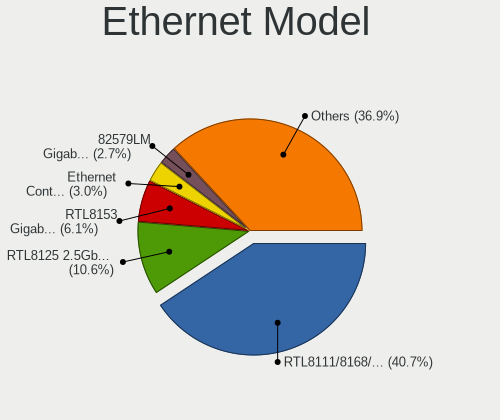

Arch Hardware Trends
--------------------

A project to identify most popular hardware characteristics and track their change
over time based on data collected by Arch users at https://Linux-Hardware.org.

Anyone can contribute to the study by uploading probes of their computers by
the [hw-probe](https://github.com/linuxhw/hw-probe) tool:

    sudo -E hw-probe -all -upload

This is a report for all computer types. See also reports for [desktops](/Dist/Arch/Desktop/README.md) and [notebooks](/Dist/Arch/Notebook/README.md).

Full-feature report is available here: https://linux-hardware.org/?view=trends

Period: Jan, 2021.

Contents
--------

- [ OS                       ](#os)
- [ OS Family                ](#os-family)
- [ Kernel                   ](#kernel)
- [ Kernel Family            ](#kernel-family)
- [ Kernel Major Ver.        ](#kernel-major-ver)
- [ Arch                     ](#arch)
- [ DE                       ](#de)
- [ Display Server           ](#display-server)
- [ Display Manager          ](#display-manager)
- [ OS Lang                  ](#os-lang)
- [ Boot Mode                ](#boot-mode)
- [ Filesystem               ](#filesystem)
- [ Part. scheme             ](#part-scheme)
- [ Dual Boot with Linux/BSD ](#dual-boot-with-linux/bsd)
- [ Dual Boot (Win)          ](#dual-boot-win)
- [ Country                  ](#country)
- [ City                     ](#city)
- [ Vendor                   ](#vendor)
- [ Model                    ](#model)
- [ Model Family             ](#model-family)
- [ MFG Year                 ](#mfg-year)
- [ Form Factor              ](#form-factor)
- [ Secure Boot              ](#secure-boot)
- [ Coreboot                 ](#coreboot)
- [ RAM Size                 ](#ram-size)
- [ RAM Used                 ](#ram-used)
- [ Has CD-ROM               ](#has-cd-rom)
- [ Total Drives             ](#total-drives)
- [ Has Ethernet             ](#has-ethernet)
- [ Drive Vendor             ](#drive-vendor)
- [ Drive Model              ](#drive-model)
- [ HDD Vendor               ](#hdd-vendor)
- [ SSD Vendor               ](#ssd-vendor)
- [ Drive Kind               ](#drive-kind)
- [ Drive Connector          ](#drive-connector)
- [ Drive Size               ](#drive-size)
- [ Space Total              ](#space-total)
- [ Space Used               ](#space-used)
- [ Malfunc. Drives          ](#malfunc-drives)
- [ Malfunc. Drive Vendor    ](#malfunc-drive-vendor)
- [ Malfunc. HDD Vendor      ](#malfunc-hdd-vendor)
- [ Malfunc. Drive Kind      ](#malfunc-drive-kind)
- [ Failed Drives            ](#failed-drives)
- [ Failed Drive Vendor      ](#failed-drive-vendor)
- [ Drive Status             ](#drive-status)
- [ Storage Vendor           ](#storage-vendor)
- [ Storage Model            ](#storage-model)
- [ Storage Kind             ](#storage-kind)
- [ CPU Vendor               ](#cpu-vendor)
- [ CPU Model                ](#cpu-model)
- [ CPU Model Family         ](#cpu-model-family)
- [ CPU Cores                ](#cpu-cores)
- [ CPU Sockets              ](#cpu-sockets)
- [ CPU Threads              ](#cpu-threads)
- [ CPU Op-Modes             ](#cpu-op-modes)
- [ CPU Microcode            ](#cpu-microcode)
- [ CPU Microarch            ](#cpu-microarch)
- [ GPU Vendor               ](#gpu-vendor)
- [ GPU Model                ](#gpu-model)
- [ GPU Combo                ](#gpu-combo)
- [ GPU Driver               ](#gpu-driver)
- [ GPU Memory               ](#gpu-memory)
- [ Monitor Vendor           ](#monitor-vendor)
- [ Monitor Model            ](#monitor-model)
- [ Monitor Resolution       ](#monitor-resolution)
- [ Monitor Diagonal         ](#monitor-diagonal)
- [ Monitor Width            ](#monitor-width)
- [ Aspect Ratio             ](#aspect-ratio)
- [ Monitor Area             ](#monitor-area)
- [ Pixel Density            ](#pixel-density)
- [ Multiple Monitors        ](#multiple-monitors)
- [ Net Controller Vendor    ](#net-controller-vendor)
- [ Net Controller Model     ](#net-controller-model)
- [ Wireless Vendor          ](#wireless-vendor)
- [ Wireless Model           ](#wireless-model)
- [ Ethernet Vendor          ](#ethernet-vendor)
- [ Ethernet Model           ](#ethernet-model)
- [ Net Controller Kind      ](#net-controller-kind)
- [ Used Controller          ](#used-controller)
- [ NICs                     ](#nics)
- [ Memory Vendor            ](#memory-vendor)
- [ Memory Model             ](#memory-model)
- [ Memory Kind              ](#memory-kind)
- [ Memory Form Factor       ](#memory-form-factor)
- [ Memory Size              ](#memory-size)
- [ Memory Speed             ](#memory-speed)
- [ Sound Vendor             ](#sound-vendor)
- [ Sound Model              ](#sound-model)
- [ Camera Vendor            ](#camera-vendor)
- [ Camera Model             ](#camera-model)
- [ Fingerprint Vendor       ](#fingerprint-vendor)
- [ Fingerprint Model        ](#fingerprint-model)
- [ Chipcard Vendor          ](#chipcard-vendor)
- [ Chipcard Model           ](#chipcard-model)
- [ Printer Vendor           ](#printer-vendor)
- [ Printer Model            ](#printer-model)
- [ Scanner Vendor           ](#scanner-vendor)
- [ Scanner Model            ](#scanner-model)
- [ Bluetooth Vendor         ](#bluetooth-vendor)
- [ Bluetooth Model          ](#bluetooth-model)
- [ Unsupported Devices      ](#unsupported-devices)
- [ Unsupported Device Types ](#unsupported-device-types)

OS
--

Installed operating systems

| Name         | Computers | Percent |
|--------------|-----------|---------|
| Arch         | 90        | 58.82%  |
| Arch Rolling | 62        | 40.52%  |
| Arch 20.08.3 | 1         | 0.65%   |

OS Family
---------

OS without a version

| Name | Computers | Percent |
|------|-----------|---------|
| Arch | 153       | 100%    |

Kernel
------

Version of the Linux kernel

| Version                        | Computers | Percent |
|--------------------------------|-----------|---------|
| 5.10.4-arch2-1                 | 20        | 13.07%  |
| 5.10.7-arch1-1                 | 15        | 9.8%    |
| 5.10.6-arch1-1                 | 14        | 9.15%   |
| 5.10.10-arch1-1                | 12        | 7.84%   |
| 5.9.14-arch1-1                 | 9         | 5.88%   |
| 5.10.3-arch1-1                 | 9         | 5.88%   |
| 5.10.3-zen1-1-zen              | 7         | 4.58%   |
| 5.4.86-1-lts                   | 6         | 3.92%   |
| 5.10.9-arch1-1                 | 6         | 3.92%   |
| 5.10.5-arch1-1                 | 5         | 3.27%   |
| 5.4.91-1-lts                   | 4         | 2.61%   |
| 5.10.6-zen1-1-zen              | 4         | 2.61%   |
| 5.10.11-arch1-1                | 4         | 2.61%   |
| 5.4.88-1-lts                   | 3         | 1.96%   |
| 5.10.5-zen1-1-zen              | 3         | 1.96%   |
| 5.10.4-zen2-1-zen              | 3         | 1.96%   |
| 5.10.10-zen1-1-zen             | 3         | 1.96%   |
| 5.9.14-zen1-1-zen              | 2         | 1.31%   |
| 5.9.13-arch1-1                 | 2         | 1.31%   |
| 5.4.89-1-lts                   | 2         | 1.31%   |
| 5.10.8-arch1-1                 | 2         | 1.31%   |
| 5.10.7-zen1-1-zen              | 2         | 1.31%   |
| 5.9.15-103-tkg-upds            | 1         | 0.65%   |
| 5.9.14-arch1-1.0               | 1         | 0.65%   |
| 5.8.14-mono                    | 1         | 0.65%   |
| 5.4.93-2-lts                   | 1         | 0.65%   |
| 5.4.72-microsoft-standard-WSL2 | 1         | 0.65%   |
| 5.4.66-1-lts                   | 1         | 0.65%   |
| 5.10.9-113-tkg-upds            | 1         | 0.65%   |
| 5.10.8-1-ck-skylake            | 1         | 0.65%   |
| 5.10.7-111-tkg-upds            | 1         | 0.65%   |
| 5.10.7-1-clear                 | 1         | 0.65%   |
| 5.10.6-gnu-1                   | 1         | 0.65%   |
| 5.10.5-xanmod1-1               | 1         | 0.65%   |
| 5.10.4-zen2-1-froidzen         | 1         | 0.65%   |
| 5.10.3-106-tkg-upds            | 1         | 0.65%   |
| 5.10.11-zen2-1-zen             | 1         | 0.65%   |
| 5.10.10-custom-amd             | 1         | 0.65%   |

Kernel Family
-------------

Linux kernel without a distro release

| Version | Computers | Percent |
|---------|-----------|---------|
| 5.10.4  | 24        | 15.69%  |
| 5.10.7  | 19        | 12.42%  |
| 5.10.6  | 19        | 12.42%  |
| 5.10.3  | 17        | 11.11%  |
| 5.10.10 | 16        | 10.46%  |
| 5.9.14  | 12        | 7.84%   |
| 5.10.5  | 9         | 5.88%   |
| 5.10.9  | 7         | 4.58%   |
| 5.4.86  | 6         | 3.92%   |
| 5.10.11 | 5         | 3.27%   |
| 5.4.91  | 4         | 2.61%   |
| 5.4.88  | 3         | 1.96%   |
| 5.10.8  | 3         | 1.96%   |
| 5.9.13  | 2         | 1.31%   |
| 5.4.89  | 2         | 1.31%   |
| 5.9.15  | 1         | 0.65%   |
| 5.8.14  | 1         | 0.65%   |
| 5.4.93  | 1         | 0.65%   |
| 5.4.72  | 1         | 0.65%   |
| 5.4.66  | 1         | 0.65%   |

Kernel Major Ver.
-----------------

Linux kernel major version

| Version | Computers | Percent |
|---------|-----------|---------|
| 5.10    | 119       | 77.78%  |
| 5.4     | 18        | 11.76%  |
| 5.9     | 15        | 9.8%    |
| 5.8     | 1         | 0.65%   |

Arch
----

OS architecture (x86_64, i586, etc.)

| Name   | Computers | Percent |
|--------|-----------|---------|
| x86_64 | 152       | 99.35%  |
| i686   | 1         | 0.65%   |

DE
--

Desktop Environment

| Name            | Computers | Percent |
|-----------------|-----------|---------|
| GNOME           | 46        | 30.07%  |
| KDE5            | 32        | 20.92%  |
| KDE             | 17        | 11.11%  |
| XFCE            | 15        | 9.8%    |
| i3              | 13        | 8.5%    |
| Unknown         | 11        | 7.19%   |
| X-Cinnamon      | 7         | 4.58%   |
| MATE            | 3         | 1.96%   |
| Deepin          | 2         | 1.31%   |
| Cinnamon        | 2         | 1.31%   |
| Unity           | 1         | 0.65%   |
| LXDE            | 1         | 0.65%   |
| i3-with-shmlog  | 1         | 0.65%   |
| GNOME Flashback | 1         | 0.65%   |
| bspwm           | 1         | 0.65%   |

Display Server
--------------

X11 or Wayland

| Name    | Computers | Percent |
|---------|-----------|---------|
| X11     | 110       | 71.9%   |
| Wayland | 28        | 18.3%   |
| Tty     | 11        | 7.19%   |
| Unknown | 4         | 2.61%   |

Display Manager
---------------

SDDM, LightDM, etc.

| Name    | Computers | Percent |
|---------|-----------|---------|
| Unknown | 75        | 49.02%  |
| SDDM    | 40        | 26.14%  |
| TDM     | 19        | 12.42%  |
| GDM     | 14        | 9.15%   |
| LightDM | 4         | 2.61%   |
| XDM     | 1         | 0.65%   |

OS Lang
-------

Language

| Lang    | Computers | Percent |
|---------|-----------|---------|
| en_US   | 78        | 50.98%  |
| en_GB   | 12        | 7.84%   |
| pl_PL   | 8         | 5.23%   |
| ru_RU   | 7         | 4.58%   |
| pt_BR   | 7         | 4.58%   |
| de_DE   | 7         | 4.58%   |
| it_IT   | 5         | 3.27%   |
| fr_FR   | 4         | 2.61%   |
| C       | 4         | 2.61%   |
| es_ES   | 3         | 1.96%   |
| zh_CN   | 2         | 1.31%   |
| en_IE   | 2         | 1.31%   |
| en_AU   | 2         | 1.31%   |
| ca_ES   | 2         | 1.31%   |
| fr_CH   | 1         | 0.65%   |
| fr_CA   | 1         | 0.65%   |
| es_UY   | 1         | 0.65%   |
| es_AR   | 1         | 0.65%   |
| en_IN   | 1         | 0.65%   |
| en_DK   | 1         | 0.65%   |
| en_CA   | 1         | 0.65%   |
| de_CH   | 1         | 0.65%   |
| de_AT   | 1         | 0.65%   |
| Unknown | 1         | 0.65%   |

Boot Mode
---------

EFI or BIOS

| Mode | Computers | Percent |
|------|-----------|---------|
| EFI  | 81        | 52.94%  |
| BIOS | 72        | 47.06%  |

Filesystem
----------

Type of filesystem

| Type    | Computers | Percent |
|---------|-----------|---------|
| Ext4    | 121       | 79.08%  |
| Btrfs   | 21        | 13.73%  |
| Xfs     | 7         | 4.58%   |
| Overlay | 1         | 0.65%   |
| F2fs    | 1         | 0.65%   |
| Ext2    | 1         | 0.65%   |
| Unknown | 1         | 0.65%   |

Part. scheme
------------

Scheme of partitioning

| Type    | Computers | Percent |
|---------|-----------|---------|
| GPT     | 85        | 55.56%  |
| Unknown | 60        | 39.22%  |
| MBR     | 8         | 5.23%   |

Dual Boot with Linux/BSD
------------------------

Hosting more than one Linux/BSD

| Dual boot | Computers | Percent |
|-----------|-----------|---------|
| No        | 133       | 86.93%  |
| Yes       | 20        | 13.07%  |

Dual Boot (Win)
---------------

Hosting Linux and Windows

| Dual boot | Computers | Percent |
|-----------|-----------|---------|
| No        | 110       | 71.9%   |
| Yes       | 43        | 28.1%   |

Country
-------

Geographic location (country)

| Country            | Computers | Percent |
|--------------------|-----------|---------|
| USA                | 32        | 20.92%  |
| Germany            | 14        | 9.15%   |
| Russia             | 11        | 7.19%   |
| Brazil             | 10        | 6.54%   |
| Poland             | 9         | 5.88%   |
| Italy              | 8         | 5.23%   |
| India              | 8         | 5.23%   |
| Spain              | 6         | 3.92%   |
| France             | 6         | 3.92%   |
| Ukraine            | 4         | 2.61%   |
| China              | 4         | 2.61%   |
| Canada             | 4         | 2.61%   |
| UK                 | 3         | 1.96%   |
| Switzerland        | 3         | 1.96%   |
| Sweden             | 3         | 1.96%   |
| Turkey             | 2         | 1.31%   |
| New Zealand        | 2         | 1.31%   |
| Netherlands        | 2         | 1.31%   |
| Lithuania          | 2         | 1.31%   |
| Iran               | 2         | 1.31%   |
| Greece             | 2         | 1.31%   |
| Australia          | 2         | 1.31%   |
| Venezuela          | 1         | 0.65%   |
| Uruguay            | 1         | 0.65%   |
| Serbia             | 1         | 0.65%   |
| Nepal              | 1         | 0.65%   |
| Korea, Republic of | 1         | 0.65%   |
| Israel             | 1         | 0.65%   |
| Ireland            | 1         | 0.65%   |
| Indonesia          | 1         | 0.65%   |
| Hungary            | 1         | 0.65%   |
| Denmark            | 1         | 0.65%   |
| Belgium            | 1         | 0.65%   |
| Austria            | 1         | 0.65%   |
| Argentina          | 1         | 0.65%   |
| Algeria            | 1         | 0.65%   |

City
----

Geographic location (city)

| City                     | Computers | Percent |
|--------------------------|-----------|---------|
| Paris                    | 4         | 2.61%   |
| Moscow                   | 3         | 1.96%   |
| Łódź                  | 2         | 1.31%   |
| Wellington               | 2         | 1.31%   |
| Tucson                   | 2         | 1.31%   |
| St Petersburg            | 2         | 1.31%   |
| Phoenix                  | 2         | 1.31%   |
| Munich                   | 2         | 1.31%   |
| Milton                   | 2         | 1.31%   |
| Lytkarino                | 2         | 1.31%   |
| Longueuil                | 2         | 1.31%   |
| Girona                   | 2         | 1.31%   |
| Brasília                | 2         | 1.31%   |
| Bengaluru                | 2         | 1.31%   |
| Šiauliai                | 1         | 0.65%   |
| Znamianka                | 1         | 0.65%   |
| Zielona Góra            | 1         | 0.65%   |
| York                     | 1         | 0.65%   |
| Xining                   | 1         | 0.65%   |
| Włocławek              | 1         | 0.65%   |
| Wilmington               | 1         | 0.65%   |
| Warsaw                   | 1         | 0.65%   |
| Walsall                  | 1         | 0.65%   |
| Victoria                 | 1         | 0.65%   |
| Versailles               | 1         | 0.65%   |
| Valencia                 | 1         | 0.65%   |
| Udine                    | 1         | 0.65%   |
| Trivandrum               | 1         | 0.65%   |
| Trabzon                  | 1         | 0.65%   |
| Thrissur                 | 1         | 0.65%   |
| The Hague                | 1         | 0.65%   |
| Tel Aviv                 | 1         | 0.65%   |
| Tehran                   | 1         | 0.65%   |
| Taranto                  | 1         | 0.65%   |
| São José dos Campos    | 1         | 0.65%   |
| Sydney                   | 1         | 0.65%   |
| Suhr                     | 1         | 0.65%   |
| Strausberg               | 1         | 0.65%   |
| St Louis                 | 1         | 0.65%   |
| Skanderborg              | 1         | 0.65%   |
| Shenzhen                 | 1         | 0.65%   |
| Shanghai                 | 1         | 0.65%   |
| Shahr-e Kord             | 1         | 0.65%   |
| Seversk                  | 1         | 0.65%   |
| Settimo Milanese         | 1         | 0.65%   |
| Serra                    | 1         | 0.65%   |
| Seattle                  | 1         | 0.65%   |
| Schwerin                 | 1         | 0.65%   |
| Savannah                 | 1         | 0.65%   |
| Sao Jose                 | 1         | 0.65%   |
| San Ramon                | 1         | 0.65%   |
| Saint-Christophe-du-Luat | 1         | 0.65%   |
| Sacco                    | 1         | 0.65%   |
| Ronda                    | 1         | 0.65%   |
| Rome                     | 1         | 0.65%   |
| Roelofarendsveen         | 1         | 0.65%   |
| Rhodes                   | 1         | 0.65%   |
| Rheda                    | 1         | 0.65%   |
| Radom                    | 1         | 0.65%   |
| Quilmes                  | 1         | 0.65%   |

Vendor
------

Motherboard manufacturer

| Name                | Computers | Percent |
|---------------------|-----------|---------|
| ASUSTek Computer    | 33        | 21.57%  |
| Lenovo              | 27        | 17.65%  |
| Dell                | 20        | 13.07%  |
| Gigabyte Technology | 17        | 11.11%  |
| Hewlett-Packard     | 12        | 7.84%   |
| MSI                 | 11        | 7.19%   |
| ASRock              | 8         | 5.23%   |
| Acer                | 6         | 3.92%   |
| Unknown             | 3         | 1.96%   |
| Samsung Electronics | 2         | 1.31%   |
| Intel               | 2         | 1.31%   |
| Sony                | 1         | 0.65%   |
| Razer               | 1         | 0.65%   |
| Positivo            | 1         | 0.65%   |
| Pegatron            | 1         | 0.65%   |
| PCWare              | 1         | 0.65%   |
| Packard Bell        | 1         | 0.65%   |
| HUAWEI              | 1         | 0.65%   |
| Google              | 1         | 0.65%   |
| Eluktronics         | 1         | 0.65%   |
| ECS                 | 1         | 0.65%   |
| BESSTAR Tech        | 1         | 0.65%   |
| Alienware           | 1         | 0.65%   |

Model
-----

Motherboard model

| Name                                                  | Computers | Percent |
|-------------------------------------------------------|-----------|---------|
| Unknown                                               | 4         | 2.61%   |
| ASUS All Series                                       | 3         | 1.96%   |
| Lenovo IdeaPad 5 14ARE05 81YM                         | 2         | 1.31%   |
| Gigabyte 970A-DS3P                                    | 2         | 1.31%   |
| ASUS TUF GAMING X570-PLUS                             | 2         | 1.31%   |
| Sony SVE14A1X1EH                                      | 1         | 0.65%   |
| Samsung Samsung DeskTop System                        | 1         | 0.65%   |
| Samsung 300E5M/300E5L                                 | 1         | 0.65%   |
| Razer Blade 15 Studio Edition (Early 2020) - RZ09-033 | 1         | 0.65%   |
| Positivo POS-AT SERIES D (DMB)                        | 1         | 0.65%   |
| Pegatron p6-2026                                      | 1         | 0.65%   |
| PCWare IPMH81G1                                       | 1         | 0.65%   |
| Packard Bell EasyNote TM86                            | 1         | 0.65%   |
| MSI MS-7C94                                           | 1         | 0.65%   |
| MSI MS-7C92                                           | 1         | 0.65%   |
| MSI MS-7C87                                           | 1         | 0.65%   |
| MSI MS-7C37                                           | 1         | 0.65%   |
| MSI MS-7C02                                           | 1         | 0.65%   |
| MSI MS-7B87                                           | 1         | 0.65%   |
| MSI MS-7B86                                           | 1         | 0.65%   |
| MSI MS-7A70                                           | 1         | 0.65%   |
| MSI MS-7996                                           | 1         | 0.65%   |
| MSI MS-7693                                           | 1         | 0.65%   |
| MSI MS-7681                                           | 1         | 0.65%   |
| Lenovo X200 2024AB3                                   | 1         | 0.65%   |
| Lenovo V155-15API 81V5                                | 1         | 0.65%   |
| Lenovo V15-IIL 82C5                                   | 1         | 0.65%   |
| Lenovo ThinkPad X270 W10DG 20K5S5L400                 | 1         | 0.65%   |
| Lenovo ThinkPad X200 74591P0                          | 1         | 0.65%   |
| Lenovo ThinkPad X121e 3045A64                         | 1         | 0.65%   |
| Lenovo ThinkPad X1 Carbon 6th 20KH002RUS              | 1         | 0.65%   |
| Lenovo ThinkPad X1 Carbon 5th 20HQS0PC00              | 1         | 0.65%   |
| Lenovo ThinkPad X1 Carbon 3rd 20BSCTO1WW              | 1         | 0.65%   |
| Lenovo ThinkPad X1 Carbon 34483W4                     | 1         | 0.65%   |
| Lenovo ThinkPad W540 20BHS0B30T                       | 1         | 0.65%   |
| Lenovo ThinkPad T495s 20QKS0SD00                      | 1         | 0.65%   |
| Lenovo ThinkPad T490 20N20042US                       | 1         | 0.65%   |
| Lenovo ThinkPad T460p 20FW0005AU                      | 1         | 0.65%   |
| Lenovo ThinkPad T460 20FMS2FR00                       | 1         | 0.65%   |
| Lenovo ThinkPad T450s 20BWS2KM00                      | 1         | 0.65%   |
| Lenovo ThinkPad P1 Gen 2 20QT002GUK                   | 1         | 0.65%   |
| Lenovo ThinkPad E570 20H5CTO1WW                       | 1         | 0.65%   |
| Lenovo ThinkPad E14 Gen 2 20T6000SIX                  | 1         | 0.65%   |
| Lenovo ThinkCentre M910t-N000 10N9CTO1WW              | 1         | 0.65%   |
| Lenovo ThinkBook 15 G2 ARE 20VG                       | 1         | 0.65%   |
| Lenovo Legion Y7000 81FW                              | 1         | 0.65%   |
| Lenovo IdeaPad S145-15API 81UT                        | 1         | 0.65%   |
| Lenovo IdeaPad 320S-13IKB 81AK                        | 1         | 0.65%   |
| Intel NUC8i7BEH                                       | 1         | 0.65%   |
| Intel NUC6i3SYB H81132-505                            | 1         | 0.65%   |
| HUAWEI NBLK-WAX9X                                     | 1         | 0.65%   |
| HP Spectre x360 Convertible 13-ap0xxx                 | 1         | 0.65%   |
| HP ProBook 645 G4                                     | 1         | 0.65%   |
| HP Pavilion x2 Detachable                             | 1         | 0.65%   |
| HP Pavilion Laptop 15-cw1xxx                          | 1         | 0.65%   |
| HP Pavilion Laptop 15-cs1xxx                          | 1         | 0.65%   |
| HP Pavilion g6                                        | 1         | 0.65%   |
| HP Pavilion dv7                                       | 1         | 0.65%   |
| HP Pavilion dv6                                       | 1         | 0.65%   |
| HP Pavilion 15                                        | 1         | 0.65%   |

Model Family
------------

Motherboard model prefix

| Name                   | Computers | Percent |
|------------------------|-----------|---------|
| Lenovo ThinkPad        | 16        | 10.46%  |
| HP Pavilion            | 7         | 4.58%   |
| Dell Latitude          | 5         | 3.27%   |
| Acer Aspire            | 5         | 3.27%   |
| Lenovo IdeaPad         | 4         | 2.61%   |
| Dell XPS               | 4         | 2.61%   |
| Dell Inspiron          | 4         | 2.61%   |
| ASUS TUF               | 4         | 2.61%   |
| ASUS ROG               | 4         | 2.61%   |
| ASUS PRIME             | 4         | 2.61%   |
| Unknown                | 4         | 2.61%   |
| Dell Precision         | 3         | 1.96%   |
| ASUS All               | 3         | 1.96%   |
| Gigabyte X570          | 2         | 1.31%   |
| Gigabyte B450M         | 2         | 1.31%   |
| Gigabyte 970A-DS3P     | 2         | 1.31%   |
| ASUS VivoBook          | 2         | 1.31%   |
| ASRock X570            | 2         | 1.31%   |
| Sony SVE14A1X1EH       | 1         | 0.65%   |
| Samsung Samsung        | 1         | 0.65%   |
| Samsung 300E5M         | 1         | 0.65%   |
| Razer Blade            | 1         | 0.65%   |
| Positivo POS-AT        | 1         | 0.65%   |
| Pegatron p6-2026       | 1         | 0.65%   |
| PCWare IPMH81G1        | 1         | 0.65%   |
| Packard Bell EasyNote  | 1         | 0.65%   |
| MSI MS-7C94            | 1         | 0.65%   |
| MSI MS-7C92            | 1         | 0.65%   |
| MSI MS-7C87            | 1         | 0.65%   |
| MSI MS-7C37            | 1         | 0.65%   |
| MSI MS-7C02            | 1         | 0.65%   |
| MSI MS-7B87            | 1         | 0.65%   |
| MSI MS-7B86            | 1         | 0.65%   |
| MSI MS-7A70            | 1         | 0.65%   |
| MSI MS-7996            | 1         | 0.65%   |
| MSI MS-7693            | 1         | 0.65%   |
| MSI MS-7681            | 1         | 0.65%   |
| Lenovo X200            | 1         | 0.65%   |
| Lenovo V155-15API      | 1         | 0.65%   |
| Lenovo V15-IIL         | 1         | 0.65%   |
| Lenovo ThinkCentre     | 1         | 0.65%   |
| Lenovo ThinkBook       | 1         | 0.65%   |
| Lenovo Legion          | 1         | 0.65%   |
| Intel NUC8i7BEH        | 1         | 0.65%   |
| Intel NUC6i3SYB        | 1         | 0.65%   |
| HUAWEI NBLK-WAX9X      | 1         | 0.65%   |
| HP Spectre             | 1         | 0.65%   |
| HP ProBook             | 1         | 0.65%   |
| HP Laptop              | 1         | 0.65%   |
| HP EliteBook           | 1         | 0.65%   |
| HP Compaq              | 1         | 0.65%   |
| Google Candy           | 1         | 0.65%   |
| Gigabyte Z68XP-UD3     | 1         | 0.65%   |
| Gigabyte Z170N-WIFI-CF | 1         | 0.65%   |
| Gigabyte P35-DS3L      | 1         | 0.65%   |
| Gigabyte H61M-S2P-R3   | 1         | 0.65%   |
| Gigabyte GA-970A-D3    | 1         | 0.65%   |
| Gigabyte GA-78LMT-S2PV | 1         | 0.65%   |
| Gigabyte F2A55M-DS2    | 1         | 0.65%   |
| Gigabyte B75M-D3P      | 1         | 0.65%   |

MFG Year
--------

Motherboard manufacture year

| Year    | Computers | Percent |
|---------|-----------|---------|
| 2020    | 56        | 36.6%   |
| 2019    | 24        | 15.69%  |
| 2018    | 17        | 11.11%  |
| 2013    | 10        | 6.54%   |
| 2017    | 9         | 5.88%   |
| 2012    | 9         | 5.88%   |
| 2016    | 7         | 4.58%   |
| 2010    | 6         | 3.92%   |
| 2015    | 3         | 1.96%   |
| 2011    | 3         | 1.96%   |
| 2014    | 2         | 1.31%   |
| 2009    | 2         | 1.31%   |
| 2007    | 2         | 1.31%   |
| Unknown | 2         | 1.31%   |
| 2008    | 1         | 0.65%   |

Form Factor
-----------

Physical design of the computer

| Name        | Computers | Percent |
|-------------|-----------|---------|
| Notebook    | 79        | 51.63%  |
| Desktop     | 69        | 45.1%   |
| Convertible | 2         | 1.31%   |
| Mini pc     | 2         | 1.31%   |
| Stick pc    | 1         | 0.65%   |

Secure Boot
-----------

Enabled or disabled

| State    | Computers | Percent |
|----------|-----------|---------|
| Disabled | 150       | 98.04%  |
| Enabled  | 3         | 1.96%   |

Coreboot
--------

Have coreboot on board

| Used | Computers | Percent |
|------|-----------|---------|
| No   | 150       | 98.04%  |
| Yes  | 3         | 1.96%   |

RAM Size
--------

Total RAM memory

| Size in GB  | Computers | Percent |
|-------------|-----------|---------|
| 16.01-24.0  | 44        | 28.76%  |
| 8.01-16.0   | 31        | 20.26%  |
| 4.01-8.0    | 27        | 17.65%  |
| 32.01-64.0  | 21        | 13.73%  |
| 3.01-4.0    | 18        | 11.76%  |
| 64.01-256.0 | 7         | 4.58%   |
| 2.01-3.0    | 2         | 1.31%   |
| 1.01-2.0    | 2         | 1.31%   |
| 0.51-1.0    | 1         | 0.65%   |

RAM Used
--------

Used RAM memory

| Used GB    | Computers | Percent |
|------------|-----------|---------|
| 1.01-2.0   | 49        | 32.03%  |
| 2.01-3.0   | 35        | 22.88%  |
| 4.01-8.0   | 34        | 22.22%  |
| 3.01-4.0   | 14        | 9.15%   |
| 8.01-16.0  | 11        | 7.19%   |
| 0.51-1.0   | 6         | 3.92%   |
| 0.01-0.5   | 3         | 1.96%   |
| 32.01-64.0 | 1         | 0.65%   |

Has CD-ROM
----------

Has CD-ROM on board

| Presented | Computers | Percent |
|-----------|-----------|---------|
| No        | 109       | 71.24%  |
| Yes       | 44        | 28.76%  |

Total Drives
------------

Number of drives on board

| Drives | Computers | Percent |
|--------|-----------|---------|
| 1      | 69        | 45.1%   |
| 2      | 44        | 28.76%  |
| 3      | 22        | 14.38%  |
| 4      | 8         | 5.23%   |
| 6      | 5         | 3.27%   |
| 5      | 2         | 1.31%   |
| 8      | 1         | 0.65%   |
| 7      | 1         | 0.65%   |
| 0      | 1         | 0.65%   |

Has Ethernet
------------

Has Ethernet on board

| Presented | Computers | Percent |
|-----------|-----------|---------|
| Yes       | 130       | 84.97%  |
| No        | 23        | 15.03%  |

Drive Vendor
------------

Hard drive vendors

| Vendor              | Computers | Drives | Percent |
|---------------------|-----------|--------|---------|
| Samsung Electronics | 52        | 66     | 20.72%  |
| Seagate             | 39        | 53     | 15.54%  |
| WDC                 | 36        | 54     | 14.34%  |
| Toshiba             | 22        | 23     | 8.76%   |
| Kingston            | 15        | 16     | 5.98%   |
| Sandisk             | 14        | 15     | 5.58%   |
| Crucial             | 10        | 12     | 3.98%   |
| Unknown             | 8         | 9      | 3.19%   |
| Hitachi             | 7         | 8      | 2.79%   |
| Intel               | 6         | 6      | 2.39%   |
| Phison              | 5         | 6      | 1.99%   |
| A-DATA Technology   | 5         | 6      | 1.99%   |
| HGST                | 4         | 5      | 1.59%   |
| Micron Technology   | 3         | 4      | 1.2%    |
| Silicon Motion      | 2         | 2      | 0.8%    |
| PNY                 | 2         | 2      | 0.8%    |
| OCZ                 | 2         | 2      | 0.8%    |
| Yangtze Memory      | 1         | 1      | 0.4%    |
| XPG                 | 1         | 1      | 0.4%    |
| VMware              | 1         | 1      | 0.4%    |
| Union Memory        | 1         | 1      | 0.4%    |
| SK Hynix            | 1         | 1      | 0.4%    |
| PLEXTOR             | 1         | 1      | 0.4%    |
| Patriot             | 1         | 1      | 0.4%    |
| OCZ-VERTEX          | 1         | 1      | 0.4%    |
| Mushkin             | 1         | 1      | 0.4%    |
| Msft                | 1         | 2      | 0.4%    |
| LITEON              | 1         | 1      | 0.4%    |
| KIOXIA-EXCERIA      | 1         | 1      | 0.4%    |
| KingSpec            | 1         | 1      | 0.4%    |
| JMicron             | 1         | 1      | 0.4%    |
| Hewlett-Packard     | 1         | 1      | 0.4%    |
| GLOWAY              | 1         | 1      | 0.4%    |
| Dogfish             | 1         | 1      | 0.4%    |
| China               | 1         | 1      | 0.4%    |
| ASUS-PHISON         | 1         | 2      | 0.4%    |

Drive Model
-----------

Hard drive models

| Model                                  | Computers | Percent |
|----------------------------------------|-----------|---------|
| Kingston SA400S37240G 240GB SSD        | 5         | 1.68%   |
| WDC WD20EZRZ-00Z5HB0 2TB               | 4         | 1.35%   |
| Samsung SSD 860 EVO 500GB              | 4         | 1.35%   |
| Samsung SSD 850 EVO 500GB              | 4         | 1.35%   |
| Samsung NVMe SSD Drive 500GB           | 4         | 1.35%   |
| Crucial CT500MX500SSD1 500GB           | 4         | 1.35%   |
| Seagate ST500LT012-1DG142 500GB        | 3         | 1.01%   |
| Seagate ST2000LX001-1RG174 2TB         | 3         | 1.01%   |
| Seagate ST2000DM008-2FR102 2TB         | 3         | 1.01%   |
| Seagate ST1000LM035-1RK172 1TB         | 3         | 1.01%   |
| Sandisk NVMe SSD Drive 512GB           | 3         | 1.01%   |
| Samsung SSD 970 EVO Plus 1TB           | 3         | 1.01%   |
| Samsung SSD 850 EVO 250GB              | 3         | 1.01%   |
| Samsung SSD 840 EVO 250GB              | 3         | 1.01%   |
| Samsung HD103SJ 1TB                    | 3         | 1.01%   |
| Kingston SHFS37A120G 120GB SSD         | 3         | 1.01%   |
| WDC WDS500G2B0A-00SM50 500GB SSD       | 2         | 0.67%   |
| WDC WD20EARS-00MVWB0 2TB               | 2         | 0.67%   |
| WDC WD10EZEX-00BN5A0 1TB               | 2         | 0.67%   |
| WDC WD10EADS-00L5B1 1TB                | 2         | 0.67%   |
| Toshiba NVMe SSD Drive 512GB           | 2         | 0.67%   |
| Toshiba MQ01ABD100 1TB                 | 2         | 0.67%   |
| Toshiba HDWD130 3TB                    | 2         | 0.67%   |
| Seagate ST500DM002-1BC142 500GB        | 2         | 0.67%   |
| Seagate ST2000LM007-1R8174 2TB         | 2         | 0.67%   |
| Seagate ST2000DM006-2DM164 2TB         | 2         | 0.67%   |
| Seagate ST2000DM001-1ER164 2TB         | 2         | 0.67%   |
| Seagate ST1000LX015-1U7172 1TB         | 2         | 0.67%   |
| Seagate ST1000LM024 HN-M101MBB 1TB     | 2         | 0.67%   |
| Samsung SSD 970 EVO 250GB              | 2         | 0.67%   |
| Samsung SSD 860 EVO 1TB                | 2         | 0.67%   |
| Samsung SSD 850 EVO 1TB                | 2         | 0.67%   |
| Samsung NVMe SSD Drive 512GB           | 2         | 0.67%   |
| Samsung NVMe SSD Drive 250GB           | 2         | 0.67%   |
| Samsung NVMe SSD Drive 1TB             | 2         | 0.67%   |
| Samsung HD502HJ 500GB                  | 2         | 0.67%   |
| Phison NVMe SSD Drive 2TB              | 2         | 0.67%   |
| Kingston SV300S37A120G 120GB SSD       | 2         | 0.67%   |
| Intel SSDPEKNW512G8 512GB              | 2         | 0.67%   |
| Hitachi HUA723020ALA641 2TB            | 2         | 0.67%   |
| Crucial CT240BX500SSD1 240GB           | 2         | 0.67%   |
| Yangtze Memory ZHITAI PC005 Active 1TB | 1         | 0.34%   |
| XPG NVMe SSD Drive 512GB               | 1         | 0.34%   |
| WDC WDS500G2B0B-00YS70 500GB SSD       | 1         | 0.34%   |
| WDC WDS240G2G0B-00EPW0 240GB SSD       | 1         | 0.34%   |
| WDC WDS240G2G0A-00JH30 240GB SSD       | 1         | 0.34%   |
| WDC WDS120G1G0B-00RC30 120GB SSD       | 1         | 0.34%   |
| WDC WDS100T2B0B-00YS70 1TB SSD         | 1         | 0.34%   |
| WDC WD6400AAKS-22A7B2 640GB            | 1         | 0.34%   |
| WDC WD60EFRX-68MYMN1 6TB               | 1         | 0.34%   |
| WDC WD60EFRX-68L0BN1 6TB               | 1         | 0.34%   |
| WDC WD6002FRYZ-01WD5B0 6TB             | 1         | 0.34%   |
| WDC WD5000LPVX-22V0TT0 500GB           | 1         | 0.34%   |
| WDC WD5000LPVX-00V0TT0 500GB           | 1         | 0.34%   |
| WDC WD5000LPCX-35VHAT0 500GB           | 1         | 0.34%   |
| WDC WD5000AZLX-00K2TA0 500GB           | 1         | 0.34%   |
| WDC WD5000AVDS-63U7B1 500GB            | 1         | 0.34%   |
| WDC WD40EZRZ-00WN9B0 4TB               | 1         | 0.34%   |
| WDC WD40EZRZ-00GXCB0 4TB               | 1         | 0.34%   |
| WDC WD40EZRX-00SPEB0 4TB               | 1         | 0.34%   |

HDD Vendor
----------

Hard disk drive vendors

| Vendor              | Computers | Drives | Percent |
|---------------------|-----------|--------|---------|
| Seagate             | 39        | 52     | 39%     |
| WDC                 | 29        | 44     | 29%     |
| Toshiba             | 14        | 15     | 14%     |
| Hitachi             | 7         | 8      | 7%      |
| Samsung Electronics | 6         | 8      | 6%      |
| HGST                | 4         | 5      | 4%      |
| Msft                | 1         | 2      | 1%      |

SSD Vendor
----------

Solid state drive vendors

| Vendor              | Computers | Drives | Percent |
|---------------------|-----------|--------|---------|
| Samsung Electronics | 28        | 32     | 31.46%  |
| Kingston            | 13        | 14     | 14.61%  |
| Crucial             | 10        | 12     | 11.24%  |
| SanDisk             | 9         | 10     | 10.11%  |
| WDC                 | 7         | 7      | 7.87%   |
| A-DATA Technology   | 3         | 4      | 3.37%   |
| PNY                 | 2         | 2      | 2.25%   |
| OCZ                 | 2         | 2      | 2.25%   |
| Intel               | 2         | 2      | 2.25%   |
| Toshiba             | 1         | 1      | 1.12%   |
| SK Hynix            | 1         | 1      | 1.12%   |
| Patriot             | 1         | 1      | 1.12%   |
| OCZ-VERTEX          | 1         | 1      | 1.12%   |
| Micron Technology   | 1         | 1      | 1.12%   |
| LITEON              | 1         | 1      | 1.12%   |
| KingSpec            | 1         | 1      | 1.12%   |
| JMicron             | 1         | 1      | 1.12%   |
| Hewlett-Packard     | 1         | 1      | 1.12%   |
| GLOWAY              | 1         | 1      | 1.12%   |
| Dogfish             | 1         | 1      | 1.12%   |
| China               | 1         | 1      | 1.12%   |
| ASUS-PHISON         | 1         | 2      | 1.12%   |

Drive Kind
----------

HDD or SSD

| Kind    | Computers | Drives | Percent |
|---------|-----------|--------|---------|
| HDD     | 83        | 134    | 37.39%  |
| SSD     | 73        | 99     | 32.88%  |
| NVMe    | 56        | 66     | 25.23%  |
| MMC     | 7         | 8      | 3.15%   |
| Unknown | 3         | 3      | 1.35%   |

Drive Connector
---------------

SATA, SAS, NVMe, etc.

| Type | Computers | Drives | Percent |
|------|-----------|--------|---------|
| SATA | 117       | 227    | 62.23%  |
| NVMe | 56        | 66     | 29.79%  |
| SAS  | 8         | 9      | 4.26%   |
| MMC  | 7         | 8      | 3.72%   |

Drive Size
----------

Size of hard drive

| Size in TB | Computers | Drives | Percent |
|------------|-----------|--------|---------|
| 0.01-0.5   | 85        | 120    | 48.85%  |
| 0.51-1.0   | 47        | 58     | 27.01%  |
| 1.01-2.0   | 23        | 29     | 13.22%  |
| 4.01-10.0  | 7         | 13     | 4.02%   |
| 3.01-4.0   | 5         | 5      | 2.87%   |
| 2.01-3.0   | 5         | 5      | 2.87%   |
| 10.01-20.0 | 2         | 3      | 1.15%   |

Space Total
-----------

Amount of disk space available on the file system

| Size in GB     | Computers | Percent |
|----------------|-----------|---------|
| 251-500        | 33        | 21.57%  |
| 101-250        | 33        | 21.57%  |
| 1001-2000      | 23        | 15.03%  |
| 501-1000       | 22        | 14.38%  |
| More than 3000 | 13        | 8.5%    |
| 51-100         | 12        | 7.84%   |
| 2001-3000      | 10        | 6.54%   |
| 21-50          | 4         | 2.61%   |
| Unknown        | 2         | 1.31%   |
| 1-20           | 1         | 0.65%   |

Space Used
----------

Amount of used disk space

| Used GB        | Computers | Percent |
|----------------|-----------|---------|
| 101-250        | 33        | 21.57%  |
| 1-20           | 28        | 18.3%   |
| 21-50          | 22        | 14.38%  |
| 251-500        | 18        | 11.76%  |
| 501-1000       | 14        | 9.15%   |
| 51-100         | 14        | 9.15%   |
| 1001-2000      | 12        | 7.84%   |
| More than 3000 | 9         | 5.88%   |
| Unknown        | 2         | 1.31%   |
| 2001-3000      | 1         | 0.65%   |

Malfunc. Drives
---------------

Drive models with a malfunction

| Model                               | Computers | Drives | Percent |
|-------------------------------------|-----------|--------|---------|
| Seagate ST500LT012-1DG142 500GB     | 2         | 2      | 7.69%   |
| WDC WD6002FRYZ-01WD5B0 6TB          | 1         | 1      | 3.85%   |
| WDC WD5000AVDS-63U7B1 500GB         | 1         | 1      | 3.85%   |
| WDC WD2002FAEX-007BA0 2TB           | 1         | 1      | 3.85%   |
| WDC WD10EADS-65M2B1 1TB             | 1         | 1      | 3.85%   |
| WDC WD10EADS-00L5B1 1TB             | 1         | 1      | 3.85%   |
| Toshiba VT180 480GB SSD             | 1         | 1      | 3.85%   |
| Seagate ST9160411AS 160GB           | 1         | 1      | 3.85%   |
| Seagate ST500LM012 HN-M500MBB 500GB | 1         | 1      | 3.85%   |
| Seagate ST500DM002-1BC142 500GB     | 1         | 1      | 3.85%   |
| Seagate ST3500630NS Q 500GB         | 1         | 1      | 3.85%   |
| Seagate ST31000528AS 1TB            | 1         | 1      | 3.85%   |
| Seagate ST2000LX001-1RG174 2TB      | 1         | 1      | 3.85%   |
| Seagate ST2000DM006-2DM164 2TB      | 1         | 1      | 3.85%   |
| Seagate ST1000LX015-1U7172 1TB      | 1         | 1      | 3.85%   |
| Seagate ST1000LM024 HN-M101MBB 1TB  | 1         | 1      | 3.85%   |
| Seagate ST1000DX001-1NS162 1TB      | 1         | 1      | 3.85%   |
| Samsung Electronics HD321HJ 320GB   | 1         | 1      | 3.85%   |
| Samsung Electronics HD103SJ 1TB     | 1         | 1      | 3.85%   |
| PLEXTOR PX-1TM8SeG 1TB              | 1         | 1      | 3.85%   |
| LITEON CV8-8E128-HP 128GB SSD       | 1         | 1      | 3.85%   |
| Intel SSDSC2BF240A4L 240GB          | 1         | 1      | 3.85%   |
| Hitachi HTS723216L9SA60 160GB       | 1         | 1      | 3.85%   |
| Hitachi HTS545050A7E380 500GB       | 1         | 1      | 3.85%   |
| HGST HTS545050A7E380 500GB          | 1         | 1      | 3.85%   |

Malfunc. Drive Vendor
---------------------

Vendors of faulty drives

| Vendor              | Computers | Drives | Percent |
|---------------------|-----------|--------|---------|
| Seagate             | 10        | 12     | 43.48%  |
| WDC                 | 4         | 5      | 17.39%  |
| Samsung Electronics | 2         | 2      | 8.7%    |
| Hitachi             | 2         | 2      | 8.7%    |
| Toshiba             | 1         | 1      | 4.35%   |
| PLEXTOR             | 1         | 1      | 4.35%   |
| LITEON              | 1         | 1      | 4.35%   |
| Intel               | 1         | 1      | 4.35%   |
| HGST                | 1         | 1      | 4.35%   |

Malfunc. HDD Vendor
-------------------

Vendors of faulty HDD drives

| Vendor              | Computers | Drives | Percent |
|---------------------|-----------|--------|---------|
| Seagate             | 10        | 12     | 52.63%  |
| WDC                 | 4         | 5      | 21.05%  |
| Samsung Electronics | 2         | 2      | 10.53%  |
| Hitachi             | 2         | 2      | 10.53%  |
| HGST                | 1         | 1      | 5.26%   |

Malfunc. Drive Kind
-------------------

Kinds of faulty drives

| Kind | Computers | Drives | Percent |
|------|-----------|--------|---------|
| HDD  | 18        | 22     | 81.82%  |
| SSD  | 3         | 3      | 13.64%  |
| NVMe | 1         | 1      | 4.55%   |

Failed Drives
-------------

Failed drive models

| Model                    | Computers | Drives | Percent |
|--------------------------|-----------|--------|---------|
| Seagate ST32000644NS 2TB | 1         | 1      | 100%    |

Failed Drive Vendor
-------------------

Failed drive vendors

| Vendor  | Computers | Drives | Percent |
|---------|-----------|--------|---------|
| Seagate | 1         | 1      | 100%    |

Drive Status
------------

Number of failed and malfunc. drives

| Status   | Computers | Drives | Percent |
|----------|-----------|--------|---------|
| Detected | 84        | 149    | 49.12%  |
| Works    | 65        | 134    | 38.01%  |
| Malfunc  | 21        | 26     | 12.28%  |
| Failed   | 1         | 1      | 0.58%   |

Storage Vendor
--------------

Storage controller vendors

| Vendor                        | Computers | Percent |
|-------------------------------|-----------|---------|
| Intel                         | 91        | 43.54%  |
| AMD                           | 44        | 21.05%  |
| Samsung Electronics           | 25        | 11.96%  |
| Sandisk                       | 8         | 3.83%   |
| Toshiba America Info Systems  | 7         | 3.35%   |
| ASMedia Technology            | 6         | 2.87%   |
| Phison Electronics            | 5         | 2.39%   |
| Silicon Motion                | 3         | 1.44%   |
| Marvell Technology Group      | 3         | 1.44%   |
| ADATA Technology              | 3         | 1.44%   |
| Micron Technology             | 2         | 0.96%   |
| Kingston Technology Company   | 2         | 0.96%   |
| JMicron Technology            | 2         | 0.96%   |
| Yangtze Memory Technologies   | 1         | 0.48%   |
| VIA Technologies              | 1         | 0.48%   |
| Union Memory (Shenzhen)       | 1         | 0.48%   |
| Silicon Image                 | 1         | 0.48%   |
| LSI Logic / Symbios Logic     | 1         | 0.48%   |
| Lite-On Technology            | 1         | 0.48%   |
| KIOXIA                        | 1         | 0.48%   |
| Integrated Technology Express | 1         | 0.48%   |

Storage Model
-------------

Storage controller models

| Model                                                                                   | Computers | Percent |
|-----------------------------------------------------------------------------------------|-----------|---------|
| AMD FCH SATA Controller [AHCI mode]                                                     | 30        | 12.61%  |
| Samsung NVMe SSD Controller SM981/PM981/PM983                                           | 20        | 8.4%    |
| Intel Sunrise Point-LP SATA Controller [AHCI mode]                                      | 10        | 4.2%    |
| AMD 400 Series Chipset SATA Controller                                                  | 10        | 4.2%    |
| Intel 82801 Mobile SATA Controller [RAID mode]                                          | 9         | 3.78%   |
| Intel 7 Series Chipset Family 6-port SATA Controller [AHCI mode]                        | 6         | 2.52%   |
| ASMedia ASM1062 Serial ATA Controller                                                   | 6         | 2.52%   |
| AMD SB7x0/SB8x0/SB9x0 SATA Controller [AHCI mode]                                       | 6         | 2.52%   |
| Intel Q170/Q150/B150/H170/H110/Z170/CM236 Chipset SATA Controller [AHCI Mode]           | 5         | 2.1%    |
| Intel 200 Series PCH SATA controller [AHCI mode]                                        | 5         | 2.1%    |
| AMD SATA controller                                                                     | 5         | 2.1%    |
| Intel Cannon Lake Mobile PCH SATA AHCI Controller                                       | 4         | 1.68%   |
| Intel 82801IBM/IEM (ICH9M/ICH9M-E) 4 port SATA Controller [AHCI mode]                   | 4         | 1.68%   |
| Intel 8 Series/C220 Series Chipset Family 6-port SATA Controller 1 [AHCI mode]          | 4         | 1.68%   |
| Intel 6 Series/C200 Series Chipset Family 6 port Desktop SATA AHCI Controller           | 4         | 1.68%   |
| AMD SB7x0/SB8x0/SB9x0 IDE Controller                                                    | 4         | 1.68%   |
| Toshiba America Info Systems XG4 NVMe SSD Controller                                    | 3         | 1.26%   |
| Sandisk WD Black SN750 / PC SN730 NVMe SSD                                              | 3         | 1.26%   |
| Samsung NVMe SSD Controller SM961/PM961/SM963                                           | 3         | 1.26%   |
| Phison E16 PCIe4 NVMe Controller                                                        | 3         | 1.26%   |
| Intel Wildcat Point-LP SATA Controller [AHCI Mode]                                      | 3         | 1.26%   |
| Intel Cannon Point-LP SATA Controller [AHCI Mode]                                       | 3         | 1.26%   |
| Intel C610/X99 series chipset 6-Port SATA Controller [AHCI mode]                        | 3         | 1.26%   |
| Intel 5 Series/3400 Series Chipset 4 port SATA AHCI Controller                          | 3         | 1.26%   |
| AMD SB7x0/SB8x0/SB9x0 SATA Controller [IDE mode]                                        | 3         | 1.26%   |
| ADATA XPG SX8200 Pro PCIe Gen3x4 M.2 2280 Solid State Drive                             | 3         | 1.26%   |
| Toshiba America Info Systems BG3 NVMe SSD Controller                                    | 2         | 0.84%   |
| Silicon Motion SM2262/SM2262EN SSD Controller                                           | 2         | 0.84%   |
| Sandisk PC SN520 NVMe SSD                                                               | 2         | 0.84%   |
| Phison E12 NVMe Controller                                                              | 2         | 0.84%   |
| Intel SSD 660P Series                                                                   | 2         | 0.84%   |
| Intel Chipset SATA RAID Controller                                                      | 2         | 0.84%   |
| Intel Celeron N3350/Pentium N4200/Atom E3900 Series SATA AHCI Controller                | 2         | 0.84%   |
| Intel C610/X99 series chipset sSATA Controller [AHCI mode]                              | 2         | 0.84%   |
| Intel 9 Series Chipset Family SATA Controller [AHCI Mode]                               | 2         | 0.84%   |
| Intel 7 Series/C210 Series Chipset Family 6-port SATA Controller [AHCI mode]            | 2         | 0.84%   |
| Intel 6 Series/C200 Series Chipset Family Desktop SATA Controller (IDE mode, ports 4-5) | 2         | 0.84%   |
| Intel 6 Series/C200 Series Chipset Family Desktop SATA Controller (IDE mode, ports 0-3) | 2         | 0.84%   |
| Intel 6 Series/C200 Series Chipset Family 6 port Mobile SATA AHCI Controller            | 2         | 0.84%   |
| AMD FCH SATA Controller D                                                               | 2         | 0.84%   |
| Yangtze Memory Non-Volatile memory controller                                           | 1         | 0.42%   |
| VIA VT6415 PATA IDE Host Controller                                                     | 1         | 0.42%   |
| Union Memory (Shenzhen) Non-Volatile memory controller                                  | 1         | 0.42%   |
| Toshiba America Info Systems XG6 NVMe SSD Controller                                    | 1         | 0.42%   |
| Toshiba America Info Systems Toshiba America Info Non-Volatile memory controller        | 1         | 0.42%   |
| Silicon Motion SM2263EN/SM2263XT SSD Controller                                         | 1         | 0.42%   |
| Silicon Image SiI 3132 Serial ATA Raid II Controller                                    | 1         | 0.42%   |
| Sandisk WD Blue SN500 / PC SN520 NVMe SSD                                               | 1         | 0.42%   |
| Sandisk WD Black 2018 / PC SN720 NVMe SSD                                               | 1         | 0.42%   |
| Sandisk Non-Volatile memory controller                                                  | 1         | 0.42%   |
| Samsung NVMe SSD Controller SM951/PM951                                                 | 1         | 0.42%   |
| Samsung Electronics Non-Volatile memory controller                                      | 1         | 0.42%   |
| Micron Non-Volatile memory controller                                                   | 1         | 0.42%   |
| Micron 9100 MAX NVMe SSD                                                                | 1         | 0.42%   |
| Marvell Group 88SE9172 SATA 6Gb/s Controller                                            | 1         | 0.42%   |
| Marvell Group 88SE9128 PCIe SATA 6 Gb/s RAID controller with HyperDuo                   | 1         | 0.42%   |
| Marvell Group 88SE9123 PCIe SATA 6.0 Gb/s controller                                    | 1         | 0.42%   |
| LSI Logic / Symbios Logic 53c1030 PCI-X Fusion-MPT Dual Ultra320 SCSI                   | 1         | 0.42%   |
| Lite-On Non-Volatile memory controller                                                  | 1         | 0.42%   |
| KIOXIA NVMe SSD                                                                         | 1         | 0.42%   |

Storage Kind
------------

Kind of storage controller (IDE, SATA, NVMe, SAS, ...)

| Kind | Computers | Percent |
|------|-----------|---------|
| SATA | 118       | 58.42%  |
| NVMe | 56        | 27.72%  |
| IDE  | 14        | 6.93%   |
| RAID | 13        | 6.44%   |
| SCSI | 1         | 0.5%    |

CPU Vendor
----------

Processor vendors

| Vendor | Computers | Percent |
|--------|-----------|---------|
| Intel  | 102       | 66.67%  |
| AMD    | 51        | 33.33%  |

CPU Model
---------

Processor models

| Model                                         | Computers | Percent |
|-----------------------------------------------|-----------|---------|
| Intel Core i7-8565U CPU @ 1.80GHz             | 4         | 2.61%   |
| Intel Core i7-7500U CPU @ 2.70GHz             | 4         | 2.61%   |
| AMD Ryzen 7 3700X 8-Core Processor            | 4         | 2.61%   |
| AMD Ryzen 5 3600 6-Core Processor             | 4         | 2.61%   |
| AMD Ryzen 5 3500U with Radeon Vega Mobile Gfx | 4         | 2.61%   |
| Intel Core i5-2500K CPU @ 3.30GHz             | 3         | 1.96%   |
| AMD Ryzen 5 2600X Six-Core Processor          | 3         | 1.96%   |
| Intel Core i7-8750H CPU @ 2.20GHz             | 2         | 1.31%   |
| Intel Core i7-8650U CPU @ 1.90GHz             | 2         | 1.31%   |
| Intel Core i7-6700K CPU @ 4.00GHz             | 2         | 1.31%   |
| Intel Core i7-5820K CPU @ 3.30GHz             | 2         | 1.31%   |
| Intel Core i7-5600U CPU @ 2.60GHz             | 2         | 1.31%   |
| Intel Core i7-10875H CPU @ 2.30GHz            | 2         | 1.31%   |
| Intel Core i5-7500 CPU @ 3.40GHz              | 2         | 1.31%   |
| Intel Core i5-6300U CPU @ 2.40GHz             | 2         | 1.31%   |
| Intel Core i5-3230M CPU @ 2.60GHz             | 2         | 1.31%   |
| Intel Core i3-2120 CPU @ 3.30GHz              | 2         | 1.31%   |
| AMD Ryzen 9 5900X 12-Core Processor           | 2         | 1.31%   |
| AMD Ryzen 9 3900X 12-Core Processor           | 2         | 1.31%   |
| AMD Ryzen 5 4500U with Radeon Graphics        | 2         | 1.31%   |
| AMD Ryzen 5 3500X 6-Core Processor            | 2         | 1.31%   |
| AMD Phenom II X4 965 Processor                | 2         | 1.31%   |
| AMD FX-8320 Eight-Core Processor              | 2         | 1.31%   |
| Intel Xeon CPU X5650 @ 2.67GHz                | 1         | 0.65%   |
| Intel Xeon CPU E5-2620 v2 @ 2.10GHz           | 1         | 0.65%   |
| Intel Xeon CPU E3-1265L v4 @ 2.30GHz          | 1         | 0.65%   |
| Intel Xeon CPU E3-1230 v5 @ 3.40GHz           | 1         | 0.65%   |
| Intel Pentium CPU N4200 @ 1.10GHz             | 1         | 0.65%   |
| Intel Pentium CPU J4205 @ 1.50GHz             | 1         | 0.65%   |
| Intel Pentium CPU G3220 @ 3.00GHz             | 1         | 0.65%   |
| Intel Pentium CPU B970 @ 2.30GHz              | 1         | 0.65%   |
| Intel Core i7-9850H CPU @ 2.60GHz             | 1         | 0.65%   |
| Intel Core i7-9750H CPU @ 2.60GHz             | 1         | 0.65%   |
| Intel Core i7-8850H CPU @ 2.60GHz             | 1         | 0.65%   |
| Intel Core i7-8700K CPU @ 3.70GHz             | 1         | 0.65%   |
| Intel Core i7-8665U CPU @ 1.90GHz             | 1         | 0.65%   |
| Intel Core i7-8559U CPU @ 2.70GHz             | 1         | 0.65%   |
| Intel Core i7-7700HQ CPU @ 2.80GHz            | 1         | 0.65%   |
| Intel Core i7-6850K CPU @ 3.60GHz             | 1         | 0.65%   |
| Intel Core i7-6700HQ CPU @ 2.60GHz            | 1         | 0.65%   |
| Intel Core i7-6700 CPU @ 3.40GHz              | 1         | 0.65%   |
| Intel Core i7-6600U CPU @ 2.60GHz             | 1         | 0.65%   |
| Intel Core i7-4702MQ CPU @ 2.20GHz            | 1         | 0.65%   |
| Intel Core i7-4700HQ CPU @ 2.40GHz            | 1         | 0.65%   |
| Intel Core i7-4510U CPU @ 2.00GHz             | 1         | 0.65%   |
| Intel Core i7-4500U CPU @ 1.80GHz             | 1         | 0.65%   |
| Intel Core i7-3667U CPU @ 2.00GHz             | 1         | 0.65%   |
| Intel Core i7-2820QM CPU @ 2.30GHz            | 1         | 0.65%   |
| Intel Core i7-10700K CPU @ 3.80GHz            | 1         | 0.65%   |
| Intel Core i7-1065G7 CPU @ 1.30GHz            | 1         | 0.65%   |
| Intel Core i7-10510U CPU @ 1.80GHz            | 1         | 0.65%   |
| Intel Core i7 CPU Q 720 @ 1.60GHz             | 1         | 0.65%   |
| Intel Core i5-8400 CPU @ 2.80GHz              | 1         | 0.65%   |
| Intel Core i5-8300H CPU @ 2.30GHz             | 1         | 0.65%   |
| Intel Core i5-8250U CPU @ 1.60GHz             | 1         | 0.65%   |
| Intel Core i5-7440HQ CPU @ 2.80GHz            | 1         | 0.65%   |
| Intel Core i5-6440HQ CPU @ 2.60GHz            | 1         | 0.65%   |
| Intel Core i5-6200U CPU @ 2.30GHz             | 1         | 0.65%   |
| Intel Core i5-4690K CPU @ 3.50GHz             | 1         | 0.65%   |
| Intel Core i5-4440 CPU @ 3.10GHz              | 1         | 0.65%   |

CPU Model Family
----------------

Processor model prefix

| Model             | Computers | Percent |
|-------------------|-----------|---------|
| Intel Core i7     | 41        | 26.8%   |
| Intel Core i5     | 27        | 17.65%  |
| AMD Ryzen 5       | 19        | 12.42%  |
| Intel Core i3     | 12        | 7.84%   |
| AMD Ryzen 7       | 11        | 7.19%   |
| AMD Ryzen 9       | 6         | 3.92%   |
| Intel Xeon        | 4         | 2.61%   |
| Intel Pentium     | 4         | 2.61%   |
| Intel Core 2 Duo  | 4         | 2.61%   |
| Intel Celeron     | 4         | 2.61%   |
| AMD FX            | 4         | 2.61%   |
| Intel Core 2 Quad | 2         | 1.31%   |
| Intel Atom        | 2         | 1.31%   |
| AMD Ryzen 7 PRO   | 2         | 1.31%   |
| AMD Ryzen 3       | 2         | 1.31%   |
| AMD Phenom II X4  | 2         | 1.31%   |
| Intel Core 2      | 1         | 0.65%   |
| Intel Celeron M   | 1         | 0.65%   |
| AMD Turion II Neo | 1         | 0.65%   |
| AMD Phenom II X6  | 1         | 0.65%   |
| AMD Athlon X4     | 1         | 0.65%   |
| AMD Athlon II     | 1         | 0.65%   |
| AMD A10           | 1         | 0.65%   |

CPU Cores
---------

Number of processor cores

| Number | Computers | Percent |
|--------|-----------|---------|
| 4      | 60        | 39.22%  |
| 2      | 44        | 28.76%  |
| 6      | 26        | 16.99%  |
| 8      | 12        | 7.84%   |
| 12     | 6         | 3.92%   |
| 1      | 3         | 1.96%   |
| 16     | 1         | 0.65%   |
| 3      | 1         | 0.65%   |

CPU Sockets
-----------

Number of sockets

| Number | Computers | Percent |
|--------|-----------|---------|
| 1      | 151       | 98.69%  |
| 4      | 1         | 0.65%   |
| 2      | 1         | 0.65%   |

CPU Threads
-----------

Threads per core (Hyper-Threading)

| Number | Computers | Percent |
|--------|-----------|---------|
| 2      | 108       | 70.59%  |
| 1      | 45        | 29.41%  |

CPU Op-Modes
------------

CPU Operation Modes (32-bit, 64-bit)

| Op mode        | Computers | Percent |
|----------------|-----------|---------|
| 32-bit, 64-bit | 152       | 99.35%  |
| 32-bit         | 1         | 0.65%   |

CPU Microcode
-------------

Microcode number

| Number     | Computers | Percent |
|------------|-----------|---------|
| Unknown    | 56        | 36.6%   |
| 0x08701021 | 10        | 6.54%   |
| 0x206a7    | 8         | 5.23%   |
| 0x906ea    | 4         | 2.61%   |
| 0x406e3    | 4         | 2.61%   |
| 0x306a9    | 4         | 2.61%   |
| 0x08108102 | 4         | 2.61%   |
| 0x806e9    | 3         | 1.96%   |
| 0x506e3    | 3         | 1.96%   |
| 0x306c3    | 3         | 1.96%   |
| 0x1067a    | 3         | 1.96%   |
| 0x0a201009 | 3         | 1.96%   |
| 0x08701013 | 3         | 1.96%   |
| 0x08600104 | 3         | 1.96%   |
| 0x0800820d | 3         | 1.96%   |
| 0xa0652    | 2         | 1.31%   |
| 0x906e9    | 2         | 1.31%   |
| 0x806ec    | 2         | 1.31%   |
| 0x806eb    | 2         | 1.31%   |
| 0x806ea    | 2         | 1.31%   |
| 0x706e5    | 2         | 1.31%   |
| 0x40651    | 2         | 1.31%   |
| 0x306f2    | 2         | 1.31%   |
| 0x306d4    | 2         | 1.31%   |
| 0x010000c8 | 2         | 1.31%   |
| 0xa0655    | 1         | 0.65%   |
| 0x906ed    | 1         | 0.65%   |
| 0x906eb    | 1         | 0.65%   |
| 0x706a8    | 1         | 0.65%   |
| 0x6d8      | 1         | 0.65%   |
| 0x506c9    | 1         | 0.65%   |
| 0x406c3    | 1         | 0.65%   |
| 0x306e4    | 1         | 0.65%   |
| 0x30678    | 1         | 0.65%   |
| 0x206c2    | 1         | 0.65%   |
| 0x20655    | 1         | 0.65%   |
| 0x20652    | 1         | 0.65%   |
| 0x10661    | 1         | 0.65%   |
| 0x08600106 | 1         | 0.65%   |
| 0x08600103 | 1         | 0.65%   |
| 0x08108109 | 1         | 0.65%   |
| 0x08101016 | 1         | 0.65%   |
| 0x0600063e | 1         | 0.65%   |
| 0x010000b6 | 1         | 0.65%   |

CPU Microarch
-------------

Microarchitecture

| Name          | Computers | Percent |
|---------------|-----------|---------|
| KabyLake      | 32        | 20.92%  |
| Zen 2         | 21        | 13.73%  |
| Zen+          | 12        | 7.84%   |
| Skylake       | 12        | 7.84%   |
| SandyBridge   | 12        | 7.84%   |
| Haswell       | 9         | 5.88%   |
| IvyBridge     | 7         | 4.58%   |
| Penryn        | 6         | 3.92%   |
| K10           | 5         | 3.27%   |
| Broadwell     | 5         | 3.27%   |
| Zen           | 4         | 2.61%   |
| Piledriver    | 4         | 2.61%   |
| CometLake     | 4         | 2.61%   |
| Westmere      | 3         | 1.96%   |
| Unknown       | 3         | 1.96%   |
| Silvermont    | 2         | 1.31%   |
| IceLake       | 2         | 1.31%   |
| Goldmont      | 2         | 1.31%   |
| Core          | 2         | 1.31%   |
| Steamroller   | 1         | 0.65%   |
| P6            | 1         | 0.65%   |
| Nehalem       | 1         | 0.65%   |
| Goldmont plus | 1         | 0.65%   |
| Bulldozer     | 1         | 0.65%   |
| Bonnell       | 1         | 0.65%   |

GPU Vendor
----------

Vendors of graphics cards

| Vendor | Computers | Percent |
|--------|-----------|---------|
| Intel  | 72        | 38.5%   |
| Nvidia | 57        | 30.48%  |
| AMD    | 57        | 30.48%  |
| VMware | 1         | 0.53%   |

GPU Model
---------

Graphics card models

| Model                                                                              | Computers | Percent |
|------------------------------------------------------------------------------------|-----------|---------|
| AMD Ellesmere [Radeon RX 470/480/570/570X/580/580X/590]                            | 8         | 4.19%   |
| Intel 2nd Generation Core Processor Family Integrated Graphics Controller          | 7         | 3.66%   |
| Intel UHD Graphics 630 (Mobile)                                                    | 6         | 3.14%   |
| Intel UHD Graphics 620 (Whiskey Lake)                                              | 6         | 3.14%   |
| Intel Skylake GT2 [HD Graphics 520]                                                | 6         | 3.14%   |
| AMD Renoir                                                                         | 6         | 3.14%   |
| AMD Picasso                                                                        | 6         | 3.14%   |
| Nvidia GP107 [GeForce GTX 1050 Ti]                                                 | 5         | 2.62%   |
| Intel HD Graphics 620                                                              | 5         | 2.62%   |
| AMD Navi 10 [Radeon RX 5600 OEM/5600 XT / 5700/5700 XT]                            | 5         | 2.62%   |
| Nvidia GP107M [GeForce GTX 1050 Ti Mobile]                                         | 4         | 2.09%   |
| Intel 3rd Gen Core processor Graphics Controller                                   | 4         | 2.09%   |
| Nvidia GM206 [GeForce GTX 960]                                                     | 3         | 1.57%   |
| Nvidia GK208B [GeForce GT 710]                                                     | 3         | 1.57%   |
| Intel UHD Graphics 620                                                             | 3         | 1.57%   |
| Intel HD Graphics 5500                                                             | 3         | 1.57%   |
| Intel HD Graphics 530                                                              | 3         | 1.57%   |
| Intel CometLake-H GT2 [UHD Graphics]                                               | 3         | 1.57%   |
| AMD Vega 10 XL/XT [Radeon RX Vega 56/64]                                           | 3         | 1.57%   |
| AMD Park [Mobility Radeon HD 5430/5450/5470]                                       | 3         | 1.57%   |
| AMD Cedar [Radeon HD 5000/6000/7350/8350 Series]                                   | 3         | 1.57%   |
| Nvidia GT218 [GeForce 8400 GS Rev. 3]                                              | 2         | 1.05%   |
| Nvidia GP106 [GeForce GTX 1060 6GB]                                                | 2         | 1.05%   |
| Nvidia GP104 [GeForce GTX 1070]                                                    | 2         | 1.05%   |
| Nvidia GP102 [GeForce GTX 1080 Ti]                                                 | 2         | 1.05%   |
| Nvidia GM108M [GeForce 930MX]                                                      | 2         | 1.05%   |
| Nvidia GK208M [GeForce GT 740M]                                                    | 2         | 1.05%   |
| Intel Mobile 4 Series Chipset Integrated Graphics Controller                       | 2         | 1.05%   |
| Intel HD Graphics 630                                                              | 2         | 1.05%   |
| Intel Haswell-ULT Integrated Graphics Controller                                   | 2         | 1.05%   |
| Intel Celeron N3350/Pentium N4200/Atom E3900 Series Integrated Graphics Controller | 2         | 1.05%   |
| Intel 4th Gen Core Processor Integrated Graphics Controller                        | 2         | 1.05%   |
| AMD Thames [Radeon HD 7500M/7600M Series]                                          | 2         | 1.05%   |
| AMD RV710/M92 [Mobility Radeon HD 4530/4570/545v]                                  | 2         | 1.05%   |
| AMD RS880M [Mobility Radeon HD 4225/4250]                                          | 2         | 1.05%   |
| AMD Barts XT [Radeon HD 6870]                                                      | 2         | 1.05%   |
| AMD Baffin [Radeon RX 460/560D / Pro 450/455/460/555/555X/560/560X]                | 2         | 1.05%   |
| VMware SVGA II Adapter                                                             | 1         | 0.52%   |
| Nvidia TU117M                                                                      | 1         | 0.52%   |
| Nvidia TU117GLM [Quadro T2000 Mobile / Max-Q]                                      | 1         | 0.52%   |
| Nvidia TU117 [GeForce GTX 1650]                                                    | 1         | 0.52%   |
| Nvidia TU106M [GeForce RTX 2060 Max-Q]                                             | 1         | 0.52%   |
| Nvidia TU106 [GeForce RTX 2060 SUPER]                                              | 1         | 0.52%   |
| Nvidia TU106 [GeForce RTX 2060 Rev. A]                                             | 1         | 0.52%   |
| Nvidia TU104M [GeForce RTX 2080 Mobile]                                            | 1         | 0.52%   |
| Nvidia TU104GLM [Quadro RTX 5000 Mobile / Max-Q]                                   | 1         | 0.52%   |
| Nvidia TU104 [GeForce RTX 2080 SUPER]                                              | 1         | 0.52%   |
| Nvidia GT218 [GeForce 210]                                                         | 1         | 0.52%   |
| Nvidia GP108M [GeForce MX150]                                                      | 1         | 0.52%   |
| Nvidia GP108 [GeForce GT 1030]                                                     | 1         | 0.52%   |
| Nvidia GP107M [GeForce GTX 1050 Mobile]                                            | 1         | 0.52%   |
| Nvidia GP107GLM [Quadro P1000 Mobile]                                              | 1         | 0.52%   |
| Nvidia GP107 [GeForce GTX 1050]                                                    | 1         | 0.52%   |
| Nvidia GP106 [GeForce GTX 1060 3GB]                                                | 1         | 0.52%   |
| Nvidia GM200 [GeForce GTX 980 Ti]                                                  | 1         | 0.52%   |
| Nvidia GM108M [GeForce 940M]                                                       | 1         | 0.52%   |
| Nvidia GM107M [GeForce GTX 950M]                                                   | 1         | 0.52%   |
| Nvidia GM107 [GeForce GTX 750]                                                     | 1         | 0.52%   |
| Nvidia GM107 [GeForce GTX 750 Ti]                                                  | 1         | 0.52%   |
| Nvidia GK208B [GeForce GT 730]                                                     | 1         | 0.52%   |

GPU Combo
---------

Combinations of graphics cards

| Name                 | Computers | Percent |
|----------------------|-----------|---------|
| 1 x AMD              | 47        | 30.72%  |
| 1 x Intel            | 43        | 28.1%   |
| 1 x Nvidia           | 27        | 17.65%  |
| Intel + Nvidia       | 25        | 16.34%  |
| Intel + AMD          | 3         | 1.96%   |
| AMD + Nvidia         | 3         | 1.96%   |
| 2 x AMD              | 2         | 1.31%   |
| Other                | 1         | 0.65%   |
| 2 x AMD + 1 x Nvidia | 1         | 0.65%   |
| 1 x VMware           | 1         | 0.65%   |

GPU Driver
----------

Free vs proprietary

| Driver      | Computers | Percent |
|-------------|-----------|---------|
| Free        | 110       | 71.9%   |
| Proprietary | 41        | 26.8%   |
| Unknown     | 2         | 1.31%   |

GPU Memory
----------

Total video memory

| Size in GB | Computers | Percent |
|------------|-----------|---------|
| Unknown    | 95        | 62.09%  |
| 7.01-8.0   | 14        | 9.15%   |
| 1.01-2.0   | 12        | 7.84%   |
| 3.01-4.0   | 9         | 5.88%   |
| 0.51-1.0   | 9         | 5.88%   |
| 0.01-0.5   | 7         | 4.58%   |
| 5.01-6.0   | 5         | 3.27%   |
| 8.01-16.0  | 2         | 1.31%   |

Monitor Vendor
--------------

Monitor vendors

| Vendor                  | Computers | Percent |
|-------------------------|-----------|---------|
| Samsung Electronics     | 27        | 15.7%   |
| AU Optronics            | 23        | 13.37%  |
| BOE                     | 14        | 8.14%   |
| LG Display              | 12        | 6.98%   |
| Goldstar                | 12        | 6.98%   |
| Dell                    | 11        | 6.4%    |
| Acer                    | 10        | 5.81%   |
| Chimei Innolux          | 9         | 5.23%   |
| AOC                     | 7         | 4.07%   |
| Sharp                   | 6         | 3.49%   |
| BenQ                    | 6         | 3.49%   |
| Philips                 | 4         | 2.33%   |
| ViewSonic               | 3         | 1.74%   |
| Lenovo                  | 3         | 1.74%   |
| ASUSTek Computer        | 3         | 1.74%   |
| Valve                   | 2         | 1.16%   |
| PANDA                   | 2         | 1.16%   |
| LG Electronics          | 2         | 1.16%   |
| Iiyama                  | 2         | 1.16%   |
| Hewlett-Packard         | 2         | 1.16%   |
| Ancor Communications    | 2         | 1.16%   |
| Viotek                  | 1         | 0.58%   |
| TBT                     | 1         | 0.58%   |
| Sony                    | 1         | 0.58%   |
| Sanyo                   | 1         | 0.58%   |
| RKU                     | 1         | 0.58%   |
| OOO                     | 1         | 0.58%   |
| HVR                     | 1         | 0.58%   |
| HSI                     | 1         | 0.58%   |
| Fujitsu Siemens         | 1         | 0.58%   |
| Chi Mei Optoelectronics | 1         | 0.58%   |

Monitor Model
-------------

Monitor models

| Model                                                                | Computers | Percent |
|----------------------------------------------------------------------|-----------|---------|
| Samsung Electronics Color LCD SDCA029 2160x1440 252x168mm 11.9-inch  | 3         | 1.66%   |
| Valve Index HMD VLV91A8                                              | 2         | 1.1%    |
| Sharp LCD Monitor SHP1449 1920x1080 294x165mm 13.3-inch              | 2         | 1.1%    |
| Lenovo LCD Monitor LEN4010 1280x800 261x163mm 12.1-inch              | 2         | 1.1%    |
| BOE LCD Monitor BOE0757 1366x768 344x194mm 15.5-inch                 | 2         | 1.1%    |
| AU Optronics LCD Monitor AUO61ED 1920x1080 340x190mm 15.3-inch       | 2         | 1.1%    |
| AU Optronics LCD Monitor AUO403D 1920x1080 309x173mm 13.9-inch       | 2         | 1.1%    |
| Viotek FI24D VTK0238 2560x1440 530x290mm 23.8-inch                   | 1         | 0.55%   |
| ViewSonic VX2370 SERIES VSC342C 1920x1080 509x286mm 23.0-inch        | 1         | 0.55%   |
| ViewSonic VX2363 Series VSC6B2F 1920x1080 509x286mm 23.0-inch        | 1         | 0.55%   |
| ViewSonic VA2759 Series VSC6832 1920x1080 598x336mm 27.0-inch        | 1         | 0.55%   |
| ViewSonic LCD Monitor VA2759 Series 3840x1080                        | 1         | 0.55%   |
| ViewSonic LCD Monitor VA2759 Series                                  | 1         | 0.55%   |
| TBT Monitor TBT2701 1280x1024 330x320mm 18.1-inch                    | 1         | 0.55%   |
| Sony TV SNYC901 1920x1080 1600x900mm 72.3-inch                       | 1         | 0.55%   |
| Sharp LQ156M1JW01 SHP14C3 1920x1080 344x194mm 15.5-inch              | 1         | 0.55%   |
| Sharp LCD Monitor SHP14D6 3840x2400 366x229mm 17.0-inch              | 1         | 0.55%   |
| Sharp LCD Monitor SHP14CB 1920x1200 288x180mm 13.4-inch              | 1         | 0.55%   |
| Sharp LCD Monitor SHP149A 1920x1080 344x194mm 15.5-inch              | 1         | 0.55%   |
| Sanyo LCD SAN0A12 1920x540                                           | 1         | 0.55%   |
| Samsung Electronics U32H85x SAM0E3B 3840x2160 700x390mm 31.5-inch    | 1         | 0.55%   |
| Samsung Electronics U28E510 SAM0D68 3840x2160 608x345mm 27.5-inch    | 1         | 0.55%   |
| Samsung Electronics T24B530 SAM0947 1920x1080 530x300mm 24.0-inch    | 1         | 0.55%   |
| Samsung Electronics T22E390 SAM0DC5 1920x1080 480x270mm 21.7-inch    | 1         | 0.55%   |
| Samsung Electronics SyncMaster SAM04E3 1600x900 443x249mm 20.0-inch  | 1         | 0.55%   |
| Samsung Electronics SyncMaster SAM04D5 1920x540                      | 1         | 0.55%   |
| Samsung Electronics SyncMaster SAM02E3 1440x900 367x229mm 17.0-inch  | 1         | 0.55%   |
| Samsung Electronics SMBX2250 SAM071B 1920x1080 477x268mm 21.5-inch   | 1         | 0.55%   |
| Samsung Electronics SMB2430H SAM064E 1920x1080                       | 1         | 0.55%   |
| Samsung Electronics SMB2030N SAM0634 1440x900 440x250mm 19.9-inch    | 1         | 0.55%   |
| Samsung Electronics SA300/SA350 SAM0788 1366x768 410x230mm 18.5-inch | 1         | 0.55%   |
| Samsung Electronics S24E650 SAM0CB7 1920x1080 521x293mm 23.5-inch    | 1         | 0.55%   |
| Samsung Electronics S22F350 SAM0D1A 1920x1080 480x270mm 21.7-inch    | 1         | 0.55%   |
| Samsung Electronics LCD Monitor SEC544B 1600x900 382x214mm 17.2-inch | 1         | 0.55%   |
| Samsung Electronics LCD Monitor SEC5441 1366x768 344x194mm 15.5-inch | 1         | 0.55%   |
| Samsung Electronics LCD Monitor SEC3945 1280x800 331x207mm 15.4-inch | 1         | 0.55%   |
| Samsung Electronics LCD Monitor SEC315A 1366x768 344x194mm 15.5-inch | 1         | 0.55%   |
| Samsung Electronics LCD Monitor SEC3143 1366x768 256x144mm 11.6-inch | 1         | 0.55%   |
| Samsung Electronics LCD Monitor SA300/SA350 1600x900                 | 1         | 0.55%   |
| Samsung Electronics LCD Monitor S27B350 6400x1440                    | 1         | 0.55%   |
| Samsung Electronics LCD Monitor C49HG9x 7680x2160                    | 1         | 0.55%   |
| Samsung Electronics LCD Monitor C32JG5x                              | 1         | 0.55%   |
| Samsung Electronics C27JG5x SAM0F58 2560x1440 597x336mm 27.0-inch    | 1         | 0.55%   |
| Samsung Electronics C27FG7x SAM0E42 1920x1080 598x337mm 27.0-inch    | 1         | 0.55%   |
| Samsung Electronics C24F390 SAM0D2C 1920x1080 520x290mm 23.4-inch    | 1         | 0.55%   |
| RKU Roku TV RKUC803 3840x2160 800x450mm 36.1-inch                    | 1         | 0.55%   |
| Philips PHL 275E1 PHLC20C 2560x1440 597x336mm 27.0-inch              | 1         | 0.55%   |
| Philips PHL 272B8Q PHL0918 1920x1080 597x336mm 27.0-inch             | 1         | 0.55%   |
| Philips PHL 246E9Q PHLC17C 1920x1080 527x296mm 23.8-inch             | 1         | 0.55%   |
| Philips PHL 243S7 PHL090F 1920x1080 527x296mm 23.8-inch              | 1         | 0.55%   |
| PANDA LCD Monitor NCP0036 1920x1080 344x194mm 15.5-inch              | 1         | 0.55%   |
| PANDA LCD Monitor NCP0035 1920x1080 309x174mm 14.0-inch              | 1         | 0.55%   |
| OOO Monitor OOO0001 1920x1080 345x194mm 15.6-inch                    | 1         | 0.55%   |
| LG Electronics LCD Monitor LG ULTRAWIDE 2560x1080                    | 1         | 0.55%   |
| LG Electronics LCD Monitor LG Ultra HD                               | 1         | 0.55%   |
| LG Display LCD Monitor LGD05E5 1920x1080 344x194mm 15.5-inch         | 1         | 0.55%   |
| LG Display LCD Monitor LGD05D2 1920x1080 344x194mm 15.5-inch         | 1         | 0.55%   |
| LG Display LCD Monitor LGD0590 1920x1080 344x194mm 15.5-inch         | 1         | 0.55%   |
| LG Display LCD Monitor LGD0573 1920x1080 344x194mm 15.5-inch         | 1         | 0.55%   |
| LG Display LCD Monitor LGD04F0 2560x1440 310x174mm 14.0-inch         | 1         | 0.55%   |

Monitor Resolution
------------------

Monitor screen resolution

| Resolution         | Computers | Percent |
|--------------------|-----------|---------|
| 1920x1080 (FHD)    | 79        | 47.59%  |
| 1366x768 (WXGA)    | 22        | 13.25%  |
| 2560x1440 (QHD)    | 14        | 8.43%   |
| 3840x2160 (4K)     | 13        | 7.83%   |
| 1920x1200 (WUXGA)  | 6         | 3.61%   |
| 1600x900 (HD+)     | 6         | 3.61%   |
| Unknown            | 5         | 3.01%   |
| 1280x800 (WXGA)    | 4         | 2.41%   |
| 3440x1440          | 3         | 1.81%   |
| 1920x540           | 2         | 1.2%    |
| 1680x1050 (WSXGA+) | 2         | 1.2%    |
| 1280x1024 (SXGA)   | 2         | 1.2%    |
| 7680x2160          | 1         | 0.6%    |
| 6400x1440          | 1         | 0.6%    |
| 3840x2400          | 1         | 0.6%    |
| 3840x1080          | 1         | 0.6%    |
| 2560x1080          | 1         | 0.6%    |
| 2160x1200          | 1         | 0.6%    |
| 1440x900 (WXGA+)   | 1         | 0.6%    |
| 1360x768           | 1         | 0.6%    |

Monitor Diagonal
----------------

Diagonal size in inches

| Inches  | Computers | Percent |
|---------|-----------|---------|
| 15      | 37        | 21.39%  |
| 13      | 20        | 11.56%  |
| 27      | 18        | 10.4%   |
| 24      | 18        | 10.4%   |
| 21      | 14        | 8.09%   |
| 23      | 12        | 6.94%   |
| 14      | 11        | 6.36%   |
| Unknown | 11        | 6.36%   |
| 34      | 4         | 2.31%   |
| 31      | 4         | 2.31%   |
| 20      | 4         | 2.31%   |
| 17      | 4         | 2.31%   |
| 72      | 3         | 1.73%   |
| 12      | 3         | 1.73%   |
| 22      | 2         | 1.16%   |
| 19      | 2         | 1.16%   |
| 18      | 2         | 1.16%   |
| 11      | 2         | 1.16%   |
| 36      | 1         | 0.58%   |
| 10      | 1         | 0.58%   |

Monitor Width
-------------

Physical width

| Width in mm | Computers | Percent |
|-------------|-----------|---------|
| 301-350     | 58        | 34.73%  |
| 501-600     | 42        | 25.15%  |
| 401-500     | 22        | 13.17%  |
| 201-300     | 15        | 8.98%   |
| Unknown     | 11        | 6.59%   |
| 351-400     | 6         | 3.59%   |
| 701-800     | 5         | 2.99%   |
| 601-700     | 5         | 2.99%   |
| 1501-2000   | 3         | 1.8%    |

Aspect Ratio
------------

Proportional relationship between the width and the height

| Ratio   | Computers | Percent |
|---------|-----------|---------|
| 16/9    | 128       | 80.5%   |
| 16/10   | 16        | 10.06%  |
| Unknown | 7         | 4.4%    |
| 21/9    | 4         | 2.52%   |
| 32/9    | 2         | 1.26%   |
| 5/4     | 1         | 0.63%   |
| 1.03    | 1         | 0.63%   |

Monitor Area
------------

Area in inch²

| Area in inch² | Computers | Percent |
|----------------|-----------|---------|
| 101-110        | 37        | 21.64%  |
| 201-250        | 36        | 21.05%  |
| 81-90          | 22        | 12.87%  |
| 301-350        | 18        | 10.53%  |
| Unknown        | 11        | 6.43%   |
| 151-200        | 10        | 5.85%   |
| 71-80          | 9         | 5.26%   |
| 351-500        | 8         | 4.68%   |
| 251-300        | 5         | 2.92%   |
| More than 1000 | 3         | 1.75%   |
| 61-70          | 3         | 1.75%   |
| 121-130        | 3         | 1.75%   |
| 51-60          | 2         | 1.17%   |
| 41-50          | 1         | 0.58%   |
| 141-150        | 1         | 0.58%   |
| 131-140        | 1         | 0.58%   |
| 501-1000       | 1         | 0.58%   |

Pixel Density
-------------

Pixels per inch

| Density       | Computers | Percent |
|---------------|-----------|---------|
| 121-160       | 47        | 28.66%  |
| 51-100        | 47        | 28.66%  |
| 101-120       | 42        | 25.61%  |
| Unknown       | 11        | 6.71%   |
| 161-240       | 10        | 6.1%    |
| More than 240 | 6         | 3.66%   |
| 1-50          | 1         | 0.61%   |

Multiple Monitors
-----------------

Total monitors connected

| Total | Computers | Percent |
|-------|-----------|---------|
| 1     | 113       | 73.86%  |
| 2     | 33        | 21.57%  |
| 0     | 4         | 2.61%   |
| 3     | 3         | 1.96%   |

Net Controller Vendor
---------------------

Controller vendors

| Vendor                          | Computers | Percent |
|---------------------------------|-----------|---------|
| Intel                           | 91        | 40.63%  |
| Realtek Semiconductor           | 77        | 34.38%  |
| Qualcomm Atheros                | 24        | 10.71%  |
| Broadcom Inc. and subsidiaries  | 8         | 3.57%   |
| Ralink                          | 4         | 1.79%   |
| Ralink Technology               | 3         | 1.34%   |
| Marvell Technology Group        | 2         | 0.89%   |
| ASIX Electronics                | 2         | 0.89%   |
| Aquantia                        | 2         | 0.89%   |
| ZyXEL Communications            | 1         | 0.45%   |
| ZTE WCDMA Technologies MSM      | 1         | 0.45%   |
| Sierra Wireless                 | 1         | 0.45%   |
| Samsung Electronics             | 1         | 0.45%   |
| Qualcomm Atheros Communications | 1         | 0.45%   |
| Microsoft                       | 1         | 0.45%   |
| Microchip Technology            | 1         | 0.45%   |
| Lenovo                          | 1         | 0.45%   |
| Huawei Technologies             | 1         | 0.45%   |
| Google                          | 1         | 0.45%   |
| Belkin Components               | 1         | 0.45%   |

Net Controller Model
--------------------

Controller models

| Model                                                                   | Computers | Percent |
|-------------------------------------------------------------------------|-----------|---------|
| Realtek RTL8111/8168/8411 PCI Express Gigabit Ethernet Controller       | 56        | 21.54%  |
| Intel Wi-Fi 6 AX200                                                     | 13        | 5%      |
| Intel I211 Gigabit Network Connection                                   | 11        | 4.23%   |
| Intel Wireless 8260                                                     | 8         | 3.08%   |
| Realtek RTL810xE PCI Express Fast Ethernet controller                   | 7         | 2.69%   |
| Intel Wireless 8265 / 8275                                              | 7         | 2.69%   |
| Intel Cannon Point-LP CNVi [Wireless-AC]                                | 6         | 2.31%   |
| Qualcomm Atheros QCA9377 802.11ac Wireless Network Adapter              | 5         | 1.92%   |
| Intel Ethernet Connection (2) I219-V                                    | 5         | 1.92%   |
| Intel Dual Band Wireless-AC 3168NGW [Stone Peak]                        | 5         | 1.92%   |
| Intel 82579LM Gigabit Network Connection (Lewisville)                   | 5         | 1.92%   |
| Intel Wireless 7265                                                     | 4         | 1.54%   |
| Intel Wireless 7260                                                     | 4         | 1.54%   |
| Intel Ethernet Connection (2) I218-V                                    | 4         | 1.54%   |
| Realtek RTL8822CE 802.11ac PCIe Wireless Network Adapter                | 3         | 1.15%   |
| Realtek RTL8125 2.5GbE Controller                                       | 3         | 1.15%   |
| Qualcomm Atheros AR9485 Wireless Network Adapter                        | 3         | 1.15%   |
| Qualcomm Atheros AR9285 Wireless Network Adapter (PCI-Express)          | 3         | 1.15%   |
| Intel Wireless-AC 9260                                                  | 3         | 1.15%   |
| Intel Ethernet Connection I219-V                                        | 3         | 1.15%   |
| Intel Ethernet Connection (2) I219-LM                                   | 3         | 1.15%   |
| Intel Comet Lake PCH CNVi WiFi                                          | 3         | 1.15%   |
| Intel Centrino Advanced-N 6205 [Taylor Peak]                            | 3         | 1.15%   |
| Broadcom Inc. and subsidiaries NetLink BCM57780 Gigabit Ethernet PCIe   | 3         | 1.15%   |
| Realtek RTL88x2bu [AC1200 Techkey]                                      | 2         | 0.77%   |
| Realtek RTL8822BE 802.11a/b/g/n/ac WiFi adapter                         | 2         | 0.77%   |
| Realtek RTL8153 Gigabit Ethernet Adapter                                | 2         | 0.77%   |
| Ralink MT7601U Wireless Adapter                                         | 2         | 0.77%   |
| Ralink RT3290 Wireless 802.11n 1T/1R PCIe                               | 2         | 0.77%   |
| Qualcomm Atheros QCA6174 802.11ac Wireless Network Adapter              | 2         | 0.77%   |
| Qualcomm Atheros AR9462 Wireless Network Adapter                        | 2         | 0.77%   |
| Qualcomm Atheros AR242x / AR542x Wireless Network Adapter (PCI-Express) | 2         | 0.77%   |
| Intel Wireless-AC 9560 [Jefferson Peak]                                 | 2         | 0.77%   |
| Intel Ethernet Controller I225-V                                        | 2         | 0.77%   |
| Intel Ethernet Connection I219-LM                                       | 2         | 0.77%   |
| Intel Ethernet Connection (4) I219-LM                                   | 2         | 0.77%   |
| Intel Ethernet Connection (3) I218-LM                                   | 2         | 0.77%   |
| Intel Centrino Advanced-N 6200                                          | 2         | 0.77%   |
| Intel 82567LM Gigabit Network Connection                                | 2         | 0.77%   |
| Aquantia AQC107 NBase-T/IEEE 802.3bz Ethernet Controller [AQtion]       | 2         | 0.77%   |
| ZyXEL ZyXEL Dual-Band Wireless AC USB Adapter                           | 1         | 0.38%   |
| ZTE WCDMA MSM USB SCSI CD-ROM                                           | 1         | 0.38%   |
| Sierra Wireless EM7345 4G LTE                                           | 1         | 0.38%   |
| Samsung Galaxy series, misc. (tethering mode)                           | 1         | 0.38%   |
| Realtek RTL8821CE 802.11ac PCIe Wireless Network Adapter                | 1         | 0.38%   |
| Realtek RTL8192SE Wireless LAN Controller                               | 1         | 0.38%   |
| Realtek RTL8192CE PCIe Wireless Network Adapter                         | 1         | 0.38%   |
| Realtek RTL-8110SC/8169SC Gigabit Ethernet                              | 1         | 0.38%   |
| Realtek Killer E2500 Gigabit Ethernet Controller                        | 1         | 0.38%   |
| Ralink RT3572 Wireless Adapter                                          | 1         | 0.38%   |
| Ralink RT3090 Wireless 802.11n 1T/1R PCIe                               | 1         | 0.38%   |
| Ralink RT2561/RT61 802.11g PCI                                          | 1         | 0.38%   |
| Qualcomm Atheros Killer E2400 Gigabit Ethernet Controller               | 1         | 0.38%   |
| Qualcomm Atheros Killer E220x Gigabit Ethernet Controller               | 1         | 0.38%   |
| Qualcomm Atheros AR9271 802.11n                                         | 1         | 0.38%   |
| Qualcomm Atheros Attansic L2 Fast Ethernet                              | 1         | 0.38%   |
| Qualcomm Atheros AR93xx Wireless Network Adapter                        | 1         | 0.38%   |
| Qualcomm Atheros AR9287 Wireless Network Adapter (PCI-Express)          | 1         | 0.38%   |
| Qualcomm Atheros AR8161 Gigabit Ethernet                                | 1         | 0.38%   |
| Qualcomm Atheros AR8151 v2.0 Gigabit Ethernet                           | 1         | 0.38%   |

Wireless Vendor
---------------

Wireless vendors

| Vendor                          | Computers | Percent |
|---------------------------------|-----------|---------|
| Intel                           | 71        | 61.74%  |
| Qualcomm Atheros                | 19        | 16.52%  |
| Realtek Semiconductor           | 10        | 8.7%    |
| Ralink                          | 4         | 3.48%   |
| Ralink Technology               | 3         | 2.61%   |
| Broadcom Inc. and subsidiaries  | 3         | 2.61%   |
| ZyXEL Communications            | 1         | 0.87%   |
| Sierra Wireless                 | 1         | 0.87%   |
| Qualcomm Atheros Communications | 1         | 0.87%   |
| Microsoft                       | 1         | 0.87%   |
| Belkin Components               | 1         | 0.87%   |

Wireless Model
--------------

Wireless models

| Model                                                                     | Computers | Percent |
|---------------------------------------------------------------------------|-----------|---------|
| Intel Wi-Fi 6 AX200                                                       | 13        | 11.3%   |
| Intel Wireless 8260                                                       | 8         | 6.96%   |
| Intel Wireless 8265 / 8275                                                | 7         | 6.09%   |
| Intel Cannon Point-LP CNVi [Wireless-AC]                                  | 6         | 5.22%   |
| Qualcomm Atheros QCA9377 802.11ac Wireless Network Adapter                | 5         | 4.35%   |
| Intel Dual Band Wireless-AC 3168NGW [Stone Peak]                          | 5         | 4.35%   |
| Intel Wireless 7265                                                       | 4         | 3.48%   |
| Intel Wireless 7260                                                       | 4         | 3.48%   |
| Realtek RTL8822CE 802.11ac PCIe Wireless Network Adapter                  | 3         | 2.61%   |
| Qualcomm Atheros AR9485 Wireless Network Adapter                          | 3         | 2.61%   |
| Qualcomm Atheros AR9285 Wireless Network Adapter (PCI-Express)            | 3         | 2.61%   |
| Intel Wireless-AC 9260                                                    | 3         | 2.61%   |
| Intel Comet Lake PCH CNVi WiFi                                            | 3         | 2.61%   |
| Intel Centrino Advanced-N 6205 [Taylor Peak]                              | 3         | 2.61%   |
| Realtek RTL88x2bu [AC1200 Techkey]                                        | 2         | 1.74%   |
| Realtek RTL8822BE 802.11a/b/g/n/ac WiFi adapter                           | 2         | 1.74%   |
| Ralink MT7601U Wireless Adapter                                           | 2         | 1.74%   |
| Ralink RT3290 Wireless 802.11n 1T/1R PCIe                                 | 2         | 1.74%   |
| Qualcomm Atheros QCA6174 802.11ac Wireless Network Adapter                | 2         | 1.74%   |
| Qualcomm Atheros AR9462 Wireless Network Adapter                          | 2         | 1.74%   |
| Qualcomm Atheros AR242x / AR542x Wireless Network Adapter (PCI-Express)   | 2         | 1.74%   |
| Intel Wireless-AC 9560 [Jefferson Peak]                                   | 2         | 1.74%   |
| Intel Centrino Advanced-N 6200                                            | 2         | 1.74%   |
| ZyXEL ZyXEL Dual-Band Wireless AC USB Adapter                             | 1         | 0.87%   |
| Sierra Wireless EM7345 4G LTE                                             | 1         | 0.87%   |
| Realtek RTL8821CE 802.11ac PCIe Wireless Network Adapter                  | 1         | 0.87%   |
| Realtek RTL8192SE Wireless LAN Controller                                 | 1         | 0.87%   |
| Realtek RTL8192CE PCIe Wireless Network Adapter                           | 1         | 0.87%   |
| Ralink RT3572 Wireless Adapter                                            | 1         | 0.87%   |
| Ralink RT3090 Wireless 802.11n 1T/1R PCIe                                 | 1         | 0.87%   |
| Ralink RT2561/RT61 802.11g PCI                                            | 1         | 0.87%   |
| Qualcomm Atheros AR9271 802.11n                                           | 1         | 0.87%   |
| Qualcomm Atheros AR93xx Wireless Network Adapter                          | 1         | 0.87%   |
| Qualcomm Atheros AR9287 Wireless Network Adapter (PCI-Express)            | 1         | 0.87%   |
| Microsoft XBOX ACC                                                        | 1         | 0.87%   |
| Intel WLAN controller                                                     | 1         | 0.87%   |
| Intel Wireless 3165                                                       | 1         | 0.87%   |
| Intel Wireless 3160                                                       | 1         | 0.87%   |
| Intel WiFi Link 5100                                                      | 1         | 0.87%   |
| Intel PRO/Wireless 5100 AGN [Shiloh] Network Connection                   | 1         | 0.87%   |
| Intel Killer Wi-Fi 6 AX1650i 160MHz Wireless Network Adapter (201NGW)     | 1         | 0.87%   |
| Intel Comet Lake PCH-LP CNVi WiFi                                         | 1         | 0.87%   |
| Intel Centrino Wireless-N 2230                                            | 1         | 0.87%   |
| Intel Centrino Wireless-N 1000 [Condor Peak]                              | 1         | 0.87%   |
| Intel Centrino Ultimate-N 6300                                            | 1         | 0.87%   |
| Intel AC 1550i Wireless                                                   | 1         | 0.87%   |
| Broadcom Inc. and subsidiaries BCM4360 802.11ac Wireless Network Adapter  | 1         | 0.87%   |
| Broadcom Inc. and subsidiaries BCM4313 802.11bgn Wireless Network Adapter | 1         | 0.87%   |
| Broadcom Inc. and subsidiaries BCM4312 802.11b/g LP-PHY                   | 1         | 0.87%   |
| Belkin Components F5D8055 N+ Wireless Adapter v2000 [Ralink RT3072]       | 1         | 0.87%   |

Ethernet Vendor
---------------

Ethernet vendors

| Vendor                         | Computers | Percent |
|--------------------------------|-----------|---------|
| Realtek Semiconductor          | 70        | 50.36%  |
| Intel                          | 47        | 33.81%  |
| Qualcomm Atheros               | 6         | 4.32%   |
| Broadcom Inc. and subsidiaries | 6         | 4.32%   |
| Marvell Technology Group       | 2         | 1.44%   |
| ASIX Electronics               | 2         | 1.44%   |
| Aquantia                       | 2         | 1.44%   |
| ZTE WCDMA Technologies MSM     | 1         | 0.72%   |
| Samsung Electronics            | 1         | 0.72%   |
| Lenovo                         | 1         | 0.72%   |
| Google                         | 1         | 0.72%   |

Ethernet Model
--------------

Ethernet models

| Model                                                                          | Computers | Percent |
|--------------------------------------------------------------------------------|-----------|---------|
| Realtek RTL8111/8168/8411 PCI Express Gigabit Ethernet Controller              | 56        | 39.16%  |
| Intel I211 Gigabit Network Connection                                          | 11        | 7.69%   |
| Realtek RTL810xE PCI Express Fast Ethernet controller                          | 7         | 4.9%    |
| Intel Ethernet Connection (2) I219-V                                           | 5         | 3.5%    |
| Intel 82579LM Gigabit Network Connection (Lewisville)                          | 5         | 3.5%    |
| Intel Ethernet Connection (2) I218-V                                           | 4         | 2.8%    |
| Realtek RTL8125 2.5GbE Controller                                              | 3         | 2.1%    |
| Intel Ethernet Connection I219-V                                               | 3         | 2.1%    |
| Intel Ethernet Connection (2) I219-LM                                          | 3         | 2.1%    |
| Broadcom Inc. and subsidiaries NetLink BCM57780 Gigabit Ethernet PCIe          | 3         | 2.1%    |
| Realtek RTL8153 Gigabit Ethernet Adapter                                       | 2         | 1.4%    |
| Intel Ethernet Controller I225-V                                               | 2         | 1.4%    |
| Intel Ethernet Connection I219-LM                                              | 2         | 1.4%    |
| Intel Ethernet Connection (4) I219-LM                                          | 2         | 1.4%    |
| Intel Ethernet Connection (3) I218-LM                                          | 2         | 1.4%    |
| Intel 82567LM Gigabit Network Connection                                       | 2         | 1.4%    |
| Aquantia AQC107 NBase-T/IEEE 802.3bz Ethernet Controller [AQtion]              | 2         | 1.4%    |
| ZTE WCDMA MSM USB SCSI CD-ROM                                                  | 1         | 0.7%    |
| Samsung Galaxy series, misc. (tethering mode)                                  | 1         | 0.7%    |
| Realtek RTL-8110SC/8169SC Gigabit Ethernet                                     | 1         | 0.7%    |
| Realtek Killer E2500 Gigabit Ethernet Controller                               | 1         | 0.7%    |
| Qualcomm Atheros Killer E2400 Gigabit Ethernet Controller                      | 1         | 0.7%    |
| Qualcomm Atheros Killer E220x Gigabit Ethernet Controller                      | 1         | 0.7%    |
| Qualcomm Atheros Attansic L2 Fast Ethernet                                     | 1         | 0.7%    |
| Qualcomm Atheros AR8161 Gigabit Ethernet                                       | 1         | 0.7%    |
| Qualcomm Atheros AR8151 v2.0 Gigabit Ethernet                                  | 1         | 0.7%    |
| Qualcomm Atheros AR8131 Gigabit Ethernet                                       | 1         | 0.7%    |
| Marvell Group Yukon Optima 88E8059 [PCIe Gigabit Ethernet Controller with AVB] | 1         | 0.7%    |
| Marvell Group 88E8056 PCI-E Gigabit Ethernet Controller                        | 1         | 0.7%    |
| Lenovo ThinkPad Lan                                                            | 1         | 0.7%    |
| Intel Ethernet Connection I217-LM                                              | 1         | 0.7%    |
| Intel Ethernet Connection (7) I219-LM                                          | 1         | 0.7%    |
| Intel Ethernet Connection (6) I219-V                                           | 1         | 0.7%    |
| Intel Ethernet Connection (6) I219-LM                                          | 1         | 0.7%    |
| Intel Ethernet Connection (5) I219-LM                                          | 1         | 0.7%    |
| Intel Ethernet Connection (4) I219-V                                           | 1         | 0.7%    |
| Intel 82599ES 10-Gigabit SFI/SFP+ Network Connection                           | 1         | 0.7%    |
| Intel 82579V Gigabit Network Connection                                        | 1         | 0.7%    |
| Intel 82572EI Gigabit Ethernet Controller (Copper)                             | 1         | 0.7%    |
| Intel 82545EM Gigabit Ethernet Controller (Copper)                             | 1         | 0.7%    |
| Google Nexus 4/5/7/10 (tether)                                                 | 1         | 0.7%    |
| Broadcom Inc. and subsidiaries NetXtreme BCM5761 Gigabit Ethernet PCIe         | 1         | 0.7%    |
| Broadcom Inc. and subsidiaries NetLink BCM5787M Gigabit Ethernet PCI Express   | 1         | 0.7%    |
| Broadcom Inc. and subsidiaries NetLink BCM5784M Gigabit Ethernet PCIe          | 1         | 0.7%    |
| ASIX AX88772                                                                   | 1         | 0.7%    |
| ASIX AX88179 Gigabit Ethernet                                                  | 1         | 0.7%    |

Net Controller Kind
-------------------

Ethernet, WiFi or modem

| Kind     | Computers | Percent |
|----------|-----------|---------|
| Ethernet | 130       | 53.72%  |
| WiFi     | 110       | 45.45%  |
| Modem    | 2         | 0.83%   |

Used Controller
---------------

Currently used network controller

| Kind     | Computers | Percent |
|----------|-----------|---------|
| Ethernet | 104       | 52%     |
| WiFi     | 96        | 48%     |

NICs
----

Total network controllers on board

| Total | Computers | Percent |
|-------|-----------|---------|
| 2     | 80        | 52.29%  |
| 1     | 68        | 44.44%  |
| 3     | 4         | 2.61%   |
| 0     | 1         | 0.65%   |

Memory Vendor
-------------

Memory module vendors

| Vendor                 | Computers | Percent |
|------------------------|-----------|---------|
| Samsung Electronics    | 20        | 19.42%  |
| SK Hynix               | 19        | 18.45%  |
| G.Skill                | 11        | 10.68%  |
| Corsair                | 10        | 9.71%   |
| Micron Technology      | 9         | 8.74%   |
| Unknown                | 8         | 7.77%   |
| Kingston               | 8         | 7.77%   |
| Crucial                | 5         | 4.85%   |
| Silicon Power          | 2         | 1.94%   |
| Unknown (ABCD)         | 1         | 0.97%   |
| Unknown (00000B160000) | 1         | 0.97%   |
| Transcend              | 1         | 0.97%   |
| Team                   | 1         | 0.97%   |
| Ramaxel Technology     | 1         | 0.97%   |
| Patriot                | 1         | 0.97%   |
| GEIL                   | 1         | 0.97%   |
| Elpida                 | 1         | 0.97%   |
| CSX                    | 1         | 0.97%   |
| AMD                    | 1         | 0.97%   |
| A-DATA Technology      | 1         | 0.97%   |

Memory Model
------------

Memory module models

| Model                                                                 | Computers | Percent |
|-----------------------------------------------------------------------|-----------|---------|
| Samsung RAM M471A1K43CB1-CTD 8GB SODIMM DDR4 2667MT/s                 | 3         | 2.63%   |
| SK Hynix RAM HMT41GS6AFR8A-PB 8192MB SODIMM DDR3 1600MT/s             | 2         | 1.75%   |
| SK Hynix RAM HMA81GS6AFR8N-UH 8GB SODIMM DDR4 2667MT/s                | 2         | 1.75%   |
| Samsung RAM M471A1K43DB1-CTD 8GB SODIMM DDR4 2667MT/s                 | 2         | 1.75%   |
| Micron RAM 4ATF51264HZ-2G6E! 4GB SODIMM DDR4 2400MT/s                 | 2         | 1.75%   |
| Micron RAM 4ATF1G64HZ-3G2E1 8192MB SODIMM DDR4 3200MT/s               | 2         | 1.75%   |
| G.Skill RAM F4-3200C16-8GVGB 8GB DIMM DDR4 3200MT/s                   | 2         | 1.75%   |
| Unknown RAM Module 8GB Row Of Chips LPDDR4 4267MT/s                   | 1         | 0.88%   |
| Unknown RAM Module 8GB DIMM DDR3 1866MT/s                             | 1         | 0.88%   |
| Unknown RAM Module 4GB SODIMM DDR3                                    | 1         | 0.88%   |
| Unknown RAM Module 4GB DIMM 1333MT/s                                  | 1         | 0.88%   |
| Unknown RAM Module 2GB SODIMM DDR2 400MT/s                            | 1         | 0.88%   |
| Unknown RAM Module 2GB DIMM SDRAM                                     | 1         | 0.88%   |
| Unknown RAM Module 1GB DIMM 667MT/s                                   | 1         | 0.88%   |
| Unknown RAM 16KTF51264HZ-1G6M1 4096MB SODIMM DDR3 1067MT/s            | 1         | 0.88%   |
| Unknown (ABCD) RAM 123456789012345678 1024MB SODIMM LPDDR4 2400MT/s   | 1         | 0.88%   |
| Unknown (00000B160000) RAM KHX2666C15S4/16G 16GB SODIMM DDR4 2667MT/s | 1         | 0.88%   |
| Transcend RAM JM1333KSH-4G 4GB SODIMM DDR3 1333MT/s                   | 1         | 0.88%   |
| Team RAM TEAMGROUP-UD4-3200 8192MB DIMM DDR4 3200MT/s                 | 1         | 0.88%   |
| SK Hynix RAM Module 2GB DIMM DDR3 1333MT/s                            | 1         | 0.88%   |
| SK Hynix RAM HMT451S6BFR8A-PB 4GB SODIMM DDR3 1600MT/s                | 1         | 0.88%   |
| SK Hynix RAM HMT451S6AFR8A-PB 4GB SODIMM DDR3 1600MT/s                | 1         | 0.88%   |
| SK Hynix RAM HMT425S6AFR6A-PB 2GB SODIMM DDR3 1600MT/s                | 1         | 0.88%   |
| SK Hynix RAM HMT41GS6BFR8A-PB 8192MB SODIMM DDR3 1600MT/s             | 1         | 0.88%   |
| SK Hynix RAM HMT351S6CFR8C-H9 4096MB SODIMM DDR3 1334MT/s             | 1         | 0.88%   |
| SK Hynix RAM HMT351S6CFR8C-H9 4096MB SODIMM DDR3 1333MT/s             | 1         | 0.88%   |
| SK Hynix RAM HMT325S6BFR8C-PB 2GB SODIMM DDR3 1600MT/s                | 1         | 0.88%   |
| SK Hynix RAM HMA851S6JJR6N-VK 4GB SODIMM DDR4 2667MT/s                | 1         | 0.88%   |
| SK Hynix RAM HMA851S6CJR6N-XN 4GB SODIMM DDR4 3200MT/s                | 1         | 0.88%   |
| SK Hynix RAM HMA851S6CJR6N-VK 4GB Row Of Chips DDR4 2667MT/s          | 1         | 0.88%   |
| SK Hynix RAM HMA82GS6CJR8N-VK 16384MB SODIMM DDR4 2667MT/s            | 1         | 0.88%   |
| SK Hynix RAM HMA81GS6DJR8N-XN 8GB SODIMM DDR4 3200MT/s                | 1         | 0.88%   |
| SK Hynix RAM HMA425S6BJR6N-UH 8GB Row Of Chips DDR4 2400MT/s          | 1         | 0.88%   |
| SK Hynix RAM H9CCNNNBJTMLAR-NUD 4GB Chip LPDDR3 1867MT/s              | 1         | 0.88%   |
| SK Hynix RAM H5TC4G63CFR-PBA 2GB SODIMM DDR3 1600MT/s                 | 1         | 0.88%   |
| Silicon Power RAM SP016GBSFU266B02 16GB SODIMM DDR4 2667MT/s          | 1         | 0.88%   |
| Silicon Power RAM SP008GLSTU160N02 8GB SODIMM DDR3 1600MT/s           | 1         | 0.88%   |
| Samsung RAM Module 4GB SODIMM DDR4 2133MT/s                           | 1         | 0.88%   |
| Samsung RAM M471B5674-M0-YK0 4096MB Chip DDR3 1600MT/s                | 1         | 0.88%   |
| Samsung RAM M471B5673EH1-CF8 2GB SODIMM DDR3 4199MT/s                 | 1         | 0.88%   |
| Samsung RAM M471B5273DH0-CH9 4GB SODIMM DDR3 1334MT/s                 | 1         | 0.88%   |
| Samsung RAM M471B5173BH0-YK0 4096MB SODIMM DDR3 1600MT/s              | 1         | 0.88%   |
| Samsung RAM M471B1G73QH0-YK0 8GB SODIMM DDR3 1600MT/s                 | 1         | 0.88%   |
| Samsung RAM M471A5244CB0-CTD 4096MB Row Of Chips DDR4 2667MT/s        | 1         | 0.88%   |
| Samsung RAM M471A5143EB0-CPB 4GB SODIMM DDR4 2133MT/s                 | 1         | 0.88%   |
| Samsung RAM M471A2K43CB1-CTD 16384MB SODIMM DDR4 2667MT/s             | 1         | 0.88%   |
| Samsung RAM M471A2G44AM0-CTD 16GB SODIMM DDR4 2667MT/s                | 1         | 0.88%   |
| Samsung RAM M471A1G44AB0-CWE 8GB SODIMM DDR4 3200MT/s                 | 1         | 0.88%   |
| Samsung RAM M471A1G44AB0-CTD 8GB SODIMM DDR4 2667MT/s                 | 1         | 0.88%   |
| Samsung RAM M393B5170GB0 4096MB DIMM DDR3 1866MT/s                    | 1         | 0.88%   |
| Samsung RAM M378B5273EB0-CK0 4GB DIMM DDR3 1800MT/s                   | 1         | 0.88%   |
| Samsung RAM K4E6E304EB-EGCF 4GB Row Of Chips LPDDR3 1867MT/s          | 1         | 0.88%   |
| Samsung RAM K4B8G1646B-MYK0 4GB SODIMM DDR3 1600MT/s                  | 1         | 0.88%   |
| Samsung RAM K4AAG165WB-MCRC 8GB SODIMM DDR4 2400MT/s                  | 1         | 0.88%   |
| Ramaxel RAM RMSA3300ME78HBF-2666 16384MB SODIMM DDR4 2667MT/s         | 1         | 0.88%   |
| Patriot RAM 3600 C18 Series 32GB DIMM DDR4 3600MT/s                   | 1         | 0.88%   |
| Micron RAM MT52L1G32D4PG-093 8192MB Row Of Chips LPDDR3 2133MT/s      | 1         | 0.88%   |
| Micron RAM Module 2GB DIMM DDR3 1333MT/s                              | 1         | 0.88%   |
| Micron RAM 4ATF51264HZ-2G6E1 4GB SODIMM DDR4 2667MT/s                 | 1         | 0.88%   |
| Micron RAM 36JSZF51272PZ1G1F1 4GB DIMM DDR3 1066MT/s                  | 1         | 0.88%   |

Memory Kind
-----------

Memory module kinds

| Kind    | Computers | Percent |
|---------|-----------|---------|
| DDR4    | 56        | 62.22%  |
| DDR3    | 24        | 26.67%  |
| LPDDR3  | 3         | 3.33%   |
| SDRAM   | 2         | 2.22%   |
| LPDDR4  | 2         | 2.22%   |
| Unknown | 2         | 2.22%   |
| DDR2    | 1         | 1.11%   |

Memory Form Factor
------------------

Physical design of the memory module

| Name         | Computers | Percent |
|--------------|-----------|---------|
| SODIMM       | 41        | 45.56%  |
| DIMM         | 41        | 45.56%  |
| Row Of Chips | 6         | 6.67%   |
| Chip         | 2         | 2.22%   |

Memory Size
-----------

Memory module size

| Size  | Computers | Percent |
|-------|-----------|---------|
| 8192  | 36        | 37.11%  |
| 4096  | 28        | 28.87%  |
| 16384 | 21        | 21.65%  |
| 2048  | 9         | 9.28%   |
| 32768 | 2         | 2.06%   |
| 1024  | 1         | 1.03%   |

Memory Speed
------------

Memory module speed

| Speed   | Computers | Percent |
|---------|-----------|---------|
| 2667    | 20        | 19.42%  |
| 1600    | 14        | 13.59%  |
| 3200    | 12        | 11.65%  |
| 2400    | 10        | 9.71%   |
| 2133    | 9         | 8.74%   |
| 3600    | 6         | 5.83%   |
| 1333    | 6         | 5.83%   |
| 1334    | 3         | 2.91%   |
| 3000    | 2         | 1.94%   |
| 1867    | 2         | 1.94%   |
| 1866    | 2         | 1.94%   |
| 1067    | 2         | 1.94%   |
| Unknown | 2         | 1.94%   |
| 4267    | 1         | 0.97%   |
| 4199    | 1         | 0.97%   |
| 4000    | 1         | 0.97%   |
| 3533    | 1         | 0.97%   |
| 3333    | 1         | 0.97%   |
| 3266    | 1         | 0.97%   |
| 2933    | 1         | 0.97%   |
| 2800    | 1         | 0.97%   |
| 2134    | 1         | 0.97%   |
| 1800    | 1         | 0.97%   |
| 1066    | 1         | 0.97%   |
| 667     | 1         | 0.97%   |
| 400     | 1         | 0.97%   |

Sound Vendor
------------

Sound card vendors

| Vendor                  | Computers | Percent |
|-------------------------|-----------|---------|
| Intel                   | 97        | 40.42%  |
| AMD                     | 65        | 27.08%  |
| Nvidia                  | 43        | 17.92%  |
| C-Media Electronics     | 8         | 3.33%   |
| Valve Software          | 3         | 1.25%   |
| Creative Labs           | 3         | 1.25%   |
| Kingston Technology     | 2         | 0.83%   |
| GYROCOM C&C             | 2         | 0.83%   |
| Focusrite-Novation      | 2         | 0.83%   |
| Yamaha                  | 1         | 0.42%   |
| XMOS                    | 1         | 0.42%   |
| Turtle Beach            | 1         | 0.42%   |
| SteelSeries ApS         | 1         | 0.42%   |
| Realtek Semiconductor   | 1         | 0.42%   |
| Razer USA               | 1         | 0.42%   |
| Logitech                | 1         | 0.42%   |
| JMTek                   | 1         | 0.42%   |
| HiFiBerry               | 1         | 0.42%   |
| Ensoniq                 | 1         | 0.42%   |
| Comtrue                 | 1         | 0.42%   |
| Blue Microphones        | 1         | 0.42%   |
| BEHRINGER International | 1         | 0.42%   |
| AudioQuest              | 1         | 0.42%   |
| Audinate                | 1         | 0.42%   |

Sound Model
-----------

Sound card models

| Model                                                                      | Computers | Percent |
|----------------------------------------------------------------------------|-----------|---------|
| AMD Starship/Matisse HD Audio Controller                                   | 17        | 5.86%   |
| Intel Sunrise Point-LP HD Audio                                            | 15        | 5.17%   |
| AMD Family 17h (Models 10h-1fh) HD Audio Controller                        | 15        | 5.17%   |
| Nvidia GP107GL High Definition Audio Controller                            | 9         | 3.1%    |
| AMD SBx00 Azalia (Intel HDA)                                               | 9         | 3.1%    |
| AMD Ellesmere HDMI Audio [Radeon RX 470/480 / 570/580/590]                 | 9         | 3.1%    |
| Intel 7 Series/C216 Chipset Family High Definition Audio Controller        | 8         | 2.76%   |
| Intel 6 Series/C200 Series Chipset Family High Definition Audio Controller | 8         | 2.76%   |
| Intel Cannon Point-LP High Definition Audio Controller                     | 7         | 2.41%   |
| Intel Cannon Lake PCH cAVS                                                 | 7         | 2.41%   |
| AMD Raven/Raven2/Fenghuang HDMI/DP Audio Controller                        | 7         | 2.41%   |
| AMD Family 17h (Models 00h-0fh) HD Audio Controller                        | 7         | 2.41%   |
| Intel 82801I (ICH9 Family) HD Audio Controller                             | 6         | 2.07%   |
| Intel 100 Series/C230 Series Chipset Family HD Audio Controller            | 6         | 2.07%   |
| AMD Renoir Radeon High Definition Audio Controller                         | 6         | 2.07%   |
| AMD Navi 10 HDMI Audio                                                     | 6         | 2.07%   |
| AMD Cedar HDMI Audio [Radeon HD 5400/6300/7300 Series]                     | 6         | 2.07%   |
| Intel 200 Series PCH HD Audio                                              | 5         | 1.72%   |
| Nvidia GK208 HDMI/DP Audio Controller                                      | 4         | 1.38%   |
| Intel Broadwell-U Audio Controller                                         | 4         | 1.38%   |
| Intel 8 Series/C220 Series Chipset High Definition Audio Controller        | 4         | 1.38%   |
| C-Media Electronics Blue Snowball                                          | 4         | 1.38%   |
| Valve Software Valve VR Radio & HMD Mic                                    | 3         | 1.03%   |
| Nvidia TU106 High Definition Audio Controller                              | 3         | 1.03%   |
| Nvidia High Definition Audio Controller                                    | 3         | 1.03%   |
| Nvidia GP106 High Definition Audio Controller                              | 3         | 1.03%   |
| Nvidia GM206 High Definition Audio Controller                              | 3         | 1.03%   |
| Intel Xeon E3-1200 v3/4th Gen Core Processor HD Audio Controller           | 3         | 1.03%   |
| Intel Wildcat Point-LP High Definition Audio Controller                    | 3         | 1.03%   |
| Intel Comet Lake PCH cAVS                                                  | 3         | 1.03%   |
| Intel C610/X99 series chipset HD Audio Controller                          | 3         | 1.03%   |
| Intel 5 Series/3400 Series Chipset High Definition Audio                   | 3         | 1.03%   |
| AMD Vega 10 HDMI Audio [Radeon Vega 56/64]                                 | 3         | 1.03%   |
| AMD Baffin HDMI/DP Audio [Radeon RX 550 640SP / RX 560/560X]               | 3         | 1.03%   |
| Nvidia TU107 GeForce GTX 1650 High Definition Audio Controller             | 2         | 0.69%   |
| Nvidia TU104 HD Audio Controller                                           | 2         | 0.69%   |
| Nvidia GP104 High Definition Audio Controller                              | 2         | 0.69%   |
| Nvidia GP102 HDMI Audio Controller                                         | 2         | 0.69%   |
| Nvidia GM107 High Definition Audio Controller [GeForce 940MX]              | 2         | 0.69%   |
| Nvidia GK106 HDMI Audio Controller                                         | 2         | 0.69%   |
| Nvidia GA104 High Definition Audio Controller                              | 2         | 0.69%   |
| Intel NM10/ICH7 Family High Definition Audio Controller                    | 2         | 0.69%   |
| Intel Ice Lake-LP Smart Sound Technology Audio Controller                  | 2         | 0.69%   |
| Intel Haswell-ULT HD Audio Controller                                      | 2         | 0.69%   |
| Intel CM238 HD Audio Controller                                            | 2         | 0.69%   |
| Intel Celeron N3350/Pentium N4200/Atom E3900 Series Audio Cluster          | 2         | 0.69%   |
| Intel 9 Series Chipset Family HD Audio Controller                          | 2         | 0.69%   |
| Intel 8 Series HD Audio Controller                                         | 2         | 0.69%   |
| C-Media Electronics Audio Adapter (Unitek Y-247A)                          | 2         | 0.69%   |
| AMD Turks HDMI Audio [Radeon HD 6500/6600 / 6700M Series]                  | 2         | 0.69%   |
| AMD RV710/730 HDMI Audio [Radeon HD 4000 series]                           | 2         | 0.69%   |
| AMD FCH Azalia Controller                                                  | 2         | 0.69%   |
| AMD Barts HDMI Audio [Radeon HD 6790/6850/6870 / 7720 OEM]                 | 2         | 0.69%   |
| Yamaha Steinberg UR44                                                      | 1         | 0.34%   |
| XMOS D30                                                                   | 1         | 0.34%   |
| Turtle Beach Z22 Chat                                                      | 1         | 0.34%   |
| SteelSeries ApS SteelSeries Siberia 800                                    | 1         | 0.34%   |
| Realtek Semiconductor USB Audio                                            | 1         | 0.34%   |
| Razer USA Razer BlackShark V2 Pro                                          | 1         | 0.34%   |
| Razer USA Razer Base Station V2 Chroma                                     | 1         | 0.34%   |

Camera Vendor
-------------

Camera device vendors

| Vendor                        | Computers | Percent |
|-------------------------------|-----------|---------|
| Chicony Electronics           | 16        | 16.84%  |
| Microdia                      | 14        | 14.74%  |
| IMC Networks                  | 11        | 11.58%  |
| Realtek Semiconductor         | 6         | 6.32%   |
| Logitech                      | 6         | 6.32%   |
| Acer                          | 6         | 6.32%   |
| Sunplus Innovation Technology | 5         | 5.26%   |
| Syntek                        | 4         | 4.21%   |
| Valve Software                | 3         | 3.16%   |
| Suyin                         | 3         | 3.16%   |
| Razer USA                     | 3         | 3.16%   |
| Quanta                        | 3         | 3.16%   |
| Lite-On Technology            | 3         | 3.16%   |
| Lenovo                        | 2         | 2.11%   |
| Creative Technology           | 2         | 2.11%   |
| Silicon Motion                | 1         | 1.05%   |
| Samsung Electronics           | 1         | 1.05%   |
| LG Electronics                | 1         | 1.05%   |
| KYE Systems (Mouse Systems)   | 1         | 1.05%   |
| Holitech                      | 1         | 1.05%   |
| Foxconn / Hon Hai             | 1         | 1.05%   |
| ALi                           | 1         | 1.05%   |
| Alcor Micro                   | 1         | 1.05%   |

Camera Model
------------

Camera device models

| Model                                                   | Computers | Percent |
|---------------------------------------------------------|-----------|---------|
| Chicony Integrated Camera                               | 11        | 11.46%  |
| Microdia Integrated_Webcam_HD                           | 5         | 5.21%   |
| Realtek Integrated_Webcam_HD                            | 4         | 4.17%   |
| IMC Networks USB2.0 HD UVC WebCam                       | 4         | 4.17%   |
| Valve Software 3D Camera                                | 3         | 3.13%   |
| Syntek Integrated Camera                                | 3         | 3.13%   |
| Razer USA Gaming Webcam [Kiyo]                          | 3         | 3.13%   |
| Logitech HD Pro Webcam C920                             | 3         | 3.13%   |
| Sunplus HD WebCam                                       | 2         | 2.08%   |
| Microdia Webcam Vitade AF                               | 2         | 2.08%   |
| Microdia Laptop_Integrated_Webcam_HD                    | 2         | 2.08%   |
| Lite-On Integrated Camera                               | 2         | 2.08%   |
| Lenovo Integrated Webcam                                | 2         | 2.08%   |
| IMC Networks USB2.0 VGA UVC WebCam                      | 2         | 2.08%   |
| IMC Networks Integrated Camera                          | 2         | 2.08%   |
| Chicony HP HD Camera                                    | 2         | 2.08%   |
| Chicony HD WebCam                                       | 2         | 2.08%   |
| Acer Integrated Camera                                  | 2         | 2.08%   |
| Syntek Integrated Webcam                                | 1         | 1.04%   |
| Suyin HP webcam [dv6-1190en]                            | 1         | 1.04%   |
| Suyin HP Truevision HD                                  | 1         | 1.04%   |
| Suyin Acer/HP Integrated Webcam [CN0314]                | 1         | 1.04%   |
| Sunplus Sandberg USB Webcam Pro                         | 1         | 1.04%   |
| Sunplus HD 720P webcam                                  | 1         | 1.04%   |
| Sunplus Asus Webcam                                     | 1         | 1.04%   |
| Silicon Motion Web Camera                               | 1         | 1.04%   |
| Samsung Galaxy series, misc. (MTP mode)                 | 1         | 1.04%   |
| Realtek Integrated Webcam HD                            | 1         | 1.04%   |
| Realtek HP Truevision HD                                | 1         | 1.04%   |
| Quanta HP Wide Vision HD Camera                         | 1         | 1.04%   |
| Quanta HP Webcam                                        | 1         | 1.04%   |
| Quanta HP TrueVision HD Camera                          | 1         | 1.04%   |
| Microdia MSI Starcam Racer                              | 1         | 1.04%   |
| Microdia Laptop_Integrated_Webcam_2M                    | 1         | 1.04%   |
| Microdia Laptop Integrated Webcam HD (Composite Device) | 1         | 1.04%   |
| Microdia Integrated Webcam                              | 1         | 1.04%   |
| Microdia Dell Integrated HD Webcam                      | 1         | 1.04%   |
| Logitech Webcam C600                                    | 1         | 1.04%   |
| Logitech Logitech Webcam C100                           | 1         | 1.04%   |
| Logitech HD Webcam C910                                 | 1         | 1.04%   |
| Lite-On HP Wide Vision FHD Camera                       | 1         | 1.04%   |
| LG AN-VC500 Camera                                      | 1         | 1.04%   |
| KYE Systems (Mouse Systems) PC-W3 Camera                | 1         | 1.04%   |
| IMC Networks VGA UVC WebCam                             | 1         | 1.04%   |
| IMC Networks SunplusIT Integrated Camera                | 1         | 1.04%   |
| IMC Networks ov9734_azurewave_camera                    | 1         | 1.04%   |
| Holitech USB2.0 HD UVC WebCam                           | 1         | 1.04%   |
| Foxconn / Hon Hai USB2.0 Camera                         | 1         | 1.04%   |
| Creative Live! Cam Sync HD [VF0770]                     | 1         | 1.04%   |
| Creative Live! Cam Sync 1080p                           | 1         | 1.04%   |
| Chicony Integrated IR Camera                            | 1         | 1.04%   |
| Chicony 2.0M UVC Webcam / CNF7129                       | 1         | 1.04%   |
| ALi Gateway Webcam                                      | 1         | 1.04%   |
| Alcor Micro Asus Integrated Webcam                      | 1         | 1.04%   |
| Acer ThinkPad P50 Integrated Camera                     | 1         | 1.04%   |
| Acer Lenovo Integrated Webcam                           | 1         | 1.04%   |
| Acer Lenovo EasyCamera                                  | 1         | 1.04%   |
| Acer EasyCamera                                         | 1         | 1.04%   |

Fingerprint Vendor
------------------

Fingerprint sensor vendors

| Vendor                     | Computers | Percent |
|----------------------------|-----------|---------|
| Validity Sensors           | 10        | 50%     |
| Synaptics                  | 4         | 20%     |
| Shenzhen Goodix Technology | 4         | 20%     |
| Elan Microelectronics      | 1         | 5%      |
| AuthenTec                  | 1         | 5%      |

Fingerprint Model
-----------------

Fingerprint sensor models

| Model                                             | Computers | Percent |
|---------------------------------------------------|-----------|---------|
| Synaptics Prometheus MIS Touch Fingerprint Reader | 3         | 15%     |
| Validity Sensors VFS5011 Fingerprint Reader       | 2         | 10%     |
| Validity Sensors VFS495 Fingerprint Reader        | 2         | 10%     |
| Validity Sensors VFS 5011 fingerprint sensor      | 2         | 10%     |
| Shenzhen Goodix  Fingerprint Device               | 2         | 10%     |
| Validity Sensors VFS7552 Touch Fingerprint Sensor | 1         | 5%      |
| Validity Sensors VFS7500 Touch Fingerprint Sensor | 1         | 5%      |
| Validity Sensors VFS301 Fingerprint Reader        | 1         | 5%      |
| Validity Sensors Synaptics WBDI                   | 1         | 5%      |
| Shenzhen Goodix Fingerprint Reader                | 1         | 5%      |
| Shenzhen Goodix FingerPrint                       | 1         | 5%      |
| Elan ELAN:Fingerprint                             | 1         | 5%      |
| AuthenTec AES2810                                 | 1         | 5%      |
| Unknown                                           | 1         | 5%      |

Chipcard Vendor
---------------

Chipcard module vendors

| Vendor      | Computers | Percent |
|-------------|-----------|---------|
| Broadcom    | 6         | 75%     |
| Upek        | 1         | 12.5%   |
| Alcor Micro | 1         | 12.5%   |

Chipcard Model
--------------

Chipcard module models

| Model                                                                        | Computers | Percent |
|------------------------------------------------------------------------------|-----------|---------|
| Broadcom 5880                                                                | 3         | 37.5%   |
| Broadcom BCM5880 Secure Applications Processor                               | 2         | 25%     |
| Upek TouchChip Fingerprint Coprocessor (WBF advanced mode)                   | 1         | 12.5%   |
| Broadcom BCM5880 Secure Applications Processor with fingerprint swipe sensor | 1         | 12.5%   |
| Alcor Micro AU9540 Smartcard Reader                                          | 1         | 12.5%   |

Printer Vendor
--------------

Printer device vendors

| Vendor              | Computers | Percent |
|---------------------|-----------|---------|
| Zebra               | 1         | 50%     |
| Samsung Electronics | 1         | 50%     |

Printer Model
-------------

Printer device models

| Model                | Computers | Percent |
|----------------------|-----------|---------|
| Zebra LP2844 Printer | 1         | 50%     |
| Samsung M2070 Series | 1         | 50%     |

Scanner Vendor
--------------

Scanner device vendors

| Vendor      | Computers | Percent |
|-------------|-----------|---------|
| Seiko Epson | 1         | 50%     |
| Canon       | 1         | 50%     |

Scanner Model
-------------

Scanner device models

| Model                                                   | Computers | Percent |
|---------------------------------------------------------|-----------|---------|
| Seiko Epson GT-F730 [GT-S630/Perfection V33/V330 Photo] | 1         | 50%     |
| Canon CanoScan LiDE 200                                 | 1         | 50%     |

Bluetooth Vendor
----------------

Controller vendors

| Vendor                          | Computers | Percent |
|---------------------------------|-----------|---------|
| Intel                           | 58        | 58%     |
| Cambridge Silicon Radio         | 12        | 12%     |
| Qualcomm Atheros Communications | 8         | 8%      |
| Realtek Semiconductor           | 5         | 5%      |
| ASUSTek Computer                | 4         | 4%      |
| Broadcom                        | 3         | 3%      |
| Ralink                          | 2         | 2%      |
| Roper                           | 1         | 1%      |
| Realtek                         | 1         | 1%      |
| Lite-On Technology              | 1         | 1%      |
| IMC Networks                    | 1         | 1%      |
| HTC (High Tech Computer)        | 1         | 1%      |
| Fujitsu                         | 1         | 1%      |
| Foxconn / Hon Hai               | 1         | 1%      |
| Dell                            | 1         | 1%      |

Bluetooth Model
---------------

Controller models

| Model                                                                | Computers | Percent |
|----------------------------------------------------------------------|-----------|---------|
| Intel Bluetooth wireless interface                                   | 23        | 23%     |
| Intel AX200 Bluetooth                                                | 12        | 12%     |
| Cambridge Silicon Radio Bluetooth Dongle (HCI mode)                  | 12        | 12%     |
| Intel Bluetooth 9460/9560 Jefferson Peak (JfP)                       | 10        | 10%     |
| Qualcomm Atheros  Bluetooth Device                                   | 6         | 6%      |
| Intel Bluetooth Device                                               | 6         | 6%      |
| Intel Wireless-AC 3168 Bluetooth                                     | 5         | 5%      |
| Realtek Bluetooth Radio                                              | 3         | 3%      |
| Realtek  Bluetooth 4.2 Adapter                                       | 2         | 2%      |
| Ralink RT3290 Bluetooth                                              | 2         | 2%      |
| Intel Wireless-AC 9260 Bluetooth Adapter                             | 2         | 2%      |
| Broadcom BCM20702A0 Bluetooth 4.0                                    | 2         | 2%      |
| ASUS Broadcom BCM20702 Single-Chip Bluetooth 4.0 + LE                | 2         | 2%      |
| Roper Class 1 Bluetooth Dongle                                       | 1         | 1%      |
| Realtek Bluetooth Radio                                              | 1         | 1%      |
| Qualcomm Atheros QCA61x4 Bluetooth 4.0                               | 1         | 1%      |
| Qualcomm Atheros Bluetooth USB Host Controller                       | 1         | 1%      |
| Lite-On Bluetooth Device                                             | 1         | 1%      |
| IMC Networks Atheros AR3012 Bluetooth 4.0 Adapter                    | 1         | 1%      |
| HTC (High Tech Computer) Vive Hub Bluetooth 4.1 (Broadcom BCM920703) | 1         | 1%      |
| Fujitsu Bluetooth Device                                             | 1         | 1%      |
| Foxconn / Hon Hai Broadcom Bluetooth 2.1 Device                      | 1         | 1%      |
| Dell BCM20702A0 Bluetooth Module                                     | 1         | 1%      |
| Broadcom BCM2045B (BDC-2.1) [Bluetooth Controller]                   | 1         | 1%      |
| ASUS Bluetooth Radio                                                 | 1         | 1%      |
| ASUS ASUS USB-BT500                                                  | 1         | 1%      |

Unsupported Devices
-------------------

Total unsupported devices on board

| Total | Computers | Percent |
|-------|-----------|---------|
| 0     | 112       | 73.2%   |
| 1     | 35        | 22.88%  |
| 2     | 6         | 3.92%   |

Unsupported Device Types
------------------------

Types of unsupported devices

| Type                     | Computers | Percent |
|--------------------------|-----------|---------|
| Fingerprint reader       | 19        | 40.43%  |
| Graphics card            | 7         | 14.89%  |
| Chipcard                 | 7         | 14.89%  |
| Multimedia controller    | 4         | 8.51%   |
| Unassigned class         | 3         | 6.38%   |
| Bluetooth                | 2         | 4.26%   |
| Storage                  | 1         | 2.13%   |
| Network                  | 1         | 2.13%   |
| Net/wireless             | 1         | 2.13%   |
| Dvb card                 | 1         | 2.13%   |
| Communication controller | 1         | 2.13%   |

