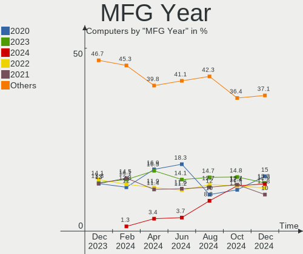
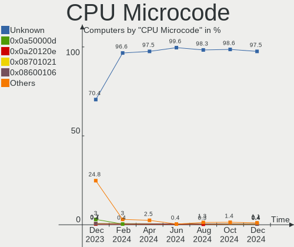
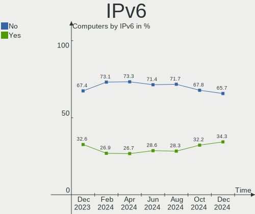

Arch - Hardware Trends
----------------------

A project to identify most popular hardware characteristics and track their change
over time based on data collected by Linux users at https://Linux-Hardware.org.

Anyone can contribute to this report by the [hw-probe](https://github.com/linuxhw/hw-probe) tool:

    sudo -E hw-probe -all -upload

This is a report for all computer types. See also reports for [desktops](/Dist/Arch/Desktop/README.md) and [notebooks](/Dist/Arch/Notebook/README.md).

This report is for one last month. Overall report since the beginning of time: [TestCoverage](https://github.com/linuxhw/TestCoverage)

Period: Jul, 2022.

Contents
--------

* [ System ](#system)
  - [ OS                       ](#os)
  - [ OS Family                ](#os-family)
  - [ Kernel                   ](#kernel)
  - [ Kernel Family            ](#kernel-family)
  - [ Kernel Major Ver.        ](#kernel-major-ver)
  - [ Arch                     ](#arch)
  - [ DE                       ](#de)
  - [ Display Server           ](#display-server)
  - [ Display Manager          ](#display-manager)
  - [ OS Lang                  ](#os-lang)
  - [ Boot Mode                ](#boot-mode)
  - [ Filesystem               ](#filesystem)
  - [ Part. scheme             ](#part-scheme)
  - [ Dual Boot with Linux/BSD ](#dual-boot-with-linuxbsd)
  - [ Dual Boot (Win)          ](#dual-boot-win)

* [ Board ](#board)
  - [ Vendor                   ](#vendor)
  - [ Model                    ](#model)
  - [ Model Family             ](#model-family)
  - [ MFG Year                 ](#mfg-year)
  - [ Form Factor              ](#form-factor)
  - [ Secure Boot              ](#secure-boot)
  - [ Coreboot                 ](#coreboot)
  - [ RAM Size                 ](#ram-size)
  - [ RAM Used                 ](#ram-used)
  - [ Total Drives             ](#total-drives)
  - [ Has CD-ROM               ](#has-cd-rom)
  - [ Has Ethernet             ](#has-ethernet)
  - [ Has WiFi                 ](#has-wifi)
  - [ Has Bluetooth            ](#has-bluetooth)

* [ Location ](#location)
  - [ Country                  ](#country)
  - [ City                     ](#city)

* [ Drives ](#drives)
  - [ Drive Vendor             ](#drive-vendor)
  - [ Drive Model              ](#drive-model)
  - [ HDD Vendor               ](#hdd-vendor)
  - [ SSD Vendor               ](#ssd-vendor)
  - [ Drive Kind               ](#drive-kind)
  - [ Drive Connector          ](#drive-connector)
  - [ Drive Size               ](#drive-size)
  - [ Space Total              ](#space-total)
  - [ Space Used               ](#space-used)
  - [ Malfunc. Drives          ](#malfunc-drives)
  - [ Malfunc. Drive Vendor    ](#malfunc-drive-vendor)
  - [ Malfunc. HDD Vendor      ](#malfunc-hdd-vendor)
  - [ Malfunc. Drive Kind      ](#malfunc-drive-kind)
  - [ Failed Drives            ](#failed-drives)
  - [ Failed Drive Vendor      ](#failed-drive-vendor)
  - [ Drive Status             ](#drive-status)

* [ Storage controller ](#storage-controller)
  - [ Storage Vendor           ](#storage-vendor)
  - [ Storage Model            ](#storage-model)
  - [ Storage Kind             ](#storage-kind)

* [ Processor ](#processor)
  - [ CPU Vendor               ](#cpu-vendor)
  - [ CPU Model                ](#cpu-model)
  - [ CPU Model Family         ](#cpu-model-family)
  - [ CPU Cores                ](#cpu-cores)
  - [ CPU Sockets              ](#cpu-sockets)
  - [ CPU Threads              ](#cpu-threads)
  - [ CPU Op-Modes             ](#cpu-op-modes)
  - [ CPU Microcode            ](#cpu-microcode)
  - [ CPU Microarch            ](#cpu-microarch)

* [ Graphics ](#graphics)
  - [ GPU Vendor               ](#gpu-vendor)
  - [ GPU Model                ](#gpu-model)
  - [ GPU Combo                ](#gpu-combo)
  - [ GPU Driver               ](#gpu-driver)
  - [ GPU Memory               ](#gpu-memory)

* [ Monitor ](#monitor)
  - [ Monitor Vendor           ](#monitor-vendor)
  - [ Monitor Model            ](#monitor-model)
  - [ Monitor Resolution       ](#monitor-resolution)
  - [ Monitor Diagonal         ](#monitor-diagonal)
  - [ Monitor Width            ](#monitor-width)
  - [ Aspect Ratio             ](#aspect-ratio)
  - [ Monitor Area             ](#monitor-area)
  - [ Pixel Density            ](#pixel-density)
  - [ Multiple Monitors        ](#multiple-monitors)

* [ Network ](#network)
  - [ Net Controller Vendor    ](#net-controller-vendor)
  - [ Net Controller Model     ](#net-controller-model)
  - [ Wireless Vendor          ](#wireless-vendor)
  - [ Wireless Model           ](#wireless-model)
  - [ Ethernet Vendor          ](#ethernet-vendor)
  - [ Ethernet Model           ](#ethernet-model)
  - [ Net Controller Kind      ](#net-controller-kind)
  - [ Used Controller          ](#used-controller)
  - [ NICs                     ](#nics)
  - [ IPv6                     ](#ipv6)

* [ Bluetooth ](#bluetooth)
  - [ Bluetooth Vendor         ](#bluetooth-vendor)
  - [ Bluetooth Model          ](#bluetooth-model)

* [ Sound ](#sound)
  - [ Sound Vendor             ](#sound-vendor)
  - [ Sound Model              ](#sound-model)

* [ Memory ](#memory)
  - [ Memory Vendor            ](#memory-vendor)
  - [ Memory Model             ](#memory-model)
  - [ Memory Kind              ](#memory-kind)
  - [ Memory Form Factor       ](#memory-form-factor)
  - [ Memory Size              ](#memory-size)
  - [ Memory Speed             ](#memory-speed)

* [ Printers & scanners ](#printers--scanners)
  - [ Printer Vendor           ](#printer-vendor)
  - [ Printer Model            ](#printer-model)
  - [ Scanner Vendor           ](#scanner-vendor)
  - [ Scanner Model            ](#scanner-model)

* [ Camera ](#camera)
  - [ Camera Vendor            ](#camera-vendor)
  - [ Camera Model             ](#camera-model)

* [ Security ](#security)
  - [ Fingerprint Vendor       ](#fingerprint-vendor)
  - [ Fingerprint Model        ](#fingerprint-model)
  - [ Chipcard Vendor          ](#chipcard-vendor)
  - [ Chipcard Model           ](#chipcard-model)

* [ Unsupported ](#unsupported)
  - [ Unsupported Devices      ](#unsupported-devices)
  - [ Unsupported Device Types ](#unsupported-device-types)

System
------

OS
--

Installed operating systems

| Name         | Computers | Percent |
|--------------|-----------|---------|
| Arch         | 96        | 61.15%  |
| Arch Rolling | 61        | 38.85%  |

OS Family
---------

OS without a version

| Name | Computers | Percent |
|------|-----------|---------|
| Arch | 157       | 100%    |

Kernel
------

Version of the Linux kernel

| Version                        | Computers | Percent |
|--------------------------------|-----------|---------|
| 5.18.12-arch1-1                | 23        | 14.65%  |
| 5.18.14-arch1-1                | 21        | 13.38%  |
| 5.18.9-arch1-1                 | 16        | 10.19%  |
| 5.18.10-arch1-1                | 12        | 7.64%   |
| 5.18.13-arch1-1                | 11        | 7.01%   |
| 5.18.7-arch1-1                 | 9         | 5.73%   |
| 5.18.8-arch1-1                 | 6         | 3.82%   |
| 5.18.11-arch1-1                | 6         | 3.82%   |
| 5.18.6-arch1-1                 | 4         | 2.55%   |
| 5.18.12-zen1-1-zen             | 4         | 2.55%   |
| 5.18.9-zen1-1-zen              | 3         | 1.91%   |
| 5.18.7-zen1-1-zen              | 3         | 1.91%   |
| 5.15.53-2-lts                  | 3         | 1.91%   |
| 5.18.8-zen1-1-zen              | 2         | 1.27%   |
| 5.18.15-arch1-1                | 2         | 1.27%   |
| 5.18.14-zen1-1-zen             | 2         | 1.27%   |
| 5.18.11-zen1-1-zen             | 2         | 1.27%   |
| 5.18.10-zen1-1-zen             | 2         | 1.27%   |
| 5.15.55-2-lts                  | 2         | 1.27%   |
| 5.15.52-1-lts                  | 2         | 1.27%   |
| 5.9.2-arch1-1                  | 1         | 0.64%   |
| 5.18.9-263-tkg-pds             | 1         | 0.64%   |
| 5.18.8-AMD-znver2              | 1         | 0.64%   |
| 5.18.6-xanmod1-1-generic-x64v2 | 1         | 0.64%   |
| 5.18.5-zen1-1-zen              | 1         | 0.64%   |
| 5.18.5-arch1-1                 | 1         | 0.64%   |
| 5.18.3-zen1-1-zen              | 1         | 0.64%   |
| 5.18.3-arch1-1                 | 1         | 0.64%   |
| 5.18.2-zen1-1-zen              | 1         | 0.64%   |
| 5.18.2-arch1-1                 | 1         | 0.64%   |
| 5.18.14-xanmod1-1-v3-x64v3     | 1         | 0.64%   |
| 5.18.13-1-ck-generic-v3        | 1         | 0.64%   |
| 5.18.12-264-tkg-pds-llvm       | 1         | 0.64%   |
| 5.18.12-1-clear                | 1         | 0.64%   |
| 5.18.10-lqx1-1-lqx             | 1         | 0.64%   |
| 5.18.10-arch1-1-51810-01       | 1         | 0.64%   |
| 5.18.1-arch1-1                 | 1         | 0.64%   |
| 5.16.10-arch1-1-surface        | 1         | 0.64%   |
| 5.15.55-1-lts                  | 1         | 0.64%   |
| 5.15.54-1-lts                  | 1         | 0.64%   |
| 5.15.52-1-vfio-lts             | 1         | 0.64%   |
| 5.15.46-1-lts                  | 1         | 0.64%   |

Kernel Family
-------------

Linux kernel without a distro release

| Version | Computers | Percent |
|---------|-----------|---------|
| 5.18.12 | 29        | 18.47%  |
| 5.18.14 | 24        | 15.29%  |
| 5.18.9  | 20        | 12.74%  |
| 5.18.10 | 16        | 10.19%  |
| 5.18.7  | 12        | 7.64%   |
| 5.18.13 | 12        | 7.64%   |
| 5.18.8  | 9         | 5.73%   |
| 5.18.11 | 8         | 5.1%    |
| 5.18.6  | 5         | 3.18%   |
| 5.15.55 | 3         | 1.91%   |
| 5.15.53 | 3         | 1.91%   |
| 5.15.52 | 3         | 1.91%   |
| 5.18.5  | 2         | 1.27%   |
| 5.18.3  | 2         | 1.27%   |
| 5.18.2  | 2         | 1.27%   |
| 5.18.15 | 2         | 1.27%   |
| 5.9.2   | 1         | 0.64%   |
| 5.18.1  | 1         | 0.64%   |
| 5.16.10 | 1         | 0.64%   |
| 5.15.54 | 1         | 0.64%   |
| 5.15.46 | 1         | 0.64%   |

Kernel Major Ver.
-----------------

Linux kernel major version

| Version | Computers | Percent |
|---------|-----------|---------|
| 5.18    | 144       | 91.72%  |
| 5.15    | 11        | 7.01%   |
| 5.9     | 1         | 0.64%   |
| 5.16    | 1         | 0.64%   |

Arch
----

OS architecture (x86_64, i586, etc.)

| Name   | Computers | Percent |
|--------|-----------|---------|
| x86_64 | 157       | 100%    |

DE
--

Desktop Environment

| Name       | Computers | Percent |
|------------|-----------|---------|
| GNOME      | 53        | 33.76%  |
| KDE5       | 52        | 33.12%  |
| Unknown    | 19        | 12.1%   |
| XFCE       | 13        | 8.28%   |
| Budgie     | 4         | 2.55%   |
| sway       | 3         | 1.91%   |
| i3         | 3         | 1.91%   |
| bspwm      | 3         | 1.91%   |
| qtile      | 2         | 1.27%   |
| X-Cinnamon | 1         | 0.64%   |
| Openbox    | 1         | 0.64%   |
| ICEWM      | 1         | 0.64%   |
| hyprland   | 1         | 0.64%   |
| awesome    | 1         | 0.64%   |

Display Server
--------------

X11 or Wayland

| Name    | Computers | Percent |
|---------|-----------|---------|
| X11     | 93        | 59.24%  |
| Wayland | 38        | 24.2%   |
| Tty     | 14        | 8.92%   |
| Unknown | 12        | 7.64%   |

Display Manager
---------------

SDDM, LightDM, etc.

| Name    | Computers | Percent |
|---------|-----------|---------|
| Unknown | 69        | 43.95%  |
| SDDM    | 36        | 22.93%  |
| LightDM | 26        | 16.56%  |
| GDM     | 19        | 12.1%   |
| LXDM    | 3         | 1.91%   |
| Ly      | 2         | 1.27%   |
| SLiM    | 1         | 0.64%   |
| GREETD  | 1         | 0.64%   |

OS Lang
-------

Language

| Lang    | Computers | Percent |
|---------|-----------|---------|
| en_US   | 80        | 50.96%  |
| en_GB   | 13        | 8.28%   |
| Unknown | 8         | 5.1%    |
| ru_RU   | 6         | 3.82%   |
| C       | 6         | 3.82%   |
| zh_CN   | 4         | 2.55%   |
| pt_BR   | 4         | 2.55%   |
| en_IN   | 4         | 2.55%   |
| it_IT   | 3         | 1.91%   |
| de_DE   | 3         | 1.91%   |
| fr_FR   | 2         | 1.27%   |
| es_ES   | 2         | 1.27%   |
| es_CO   | 2         | 1.27%   |
| en_DK   | 2         | 1.27%   |
| en_CA   | 2         | 1.27%   |
| en_AU   | 2         | 1.27%   |
| tr_TR   | 1         | 0.64%   |
| ru_UA   | 1         | 0.64%   |
| pt_PT   | 1         | 0.64%   |
| pl_PL   | 1         | 0.64%   |
| ja_JP   | 1         | 0.64%   |
| it_CH   | 1         | 0.64%   |
| es_CL   | 1         | 0.64%   |
| es_BO   | 1         | 0.64%   |
| es_AR   | 1         | 0.64%   |
| en_SE   | 1         | 0.64%   |
| en_IE   | 1         | 0.64%   |
| en_DE   | 1         | 0.64%   |
| en_AG   | 1         | 0.64%   |
| de_CH   | 1         | 0.64%   |

Boot Mode
---------

EFI or BIOS

| Mode | Computers | Percent |
|------|-----------|---------|
| EFI  | 89        | 56.69%  |
| BIOS | 68        | 43.31%  |

Filesystem
----------

Type of filesystem

| Type    | Computers | Percent |
|---------|-----------|---------|
| Ext4    | 109       | 69.43%  |
| Btrfs   | 39        | 24.84%  |
| F2fs    | 5         | 3.18%   |
| Xfs     | 2         | 1.27%   |
| Zfs     | 1         | 0.64%   |
| Overlay | 1         | 0.64%   |

Part. scheme
------------

Scheme of partitioning

| Type    | Computers | Percent |
|---------|-----------|---------|
| GPT     | 98        | 62.42%  |
| Unknown | 48        | 30.57%  |
| MBR     | 11        | 7.01%   |

Dual Boot with Linux/BSD
------------------------

Hosting more than one Linux/BSD

| Dual boot | Computers | Percent |
|-----------|-----------|---------|
| No        | 137       | 87.26%  |
| Yes       | 20        | 12.74%  |

Dual Boot (Win)
---------------

Hosting Linux and Windows

| Dual boot | Computers | Percent |
|-----------|-----------|---------|
| No        | 106       | 67.52%  |
| Yes       | 51        | 32.48%  |

Board
-----

Vendor
------

Motherboard manufacturer

| Name                | Computers | Percent |
|---------------------|-----------|---------|
| ASUSTek Computer    | 29        | 18.47%  |
| Lenovo              | 27        | 17.2%   |
| Hewlett-Packard     | 20        | 12.74%  |
| MSI                 | 18        | 11.46%  |
| Dell                | 12        | 7.64%   |
| Gigabyte Technology | 10        | 6.37%   |
| Acer                | 8         | 5.1%    |
| Apple               | 4         | 2.55%   |
| Toshiba             | 3         | 1.91%   |
| Timi                | 3         | 1.91%   |
| Samsung Electronics | 3         | 1.91%   |
| ASRock              | 3         | 1.91%   |
| Razer               | 2         | 1.27%   |
| Microsoft           | 2         | 1.27%   |
| System76            | 1         | 0.64%   |
| Notebook            | 1         | 0.64%   |
| Medion              | 1         | 0.64%   |
| Machinist/Runing    | 1         | 0.64%   |
| Intel               | 1         | 0.64%   |
| Infinix             | 1         | 0.64%   |
| Hyperbook           | 1         | 0.64%   |
| HUAWEI              | 1         | 0.64%   |
| Google              | 1         | 0.64%   |
| Framework           | 1         | 0.64%   |
| Clevo               | 1         | 0.64%   |
| Alienware           | 1         | 0.64%   |
| Unknown             | 1         | 0.64%   |

Model
-----

Motherboard model

| Name                                               | Computers | Percent |
|----------------------------------------------------|-----------|---------|
| MSI MS-7C94                                        | 2         | 1.27%   |
| MSI MS-7A34                                        | 2         | 1.27%   |
| ASUS TUF Gaming X570-PLUS                          | 2         | 1.27%   |
| ASUS TUF Gaming B550-PLUS                          | 2         | 1.27%   |
| Toshiba Satellite M645                             | 1         | 0.64%   |
| Toshiba Satellite L70-B                            | 1         | 0.64%   |
| Toshiba dynabook Satellite B35/R                   | 1         | 0.64%   |
| Timi TM1703                                        | 1         | 0.64%   |
| Timi RedmiBook 14 II                               | 1         | 0.64%   |
| Timi Redmi Book Pro 15 2022                        | 1         | 0.64%   |
| System76 Lemur Pro                                 | 1         | 0.64%   |
| Samsung 950QDB                                     | 1         | 0.64%   |
| Samsung 935XDB                                     | 1         | 0.64%   |
| Samsung 3570R/370R/470R/450R/510R/4450RV           | 1         | 0.64%   |
| Razer Blade 15 Base Model (Early 2020) - RZ09-0328 | 1         | 0.64%   |
| Razer Blade 14 (2022) - RZ09-0427                  | 1         | 0.64%   |
| Notebook NL5xRU                                    | 1         | 0.64%   |
| MSI Stealth GS77 12UGS                             | 1         | 0.64%   |
| MSI MS-7D43                                        | 1         | 0.64%   |
| MSI MS-7C91                                        | 1         | 0.64%   |
| MSI MS-7C39                                        | 1         | 0.64%   |
| MSI MS-7C02                                        | 1         | 0.64%   |
| MSI MS-7B86                                        | 1         | 0.64%   |
| MSI MS-7A70                                        | 1         | 0.64%   |
| MSI MS-7A38                                        | 1         | 0.64%   |
| MSI MS-7882                                        | 1         | 0.64%   |
| MSI MS-7756                                        | 1         | 0.64%   |
| MSI GS75 Stealth 9SF                               | 1         | 0.64%   |
| MSI GP66 Leopard 11UG                              | 1         | 0.64%   |
| MSI GP66 Leopard 10UH                              | 1         | 0.64%   |
| MSI GF75 Thin 9SC                                  | 1         | 0.64%   |
| Microsoft Surface Laptop 3                         | 1         | 0.64%   |
| Microsoft Surface Go                               | 1         | 0.64%   |
| Medion Akoya P2150 D MD8331/2496                   | 1         | 0.64%   |
| Machinist/Runing X99Z GAMING Beta                  | 1         | 0.64%   |
| Lenovo V570 HuronRiver Platform                    | 1         | 0.64%   |
| Lenovo ThinkStation P700 30A8S0TH00                | 1         | 0.64%   |
| Lenovo ThinkPad X280 20KES2SN00                    | 1         | 0.64%   |
| Lenovo ThinkPad X230 2325TXV                       | 1         | 0.64%   |
| Lenovo ThinkPad X13 Gen 2a 20XHCTO1WW              | 1         | 0.64%   |
| Lenovo ThinkPad X1 Yoga Gen 7 21CDCTO1WW           | 1         | 0.64%   |
| Lenovo ThinkPad W510 4318CTO                       | 1         | 0.64%   |
| Lenovo ThinkPad T430 2349CV8                       | 1         | 0.64%   |
| Lenovo ThinkPad T14s Gen 3 21CQ000GUS              | 1         | 0.64%   |
| Lenovo ThinkPad T14 Gen 1 20UES17D00               | 1         | 0.64%   |
| Lenovo ThinkPad T14 Gen 1 20S1S07X00               | 1         | 0.64%   |
| Lenovo ThinkPad P52 20M9CTO1WW                     | 1         | 0.64%   |
| Lenovo ThinkPad P17 Gen 2i 20YU005BUS              | 1         | 0.64%   |
| Lenovo ThinkPad P1 Gen 4i 20Y3004JUS               | 1         | 0.64%   |
| Lenovo ThinkPad L14 Gen 1 20U6S1JD00               | 1         | 0.64%   |
| Lenovo ThinkPad L13 Yoga Gen 2a 21AES01A00         | 1         | 0.64%   |
| Lenovo ThinkPad E480 20KN001QRT                    | 1         | 0.64%   |
| Lenovo ThinkPad E14 Gen 3 20YDS00G00               | 1         | 0.64%   |
| Lenovo ThinkCentre M93p 10A8S1K403                 | 1         | 0.64%   |
| Lenovo ThinkCentre M720q 10T80012BR                | 1         | 0.64%   |
| Lenovo ThinkBook 15 G2 ITL 20VE                    | 1         | 0.64%   |
| Lenovo Legion Y7000P 2019 81Q5                     | 1         | 0.64%   |
| Lenovo IdeaPad S145-15IWL 81S9                     | 1         | 0.64%   |
| Lenovo IdeaPad Gaming 3 15ARH05 82EY               | 1         | 0.64%   |
| Lenovo IdeaPad 3 15ADA05 81W1                      | 1         | 0.64%   |

Model Family
------------

Motherboard model prefix

| Name                  | Computers | Percent |
|-----------------------|-----------|---------|
| Lenovo ThinkPad       | 16        | 10.19%  |
| HP Pavilion           | 7         | 4.46%   |
| ASUS TUF              | 6         | 3.82%   |
| ASUS ROG              | 6         | 3.82%   |
| Lenovo IdeaPad        | 5         | 3.18%   |
| ASUS PRIME            | 4         | 2.55%   |
| Acer Aspire           | 4         | 2.55%   |
| Dell Latitude         | 3         | 1.91%   |
| Acer Nitro            | 3         | 1.91%   |
| Toshiba Satellite     | 2         | 1.27%   |
| Razer Blade           | 2         | 1.27%   |
| MSI MS-7C94           | 2         | 1.27%   |
| MSI MS-7A34           | 2         | 1.27%   |
| MSI GP66              | 2         | 1.27%   |
| Microsoft Surface     | 2         | 1.27%   |
| Lenovo ThinkCentre    | 2         | 1.27%   |
| HP Spectre            | 2         | 1.27%   |
| HP ProBook            | 2         | 1.27%   |
| HP EliteBook          | 2         | 1.27%   |
| Gigabyte X470         | 2         | 1.27%   |
| Gigabyte B450M        | 2         | 1.27%   |
| Dell Vostro           | 2         | 1.27%   |
| Dell OptiPlex         | 2         | 1.27%   |
| Dell Inspiron         | 2         | 1.27%   |
| Apple MacBookAir7     | 2         | 1.27%   |
| Toshiba dynabook      | 1         | 0.64%   |
| Timi TM1703           | 1         | 0.64%   |
| Timi RedmiBook        | 1         | 0.64%   |
| Timi Redmi            | 1         | 0.64%   |
| System76 Lemur        | 1         | 0.64%   |
| Samsung 950QDB        | 1         | 0.64%   |
| Samsung 935XDB        | 1         | 0.64%   |
| Samsung 3570R         | 1         | 0.64%   |
| Notebook NL5xRU       | 1         | 0.64%   |
| MSI Stealth           | 1         | 0.64%   |
| MSI MS-7D43           | 1         | 0.64%   |
| MSI MS-7C91           | 1         | 0.64%   |
| MSI MS-7C39           | 1         | 0.64%   |
| MSI MS-7C02           | 1         | 0.64%   |
| MSI MS-7B86           | 1         | 0.64%   |
| MSI MS-7A70           | 1         | 0.64%   |
| MSI MS-7A38           | 1         | 0.64%   |
| MSI MS-7882           | 1         | 0.64%   |
| MSI MS-7756           | 1         | 0.64%   |
| MSI GS75              | 1         | 0.64%   |
| MSI GF75              | 1         | 0.64%   |
| Medion Akoya          | 1         | 0.64%   |
| Machinist/Runing X99Z | 1         | 0.64%   |
| Lenovo V570           | 1         | 0.64%   |
| Lenovo ThinkStation   | 1         | 0.64%   |
| Lenovo ThinkBook      | 1         | 0.64%   |
| Lenovo Legion         | 1         | 0.64%   |
| Intel HuronRiver      | 1         | 0.64%   |
| Infinix INBOOK        | 1         | 0.64%   |
| Hyperbook Z15         | 1         | 0.64%   |
| HUAWEI NBLK-WAX9X     | 1         | 0.64%   |
| HP ZHAN               | 1         | 0.64%   |
| HP ZBook              | 1         | 0.64%   |
| HP Victus             | 1         | 0.64%   |
| HP t620               | 1         | 0.64%   |

MFG Year
--------

Motherboard manufacture year

| Year | Computers | Percent |
|------|-----------|---------|
| 2020 | 32        | 20.38%  |
| 2021 | 25        | 15.92%  |
| 2019 | 19        | 12.1%   |
| 2018 | 19        | 12.1%   |
| 2017 | 16        | 10.19%  |
| 2022 | 11        | 7.01%   |
| 2012 | 8         | 5.1%    |
| 2016 | 6         | 3.82%   |
| 2015 | 5         | 3.18%   |
| 2014 | 5         | 3.18%   |
| 2011 | 4         | 2.55%   |
| 2013 | 3         | 1.91%   |
| 2010 | 3         | 1.91%   |
| 2007 | 1         | 0.64%   |

Form Factor
-----------

Physical design of the computer

| Name        | Computers | Percent |
|-------------|-----------|---------|
| Notebook    | 90        | 57.32%  |
| Desktop     | 56        | 35.67%  |
| Convertible | 6         | 3.82%   |
| Tablet      | 3         | 1.91%   |
| Mini pc     | 1         | 0.64%   |
| All in one  | 1         | 0.64%   |

Secure Boot
-----------

Enabled or disabled

| State    | Computers | Percent |
|----------|-----------|---------|
| Disabled | 154       | 98.09%  |
| Enabled  | 3         | 1.91%   |

Coreboot
--------

Have coreboot on board

| Used | Computers | Percent |
|------|-----------|---------|
| No   | 155       | 98.73%  |
| Yes  | 2         | 1.27%   |

RAM Size
--------

Total RAM memory

| Size in GB  | Computers | Percent |
|-------------|-----------|---------|
| 16.01-24.0  | 38        | 24.2%   |
| 4.01-8.0    | 33        | 21.02%  |
| 32.01-64.0  | 30        | 19.11%  |
| 8.01-16.0   | 30        | 19.11%  |
| 64.01-256.0 | 10        | 6.37%   |
| 3.01-4.0    | 9         | 5.73%   |
| 24.01-32.0  | 7         | 4.46%   |

RAM Used
--------

Used RAM memory

| Used GB    | Computers | Percent |
|------------|-----------|---------|
| 4.01-8.0   | 44        | 28.03%  |
| 2.01-3.0   | 37        | 23.57%  |
| 3.01-4.0   | 30        | 19.11%  |
| 1.01-2.0   | 24        | 15.29%  |
| 8.01-16.0  | 14        | 8.92%   |
| 0.51-1.0   | 3         | 1.91%   |
| 32.01-64.0 | 2         | 1.27%   |
| 24.01-32.0 | 1         | 0.64%   |
| 16.01-24.0 | 1         | 0.64%   |
| 0.01-0.5   | 1         | 0.64%   |

Total Drives
------------

Number of drives on board

| Drives | Computers | Percent |
|--------|-----------|---------|
| 1      | 78        | 49.68%  |
| 2      | 46        | 29.3%   |
| 3      | 14        | 8.92%   |
| 5      | 9         | 5.73%   |
| 4      | 7         | 4.46%   |
| 7      | 1         | 0.64%   |
| 6      | 1         | 0.64%   |
| 0      | 1         | 0.64%   |

Has CD-ROM
----------

Has CD-ROM on board

| Presented | Computers | Percent |
|-----------|-----------|---------|
| No        | 130       | 82.8%   |
| Yes       | 27        | 17.2%   |

Has Ethernet
------------

Has Ethernet on board

| Presented | Computers | Percent |
|-----------|-----------|---------|
| Yes       | 129       | 82.17%  |
| No        | 28        | 17.83%  |

Has WiFi
--------

Has WiFi module

| Presented | Computers | Percent |
|-----------|-----------|---------|
| Yes       | 127       | 80.89%  |
| No        | 30        | 19.11%  |

Has Bluetooth
-------------

Has Bluetooth module

| Presented | Computers | Percent |
|-----------|-----------|---------|
| Yes       | 116       | 73.89%  |
| No        | 41        | 26.11%  |

Location
--------

Country
-------

Geographic location (country)

| Country     | Computers | Percent |
|-------------|-----------|---------|
| USA         | 32        | 20.38%  |
| Germany     | 13        | 8.28%   |
| Russia      | 12        | 7.64%   |
| Brazil      | 8         | 5.1%    |
| India       | 7         | 4.46%   |
| China       | 7         | 4.46%   |
| UK          | 5         | 3.18%   |
| Spain       | 5         | 3.18%   |
| France      | 5         | 3.18%   |
| Poland      | 4         | 2.55%   |
| Netherlands | 4         | 2.55%   |
| Italy       | 4         | 2.55%   |
| Canada      | 4         | 2.55%   |
| Austria     | 4         | 2.55%   |
| Sweden      | 3         | 1.91%   |
| Japan       | 3         | 1.91%   |
| Ukraine     | 2         | 1.27%   |
| Turkey      | 2         | 1.27%   |
| Thailand    | 2         | 1.27%   |
| Switzerland | 2         | 1.27%   |
| Romania     | 2         | 1.27%   |
| Portugal    | 2         | 1.27%   |
| Finland     | 2         | 1.27%   |
| Colombia    | 2         | 1.27%   |
| Australia   | 2         | 1.27%   |
| Vietnam     | 1         | 0.64%   |
| Singapore   | 1         | 0.64%   |
| New Zealand | 1         | 0.64%   |
| Morocco     | 1         | 0.64%   |
| Mexico      | 1         | 0.64%   |
| Jordan      | 1         | 0.64%   |
| Ireland     | 1         | 0.64%   |
| Iran        | 1         | 0.64%   |
| Hungary     | 1         | 0.64%   |
| Hong Kong   | 1         | 0.64%   |
| Greece      | 1         | 0.64%   |
| Ethiopia    | 1         | 0.64%   |
| Denmark     | 1         | 0.64%   |
| Croatia     | 1         | 0.64%   |
| Chile       | 1         | 0.64%   |
| Bulgaria    | 1         | 0.64%   |
| Bolivia     | 1         | 0.64%   |
| Belgium     | 1         | 0.64%   |
| Belarus     | 1         | 0.64%   |

City
----

Geographic location (city)

| City               | Computers | Percent |
|--------------------|-----------|---------|
| Moscow             | 4         | 2.55%   |
| Valencia           | 3         | 1.91%   |
| St Petersburg      | 3         | 1.91%   |
| Villeneuve-d'Ascq  | 2         | 1.27%   |
| Stockholm          | 2         | 1.27%   |
| Seattle            | 2         | 1.27%   |
| San Francisco      | 2         | 1.27%   |
| Osaka              | 2         | 1.27%   |
| Montreal           | 2         | 1.27%   |
| Mesa               | 2         | 1.27%   |
| Bochum             | 2         | 1.27%   |
| Beijing            | 2         | 1.27%   |
| Amsterdam          | 2         | 1.27%   |
| Zurich             | 1         | 0.64%   |
| Zagreb             | 1         | 0.64%   |
| Yuma               | 1         | 0.64%   |
| Yekaterinburg      | 1         | 0.64%   |
| Yartsevo           | 1         | 0.64%   |
| Xining             | 1         | 0.64%   |
| Xi'an              | 1         | 0.64%   |
| Wormer             | 1         | 0.64%   |
| Wiesbaden          | 1         | 0.64%   |
| Waterford          | 1         | 0.64%   |
| Warsaw             | 1         | 0.64%   |
| Wanchai            | 1         | 0.64%   |
| Walnut Creek       | 1         | 0.64%   |
| Villavicencio      | 1         | 0.64%   |
| Vienna             | 1         | 0.64%   |
| Viana do Castelo   | 1         | 0.64%   |
| Valladolid         | 1         | 0.64%   |
| Uberlândia        | 1         | 0.64%   |
| Tra Vinh           | 1         | 0.64%   |
| Toronto            | 1         | 0.64%   |
| Tooele             | 1         | 0.64%   |
| Thrissur           | 1         | 0.64%   |
| Telde              | 1         | 0.64%   |
| Szemud             | 1         | 0.64%   |
| Surgut             | 1         | 0.64%   |
| Stuttgart          | 1         | 0.64%   |
| Sparta             | 1         | 0.64%   |
| Solingen           | 1         | 0.64%   |
| Sofia              | 1         | 0.64%   |
| Smolensk           | 1         | 0.64%   |
| Smithtown          | 1         | 0.64%   |
| Singapore          | 1         | 0.64%   |
| Sindal             | 1         | 0.64%   |
| Shoreham           | 1         | 0.64%   |
| Shenzhen           | 1         | 0.64%   |
| Shanghai           | 1         | 0.64%   |
| Sesto San Giovanni | 1         | 0.64%   |
| Sattahip           | 1         | 0.64%   |
| Sao Paulo          | 1         | 0.64%   |
| Sao Cristovao      | 1         | 0.64%   |
| Santa Marta        | 1         | 0.64%   |
| Santa Cruz         | 1         | 0.64%   |
| Sanhe              | 1         | 0.64%   |
| Saint Paul         | 1         | 0.64%   |
| Rome               | 1         | 0.64%   |
| Rison              | 1         | 0.64%   |
| Regensburg         | 1         | 0.64%   |

Drives
------

Drive Vendor
------------

Hard drive vendors

| Vendor                      | Computers | Drives | Percent |
|-----------------------------|-----------|--------|---------|
| Samsung Electronics         | 60        | 75     | 23.08%  |
| WDC                         | 31        | 41     | 11.92%  |
| Seagate                     | 25        | 31     | 9.62%   |
| Toshiba                     | 24        | 25     | 9.23%   |
| Crucial                     | 17        | 20     | 6.54%   |
| SanDisk                     | 15        | 16     | 5.77%   |
| Kingston                    | 13        | 15     | 5%      |
| SK hynix                    | 7         | 7      | 2.69%   |
| Unknown                     | 6         | 6      | 2.31%   |
| A-DATA Technology           | 6         | 6      | 2.31%   |
| HGST                        | 5         | 5      | 1.92%   |
| Micron Technology           | 4         | 4      | 1.54%   |
| Intel                       | 4         | 4      | 1.54%   |
| XPG                         | 3         | 3      | 1.15%   |
| Phison                      | 3         | 3      | 1.15%   |
| SPCC                        | 2         | 2      | 0.77%   |
| Silicon Motion              | 2         | 2      | 0.77%   |
| PNY                         | 2         | 2      | 0.77%   |
| MAXIO Technology (Hangzhou) | 2         | 2      | 0.77%   |
| KIOXIA                      | 2         | 2      | 0.77%   |
| Hitachi                     | 2         | 2      | 0.77%   |
| Corsair                     | 2         | 2      | 0.77%   |
| China                       | 2         | 2      | 0.77%   |
| Unknown                     | 2         | 2      | 0.77%   |
| ZHITAI                      | 1         | 1      | 0.38%   |
| UMIS                        | 1         | 1      | 0.38%   |
| Transcend                   | 1         | 1      | 0.38%   |
| SSSTC                       | 1         | 1      | 0.38%   |
| S3+                         | 1         | 1      | 0.38%   |
| Patriot                     | 1         | 1      | 0.38%   |
| OCZ                         | 1         | 1      | 0.38%   |
| Mushkin                     | 1         | 1      | 0.38%   |
| MicroDream                  | 1         | 1      | 0.38%   |
| Lite-On                     | 1         | 1      | 0.38%   |
| JMicron Technology          | 1         | 1      | 0.38%   |
| ICY BOX                     | 1         | 1      | 0.38%   |
| HUSKY                       | 1         | 1      | 0.38%   |
| Hewlett-Packard             | 1         | 1      | 0.38%   |
| GOODRAM                     | 1         | 1      | 0.38%   |
| Gigabyte Technology         | 1         | 1      | 0.38%   |
| BAITITON                    | 1         | 1      | 0.38%   |
| Apple                       | 1         | 1      | 0.38%   |
| AEGO                        | 1         | 1      | 0.38%   |

Drive Model
-----------

Hard drive models

| Model                                 | Computers | Percent |
|---------------------------------------|-----------|---------|
| Samsung NVMe SSD Drive 1TB            | 5         | 1.72%   |
| Samsung SSD 970 EVO Plus 1TB          | 4         | 1.37%   |
| Toshiba DT01ACA100 1TB                | 3         | 1.03%   |
| Seagate ST2000DM008-2FR102 2TB        | 3         | 1.03%   |
| Samsung SSD 980 1TB                   | 3         | 1.03%   |
| Samsung SSD 970 EVO Plus 500GB        | 3         | 1.03%   |
| Samsung SSD 860 EVO 1TB               | 3         | 1.03%   |
| Samsung SSD 850 EVO 500GB             | 3         | 1.03%   |
| Samsung SSD 850 EVO 250GB             | 3         | 1.03%   |
| Samsung NVMe SSD Drive 500GB          | 3         | 1.03%   |
| Samsung NVMe SSD Drive 1024GB         | 3         | 1.03%   |
| XPG NVMe SSD Drive 2TB                | 2         | 0.69%   |
| WDC WD20EARX-00PASB0 2TB              | 2         | 0.69%   |
| WDC WD10EZEX-22MFCA0 1TB              | 2         | 0.69%   |
| WDC WD10EZEX-00BN5A0 1TB              | 2         | 0.69%   |
| WDC PC SN530 SDBPNPZ-512G-1114 512GB  | 2         | 0.69%   |
| Toshiba NVMe SSD Drive 512GB          | 2         | 0.69%   |
| Toshiba MQ01ABF050 500GB              | 2         | 0.69%   |
| Seagate ST500DM002-1BD142 500GB       | 2         | 0.69%   |
| Seagate ST2000DM006-2DM164 2TB        | 2         | 0.69%   |
| Seagate ST1000LM049-2GH172 1TB        | 2         | 0.69%   |
| SanDisk NVMe SSD Drive 512GB          | 2         | 0.69%   |
| SanDisk NVMe SSD Drive 1TB            | 2         | 0.69%   |
| Samsung SSD 970 EVO Plus 2TB          | 2         | 0.69%   |
| Samsung SSD 970 EVO 500GB             | 2         | 0.69%   |
| Samsung NVMe SSD Drive 2TB            | 2         | 0.69%   |
| Samsung NVMe SSD Drive 250GB          | 2         | 0.69%   |
| MAXIO (Hangzhou) NVMe SSD Drive 500GB | 2         | 0.69%   |
| Kingston SA400S37240G 240GB SSD       | 2         | 0.69%   |
| Crucial CT500MX500SSD1 500GB          | 2         | 0.69%   |
| Crucial CT120BX500SSD1 120GB          | 2         | 0.69%   |
| Crucial CT1000MX500SSD1 1TB           | 2         | 0.69%   |
| Unknown                               | 2         | 0.69%   |
| ZHITAI TiPlus5000 1TB                 | 1         | 0.34%   |
| XPG GAMMIX S11 Pro 256GB              | 1         | 0.34%   |
| WDC WDS500G2B0A-00SM50 500GB SSD      | 1         | 0.34%   |
| WDC WDS240G2G0B-00EPW0 240GB SSD      | 1         | 0.34%   |
| WDC WD80EFAX-68KNBN0 8TB              | 1         | 0.34%   |
| WDC WD5000LPVX-80V0TT0 500GB          | 1         | 0.34%   |
| WDC WD5000LPVX-75V0TT0 500GB          | 1         | 0.34%   |
| WDC WD5000BPVT-60HXZT3 500GB          | 1         | 0.34%   |
| WDC WD40EZRZ-75GXCB0 4TB              | 1         | 0.34%   |
| WDC WD40EZRZ-00GXCB0 4TB              | 1         | 0.34%   |
| WDC WD40 EFZX-68AWUN0 4TB             | 1         | 0.34%   |
| WDC WD30EZRZ-00Z5HB0 3TB              | 1         | 0.34%   |
| WDC WD30EFRX-68AX9N0 3TB              | 1         | 0.34%   |
| WDC WD2500AAKX-75U6AA0 250GB          | 1         | 0.34%   |
| WDC WD2500AAKX-753CA1 250GB           | 1         | 0.34%   |
| WDC WD20EZRX-00D8PB0 2TB              | 1         | 0.34%   |
| WDC WD20EZAZ-00GGJB0 2TB              | 1         | 0.34%   |
| WDC WD20EFRX-68EUZN0 2TB              | 1         | 0.34%   |
| WDC WD20EARS-42S0XB0 2TB              | 1         | 0.34%   |
| WDC WD140EFGX-68B0GN0 14TB            | 1         | 0.34%   |
| WDC WD10SPZX-24Z10 1TB                | 1         | 0.34%   |
| WDC WD10SPZX-21Z10T0 1TB              | 1         | 0.34%   |
| WDC WD10SPZX-08Z10 1TB                | 1         | 0.34%   |
| WDC WD10SPCX-24HWST1 1TB              | 1         | 0.34%   |
| WDC WD10JPVX-80JC3T0 1TB              | 1         | 0.34%   |
| WDC WD10JPVX-22JC3T0 1TB              | 1         | 0.34%   |
| WDC WD10EZRZ-00HTKB0 1TB              | 1         | 0.34%   |

HDD Vendor
----------

Hard disk drive vendors

| Vendor              | Computers | Drives | Percent |
|---------------------|-----------|--------|---------|
| Seagate             | 25        | 31     | 32.89%  |
| WDC                 | 24        | 33     | 31.58%  |
| Toshiba             | 18        | 19     | 23.68%  |
| HGST                | 5         | 5      | 6.58%   |
| Samsung Electronics | 2         | 2      | 2.63%   |
| Hitachi             | 2         | 2      | 2.63%   |

SSD Vendor
----------

Solid state drive vendors

| Vendor              | Computers | Drives | Percent |
|---------------------|-----------|--------|---------|
| Samsung Electronics | 19        | 21     | 24.68%  |
| Crucial             | 15        | 17     | 19.48%  |
| SanDisk             | 8         | 8      | 10.39%  |
| Kingston            | 6         | 7      | 7.79%   |
| WDC                 | 2         | 2      | 2.6%    |
| SPCC                | 2         | 2      | 2.6%    |
| PNY                 | 2         | 2      | 2.6%    |
| Intel               | 2         | 2      | 2.6%    |
| Corsair             | 2         | 2      | 2.6%    |
| China               | 2         | 2      | 2.6%    |
| Transcend           | 1         | 1      | 1.3%    |
| SSSTC               | 1         | 1      | 1.3%    |
| S3+                 | 1         | 1      | 1.3%    |
| Patriot             | 1         | 1      | 1.3%    |
| OCZ                 | 1         | 1      | 1.3%    |
| Mushkin             | 1         | 1      | 1.3%    |
| Micron Technology   | 1         | 1      | 1.3%    |
| MicroDream          | 1         | 1      | 1.3%    |
| HUSKY               | 1         | 1      | 1.3%    |
| Hewlett-Packard     | 1         | 1      | 1.3%    |
| GOODRAM             | 1         | 1      | 1.3%    |
| Gigabyte Technology | 1         | 1      | 1.3%    |
| BAITITON            | 1         | 1      | 1.3%    |
| Apple               | 1         | 1      | 1.3%    |
| AEGO                | 1         | 1      | 1.3%    |
| A-DATA Technology   | 1         | 1      | 1.3%    |
| Unknown             | 1         | 1      | 1.3%    |

Drive Kind
----------

HDD or SSD

| Kind    | Computers | Drives | Percent |
|---------|-----------|--------|---------|
| NVMe    | 98        | 117    | 42.79%  |
| SSD     | 67        | 82     | 29.26%  |
| HDD     | 57        | 92     | 24.89%  |
| MMC     | 5         | 5      | 2.18%   |
| Unknown | 2         | 2      | 0.87%   |

Drive Connector
---------------

SATA, SAS, NVMe, etc.

| Type | Computers | Drives | Percent |
|------|-----------|--------|---------|
| NVMe | 98        | 116    | 48.76%  |
| SATA | 93        | 172    | 46.27%  |
| SAS  | 5         | 5      | 2.49%   |
| MMC  | 5         | 5      | 2.49%   |

Drive Size
----------

Size of hard drive

| Size in TB | Computers | Drives | Percent |
|------------|-----------|--------|---------|
| 0.01-0.5   | 62        | 78     | 45.93%  |
| 0.51-1.0   | 42        | 53     | 31.11%  |
| 1.01-2.0   | 15        | 17     | 11.11%  |
| 3.01-4.0   | 9         | 14     | 6.67%   |
| 2.01-3.0   | 3         | 4      | 2.22%   |
| 4.01-10.0  | 3         | 4      | 2.22%   |
| 10.01-20.0 | 1         | 4      | 0.74%   |

Space Total
-----------

Amount of disk space available on the file system

| Size in GB     | Computers | Percent |
|----------------|-----------|---------|
| 251-500        | 37        | 23.57%  |
| 501-1000       | 29        | 18.47%  |
| 101-250        | 25        | 15.92%  |
| More than 3000 | 21        | 13.38%  |
| 1001-2000      | 19        | 12.1%   |
| 2001-3000      | 12        | 7.64%   |
| Unknown        | 6         | 3.82%   |
| 1-20           | 4         | 2.55%   |
| 51-100         | 3         | 1.91%   |
| 21-50          | 1         | 0.64%   |

Space Used
----------

Amount of used disk space

| Used GB        | Computers | Percent |
|----------------|-----------|---------|
| 1-20           | 33        | 21.02%  |
| 101-250        | 27        | 17.2%   |
| 251-500        | 22        | 14.01%  |
| 501-1000       | 17        | 10.83%  |
| 21-50          | 16        | 10.19%  |
| 51-100         | 14        | 8.92%   |
| 1001-2000      | 9         | 5.73%   |
| More than 3000 | 8         | 5.1%    |
| Unknown        | 6         | 3.82%   |
| 2001-3000      | 5         | 3.18%   |

Malfunc. Drives
---------------

Drive models with a malfunction

| Model                                 | Computers | Drives | Percent |
|---------------------------------------|-----------|--------|---------|
| WDC WD5000LPVX-80V0TT0 500GB          | 1         | 1      | 7.69%   |
| WDC WD10EZEX-00BN5A0 1TB              | 1         | 1      | 7.69%   |
| Toshiba MK1652GSX 160GB               | 1         | 1      | 7.69%   |
| SSSTC CVB-8D128-HP 128GB SSD          | 1         | 1      | 7.69%   |
| Seagate ST1000LM024 HN-M101MBB 1TB    | 1         | 1      | 7.69%   |
| Seagate ST1000DM003-9YN162 1TB        | 1         | 1      | 7.69%   |
| Samsung Electronics SSD 980 1TB       | 1         | 1      | 7.69%   |
| Samsung Electronics SSD 970 EVO 500GB | 1         | 1      | 7.69%   |
| Samsung Electronics HD753LJ 752GB     | 1         | 1      | 7.69%   |
| Crucial CT525MX300SSD4 528GB          | 1         | 1      | 7.69%   |
| BAITITON BT58SSD09S 240GB             | 1         | 1      | 7.69%   |
| A-DATA Technology SX8200PNP 1TB       | 1         | 1      | 7.69%   |
| A-DATA Technology SX6000NP 512GB      | 1         | 1      | 7.69%   |

Malfunc. Drive Vendor
---------------------

Vendors of faulty drives

| Vendor              | Computers | Drives | Percent |
|---------------------|-----------|--------|---------|
| Samsung Electronics | 3         | 3      | 23.08%  |
| WDC                 | 2         | 2      | 15.38%  |
| Seagate             | 2         | 2      | 15.38%  |
| A-DATA Technology   | 2         | 2      | 15.38%  |
| Toshiba             | 1         | 1      | 7.69%   |
| SSSTC               | 1         | 1      | 7.69%   |
| Crucial             | 1         | 1      | 7.69%   |
| BAITITON            | 1         | 1      | 7.69%   |

Malfunc. HDD Vendor
-------------------

Vendors of faulty HDD drives

| Vendor              | Computers | Drives | Percent |
|---------------------|-----------|--------|---------|
| WDC                 | 2         | 2      | 33.33%  |
| Seagate             | 2         | 2      | 33.33%  |
| Toshiba             | 1         | 1      | 16.67%  |
| Samsung Electronics | 1         | 1      | 16.67%  |

Malfunc. Drive Kind
-------------------

Kinds of faulty drives

| Kind | Computers | Drives | Percent |
|------|-----------|--------|---------|
| HDD  | 6         | 6      | 46.15%  |
| NVMe | 4         | 4      | 30.77%  |
| SSD  | 3         | 3      | 23.08%  |

Failed Drives
-------------

Failed drive models

Zero info for selected period =(

Failed Drive Vendor
-------------------

Failed drive vendors

Zero info for selected period =(

Drive Status
------------

Number of failed and malfunc. drives

| Status   | Computers | Drives | Percent |
|----------|-----------|--------|---------|
| Works    | 89        | 162    | 51.74%  |
| Detected | 72        | 123    | 41.86%  |
| Malfunc  | 11        | 13     | 6.4%    |

Storage controller
------------------

Storage Vendor
--------------

Storage controller vendors

| Vendor                         | Computers | Percent |
|--------------------------------|-----------|---------|
| Intel                          | 77        | 34.07%  |
| Samsung Electronics            | 45        | 19.91%  |
| AMD                            | 42        | 18.58%  |
| SanDisk                        | 13        | 5.75%   |
| SK hynix                       | 7         | 3.1%    |
| Kingston Technology Company    | 7         | 3.1%    |
| ADATA Technology               | 7         | 3.1%    |
| Toshiba America Info Systems   | 6         | 2.65%   |
| Micron Technology              | 4         | 1.77%   |
| Phison Electronics             | 3         | 1.33%   |
| ASMedia Technology             | 3         | 1.33%   |
| Silicon Motion                 | 2         | 0.88%   |
| MAXIO Technology (Hangzhou)    | 2         | 0.88%   |
| KIOXIA                         | 2         | 0.88%   |
| Unknown                        | 1         | 0.44%   |
| Union Memory (Shenzhen)        | 1         | 0.44%   |
| Solid State Storage Technology | 1         | 0.44%   |
| Realtek Semiconductor          | 1         | 0.44%   |
| Micron/Crucial Technology      | 1         | 0.44%   |
| JMicron Technology             | 1         | 0.44%   |

Storage Model
-------------

Storage controller models

| Model                                                                            | Computers | Percent |
|----------------------------------------------------------------------------------|-----------|---------|
| AMD FCH SATA Controller [AHCI mode]                                              | 29        | 11.79%  |
| Samsung NVMe SSD Controller SM981/PM981/PM983                                    | 25        | 10.16%  |
| AMD 500 Series Chipset SATA Controller                                           | 11        | 4.47%   |
| Samsung NVMe SSD Controller PM9A1/PM9A3/980PRO                                   | 9         | 3.66%   |
| Samsung NVMe SSD Controller 980                                                  | 8         | 3.25%   |
| Intel Sunrise Point-LP SATA Controller [AHCI mode]                               | 8         | 3.25%   |
| Intel Cannon Lake Mobile PCH SATA AHCI Controller                                | 8         | 3.25%   |
| AMD 400 Series Chipset SATA Controller                                           | 8         | 3.25%   |
| Intel 200 Series PCH SATA controller [AHCI mode]                                 | 7         | 2.85%   |
| Intel 6 Series/C200 Series Chipset Family 6 port Mobile SATA AHCI Controller     | 6         | 2.44%   |
| SK hynix Gold P31 SSD                                                            | 5         | 2.03%   |
| Intel 7 Series Chipset Family 6-port SATA Controller [AHCI mode]                 | 5         | 2.03%   |
| ADATA XPG SX8200 Pro PCIe Gen3x4 M.2 2280 Solid State Drive                      | 5         | 2.03%   |
| SanDisk WD Blue SN550 NVMe SSD                                                   | 4         | 1.63%   |
| SanDisk Non-Volatile memory controller                                           | 4         | 1.63%   |
| Micron Non-Volatile memory controller                                            | 4         | 1.63%   |
| Intel Volume Management Device NVMe RAID Controller                              | 4         | 1.63%   |
| Intel Q170/Q150/B150/H170/H110/Z170/CM236 Chipset SATA Controller [AHCI Mode]    | 4         | 1.63%   |
| Intel Cannon Point-LP SATA Controller [AHCI Mode]                                | 4         | 1.63%   |
| Toshiba America Info Systems XG6 NVMe SSD Controller                             | 3         | 1.22%   |
| SanDisk WD Black SN750 / PC SN730 NVMe SSD                                       | 3         | 1.22%   |
| Samsung NVMe SSD Controller SM961/PM961/SM963                                    | 3         | 1.22%   |
| Kingston Company Company Non-Volatile memory controller                          | 3         | 1.22%   |
| Intel SATA Controller [RAID mode]                                                | 3         | 1.22%   |
| Intel HM170/QM170 Chipset SATA Controller [AHCI Mode]                            | 3         | 1.22%   |
| Intel C610/X99 series chipset 6-Port SATA Controller [AHCI mode]                 | 3         | 1.22%   |
| Intel 82801 Mobile SATA Controller [RAID mode]                                   | 3         | 1.22%   |
| Intel 8 Series/C220 Series Chipset Family 6-port SATA Controller 1 [AHCI mode]   | 3         | 1.22%   |
| ASMedia ASM1062 Serial ATA Controller                                            | 3         | 1.22%   |
| AMD 300 Series Chipset SATA Controller                                           | 3         | 1.22%   |
| Toshiba America Info Systems Toshiba America Info Non-Volatile memory controller | 2         | 0.81%   |
| SK hynix BC511                                                                   | 2         | 0.81%   |
| Silicon Motion SM2263EN/SM2263XT SSD Controller                                  | 2         | 0.81%   |
| Phison E12 NVMe Controller                                                       | 2         | 0.81%   |
| MAXIO (Hangzhou) NVMe SSD Controller MAP1001                                     | 2         | 0.81%   |
| KIOXIA NVMe SSD Controller BG4                                                   | 2         | 0.81%   |
| Intel SSD 660P Series                                                            | 2         | 0.81%   |
| Intel Cannon Lake PCH SATA AHCI Controller                                       | 2         | 0.81%   |
| Intel C610/X99 series chipset sSATA Controller [AHCI mode]                       | 2         | 0.81%   |
| Intel Alder Lake-S PCH SATA Controller [AHCI Mode]                               | 2         | 0.81%   |
| Intel 8 Series SATA Controller 1 [AHCI mode]                                     | 2         | 0.81%   |
| Intel 6 Series/C200 Series Chipset Family 6 port Desktop SATA AHCI Controller    | 2         | 0.81%   |
| Intel 5 Series/3400 Series Chipset 6 port SATA AHCI Controller                   | 2         | 0.81%   |
| Unknown Non-Volatile memory controller                                           | 1         | 0.41%   |
| Union Memory (Shenzhen) Non-Volatile memory controller                           | 1         | 0.41%   |
| Toshiba America Info Systems BG3 NVMe SSD Controller                             | 1         | 0.41%   |
| Solid State Storage Non-Volatile memory controller                               | 1         | 0.41%   |
| SanDisk WD Blue SN570 NVMe SSD                                                   | 1         | 0.41%   |
| SanDisk WD Blue SN500 / PC SN520 NVMe SSD                                        | 1         | 0.41%   |
| Samsung Electronics SATA controller                                              | 1         | 0.41%   |
| Realtek Realtek Non-Volatile memory controller                                   | 1         | 0.41%   |
| Phison PS5013 E13 NVMe Controller                                                | 1         | 0.41%   |
| Micron/Crucial P2 NVMe PCIe SSD                                                  | 1         | 0.41%   |
| Micron/Crucial P1 NVMe PCIe SSD                                                  | 1         | 0.41%   |
| Kingston Company SNVS2000G [NV1 NVMe PCIe SSD 2TB]                               | 1         | 0.41%   |
| Kingston Company OM3PDP3 NVMe SSD                                                | 1         | 0.41%   |
| Kingston Company KC2000 NVMe SSD                                                 | 1         | 0.41%   |
| Kingston Company A2000 NVMe SSD                                                  | 1         | 0.41%   |
| JMicron JMB363 SATA/IDE Controller                                               | 1         | 0.41%   |
| Intel Wildcat Point-LP SATA Controller [AHCI Mode]                               | 1         | 0.41%   |

Storage Kind
------------

Kind of storage controller (IDE, SATA, NVMe, SAS, ...)

| Kind | Computers | Percent |
|------|-----------|---------|
| SATA | 111       | 50.23%  |
| NVMe | 98        | 44.34%  |
| RAID | 10        | 4.52%   |
| IDE  | 2         | 0.9%    |

Processor
---------

CPU Vendor
----------

Processor vendors

| Vendor | Computers | Percent |
|--------|-----------|---------|
| Intel  | 99        | 63.06%  |
| AMD    | 58        | 36.94%  |

CPU Model
---------

Processor models

| Model                                         | Computers | Percent |
|-----------------------------------------------|-----------|---------|
| Intel Core i7-9750H CPU @ 2.60GHz             | 4         | 2.55%   |
| Intel Core i7-8750H CPU @ 2.20GHz             | 3         | 1.91%   |
| AMD Ryzen 7 5800X 8-Core Processor            | 3         | 1.91%   |
| AMD Ryzen 7 3700X 8-Core Processor            | 3         | 1.91%   |
| AMD Ryzen 7 2700X Eight-Core Processor        | 3         | 1.91%   |
| Intel Core i7-7700K CPU @ 4.20GHz             | 2         | 1.27%   |
| Intel Core i7-6700K CPU @ 4.00GHz             | 2         | 1.27%   |
| Intel Core i5-9400F CPU @ 2.90GHz             | 2         | 1.27%   |
| Intel Core i5-8250U CPU @ 1.60GHz             | 2         | 1.27%   |
| Intel Core i5-5250U CPU @ 1.60GHz             | 2         | 1.27%   |
| Intel Core i5-3230M CPU @ 2.60GHz             | 2         | 1.27%   |
| Intel Core i5-2410M CPU @ 2.30GHz             | 2         | 1.27%   |
| Intel Core i5-1035G1 CPU @ 1.00GHz            | 2         | 1.27%   |
| Intel 12th Gen Core i7-12700H                 | 2         | 1.27%   |
| Intel 11th Gen Core i9-11950H @ 2.60GHz       | 2         | 1.27%   |
| Intel 11th Gen Core i7-11800H @ 2.30GHz       | 2         | 1.27%   |
| Intel 11th Gen Core i7-1165G7 @ 2.80GHz       | 2         | 1.27%   |
| Intel 11th Gen Core i5-1135G7 @ 2.40GHz       | 2         | 1.27%   |
| AMD Ryzen 7 PRO 4750U with Radeon Graphics    | 2         | 1.27%   |
| AMD Ryzen 7 6800H with Radeon Graphics        | 2         | 1.27%   |
| AMD Ryzen 7 5800H with Radeon Graphics        | 2         | 1.27%   |
| AMD Ryzen 7 5700G with Radeon Graphics        | 2         | 1.27%   |
| AMD Ryzen 7 4700U with Radeon Graphics        | 2         | 1.27%   |
| AMD Ryzen 7 3800X 8-Core Processor            | 2         | 1.27%   |
| AMD Ryzen 5 5600X 6-Core Processor            | 2         | 1.27%   |
| AMD Ryzen 5 5600H with Radeon Graphics        | 2         | 1.27%   |
| AMD Ryzen 5 5500U with Radeon Graphics        | 2         | 1.27%   |
| AMD Ryzen 5 4600H with Radeon Graphics        | 2         | 1.27%   |
| AMD Ryzen 5 4500U with Radeon Graphics        | 2         | 1.27%   |
| AMD Ryzen 5 3600 6-Core Processor             | 2         | 1.27%   |
| AMD Ryzen 5 3500U with Radeon Vega Mobile Gfx | 2         | 1.27%   |
| Intel Xeon CPU E5440 @ 2.83GHz                | 1         | 0.64%   |
| Intel Xeon CPU E5-2650 v3 @ 2.30GHz           | 1         | 0.64%   |
| Intel Xeon CPU E5-2620 v3 @ 2.40GHz           | 1         | 0.64%   |
| Intel Pentium CPU 4415Y @ 1.60GHz             | 1         | 0.64%   |
| Intel Core i9-9900K CPU @ 3.60GHz             | 1         | 0.64%   |
| Intel Core i9-10980HK CPU @ 2.40GHz           | 1         | 0.64%   |
| Intel Core i9-10900 CPU @ 2.80GHz             | 1         | 0.64%   |
| Intel Core i9-10885H CPU @ 2.40GHz            | 1         | 0.64%   |
| Intel Core i7-9700K CPU @ 3.60GHz             | 1         | 0.64%   |
| Intel Core i7-8850H CPU @ 2.60GHz             | 1         | 0.64%   |
| Intel Core i7-8565U CPU @ 1.80GHz             | 1         | 0.64%   |
| Intel Core i7-8550U CPU @ 1.80GHz             | 1         | 0.64%   |
| Intel Core i7-7700HQ CPU @ 2.80GHz            | 1         | 0.64%   |
| Intel Core i7-7700 CPU @ 3.60GHz              | 1         | 0.64%   |
| Intel Core i7-7600U CPU @ 2.80GHz             | 1         | 0.64%   |
| Intel Core i7-6900K CPU @ 3.20GHz             | 1         | 0.64%   |
| Intel Core i7-6700HQ CPU @ 2.60GHz            | 1         | 0.64%   |
| Intel Core i7-4800MQ CPU @ 2.70GHz            | 1         | 0.64%   |
| Intel Core i7-4710HQ CPU @ 2.50GHz            | 1         | 0.64%   |
| Intel Core i7-3720QM CPU @ 2.60GHz            | 1         | 0.64%   |
| Intel Core i7-2630QM CPU @ 2.00GHz            | 1         | 0.64%   |
| Intel Core i7-2620M CPU @ 2.70GHz             | 1         | 0.64%   |
| Intel Core i7-2600 CPU @ 3.40GHz              | 1         | 0.64%   |
| Intel Core i7-10870H CPU @ 2.20GHz            | 1         | 0.64%   |
| Intel Core i7-10750H CPU @ 2.60GHz            | 1         | 0.64%   |
| Intel Core i7 CPU X 920 @ 2.00GHz             | 1         | 0.64%   |
| Intel Core i5-9300H CPU @ 2.40GHz             | 1         | 0.64%   |
| Intel Core i5-8365U CPU @ 1.60GHz             | 1         | 0.64%   |
| Intel Core i5-8350U CPU @ 1.70GHz             | 1         | 0.64%   |

CPU Model Family
----------------

Processor model prefix

| Model                  | Computers | Percent |
|------------------------|-----------|---------|
| Intel Core i5          | 35        | 22.29%  |
| Intel Core i7          | 29        | 18.47%  |
| AMD Ryzen 7            | 25        | 15.92%  |
| AMD Ryzen 5            | 18        | 11.46%  |
| Other                  | 15        | 9.55%   |
| Intel Core i3          | 9         | 5.73%   |
| Intel Core i9          | 4         | 2.55%   |
| AMD Ryzen 7 PRO        | 4         | 2.55%   |
| Intel Xeon             | 3         | 1.91%   |
| Intel Celeron          | 3         | 1.91%   |
| AMD Ryzen 9            | 3         | 1.91%   |
| AMD Ryzen 5 PRO        | 2         | 1.27%   |
| AMD Ryzen 3            | 2         | 1.27%   |
| Intel Pentium          | 1         | 0.64%   |
| AMD Ryzen Threadripper | 1         | 0.64%   |
| AMD GX                 | 1         | 0.64%   |
| AMD FX                 | 1         | 0.64%   |
| AMD A8                 | 1         | 0.64%   |

CPU Cores
---------

Number of processor cores

| Number | Computers | Percent |
|--------|-----------|---------|
| 4      | 50        | 31.85%  |
| 8      | 40        | 25.48%  |
| 6      | 31        | 19.75%  |
| 2      | 28        | 17.83%  |
| 16     | 2         | 1.27%   |
| 14     | 2         | 1.27%   |
| 12     | 2         | 1.27%   |
| 20     | 1         | 0.64%   |
| 10     | 1         | 0.64%   |

CPU Sockets
-----------

Number of sockets

| Number | Computers | Percent |
|--------|-----------|---------|
| 1      | 156       | 99.36%  |
| 2      | 1         | 0.64%   |

CPU Threads
-----------

Threads per core (Hyper-Threading)

| Number | Computers | Percent |
|--------|-----------|---------|
| 2      | 134       | 85.35%  |
| 1      | 23        | 14.65%  |

CPU Op-Modes
------------

CPU Operation Modes (32-bit, 64-bit)

| Op mode        | Computers | Percent |
|----------------|-----------|---------|
| 32-bit, 64-bit | 157       | 100%    |

CPU Microcode
-------------

Microcode number

| Number     | Computers | Percent |
|------------|-----------|---------|
| Unknown    | 64        | 40.76%  |
| 0x906ea    | 7         | 4.46%   |
| 0x306a9    | 6         | 3.82%   |
| 0x0a50000c | 5         | 3.18%   |
| 0x08600106 | 5         | 3.18%   |
| 0x806ea    | 4         | 2.55%   |
| 0x306c3    | 4         | 2.55%   |
| 0xa0652    | 3         | 1.91%   |
| 0x906e9    | 3         | 1.91%   |
| 0x806ec    | 3         | 1.91%   |
| 0x806d1    | 3         | 1.91%   |
| 0x806c1    | 3         | 1.91%   |
| 0x506e3    | 3         | 1.91%   |
| 0x08701021 | 3         | 1.91%   |
| 0x08600104 | 3         | 1.91%   |
| 0x0800820d | 3         | 1.91%   |
| 0x40651    | 2         | 1.27%   |
| 0x306d4    | 2         | 1.27%   |
| 0x0a201204 | 2         | 1.27%   |
| 0x0a201009 | 2         | 1.27%   |
| 0x08001138 | 2         | 1.27%   |
| 0x906ed    | 1         | 0.64%   |
| 0x906a3    | 1         | 0.64%   |
| 0x90675    | 1         | 0.64%   |
| 0x806eb    | 1         | 0.64%   |
| 0x706e5    | 1         | 0.64%   |
| 0x506c9    | 1         | 0.64%   |
| 0x406f1    | 1         | 0.64%   |
| 0x206a7    | 1         | 0.64%   |
| 0x106e5    | 1         | 0.64%   |
| 0x1067a    | 1         | 0.64%   |
| 0x0a50000d | 1         | 0.64%   |
| 0x0a404102 | 1         | 0.64%   |
| 0x0a404101 | 1         | 0.64%   |
| 0x0a20120a | 1         | 0.64%   |
| 0x0a201205 | 1         | 0.64%   |
| 0x0a201016 | 1         | 0.64%   |
| 0x08608103 | 1         | 0.64%   |
| 0x08608102 | 1         | 0.64%   |
| 0x08108109 | 1         | 0.64%   |
| 0x08108102 | 1         | 0.64%   |
| 0x08101016 | 1         | 0.64%   |
| 0x08001137 | 1         | 0.64%   |
| 0x07030105 | 1         | 0.64%   |
| 0x06000852 | 1         | 0.64%   |
| 0x00000000 | 1         | 0.64%   |

CPU Microarch
-------------

Microarchitecture

| Name             | Computers | Percent |
|------------------|-----------|---------|
| KabyLake         | 36        | 22.93%  |
| Zen 3            | 17        | 10.83%  |
| Zen 2            | 17        | 10.83%  |
| Unknown          | 12        | 7.64%   |
| Haswell          | 9         | 5.73%   |
| Zen+             | 8         | 5.1%    |
| SandyBridge      | 8         | 5.1%    |
| Skylake          | 7         | 4.46%   |
| Zen              | 6         | 3.82%   |
| TigerLake        | 6         | 3.82%   |
| IvyBridge        | 6         | 3.82%   |
| CometLake        | 6         | 3.82%   |
| Icelake          | 5         | 3.18%   |
| Broadwell        | 5         | 3.18%   |
| Alderlake Hybrid | 2         | 1.27%   |
| Westmere         | 1         | 0.64%   |
| Puma             | 1         | 0.64%   |
| Piledriver       | 1         | 0.64%   |
| Penryn           | 1         | 0.64%   |
| Nehalem          | 1         | 0.64%   |
| Jaguar           | 1         | 0.64%   |
| Goldmont         | 1         | 0.64%   |

Graphics
--------

GPU Vendor
----------

Vendors of graphics cards

| Vendor | Computers | Percent |
|--------|-----------|---------|
| Intel  | 78        | 38.05%  |
| Nvidia | 71        | 34.63%  |
| AMD    | 56        | 27.32%  |

GPU Model
---------

Graphics card models

| Model                                                                       | Computers | Percent |
|-----------------------------------------------------------------------------|-----------|---------|
| AMD Renoir                                                                  | 10        | 4.83%   |
| AMD Cezanne                                                                 | 9         | 4.35%   |
| Intel CoffeeLake-H GT2 [UHD Graphics 630]                                   | 8         | 3.86%   |
| Intel 2nd Generation Core Processor Family Integrated Graphics Controller   | 7         | 3.38%   |
| AMD Ellesmere [Radeon RX 470/480/570/570X/580/580X/590]                     | 6         | 2.9%    |
| Intel TigerLake-LP GT2 [Iris Xe Graphics]                                   | 5         | 2.42%   |
| Intel CometLake-H GT2 [UHD Graphics]                                        | 5         | 2.42%   |
| Nvidia GP104 [GeForce GTX 1070]                                             | 4         | 1.93%   |
| Intel WhiskeyLake-U GT2 [UHD Graphics 620]                                  | 4         | 1.93%   |
| Intel UHD Graphics 620                                                      | 4         | 1.93%   |
| Intel TigerLake-H GT1 [UHD Graphics]                                        | 4         | 1.93%   |
| Intel HD Graphics 630                                                       | 4         | 1.93%   |
| Intel 3rd Gen Core processor Graphics Controller                            | 4         | 1.93%   |
| AMD Rembrandt [Radeon 680M]                                                 | 4         | 1.93%   |
| Nvidia TU117M [GeForce GTX 1650 Mobile / Max-Q]                             | 3         | 1.45%   |
| Nvidia TU106M [GeForce RTX 2060 Mobile]                                     | 3         | 1.45%   |
| Nvidia GA104M [GeForce RTX 3080 Mobile / Max-Q 8GB/16GB]                    | 3         | 1.45%   |
| Intel Xeon E3-1200 v3/4th Gen Core Processor Integrated Graphics Controller | 3         | 1.45%   |
| Intel HD Graphics 620                                                       | 3         | 1.45%   |
| Intel Alder Lake-P Integrated Graphics Controller                           | 3         | 1.45%   |
| AMD Vega 10 XL/XT [Radeon RX Vega 56/64]                                    | 3         | 1.45%   |
| AMD Picasso/Raven 2 [Radeon Vega Series / Radeon Vega Mobile Series]        | 3         | 1.45%   |
| AMD Lucienne                                                                | 3         | 1.45%   |
| Nvidia TU117M [GeForce GTX 1650 Ti Mobile]                                  | 2         | 0.97%   |
| Nvidia TU117M                                                               | 2         | 0.97%   |
| Nvidia TU104 [GeForce RTX 2070 SUPER]                                       | 2         | 0.97%   |
| Nvidia GP107M [GeForce GTX 1050 Ti Mobile]                                  | 2         | 0.97%   |
| Nvidia GP107GLM [Quadro P600 Mobile]                                        | 2         | 0.97%   |
| Nvidia GP107 [GeForce GTX 1050 Ti]                                          | 2         | 0.97%   |
| Nvidia GP102 [GeForce GTX 1080 Ti]                                          | 2         | 0.97%   |
| Nvidia GM206 [GeForce GTX 960]                                              | 2         | 0.97%   |
| Nvidia GM107 [GeForce GTX 750 Ti]                                           | 2         | 0.97%   |
| Nvidia GA107M [GeForce RTX 3050 Mobile]                                     | 2         | 0.97%   |
| Nvidia GA107GLM [RTX A2000 Mobile]                                          | 2         | 0.97%   |
| Nvidia GA106M [GeForce RTX 3060 Mobile / Max-Q]                             | 2         | 0.97%   |
| Nvidia GA104M [GeForce RTX 3070 Mobile / Max-Q]                             | 2         | 0.97%   |
| Nvidia GA104 [GeForce RTX 3070]                                             | 2         | 0.97%   |
| Nvidia GA104 [Geforce RTX 3070 Ti Laptop GPU]                               | 2         | 0.97%   |
| Intel Skylake GT2 [HD Graphics 520]                                         | 2         | 0.97%   |
| Intel Iris Plus Graphics G1 (Ice Lake)                                      | 2         | 0.97%   |
| Intel HD Graphics 6000                                                      | 2         | 0.97%   |
| Intel HD Graphics 530                                                       | 2         | 0.97%   |
| Intel Haswell-ULT Integrated Graphics Controller                            | 2         | 0.97%   |
| Intel CoffeeLake-S GT2 [UHD Graphics 630]                                   | 2         | 0.97%   |
| Intel 4th Gen Core Processor Integrated Graphics Controller                 | 2         | 0.97%   |
| AMD Navi 21 [Radeon RX 6800/6800 XT / 6900 XT]                              | 2         | 0.97%   |
| AMD Navi 14 [Radeon RX 5500/5500M / Pro 5500M]                              | 2         | 0.97%   |
| AMD Navi 10 [Radeon RX 5600 OEM/5600 XT / 5700/5700 XT]                     | 2         | 0.97%   |
| AMD Lexa PRO [Radeon 540/540X/550/550X / RX 540X/550/550X]                  | 2         | 0.97%   |
| Nvidia TU117M [GeForce MX450]                                               | 1         | 0.48%   |
| Nvidia TU116M [GeForce GTX 1660 Ti Mobile]                                  | 1         | 0.48%   |
| Nvidia TU116 [GeForce GTX 1650]                                             | 1         | 0.48%   |
| Nvidia TU106M [GeForce RTX 2070 Mobile]                                     | 1         | 0.48%   |
| Nvidia TU104 [GeForce RTX 2080 SUPER]                                       | 1         | 0.48%   |
| Nvidia GT216GLM [Quadro FX 880M]                                            | 1         | 0.48%   |
| Nvidia GP108M [GeForce MX150]                                               | 1         | 0.48%   |
| Nvidia GP107M [GeForce GTX 1050 Mobile]                                     | 1         | 0.48%   |
| Nvidia GP107GLM [Quadro P1000 Mobile]                                       | 1         | 0.48%   |
| Nvidia GP106 [GeForce GTX 1060 6GB]                                         | 1         | 0.48%   |
| Nvidia GP104BM [GeForce GTX 1070 Mobile]                                    | 1         | 0.48%   |

GPU Combo
---------

Combinations of graphics cards

| Name           | Computers | Percent |
|----------------|-----------|---------|
| 1 x Intel      | 43        | 27.39%  |
| 1 x AMD        | 39        | 24.84%  |
| Intel + Nvidia | 32        | 20.38%  |
| 1 x Nvidia     | 27        | 17.2%   |
| AMD + Nvidia   | 12        | 7.64%   |
| Intel + AMD    | 3         | 1.91%   |
| 2 x AMD        | 1         | 0.64%   |

GPU Driver
----------

Free vs proprietary

| Driver      | Computers | Percent |
|-------------|-----------|---------|
| Free        | 103       | 65.61%  |
| Proprietary | 53        | 33.76%  |
| Unknown     | 1         | 0.64%   |

GPU Memory
----------

Total video memory

| Size in GB | Computers | Percent |
|------------|-----------|---------|
| Unknown    | 85        | 54.14%  |
| 7.01-8.0   | 16        | 10.19%  |
| 0.01-0.5   | 14        | 8.92%   |
| 3.01-4.0   | 12        | 7.64%   |
| 1.01-2.0   | 11        | 7.01%   |
| 8.01-16.0  | 7         | 4.46%   |
| 0.51-1.0   | 7         | 4.46%   |
| 5.01-6.0   | 5         | 3.18%   |

Monitor
-------

Monitor Vendor
--------------

Monitor vendors

| Vendor               | Computers | Percent |
|----------------------|-----------|---------|
| BOE                  | 22        | 11%     |
| Samsung Electronics  | 20        | 10%     |
| Dell                 | 20        | 10%     |
| AU Optronics         | 18        | 9%      |
| Chimei Innolux       | 17        | 8.5%    |
| LG Display           | 14        | 7%      |
| Goldstar             | 14        | 7%      |
| Sharp                | 9         | 4.5%    |
| Acer                 | 7         | 3.5%    |
| BenQ                 | 5         | 2.5%    |
| AOC                  | 5         | 2.5%    |
| Apple                | 4         | 2%      |
| Philips              | 3         | 1.5%    |
| Lenovo               | 3         | 1.5%    |
| Iiyama               | 3         | 1.5%    |
| Hewlett-Packard      | 3         | 1.5%    |
| Pixio                | 2         | 1%      |
| Gigabyte Technology  | 2         | 1%      |
| Ancor Communications | 2         | 1%      |
| Vizio                | 1         | 0.5%    |
| ViewSonic            | 1         | 0.5%    |
| Vestel Elektronik    | 1         | 0.5%    |
| TMX                  | 1         | 0.5%    |
| Sceptre Tech         | 1         | 0.5%    |
| PANDA                | 1         | 0.5%    |
| Panasonic            | 1         | 0.5%    |
| OEM                  | 1         | 0.5%    |
| MSI                  | 1         | 0.5%    |
| LG Electronics       | 1         | 0.5%    |
| Lenovo Group Limited | 1         | 0.5%    |
| ITE                  | 1         | 0.5%    |
| InnoLux Display      | 1         | 0.5%    |
| InfoVision           | 1         | 0.5%    |
| HPN                  | 1         | 0.5%    |
| HJC                  | 1         | 0.5%    |
| Hitachi              | 1         | 0.5%    |
| HBTV-24L06FD         | 1         | 0.5%    |
| HB@                  | 1         | 0.5%    |
| Eizo                 | 1         | 0.5%    |
| DPL                  | 1         | 0.5%    |
| CVT                  | 1         | 0.5%    |
| CSO                  | 1         | 0.5%    |
| CPT                  | 1         | 0.5%    |
| Compal               | 1         | 0.5%    |
| ASUSTek Computer     | 1         | 0.5%    |
| Unknown              | 1         | 0.5%    |

Monitor Model
-------------

Monitor models

| Model                                                                 | Computers | Percent |
|-----------------------------------------------------------------------|-----------|---------|
| Samsung Electronics U28E590 SAM0C4D 3840x2160 607x345mm 27.5-inch     | 2         | 0.98%   |
| Samsung Electronics S24B350 SAM08DA 1920x1080 531x299mm 24.0-inch     | 2         | 0.98%   |
| Pixio U29I WAM2900 2560x1080 690x260mm 29.0-inch                      | 2         | 0.98%   |
| Goldstar ULTRAGEAR GSM5BB4 2560x1440 597x336mm 27.0-inch              | 2         | 0.98%   |
| Dell U2412M DELA07A 1920x1200 518x324mm 24.1-inch                     | 2         | 0.98%   |
| Dell P2715Q DEL40BD 3840x2160 597x336mm 27.0-inch                     | 2         | 0.98%   |
| Chimei Innolux LCD Monitor CMN14FF 1920x1080 309x173mm 13.9-inch      | 2         | 0.98%   |
| Chimei Innolux LCD Monitor CMN14D5 1920x1080 309x173mm 13.9-inch      | 2         | 0.98%   |
| BOE LCD Monitor BOE08E8 1920x1080 344x194mm 15.5-inch                 | 2         | 0.98%   |
| BOE LCD Monitor BOE07A1 1920x1080 344x193mm 15.5-inch                 | 2         | 0.98%   |
| AU Optronics LCD Monitor AUO61ED 1920x1080 344x193mm 15.5-inch        | 2         | 0.98%   |
| AU Optronics LCD Monitor AUO106C 1366x768 277x156mm 12.5-inch         | 2         | 0.98%   |
| Vizio SV420XVT1A VIZ0044 1920x1080 930x520mm 41.9-inch                | 1         | 0.49%   |
| ViewSonic LCD Monitor VSC692F 1920x1080 480x270mm 21.7-inch           | 1         | 0.49%   |
| Vestel Elektronik 39FHD_LCD_TV VES3700 1920x1080 1280x720mm 57.8-inch | 1         | 0.49%   |
| TMX TL156MDMP11-0 TMX1560 3200x2000 336x210mm 15.6-inch               | 1         | 0.49%   |
| Sharp LQ156M1JW03 SHP155D 1920x1080 344x194mm 15.5-inch               | 1         | 0.49%   |
| Sharp LQ156M1JW03 SHP14C5 1920x1080 344x194mm 15.5-inch               | 1         | 0.49%   |
| Sharp LQ140M1JW49 SHP1523 1920x1080 309x174mm 14.0-inch               | 1         | 0.49%   |
| Sharp LQ135P1JX51 SHP14B3 2256x1504 285x190mm 13.5-inch               | 1         | 0.49%   |
| Sharp LQ100P1JX51 SHP14A6 1800x1200 211x141mm 10.0-inch               | 1         | 0.49%   |
| Sharp LCD Monitor SHP14D0 3840x2400 336x210mm 15.6-inch               | 1         | 0.49%   |
| Sharp LCD Monitor SHP1491 3840x2160 346x194mm 15.6-inch               | 1         | 0.49%   |
| Sharp LCD Monitor SHP1479 1920x1280 259x173mm 12.3-inch               | 1         | 0.49%   |
| Sharp LCD Monitor SHP1447 1920x1080 294x165mm 13.3-inch               | 1         | 0.49%   |
| Sceptre Tech Sceptre B34 SPT0D52 2560x1080 800x340mm 34.2-inch        | 1         | 0.49%   |
| Samsung Electronics U24E590 SAM0CD2 3840x2160 521x293mm 23.5-inch     | 1         | 0.49%   |
| Samsung Electronics S24F350 SAM0D20 1920x1080 521x293mm 23.5-inch     | 1         | 0.49%   |
| Samsung Electronics S24B300 SAM08B4 1920x1080 521x293mm 23.5-inch     | 1         | 0.49%   |
| Samsung Electronics S23B350 SAM08F3 1920x1080 510x287mm 23.0-inch     | 1         | 0.49%   |
| Samsung Electronics S22B300 SAM08A9 1600x900 440x250mm 19.9-inch      | 1         | 0.49%   |
| Samsung Electronics S22B150 SAM08A3 1920x1080 477x268mm 21.5-inch     | 1         | 0.49%   |
| Samsung Electronics LCD Monitor SEC504B 1600x900 382x215mm 17.3-inch  | 1         | 0.49%   |
| Samsung Electronics LCD Monitor SEC3741 1366x768 309x174mm 14.0-inch  | 1         | 0.49%   |
| Samsung Electronics LCD Monitor SDC415A 3200x1800 293x165mm 13.2-inch | 1         | 0.49%   |
| Samsung Electronics LCD Monitor SDC4159 1920x1080 344x194mm 15.5-inch | 1         | 0.49%   |
| Samsung Electronics LCD Monitor SDC4156 1920x1080 294x165mm 13.3-inch | 1         | 0.49%   |
| Samsung Electronics LCD Monitor SDC4154 2880x1800 302x189mm 14.0-inch | 1         | 0.49%   |
| Samsung Electronics LCD Monitor SAM090B 1920x1080 700x390mm 31.5-inch | 1         | 0.49%   |
| Samsung Electronics LCD Monitor SAM039B 1280x720                      | 1         | 0.49%   |
| Samsung Electronics LCD Monitor LC49G95T                              | 1         | 0.49%   |
| Samsung Electronics LC27RG50 SAM100A 1920x1080 532x304mm 24.1-inch    | 1         | 0.49%   |
| Samsung Electronics EPSON PJ SECA51C 1920x1080                        | 1         | 0.49%   |
| Philips PHL24M1N3200Z PHLC263 1920x1080 527x296mm 23.8-inch           | 1         | 0.49%   |
| Philips PHL 288B6L PHL0928 3840x2160 620x340mm 27.8-inch              | 1         | 0.49%   |
| Philips 220WS PHL0851 1680x1050 434x270mm 20.1-inch                   | 1         | 0.49%   |
| PANDA LCD Monitor NCP004B 1920x1080 344x194mm 15.5-inch               | 1         | 0.49%   |
| Panasonic TV MEIA296 1280x1024 698x392mm 31.5-inch                    | 1         | 0.49%   |
| OEM 26W_LCD_TV OEM3700 1920x540                                       | 1         | 0.49%   |
| MSI Optix MAG27CQ MSI1462 2560x1440 597x336mm 27.0-inch               | 1         | 0.49%   |
| LG Electronics LCD Monitor LG HDR 4K 3840x2160                        | 1         | 0.49%   |
| LG Display LCD Monitor LGD06AA 3840x2400 344x215mm 16.0-inch          | 1         | 0.49%   |
| LG Display LCD Monitor LGD066E 1920x1080 340x190mm 15.3-inch          | 1         | 0.49%   |
| LG Display LCD Monitor LGD0663 1920x1280 285x190mm 13.5-inch          | 1         | 0.49%   |
| LG Display LCD Monitor LGD05E5 1920x1080 344x194mm 15.5-inch          | 1         | 0.49%   |
| LG Display LCD Monitor LGD05BE 1920x1080 382x215mm 17.3-inch          | 1         | 0.49%   |
| LG Display LCD Monitor LGD0563 1920x1080 344x194mm 15.5-inch          | 1         | 0.49%   |
| LG Display LCD Monitor LGD0460 1366x768 344x194mm 15.5-inch           | 1         | 0.49%   |
| LG Display LCD Monitor LGD045C 1366x768 345x194mm 15.6-inch           | 1         | 0.49%   |
| LG Display LCD Monitor LGD03B8 1366x768 310x174mm 14.0-inch           | 1         | 0.49%   |

Monitor Resolution
------------------

Monitor screen resolution

| Resolution         | Computers | Percent |
|--------------------|-----------|---------|
| 1920x1080 (FHD)    | 90        | 47.12%  |
| 1366x768 (WXGA)    | 21        | 10.99%  |
| 3840x2160 (4K)     | 17        | 8.9%    |
| 2560x1440 (QHD)    | 15        | 7.85%   |
| 1920x1200 (WUXGA)  | 6         | 3.14%   |
| 2560x1080          | 5         | 2.62%   |
| 3440x1440          | 4         | 2.09%   |
| 2560x1600          | 4         | 2.09%   |
| 3840x2400          | 3         | 1.57%   |
| 1600x900 (HD+)     | 3         | 1.57%   |
| Unknown            | 3         | 1.57%   |
| 3840x1600          | 2         | 1.05%   |
| 2880x1800          | 2         | 1.05%   |
| 2256x1504          | 2         | 1.05%   |
| 1920x1280          | 2         | 1.05%   |
| 1680x1050 (WSXGA+) | 2         | 1.05%   |
| 1440x900 (WXGA+)   | 2         | 1.05%   |
| 7920x1440          | 1         | 0.52%   |
| 6000x1440          | 1         | 0.52%   |
| 4480x1440          | 1         | 0.52%   |
| 3200x2000          | 1         | 0.52%   |
| 2048x1152          | 1         | 0.52%   |
| 1800x1200          | 1         | 0.52%   |
| 1360x768           | 1         | 0.52%   |
| 1280x720 (HD)      | 1         | 0.52%   |

Monitor Diagonal
----------------

Diagonal size in inches

| Inches  | Computers | Percent |
|---------|-----------|---------|
| 15      | 43        | 21.72%  |
| 24      | 25        | 12.63%  |
| 13      | 22        | 11.11%  |
| 27      | 17        | 8.59%   |
| 14      | 16        | 8.08%   |
| 23      | 13        | 6.57%   |
| 34      | 8         | 4.04%   |
| 21      | 8         | 4.04%   |
| 17      | 8         | 4.04%   |
| Unknown | 8         | 4.04%   |
| 84      | 3         | 1.52%   |
| 29      | 3         | 1.52%   |
| 18      | 3         | 1.52%   |
| 12      | 3         | 1.52%   |
| 37      | 2         | 1.01%   |
| 22      | 2         | 1.01%   |
| 19      | 2         | 1.01%   |
| 16      | 2         | 1.01%   |
| 11      | 2         | 1.01%   |
| 54      | 1         | 0.51%   |
| 46      | 1         | 0.51%   |
| 40      | 1         | 0.51%   |
| 32      | 1         | 0.51%   |
| 31      | 1         | 0.51%   |
| 26      | 1         | 0.51%   |
| 20      | 1         | 0.51%   |
| 10      | 1         | 0.51%   |

Monitor Width
-------------

Physical width

| Width in mm | Computers | Percent |
|-------------|-----------|---------|
| 301-350     | 69        | 36.7%   |
| 501-600     | 43        | 22.87%  |
| 201-300     | 19        | 10.11%  |
| 401-500     | 16        | 8.51%   |
| 701-800     | 9         | 4.79%   |
| 351-400     | 9         | 4.79%   |
| Unknown     | 8         | 4.26%   |
| 601-700     | 7         | 3.72%   |
| 801-900     | 3         | 1.6%    |
| 1501-2000   | 3         | 1.6%    |
| 1001-1500   | 2         | 1.06%   |

Aspect Ratio
------------

Proportional relationship between the width and the height

| Ratio   | Computers | Percent |
|---------|-----------|---------|
| 16/9    | 124       | 73.81%  |
| 16/10   | 22        | 13.1%   |
| 21/9    | 10        | 5.95%   |
| 3/2     | 5         | 2.98%   |
| Unknown | 5         | 2.98%   |
| 2.65    | 2         | 1.19%   |

Monitor Area
------------

Area in inch²

| Area in inch² | Computers | Percent |
|----------------|-----------|---------|
| 101-110        | 43        | 22.05%  |
| 201-250        | 35        | 17.95%  |
| 81-90          | 30        | 15.38%  |
| 301-350        | 17        | 8.72%   |
| 251-300        | 12        | 6.15%   |
| 351-500        | 11        | 5.64%   |
| 71-80          | 8         | 4.1%    |
| 121-130        | 8         | 4.1%    |
| Unknown        | 8         | 4.1%    |
| More than 1000 | 4         | 2.05%   |
| 151-200        | 4         | 2.05%   |
| 501-1000       | 4         | 2.05%   |
| 61-70          | 3         | 1.54%   |
| 141-150        | 3         | 1.54%   |
| 51-60          | 2         | 1.03%   |
| 41-50          | 1         | 0.51%   |
| 111-120        | 1         | 0.51%   |
| 91-100         | 1         | 0.51%   |

Pixel Density
-------------

Pixels per inch

| Density       | Computers | Percent |
|---------------|-----------|---------|
| 121-160       | 64        | 33.51%  |
| 51-100        | 55        | 28.8%   |
| 101-120       | 33        | 17.28%  |
| 161-240       | 20        | 10.47%  |
| More than 240 | 8         | 4.19%   |
| Unknown       | 8         | 4.19%   |
| 1-50          | 3         | 1.57%   |

Multiple Monitors
-----------------

Total monitors connected

| Total | Computers | Percent |
|-------|-----------|---------|
| 1     | 111       | 70.7%   |
| 2     | 38        | 24.2%   |
| 3     | 6         | 3.82%   |
| 4     | 1         | 0.64%   |
| 0     | 1         | 0.64%   |

Network
-------

Net Controller Vendor
---------------------

Controller vendors

| Vendor                            | Computers | Percent |
|-----------------------------------|-----------|---------|
| Realtek Semiconductor             | 91        | 38.89%  |
| Intel                             | 91        | 38.89%  |
| Qualcomm Atheros                  | 15        | 6.41%   |
| MediaTek                          | 8         | 3.42%   |
| Broadcom                          | 6         | 2.56%   |
| Qualcomm                          | 4         | 1.71%   |
| TP-Link                           | 3         | 1.28%   |
| Broadcom Limited                  | 3         | 1.28%   |
| Ralink Technology                 | 2         | 0.85%   |
| Cypress Semiconductor             | 2         | 0.85%   |
| Ralink                            | 1         | 0.43%   |
| Oculus VR                         | 1         | 0.43%   |
| NetGear                           | 1         | 0.43%   |
| Microsoft                         | 1         | 0.43%   |
| Marvell Technology Group          | 1         | 0.43%   |
| Lenovo                            | 1         | 0.43%   |
| JMicron Technology                | 1         | 0.43%   |
| Ericsson Business Mobile Networks | 1         | 0.43%   |
| DisplayLink                       | 1         | 0.43%   |

Net Controller Model
--------------------

Controller models

| Model                                                             | Computers | Percent |
|-------------------------------------------------------------------|-----------|---------|
| Realtek RTL8111/8168/8411 PCI Express Gigabit Ethernet Controller | 57        | 20.65%  |
| Intel Wi-Fi 6 AX200                                               | 14        | 5.07%   |
| Intel Wi-Fi 6 AX210/AX211/AX411 160MHz                            | 11        | 3.99%   |
| Realtek RTL8125 2.5GbE Controller                                 | 10        | 3.62%   |
| Intel Cannon Lake PCH CNVi WiFi                                   | 7         | 2.54%   |
| Realtek RTL8822CE 802.11ac PCIe Wireless Network Adapter          | 6         | 2.17%   |
| Realtek RTL8153 Gigabit Ethernet Adapter                          | 6         | 2.17%   |
| MediaTek MT7921 802.11ax PCI Express Wireless Network Adapter     | 6         | 2.17%   |
| Intel I211 Gigabit Network Connection                             | 6         | 2.17%   |
| Intel Ethernet Controller I225-V                                  | 6         | 2.17%   |
| Intel Ethernet Connection (2) I219-V                              | 6         | 2.17%   |
| Realtek RTL8822BE 802.11a/b/g/n/ac WiFi adapter                   | 5         | 1.81%   |
| Realtek RTL810xE PCI Express Fast Ethernet controller             | 5         | 1.81%   |
| Intel Wireless 7265                                               | 5         | 1.81%   |
| Intel Wireless 8265 / 8275                                        | 4         | 1.45%   |
| Realtek RTL8852AE 802.11ax PCIe Wireless Network Adapter          | 3         | 1.09%   |
| Realtek RTL8821CE 802.11ac PCIe Wireless Network Adapter          | 3         | 1.09%   |
| Realtek Killer E2600 Gigabit Ethernet Controller                  | 3         | 1.09%   |
| Realtek 802.11ac NIC                                              | 3         | 1.09%   |
| Intel Wireless-AC 9260                                            | 3         | 1.09%   |
| Intel Wireless 3165                                               | 3         | 1.09%   |
| Intel Wi-Fi 6 AX201                                               | 3         | 1.09%   |
| Intel Ethernet Connection I217-LM                                 | 3         | 1.09%   |
| Intel Ethernet Connection (7) I219-LM                             | 3         | 1.09%   |
| Intel Dual Band Wireless-AC 3165 Plus Bluetooth                   | 3         | 1.09%   |
| Intel Comet Lake PCH CNVi WiFi                                    | 3         | 1.09%   |
| Intel 82579LM Gigabit Network Connection (Lewisville)             | 3         | 1.09%   |
| Realtek RTL8188CE 802.11b/g/n WiFi Adapter                        | 2         | 0.72%   |
| Qualcomm QCNFA765 Wireless Network Adapter                        | 2         | 0.72%   |
| Qualcomm Atheros QCA9377 802.11ac Wireless Network Adapter        | 2         | 0.72%   |
| Qualcomm Atheros QCA6174 802.11ac Wireless Network Adapter        | 2         | 0.72%   |
| Qualcomm Atheros AR9285 Wireless Network Adapter (PCI-Express)    | 2         | 0.72%   |
| Intel Wireless 8260                                               | 2         | 0.72%   |
| Intel Ice Lake-LP PCH CNVi WiFi                                   | 2         | 0.72%   |
| Intel Ethernet Connection (7) I219-V                              | 2         | 0.72%   |
| Intel Ethernet Connection (4) I219-LM                             | 2         | 0.72%   |
| Intel Alder Lake-P PCH CNVi WiFi                                  | 2         | 0.72%   |
| Cypress K38231_03                                                 | 2         | 0.72%   |
| Broadcom Limited BCM4360 802.11ac Wireless Network Adapter        | 2         | 0.72%   |
| Broadcom BCM4313 802.11bgn Wireless Network Adapter               | 2         | 0.72%   |
| TP-Link TL-WN823N v2/v3 [Realtek RTL8192EU]                       | 1         | 0.36%   |
| TP-Link TL-WN722N v2/v3 [Realtek RTL8188EUS]                      | 1         | 0.36%   |
| TP-Link 802.11ac NIC                                              | 1         | 0.36%   |
| Realtek RTL88x2bu [AC1200 Techkey]                                | 1         | 0.36%   |
| Realtek RTL8812AE 802.11ac PCIe Wireless Network Adapter          | 1         | 0.36%   |
| Realtek RTL8188FTV 802.11b/g/n 1T1R 2.4G WLAN Adapter             | 1         | 0.36%   |
| Realtek RTL8152 Fast Ethernet Adapter                             | 1         | 0.36%   |
| Realtek Realtek Network controller                                | 1         | 0.36%   |
| Realtek Killer E3000 2.5GbE Controller                            | 1         | 0.36%   |
| Realtek Killer E2500 Gigabit Ethernet Controller                  | 1         | 0.36%   |
| Ralink RT5372 Wireless Adapter                                    | 1         | 0.36%   |
| Ralink RT3370 Wireless Adapter                                    | 1         | 0.36%   |
| Ralink RT2790 Wireless 802.11n 1T/2R PCIe                         | 1         | 0.36%   |
| Qualcomm QCA6390 Wireless Network Adapter                         | 1         | 0.36%   |
| Qualcomm BENGAL-QRD _SN:C5464635                                  | 1         | 0.36%   |
| Qualcomm Atheros Killer E2500 Gigabit Ethernet Controller         | 1         | 0.36%   |
| Qualcomm Atheros Killer E2400 Gigabit Ethernet Controller         | 1         | 0.36%   |
| Qualcomm Atheros Killer E220x Gigabit Ethernet Controller         | 1         | 0.36%   |
| Qualcomm Atheros AR9485 Wireless Network Adapter                  | 1         | 0.36%   |
| Qualcomm Atheros AR9462 Wireless Network Adapter                  | 1         | 0.36%   |

Wireless Vendor
---------------

Wireless vendors

| Vendor                | Computers | Percent |
|-----------------------|-----------|---------|
| Intel                 | 70        | 53.03%  |
| Realtek Semiconductor | 25        | 18.94%  |
| Qualcomm Atheros      | 10        | 7.58%   |
| MediaTek              | 8         | 6.06%   |
| Broadcom              | 5         | 3.79%   |
| TP-Link               | 3         | 2.27%   |
| Qualcomm              | 3         | 2.27%   |
| Broadcom Limited      | 3         | 2.27%   |
| Ralink Technology     | 2         | 1.52%   |
| Ralink                | 1         | 0.76%   |
| NetGear               | 1         | 0.76%   |
| Microsoft             | 1         | 0.76%   |

Wireless Model
--------------

Wireless models

| Model                                                          | Computers | Percent |
|----------------------------------------------------------------|-----------|---------|
| Intel Wi-Fi 6 AX200                                            | 14        | 10.53%  |
| Intel Wi-Fi 6 AX210/AX211/AX411 160MHz                         | 11        | 8.27%   |
| Intel Cannon Lake PCH CNVi WiFi                                | 7         | 5.26%   |
| Realtek RTL8822CE 802.11ac PCIe Wireless Network Adapter       | 6         | 4.51%   |
| MediaTek MT7921 802.11ax PCI Express Wireless Network Adapter  | 6         | 4.51%   |
| Realtek RTL8822BE 802.11a/b/g/n/ac WiFi adapter                | 5         | 3.76%   |
| Intel Wireless 7265                                            | 5         | 3.76%   |
| Intel Wireless 8265 / 8275                                     | 4         | 3.01%   |
| Realtek RTL8852AE 802.11ax PCIe Wireless Network Adapter       | 3         | 2.26%   |
| Realtek RTL8821CE 802.11ac PCIe Wireless Network Adapter       | 3         | 2.26%   |
| Realtek 802.11ac NIC                                           | 3         | 2.26%   |
| Intel Wireless-AC 9260                                         | 3         | 2.26%   |
| Intel Wireless 3165                                            | 3         | 2.26%   |
| Intel Wi-Fi 6 AX201                                            | 3         | 2.26%   |
| Intel Dual Band Wireless-AC 3165 Plus Bluetooth                | 3         | 2.26%   |
| Intel Comet Lake PCH CNVi WiFi                                 | 3         | 2.26%   |
| Realtek RTL8188CE 802.11b/g/n WiFi Adapter                     | 2         | 1.5%    |
| Qualcomm QCNFA765 Wireless Network Adapter                     | 2         | 1.5%    |
| Qualcomm Atheros QCA9377 802.11ac Wireless Network Adapter     | 2         | 1.5%    |
| Qualcomm Atheros QCA6174 802.11ac Wireless Network Adapter     | 2         | 1.5%    |
| Qualcomm Atheros AR9285 Wireless Network Adapter (PCI-Express) | 2         | 1.5%    |
| Intel Wireless 8260                                            | 2         | 1.5%    |
| Intel Ice Lake-LP PCH CNVi WiFi                                | 2         | 1.5%    |
| Intel Alder Lake-P PCH CNVi WiFi                               | 2         | 1.5%    |
| Broadcom Limited BCM4360 802.11ac Wireless Network Adapter     | 2         | 1.5%    |
| Broadcom BCM4313 802.11bgn Wireless Network Adapter            | 2         | 1.5%    |
| TP-Link TL-WN823N v2/v3 [Realtek RTL8192EU]                    | 1         | 0.75%   |
| TP-Link TL-WN722N v2/v3 [Realtek RTL8188EUS]                   | 1         | 0.75%   |
| TP-Link 802.11ac NIC                                           | 1         | 0.75%   |
| Realtek RTL88x2bu [AC1200 Techkey]                             | 1         | 0.75%   |
| Realtek RTL8812AE 802.11ac PCIe Wireless Network Adapter       | 1         | 0.75%   |
| Realtek RTL8188FTV 802.11b/g/n 1T1R 2.4G WLAN Adapter          | 1         | 0.75%   |
| Realtek Realtek Network controller                             | 1         | 0.75%   |
| Ralink RT5372 Wireless Adapter                                 | 1         | 0.75%   |
| Ralink RT3370 Wireless Adapter                                 | 1         | 0.75%   |
| Ralink RT2790 Wireless 802.11n 1T/2R PCIe                      | 1         | 0.75%   |
| Qualcomm QCA6390 Wireless Network Adapter                      | 1         | 0.75%   |
| Qualcomm Atheros AR9485 Wireless Network Adapter               | 1         | 0.75%   |
| Qualcomm Atheros AR9462 Wireless Network Adapter               | 1         | 0.75%   |
| Qualcomm Atheros AR9287 Wireless Network Adapter (PCI-Express) | 1         | 0.75%   |
| Qualcomm Atheros AR9227 Wireless Network Adapter               | 1         | 0.75%   |
| NetGear A6100 AC600 DB Wireless Adapter [Realtek RTL8811AU]    | 1         | 0.75%   |
| Microsoft Xbox 360 Wireless Adapter                            | 1         | 0.75%   |
| MediaTek WLAN controller                                       | 1         | 0.75%   |
| MediaTek MT7921K (RZ608) Wi-Fi 6E 80MHz                        | 1         | 0.75%   |
| Intel Wireless 3160                                            | 1         | 0.75%   |
| Intel Comet Lake PCH-LP CNVi WiFi                              | 1         | 0.75%   |
| Intel Centrino Wireless-N 1030 [Rainbow Peak]                  | 1         | 0.75%   |
| Intel Centrino Ultimate-N 6300                                 | 1         | 0.75%   |
| Intel Centrino Advanced-N 6235                                 | 1         | 0.75%   |
| Intel Centrino Advanced-N 6205 [Taylor Peak]                   | 1         | 0.75%   |
| Intel Centrino Advanced-N + WiMAX 6250 [Kilmer Peak]           | 1         | 0.75%   |
| Intel Alder Lake-S PCH CNVi WiFi                               | 1         | 0.75%   |
| Broadcom Limited BCM43142 802.11b/g/n                          | 1         | 0.75%   |
| Broadcom BCM43602 802.11ac Wireless LAN SoC                    | 1         | 0.75%   |
| Broadcom BCM4350 802.11ac Wireless Network Adapter             | 1         | 0.75%   |
| Broadcom BCM43142 802.11b/g/n                                  | 1         | 0.75%   |

Ethernet Vendor
---------------

Ethernet vendors

| Vendor                   | Computers | Percent |
|--------------------------|-----------|---------|
| Realtek Semiconductor    | 81        | 60%     |
| Intel                    | 41        | 30.37%  |
| Qualcomm Atheros         | 5         | 3.7%    |
| Cypress Semiconductor    | 2         | 1.48%   |
| Qualcomm                 | 1         | 0.74%   |
| Marvell Technology Group | 1         | 0.74%   |
| Lenovo                   | 1         | 0.74%   |
| JMicron Technology       | 1         | 0.74%   |
| DisplayLink              | 1         | 0.74%   |
| Broadcom                 | 1         | 0.74%   |

Ethernet Model
--------------

Ethernet models

| Model                                                                         | Computers | Percent |
|-------------------------------------------------------------------------------|-----------|---------|
| Realtek RTL8111/8168/8411 PCI Express Gigabit Ethernet Controller             | 57        | 40.43%  |
| Realtek RTL8125 2.5GbE Controller                                             | 10        | 7.09%   |
| Realtek RTL8153 Gigabit Ethernet Adapter                                      | 6         | 4.26%   |
| Intel I211 Gigabit Network Connection                                         | 6         | 4.26%   |
| Intel Ethernet Controller I225-V                                              | 6         | 4.26%   |
| Intel Ethernet Connection (2) I219-V                                          | 6         | 4.26%   |
| Realtek RTL810xE PCI Express Fast Ethernet controller                         | 5         | 3.55%   |
| Realtek Killer E2600 Gigabit Ethernet Controller                              | 3         | 2.13%   |
| Intel Ethernet Connection I217-LM                                             | 3         | 2.13%   |
| Intel Ethernet Connection (7) I219-LM                                         | 3         | 2.13%   |
| Intel 82579LM Gigabit Network Connection (Lewisville)                         | 3         | 2.13%   |
| Intel Ethernet Connection (7) I219-V                                          | 2         | 1.42%   |
| Intel Ethernet Connection (4) I219-LM                                         | 2         | 1.42%   |
| Cypress K38231_03                                                             | 2         | 1.42%   |
| Realtek RTL8152 Fast Ethernet Adapter                                         | 1         | 0.71%   |
| Realtek Killer E3000 2.5GbE Controller                                        | 1         | 0.71%   |
| Realtek Killer E2500 Gigabit Ethernet Controller                              | 1         | 0.71%   |
| Qualcomm BENGAL-QRD _SN:C5464635                                              | 1         | 0.71%   |
| Qualcomm Atheros Killer E2500 Gigabit Ethernet Controller                     | 1         | 0.71%   |
| Qualcomm Atheros Killer E2400 Gigabit Ethernet Controller                     | 1         | 0.71%   |
| Qualcomm Atheros Killer E220x Gigabit Ethernet Controller                     | 1         | 0.71%   |
| Qualcomm Atheros AR8152 v1.1 Fast Ethernet                                    | 1         | 0.71%   |
| Qualcomm Atheros AR8151 v2.0 Gigabit Ethernet                                 | 1         | 0.71%   |
| Marvell Group 88E8056 PCI-E Gigabit Ethernet Controller                       | 1         | 0.71%   |
| Lenovo ThinkPad Dock Ethernet [Realtek RTL8153B]                              | 1         | 0.71%   |
| JMicron JMC250 PCI Express Gigabit Ethernet Controller                        | 1         | 0.71%   |
| Intel I210 Gigabit Network Connection                                         | 1         | 0.71%   |
| Intel Ethernet controller                                                     | 1         | 0.71%   |
| Intel Ethernet Connection I217-V                                              | 1         | 0.71%   |
| Intel Ethernet Connection (6) I219-LM                                         | 1         | 0.71%   |
| Intel Ethernet Connection (3) I218-V                                          | 1         | 0.71%   |
| Intel Ethernet Connection (2) I218-LM                                         | 1         | 0.71%   |
| Intel Ethernet Connection (14) I219-LM                                        | 1         | 0.71%   |
| Intel Ethernet Connection (10) I219-LM                                        | 1         | 0.71%   |
| Intel Centrino Advanced-N + WiMAX 6250                                        | 1         | 0.71%   |
| Intel 82577LM Gigabit Network Connection                                      | 1         | 0.71%   |
| Intel 82575EB Gigabit Network Connection                                      | 1         | 0.71%   |
| Intel 82574L Gigabit Network Connection                                       | 1         | 0.71%   |
| Intel 82571EB/82571GB Gigabit Ethernet Controller D0/D1 (copper applications) | 1         | 0.71%   |
| DisplayLink ThinkPad USB 3.0 Dock                                             | 1         | 0.71%   |
| Broadcom NetXtreme II BCM57810 10 Gigabit Ethernet                            | 1         | 0.71%   |

Net Controller Kind
-------------------

Ethernet, WiFi or modem

| Kind     | Computers | Percent |
|----------|-----------|---------|
| Ethernet | 129       | 50%     |
| WiFi     | 127       | 49.22%  |
| Modem    | 2         | 0.78%   |

Used Controller
---------------

Currently used network controller

| Kind     | Computers | Percent |
|----------|-----------|---------|
| WiFi     | 96        | 58.54%  |
| Ethernet | 68        | 41.46%  |

NICs
----

Total network controllers on board

| Total | Computers | Percent |
|-------|-----------|---------|
| 2     | 90        | 57.32%  |
| 1     | 65        | 41.4%   |
| 4     | 1         | 0.64%   |
| 3     | 1         | 0.64%   |

IPv6
----

IPv6 vs IPv4

| Used | Computers | Percent |
|------|-----------|---------|
| No   | 111       | 70.7%   |
| Yes  | 46        | 29.3%   |

Bluetooth
---------

Bluetooth Vendor
----------------

Controller vendors

| Vendor                          | Computers | Percent |
|---------------------------------|-----------|---------|
| Intel                           | 64        | 55.17%  |
| Realtek Semiconductor           | 17        | 14.66%  |
| Lite-On Technology              | 6         | 5.17%   |
| Qualcomm Atheros Communications | 5         | 4.31%   |
| Cambridge Silicon Radio         | 5         | 4.31%   |
| Broadcom                        | 4         | 3.45%   |
| IMC Networks                    | 3         | 2.59%   |
| Apple                           | 3         | 2.59%   |
| Realtek                         | 2         | 1.72%   |
| Foxconn / Hon Hai               | 2         | 1.72%   |
| USI                             | 1         | 0.86%   |
| TP-Link                         | 1         | 0.86%   |
| SINO WEALTH                     | 1         | 0.86%   |
| MediaTek                        | 1         | 0.86%   |
| ASUSTek Computer                | 1         | 0.86%   |

Bluetooth Model
---------------

Controller models

| Model                                               | Computers | Percent |
|-----------------------------------------------------|-----------|---------|
| Intel Bluetooth wireless interface                  | 17        | 14.66%  |
| Intel AX200 Bluetooth                               | 14        | 12.07%  |
| Realtek Bluetooth Radio                             | 11        | 9.48%   |
| Intel AX210 Bluetooth                               | 11        | 9.48%   |
| Intel AX201 Bluetooth                               | 9         | 7.76%   |
| Realtek  Bluetooth 4.2 Adapter                      | 6         | 5.17%   |
| Intel Bluetooth Device                              | 6         | 5.17%   |
| Intel Bluetooth 9460/9560 Jefferson Peak (JfP)      | 6         | 5.17%   |
| Cambridge Silicon Radio Bluetooth Dongle (HCI mode) | 5         | 4.31%   |
| Qualcomm Atheros  Bluetooth Device                  | 4         | 3.45%   |
| Lite-On Wireless_Device                             | 3         | 2.59%   |
| IMC Networks Wireless_Device                        | 3         | 2.59%   |
| Realtek Bluetooth Radio                             | 2         | 1.72%   |
| Apple Bluetooth USB Host Controller                 | 2         | 1.72%   |
| USI Bluetooth Device                                | 1         | 0.86%   |
| TP-Link TP-hink UB500 Adapter                       | 1         | 0.86%   |
| SINO WEALTH RK Bluetooth Keyboar                    | 1         | 0.86%   |
| Qualcomm Atheros AR3011 Bluetooth                   | 1         | 0.86%   |
| MediaTek Wireless_Device                            | 1         | 0.86%   |
| Lite-On Qualcomm Atheros QCA9377 Bluetooth          | 1         | 0.86%   |
| Lite-On Broadcom BCM43142A0 Bluetooth Device        | 1         | 0.86%   |
| Lite-On Bluetooth Device                            | 1         | 0.86%   |
| Intel Centrino Bluetooth Wireless Transceiver       | 1         | 0.86%   |
| Foxconn / Hon Hai Wireless_Device                   | 1         | 0.86%   |
| Foxconn / Hon Hai Broadcom Bluetooth 2.1 Device     | 1         | 0.86%   |
| Broadcom HP Portable Valentine                      | 1         | 0.86%   |
| Broadcom HP Portable SoftSailing                    | 1         | 0.86%   |
| Broadcom BCM43142 Bluetooth 4.0                     | 1         | 0.86%   |
| Broadcom BCM20702 Bluetooth 4.0 [ThinkPad]          | 1         | 0.86%   |
| ASUS Qualcomm Bluetooth 4.1                         | 1         | 0.86%   |
| Apple Bluetooth Host Controller                     | 1         | 0.86%   |

Sound
-----

Sound Vendor
------------

Sound card vendors

| Vendor                  | Computers | Percent |
|-------------------------|-----------|---------|
| Intel                   | 97        | 37.02%  |
| AMD                     | 64        | 24.43%  |
| Nvidia                  | 57        | 21.76%  |
| C-Media Electronics     | 8         | 3.05%   |
| Texas Instruments       | 3         | 1.15%   |
| Logitech                | 3         | 1.15%   |
| Creative Labs           | 3         | 1.15%   |
| SteelSeries ApS         | 2         | 0.76%   |
| Razer USA               | 2         | 0.76%   |
| Lenovo                  | 2         | 0.76%   |
| JMTek                   | 2         | 0.76%   |
| Creative Technology     | 2         | 0.76%   |
| USB MICROPHONE          | 1         | 0.38%   |
| Solid State System      | 1         | 0.38%   |
| SM900T Microphone       | 1         | 0.38%   |
| Samson Technologies     | 1         | 0.38%   |
| Realtek Semiconductor   | 1         | 0.38%   |
| OLKB                    | 1         | 0.38%   |
| Kingston Technology     | 1         | 0.38%   |
| HiFiBerry               | 1         | 0.38%   |
| GYROCOM C&C             | 1         | 0.38%   |
| Focusrite-Novation      | 1         | 0.38%   |
| DSEA A/S                | 1         | 0.38%   |
| Cambridge Silicon Radio | 1         | 0.38%   |
| Blue Microphones        | 1         | 0.38%   |
| AudioQuest              | 1         | 0.38%   |
| Audinate                | 1         | 0.38%   |
| Audient                 | 1         | 0.38%   |
| Unknown                 | 1         | 0.38%   |

Sound Model
-----------

Sound card models

| Model                                                                      | Computers | Percent |
|----------------------------------------------------------------------------|-----------|---------|
| AMD Family 17h/19h HD Audio Controller                                     | 30        | 9.52%   |
| AMD Renoir Radeon High Definition Audio Controller                         | 16        | 5.08%   |
| AMD Starship/Matisse HD Audio Controller                                   | 15        | 4.76%   |
| Intel Cannon Lake PCH cAVS                                                 | 12        | 3.81%   |
| Intel Sunrise Point-LP HD Audio                                            | 11        | 3.49%   |
| Nvidia GA104 High Definition Audio Controller                              | 10        | 3.17%   |
| AMD Family 17h (Models 00h-0fh) HD Audio Controller                        | 9         | 2.86%   |
| Intel 6 Series/C200 Series Chipset Family High Definition Audio Controller | 8         | 2.54%   |
| Intel 200 Series PCH HD Audio                                              | 8         | 2.54%   |
| Nvidia GP107GL High Definition Audio Controller                            | 7         | 2.22%   |
| Intel Tiger Lake-LP Smart Sound Technology Audio Controller                | 6         | 1.9%    |
| Intel Comet Lake PCH cAVS                                                  | 6         | 1.9%    |
| Intel 7 Series/C216 Chipset Family High Definition Audio Controller        | 6         | 1.9%    |
| AMD Ellesmere HDMI Audio [Radeon RX 470/480 / 570/580/590]                 | 6         | 1.9%    |
| Nvidia GP104 High Definition Audio Controller                              | 5         | 1.59%   |
| Intel Xeon E3-1200 v3/4th Gen Core Processor HD Audio Controller           | 5         | 1.59%   |
| Intel 100 Series/C230 Series Chipset Family HD Audio Controller            | 5         | 1.59%   |
| Nvidia TU106 High Definition Audio Controller                              | 4         | 1.27%   |
| Nvidia GA106 High Definition Audio Controller                              | 4         | 1.27%   |
| Nvidia Audio device                                                        | 4         | 1.27%   |
| Intel Wildcat Point-LP High Definition Audio Controller                    | 4         | 1.27%   |
| Intel Tiger Lake-H HD Audio Controller                                     | 4         | 1.27%   |
| Intel Cannon Point-LP High Definition Audio Controller                     | 4         | 1.27%   |
| Intel Broadwell-U Audio Controller                                         | 4         | 1.27%   |
| Intel 8 Series/C220 Series Chipset High Definition Audio Controller        | 4         | 1.27%   |
| C-Media Electronics Blue Snowball                                          | 4         | 1.27%   |
| AMD Raven/Raven2/Fenghuang HDMI/DP Audio Controller                        | 4         | 1.27%   |
| AMD Navi 10 HDMI Audio                                                     | 4         | 1.27%   |
| Nvidia TU107 GeForce GTX 1650 High Definition Audio Controller             | 3         | 0.95%   |
| Nvidia TU104 HD Audio Controller                                           | 3         | 0.95%   |
| Intel Ice Lake-LP Smart Sound Technology Audio Controller                  | 3         | 0.95%   |
| Intel C610/X99 series chipset HD Audio Controller                          | 3         | 0.95%   |
| Intel Alder Lake PCH-P High Definition Audio Controller                    | 3         | 0.95%   |
| AMD Vega 10 HDMI Audio [Radeon Vega 56/64]                                 | 3         | 0.95%   |
| AMD Rembrandt Radeon High Definition Audio Controller                      | 3         | 0.95%   |
| AMD Baffin HDMI/DP Audio [Radeon RX 550 640SP / RX 560/560X]               | 3         | 0.95%   |
| Texas Instruments PCM2912A Audio Codec                                     | 2         | 0.63%   |
| Nvidia TU116 High Definition Audio Controller                              | 2         | 0.63%   |
| Nvidia GP102 HDMI Audio Controller                                         | 2         | 0.63%   |
| Nvidia GM206 High Definition Audio Controller                              | 2         | 0.63%   |
| Nvidia GM107 High Definition Audio Controller [GeForce 940MX]              | 2         | 0.63%   |
| Nvidia GK208 HDMI/DP Audio Controller                                      | 2         | 0.63%   |
| Nvidia GF108 High Definition Audio Controller                              | 2         | 0.63%   |
| Nvidia GA102 High Definition Audio Controller                              | 2         | 0.63%   |
| JMTek USB PnP Audio Device                                                 | 2         | 0.63%   |
| Intel Haswell-ULT HD Audio Controller                                      | 2         | 0.63%   |
| Intel CM238 HD Audio Controller                                            | 2         | 0.63%   |
| Intel 8 Series HD Audio Controller                                         | 2         | 0.63%   |
| Intel 5 Series/3400 Series Chipset High Definition Audio                   | 2         | 0.63%   |
| C-Media Electronics Audio Adapter (Unitek Y-247A)                          | 2         | 0.63%   |
| AMD Oland/Hainan/Cape Verde/Pitcairn HDMI Audio [Radeon HD 7000 Series]    | 2         | 0.63%   |
| AMD Navi 21/23 HDMI/DP Audio Controller                                    | 2         | 0.63%   |
| AMD Kabini HDMI/DP Audio                                                   | 2         | 0.63%   |
| AMD FCH Azalia Controller                                                  | 2         | 0.63%   |
| USB MICROPHONE USB MICROPHONE                                              | 1         | 0.32%   |
| Texas Instruments PCM2902 Audio Codec                                      | 1         | 0.32%   |
| SteelSeries ApS SteelSeries Arctis 1 Wireless                              | 1         | 0.32%   |
| SteelSeries ApS Arctis 7 wireless adapter                                  | 1         | 0.32%   |
| Solid State System FIFINE K669 Microphone                                  | 1         | 0.32%   |
| SM900T Microphone SM900T Microphone                                        | 1         | 0.32%   |

Memory
------

Memory Vendor
-------------

Memory module vendors

| Vendor              | Computers | Percent |
|---------------------|-----------|---------|
| Samsung Electronics | 29        | 21.8%   |
| SK hynix            | 21        | 15.79%  |
| Crucial             | 17        | 12.78%  |
| Corsair             | 16        | 12.03%  |
| Kingston            | 12        | 9.02%   |
| Micron Technology   | 11        | 8.27%   |
| Unknown             | 5         | 3.76%   |
| G.Skill             | 4         | 3.01%   |
| Ramaxel Technology  | 3         | 2.26%   |
| A-DATA Technology   | 2         | 1.5%    |
| Unknown (ABCD)      | 1         | 0.75%   |
| Smart Brazil        | 1         | 0.75%   |
| Ramos Technology    | 1         | 0.75%   |
| Patriot             | 1         | 0.75%   |
| Neo Forza           | 1         | 0.75%   |
| Kllisre             | 1         | 0.75%   |
| GOODRAM             | 1         | 0.75%   |
| GLOWAY              | 1         | 0.75%   |
| Elpida              | 1         | 0.75%   |
| Chun Well           | 1         | 0.75%   |
| Avant               | 1         | 0.75%   |
| AMD                 | 1         | 0.75%   |
| Unknown             | 1         | 0.75%   |

Memory Model
------------

Memory module models

| Model                                                            | Computers | Percent |
|------------------------------------------------------------------|-----------|---------|
| Samsung RAM M471B5173DB0-YK0 4GB SODIMM DDR3 1600MT/s            | 4         | 2.9%    |
| Samsung RAM M471A1G44AB0-CWE 8192MB SODIMM DDR4 3200MT/s         | 4         | 2.9%    |
| Kingston RAM KHX2666C16/8G 8GB DIMM DDR4 3466MT/s                | 3         | 2.17%   |
| SK hynix RAM HMT351S6CFR8C-PB 4GB SODIMM DDR3 1600MT/s           | 2         | 1.45%   |
| SK hynix RAM HMAA1GS6CJR6N-XN 8GB SODIMM DDR4 3200MT/s           | 2         | 1.45%   |
| SK hynix RAM HMA82GS6JJR8N-VK 16GB SODIMM DDR4 2667MT/s          | 2         | 1.45%   |
| Samsung RAM M471B5173QH0-YK0 4GB SODIMM DDR3 1600MT/s            | 2         | 1.45%   |
| Samsung RAM M471A2G43AB2-CWE 16GB SODIMM DDR4 3200MT/s           | 2         | 1.45%   |
| Samsung RAM M471A1K43DB1-CWE 8GB SODIMM DDR4 3200MT/s            | 2         | 1.45%   |
| Crucial RAM CT102464BA160B.C16 8GB DIMM DDR3 1600MT/s            | 2         | 1.45%   |
| Corsair RAM CMK8GX4M1A2400C14 8GB DIMM DDR4 2800MT/s             | 2         | 1.45%   |
| Corsair RAM CMK32GX4M2D3600C18 16GB DIMM DDR4 3600MT/s           | 2         | 1.45%   |
| Corsair RAM CMK32GX4M2B3200C16 16GB DIMM DDR4 3400MT/s           | 2         | 1.45%   |
| Corsair RAM CMK32GX4M2A2666C16 16GB DIMM DDR4 3100MT/s           | 2         | 1.45%   |
| Corsair RAM CMK16GX4M2D3600C18 8GB DIMM DDR4 3600MT/s            | 2         | 1.45%   |
| Unknown RAM Module 8GB SODIMM DDR4 3200MT/s                      | 1         | 0.72%   |
| Unknown RAM Module 8GB DIMM DDR3 1600MT/s                        | 1         | 0.72%   |
| Unknown RAM Module 4GB SODIMM DDR4 2400MT/s                      | 1         | 0.72%   |
| Unknown RAM Module 4GB SODIMM DDR3 1333MT/s                      | 1         | 0.72%   |
| Unknown RAM Module 2GB DIMM DDR 667MT/s                          | 1         | 0.72%   |
| Unknown (ABCD) RAM 123456789012345678 4GB DIMM LPDDR4 2400MT/s   | 1         | 0.72%   |
| Smart Brazil RAM SMS4TDC3C0K0446SCG 4GB SODIMM DDR4 2667MT/s     | 1         | 0.72%   |
| SK hynix RAM Module 8GB SODIMM DDR4 3200MT/s                     | 1         | 0.72%   |
| SK hynix RAM Module 8GB SODIMM DDR4 2667MT/s                     | 1         | 0.72%   |
| SK hynix RAM Module 4GB SODIMM DDR3 1867MT/s                     | 1         | 0.72%   |
| SK hynix RAM HMT425S6AFR6A-PB 2GB SODIMM DDR3 1600MT/s           | 1         | 0.72%   |
| SK hynix RAM HMT351S6CFR8C-H9 4GB SODIMM DDR3 1333MT/s           | 1         | 0.72%   |
| SK hynix RAM HMAB2GS6AMR6N-XN 16GB Row Of Chips DDR4 3200MT/s    | 1         | 0.72%   |
| SK hynix RAM HMAA1GS6CMR6N-VK 8GB SODIMM DDR4 2667MT/s           | 1         | 0.72%   |
| SK hynix RAM HMAA1GS6CMR6N-VK 8GB Row Of Chips DDR4 2667MT/s     | 1         | 0.72%   |
| SK hynix RAM HMA82GU6AFR8N-UH 16GB DIMM DDR4 2400MT/s            | 1         | 0.72%   |
| SK hynix RAM HMA82GS6AFR8N-UH 16GB SODIMM DDR4 2667MT/s          | 1         | 0.72%   |
| SK hynix RAM HMA81GU6AFR8N-UH 8GB DIMM DDR4 2400MT/s             | 1         | 0.72%   |
| SK hynix RAM HMA81GS6JJR8N-VK 8GB SODIMM DDR4 2667MT/s           | 1         | 0.72%   |
| SK hynix RAM HMA81GS6DJR8N-XN 8GB SODIMM DDR4 3200MT/s           | 1         | 0.72%   |
| SK hynix RAM H9HCNNNCPMALHR-NEE 8GB SODIMM LPDDR4 4266MT/s       | 1         | 0.72%   |
| SK hynix RAM H9HCNNNBKNALHR-NEE 4GB Row Of Chips LPDDR4 3733MT/s | 1         | 0.72%   |
| Samsung RAM U5H504AM-JGCR 1GB Row Of Chips LPDDR4 4267MT/s       | 1         | 0.72%   |
| Samsung RAM Module 2GB SODIMM DDR3 1600MT/s                      | 1         | 0.72%   |
| Samsung RAM M471B5273CH0-CH9 4GB SODIMM DDR3 1334MT/s            | 1         | 0.72%   |
| Samsung RAM M471B5173EB0-YK0 4GB SODIMM DDR3 1600MT/s            | 1         | 0.72%   |
| Samsung RAM M471A5244CB0-CTD 4096MB SODIMM DDR4 3266MT/s         | 1         | 0.72%   |
| Samsung RAM M471A2K43DB1-CWE 16GB SODIMM DDR4 3200MT/s           | 1         | 0.72%   |
| Samsung RAM M471A2K43DB1-CTD 16GB SODIMM DDR4 2667MT/s           | 1         | 0.72%   |
| Samsung RAM M471A2G44AM0-CWE 16GB SODIMM DDR4 3200MT/s           | 1         | 0.72%   |
| Samsung RAM M471A2G43BB2-CWE 16GB SODIMM DDR4 3200MT/s           | 1         | 0.72%   |
| Samsung RAM M471A1K43EB1-CWE 8192MB SODIMM DDR4 3200MT/s         | 1         | 0.72%   |
| Samsung RAM M471A1K43DB1-CTD 8192MB SODIMM DDR4 2667MT/s         | 1         | 0.72%   |
| Samsung RAM M471A1K43CB1-CTD 8GB SODIMM DDR4 2667MT/s            | 1         | 0.72%   |
| Samsung RAM M471A1K43BB1-CRC 8GB SODIMM DDR4 2667MT/s            | 1         | 0.72%   |
| Samsung RAM M471A1G44AB0-CTD 8GB SODIMM DDR4 2667MT/s            | 1         | 0.72%   |
| Samsung RAM M393A4K40BB0-CPB 32GB DIMM DDR4 2133MT/s             | 1         | 0.72%   |
| Samsung RAM K4UBE3D4AA-MGCR 8GB Row Of Chips LPDDR4 4267MT/s     | 1         | 0.72%   |
| Samsung RAM K4A8G165WC-BCTD 4GB Row Of Chips DDR4 2667MT/s       | 1         | 0.72%   |
| Ramos RAM EWB8GB681PAE-16IC 8GB DIMM DDR3 1600MT/s               | 1         | 0.72%   |
| Ramaxel RAM RMT3170EB68E9W1600 4GB SODIMM DDR3 1600MT/s          | 1         | 0.72%   |
| Ramaxel RAM RMT3020EF48E8W1333 2GB SODIMM DDR3 1334MT/s          | 1         | 0.72%   |
| Ramaxel RAM RMSA3270ME86H9F-2666 4GB SODIMM DDR4 2667MT/s        | 1         | 0.72%   |
| Patriot RAM PSD48G240081S 8GB SODIMM DDR4 2400MT/s               | 1         | 0.72%   |
| Neo Forza RAM NMSO416E82-3200E 16GB SODIMM DDR4 3200MT/s         | 1         | 0.72%   |

Memory Kind
-----------

Memory module kinds

| Kind    | Computers | Percent |
|---------|-----------|---------|
| DDR4    | 77        | 70%     |
| DDR3    | 22        | 20%     |
| LPDDR4  | 5         | 4.55%   |
| LPDDR5  | 3         | 2.73%   |
| SDRAM   | 1         | 0.91%   |
| DDR     | 1         | 0.91%   |
| Unknown | 1         | 0.91%   |

Memory Form Factor
------------------

Physical design of the memory module

| Name         | Computers | Percent |
|--------------|-----------|---------|
| SODIMM       | 61        | 54.95%  |
| DIMM         | 40        | 36.04%  |
| Row Of Chips | 10        | 9.01%   |

Memory Size
-----------

Memory module size

| Size  | Computers | Percent |
|-------|-----------|---------|
| 8192  | 58        | 47.93%  |
| 16384 | 31        | 25.62%  |
| 4096  | 23        | 19.01%  |
| 2048  | 5         | 4.13%   |
| 32768 | 3         | 2.48%   |
| 1024  | 1         | 0.83%   |

Memory Speed
------------

Memory module speed

| Speed | Computers | Percent |
|-------|-----------|---------|
| 3200  | 27        | 23.28%  |
| 2667  | 20        | 17.24%  |
| 1600  | 17        | 14.66%  |
| 2400  | 13        | 11.21%  |
| 3600  | 6         | 5.17%   |
| 6400  | 4         | 3.45%   |
| 2133  | 4         | 3.45%   |
| 1334  | 4         | 3.45%   |
| 3466  | 3         | 2.59%   |
| 3400  | 3         | 2.59%   |
| 4267  | 2         | 1.72%   |
| 3733  | 2         | 1.72%   |
| 3100  | 2         | 1.72%   |
| 2800  | 2         | 1.72%   |
| 4266  | 1         | 0.86%   |
| 3280  | 1         | 0.86%   |
| 3266  | 1         | 0.86%   |
| 2933  | 1         | 0.86%   |
| 1867  | 1         | 0.86%   |
| 1333  | 1         | 0.86%   |
| 667   | 1         | 0.86%   |

Printers & scanners
-------------------

Printer Vendor
--------------

Printer device vendors

Zero info for selected period =(

Printer Model
-------------

Printer device models

Zero info for selected period =(

Scanner Vendor
--------------

Scanner device vendors

Zero info for selected period =(

Scanner Model
-------------

Scanner device models

Zero info for selected period =(

Camera
------

Camera Vendor
-------------

Camera device vendors

| Vendor                                 | Computers | Percent |
|----------------------------------------|-----------|---------|
| Chicony Electronics                    | 27        | 26.73%  |
| Logitech                               | 13        | 12.87%  |
| Microdia                               | 9         | 8.91%   |
| IMC Networks                           | 8         | 7.92%   |
| Acer                                   | 7         | 6.93%   |
| Realtek Semiconductor                  | 6         | 5.94%   |
| Quanta                                 | 4         | 3.96%   |
| Cheng Uei Precision Industry (Foxlink) | 4         | 3.96%   |
| Luxvisions Innotech Limited            | 3         | 2.97%   |
| Unknown                                | 2         | 1.98%   |
| Sunplus Innovation Technology          | 2         | 1.98%   |
| Microsoft                              | 2         | 1.98%   |
| MacroSilicon                           | 2         | 1.98%   |
| Lite-On Technology                     | 2         | 1.98%   |
| Lenovo                                 | 2         | 1.98%   |
| Syntek                                 | 1         | 0.99%   |
| SunplusIT                              | 1         | 0.99%   |
| Sonix Technology                       | 1         | 0.99%   |
| SJ-180517-N                            | 1         | 0.99%   |
| Samsung Electronics                    | 1         | 0.99%   |
| Etron Technology                       | 1         | 0.99%   |
| Apple                                  | 1         | 0.99%   |
| 8SSC20F27142V1GZ17M2049                | 1         | 0.99%   |

Camera Model
------------

Camera device models

| Model                                                                      | Computers | Percent |
|----------------------------------------------------------------------------|-----------|---------|
| Chicony Integrated Camera                                                  | 6         | 5.94%   |
| Microdia Integrated_Webcam_HD                                              | 4         | 3.96%   |
| Logitech Webcam C270                                                       | 4         | 3.96%   |
| Chicony HD User Facing                                                     | 4         | 3.96%   |
| Acer HD Webcam                                                             | 4         | 3.96%   |
| Realtek Integrated_Webcam_HD                                               | 3         | 2.97%   |
| Logitech HD Pro Webcam C920                                                | 3         | 2.97%   |
| IMC Networks Integrated Camera                                             | 3         | 2.97%   |
| Chicony HP Wide Vision HD Camera                                           | 3         | 2.97%   |
| Cheng Uei Precision Industry (Foxlink) HP Wide Vision HD Integrated Webcam | 3         | 2.97%   |
| Unknown 720p HD Camera                                                     | 2         | 1.98%   |
| Quanta HD User Facing                                                      | 2         | 1.98%   |
| MacroSilicon USB3.0 HD VIDEO                                               | 2         | 1.98%   |
| Luxvisions Innotech Limited HP Wide Vision HD Camera                       | 2         | 1.98%   |
| Logitech BRIO Ultra HD Webcam                                              | 2         | 1.98%   |
| IMC Networks USB2.0 HD UVC WebCam                                          | 2         | 1.98%   |
| Chicony HP TrueVision HD Camera                                            | 2         | 1.98%   |
| Chicony HD Webcam                                                          | 2         | 1.98%   |
| Syntek EasyCamera                                                          | 1         | 0.99%   |
| SunplusIT XiaoMi USB 2.0 Webcam                                            | 1         | 0.99%   |
| Sunplus HP HD Webcam [Fixed]                                               | 1         | 0.99%   |
| Sunplus HD WebCam                                                          | 1         | 0.99%   |
| Sonix USB2.0 HD UVC WebCam                                                 | 1         | 0.99%   |
| SJ-180517-N 1080P Webcam                                                   | 1         | 0.99%   |
| Samsung Galaxy A5 (MTP)                                                    | 1         | 0.99%   |
| Realtek USB Camera                                                         | 1         | 0.99%   |
| Realtek Lenovo easy camera                                                 | 1         | 0.99%   |
| Realtek Integrated Webcam HD                                               | 1         | 0.99%   |
| Quanta HP TrueVision HD Camera                                             | 1         | 0.99%   |
| Quanta HP True Vision HD Camera                                            | 1         | 0.99%   |
| Microsoft Surface Camera Front                                             | 1         | 0.99%   |
| Microsoft LifeCam HD-3000                                                  | 1         | 0.99%   |
| Microdia Webcam SC-10HDD12636P                                             | 1         | 0.99%   |
| Microdia Laptop_Integrated_Webcam_HD                                       | 1         | 0.99%   |
| Microdia Integrated Camera                                                 | 1         | 0.99%   |
| Microdia HDP Webcam USB                                                    | 1         | 0.99%   |
| Microdia 1.3 MPixel Integrated Webcam                                      | 1         | 0.99%   |
| Luxvisions Innotech Limited HP HD Camera                                   | 1         | 0.99%   |
| Logitech Webcam C310                                                       | 1         | 0.99%   |
| Logitech Mic (Fusion)                                                      | 1         | 0.99%   |
| Logitech C920 PRO HD Webcam                                                | 1         | 0.99%   |
| Logitech C505 HD Webcam                                                    | 1         | 0.99%   |
| Lite-On Integrated Camera                                                  | 1         | 0.99%   |
| Lite-On HP 2.0MP High Definition Webcam                                    | 1         | 0.99%   |
| Lenovo Integrated Webcam [R5U877]                                          | 1         | 0.99%   |
| Lenovo 500 RGB Camera                                                      | 1         | 0.99%   |
| IMC Networks USB Camera                                                    | 1         | 0.99%   |
| IMC Networks ov9734_azurewave_camera                                       | 1         | 0.99%   |
| IMC Networks Integrated RGB Camera                                         | 1         | 0.99%   |
| Etron BUFFALO BSW32KM03 USB PC Camera                                      | 1         | 0.99%   |
| Chicony XiaoMi USB 2.0 Webcam                                              | 1         | 0.99%   |
| Chicony USB2.0 HD UVC WebCam                                               | 1         | 0.99%   |
| Chicony USB2.0 Camera                                                      | 1         | 0.99%   |
| Chicony TOSHIBA Web Camera - HD                                            | 1         | 0.99%   |
| Chicony ThinkPad T490 Webcam                                               | 1         | 0.99%   |
| Chicony thinkpad t430s camera                                              | 1         | 0.99%   |
| Chicony Integrated RGB Camera                                              | 1         | 0.99%   |
| Chicony Integrated Camera (1280x720@30)                                    | 1         | 0.99%   |
| Chicony HP HD Camera                                                       | 1         | 0.99%   |
| Chicony EasyCamera                                                         | 1         | 0.99%   |

Security
--------

Fingerprint Vendor
------------------

Fingerprint sensor vendors

| Vendor                     | Computers | Percent |
|----------------------------|-----------|---------|
| Synaptics                  | 6         | 35.29%  |
| Validity Sensors           | 3         | 17.65%  |
| Shenzhen Goodix Technology | 3         | 17.65%  |
| Upek                       | 2         | 11.76%  |
| Elan Microelectronics      | 2         | 11.76%  |
| LighTuning Technology      | 1         | 5.88%   |

Fingerprint Model
-----------------

Fingerprint sensor models

| Model                                                                      | Computers | Percent |
|----------------------------------------------------------------------------|-----------|---------|
| Validity Sensors Synaptics VFS7552 Touch Fingerprint Sensor with PurePrint | 2         | 11.76%  |
| Synaptics Prometheus MIS Touch Fingerprint Reader                          | 2         | 11.76%  |
| Shenzhen Goodix  Fingerprint Device                                        | 2         | 11.76%  |
| Validity Sensors VFS491                                                    | 1         | 5.88%   |
| Upek TCS5B Fingerprint sensor                                              | 1         | 5.88%   |
| Upek Biometric Touchchip/Touchstrip Fingerprint Sensor                     | 1         | 5.88%   |
| Synaptics  VFS7552 Touch Fingerprint Sensor with PurePrint                 | 1         | 5.88%   |
| Synaptics  FS7604 Touch Fingerprint Sensor with PurePrint                  | 1         | 5.88%   |
| Synaptics Metallica MOH Touch Fingerprint Reader                           | 1         | 5.88%   |
| Shenzhen Goodix FingerPrint                                                | 1         | 5.88%   |
| LighTuning ES603 Swipe Fingerprint Sensor                                  | 1         | 5.88%   |
| Elan ELAN:Fingerprint                                                      | 1         | 5.88%   |
| Elan ELAN:ARM-M4                                                           | 1         | 5.88%   |
| Unknown                                                                    | 1         | 5.88%   |

Chipcard Vendor
---------------

Chipcard module vendors

| Vendor                | Computers | Percent |
|-----------------------|-----------|---------|
| Broadcom              | 2         | 40%     |
| Yubico.com            | 1         | 20%     |
| Gemalto (was Gemplus) | 1         | 20%     |
| Alcor Micro           | 1         | 20%     |

Chipcard Model
--------------

Chipcard module models

| Model                                                  | Computers | Percent |
|--------------------------------------------------------|-----------|---------|
| Yubico.com Yubikey 4/5 U2F+CCID                        | 1         | 20%     |
| Gemalto (was Gemplus) Compact Smart Card Reader Writer | 1         | 20%     |
| Broadcom 5880                                          | 1         | 20%     |
| Broadcom 58200                                         | 1         | 20%     |
| Alcor Micro AU9540 Smartcard Reader                    | 1         | 20%     |

Unsupported
-----------

Unsupported Devices
-------------------

Total unsupported devices on board

| Total | Computers | Percent |
|-------|-----------|---------|
| 0     | 109       | 69.43%  |
| 1     | 34        | 21.66%  |
| 2     | 13        | 8.28%   |
| 3     | 1         | 0.64%   |

Unsupported Device Types
------------------------

Types of unsupported devices

| Type                  | Computers | Percent |
|-----------------------|-----------|---------|
| Fingerprint reader    | 17        | 27.42%  |
| Graphics card         | 16        | 25.81%  |
| Multimedia controller | 8         | 12.9%   |
| Net/wireless          | 6         | 9.68%   |
| Chipcard              | 4         | 6.45%   |
| Unassigned class      | 3         | 4.84%   |
| Sound                 | 2         | 3.23%   |
| Camera                | 2         | 3.23%   |
| Bluetooth             | 2         | 3.23%   |
| Net/ethernet          | 1         | 1.61%   |
| Card reader           | 1         | 1.61%   |

