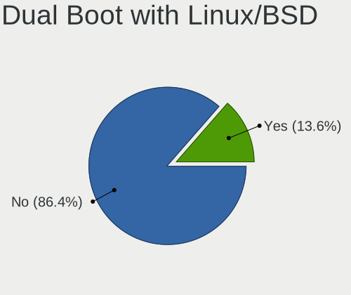
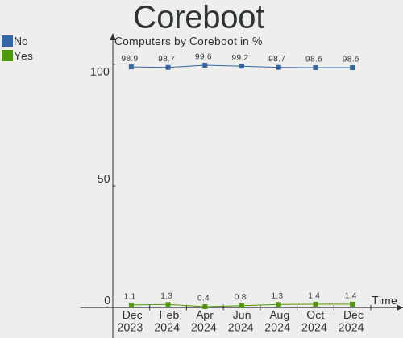
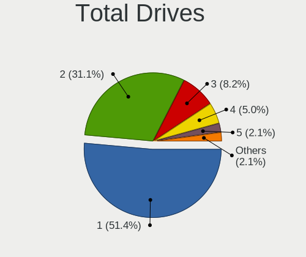
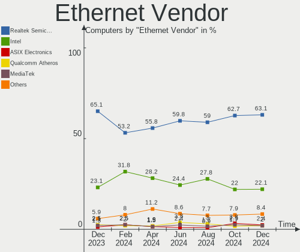
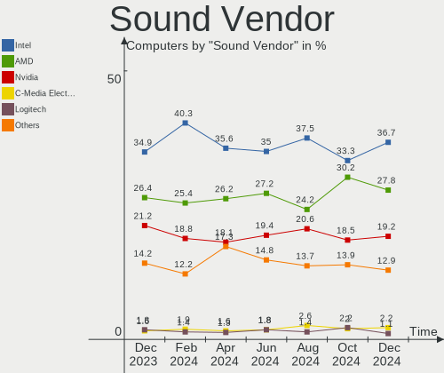
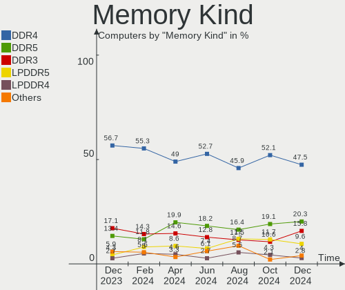
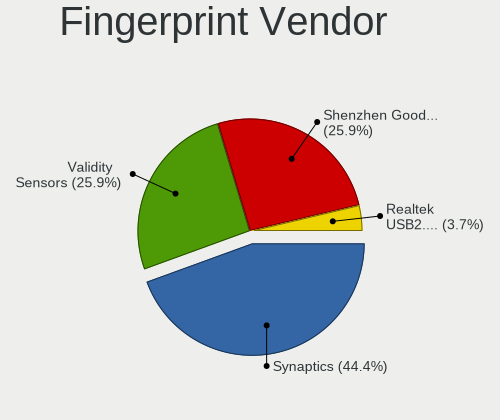

Arch - Hardware Trends
----------------------

A project to identify most popular hardware characteristics and track their change
over time based on data collected by Linux users at https://Linux-Hardware.org.

Anyone can contribute to this report by the [hw-probe](https://github.com/linuxhw/hw-probe) tool:

    sudo -E hw-probe -all -upload

This is a report for all computer types. See also reports for [desktops](/Dist/Arch/Desktop/README.md) and [notebooks](/Dist/Arch/Notebook/README.md).

This report is for one last month. Overall report since the beginning of time: [TestDays](https://github.com/linuxhw/TestDays)

Period: Feb, 2023.

Contents
--------

* [ System ](#system)
  - [ OS                       ](#os)
  - [ OS Family                ](#os-family)
  - [ Kernel                   ](#kernel)
  - [ Kernel Family            ](#kernel-family)
  - [ Kernel Major Ver.        ](#kernel-major-ver)
  - [ Arch                     ](#arch)
  - [ DE                       ](#de)
  - [ Display Server           ](#display-server)
  - [ Display Manager          ](#display-manager)
  - [ OS Lang                  ](#os-lang)
  - [ Boot Mode                ](#boot-mode)
  - [ Filesystem               ](#filesystem)
  - [ Part. scheme             ](#part-scheme)
  - [ Dual Boot with Linux/BSD ](#dual-boot-with-linuxbsd)
  - [ Dual Boot (Win)          ](#dual-boot-win)

* [ Board ](#board)
  - [ Vendor                   ](#vendor)
  - [ Model                    ](#model)
  - [ Model Family             ](#model-family)
  - [ MFG Year                 ](#mfg-year)
  - [ Form Factor              ](#form-factor)
  - [ Secure Boot              ](#secure-boot)
  - [ Coreboot                 ](#coreboot)
  - [ RAM Size                 ](#ram-size)
  - [ RAM Used                 ](#ram-used)
  - [ Total Drives             ](#total-drives)
  - [ Has CD-ROM               ](#has-cd-rom)
  - [ Has Ethernet             ](#has-ethernet)
  - [ Has WiFi                 ](#has-wifi)
  - [ Has Bluetooth            ](#has-bluetooth)

* [ Location ](#location)
  - [ Country                  ](#country)
  - [ City                     ](#city)

* [ Drives ](#drives)
  - [ Drive Vendor             ](#drive-vendor)
  - [ Drive Model              ](#drive-model)
  - [ HDD Vendor               ](#hdd-vendor)
  - [ SSD Vendor               ](#ssd-vendor)
  - [ Drive Kind               ](#drive-kind)
  - [ Drive Connector          ](#drive-connector)
  - [ Drive Size               ](#drive-size)
  - [ Space Total              ](#space-total)
  - [ Space Used               ](#space-used)
  - [ Malfunc. Drives          ](#malfunc-drives)
  - [ Malfunc. Drive Vendor    ](#malfunc-drive-vendor)
  - [ Malfunc. HDD Vendor      ](#malfunc-hdd-vendor)
  - [ Malfunc. Drive Kind      ](#malfunc-drive-kind)
  - [ Failed Drives            ](#failed-drives)
  - [ Failed Drive Vendor      ](#failed-drive-vendor)
  - [ Drive Status             ](#drive-status)

* [ Storage controller ](#storage-controller)
  - [ Storage Vendor           ](#storage-vendor)
  - [ Storage Model            ](#storage-model)
  - [ Storage Kind             ](#storage-kind)

* [ Processor ](#processor)
  - [ CPU Vendor               ](#cpu-vendor)
  - [ CPU Model                ](#cpu-model)
  - [ CPU Model Family         ](#cpu-model-family)
  - [ CPU Cores                ](#cpu-cores)
  - [ CPU Sockets              ](#cpu-sockets)
  - [ CPU Threads              ](#cpu-threads)
  - [ CPU Op-Modes             ](#cpu-op-modes)
  - [ CPU Microcode            ](#cpu-microcode)
  - [ CPU Microarch            ](#cpu-microarch)

* [ Graphics ](#graphics)
  - [ GPU Vendor               ](#gpu-vendor)
  - [ GPU Model                ](#gpu-model)
  - [ GPU Combo                ](#gpu-combo)
  - [ GPU Driver               ](#gpu-driver)
  - [ GPU Memory               ](#gpu-memory)

* [ Monitor ](#monitor)
  - [ Monitor Vendor           ](#monitor-vendor)
  - [ Monitor Model            ](#monitor-model)
  - [ Monitor Resolution       ](#monitor-resolution)
  - [ Monitor Diagonal         ](#monitor-diagonal)
  - [ Monitor Width            ](#monitor-width)
  - [ Aspect Ratio             ](#aspect-ratio)
  - [ Monitor Area             ](#monitor-area)
  - [ Pixel Density            ](#pixel-density)
  - [ Multiple Monitors        ](#multiple-monitors)

* [ Network ](#network)
  - [ Net Controller Vendor    ](#net-controller-vendor)
  - [ Net Controller Model     ](#net-controller-model)
  - [ Wireless Vendor          ](#wireless-vendor)
  - [ Wireless Model           ](#wireless-model)
  - [ Ethernet Vendor          ](#ethernet-vendor)
  - [ Ethernet Model           ](#ethernet-model)
  - [ Net Controller Kind      ](#net-controller-kind)
  - [ Used Controller          ](#used-controller)
  - [ NICs                     ](#nics)
  - [ IPv6                     ](#ipv6)

* [ Bluetooth ](#bluetooth)
  - [ Bluetooth Vendor         ](#bluetooth-vendor)
  - [ Bluetooth Model          ](#bluetooth-model)

* [ Sound ](#sound)
  - [ Sound Vendor             ](#sound-vendor)
  - [ Sound Model              ](#sound-model)

* [ Memory ](#memory)
  - [ Memory Vendor            ](#memory-vendor)
  - [ Memory Model             ](#memory-model)
  - [ Memory Kind              ](#memory-kind)
  - [ Memory Form Factor       ](#memory-form-factor)
  - [ Memory Size              ](#memory-size)
  - [ Memory Speed             ](#memory-speed)

* [ Printers & scanners ](#printers--scanners)
  - [ Printer Vendor           ](#printer-vendor)
  - [ Printer Model            ](#printer-model)
  - [ Scanner Vendor           ](#scanner-vendor)
  - [ Scanner Model            ](#scanner-model)

* [ Camera ](#camera)
  - [ Camera Vendor            ](#camera-vendor)
  - [ Camera Model             ](#camera-model)

* [ Security ](#security)
  - [ Fingerprint Vendor       ](#fingerprint-vendor)
  - [ Fingerprint Model        ](#fingerprint-model)
  - [ Chipcard Vendor          ](#chipcard-vendor)
  - [ Chipcard Model           ](#chipcard-model)

* [ Unsupported ](#unsupported)
  - [ Unsupported Devices      ](#unsupported-devices)
  - [ Unsupported Device Types ](#unsupported-device-types)

System
------

OS
--

Installed operating systems

| Name         | Computers | Percent |
|--------------|-----------|---------|
| Arch Rolling | 196       | 100%    |

OS Family
---------

OS without a version

| Name | Computers | Percent |
|------|-----------|---------|
| Arch | 196       | 100%    |

Kernel
------

Version of the Linux kernel

| Version                | Computers | Percent |
|------------------------|-----------|---------|
| 6.1.12-arch1-1         | 33        | 16.84%  |
| 6.1.9-arch1-1          | 29        | 14.8%   |
| 6.1.11-arch1-1         | 15        | 7.65%   |
| 6.1.9-arch1-2          | 13        | 6.63%   |
| 6.1.10-arch1-1         | 11        | 5.61%   |
| 6.1.8-arch1-1          | 10        | 5.1%    |
| 6.1.11-zen1-1-zen      | 9         | 4.59%   |
| 5.15.94-1-lts          | 8         | 4.08%   |
| 6.2.1-arch1-1          | 7         | 3.57%   |
| 6.1.13-1-lts           | 5         | 2.55%   |
| 6.1.12-zen1-1-zen      | 5         | 2.55%   |
| 6.1.9-zen1-1-zen       | 4         | 2.04%   |
| 6.1.8-zen1-1-zen       | 4         | 2.04%   |
| 5.15.91-1-lts          | 4         | 2.04%   |
| 6.1.4-arch1-1          | 2         | 1.02%   |
| 6.1.12-lqx4-1-lqx      | 2         | 1.02%   |
| 6.1.12-1-lts           | 2         | 1.02%   |
| 6.1.1-arch1-1          | 2         | 1.02%   |
| 5.15.91-4-lts          | 2         | 1.02%   |
| 5.15.90-1-lts          | 2         | 1.02%   |
| 6.2.0-zen1-1-zen       | 1         | 0.51%   |
| 6.2.0-arch1-1          | 1         | 0.51%   |
| 6.2.0-273-tkg-cfs      | 1         | 0.51%   |
| 6.2.0-1-mainline       | 1         | 0.51%   |
| 6.1.9-zen1-2-zen       | 1         | 0.51%   |
| 6.1.9-x64v1-xanmod1-1  | 1         | 0.51%   |
| 6.1.9-arch1-1.1        | 1         | 0.51%   |
| 6.1.9-273-tkg-cfs      | 1         | 0.51%   |
| 6.1.8-x64v1-xanmod1-1  | 1         | 0.51%   |
| 6.1.8-1-1000hz         | 1         | 0.51%   |
| 6.1.7-1-clear          | 1         | 0.51%   |
| 6.1.6-arch1-g14-1      | 1         | 0.51%   |
| 6.1.14-1-lts           | 1         | 0.51%   |
| 6.1.12-1-ck            | 1         | 0.51%   |
| 6.1.11-zen1-1.1-zen    | 1         | 0.51%   |
| 6.1.11-x64v1-xanmod1-1 | 1         | 0.51%   |
| 6.1.11-lqx1-1-lqx      | 1         | 0.51%   |
| 6.1.11-arch1-1.1       | 1         | 0.51%   |
| 6.1.11-arch1-1-surface | 1         | 0.51%   |
| 6.1.11-273-tkg-cfs     | 1         | 0.51%   |

Kernel Family
-------------

Linux kernel without a distro release

| Version | Computers | Percent |
|---------|-----------|---------|
| 6.1.9   | 50        | 25.51%  |
| 6.1.12  | 43        | 21.94%  |
| 6.1.11  | 30        | 15.31%  |
| 6.1.8   | 16        | 8.16%   |
| 6.1.10  | 13        | 6.63%   |
| 5.15.94 | 8         | 4.08%   |
| 6.2.1   | 7         | 3.57%   |
| 5.15.91 | 6         | 3.06%   |
| 6.1.13  | 5         | 2.55%   |
| 6.2.0   | 4         | 2.04%   |
| 6.1.4   | 2         | 1.02%   |
| 6.1.1   | 2         | 1.02%   |
| 5.15.90 | 2         | 1.02%   |
| 6.1.7   | 1         | 0.51%   |
| 6.1.6   | 1         | 0.51%   |
| 6.1.14  | 1         | 0.51%   |
| 6.0.9   | 1         | 0.51%   |
| 6.0.6   | 1         | 0.51%   |
| 6.0.11  | 1         | 0.51%   |
| 5.19.13 | 1         | 0.51%   |
| 5.10.34 | 1         | 0.51%   |

Kernel Major Ver.
-----------------

Linux kernel major version

| Version | Computers | Percent |
|---------|-----------|---------|
| 6.1     | 164       | 83.67%  |
| 5.15    | 16        | 8.16%   |
| 6.2     | 11        | 5.61%   |
| 6.0     | 3         | 1.53%   |
| 5.19    | 1         | 0.51%   |
| 5.10    | 1         | 0.51%   |

Arch
----

OS architecture (x86_64, i586, etc.)

| Name   | Computers | Percent |
|--------|-----------|---------|
| x86_64 | 196       | 100%    |

DE
--

Desktop Environment

| Name       | Computers | Percent |
|------------|-----------|---------|
| GNOME      | 70        | 35.71%  |
| KDE5       | 64        | 32.65%  |
| Unknown    | 13        | 6.63%   |
| XFCE       | 12        | 6.12%   |
| X-Cinnamon | 5         | 2.55%   |
| i3         | 5         | 2.55%   |
| Hyprland   | 5         | 2.55%   |
| sway       | 3         | 1.53%   |
| Deepin     | 3         | 1.53%   |
| qtile      | 2         | 1.02%   |
| LXQt       | 2         | 1.02%   |
| LeftWM     | 2         | 1.02%   |
| Cinnamon   | 2         | 1.02%   |
| chadwm     | 2         | 1.02%   |
| xmonad     | 1         | 0.51%   |
| Openbox    | 1         | 0.51%   |
| LXDE       | 1         | 0.51%   |
| DWM        | 1         | 0.51%   |
| Budgie     | 1         | 0.51%   |
| awesome    | 1         | 0.51%   |

Display Server
--------------

X11 or Wayland

| Name    | Computers | Percent |
|---------|-----------|---------|
| X11     | 94        | 47.96%  |
| Wayland | 69        | 35.2%   |
| Unknown | 19        | 9.69%   |
| Tty     | 14        | 7.14%   |

Display Manager
---------------

SDDM, LightDM, etc.

| Name    | Computers | Percent |
|---------|-----------|---------|
| Unknown | 78        | 39.8%   |
| SDDM    | 44        | 22.45%  |
| LightDM | 33        | 16.84%  |
| GDM     | 31        | 15.82%  |
| Ly      | 5         | 2.55%   |
| SLiM    | 2         | 1.02%   |
| LXDM    | 2         | 1.02%   |
| GREETD  | 1         | 0.51%   |

OS Lang
-------

Language

| Lang        | Computers | Percent |
|-------------|-----------|---------|
| en_us       | 91        | 46.43%  |
| en_GB       | 14        | 7.14%   |
| C           | 13        | 6.63%   |
| de_DE       | 12        | 6.12%   |
| Unknown     | 9         | 4.59%   |
| it_IT       | 8         | 4.08%   |
| pt_BR       | 7         | 3.57%   |
| fr_FR       | 6         | 3.06%   |
| zh_CN       | 5         | 2.55%   |
| ru_RU       | 3         | 1.53%   |
| pl_PL       | 3         | 1.53%   |
| en_IE       | 3         | 1.53%   |
| en_DK       | 3         | 1.53%   |
| ko_KR       | 2         | 1.02%   |
| en_IN       | 2         | 1.02%   |
| en_CA       | 2         | 1.02%   |
| sv_SE       | 1         | 0.51%   |
| pt_BRutf8   | 1         | 0.51%   |
| nl_NL       | 1         | 0.51%   |
| lv_LV       | 1         | 0.51%   |
| fi_FI       | 1         | 0.51%   |
| es_PE       | 1         | 0.51%   |
| es_ES       | 1         | 0.51%   |
| es_CO       | 1         | 0.51%   |
| en_US.utf-8 | 1         | 0.51%   |
| en_PH       | 1         | 0.51%   |
| en-US.UTF8  | 1         | 0.51%   |
| de_AT       | 1         | 0.51%   |
| ar_SA       | 1         | 0.51%   |

Boot Mode
---------

EFI or BIOS

| Mode | Computers | Percent |
|------|-----------|---------|
| EFI  | 128       | 65.31%  |
| BIOS | 68        | 34.69%  |

Filesystem
----------

Type of filesystem

| Type    | Computers | Percent |
|---------|-----------|---------|
| Ext4    | 134       | 68.37%  |
| Btrfs   | 52        | 26.53%  |
| Xfs     | 4         | 2.04%   |
| F2fs    | 2         | 1.02%   |
| Unknown | 2         | 1.02%   |
| Zfs     | 1         | 0.51%   |
| Overlay | 1         | 0.51%   |

Part. scheme
------------

Scheme of partitioning

| Type    | Computers | Percent |
|---------|-----------|---------|
| GPT     | 137       | 69.9%   |
| Unknown | 50        | 25.51%  |
| MBR     | 9         | 4.59%   |

Dual Boot with Linux/BSD
------------------------

Hosting more than one Linux/BSD

| Dual boot | Computers | Percent |
|-----------|-----------|---------|
| No        | 171       | 87.24%  |
| Yes       | 25        | 12.76%  |

Dual Boot (Win)
---------------

Hosting Linux and Windows

| Dual boot | Computers | Percent |
|-----------|-----------|---------|
| No        | 135       | 68.88%  |
| Yes       | 61        | 31.12%  |

Board
-----

Vendor
------

Motherboard manufacturer

| Name                   | Computers | Percent |
|------------------------|-----------|---------|
| ASUSTek Computer       | 38        | 19.39%  |
| Lenovo                 | 34        | 17.35%  |
| Dell                   | 23        | 11.73%  |
| MSI                    | 20        | 10.2%   |
| Gigabyte Technology    | 17        | 8.67%   |
| Hewlett-Packard        | 16        | 8.16%   |
| ASRock                 | 10        | 5.1%    |
| Acer                   | 7         | 3.57%   |
| Apple                  | 4         | 2.04%   |
| Toshiba                | 3         | 1.53%   |
| HUAWEI                 | 3         | 1.53%   |
| Sony                   | 2         | 1.02%   |
| Microsoft              | 2         | 1.02%   |
| Unknown                | 2         | 1.02%   |
| TUXEDO                 | 1         | 0.51%   |
| Timi                   | 1         | 0.51%   |
| Star Labs              | 1         | 0.51%   |
| Schenker               | 1         | 0.51%   |
| Monster                | 1         | 0.51%   |
| Medion                 | 1         | 0.51%   |
| MECHREVO               | 1         | 0.51%   |
| Intel Client Systems   | 1         | 0.51%   |
| Intel                  | 1         | 0.51%   |
| Google                 | 1         | 0.51%   |
| Gateway                | 1         | 0.51%   |
| Fujitsu                | 1         | 0.51%   |
| Compaq                 | 1         | 0.51%   |
| AZW                    | 1         | 0.51%   |
| Avell High Performance | 1         | 0.51%   |

Model
-----

Motherboard model

| Name                                 | Computers | Percent |
|--------------------------------------|-----------|---------|
| Dell XPS 15 9520                     | 3         | 1.53%   |
| Unknown                              | 3         | 1.53%   |
| MSI MS-7C52                          | 2         | 1.02%   |
| MSI MS-7B79                          | 2         | 1.02%   |
| HUAWEI NBD-WXX9                      | 2         | 1.02%   |
| Gigabyte X570 AORUS ELITE            | 2         | 1.02%   |
| ASUS Zenbook UX535QE_UM535QE         | 2         | 1.02%   |
| ASUS ROG STRIX B550-F GAMING         | 2         | 1.02%   |
| ASUS ROG STRIX B450-F GAMING         | 2         | 1.02%   |
| Toshiba Satellite Pro L510           | 1         | 0.51%   |
| Toshiba Satellite P870               | 1         | 0.51%   |
| Toshiba Satellite P500               | 1         | 0.51%   |
| Timi Xiaomi Book Pro 14 2022         | 1         | 0.51%   |
| Star Labs StarBook                   | 1         | 0.51%   |
| Sony VPCEH1M1E                       | 1         | 0.51%   |
| Sony SVE1712C1EW                     | 1         | 0.51%   |
| Schenker VISION (E22)                | 1         | 0.51%   |
| MSI MS-7D23                          | 1         | 0.51%   |
| MSI MS-7C96                          | 1         | 0.51%   |
| MSI MS-7C94                          | 1         | 0.51%   |
| MSI MS-7C75                          | 1         | 0.51%   |
| MSI MS-7C56                          | 1         | 0.51%   |
| MSI MS-7C35                          | 1         | 0.51%   |
| MSI MS-7C02                          | 1         | 0.51%   |
| MSI MS-7B98                          | 1         | 0.51%   |
| MSI MS-7A70                          | 1         | 0.51%   |
| MSI MS-7A34                          | 1         | 0.51%   |
| MSI MS-7641                          | 1         | 0.51%   |
| MSI Modern 14 B11SBU                 | 1         | 0.51%   |
| MSI Modern 14 B11MOU                 | 1         | 0.51%   |
| MSI GL65 9SD                         | 1         | 0.51%   |
| MSI GE63 Raider RGB 9SE              | 1         | 0.51%   |
| MSI ESPRIMO P1510                    | 1         | 0.51%   |
| Monster ABRA A7 V11.1                | 1         | 0.51%   |
| Microsoft Surface Laptop Go          | 1         | 0.51%   |
| Microsoft Surface Go 2               | 1         | 0.51%   |
| Medion S17405                        | 1         | 0.51%   |
| MECHREVO Jiaolong Series MRID6       | 1         | 0.51%   |
| Lenovo ThinkPad Z13 Gen 1 21D2CTO1WW | 1         | 0.51%   |
| Lenovo ThinkPad X61s 7667CG7         | 1         | 0.51%   |

Model Family
------------

Motherboard model prefix

| Name               | Computers | Percent |
|--------------------|-----------|---------|
| ASUS ROG           | 17        | 8.67%   |
| Lenovo ThinkPad    | 13        | 6.63%   |
| Lenovo IdeaPad     | 10        | 5.1%    |
| ASUS PRIME         | 7         | 3.57%   |
| Dell XPS           | 6         | 3.06%   |
| Dell Latitude      | 6         | 3.06%   |
| Acer Aspire        | 4         | 2.04%   |
| Toshiba Satellite  | 3         | 1.53%   |
| Lenovo Legion      | 3         | 1.53%   |
| HP Laptop          | 3         | 1.53%   |
| HP EliteBook       | 3         | 1.53%   |
| Gigabyte B450M     | 3         | 1.53%   |
| Dell Inspiron      | 3         | 1.53%   |
| ASUS TUF           | 3         | 1.53%   |
| Unknown            | 3         | 1.53%   |
| MSI MS-7C52        | 2         | 1.02%   |
| MSI MS-7B79        | 2         | 1.02%   |
| MSI Modern         | 2         | 1.02%   |
| Microsoft Surface  | 2         | 1.02%   |
| Lenovo ThinkBook   | 2         | 1.02%   |
| HUAWEI NBD-WXX9    | 2         | 1.02%   |
| HP Stream          | 2         | 1.02%   |
| HP ProBook         | 2         | 1.02%   |
| HP Pavilion        | 2         | 1.02%   |
| Gigabyte X570      | 2         | 1.02%   |
| Gigabyte B650M     | 2         | 1.02%   |
| Gigabyte B550      | 2         | 1.02%   |
| Dell OptiPlex      | 2         | 1.02%   |
| ASUS Zenbook       | 2         | 1.02%   |
| ASRock B450M       | 2         | 1.02%   |
| ASRock B450        | 2         | 1.02%   |
| Acer Nitro         | 2         | 1.02%   |
| Timi Xiaomi        | 1         | 0.51%   |
| Star Labs StarBook | 1         | 0.51%   |
| Sony VPCEH1M1E     | 1         | 0.51%   |
| Sony SVE1712C1EW   | 1         | 0.51%   |
| Schenker VISION    | 1         | 0.51%   |
| MSI MS-7D23        | 1         | 0.51%   |
| MSI MS-7C96        | 1         | 0.51%   |
| MSI MS-7C94        | 1         | 0.51%   |

MFG Year
--------

Motherboard manufacture year

| Year | Computers | Percent |
|------|-----------|---------|
| 2022 | 36        | 18.37%  |
| 2019 | 29        | 14.8%   |
| 2021 | 28        | 14.29%  |
| 2020 | 25        | 12.76%  |
| 2018 | 23        | 11.73%  |
| 2013 | 8         | 4.08%   |
| 2017 | 7         | 3.57%   |
| 2016 | 7         | 3.57%   |
| 2012 | 7         | 3.57%   |
| 2014 | 6         | 3.06%   |
| 2011 | 6         | 3.06%   |
| 2015 | 4         | 2.04%   |
| 2023 | 3         | 1.53%   |
| 2010 | 2         | 1.02%   |
| 2009 | 2         | 1.02%   |
| 2008 | 2         | 1.02%   |
| 2007 | 1         | 0.51%   |

Form Factor
-----------

Physical design of the computer

| Name        | Computers | Percent |
|-------------|-----------|---------|
| Notebook    | 103       | 52.55%  |
| Desktop     | 81        | 41.33%  |
| Convertible | 7         | 3.57%   |
| Tablet      | 2         | 1.02%   |
| Mini pc     | 2         | 1.02%   |
| Server      | 1         | 0.51%   |

Secure Boot
-----------

Enabled or disabled

| State    | Computers | Percent |
|----------|-----------|---------|
| Disabled | 186       | 94.9%   |
| Enabled  | 10        | 5.1%    |

Coreboot
--------

Have coreboot on board

| Used | Computers | Percent |
|------|-----------|---------|
| No   | 194       | 98.98%  |
| Yes  | 2         | 1.02%   |

RAM Size
--------

Total RAM memory

| Size in GB  | Computers | Percent |
|-------------|-----------|---------|
| 16.01-24.0  | 49        | 25%     |
| 8.01-16.0   | 41        | 20.92%  |
| 32.01-64.0  | 36        | 18.37%  |
| 4.01-8.0    | 29        | 14.8%   |
| 64.01-256.0 | 18        | 9.18%   |
| 3.01-4.0    | 15        | 7.65%   |
| 24.01-32.0  | 6         | 3.06%   |
| 2.01-3.0    | 1         | 0.51%   |
| 1.01-2.0    | 1         | 0.51%   |

RAM Used
--------

Used RAM memory

| Used GB    | Computers | Percent |
|------------|-----------|---------|
| 4.01-8.0   | 61        | 31.12%  |
| 2.01-3.0   | 49        | 25%     |
| 3.01-4.0   | 31        | 15.82%  |
| 1.01-2.0   | 28        | 14.29%  |
| 8.01-16.0  | 14        | 7.14%   |
| 0.51-1.0   | 5         | 2.55%   |
| 16.01-24.0 | 4         | 2.04%   |
| 32.01-64.0 | 2         | 1.02%   |
| 24.01-32.0 | 1         | 0.51%   |
| 0.01-0.5   | 1         | 0.51%   |

Total Drives
------------

Number of drives on board

| Drives | Computers | Percent |
|--------|-----------|---------|
| 1      | 100       | 51.02%  |
| 2      | 54        | 27.55%  |
| 3      | 18        | 9.18%   |
| 5      | 7         | 3.57%   |
| 4      | 7         | 3.57%   |
| 6      | 5         | 2.55%   |
| 7      | 2         | 1.02%   |
| 13     | 1         | 0.51%   |
| 12     | 1         | 0.51%   |
| 11     | 1         | 0.51%   |

Has CD-ROM
----------

Has CD-ROM on board

| Presented | Computers | Percent |
|-----------|-----------|---------|
| No        | 165       | 84.18%  |
| Yes       | 31        | 15.82%  |

Has Ethernet
------------

Has Ethernet on board

| Presented | Computers | Percent |
|-----------|-----------|---------|
| Yes       | 157       | 80.1%   |
| No        | 39        | 19.9%   |

Has WiFi
--------

Has WiFi module

| Presented | Computers | Percent |
|-----------|-----------|---------|
| Yes       | 154       | 78.57%  |
| No        | 42        | 21.43%  |

Has Bluetooth
-------------

Has Bluetooth module

| Presented | Computers | Percent |
|-----------|-----------|---------|
| Yes       | 144       | 73.47%  |
| No        | 52        | 26.53%  |

Location
--------

Country
-------

Geographic location (country)

| Country      | Computers | Percent |
|--------------|-----------|---------|
| USA          | 39        | 19.9%   |
| Germany      | 21        | 10.71%  |
| Russia       | 13        | 6.63%   |
| Brazil       | 11        | 5.61%   |
| France       | 10        | 5.1%    |
| Italy        | 9         | 4.59%   |
| UK           | 8         | 4.08%   |
| Poland       | 7         | 3.57%   |
| India        | 7         | 3.57%   |
| Canada       | 5         | 2.55%   |
| Switzerland  | 4         | 2.04%   |
| Australia    | 4         | 2.04%   |
| Vietnam      | 3         | 1.53%   |
| Turkey       | 3         | 1.53%   |
| Sweden       | 3         | 1.53%   |
| Netherlands  | 3         | 1.53%   |
| Finland      | 3         | 1.53%   |
| Denmark      | 3         | 1.53%   |
| Spain        | 2         | 1.02%   |
| South Korea  | 2         | 1.02%   |
| Romania      | 2         | 1.02%   |
| Philippines  | 2         | 1.02%   |
| Kazakhstan   | 2         | 1.02%   |
| Indonesia    | 2         | 1.02%   |
| Hong Kong    | 2         | 1.02%   |
| Greece       | 2         | 1.02%   |
| Colombia     | 2         | 1.02%   |
| China        | 2         | 1.02%   |
| Chile        | 2         | 1.02%   |
| Bulgaria     | 2         | 1.02%   |
| Bangladesh   | 2         | 1.02%   |
| Uzbekistan   | 1         | 0.51%   |
| Thailand     | 1         | 0.51%   |
| Taiwan       | 1         | 0.51%   |
| Singapore    | 1         | 0.51%   |
| Saudi Arabia | 1         | 0.51%   |
| Peru         | 1         | 0.51%   |
| New Zealand  | 1         | 0.51%   |
| Malta        | 1         | 0.51%   |
| Latvia       | 1         | 0.51%   |

City
----

Geographic location (city)

| City              | Computers | Percent |
|-------------------|-----------|---------|
| Paris             | 5         | 2.55%   |
| Warsaw            | 4         | 2.04%   |
| Zurich            | 3         | 1.53%   |
| Milan             | 3         | 1.53%   |
| Copenhagen        | 3         | 1.53%   |
| Wonju             | 2         | 1.02%   |
| Vladivostok       | 2         | 1.02%   |
| Tillsonburg       | 2         | 1.02%   |
| St Petersburg     | 2         | 1.02%   |
| Schwarzenbek      | 2         | 1.02%   |
| San Francisco     | 2         | 1.02%   |
| Moscow            | 2         | 1.02%   |
| Melbourne         | 2         | 1.02%   |
| Kazan’          | 2         | 1.02%   |
| Hanoi             | 2         | 1.02%   |
| Hamburg           | 2         | 1.02%   |
| Escondido         | 2         | 1.02%   |
| Cologne           | 2         | 1.02%   |
| Central           | 2         | 1.02%   |
| Bucharest         | 2         | 1.02%   |
| Bengaluru         | 2         | 1.02%   |
| Beijing           | 2         | 1.02%   |
| Worms             | 1         | 0.51%   |
| Whitehall         | 1         | 0.51%   |
| Weiterstadt       | 1         | 0.51%   |
| Walnutport        | 1         | 0.51%   |
| Villeneuve-d'Ascq | 1         | 0.51%   |
| Victoria          | 1         | 0.51%   |
| Utica             | 1         | 0.51%   |
| Uberlândia       | 1         | 0.51%   |
| Tulsa             | 1         | 0.51%   |
| Toulouse          | 1         | 0.51%   |
| Tonyrefail        | 1         | 0.51%   |
| Tomball           | 1         | 0.51%   |
| Tirupati          | 1         | 0.51%   |
| The Bronx         | 1         | 0.51%   |
| Tashkent          | 1         | 0.51%   |
| Tarlac City       | 1         | 0.51%   |
| Tampere           | 1         | 0.51%   |
| Tampa             | 1         | 0.51%   |

Drives
------

Drive Vendor
------------

Hard drive vendors

| Vendor                         | Computers | Drives | Percent |
|--------------------------------|-----------|--------|---------|
| Samsung Electronics            | 63        | 86     | 19.57%  |
| WDC                            | 36        | 54     | 11.18%  |
| Seagate                        | 35        | 45     | 10.87%  |
| Sandisk                        | 27        | 33     | 8.39%   |
| Kingston                       | 14        | 14     | 4.35%   |
| Crucial                        | 13        | 14     | 4.04%   |
| Toshiba                        | 12        | 15     | 3.73%   |
| SK hynix                       | 12        | 12     | 3.73%   |
| Micron Technology              | 12        | 12     | 3.73%   |
| Unknown                        | 10        | 13     | 3.11%   |
| Phison Electronics             | 10        | 10     | 3.11%   |
| Intel                          | 8         | 8      | 2.48%   |
| A-DATA Technology              | 5         | 5      | 1.55%   |
| Micron/Crucial Technology      | 4         | 4      | 1.24%   |
| China                          | 4         | 4      | 1.24%   |
| Transcend                      | 3         | 3      | 0.93%   |
| TO Exter                       | 3         | 3      | 0.93%   |
| Solid State Storage Technology | 3         | 3      | 0.93%   |
| Realtek                        | 3         | 3      | 0.93%   |
| Patriot                        | 3         | 3      | 0.93%   |
| KIOXIA                         | 3         | 3      | 0.93%   |
| Hitachi                        | 3         | 3      | 0.93%   |
| ADATA Technology               | 3         | 3      | 0.93%   |
| Team                           | 2         | 2      | 0.62%   |
| SPCC                           | 2         | 2      | 0.62%   |
| Realtek Semiconductor          | 2         | 2      | 0.62%   |
| Phison                         | 2         | 2      | 0.62%   |
| MAXIO Technology (Hangzhou)    | 2         | 2      | 0.62%   |
| Kingston Technology Company    | 2         | 2      | 0.62%   |
| Intenso                        | 2         | 2      | 0.62%   |
| Unknown                        | 2         | 2      | 0.62%   |
| WDC WDS2                       | 1         | 1      | 0.31%   |
| VISIPRO                        | 1         | 1      | 0.31%   |
| USB30                          | 1         | 3      | 0.31%   |
| USB3.0                         | 1         | 1      | 0.31%   |
| Union Memory                   | 1         | 1      | 0.31%   |
| T-FORCE                        | 1         | 1      | 0.31%   |
| Silicon Motion                 | 1         | 2      | 0.31%   |
| ShiJi                          | 1         | 1      | 0.31%   |
| QNAP                           | 1         | 7      | 0.31%   |

Drive Model
-----------

Hard drive models

| Model                                                | Computers | Percent |
|------------------------------------------------------|-----------|---------|
| Samsung NVMe SSD Controller SM981/PM981/PM983 250GB  | 22        | 6.03%   |
| Samsung NVMe SSD Controller PM9A1/PM9A3/980PRO 960GB | 13        | 3.56%   |
| Phison PS5013 E13 NVMe Controller 500GB              | 5         | 1.37%   |
| Crucial CT1000MX500SSD1 1TB                          | 5         | 1.37%   |
| Unknown MMC Card  64GB                               | 4         | 1.1%    |
| Unknown MMC Card  32GB                               | 4         | 1.1%    |
| Sandisk WD Blue SN570 1TB                            | 4         | 1.1%    |
| Sandisk WD Blue SN550 NVMe SSD 1TB                   | 4         | 1.1%    |
| Samsung SSD 860 EVO 500GB                            | 4         | 1.1%    |
| Intel SSD 660P Series 1024GB                         | 4         | 1.1%    |
| Unknown MMC Card  128GB                              | 3         | 0.82%   |
| TO Exter nal USB 3.0 240GB                           | 3         | 0.82%   |
| Solid State Storage CA6-8D2048-Q11 NVMe SSSTC 2048GB | 3         | 0.82%   |
| Seagate ST2000DM008-2FR102 2TB                       | 3         | 0.82%   |
| Seagate ST1000LM048-2E7172 1TB                       | 3         | 0.82%   |
| Sandisk WD Black SN750 / PC SN730 NVMe SSD 512GB     | 3         | 0.82%   |
| Samsung SSD 870 EVO 250GB                            | 3         | 0.82%   |
| Samsung SSD 850 EVO 500GB                            | 3         | 0.82%   |
| Kingston SA400S37240G 240GB SSD                      | 3         | 0.82%   |
| Crucial CT240BX500SSD1 240GB                         | 3         | 0.82%   |
| WDC WDS120G2G0A-00JH30 120GB SSD                     | 2         | 0.55%   |
| WDC WD20EZRZ-00Z5HB0 2TB                             | 2         | 0.55%   |
| WDC WD20EZRX-00D8PB0 2TB                             | 2         | 0.55%   |
| WDC WD20EARS-00MVWB0 2TB                             | 2         | 0.55%   |
| WDC WD10EARS-00Y5B1 1TB                              | 2         | 0.55%   |
| Toshiba XG6 NVMe SSD Controller 512GB                | 2         | 0.55%   |
| Toshiba DT01ACA100 1TB                               | 2         | 0.55%   |
| SK hynix BC501 NVMe Solid State Drive 512GB          | 2         | 0.55%   |
| Seagate ST500LM021-1KJ152 500GB                      | 2         | 0.55%   |
| Seagate ST4000DM004-2CV104 4TB                       | 2         | 0.55%   |
| Seagate ST1000LM049-2GH172 1TB                       | 2         | 0.55%   |
| Sandisk WD_BLACK SN770 1TB                           | 2         | 0.55%   |
| Sandisk PC SN520 NVMe SSD 512GB                      | 2         | 0.55%   |
| Samsung SSD 980 500GB                                | 2         | 0.55%   |
| Samsung SSD 980 1TB                                  | 2         | 0.55%   |
| Samsung SSD 860 EVO 1TB                              | 2         | 0.55%   |
| Samsung SSD 850 EVO 250GB                            | 2         | 0.55%   |
| Samsung NVMe SSD Controller SM961/PM961/SM963 512GB  | 2         | 0.55%   |
| Realtek RTL9210B-CG 240GB                            | 2         | 0.55%   |
| Phison E12 NVMe Controller 1024GB                    | 2         | 0.55%   |

HDD Vendor
----------

Hard disk drive vendors

| Vendor              | Computers | Drives | Percent |
|---------------------|-----------|--------|---------|
| Seagate             | 32        | 42     | 40.51%  |
| WDC                 | 31        | 47     | 39.24%  |
| Toshiba             | 6         | 7      | 7.59%   |
| Hitachi             | 3         | 3      | 3.8%    |
| Samsung Electronics | 2         | 2      | 2.53%   |
| USB3.0              | 1         | 1      | 1.27%   |
| QNAP                | 1         | 7      | 1.27%   |
| JMicron Technology  | 1         | 6      | 1.27%   |
| HGST                | 1         | 1      | 1.27%   |
| Fujitsu             | 1         | 1      | 1.27%   |

SSD Vendor
----------

Solid state drive vendors

| Vendor              | Computers | Drives | Percent |
|---------------------|-----------|--------|---------|
| Samsung Electronics | 26        | 31     | 27.08%  |
| Crucial             | 13        | 14     | 13.54%  |
| Kingston            | 10        | 10     | 10.42%  |
| WDC                 | 7         | 7      | 7.29%   |
| SanDisk             | 6         | 10     | 6.25%   |
| China               | 4         | 4      | 4.17%   |
| TO Exter            | 3         | 3      | 3.13%   |
| Patriot             | 3         | 3      | 3.13%   |
| A-DATA Technology   | 3         | 3      | 3.13%   |
| Transcend           | 2         | 2      | 2.08%   |
| Toshiba             | 2         | 4      | 2.08%   |
| Team                | 2         | 2      | 2.08%   |
| SPCC                | 2         | 2      | 2.08%   |
| Intenso             | 2         | 2      | 2.08%   |
| Unknown             | 2         | 2      | 2.08%   |
| WDC WDS2            | 1         | 1      | 1.04%   |
| USB30               | 1         | 3      | 1.04%   |
| T-FORCE             | 1         | 1      | 1.04%   |
| OWC                 | 1         | 1      | 1.04%   |
| Micron Technology   | 1         | 1      | 1.04%   |
| Intel               | 1         | 1      | 1.04%   |
| HS-SSD-C100         | 1         | 1      | 1.04%   |
| Hewlett-Packard     | 1         | 1      | 1.04%   |
| 2.5                 | 1         | 1      | 1.04%   |

Drive Kind
----------

HDD or SSD

| Kind    | Computers | Drives | Percent |
|---------|-----------|--------|---------|
| NVMe    | 128       | 158    | 44.6%   |
| SSD     | 80        | 110    | 27.87%  |
| HDD     | 65        | 117    | 22.65%  |
| MMC     | 9         | 11     | 3.14%   |
| Unknown | 5         | 7      | 1.74%   |

Drive Connector
---------------

SATA, SAS, NVMe, etc.

| Type | Computers | Drives | Percent |
|------|-----------|--------|---------|
| NVMe | 127       | 155    | 49.61%  |
| SATA | 102       | 208    | 39.84%  |
| SAS  | 18        | 29     | 7.03%   |
| MMC  | 9         | 11     | 3.52%   |

Drive Size
----------

Size of hard drive

| Size in TB | Computers | Drives | Percent |
|------------|-----------|--------|---------|
| 0.01-0.5   | 73        | 106    | 46.2%   |
| 0.51-1.0   | 51        | 65     | 32.28%  |
| 1.01-2.0   | 17        | 27     | 10.76%  |
| 3.01-4.0   | 7         | 16     | 4.43%   |
| 2.01-3.0   | 5         | 7      | 3.16%   |
| 4.01-10.0  | 5         | 6      | 3.16%   |

Space Total
-----------

Amount of disk space available on the file system

| Size in GB     | Computers | Percent |
|----------------|-----------|---------|
| 501-1000       | 43        | 21.94%  |
| 101-250        | 41        | 20.92%  |
| 1001-2000      | 34        | 17.35%  |
| 251-500        | 33        | 16.84%  |
| More than 3000 | 23        | 11.73%  |
| 2001-3000      | 8         | 4.08%   |
| 51-100         | 6         | 3.06%   |
| Unknown        | 4         | 2.04%   |
| 21-50          | 3         | 1.53%   |
| 1-20           | 1         | 0.51%   |

Space Used
----------

Amount of used disk space

| Used GB        | Computers | Percent |
|----------------|-----------|---------|
| 1-20           | 41        | 20.92%  |
| 101-250        | 34        | 17.35%  |
| 21-50          | 26        | 13.27%  |
| 51-100         | 25        | 12.76%  |
| 251-500        | 24        | 12.24%  |
| 501-1000       | 19        | 9.69%   |
| More than 3000 | 10        | 5.1%    |
| 1001-2000      | 10        | 5.1%    |
| Unknown        | 4         | 2.04%   |
| 2001-3000      | 3         | 1.53%   |

Malfunc. Drives
---------------

Drive models with a malfunction

| Model                                                            | Computers | Drives | Percent |
|------------------------------------------------------------------|-----------|--------|---------|
| Samsung Electronics NVMe SSD Controller SM981/PM981/PM983 250GB  | 2         | 2      | 6.25%   |
| WDC WD5000LPCX-24C6HT0 500GB                                     | 1         | 1      | 3.13%   |
| WDC WD5000HHTZ-04N21V0 500GB                                     | 1         | 1      | 3.13%   |
| WDC WD40EFRX-68WT0N0 4TB                                         | 1         | 2      | 3.13%   |
| WDC WD3200AAJS-00L7A0 320GB                                      | 1         | 1      | 3.13%   |
| WDC WD30EFRX-68EUZN0 3TB                                         | 1         | 1      | 3.13%   |
| WDC WD20EARS-00MVWB0 2TB                                         | 1         | 1      | 3.13%   |
| WDC WD10EZEX-00MFCA0 1TB                                         | 1         | 1      | 3.13%   |
| WDC WD10EZEX-00BN5A0 1TB                                         | 1         | 1      | 3.13%   |
| WDC WD10EARS-00Y5B1 1TB                                          | 1         | 1      | 3.13%   |
| WDC WD10EADX-22TDHB0 1TB                                         | 1         | 1      | 3.13%   |
| Transcend TS1TSSD230S 1TB                                        | 1         | 1      | 3.13%   |
| Toshiba MK5055GSX 500GB                                          | 1         | 1      | 3.13%   |
| SK hynix PC711 HFS512GDE9X073N 512GB                             | 1         | 1      | 3.13%   |
| Seagate ST9500325AS 500GB                                        | 1         | 1      | 3.13%   |
| Seagate ST9160821AS 160GB                                        | 1         | 1      | 3.13%   |
| Seagate ST500LT012-1DG142 500GB                                  | 1         | 1      | 3.13%   |
| Seagate ST500LM021-1KJ152 500GB                                  | 1         | 1      | 3.13%   |
| Seagate ST500DM002-1BD142 500GB                                  | 1         | 1      | 3.13%   |
| Seagate ST3500413AS 500GB                                        | 1         | 2      | 3.13%   |
| Seagate ST3120026AS 120GB                                        | 1         | 1      | 3.13%   |
| Seagate ST2000DM001-9YN164 2TB                                   | 1         | 1      | 3.13%   |
| Seagate ST2000DL003-9VT166 2TB                                   | 1         | 1      | 3.13%   |
| Seagate ST1000LM049-2GH172 1TB                                   | 1         | 1      | 3.13%   |
| Seagate ST1000DX001-1CM162 1TB                                   | 1         | 1      | 3.13%   |
| SanDisk SDSSDA240G 240GB                                         | 1         | 1      | 3.13%   |
| Samsung Electronics NVMe SSD Controller PM9A1/PM9A3/980PRO 960GB | 1         | 1      | 3.13%   |
| Kingston SKC400S371T 1TB SSD                                     | 1         | 1      | 3.13%   |
| Kingston SA400S37240G 240GB SSD                                  | 1         | 1      | 3.13%   |
| Hitachi HTS545025B9A300 250GB                                    | 1         | 1      | 3.13%   |
| Crucial CT525MX300SSD4 528GB                                     | 1         | 1      | 3.13%   |

Malfunc. Drive Vendor
---------------------

Vendors of faulty drives

| Vendor              | Computers | Drives | Percent |
|---------------------|-----------|--------|---------|
| WDC                 | 10        | 11     | 33.33%  |
| Seagate             | 9         | 12     | 30%     |
| Samsung Electronics | 3         | 3      | 10%     |
| Kingston            | 2         | 2      | 6.67%   |
| Transcend           | 1         | 1      | 3.33%   |
| Toshiba             | 1         | 1      | 3.33%   |
| SK hynix            | 1         | 1      | 3.33%   |
| SanDisk             | 1         | 1      | 3.33%   |
| Hitachi             | 1         | 1      | 3.33%   |
| Crucial             | 1         | 1      | 3.33%   |

Malfunc. HDD Vendor
-------------------

Vendors of faulty HDD drives

| Vendor  | Computers | Drives | Percent |
|---------|-----------|--------|---------|
| WDC     | 10        | 11     | 47.62%  |
| Seagate | 9         | 12     | 42.86%  |
| Toshiba | 1         | 1      | 4.76%   |
| Hitachi | 1         | 1      | 4.76%   |

Malfunc. Drive Kind
-------------------

Kinds of faulty drives

| Kind | Computers | Drives | Percent |
|------|-----------|--------|---------|
| HDD  | 20        | 25     | 68.97%  |
| SSD  | 5         | 5      | 17.24%  |
| NVMe | 4         | 4      | 13.79%  |

Failed Drives
-------------

Failed drive models

Zero info for selected period =(

Failed Drive Vendor
-------------------

Failed drive vendors

Zero info for selected period =(

Drive Status
------------

Number of failed and malfunc. drives

| Status   | Computers | Drives | Percent |
|----------|-----------|--------|---------|
| Works    | 106       | 196    | 46.7%   |
| Detected | 94        | 173    | 41.41%  |
| Malfunc  | 27        | 34     | 11.89%  |

Storage controller
------------------

Storage Vendor
--------------

Storage controller vendors

| Vendor                         | Computers | Percent |
|--------------------------------|-----------|---------|
| Intel                          | 89        | 30.9%   |
| AMD                            | 54        | 18.75%  |
| Samsung Electronics            | 45        | 15.63%  |
| Sandisk                        | 22        | 7.64%   |
| SK hynix                       | 12        | 4.17%   |
| Phison Electronics             | 12        | 4.17%   |
| Micron Technology              | 11        | 3.82%   |
| Kingston Technology Company    | 6         | 2.08%   |
| ASMedia Technology             | 5         | 1.74%   |
| ADATA Technology               | 5         | 1.74%   |
| Toshiba America Info Systems   | 4         | 1.39%   |
| Micron/Crucial Technology      | 4         | 1.39%   |
| Solid State Storage Technology | 3         | 1.04%   |
| KIOXIA                         | 3         | 1.04%   |
| Seagate Technology             | 2         | 0.69%   |
| Realtek Semiconductor          | 2         | 0.69%   |
| MAXIO Technology (Hangzhou)    | 2         | 0.69%   |
| Union Memory (Shenzhen)        | 1         | 0.35%   |
| Transcend                      | 1         | 0.35%   |
| Silicon Motion                 | 1         | 0.35%   |
| Marvell Technology Group       | 1         | 0.35%   |
| JMicron Technology             | 1         | 0.35%   |
| Broadcom / LSI                 | 1         | 0.35%   |
| Apple                          | 1         | 0.35%   |

Storage Model
-------------

Storage controller models

| Model                                                                          | Computers | Percent |
|--------------------------------------------------------------------------------|-----------|---------|
| AMD FCH SATA Controller [AHCI mode]                                            | 34        | 10.69%  |
| Samsung NVMe SSD Controller SM981/PM981/PM983                                  | 23        | 7.23%   |
| AMD 400 Series Chipset SATA Controller                                         | 16        | 5.03%   |
| Samsung NVMe SSD Controller PM9A1/PM9A3/980PRO                                 | 14        | 4.4%    |
| Micron Non-Volatile memory controller                                          | 11        | 3.46%   |
| Intel Volume Management Device NVMe RAID Controller                            | 10        | 3.14%   |
| AMD 500 Series Chipset SATA Controller                                         | 10        | 3.14%   |
| SK hynix Gold P31/PC711 NVMe Solid State Drive                                 | 8         | 2.52%   |
| SanDisk Non-Volatile memory controller                                         | 7         | 2.2%    |
| SanDisk WD Blue SN570 NVMe SSD                                                 | 6         | 1.89%   |
| Samsung NVMe SSD Controller 980                                                | 6         | 1.89%   |
| Intel Sunrise Point-LP SATA Controller [AHCI mode]                             | 6         | 1.89%   |
| Intel 82801 Mobile SATA Controller [RAID mode]                                 | 6         | 1.89%   |
| Phison PS5013 E13 NVMe Controller                                              | 5         | 1.57%   |
| Intel Cannon Lake PCH SATA AHCI Controller                                     | 5         | 1.57%   |
| Intel Alder Lake-S PCH SATA Controller [AHCI Mode]                             | 5         | 1.57%   |
| AMD SATA controller                                                            | 5         | 1.57%   |
| SanDisk WD Blue SN550 NVMe SSD                                                 | 4         | 1.26%   |
| Kingston Company Company Non-Volatile memory controller                        | 4         | 1.26%   |
| Intel SSD 660P Series                                                          | 4         | 1.26%   |
| Intel Cannon Lake Mobile PCH SATA AHCI Controller                              | 4         | 1.26%   |
| Intel 8 Series/C220 Series Chipset Family 6-port SATA Controller 1 [AHCI mode] | 4         | 1.26%   |
| Intel 8 Series SATA Controller 1 [AHCI mode]                                   | 4         | 1.26%   |
| Intel 6 Series/C200 Series Chipset Family 6 port Desktop SATA AHCI Controller  | 4         | 1.26%   |
| ASMedia ASM1062 Serial ATA Controller                                          | 4         | 1.26%   |
| Solid State Storage Non-Volatile memory controller                             | 3         | 0.94%   |
| SanDisk WD Black SN750 / PC SN730 NVMe SSD                                     | 3         | 0.94%   |
| Intel Q170/Q150/B150/H170/H110/Z170/CM236 Chipset SATA Controller [AHCI Mode]  | 3         | 0.94%   |
| Intel Non-Volatile memory controller                                           | 3         | 0.94%   |
| Intel Comet Lake SATA AHCI Controller                                          | 3         | 0.94%   |
| Intel Cannon Point-LP SATA Controller [AHCI Mode]                              | 3         | 0.94%   |
| Intel 7 Series Chipset Family 6-port SATA Controller [AHCI mode]               | 3         | 0.94%   |
| Intel 6 Series/C200 Series Chipset Family 6 port Mobile SATA AHCI Controller   | 3         | 0.94%   |
| Intel 500 Series Chipset Family SATA AHCI Controller                           | 3         | 0.94%   |
| AMD FCH SATA Controller D                                                      | 3         | 0.94%   |
| Toshiba America Info Systems XG6 NVMe SSD Controller                           | 2         | 0.63%   |
| SK hynix Non-Volatile memory controller                                        | 2         | 0.63%   |
| SK hynix BC501 NVMe Solid State Drive                                          | 2         | 0.63%   |
| Seagate FireCuda 530 SSD                                                       | 2         | 0.63%   |
| SanDisk PC SN520 NVMe SSD                                                      | 2         | 0.63%   |

Storage Kind
------------

Kind of storage controller (IDE, SATA, NVMe, SAS, ...)

| Kind | Computers | Percent |
|------|-----------|---------|
| NVMe | 127       | 46.69%  |
| SATA | 123       | 45.22%  |
| RAID | 17        | 6.25%   |
| IDE  | 5         | 1.84%   |

Processor
---------

CPU Vendor
----------

Processor vendors

| Vendor | Computers | Percent |
|--------|-----------|---------|
| Intel  | 125       | 63.78%  |
| AMD    | 71        | 36.22%  |

CPU Model
---------

Processor models

| Model                                       | Computers | Percent |
|---------------------------------------------|-----------|---------|
| Intel 12th Gen Core i7-12700H               | 7         | 3.57%   |
| AMD Ryzen 7 3700X 8-Core Processor          | 6         | 3.06%   |
| Intel 11th Gen Core i7-1165G7 @ 2.80GHz     | 5         | 2.55%   |
| Intel 11th Gen Core i5-1135G7 @ 2.40GHz     | 5         | 2.55%   |
| AMD Ryzen 9 5900HX with Radeon Graphics     | 4         | 2.04%   |
| Intel Core i7-9750H CPU @ 2.60GHz           | 3         | 1.53%   |
| Intel Core i5-8350U CPU @ 1.70GHz           | 3         | 1.53%   |
| AMD Ryzen 9 5950X 16-Core Processor         | 3         | 1.53%   |
| AMD Ryzen 7 PRO 6850U with Radeon Graphics  | 3         | 1.53%   |
| AMD Ryzen 7 2700X Eight-Core Processor      | 3         | 1.53%   |
| AMD Ryzen 5 5600G with Radeon Graphics      | 3         | 1.53%   |
| AMD Ryzen 5 3600 6-Core Processor           | 3         | 1.53%   |
| AMD Ryzen 5 1600 Six-Core Processor         | 3         | 1.53%   |
| Intel Core i9-9900K CPU @ 3.60GHz           | 2         | 1.02%   |
| Intel Core i7-8565U CPU @ 1.80GHz           | 2         | 1.02%   |
| Intel Core i7-10700 CPU @ 2.90GHz           | 2         | 1.02%   |
| Intel Core i7-1065G7 CPU @ 1.30GHz          | 2         | 1.02%   |
| Intel Core i7-10510U CPU @ 1.80GHz          | 2         | 1.02%   |
| Intel Core i5-8300H CPU @ 2.30GHz           | 2         | 1.02%   |
| Intel Core i5-8265U CPU @ 1.60GHz           | 2         | 1.02%   |
| Intel Core i5-4670 CPU @ 3.40GHz            | 2         | 1.02%   |
| Intel Core i5-3210M CPU @ 2.50GHz           | 2         | 1.02%   |
| Intel Celeron J4125 CPU @ 2.00GHz           | 2         | 1.02%   |
| Intel Celeron CPU N3060 @ 1.60GHz           | 2         | 1.02%   |
| Intel 12th Gen Core i7-1260P                | 2         | 1.02%   |
| Intel 11th Gen Core i5-1155G7 @ 2.50GHz     | 2         | 1.02%   |
| Intel 11th Gen Core i3-1115G4 @ 3.00GHz     | 2         | 1.02%   |
| AMD Ryzen 9 7950X 16-Core Processor         | 2         | 1.02%   |
| AMD Ryzen 9 5900X 12-Core Processor         | 2         | 1.02%   |
| AMD Ryzen 7 6800H with Radeon Graphics      | 2         | 1.02%   |
| AMD Ryzen 7 5700G with Radeon Graphics      | 2         | 1.02%   |
| Intel Xeon CPU E5-2630 v3 @ 2.40GHz         | 1         | 0.51%   |
| Intel Xeon CPU E5-2450 0 @ 2.10GHz          | 1         | 0.51%   |
| Intel Xeon CPU E31240 @ 3.30GHz             | 1         | 0.51%   |
| Intel Xeon CPU E31220 @ 3.10GHz             | 1         | 0.51%   |
| Intel Pentium Dual-Core CPU E6700 @ 3.20GHz | 1         | 0.51%   |
| Intel Pentium CPU N4200 @ 1.10GHz           | 1         | 0.51%   |
| Intel Pentium CPU G4560 @ 3.50GHz           | 1         | 0.51%   |
| Intel Pentium CPU B980 @ 2.40GHz            | 1         | 0.51%   |
| Intel Pentium CPU 4425Y @ 1.70GHz           | 1         | 0.51%   |

CPU Model Family
----------------

Processor model prefix

| Model                   | Computers | Percent |
|-------------------------|-----------|---------|
| Other                   | 38        | 19.39%  |
| Intel Core i5           | 31        | 15.82%  |
| Intel Core i7           | 28        | 14.29%  |
| AMD Ryzen 7             | 24        | 12.24%  |
| AMD Ryzen 5             | 19        | 9.69%   |
| AMD Ryzen 9             | 16        | 8.16%   |
| Intel Core i3           | 6         | 3.06%   |
| Intel Celeron           | 5         | 2.55%   |
| Intel Xeon              | 4         | 2.04%   |
| Intel Pentium           | 4         | 2.04%   |
| AMD Ryzen 3             | 4         | 2.04%   |
| Intel Core 2 Duo        | 3         | 1.53%   |
| AMD Ryzen 7 PRO         | 3         | 1.53%   |
| Intel Core i9           | 2         | 1.02%   |
| Intel Atom              | 2         | 1.02%   |
| Intel Pentium Dual-Core | 1         | 0.51%   |
| Intel Core 2 Quad       | 1         | 0.51%   |
| AMD FX                  | 1         | 0.51%   |
| AMD E1                  | 1         | 0.51%   |
| AMD Athlon X4           | 1         | 0.51%   |
| AMD A8                  | 1         | 0.51%   |
| AMD A6                  | 1         | 0.51%   |

CPU Cores
---------

Number of processor cores

| Number | Computers | Percent |
|--------|-----------|---------|
| 4      | 64        | 32.65%  |
| 8      | 41        | 20.92%  |
| 2      | 34        | 17.35%  |
| 6      | 27        | 13.78%  |
| 12     | 9         | 4.59%   |
| 14     | 8         | 4.08%   |
| 16     | 7         | 3.57%   |
| 10     | 3         | 1.53%   |
| 24     | 1         | 0.51%   |
| 3      | 1         | 0.51%   |
| 1      | 1         | 0.51%   |

CPU Sockets
-----------

Number of sockets

| Number | Computers | Percent |
|--------|-----------|---------|
| 1      | 195       | 99.49%  |
| 2      | 1         | 0.51%   |

CPU Threads
-----------

Threads per core (Hyper-Threading)

| Number | Computers | Percent |
|--------|-----------|---------|
| 2      | 162       | 82.65%  |
| 1      | 34        | 17.35%  |

CPU Op-Modes
------------

CPU Operation Modes (32-bit, 64-bit)

| Op mode        | Computers | Percent |
|----------------|-----------|---------|
| 32-bit, 64-bit | 196       | 100%    |

CPU Microcode
-------------

Microcode number

| Number     | Computers | Percent |
|------------|-----------|---------|
| Unknown    | 72        | 36.73%  |
| 0x806c1    | 12        | 6.12%   |
| 0x806ec    | 7         | 3.57%   |
| 0x08701021 | 7         | 3.57%   |
| 0x906a3    | 6         | 3.06%   |
| 0x206a7    | 5         | 2.55%   |
| 0x0a50000c | 5         | 2.55%   |
| 0x0a201016 | 5         | 2.55%   |
| 0x0800820d | 5         | 2.55%   |
| 0x40651    | 4         | 2.04%   |
| 0x306c3    | 4         | 2.04%   |
| 0x906ea    | 3         | 1.53%   |
| 0x906e9    | 3         | 1.53%   |
| 0x806ea    | 3         | 1.53%   |
| 0x0a601203 | 3         | 1.53%   |
| 0x0a404102 | 3         | 1.53%   |
| 0x0a20120a | 3         | 1.53%   |
| 0xa0655    | 2         | 1.02%   |
| 0x906ed    | 2         | 1.02%   |
| 0x906ec    | 2         | 1.02%   |
| 0x90672    | 2         | 1.02%   |
| 0x706a8    | 2         | 1.02%   |
| 0x6fb      | 2         | 1.02%   |
| 0x506e3    | 2         | 1.02%   |
| 0x1067a    | 2         | 1.02%   |
| 0x0a50000d | 2         | 1.02%   |
| 0x0a404101 | 2         | 1.02%   |
| 0x08600106 | 2         | 1.02%   |
| 0x08108109 | 2         | 1.02%   |
| 0x0600611a | 2         | 1.02%   |
| 0xb0671    | 1         | 0.51%   |
| 0xa0652    | 1         | 0.51%   |
| 0x806eb    | 1         | 0.51%   |
| 0x806e9    | 1         | 0.51%   |
| 0x806d1    | 1         | 0.51%   |
| 0x706e5    | 1         | 0.51%   |
| 0x506c9    | 1         | 0.51%   |
| 0x406e3    | 1         | 0.51%   |
| 0x406c4    | 1         | 0.51%   |
| 0x306f2    | 1         | 0.51%   |

CPU Microarch
-------------

Microarchitecture

| Name             | Computers | Percent |
|------------------|-----------|---------|
| KabyLake         | 32        | 16.33%  |
| Unknown          | 28        | 14.29%  |
| Zen 3            | 20        | 10.2%   |
| Zen 2            | 16        | 8.16%   |
| TigerLake        | 15        | 7.65%   |
| Zen+             | 11        | 5.61%   |
| Haswell          | 11        | 5.61%   |
| Alderlake Hybrid | 10        | 5.1%    |
| SandyBridge      | 8         | 4.08%   |
| Skylake          | 7         | 3.57%   |
| IvyBridge        | 5         | 2.55%   |
| Silvermont       | 4         | 2.04%   |
| Icelake          | 4         | 2.04%   |
| CometLake        | 4         | 2.04%   |
| Zen              | 3         | 1.53%   |
| Penryn           | 3         | 1.53%   |
| Goldmont plus    | 3         | 1.53%   |
| Piledriver       | 2         | 1.02%   |
| Nehalem          | 2         | 1.02%   |
| Excavator        | 2         | 1.02%   |
| Core             | 2         | 1.02%   |
| Broadwell        | 2         | 1.02%   |
| Jaguar           | 1         | 0.51%   |
| Goldmont         | 1         | 0.51%   |

Graphics
--------

GPU Vendor
----------

Vendors of graphics cards

| Vendor | Computers | Percent |
|--------|-----------|---------|
| Intel  | 100       | 40.16%  |
| Nvidia | 80        | 32.13%  |
| AMD    | 69        | 27.71%  |

GPU Model
---------

Graphics card models

| Model                                                                                    | Computers | Percent |
|------------------------------------------------------------------------------------------|-----------|---------|
| Intel TigerLake-LP GT2 [Iris Xe Graphics]                                                | 13        | 5.14%   |
| Intel Alder Lake-P Integrated Graphics Controller                                        | 11        | 4.35%   |
| AMD Rembrandt [Radeon 680M]                                                              | 9         | 3.56%   |
| AMD Cezanne [Radeon Vega Series / Radeon Vega Mobile Series]                             | 9         | 3.56%   |
| Nvidia GA107M [GeForce RTX 3050 Ti Mobile]                                               | 7         | 2.77%   |
| Intel WhiskeyLake-U GT2 [UHD Graphics 620]                                               | 6         | 2.37%   |
| AMD Navi 10 [Radeon RX 5600 OEM/5600 XT / 5700/5700 XT]                                  | 6         | 2.37%   |
| AMD Ellesmere [Radeon RX 470/480/570/570X/580/580X/590]                                  | 6         | 2.37%   |
| Nvidia GA107M [GeForce RTX 3050 Mobile]                                                  | 5         | 1.98%   |
| Intel CoffeeLake-H GT2 [UHD Graphics 630]                                                | 5         | 1.98%   |
| AMD Navi 31 [Radeon RX 7900 XT/7900 XTX]                                                 | 5         | 1.98%   |
| AMD Navi 22 [Radeon RX 6700/6700 XT/6750 XT / 6800M/6850M XT]                            | 5         | 1.98%   |
| Intel UHD Graphics 620                                                                   | 4         | 1.58%   |
| Intel Haswell-ULT Integrated Graphics Controller                                         | 4         | 1.58%   |
| AMD Raphael                                                                              | 4         | 1.58%   |
| AMD Navi 23 [Radeon RX 6600/6600 XT/6600M]                                               | 4         | 1.58%   |
| Nvidia TU117M [GeForce GTX 1650 Mobile / Max-Q]                                          | 3         | 1.19%   |
| Nvidia GP107 [GeForce GTX 1050 Ti]                                                       | 3         | 1.19%   |
| Nvidia GA106M [GeForce RTX 3060 Mobile / Max-Q]                                          | 3         | 1.19%   |
| Nvidia GA104 [Geforce RTX 3070 Ti Laptop GPU]                                            | 3         | 1.19%   |
| Intel HD Graphics 620                                                                    | 3         | 1.19%   |
| Intel GeminiLake [UHD Graphics 600]                                                      | 3         | 1.19%   |
| Intel CometLake-U GT2 [UHD Graphics]                                                     | 3         | 1.19%   |
| Intel Atom/Celeron/Pentium Processor x5-E8000/J3xxx/N3xxx Integrated Graphics Controller | 3         | 1.19%   |
| Intel 3rd Gen Core processor Graphics Controller                                         | 3         | 1.19%   |
| AMD Renoir                                                                               | 3         | 1.19%   |
| AMD Picasso/Raven 2 [Radeon Vega Series / Radeon Vega Mobile Series]                     | 3         | 1.19%   |
| Nvidia TU117 [GeForce GTX 1650]                                                          | 2         | 0.79%   |
| Nvidia TU116M [GeForce GTX 1660 Ti Mobile]                                               | 2         | 0.79%   |
| Nvidia TU106M [GeForce RTX 2060 Mobile]                                                  | 2         | 0.79%   |
| Nvidia TU106 [GeForce RTX 2070 Rev. A]                                                   | 2         | 0.79%   |
| Nvidia TU104 [GeForce RTX 2070 SUPER]                                                    | 2         | 0.79%   |
| Nvidia GP107M [GeForce GTX 1050 Ti Mobile]                                               | 2         | 0.79%   |
| Nvidia GP106 [GeForce GTX 1060 3GB]                                                      | 2         | 0.79%   |
| Nvidia GM206 [GeForce GTX 960]                                                           | 2         | 0.79%   |
| Nvidia GA106 [GeForce RTX 3060 Lite Hash Rate]                                           | 2         | 0.79%   |
| Nvidia GA102 [GeForce RTX 3080]                                                          | 2         | 0.79%   |
| Intel Xeon E3-1200 v3/4th Gen Core Processor Integrated Graphics Controller              | 2         | 0.79%   |
| Intel TigerLake-H GT1 [UHD Graphics]                                                     | 2         | 0.79%   |
| Intel Tiger Lake-LP GT2 [UHD Graphics G4]                                                | 2         | 0.79%   |

GPU Combo
---------

Combinations of graphics cards

| Name           | Computers | Percent |
|----------------|-----------|---------|
| 1 x Intel      | 61        | 31.12%  |
| 1 x AMD        | 45        | 22.96%  |
| 1 x Nvidia     | 33        | 16.84%  |
| Intel + Nvidia | 32        | 16.33%  |
| AMD + Nvidia   | 14        | 7.14%   |
| Intel + AMD    | 6         | 3.06%   |
| 2 x AMD        | 4         | 2.04%   |
| 2 x Intel      | 1         | 0.51%   |

GPU Driver
----------

Free vs proprietary

| Driver      | Computers | Percent |
|-------------|-----------|---------|
| Free        | 133       | 67.86%  |
| Proprietary | 61        | 31.12%  |
| Unknown     | 2         | 1.02%   |

GPU Memory
----------

Total video memory

| Size in GB | Computers | Percent |
|------------|-----------|---------|
| Unknown    | 113       | 57.65%  |
| 3.01-4.0   | 20        | 10.2%   |
| 7.01-8.0   | 18        | 9.18%   |
| 0.01-0.5   | 14        | 7.14%   |
| 1.01-2.0   | 8         | 4.08%   |
| 8.01-16.0  | 7         | 3.57%   |
| 0.51-1.0   | 6         | 3.06%   |
| 5.01-6.0   | 5         | 2.55%   |
| 16.01-24.0 | 3         | 1.53%   |
| 2.01-3.0   | 2         | 1.02%   |

Monitor
-------

Monitor Vendor
--------------

Monitor vendors

| Vendor               | Computers | Percent |
|----------------------|-----------|---------|
| Samsung Electronics  | 31        | 13.03%  |
| Chimei Innolux       | 28        | 11.76%  |
| AU Optronics         | 23        | 9.66%   |
| BOE                  | 20        | 8.4%    |
| Goldstar             | 18        | 7.56%   |
| Dell                 | 15        | 6.3%    |
| LG Display           | 12        | 5.04%   |
| Hewlett-Packard      | 9         | 3.78%   |
| AOC                  | 8         | 3.36%   |
| Acer                 | 7         | 2.94%   |
| Sharp                | 6         | 2.52%   |
| MSI                  | 6         | 2.52%   |
| BenQ                 | 5         | 2.1%    |
| ASUSTek Computer     | 5         | 2.1%    |
| Ancor Communications | 5         | 2.1%    |
| CSO                  | 4         | 1.68%   |
| Unknown              | 3         | 1.26%   |
| Philips              | 3         | 1.26%   |
| LG Electronics       | 3         | 1.26%   |
| Apple                | 3         | 1.26%   |
| ViewSonic            | 2         | 0.84%   |
| HUAWEI               | 2         | 0.84%   |
| Eizo                 | 2         | 0.84%   |
| BOE Technology Group | 2         | 0.84%   |
| Unknown              | 2         | 0.84%   |
| Vizio                | 1         | 0.42%   |
| Toshiba              | 1         | 0.42%   |
| Sony                 | 1         | 0.42%   |
| PANDA                | 1         | 0.42%   |
| NEC Computers        | 1         | 0.42%   |
| Mi                   | 1         | 0.42%   |
| Lenovo               | 1         | 0.42%   |
| JDI                  | 1         | 0.42%   |
| InfoVision           | 1         | 0.42%   |
| Idek Iiyama          | 1         | 0.42%   |
| HPN                  | 1         | 0.42%   |
| G-Story              | 1         | 0.42%   |
| Envision Peripherals | 1         | 0.42%   |
| CPT                  | 1         | 0.42%   |

Monitor Model
-------------

Monitor models

| Model                                                                 | Computers | Percent |
|-----------------------------------------------------------------------|-----------|---------|
| Sharp LCD Monitor SHP1515 1920x1200 336x210mm 15.6-inch               | 2         | 0.81%   |
| Samsung Electronics LCD Monitor SDC4161 1920x1080 344x194mm 15.5-inch | 2         | 0.81%   |
| HUAWEI ZQE-CBA HWV6A25 3440x1440 797x334mm 34.0-inch                  | 2         | 0.81%   |
| Chimei Innolux LCD Monitor CMN15E7 1920x1080 344x193mm 15.5-inch      | 2         | 0.81%   |
| Chimei Innolux LCD Monitor CMN15DB 1366x768 344x193mm 15.5-inch       | 2         | 0.81%   |
| Chimei Innolux LCD Monitor CMN1540 2560x1440 344x193mm 15.5-inch      | 2         | 0.81%   |
| Chimei Innolux LCD Monitor CMN1521 1920x1080 344x193mm 15.5-inch      | 2         | 0.81%   |
| Chimei Innolux LCD Monitor CMN14D6 1366x768 309x173mm 13.9-inch       | 2         | 0.81%   |
| Chimei Innolux LCD Monitor CMN14D4 1920x1080 309x173mm 13.9-inch      | 2         | 0.81%   |
| AU Optronics LCD Monitor AUO429D 1920x1080 382x215mm 17.3-inch        | 2         | 0.81%   |
| Ancor Communications VG248 ACI24A4 1920x1080 531x299mm 24.0-inch      | 2         | 0.81%   |
| Unknown                                                               | 2         | 0.81%   |
| Vizio E421VO VIZ0070 1920x1080 930x523mm 42.0-inch                    | 1         | 0.41%   |
| ViewSonic VX2758-Series VSCA738 2560x1440 598x336mm 27.0-inch         | 1         | 0.41%   |
| ViewSonic VA2248 SERIES VSC0E28 1920x1080 477x268mm 21.5-inch         | 1         | 0.41%   |
| Unknown LCDTV16 9000 1360x768 1600x900mm 72.3-inch                    | 1         | 0.41%   |
| Unknown LCD TV 9000 1360x768 1600x900mm 72.3-inch                     | 1         | 0.41%   |
| Unknown LCD Monitor OOO LED MONITOR 2560x1440                         | 1         | 0.41%   |
| Toshiba TV TSB0206 1920x1080 886x498mm 40.0-inch                      | 1         | 0.41%   |
| Sony TV SNY1B02 1360x768                                              | 1         | 0.41%   |
| Sharp LQ156M1JW25 SHP152C 1920x1080 344x194mm 15.5-inch               | 1         | 0.41%   |
| Sharp LCD Monitor SHP14FA 3840x2400 288x180mm 13.4-inch               | 1         | 0.41%   |
| Sharp LCD Monitor SHP1453 1920x1080 346x194mm 15.6-inch               | 1         | 0.41%   |
| Sharp LCD Monitor SHP144A 3200x1800 294x165mm 13.3-inch               | 1         | 0.41%   |
| Samsung Electronics U28E590 SAM0C4D 3840x2160 607x345mm 27.5-inch     | 1         | 0.41%   |
| Samsung Electronics SyncMaster SAM0384 1280x1024 376x301mm 19.0-inch  | 1         | 0.41%   |
| Samsung Electronics SyncMaster SAM0194 1280x1024 376x301mm 19.0-inch  | 1         | 0.41%   |
| Samsung Electronics SMT24A550 SAM07B5 1920x1080 531x299mm 24.0-inch   | 1         | 0.41%   |
| Samsung Electronics SA300/SA350 SAM0795 1920x1080 521x293mm 23.5-inch | 1         | 0.41%   |
| Samsung Electronics S24R35x SAM100E 1920x1080 527x296mm 23.8-inch     | 1         | 0.41%   |
| Samsung Electronics S24F350 SAM0D20 1920x1080 521x293mm 23.5-inch     | 1         | 0.41%   |
| Samsung Electronics S24E390 SAM0C1A 1920x1080 521x293mm 23.5-inch     | 1         | 0.41%   |
| Samsung Electronics S24D340 SAM0BBB 1920x1080 531x299mm 24.0-inch     | 1         | 0.41%   |
| Samsung Electronics S24B300 SAM08B4 1920x1080 521x293mm 23.5-inch     | 1         | 0.41%   |
| Samsung Electronics LCD Monitor U28E590 3840x2160                     | 1         | 0.41%   |
| Samsung Electronics LCD Monitor SEC3941 1600x900 382x214mm 17.2-inch  | 1         | 0.41%   |
| Samsung Electronics LCD Monitor SEC324B 1680x945 409x230mm 18.5-inch  | 1         | 0.41%   |
| Samsung Electronics LCD Monitor SDC4852 1366x768 344x194mm 15.5-inch  | 1         | 0.41%   |
| Samsung Electronics LCD Monitor SDC416A 2880x1800 302x189mm 14.0-inch | 1         | 0.41%   |
| Samsung Electronics LCD Monitor SDC415D 3840x2400 344x215mm 16.0-inch | 1         | 0.41%   |

Monitor Resolution
------------------

Monitor screen resolution

| Resolution         | Computers | Percent |
|--------------------|-----------|---------|
| 1920x1080 (FHD)    | 101       | 43.91%  |
| 1366x768 (WXGA)    | 25        | 10.87%  |
| 2560x1440 (QHD)    | 24        | 10.43%  |
| 3840x2160 (4K)     | 14        | 6.09%   |
| 1920x1200 (WUXGA)  | 11        | 4.78%   |
| 3440x1440          | 9         | 3.91%   |
| 2880x1800          | 5         | 2.17%   |
| Unknown            | 5         | 2.17%   |
| 1360x768           | 4         | 1.74%   |
| 1280x1024 (SXGA)   | 4         | 1.74%   |
| 3840x2400          | 3         | 1.3%    |
| 3840x1080          | 3         | 1.3%    |
| 1680x1050 (WSXGA+) | 3         | 1.3%    |
| 1600x900 (HD+)     | 3         | 1.3%    |
| 5760x1080          | 2         | 0.87%   |
| 2560x1600          | 2         | 0.87%   |
| 2560x1080          | 2         | 0.87%   |
| 3840x1600          | 1         | 0.43%   |
| 3456x2160          | 1         | 0.43%   |
| 3200x1800 (QHD+)   | 1         | 0.43%   |
| 3000x2000          | 1         | 0.43%   |
| 2736x1824          | 1         | 0.43%   |
| 1920x550           | 1         | 0.43%   |
| 1920x1280          | 1         | 0.43%   |
| 1680x945           | 1         | 0.43%   |
| 1600x1200          | 1         | 0.43%   |
| 1280x800 (WXGA)    | 1         | 0.43%   |

Monitor Diagonal
----------------

Diagonal size in inches

| Inches  | Computers | Percent |
|---------|-----------|---------|
| 15      | 50        | 21.37%  |
| 13      | 26        | 11.11%  |
| 27      | 23        | 9.83%   |
| Unknown | 19        | 8.12%   |
| 24      | 18        | 7.69%   |
| 23      | 18        | 7.69%   |
| 14      | 15        | 6.41%   |
| 34      | 8         | 3.42%   |
| 21      | 8         | 3.42%   |
| 17      | 7         | 2.99%   |
| 31      | 6         | 2.56%   |
| 72      | 4         | 1.71%   |
| 19      | 4         | 1.71%   |
| 18      | 4         | 1.71%   |
| 22      | 3         | 1.28%   |
| 16      | 3         | 1.28%   |
| 12      | 3         | 1.28%   |
| 11      | 3         | 1.28%   |
| 25      | 2         | 0.85%   |
| 20      | 2         | 0.85%   |
| 74      | 1         | 0.43%   |
| 42      | 1         | 0.43%   |
| 40      | 1         | 0.43%   |
| 37      | 1         | 0.43%   |
| 35      | 1         | 0.43%   |
| 32      | 1         | 0.43%   |
| 29      | 1         | 0.43%   |
| 10      | 1         | 0.43%   |

Monitor Width
-------------

Physical width

| Width in mm | Computers | Percent |
|-------------|-----------|---------|
| 301-350     | 82        | 36.12%  |
| 501-600     | 51        | 22.47%  |
| 201-300     | 20        | 8.81%   |
| 401-500     | 19        | 8.37%   |
| Unknown     | 19        | 8.37%   |
| 701-800     | 9         | 3.96%   |
| 601-700     | 9         | 3.96%   |
| 351-400     | 9         | 3.96%   |
| 1501-2000   | 5         | 2.2%    |
| 801-900     | 3         | 1.32%   |
| 901-1000    | 1         | 0.44%   |

Aspect Ratio
------------

Proportional relationship between the width and the height

| Ratio   | Computers | Percent |
|---------|-----------|---------|
| 16/9    | 142       | 68.6%   |
| 16/10   | 28        | 13.53%  |
| Unknown | 18        | 8.7%    |
| 21/9    | 11        | 5.31%   |
| 5/4     | 4         | 1.93%   |
| 3/2     | 3         | 1.45%   |
| 32/9    | 1         | 0.48%   |

Monitor Area
------------

Area in inch²

| Area in inch² | Computers | Percent |
|----------------|-----------|---------|
| 101-110        | 48        | 20.78%  |
| 201-250        | 35        | 15.15%  |
| 81-90          | 30        | 12.99%  |
| 301-350        | 24        | 10.39%  |
| Unknown        | 19        | 8.23%   |
| 351-500        | 16        | 6.93%   |
| 71-80          | 13        | 5.63%   |
| 151-200        | 10        | 4.33%   |
| 251-300        | 7         | 3.03%   |
| 121-130        | 6         | 2.6%    |
| More than 1000 | 5         | 2.16%   |
| 141-150        | 5         | 2.16%   |
| 111-120        | 5         | 2.16%   |
| 51-60          | 4         | 1.73%   |
| 61-70          | 2         | 0.87%   |
| 501-1000       | 2         | 0.87%   |

Pixel Density
-------------

Pixels per inch

| Density       | Computers | Percent |
|---------------|-----------|---------|
| 121-160       | 63        | 28.25%  |
| 51-100        | 62        | 27.8%   |
| 101-120       | 45        | 20.18%  |
| Unknown       | 19        | 8.52%   |
| 161-240       | 17        | 7.62%   |
| More than 240 | 13        | 5.83%   |
| 1-50          | 4         | 1.79%   |

Multiple Monitors
-----------------

Total monitors connected

| Total | Computers | Percent |
|-------|-----------|---------|
| 1     | 141       | 71.94%  |
| 2     | 43        | 21.94%  |
| 0     | 6         | 3.06%   |
| 3     | 5         | 2.55%   |
| 4     | 1         | 0.51%   |

Network
-------

Net Controller Vendor
---------------------

Controller vendors

| Vendor                                 | Computers | Percent |
|----------------------------------------|-----------|---------|
| Intel                                  | 113       | 38.57%  |
| Realtek Semiconductor                  | 103       | 35.15%  |
| Qualcomm Atheros                       | 19        | 6.48%   |
| MediaTek                               | 13        | 4.44%   |
| Broadcom                               | 7         | 2.39%   |
| TP-Link                                | 5         | 1.71%   |
| ASIX Electronics                       | 5         | 1.71%   |
| Qualcomm Atheros Communications        | 4         | 1.37%   |
| Qualcomm                               | 4         | 1.37%   |
| Microsoft                              | 3         | 1.02%   |
| Broadcom Limited                       | 3         | 1.02%   |
| Samsung Electronics                    | 2         | 0.68%   |
| Dell                                   | 2         | 0.68%   |
| Xiaomi                                 | 1         | 0.34%   |
| Sony Ericsson Mobile Communications AB | 1         | 0.34%   |
| Ralink Technology                      | 1         | 0.34%   |
| NetGear                                | 1         | 0.34%   |
| Mellanox Technologies                  | 1         | 0.34%   |
| Lenovo                                 | 1         | 0.34%   |
| Hewlett-Packard                        | 1         | 0.34%   |
| Google                                 | 1         | 0.34%   |
| DisplayLink                            | 1         | 0.34%   |
| ADMtek                                 | 1         | 0.34%   |

Net Controller Model
--------------------

Controller models

| Model                                                             | Computers | Percent |
|-------------------------------------------------------------------|-----------|---------|
| Realtek RTL8111/8168/8411 PCI Express Gigabit Ethernet Controller | 63        | 18.69%  |
| Intel Wi-Fi 6 AX201                                               | 14        | 4.15%   |
| Realtek RTL8125 2.5GbE Controller                                 | 13        | 3.86%   |
| Intel Alder Lake-P PCH CNVi WiFi                                  | 11        | 3.26%   |
| Intel Wi-Fi 6 AX200                                               | 10        | 2.97%   |
| Intel I211 Gigabit Network Connection                             | 10        | 2.97%   |
| Intel Ethernet Controller I225-V                                  | 8         | 2.37%   |
| MediaTek MT7922 802.11ax PCI Express Wireless Network Adapter     | 7         | 2.08%   |
| Realtek RTL8153 Gigabit Ethernet Adapter                          | 6         | 1.78%   |
| Intel Cannon Lake PCH CNVi WiFi                                   | 6         | 1.78%   |
| Realtek RTL8822CE 802.11ac PCIe Wireless Network Adapter          | 5         | 1.48%   |
| Intel Wireless-AC 9260                                            | 5         | 1.48%   |
| Intel Wireless 8265 / 8275                                        | 5         | 1.48%   |
| ASIX AX88179 Gigabit Ethernet                                     | 5         | 1.48%   |
| Realtek RTL8821CE 802.11ac PCIe Wireless Network Adapter          | 4         | 1.19%   |
| Realtek RTL810xE PCI Express Fast Ethernet controller             | 4         | 1.19%   |
| Qualcomm Atheros QCA9377 802.11ac Wireless Network Adapter        | 4         | 1.19%   |
| Intel Wi-Fi 6 AX210/AX211/AX411 160MHz                            | 4         | 1.19%   |
| Intel Ethernet Connection (7) I219-V                              | 4         | 1.19%   |
| Intel Dual Band Wireless-AC 3168NGW [Stone Peak]                  | 4         | 1.19%   |
| TP-Link TL-WN823N v2/v3 [Realtek RTL8192EU]                       | 3         | 0.89%   |
| Qualcomm QCNFA765 Wireless Network Adapter                        | 3         | 0.89%   |
| Qualcomm Atheros QCA9565 / AR9565 Wireless Network Adapter        | 3         | 0.89%   |
| Qualcomm Atheros AR9271 802.11n                                   | 3         | 0.89%   |
| MediaTek MT7921 802.11ax PCI Express Wireless Network Adapter     | 3         | 0.89%   |
| Intel Wireless 8260                                               | 3         | 0.89%   |
| Intel Ice Lake-LP PCH CNVi WiFi                                   | 3         | 0.89%   |
| Intel Ethernet Connection I217-LM                                 | 3         | 0.89%   |
| Intel Ethernet Connection (4) I219-LM                             | 3         | 0.89%   |
| Intel Ethernet Connection (16) I219-V                             | 3         | 0.89%   |
| Intel Comet Lake PCH-LP CNVi WiFi                                 | 3         | 0.89%   |
| Intel Cannon Point-LP CNVi [Wireless-AC]                          | 3         | 0.89%   |
| Realtek USB 10/100/1G/2.5G LAN                                    | 2         | 0.59%   |
| Realtek RTL8191SEvB Wireless LAN Controller                       | 2         | 0.59%   |
| Realtek RTL8152 Fast Ethernet Adapter                             | 2         | 0.59%   |
| Realtek Realtek Network controller                                | 2         | 0.59%   |
| Realtek Killer E2600 Gigabit Ethernet Controller                  | 2         | 0.59%   |
| Realtek 802.11ac NIC                                              | 2         | 0.59%   |
| Qualcomm Atheros Killer E2500 Gigabit Ethernet Controller         | 2         | 0.59%   |
| Qualcomm Atheros AR9485 Wireless Network Adapter                  | 2         | 0.59%   |

Wireless Vendor
---------------

Wireless vendors

| Vendor                          | Computers | Percent |
|---------------------------------|-----------|---------|
| Intel                           | 84        | 51.22%  |
| Realtek Semiconductor           | 23        | 14.02%  |
| Qualcomm Atheros                | 15        | 9.15%   |
| MediaTek                        | 13        | 7.93%   |
| Broadcom                        | 6         | 3.66%   |
| TP-Link                         | 5         | 3.05%   |
| Qualcomm Atheros Communications | 4         | 2.44%   |
| Qualcomm                        | 4         | 2.44%   |
| Microsoft                       | 3         | 1.83%   |
| Broadcom Limited                | 3         | 1.83%   |
| Dell                            | 2         | 1.22%   |
| Ralink Technology               | 1         | 0.61%   |
| NetGear                         | 1         | 0.61%   |

Wireless Model
--------------

Wireless models

| Model                                                          | Computers | Percent |
|----------------------------------------------------------------|-----------|---------|
| Intel Wi-Fi 6 AX201                                            | 14        | 8.48%   |
| Intel Alder Lake-P PCH CNVi WiFi                               | 11        | 6.67%   |
| Intel Wi-Fi 6 AX200                                            | 10        | 6.06%   |
| MediaTek MT7922 802.11ax PCI Express Wireless Network Adapter  | 7         | 4.24%   |
| Intel Cannon Lake PCH CNVi WiFi                                | 6         | 3.64%   |
| Realtek RTL8822CE 802.11ac PCIe Wireless Network Adapter       | 5         | 3.03%   |
| Intel Wireless-AC 9260                                         | 5         | 3.03%   |
| Intel Wireless 8265 / 8275                                     | 5         | 3.03%   |
| Realtek RTL8821CE 802.11ac PCIe Wireless Network Adapter       | 4         | 2.42%   |
| Qualcomm Atheros QCA9377 802.11ac Wireless Network Adapter     | 4         | 2.42%   |
| Intel Wi-Fi 6 AX210/AX211/AX411 160MHz                         | 4         | 2.42%   |
| Intel Dual Band Wireless-AC 3168NGW [Stone Peak]               | 4         | 2.42%   |
| TP-Link TL-WN823N v2/v3 [Realtek RTL8192EU]                    | 3         | 1.82%   |
| Qualcomm QCNFA765 Wireless Network Adapter                     | 3         | 1.82%   |
| Qualcomm Atheros QCA9565 / AR9565 Wireless Network Adapter     | 3         | 1.82%   |
| Qualcomm Atheros AR9271 802.11n                                | 3         | 1.82%   |
| MediaTek MT7921 802.11ax PCI Express Wireless Network Adapter  | 3         | 1.82%   |
| Intel Wireless 8260                                            | 3         | 1.82%   |
| Intel Ice Lake-LP PCH CNVi WiFi                                | 3         | 1.82%   |
| Intel Comet Lake PCH-LP CNVi WiFi                              | 3         | 1.82%   |
| Intel Cannon Point-LP CNVi [Wireless-AC]                       | 3         | 1.82%   |
| Realtek RTL8191SEvB Wireless LAN Controller                    | 2         | 1.21%   |
| Realtek Realtek Network controller                             | 2         | 1.21%   |
| Realtek 802.11ac NIC                                           | 2         | 1.21%   |
| Qualcomm Atheros AR9485 Wireless Network Adapter               | 2         | 1.21%   |
| Qualcomm Atheros AR9285 Wireless Network Adapter (PCI-Express) | 2         | 1.21%   |
| Microsoft Xbox 360 Wireless Adapter                            | 2         | 1.21%   |
| MediaTek MT7612U 802.11a/b/g/n/ac Wireless Adapter             | 2         | 1.21%   |
| Intel WLAN controller                                          | 2         | 1.21%   |
| Intel Wireless 7265                                            | 2         | 1.21%   |
| Intel Wireless 3165                                            | 2         | 1.21%   |
| Intel Comet Lake PCH CNVi WiFi                                 | 2         | 1.21%   |
| Dell DW5811e Snapdragon™ X7 LTE                           | 2         | 1.21%   |
| Broadcom BCM4331 802.11a/b/g/n                                 | 2         | 1.21%   |
| TP-Link TL-WN821N v5/v6 [RTL8192EU]                            | 1         | 0.61%   |
| TP-Link AC600 wireless Realtek RTL8811AU [Archer T2U Nano]     | 1         | 0.61%   |
| Realtek RTL8822BE 802.11a/b/g/n/ac WiFi adapter                | 1         | 0.61%   |
| Realtek RTL8821AE 802.11ac PCIe Wireless Network Adapter       | 1         | 0.61%   |
| Realtek RTL8811AU 802.11a/b/g/n/ac WLAN Adapter                | 1         | 0.61%   |
| Realtek RTL8723BU 802.11b/g/n WLAN Adapter                     | 1         | 0.61%   |

Ethernet Vendor
---------------

Ethernet vendors

| Vendor                                 | Computers | Percent |
|----------------------------------------|-----------|---------|
| Realtek Semiconductor                  | 92        | 54.76%  |
| Intel                                  | 53        | 31.55%  |
| Qualcomm Atheros                       | 6         | 3.57%   |
| ASIX Electronics                       | 5         | 2.98%   |
| Broadcom                               | 3         | 1.79%   |
| Samsung Electronics                    | 2         | 1.19%   |
| Xiaomi                                 | 1         | 0.6%    |
| Sony Ericsson Mobile Communications AB | 1         | 0.6%    |
| Mellanox Technologies                  | 1         | 0.6%    |
| Lenovo                                 | 1         | 0.6%    |
| Google                                 | 1         | 0.6%    |
| DisplayLink                            | 1         | 0.6%    |
| ADMtek                                 | 1         | 0.6%    |

Ethernet Model
--------------

Ethernet models

| Model                                                             | Computers | Percent |
|-------------------------------------------------------------------|-----------|---------|
| Realtek RTL8111/8168/8411 PCI Express Gigabit Ethernet Controller | 63        | 36.84%  |
| Realtek RTL8125 2.5GbE Controller                                 | 13        | 7.6%    |
| Intel I211 Gigabit Network Connection                             | 10        | 5.85%   |
| Intel Ethernet Controller I225-V                                  | 8         | 4.68%   |
| Realtek RTL8153 Gigabit Ethernet Adapter                          | 6         | 3.51%   |
| ASIX AX88179 Gigabit Ethernet                                     | 5         | 2.92%   |
| Realtek RTL810xE PCI Express Fast Ethernet controller             | 4         | 2.34%   |
| Intel Ethernet Connection (7) I219-V                              | 4         | 2.34%   |
| Intel Ethernet Connection I217-LM                                 | 3         | 1.75%   |
| Intel Ethernet Connection (4) I219-LM                             | 3         | 1.75%   |
| Intel Ethernet Connection (16) I219-V                             | 3         | 1.75%   |
| Realtek USB 10/100/1G/2.5G LAN                                    | 2         | 1.17%   |
| Realtek RTL8152 Fast Ethernet Adapter                             | 2         | 1.17%   |
| Realtek Killer E2600 Gigabit Ethernet Controller                  | 2         | 1.17%   |
| Qualcomm Atheros Killer E2500 Gigabit Ethernet Controller         | 2         | 1.17%   |
| Intel Ethernet Connection I219-LM                                 | 2         | 1.17%   |
| Intel Ethernet Connection (2) I219-V                              | 2         | 1.17%   |
| Intel 82579LM Gigabit Network Connection (Lewisville)             | 2         | 1.17%   |
| Xiaomi Mi/Redmi series (RNDIS)                                    | 1         | 0.58%   |
| Sony Ericsson Mobile AB XQ-CC72                                   | 1         | 0.58%   |
| Samsung GT-I9070 (network tethering, USB debugging enabled)       | 1         | 0.58%   |
| Samsung Galaxy series, misc. (tethering mode)                     | 1         | 0.58%   |
| Realtek RTL-8110SC/8169SC Gigabit Ethernet                        | 1         | 0.58%   |
| Realtek Realtek Ethernet controller                               | 1         | 0.58%   |
| Qualcomm Atheros QCA8172 Fast Ethernet                            | 1         | 0.58%   |
| Qualcomm Atheros AR8161 Gigabit Ethernet                          | 1         | 0.58%   |
| Qualcomm Atheros AR8151 v2.0 Gigabit Ethernet                     | 1         | 0.58%   |
| Qualcomm Atheros AR8131 Gigabit Ethernet                          | 1         | 0.58%   |
| Mellanox MT27500 Family [ConnectX-3]                              | 1         | 0.58%   |
| Lenovo ThinkPad TBT 3 Dock                                        | 1         | 0.58%   |
| Intel I350 Gigabit Network Connection                             | 1         | 0.58%   |
| Intel Ethernet Controller I226-V                                  | 1         | 0.58%   |
| Intel Ethernet Controller I225-LM                                 | 1         | 0.58%   |
| Intel Ethernet controller                                         | 1         | 0.58%   |
| Intel Ethernet Connection I219-V                                  | 1         | 0.58%   |
| Intel Ethernet Connection I218-LM                                 | 1         | 0.58%   |
| Intel Ethernet Connection (6) I219-V                              | 1         | 0.58%   |
| Intel Ethernet Connection (6) I219-LM                             | 1         | 0.58%   |
| Intel Ethernet Connection (5) I219-LM                             | 1         | 0.58%   |
| Intel Ethernet Connection (17) I219-V                             | 1         | 0.58%   |

Net Controller Kind
-------------------

Ethernet, WiFi or modem

| Kind     | Computers | Percent |
|----------|-----------|---------|
| Ethernet | 156       | 50.16%  |
| WiFi     | 154       | 49.52%  |
| Unknown  | 1         | 0.32%   |

Used Controller
---------------

Currently used network controller

| Kind     | Computers | Percent |
|----------|-----------|---------|
| WiFi     | 117       | 55.98%  |
| Ethernet | 92        | 44.02%  |

NICs
----

Total network controllers on board

| Total | Computers | Percent |
|-------|-----------|---------|
| 1     | 104       | 53.06%  |
| 2     | 83        | 42.35%  |
| 3     | 5         | 2.55%   |
| 4     | 2         | 1.02%   |
| 6     | 1         | 0.51%   |
| 0     | 1         | 0.51%   |

IPv6
----

IPv6 vs IPv4

| Used | Computers | Percent |
|------|-----------|---------|
| No   | 140       | 71.43%  |
| Yes  | 56        | 28.57%  |

Bluetooth
---------

Bluetooth Vendor
----------------

Controller vendors

| Vendor                          | Computers | Percent |
|---------------------------------|-----------|---------|
| Intel                           | 82        | 56.94%  |
| Realtek Semiconductor           | 13        | 9.03%   |
| Foxconn / Hon Hai               | 8         | 5.56%   |
| Qualcomm Atheros Communications | 6         | 4.17%   |
| Cambridge Silicon Radio         | 6         | 4.17%   |
| TP-Link                         | 4         | 2.78%   |
| Lite-On Technology              | 4         | 2.78%   |
| Broadcom                        | 4         | 2.78%   |
| USI                             | 3         | 2.08%   |
| IMC Networks                    | 3         | 2.08%   |
| Apple                           | 3         | 2.08%   |
| Toshiba                         | 2         | 1.39%   |
| MediaTek                        | 2         | 1.39%   |
| ASUSTek Computer                | 2         | 1.39%   |
| Opticis                         | 1         | 0.69%   |
| Cypress Semiconductor           | 1         | 0.69%   |

Bluetooth Model
---------------

Controller models

| Model                                               | Computers | Percent |
|-----------------------------------------------------|-----------|---------|
| Intel AX201 Bluetooth                               | 21        | 14.58%  |
| Intel Bluetooth wireless interface                  | 13        | 9.03%   |
| Intel Bluetooth Device                              | 12        | 8.33%   |
| Intel Bluetooth 9460/9560 Jefferson Peak (JfP)      | 12        | 8.33%   |
| Intel AX200 Bluetooth                               | 11        | 7.64%   |
| Realtek Bluetooth Radio                             | 10        | 6.94%   |
| Foxconn / Hon Hai Wireless_Device                   | 6         | 4.17%   |
| Cambridge Silicon Radio Bluetooth Dongle (HCI mode) | 6         | 4.17%   |
| Intel Wireless-AC 9260 Bluetooth Adapter            | 5         | 3.47%   |
| TP-Link TPuLink UB500 Adapter                       | 4         | 2.78%   |
| Intel Wireless-AC 3168 Bluetooth                    | 4         | 2.78%   |
| Intel AX210 Bluetooth                               | 4         | 2.78%   |
| USI Bluetooth Device                                | 3         | 2.08%   |
| Qualcomm Atheros AR3012 Bluetooth 4.0               | 3         | 2.08%   |
| Qualcomm Atheros  Bluetooth Device                  | 2         | 1.39%   |
| MediaTek Wireless_Device                            | 2         | 1.39%   |
| Lite-On Qualcomm Atheros QCA9377 Bluetooth          | 2         | 1.39%   |
| IMC Networks Wireless_Device                        | 2         | 1.39%   |
| Broadcom BCM20702A0 Bluetooth 4.0                   | 2         | 1.39%   |
| Apple Bluetooth Host Controller                     | 2         | 1.39%   |
| Toshiba RT Bluetooth Radio                          | 1         | 0.69%   |
| Toshiba Integrated Bluetooth HCI                    | 1         | 0.69%   |
| Realtek RTL8822BE Bluetooth 4.2 Adapter             | 1         | 0.69%   |
| Realtek RTL8723B Bluetooth                          | 1         | 0.69%   |
| Realtek  Bluetooth 4.2 Adapter                      | 1         | 0.69%   |
| Qualcomm Atheros AR3011 Bluetooth                   | 1         | 0.69%   |
| Opticis Bluetooth Radio                             | 1         | 0.69%   |
| Lite-On Wireless_Device                             | 1         | 0.69%   |
| Lite-On Broadcom BCM43142A0 Bluetooth Device        | 1         | 0.69%   |
| IMC Networks Bluetooth Radio                        | 1         | 0.69%   |
| Foxconn / Hon Hai Bluetooth USB Host Controller     | 1         | 0.69%   |
| Foxconn / Hon Hai BCM20702A0                        | 1         | 0.69%   |
| Cypress CYW20704A2                                  | 1         | 0.69%   |
| Broadcom Bluetooth 3.0 Device                       | 1         | 0.69%   |
| Broadcom BCM20703A1 Bluetooth 4.1 + LE              | 1         | 0.69%   |
| ASUS Broadcom BCM20702A0 Bluetooth                  | 1         | 0.69%   |
| ASUS ASUS USB-BT500                                 | 1         | 0.69%   |
| Apple Bluetooth USB Host Controller                 | 1         | 0.69%   |

Sound
-----

Sound Vendor
------------

Sound card vendors

| Vendor                      | Computers | Percent |
|-----------------------------|-----------|---------|
| Intel                       | 123       | 39.42%  |
| AMD                         | 80        | 25.64%  |
| Nvidia                      | 60        | 19.23%  |
| C-Media Electronics         | 6         | 1.92%   |
| GN Netcom                   | 4         | 1.28%   |
| SteelSeries ApS             | 3         | 0.96%   |
| Razer USA                   | 3         | 0.96%   |
| Logitech                    | 3         | 0.96%   |
| ASUSTek Computer            | 3         | 0.96%   |
| Lenovo                      | 2         | 0.64%   |
| Kingston Technology         | 2         | 0.64%   |
| Trust                       | 1         | 0.32%   |
| Texas Instruments           | 1         | 0.32%   |
| Samson Technologies         | 1         | 0.32%   |
| Realtek Semiconductor       | 1         | 0.32%   |
| Nektar                      | 1         | 0.32%   |
| Musical Fidelity            | 1         | 0.32%   |
| Mackie Designs              | 1         | 0.32%   |
| JMTek                       | 1         | 0.32%   |
| Jieli Technology            | 1         | 0.32%   |
| Hewlett-Packard             | 1         | 0.32%   |
| GYROCOM C&C                 | 1         | 0.32%   |
| Generalplus Technology      | 1         | 0.32%   |
| Focusrite-Novation          | 1         | 0.32%   |
| FiiO Electronics Technology | 1         | 0.32%   |
| Elgato Systems              | 1         | 0.32%   |
| Drop                        | 1         | 0.32%   |
| Creative Labs               | 1         | 0.32%   |
| Corsair                     | 1         | 0.32%   |
| Cambridge Silicon Radio     | 1         | 0.32%   |
| Blue Microphones            | 1         | 0.32%   |
| Audio-Technica              | 1         | 0.32%   |
| AOKEO                       | 1         | 0.32%   |
| Alesis                      | 1         | 0.32%   |

Sound Model
-----------

Sound card models

| Model                                                                      | Computers | Percent |
|----------------------------------------------------------------------------|-----------|---------|
| AMD Family 17h/19h HD Audio Controller                                     | 33        | 8.92%   |
| AMD Starship/Matisse HD Audio Controller                                   | 20        | 5.41%   |
| Intel Tiger Lake-LP Smart Sound Technology Audio Controller                | 15        | 4.05%   |
| Intel Alder Lake PCH-P High Definition Audio Controller                    | 13        | 3.51%   |
| AMD Renoir Radeon High Definition Audio Controller                         | 13        | 3.51%   |
| Intel Sunrise Point-LP HD Audio                                            | 12        | 3.24%   |
| AMD Rembrandt Radeon High Definition Audio Controller                      | 11        | 2.97%   |
| Intel Cannon Lake PCH cAVS                                                 | 10        | 2.7%    |
| AMD Navi 21/23 HDMI/DP Audio Controller                                    | 10        | 2.7%    |
| AMD Family 17h (Models 00h-0fh) HD Audio Controller                        | 9         | 2.43%   |
| Intel 6 Series/C200 Series Chipset Family High Definition Audio Controller | 7         | 1.89%   |
| Nvidia GA106 High Definition Audio Controller                              | 6         | 1.62%   |
| Nvidia GA104 High Definition Audio Controller                              | 6         | 1.62%   |
| Intel Cannon Point-LP High Definition Audio Controller                     | 6         | 1.62%   |
| Intel 8 Series/C220 Series Chipset High Definition Audio Controller        | 6         | 1.62%   |
| Intel 7 Series/C216 Chipset Family High Definition Audio Controller        | 6         | 1.62%   |
| AMD Navi 10 HDMI Audio                                                     | 6         | 1.62%   |
| AMD Ellesmere HDMI Audio [Radeon RX 470/480 / 570/580/590]                 | 6         | 1.62%   |
| Nvidia TU107 GeForce GTX 1650 High Definition Audio Controller             | 5         | 1.35%   |
| Nvidia TU106 High Definition Audio Controller                              | 5         | 1.35%   |
| Nvidia TU104 HD Audio Controller                                           | 5         | 1.35%   |
| Nvidia Audio device                                                        | 5         | 1.35%   |
| Intel Alder Lake-S HD Audio Controller                                     | 5         | 1.35%   |
| AMD Audio device                                                           | 5         | 1.35%   |
| Nvidia GP107GL High Definition Audio Controller                            | 4         | 1.08%   |
| Intel Haswell-ULT HD Audio Controller                                      | 4         | 1.08%   |
| Intel 8 Series HD Audio Controller                                         | 4         | 1.08%   |
| Nvidia TU116 High Definition Audio Controller                              | 3         | 0.81%   |
| Nvidia GP106 High Definition Audio Controller                              | 3         | 0.81%   |
| Nvidia GK107 HDMI Audio Controller                                         | 3         | 0.81%   |
| Nvidia GF108 High Definition Audio Controller                              | 3         | 0.81%   |
| Intel Xeon E3-1200 v3/4th Gen Core Processor HD Audio Controller           | 3         | 0.81%   |
| Intel Tiger Lake-H HD Audio Controller                                     | 3         | 0.81%   |
| Intel Ice Lake-LP Smart Sound Technology Audio Controller                  | 3         | 0.81%   |
| Intel Comet Lake PCH-LP cAVS                                               | 3         | 0.81%   |
| Intel Comet Lake PCH cAVS                                                  | 3         | 0.81%   |
| Intel Celeron/Pentium Silver Processor High Definition Audio               | 3         | 0.81%   |
| Intel Audio device                                                         | 3         | 0.81%   |
| Intel 100 Series/C230 Series Chipset Family HD Audio Controller            | 3         | 0.81%   |
| AMD Raven/Raven2/Fenghuang HDMI/DP Audio Controller                        | 3         | 0.81%   |

Memory
------

Memory Vendor
-------------

Memory module vendors

| Vendor                       | Computers | Percent |
|------------------------------|-----------|---------|
| Samsung Electronics          | 35        | 20.71%  |
| SK hynix                     | 26        | 15.38%  |
| Corsair                      | 19        | 11.24%  |
| Kingston                     | 15        | 8.88%   |
| Micron Technology            | 14        | 8.28%   |
| Crucial                      | 13        | 7.69%   |
| Unknown                      | 10        | 5.92%   |
| A-DATA Technology            | 9         | 5.33%   |
| Team                         | 5         | 2.96%   |
| G.Skill                      | 5         | 2.96%   |
| GOODRAM                      | 3         | 1.78%   |
| Unknown                      | 3         | 1.78%   |
| Unknown (ABCD)               | 2         | 1.18%   |
| Patriot Memory (PDP Systems) | 2         | 1.18%   |
| ASint Technology             | 2         | 1.18%   |
| Smart Brazil                 | 1         | 0.59%   |
| Ramaxel Technology           | 1         | 0.59%   |
| Patriot                      | 1         | 0.59%   |
| Netac                        | 1         | 0.59%   |
| Lexar                        | 1         | 0.59%   |
| GSkill                       | 1         | 0.59%   |

Memory Model
------------

Memory module models

| Model                                                                    | Computers | Percent |
|--------------------------------------------------------------------------|-----------|---------|
| Samsung RAM M471A1K43CB1-CTD 8GB SODIMM DDR4 2667MT/s                    | 4         | 2.26%   |
| Corsair RAM CMK16GX4M2B3200C16 8GB DIMM DDR4 3600MT/s                    | 4         | 2.26%   |
| SK hynix RAM HMA851S6AFR6N-UH 4GB SODIMM DDR4 2667MT/s                   | 3         | 1.69%   |
| Samsung RAM M471A5244CB0-CWE 4GB Row Of Chips DDR4 3200MT/s              | 3         | 1.69%   |
| Samsung RAM M471A1G44AB0-CWE 8GB SODIMM DDR4 3200MT/s                    | 3         | 1.69%   |
| Micron RAM MT62F2G32D8DR-031 WT 8GB SODIMM LPDDR5 6400MT/s               | 3         | 1.69%   |
| G.Skill RAM F4-3200C16-8GVKB 8GB DIMM DDR4 3866MT/s                      | 3         | 1.69%   |
| Unknown                                                                  | 3         | 1.69%   |
| SK hynix RAM HMCG78MEBSA095N 16GB SODIMM DDR5 4800MT/s                   | 2         | 1.13%   |
| SK hynix RAM HMA81GS6DJR8N-XN 8GB SODIMM DDR4 3200MT/s                   | 2         | 1.13%   |
| Samsung RAM M471A5244CB0-CWE 4GB SODIMM DDR4 3200MT/s                    | 2         | 1.13%   |
| Samsung RAM M425R2GA3BB0-CQKOL 16GB SODIMM DDR5 4800MT/s                 | 2         | 1.13%   |
| Samsung RAM M425R1GB4BB0-CQKOL 8GB SODIMM DDR5 4800MT/s                  | 2         | 1.13%   |
| Patriot Memory (PDP Systems) RAM PSD432G32002S 32GB SODIMM DDR4 3200MT/s | 2         | 1.13%   |
| Kingston RAM KF552C40-16 16GB DIMM DDR5 5200MT/s                         | 2         | 1.13%   |
| Kingston RAM KF3200C16D4/32GX 32GB DIMM DDR4 3266MT/s                    | 2         | 1.13%   |
| Corsair RAM CMK16GX4M2D3000C16 8GB DIMM DDR4 3200MT/s                    | 2         | 1.13%   |
| Corsair RAM CMK16GX4M2B3000C15 8GB DIMM DDR4 3200MT/s                    | 2         | 1.13%   |
| A-DATA RAM DDR4 3200 8GB DIMM DDR4 3400MT/s                              | 2         | 1.13%   |
| Unknown RAM Module 8GB DIMM DDR4 3200MT/s                                | 1         | 0.56%   |
| Unknown RAM Module 8GB DIMM 1600MT/s                                     | 1         | 0.56%   |
| Unknown RAM Module 4GB SODIMM DDR4 2400MT/s                              | 1         | 0.56%   |
| Unknown RAM Module 4GB SODIMM DDR3                                       | 1         | 0.56%   |
| Unknown RAM Module 4GB Row Of Chips LPDDR4 4267MT/s                      | 1         | 0.56%   |
| Unknown RAM Module 4GB DIMM 1333MT/s                                     | 1         | 0.56%   |
| Unknown RAM Module 2GB SODIMM DDR3 1333MT/s                              | 1         | 0.56%   |
| Unknown RAM Module 2GB SODIMM DDR2 667MT/s                               | 1         | 0.56%   |
| Unknown RAM 4400 C19 Series 8GB DIMM DDR4 2133MT/s                       | 1         | 0.56%   |
| Unknown RAM 3600 C20 Series 32GB DIMM DDR4 3666MT/s                      | 1         | 0.56%   |
| Unknown (ABCD) RAM 123456789012345678 2GB SODIMM LPDDR4 2400MT/s         | 1         | 0.56%   |
| Unknown (ABCD) RAM 123456789012345678 2GB DIMM LPDDR4 2400MT/s           | 1         | 0.56%   |
| Team RAM TEAMGROUP-UD4-3200 8GB DIMM DDR4 3800MT/s                       | 1         | 0.56%   |
| Team RAM TEAMGROUP-UD4-3200 16384MB DIMM DDR4 3733MT/s                   | 1         | 0.56%   |
| Team RAM TEAMGROUP-SD4-3200 16GB SODIMM DDR4 3200MT/s                    | 1         | 0.56%   |
| Team RAM TEAMGROUP-SD4-2400 8GB SODIMM DDR4 8400MT/s                     | 1         | 0.56%   |
| Team RAM TEAMGROUP-SD3-1600 8GB SODIMM DDR3 1600MT/s                     | 1         | 0.56%   |
| Smart Brazil RAM SMS4TDC3C0K0446SCG 4GB SODIMM DDR4 2667MT/s             | 1         | 0.56%   |
| SK hynix RAM Module 8GB SODIMM DDR3 1600MT/s                             | 1         | 0.56%   |
| SK hynix RAM Module 4GB Row Of Chips LPDDR4 4267MT/s                     | 1         | 0.56%   |
| SK hynix RAM Module 2GB SODIMM DDR3 1333MT/s                             | 1         | 0.56%   |

Memory Kind
-----------

Memory module kinds

| Kind    | Computers | Percent |
|---------|-----------|---------|
| DDR4    | 89        | 59.73%  |
| DDR3    | 21        | 14.09%  |
| LPDDR4  | 13        | 8.72%   |
| DDR5    | 13        | 8.72%   |
| LPDDR5  | 6         | 4.03%   |
| SDRAM   | 2         | 1.34%   |
| DDR2    | 2         | 1.34%   |
| Unknown | 2         | 1.34%   |
| LPDDR3  | 1         | 0.67%   |

Memory Form Factor
------------------

Physical design of the memory module

| Name         | Computers | Percent |
|--------------|-----------|---------|
| SODIMM       | 72        | 47.37%  |
| DIMM         | 63        | 41.45%  |
| Row Of Chips | 17        | 11.18%  |

Memory Size
-----------

Memory module size

| Size  | Computers | Percent |
|-------|-----------|---------|
| 8192  | 70        | 43.75%  |
| 16384 | 29        | 18.13%  |
| 4096  | 29        | 18.13%  |
| 32768 | 19        | 11.88%  |
| 2048  | 11        | 6.88%   |
| 1024  | 2         | 1.25%   |

Memory Speed
------------

Memory module speed

| Speed   | Computers | Percent |
|---------|-----------|---------|
| 3200    | 38        | 23.75%  |
| 2667    | 19        | 11.88%  |
| 1600    | 15        | 9.38%   |
| 4800    | 11        | 6.88%   |
| 3600    | 10        | 6.25%   |
| 2400    | 9         | 5.63%   |
| 6400    | 6         | 3.75%   |
| 4267    | 6         | 3.75%   |
| 1333    | 6         | 3.75%   |
| 3866    | 3         | 1.88%   |
| 3733    | 3         | 1.88%   |
| 3666    | 3         | 1.88%   |
| 3466    | 3         | 1.88%   |
| 3266    | 3         | 1.88%   |
| 5200    | 2         | 1.25%   |
| 4266    | 2         | 1.25%   |
| 3800    | 2         | 1.25%   |
| 3400    | 2         | 1.25%   |
| 3000    | 2         | 1.25%   |
| 2933    | 2         | 1.25%   |
| 2133    | 2         | 1.25%   |
| 49926   | 1         | 0.63%   |
| 8400    | 1         | 0.63%   |
| 5600    | 1         | 0.63%   |
| 3333    | 1         | 0.63%   |
| 3100    | 1         | 0.63%   |
| 2800    | 1         | 0.63%   |
| 1800    | 1         | 0.63%   |
| 1067    | 1         | 0.63%   |
| 1066    | 1         | 0.63%   |
| 667     | 1         | 0.63%   |
| Unknown | 1         | 0.63%   |

Printers & scanners
-------------------

Printer Vendor
--------------

Printer device vendors

| Vendor              | Computers | Percent |
|---------------------|-----------|---------|
| Seiko Epson         | 1         | 33.33%  |
| Prolific Technology | 1         | 33.33%  |
| Hewlett-Packard     | 1         | 33.33%  |

Printer Model
-------------

Printer device models

| Model                         | Computers | Percent |
|-------------------------------|-----------|---------|
| Seiko Epson L3110 Series      | 1         | 33.33%  |
| Prolific PL2305 Parallel Port | 1         | 33.33%  |
| HP LaserJet 1022              | 1         | 33.33%  |

Scanner Vendor
--------------

Scanner device vendors

| Vendor | Computers | Percent |
|--------|-----------|---------|
| Canon  | 1         | 100%    |

Scanner Model
-------------

Scanner device models

| Model                   | Computers | Percent |
|-------------------------|-----------|---------|
| Canon CanoScan LiDE 120 | 1         | 100%    |

Camera
------

Camera Vendor
-------------

Camera device vendors

| Vendor                                 | Computers | Percent |
|----------------------------------------|-----------|---------|
| Chicony Electronics                    | 21        | 18.1%   |
| Acer                                   | 14        | 12.07%  |
| Quanta                                 | 12        | 10.34%  |
| Logitech                               | 11        | 9.48%   |
| Realtek Semiconductor                  | 10        | 8.62%   |
| Microdia                               | 10        | 8.62%   |
| IMC Networks                           | 9         | 7.76%   |
| Syntek                                 | 4         | 3.45%   |
| Sunplus Innovation Technology          | 4         | 3.45%   |
| Cheng Uei Precision Industry (Foxlink) | 4         | 3.45%   |
| Apple                                  | 3         | 2.59%   |
| Sonix Technology                       | 2         | 1.72%   |
| WaveRider Communications               | 1         | 0.86%   |
| Unknown                                | 1         | 0.86%   |
| Suyin                                  | 1         | 0.86%   |
| Microsoft                              | 1         | 0.86%   |
| Luxvisions Innotech Limited            | 1         | 0.86%   |
| Lenovo                                 | 1         | 0.86%   |
| Importek                               | 1         | 0.86%   |
| Hewlett-Packard                        | 1         | 0.86%   |
| BRS 2Mp Camera                         | 1         | 0.86%   |
| Bison Electronics                      | 1         | 0.86%   |
| 2M UVC CAMERA                          | 1         | 0.86%   |
| Unknown                                | 1         | 0.86%   |

Camera Model
------------

Camera device models

| Model                                  | Computers | Percent |
|----------------------------------------|-----------|---------|
| Microdia Integrated_Webcam_HD          | 7         | 6.03%   |
| Chicony Integrated Camera              | 7         | 6.03%   |
| IMC Networks USB2.0 HD UVC WebCam      | 5         | 4.31%   |
| Syntek Integrated Camera               | 4         | 3.45%   |
| Chicony HD Webcam                      | 4         | 3.45%   |
| Acer Integrated Camera                 | 4         | 3.45%   |
| Realtek Integrated_Webcam_HD           | 3         | 2.59%   |
| IMC Networks Integrated Camera         | 3         | 2.59%   |
| Acer HD Webcam                         | 3         | 2.59%   |
| Realtek USB Camera                     | 2         | 1.72%   |
| Realtek Integrated Webcam              | 2         | 1.72%   |
| Quanta HP TrueVision HD Camera         | 2         | 1.72%   |
| Quanta HP HD Camera                    | 2         | 1.72%   |
| Quanta HD User Facing                  | 2         | 1.72%   |
| Microdia Integrated Webcam             | 2         | 1.72%   |
| Logitech HD Pro Webcam C920            | 2         | 1.72%   |
| Logitech C920 PRO HD Webcam            | 2         | 1.72%   |
| Apple iPhone 5/5C/5S/6/SE              | 2         | 1.72%   |
| Acer Lenovo EasyCamera                 | 2         | 1.72%   |
| Acer Integrated RGB Camera             | 2         | 1.72%   |
| WaveRider USB 2.0 Camera               | 1         | 0.86%   |
| Unknown HD camera                      | 1         | 0.86%   |
| Suyin Sony Visual Communication Camera | 1         | 0.86%   |
| Sunplus XiaoMi WebCam                  | 1         | 0.86%   |
| Sunplus Integrated_Webcam_HD           | 1         | 0.86%   |
| Sunplus Full HD webcam                 | 1         | 0.86%   |
| Sunplus FHD Camera Microphone          | 1         | 0.86%   |
| Sonix USB2.0 HD UVC WebCam             | 1         | 0.86%   |
| Sonix FHD Webcam                       | 1         | 0.86%   |
| Realtek MTD camera                     | 1         | 0.86%   |
| Realtek Lenovo EasyCamera              | 1         | 0.86%   |
| Realtek Integrated Webcam_HD           | 1         | 0.86%   |
| Quanta ov9734_techfront_camera         | 1         | 0.86%   |
| Quanta HP Webcam                       | 1         | 0.86%   |
| Quanta HP True Vision HD Camera        | 1         | 0.86%   |
| Quanta HD Webcam                       | 1         | 0.86%   |
| Quanta HD Camera                       | 1         | 0.86%   |
| Quanta ACER HD User Facing             | 1         | 0.86%   |
| Microsoft LifeCam Cinema               | 1         | 0.86%   |
| Microdia Webcam Vitade AF              | 1         | 0.86%   |

Security
--------

Fingerprint Vendor
------------------

Fingerprint sensor vendors

| Vendor                     | Computers | Percent |
|----------------------------|-----------|---------|
| Synaptics                  | 10        | 45.45%  |
| Shenzhen Goodix Technology | 6         | 27.27%  |
| Validity Sensors           | 2         | 9.09%   |
| AuthenTec                  | 2         | 9.09%   |
| LighTuning Technology      | 1         | 4.55%   |
| Elan Microelectronics      | 1         | 4.55%   |

Fingerprint Model
-----------------

Fingerprint sensor models

| Model                                                     | Computers | Percent |
|-----------------------------------------------------------|-----------|---------|
| Shenzhen Goodix  Fingerprint Device                       | 4         | 18.18%  |
| Unknown                                                   | 4         | 18.18%  |
| Synaptics Prometheus MIS Touch Fingerprint Reader         | 3         | 13.64%  |
| Validity Sensors VFS7500 Touch Fingerprint Sensor         | 1         | 4.55%   |
| Validity Sensors VFS5011 Fingerprint Reader               | 1         | 4.55%   |
| Synaptics  WBDI                                           | 1         | 4.55%   |
| Synaptics  FS7604 Touch Fingerprint Sensor with PurePrint | 1         | 4.55%   |
| Synaptics Metallica MIS Touch Fingerprint Reader          | 1         | 4.55%   |
| Shenzhen Goodix Fingerprint Reader                        | 1         | 4.55%   |
| Shenzhen Goodix FingerPrint                               | 1         | 4.55%   |
| LighTuning EgisTec Touch Fingerprint Sensor               | 1         | 4.55%   |
| Elan ELAN:ARM-M4                                          | 1         | 4.55%   |
| AuthenTec Fingerprint Sensor                              | 1         | 4.55%   |
| AuthenTec AES2550 Fingerprint Sensor                      | 1         | 4.55%   |

Chipcard Vendor
---------------

Chipcard module vendors

| Vendor                | Computers | Percent |
|-----------------------|-----------|---------|
| Broadcom              | 5         | 55.56%  |
| Alcor Micro           | 3         | 33.33%  |
| Realtek Semiconductor | 1         | 11.11%  |

Chipcard Model
--------------

Chipcard module models

| Model                                             | Computers | Percent |
|---------------------------------------------------|-----------|---------|
| Broadcom 5880                                     | 3         | 33.33%  |
| Alcor Micro AU9540 Smartcard Reader               | 3         | 33.33%  |
| Realtek Semiconductor Smart Card Reader Interface | 1         | 11.11%  |
| Broadcom BCM5880 Secure Applications Processor    | 1         | 11.11%  |
| Broadcom 58200                                    | 1         | 11.11%  |

Unsupported
-----------

Unsupported Devices
-------------------

Total unsupported devices on board

| Total | Computers | Percent |
|-------|-----------|---------|
| 0     | 141       | 71.94%  |
| 1     | 44        | 22.45%  |
| 2     | 10        | 5.1%    |
| 5     | 1         | 0.51%   |

Unsupported Device Types
------------------------

Types of unsupported devices

| Type                     | Computers | Percent |
|--------------------------|-----------|---------|
| Fingerprint reader       | 22        | 34.38%  |
| Graphics card            | 17        | 26.56%  |
| Net/wireless             | 7         | 10.94%  |
| Chipcard                 | 6         | 9.38%   |
| Multimedia controller    | 4         | 6.25%   |
| Unassigned class         | 2         | 3.13%   |
| Communication controller | 2         | 3.13%   |
| Storage                  | 1         | 1.56%   |
| Sound                    | 1         | 1.56%   |
| Camera                   | 1         | 1.56%   |
| Bluetooth                | 1         | 1.56%   |

