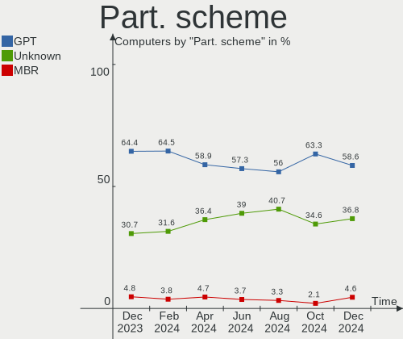
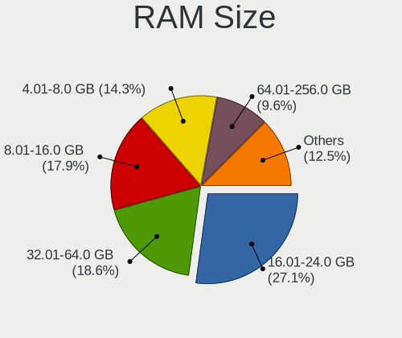
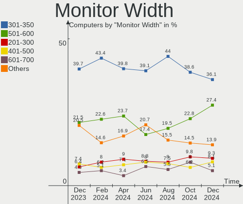
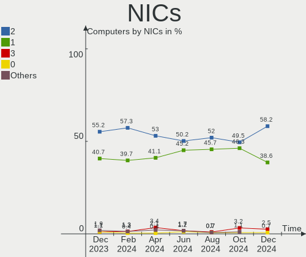
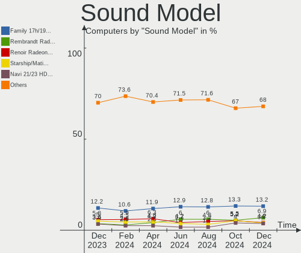
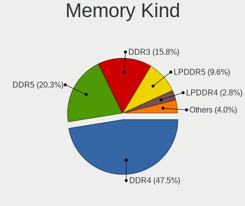

Arch - Hardware Trends
----------------------

A project to identify most popular hardware characteristics and track their change
over time based on data collected by Linux users at https://Linux-Hardware.org.

Anyone can contribute to this report by the [hw-probe](https://github.com/linuxhw/hw-probe) tool:

    sudo -E hw-probe -all -upload

This is a report for all computer types. See also reports for [desktops](/Dist/Arch/Desktop/README.md) and [notebooks](/Dist/Arch/Notebook/README.md).

This report is for one last month. Overall report since the beginning of time: [TestDays](https://github.com/linuxhw/TestDays)

Period: Apr, 2024.

Contents
--------

* [ System ](#system)
  - [ OS                       ](#os)
  - [ OS Family                ](#os-family)
  - [ Kernel                   ](#kernel)
  - [ Kernel Family            ](#kernel-family)
  - [ Kernel Major Ver.        ](#kernel-major-ver)
  - [ Arch                     ](#arch)
  - [ DE                       ](#de)
  - [ Display Server           ](#display-server)
  - [ Display Manager          ](#display-manager)
  - [ OS Lang                  ](#os-lang)
  - [ Boot Mode                ](#boot-mode)
  - [ Filesystem               ](#filesystem)
  - [ Part. scheme             ](#part-scheme)
  - [ Dual Boot with Linux/BSD ](#dual-boot-with-linuxbsd)
  - [ Dual Boot (Win)          ](#dual-boot-win)

* [ Board ](#board)
  - [ Vendor                   ](#vendor)
  - [ Model                    ](#model)
  - [ Model Family             ](#model-family)
  - [ MFG Year                 ](#mfg-year)
  - [ Form Factor              ](#form-factor)
  - [ Secure Boot              ](#secure-boot)
  - [ Coreboot                 ](#coreboot)
  - [ RAM Size                 ](#ram-size)
  - [ RAM Used                 ](#ram-used)
  - [ Total Drives             ](#total-drives)
  - [ Has CD-ROM               ](#has-cd-rom)
  - [ Has Ethernet             ](#has-ethernet)
  - [ Has WiFi                 ](#has-wifi)
  - [ Has Bluetooth            ](#has-bluetooth)

* [ Location ](#location)
  - [ Country                  ](#country)
  - [ City                     ](#city)

* [ Drives ](#drives)
  - [ Drive Vendor             ](#drive-vendor)
  - [ Drive Model              ](#drive-model)
  - [ HDD Vendor               ](#hdd-vendor)
  - [ SSD Vendor               ](#ssd-vendor)
  - [ Drive Kind               ](#drive-kind)
  - [ Drive Connector          ](#drive-connector)
  - [ Drive Size               ](#drive-size)
  - [ Space Total              ](#space-total)
  - [ Space Used               ](#space-used)
  - [ Malfunc. Drives          ](#malfunc-drives)
  - [ Malfunc. Drive Vendor    ](#malfunc-drive-vendor)
  - [ Malfunc. HDD Vendor      ](#malfunc-hdd-vendor)
  - [ Malfunc. Drive Kind      ](#malfunc-drive-kind)
  - [ Failed Drives            ](#failed-drives)
  - [ Failed Drive Vendor      ](#failed-drive-vendor)
  - [ Drive Status             ](#drive-status)

* [ Storage controller ](#storage-controller)
  - [ Storage Vendor           ](#storage-vendor)
  - [ Storage Model            ](#storage-model)
  - [ Storage Kind             ](#storage-kind)

* [ Processor ](#processor)
  - [ CPU Vendor               ](#cpu-vendor)
  - [ CPU Model                ](#cpu-model)
  - [ CPU Model Family         ](#cpu-model-family)
  - [ CPU Cores                ](#cpu-cores)
  - [ CPU Sockets              ](#cpu-sockets)
  - [ CPU Threads              ](#cpu-threads)
  - [ CPU Op-Modes             ](#cpu-op-modes)
  - [ CPU Microcode            ](#cpu-microcode)
  - [ CPU Microarch            ](#cpu-microarch)

* [ Graphics ](#graphics)
  - [ GPU Vendor               ](#gpu-vendor)
  - [ GPU Model                ](#gpu-model)
  - [ GPU Combo                ](#gpu-combo)
  - [ GPU Driver               ](#gpu-driver)
  - [ GPU Memory               ](#gpu-memory)

* [ Monitor ](#monitor)
  - [ Monitor Vendor           ](#monitor-vendor)
  - [ Monitor Model            ](#monitor-model)
  - [ Monitor Resolution       ](#monitor-resolution)
  - [ Monitor Diagonal         ](#monitor-diagonal)
  - [ Monitor Width            ](#monitor-width)
  - [ Aspect Ratio             ](#aspect-ratio)
  - [ Monitor Area             ](#monitor-area)
  - [ Pixel Density            ](#pixel-density)
  - [ Multiple Monitors        ](#multiple-monitors)

* [ Network ](#network)
  - [ Net Controller Vendor    ](#net-controller-vendor)
  - [ Net Controller Model     ](#net-controller-model)
  - [ Wireless Vendor          ](#wireless-vendor)
  - [ Wireless Model           ](#wireless-model)
  - [ Ethernet Vendor          ](#ethernet-vendor)
  - [ Ethernet Model           ](#ethernet-model)
  - [ Net Controller Kind      ](#net-controller-kind)
  - [ Used Controller          ](#used-controller)
  - [ NICs                     ](#nics)
  - [ IPv6                     ](#ipv6)

* [ Bluetooth ](#bluetooth)
  - [ Bluetooth Vendor         ](#bluetooth-vendor)
  - [ Bluetooth Model          ](#bluetooth-model)

* [ Sound ](#sound)
  - [ Sound Vendor             ](#sound-vendor)
  - [ Sound Model              ](#sound-model)

* [ Memory ](#memory)
  - [ Memory Vendor            ](#memory-vendor)
  - [ Memory Model             ](#memory-model)
  - [ Memory Kind              ](#memory-kind)
  - [ Memory Form Factor       ](#memory-form-factor)
  - [ Memory Size              ](#memory-size)
  - [ Memory Speed             ](#memory-speed)

* [ Printers & scanners ](#printers--scanners)
  - [ Printer Vendor           ](#printer-vendor)
  - [ Printer Model            ](#printer-model)
  - [ Scanner Vendor           ](#scanner-vendor)
  - [ Scanner Model            ](#scanner-model)

* [ Camera ](#camera)
  - [ Camera Vendor            ](#camera-vendor)
  - [ Camera Model             ](#camera-model)

* [ Security ](#security)
  - [ Fingerprint Vendor       ](#fingerprint-vendor)
  - [ Fingerprint Model        ](#fingerprint-model)
  - [ Chipcard Vendor          ](#chipcard-vendor)
  - [ Chipcard Model           ](#chipcard-model)

* [ Unsupported ](#unsupported)
  - [ Unsupported Devices      ](#unsupported-devices)
  - [ Unsupported Device Types ](#unsupported-device-types)

System
------

OS
--

Installed operating systems

| Name         | Computers | Percent |
|--------------|-----------|---------|
| Arch Rolling | 236       | 100%    |

OS Family
---------

OS without a version

| Name | Computers | Percent |
|------|-----------|---------|
| Arch | 236       | 100%    |

Kernel
------

Version of the Linux kernel

| Version                  | Computers | Percent |
|--------------------------|-----------|---------|
| 6.8.7-arch1-1            | 52        | 22.03%  |
| 6.8.2-arch2-1            | 32        | 13.56%  |
| 6.8.4-arch1-1            | 20        | 8.47%   |
| 6.8.7-arch1-2            | 18        | 7.63%   |
| 6.8.5-arch1-1            | 18        | 7.63%   |
| 6.8.2-zen2-1-zen         | 13        | 5.51%   |
| 6.8.6-arch1-1            | 9         | 3.81%   |
| 6.6.23-1-lts             | 9         | 3.81%   |
| 6.6.28-1-lts             | 8         | 3.39%   |
| 6.8.7-zen1-1-zen         | 6         | 2.54%   |
| 6.8.4-zen1-1-zen         | 6         | 2.54%   |
| 6.8.1-arch1-1            | 5         | 2.12%   |
| 6.6.27-1-lts             | 5         | 2.12%   |
| 6.8.7-zen1-2-zen         | 3         | 1.27%   |
| 6.8.6-zen1-1-zen         | 3         | 1.27%   |
| 6.8.7-1-clear            | 2         | 0.85%   |
| 6.8.5-zen1-1-zen         | 2         | 0.85%   |
| 6.7.9-arch1-1            | 2         | 0.85%   |
| 6.6.29-1-lts             | 2         | 0.85%   |
| 6.6.26-1-lts             | 2         | 0.85%   |
| 6.8.7-lqx2-1-lqx         | 1         | 0.42%   |
| 6.8.7-3-cachyos          | 1         | 0.42%   |
| 6.8.7-1-cachyos-bore     | 1         | 0.42%   |
| 6.8.6-2-cachyos          | 1         | 0.42%   |
| 6.8.4-273-tkg-eevdf-llvm | 1         | 0.42%   |
| 6.8.4-1-cachyos          | 1         | 0.42%   |
| 6.8.2-273-tkg-eevdf-llvm | 1         | 0.42%   |
| 6.8.1-arch1-1-surface    | 1         | 0.42%   |
| 6.8.0-rc6-273-tkg-eevdf  | 1         | 0.42%   |
| 6.7.2-arch1-2            | 1         | 0.42%   |
| 6.7.2-273-tkg-pds-llvm   | 1         | 0.42%   |
| 6.6.28-2-lts             | 1         | 0.42%   |
| 6.6.25-1-lts             | 1         | 0.42%   |
| 6.6.15-2-lts             | 1         | 0.42%   |
| 6.6.14-1-lts             | 1         | 0.42%   |
| 6.6.1-arch1-1            | 1         | 0.42%   |
| 6.4.10-arch1-1           | 1         | 0.42%   |
| 5.9.0-rc2-1-tkg-cfs      | 1         | 0.42%   |
| 5.15.94                  | 1         | 0.42%   |

Kernel Family
-------------

Linux kernel without a distro release

| Version | Computers | Percent |
|---------|-----------|---------|
| 6.8.7   | 84        | 35.59%  |
| 6.8.2   | 46        | 19.49%  |
| 6.8.4   | 28        | 11.86%  |
| 6.8.5   | 20        | 8.47%   |
| 6.8.6   | 13        | 5.51%   |
| 6.6.28  | 9         | 3.81%   |
| 6.6.23  | 9         | 3.81%   |
| 6.8.1   | 6         | 2.54%   |
| 6.6.27  | 5         | 2.12%   |
| 6.7.9   | 2         | 0.85%   |
| 6.7.2   | 2         | 0.85%   |
| 6.6.29  | 2         | 0.85%   |
| 6.6.26  | 2         | 0.85%   |
| 6.8.0   | 1         | 0.42%   |
| 6.6.25  | 1         | 0.42%   |
| 6.6.15  | 1         | 0.42%   |
| 6.6.14  | 1         | 0.42%   |
| 6.6.1   | 1         | 0.42%   |
| 6.4.10  | 1         | 0.42%   |
| 5.9.0   | 1         | 0.42%   |
| 5.15.94 | 1         | 0.42%   |

Kernel Major Ver.
-----------------

Linux kernel major version

| Version | Computers | Percent |
|---------|-----------|---------|
| 6.8     | 198       | 83.9%   |
| 6.6     | 31        | 13.14%  |
| 6.7     | 4         | 1.69%   |
| 6.4     | 1         | 0.42%   |
| 5.9     | 1         | 0.42%   |
| 5.15    | 1         | 0.42%   |

Arch
----

OS architecture (x86_64, i586, etc.)

| Name   | Computers | Percent |
|--------|-----------|---------|
| x86_64 | 236       | 100%    |

DE
--

Desktop Environment

| Name          | Computers | Percent |
|---------------|-----------|---------|
| KDE6          | 85        | 36.02%  |
| GNOME         | 53        | 22.46%  |
| Hyprland      | 29        | 12.29%  |
| XFCE          | 16        | 6.78%   |
| Unknown       | 16        | 6.78%   |
| KDE           | 12        | 5.08%   |
| i3            | 10        | 4.24%   |
| X-Cinnamon    | 2         | 0.85%   |
| qtile         | 2         | 0.85%   |
| bspwm         | 2         | 0.85%   |
| sway          | 1         | 0.42%   |
| MATE          | 1         | 0.42%   |
| LXDE          | 1         | 0.42%   |
| KDE5          | 1         | 0.42%   |
| GNOME Classic | 1         | 0.42%   |
| dwm           | 1         | 0.42%   |
| dusk          | 1         | 0.42%   |
| Cinnamon      | 1         | 0.42%   |
| awesome       | 1         | 0.42%   |

Display Server
--------------

X11 or Wayland

| Name    | Computers | Percent |
|---------|-----------|---------|
| Wayland | 122       | 51.69%  |
| X11     | 90        | 38.14%  |
| Tty     | 13        | 5.51%   |
| Unknown | 11        | 4.66%   |

Display Manager
---------------

SDDM, LightDM, etc.

| Name    | Computers | Percent |
|---------|-----------|---------|
| Unknown | 118       | 50%     |
| SDDM    | 71        | 30.08%  |
| LightDM | 22        | 9.32%   |
| GDM     | 15        | 6.36%   |
| LY-DM   | 5         | 2.12%   |
| SLiM    | 1         | 0.42%   |
| Ly      | 1         | 0.42%   |
| LXDM    | 1         | 0.42%   |
| LEMURS  | 1         | 0.42%   |
| GREETD  | 1         | 0.42%   |

OS Lang
-------

Language

| Lang        | Computers | Percent |
|-------------|-----------|---------|
| en_US       | 141       | 59.75%  |
| C           | 17        | 7.2%    |
| it_IT       | 9         | 3.81%   |
| en_GB       | 9         | 3.81%   |
| ru_RU       | 8         | 3.39%   |
| de_DE       | 8         | 3.39%   |
| pt_BR       | 6         | 2.54%   |
| fr_FR       | 6         | 2.54%   |
| zh_CN       | 3         | 1.27%   |
| pl_PL       | 3         | 1.27%   |
| es_MX       | 3         | 1.27%   |
| de_AT       | 3         | 1.27%   |
| sv_SE       | 2         | 0.85%   |
| es_ES       | 2         | 0.85%   |
| es_CL       | 2         | 0.85%   |
| en_AU       | 2         | 0.85%   |
| tr_TR       | 1         | 0.42%   |
| sk_SK       | 1         | 0.42%   |
| ru          | 1         | 0.42%   |
| pt_PT       | 1         | 0.42%   |
| es_EC       | 1         | 0.42%   |
| es_AR       | 1         | 0.42%   |
| en_IN       | 1         | 0.42%   |
| en_IE       | 1         | 0.42%   |
| en_CA       | 1         | 0.42%   |
| de_de-UTF-8 | 1         | 0.42%   |
| de_CH       | 1         | 0.42%   |
| Unknown     | 1         | 0.42%   |

Boot Mode
---------

EFI or BIOS

| Mode | Computers | Percent |
|------|-----------|---------|
| EFI  | 138       | 58.47%  |
| BIOS | 98        | 41.53%  |

Filesystem
----------

Type of filesystem

| Type    | Computers | Percent |
|---------|-----------|---------|
| Ext4    | 143       | 60.59%  |
| Btrfs   | 80        | 33.9%   |
| Tmpfs   | 3         | 1.27%   |
| F2fs    | 3         | 1.27%   |
| Xfs     | 2         | 0.85%   |
| Overlay | 2         | 0.85%   |
| XXX     | 1         | 0.42%   |
| Ext2    | 1         | 0.42%   |
| Unknown | 1         | 0.42%   |

Part. scheme
------------

Scheme of partitioning

| Type    | Computers | Percent |
|---------|-----------|---------|
| GPT     | 139       | 58.9%   |
| Unknown | 86        | 36.44%  |
| MBR     | 11        | 4.66%   |

Dual Boot with Linux/BSD
------------------------

Hosting more than one Linux/BSD

| Dual boot | Computers | Percent |
|-----------|-----------|---------|
| No        | 211       | 89.41%  |
| Yes       | 25        | 10.59%  |

Dual Boot (Win)
---------------

Hosting Linux and Windows

| Dual boot | Computers | Percent |
|-----------|-----------|---------|
| No        | 191       | 80.93%  |
| Yes       | 45        | 19.07%  |

Board
-----

Vendor
------

Motherboard manufacturer

| Name                                 | Computers | Percent |
|--------------------------------------|-----------|---------|
| ASUSTek Computer                     | 44        | 18.64%  |
| Lenovo                               | 39        | 16.53%  |
| Hewlett-Packard                      | 28        | 11.86%  |
| MSI                                  | 22        | 9.32%   |
| Dell                                 | 17        | 7.2%    |
| Gigabyte Technology                  | 14        | 5.93%   |
| ASRock                               | 10        | 4.24%   |
| Apple                                | 7         | 2.97%   |
| Acer                                 | 7         | 2.97%   |
| HUAWEI                               | 6         | 2.54%   |
| Notebook                             | 4         | 1.69%   |
| Unknown                              | 3         | 1.27%   |
| TUXEDO                               | 2         | 0.85%   |
| Toshiba                              | 2         | 0.85%   |
| Samsung Electronics                  | 2         | 0.85%   |
| Microsoft                            | 2         | 0.85%   |
| HONOR                                | 2         | 0.85%   |
| Framework                            | 2         | 0.85%   |
| Biostar                              | 2         | 0.85%   |
| XMG                                  | 1         | 0.42%   |
| XIAOMI                               | 1         | 0.42%   |
| TSINGHUA TONGFANG COMPUTER           | 1         | 0.42%   |
| Trigkey                              | 1         | 0.42%   |
| SKIKK                                | 1         | 0.42%   |
| Shenzhen Meigao Electronic Equipment | 1         | 0.42%   |
| Positivo                             | 1         | 0.42%   |
| N-one                                | 1         | 0.42%   |
| Micro Computer (HK) Tech Limited     | 1         | 0.42%   |
| Medion                               | 1         | 0.42%   |
| Mediacom                             | 1         | 0.42%   |
| MANCER                               | 1         | 0.42%   |
| Maibenben                            | 1         | 0.42%   |
| Intel Client Systems                 | 1         | 0.42%   |
| Intel                                | 1         | 0.42%   |
| Google                               | 1         | 0.42%   |
| Gateway                              | 1         | 0.42%   |
| Fujitsu                              | 1         | 0.42%   |
| ECS                                  | 1         | 0.42%   |
| AZW                                  | 1         | 0.42%   |
| AAEON                                | 1         | 0.42%   |

Model
-----

Motherboard model

| Name                                       | Computers | Percent |
|--------------------------------------------|-----------|---------|
| MSI MS-7C56                                | 4         | 1.69%   |
| HUAWEI HVY-WXX9                            | 3         | 1.27%   |
| HP Laptop 14-fq0xxx                        | 3         | 1.27%   |
| Unknown                                    | 3         | 1.27%   |
| MSI MS-7E16                                | 2         | 0.85%   |
| MSI MS-7C91                                | 2         | 0.85%   |
| Framework Laptop                           | 2         | 0.85%   |
| ASUS X553MA                                | 2         | 0.85%   |
| ASUS ROG STRIX X570-E GAMING               | 2         | 0.85%   |
| ASUS ROG STRIX B550-E GAMING               | 2         | 0.85%   |
| ASUS PRIME A320M-K                         | 2         | 0.85%   |
| XMG N85_N87,HJ,HJ1,HK1                     | 1         | 0.42%   |
| XIAOMI Redmi Book Pro 15 2023              | 1         | 0.42%   |
| TUXEDO InfinityBook S Gen8                 | 1         | 0.42%   |
| TUXEDO InfinityBook Pro Gen8 (MK2)         | 1         | 0.42%   |
| TSINGHUA TONGFANG COMPUTER E500            | 1         | 0.42%   |
| Trigkey S5                                 | 1         | 0.42%   |
| Toshiba Satellite C850-124                 | 1         | 0.42%   |
| Toshiba Satellite C670-12E                 | 1         | 0.42%   |
| SKIKK Freya                                | 1         | 0.42%   |
| Shenzhen Meigao Electronic Equipment HX99G | 1         | 0.42%   |
| Samsung 950XDB/951XDB/950XDY               | 1         | 0.42%   |
| Samsung 950QED                             | 1         | 0.42%   |
| Positivo Mobile                            | 1         | 0.42%   |
| Notebook W230ST                            | 1         | 0.42%   |
| Notebook PD5x_7xSNC_SND_SNE                | 1         | 0.42%   |
| Notebook PA70ES                            | 1         | 0.42%   |
| Notebook N141CU                            | 1         | 0.42%   |
| N-one Nbook Ultra                          | 1         | 0.42%   |
| MSI MS-7E12                                | 1         | 0.42%   |
| MSI MS-7D95                                | 1         | 0.42%   |
| MSI MS-7D93                                | 1         | 0.42%   |
| MSI MS-7D85                                | 1         | 0.42%   |
| MSI MS-7D73                                | 1         | 0.42%   |
| MSI MS-7D70                                | 1         | 0.42%   |
| MSI MS-7D69                                | 1         | 0.42%   |
| MSI MS-7D32                                | 1         | 0.42%   |
| MSI MS-7C96                                | 1         | 0.42%   |
| MSI MS-7C95                                | 1         | 0.42%   |
| MSI MS-7C81                                | 1         | 0.42%   |

Model Family
------------

Motherboard model prefix

| Name                            | Computers | Percent |
|---------------------------------|-----------|---------|
| Lenovo ThinkPad                 | 22        | 9.32%   |
| ASUS ROG                        | 16        | 6.78%   |
| ASUS PRIME                      | 8         | 3.39%   |
| HP Laptop                       | 7         | 2.97%   |
| HP Pavilion                     | 5         | 2.12%   |
| Dell Latitude                   | 5         | 2.12%   |
| MSI MS-7C56                     | 4         | 1.69%   |
| Lenovo Yoga                     | 4         | 1.69%   |
| Lenovo Legion                   | 4         | 1.69%   |
| ASUS VivoBook                   | 4         | 1.69%   |
| Acer Aspire                     | 4         | 1.69%   |
| HUAWEI HVY-WXX9                 | 3         | 1.27%   |
| HP EliteBook                    | 3         | 1.27%   |
| Dell XPS                        | 3         | 1.27%   |
| Dell Precision                  | 3         | 1.27%   |
| Dell Inspiron                   | 3         | 1.27%   |
| ASUS TUF                        | 3         | 1.27%   |
| ASUS ASUS                       | 3         | 1.27%   |
| Acer Swift                      | 3         | 1.27%   |
| Unknown                         | 3         | 1.27%   |
| TUXEDO InfinityBook             | 2         | 0.85%   |
| Toshiba Satellite               | 2         | 0.85%   |
| MSI MS-7E16                     | 2         | 0.85%   |
| MSI MS-7C91                     | 2         | 0.85%   |
| Microsoft Surface               | 2         | 0.85%   |
| Lenovo ThinkCentre              | 2         | 0.85%   |
| Lenovo IdeaPad                  | 2         | 0.85%   |
| HP Victus                       | 2         | 0.85%   |
| HP OMEN                         | 2         | 0.85%   |
| Gigabyte Z790                   | 2         | 0.85%   |
| Gigabyte X570                   | 2         | 0.85%   |
| Gigabyte B550                   | 2         | 0.85%   |
| Framework Laptop                | 2         | 0.85%   |
| Dell G15                        | 2         | 0.85%   |
| ASUS X553MA                     | 2         | 0.85%   |
| ASUS P8Z77-V                    | 2         | 0.85%   |
| XMG N85                         | 1         | 0.42%   |
| XIAOMI Redmi                    | 1         | 0.42%   |
| TSINGHUA TONGFANG COMPUTER E500 | 1         | 0.42%   |
| Trigkey S5                      | 1         | 0.42%   |

MFG Year
--------

Motherboard manufacture year

| Year    | Computers | Percent |
|---------|-----------|---------|
| 2020    | 40        | 16.95%  |
| 2023    | 39        | 16.53%  |
| 2022    | 28        | 11.86%  |
| 2021    | 27        | 11.44%  |
| 2019    | 16        | 6.78%   |
| 2018    | 15        | 6.36%   |
| 2017    | 11        | 4.66%   |
| 2016    | 9         | 3.81%   |
| 2024    | 8         | 3.39%   |
| 2012    | 8         | 3.39%   |
| 2011    | 7         | 2.97%   |
| 2013    | 6         | 2.54%   |
| 2015    | 5         | 2.12%   |
| 2014    | 5         | 2.12%   |
| 2010    | 3         | 1.27%   |
| 2008    | 3         | 1.27%   |
| 2007    | 3         | 1.27%   |
| 2009    | 2         | 0.85%   |
| Unknown | 1         | 0.42%   |

Form Factor
-----------

Physical design of the computer

| Name        | Computers | Percent |
|-------------|-----------|---------|
| Notebook    | 129       | 54.66%  |
| Desktop     | 83        | 35.17%  |
| Convertible | 13        | 5.51%   |
| Mini pc     | 7         | 2.97%   |
| Tablet      | 3         | 1.27%   |
| Server      | 1         | 0.42%   |

Secure Boot
-----------

Enabled or disabled

| State    | Computers | Percent |
|----------|-----------|---------|
| Disabled | 225       | 95.34%  |
| Enabled  | 11        | 4.66%   |

Coreboot
--------

Have coreboot on board

| Used | Computers | Percent |
|------|-----------|---------|
| No   | 235       | 99.58%  |
| Yes  | 1         | 0.42%   |

RAM Size
--------

Total RAM memory

| Size in GB  | Computers | Percent |
|-------------|-----------|---------|
| 32.01-64.0  | 61        | 25.85%  |
| 16.01-24.0  | 48        | 20.34%  |
| 4.01-8.0    | 40        | 16.95%  |
| 8.01-16.0   | 36        | 15.25%  |
| 64.01-256.0 | 21        | 8.9%    |
| 3.01-4.0    | 14        | 5.93%   |
| 24.01-32.0  | 14        | 5.93%   |
| 1.01-2.0    | 2         | 0.85%   |

RAM Used
--------

Used RAM memory

| Used GB    | Computers | Percent |
|------------|-----------|---------|
| 4.01-8.0   | 84        | 35.59%  |
| 2.01-3.0   | 51        | 21.61%  |
| 3.01-4.0   | 37        | 15.68%  |
| 8.01-16.0  | 28        | 11.86%  |
| 1.01-2.0   | 26        | 11.02%  |
| 0.51-1.0   | 8         | 3.39%   |
| 16.01-24.0 | 2         | 0.85%   |

Total Drives
------------

Number of drives on board

| Drives | Computers | Percent |
|--------|-----------|---------|
| 1      | 121       | 51.27%  |
| 2      | 64        | 27.12%  |
| 3      | 27        | 11.44%  |
| 4      | 13        | 5.51%   |
| 7      | 3         | 1.27%   |
| 6      | 3         | 1.27%   |
| 5      | 3         | 1.27%   |
| 9      | 1         | 0.42%   |
| 8      | 1         | 0.42%   |

Has CD-ROM
----------

Has CD-ROM on board

| Presented | Computers | Percent |
|-----------|-----------|---------|
| No        | 199       | 84.32%  |
| Yes       | 37        | 15.68%  |

Has Ethernet
------------

Has Ethernet on board

| Presented | Computers | Percent |
|-----------|-----------|---------|
| Yes       | 182       | 77.12%  |
| No        | 54        | 22.88%  |

Has WiFi
--------

Has WiFi module

| Presented | Computers | Percent |
|-----------|-----------|---------|
| Yes       | 198       | 83.9%   |
| No        | 38        | 16.1%   |

Has Bluetooth
-------------

Has Bluetooth module

| Presented | Computers | Percent |
|-----------|-----------|---------|
| Yes       | 191       | 80.93%  |
| No        | 45        | 19.07%  |

Location
--------

Country
-------

Geographic location (country)

| Country      | Computers | Percent |
|--------------|-----------|---------|
| USA          | 46        | 19.49%  |
| Germany      | 19        | 8.05%   |
| Russia       | 17        | 7.2%    |
| Italy        | 12        | 5.08%   |
| UK           | 10        | 4.24%   |
| Poland       | 10        | 4.24%   |
| France       | 9         | 3.81%   |
| Brazil       | 9         | 3.81%   |
| Canada       | 8         | 3.39%   |
| Netherlands  | 6         | 2.54%   |
| Mexico       | 6         | 2.54%   |
| India        | 6         | 2.54%   |
| Sweden       | 5         | 2.12%   |
| Spain        | 5         | 2.12%   |
| Australia    | 4         | 1.69%   |
| Turkey       | 3         | 1.27%   |
| Norway       | 3         | 1.27%   |
| Hong Kong    | 3         | 1.27%   |
| Chile        | 3         | 1.27%   |
| Austria      | 3         | 1.27%   |
| Vietnam      | 2         | 0.85%   |
| Switzerland  | 2         | 0.85%   |
| South Africa | 2         | 0.85%   |
| Romania      | 2         | 0.85%   |
| Philippines  | 2         | 0.85%   |
| Lithuania    | 2         | 0.85%   |
| Hungary      | 2         | 0.85%   |
| Finland      | 2         | 0.85%   |
| Colombia     | 2         | 0.85%   |
| China        | 2         | 0.85%   |
| Bulgaria     | 2         | 0.85%   |
| Belarus      | 2         | 0.85%   |
| Argentina    | 2         | 0.85%   |
| Venezuela    | 1         | 0.42%   |
| Tunisia      | 1         | 0.42%   |
| Taiwan       | 1         | 0.42%   |
| South Korea  | 1         | 0.42%   |
| Slovenia     | 1         | 0.42%   |
| Slovakia     | 1         | 0.42%   |
| Singapore    | 1         | 0.42%   |

City
----

Geographic location (city)

| City              | Computers | Percent |
|-------------------|-----------|---------|
| Moscow            | 7         | 2.97%   |
| Vienna            | 2         | 0.85%   |
| Stockholm         | 2         | 0.85%   |
| Rio de Janeiro    | 2         | 0.85%   |
| Paris             | 2         | 0.85%   |
| Minsk             | 2         | 0.85%   |
| Melbourne         | 2         | 0.85%   |
| Krakow            | 2         | 0.85%   |
| Johnson City      | 2         | 0.85%   |
| Gothenburg        | 2         | 0.85%   |
| Frankfurt am Main | 2         | 0.85%   |
| Delhi             | 2         | 0.85%   |
| Dallas            | 2         | 0.85%   |
| Campinas          | 2         | 0.85%   |
| Bengaluru         | 2         | 0.85%   |
| Zonguldak         | 1         | 0.42%   |
| Zapyškis         | 1         | 0.42%   |
| Zagazig           | 1         | 0.42%   |
| Yogyakarta        | 1         | 0.42%   |
| Yekaterinburg     | 1         | 0.42%   |
| Wroclaw           | 1         | 0.42%   |
| Wormerveer        | 1         | 0.42%   |
| Worcester         | 1         | 0.42%   |
| Wisconsin Dells   | 1         | 0.42%   |
| Winterswijk       | 1         | 0.42%   |
| Winchester        | 1         | 0.42%   |
| Wiesbaden         | 1         | 0.42%   |
| West Lebanon      | 1         | 0.42%   |
| Weissenfels       | 1         | 0.42%   |
| Washington        | 1         | 0.42%   |
| Warsaw            | 1         | 0.42%   |
| Wandsworth        | 1         | 0.42%   |
| Wachock           | 1         | 0.42%   |
| Vitry-sur-Seine   | 1         | 0.42%   |
| Virginia Beach    | 1         | 0.42%   |
| Vilnius           | 1         | 0.42%   |
| Verona            | 1         | 0.42%   |
| Valchedram        | 1         | 0.42%   |
| Urbana            | 1         | 0.42%   |
| Turenki           | 1         | 0.42%   |

Drives
------

Drive Vendor
------------

Hard drive vendors

| Vendor                         | Computers | Drives | Percent |
|--------------------------------|-----------|--------|---------|
| Samsung Electronics            | 83        | 109    | 21.39%  |
| Sandisk                        | 42        | 48     | 10.82%  |
| Seagate                        | 31        | 44     | 7.99%   |
| WDC                            | 28        | 35     | 7.22%   |
| Kingston                       | 14        | 16     | 3.61%   |
| Intel                          | 14        | 17     | 3.61%   |
| Toshiba                        | 12        | 12     | 3.09%   |
| Crucial                        | 12        | 13     | 3.09%   |
| SK hynix                       | 11        | 12     | 2.84%   |
| Phison Electronics             | 11        | 11     | 2.84%   |
| Unknown                        | 9         | 9      | 2.32%   |
| Micron/Crucial Technology      | 9         | 10     | 2.32%   |
| Micron Technology              | 8         | 8      | 2.06%   |
| MAXIO Technology (Hangzhou)    | 7         | 7      | 1.8%    |
| Apple                          | 7         | 7      | 1.8%    |
| Kingston Technology Company    | 6         | 6      | 1.55%   |
| ADATA Technology               | 5         | 6      | 1.29%   |
| A-DATA Technology              | 5         | 5      | 1.29%   |
| SPCC                           | 4         | 4      | 1.03%   |
| Silicon Motion                 | 4         | 4      | 1.03%   |
| Realtek Semiconductor          | 4         | 4      | 1.03%   |
| KIOXIA                         | 4         | 4      | 1.03%   |
| Hitachi                        | 4         | 4      | 1.03%   |
| Yangtze Memory Technologies    | 3         | 3      | 0.77%   |
| Shenzhen Longsys Electronics   | 3         | 3      | 0.77%   |
| Lexar                          | 3         | 3      | 0.77%   |
| China                          | 3         | 3      | 0.77%   |
| Team                           | 2         | 2      | 0.52%   |
| Solid State Storage Technology | 2         | 2      | 0.52%   |
| Realtek                        | 2         | 2      | 0.52%   |
| PNY                            | 2         | 2      | 0.52%   |
| KingSpec                       | 2         | 2      | 0.52%   |
| HS-SSD-C100                    | 2         | 2      | 0.52%   |
| HGST                           | 2         | 2      | 0.52%   |
| Fujitsu                        | 2         | 2      | 0.52%   |
| Biwin Storage Technology       | 2         | 2      | 0.52%   |
| XSJ-X100-256GB                 | 1         | 1      | 0.26%   |
| XPG                            | 1         | 1      | 0.26%   |
| WALRAM                         | 1         | 1      | 0.26%   |
| Verbatim                       | 1         | 1      | 0.26%   |

Drive Model
-----------

Hard drive models

| Model                                                           | Computers | Percent |
|-----------------------------------------------------------------|-----------|---------|
| Samsung NVMe SSD Controller SM981/PM981/PM983 1TB               | 22        | 5.09%   |
| Samsung NVMe SSD Controller PM9A1/PM9A3/980PRO 1TB              | 16        | 3.7%    |
| Micron/Crucial P2 NVMe PCIe SSD 4TB                             | 6         | 1.39%   |
| Sandisk WD Black SN850 512GB                                    | 5         | 1.16%   |
| Phison E12 NVMe Controller 2TB                                  | 5         | 1.16%   |
| MAXIO (Hangzhou) NVMe SSD Controller MAP1202 256GB              | 5         | 1.16%   |
| Seagate ST1000DM010-2EP102 1TB                                  | 4         | 0.93%   |
| Sandisk WD Blue SN570 1TB                                       | 4         | 0.93%   |
| Sandisk WD Blue SN550 NVMe SSD 2TB                              | 4         | 0.93%   |
| Samsung SSD 980 1TB                                             | 4         | 0.93%   |
| Samsung SSD 860 EVO 1TB                                         | 4         | 0.93%   |
| WDC WDS240G2G0A-00JH30 240GB SSD                                | 3         | 0.69%   |
| Silicon Motion SM2263EN/SM2263XT SSD Controller 256GB           | 3         | 0.69%   |
| Seagate ST8000DM004-2U9188 8TB                                  | 3         | 0.69%   |
| Seagate ST4000DM004-2CV104 4TB                                  | 3         | 0.69%   |
| Seagate ST2000DM008-2FR102 2TB                                  | 3         | 0.69%   |
| Seagate ST1000LM049-2GH172 1TB                                  | 3         | 0.69%   |
| Sandisk WD_BLACK SN770 1TB                                      | 3         | 0.69%   |
| Sandisk WD Black SN750 / PC SN730 NVMe SSD 512GB                | 3         | 0.69%   |
| Samsung SSD 990 PRO 2TB                                         | 3         | 0.69%   |
| Samsung SSD 990 PRO 1TB                                         | 3         | 0.69%   |
| Samsung SSD 870 EVO 500GB                                       | 3         | 0.69%   |
| Samsung SSD 850 EVO 500GB                                       | 3         | 0.69%   |
| Samsung SSD 840 PRO Series 256GB                                | 3         | 0.69%   |
| Samsung MZNLH128HBHQ-000H1 128GB SSD                            | 3         | 0.69%   |
| Kingston Company SNV2S1000G 1TB                                 | 3         | 0.69%   |
| Kingston SA400S37480G 480GB SSD                                 | 3         | 0.69%   |
| Intel SSDPEKNU512GZ 512GB                                       | 3         | 0.69%   |
| Intel SSD 660P Series 1024GB                                    | 3         | 0.69%   |
| Crucial CT2000MX500SSD1 2TB                                     | 3         | 0.69%   |
| ADATA XPG SX8200 Pro PCIe Gen3x4 M.2 2280 Solid State Drive 1TB | 3         | 0.69%   |
| WDC WD20EZBX-00AYRA0 2TB                                        | 2         | 0.46%   |
| WDC WD10EZEX-00BN5A0 1TB                                        | 2         | 0.46%   |
| Unknown SD/MMC/MS PRO 128GB                                     | 2         | 0.46%   |
| Unknown MMC Card  64GB                                          | 2         | 0.46%   |
| Unknown MMC Card  32GB                                          | 2         | 0.46%   |
| Toshiba XG6 NVMe SSD Controller 1024GB                          | 2         | 0.46%   |
| Toshiba DT01ACA100 1TB                                          | 2         | 0.46%   |
| SPCC Solid State Disk 2TB                                       | 2         | 0.46%   |
| Solid State Storage CL4-3D512-Q11 NVMe SSSTC 512GB              | 2         | 0.46%   |

HDD Vendor
----------

Hard disk drive vendors

| Vendor              | Computers | Drives | Percent |
|---------------------|-----------|--------|---------|
| Seagate             | 29        | 41     | 36.71%  |
| WDC                 | 24        | 26     | 30.38%  |
| Toshiba             | 9         | 9      | 11.39%  |
| Hitachi             | 4         | 4      | 5.06%   |
| Unknown             | 2         | 2      | 2.53%   |
| Samsung Electronics | 2         | 2      | 2.53%   |
| HGST                | 2         | 2      | 2.53%   |
| Fujitsu             | 2         | 2      | 2.53%   |
| Apple               | 2         | 2      | 2.53%   |
| StoreJet            | 1         | 1      | 1.27%   |
| MSFT                | 1         | 1      | 1.27%   |
| External            | 1         | 1      | 1.27%   |

SSD Vendor
----------

Solid state drive vendors

| Vendor              | Computers | Drives | Percent |
|---------------------|-----------|--------|---------|
| Samsung Electronics | 33        | 38     | 28.45%  |
| Crucial             | 12        | 13     | 10.34%  |
| Kingston            | 9         | 11     | 7.76%   |
| WDC                 | 7         | 9      | 6.03%   |
| SanDisk             | 7         | 8      | 6.03%   |
| A-DATA Technology   | 5         | 5      | 4.31%   |
| SPCC                | 4         | 4      | 3.45%   |
| Intel               | 4         | 5      | 3.45%   |
| Apple               | 4         | 4      | 3.45%   |
| SK hynix            | 3         | 3      | 2.59%   |
| Lexar               | 3         | 3      | 2.59%   |
| China               | 3         | 3      | 2.59%   |
| Team                | 2         | 2      | 1.72%   |
| PNY                 | 2         | 2      | 1.72%   |
| KingSpec            | 2         | 2      | 1.72%   |
| XSJ-X100-256GB      | 1         | 1      | 0.86%   |
| WALRAM              | 1         | 1      | 0.86%   |
| Verbatim            | 1         | 1      | 0.86%   |
| Transcend           | 1         | 1      | 0.86%   |
| Patriot             | 1         | 1      | 0.86%   |
| Micron Technology   | 1         | 1      | 0.86%   |
| Leven               | 1         | 1      | 0.86%   |
| KingDian            | 1         | 1      | 0.86%   |
| INTEL SS            | 1         | 1      | 0.86%   |
| HS-SSD-E100N        | 1         | 1      | 0.86%   |
| HS-SSD-E100         | 1         | 1      | 0.86%   |
| HS-SSD-C100         | 1         | 1      | 0.86%   |
| Gigastone           | 1         | 1      | 0.86%   |
| Fanxiang            | 1         | 1      | 0.86%   |
| Drevo               | 1         | 1      | 0.86%   |
| Asgard              | 1         | 1      | 0.86%   |

Drive Kind
----------

HDD or SSD

| Kind    | Computers | Drives | Percent |
|---------|-----------|--------|---------|
| NVMe    | 162       | 217    | 48.5%   |
| SSD     | 92        | 128    | 27.54%  |
| HDD     | 68        | 93     | 20.36%  |
| MMC     | 7         | 7      | 2.1%    |
| Unknown | 5         | 5      | 1.5%    |

Drive Connector
---------------

SATA, SAS, NVMe, etc.

| Type | Computers | Drives | Percent |
|------|-----------|--------|---------|
| NVMe | 161       | 213    | 52.79%  |
| SATA | 122       | 213    | 40%     |
| SAS  | 15        | 17     | 4.92%   |
| MMC  | 7         | 7      | 2.3%    |

Drive Size
----------

Size of hard drive

| Size in TB | Computers | Drives | Percent |
|------------|-----------|--------|---------|
| 0.01-0.5   | 83        | 110    | 48.26%  |
| 0.51-1.0   | 49        | 67     | 28.49%  |
| 1.01-2.0   | 27        | 30     | 15.7%   |
| 3.01-4.0   | 7         | 8      | 4.07%   |
| 4.01-10.0  | 5         | 5      | 2.91%   |
| 10.01-20.0 | 1         | 1      | 0.58%   |

Space Total
-----------

Amount of disk space available on the file system

| Size in GB     | Computers | Percent |
|----------------|-----------|---------|
| 251-500        | 54        | 22.88%  |
| 501-1000       | 45        | 19.07%  |
| More than 3000 | 38        | 16.1%   |
| 101-250        | 33        | 13.98%  |
| 1001-2000      | 32        | 13.56%  |
| 2001-3000      | 22        | 9.32%   |
| 51-100         | 7         | 2.97%   |
| Unknown        | 3         | 1.27%   |
| 21-50          | 2         | 0.85%   |

Space Used
----------

Amount of used disk space

| Used GB        | Computers | Percent |
|----------------|-----------|---------|
| 1-20           | 44        | 18.64%  |
| 101-250        | 38        | 16.1%   |
| 21-50          | 30        | 12.71%  |
| 51-100         | 30        | 12.71%  |
| 501-1000       | 26        | 11.02%  |
| 1001-2000      | 23        | 9.75%   |
| 251-500        | 19        | 8.05%   |
| More than 3000 | 13        | 5.51%   |
| 2001-3000      | 10        | 4.24%   |
| Unknown        | 3         | 1.27%   |

Malfunc. Drives
---------------

Drive models with a malfunction

| Model                                                         | Computers | Drives | Percent |
|---------------------------------------------------------------|-----------|--------|---------|
| WDC WD5000AADS-00S9B0 500GB                                   | 1         | 1      | 7.69%   |
| Toshiba MQ01ABD075 752GB                                      | 1         | 1      | 7.69%   |
| Solid State Storage Technology CL4-3D512-Q11 NVMe SSSTC 512GB | 1         | 1      | 7.69%   |
| Seagate ST9320325AS 320GB                                     | 1         | 1      | 7.69%   |
| Seagate ST3500418AS 500GB                                     | 1         | 1      | 7.69%   |
| Seagate ST2000DM008-2FR102 2TB                                | 1         | 1      | 7.69%   |
| Samsung Electronics SSD 980 1TB                               | 1         | 1      | 7.69%   |
| Samsung Electronics SSD 970 EVO 1TB                           | 1         | 1      | 7.69%   |
| Kingston SKC400S371T 1024GB SSD                               | 1         | 1      | 7.69%   |
| HGST HTS725050A7E630 500GB                                    | 1         | 1      | 7.69%   |
| Crucial CT2000MX500SSD1 2TB                                   | 1         | 1      | 7.69%   |
| Crucial CT1050MX300SSD1 1050GB                                | 1         | 1      | 7.69%   |
| Apple HDD HTS541010A9E662 1TB                                 | 1         | 1      | 7.69%   |

Malfunc. Drive Vendor
---------------------

Vendors of faulty drives

| Vendor                         | Computers | Drives | Percent |
|--------------------------------|-----------|--------|---------|
| Seagate                        | 3         | 3      | 23.08%  |
| Samsung Electronics            | 2         | 2      | 15.38%  |
| Crucial                        | 2         | 2      | 15.38%  |
| WDC                            | 1         | 1      | 7.69%   |
| Toshiba                        | 1         | 1      | 7.69%   |
| Solid State Storage Technology | 1         | 1      | 7.69%   |
| Kingston                       | 1         | 1      | 7.69%   |
| HGST                           | 1         | 1      | 7.69%   |
| Apple                          | 1         | 1      | 7.69%   |

Malfunc. HDD Vendor
-------------------

Vendors of faulty HDD drives

| Vendor  | Computers | Drives | Percent |
|---------|-----------|--------|---------|
| Seagate | 3         | 3      | 42.86%  |
| WDC     | 1         | 1      | 14.29%  |
| Toshiba | 1         | 1      | 14.29%  |
| HGST    | 1         | 1      | 14.29%  |
| Apple   | 1         | 1      | 14.29%  |

Malfunc. Drive Kind
-------------------

Kinds of faulty drives

| Kind | Computers | Drives | Percent |
|------|-----------|--------|---------|
| HDD  | 7         | 7      | 53.85%  |
| NVMe | 3         | 3      | 23.08%  |
| SSD  | 3         | 3      | 23.08%  |

Failed Drives
-------------

Failed drive models

Zero info for selected period =(

Failed Drive Vendor
-------------------

Failed drive vendors

Zero info for selected period =(

Drive Status
------------

Number of failed and malfunc. drives

| Status   | Computers | Drives | Percent |
|----------|-----------|--------|---------|
| Detected | 130       | 239    | 50.78%  |
| Works    | 115       | 198    | 44.92%  |
| Malfunc  | 11        | 13     | 4.3%    |

Storage controller
------------------

Storage Vendor
--------------

Storage controller vendors

| Vendor                           | Computers | Percent |
|----------------------------------|-----------|---------|
| Intel                            | 100       | 28.25%  |
| AMD                              | 65        | 18.36%  |
| Samsung Electronics              | 56        | 15.82%  |
| Sandisk                          | 36        | 10.17%  |
| Phison Electronics               | 11        | 3.11%   |
| Kingston Technology Company      | 11        | 3.11%   |
| Micron/Crucial Technology        | 9         | 2.54%   |
| SK hynix                         | 8         | 2.26%   |
| Micron Technology                | 7         | 1.98%   |
| MAXIO Technology (Hangzhou)      | 7         | 1.98%   |
| ASMedia Technology               | 5         | 1.41%   |
| ADATA Technology                 | 5         | 1.41%   |
| Silicon Motion                   | 4         | 1.13%   |
| Realtek Semiconductor            | 4         | 1.13%   |
| KIOXIA                           | 4         | 1.13%   |
| Yangtze Memory Technologies      | 3         | 0.85%   |
| Toshiba America Info Systems     | 3         | 0.85%   |
| Shenzhen Longsys Electronics     | 3         | 0.85%   |
| Solid State Storage Technology   | 2         | 0.56%   |
| Seagate Technology               | 2         | 0.56%   |
| Biwin Storage Technology         | 2         | 0.56%   |
| Union Memory (Shenzhen)          | 1         | 0.28%   |
| Silicon Integrated Systems [SiS] | 1         | 0.28%   |
| Nvidia                           | 1         | 0.28%   |
| LSI Logic / Symbios Logic        | 1         | 0.28%   |
| JMicron Technology               | 1         | 0.28%   |
| INNOGRIT                         | 1         | 0.28%   |
| Apple                            | 1         | 0.28%   |

Storage Model
-------------

Storage controller models

| Model                                                                          | Computers | Percent |
|--------------------------------------------------------------------------------|-----------|---------|
| AMD FCH SATA Controller [AHCI mode]                                            | 29        | 7.42%   |
| Samsung NVMe SSD Controller SM981/PM981/PM983                                  | 21        | 5.37%   |
| AMD 500 Series Chipset SATA Controller                                         | 21        | 5.37%   |
| Samsung NVMe SSD Controller PM9A1/PM9A3/980PRO                                 | 16        | 4.09%   |
| AMD 600 Series Chipset SATA Controller                                         | 11        | 2.81%   |
| Samsung NVMe SSD Controller 980 (DRAM-less)                                    | 10        | 2.56%   |
| Samsung NVMe SSD Controller S4LV008[Pascal]                                    | 8         | 2.05%   |
| Intel Sunrise Point-LP SATA Controller [AHCI mode]                             | 8         | 2.05%   |
| Intel Volume Management Device NVMe RAID Controller                            | 7         | 1.79%   |
| SanDisk WD Black SN770 / PC SN740 256GB / PC SN560 (DRAM-less) NVMe SSD        | 6         | 1.53%   |
| Micron/Crucial P2 [Nick P2] / P3 / P3 Plus NVMe PCIe SSD (DRAM-less)           | 6         | 1.53%   |
| Intel Raptor Lake SATA AHCI Controller                                         | 6         | 1.53%   |
| Intel 7 Series Chipset Family 6-port SATA Controller [AHCI mode]               | 6         | 1.53%   |
| SK hynix Gold P31/BC711/PC711 NVMe Solid State Drive                           | 5         | 1.28%   |
| SanDisk WD PC SN810 / Black SN850 NVMe SSD                                     | 5         | 1.28%   |
| SanDisk Ultra 3D / WD Blue SN570 NVMe SSD (DRAM-less)                          | 5         | 1.28%   |
| Phison E12 NVMe Controller                                                     | 5         | 1.28%   |
| MAXIO (Hangzhou) NVMe SSD Controller MAP1202 (DRAM-less)                       | 5         | 1.28%   |
| Kingston Company NV2 NVMe SSD SM2267XT (DRAM-less)                             | 5         | 1.28%   |
| Intel Cannon Lake Mobile PCH SATA AHCI Controller                              | 5         | 1.28%   |
| Intel 82801 Mobile SATA Controller [RAID mode]                                 | 5         | 1.28%   |
| AMD 400 Series Chipset SATA Controller                                         | 5         | 1.28%   |
| SanDisk Ultra 3D / WD Blue SN550 NVMe SSD                                      | 4         | 1.02%   |
| Intel Wildcat Point-LP SATA Controller [AHCI Mode]                             | 4         | 1.02%   |
| Intel Volume Management Device NVMe RAID Controller Intel Corporation          | 4         | 1.02%   |
| Intel 8 Series/C220 Series Chipset Family 6-port SATA Controller 1 [AHCI mode] | 4         | 1.02%   |
| Intel 500 Series Chipset Family SATA AHCI Controller                           | 4         | 1.02%   |
| Intel 400 Series Chipset Family SATA AHCI Controller                           | 4         | 1.02%   |
| ASMedia ASM1061/ASM1062 Serial ATA Controller                                  | 4         | 1.02%   |
| Silicon Motion SM2263EN/SM2263XT (DRAM-less) NVMe SSD Controllers              | 3         | 0.77%   |
| Sandisk WD PC SN740 NVMe SSD 512GB (DRAM-less)                                 | 3         | 0.77%   |
| SanDisk WD Blue SN570 NVMe SSD 2TB                                             | 3         | 0.77%   |
| SanDisk Extreme Pro / WD Black SN750 / PC SN730 / Red SN700 NVMe SSD           | 3         | 0.77%   |
| Samsung S4LN058A01[SSUBX] AHCI SSD Controller (Apple slot)                     | 3         | 0.77%   |
| KIOXIA NVMe SSD Controller BG5 (DRAM-less)                                     | 3         | 0.77%   |
| Intel Tiger Lake-LP SATA Controller                                            | 3         | 0.77%   |
| Intel SSD 670p Series [Keystone Harbor]                                        | 3         | 0.77%   |
| Intel SSD 660P Series                                                          | 3         | 0.77%   |
| Intel HM170/QM170 Chipset SATA Controller [AHCI Mode]                          | 3         | 0.77%   |
| Intel 6 Series/C200 Series Chipset Family 6 port Mobile SATA AHCI Controller   | 3         | 0.77%   |

Storage Kind
------------

Kind of storage controller (IDE, SATA, NVMe, SAS, ...)

| Kind | Computers | Percent |
|------|-----------|---------|
| NVMe | 160       | 47.9%   |
| SATA | 146       | 43.71%  |
| RAID | 20        | 5.99%   |
| IDE  | 8         | 2.4%    |

Processor
---------

CPU Vendor
----------

Processor vendors

| Vendor | Computers | Percent |
|--------|-----------|---------|
| Intel  | 141       | 59.75%  |
| AMD    | 95        | 40.25%  |

CPU Model
---------

Processor models

| Model                                        | Computers | Percent |
|----------------------------------------------|-----------|---------|
| AMD Ryzen 7 5700U with Radeon Graphics       | 7         | 2.97%   |
| Intel 11th Gen Core i7-1165G7 @ 2.80GHz      | 4         | 1.69%   |
| Intel 11th Gen Core i5-1135G7 @ 2.40GHz      | 4         | 1.69%   |
| AMD Ryzen 7 3700X 8-Core Processor           | 4         | 1.69%   |
| AMD Ryzen 5 5600X 6-Core Processor           | 4         | 1.69%   |
| AMD Athlon Silver 3050U with Radeon Graphics | 4         | 1.69%   |
| Intel Core i5-8350U CPU @ 1.70GHz            | 3         | 1.27%   |
| Intel Core i5-1035G1 CPU @ 1.00GHz           | 3         | 1.27%   |
| Intel 13th Gen Core i7-1360P                 | 3         | 1.27%   |
| Intel 12th Gen Core i7-12700H                | 3         | 1.27%   |
| AMD Ryzen 7 7700X 8-Core Processor           | 3         | 1.27%   |
| AMD Ryzen 7 5800X3D 8-Core Processor         | 3         | 1.27%   |
| AMD Ryzen 5 5500U with Radeon Graphics       | 3         | 1.27%   |
| AMD Ryzen 5 5500                             | 3         | 1.27%   |
| AMD Ryzen 5 4600H with Radeon Graphics       | 3         | 1.27%   |
| Intel Core i7-9750H CPU @ 2.60GHz            | 2         | 0.85%   |
| Intel Core i7-8750H CPU @ 2.20GHz            | 2         | 0.85%   |
| Intel Core i7-8565U CPU @ 1.80GHz            | 2         | 0.85%   |
| Intel Core i7-7700HQ CPU @ 2.80GHz           | 2         | 0.85%   |
| Intel Core i7-2670QM CPU @ 2.20GHz           | 2         | 0.85%   |
| Intel Core i5-8250U CPU @ 1.60GHz            | 2         | 0.85%   |
| Intel Core i5-7200U CPU @ 2.50GHz            | 2         | 0.85%   |
| Intel Core i5-6300U CPU @ 2.40GHz            | 2         | 0.85%   |
| Intel Core i5-5200U CPU @ 2.20GHz            | 2         | 0.85%   |
| Intel Core i5-3320M CPU @ 2.60GHz            | 2         | 0.85%   |
| Intel Core i5-10210U CPU @ 1.60GHz           | 2         | 0.85%   |
| Intel Celeron CPU N2840 @ 2.16GHz            | 2         | 0.85%   |
| Intel 13th Gen Core i9-13900HX               | 2         | 0.85%   |
| Intel 13th Gen Core i9-13900H                | 2         | 0.85%   |
| Intel 12th Gen Core i9-12900K                | 2         | 0.85%   |
| Intel 12th Gen Core i7-1260P                 | 2         | 0.85%   |
| Intel 12th Gen Core i5-12500H                | 2         | 0.85%   |
| Intel 11th Gen Core i7-1185G7 @ 3.00GHz      | 2         | 0.85%   |
| Intel 11th Gen Core i5-11300H @ 3.10GHz      | 2         | 0.85%   |
| AMD Ryzen 9 5950X 16-Core Processor          | 2         | 0.85%   |
| AMD Ryzen 9 5900X 12-Core Processor          | 2         | 0.85%   |
| AMD Ryzen 7 PRO 6850U with Radeon Graphics   | 2         | 0.85%   |
| AMD Ryzen 7 7840HS w/ Radeon 780M Graphics   | 2         | 0.85%   |
| AMD Ryzen 7 5800H with Radeon Graphics       | 2         | 0.85%   |
| AMD Ryzen 7 5700X 8-Core Processor           | 2         | 0.85%   |

CPU Model Family
----------------

Processor model prefix

| Model                   | Computers | Percent |
|-------------------------|-----------|---------|
| Other                   | 49        | 20.76%  |
| AMD Ryzen 7             | 36        | 15.25%  |
| Intel Core i5           | 35        | 14.83%  |
| Intel Core i7           | 29        | 12.29%  |
| AMD Ryzen 5             | 29        | 12.29%  |
| AMD Ryzen 9             | 13        | 5.51%   |
| Intel Core i3           | 5         | 2.12%   |
| Intel Celeron           | 5         | 2.12%   |
| AMD Athlon              | 5         | 2.12%   |
| Intel Xeon              | 4         | 1.69%   |
| Intel Core 2 Duo        | 3         | 1.27%   |
| AMD Ryzen 7 PRO         | 3         | 1.27%   |
| AMD Ryzen 3             | 3         | 1.27%   |
| AMD A10                 | 3         | 1.27%   |
| Intel Pentium Dual-Core | 2         | 0.85%   |
| Intel Core i9           | 2         | 0.85%   |
| Intel Core 2 Quad       | 2         | 0.85%   |
| Intel Core              | 2         | 0.85%   |
| Intel Atom              | 2         | 0.85%   |
| AMD FX                  | 2         | 0.85%   |
| Intel Pentium           | 1         | 0.42%   |
| AMD Ryzen Threadripper  | 1         | 0.42%   |

CPU Cores
---------

Number of processor cores

| Number | Computers | Percent |
|--------|-----------|---------|
| 4      | 59        | 25%     |
| 8      | 50        | 21.19%  |
| 2      | 43        | 18.22%  |
| 6      | 37        | 15.68%  |
| 12     | 18        | 7.63%   |
| 16     | 9         | 3.81%   |
| 14     | 9         | 3.81%   |
| 24     | 4         | 1.69%   |
| 10     | 4         | 1.69%   |
| 20     | 1         | 0.42%   |
| 3      | 1         | 0.42%   |
| 1      | 1         | 0.42%   |

CPU Sockets
-----------

Number of sockets

| Number | Computers | Percent |
|--------|-----------|---------|
| 1      | 235       | 99.58%  |
| 2      | 1         | 0.42%   |

CPU Threads
-----------

Threads per core (Hyper-Threading)

| Number | Computers | Percent |
|--------|-----------|---------|
| 2      | 207       | 87.71%  |
| 1      | 29        | 12.29%  |

CPU Op-Modes
------------

CPU Operation Modes (32-bit, 64-bit)

| Op mode        | Computers | Percent |
|----------------|-----------|---------|
| 32-bit, 64-bit | 236       | 100%    |

CPU Microcode
-------------

Microcode number

| Number     | Computers | Percent |
|------------|-----------|---------|
| Unknown    | 230       | 97.46%  |
| 0x806ec    | 1         | 0.42%   |
| 0x0a404102 | 1         | 0.42%   |
| 0x08608102 | 1         | 0.42%   |
| 0x08108109 | 1         | 0.42%   |
| 0x06001116 | 1         | 0.42%   |
| 0x0600081c | 1         | 0.42%   |

CPU Microarch
-------------

Microarchitecture

| Name              | Computers | Percent |
|-------------------|-----------|---------|
| Unknown           | 45        | 19.07%  |
| Zen 3             | 28        | 11.86%  |
| KabyLake          | 28        | 11.86%  |
| Alderlake Hybrid  | 24        | 10.17%  |
| Zen 2             | 17        | 7.2%    |
| TigerLake         | 14        | 5.93%   |
| Zen+              | 9         | 3.81%   |
| IvyBridge         | 8         | 3.39%   |
| Haswell           | 8         | 3.39%   |
| CometLake         | 7         | 2.97%   |
| Skylake           | 6         | 2.54%   |
| SandyBridge       | 6         | 2.54%   |
| Broadwell         | 6         | 2.54%   |
| Penryn            | 5         | 2.12%   |
| IceLake           | 4         | 1.69%   |
| Silvermont        | 3         | 1.27%   |
| Piledriver        | 3         | 1.27%   |
| Zen               | 2         | 0.85%   |
| Westmere          | 2         | 0.85%   |
| Meteorlake Hybrid | 2         | 0.85%   |
| Core              | 2         | 0.85%   |
| Tremont           | 1         | 0.42%   |
| Steamroller       | 1         | 0.42%   |
| Nehalem           | 1         | 0.42%   |
| Gracemont         | 1         | 0.42%   |
| Goldmont          | 1         | 0.42%   |
| Excavator         | 1         | 0.42%   |
| Bonnell           | 1         | 0.42%   |

Graphics
--------

GPU Vendor
----------

Vendors of graphics cards

| Vendor                           | Computers | Percent |
|----------------------------------|-----------|---------|
| Intel                            | 118       | 41.26%  |
| AMD                              | 85        | 29.72%  |
| Nvidia                           | 81        | 28.32%  |
| Silicon Integrated Systems [SiS] | 1         | 0.35%   |
| Matrox Electronics Systems       | 1         | 0.35%   |

GPU Model
---------

Graphics card models

| Model                                                                     | Computers | Percent |
|---------------------------------------------------------------------------|-----------|---------|
| Intel TigerLake-LP GT2 [Iris Xe Graphics]                                 | 13        | 4.35%   |
| Intel Alder Lake-P GT2 [Iris Xe Graphics]                                 | 10        | 3.34%   |
| AMD Lucienne                                                              | 10        | 3.34%   |
| AMD Raphael                                                               | 8         | 2.68%   |
| Intel Raptor Lake-P [Iris Xe Graphics]                                    | 7         | 2.34%   |
| AMD Renoir [Radeon RX Vega 6 (Ryzen 4000/5000 Mobile Series)]             | 7         | 2.34%   |
| AMD Picasso/Raven 2 [Radeon Vega Series / Radeon Vega Mobile Series]      | 7         | 2.34%   |
| AMD Cezanne [Radeon Vega Series / Radeon Vega Mobile Series]              | 7         | 2.34%   |
| Intel UHD Graphics 620                                                    | 5         | 1.67%   |
| AMD Rembrandt [Radeon 680M]                                               | 5         | 1.67%   |
| Nvidia GA102 [GeForce RTX 3080]                                           | 4         | 1.34%   |
| Intel HD Graphics 630                                                     | 4         | 1.34%   |
| Intel CoffeeLake-H GT2 [UHD Graphics 630]                                 | 4         | 1.34%   |
| Intel 4th Gen Core Processor Integrated Graphics Controller               | 4         | 1.34%   |
| Intel 3rd Gen Core processor Graphics Controller                          | 4         | 1.34%   |
| Intel 2nd Generation Core Processor Family Integrated Graphics Controller | 4         | 1.34%   |
| AMD Phoenix1                                                              | 4         | 1.34%   |
| AMD Navi 32 [Radeon RX 7700 XT / 7800 XT]                                 | 4         | 1.34%   |
| Nvidia TU117M [GeForce GTX 1650 Mobile / Max-Q]                           | 3         | 1%      |
| Nvidia GP107 [GeForce GTX 1050 Ti]                                        | 3         | 1%      |
| Nvidia GA106 [GeForce RTX 3060 Lite Hash Rate]                            | 3         | 1%      |
| Nvidia AD107M [GeForce RTX 4060 Max-Q / Mobile]                           | 3         | 1%      |
| Nvidia AD107M [GeForce RTX 4050 Max-Q / Mobile]                           | 3         | 1%      |
| Nvidia AD107 [GeForce RTX 4060]                                           | 3         | 1%      |
| Nvidia AD104 [GeForce RTX 4070]                                           | 3         | 1%      |
| Intel Skylake GT2 [HD Graphics 520]                                       | 3         | 1%      |
| Intel Iris Plus Graphics G1 (Ice Lake)                                    | 3         | 1%      |
| Intel HD Graphics 620                                                     | 3         | 1%      |
| Intel HD Graphics 5500                                                    | 3         | 1%      |
| Intel CometLake-H GT2 [UHD Graphics]                                      | 3         | 1%      |
| Intel CoffeeLake-S GT2 [UHD Graphics 630]                                 | 3         | 1%      |
| Intel AlderLake-S GT1                                                     | 3         | 1%      |
| AMD Navi 33 [Radeon RX 7700S/7600/7600S/7600M XT/PRO W7600]               | 3         | 1%      |
| AMD Navi 31 [Radeon RX 7900 XT/7900 XTX/7900M]                            | 3         | 1%      |
| AMD Navi 23 [Radeon RX 6650 XT / 6700S / 6800S]                           | 3         | 1%      |
| AMD Navi 22 [Radeon RX 6700/6700 XT/6750 XT / 6800M/6850M XT]             | 3         | 1%      |
| AMD Ellesmere [Radeon RX 470/480/570/570X/580/580X/590]                   | 3         | 1%      |
| Nvidia TU116M [GeForce GTX 1660 Ti Mobile]                                | 2         | 0.67%   |
| Nvidia TU106M [GeForce RTX 2060 Mobile]                                   | 2         | 0.67%   |
| Nvidia TU104 [GeForce RTX 2060]                                           | 2         | 0.67%   |

GPU Combo
---------

Combinations of graphics cards

| Name                 | Computers | Percent |
|----------------------|-----------|---------|
| 1 x Intel            | 72        | 30.51%  |
| 1 x AMD              | 65        | 27.54%  |
| 1 x Nvidia           | 36        | 15.25%  |
| Intel + Nvidia       | 34        | 14.41%  |
| AMD + Nvidia         | 8         | 3.39%   |
| 2 x AMD              | 7         | 2.97%   |
| 2 x Intel            | 5         | 2.12%   |
| Intel + AMD          | 4         | 1.69%   |
| 2 x Nvidia           | 2         | 0.85%   |
| 2 x AMD + 1 x Nvidia | 1         | 0.42%   |
| 1 x SiS              | 1         | 0.42%   |
| 1 x Matrox           | 1         | 0.42%   |

GPU Driver
----------

Free vs proprietary

| Driver      | Computers | Percent |
|-------------|-----------|---------|
| Free        | 155       | 65.68%  |
| Proprietary | 57        | 24.15%  |
| Unknown     | 24        | 10.17%  |

GPU Memory
----------

Total video memory

| Size in GB | Computers | Percent |
|------------|-----------|---------|
| Unknown    | 145       | 61.44%  |
| 0.01-0.5   | 20        | 8.47%   |
| 8.01-16.0  | 19        | 8.05%   |
| 7.01-8.0   | 16        | 6.78%   |
| 3.01-4.0   | 13        | 5.51%   |
| 1.01-2.0   | 10        | 4.24%   |
| 5.01-6.0   | 5         | 2.12%   |
| 16.01-24.0 | 4         | 1.69%   |
| 0.51-1.0   | 3         | 1.27%   |
| 2.01-3.0   | 1         | 0.42%   |

Monitor
-------

Monitor Vendor
--------------

Monitor vendors

| Vendor                  | Computers | Percent |
|-------------------------|-----------|---------|
| BOE                     | 31        | 10.76%  |
| AU Optronics            | 26        | 9.03%   |
| Samsung Electronics     | 23        | 7.99%   |
| Dell                    | 22        | 7.64%   |
| Chimei Innolux          | 22        | 7.64%   |
| LG Display              | 19        | 6.6%    |
| Goldstar                | 17        | 5.9%    |
| Acer                    | 14        | 4.86%   |
| ASUSTek Computer        | 12        | 4.17%   |
| Hewlett-Packard         | 9         | 3.13%   |
| InfoVision              | 6         | 2.08%   |
| BenQ                    | 6         | 2.08%   |
| AOC                     | 6         | 2.08%   |
| Unknown                 | 6         | 2.08%   |
| ViewSonic               | 5         | 1.74%   |
| TMX                     | 5         | 1.74%   |
| Unknown                 | 4         | 1.39%   |
| CSO                     | 4         | 1.39%   |
| Apple                   | 4         | 1.39%   |
| Sharp                   | 3         | 1.04%   |
| Philips                 | 3         | 1.04%   |
| PANDA                   | 3         | 1.04%   |
| Lenovo                  | 3         | 1.04%   |
| HKC                     | 3         | 1.04%   |
| Toshiba                 | 2         | 0.69%   |
| NEC Computers           | 2         | 0.69%   |
| Mi                      | 2         | 0.69%   |
| Gigabyte Technology     | 2         | 0.69%   |
| Chi Mei Optoelectronics | 2         | 0.69%   |
| Vizio                   | 1         | 0.35%   |
| Viotek                  | 1         | 0.35%   |
| SGT                     | 1         | 0.35%   |
| Sceptre Tech            | 1         | 0.35%   |
| RTK                     | 1         | 0.35%   |
| Pixio                   | 1         | 0.35%   |
| MSI                     | 1         | 0.35%   |
| MIG                     | 1         | 0.35%   |
| LG Electronics          | 1         | 0.35%   |
| Lenovo Group Limited    | 1         | 0.35%   |
| JYR                     | 1         | 0.35%   |

Monitor Model
-------------

Monitor models

| Model                                                                    | Computers | Percent |
|--------------------------------------------------------------------------|-----------|---------|
| Unknown                                                                  | 6         | 2.01%   |
| Unknown LCD Monitor FFFF 2288x1287 2550x2550mm 142.0-inch                | 3         | 1.01%   |
| Chimei Innolux LCD Monitor CMN14E3 1366x768 309x173mm 13.9-inch          | 3         | 1.01%   |
| BOE LCD Monitor BOE0878 1920x1080 355x200mm 16.0-inch                    | 3         | 1.01%   |
| TMX TL160ADMP03-0 TMX1603 2560x1600 345x215mm 16.0-inch                  | 2         | 0.67%   |
| Samsung Electronics LCD Monitor SDC4159 1920x1080 344x194mm 15.5-inch    | 2         | 0.67%   |
| LG Display LCD Monitor LGD0555 2736x1824 260x170mm 12.2-inch             | 2         | 0.67%   |
| InfoVision LCD Monitor IVO8544 1920x1080 294x165mm 13.3-inch             | 2         | 0.67%   |
| Chimei Innolux LCD Monitor CMN15F5 1920x1080 344x193mm 15.5-inch         | 2         | 0.67%   |
| Chimei Innolux LCD Monitor CMN15E7 1920x1080 344x193mm 15.5-inch         | 2         | 0.67%   |
| Chimei Innolux LCD Monitor CMN1540 2560x1440 344x193mm 15.5-inch         | 2         | 0.67%   |
| Chi Mei Optoelectronics LCD Monitor CMO15A7 1366x768 344x193mm 15.5-inch | 2         | 0.67%   |
| BOE LCD Monitor BOE095F 2256x1504 285x190mm 13.5-inch                    | 2         | 0.67%   |
| BOE LCD Monitor BOE0872 1920x1080 344x194mm 15.5-inch                    | 2         | 0.67%   |
| ASUSTek Computer VG245 AUS24A1 1920x1080 531x299mm 24.0-inch             | 2         | 0.67%   |
| AOC 27G2G3 AOC2702 1920x1080 598x336mm 27.0-inch                         | 2         | 0.67%   |
| Vizio E280i-A1 VIZ1002 1360x768 607x345mm 27.5-inch                      | 1         | 0.34%   |
| Viotek GFV22CB VTK0236 1920x1080 476x267mm 21.5-inch                     | 1         | 0.34%   |
| ViewSonic VX2457 VSCB931 1920x1080 521x293mm 23.5-inch                   | 1         | 0.34%   |
| ViewSonic VP3881 VSCE234 3840x1600 880x370mm 37.6-inch                   | 1         | 0.34%   |
| ViewSonic VG2719-2K VSC1935 2560x1440 597x336mm 27.0-inch                | 1         | 0.34%   |
| ViewSonic VA2055 Series VSC3C31 1920x1080 435x239mm 19.5-inch            | 1         | 0.34%   |
| ViewSonic LCD Monitor VX3276-QHD 2560x1440                               | 1         | 0.34%   |
| Unknown LCD Monitor SAMSUNG                                              | 1         | 0.34%   |
| Toshiba TV TSB0206 1920x1080                                             | 1         | 0.34%   |
| Toshiba LCD Monitor LCD58EF 1280x800 261x163mm 12.1-inch                 | 1         | 0.34%   |
| TMX TL156MDMP31-0 TMX2005 3200x2000 336x210mm 15.6-inch                  | 1         | 0.34%   |
| TMX TL142GVXP12-0 TMX2007 2520x1680 300x200mm 14.2-inch                  | 1         | 0.34%   |
| TMX TL140BDXP01-0 TMX1400 2560x1440 310x174mm 14.0-inch                  | 1         | 0.34%   |
| Sharp LCD Monitor SHP14F9 1920x1200 288x180mm 13.4-inch                  | 1         | 0.34%   |
| Sharp LCD Monitor SHP148D 3840x2160 344x194mm 15.5-inch                  | 1         | 0.34%   |
| Sharp LCD Monitor SHP1479 1920x1280 259x173mm 12.3-inch                  | 1         | 0.34%   |
| SGT HDMI SGT2383 1280x768 360x250mm 17.3-inch                            | 1         | 0.34%   |
| Sceptre Tech E20 SPT080D 1600x900 410x280mm 19.5-inch                    | 1         | 0.34%   |
| Samsung Electronics U32J59x SAM0F33 3840x2160 697x392mm 31.5-inch        | 1         | 0.34%   |
| Samsung Electronics SA300/SA350 SAM078F 1920x1080 477x268mm 21.5-inch    | 1         | 0.34%   |
| Samsung Electronics SA300/SA350 SAM078E 1920x1080 477x268mm 21.5-inch    | 1         | 0.34%   |
| Samsung Electronics S27D590 SAM0BE9 1920x1080 600x340mm 27.2-inch        | 1         | 0.34%   |
| Samsung Electronics S22C300 SAM0A20 1920x1080 477x268mm 21.5-inch        | 1         | 0.34%   |
| Samsung Electronics S19C150 SAM0AE6 1366x768 410x230mm 18.5-inch         | 1         | 0.34%   |

Monitor Resolution
------------------

Monitor screen resolution

| Resolution         | Computers | Percent |
|--------------------|-----------|---------|
| 1920x1080 (FHD)    | 114       | 42.22%  |
| 2560x1440 (QHD)    | 27        | 10%     |
| 1366x768 (WXGA)    | 27        | 10%     |
| 3840x2160 (4K)     | 20        | 7.41%   |
| 3440x1440          | 13        | 4.81%   |
| 2560x1600          | 12        | 4.44%   |
| 1920x1200 (WUXGA)  | 10        | 3.7%    |
| 2880x1800          | 5         | 1.85%   |
| 1440x900 (WXGA+)   | 5         | 1.85%   |
| Unknown            | 5         | 1.85%   |
| 2288x1287          | 3         | 1.11%   |
| 1600x900 (HD+)     | 3         | 1.11%   |
| 3840x2400          | 2         | 0.74%   |
| 3200x2000          | 2         | 0.74%   |
| 2736x1824          | 2         | 0.74%   |
| 2256x1504          | 2         | 0.74%   |
| 1680x1050 (WSXGA+) | 2         | 0.74%   |
| 1280x800 (WXGA)    | 2         | 0.74%   |
| 6400x2160          | 1         | 0.37%   |
| 5760x2160          | 1         | 0.37%   |
| 5560x2000          | 1         | 0.37%   |
| 5206x1080          | 1         | 0.37%   |
| 3840x1600          | 1         | 0.37%   |
| 3840x1080          | 1         | 0.37%   |
| 2880x1620          | 1         | 0.37%   |
| 2560x1080          | 1         | 0.37%   |
| 2520x1680          | 1         | 0.37%   |
| 1920x1280          | 1         | 0.37%   |
| 1360x768           | 1         | 0.37%   |
| 1280x1024 (SXGA)   | 1         | 0.37%   |
| 1024x768 (XGA)     | 1         | 0.37%   |
| 1024x600           | 1         | 0.37%   |

Monitor Diagonal
----------------

Diagonal size in inches

| Inches  | Computers | Percent |
|---------|-----------|---------|
| 15      | 61        | 21.94%  |
| 27      | 29        | 10.43%  |
| 24      | 27        | 9.71%   |
| 13      | 27        | 9.71%   |
| 14      | 21        | 7.55%   |
| 16      | 17        | 6.12%   |
| 23      | 16        | 5.76%   |
| 21      | 12        | 4.32%   |
| Unknown | 12        | 4.32%   |
| 34      | 11        | 3.96%   |
| 31      | 8         | 2.88%   |
| 12      | 7         | 2.52%   |
| 17      | 6         | 2.16%   |
| 19      | 5         | 1.8%    |
| 142     | 3         | 1.08%   |
| 18      | 3         | 1.08%   |
| 84      | 1         | 0.36%   |
| 74      | 1         | 0.36%   |
| 72      | 1         | 0.36%   |
| 49      | 1         | 0.36%   |
| 48      | 1         | 0.36%   |
| 40      | 1         | 0.36%   |
| 38      | 1         | 0.36%   |
| 37      | 1         | 0.36%   |
| 33      | 1         | 0.36%   |
| 26      | 1         | 0.36%   |
| 22      | 1         | 0.36%   |
| 11      | 1         | 0.36%   |
| 10      | 1         | 0.36%   |

Monitor Width
-------------

Physical width

| Width in mm    | Computers | Percent |
|----------------|-----------|---------|
| 301-350        | 106       | 40%     |
| 501-600        | 62        | 23.4%   |
| 201-300        | 24        | 9.06%   |
| 401-500        | 19        | 7.17%   |
| Unknown        | 12        | 4.53%   |
| 701-800        | 11        | 4.15%   |
| 351-400        | 11        | 4.15%   |
| 601-700        | 9         | 3.4%    |
| More than 2000 | 3         | 1.13%   |
| 801-900        | 3         | 1.13%   |
| 1501-2000      | 3         | 1.13%   |
| 1001-1500      | 2         | 0.75%   |

Aspect Ratio
------------

Proportional relationship between the width and the height

| Ratio   | Computers | Percent |
|---------|-----------|---------|
| 16/9    | 167       | 67.89%  |
| 16/10   | 41        | 16.67%  |
| 21/9    | 12        | 4.88%   |
| Unknown | 12        | 4.88%   |
| 3/2     | 6         | 2.44%   |
| 1.00    | 3         | 1.22%   |
| 4/3     | 2         | 0.81%   |
| 5/4     | 1         | 0.41%   |
| 32/9    | 1         | 0.41%   |
| 2.00    | 1         | 0.41%   |

Monitor Area
------------

Area in inch²

| Area in inch² | Computers | Percent |
|----------------|-----------|---------|
| 101-110        | 64        | 23.27%  |
| 201-250        | 40        | 14.55%  |
| 81-90          | 36        | 13.09%  |
| 301-350        | 29        | 10.55%  |
| 351-500        | 19        | 6.91%   |
| 111-120        | 13        | 4.73%   |
| 251-300        | 12        | 4.36%   |
| Unknown        | 12        | 4.36%   |
| 71-80          | 11        | 4%      |
| 151-200        | 9         | 3.27%   |
| More than 1000 | 7         | 2.55%   |
| 61-70          | 5         | 1.82%   |
| 121-130        | 5         | 1.82%   |
| 501-1000       | 4         | 1.45%   |
| 91-100         | 4         | 1.45%   |
| 141-150        | 2         | 0.73%   |
| 51-60          | 1         | 0.36%   |
| 41-50          | 1         | 0.36%   |
| 131-140        | 1         | 0.36%   |

Pixel Density
-------------

Pixels per inch

| Density       | Computers | Percent |
|---------------|-----------|---------|
| 121-160       | 77        | 29.06%  |
| 51-100        | 67        | 25.28%  |
| 101-120       | 56        | 21.13%  |
| 161-240       | 38        | 14.34%  |
| Unknown       | 12        | 4.53%   |
| More than 240 | 9         | 3.4%    |
| 1-50          | 6         | 2.26%   |

Multiple Monitors
-----------------

Total monitors connected

| Total | Computers | Percent |
|-------|-----------|---------|
| 1     | 173       | 73.31%  |
| 2     | 46        | 19.49%  |
| 3     | 13        | 5.51%   |
| 0     | 3         | 1.27%   |
| 4     | 1         | 0.42%   |

Network
-------

Net Controller Vendor
---------------------

Controller vendors

| Vendor                           | Computers | Percent |
|----------------------------------|-----------|---------|
| Realtek Semiconductor            | 130       | 37.68%  |
| Intel                            | 127       | 36.81%  |
| MediaTek                         | 26        | 7.54%   |
| Qualcomm Atheros                 | 13        | 3.77%   |
| Broadcom                         | 13        | 3.77%   |
| Aquantia                         | 5         | 1.45%   |
| Qualcomm                         | 4         | 1.16%   |
| TP-Link                          | 3         | 0.87%   |
| Broadcom Limited                 | 3         | 0.87%   |
| ASIX Electronics                 | 3         | 0.87%   |
| Samsung Electronics              | 2         | 0.58%   |
| Microsoft                        | 2         | 0.58%   |
| Marvell Technology Group         | 2         | 0.58%   |
| Xiaomi                           | 1         | 0.29%   |
| Silicon Integrated Systems [SiS] | 1         | 0.29%   |
| Ralink                           | 1         | 0.29%   |
| Qualcomm Atheros Communications  | 1         | 0.29%   |
| OPPO Electronics                 | 1         | 0.29%   |
| Nvidia                           | 1         | 0.29%   |
| MYRICOM                          | 1         | 0.29%   |
| Motorola PCS                     | 1         | 0.29%   |
| HMD Global                       | 1         | 0.29%   |
| FIBOCOM                          | 1         | 0.29%   |
| DisplayLink                      | 1         | 0.29%   |
| Unknown                          | 1         | 0.29%   |

Net Controller Model
--------------------

Controller models

| Model                                                                          | Computers | Percent |
|--------------------------------------------------------------------------------|-----------|---------|
| Realtek RTL8111/8168/8211/8411 PCI Express Gigabit Ethernet Controller         | 73        | 17.72%  |
| Realtek RTL8125 2.5GbE Controller                                              | 24        | 5.83%   |
| Intel Wi-Fi 6 AX200                                                            | 22        | 5.34%   |
| Realtek RTL810xE PCI Express Fast Ethernet controller                          | 12        | 2.91%   |
| MediaTek MT7922 802.11ax PCI Express Wireless Network Adapter                  | 12        | 2.91%   |
| Intel Alder Lake-P PCH CNVi WiFi                                               | 12        | 2.91%   |
| MediaTek MT7921 802.11ax PCI Express Wireless Network Adapter                  | 11        | 2.67%   |
| Realtek RTL8821CE 802.11ac PCIe Wireless Network Adapter                       | 10        | 2.43%   |
| Realtek RTL8153 Gigabit Ethernet Adapter                                       | 10        | 2.43%   |
| Intel Wi-Fi 6E(802.11ax) AX210/AX1675* 2x2 [Typhoon Peak]                      | 8         | 1.94%   |
| Intel I211 Gigabit Network Connection                                          | 8         | 1.94%   |
| Intel Ethernet Controller I225-V                                               | 8         | 1.94%   |
| Intel Wireless 8265 / 8275                                                     | 7         | 1.7%    |
| Intel Raptor Lake-S PCH CNVi WiFi                                              | 7         | 1.7%    |
| Intel Raptor Lake PCH CNVi WiFi                                                | 7         | 1.7%    |
| Realtek RTL8822CE 802.11ac PCIe Wireless Network Adapter                       | 6         | 1.46%   |
| Intel Wi-Fi 6 AX201                                                            | 6         | 1.46%   |
| Intel Cannon Lake PCH CNVi WiFi                                                | 6         | 1.46%   |
| Intel Ethernet Controller I226-V                                               | 5         | 1.21%   |
| Intel Centrino Advanced-N 6205 [Taylor Peak]                                   | 4         | 0.97%   |
| Realtek RTL8852AE 802.11ax PCIe Wireless Network Adapter                       | 3         | 0.73%   |
| Realtek RTL8723BE PCIe Wireless Network Adapter                                | 3         | 0.73%   |
| Realtek 802.11ac NIC                                                           | 3         | 0.73%   |
| Qualcomm QCNFA765 Wireless Network Adapter                                     | 3         | 0.73%   |
| Qualcomm Atheros AR9285 Wireless Network Adapter (PCI-Express)                 | 3         | 0.73%   |
| Intel Wireless 8260                                                            | 3         | 0.73%   |
| Intel Wireless 7265                                                            | 3         | 0.73%   |
| Intel Wireless 7260                                                            | 3         | 0.73%   |
| Intel Ethernet Connection I217-LM                                              | 3         | 0.73%   |
| Intel Ethernet Connection (4) I219-LM                                          | 3         | 0.73%   |
| Intel Dual Band Wireless-AC 3168NGW [Stone Peak]                               | 3         | 0.73%   |
| Intel 82579LM Gigabit Network Connection (Lewisville)                          | 3         | 0.73%   |
| ASIX AX88179 Gigabit Ethernet                                                  | 3         | 0.73%   |
| Aquantia AQtion AQC107 NBase-T/IEEE 802.3an Ethernet Controller [Atlantic 10G] | 3         | 0.73%   |
| Realtek RTL8852BE PCIe 802.11ax Wireless Network Controller                    | 2         | 0.49%   |
| Realtek RTL8188CE 802.11b/g/n WiFi Adapter                                     | 2         | 0.49%   |
| Qualcomm Atheros QCA9565 / AR9565 Wireless Network Adapter                     | 2         | 0.49%   |
| Qualcomm Atheros QCA9377 802.11ac Wireless Network Adapter                     | 2         | 0.49%   |
| Qualcomm Atheros QCA6174 802.11ac Wireless Network Adapter                     | 2         | 0.49%   |
| Qualcomm Atheros Killer E220x Gigabit Ethernet Controller                      | 2         | 0.49%   |

Wireless Vendor
---------------

Wireless vendors

| Vendor                          | Computers | Percent |
|---------------------------------|-----------|---------|
| Intel                           | 109       | 53.69%  |
| Realtek Semiconductor           | 34        | 16.75%  |
| MediaTek                        | 26        | 12.81%  |
| Qualcomm Atheros                | 9         | 4.43%   |
| Broadcom                        | 9         | 4.43%   |
| Qualcomm                        | 4         | 1.97%   |
| Broadcom Limited                | 3         | 1.48%   |
| TP-Link                         | 2         | 0.99%   |
| Microsoft                       | 2         | 0.99%   |
| Ralink                          | 1         | 0.49%   |
| Qualcomm Atheros Communications | 1         | 0.49%   |
| Marvell Technology Group        | 1         | 0.49%   |
| FIBOCOM                         | 1         | 0.49%   |
| Unknown                         | 1         | 0.49%   |

Wireless Model
--------------

Wireless models

| Model                                                                | Computers | Percent |
|----------------------------------------------------------------------|-----------|---------|
| Intel Wi-Fi 6 AX200                                                  | 22        | 10.84%  |
| MediaTek MT7922 802.11ax PCI Express Wireless Network Adapter        | 12        | 5.91%   |
| Intel Alder Lake-P PCH CNVi WiFi                                     | 12        | 5.91%   |
| MediaTek MT7921 802.11ax PCI Express Wireless Network Adapter        | 11        | 5.42%   |
| Realtek RTL8821CE 802.11ac PCIe Wireless Network Adapter             | 10        | 4.93%   |
| Intel Wi-Fi 6E(802.11ax) AX210/AX1675* 2x2 [Typhoon Peak]            | 8         | 3.94%   |
| Intel Wireless 8265 / 8275                                           | 7         | 3.45%   |
| Intel Raptor Lake-S PCH CNVi WiFi                                    | 7         | 3.45%   |
| Intel Raptor Lake PCH CNVi WiFi                                      | 7         | 3.45%   |
| Realtek RTL8822CE 802.11ac PCIe Wireless Network Adapter             | 6         | 2.96%   |
| Intel Wi-Fi 6 AX201                                                  | 6         | 2.96%   |
| Intel Cannon Lake PCH CNVi WiFi                                      | 6         | 2.96%   |
| Intel Centrino Advanced-N 6205 [Taylor Peak]                         | 4         | 1.97%   |
| Realtek RTL8852AE 802.11ax PCIe Wireless Network Adapter             | 3         | 1.48%   |
| Realtek RTL8723BE PCIe Wireless Network Adapter                      | 3         | 1.48%   |
| Realtek 802.11ac NIC                                                 | 3         | 1.48%   |
| Qualcomm QCNFA765 Wireless Network Adapter                           | 3         | 1.48%   |
| Qualcomm Atheros AR9285 Wireless Network Adapter (PCI-Express)       | 3         | 1.48%   |
| Intel Wireless 8260                                                  | 3         | 1.48%   |
| Intel Wireless 7265                                                  | 3         | 1.48%   |
| Intel Wireless 7260                                                  | 3         | 1.48%   |
| Intel Dual Band Wireless-AC 3168NGW [Stone Peak]                     | 3         | 1.48%   |
| Realtek RTL8852BE PCIe 802.11ax Wireless Network Controller          | 2         | 0.99%   |
| Realtek RTL8188CE 802.11b/g/n WiFi Adapter                           | 2         | 0.99%   |
| Qualcomm Atheros QCA9565 / AR9565 Wireless Network Adapter           | 2         | 0.99%   |
| Qualcomm Atheros QCA9377 802.11ac Wireless Network Adapter           | 2         | 0.99%   |
| Qualcomm Atheros QCA6174 802.11ac Wireless Network Adapter           | 2         | 0.99%   |
| MediaTek MT7921K (RZ608) Wi-Fi 6E 80MHz                              | 2         | 0.99%   |
| Intel Wireless-AC                                                    | 2         | 0.99%   |
| Intel Wi-Fi 5(802.11ac) Wireless-AC 9x6x [Thunder Peak]              | 2         | 0.99%   |
| Intel Ice Lake-LP PCH CNVi WiFi                                      | 2         | 0.99%   |
| Intel Comet Lake PCH-LP CNVi WiFi                                    | 2         | 0.99%   |
| Intel Comet Lake PCH CNVi WiFi                                       | 2         | 0.99%   |
| Intel Centrino Advanced-N 6235                                       | 2         | 0.99%   |
| Broadcom Limited BCM4360 802.11ac Dual Band Wireless Network Adapter | 2         | 0.99%   |
| Broadcom BCM43602 802.11ac Wireless LAN SoC                          | 2         | 0.99%   |
| Broadcom BCM4312 802.11b/g LP-PHY                                    | 2         | 0.99%   |
| TP-Link Archer T3U [Realtek RTL8812BU]                               | 1         | 0.49%   |
| TP-Link 802.11ac WLAN Adapter                                        | 1         | 0.49%   |
| Realtek RTL8852AE WiFi 6 802.11ax PCIe Adapter                       | 1         | 0.49%   |

Ethernet Vendor
---------------

Ethernet vendors

| Vendor                           | Computers | Percent |
|----------------------------------|-----------|---------|
| Realtek Semiconductor            | 115       | 56.93%  |
| Intel                            | 57        | 28.22%  |
| Broadcom                         | 6         | 2.97%   |
| Aquantia                         | 5         | 2.48%   |
| Qualcomm Atheros                 | 4         | 1.98%   |
| ASIX Electronics                 | 3         | 1.49%   |
| Samsung Electronics              | 2         | 0.99%   |
| Xiaomi                           | 1         | 0.5%    |
| TP-Link                          | 1         | 0.5%    |
| Silicon Integrated Systems [SiS] | 1         | 0.5%    |
| OPPO Electronics                 | 1         | 0.5%    |
| Nvidia                           | 1         | 0.5%    |
| MYRICOM                          | 1         | 0.5%    |
| Motorola PCS                     | 1         | 0.5%    |
| Marvell Technology Group         | 1         | 0.5%    |
| HMD Global                       | 1         | 0.5%    |
| DisplayLink                      | 1         | 0.5%    |

Ethernet Model
--------------

Ethernet models

| Model                                                                           | Computers | Percent |
|---------------------------------------------------------------------------------|-----------|---------|
| Realtek RTL8111/8168/8211/8411 PCI Express Gigabit Ethernet Controller          | 73        | 34.93%  |
| Realtek RTL8125 2.5GbE Controller                                               | 24        | 11.48%  |
| Realtek RTL810xE PCI Express Fast Ethernet controller                           | 12        | 5.74%   |
| Realtek RTL8153 Gigabit Ethernet Adapter                                        | 10        | 4.78%   |
| Intel I211 Gigabit Network Connection                                           | 8         | 3.83%   |
| Intel Ethernet Controller I225-V                                                | 8         | 3.83%   |
| Intel Ethernet Controller I226-V                                                | 5         | 2.39%   |
| Intel Ethernet Connection I217-LM                                               | 3         | 1.44%   |
| Intel Ethernet Connection (4) I219-LM                                           | 3         | 1.44%   |
| Intel 82579LM Gigabit Network Connection (Lewisville)                           | 3         | 1.44%   |
| ASIX AX88179 Gigabit Ethernet                                                   | 3         | 1.44%   |
| Aquantia AQtion AQC107 NBase-T/IEEE 802.3an Ethernet Controller [Atlantic 10G]  | 3         | 1.44%   |
| Qualcomm Atheros Killer E220x Gigabit Ethernet Controller                       | 2         | 0.96%   |
| Intel I350 Gigabit Network Connection                                           | 2         | 0.96%   |
| Intel Ethernet Connection I219-LM                                               | 2         | 0.96%   |
| Intel Ethernet Connection (7) I219-LM                                           | 2         | 0.96%   |
| Intel Ethernet Connection (2) I219-V                                            | 2         | 0.96%   |
| Intel Ethernet Connection (2) I219-LM                                           | 2         | 0.96%   |
| Intel Ethernet Connection (14) I219-V                                           | 2         | 0.96%   |
| Broadcom NetXtreme BCM57786 Gigabit Ethernet PCIe                               | 2         | 0.96%   |
| Broadcom NetXtreme BCM57766 Gigabit Ethernet PCIe                               | 2         | 0.96%   |
| Aquantia AQtion AQC113CS NBase-T/IEEE 802.3an Ethernet Controller [Antigua 10G] | 2         | 0.96%   |
| Xiaomi Mi/Redmi series (RNDIS)                                                  | 1         | 0.48%   |
| TP-Link UE300 10/100/1000 LAN (ethernet mode) [Realtek RTL8153]                 | 1         | 0.48%   |
| Silicon Integrated Systems [SiS] 191 Gigabit Ethernet Adapter                   | 1         | 0.48%   |
| Samsung GT-I9070 (network tethering, USB debugging enabled)                     | 1         | 0.48%   |
| Samsung Galaxy series, misc. (tethering mode)                                   | 1         | 0.48%   |
| Realtek RTL8111/8168/8411 PCI Express Gigabit Ethernet Controller               | 1         | 0.48%   |
| Realtek RTL-8110SC/8169SC Gigabit Ethernet                                      | 1         | 0.48%   |
| Qualcomm Atheros Killer E2500 Gigabit Ethernet Controller                       | 1         | 0.48%   |
| Qualcomm Atheros Attansic L2 Fast Ethernet                                      | 1         | 0.48%   |
| OPPO SM8350-MTP _SN:9338D66C                                                    | 1         | 0.48%   |
| Nvidia MCP79 Ethernet                                                           | 1         | 0.48%   |
| MYRICOM Myri-10G Dual-Protocol NIC                                              | 1         | 0.48%   |
| Motorola PCS moto g(7) power                                                    | 1         | 0.48%   |
| Marvell Group 88E8056 PCI-E Gigabit Ethernet Controller                         | 1         | 0.48%   |
| Intel I210 Gigabit Network Connection                                           | 1         | 0.48%   |
| Intel Ethernet Connection I219-V                                                | 1         | 0.48%   |
| Intel Ethernet Connection I218-LM                                               | 1         | 0.48%   |
| Intel Ethernet Connection (7) I219-V                                            | 1         | 0.48%   |

Net Controller Kind
-------------------

Ethernet, WiFi or modem

| Kind     | Computers | Percent |
|----------|-----------|---------|
| WiFi     | 198       | 52.24%  |
| Ethernet | 181       | 47.76%  |

Used Controller
---------------

Currently used network controller

| Kind     | Computers | Percent |
|----------|-----------|---------|
| WiFi     | 154       | 62.1%   |
| Ethernet | 94        | 37.9%   |

NICs
----

Total network controllers on board

| Total | Computers | Percent |
|-------|-----------|---------|
| 2     | 125       | 52.97%  |
| 1     | 97        | 41.1%   |
| 3     | 8         | 3.39%   |
| 5     | 2         | 0.85%   |
| 4     | 2         | 0.85%   |
| 6     | 1         | 0.42%   |
| 0     | 1         | 0.42%   |

IPv6
----

IPv6 vs IPv4

| Used | Computers | Percent |
|------|-----------|---------|
| No   | 173       | 73.31%  |
| Yes  | 63        | 26.69%  |

Bluetooth
---------

Bluetooth Vendor
----------------

Controller vendors

| Vendor                          | Computers | Percent |
|---------------------------------|-----------|---------|
| Intel                           | 102       | 53.13%  |
| Realtek Semiconductor           | 22        | 11.46%  |
| MediaTek                        | 12        | 6.25%   |
| Foxconn / Hon Hai               | 9         | 4.69%   |
| Lite-On Technology              | 7         | 3.65%   |
| IMC Networks                    | 7         | 3.65%   |
| Broadcom                        | 6         | 3.13%   |
| Apple                           | 6         | 3.13%   |
| ASUSTek Computer                | 5         | 2.6%    |
| TP-Link                         | 3         | 1.56%   |
| Qualcomm Atheros Communications | 3         | 1.56%   |
| Cambridge Silicon Radio         | 3         | 1.56%   |
| USI                             | 2         | 1.04%   |
| SINO WEALTH                     | 1         | 0.52%   |
| Realtek                         | 1         | 0.52%   |
| Ralink                          | 1         | 0.52%   |
| Marvell Semiconductor           | 1         | 0.52%   |
| Edimax Technology               | 1         | 0.52%   |

Bluetooth Model
---------------

Controller models

| Model                                               | Computers | Percent |
|-----------------------------------------------------|-----------|---------|
| Intel AX200 Bluetooth                               | 22        | 11.46%  |
| Intel AX211 Bluetooth                               | 19        | 9.9%    |
| Intel AX201 Bluetooth                               | 19        | 9.9%    |
| Realtek Bluetooth Radio                             | 15        | 7.81%   |
| MediaTek Wireless_Device                            | 12        | 6.25%   |
| Intel Bluetooth 9460/9560 Jefferson Peak (JfP)      | 11        | 5.73%   |
| Intel Bluetooth Device                              | 10        | 5.21%   |
| Intel AX210 Bluetooth                               | 9         | 4.69%   |
| Realtek  Bluetooth 4.2 Adapter                      | 5         | 2.6%    |
| Intel Bluetooth wireless interface                  | 5         | 2.6%    |
| IMC Networks Wireless_Device                        | 5         | 2.6%    |
| Apple Bluetooth Host Controller                     | 5         | 2.6%    |
| Foxconn / Hon Hai MediaTek Bluetooth Adapter        | 4         | 2.08%   |
| TP-Link UB500 Adapter                               | 3         | 1.56%   |
| Intel Wireless-AC 3168 Bluetooth                    | 3         | 1.56%   |
| Foxconn / Hon Hai Wireless_Device                   | 3         | 1.56%   |
| Cambridge Silicon Radio Bluetooth Dongle (HCI mode) | 3         | 1.56%   |
| USI Bluetooth Device                                | 2         | 1.04%   |
| Qualcomm Atheros AR3011 Bluetooth                   | 2         | 1.04%   |
| Lite-On Bluetooth Device                            | 2         | 1.04%   |
| Intel Wireless-AC 9260 Bluetooth Adapter            | 2         | 1.04%   |
| Intel Centrino Bluetooth Wireless Transceiver       | 2         | 1.04%   |
| IMC Networks Bluetooth Radio                        | 2         | 1.04%   |
| Foxconn / Hon Hai Bluetooth Device                  | 2         | 1.04%   |
| Broadcom BCM20702 Bluetooth 4.0 [ThinkPad]          | 2         | 1.04%   |
| ASUS Broadcom BCM20702A0 Bluetooth                  | 2         | 1.04%   |
| ASUS Bluetooth Radio                                | 2         | 1.04%   |
| SINO WEALTH RK Bluetooth Keyboar                    | 1         | 0.52%   |
| Realtek Bluetooth 5.3 Radio                         | 1         | 0.52%   |
| Realtek 802.11ac WLAN Adapter                       | 1         | 0.52%   |
| Realtek Bluetooth Radio                             | 1         | 0.52%   |
| Ralink RT3290 Bluetooth                             | 1         | 0.52%   |
| Qualcomm Atheros  Bluetooth Device                  | 1         | 0.52%   |
| Marvell Bluetooth and Wireless LAN Composite        | 1         | 0.52%   |
| Lite-On Wireless_Device                             | 1         | 0.52%   |
| Lite-On Qualcomm Atheros QCA9377 Bluetooth          | 1         | 0.52%   |
| Lite-On Broadcom BCM43142A0 Bluetooth Device        | 1         | 0.52%   |
| Lite-On Bluetooth Radio                             | 1         | 0.52%   |
| Lite-On Atheros AR3012 Bluetooth                    | 1         | 0.52%   |
| Edimax Edimax Bluetooth Adapter                     | 1         | 0.52%   |

Sound
-----

Sound Vendor
------------

Sound card vendors

| Vendor                               | Computers | Percent |
|--------------------------------------|-----------|---------|
| Intel                                | 136       | 35.6%   |
| AMD                                  | 100       | 26.18%  |
| Nvidia                               | 69        | 18.06%  |
| C-Media Electronics                  | 6         | 1.57%   |
| Micro Star International             | 5         | 1.31%   |
| Logitech                             | 5         | 1.31%   |
| Kingston Technology                  | 5         | 1.31%   |
| Razer USA                            | 4         | 1.05%   |
| Hewlett-Packard                      | 3         | 0.79%   |
| Focusrite-Novation                   | 3         | 0.79%   |
| ASUSTek Computer                     | 3         | 0.79%   |
| Unknown                              | 3         | 0.79%   |
| XMOS                                 | 2         | 0.52%   |
| Texas Instruments                    | 2         | 0.52%   |
| Samsung Electronics                  | 2         | 0.52%   |
| Samson Technologies                  | 2         | 0.52%   |
| Realtek Semiconductor                | 2         | 0.52%   |
| Giga-Byte Technology                 | 2         | 0.52%   |
| Yamaha                               | 1         | 0.26%   |
| Trust                                | 1         | 0.26%   |
| Thesycon Systemsoftware & Consulting | 1         | 0.26%   |
| SteelSeries ApS                      | 1         | 0.26%   |
| Sony                                 | 1         | 0.26%   |
| Silicon Integrated Systems [SiS]     | 1         | 0.26%   |
| Schiit Audio                         | 1         | 0.26%   |
| Quanta                               | 1         | 0.26%   |
| PreSonus Audio Electronics           | 1         | 0.26%   |
| Native Instruments                   | 1         | 0.26%   |
| Microchip Technology                 | 1         | 0.26%   |
| M-Audio                              | 1         | 0.26%   |
| JMTek                                | 1         | 0.26%   |
| GYROCOM C&C                          | 1         | 0.26%   |
| Generalplus Technology               | 1         | 0.26%   |
| FIFINE Microphones                   | 1         | 0.26%   |
| Dell                                 | 1         | 0.26%   |
| DCMT Technology                      | 1         | 0.26%   |
| Creative Technology                  | 1         | 0.26%   |
| Creative Labs                        | 1         | 0.26%   |
| Corsair                              | 1         | 0.26%   |
| Comtrue                              | 1         | 0.26%   |

Sound Model
-----------

Sound card models

| Model                                                                      | Computers | Percent |
|----------------------------------------------------------------------------|-----------|---------|
| AMD Family 17h/19h HD Audio Controller                                     | 57        | 11.95%  |
| AMD Renoir Radeon High Definition Audio Controller                         | 30        | 6.29%   |
| AMD Starship/Matisse HD Audio Controller                                   | 22        | 4.61%   |
| AMD Rembrandt Radeon High Definition Audio Controller                      | 20        | 4.19%   |
| Nvidia Audio device                                                        | 18        | 3.77%   |
| Intel Tiger Lake-LP Smart Sound Technology Audio Controller                | 14        | 2.94%   |
| Intel Sunrise Point-LP HD Audio                                            | 12        | 2.52%   |
| Intel Alder Lake PCH-P High Definition Audio Controller                    | 12        | 2.52%   |
| AMD Navi 21/23 HDMI/DP Audio Controller                                    | 12        | 2.52%   |
| Intel Raptor Lake High Definition Audio Controller                         | 10        | 2.1%    |
| Intel Cannon Lake PCH cAVS                                                 | 10        | 2.1%    |
| AMD Navi 31 HDMI/DP Audio                                                  | 10        | 2.1%    |
| Nvidia GA104 High Definition Audio Controller                              | 8         | 1.68%   |
| Intel Raptor Lake-P/U/H cAVS                                               | 8         | 1.68%   |
| Intel 7 Series/C216 Chipset Family High Definition Audio Controller        | 8         | 1.68%   |
| AMD Raven/Raven2/Fenghuang HDMI/DP Audio Controller                        | 8         | 1.68%   |
| Nvidia GA102 High Definition Audio Controller                              | 6         | 1.26%   |
| Intel Wildcat Point-LP High Definition Audio Controller                    | 6         | 1.26%   |
| Intel Broadwell-U Audio Controller                                         | 6         | 1.26%   |
| Intel 8 Series/C220 Series Chipset High Definition Audio Controller        | 6         | 1.26%   |
| Nvidia TU106 High Definition Audio Controller                              | 5         | 1.05%   |
| Nvidia TU104 HD Audio Controller                                           | 5         | 1.05%   |
| Nvidia GP107GL High Definition Audio Controller                            | 5         | 1.05%   |
| Nvidia GA106 High Definition Audio Controller                              | 5         | 1.05%   |
| Micro Star International USB Audio                                         | 5         | 1.05%   |
| Intel Xeon E3-1200 v3/4th Gen Core Processor HD Audio Controller           | 5         | 1.05%   |
| Intel 6 Series/C200 Series Chipset Family High Definition Audio Controller | 5         | 1.05%   |
| Intel Comet Lake PCH cAVS                                                  | 4         | 0.84%   |
| Nvidia TU116 High Definition Audio Controller                              | 3         | 0.63%   |
| Nvidia TU107 GeForce GTX 1650 High Definition Audio Controller             | 3         | 0.63%   |
| Intel Tiger Lake-H HD Audio Controller                                     | 3         | 0.63%   |
| Intel Ice Lake-LP Smart Sound Technology Audio Controller                  | 3         | 0.63%   |
| Intel 200 Series PCH HD Audio                                              | 3         | 0.63%   |
| Intel 100 Series/C230 Series Chipset Family HD Audio Controller            | 3         | 0.63%   |
| C-Media Electronics Audio Adapter (Unitek Y-247A)                          | 3         | 0.63%   |
| AMD Oland/Hainan/Cape Verde/Pitcairn HDMI Audio [Radeon HD 7000 Series]    | 3         | 0.63%   |
| AMD Ellesmere HDMI Audio [Radeon RX 470/480 / 570/580/590]                 | 3         | 0.63%   |
| Unknown                                                                    | 3         | 0.63%   |
| Texas Instruments PCM2902 Audio Codec                                      | 2         | 0.42%   |
| Samsung Electronics Samsung USB C Earphones                                | 2         | 0.42%   |

Memory
------

Memory Vendor
-------------

Memory module vendors

| Vendor                          | Computers | Percent |
|---------------------------------|-----------|---------|
| Samsung Electronics             | 41        | 23.3%   |
| Micron Technology               | 27        | 15.34%  |
| Kingston                        | 18        | 10.23%  |
| SK hynix                        | 17        | 9.66%   |
| Crucial                         | 16        | 9.09%   |
| Corsair                         | 16        | 9.09%   |
| G.Skill                         | 11        | 6.25%   |
| Unknown                         | 7         | 3.98%   |
| Team                            | 3         | 1.7%    |
| A-DATA Technology               | 3         | 1.7%    |
| Unknown                         | 3         | 1.7%    |
| Nanya Technology                | 2         | 1.14%   |
| GOODRAM                         | 2         | 1.14%   |
| Elpida                          | 2         | 1.14%   |
| Shenzhen SKIHOTAR Semiconductor | 1         | 0.57%   |
| Ramaxel Technology              | 1         | 0.57%   |
| Patriot Memory (PDP Systems)    | 1         | 0.57%   |
| Netac                           | 1         | 0.57%   |
| Lenovo                          | 1         | 0.57%   |
| KINGBANK                        | 1         | 0.57%   |
| Hikvision                       | 1         | 0.57%   |
| Goldkey                         | 1         | 0.57%   |

Memory Model
------------

Memory module models

| Model                                                            | Computers | Percent |
|------------------------------------------------------------------|-----------|---------|
| Samsung RAM M471A5244CB0-CTD 4GB SODIMM DDR4 3266MT/s            | 4         | 2.2%    |
| Samsung RAM M471B5273DH0-CH9 4GB SODIMM DDR3 1334MT/s            | 3         | 1.65%   |
| Samsung RAM M471A1K43EB1-CWE 8GB SODIMM DDR4 3200MT/s            | 3         | 1.65%   |
| Samsung RAM M425R1GB4BB0-CQKOL 8GB SODIMM 4800MT/s               | 3         | 1.65%   |
| Micron RAM 4ATF1G64HZ-3G2F1 8GB SODIMM DDR4 3200MT/s             | 3         | 1.65%   |
| Crucial RAM CT16G48C40S5.M8A1 16GB SODIMM DDR5 4800MT/s          | 3         | 1.65%   |
| Unknown                                                          | 3         | 1.65%   |
| SK hynix RAM HMT41GS6BFR8A-PB 8GB SODIMM DDR3 1600MT/s           | 2         | 1.1%    |
| SK hynix RAM HMA81GS6DJR8N-XN 8GB SODIMM DDR4 3200MT/s           | 2         | 1.1%    |
| SK hynix RAM HCNNNFAMMLXR-NEE 4GB Row Of Chips LPDDR4 4267MT/s   | 2         | 1.1%    |
| Samsung RAM M471A1K43CB1-CTD 8GB SODIMM DDR4 2667MT/s            | 2         | 1.1%    |
| Samsung RAM M425R1GB4BB0-CQKOD 8GB SODIMM DDR5 4800MT/s          | 2         | 1.1%    |
| Micron RAM MT62F2G32D4DS-026 WT 8GB Row Of Chips LPDDR5 6400MT/s | 2         | 1.1%    |
| Micron RAM MT62F1G32D4DR-031 WT 4GB SODIMM LPDDR5 6400MT/s       | 2         | 1.1%    |
| Micron RAM MT40A1G16TB-062E:F 8GB Row Of Chips DDR4 3200MT/s     | 2         | 1.1%    |
| Micron RAM Module 16GB SODIMM DDR4 2667MT/s                      | 2         | 1.1%    |
| Micron RAM 8ATF1G64HZ-3G2R1 8GB SODIMM DDR4 3200MT/s             | 2         | 1.1%    |
| Micron RAM 4ATF1G64HZ-3G2E1 8GB Row Of Chips DDR4 3200MT/s       | 2         | 1.1%    |
| G.Skill RAM F5-6000J3636F16G 16GB DIMM DDR5 6400MT/s             | 2         | 1.1%    |
| Corsair RAM CMK16GX4M2B3200C16 8GB DIMM DDR4 3600MT/s            | 2         | 1.1%    |
| Unknown RAM Module 8GB SODIMM DDR3 1333MT/s                      | 1         | 0.55%   |
| Unknown RAM Module 4GB Row Of Chips LPDDR4 4267MT/s              | 1         | 0.55%   |
| Unknown RAM Module 4GB DIMM DDR3 1600MT/s                        | 1         | 0.55%   |
| Unknown RAM Module 2GB SODIMM DDR3 1600MT/s                      | 1         | 0.55%   |
| Unknown RAM Module 2GB SODIMM DDR2 667MT/s                       | 1         | 0.55%   |
| Unknown RAM Module 2GB DIMM SDRAM                                | 1         | 0.55%   |
| Unknown RAM 1866 CL10 Series 8192MB DIMM DDR3 933MT/s            | 1         | 0.55%   |
| Team RAM UD5-7200 16GB DIMM DDR5 7200MT/s                        | 1         | 0.55%   |
| Team RAM TEAMGROUP-UD4-3000 8GB DIMM DDR4 3200MT/s               | 1         | 0.55%   |
| Team RAM TEAMGROUP-SD3-1600 8GB SODIMM DDR3 1600MT/s             | 1         | 0.55%   |
| SK hynix RAM Module 4GB SODIMM DDR3 1600MT/s                     | 1         | 0.55%   |
| SK hynix RAM Module 2GB SODIMM DDR3 1600MT/s                     | 1         | 0.55%   |
| SK hynix RAM HMT451U6BFR8C-PB 4GB DIMM DDR3 1600MT/s             | 1         | 0.55%   |
| SK hynix RAM HMT451S6BFR8A-PB 4GB SODIMM DDR3 1600MT/s           | 1         | 0.55%   |
| SK hynix RAM HMT41GS6MFR8C-H9 8GB SODIMM DDR3 1333MT/s           | 1         | 0.55%   |
| SK hynix RAM HMT351R7CFR4A-H9 4GB DIMM DDR3 1333MT/s             | 1         | 0.55%   |
| SK hynix RAM HMAG68EXNSA051N 8GB SODIMM DDR4 3200MT/s            | 1         | 0.55%   |
| SK hynix RAM HMAA1GS6CJR6N-XN 8GB Row Of Chips DDR4 3200MT/s     | 1         | 0.55%   |
| SK hynix RAM HMA851S6JJR6N-VK 4GB SODIMM DDR4 2667MT/s           | 1         | 0.55%   |
| SK hynix RAM HMA851S6DJR6N-XN 4GB SODIMM DDR4 3200MT/s           | 1         | 0.55%   |

Memory Kind
-----------

Memory module kinds

| Kind   | Computers | Percent |
|--------|-----------|---------|
| DDR4   | 74        | 49.01%  |
| DDR5   | 30        | 19.87%  |
| DDR3   | 22        | 14.57%  |
| LPDDR5 | 13        | 8.61%   |
| LPDDR4 | 7         | 4.64%   |
| DDR2   | 3         | 1.99%   |
| SDRAM  | 1         | 0.66%   |
| LPDDR3 | 1         | 0.66%   |

Memory Form Factor
------------------

Physical design of the memory module

| Name         | Computers | Percent |
|--------------|-----------|---------|
| SODIMM       | 84        | 55.26%  |
| DIMM         | 43        | 28.29%  |
| Row Of Chips | 24        | 15.79%  |
| Chip         | 1         | 0.66%   |

Memory Size
-----------

Memory module size

| Size  | Computers | Percent |
|-------|-----------|---------|
| 8192  | 58        | 35.15%  |
| 16384 | 47        | 28.48%  |
| 4096  | 36        | 21.82%  |
| 32768 | 15        | 9.09%   |
| 2048  | 7         | 4.24%   |
| 49152 | 1         | 0.61%   |
| 24576 | 1         | 0.61%   |

Memory Speed
------------

Memory module speed

| Speed   | Computers | Percent |
|---------|-----------|---------|
| 3200    | 35        | 21.74%  |
| 2667    | 17        | 10.56%  |
| 1600    | 17        | 10.56%  |
| 4800    | 15        | 9.32%   |
| 6400    | 13        | 8.07%   |
| 3600    | 8         | 4.97%   |
| 5600    | 7         | 4.35%   |
| 4267    | 7         | 4.35%   |
| 6000    | 4         | 2.48%   |
| 3266    | 4         | 2.48%   |
| 2400    | 4         | 2.48%   |
| 1334    | 3         | 1.86%   |
| 1333    | 3         | 1.86%   |
| 7467    | 2         | 1.24%   |
| 3800    | 2         | 1.24%   |
| 3400    | 2         | 1.24%   |
| 2133    | 2         | 1.24%   |
| 667     | 2         | 1.24%   |
| 8400    | 1         | 0.62%   |
| 7200    | 1         | 0.62%   |
| 5200    | 1         | 0.62%   |
| 3933    | 1         | 0.62%   |
| 3866    | 1         | 0.62%   |
| 3733    | 1         | 0.62%   |
| 3666    | 1         | 0.62%   |
| 3534    | 1         | 0.62%   |
| 3466    | 1         | 0.62%   |
| 2800    | 1         | 0.62%   |
| 1867    | 1         | 0.62%   |
| 1866    | 1         | 0.62%   |
| 800     | 1         | 0.62%   |
| Unknown | 1         | 0.62%   |

Printers & scanners
-------------------

Printer Vendor
--------------

Printer device vendors

| Vendor          | Computers | Percent |
|-----------------|-----------|---------|
| Hewlett-Packard | 1         | 50%     |
| Canon           | 1         | 50%     |

Printer Model
-------------

Printer device models

| Model                     | Computers | Percent |
|---------------------------|-----------|---------|
| HP ENVY Photo 6200 series | 1         | 50%     |
| Canon G4010 series        | 1         | 50%     |

Scanner Vendor
--------------

Scanner device vendors

Zero info for selected period =(

Scanner Model
-------------

Scanner device models

Zero info for selected period =(

Camera
------

Camera Vendor
-------------

Camera device vendors

| Vendor                                 | Computers | Percent |
|----------------------------------------|-----------|---------|
| Chicony Electronics                    | 34        | 22.52%  |
| IMC Networks                           | 22        | 14.57%  |
| Microdia                               | 11        | 7.28%   |
| Sunplus Innovation Technology          | 10        | 6.62%   |
| Logitech                               | 9         | 5.96%   |
| Quanta                                 | 7         | 4.64%   |
| Acer                                   | 6         | 3.97%   |
| Realtek Semiconductor                  | 5         | 3.31%   |
| Cheng Uei Precision Industry (Foxlink) | 5         | 3.31%   |
| Luxvisions Innotech Limited            | 4         | 2.65%   |
| Lite-On Technology                     | 4         | 2.65%   |
| Bison Electronics                      | 4         | 2.65%   |
| Apple                                  | 4         | 2.65%   |
| Syntek                                 | 3         | 1.99%   |
| SunplusIT                              | 3         | 1.99%   |
| Sonix Technology                       | 3         | 1.99%   |
| Suyin                                  | 2         | 1.32%   |
| webcamvendor                           | 1         | 0.66%   |
| Silicon Motion                         | 1         | 0.66%   |
| Shinetech                              | 1         | 0.66%   |
| Shine-optics                           | 1         | 0.66%   |
| Shenzhen Kingcome Optoelectronic       | 1         | 0.66%   |
| Samsung Electronics                    | 1         | 0.66%   |
| Razer USA                              | 1         | 0.66%   |
| Lenovo                                 | 1         | 0.66%   |
| Jieli Technology                       | 1         | 0.66%   |
| Genesys Logic                          | 1         | 0.66%   |
| Elgato Systems                         | 1         | 0.66%   |
| Dell                                   | 1         | 0.66%   |
| Creative Technology                    | 1         | 0.66%   |
| ALi                                    | 1         | 0.66%   |
| Alcor Micro                            | 1         | 0.66%   |

Camera Model
------------

Camera device models

| Model                                            | Computers | Percent |
|--------------------------------------------------|-----------|---------|
| Chicony Integrated Camera                        | 9         | 5.92%   |
| IMC Networks USB2.0 HD UVC WebCam                | 8         | 5.26%   |
| IMC Networks Integrated Camera                   | 7         | 4.61%   |
| Microdia Integrated_Webcam_HD                    | 6         | 3.95%   |
| IMC Networks HD Camera                           | 5         | 3.29%   |
| Logitech HD Pro Webcam C920                      | 4         | 2.63%   |
| Syntek Integrated Camera                         | 3         | 1.97%   |
| Quanta HD Camera                                 | 3         | 1.97%   |
| Chicony Integrated Camera (1280x720@30)          | 3         | 1.97%   |
| Cheng Uei Precision Industry (Foxlink) HP Webcam | 3         | 1.97%   |
| Acer Integrated RGB Camera                       | 3         | 1.97%   |
| Acer Integrated Camera                           | 3         | 1.97%   |
| Sunplus Integrated_Webcam_HD                     | 2         | 1.32%   |
| Sunplus Integrated_Webcam_FHD                    | 2         | 1.32%   |
| Sonix USB2.0 FHD UVC WebCam                      | 2         | 1.32%   |
| Realtek Integrated_Webcam_HD                     | 2         | 1.32%   |
| Quanta HP TrueVision HD Camera                   | 2         | 1.32%   |
| Microdia Integrated Webcam                       | 2         | 1.32%   |
| Lite-On Integrated Camera                        | 2         | 1.32%   |
| Lite-On HP Wide Vision HD Camera                 | 2         | 1.32%   |
| Chicony USB2.0 VGA UVC WebCam                    | 2         | 1.32%   |
| Chicony USB2.0 Camera                            | 2         | 1.32%   |
| Chicony Integrated IR Camera                     | 2         | 1.32%   |
| Chicony HD WebCam                                | 2         | 1.32%   |
| Chicony Chicony USB 2.0 Camera                   | 2         | 1.32%   |
| Bison BisonCam,NB Pro                            | 2         | 1.32%   |
| Apple iPhone 5/5C/5S/6/SE/7/8/X                  | 2         | 1.32%   |
| webcamvendor NexiGo N60 FHD Webcam Audio         | 1         | 0.66%   |
| Suyin HP TrueVision HD Integrated Webcam         | 1         | 0.66%   |
| Suyin HD WebCam                                  | 1         | 0.66%   |
| SunplusIT XiaoMi USB 2.0 Webcam                  | 1         | 0.66%   |
| SunplusIT USB 2.0 Camera                         | 1         | 0.66%   |
| SunplusIT HD Webcam                              | 1         | 0.66%   |
| Sunplus HP TrueVision HD Camera                  | 1         | 0.66%   |
| Sunplus HesTongCamera                            | 1         | 0.66%   |
| Sunplus HD WebCam                                | 1         | 0.66%   |
| Sunplus ASUS Webcam                              | 1         | 0.66%   |
| Sunplus 5Mega Webcam                             | 1         | 0.66%   |
| Sunplus 1080p FHD Camera                         | 1         | 0.66%   |
| Sonix USB2.0 HD UVC WebCam                       | 1         | 0.66%   |

Security
--------

Fingerprint Vendor
------------------

Fingerprint sensor vendors

| Vendor                     | Computers | Percent |
|----------------------------|-----------|---------|
| Shenzhen Goodix Technology | 10        | 31.25%  |
| Validity Sensors           | 9         | 28.13%  |
| Synaptics                  | 7         | 21.88%  |
| LighTuning Technology      | 3         | 9.38%   |
| Upek                       | 1         | 3.13%   |
| Elan Microelectronics      | 1         | 3.13%   |
| Dell                       | 1         | 3.13%   |

Fingerprint Model
-----------------

Fingerprint sensor models

| Model                                                  | Computers | Percent |
|--------------------------------------------------------|-----------|---------|
| Shenzhen Goodix  FingerPrint Device                    | 8         | 25%     |
| Validity Sensors VFS 5011 fingerprint sensor           | 3         | 9.38%   |
| Synaptics Metallica MIS Touch Fingerprint Reader       | 3         | 9.38%   |
| Validity Sensors VFS495 Fingerprint Reader             | 2         | 6.25%   |
| Synaptics UWP WBDI Device                              | 2         | 6.25%   |
| LighTuning EgisTec Touch Fingerprint Sensor            | 2         | 6.25%   |
| Validity Sensors VFS7500 Touch Fingerprint Sensor      | 1         | 3.13%   |
| Validity Sensors VFS491                                | 1         | 3.13%   |
| Validity Sensors VFS301 Fingerprint Reader             | 1         | 3.13%   |
| Validity Sensors Synaptics WBDI                        | 1         | 3.13%   |
| Upek Biometric Touchchip/Touchstrip Fingerprint Sensor | 1         | 3.13%   |
| Synaptics WBDI Device                                  | 1         | 3.13%   |
| Synaptics WBDI                                         | 1         | 3.13%   |
| Shenzhen Goodix Fingerprint Reader                     | 1         | 3.13%   |
| Shenzhen Goodix FingerPrint                            | 1         | 3.13%   |
| LighTuning ES603 Swipe Fingerprint Sensor              | 1         | 3.13%   |
| Elan ELAN:Fingerprint                                  | 1         | 3.13%   |
| Dell MS819 Dell Wired Mouse With Fingerprint Reader    | 1         | 3.13%   |

Chipcard Vendor
---------------

Chipcard module vendors

| Vendor      | Computers | Percent |
|-------------|-----------|---------|
| Broadcom    | 3         | 42.86%  |
| Alcor Micro | 2         | 28.57%  |
| Yubico.com  | 1         | 14.29%  |
| Upek        | 1         | 14.29%  |

Chipcard Model
--------------

Chipcard module models

| Model                                                                        | Computers | Percent |
|------------------------------------------------------------------------------|-----------|---------|
| Alcor Micro AU9540 Smartcard Reader                                          | 2         | 28.57%  |
| Yubico.com Yubikey 4/5 U2F+CCID                                              | 1         | 14.29%  |
| Upek TouchChip Fingerprint Coprocessor (WBF advanced mode)                   | 1         | 14.29%  |
| Broadcom BCM5880 Secure Applications Processor with fingerprint swipe sensor | 1         | 14.29%  |
| Broadcom BCM5880 Secure Applications Processor                               | 1         | 14.29%  |
| Broadcom 58200                                                               | 1         | 14.29%  |

Unsupported
-----------

Unsupported Devices
-------------------

Total unsupported devices on board

| Total | Computers | Percent |
|-------|-----------|---------|
| 0     | 160       | 67.8%   |
| 1     | 62        | 26.27%  |
| 2     | 13        | 5.51%   |
| 3     | 1         | 0.42%   |

Unsupported Device Types
------------------------

Types of unsupported devices

| Type                     | Computers | Percent |
|--------------------------|-----------|---------|
| Fingerprint reader       | 30        | 33.71%  |
| Graphics card            | 22        | 24.72%  |
| Multimedia controller    | 9         | 10.11%  |
| Net/wireless             | 7         | 7.87%   |
| Chipcard                 | 6         | 6.74%   |
| Bluetooth                | 5         | 5.62%   |
| Sound                    | 3         | 3.37%   |
| Communication controller | 2         | 2.25%   |
| Camera                   | 2         | 2.25%   |
| Storage/raid             | 1         | 1.12%   |
| Net/ethernet             | 1         | 1.12%   |
| Modem                    | 1         | 1.12%   |

