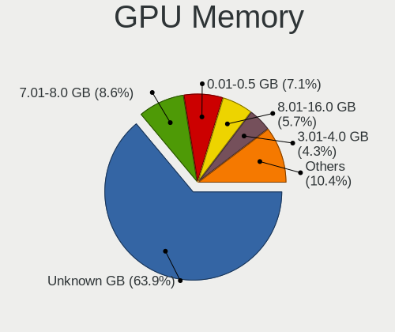

Arch Hardware Trends
--------------------

A project to identify most popular hardware characteristics and track their change
over time based on data collected by Arch users at https://Linux-Hardware.org.

Anyone can contribute to the study by uploading probes of their computers by
the [hw-probe](https://github.com/linuxhw/hw-probe) tool:

    sudo hw-probe -all -upload

This is a report for all computer types. See also reports for [desktops](/Dist/Arch/Desktop/README.md) and [notebooks](/Dist/Arch/Notebook/README.md).

Full-feature report is available here: https://linux-hardware.org/?view=trends

Period: Feb, 2020.

Contents
--------

- [ OS                       ](#os)
- [ OS Family                ](#os-family)
- [ Kernel                   ](#kernel)
- [ Kernel Family            ](#kernel-family)
- [ Kernel Major Ver.        ](#kernel-major-ver)
- [ Arch                     ](#arch)
- [ DE                       ](#de)
- [ Display Server           ](#display-server)
- [ OS Lang                  ](#os-lang)
- [ Boot Mode                ](#boot-mode)
- [ Filesystem               ](#filesystem)
- [ Dual Boot with Linux     ](#dual-boot-with-linux)
- [ Dual Boot (Win)          ](#dual-boot-win)
- [ Country                  ](#country)
- [ City                     ](#city)
- [ Vendor                   ](#vendor)
- [ Model                    ](#model)
- [ Model Family             ](#model-family)
- [ MFG Year                 ](#mfg-year)
- [ Form Factor              ](#form-factor)
- [ Secure Boot              ](#secure-boot)
- [ Coreboot                 ](#coreboot)
- [ RAM Size                 ](#ram-size)
- [ RAM Used                 ](#ram-used)
- [ Drive Vendor             ](#drive-vendor)
- [ Drive Model              ](#drive-model)
- [ Drive Kind               ](#drive-kind)
- [ Drive Connector          ](#drive-connector)
- [ Drive Size               ](#drive-size)
- [ Space Total              ](#space-total)
- [ Space Used               ](#space-used)
- [ Malfunc. Drives          ](#malfunc-drives)
- [ Malfunc. Drive Vendor    ](#malfunc-drive-vendor)
- [ Malfunc. Drive Kind      ](#malfunc-drive-kind)
- [ Failed Drives            ](#failed-drives)
- [ Failed Drive Vendor      ](#failed-drive-vendor)
- [ Drive Status             ](#drive-status)
- [ Storage Vendor           ](#storage-vendor)
- [ Storage Model            ](#storage-model)
- [ Storage Kind             ](#storage-kind)
- [ CPU Vendor               ](#cpu-vendor)
- [ CPU Model                ](#cpu-model)
- [ CPU Model Family         ](#cpu-model-family)
- [ CPU Cores                ](#cpu-cores)
- [ CPU Sockets              ](#cpu-sockets)
- [ CPU Threads              ](#cpu-threads)
- [ CPU Op-Modes             ](#cpu-op-modes)
- [ CPU Microarch            ](#cpu-microarch)
- [ CPU Microcode            ](#cpu-microcode)
- [ GPU Vendor               ](#gpu-vendor)
- [ GPU Model                ](#gpu-model)
- [ GPU Combo                ](#gpu-combo)
- [ GPU Driver               ](#gpu-driver)
- [ GPU Memory               ](#gpu-memory)
- [ Monitor Vendor           ](#monitor-vendor)
- [ Monitor Model            ](#monitor-model)
- [ Monitor Resolution       ](#monitor-resolution)
- [ Monitor Diagonal         ](#monitor-diagonal)
- [ Monitor Width            ](#monitor-width)
- [ Aspect Ratio             ](#aspect-ratio)
- [ Monitor Area             ](#monitor-area)
- [ Pixel Density            ](#pixel-density)
- [ Multiple Monitors        ](#multiple-monitors)
- [ Net Controller Vendor    ](#net-controller-vendor)
- [ Net Controller Model     ](#net-controller-model)
- [ Net Controller Kind      ](#net-controller-kind)
- [ Used Controller          ](#used-controller)
- [ NICs                     ](#nics)
- [ Unsupported Devices      ](#unsupported-devices)
- [ Unsupported Device Types ](#unsupported-device-types)

OS
--

Installed operating systems

| Name         | Computers | Percent |
|--------------|-----------|---------|
| Arch         | 55        | 70.51%  |
| Arch Rolling | 23        | 29.49%  |

OS Family
---------

OS without a version

| Name | Computers | Percent |
|------|-----------|---------|
| Arch | 78        | 100%    |

Kernel
------

Version of the Linux kernel

| Version                             | Computers | Percent |
|-------------------------------------|-----------|---------|
| 5.5.5-arch1-1                       | 13        | 16.67%  |
| 5.5.2-arch1-1                       | 8         | 10.26%  |
| 5.5.4-arch1-1                       | 7         | 8.97%   |
| 5.4.15-arch1-1                      | 7         | 8.97%   |
| 5.5.3-arch1-1                       | 5         | 6.41%   |
| 5.5.1-arch1-1                       | 5         | 6.41%   |
| 5.5.6-arch1-1                       | 4         | 5.13%   |
| 5.5.2-arch2-2                       | 4         | 5.13%   |
| 5.5.4-zen1-1-zen                    | 3         | 3.85%   |
| 5.4.20-1-lts                        | 2         | 2.56%   |
| 5.4.19-1-lts                        | 2         | 2.56%   |
| 5.6.0-rc1-2-nycko-rc1               | 1         | 1.28%   |
| 5.6.0-rc1-1-git-00044-gb19e8c684703 | 1         | 1.28%   |
| 5.5.5-zen1-1-zen                    | 1         | 1.28%   |
| 5.5.3-zen1-1-zen                    | 1         | 1.28%   |
| 5.5.1-zen1-1-zen                    | 1         | 1.28%   |
| 5.4.7-arch1-1                       | 1         | 1.28%   |
| 5.4.21-1-lts                        | 1         | 1.28%   |
| 5.4.16.ll55-1-lingruby-git+         | 1         | 1.28%   |
| 5.4.15-zen1-1-zen                   | 1         | 1.28%   |
| 5.4.15-1-ck-zen2                    | 1         | 1.28%   |
| 5.4.12-arch1-1                      | 1         | 1.28%   |
| 5.3.7-arch1-1-ARCH                  | 1         | 1.28%   |
| 5.3.18-1-surface                    | 1         | 1.28%   |
| 5.3.15-1                            | 1         | 1.28%   |
| 4.19.99-1-lts                       | 1         | 1.28%   |
| 4.19.97-1-lts                       | 1         | 1.28%   |
| 4.19.78-xxxx-std-ipv6-64            | 1         | 1.28%   |
| 4.19.101-1-lts                      | 1         | 1.28%   |

Kernel Family
-------------

Linux kernel without a distro release

| Version  | Computers | Percent |
|----------|-----------|---------|
| 5.5.5    | 14        | 17.95%  |
| 5.5.2    | 12        | 15.38%  |
| 5.5.4    | 10        | 12.82%  |
| 5.4.15   | 9         | 11.54%  |
| 5.5.3    | 6         | 7.69%   |
| 5.5.1    | 6         | 7.69%   |
| 5.5.6    | 4         | 5.13%   |
| 5.6.0    | 2         | 2.56%   |
| 5.4.20   | 2         | 2.56%   |
| 5.4.19   | 2         | 2.56%   |
| 5.4.7    | 1         | 1.28%   |
| 5.4.21   | 1         | 1.28%   |
| 5.4.16   | 1         | 1.28%   |
| 5.4.12   | 1         | 1.28%   |
| 5.3.7    | 1         | 1.28%   |
| 5.3.18   | 1         | 1.28%   |
| 5.3.15   | 1         | 1.28%   |
| 4.19.99  | 1         | 1.28%   |
| 4.19.97  | 1         | 1.28%   |
| 4.19.78  | 1         | 1.28%   |
| 4.19.101 | 1         | 1.28%   |

Kernel Major Ver.
-----------------

Linux kernel major version

| Version | Computers | Percent |
|---------|-----------|---------|
| 5.5     | 52        | 66.67%  |
| 5.4     | 17        | 21.79%  |
| 4.19    | 4         | 5.13%   |
| 5.3     | 3         | 3.85%   |
| 5.6     | 2         | 2.56%   |

Arch
----

OS architecture (x86_64, i586, etc.)

| Name   | Computers | Percent |
|--------|-----------|---------|
| x86_64 | 78        | 100%    |

DE
--

Desktop Environment

| Name            | Computers | Percent |
|-----------------|-----------|---------|
| GNOME           | 28        | 35.9%   |
| KDE             | 13        | 16.67%  |
| KDE5            | 10        | 12.82%  |
| Unknown         | 7         | 8.97%   |
| i3              | 4         | 5.13%   |
| MATE            | 3         | 3.85%   |
| XFCE            | 2         | 2.56%   |
| Cinnamon        | 2         | 2.56%   |
| Budgie          | 2         | 2.56%   |
| X-Cinnamon      | 1         | 1.28%   |
| LXQt            | 1         | 1.28%   |
| LXDE            | 1         | 1.28%   |
| GNUstep         | 1         | 1.28%   |
| GNOME Flashback | 1         | 1.28%   |
| GNOME Classic   | 1         | 1.28%   |
| Enlightenment   | 1         | 1.28%   |

Display Server
--------------

X11 or Wayland

| Name    | Computers | Percent |
|---------|-----------|---------|
| X11     | 53        | 67.95%  |
| Wayland | 19        | 24.36%  |
| Tty     | 3         | 3.85%   |
| Unknown | 3         | 3.85%   |

OS Lang
-------

Language

| Lang       | Computers | Percent |
|------------|-----------|---------|
| en_US      | 37        | 47.44%  |
| en_GB      | 6         | 7.69%   |
| pl_PL      | 4         | 5.13%   |
| de_DE      | 4         | 5.13%   |
| ru_RU      | 3         | 3.85%   |
| pt_BR      | 3         | 3.85%   |
| ru_RU.utf8 | 2         | 2.56%   |
| ja_JP      | 2         | 2.56%   |
| fr_FR      | 2         | 2.56%   |
| en_CA      | 2         | 2.56%   |
| C          | 2         | 2.56%   |
| Unknown    | 2         | 2.56%   |
| zh_CN      | 1         | 1.28%   |
| pl_PL.utf8 | 1         | 1.28%   |
| it_IT.utf8 | 1         | 1.28%   |
| hu_HU      | 1         | 1.28%   |
| fr_CA      | 1         | 1.28%   |
| french     | 1         | 1.28%   |
| es_MX      | 1         | 1.28%   |
| es_EC      | 1         | 1.28%   |
| en_GB.utf8 | 1         | 1.28%   |

Boot Mode
---------

EFI or BIOS

| Mode | Computers | Percent |
|------|-----------|---------|
| EFI  | 43        | 55.13%  |
| BIOS | 35        | 44.87%  |

Filesystem
----------

Type of filesystem

| Type  | Computers | Percent |
|-------|-----------|---------|
| Ext4  | 64        | 82.05%  |
| Btrfs | 9         | 11.54%  |
| Xfs   | 3         | 3.85%   |
| F2fs  | 2         | 2.56%   |

Dual Boot with Linux
--------------------

Hosting more than one Linux

| Dual boot | Computers | Percent |
|-----------|-----------|---------|
| No        | 71        | 91.03%  |
| Yes       | 7         | 8.97%   |

Dual Boot (Win)
---------------

Hosting Linux and Windows

| Dual boot | Computers | Percent |
|-----------|-----------|---------|
| No        | 60        | 76.92%  |
| Yes       | 18        | 23.08%  |

Country
-------

Geographic location (country)

| Country            | Computers | Percent |
|--------------------|-----------|---------|
| USA                | 15        | 19.23%  |
| Russia             | 11        | 14.1%   |
| Germany            | 8         | 10.26%  |
| Poland             | 5         | 6.41%   |
| France             | 4         | 5.13%   |
| Canada             | 4         | 5.13%   |
| Brazil             | 4         | 5.13%   |
| UK                 | 3         | 3.85%   |
| Spain              | 2         | 2.56%   |
| Romania            | 2         | 2.56%   |
| Mexico             | 2         | 2.56%   |
| China              | 2         | 2.56%   |
| Ukraine            | 1         | 1.28%   |
| Thailand           | 1         | 1.28%   |
| Portugal           | 1         | 1.28%   |
| Latvia             | 1         | 1.28%   |
| Korea, Republic of | 1         | 1.28%   |
| Japan              | 1         | 1.28%   |
| Italy              | 1         | 1.28%   |
| India              | 1         | 1.28%   |
| Hungary            | 1         | 1.28%   |
| Greece             | 1         | 1.28%   |
| Ecuador            | 1         | 1.28%   |
| Czech Republic     | 1         | 1.28%   |
| Colombia           | 1         | 1.28%   |
| Chile              | 1         | 1.28%   |
| Cambodia           | 1         | 1.28%   |
| Belgium            | 1         | 1.28%   |

City
----

Geographic location (city)

| City                  | Computers | Percent |
|-----------------------|-----------|---------|
| Moscow                | 3         | 3.85%   |
| Shanghai              | 2         | 2.56%   |
| Norderstedt           | 2         | 2.56%   |
| Krasnoyarsk           | 2         | 2.56%   |
| Gravelines            | 2         | 2.56%   |
| Łódź               | 1         | 1.28%   |
| Winter Garden         | 1         | 1.28%   |
| Winsted               | 1         | 1.28%   |
| White Salmon          | 1         | 1.28%   |
| Wejherowo             | 1         | 1.28%   |
| Washington            | 1         | 1.28%   |
| Warsaw                | 1         | 1.28%   |
| Vladivostok           | 1         | 1.28%   |
| Uccle                 | 1         | 1.28%   |
| Tuzla                 | 1         | 1.28%   |
| Tuttlingen            | 1         | 1.28%   |
| Tayshet               | 1         | 1.28%   |
| Taubate               | 1         | 1.28%   |
| São Luís            | 1         | 1.28%   |
| St Petersburg         | 1         | 1.28%   |
| Seoul                 | 1         | 1.28%   |
| Santiago              | 1         | 1.28%   |
| San Diego             | 1         | 1.28%   |
| Reims                 | 1         | 1.28%   |
| Quito                 | 1         | 1.28%   |
| Prague                | 1         | 1.28%   |
| Powder Springs        | 1         | 1.28%   |
| Playa del Carmen      | 1         | 1.28%   |
| Phnom Penh            | 1         | 1.28%   |
| Patos de Minas        | 1         | 1.28%   |
| Ottawa                | 1         | 1.28%   |
| Nyazepetrovskaya      | 1         | 1.28%   |
| Nizhneudinsk          | 1         | 1.28%   |
| Niagara Falls         | 1         | 1.28%   |
| Mytilene              | 1         | 1.28%   |
| Montreal              | 1         | 1.28%   |
| Millinocket           | 1         | 1.28%   |
| Mesa                  | 1         | 1.28%   |
| Mem Martins           | 1         | 1.28%   |
| Marietta              | 1         | 1.28%   |
| Kyiv                  | 1         | 1.28%   |
| Krakow                | 1         | 1.28%   |
| Kirov                 | 1         | 1.28%   |
| Itarare               | 1         | 1.28%   |
| Homosassa             | 1         | 1.28%   |
| Geveze                | 1         | 1.28%   |
| Gdynia                | 1         | 1.28%   |
| Frankfurt am Main     | 1         | 1.28%   |
| Florence              | 1         | 1.28%   |
| Ellesmere             | 1         | 1.28%   |
| El Viso del Alcor     | 1         | 1.28%   |
| Duvall                | 1         | 1.28%   |
| Dobele                | 1         | 1.28%   |
| Dartford              | 1         | 1.28%   |
| Crema                 | 1         | 1.28%   |
| Cologne               | 1         | 1.28%   |
| Cocoa                 | 1         | 1.28%   |
| Cluj-Napoca           | 1         | 1.28%   |
| Ciudad Nezahualcoyotl | 1         | 1.28%   |
| Chiyoda               | 1         | 1.28%   |

Vendor
------

Motherboard manufacturer

| Name                | Computers | Percent |
|---------------------|-----------|---------|
| ASUSTek Computer    | 17        | 21.79%  |
| Lenovo              | 13        | 16.67%  |
| MSI                 | 7         | 8.97%   |
| Dell                | 7         | 8.97%   |
| Acer                | 7         | 8.97%   |
| Hewlett-Packard     | 6         | 7.69%   |
| Gigabyte Technology | 4         | 5.13%   |
| ASRock              | 4         | 5.13%   |
| Microsoft           | 2         | 2.56%   |
| Fujitsu             | 2         | 2.56%   |
| Apple               | 2         | 2.56%   |
| Samsung Electronics | 1         | 1.28%   |
| Notebook            | 1         | 1.28%   |
| MECHREVO            | 1         | 1.28%   |
| Koompi              | 1         | 1.28%   |
| Intel               | 1         | 1.28%   |
| HUAWEI              | 1         | 1.28%   |
| Unknown             | 1         | 1.28%   |

Model
-----

Motherboard model

| Name                                     | Computers | Percent |
|------------------------------------------|-----------|---------|
| Acer Aspire E5-571                       | 2         | 2.56%   |
| Unknown                                  | 2         | 2.56%   |
| Samsung Electronics 300E4Z/300E5Z/300E7Z | 1         | 1.28%   |
| Notebook N141CU                          | 1         | 1.28%   |
| MSI Prestige 14 A10SC                    | 1         | 1.28%   |
| MSI MS-7C35                              | 1         | 1.28%   |
| MSI MS-7B89                              | 1         | 1.28%   |
| MSI MS-7B38                              | 1         | 1.28%   |
| MSI MS-7808                              | 1         | 1.28%   |
| MSI GT62VR 6RE                           | 1         | 1.28%   |
| MSI GS75 Stealth 9SF                     | 1         | 1.28%   |
| Microsoft Surface Book 2                 | 1         | 1.28%   |
| Microsoft Surface Book                   | 1         | 1.28%   |
| MECHREVO X6Ti                            | 1         | 1.28%   |
| Lenovo V155-15API 81V5                   | 1         | 1.28%   |
| Lenovo ThinkPad X1 Tablet 20GHS2TC00     | 1         | 1.28%   |
| Lenovo ThinkPad T490 20N2000NRT          | 1         | 1.28%   |
| Lenovo ThinkPad T490 20N2000BRT          | 1         | 1.28%   |
| Lenovo ThinkPad T480 20L5CTO1WW          | 1         | 1.28%   |
| Lenovo ThinkPad T400 6474P1U             | 1         | 1.28%   |
| Lenovo ThinkPad L420 7829W1F             | 1         | 1.28%   |
| Lenovo ThinkCentre E73 10AU003BMX        | 1         | 1.28%   |
| Lenovo IdeaPad Z400 Touch VIWZ1          | 1         | 1.28%   |
| Lenovo IdeaPad C340-14IWL 81RL           | 1         | 1.28%   |
| Lenovo IdeaPad 700-15ISK 80RU            | 1         | 1.28%   |
| Lenovo IdeaPad 530S-15IKB 81EV           | 1         | 1.28%   |
| Lenovo IdeaPad 110-14IBR 80T6            | 1         | 1.28%   |
| Intel DN2800MT AAG23738-804              | 1         | 1.28%   |
| HUAWEI MACH-WX9                          | 1         | 1.28%   |
| HP Pavilion Gaming Laptop 15-ec0xxx      | 1         | 1.28%   |
| HP ENVY x360 Convertible 15-ds0xxx       | 1         | 1.28%   |
| HP EliteBook 8460p                       | 1         | 1.28%   |
| HP EliteBook 840 G6                      | 1         | 1.28%   |
| HP EliteBook 840 G3                      | 1         | 1.28%   |
| HP EliteBook 840 G2                      | 1         | 1.28%   |
| Gigabyte H77-DS3H                        | 1         | 1.28%   |
| Gigabyte H61M-S2PV                       | 1         | 1.28%   |
| Gigabyte B450M DS3H                      | 1         | 1.28%   |
| Gigabyte AB350-Gaming 3                  | 1         | 1.28%   |
| Fujitsu LIFEBOOK S710                    | 1         | 1.28%   |
| Fujitsu LIFEBOOK E752                    | 1         | 1.28%   |
| Dell Vostro 3400                         | 1         | 1.28%   |
| Dell Precision 7540                      | 1         | 1.28%   |
| Dell OptiPlex 7050                       | 1         | 1.28%   |
| Dell Latitude E7470                      | 1         | 1.28%   |
| Dell Latitude E5450                      | 1         | 1.28%   |
| Dell Inspiron 5767                       | 1         | 1.28%   |
| Dell Inspiron 15-5578                    | 1         | 1.28%   |
| ASUS Z170-A                              | 1         | 1.28%   |
| ASUS UX303LA                             | 1         | 1.28%   |
| ASUS TUF Gaming FX505DV_FX505DV          | 1         | 1.28%   |
| ASUS TUF B450M-PLUS GAMING               | 1         | 1.28%   |
| ASUS STRIX Z270G GAMING                  | 1         | 1.28%   |
| ASUS SABERTOOTH 990FX R2.0               | 1         | 1.28%   |
| ASUS Q535UD                              | 1         | 1.28%   |
| ASUS PRIME B360-PLUS                     | 1         | 1.28%   |
| ASUS PRIME B350-PLUS                     | 1         | 1.28%   |
| ASUS P8H61-MX USB3                       | 1         | 1.28%   |
| ASUS N82JQ                               | 1         | 1.28%   |
| ASUS N551JW                              | 1         | 1.28%   |

Model Family
------------

Motherboard model prefix

| Name                       | Computers | Percent |
|----------------------------|-----------|---------|
| Lenovo ThinkPad            | 6         | 7.69%   |
| Lenovo IdeaPad             | 5         | 6.41%   |
| HP EliteBook               | 4         | 5.13%   |
| Acer Aspire                | 3         | 3.85%   |
| Microsoft Surface          | 2         | 2.56%   |
| Fujitsu LIFEBOOK           | 2         | 2.56%   |
| Dell Latitude              | 2         | 2.56%   |
| Dell Inspiron              | 2         | 2.56%   |
| ASUS TUF                   | 2         | 2.56%   |
| ASUS PRIME                 | 2         | 2.56%   |
| Unknown                    | 2         | 2.56%   |
| Samsung Electronics 300E4Z | 1         | 1.28%   |
| Notebook N141CU            | 1         | 1.28%   |
| MSI Prestige               | 1         | 1.28%   |
| MSI MS-7C35                | 1         | 1.28%   |
| MSI MS-7B89                | 1         | 1.28%   |
| MSI MS-7B38                | 1         | 1.28%   |
| MSI MS-7808                | 1         | 1.28%   |
| MSI GT62VR                 | 1         | 1.28%   |
| MSI GS75                   | 1         | 1.28%   |
| MECHREVO X6Ti              | 1         | 1.28%   |
| Lenovo V155-15API          | 1         | 1.28%   |
| Lenovo ThinkCentre         | 1         | 1.28%   |
| Intel DN2800MT             | 1         | 1.28%   |
| HUAWEI MACH-WX9            | 1         | 1.28%   |
| HP Pavilion                | 1         | 1.28%   |
| HP ENVY                    | 1         | 1.28%   |
| Gigabyte H77-DS3H          | 1         | 1.28%   |
| Gigabyte H61M-S2PV         | 1         | 1.28%   |
| Gigabyte B450M             | 1         | 1.28%   |
| Gigabyte AB350-Gaming      | 1         | 1.28%   |
| Dell Vostro                | 1         | 1.28%   |
| Dell Precision             | 1         | 1.28%   |
| Dell OptiPlex              | 1         | 1.28%   |
| ASUS Z170-A                | 1         | 1.28%   |
| ASUS UX303LA               | 1         | 1.28%   |
| ASUS STRIX                 | 1         | 1.28%   |
| ASUS SABERTOOTH            | 1         | 1.28%   |
| ASUS Q535UD                | 1         | 1.28%   |
| ASUS P8H61-MX              | 1         | 1.28%   |
| ASUS N82JQ                 | 1         | 1.28%   |
| ASUS N551JW                | 1         | 1.28%   |
| ASUS Maximus               | 1         | 1.28%   |
| ASUS M5A99FX               | 1         | 1.28%   |
| ASUS K53SV                 | 1         | 1.28%   |
| ASUS GL553VW               | 1         | 1.28%   |
| ASUS GL502VS               | 1         | 1.28%   |
| ASRock Z77                 | 1         | 1.28%   |
| ASRock Q1900M              | 1         | 1.28%   |
| ASRock H87M                | 1         | 1.28%   |
| ASRock 970                 | 1         | 1.28%   |
| Apple MacBook4             | 1         | 1.28%   |
| Apple iMac12               | 1         | 1.28%   |
| Acer TravelMate            | 1         | 1.28%   |
| Acer Predator              | 1         | 1.28%   |
| Acer Nitro                 | 1         | 1.28%   |
| Acer Extensa               | 1         | 1.28%   |

MFG Year
--------

Motherboard manufacture year

| Year    | Computers | Percent |
|---------|-----------|---------|
| 2019    | 29        | 37.18%  |
| 2013    | 10        | 12.82%  |
| 2018    | 9         | 11.54%  |
| 2016    | 8         | 10.26%  |
| 2014    | 6         | 7.69%   |
| 2015    | 4         | 5.13%   |
| 2017    | 3         | 3.85%   |
| 2020    | 2         | 2.56%   |
| 2010    | 2         | 2.56%   |
| 2012    | 1         | 1.28%   |
| 2011    | 1         | 1.28%   |
| 2009    | 1         | 1.28%   |
| 2008    | 1         | 1.28%   |
| Unknown | 1         | 1.28%   |

Form Factor
-----------

Physical design of the computer

| Name        | Computers | Percent |
|-------------|-----------|---------|
| Notebook    | 46        | 58.97%  |
| Desktop     | 25        | 32.05%  |
| Tablet      | 3         | 3.85%   |
| Convertible | 3         | 3.85%   |
| All in one  | 1         | 1.28%   |

Secure Boot
-----------

Enabled or disabled

| State    | Computers | Percent |
|----------|-----------|---------|
| Disabled | 76        | 97.44%  |
| Enabled  | 2         | 2.56%   |

Coreboot
--------

Have coreboot on board

| Used | Computers | Percent |
|------|-----------|---------|
| No   | 78        | 100%    |

RAM Size
--------

Total RAM memory

| Size in GB  | Computers | Percent |
|-------------|-----------|---------|
| 16.01-24.0  | 28        | 35.9%   |
| 8.01-16.0   | 16        | 20.51%  |
| 4.01-8.0    | 13        | 16.67%  |
| 32.01-64.0  | 9         | 11.54%  |
| 3.01-4.0    | 8         | 10.26%  |
| 1.01-2.0    | 2         | 2.56%   |
| 2.01-3.0    | 1         | 1.28%   |
| 64.01-256.0 | 1         | 1.28%   |

RAM Used
--------

Used RAM memory

| Used GB   | Computers | Percent |
|-----------|-----------|---------|
| 2.01-3.0  | 23        | 29.49%  |
| 1.01-2.0  | 21        | 26.92%  |
| 4.01-8.0  | 16        | 20.51%  |
| 3.01-4.0  | 8         | 10.26%  |
| 0.01-1.0  | 6         | 7.69%   |
| 8.01-16.0 | 4         | 5.13%   |

Drive Vendor
------------

Hard drive vendors

| Vendor              | Computers | Drives | Percent |
|---------------------|-----------|--------|---------|
| WDC                 | 21        | 34     | 18.26%  |
| Seagate             | 19        | 23     | 16.52%  |
| Samsung Electronics | 16        | 16     | 13.91%  |
| Intel               | 7         | 8      | 6.09%   |
| Toshiba             | 6         | 6      | 5.22%   |
| SanDisk             | 6         | 7      | 5.22%   |
| Kingston            | 5         | 6      | 4.35%   |
| HGST                | 4         | 4      | 3.48%   |
| Crucial             | 4         | 4      | 3.48%   |
| LITEON              | 3         | 3      | 2.61%   |
| Unknown             | 2         | 2      | 1.74%   |
| PLEXTOR             | 2         | 2      | 1.74%   |
| Micron Technology   | 2         | 2      | 1.74%   |
| Hitachi             | 2         | 2      | 1.74%   |
| A-DATA Technology   | 2         | 2      | 1.74%   |
| VMware              | 1         | 1      | 0.87%   |
| SPCC                | 1         | 1      | 0.87%   |
| SK Hynix            | 1         | 1      | 0.87%   |
| PNY                 | 1         | 1      | 0.87%   |
| PM981a N            | 1         | 1      | 0.87%   |
| Phison              | 1         | 1      | 0.87%   |
| Patriot             | 1         | 1      | 0.87%   |
| LITEONIT            | 1         | 1      | 0.87%   |
| JMicron             | 1         | 1      | 0.87%   |
| Fujitsu             | 1         | 1      | 0.87%   |
| FORESEE             | 1         | 1      | 0.87%   |
| China               | 1         | 1      | 0.87%   |
| asmedia             | 1         | 1      | 0.87%   |
| Apple               | 1         | 1      | 0.87%   |

Drive Model
-----------

Hard drive models

| Model                        | Computers | Percent |
|------------------------------|-----------|---------|
| HTS721010A9E630 1TB          | 4         | 3.17%   |
| SSD 850 EVO 500GB            | 3         | 2.38%   |
| SA400S37480G 480GB SSD       | 3         | 2.38%   |
| WDS250G2B0A-00SM50 250GB SSD | 2         | 1.59%   |
| Ultra II 480GB SSD           | 2         | 1.59%   |
| SU800 256GB SSD              | 2         | 1.59%   |
| ST500LT012-1DG142 500GB      | 2         | 1.59%   |
| ST4000DM000-1F2168 4TB       | 2         | 1.59%   |
| ST2000LM007-1R8174 2TB       | 2         | 1.59%   |
| ST1000DM010-2EP102 1TB       | 2         | 1.59%   |
| ST1000DM003-9YN162 1TB       | 2         | 1.59%   |
| WDS500G2B0B-00YS70 500GB SSD | 1         | 0.79%   |
| WDS480G2G0A-00JH30 480GB SSD | 1         | 0.79%   |
| WDS240G2G0A-00JH30 240GB SSD | 1         | 0.79%   |
| WDS100T2B0B 1TB SSD          | 1         | 0.79%   |
| WDS100T2B0A-00SM50 1TB SSD   | 1         | 0.79%   |
| WD80EZAZ-11TDBA0 8TB         | 1         | 0.79%   |
| WD80EMAZ-00WJTA0 8TB         | 1         | 0.79%   |
| WD7500BPVT-80HXZT1 752GB     | 1         | 0.79%   |
| WD6400AAKS-65Z7B0 640GB      | 1         | 0.79%   |
| WD6400AAKS-22A7B0 640GB      | 1         | 0.79%   |
| WD50EFRX-68MYMN1 5TB         | 1         | 0.79%   |
| WD5000LPCX-24VHAT0 500GB     | 1         | 0.79%   |
| WD40EFRX-68WT0N0 4TB         | 1         | 0.79%   |
| WD3200AAKS-00V1A0 320GB      | 1         | 0.79%   |
| WD2500JS-75NCB3 250GB        | 1         | 0.79%   |
| WD20PURZ-85GU6Y0 2TB         | 1         | 0.79%   |
| WD20EZRZ-00Z5HB0 2TB         | 1         | 0.79%   |
| WD1600BEKT-60V5T1 160GB      | 1         | 0.79%   |
| WD140EMFZ-11A0WA0 14TB       | 1         | 0.79%   |
| WD120EMAZ-11BLFA0 12TB       | 1         | 0.79%   |
| WD10SPZX-21Z10T0 1TB         | 1         | 0.79%   |
| WD10JPCX-24UE4T0 1TB         | 1         | 0.79%   |
| WD10EZEX-00BN5A0 1TB         | 1         | 0.79%   |
| WD100EZAZ-11TDBA0 10TB       | 1         | 0.79%   |
| WD1003FZEX-00K3CA0 1TB       | 1         | 0.79%   |
| VMe Samsung 256G             | 1         | 0.79%   |
| Virtual S 55GB               | 1         | 0.79%   |
| TL100 240GB SSD              | 1         | 0.79%   |
| THNSNJ128G8NU 128GB SSD      | 1         | 0.79%   |
| Tech 250GB                   | 1         | 0.79%   |
| SV300S37A120G 120GB SSD      | 1         | 0.79%   |
| SUV400S37240G 240GB SSD      | 1         | 0.79%   |
| SU04G  4GB                   | 1         | 0.79%   |
| ST8000DM004-2CX188 8TB       | 1         | 0.79%   |
| ST320LT007-9ZV142 320GB      | 1         | 0.79%   |
| ST250DM000-1BD141 250GB      | 1         | 0.79%   |
| ST2000VX008-2E3164 2TB       | 1         | 0.79%   |
| ST2000LX001-1RG174 2TB       | 1         | 0.79%   |
| ST2000DM001-1CH164 2TB       | 1         | 0.79%   |
| ST1000LM024 HN-M101MBB 1TB   | 1         | 0.79%   |
| ST1000DM003-1CH162 1TB       | 1         | 0.79%   |
| ST10000VN0004-1ZD101 10TB    | 1         | 0.79%   |
| SSDSC2KW512G8 512GB          | 1         | 0.79%   |
| SSDSC2KW480H6 480GB          | 1         | 0.79%   |
| SSDSC2CW240A3 240GB          | 1         | 0.79%   |
| SSDSC2CT120A3 120GB          | 1         | 0.79%   |
| SSDSC2BW360H6 360GB          | 1         | 0.79%   |
| SSDSC2BW120A4 120GB          | 1         | 0.79%   |
| SSDPEKNW512G8H 512GB         | 1         | 0.79%   |

Drive Kind
----------

HDD or SSD

| Kind    | Computers | Drives | Percent |
|---------|-----------|--------|---------|
| SSD     | 44        | 55     | 44%     |
| HDD     | 37        | 61     | 37%     |
| NVMe    | 12        | 12     | 12%     |
| Unknown | 6         | 6      | 6%      |
| MMC     | 1         | 1      | 1%      |

Drive Connector
---------------

SATA, SAS, NVMe, etc.

| Type | Computers | Drives | Percent |
|------|-----------|--------|---------|
| SATA | 59        | 115    | 74.68%  |
| NVMe | 12        | 12     | 15.19%  |
| SAS  | 7         | 7      | 8.86%   |
| MMC  | 1         | 1      | 1.27%   |

Drive Size
----------

Size of hard drive

| Size in TB | Computers | Drives | Percent |
|------------|-----------|--------|---------|
| 0.01-0.5   | 55        | 72     | 55.56%  |
| 0.51-1.0   | 26        | 33     | 26.26%  |
| 1.01-2.0   | 10        | 11     | 10.1%   |
| 3.01-4.0   | 4         | 5      | 4.04%   |
| 4.01-10.0  | 3         | 12     | 3.03%   |
| 10.01-20.0 | 1         | 2      | 1.01%   |

Space Total
-----------

Amount of disk space available on the file system

| Size in GB     | Computers | Percent |
|----------------|-----------|---------|
| 101-250        | 24        | 30.77%  |
| 251-500        | 17        | 21.79%  |
| 501-1000       | 12        | 15.38%  |
| More than 3000 | 9         | 11.54%  |
| 2001-3000      | 6         | 7.69%   |
| 1001-2000      | 5         | 6.41%   |
| 51-100         | 3         | 3.85%   |
| 21-50          | 2         | 2.56%   |

Space Used
----------

Amount of used disk space

| Used GB        | Computers | Percent |
|----------------|-----------|---------|
| 21-50          | 18        | 23.08%  |
| 101-250        | 14        | 17.95%  |
| 1-20           | 12        | 15.38%  |
| 501-1000       | 8         | 10.26%  |
| 251-500        | 7         | 8.97%   |
| 51-100         | 7         | 8.97%   |
| More than 3000 | 6         | 7.69%   |
| 1001-2000      | 4         | 5.13%   |
| 2001-3000      | 2         | 2.56%   |

Malfunc. Drives
---------------

Drive models with a malfunction

| Model                   | Computers | Drives | Percent |
|-------------------------|-----------|--------|---------|
| WD1600BEKT-60V5T1 160GB | 1         | 1      | 11.11%  |
| ST2000LM007-1R8174 2TB  | 1         | 1      | 11.11%  |
| ST1000DM003-9YN162 1TB  | 1         | 1      | 11.11%  |
| SSDSC2CT120A3 120GB     | 1         | 1      | 11.11%  |
| SSDSC2BW360H6 360GB     | 1         | 1      | 11.11%  |
| SSD 960 PRO 512GB       | 1         | 1      | 11.11%  |
| PX-256M6S 256GB SSD     | 1         | 1      | 11.11%  |
| MK6465GSX 640GB         | 1         | 1      | 11.11%  |
| HTS721010A9E630 1TB     | 1         | 1      | 11.11%  |

Malfunc. Drive Vendor
---------------------

Vendors of faulty drives

| Vendor              | Computers | Drives | Percent |
|---------------------|-----------|--------|---------|
| Seagate             | 2         | 2      | 22.22%  |
| Intel               | 2         | 2      | 22.22%  |
| WDC                 | 1         | 1      | 11.11%  |
| Toshiba             | 1         | 1      | 11.11%  |
| Samsung Electronics | 1         | 1      | 11.11%  |
| PLEXTOR             | 1         | 1      | 11.11%  |
| HGST                | 1         | 1      | 11.11%  |

Malfunc. Drive Kind
-------------------

Kinds of faulty drives

| Kind | Computers | Drives | Percent |
|------|-----------|--------|---------|
| HDD  | 5         | 5      | 62.5%   |
| SSD  | 2         | 3      | 25%     |
| NVMe | 1         | 1      | 12.5%   |

Failed Drives
-------------

Failed drive models

Zero info for selected period =(

Failed Drive Vendor
-------------------

Failed drive vendors

Zero info for selected period =(

Drive Status
------------

Number of failed and malfunc. drives

| Status   | Computers | Drives | Percent |
|----------|-----------|--------|---------|
| Detected | 39        | 63     | 49.37%  |
| Works    | 32        | 63     | 40.51%  |
| Malfunc  | 8         | 9      | 10.13%  |

Storage Vendor
--------------

Storage controller vendors

| Vendor                       | Computers | Percent |
|------------------------------|-----------|---------|
| Intel                        | 58        | 59.18%  |
| AMD                          | 13        | 13.27%  |
| Samsung Electronics          | 12        | 12.24%  |
| Toshiba America Info Systems | 3         | 3.06%   |
| ASMedia Technology           | 3         | 3.06%   |
| Phison Electronics           | 2         | 2.04%   |
| LSI Logic / Symbios Logic    | 2         | 2.04%   |
| VMware                       | 1         | 1.02%   |
| SK Hynix                     | 1         | 1.02%   |
| Silicon Image                | 1         | 1.02%   |
| Sandisk                      | 1         | 1.02%   |
| Lite-On Technology           | 1         | 1.02%   |

Storage Model
-------------

Storage controller models

| Model                                                                             | Computers | Percent |
|-----------------------------------------------------------------------------------|-----------|---------|
| FCH SATA Controller [AHCI mode]                                                   | 10        | 8.93%   |
| NVMe SSD Controller SM981/PM981/PM983                                             | 9         | 8.04%   |
| Sunrise Point-LP SATA Controller [AHCI mode]                                      | 7         | 6.25%   |
| HM170/QM170 Chipset SATA Controller [AHCI Mode]                                   | 5         | 4.46%   |
| SSD 660P Series                                                                   | 4         | 3.57%   |
| Cannon Lake Mobile PCH SATA AHCI Controller                                       | 4         | 3.57%   |
| 6 Series/C200 Series Chipset Family 6 port Mobile SATA AHCI Controller            | 4         | 3.57%   |
| Wildcat Point-LP SATA Controller [AHCI Mode]                                      | 3         | 2.68%   |
| NVMe Controller                                                                   | 3         | 2.68%   |
| ASM1062 Serial ATA Controller                                                     | 3         | 2.68%   |
| 8 Series/C220 Series Chipset Family 6-port SATA Controller 1 [AHCI mode]          | 3         | 2.68%   |
| 400 Series Chipset SATA Controller                                                | 3         | 2.68%   |
| SB7x0/SB8x0/SB9x0 SATA Controller [AHCI mode]                                     | 2         | 1.79%   |
| Q170/Q150/B150/H170/H110/Z170/CM236 Chipset SATA Controller [AHCI Mode]           | 2         | 1.79%   |
| 8 Series SATA Controller 1 [AHCI mode]                                            | 2         | 1.79%   |
| 7 Series/C210 Series Chipset Family 6-port SATA Controller [AHCI mode]            | 2         | 1.79%   |
| 7 Series Chipset Family 6-port SATA Controller [AHCI mode]                        | 2         | 1.79%   |
| 6 Series/C200 Series Chipset Family 6 port Desktop SATA AHCI Controller           | 2         | 1.79%   |
| 300 Series Chipset SATA Controller                                                | 2         | 1.79%   |
| WD Black 2018/PC SN720 NVMe SSD                                                   | 1         | 0.89%   |
| SSD Pro 7600p/760p/E 6100p Series                                                 | 1         | 0.89%   |
| SSD 600P Series                                                                   | 1         | 0.89%   |
| SiI 3114 [SATALink/SATARaid] Serial ATA Controller                                | 1         | 0.89%   |
| SB7x0/SB8x0/SB9x0 SATA Controller [IDE mode]                                      | 1         | 0.89%   |
| SB7x0/SB8x0/SB9x0 IDE Controller                                                  | 1         | 0.89%   |
| SATA Controller [RAID mode]                                                       | 1         | 0.89%   |
| SATA controller                                                                   | 1         | 0.89%   |
| SATA AHCI controller                                                              | 1         | 0.89%   |
| SAS2008 PCI-Express Fusion-MPT SAS-2 [Falcon]                                     | 1         | 0.89%   |
| NVMe SSD Optane Series Controller                                                 | 1         | 0.89%   |
| NVMe SSD Controller SM961/PM961                                                   | 1         | 0.89%   |
| NVMe SSD Controller SM951/PM951                                                   | 1         | 0.89%   |
| Non-Volatile memory controller                                                    | 1         | 0.89%   |
| NM10/ICH7 Family SATA Controller [AHCI mode]                                      | 1         | 0.89%   |
| FCH SATA Controller D                                                             | 1         | 0.89%   |
| Electronics Non-Volatile memory controller                                        | 1         | 0.89%   |
| E7 NVMe Controller                                                                | 1         | 0.89%   |
| E12 NVMe Controller                                                               | 1         | 0.89%   |
| Comet Lake SATA AHCI Controller                                                   | 1         | 0.89%   |
| Cannon Point-LP SATA Controller [AHCI Mode]                                       | 1         | 0.89%   |
| Cannon Lake PCH SATA AHCI Controller                                              | 1         | 0.89%   |
| BG3 NVMe SSD Controller                                                           | 1         | 0.89%   |
| Atom/Celeron/Pentium Processor x5-E8000/J3xxx/N3xxx Series SATA Controller        | 1         | 0.89%   |
| Atom Processor E3800 Series SATA AHCI Controller                                  | 1         | 0.89%   |
| 82801IBM/IEM (ICH9M/ICH9M-E) 4 port SATA Controller [AHCI mode]                   | 1         | 0.89%   |
| 82801HM/HEM (ICH8M/ICH8M-E) SATA Controller [AHCI mode]                           | 1         | 0.89%   |
| 82801HM/HEM (ICH8M/ICH8M-E) IDE Controller                                        | 1         | 0.89%   |
| 82801 Mobile SATA Controller [RAID mode]                                          | 1         | 0.89%   |
| 82371AB/EB/MB PIIX4 IDE                                                           | 1         | 0.89%   |
| 7 Series/C210 Series Chipset Family 4-port SATA Controller [IDE mode]             | 1         | 0.89%   |
| 7 Series/C210 Series Chipset Family 2-port SATA Controller [IDE mode]             | 1         | 0.89%   |
| 6 Series/C200 Series Chipset Family Desktop SATA Controller (IDE mode, ports 4-5) | 1         | 0.89%   |
| 6 Series/C200 Series Chipset Family Desktop SATA Controller (IDE mode, ports 0-3) | 1         | 0.89%   |
| 53c1030 PCI-X Fusion-MPT Dual Ultra320 SCSI                                       | 1         | 0.89%   |
| 5 Series/3400 Series Chipset PT IDER Controller                                   | 1         | 0.89%   |
| 5 Series/3400 Series Chipset 6 port SATA AHCI Controller                          | 1         | 0.89%   |
| 5 Series/3400 Series Chipset 4 port SATA IDE Controller                           | 1         | 0.89%   |
| 5 Series/3400 Series Chipset 4 port SATA AHCI Controller                          | 1         | 0.89%   |
| 200 Series PCH SATA controller [AHCI mode]                                        | 1         | 0.89%   |

Storage Kind
------------

Kind of storage controller (IDE, SATA, NVMe, SAS, ...)

| Kind | Computers | Percent |
|------|-----------|---------|
| SATA | 62        | 62.63%  |
| NVMe | 26        | 26.26%  |
| IDE  | 6         | 6.06%   |
| RAID | 3         | 3.03%   |
| SAS  | 1         | 1.01%   |
| SCSI | 1         | 1.01%   |

CPU Vendor
----------

Processor vendors

| Vendor | Computers | Percent |
|--------|-----------|---------|
| Intel  | 63        | 80.77%  |
| AMD    | 15        | 19.23%  |

CPU Model
---------

Processor models

| Model                                         | Computers | Percent |
|-----------------------------------------------|-----------|---------|
| Intel Core i7-6700HQ CPU @ 2.60GHz            | 4         | 5.13%   |
| Intel Core i7-8550U CPU @ 1.80GHz             | 3         | 3.85%   |
| Intel Core i7-6600U CPU @ 2.60GHz             | 3         | 3.85%   |
| Intel Core i7-9750H CPU @ 2.60GHz             | 2         | 2.56%   |
| Intel Core i7-8650U CPU @ 1.90GHz             | 2         | 2.56%   |
| Intel Core i7-8565U CPU @ 1.80GHz             | 2         | 2.56%   |
| Intel Core i7-7500U CPU @ 2.70GHz             | 2         | 2.56%   |
| Intel Core i7-6700K CPU @ 4.00GHz             | 2         | 2.56%   |
| Intel Core i5-8265U CPU @ 1.60GHz             | 2         | 2.56%   |
| AMD Ryzen 7 3750H with Radeon Vega Mobile Gfx | 2         | 2.56%   |
| Intel Xeon CPU E3-1230 V2 @ 3.30GHz           | 1         | 1.28%   |
| Intel Core m5-6Y57 CPU @ 1.10GHz              | 1         | 1.28%   |
| Intel Core i7-8750H CPU @ 2.20GHz             | 1         | 1.28%   |
| Intel Core i7-7700T CPU @ 2.90GHz             | 1         | 1.28%   |
| Intel Core i7-7700K CPU @ 4.20GHz             | 1         | 1.28%   |
| Intel Core i7-4770S CPU @ 3.10GHz             | 1         | 1.28%   |
| Intel Core i7-4720HQ CPU @ 2.60GHz            | 1         | 1.28%   |
| Intel Core i7-4510U CPU @ 2.00GHz             | 1         | 1.28%   |
| Intel Core i7-3770K CPU @ 3.50GHz             | 1         | 1.28%   |
| Intel Core i7-3520M CPU @ 2.90GHz             | 1         | 1.28%   |
| Intel Core i7-2600 CPU @ 3.40GHz              | 1         | 1.28%   |
| Intel Core i7-10710U CPU @ 1.10GHz            | 1         | 1.28%   |
| Intel Core i7-10510U CPU @ 1.80GHz            | 1         | 1.28%   |
| Intel Core i7 CPU Q 740 @ 1.73GHz             | 1         | 1.28%   |
| Intel Core i7 CPU 930 @ 2.80GHz               | 1         | 1.28%   |
| Intel Core i5-9400F CPU @ 2.90GHz             | 1         | 1.28%   |
| Intel Core i5-8300H CPU @ 2.30GHz             | 1         | 1.28%   |
| Intel Core i5-6300HQ CPU @ 2.30GHz            | 1         | 1.28%   |
| Intel Core i5-6200U CPU @ 2.30GHz             | 1         | 1.28%   |
| Intel Core i5-5300U CPU @ 2.30GHz             | 1         | 1.28%   |
| Intel Core i5-5200U CPU @ 2.20GHz             | 1         | 1.28%   |
| Intel Core i5-3470 CPU @ 3.20GHz              | 1         | 1.28%   |
| Intel Core i5-3450 CPU @ 3.10GHz              | 1         | 1.28%   |
| Intel Core i5-3320M CPU @ 2.60GHz             | 1         | 1.28%   |
| Intel Core i5-2540M CPU @ 2.60GHz             | 1         | 1.28%   |
| Intel Core i5-2520M CPU @ 2.50GHz             | 1         | 1.28%   |
| Intel Core i5-2430M CPU @ 2.40GHz             | 1         | 1.28%   |
| Intel Core i5-2400 CPU @ 3.10GHz              | 1         | 1.28%   |
| Intel Core i5 CPU M 560 @ 2.67GHz             | 1         | 1.28%   |
| Intel Core i5 CPU M 460 @ 2.53GHz             | 1         | 1.28%   |
| Intel Core i3-6006U CPU @ 2.00GHz             | 1         | 1.28%   |
| Intel Core i3-5005U CPU @ 2.00GHz             | 1         | 1.28%   |
| Intel Core i3-4160 CPU @ 3.60GHz              | 1         | 1.28%   |
| Intel Core i3-4005U CPU @ 1.70GHz             | 1         | 1.28%   |
| Intel Core 2 Duo CPU T9400 @ 2.53GHz          | 1         | 1.28%   |
| Intel Core 2 Duo CPU T8100 @ 2.10GHz          | 1         | 1.28%   |
| Intel Celeron N4100 CPU @ 1.10GHz             | 1         | 1.28%   |
| Intel Celeron CPU N3060 @ 1.60GHz             | 1         | 1.28%   |
| Intel Celeron CPU J1900 @ 1.99GHz             | 1         | 1.28%   |
| Intel Celeron CPU B800 @ 1.50GHz              | 1         | 1.28%   |
| Intel Atom CPU N2800 @ 1.86GHz                | 1         | 1.28%   |
| AMD Ryzen 9 3950X 16-Core Processor           | 1         | 1.28%   |
| AMD Ryzen 7 3700U with Radeon Vega Mobile Gfx | 1         | 1.28%   |
| AMD Ryzen 7 2700 Eight-Core Processor         | 1         | 1.28%   |
| AMD Ryzen 7 1700 Eight-Core Processor         | 1         | 1.28%   |
| AMD Ryzen 5 3600 6-Core Processor             | 1         | 1.28%   |
| AMD Ryzen 5 3500U with Radeon Vega Mobile Gfx | 1         | 1.28%   |
| AMD Ryzen 5 2400G with Radeon Vega Graphics   | 1         | 1.28%   |
| AMD Ryzen 3 2300U with Radeon Vega Mobile Gfx | 1         | 1.28%   |
| AMD Ryzen 3 1300X Quad-Core Processor         | 1         | 1.28%   |

CPU Model Family
----------------

Processor model prefix

| Model            | Computers | Percent |
|------------------|-----------|---------|
| Intel Core i7    | 33        | 42.31%  |
| Intel Core i5    | 17        | 21.79%  |
| AMD Ryzen 7      | 5         | 6.41%   |
| Intel Core i3    | 4         | 5.13%   |
| Intel Celeron    | 4         | 5.13%   |
| AMD Ryzen 5      | 3         | 3.85%   |
| AMD FX           | 3         | 3.85%   |
| Intel Core 2 Duo | 2         | 2.56%   |
| AMD Ryzen 3      | 2         | 2.56%   |
| Intel Xeon       | 1         | 1.28%   |
| Intel Core m5    | 1         | 1.28%   |
| Intel Atom       | 1         | 1.28%   |
| AMD Ryzen 9      | 1         | 1.28%   |
| AMD A8           | 1         | 1.28%   |

CPU Cores
---------

Number of processor cores

| Number | Computers | Percent |
|--------|-----------|---------|
| 4      | 41        | 52.56%  |
| 2      | 28        | 35.9%   |
| 6      | 6         | 7.69%   |
| 8      | 2         | 2.56%   |
| 16     | 1         | 1.28%   |

CPU Sockets
-----------

Number of sockets

| Number | Computers | Percent |
|--------|-----------|---------|
| 1      | 77        | 98.72%  |
| 2      | 1         | 1.28%   |

CPU Threads
-----------

Threads per core (Hyper-Threading)

| Number | Computers | Percent |
|--------|-----------|---------|
| 2      | 64        | 82.05%  |
| 1      | 14        | 17.95%  |

CPU Op-Modes
------------

CPU Operation Modes (32-bit, 64-bit)

| Op mode        | Computers | Percent |
|----------------|-----------|---------|
| 32-bit, 64-bit | 77        | 98.72%  |
| Unknown        | 1         | 1.28%   |

CPU Microarch
-------------

Microarchitecture

| Name          | Computers | Percent |
|---------------|-----------|---------|
| Skylake       | 26        | 33.33%  |
| KabyLake      | 7         | 8.97%   |
| SandyBridge   | 6         | 7.69%   |
| IvyBridge     | 6         | 7.69%   |
| Zen+          | 5         | 6.41%   |
| Haswell       | 5         | 6.41%   |
| Zen           | 4         | 5.13%   |
| Piledriver    | 3         | 3.85%   |
| Broadwell     | 3         | 3.85%   |
| Zen 2         | 2         | 2.56%   |
| Westmere      | 2         | 2.56%   |
| Silvermont    | 2         | 2.56%   |
| Nehalem       | 2         | 2.56%   |
| Core          | 2         | 2.56%   |
| Goldmont plus | 1         | 1.28%   |
| Excavator     | 1         | 1.28%   |
| Bonnell       | 1         | 1.28%   |

CPU Microcode
-------------

Microcode number

| Number     | Computers | Percent |
|------------|-----------|---------|
| Unknown    | 16        | 20.51%  |
| 0x306a9    | 6         | 7.69%   |
| 0x206a7    | 6         | 7.69%   |
| 0x506e3    | 5         | 6.41%   |
| 0x406e3    | 5         | 6.41%   |
| 0x806ec    | 4         | 5.13%   |
| 0x806ea    | 4         | 5.13%   |
| 0x906ea    | 3         | 3.85%   |
| 0x08108102 | 3         | 3.85%   |
| 0x806e9    | 2         | 2.56%   |
| 0x40651    | 2         | 2.56%   |
| 0x306d4    | 2         | 2.56%   |
| 0x306c3    | 2         | 2.56%   |
| 0x20655    | 2         | 2.56%   |
| 0x06000822 | 2         | 2.56%   |
| 0xa0660    | 1         | 1.28%   |
| 0x706a1    | 1         | 1.28%   |
| 0x406c4    | 1         | 1.28%   |
| 0x106e5    | 1         | 1.28%   |
| 0x1067a    | 1         | 1.28%   |
| 0x10676    | 1         | 1.28%   |
| 0x08108109 | 1         | 1.28%   |
| 0x08101016 | 1         | 1.28%   |
| 0x0810100b | 1         | 1.28%   |
| 0x0800820d | 1         | 1.28%   |
| 0x08001138 | 1         | 1.28%   |
| 0x08001126 | 1         | 1.28%   |
| 0x06006118 | 1         | 1.28%   |
| 0x06000817 | 1         | 1.28%   |

GPU Vendor
----------

Vendors of graphics cards

| Vendor | Computers | Percent |
|--------|-----------|---------|
| Intel  | 51        | 52.04%  |
| Nvidia | 30        | 30.61%  |
| AMD    | 16        | 16.33%  |
| VMware | 1         | 1.02%   |

GPU Model
---------

Graphics card models

| Model                                                                              | Computers | Percent |
|------------------------------------------------------------------------------------|-----------|---------|
| UHD Graphics 620                                                                   | 5         | 5.05%   |
| Skylake GT2 [HD Graphics 520]                                                      | 5         | 5.05%   |
| 2nd Generation Core Processor Family Integrated Graphics Controller                | 5         | 5.05%   |
| UHD Graphics 630 (Mobile)                                                          | 4         | 4.04%   |
| UHD Graphics 620 (Whiskey Lake)                                                    | 4         | 4.04%   |
| Picasso                                                                            | 4         | 4.04%   |
| HD Graphics 530                                                                    | 4         | 4.04%   |
| HD Graphics 5500                                                                   | 3         | 3.03%   |
| GM107M [GeForce GTX 960M]                                                          | 3         | 3.03%   |
| Ellesmere [Radeon RX 470/480/570/570X/580/580X/590]                                | 3         | 3.03%   |
| UHD Graphics                                                                       | 2         | 2.02%   |
| HD Graphics 620                                                                    | 2         | 2.02%   |
| Hawaii PRO [Radeon R9 290/390]                                                     | 2         | 2.02%   |
| Haswell-ULT Integrated Graphics Controller                                         | 2         | 2.02%   |
| GP108M [GeForce MX150]                                                             | 2         | 2.02%   |
| GP107M [GeForce GTX 1050 Mobile]                                                   | 2         | 2.02%   |
| GP104BM [GeForce GTX 1070 Mobile]                                                  | 2         | 2.02%   |
| GP104 [GeForce GTX 1070]                                                           | 2         | 2.02%   |
| Core Processor Integrated Graphics Controller                                      | 2         | 2.02%   |
| 3rd Gen Core processor Graphics Controller                                         | 2         | 2.02%   |
| Xeon E3-1200 v3/4th Gen Core Processor Integrated Graphics Controller              | 1         | 1.01%   |
| Xeon E3-1200 v2/3rd Gen Core processor Graphics Controller                         | 1         | 1.01%   |
| UHD Graphics 605                                                                   | 1         | 1.01%   |
| Turks XT [Radeon HD 6670/7670]                                                     | 1         | 1.01%   |
| TU117M [GeForce GTX 1650 Mobile / Max-Q]                                           | 1         | 1.01%   |
| TU116M [GeForce GTX 1660 Ti Mobile]                                                | 1         | 1.01%   |
| TU106M [GeForce RTX 2070 Mobile]                                                   | 1         | 1.01%   |
| TU106M [GeForce RTX 2060 Mobile]                                                   | 1         | 1.01%   |
| Topaz XT [Radeon R7 M260/M265 / M340/M360 / M440/M445 / 530/535 / 620/625 Mobile]  | 1         | 1.01%   |
| SVGA II Adapter                                                                    | 1         | 1.01%   |
| Raven Ridge [Radeon Vega Series / Radeon Vega Mobile Series]                       | 1         | 1.01%   |
| Oland PRO [Radeon R7 240/340]                                                      | 1         | 1.01%   |
| Mobile GM965/GL960 Integrated Graphics Controller (secondary)                      | 1         | 1.01%   |
| Mobile GM965/GL960 Integrated Graphics Controller (primary)                        | 1         | 1.01%   |
| Mobile 4 Series Chipset Integrated Graphics Controller                             | 1         | 1.01%   |
| Lexa XT [Radeon PRO WX 3200]                                                       | 1         | 1.01%   |
| HD Graphics 630                                                                    | 1         | 1.01%   |
| HD Graphics 515                                                                    | 1         | 1.01%   |
| GT218M [GeForce 310M]                                                              | 1         | 1.01%   |
| GT215M [GeForce GT 335M]                                                           | 1         | 1.01%   |
| GP108M [GeForce MX250]                                                             | 1         | 1.01%   |
| GP107 [GeForce GTX 1050 Ti]                                                        | 1         | 1.01%   |
| GP106M [GeForce GTX 1060 Mobile]                                                   | 1         | 1.01%   |
| GP106 [GeForce GTX 1060 6GB]                                                       | 1         | 1.01%   |
| GP102 [GeForce GTX 1080 Ti]                                                        | 1         | 1.01%   |
| GM204 [GeForce GTX 980]                                                            | 1         | 1.01%   |
| GM107M [GeForce GTX 950M]                                                          | 1         | 1.01%   |
| GK107 [GeForce GT 740]                                                             | 1         | 1.01%   |
| GK107 [GeForce GT 640]                                                             | 1         | 1.01%   |
| GK106 [GeForce GTX 660]                                                            | 1         | 1.01%   |
| GF108M [GeForce GT 635M]                                                           | 1         | 1.01%   |
| GF108M [GeForce GT 540M]                                                           | 1         | 1.01%   |
| GF106GLM [Quadro 2000M]                                                            | 1         | 1.01%   |
| Cedar [Radeon HD 5000/6000/7350/8350 Series]                                       | 1         | 1.01%   |
| Baffin [Radeon RX 460/560D / Pro 450/455/460/555/555X/560/560X]                    | 1         | 1.01%   |
| Atom/Celeron/Pentium Processor x5-E8000/J3xxx/N3xxx Integrated Graphics Controller | 1         | 1.01%   |
| Atom Processor Z36xxx/Z37xxx Series Graphics & Display                             | 1         | 1.01%   |
| Atom Processor D2xxx/N2xxx Integrated Graphics Controller                          | 1         | 1.01%   |
| 4th Gen Core Processor Integrated Graphics Controller                              | 1         | 1.01%   |

GPU Combo
---------

Combinations of graphics cards

| Name           | Computers | Percent |
|----------------|-----------|---------|
| 1 x Intel      | 32        | 41.03%  |
| Intel + Nvidia | 15        | 19.23%  |
| 1 x Nvidia     | 13        | 16.67%  |
| 1 x AMD        | 12        | 15.38%  |
| Intel + AMD    | 2         | 2.56%   |
| AMD + Nvidia   | 2         | 2.56%   |
| Other          | 1         | 1.28%   |
| 1 x VMware     | 1         | 1.28%   |

GPU Driver
----------

Free vs proprietary

| Driver      | Computers | Percent |
|-------------|-----------|---------|
| Free        | 56        | 71.79%  |
| Proprietary | 18        | 23.08%  |
| Unknown     | 4         | 5.13%   |

GPU Memory
----------

Total video memory

| Size in GB | Computers | Percent |
|------------|-----------|---------|
| Unknown    | 47        | 60.26%  |
| 3.01-4.0   | 8         | 10.26%  |
| 7.01-8.0   | 7         | 8.97%   |
| 1.01-2.0   | 7         | 8.97%   |
| 5.01-6.0   | 3         | 3.85%   |
| 0.51-1.0   | 3         | 3.85%   |
| 0.01-0.5   | 2         | 2.56%   |
| 8.01-16.0  | 1         | 1.28%   |

Monitor Vendor
--------------

Monitor vendors

| Vendor               | Computers | Percent |
|----------------------|-----------|---------|
| AU Optronics         | 13        | 14.77%  |
| Chimei Innolux       | 10        | 11.36%  |
| Samsung Electronics  | 8         | 9.09%   |
| LG Display           | 8         | 9.09%   |
| BOE                  | 8         | 9.09%   |
| Dell                 | 7         | 7.95%   |
| Lenovo               | 4         | 4.55%   |
| Goldstar             | 3         | 3.41%   |
| Ancor Communications | 3         | 3.41%   |
| Acer                 | 3         | 3.41%   |
| Philips              | 2         | 2.27%   |
| PANDA                | 2         | 2.27%   |
| InfoVision           | 2         | 2.27%   |
| Apple                | 2         | 2.27%   |
| Vestel Elektronik    | 1         | 1.14%   |
| Unknown              | 1         | 1.14%   |
| RAT                  | 1         | 1.14%   |
| Panasonic            | 1         | 1.14%   |
| MStar                | 1         | 1.14%   |
| Medion               | 1         | 1.14%   |
| LGD                  | 1         | 1.14%   |
| LG Electronics       | 1         | 1.14%   |
| JDI                  | 1         | 1.14%   |
| Iiyama               | 1         | 1.14%   |
| Hewlett-Packard      | 1         | 1.14%   |
| DSC                  | 1         | 1.14%   |
| BenQ                 | 1         | 1.14%   |

Monitor Model
-------------

Monitor models

| Model                                              | Computers | Percent |
|----------------------------------------------------|-----------|---------|
| LCD Monitor LGD046F 1920x1080 344x194mm 15.5-inch  | 2         | 2.27%   |
| Z24i HWP309E 1920x1200 518x324mm 24.1-inch         | 1         | 1.14%   |
| XL2720T BNQ7F13 1920x1080 600x340mm 27.2-inch      | 1         | 1.14%   |
| VVX13F009G00 MEI96A2 1920x1080 290x170mm 13.2-inch | 1         | 1.14%   |
| Ultra HD GSM5B09 3840x2160 600x340mm 27.2-inch     | 1         | 1.14%   |
| U2518D DEL413A 2560x1440 553x311mm 25.0-inch       | 1         | 1.14%   |
| U2413 DELF046 1920x1080 520x320mm 24.0-inch        | 1         | 1.14%   |
| SyncMaster SAM0594 1680x1050 459x296mm 21.5-inch   | 1         | 1.14%   |
| SyncMaster SAM0586 1920x1200 518x324mm 24.1-inch   | 1         | 1.14%   |
| SyncMaster SAM037C 1680x1050 474x296mm 22.0-inch   | 1         | 1.14%   |
| S34J55x SAM0F72 3440x1440 797x333mm 34.0-inch      | 1         | 1.14%   |
| S27D390 SAM0B67 1920x1080 600x340mm 27.2-inch      | 1         | 1.14%   |
| S20D300 SAM0B3A 1600x900 432x240mm 19.5-inch       | 1         | 1.14%   |
| PL2409HD IVM560C 1920x1080 521x293mm 23.5-inch     | 1         | 1.14%   |
| PHL BDM4065 PHL08E1 1920x1080 880x490mm 39.7-inch  | 1         | 1.14%   |
| Paperlike H D DSC0001 2200x1650 200x150mm 9.8-inch | 1         | 1.14%   |
| P2419H DELD0D9 1920x1080 527x296mm 23.8-inch       | 1         | 1.14%   |
| P2317H DEL40F3 1920x1080 509x286mm 23.0-inch       | 1         | 1.14%   |
| P2210 DEL404E 1680x1050 474x296mm 22.0-inch        | 1         | 1.14%   |
| MONITOR-DP RAT2700 2560x1440 597x336mm 27.0-inch   | 1         | 1.14%   |
| MD41887FO MEDD7A8 1280x1024 338x270mm 17.0-inch    | 1         | 1.14%   |
| LT1952p Wide LEN0990 1440x900 408x255mm 18.9-inch  | 1         | 1.14%   |
| LG FULL HD GSM5AB9 1680x1050 480x270mm 21.7-inch   | 1         | 1.14%   |
| LCD Monitor SEC384A 1366x768 344x194mm 15.5-inch   | 1         | 1.14%   |
| LCD Monitor SDC324C 1920x1080 344x194mm 15.5-inch  | 1         | 1.14%   |
| LCD Monitor PHL 276E8V                             | 1         | 1.14%   |
| LCD Monitor P2418HT 1920x1080                      | 1         | 1.14%   |
| LCD Monitor NCP002D 1920x1080 344x194mm 15.5-inch  | 1         | 1.14%   |
| LCD Monitor LGD0554 3240x2160 317x211mm 15.0-inch  | 1         | 1.14%   |
| LCD Monitor LGD0534 1920x1080 344x194mm 15.5-inch  | 1         | 1.14%   |
| LCD Monitor LGD0533 1920x1080 344x194mm 15.5-inch  | 1         | 1.14%   |
| LCD Monitor LGD0490 1920x1080 309x174mm 14.0-inch  | 1         | 1.14%   |
| LCD Monitor LGD02DC 1366x768 344x194mm 15.5-inch   | 1         | 1.14%   |
| LCD Monitor LGD01B5 1366x768 310x174mm 14.0-inch   | 1         | 1.14%   |
| LCD Monitor LEN40B1 1600x900 344x194mm 15.5-inch   | 1         | 1.14%   |
| LCD Monitor LEN40A0 1366x768 309x174mm 14.0-inch   | 1         | 1.14%   |
| LCD Monitor LEN4031 1280x800 303x190mm 14.1-inch   | 1         | 1.14%   |
| LCD Monitor Kingston Technology 55'TV              | 1         | 1.14%   |
| LCD Monitor JDI422A 3000x2000 293x196mm 13.9-inch  | 1         | 1.14%   |
| LCD Monitor IVO057C 1366x768 310x170mm 13.9-inch   | 1         | 1.14%   |
| LCD Monitor IVO04B2 2160x1440 254x169mm 12.0-inch  | 1         | 1.14%   |
| LCD Monitor E2442 1920x1080                        | 1         | 1.14%   |
| LCD Monitor CMN1738 1920x1080 381x214mm 17.2-inch  | 1         | 1.14%   |
| LCD Monitor CMN15DB 1366x768 344x193mm 15.5-inch   | 1         | 1.14%   |
| LCD Monitor CMN15BF 1366x768 344x193mm 15.5-inch   | 1         | 1.14%   |
| LCD Monitor CMN1510 1920x1080 344x193mm 15.5-inch  | 1         | 1.14%   |
| LCD Monitor CMN14D5 1920x1080 309x173mm 13.9-inch  | 1         | 1.14%   |
| LCD Monitor CMN14D4 1920x1080 309x173mm 13.9-inch  | 1         | 1.14%   |
| LCD Monitor CMN14C9 1920x1080 309x173mm 13.9-inch  | 1         | 1.14%   |
| LCD Monitor CMN14A3 1600x900 309x174mm 14.0-inch   | 1         | 1.14%   |
| LCD Monitor CMN1490 1366x768 309x173mm 13.9-inch   | 1         | 1.14%   |
| LCD Monitor CMN1361 1920x1080 290x170mm 13.2-inch  | 1         | 1.14%   |
| LCD Monitor BOE0868 1920x1080 309x174mm 14.0-inch  | 1         | 1.14%   |
| LCD Monitor BOE0812 1920x1080 344x194mm 15.5-inch  | 1         | 1.14%   |
| LCD Monitor BOE07DB 1920x1080 309x174mm 14.0-inch  | 1         | 1.14%   |
| LCD Monitor BOE0791 1920x1080 309x173mm 13.9-inch  | 1         | 1.14%   |
| LCD Monitor BOE0700 1920x1080 344x194mm 15.5-inch  | 1         | 1.14%   |
| LCD Monitor BOE06BA 1920x1080 344x193mm 15.5-inch  | 1         | 1.14%   |
| LCD Monitor BOE065D 1920x1080 344x194mm 15.5-inch  | 1         | 1.14%   |
| LCD Monitor BOE05C7 1366x768 309x173mm 13.9-inch   | 1         | 1.14%   |

Monitor Resolution
------------------

Monitor screen resolution

| Resolution         | Computers | Percent |
|--------------------|-----------|---------|
| 1920x1080 (FHD)    | 40        | 48.19%  |
| 1366x768 (WXGA)    | 14        | 16.87%  |
| 2560x1440 (QHD)    | 6         | 7.23%   |
| 3840x2160 (4K)     | 3         | 3.61%   |
| 1920x1200 (WUXGA)  | 3         | 3.61%   |
| 1680x1050 (WSXGA+) | 3         | 3.61%   |
| 1600x900 (HD+)     | 3         | 3.61%   |
| 1280x800 (WXGA)    | 2         | 2.41%   |
| 3440x1440          | 1         | 1.2%    |
| 3240x2160          | 1         | 1.2%    |
| 3000x2000          | 1         | 1.2%    |
| 2256x1504          | 1         | 1.2%    |
| 2200x1650          | 1         | 1.2%    |
| 2160x1440          | 1         | 1.2%    |
| 1440x900 (WXGA+)   | 1         | 1.2%    |
| 1280x1024 (SXGA)   | 1         | 1.2%    |
| Unknown            | 1         | 1.2%    |

Monitor Diagonal
----------------

Diagonal size in inches

| Inches  | Computers | Percent |
|---------|-----------|---------|
| 15      | 24        | 27.59%  |
| 13      | 14        | 16.09%  |
| 14      | 10        | 11.49%  |
| 27      | 8         | 9.2%    |
| 23      | 6         | 6.9%    |
| 24      | 5         | 5.75%   |
| Unknown | 4         | 4.6%    |
| 21      | 3         | 3.45%   |
| 17      | 3         | 3.45%   |
| 22      | 2         | 2.3%    |
| 39      | 1         | 1.15%   |
| 34      | 1         | 1.15%   |
| 32      | 1         | 1.15%   |
| 25      | 1         | 1.15%   |
| 19      | 1         | 1.15%   |
| 18      | 1         | 1.15%   |
| 12      | 1         | 1.15%   |
| 9       | 1         | 1.15%   |

Monitor Width
-------------

Physical width

| Width in mm | Computers | Percent |
|-------------|-----------|---------|
| 301-350     | 44        | 51.76%  |
| 501-600     | 19        | 22.35%  |
| 401-500     | 6         | 7.06%   |
| 201-300     | 6         | 7.06%   |
| Unknown     | 4         | 4.71%   |
| 701-800     | 2         | 2.35%   |
| 351-400     | 2         | 2.35%   |
| 801-900     | 1         | 1.18%   |
| 101-200     | 1         | 1.18%   |

Aspect Ratio
------------

Proportional relationship between the width and the height

| Ratio   | Computers | Percent |
|---------|-----------|---------|
| 16/9    | 58        | 75.32%  |
| 16/10   | 8         | 10.39%  |
| 3/2     | 4         | 5.19%   |
| Unknown | 4         | 5.19%   |
| 5/4     | 1         | 1.3%    |
| 4/3     | 1         | 1.3%    |
| 21/9    | 1         | 1.3%    |

Monitor Area
------------

Area in inch²

| Area in inch² | Computers | Percent |
|----------------|-----------|---------|
| 101-110        | 24        | 27.91%  |
| 81-90          | 21        | 24.42%  |
| 201-250        | 12        | 13.95%  |
| 301-350        | 8         | 9.3%    |
| 251-300        | 4         | 4.65%   |
| Unknown        | 4         | 4.65%   |
| 71-80          | 3         | 3.49%   |
| 351-500        | 2         | 2.33%   |
| 151-200        | 2         | 2.33%   |
| 121-130        | 2         | 2.33%   |
| 61-70          | 1         | 1.16%   |
| 41-50          | 1         | 1.16%   |
| 141-150        | 1         | 1.16%   |
| 501-1000       | 1         | 1.16%   |

Pixel Density
-------------

Pixels per inch

| Density       | Computers | Percent |
|---------------|-----------|---------|
| 121-160       | 26        | 30.59%  |
| 101-120       | 25        | 29.41%  |
| 51-100        | 20        | 23.53%  |
| 161-240       | 6         | 7.06%   |
| More than 240 | 4         | 4.71%   |
| Unknown       | 4         | 4.71%   |

Multiple Monitors
-----------------

Total monitors connected

| Total | Computers | Percent |
|-------|-----------|---------|
| 1     | 58        | 74.36%  |
| 2     | 13        | 16.67%  |
| 0     | 4         | 5.13%   |
| 3     | 3         | 3.85%   |

Net Controller Vendor
---------------------

Controller vendors

| Vendor                                            | Computers | Percent |
|---------------------------------------------------|-----------|---------|
| Intel                                             | 9         | 60%     |
| Realtek Semiconductor                             | 3         | 20%     |
| Sierra Wireless                                   | 2         | 13.33%  |
| Kontron (Industrial Computer Source / ICS Advent) | 1         | 6.67%   |

Net Controller Model
--------------------

Controller models

| Model                                            | Computers | Percent |
|--------------------------------------------------|-----------|---------|
| Wi-Fi 6 AX200                                    | 4         | 22.22%  |
| Centrino Advanced-N 6205 [Taylor Peak]           | 2         | 11.11%  |
| RTL8822CE 802.11ac PCIe Wireless Network Adapter | 1         | 5.56%   |
| RTL8153 Gigabit Ethernet Adapter                 | 1         | 5.56%   |
| RTL8125 2.5GbE Controller                        | 1         | 5.56%   |
| MC8305                                           | 1         | 5.56%   |
| EM7455 Qualcomm Snapdragon X7 LTE-A              | 1         | 5.56%   |
| DM9601 Fast Ethernet Adapter                     | 1         | 5.56%   |
| Centrino Advanced-N 6200                         | 1         | 5.56%   |
| 82579V Gigabit Network Connection                | 1         | 5.56%   |
| 82579LM Gigabit Network Connection (Lewisville)  | 1         | 5.56%   |
| 82577LM Gigabit Network Connection               | 1         | 5.56%   |
| 82574L Gigabit Network Connection                | 1         | 5.56%   |
| 82567LM Gigabit Network Connection               | 1         | 5.56%   |

Net Controller Kind
-------------------

Ethernet, WiFi or modem

| Kind     | Computers | Percent |
|----------|-----------|---------|
| WiFi     | 9         | 52.94%  |
| Ethernet | 8         | 47.06%  |

Used Controller
---------------

Currently used network controller

| Kind     | Computers | Percent |
|----------|-----------|---------|
| WiFi     | 6         | 66.67%  |
| Ethernet | 3         | 33.33%  |

NICs
----

Total network controllers on board

| Total | Computers | Percent |
|-------|-----------|---------|
| 2     | 45        | 57.69%  |
| 1     | 32        | 41.03%  |
| 3     | 1         | 1.28%   |

Unsupported Devices
-------------------

Total unsupported devices on board

| Total | Computers | Percent |
|-------|-----------|---------|
| 0     | 56        | 71.79%  |
| 1     | 18        | 23.08%  |
| 2     | 3         | 3.85%   |
| 4     | 1         | 1.28%   |

Unsupported Device Types
------------------------

Types of unsupported devices

| Type               | Computers | Percent |
|--------------------|-----------|---------|
| Fingerprint reader | 8         | 28.57%  |
| Chipcard           | 7         | 25%     |
| Graphics card      | 5         | 17.86%  |
| Net/wireless       | 4         | 14.29%  |
| Storage            | 1         | 3.57%   |
| Card reader        | 1         | 3.57%   |
| Camera             | 1         | 3.57%   |
| Bluetooth          | 1         | 3.57%   |

