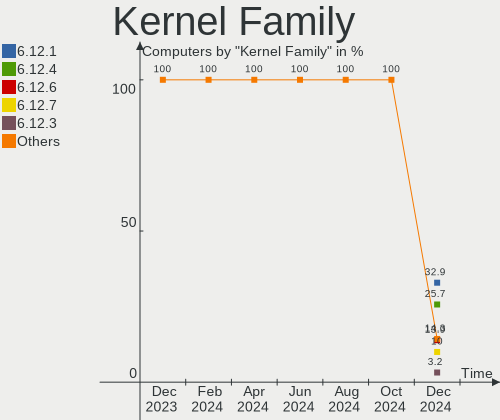
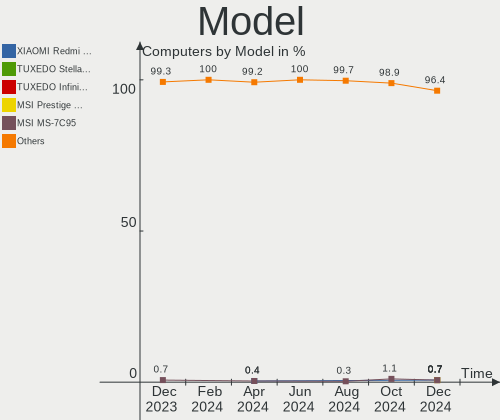
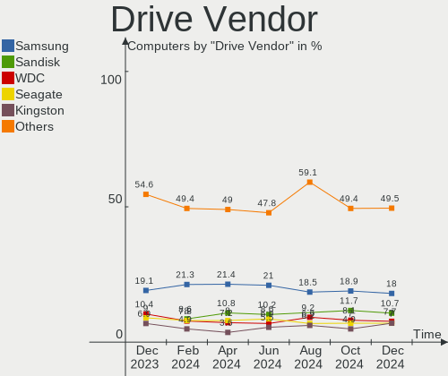
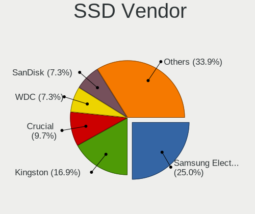
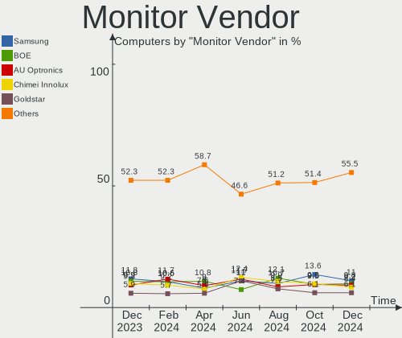
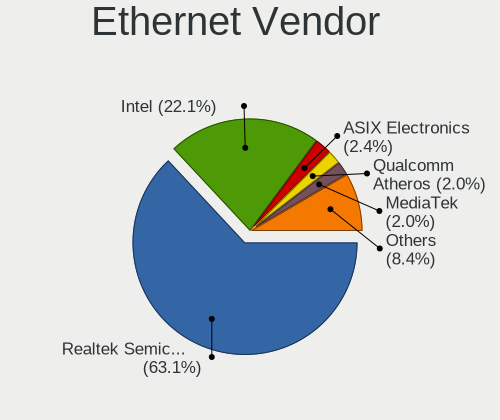
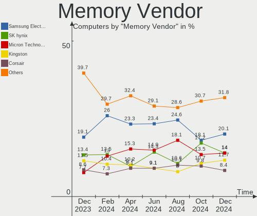
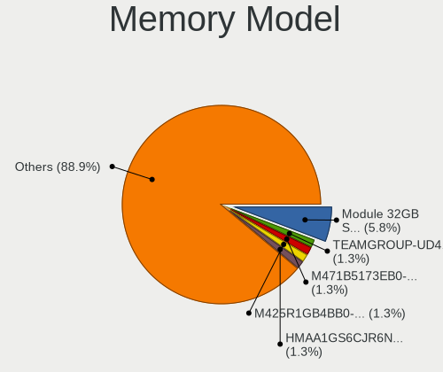

Arch - Hardware Trends
----------------------

A project to identify most popular hardware characteristics and track their change
over time based on data collected by Linux users at https://Linux-Hardware.org.

Anyone can contribute to this report by the [hw-probe](https://github.com/linuxhw/hw-probe) tool:

    sudo -E hw-probe -all -upload

This is a report for all computer types. See also reports for [desktops](/Dist/Arch/Desktop/README.md) and [notebooks](/Dist/Arch/Notebook/README.md).

This report is for one last month. Overall report since the beginning of time: [TestCoverage](https://github.com/linuxhw/TestCoverage)

Period: Jan, 2023.

Contents
--------

* [ System ](#system)
  - [ OS                       ](#os)
  - [ OS Family                ](#os-family)
  - [ Kernel                   ](#kernel)
  - [ Kernel Family            ](#kernel-family)
  - [ Kernel Major Ver.        ](#kernel-major-ver)
  - [ Arch                     ](#arch)
  - [ DE                       ](#de)
  - [ Display Server           ](#display-server)
  - [ Display Manager          ](#display-manager)
  - [ OS Lang                  ](#os-lang)
  - [ Boot Mode                ](#boot-mode)
  - [ Filesystem               ](#filesystem)
  - [ Part. scheme             ](#part-scheme)
  - [ Dual Boot with Linux/BSD ](#dual-boot-with-linuxbsd)
  - [ Dual Boot (Win)          ](#dual-boot-win)

* [ Board ](#board)
  - [ Vendor                   ](#vendor)
  - [ Model                    ](#model)
  - [ Model Family             ](#model-family)
  - [ MFG Year                 ](#mfg-year)
  - [ Form Factor              ](#form-factor)
  - [ Secure Boot              ](#secure-boot)
  - [ Coreboot                 ](#coreboot)
  - [ RAM Size                 ](#ram-size)
  - [ RAM Used                 ](#ram-used)
  - [ Total Drives             ](#total-drives)
  - [ Has CD-ROM               ](#has-cd-rom)
  - [ Has Ethernet             ](#has-ethernet)
  - [ Has WiFi                 ](#has-wifi)
  - [ Has Bluetooth            ](#has-bluetooth)

* [ Location ](#location)
  - [ Country                  ](#country)
  - [ City                     ](#city)

* [ Drives ](#drives)
  - [ Drive Vendor             ](#drive-vendor)
  - [ Drive Model              ](#drive-model)
  - [ HDD Vendor               ](#hdd-vendor)
  - [ SSD Vendor               ](#ssd-vendor)
  - [ Drive Kind               ](#drive-kind)
  - [ Drive Connector          ](#drive-connector)
  - [ Drive Size               ](#drive-size)
  - [ Space Total              ](#space-total)
  - [ Space Used               ](#space-used)
  - [ Malfunc. Drives          ](#malfunc-drives)
  - [ Malfunc. Drive Vendor    ](#malfunc-drive-vendor)
  - [ Malfunc. HDD Vendor      ](#malfunc-hdd-vendor)
  - [ Malfunc. Drive Kind      ](#malfunc-drive-kind)
  - [ Failed Drives            ](#failed-drives)
  - [ Failed Drive Vendor      ](#failed-drive-vendor)
  - [ Drive Status             ](#drive-status)

* [ Storage controller ](#storage-controller)
  - [ Storage Vendor           ](#storage-vendor)
  - [ Storage Model            ](#storage-model)
  - [ Storage Kind             ](#storage-kind)

* [ Processor ](#processor)
  - [ CPU Vendor               ](#cpu-vendor)
  - [ CPU Model                ](#cpu-model)
  - [ CPU Model Family         ](#cpu-model-family)
  - [ CPU Cores                ](#cpu-cores)
  - [ CPU Sockets              ](#cpu-sockets)
  - [ CPU Threads              ](#cpu-threads)
  - [ CPU Op-Modes             ](#cpu-op-modes)
  - [ CPU Microcode            ](#cpu-microcode)
  - [ CPU Microarch            ](#cpu-microarch)

* [ Graphics ](#graphics)
  - [ GPU Vendor               ](#gpu-vendor)
  - [ GPU Model                ](#gpu-model)
  - [ GPU Combo                ](#gpu-combo)
  - [ GPU Driver               ](#gpu-driver)
  - [ GPU Memory               ](#gpu-memory)

* [ Monitor ](#monitor)
  - [ Monitor Vendor           ](#monitor-vendor)
  - [ Monitor Model            ](#monitor-model)
  - [ Monitor Resolution       ](#monitor-resolution)
  - [ Monitor Diagonal         ](#monitor-diagonal)
  - [ Monitor Width            ](#monitor-width)
  - [ Aspect Ratio             ](#aspect-ratio)
  - [ Monitor Area             ](#monitor-area)
  - [ Pixel Density            ](#pixel-density)
  - [ Multiple Monitors        ](#multiple-monitors)

* [ Network ](#network)
  - [ Net Controller Vendor    ](#net-controller-vendor)
  - [ Net Controller Model     ](#net-controller-model)
  - [ Wireless Vendor          ](#wireless-vendor)
  - [ Wireless Model           ](#wireless-model)
  - [ Ethernet Vendor          ](#ethernet-vendor)
  - [ Ethernet Model           ](#ethernet-model)
  - [ Net Controller Kind      ](#net-controller-kind)
  - [ Used Controller          ](#used-controller)
  - [ NICs                     ](#nics)
  - [ IPv6                     ](#ipv6)

* [ Bluetooth ](#bluetooth)
  - [ Bluetooth Vendor         ](#bluetooth-vendor)
  - [ Bluetooth Model          ](#bluetooth-model)

* [ Sound ](#sound)
  - [ Sound Vendor             ](#sound-vendor)
  - [ Sound Model              ](#sound-model)

* [ Memory ](#memory)
  - [ Memory Vendor            ](#memory-vendor)
  - [ Memory Model             ](#memory-model)
  - [ Memory Kind              ](#memory-kind)
  - [ Memory Form Factor       ](#memory-form-factor)
  - [ Memory Size              ](#memory-size)
  - [ Memory Speed             ](#memory-speed)

* [ Printers & scanners ](#printers--scanners)
  - [ Printer Vendor           ](#printer-vendor)
  - [ Printer Model            ](#printer-model)
  - [ Scanner Vendor           ](#scanner-vendor)
  - [ Scanner Model            ](#scanner-model)

* [ Camera ](#camera)
  - [ Camera Vendor            ](#camera-vendor)
  - [ Camera Model             ](#camera-model)

* [ Security ](#security)
  - [ Fingerprint Vendor       ](#fingerprint-vendor)
  - [ Fingerprint Model        ](#fingerprint-model)
  - [ Chipcard Vendor          ](#chipcard-vendor)
  - [ Chipcard Model           ](#chipcard-model)

* [ Unsupported ](#unsupported)
  - [ Unsupported Devices      ](#unsupported-devices)
  - [ Unsupported Device Types ](#unsupported-device-types)

System
------

OS
--

Installed operating systems

| Name         | Computers | Percent |
|--------------|-----------|---------|
| Arch Rolling | 201       | 100%    |

OS Family
---------

OS without a version

| Name | Computers | Percent |
|------|-----------|---------|
| Arch | 201       | 100%    |

Kernel
------

Version of the Linux kernel

| Version                     | Computers | Percent |
|-----------------------------|-----------|---------|
| 6.1.4-arch1-1               | 26        | 12.94%  |
| 6.1.8-arch1-1               | 23        | 11.44%  |
| 6.1.7-arch1-1               | 22        | 10.95%  |
| 6.1.6-arch1-1               | 13        | 6.47%   |
| 6.1.3-arch1-1               | 13        | 6.47%   |
| 6.1.1-arch1-1               | 13        | 6.47%   |
| 6.1.2-arch1-1               | 11        | 5.47%   |
| 6.1.6-arch1-3               | 8         | 3.98%   |
| 6.1.5-arch2-1               | 8         | 3.98%   |
| 6.1.6-zen1-2-zen            | 5         | 2.49%   |
| 6.1.7-zen1-1-zen            | 4         | 1.99%   |
| 6.1.6-zen1-1-zen            | 4         | 1.99%   |
| 5.15.86-1-lts               | 4         | 1.99%   |
| 6.1.4-zen2-1-zen            | 3         | 1.49%   |
| 6.1.3-zen1-1-zen            | 3         | 1.49%   |
| 6.1.2-zen1-1-zen            | 3         | 1.49%   |
| 5.15.90-1-lts               | 3         | 1.49%   |
| 5.15.89-1-lts               | 3         | 1.49%   |
| 6.1.5-zen2-1-zen            | 2         | 1%      |
| 6.0.10-arch2-1              | 2         | 1%      |
| 5.18.12-arch1-1             | 2         | 1%      |
| 6.1.8-zen1-1-zen            | 1         | 0.5%    |
| 6.1.8-x64v1-xanmod1-1       | 1         | 0.5%    |
| 6.1.8-lqx3-1-lqx            | 1         | 0.5%    |
| 6.1.7-x64v2-xanmod1-1-x64v2 | 1         | 0.5%    |
| 6.1.7-x64v1-xanmod1-1       | 1         | 0.5%    |
| 6.1.7-arch1-1.1             | 1         | 0.5%    |
| 6.1.6-lqx3-1-lqx            | 1         | 0.5%    |
| 6.1.5-273-tkg-pds           | 1         | 0.5%    |
| 6.1.4-zen2-1.1-zen          | 1         | 0.5%    |
| 6.1.4-native_amd-xanmod1-1  | 1         | 0.5%    |
| 6.1.4-arch1-1.1             | 1         | 0.5%    |
| 6.1.1-zen3-xanmod1-1        | 1         | 0.5%    |
| 6.1.1-zen1-1.1-zen          | 1         | 0.5%    |
| 6.1.1-zen1-1-zen            | 1         | 0.5%    |
| 6.1.1-x64v1-xanmod1-1       | 1         | 0.5%    |
| 6.1.1-273-tkg-tt-llvm       | 1         | 0.5%    |
| 6.0.9-arch1-1               | 1         | 0.5%    |
| 6.0.11-zen1-1-zen           | 1         | 0.5%    |
| 6.0.11-arch1-1              | 1         | 0.5%    |

Kernel Family
-------------

Linux kernel without a distro release

| Version | Computers | Percent |
|---------|-----------|---------|
| 6.1.4   | 32        | 15.92%  |
| 6.1.6   | 31        | 15.42%  |
| 6.1.7   | 29        | 14.43%  |
| 6.1.8   | 26        | 12.94%  |
| 6.1.1   | 18        | 8.96%   |
| 6.1.3   | 16        | 7.96%   |
| 6.1.2   | 14        | 6.97%   |
| 6.1.5   | 11        | 5.47%   |
| 5.15.86 | 4         | 1.99%   |
| 5.15.90 | 3         | 1.49%   |
| 5.15.89 | 3         | 1.49%   |
| 6.0.11  | 2         | 1%      |
| 6.0.10  | 2         | 1%      |
| 5.18.12 | 2         | 1%      |
| 6.0.9   | 1         | 0.5%    |
| 5.19.7  | 1         | 0.5%    |
| 5.18.16 | 1         | 0.5%    |
| 5.17.9  | 1         | 0.5%    |
| 5.15.88 | 1         | 0.5%    |
| 5.15.85 | 1         | 0.5%    |
| 5.15.79 | 1         | 0.5%    |
| 5.13.0  | 1         | 0.5%    |

Kernel Major Ver.
-----------------

Linux kernel major version

| Version | Computers | Percent |
|---------|-----------|---------|
| 6.1     | 177       | 88.06%  |
| 5.15    | 13        | 6.47%   |
| 6.0     | 5         | 2.49%   |
| 5.18    | 3         | 1.49%   |
| 5.19    | 1         | 0.5%    |
| 5.17    | 1         | 0.5%    |
| 5.13    | 1         | 0.5%    |

Arch
----

OS architecture (x86_64, i586, etc.)

| Name   | Computers | Percent |
|--------|-----------|---------|
| x86_64 | 201       | 100%    |

DE
--

Desktop Environment

| Name           | Computers | Percent |
|----------------|-----------|---------|
| KDE5           | 74        | 36.82%  |
| GNOME          | 68        | 33.83%  |
| i3             | 13        | 6.47%   |
| Unknown        | 12        | 5.97%   |
| XFCE           | 10        | 4.98%   |
| X-Cinnamon     | 4         | 1.99%   |
| sway           | 3         | 1.49%   |
| Hyprland       | 2         | 1%      |
| bspwm          | 2         | 1%      |
| Unity          | 1         | 0.5%    |
| qtile          | 1         | 0.5%    |
| openbox        | 1         | 0.5%    |
| MATE           | 1         | 0.5%    |
| LXQt           | 1         | 0.5%    |
| LXDE           | 1         | 0.5%    |
| LeftWM         | 1         | 0.5%    |
| i3-with-shmlog | 1         | 0.5%    |
| GNOME Classic  | 1         | 0.5%    |
| DWM            | 1         | 0.5%    |
| Cinnamon       | 1         | 0.5%    |
| Budgie         | 1         | 0.5%    |
| awesome        | 1         | 0.5%    |

Display Server
--------------

X11 or Wayland

| Name    | Computers | Percent |
|---------|-----------|---------|
| X11     | 112       | 55.72%  |
| Wayland | 63        | 31.34%  |
| Tty     | 15        | 7.46%   |
| Unknown | 11        | 5.47%   |

Display Manager
---------------

SDDM, LightDM, etc.

| Name    | Computers | Percent |
|---------|-----------|---------|
| Unknown | 78        | 38.81%  |
| SDDM    | 55        | 27.36%  |
| LightDM | 37        | 18.41%  |
| GDM     | 27        | 13.43%  |
| XDM     | 2         | 1%      |
| SLiM    | 1         | 0.5%    |
| Ly      | 1         | 0.5%    |

OS Lang
-------

Language

| Lang        | Computers | Percent |
|-------------|-----------|---------|
| en_US       | 108       | 53.73%  |
| C           | 14        | 6.97%   |
| de_DE       | 12        | 5.97%   |
| ru_RU       | 10        | 4.98%   |
| en_GB       | 10        | 4.98%   |
| it_IT       | 8         | 3.98%   |
| pt_BR       | 7         | 3.48%   |
| en_DK       | 3         | 1.49%   |
| en_AU       | 3         | 1.49%   |
| fr_FR       | 2         | 1%      |
| es_CO       | 2         | 1%      |
| en_NZ       | 2         | 1%      |
| zh_CN       | 1         | 0.5%    |
| sk_SK       | 1         | 0.5%    |
| pt_BRutf8   | 1         | 0.5%    |
| pl_PL       | 1         | 0.5%    |
| lv_LV       | 1         | 0.5%    |
| it_IT@euro  | 1         | 0.5%    |
| fi_FI       | 1         | 0.5%    |
| eu_ES       | 1         | 0.5%    |
| et_EE       | 1         | 0.5%    |
| es_ES       | 1         | 0.5%    |
| es_CL       | 1         | 0.5%    |
| es_AR       | 1         | 0.5%    |
| en_US.UTf-8 | 1         | 0.5%    |
| en_IN       | 1         | 0.5%    |
| en_IE       | 1         | 0.5%    |
| en_CA       | 1         | 0.5%    |
| en_AG       | 1         | 0.5%    |
| de_AT       | 1         | 0.5%    |
| ce_RU       | 1         | 0.5%    |
| Unknown     | 1         | 0.5%    |

Boot Mode
---------

EFI or BIOS

| Mode | Computers | Percent |
|------|-----------|---------|
| EFI  | 129       | 64.18%  |
| BIOS | 72        | 35.82%  |

Filesystem
----------

Type of filesystem

| Type  | Computers | Percent |
|-------|-----------|---------|
| Ext4  | 135       | 67.16%  |
| Btrfs | 61        | 30.35%  |
| Xfs   | 4         | 1.99%   |
| F2fs  | 1         | 0.5%    |

Part. scheme
------------

Scheme of partitioning

| Type    | Computers | Percent |
|---------|-----------|---------|
| GPT     | 137       | 68.16%  |
| Unknown | 55        | 27.36%  |
| MBR     | 9         | 4.48%   |

Dual Boot with Linux/BSD
------------------------

Hosting more than one Linux/BSD

| Dual boot | Computers | Percent |
|-----------|-----------|---------|
| No        | 185       | 92.04%  |
| Yes       | 16        | 7.96%   |

Dual Boot (Win)
---------------

Hosting Linux and Windows

| Dual boot | Computers | Percent |
|-----------|-----------|---------|
| No        | 153       | 76.12%  |
| Yes       | 48        | 23.88%  |

Board
-----

Vendor
------

Motherboard manufacturer

| Name                | Computers | Percent |
|---------------------|-----------|---------|
| Lenovo              | 41        | 20.4%   |
| ASUSTek Computer    | 34        | 16.92%  |
| Hewlett-Packard     | 24        | 11.94%  |
| Dell                | 23        | 11.44%  |
| MSI                 | 18        | 8.96%   |
| Gigabyte Technology | 17        | 8.46%   |
| Acer                | 10        | 4.98%   |
| ASRock              | 7         | 3.48%   |
| HUAWEI              | 3         | 1.49%   |
| TUXEDO              | 2         | 1%      |
| Toshiba             | 2         | 1%      |
| Microsoft           | 2         | 1%      |
| Intel               | 2         | 1%      |
| Apple               | 2         | 1%      |
| Valve               | 1         | 0.5%    |
| T-bao               | 1         | 0.5%    |
| Supermicro          | 1         | 0.5%    |
| Sony                | 1         | 0.5%    |
| Semp Toshiba        | 1         | 0.5%    |
| PCWare              | 1         | 0.5%    |
| Nvidia              | 1         | 0.5%    |
| Notebook            | 1         | 0.5%    |
| MACHINIST           | 1         | 0.5%    |
| Fujitsu             | 1         | 0.5%    |
| Foxconn             | 1         | 0.5%    |
| BANGHO              | 1         | 0.5%    |
| Acidanthera         | 1         | 0.5%    |
| Unknown             | 1         | 0.5%    |

Model
-----

Motherboard model

| Name                             | Computers | Percent |
|----------------------------------|-----------|---------|
| Gigabyte B550M DS3H              | 3         | 1.49%   |
| Dell XPS 15 9570                 | 3         | 1.49%   |
| MSI MS-7693                      | 2         | 1%      |
| Lenovo IdeaPad 3 15ALC6 82MF     | 2         | 1%      |
| HP OMEN by Laptop 16-c0xxx       | 2         | 1%      |
| Dell G15 5520                    | 2         | 1%      |
| ASUS TUF Gaming X570-PLUS        | 2         | 1%      |
| ASUS ROG Strix G513RM_G513RM     | 2         | 1%      |
| ASUS PRIME A320M-K               | 2         | 1%      |
| Unknown                          | 2         | 1%      |
| Valve Jupiter                    | 1         | 0.5%    |
| TUXEDO InfinityBook S 15 Gen6    | 1         | 0.5%    |
| Toshiba Satellite P755           | 1         | 0.5%    |
| Toshiba Satellite C55Dt-A        | 1         | 0.5%    |
| T-bao MINI PC                    | 1         | 0.5%    |
| Supermicro X9DRi-LN4+/X9DR3-LN4+ | 1         | 0.5%    |
| Sony VPCF13Z1E                   | 1         | 0.5%    |
| Semp Toshiba STI                 | 1         | 0.5%    |
| PCWare IPMH110G                  | 1         | 0.5%    |
| Nvidia AN-M2                     | 1         | 0.5%    |
| Notebook NS50MU                  | 1         | 0.5%    |
| MSI Prestige 15 A11SCX           | 1         | 0.5%    |
| MSI MS-7D77                      | 1         | 0.5%    |
| MSI MS-7C94                      | 1         | 0.5%    |
| MSI MS-7C91                      | 1         | 0.5%    |
| MSI MS-7C75                      | 1         | 0.5%    |
| MSI MS-7C56                      | 1         | 0.5%    |
| MSI MS-7C02                      | 1         | 0.5%    |
| MSI MS-7B93                      | 1         | 0.5%    |
| MSI MS-7B85                      | 1         | 0.5%    |
| MSI MS-7A72                      | 1         | 0.5%    |
| MSI MS-7996                      | 1         | 0.5%    |
| MSI MS-7971                      | 1         | 0.5%    |
| MSI Modern 14 B11MOU             | 1         | 0.5%    |
| MSI GP66 Leopard 11UH            | 1         | 0.5%    |
| MSI GE66 Raider 10SF             | 1         | 0.5%    |
| MSI Alpha 15 B5EEK               | 1         | 0.5%    |
| Microsoft Surface Laptop Go      | 1         | 0.5%    |
| Microsoft Surface Laptop 4       | 1         | 0.5%    |
| MACHINIST X99Z V1.02             | 1         | 0.5%    |

Model Family
------------

Motherboard model prefix

| Name                  | Computers | Percent |
|-----------------------|-----------|---------|
| Lenovo ThinkPad       | 17        | 8.46%   |
| Lenovo IdeaPad        | 15        | 7.46%   |
| Acer Aspire           | 9         | 4.48%   |
| Dell XPS              | 8         | 3.98%   |
| ASUS ROG              | 8         | 3.98%   |
| HP Pavilion           | 7         | 3.48%   |
| ASUS PRIME            | 6         | 2.99%   |
| Lenovo Legion         | 5         | 2.49%   |
| Dell Latitude         | 5         | 2.49%   |
| ASUS TUF              | 5         | 2.49%   |
| Gigabyte B550M        | 4         | 1.99%   |
| HP OMEN               | 3         | 1.49%   |
| HP Laptop             | 3         | 1.49%   |
| ASUS VivoBook         | 3         | 1.49%   |
| ASRock X570           | 3         | 1.49%   |
| Toshiba Satellite     | 2         | 1%      |
| MSI MS-7693           | 2         | 1%      |
| Microsoft Surface     | 2         | 1%      |
| HP ZBook              | 2         | 1%      |
| HP ProBook            | 2         | 1%      |
| HP ENVY               | 2         | 1%      |
| Gigabyte X570         | 2         | 1%      |
| Dell Vostro           | 2         | 1%      |
| Dell Inspiron         | 2         | 1%      |
| Dell G3               | 2         | 1%      |
| Dell G15              | 2         | 1%      |
| ASRock B450           | 2         | 1%      |
| Unknown               | 2         | 1%      |
| Valve Jupiter         | 1         | 0.5%    |
| TUXEDO InfinityBook   | 1         | 0.5%    |
| T-bao MINI            | 1         | 0.5%    |
| Supermicro X9DRi-LN4+ | 1         | 0.5%    |
| Sony VPCF13Z1E        | 1         | 0.5%    |
| Semp Toshiba STI      | 1         | 0.5%    |
| PCWare IPMH110G       | 1         | 0.5%    |
| Nvidia AN-M2          | 1         | 0.5%    |
| Notebook NS50MU       | 1         | 0.5%    |
| MSI Prestige          | 1         | 0.5%    |
| MSI MS-7D77           | 1         | 0.5%    |
| MSI MS-7C94           | 1         | 0.5%    |

MFG Year
--------

Motherboard manufacture year

| Year | Computers | Percent |
|------|-----------|---------|
| 2020 | 38        | 18.91%  |
| 2021 | 31        | 15.42%  |
| 2022 | 28        | 13.93%  |
| 2018 | 23        | 11.44%  |
| 2019 | 21        | 10.45%  |
| 2016 | 12        | 5.97%   |
| 2012 | 12        | 5.97%   |
| 2015 | 11        | 5.47%   |
| 2017 | 9         | 4.48%   |
| 2014 | 5         | 2.49%   |
| 2013 | 4         | 1.99%   |
| 2011 | 4         | 1.99%   |
| 2010 | 1         | 0.5%    |
| 2008 | 1         | 0.5%    |
| 2007 | 1         | 0.5%    |

Form Factor
-----------

Physical design of the computer

| Name        | Computers | Percent |
|-------------|-----------|---------|
| Notebook    | 109       | 54.23%  |
| Desktop     | 72        | 35.82%  |
| Convertible | 8         | 3.98%   |
| Tablet      | 5         | 2.49%   |
| All in one  | 4         | 1.99%   |
| Mini pc     | 2         | 1%      |
| Server      | 1         | 0.5%    |

Secure Boot
-----------

Enabled or disabled

| State    | Computers | Percent |
|----------|-----------|---------|
| Disabled | 199       | 99%     |
| Enabled  | 2         | 1%      |

Coreboot
--------

Have coreboot on board

| Used | Computers | Percent |
|------|-----------|---------|
| No   | 201       | 100%    |

RAM Size
--------

Total RAM memory

| Size in GB      | Computers | Percent |
|-----------------|-----------|---------|
| 16.01-24.0      | 62        | 30.85%  |
| 4.01-8.0        | 38        | 18.91%  |
| 32.01-64.0      | 38        | 18.91%  |
| 8.01-16.0       | 36        | 17.91%  |
| 3.01-4.0        | 9         | 4.48%   |
| 64.01-256.0     | 8         | 3.98%   |
| 24.01-32.0      | 7         | 3.48%   |
| 1.01-2.0        | 2         | 1%      |
| More than 256.0 | 1         | 0.5%    |

RAM Used
--------

Used RAM memory

| Used GB    | Computers | Percent |
|------------|-----------|---------|
| 4.01-8.0   | 55        | 27.36%  |
| 2.01-3.0   | 52        | 25.87%  |
| 1.01-2.0   | 36        | 17.91%  |
| 3.01-4.0   | 27        | 13.43%  |
| 8.01-16.0  | 24        | 11.94%  |
| 16.01-24.0 | 3         | 1.49%   |
| 0.51-1.0   | 3         | 1.49%   |
| 0.01-0.5   | 1         | 0.5%    |

Total Drives
------------

Number of drives on board

| Drives | Computers | Percent |
|--------|-----------|---------|
| 1      | 112       | 55.72%  |
| 2      | 57        | 28.36%  |
| 4      | 13        | 6.47%   |
| 3      | 13        | 6.47%   |
| 5      | 3         | 1.49%   |
| 9      | 1         | 0.5%    |
| 7      | 1         | 0.5%    |
| 6      | 1         | 0.5%    |

Has CD-ROM
----------

Has CD-ROM on board

| Presented | Computers | Percent |
|-----------|-----------|---------|
| No        | 173       | 86.07%  |
| Yes       | 28        | 13.93%  |

Has Ethernet
------------

Has Ethernet on board

| Presented | Computers | Percent |
|-----------|-----------|---------|
| Yes       | 159       | 79.1%   |
| No        | 42        | 20.9%   |

Has WiFi
--------

Has WiFi module

| Presented | Computers | Percent |
|-----------|-----------|---------|
| Yes       | 165       | 82.09%  |
| No        | 36        | 17.91%  |

Has Bluetooth
-------------

Has Bluetooth module

| Presented | Computers | Percent |
|-----------|-----------|---------|
| Yes       | 153       | 76.12%  |
| No        | 48        | 23.88%  |

Location
--------

Country
-------

Geographic location (country)

| Country         | Computers | Percent |
|-----------------|-----------|---------|
| USA             | 42        | 20.9%   |
| Germany         | 22        | 10.95%  |
| Italy           | 16        | 7.96%   |
| Russia          | 15        | 7.46%   |
| Brazil          | 14        | 6.97%   |
| France          | 7         | 3.48%   |
| UK              | 4         | 1.99%   |
| Spain           | 4         | 1.99%   |
| Poland          | 4         | 1.99%   |
| New Zealand     | 4         | 1.99%   |
| Indonesia       | 4         | 1.99%   |
| Canada          | 4         | 1.99%   |
| Netherlands     | 3         | 1.49%   |
| Czechia         | 3         | 1.49%   |
| Chile           | 3         | 1.49%   |
| Australia       | 3         | 1.49%   |
| Turkey          | 2         | 1%      |
| Switzerland     | 2         | 1%      |
| South Africa    | 2         | 1%      |
| Latvia          | 2         | 1%      |
| Finland         | 2         | 1%      |
| Denmark         | 2         | 1%      |
| Colombia        | 2         | 1%      |
| Bulgaria        | 2         | 1%      |
| Belarus         | 2         | 1%      |
| Argentina       | 2         | 1%      |
| Ukraine         | 1         | 0.5%    |
| Thailand        | 1         | 0.5%    |
| Taiwan          | 1         | 0.5%    |
| Sweden          | 1         | 0.5%    |
| Slovenia        | 1         | 0.5%    |
| Slovakia        | 1         | 0.5%    |
| Singapore       | 1         | 0.5%    |
| Saudi Arabia    | 1         | 0.5%    |
| Norway          | 1         | 0.5%    |
| North Macedonia | 1         | 0.5%    |
| Moldova         | 1         | 0.5%    |
| Mexico          | 1         | 0.5%    |
| Lebanon         | 1         | 0.5%    |
| Kazakhstan      | 1         | 0.5%    |

City
----

Geographic location (city)

| City               | Computers | Percent |
|--------------------|-----------|---------|
| Sao Paulo          | 4         | 1.99%   |
| Moscow             | 4         | 1.99%   |
| St Petersburg      | 3         | 1.49%   |
| New York           | 3         | 1.49%   |
| Dublin             | 3         | 1.49%   |
| Villeneuve-d'Ascq  | 2         | 1%      |
| Valencia           | 2         | 1%      |
| Santiago           | 2         | 1%      |
| Rome               | 2         | 1%      |
| Riga               | 2         | 1%      |
| Perm               | 2         | 1%      |
| Paris              | 2         | 1%      |
| Ostrava            | 2         | 1%      |
| Milan              | 2         | 1%      |
| Helsinki           | 2         | 1%      |
| Fort Collins       | 2         | 1%      |
| Düsseldorf        | 2         | 1%      |
| Colditz            | 2         | 1%      |
| Christchurch       | 2         | 1%      |
| Brooklyn           | 2         | 1%      |
| Bologna            | 2         | 1%      |
| Bochum             | 2         | 1%      |
| Auckland           | 2         | 1%      |
| Zheleznogorsk      | 1         | 0.5%    |
| Zarow              | 1         | 0.5%    |
| York               | 1         | 0.5%    |
| Yogyakarta         | 1         | 0.5%    |
| Yerevan            | 1         | 0.5%    |
| Worms              | 1         | 0.5%    |
| Winter Springs     | 1         | 0.5%    |
| Westville          | 1         | 0.5%    |
| West Lafayette     | 1         | 0.5%    |
| Wessington Springs | 1         | 0.5%    |
| Weifang            | 1         | 0.5%    |
| Waterville         | 1         | 0.5%    |
| Vienna             | 1         | 0.5%    |
| Verdun             | 1         | 0.5%    |
| Uberlândia        | 1         | 0.5%    |
| Tyler              | 1         | 0.5%    |
| Turate             | 1         | 0.5%    |

Drives
------

Drive Vendor
------------

Hard drive vendors

| Vendor                      | Computers | Drives | Percent |
|-----------------------------|-----------|--------|---------|
| Samsung Electronics         | 69        | 83     | 21.3%   |
| Sandisk                     | 35        | 36     | 10.8%   |
| Seagate                     | 31        | 36     | 9.57%   |
| WDC                         | 28        | 33     | 8.64%   |
| Kingston                    | 26        | 30     | 8.02%   |
| Crucial                     | 14        | 15     | 4.32%   |
| SK hynix                    | 12        | 12     | 3.7%    |
| Micron Technology           | 11        | 11     | 3.4%    |
| Intel                       | 10        | 11     | 3.09%   |
| Micron/Crucial Technology   | 9         | 9      | 2.78%   |
| Unknown                     | 8         | 9      | 2.47%   |
| Toshiba                     | 7         | 7      | 2.16%   |
| HGST                        | 7         | 7      | 2.16%   |
| Phison Electronics          | 4         | 4      | 1.23%   |
| Kingston Technology Company | 4         | 4      | 1.23%   |
| China                       | 4         | 4      | 1.23%   |
| Apple                       | 4         | 4      | 1.23%   |
| Silicon Motion              | 3         | 3      | 0.93%   |
| Patriot                     | 3         | 3      | 0.93%   |
| Hitachi                     | 3         | 3      | 0.93%   |
| A-DATA Technology           | 3         | 3      | 0.93%   |
| Union Memory                | 2         | 2      | 0.62%   |
| Lenovo                      | 2         | 2      | 0.62%   |
| JMicron Technology          | 2         | 2      | 0.62%   |
| ADATA Technology            | 2         | 2      | 0.62%   |
| Unknown                     | 2         | 2      | 0.62%   |
| XrayDisk                    | 1         | 1      | 0.31%   |
| XPG                         | 1         | 1      | 0.31%   |
| Team                        | 1         | 1      | 0.31%   |
| SPCC                        | 1         | 1      | 0.31%   |
| Solid State Storage         | 1         | 1      | 0.31%   |
| Smart                       | 1         | 1      | 0.31%   |
| Realtek Semiconductor       | 1         | 1      | 0.31%   |
| PNY                         | 1         | 1      | 0.31%   |
| OYUNKEY                     | 1         | 1      | 0.31%   |
| OCZ                         | 1         | 1      | 0.31%   |
| MAXIO Technology (Hangzhou) | 1         | 1      | 0.31%   |
| Lite-On Technology          | 1         | 1      | 0.31%   |
| LEQIXIANG                   | 1         | 1      | 0.31%   |
| KIOXIA                      | 1         | 1      | 0.31%   |

Drive Model
-----------

Hard drive models

| Model                                                | Computers | Percent |
|------------------------------------------------------|-----------|---------|
| Samsung NVMe SSD Controller SM981/PM981/PM983 500GB  | 26        | 7.47%   |
| Samsung NVMe SSD Controller PM9A1/PM9A3/980PRO 512GB | 9         | 2.59%   |
| Sandisk WD Black SN750 / PC SN730 NVMe SSD 1TB       | 7         | 2.01%   |
| Kingston SA400S37240G 240GB SSD                      | 6         | 1.72%   |
| Samsung SSD 980 1TB                                  | 5         | 1.44%   |
| Micron/Crucial P2 NVMe PCIe SSD 500GB                | 5         | 1.44%   |
| Seagate ST1000DM003-1ER162 1TB                       | 4         | 1.15%   |
| Sandisk WD Blue SN550 NVMe SSD 1TB                   | 4         | 1.15%   |
| Sandisk WD Black SN850 2TB                           | 4         | 1.15%   |
| Samsung SSD 860 EVO 500GB                            | 4         | 1.15%   |
| Samsung NVMe SSD Controller SM961/PM961/SM963 256GB  | 4         | 1.15%   |
| Kingston SA400S37120G 120GB SSD                      | 4         | 1.15%   |
| Unknown MMC Card  32GB                               | 3         | 0.86%   |
| SK hynix BC711 NVMe 512GB                            | 3         | 0.86%   |
| SK hynix BC501 NVMe Solid State Drive 512GB          | 3         | 0.86%   |
| Seagate ST1000LM024 HN-M101MBB 1TB                   | 3         | 0.86%   |
| Samsung SSD 850 EVO 500GB                            | 3         | 0.86%   |
| Phison PS5013 E13 NVMe Controller 256GB              | 3         | 0.86%   |
| Micron 2450_MTFDKBA1T0TFK 1TB                        | 3         | 0.86%   |
| Kingston SA400S37480G 480GB SSD                      | 3         | 0.86%   |
| Intel SSD 660P Series 512GB                          | 3         | 0.86%   |
| Crucial CT480BX500SSD1 480GB                         | 3         | 0.86%   |
| Crucial CT1000MX500SSD1 1TB                          | 3         | 0.86%   |
| Apple HDD ST2000DM001 2TB                            | 3         | 0.86%   |
| WDC WDS240G2G0A-00JH30 240GB SSD                     | 2         | 0.57%   |
| WDC WDBNCE0010PNC 1TB SSD                            | 2         | 0.57%   |
| WDC WD20EARX-00PASB0 2TB                             | 2         | 0.57%   |
| WDC WD10JPVX-22JC3T0 1TB                             | 2         | 0.57%   |
| WDC WD10EZEX-08WN4A0 1TB                             | 2         | 0.57%   |
| WDC WD10EZEX-00WN4A0 1TB                             | 2         | 0.57%   |
| Toshiba HDWD110 1TB                                  | 2         | 0.57%   |
| Seagate ST2000VX008-2E3164 2TB                       | 2         | 0.57%   |
| Seagate ST2000DM008-2FR102 2TB                       | 2         | 0.57%   |
| Seagate ST1000DM010-2EP102 1TB                       | 2         | 0.57%   |
| Sandisk WDC WDS200T2B0C-00PXH0 2TB                   | 2         | 0.57%   |
| SanDisk SD7TN3Q-256G-1006 256GB SSD                  | 2         | 0.57%   |
| Sandisk PC SN520 NVMe SSD 256GB                      | 2         | 0.57%   |
| Samsung SSD 870 EVO 1TB                              | 2         | 0.57%   |
| Micron 2300 NVMe 1024GB                              | 2         | 0.57%   |
| Kingston Company OM3PDP3 NVMe SSD 512GB              | 2         | 0.57%   |

HDD Vendor
----------

Hard disk drive vendors

| Vendor              | Computers | Drives | Percent |
|---------------------|-----------|--------|---------|
| Seagate             | 30        | 35     | 41.67%  |
| WDC                 | 21        | 26     | 29.17%  |
| HGST                | 7         | 7      | 9.72%   |
| Toshiba             | 4         | 4      | 5.56%   |
| Apple               | 4         | 4      | 5.56%   |
| Hitachi             | 3         | 3      | 4.17%   |
| Unknown             | 1         | 1      | 1.39%   |
| Samsung Electronics | 1         | 1      | 1.39%   |
| KESU                | 1         | 1      | 1.39%   |

SSD Vendor
----------

Solid state drive vendors

| Vendor              | Computers | Drives | Percent |
|---------------------|-----------|--------|---------|
| Kingston            | 21        | 24     | 22.34%  |
| Samsung Electronics | 19        | 24     | 20.21%  |
| Crucial             | 14        | 15     | 14.89%  |
| SanDisk             | 10        | 10     | 10.64%  |
| WDC                 | 7         | 7      | 7.45%   |
| China               | 4         | 4      | 4.26%   |
| Patriot             | 3         | 3      | 3.19%   |
| A-DATA Technology   | 3         | 3      | 3.19%   |
| XrayDisk            | 1         | 1      | 1.06%   |
| Toshiba             | 1         | 1      | 1.06%   |
| Team                | 1         | 1      | 1.06%   |
| SPCC                | 1         | 1      | 1.06%   |
| SK hynix            | 1         | 1      | 1.06%   |
| PNY                 | 1         | 1      | 1.06%   |
| OCZ                 | 1         | 1      | 1.06%   |
| LEQIXIANG           | 1         | 1      | 1.06%   |
| JMicron Technology  | 1         | 1      | 1.06%   |
| Inland              | 1         | 1      | 1.06%   |
| GOODRAM             | 1         | 1      | 1.06%   |
| Apacer              | 1         | 1      | 1.06%   |
| Unknown             | 1         | 1      | 1.06%   |

Drive Kind
----------

HDD or SSD

| Kind    | Computers | Drives | Percent |
|---------|-----------|--------|---------|
| NVMe    | 134       | 157    | 46.21%  |
| SSD     | 81        | 103    | 27.93%  |
| HDD     | 62        | 82     | 21.38%  |
| MMC     | 8         | 9      | 2.76%   |
| Unknown | 5         | 5      | 1.72%   |

Drive Connector
---------------

SATA, SAS, NVMe, etc.

| Type | Computers | Drives | Percent |
|------|-----------|--------|---------|
| NVMe | 134       | 157    | 52.14%  |
| SATA | 107       | 181    | 41.63%  |
| SAS  | 8         | 9      | 3.11%   |
| MMC  | 8         | 9      | 3.11%   |

Drive Size
----------

Size of hard drive

| Size in TB | Computers | Drives | Percent |
|------------|-----------|--------|---------|
| 0.01-0.5   | 75        | 100    | 50.68%  |
| 0.51-1.0   | 47        | 56     | 31.76%  |
| 1.01-2.0   | 20        | 23     | 13.51%  |
| 3.01-4.0   | 3         | 3      | 2.03%   |
| 4.01-10.0  | 2         | 2      | 1.35%   |
| 10.01-20.0 | 1         | 1      | 0.68%   |

Space Total
-----------

Amount of disk space available on the file system

| Size in GB     | Computers | Percent |
|----------------|-----------|---------|
| 251-500        | 41        | 20.4%   |
| 101-250        | 41        | 20.4%   |
| 501-1000       | 33        | 16.42%  |
| More than 3000 | 30        | 14.93%  |
| 1001-2000      | 29        | 14.43%  |
| 2001-3000      | 15        | 7.46%   |
| 21-50          | 5         | 2.49%   |
| 51-100         | 4         | 1.99%   |
| 1-20           | 2         | 1%      |
| Unknown        | 1         | 0.5%    |

Space Used
----------

Amount of used disk space

| Used GB        | Computers | Percent |
|----------------|-----------|---------|
| 1-20           | 38        | 18.91%  |
| 101-250        | 34        | 16.92%  |
| 21-50          | 32        | 15.92%  |
| 251-500        | 31        | 15.42%  |
| 501-1000       | 23        | 11.44%  |
| 1001-2000      | 15        | 7.46%   |
| 51-100         | 12        | 5.97%   |
| More than 3000 | 7         | 3.48%   |
| 2001-3000      | 7         | 3.48%   |
| 0              | 1         | 0.5%    |
| Unknown        | 1         | 0.5%    |

Malfunc. Drives
---------------

Drive models with a malfunction

| Model                                                           | Computers | Drives | Percent |
|-----------------------------------------------------------------|-----------|--------|---------|
| XrayDisk SSD 128GB                                              | 1         | 1      | 5.88%   |
| WDC WDS240G2G0A-00JH30 240GB SSD                                | 1         | 1      | 5.88%   |
| WDC WD20EARS-00MVWB0 2TB                                        | 1         | 1      | 5.88%   |
| WDC WD10JPVX-22JC3T0 1TB                                        | 1         | 1      | 5.88%   |
| SK hynix SC210 mSATA 256GB SSD                                  | 1         | 1      | 5.88%   |
| Seagate ST9500325AS 500GB                                       | 1         | 1      | 5.88%   |
| Seagate ST500LM000-1EJ162 500GB                                 | 1         | 1      | 5.88%   |
| Seagate ST2000DM001-1ER164 2TB                                  | 1         | 1      | 5.88%   |
| Seagate ST1000LM024 HN-M101MBB 1TB                              | 1         | 1      | 5.88%   |
| Seagate ST1000DM003-1CH162 1TB                                  | 1         | 1      | 5.88%   |
| Samsung Electronics SSD 980 1TB                                 | 1         | 1      | 5.88%   |
| Samsung Electronics NVMe SSD Controller SM981/PM981/PM983 500GB | 1         | 1      | 5.88%   |
| Hitachi HDS721616PLA380 160GB                                   | 1         | 1      | 5.88%   |
| Hitachi HDP725050GLA360 500GB                                   | 1         | 1      | 5.88%   |
| HGST HTS721010A9E630 1TB                                        | 1         | 1      | 5.88%   |
| Crucial CT1000BX500SSD1 1TB                                     | 1         | 1      | 5.88%   |
| Apple HDD ST2000DM001 2TB                                       | 1         | 1      | 5.88%   |

Malfunc. Drive Vendor
---------------------

Vendors of faulty drives

| Vendor              | Computers | Drives | Percent |
|---------------------|-----------|--------|---------|
| Seagate             | 4         | 5      | 25%     |
| WDC                 | 3         | 3      | 18.75%  |
| Samsung Electronics | 2         | 2      | 12.5%   |
| Hitachi             | 2         | 2      | 12.5%   |
| XrayDisk            | 1         | 1      | 6.25%   |
| SK hynix            | 1         | 1      | 6.25%   |
| HGST                | 1         | 1      | 6.25%   |
| Crucial             | 1         | 1      | 6.25%   |
| Apple               | 1         | 1      | 6.25%   |

Malfunc. HDD Vendor
-------------------

Vendors of faulty HDD drives

| Vendor  | Computers | Drives | Percent |
|---------|-----------|--------|---------|
| Seagate | 4         | 5      | 40%     |
| WDC     | 2         | 2      | 20%     |
| Hitachi | 2         | 2      | 20%     |
| HGST    | 1         | 1      | 10%     |
| Apple   | 1         | 1      | 10%     |

Malfunc. Drive Kind
-------------------

Kinds of faulty drives

| Kind | Computers | Drives | Percent |
|------|-----------|--------|---------|
| HDD  | 10        | 11     | 62.5%   |
| SSD  | 4         | 4      | 25%     |
| NVMe | 2         | 2      | 12.5%   |

Failed Drives
-------------

Failed drive models

| Model                                            | Computers | Drives | Percent |
|--------------------------------------------------|-----------|--------|---------|
| Seagate ST500DM002-1BD142 500GB                  | 1         | 1      | 50%     |
| Samsung Electronics MZ7PC128HAFU-000H1 128GB SSD | 1         | 1      | 50%     |

Failed Drive Vendor
-------------------

Failed drive vendors

| Vendor              | Computers | Drives | Percent |
|---------------------|-----------|--------|---------|
| Seagate             | 1         | 1      | 50%     |
| Samsung Electronics | 1         | 1      | 50%     |

Drive Status
------------

Number of failed and malfunc. drives

| Status   | Computers | Drives | Percent |
|----------|-----------|--------|---------|
| Works    | 110       | 191    | 50%     |
| Detected | 93        | 146    | 42.27%  |
| Malfunc  | 15        | 17     | 6.82%   |
| Failed   | 2         | 2      | 0.91%   |

Storage controller
------------------

Storage Vendor
--------------

Storage controller vendors

| Vendor                         | Computers | Percent |
|--------------------------------|-----------|---------|
| Intel                          | 96        | 32.43%  |
| Samsung Electronics            | 54        | 18.24%  |
| AMD                            | 53        | 17.91%  |
| SanDisk                        | 25        | 8.45%   |
| SK hynix                       | 11        | 3.72%   |
| Micron Technology              | 11        | 3.72%   |
| Micron/Crucial Technology      | 9         | 3.04%   |
| Kingston Technology Company    | 9         | 3.04%   |
| ASMedia Technology             | 5         | 1.69%   |
| Phison Electronics             | 4         | 1.35%   |
| Silicon Motion                 | 3         | 1.01%   |
| Union Memory (Shenzhen)        | 2         | 0.68%   |
| Toshiba America Info Systems   | 2         | 0.68%   |
| Lenovo                         | 2         | 0.68%   |
| ADATA Technology               | 2         | 0.68%   |
| Solid State Storage Technology | 1         | 0.34%   |
| Realtek Semiconductor          | 1         | 0.34%   |
| Nvidia                         | 1         | 0.34%   |
| MAXIO Technology (Hangzhou)    | 1         | 0.34%   |
| Lite-On Technology             | 1         | 0.34%   |
| KIOXIA                         | 1         | 0.34%   |
| INNOGRIT                       | 1         | 0.34%   |
| Broadcom / LSI                 | 1         | 0.34%   |

Storage Model
-------------

Storage controller models

| Model                                                                          | Computers | Percent |
|--------------------------------------------------------------------------------|-----------|---------|
| AMD FCH SATA Controller [AHCI mode]                                            | 37        | 11.42%  |
| Samsung NVMe SSD Controller SM981/PM981/PM983                                  | 26        | 8.02%   |
| Samsung NVMe SSD Controller 980                                                | 14        | 4.32%   |
| Micron Non-Volatile memory controller                                          | 11        | 3.4%    |
| Intel Volume Management Device NVMe RAID Controller                            | 10        | 3.09%   |
| Intel Q170/Q150/B150/H170/H110/Z170/CM236 Chipset SATA Controller [AHCI Mode]  | 10        | 3.09%   |
| Intel 82801 Mobile SATA Controller [RAID mode]                                 | 10        | 3.09%   |
| Samsung NVMe SSD Controller PM9A1/PM9A3/980PRO                                 | 9         | 2.78%   |
| Intel Sunrise Point-LP SATA Controller [AHCI mode]                             | 9         | 2.78%   |
| AMD 500 Series Chipset SATA Controller                                         | 9         | 2.78%   |
| SanDisk WD Black SN750 / PC SN730 NVMe SSD                                     | 7         | 2.16%   |
| SK hynix Gold P31/PC711 NVMe Solid State Drive                                 | 6         | 1.85%   |
| SanDisk Non-Volatile memory controller                                         | 6         | 1.85%   |
| Intel Cannon Lake PCH SATA AHCI Controller                                     | 6         | 1.85%   |
| Intel 8 Series/C220 Series Chipset Family 6-port SATA Controller 1 [AHCI mode] | 6         | 1.85%   |
| Intel 7 Series Chipset Family 6-port SATA Controller [AHCI mode]               | 6         | 1.85%   |
| Micron/Crucial P2 NVMe PCIe SSD                                                | 5         | 1.54%   |
| Kingston Company Company Non-Volatile memory controller                        | 5         | 1.54%   |
| ASMedia ASM1062 Serial ATA Controller                                          | 5         | 1.54%   |
| AMD 400 Series Chipset SATA Controller                                         | 5         | 1.54%   |
| SanDisk WD PC SN810 / Black SN850 NVMe SSD                                     | 4         | 1.23%   |
| SanDisk WD Blue SN550 NVMe SSD                                                 | 4         | 1.23%   |
| Samsung NVMe SSD Controller SM961/PM961/SM963                                  | 4         | 1.23%   |
| Intel Tiger Lake-LP SATA Controller                                            | 4         | 1.23%   |
| Intel SSD 660P Series                                                          | 4         | 1.23%   |
| Intel Non-Volatile memory controller                                           | 4         | 1.23%   |
| AMD SATA controller                                                            | 4         | 1.23%   |
| SK hynix BC501 NVMe Solid State Drive                                          | 3         | 0.93%   |
| Phison PS5013 E13 NVMe Controller                                              | 3         | 0.93%   |
| Intel SATA Controller [RAID mode]                                              | 3         | 0.93%   |
| Intel Comet Lake SATA AHCI Controller                                          | 3         | 0.93%   |
| Intel Cannon Lake Mobile PCH SATA AHCI Controller                              | 3         | 0.93%   |
| AMD SB7x0/SB8x0/SB9x0 SATA Controller [AHCI mode]                              | 3         | 0.93%   |
| AMD FCH SATA Controller D                                                      | 3         | 0.93%   |
| Union Memory (Shenzhen) Non-Volatile memory controller                         | 2         | 0.62%   |
| SanDisk PC SN520 NVMe SSD                                                      | 2         | 0.62%   |
| Micron/Crucial P5 Plus NVMe PCIe SSD                                           | 2         | 0.62%   |
| Lenovo Non-Volatile memory controller                                          | 2         | 0.62%   |
| Kingston Company OM3PDP3 NVMe SSD                                              | 2         | 0.62%   |
| Kingston Company A2000 NVMe SSD                                                | 2         | 0.62%   |

Storage Kind
------------

Kind of storage controller (IDE, SATA, NVMe, SAS, ...)

| Kind | Computers | Percent |
|------|-----------|---------|
| NVMe | 134       | 46.37%  |
| SATA | 129       | 44.64%  |
| RAID | 23        | 7.96%   |
| SAS  | 2         | 0.69%   |
| IDE  | 1         | 0.35%   |

Processor
---------

CPU Vendor
----------

Processor vendors

| Vendor | Computers | Percent |
|--------|-----------|---------|
| Intel  | 123       | 61.19%  |
| AMD    | 78        | 38.81%  |

CPU Model
---------

Processor models

| Model                                      | Computers | Percent |
|--------------------------------------------|-----------|---------|
| Intel 11th Gen Core i5-1135G7 @ 2.40GHz    | 6         | 2.99%   |
| AMD Ryzen 7 5800H with Radeon Graphics     | 5         | 2.49%   |
| AMD Ryzen 7 4700U with Radeon Graphics     | 5         | 2.49%   |
| Intel Core i7-8565U CPU @ 1.80GHz          | 4         | 1.99%   |
| AMD Ryzen 5 3600 6-Core Processor          | 4         | 1.99%   |
| Intel Core i7-8750H CPU @ 2.20GHz          | 3         | 1.49%   |
| Intel Core i7-8550U CPU @ 1.80GHz          | 3         | 1.49%   |
| Intel Core i7-10510U CPU @ 1.80GHz         | 3         | 1.49%   |
| Intel 12th Gen Core i7-12700H              | 3         | 1.49%   |
| Intel 11th Gen Core i7-1165G7 @ 2.80GHz    | 3         | 1.49%   |
| AMD Ryzen 7 6800H with Radeon Graphics     | 3         | 1.49%   |
| AMD Ryzen 7 5800X 8-Core Processor         | 3         | 1.49%   |
| AMD Ryzen 7 5700U with Radeon Graphics     | 3         | 1.49%   |
| AMD Ryzen 7 3700X 8-Core Processor         | 3         | 1.49%   |
| AMD Ryzen 5 5625U with Radeon Graphics     | 3         | 1.49%   |
| AMD Ryzen 5 5600X 6-Core Processor         | 3         | 1.49%   |
| Intel Core i7-8650U CPU @ 1.90GHz          | 2         | 1%      |
| Intel Core i7-7700K CPU @ 4.20GHz          | 2         | 1%      |
| Intel Core i7-10750H CPU @ 2.60GHz         | 2         | 1%      |
| Intel Core i5-8300H CPU @ 2.30GHz          | 2         | 1%      |
| Intel Core i5-8250U CPU @ 1.60GHz          | 2         | 1%      |
| Intel Core i5-7400 CPU @ 3.00GHz           | 2         | 1%      |
| Intel Core i5-6600K CPU @ 3.50GHz          | 2         | 1%      |
| Intel Core i5-6200U CPU @ 2.30GHz          | 2         | 1%      |
| Intel Core i5-3210M CPU @ 2.50GHz          | 2         | 1%      |
| Intel Core i5-1035G1 CPU @ 1.00GHz         | 2         | 1%      |
| Intel Core i5-10300H CPU @ 2.50GHz         | 2         | 1%      |
| Intel Core i3-4170 CPU @ 3.70GHz           | 2         | 1%      |
| Intel 11th Gen Core i7-1185G7 @ 3.00GHz    | 2         | 1%      |
| AMD Ryzen 7 PRO 5850U with Radeon Graphics | 2         | 1%      |
| AMD Ryzen 7 7700X 8-Core Processor         | 2         | 1%      |
| AMD Ryzen 5 4600H with Radeon Graphics     | 2         | 1%      |
| AMD Ryzen 5 3600X 6-Core Processor         | 2         | 1%      |
| AMD Ryzen 5 2600 Six-Core Processor        | 2         | 1%      |
| AMD Ryzen 3 3250U with Radeon Graphics     | 2         | 1%      |
| AMD FX-4300 Quad-Core Processor            | 2         | 1%      |
| Intel Xeon CPU E5-2640 v3 @ 2.60GHz        | 1         | 0.5%    |
| Intel Xeon CPU E5-2640 0 @ 2.50GHz         | 1         | 0.5%    |
| Intel Pentium Gold 7505 @ 2.00GHz          | 1         | 0.5%    |
| Intel Genuine CPU 0000 @ 2.10GHz           | 1         | 0.5%    |

CPU Model Family
----------------

Processor model prefix

| Model              | Computers | Percent |
|--------------------|-----------|---------|
| Intel Core i5      | 37        | 18.41%  |
| Intel Core i7      | 36        | 17.91%  |
| Other              | 28        | 13.93%  |
| AMD Ryzen 7        | 28        | 13.93%  |
| AMD Ryzen 5        | 24        | 11.94%  |
| Intel Core i3      | 10        | 4.98%   |
| Intel Celeron      | 6         | 2.99%   |
| AMD Ryzen 3        | 6         | 2.99%   |
| AMD Ryzen 9        | 5         | 2.49%   |
| AMD Ryzen 7 PRO    | 4         | 1.99%   |
| AMD FX             | 3         | 1.49%   |
| Intel Xeon         | 2         | 1%      |
| Intel Core i9      | 2         | 1%      |
| Intel Atom         | 2         | 1%      |
| AMD A10            | 2         | 1%      |
| Intel Pentium Gold | 1         | 0.5%    |
| Intel Genuine      | 1         | 0.5%    |
| AMD Ryzen 5 PRO    | 1         | 0.5%    |
| AMD E1             | 1         | 0.5%    |
| AMD Athlon         | 1         | 0.5%    |
| AMD A6             | 1         | 0.5%    |

CPU Cores
---------

Number of processor cores

| Number | Computers | Percent |
|--------|-----------|---------|
| 4      | 69        | 34.33%  |
| 8      | 42        | 20.9%   |
| 2      | 39        | 19.4%   |
| 6      | 36        | 17.91%  |
| 12     | 6         | 2.99%   |
| 14     | 4         | 1.99%   |
| 10     | 2         | 1%      |
| 24     | 1         | 0.5%    |
| 16     | 1         | 0.5%    |
| 1      | 1         | 0.5%    |

CPU Sockets
-----------

Number of sockets

| Number | Computers | Percent |
|--------|-----------|---------|
| 1      | 200       | 99.5%   |
| 2      | 1         | 0.5%    |

CPU Threads
-----------

Threads per core (Hyper-Threading)

| Number | Computers | Percent |
|--------|-----------|---------|
| 2      | 166       | 82.59%  |
| 1      | 35        | 17.41%  |

CPU Op-Modes
------------

CPU Operation Modes (32-bit, 64-bit)

| Op mode        | Computers | Percent |
|----------------|-----------|---------|
| 32-bit, 64-bit | 201       | 100%    |

CPU Microcode
-------------

Microcode number

| Number     | Computers | Percent |
|------------|-----------|---------|
| Unknown    | 81        | 40.3%   |
| 0x806c1    | 10        | 4.98%   |
| 0x0a50000c | 10        | 4.98%   |
| 0x08701021 | 6         | 2.99%   |
| 0xa0652    | 4         | 1.99%   |
| 0x806ec    | 4         | 1.99%   |
| 0x806ea    | 4         | 1.99%   |
| 0x806e9    | 4         | 1.99%   |
| 0x08608103 | 4         | 1.99%   |
| 0xa0655    | 3         | 1.49%   |
| 0x906a3    | 3         | 1.49%   |
| 0x506e3    | 3         | 1.49%   |
| 0x206a7    | 3         | 1.49%   |
| 0x0a601203 | 3         | 1.49%   |
| 0x08701013 | 3         | 1.49%   |
| 0x08600106 | 3         | 1.49%   |
| 0xa0653    | 2         | 1%      |
| 0x906a4    | 2         | 1%      |
| 0x806d1    | 2         | 1%      |
| 0x306c3    | 2         | 1%      |
| 0x306a9    | 2         | 1%      |
| 0x30678    | 2         | 1%      |
| 0x0a404102 | 2         | 1%      |
| 0x0a201016 | 2         | 1%      |
| 0x08600103 | 2         | 1%      |
| 0x0800820d | 2         | 1%      |
| 0x06000822 | 2         | 1%      |
| 0xb0671    | 1         | 0.5%    |
| 0x906ed    | 1         | 0.5%    |
| 0x906ec    | 1         | 0.5%    |
| 0x906ea    | 1         | 0.5%    |
| 0x906e9    | 1         | 0.5%    |
| 0x906c0    | 1         | 0.5%    |
| 0x806eb    | 1         | 0.5%    |
| 0x706e5    | 1         | 0.5%    |
| 0x706a1    | 1         | 0.5%    |
| 0x506c9    | 1         | 0.5%    |
| 0x406e3    | 1         | 0.5%    |
| 0x406c4    | 1         | 0.5%    |
| 0x40651    | 1         | 0.5%    |

CPU Microarch
-------------

Microarchitecture

| Name             | Computers | Percent |
|------------------|-----------|---------|
| KabyLake         | 41        | 20.4%   |
| Zen 3            | 24        | 11.94%  |
| Zen 2            | 20        | 9.95%   |
| Unknown          | 18        | 8.96%   |
| TigerLake        | 15        | 7.46%   |
| CometLake        | 11        | 5.47%   |
| Haswell          | 10        | 4.98%   |
| Zen+             | 8         | 3.98%   |
| Skylake          | 8         | 3.98%   |
| SandyBridge      | 7         | 3.48%   |
| IvyBridge        | 6         | 2.99%   |
| Alderlake Hybrid | 6         | 2.99%   |
| Zen              | 4         | 1.99%   |
| Silvermont       | 4         | 1.99%   |
| Icelake          | 4         | 1.99%   |
| Piledriver       | 3         | 1.49%   |
| Excavator        | 2         | 1%      |
| Broadwell        | 2         | 1%      |
| Westmere         | 1         | 0.5%    |
| Tremont          | 1         | 0.5%    |
| Nehalem          | 1         | 0.5%    |
| K8 Hammer        | 1         | 0.5%    |
| Jaguar           | 1         | 0.5%    |
| Goldmont plus    | 1         | 0.5%    |
| Goldmont         | 1         | 0.5%    |
| Bobcat           | 1         | 0.5%    |

Graphics
--------

GPU Vendor
----------

Vendors of graphics cards

| Vendor                     | Computers | Percent |
|----------------------------|-----------|---------|
| Intel                      | 92        | 36.36%  |
| Nvidia                     | 83        | 32.81%  |
| AMD                        | 76        | 30.04%  |
| Matrox Electronics Systems | 1         | 0.4%    |
| ATI Technologies           | 1         | 0.4%    |

GPU Model
---------

Graphics card models

| Model                                                                     | Computers | Percent |
|---------------------------------------------------------------------------|-----------|---------|
| AMD Cezanne [Radeon Vega Series / Radeon Vega Mobile Series]              | 13        | 4.98%   |
| Intel TigerLake-LP GT2 [Iris Xe Graphics]                                 | 12        | 4.6%    |
| AMD Renoir                                                                | 9         | 3.45%   |
| AMD Ellesmere [Radeon RX 470/480/570/570X/580/580X/590]                   | 9         | 3.45%   |
| AMD Navi 23 [Radeon RX 6600/6600 XT/6600M]                                | 8         | 3.07%   |
| Intel UHD Graphics 620                                                    | 7         | 2.68%   |
| Intel CoffeeLake-H GT2 [UHD Graphics 630]                                 | 6         | 2.3%    |
| Nvidia GP108M [GeForce MX150]                                             | 5         | 1.92%   |
| Nvidia GP107M [GeForce GTX 1050 Ti Mobile]                                | 5         | 1.92%   |
| Intel WhiskeyLake-U GT2 [UHD Graphics 620]                                | 5         | 1.92%   |
| Intel CometLake-H GT2 [UHD Graphics]                                      | 5         | 1.92%   |
| Intel Alder Lake-P Integrated Graphics Controller                         | 5         | 1.92%   |
| Nvidia GP107 [GeForce GTX 1050 Ti]                                        | 4         | 1.53%   |
| Intel 3rd Gen Core processor Graphics Controller                          | 4         | 1.53%   |
| Intel 2nd Generation Core Processor Family Integrated Graphics Controller | 4         | 1.53%   |
| AMD Rembrandt [Radeon 680M]                                               | 4         | 1.53%   |
| AMD Picasso/Raven 2 [Radeon Vega Series / Radeon Vega Mobile Series]      | 4         | 1.53%   |
| AMD Lucienne                                                              | 4         | 1.53%   |
| AMD Lexa PRO [Radeon 540/540X/550/550X / RX 540X/550/550X]                | 4         | 1.53%   |
| AMD Barcelo                                                               | 4         | 1.53%   |
| Nvidia TU116 [GeForce GTX 1660 SUPER]                                     | 3         | 1.15%   |
| Nvidia GA106M [GeForce RTX 3060 Mobile / Max-Q]                           | 3         | 1.15%   |
| Intel Skylake GT2 [HD Graphics 520]                                       | 3         | 1.15%   |
| Intel HD Graphics 620                                                     | 3         | 1.15%   |
| Intel HD Graphics 530                                                     | 3         | 1.15%   |
| Intel CometLake-U GT2 [UHD Graphics]                                      | 3         | 1.15%   |
| AMD Navi 21 [Radeon RX 6800/6800 XT / 6900 XT]                            | 3         | 1.15%   |
| Nvidia TU117M [GeForce GTX 1650 Ti Mobile]                                | 2         | 0.77%   |
| Nvidia TU117M                                                             | 2         | 0.77%   |
| Nvidia TU106 [GeForce RTX 2070 Rev. A]                                    | 2         | 0.77%   |
| Nvidia TU106 [GeForce RTX 2060 Rev. A]                                    | 2         | 0.77%   |
| Nvidia TU104 [GeForce RTX 2080]                                           | 2         | 0.77%   |
| Nvidia TU104 [GeForce RTX 2070 SUPER]                                     | 2         | 0.77%   |
| Nvidia GP106 [GeForce GTX 1060 3GB]                                       | 2         | 0.77%   |
| Nvidia GM206 [GeForce GTX 960]                                            | 2         | 0.77%   |
| Nvidia GA107M [GeForce RTX 3050 Mobile]                                   | 2         | 0.77%   |
| Nvidia GA107BM [GeForce RTX 3050 Mobile]                                  | 2         | 0.77%   |
| Nvidia GA104 [GeForce RTX 3060 Ti Lite Hash Rate]                         | 2         | 0.77%   |
| Intel TigerLake-H GT1 [UHD Graphics]                                      | 2         | 0.77%   |
| Intel Tiger Lake-LP GT2 [UHD Graphics G4]                                 | 2         | 0.77%   |

GPU Combo
---------

Combinations of graphics cards

| Name            | Computers | Percent |
|-----------------|-----------|---------|
| 1 x AMD         | 54        | 26.87%  |
| 1 x Intel       | 52        | 25.87%  |
| 1 x Nvidia      | 35        | 17.41%  |
| Intel + Nvidia  | 35        | 17.41%  |
| AMD + Nvidia    | 11        | 5.47%   |
| 2 x AMD         | 7         | 3.48%   |
| Intel + AMD     | 5         | 2.49%   |
| 2 x Nvidia      | 1         | 0.5%    |
| Nvidia + Matrox | 1         | 0.5%    |

GPU Driver
----------

Free vs proprietary

| Driver      | Computers | Percent |
|-------------|-----------|---------|
| Free        | 143       | 71.14%  |
| Proprietary | 56        | 27.86%  |
| Unknown     | 2         | 1%      |

GPU Memory
----------

Total video memory

| Size in GB | Computers | Percent |
|------------|-----------|---------|
| Unknown    | 123       | 61.19%  |
| 7.01-8.0   | 22        | 10.95%  |
| 0.01-0.5   | 17        | 8.46%   |
| 1.01-2.0   | 10        | 4.98%   |
| 3.01-4.0   | 8         | 3.98%   |
| 0.51-1.0   | 6         | 2.99%   |
| 5.01-6.0   | 5         | 2.49%   |
| 8.01-16.0  | 5         | 2.49%   |
| 2.01-3.0   | 3         | 1.49%   |
| 16.01-24.0 | 2         | 1%      |

Monitor
-------

Monitor Vendor
--------------

Monitor vendors

| Vendor                  | Computers | Percent |
|-------------------------|-----------|---------|
| Samsung Electronics     | 28        | 11.62%  |
| BOE                     | 27        | 11.2%   |
| Chimei Innolux          | 26        | 10.79%  |
| AU Optronics            | 21        | 8.71%   |
| LG Display              | 19        | 7.88%   |
| Goldstar                | 18        | 7.47%   |
| Dell                    | 13        | 5.39%   |
| Hewlett-Packard         | 11        | 4.56%   |
| Sharp                   | 10        | 4.15%   |
| AOC                     | 7         | 2.9%    |
| ASUSTek Computer        | 5         | 2.07%   |
| Philips                 | 4         | 1.66%   |
| BenQ                    | 4         | 1.66%   |
| Ancor Communications    | 4         | 1.66%   |
| Acer                    | 4         | 1.66%   |
| ViewSonic               | 3         | 1.24%   |
| Sony                    | 3         | 1.24%   |
| PANDA                   | 3         | 1.24%   |
| Lenovo                  | 3         | 1.24%   |
| InfoVision              | 3         | 1.24%   |
| Iiyama                  | 3         | 1.24%   |
| HUAWEI                  | 3         | 1.24%   |
| Sceptre Tech            | 2         | 0.83%   |
| Panasonic               | 2         | 0.83%   |
| MSI                     | 2         | 0.83%   |
| Gigabyte Technology     | 2         | 0.83%   |
| Apple                   | 2         | 0.83%   |
| Vestel Elektronik       | 1         | 0.41%   |
| ONN                     | 1         | 0.41%   |
| NCS                     | 1         | 0.41%   |
| KDC                     | 1         | 0.41%   |
| JDI                     | 1         | 0.41%   |
| Denver                  | 1         | 0.41%   |
| Compal                  | 1         | 0.41%   |
| Chi Mei Optoelectronics | 1         | 0.41%   |
| Analogix                | 1         | 0.41%   |

Monitor Model
-------------

Monitor models

| Model                                                                 | Computers | Percent |
|-----------------------------------------------------------------------|-----------|---------|
| Sharp LCD Monitor SHP149A 1920x1080 344x194mm 15.5-inch               | 3         | 1.2%    |
| BOE LCD Monitor BOE08D5 1920x1080 344x194mm 15.5-inch                 | 3         | 1.2%    |
| Sceptre Tech Sceptre N55 SPT15BC 3840x2160 575x323mm 26.0-inch        | 2         | 0.8%    |
| Samsung Electronics U28E590 SAM0C4E 3840x2160 608x345mm 27.5-inch     | 2         | 0.8%    |
| Samsung Electronics S24F350 SAM0D20 1920x1080 521x293mm 23.5-inch     | 2         | 0.8%    |
| Samsung Electronics C24F390 SAM0D2C 1920x1080 521x293mm 23.5-inch     | 2         | 0.8%    |
| Panasonic TV MEIA296 1920x1080 1280x720mm 57.8-inch                   | 2         | 0.8%    |
| HUAWEI ZQE-CBA HWV6A25 3440x1440 797x334mm 34.0-inch                  | 2         | 0.8%    |
| Goldstar HD GSM5ACB 1366x768 410x230mm 18.5-inch                      | 2         | 0.8%    |
| Goldstar FULL HD GSM5B55 1920x1080 480x270mm 21.7-inch                | 2         | 0.8%    |
| Dell P2422H DELA1C5 1920x1080 527x296mm 23.8-inch                     | 2         | 0.8%    |
| Chimei Innolux LCD Monitor CMN15F5 1920x1080 344x193mm 15.5-inch      | 2         | 0.8%    |
| Chimei Innolux LCD Monitor CMN1540 2560x1440 344x193mm 15.5-inch      | 2         | 0.8%    |
| Chimei Innolux LCD Monitor CMN1521 1920x1080 344x193mm 15.5-inch      | 2         | 0.8%    |
| Chimei Innolux LCD Monitor CMN14D4 1920x1080 309x173mm 13.9-inch      | 2         | 0.8%    |
| AU Optronics LCD Monitor AUO61ED 1920x1080 344x194mm 15.5-inch        | 2         | 0.8%    |
| AU Optronics LCD Monitor AUO573D 1920x1080 309x174mm 14.0-inch        | 2         | 0.8%    |
| ViewSonic VX2758-Series VSCA738 2560x1440 598x336mm 27.0-inch         | 1         | 0.4%    |
| ViewSonic VX2703 SERIES VSCF62B 1920x1080 597x336mm 27.0-inch         | 1         | 0.4%    |
| ViewSonic VA2719-2K VSC6B34 2560x1440 597x336mm 27.0-inch             | 1         | 0.4%    |
| Vestel Elektronik 50FHD_LCD_TV VES3700 1920x1080 1280x720mm 57.8-inch | 1         | 0.4%    |
| Sony TV SNYEE01 1920x1080                                             | 1         | 0.4%    |
| Sony TV SNY2A03 1920x1080                                             | 1         | 0.4%    |
| Sony Nvidia Defaul t Flat Panel MS_0025 1920x1080 360x200mm 16.2-inch | 1         | 0.4%    |
| Sharp LQ156M1JW03 SHP14C5 1920x1080 344x194mm 15.5-inch               | 1         | 0.4%    |
| Sharp LQ150P1JX51 SHP14B4 2496x1664 317x211mm 15.0-inch               | 1         | 0.4%    |
| Sharp LQ133M1JW54 SHP1519 1920x1080 294x165mm 13.3-inch               | 1         | 0.4%    |
| Sharp LCD Monitor SHP14D0 3840x2400 336x210mm 15.6-inch               | 1         | 0.4%    |
| Sharp LCD Monitor SHP14AD 3840x2160 294x165mm 13.3-inch               | 1         | 0.4%    |
| Sharp LCD Monitor SHP146A 1920x1080 294x165mm 13.3-inch               | 1         | 0.4%    |
| Sharp LCD Monitor SHP1449 1920x1080 294x165mm 13.3-inch               | 1         | 0.4%    |
| Samsung Electronics U28E590 SAM0C4D 3840x2160 607x345mm 27.5-inch     | 1         | 0.4%    |
| Samsung Electronics T24D391 SAM0B73 1920x1080 521x293mm 23.5-inch     | 1         | 0.4%    |
| Samsung Electronics T24B530 SAM0947 1920x1080 531x299mm 24.0-inch     | 1         | 0.4%    |
| Samsung Electronics SyncMaster SAM05B0 1920x1080                      | 1         | 0.4%    |
| Samsung Electronics SyncMaster SAM04D5 1920x1080                      | 1         | 0.4%    |
| Samsung Electronics SyncMaster SAM021C 1400x1050 408x300mm 19.9-inch  | 1         | 0.4%    |
| Samsung Electronics SMT24A550 SAM07B5 1920x1080 531x299mm 24.0-inch   | 1         | 0.4%    |
| Samsung Electronics SMS27A850 SAM083D 2560x1440 518x324mm 24.1-inch   | 1         | 0.4%    |
| Samsung Electronics S24R65x SAM1023 1920x1080 527x296mm 23.8-inch     | 1         | 0.4%    |

Monitor Resolution
------------------

Monitor screen resolution

| Resolution         | Computers | Percent |
|--------------------|-----------|---------|
| 1920x1080 (FHD)    | 126       | 55.26%  |
| 2560x1440 (QHD)    | 24        | 10.53%  |
| 3840x2160 (4K)     | 21        | 9.21%   |
| 1366x768 (WXGA)    | 19        | 8.33%   |
| 3440x1440          | 6         | 2.63%   |
| 1920x1200 (WUXGA)  | 5         | 2.19%   |
| 3840x1080          | 3         | 1.32%   |
| 2560x1600          | 3         | 1.32%   |
| 2560x1080          | 3         | 1.32%   |
| 1600x900 (HD+)     | 3         | 1.32%   |
| 3840x2400          | 2         | 0.88%   |
| 800x1280           | 1         | 0.44%   |
| 3000x2000          | 1         | 0.44%   |
| 2880x1800          | 1         | 0.44%   |
| 2736x1824          | 1         | 0.44%   |
| 2496x1664          | 1         | 0.44%   |
| 2160x1440          | 1         | 0.44%   |
| 1920x540           | 1         | 0.44%   |
| 1680x1050 (WSXGA+) | 1         | 0.44%   |
| 1600x1200          | 1         | 0.44%   |
| 1400x1050          | 1         | 0.44%   |
| 1360x768           | 1         | 0.44%   |
| 1280x1024 (SXGA)   | 1         | 0.44%   |
| 1128x1504          | 1         | 0.44%   |

Monitor Diagonal
----------------

Diagonal size in inches

| Inches  | Computers | Percent |
|---------|-----------|---------|
| 15      | 68        | 28.33%  |
| 27      | 30        | 12.5%   |
| 14      | 25        | 10.42%  |
| 24      | 24        | 10%     |
| 23      | 17        | 7.08%   |
| 13      | 15        | 6.25%   |
| 21      | 11        | 4.58%   |
| 16      | 9         | 3.75%   |
| Unknown | 8         | 3.33%   |
| 34      | 7         | 2.92%   |
| 84      | 3         | 1.25%   |
| 32      | 3         | 1.25%   |
| 31      | 3         | 1.25%   |
| 18      | 3         | 1.25%   |
| 12      | 3         | 1.25%   |
| 72      | 2         | 0.83%   |
| 20      | 2         | 0.83%   |
| 49      | 1         | 0.42%   |
| 48      | 1         | 0.42%   |
| 40      | 1         | 0.42%   |
| 29      | 1         | 0.42%   |
| 28      | 1         | 0.42%   |
| 22      | 1         | 0.42%   |
| 19      | 1         | 0.42%   |

Monitor Width
-------------

Physical width

| Width in mm | Computers | Percent |
|-------------|-----------|---------|
| 301-350     | 103       | 44.4%   |
| 501-600     | 60        | 25.86%  |
| 401-500     | 17        | 7.33%   |
| 201-300     | 15        | 6.47%   |
| 701-800     | 10        | 4.31%   |
| 601-700     | 9         | 3.88%   |
| Unknown     | 8         | 3.45%   |
| 1501-2000   | 4         | 1.72%   |
| 351-400     | 3         | 1.29%   |
| 1001-1500   | 2         | 0.86%   |
| 801-900     | 1         | 0.43%   |

Aspect Ratio
------------

Proportional relationship between the width and the height

| Ratio   | Computers | Percent |
|---------|-----------|---------|
| 16/9    | 161       | 78.92%  |
| 16/10   | 16        | 7.84%   |
| 21/9    | 9         | 4.41%   |
| 3/2     | 5         | 2.45%   |
| 4/3     | 4         | 1.96%   |
| Unknown | 4         | 1.96%   |
| 32/9    | 3         | 1.47%   |
| 5/4     | 1         | 0.49%   |
| 0.62    | 1         | 0.49%   |

Monitor Area
------------

Area in inch²

| Area in inch² | Computers | Percent |
|----------------|-----------|---------|
| 101-110        | 71        | 30.08%  |
| 201-250        | 41        | 17.37%  |
| 81-90          | 31        | 13.14%  |
| 301-350        | 31        | 13.14%  |
| 351-500        | 13        | 5.51%   |
| 71-80          | 9         | 3.81%   |
| 251-300        | 9         | 3.81%   |
| Unknown        | 8         | 3.39%   |
| 111-120        | 5         | 2.12%   |
| More than 1000 | 4         | 1.69%   |
| 151-200        | 4         | 1.69%   |
| 141-150        | 3         | 1.27%   |
| 501-1000       | 3         | 1.27%   |
| 61-70          | 2         | 0.85%   |
| 131-140        | 2         | 0.85%   |

Pixel Density
-------------

Pixels per inch

| Density       | Computers | Percent |
|---------------|-----------|---------|
| 121-160       | 89        | 38.03%  |
| 51-100        | 64        | 27.35%  |
| 101-120       | 43        | 18.38%  |
| 161-240       | 22        | 9.4%    |
| Unknown       | 8         | 3.42%   |
| More than 240 | 6         | 2.56%   |
| 1-50          | 2         | 0.85%   |

Multiple Monitors
-----------------

Total monitors connected

| Total | Computers | Percent |
|-------|-----------|---------|
| 1     | 141       | 70.15%  |
| 2     | 44        | 21.89%  |
| 3     | 9         | 4.48%   |
| 0     | 7         | 3.48%   |

Network
-------

Net Controller Vendor
---------------------

Controller vendors

| Vendor                          | Computers | Percent |
|---------------------------------|-----------|---------|
| Realtek Semiconductor           | 120       | 40.13%  |
| Intel                           | 102       | 34.11%  |
| Qualcomm Atheros                | 17        | 5.69%   |
| MediaTek                        | 14        | 4.68%   |
| Broadcom                        | 7         | 2.34%   |
| TP-Link                         | 6         | 2.01%   |
| Samsung Electronics             | 3         | 1%      |
| Lenovo                          | 3         | 1%      |
| Sierra Wireless                 | 2         | 0.67%   |
| Ralink Technology               | 2         | 0.67%   |
| Qualcomm                        | 2         | 0.67%   |
| DisplayLink                     | 2         | 0.67%   |
| ASUSTek Computer                | 2         | 0.67%   |
| ASIX Electronics                | 2         | 0.67%   |
| SparkFun                        | 1         | 0.33%   |
| Qualcomm Atheros Communications | 1         | 0.33%   |
| Oculus VR                       | 1         | 0.33%   |
| Nvidia                          | 1         | 0.33%   |
| NetGear                         | 1         | 0.33%   |
| Motorola PCS                    | 1         | 0.33%   |
| Microsoft                       | 1         | 0.33%   |
| Mellanox Technologies           | 1         | 0.33%   |
| Marvell Technology Group        | 1         | 0.33%   |
| Huawei Technologies             | 1         | 0.33%   |
| Hewlett-Packard                 | 1         | 0.33%   |
| Fibocom                         | 1         | 0.33%   |
| Broadcom Limited                | 1         | 0.33%   |
| Aquantia                        | 1         | 0.33%   |
| Apple                           | 1         | 0.33%   |

Net Controller Model
--------------------

Controller models

| Model                                                             | Computers | Percent |
|-------------------------------------------------------------------|-----------|---------|
| Realtek RTL8111/8168/8411 PCI Express Gigabit Ethernet Controller | 84        | 23.66%  |
| Intel Wi-Fi 6 AX200                                               | 14        | 3.94%   |
| Realtek RTL8822CE 802.11ac PCIe Wireless Network Adapter          | 13        | 3.66%   |
| Realtek RTL8125 2.5GbE Controller                                 | 10        | 2.82%   |
| Intel Wi-Fi 6 AX201                                               | 10        | 2.82%   |
| Intel I211 Gigabit Network Connection                             | 10        | 2.82%   |
| Intel Wireless 8265 / 8275                                        | 9         | 2.54%   |
| Realtek RTL8821CE 802.11ac PCIe Wireless Network Adapter          | 8         | 2.25%   |
| Intel Wi-Fi 6 AX210/AX211/AX411 160MHz                            | 7         | 1.97%   |
| Qualcomm Atheros QCA6174 802.11ac Wireless Network Adapter        | 6         | 1.69%   |
| Intel Wireless-AC 9260                                            | 6         | 1.69%   |
| Intel Alder Lake-P PCH CNVi WiFi                                  | 6         | 1.69%   |
| Intel 82579LM Gigabit Network Connection (Lewisville)             | 6         | 1.69%   |
| Realtek RTL8153 Gigabit Ethernet Adapter                          | 5         | 1.41%   |
| MediaTek MT7922 802.11ax PCI Express Wireless Network Adapter     | 5         | 1.41%   |
| Intel Ethernet Controller I225-V                                  | 5         | 1.41%   |
| Realtek RTL8852AE 802.11ax PCIe Wireless Network Adapter          | 4         | 1.13%   |
| MediaTek MT7921 802.11ax PCI Express Wireless Network Adapter     | 4         | 1.13%   |
| Intel Ethernet Connection (2) I219-V                              | 4         | 1.13%   |
| Intel Comet Lake PCH CNVi WiFi                                    | 4         | 1.13%   |
| Intel Cannon Lake PCH CNVi WiFi                                   | 4         | 1.13%   |
| Realtek RTL8188FTV 802.11b/g/n 1T1R 2.4G WLAN Adapter             | 3         | 0.85%   |
| Realtek RTL810xE PCI Express Fast Ethernet controller             | 3         | 0.85%   |
| Qualcomm Atheros QCA9377 802.11ac Wireless Network Adapter        | 3         | 0.85%   |
| Qualcomm Atheros AR9462 Wireless Network Adapter                  | 3         | 0.85%   |
| Intel Ethernet Connection (7) I219-V                              | 3         | 0.85%   |
| TP-Link TL-WN722N v2/v3 [Realtek RTL8188EUS]                      | 2         | 0.56%   |
| TP-Link 802.11ac WLAN Adapter                                     | 2         | 0.56%   |
| Samsung GT-I9070 (network tethering, USB debugging enabled)       | 2         | 0.56%   |
| Realtek Realtek Network controller                                | 2         | 0.56%   |
| MediaTek WLAN controller                                          | 2         | 0.56%   |
| MediaTek MT7921K (RZ608) Wi-Fi 6E 80MHz                           | 2         | 0.56%   |
| Intel Wireless 7265                                               | 2         | 0.56%   |
| Intel Wireless 7260                                               | 2         | 0.56%   |
| Intel Ethernet Connection I217-LM                                 | 2         | 0.56%   |
| Intel Ethernet Connection (4) I219-V                              | 2         | 0.56%   |
| Intel Ethernet Connection (4) I219-LM                             | 2         | 0.56%   |
| Intel Dual Band Wireless-AC 3165 Plus Bluetooth                   | 2         | 0.56%   |
| Intel Centrino Advanced-N 6205 [Taylor Peak]                      | 2         | 0.56%   |
| DisplayLink Dell D3100 Docking Station                            | 2         | 0.56%   |

Wireless Vendor
---------------

Wireless vendors

| Vendor                          | Computers | Percent |
|---------------------------------|-----------|---------|
| Intel                           | 80        | 45.45%  |
| Realtek Semiconductor           | 40        | 22.73%  |
| Qualcomm Atheros                | 16        | 9.09%   |
| MediaTek                        | 14        | 7.95%   |
| Broadcom                        | 7         | 3.98%   |
| TP-Link                         | 6         | 3.41%   |
| Sierra Wireless                 | 2         | 1.14%   |
| Ralink Technology               | 2         | 1.14%   |
| Qualcomm                        | 2         | 1.14%   |
| ASUSTek Computer                | 2         | 1.14%   |
| Qualcomm Atheros Communications | 1         | 0.57%   |
| NetGear                         | 1         | 0.57%   |
| Microsoft                       | 1         | 0.57%   |
| Fibocom                         | 1         | 0.57%   |
| Broadcom Limited                | 1         | 0.57%   |

Wireless Model
--------------

Wireless models

| Model                                                         | Computers | Percent |
|---------------------------------------------------------------|-----------|---------|
| Intel Wi-Fi 6 AX200                                           | 14        | 7.95%   |
| Realtek RTL8822CE 802.11ac PCIe Wireless Network Adapter      | 13        | 7.39%   |
| Intel Wi-Fi 6 AX201                                           | 10        | 5.68%   |
| Intel Wireless 8265 / 8275                                    | 9         | 5.11%   |
| Realtek RTL8821CE 802.11ac PCIe Wireless Network Adapter      | 8         | 4.55%   |
| Intel Wi-Fi 6 AX210/AX211/AX411 160MHz                        | 7         | 3.98%   |
| Qualcomm Atheros QCA6174 802.11ac Wireless Network Adapter    | 6         | 3.41%   |
| Intel Wireless-AC 9260                                        | 6         | 3.41%   |
| Intel Alder Lake-P PCH CNVi WiFi                              | 6         | 3.41%   |
| MediaTek MT7922 802.11ax PCI Express Wireless Network Adapter | 5         | 2.84%   |
| Realtek RTL8852AE 802.11ax PCIe Wireless Network Adapter      | 4         | 2.27%   |
| MediaTek MT7921 802.11ax PCI Express Wireless Network Adapter | 4         | 2.27%   |
| Intel Comet Lake PCH CNVi WiFi                                | 4         | 2.27%   |
| Intel Cannon Lake PCH CNVi WiFi                               | 4         | 2.27%   |
| Realtek RTL8188FTV 802.11b/g/n 1T1R 2.4G WLAN Adapter         | 3         | 1.7%    |
| Qualcomm Atheros QCA9377 802.11ac Wireless Network Adapter    | 3         | 1.7%    |
| Qualcomm Atheros AR9462 Wireless Network Adapter              | 3         | 1.7%    |
| TP-Link TL-WN722N v2/v3 [Realtek RTL8188EUS]                  | 2         | 1.14%   |
| TP-Link 802.11ac WLAN Adapter                                 | 2         | 1.14%   |
| Realtek Realtek Network controller                            | 2         | 1.14%   |
| MediaTek WLAN controller                                      | 2         | 1.14%   |
| MediaTek MT7921K (RZ608) Wi-Fi 6E 80MHz                       | 2         | 1.14%   |
| Intel Wireless 7265                                           | 2         | 1.14%   |
| Intel Wireless 7260                                           | 2         | 1.14%   |
| Intel Dual Band Wireless-AC 3165 Plus Bluetooth               | 2         | 1.14%   |
| Intel Centrino Advanced-N 6205 [Taylor Peak]                  | 2         | 1.14%   |
| Broadcom BCM4360 802.11ac Wireless Network Adapter            | 2         | 1.14%   |
| Broadcom BCM43142 802.11b/g/n                                 | 2         | 1.14%   |
| TP-Link TL-WN823N v2/v3 [Realtek RTL8192EU]                   | 1         | 0.57%   |
| TP-Link AC600 wireless Realtek RTL8811AU [Archer T2U Nano]    | 1         | 0.57%   |
| Sierra Wireless EM7455                                        | 1         | 0.57%   |
| Sierra Wireless EM7421                                        | 1         | 0.57%   |
| Realtek RTL88x2bu [AC1200 Techkey]                            | 1         | 0.57%   |
| Realtek RTL8821AE 802.11ac PCIe Wireless Network Adapter      | 1         | 0.57%   |
| Realtek RTL8812AE 802.11ac PCIe Wireless Network Adapter      | 1         | 0.57%   |
| Realtek RTL8723BE PCIe Wireless Network Adapter               | 1         | 0.57%   |
| Realtek RTL8723AE PCIe Wireless Network Adapter               | 1         | 0.57%   |
| Realtek RTL8192EU 802.11b/g/n WLAN Adapter                    | 1         | 0.57%   |
| Realtek RTL8192EE PCIe Wireless Network Adapter               | 1         | 0.57%   |
| Realtek RTL8192CE PCIe Wireless Network Adapter               | 1         | 0.57%   |

Ethernet Vendor
---------------

Ethernet vendors

| Vendor                   | Computers | Percent |
|--------------------------|-----------|---------|
| Realtek Semiconductor    | 101       | 59.76%  |
| Intel                    | 50        | 29.59%  |
| Samsung Electronics      | 3         | 1.78%   |
| Lenovo                   | 3         | 1.78%   |
| DisplayLink              | 2         | 1.18%   |
| Broadcom                 | 2         | 1.18%   |
| ASIX Electronics         | 2         | 1.18%   |
| Qualcomm Atheros         | 1         | 0.59%   |
| Nvidia                   | 1         | 0.59%   |
| Mellanox Technologies    | 1         | 0.59%   |
| Marvell Technology Group | 1         | 0.59%   |
| Aquantia                 | 1         | 0.59%   |
| Apple                    | 1         | 0.59%   |

Ethernet Model
--------------

Ethernet models

| Model                                                             | Computers | Percent |
|-------------------------------------------------------------------|-----------|---------|
| Realtek RTL8111/8168/8411 PCI Express Gigabit Ethernet Controller | 84        | 48.28%  |
| Realtek RTL8125 2.5GbE Controller                                 | 10        | 5.75%   |
| Intel I211 Gigabit Network Connection                             | 10        | 5.75%   |
| Intel 82579LM Gigabit Network Connection (Lewisville)             | 6         | 3.45%   |
| Realtek RTL8153 Gigabit Ethernet Adapter                          | 5         | 2.87%   |
| Intel Ethernet Controller I225-V                                  | 5         | 2.87%   |
| Intel Ethernet Connection (2) I219-V                              | 4         | 2.3%    |
| Realtek RTL810xE PCI Express Fast Ethernet controller             | 3         | 1.72%   |
| Intel Ethernet Connection (7) I219-V                              | 3         | 1.72%   |
| Samsung GT-I9070 (network tethering, USB debugging enabled)       | 2         | 1.15%   |
| Intel Ethernet Connection I217-LM                                 | 2         | 1.15%   |
| Intel Ethernet Connection (4) I219-V                              | 2         | 1.15%   |
| Intel Ethernet Connection (4) I219-LM                             | 2         | 1.15%   |
| DisplayLink Dell D3100 Docking Station                            | 2         | 1.15%   |
| Broadcom NetXtreme BCM57766 Gigabit Ethernet PCIe                 | 2         | 1.15%   |
| ASIX AX88179 Gigabit Ethernet                                     | 2         | 1.15%   |
| Samsung Galaxy series, misc. (tethering mode)                     | 1         | 0.57%   |
| Realtek RTL8152 Fast Ethernet Adapter                             | 1         | 0.57%   |
| Realtek Realtek Ethernet controller                               | 1         | 0.57%   |
| Realtek Killer E2600 Gigabit Ethernet Controller                  | 1         | 0.57%   |
| Realtek Killer E2500 Gigabit Ethernet Controller                  | 1         | 0.57%   |
| Qualcomm Atheros AR8151 v2.0 Gigabit Ethernet                     | 1         | 0.57%   |
| Nvidia MCP67 Ethernet                                             | 1         | 0.57%   |
| Mellanox MT27500 Family [ConnectX-3]                              | 1         | 0.57%   |
| Marvell Group 88E8057 PCI-E Gigabit Ethernet Controller           | 1         | 0.57%   |
| Lenovo USB-C Dock Ethernet                                        | 1         | 0.57%   |
| Lenovo ThinkPad TBT3 LAN                                          | 1         | 0.57%   |
| Lenovo ThinkPad Dock Ethernet [Realtek RTL8153B]                  | 1         | 0.57%   |
| Intel I350 Gigabit Network Connection                             | 1         | 0.57%   |
| Intel Ethernet Controller I226-V                                  | 1         | 0.57%   |
| Intel Ethernet controller                                         | 1         | 0.57%   |
| Intel Ethernet Connection I219-LM                                 | 1         | 0.57%   |
| Intel Ethernet Connection I217-V                                  | 1         | 0.57%   |
| Intel Ethernet Connection (6) I219-V                              | 1         | 0.57%   |
| Intel Ethernet Connection (5) I219-LM                             | 1         | 0.57%   |
| Intel Ethernet Connection (3) I218-LM                             | 1         | 0.57%   |
| Intel Ethernet Connection (2) I219-LM                             | 1         | 0.57%   |
| Intel Ethernet Connection (2) I218-V                              | 1         | 0.57%   |
| Intel Ethernet Connection (17) I219-V                             | 1         | 0.57%   |
| Intel Ethernet Connection (14) I219-V                             | 1         | 0.57%   |

Net Controller Kind
-------------------

Ethernet, WiFi or modem

| Kind     | Computers | Percent |
|----------|-----------|---------|
| WiFi     | 165       | 50.15%  |
| Ethernet | 159       | 48.33%  |
| Modem    | 3         | 0.91%   |
| Unknown  | 2         | 0.61%   |

Used Controller
---------------

Currently used network controller

| Kind     | Computers | Percent |
|----------|-----------|---------|
| WiFi     | 124       | 59.9%   |
| Ethernet | 83        | 40.1%   |

NICs
----

Total network controllers on board

| Total | Computers | Percent |
|-------|-----------|---------|
| 2     | 107       | 53.23%  |
| 1     | 87        | 43.28%  |
| 3     | 4         | 1.99%   |
| 0     | 2         | 1%      |
| 5     | 1         | 0.5%    |

IPv6
----

IPv6 vs IPv4

| Used | Computers | Percent |
|------|-----------|---------|
| No   | 152       | 75.62%  |
| Yes  | 49        | 24.38%  |

Bluetooth
---------

Bluetooth Vendor
----------------

Controller vendors

| Vendor                          | Computers | Percent |
|---------------------------------|-----------|---------|
| Intel                           | 74        | 48.05%  |
| Realtek Semiconductor           | 26        | 16.88%  |
| Foxconn / Hon Hai               | 10        | 6.49%   |
| Cambridge Silicon Radio         | 9         | 5.84%   |
| Qualcomm Atheros Communications | 8         | 5.19%   |
| IMC Networks                    | 6         | 3.9%    |
| Lite-On Technology              | 4         | 2.6%    |
| Realtek                         | 3         | 1.95%   |
| MediaTek                        | 3         | 1.95%   |
| Broadcom                        | 3         | 1.95%   |
| ASUSTek Computer                | 3         | 1.95%   |
| Apple                           | 2         | 1.3%    |
| USI                             | 1         | 0.65%   |
| TP-Link                         | 1         | 0.65%   |
| Edimax Technology               | 1         | 0.65%   |

Bluetooth Model
---------------

Controller models

| Model                                                                               | Computers | Percent |
|-------------------------------------------------------------------------------------|-----------|---------|
| Realtek Bluetooth Radio                                                             | 21        | 13.64%  |
| Intel Bluetooth Device                                                              | 21        | 13.64%  |
| Intel Bluetooth wireless interface                                                  | 15        | 9.74%   |
| Intel AX200 Bluetooth                                                               | 13        | 8.44%   |
| Intel Bluetooth 9460/9560 Jefferson Peak (JfP)                                      | 9         | 5.84%   |
| Cambridge Silicon Radio Bluetooth Dongle (HCI mode)                                 | 9         | 5.84%   |
| Intel AX210 Bluetooth                                                               | 8         | 5.19%   |
| Foxconn / Hon Hai Wireless_Device                                                   | 6         | 3.9%    |
| Intel Wireless-AC 9260 Bluetooth Adapter                                            | 5         | 3.25%   |
| IMC Networks Wireless_Device                                                        | 4         | 2.6%    |
| Realtek  Bluetooth 4.2 Adapter                                                      | 3         | 1.95%   |
| Realtek Bluetooth Radio                                                             | 3         | 1.95%   |
| Qualcomm Atheros  Bluetooth Device                                                  | 3         | 1.95%   |
| Qualcomm Atheros QCA61x4 Bluetooth 4.0                                              | 3         | 1.95%   |
| MediaTek Wireless_Device                                                            | 3         | 1.95%   |
| Lite-On Bluetooth Device                                                            | 2         | 1.3%    |
| Intel Centrino Bluetooth Wireless Transceiver                                       | 2         | 1.3%    |
| IMC Networks Bluetooth Radio                                                        | 2         | 1.3%    |
| Broadcom BCM20702 Bluetooth 4.0 [ThinkPad]                                          | 2         | 1.3%    |
| Apple Bluetooth USB Host Controller                                                 | 2         | 1.3%    |
| USI Bluetooth Device                                                                | 1         | 0.65%   |
| TP-Link TPuLink UB500 Adapter                                                       | 1         | 0.65%   |
| Realtek RTL8723B Bluetooth                                                          | 1         | 0.65%   |
| Realtek RTL8723A Bluetooth                                                          | 1         | 0.65%   |
| Qualcomm Atheros Dell Wireless 1802 Bluetooth 4.0 LE                                | 1         | 0.65%   |
| Qualcomm Atheros AR3012 Bluetooth 4.0                                               | 1         | 0.65%   |
| Lite-On Qualcomm Atheros Bluetooth                                                  | 1         | 0.65%   |
| Lite-On Bluetooth 4.0 [Broadcom BCM20702A0]                                         | 1         | 0.65%   |
| Intel Wireless-AC 3168 Bluetooth                                                    | 1         | 0.65%   |
| Foxconn / Hon Hai Foxconn T77H114 BCM2070 [Single-Chip Bluetooth 2.1 + EDR Adapter] | 1         | 0.65%   |
| Foxconn / Hon Hai BT                                                                | 1         | 0.65%   |
| Foxconn / Hon Hai Bluetooth Device                                                  | 1         | 0.65%   |
| Foxconn / Hon Hai BCM43142A0 broadcom bluetooth                                     | 1         | 0.65%   |
| Edimax Bluetooth Adapter                                                            | 1         | 0.65%   |
| Broadcom BCM43142A0 Bluetooth Device                                                | 1         | 0.65%   |
| ASUS Qualcomm Bluetooth 4.1                                                         | 1         | 0.65%   |
| ASUS Broadcom BCM20702A0 Bluetooth                                                  | 1         | 0.65%   |
| ASUS ASUS USB-BT500                                                                 | 1         | 0.65%   |

Sound
-----

Sound Vendor
------------

Sound card vendors

| Vendor                                          | Computers | Percent |
|-------------------------------------------------|-----------|---------|
| Intel                                           | 119       | 34.8%   |
| AMD                                             | 86        | 25.15%  |
| Nvidia                                          | 65        | 19.01%  |
| C-Media Electronics                             | 10        | 2.92%   |
| Razer USA                                       | 5         | 1.46%   |
| Kingston Technology                             | 5         | 1.46%   |
| JMTek                                           | 5         | 1.46%   |
| Texas Instruments                               | 3         | 0.88%   |
| SteelSeries ApS                                 | 3         | 0.88%   |
| Sony                                            | 3         | 0.88%   |
| Lenovo                                          | 3         | 0.88%   |
| GN Netcom                                       | 3         | 0.88%   |
| Yamaha                                          | 2         | 0.58%   |
| Realtek Semiconductor                           | 2         | 0.58%   |
| Logitech                                        | 2         | 0.58%   |
| Licensed by Sony Computer Entertainment America | 2         | 0.58%   |
| Corsair                                         | 2         | 0.58%   |
| ASUSTek Computer                                | 2         | 0.58%   |
| Veho                                            | 1         | 0.29%   |
| Unknown (ABC)                                   | 1         | 0.29%   |
| Thesycon Systemsoftware & Consulting            | 1         | 0.29%   |
| Synaptics                                       | 1         | 0.29%   |
| Samson Technologies                             | 1         | 0.29%   |
| Plantronics                                     | 1         | 0.29%   |
| Medeli Electronics                              | 1         | 0.29%   |
| Jieli Technology                                | 1         | 0.29%   |
| GYROCOM C&C                                     | 1         | 0.29%   |
| Goldvish                                        | 1         | 0.29%   |
| Generalplus Technology                          | 1         | 0.29%   |
| Focusrite-Novation                              | 1         | 0.29%   |
| Elgato Systems                                  | 1         | 0.29%   |
| EDFIER                                          | 1         | 0.29%   |
| Dell                                            | 1         | 0.29%   |
| Creative Technology                             | 1         | 0.29%   |
| Cayin                                           | 1         | 0.29%   |
| Blue Microphones                                | 1         | 0.29%   |
| Audio-Technica                                  | 1         | 0.29%   |
| ATI Technologies                                | 1         | 0.29%   |

Sound Model
-----------

Sound card models

| Model                                                                      | Computers | Percent |
|----------------------------------------------------------------------------|-----------|---------|
| AMD Family 17h/19h HD Audio Controller                                     | 45        | 11.03%  |
| AMD Renoir Radeon High Definition Audio Controller                         | 28        | 6.86%   |
| AMD Starship/Matisse HD Audio Controller                                   | 16        | 3.92%   |
| Intel Tiger Lake-LP Smart Sound Technology Audio Controller                | 15        | 3.68%   |
| Intel Sunrise Point-LP HD Audio                                            | 15        | 3.68%   |
| AMD Navi 21/23 HDMI/DP Audio Controller                                    | 14        | 3.43%   |
| Intel Cannon Lake PCH cAVS                                                 | 11        | 2.7%    |
| Intel 100 Series/C230 Series Chipset Family HD Audio Controller            | 10        | 2.45%   |
| Intel Comet Lake PCH cAVS                                                  | 9         | 2.21%   |
| AMD Ellesmere HDMI Audio [Radeon RX 470/480 / 570/580/590]                 | 9         | 2.21%   |
| Nvidia GA104 High Definition Audio Controller                              | 8         | 1.96%   |
| Intel 7 Series/C216 Chipset Family High Definition Audio Controller        | 8         | 1.96%   |
| Nvidia GP107GL High Definition Audio Controller                            | 7         | 1.72%   |
| Intel Alder Lake PCH-P High Definition Audio Controller                    | 7         | 1.72%   |
| Nvidia TU106 High Definition Audio Controller                              | 6         | 1.47%   |
| Intel 8 Series/C220 Series Chipset High Definition Audio Controller        | 6         | 1.47%   |
| AMD Raven/Raven2/Fenghuang HDMI/DP Audio Controller                        | 6         | 1.47%   |
| Nvidia TU104 HD Audio Controller                                           | 5         | 1.23%   |
| Nvidia GA106 High Definition Audio Controller                              | 5         | 1.23%   |
| Intel Cannon Point-LP High Definition Audio Controller                     | 5         | 1.23%   |
| AMD Rembrandt Radeon High Definition Audio Controller                      | 5         | 1.23%   |
| AMD Family 17h (Models 00h-0fh) HD Audio Controller                        | 5         | 1.23%   |
| Nvidia GM206 High Definition Audio Controller                              | 4         | 0.98%   |
| Nvidia Audio device                                                        | 4         | 0.98%   |
| JMTek USB PnP Audio Device                                                 | 4         | 0.98%   |
| Intel 6 Series/C200 Series Chipset Family High Definition Audio Controller | 4         | 0.98%   |
| Texas Instruments PCM2902 Audio Codec                                      | 3         | 0.74%   |
| Sony DualSense wireless controller (PS5)                                   | 3         | 0.74%   |
| Nvidia TU116 High Definition Audio Controller                              | 3         | 0.74%   |
| Nvidia TU107 GeForce GTX 1650 High Definition Audio Controller             | 3         | 0.74%   |
| Nvidia GP104 High Definition Audio Controller                              | 3         | 0.74%   |
| Nvidia GK107 HDMI Audio Controller                                         | 3         | 0.74%   |
| Nvidia GF108 High Definition Audio Controller                              | 3         | 0.74%   |
| Intel Comet Lake PCH-LP cAVS                                               | 3         | 0.74%   |
| Intel 200 Series PCH HD Audio                                              | 3         | 0.74%   |
| C-Media Electronics USB Audio Device                                       | 3         | 0.74%   |
| AMD Baffin HDMI/DP Audio [Radeon RX 550 640SP / RX 560/560X]               | 3         | 0.74%   |
| Yamaha AG06/AG03                                                           | 2         | 0.49%   |
| Razer USA Razer Barracuda X                                                | 2         | 0.49%   |
| Nvidia GP106 High Definition Audio Controller                              | 2         | 0.49%   |

Memory
------

Memory Vendor
-------------

Memory module vendors

| Vendor                       | Computers | Percent |
|------------------------------|-----------|---------|
| Samsung Electronics          | 39        | 22.67%  |
| SK hynix                     | 25        | 14.53%  |
| Kingston                     | 20        | 11.63%  |
| Micron Technology            | 19        | 11.05%  |
| Crucial                      | 16        | 9.3%    |
| G.Skill                      | 12        | 6.98%   |
| Unknown                      | 8         | 4.65%   |
| Corsair                      | 7         | 4.07%   |
| A-DATA Technology            | 6         | 3.49%   |
| Team                         | 5         | 2.91%   |
| Unknown                      | 4         | 2.33%   |
| Smart                        | 2         | 1.16%   |
| GOODRAM                      | 2         | 1.16%   |
| Wilk                         | 1         | 0.58%   |
| Smart Brazil                 | 1         | 0.58%   |
| Patriot Memory (PDP Systems) | 1         | 0.58%   |
| Nanya Technology             | 1         | 0.58%   |
| CSX                          | 1         | 0.58%   |
| Apacer                       | 1         | 0.58%   |
| >386                         | 1         | 0.58%   |

Memory Model
------------

Memory module models

| Model                                                         | Computers | Percent |
|---------------------------------------------------------------|-----------|---------|
| SK hynix RAM HMA81GS6DJR8N-XN 8GB SODIMM DDR4 3200MT/s        | 4         | 2.15%   |
| Samsung RAM M425R1GB4BB0-CQKOL 8GB SODIMM DDR5 4800MT/s       | 4         | 2.15%   |
| Unknown                                                       | 4         | 2.15%   |
| Samsung RAM M471A5244CB0-CWE 4GB Row Of Chips DDR4 3200MT/s   | 3         | 1.61%   |
| Samsung RAM M471A2K43DB1-CWE 16GB SODIMM DDR4 3200MT/s        | 3         | 1.61%   |
| Unknown RAM 1866 CL10 Series 8192MB DIMM DDR3 933MT/s         | 2         | 1.08%   |
| SK hynix RAM Module 8GB SODIMM DDR4 2400MT/s                  | 2         | 1.08%   |
| SK hynix RAM HMAA1GS6CJR6N-XN 8GB SODIMM DDR4 3200MT/s        | 2         | 1.08%   |
| SK hynix RAM HMA81GS6CJR8N-VK 8GB SODIMM DDR4 2667MT/s        | 2         | 1.08%   |
| Samsung RAM M471A2G44AM0-CWE 16GB SODIMM DDR4 3200MT/s        | 2         | 1.08%   |
| Samsung RAM M471A1K43DB1-CTD 8GB SODIMM DDR4 2667MT/s         | 2         | 1.08%   |
| Samsung RAM M471A1G44AB0-CWE 8GB SODIMM DDR4 3200MT/s         | 2         | 1.08%   |
| Samsung RAM M471A1G44AB0-CWE 8GB Row Of Chips DDR4 3200MT/s   | 2         | 1.08%   |
| Micron RAM MT52L1G32D4PG-093 8GB Row Of Chips LPDDR3 2133MT/s | 2         | 1.08%   |
| Micron RAM 4ATF1G64HZ-3G2F1 8GB SODIMM DDR4 3200MT/s          | 2         | 1.08%   |
| Kingston RAM KKRVFX-MIE 8GB SODIMM DDR4 3200MT/s              | 2         | 1.08%   |
| Kingston RAM KHX3200C16D4/32GX 32GB DIMM DDR4 3200MT/s        | 2         | 1.08%   |
| Kingston RAM KF3200C16D4/8GX 8GB DIMM DDR4 3600MT/s           | 2         | 1.08%   |
| G.Skill RAM F4-3200C16-16GVK 16GB DIMM DDR4 3600MT/s          | 2         | 1.08%   |
| G.Skill RAM F3-12800CL7-2GBRM 2GB DIMM DDR3 1600MT/s          | 2         | 1.08%   |
| Wilk RAM GR3200S464L22S/16G 16GB SODIMM DDR4 3200MT/s         | 1         | 0.54%   |
| Unknown RAM Module 8GB SODIMM DDR4 3200MT/s                   | 1         | 0.54%   |
| Unknown RAM Module 8GB DIMM DDR4 2667MT/s                     | 1         | 0.54%   |
| Unknown RAM Module 2GB SODIMM DDR3 1600MT/s                   | 1         | 0.54%   |
| Unknown RAM Module 2GB SODIMM DDR3 1333MT/s                   | 1         | 0.54%   |
| Unknown RAM Module 2GB DIMM                                   | 1         | 0.54%   |
| Unknown RAM 4000 C19 Series 8192MB DIMM DDR4 4000MT/s         | 1         | 0.54%   |
| Team RAM TEAMGROUP-UD4-3200 16GB DIMM DDR4 3800MT/s           | 1         | 0.54%   |
| Team RAM TEAMGROUP-SD4-3200 16GB SODIMM DDR4 3200MT/s         | 1         | 0.54%   |
| Team RAM TEAMGROUP-SD4-2666 16GB SODIMM DDR4 2667MT/s         | 1         | 0.54%   |
| Team RAM TEAMGROUP-SD3-1600 8GB SODIMM DDR3 1600MT/s          | 1         | 0.54%   |
| Team RAM SD5-4800 32GB SODIMM DDR5 4800MT/s                   | 1         | 0.54%   |
| Smart RAM SH564568FH8N0QHSCR 2GB DIMM DDR3 1333MT/s           | 1         | 0.54%   |
| Smart RAM SH564128FH8N0QNSCG 4GB DIMM DDR3 1600MT/s           | 1         | 0.54%   |
| Smart Brazil RAM Module 4GB Row Of Chips DDR4 3200MT/s        | 1         | 0.54%   |
| SK hynix RAM HMT451S6BFR8A-PB 4096MB SODIMM DDR3 1600MT/s     | 1         | 0.54%   |
| SK hynix RAM HMT42GR7MFR4A-H9 16GB DIMM DDR3 1333MT/s         | 1         | 0.54%   |
| SK hynix RAM HMT425S6AFR6A-PB 2GB SODIMM DDR3 1600MT/s        | 1         | 0.54%   |
| SK hynix RAM HMT125S6BFR8C-G7 2GB SODIMM DDR3 1067MT/s        | 1         | 0.54%   |
| SK hynix RAM HMCG66MEBSA092N 8GB SODIMM DDR5 4800MT/s         | 1         | 0.54%   |

Memory Kind
-----------

Memory module kinds

| Kind    | Computers | Percent |
|---------|-----------|---------|
| DDR4    | 95        | 65.52%  |
| DDR3    | 23        | 15.86%  |
| LPDDR4  | 9         | 6.21%   |
| DDR5    | 9         | 6.21%   |
| LPDDR3  | 5         | 3.45%   |
| LPDDR5  | 2         | 1.38%   |
| SDRAM   | 1         | 0.69%   |
| Unknown | 1         | 0.69%   |

Memory Form Factor
------------------

Physical design of the memory module

| Name         | Computers | Percent |
|--------------|-----------|---------|
| SODIMM       | 85        | 56.67%  |
| DIMM         | 44        | 29.33%  |
| Row Of Chips | 21        | 14%     |

Memory Size
-----------

Memory module size

| Size  | Computers | Percent |
|-------|-----------|---------|
| 8192  | 75        | 47.47%  |
| 16384 | 32        | 20.25%  |
| 4096  | 28        | 17.72%  |
| 32768 | 12        | 7.59%   |
| 2048  | 10        | 6.33%   |
| 1024  | 1         | 0.63%   |

Memory Speed
------------

Memory module speed

| Speed   | Computers | Percent |
|---------|-----------|---------|
| 3200    | 45        | 28.3%   |
| 2667    | 17        | 10.69%  |
| 1600    | 15        | 9.43%   |
| 2400    | 13        | 8.18%   |
| 3600    | 10        | 6.29%   |
| 1333    | 9         | 5.66%   |
| 4800    | 8         | 5.03%   |
| 2133    | 8         | 5.03%   |
| 4267    | 5         | 3.14%   |
| 4266    | 3         | 1.89%   |
| 6400    | 2         | 1.26%   |
| 3866    | 2         | 1.26%   |
| 3733    | 2         | 1.26%   |
| 2666    | 2         | 1.26%   |
| 1866    | 2         | 1.26%   |
| 1334    | 2         | 1.26%   |
| 6000    | 1         | 0.63%   |
| 4199    | 1         | 0.63%   |
| 4000    | 1         | 0.63%   |
| 3800    | 1         | 0.63%   |
| 3466    | 1         | 0.63%   |
| 3400    | 1         | 0.63%   |
| 3266    | 1         | 0.63%   |
| 3000    | 1         | 0.63%   |
| 2933    | 1         | 0.63%   |
| 2800    | 1         | 0.63%   |
| 1867    | 1         | 0.63%   |
| 1200    | 1         | 0.63%   |
| 1067    | 1         | 0.63%   |
| Unknown | 1         | 0.63%   |

Printers & scanners
-------------------

Printer Vendor
--------------

Printer device vendors

| Vendor              | Computers | Percent |
|---------------------|-----------|---------|
| QinHeng Electronics | 1         | 50%     |
| Canon               | 1         | 50%     |

Printer Model
-------------

Printer device models

| Model                    | Computers | Percent |
|--------------------------|-----------|---------|
| QinHeng CH340S           | 1         | 50%     |
| Canon PIXMA MX490 Series | 1         | 50%     |

Scanner Vendor
--------------

Scanner device vendors

| Vendor      | Computers | Percent |
|-------------|-----------|---------|
| Seiko Epson | 1         | 100%    |

Scanner Model
-------------

Scanner device models

| Model                                            | Computers | Percent |
|--------------------------------------------------|-----------|---------|
| Seiko Epson GT-X900 [Perfection V700/V750 Photo] | 1         | 100%    |

Camera
------

Camera Vendor
-------------

Camera device vendors

| Vendor                                 | Computers | Percent |
|----------------------------------------|-----------|---------|
| Chicony Electronics                    | 28        | 21.54%  |
| IMC Networks                           | 21        | 16.15%  |
| Microdia                               | 14        | 10.77%  |
| Logitech                               | 10        | 7.69%   |
| Acer                                   | 9         | 6.92%   |
| Cheng Uei Precision Industry (Foxlink) | 8         | 6.15%   |
| Sunplus Innovation Technology          | 5         | 3.85%   |
| Quanta                                 | 5         | 3.85%   |
| Syntek                                 | 4         | 3.08%   |
| Realtek Semiconductor                  | 4         | 3.08%   |
| Microsoft                              | 4         | 3.08%   |
| Luxvisions Innotech Limited            | 3         | 2.31%   |
| Lite-On Technology                     | 2         | 1.54%   |
| Apple                                  | 2         | 1.54%   |
| Z-Star Microelectronics                | 1         | 0.77%   |
| Suyin                                  | 1         | 0.77%   |
| Sonix Technology                       | 1         | 0.77%   |
| Lenovo                                 | 1         | 0.77%   |
| KYE Systems (Mouse Systems)            | 1         | 0.77%   |
| Importek                               | 1         | 0.77%   |
| Goodong                                | 1         | 0.77%   |
| Dell                                   | 1         | 0.77%   |
| BRS-221020-A                           | 1         | 0.77%   |
| ARC International                      | 1         | 0.77%   |
| A4Tech                                 | 1         | 0.77%   |

Camera Model
------------

Camera device models

| Model                                                                      | Computers | Percent |
|----------------------------------------------------------------------------|-----------|---------|
| Chicony Integrated Camera                                                  | 12        | 9.09%   |
| IMC Networks Integrated Camera                                             | 11        | 8.33%   |
| Microdia Integrated_Webcam_HD                                              | 9         | 6.82%   |
| IMC Networks USB2.0 HD UVC WebCam                                          | 4         | 3.03%   |
| Syntek Integrated Camera                                                   | 3         | 2.27%   |
| Sunplus Integrated_Webcam_HD                                               | 3         | 2.27%   |
| Logitech BRIO Ultra HD Webcam                                              | 3         | 2.27%   |
| Chicony USB2.0 Camera                                                      | 3         | 2.27%   |
| Quanta HD User Facing                                                      | 2         | 1.52%   |
| Quanta ACER HD User Facing                                                 | 2         | 1.52%   |
| Microdia Integrated Webcam                                                 | 2         | 1.52%   |
| IMC Networks HP TrueVision HD Camera                                       | 2         | 1.52%   |
| Chicony HP Wide Vision HD Camera                                           | 2         | 1.52%   |
| Chicony HP HD Camera                                                       | 2         | 1.52%   |
| Cheng Uei Precision Industry (Foxlink) HP Wide Vision HD Integrated Webcam | 2         | 1.52%   |
| Cheng Uei Precision Industry (Foxlink) HD Camera                           | 2         | 1.52%   |
| Apple FaceTime HD Camera (Built-in)                                        | 2         | 1.52%   |
| Acer Lenovo EasyCamera                                                     | 2         | 1.52%   |
| Acer Integrated Camera                                                     | 2         | 1.52%   |
| Acer HD Webcam                                                             | 2         | 1.52%   |
| Z-Star Integrated Camera                                                   | 1         | 0.76%   |
| Syntek USB Video Device                                                    | 1         | 0.76%   |
| Suyin Sony Visual Communication Camera                                     | 1         | 0.76%   |
| Sunplus HD 720P webcam                                                     | 1         | 0.76%   |
| Sunplus Full HD webcam                                                     | 1         | 0.76%   |
| Sonix USB2.0 HD UVC WebCam                                                 | 1         | 0.76%   |
| Realtek Integrated_Webcam_HD                                               | 1         | 0.76%   |
| Realtek Integrated Webcam HD                                               | 1         | 0.76%   |
| Realtek HP 8MP Camera                                                      | 1         | 0.76%   |
| Realtek Acer 640 x 480 laptop camera                                       | 1         | 0.76%   |
| Quanta ov9734_techfront_camera                                             | 1         | 0.76%   |
| Microsoft Surface Camera Front                                             | 1         | 0.76%   |
| Microsoft LifeCam Studio                                                   | 1         | 0.76%   |
| Microsoft LifeCam HD-3000                                                  | 1         | 0.76%   |
| Microsoft LifeCam Cinema                                                   | 1         | 0.76%   |
| Microdia Webcam Vitade AF                                                  | 1         | 0.76%   |
| Microdia Integrated_Webcam_FHD                                             | 1         | 0.76%   |
| Microdia Integrated Webcam HD                                              | 1         | 0.76%   |
| Luxvisions Innotech Limited Integrated Camera                              | 1         | 0.76%   |
| Luxvisions Innotech Limited HP Wide Vision HD Camera                       | 1         | 0.76%   |

Security
--------

Fingerprint Vendor
------------------

Fingerprint sensor vendors

| Vendor                     | Computers | Percent |
|----------------------------|-----------|---------|
| Shenzhen Goodix Technology | 9         | 31.03%  |
| Synaptics                  | 8         | 27.59%  |
| Validity Sensors           | 7         | 24.14%  |
| Elan Microelectronics      | 3         | 10.34%  |
| Microsoft                  | 1         | 3.45%   |
| DigitalPersona             | 1         | 3.45%   |

Fingerprint Model
-----------------

Fingerprint sensor models

| Model                                             | Computers | Percent |
|---------------------------------------------------|-----------|---------|
| Shenzhen Goodix  FingerPrint Device               | 7         | 24.14%  |
| Unknown                                           | 4         | 13.79%  |
| Validity Sensors VFS495 Fingerprint Reader        | 3         | 10.34%  |
| Elan ELAN:ARM-M4                                  | 3         | 10.34%  |
| Validity Sensors Synaptics WBDI                   | 2         | 6.9%    |
| Synaptics Prometheus MIS Touch Fingerprint Reader | 2         | 6.9%    |
| Synaptics Metallica MIS Touch Fingerprint Reader  | 2         | 6.9%    |
| Validity Sensors VFS5011 Fingerprint Reader       | 1         | 3.45%   |
| Validity Sensors VFS 5011 fingerprint sensor      | 1         | 3.45%   |
| Shenzhen Goodix Fingerprint Reader                | 1         | 3.45%   |
| Shenzhen Goodix FingerPrint                       | 1         | 3.45%   |
| Microsoft Fingerprint Reader                      | 1         | 3.45%   |
| DigitalPersona Fingerprint Reader                 | 1         | 3.45%   |

Chipcard Vendor
---------------

Chipcard module vendors

| Vendor                | Computers | Percent |
|-----------------------|-----------|---------|
| Alcor Micro           | 5         | 45.45%  |
| Upek                  | 2         | 18.18%  |
| Clay Logic            | 2         | 18.18%  |
| OmniKey               | 1         | 9.09%   |
| Gemalto (was Gemplus) | 1         | 9.09%   |

Chipcard Model
--------------

Chipcard module models

| Model                                                      | Computers | Percent |
|------------------------------------------------------------|-----------|---------|
| Alcor Micro AU9540 Smartcard Reader                        | 5         | 45.45%  |
| Upek TouchChip Fingerprint Coprocessor (WBF advanced mode) | 2         | 18.18%  |
| OmniKey 5022 Smart Card Reader                             | 1         | 9.09%   |
| Gemalto (was Gemplus) GemPC Twin SmartCard Reader          | 1         | 9.09%   |
| Clay Logic Nitrokey Start                                  | 1         | 9.09%   |
| Clay Logic CanoKey Pigeon                                  | 1         | 9.09%   |

Unsupported
-----------

Unsupported Devices
-------------------

Total unsupported devices on board

| Total | Computers | Percent |
|-------|-----------|---------|
| 0     | 133       | 66.17%  |
| 1     | 56        | 27.86%  |
| 2     | 11        | 5.47%   |
| 3     | 1         | 0.5%    |

Unsupported Device Types
------------------------

Types of unsupported devices

| Type                     | Computers | Percent |
|--------------------------|-----------|---------|
| Fingerprint reader       | 27        | 33.75%  |
| Graphics card            | 14        | 17.5%   |
| Net/wireless             | 13        | 16.25%  |
| Chipcard                 | 7         | 8.75%   |
| Modem                    | 4         | 5%      |
| Multimedia controller    | 3         | 3.75%   |
| Communication controller | 3         | 3.75%   |
| Camera                   | 3         | 3.75%   |
| Sound                    | 2         | 2.5%    |
| Bluetooth                | 2         | 2.5%    |
| Unassigned class         | 1         | 1.25%   |
| Network                  | 1         | 1.25%   |

