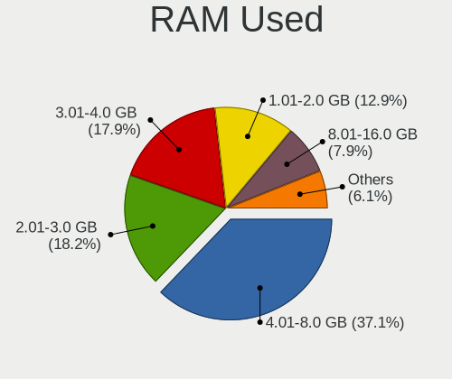
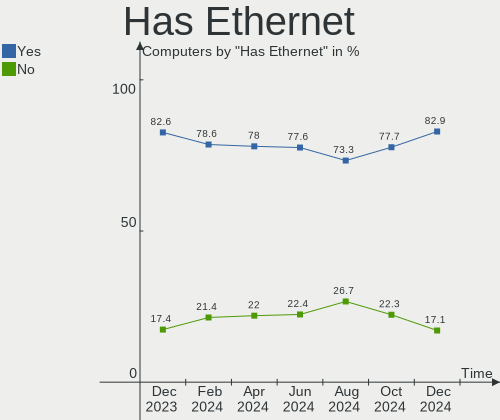
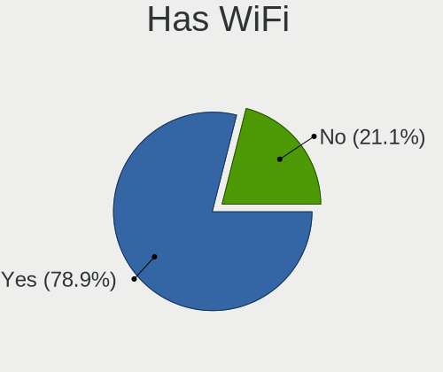
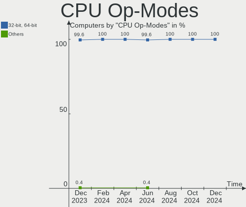
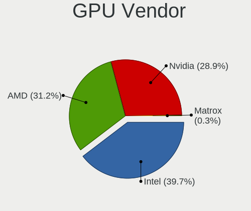
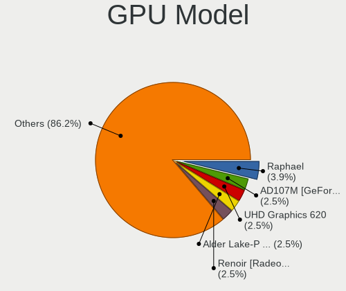
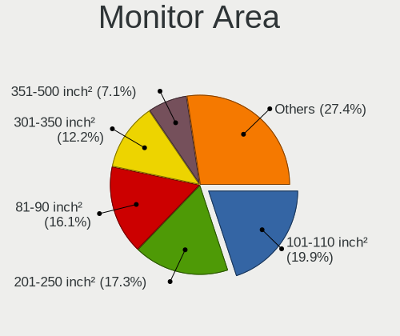

Arch - Hardware Trends
----------------------

A project to identify most popular hardware characteristics and track their change
over time based on data collected by Linux users at https://Linux-Hardware.org.

Anyone can contribute to this report by the [hw-probe](https://github.com/linuxhw/hw-probe) tool:

    sudo -E hw-probe -all -upload

This is a report for all computer types. See also reports for [desktops](/Dist/Arch/Desktop/README.md) and [notebooks](/Dist/Arch/Notebook/README.md).

This report is for one last month. Overall report since the beginning of time: [TestDays](https://github.com/linuxhw/TestDays)

Period: Oct, 2023.

Contents
--------

* [ System ](#system)
  - [ OS                       ](#os)
  - [ OS Family                ](#os-family)
  - [ Kernel                   ](#kernel)
  - [ Kernel Family            ](#kernel-family)
  - [ Kernel Major Ver.        ](#kernel-major-ver)
  - [ Arch                     ](#arch)
  - [ DE                       ](#de)
  - [ Display Server           ](#display-server)
  - [ Display Manager          ](#display-manager)
  - [ OS Lang                  ](#os-lang)
  - [ Boot Mode                ](#boot-mode)
  - [ Filesystem               ](#filesystem)
  - [ Part. scheme             ](#part-scheme)
  - [ Dual Boot with Linux/BSD ](#dual-boot-with-linuxbsd)
  - [ Dual Boot (Win)          ](#dual-boot-win)

* [ Board ](#board)
  - [ Vendor                   ](#vendor)
  - [ Model                    ](#model)
  - [ Model Family             ](#model-family)
  - [ MFG Year                 ](#mfg-year)
  - [ Form Factor              ](#form-factor)
  - [ Secure Boot              ](#secure-boot)
  - [ Coreboot                 ](#coreboot)
  - [ RAM Size                 ](#ram-size)
  - [ RAM Used                 ](#ram-used)
  - [ Total Drives             ](#total-drives)
  - [ Has CD-ROM               ](#has-cd-rom)
  - [ Has Ethernet             ](#has-ethernet)
  - [ Has WiFi                 ](#has-wifi)
  - [ Has Bluetooth            ](#has-bluetooth)

* [ Location ](#location)
  - [ Country                  ](#country)
  - [ City                     ](#city)

* [ Drives ](#drives)
  - [ Drive Vendor             ](#drive-vendor)
  - [ Drive Model              ](#drive-model)
  - [ HDD Vendor               ](#hdd-vendor)
  - [ SSD Vendor               ](#ssd-vendor)
  - [ Drive Kind               ](#drive-kind)
  - [ Drive Connector          ](#drive-connector)
  - [ Drive Size               ](#drive-size)
  - [ Space Total              ](#space-total)
  - [ Space Used               ](#space-used)
  - [ Malfunc. Drives          ](#malfunc-drives)
  - [ Malfunc. Drive Vendor    ](#malfunc-drive-vendor)
  - [ Malfunc. HDD Vendor      ](#malfunc-hdd-vendor)
  - [ Malfunc. Drive Kind      ](#malfunc-drive-kind)
  - [ Failed Drives            ](#failed-drives)
  - [ Failed Drive Vendor      ](#failed-drive-vendor)
  - [ Drive Status             ](#drive-status)

* [ Storage controller ](#storage-controller)
  - [ Storage Vendor           ](#storage-vendor)
  - [ Storage Model            ](#storage-model)
  - [ Storage Kind             ](#storage-kind)

* [ Processor ](#processor)
  - [ CPU Vendor               ](#cpu-vendor)
  - [ CPU Model                ](#cpu-model)
  - [ CPU Model Family         ](#cpu-model-family)
  - [ CPU Cores                ](#cpu-cores)
  - [ CPU Sockets              ](#cpu-sockets)
  - [ CPU Threads              ](#cpu-threads)
  - [ CPU Op-Modes             ](#cpu-op-modes)
  - [ CPU Microcode            ](#cpu-microcode)
  - [ CPU Microarch            ](#cpu-microarch)

* [ Graphics ](#graphics)
  - [ GPU Vendor               ](#gpu-vendor)
  - [ GPU Model                ](#gpu-model)
  - [ GPU Combo                ](#gpu-combo)
  - [ GPU Driver               ](#gpu-driver)
  - [ GPU Memory               ](#gpu-memory)

* [ Monitor ](#monitor)
  - [ Monitor Vendor           ](#monitor-vendor)
  - [ Monitor Model            ](#monitor-model)
  - [ Monitor Resolution       ](#monitor-resolution)
  - [ Monitor Diagonal         ](#monitor-diagonal)
  - [ Monitor Width            ](#monitor-width)
  - [ Aspect Ratio             ](#aspect-ratio)
  - [ Monitor Area             ](#monitor-area)
  - [ Pixel Density            ](#pixel-density)
  - [ Multiple Monitors        ](#multiple-monitors)

* [ Network ](#network)
  - [ Net Controller Vendor    ](#net-controller-vendor)
  - [ Net Controller Model     ](#net-controller-model)
  - [ Wireless Vendor          ](#wireless-vendor)
  - [ Wireless Model           ](#wireless-model)
  - [ Ethernet Vendor          ](#ethernet-vendor)
  - [ Ethernet Model           ](#ethernet-model)
  - [ Net Controller Kind      ](#net-controller-kind)
  - [ Used Controller          ](#used-controller)
  - [ NICs                     ](#nics)
  - [ IPv6                     ](#ipv6)

* [ Bluetooth ](#bluetooth)
  - [ Bluetooth Vendor         ](#bluetooth-vendor)
  - [ Bluetooth Model          ](#bluetooth-model)

* [ Sound ](#sound)
  - [ Sound Vendor             ](#sound-vendor)
  - [ Sound Model              ](#sound-model)

* [ Memory ](#memory)
  - [ Memory Vendor            ](#memory-vendor)
  - [ Memory Model             ](#memory-model)
  - [ Memory Kind              ](#memory-kind)
  - [ Memory Form Factor       ](#memory-form-factor)
  - [ Memory Size              ](#memory-size)
  - [ Memory Speed             ](#memory-speed)

* [ Printers & scanners ](#printers--scanners)
  - [ Printer Vendor           ](#printer-vendor)
  - [ Printer Model            ](#printer-model)
  - [ Scanner Vendor           ](#scanner-vendor)
  - [ Scanner Model            ](#scanner-model)

* [ Camera ](#camera)
  - [ Camera Vendor            ](#camera-vendor)
  - [ Camera Model             ](#camera-model)

* [ Security ](#security)
  - [ Fingerprint Vendor       ](#fingerprint-vendor)
  - [ Fingerprint Model        ](#fingerprint-model)
  - [ Chipcard Vendor          ](#chipcard-vendor)
  - [ Chipcard Model           ](#chipcard-model)

* [ Unsupported ](#unsupported)
  - [ Unsupported Devices      ](#unsupported-devices)
  - [ Unsupported Device Types ](#unsupported-device-types)

System
------

OS
--

Installed operating systems

| Name         | Computers | Percent |
|--------------|-----------|---------|
| Arch Rolling | 244       | 100%    |

OS Family
---------

OS without a version

| Name | Computers | Percent |
|------|-----------|---------|
| Arch | 244       | 100%    |

Kernel
------

Version of the Linux kernel

| Version                                  | Computers | Percent |
|------------------------------------------|-----------|---------|
| 6.5.7-arch1-1                            | 41        | 16.8%   |
| 6.5.5-arch1-1                            | 41        | 16.8%   |
| 6.5.8-arch1-1                            | 33        | 13.52%  |
| 6.5.9-arch2-1                            | 27        | 11.07%  |
| 6.5.5-zen1-1-zen                         | 11        | 4.51%   |
| 6.5.8-zen1-1-zen                         | 10        | 4.1%    |
| 6.5.6-arch2-1                            | 10        | 4.1%    |
| 6.5.9-zen2-1-zen                         | 7         | 2.87%   |
| 6.5.7-zen2-1-zen                         | 7         | 2.87%   |
| 6.5.7-zen1-1-zen                         | 4         | 1.64%   |
| 6.5.6-zen2-1-zen                         | 4         | 1.64%   |
| 6.5.3-arch1-1                            | 4         | 1.64%   |
| 6.4.12-arch1-1                           | 4         | 1.64%   |
| 6.5.4-arch2-1                            | 3         | 1.23%   |
| 6.1.60-1-lts                             | 3         | 1.23%   |
| 6.1.58-1-lts                             | 3         | 1.23%   |
| 6.1.55-1-lts                             | 3         | 1.23%   |
| 6.5.7-hardened1-1-hardened               | 2         | 0.82%   |
| 6.5.7-2-cachyos                          | 2         | 0.82%   |
| 6.1.59-1-lts                             | 2         | 0.82%   |
| 6.1.57-1-lts                             | 2         | 0.82%   |
| 6.1.56-1-lts                             | 2         | 0.82%   |
| 6.6.0-rc7-1-git-00039-g4f82870119a4      | 1         | 0.41%   |
| 6.5.9-x64v2-xanmod1-1                    | 1         | 0.41%   |
| 6.5.9-1-cachyos-lto                      | 1         | 0.41%   |
| 6.5.7-273-tkg-linux-tkg-eevdf-generic_v3 | 1         | 0.41%   |
| 6.5.7-1-cachyos-z2                       | 1         | 0.41%   |
| 6.5.6-arch2-1-g14                        | 1         | 0.41%   |
| 6.5.6-273-tkg-pds                        | 1         | 0.41%   |
| 6.5.6-273-tkg-bore-eevdf-llvm            | 1         | 0.41%   |
| 6.5.5-x64v3-xanmod1                      | 1         | 0.41%   |
| 6.5.5-x64v2-xanmod1-1                    | 1         | 0.41%   |
| 6.5.5-hardened1-1-hardened               | 1         | 0.41%   |
| 6.5.5-arch1-1.1                          | 1         | 0.41%   |
| 6.5.4chaotic--1                          | 1         | 0.41%   |
| 6.4.8-arch1-Yagakimi-T2-1-t2             | 1         | 0.41%   |
| 6.3.5-arch1-1                            | 1         | 0.41%   |
| 6.2.11-zen1-1-zen                        | 1         | 0.41%   |
| 6.0.10-lqx1-1-lqx                        | 1         | 0.41%   |
| 5.4.247-DFAUS                            | 1         | 0.41%   |

Kernel Family
-------------

Linux kernel without a distro release

| Version | Computers | Percent |
|---------|-----------|---------|
| 6.5.7   | 58        | 23.77%  |
| 6.5.5   | 56        | 22.95%  |
| 6.5.8   | 43        | 17.62%  |
| 6.5.9   | 36        | 14.75%  |
| 6.5.6   | 17        | 6.97%   |
| 6.5.4   | 4         | 1.64%   |
| 6.5.3   | 4         | 1.64%   |
| 6.4.12  | 4         | 1.64%   |
| 6.1.60  | 3         | 1.23%   |
| 6.1.58  | 3         | 1.23%   |
| 6.1.55  | 3         | 1.23%   |
| 6.1.59  | 2         | 0.82%   |
| 6.1.57  | 2         | 0.82%   |
| 6.1.56  | 2         | 0.82%   |
| 6.6.0   | 1         | 0.41%   |
| 6.4.8   | 1         | 0.41%   |
| 6.3.5   | 1         | 0.41%   |
| 6.2.11  | 1         | 0.41%   |
| 6.0.10  | 1         | 0.41%   |
| 5.4.247 | 1         | 0.41%   |
| 4.15.0  | 1         | 0.41%   |

Kernel Major Ver.
-----------------

Linux kernel major version

| Version | Computers | Percent |
|---------|-----------|---------|
| 6.5     | 218       | 89.34%  |
| 6.1     | 15        | 6.15%   |
| 6.4     | 5         | 2.05%   |
| 6.6     | 1         | 0.41%   |
| 6.3     | 1         | 0.41%   |
| 6.2     | 1         | 0.41%   |
| 6.0     | 1         | 0.41%   |
| 5.4     | 1         | 0.41%   |
| 4.15    | 1         | 0.41%   |

Arch
----

OS architecture (x86_64, i586, etc.)

| Name   | Computers | Percent |
|--------|-----------|---------|
| x86_64 | 244       | 100%    |

DE
--

Desktop Environment

| Name                    | Computers | Percent |
|-------------------------|-----------|---------|
| GNOME                   | 92        | 37.7%   |
| KDE5                    | 89        | 36.48%  |
| XFCE                    | 16        | 6.56%   |
| Hyprland                | 12        | 4.92%   |
| Unknown                 | 11        | 4.51%   |
| i3                      | 10        | 4.1%    |
| bspwm                   | 3         | 1.23%   |
| LXQt                    | 2         | 0.82%   |
| X-Cinnamon              | 1         | 0.41%   |
| Wayfire:wayfire:wlroots | 1         | 0.41%   |
| swayland                | 1         | 0.41%   |
| sway                    | 1         | 0.41%   |
| MATE                    | 1         | 0.41%   |
| KDE                     | 1         | 0.41%   |
| dwm                     | 1         | 0.41%   |
| Cutefish                | 1         | 0.41%   |
| awesome                 | 1         | 0.41%   |

Display Server
--------------

X11 or Wayland

| Name    | Computers | Percent |
|---------|-----------|---------|
| X11     | 114       | 46.72%  |
| Wayland | 104       | 42.62%  |
| Unknown | 14        | 5.74%   |
| Tty     | 12        | 4.92%   |

Display Manager
---------------

SDDM, LightDM, etc.

| Name    | Computers | Percent |
|---------|-----------|---------|
| Unknown | 96        | 39.34%  |
| SDDM    | 71        | 29.1%   |
| GDM     | 40        | 16.39%  |
| LightDM | 31        | 12.7%   |
| LY-DM   | 4         | 1.64%   |
| NODM    | 1         | 0.41%   |
| GREETD  | 1         | 0.41%   |

OS Lang
-------

Language

| Lang             | Computers | Percent |
|------------------|-----------|---------|
| en_US            | 113       | 46.31%  |
| it_IT            | 23        | 9.43%   |
| C                | 17        | 6.97%   |
| en_GB            | 13        | 5.33%   |
| pt_BR            | 11        | 4.51%   |
| de_DE            | 10        | 4.1%    |
| ru_RU            | 9         | 3.69%   |
| en_AU            | 6         | 2.46%   |
| es_ES            | 5         | 2.05%   |
| zh_CN            | 4         | 1.64%   |
| pl_PL            | 4         | 1.64%   |
| fr_FR            | 4         | 1.64%   |
| Unknown          | 3         | 1.23%   |
| hu_HU            | 2         | 0.82%   |
| es_MX            | 2         | 0.82%   |
| en_CA            | 2         | 0.82%   |
| zh_TW            | 1         | 0.41%   |
| tr_TR            | 1         | 0.41%   |
| nl_NL            | 1         | 0.41%   |
| ja_JP            | 1         | 0.41%   |
| fr_BE            | 1         | 0.41%   |
| es_DO            | 1         | 0.41%   |
| es_CO            | 1         | 0.41%   |
| eo               | 1         | 0.41%   |
| en_US.UTF.8      | 1         | 0.41%   |
| en_US.utf-8      | 1         | 0.41%   |
| en_US.ISO-8859-1 | 1         | 0.41%   |
| en_SG            | 1         | 0.41%   |
| en_PT            | 1         | 0.41%   |
| en_IE            | 1         | 0.41%   |
| en_AG            | 1         | 0.41%   |
| ca_ES            | 1         | 0.41%   |

Boot Mode
---------

EFI or BIOS

| Mode | Computers | Percent |
|------|-----------|---------|
| EFI  | 150       | 61.48%  |
| BIOS | 94        | 38.52%  |

Filesystem
----------

Type of filesystem

| Type    | Computers | Percent |
|---------|-----------|---------|
| Ext4    | 160       | 65.57%  |
| Btrfs   | 68        | 27.87%  |
| Xfs     | 5         | 2.05%   |
| Overlay | 5         | 2.05%   |
| Zfs     | 2         | 0.82%   |
| Tmpfs   | 2         | 0.82%   |
| F2fs    | 1         | 0.41%   |
| Unknown | 1         | 0.41%   |

Part. scheme
------------

Scheme of partitioning

| Type    | Computers | Percent |
|---------|-----------|---------|
| GPT     | 157       | 64.34%  |
| Unknown | 77        | 31.56%  |
| MBR     | 10        | 4.1%    |

Dual Boot with Linux/BSD
------------------------

Hosting more than one Linux/BSD

| Dual boot | Computers | Percent |
|-----------|-----------|---------|
| No        | 217       | 88.93%  |
| Yes       | 27        | 11.07%  |

Dual Boot (Win)
---------------

Hosting Linux and Windows

| Dual boot | Computers | Percent |
|-----------|-----------|---------|
| No        | 164       | 67.21%  |
| Yes       | 80        | 32.79%  |

Board
-----

Vendor
------

Motherboard manufacturer

| Name                   | Computers | Percent |
|------------------------|-----------|---------|
| ASUSTek Computer       | 45        | 18.44%  |
| Dell                   | 39        | 15.98%  |
| Lenovo                 | 35        | 14.34%  |
| Hewlett-Packard        | 32        | 13.11%  |
| MSI                    | 23        | 9.43%   |
| Gigabyte Technology    | 21        | 8.61%   |
| Acer                   | 12        | 4.92%   |
| ASRock                 | 5         | 2.05%   |
| HUAWEI                 | 3         | 1.23%   |
| HONOR                  | 3         | 1.23%   |
| Sony                   | 2         | 0.82%   |
| Fujitsu                | 2         | 0.82%   |
| Apple                  | 2         | 0.82%   |
| XIAOMI                 | 1         | 0.41%   |
| UNOWHY                 | 1         | 0.41%   |
| TUXEDO                 | 1         | 0.41%   |
| Toshiba                | 1         | 0.41%   |
| Timi                   | 1         | 0.41%   |
| Samsung Electronics    | 1         | 0.41%   |
| Positivo               | 1         | 0.41%   |
| LG Electronics         | 1         | 0.41%   |
| IP3 Tech               | 1         | 0.41%   |
| Intel                  | 1         | 0.41%   |
| Framework              | 1         | 0.41%   |
| Foxconn                | 1         | 0.41%   |
| ECS                    | 1         | 0.41%   |
| BY OEM                 | 1         | 0.41%   |
| BBEN                   | 1         | 0.41%   |
| AZW                    | 1         | 0.41%   |
| AXDIA International    | 1         | 0.41%   |
| Avell High Performance | 1         | 0.41%   |
| Acidanthera            | 1         | 0.41%   |
| Unknown                | 1         | 0.41%   |

Model
-----

Motherboard model

| Name                                | Computers | Percent |
|-------------------------------------|-----------|---------|
| HP Victus by Laptop 16-e0xxx        | 3         | 1.23%   |
| MSI MS-7D75                         | 2         | 0.82%   |
| MSI MS-7C95                         | 2         | 0.82%   |
| MSI MS-7C02                         | 2         | 0.82%   |
| MSI MS-7B89                         | 2         | 0.82%   |
| HP Notebook                         | 2         | 0.82%   |
| Gigabyte X570S AORUS PRO AX         | 2         | 0.82%   |
| Gigabyte B550M AORUS PRO-P          | 2         | 0.82%   |
| Dell XPS 15 9530                    | 2         | 0.82%   |
| Dell XPS 13 9310                    | 2         | 0.82%   |
| Dell XPS 13 9300                    | 2         | 0.82%   |
| ASUS TUF Gaming X570-PLUS           | 2         | 0.82%   |
| ASUS All Series                     | 2         | 0.82%   |
| XIAOMI Redmi Book Pro 15 2023       | 1         | 0.41%   |
| UNOWHY Y13G012S4EI                  | 1         | 0.41%   |
| TUXEDO InfinityBook Pro Gen8 (MK1)  | 1         | 0.41%   |
| Toshiba Satellite L655              | 1         | 0.41%   |
| Timi A30                            | 1         | 0.41%   |
| Sony VPCEB15EL                      | 1         | 0.41%   |
| Sony SVF1421PSGB                    | 1         | 0.41%   |
| Samsung 750XED                      | 1         | 0.41%   |
| Positivo S14BW01                    | 1         | 0.41%   |
| MSI MS-7E06                         | 1         | 0.41%   |
| MSI MS-7D78                         | 1         | 0.41%   |
| MSI MS-7D73                         | 1         | 0.41%   |
| MSI MS-7D20                         | 1         | 0.41%   |
| MSI MS-7C94                         | 1         | 0.41%   |
| MSI MS-7C80                         | 1         | 0.41%   |
| MSI MS-7C37                         | 1         | 0.41%   |
| MSI MS-7B79                         | 1         | 0.41%   |
| MSI MS-7A78                         | 1         | 0.41%   |
| MSI MS-7850                         | 1         | 0.41%   |
| MSI MS-7758                         | 1         | 0.41%   |
| MSI GP66 Leopard 10UG               | 1         | 0.41%   |
| MSI GF75 Thin 10SC                  | 1         | 0.41%   |
| MSI GF63 Thin 10SC                  | 1         | 0.41%   |
| MSI GE63 Raider RGB 8RE             | 1         | 0.41%   |
| LG 15Z95N-G.AAC6U1                  | 1         | 0.41%   |
| Lenovo Yoga Slim 7 ProX 14ARH7 82TL | 1         | 0.41%   |
| Lenovo Yoga Slim 7 Pro 14ACH5 82MS  | 1         | 0.41%   |

Model Family
------------

Motherboard model prefix

| Name                | Computers | Percent |
|---------------------|-----------|---------|
| Lenovo ThinkPad     | 17        | 6.97%   |
| ASUS ROG            | 14        | 5.74%   |
| Dell Latitude       | 13        | 5.33%   |
| Dell XPS            | 10        | 4.1%    |
| Lenovo IdeaPad      | 9         | 3.69%   |
| Acer Aspire         | 8         | 3.28%   |
| HP Pavilion         | 6         | 2.46%   |
| HP Victus           | 5         | 2.05%   |
| HP OMEN             | 5         | 2.05%   |
| Dell Precision      | 5         | 2.05%   |
| ASUS ZenBook        | 5         | 2.05%   |
| Dell Inspiron       | 4         | 1.64%   |
| ASUS TUF            | 4         | 1.64%   |
| ASUS PRIME          | 4         | 1.64%   |
| Lenovo Yoga         | 3         | 1.23%   |
| HP Laptop           | 3         | 1.23%   |
| HP EliteBook        | 3         | 1.23%   |
| Gigabyte X570S      | 3         | 1.23%   |
| Dell Vostro         | 3         | 1.23%   |
| ASUS VivoBook       | 3         | 1.23%   |
| ASUS ASUS           | 3         | 1.23%   |
| MSI MS-7D75         | 2         | 0.82%   |
| MSI MS-7C95         | 2         | 0.82%   |
| MSI MS-7C02         | 2         | 0.82%   |
| MSI MS-7B89         | 2         | 0.82%   |
| Lenovo ThinkCentre  | 2         | 0.82%   |
| HP Notebook         | 2         | 0.82%   |
| HP 255              | 2         | 0.82%   |
| HP 250              | 2         | 0.82%   |
| Gigabyte X570       | 2         | 0.82%   |
| Gigabyte B550M      | 2         | 0.82%   |
| Gigabyte B450M      | 2         | 0.82%   |
| Dell OptiPlex       | 2         | 0.82%   |
| ASUS All            | 2         | 0.82%   |
| Acer Nitro          | 2         | 0.82%   |
| XIAOMI Redmi        | 1         | 0.41%   |
| UNOWHY Y13G012S4EI  | 1         | 0.41%   |
| TUXEDO InfinityBook | 1         | 0.41%   |
| Toshiba Satellite   | 1         | 0.41%   |
| Timi A30            | 1         | 0.41%   |

MFG Year
--------

Motherboard manufacture year

| Year | Computers | Percent |
|------|-----------|---------|
| 2022 | 41        | 16.8%   |
| 2020 | 38        | 15.57%  |
| 2021 | 37        | 15.16%  |
| 2019 | 22        | 9.02%   |
| 2018 | 20        | 8.2%    |
| 2023 | 14        | 5.74%   |
| 2016 | 12        | 4.92%   |
| 2014 | 11        | 4.51%   |
| 2012 | 11        | 4.51%   |
| 2013 | 10        | 4.1%    |
| 2015 | 9         | 3.69%   |
| 2017 | 7         | 2.87%   |
| 2011 | 4         | 1.64%   |
| 2010 | 3         | 1.23%   |
| 2007 | 3         | 1.23%   |
| 2009 | 1         | 0.41%   |
| 2008 | 1         | 0.41%   |

Form Factor
-----------

Physical design of the computer

| Name        | Computers | Percent |
|-------------|-----------|---------|
| Notebook    | 143       | 58.61%  |
| Desktop     | 87        | 35.66%  |
| Convertible | 6         | 2.46%   |
| Mini pc     | 3         | 1.23%   |
| All in one  | 3         | 1.23%   |
| Tablet      | 2         | 0.82%   |

Secure Boot
-----------

Enabled or disabled

| State    | Computers | Percent |
|----------|-----------|---------|
| Disabled | 238       | 97.54%  |
| Enabled  | 6         | 2.46%   |

Coreboot
--------

Have coreboot on board

| Used | Computers | Percent |
|------|-----------|---------|
| No   | 243       | 99.59%  |
| Yes  | 1         | 0.41%   |

RAM Size
--------

Total RAM memory

| Size in GB  | Computers | Percent |
|-------------|-----------|---------|
| 16.01-24.0  | 64        | 26.23%  |
| 4.01-8.0    | 48        | 19.67%  |
| 32.01-64.0  | 46        | 18.85%  |
| 8.01-16.0   | 44        | 18.03%  |
| 3.01-4.0    | 13        | 5.33%   |
| 64.01-256.0 | 12        | 4.92%   |
| 24.01-32.0  | 11        | 4.51%   |
| 1.01-2.0    | 4         | 1.64%   |
| 2.01-3.0    | 2         | 0.82%   |

RAM Used
--------

Used RAM memory

| Used GB    | Computers | Percent |
|------------|-----------|---------|
| 4.01-8.0   | 70        | 28.69%  |
| 3.01-4.0   | 54        | 22.13%  |
| 2.01-3.0   | 48        | 19.67%  |
| 1.01-2.0   | 31        | 12.7%   |
| 8.01-16.0  | 26        | 10.66%  |
| 0.51-1.0   | 8         | 3.28%   |
| 16.01-24.0 | 5         | 2.05%   |
| 24.01-32.0 | 1         | 0.41%   |
| 0.01-0.5   | 1         | 0.41%   |

Total Drives
------------

Number of drives on board

| Drives | Computers | Percent |
|--------|-----------|---------|
| 1      | 145       | 59.43%  |
| 2      | 53        | 21.72%  |
| 3      | 27        | 11.07%  |
| 4      | 9         | 3.69%   |
| 5      | 6         | 2.46%   |
| 0      | 2         | 0.82%   |
| 10     | 1         | 0.41%   |
| 8      | 1         | 0.41%   |

Has CD-ROM
----------

Has CD-ROM on board

| Presented | Computers | Percent |
|-----------|-----------|---------|
| No        | 202       | 82.79%  |
| Yes       | 42        | 17.21%  |

Has Ethernet
------------

Has Ethernet on board

| Presented | Computers | Percent |
|-----------|-----------|---------|
| Yes       | 194       | 79.51%  |
| No        | 50        | 20.49%  |

Has WiFi
--------

Has WiFi module

| Presented | Computers | Percent |
|-----------|-----------|---------|
| Yes       | 207       | 84.84%  |
| No        | 37        | 15.16%  |

Has Bluetooth
-------------

Has Bluetooth module

| Presented | Computers | Percent |
|-----------|-----------|---------|
| Yes       | 194       | 79.51%  |
| No        | 50        | 20.49%  |

Location
--------

Country
-------

Geographic location (country)

| Country      | Computers | Percent |
|--------------|-----------|---------|
| Italy        | 34        | 13.93%  |
| USA          | 33        | 13.52%  |
| Germany      | 16        | 6.56%   |
| Brazil       | 16        | 6.56%   |
| Russia       | 14        | 5.74%   |
| Spain        | 12        | 4.92%   |
| UK           | 11        | 4.51%   |
| India        | 10        | 4.1%    |
| Vietnam      | 8         | 3.28%   |
| Poland       | 8         | 3.28%   |
| France       | 7         | 2.87%   |
| Australia    | 7         | 2.87%   |
| China        | 5         | 2.05%   |
| Switzerland  | 4         | 1.64%   |
| Portugal     | 4         | 1.64%   |
| Indonesia    | 4         | 1.64%   |
| Canada       | 4         | 1.64%   |
| Mexico       | 3         | 1.23%   |
| Japan        | 3         | 1.23%   |
| Belgium      | 3         | 1.23%   |
| Turkey       | 2         | 0.82%   |
| Romania      | 2         | 0.82%   |
| Philippines  | 2         | 0.82%   |
| New Zealand  | 2         | 0.82%   |
| Netherlands  | 2         | 0.82%   |
| Ireland      | 2         | 0.82%   |
| Hungary      | 2         | 0.82%   |
| Czechia      | 2         | 0.82%   |
| Bulgaria     | 2         | 0.82%   |
| Belarus      | 2         | 0.82%   |
| Argentina    | 2         | 0.82%   |
| Ukraine      | 1         | 0.41%   |
| Taiwan       | 1         | 0.41%   |
| South Korea  | 1         | 0.41%   |
| South Africa | 1         | 0.41%   |
| Slovakia     | 1         | 0.41%   |
| Singapore    | 1         | 0.41%   |
| Puerto Rico  | 1         | 0.41%   |
| Pakistan     | 1         | 0.41%   |
| Nepal        | 1         | 0.41%   |

City
----

Geographic location (city)

| City              | Computers | Percent |
|-------------------|-----------|---------|
| Moscow            | 4         | 1.64%   |
| Milano            | 4         | 1.64%   |
| Milan             | 4         | 1.64%   |
| Madrid            | 4         | 1.64%   |
| Ho Chi Minh City  | 4         | 1.64%   |
| Rio de Janeiro    | 3         | 1.23%   |
| Hanoi             | 3         | 1.23%   |
| Brisbane          | 3         | 1.23%   |
| Beijing           | 3         | 1.23%   |
| Zurich            | 2         | 0.82%   |
| Turin             | 2         | 0.82%   |
| Sydney            | 2         | 0.82%   |
| Sao Paulo         | 2         | 0.82%   |
| Rome              | 2         | 0.82%   |
| Poznan            | 2         | 0.82%   |
| Paris             | 2         | 0.82%   |
| Melbourne         | 2         | 0.82%   |
| Marburg           | 2         | 0.82%   |
| Krakow            | 2         | 0.82%   |
| Kecskemét        | 2         | 0.82%   |
| Dublin            | 2         | 0.82%   |
| Delhi             | 2         | 0.82%   |
| Daganzo de Arriba | 2         | 0.82%   |
| Brussels          | 2         | 0.82%   |
| Bresso            | 2         | 0.82%   |
| Bengaluru         | 2         | 0.82%   |
| Bellevue          | 2         | 0.82%   |
| Auckland          | 2         | 0.82%   |
| Zulte             | 1         | 0.41%   |
| Zhongli District  | 1         | 0.41%   |
| Yukarikaraman     | 1         | 0.41%   |
| Yogyakarta        | 1         | 0.41%   |
| Yakima            | 1         | 0.41%   |
| Wroclaw           | 1         | 0.41%   |
| West Lebanon      | 1         | 0.41%   |
| Wembley           | 1         | 0.41%   |
| Warsaw            | 1         | 0.41%   |
| Vladivostok       | 1         | 0.41%   |
| Vitebsk           | 1         | 0.41%   |
| Visselhoevede     | 1         | 0.41%   |

Drives
------

Drive Vendor
------------

Hard drive vendors

| Vendor                         | Computers | Drives | Percent |
|--------------------------------|-----------|--------|---------|
| Samsung Electronics            | 75        | 84     | 19.95%  |
| SanDisk                        | 44        | 47     | 11.7%   |
| Seagate                        | 40        | 48     | 10.64%  |
| WDC                            | 26        | 33     | 6.91%   |
| Micron Technology              | 15        | 15     | 3.99%   |
| Micron/Crucial Technology      | 13        | 14     | 3.46%   |
| SK hynix                       | 12        | 12     | 3.19%   |
| Kingston                       | 12        | 12     | 3.19%   |
| Toshiba                        | 11        | 12     | 2.93%   |
| Intel                          | 11        | 12     | 2.93%   |
| Crucial                        | 11        | 12     | 2.93%   |
| Unknown                        | 9         | 10     | 2.39%   |
| Kingston Technology Company    | 8         | 8      | 2.13%   |
| Phison Electronics             | 7         | 8      | 1.86%   |
| KIOXIA                         | 6         | 6      | 1.6%    |
| HGST                           | 6         | 6      | 1.6%    |
| Silicon Motion                 | 5         | 5      | 1.33%   |
| China                          | 5         | 5      | 1.33%   |
| Hitachi                        | 4         | 4      | 1.06%   |
| ADATA Technology               | 4         | 4      | 1.06%   |
| SPCC                           | 3         | 4      | 0.8%    |
| Realtek Semiconductor          | 3         | 3      | 0.8%    |
| A-DATA Technology              | 3         | 3      | 0.8%    |
| Verbatim                       | 2         | 2      | 0.53%   |
| Union Memory (Shenzhen)        | 2         | 2      | 0.53%   |
| Team                           | 2         | 2      | 0.53%   |
| Realtek                        | 2         | 2      | 0.53%   |
| KingSpec                       | 2         | 2      | 0.53%   |
| Unknown                        | 2         | 2      | 0.53%   |
| ZTC                            | 1         | 1      | 0.27%   |
| Yangtze Memory Technologies    | 1         | 1      | 0.27%   |
| XrayDisk                       | 1         | 1      | 0.27%   |
| Transcend                      | 1         | 1      | 0.27%   |
| SSD 1TB                        | 1         | 1      | 0.27%   |
| Solid State Storage Technology | 1         | 1      | 0.27%   |
| Solid State Storage            | 1         | 1      | 0.27%   |
| Shenzhen Longsys Electronics   | 1         | 1      | 0.27%   |
| SABRENT                        | 1         | 1      | 0.27%   |
| QNAP                           | 1         | 6      | 0.27%   |
| Phison                         | 1         | 1      | 0.27%   |

Drive Model
-----------

Hard drive models

| Model                                                             | Computers | Percent |
|-------------------------------------------------------------------|-----------|---------|
| Samsung NVMe SSD Controller SM981/PM981/PM983 1TB                 | 22        | 5.43%   |
| Samsung NVMe SSD Controller PM9A1/PM9A3/980PRO 1TB                | 14        | 3.46%   |
| Micron/Crucial P2 NVMe PCIe SSD 500GB                             | 10        | 2.47%   |
| Samsung SSD 980 1TB                                               | 7         | 1.73%   |
| Sandisk WD Black SN850 1TB                                        | 6         | 1.48%   |
| Intel SSD 660P Series 1024GB                                      | 6         | 1.48%   |
| Seagate ST1000DM010-2EP102 1TB                                    | 5         | 1.23%   |
| Sandisk WD Black SN750 / PC SN730 NVMe SSD 1024GB                 | 5         | 1.23%   |
| Samsung SSD 860 EVO 500GB                                         | 4         | 0.99%   |
| Kingston SA400S37240G 240GB SSD                                   | 4         | 0.99%   |
| Unknown MMC Card  64GB                                            | 3         | 0.74%   |
| Toshiba DT01ACA100 1TB                                            | 3         | 0.74%   |
| Silicon Motion SM2262/SM2262EN SSD Controller 2TB                 | 3         | 0.74%   |
| Seagate ST1000LM035-1RK172 1TB                                    | 3         | 0.74%   |
| Sandisk WD Blue SN550 NVMe SSD 1TB                                | 3         | 0.74%   |
| Samsung SSD 850 EVO 500GB                                         | 3         | 0.74%   |
| Samsung NVMe SSD Controller SM961/PM961/SM963 121GB               | 3         | 0.74%   |
| Phison E16 PCIe4 NVMe Controller 500GB                            | 3         | 0.74%   |
| Micron 2450_MTFDKBA512TFK 512GB                                   | 3         | 0.74%   |
| HGST HTS721010A9E630 1TB                                          | 3         | 0.74%   |
| ADATA XPG SX8200 Pro PCIe Gen3x4 M.2 2280 Solid State Drive 512GB | 3         | 0.74%   |
| Unknown MMC Card  128GB                                           | 2         | 0.49%   |
| Toshiba MQ04ABF100 1TB                                            | 2         | 0.49%   |
| Toshiba MQ01ABD100 1TB                                            | 2         | 0.49%   |
| SPCC Solid State Disk 512GB                                       | 2         | 0.49%   |
| SK hynix BC501 NVMe Solid State Drive 512GB                       | 2         | 0.49%   |
| Silicon Motion SM2263EN/SM2263XT SSD Controller 256GB             | 2         | 0.49%   |
| Seagate ST4000DM004-2CV104 4TB                                    | 2         | 0.49%   |
| Seagate ST2000LM003 HN-M201RAD 2TB                                | 2         | 0.49%   |
| Seagate ST2000DM001-1ER164 2TB                                    | 2         | 0.49%   |
| Seagate ST1000LM024 HN-M101MBB 1TB                                | 2         | 0.49%   |
| Sandisk WD_BLACK SN770 1TB                                        | 2         | 0.49%   |
| Sandisk WD Black 2018/SN750 / PC SN720 NVMe SSD 1TB               | 2         | 0.49%   |
| SanDisk SSD PLUS 240GB                                            | 2         | 0.49%   |
| SanDisk SDSSDP128G 128GB                                          | 2         | 0.49%   |
| SanDisk SDSSDA240G 240GB                                          | 2         | 0.49%   |
| Samsung SSD 980 500GB                                             | 2         | 0.49%   |
| Samsung SSD 850 EVO 250GB                                         | 2         | 0.49%   |
| Realtek ADATA SX6000LNP 512GB                                     | 2         | 0.49%   |
| Phison E12 NVMe Controller 1TB                                    | 2         | 0.49%   |

HDD Vendor
----------

Hard disk drive vendors

| Vendor              | Computers | Drives | Percent |
|---------------------|-----------|--------|---------|
| Seagate             | 40        | 48     | 48.19%  |
| WDC                 | 22        | 26     | 26.51%  |
| Toshiba             | 9         | 10     | 10.84%  |
| HGST                | 6         | 6      | 7.23%   |
| Hitachi             | 4         | 4      | 4.82%   |
| Samsung Electronics | 1         | 1      | 1.2%    |
| QNAP                | 1         | 6      | 1.2%    |

SSD Vendor
----------

Solid state drive vendors

| Vendor              | Computers | Drives | Percent |
|---------------------|-----------|--------|---------|
| Samsung Electronics | 25        | 26     | 25%     |
| SanDisk             | 13        | 14     | 13%     |
| Crucial             | 10        | 10     | 10%     |
| Kingston            | 9         | 9      | 9%      |
| WDC                 | 7         | 7      | 7%      |
| China               | 5         | 5      | 5%      |
| SPCC                | 3         | 4      | 3%      |
| Verbatim            | 2         | 2      | 2%      |
| Team                | 2         | 2      | 2%      |
| KingSpec            | 2         | 2      | 2%      |
| A-DATA Technology   | 2         | 2      | 2%      |
| ZTC                 | 1         | 1      | 1%      |
| XrayDisk            | 1         | 1      | 1%      |
| Transcend           | 1         | 1      | 1%      |
| Toshiba             | 1         | 1      | 1%      |
| SK hynix            | 1         | 1      | 1%      |
| SABRENT             | 1         | 1      | 1%      |
| OWC                 | 1         | 1      | 1%      |
| OCZ-VERTEX3         | 1         | 1      | 1%      |
| LITEON              | 1         | 1      | 1%      |
| Intenso             | 1         | 1      | 1%      |
| Intel               | 1         | 1      | 1%      |
| Indilinx            | 1         | 1      | 1%      |
| GOODRAM             | 1         | 1      | 1%      |
| Glowy               | 1         | 1      | 1%      |
| Corsair             | 1         | 2      | 1%      |
| BHT                 | 1         | 1      | 1%      |
| AOSENKE             | 1         | 1      | 1%      |
| Acer                | 1         | 1      | 1%      |
| 2.5"                | 1         | 1      | 1%      |
| Unknown             | 1         | 1      | 1%      |

Drive Kind
----------

HDD or SSD

| Kind    | Computers | Drives | Percent |
|---------|-----------|--------|---------|
| NVMe    | 162       | 197    | 49.09%  |
| SSD     | 83        | 104    | 25.15%  |
| HDD     | 71        | 101    | 21.52%  |
| MMC     | 7         | 8      | 2.12%   |
| Unknown | 7         | 7      | 2.12%   |

Drive Connector
---------------

SATA, SAS, NVMe, etc.

| Type | Computers | Drives | Percent |
|------|-----------|--------|---------|
| NVMe | 161       | 194    | 53.14%  |
| SATA | 122       | 201    | 40.26%  |
| SAS  | 13        | 14     | 4.29%   |
| MMC  | 7         | 8      | 2.31%   |

Drive Size
----------

Size of hard drive

| Size in TB | Computers | Drives | Percent |
|------------|-----------|--------|---------|
| 0.01-0.5   | 80        | 97     | 47.62%  |
| 0.51-1.0   | 49        | 63     | 29.17%  |
| 1.01-2.0   | 18        | 20     | 10.71%  |
| 3.01-4.0   | 10        | 13     | 5.95%   |
| 4.01-10.0  | 5         | 5      | 2.98%   |
| 2.01-3.0   | 3         | 3      | 1.79%   |
| 10.01-20.0 | 3         | 4      | 1.79%   |

Space Total
-----------

Amount of disk space available on the file system

| Size in GB     | Computers | Percent |
|----------------|-----------|---------|
| 251-500        | 52        | 21.31%  |
| 101-250        | 44        | 18.03%  |
| 501-1000       | 40        | 16.39%  |
| More than 3000 | 35        | 14.34%  |
| 1001-2000      | 34        | 13.93%  |
| 2001-3000      | 14        | 5.74%   |
| 51-100         | 9         | 3.69%   |
| Unknown        | 7         | 2.87%   |
| 21-50          | 6         | 2.46%   |
| 1-20           | 3         | 1.23%   |

Space Used
----------

Amount of used disk space

| Used GB        | Computers | Percent |
|----------------|-----------|---------|
| 1-20           | 51        | 20.9%   |
| 51-100         | 40        | 16.39%  |
| 101-250        | 31        | 12.7%   |
| 501-1000       | 27        | 11.07%  |
| 251-500        | 26        | 10.66%  |
| 21-50          | 26        | 10.66%  |
| 1001-2000      | 20        | 8.2%    |
| More than 3000 | 12        | 4.92%   |
| Unknown        | 7         | 2.87%   |
| 2001-3000      | 4         | 1.64%   |

Malfunc. Drives
---------------

Drive models with a malfunction

| Model                                                          | Computers | Drives | Percent |
|----------------------------------------------------------------|-----------|--------|---------|
| XrayDisk SSD 128GB                                             | 1         | 1      | 5.56%   |
| WDC WD6400BEVT-22A0RT0 640GB                                   | 1         | 1      | 5.56%   |
| WDC WD60EDAZ-11U78B0 6TB                                       | 1         | 1      | 5.56%   |
| WDC WD5000HHTZ-04N21V0 500GB                                   | 1         | 1      | 5.56%   |
| Toshiba DT01ACA100 1TB                                         | 1         | 1      | 5.56%   |
| Seagate ST9320320AS 320GB                                      | 1         | 1      | 5.56%   |
| Seagate ST8000DM004-2CX188 8TB                                 | 1         | 1      | 5.56%   |
| Seagate ST3000DM008-2DM166 3TB                                 | 1         | 1      | 5.56%   |
| Seagate ST1000LM024 HN-M101MBB 1TB                             | 1         | 1      | 5.56%   |
| Seagate ST1000DM010-2EP102 1TB                                 | 1         | 1      | 5.56%   |
| Samsung Electronics SSD 980 1TB                                | 1         | 1      | 5.56%   |
| Samsung Electronics SSD 870 EVO 2TB                            | 1         | 1      | 5.56%   |
| Samsung Electronics NVMe SSD Controller PM9A1/PM9A3/980PRO 1TB | 1         | 1      | 5.56%   |
| Kingston SKC400S371T 1TB SSD                                   | 1         | 1      | 5.56%   |
| Hitachi HTS545050A7E380 500GB                                  | 1         | 1      | 5.56%   |
| Hitachi HTS541616J9SA00 160GB                                  | 1         | 1      | 5.56%   |
| HGST HTS545050A7E680 500GB                                     | 1         | 1      | 5.56%   |
| China SATA3 2TB SSD                                            | 1         | 1      | 5.56%   |

Malfunc. Drive Vendor
---------------------

Vendors of faulty drives

| Vendor              | Computers | Drives | Percent |
|---------------------|-----------|--------|---------|
| Seagate             | 5         | 5      | 27.78%  |
| WDC                 | 3         | 3      | 16.67%  |
| Samsung Electronics | 3         | 3      | 16.67%  |
| Hitachi             | 2         | 2      | 11.11%  |
| XrayDisk            | 1         | 1      | 5.56%   |
| Toshiba             | 1         | 1      | 5.56%   |
| Kingston            | 1         | 1      | 5.56%   |
| HGST                | 1         | 1      | 5.56%   |
| China               | 1         | 1      | 5.56%   |

Malfunc. HDD Vendor
-------------------

Vendors of faulty HDD drives

| Vendor  | Computers | Drives | Percent |
|---------|-----------|--------|---------|
| Seagate | 5         | 5      | 41.67%  |
| WDC     | 3         | 3      | 25%     |
| Hitachi | 2         | 2      | 16.67%  |
| Toshiba | 1         | 1      | 8.33%   |
| HGST    | 1         | 1      | 8.33%   |

Malfunc. Drive Kind
-------------------

Kinds of faulty drives

| Kind | Computers | Drives | Percent |
|------|-----------|--------|---------|
| HDD  | 11        | 12     | 64.71%  |
| SSD  | 4         | 4      | 23.53%  |
| NVMe | 2         | 2      | 11.76%  |

Failed Drives
-------------

Failed drive models

Zero info for selected period =(

Failed Drive Vendor
-------------------

Failed drive vendors

Zero info for selected period =(

Drive Status
------------

Number of failed and malfunc. drives

| Status   | Computers | Drives | Percent |
|----------|-----------|--------|---------|
| Works    | 136       | 230    | 50.94%  |
| Detected | 116       | 169    | 43.45%  |
| Malfunc  | 15        | 18     | 5.62%   |

Storage controller
------------------

Storage Vendor
--------------

Storage controller vendors

| Vendor                                  | Computers | Percent |
|-----------------------------------------|-----------|---------|
| Intel                                   | 118       | 32.42%  |
| AMD                                     | 60        | 16.48%  |
| Samsung Electronics                     | 55        | 15.11%  |
| SanDisk                                 | 31        | 8.52%   |
| Micron Technology                       | 15        | 4.12%   |
| Micron/Crucial Technology               | 14        | 3.85%   |
| SK hynix                                | 11        | 3.02%   |
| Kingston Technology Company             | 11        | 3.02%   |
| Phison Electronics                      | 8         | 2.2%    |
| ASMedia Technology                      | 8         | 2.2%    |
| KIOXIA                                  | 6         | 1.65%   |
| ADATA Technology                        | 5         | 1.37%   |
| Silicon Motion                          | 4         | 1.1%    |
| Realtek Semiconductor                   | 3         | 0.82%   |
| Solid State Storage Technology          | 2         | 0.55%   |
| Shenzhen Unionmemory Information System | 2         | 0.55%   |
| INNOGRIT                                | 2         | 0.55%   |
| Yangtze Memory Technologies             | 1         | 0.27%   |
| Transcend                               | 1         | 0.27%   |
| Toshiba America Info Systems            | 1         | 0.27%   |
| Shenzhen Longsys Electronics            | 1         | 0.27%   |
| Nvidia                                  | 1         | 0.27%   |
| MAXIO Technology (Hangzhou)             | 1         | 0.27%   |
| Marvell Technology Group                | 1         | 0.27%   |
| JMicron Technology                      | 1         | 0.27%   |
| Beijing Starblaze Technology            | 1         | 0.27%   |

Storage Model
-------------

Storage controller models

| Model                                                                          | Computers | Percent |
|--------------------------------------------------------------------------------|-----------|---------|
| AMD FCH SATA Controller [AHCI mode]                                            | 41        | 10.33%  |
| Samsung NVMe SSD Controller SM981/PM981/PM983                                  | 22        | 5.54%   |
| Samsung NVMe SSD Controller 980 (DRAM-less)                                    | 16        | 4.03%   |
| Samsung NVMe SSD Controller PM9A1/PM9A3/980PRO                                 | 14        | 3.53%   |
| AMD 500 Series Chipset SATA Controller                                         | 14        | 3.53%   |
| Intel Volume Management Device NVMe RAID Controller                            | 13        | 3.27%   |
| Micron/Crucial P2 [Nick P2] / P3 / P3 Plus NVMe PCIe SSD (DRAM-less)           | 10        | 2.52%   |
| AMD 400 Series Chipset SATA Controller                                         | 10        | 2.52%   |
| Intel 7 Series Chipset Family 6-port SATA Controller [AHCI mode]               | 7         | 1.76%   |
| SK hynix Gold P31/BC711/PC711 NVMe Solid State Drive                           | 6         | 1.51%   |
| SanDisk WD PC SN810 / Black SN850 NVMe SSD                                     | 6         | 1.51%   |
| Intel Wildcat Point-LP SATA Controller [AHCI Mode]                             | 6         | 1.51%   |
| Intel Tiger Lake-LP SATA Controller                                            | 6         | 1.51%   |
| Intel Sunrise Point-LP SATA Controller [AHCI mode]                             | 6         | 1.51%   |
| Intel SSD 660P Series                                                          | 6         | 1.51%   |
| Intel 82801 Mobile SATA Controller [RAID mode]                                 | 6         | 1.51%   |
| Intel 8 Series/C220 Series Chipset Family 6-port SATA Controller 1 [AHCI mode] | 6         | 1.51%   |
| ASMedia ASM1062 Serial ATA Controller                                          | 6         | 1.51%   |
| SanDisk Extreme Pro / WD Black SN750 / PC SN730 / Red SN700 NVMe SSD           | 5         | 1.26%   |
| Micron 2450 NVMe SSD [HendrixV] (DRAM-less)                                    | 5         | 1.26%   |
| Intel Q170/Q150/B150/H170/H110/Z170/CM236 Chipset SATA Controller [AHCI Mode]  | 5         | 1.26%   |
| Intel 400 Series Chipset Family SATA AHCI Controller                           | 5         | 1.26%   |
| SanDisk WD Black SN770 / PC SN740 256GB / PC SN560 (DRAM-less) NVMe SSD        | 4         | 1.01%   |
| KIOXIA NVMe SSD Controller BG4 (DRAM-less)                                     | 4         | 1.01%   |
| Kingston Company NV2 NVMe SSD SM2267XT                                         | 4         | 1.01%   |
| Intel Volume Management Device NVMe RAID Controller Intel Corporation          | 4         | 1.01%   |
| Intel HM170/QM170 Chipset SATA Controller [AHCI Mode]                          | 4         | 1.01%   |
| Intel Cannon Lake Mobile PCH SATA AHCI Controller                              | 4         | 1.01%   |
| Intel 700 Series Chipset Family SATA AHCI Controller                           | 4         | 1.01%   |
| SanDisk WD Green SN350 240GB (DRAM-less) / SN560E NVMe SSD                     | 3         | 0.76%   |
| SanDisk Ultra 3D / WD Blue SN550 NVMe SSD                                      | 3         | 0.76%   |
| Samsung NVMe SSD Controller SM961/PM961/SM963                                  | 3         | 0.76%   |
| Phison E16 PCIe4 NVMe Controller                                               | 3         | 0.76%   |
| Micron/Crucial P1 NVMe PCIe SSD[Frampton]                                      | 3         | 0.76%   |
| Micron 3400 NVMe SSD [Hendrix]                                                 | 3         | 0.76%   |
| Intel Ice Lake-LP SATA Controller [AHCI mode]                                  | 3         | 0.76%   |
| Intel Cannon Lake PCH SATA AHCI Controller                                     | 3         | 0.76%   |
| Intel 7 Series/C210 Series Chipset Family 6-port SATA Controller [AHCI mode]   | 3         | 0.76%   |
| Intel 6 Series/C200 Series Chipset Family 6 port Mobile SATA AHCI Controller   | 3         | 0.76%   |
| Intel 500 Series Chipset Family SATA AHCI Controller                           | 3         | 0.76%   |

Storage Kind
------------

Kind of storage controller (IDE, SATA, NVMe, SAS, ...)

| Kind | Computers | Percent |
|------|-----------|---------|
| NVMe | 160       | 46.24%  |
| SATA | 152       | 43.93%  |
| RAID | 27        | 7.8%    |
| IDE  | 7         | 2.02%   |

Processor
---------

CPU Vendor
----------

Processor vendors

| Vendor | Computers | Percent |
|--------|-----------|---------|
| Intel  | 145       | 59.43%  |
| AMD    | 99        | 40.57%  |

CPU Model
---------

Processor models

| Model                                         | Computers | Percent |
|-----------------------------------------------|-----------|---------|
| Intel 11th Gen Core i5-1135G7 @ 2.40GHz       | 7         | 2.87%   |
| AMD Ryzen 5 5600X 6-Core Processor            | 7         | 2.87%   |
| AMD Ryzen 7 5800H with Radeon Graphics        | 5         | 2.05%   |
| AMD Ryzen 5 3600 6-Core Processor             | 5         | 2.05%   |
| AMD Ryzen 5 3500U with Radeon Vega Mobile Gfx | 5         | 2.05%   |
| Intel Core i5-5300U CPU @ 2.30GHz             | 4         | 1.64%   |
| Intel 11th Gen Core i3-1115G4 @ 3.00GHz       | 4         | 1.64%   |
| AMD Ryzen 7 4800H with Radeon Graphics        | 4         | 1.64%   |
| AMD Ryzen 7 3700X 8-Core Processor            | 4         | 1.64%   |
| AMD Ryzen 5 5600H with Radeon Graphics        | 4         | 1.64%   |
| Intel Core i7-8750H CPU @ 2.20GHz             | 3         | 1.23%   |
| Intel Core i7-10750H CPU @ 2.60GHz            | 3         | 1.23%   |
| Intel Core i7-1065G7 CPU @ 1.30GHz            | 3         | 1.23%   |
| Intel Core i5-8265U CPU @ 1.60GHz             | 3         | 1.23%   |
| Intel Core i5-10300H CPU @ 2.50GHz            | 3         | 1.23%   |
| Intel 13th Gen Core i7-13700H                 | 3         | 1.23%   |
| AMD Ryzen 7 7840HS w/ Radeon 780M Graphics    | 3         | 1.23%   |
| AMD Ryzen 7 5800X 8-Core Processor            | 3         | 1.23%   |
| AMD Ryzen 5 5600G with Radeon Graphics        | 3         | 1.23%   |
| AMD Ryzen 5 5500U with Radeon Graphics        | 3         | 1.23%   |
| Intel Core i7-7700HQ CPU @ 2.80GHz            | 2         | 0.82%   |
| Intel Core i7-6700HQ CPU @ 2.60GHz            | 2         | 0.82%   |
| Intel Core i5-8350U CPU @ 1.70GHz             | 2         | 0.82%   |
| Intel Core i5-6400 CPU @ 2.70GHz              | 2         | 0.82%   |
| Intel Core i5-6300U CPU @ 2.40GHz             | 2         | 0.82%   |
| Intel Core i5-10400F CPU @ 2.90GHz            | 2         | 0.82%   |
| Intel Core i5-10400 CPU @ 2.90GHz             | 2         | 0.82%   |
| Intel Core i3-N305                            | 2         | 0.82%   |
| Intel Core i3-1005G1 CPU @ 1.20GHz            | 2         | 0.82%   |
| Intel Atom x5-Z8350 CPU @ 1.44GHz             | 2         | 0.82%   |
| Intel 13th Gen Core i9-13900K                 | 2         | 0.82%   |
| Intel 13th Gen Core i5-1335U                  | 2         | 0.82%   |
| Intel 12th Gen Core i7-12700H                 | 2         | 0.82%   |
| Intel 12th Gen Core i7-1265U                  | 2         | 0.82%   |
| Intel 11th Gen Core i7-1165G7 @ 2.80GHz       | 2         | 0.82%   |
| Intel 11th Gen Core i5-11400H @ 2.70GHz       | 2         | 0.82%   |
| AMD Ryzen 9 7940HS w/ Radeon 780M Graphics    | 2         | 0.82%   |
| AMD Ryzen 9 7900X 12-Core Processor           | 2         | 0.82%   |
| AMD Ryzen 9 5900HX with Radeon Graphics       | 2         | 0.82%   |
| AMD Ryzen 7 PRO 4750U with Radeon Graphics    | 2         | 0.82%   |

CPU Model Family
----------------

Processor model prefix

| Model                   | Computers | Percent |
|-------------------------|-----------|---------|
| Other                   | 44        | 18.03%  |
| Intel Core i5           | 42        | 17.21%  |
| AMD Ryzen 7             | 37        | 15.16%  |
| AMD Ryzen 5             | 37        | 15.16%  |
| Intel Core i7           | 34        | 13.93%  |
| Intel Core i3           | 7         | 2.87%   |
| AMD Ryzen 9             | 7         | 2.87%   |
| Intel Xeon              | 6         | 2.46%   |
| AMD Ryzen 7 PRO         | 5         | 2.05%   |
| Intel Pentium           | 4         | 1.64%   |
| Intel Celeron           | 3         | 1.23%   |
| Intel Core i9           | 2         | 0.82%   |
| Intel Atom              | 2         | 0.82%   |
| AMD Ryzen 3             | 2         | 0.82%   |
| AMD FX                  | 2         | 0.82%   |
| AMD E2                  | 2         | 0.82%   |
| Intel Pentium Dual-Core | 1         | 0.41%   |
| Intel Pentium Dual      | 1         | 0.41%   |
| Intel Core 2 Duo        | 1         | 0.41%   |
| AMD Turion 64 X2 Mobile | 1         | 0.41%   |
| AMD GX                  | 1         | 0.41%   |
| AMD E1                  | 1         | 0.41%   |
| AMD A8                  | 1         | 0.41%   |
| AMD A6                  | 1         | 0.41%   |

CPU Cores
---------

Number of processor cores

| Number | Computers | Percent |
|--------|-----------|---------|
| 4      | 76        | 31.15%  |
| 8      | 50        | 20.49%  |
| 6      | 50        | 20.49%  |
| 2      | 42        | 17.21%  |
| 10     | 10        | 4.1%    |
| 14     | 6         | 2.46%   |
| 12     | 4         | 1.64%   |
| 24     | 3         | 1.23%   |
| 16     | 2         | 0.82%   |
| 1      | 1         | 0.41%   |

CPU Sockets
-----------

Number of sockets

| Number | Computers | Percent |
|--------|-----------|---------|
| 1      | 244       | 100%    |

CPU Threads
-----------

Threads per core (Hyper-Threading)

| Number | Computers | Percent |
|--------|-----------|---------|
| 2      | 206       | 84.43%  |
| 1      | 38        | 15.57%  |

CPU Op-Modes
------------

CPU Operation Modes (32-bit, 64-bit)

| Op mode        | Computers | Percent |
|----------------|-----------|---------|
| 32-bit, 64-bit | 244       | 100%    |

CPU Microcode
-------------

Microcode number

| Number     | Computers | Percent |
|------------|-----------|---------|
| Unknown    | 170       | 69.67%  |
| 0x0a50000d | 8         | 3.28%   |
| 0x0a601203 | 7         | 2.87%   |
| 0x08108109 | 5         | 2.05%   |
| 0x0a50000c | 4         | 1.64%   |
| 0x0a20120a | 4         | 1.64%   |
| 0x08701030 | 4         | 1.64%   |
| 0x0a704103 | 3         | 1.23%   |
| 0x08600104 | 3         | 1.23%   |
| 0x806c1    | 2         | 0.82%   |
| 0x0a50000b | 2         | 0.82%   |
| 0x0a404102 | 2         | 0.82%   |
| 0x0a201025 | 2         | 0.82%   |
| 0x0a201009 | 2         | 0.82%   |
| 0x08701021 | 2         | 0.82%   |
| 0x08701013 | 2         | 0.82%   |
| 0x08600106 | 2         | 0.82%   |
| 0x0800820d | 2         | 0.82%   |
| 0x06000852 | 2         | 0.82%   |
| 0xa0652    | 1         | 0.41%   |
| 0x906ea    | 1         | 0.41%   |
| 0x806e9    | 1         | 0.41%   |
| 0x406e3    | 1         | 0.41%   |
| 0x306c3    | 1         | 0.41%   |
| 0x306a9    | 1         | 0.41%   |
| 0x0a404101 | 1         | 0.41%   |
| 0x0a20120e | 1         | 0.41%   |
| 0x0a201016 | 1         | 0.41%   |
| 0x08608104 | 1         | 0.41%   |
| 0x08608103 | 1         | 0.41%   |
| 0x08108102 | 1         | 0.41%   |
| 0x08001138 | 1         | 0.41%   |
| 0x0701a001 | 1         | 0.41%   |
| 0x07000110 | 1         | 0.41%   |
| 0x06006704 | 1         | 0.41%   |

CPU Microarch
-------------

Microarchitecture

| Name             | Computers | Percent |
|------------------|-----------|---------|
| Zen 3            | 34        | 13.93%  |
| Unknown          | 32        | 13.11%  |
| KabyLake         | 25        | 10.25%  |
| Zen 2            | 18        | 7.38%   |
| Alderlake Hybrid | 16        | 6.56%   |
| TigerLake        | 15        | 6.15%   |
| Skylake          | 13        | 5.33%   |
| Zen+             | 12        | 4.92%   |
| IvyBridge        | 12        | 4.92%   |
| Haswell          | 12        | 4.92%   |
| CometLake        | 11        | 4.51%   |
| Icelake          | 8         | 3.28%   |
| Broadwell        | 6         | 2.46%   |
| SandyBridge      | 5         | 2.05%   |
| Westmere         | 3         | 1.23%   |
| Silvermont       | 3         | 1.23%   |
| Puma             | 3         | 1.23%   |
| Zen              | 2         | 0.82%   |
| Piledriver       | 2         | 0.82%   |
| Penryn           | 2         | 0.82%   |
| Jaguar           | 2         | 0.82%   |
| Gracemont        | 2         | 0.82%   |
| Nehalem          | 1         | 0.41%   |
| K8 Hammer        | 1         | 0.41%   |
| Goldmont plus    | 1         | 0.41%   |
| Goldmont         | 1         | 0.41%   |
| Excavator        | 1         | 0.41%   |
| Core             | 1         | 0.41%   |

Graphics
--------

GPU Vendor
----------

Vendors of graphics cards

| Vendor | Computers | Percent |
|--------|-----------|---------|
| Intel  | 119       | 39.02%  |
| Nvidia | 95        | 31.15%  |
| AMD    | 91        | 29.84%  |

GPU Model
---------

Graphics card models

| Model                                                                                    | Computers | Percent |
|------------------------------------------------------------------------------------------|-----------|---------|
| AMD Cezanne [Radeon Vega Series / Radeon Vega Mobile Series]                             | 16        | 5.1%    |
| Intel TigerLake-LP GT2 [Iris Xe Graphics]                                                | 11        | 3.5%    |
| Nvidia GA106M [GeForce RTX 3060 Mobile / Max-Q]                                          | 8         | 2.55%   |
| AMD Renoir [Radeon RX Vega 6 (Ryzen 4000/5000 Mobile Series)]                            | 8         | 2.55%   |
| AMD Picasso/Raven 2 [Radeon Vega Series / Radeon Vega Mobile Series]                     | 8         | 2.55%   |
| Intel 3rd Gen Core processor Graphics Controller                                         | 7         | 2.23%   |
| AMD Phoenix1                                                                             | 7         | 2.23%   |
| Intel HD Graphics 5500                                                                   | 6         | 1.91%   |
| AMD Rembrandt [Radeon 680M]                                                              | 6         | 1.91%   |
| Nvidia TU117M [GeForce GTX 1650 Mobile / Max-Q]                                          | 5         | 1.59%   |
| Nvidia GP108 [GeForce GT 1030]                                                           | 5         | 1.59%   |
| Nvidia GA107M [GeForce RTX 3050 Ti Mobile]                                               | 5         | 1.59%   |
| Intel WhiskeyLake-U GT2 [UHD Graphics 620]                                               | 5         | 1.59%   |
| Intel Raptor Lake-P [Iris Xe Graphics]                                                   | 5         | 1.59%   |
| Intel CometLake-H GT2 [UHD Graphics]                                                     | 5         | 1.59%   |
| Intel 2nd Generation Core Processor Family Integrated Graphics Controller                | 5         | 1.59%   |
| AMD Raphael                                                                              | 5         | 1.59%   |
| AMD Navi 22 [Radeon RX 6700/6700 XT/6750 XT / 6800M/6850M XT]                            | 5         | 1.59%   |
| AMD Ellesmere [Radeon RX 470/480/570/570X/580/580X/590]                                  | 5         | 1.59%   |
| Intel UHD Graphics 620                                                                   | 4         | 1.27%   |
| Intel TigerLake-H GT1 [UHD Graphics]                                                     | 4         | 1.27%   |
| Intel Tiger Lake-LP GT2 [UHD Graphics G4]                                                | 4         | 1.27%   |
| Intel Skylake GT2 [HD Graphics 520]                                                      | 4         | 1.27%   |
| Intel HD Graphics 530                                                                    | 4         | 1.27%   |
| Intel Haswell-ULT Integrated Graphics Controller                                         | 4         | 1.27%   |
| Intel CoffeeLake-H GT2 [UHD Graphics 630]                                                | 4         | 1.27%   |
| AMD Navi 23 [Radeon RX 6650 XT / 6700S / 6800S]                                          | 4         | 1.27%   |
| Nvidia TU117M [GeForce GTX 1650 Ti Mobile]                                               | 3         | 0.96%   |
| Nvidia TU117 [GeForce GTX 1650]                                                          | 3         | 0.96%   |
| Nvidia GP107M [GeForce GTX 1050 Mobile]                                                  | 3         | 0.96%   |
| Nvidia GA106 [GeForce RTX 3060]                                                          | 3         | 0.96%   |
| Nvidia GA104 [GeForce RTX 3070]                                                          | 3         | 0.96%   |
| Nvidia GA104 [GeForce RTX 3070 Ti]                                                       | 3         | 0.96%   |
| Intel Xeon E3-1200 v3/4th Gen Core Processor Integrated Graphics Controller              | 3         | 0.96%   |
| Intel Iris Plus Graphics G7                                                              | 3         | 0.96%   |
| Intel HD Graphics 630                                                                    | 3         | 0.96%   |
| Intel Atom/Celeron/Pentium Processor x5-E8000/J3xxx/N3xxx Integrated Graphics Controller | 3         | 0.96%   |
| Intel Alder Lake-UP3 GT2 [Iris Xe Graphics]                                              | 3         | 0.96%   |
| Intel Alder Lake-N [UHD Graphics]                                                        | 3         | 0.96%   |
| AMD Navi 31 [Radeon RX 7900 XT/7900 XTX]                                                 | 3         | 0.96%   |

GPU Combo
---------

Combinations of graphics cards

| Name           | Computers | Percent |
|----------------|-----------|---------|
| 1 x Intel      | 79        | 32.38%  |
| 1 x AMD        | 55        | 22.54%  |
| 1 x Nvidia     | 42        | 17.21%  |
| Intel + Nvidia | 31        | 12.7%   |
| AMD + Nvidia   | 21        | 8.61%   |
| 2 x AMD        | 8         | 3.28%   |
| Intel + AMD    | 7         | 2.87%   |
| 2 x Nvidia     | 1         | 0.41%   |

GPU Driver
----------

Free vs proprietary

| Driver      | Computers | Percent |
|-------------|-----------|---------|
| Free        | 169       | 69.26%  |
| Proprietary | 68        | 27.87%  |
| Unknown     | 7         | 2.87%   |

GPU Memory
----------

Total video memory

| Size in GB | Computers | Percent |
|------------|-----------|---------|
| Unknown    | 145       | 59.43%  |
| 7.01-8.0   | 22        | 9.02%   |
| 0.01-0.5   | 19        | 7.79%   |
| 1.01-2.0   | 17        | 6.97%   |
| 3.01-4.0   | 15        | 6.15%   |
| 8.01-16.0  | 13        | 5.33%   |
| 0.51-1.0   | 7         | 2.87%   |
| 16.01-24.0 | 3         | 1.23%   |
| 5.01-6.0   | 2         | 0.82%   |
| 2.01-3.0   | 1         | 0.41%   |

Monitor
-------

Monitor Vendor
--------------

Monitor vendors

| Vendor                  | Computers | Percent |
|-------------------------|-----------|---------|
| Chimei Innolux          | 30        | 10.71%  |
| BOE                     | 30        | 10.71%  |
| AU Optronics            | 29        | 10.36%  |
| Samsung Electronics     | 26        | 9.29%   |
| Goldstar                | 20        | 7.14%   |
| Dell                    | 20        | 7.14%   |
| LG Display              | 17        | 6.07%   |
| Philips                 | 11        | 3.93%   |
| Sharp                   | 9         | 3.21%   |
| Acer                    | 9         | 3.21%   |
| BenQ                    | 8         | 2.86%   |
| Hewlett-Packard         | 6         | 2.14%   |
| CSO                     | 5         | 1.79%   |
| AOC                     | 5         | 1.79%   |
| ViewSonic               | 4         | 1.43%   |
| Ancor Communications    | 4         | 1.43%   |
| TMX                     | 3         | 1.07%   |
| MSI                     | 3         | 1.07%   |
| Lenovo                  | 3         | 1.07%   |
| Unknown                 | 2         | 0.71%   |
| Toshiba                 | 2         | 0.71%   |
| Sony                    | 2         | 0.71%   |
| Mi                      | 2         | 0.71%   |
| Iiyama                  | 2         | 0.71%   |
| HUAWEI                  | 2         | 0.71%   |
| Gigabyte Technology     | 2         | 0.71%   |
| Chi Mei Optoelectronics | 2         | 0.71%   |
| ASUSTek Computer        | 2         | 0.71%   |
| Apple                   | 2         | 0.71%   |
| Unknown                 | 2         | 0.71%   |
| ___                     | 1         | 0.36%   |
| Westinghouse            | 1         | 0.36%   |
| VIE                     | 1         | 0.36%   |
| UGD                     | 1         | 0.36%   |
| SKG                     | 1         | 0.36%   |
| Sceptre Tech            | 1         | 0.36%   |
| PANDA                   | 1         | 0.36%   |
| KTC                     | 1         | 0.36%   |
| KDB                     | 1         | 0.36%   |
| JDZ                     | 1         | 0.36%   |

Monitor Model
-------------

Monitor models

| Model                                                                 | Computers | Percent |
|-----------------------------------------------------------------------|-----------|---------|
| Dell SE198WFP DELF004 1440x900 408x255mm 18.9-inch                    | 3         | 1.05%   |
| Chimei Innolux LCD Monitor CMN15E7 1920x1080 344x193mm 15.5-inch      | 3         | 1.05%   |
| Chimei Innolux LCD Monitor CMN1521 1920x1080 344x193mm 15.5-inch      | 3         | 1.05%   |
| AU Optronics LCD Monitor AUO61ED 1920x1080 344x194mm 15.5-inch        | 3         | 1.05%   |
| Sharp LCD Monitor SHP14F9 1920x1200 288x180mm 13.4-inch               | 2         | 0.7%    |
| Samsung Electronics U28E590 SAM0C4C 3840x2160 608x345mm 27.5-inch     | 2         | 0.7%    |
| Samsung Electronics LCD Monitor SDC4171 2880x1800 302x189mm 14.0-inch | 2         | 0.7%    |
| Samsung Electronics LCD Monitor SDC414D 3456x2160 336x210mm 15.6-inch | 2         | 0.7%    |
| Goldstar ULTRAGEAR GSM5B7F 2560x1440 597x336mm 27.0-inch              | 2         | 0.7%    |
| Goldstar LG IPS FULLHD GSM5AB8 1920x1080 480x270mm 21.7-inch          | 2         | 0.7%    |
| Goldstar HDR 4K GSM7707 3840x2160 600x340mm 27.2-inch                 | 2         | 0.7%    |
| Goldstar HDR 4K GSM7706 3840x2160 600x340mm 27.2-inch                 | 2         | 0.7%    |
| Goldstar FULL HD GSM5B55 1920x1080 480x270mm 21.7-inch                | 2         | 0.7%    |
| Chimei Innolux LCD Monitor CMN15DB 1366x768 344x193mm 15.5-inch       | 2         | 0.7%    |
| BOE LCD Monitor BOE08D5 1920x1080 344x194mm 15.5-inch                 | 2         | 0.7%    |
| BOE LCD Monitor BOE07CB 1920x1080 344x193mm 15.5-inch                 | 2         | 0.7%    |
| AU Optronics LCD Monitor AUOA48F 1920x1080 309x174mm 14.0-inch        | 2         | 0.7%    |
| AU Optronics LCD Monitor AUO403D 1920x1080 309x173mm 13.9-inch        | 2         | 0.7%    |
| AU Optronics LCD Monitor AUO106C 1366x768 276x155mm 12.5-inch         | 2         | 0.7%    |
| Unknown                                                               | 2         | 0.7%    |
| ___ LCD TV ___9000 1360x768                                           | 1         | 0.35%   |
| Westinghouse CW40T2RW WDT1C49 1920x1080 890x500mm 40.2-inch           | 1         | 0.35%   |
| ViewSonic VX2476 Series VSCD332 1920x1080 527x296mm 23.8-inch         | 1         | 0.35%   |
| ViewSonic VP3881 VSCE234 3840x1600 880x367mm 37.5-inch                | 1         | 0.35%   |
| ViewSonic VA2465 SERIES VSCB730 1920x1080 521x293mm 23.5-inch         | 1         | 0.35%   |
| ViewSonic VA1938 Series VSC0626 1366x768 410x230mm 18.5-inch          | 1         | 0.35%   |
| VIE EGM24F100s VIE0996 1920x1080 597x336mm 27.0-inch                  | 1         | 0.35%   |
| Unknown LCDTV16 9000 1360x768 1600x900mm 72.3-inch                    | 1         | 0.35%   |
| Unknown LCD Monitor XXX Union TV 1920x1080                            | 1         | 0.35%   |
| UGD Artist 12 UGD1106 1920x1080 256x144mm 11.6-inch                   | 1         | 0.35%   |
| Toshiba TV TSB0106 1366x768                                           | 1         | 0.35%   |
| Toshiba TSB-TV TSB0206 1360x768 930x520mm 41.9-inch                   | 1         | 0.35%   |
| TMX TL156MDMP31-0 TMX2005 3200x2000 336x210mm 15.6-inch               | 1         | 0.35%   |
| TMX TL156MDMP11-0 TMX1560 3200x2000 336x210mm 15.6-inch               | 1         | 0.35%   |
| TMX TL070FVXS01-0 TMX0002 1920x1080 160x100mm 7.4-inch                | 1         | 0.35%   |
| Sony TV XV SNY8300 1920x1080                                          | 1         | 0.35%   |
| Sony TV SNYE903 1920x1080                                             | 1         | 0.35%   |
| SKG AF27H1 SKG2722 1920x1080 600x330mm 27.0-inch                      | 1         | 0.35%   |
| Sharp LQ156M1JW25 SHP152C 1920x1080 344x194mm 15.5-inch               | 1         | 0.35%   |
| Sharp LCD Monitor SHP1548 1920x1200 288x180mm 13.4-inch               | 1         | 0.35%   |

Monitor Resolution
------------------

Monitor screen resolution

| Resolution        | Computers | Percent |
|-------------------|-----------|---------|
| 1920x1080 (FHD)   | 141       | 54.23%  |
| 1366x768 (WXGA)   | 23        | 8.85%   |
| 2560x1440 (QHD)   | 19        | 7.31%   |
| 3840x2160 (4K)    | 17        | 6.54%   |
| 1920x1200 (WUXGA) | 9         | 3.46%   |
| 2560x1600         | 7         | 2.69%   |
| 3440x1440         | 6         | 2.31%   |
| 2880x1800         | 6         | 2.31%   |
| 1600x900 (HD+)    | 4         | 1.54%   |
| 1440x900 (WXGA+)  | 4         | 1.54%   |
| 3456x2160         | 3         | 1.15%   |
| 1280x1024 (SXGA)  | 3         | 1.15%   |
| 3840x2400         | 2         | 0.77%   |
| 3840x1600         | 2         | 0.77%   |
| 3200x2000         | 2         | 0.77%   |
| 3200x1800 (QHD+)  | 2         | 0.77%   |
| 1280x800 (WXGA)   | 2         | 0.77%   |
| 3840x1080         | 1         | 0.38%   |
| 3072x1920         | 1         | 0.38%   |
| 2560x1080         | 1         | 0.38%   |
| 2256x1504         | 1         | 0.38%   |
| 2160x1440         | 1         | 0.38%   |
| 1920x540          | 1         | 0.38%   |
| 1360x768          | 1         | 0.38%   |
| Unknown           | 1         | 0.38%   |

Monitor Diagonal
----------------

Diagonal size in inches

| Inches  | Computers | Percent |
|---------|-----------|---------|
| 15      | 66        | 23.91%  |
| 13      | 30        | 10.87%  |
| 14      | 28        | 10.14%  |
| 27      | 27        | 9.78%   |
| 24      | 25        | 9.06%   |
| 21      | 19        | 6.88%   |
| 23      | 18        | 6.52%   |
| 16      | 11        | 3.99%   |
| 34      | 6         | 2.17%   |
| 19      | 6         | 2.17%   |
| Unknown | 6         | 2.17%   |
| 12      | 5         | 1.81%   |
| 31      | 4         | 1.45%   |
| 72      | 3         | 1.09%   |
| 40      | 3         | 1.09%   |
| 17      | 3         | 1.09%   |
| 84      | 2         | 0.72%   |
| 37      | 2         | 0.72%   |
| 32      | 2         | 0.72%   |
| 28      | 2         | 0.72%   |
| 18      | 2         | 0.72%   |
| 74      | 1         | 0.36%   |
| 49      | 1         | 0.36%   |
| 47      | 1         | 0.36%   |
| 20      | 1         | 0.36%   |
| 11      | 1         | 0.36%   |
| 7       | 1         | 0.36%   |

Monitor Width
-------------

Physical width

| Width in mm | Computers | Percent |
|-------------|-----------|---------|
| 301-350     | 108       | 40%     |
| 501-600     | 61        | 22.59%  |
| 401-500     | 25        | 9.26%   |
| 201-300     | 23        | 8.52%   |
| 351-400     | 15        | 5.56%   |
| 601-700     | 10        | 3.7%    |
| 701-800     | 8         | 2.96%   |
| 1501-2000   | 6         | 2.22%   |
| Unknown     | 6         | 2.22%   |
| 801-900     | 5         | 1.85%   |
| 1001-1500   | 2         | 0.74%   |
| 101-200     | 1         | 0.37%   |

Aspect Ratio
------------

Proportional relationship between the width and the height

| Ratio   | Computers | Percent |
|---------|-----------|---------|
| 16/9    | 183       | 75.93%  |
| 16/10   | 38        | 15.77%  |
| 21/9    | 9         | 3.73%   |
| Unknown | 5         | 2.07%   |
| 5/4     | 3         | 1.24%   |
| 3/2     | 2         | 0.83%   |
| 4/3     | 1         | 0.41%   |

Monitor Area
------------

Area in inch²

| Area in inch² | Computers | Percent |
|----------------|-----------|---------|
| 101-110        | 74        | 26.81%  |
| 201-250        | 53        | 19.2%   |
| 81-90          | 42        | 15.22%  |
| 301-350        | 27        | 9.78%   |
| 71-80          | 16        | 5.8%    |
| 351-500        | 13        | 4.71%   |
| 151-200        | 10        | 3.62%   |
| More than 1000 | 7         | 2.54%   |
| 251-300        | 7         | 2.54%   |
| 501-1000       | 6         | 2.17%   |
| Unknown        | 6         | 2.17%   |
| 61-70          | 4         | 1.45%   |
| 121-130        | 3         | 1.09%   |
| 111-120        | 3         | 1.09%   |
| 141-150        | 2         | 0.72%   |
| 51-60          | 1         | 0.36%   |
| 1-40           | 1         | 0.36%   |
| 91-100         | 1         | 0.36%   |

Pixel Density
-------------

Pixels per inch

| Density       | Computers | Percent |
|---------------|-----------|---------|
| 121-160       | 85        | 32.57%  |
| 51-100        | 66        | 25.29%  |
| 101-120       | 53        | 20.31%  |
| 161-240       | 29        | 11.11%  |
| More than 240 | 17        | 6.51%   |
| Unknown       | 6         | 2.3%    |
| 1-50          | 5         | 1.92%   |

Multiple Monitors
-----------------

Total monitors connected

| Total | Computers | Percent |
|-------|-----------|---------|
| 1     | 186       | 76.23%  |
| 2     | 46        | 18.85%  |
| 3     | 7         | 2.87%   |
| 0     | 5         | 2.05%   |

Network
-------

Net Controller Vendor
---------------------

Controller vendors

| Vendor                   | Computers | Percent |
|--------------------------|-----------|---------|
| Realtek Semiconductor    | 139       | 38.08%  |
| Intel                    | 134       | 36.71%  |
| MediaTek                 | 28        | 7.67%   |
| Qualcomm Atheros         | 21        | 5.75%   |
| Broadcom                 | 11        | 3.01%   |
| Qualcomm                 | 5         | 1.37%   |
| Broadcom Limited         | 4         | 1.1%    |
| Xiaomi                   | 3         | 0.82%   |
| Microsoft                | 2         | 0.55%   |
| Lenovo                   | 2         | 0.55%   |
| ASIX Electronics         | 2         | 0.55%   |
| TP-Link                  | 1         | 0.27%   |
| Sitecom Europe           | 1         | 0.27%   |
| Sierra Wireless          | 1         | 0.27%   |
| Samsung Electronics      | 1         | 0.27%   |
| Ralink Technology        | 1         | 0.27%   |
| Nvidia                   | 1         | 0.27%   |
| Motorola PCS             | 1         | 0.27%   |
| Microchip Technology     | 1         | 0.27%   |
| Marvell Technology Group | 1         | 0.27%   |
| ICS Advent               | 1         | 0.27%   |
| Emulex                   | 1         | 0.27%   |
| Dell                     | 1         | 0.27%   |
| ASUSTek Computer         | 1         | 0.27%   |
| Unknown                  | 1         | 0.27%   |

Net Controller Model
--------------------

Controller models

| Model                                                             | Computers | Percent |
|-------------------------------------------------------------------|-----------|---------|
| Realtek RTL8111/8168/8411 PCI Express Gigabit Ethernet Controller | 91        | 21.51%  |
| Realtek RTL8125 2.5GbE Controller                                 | 16        | 3.78%   |
| Intel Wi-Fi 6 AX201                                               | 13        | 3.07%   |
| Intel Wi-Fi 6 AX200                                               | 12        | 2.84%   |
| MediaTek MT7922 802.11ax PCI Express Wireless Network Adapter     | 11        | 2.6%    |
| Intel Ethernet Controller I225-V                                  | 11        | 2.6%    |
| Realtek RTL8822CE 802.11ac PCIe Wireless Network Adapter          | 8         | 1.89%   |
| Realtek RTL810xE PCI Express Fast Ethernet controller             | 8         | 1.89%   |
| MediaTek MT7921K (RZ608) Wi-Fi 6E 80MHz                           | 8         | 1.89%   |
| MediaTek MT7921 802.11ax PCI Express Wireless Network Adapter     | 8         | 1.89%   |
| Realtek RTL8153 Gigabit Ethernet Adapter                          | 7         | 1.65%   |
| Intel Alder Lake-P PCH CNVi WiFi                                  | 7         | 1.65%   |
| Realtek RTL8852AE 802.11ax PCIe Wireless Network Adapter          | 6         | 1.42%   |
| Realtek RTL8821CE 802.11ac PCIe Wireless Network Adapter          | 6         | 1.42%   |
| Intel Wireless-AC 9260                                            | 6         | 1.42%   |
| Intel Wireless 7265                                               | 6         | 1.42%   |
| Intel Comet Lake PCH CNVi WiFi                                    | 6         | 1.42%   |
| Qualcomm Atheros QCA9377 802.11ac Wireless Network Adapter        | 5         | 1.18%   |
| Intel Wi-Fi 6 AX210/AX211/AX411 160MHz                            | 5         | 1.18%   |
| Intel Raptor Lake PCH CNVi WiFi                                   | 5         | 1.18%   |
| Intel Cannon Lake PCH CNVi WiFi                                   | 5         | 1.18%   |
| Intel 82579LM Gigabit Network Connection (Lewisville)             | 5         | 1.18%   |
| Broadcom BCM4313 802.11bgn Wireless Network Adapter               | 5         | 1.18%   |
| Qualcomm QCNFA765 Wireless Network Adapter                        | 4         | 0.95%   |
| Qualcomm Atheros QCA9565 / AR9565 Wireless Network Adapter        | 4         | 0.95%   |
| Intel Wireless 8260                                               | 4         | 0.95%   |
| Intel Wireless 7260                                               | 4         | 0.95%   |
| Intel Ice Lake-LP PCH CNVi WiFi                                   | 4         | 0.95%   |
| Intel I211 Gigabit Network Connection                             | 4         | 0.95%   |
| Intel Ethernet Connection (3) I218-LM                             | 4         | 0.95%   |
| Intel 700 Series Chipset Family Wi-Fi                             | 4         | 0.95%   |
| Intel Wireless 3165                                               | 3         | 0.71%   |
| Intel Tiger Lake PCH CNVi WiFi                                    | 3         | 0.71%   |
| Intel Ethernet Controller I226-V                                  | 3         | 0.71%   |
| Intel Ethernet Connection (4) I219-LM                             | 3         | 0.71%   |
| Intel Dual Band Wireless-AC 3168NGW [Stone Peak]                  | 3         | 0.71%   |
| Intel Cannon Point-LP CNVi [Wireless-AC]                          | 3         | 0.71%   |
| Intel 82579V Gigabit Network Connection                           | 3         | 0.71%   |
| Xiaomi Mi/Redmi series (RNDIS + ADB)                              | 2         | 0.47%   |
| Realtek RTL88x2bu [AC1200 Techkey]                                | 2         | 0.47%   |

Wireless Vendor
---------------

Wireless vendors

| Vendor                | Computers | Percent |
|-----------------------|-----------|---------|
| Intel                 | 106       | 50%     |
| Realtek Semiconductor | 36        | 16.98%  |
| MediaTek              | 28        | 13.21%  |
| Qualcomm Atheros      | 15        | 7.08%   |
| Broadcom              | 11        | 5.19%   |
| Qualcomm              | 5         | 2.36%   |
| Broadcom Limited      | 3         | 1.42%   |
| Microsoft             | 2         | 0.94%   |
| TP-Link               | 1         | 0.47%   |
| Sitecom Europe        | 1         | 0.47%   |
| Sierra Wireless       | 1         | 0.47%   |
| Ralink Technology     | 1         | 0.47%   |
| Dell                  | 1         | 0.47%   |
| Unknown               | 1         | 0.47%   |

Wireless Model
--------------

Wireless models

| Model                                                          | Computers | Percent |
|----------------------------------------------------------------|-----------|---------|
| Intel Wi-Fi 6 AX201                                            | 13        | 6.13%   |
| Intel Wi-Fi 6 AX200                                            | 12        | 5.66%   |
| MediaTek MT7922 802.11ax PCI Express Wireless Network Adapter  | 11        | 5.19%   |
| Realtek RTL8822CE 802.11ac PCIe Wireless Network Adapter       | 8         | 3.77%   |
| MediaTek MT7921K (RZ608) Wi-Fi 6E 80MHz                        | 8         | 3.77%   |
| MediaTek MT7921 802.11ax PCI Express Wireless Network Adapter  | 8         | 3.77%   |
| Intel Alder Lake-P PCH CNVi WiFi                               | 7         | 3.3%    |
| Realtek RTL8852AE 802.11ax PCIe Wireless Network Adapter       | 6         | 2.83%   |
| Realtek RTL8821CE 802.11ac PCIe Wireless Network Adapter       | 6         | 2.83%   |
| Intel Wireless-AC 9260                                         | 6         | 2.83%   |
| Intel Wireless 7265                                            | 6         | 2.83%   |
| Intel Comet Lake PCH CNVi WiFi                                 | 6         | 2.83%   |
| Qualcomm Atheros QCA9377 802.11ac Wireless Network Adapter     | 5         | 2.36%   |
| Intel Wi-Fi 6 AX210/AX211/AX411 160MHz                         | 5         | 2.36%   |
| Intel Raptor Lake PCH CNVi WiFi                                | 5         | 2.36%   |
| Intel Cannon Lake PCH CNVi WiFi                                | 5         | 2.36%   |
| Broadcom BCM4313 802.11bgn Wireless Network Adapter            | 5         | 2.36%   |
| Qualcomm QCNFA765 Wireless Network Adapter                     | 4         | 1.89%   |
| Qualcomm Atheros QCA9565 / AR9565 Wireless Network Adapter     | 4         | 1.89%   |
| Intel Wireless 8260                                            | 4         | 1.89%   |
| Intel Wireless 7260                                            | 4         | 1.89%   |
| Intel Ice Lake-LP PCH CNVi WiFi                                | 4         | 1.89%   |
| Intel 700 Series Chipset Family Wi-Fi                          | 4         | 1.89%   |
| Intel Wireless 3165                                            | 3         | 1.42%   |
| Intel Tiger Lake PCH CNVi WiFi                                 | 3         | 1.42%   |
| Intel Dual Band Wireless-AC 3168NGW [Stone Peak]               | 3         | 1.42%   |
| Intel Cannon Point-LP CNVi [Wireless-AC]                       | 3         | 1.42%   |
| Realtek RTL88x2bu [AC1200 Techkey]                             | 2         | 0.94%   |
| Realtek RTL8852BE PCIe 802.11ax Wireless Network Controller    | 2         | 0.94%   |
| Realtek RTL8192EE PCIe Wireless Network Adapter                | 2         | 0.94%   |
| Realtek 802.11ac NIC                                           | 2         | 0.94%   |
| Qualcomm Atheros QCA6174 802.11ac Wireless Network Adapter     | 2         | 0.94%   |
| Qualcomm Atheros AR9285 Wireless Network Adapter (PCI-Express) | 2         | 0.94%   |
| Microsoft Xbox Wireless Adapter for Windows                    | 2         | 0.94%   |
| Intel Wireless 8265 / 8275                                     | 2         | 0.94%   |
| Intel Comet Lake PCH-LP CNVi WiFi                              | 2         | 0.94%   |
| Intel CNVi: Wi-Fi                                              | 2         | 0.94%   |
| Intel Centrino Advanced-N 6205 [Taylor Peak]                   | 2         | 0.94%   |
| Broadcom BCM43228 802.11a/b/g/n                                | 2         | 0.94%   |
| Broadcom BCM43142 802.11b/g/n                                  | 2         | 0.94%   |

Ethernet Vendor
---------------

Ethernet vendors

| Vendor                   | Computers | Percent |
|--------------------------|-----------|---------|
| Realtek Semiconductor    | 124       | 60.19%  |
| Intel                    | 59        | 28.64%  |
| Qualcomm Atheros         | 7         | 3.4%    |
| Xiaomi                   | 3         | 1.46%   |
| Lenovo                   | 2         | 0.97%   |
| ASIX Electronics         | 2         | 0.97%   |
| Samsung Electronics      | 1         | 0.49%   |
| Nvidia                   | 1         | 0.49%   |
| Motorola PCS             | 1         | 0.49%   |
| Marvell Technology Group | 1         | 0.49%   |
| ICS Advent               | 1         | 0.49%   |
| Emulex                   | 1         | 0.49%   |
| Broadcom Limited         | 1         | 0.49%   |
| Broadcom                 | 1         | 0.49%   |
| ASUSTek Computer         | 1         | 0.49%   |

Ethernet Model
--------------

Ethernet models

| Model                                                                          | Computers | Percent |
|--------------------------------------------------------------------------------|-----------|---------|
| Realtek RTL8111/8168/8411 PCI Express Gigabit Ethernet Controller              | 91        | 43.33%  |
| Realtek RTL8125 2.5GbE Controller                                              | 16        | 7.62%   |
| Intel Ethernet Controller I225-V                                               | 11        | 5.24%   |
| Realtek RTL810xE PCI Express Fast Ethernet controller                          | 8         | 3.81%   |
| Realtek RTL8153 Gigabit Ethernet Adapter                                       | 7         | 3.33%   |
| Intel 82579LM Gigabit Network Connection (Lewisville)                          | 5         | 2.38%   |
| Intel I211 Gigabit Network Connection                                          | 4         | 1.9%    |
| Intel Ethernet Connection (3) I218-LM                                          | 4         | 1.9%    |
| Intel Ethernet Controller I226-V                                               | 3         | 1.43%   |
| Intel Ethernet Connection (4) I219-LM                                          | 3         | 1.43%   |
| Intel 82579V Gigabit Network Connection                                        | 3         | 1.43%   |
| Xiaomi Mi/Redmi series (RNDIS + ADB)                                           | 2         | 0.95%   |
| Qualcomm Atheros Killer E2500 Gigabit Ethernet Controller                      | 2         | 0.95%   |
| Qualcomm Atheros Killer E2400 Gigabit Ethernet Controller                      | 2         | 0.95%   |
| Intel Ethernet Connection I219-LM                                              | 2         | 0.95%   |
| Intel Ethernet Connection I218-LM                                              | 2         | 0.95%   |
| Intel Ethernet Connection I217-LM                                              | 2         | 0.95%   |
| Intel Ethernet Connection (7) I219-V                                           | 2         | 0.95%   |
| Intel Ethernet Connection (2) I219-V                                           | 2         | 0.95%   |
| Intel Ethernet Connection (2) I219-LM                                          | 2         | 0.95%   |
| ASIX AX88179 Gigabit Ethernet                                                  | 2         | 0.95%   |
| Xiaomi Mi/Redmi series (RNDIS)                                                 | 1         | 0.48%   |
| Samsung Galaxy series, misc. (tethering mode)                                  | 1         | 0.48%   |
| Realtek RTL8152 Fast Ethernet Adapter                                          | 1         | 0.48%   |
| Realtek RTL-8110SC/8169SC Gigabit Ethernet                                     | 1         | 0.48%   |
| Realtek Killer E2600 Gigabit Ethernet Controller                               | 1         | 0.48%   |
| Qualcomm Atheros QCA8172 Fast Ethernet                                         | 1         | 0.48%   |
| Qualcomm Atheros Attansic L2 Fast Ethernet                                     | 1         | 0.48%   |
| Qualcomm Atheros AR8152 v1.1 Fast Ethernet                                     | 1         | 0.48%   |
| Nvidia MCP67 Ethernet                                                          | 1         | 0.48%   |
| Motorola PCS motorola one macro                                                | 1         | 0.48%   |
| Marvell Group Yukon Optima 88E8059 [PCIe Gigabit Ethernet Controller with AVB] | 1         | 0.48%   |
| Lenovo USB-C Dock Ethernet                                                     | 1         | 0.48%   |
| Lenovo ThinkPad TBT 3 Dock                                                     | 1         | 0.48%   |
| Intel Killer E3100X 2.5 Gigabit Ethernet Controller                            | 1         | 0.48%   |
| Intel I350 Gigabit Network Connection                                          | 1         | 0.48%   |
| Intel I210 Gigabit Network Connection                                          | 1         | 0.48%   |
| Intel Ethernet Connection I219-V                                               | 1         | 0.48%   |
| Intel Ethernet Connection I218-V                                               | 1         | 0.48%   |
| Intel Ethernet Connection I217-V                                               | 1         | 0.48%   |

Net Controller Kind
-------------------

Ethernet, WiFi or modem

| Kind     | Computers | Percent |
|----------|-----------|---------|
| WiFi     | 204       | 51.13%  |
| Ethernet | 194       | 48.62%  |
| Modem    | 1         | 0.25%   |

Used Controller
---------------

Currently used network controller

| Kind     | Computers | Percent |
|----------|-----------|---------|
| WiFi     | 155       | 63.52%  |
| Ethernet | 89        | 36.48%  |

NICs
----

Total network controllers on board

| Total | Computers | Percent |
|-------|-----------|---------|
| 2     | 133       | 54.51%  |
| 1     | 100       | 40.98%  |
| 3     | 5         | 2.05%   |
| 4     | 3         | 1.23%   |
| 0     | 2         | 0.82%   |
| 5     | 1         | 0.41%   |

IPv6
----

IPv6 vs IPv4

| Used | Computers | Percent |
|------|-----------|---------|
| No   | 192       | 78.69%  |
| Yes  | 52        | 21.31%  |

Bluetooth
---------

Bluetooth Vendor
----------------

Controller vendors

| Vendor                          | Computers | Percent |
|---------------------------------|-----------|---------|
| Intel                           | 103       | 52.82%  |
| Realtek Semiconductor           | 24        | 12.31%  |
| MediaTek                        | 14        | 7.18%   |
| Foxconn / Hon Hai               | 11        | 5.64%   |
| IMC Networks                    | 9         | 4.62%   |
| Cambridge Silicon Radio         | 7         | 3.59%   |
| Qualcomm Atheros Communications | 6         | 3.08%   |
| Lite-On Technology              | 6         | 3.08%   |
| Realtek                         | 3         | 1.54%   |
| Broadcom                        | 3         | 1.54%   |
| USI                             | 2         | 1.03%   |
| Dell                            | 2         | 1.03%   |
| Apple                           | 2         | 1.03%   |
| Toshiba                         | 1         | 0.51%   |
| HTC (High Tech Computer)        | 1         | 0.51%   |
| Belkin Components               | 1         | 0.51%   |

Bluetooth Model
---------------

Controller models

| Model                                                                | Computers | Percent |
|----------------------------------------------------------------------|-----------|---------|
| Intel AX201 Bluetooth                                                | 27        | 13.85%  |
| Intel Bluetooth wireless interface                                   | 21        | 10.77%  |
| Realtek Bluetooth Radio                                              | 19        | 9.74%   |
| Intel Bluetooth 9460/9560 Jefferson Peak (JfP)                       | 16        | 8.21%   |
| MediaTek Wireless_Device                                             | 14        | 7.18%   |
| Intel Bluetooth Device                                               | 12        | 6.15%   |
| Intel AX200 Bluetooth                                                | 12        | 6.15%   |
| IMC Networks Wireless_Device                                         | 8         | 4.1%    |
| Foxconn / Hon Hai Wireless_Device                                    | 7         | 3.59%   |
| Cambridge Silicon Radio Bluetooth Dongle (HCI mode)                  | 7         | 3.59%   |
| Intel Wireless-AC 9260 Bluetooth Adapter                             | 6         | 3.08%   |
| Intel AX210 Bluetooth                                                | 6         | 3.08%   |
| Realtek  Bluetooth 4.2 Adapter                                       | 5         | 2.56%   |
| Qualcomm Atheros  Bluetooth Device                                   | 5         | 2.56%   |
| Realtek Bluetooth Radio                                              | 3         | 1.54%   |
| Lite-On Qualcomm Atheros QCA9377 Bluetooth                           | 3         | 1.54%   |
| Intel Wireless-AC 3168 Bluetooth                                     | 3         | 1.54%   |
| Foxconn / Hon Hai Bluetooth Device                                   | 3         | 1.54%   |
| USI Bluetooth Device                                                 | 2         | 1.03%   |
| Toshiba Askey Bluetooth Module                                       | 1         | 0.51%   |
| Qualcomm Atheros AR9462 Bluetooth                                    | 1         | 0.51%   |
| Lite-On Wireless_Device                                              | 1         | 0.51%   |
| Lite-On Bluetooth Radio                                              | 1         | 0.51%   |
| Lite-On Bluetooth Device                                             | 1         | 0.51%   |
| IMC Networks Bluetooth Radio                                         | 1         | 0.51%   |
| HTC (High Tech Computer) Vive Hub Bluetooth 4.1 (Broadcom BCM920703) | 1         | 0.51%   |
| Foxconn / Hon Hai BCM43142A0                                         | 1         | 0.51%   |
| Dell BT Mini-Receiver                                                | 1         | 0.51%   |
| Dell BCM20702A0 Bluetooth Module                                     | 1         | 0.51%   |
| Broadcom HP Portable Bumble Bee                                      | 1         | 0.51%   |
| Broadcom BCM43142A0 Bluetooth 4.0                                    | 1         | 0.51%   |
| Broadcom BCM20702A0 Bluetooth                                        | 1         | 0.51%   |
| Belkin Components Bluetooth Mini Dongle                              | 1         | 0.51%   |
| Apple Bluetooth USB Host Controller                                  | 1         | 0.51%   |
| Apple Bluetooth Host Controller                                      | 1         | 0.51%   |

Sound
-----

Sound Vendor
------------

Sound card vendors

| Vendor                                          | Computers | Percent |
|-------------------------------------------------|-----------|---------|
| Intel                                           | 141       | 36.34%  |
| AMD                                             | 104       | 26.8%   |
| Nvidia                                          | 75        | 19.33%  |
| Logitech                                        | 6         | 1.55%   |
| Texas Instruments                               | 5         | 1.29%   |
| Kingston Technology                             | 4         | 1.03%   |
| C-Media Electronics                             | 4         | 1.03%   |
| ASUSTek Computer                                | 4         | 1.03%   |
| Micro Star International                        | 3         | 0.77%   |
| Generalplus Technology                          | 3         | 0.77%   |
| Focusrite-Novation                              | 3         | 0.77%   |
| Blue Microphones                                | 3         | 0.77%   |
| SteelSeries ApS                                 | 2         | 0.52%   |
| Samson Technologies                             | 2         | 0.52%   |
| RODE Microphones                                | 2         | 0.52%   |
| Razer USA                                       | 2         | 0.52%   |
| Lenovo                                          | 2         | 0.52%   |
| JMTek                                           | 2         | 0.52%   |
| GYROCOM C&C                                     | 2         | 0.52%   |
| GN Netcom                                       | 2         | 0.52%   |
| Creative Technology                             | 2         | 0.52%   |
| Trust                                           | 1         | 0.26%   |
| Thesycon Systemsoftware & Consulting            | 1         | 0.26%   |
| Sony                                            | 1         | 0.26%   |
| Ploopy                                          | 1         | 0.26%   |
| No brand                                        | 1         | 0.26%   |
| Licensed by Sony Computer Entertainment America | 1         | 0.26%   |
| Honda Tsushin Kogyo                             | 1         | 0.26%   |
| Giga-Byte Technology                            | 1         | 0.26%   |
| FiiO Electronics Technology                     | 1         | 0.26%   |
| DSEA A/S                                        | 1         | 0.26%   |
| Dell                                            | 1         | 0.26%   |
| Creative Labs                                   | 1         | 0.26%   |
| Astro Gaming                                    | 1         | 0.26%   |
| Asahi Kasei Microsystems                        | 1         | 0.26%   |
| AKAI Professional M.I.                          | 1         | 0.26%   |

Sound Model
-----------

Sound card models

| Model                                                                      | Computers | Percent |
|----------------------------------------------------------------------------|-----------|---------|
| AMD Family 17h/19h HD Audio Controller                                     | 57        | 11.78%  |
| AMD Renoir Radeon High Definition Audio Controller                         | 26        | 5.37%   |
| AMD Starship/Matisse HD Audio Controller                                   | 25        | 5.17%   |
| AMD Navi 21/23 HDMI/DP Audio Controller                                    | 19        | 3.93%   |
| AMD Rembrandt Radeon High Definition Audio Controller                      | 18        | 3.72%   |
| Intel Tiger Lake-LP Smart Sound Technology Audio Controller                | 15        | 3.1%    |
| Nvidia GA106 High Definition Audio Controller                              | 11        | 2.27%   |
| Intel 7 Series/C216 Chipset Family High Definition Audio Controller        | 11        | 2.27%   |
| Nvidia Audio device                                                        | 10        | 2.07%   |
| Intel Sunrise Point-LP HD Audio                                            | 9         | 1.86%   |
| Nvidia TU107 GeForce GTX 1650 High Definition Audio Controller             | 8         | 1.65%   |
| Nvidia GA104 High Definition Audio Controller                              | 8         | 1.65%   |
| Intel Comet Lake PCH cAVS                                                  | 8         | 1.65%   |
| Intel Cannon Lake PCH cAVS                                                 | 8         | 1.65%   |
| AMD Raven/Raven2/Fenghuang HDMI/DP Audio Controller                        | 8         | 1.65%   |
| Intel Alder Lake PCH-P High Definition Audio Controller                    | 7         | 1.45%   |
| Intel 100 Series/C230 Series Chipset Family HD Audio Controller            | 7         | 1.45%   |
| Intel Wildcat Point-LP High Definition Audio Controller                    | 6         | 1.24%   |
| Intel Raptor Lake-P/U/H cAVS                                               | 6         | 1.24%   |
| Intel Broadwell-U Audio Controller                                         | 6         | 1.24%   |
| Nvidia TU116 High Definition Audio Controller                              | 5         | 1.03%   |
| Nvidia GP108 High Definition Audio Controller                              | 5         | 1.03%   |
| Nvidia GP107GL High Definition Audio Controller                            | 5         | 1.03%   |
| Nvidia GP104 High Definition Audio Controller                              | 5         | 1.03%   |
| Intel Xeon E3-1200 v3/4th Gen Core Processor HD Audio Controller           | 5         | 1.03%   |
| Intel Tiger Lake-H HD Audio Controller                                     | 5         | 1.03%   |
| Intel Ice Lake-LP Smart Sound Technology Audio Controller                  | 5         | 1.03%   |
| Intel Cannon Point-LP High Definition Audio Controller                     | 5         | 1.03%   |
| Intel 8 Series/C220 Series Chipset High Definition Audio Controller        | 5         | 1.03%   |
| Intel 6 Series/C200 Series Chipset Family High Definition Audio Controller | 5         | 1.03%   |
| AMD Kabini HDMI/DP Audio                                                   | 5         | 1.03%   |
| AMD FCH Azalia Controller                                                  | 5         | 1.03%   |
| AMD Family 17h (Models 00h-0fh) HD Audio Controller                        | 5         | 1.03%   |
| AMD Ellesmere HDMI Audio [Radeon RX 470/480 / 570/580/590]                 | 5         | 1.03%   |
| Texas Instruments PCM2902 Audio Codec                                      | 4         | 0.83%   |
| Intel Haswell-ULT HD Audio Controller                                      | 4         | 0.83%   |
| Intel 8 Series HD Audio Controller                                         | 4         | 0.83%   |
| Intel 700 Series Chipset Family Precise Touch and Stylus Port #1           | 4         | 0.83%   |
| Intel 5 Series/3400 Series Chipset High Definition Audio                   | 4         | 0.83%   |
| Intel 200 Series PCH HD Audio                                              | 4         | 0.83%   |

Memory
------

Memory Vendor
-------------

Memory module vendors

| Vendor              | Computers | Percent |
|---------------------|-----------|---------|
| Samsung Electronics | 34        | 17.8%   |
| SK hynix            | 29        | 15.18%  |
| Kingston            | 27        | 14.14%  |
| Corsair             | 25        | 13.09%  |
| Micron Technology   | 21        | 10.99%  |
| Crucial             | 15        | 7.85%   |
| G.Skill             | 8         | 4.19%   |
| Unknown             | 8         | 4.19%   |
| Unknown             | 7         | 3.66%   |
| A-DATA Technology   | 4         | 2.09%   |
| Smart               | 3         | 1.57%   |
| Transcend           | 2         | 1.05%   |
| Timetec             | 1         | 0.52%   |
| Team                | 1         | 0.52%   |
| Ramaxel Technology  | 1         | 0.52%   |
| Lexar               | 1         | 0.52%   |
| Kllisre             | 1         | 0.52%   |
| Kingmax             | 1         | 0.52%   |
| Essencore           | 1         | 0.52%   |
| CSX                 | 1         | 0.52%   |

Memory Model
------------

Memory module models

| Model                                                            | Computers | Percent |
|------------------------------------------------------------------|-----------|---------|
| Unknown                                                          | 8         | 4.04%   |
| Corsair RAM CMK16GX4M2B3200C16 8GB DIMM DDR4 3600MT/s            | 5         | 2.53%   |
| SK hynix RAM HMAA1GS6CJR6N-XN 8GB SODIMM DDR4 3200MT/s           | 3         | 1.52%   |
| SK hynix RAM HMT41GS6AFR8A-PB 8GB SODIMM DDR3 1600MT/s           | 2         | 1.01%   |
| SK hynix RAM HMA851S6CJR6N-VK 4GB Row Of Chips DDR4 2667MT/s     | 2         | 1.01%   |
| SK hynix RAM H9JCNNNCP3MLYR-N6E 4GB Row Of Chips LPDDR5 6400MT/s | 2         | 1.01%   |
| Samsung RAM M471B1G73DB0-YK0 8GB SODIMM DDR3 1600MT/s            | 2         | 1.01%   |
| Samsung RAM M471A5244CB0-CWE 4GB SODIMM DDR4 3200MT/s            | 2         | 1.01%   |
| Samsung RAM M471A5244CB0-CRC 4GB SODIMM DDR4 2667MT/s            | 2         | 1.01%   |
| Samsung RAM M471A1K43EB1-CWE 8GB SODIMM DDR4 3200MT/s            | 2         | 1.01%   |
| Samsung RAM M471A1K43DB1-CWE 8GB SODIMM DDR4 3200MT/s            | 2         | 1.01%   |
| Samsung RAM M471A1G44BB0-CWE 8GB SODIMM DDR4 3200MT/s            | 2         | 1.01%   |
| Samsung RAM M471A1G44AB0-CWE 8GB SODIMM DDR4 3200MT/s            | 2         | 1.01%   |
| Micron RAM 4ATF1G64HZ-3G2E2 8GB SODIMM DDR4 3200MT/s             | 2         | 1.01%   |
| Kingston RAM Module 16GB DIMM DDR4 2133MT/s                      | 2         | 1.01%   |
| Kingston RAM KF3200C20S4/16G 16GB SODIMM DDR4 3200MT/s           | 2         | 1.01%   |
| Kingston RAM 99U5702-095.A00G 8GB DIMM DDR4 2667MT/s             | 2         | 1.01%   |
| Corsair RAM CMK32GX4M2D3600C18 16GB DIMM DDR4 3800MT/s           | 2         | 1.01%   |
| Corsair RAM CMK16GX4M2B3000C15 8GB DIMM DDR4 3533MT/s            | 2         | 1.01%   |
| Unknown RAM Module 8GB SODIMM DDR3 1600MT/s                      | 1         | 0.51%   |
| Unknown RAM Module 8GB DIMM DDR4 3200MT/s                        | 1         | 0.51%   |
| Unknown RAM Module 4GB DIMM DDR 1333MT/s                         | 1         | 0.51%   |
| Unknown RAM Module 2GB SODIMM DDR3                               | 1         | 0.51%   |
| Unknown RAM Module 2GB Row Of Chips LPDDR4 4267MT/s              | 1         | 0.51%   |
| Unknown RAM Module 2GB DIMM SDRAM                                | 1         | 0.51%   |
| Unknown RAM Module 1GB SODIMM DDR2 333MT/s                       | 1         | 0.51%   |
| Transcend RAM TS1GSK64W6H 8GB SODIMM DDR3 1600MT/s               | 1         | 0.51%   |
| Transcend RAM JM2666HSE-32G 32GB SODIMM DDR4 2667MT/s            | 1         | 0.51%   |
| Timetec RAM U8G-1333 8GB DIMM DDR3 1333MT/s                      | 1         | 0.51%   |
| Team RAM TEAMGROUP-SD4-3200 8GB SODIMM DDR4 3200MT/s             | 1         | 0.51%   |
| Smart RAM SMS4WEC8C1K0446FCG 8GB SODIMM DDR4 3200MT/s            | 1         | 0.51%   |
| Smart RAM SH564568FH8N0QHSCR 2GB DIMM DDR3 1333MT/s              | 1         | 0.51%   |
| Smart RAM SF4641G8CK8IEHLSBG 8GB SODIMM DDR4 2667MT/s            | 1         | 0.51%   |
| SK hynix RAM SNOAMOO Ltd:016M00 4GB DIMM DDR3 1600MT/s           | 1         | 0.51%   |
| SK hynix RAM Module 8GB Row Of Chips LPDDR3 2133MT/s             | 1         | 0.51%   |
| SK hynix RAM Module 4GB SODIMM DDR3 1600MT/s                     | 1         | 0.51%   |
| SK hynix RAM Module 4GB DIMM DDR3 1600MT/s                       | 1         | 0.51%   |
| SK hynix RAM HMT851S6AMR6R-PB 4GB Chip DDR3 1600MT/s             | 1         | 0.51%   |
| SK hynix RAM HMT451S6BFR8A-PB 4GB SODIMM DDR3 1600MT/s           | 1         | 0.51%   |
| SK hynix RAM HMT351S6CFR8C-PB 4GB SODIMM DDR3 1600MT/s           | 1         | 0.51%   |

Memory Kind
-----------

Memory module kinds

| Kind    | Computers | Percent |
|---------|-----------|---------|
| DDR4    | 100       | 60.24%  |
| DDR3    | 26        | 15.66%  |
| DDR5    | 16        | 9.64%   |
| LPDDR5  | 9         | 5.42%   |
| LPDDR4  | 8         | 4.82%   |
| SDRAM   | 3         | 1.81%   |
| LPDDR3  | 1         | 0.6%    |
| DDR2    | 1         | 0.6%    |
| DDR     | 1         | 0.6%    |
| Unknown | 1         | 0.6%    |

Memory Form Factor
------------------

Physical design of the memory module

| Name         | Computers | Percent |
|--------------|-----------|---------|
| SODIMM       | 75        | 44.91%  |
| DIMM         | 65        | 38.92%  |
| Row Of Chips | 23        | 13.77%  |
| Chip         | 2         | 1.2%    |
| RIMM         | 1         | 0.6%    |
| Unknown      | 1         | 0.6%    |

Memory Size
-----------

Memory module size

| Size  | Computers | Percent |
|-------|-----------|---------|
| 8192  | 79        | 44.13%  |
| 16384 | 44        | 24.58%  |
| 4096  | 31        | 17.32%  |
| 32768 | 13        | 7.26%   |
| 2048  | 11        | 6.15%   |
| 1024  | 1         | 0.56%   |

Memory Speed
------------

Memory module speed

| Speed   | Computers | Percent |
|---------|-----------|---------|
| 3200    | 46        | 26.14%  |
| 2667    | 27        | 15.34%  |
| 1600    | 16        | 9.09%   |
| 3600    | 14        | 7.95%   |
| 6400    | 9         | 5.11%   |
| 4267    | 7         | 3.98%   |
| 1333    | 7         | 3.98%   |
| 6000    | 6         | 3.41%   |
| 4800    | 6         | 3.41%   |
| 2133    | 6         | 3.41%   |
| 5600    | 4         | 2.27%   |
| Unknown | 3         | 1.7%    |
| 3800    | 2         | 1.14%   |
| 3533    | 2         | 1.14%   |
| 2800    | 2         | 1.14%   |
| 2400    | 2         | 1.14%   |
| 1867    | 2         | 1.14%   |
| 8400    | 1         | 0.57%   |
| 4266    | 1         | 0.57%   |
| 3866    | 1         | 0.57%   |
| 3733    | 1         | 0.57%   |
| 3666    | 1         | 0.57%   |
| 3500    | 1         | 0.57%   |
| 3466    | 1         | 0.57%   |
| 3266    | 1         | 0.57%   |
| 3000    | 1         | 0.57%   |
| 2666    | 1         | 0.57%   |
| 2048    | 1         | 0.57%   |
| 2000    | 1         | 0.57%   |
| 1866    | 1         | 0.57%   |
| 800     | 1         | 0.57%   |
| 333     | 1         | 0.57%   |

Printers & scanners
-------------------

Printer Vendor
--------------

Printer device vendors

| Vendor          | Computers | Percent |
|-----------------|-----------|---------|
| XiaoMi          | 1         | 33.33%  |
| Xerox           | 1         | 33.33%  |
| Hewlett-Packard | 1         | 33.33%  |

Printer Model
-------------

Printer device models

| Model                   | Computers | Percent |
|-------------------------|-----------|---------|
| XiaoMi MIIIW MECH-KBPro | 1         | 33.33%  |
| Xerox Phaser 3010       | 1         | 33.33%  |
| HP DeskJet F4200 series | 1         | 33.33%  |

Scanner Vendor
--------------

Scanner device vendors

Zero info for selected period =(

Scanner Model
-------------

Scanner device models

Zero info for selected period =(

Camera
------

Camera Vendor
-------------

Camera device vendors

| Vendor                                 | Computers | Percent |
|----------------------------------------|-----------|---------|
| Chicony Electronics                    | 24        | 15.48%  |
| IMC Networks                           | 20        | 12.9%   |
| Logitech                               | 16        | 10.32%  |
| Microdia                               | 13        | 8.39%   |
| Sunplus Innovation Technology          | 12        | 7.74%   |
| Realtek Semiconductor                  | 12        | 7.74%   |
| Quanta                                 | 11        | 7.1%    |
| Luxvisions Innotech Limited            | 11        | 7.1%    |
| Bison Electronics                      | 6         | 3.87%   |
| Syntek                                 | 5         | 3.23%   |
| Cheng Uei Precision Industry (Foxlink) | 5         | 3.23%   |
| Sonix Technology                       | 4         | 2.58%   |
| SunplusIT                              | 3         | 1.94%   |
| Samsung Electronics                    | 3         | 1.94%   |
| Generalplus Technology                 | 2         | 1.29%   |
| Apple                                  | 2         | 1.29%   |
| Shinetech                              | 1         | 0.65%   |
| MacroSilicon                           | 1         | 0.65%   |
| Lite-On Technology                     | 1         | 0.65%   |
| Lenovo                                 | 1         | 0.65%   |
| Importek                               | 1         | 0.65%   |
| Gearway Electronics (Dong Guan)        | 1         | 0.65%   |

Camera Model
------------

Camera device models

| Model                                                           | Computers | Percent |
|-----------------------------------------------------------------|-----------|---------|
| Realtek Integrated_Webcam_HD                                    | 7         | 4.52%   |
| Microdia Integrated_Webcam_HD                                   | 7         | 4.52%   |
| IMC Networks USB2.0 HD UVC WebCam                               | 7         | 4.52%   |
| Chicony Integrated Camera                                       | 7         | 4.52%   |
| Logitech HD Pro Webcam C920                                     | 6         | 3.87%   |
| Sunplus Integrated_Webcam_HD                                    | 5         | 3.23%   |
| Luxvisions Innotech Limited HP Wide Vision HD Camera            | 5         | 3.23%   |
| IMC Networks Integrated Camera                                  | 5         | 3.23%   |
| Bison Integrated Camera                                         | 4         | 2.58%   |
| Syntek Integrated Camera                                        | 3         | 1.94%   |
| Sonix USB2.0 FHD UVC WebCam                                     | 3         | 1.94%   |
| Samsung Galaxy series, misc. (MTP mode)                         | 3         | 1.94%   |
| Quanta HD User Facing                                           | 3         | 1.94%   |
| Quanta ACER HD User Facing                                      | 3         | 1.94%   |
| Luxvisions Innotech Limited HP TrueVision HD Camera             | 3         | 1.94%   |
| IMC Networks HD Camera                                          | 3         | 1.94%   |
| Sunplus SPCA2281 Web Camera                                     | 2         | 1.29%   |
| Quanta HP TrueVision HD Camera                                  | 2         | 1.29%   |
| Microdia Webcam Vitade AF                                       | 2         | 1.29%   |
| Logitech Webcam C925e                                           | 2         | 1.29%   |
| Logitech Webcam C270                                            | 2         | 1.29%   |
| IMC Networks ov9734_azurewave_camera                            | 2         | 1.29%   |
| Chicony Integrated HP HD Webcam                                 | 2         | 1.29%   |
| Chicony HP Wide Vision HD Camera                                | 2         | 1.29%   |
| Chicony HP TrueVision HD Camera                                 | 2         | 1.29%   |
| Chicony HP Truevision HD                                        | 2         | 1.29%   |
| Cheng Uei Precision Industry (Foxlink) HP Wide Vision HD Camera | 2         | 1.29%   |
| Syntek Web Cam - Asus A8J, F3S, F5R, VX2S, V1S                  | 1         | 0.65%   |
| Syntek Lenovo EasyCamera                                        | 1         | 0.65%   |
| SunplusIT XiaoMi USB 2.0 Webcam                                 | 1         | 0.65%   |
| SunplusIT FHD Webcam                                            | 1         | 0.65%   |
| SunplusIT 720p HD Camera                                        | 1         | 0.65%   |
| Sunplus MTD Camera                                              | 1         | 0.65%   |
| Sunplus Laptop_Integrated_Webcam_HD                             | 1         | 0.65%   |
| Sunplus Integrated_Webcam_FHD                                   | 1         | 0.65%   |
| Sunplus Dell HD Webcam                                          | 1         | 0.65%   |
| Sunplus Aukey-PC-LM1E Camera                                    | 1         | 0.65%   |
| Sonix USB2.0 HD UVC WebCam                                      | 1         | 0.65%   |
| Shinetech USB2.0 FHD UVC WebCam                                 | 1         | 0.65%   |
| Realtek USB2.0 HD UVC WebCam                                    | 1         | 0.65%   |

Security
--------

Fingerprint Vendor
------------------

Fingerprint sensor vendors

| Vendor                             | Computers | Percent |
|------------------------------------|-----------|---------|
| Shenzhen Goodix Technology         | 10        | 35.71%  |
| Synaptics                          | 8         | 28.57%  |
| Validity Sensors                   | 7         | 25%     |
| Realtek USB2.0 Finger Print Bridge | 1         | 3.57%   |
| LighTuning Technology              | 1         | 3.57%   |
| Elan Microelectronics              | 1         | 3.57%   |

Fingerprint Model
-----------------

Fingerprint sensor models

| Model                                                           | Computers | Percent |
|-----------------------------------------------------------------|-----------|---------|
| Shenzhen Goodix FingerPrint                                     | 5         | 17.86%  |
| Synaptics Prometheus MIS Touch Fingerprint Reader               | 4         | 14.29%  |
| Shenzhen Goodix  Fingerprint Device                             | 3         | 10.71%  |
| Validity Sensors VFS 5011 fingerprint sensor                    | 2         | 7.14%   |
| Shenzhen Goodix Fingerprint Reader                              | 2         | 7.14%   |
| Validity Sensors VFS7500 Touch Fingerprint Sensor               | 1         | 3.57%   |
| Validity Sensors VFS5011 Fingerprint Reader                     | 1         | 3.57%   |
| Validity Sensors VFS495 Fingerprint Reader                      | 1         | 3.57%   |
| Validity Sensors VFS471 Fingerprint Reader                      | 1         | 3.57%   |
| Validity Sensors VFS300 Fingerprint Reader                      | 1         | 3.57%   |
| Synaptics UWP WBDI Device                                       | 1         | 3.57%   |
| Synaptics  FS7604 Touch Fingerprint Sensor with PurePrint       | 1         | 3.57%   |
| Synaptics Metallica MIS Touch Fingerprint Reader                | 1         | 3.57%   |
| Synaptics Fingerprint scanner                                   | 1         | 3.57%   |
| Realtek USB2.0 Finger Print Bridge FocalTech Fingerprint Device | 1         | 3.57%   |
| LighTuning Fingerprint Sensor                                   | 1         | 3.57%   |
| Elan ELAN:ARM-M4                                                | 1         | 3.57%   |

Chipcard Vendor
---------------

Chipcard module vendors

| Vendor                | Computers | Percent |
|-----------------------|-----------|---------|
| Broadcom              | 8         | 50%     |
| O2 Micro              | 3         | 18.75%  |
| Alcor Micro           | 3         | 18.75%  |
| Upek                  | 1         | 6.25%   |
| Advanced Card Systems | 1         | 6.25%   |

Chipcard Model
--------------

Chipcard module models

| Model                                                                        | Computers | Percent |
|------------------------------------------------------------------------------|-----------|---------|
| Broadcom 5880                                                                | 4         | 25%     |
| O2 Micro OZ776 CCID Smartcard Reader                                         | 3         | 18.75%  |
| Alcor Micro AU9540 Smartcard Reader                                          | 3         | 18.75%  |
| Broadcom 58200                                                               | 2         | 12.5%   |
| Upek TouchChip Fingerprint Coprocessor (WBF advanced mode)                   | 1         | 6.25%   |
| Broadcom BCM5880 Secure Applications Processor with fingerprint swipe sensor | 1         | 6.25%   |
| Broadcom BCM5880 Secure Applications Processor                               | 1         | 6.25%   |
| Advanced Card Systems ACR122U                                                | 1         | 6.25%   |

Unsupported
-----------

Unsupported Devices
-------------------

Total unsupported devices on board

| Total | Computers | Percent |
|-------|-----------|---------|
| 0     | 179       | 73.36%  |
| 1     | 53        | 21.72%  |
| 2     | 10        | 4.1%    |
| 3     | 2         | 0.82%   |

Unsupported Device Types
------------------------

Types of unsupported devices

| Type                  | Computers | Percent |
|-----------------------|-----------|---------|
| Fingerprint reader    | 28        | 35.9%   |
| Chipcard              | 16        | 20.51%  |
| Graphics card         | 15        | 19.23%  |
| Multimedia controller | 9         | 11.54%  |
| Net/wireless          | 5         | 6.41%   |
| Camera                | 2         | 2.56%   |
| Unassigned class      | 1         | 1.28%   |
| Tv card               | 1         | 1.28%   |
| Net/ethernet          | 1         | 1.28%   |

