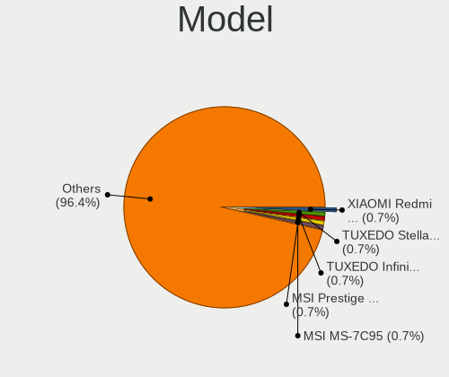
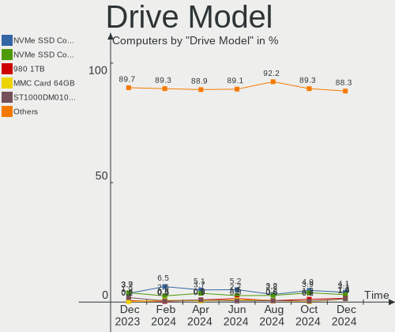
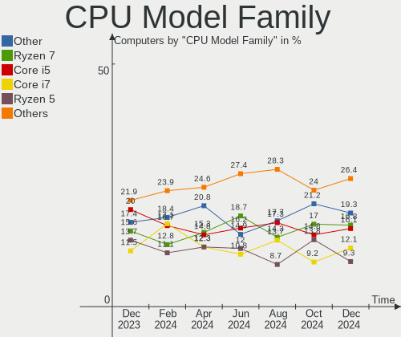
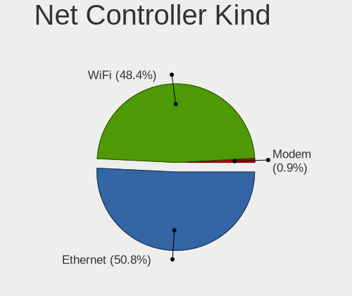
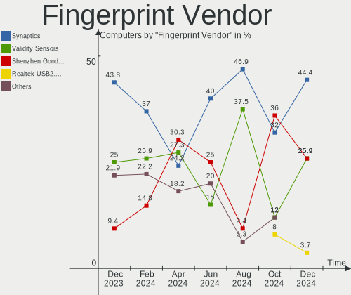
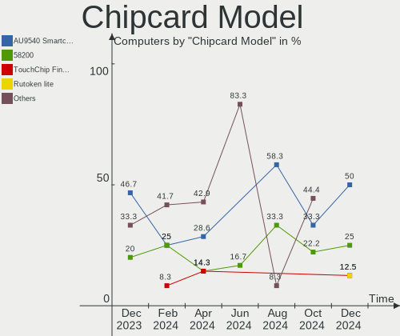

Arch Hardware Trends
--------------------

A project to identify most popular hardware characteristics and track their change
over time based on data collected by Arch users at https://Linux-Hardware.org.

Anyone can contribute to the study by uploading probes of their computers by
the [hw-probe](https://github.com/linuxhw/hw-probe) tool:

    sudo -E hw-probe -all -upload

This is a report for all computer types. See also reports for [desktops](/Dist/Arch/Desktop/README.md) and [notebooks](/Dist/Arch/Notebook/README.md).

Full-feature report is available here: https://linux-hardware.org/?view=trends

Period: Mar, 2021.

Contents
--------

- [ OS                       ](#os)
- [ OS Family                ](#os-family)
- [ Kernel                   ](#kernel)
- [ Kernel Family            ](#kernel-family)
- [ Kernel Major Ver.        ](#kernel-major-ver)
- [ Arch                     ](#arch)
- [ DE                       ](#de)
- [ Display Server           ](#display-server)
- [ Display Manager          ](#display-manager)
- [ OS Lang                  ](#os-lang)
- [ Boot Mode                ](#boot-mode)
- [ Filesystem               ](#filesystem)
- [ Part. scheme             ](#part-scheme)
- [ Dual Boot with Linux/BSD ](#dual-boot-with-linux/bsd)
- [ Dual Boot (Win)          ](#dual-boot-win)
- [ Country                  ](#country)
- [ City                     ](#city)
- [ Vendor                   ](#vendor)
- [ Model                    ](#model)
- [ Model Family             ](#model-family)
- [ MFG Year                 ](#mfg-year)
- [ Form Factor              ](#form-factor)
- [ Secure Boot              ](#secure-boot)
- [ Coreboot                 ](#coreboot)
- [ RAM Size                 ](#ram-size)
- [ RAM Used                 ](#ram-used)
- [ Has CD-ROM               ](#has-cd-rom)
- [ Total Drives             ](#total-drives)
- [ Has Ethernet             ](#has-ethernet)
- [ Has WiFi                 ](#has-wifi)
- [ Has Bluetooth            ](#has-bluetooth)
- [ Drive Vendor             ](#drive-vendor)
- [ Drive Model              ](#drive-model)
- [ HDD Vendor               ](#hdd-vendor)
- [ SSD Vendor               ](#ssd-vendor)
- [ Drive Kind               ](#drive-kind)
- [ Drive Connector          ](#drive-connector)
- [ Drive Size               ](#drive-size)
- [ Space Total              ](#space-total)
- [ Space Used               ](#space-used)
- [ Malfunc. Drives          ](#malfunc-drives)
- [ Malfunc. Drive Vendor    ](#malfunc-drive-vendor)
- [ Malfunc. HDD Vendor      ](#malfunc-hdd-vendor)
- [ Malfunc. Drive Kind      ](#malfunc-drive-kind)
- [ Failed Drives            ](#failed-drives)
- [ Failed Drive Vendor      ](#failed-drive-vendor)
- [ Drive Status             ](#drive-status)
- [ Storage Vendor           ](#storage-vendor)
- [ Storage Model            ](#storage-model)
- [ Storage Kind             ](#storage-kind)
- [ CPU Vendor               ](#cpu-vendor)
- [ CPU Model                ](#cpu-model)
- [ CPU Model Family         ](#cpu-model-family)
- [ CPU Cores                ](#cpu-cores)
- [ CPU Sockets              ](#cpu-sockets)
- [ CPU Threads              ](#cpu-threads)
- [ CPU Op-Modes             ](#cpu-op-modes)
- [ CPU Microcode            ](#cpu-microcode)
- [ CPU Microarch            ](#cpu-microarch)
- [ GPU Vendor               ](#gpu-vendor)
- [ GPU Model                ](#gpu-model)
- [ GPU Combo                ](#gpu-combo)
- [ GPU Driver               ](#gpu-driver)
- [ GPU Memory               ](#gpu-memory)
- [ Monitor Vendor           ](#monitor-vendor)
- [ Monitor Model            ](#monitor-model)
- [ Monitor Resolution       ](#monitor-resolution)
- [ Monitor Diagonal         ](#monitor-diagonal)
- [ Monitor Width            ](#monitor-width)
- [ Aspect Ratio             ](#aspect-ratio)
- [ Monitor Area             ](#monitor-area)
- [ Pixel Density            ](#pixel-density)
- [ Multiple Monitors        ](#multiple-monitors)
- [ Net Controller Vendor    ](#net-controller-vendor)
- [ Net Controller Model     ](#net-controller-model)
- [ Wireless Vendor          ](#wireless-vendor)
- [ Wireless Model           ](#wireless-model)
- [ Ethernet Vendor          ](#ethernet-vendor)
- [ Ethernet Model           ](#ethernet-model)
- [ Net Controller Kind      ](#net-controller-kind)
- [ Used Controller          ](#used-controller)
- [ NICs                     ](#nics)
- [ IPv6                     ](#ipv6)
- [ Memory Vendor            ](#memory-vendor)
- [ Memory Model             ](#memory-model)
- [ Memory Kind              ](#memory-kind)
- [ Memory Form Factor       ](#memory-form-factor)
- [ Memory Size              ](#memory-size)
- [ Memory Speed             ](#memory-speed)
- [ Sound Vendor             ](#sound-vendor)
- [ Sound Model              ](#sound-model)
- [ Camera Vendor            ](#camera-vendor)
- [ Camera Model             ](#camera-model)
- [ Fingerprint Vendor       ](#fingerprint-vendor)
- [ Fingerprint Model        ](#fingerprint-model)
- [ Chipcard Vendor          ](#chipcard-vendor)
- [ Chipcard Model           ](#chipcard-model)
- [ Printer Vendor           ](#printer-vendor)
- [ Printer Model            ](#printer-model)
- [ Scanner Vendor           ](#scanner-vendor)
- [ Scanner Model            ](#scanner-model)
- [ Bluetooth Vendor         ](#bluetooth-vendor)
- [ Bluetooth Model          ](#bluetooth-model)
- [ Unsupported Devices      ](#unsupported-devices)
- [ Unsupported Device Types ](#unsupported-device-types)

OS
--

Installed operating systems

| Name         | Computers | Percent |
|--------------|-----------|---------|
| Arch         | 104       | 50.73%  |
| Arch Rolling | 101       | 49.27%  |

OS Family
---------

OS without a version

| Name | Computers | Percent |
|------|-----------|---------|
| Arch | 205       | 100%    |

Kernel
------

Version of the Linux kernel

| Version                     | Computers | Percent |
|-----------------------------|-----------|---------|
| 5.11.6-arch1-1              | 35        | 17.07%  |
| 5.11.2-arch1-1              | 27        | 13.17%  |
| 5.11.7-arch1-1              | 18        | 8.78%   |
| 5.11.4-arch1-1              | 12        | 5.85%   |
| 5.11.2-zen1-1-zen           | 12        | 5.85%   |
| 5.11.8-arch1-1              | 10        | 4.88%   |
| 5.11.6-zen1-1-zen           | 10        | 4.88%   |
| 5.11.10-arch1-1             | 9         | 4.39%   |
| 5.11.5-arch1-1              | 8         | 3.9%    |
| 5.10.23-1-lts               | 7         | 3.41%   |
| 5.11.9-arch1-1              | 5         | 2.44%   |
| 5.11.1-arch1-1              | 5         | 2.44%   |
| 5.10.24-1-lts               | 5         | 2.44%   |
| 5.11.11-arch1-1             | 3         | 1.46%   |
| 5.10.19-1-lts               | 3         | 1.46%   |
| 5.10.16-arch1-1             | 3         | 1.46%   |
| 5.10.11-arch1-1             | 3         | 1.46%   |
| 5.9.2-arch1-1               | 2         | 0.98%   |
| 5.11.6-hardened1-1-hardened | 2         | 0.98%   |
| 5.11.4-zen1-1-zen           | 2         | 0.98%   |
| 5.10.25-1-lts               | 2         | 0.98%   |
| 5.9.0-arch1-1               | 1         | 0.49%   |
| 5.11.9-zen1-1-zen           | 1         | 0.49%   |
| 5.11.9-xanmod1-1            | 1         | 0.49%   |
| 5.11.8-zen1-1-zen           | 1         | 0.49%   |
| 5.11.8-2-ck-skylake         | 1         | 0.49%   |
| 5.11.7-zen1-1-zen           | 1         | 0.49%   |
| 5.11.6-xanmod1-1            | 1         | 0.49%   |
| 5.11.6-lqx1-1-lqx           | 1         | 0.49%   |
| 5.11.6-gentoo               | 1         | 0.49%   |
| 5.11.6-artix1-1             | 1         | 0.49%   |
| 5.11.6-138-tkg-bmq          | 1         | 0.49%   |
| 5.11.6-137-tkg-pds          | 1         | 0.49%   |
| 5.11.5-zen1-1-zen           | 1         | 0.49%   |
| 5.11.5-xanmod1-1            | 1         | 0.49%   |
| 5.11.3.ll28-1-LG-git        | 1         | 0.49%   |
| 5.11.2-lqx2-1-lqx-native    | 1         | 0.49%   |
| 5.11.2-arch1-1-g14          | 1         | 0.49%   |
| 5.11.11-zen1-1-zen          | 1         | 0.49%   |
| 5.11.10-zen1-1-zen          | 1         | 0.49%   |
| 5.10.3-arch1-1              | 1         | 0.49%   |
| 5.10.16-zen1-1-zen          | 1         | 0.49%   |
| 5.0.13-arch1-1-ARCH         | 1         | 0.49%   |

Kernel Family
-------------

Linux kernel without a distro release

| Version | Computers | Percent |
|---------|-----------|---------|
| 5.11.6  | 53        | 25.85%  |
| 5.11.2  | 41        | 20%     |
| 5.11.7  | 19        | 9.27%   |
| 5.11.4  | 14        | 6.83%   |
| 5.11.8  | 12        | 5.85%   |
| 5.11.5  | 10        | 4.88%   |
| 5.11.10 | 10        | 4.88%   |
| 5.11.9  | 7         | 3.41%   |
| 5.10.23 | 7         | 3.41%   |
| 5.11.1  | 5         | 2.44%   |
| 5.10.24 | 5         | 2.44%   |
| 5.11.11 | 4         | 1.95%   |
| 5.10.16 | 4         | 1.95%   |
| 5.10.19 | 3         | 1.46%   |
| 5.10.11 | 3         | 1.46%   |
| 5.9.2   | 2         | 0.98%   |
| 5.10.25 | 2         | 0.98%   |
| 5.9.0   | 1         | 0.49%   |
| 5.11.3  | 1         | 0.49%   |
| 5.10.3  | 1         | 0.49%   |
| 5.0.13  | 1         | 0.49%   |

Kernel Major Ver.
-----------------

Linux kernel major version

| Version | Computers | Percent |
|---------|-----------|---------|
| 5.11    | 176       | 85.85%  |
| 5.10    | 25        | 12.2%   |
| 5.9     | 3         | 1.46%   |
| 5.0     | 1         | 0.49%   |

Arch
----

OS architecture (x86_64, i586, etc.)

| Name   | Computers | Percent |
|--------|-----------|---------|
| x86_64 | 205       | 100%    |

DE
--

Desktop Environment

| Name            | Computers | Percent |
|-----------------|-----------|---------|
| GNOME           | 61        | 29.76%  |
| KDE5            | 44        | 21.46%  |
| XFCE            | 18        | 8.78%   |
| Unknown         | 17        | 8.29%   |
| i3              | 16        | 7.8%    |
| KDE             | 15        | 7.32%   |
| MATE            | 6         | 2.93%   |
| Cinnamon        | 6         | 2.93%   |
| Sway            | 4         | 1.95%   |
| GNOME Flashback | 3         | 1.46%   |
| Deepin          | 3         | 1.46%   |
| Unity           | 2         | 0.98%   |
| DWM             | 2         | 0.98%   |
| Budgie          | 2         | 0.98%   |
| xmonad          | 1         | 0.49%   |
| X-Cinnamon      | 1         | 0.49%   |
| qtile           | 1         | 0.49%   |
| LXQt            | 1         | 0.49%   |
| bspwm           | 1         | 0.49%   |
| awesome         | 1         | 0.49%   |

Display Server
--------------

X11 or Wayland

| Name    | Computers | Percent |
|---------|-----------|---------|
| X11     | 130       | 63.41%  |
| Wayland | 38        | 18.54%  |
| Tty     | 27        | 13.17%  |
| Unknown | 10        | 4.88%   |

Display Manager
---------------

SDDM, LightDM, etc.

| Name    | Computers | Percent |
|---------|-----------|---------|
| Unknown | 75        | 36.59%  |
| SDDM    | 49        | 23.9%   |
| TDM     | 29        | 14.15%  |
| GDM     | 27        | 13.17%  |
| LightDM | 16        | 7.8%    |
| XDM     | 4         | 1.95%   |
| Ly      | 3         | 1.46%   |
| SLiM    | 1         | 0.49%   |
| LXDM    | 1         | 0.49%   |

OS Lang
-------

Language

| Lang       | Computers | Percent |
|------------|-----------|---------|
| en_US      | 107       | 52.2%   |
| ru_RU      | 17        | 8.29%   |
| pl_PL      | 9         | 4.39%   |
| en_GB      | 9         | 4.39%   |
| pt_BR      | 7         | 3.41%   |
| C          | 7         | 3.41%   |
| Unknown    | 6         | 2.93%   |
| it_IT      | 4         | 1.95%   |
| fr_FR      | 4         | 1.95%   |
| en_IE      | 4         | 1.95%   |
| de_DE      | 4         | 1.95%   |
| zh_CN      | 2         | 0.98%   |
| es_ES      | 2         | 0.98%   |
| en_CA      | 2         | 0.98%   |
| en_AU      | 2         | 0.98%   |
| el_GR      | 2         | 0.98%   |
| uk_UA      | 1         | 0.49%   |
| tr_TR      | 1         | 0.49%   |
| sk_SK      | 1         | 0.49%   |
| ru_RU.UTF8 | 1         | 0.49%   |
| pt_BR.UTF8 | 1         | 0.49%   |
| osa_US     | 1         | 0.49%   |
| hu_HU      | 1         | 0.49%   |
| es_MX      | 1         | 0.49%   |
| es_GT      | 1         | 0.49%   |
| en_US.UTF8 | 1         | 0.49%   |
| en_NZ      | 1         | 0.49%   |
| en_NL      | 1         | 0.49%   |
| en_IN      | 1         | 0.49%   |
| en_DK      | 1         | 0.49%   |
| de_CH      | 1         | 0.49%   |
| de_AT      | 1         | 0.49%   |
| an_ES      | 1         | 0.49%   |

Boot Mode
---------

EFI or BIOS

| Mode | Computers | Percent |
|------|-----------|---------|
| EFI  | 119       | 58.05%  |
| BIOS | 86        | 41.95%  |

Filesystem
----------

Type of filesystem

| Type    | Computers | Percent |
|---------|-----------|---------|
| Ext4    | 147       | 71.71%  |
| Btrfs   | 42        | 20.49%  |
| Xfs     | 5         | 2.44%   |
| Zfs     | 3         | 1.46%   |
| Overlay | 3         | 1.46%   |
| F2fs    | 2         | 0.98%   |
| Unknown | 2         | 0.98%   |
| Ext2    | 1         | 0.49%   |

Part. scheme
------------

Scheme of partitioning

| Type    | Computers | Percent |
|---------|-----------|---------|
| GPT     | 142       | 69.27%  |
| Unknown | 45        | 21.95%  |
| MBR     | 18        | 8.78%   |

Dual Boot with Linux/BSD
------------------------

Hosting more than one Linux/BSD

| Dual boot | Computers | Percent |
|-----------|-----------|---------|
| No        | 181       | 88.29%  |
| Yes       | 24        | 11.71%  |

Dual Boot (Win)
---------------

Hosting Linux and Windows

| Dual boot | Computers | Percent |
|-----------|-----------|---------|
| No        | 131       | 63.9%   |
| Yes       | 74        | 36.1%   |

Country
-------

Geographic location (country)

| Country        | Computers | Percent |
|----------------|-----------|---------|
| USA            | 34        | 16.59%  |
| Russia         | 33        | 16.1%   |
| Germany        | 16        | 7.8%    |
| Poland         | 13        | 6.34%   |
| Brazil         | 9         | 4.39%   |
| UK             | 8         | 3.9%    |
| Italy          | 8         | 3.9%    |
| Ukraine        | 7         | 3.41%   |
| France         | 6         | 2.93%   |
| Turkey         | 5         | 2.44%   |
| Netherlands    | 4         | 1.95%   |
| Canada         | 4         | 1.95%   |
| Sweden         | 3         | 1.46%   |
| Qatar          | 3         | 1.46%   |
| Hungary        | 3         | 1.46%   |
| Greece         | 3         | 1.46%   |
| Denmark        | 3         | 1.46%   |
| Austria        | 3         | 1.46%   |
| Uzbekistan     | 2         | 0.98%   |
| Spain          | 2         | 0.98%   |
| Norway         | 2         | 0.98%   |
| New Zealand    | 2         | 0.98%   |
| Japan          | 2         | 0.98%   |
| India          | 2         | 0.98%   |
| China          | 2         | 0.98%   |
| Bulgaria       | 2         | 0.98%   |
| Belgium        | 2         | 0.98%   |
| Belarus        | 2         | 0.98%   |
| Australia      | 2         | 0.98%   |
| Argentina      | 2         | 0.98%   |
| Switzerland    | 1         | 0.49%   |
| Slovakia       | 1         | 0.49%   |
| Singapore      | 1         | 0.49%   |
| Serbia         | 1         | 0.49%   |
| Romania        | 1         | 0.49%   |
| Nigeria        | 1         | 0.49%   |
| Morocco        | 1         | 0.49%   |
| Mexico         | 1         | 0.49%   |
| Latvia         | 1         | 0.49%   |
| Ireland        | 1         | 0.49%   |
| Hong Kong      | 1         | 0.49%   |
| Guatemala      | 1         | 0.49%   |
| Czechia        | 1         | 0.49%   |
| Cayman Islands | 1         | 0.49%   |
| Bangladesh     | 1         | 0.49%   |
| Algeria        | 1         | 0.49%   |

City
----

Geographic location (city)

| City                | Computers | Percent |
|---------------------|-----------|---------|
| Moscow              | 9         | 4.39%   |
| St Petersburg       | 5         | 2.44%   |
| Washington          | 3         | 1.46%   |
| Krasnodar           | 3         | 1.46%   |
| Doha                | 3         | 1.46%   |
| Campinas            | 3         | 1.46%   |
| Berlin              | 3         | 1.46%   |
| Warsaw              | 2         | 0.98%   |
| Vienna              | 2         | 0.98%   |
| Valencia            | 2         | 0.98%   |
| Tashkent            | 2         | 0.98%   |
| San Jose            | 2         | 0.98%   |
| Rome                | 2         | 0.98%   |
| Lodz                | 2         | 0.98%   |
| Kyiv                | 2         | 0.98%   |
| Budapest            | 2         | 0.98%   |
| Athens              | 2         | 0.98%   |
| Aachen              | 2         | 0.98%   |
| České Budějovice | 1         | 0.49%   |
| Ålesund            | 1         | 0.49%   |
| Zaporizhzhya        | 1         | 0.49%   |
| Yekaterinburg       | 1         | 0.49%   |
| Wuhan               | 1         | 0.49%   |
| Wroclaw             | 1         | 0.49%   |
| West Lafayette      | 1         | 0.49%   |
| Wałbrzych          | 1         | 0.49%   |
| Voronezh            | 1         | 0.49%   |
| Vol'ginskiy         | 1         | 0.49%   |
| Vladivostok         | 1         | 0.49%   |
| Urla                | 1         | 0.49%   |
| Ufa                 | 1         | 0.49%   |
| Troyan Municipality | 1         | 0.49%   |
| Topoľčany         | 1         | 0.49%   |
| Thessaloniki        | 1         | 0.49%   |
| Ternovka            | 1         | 0.49%   |
| Tangier             | 1         | 0.49%   |
| Szeged              | 1         | 0.49%   |
| Sydney              | 1         | 0.49%   |
| Suchy Las           | 1         | 0.49%   |
| Stalowa Wola        | 1         | 0.49%   |
| St Louis            | 1         | 0.49%   |
| Singapore           | 1         | 0.49%   |
| Sierra Vista        | 1         | 0.49%   |
| Shreveport          | 1         | 0.49%   |
| Shanghai            | 1         | 0.49%   |
| Serpukhov           | 1         | 0.49%   |
| Saratov             | 1         | 0.49%   |
| Sao Jose            | 1         | 0.49%   |
| Santos              | 1         | 0.49%   |
| Santa Barbara       | 1         | 0.49%   |
| San Ramon           | 1         | 0.49%   |
| San Diego           | 1         | 0.49%   |
| Salt Lake City      | 1         | 0.49%   |
| Saitama             | 1         | 0.49%   |
| Rostov-on-Don       | 1         | 0.49%   |
| Rosemount           | 1         | 0.49%   |
| Rorbas              | 1         | 0.49%   |
| Riga                | 1         | 0.49%   |
| Québec             | 1         | 0.49%   |
| Quetzaltenango      | 1         | 0.49%   |

Vendor
------

Motherboard manufacturer

| Name                | Computers | Percent |
|---------------------|-----------|---------|
| ASUSTek Computer    | 45        | 21.95%  |
| Lenovo              | 36        | 17.56%  |
| Gigabyte Technology | 28        | 13.66%  |
| Dell                | 23        | 11.22%  |
| MSI                 | 17        | 8.29%   |
| Hewlett-Packard     | 17        | 8.29%   |
| ASRock              | 13        | 6.34%   |
| Acer                | 6         | 2.93%   |
| Intel               | 5         | 2.44%   |
| TUXEDO              | 3         | 1.46%   |
| Toshiba             | 1         | 0.49%   |
| Samsung Electronics | 1         | 0.49%   |
| PCWare              | 1         | 0.49%   |
| PC Engines          | 1         | 0.49%   |
| Microsoft           | 1         | 0.49%   |
| Micro Electronics   | 1         | 0.49%   |
| Medion              | 1         | 0.49%   |
| ECS                 | 1         | 0.49%   |
| China               | 1         | 0.49%   |
| Casper              | 1         | 0.49%   |
| Apple               | 1         | 0.49%   |
| Unknown             | 1         | 0.49%   |

Model
-----

Motherboard model

| Name                                        | Computers | Percent |
|---------------------------------------------|-----------|---------|
| Gigabyte B450 AORUS ELITE                   | 4         | 1.95%   |
| MSI MS-7B86                                 | 3         | 1.46%   |
| Gigabyte X470 AORUS ULTRA GAMING            | 3         | 1.46%   |
| Lenovo Legion 5 15ARH05 82B5                | 2         | 0.98%   |
| Gigabyte X570 I AORUS PRO WIFI              | 2         | 0.98%   |
| Gigabyte X570 AORUS ELITE                   | 2         | 0.98%   |
| Dell XPS 15 9570                            | 2         | 0.98%   |
| ASUS Z170-P                                 | 2         | 0.98%   |
| Unknown                                     | 2         | 0.98%   |
| TUXEDO Pulse 15 Gen1                        | 1         | 0.49%   |
| TUXEDO InfinityBook S 14 Gen6               | 1         | 0.49%   |
| TUXEDO Book BA1510                          | 1         | 0.49%   |
| Toshiba PORTEGE R30-A                       | 1         | 0.49%   |
| Samsung DP700A3D/DM700A3D/DB701A3D/DP700A7D | 1         | 0.49%   |
| PCWare IPMH81G1                             | 1         | 0.49%   |
| PC Engines apu2                             | 1         | 0.49%   |
| MSI Prestige 14Evo A11M                     | 1         | 0.49%   |
| MSI MS-7C35                                 | 1         | 0.49%   |
| MSI MS-7C13                                 | 1         | 0.49%   |
| MSI MS-7B84                                 | 1         | 0.49%   |
| MSI MS-7B79                                 | 1         | 0.49%   |
| MSI MS-7A68                                 | 1         | 0.49%   |
| MSI MS-7A38                                 | 1         | 0.49%   |
| MSI MS-7A34                                 | 1         | 0.49%   |
| MSI MS-7922                                 | 1         | 0.49%   |
| MSI MS-7693                                 | 1         | 0.49%   |
| MSI MS-7640                                 | 1         | 0.49%   |
| MSI MS-7267                                 | 1         | 0.49%   |
| MSI GV62 8RD                                | 1         | 0.49%   |
| MSI GT80 2QE                                | 1         | 0.49%   |
| Microsoft Surface Pro 4                     | 1         | 0.49%   |
| Micro 1530                                  | 1         | 0.49%   |
| Medion D3F3-EM                              | 1         | 0.49%   |
| Lenovo Yoga C940-14IIL 81Q9                 | 1         | 0.49%   |
| Lenovo Yoga Book C930 ZA3S                  | 1         | 0.49%   |
| Lenovo Yoga 900-13ISK 80MK                  | 1         | 0.49%   |
| Lenovo Yoga 530-14ARR 81H9                  | 1         | 0.49%   |
| Lenovo Yoga 310-11IAP 80U2                  | 1         | 0.49%   |
| Lenovo Y520-15IKBA 80WY                     | 1         | 0.49%   |
| Lenovo ThinkPad X280 20KES3F7TH             | 1         | 0.49%   |
| Lenovo ThinkPad X250 20CLS0PU00             | 1         | 0.49%   |
| Lenovo ThinkPad X230 23252QG                | 1         | 0.49%   |
| Lenovo ThinkPad X220 4291B66                | 1         | 0.49%   |
| Lenovo ThinkPad X220 4290LA9                | 1         | 0.49%   |
| Lenovo ThinkPad X200 7459KM3                | 1         | 0.49%   |
| Lenovo ThinkPad X1 Carbon 6th 20KH002RUS    | 1         | 0.49%   |
| Lenovo ThinkPad T590 20N4004UMB             | 1         | 0.49%   |
| Lenovo ThinkPad T490 20RYS0K400             | 1         | 0.49%   |
| Lenovo ThinkPad T460s 20F90043GE            | 1         | 0.49%   |
| Lenovo ThinkPad T440p 20AWA0LUPB            | 1         | 0.49%   |
| Lenovo ThinkPad P14s Gen 1 20Y1000LRT       | 1         | 0.49%   |
| Lenovo ThinkPad L15 Gen 1 20U7001YTX        | 1         | 0.49%   |
| Lenovo ThinkPad E585 20KV0008GE             | 1         | 0.49%   |
| Lenovo ThinkPad E570 20H500B1RT             | 1         | 0.49%   |
| Lenovo ThinkPad E15 Gen 2 20TD0005MH        | 1         | 0.49%   |
| Lenovo ThinkPad E14 Gen 2 20T6000SIX        | 1         | 0.49%   |
| Lenovo ThinkBook 14 G2 ARE 20VF             | 1         | 0.49%   |
| Lenovo S10-3                                | 1         | 0.49%   |
| Lenovo Legion R7000 2020 82B6               | 1         | 0.49%   |
| Lenovo Legion 7 15IMH05 81YT                | 1         | 0.49%   |

Model Family
------------

Motherboard model prefix

| Name                | Computers | Percent |
|---------------------|-----------|---------|
| Lenovo ThinkPad     | 17        | 8.29%   |
| HP EliteBook        | 7         | 3.41%   |
| Dell Latitude       | 7         | 3.41%   |
| Dell Inspiron       | 7         | 3.41%   |
| ASUS TUF            | 7         | 3.41%   |
| ASUS ROG            | 7         | 3.41%   |
| Gigabyte X570       | 6         | 2.93%   |
| Lenovo Yoga         | 5         | 2.44%   |
| Gigabyte B450       | 5         | 2.44%   |
| Dell XPS            | 5         | 2.44%   |
| Lenovo Legion       | 4         | 1.95%   |
| ASUS PRIME          | 4         | 1.95%   |
| Acer Aspire         | 4         | 1.95%   |
| MSI MS-7B86         | 3         | 1.46%   |
| Lenovo IdeaPad      | 3         | 1.46%   |
| Gigabyte X470       | 3         | 1.46%   |
| ASUS VivoBook       | 3         | 1.46%   |
| HP ProBook          | 2         | 0.98%   |
| HP Laptop           | 2         | 0.98%   |
| HP Compaq           | 2         | 0.98%   |
| Dell Vostro         | 2         | 0.98%   |
| ASUS Z170-P         | 2         | 0.98%   |
| ASUS SABERTOOTH     | 2         | 0.98%   |
| ASUS Maximus        | 2         | 0.98%   |
| ASRock X570         | 2         | 0.98%   |
| ASRock B450M        | 2         | 0.98%   |
| ASRock B450         | 2         | 0.98%   |
| Acer Nitro          | 2         | 0.98%   |
| Unknown             | 2         | 0.98%   |
| TUXEDO Pulse        | 1         | 0.49%   |
| TUXEDO InfinityBook | 1         | 0.49%   |
| TUXEDO Book         | 1         | 0.49%   |
| Toshiba PORTEGE     | 1         | 0.49%   |
| Samsung DP700A3D    | 1         | 0.49%   |
| PCWare IPMH81G1     | 1         | 0.49%   |
| PC Engines apu2     | 1         | 0.49%   |
| MSI Prestige        | 1         | 0.49%   |
| MSI MS-7C35         | 1         | 0.49%   |
| MSI MS-7C13         | 1         | 0.49%   |
| MSI MS-7B84         | 1         | 0.49%   |
| MSI MS-7B79         | 1         | 0.49%   |
| MSI MS-7A68         | 1         | 0.49%   |
| MSI MS-7A38         | 1         | 0.49%   |
| MSI MS-7A34         | 1         | 0.49%   |
| MSI MS-7922         | 1         | 0.49%   |
| MSI MS-7693         | 1         | 0.49%   |
| MSI MS-7640         | 1         | 0.49%   |
| MSI MS-7267         | 1         | 0.49%   |
| MSI GV62            | 1         | 0.49%   |
| MSI GT80            | 1         | 0.49%   |
| Microsoft Surface   | 1         | 0.49%   |
| Micro 1530          | 1         | 0.49%   |
| Medion D3F3-EM      | 1         | 0.49%   |
| Lenovo Y520-15IKBA  | 1         | 0.49%   |
| Lenovo ThinkBook    | 1         | 0.49%   |
| Lenovo S10-3        | 1         | 0.49%   |
| Lenovo H415         | 1         | 0.49%   |
| Lenovo G500         | 1         | 0.49%   |
| Lenovo G40-80       | 1         | 0.49%   |
| Intel X99           | 1         | 0.49%   |

MFG Year
--------

Motherboard manufacture year

| Year | Computers | Percent |
|------|-----------|---------|
| 2020 | 62        | 30.24%  |
| 2019 | 48        | 23.41%  |
| 2018 | 24        | 11.71%  |
| 2021 | 15        | 7.32%   |
| 2017 | 10        | 4.88%   |
| 2015 | 9         | 4.39%   |
| 2014 | 9         | 4.39%   |
| 2016 | 8         | 3.9%    |
| 2013 | 7         | 3.41%   |
| 2012 | 5         | 2.44%   |
| 2011 | 3         | 1.46%   |
| 2010 | 2         | 0.98%   |
| 2008 | 2         | 0.98%   |
| 2009 | 1         | 0.49%   |

Form Factor
-----------

Physical design of the computer

| Name        | Computers | Percent |
|-------------|-----------|---------|
| Desktop     | 95        | 46.34%  |
| Notebook    | 94        | 45.85%  |
| Convertible | 11        | 5.37%   |
| Mini pc     | 3         | 1.46%   |
| Tablet      | 1         | 0.49%   |
| All in one  | 1         | 0.49%   |

Secure Boot
-----------

Enabled or disabled

| State    | Computers | Percent |
|----------|-----------|---------|
| Disabled | 205       | 100%    |

Coreboot
--------

Have coreboot on board

| Used | Computers | Percent |
|------|-----------|---------|
| No   | 202       | 98.54%  |
| Yes  | 3         | 1.46%   |

RAM Size
--------

Total RAM memory

| Size in GB  | Computers | Percent |
|-------------|-----------|---------|
| 16.01-24.0  | 63        | 30.73%  |
| 32.01-64.0  | 43        | 20.98%  |
| 8.01-16.0   | 40        | 19.51%  |
| 4.01-8.0    | 34        | 16.59%  |
| 3.01-4.0    | 15        | 7.32%   |
| 64.01-256.0 | 5         | 2.44%   |
| 24.01-32.0  | 3         | 1.46%   |
| 1.01-2.0    | 2         | 0.98%   |

RAM Used
--------

Used RAM memory

| Used GB    | Computers | Percent |
|------------|-----------|---------|
| 4.01-8.0   | 51        | 24.88%  |
| 2.01-3.0   | 44        | 21.46%  |
| 3.01-4.0   | 39        | 19.02%  |
| 1.01-2.0   | 37        | 18.05%  |
| 8.01-16.0  | 18        | 8.78%   |
| 0.51-1.0   | 9         | 4.39%   |
| 16.01-24.0 | 5         | 2.44%   |
| 24.01-32.0 | 1         | 0.49%   |
| 0.01-0.5   | 1         | 0.49%   |

Has CD-ROM
----------

Has CD-ROM on board

| Presented | Computers | Percent |
|-----------|-----------|---------|
| No        | 171       | 83.41%  |
| Yes       | 34        | 16.59%  |

Total Drives
------------

Number of drives on board

| Drives | Computers | Percent |
|--------|-----------|---------|
| 1      | 87        | 42.44%  |
| 2      | 61        | 29.76%  |
| 3      | 30        | 14.63%  |
| 4      | 15        | 7.32%   |
| 5      | 7         | 3.41%   |
| 6      | 2         | 0.98%   |
| 11     | 1         | 0.49%   |
| 7      | 1         | 0.49%   |
| 0      | 1         | 0.49%   |

Has Ethernet
------------

Has Ethernet on board

| Presented | Computers | Percent |
|-----------|-----------|---------|
| Yes       | 178       | 86.83%  |
| No        | 27        | 13.17%  |

Has WiFi
--------

Has WiFi module

| Presented | Computers | Percent |
|-----------|-----------|---------|
| Yes       | 145       | 70.73%  |
| No        | 60        | 29.27%  |

Has Bluetooth
-------------

Has Bluetooth module

| Presented | Computers | Percent |
|-----------|-----------|---------|
| Yes       | 129       | 62.93%  |
| No        | 76        | 37.07%  |

Drive Vendor
------------

Hard drive vendors

| Vendor                    | Computers | Drives | Percent |
|---------------------------|-----------|--------|---------|
| Samsung Electronics       | 67        | 83     | 18.77%  |
| WDC                       | 51        | 71     | 14.29%  |
| Seagate                   | 49        | 69     | 13.73%  |
| Kingston                  | 24        | 25     | 6.72%   |
| Toshiba                   | 22        | 24     | 6.16%   |
| Sandisk                   | 14        | 14     | 3.92%   |
| Crucial                   | 14        | 15     | 3.92%   |
| Intel                     | 13        | 14     | 3.64%   |
| HGST                      | 9         | 11     | 2.52%   |
| Unknown                   | 8         | 8      | 2.24%   |
| Micron Technology         | 8         | 8      | 2.24%   |
| A-DATA Technology         | 8         | 8      | 2.24%   |
| Phison                    | 7         | 7      | 1.96%   |
| China                     | 6         | 10     | 1.68%   |
| Hitachi                   | 5         | 5      | 1.4%    |
| SK Hynix                  | 4         | 4      | 1.12%   |
| Corsair                   | 4         | 4      | 1.12%   |
| XPG                       | 3         | 3      | 0.84%   |
| SPCC                      | 3         | 3      | 0.84%   |
| Patriot                   | 3         | 3      | 0.84%   |
| OCZ                       | 3         | 3      | 0.84%   |
| Transcend                 | 2         | 2      | 0.56%   |
| Silicon Motion            | 2         | 2      | 0.56%   |
| PNY                       | 2         | 2      | 0.56%   |
| PLEXTOR                   | 2         | 2      | 0.56%   |
| Micron/Crucial Technology | 2         | 3      | 0.56%   |
| Union Memory              | 1         | 1      | 0.28%   |
| Team                      | 1         | 1      | 0.28%   |
| StoreJet                  | 1         | 1      | 0.28%   |
| STM                       | 1         | 1      | 0.28%   |
| Realtek Semiconductor     | 1         | 1      | 0.28%   |
| PNY USB                   | 1         | 1      | 0.28%   |
| PH4-CE12                  | 1         | 1      | 0.28%   |
| MAXTOR                    | 1         | 1      | 0.28%   |
| Lite-On                   | 1         | 1      | 0.28%   |
| Lexar                     | 1         | 1      | 0.28%   |
| Lenovo                    | 1         | 1      | 0.28%   |
| KIOXIA                    | 1         | 1      | 0.28%   |
| Kingmax                   | 1         | 1      | 0.28%   |
| JMicron                   | 1         | 1      | 0.28%   |
| Intenso                   | 1         | 1      | 0.28%   |
| Hewlett-Packard           | 1         | 1      | 0.28%   |
| GOODRAM                   | 1         | 1      | 0.28%   |
| Gigabyte Technology       | 1         | 1      | 0.28%   |
| BR                        | 1         | 1      | 0.28%   |
| ASMT                      | 1         | 1      | 0.28%   |
| Apple                     | 1         | 1      | 0.28%   |
| AMD                       | 1         | 1      | 0.28%   |

Drive Model
-----------

Hard drive models

| Model                             | Computers | Percent |
|-----------------------------------|-----------|---------|
| Samsung SSD 860 EVO 500GB         | 6         | 1.5%    |
| Samsung SSD 860 EVO 1TB           | 5         | 1.25%   |
| Seagate ST1000DM010-2EP102 1TB    | 4         | 1%      |
| Samsung SSD 970 EVO Plus 500GB    | 4         | 1%      |
| Samsung SSD 850 EVO 500GB         | 4         | 1%      |
| Samsung NVMe SSD Drive 1TB        | 4         | 1%      |
| Kingston SV300S37A120G 120GB SSD  | 4         | 1%      |
| Kingston SA400S37240G 240GB SSD   | 4         | 1%      |
| HGST HTS541010A9E680 1TB          | 4         | 1%      |
| A-DATA SX8200PNP 1TB              | 4         | 1%      |
| XPG NVMe SSD Drive 1TB            | 3         | 0.75%   |
| Toshiba MQ04ABF100 1TB            | 3         | 0.75%   |
| Seagate ST500LT012-1DG142 500GB   | 3         | 0.75%   |
| Seagate ST2000DM006-2DM164 2TB    | 3         | 0.75%   |
| Seagate ST1000LX015-1U7172 1TB    | 3         | 0.75%   |
| Seagate ST1000LM035-1RK172 1TB    | 3         | 0.75%   |
| Seagate Expansion 1TB             | 3         | 0.75%   |
| Samsung SSD 970 EVO Plus 1TB      | 3         | 0.75%   |
| Samsung SSD 970 EVO 500GB         | 3         | 0.75%   |
| Samsung SSD 850 EVO 250GB         | 3         | 0.75%   |
| Samsung SSD 840 EVO 250GB         | 3         | 0.75%   |
| Samsung NVMe SSD Drive 500GB      | 3         | 0.75%   |
| Kingston SA400S37480G 480GB SSD   | 3         | 0.75%   |
| Kingston SA400S37120G 120GB SSD   | 3         | 0.75%   |
| Intel SSDPEKNW512G8 512GB         | 3         | 0.75%   |
| WDC WDS250G1B0B-00AS40 250GB SSD  | 2         | 0.5%    |
| WDC WDS240G2G0A-00JH30 240GB SSD  | 2         | 0.5%    |
| WDC WD5000AAKX-00ERMA0 500GB      | 2         | 0.5%    |
| WDC WD10EZEX-08WN4A0 1TB          | 2         | 0.5%    |
| WDC WD10EARS-00Y5B1 1TB           | 2         | 0.5%    |
| Unknown MMC Card  32GB            | 2         | 0.5%    |
| Toshiba NVMe SSD Drive 256GB      | 2         | 0.5%    |
| Toshiba MQ01ABD100 1TB            | 2         | 0.5%    |
| Seagate ST500DM002-1BD142 500GB   | 2         | 0.5%    |
| Seagate ST2000DM008-2FR102 2TB    | 2         | 0.5%    |
| Seagate ST1000LM014-SSHD-8GB      | 2         | 0.5%    |
| Seagate ST1000DM003-1ER162 1TB    | 2         | 0.5%    |
| Samsung SSD 970 PRO 512GB         | 2         | 0.5%    |
| Samsung SSD 860 QVO 1TB           | 2         | 0.5%    |
| Samsung SSD 860 EVO M.2 500GB     | 2         | 0.5%    |
| Samsung SSD 860 EVO 250GB         | 2         | 0.5%    |
| Samsung SSD 850 PRO 128G          | 2         | 0.5%    |
| Samsung SSD 750 EVO 250GB         | 2         | 0.5%    |
| Samsung NVMe SSD Drive 512GB      | 2         | 0.5%    |
| Samsung MZVLB1T0HBLR-000L2 1TB    | 2         | 0.5%    |
| Phison NVMe SSD Drive 1TB         | 2         | 0.5%    |
| Patriot Burst 480GB SSD           | 2         | 0.5%    |
| OCZ VERTEX4 256GB SSD             | 2         | 0.5%    |
| Micron/Crucial NVMe SSD Drive 1TB | 2         | 0.5%    |
| Micron 2200V_MTFDHBA512TCK 512GB  | 2         | 0.5%    |
| Intel SSDPEKKW256G7 256GB         | 2         | 0.5%    |
| Intel NVMe SSD Drive 512GB        | 2         | 0.5%    |
| Hitachi HTS723232A7A364 320GB     | 2         | 0.5%    |
| HGST HTS721010A9E630 1TB          | 2         | 0.5%    |
| Crucial CT500MX500SSD1 500GB      | 2         | 0.5%    |
| Crucial CT250BX100SSD1 250GB      | 2         | 0.5%    |
| Crucial CT1000MX500SSD4 1TB       | 2         | 0.5%    |
| Crucial CT1000MX500SSD1 1TB       | 2         | 0.5%    |
| Corsair Force MP600 1TB           | 2         | 0.5%    |
| WDC WDS500G3XHC-00SJG0 500GB      | 1         | 0.25%   |

HDD Vendor
----------

Hard disk drive vendors

| Vendor              | Computers | Drives | Percent |
|---------------------|-----------|--------|---------|
| Seagate             | 49        | 67     | 40.83%  |
| WDC                 | 37        | 51     | 30.83%  |
| Toshiba             | 16        | 17     | 13.33%  |
| HGST                | 9         | 11     | 7.5%    |
| Hitachi             | 5         | 5      | 4.17%   |
| Samsung Electronics | 3         | 3      | 2.5%    |
| MAXTOR              | 1         | 1      | 0.83%   |

SSD Vendor
----------

Solid state drive vendors

| Vendor              | Computers | Drives | Percent |
|---------------------|-----------|--------|---------|
| Samsung Electronics | 37        | 42     | 28.24%  |
| Kingston            | 23        | 24     | 17.56%  |
| Crucial             | 12        | 13     | 9.16%   |
| SanDisk             | 10        | 10     | 7.63%   |
| WDC                 | 9         | 9      | 6.87%   |
| China               | 6         | 10     | 4.58%   |
| Patriot             | 3         | 3      | 2.29%   |
| OCZ                 | 3         | 3      | 2.29%   |
| Micron Technology   | 3         | 3      | 2.29%   |
| Intel               | 3         | 3      | 2.29%   |
| Toshiba             | 2         | 3      | 1.53%   |
| SPCC                | 2         | 2      | 1.53%   |
| PNY                 | 2         | 2      | 1.53%   |
| A-DATA Technology   | 2         | 2      | 1.53%   |
| Transcend           | 1         | 1      | 0.76%   |
| Team                | 1         | 1      | 0.76%   |
| SK Hynix            | 1         | 1      | 0.76%   |
| PNY USB             | 1         | 1      | 0.76%   |
| PLEXTOR             | 1         | 1      | 0.76%   |
| Kingmax             | 1         | 1      | 0.76%   |
| JMicron             | 1         | 1      | 0.76%   |
| Intenso             | 1         | 1      | 0.76%   |
| GOODRAM             | 1         | 1      | 0.76%   |
| Corsair             | 1         | 1      | 0.76%   |
| BR                  | 1         | 1      | 0.76%   |
| ASMT                | 1         | 1      | 0.76%   |
| Apple               | 1         | 1      | 0.76%   |
| AMD                 | 1         | 1      | 0.76%   |

Drive Kind
----------

HDD or SSD

| Kind    | Computers | Drives | Percent |
|---------|-----------|--------|---------|
| SSD     | 106       | 143    | 33.76%  |
| HDD     | 102       | 155    | 32.48%  |
| NVMe    | 93        | 113    | 29.62%  |
| MMC     | 7         | 8      | 2.23%   |
| Unknown | 6         | 6      | 1.91%   |

Drive Connector
---------------

SATA, SAS, NVMe, etc.

| Type | Computers | Drives | Percent |
|------|-----------|--------|---------|
| SATA | 151       | 287    | 56.77%  |
| NVMe | 93        | 113    | 34.96%  |
| SAS  | 15        | 17     | 5.64%   |
| MMC  | 7         | 8      | 2.63%   |

Drive Size
----------

Size of hard drive

| Size in TB | Computers | Drives | Percent |
|------------|-----------|--------|---------|
| 0.01-0.5   | 115       | 160    | 51.34%  |
| 0.51-1.0   | 76        | 97     | 33.93%  |
| 1.01-2.0   | 17        | 20     | 7.59%   |
| 3.01-4.0   | 7         | 9      | 3.13%   |
| 4.01-10.0  | 5         | 6      | 2.23%   |
| 2.01-3.0   | 4         | 6      | 1.79%   |

Space Total
-----------

Amount of disk space available on the file system

| Size in GB     | Computers | Percent |
|----------------|-----------|---------|
| 251-500        | 52        | 25.37%  |
| 501-1000       | 42        | 20.49%  |
| 101-250        | 33        | 16.1%   |
| 1001-2000      | 30        | 14.63%  |
| More than 3000 | 17        | 8.29%   |
| 2001-3000      | 14        | 6.83%   |
| 1-20           | 6         | 2.93%   |
| 51-100         | 5         | 2.44%   |
| Unknown        | 4         | 1.95%   |
| 21-50          | 2         | 0.98%   |

Space Used
----------

Amount of used disk space

| Used GB        | Computers | Percent |
|----------------|-----------|---------|
| 101-250        | 43        | 20.98%  |
| 251-500        | 34        | 16.59%  |
| 501-1000       | 25        | 12.2%   |
| 51-100         | 25        | 12.2%   |
| 1-20           | 24        | 11.71%  |
| 21-50          | 21        | 10.24%  |
| 1001-2000      | 17        | 8.29%   |
| 2001-3000      | 8         | 3.9%    |
| More than 3000 | 4         | 1.95%   |
| Unknown        | 4         | 1.95%   |

Malfunc. Drives
---------------

Drive models with a malfunction

| Model                                       | Computers | Drives | Percent |
|---------------------------------------------|-----------|--------|---------|
| Seagate ST500LT012-1DG142 500GB             | 2         | 2      | 6.67%   |
| OCZ VERTEX4 256GB SSD                       | 2         | 2      | 6.67%   |
| WDC WDS240G2G0A-00JH30 240GB SSD            | 1         | 1      | 3.33%   |
| WDC WDS100T2B0B-00YS70 1TB SSD              | 1         | 1      | 3.33%   |
| WDC WD7500BPKT-00PK4T0 752GB                | 1         | 1      | 3.33%   |
| WDC WD5002AALX-00J37A0 500GB                | 1         | 1      | 3.33%   |
| WDC WD20EARX-00PASB0 2TB                    | 1         | 1      | 3.33%   |
| WDC WD15EARS-00Z5B1 1TB                     | 1         | 1      | 3.33%   |
| WDC WD10JPVX-60JC3T1 1TB                    | 1         | 1      | 3.33%   |
| WDC WD10JPVX-22JC3T0 1TB                    | 1         | 1      | 3.33%   |
| WDC WD10JPVX-08JC3T6 1TB                    | 1         | 1      | 3.33%   |
| WDC WD10EARS-00Y5B1 1TB                     | 1         | 1      | 3.33%   |
| Toshiba MK5075GSX 500GB                     | 1         | 1      | 3.33%   |
| Seagate ST9640320AS 640GB                   | 1         | 1      | 3.33%   |
| Seagate ST500LM021-1KJ152 500GB             | 1         | 1      | 3.33%   |
| Seagate ST500LM000-1EJ162 500GB             | 1         | 1      | 3.33%   |
| Seagate ST3500514NS 500GB                   | 1         | 2      | 3.33%   |
| Seagate ST3320620AS 320GB                   | 1         | 1      | 3.33%   |
| Seagate ST320LT020-9YG142 320GB             | 1         | 1      | 3.33%   |
| Seagate ST31000524AS 1TB                    | 1         | 1      | 3.33%   |
| Seagate ST2000DX002-2DV164 2TB              | 1         | 1      | 3.33%   |
| Seagate ST1000LX015-1U7172 1TB              | 1         | 1      | 3.33%   |
| Seagate ST1000LM014-SSHD-8GB                | 1         | 1      | 3.33%   |
| Samsung Electronics SSD PM810 2.5 7mm 128GB | 1         | 1      | 3.33%   |
| Kingston SV300S37A120G 120GB SSD            | 1         | 1      | 3.33%   |
| Intel SSDPEKKW256G7 256GB                   | 1         | 1      | 3.33%   |
| Hitachi HUA722010CLA330 1TB                 | 1         | 1      | 3.33%   |
| Hitachi HTS723232A7A364 320GB               | 1         | 1      | 3.33%   |

Malfunc. Drive Vendor
---------------------

Vendors of faulty drives

| Vendor              | Computers | Drives | Percent |
|---------------------|-----------|--------|---------|
| Seagate             | 11        | 13     | 39.29%  |
| WDC                 | 9         | 10     | 32.14%  |
| OCZ                 | 2         | 2      | 7.14%   |
| Hitachi             | 2         | 2      | 7.14%   |
| Toshiba             | 1         | 1      | 3.57%   |
| Samsung Electronics | 1         | 1      | 3.57%   |
| Kingston            | 1         | 1      | 3.57%   |
| Intel               | 1         | 1      | 3.57%   |

Malfunc. HDD Vendor
-------------------

Vendors of faulty HDD drives

| Vendor  | Computers | Drives | Percent |
|---------|-----------|--------|---------|
| Seagate | 11        | 13     | 52.38%  |
| WDC     | 7         | 8      | 33.33%  |
| Hitachi | 2         | 2      | 9.52%   |
| Toshiba | 1         | 1      | 4.76%   |

Malfunc. Drive Kind
-------------------

Kinds of faulty drives

| Kind | Computers | Drives | Percent |
|------|-----------|--------|---------|
| HDD  | 20        | 24     | 74.07%  |
| SSD  | 6         | 6      | 22.22%  |
| NVMe | 1         | 1      | 3.7%    |

Failed Drives
-------------

Failed drive models

| Model                             | Computers | Drives | Percent |
|-----------------------------------|-----------|--------|---------|
| Samsung Electronics HM251JI 250GB | 1         | 1      | 100%    |

Failed Drive Vendor
-------------------

Failed drive vendors

| Vendor              | Computers | Drives | Percent |
|---------------------|-----------|--------|---------|
| Samsung Electronics | 1         | 1      | 100%    |

Drive Status
------------

Number of failed and malfunc. drives

| Status   | Computers | Drives | Percent |
|----------|-----------|--------|---------|
| Works    | 120       | 219    | 50.42%  |
| Detected | 91        | 174    | 38.24%  |
| Malfunc  | 26        | 31     | 10.92%  |
| Failed   | 1         | 1      | 0.42%   |

Storage Vendor
--------------

Storage controller vendors

| Vendor                       | Computers | Percent |
|------------------------------|-----------|---------|
| Intel                        | 107       | 37.02%  |
| AMD                          | 74        | 25.61%  |
| Samsung Electronics          | 32        | 11.07%  |
| Sandisk                      | 12        | 4.15%   |
| Phison Electronics           | 11        | 3.81%   |
| ASMedia Technology           | 8         | 2.77%   |
| ADATA Technology             | 8         | 2.77%   |
| Micron Technology            | 6         | 2.08%   |
| Silicon Motion               | 5         | 1.73%   |
| Toshiba America Info Systems | 4         | 1.38%   |
| SK Hynix                     | 3         | 1.04%   |
| Micron/Crucial Technology    | 3         | 1.04%   |
| JMicron Technology           | 3         | 1.04%   |
| Lite-On Technology           | 2         | 0.69%   |
| Broadcom / LSI               | 2         | 0.69%   |
| VIA Technologies             | 1         | 0.35%   |
| Union Memory (Shenzhen)      | 1         | 0.35%   |
| Shenzhen Longsys Electronics | 1         | 0.35%   |
| Realtek Semiconductor        | 1         | 0.35%   |
| Marvell Technology Group     | 1         | 0.35%   |
| LSI Logic / Symbios Logic    | 1         | 0.35%   |
| Lenovo                       | 1         | 0.35%   |
| KIOXIA                       | 1         | 0.35%   |
| Kingston Technology Company  | 1         | 0.35%   |

Storage Model
-------------

Storage controller models

| Model                                                                          | Computers | Percent |
|--------------------------------------------------------------------------------|-----------|---------|
| AMD FCH SATA Controller [AHCI mode]                                            | 53        | 16.21%  |
| Samsung NVMe SSD Controller SM981/PM981/PM983                                  | 26        | 7.95%   |
| AMD 400 Series Chipset SATA Controller                                         | 23        | 7.03%   |
| Intel Sunrise Point-LP SATA Controller [AHCI mode]                             | 12        | 3.67%   |
| Intel 82801 Mobile SATA Controller [RAID mode]                                 | 11        | 3.36%   |
| Intel 200 Series PCH SATA controller [AHCI mode]                               | 9         | 2.75%   |
| ASMedia ASM1062 Serial ATA Controller                                          | 8         | 2.45%   |
| ADATA XPG SX8200 Pro PCIe Gen3x4 M.2 2280 Solid State Drive                    | 8         | 2.45%   |
| Intel Q170/Q150/B150/H170/H110/Z170/CM236 Chipset SATA Controller [AHCI Mode]  | 7         | 2.14%   |
| Intel Cannon Lake Mobile PCH SATA AHCI Controller                              | 7         | 2.14%   |
| Intel 8 Series/C220 Series Chipset Family 6-port SATA Controller 1 [AHCI mode] | 7         | 2.14%   |
| Phison E16 PCIe4 NVMe Controller                                               | 6         | 1.83%   |
| Micron Non-Volatile memory controller                                          | 6         | 1.83%   |
| Intel Wildcat Point-LP SATA Controller [AHCI Mode]                             | 6         | 1.83%   |
| Intel 7 Series Chipset Family 6-port SATA Controller [AHCI mode]               | 6         | 1.83%   |
| AMD Starship/Matisse Chipset SATA Controller [AHCI mode]                       | 6         | 1.83%   |
| AMD SB7x0/SB8x0/SB9x0 SATA Controller [AHCI mode]                              | 6         | 1.83%   |
| Phison E12 NVMe Controller                                                     | 4         | 1.22%   |
| Intel SSD 660P Series                                                          | 4         | 1.22%   |
| Intel SSD 600P Series                                                          | 4         | 1.22%   |
| Intel 7 Series/C210 Series Chipset Family 6-port SATA Controller [AHCI mode]   | 4         | 1.22%   |
| AMD SB7x0/SB8x0/SB9x0 IDE Controller                                           | 4         | 1.22%   |
| Silicon Motion SM2262/SM2262EN SSD Controller                                  | 3         | 0.92%   |
| Sandisk WD Black 2018/SN750 / PC SN720 NVMe SSD                                | 3         | 0.92%   |
| Micron/Crucial P1 NVMe PCIe SSD                                                | 3         | 0.92%   |
| Intel HM170/QM170 Chipset SATA Controller [AHCI Mode]                          | 3         | 0.92%   |
| Intel 8 Series SATA Controller 1 [AHCI mode]                                   | 3         | 0.92%   |
| Intel 6 Series/C200 Series Chipset Family 6 port Mobile SATA AHCI Controller   | 3         | 0.92%   |
| Intel 6 Series/C200 Series Chipset Family 6 port Desktop SATA AHCI Controller  | 3         | 0.92%   |
| Intel 400 Series Chipset Family SATA AHCI Controller                           | 3         | 0.92%   |
| AMD FCH SATA Controller D                                                      | 3         | 0.92%   |
| Toshiba America Info Systems NVMe Controller                                   | 2         | 0.61%   |
| Silicon Motion SM2263EN/SM2263XT SSD Controller                                | 2         | 0.61%   |
| Sandisk WD Blue SN550 NVMe SSD                                                 | 2         | 0.61%   |
| Sandisk WD Black SN750 / PC SN730 NVMe SSD                                     | 2         | 0.61%   |
| Sandisk Non-Volatile memory controller                                         | 2         | 0.61%   |
| Samsung NVMe SSD Controller SM961/PM961/SM963                                  | 2         | 0.61%   |
| Samsung NVMe SSD Controller SM951/PM951                                        | 2         | 0.61%   |
| Samsung NVMe Controller                                                        | 2         | 0.61%   |
| JMicron JMB368 IDE controller                                                  | 2         | 0.61%   |
| Intel Celeron/Pentium Silver Processor SATA Controller                         | 2         | 0.61%   |
| Intel C610/X99 series chipset 6-Port SATA Controller [AHCI mode]               | 2         | 0.61%   |
| Intel 9 Series Chipset Family SATA Controller [AHCI Mode]                      | 2         | 0.61%   |
| Intel 82801JI (ICH10 Family) SATA AHCI Controller                              | 2         | 0.61%   |
| AMD SB7x0/SB8x0/SB9x0 SATA Controller [IDE mode]                               | 2         | 0.61%   |
| AMD 300 Series Chipset SATA Controller                                         | 2         | 0.61%   |
| VIA VT6415 PATA IDE Host Controller                                            | 1         | 0.31%   |
| Union Memory (Shenzhen) Non-Volatile memory controller                         | 1         | 0.31%   |
| Toshiba America Info Systems XG6 NVMe SSD Controller                           | 1         | 0.31%   |
| Toshiba America Info Systems BG3 NVMe SSD Controller                           | 1         | 0.31%   |
| SK Hynix PC401 NVMe Solid State Drive 256GB                                    | 1         | 0.31%   |
| SK Hynix NVMe SSD Controller                                                   | 1         | 0.31%   |
| SK Hynix Non-Volatile memory controller                                        | 1         | 0.31%   |
| Shenzhen Longsys Non-Volatile memory controller                                | 1         | 0.31%   |
| Sandisk WD Blue SN500 / PC SN520 NVMe SSD                                      | 1         | 0.31%   |
| Sandisk WD Black SN850                                                         | 1         | 0.31%   |
| Sandisk PC SN520 NVMe SSD                                                      | 1         | 0.31%   |
| Samsung NVMe SSD Controller PM9A1/980PRO                                       | 1         | 0.31%   |
| Realtek RTS5763DL NVMe SSD Controller                                          | 1         | 0.31%   |
| Phison NVMe Storage Controller                                                 | 1         | 0.31%   |

Storage Kind
------------

Kind of storage controller (IDE, SATA, NVMe, SAS, ...)

| Kind | Computers | Percent |
|------|-----------|---------|
| SATA | 162       | 58.06%  |
| NVMe | 93        | 33.33%  |
| RAID | 13        | 4.66%   |
| IDE  | 10        | 3.58%   |
| SCSI | 1         | 0.36%   |

CPU Vendor
----------

Processor vendors

| Vendor | Computers | Percent |
|--------|-----------|---------|
| Intel  | 123       | 60%     |
| AMD    | 82        | 40%     |

CPU Model
---------

Processor models

| Model                                         | Computers | Percent |
|-----------------------------------------------|-----------|---------|
| AMD Ryzen 5 3600 6-Core Processor             | 6         | 2.93%   |
| Intel Core i5-8250U CPU @ 1.60GHz             | 5         | 2.44%   |
| Intel Core i7-8565U CPU @ 1.80GHz             | 4         | 1.95%   |
| AMD Ryzen 9 3900X 12-Core Processor           | 4         | 1.95%   |
| AMD Ryzen 7 4800H with Radeon Graphics        | 4         | 1.95%   |
| AMD Ryzen 7 3700X 8-Core Processor            | 4         | 1.95%   |
| AMD Ryzen 7 2700 Eight-Core Processor         | 4         | 1.95%   |
| AMD Ryzen 5 2500U with Radeon Vega Mobile Gfx | 4         | 1.95%   |
| Intel Core i7-8550U CPU @ 1.80GHz             | 3         | 1.46%   |
| Intel Core i7-7700K CPU @ 4.20GHz             | 3         | 1.46%   |
| Intel Core i5-8300H CPU @ 2.30GHz             | 3         | 1.46%   |
| Intel Core i5-7600K CPU @ 3.80GHz             | 3         | 1.46%   |
| Intel Core i5-6200U CPU @ 2.30GHz             | 3         | 1.46%   |
| Intel Core i5-5200U CPU @ 2.20GHz             | 3         | 1.46%   |
| Intel 11th Gen Core i7-1165G7 @ 2.80GHz       | 3         | 1.46%   |
| AMD Ryzen 7 2700X Eight-Core Processor        | 3         | 1.46%   |
| Intel Core i7-9750H CPU @ 2.60GHz             | 2         | 0.98%   |
| Intel Core i7-8750H CPU @ 2.20GHz             | 2         | 0.98%   |
| Intel Core i7-7500U CPU @ 2.70GHz             | 2         | 0.98%   |
| Intel Core i7-4700MQ CPU @ 2.40GHz            | 2         | 0.98%   |
| Intel Core i7-1065G7 CPU @ 1.30GHz            | 2         | 0.98%   |
| Intel Core i5-6600K CPU @ 3.50GHz             | 2         | 0.98%   |
| Intel Core i5-6500 CPU @ 3.20GHz              | 2         | 0.98%   |
| Intel Core i5-3320M CPU @ 2.60GHz             | 2         | 0.98%   |
| Intel Core i5-2520M CPU @ 2.50GHz             | 2         | 0.98%   |
| Intel Core 2 Duo CPU E8400 @ 3.00GHz          | 2         | 0.98%   |
| AMD Ryzen 9 5900X 12-Core Processor           | 2         | 0.98%   |
| AMD Ryzen 9 3950X 16-Core Processor           | 2         | 0.98%   |
| AMD Ryzen 7 PRO 4750U with Radeon Graphics    | 2         | 0.98%   |
| AMD Ryzen 7 3800X 8-Core Processor            | 2         | 0.98%   |
| AMD Ryzen 7 1700 Eight-Core Processor         | 2         | 0.98%   |
| AMD Ryzen 5 PRO 4650G with Radeon Graphics    | 2         | 0.98%   |
| AMD Ryzen 5 5600X 6-Core Processor            | 2         | 0.98%   |
| AMD Ryzen 5 4500U with Radeon Graphics        | 2         | 0.98%   |
| AMD Ryzen 5 3600X 6-Core Processor            | 2         | 0.98%   |
| AMD Ryzen 5 3550H with Radeon Vega Mobile Gfx | 2         | 0.98%   |
| AMD Ryzen 5 3500U with Radeon Vega Mobile Gfx | 2         | 0.98%   |
| AMD Ryzen 3 3100 4-Core Processor             | 2         | 0.98%   |
| AMD FX-8350 Eight-Core Processor              | 2         | 0.98%   |
| AMD FX-8320 Eight-Core Processor              | 2         | 0.98%   |
| Intel Xeon CPU E5640 @ 2.67GHz                | 1         | 0.49%   |
| Intel Xeon CPU E5-2680 v3 @ 2.50GHz           | 1         | 0.49%   |
| Intel Xeon CPU E5-2620 v3 @ 2.40GHz           | 1         | 0.49%   |
| Intel Xeon CPU E31260L @ 2.40GHz              | 1         | 0.49%   |
| Intel Pentium Silver N5000 CPU @ 1.10GHz      | 1         | 0.49%   |
| Intel Pentium Dual CPU E2180 @ 2.00GHz        | 1         | 0.49%   |
| Intel Core M-5Y71 CPU @ 1.20GHz               | 1         | 0.49%   |
| Intel Core i9-9980HK CPU @ 2.40GHz            | 1         | 0.49%   |
| Intel Core i9-8950HK CPU @ 2.90GHz            | 1         | 0.49%   |
| Intel Core i7-9850H CPU @ 2.60GHz             | 1         | 0.49%   |
| Intel Core i7-8700K CPU @ 3.70GHz             | 1         | 0.49%   |
| Intel Core i7-8650U CPU @ 1.90GHz             | 1         | 0.49%   |
| Intel Core i7-8559U CPU @ 2.70GHz             | 1         | 0.49%   |
| Intel Core i7-7700HQ CPU @ 2.80GHz            | 1         | 0.49%   |
| Intel Core i7-7600U CPU @ 2.80GHz             | 1         | 0.49%   |
| Intel Core i7-6700K CPU @ 4.00GHz             | 1         | 0.49%   |
| Intel Core i7-6700HQ CPU @ 2.60GHz            | 1         | 0.49%   |
| Intel Core i7-6700 CPU @ 3.40GHz              | 1         | 0.49%   |
| Intel Core i7-6650U CPU @ 2.20GHz             | 1         | 0.49%   |
| Intel Core i7-6600U CPU @ 2.60GHz             | 1         | 0.49%   |

CPU Model Family
----------------

Processor model prefix

| Model                | Computers | Percent |
|----------------------|-----------|---------|
| Intel Core i5        | 49        | 23.9%   |
| Intel Core i7        | 44        | 21.46%  |
| AMD Ryzen 5          | 27        | 13.17%  |
| AMD Ryzen 7          | 22        | 10.73%  |
| Intel Core i3        | 10        | 4.88%   |
| AMD Ryzen 9          | 9         | 4.39%   |
| AMD Ryzen 3          | 5         | 2.44%   |
| AMD FX               | 5         | 2.44%   |
| Other                | 4         | 1.95%   |
| Intel Xeon           | 4         | 1.95%   |
| Intel Core 2 Duo     | 4         | 1.95%   |
| Intel Core i9        | 2         | 0.98%   |
| Intel Celeron        | 2         | 0.98%   |
| AMD Ryzen 7 PRO      | 2         | 0.98%   |
| AMD Ryzen 5 PRO      | 2         | 0.98%   |
| AMD Phenom II X4     | 2         | 0.98%   |
| AMD A10              | 2         | 0.98%   |
| Intel Pentium Silver | 1         | 0.49%   |
| Intel Pentium Dual   | 1         | 0.49%   |
| Intel Core M         | 1         | 0.49%   |
| Intel Atom           | 1         | 0.49%   |
| AMD Opteron          | 1         | 0.49%   |
| AMD GX               | 1         | 0.49%   |
| AMD E2               | 1         | 0.49%   |
| AMD Athlon           | 1         | 0.49%   |
| AMD A8               | 1         | 0.49%   |
| AMD A6               | 1         | 0.49%   |

CPU Cores
---------

Number of processor cores

| Number | Computers | Percent |
|--------|-----------|---------|
| 4      | 84        | 40.98%  |
| 2      | 53        | 25.85%  |
| 6      | 30        | 14.63%  |
| 8      | 27        | 13.17%  |
| 12     | 7         | 3.41%   |
| 16     | 2         | 0.98%   |
| 3      | 1         | 0.49%   |
| 1      | 1         | 0.49%   |

CPU Sockets
-----------

Number of sockets

| Number | Computers | Percent |
|--------|-----------|---------|
| 1      | 205       | 100%    |

CPU Threads
-----------

Threads per core (Hyper-Threading)

| Number | Computers | Percent |
|--------|-----------|---------|
| 2      | 169       | 82.44%  |
| 1      | 36        | 17.56%  |

CPU Op-Modes
------------

CPU Operation Modes (32-bit, 64-bit)

| Op mode        | Computers | Percent |
|----------------|-----------|---------|
| 32-bit, 64-bit | 205       | 100%    |

CPU Microcode
-------------

Microcode number

| Number     | Computers | Percent |
|------------|-----------|---------|
| Unknown    | 65        | 31.71%  |
| 0x08701021 | 16        | 7.8%    |
| 0x806ec    | 7         | 3.41%   |
| 0x906e9    | 6         | 2.93%   |
| 0x306a9    | 6         | 2.93%   |
| 0x806ea    | 5         | 2.44%   |
| 0x506e3    | 5         | 2.44%   |
| 0x40651    | 5         | 2.44%   |
| 0x306c3    | 5         | 2.44%   |
| 0x08701013 | 5         | 2.44%   |
| 0x08600106 | 5         | 2.44%   |
| 0x0800820d | 5         | 2.44%   |
| 0x906ea    | 4         | 1.95%   |
| 0x806e9    | 4         | 1.95%   |
| 0x306d4    | 4         | 1.95%   |
| 0x206a7    | 4         | 1.95%   |
| 0x08600103 | 4         | 1.95%   |
| 0x08001138 | 4         | 1.95%   |
| 0x806c1    | 3         | 1.46%   |
| 0x0a201009 | 3         | 1.46%   |
| 0x08108109 | 3         | 1.46%   |
| 0x08108102 | 3         | 1.46%   |
| 0x0810100b | 3         | 1.46%   |
| 0xa0652    | 2         | 0.98%   |
| 0x906ed    | 2         | 0.98%   |
| 0x706a1    | 2         | 0.98%   |
| 0x306f2    | 2         | 0.98%   |
| 0x08600104 | 2         | 0.98%   |
| 0x06000852 | 2         | 0.98%   |
| 0xa0655    | 1         | 0.49%   |
| 0xa0653    | 1         | 0.49%   |
| 0x706e5    | 1         | 0.49%   |
| 0x6fd      | 1         | 0.49%   |
| 0x506c9    | 1         | 0.49%   |
| 0x406e3    | 1         | 0.49%   |
| 0x40671    | 1         | 0.49%   |
| 0x206c2    | 1         | 0.49%   |
| 0x106ca    | 1         | 0.49%   |
| 0x1067a    | 1         | 0.49%   |
| 0x10676    | 1         | 0.49%   |
| 0x0a50000b | 1         | 0.49%   |
| 0x0a201006 | 1         | 0.49%   |
| 0x0800820b | 1         | 0.49%   |
| 0x06006705 | 1         | 0.49%   |
| 0x0600611a | 1         | 0.49%   |
| 0x06003106 | 1         | 0.49%   |
| 0x03000027 | 1         | 0.49%   |
| 0x010000c6 | 1         | 0.49%   |

CPU Microarch
-------------

Microarchitecture

| Name          | Computers | Percent |
|---------------|-----------|---------|
| KabyLake      | 47        | 22.93%  |
| Zen 2         | 35        | 17.07%  |
| Zen+          | 17        | 8.29%   |
| Haswell       | 16        | 7.8%    |
| Skylake       | 13        | 6.34%   |
| IvyBridge     | 11        | 5.37%   |
| Zen           | 10        | 4.88%   |
| SandyBridge   | 7         | 3.41%   |
| Broadwell     | 7         | 3.41%   |
| Zen 3         | 6         | 2.93%   |
| Piledriver    | 5         | 2.44%   |
| TigerLake     | 4         | 1.95%   |
| Penryn        | 4         | 1.95%   |
| CometLake     | 4         | 1.95%   |
| IceLake       | 3         | 1.46%   |
| Westmere      | 2         | 0.98%   |
| Steamroller   | 2         | 0.98%   |
| K10           | 2         | 0.98%   |
| Goldmont plus | 2         | 0.98%   |
| Excavator     | 2         | 0.98%   |
| Puma          | 1         | 0.49%   |
| K10 Llano     | 1         | 0.49%   |
| Goldmont      | 1         | 0.49%   |
| Core          | 1         | 0.49%   |
| Bulldozer     | 1         | 0.49%   |
| Bonnell       | 1         | 0.49%   |

GPU Vendor
----------

Vendors of graphics cards

| Vendor                     | Computers | Percent |
|----------------------------|-----------|---------|
| Intel                      | 92        | 37.7%   |
| AMD                        | 82        | 33.61%  |
| Nvidia                     | 68        | 27.87%  |
| Matrox Electronics Systems | 1         | 0.41%   |
| ASPEED Technology          | 1         | 0.41%   |

GPU Model
---------

Graphics card models

| Model                                                                     | Computers | Percent |
|---------------------------------------------------------------------------|-----------|---------|
| AMD Ellesmere [Radeon RX 470/480/570/570X/580/580X/590]                   | 14        | 5.69%   |
| AMD Renoir                                                                | 12        | 4.88%   |
| Intel CoffeeLake-H GT2 [UHD Graphics 630]                                 | 10        | 4.07%   |
| Intel UHD Graphics 620                                                    | 9         | 3.66%   |
| AMD Picasso                                                               | 7         | 2.85%   |
| AMD Navi 10 [Radeon RX 5600 OEM/5600 XT / 5700/5700 XT]                   | 7         | 2.85%   |
| AMD Raven Ridge [Radeon Vega Series / Radeon Vega Mobile Series]          | 6         | 2.44%   |
| Nvidia GP106 [GeForce GTX 1060 6GB]                                       | 5         | 2.03%   |
| Nvidia GP104 [GeForce GTX 1080]                                           | 5         | 2.03%   |
| Intel WhiskeyLake-U GT2 [UHD Graphics 620]                                | 5         | 2.03%   |
| Intel Skylake GT2 [HD Graphics 520]                                       | 5         | 2.03%   |
| Intel HD Graphics 630                                                     | 5         | 2.03%   |
| Intel HD Graphics 620                                                     | 5         | 2.03%   |
| Intel HD Graphics 5500                                                    | 5         | 2.03%   |
| Intel Haswell-ULT Integrated Graphics Controller                          | 5         | 2.03%   |
| Intel 3rd Gen Core processor Graphics Controller                          | 5         | 2.03%   |
| AMD Vega 10 XL/XT [Radeon RX Vega 56/64]                                  | 5         | 2.03%   |
| Nvidia GP107M [GeForce GTX 1050 Mobile]                                   | 4         | 1.63%   |
| Intel TigerLake GT2 [Iris Xe Graphics]                                    | 4         | 1.63%   |
| Intel 2nd Generation Core Processor Family Integrated Graphics Controller | 4         | 1.63%   |
| AMD Lexa PRO [Radeon 540/540X/550/550X / RX 540X/550/550X]                | 4         | 1.63%   |
| Nvidia TU104 [GeForce RTX 2070 SUPER]                                     | 3         | 1.22%   |
| Nvidia GM206 [GeForce GTX 960]                                            | 3         | 1.22%   |
| Intel HD Graphics 530                                                     | 3         | 1.22%   |
| Intel CometLake-U GT2 [UHD Graphics]                                      | 3         | 1.22%   |
| Intel CometLake-S GT2 [UHD Graphics 630]                                  | 3         | 1.22%   |
| Intel 4th Gen Core Processor Integrated Graphics Controller               | 3         | 1.22%   |
| AMD Navi 21 [Radeon RX 6800/6800 XT / 6900 XT]                            | 3         | 1.22%   |
| AMD Baffin [Radeon RX 460/560D / Pro 450/455/460/555/555X/560/560X]       | 3         | 1.22%   |
| Nvidia TU117M [GeForce GTX 1650 Ti Mobile]                                | 2         | 0.81%   |
| Nvidia TU117M [GeForce GTX 1650 Mobile / Max-Q]                           | 2         | 0.81%   |
| Nvidia TU116M [GeForce GTX 1660 Ti Mobile]                                | 2         | 0.81%   |
| Nvidia TU116 [GeForce GTX 1650 SUPER]                                     | 2         | 0.81%   |
| Nvidia TU106 [GeForce RTX 2060 Rev. A]                                    | 2         | 0.81%   |
| Nvidia GP107M [GeForce GTX 1050 Ti Mobile]                                | 2         | 0.81%   |
| Nvidia GP107 [GeForce GTX 1050 Ti]                                        | 2         | 0.81%   |
| Nvidia GM204 [GeForce GTX 980]                                            | 2         | 0.81%   |
| Nvidia GM108M [GeForce MX130]                                             | 2         | 0.81%   |
| Nvidia GM107M [GeForce GTX 950M]                                          | 2         | 0.81%   |
| Nvidia GK106 [GeForce GTX 660]                                            | 2         | 0.81%   |
| Intel Mobile 4 Series Chipset Integrated Graphics Controller              | 2         | 0.81%   |
| Intel Iris Plus Graphics G7                                               | 2         | 0.81%   |
| AMD Navi 14 [Radeon RX 5500/5500M / Pro 5500M]                            | 2         | 0.81%   |
| AMD Curacao PRO [Radeon R7 370 / R9 270/370 OEM]                          | 2         | 0.81%   |
| Nvidia TU117M                                                             | 1         | 0.41%   |
| Nvidia TU117 [GeForce GTX 1650]                                           | 1         | 0.41%   |
| Nvidia TU104M [GeForce RTX 2070 SUPER Mobile / Max-Q]                     | 1         | 0.41%   |
| Nvidia TU104BM [GeForce RTX 2070 SUPER Mobile / Max-Q]                    | 1         | 0.41%   |
| Nvidia TU102 [GeForce RTX 2080 Ti Rev. A]                                 | 1         | 0.41%   |
| Nvidia GT218 [GeForce 8400 GS Rev. 3]                                     | 1         | 0.41%   |
| Nvidia GT218 [GeForce 210]                                                | 1         | 0.41%   |
| Nvidia GP108M [GeForce MX250]                                             | 1         | 0.41%   |
| Nvidia GP108M [GeForce MX150]                                             | 1         | 0.41%   |
| Nvidia GP107M [GeForce MX150]                                             | 1         | 0.41%   |
| Nvidia GP106 [GeForce GTX 1060 3GB]                                       | 1         | 0.41%   |
| Nvidia GP104 [GeForce GTX 1070]                                           | 1         | 0.41%   |
| Nvidia GP102 [GeForce GTX 1080 Ti]                                        | 1         | 0.41%   |
| Nvidia GM204M [GeForce GTX 980M]                                          | 1         | 0.41%   |
| Nvidia GM204 [GeForce GTX 970]                                            | 1         | 0.41%   |
| Nvidia GM108M [GeForce 940M]                                              | 1         | 0.41%   |

GPU Combo
---------

Combinations of graphics cards

| Name           | Computers | Percent |
|----------------|-----------|---------|
| 1 x AMD        | 66        | 32.2%   |
| 1 x Intel      | 63        | 30.73%  |
| 1 x Nvidia     | 37        | 18.05%  |
| Intel + Nvidia | 21        | 10.24%  |
| AMD + Nvidia   | 10        | 4.88%   |
| Intel + AMD    | 3         | 1.46%   |
| 2 x AMD        | 2         | 0.98%   |
| Other          | 1         | 0.49%   |
| 1 x Matrox     | 1         | 0.49%   |
| AMD + ASPEED   | 1         | 0.49%   |

GPU Driver
----------

Free vs proprietary

| Driver      | Computers | Percent |
|-------------|-----------|---------|
| Free        | 156       | 76.1%   |
| Proprietary | 46        | 22.44%  |
| Unknown     | 3         | 1.46%   |

GPU Memory
----------

Total video memory

| Size in GB | Computers | Percent |
|------------|-----------|---------|
| Unknown    | 119       | 58.05%  |
| 7.01-8.0   | 19        | 9.27%   |
| 1.01-2.0   | 18        | 8.78%   |
| 3.01-4.0   | 16        | 7.8%    |
| 0.01-0.5   | 13        | 6.34%   |
| 0.51-1.0   | 9         | 4.39%   |
| 5.01-6.0   | 6         | 2.93%   |
| 8.01-16.0  | 5         | 2.44%   |

Monitor Vendor
--------------

Monitor vendors

| Vendor               | Computers | Percent |
|----------------------|-----------|---------|
| AU Optronics         | 28        | 12.17%  |
| Samsung Electronics  | 24        | 10.43%  |
| Goldstar             | 23        | 10%     |
| LG Display           | 20        | 8.7%    |
| Dell                 | 18        | 7.83%   |
| Chimei Innolux       | 15        | 6.52%   |
| BOE                  | 12        | 5.22%   |
| Acer                 | 11        | 4.78%   |
| Iiyama               | 9         | 3.91%   |
| Ancor Communications | 8         | 3.48%   |
| Sharp                | 7         | 3.04%   |
| Lenovo               | 5         | 2.17%   |
| ViewSonic            | 4         | 1.74%   |
| Philips              | 4         | 1.74%   |
| BenQ                 | 4         | 1.74%   |
| AOC                  | 4         | 1.74%   |
| PANDA                | 3         | 1.3%    |
| Hewlett-Packard      | 3         | 1.3%    |
| ASUSTek Computer     | 3         | 1.3%    |
| Medion               | 2         | 0.87%   |
| InfoVision           | 2         | 0.87%   |
| Eizo                 | 2         | 0.87%   |
| Vizio                | 1         | 0.43%   |
| Vestel Elektronik    | 1         | 0.43%   |
| Valve                | 1         | 0.43%   |
| UGD                  | 1         | 0.43%   |
| Planar               | 1         | 0.43%   |
| Panasonic            | 1         | 0.43%   |
| Onkyo                | 1         | 0.43%   |
| NEC Computers        | 1         | 0.43%   |
| Mi                   | 1         | 0.43%   |
| LOS                  | 1         | 0.43%   |
| LG Electronics       | 1         | 0.43%   |
| JRY                  | 1         | 0.43%   |
| JDI                  | 1         | 0.43%   |
| Insignia             | 1         | 0.43%   |
| Gigabyte Technology  | 1         | 0.43%   |
| DENON                | 1         | 0.43%   |
| CAP                  | 1         | 0.43%   |
| Belinea              | 1         | 0.43%   |
| Apple                | 1         | 0.43%   |

Monitor Model
-------------

Monitor models

| Model                                                                  | Computers | Percent |
|------------------------------------------------------------------------|-----------|---------|
| Goldstar HDR 4K GSM7707 3840x2160 600x340mm 27.2-inch                  | 4         | 1.67%   |
| Lenovo LCD Monitor LEN40BA 1920x1080 344x194mm 15.5-inch               | 3         | 1.26%   |
| Dell U2412M DELA07A 1920x1200 518x324mm 24.1-inch                      | 3         | 1.26%   |
| LG Display LCD Monitor LGD02D3 1366x768 277x156mm 12.5-inch            | 2         | 0.84%   |
| Goldstar LG ULTRAWIDE GSM59F1 1920x1080 580x240mm 24.7-inch            | 2         | 0.84%   |
| Goldstar FULL HD GSM5B55 1920x1080 480x270mm 21.7-inch                 | 2         | 0.84%   |
| AU Optronics LCD Monitor AUOD1ED 1920x1080 340x190mm 15.3-inch         | 2         | 0.84%   |
| AU Optronics LCD Monitor AUO623D 1920x1080 309x174mm 14.0-inch         | 2         | 0.84%   |
| AU Optronics LCD Monitor AUO61ED 1920x1080 340x190mm 15.3-inch         | 2         | 0.84%   |
| AU Optronics LCD Monitor AUO403D 1920x1080 309x173mm 13.9-inch         | 2         | 0.84%   |
| AU Optronics LCD Monitor AUO38ED 1920x1080 340x190mm 15.3-inch         | 2         | 0.84%   |
| Ancor Communications VG248 ACI24A4 1920x1080 530x300mm 24.0-inch       | 2         | 0.84%   |
| Vizio D55-D2 VIZ1004 1920x1080 477x268mm 21.5-inch                     | 1         | 0.42%   |
| ViewSonic XG2705 VSC0E39 1920x1080 600x340mm 27.2-inch                 | 1         | 0.42%   |
| ViewSonic VX2363 Series VSC6B2F 1920x1080 509x286mm 23.0-inch          | 1         | 0.42%   |
| ViewSonic VP2785 SERIES VSC7F34 3840x2160 597x336mm 27.0-inch          | 1         | 0.42%   |
| ViewSonic VA2248 SERIES VSC0E28 1920x1080 477x268mm 21.5-inch          | 1         | 0.42%   |
| Vestel Elektronik 50UHD_LCD_TV VES3700 3840x2160 1872x1053mm 84.6-inch | 1         | 0.42%   |
| Valve Index HMD VLV91A8                                                | 1         | 0.42%   |
| UGD Artist22R Pro UGD2202 1920x1080 476x268mm 21.5-inch                | 1         | 0.42%   |
| Sharp LQ156M1JW03 SHP14C5 1920x1080 344x194mm 15.5-inch                | 1         | 0.42%   |
| Sharp LQ156M1JW01 SHP14C3 1920x1080 344x194mm 15.5-inch                | 1         | 0.42%   |
| Sharp LCD Monitor SHP14B9 3840x2160 344x194mm 15.5-inch                | 1         | 0.42%   |
| Sharp LCD Monitor SHP149A 1920x1080 344x194mm 15.5-inch                | 1         | 0.42%   |
| Sharp LCD Monitor SHP148D 3840x2160 344x194mm 15.5-inch                | 1         | 0.42%   |
| Sharp LCD Monitor SHP148B 3840x2160 294x165mm 13.3-inch                | 1         | 0.42%   |
| Sharp LCD Monitor SHP1449 1920x1080 294x165mm 13.3-inch                | 1         | 0.42%   |
| Samsung Electronics U32H85x SAM0E3C 3840x2160 697x392mm 31.5-inch      | 1         | 0.42%   |
| Samsung Electronics U24E850 SAM0CCF 3840x2160 521x293mm 23.5-inch      | 1         | 0.42%   |
| Samsung Electronics SyncMaster SAM02B6 1920x1200 518x324mm 24.1-inch   | 1         | 0.42%   |
| Samsung Electronics SMBX2440 SAM068B 1920x1080 530x300mm 24.0-inch     | 1         | 0.42%   |
| Samsung Electronics SMB1940W SAM0694 1440x900 408x255mm 18.9-inch      | 1         | 0.42%   |
| Samsung Electronics S24F350 SAM0D20 1920x1080 521x293mm 23.5-inch      | 1         | 0.42%   |
| Samsung Electronics S24E650 SAM0CC1 1920x1200 518x324mm 24.1-inch      | 1         | 0.42%   |
| Samsung Electronics S22E391 SAM0C0E 1920x1080 477x268mm 21.5-inch      | 1         | 0.42%   |
| Samsung Electronics S22B350 SAM08D4 1920x1080 480x270mm 21.7-inch      | 1         | 0.42%   |
| Samsung Electronics LCD Monitor SEC544B 1600x900 382x214mm 17.2-inch   | 1         | 0.42%   |
| Samsung Electronics LCD Monitor SEC5441 1366x768 344x194mm 15.5-inch   | 1         | 0.42%   |
| Samsung Electronics LCD Monitor SDC5441 1366x768 340x190mm 15.3-inch   | 1         | 0.42%   |
| Samsung Electronics LCD Monitor SDC4E51 1366x768 340x190mm 15.3-inch   | 1         | 0.42%   |
| Samsung Electronics LCD Monitor SDC4C48 1920x1080 409x230mm 18.5-inch  | 1         | 0.42%   |
| Samsung Electronics LCD Monitor SDC454A 3200x1800 293x165mm 13.2-inch  | 1         | 0.42%   |
| Samsung Electronics LCD Monitor SDC434A 3200x1800 293x165mm 13.2-inch  | 1         | 0.42%   |
| Samsung Electronics LCD Monitor SDC4142 3840x2160 294x165mm 13.3-inch  | 1         | 0.42%   |
| Samsung Electronics LCD Monitor SDC3853 2736x1824 260x173mm 12.3-inch  | 1         | 0.42%   |
| Samsung Electronics DM700A-D SEM0324 1920x1080 520x290mm 23.4-inch     | 1         | 0.42%   |
| Samsung Electronics C49HG9x SAM0E5E 3840x1080 1196x336mm 48.9-inch     | 1         | 0.42%   |
| Samsung Electronics C32HG7x SAM0E14 2560x1440 700x390mm 31.5-inch      | 1         | 0.42%   |
| Samsung Electronics C27F591 SAM0D37 1920x1080 598x336mm 27.0-inch      | 1         | 0.42%   |
| Samsung Electronics C27F390 SAM0D32 1920x1080 600x340mm 27.2-inch      | 1         | 0.42%   |
| Samsung Electronics C24F390 SAM0D2C 1920x1080 520x290mm 23.4-inch      | 1         | 0.42%   |
| Planar PLL2210W PLN2210 1920x1080 476x268mm 21.5-inch                  | 1         | 0.42%   |
| Philips PHL 275E1 PHLC20C 2560x1440 597x336mm 27.0-inch                | 1         | 0.42%   |
| Philips PHL 271E1 PHLC208 1920x1080 598x336mm 27.0-inch                | 1         | 0.42%   |
| Philips PHL 193V5 PHLC0CD 1366x768 410x230mm 18.5-inch                 | 1         | 0.42%   |
| Philips LCD Monitor PHL 242V8 4480x1080                                | 1         | 0.42%   |
| Philips 206VL PHLC08C 1600x900 443x249mm 20.0-inch                     | 1         | 0.42%   |
| PANDA LCD Monitor NCP0040 1920x1080 344x194mm 15.5-inch                | 1         | 0.42%   |
| PANDA LCD Monitor NCP0036 1920x1080 344x194mm 15.5-inch                | 1         | 0.42%   |
| PANDA LCD Monitor NCP002D 1920x1080 344x194mm 15.5-inch                | 1         | 0.42%   |

Monitor Resolution
------------------

Monitor screen resolution

| Resolution         | Computers | Percent |
|--------------------|-----------|---------|
| 1920x1080 (FHD)    | 113       | 50.9%   |
| 3840x2160 (4K)     | 25        | 11.26%  |
| 1366x768 (WXGA)    | 21        | 9.46%   |
| 2560x1440 (QHD)    | 15        | 6.76%   |
| 1920x1200 (WUXGA)  | 10        | 4.5%    |
| 1680x1050 (WSXGA+) | 7         | 3.15%   |
| 1600x900 (HD+)     | 7         | 3.15%   |
| 1280x1024 (SXGA)   | 4         | 1.8%    |
| 2560x1080          | 3         | 1.35%   |
| 1440x900 (WXGA+)   | 3         | 1.35%   |
| 3840x1080          | 2         | 0.9%    |
| 3200x1800 (QHD+)   | 2         | 0.9%    |
| 4480x1080          | 1         | 0.45%   |
| 3600x1080          | 1         | 0.45%   |
| 3440x1440          | 1         | 0.45%   |
| 2736x1824          | 1         | 0.45%   |
| 2560x1600          | 1         | 0.45%   |
| 1920x540           | 1         | 0.45%   |
| 1280x800 (WXGA)    | 1         | 0.45%   |
| 1024x768 (XGA)     | 1         | 0.45%   |
| 1024x600           | 1         | 0.45%   |
| Unknown            | 1         | 0.45%   |

Monitor Diagonal
----------------

Diagonal size in inches

| Inches  | Computers | Percent |
|---------|-----------|---------|
| 15      | 43        | 18.7%   |
| 27      | 25        | 10.87%  |
| 23      | 24        | 10.43%  |
| 24      | 23        | 10%     |
| 13      | 23        | 10%     |
| 14      | 19        | 8.26%   |
| 21      | 15        | 6.52%   |
| 12      | 8         | 3.48%   |
| 17      | 7         | 3.04%   |
| 22      | 6         | 2.61%   |
| 34      | 4         | 1.74%   |
| 31      | 4         | 1.74%   |
| 20      | 4         | 1.74%   |
| 19      | 4         | 1.74%   |
| 18      | 4         | 1.74%   |
| 84      | 3         | 1.3%    |
| 49      | 3         | 1.3%    |
| 25      | 3         | 1.3%    |
| Unknown | 3         | 1.3%    |
| 48      | 2         | 0.87%   |
| 26      | 1         | 0.43%   |
| 11      | 1         | 0.43%   |
| 10      | 1         | 0.43%   |

Monitor Width
-------------

Physical width

| Width in mm | Computers | Percent |
|-------------|-----------|---------|
| 301-350     | 72        | 31.86%  |
| 501-600     | 71        | 31.42%  |
| 401-500     | 30        | 13.27%  |
| 201-300     | 23        | 10.18%  |
| 351-400     | 10        | 4.42%   |
| 601-700     | 5         | 2.21%   |
| 1001-1500   | 5         | 2.21%   |
| 701-800     | 4         | 1.77%   |
| 1501-2000   | 3         | 1.33%   |
| Unknown     | 3         | 1.33%   |

Aspect Ratio
------------

Proportional relationship between the width and the height

| Ratio   | Computers | Percent |
|---------|-----------|---------|
| 16/9    | 172       | 81.13%  |
| 16/10   | 23        | 10.85%  |
| 5/4     | 4         | 1.89%   |
| 21/9    | 4         | 1.89%   |
| Unknown | 3         | 1.42%   |
| 32/9    | 2         | 0.94%   |
| 3/2     | 2         | 0.94%   |
| 4/3     | 1         | 0.47%   |
| 1.96    | 1         | 0.47%   |

Monitor Area
------------

Area in inch²

| Area in inch² | Computers | Percent |
|----------------|-----------|---------|
| 201-250        | 51        | 22.57%  |
| 101-110        | 43        | 19.03%  |
| 81-90          | 29        | 12.83%  |
| 301-350        | 26        | 11.5%   |
| 71-80          | 13        | 5.75%   |
| 251-300        | 13        | 5.75%   |
| 151-200        | 13        | 5.75%   |
| 61-70          | 8         | 3.54%   |
| 351-500        | 8         | 3.54%   |
| 121-130        | 6         | 2.65%   |
| More than 1000 | 5         | 2.21%   |
| 141-150        | 3         | 1.33%   |
| 501-1000       | 3         | 1.33%   |
| Unknown        | 3         | 1.33%   |
| 51-60          | 1         | 0.44%   |
| 41-50          | 1         | 0.44%   |

Pixel Density
-------------

Pixels per inch

| Density       | Computers | Percent |
|---------------|-----------|---------|
| 51-100        | 76        | 34.7%   |
| 121-160       | 63        | 28.77%  |
| 101-120       | 42        | 19.18%  |
| 161-240       | 23        | 10.5%   |
| More than 240 | 9         | 4.11%   |
| 1-50          | 3         | 1.37%   |
| Unknown       | 3         | 1.37%   |

Multiple Monitors
-----------------

Total monitors connected

| Total | Computers | Percent |
|-------|-----------|---------|
| 1     | 159       | 77.56%  |
| 2     | 35        | 17.07%  |
| 0     | 7         | 3.41%   |
| 3     | 3         | 1.46%   |
| 5     | 1         | 0.49%   |

Net Controller Vendor
---------------------

Controller vendors

| Vendor                            | Computers | Percent |
|-----------------------------------|-----------|---------|
| Realtek Semiconductor             | 117       | 38.74%  |
| Intel                             | 115       | 38.08%  |
| Qualcomm Atheros                  | 36        | 11.92%  |
| Broadcom Inc. and subsidiaries    | 6         | 1.99%   |
| Sierra Wireless                   | 3         | 0.99%   |
| Ericsson Business Mobile Networks | 3         | 0.99%   |
| Broadcom Limited                  | 3         | 0.99%   |
| TP-Link                           | 2         | 0.66%   |
| Ralink                            | 2         | 0.66%   |
| Microsoft                         | 2         | 0.66%   |
| Texas Instruments                 | 1         | 0.33%   |
| Standard Microsystems [SMC]       | 1         | 0.33%   |
| SparkFun                          | 1         | 0.33%   |
| Sega                              | 1         | 0.33%   |
| Ralink Technology                 | 1         | 0.33%   |
| Micro Star International          | 1         | 0.33%   |
| MEDIATEK                          | 1         | 0.33%   |
| Marvell Technology Group          | 1         | 0.33%   |
| Hewlett-Packard                   | 1         | 0.33%   |
| DisplayLink                       | 1         | 0.33%   |
| Dell                              | 1         | 0.33%   |
| D-Link                            | 1         | 0.33%   |
| Aquantia                          | 1         | 0.33%   |

Net Controller Model
--------------------

Controller models

| Model                                                                 | Computers | Percent |
|-----------------------------------------------------------------------|-----------|---------|
| Realtek RTL8111/8168/8411 PCI Express Gigabit Ethernet Controller     | 94        | 27.01%  |
| Intel Wi-Fi 6 AX200                                                   | 23        | 6.61%   |
| Intel I211 Gigabit Network Connection                                 | 19        | 5.46%   |
| Intel Wireless 8265 / 8275                                            | 10        | 2.87%   |
| Intel Ethernet Connection (2) I219-V                                  | 10        | 2.87%   |
| Qualcomm Atheros QCA6174 802.11ac Wireless Network Adapter            | 9         | 2.59%   |
| Qualcomm Atheros QCA9377 802.11ac Wireless Network Adapter            | 7         | 2.01%   |
| Intel 82579LM Gigabit Network Connection (Lewisville)                 | 7         | 2.01%   |
| Qualcomm Atheros AR9485 Wireless Network Adapter                      | 6         | 1.72%   |
| Realtek RTL8153 Gigabit Ethernet Adapter                              | 5         | 1.44%   |
| Realtek RTL8125 2.5GbE Controller                                     | 5         | 1.44%   |
| Intel Wireless 8260                                                   | 5         | 1.44%   |
| Intel Ethernet Connection (6) I219-V                                  | 5         | 1.44%   |
| Realtek RTL8822BE 802.11a/b/g/n/ac WiFi adapter                       | 4         | 1.15%   |
| Realtek RTL8821CE 802.11ac PCIe Wireless Network Adapter              | 4         | 1.15%   |
| Realtek RTL810xE PCI Express Fast Ethernet controller                 | 4         | 1.15%   |
| Intel Wireless-AC 9560 [Jefferson Peak]                               | 4         | 1.15%   |
| Intel Wireless-AC 9260                                                | 4         | 1.15%   |
| Intel Dual Band Wireless-AC 3168NGW [Stone Peak]                      | 4         | 1.15%   |
| Intel Cannon Point-LP CNVi [Wireless-AC]                              | 4         | 1.15%   |
| Qualcomm Atheros QCA9565 / AR9565 Wireless Network Adapter            | 3         | 0.86%   |
| Intel Wireless 7265                                                   | 3         | 0.86%   |
| Intel Wireless 3160                                                   | 3         | 0.86%   |
| Intel Wi-Fi 6 AX201                                                   | 3         | 0.86%   |
| Intel Killer Wi-Fi 6 AX1650i 160MHz Wireless Network Adapter (201NGW) | 3         | 0.86%   |
| Intel Ethernet Connection (2) I218-V                                  | 3         | 0.86%   |
| Intel Centrino Advanced-N 6205 [Taylor Peak]                          | 3         | 0.86%   |
| Intel 82579V Gigabit Network Connection                               | 3         | 0.86%   |
| Realtek RTL8822CE 802.11ac PCIe Wireless Network Adapter              | 2         | 0.57%   |
| Realtek RTL8188EUS 802.11n Wireless Network Adapter                   | 2         | 0.57%   |
| Qualcomm Atheros QCA986x/988x 802.11ac Wireless Network Adapter       | 2         | 0.57%   |
| Qualcomm Atheros QCA8171 Gigabit Ethernet                             | 2         | 0.57%   |
| Qualcomm Atheros AR9462 Wireless Network Adapter                      | 2         | 0.57%   |
| Qualcomm Atheros AR9285 Wireless Network Adapter (PCI-Express)        | 2         | 0.57%   |
| Microsoft Xbox 360 Wireless Adapter                                   | 2         | 0.57%   |
| Intel Wireless 7260                                                   | 2         | 0.57%   |
| Intel Ethernet Connection (7) I219-LM                                 | 2         | 0.57%   |
| Intel Ethernet Connection (4) I219-V                                  | 2         | 0.57%   |
| Intel Ethernet Connection (4) I219-LM                                 | 2         | 0.57%   |
| Intel Ethernet Connection (3) I218-LM                                 | 2         | 0.57%   |
| Intel Comet Lake PCH-LP CNVi WiFi                                     | 2         | 0.57%   |
| Intel Comet Lake PCH CNVi WiFi                                        | 2         | 0.57%   |
| Intel 82574L Gigabit Network Connection                               | 2         | 0.57%   |
| Intel 82567LM Gigabit Network Connection                              | 2         | 0.57%   |
| TP-Link UE300 10/100/1000 LAN (ethernet mode) [Realtek RTL8153]       | 1         | 0.29%   |
| TP-Link 802.11ac NIC                                                  | 1         | 0.29%   |
| Texas Instruments TI CC2531 USB CDC                                   | 1         | 0.29%   |
| Standard Microsystems [SMC] 83c170 EPIC/100 Fast Ethernet Adapter     | 1         | 0.29%   |
| SparkFun Pro Micro                                                    | 1         | 0.29%   |
| Sierra Wireless MC7700                                                | 1         | 0.29%   |
| Sierra Wireless EM7455                                                | 1         | 0.29%   |
| Sierra Wireless EM7305                                                | 1         | 0.29%   |
| Sega OSA Express Network card                                         | 1         | 0.29%   |
| Realtek RTL88x2bu [AC1200 Techkey]                                    | 1         | 0.29%   |
| Realtek RTL8821AE 802.11ac PCIe Wireless Network Adapter              | 1         | 0.29%   |
| Realtek RTL8812AE 802.11ac PCIe Wireless Network Adapter              | 1         | 0.29%   |
| Realtek RTL8192CE PCIe Wireless Network Adapter                       | 1         | 0.29%   |
| Realtek RTL8188CUS 802.11n WLAN Adapter                               | 1         | 0.29%   |
| Realtek RTL-8100/8101L/8139 PCI Fast Ethernet Adapter                 | 1         | 0.29%   |
| Realtek 802.11ac NIC                                                  | 1         | 0.29%   |

Wireless Vendor
---------------

Wireless vendors

| Vendor                         | Computers | Percent |
|--------------------------------|-----------|---------|
| Intel                          | 81        | 52.94%  |
| Qualcomm Atheros               | 33        | 21.57%  |
| Realtek Semiconductor          | 18        | 11.76%  |
| Broadcom Inc. and subsidiaries | 5         | 3.27%   |
| Sierra Wireless                | 3         | 1.96%   |
| Broadcom Limited               | 3         | 1.96%   |
| Ralink                         | 2         | 1.31%   |
| Microsoft                      | 2         | 1.31%   |
| TP-Link                        | 1         | 0.65%   |
| Ralink Technology              | 1         | 0.65%   |
| Micro Star International       | 1         | 0.65%   |
| MEDIATEK                       | 1         | 0.65%   |
| Marvell Technology Group       | 1         | 0.65%   |
| D-Link                         | 1         | 0.65%   |

Wireless Model
--------------

Wireless models

| Model                                                                      | Computers | Percent |
|----------------------------------------------------------------------------|-----------|---------|
| Intel Wi-Fi 6 AX200                                                        | 23        | 14.94%  |
| Intel Wireless 8265 / 8275                                                 | 10        | 6.49%   |
| Qualcomm Atheros QCA6174 802.11ac Wireless Network Adapter                 | 9         | 5.84%   |
| Qualcomm Atheros QCA9377 802.11ac Wireless Network Adapter                 | 7         | 4.55%   |
| Qualcomm Atheros AR9485 Wireless Network Adapter                           | 6         | 3.9%    |
| Intel Wireless 8260                                                        | 5         | 3.25%   |
| Realtek RTL8822BE 802.11a/b/g/n/ac WiFi adapter                            | 4         | 2.6%    |
| Realtek RTL8821CE 802.11ac PCIe Wireless Network Adapter                   | 4         | 2.6%    |
| Intel Wireless-AC 9560 [Jefferson Peak]                                    | 4         | 2.6%    |
| Intel Wireless-AC 9260                                                     | 4         | 2.6%    |
| Intel Dual Band Wireless-AC 3168NGW [Stone Peak]                           | 4         | 2.6%    |
| Intel Cannon Point-LP CNVi [Wireless-AC]                                   | 4         | 2.6%    |
| Qualcomm Atheros QCA9565 / AR9565 Wireless Network Adapter                 | 3         | 1.95%   |
| Intel Wireless 7265                                                        | 3         | 1.95%   |
| Intel Wireless 3160                                                        | 3         | 1.95%   |
| Intel Wi-Fi 6 AX201                                                        | 3         | 1.95%   |
| Intel Killer Wi-Fi 6 AX1650i 160MHz Wireless Network Adapter (201NGW)      | 3         | 1.95%   |
| Intel Centrino Advanced-N 6205 [Taylor Peak]                               | 3         | 1.95%   |
| Realtek RTL8822CE 802.11ac PCIe Wireless Network Adapter                   | 2         | 1.3%    |
| Realtek RTL8188EUS 802.11n Wireless Network Adapter                        | 2         | 1.3%    |
| Qualcomm Atheros QCA986x/988x 802.11ac Wireless Network Adapter            | 2         | 1.3%    |
| Qualcomm Atheros AR9462 Wireless Network Adapter                           | 2         | 1.3%    |
| Qualcomm Atheros AR9285 Wireless Network Adapter (PCI-Express)             | 2         | 1.3%    |
| Microsoft Xbox 360 Wireless Adapter                                        | 2         | 1.3%    |
| Intel Wireless 7260                                                        | 2         | 1.3%    |
| Intel Comet Lake PCH-LP CNVi WiFi                                          | 2         | 1.3%    |
| Intel Comet Lake PCH CNVi WiFi                                             | 2         | 1.3%    |
| TP-Link 802.11ac NIC                                                       | 1         | 0.65%   |
| Sierra Wireless MC7700                                                     | 1         | 0.65%   |
| Sierra Wireless EM7455                                                     | 1         | 0.65%   |
| Sierra Wireless EM7305                                                     | 1         | 0.65%   |
| Realtek RTL88x2bu [AC1200 Techkey]                                         | 1         | 0.65%   |
| Realtek RTL8821AE 802.11ac PCIe Wireless Network Adapter                   | 1         | 0.65%   |
| Realtek RTL8812AE 802.11ac PCIe Wireless Network Adapter                   | 1         | 0.65%   |
| Realtek RTL8192CE PCIe Wireless Network Adapter                            | 1         | 0.65%   |
| Realtek RTL8188CUS 802.11n WLAN Adapter                                    | 1         | 0.65%   |
| Realtek 802.11ac NIC                                                       | 1         | 0.65%   |
| Ralink MT7601U Wireless Adapter                                            | 1         | 0.65%   |
| Ralink RT2790 Wireless 802.11n 1T/2R PCIe                                  | 1         | 0.65%   |
| Ralink RT2500 Wireless 802.11bg                                            | 1         | 0.65%   |
| Qualcomm Atheros AR93xx Wireless Network Adapter                           | 1         | 0.65%   |
| Qualcomm Atheros AR928X Wireless Network Adapter (PCI-Express)             | 1         | 0.65%   |
| Qualcomm Atheros AR9227 Wireless Network Adapter                           | 1         | 0.65%   |
| Micro Star International MS-3871 802.11bgn Wireless Module [Ralink RT8070] | 1         | 0.65%   |
| MEDIATEK MT7630e 802.11bgn Wireless Network Adapter                        | 1         | 0.65%   |
| Marvell Group 88W8897 [AVASTAR] 802.11ac Wireless                          | 1         | 0.65%   |
| Intel Wireless 3165                                                        | 1         | 0.65%   |
| Intel Dual Band Wireless-AC 3165 Plus Bluetooth                            | 1         | 0.65%   |
| Intel Centrino Wireless-N 2230                                             | 1         | 0.65%   |
| Intel Centrino Ultimate-N 6300                                             | 1         | 0.65%   |
| Intel Centrino Advanced-N 6235                                             | 1         | 0.65%   |
| Intel AC 1550i Wireless                                                    | 1         | 0.65%   |
| D-Link DWA-137 Wireless N High-Gain Adapter [Ralink RT5372]                | 1         | 0.65%   |
| Broadcom Limited BCM4360 802.11ac Wireless Network Adapter                 | 1         | 0.65%   |
| Broadcom Limited BCM4352 802.11ac Wireless Network Adapter                 | 1         | 0.65%   |
| Broadcom Limited BCM4312 802.11b/g LP-PHY                                  | 1         | 0.65%   |
| Broadcom Inc. and subsidiaries BCM4360 802.11ac Wireless Network Adapter   | 1         | 0.65%   |
| Broadcom Inc. and subsidiaries BCM4350 802.11ac Wireless Network Adapter   | 1         | 0.65%   |
| Broadcom Inc. and subsidiaries BCM43224 802.11a/b/g/n                      | 1         | 0.65%   |
| Broadcom Inc. and subsidiaries BCM43142 802.11b/g/n                        | 1         | 0.65%   |

Ethernet Vendor
---------------

Ethernet vendors

| Vendor                         | Computers | Percent |
|--------------------------------|-----------|---------|
| Realtek Semiconductor          | 107       | 58.79%  |
| Intel                          | 65        | 35.71%  |
| Qualcomm Atheros               | 5         | 2.75%   |
| TP-Link                        | 1         | 0.55%   |
| Standard Microsystems [SMC]    | 1         | 0.55%   |
| DisplayLink                    | 1         | 0.55%   |
| Broadcom Inc. and subsidiaries | 1         | 0.55%   |
| Aquantia                       | 1         | 0.55%   |

Ethernet Model
--------------

Ethernet models

| Model                                                                  | Computers | Percent |
|------------------------------------------------------------------------|-----------|---------|
| Realtek RTL8111/8168/8411 PCI Express Gigabit Ethernet Controller      | 94        | 50.54%  |
| Intel I211 Gigabit Network Connection                                  | 19        | 10.22%  |
| Intel Ethernet Connection (2) I219-V                                   | 10        | 5.38%   |
| Intel 82579LM Gigabit Network Connection (Lewisville)                  | 7         | 3.76%   |
| Realtek RTL8153 Gigabit Ethernet Adapter                               | 5         | 2.69%   |
| Realtek RTL8125 2.5GbE Controller                                      | 5         | 2.69%   |
| Intel Ethernet Connection (6) I219-V                                   | 5         | 2.69%   |
| Realtek RTL810xE PCI Express Fast Ethernet controller                  | 4         | 2.15%   |
| Intel Ethernet Connection (2) I218-V                                   | 3         | 1.61%   |
| Intel 82579V Gigabit Network Connection                                | 3         | 1.61%   |
| Qualcomm Atheros QCA8171 Gigabit Ethernet                              | 2         | 1.08%   |
| Intel Ethernet Connection (7) I219-LM                                  | 2         | 1.08%   |
| Intel Ethernet Connection (4) I219-V                                   | 2         | 1.08%   |
| Intel Ethernet Connection (4) I219-LM                                  | 2         | 1.08%   |
| Intel Ethernet Connection (3) I218-LM                                  | 2         | 1.08%   |
| Intel 82574L Gigabit Network Connection                                | 2         | 1.08%   |
| Intel 82567LM Gigabit Network Connection                               | 2         | 1.08%   |
| TP-Link UE300 10/100/1000 LAN (ethernet mode) [Realtek RTL8153]        | 1         | 0.54%   |
| Standard Microsystems [SMC] 83c170 EPIC/100 Fast Ethernet Adapter      | 1         | 0.54%   |
| Realtek RTL-8100/8101L/8139 PCI Fast Ethernet Adapter                  | 1         | 0.54%   |
| Qualcomm Atheros QCA8172 Fast Ethernet                                 | 1         | 0.54%   |
| Qualcomm Atheros Killer E220x Gigabit Ethernet Controller              | 1         | 0.54%   |
| Qualcomm Atheros AR8161 Gigabit Ethernet                               | 1         | 0.54%   |
| Intel I210 Gigabit Network Connection                                  | 1         | 0.54%   |
| Intel Ethernet Controller I225-V                                       | 1         | 0.54%   |
| Intel Ethernet Connection I219-V                                       | 1         | 0.54%   |
| Intel Ethernet Connection I219-LM                                      | 1         | 0.54%   |
| Intel Ethernet Connection I218-LM                                      | 1         | 0.54%   |
| Intel Ethernet Connection I217-V                                       | 1         | 0.54%   |
| Intel Ethernet Connection I217-LM                                      | 1         | 0.54%   |
| Intel 82577LM Gigabit Network Connection                               | 1         | 0.54%   |
| DisplayLink USB3.0 Dual Video Dock                                     | 1         | 0.54%   |
| Broadcom Inc. and subsidiaries NetXtreme BCM5720 Gigabit Ethernet PCIe | 1         | 0.54%   |
| Aquantia AQC108 NBase-T/IEEE 802.3bz Ethernet Controller [AQtion]      | 1         | 0.54%   |

Net Controller Kind
-------------------

Ethernet, WiFi or modem

| Kind     | Computers | Percent |
|----------|-----------|---------|
| Ethernet | 178       | 53.78%  |
| WiFi     | 145       | 43.81%  |
| Modem    | 6         | 1.81%   |
| Unknown  | 2         | 0.6%    |

Used Controller
---------------

Currently used network controller

| Kind     | Computers | Percent |
|----------|-----------|---------|
| Ethernet | 127       | 51.42%  |
| WiFi     | 119       | 48.18%  |
| Modem    | 1         | 0.4%    |

NICs
----

Total network controllers on board

| Total | Computers | Percent |
|-------|-----------|---------|
| 2     | 106       | 51.71%  |
| 1     | 93        | 45.37%  |
| 3     | 5         | 2.44%   |
| 5     | 1         | 0.49%   |

IPv6
----

IPv6 vs IPv4

| Used | Computers | Percent |
|------|-----------|---------|
| No   | 171       | 83.41%  |
| Yes  | 34        | 16.59%  |

Memory Vendor
-------------

Memory module vendors

| Vendor              | Computers | Percent |
|---------------------|-----------|---------|
| Samsung Electronics | 37        | 19.89%  |
| Corsair             | 28        | 15.05%  |
| Kingston            | 21        | 11.29%  |
| Crucial             | 19        | 10.22%  |
| Micron Technology   | 16        | 8.6%    |
| SK Hynix            | 15        | 8.06%   |
| Unknown             | 13        | 6.99%   |
| G.Skill             | 12        | 6.45%   |
| Ramaxel Technology  | 5         | 2.69%   |
| A-DATA Technology   | 4         | 2.15%   |
| GOODRAM             | 3         | 1.61%   |
| Patriot             | 2         | 1.08%   |
| Elpida              | 2         | 1.08%   |
| AMD                 | 2         | 1.08%   |
| Wilk Elektronik     | 1         | 0.54%   |
| Unknown (C509)      | 1         | 0.54%   |
| Unknown (8A76)      | 1         | 0.54%   |
| Teikon              | 1         | 0.54%   |
| Team                | 1         | 0.54%   |
| Golden Empire       | 1         | 0.54%   |
| GEIL                | 1         | 0.54%   |

Memory Model
------------

Memory module models

| Model                                                              | Computers | Percent |
|--------------------------------------------------------------------|-----------|---------|
| Samsung RAM M471A5244CB0-CTD 4096MB SODIMM DDR4 2667MT/s           | 5         | 2.51%   |
| SK Hynix RAM HMA81GS6JJR8N-VK 8GB SODIMM DDR4 2667MT/s             | 4         | 2.01%   |
| Samsung RAM M471A1K43DB1-CWE 8GB SODIMM DDR4 3200MT/s              | 4         | 2.01%   |
| Ramaxel RAM RMSA3320MJ78HAF-3200 8192MB SODIMM DDR4 3200MT/s       | 3         | 1.51%   |
| Kingston RAM KHX2666C16/8G 8192MB DIMM DDR4 3200MT/s               | 3         | 1.51%   |
| Corsair RAM CMK16GX4M2B3200C16 8GB DIMM DDR4 3266MT/s              | 3         | 1.51%   |
| Corsair RAM CMK16GX4M2B3000C15 8GB DIMM DDR4 3466MT/s              | 3         | 1.51%   |
| Unknown RAM Module 4GB DIMM DDR3 1600MT/s                          | 2         | 1.01%   |
| Unknown RAM Module 4GB DIMM 1333MT/s                               | 2         | 1.01%   |
| Samsung RAM M471A2K43DB1-CWE 16384MB SODIMM DDR4 3200MT/s          | 2         | 1.01%   |
| Samsung RAM M471A1K43CB1-CRC 8GB SODIMM DDR4 2667MT/s              | 2         | 1.01%   |
| Samsung RAM M471A1G44AB0-CWE 8192MB SODIMM DDR4 3200MT/s           | 2         | 1.01%   |
| Micron RAM 8ATF51264HZ-2G1B1 4GB SODIMM DDR4 2667MT/s              | 2         | 1.01%   |
| Micron RAM 4ATS1G64HZ-2G6E1 8GB SODIMM DDR4 2667MT/s               | 2         | 1.01%   |
| Crucial RAM BLS8G4D26BFSBK.8FD 8GB DIMM DDR4 2933MT/s              | 2         | 1.01%   |
| Corsair RAM CMZ16GX3M2A1600C10 8GB DIMM DDR3 1600MT/s              | 2         | 1.01%   |
| Corsair RAM CMW16GX4M2C3000C15 8GB DIMM DDR4 3200MT/s              | 2         | 1.01%   |
| Corsair RAM CMSO8GX3M1C1600C11 8192MB SODIMM DDR3 1600MT/s         | 2         | 1.01%   |
| Corsair RAM CMK16GX4M2Z3600C18 8GB DIMM DDR4 3600MT/s              | 2         | 1.01%   |
| Wilk Elektronik RAM IRP3600D4V64L17/16G 16384MB DIMM DDR4 3600MT/s | 1         | 0.5%    |
| Unknown RAM Module 8GB SODIMM DDR4 2400MT/s                        | 1         | 0.5%    |
| Unknown RAM Module 8GB DIMM DDR4 2400MT/s                          | 1         | 0.5%    |
| Unknown RAM Module 8GB DIMM DDR3 933MT/s                           | 1         | 0.5%    |
| Unknown RAM Module 8GB DIMM DDR3 1333MT/s                          | 1         | 0.5%    |
| Unknown RAM Module 4GB SODIMM DDR3 667MT/s                         | 1         | 0.5%    |
| Unknown RAM Module 4GB DIMM DDR3 1333MT/s                          | 1         | 0.5%    |
| Unknown RAM Module 2GB SODIMM DDR3 1600MT/s                        | 1         | 0.5%    |
| Unknown RAM Module 2GB SODIMM DDR2 667MT/s                         | 1         | 0.5%    |
| Unknown RAM Module 2GB DIMM SDRAM                                  | 1         | 0.5%    |
| Unknown RAM Module 2GB DIMM 800MT/s                                | 1         | 0.5%    |
| Unknown RAM Module 2GB DIMM 1333MT/s                               | 1         | 0.5%    |
| Unknown RAM Module 1GB DIMM 800MT/s                                | 1         | 0.5%    |
| Unknown (C509) RAM Module 4GB SODIMM DDR4 2400MT/s                 | 1         | 0.5%    |
| Unknown (8A76) RAM LD4AS016G-H2666G 16GB SODIMM DDR4 2667MT/s      | 1         | 0.5%    |
| Teikon RAM TMA81GS6CJR8N-VKSC 8GB SODIMM DDR4 2667MT/s             | 1         | 0.5%    |
| Team RAM TEAMGROUP-UD4-3200 16GB DIMM DDR4 3200MT/s                | 1         | 0.5%    |
| SK Hynix RAM Module 8GB SODIMM DDR4 2400MT/s                       | 1         | 0.5%    |
| SK Hynix RAM Module 8GB DIMM DDR3 1600MT/s                         | 1         | 0.5%    |
| SK Hynix RAM Module 4GB DIMM DDR3 1600MT/s                         | 1         | 0.5%    |
| SK Hynix RAM Module 2048MB SODIMM DDR3 1600MT/s                    | 1         | 0.5%    |
| SK Hynix RAM Module 16GB SODIMM DDR4 2400MT/s                      | 1         | 0.5%    |
| SK Hynix RAM HMT41GS6BFR8A-PB 8192MB SODIMM DDR3 1600MT/s          | 1         | 0.5%    |
| SK Hynix RAM HMT41GS6AFR8C-PB 8GB SODIMM DDR3 1600MT/s             | 1         | 0.5%    |
| SK Hynix RAM HMT351S6CFR8C-H9 4GB SODIMM DDR3 1334MT/s             | 1         | 0.5%    |
| SK Hynix RAM HMT325U6CFR8C-PB 2GB DIMM DDR3 1600MT/s               | 1         | 0.5%    |
| SK Hynix RAM HMT112S6AFP8C-G7N0 1GB SODIMM DDR3 1066MT/s           | 1         | 0.5%    |
| SK Hynix RAM HMA82GS6JJR8N-VK 16384MB SODIMM DDR4 2667MT/s         | 1         | 0.5%    |
| SK Hynix RAM HMA81GS6AFR8N-UH 8GB SODIMM DDR4 2400MT/s             | 1         | 0.5%    |
| SK Hynix RAM H9CCNNNBJTMLAR-NUD 4GB Chip LPDDR3 1867MT/s           | 1         | 0.5%    |
| Samsung RAM Module 8GB SODIMM DDR4 2667MT/s                        | 1         | 0.5%    |
| Samsung RAM Module 8GB SODIMM DDR4 2133MT/s                        | 1         | 0.5%    |
| Samsung RAM Module 8GB SODIMM DDR3 1600MT/s                        | 1         | 0.5%    |
| Samsung RAM Module 4GB DIMM DDR3 1333MT/s                          | 1         | 0.5%    |
| Samsung RAM M471B5273DH0-CH9 4096MB SODIMM DDR3 1334MT/s           | 1         | 0.5%    |
| Samsung RAM M471B5173QH0-YK0 4096MB SODIMM DDR3 1600MT/s           | 1         | 0.5%    |
| Samsung RAM M471B5173EB0-YK0 4GB SODIMM DDR3 1600MT/s              | 1         | 0.5%    |
| Samsung RAM M471B5173DB0-YK0 4GB SODIMM DDR3 1600MT/s              | 1         | 0.5%    |
| Samsung RAM M471B5173BH0-CK0 4096MB SODIMM DDR3 1600MT/s           | 1         | 0.5%    |
| Samsung RAM M471B1G73EB0-YK0 8192MB SODIMM DDR3 1600MT/s           | 1         | 0.5%    |
| Samsung RAM M471B1G73DB0-YK0 8GB SODIMM DDR3 1600MT/s              | 1         | 0.5%    |

Memory Kind
-----------

Memory module kinds

| Kind    | Computers | Percent |
|---------|-----------|---------|
| DDR4    | 108       | 68.79%  |
| DDR3    | 37        | 23.57%  |
| LPDDR3  | 5         | 3.18%   |
| Unknown | 4         | 2.55%   |
| SDRAM   | 1         | 0.64%   |
| LPDDR4  | 1         | 0.64%   |
| DDR2    | 1         | 0.64%   |

Memory Form Factor
------------------

Physical design of the memory module

| Name         | Computers | Percent |
|--------------|-----------|---------|
| DIMM         | 78        | 49.68%  |
| SODIMM       | 74        | 47.13%  |
| Row Of Chips | 4         | 2.55%   |
| Chip         | 1         | 0.64%   |

Memory Size
-----------

Memory module size

| Size  | Computers | Percent |
|-------|-----------|---------|
| 8192  | 89        | 50%     |
| 16384 | 36        | 20.22%  |
| 4096  | 34        | 19.1%   |
| 2048  | 9         | 5.06%   |
| 32768 | 7         | 3.93%   |
| 1024  | 3         | 1.69%   |

Memory Speed
------------

Memory module speed

| Speed   | Computers | Percent |
|---------|-----------|---------|
| 3200    | 34        | 19.54%  |
| 2667    | 27        | 15.52%  |
| 1600    | 24        | 13.79%  |
| 2400    | 18        | 10.34%  |
| 2133    | 13        | 7.47%   |
| 3600    | 8         | 4.6%    |
| 3000    | 8         | 4.6%    |
| 1333    | 7         | 4.02%   |
| 1867    | 6         | 3.45%   |
| 2933    | 5         | 2.87%   |
| 3466    | 3         | 1.72%   |
| 3266    | 3         | 1.72%   |
| 3533    | 2         | 1.15%   |
| 3066    | 2         | 1.15%   |
| 1866    | 2         | 1.15%   |
| 1334    | 2         | 1.15%   |
| 667     | 2         | 1.15%   |
| 3400    | 1         | 0.57%   |
| 3334    | 1         | 0.57%   |
| 2666    | 1         | 0.57%   |
| 1800    | 1         | 0.57%   |
| 1066    | 1         | 0.57%   |
| 933     | 1         | 0.57%   |
| 800     | 1         | 0.57%   |
| Unknown | 1         | 0.57%   |

Sound Vendor
------------

Sound card vendors

| Vendor                  | Computers | Percent |
|-------------------------|-----------|---------|
| Intel                   | 120       | 38.1%   |
| AMD                     | 96        | 30.48%  |
| Nvidia                  | 52        | 16.51%  |
| C-Media Electronics     | 8         | 2.54%   |
| SteelSeries ApS         | 4         | 1.27%   |
| SAVITECH                | 3         | 0.95%   |
| Logitech                | 3         | 0.95%   |
| JMTek                   | 3         | 0.95%   |
| Corsair                 | 3         | 0.95%   |
| Yamaha                  | 2         | 0.63%   |
| Texas Instruments       | 2         | 0.63%   |
| Realtek Semiconductor   | 2         | 0.63%   |
| Dell                    | 2         | 0.63%   |
| Creative Technology     | 2         | 0.63%   |
| Valve Software          | 1         | 0.32%   |
| ROCCAT                  | 1         | 0.32%   |
| Plantronics             | 1         | 0.32%   |
| Kingston Technology     | 1         | 0.32%   |
| JOUNIVO JV601           | 1         | 0.32%   |
| HiFiBerry               | 1         | 0.32%   |
| Goldvish                | 1         | 0.32%   |
| Focusrite-Novation      | 1         | 0.32%   |
| DCMT Technology         | 1         | 0.32%   |
| Creative Labs           | 1         | 0.32%   |
| Blue Microphones        | 1         | 0.32%   |
| BEHRINGER International | 1         | 0.32%   |
| Astro Gaming            | 1         | 0.32%   |

Sound Model
-----------

Sound card models

| Model                                                                             | Computers | Percent |
|-----------------------------------------------------------------------------------|-----------|---------|
| AMD Starship/Matisse HD Audio Controller                                          | 26        | 6.72%   |
| AMD Family 17h (Models 10h-1fh) HD Audio Controller                               | 26        | 6.72%   |
| Intel Sunrise Point-LP HD Audio                                                   | 21        | 5.43%   |
| AMD Family 17h (Models 00h-0fh) HD Audio Controller                               | 14        | 3.62%   |
| AMD Ellesmere HDMI Audio [Radeon RX 470/480 / 570/580/590]                        | 14        | 3.62%   |
| AMD Raven/Raven2/Fenghuang HDMI/DP Audio Controller                               | 12        | 3.1%    |
| Intel Cannon Lake PCH cAVS                                                        | 11        | 2.84%   |
| Intel 7 Series/C216 Chipset Family High Definition Audio Controller               | 10        | 2.58%   |
| AMD Renoir Radeon High Definition Audio Controller                                | 10        | 2.58%   |
| Intel 200 Series PCH HD Audio                                                     | 9         | 2.33%   |
| AMD Navi 10 HDMI Audio                                                            | 9         | 2.33%   |
| Intel 100 Series/C230 Series Chipset Family HD Audio Controller                   | 8         | 2.07%   |
| AMD SBx00 Azalia (Intel HDA)                                                      | 8         | 2.07%   |
| Intel 8 Series/C220 Series Chipset High Definition Audio Controller               | 7         | 1.81%   |
| Intel 6 Series/C200 Series Chipset Family High Definition Audio Controller        | 7         | 1.81%   |
| Nvidia GP106 High Definition Audio Controller                                     | 6         | 1.55%   |
| Nvidia GP104 High Definition Audio Controller                                     | 6         | 1.55%   |
| Intel Wildcat Point-LP High Definition Audio Controller                           | 6         | 1.55%   |
| Intel Cannon Point-LP High Definition Audio Controller                            | 6         | 1.55%   |
| Intel Broadwell-U Audio Controller                                                | 6         | 1.55%   |
| AMD Baffin HDMI/DP Audio [Radeon RX 550 640SP / RX 560/560X]                      | 6         | 1.55%   |
| Nvidia TU104 HD Audio Controller                                                  | 5         | 1.29%   |
| Nvidia GP107GL High Definition Audio Controller                                   | 5         | 1.29%   |
| Intel Haswell-ULT HD Audio Controller                                             | 5         | 1.29%   |
| Intel 8 Series HD Audio Controller                                                | 5         | 1.29%   |
| AMD Vega 10 HDMI Audio [Radeon Vega 56/64]                                        | 5         | 1.29%   |
| Nvidia TU116 High Definition Audio Controller                                     | 4         | 1.03%   |
| Nvidia TU107 GeForce GTX 1650 High Definition Audio Controller                    | 4         | 1.03%   |
| Nvidia GM204 High Definition Audio Controller                                     | 4         | 1.03%   |
| Intel Tiger Lake-LP Smart Sound Technology Audio Controller                       | 4         | 1.03%   |
| AMD Oland/Hainan/Cape Verde/Pitcairn HDMI Audio [Radeon HD 7000 Series]           | 4         | 1.03%   |
| AMD Navi 21 [Radeon RX 6000 HDMI Audio Controller]                                | 4         | 1.03%   |
| SteelSeries ApS SteelSeries Arctis 7                                              | 3         | 0.78%   |
| Nvidia TU106 High Definition Audio Controller                                     | 3         | 0.78%   |
| Nvidia GM206 High Definition Audio Controller                                     | 3         | 0.78%   |
| JMTek USB PnP Audio Device                                                        | 3         | 0.78%   |
| Intel Xeon E3-1200 v3/4th Gen Core Processor HD Audio Controller                  | 3         | 0.78%   |
| Intel Ice Lake-LP Smart Sound Technology Audio Controller                         | 3         | 0.78%   |
| Intel Comet Lake PCH-LP cAVS                                                      | 3         | 0.78%   |
| AMD Turks HDMI Audio [Radeon HD 6500/6600 / 6700M Series]                         | 3         | 0.78%   |
| AMD FCH Azalia Controller                                                         | 3         | 0.78%   |
| Texas Instruments PCM2902 Audio Codec                                             | 2         | 0.52%   |
| Realtek Semiconductor USB Audio                                                   | 2         | 0.52%   |
| Nvidia High Definition Audio Controller                                           | 2         | 0.52%   |
| Nvidia GK106 HDMI Audio Controller                                                | 2         | 0.52%   |
| Intel NM10/ICH7 Family High Definition Audio Controller                           | 2         | 0.52%   |
| Intel Comet Lake PCH-V Smart Sound Technology Audio Controller                    | 2         | 0.52%   |
| Intel Comet Lake PCH cAVS                                                         | 2         | 0.52%   |
| Intel CM238 HD Audio Controller                                                   | 2         | 0.52%   |
| Intel Celeron/Pentium Silver Processor High Definition Audio                      | 2         | 0.52%   |
| Intel C610/X99 series chipset HD Audio Controller                                 | 2         | 0.52%   |
| Intel 9 Series Chipset Family HD Audio Controller                                 | 2         | 0.52%   |
| Intel 82801JI (ICH10 Family) HD Audio Controller                                  | 2         | 0.52%   |
| Intel 82801I (ICH9 Family) HD Audio Controller                                    | 2         | 0.52%   |
| C-Media Electronics CMI8788 [Oxygen HD Audio]                                     | 2         | 0.52%   |
| C-Media Electronics Blue Snowball                                                 | 2         | 0.52%   |
| AMD Family 15h (Models 60h-6fh) Audio Controller                                  | 2         | 0.52%   |
| AMD Caicos HDMI Audio [Radeon HD 6450 / 7450/8450/8490 OEM / R5 230/235/235X OEM] | 2         | 0.52%   |
| Yamaha Steinberg UR22mkII                                                         | 1         | 0.26%   |
| Yamaha MG-XU                                                                      | 1         | 0.26%   |

Camera Vendor
-------------

Camera device vendors

| Vendor                                 | Computers | Percent |
|----------------------------------------|-----------|---------|
| Chicony Electronics                    | 20        | 17.09%  |
| IMC Networks                           | 16        | 13.68%  |
| Logitech                               | 14        | 11.97%  |
| Realtek Semiconductor                  | 13        | 11.11%  |
| Acer                                   | 12        | 10.26%  |
| Microdia                               | 11        | 9.4%    |
| Quanta                                 | 6         | 5.13%   |
| Syntek                                 | 5         | 4.27%   |
| Lite-On Technology                     | 4         | 3.42%   |
| Sunplus Innovation Technology          | 3         | 2.56%   |
| Alcor Micro                            | 2         | 1.71%   |
| Z-Star Microelectronics                | 1         | 0.85%   |
| USB3.0 HD Audio Capture                | 1         | 0.85%   |
| Silicon Motion                         | 1         | 0.85%   |
| SHENZHEN Fullhan                       | 1         | 0.85%   |
| Samsung Electronics                    | 1         | 0.85%   |
| Primax Electronics                     | 1         | 0.85%   |
| Microsoft                              | 1         | 0.85%   |
| KYE Systems (Mouse Systems)            | 1         | 0.85%   |
| GEMBIRD                                | 1         | 0.85%   |
| Cheng Uei Precision Industry (Foxlink) | 1         | 0.85%   |
| ARC International                      | 1         | 0.85%   |

Camera Model
------------

Camera device models

| Model                                             | Computers | Percent |
|---------------------------------------------------|-----------|---------|
| Realtek Integrated_Webcam_HD                      | 8         | 6.72%   |
| IMC Networks USB2.0 HD UVC WebCam                 | 6         | 5.04%   |
| Microdia Integrated_Webcam_HD                     | 5         | 4.2%    |
| IMC Networks Integrated Camera                    | 5         | 4.2%    |
| Chicony Integrated Camera                         | 5         | 4.2%    |
| Acer Integrated Camera                            | 5         | 4.2%    |
| Syntek Integrated Camera                          | 4         | 3.36%   |
| Logitech Webcam C270                              | 4         | 3.36%   |
| Microdia Integrated Webcam                        | 3         | 2.52%   |
| IMC Networks USB2.0 VGA UVC WebCam                | 3         | 2.52%   |
| Chicony HD Webcam                                 | 3         | 2.52%   |
| Quanta HP TrueVision HD Camera                    | 2         | 1.68%   |
| Quanta HD User Facing                             | 2         | 1.68%   |
| Logitech Webcam C925e                             | 2         | 1.68%   |
| Lite-On HP HD Camera                              | 2         | 1.68%   |
| Chicony Lenovo Integrated Camera (0.3MP)          | 2         | 1.68%   |
| Alcor Micro USB 2.0 PC Camera                     | 2         | 1.68%   |
| Acer EasyCamera                                   | 2         | 1.68%   |
| Z-Star Full HD 1080P PC Camera                    | 1         | 0.84%   |
| USB3.0 HD Audio Capture USB3.0 HD Video Capture   | 1         | 0.84%   |
| Syntek Lenovo EasyCamera                          | 1         | 0.84%   |
| Sunplus Integrated_Webcam_HD                      | 1         | 0.84%   |
| Sunplus HD 720P webcam                            | 1         | 0.84%   |
| Sunplus FHD Camera Microphone                     | 1         | 0.84%   |
| Silicon Motion 300k Pixel Camera                  | 1         | 0.84%   |
| SHENZHEN Fullhan webcam                           | 1         | 0.84%   |
| Samsung Galaxy A5 (MTP)                           | 1         | 0.84%   |
| Realtek USB2.0 VGA UVC WebCam                     | 1         | 0.84%   |
| Realtek USB2.0 HD UVC WebCam                      | 1         | 0.84%   |
| Realtek USB Camera                                | 1         | 0.84%   |
| Realtek Lenovo EasyCamera                         | 1         | 0.84%   |
| Realtek Integrated Webcam                         | 1         | 0.84%   |
| Quanta VGA WebCam                                 | 1         | 0.84%   |
| Quanta HP Webcam                                  | 1         | 0.84%   |
| Primax HP HD Webcam [Fixed]                       | 1         | 0.84%   |
| Microsoft LifeCam HD-3000                         | 1         | 0.84%   |
| Microdia USB 2.0 Camera                           | 1         | 0.84%   |
| Microdia Integrated_Webcam_2M                     | 1         | 0.84%   |
| Microdia Integrated Webcam HD                     | 1         | 0.84%   |
| Logitech Webcam C310                              | 1         | 0.84%   |
| Logitech Webcam C170                              | 1         | 0.84%   |
| Logitech StreamCam                                | 1         | 0.84%   |
| Logitech QuickCam Communicate MP/S5500            | 1         | 0.84%   |
| Logitech HD Webcam C910                           | 1         | 0.84%   |
| Logitech HD Pro Webcam C920                       | 1         | 0.84%   |
| Logitech C922 Pro Stream Webcam                   | 1         | 0.84%   |
| Logitech B525 HD Webcam                           | 1         | 0.84%   |
| Lite-On HP HD Webcam                              | 1         | 0.84%   |
| Lite-On HP Full-HD Camera                         | 1         | 0.84%   |
| KYE Systems (Mouse Systems) AUKEY PC-LM1E Camera  | 1         | 0.84%   |
| IMC Networks Lenovo EasyCamera                    | 1         | 0.84%   |
| IMC Networks EasyCamera                           | 1         | 0.84%   |
| GEMBIRD Generic UVC 1.00 camera [AppoTech AX2311] | 1         | 0.84%   |
| Chicony USB2.0 Camera                             | 1         | 0.84%   |
| Chicony TOSHIBA Web Camera - HD                   | 1         | 0.84%   |
| Chicony Lenovo EasyCamera                         | 1         | 0.84%   |
| Chicony Integrated IR Camera                      | 1         | 0.84%   |
| Chicony Integrated Camera [ThinkPad]              | 1         | 0.84%   |
| Chicony Integrated Camera (1280x720@30)           | 1         | 0.84%   |
| Chicony HP Wide Vision HD Camera                  | 1         | 0.84%   |

Fingerprint Vendor
------------------

Fingerprint sensor vendors

| Vendor                     | Computers | Percent |
|----------------------------|-----------|---------|
| Synaptics                  | 11        | 45.83%  |
| Validity Sensors           | 8         | 33.33%  |
| Shenzhen Goodix Technology | 3         | 12.5%   |
| Upek                       | 1         | 4.17%   |
| Elan Microelectronics      | 1         | 4.17%   |

Fingerprint Model
-----------------

Fingerprint sensor models

| Model                                                       | Computers | Percent |
|-------------------------------------------------------------|-----------|---------|
| Unknown                                                     | 4         | 16.67%  |
| Synaptics Prometheus MIS Touch Fingerprint Reader           | 3         | 12.5%   |
| Validity Sensors VFS5011 Fingerprint Reader                 | 2         | 8.33%   |
| Validity Sensors Synaptics VFS7552 Touch Fingerprint Sensor | 2         | 8.33%   |
| Synaptics  VFS7552 Touch Fingerprint Sensor with PurePrint  | 2         | 8.33%   |
| Shenzhen Goodix Fingerprint Reader                          | 2         | 8.33%   |
| Validity Sensors VFS7500 Touch Fingerprint Sensor           | 1         | 4.17%   |
| Validity Sensors VFS495 Fingerprint Reader                  | 1         | 4.17%   |
| Validity Sensors VFS471 Fingerprint Reader                  | 1         | 4.17%   |
| Validity Sensors VFS 5011 fingerprint sensor                | 1         | 4.17%   |
| Upek Biometric Touchchip/Touchstrip Fingerprint Sensor      | 1         | 4.17%   |
| Synaptics  WBDI                                             | 1         | 4.17%   |
| Synaptics Metallica MIS Touch Fingerprint Reader            | 1         | 4.17%   |
| Shenzhen Goodix  FingerPrint Device                         | 1         | 4.17%   |
| Elan ELAN:Fingerprint                                       | 1         | 4.17%   |

Chipcard Vendor
---------------

Chipcard module vendors

| Vendor                | Computers | Percent |
|-----------------------|-----------|---------|
| Alcor Micro           | 5         | 45.45%  |
| Broadcom              | 3         | 27.27%  |
| Upek                  | 1         | 9.09%   |
| Gemalto (was Gemplus) | 1         | 9.09%   |
| Advanced Card Systems | 1         | 9.09%   |

Chipcard Model
--------------

Chipcard module models

| Model                                                                        | Computers | Percent |
|------------------------------------------------------------------------------|-----------|---------|
| Alcor Micro AU9540 Smartcard Reader                                          | 5         | 45.45%  |
| Upek TouchChip Fingerprint Coprocessor (WBF advanced mode)                   | 1         | 9.09%   |
| Gemalto (was Gemplus) GemPC Key SmartCard Reader                             | 1         | 9.09%   |
| Broadcom BCM5880 Secure Applications Processor with fingerprint swipe sensor | 1         | 9.09%   |
| Broadcom BCM5880 Secure Applications Processor                               | 1         | 9.09%   |
| Broadcom 58200                                                               | 1         | 9.09%   |
| Advanced Card Systems ACR38 SmartCard Reader                                 | 1         | 9.09%   |

Printer Vendor
--------------

Printer device vendors

| Vendor             | Computers | Percent |
|--------------------|-----------|---------|
| Ricoh              | 1         | 33.33%  |
| Hewlett-Packard    | 1         | 33.33%  |
| Brother Industries | 1         | 33.33%  |

Printer Model
-------------

Printer device models

| Model                         | Computers | Percent |
|-------------------------------|-----------|---------|
| Ricoh SP 150SU                | 1         | 33.33%  |
| HP LaserJet M14-M17           | 1         | 33.33%  |
| Brother HL-2030 Laser Printer | 1         | 33.33%  |

Scanner Vendor
--------------

Scanner device vendors

Zero info for selected period =(

Scanner Model
-------------

Scanner device models

Zero info for selected period =(

Bluetooth Vendor
----------------

Controller vendors

| Vendor                          | Computers | Percent |
|---------------------------------|-----------|---------|
| Intel                           | 73        | 55.73%  |
| Qualcomm Atheros Communications | 13        | 9.92%   |
| Cambridge Silicon Radio         | 10        | 7.63%   |
| Realtek Semiconductor           | 7         | 5.34%   |
| Lite-On Technology              | 5         | 3.82%   |
| Broadcom                        | 5         | 3.82%   |
| ASUSTek Computer                | 5         | 3.82%   |
| IMC Networks                    | 3         | 2.29%   |
| Foxconn / Hon Hai               | 3         | 2.29%   |
| Micro Star International        | 1         | 0.76%   |
| MediaTek                        | 1         | 0.76%   |
| Marvell Semiconductor           | 1         | 0.76%   |
| HTC (High Tech Computer)        | 1         | 0.76%   |
| Edimax Technology               | 1         | 0.76%   |
| Dell                            | 1         | 0.76%   |
| Apple                           | 1         | 0.76%   |

Bluetooth Model
---------------

Controller models

| Model                                                                | Computers | Percent |
|----------------------------------------------------------------------|-----------|---------|
| Intel Bluetooth wireless interface                                   | 23        | 17.56%  |
| Intel AX200 Bluetooth                                                | 23        | 17.56%  |
| Intel Bluetooth Device                                               | 11        | 8.4%    |
| Intel Bluetooth 9460/9560 Jefferson Peak (JfP)                       | 11        | 8.4%    |
| Cambridge Silicon Radio Bluetooth Dongle (HCI mode)                  | 10        | 7.63%   |
| Qualcomm Atheros  Bluetooth Device                                   | 8         | 6.11%   |
| Realtek Bluetooth Radio                                              | 4         | 3.05%   |
| Realtek  Bluetooth 4.2 Adapter                                       | 3         | 2.29%   |
| Qualcomm Atheros AR3012 Bluetooth 4.0                                | 3         | 2.29%   |
| Intel Wireless-AC 9260 Bluetooth Adapter                             | 3         | 2.29%   |
| IMC Networks Bluetooth Radio                                         | 3         | 2.29%   |
| ASUS Qualcomm Bluetooth 4.1                                          | 3         | 2.29%   |
| Lite-On Qualcomm Atheros QCA9377 Bluetooth                           | 2         | 1.53%   |
| Intel Centrino Bluetooth Wireless Transceiver                        | 2         | 1.53%   |
| Qualcomm Atheros QCA61x4 Bluetooth 4.0                               | 1         | 0.76%   |
| Qualcomm Atheros AR9462 Bluetooth                                    | 1         | 0.76%   |
| Micro Star International Bluetooth Device                            | 1         | 0.76%   |
| MediaTek MT7630e Bluetooth Adapter                                   | 1         | 0.76%   |
| Marvell Bluetooth and Wireless LAN Composite                         | 1         | 0.76%   |
| Lite-On Bluetooth Device                                             | 1         | 0.76%   |
| Lite-On Atheros Bluetooth                                            | 1         | 0.76%   |
| Lite-On Atheros AR3012 Bluetooth                                     | 1         | 0.76%   |
| HTC (High Tech Computer) Vive Hub Bluetooth 4.1 (Broadcom BCM920703) | 1         | 0.76%   |
| Foxconn / Hon Hai Bluetooth USB Host Controller                      | 1         | 0.76%   |
| Foxconn / Hon Hai Bluetooth Device                                   | 1         | 0.76%   |
| Foxconn / Hon Hai BCM20702A0                                         | 1         | 0.76%   |
| Edimax Bluetooth Adapter                                             | 1         | 0.76%   |
| Dell DW375 Bluetooth Module                                          | 1         | 0.76%   |
| Broadcom BCM920702 Bluetooth 4.0 Zero Touch Dongle                   | 1         | 0.76%   |
| Broadcom BCM20702A0                                                  | 1         | 0.76%   |
| Broadcom BCM20702 Bluetooth 4.0 [ThinkPad]                           | 1         | 0.76%   |
| Broadcom BCM2045B (BDC-2.1) [Bluetooth Controller]                   | 1         | 0.76%   |
| Broadcom BCM2045A0                                                   | 1         | 0.76%   |
| ASUS Broadcom BCM20702A0 Bluetooth                                   | 1         | 0.76%   |
| ASUS Bluetooth Radio                                                 | 1         | 0.76%   |
| Apple Bluetooth Host Controller                                      | 1         | 0.76%   |

Unsupported Devices
-------------------

Total unsupported devices on board

| Total | Computers | Percent |
|-------|-----------|---------|
| 0     | 157       | 76.59%  |
| 1     | 36        | 17.56%  |
| 2     | 10        | 4.88%   |
| 3     | 2         | 0.98%   |

Unsupported Device Types
------------------------

Types of unsupported devices

| Type                     | Computers | Percent |
|--------------------------|-----------|---------|
| Fingerprint reader       | 23        | 38.33%  |
| Graphics card            | 10        | 16.67%  |
| Chipcard                 | 9         | 15%     |
| Net/wireless             | 4         | 6.67%   |
| Camera                   | 4         | 6.67%   |
| Unassigned class         | 3         | 5%      |
| Multimedia controller    | 2         | 3.33%   |
| Bluetooth                | 2         | 3.33%   |
| Net/ethernet             | 1         | 1.67%   |
| Communication controller | 1         | 1.67%   |
| Card reader              | 1         | 1.67%   |

