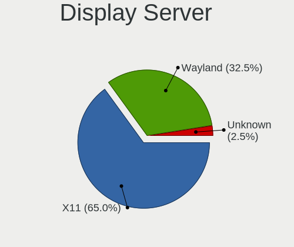
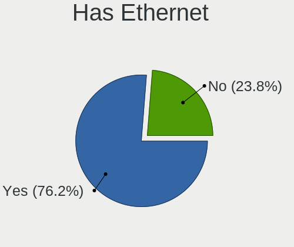
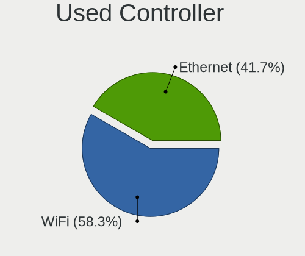
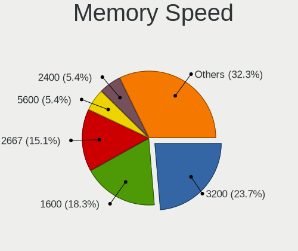

ArcoLinux - Hardware Trends
---------------------------

A project to identify most popular hardware characteristics and track their change
over time based on data collected by Linux users at https://Linux-Hardware.org.

Anyone can contribute to this report by the [hw-probe](https://github.com/linuxhw/hw-probe) tool:

    sudo -E hw-probe -all -upload

This is a report for all computer types. See also reports for [desktops](/Dist/ArcoLinux/Desktop/README.md) and [notebooks](/Dist/ArcoLinux/Notebook/README.md).

This report is for one last month. Overall report since the beginning of time: [TestCoverage](https://github.com/linuxhw/TestCoverage)

Period: Jan, 2023.

Contents
--------

* [ System ](#system)
  - [ OS                       ](#os)
  - [ OS Family                ](#os-family)
  - [ Kernel                   ](#kernel)
  - [ Kernel Family            ](#kernel-family)
  - [ Kernel Major Ver.        ](#kernel-major-ver)
  - [ Arch                     ](#arch)
  - [ DE                       ](#de)
  - [ Display Server           ](#display-server)
  - [ Display Manager          ](#display-manager)
  - [ OS Lang                  ](#os-lang)
  - [ Boot Mode                ](#boot-mode)
  - [ Filesystem               ](#filesystem)
  - [ Part. scheme             ](#part-scheme)
  - [ Dual Boot with Linux/BSD ](#dual-boot-with-linuxbsd)
  - [ Dual Boot (Win)          ](#dual-boot-win)

* [ Board ](#board)
  - [ Vendor                   ](#vendor)
  - [ Model                    ](#model)
  - [ Model Family             ](#model-family)
  - [ MFG Year                 ](#mfg-year)
  - [ Form Factor              ](#form-factor)
  - [ Secure Boot              ](#secure-boot)
  - [ Coreboot                 ](#coreboot)
  - [ RAM Size                 ](#ram-size)
  - [ RAM Used                 ](#ram-used)
  - [ Total Drives             ](#total-drives)
  - [ Has CD-ROM               ](#has-cd-rom)
  - [ Has Ethernet             ](#has-ethernet)
  - [ Has WiFi                 ](#has-wifi)
  - [ Has Bluetooth            ](#has-bluetooth)

* [ Location ](#location)
  - [ Country                  ](#country)
  - [ City                     ](#city)

* [ Drives ](#drives)
  - [ Drive Vendor             ](#drive-vendor)
  - [ Drive Model              ](#drive-model)
  - [ HDD Vendor               ](#hdd-vendor)
  - [ SSD Vendor               ](#ssd-vendor)
  - [ Drive Kind               ](#drive-kind)
  - [ Drive Connector          ](#drive-connector)
  - [ Drive Size               ](#drive-size)
  - [ Space Total              ](#space-total)
  - [ Space Used               ](#space-used)
  - [ Malfunc. Drives          ](#malfunc-drives)
  - [ Malfunc. Drive Vendor    ](#malfunc-drive-vendor)
  - [ Malfunc. HDD Vendor      ](#malfunc-hdd-vendor)
  - [ Malfunc. Drive Kind      ](#malfunc-drive-kind)
  - [ Failed Drives            ](#failed-drives)
  - [ Failed Drive Vendor      ](#failed-drive-vendor)
  - [ Drive Status             ](#drive-status)

* [ Storage controller ](#storage-controller)
  - [ Storage Vendor           ](#storage-vendor)
  - [ Storage Model            ](#storage-model)
  - [ Storage Kind             ](#storage-kind)

* [ Processor ](#processor)
  - [ CPU Vendor               ](#cpu-vendor)
  - [ CPU Model                ](#cpu-model)
  - [ CPU Model Family         ](#cpu-model-family)
  - [ CPU Cores                ](#cpu-cores)
  - [ CPU Sockets              ](#cpu-sockets)
  - [ CPU Threads              ](#cpu-threads)
  - [ CPU Op-Modes             ](#cpu-op-modes)
  - [ CPU Microcode            ](#cpu-microcode)
  - [ CPU Microarch            ](#cpu-microarch)

* [ Graphics ](#graphics)
  - [ GPU Vendor               ](#gpu-vendor)
  - [ GPU Model                ](#gpu-model)
  - [ GPU Combo                ](#gpu-combo)
  - [ GPU Driver               ](#gpu-driver)
  - [ GPU Memory               ](#gpu-memory)

* [ Monitor ](#monitor)
  - [ Monitor Vendor           ](#monitor-vendor)
  - [ Monitor Model            ](#monitor-model)
  - [ Monitor Resolution       ](#monitor-resolution)
  - [ Monitor Diagonal         ](#monitor-diagonal)
  - [ Monitor Width            ](#monitor-width)
  - [ Aspect Ratio             ](#aspect-ratio)
  - [ Monitor Area             ](#monitor-area)
  - [ Pixel Density            ](#pixel-density)
  - [ Multiple Monitors        ](#multiple-monitors)

* [ Network ](#network)
  - [ Net Controller Vendor    ](#net-controller-vendor)
  - [ Net Controller Model     ](#net-controller-model)
  - [ Wireless Vendor          ](#wireless-vendor)
  - [ Wireless Model           ](#wireless-model)
  - [ Ethernet Vendor          ](#ethernet-vendor)
  - [ Ethernet Model           ](#ethernet-model)
  - [ Net Controller Kind      ](#net-controller-kind)
  - [ Used Controller          ](#used-controller)
  - [ NICs                     ](#nics)
  - [ IPv6                     ](#ipv6)

* [ Bluetooth ](#bluetooth)
  - [ Bluetooth Vendor         ](#bluetooth-vendor)
  - [ Bluetooth Model          ](#bluetooth-model)

* [ Sound ](#sound)
  - [ Sound Vendor             ](#sound-vendor)
  - [ Sound Model              ](#sound-model)

* [ Memory ](#memory)
  - [ Memory Vendor            ](#memory-vendor)
  - [ Memory Model             ](#memory-model)
  - [ Memory Kind              ](#memory-kind)
  - [ Memory Form Factor       ](#memory-form-factor)
  - [ Memory Size              ](#memory-size)
  - [ Memory Speed             ](#memory-speed)

* [ Printers & scanners ](#printers--scanners)
  - [ Printer Vendor           ](#printer-vendor)
  - [ Printer Model            ](#printer-model)
  - [ Scanner Vendor           ](#scanner-vendor)
  - [ Scanner Model            ](#scanner-model)

* [ Camera ](#camera)
  - [ Camera Vendor            ](#camera-vendor)
  - [ Camera Model             ](#camera-model)

* [ Security ](#security)
  - [ Fingerprint Vendor       ](#fingerprint-vendor)
  - [ Fingerprint Model        ](#fingerprint-model)
  - [ Chipcard Vendor          ](#chipcard-vendor)
  - [ Chipcard Model           ](#chipcard-model)

* [ Unsupported ](#unsupported)
  - [ Unsupported Devices      ](#unsupported-devices)
  - [ Unsupported Device Types ](#unsupported-device-types)

System
------

OS
--

Installed operating systems

| Name              | Computers | Percent |
|-------------------|-----------|---------|
| ArcoLinux Rolling | 66        | 92.96%  |
| ArcoLinux         | 5         | 7.04%   |

OS Family
---------

OS without a version

| Name      | Computers | Percent |
|-----------|-----------|---------|
| ArcoLinux | 71        | 100%    |

Kernel
------

Version of the Linux kernel

| Version               | Computers | Percent |
|-----------------------|-----------|---------|
| 6.1.2-arch1-1         | 8         | 11.27%  |
| 6.1.3-arch1-1         | 7         | 9.86%   |
| 6.1.4-arch1-1         | 6         | 8.45%   |
| 5.15.86-1-lts         | 6         | 8.45%   |
| 6.1.7-arch1-1         | 5         | 7.04%   |
| 6.1.6-arch1-3         | 5         | 7.04%   |
| 6.1.1-arch1-1         | 5         | 7.04%   |
| 6.1.5-arch2-1         | 4         | 5.63%   |
| 6.1.6-arch1-1         | 3         | 4.23%   |
| 6.1.6-zen1-2-zen      | 2         | 2.82%   |
| 6.1.3-zen1-1-zen      | 2         | 2.82%   |
| 6.1.3-x64v1-xanmod1-1 | 2         | 2.82%   |
| 6.1.1-zen1-1-zen      | 2         | 2.82%   |
| 5.15.89-1-lts         | 2         | 2.82%   |
| 6.1.8-zen1-1-zen      | 1         | 1.41%   |
| 6.1.8-arch1-1         | 1         | 1.41%   |
| 6.1.7-zen1-1-zen      | 1         | 1.41%   |
| 6.1.6-zen1-1-zen      | 1         | 1.41%   |
| 6.1.5-zen2-1-zen      | 1         | 1.41%   |
| 6.1.1-x64v1-xanmod1-1 | 1         | 1.41%   |
| 6.0.9-arch1-1         | 1         | 1.41%   |
| 5.17.6-arch1-1        | 1         | 1.41%   |
| 5.16.16-arch1-1       | 1         | 1.41%   |
| 5.15.90-1-lts         | 1         | 1.41%   |
| 5.15.88-1-lts         | 1         | 1.41%   |
| 5.15.64-1-lts         | 1         | 1.41%   |

Kernel Family
-------------

Linux kernel without a distro release

| Version | Computers | Percent |
|---------|-----------|---------|
| 6.1.6   | 11        | 15.49%  |
| 6.1.3   | 11        | 15.49%  |
| 6.1.2   | 8         | 11.27%  |
| 6.1.1   | 8         | 11.27%  |
| 6.1.7   | 6         | 8.45%   |
| 6.1.4   | 6         | 8.45%   |
| 5.15.86 | 6         | 8.45%   |
| 6.1.5   | 5         | 7.04%   |
| 6.1.8   | 2         | 2.82%   |
| 5.15.89 | 2         | 2.82%   |
| 6.0.9   | 1         | 1.41%   |
| 5.17.6  | 1         | 1.41%   |
| 5.16.16 | 1         | 1.41%   |
| 5.15.90 | 1         | 1.41%   |
| 5.15.88 | 1         | 1.41%   |
| 5.15.64 | 1         | 1.41%   |

Kernel Major Ver.
-----------------

Linux kernel major version

| Version | Computers | Percent |
|---------|-----------|---------|
| 6.1     | 57        | 80.28%  |
| 5.15    | 11        | 15.49%  |
| 6.0     | 1         | 1.41%   |
| 5.17    | 1         | 1.41%   |
| 5.16    | 1         | 1.41%   |

Arch
----

OS architecture (x86_64, i586, etc.)

| Name   | Computers | Percent |
|--------|-----------|---------|
| x86_64 | 71        | 100%    |

DE
--

Desktop Environment

| Name           | Computers | Percent |
|----------------|-----------|---------|
| XFCE           | 17        | 23.94%  |
| KDE5           | 16        | 22.54%  |
| i3             | 6         | 8.45%   |
| hyprland       | 4         | 5.63%   |
| GNOME          | 4         | 5.63%   |
| awesome        | 4         | 5.63%   |
| X-Cinnamon     | 3         | 4.23%   |
| LXQt           | 3         | 4.23%   |
| LeftWM         | 3         | 4.23%   |
| xmonad         | 2         | 2.82%   |
| dwm            | 2         | 2.82%   |
| chadwm         | 2         | 2.82%   |
| sway           | 1         | 1.41%   |
| qtile          | 1         | 1.41%   |
| MATE           | 1         | 1.41%   |
| i3-with-shmlog | 1         | 1.41%   |
| herbstluftwm   | 1         | 1.41%   |

Display Server
--------------

X11 or Wayland

| Name    | Computers | Percent |
|---------|-----------|---------|
| X11     | 60        | 84.51%  |
| Wayland | 10        | 14.08%  |
| Tty     | 1         | 1.41%   |

Display Manager
---------------

SDDM, LightDM, etc.

| Name    | Computers | Percent |
|---------|-----------|---------|
| SDDM    | 45        | 63.38%  |
| LightDM | 16        | 22.54%  |
| Unknown | 5         | 7.04%   |
| GDM     | 4         | 5.63%   |
| Ly      | 1         | 1.41%   |

OS Lang
-------

Language

| Lang  | Computers | Percent |
|-------|-----------|---------|
| en_US | 42        | 59.15%  |
| en_GB | 5         | 7.04%   |
| es_ES | 4         | 5.63%   |
| pt_BR | 2         | 2.82%   |
| es_MX | 2         | 2.82%   |
| en_IN | 2         | 2.82%   |
| en_CA | 2         | 2.82%   |
| pt_PT | 1         | 1.41%   |
| pl_PL | 1         | 1.41%   |
| nl_NL | 1         | 1.41%   |
| es_CR | 1         | 1.41%   |
| es_CO | 1         | 1.41%   |
| es_AR | 1         | 1.41%   |
| en_SG | 1         | 1.41%   |
| en_NZ | 1         | 1.41%   |
| en_IL | 1         | 1.41%   |
| en_AU | 1         | 1.41%   |
| de_CH | 1         | 1.41%   |
| C     | 1         | 1.41%   |

Boot Mode
---------

EFI or BIOS

| Mode | Computers | Percent |
|------|-----------|---------|
| EFI  | 55        | 77.46%  |
| BIOS | 16        | 22.54%  |

Filesystem
----------

Type of filesystem

| Type    | Computers | Percent |
|---------|-----------|---------|
| Ext4    | 48        | 67.61%  |
| Btrfs   | 21        | 29.58%  |
| Xfs     | 1         | 1.41%   |
| Overlay | 1         | 1.41%   |

Part. scheme
------------

Scheme of partitioning

| Type    | Computers | Percent |
|---------|-----------|---------|
| GPT     | 59        | 83.1%   |
| MBR     | 7         | 9.86%   |
| Unknown | 5         | 7.04%   |

Dual Boot with Linux/BSD
------------------------

Hosting more than one Linux/BSD

| Dual boot | Computers | Percent |
|-----------|-----------|---------|
| No        | 50        | 70.42%  |
| Yes       | 21        | 29.58%  |

Dual Boot (Win)
---------------

Hosting Linux and Windows

| Dual boot | Computers | Percent |
|-----------|-----------|---------|
| No        | 40        | 56.34%  |
| Yes       | 31        | 43.66%  |

Board
-----

Vendor
------

Motherboard manufacturer

| Name                | Computers | Percent |
|---------------------|-----------|---------|
| Hewlett-Packard     | 11        | 15.49%  |
| ASUSTek Computer    | 11        | 15.49%  |
| Gigabyte Technology | 10        | 14.08%  |
| Lenovo              | 8         | 11.27%  |
| Dell                | 6         | 8.45%   |
| MSI                 | 5         | 7.04%   |
| Acer                | 4         | 5.63%   |
| ASRock              | 3         | 4.23%   |
| System76            | 2         | 2.82%   |
| Chuwi               | 2         | 2.82%   |
| Apple               | 2         | 2.82%   |
| Toshiba             | 1         | 1.41%   |
| Timi                | 1         | 1.41%   |
| SYWZ                | 1         | 1.41%   |
| MACHINIST           | 1         | 1.41%   |
| Kllisre             | 1         | 1.41%   |
| AZW                 | 1         | 1.41%   |
| Alienware           | 1         | 1.41%   |

Model
-----

Motherboard model

| Name                                  | Computers | Percent |
|---------------------------------------|-----------|---------|
| Chuwi GemiBook Pro                    | 2         | 2.82%   |
| ASUS TUF Gaming X570-PLUS             | 2         | 2.82%   |
| Toshiba Satellite Pro C50-A-1E6       | 1         | 1.41%   |
| Timi TM1701                           | 1         | 1.41%   |
| SYWZ S210H Series                     | 1         | 1.41%   |
| System76 Pangolin                     | 1         | 1.41%   |
| System76 Oryx Pro                     | 1         | 1.41%   |
| MSI Raider GE76 12UHS                 | 1         | 1.41%   |
| MSI MS-7D09                           | 1         | 1.41%   |
| MSI MS-7C52                           | 1         | 1.41%   |
| MSI GL65 Leopard 10SFK                | 1         | 1.41%   |
| MSI A320M-HDV R4.0                    | 1         | 1.41%   |
| MACHINIST X79 V2.82H                  | 1         | 1.41%   |
| Lenovo ThinkPad Yoga 260 20FES1U600   | 1         | 1.41%   |
| Lenovo ThinkPad X220 4291QZ1          | 1         | 1.41%   |
| Lenovo ThinkPad P1 20MDCTO1WW         | 1         | 1.41%   |
| Lenovo ThinkPad E14 Gen 2 20T6000KMX  | 1         | 1.41%   |
| Lenovo IdeaPad 5 15ITL05 82FG         | 1         | 1.41%   |
| Lenovo IdeaPad 5 14ARE05 81YM         | 1         | 1.41%   |
| Lenovo IdeaPad 320-15ISK 80XH         | 1         | 1.41%   |
| Lenovo IdeaPad 320-14AST 80XU         | 1         | 1.41%   |
| Kllisre X99-B5 V1.1                   | 1         | 1.41%   |
| HP Z2 Tower G5 Workstation            | 1         | 1.41%   |
| HP Spectre x360 Convertible 15-df1xxx | 1         | 1.41%   |
| HP Pavilion Laptop 15-cw0xxx          | 1         | 1.41%   |
| HP Pavilion Gaming Laptop 15-cx0xxx   | 1         | 1.41%   |
| HP OMEN 30L Desktop GT13-1xxx         | 1         | 1.41%   |
| HP Folio 13                           | 1         | 1.41%   |
| HP ENVY x360 Convertible 15-ee0xxx    | 1         | 1.41%   |
| HP ENVY Notebook                      | 1         | 1.41%   |
| HP ENVY 15                            | 1         | 1.41%   |
| HP EliteDesk 800 G2 TWR               | 1         | 1.41%   |
| HP 500-536d                           | 1         | 1.41%   |
| Gigabyte Z390 UD                      | 1         | 1.41%   |
| Gigabyte Z390 I AORUS PRO WIFI        | 1         | 1.41%   |
| Gigabyte Z370 AORUS Gaming 7          | 1         | 1.41%   |
| Gigabyte Z170XP-SLI                   | 1         | 1.41%   |
| Gigabyte P55-USB3                     | 1         | 1.41%   |
| Gigabyte H61MS                        | 1         | 1.41%   |
| Gigabyte GA-78LMT-USB3 6.0            | 1         | 1.41%   |

Model Family
------------

Motherboard model prefix

| Name                   | Computers | Percent |
|------------------------|-----------|---------|
| Lenovo ThinkPad        | 4         | 5.63%   |
| Lenovo IdeaPad         | 4         | 5.63%   |
| HP ENVY                | 3         | 4.23%   |
| Dell Precision         | 3         | 4.23%   |
| ASUS TUF               | 3         | 4.23%   |
| HP Pavilion            | 2         | 2.82%   |
| Gigabyte Z390          | 2         | 2.82%   |
| Gigabyte B450M         | 2         | 2.82%   |
| Dell Latitude          | 2         | 2.82%   |
| Chuwi GemiBook         | 2         | 2.82%   |
| ASUS ROG               | 2         | 2.82%   |
| Acer Predator          | 2         | 2.82%   |
| Acer Aspire            | 2         | 2.82%   |
| Toshiba Satellite      | 1         | 1.41%   |
| Timi TM1701            | 1         | 1.41%   |
| SYWZ S210H             | 1         | 1.41%   |
| System76 Pangolin      | 1         | 1.41%   |
| System76 Oryx          | 1         | 1.41%   |
| MSI Raider             | 1         | 1.41%   |
| MSI MS-7D09            | 1         | 1.41%   |
| MSI MS-7C52            | 1         | 1.41%   |
| MSI GL65               | 1         | 1.41%   |
| MSI A320M-HDV          | 1         | 1.41%   |
| MACHINIST X79          | 1         | 1.41%   |
| Kllisre X99-B5         | 1         | 1.41%   |
| HP Z2                  | 1         | 1.41%   |
| HP Spectre             | 1         | 1.41%   |
| HP OMEN                | 1         | 1.41%   |
| HP Folio               | 1         | 1.41%   |
| HP EliteDesk           | 1         | 1.41%   |
| HP 500-536d            | 1         | 1.41%   |
| Gigabyte Z370          | 1         | 1.41%   |
| Gigabyte Z170XP-SLI    | 1         | 1.41%   |
| Gigabyte P55-USB3      | 1         | 1.41%   |
| Gigabyte H61MS         | 1         | 1.41%   |
| Gigabyte GA-78LMT-USB3 | 1         | 1.41%   |
| Gigabyte B550          | 1         | 1.41%   |
| Dell Inspiron          | 1         | 1.41%   |
| AZW GTR                | 1         | 1.41%   |
| ASUS Zephyrus          | 1         | 1.41%   |

MFG Year
--------

Motherboard manufacture year

| Year | Computers | Percent |
|------|-----------|---------|
| 2020 | 11        | 15.49%  |
| 2019 | 11        | 15.49%  |
| 2021 | 9         | 12.68%  |
| 2018 | 8         | 11.27%  |
| 2017 | 7         | 9.86%   |
| 2022 | 4         | 5.63%   |
| 2016 | 4         | 5.63%   |
| 2013 | 3         | 4.23%   |
| 2012 | 3         | 4.23%   |
| 2011 | 3         | 4.23%   |
| 2010 | 3         | 4.23%   |
| 2015 | 2         | 2.82%   |
| 2014 | 2         | 2.82%   |
| 2008 | 1         | 1.41%   |

Form Factor
-----------

Physical design of the computer

| Name        | Computers | Percent |
|-------------|-----------|---------|
| Notebook    | 34        | 47.89%  |
| Desktop     | 33        | 46.48%  |
| Convertible | 3         | 4.23%   |
| All in one  | 1         | 1.41%   |

Secure Boot
-----------

Enabled or disabled

| State    | Computers | Percent |
|----------|-----------|---------|
| Disabled | 71        | 100%    |

Coreboot
--------

Have coreboot on board

| Used | Computers | Percent |
|------|-----------|---------|
| No   | 71        | 100%    |

RAM Size
--------

Total RAM memory

| Size in GB  | Computers | Percent |
|-------------|-----------|---------|
| 16.01-24.0  | 19        | 26.76%  |
| 8.01-16.0   | 18        | 25.35%  |
| 32.01-64.0  | 14        | 19.72%  |
| 4.01-8.0    | 7         | 9.86%   |
| 64.01-256.0 | 6         | 8.45%   |
| 3.01-4.0    | 4         | 5.63%   |
| 24.01-32.0  | 3         | 4.23%   |

RAM Used
--------

Used RAM memory

| Used GB    | Computers | Percent |
|------------|-----------|---------|
| 2.01-3.0   | 23        | 32.39%  |
| 4.01-8.0   | 15        | 21.13%  |
| 3.01-4.0   | 15        | 21.13%  |
| 1.01-2.0   | 12        | 16.9%   |
| 16.01-24.0 | 3         | 4.23%   |
| 8.01-16.0  | 2         | 2.82%   |
| 0.51-1.0   | 1         | 1.41%   |

Total Drives
------------

Number of drives on board

| Drives | Computers | Percent |
|--------|-----------|---------|
| 1      | 24        | 33.8%   |
| 2      | 21        | 29.58%  |
| 3      | 15        | 21.13%  |
| 4      | 7         | 9.86%   |
| 5      | 3         | 4.23%   |
| 6      | 1         | 1.41%   |

Has CD-ROM
----------

Has CD-ROM on board

| Presented | Computers | Percent |
|-----------|-----------|---------|
| No        | 51        | 71.83%  |
| Yes       | 20        | 28.17%  |

Has Ethernet
------------

Has Ethernet on board

| Presented | Computers | Percent |
|-----------|-----------|---------|
| Yes       | 62        | 87.32%  |
| No        | 9         | 12.68%  |

Has WiFi
--------

Has WiFi module

| Presented | Computers | Percent |
|-----------|-----------|---------|
| Yes       | 55        | 77.46%  |
| No        | 16        | 22.54%  |

Has Bluetooth
-------------

Has Bluetooth module

| Presented | Computers | Percent |
|-----------|-----------|---------|
| Yes       | 51        | 71.83%  |
| No        | 20        | 28.17%  |

Location
--------

Country
-------

Geographic location (country)

| Country     | Computers | Percent |
|-------------|-----------|---------|
| USA         | 20        | 28.17%  |
| Spain       | 6         | 8.45%   |
| Netherlands | 4         | 5.63%   |
| UK          | 3         | 4.23%   |
| Portugal    | 3         | 4.23%   |
| Mexico      | 3         | 4.23%   |
| India       | 3         | 4.23%   |
| Colombia    | 3         | 4.23%   |
| Malaysia    | 2         | 2.82%   |
| Canada      | 2         | 2.82%   |
| Brazil      | 2         | 2.82%   |
| Switzerland | 1         | 1.41%   |
| Sweden      | 1         | 1.41%   |
| Slovenia    | 1         | 1.41%   |
| Russia      | 1         | 1.41%   |
| Romania     | 1         | 1.41%   |
| Poland      | 1         | 1.41%   |
| Pakistan    | 1         | 1.41%   |
| New Zealand | 1         | 1.41%   |
| Israel      | 1         | 1.41%   |
| Indonesia   | 1         | 1.41%   |
| Greece      | 1         | 1.41%   |
| France      | 1         | 1.41%   |
| Estonia     | 1         | 1.41%   |
| Ecuador     | 1         | 1.41%   |
| Czechia     | 1         | 1.41%   |
| Costa Rica  | 1         | 1.41%   |
| Chile       | 1         | 1.41%   |
| Belgium     | 1         | 1.41%   |
| Australia   | 1         | 1.41%   |
| Argentina   | 1         | 1.41%   |

City
----

Geographic location (city)

| City                   | Computers | Percent |
|------------------------|-----------|---------|
| Seville                | 2         | 2.82%   |
| Madrid                 | 2         | 2.82%   |
| Zurich                 | 1         | 1.41%   |
| Villavicencio          | 1         | 1.41%   |
| Umeå                  | 1         | 1.41%   |
| Twinsburg              | 1         | 1.41%   |
| Texas City             | 1         | 1.41%   |
| Tallinn                | 1         | 1.41%   |
| Southampton            | 1         | 1.41%   |
| Seattle                | 1         | 1.41%   |
| Santiago               | 1         | 1.41%   |
| Santa Cruz de Tenerife | 1         | 1.41%   |
| Rio de Janeiro         | 1         | 1.41%   |
| Rimbey                 | 1         | 1.41%   |
| Remedios de Escalada   | 1         | 1.41%   |
| Quito                  | 1         | 1.41%   |
| Portland               | 1         | 1.41%   |
| Pavas                  | 1         | 1.41%   |
| Olympia                | 1         | 1.41%   |
| Oklahoma City          | 1         | 1.41%   |
| Odivelas               | 1         | 1.41%   |
| Ochten                 | 1         | 1.41%   |
| Naaldwijk              | 1         | 1.41%   |
| Moscow                 | 1         | 1.41%   |
| Montreal               | 1         | 1.41%   |
| Mexico City            | 1         | 1.41%   |
| Maribor                | 1         | 1.41%   |
| Malacca                | 1         | 1.41%   |
| Lucknow                | 1         | 1.41%   |
| Loveland               | 1         | 1.41%   |
| Lodz                   | 1         | 1.41%   |
| Leland                 | 1         | 1.41%   |
| Lansing                | 1         | 1.41%   |
| Klinec                 | 1         | 1.41%   |
| Katy                   | 1         | 1.41%   |
| Karachi                | 1         | 1.41%   |
| Kansas City            | 1         | 1.41%   |
| Jakarta                | 1         | 1.41%   |
| Irvine                 | 1         | 1.41%   |
| Ipoh                   | 1         | 1.41%   |

Drives
------

Drive Vendor
------------

Hard drive vendors

| Vendor                      | Computers | Drives | Percent |
|-----------------------------|-----------|--------|---------|
| Samsung Electronics         | 24        | 31     | 16.78%  |
| WDC                         | 21        | 29     | 14.69%  |
| Seagate                     | 20        | 21     | 13.99%  |
| Kingston                    | 11        | 11     | 7.69%   |
| Toshiba                     | 7         | 7      | 4.9%    |
| Sandisk                     | 7         | 7      | 4.9%    |
| Crucial                     | 6         | 7      | 4.2%    |
| Phison Electronics          | 5         | 5      | 3.5%    |
| Kingston Technology Company | 4         | 4      | 2.8%    |
| Intel                       | 4         | 6      | 2.8%    |
| Unknown                     | 3         | 3      | 2.1%    |
| SK hynix                    | 3         | 3      | 2.1%    |
| Silicon Motion              | 3         | 3      | 2.1%    |
| Micron/Crucial Technology   | 3         | 3      | 2.1%    |
| Hitachi                     | 3         | 3      | 2.1%    |
| Realtek Semiconductor       | 2         | 2      | 1.4%    |
| Micron Technology           | 2         | 2      | 1.4%    |
| LITEONIT                    | 2         | 2      | 1.4%    |
| Verbatim                    | 1         | 1      | 0.7%    |
| SPCC                        | 1         | 1      | 0.7%    |
| PNY                         | 1         | 1      | 0.7%    |
| Patriot                     | 1         | 1      | 0.7%    |
| OCZ                         | 1         | 1      | 0.7%    |
| Netac                       | 1         | 1      | 0.7%    |
| LITEON                      | 1         | 1      | 0.7%    |
| JMicron Technology          | 1         | 1      | 0.7%    |
| HGST                        | 1         | 1      | 0.7%    |
| Hewlett-Packard             | 1         | 1      | 0.7%    |
| Corsair                     | 1         | 1      | 0.7%    |
| Colorful                    | 1         | 1      | 0.7%    |
| Biwin Storage Technology    | 1         | 1      | 0.7%    |

Drive Model
-----------

Hard drive models

| Model                                                 | Computers | Percent |
|-------------------------------------------------------|-----------|---------|
| Samsung NVMe SSD Controller SM981/PM981/PM983 500GB   | 8         | 5.1%    |
| Seagate ST2000LM007-1R8174 2TB                        | 4         | 2.55%   |
| WDC WDS240G2G0A-00JH30 240GB SSD                      | 3         | 1.91%   |
| Samsung NVMe SSD Controller SM961/PM961/SM963 256GB   | 3         | 1.91%   |
| Samsung NVMe SSD Controller PM9A1/PM9A3/980PRO 512GB  | 3         | 1.91%   |
| Crucial CT240BX500SSD1 240GB                          | 3         | 1.91%   |
| WDC WDS500G2B0B-00YS70 500GB SSD                      | 2         | 1.27%   |
| WDC WD20SPZX-22UA7T0 2TB                              | 2         | 1.27%   |
| WDC WD10EZEX-08WN4A0 1TB                              | 2         | 1.27%   |
| Toshiba XG6 NVMe SSD Controller 512GB                 | 2         | 1.27%   |
| Toshiba MQ04ABF100 1TB                                | 2         | 1.27%   |
| Toshiba MQ01ABD100 1TB                                | 2         | 1.27%   |
| Silicon Motion SM2263EN/SM2263XT SSD Controller 512GB | 2         | 1.27%   |
| Seagate ST2000DM008-2FR102 2TB                        | 2         | 1.27%   |
| Samsung SSD 980 1TB                                   | 2         | 1.27%   |
| Samsung MZALQ512HALU-000L2 512GB                      | 2         | 1.27%   |
| Realtek RTS5763DL NVMe SSD Controller 4TB             | 2         | 1.27%   |
| Phison E16 PCIe4 NVMe Controller 2TB                  | 2         | 1.27%   |
| Phison E12 NVMe Controller 1TB                        | 2         | 1.27%   |
| Micron/Crucial P1 NVMe PCIe SSD 1TB                   | 2         | 1.27%   |
| Kingston Company U-SNS8154P3 NVMe SSD 256GB           | 2         | 1.27%   |
| Kingston SA400S37480G 480GB SSD                       | 2         | 1.27%   |
| Kingston SA400S37240G 240GB SSD                       | 2         | 1.27%   |
| Intel SSD 660P Series 512GB                           | 2         | 1.27%   |
| WDC WDS500G2B0A 500GB SSD                             | 1         | 0.64%   |
| WDC WDS100T2G0A-00JH30 1TB SSD                        | 1         | 0.64%   |
| WDC WDBNCE0010PNC 1TB SSD                             | 1         | 0.64%   |
| WDC WD5000HHTZ-75N21V0 500GB                          | 1         | 0.64%   |
| WDC WD5000AZLX-75K2TA0 500GB                          | 1         | 0.64%   |
| WDC WD5000AAKS-07A7B2 500GB                           | 1         | 0.64%   |
| WDC WD5000AACS-00G8B1 500GB                           | 1         | 0.64%   |
| WDC WD20EZBX-60AYRA0 2TB                              | 1         | 0.64%   |
| WDC WD20EZBX-00AYRA0 2TB                              | 1         | 0.64%   |
| WDC WD20EARX-00PASB0 2TB                              | 1         | 0.64%   |
| WDC WD2003FZEX-00Z4SA0 2TB                            | 1         | 0.64%   |
| WDC WD2002FAEX-007BA0 2TB                             | 1         | 0.64%   |
| WDC WD10SPZX-60Z10T0 1TB                              | 1         | 0.64%   |
| WDC WD10EARS-00Y5B1 1TB                               | 1         | 0.64%   |
| WDC WD10EARS-00MVWB0 1TB                              | 1         | 0.64%   |
| WDC WD100EFAX-68LHPN0 10TB                            | 1         | 0.64%   |

HDD Vendor
----------

Hard disk drive vendors

| Vendor              | Computers | Drives | Percent |
|---------------------|-----------|--------|---------|
| Seagate             | 20        | 21     | 41.67%  |
| WDC                 | 17        | 21     | 35.42%  |
| Toshiba             | 5         | 5      | 10.42%  |
| Hitachi             | 3         | 3      | 6.25%   |
| Unknown             | 1         | 1      | 2.08%   |
| Samsung Electronics | 1         | 1      | 2.08%   |
| HGST                | 1         | 1      | 2.08%   |

SSD Vendor
----------

Solid state drive vendors

| Vendor              | Computers | Drives | Percent |
|---------------------|-----------|--------|---------|
| Samsung Electronics | 9         | 12     | 20.45%  |
| WDC                 | 8         | 8      | 18.18%  |
| Kingston            | 8         | 8      | 18.18%  |
| Crucial             | 6         | 7      | 13.64%  |
| LITEONIT            | 2         | 2      | 4.55%   |
| SPCC                | 1         | 1      | 2.27%   |
| SK hynix            | 1         | 1      | 2.27%   |
| SanDisk             | 1         | 1      | 2.27%   |
| PNY                 | 1         | 1      | 2.27%   |
| Patriot             | 1         | 1      | 2.27%   |
| OCZ                 | 1         | 1      | 2.27%   |
| Micron Technology   | 1         | 1      | 2.27%   |
| LITEON              | 1         | 1      | 2.27%   |
| Hewlett-Packard     | 1         | 1      | 2.27%   |
| Corsair             | 1         | 1      | 2.27%   |
| Colorful            | 1         | 1      | 2.27%   |

Drive Kind
----------

HDD or SSD

| Kind    | Computers | Drives | Percent |
|---------|-----------|--------|---------|
| NVMe    | 43        | 57     | 34.68%  |
| HDD     | 40        | 53     | 32.26%  |
| SSD     | 37        | 48     | 29.84%  |
| MMC     | 2         | 2      | 1.61%   |
| Unknown | 2         | 2      | 1.61%   |

Drive Connector
---------------

SATA, SAS, NVMe, etc.

| Type | Computers | Drives | Percent |
|------|-----------|--------|---------|
| SATA | 50        | 94     | 48.54%  |
| NVMe | 43        | 57     | 41.75%  |
| SAS  | 8         | 9      | 7.77%   |
| MMC  | 2         | 2      | 1.94%   |

Drive Size
----------

Size of hard drive

| Size in TB | Computers | Drives | Percent |
|------------|-----------|--------|---------|
| 0.01-0.5   | 35        | 47     | 44.3%   |
| 0.51-1.0   | 25        | 30     | 31.65%  |
| 1.01-2.0   | 14        | 18     | 17.72%  |
| 4.01-10.0  | 4         | 5      | 5.06%   |
| 3.01-4.0   | 1         | 1      | 1.27%   |

Space Total
-----------

Amount of disk space available on the file system

| Size in GB     | Computers | Percent |
|----------------|-----------|---------|
| More than 3000 | 18        | 25.35%  |
| 251-500        | 12        | 16.9%   |
| 1001-2000      | 12        | 16.9%   |
| 101-250        | 11        | 15.49%  |
| 501-1000       | 8         | 11.27%  |
| 2001-3000      | 6         | 8.45%   |
| 21-50          | 1         | 1.41%   |
| 1-20           | 1         | 1.41%   |
| 51-100         | 1         | 1.41%   |
| Unknown        | 1         | 1.41%   |

Space Used
----------

Amount of used disk space

| Used GB        | Computers | Percent |
|----------------|-----------|---------|
| 101-250        | 19        | 26.76%  |
| 1001-2000      | 11        | 15.49%  |
| 501-1000       | 9         | 12.68%  |
| 1-20           | 7         | 9.86%   |
| 251-500        | 6         | 8.45%   |
| 21-50          | 6         | 8.45%   |
| 51-100         | 6         | 8.45%   |
| More than 3000 | 3         | 4.23%   |
| 2001-3000      | 3         | 4.23%   |
| Unknown        | 1         | 1.41%   |

Malfunc. Drives
---------------

Drive models with a malfunction

| Model                                          | Computers | Drives | Percent |
|------------------------------------------------|-----------|--------|---------|
| Micron/Crucial Technology P1 NVMe PCIe SSD 1TB | 2         | 2      | 11.76%  |
| WDC WDS100T2G0A-00JH30 1TB SSD                 | 1         | 1      | 5.88%   |
| WDC WD5000AACS-00G8B1 500GB                    | 1         | 1      | 5.88%   |
| WDC WD10EARS-00Y5B1 1TB                        | 1         | 1      | 5.88%   |
| Toshiba MQ01ABD100 1TB                         | 1         | 1      | 5.88%   |
| Toshiba DT01ACA100 1TB                         | 1         | 1      | 5.88%   |
| Seagate ST3500320AS 500GB                      | 1         | 1      | 5.88%   |
| Seagate ST2000DM001-1ER164 2TB                 | 1         | 1      | 5.88%   |
| Seagate ST1000LM024 HN-M101MBB 1TB             | 1         | 1      | 5.88%   |
| Seagate ST1000DM003-9YN162 1TB                 | 1         | 1      | 5.88%   |
| Samsung Electronics SSD 840 Series 120GB       | 1         | 2      | 5.88%   |
| Intel SSD 600P Series 256GB                    | 1         | 1      | 5.88%   |
| Hitachi HUA723020ALA640 2TB                    | 1         | 1      | 5.88%   |
| Hitachi HTS547575A9E384 752GB                  | 1         | 1      | 5.88%   |
| HGST HTS725050A7E630 500GB                     | 1         | 1      | 5.88%   |
| Corsair CSSD-F60GB2 64GB                       | 1         | 1      | 5.88%   |

Malfunc. Drive Vendor
---------------------

Vendors of faulty drives

| Vendor                    | Computers | Drives | Percent |
|---------------------------|-----------|--------|---------|
| Seagate                   | 4         | 4      | 23.53%  |
| WDC                       | 3         | 3      | 17.65%  |
| Toshiba                   | 2         | 2      | 11.76%  |
| Micron/Crucial Technology | 2         | 2      | 11.76%  |
| Hitachi                   | 2         | 2      | 11.76%  |
| Samsung Electronics       | 1         | 2      | 5.88%   |
| Intel                     | 1         | 1      | 5.88%   |
| HGST                      | 1         | 1      | 5.88%   |
| Corsair                   | 1         | 1      | 5.88%   |

Malfunc. HDD Vendor
-------------------

Vendors of faulty HDD drives

| Vendor  | Computers | Drives | Percent |
|---------|-----------|--------|---------|
| Seagate | 4         | 4      | 36.36%  |
| WDC     | 2         | 2      | 18.18%  |
| Toshiba | 2         | 2      | 18.18%  |
| Hitachi | 2         | 2      | 18.18%  |
| HGST    | 1         | 1      | 9.09%   |

Malfunc. Drive Kind
-------------------

Kinds of faulty drives

| Kind | Computers | Drives | Percent |
|------|-----------|--------|---------|
| HDD  | 9         | 11     | 60%     |
| NVMe | 3         | 3      | 20%     |
| SSD  | 3         | 4      | 20%     |

Failed Drives
-------------

Failed drive models

Zero info for selected period =(

Failed Drive Vendor
-------------------

Failed drive vendors

Zero info for selected period =(

Drive Status
------------

Number of failed and malfunc. drives

| Status   | Computers | Drives | Percent |
|----------|-----------|--------|---------|
| Works    | 62        | 126    | 69.66%  |
| Malfunc  | 14        | 18     | 15.73%  |
| Detected | 13        | 18     | 14.61%  |

Storage controller
------------------

Storage Vendor
--------------

Storage controller vendors

| Vendor                       | Computers | Percent |
|------------------------------|-----------|---------|
| Intel                        | 47        | 40.52%  |
| Samsung Electronics          | 16        | 13.79%  |
| AMD                          | 16        | 13.79%  |
| SanDisk                      | 7         | 6.03%   |
| Kingston Technology Company  | 7         | 6.03%   |
| Phison Electronics           | 4         | 3.45%   |
| Silicon Motion               | 3         | 2.59%   |
| Micron/Crucial Technology    | 3         | 2.59%   |
| ASMedia Technology           | 3         | 2.59%   |
| Toshiba America Info Systems | 2         | 1.72%   |
| SK hynix                     | 2         | 1.72%   |
| Realtek Semiconductor        | 2         | 1.72%   |
| Netac Technology             | 1         | 0.86%   |
| Micron Technology            | 1         | 0.86%   |
| JMicron Technology           | 1         | 0.86%   |
| Biwin Storage Technology     | 1         | 0.86%   |

Storage Model
-------------

Storage controller models

| Model                                                                          | Computers | Percent |
|--------------------------------------------------------------------------------|-----------|---------|
| AMD FCH SATA Controller [AHCI mode]                                            | 12        | 9.16%   |
| Samsung NVMe SSD Controller SM981/PM981/PM983                                  | 8         | 6.11%   |
| Intel Sunrise Point-LP SATA Controller [AHCI mode]                             | 5         | 3.82%   |
| Samsung NVMe SSD Controller 980                                                | 4         | 3.05%   |
| Intel 8 Series/C220 Series Chipset Family 6-port SATA Controller 1 [AHCI mode] | 4         | 3.05%   |
| AMD 400 Series Chipset SATA Controller                                         | 4         | 3.05%   |
| SanDisk Non-Volatile memory controller                                         | 3         | 2.29%   |
| Samsung NVMe SSD Controller SM961/PM961/SM963                                  | 3         | 2.29%   |
| Samsung NVMe SSD Controller PM9A1/PM9A3/980PRO                                 | 3         | 2.29%   |
| Intel Q170/Q150/B150/H170/H110/Z170/CM236 Chipset SATA Controller [AHCI Mode]  | 3         | 2.29%   |
| Intel Cannon Lake PCH SATA AHCI Controller                                     | 3         | 2.29%   |
| Intel 82801 Mobile SATA Controller [RAID mode]                                 | 3         | 2.29%   |
| Intel 200 Series PCH SATA controller [AHCI mode]                               | 3         | 2.29%   |
| ASMedia ASM1062 Serial ATA Controller                                          | 3         | 2.29%   |
| Toshiba America Info Systems XG6 NVMe SSD Controller                           | 2         | 1.53%   |
| Silicon Motion SM2263EN/SM2263XT SSD Controller                                | 2         | 1.53%   |
| SanDisk WD Blue SN500 / PC SN520 NVMe SSD                                      | 2         | 1.53%   |
| Realtek RTS5763DL NVMe SSD Controller                                          | 2         | 1.53%   |
| Phison E12 NVMe Controller                                                     | 2         | 1.53%   |
| Micron/Crucial P1 NVMe PCIe SSD                                                | 2         | 1.53%   |
| Kingston Company U-SNS8154P3 NVMe SSD                                          | 2         | 1.53%   |
| Kingston Company Company Non-Volatile memory controller                        | 2         | 1.53%   |
| Intel Volume Management Device NVMe RAID Controller                            | 2         | 1.53%   |
| Intel SSD 660P Series                                                          | 2         | 1.53%   |
| Intel SATA Controller [RAID mode]                                              | 2         | 1.53%   |
| Intel Jasper Lake SATA AHCI Controller                                         | 2         | 1.53%   |
| Intel Cannon Lake Mobile PCH SATA AHCI Controller                              | 2         | 1.53%   |
| Intel 6 Series/C200 Series Chipset Family 6 port Mobile SATA AHCI Controller   | 2         | 1.53%   |
| AMD FCH SATA Controller D                                                      | 2         | 1.53%   |
| SK hynix Gold P31/PC711 NVMe Solid State Drive                                 | 1         | 0.76%   |
| SK hynix BC501 NVMe Solid State Drive                                          | 1         | 0.76%   |
| Silicon Motion Non-Volatile memory controller                                  | 1         | 0.76%   |
| SanDisk WD Blue SN570 NVMe SSD                                                 | 1         | 0.76%   |
| SanDisk WD Blue SN550 NVMe SSD                                                 | 1         | 0.76%   |
| Phison E7 NVMe Controller                                                      | 1         | 0.76%   |
| Phison E16 PCIe4 NVMe Controller                                               | 1         | 0.76%   |
| Netac Non-Volatile memory controller                                           | 1         | 0.76%   |
| Micron/Crucial P2 NVMe PCIe SSD                                                | 1         | 0.76%   |
| Micron Non-Volatile memory controller                                          | 1         | 0.76%   |
| Kingston Company SNVS2000G [NV1 NVMe PCIe SSD 2TB]                             | 1         | 0.76%   |

Storage Kind
------------

Kind of storage controller (IDE, SATA, NVMe, SAS, ...)

| Kind | Computers | Percent |
|------|-----------|---------|
| SATA | 53        | 49.07%  |
| NVMe | 43        | 39.81%  |
| RAID | 9         | 8.33%   |
| IDE  | 3         | 2.78%   |

Processor
---------

CPU Vendor
----------

Processor vendors

| Vendor | Computers | Percent |
|--------|-----------|---------|
| Intel  | 52        | 73.24%  |
| AMD    | 19        | 26.76%  |

CPU Model
---------

Processor models

| Model                                  | Computers | Percent |
|----------------------------------------|-----------|---------|
| Intel Core i7-9750H CPU @ 2.60GHz      | 2         | 2.82%   |
| Intel Core i7-8700K CPU @ 3.70GHz      | 2         | 2.82%   |
| Intel Core i7-10700K CPU @ 3.80GHz     | 2         | 2.82%   |
| Intel Core i7-10510U CPU @ 1.80GHz     | 2         | 2.82%   |
| Intel Celeron N5100 @ 1.10GHz          | 2         | 2.82%   |
| AMD Ryzen 7 4700U with Radeon Graphics | 2         | 2.82%   |
| AMD Ryzen 5 3600 6-Core Processor      | 2         | 2.82%   |
| Intel Xeon E-2286M CPU @ 2.40GHz       | 1         | 1.41%   |
| Intel Xeon E-2176M CPU @ 2.70GHz       | 1         | 1.41%   |
| Intel Xeon CPU E5-2696 v3 @ 2.30GHz    | 1         | 1.41%   |
| Intel Xeon CPU E5-2650 v2 @ 2.60GHz    | 1         | 1.41%   |
| Intel Xeon CPU E5-1620 v3 @ 3.50GHz    | 1         | 1.41%   |
| Intel Core i9-9900K CPU @ 3.60GHz      | 1         | 1.41%   |
| Intel Core i7-8750H CPU @ 2.20GHz      | 1         | 1.41%   |
| Intel Core i7-8550U CPU @ 1.80GHz      | 1         | 1.41%   |
| Intel Core i7-7700K CPU @ 4.20GHz      | 1         | 1.41%   |
| Intel Core i7-7700HQ CPU @ 2.80GHz     | 1         | 1.41%   |
| Intel Core i7-7700 CPU @ 3.60GHz       | 1         | 1.41%   |
| Intel Core i7-6700K CPU @ 4.00GHz      | 1         | 1.41%   |
| Intel Core i7-6500U CPU @ 2.50GHz      | 1         | 1.41%   |
| Intel Core i7-4702MQ CPU @ 2.20GHz     | 1         | 1.41%   |
| Intel Core i7-4702HQ CPU @ 2.20GHz     | 1         | 1.41%   |
| Intel Core i7-3770K CPU @ 3.50GHz      | 1         | 1.41%   |
| Intel Core i7-3740QM CPU @ 2.70GHz     | 1         | 1.41%   |
| Intel Core i7-3610QM CPU @ 2.30GHz     | 1         | 1.41%   |
| Intel Core i7-2620M CPU @ 2.70GHz      | 1         | 1.41%   |
| Intel Core i7-10875H CPU @ 2.30GHz     | 1         | 1.41%   |
| Intel Core i7-10750H CPU @ 2.60GHz     | 1         | 1.41%   |
| Intel Core i7-10700 CPU @ 2.90GHz      | 1         | 1.41%   |
| Intel Core i5-8300H CPU @ 2.30GHz      | 1         | 1.41%   |
| Intel Core i5-8265U CPU @ 1.60GHz      | 1         | 1.41%   |
| Intel Core i5-8250U CPU @ 1.60GHz      | 1         | 1.41%   |
| Intel Core i5-6500 CPU @ 3.20GHz       | 1         | 1.41%   |
| Intel Core i5-6300U CPU @ 2.40GHz      | 1         | 1.41%   |
| Intel Core i5-6200U CPU @ 2.30GHz      | 1         | 1.41%   |
| Intel Core i5-3570K CPU @ 3.40GHz      | 1         | 1.41%   |
| Intel Core i5-2467M CPU @ 1.60GHz      | 1         | 1.41%   |
| Intel Core i5-2400 CPU @ 3.10GHz       | 1         | 1.41%   |
| Intel Core i5 CPU M 520 @ 2.40GHz      | 1         | 1.41%   |
| Intel Core i5 CPU 750 @ 2.67GHz        | 1         | 1.41%   |

CPU Model Family
----------------

Processor model prefix

| Model            | Computers | Percent |
|------------------|-----------|---------|
| Intel Core i7    | 24        | 33.8%   |
| Intel Core i5    | 11        | 15.49%  |
| AMD Ryzen 7      | 8         | 11.27%  |
| AMD Ryzen 5      | 8         | 11.27%  |
| Other            | 5         | 7.04%   |
| Intel Xeon       | 5         | 7.04%   |
| Intel Core i3    | 4         | 5.63%   |
| Intel Celeron    | 2         | 2.82%   |
| Intel Core i9    | 1         | 1.41%   |
| Intel Core 2 Duo | 1         | 1.41%   |
| AMD Ryzen 9      | 1         | 1.41%   |
| AMD FX           | 1         | 1.41%   |

CPU Cores
---------

Number of processor cores

| Number | Computers | Percent |
|--------|-----------|---------|
| 4      | 25        | 35.21%  |
| 8      | 16        | 22.54%  |
| 6      | 14        | 19.72%  |
| 2      | 12        | 16.9%   |
| 18     | 1         | 1.41%   |
| 14     | 1         | 1.41%   |
| 12     | 1         | 1.41%   |
| 3      | 1         | 1.41%   |

CPU Sockets
-----------

Number of sockets

| Number | Computers | Percent |
|--------|-----------|---------|
| 1      | 71        | 100%    |

CPU Threads
-----------

Threads per core (Hyper-Threading)

| Number | Computers | Percent |
|--------|-----------|---------|
| 2      | 60        | 84.51%  |
| 1      | 11        | 15.49%  |

CPU Op-Modes
------------

CPU Operation Modes (32-bit, 64-bit)

| Op mode        | Computers | Percent |
|----------------|-----------|---------|
| 32-bit, 64-bit | 71        | 100%    |

CPU Microcode
-------------

Microcode number

| Number     | Computers | Percent |
|------------|-----------|---------|
| Unknown    | 10        | 14.08%  |
| 0x906ea    | 6         | 8.45%   |
| 0x906e9    | 4         | 5.63%   |
| 0x306a9    | 4         | 5.63%   |
| 0xa0655    | 3         | 4.23%   |
| 0x406e3    | 3         | 4.23%   |
| 0x306c3    | 3         | 4.23%   |
| 0x08701021 | 3         | 4.23%   |
| 0xa0652    | 2         | 2.82%   |
| 0x906ed    | 2         | 2.82%   |
| 0x906c0    | 2         | 2.82%   |
| 0x806ec    | 2         | 2.82%   |
| 0x306f2    | 2         | 2.82%   |
| 0x0a50000c | 2         | 2.82%   |
| 0xa0671    | 1         | 1.41%   |
| 0x906a3    | 1         | 1.41%   |
| 0x90672    | 1         | 1.41%   |
| 0x806eb    | 1         | 1.41%   |
| 0x806c1    | 1         | 1.41%   |
| 0x6fd      | 1         | 1.41%   |
| 0x506e3    | 1         | 1.41%   |
| 0x206a7    | 1         | 1.41%   |
| 0x20655    | 1         | 1.41%   |
| 0x106e5    | 1         | 1.41%   |
| 0x0a50000d | 1         | 1.41%   |
| 0x0a404102 | 1         | 1.41%   |
| 0x0a20120a | 1         | 1.41%   |
| 0x0a201016 | 1         | 1.41%   |
| 0x08608103 | 1         | 1.41%   |
| 0x08600106 | 1         | 1.41%   |
| 0x08600103 | 1         | 1.41%   |
| 0x08600102 | 1         | 1.41%   |
| 0x08108102 | 1         | 1.41%   |
| 0x0810100b | 1         | 1.41%   |
| 0x0800820b | 1         | 1.41%   |
| 0x06006704 | 1         | 1.41%   |
| 0x06000822 | 1         | 1.41%   |

CPU Microarch
-------------

Microarchitecture

| Name             | Computers | Percent |
|------------------|-----------|---------|
| KabyLake         | 18        | 25.35%  |
| Zen 3            | 6         | 8.45%   |
| Zen 2            | 6         | 8.45%   |
| Skylake          | 6         | 8.45%   |
| IvyBridge        | 6         | 8.45%   |
| Haswell          | 5         | 7.04%   |
| CometLake        | 5         | 7.04%   |
| SandyBridge      | 3         | 4.23%   |
| Zen+             | 2         | 2.82%   |
| Tremont          | 2         | 2.82%   |
| Alderlake Hybrid | 2         | 2.82%   |
| Unknown          | 2         | 2.82%   |
| Zen              | 1         | 1.41%   |
| Westmere         | 1         | 1.41%   |
| TigerLake        | 1         | 1.41%   |
| Piledriver       | 1         | 1.41%   |
| Nehalem          | 1         | 1.41%   |
| Icelake          | 1         | 1.41%   |
| Excavator        | 1         | 1.41%   |
| Core             | 1         | 1.41%   |

Graphics
--------

GPU Vendor
----------

Vendors of graphics cards

| Vendor | Computers | Percent |
|--------|-----------|---------|
| Intel  | 36        | 39.13%  |
| Nvidia | 35        | 38.04%  |
| AMD    | 21        | 22.83%  |

GPU Model
---------

Graphics card models

| Model                                                                     | Computers | Percent |
|---------------------------------------------------------------------------|-----------|---------|
| Intel CoffeeLake-H GT2 [UHD Graphics 630]                                 | 4         | 4.26%   |
| Intel Skylake GT2 [HD Graphics 520]                                       | 3         | 3.19%   |
| Intel 2nd Generation Core Processor Family Integrated Graphics Controller | 3         | 3.19%   |
| AMD Renoir                                                                | 3         | 3.19%   |
| AMD Ellesmere [Radeon RX 470/480/570/570X/580/580X/590]                   | 3         | 3.19%   |
| AMD Cezanne [Radeon Vega Series / Radeon Vega Mobile Series]              | 3         | 3.19%   |
| Nvidia GP108M [GeForce MX150]                                             | 2         | 2.13%   |
| Nvidia GP104 [GeForce GTX 1070]                                           | 2         | 2.13%   |
| Nvidia GA102 [GeForce RTX 3080 Ti]                                        | 2         | 2.13%   |
| Intel UHD Graphics 620                                                    | 2         | 2.13%   |
| Intel JasperLake [UHD Graphics]                                           | 2         | 2.13%   |
| Intel HD Graphics 630                                                     | 2         | 2.13%   |
| Intel CometLake-U GT2 [UHD Graphics]                                      | 2         | 2.13%   |
| Intel CometLake-H GT2 [UHD Graphics]                                      | 2         | 2.13%   |
| Intel CoffeeLake-S GT2 [UHD Graphics 630]                                 | 2         | 2.13%   |
| Intel 4th Gen Core Processor Integrated Graphics Controller               | 2         | 2.13%   |
| AMD Lexa PRO [Radeon 540/540X/550/550X / RX 540X/550/550X]                | 2         | 2.13%   |
| Nvidia TU117M [GeForce MX450]                                             | 1         | 1.06%   |
| Nvidia TU117M                                                             | 1         | 1.06%   |
| Nvidia TU117GLM [Quadro T1000 Mobile]                                     | 1         | 1.06%   |
| Nvidia TU116M [GeForce GTX 1660 Ti Mobile]                                | 1         | 1.06%   |
| Nvidia TU116 [GeForce GTX 1650 SUPER]                                     | 1         | 1.06%   |
| Nvidia TU106M [GeForce RTX 2070 Mobile / Max-Q Refresh]                   | 1         | 1.06%   |
| Nvidia TU106M [GeForce RTX 2060 Mobile]                                   | 1         | 1.06%   |
| Nvidia TU106GLM [Quadro RTX 3000 Mobile / Max-Q]                          | 1         | 1.06%   |
| Nvidia TU106 [GeForce RTX 2060 SUPER]                                     | 1         | 1.06%   |
| Nvidia TU106 [GeForce RTX 2060 Rev. A]                                    | 1         | 1.06%   |
| Nvidia TU106 [GeForce RTX 2060 12GB]                                      | 1         | 1.06%   |
| Nvidia TU104M [GeForce RTX 2070 SUPER Mobile / Max-Q]                     | 1         | 1.06%   |
| Nvidia TU104 [GeForce RTX 2070 SUPER]                                     | 1         | 1.06%   |
| Nvidia GT216M [GeForce GT 330M]                                           | 1         | 1.06%   |
| Nvidia GP108M [GeForce MX250]                                             | 1         | 1.06%   |
| Nvidia GP107M [GeForce GTX 1050 Mobile]                                   | 1         | 1.06%   |
| Nvidia GP107GLM [Quadro P1000 Mobile]                                     | 1         | 1.06%   |
| Nvidia GP104BM [GeForce GTX 1070 Mobile]                                  | 1         | 1.06%   |
| Nvidia GP104 [GeForce GTX 1080]                                           | 1         | 1.06%   |
| Nvidia GM204 [GeForce GTX 980]                                            | 1         | 1.06%   |
| Nvidia GM108M [GeForce MX130]                                             | 1         | 1.06%   |
| Nvidia GM108M [GeForce 920MX]                                             | 1         | 1.06%   |
| Nvidia GK107M [GeForce GT 750M]                                           | 1         | 1.06%   |

GPU Combo
---------

Combinations of graphics cards

| Name           | Computers | Percent |
|----------------|-----------|---------|
| Intel + Nvidia | 18        | 25.35%  |
| 1 x Nvidia     | 16        | 22.54%  |
| 1 x AMD        | 16        | 22.54%  |
| 1 x Intel      | 15        | 21.13%  |
| 2 x AMD        | 2         | 2.82%   |
| Intel + AMD    | 2         | 2.82%   |
| 2 x Intel      | 1         | 1.41%   |
| AMD + Nvidia   | 1         | 1.41%   |

GPU Driver
----------

Free vs proprietary

| Driver      | Computers | Percent |
|-------------|-----------|---------|
| Free        | 46        | 64.79%  |
| Proprietary | 24        | 33.8%   |
| Unknown     | 1         | 1.41%   |

GPU Memory
----------

Total video memory

| Size in GB | Computers | Percent |
|------------|-----------|---------|
| Unknown    | 27        | 38.03%  |
| 7.01-8.0   | 10        | 14.08%  |
| 3.01-4.0   | 8         | 11.27%  |
| 8.01-16.0  | 7         | 9.86%   |
| 0.01-0.5   | 7         | 9.86%   |
| 5.01-6.0   | 4         | 5.63%   |
| 1.01-2.0   | 4         | 5.63%   |
| 0.51-1.0   | 3         | 4.23%   |
| 2.01-3.0   | 1         | 1.41%   |

Monitor
-------

Monitor Vendor
--------------

Monitor vendors

| Vendor               | Computers | Percent |
|----------------------|-----------|---------|
| Samsung Electronics  | 11        | 12.5%   |
| BOE                  | 11        | 12.5%   |
| LG Display           | 7         | 7.95%   |
| Goldstar             | 6         | 6.82%   |
| AU Optronics         | 6         | 6.82%   |
| Chimei Innolux       | 5         | 5.68%   |
| Dell                 | 4         | 4.55%   |
| BenQ                 | 4         | 4.55%   |
| AOC                  | 4         | 4.55%   |
| Hewlett-Packard      | 3         | 3.41%   |
| ASUSTek Computer     | 3         | 3.41%   |
| Ancor Communications | 3         | 3.41%   |
| Sharp                | 2         | 2.27%   |
| Lenovo               | 2         | 2.27%   |
| Apple                | 2         | 2.27%   |
| ViewSonic            | 1         | 1.14%   |
| Toshiba              | 1         | 1.14%   |
| Sony                 | 1         | 1.14%   |
| PANDA                | 1         | 1.14%   |
| Nixeus               | 1         | 1.14%   |
| Medion               | 1         | 1.14%   |
| LG Philips           | 1         | 1.14%   |
| InfoVision           | 1         | 1.14%   |
| Iiyama               | 1         | 1.14%   |
| HUAWEI               | 1         | 1.14%   |
| Gigabyte Technology  | 1         | 1.14%   |
| Denver               | 1         | 1.14%   |
| DENON                | 1         | 1.14%   |
| AGO                  | 1         | 1.14%   |
| Acer                 | 1         | 1.14%   |

Monitor Model
-------------

Monitor models

| Model                                                                   | Computers | Percent |
|-------------------------------------------------------------------------|-----------|---------|
| Goldstar FULL HD GSM5B55 1920x1080 480x270mm 21.7-inch                  | 2         | 2.2%    |
| Chimei Innolux P140ZKA-BZ1 CMN8C02 2160x1440 296x197mm 14.0-inch        | 2         | 2.2%    |
| ViewSonic LCD Monitor VSCC132 1920x1080 600x340mm 27.2-inch             | 1         | 1.1%    |
| Toshiba ScreenXpert TSB8888 1080x2160                                   | 1         | 1.1%    |
| Sony TV  *00 SNY8204 3840x2160 1220x680mm 55.0-inch                     | 1         | 1.1%    |
| Sharp LQ173M1JW08 SHP1544 1920x1080 382x215mm 17.3-inch                 | 1         | 1.1%    |
| Sharp LCD Monitor SHP13F8 3200x1800 346x194mm 15.6-inch                 | 1         | 1.1%    |
| Samsung Electronics SyncMaster SAM05ED 1920x1080 600x340mm 27.2-inch    | 1         | 1.1%    |
| Samsung Electronics SyncMaster SAM059A 1920x1080 480x270mm 21.7-inch    | 1         | 1.1%    |
| Samsung Electronics S27D590 SAM0B49 1920x1080 598x336mm 27.0-inch       | 1         | 1.1%    |
| Samsung Electronics S24R35xFZ SAM71A8 1920x1080 527x296mm 23.8-inch     | 1         | 1.1%    |
| Samsung Electronics S24C300 SAM0A24 1920x1080 531x299mm 24.0-inch       | 1         | 1.1%    |
| Samsung Electronics LS28AG700N SAM7177 3840x2160 640x360mm 28.9-inch    | 1         | 1.1%    |
| Samsung Electronics LF22T35 SAM707B 1920x1080 477x268mm 21.5-inch       | 1         | 1.1%    |
| Samsung Electronics LCD Monitor SDC4161 1920x1080 344x194mm 15.5-inch   | 1         | 1.1%    |
| Samsung Electronics LCD Monitor SAM0F17 3840x2160 1872x1053mm 84.6-inch | 1         | 1.1%    |
| Samsung Electronics C49RG9x SAM0F99 3840x1080 1193x336mm 48.8-inch      | 1         | 1.1%    |
| Samsung Electronics 173HT02-T01 SEC5044 1920x1080 382x215mm 17.3-inch   | 1         | 1.1%    |
| PANDA LCD Monitor NCP0036 1920x1080 344x194mm 15.5-inch                 | 1         | 1.1%    |
| Nixeus NX-VUE24 NIX2415 1920x1080 477x268mm 21.5-inch                   | 1         | 1.1%    |
| Medion MD 20889 MED3688 1920x1080 509x286mm 23.0-inch                   | 1         | 1.1%    |
| LG Philips LCD Monitor LPL012B 1280x800 304x190mm 14.1-inch             | 1         | 1.1%    |
| LG Display LCD Monitor LGD0685 1920x1080 309x174mm 14.0-inch            | 1         | 1.1%    |
| LG Display LCD Monitor LGD065A 1920x1080 344x194mm 15.5-inch            | 1         | 1.1%    |
| LG Display LCD Monitor LGD0625 1920x1080 344x194mm 15.5-inch            | 1         | 1.1%    |
| LG Display LCD Monitor LGD0469 1920x1080 380x210mm 17.1-inch            | 1         | 1.1%    |
| LG Display LCD Monitor LGD033B 1366x768 344x194mm 15.5-inch             | 1         | 1.1%    |
| LG Display LCD Monitor LGD0312 1366x768 294x166mm 13.3-inch             | 1         | 1.1%    |
| LG Display LCD Monitor LGD02D3 1366x768 277x156mm 12.5-inch             | 1         | 1.1%    |
| Lenovo Q24i-1L LEN66C0 1920x1080 527x296mm 23.8-inch                    | 1         | 1.1%    |
| Lenovo LEN P27h-10 LEN61AF 2560x1440 600x340mm 27.2-inch                | 1         | 1.1%    |
| InfoVision LCD Monitor IVO061F 1920x1080 344x194mm 15.5-inch            | 1         | 1.1%    |
| Iiyama PL2792QN IVM6656 2560x1440 597x336mm 27.0-inch                   | 1         | 1.1%    |
| HUAWEI XWU-CBA HWV62F5 2560x1440 597x336mm 27.0-inch                    | 1         | 1.1%    |
| Hewlett-Packard V24i HPN36AC 1920x1080 527x296mm 23.8-inch              | 1         | 1.1%    |
| Hewlett-Packard LCD Monitor E232 2944x1080                              | 1         | 1.1%    |
| Hewlett-Packard L2245w HWP26FC 1680x1050 473x296mm 22.0-inch            | 1         | 1.1%    |
| Goldstar M2380D GSM57BC 1920x1080 598x336mm 27.0-inch                   | 1         | 1.1%    |
| Goldstar L226W GSM566B 1680x1050 474x296mm 22.0-inch                    | 1         | 1.1%    |
| Goldstar IPS FULLHD GSM5AB6 1920x1080 480x270mm 21.7-inch               | 1         | 1.1%    |

Monitor Resolution
------------------

Monitor screen resolution

| Resolution         | Computers | Percent |
|--------------------|-----------|---------|
| 1920x1080 (FHD)    | 46        | 57.5%   |
| 3840x2160 (4K)     | 8         | 10%     |
| 2560x1440 (QHD)    | 7         | 8.75%   |
| 1366x768 (WXGA)    | 5         | 6.25%   |
| 1920x1200 (WUXGA)  | 3         | 3.75%   |
| 2160x1440          | 2         | 2.5%    |
| 1680x1050 (WSXGA+) | 2         | 2.5%    |
| 1280x1024 (SXGA)   | 2         | 2.5%    |
| 3840x1080          | 1         | 1.25%   |
| 3200x1800 (QHD+)   | 1         | 1.25%   |
| 2944x1080          | 1         | 1.25%   |
| 1440x900 (WXGA+)   | 1         | 1.25%   |
| 1280x800 (WXGA)    | 1         | 1.25%   |

Monitor Diagonal
----------------

Diagonal size in inches

| Inches  | Computers | Percent |
|---------|-----------|---------|
| 15      | 18        | 20.93%  |
| 27      | 14        | 16.28%  |
| 24      | 12        | 13.95%  |
| 14      | 7         | 8.14%   |
| 17      | 6         | 6.98%   |
| 23      | 5         | 5.81%   |
| 21      | 5         | 5.81%   |
| 13      | 4         | 4.65%   |
| 12      | 3         | 3.49%   |
| 31      | 2         | 2.33%   |
| 22      | 2         | 2.33%   |
| 84      | 1         | 1.16%   |
| 72      | 1         | 1.16%   |
| 65      | 1         | 1.16%   |
| 48      | 1         | 1.16%   |
| 29      | 1         | 1.16%   |
| 28      | 1         | 1.16%   |
| 26      | 1         | 1.16%   |
| Unknown | 1         | 1.16%   |

Monitor Width
-------------

Physical width

| Width in mm | Computers | Percent |
|-------------|-----------|---------|
| 501-600     | 28        | 33.33%  |
| 301-350     | 27        | 32.14%  |
| 401-500     | 8         | 9.52%   |
| 201-300     | 6         | 7.14%   |
| 601-700     | 5         | 5.95%   |
| 351-400     | 5         | 5.95%   |
| 1501-2000   | 2         | 2.38%   |
| 1001-1500   | 2         | 2.38%   |
| Unknown     | 1         | 1.19%   |

Aspect Ratio
------------

Proportional relationship between the width and the height

| Ratio   | Computers | Percent |
|---------|-----------|---------|
| 16/9    | 59        | 79.73%  |
| 16/10   | 7         | 9.46%   |
| 3/2     | 3         | 4.05%   |
| 5/4     | 1         | 1.35%   |
| 4/3     | 1         | 1.35%   |
| 32/9    | 1         | 1.35%   |
| 21/9    | 1         | 1.35%   |
| Unknown | 1         | 1.35%   |

Monitor Area
------------

Area in inch²

| Area in inch² | Computers | Percent |
|----------------|-----------|---------|
| 201-250        | 19        | 21.84%  |
| 101-110        | 18        | 20.69%  |
| 301-350        | 16        | 18.39%  |
| 81-90          | 10        | 11.49%  |
| 251-300        | 6         | 6.9%    |
| 121-130        | 5         | 5.75%   |
| More than 1000 | 3         | 3.45%   |
| 61-70          | 3         | 3.45%   |
| 351-500        | 3         | 3.45%   |
| 71-80          | 1         | 1.15%   |
| 141-150        | 1         | 1.15%   |
| 501-1000       | 1         | 1.15%   |
| Unknown        | 1         | 1.15%   |

Pixel Density
-------------

Pixels per inch

| Density       | Computers | Percent |
|---------------|-----------|---------|
| 51-100        | 32        | 38.55%  |
| 121-160       | 28        | 33.73%  |
| 101-120       | 16        | 19.28%  |
| 161-240       | 4         | 4.82%   |
| More than 240 | 1         | 1.2%    |
| 1-50          | 1         | 1.2%    |
| Unknown       | 1         | 1.2%    |

Multiple Monitors
-----------------

Total monitors connected

| Total | Computers | Percent |
|-------|-----------|---------|
| 1     | 52        | 73.24%  |
| 2     | 16        | 22.54%  |
| 3     | 3         | 4.23%   |

Network
-------

Net Controller Vendor
---------------------

Controller vendors

| Vendor                | Computers | Percent |
|-----------------------|-----------|---------|
| Intel                 | 47        | 44.34%  |
| Realtek Semiconductor | 38        | 35.85%  |
| Qualcomm Atheros      | 8         | 7.55%   |
| TP-Link               | 4         | 3.77%   |
| Broadcom              | 4         | 3.77%   |
| Samsung Electronics   | 1         | 0.94%   |
| Ralink Technology     | 1         | 0.94%   |
| MediaTek              | 1         | 0.94%   |
| Huawei Technologies   | 1         | 0.94%   |
| Broadcom Limited      | 1         | 0.94%   |

Net Controller Model
--------------------

Controller models

| Model                                                             | Computers | Percent |
|-------------------------------------------------------------------|-----------|---------|
| Realtek RTL8111/8168/8411 PCI Express Gigabit Ethernet Controller | 33        | 27.05%  |
| Intel Wi-Fi 6 AX200                                               | 7         | 5.74%   |
| Intel Ethernet Controller I225-V                                  | 4         | 3.28%   |
| Intel Cannon Lake PCH CNVi WiFi                                   | 4         | 3.28%   |
| Qualcomm Atheros QCA6174 802.11ac Wireless Network Adapter        | 3         | 2.46%   |
| Intel Wireless 7265                                               | 3         | 2.46%   |
| Intel Ethernet Connection (7) I219-V                              | 3         | 2.46%   |
| Intel Ethernet Connection (2) I219-V                              | 3         | 2.46%   |
| TP-Link UE300 10/100/1000 LAN (ethernet mode) [Realtek RTL8153]   | 2         | 1.64%   |
| Realtek RTL8821CE 802.11ac PCIe Wireless Network Adapter          | 2         | 1.64%   |
| Intel Wireless-AC 9260                                            | 2         | 1.64%   |
| Intel Wireless 8265 / 8275                                        | 2         | 1.64%   |
| Intel Wireless 7260                                               | 2         | 1.64%   |
| Intel Wireless 3165                                               | 2         | 1.64%   |
| Intel Wi-Fi 6 AX210/AX211/AX411 160MHz                            | 2         | 1.64%   |
| Intel Dual Band Wireless-AC 3168NGW [Stone Peak]                  | 2         | 1.64%   |
| Intel Comet Lake PCH-LP CNVi WiFi                                 | 2         | 1.64%   |
| Intel Comet Lake PCH CNVi WiFi                                    | 2         | 1.64%   |
| TP-Link TL-WN722N v2/v3 [Realtek RTL8188EUS]                      | 1         | 0.82%   |
| TP-Link 802.11ac NIC                                              | 1         | 0.82%   |
| Samsung Galaxy series, misc. (tethering mode)                     | 1         | 0.82%   |
| Realtek RTL8821AE 802.11ac PCIe Wireless Network Adapter          | 1         | 0.82%   |
| Realtek RTL8812AE 802.11ac PCIe Wireless Network Adapter          | 1         | 0.82%   |
| Realtek RTL8188FTV 802.11b/g/n 1T1R 2.4G WLAN Adapter             | 1         | 0.82%   |
| Realtek RTL8188EE Wireless Network Adapter                        | 1         | 0.82%   |
| Realtek RTL8125 2.5GbE Controller                                 | 1         | 0.82%   |
| Realtek RTL810xE PCI Express Fast Ethernet controller             | 1         | 0.82%   |
| Realtek Killer E3000 2.5GbE Controller                            | 1         | 0.82%   |
| Ralink MT7601U Wireless Adapter                                   | 1         | 0.82%   |
| Qualcomm Atheros QCA9377 802.11ac Wireless Network Adapter        | 1         | 0.82%   |
| Qualcomm Atheros QCA8171 Gigabit Ethernet                         | 1         | 0.82%   |
| Qualcomm Atheros Killer E2500 Gigabit Ethernet Controller         | 1         | 0.82%   |
| Qualcomm Atheros Killer E2400 Gigabit Ethernet Controller         | 1         | 0.82%   |
| Qualcomm Atheros AR9462 Wireless Network Adapter                  | 1         | 0.82%   |
| Qualcomm Atheros AR93xx Wireless Network Adapter                  | 1         | 0.82%   |
| Qualcomm Atheros AR8151 v2.0 Gigabit Ethernet                     | 1         | 0.82%   |
| MediaTek MT7921 802.11ax PCI Express Wireless Network Adapter     | 1         | 0.82%   |
| Intel Wireless 8260                                               | 1         | 0.82%   |
| Intel Wi-Fi 6 AX201                                               | 1         | 0.82%   |
| Intel Tiger Lake PCH CNVi WiFi                                    | 1         | 0.82%   |

Wireless Vendor
---------------

Wireless vendors

| Vendor                | Computers | Percent |
|-----------------------|-----------|---------|
| Intel                 | 38        | 67.86%  |
| Realtek Semiconductor | 6         | 10.71%  |
| Qualcomm Atheros      | 6         | 10.71%  |
| TP-Link               | 2         | 3.57%   |
| Broadcom              | 2         | 3.57%   |
| Ralink Technology     | 1         | 1.79%   |
| MediaTek              | 1         | 1.79%   |

Wireless Model
--------------

Wireless models

| Model                                                         | Computers | Percent |
|---------------------------------------------------------------|-----------|---------|
| Intel Wi-Fi 6 AX200                                           | 7         | 12.5%   |
| Intel Cannon Lake PCH CNVi WiFi                               | 4         | 7.14%   |
| Qualcomm Atheros QCA6174 802.11ac Wireless Network Adapter    | 3         | 5.36%   |
| Intel Wireless 7265                                           | 3         | 5.36%   |
| Realtek RTL8821CE 802.11ac PCIe Wireless Network Adapter      | 2         | 3.57%   |
| Intel Wireless-AC 9260                                        | 2         | 3.57%   |
| Intel Wireless 8265 / 8275                                    | 2         | 3.57%   |
| Intel Wireless 7260                                           | 2         | 3.57%   |
| Intel Wireless 3165                                           | 2         | 3.57%   |
| Intel Wi-Fi 6 AX210/AX211/AX411 160MHz                        | 2         | 3.57%   |
| Intel Dual Band Wireless-AC 3168NGW [Stone Peak]              | 2         | 3.57%   |
| Intel Comet Lake PCH-LP CNVi WiFi                             | 2         | 3.57%   |
| Intel Comet Lake PCH CNVi WiFi                                | 2         | 3.57%   |
| TP-Link TL-WN722N v2/v3 [Realtek RTL8188EUS]                  | 1         | 1.79%   |
| TP-Link 802.11ac NIC                                          | 1         | 1.79%   |
| Realtek RTL8821AE 802.11ac PCIe Wireless Network Adapter      | 1         | 1.79%   |
| Realtek RTL8812AE 802.11ac PCIe Wireless Network Adapter      | 1         | 1.79%   |
| Realtek RTL8188FTV 802.11b/g/n 1T1R 2.4G WLAN Adapter         | 1         | 1.79%   |
| Realtek RTL8188EE Wireless Network Adapter                    | 1         | 1.79%   |
| Ralink MT7601U Wireless Adapter                               | 1         | 1.79%   |
| Qualcomm Atheros QCA9377 802.11ac Wireless Network Adapter    | 1         | 1.79%   |
| Qualcomm Atheros AR9462 Wireless Network Adapter              | 1         | 1.79%   |
| Qualcomm Atheros AR93xx Wireless Network Adapter              | 1         | 1.79%   |
| MediaTek MT7921 802.11ax PCI Express Wireless Network Adapter | 1         | 1.79%   |
| Intel Wireless 8260                                           | 1         | 1.79%   |
| Intel Wi-Fi 6 AX201                                           | 1         | 1.79%   |
| Intel Tiger Lake PCH CNVi WiFi                                | 1         | 1.79%   |
| Intel Centrino Wireless-N 2230                                | 1         | 1.79%   |
| Intel Centrino Wireless-N 1030 [Rainbow Peak]                 | 1         | 1.79%   |
| Intel Centrino Advanced-N 6205 [Taylor Peak]                  | 1         | 1.79%   |
| Intel Cannon Point-LP CNVi [Wireless-AC]                      | 1         | 1.79%   |
| Intel Alder Lake-P PCH CNVi WiFi                              | 1         | 1.79%   |
| Broadcom BCM4360 802.11ac Wireless Network Adapter            | 1         | 1.79%   |
| Broadcom BCM43224 802.11a/b/g/n                               | 1         | 1.79%   |

Ethernet Vendor
---------------

Ethernet vendors

| Vendor                | Computers | Percent |
|-----------------------|-----------|---------|
| Realtek Semiconductor | 36        | 55.38%  |
| Intel                 | 17        | 26.15%  |
| Qualcomm Atheros      | 4         | 6.15%   |
| Broadcom              | 3         | 4.62%   |
| TP-Link               | 2         | 3.08%   |
| Samsung Electronics   | 1         | 1.54%   |
| Huawei Technologies   | 1         | 1.54%   |
| Broadcom Limited      | 1         | 1.54%   |

Ethernet Model
--------------

Ethernet models

| Model                                                             | Computers | Percent |
|-------------------------------------------------------------------|-----------|---------|
| Realtek RTL8111/8168/8411 PCI Express Gigabit Ethernet Controller | 33        | 50%     |
| Intel Ethernet Controller I225-V                                  | 4         | 6.06%   |
| Intel Ethernet Connection (7) I219-V                              | 3         | 4.55%   |
| Intel Ethernet Connection (2) I219-V                              | 3         | 4.55%   |
| TP-Link UE300 10/100/1000 LAN (ethernet mode) [Realtek RTL8153]   | 2         | 3.03%   |
| Samsung Galaxy series, misc. (tethering mode)                     | 1         | 1.52%   |
| Realtek RTL8125 2.5GbE Controller                                 | 1         | 1.52%   |
| Realtek RTL810xE PCI Express Fast Ethernet controller             | 1         | 1.52%   |
| Realtek Killer E3000 2.5GbE Controller                            | 1         | 1.52%   |
| Qualcomm Atheros QCA8171 Gigabit Ethernet                         | 1         | 1.52%   |
| Qualcomm Atheros Killer E2500 Gigabit Ethernet Controller         | 1         | 1.52%   |
| Qualcomm Atheros Killer E2400 Gigabit Ethernet Controller         | 1         | 1.52%   |
| Qualcomm Atheros AR8151 v2.0 Gigabit Ethernet                     | 1         | 1.52%   |
| Intel I211 Gigabit Network Connection                             | 1         | 1.52%   |
| Intel Ethernet Connection I219-V                                  | 1         | 1.52%   |
| Intel Ethernet Connection I217-LM                                 | 1         | 1.52%   |
| Intel Ethernet Connection (7) I219-LM                             | 1         | 1.52%   |
| Intel Ethernet Connection (4) I219-LM                             | 1         | 1.52%   |
| Intel Ethernet Connection (2) I219-LM                             | 1         | 1.52%   |
| Intel Ethernet Connection (11) I219-LM                            | 1         | 1.52%   |
| Intel 82579LM Gigabit Network Connection (Lewisville)             | 1         | 1.52%   |
| Huawei ELS-NX9                                                    | 1         | 1.52%   |
| Broadcom NetXtreme BCM57765 Gigabit Ethernet PCIe                 | 1         | 1.52%   |
| Broadcom NetXtreme BCM5764M Gigabit Ethernet PCIe                 | 1         | 1.52%   |
| Broadcom NetLink BCM57781 Gigabit Ethernet PCIe                   | 1         | 1.52%   |
| Broadcom Limited NetXtreme BCM5761e Gigabit Ethernet PCIe         | 1         | 1.52%   |

Net Controller Kind
-------------------

Ethernet, WiFi or modem

| Kind     | Computers | Percent |
|----------|-----------|---------|
| Ethernet | 62        | 52.99%  |
| WiFi     | 55        | 47.01%  |

Used Controller
---------------

Currently used network controller

| Kind     | Computers | Percent |
|----------|-----------|---------|
| WiFi     | 38        | 50%     |
| Ethernet | 38        | 50%     |

NICs
----

Total network controllers on board

| Total | Computers | Percent |
|-------|-----------|---------|
| 2     | 42        | 59.15%  |
| 1     | 27        | 38.03%  |
| 3     | 1         | 1.41%   |
| 0     | 1         | 1.41%   |

IPv6
----

IPv6 vs IPv4

| Used | Computers | Percent |
|------|-----------|---------|
| No   | 47        | 66.2%   |
| Yes  | 24        | 33.8%   |

Bluetooth
---------

Bluetooth Vendor
----------------

Controller vendors

| Vendor                          | Computers | Percent |
|---------------------------------|-----------|---------|
| Intel                           | 36        | 70.59%  |
| Qualcomm Atheros Communications | 4         | 7.84%   |
| Realtek Semiconductor           | 3         | 5.88%   |
| IMC Networks                    | 2         | 3.92%   |
| Apple                           | 2         | 3.92%   |
| Toshiba                         | 1         | 1.96%   |
| Cambridge Silicon Radio         | 1         | 1.96%   |
| Broadcom                        | 1         | 1.96%   |
| ASUSTek Computer                | 1         | 1.96%   |

Bluetooth Model
---------------

Controller models

| Model                                               | Computers | Percent |
|-----------------------------------------------------|-----------|---------|
| Intel Bluetooth wireless interface                  | 11        | 21.57%  |
| Intel AX200 Bluetooth                               | 7         | 13.73%  |
| Intel Bluetooth Device                              | 6         | 11.76%  |
| Intel Bluetooth 9460/9560 Jefferson Peak (JfP)      | 5         | 9.8%    |
| Qualcomm Atheros  Bluetooth Device                  | 3         | 5.88%   |
| Intel Wireless-AC 9260 Bluetooth Adapter            | 2         | 3.92%   |
| Intel Wireless-AC 3168 Bluetooth                    | 2         | 3.92%   |
| Intel AX210 Bluetooth                               | 2         | 3.92%   |
| Toshiba Atheros AR3012 Bluetooth                    | 1         | 1.96%   |
| Realtek RTL8821A Bluetooth                          | 1         | 1.96%   |
| Realtek  Bluetooth 4.2 Adapter                      | 1         | 1.96%   |
| Realtek Bluetooth Radio                             | 1         | 1.96%   |
| Qualcomm Atheros QCA61x4 Bluetooth 4.0              | 1         | 1.96%   |
| Intel Centrino Bluetooth Wireless Transceiver       | 1         | 1.96%   |
| IMC Networks Wireless_Device                        | 1         | 1.96%   |
| IMC Networks Bluetooth Radio                        | 1         | 1.96%   |
| Cambridge Silicon Radio Bluetooth Dongle (HCI mode) | 1         | 1.96%   |
| Broadcom BCM2045B (BDC-2.1)                         | 1         | 1.96%   |
| ASUS ASUS USB-BT500                                 | 1         | 1.96%   |
| Apple Built-in Bluetooth 2.0+EDR HCI                | 1         | 1.96%   |
| Apple Bluetooth Host Controller                     | 1         | 1.96%   |

Sound
-----

Sound Vendor
------------

Sound card vendors

| Vendor                      | Computers | Percent |
|-----------------------------|-----------|---------|
| Intel                       | 51        | 41.46%  |
| Nvidia                      | 27        | 21.95%  |
| AMD                         | 24        | 19.51%  |
| Texas Instruments           | 2         | 1.63%   |
| Kingston Technology         | 2         | 1.63%   |
| Focusrite-Novation          | 2         | 1.63%   |
| C-Media Electronics         | 2         | 1.63%   |
| SteelSeries ApS             | 1         | 0.81%   |
| Soundprese                  | 1         | 0.81%   |
| SAVITECH                    | 1         | 0.81%   |
| Samson Technologies         | 1         | 0.81%   |
| RODE Microphones            | 1         | 0.81%   |
| RME                         | 1         | 0.81%   |
| Plantronics                 | 1         | 0.81%   |
| Logitech                    | 1         | 0.81%   |
| Jieli Technology            | 1         | 0.81%   |
| FiiO Electronics Technology | 1         | 0.81%   |
| DSEA A/S                    | 1         | 0.81%   |
| Audio-Technica              | 1         | 0.81%   |
| ASUSTek Computer            | 1         | 0.81%   |

Sound Model
-----------

Sound card models

| Model                                                                      | Computers | Percent |
|----------------------------------------------------------------------------|-----------|---------|
| AMD Family 17h/19h HD Audio Controller                                     | 11        | 7.48%   |
| Intel Cannon Lake PCH cAVS                                                 | 8         | 5.44%   |
| AMD Renoir Radeon High Definition Audio Controller                         | 8         | 5.44%   |
| Nvidia TU106 High Definition Audio Controller                              | 6         | 4.08%   |
| Intel Sunrise Point-LP HD Audio                                            | 6         | 4.08%   |
| AMD Starship/Matisse HD Audio Controller                                   | 5         | 3.4%    |
| Nvidia GP104 High Definition Audio Controller                              | 4         | 2.72%   |
| Intel Comet Lake PCH cAVS                                                  | 4         | 2.72%   |
| Intel 8 Series/C220 Series Chipset High Definition Audio Controller        | 4         | 2.72%   |
| Intel 7 Series/C216 Chipset Family High Definition Audio Controller        | 4         | 2.72%   |
| Intel 6 Series/C200 Series Chipset Family High Definition Audio Controller | 4         | 2.72%   |
| Intel Xeon E3-1200 v3/4th Gen Core Processor HD Audio Controller           | 3         | 2.04%   |
| Intel 200 Series PCH HD Audio                                              | 3         | 2.04%   |
| Intel 100 Series/C230 Series Chipset Family HD Audio Controller            | 3         | 2.04%   |
| AMD Navi 21/23 HDMI/DP Audio Controller                                    | 3         | 2.04%   |
| AMD Ellesmere HDMI Audio [Radeon RX 470/480 / 570/580/590]                 | 3         | 2.04%   |
| Texas Instruments PCM2902 Audio Codec                                      | 2         | 1.36%   |
| Nvidia TU116 High Definition Audio Controller                              | 2         | 1.36%   |
| Nvidia TU107 GeForce GTX 1650 High Definition Audio Controller             | 2         | 1.36%   |
| Nvidia TU104 HD Audio Controller                                           | 2         | 1.36%   |
| Nvidia GP107GL High Definition Audio Controller                            | 2         | 1.36%   |
| Nvidia GA102 High Definition Audio Controller                              | 2         | 1.36%   |
| Intel Jasper Lake HD Audio                                                 | 2         | 1.36%   |
| Intel Comet Lake PCH-LP cAVS                                               | 2         | 1.36%   |
| Intel 5 Series/3400 Series Chipset High Definition Audio                   | 2         | 1.36%   |
| Focusrite-Novation Scarlett 2i2 Camera                                     | 2         | 1.36%   |
| AMD Raven/Raven2/Fenghuang HDMI/DP Audio Controller                        | 2         | 1.36%   |
| AMD Oland/Hainan/Cape Verde/Pitcairn HDMI Audio [Radeon HD 7000 Series]    | 2         | 1.36%   |
| AMD Baffin HDMI/DP Audio [Radeon RX 550 640SP / RX 560/560X]               | 2         | 1.36%   |
| SteelSeries ApS Arctis Pro Wireless                                        | 1         | 0.68%   |
| Soundprese HD-II                                                           | 1         | 0.68%   |
| SAVITECH SA9023 audio controller                                           | 1         | 0.68%   |
| Samson Technologies C01U Pro condenser microphone                          | 1         | 0.68%   |
| RODE Microphones RODE NT-USB                                               | 1         | 0.68%   |
| RME ADI-2 DAC (57750512)                                                   | 1         | 0.68%   |
| Plantronics BT600                                                          | 1         | 0.68%   |
| Nvidia stereo controller                                                   | 1         | 0.68%   |
| Nvidia GT216 HDMI Audio Controller                                         | 1         | 0.68%   |
| Nvidia GM204 High Definition Audio Controller                              | 1         | 0.68%   |
| Nvidia GK104 HDMI Audio Controller                                         | 1         | 0.68%   |

Memory
------

Memory Vendor
-------------

Memory module vendors

| Vendor              | Computers | Percent |
|---------------------|-----------|---------|
| Samsung Electronics | 15        | 20%     |
| Micron Technology   | 14        | 18.67%  |
| SK hynix            | 10        | 13.33%  |
| Corsair             | 8         | 10.67%  |
| Crucial             | 7         | 9.33%   |
| Unknown             | 6         | 8%      |
| Kingston            | 5         | 6.67%   |
| Team                | 2         | 2.67%   |
| G.Skill             | 2         | 2.67%   |
| Timetec             | 1         | 1.33%   |
| Silicon Power       | 1         | 1.33%   |
| PNY                 | 1         | 1.33%   |
| CSX                 | 1         | 1.33%   |
| Apacer              | 1         | 1.33%   |
| A-DATA Technology   | 1         | 1.33%   |

Memory Model
------------

Memory module models

| Model                                                          | Computers | Percent |
|----------------------------------------------------------------|-----------|---------|
| Unknown RAM Module 8GB DIMM 1333MT/s                           | 2         | 2.53%   |
| Samsung RAM M471A1K43DB1-CWE 8GB SODIMM DDR4 3200MT/s          | 2         | 2.53%   |
| Samsung RAM M471A1K43DB1-CTD 8GB SODIMM DDR4 2667MT/s          | 2         | 2.53%   |
| Samsung RAM M471A1K43CB1-CTD 8GB SODIMM DDR4 2667MT/s          | 2         | 2.53%   |
| Samsung RAM M471A1G44AB0-CWE 8GB SODIMM DDR4 3200MT/s          | 2         | 2.53%   |
| Micron RAM 8ATF1G64HZ-2G6E1 8GB SODIMM DDR4 2667MT/s           | 2         | 2.53%   |
| Micron RAM 53E1G32D4NQ-046WTE 4GB Row Of Chips LPDDR4 3200MT/s | 2         | 2.53%   |
| Unknown RAM Module 8GB DIMM DDR4 2667MT/s                      | 1         | 1.27%   |
| Unknown RAM Module 4GB SODIMM DDR4 2133MT/s                    | 1         | 1.27%   |
| Unknown RAM Module 4GB DIMM 1333MT/s                           | 1         | 1.27%   |
| Unknown RAM Module 2GB DIMM DDR3 1333MT/s                      | 1         | 1.27%   |
| Unknown RAM 3600 C20 Series 32GB DIMM DDR4 3666MT/s            | 1         | 1.27%   |
| Timetec RAM SD4-3200 16GB SODIMM DDR4 3200MT/s                 | 1         | 1.27%   |
| Team RAM TEAMGROUP-UD4-3200 8GB DIMM DDR4 3733MT/s             | 1         | 1.27%   |
| Team RAM TEAMGROUP-UD4-3000 8GB DIMM DDR4 3200MT/s             | 1         | 1.27%   |
| SK hynix RAM Module 4GB SODIMM DDR3 1333MT/s                   | 1         | 1.27%   |
| SK hynix RAM HMT41GS6BFR8A-PB 8GB SODIMM DDR3 1600MT/s         | 1         | 1.27%   |
| SK hynix RAM HMT351S6EFR8A-PB 4GB SODIMM DDR3 1600MT/s         | 1         | 1.27%   |
| SK hynix RAM HMT351S6CFR8C-H9 4GB SODIMM DDR3 1333MT/s         | 1         | 1.27%   |
| SK hynix RAM HMA82GS6CJR8N-VK 16GB SODIMM DDR4 2667MT/s        | 1         | 1.27%   |
| SK hynix RAM HMA82GS6AFR8N-UH 16GB SODIMM DDR4 2667MT/s        | 1         | 1.27%   |
| SK hynix RAM HMA81GU6AFR8N-UH 8192MB DIMM DDR4 2400MT/s        | 1         | 1.27%   |
| SK hynix RAM HMA81GS6DJR8N-VK 8GB SODIMM DDR4 2667MT/s         | 1         | 1.27%   |
| SK hynix RAM HMA451R7AFR8N-UH 4GB RIMM DDR4 2400MT/s           | 1         | 1.27%   |
| SK hynix RAM HMA41GU6AFR8N-TF 8GB DIMM DDR4 2465MT/s           | 1         | 1.27%   |
| Silicon Power RAM SP004GBLFU240W02 4GB DIMM DDR4 2400MT/s      | 1         | 1.27%   |
| Samsung RAM Module 32GB DIMM DDR4 3200MT/s                     | 1         | 1.27%   |
| Samsung RAM M471B1G73DB0-YK0 8GB SODIMM DDR3 1600MT/s          | 1         | 1.27%   |
| Samsung RAM M471A5244CB0-CRC 4GB SODIMM DDR4 2667MT/s          | 1         | 1.27%   |
| Samsung RAM M471A5244BB0-CRC 4GB SODIMM DDR4 2667MT/s          | 1         | 1.27%   |
| Samsung RAM M471A2K43BB1-CRC 16GB SODIMM DDR4 2400MT/s         | 1         | 1.27%   |
| Samsung RAM M471A1K43BB1-CRC 8GB SODIMM DDR4 2667MT/s          | 1         | 1.27%   |
| Samsung RAM M471A1K43BB0-CPB 8GB SODIMM DDR4 2133MT/s          | 1         | 1.27%   |
| Samsung RAM M471A1G44AB0-CWE 8GB Row Of Chips DDR4 3200MT/s    | 1         | 1.27%   |
| Samsung RAM M425R2GA3BB0-CQKOL 16GB SODIMM DDR5 4800MT/s       | 1         | 1.27%   |
| PNY RAM 16GF2X16QFHH36-135-K 16GB DIMM DDR4 3200MT/s           | 1         | 1.27%   |
| Micron RAM MTC8C1084S1UC48BA1 16GB DIMM DDR5 5200MT/s          | 1         | 1.27%   |
| Micron RAM MT52L1G32D4PG-093 8GB Row Of Chips LPDDR3 2133MT/s  | 1         | 1.27%   |
| Micron RAM LX8GDDR3LS1600 8GB SODIMM DDR3 1600MT/s             | 1         | 1.27%   |
| Micron RAM 9ASF51272PZ-2G1A2 4GB RIMM DDR4 2133MT/s            | 1         | 1.27%   |

Memory Kind
-----------

Memory module kinds

| Kind    | Computers | Percent |
|---------|-----------|---------|
| DDR4    | 46        | 69.7%   |
| DDR3    | 11        | 16.67%  |
| DDR5    | 3         | 4.55%   |
| LPDDR4  | 2         | 3.03%   |
| Unknown | 2         | 3.03%   |
| LPDDR3  | 1         | 1.52%   |
| DDR2    | 1         | 1.52%   |

Memory Form Factor
------------------

Physical design of the memory module

| Name         | Computers | Percent |
|--------------|-----------|---------|
| SODIMM       | 32        | 48.48%  |
| DIMM         | 29        | 43.94%  |
| Row Of Chips | 4         | 6.06%   |
| RIMM         | 1         | 1.52%   |

Memory Size
-----------

Memory module size

| Size  | Computers | Percent |
|-------|-----------|---------|
| 8192  | 31        | 43.66%  |
| 16384 | 17        | 23.94%  |
| 4096  | 17        | 23.94%  |
| 32768 | 5         | 7.04%   |
| 2048  | 1         | 1.41%   |

Memory Speed
------------

Memory module speed

| Speed | Computers | Percent |
|-------|-----------|---------|
| 3200  | 16        | 23.19%  |
| 2667  | 15        | 21.74%  |
| 2400  | 6         | 8.7%    |
| 2133  | 5         | 7.25%   |
| 1600  | 5         | 7.25%   |
| 1333  | 5         | 7.25%   |
| 4800  | 2         | 2.9%    |
| 3733  | 2         | 2.9%    |
| 3600  | 2         | 2.9%    |
| 5200  | 1         | 1.45%   |
| 3666  | 1         | 1.45%   |
| 3466  | 1         | 1.45%   |
| 3400  | 1         | 1.45%   |
| 3334  | 1         | 1.45%   |
| 3020  | 1         | 1.45%   |
| 3000  | 1         | 1.45%   |
| 2465  | 1         | 1.45%   |
| 1867  | 1         | 1.45%   |
| 1067  | 1         | 1.45%   |
| 800   | 1         | 1.45%   |

Printers & scanners
-------------------

Printer Vendor
--------------

Printer device vendors

| Vendor             | Computers | Percent |
|--------------------|-----------|---------|
| Brother Industries | 2         | 100%    |

Printer Model
-------------

Printer device models

| Model                    | Computers | Percent |
|--------------------------|-----------|---------|
| Brother MFC-J497DW       | 1         | 50%     |
| Brother HL-L2300D series | 1         | 50%     |

Scanner Vendor
--------------

Scanner device vendors

Zero info for selected period =(

Scanner Model
-------------

Scanner device models

Zero info for selected period =(

Camera
------

Camera Vendor
-------------

Camera device vendors

| Vendor                        | Computers | Percent |
|-------------------------------|-----------|---------|
| Chicony Electronics           | 12        | 27.91%  |
| Realtek Semiconductor         | 5         | 11.63%  |
| Microdia                      | 5         | 11.63%  |
| Acer                          | 5         | 11.63%  |
| Logitech                      | 4         | 9.3%    |
| IMC Networks                  | 3         | 6.98%   |
| Apple                         | 3         | 6.98%   |
| Samsung Electronics           | 2         | 4.65%   |
| Syntek                        | 1         | 2.33%   |
| Sunplus Innovation Technology | 1         | 2.33%   |
| Lite-On Technology            | 1         | 2.33%   |
| Anker                         | 1         | 2.33%   |

Camera Model
------------

Camera device models

| Model                                    | Computers | Percent |
|------------------------------------------|-----------|---------|
| Chicony Integrated Camera                | 4         | 9.3%    |
| Chicony HP Wide Vision HD Camera         | 3         | 6.98%   |
| Samsung Galaxy A5 (MTP)                  | 2         | 4.65%   |
| Microdia Webcam Vitade AF                | 2         | 4.65%   |
| Microdia USB 2.0 Camera                  | 2         | 4.65%   |
| Chicony HD WebCam                        | 2         | 4.65%   |
| Acer BisonCam,NB Pro                     | 2         | 4.65%   |
| Syntek EasyCamera                        | 1         | 2.33%   |
| Sunplus HP TrueVision HD                 | 1         | 2.33%   |
| Realtek Integrated_Webcam_HD             | 1         | 2.33%   |
| Realtek Integrated Webcam HD             | 1         | 2.33%   |
| Realtek Integrated Webcam                | 1         | 2.33%   |
| Realtek HP Truevision HD                 | 1         | 2.33%   |
| Realtek HP "Truevision HD" laptop camera | 1         | 2.33%   |
| Microdia Integrated_Webcam_HD            | 1         | 2.33%   |
| Logitech Webcam C930e                    | 1         | 2.33%   |
| Logitech QuickCam Ultra Vision           | 1         | 2.33%   |
| Logitech HD Pro Webcam C920              | 1         | 2.33%   |
| Logitech C922 Pro Stream Webcam          | 1         | 2.33%   |
| Lite-On TOSHIBA Web Camera - HD          | 1         | 2.33%   |
| IMC Networks USB2.0 HD UVC WebCam        | 1         | 2.33%   |
| IMC Networks USB2.0 HD IR UVC WebCam     | 1         | 2.33%   |
| IMC Networks Integrated Camera           | 1         | 2.33%   |
| Chicony XiaoMi USB 2.0 Webcam            | 1         | 2.33%   |
| Chicony Lenovo Integrated Camera (0.3MP) | 1         | 2.33%   |
| Chicony HD User Facing                   | 1         | 2.33%   |
| Apple iPhone 5/5C/5S/6/SE                | 1         | 2.33%   |
| Apple FaceTime HD Camera (Built-in)      | 1         | 2.33%   |
| Apple Built-in iSight                    | 1         | 2.33%   |
| Anker PowerConf C300                     | 1         | 2.33%   |
| Acer Integrated Camera                   | 1         | 2.33%   |
| Acer HD Webcam                           | 1         | 2.33%   |
| Acer EasyCamera                          | 1         | 2.33%   |

Security
--------

Fingerprint Vendor
------------------

Fingerprint sensor vendors

| Vendor                     | Computers | Percent |
|----------------------------|-----------|---------|
| Validity Sensors           | 3         | 27.27%  |
| Synaptics                  | 3         | 27.27%  |
| Upek                       | 1         | 9.09%   |
| Shenzhen Goodix Technology | 1         | 9.09%   |
| LighTuning Technology      | 1         | 9.09%   |
| Elan Microelectronics      | 1         | 9.09%   |
| DigitalPersona             | 1         | 9.09%   |

Fingerprint Model
-----------------

Fingerprint sensor models

| Model                                                  | Computers | Percent |
|--------------------------------------------------------|-----------|---------|
| Validity Sensors Swipe Fingerprint Sensor              | 2         | 18.18%  |
| Unknown                                                | 2         | 18.18%  |
| Validity Sensors VFS7500 Touch Fingerprint Sensor      | 1         | 9.09%   |
| Upek Biometric Touchchip/Touchstrip Fingerprint Sensor | 1         | 9.09%   |
| Synaptics Metallica MIS Touch Fingerprint Reader       | 1         | 9.09%   |
| Shenzhen Goodix  FingerPrint Device                    | 1         | 9.09%   |
| LighTuning Fingerprint Sensor                          | 1         | 9.09%   |
| Elan ELAN:Fingerprint                                  | 1         | 9.09%   |
| DigitalPersona Fingerprint Reader                      | 1         | 9.09%   |

Chipcard Vendor
---------------

Chipcard module vendors

| Vendor      | Computers | Percent |
|-------------|-----------|---------|
| Broadcom    | 2         | 66.67%  |
| Alcor Micro | 1         | 33.33%  |

Chipcard Model
--------------

Chipcard module models

| Model                               | Computers | Percent |
|-------------------------------------|-----------|---------|
| Broadcom 5880                       | 1         | 33.33%  |
| Broadcom 58200                      | 1         | 33.33%  |
| Alcor Micro AU9540 Smartcard Reader | 1         | 33.33%  |

Unsupported
-----------

Unsupported Devices
-------------------

Total unsupported devices on board

| Total | Computers | Percent |
|-------|-----------|---------|
| 0     | 47        | 66.2%   |
| 1     | 20        | 28.17%  |
| 2     | 4         | 5.63%   |

Unsupported Device Types
------------------------

Types of unsupported devices

| Type               | Computers | Percent |
|--------------------|-----------|---------|
| Fingerprint reader | 11        | 37.93%  |
| Graphics card      | 7         | 24.14%  |
| Net/wireless       | 3         | 10.34%  |
| Chipcard           | 3         | 10.34%  |
| Camera             | 3         | 10.34%  |
| Unassigned class   | 1         | 3.45%   |
| Storage/nvme       | 1         | 3.45%   |

