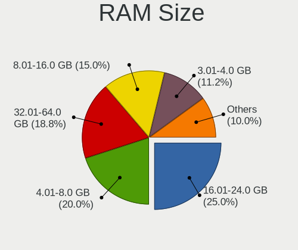
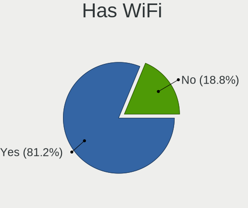
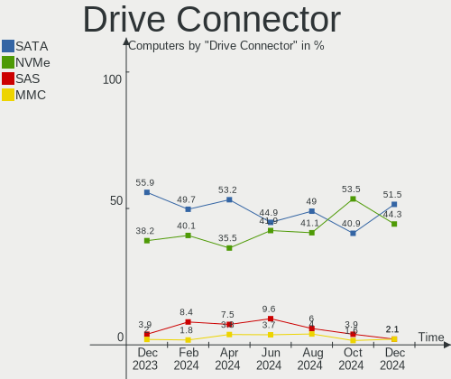
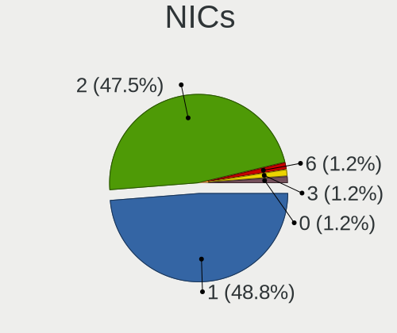
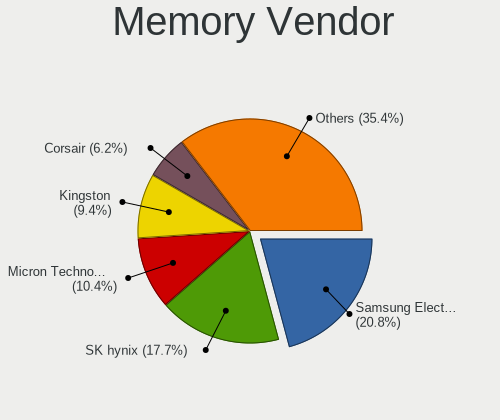
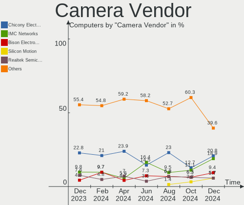

ArcoLinux - Hardware Trends
---------------------------

A project to identify most popular hardware characteristics and track their change
over time based on data collected by Linux users at https://Linux-Hardware.org.

Anyone can contribute to this report by the [hw-probe](https://github.com/linuxhw/hw-probe) tool:

    sudo -E hw-probe -all -upload

This is a report for all computer types. See also reports for [desktops](/Dist/ArcoLinux/Desktop/README.md) and [notebooks](/Dist/ArcoLinux/Notebook/README.md).

This report is for one last month. Overall report since the beginning of time: [TestDays](https://github.com/linuxhw/TestDays)

Period: Jun, 2023.

Contents
--------

* [ System ](#system)
  - [ OS                       ](#os)
  - [ OS Family                ](#os-family)
  - [ Kernel                   ](#kernel)
  - [ Kernel Family            ](#kernel-family)
  - [ Kernel Major Ver.        ](#kernel-major-ver)
  - [ Arch                     ](#arch)
  - [ DE                       ](#de)
  - [ Display Server           ](#display-server)
  - [ Display Manager          ](#display-manager)
  - [ OS Lang                  ](#os-lang)
  - [ Boot Mode                ](#boot-mode)
  - [ Filesystem               ](#filesystem)
  - [ Part. scheme             ](#part-scheme)
  - [ Dual Boot with Linux/BSD ](#dual-boot-with-linuxbsd)
  - [ Dual Boot (Win)          ](#dual-boot-win)

* [ Board ](#board)
  - [ Vendor                   ](#vendor)
  - [ Model                    ](#model)
  - [ Model Family             ](#model-family)
  - [ MFG Year                 ](#mfg-year)
  - [ Form Factor              ](#form-factor)
  - [ Secure Boot              ](#secure-boot)
  - [ Coreboot                 ](#coreboot)
  - [ RAM Size                 ](#ram-size)
  - [ RAM Used                 ](#ram-used)
  - [ Total Drives             ](#total-drives)
  - [ Has CD-ROM               ](#has-cd-rom)
  - [ Has Ethernet             ](#has-ethernet)
  - [ Has WiFi                 ](#has-wifi)
  - [ Has Bluetooth            ](#has-bluetooth)

* [ Location ](#location)
  - [ Country                  ](#country)
  - [ City                     ](#city)

* [ Drives ](#drives)
  - [ Drive Vendor             ](#drive-vendor)
  - [ Drive Model              ](#drive-model)
  - [ HDD Vendor               ](#hdd-vendor)
  - [ SSD Vendor               ](#ssd-vendor)
  - [ Drive Kind               ](#drive-kind)
  - [ Drive Connector          ](#drive-connector)
  - [ Drive Size               ](#drive-size)
  - [ Space Total              ](#space-total)
  - [ Space Used               ](#space-used)
  - [ Malfunc. Drives          ](#malfunc-drives)
  - [ Malfunc. Drive Vendor    ](#malfunc-drive-vendor)
  - [ Malfunc. HDD Vendor      ](#malfunc-hdd-vendor)
  - [ Malfunc. Drive Kind      ](#malfunc-drive-kind)
  - [ Failed Drives            ](#failed-drives)
  - [ Failed Drive Vendor      ](#failed-drive-vendor)
  - [ Drive Status             ](#drive-status)

* [ Storage controller ](#storage-controller)
  - [ Storage Vendor           ](#storage-vendor)
  - [ Storage Model            ](#storage-model)
  - [ Storage Kind             ](#storage-kind)

* [ Processor ](#processor)
  - [ CPU Vendor               ](#cpu-vendor)
  - [ CPU Model                ](#cpu-model)
  - [ CPU Model Family         ](#cpu-model-family)
  - [ CPU Cores                ](#cpu-cores)
  - [ CPU Sockets              ](#cpu-sockets)
  - [ CPU Threads              ](#cpu-threads)
  - [ CPU Op-Modes             ](#cpu-op-modes)
  - [ CPU Microcode            ](#cpu-microcode)
  - [ CPU Microarch            ](#cpu-microarch)

* [ Graphics ](#graphics)
  - [ GPU Vendor               ](#gpu-vendor)
  - [ GPU Model                ](#gpu-model)
  - [ GPU Combo                ](#gpu-combo)
  - [ GPU Driver               ](#gpu-driver)
  - [ GPU Memory               ](#gpu-memory)

* [ Monitor ](#monitor)
  - [ Monitor Vendor           ](#monitor-vendor)
  - [ Monitor Model            ](#monitor-model)
  - [ Monitor Resolution       ](#monitor-resolution)
  - [ Monitor Diagonal         ](#monitor-diagonal)
  - [ Monitor Width            ](#monitor-width)
  - [ Aspect Ratio             ](#aspect-ratio)
  - [ Monitor Area             ](#monitor-area)
  - [ Pixel Density            ](#pixel-density)
  - [ Multiple Monitors        ](#multiple-monitors)

* [ Network ](#network)
  - [ Net Controller Vendor    ](#net-controller-vendor)
  - [ Net Controller Model     ](#net-controller-model)
  - [ Wireless Vendor          ](#wireless-vendor)
  - [ Wireless Model           ](#wireless-model)
  - [ Ethernet Vendor          ](#ethernet-vendor)
  - [ Ethernet Model           ](#ethernet-model)
  - [ Net Controller Kind      ](#net-controller-kind)
  - [ Used Controller          ](#used-controller)
  - [ NICs                     ](#nics)
  - [ IPv6                     ](#ipv6)

* [ Bluetooth ](#bluetooth)
  - [ Bluetooth Vendor         ](#bluetooth-vendor)
  - [ Bluetooth Model          ](#bluetooth-model)

* [ Sound ](#sound)
  - [ Sound Vendor             ](#sound-vendor)
  - [ Sound Model              ](#sound-model)

* [ Memory ](#memory)
  - [ Memory Vendor            ](#memory-vendor)
  - [ Memory Model             ](#memory-model)
  - [ Memory Kind              ](#memory-kind)
  - [ Memory Form Factor       ](#memory-form-factor)
  - [ Memory Size              ](#memory-size)
  - [ Memory Speed             ](#memory-speed)

* [ Printers & scanners ](#printers--scanners)
  - [ Printer Vendor           ](#printer-vendor)
  - [ Printer Model            ](#printer-model)
  - [ Scanner Vendor           ](#scanner-vendor)
  - [ Scanner Model            ](#scanner-model)

* [ Camera ](#camera)
  - [ Camera Vendor            ](#camera-vendor)
  - [ Camera Model             ](#camera-model)

* [ Security ](#security)
  - [ Fingerprint Vendor       ](#fingerprint-vendor)
  - [ Fingerprint Model        ](#fingerprint-model)
  - [ Chipcard Vendor          ](#chipcard-vendor)
  - [ Chipcard Model           ](#chipcard-model)

* [ Unsupported ](#unsupported)
  - [ Unsupported Devices      ](#unsupported-devices)
  - [ Unsupported Device Types ](#unsupported-device-types)

System
------

OS
--

Installed operating systems

| Name              | Computers | Percent |
|-------------------|-----------|---------|
| ArcoLinux Rolling | 155       | 98.1%   |
| ArcoLinux         | 3         | 1.9%    |

OS Family
---------

OS without a version

| Name      | Computers | Percent |
|-----------|-----------|---------|
| ArcoLinux | 158       | 100%    |

Kernel
------

Version of the Linux kernel

| Version                                                | Computers | Percent |
|--------------------------------------------------------|-----------|---------|
| 6.3.9-arch1-1                                          | 22        | 13.92%  |
| 6.3.7-arch1-1                                          | 19        | 12.03%  |
| 6.3.8-arch1-1                                          | 16        | 10.13%  |
| 6.3.6-arch1-1                                          | 14        | 8.86%   |
| 6.3.5-arch1-1                                          | 12        | 7.59%   |
| 6.3.3-arch1-1                                          | 9         | 5.7%    |
| 6.3.8-zen1-1-zen                                       | 7         | 4.43%   |
| 6.1.33-1-lts                                           | 7         | 4.43%   |
| 6.3.5-zen1-1-zen                                       | 6         | 3.8%    |
| 6.1.35-1-lts                                           | 6         | 3.8%    |
| 6.1.31-1-lts                                           | 5         | 3.16%   |
| 6.3.8-x64v1-xanmod1-1                                  | 4         | 2.53%   |
| 6.3.3-x64v1-xanmod1-1                                  | 4         | 2.53%   |
| 6.3.9-zen1-1-zen                                       | 3         | 1.9%    |
| 6.3.6-zen1-1-zen                                       | 3         | 1.9%    |
| 6.2.10-x64v1-xanmod1-1                                 | 3         | 1.9%    |
| 6.3.7-zen1-1-zen                                       | 2         | 1.27%   |
| 6.1.34-1-lts                                           | 2         | 1.27%   |
| 6.4.0-rc5-next-20230609-1-next-git-08413-g53ab6975c12d | 1         | 0.63%   |
| 6.3.7-1-cachyos-bore                                   | 1         | 0.63%   |
| 6.3.5-zen2-1-zen                                       | 1         | 0.63%   |
| 6.3.4-arch2-1                                          | 1         | 0.63%   |
| 6.3.4-arch1-1                                          | 1         | 0.63%   |
| 6.3.1-1-cachyos-eevdf-bore                             | 1         | 0.63%   |
| 6.2.6-arch1-1                                          | 1         | 0.63%   |
| 6.1.32-1-lts                                           | 1         | 0.63%   |
| 6.1.31-hardened1-1-hardened                            | 1         | 0.63%   |
| 6.1.29-1-lts                                           | 1         | 0.63%   |
| 6.1.28-x64v2-rt10-xanmod1-1-rt                         | 1         | 0.63%   |
| 5.17.6-arch1-1                                         | 1         | 0.63%   |
| 5.15.94-1-lts                                          | 1         | 0.63%   |
| 5.15.107.62.realtime1-2-rt-lts                         | 1         | 0.63%   |

Kernel Family
-------------

Linux kernel without a distro release

| Version     | Computers | Percent |
|-------------|-----------|---------|
| 6.3.8       | 27        | 17.09%  |
| 6.3.9       | 25        | 15.82%  |
| 6.3.7       | 22        | 13.92%  |
| 6.3.5       | 19        | 12.03%  |
| 6.3.6       | 17        | 10.76%  |
| 6.3.3       | 13        | 8.23%   |
| 6.1.33      | 7         | 4.43%   |
| 6.1.35      | 6         | 3.8%    |
| 6.1.31      | 6         | 3.8%    |
| 6.2.10      | 3         | 1.9%    |
| 6.3.4       | 2         | 1.27%   |
| 6.1.34      | 2         | 1.27%   |
| 6.4.0       | 1         | 0.63%   |
| 6.3.1       | 1         | 0.63%   |
| 6.2.6       | 1         | 0.63%   |
| 6.1.32      | 1         | 0.63%   |
| 6.1.29      | 1         | 0.63%   |
| 6.1.28      | 1         | 0.63%   |
| 5.17.6      | 1         | 0.63%   |
| 5.15.94     | 1         | 0.63%   |
| 5.15.107.62 | 1         | 0.63%   |

Kernel Major Ver.
-----------------

Linux kernel major version

| Version  | Computers | Percent |
|----------|-----------|---------|
| 6.3      | 126       | 79.75%  |
| 6.1      | 24        | 15.19%  |
| 6.2      | 4         | 2.53%   |
| 6.4      | 1         | 0.63%   |
| 5.17     | 1         | 0.63%   |
| 5.15.107 | 1         | 0.63%   |
| 5.15     | 1         | 0.63%   |

Arch
----

OS architecture (x86_64, i586, etc.)

| Name   | Computers | Percent |
|--------|-----------|---------|
| x86_64 | 158       | 100%    |

DE
--

Desktop Environment

| Name           | Computers | Percent |
|----------------|-----------|---------|
| XFCE           | 55        | 34.81%  |
| KDE5           | 50        | 31.65%  |
| i3             | 14        | 8.86%   |
| Cinnamon       | 9         | 5.7%    |
| GNOME          | 7         | 4.43%   |
| Hyprland       | 5         | 3.16%   |
| Deepin         | 3         | 1.9%    |
| awesome        | 3         | 1.9%    |
| X-Cinnamon     | 2         | 1.27%   |
| LXQt           | 2         | 1.27%   |
| sway           | 1         | 0.63%   |
| MATE           | 1         | 0.63%   |
| LeftWM         | 1         | 0.63%   |
| i3-with-shmlog | 1         | 0.63%   |
| Hypr           | 1         | 0.63%   |
| herbstluftwm   | 1         | 0.63%   |
| chadwm         | 1         | 0.63%   |
| Budgie         | 1         | 0.63%   |

Display Server
--------------

X11 or Wayland

| Name    | Computers | Percent |
|---------|-----------|---------|
| X11     | 138       | 87.34%  |
| Wayland | 16        | 10.13%  |
| Tty     | 3         | 1.9%    |
| Unknown | 1         | 0.63%   |

Display Manager
---------------

SDDM, LightDM, etc.

| Name    | Computers | Percent |
|---------|-----------|---------|
| SDDM    | 114       | 72.15%  |
| LightDM | 35        | 22.15%  |
| GDM     | 5         | 3.16%   |
| Unknown | 3         | 1.9%    |
| LXDM    | 1         | 0.63%   |

OS Lang
-------

Language

| Lang       | Computers | Percent |
|------------|-----------|---------|
| en_US      | 86        | 54.43%  |
| en_GB      | 13        | 8.23%   |
| en_IN      | 7         | 4.43%   |
| pt_BR      | 6         | 3.8%    |
| en_CA      | 6         | 3.8%    |
| C          | 6         | 3.8%    |
| ru_RU      | 5         | 3.16%   |
| de_DE      | 5         | 3.16%   |
| es_ES      | 3         | 1.9%    |
| pl_PL      | 2         | 1.27%   |
| en_ZA      | 2         | 1.27%   |
| uk_UA      | 1         | 0.63%   |
| tr_TR      | 1         | 0.63%   |
| sv_SE      | 1         | 0.63%   |
| ko_KR      | 1         | 0.63%   |
| hu_HU      | 1         | 0.63%   |
| fr_FR      | 1         | 0.63%   |
| es_UY.UTF8 | 1         | 0.63%   |
| es_MX      | 1         | 0.63%   |
| es_BO      | 1         | 0.63%   |
| en_SG      | 1         | 0.63%   |
| en_PH      | 1         | 0.63%   |
| en_IE      | 1         | 0.63%   |
| en_HK      | 1         | 0.63%   |
| en_DK      | 1         | 0.63%   |
| en_AU      | 1         | 0.63%   |
| el_GR      | 1         | 0.63%   |
| bg_BG      | 1         | 0.63%   |

Boot Mode
---------

EFI or BIOS

| Mode | Computers | Percent |
|------|-----------|---------|
| EFI  | 132       | 83.54%  |
| BIOS | 26        | 16.46%  |

Filesystem
----------

Type of filesystem

| Type    | Computers | Percent |
|---------|-----------|---------|
| Ext4    | 105       | 66.46%  |
| Btrfs   | 44        | 27.85%  |
| Overlay | 6         | 3.8%    |
| Xfs     | 2         | 1.27%   |
| F2fs    | 1         | 0.63%   |

Part. scheme
------------

Scheme of partitioning

| Type    | Computers | Percent |
|---------|-----------|---------|
| GPT     | 138       | 87.34%  |
| MBR     | 17        | 10.76%  |
| Unknown | 3         | 1.9%    |

Dual Boot with Linux/BSD
------------------------

Hosting more than one Linux/BSD

| Dual boot | Computers | Percent |
|-----------|-----------|---------|
| No        | 118       | 74.68%  |
| Yes       | 40        | 25.32%  |

Dual Boot (Win)
---------------

Hosting Linux and Windows

| Dual boot | Computers | Percent |
|-----------|-----------|---------|
| No        | 102       | 64.56%  |
| Yes       | 56        | 35.44%  |

Board
-----

Vendor
------

Motherboard manufacturer

| Name                | Computers | Percent |
|---------------------|-----------|---------|
| ASUSTek Computer    | 29        | 18.35%  |
| Lenovo              | 23        | 14.56%  |
| Hewlett-Packard     | 20        | 12.66%  |
| MSI                 | 18        | 11.39%  |
| Dell                | 15        | 9.49%   |
| Gigabyte Technology | 11        | 6.96%   |
| ASRock              | 8         | 5.06%   |
| Acer                | 5         | 3.16%   |
| Intel               | 4         | 2.53%   |
| AZW                 | 4         | 2.53%   |
| Apple               | 4         | 2.53%   |
| Toshiba             | 2         | 1.27%   |
| Unknown             | 2         | 1.27%   |
| Win element         | 1         | 0.63%   |
| TECNO               | 1         | 0.63%   |
| SYWZ                | 1         | 0.63%   |
| Sony                | 1         | 0.63%   |
| Razer               | 1         | 0.63%   |
| Positivo            | 1         | 0.63%   |
| HUAWEI              | 1         | 0.63%   |
| Hardkernel          | 1         | 0.63%   |
| Fujitsu             | 1         | 0.63%   |
| Emdoor              | 1         | 0.63%   |
| CompuLab            | 1         | 0.63%   |
| ATOPNUC             | 1         | 0.63%   |
| Acidanthera         | 1         | 0.63%   |

Model
-----

Motherboard model

| Name                                            | Computers | Percent |
|-------------------------------------------------|-----------|---------|
| MSI MS-7C02                                     | 2         | 1.27%   |
| Intel H61                                       | 2         | 1.27%   |
| AZW SER                                         | 2         | 1.27%   |
| ASUS TUF Gaming X570-PLUS                       | 2         | 1.27%   |
| ASUS TUF Gaming FX505DT_FX505DT                 | 2         | 1.27%   |
| Unknown                                         | 2         | 1.27%   |
| Win element M600                                | 1         | 0.63%   |
| Toshiba Satellite Pro C50-A-1E6                 | 1         | 0.63%   |
| Toshiba Satellite L305                          | 1         | 0.63%   |
| TECNO MEGABOOK T1                               | 1         | 0.63%   |
| SYWZ S200 Series                                | 1         | 0.63%   |
| Sony SVE1712C1EW                                | 1         | 0.63%   |
| Razer Blade Stealth 13 (Early 2020) - RZ09-0310 | 1         | 0.63%   |
| Positivo D6200                                  | 1         | 0.63%   |
| MSI MS-7C95                                     | 1         | 0.63%   |
| MSI MS-7C83                                     | 1         | 0.63%   |
| MSI MS-7C56                                     | 1         | 0.63%   |
| MSI MS-7C13                                     | 1         | 0.63%   |
| MSI MS-7B98                                     | 1         | 0.63%   |
| MSI MS-7B86                                     | 1         | 0.63%   |
| MSI MS-7B24                                     | 1         | 0.63%   |
| MSI MS-7B17                                     | 1         | 0.63%   |
| MSI MS-7A39                                     | 1         | 0.63%   |
| MSI MS-7976                                     | 1         | 0.63%   |
| MSI MS-7885                                     | 1         | 0.63%   |
| MSI MPG H410 Trident 3 (MS-B932)                | 1         | 0.63%   |
| MSI Katana GF66 11SC                            | 1         | 0.63%   |
| MSI GS66 Stealth 10SF                           | 1         | 0.63%   |
| MSI GP72MVR 7RGX                                | 1         | 0.63%   |
| MSI GL73 8RD                                    | 1         | 0.63%   |
| Lenovo V15 G3 ABA 82TV                          | 1         | 0.63%   |
| Lenovo V15 G2 ALC 82KD                          | 1         | 0.63%   |
| Lenovo ThinkPad X250 20CMCTO1WW                 | 1         | 0.63%   |
| Lenovo ThinkPad X230 2325SLU                    | 1         | 0.63%   |
| Lenovo ThinkPad X1 Yoga 4th 20SACTO1WW          | 1         | 0.63%   |
| Lenovo ThinkPad X1 Carbon Gen 10 21CB00AYMX     | 1         | 0.63%   |
| Lenovo ThinkPad T450 20BUS1BW01                 | 1         | 0.63%   |
| Lenovo ThinkPad T440 20B6005RUS                 | 1         | 0.63%   |
| Lenovo ThinkPad T430 2349GDU                    | 1         | 0.63%   |
| Lenovo ThinkPad T15 Gen 2i 20W4000NRT           | 1         | 0.63%   |

Model Family
------------

Motherboard model prefix

| Name              | Computers | Percent |
|-------------------|-----------|---------|
| Lenovo ThinkPad   | 8         | 5.06%   |
| Lenovo IdeaPad    | 8         | 5.06%   |
| ASUS TUF          | 6         | 3.8%    |
| ASUS PRIME        | 6         | 3.8%    |
| HP Pavilion       | 5         | 3.16%   |
| ASUS ROG          | 5         | 3.16%   |
| Dell OptiPlex     | 4         | 2.53%   |
| Dell Inspiron     | 4         | 2.53%   |
| HP Laptop         | 3         | 1.9%    |
| Toshiba Satellite | 2         | 1.27%   |
| MSI MS-7C02       | 2         | 1.27%   |
| Lenovo V15        | 2         | 1.27%   |
| Intel H61         | 2         | 1.27%   |
| HP ProDesk        | 2         | 1.27%   |
| HP OMEN           | 2         | 1.27%   |
| Gigabyte B450M    | 2         | 1.27%   |
| Dell Precision    | 2         | 1.27%   |
| Dell Latitude     | 2         | 1.27%   |
| AZW SER           | 2         | 1.27%   |
| ASUS VivoBook     | 2         | 1.27%   |
| ASUS ASUS         | 2         | 1.27%   |
| Acer Nitro        | 2         | 1.27%   |
| Acer Aspire       | 2         | 1.27%   |
| Unknown           | 2         | 1.27%   |
| Win element M600  | 1         | 0.63%   |
| TECNO MEGABOOK    | 1         | 0.63%   |
| SYWZ S200         | 1         | 0.63%   |
| Sony SVE1712C1EW  | 1         | 0.63%   |
| Razer Blade       | 1         | 0.63%   |
| Positivo D6200    | 1         | 0.63%   |
| MSI MS-7C95       | 1         | 0.63%   |
| MSI MS-7C83       | 1         | 0.63%   |
| MSI MS-7C56       | 1         | 0.63%   |
| MSI MS-7C13       | 1         | 0.63%   |
| MSI MS-7B98       | 1         | 0.63%   |
| MSI MS-7B86       | 1         | 0.63%   |
| MSI MS-7B24       | 1         | 0.63%   |
| MSI MS-7B17       | 1         | 0.63%   |
| MSI MS-7A39       | 1         | 0.63%   |
| MSI MS-7976       | 1         | 0.63%   |

MFG Year
--------

Motherboard manufacture year

| Year | Computers | Percent |
|------|-----------|---------|
| 2020 | 25        | 15.82%  |
| 2018 | 19        | 12.03%  |
| 2022 | 18        | 11.39%  |
| 2021 | 16        | 10.13%  |
| 2019 | 15        | 9.49%   |
| 2012 | 11        | 6.96%   |
| 2016 | 10        | 6.33%   |
| 2014 | 10        | 6.33%   |
| 2017 | 7         | 4.43%   |
| 2013 | 7         | 4.43%   |
| 2015 | 6         | 3.8%    |
| 2023 | 5         | 3.16%   |
| 2011 | 5         | 3.16%   |
| 2008 | 2         | 1.27%   |
| 2010 | 1         | 0.63%   |
| 2007 | 1         | 0.63%   |

Form Factor
-----------

Physical design of the computer

| Name        | Computers | Percent |
|-------------|-----------|---------|
| Notebook    | 74        | 46.84%  |
| Desktop     | 73        | 46.2%   |
| Mini pc     | 6         | 3.8%    |
| All in one  | 3         | 1.9%    |
| Convertible | 2         | 1.27%   |

Secure Boot
-----------

Enabled or disabled

| State    | Computers | Percent |
|----------|-----------|---------|
| Disabled | 158       | 100%    |

Coreboot
--------

Have coreboot on board

| Used | Computers | Percent |
|------|-----------|---------|
| No   | 158       | 100%    |

RAM Size
--------

Total RAM memory

| Size in GB  | Computers | Percent |
|-------------|-----------|---------|
| 16.01-24.0  | 50        | 31.65%  |
| 4.01-8.0    | 31        | 19.62%  |
| 32.01-64.0  | 26        | 16.46%  |
| 8.01-16.0   | 22        | 13.92%  |
| 3.01-4.0    | 14        | 8.86%   |
| 64.01-256.0 | 8         | 5.06%   |
| 24.01-32.0  | 7         | 4.43%   |

RAM Used
--------

Used RAM memory

| Used GB   | Computers | Percent |
|-----------|-----------|---------|
| 1.01-2.0  | 55        | 34.81%  |
| 2.01-3.0  | 41        | 25.95%  |
| 4.01-8.0  | 25        | 15.82%  |
| 3.01-4.0  | 22        | 13.92%  |
| 0.51-1.0  | 8         | 5.06%   |
| 8.01-16.0 | 7         | 4.43%   |

Total Drives
------------

Number of drives on board

| Drives | Computers | Percent |
|--------|-----------|---------|
| 1      | 74        | 46.84%  |
| 2      | 48        | 30.38%  |
| 3      | 15        | 9.49%   |
| 4      | 12        | 7.59%   |
| 5      | 3         | 1.9%    |
| 11     | 2         | 1.27%   |
| 6      | 2         | 1.27%   |
| 19     | 1         | 0.63%   |
| 7      | 1         | 0.63%   |

Has CD-ROM
----------

Has CD-ROM on board

| Presented | Computers | Percent |
|-----------|-----------|---------|
| No        | 129       | 81.65%  |
| Yes       | 29        | 18.35%  |

Has Ethernet
------------

Has Ethernet on board

| Presented | Computers | Percent |
|-----------|-----------|---------|
| Yes       | 139       | 87.97%  |
| No        | 19        | 12.03%  |

Has WiFi
--------

Has WiFi module

| Presented | Computers | Percent |
|-----------|-----------|---------|
| Yes       | 116       | 73.42%  |
| No        | 42        | 26.58%  |

Has Bluetooth
-------------

Has Bluetooth module

| Presented | Computers | Percent |
|-----------|-----------|---------|
| Yes       | 110       | 69.62%  |
| No        | 48        | 30.38%  |

Location
--------

Country
-------

Geographic location (country)

| Country                | Computers | Percent |
|------------------------|-----------|---------|
| USA                    | 46        | 29.11%  |
| UK                     | 11        | 6.96%   |
| India                  | 9         | 5.7%    |
| Brazil                 | 9         | 5.7%    |
| Canada                 | 7         | 4.43%   |
| Russia                 | 6         | 3.8%    |
| Poland                 | 6         | 3.8%    |
| Germany                | 6         | 3.8%    |
| Belgium                | 5         | 3.16%   |
| Sweden                 | 4         | 2.53%   |
| Spain                  | 4         | 2.53%   |
| Netherlands            | 4         | 2.53%   |
| Turkey                 | 3         | 1.9%    |
| Malaysia               | 3         | 1.9%    |
| France                 | 3         | 1.9%    |
| South Africa           | 2         | 1.27%   |
| Norway                 | 2         | 1.27%   |
| China                  | 2         | 1.27%   |
| Bulgaria               | 2         | 1.27%   |
| Uruguay                | 1         | 0.63%   |
| Thailand               | 1         | 0.63%   |
| South Korea            | 1         | 0.63%   |
| Slovakia               | 1         | 0.63%   |
| Singapore              | 1         | 0.63%   |
| Serbia                 | 1         | 0.63%   |
| Romania                | 1         | 0.63%   |
| Portugal               | 1         | 0.63%   |
| Philippines            | 1         | 0.63%   |
| Mexico                 | 1         | 0.63%   |
| Malta                  | 1         | 0.63%   |
| Lithuania              | 1         | 0.63%   |
| Japan                  | 1         | 0.63%   |
| Hungary                | 1         | 0.63%   |
| Hong Kong              | 1         | 0.63%   |
| Greece                 | 1         | 0.63%   |
| Finland                | 1         | 0.63%   |
| Denmark                | 1         | 0.63%   |
| Czechia                | 1         | 0.63%   |
| Cyprus                 | 1         | 0.63%   |
| Bosnia and Herzegovina | 1         | 0.63%   |

City
----

Geographic location (city)

| City            | Computers | Percent |
|-----------------|-----------|---------|
| St Petersburg   | 3         | 1.9%    |
| New York        | 3         | 1.9%    |
| Duffel          | 3         | 1.9%    |
| Warsaw          | 2         | 1.27%   |
| Toronto         | 2         | 1.27%   |
| Stockholm       | 2         | 1.27%   |
| Seattle         | 2         | 1.27%   |
| Hyderabad       | 2         | 1.27%   |
| Chennai         | 2         | 1.27%   |
| Birmingham      | 2         | 1.27%   |
| Berlin          | 2         | 1.27%   |
| Atlanta         | 2         | 1.27%   |
| Antalya         | 2         | 1.27%   |
| Amsterdam       | 2         | 1.27%   |
| Zaragoza        | 1         | 0.63%   |
| Yerington       | 1         | 0.63%   |
| Yachats         | 1         | 0.63%   |
| Xiamen          | 1         | 0.63%   |
| Winnipeg        | 1         | 0.63%   |
| Willits         | 1         | 0.63%   |
| Wiesbaden       | 1         | 0.63%   |
| West Palm Beach | 1         | 0.63%   |
| Washington      | 1         | 0.63%   |
| Warwick         | 1         | 0.63%   |
| Vilnius         | 1         | 0.63%   |
| Vicosa          | 1         | 0.63%   |
| Vence           | 1         | 0.63%   |
| Vejle           | 1         | 0.63%   |
| Vancouver       | 1         | 0.63%   |
| Tsuen Wan       | 1         | 0.63%   |
| Tokyo           | 1         | 0.63%   |
| Toeroekbalint   | 1         | 0.63%   |
| Thorofare       | 1         | 0.63%   |
| Szczecin        | 1         | 0.63%   |
| Syracuse        | 1         | 0.63%   |
| Swieqi          | 1         | 0.63%   |
| Svilengrad      | 1         | 0.63%   |
| Sungai Petani   | 1         | 0.63%   |
| Subotica        | 1         | 0.63%   |
| Steinberg       | 1         | 0.63%   |

Drives
------

Drive Vendor
------------

Hard drive vendors

| Vendor                    | Computers | Drives | Percent |
|---------------------------|-----------|--------|---------|
| Samsung Electronics       | 61        | 77     | 22.02%  |
| WDC                       | 29        | 36     | 10.47%  |
| Seagate                   | 29        | 39     | 10.47%  |
| SanDisk                   | 16        | 16     | 5.78%   |
| Kingston                  | 15        | 20     | 5.42%   |
| Toshiba                   | 9         | 9      | 3.25%   |
| SK hynix                  | 9         | 10     | 3.25%   |
| Phison Electronics        | 6         | 8      | 2.17%   |
| Intel                     | 6         | 7      | 2.17%   |
| Unknown                   | 5         | 5      | 1.81%   |
| Micron/Crucial Technology | 5         | 5      | 1.81%   |
| HGST                      | 5         | 5      | 1.81%   |
| Crucial                   | 5         | 5      | 1.81%   |
| SABRENT                   | 4         | 4      | 1.44%   |
| OCZ                       | 4         | 4      | 1.44%   |
| Micron Technology         | 4         | 8      | 1.44%   |
| Hitachi                   | 4         | 4      | 1.44%   |
| Apple                     | 4         | 4      | 1.44%   |
| Silicon Motion            | 3         | 3      | 1.08%   |
| KIOXIA                    | 3         | 3      | 1.08%   |
| Transcend                 | 2         | 2      | 0.72%   |
| SPCC                      | 2         | 2      | 0.72%   |
| Realtek Semiconductor     | 2         | 2      | 0.72%   |
| PNY                       | 2         | 3      | 0.72%   |
| Plextor                   | 2         | 2      | 0.72%   |
| Hewlett-Packard           | 2         | 5      | 0.72%   |
| Unknown                   | 2         | 2      | 0.72%   |
| Verbatim                  | 1         | 1      | 0.36%   |
| Timetec                   | 1         | 1      | 0.36%   |
| T-FORCE                   | 1         | 1      | 0.36%   |
| StoreJet                  | 1         | 1      | 0.36%   |
| sobetter                  | 1         | 1      | 0.36%   |
| ShiJi                     | 1         | 1      | 0.36%   |
| SCY                       | 1         | 1      | 0.36%   |
| Rogueware                 | 1         | 1      | 0.36%   |
| RevuAhn                   | 1         | 1      | 0.36%   |
| PNY CS90                  | 1         | 1      | 0.36%   |
| OWC                       | 1         | 1      | 0.36%   |
| OCZ-VERTEX3               | 1         | 1      | 0.36%   |
| Netac                     | 1         | 1      | 0.36%   |

Drive Model
-----------

Hard drive models

| Model                                                 | Computers | Percent |
|-------------------------------------------------------|-----------|---------|
| Samsung NVMe SSD Controller SM981/PM981/PM983 250GB   | 13        | 4.26%   |
| Samsung NVMe SSD Controller PM9A1/PM9A3/980PRO 2TB    | 8         | 2.62%   |
| Samsung SSD 870 EVO 1TB                               | 5         | 1.64%   |
| Samsung NVMe SSD Controller SM961/PM961/SM963 256GB   | 5         | 1.64%   |
| Micron/Crucial P2 NVMe PCIe SSD 4TB                   | 5         | 1.64%   |
| Seagate ST1000LM035-1RK172 1TB                        | 4         | 1.31%   |
| Sandisk WD Black SN750 / PC SN730 NVMe SSD 500GB      | 4         | 1.31%   |
| Samsung SSD 980 1TB                                   | 4         | 1.31%   |
| Samsung SSD 850 EVO 250GB                             | 4         | 1.31%   |
| Toshiba MQ01ABD100 1TB                                | 3         | 0.98%   |
| Sandisk WD Blue SN550 NVMe SSD 1TB                    | 3         | 0.98%   |
| Samsung SSD 860 EVO 1TB                               | 3         | 0.98%   |
| SABRENT Disk 1TB                                      | 3         | 0.98%   |
| KIOXIA KBG40ZNV256G 256GB                             | 3         | 0.98%   |
| Intel SSD 660P Series 512GB                           | 3         | 0.98%   |
| WDC WD40EFRX-68N32N0 4TB                              | 2         | 0.66%   |
| WDC WD2002FAEX-007BA0 2TB                             | 2         | 0.66%   |
| Toshiba HDWD110 1TB                                   | 2         | 0.66%   |
| SK hynix SKHynix_HFS512GDE9X081N 512GB                | 2         | 0.66%   |
| SK hynix BC511 256GB                                  | 2         | 0.66%   |
| Silicon Motion SM2263EN/SM2263XT SSD Controller 256GB | 2         | 0.66%   |
| Seagate ST500LM000-1EJ162 500GB                       | 2         | 0.66%   |
| Seagate ST2000DM008-2FR102 2TB                        | 2         | 0.66%   |
| Seagate ST1000DM003-1ER162 1TB                        | 2         | 0.66%   |
| Samsung SSD 850 PRO 256GB                             | 2         | 0.66%   |
| Samsung MZALQ512HBLU-00BL2 512GB                      | 2         | 0.66%   |
| Phison E16 PCIe4 NVMe Controller 1TB                  | 2         | 0.66%   |
| Phison E12 NVMe Controller 1TB                        | 2         | 0.66%   |
| Kingston SUV400S37120G 120GB SSD                      | 2         | 0.66%   |
| Kingston SA400S37480G 480GB SSD                       | 2         | 0.66%   |
| Kingston SA400S37120G 120GB SSD                       | 2         | 0.66%   |
| Intel SSDPEKNU512GZ 512GB                             | 2         | 0.66%   |
| Unknown                                               | 2         | 0.66%   |
| WDC WDS500G2B0A-00SM50 500GB SSD                      | 1         | 0.33%   |
| WDC WDS250G2B0A-00SM50 250GB SSD                      | 1         | 0.33%   |
| WDC WDS120G2G0A-00JH30 128GB SSD                      | 1         | 0.33%   |
| WDC WDBNCE0010PNC 1TB SSD                             | 1         | 0.33%   |
| WDC WD800JD-60LSA5 80GB                               | 1         | 0.33%   |
| WDC WD5000LPCX-24VHAT0 500GB                          | 1         | 0.33%   |
| WDC WD5000AAKX-75U6AA0 500GB                          | 1         | 0.33%   |

HDD Vendor
----------

Hard disk drive vendors

| Vendor              | Computers | Drives | Percent |
|---------------------|-----------|--------|---------|
| Seagate             | 29        | 39     | 35.8%   |
| WDC                 | 25        | 31     | 30.86%  |
| Toshiba             | 9         | 9      | 11.11%  |
| HGST                | 5         | 5      | 6.17%   |
| Hitachi             | 4         | 4      | 4.94%   |
| Samsung Electronics | 3         | 3      | 3.7%    |
| Apple               | 2         | 2      | 2.47%   |
| Unknown             | 1         | 1      | 1.23%   |
| LaCie               | 1         | 1      | 1.23%   |
| Fujitsu             | 1         | 1      | 1.23%   |
| ASMT                | 1         | 2      | 1.23%   |

SSD Vendor
----------

Solid state drive vendors

| Vendor              | Computers | Drives | Percent |
|---------------------|-----------|--------|---------|
| Samsung Electronics | 29        | 31     | 29.29%  |
| Kingston            | 12        | 15     | 12.12%  |
| WDC                 | 5         | 5      | 5.05%   |
| Crucial             | 5         | 5      | 5.05%   |
| OCZ                 | 4         | 4      | 4.04%   |
| SK hynix            | 3         | 3      | 3.03%   |
| SanDisk             | 3         | 3      | 3.03%   |
| Transcend           | 2         | 2      | 2.02%   |
| SPCC                | 2         | 2      | 2.02%   |
| PNY                 | 2         | 3      | 2.02%   |
| Plextor             | 2         | 2      | 2.02%   |
| Hewlett-Packard     | 2         | 5      | 2.02%   |
| Apple               | 2         | 2      | 2.02%   |
| Verbatim            | 1         | 1      | 1.01%   |
| T-FORCE             | 1         | 1      | 1.01%   |
| ShiJi               | 1         | 1      | 1.01%   |
| SCY                 | 1         | 1      | 1.01%   |
| Rogueware           | 1         | 1      | 1.01%   |
| RevuAhn             | 1         | 1      | 1.01%   |
| PNY CS90            | 1         | 1      | 1.01%   |
| OWC                 | 1         | 1      | 1.01%   |
| OCZ-VERTEX3         | 1         | 1      | 1.01%   |
| Micron Technology   | 1         | 4      | 1.01%   |
| MaxDigital          | 1         | 1      | 1.01%   |
| Lexar               | 1         | 1      | 1.01%   |
| KingDian            | 1         | 1      | 1.01%   |
| Intenso             | 1         | 1      | 1.01%   |
| INTEL SS            | 1         | 1      | 1.01%   |
| HS-SSD-C100         | 1         | 1      | 1.01%   |
| HPE                 | 1         | 4      | 1.01%   |
| GOODRAM             | 1         | 1      | 1.01%   |
| Gigabyte Technology | 1         | 1      | 1.01%   |
| Corsair             | 1         | 1      | 1.01%   |
| China               | 1         | 2      | 1.01%   |
| Apacer              | 1         | 1      | 1.01%   |
| aigo                | 1         | 1      | 1.01%   |
| Acer                | 1         | 1      | 1.01%   |
| A-DATA Technology   | 1         | 1      | 1.01%   |
| Unknown             | 1         | 1      | 1.01%   |

Drive Kind
----------

HDD or SSD

| Kind    | Computers | Drives | Percent |
|---------|-----------|--------|---------|
| NVMe    | 86        | 111    | 36.29%  |
| SSD     | 80        | 115    | 33.76%  |
| HDD     | 63        | 98     | 26.58%  |
| MMC     | 4         | 4      | 1.69%   |
| Unknown | 4         | 4      | 1.69%   |

Drive Connector
---------------

SATA, SAS, NVMe, etc.

| Type | Computers | Drives | Percent |
|------|-----------|--------|---------|
| SATA | 108       | 197    | 51.43%  |
| NVMe | 85        | 107    | 40.48%  |
| SAS  | 13        | 24     | 6.19%   |
| MMC  | 4         | 4      | 1.9%    |

Drive Size
----------

Size of hard drive

| Size in TB | Computers | Drives | Percent |
|------------|-----------|--------|---------|
| 0.01-0.5   | 68        | 99     | 44.74%  |
| 0.51-1.0   | 54        | 67     | 35.53%  |
| 1.01-2.0   | 17        | 27     | 11.18%  |
| 3.01-4.0   | 5         | 12     | 3.29%   |
| 4.01-10.0  | 4         | 4      | 2.63%   |
| 2.01-3.0   | 3         | 3      | 1.97%   |
| 10.01-20.0 | 1         | 1      | 0.66%   |

Space Total
-----------

Amount of disk space available on the file system

| Size in GB     | Computers | Percent |
|----------------|-----------|---------|
| More than 3000 | 29        | 18.35%  |
| 251-500        | 29        | 18.35%  |
| 501-1000       | 28        | 17.72%  |
| 101-250        | 24        | 15.19%  |
| 1001-2000      | 14        | 8.86%   |
| 51-100         | 9         | 5.7%    |
| Unknown        | 8         | 5.06%   |
| 2001-3000      | 6         | 3.8%    |
| 1-20           | 6         | 3.8%    |
| 21-50          | 5         | 3.16%   |

Space Used
----------

Amount of used disk space

| Used GB        | Computers | Percent |
|----------------|-----------|---------|
| 1-20           | 39        | 24.68%  |
| 101-250        | 31        | 19.62%  |
| 21-50          | 23        | 14.56%  |
| 251-500        | 15        | 9.49%   |
| 51-100         | 15        | 9.49%   |
| 501-1000       | 9         | 5.7%    |
| Unknown        | 8         | 5.06%   |
| 1001-2000      | 7         | 4.43%   |
| More than 3000 | 6         | 3.8%    |
| 2001-3000      | 4         | 2.53%   |
| 0              | 1         | 0.63%   |

Malfunc. Drives
---------------

Drive models with a malfunction

| Model                                                          | Computers | Drives | Percent |
|----------------------------------------------------------------|-----------|--------|---------|
| Samsung Electronics SSD 870 EVO 1TB                            | 3         | 4      | 13.04%  |
| Toshiba MQ01ABD100 1TB                                         | 2         | 2      | 8.7%    |
| WDC WD2002FAEX-007BA0 2TB                                      | 1         | 1      | 4.35%   |
| WDC WD10EARS-22Y5B1 1TB                                        | 1         | 1      | 4.35%   |
| WDC WD10EADS-114BB1 1TB                                        | 1         | 1      | 4.35%   |
| WDC WD10EADS-00P8B0 1TB                                        | 1         | 1      | 4.35%   |
| Toshiba MQ01ABF050 500GB                                       | 1         | 1      | 4.35%   |
| Toshiba HDWD110 1TB                                            | 1         | 1      | 4.35%   |
| Seagate ST8000VN0022-2EL112 8TB                                | 1         | 1      | 4.35%   |
| Seagate ST3500413AS 500GB                                      | 1         | 1      | 4.35%   |
| Samsung Electronics NVMe SSD Controller PM9A1/PM9A3/980PRO 2TB | 1         | 2      | 4.35%   |
| Realtek Semiconductor RTS5763DL NVMe SSD Controller 512GB      | 1         | 1      | 4.35%   |
| Micron Technology 1100_MTFDDAK1T0TBN 1TB                       | 1         | 4      | 4.35%   |
| Kingston SV300S37A120G 120GB SSD                               | 1         | 1      | 4.35%   |
| Kingston SUV400S37120G 120GB SSD                               | 1         | 1      | 4.35%   |
| Kingston SMS200S330G 32GB SSD                                  | 1         | 1      | 4.35%   |
| HS-SSD-C100 SSD 240G                                           | 1         | 1      | 4.35%   |
| Hitachi HTS547575A9E384 752GB                                  | 1         | 1      | 4.35%   |
| Hitachi HTS543216L9A300 160GB                                  | 1         | 1      | 4.35%   |
| Crucial M4-CT128M4SSD2 128GB                                   | 1         | 1      | 4.35%   |

Malfunc. Drive Vendor
---------------------

Vendors of faulty drives

| Vendor                | Computers | Drives | Percent |
|-----------------------|-----------|--------|---------|
| WDC                   | 4         | 4      | 18.18%  |
| Toshiba               | 4         | 4      | 18.18%  |
| Samsung Electronics   | 3         | 6      | 13.64%  |
| Kingston              | 3         | 3      | 13.64%  |
| Seagate               | 2         | 2      | 9.09%   |
| Hitachi               | 2         | 2      | 9.09%   |
| Realtek Semiconductor | 1         | 1      | 4.55%   |
| Micron Technology     | 1         | 4      | 4.55%   |
| HS-SSD-C100           | 1         | 1      | 4.55%   |
| Crucial               | 1         | 1      | 4.55%   |

Malfunc. HDD Vendor
-------------------

Vendors of faulty HDD drives

| Vendor  | Computers | Drives | Percent |
|---------|-----------|--------|---------|
| WDC     | 4         | 4      | 33.33%  |
| Toshiba | 4         | 4      | 33.33%  |
| Seagate | 2         | 2      | 16.67%  |
| Hitachi | 2         | 2      | 16.67%  |

Malfunc. Drive Kind
-------------------

Kinds of faulty drives

| Kind | Computers | Drives | Percent |
|------|-----------|--------|---------|
| HDD  | 12        | 12     | 52.17%  |
| SSD  | 9         | 13     | 39.13%  |
| NVMe | 2         | 3      | 8.7%    |

Failed Drives
-------------

Failed drive models

Zero info for selected period =(

Failed Drive Vendor
-------------------

Failed drive vendors

Zero info for selected period =(

Drive Status
------------

Number of failed and malfunc. drives

| Status   | Computers | Drives | Percent |
|----------|-----------|--------|---------|
| Works    | 147       | 266    | 78.19%  |
| Malfunc  | 21        | 28     | 11.17%  |
| Detected | 20        | 38     | 10.64%  |

Storage controller
------------------

Storage Vendor
--------------

Storage controller vendors

| Vendor                      | Computers | Percent |
|-----------------------------|-----------|---------|
| Intel                       | 98        | 41%     |
| AMD                         | 42        | 17.57%  |
| Samsung Electronics         | 37        | 15.48%  |
| SanDisk                     | 13        | 5.44%   |
| SK hynix                    | 6         | 2.51%   |
| Phison Electronics          | 6         | 2.51%   |
| Micron/Crucial Technology   | 5         | 2.09%   |
| Kingston Technology Company | 5         | 2.09%   |
| Micron Technology           | 4         | 1.67%   |
| Marvell Technology Group    | 4         | 1.67%   |
| Silicon Motion              | 3         | 1.26%   |
| KIOXIA                      | 3         | 1.26%   |
| ASMedia Technology          | 3         | 1.26%   |
| Realtek Semiconductor       | 2         | 0.84%   |
| TenaFe                      | 1         | 0.42%   |
| Silicon Image               | 1         | 0.42%   |
| Netac Technology            | 1         | 0.42%   |
| MAXIO Technology (Hangzhou) | 1         | 0.42%   |
| Lite-On Technology          | 1         | 0.42%   |
| Hewlett-Packard             | 1         | 0.42%   |
| Biwin Storage Technology    | 1         | 0.42%   |
| ADATA Technology            | 1         | 0.42%   |

Storage Model
-------------

Storage controller models

| Model                                                                          | Computers | Percent |
|--------------------------------------------------------------------------------|-----------|---------|
| AMD FCH SATA Controller [AHCI mode]                                            | 34        | 12.83%  |
| Samsung NVMe SSD Controller SM981/PM981/PM983                                  | 13        | 4.91%   |
| Samsung NVMe SSD Controller 980                                                | 11        | 4.15%   |
| Intel Cannon Lake PCH SATA AHCI Controller                                     | 11        | 4.15%   |
| AMD 400 Series Chipset SATA Controller                                         | 11        | 4.15%   |
| Samsung NVMe SSD Controller PM9A1/PM9A3/980PRO                                 | 8         | 3.02%   |
| Intel Volume Management Device NVMe RAID Controller                            | 6         | 2.26%   |
| Intel Tiger Lake-LP SATA Controller                                            | 6         | 2.26%   |
| Intel Sunrise Point-LP SATA Controller [AHCI mode]                             | 6         | 2.26%   |
| Intel 7 Series Chipset Family 6-port SATA Controller [AHCI mode]               | 6         | 2.26%   |
| Samsung NVMe SSD Controller SM961/PM961/SM963                                  | 5         | 1.89%   |
| Micron/Crucial P2 NVMe PCIe SSD                                                | 5         | 1.89%   |
| Intel SATA Controller [RAID mode]                                              | 5         | 1.89%   |
| Intel Q170/Q150/B150/H170/H110/Z170/CM236 Chipset SATA Controller [AHCI Mode]  | 5         | 1.89%   |
| Intel 82801 Mobile SATA Controller [RAID mode]                                 | 5         | 1.89%   |
| Intel 7 Series/C210 Series Chipset Family 6-port SATA Controller [AHCI mode]   | 5         | 1.89%   |
| SK hynix Gold P31/BC711/PC711 NVMe Solid State Drive                           | 4         | 1.51%   |
| SanDisk WD Black SN750 / PC SN730 NVMe SSD                                     | 4         | 1.51%   |
| Intel 8 Series/C220 Series Chipset Family 6-port SATA Controller 1 [AHCI mode] | 4         | 1.51%   |
| Intel 400 Series Chipset Family SATA AHCI Controller                           | 4         | 1.51%   |
| AMD 500 Series Chipset SATA Controller                                         | 4         | 1.51%   |
| SanDisk WD Blue SN550 NVMe SSD                                                 | 3         | 1.13%   |
| KIOXIA NVMe SSD Controller BG4                                                 | 3         | 1.13%   |
| Kingston Company FURY Renegade NVMe SSD                                        | 3         | 1.13%   |
| Intel SSD 660P Series                                                          | 3         | 1.13%   |
| Intel Non-Volatile memory controller                                           | 3         | 1.13%   |
| Intel Comet Lake SATA AHCI Controller                                          | 3         | 1.13%   |
| Intel Celeron/Pentium Silver Processor SATA Controller                         | 3         | 1.13%   |
| Intel 9 Series Chipset Family SATA Controller [AHCI Mode]                      | 3         | 1.13%   |
| Intel 6 Series/C200 Series Chipset Family 6 port Desktop SATA AHCI Controller  | 3         | 1.13%   |
| Intel 500 Series Chipset Family SATA AHCI Controller                           | 3         | 1.13%   |
| Intel 200 Series PCH SATA controller [AHCI mode]                               | 3         | 1.13%   |
| ASMedia ASM1062 Serial ATA Controller                                          | 3         | 1.13%   |
| SK hynix BC511 NVMe SSD                                                        | 2         | 0.75%   |
| Silicon Motion SM2263EN/SM2263XT SSD Controller                                | 2         | 0.75%   |
| Phison E16 PCIe4 NVMe Controller                                               | 2         | 0.75%   |
| Phison E12 NVMe Controller                                                     | 2         | 0.75%   |
| Micron NVMe Storage Controller                                                 | 2         | 0.75%   |
| Intel Wildcat Point-LP SATA Controller [AHCI Mode]                             | 2         | 0.75%   |
| Intel 8 Series SATA Controller 1 [AHCI mode]                                   | 2         | 0.75%   |

Storage Kind
------------

Kind of storage controller (IDE, SATA, NVMe, SAS, ...)

| Kind | Computers | Percent |
|------|-----------|---------|
| SATA | 124       | 53.45%  |
| NVMe | 85        | 36.64%  |
| RAID | 19        | 8.19%   |
| IDE  | 4         | 1.72%   |

Processor
---------

CPU Vendor
----------

Processor vendors

| Vendor | Computers | Percent |
|--------|-----------|---------|
| Intel  | 105       | 66.46%  |
| AMD    | 53        | 33.54%  |

CPU Model
---------

Processor models

| Model                                         | Computers | Percent |
|-----------------------------------------------|-----------|---------|
| AMD Ryzen 5 2600 Six-Core Processor           | 4         | 2.53%   |
| Intel Core i5-3470 CPU @ 3.20GHz              | 3         | 1.9%    |
| Intel Core i5-3320M CPU @ 2.60GHz             | 3         | 1.9%    |
| Intel 11th Gen Core i5-1135G7 @ 2.40GHz       | 3         | 1.9%    |
| AMD Ryzen 9 5950X 16-Core Processor           | 3         | 1.9%    |
| AMD Ryzen 5 5600X 6-Core Processor            | 3         | 1.9%    |
| AMD Ryzen 5 3550H with Radeon Vega Mobile Gfx | 3         | 1.9%    |
| Intel Core i9-10900K CPU @ 3.70GHz            | 2         | 1.27%   |
| Intel Core i7-8750H CPU @ 2.20GHz             | 2         | 1.27%   |
| Intel Core i7-6700 CPU @ 3.40GHz              | 2         | 1.27%   |
| Intel Core i7-4790K CPU @ 4.00GHz             | 2         | 1.27%   |
| Intel Core i7-10750H CPU @ 2.60GHz            | 2         | 1.27%   |
| Intel Core i5-7200U CPU @ 2.50GHz             | 2         | 1.27%   |
| Intel Core i5-2520M CPU @ 2.50GHz             | 2         | 1.27%   |
| Intel Core i5-2400 CPU @ 3.10GHz              | 2         | 1.27%   |
| Intel Core i3-9100F CPU @ 3.60GHz             | 2         | 1.27%   |
| Intel Core i3-7100U CPU @ 2.40GHz             | 2         | 1.27%   |
| Intel 11th Gen Core i3-1115G4 @ 3.00GHz       | 2         | 1.27%   |
| AMD Ryzen 9 6900HX with Radeon Graphics       | 2         | 1.27%   |
| AMD Ryzen 7 4800H with Radeon Graphics        | 2         | 1.27%   |
| AMD Ryzen 5 5600H with Radeon Graphics        | 2         | 1.27%   |
| AMD Ryzen 5 4600H with Radeon Graphics        | 2         | 1.27%   |
| AMD Ryzen 5 3600 6-Core Processor             | 2         | 1.27%   |
| AMD Ryzen 3 3250U with Radeon Graphics        | 2         | 1.27%   |
| Intel Xeon W-2245 CPU @ 3.90GHz               | 1         | 0.63%   |
| Intel Xeon CPU E5-2630 v3 @ 2.40GHz           | 1         | 0.63%   |
| Intel Pentium Silver J5005 CPU @ 1.50GHz      | 1         | 0.63%   |
| Intel Pentium Gold G5400 CPU @ 3.70GHz        | 1         | 0.63%   |
| Intel Pentium CPU G3220T @ 2.60GHz            | 1         | 0.63%   |
| Intel Pentium CPU B980 @ 2.40GHz              | 1         | 0.63%   |
| Intel Pentium CPU 2117U @ 1.80GHz             | 1         | 0.63%   |
| Intel Core i9-8950HK CPU @ 2.90GHz            | 1         | 0.63%   |
| Intel Core i7-9700K CPU @ 3.60GHz             | 1         | 0.63%   |
| Intel Core i7-9700 CPU @ 3.00GHz              | 1         | 0.63%   |
| Intel Core i7-8565U CPU @ 1.80GHz             | 1         | 0.63%   |
| Intel Core i7-7700K CPU @ 4.20GHz             | 1         | 0.63%   |
| Intel Core i7-7700HQ CPU @ 2.80GHz            | 1         | 0.63%   |
| Intel Core i7-7500U CPU @ 2.70GHz             | 1         | 0.63%   |
| Intel Core i7-6920HQ CPU @ 2.90GHz            | 1         | 0.63%   |
| Intel Core i7-6820HQ CPU @ 2.70GHz            | 1         | 0.63%   |

CPU Model Family
----------------

Processor model prefix

| Model                | Computers | Percent |
|----------------------|-----------|---------|
| Intel Core i5        | 31        | 19.62%  |
| Intel Core i7        | 30        | 18.99%  |
| AMD Ryzen 5          | 22        | 13.92%  |
| Other                | 19        | 12.03%  |
| Intel Core i3        | 12        | 7.59%   |
| AMD Ryzen 9          | 9         | 5.7%    |
| AMD Ryzen 7          | 8         | 5.06%   |
| AMD Ryzen 3          | 5         | 3.16%   |
| Intel Pentium        | 3         | 1.9%    |
| Intel Core i9        | 3         | 1.9%    |
| Intel Celeron        | 3         | 1.9%    |
| Intel Xeon           | 2         | 1.27%   |
| AMD FX               | 2         | 1.27%   |
| Intel Pentium Silver | 1         | 0.63%   |
| Intel Pentium Gold   | 1         | 0.63%   |
| Intel Core 2 Quad    | 1         | 0.63%   |
| Intel Core 2 Duo     | 1         | 0.63%   |
| Intel Core 2         | 1         | 0.63%   |
| AMD E2               | 1         | 0.63%   |
| AMD E1               | 1         | 0.63%   |
| AMD A6               | 1         | 0.63%   |
| AMD A10              | 1         | 0.63%   |

CPU Cores
---------

Number of processor cores

| Number | Computers | Percent |
|--------|-----------|---------|
| 4      | 55        | 34.81%  |
| 2      | 40        | 25.32%  |
| 6      | 32        | 20.25%  |
| 8      | 19        | 12.03%  |
| 16     | 4         | 2.53%   |
| 12     | 4         | 2.53%   |
| 10     | 4         | 2.53%   |

CPU Sockets
-----------

Number of sockets

| Number | Computers | Percent |
|--------|-----------|---------|
| 1      | 158       | 100%    |

CPU Threads
-----------

Threads per core (Hyper-Threading)

| Number | Computers | Percent |
|--------|-----------|---------|
| 2      | 121       | 76.58%  |
| 1      | 37        | 23.42%  |

CPU Op-Modes
------------

CPU Operation Modes (32-bit, 64-bit)

| Op mode        | Computers | Percent |
|----------------|-----------|---------|
| 32-bit, 64-bit | 158       | 100%    |

CPU Microcode
-------------

Microcode number

| Number     | Computers | Percent |
|------------|-----------|---------|
| Unknown    | 89        | 56.33%  |
| 0x0800820d | 6         | 3.8%    |
| 0x0a50000c | 4         | 2.53%   |
| 0x08600106 | 4         | 2.53%   |
| 0x0a20120a | 3         | 1.9%    |
| 0x08701013 | 3         | 1.9%    |
| 0x08108109 | 3         | 1.9%    |
| 0x00000000 | 3         | 1.9%    |
| 0xa0655    | 2         | 1.27%   |
| 0x906ea    | 2         | 1.27%   |
| 0x306a9    | 2         | 1.27%   |
| 0x0a50000d | 2         | 1.27%   |
| 0x0a404102 | 2         | 1.27%   |
| 0x0a201016 | 2         | 1.27%   |
| 0x08600103 | 2         | 1.27%   |
| 0x08108102 | 2         | 1.27%   |
| 0x07030105 | 2         | 1.27%   |
| 0x06006705 | 2         | 1.27%   |
| 0x06000852 | 2         | 1.27%   |
| 0xa0652    | 1         | 0.63%   |
| 0x806e9    | 1         | 0.63%   |
| 0x806d1    | 1         | 0.63%   |
| 0x806c1    | 1         | 0.63%   |
| 0x706e5    | 1         | 0.63%   |
| 0x50657    | 1         | 0.63%   |
| 0x306d4    | 1         | 0.63%   |
| 0x306c3    | 1         | 0.63%   |
| 0x206a7    | 1         | 0.63%   |
| 0x20652    | 1         | 0.63%   |
| 0x1067a    | 1         | 0.63%   |
| 0x0a601203 | 1         | 0.63%   |
| 0x0a201205 | 1         | 0.63%   |
| 0x08701030 | 1         | 0.63%   |
| 0x08608104 | 1         | 0.63%   |
| 0x08608103 | 1         | 0.63%   |
| 0x08200103 | 1         | 0.63%   |
| 0x0800820b | 1         | 0.63%   |
| 0x08001137 | 1         | 0.63%   |
| 0x05000119 | 1         | 0.63%   |
| 0x0500010d | 1         | 0.63%   |

CPU Microarch
-------------

Microarchitecture

| Name             | Computers | Percent |
|------------------|-----------|---------|
| KabyLake         | 25        | 15.82%  |
| Zen 3            | 15        | 9.49%   |
| Zen+             | 12        | 7.59%   |
| IvyBridge        | 12        | 7.59%   |
| Haswell          | 12        | 7.59%   |
| CometLake        | 11        | 6.96%   |
| Zen 2            | 10        | 6.33%   |
| TigerLake        | 9         | 5.7%    |
| Skylake          | 8         | 5.06%   |
| SandyBridge      | 6         | 3.8%    |
| Icelake          | 6         | 3.8%    |
| Unknown          | 6         | 3.8%    |
| Alderlake Hybrid | 4         | 2.53%   |
| Goldmont plus    | 3         | 1.9%    |
| Broadwell        | 3         | 1.9%    |
| Zen              | 2         | 1.27%   |
| Westmere         | 2         | 1.27%   |
| Puma             | 2         | 1.27%   |
| Piledriver       | 2         | 1.27%   |
| Penryn           | 2         | 1.27%   |
| Excavator        | 2         | 1.27%   |
| Bobcat           | 2         | 1.27%   |
| Tremont          | 1         | 0.63%   |
| Core             | 1         | 0.63%   |

Graphics
--------

GPU Vendor
----------

Vendors of graphics cards

| Vendor | Computers | Percent |
|--------|-----------|---------|
| Intel  | 79        | 40.93%  |
| Nvidia | 57        | 29.53%  |
| AMD    | 57        | 29.53%  |

GPU Model
---------

Graphics card models

| Model                                                                       | Computers | Percent |
|-----------------------------------------------------------------------------|-----------|---------|
| AMD Ellesmere [Radeon RX 470/480/570/570X/580/580X/590]                     | 8         | 4.06%   |
| Intel TigerLake-LP GT2 [Iris Xe Graphics]                                   | 7         | 3.55%   |
| Intel 3rd Gen Core processor Graphics Controller                            | 6         | 3.05%   |
| AMD Picasso/Raven 2 [Radeon Vega Series / Radeon Vega Mobile Series]        | 6         | 3.05%   |
| Intel HD Graphics 620                                                       | 5         | 2.54%   |
| Intel CoffeeLake-S GT2 [UHD Graphics 630]                                   | 5         | 2.54%   |
| Intel 2nd Generation Core Processor Family Integrated Graphics Controller   | 5         | 2.54%   |
| AMD Renoir                                                                  | 5         | 2.54%   |
| AMD Cezanne [Radeon Vega Series / Radeon Vega Mobile Series]                | 5         | 2.54%   |
| Nvidia TU117M [GeForce GTX 1650 Mobile / Max-Q]                             | 4         | 2.03%   |
| Nvidia TU106 [GeForce RTX 2060 Rev. A]                                      | 4         | 2.03%   |
| Intel HD Graphics 530                                                       | 4         | 2.03%   |
| Intel CoffeeLake-H GT2 [UHD Graphics 630]                                   | 4         | 2.03%   |
| Nvidia TU117M [GeForce GTX 1650 Ti Mobile]                                  | 3         | 1.52%   |
| Intel Xeon E3-1200 v3/4th Gen Core Processor Integrated Graphics Controller | 3         | 1.52%   |
| Intel Xeon E3-1200 v2/3rd Gen Core processor Graphics Controller            | 3         | 1.52%   |
| Intel Haswell-ULT Integrated Graphics Controller                            | 3         | 1.52%   |
| Intel CometLake-H GT2 [UHD Graphics]                                        | 3         | 1.52%   |
| AMD Rembrandt [Radeon 680M]                                                 | 3         | 1.52%   |
| AMD Navi 24 [Radeon RX 6400/6500 XT/6500M]                                  | 3         | 1.52%   |
| AMD Navi 10 [Radeon RX 5600 OEM/5600 XT / 5700/5700 XT]                     | 3         | 1.52%   |
| Nvidia TU117 [GeForce GTX 1650]                                             | 2         | 1.02%   |
| Nvidia TU116 [GeForce GTX 1660 Ti]                                          | 2         | 1.02%   |
| Nvidia TU116 [GeForce GTX 1660 SUPER]                                       | 2         | 1.02%   |
| Nvidia GP107M [GeForce GTX 1050 Ti Mobile]                                  | 2         | 1.02%   |
| Nvidia GP107M [GeForce GTX 1050 Mobile]                                     | 2         | 1.02%   |
| Nvidia GP106 [GeForce GTX 1060 6GB]                                         | 2         | 1.02%   |
| Nvidia GM108M [GeForce 940MX]                                               | 2         | 1.02%   |
| Nvidia GA106M [GeForce RTX 3060 Mobile / Max-Q]                             | 2         | 1.02%   |
| Nvidia GA106 [GeForce RTX 3060 Lite Hash Rate]                              | 2         | 1.02%   |
| Nvidia GA104 [GeForce RTX 3060 Ti Lite Hash Rate]                           | 2         | 1.02%   |
| Intel Tiger Lake-LP GT2 [UHD Graphics G4]                                   | 2         | 1.02%   |
| Intel Iris Plus Graphics G1 (Ice Lake)                                      | 2         | 1.02%   |
| Intel HD Graphics 630                                                       | 2         | 1.02%   |
| Intel HD Graphics 5500                                                      | 2         | 1.02%   |
| Intel GeminiLake [UHD Graphics 600]                                         | 2         | 1.02%   |
| Intel Core Processor Integrated Graphics Controller                         | 2         | 1.02%   |
| Intel Alder Lake-P Integrated Graphics Controller                           | 2         | 1.02%   |
| AMD Stoney [Radeon R2/R3/R4/R5 Graphics]                                    | 2         | 1.02%   |
| AMD Navi 21 [Radeon RX 6800/6800 XT / 6900 XT]                              | 2         | 1.02%   |

GPU Combo
---------

Combinations of graphics cards

| Name           | Computers | Percent |
|----------------|-----------|---------|
| 1 x Intel      | 49        | 31.01%  |
| 1 x AMD        | 43        | 27.22%  |
| 1 x Nvidia     | 27        | 17.09%  |
| Intel + Nvidia | 23        | 14.56%  |
| AMD + Nvidia   | 6         | 3.8%    |
| Intel + AMD    | 5         | 3.16%   |
| 2 x AMD        | 3         | 1.9%    |
| 2 x Nvidia     | 1         | 0.63%   |
| 2 x Intel      | 1         | 0.63%   |

GPU Driver
----------

Free vs proprietary

| Driver      | Computers | Percent |
|-------------|-----------|---------|
| Free        | 111       | 70.25%  |
| Proprietary | 44        | 27.85%  |
| Unknown     | 3         | 1.9%    |

GPU Memory
----------

Total video memory

| Size in GB | Computers | Percent |
|------------|-----------|---------|
| Unknown    | 70        | 44.3%   |
| 3.01-4.0   | 23        | 14.56%  |
| 7.01-8.0   | 13        | 8.23%   |
| 0.01-0.5   | 12        | 7.59%   |
| 5.01-6.0   | 11        | 6.96%   |
| 1.01-2.0   | 9         | 5.7%    |
| 0.51-1.0   | 8         | 5.06%   |
| 8.01-16.0  | 7         | 4.43%   |
| 2.01-3.0   | 4         | 2.53%   |
| 16.01-24.0 | 1         | 0.63%   |

Monitor
-------

Monitor Vendor
--------------

Monitor vendors

| Vendor                  | Computers | Percent |
|-------------------------|-----------|---------|
| Samsung Electronics     | 20        | 11.36%  |
| BOE                     | 18        | 10.23%  |
| AU Optronics            | 15        | 8.52%   |
| Chimei Innolux          | 13        | 7.39%   |
| Goldstar                | 12        | 6.82%   |
| Acer                    | 11        | 6.25%   |
| Dell                    | 10        | 5.68%   |
| BenQ                    | 10        | 5.68%   |
| AOC                     | 10        | 5.68%   |
| LG Display              | 9         | 5.11%   |
| Hewlett-Packard         | 7         | 3.98%   |
| PANDA                   | 5         | 2.84%   |
| Sharp                   | 4         | 2.27%   |
| Apple                   | 4         | 2.27%   |
| ViewSonic               | 3         | 1.7%    |
| MSI                     | 3         | 1.7%    |
| Ancor Communications    | 3         | 1.7%    |
| Sceptre Tech            | 2         | 1.14%   |
| Lenovo                  | 2         | 1.14%   |
| CSO                     | 2         | 1.14%   |
| ASUSTek Computer        | 2         | 1.14%   |
| VIE                     | 1         | 0.57%   |
| Sony                    | 1         | 0.57%   |
| Positivo                | 1         | 0.57%   |
| LG Philips              | 1         | 0.57%   |
| InfoVision              | 1         | 0.57%   |
| HannStar                | 1         | 0.57%   |
| Grundig                 | 1         | 0.57%   |
| Gigabyte Technology     | 1         | 0.57%   |
| Eizo                    | 1         | 0.57%   |
| Denver                  | 1         | 0.57%   |
| Chi Mei Optoelectronics | 1         | 0.57%   |

Monitor Model
-------------

Monitor models

| Model                                                                   | Computers | Percent |
|-------------------------------------------------------------------------|-----------|---------|
| PANDA LCD Monitor NCP004D 1920x1080 344x194mm 15.5-inch                 | 2         | 1.08%   |
| PANDA LCD Monitor NCP0036 1920x1080 344x194mm 15.5-inch                 | 2         | 1.08%   |
| Goldstar FULL HD GSM5ABB 1920x1080 480x270mm 21.7-inch                  | 2         | 1.08%   |
| BOE LCD Monitor BOE08D5 1920x1080 344x194mm 15.5-inch                   | 2         | 1.08%   |
| BenQ GW2780 BNQ78E6 1920x1080 598x336mm 27.0-inch                       | 2         | 1.08%   |
| ViewSonic VX2703 SERIES VSCF62B 1920x1080 600x340mm 27.2-inch           | 1         | 0.54%   |
| ViewSonic VX2476 Series VSCD332 1920x1080 530x300mm 24.0-inch           | 1         | 0.54%   |
| ViewSonic VX2233wm-1 VSC1D22 1920x1080 480x270mm 21.7-inch              | 1         | 0.54%   |
| ViewSonic VA1938 Series VSC0626 1366x768 410x230mm 18.5-inch            | 1         | 0.54%   |
| VIE LED MONITOR VIE2302 1920x1080 473x296mm 22.0-inch                   | 1         | 0.54%   |
| Sony TV  *00 SNY4B04 3840x2160                                          | 1         | 0.54%   |
| Sharp LQ156M1JW03 SHP14C5 1920x1080 344x194mm 15.5-inch                 | 1         | 0.54%   |
| Sharp LQ140M1JW49 SHP1523 1920x1080 309x174mm 14.0-inch                 | 1         | 0.54%   |
| Sharp LQ133M1JW46 SHP14F2 1920x1080 294x165mm 13.3-inch                 | 1         | 0.54%   |
| Sharp HDMI SHP0FD0 1360x768                                             | 1         | 0.54%   |
| Sceptre Tech Sceptre F24 SPT09AB 1920x1080 530x290mm 23.8-inch          | 1         | 0.54%   |
| Sceptre Tech E225W-1920 SPT08D5 1920x1080 443x249mm 20.0-inch           | 1         | 0.54%   |
| Samsung Electronics U32R59x SAM0F96 3840x2160 697x392mm 31.5-inch       | 1         | 0.54%   |
| Samsung Electronics U32J59x SAM0F35 3840x2160 697x392mm 31.5-inch       | 1         | 0.54%   |
| Samsung Electronics SyncMaster SAM0372 1680x1050 440x300mm 21.0-inch    | 1         | 0.54%   |
| Samsung Electronics SMB2440MH SAM06DD 1920x1080                         | 1         | 0.54%   |
| Samsung Electronics S34J55x SAM0F70 3440x1440 800x330mm 34.1-inch       | 1         | 0.54%   |
| Samsung Electronics LS32A70 SAM7165 3840x2160 700x400mm 31.7-inch       | 1         | 0.54%   |
| Samsung Electronics LF24T35 SAM707D 1920x1080 530x300mm 24.0-inch       | 1         | 0.54%   |
| Samsung Electronics LCD Monitor SEC5441 1366x768 293x165mm 13.2-inch    | 1         | 0.54%   |
| Samsung Electronics LCD Monitor SEC3941 1600x900 382x214mm 17.2-inch    | 1         | 0.54%   |
| Samsung Electronics LCD Monitor SEC315A 1366x768 344x194mm 15.5-inch    | 1         | 0.54%   |
| Samsung Electronics LCD Monitor SAM7017 3840x2160 1872x1053mm 84.6-inch | 1         | 0.54%   |
| Samsung Electronics LCD Monitor SAM0F13 3840x2160 950x540mm 43.0-inch   | 1         | 0.54%   |
| Samsung Electronics LCD Monitor SAM0DFA 3840x2160 890x500mm 40.2-inch   | 1         | 0.54%   |
| Samsung Electronics LCD Monitor SAM0902 1920x1080 890x500mm 40.2-inch   | 1         | 0.54%   |
| Samsung Electronics LC32G5xT SAM7080 2560x1440 700x400mm 31.7-inch      | 1         | 0.54%   |
| Samsung Electronics C49RG9x SAM0F99 3840x1080 1193x336mm 48.8-inch      | 1         | 0.54%   |
| Samsung Electronics C34J79x SAM0F1C 3440x1440 800x330mm 34.1-inch       | 1         | 0.54%   |
| Samsung Electronics C27FG7x SAM0E42 1920x1080 600x340mm 27.2-inch       | 1         | 0.54%   |
| Samsung Electronics C27F398 SAM0D44 1920x1080 598x336mm 27.0-inch       | 1         | 0.54%   |
| Samsung Electronics C27F390 SAM0D32 1920x1080 598x336mm 27.0-inch       | 1         | 0.54%   |
| Samsung Electronics C24F390 SAM0D2D 1920x1080 521x293mm 23.5-inch       | 1         | 0.54%   |
| Samsung Electronics C24F390 SAM0D2C 1920x1080 521x293mm 23.5-inch       | 1         | 0.54%   |
| Positivo 22MP55PJ POS5B7A 1920x1080 600x340mm 27.2-inch                 | 1         | 0.54%   |

Monitor Resolution
------------------

Monitor screen resolution

| Resolution         | Computers | Percent |
|--------------------|-----------|---------|
| 1920x1080 (FHD)    | 92        | 54.12%  |
| 1366x768 (WXGA)    | 19        | 11.18%  |
| 3840x2160 (4K)     | 14        | 8.24%   |
| 2560x1440 (QHD)    | 14        | 8.24%   |
| 2560x1080          | 6         | 3.53%   |
| 1680x1050 (WSXGA+) | 5         | 2.94%   |
| 1920x1200 (WUXGA)  | 4         | 2.35%   |
| 1440x900 (WXGA+)   | 3         | 1.76%   |
| 3440x1440          | 2         | 1.18%   |
| 1600x900 (HD+)     | 2         | 1.18%   |
| 1360x768           | 2         | 1.18%   |
| 1280x800 (WXGA)    | 2         | 1.18%   |
| 3840x1080          | 1         | 0.59%   |
| 2880x1800          | 1         | 0.59%   |
| 2160x1440          | 1         | 0.59%   |
| 1600x1200          | 1         | 0.59%   |
| 1280x1024 (SXGA)   | 1         | 0.59%   |

Monitor Diagonal
----------------

Diagonal size in inches

| Inches  | Computers | Percent |
|---------|-----------|---------|
| 15      | 44        | 24.58%  |
| 27      | 19        | 10.61%  |
| 24      | 16        | 8.94%   |
| 21      | 16        | 8.94%   |
| 14      | 11        | 6.15%   |
| 23      | 10        | 5.59%   |
| 31      | 9         | 5.03%   |
| 13      | 8         | 4.47%   |
| 17      | 7         | 3.91%   |
| 34      | 6         | 3.35%   |
| 22      | 4         | 2.23%   |
| 18      | 4         | 2.23%   |
| 84      | 3         | 1.68%   |
| 32      | 3         | 1.68%   |
| 12      | 3         | 1.68%   |
| 72      | 2         | 1.12%   |
| 54      | 2         | 1.12%   |
| 29      | 2         | 1.12%   |
| 19      | 2         | 1.12%   |
| Unknown | 2         | 1.12%   |
| 48      | 1         | 0.56%   |
| 40      | 1         | 0.56%   |
| 35      | 1         | 0.56%   |
| 25      | 1         | 0.56%   |
| 20      | 1         | 0.56%   |
| 16      | 1         | 0.56%   |

Monitor Width
-------------

Physical width

| Width in mm | Computers | Percent |
|-------------|-----------|---------|
| 301-350     | 57        | 32.2%   |
| 501-600     | 42        | 23.73%  |
| 401-500     | 26        | 14.69%  |
| 601-700     | 13        | 7.34%   |
| 351-400     | 10        | 5.65%   |
| 701-800     | 9         | 5.08%   |
| 201-300     | 8         | 4.52%   |
| 1501-2000   | 5         | 2.82%   |
| 1001-1500   | 3         | 1.69%   |
| 801-900     | 2         | 1.13%   |
| Unknown     | 2         | 1.13%   |

Aspect Ratio
------------

Proportional relationship between the width and the height

| Ratio | Computers | Percent |
|-------|-----------|---------|
| 16/9  | 128       | 81.01%  |
| 16/10 | 17        | 10.76%  |
| 21/9  | 9         | 5.7%    |
| 5/4   | 1         | 0.63%   |
| 4/3   | 1         | 0.63%   |
| 32/9  | 1         | 0.63%   |
| 3/2   | 1         | 0.63%   |

Monitor Area
------------

Area in inch

| Area in inch | Computers | Percent |
|----------------|-----------|---------|
| 101-110        | 45        | 25.28%  |
| 201-250        | 35        | 19.66%  |
| 301-350        | 20        | 11.24%  |
| 351-500        | 19        | 10.67%  |
| 81-90          | 17        | 9.55%   |
| 251-300        | 8         | 4.49%   |
| More than 1000 | 7         | 3.93%   |
| 151-200        | 7         | 3.93%   |
| 121-130        | 7         | 3.93%   |
| 141-150        | 4         | 2.25%   |
| 61-70          | 3         | 1.69%   |
| 71-80          | 2         | 1.12%   |
| 501-1000       | 2         | 1.12%   |
| Unknown        | 2         | 1.12%   |

Pixel Density
-------------

Pixels per inch

| Density       | Computers | Percent |
|---------------|-----------|---------|
| 51-100        | 65        | 39.16%  |
| 121-160       | 51        | 30.72%  |
| 101-120       | 36        | 21.69%  |
| 161-240       | 10        | 6.02%   |
| Unknown       | 2         | 1.2%    |
| More than 240 | 1         | 0.6%    |
| 1-50          | 1         | 0.6%    |

Multiple Monitors
-----------------

Total monitors connected

| Total | Computers | Percent |
|-------|-----------|---------|
| 1     | 120       | 75.95%  |
| 2     | 32        | 20.25%  |
| 3     | 4         | 2.53%   |
| 0     | 2         | 1.27%   |

Network
-------

Net Controller Vendor
---------------------

Controller vendors

| Vendor                | Computers | Percent |
|-----------------------|-----------|---------|
| Realtek Semiconductor | 98        | 42.61%  |
| Intel                 | 82        | 35.65%  |
| Qualcomm Atheros      | 20        | 8.7%    |
| MediaTek              | 9         | 3.91%   |
| Broadcom              | 5         | 2.17%   |
| Broadcom Limited      | 4         | 1.74%   |
| Samsung Electronics   | 2         | 0.87%   |
| Qualcomm              | 2         | 0.87%   |
| D-Link System         | 2         | 0.87%   |
| Aquantia              | 2         | 0.87%   |
| Xiaomi                | 1         | 0.43%   |
| TP-Link               | 1         | 0.43%   |
| Sierra Wireless       | 1         | 0.43%   |
| Huawei Technologies   | 1         | 0.43%   |

Net Controller Model
--------------------

Controller models

| Model                                                             | Computers | Percent |
|-------------------------------------------------------------------|-----------|---------|
| Realtek RTL8111/8168/8411 PCI Express Gigabit Ethernet Controller | 64        | 23.36%  |
| Realtek RTL810xE PCI Express Fast Ethernet controller             | 12        | 4.38%   |
| Intel Wi-Fi 6 AX200                                               | 7         | 2.55%   |
| Intel I211 Gigabit Network Connection                             | 7         | 2.55%   |
| Realtek RTL8822CE 802.11ac PCIe Wireless Network Adapter          | 6         | 2.19%   |
| Qualcomm Atheros AR9485 Wireless Network Adapter                  | 6         | 2.19%   |
| MediaTek MT7921K (RZ608) Wi-Fi 6E 80MHz                           | 6         | 2.19%   |
| Intel Wi-Fi 6 AX201                                               | 6         | 2.19%   |
| Intel 82579LM Gigabit Network Connection (Lewisville)             | 6         | 2.19%   |
| Realtek RTL8125 2.5GbE Controller                                 | 5         | 1.82%   |
| Intel Wireless 3165                                               | 5         | 1.82%   |
| Intel Ethernet Controller I225-V                                  | 5         | 1.82%   |
| Intel Ethernet Connection (2) I219-LM                             | 5         | 1.82%   |
| Intel Dual Band Wireless-AC 3168NGW [Stone Peak]                  | 5         | 1.82%   |
| Realtek RTL8821CE 802.11ac PCIe Wireless Network Adapter          | 4         | 1.46%   |
| Intel Ethernet Connection (7) I219-V                              | 4         | 1.46%   |
| Intel Comet Lake PCH CNVi WiFi                                    | 4         | 1.46%   |
| Intel Centrino Advanced-N 6205 [Taylor Peak]                      | 4         | 1.46%   |
| Intel Cannon Lake PCH CNVi WiFi                                   | 4         | 1.46%   |
| Realtek RTL8188FTV 802.11b/g/n 1T1R 2.4G WLAN Adapter             | 3         | 1.09%   |
| Realtek RTL8153 Gigabit Ethernet Adapter                          | 3         | 1.09%   |
| Qualcomm Atheros QCA9377 802.11ac Wireless Network Adapter        | 3         | 1.09%   |
| Qualcomm Atheros QCA8171 Gigabit Ethernet                         | 3         | 1.09%   |
| MediaTek MT7921 802.11ax PCI Express Wireless Network Adapter     | 3         | 1.09%   |
| Intel Wireless 7260                                               | 3         | 1.09%   |
| Intel Wi-Fi 6 AX210/AX211/AX411 160MHz                            | 3         | 1.09%   |
| Intel Tiger Lake PCH CNVi WiFi                                    | 3         | 1.09%   |
| Broadcom Limited BCM4360 802.11ac Wireless Network Adapter        | 3         | 1.09%   |
| Realtek RTL88x2bu [AC1200 Techkey]                                | 2         | 0.73%   |
| Realtek RTL8192EU 802.11b/g/n WLAN Adapter                        | 2         | 0.73%   |
| Qualcomm Atheros QCA6174 802.11ac Wireless Network Adapter        | 2         | 0.73%   |
| Qualcomm Atheros AR9462 Wireless Network Adapter                  | 2         | 0.73%   |
| Intel Wireless 8260                                               | 2         | 0.73%   |
| Intel Wireless 7265                                               | 2         | 0.73%   |
| Intel Ice Lake-LP PCH CNVi WiFi                                   | 2         | 0.73%   |
| Intel I210 Gigabit Network Connection                             | 2         | 0.73%   |
| Intel Ethernet Connection (14) I219-V                             | 2         | 0.73%   |
| Intel Ethernet Connection (13) I219-V                             | 2         | 0.73%   |
| Intel Ethernet Connection (12) I219-V                             | 2         | 0.73%   |
| Intel Alder Lake-P PCH CNVi WiFi                                  | 2         | 0.73%   |

Wireless Vendor
---------------

Wireless vendors

| Vendor                | Computers | Percent |
|-----------------------|-----------|---------|
| Intel                 | 60        | 50%     |
| Realtek Semiconductor | 27        | 22.5%   |
| Qualcomm Atheros      | 15        | 12.5%   |
| MediaTek              | 9         | 7.5%    |
| Broadcom              | 4         | 3.33%   |
| Broadcom Limited      | 3         | 2.5%    |
| TP-Link               | 1         | 0.83%   |
| Sierra Wireless       | 1         | 0.83%   |

Wireless Model
--------------

Wireless models

| Model                                                         | Computers | Percent |
|---------------------------------------------------------------|-----------|---------|
| Intel Wi-Fi 6 AX200                                           | 7         | 5.79%   |
| Realtek RTL8822CE 802.11ac PCIe Wireless Network Adapter      | 6         | 4.96%   |
| Qualcomm Atheros AR9485 Wireless Network Adapter              | 6         | 4.96%   |
| MediaTek MT7921K (RZ608) Wi-Fi 6E 80MHz                       | 6         | 4.96%   |
| Intel Wi-Fi 6 AX201                                           | 6         | 4.96%   |
| Intel Wireless 3165                                           | 5         | 4.13%   |
| Intel Dual Band Wireless-AC 3168NGW [Stone Peak]              | 5         | 4.13%   |
| Realtek RTL8821CE 802.11ac PCIe Wireless Network Adapter      | 4         | 3.31%   |
| Intel Comet Lake PCH CNVi WiFi                                | 4         | 3.31%   |
| Intel Centrino Advanced-N 6205 [Taylor Peak]                  | 4         | 3.31%   |
| Intel Cannon Lake PCH CNVi WiFi                               | 4         | 3.31%   |
| Realtek RTL8188FTV 802.11b/g/n 1T1R 2.4G WLAN Adapter         | 3         | 2.48%   |
| Qualcomm Atheros QCA9377 802.11ac Wireless Network Adapter    | 3         | 2.48%   |
| MediaTek MT7921 802.11ax PCI Express Wireless Network Adapter | 3         | 2.48%   |
| Intel Wireless 7260                                           | 3         | 2.48%   |
| Intel Wi-Fi 6 AX210/AX211/AX411 160MHz                        | 3         | 2.48%   |
| Intel Tiger Lake PCH CNVi WiFi                                | 3         | 2.48%   |
| Broadcom Limited BCM4360 802.11ac Wireless Network Adapter    | 3         | 2.48%   |
| Realtek RTL88x2bu [AC1200 Techkey]                            | 2         | 1.65%   |
| Realtek RTL8192EU 802.11b/g/n WLAN Adapter                    | 2         | 1.65%   |
| Qualcomm Atheros QCA6174 802.11ac Wireless Network Adapter    | 2         | 1.65%   |
| Qualcomm Atheros AR9462 Wireless Network Adapter              | 2         | 1.65%   |
| Intel Wireless 8260                                           | 2         | 1.65%   |
| Intel Wireless 7265                                           | 2         | 1.65%   |
| Intel Ice Lake-LP PCH CNVi WiFi                               | 2         | 1.65%   |
| Intel Alder Lake-P PCH CNVi WiFi                              | 2         | 1.65%   |
| TP-Link Archer T4U ver.3                                      | 1         | 0.83%   |
| Sierra Wireless MC8305                                        | 1         | 0.83%   |
| Realtek RTL8852AE WiFi 6 802.11ax PCIe Adapter                | 1         | 0.83%   |
| Realtek RTL8852AE 802.11ax PCIe Wireless Network Adapter      | 1         | 0.83%   |
| Realtek RTL8822BE 802.11a/b/g/n/ac WiFi adapter               | 1         | 0.83%   |
| Realtek RTL8821AE 802.11ac PCIe Wireless Network Adapter      | 1         | 0.83%   |
| Realtek RTL8723DE Wireless Network Adapter                    | 1         | 0.83%   |
| Realtek RTL8723BU 802.11b/g/n WLAN Adapter                    | 1         | 0.83%   |
| Realtek RTL8191SU 802.11n WLAN Adapter                        | 1         | 0.83%   |
| Realtek RTL8188EUS 802.11n Wireless Network Adapter           | 1         | 0.83%   |
| Realtek RTL8188EE Wireless Network Adapter                    | 1         | 0.83%   |
| Realtek Realtek WLAN controller                               | 1         | 0.83%   |
| Realtek 802.11ac NIC                                          | 1         | 0.83%   |
| Qualcomm Atheros QCA9565 / AR9565 Wireless Network Adapter    | 1         | 0.83%   |

Ethernet Vendor
---------------

Ethernet vendors

| Vendor                | Computers | Percent |
|-----------------------|-----------|---------|
| Realtek Semiconductor | 83        | 55.33%  |
| Intel                 | 46        | 30.67%  |
| Qualcomm Atheros      | 8         | 5.33%   |
| Broadcom              | 3         | 2%      |
| Qualcomm              | 2         | 1.33%   |
| D-Link System         | 2         | 1.33%   |
| Aquantia              | 2         | 1.33%   |
| Xiaomi                | 1         | 0.67%   |
| Samsung Electronics   | 1         | 0.67%   |
| Huawei Technologies   | 1         | 0.67%   |
| Broadcom Limited      | 1         | 0.67%   |

Ethernet Model
--------------

Ethernet models

| Model                                                             | Computers | Percent |
|-------------------------------------------------------------------|-----------|---------|
| Realtek RTL8111/8168/8411 PCI Express Gigabit Ethernet Controller | 64        | 42.11%  |
| Realtek RTL810xE PCI Express Fast Ethernet controller             | 12        | 7.89%   |
| Intel I211 Gigabit Network Connection                             | 7         | 4.61%   |
| Intel 82579LM Gigabit Network Connection (Lewisville)             | 6         | 3.95%   |
| Realtek RTL8125 2.5GbE Controller                                 | 5         | 3.29%   |
| Intel Ethernet Controller I225-V                                  | 5         | 3.29%   |
| Intel Ethernet Connection (2) I219-LM                             | 5         | 3.29%   |
| Intel Ethernet Connection (7) I219-V                              | 4         | 2.63%   |
| Realtek RTL8153 Gigabit Ethernet Adapter                          | 3         | 1.97%   |
| Qualcomm Atheros QCA8171 Gigabit Ethernet                         | 3         | 1.97%   |
| Intel I210 Gigabit Network Connection                             | 2         | 1.32%   |
| Intel Ethernet Connection (14) I219-V                             | 2         | 1.32%   |
| Intel Ethernet Connection (13) I219-V                             | 2         | 1.32%   |
| Intel Ethernet Connection (12) I219-V                             | 2         | 1.32%   |
| D-Link System DGE-528T Gigabit Ethernet Adapter                   | 2         | 1.32%   |
| Aquantia AQC107 NBase-T/IEEE 802.3bz Ethernet Controller [AQtion] | 2         | 1.32%   |
| Xiaomi Mi/Redmi series (RNDIS + ADB)                              | 1         | 0.66%   |
| Samsung Galaxy series, misc. (tethering mode)                     | 1         | 0.66%   |
| Realtek Killer E2600 Gigabit Ethernet Controller                  | 1         | 0.66%   |
| Qualcomm Nokia G400 5G                                            | 1         | 0.66%   |
| Qualcomm Atheros Killer E2500 Gigabit Ethernet Controller         | 1         | 0.66%   |
| Qualcomm Atheros Killer E2400 Gigabit Ethernet Controller         | 1         | 0.66%   |
| Qualcomm Atheros Killer E220x Gigabit Ethernet Controller         | 1         | 0.66%   |
| Qualcomm Atheros AR8161 Gigabit Ethernet                          | 1         | 0.66%   |
| Qualcomm Atheros AR8151 v2.0 Gigabit Ethernet                     | 1         | 0.66%   |
| Qualcomm Android                                                  | 1         | 0.66%   |
| Intel Killer E3100 2.5 Gigabit Ethernet Controller                | 1         | 0.66%   |
| Intel Ethernet Connection I218-LM                                 | 1         | 0.66%   |
| Intel Ethernet Connection I217-V                                  | 1         | 0.66%   |
| Intel Ethernet Connection (5) I219-LM                             | 1         | 0.66%   |
| Intel Ethernet Connection (3) I218-V                              | 1         | 0.66%   |
| Intel Ethernet Connection (3) I218-LM                             | 1         | 0.66%   |
| Intel Ethernet Connection (2) I219-V                              | 1         | 0.66%   |
| Intel Ethernet Connection (2) I218-V                              | 1         | 0.66%   |
| Intel Ethernet Connection (10) I219-V                             | 1         | 0.66%   |
| Intel 82579V Gigabit Network Connection                           | 1         | 0.66%   |
| Intel 82566DM Gigabit Network Connection                          | 1         | 0.66%   |
| Huawei LLD-L21                                                    | 1         | 0.66%   |
| Broadcom NetXtreme II BCM5709 Gigabit Ethernet                    | 1         | 0.66%   |
| Broadcom NetXtreme BCM57766 Gigabit Ethernet PCIe                 | 1         | 0.66%   |

Net Controller Kind
-------------------

Ethernet, WiFi or modem

| Kind     | Computers | Percent |
|----------|-----------|---------|
| Ethernet | 138       | 54.12%  |
| WiFi     | 116       | 45.49%  |
| Modem    | 1         | 0.39%   |

Used Controller
---------------

Currently used network controller

| Kind     | Computers | Percent |
|----------|-----------|---------|
| WiFi     | 81        | 51.27%  |
| Ethernet | 77        | 48.73%  |

NICs
----

Total network controllers on board

| Total | Computers | Percent |
|-------|-----------|---------|
| 2     | 82        | 51.9%   |
| 1     | 68        | 43.04%  |
| 3     | 5         | 3.16%   |
| 4     | 2         | 1.27%   |
| 5     | 1         | 0.63%   |

IPv6
----

IPv6 vs IPv4

| Used | Computers | Percent |
|------|-----------|---------|
| No   | 104       | 65.82%  |
| Yes  | 54        | 34.18%  |

Bluetooth
---------

Bluetooth Vendor
----------------

Controller vendors

| Vendor                          | Computers | Percent |
|---------------------------------|-----------|---------|
| Intel                           | 54        | 48.65%  |
| Realtek Semiconductor           | 10        | 9.01%   |
| IMC Networks                    | 9         | 8.11%   |
| Cambridge Silicon Radio         | 9         | 8.11%   |
| MediaTek                        | 6         | 5.41%   |
| Qualcomm Atheros Communications | 5         | 4.5%    |
| Apple                           | 5         | 4.5%    |
| Lite-On Technology              | 2         | 1.8%    |
| Foxconn / Hon Hai               | 2         | 1.8%    |
| ASUSTek Computer                | 2         | 1.8%    |
| TP-Link                         | 1         | 0.9%    |
| Toshiba                         | 1         | 0.9%    |
| Realtek                         | 1         | 0.9%    |
| Creative Technology             | 1         | 0.9%    |
| Broadcom                        | 1         | 0.9%    |
| Belkin Components               | 1         | 0.9%    |
| Actions                         | 1         | 0.9%    |

Bluetooth Model
---------------

Controller models

| Model                                                 | Computers | Percent |
|-------------------------------------------------------|-----------|---------|
| Intel Bluetooth wireless interface                    | 14        | 12.61%  |
| Intel AX201 Bluetooth                                 | 12        | 10.81%  |
| Intel Bluetooth 9460/9560 Jefferson Peak (JfP)        | 10        | 9.01%   |
| Cambridge Silicon Radio Bluetooth Dongle (HCI mode)   | 9         | 8.11%   |
| Intel AX200 Bluetooth                                 | 7         | 6.31%   |
| Realtek Bluetooth Radio                               | 6         | 5.41%   |
| MediaTek Wireless_Device                              | 6         | 5.41%   |
| Intel Wireless-AC 3168 Bluetooth                      | 6         | 5.41%   |
| Apple Bluetooth USB Host Controller                   | 5         | 4.5%    |
| IMC Networks Bluetooth Radio                          | 4         | 3.6%    |
| Realtek  Bluetooth 4.2 Adapter                        | 3         | 2.7%    |
| Intel AX210 Bluetooth                                 | 3         | 2.7%    |
| Qualcomm Atheros  Bluetooth Device                    | 2         | 1.8%    |
| Qualcomm Atheros QCA61x4 Bluetooth 4.0                | 2         | 1.8%    |
| IMC Networks Wireless_Device                          | 2         | 1.8%    |
| TP-Link UB500 Adapter                                 | 1         | 0.9%    |
| Toshiba Atheros AR3012 Bluetooth                      | 1         | 0.9%    |
| Realtek RTL8821A Bluetooth                            | 1         | 0.9%    |
| Realtek Bluetooth Radio                               | 1         | 0.9%    |
| Qualcomm Atheros AR3012 Bluetooth 4.0                 | 1         | 0.9%    |
| Lite-On Wireless_Device                               | 1         | 0.9%    |
| Lite-On Qualcomm Atheros QCA9377 Bluetooth            | 1         | 0.9%    |
| Intel Wireless-AC 9260 Bluetooth Adapter              | 1         | 0.9%    |
| Intel Bluetooth Device                                | 1         | 0.9%    |
| IMC Networks Bluetooth Device                         | 1         | 0.9%    |
| IMC Networks BCM20702A0                               | 1         | 0.9%    |
| IMC Networks Atheros AR3012 Bluetooth 4.0 Adapter     | 1         | 0.9%    |
| Foxconn / Hon Hai Bluetooth USB Host Controller       | 1         | 0.9%    |
| Foxconn / Hon Hai Acer Bluetooth module               | 1         | 0.9%    |
| Creative Bluetooth Audio W2                           | 1         | 0.9%    |
| Broadcom BCM20702 Bluetooth 4.0 [ThinkPad]            | 1         | 0.9%    |
| Belkin Components F8T065BF Mini Bluetooth 4.0 Adapter | 1         | 0.9%    |
| ASUS Broadcom BCM20702A0 Bluetooth                    | 1         | 0.9%    |
| ASUS ASUS USB-BT500                                   | 1         | 0.9%    |
| Actions general adapter                               | 1         | 0.9%    |

Sound
-----

Sound Vendor
------------

Sound card vendors

| Vendor                      | Computers | Percent |
|-----------------------------|-----------|---------|
| Intel                       | 104       | 39.69%  |
| AMD                         | 65        | 24.81%  |
| Nvidia                      | 47        | 17.94%  |
| C-Media Electronics         | 6         | 2.29%   |
| Texas Instruments           | 5         | 1.91%   |
| Kingston Technology         | 5         | 1.91%   |
| Razer USA                   | 3         | 1.15%   |
| XMOS                        | 2         | 0.76%   |
| RODE Microphones            | 2         | 0.76%   |
| Logitech                    | 2         | 0.76%   |
| Generalplus Technology      | 2         | 0.76%   |
| Focusrite-Novation          | 2         | 0.76%   |
| ASUSTek Computer            | 2         | 0.76%   |
| Unknown                     | 1         | 0.38%   |
| Tenx Technology             | 1         | 0.38%   |
| SteelSeries ApS             | 1         | 0.38%   |
| Shure                       | 1         | 0.38%   |
| SAVITECH                    | 1         | 0.38%   |
| Realtek Semiconductor       | 1         | 0.38%   |
| No brand                    | 1         | 0.38%   |
| GN Netcom                   | 1         | 0.38%   |
| FiiO Electronics Technology | 1         | 0.38%   |
| Creative Technology         | 1         | 0.38%   |
| BEHRINGER International     | 1         | 0.38%   |
| B & W Group                 | 1         | 0.38%   |
| Audient                     | 1         | 0.38%   |
| Asahi Kasei Microsystems    | 1         | 0.38%   |
| AOKEO                       | 1         | 0.38%   |

Sound Model
-----------

Sound card models

| Model                                                                      | Computers | Percent |
|----------------------------------------------------------------------------|-----------|---------|
| AMD Family 17h/19h HD Audio Controller                                     | 23        | 7.44%   |
| Intel Cannon Lake PCH cAVS                                                 | 13        | 4.21%   |
| Intel 7 Series/C216 Chipset Family High Definition Audio Controller        | 12        | 3.88%   |
| AMD Starship/Matisse HD Audio Controller                                   | 11        | 3.56%   |
| AMD Renoir Radeon High Definition Audio Controller                         | 11        | 3.56%   |
| Intel Tiger Lake-LP Smart Sound Technology Audio Controller                | 9         | 2.91%   |
| AMD Ellesmere HDMI Audio [Radeon RX 470/480 / 570/580/590]                 | 9         | 2.91%   |
| Nvidia TU107 GeForce GTX 1650 High Definition Audio Controller             | 7         | 2.27%   |
| Nvidia TU106 High Definition Audio Controller                              | 7         | 2.27%   |
| AMD Navi 21/23 HDMI/DP Audio Controller                                    | 7         | 2.27%   |
| Nvidia GP107GL High Definition Audio Controller                            | 6         | 1.94%   |
| Intel Sunrise Point-LP HD Audio                                            | 6         | 1.94%   |
| Intel Comet Lake PCH cAVS                                                  | 6         | 1.94%   |
| Intel 6 Series/C200 Series Chipset Family High Definition Audio Controller | 6         | 1.94%   |
| Intel 100 Series/C230 Series Chipset Family HD Audio Controller            | 6         | 1.94%   |
| AMD Family 17h (Models 00h-0fh) HD Audio Controller                        | 6         | 1.94%   |
| Nvidia TU116 High Definition Audio Controller                              | 4         | 1.29%   |
| Nvidia GA106 High Definition Audio Controller                              | 4         | 1.29%   |
| Nvidia GA102 High Definition Audio Controller                              | 4         | 1.29%   |
| Intel Xeon E3-1200 v3/4th Gen Core Processor HD Audio Controller           | 4         | 1.29%   |
| Intel 9 Series Chipset Family HD Audio Controller                          | 4         | 1.29%   |
| Intel 8 Series/C220 Series Chipset High Definition Audio Controller        | 4         | 1.29%   |
| AMD Rembrandt Radeon High Definition Audio Controller                      | 4         | 1.29%   |
| AMD Raven/Raven2/Fenghuang HDMI/DP Audio Controller                        | 4         | 1.29%   |
| AMD Oland/Hainan/Cape Verde/Pitcairn HDMI Audio [Radeon HD 7000 Series]    | 4         | 1.29%   |
| AMD FCH Azalia Controller                                                  | 4         | 1.29%   |
| Nvidia TU104 HD Audio Controller                                           | 3         | 0.97%   |
| Nvidia GP106 High Definition Audio Controller                              | 3         | 0.97%   |
| Intel Wildcat Point-LP High Definition Audio Controller                    | 3         | 0.97%   |
| Intel Tiger Lake-H HD Audio Controller                                     | 3         | 0.97%   |
| Intel Ice Lake-LP Smart Sound Technology Audio Controller                  | 3         | 0.97%   |
| Intel Haswell-ULT HD Audio Controller                                      | 3         | 0.97%   |
| Intel Comet Lake PCH-V cAVS                                                | 3         | 0.97%   |
| Intel Celeron/Pentium Silver Processor High Definition Audio               | 3         | 0.97%   |
| Intel Broadwell-U Audio Controller                                         | 3         | 0.97%   |
| Intel Alder Lake PCH-P High Definition Audio Controller                    | 3         | 0.97%   |
| Intel 8 Series HD Audio Controller                                         | 3         | 0.97%   |
| Intel 200 Series PCH HD Audio                                              | 3         | 0.97%   |
| AMD Navi 10 HDMI Audio                                                     | 3         | 0.97%   |
| XMOS iFi (by AMR) HD USB Audio                                             | 2         | 0.65%   |

Memory
------

Memory Vendor
-------------

Memory module vendors

| Vendor                       | Computers | Percent |
|------------------------------|-----------|---------|
| Samsung Electronics          | 33        | 18.13%  |
| SK hynix                     | 24        | 13.19%  |
| Corsair                      | 24        | 13.19%  |
| Kingston                     | 23        | 12.64%  |
| Micron Technology            | 20        | 10.99%  |
| Crucial                      | 16        | 8.79%   |
| G.Skill                      | 10        | 5.49%   |
| Unknown                      | 6         | 3.3%    |
| Ramaxel Technology           | 4         | 2.2%    |
| A-DATA Technology            | 3         | 1.65%   |
| Elpida                       | 2         | 1.1%    |
| Wodposit                     | 1         | 0.55%   |
| V-Color                      | 1         | 0.55%   |
| Unknown (ABCD)               | 1         | 0.55%   |
| Unknown (0x0B5E)             | 1         | 0.55%   |
| Unifosa                      | 1         | 0.55%   |
| Team                         | 1         | 0.55%   |
| Shenzhen Jinge Information   | 1         | 0.55%   |
| Sesame                       | 1         | 0.55%   |
| PNY                          | 1         | 0.55%   |
| Patriot Memory (PDP Systems) | 1         | 0.55%   |
| OLOY                         | 1         | 0.55%   |
| Nanya Technology             | 1         | 0.55%   |
| Kllisre                      | 1         | 0.55%   |
| Hikvision                    | 1         | 0.55%   |
| Golden Empire                | 1         | 0.55%   |
| GLOWAY                       | 1         | 0.55%   |
| 04?@                         | 1         | 0.55%   |

Memory Model
------------

Memory module models

| Model                                                            | Computers | Percent |
|------------------------------------------------------------------|-----------|---------|
| Samsung RAM M471A1K43CB1-CTD 8GB SODIMM DDR4 2667MT/s            | 3         | 1.52%   |
| Samsung RAM M471A1G44AB0-CWE 8GB SODIMM DDR4 3200MT/s            | 3         | 1.52%   |
| Micron RAM 8ATF1G64HZ-3G2J1 8GB SODIMM DDR4 3200MT/s             | 3         | 1.52%   |
| SK hynix RAM Module 4GB SODIMM DDR3 1600MT/s                     | 2         | 1.02%   |
| SK hynix RAM HMT351S6BFR8C-H9 4GB SODIMM DDR3 1334MT/s           | 2         | 1.02%   |
| SK hynix RAM HMA81GS6DJR8N-XN 8GB SODIMM DDR4 3200MT/s           | 2         | 1.02%   |
| Samsung RAM M471B5173EB0-YK0 4096MB SODIMM DDR3 1600MT/s         | 2         | 1.02%   |
| Samsung RAM M471A5244CB0-CRC 4GB SODIMM DDR4 2667MT/s            | 2         | 1.02%   |
| Samsung RAM M471A2K43CB1-CTD 16GB SODIMM DDR4 8400MT/s           | 2         | 1.02%   |
| Samsung RAM M471A1K43EB1-CWE 8GB SODIMM DDR4 3200MT/s            | 2         | 1.02%   |
| Micron RAM 8JTF51264AZ-1G6E1 4GB DIMM DDR3 1600MT/s              | 2         | 1.02%   |
| Micron RAM 8ATF1G64HZ-3G2R1 8GB SODIMM DDR4 3200MT/s             | 2         | 1.02%   |
| Micron RAM 16KTF1G64HZ-1G6E1 8GB SODIMM DDR3 1600MT/s            | 2         | 1.02%   |
| G.Skill RAM F4-3600C18-32GTZN 32GB DIMM DDR4 3800MT/s            | 2         | 1.02%   |
| Crucial RAM CT16G48C40S5.M8A1 16GB SODIMM DDR5 4800MT/s          | 2         | 1.02%   |
| Corsair RAM CMSX16GX4M2A2666C18 8GB SODIMM DDR4 2667MT/s         | 2         | 1.02%   |
| Corsair RAM CMK16GX4M2B3200C16 8192MB DIMM DDR4 3600MT/s         | 2         | 1.02%   |
| Corsair RAM CMK16GX4M2B3000C15 8GB DIMM DDR4 3533MT/s            | 2         | 1.02%   |
| Wodposit RAM WPBH26D408SWA-8G 8GB SODIMM DDR4 2400MT/s           | 1         | 0.51%   |
| V-Color RAM TD48G26S819-VC 8GB DIMM DDR4 2667MT/s                | 1         | 0.51%   |
| Unknown RAM Module 8GB SODIMM DDR4 3200MT/s                      | 1         | 0.51%   |
| Unknown RAM Module 8GB DIMM DDR3 1866MT/s                        | 1         | 0.51%   |
| Unknown RAM Module 8GB DIMM 1600MT/s                             | 1         | 0.51%   |
| Unknown RAM Module 4GB SODIMM DDR3 1333MT/s                      | 1         | 0.51%   |
| Unknown RAM Module 4GB DIMM SDRAM                                | 1         | 0.51%   |
| Unknown RAM Module 2GB DIMM SDRAM                                | 1         | 0.51%   |
| Unknown (ABCD) RAM 123456789012345678 3GB SODIMM LPDDR4 2400MT/s | 1         | 0.51%   |
| Unknown (0x0B5E) RAM HEMA81GS6DJR8N-XN 8GB SODIMM DDR4 3200MT/s  | 1         | 0.51%   |
| Unifosa RAM HU564404EP0200 4GB DIMM DDR3 1600MT/s                | 1         | 0.51%   |
| Team RAM TEAMGROUP-UD3-1600 4GB DIMM DDR3 1600MT/s               | 1         | 0.51%   |
| SK hynix RAM Module 8GB Row Of Chips LPDDR3 2133MT/s             | 1         | 0.51%   |
| SK hynix RAM Module 8GB DIMM DDR4 2667MT/s                       | 1         | 0.51%   |
| SK hynix RAM HMT451U6BFR8A-PB 4096MB DIMM DDR3 1648MT/s          | 1         | 0.51%   |
| SK hynix RAM HMT451U6AFR8C-PB 4096MB DIMM DDR3 1600MT/s          | 1         | 0.51%   |
| SK hynix RAM HMT451S6BFR8A-PB 4GB SODIMM DDR3 1600MT/s           | 1         | 0.51%   |
| SK hynix RAM HMT451S6AFR8A-PB 4GB SODIMM DDR3 1600MT/s           | 1         | 0.51%   |
| SK hynix RAM HMT351S6EFR8C-PB 4GB SODIMM DDR3 1600MT/s           | 1         | 0.51%   |
| SK hynix RAM HMT351S6EFR8A-PB 4GB SODIMM DDR3 1600MT/s           | 1         | 0.51%   |
| SK hynix RAM HMT351S6CFR8C-PB 4GB SODIMM DDR3 1600MT/s           | 1         | 0.51%   |
| SK hynix RAM HMCG66MEBSA092N 8GB SODIMM DDR5 4800MT/s            | 1         | 0.51%   |

Memory Kind
-----------

Memory module kinds

| Kind    | Computers | Percent |
|---------|-----------|---------|
| DDR4    | 102       | 64.56%  |
| DDR3    | 38        | 24.05%  |
| DDR5    | 5         | 3.16%   |
| SDRAM   | 4         | 2.53%   |
| LPDDR4  | 4         | 2.53%   |
| DDR2    | 2         | 1.27%   |
| LPDDR5  | 1         | 0.63%   |
| LPDDR3  | 1         | 0.63%   |
| Unknown | 1         | 0.63%   |

Memory Form Factor
------------------

Physical design of the memory module

| Name         | Computers | Percent |
|--------------|-----------|---------|
| SODIMM       | 80        | 50.96%  |
| DIMM         | 68        | 43.31%  |
| Row Of Chips | 9         | 5.73%   |

Memory Size
-----------

Memory module size

| Size  | Computers | Percent |
|-------|-----------|---------|
| 8192  | 87        | 51.18%  |
| 4096  | 34        | 20%     |
| 16384 | 32        | 18.82%  |
| 32768 | 8         | 4.71%   |
| 2048  | 8         | 4.71%   |
| 512   | 1         | 0.59%   |

Memory Speed
------------

Memory module speed

| Speed   | Computers | Percent |
|---------|-----------|---------|
| 3200    | 43        | 25%     |
| 1600    | 30        | 17.44%  |
| 2667    | 23        | 13.37%  |
| 2400    | 13        | 7.56%   |
| 2133    | 9         | 5.23%   |
| 4800    | 5         | 2.91%   |
| 3600    | 5         | 2.91%   |
| 3733    | 3         | 1.74%   |
| 3400    | 3         | 1.74%   |
| 3000    | 3         | 1.74%   |
| 1333    | 3         | 1.74%   |
| Unknown | 3         | 1.74%   |
| 8400    | 2         | 1.16%   |
| 3800    | 2         | 1.16%   |
| 3533    | 2         | 1.16%   |
| 1867    | 2         | 1.16%   |
| 1334    | 2         | 1.16%   |
| 800     | 2         | 1.16%   |
| 6400    | 1         | 0.58%   |
| 4267    | 1         | 0.58%   |
| 4199    | 1         | 0.58%   |
| 4000    | 1         | 0.58%   |
| 3666    | 1         | 0.58%   |
| 3534    | 1         | 0.58%   |
| 3466    | 1         | 0.58%   |
| 3333    | 1         | 0.58%   |
| 2933    | 1         | 0.58%   |
| 2747    | 1         | 0.58%   |
| 2465    | 1         | 0.58%   |
| 2134    | 1         | 0.58%   |
| 2000    | 1         | 0.58%   |
| 1866    | 1         | 0.58%   |
| 1800    | 1         | 0.58%   |
| 1648    | 1         | 0.58%   |
| 667     | 1         | 0.58%   |

Printers & scanners
-------------------

Printer Vendor
--------------

Printer device vendors

| Vendor                | Computers | Percent |
|-----------------------|-----------|---------|
| Seiko Epson           | 1         | 25%     |
| Samsung Electronics   | 1         | 25%     |
| Lexmark International | 1         | 25%     |
| Hewlett-Packard       | 1         | 25%     |

Printer Model
-------------

Printer device models

| Model                           | Computers | Percent |
|---------------------------------|-----------|---------|
| Seiko Epson XP-240 Series       | 1         | 20%     |
| Samsung SCX-3200 Series         | 1         | 20%     |
| Lexmark International B2236dw   | 1         | 20%     |
| HP LaserJet 1015                | 1         | 20%     |
| HP DeskJet F4100 Printer series | 1         | 20%     |

Scanner Vendor
--------------

Scanner device vendors

Zero info for selected period =(

Scanner Model
-------------

Scanner device models

Zero info for selected period =(

Camera
------

Camera Vendor
-------------

Camera device vendors

| Vendor                                 | Computers | Percent |
|----------------------------------------|-----------|---------|
| Chicony Electronics                    | 19        | 21.35%  |
| IMC Networks                           | 13        | 14.61%  |
| Bison Electronics                      | 7         | 7.87%   |
| Microdia                               | 6         | 6.74%   |
| Logitech                               | 5         | 5.62%   |
| Sunplus Innovation Technology          | 4         | 4.49%   |
| Realtek Semiconductor                  | 4         | 4.49%   |
| Quanta                                 | 4         | 4.49%   |
| Luxvisions Innotech Limited            | 4         | 4.49%   |
| Acer                                   | 4         | 4.49%   |
| Lite-On Technology                     | 3         | 3.37%   |
| Apple                                  | 3         | 3.37%   |
| Samsung Electronics                    | 2         | 2.25%   |
| Generalplus Technology                 | 2         | 2.25%   |
| Z-Star Microelectronics                | 1         | 1.12%   |
| Syntek                                 | 1         | 1.12%   |
| Suyin                                  | 1         | 1.12%   |
| SunplusIT                              | 1         | 1.12%   |
| Sonix Technology                       | 1         | 1.12%   |
| Lenovo                                 | 1         | 1.12%   |
| Jieli Technology                       | 1         | 1.12%   |
| Cubeternet                             | 1         | 1.12%   |
| Cheng Uei Precision Industry (Foxlink) | 1         | 1.12%   |

Camera Model
------------

Camera device models

| Model                                                | Computers | Percent |
|------------------------------------------------------|-----------|---------|
| IMC Networks Integrated Camera                       | 5         | 5.62%   |
| Chicony Integrated Camera                            | 5         | 5.62%   |
| IMC Networks USB2.0 HD UVC WebCam                    | 4         | 4.49%   |
| Bison Integrated Camera                              | 3         | 3.37%   |
| Samsung Galaxy A5 (MTP)                              | 2         | 2.25%   |
| Realtek Integrated_Webcam_HD                         | 2         | 2.25%   |
| Quanta HP TrueVision HD Camera                       | 2         | 2.25%   |
| Microdia Webcam Vitade AF                            | 2         | 2.25%   |
| Microdia Integrated_Webcam_HD                        | 2         | 2.25%   |
| Luxvisions Innotech Limited HP Wide Vision HD Camera | 2         | 2.25%   |
| Generalplus GENERAL WEBCAM                           | 2         | 2.25%   |
| Chicony EasyCamera                                   | 2         | 2.25%   |
| Apple iPhone 5/5C/5S/6/SE/7/8/X                      | 2         | 2.25%   |
| Acer HD Webcam                                       | 2         | 2.25%   |
| Z-Star Venus USB2.0 Camera                           | 1         | 1.12%   |
| Syntek EasyCamera                                    | 1         | 1.12%   |
| Suyin Integrated_Webcam_HD                           | 1         | 1.12%   |
| SunplusIT USB Camera                                 | 1         | 1.12%   |
| Sunplus Laptop_Integrated_Webcam_FHD                 | 1         | 1.12%   |
| Sunplus Integrated_Webcam_HD                         | 1         | 1.12%   |
| Sunplus Hy HD Camera                                 | 1         | 1.12%   |
| Sunplus HP Truevision HD                             | 1         | 1.12%   |
| Sonix USB2.0 HD UVC WebCam                           | 1         | 1.12%   |
| Realtek Integrated Webcam                            | 1         | 1.12%   |
| Realtek EasyCamera                                   | 1         | 1.12%   |
| Quanta HP True Vision 5MP Camera                     | 1         | 1.12%   |
| Quanta HD Webcam                                     | 1         | 1.12%   |
| Microdia USB Camera                                  | 1         | 1.12%   |
| Microdia Integrated Camera                           | 1         | 1.12%   |
| Luxvisions Innotech Limited Integrated RGB Camera    | 1         | 1.12%   |
| Luxvisions Innotech Limited HP TrueVision HD Camera  | 1         | 1.12%   |
| Logitech Webcam C930e                                | 1         | 1.12%   |
| Logitech Webcam C270                                 | 1         | 1.12%   |
| Logitech QuickCam Pro 9000                           | 1         | 1.12%   |
| Logitech HD Pro Webcam C920                          | 1         | 1.12%   |
| Logitech BRIO Ultra HD Webcam                        | 1         | 1.12%   |
| Lite-On TOSHIBA Web Camera - HD                      | 1         | 1.12%   |
| Lite-On HP Wide Vision FHD Camera                    | 1         | 1.12%   |
| Lite-On HP HD Camera                                 | 1         | 1.12%   |
| Lenovo FHD Webcam Audio                              | 1         | 1.12%   |

Security
--------

Fingerprint Vendor
------------------

Fingerprint sensor vendors

| Vendor                     | Computers | Percent |
|----------------------------|-----------|---------|
| Synaptics                  | 2         | 25%     |
| Shenzhen Goodix Technology | 2         | 25%     |
| LighTuning Technology      | 2         | 25%     |
| Validity Sensors           | 1         | 12.5%   |
| Elan Microelectronics      | 1         | 12.5%   |

Fingerprint Model
-----------------

Fingerprint sensor models

| Model                                             | Computers | Percent |
|---------------------------------------------------|-----------|---------|
| Synaptics Prometheus MIS Touch Fingerprint Reader | 2         | 25%     |
| Shenzhen Goodix  FingerPrint Device               | 2         | 25%     |
| Validity Sensors VFS 5011 fingerprint sensor      | 1         | 12.5%   |
| LighTuning Fingerprint Sensor                     | 1         | 12.5%   |
| LighTuning Fingerprint Reader                     | 1         | 12.5%   |
| Elan ELAN:ARM-M4                                  | 1         | 12.5%   |

Chipcard Vendor
---------------

Chipcard module vendors

| Vendor      | Computers | Percent |
|-------------|-----------|---------|
| Broadcom    | 2         | 40%     |
| Upek        | 1         | 20%     |
| O2 Micro    | 1         | 20%     |
| Alcor Micro | 1         | 20%     |

Chipcard Model
--------------

Chipcard module models

| Model                                                      | Computers | Percent |
|------------------------------------------------------------|-----------|---------|
| Upek TouchChip Fingerprint Coprocessor (WBF advanced mode) | 1         | 20%     |
| O2 Micro OZ776 CCID Smartcard Reader                       | 1         | 20%     |
| Broadcom BCM5880 Secure Applications Processor             | 1         | 20%     |
| Broadcom 5880                                              | 1         | 20%     |
| Alcor Micro AU9540 Smartcard Reader                        | 1         | 20%     |

Unsupported
-----------

Unsupported Devices
-------------------

Total unsupported devices on board

| Total | Computers | Percent |
|-------|-----------|---------|
| 0     | 133       | 84.18%  |
| 1     | 21        | 13.29%  |
| 2     | 4         | 2.53%   |

Unsupported Device Types
------------------------

Types of unsupported devices

| Type                  | Computers | Percent |
|-----------------------|-----------|---------|
| Graphics card         | 10        | 33.33%  |
| Fingerprint reader    | 8         | 26.67%  |
| Chipcard              | 5         | 16.67%  |
| Unassigned class      | 2         | 6.67%   |
| Multimedia controller | 2         | 6.67%   |
| Storage               | 1         | 3.33%   |
| Net/wireless          | 1         | 3.33%   |
| Camera                | 1         | 3.33%   |

