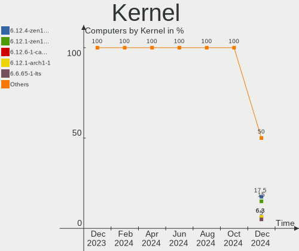
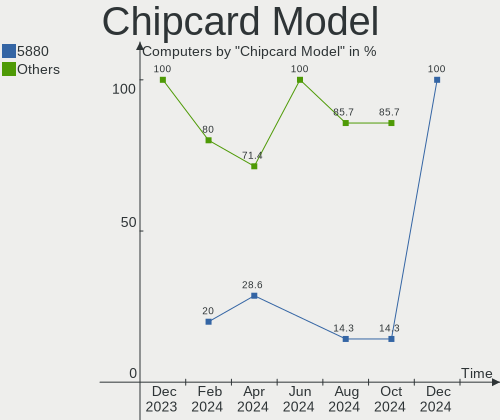

ArcoLinux - Hardware Trends
---------------------------

A project to identify most popular hardware characteristics and track their change
over time based on data collected by Linux users at https://Linux-Hardware.org.

Anyone can contribute to this report by the [hw-probe](https://github.com/linuxhw/hw-probe) tool:

    sudo -E hw-probe -all -upload

This is a report for all computer types. See also reports for [desktops](/Dist/ArcoLinux/Desktop/README.md) and [notebooks](/Dist/ArcoLinux/Notebook/README.md).

This report is for one last month. Overall report since the beginning of time: [TestCoverage](https://github.com/linuxhw/TestCoverage)

Period: May, 2022.

Contents
--------

* [ System ](#system)
  - [ OS                       ](#os)
  - [ OS Family                ](#os-family)
  - [ Kernel                   ](#kernel)
  - [ Kernel Family            ](#kernel-family)
  - [ Kernel Major Ver.        ](#kernel-major-ver)
  - [ Arch                     ](#arch)
  - [ DE                       ](#de)
  - [ Display Server           ](#display-server)
  - [ Display Manager          ](#display-manager)
  - [ OS Lang                  ](#os-lang)
  - [ Boot Mode                ](#boot-mode)
  - [ Filesystem               ](#filesystem)
  - [ Part. scheme             ](#part-scheme)
  - [ Dual Boot with Linux/BSD ](#dual-boot-with-linuxbsd)
  - [ Dual Boot (Win)          ](#dual-boot-win)

* [ Board ](#board)
  - [ Vendor                   ](#vendor)
  - [ Model                    ](#model)
  - [ Model Family             ](#model-family)
  - [ MFG Year                 ](#mfg-year)
  - [ Form Factor              ](#form-factor)
  - [ Secure Boot              ](#secure-boot)
  - [ Coreboot                 ](#coreboot)
  - [ RAM Size                 ](#ram-size)
  - [ RAM Used                 ](#ram-used)
  - [ Total Drives             ](#total-drives)
  - [ Has CD-ROM               ](#has-cd-rom)
  - [ Has Ethernet             ](#has-ethernet)
  - [ Has WiFi                 ](#has-wifi)
  - [ Has Bluetooth            ](#has-bluetooth)

* [ Location ](#location)
  - [ Country                  ](#country)
  - [ City                     ](#city)

* [ Drives ](#drives)
  - [ Drive Vendor             ](#drive-vendor)
  - [ Drive Model              ](#drive-model)
  - [ HDD Vendor               ](#hdd-vendor)
  - [ SSD Vendor               ](#ssd-vendor)
  - [ Drive Kind               ](#drive-kind)
  - [ Drive Connector          ](#drive-connector)
  - [ Drive Size               ](#drive-size)
  - [ Space Total              ](#space-total)
  - [ Space Used               ](#space-used)
  - [ Malfunc. Drives          ](#malfunc-drives)
  - [ Malfunc. Drive Vendor    ](#malfunc-drive-vendor)
  - [ Malfunc. HDD Vendor      ](#malfunc-hdd-vendor)
  - [ Malfunc. Drive Kind      ](#malfunc-drive-kind)
  - [ Failed Drives            ](#failed-drives)
  - [ Failed Drive Vendor      ](#failed-drive-vendor)
  - [ Drive Status             ](#drive-status)

* [ Storage controller ](#storage-controller)
  - [ Storage Vendor           ](#storage-vendor)
  - [ Storage Model            ](#storage-model)
  - [ Storage Kind             ](#storage-kind)

* [ Processor ](#processor)
  - [ CPU Vendor               ](#cpu-vendor)
  - [ CPU Model                ](#cpu-model)
  - [ CPU Model Family         ](#cpu-model-family)
  - [ CPU Cores                ](#cpu-cores)
  - [ CPU Sockets              ](#cpu-sockets)
  - [ CPU Threads              ](#cpu-threads)
  - [ CPU Op-Modes             ](#cpu-op-modes)
  - [ CPU Microcode            ](#cpu-microcode)
  - [ CPU Microarch            ](#cpu-microarch)

* [ Graphics ](#graphics)
  - [ GPU Vendor               ](#gpu-vendor)
  - [ GPU Model                ](#gpu-model)
  - [ GPU Combo                ](#gpu-combo)
  - [ GPU Driver               ](#gpu-driver)
  - [ GPU Memory               ](#gpu-memory)

* [ Monitor ](#monitor)
  - [ Monitor Vendor           ](#monitor-vendor)
  - [ Monitor Model            ](#monitor-model)
  - [ Monitor Resolution       ](#monitor-resolution)
  - [ Monitor Diagonal         ](#monitor-diagonal)
  - [ Monitor Width            ](#monitor-width)
  - [ Aspect Ratio             ](#aspect-ratio)
  - [ Monitor Area             ](#monitor-area)
  - [ Pixel Density            ](#pixel-density)
  - [ Multiple Monitors        ](#multiple-monitors)

* [ Network ](#network)
  - [ Net Controller Vendor    ](#net-controller-vendor)
  - [ Net Controller Model     ](#net-controller-model)
  - [ Wireless Vendor          ](#wireless-vendor)
  - [ Wireless Model           ](#wireless-model)
  - [ Ethernet Vendor          ](#ethernet-vendor)
  - [ Ethernet Model           ](#ethernet-model)
  - [ Net Controller Kind      ](#net-controller-kind)
  - [ Used Controller          ](#used-controller)
  - [ NICs                     ](#nics)
  - [ IPv6                     ](#ipv6)

* [ Bluetooth ](#bluetooth)
  - [ Bluetooth Vendor         ](#bluetooth-vendor)
  - [ Bluetooth Model          ](#bluetooth-model)

* [ Sound ](#sound)
  - [ Sound Vendor             ](#sound-vendor)
  - [ Sound Model              ](#sound-model)

* [ Memory ](#memory)
  - [ Memory Vendor            ](#memory-vendor)
  - [ Memory Model             ](#memory-model)
  - [ Memory Kind              ](#memory-kind)
  - [ Memory Form Factor       ](#memory-form-factor)
  - [ Memory Size              ](#memory-size)
  - [ Memory Speed             ](#memory-speed)

* [ Printers & scanners ](#printers--scanners)
  - [ Printer Vendor           ](#printer-vendor)
  - [ Printer Model            ](#printer-model)
  - [ Scanner Vendor           ](#scanner-vendor)
  - [ Scanner Model            ](#scanner-model)

* [ Camera ](#camera)
  - [ Camera Vendor            ](#camera-vendor)
  - [ Camera Model             ](#camera-model)

* [ Security ](#security)
  - [ Fingerprint Vendor       ](#fingerprint-vendor)
  - [ Fingerprint Model        ](#fingerprint-model)
  - [ Chipcard Vendor          ](#chipcard-vendor)
  - [ Chipcard Model           ](#chipcard-model)

* [ Unsupported ](#unsupported)
  - [ Unsupported Devices      ](#unsupported-devices)
  - [ Unsupported Device Types ](#unsupported-device-types)

System
------

OS
--

Installed operating systems

| Name              | Computers | Percent |
|-------------------|-----------|---------|
| ArcoLinux Rolling | 63        | 95.45%  |
| ArcoLinux         | 3         | 4.55%   |

OS Family
---------

OS without a version

| Name      | Computers | Percent |
|-----------|-----------|---------|
| ArcoLinux | 66        | 100%    |

Kernel
------

Version of the Linux kernel

| Version           | Computers | Percent |
|-------------------|-----------|---------|
| 5.17.9-arch1-1    | 12        | 18.18%  |
| 5.17.5-arch1-1    | 11        | 16.67%  |
| 5.16.11-arch1-1   | 5         | 7.58%   |
| 5.17.8-arch1-1    | 4         | 6.06%   |
| 5.15.41-1-lts     | 4         | 6.06%   |
| 5.17.5-zen1-1-zen | 3         | 4.55%   |
| 5.17.5-arch1-2    | 3         | 4.55%   |
| 5.17.4-arch1-1    | 3         | 4.55%   |
| 5.15.37-1-lts     | 3         | 4.55%   |
| 5.15.10-arch1-1   | 3         | 4.55%   |
| 5.17.7-zen1-1-zen | 2         | 3.03%   |
| 5.17.7-arch1-1    | 2         | 3.03%   |
| 5.15.38-1-lts     | 2         | 3.03%   |
| 5.18.1-arch1-1    | 1         | 1.52%   |
| 5.18.0-arch1-1    | 1         | 1.52%   |
| 5.17.9-zen1-1-zen | 1         | 1.52%   |
| 5.17.6-zen1-1-zen | 1         | 1.52%   |
| 5.16.16-arch1-1   | 1         | 1.52%   |
| 5.15.43-1-lts     | 1         | 1.52%   |
| 5.15.39-1-lts     | 1         | 1.52%   |
| 5.14.14-arch1-1   | 1         | 1.52%   |
| 5.10.11-arch1-1   | 1         | 1.52%   |

Kernel Family
-------------

Linux kernel without a distro release

| Version | Computers | Percent |
|---------|-----------|---------|
| 5.17.5  | 17        | 25.76%  |
| 5.17.9  | 13        | 19.7%   |
| 5.16.11 | 5         | 7.58%   |
| 5.17.8  | 4         | 6.06%   |
| 5.17.7  | 4         | 6.06%   |
| 5.15.41 | 4         | 6.06%   |
| 5.17.4  | 3         | 4.55%   |
| 5.15.37 | 3         | 4.55%   |
| 5.15.10 | 3         | 4.55%   |
| 5.15.38 | 2         | 3.03%   |
| 5.18.1  | 1         | 1.52%   |
| 5.18.0  | 1         | 1.52%   |
| 5.17.6  | 1         | 1.52%   |
| 5.16.16 | 1         | 1.52%   |
| 5.15.43 | 1         | 1.52%   |
| 5.15.39 | 1         | 1.52%   |
| 5.14.14 | 1         | 1.52%   |
| 5.10.11 | 1         | 1.52%   |

Kernel Major Ver.
-----------------

Linux kernel major version

| Version | Computers | Percent |
|---------|-----------|---------|
| 5.17    | 42        | 63.64%  |
| 5.15    | 14        | 21.21%  |
| 5.16    | 6         | 9.09%   |
| 5.18    | 2         | 3.03%   |
| 5.14    | 1         | 1.52%   |
| 5.10    | 1         | 1.52%   |

Arch
----

OS architecture (x86_64, i586, etc.)

| Name   | Computers | Percent |
|--------|-----------|---------|
| x86_64 | 66        | 100%    |

DE
--

Desktop Environment

| Name       | Computers | Percent |
|------------|-----------|---------|
| XFCE       | 25        | 37.88%  |
| KDE5       | 11        | 16.67%  |
| xmonad     | 4         | 6.06%   |
| LeftWM     | 4         | 6.06%   |
| i3         | 4         | 6.06%   |
| awesome    | 4         | 6.06%   |
| qtile      | 3         | 4.55%   |
| GNOME      | 3         | 4.55%   |
| LXQt       | 2         | 3.03%   |
| X-Cinnamon | 1         | 1.52%   |
| openbox    | 1         | 1.52%   |
| dwm        | 1         | 1.52%   |
| Deepin     | 1         | 1.52%   |
| cwm        | 1         | 1.52%   |
| bspwm      | 1         | 1.52%   |

Display Server
--------------

X11 or Wayland

| Name    | Computers | Percent |
|---------|-----------|---------|
| X11     | 63        | 95.45%  |
| Tty     | 2         | 3.03%   |
| Wayland | 1         | 1.52%   |

Display Manager
---------------

SDDM, LightDM, etc.

| Name    | Computers | Percent |
|---------|-----------|---------|
| SDDM    | 47        | 71.21%  |
| LightDM | 16        | 24.24%  |
| Unknown | 3         | 4.55%   |

OS Lang
-------

Language

| Lang  | Computers | Percent |
|-------|-----------|---------|
| en_US | 37        | 56.06%  |
| de_DE | 6         | 9.09%   |
| en_GB | 4         | 6.06%   |
| en_CA | 4         | 6.06%   |
| pt_BR | 2         | 3.03%   |
| fi_FI | 2         | 3.03%   |
| en_ZA | 2         | 3.03%   |
| sv_SE | 1         | 1.52%   |
| nl_NL | 1         | 1.52%   |
| ja_JP | 1         | 1.52%   |
| it_IT | 1         | 1.52%   |
| fr_FR | 1         | 1.52%   |
| es_ES | 1         | 1.52%   |
| en_IN | 1         | 1.52%   |
| en_IL | 1         | 1.52%   |
| en_AU | 1         | 1.52%   |

Boot Mode
---------

EFI or BIOS

| Mode | Computers | Percent |
|------|-----------|---------|
| EFI  | 48        | 72.73%  |
| BIOS | 18        | 27.27%  |

Filesystem
----------

Type of filesystem

| Type    | Computers | Percent |
|---------|-----------|---------|
| Ext4    | 45        | 68.18%  |
| Btrfs   | 15        | 22.73%  |
| Overlay | 3         | 4.55%   |
| F2fs    | 2         | 3.03%   |
| Xfs     | 1         | 1.52%   |

Part. scheme
------------

Scheme of partitioning

| Type    | Computers | Percent |
|---------|-----------|---------|
| GPT     | 52        | 78.79%  |
| MBR     | 11        | 16.67%  |
| Unknown | 3         | 4.55%   |

Dual Boot with Linux/BSD
------------------------

Hosting more than one Linux/BSD

| Dual boot | Computers | Percent |
|-----------|-----------|---------|
| No        | 44        | 66.67%  |
| Yes       | 22        | 33.33%  |

Dual Boot (Win)
---------------

Hosting Linux and Windows

| Dual boot | Computers | Percent |
|-----------|-----------|---------|
| No        | 39        | 59.09%  |
| Yes       | 27        | 40.91%  |

Board
-----

Vendor
------

Motherboard manufacturer

| Name                | Computers | Percent |
|---------------------|-----------|---------|
| Lenovo              | 11        | 16.67%  |
| ASUSTek Computer    | 10        | 15.15%  |
| Hewlett-Packard     | 9         | 13.64%  |
| Gigabyte Technology | 9         | 13.64%  |
| MSI                 | 7         | 10.61%  |
| Supermicro          | 4         | 6.06%   |
| Toshiba             | 2         | 3.03%   |
| Dell                | 2         | 3.03%   |
| ASRock              | 2         | 3.03%   |
| Acer                | 2         | 3.03%   |
| System76            | 1         | 1.52%   |
| Sony                | 1         | 1.52%   |
| Samsung Electronics | 1         | 1.52%   |
| LG Electronics      | 1         | 1.52%   |
| Intel               | 1         | 1.52%   |
| Biostar             | 1         | 1.52%   |
| Alienware           | 1         | 1.52%   |
| Unknown             | 1         | 1.52%   |

Model
-----

Motherboard model

| Name                                   | Computers | Percent |
|----------------------------------------|-----------|---------|
| Supermicro SYS-510P-MR                 | 2         | 3.03%   |
| Supermicro SYS-110C-FHN4T              | 2         | 3.03%   |
| MSI MS-7C37                            | 2         | 3.03%   |
| Gigabyte X570 AORUS MASTER             | 2         | 3.03%   |
| Toshiba Satellite C675                 | 1         | 1.52%   |
| Toshiba PORTEGE R30-A                  | 1         | 1.52%   |
| System76 Oryx Pro                      | 1         | 1.52%   |
| Sony SVE1712C1EW                       | 1         | 1.52%   |
| Samsung 550XDA                         | 1         | 1.52%   |
| MSI MS-7C91                            | 1         | 1.52%   |
| MSI MS-7C88                            | 1         | 1.52%   |
| MSI MS-7A37                            | 1         | 1.52%   |
| MSI GF75 Thin 9SC                      | 1         | 1.52%   |
| MSI A320M-HDV R4.0                     | 1         | 1.52%   |
| LG C500                                | 1         | 1.52%   |
| Lenovo Yoga 7 16IAP7 82QG              | 1         | 1.52%   |
| Lenovo ThinkPad X220 4290LD4           | 1         | 1.52%   |
| Lenovo ThinkPad X200 7458WAY           | 1         | 1.52%   |
| Lenovo ThinkPad X13 Gen 1 20UFCTO1WW   | 1         | 1.52%   |
| Lenovo ThinkPad T470p 20J7S0BR00       | 1         | 1.52%   |
| Lenovo ThinkPad T400 276521G           | 1         | 1.52%   |
| Lenovo ThinkPad T14 Gen 2a 20XKCTO1WW  | 1         | 1.52%   |
| Lenovo ThinkPad L540 20AV0031GE        | 1         | 1.52%   |
| Lenovo IdeaPad S510p 20298             | 1         | 1.52%   |
| Lenovo IdeaPad 510-15IKB 80SV          | 1         | 1.52%   |
| Lenovo IdeaPad 3 15ITL6 82H8           | 1         | 1.52%   |
| Intel NUC7CJYH                         | 1         | 1.52%   |
| HP Pavilion Notebook                   | 1         | 1.52%   |
| HP Pavilion All-in-One 27-d0xxx        | 1         | 1.52%   |
| HP Laptop 17-cn0xxx                    | 1         | 1.52%   |
| HP Laptop 15-dy2xxx                    | 1         | 1.52%   |
| HP Folio 13                            | 1         | 1.52%   |
| HP ENVY x360 Convertible 15m-eu0xxx    | 1         | 1.52%   |
| HP EliteBook 840 G3                    | 1         | 1.52%   |
| HP 700-527c                            | 1         | 1.52%   |
| HP 250 G5 Notebook PC                  | 1         | 1.52%   |
| Gigabyte X570 AORUS PRO WIFI           | 1         | 1.52%   |
| Gigabyte H110N                         | 1         | 1.52%   |
| Gigabyte GA-M55PLUS-S3G                | 1         | 1.52%   |
| Gigabyte B550 GAMING X V2              | 1         | 1.52%   |
| Gigabyte B550 AORUS PRO V2             | 1         | 1.52%   |
| Gigabyte A520M H                       | 1         | 1.52%   |
| Gigabyte A520 AORUS ELITE              | 1         | 1.52%   |
| Dell Vostro 470                        | 1         | 1.52%   |
| Dell Inspiron 530                      | 1         | 1.52%   |
| Biostar J3060NH                        | 1         | 1.52%   |
| ASUS Z170 PRO GAMING                   | 1         | 1.52%   |
| ASUS VivoBook_ASUSLaptop X510QA_X510QA | 1         | 1.52%   |
| ASUS VivoBook 15_ASUS Laptop X540UBR   | 1         | 1.52%   |
| ASUS TUF Gaming FX505GT_FX505GT        | 1         | 1.52%   |
| ASUS ROG Strix G513IC_G513IC           | 1         | 1.52%   |
| ASUS PRIME Z490-A                      | 1         | 1.52%   |
| ASUS PRIME H310M-R R2.0                | 1         | 1.52%   |
| ASUS PRIME B250M-PLUS                  | 1         | 1.52%   |
| ASUS P8Z68-V                           | 1         | 1.52%   |
| ASUS G752VT                            | 1         | 1.52%   |
| ASRock FM2A78M Pro4+                   | 1         | 1.52%   |
| ASRock B550 Phantom Gaming 4/ac        | 1         | 1.52%   |
| Alienware m15 Ryzen Ed. R5             | 1         | 1.52%   |
| Acer Predator G3-605                   | 1         | 1.52%   |

Model Family
------------

Motherboard model prefix

| Name                      | Computers | Percent |
|---------------------------|-----------|---------|
| Lenovo ThinkPad           | 7         | 10.61%  |
| Lenovo IdeaPad            | 3         | 4.55%   |
| Gigabyte X570             | 3         | 4.55%   |
| ASUS PRIME                | 3         | 4.55%   |
| Supermicro SYS-510P-MR    | 2         | 3.03%   |
| Supermicro SYS-110C-FHN4T | 2         | 3.03%   |
| MSI MS-7C37               | 2         | 3.03%   |
| HP Pavilion               | 2         | 3.03%   |
| HP Laptop                 | 2         | 3.03%   |
| Gigabyte B550             | 2         | 3.03%   |
| ASUS VivoBook             | 2         | 3.03%   |
| Toshiba Satellite         | 1         | 1.52%   |
| Toshiba PORTEGE           | 1         | 1.52%   |
| System76 Oryx             | 1         | 1.52%   |
| Sony SVE1712C1EW          | 1         | 1.52%   |
| Samsung 550XDA            | 1         | 1.52%   |
| MSI MS-7C91               | 1         | 1.52%   |
| MSI MS-7C88               | 1         | 1.52%   |
| MSI MS-7A37               | 1         | 1.52%   |
| MSI GF75                  | 1         | 1.52%   |
| MSI A320M-HDV             | 1         | 1.52%   |
| LG C500                   | 1         | 1.52%   |
| Lenovo Yoga               | 1         | 1.52%   |
| Intel NUC7CJYH            | 1         | 1.52%   |
| HP Folio                  | 1         | 1.52%   |
| HP ENVY                   | 1         | 1.52%   |
| HP EliteBook              | 1         | 1.52%   |
| HP 700-527c               | 1         | 1.52%   |
| HP 250                    | 1         | 1.52%   |
| Gigabyte H110N            | 1         | 1.52%   |
| Gigabyte GA-M55PLUS-S3G   | 1         | 1.52%   |
| Gigabyte A520M            | 1         | 1.52%   |
| Gigabyte A520             | 1         | 1.52%   |
| Dell Vostro               | 1         | 1.52%   |
| Dell Inspiron             | 1         | 1.52%   |
| Biostar J3060NH           | 1         | 1.52%   |
| ASUS Z170                 | 1         | 1.52%   |
| ASUS TUF                  | 1         | 1.52%   |
| ASUS ROG                  | 1         | 1.52%   |
| ASUS P8Z68-V              | 1         | 1.52%   |
| ASUS G752VT               | 1         | 1.52%   |
| ASRock FM2A78M            | 1         | 1.52%   |
| ASRock B550               | 1         | 1.52%   |
| Alienware m15             | 1         | 1.52%   |
| Acer Predator             | 1         | 1.52%   |
| Acer Aspire               | 1         | 1.52%   |
| Unknown                   | 1         | 1.52%   |

MFG Year
--------

Motherboard manufacture year

| Year | Computers | Percent |
|------|-----------|---------|
| 2020 | 12        | 18.18%  |
| 2021 | 11        | 16.67%  |
| 2019 | 10        | 15.15%  |
| 2016 | 8         | 12.12%  |
| 2013 | 4         | 6.06%   |
| 2011 | 4         | 6.06%   |
| 2012 | 3         | 4.55%   |
| 2018 | 2         | 3.03%   |
| 2017 | 2         | 3.03%   |
| 2015 | 2         | 3.03%   |
| 2014 | 2         | 3.03%   |
| 2008 | 2         | 3.03%   |
| 2022 | 1         | 1.52%   |
| 2009 | 1         | 1.52%   |
| 2007 | 1         | 1.52%   |
| 2006 | 1         | 1.52%   |

Form Factor
-----------

Physical design of the computer

| Name        | Computers | Percent |
|-------------|-----------|---------|
| Desktop     | 30        | 45.45%  |
| Notebook    | 30        | 45.45%  |
| Convertible | 2         | 3.03%   |
| Server      | 2         | 3.03%   |
| Mini pc     | 1         | 1.52%   |
| All in one  | 1         | 1.52%   |

Secure Boot
-----------

Enabled or disabled

| State    | Computers | Percent |
|----------|-----------|---------|
| Disabled | 66        | 100%    |

Coreboot
--------

Have coreboot on board

| Used | Computers | Percent |
|------|-----------|---------|
| No   | 65        | 98.48%  |
| Yes  | 1         | 1.52%   |

RAM Size
--------

Total RAM memory

| Size in GB  | Computers | Percent |
|-------------|-----------|---------|
| 16.01-24.0  | 17        | 25.76%  |
| 32.01-64.0  | 15        | 22.73%  |
| 4.01-8.0    | 14        | 21.21%  |
| 8.01-16.0   | 11        | 16.67%  |
| 3.01-4.0    | 6         | 9.09%   |
| 24.01-32.0  | 1         | 1.52%   |
| 64.01-256.0 | 1         | 1.52%   |
| 1.01-2.0    | 1         | 1.52%   |

RAM Used
--------

Used RAM memory

| Used GB   | Computers | Percent |
|-----------|-----------|---------|
| 1.01-2.0  | 22        | 33.33%  |
| 4.01-8.0  | 14        | 21.21%  |
| 2.01-3.0  | 14        | 21.21%  |
| 3.01-4.0  | 9         | 13.64%  |
| 0.51-1.0  | 6         | 9.09%   |
| 8.01-16.0 | 1         | 1.52%   |

Total Drives
------------

Number of drives on board

| Drives | Computers | Percent |
|--------|-----------|---------|
| 1      | 31        | 46.97%  |
| 2      | 17        | 25.76%  |
| 4      | 8         | 12.12%  |
| 3      | 7         | 10.61%  |
| 5      | 3         | 4.55%   |

Has CD-ROM
----------

Has CD-ROM on board

| Presented | Computers | Percent |
|-----------|-----------|---------|
| No        | 42        | 63.64%  |
| Yes       | 24        | 36.36%  |

Has Ethernet
------------

Has Ethernet on board

| Presented | Computers | Percent |
|-----------|-----------|---------|
| Yes       | 59        | 89.39%  |
| No        | 7         | 10.61%  |

Has WiFi
--------

Has WiFi module

| Presented | Computers | Percent |
|-----------|-----------|---------|
| Yes       | 45        | 68.18%  |
| No        | 21        | 31.82%  |

Has Bluetooth
-------------

Has Bluetooth module

| Presented | Computers | Percent |
|-----------|-----------|---------|
| Yes       | 44        | 66.67%  |
| No        | 22        | 33.33%  |

Location
--------

Country
-------

Geographic location (country)

| Country      | Computers | Percent |
|--------------|-----------|---------|
| USA          | 15        | 22.73%  |
| Germany      | 7         | 10.61%  |
| Canada       | 4         | 6.06%   |
| UK           | 3         | 4.55%   |
| India        | 3         | 4.55%   |
| Brazil       | 3         | 4.55%   |
| Ukraine      | 2         | 3.03%   |
| Sweden       | 2         | 3.03%   |
| Spain        | 2         | 3.03%   |
| South Africa | 2         | 3.03%   |
| Norway       | 2         | 3.03%   |
| Netherlands  | 2         | 3.03%   |
| Finland      | 2         | 3.03%   |
| Bulgaria     | 2         | 3.03%   |
| Austria      | 2         | 3.03%   |
| Serbia       | 1         | 1.52%   |
| Russia       | 1         | 1.52%   |
| Romania      | 1         | 1.52%   |
| Poland       | 1         | 1.52%   |
| Japan        | 1         | 1.52%   |
| Italy        | 1         | 1.52%   |
| Israel       | 1         | 1.52%   |
| Hong Kong    | 1         | 1.52%   |
| France       | 1         | 1.52%   |
| Belgium      | 1         | 1.52%   |
| Barbados     | 1         | 1.52%   |
| Australia    | 1         | 1.52%   |
| Argentina    | 1         | 1.52%   |

City
----

Geographic location (city)

| City                 | Computers | Percent |
|----------------------|-----------|---------|
| Durham               | 4         | 6.06%   |
| Sofia                | 2         | 3.03%   |
| Kollow               | 2         | 3.03%   |
| Ivano-Frankivsk      | 2         | 3.03%   |
| Helsinki             | 2         | 3.03%   |
| Winter Springs       | 1         | 1.52%   |
| Washington           | 1         | 1.52%   |
| Warsaw               | 1         | 1.52%   |
| Vienna               | 1         | 1.52%   |
| Tokyo                | 1         | 1.52%   |
| Tilburg              | 1         | 1.52%   |
| Tidnish Bridge       | 1         | 1.52%   |
| Tel Aviv             | 1         | 1.52%   |
| Sydney               | 1         | 1.52%   |
| Sterling             | 1         | 1.52%   |
| Spinea               | 1         | 1.52%   |
| Sao Paulo            | 1         | 1.52%   |
| Sandviken            | 1         | 1.52%   |
| Rio de Janeiro       | 1         | 1.52%   |
| Qualicum Beach       | 1         | 1.52%   |
| Pune                 | 1         | 1.52%   |
| Plano                | 1         | 1.52%   |
| Pickering            | 1         | 1.52%   |
| Noida                | 1         | 1.52%   |
| Neustadt in Holstein | 1         | 1.52%   |
| Mount Pleasant       | 1         | 1.52%   |
| Mohali               | 1         | 1.52%   |
| Madrid               | 1         | 1.52%   |
| Maceió              | 1         | 1.52%   |
| Lier                 | 1         | 1.52%   |
| Kirkland             | 1         | 1.52%   |
| Jacksonville         | 1         | 1.52%   |
| Islington            | 1         | 1.52%   |
| Huntsville           | 1         | 1.52%   |
| Henderson            | 1         | 1.52%   |
| Fornebu              | 1         | 1.52%   |
| Fishkill             | 1         | 1.52%   |
| Erlangen             | 1         | 1.52%   |
| Edinburgh            | 1         | 1.52%   |
| Durban               | 1         | 1.52%   |
| Duisburg             | 1         | 1.52%   |
| Drammen              | 1         | 1.52%   |
| Dortmund             | 1         | 1.52%   |
| Dornbirn             | 1         | 1.52%   |
| Discovery Bay        | 1         | 1.52%   |
| Dingle               | 1         | 1.52%   |
| Colfax               | 1         | 1.52%   |
| Cheboksary           | 1         | 1.52%   |
| Central              | 1         | 1.52%   |
| Cape Town            | 1         | 1.52%   |
| Bury                 | 1         | 1.52%   |
| Buenos Aires         | 1         | 1.52%   |
| Bridgetown           | 1         | 1.52%   |
| Berlin               | 1         | 1.52%   |
| Berceni              | 1         | 1.52%   |
| Belgrade             | 1         | 1.52%   |
| Bardallur            | 1         | 1.52%   |
| Ballee               | 1         | 1.52%   |
| Amsterdam            | 1         | 1.52%   |

Drives
------

Drive Vendor
------------

Hard drive vendors

| Vendor              | Computers | Drives | Percent |
|---------------------|-----------|--------|---------|
| Samsung Electronics | 19        | 31     | 17.76%  |
| WDC                 | 17        | 20     | 15.89%  |
| Kingston            | 10        | 12     | 9.35%   |
| Seagate             | 9         | 10     | 8.41%   |
| Toshiba             | 7         | 7      | 6.54%   |
| SanDisk             | 7         | 7      | 6.54%   |
| Crucial             | 5         | 6      | 4.67%   |
| Micron Technology   | 4         | 4      | 3.74%   |
| HGST                | 4         | 8      | 3.74%   |
| Intel               | 3         | 3      | 2.8%    |
| SK Hynix            | 2         | 2      | 1.87%   |
| Phison              | 2         | 3      | 1.87%   |
| KIOXIA              | 2         | 2      | 1.87%   |
| Hitachi             | 2         | 2      | 1.87%   |
| Unknown             | 1         | 1      | 0.93%   |
| Transcend           | 1         | 1      | 0.93%   |
| TO Exter            | 1         | 1      | 0.93%   |
| SSSTC               | 1         | 1      | 0.93%   |
| SPCC                | 1         | 1      | 0.93%   |
| Patriot             | 1         | 1      | 0.93%   |
| OCZ                 | 1         | 1      | 0.93%   |
| JMicron             | 1         | 1      | 0.93%   |
| HUAWEI              | 1         | 1      | 0.93%   |
| HPE                 | 1         | 2      | 0.93%   |
| HGST HTS            | 1         | 1      | 0.93%   |
| Gigabyte Technology | 1         | 1      | 0.93%   |
| Fantom              | 1         | 1      | 0.93%   |
| A-DATA Technology   | 1         | 1      | 0.93%   |

Drive Model
-----------

Hard drive models

| Model                                  | Computers | Percent |
|----------------------------------------|-----------|---------|
| Toshiba MQ01ABD100 1TB                 | 3         | 2.44%   |
| Kingston SA400S37240G 240GB SSD        | 3         | 2.44%   |
| WDC WDS100T2B0C-00PXH0 1TB             | 2         | 1.63%   |
| Seagate Expansion 4TB                  | 2         | 1.63%   |
| SanDisk SDSSDA240G 240GB               | 2         | 1.63%   |
| Samsung SSD 980 PRO 1TB                | 2         | 1.63%   |
| Samsung SSD 970 EVO Plus 1TB           | 2         | 1.63%   |
| Samsung SSD 860 EVO 250GB              | 2         | 1.63%   |
| Samsung SSD 850 EVO 500GB              | 2         | 1.63%   |
| Samsung SSD 850 EVO 250GB              | 2         | 1.63%   |
| Samsung MZ7LH240HAHQ-00005 240GB SSD   | 2         | 1.63%   |
| Phison Sabrent 1TB                     | 2         | 1.63%   |
| Micron 5300_MTFDDAV480TDS 480GB SSD    | 2         | 1.63%   |
| KIOXIA KBG40ZNV256G 256GB              | 2         | 1.63%   |
| Kingston SUV400S37240G 240GB SSD       | 2         | 1.63%   |
| Intel SSDPE2KE016T8 2TB                | 2         | 1.63%   |
| HGST HUS726T6TALE6L4 6TB               | 2         | 1.63%   |
| HGST HTS721010A9E630 1TB               | 2         | 1.63%   |
| WDC WDS500G2B0C-00PXH0 500GB           | 1         | 0.81%   |
| WDC WDS500G2B0B-00YS70 500GB SSD       | 1         | 0.81%   |
| WDC WDS500G2B0A 500GB SSD              | 1         | 0.81%   |
| WDC WDS500G1X0E-00AFY0 500GB           | 1         | 0.81%   |
| WDC WDS480G2G0A-00JH30 480GB SSD       | 1         | 0.81%   |
| WDC WDS256G1X0C-00ENX0 256GB           | 1         | 0.81%   |
| WDC WDS240G2G0A-00JH30 240GB SSD       | 1         | 0.81%   |
| WDC WDS100T2B0A-00SM50 1TB SSD         | 1         | 0.81%   |
| WDC WD5000LPVX-22V0TT0 500GB           | 1         | 0.81%   |
| WDC WD5000BPKX-22HPJT0 500GB           | 1         | 0.81%   |
| WDC WD3200BPVT-22ZEST0 320GB           | 1         | 0.81%   |
| WDC WD30EZRX-00D8PB0 3TB               | 1         | 0.81%   |
| WDC WD20SPZX-22UA7T0 2TB               | 1         | 0.81%   |
| WDC WD20EZBX-00AYRA0 2TB               | 1         | 0.81%   |
| WDC WD10SPZX-80Z10T2 1TB               | 1         | 0.81%   |
| WDC WD10EZEX-60M2NA0 1TB               | 1         | 0.81%   |
| WDC WD10EAVS-00D7B1 1TB                | 1         | 0.81%   |
| WDC PC SN530 SDBPNPZ-1T00-1006 1TB     | 1         | 0.81%   |
| Unknown APPSD  134GB                   | 1         | 0.81%   |
| Transcend TS480GSSD220S 480GB          | 1         | 0.81%   |
| Toshiba TR150 240GB SSD                | 1         | 0.81%   |
| Toshiba RC100 240GB                    | 1         | 0.81%   |
| Toshiba HDWD110 1TB                    | 1         | 0.81%   |
| Toshiba DT01ACA100 1TB                 | 1         | 0.81%   |
| TO Exter nal USB 3.0 320GB             | 1         | 0.81%   |
| SSSTC CL1-8D256 256GB                  | 1         | 0.81%   |
| SPCC Solid State Disk 120GB            | 1         | 0.81%   |
| SK Hynix SKHynix_HFM128GD3HX015N 128GB | 1         | 0.81%   |
| SK Hynix SHGP31-500GM-2 500GB          | 1         | 0.81%   |
| Seagate ST950032 5AS 500GB             | 1         | 0.81%   |
| Seagate ST8000DM004-2CX188 8TB         | 1         | 0.81%   |
| Seagate ST3320620AS 320GB              | 1         | 0.81%   |
| Seagate ST2000LM007-1R8174 2TB         | 1         | 0.81%   |
| Seagate ST2000DM001-1ER164 2TB         | 1         | 0.81%   |
| Seagate ST1000LM035-1RK172 1TB         | 1         | 0.81%   |
| Seagate ST1000LM014-1EJ164 1TB         | 1         | 0.81%   |
| Seagate ST1000DM003-1ER162 1TB         | 1         | 0.81%   |
| SanDisk Ultra II 240GB SSD             | 1         | 0.81%   |
| SanDisk SDSSDH31024G 1TB               | 1         | 0.81%   |
| SanDisk SD9SN8W256G1102 256GB SSD      | 1         | 0.81%   |
| SanDisk SD8SN8U-256G-1006 256GB SSD    | 1         | 0.81%   |
| Sandisk NVMe SSD Drive 500GB           | 1         | 0.81%   |

HDD Vendor
----------

Hard disk drive vendors

| Vendor   | Computers | Drives | Percent |
|----------|-----------|--------|---------|
| Seagate  | 9         | 10     | 30%     |
| WDC      | 8         | 9      | 26.67%  |
| Toshiba  | 5         | 5      | 16.67%  |
| HGST     | 4         | 8      | 13.33%  |
| Hitachi  | 2         | 2      | 6.67%   |
| HGST HTS | 1         | 1      | 3.33%   |
| Fantom   | 1         | 1      | 3.33%   |

SSD Vendor
----------

Solid state drive vendors

| Vendor              | Computers | Drives | Percent |
|---------------------|-----------|--------|---------|
| Samsung Electronics | 17        | 20     | 34.69%  |
| Kingston            | 8         | 9      | 16.33%  |
| SanDisk             | 6         | 6      | 12.24%  |
| WDC                 | 5         | 5      | 10.2%   |
| Crucial             | 4         | 5      | 8.16%   |
| Micron Technology   | 2         | 2      | 4.08%   |
| Transcend           | 1         | 1      | 2.04%   |
| Toshiba             | 1         | 1      | 2.04%   |
| TO Exter            | 1         | 1      | 2.04%   |
| SPCC                | 1         | 1      | 2.04%   |
| Patriot             | 1         | 1      | 2.04%   |
| OCZ                 | 1         | 1      | 2.04%   |
| A-DATA Technology   | 1         | 1      | 2.04%   |

Drive Kind
----------

HDD or SSD

| Kind    | Computers | Drives | Percent |
|---------|-----------|--------|---------|
| SSD     | 40        | 54     | 39.22%  |
| NVMe    | 29        | 37     | 28.43%  |
| HDD     | 29        | 36     | 28.43%  |
| Unknown | 3         | 4      | 2.94%   |
| MMC     | 1         | 1      | 0.98%   |

Drive Connector
---------------

SATA, SAS, NVMe, etc.

| Type | Computers | Drives | Percent |
|------|-----------|--------|---------|
| SATA | 53        | 85     | 58.24%  |
| NVMe | 29        | 37     | 31.87%  |
| SAS  | 8         | 9      | 8.79%   |
| MMC  | 1         | 1      | 1.1%    |

Drive Size
----------

Size of hard drive

| Size in TB | Computers | Drives | Percent |
|------------|-----------|--------|---------|
| 0.01-0.5   | 41        | 51     | 55.41%  |
| 0.51-1.0   | 21        | 23     | 28.38%  |
| 1.01-2.0   | 6         | 6      | 8.11%   |
| 4.01-10.0  | 3         | 7      | 4.05%   |
| 3.01-4.0   | 2         | 2      | 2.7%    |
| 2.01-3.0   | 1         | 1      | 1.35%   |

Space Total
-----------

Amount of disk space available on the file system

| Size in GB     | Computers | Percent |
|----------------|-----------|---------|
| 101-250        | 20        | 30.3%   |
| 1001-2000      | 12        | 18.18%  |
| 251-500        | 11        | 16.67%  |
| 501-1000       | 8         | 12.12%  |
| More than 3000 | 7         | 10.61%  |
| 2001-3000      | 4         | 6.06%   |
| 51-100         | 2         | 3.03%   |
| 1-20           | 1         | 1.52%   |
| Unknown        | 1         | 1.52%   |

Space Used
----------

Amount of used disk space

| Used GB   | Computers | Percent |
|-----------|-----------|---------|
| 21-50     | 15        | 22.73%  |
| 1-20      | 13        | 19.7%   |
| 251-500   | 9         | 13.64%  |
| 101-250   | 9         | 13.64%  |
| 1001-2000 | 7         | 10.61%  |
| 51-100    | 7         | 10.61%  |
| 501-1000  | 5         | 7.58%   |
| Unknown   | 1         | 1.52%   |

Malfunc. Drives
---------------

Drive models with a malfunction

| Model                          | Computers | Drives | Percent |
|--------------------------------|-----------|--------|---------|
| Toshiba MQ01ABD100 1TB         | 2         | 2      | 33.33%  |
| WDC WD5000BPKX-22HPJT0 500GB   | 1         | 1      | 16.67%  |
| Seagate ST1000LM014-1EJ164 1TB | 1         | 1      | 16.67%  |
| HGST HTS721010A9E630 1TB       | 1         | 1      | 16.67%  |
| HGST HTS 541010A9E680 1TB      | 1         | 1      | 16.67%  |

Malfunc. Drive Vendor
---------------------

Vendors of faulty drives

| Vendor   | Computers | Drives | Percent |
|----------|-----------|--------|---------|
| Toshiba  | 2         | 2      | 33.33%  |
| WDC      | 1         | 1      | 16.67%  |
| Seagate  | 1         | 1      | 16.67%  |
| HGST HTS | 1         | 1      | 16.67%  |
| HGST     | 1         | 1      | 16.67%  |

Malfunc. HDD Vendor
-------------------

Vendors of faulty HDD drives

| Vendor   | Computers | Drives | Percent |
|----------|-----------|--------|---------|
| Toshiba  | 2         | 2      | 33.33%  |
| WDC      | 1         | 1      | 16.67%  |
| Seagate  | 1         | 1      | 16.67%  |
| HGST HTS | 1         | 1      | 16.67%  |
| HGST     | 1         | 1      | 16.67%  |

Malfunc. Drive Kind
-------------------

Kinds of faulty drives

| Kind | Computers | Drives | Percent |
|------|-----------|--------|---------|
| HDD  | 6         | 6      | 100%    |

Failed Drives
-------------

Failed drive models

Zero info for selected period =(

Failed Drive Vendor
-------------------

Failed drive vendors

Zero info for selected period =(

Drive Status
------------

Number of failed and malfunc. drives

| Status   | Computers | Drives | Percent |
|----------|-----------|--------|---------|
| Works    | 58        | 108    | 75.32%  |
| Detected | 13        | 18     | 16.88%  |
| Malfunc  | 6         | 6      | 7.79%   |

Storage controller
------------------

Storage Vendor
--------------

Storage controller vendors

| Vendor                         | Computers | Percent |
|--------------------------------|-----------|---------|
| Intel                          | 42        | 45.16%  |
| AMD                            | 17        | 18.28%  |
| Samsung Electronics            | 8         | 8.6%    |
| Sandisk                        | 7         | 7.53%   |
| Phison Electronics             | 3         | 3.23%   |
| SK Hynix                       | 2         | 2.15%   |
| Nvidia                         | 2         | 2.15%   |
| Micron Technology              | 2         | 2.15%   |
| KIOXIA                         | 2         | 2.15%   |
| Kingston Technology Company    | 2         | 2.15%   |
| ASMedia Technology             | 2         | 2.15%   |
| Toshiba America Info Systems   | 1         | 1.08%   |
| Solid State Storage Technology | 1         | 1.08%   |
| Micron/Crucial Technology      | 1         | 1.08%   |
| JMicron Technology             | 1         | 1.08%   |

Storage Model
-------------

Storage controller models

| Model                                                                            | Computers | Percent |
|----------------------------------------------------------------------------------|-----------|---------|
| AMD FCH SATA Controller [AHCI mode]                                              | 11        | 10.38%  |
| AMD 500 Series Chipset SATA Controller                                           | 6         | 5.66%   |
| Sandisk WD Blue SN550 NVMe SSD                                                   | 5         | 4.72%   |
| Intel Sunrise Point-LP SATA Controller [AHCI mode]                               | 5         | 4.72%   |
| Samsung NVMe SSD Controller SM981/PM981/PM983                                    | 4         | 3.77%   |
| Samsung NVMe SSD Controller PM9A1/PM9A3/980PRO                                   | 3         | 2.83%   |
| Intel Q170/Q150/B150/H170/H110/Z170/CM236 Chipset SATA Controller [AHCI Mode]    | 3         | 2.83%   |
| Intel 8 Series/C220 Series Chipset Family 6-port SATA Controller 1 [AHCI mode]   | 3         | 2.83%   |
| Intel 6 Series/C200 Series Chipset Family 6 port Mobile SATA AHCI Controller     | 3         | 2.83%   |
| SK Hynix Gold P31 SSD                                                            | 2         | 1.89%   |
| Samsung NVMe SSD Controller SM961/PM961/SM963                                    | 2         | 1.89%   |
| Phison E12 NVMe Controller                                                       | 2         | 1.89%   |
| Micron Non-Volatile memory controller                                            | 2         | 1.89%   |
| KIOXIA Non-Volatile memory controller                                            | 2         | 1.89%   |
| Intel Volume Management Device NVMe RAID Controller                              | 2         | 1.89%   |
| Intel Tiger Lake-LP SATA Controller [AHCI mode]                                  | 2         | 1.89%   |
| Intel NVMe Datacenter SSD [3DNAND, Beta Rock Controller]                         | 2         | 1.89%   |
| Intel Comet Lake SATA AHCI Controller                                            | 2         | 1.89%   |
| Intel Celeron/Pentium Silver Processor SATA Controller                           | 2         | 1.89%   |
| Intel Cannon Lake Mobile PCH SATA AHCI Controller                                | 2         | 1.89%   |
| Intel C620 Series Chipset Family SSATA Controller [AHCI mode]                    | 2         | 1.89%   |
| Intel C620 Series Chipset Family SATA Controller [AHCI mode]                     | 2         | 1.89%   |
| Intel 82801IBM/IEM (ICH9M/ICH9M-E) 4 port SATA Controller [AHCI mode]            | 2         | 1.89%   |
| Intel 200 Series PCH SATA controller [AHCI mode]                                 | 2         | 1.89%   |
| ASMedia ASM1062 Serial ATA Controller                                            | 2         | 1.89%   |
| Toshiba America Info Systems BG3 NVMe SSD Controller                             | 1         | 0.94%   |
| Solid State Storage Non-Volatile memory controller                               | 1         | 0.94%   |
| Sandisk WD PC SN810 / Black SN850 NVMe SSD                                       | 1         | 0.94%   |
| Sandisk WD Black NVMe SSD                                                        | 1         | 0.94%   |
| Samsung NVMe SSD Controller 980                                                  | 1         | 0.94%   |
| Phison E16 PCIe4 NVMe Controller                                                 | 1         | 0.94%   |
| Nvidia MCP78S [GeForce 8200] IDE                                                 | 1         | 0.94%   |
| Nvidia MCP78S [GeForce 8200] AHCI Controller                                     | 1         | 0.94%   |
| Nvidia MCP51 Serial ATA Controller                                               | 1         | 0.94%   |
| Nvidia MCP51 IDE                                                                 | 1         | 0.94%   |
| Micron/Crucial P2 NVMe PCIe SSD                                                  | 1         | 0.94%   |
| Kingston Company U-SNS8154P3 NVMe SSD                                            | 1         | 0.94%   |
| Kingston Company A2000 NVMe SSD                                                  | 1         | 0.94%   |
| JMicron JMB362 SATA Controller                                                   | 1         | 0.94%   |
| Intel Non-Volatile memory controller                                             | 1         | 0.94%   |
| Intel Comet Lake PCH-H RAID                                                      | 1         | 0.94%   |
| Intel Atom/Celeron/Pentium Processor x5-E8000/J3xxx/N3xxx Series SATA Controller | 1         | 0.94%   |
| Intel 9 Series Chipset Family SATA Controller [AHCI Mode]                        | 1         | 0.94%   |
| Intel 82801IR/IO/IH (ICH9R/DO/DH) 4 port SATA Controller [IDE mode]              | 1         | 0.94%   |
| Intel 82801I (ICH9 Family) 2 port SATA Controller [IDE mode]                     | 1         | 0.94%   |
| Intel 82801 Mobile SATA Controller [RAID mode]                                   | 1         | 0.94%   |
| Intel 8 Series/C220 Series Chipset Family 4-port SATA Controller 1 [IDE mode]    | 1         | 0.94%   |
| Intel 8 Series SATA Controller 1 [AHCI mode]                                     | 1         | 0.94%   |
| Intel 7 Series/C210 Series Chipset Family 6-port SATA Controller [AHCI mode]     | 1         | 0.94%   |
| Intel 7 Series Chipset Family 6-port SATA Controller [AHCI mode]                 | 1         | 0.94%   |
| Intel 6 Series/C200 Series Chipset Family 6 port Desktop SATA AHCI Controller    | 1         | 0.94%   |
| Intel 5 Series/3400 Series Chipset 4 port SATA AHCI Controller                   | 1         | 0.94%   |
| Intel 400 Series Chipset Family SATA AHCI Controller                             | 1         | 0.94%   |
| AMD FCH SATA Controller D                                                        | 1         | 0.94%   |
| AMD FCH IDE Controller                                                           | 1         | 0.94%   |
| AMD 300 Series Chipset SATA Controller                                           | 1         | 0.94%   |

Storage Kind
------------

Kind of storage controller (IDE, SATA, NVMe, SAS, ...)

| Kind | Computers | Percent |
|------|-----------|---------|
| SATA | 54        | 58.7%   |
| NVMe | 29        | 31.52%  |
| IDE  | 5         | 5.43%   |
| RAID | 4         | 4.35%   |

Processor
---------

CPU Vendor
----------

Processor vendors

| Vendor | Computers | Percent |
|--------|-----------|---------|
| Intel  | 43        | 65.15%  |
| AMD    | 23        | 34.85%  |

CPU Model
---------

Processor models

| Model                                           | Computers | Percent |
|-------------------------------------------------|-----------|---------|
| Intel Xeon W-1250 CPU @ 3.30GHz                 | 2         | 3.03%   |
| Intel Xeon Silver 4310 CPU @ 2.10GHz            | 2         | 3.03%   |
| Intel Core i7-9750H CPU @ 2.60GHz               | 2         | 3.03%   |
| Intel Core i7-7500U CPU @ 2.70GHz               | 2         | 3.03%   |
| Intel Core i5-7500 CPU @ 3.40GHz                | 2         | 3.03%   |
| Intel 11th Gen Core i5-1135G7 @ 2.40GHz         | 2         | 3.03%   |
| AMD Ryzen 7 4800H with Radeon Graphics          | 2         | 3.03%   |
| AMD Ryzen 7 3700X 8-Core Processor              | 2         | 3.03%   |
| AMD Ryzen 5 5600X 6-Core Processor              | 2         | 3.03%   |
| Intel Pentium Silver N5030 CPU @ 1.10GHz        | 1         | 1.52%   |
| Intel Pentium Dual CPU E2160 @ 1.80GHz          | 1         | 1.52%   |
| Intel Pentium CPU B980 @ 2.40GHz                | 1         | 1.52%   |
| Intel Pentium CPU B940 @ 2.00GHz                | 1         | 1.52%   |
| Intel Core i7-7700HQ CPU @ 2.80GHz              | 1         | 1.52%   |
| Intel Core i7-6700HQ CPU @ 2.60GHz              | 1         | 1.52%   |
| Intel Core i7-6500U CPU @ 2.50GHz               | 1         | 1.52%   |
| Intel Core i7-4710MQ CPU @ 2.50GHz              | 1         | 1.52%   |
| Intel Core i7-4500U CPU @ 1.80GHz               | 1         | 1.52%   |
| Intel Core i7-3770 CPU @ 3.40GHz                | 1         | 1.52%   |
| Intel Core i7-2640M CPU @ 2.80GHz               | 1         | 1.52%   |
| Intel Core i7-10700K CPU @ 3.80GHz              | 1         | 1.52%   |
| Intel Core i5-9300H CPU @ 2.40GHz               | 1         | 1.52%   |
| Intel Core i5-6600K CPU @ 3.50GHz               | 1         | 1.52%   |
| Intel Core i5-6300U CPU @ 2.40GHz               | 1         | 1.52%   |
| Intel Core i5-6200U CPU @ 2.30GHz               | 1         | 1.52%   |
| Intel Core i5-4570 CPU @ 3.20GHz                | 1         | 1.52%   |
| Intel Core i5-4460 CPU @ 3.20GHz                | 1         | 1.52%   |
| Intel Core i5-4210M CPU @ 2.60GHz               | 1         | 1.52%   |
| Intel Core i5-4200M CPU @ 2.50GHz               | 1         | 1.52%   |
| Intel Core i5-2500 CPU @ 3.30GHz                | 1         | 1.52%   |
| Intel Core i5-2467M CPU @ 1.60GHz               | 1         | 1.52%   |
| Intel Core i5-10400F CPU @ 2.90GHz              | 1         | 1.52%   |
| Intel Core i3-9100F CPU @ 3.60GHz               | 1         | 1.52%   |
| Intel Core i3 CPU M 390 @ 2.67GHz               | 1         | 1.52%   |
| Intel Core 2 Duo CPU P8600 @ 2.40GHz            | 1         | 1.52%   |
| Intel Core 2 CPU P8400 @ 2.26GHz                | 1         | 1.52%   |
| Intel Celeron J4005 CPU @ 2.00GHz               | 1         | 1.52%   |
| Intel Celeron CPU J3060 @ 1.60GHz               | 1         | 1.52%   |
| Intel 12th Gen Core i7-1260P                    | 1         | 1.52%   |
| Intel 11th Gen Core i3-1115G4 @ 3.00GHz         | 1         | 1.52%   |
| AMD Ryzen 9 5950X 16-Core Processor             | 1         | 1.52%   |
| AMD Ryzen 9 3900X 12-Core Processor             | 1         | 1.52%   |
| AMD Ryzen 7 PRO 5850U with Radeon Graphics      | 1         | 1.52%   |
| AMD Ryzen 7 PRO 4750U with Radeon Graphics      | 1         | 1.52%   |
| AMD Ryzen 7 5800X 8-Core Processor              | 1         | 1.52%   |
| AMD Ryzen 7 5800H with Radeon Graphics          | 1         | 1.52%   |
| AMD Ryzen 7 5700G with Radeon Graphics          | 1         | 1.52%   |
| AMD Ryzen 7 2700X Eight-Core Processor          | 1         | 1.52%   |
| AMD Ryzen 5 5600G with Radeon Graphics          | 1         | 1.52%   |
| AMD Ryzen 5 5500U with Radeon Graphics          | 1         | 1.52%   |
| AMD Ryzen 5 2600X Six-Core Processor            | 1         | 1.52%   |
| AMD Ryzen 5 1600 Six-Core Processor             | 1         | 1.52%   |
| AMD Ryzen 3 2300X Quad-Core Processor           | 1         | 1.52%   |
| AMD Phenom II X4 925 Processor                  | 1         | 1.52%   |
| AMD Athlon 64 X2 Dual Core Processor 4800+      | 1         | 1.52%   |
| AMD A12-9720P RADEON R7, 12 COMPUTE CORES 4C+8G | 1         | 1.52%   |
| AMD A10-7700K APU with Radeon R7 Graphics       | 1         | 1.52%   |

CPU Model Family
----------------

Processor model prefix

| Model                | Computers | Percent |
|----------------------|-----------|---------|
| Intel Core i5        | 13        | 19.7%   |
| Intel Core i7        | 12        | 18.18%  |
| AMD Ryzen 7          | 8         | 12.12%  |
| AMD Ryzen 5          | 6         | 9.09%   |
| Other                | 4         | 6.06%   |
| Intel Xeon Silver    | 2         | 3.03%   |
| Intel Xeon           | 2         | 3.03%   |
| Intel Pentium        | 2         | 3.03%   |
| Intel Core i3        | 2         | 3.03%   |
| Intel Celeron        | 2         | 3.03%   |
| AMD Ryzen 9          | 2         | 3.03%   |
| AMD Ryzen 7 PRO      | 2         | 3.03%   |
| Intel Pentium Silver | 1         | 1.52%   |
| Intel Pentium Dual   | 1         | 1.52%   |
| Intel Core 2 Duo     | 1         | 1.52%   |
| Intel Core 2         | 1         | 1.52%   |
| AMD Ryzen 3          | 1         | 1.52%   |
| AMD Phenom II X4     | 1         | 1.52%   |
| AMD Athlon 64 X2     | 1         | 1.52%   |
| AMD A12              | 1         | 1.52%   |
| AMD A10              | 1         | 1.52%   |

CPU Cores
---------

Number of processor cores

| Number | Computers | Percent |
|--------|-----------|---------|
| 2      | 22        | 33.33%  |
| 4      | 17        | 25.76%  |
| 8      | 11        | 16.67%  |
| 6      | 11        | 16.67%  |
| 12     | 4         | 6.06%   |
| 16     | 1         | 1.52%   |

CPU Sockets
-----------

Number of sockets

| Number | Computers | Percent |
|--------|-----------|---------|
| 1      | 66        | 100%    |

CPU Threads
-----------

Threads per core (Hyper-Threading)

| Number | Computers | Percent |
|--------|-----------|---------|
| 2      | 48        | 72.73%  |
| 1      | 18        | 27.27%  |

CPU Op-Modes
------------

CPU Operation Modes (32-bit, 64-bit)

| Op mode        | Computers | Percent |
|----------------|-----------|---------|
| 32-bit, 64-bit | 66        | 100%    |

CPU Microcode
-------------

Microcode number

| Number     | Computers | Percent |
|------------|-----------|---------|
| Unknown    | 8         | 12.12%  |
| 0x206a7    | 5         | 7.58%   |
| 0x306c3    | 4         | 6.06%   |
| 0x0a201016 | 4         | 6.06%   |
| 0xa0653    | 3         | 4.55%   |
| 0x806c1    | 3         | 4.55%   |
| 0x08600106 | 3         | 4.55%   |
| 0x0800820d | 3         | 4.55%   |
| 0x906ea    | 2         | 3.03%   |
| 0x906e9    | 2         | 3.03%   |
| 0x806e9    | 2         | 3.03%   |
| 0x606a6    | 2         | 3.03%   |
| 0x506e3    | 2         | 3.03%   |
| 0x406e3    | 2         | 3.03%   |
| 0x0a50000c | 2         | 3.03%   |
| 0x08701021 | 2         | 3.03%   |
| 0xa0655    | 1         | 1.52%   |
| 0x906ed    | 1         | 1.52%   |
| 0x906a3    | 1         | 1.52%   |
| 0x706a8    | 1         | 1.52%   |
| 0x706a1    | 1         | 1.52%   |
| 0x6fd      | 1         | 1.52%   |
| 0x406c4    | 1         | 1.52%   |
| 0x40651    | 1         | 1.52%   |
| 0x306a9    | 1         | 1.52%   |
| 0x20655    | 1         | 1.52%   |
| 0x10676    | 1         | 1.52%   |
| 0x0a500007 | 1         | 1.52%   |
| 0x08608103 | 1         | 1.52%   |
| 0x08001137 | 1         | 1.52%   |
| 0x0600611a | 1         | 1.52%   |
| 0x06003104 | 1         | 1.52%   |
| 0x01000086 | 1         | 1.52%   |

CPU Microarch
-------------

Microarchitecture

| Name             | Computers | Percent |
|------------------|-----------|---------|
| KabyLake         | 9         | 13.64%  |
| Zen 3            | 8         | 12.12%  |
| Zen 2            | 6         | 9.09%   |
| Haswell          | 6         | 9.09%   |
| Skylake          | 5         | 7.58%   |
| SandyBridge      | 5         | 7.58%   |
| CometLake        | 4         | 6.06%   |
| Zen+             | 3         | 4.55%   |
| TigerLake        | 3         | 4.55%   |
| Penryn           | 2         | 3.03%   |
| Icelake          | 2         | 3.03%   |
| Goldmont plus    | 2         | 3.03%   |
| Zen              | 1         | 1.52%   |
| Westmere         | 1         | 1.52%   |
| Steamroller      | 1         | 1.52%   |
| Silvermont       | 1         | 1.52%   |
| K8 Hammer        | 1         | 1.52%   |
| K10              | 1         | 1.52%   |
| IvyBridge        | 1         | 1.52%   |
| Excavator        | 1         | 1.52%   |
| Core             | 1         | 1.52%   |
| Alderlake Hybrid | 1         | 1.52%   |
| Unknown          | 1         | 1.52%   |

Graphics
--------

GPU Vendor
----------

Vendors of graphics cards

| Vendor            | Computers | Percent |
|-------------------|-----------|---------|
| Intel             | 30        | 37.5%   |
| Nvidia            | 29        | 36.25%  |
| AMD               | 17        | 21.25%  |
| ASPEED Technology | 4         | 5%      |

GPU Model
---------

Graphics card models

| Model                                                                                    | Computers | Percent |
|------------------------------------------------------------------------------------------|-----------|---------|
| Nvidia GP106 [GeForce GTX 1060 6GB]                                                      | 4         | 5%      |
| Intel 2nd Generation Core Processor Family Integrated Graphics Controller                | 4         | 5%      |
| ASPEED Technology ASPEED Graphics Family                                                 | 4         | 5%      |
| Intel Skylake GT2 [HD Graphics 520]                                                      | 3         | 3.75%   |
| Intel CoffeeLake-H GT2 [UHD Graphics 630]                                                | 3         | 3.75%   |
| Intel 4th Gen Core Processor Integrated Graphics Controller                              | 3         | 3.75%   |
| AMD Renoir                                                                               | 3         | 3.75%   |
| AMD Ellesmere [Radeon RX 470/480/570/570X/580/580X/590]                                  | 3         | 3.75%   |
| AMD Cezanne                                                                              | 3         | 3.75%   |
| Nvidia TU117M [GeForce GTX 1650 Mobile / Max-Q]                                          | 2         | 2.5%    |
| Nvidia TU106 [GeForce RTX 2060 Rev. A]                                                   | 2         | 2.5%    |
| Nvidia GM108M [GeForce 940MX]                                                            | 2         | 2.5%    |
| Intel TigerLake-LP GT2 [Iris Xe Graphics]                                                | 2         | 2.5%    |
| Intel Mobile 4 Series Chipset Integrated Graphics Controller                             | 2         | 2.5%    |
| Intel HD Graphics 630                                                                    | 2         | 2.5%    |
| Intel HD Graphics 620                                                                    | 2         | 2.5%    |
| Nvidia TU117 [GeForce GTX 1650]                                                          | 1         | 1.25%   |
| Nvidia TU116 [GeForce GTX 1660]                                                          | 1         | 1.25%   |
| Nvidia TU106M [GeForce RTX 2060 Mobile]                                                  | 1         | 1.25%   |
| Nvidia TU102 [GeForce RTX 2080 Ti Rev. A]                                                | 1         | 1.25%   |
| Nvidia GP106 [GeForce GTX 1060 3GB]                                                      | 1         | 1.25%   |
| Nvidia GP104 [GeForce GTX 1080]                                                          | 1         | 1.25%   |
| Nvidia GM204M [GeForce GTX 970M]                                                         | 1         | 1.25%   |
| Nvidia GM108M [GeForce MX110]                                                            | 1         | 1.25%   |
| Nvidia GM108M [GeForce 940M]                                                             | 1         | 1.25%   |
| Nvidia GM107 [GeForce GTX 745]                                                           | 1         | 1.25%   |
| Nvidia GK208B [GeForce GT 720]                                                           | 1         | 1.25%   |
| Nvidia GK208B [GeForce GT 710]                                                           | 1         | 1.25%   |
| Nvidia GK104M [GeForce GTX 870M]                                                         | 1         | 1.25%   |
| Nvidia GF117M [GeForce 610M/710M/810M/820M / GT 620M/625M/630M/720M]                     | 1         | 1.25%   |
| Nvidia GA107M [GeForce RTX 3050 Mobile]                                                  | 1         | 1.25%   |
| Nvidia GA104M [GeForce RTX 3070 Mobile / Max-Q]                                          | 1         | 1.25%   |
| Nvidia GA104 [GeForce RTX 3070 Ti]                                                       | 1         | 1.25%   |
| Nvidia GA104 [GeForce RTX 3070 Lite Hash Rate]                                           | 1         | 1.25%   |
| Nvidia G84 [GeForce 8600 GT]                                                             | 1         | 1.25%   |
| Intel Xeon E3-1200 v3/4th Gen Core Processor Integrated Graphics Controller              | 1         | 1.25%   |
| Intel Tiger Lake UHD Graphics                                                            | 1         | 1.25%   |
| Intel HD Graphics 530                                                                    | 1         | 1.25%   |
| Intel Haswell-ULT Integrated Graphics Controller                                         | 1         | 1.25%   |
| Intel GeminiLake [UHD Graphics 605]                                                      | 1         | 1.25%   |
| Intel GeminiLake [UHD Graphics 600]                                                      | 1         | 1.25%   |
| Intel Core Processor Integrated Graphics Controller                                      | 1         | 1.25%   |
| Intel Atom/Celeron/Pentium Processor x5-E8000/J3xxx/N3xxx Integrated Graphics Controller | 1         | 1.25%   |
| Intel Alder Lake-P Integrated Graphics Controller                                        | 1         | 1.25%   |
| AMD Wani [Radeon R5/R6/R7 Graphics]                                                      | 1         | 1.25%   |
| AMD RV730 PRO [Radeon HD 4650]                                                           | 1         | 1.25%   |
| AMD RV620/M82 [Mobility Radeon HD 3450/3470]                                             | 1         | 1.25%   |
| AMD Navi 23 [Radeon RX 6600/6600 XT/6600M]                                               | 1         | 1.25%   |
| AMD Navi 21 [Radeon RX 6800/6800 XT / 6900 XT]                                           | 1         | 1.25%   |
| AMD Navi 10 [Radeon RX 5600 OEM/5600 XT / 5700/5700 XT]                                  | 1         | 1.25%   |
| AMD Lucienne                                                                             | 1         | 1.25%   |
| AMD Kaveri [Radeon R7 Graphics]                                                          | 1         | 1.25%   |

GPU Combo
---------

Combinations of graphics cards

| Name           | Computers | Percent |
|----------------|-----------|---------|
| 1 x Intel      | 18        | 27.27%  |
| 1 x Nvidia     | 16        | 24.24%  |
| 1 x AMD        | 14        | 21.21%  |
| Intel + Nvidia | 11        | 16.67%  |
| 1 x ASPEED     | 4         | 6.06%   |
| AMD + Nvidia   | 2         | 3.03%   |
| Intel + AMD    | 1         | 1.52%   |

GPU Driver
----------

Free vs proprietary

| Driver      | Computers | Percent |
|-------------|-----------|---------|
| Free        | 45        | 68.18%  |
| Proprietary | 21        | 31.82%  |

GPU Memory
----------

Total video memory

| Size in GB | Computers | Percent |
|------------|-----------|---------|
| Unknown    | 31        | 46.97%  |
| 0.01-0.5   | 8         | 12.12%  |
| 7.01-8.0   | 7         | 10.61%  |
| 5.01-6.0   | 7         | 10.61%  |
| 3.01-4.0   | 4         | 6.06%   |
| 0.51-1.0   | 4         | 6.06%   |
| 2.01-3.0   | 2         | 3.03%   |
| 8.01-16.0  | 2         | 3.03%   |
| 1.01-2.0   | 1         | 1.52%   |

Monitor
-------

Monitor Vendor
--------------

Monitor vendors

| Vendor               | Computers | Percent |
|----------------------|-----------|---------|
| Samsung Electronics  | 9         | 10.98%  |
| LG Display           | 8         | 9.76%   |
| Goldstar             | 8         | 9.76%   |
| Dell                 | 8         | 9.76%   |
| AU Optronics         | 8         | 9.76%   |
| Chimei Innolux       | 6         | 7.32%   |
| AOC                  | 5         | 6.1%    |
| BOE                  | 4         | 4.88%   |
| Acer                 | 4         | 4.88%   |
| Hewlett-Packard      | 3         | 3.66%   |
| ViewSonic            | 2         | 2.44%   |
| Philips              | 2         | 2.44%   |
| Lenovo               | 2         | 2.44%   |
| BenQ                 | 2         | 2.44%   |
| Ancor Communications | 2         | 2.44%   |
| PEGA                 | 1         | 1.22%   |
| PANDA                | 1         | 1.22%   |
| Panasonic            | 1         | 1.22%   |
| Medion               | 1         | 1.22%   |
| Iiyama               | 1         | 1.22%   |
| Fujitsu Siemens      | 1         | 1.22%   |
| Compal               | 1         | 1.22%   |
| Belinea              | 1         | 1.22%   |
| ASUSTek Computer     | 1         | 1.22%   |

Monitor Model
-------------

Monitor models

| Model                                                                 | Computers | Percent |
|-----------------------------------------------------------------------|-----------|---------|
| Goldstar FULL HD GSM5B55 1920x1080 480x270mm 21.7-inch                | 3         | 3.53%   |
| ViewSonic VA1917 SERIES VSCAD30 1366x768 410x230mm 18.5-inch          | 2         | 2.35%   |
| Dell SE2416H DELD081 1920x1080 527x296mm 23.8-inch                    | 2         | 2.35%   |
| Chimei Innolux LCD Monitor CMN15F5 1920x1080 344x193mm 15.5-inch      | 2         | 2.35%   |
| AOC 32G1WG4 AOC3201 1920x1080 700x390mm 31.5-inch                     | 2         | 2.35%   |
| Acer VG271 ACR06E2 1920x1080 598x336mm 27.0-inch                      | 2         | 2.35%   |
| Samsung Electronics T24D391 SAM0B73 1920x1080 520x290mm 23.4-inch     | 1         | 1.18%   |
| Samsung Electronics SyncMaster SAM0657 1920x1080                      | 1         | 1.18%   |
| Samsung Electronics SyncMaster SAM027F 1680x1050 474x296mm 22.0-inch  | 1         | 1.18%   |
| Samsung Electronics SA300/SA350 SAM0791 1920x1080 510x287mm 23.0-inch | 1         | 1.18%   |
| Samsung Electronics S24B300 SAM08CE 1920x1080 530x300mm 24.0-inch     | 1         | 1.18%   |
| Samsung Electronics LS27R75 SAM0F97 2560x1440 598x336mm 27.0-inch     | 1         | 1.18%   |
| Samsung Electronics LCD Monitor U32R59x 3840x2160                     | 1         | 1.18%   |
| Samsung Electronics LCD Monitor SEC544B 1600x900 310x174mm 14.0-inch  | 1         | 1.18%   |
| Samsung Electronics LCD Monitor SEC3941 1600x900 382x214mm 17.2-inch  | 1         | 1.18%   |
| Philips PHL 223V5 PHLC0CF 1920x1080 480x270mm 21.7-inch               | 1         | 1.18%   |
| Philips HDMI PHLC194 1920x1080 700x390mm 31.5-inch                    | 1         | 1.18%   |
| PEGA Dell 2710 PEG0108 1920x1080                                      | 1         | 1.18%   |
| PANDA LCD Monitor NCP002D 1920x1080 344x194mm 15.5-inch               | 1         | 1.18%   |
| Panasonic VVX16T029D00 MEI96A2 2880x1620 344x193mm 15.5-inch          | 1         | 1.18%   |
| Medion MD20328 MED3941 1600x900 462x272mm 21.1-inch                   | 1         | 1.18%   |
| LG Display LCD Monitor LGD0690 2560x1440 344x194mm 15.5-inch          | 1         | 1.18%   |
| LG Display LCD Monitor LGD064C 1920x1080 344x194mm 15.5-inch          | 1         | 1.18%   |
| LG Display LCD Monitor LGD060A 1920x1080 294x165mm 13.3-inch          | 1         | 1.18%   |
| LG Display LCD Monitor LGD0533 1920x1080 344x194mm 15.5-inch          | 1         | 1.18%   |
| LG Display LCD Monitor LGD04E8 1920x1080 382x215mm 17.3-inch          | 1         | 1.18%   |
| LG Display LCD Monitor LGD0493 1366x768 344x194mm 15.5-inch           | 1         | 1.18%   |
| LG Display LCD Monitor LGD0312 1366x768 294x166mm 13.3-inch           | 1         | 1.18%   |
| LG Display LCD Monitor LGD02DC 1366x768 344x194mm 15.5-inch           | 1         | 1.18%   |
| Lenovo LCD Monitor LEN4033 1440x900 303x190mm 14.1-inch               | 1         | 1.18%   |
| Lenovo LCD Monitor LEN4010 1280x800 261x163mm 12.1-inch               | 1         | 1.18%   |
| Iiyama PL2783Q IVM661F 2560x1440 597x336mm 27.0-inch                  | 1         | 1.18%   |
| Hewlett-Packard Z24n HWP3211 1920x1200 518x324mm 24.1-inch            | 1         | 1.18%   |
| Hewlett-Packard LE2001w HWP2841 1600x900 440x250mm 19.9-inch          | 1         | 1.18%   |
| Hewlett-Packard ALL-in-One HPN4033 1920x1080 598x336mm 27.0-inch      | 1         | 1.18%   |
| Goldstar ULTRAWIDE GSM76FA 2560x1080 798x334mm 34.1-inch              | 1         | 1.18%   |
| Goldstar LG QHD GSM772A 2560x1440 700x390mm 31.5-inch                 | 1         | 1.18%   |
| Goldstar LG HDR 4K GSM7750 3840x2160 700x400mm 31.7-inch              | 1         | 1.18%   |
| Goldstar L206WTQ GSM4E69 1680x1050 430x270mm 20.0-inch                | 1         | 1.18%   |
| Goldstar 24MP56 GSM5A56 1920x1080 510x290mm 23.1-inch                 | 1         | 1.18%   |
| Goldstar 24M45 GSM5A53 1920x1080 520x290mm 23.4-inch                  | 1         | 1.18%   |
| Fujitsu Siemens LSL 3230T FUS07A6 1920x1080 509x286mm 23.0-inch       | 1         | 1.18%   |
| Dell U2713HM DEL4080 2560x1440 597x336mm 27.0-inch                    | 1         | 1.18%   |
| Dell U2312HM DEL4073 1920x1080 510x290mm 23.1-inch                    | 1         | 1.18%   |
| Dell SX2210 DELA046 1920x1080 477x268mm 21.5-inch                     | 1         | 1.18%   |
| Dell S2716DG DELA0D0 2560x1440 598x336mm 27.0-inch                    | 1         | 1.18%   |
| Dell E2414H DEL4091 1920x1080 531x299mm 24.0-inch                     | 1         | 1.18%   |
| Dell E228WFP DELD015 1680x1050 470x300mm 22.0-inch                    | 1         | 1.18%   |
| Dell D3218HN DEL200B 1920x1080 698x393mm 31.5-inch                    | 1         | 1.18%   |
| Compal TERRA 2451W WOR2451 1920x1080 341x256mm 16.8-inch              | 1         | 1.18%   |
| Chimei Innolux LCD Monitor CMN15B6 1366x768 344x194mm 15.5-inch       | 1         | 1.18%   |
| Chimei Innolux LCD Monitor CMN15B4 1366x768 344x193mm 15.5-inch       | 1         | 1.18%   |
| Chimei Innolux LCD Monitor CMN1526 1920x1080 344x193mm 15.5-inch      | 1         | 1.18%   |
| Chimei Innolux LCD Monitor CMN1355 1366x768 293x165mm 13.2-inch       | 1         | 1.18%   |
| BOE LCD Monitor BOE0954 1600x900 382x215mm 17.3-inch                  | 1         | 1.18%   |
| BOE LCD Monitor BOE090F 1920x1080 344x194mm 15.5-inch                 | 1         | 1.18%   |
| BOE LCD Monitor BOE0812 1920x1080 344x194mm 15.5-inch                 | 1         | 1.18%   |
| BOE LCD Monitor BOE07B6 1920x1080 382x215mm 17.3-inch                 | 1         | 1.18%   |
| BenQ GW2780 BNQ78E6 1920x1080 600x340mm 27.2-inch                     | 1         | 1.18%   |
| BenQ GW2760 BNQ78C6 1920x1080 600x340mm 27.2-inch                     | 1         | 1.18%   |

Monitor Resolution
------------------

Monitor screen resolution

| Resolution         | Computers | Percent |
|--------------------|-----------|---------|
| 1920x1080 (FHD)    | 38        | 48.1%   |
| 1366x768 (WXGA)    | 11        | 13.92%  |
| 3840x2160 (4K)     | 9         | 11.39%  |
| 2560x1440 (QHD)    | 8         | 10.13%  |
| 1600x900 (HD+)     | 5         | 6.33%   |
| 1680x1050 (WSXGA+) | 3         | 3.8%    |
| 1440x900 (WXGA+)   | 2         | 2.53%   |
| 2560x1600          | 1         | 1.27%   |
| 2560x1080          | 1         | 1.27%   |
| 1280x800 (WXGA)    | 1         | 1.27%   |

Monitor Diagonal
----------------

Diagonal size in inches

| Inches  | Computers | Percent |
|---------|-----------|---------|
| 15      | 15        | 18.52%  |
| 27      | 11        | 13.58%  |
| 21      | 7         | 8.64%   |
| 17      | 7         | 8.64%   |
| 31      | 6         | 7.41%   |
| 24      | 6         | 7.41%   |
| 23      | 5         | 6.17%   |
| Unknown | 5         | 6.17%   |
| 13      | 4         | 4.94%   |
| 14      | 3         | 3.7%    |
| 22      | 2         | 2.47%   |
| 20      | 2         | 2.47%   |
| 18      | 2         | 2.47%   |
| 16      | 2         | 2.47%   |
| 12      | 2         | 2.47%   |
| 34      | 1         | 1.23%   |
| 19      | 1         | 1.23%   |

Monitor Width
-------------

Physical width

| Width in mm | Computers | Percent |
|-------------|-----------|---------|
| 301-350     | 21        | 27.27%  |
| 501-600     | 19        | 24.68%  |
| 401-500     | 13        | 16.88%  |
| 351-400     | 7         | 9.09%   |
| 601-700     | 6         | 7.79%   |
| 201-300     | 5         | 6.49%   |
| Unknown     | 5         | 6.49%   |
| 701-800     | 1         | 1.3%    |

Aspect Ratio
------------

Proportional relationship between the width and the height

| Ratio   | Computers | Percent |
|---------|-----------|---------|
| 16/9    | 58        | 81.69%  |
| 16/10   | 8         | 11.27%  |
| Unknown | 3         | 4.23%   |
| 4/3     | 1         | 1.41%   |
| 21/9    | 1         | 1.41%   |

Monitor Area
------------

Area in inch²

| Area in inch² | Computers | Percent |
|----------------|-----------|---------|
| 201-250        | 17        | 20.99%  |
| 101-110        | 15        | 18.52%  |
| 301-350        | 11        | 13.58%  |
| 351-500        | 7         | 8.64%   |
| 121-130        | 7         | 8.64%   |
| 151-200        | 5         | 6.17%   |
| Unknown        | 5         | 6.17%   |
| 81-90          | 4         | 4.94%   |
| 71-80          | 3         | 3.7%    |
| 61-70          | 2         | 2.47%   |
| 141-150        | 2         | 2.47%   |
| 251-300        | 1         | 1.23%   |
| 131-140        | 1         | 1.23%   |
| 111-120        | 1         | 1.23%   |

Pixel Density
-------------

Pixels per inch

| Density       | Computers | Percent |
|---------------|-----------|---------|
| 51-100        | 29        | 37.66%  |
| 101-120       | 20        | 25.97%  |
| 121-160       | 19        | 24.68%  |
| Unknown       | 5         | 6.49%   |
| 161-240       | 3         | 3.9%    |
| More than 240 | 1         | 1.3%    |

Multiple Monitors
-----------------

Total monitors connected

| Total | Computers | Percent |
|-------|-----------|---------|
| 1     | 50        | 75.76%  |
| 2     | 15        | 22.73%  |
| 3     | 1         | 1.52%   |

Network
-------

Net Controller Vendor
---------------------

Controller vendors

| Vendor                | Computers | Percent |
|-----------------------|-----------|---------|
| Intel                 | 41        | 41%     |
| Realtek Semiconductor | 40        | 40%     |
| Qualcomm Atheros      | 7         | 7%      |
| Insyde Software       | 4         | 4%      |
| Nvidia                | 2         | 2%      |
| Huawei Technologies   | 2         | 2%      |
| Sierra Wireless       | 1         | 1%      |
| Ralink Technology     | 1         | 1%      |
| Ralink                | 1         | 1%      |
| MEDIATEK              | 1         | 1%      |

Net Controller Model
--------------------

Controller models

| Model                                                             | Computers | Percent |
|-------------------------------------------------------------------|-----------|---------|
| Realtek RTL8111/8168/8411 PCI Express Gigabit Ethernet Controller | 29        | 24.37%  |
| Intel Wi-Fi 6 AX200                                               | 7         | 5.88%   |
| Realtek RTL8125 2.5GbE Controller                                 | 5         | 4.2%    |
| Intel Wireless 7260                                               | 4         | 3.36%   |
| Insyde Software RNDIS/Ethernet Gadget                             | 4         | 3.36%   |
| Intel I211 Gigabit Network Connection                             | 3         | 2.52%   |
| Intel Ethernet Connection I217-V                                  | 3         | 2.52%   |
| Intel Dual Band Wireless-AC 3168NGW [Stone Peak]                  | 3         | 2.52%   |
| Intel Cannon Lake PCH CNVi WiFi                                   | 3         | 2.52%   |
| Realtek RTL8821CE 802.11ac PCIe Wireless Network Adapter          | 2         | 1.68%   |
| Realtek RTL8821AE 802.11ac PCIe Wireless Network Adapter          | 2         | 1.68%   |
| Realtek RTL810xE PCI Express Fast Ethernet controller             | 2         | 1.68%   |
| Qualcomm Atheros AR9485 Wireless Network Adapter                  | 2         | 1.68%   |
| Intel Wi-Fi 6 AX201                                               | 2         | 1.68%   |
| Intel I350 Gigabit Network Connection                             | 2         | 1.68%   |
| Intel I210 Gigabit Network Connection                             | 2         | 1.68%   |
| Intel Ethernet Controller X550                                    | 2         | 1.68%   |
| Intel Ethernet Connection (2) I219-V                              | 2         | 1.68%   |
| Intel Ethernet Connection (11) I219-LM                            | 2         | 1.68%   |
| Intel 82567LM Gigabit Network Connection                          | 2         | 1.68%   |
| Huawei Modem/Networkcard                                          | 2         | 1.68%   |
| Sierra Wireless EM7455                                            | 1         | 0.84%   |
| Realtek RTL8822CE 802.11ac PCIe Wireless Network Adapter          | 1         | 0.84%   |
| Realtek RTL8822BE 802.11a/b/g/n/ac WiFi adapter                   | 1         | 0.84%   |
| Realtek RTL8723BE PCIe Wireless Network Adapter                   | 1         | 0.84%   |
| Realtek RTL8188EUS 802.11n Wireless Network Adapter               | 1         | 0.84%   |
| Realtek RTL8188CE 802.11b/g/n WiFi Adapter                        | 1         | 0.84%   |
| Ralink RT3072 Wireless Adapter                                    | 1         | 0.84%   |
| Ralink RT3090 Wireless 802.11n 1T/1R PCIe                         | 1         | 0.84%   |
| Qualcomm Atheros QCA9565 / AR9565 Wireless Network Adapter        | 1         | 0.84%   |
| Qualcomm Atheros QCA9377 802.11ac Wireless Network Adapter        | 1         | 0.84%   |
| Qualcomm Atheros QCA8172 Fast Ethernet                            | 1         | 0.84%   |
| Qualcomm Atheros QCA8171 Gigabit Ethernet                         | 1         | 0.84%   |
| Qualcomm Atheros Killer E220x Gigabit Ethernet Controller         | 1         | 0.84%   |
| Qualcomm Atheros AR8132 Fast Ethernet                             | 1         | 0.84%   |
| Nvidia MCP77 Ethernet                                             | 1         | 0.84%   |
| Nvidia MCP51 Ethernet Controller                                  | 1         | 0.84%   |
| MEDIATEK MT7921 802.11ax PCI Express Wireless Network Adapter     | 1         | 0.84%   |
| Intel Wireless 8265 / 8275                                        | 1         | 0.84%   |
| Intel Wireless 8260                                               | 1         | 0.84%   |
| Intel Wireless 7265                                               | 1         | 0.84%   |
| Intel Wireless 3165                                               | 1         | 0.84%   |
| Intel Wi-Fi 6 AX210/AX211/AX411 160MHz                            | 1         | 0.84%   |
| Intel Ultimate N WiFi Link 5300                                   | 1         | 0.84%   |
| Intel PRO/Wireless 5100 AGN [Shiloh] Network Connection           | 1         | 0.84%   |
| Intel Gemini Lake PCH CNVi WiFi                                   | 1         | 0.84%   |
| Intel Ethernet Controller I225-V                                  | 1         | 0.84%   |
| Intel Ethernet Connection I219-LM                                 | 1         | 0.84%   |
| Intel Ethernet Connection (5) I219-V                              | 1         | 0.84%   |
| Intel Centrino Wireless-N 1030 [Rainbow Peak]                     | 1         | 0.84%   |
| Intel Centrino Advanced-N 6205 [Taylor Peak]                      | 1         | 0.84%   |
| Intel Alder Lake-P PCH CNVi WiFi                                  | 1         | 0.84%   |
| Intel 82579V Gigabit Network Connection                           | 1         | 0.84%   |
| Intel 82579LM Gigabit Network Connection (Lewisville)             | 1         | 0.84%   |
| Intel 82562V-2 10/100 Network Connection                          | 1         | 0.84%   |

Wireless Vendor
---------------

Wireless vendors

| Vendor                | Computers | Percent |
|-----------------------|-----------|---------|
| Intel                 | 30        | 63.83%  |
| Realtek Semiconductor | 9         | 19.15%  |
| Qualcomm Atheros      | 4         | 8.51%   |
| Sierra Wireless       | 1         | 2.13%   |
| Ralink Technology     | 1         | 2.13%   |
| Ralink                | 1         | 2.13%   |
| MEDIATEK              | 1         | 2.13%   |

Wireless Model
--------------

Wireless models

| Model                                                         | Computers | Percent |
|---------------------------------------------------------------|-----------|---------|
| Intel Wi-Fi 6 AX200                                           | 7         | 14.89%  |
| Intel Wireless 7260                                           | 4         | 8.51%   |
| Intel Dual Band Wireless-AC 3168NGW [Stone Peak]              | 3         | 6.38%   |
| Intel Cannon Lake PCH CNVi WiFi                               | 3         | 6.38%   |
| Realtek RTL8821CE 802.11ac PCIe Wireless Network Adapter      | 2         | 4.26%   |
| Realtek RTL8821AE 802.11ac PCIe Wireless Network Adapter      | 2         | 4.26%   |
| Qualcomm Atheros AR9485 Wireless Network Adapter              | 2         | 4.26%   |
| Intel Wi-Fi 6 AX201                                           | 2         | 4.26%   |
| Sierra Wireless EM7455                                        | 1         | 2.13%   |
| Realtek RTL8822CE 802.11ac PCIe Wireless Network Adapter      | 1         | 2.13%   |
| Realtek RTL8822BE 802.11a/b/g/n/ac WiFi adapter               | 1         | 2.13%   |
| Realtek RTL8723BE PCIe Wireless Network Adapter               | 1         | 2.13%   |
| Realtek RTL8188EUS 802.11n Wireless Network Adapter           | 1         | 2.13%   |
| Realtek RTL8188CE 802.11b/g/n WiFi Adapter                    | 1         | 2.13%   |
| Ralink RT3072 Wireless Adapter                                | 1         | 2.13%   |
| Ralink RT3090 Wireless 802.11n 1T/1R PCIe                     | 1         | 2.13%   |
| Qualcomm Atheros QCA9565 / AR9565 Wireless Network Adapter    | 1         | 2.13%   |
| Qualcomm Atheros QCA9377 802.11ac Wireless Network Adapter    | 1         | 2.13%   |
| MEDIATEK MT7921 802.11ax PCI Express Wireless Network Adapter | 1         | 2.13%   |
| Intel Wireless 8265 / 8275                                    | 1         | 2.13%   |
| Intel Wireless 8260                                           | 1         | 2.13%   |
| Intel Wireless 7265                                           | 1         | 2.13%   |
| Intel Wireless 3165                                           | 1         | 2.13%   |
| Intel Wi-Fi 6 AX210/AX211/AX411 160MHz                        | 1         | 2.13%   |
| Intel Ultimate N WiFi Link 5300                               | 1         | 2.13%   |
| Intel PRO/Wireless 5100 AGN [Shiloh] Network Connection       | 1         | 2.13%   |
| Intel Gemini Lake PCH CNVi WiFi                               | 1         | 2.13%   |
| Intel Centrino Wireless-N 1030 [Rainbow Peak]                 | 1         | 2.13%   |
| Intel Centrino Advanced-N 6205 [Taylor Peak]                  | 1         | 2.13%   |
| Intel Alder Lake-P PCH CNVi WiFi                              | 1         | 2.13%   |

Ethernet Vendor
---------------

Ethernet vendors

| Vendor                | Computers | Percent |
|-----------------------|-----------|---------|
| Realtek Semiconductor | 35        | 53.85%  |
| Intel                 | 20        | 30.77%  |
| Qualcomm Atheros      | 4         | 6.15%   |
| Insyde Software       | 4         | 6.15%   |
| Nvidia                | 2         | 3.08%   |

Ethernet Model
--------------

Ethernet models

| Model                                                             | Computers | Percent |
|-------------------------------------------------------------------|-----------|---------|
| Realtek RTL8111/8168/8411 PCI Express Gigabit Ethernet Controller | 29        | 41.43%  |
| Realtek RTL8125 2.5GbE Controller                                 | 5         | 7.14%   |
| Insyde Software RNDIS/Ethernet Gadget                             | 4         | 5.71%   |
| Intel I211 Gigabit Network Connection                             | 3         | 4.29%   |
| Intel Ethernet Connection I217-V                                  | 3         | 4.29%   |
| Realtek RTL810xE PCI Express Fast Ethernet controller             | 2         | 2.86%   |
| Intel I350 Gigabit Network Connection                             | 2         | 2.86%   |
| Intel I210 Gigabit Network Connection                             | 2         | 2.86%   |
| Intel Ethernet Controller X550                                    | 2         | 2.86%   |
| Intel Ethernet Connection (2) I219-V                              | 2         | 2.86%   |
| Intel Ethernet Connection (11) I219-LM                            | 2         | 2.86%   |
| Intel 82567LM Gigabit Network Connection                          | 2         | 2.86%   |
| Qualcomm Atheros QCA8172 Fast Ethernet                            | 1         | 1.43%   |
| Qualcomm Atheros QCA8171 Gigabit Ethernet                         | 1         | 1.43%   |
| Qualcomm Atheros Killer E220x Gigabit Ethernet Controller         | 1         | 1.43%   |
| Qualcomm Atheros AR8132 Fast Ethernet                             | 1         | 1.43%   |
| Nvidia MCP77 Ethernet                                             | 1         | 1.43%   |
| Nvidia MCP51 Ethernet Controller                                  | 1         | 1.43%   |
| Intel Ethernet Controller I225-V                                  | 1         | 1.43%   |
| Intel Ethernet Connection I219-LM                                 | 1         | 1.43%   |
| Intel Ethernet Connection (5) I219-V                              | 1         | 1.43%   |
| Intel 82579V Gigabit Network Connection                           | 1         | 1.43%   |
| Intel 82579LM Gigabit Network Connection (Lewisville)             | 1         | 1.43%   |
| Intel 82562V-2 10/100 Network Connection                          | 1         | 1.43%   |

Net Controller Kind
-------------------

Ethernet, WiFi or modem

| Kind     | Computers | Percent |
|----------|-----------|---------|
| Ethernet | 59        | 55.66%  |
| WiFi     | 45        | 42.45%  |
| Modem    | 2         | 1.89%   |

Used Controller
---------------

Currently used network controller

| Kind     | Computers | Percent |
|----------|-----------|---------|
| Ethernet | 36        | 52.94%  |
| WiFi     | 32        | 47.06%  |

NICs
----

Total network controllers on board

| Total | Computers | Percent |
|-------|-----------|---------|
| 2     | 37        | 56.06%  |
| 1     | 24        | 36.36%  |
| 3     | 3         | 4.55%   |
| 4     | 2         | 3.03%   |

IPv6
----

IPv6 vs IPv4

| Used | Computers | Percent |
|------|-----------|---------|
| No   | 47        | 71.21%  |
| Yes  | 19        | 28.79%  |

Bluetooth
---------

Bluetooth Vendor
----------------

Controller vendors

| Vendor                          | Computers | Percent |
|---------------------------------|-----------|---------|
| Intel                           | 25        | 56.82%  |
| Realtek Semiconductor           | 6         | 13.64%  |
| IMC Networks                    | 5         | 11.36%  |
| Qualcomm Atheros Communications | 2         | 4.55%   |
| Cambridge Silicon Radio         | 2         | 4.55%   |
| Broadcom                        | 2         | 4.55%   |
| Foxconn / Hon Hai               | 1         | 2.27%   |
| ASUSTek Computer                | 1         | 2.27%   |

Bluetooth Model
---------------

Controller models

| Model                                               | Computers | Percent |
|-----------------------------------------------------|-----------|---------|
| Intel Bluetooth wireless interface                  | 7         | 15.91%  |
| Intel AX200 Bluetooth                               | 6         | 13.64%  |
| Realtek Bluetooth Radio                             | 5         | 11.36%  |
| Intel Bluetooth 9460/9560 Jefferson Peak (JfP)      | 5         | 11.36%  |
| Intel Wireless-AC 3168 Bluetooth                    | 3         | 6.82%   |
| IMC Networks Bluetooth Radio                        | 2         | 4.55%   |
| IMC Networks Bluetooth Device                       | 2         | 4.55%   |
| Cambridge Silicon Radio Bluetooth Dongle (HCI mode) | 2         | 4.55%   |
| Realtek 802.11ac WLAN Adapter                       | 1         | 2.27%   |
| Qualcomm Atheros Bluetooth USB Host Controller      | 1         | 2.27%   |
| Qualcomm Atheros AR3012 Bluetooth 4.0               | 1         | 2.27%   |
| Intel Centrino Advanced-N 6230 Bluetooth adapter    | 1         | 2.27%   |
| Intel Bluetooth Device                              | 1         | 2.27%   |
| Intel AX210 Bluetooth                               | 1         | 2.27%   |
| Intel AX201 Bluetooth                               | 1         | 2.27%   |
| IMC Networks Wireless_Device                        | 1         | 2.27%   |
| Foxconn / Hon Hai Bluetooth USB Host Controller     | 1         | 2.27%   |
| Broadcom BCM2045B (BDC-2.1) [Bluetooth Controller]  | 1         | 2.27%   |
| Broadcom BCM2045B (BDC-2.1)                         | 1         | 2.27%   |
| ASUS ASUS USB-BT500                                 | 1         | 2.27%   |

Sound
-----

Sound Vendor
------------

Sound card vendors

| Vendor                 | Computers | Percent |
|------------------------|-----------|---------|
| Intel                  | 41        | 40.2%   |
| Nvidia                 | 23        | 22.55%  |
| AMD                    | 22        | 21.57%  |
| SteelSeries ApS        | 2         | 1.96%   |
| Kingston Technology    | 2         | 1.96%   |
| Focusrite-Novation     | 2         | 1.96%   |
| Texas Instruments      | 1         | 0.98%   |
| RODE Microphones       | 1         | 0.98%   |
| Realtek Semiconductor  | 1         | 0.98%   |
| Razer USA              | 1         | 0.98%   |
| Project                | 1         | 0.98%   |
| Logitech               | 1         | 0.98%   |
| Huawei Technologies    | 1         | 0.98%   |
| Generalplus Technology | 1         | 0.98%   |
| Creative Technology    | 1         | 0.98%   |
| C-Media Electronics    | 1         | 0.98%   |

Sound Model
-----------

Sound card models

| Model                                                                                             | Computers | Percent |
|---------------------------------------------------------------------------------------------------|-----------|---------|
| AMD Family 17h/19h HD Audio Controller                                                            | 8         | 6.61%   |
| AMD Renoir Radeon High Definition Audio Controller                                                | 7         | 5.79%   |
| AMD Starship/Matisse HD Audio Controller                                                          | 6         | 4.96%   |
| Nvidia GP106 High Definition Audio Controller                                                     | 5         | 4.13%   |
| Intel Sunrise Point-LP HD Audio                                                                   | 5         | 4.13%   |
| Intel 8 Series/C220 Series Chipset High Definition Audio Controller                               | 4         | 3.31%   |
| Intel 6 Series/C200 Series Chipset Family High Definition Audio Controller                        | 4         | 3.31%   |
| AMD Family 17h (Models 00h-0fh) HD Audio Controller                                               | 4         | 3.31%   |
| Nvidia TU106 High Definition Audio Controller                                                     | 3         | 2.48%   |
| Nvidia GA104 High Definition Audio Controller                                                     | 3         | 2.48%   |
| Intel Xeon E3-1200 v3/4th Gen Core Processor HD Audio Controller                                  | 3         | 2.48%   |
| Intel Tiger Lake-LP Smart Sound Technology Audio Controller                                       | 3         | 2.48%   |
| Intel Comet Lake PCH cAVS                                                                         | 3         | 2.48%   |
| Intel Cannon Lake PCH cAVS                                                                        | 3         | 2.48%   |
| Intel 82801I (ICH9 Family) HD Audio Controller                                                    | 3         | 2.48%   |
| Intel 100 Series/C230 Series Chipset Family HD Audio Controller                                   | 3         | 2.48%   |
| AMD Ellesmere HDMI Audio [Radeon RX 470/480 / 570/580/590]                                        | 3         | 2.48%   |
| Nvidia TU107 GeForce GTX 1650 High Definition Audio Controller                                    | 2         | 1.65%   |
| Nvidia GK208 HDMI/DP Audio Controller                                                             | 2         | 1.65%   |
| Kingston Technology HyperX 7.1 Audio                                                              | 2         | 1.65%   |
| Intel Celeron/Pentium Silver Processor High Definition Audio                                      | 2         | 1.65%   |
| Intel 7 Series/C216 Chipset Family High Definition Audio Controller                               | 2         | 1.65%   |
| Intel 200 Series PCH HD Audio                                                                     | 2         | 1.65%   |
| AMD Navi 21/23 HDMI/DP Audio Controller                                                           | 2         | 1.65%   |
| Texas Instruments PCM2902 Audio Codec                                                             | 1         | 0.83%   |
| SteelSeries ApS SteelSeries Arctis 7                                                              | 1         | 0.83%   |
| SteelSeries ApS Arctis 7+                                                                         | 1         | 0.83%   |
| RODE Microphones RODE NT-USB                                                                      | 1         | 0.83%   |
| Realtek Semiconductor Realtek USB2.0 Audio                                                        | 1         | 0.83%   |
| Razer USA RC30-026902, Gaming Headset [Nari Essential, Wireless, Receiver]                        | 1         | 0.83%   |
| Project MaiA DS2 USB Audio 2.0                                                                    | 1         | 0.83%   |
| Nvidia TU116 High Definition Audio Controller                                                     | 1         | 0.83%   |
| Nvidia TU102 High Definition Audio Controller                                                     | 1         | 0.83%   |
| Nvidia MCP72XE/MCP72P/MCP78U/MCP78S High Definition Audio                                         | 1         | 0.83%   |
| Nvidia MCP51 High Definition Audio                                                                | 1         | 0.83%   |
| Nvidia GP104 High Definition Audio Controller                                                     | 1         | 0.83%   |
| Nvidia GM204 High Definition Audio Controller                                                     | 1         | 0.83%   |
| Nvidia GM107 High Definition Audio Controller [GeForce 940MX]                                     | 1         | 0.83%   |
| Nvidia GK104 HDMI Audio Controller                                                                | 1         | 0.83%   |
| Nvidia Audio device                                                                               | 1         | 0.83%   |
| Logitech PRO X                                                                                    | 1         | 0.83%   |
| Intel Haswell-ULT HD Audio Controller                                                             | 1         | 0.83%   |
| Intel Comet Lake PCH-V cAVS                                                                       | 1         | 0.83%   |
| Intel CM238 HD Audio Controller                                                                   | 1         | 0.83%   |
| Intel Atom/Celeron/Pentium Processor x5-E8000/J3xxx/N3xxx Series High Definition Audio Controller | 1         | 0.83%   |
| Intel Alder Lake PCH-P High Definition Audio Controller                                           | 1         | 0.83%   |
| Intel 9 Series Chipset Family HD Audio Controller                                                 | 1         | 0.83%   |
| Intel 8 Series HD Audio Controller                                                                | 1         | 0.83%   |
| Intel 5 Series/3400 Series Chipset High Definition Audio                                          | 1         | 0.83%   |
| Huawei Technologies USB-C HEADSET                                                                 | 1         | 0.83%   |
| Generalplus Technology Usb Audio Device                                                           | 1         | 0.83%   |
| Focusrite-Novation Scarlett Solo (3rd Gen.)                                                       | 1         | 0.83%   |
| Focusrite-Novation Scarlett 2i2 Camera                                                            | 1         | 0.83%   |
| Creative Technology SB Tactic3D Rage Wireless                                                     | 1         | 0.83%   |
| C-Media Electronics Blue Snowball                                                                 | 1         | 0.83%   |
| AMD RV710/730 HDMI Audio [Radeon HD 4000 series]                                                  | 1         | 0.83%   |
| AMD Navi 10 HDMI Audio                                                                            | 1         | 0.83%   |
| AMD Kaveri HDMI/DP Audio Controller                                                               | 1         | 0.83%   |
| AMD Kabini HDMI/DP Audio                                                                          | 1         | 0.83%   |
| AMD FCH Azalia Controller                                                                         | 1         | 0.83%   |

Memory
------

Memory Vendor
-------------

Memory module vendors

| Vendor              | Computers | Percent |
|---------------------|-----------|---------|
| SK Hynix            | 17        | 23.61%  |
| Samsung Electronics | 13        | 18.06%  |
| Micron Technology   | 7         | 9.72%   |
| Kingston            | 6         | 8.33%   |
| Crucial             | 6         | 8.33%   |
| G.Skill             | 5         | 6.94%   |
| A-DATA Technology   | 5         | 6.94%   |
| Corsair             | 4         | 5.56%   |
| Unknown             | 2         | 2.78%   |
| Team                | 2         | 2.78%   |
| Ramaxel Technology  | 1         | 1.39%   |
| Patriot             | 1         | 1.39%   |
| Neo Forza           | 1         | 1.39%   |
| Goldkey             | 1         | 1.39%   |
| Elpida              | 1         | 1.39%   |

Memory Model
------------

Memory module models

| Model                                                       | Computers | Percent |
|-------------------------------------------------------------|-----------|---------|
| SK Hynix RAM HMT41GS6BFR8A-PB 8GB SODIMM DDR3 1600MT/s      | 2         | 2.53%   |
| SK Hynix RAM HMAA4GU7CJR8N-XN 32GB DIMM DDR4 3200MT/s       | 2         | 2.53%   |
| SK Hynix RAM HMA82GR7DJR8N-XN 16GB DIMM DDR4 3200MT/s       | 2         | 2.53%   |
| Crucial RAM CT8G4DFRA266.C8FJ 8GB DIMM DDR4 2667MT/s        | 2         | 2.53%   |
| Unknown RAM Module 8GB SODIMM DDR4 2667MT/s                 | 1         | 1.27%   |
| Unknown RAM Module 4GB SODIMM DDR4 2400MT/s                 | 1         | 1.27%   |
| Unknown RAM Module 2GB DIMM 400MT/s                         | 1         | 1.27%   |
| Unknown RAM Module 1GB DIMM 400MT/s                         | 1         | 1.27%   |
| Team RAM TEAMGROUP-UD4-2666 8GB DIMM DDR4 2667MT/s          | 1         | 1.27%   |
| Team RAM Elite-1600 8GB SODIMM DDR3 1600MT/s                | 1         | 1.27%   |
| SK Hynix RAM Module 4GB DIMM DDR3 1333MT/s                  | 1         | 1.27%   |
| SK Hynix RAM HMT451U6BFR8A-PB 4GB DIMM DDR3 1600MT/s        | 1         | 1.27%   |
| SK Hynix RAM HMT451S6AFR8A-PB 4GB SODIMM DDR3 1600MT/s      | 1         | 1.27%   |
| SK Hynix RAM HMT351S6CFR8C-PB 4GB SODIMM DDR3 1600MT/s      | 1         | 1.27%   |
| SK Hynix RAM HMT125S6TFR8C-G7 2GB SODIMM DDR3 1067MT/s      | 1         | 1.27%   |
| SK Hynix RAM HMAA1GS6CJR6N-XN 8GB SODIMM DDR4 3200MT/s      | 1         | 1.27%   |
| SK Hynix RAM HMA851S6DJR6N-XN 4GB SODIMM DDR4 3200MT/s      | 1         | 1.27%   |
| SK Hynix RAM HMA851S6AFR6N-UH 4GB SODIMM DDR4 2667MT/s      | 1         | 1.27%   |
| SK Hynix RAM HMA851S6AFR6N-TF 4GB SODIMM DDR4 2133MT/s      | 1         | 1.27%   |
| SK Hynix RAM HMA82GS6CJR8N-VK 16GB SODIMM DDR4 2667MT/s     | 1         | 1.27%   |
| SK Hynix RAM HMA81GS6JJR8N-VK 8GB SODIMM DDR4 2667MT/s      | 1         | 1.27%   |
| SK Hynix RAM HMA451S6AFR8N-TF 4GB SODIMM DDR4 2133MT/s      | 1         | 1.27%   |
| Samsung RAM Module 8GB SODIMM DDR4 2133MT/s                 | 1         | 1.27%   |
| Samsung RAM M471B5773DH0-CH9 2GB SODIMM DDR3 1600MT/s       | 1         | 1.27%   |
| Samsung RAM M471B5173QH0-YK0 4GB SODIMM DDR3 1600MT/s       | 1         | 1.27%   |
| Samsung RAM M471B5173BH0-YK0 4GB SODIMM DDR3 1600MT/s       | 1         | 1.27%   |
| Samsung RAM M471A5244CB0-CWE 4GB SODIMM DDR4 3200MT/s       | 1         | 1.27%   |
| Samsung RAM M471A5244BB0-CPB 4GB SODIMM DDR4 2400MT/s       | 1         | 1.27%   |
| Samsung RAM M471A2G43AB2-CWE 16GB SODIMM DDR4 3200MT/s      | 1         | 1.27%   |
| Samsung RAM M471A1K43DB1-CWE 8GB SODIMM DDR4 3200MT/s       | 1         | 1.27%   |
| Samsung RAM M471A1K43CB1-CTD 8GB SODIMM DDR4 2667MT/s       | 1         | 1.27%   |
| Samsung RAM M471A1G44AB0-CWE 8GB SODIMM DDR4 3200MT/s       | 1         | 1.27%   |
| Samsung RAM M471A1G43DB0-CPB 8GB SODIMM DDR4 2400MT/s       | 1         | 1.27%   |
| Samsung RAM M378B1G73QH0-CK0 8GB DIMM DDR3 1600MT/s         | 1         | 1.27%   |
| Samsung RAM M378B1G73EB0-YK0 8192MB DIMM DDR3 1600MT/s      | 1         | 1.27%   |
| Ramaxel RAM RMSA3270MB86H9F2400 4GB SODIMM DDR4 2400MT/s    | 1         | 1.27%   |
| Patriot RAM 3200 C16 Series 8GB DIMM DDR4 3200MT/s          | 1         | 1.27%   |
| Neo Forza RAM NMUD380D81-1333C 8GB DIMM DDR3 1333MT/s       | 1         | 1.27%   |
| Micron RAM MT62F1G32D4DR-031 2GB Row Of Chips 6400MT/s      | 1         | 1.27%   |
| Micron RAM Module 4GB DIMM 1066MT/s                         | 1         | 1.27%   |
| Micron RAM 8KTF51264HZ-1G6E1 4GB DIMM DDR3 1600MT/s         | 1         | 1.27%   |
| Micron RAM 8ATF1G64HZ-3G2J1 8GB SODIMM DDR4 3200MT/s        | 1         | 1.27%   |
| Micron RAM 4ATS2G64HZ-3G2B1 16GB SODIMM DDR4 3200MT/s       | 1         | 1.27%   |
| Micron RAM 4ATF51264HZ-3G2J1 4GB Row Of Chips DDR4 3200MT/s | 1         | 1.27%   |
| Micron RAM 16JTF51264AZ-1G6M1 4GB DIMM DDR3 1600MT/s        | 1         | 1.27%   |
| Kingston RAM KHX1866C10D3/8G 8GB DIMM DDR3 1867MT/s         | 1         | 1.27%   |
| Kingston RAM 99U5734-035.A00G 16GB DIMM DDR4 2133MT/s       | 1         | 1.27%   |
| Kingston RAM 99U5428-063.A00LF 8192MB SODIMM DDR3 1600MT/s  | 1         | 1.27%   |
| Kingston RAM 9995403-009.A00LF 2GB DIMM 1066MT/s            | 1         | 1.27%   |
| Kingston RAM 9905625-029.A00G 8GB DIMM DDR4 2133MT/s        | 1         | 1.27%   |
| Kingston RAM 9905624-004.A00G 4GB SODIMM DDR4 2133MT/s      | 1         | 1.27%   |
| Kingston RAM 9905428-026.A00LF 2GB SODIMM DDR3 1067MT/s     | 1         | 1.27%   |
| Goldkey RAM GKE800SO102408-2666A 8GB SODIMM DDR4 2667MT/s   | 1         | 1.27%   |
| G.Skill RAM F4-3600C16-16GVKC 16GB DIMM DDR4 3866MT/s       | 1         | 1.27%   |
| G.Skill RAM F4-3600C16-16GTZNC 16GB DIMM DDR4 3600MT/s      | 1         | 1.27%   |
| G.Skill RAM F4-3600C16-16GTZN 16GB DIMM DDR4 3733MT/s       | 1         | 1.27%   |
| G.Skill RAM F4-3200C16-8GTZR 8192MB DIMM DDR4 3200MT/s      | 1         | 1.27%   |
| G.Skill RAM F4-3200C16-16GFX 16GB DIMM DDR4 3200MT/s        | 1         | 1.27%   |
| Elpida RAM EBE11UD8AJWA-6E-E 1GB DIMM DDR2 667MT/s          | 1         | 1.27%   |
| Crucial RAM CT8G4SFRA32A.M8FRS 8GB SODIMM DDR4 3200MT/s     | 1         | 1.27%   |

Memory Kind
-----------

Memory module kinds

| Kind    | Computers | Percent |
|---------|-----------|---------|
| DDR4    | 42        | 66.67%  |
| DDR3    | 16        | 25.4%   |
| Unknown | 3         | 4.76%   |
| LPDDR4  | 1         | 1.59%   |
| DDR2    | 1         | 1.59%   |

Memory Form Factor
------------------

Physical design of the memory module

| Name         | Computers | Percent |
|--------------|-----------|---------|
| DIMM         | 31        | 49.21%  |
| SODIMM       | 30        | 47.62%  |
| Row Of Chips | 2         | 3.17%   |

Memory Size
-----------

Memory module size

| Size  | Computers | Percent |
|-------|-----------|---------|
| 8192  | 26        | 37.68%  |
| 16384 | 17        | 24.64%  |
| 4096  | 16        | 23.19%  |
| 2048  | 5         | 7.25%   |
| 32768 | 3         | 4.35%   |
| 1024  | 2         | 2.9%    |

Memory Speed
------------

Memory module speed

| Speed | Computers | Percent |
|-------|-----------|---------|
| 3200  | 17        | 25.76%  |
| 1600  | 12        | 18.18%  |
| 2667  | 9         | 13.64%  |
| 2400  | 6         | 9.09%   |
| 2133  | 6         | 9.09%   |
| 3600  | 4         | 6.06%   |
| 3733  | 2         | 3.03%   |
| 1333  | 2         | 3.03%   |
| 6400  | 1         | 1.52%   |
| 3866  | 1         | 1.52%   |
| 3400  | 1         | 1.52%   |
| 3000  | 1         | 1.52%   |
| 1067  | 1         | 1.52%   |
| 1066  | 1         | 1.52%   |
| 667   | 1         | 1.52%   |
| 400   | 1         | 1.52%   |

Printers & scanners
-------------------

Printer Vendor
--------------

Printer device vendors

| Vendor          | Computers | Percent |
|-----------------|-----------|---------|
| Hewlett-Packard | 1         | 100%    |

Printer Model
-------------

Printer device models

| Model                        | Computers | Percent |
|------------------------------|-----------|---------|
| HP OfficeJet Pro 8020 series | 1         | 100%    |

Scanner Vendor
--------------

Scanner device vendors

Zero info for selected period =(

Scanner Model
-------------

Scanner device models

Zero info for selected period =(

Camera
------

Camera Vendor
-------------

Camera device vendors

| Vendor                                 | Computers | Percent |
|----------------------------------------|-----------|---------|
| Chicony Electronics                    | 11        | 28.21%  |
| Acer                                   | 7         | 17.95%  |
| Logitech                               | 4         | 10.26%  |
| IMC Networks                           | 4         | 10.26%  |
| Sunplus Innovation Technology          | 2         | 5.13%   |
| Microdia                               | 2         | 5.13%   |
| Cheng Uei Precision Industry (Foxlink) | 2         | 5.13%   |
| WaveRider Communications               | 1         | 2.56%   |
| Samsung Electronics                    | 1         | 2.56%   |
| Realtek Semiconductor                  | 1         | 2.56%   |
| Quanta                                 | 1         | 2.56%   |
| OmniVision Technologies                | 1         | 2.56%   |
| Microsoft                              | 1         | 2.56%   |
| Luxvisions Innotech Limited            | 1         | 2.56%   |

Camera Model
------------

Camera device models

| Model                                                        | Computers | Percent |
|--------------------------------------------------------------|-----------|---------|
| IMC Networks Integrated Camera                               | 2         | 5.13%   |
| Acer Integrated Camera                                       | 2         | 5.13%   |
| WaveRider USB 2.0 Camera                                     | 1         | 2.56%   |
| Sunplus HP TrueVision HD                                     | 1         | 2.56%   |
| Sunplus HK 1080P K20Pro                                      | 1         | 2.56%   |
| Samsung Galaxy A5 (MTP)                                      | 1         | 2.56%   |
| Realtek HP Truevision HD                                     | 1         | 2.56%   |
| Quanta HP 5M Camera                                          | 1         | 2.56%   |
| OmniVision Monitor Webcam                                    | 1         | 2.56%   |
| Microsoft LifeCam HD-3000                                    | 1         | 2.56%   |
| Microdia Integrated_Webcam_HD                                | 1         | 2.56%   |
| Microdia AUKEY PC—W1                                    | 1         | 2.56%   |
| Luxvisions Innotech Limited HP TrueVision HD Camera          | 1         | 2.56%   |
| Logitech Webcam C930e                                        | 1         | 2.56%   |
| Logitech HD Webcam C510                                      | 1         | 2.56%   |
| Logitech C922 Pro Stream Webcam                              | 1         | 2.56%   |
| Logitech C920 PRO HD Webcam                                  | 1         | 2.56%   |
| IMC Networks VGA UVC WebCam                                  | 1         | 2.56%   |
| IMC Networks USB2.0 HD UVC WebCam                            | 1         | 2.56%   |
| Chicony USB2.0 VGA UVC WebCam                                | 1         | 2.56%   |
| Chicony USB2.0 HD UVC WebCam                                 | 1         | 2.56%   |
| Chicony TOSHIBA Web Camera - FHD                             | 1         | 2.56%   |
| Chicony Lenovo Integrated Camera (0.3MP)                     | 1         | 2.56%   |
| Chicony Lenovo EasyCamera                                    | 1         | 2.56%   |
| Chicony Integrated Camera                                    | 1         | 2.56%   |
| Chicony HP Wide Vision HD Camera                             | 1         | 2.56%   |
| Chicony HP Webcam                                            | 1         | 2.56%   |
| Chicony HP TrueVision HD Camera                              | 1         | 2.56%   |
| Chicony HP HD Camera                                         | 1         | 2.56%   |
| Chicony CNF9055 Toshiba Webcam                               | 1         | 2.56%   |
| Cheng Uei Precision Industry (Foxlink) VGA Camera            | 1         | 2.56%   |
| Cheng Uei Precision Industry (Foxlink) USB2.0 UVC VGA WebCam | 1         | 2.56%   |
| Acer USB2.0 Camera                                           | 1         | 2.56%   |
| Acer MSI Integrated Webcam                                   | 1         | 2.56%   |
| Acer Integrated RGB Camera                                   | 1         | 2.56%   |
| Acer EasyCamera                                              | 1         | 2.56%   |
| Acer BisonCam,NB Pro                                         | 1         | 2.56%   |

Security
--------

Fingerprint Vendor
------------------

Fingerprint sensor vendors

| Vendor                     | Computers | Percent |
|----------------------------|-----------|---------|
| Synaptics                  | 3         | 30%     |
| Elan Microelectronics      | 3         | 30%     |
| Validity Sensors           | 2         | 20%     |
| Shenzhen Goodix Technology | 1         | 10%     |
| AuthenTec                  | 1         | 10%     |

Fingerprint Model
-----------------

Fingerprint sensor models

| Model                                             | Computers | Percent |
|---------------------------------------------------|-----------|---------|
| Synaptics Prometheus MIS Touch Fingerprint Reader | 2         | 20%     |
| Elan fingerprint sensor [FeinTech FPS00200]       | 2         | 20%     |
| Validity Sensors VFS495 Fingerprint Reader        | 1         | 10%     |
| Validity Sensors Synaptics WBDI                   | 1         | 10%     |
| Shenzhen Goodix Fingerprint Reader                | 1         | 10%     |
| Elan ELAN:ARM-M4                                  | 1         | 10%     |
| AuthenTec AES2810                                 | 1         | 10%     |
| Unknown                                           | 1         | 10%     |

Chipcard Vendor
---------------

Chipcard module vendors

| Vendor      | Computers | Percent |
|-------------|-----------|---------|
| O2 Micro    | 1         | 50%     |
| Alcor Micro | 1         | 50%     |

Chipcard Model
--------------

Chipcard module models

| Model                                | Computers | Percent |
|--------------------------------------|-----------|---------|
| O2 Micro OZ776 CCID Smartcard Reader | 1         | 50%     |
| Alcor Micro AU9540 Smartcard Reader  | 1         | 50%     |

Unsupported
-----------

Unsupported Devices
-------------------

Total unsupported devices on board

| Total | Computers | Percent |
|-------|-----------|---------|
| 0     | 48        | 72.73%  |
| 1     | 10        | 15.15%  |
| 2     | 6         | 9.09%   |
| 4     | 2         | 3.03%   |

Unsupported Device Types
------------------------

Types of unsupported devices

| Type                     | Computers | Percent |
|--------------------------|-----------|---------|
| Fingerprint reader       | 10        | 40%     |
| Camera                   | 5         | 20%     |
| Graphics card            | 4         | 16%     |
| Unassigned class         | 2         | 8%      |
| Communication controller | 2         | 8%      |
| Chipcard                 | 2         | 8%      |

