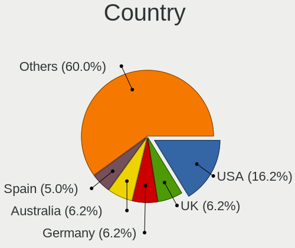
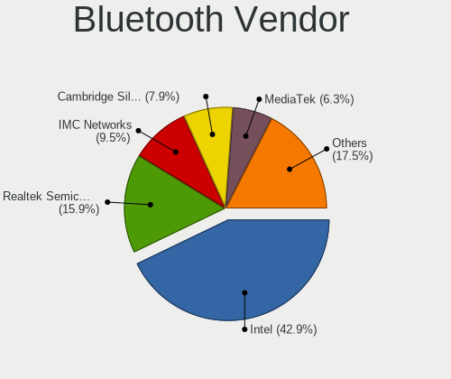

ArcoLinux - Hardware Trends
---------------------------

A project to identify most popular hardware characteristics and track their change
over time based on data collected by Linux users at https://Linux-Hardware.org.

Anyone can contribute to this report by the [hw-probe](https://github.com/linuxhw/hw-probe) tool:

    sudo -E hw-probe -all -upload

This is a report for all computer types. See also reports for [desktops](/Dist/ArcoLinux/Desktop/README.md) and [notebooks](/Dist/ArcoLinux/Notebook/README.md).

This report is for one last month. Overall report since the beginning of time: [TestDays](https://github.com/linuxhw/TestDays)

Period: Dec, 2023.

Contents
--------

* [ System ](#system)
  - [ OS                       ](#os)
  - [ OS Family                ](#os-family)
  - [ Kernel                   ](#kernel)
  - [ Kernel Family            ](#kernel-family)
  - [ Kernel Major Ver.        ](#kernel-major-ver)
  - [ Arch                     ](#arch)
  - [ DE                       ](#de)
  - [ Display Server           ](#display-server)
  - [ Display Manager          ](#display-manager)
  - [ OS Lang                  ](#os-lang)
  - [ Boot Mode                ](#boot-mode)
  - [ Filesystem               ](#filesystem)
  - [ Part. scheme             ](#part-scheme)
  - [ Dual Boot with Linux/BSD ](#dual-boot-with-linuxbsd)
  - [ Dual Boot (Win)          ](#dual-boot-win)

* [ Board ](#board)
  - [ Vendor                   ](#vendor)
  - [ Model                    ](#model)
  - [ Model Family             ](#model-family)
  - [ MFG Year                 ](#mfg-year)
  - [ Form Factor              ](#form-factor)
  - [ Secure Boot              ](#secure-boot)
  - [ Coreboot                 ](#coreboot)
  - [ RAM Size                 ](#ram-size)
  - [ RAM Used                 ](#ram-used)
  - [ Total Drives             ](#total-drives)
  - [ Has CD-ROM               ](#has-cd-rom)
  - [ Has Ethernet             ](#has-ethernet)
  - [ Has WiFi                 ](#has-wifi)
  - [ Has Bluetooth            ](#has-bluetooth)

* [ Location ](#location)
  - [ Country                  ](#country)
  - [ City                     ](#city)

* [ Drives ](#drives)
  - [ Drive Vendor             ](#drive-vendor)
  - [ Drive Model              ](#drive-model)
  - [ HDD Vendor               ](#hdd-vendor)
  - [ SSD Vendor               ](#ssd-vendor)
  - [ Drive Kind               ](#drive-kind)
  - [ Drive Connector          ](#drive-connector)
  - [ Drive Size               ](#drive-size)
  - [ Space Total              ](#space-total)
  - [ Space Used               ](#space-used)
  - [ Malfunc. Drives          ](#malfunc-drives)
  - [ Malfunc. Drive Vendor    ](#malfunc-drive-vendor)
  - [ Malfunc. HDD Vendor      ](#malfunc-hdd-vendor)
  - [ Malfunc. Drive Kind      ](#malfunc-drive-kind)
  - [ Failed Drives            ](#failed-drives)
  - [ Failed Drive Vendor      ](#failed-drive-vendor)
  - [ Drive Status             ](#drive-status)

* [ Storage controller ](#storage-controller)
  - [ Storage Vendor           ](#storage-vendor)
  - [ Storage Model            ](#storage-model)
  - [ Storage Kind             ](#storage-kind)

* [ Processor ](#processor)
  - [ CPU Vendor               ](#cpu-vendor)
  - [ CPU Model                ](#cpu-model)
  - [ CPU Model Family         ](#cpu-model-family)
  - [ CPU Cores                ](#cpu-cores)
  - [ CPU Sockets              ](#cpu-sockets)
  - [ CPU Threads              ](#cpu-threads)
  - [ CPU Op-Modes             ](#cpu-op-modes)
  - [ CPU Microcode            ](#cpu-microcode)
  - [ CPU Microarch            ](#cpu-microarch)

* [ Graphics ](#graphics)
  - [ GPU Vendor               ](#gpu-vendor)
  - [ GPU Model                ](#gpu-model)
  - [ GPU Combo                ](#gpu-combo)
  - [ GPU Driver               ](#gpu-driver)
  - [ GPU Memory               ](#gpu-memory)

* [ Monitor ](#monitor)
  - [ Monitor Vendor           ](#monitor-vendor)
  - [ Monitor Model            ](#monitor-model)
  - [ Monitor Resolution       ](#monitor-resolution)
  - [ Monitor Diagonal         ](#monitor-diagonal)
  - [ Monitor Width            ](#monitor-width)
  - [ Aspect Ratio             ](#aspect-ratio)
  - [ Monitor Area             ](#monitor-area)
  - [ Pixel Density            ](#pixel-density)
  - [ Multiple Monitors        ](#multiple-monitors)

* [ Network ](#network)
  - [ Net Controller Vendor    ](#net-controller-vendor)
  - [ Net Controller Model     ](#net-controller-model)
  - [ Wireless Vendor          ](#wireless-vendor)
  - [ Wireless Model           ](#wireless-model)
  - [ Ethernet Vendor          ](#ethernet-vendor)
  - [ Ethernet Model           ](#ethernet-model)
  - [ Net Controller Kind      ](#net-controller-kind)
  - [ Used Controller          ](#used-controller)
  - [ NICs                     ](#nics)
  - [ IPv6                     ](#ipv6)

* [ Bluetooth ](#bluetooth)
  - [ Bluetooth Vendor         ](#bluetooth-vendor)
  - [ Bluetooth Model          ](#bluetooth-model)

* [ Sound ](#sound)
  - [ Sound Vendor             ](#sound-vendor)
  - [ Sound Model              ](#sound-model)

* [ Memory ](#memory)
  - [ Memory Vendor            ](#memory-vendor)
  - [ Memory Model             ](#memory-model)
  - [ Memory Kind              ](#memory-kind)
  - [ Memory Form Factor       ](#memory-form-factor)
  - [ Memory Size              ](#memory-size)
  - [ Memory Speed             ](#memory-speed)

* [ Printers & scanners ](#printers--scanners)
  - [ Printer Vendor           ](#printer-vendor)
  - [ Printer Model            ](#printer-model)
  - [ Scanner Vendor           ](#scanner-vendor)
  - [ Scanner Model            ](#scanner-model)

* [ Camera ](#camera)
  - [ Camera Vendor            ](#camera-vendor)
  - [ Camera Model             ](#camera-model)

* [ Security ](#security)
  - [ Fingerprint Vendor       ](#fingerprint-vendor)
  - [ Fingerprint Model        ](#fingerprint-model)
  - [ Chipcard Vendor          ](#chipcard-vendor)
  - [ Chipcard Model           ](#chipcard-model)

* [ Unsupported ](#unsupported)
  - [ Unsupported Devices      ](#unsupported-devices)
  - [ Unsupported Device Types ](#unsupported-device-types)

System
------

OS
--

Installed operating systems

| Name              | Computers | Percent |
|-------------------|-----------|---------|
| ArcoLinux Rolling | 149       | 98.03%  |
| ArcoLinux         | 3         | 1.97%   |

OS Family
---------

OS without a version

| Name      | Computers | Percent |
|-----------|-----------|---------|
| ArcoLinux | 152       | 100%    |

Kernel
------

Version of the Linux kernel

| Version                    | Computers | Percent |
|----------------------------|-----------|---------|
| 6.6.1-arch1-1              | 24        | 15.79%  |
| 6.6.7-arch1-1              | 21        | 13.82%  |
| 6.6.3-arch1-1              | 16        | 10.53%  |
| 6.6.8-arch1-1              | 15        | 9.87%   |
| 6.6.4-arch1-1              | 13        | 8.55%   |
| 6.6.7-zen1-1-zen           | 9         | 5.92%   |
| 6.6.8-zen1-1-zen           | 5         | 3.29%   |
| 6.6.5-arch1-1              | 5         | 3.29%   |
| 6.1.68-1-lts               | 5         | 3.29%   |
| 6.4.11-arch1-1             | 4         | 2.63%   |
| 6.1.69-1-lts               | 4         | 2.63%   |
| 6.6.6-arch1-1              | 3         | 1.97%   |
| 6.6.5-zen1-1-zen           | 3         | 1.97%   |
| 6.6.2-arch1-1              | 3         | 1.97%   |
| 6.1.64-1-lts               | 3         | 1.97%   |
| 6.6.6-zen1-1-zen           | 2         | 1.32%   |
| 6.6.5-x64v2-xanmod1-1      | 2         | 1.32%   |
| 6.1.67-1-lts               | 2         | 1.32%   |
| 6.6.8-hardened1-1-hardened | 1         | 0.66%   |
| 6.6.7-x64v3-xanmod1        | 1         | 0.66%   |
| 6.6.4-zen1-1-zen           | 1         | 0.66%   |
| 6.5.9-arch2-1              | 1         | 0.66%   |
| 6.5.3-arch1-1              | 1         | 0.66%   |
| 6.5.12-x64v2-xanmod1-1     | 1         | 0.66%   |
| 6.3.8-arch1-1              | 1         | 0.66%   |
| 6.3.3-arch1-1              | 1         | 0.66%   |
| 6.2.11-1297.native         | 1         | 0.66%   |
| 6.1.66-x64v1-xanmod1-1-lts | 1         | 0.66%   |
| 6.1.65-1-lts               | 1         | 0.66%   |
| 6.1.63-1-lts               | 1         | 0.66%   |
| 6.1.61-1-lts               | 1         | 0.66%   |

Kernel Family
-------------

Linux kernel without a distro release

| Version | Computers | Percent |
|---------|-----------|---------|
| 6.6.7   | 31        | 20.39%  |
| 6.6.1   | 24        | 15.79%  |
| 6.6.8   | 21        | 13.82%  |
| 6.6.3   | 16        | 10.53%  |
| 6.6.4   | 14        | 9.21%   |
| 6.6.5   | 10        | 6.58%   |
| 6.6.6   | 5         | 3.29%   |
| 6.1.68  | 5         | 3.29%   |
| 6.4.11  | 4         | 2.63%   |
| 6.1.69  | 4         | 2.63%   |
| 6.6.2   | 3         | 1.97%   |
| 6.1.64  | 3         | 1.97%   |
| 6.1.67  | 2         | 1.32%   |
| 6.5.9   | 1         | 0.66%   |
| 6.5.3   | 1         | 0.66%   |
| 6.5.12  | 1         | 0.66%   |
| 6.3.8   | 1         | 0.66%   |
| 6.3.3   | 1         | 0.66%   |
| 6.2.11  | 1         | 0.66%   |
| 6.1.66  | 1         | 0.66%   |
| 6.1.65  | 1         | 0.66%   |
| 6.1.63  | 1         | 0.66%   |
| 6.1.61  | 1         | 0.66%   |

Kernel Major Ver.
-----------------

Linux kernel major version

| Version | Computers | Percent |
|---------|-----------|---------|
| 6.6     | 124       | 81.58%  |
| 6.1     | 18        | 11.84%  |
| 6.4     | 4         | 2.63%   |
| 6.5     | 3         | 1.97%   |
| 6.3     | 2         | 1.32%   |
| 6.2     | 1         | 0.66%   |

Arch
----

OS architecture (x86_64, i586, etc.)

| Name   | Computers | Percent |
|--------|-----------|---------|
| x86_64 | 152       | 100%    |

DE
--

Desktop Environment

| Name       | Computers | Percent |
|------------|-----------|---------|
| XFCE       | 49        | 32.24%  |
| KDE5       | 39        | 25.66%  |
| Cinnamon   | 17        | 11.18%  |
| GNOME      | 12        | 7.89%   |
| i3         | 6         | 3.95%   |
| X-Cinnamon | 4         | 2.63%   |
| MATE       | 4         | 2.63%   |
| Hyprland   | 4         | 2.63%   |
| Deepin     | 4         | 2.63%   |
| sway       | 3         | 1.97%   |
| Budgie     | 2         | 1.32%   |
| bspwm      | 2         | 1.32%   |
| awesome    | 2         | 1.32%   |
| wayfire    | 1         | 0.66%   |
| qtile      | 1         | 0.66%   |
| Cutefish   | 1         | 0.66%   |
| Unknown    | 1         | 0.66%   |

Display Server
--------------

X11 or Wayland

| Name    | Computers | Percent |
|---------|-----------|---------|
| X11     | 134       | 88.16%  |
| Wayland | 15        | 9.87%   |
| Tty     | 2         | 1.32%   |
| Unknown | 1         | 0.66%   |

Display Manager
---------------

SDDM, LightDM, etc.

| Name    | Computers | Percent |
|---------|-----------|---------|
| SDDM    | 115       | 75.66%  |
| LightDM | 33        | 21.71%  |
| Unknown | 3         | 1.97%   |
| GDM     | 1         | 0.66%   |

OS Lang
-------

Language

| Lang  | Computers | Percent |
|-------|-----------|---------|
| en_US | 77        | 50.66%  |
| de_DE | 11        | 7.24%   |
| en_GB | 10        | 6.58%   |
| it_IT | 6         | 3.95%   |
| ru_RU | 5         | 3.29%   |
| C     | 5         | 3.29%   |
| pt_BR | 4         | 2.63%   |
| es_ES | 4         | 2.63%   |
| en_CA | 4         | 2.63%   |
| en_HK | 3         | 1.97%   |
| nl_BE | 2         | 1.32%   |
| ja_JP | 2         | 1.32%   |
| fr_FR | 2         | 1.32%   |
| fi_FI | 2         | 1.32%   |
| es_MX | 2         | 1.32%   |
| en_PH | 2         | 1.32%   |
| en_AU | 2         | 1.32%   |
| th_TH | 1         | 0.66%   |
| nl_NL | 1         | 0.66%   |
| ko_KR | 1         | 0.66%   |
| hu_HU | 1         | 0.66%   |
| es_AR | 1         | 0.66%   |
| en_ZW | 1         | 0.66%   |
| en_IN | 1         | 0.66%   |
| de_AT | 1         | 0.66%   |
| bg_BG | 1         | 0.66%   |

Boot Mode
---------

EFI or BIOS

| Mode | Computers | Percent |
|------|-----------|---------|
| EFI  | 125       | 82.24%  |
| BIOS | 27        | 17.76%  |

Filesystem
----------

Type of filesystem

| Type    | Computers | Percent |
|---------|-----------|---------|
| Ext4    | 106       | 69.74%  |
| Btrfs   | 40        | 26.32%  |
| Overlay | 5         | 3.29%   |
| F2fs    | 1         | 0.66%   |

Part. scheme
------------

Scheme of partitioning

| Type    | Computers | Percent |
|---------|-----------|---------|
| GPT     | 134       | 88.16%  |
| MBR     | 15        | 9.87%   |
| Unknown | 3         | 1.97%   |

Dual Boot with Linux/BSD
------------------------

Hosting more than one Linux/BSD

| Dual boot | Computers | Percent |
|-----------|-----------|---------|
| No        | 100       | 65.79%  |
| Yes       | 52        | 34.21%  |

Dual Boot (Win)
---------------

Hosting Linux and Windows

| Dual boot | Computers | Percent |
|-----------|-----------|---------|
| No        | 93        | 61.18%  |
| Yes       | 59        | 38.82%  |

Board
-----

Vendor
------

Motherboard manufacturer

| Name                  | Computers | Percent |
|-----------------------|-----------|---------|
| ASUSTek Computer      | 31        | 20.39%  |
| Lenovo                | 25        | 16.45%  |
| MSI                   | 17        | 11.18%  |
| Gigabyte Technology   | 16        | 10.53%  |
| Hewlett-Packard       | 15        | 9.87%   |
| Dell                  | 14        | 9.21%   |
| Acer                  | 9         | 5.92%   |
| ASRock                | 7         | 4.61%   |
| Apple                 | 3         | 1.97%   |
| Unknown               | 3         | 1.97%   |
| AZW                   | 2         | 1.32%   |
| Win element           | 1         | 0.66%   |
| Toshiba               | 1         | 0.66%   |
| System76              | 1         | 0.66%   |
| Razer                 | 1         | 0.66%   |
| Positivo Bahia - VAIO | 1         | 0.66%   |
| Packard Bell          | 1         | 0.66%   |
| NVN-ED01              | 1         | 0.66%   |
| MACHINIST             | 1         | 0.66%   |
| Intel                 | 1         | 0.66%   |
| HUAWEI                | 1         | 0.66%   |

Model
-----

Motherboard model

| Name                                       | Computers | Percent |
|--------------------------------------------|-----------|---------|
| Unknown                                    | 4         | 2.63%   |
| AZW SER                                    | 2         | 1.32%   |
| ASUS PRIME A520M-K                         | 2         | 1.32%   |
| ASUS All Series                            | 2         | 1.32%   |
| ASRock X670E Taichi Carrara                | 2         | 1.32%   |
| Win element M600                           | 1         | 0.66%   |
| Toshiba Satellite C50-A-1HF                | 1         | 0.66%   |
| System76 Gazelle                           | 1         | 0.66%   |
| Razer Blade 15 (2022) - RZ09-0421          | 1         | 0.66%   |
| Positivo Bahia - VAIO VJFE59F11X-B1011H    | 1         | 0.66%   |
| Packard Bell EasyNote TE11HC               | 1         | 0.66%   |
| MSI MS-7D82                                | 1         | 0.66%   |
| MSI MS-7D09                                | 1         | 0.66%   |
| MSI MS-7C96                                | 1         | 0.66%   |
| MSI MS-7C95                                | 1         | 0.66%   |
| MSI MS-7C91                                | 1         | 0.66%   |
| MSI MS-7C83                                | 1         | 0.66%   |
| MSI MS-7C02                                | 1         | 0.66%   |
| MSI MS-7B89                                | 1         | 0.66%   |
| MSI MS-7B84                                | 1         | 0.66%   |
| MSI MS-7B79                                | 1         | 0.66%   |
| MSI MS-7A38                                | 1         | 0.66%   |
| MSI MS-7850                                | 1         | 0.66%   |
| MSI MS-7721                                | 1         | 0.66%   |
| MSI MEG Z590 Aegis Ti5 (MS-B931)           | 1         | 0.66%   |
| MSI GS66 Stealth 10SE                      | 1         | 0.66%   |
| MSI CR610M                                 | 1         | 0.66%   |
| MSI Alpha 17 C7VF                          | 1         | 0.66%   |
| MACHINIST X99-RS9 V2.0                     | 1         | 0.66%   |
| Lenovo ThinkPad X220 4286AQ7               | 1         | 0.66%   |
| Lenovo ThinkPad X1 Carbon Gen 8 20U9CTO1WW | 1         | 0.66%   |
| Lenovo ThinkPad T550 20CJS1MW00            | 1         | 0.66%   |
| Lenovo ThinkPad T480s 20L8S5LK0M           | 1         | 0.66%   |
| Lenovo ThinkPad T440 20B70048US            | 1         | 0.66%   |
| Lenovo ThinkPad T440 20B6005BUS            | 1         | 0.66%   |
| Lenovo ThinkPad T420 4178AFU               | 1         | 0.66%   |
| Lenovo ThinkPad T410 2522AC1               | 1         | 0.66%   |
| Lenovo ThinkPad P43s 20RH0021MX            | 1         | 0.66%   |
| Lenovo ThinkPad E585 20KV0010US            | 1         | 0.66%   |
| Lenovo ThinkPad 13 2nd Gen 20J2S0PE00      | 1         | 0.66%   |

Model Family
------------

Motherboard model prefix

| Name                                    | Computers | Percent |
|-----------------------------------------|-----------|---------|
| Lenovo ThinkPad                         | 11        | 7.24%   |
| ASUS ROG                                | 10        | 6.58%   |
| Dell Inspiron                           | 8         | 5.26%   |
| Lenovo IdeaPad                          | 7         | 4.61%   |
| ASUS PRIME                              | 7         | 4.61%   |
| Acer Aspire                             | 6         | 3.95%   |
| Dell OptiPlex                           | 4         | 2.63%   |
| Unknown                                 | 4         | 2.63%   |
| Lenovo Legion                           | 3         | 1.97%   |
| HP Pavilion                             | 3         | 1.97%   |
| ASUS VivoBook                           | 3         | 1.97%   |
| Lenovo ThinkCentre                      | 2         | 1.32%   |
| HP ENVY                                 | 2         | 1.32%   |
| HP EliteBook                            | 2         | 1.32%   |
| Gigabyte X570                           | 2         | 1.32%   |
| Gigabyte B550                           | 2         | 1.32%   |
| Dell Latitude                           | 2         | 1.32%   |
| AZW SER                                 | 2         | 1.32%   |
| ASUS TUF                                | 2         | 1.32%   |
| ASUS All                                | 2         | 1.32%   |
| ASRock X670E                            | 2         | 1.32%   |
| Win element M600                        | 1         | 0.66%   |
| Toshiba Satellite                       | 1         | 0.66%   |
| System76 Gazelle                        | 1         | 0.66%   |
| Razer Blade                             | 1         | 0.66%   |
| Positivo Bahia - VAIO VJFE59F11X-B1011H | 1         | 0.66%   |
| Packard Bell EasyNote                   | 1         | 0.66%   |
| MSI MS-7D82                             | 1         | 0.66%   |
| MSI MS-7D09                             | 1         | 0.66%   |
| MSI MS-7C96                             | 1         | 0.66%   |
| MSI MS-7C95                             | 1         | 0.66%   |
| MSI MS-7C91                             | 1         | 0.66%   |
| MSI MS-7C83                             | 1         | 0.66%   |
| MSI MS-7C02                             | 1         | 0.66%   |
| MSI MS-7B89                             | 1         | 0.66%   |
| MSI MS-7B84                             | 1         | 0.66%   |
| MSI MS-7B79                             | 1         | 0.66%   |
| MSI MS-7A38                             | 1         | 0.66%   |
| MSI MS-7850                             | 1         | 0.66%   |
| MSI MS-7721                             | 1         | 0.66%   |

MFG Year
--------

Motherboard manufacture year

| Year | Computers | Percent |
|------|-----------|---------|
| 2019 | 19        | 12.5%   |
| 2018 | 17        | 11.18%  |
| 2022 | 16        | 10.53%  |
| 2020 | 15        | 9.87%   |
| 2021 | 14        | 9.21%   |
| 2023 | 11        | 7.24%   |
| 2017 | 10        | 6.58%   |
| 2014 | 9         | 5.92%   |
| 2016 | 8         | 5.26%   |
| 2012 | 8         | 5.26%   |
| 2015 | 7         | 4.61%   |
| 2013 | 7         | 4.61%   |
| 2011 | 5         | 3.29%   |
| 2010 | 2         | 1.32%   |
| 2009 | 2         | 1.32%   |
| 2008 | 2         | 1.32%   |

Form Factor
-----------

Physical design of the computer

| Name        | Computers | Percent |
|-------------|-----------|---------|
| Desktop     | 72        | 47.37%  |
| Notebook    | 69        | 45.39%  |
| Convertible | 5         | 3.29%   |
| Mini pc     | 3         | 1.97%   |
| All in one  | 2         | 1.32%   |
| Tablet      | 1         | 0.66%   |

Secure Boot
-----------

Enabled or disabled

| State    | Computers | Percent |
|----------|-----------|---------|
| Disabled | 152       | 100%    |

Coreboot
--------

Have coreboot on board

| Used | Computers | Percent |
|------|-----------|---------|
| No   | 151       | 99.34%  |
| Yes  | 1         | 0.66%   |

RAM Size
--------

Total RAM memory

| Size in GB  | Computers | Percent |
|-------------|-----------|---------|
| 16.01-24.0  | 37        | 24.34%  |
| 4.01-8.0    | 32        | 21.05%  |
| 32.01-64.0  | 31        | 20.39%  |
| 8.01-16.0   | 22        | 14.47%  |
| 3.01-4.0    | 17        | 11.18%  |
| 64.01-256.0 | 8         | 5.26%   |
| 24.01-32.0  | 4         | 2.63%   |
| 2.01-3.0    | 1         | 0.66%   |

RAM Used
--------

Used RAM memory

| Used GB    | Computers | Percent |
|------------|-----------|---------|
| 1.01-2.0   | 64        | 42.11%  |
| 2.01-3.0   | 37        | 24.34%  |
| 4.01-8.0   | 24        | 15.79%  |
| 3.01-4.0   | 12        | 7.89%   |
| 8.01-16.0  | 10        | 6.58%   |
| 0.51-1.0   | 2         | 1.32%   |
| 32.01-64.0 | 1         | 0.66%   |
| 24.01-32.0 | 1         | 0.66%   |
| 0.01-0.5   | 1         | 0.66%   |

Total Drives
------------

Number of drives on board

| Drives | Computers | Percent |
|--------|-----------|---------|
| 1      | 62        | 40.79%  |
| 2      | 50        | 32.89%  |
| 3      | 24        | 15.79%  |
| 6      | 6         | 3.95%   |
| 4      | 4         | 2.63%   |
| 7      | 2         | 1.32%   |
| 5      | 2         | 1.32%   |
| 13     | 1         | 0.66%   |
| 0      | 1         | 0.66%   |

Has CD-ROM
----------

Has CD-ROM on board

| Presented | Computers | Percent |
|-----------|-----------|---------|
| No        | 116       | 76.32%  |
| Yes       | 36        | 23.68%  |

Has Ethernet
------------

Has Ethernet on board

| Presented | Computers | Percent |
|-----------|-----------|---------|
| Yes       | 132       | 86.84%  |
| No        | 20        | 13.16%  |

Has WiFi
--------

Has WiFi module

| Presented | Computers | Percent |
|-----------|-----------|---------|
| Yes       | 115       | 75.66%  |
| No        | 37        | 24.34%  |

Has Bluetooth
-------------

Has Bluetooth module

| Presented | Computers | Percent |
|-----------|-----------|---------|
| Yes       | 113       | 74.34%  |
| No        | 39        | 25.66%  |

Location
--------

Country
-------

Geographic location (country)

| Country      | Computers | Percent |
|--------------|-----------|---------|
| USA          | 34        | 22.37%  |
| Germany      | 14        | 9.21%   |
| UK           | 11        | 7.24%   |
| Spain        | 8         | 5.26%   |
| Italy        | 6         | 3.95%   |
| Canada       | 6         | 3.95%   |
| Brazil       | 5         | 3.29%   |
| Romania      | 4         | 2.63%   |
| Mexico       | 4         | 2.63%   |
| Hong Kong    | 4         | 2.63%   |
| Bulgaria     | 4         | 2.63%   |
| Russia       | 3         | 1.97%   |
| Japan        | 3         | 1.97%   |
| Finland      | 3         | 1.97%   |
| Belgium      | 3         | 1.97%   |
| Argentina    | 3         | 1.97%   |
| Thailand     | 2         | 1.32%   |
| Serbia       | 2         | 1.32%   |
| Portugal     | 2         | 1.32%   |
| Philippines  | 2         | 1.32%   |
| India        | 2         | 1.32%   |
| Hungary      | 2         | 1.32%   |
| France       | 2         | 1.32%   |
| Egypt        | 2         | 1.32%   |
| China        | 2         | 1.32%   |
| Australia    | 2         | 1.32%   |
| Zimbabwe     | 1         | 0.66%   |
| Venezuela    | 1         | 0.66%   |
| Ukraine      | 1         | 0.66%   |
| Sweden       | 1         | 0.66%   |
| South Korea  | 1         | 0.66%   |
| Singapore    | 1         | 0.66%   |
| Saudi Arabia | 1         | 0.66%   |
| Poland       | 1         | 0.66%   |
| Pakistan     | 1         | 0.66%   |
| Netherlands  | 1         | 0.66%   |
| Malaysia     | 1         | 0.66%   |
| Latvia       | 1         | 0.66%   |
| Iran         | 1         | 0.66%   |
| Indonesia    | 1         | 0.66%   |

City
----

Geographic location (city)

| City            | Computers | Percent |
|-----------------|-----------|---------|
| Tsuen Wan       | 3         | 1.97%   |
| Sofia           | 3         | 1.97%   |
| Helsinki        | 3         | 1.97%   |
| Barcelona       | 3         | 1.97%   |
| Zurich          | 2         | 1.32%   |
| Rome            | 2         | 1.32%   |
| Portsmouth      | 2         | 1.32%   |
| Liverpool       | 2         | 1.32%   |
| Düsseldorf     | 2         | 1.32%   |
| Columbus        | 2         | 1.32%   |
| Bucharest       | 2         | 1.32%   |
| Berlin          | 2         | 1.32%   |
| Barking         | 2         | 1.32%   |
| Zarichne        | 1         | 0.66%   |
| Zapopan         | 1         | 0.66%   |
| Youngstown      | 1         | 0.66%   |
| Yokosuka        | 1         | 0.66%   |
| Yokohama        | 1         | 0.66%   |
| Yakutsk         | 1         | 0.66%   |
| Xinzo de Limia  | 1         | 0.66%   |
| Wharton         | 1         | 0.66%   |
| Warsaw          | 1         | 0.66%   |
| Warendorf       | 1         | 0.66%   |
| Walker          | 1         | 0.66%   |
| Virovitica      | 1         | 0.66%   |
| Vicosa          | 1         | 0.66%   |
| Valence         | 1         | 0.66%   |
| Torre del Greco | 1         | 0.66%   |
| Tijuana         | 1         | 0.66%   |
| Thessaloniki    | 1         | 0.66%   |
| Sydney          | 1         | 0.66%   |
| Summerville     | 1         | 0.66%   |
| Sochi           | 1         | 0.66%   |
| Singapore       | 1         | 0.66%   |
| Sidney          | 1         | 0.66%   |
| Seville         | 1         | 0.66%   |
| Seattle         | 1         | 0.66%   |
| Schwarzenbek    | 1         | 0.66%   |
| Satu Mare       | 1         | 0.66%   |
| Sao Paulo       | 1         | 0.66%   |

Drives
------

Drive Vendor
------------

Hard drive vendors

| Vendor                       | Computers | Drives | Percent |
|------------------------------|-----------|--------|---------|
| Samsung Electronics          | 46        | 54     | 16.91%  |
| WDC                          | 33        | 43     | 12.13%  |
| Seagate                      | 32        | 34     | 11.76%  |
| Kingston                     | 17        | 22     | 6.25%   |
| Toshiba                      | 15        | 15     | 5.51%   |
| SanDisk                      | 14        | 17     | 5.15%   |
| Micron Technology            | 11        | 11     | 4.04%   |
| Crucial                      | 11        | 13     | 4.04%   |
| Phison Electronics           | 10        | 16     | 3.68%   |
| Micron/Crucial Technology    | 7         | 7      | 2.57%   |
| Kingston Technology Company  | 6         | 6      | 2.21%   |
| A-DATA Technology            | 6         | 7      | 2.21%   |
| Unknown                      | 5         | 5      | 1.84%   |
| SK hynix                     | 4         | 4      | 1.47%   |
| KIOXIA                       | 4         | 4      | 1.47%   |
| Hitachi                      | 4         | 7      | 1.47%   |
| HGST                         | 4         | 12     | 1.47%   |
| Intel                        | 3         | 5      | 1.1%    |
| Apple                        | 3         | 3      | 1.1%    |
| ADATA Technology             | 3         | 3      | 1.1%    |
| Plextor                      | 2         | 2      | 0.74%   |
| MAXIO Technology (Hangzhou)  | 2         | 2      | 0.74%   |
| Hewlett-Packard              | 2         | 2      | 0.74%   |
| China                        | 2         | 2      | 0.74%   |
| XrayDisk                     | 1         | 1      | 0.37%   |
| USB3.0                       | 1         | 1      | 0.37%   |
| Team                         | 1         | 1      | 0.37%   |
| Silicon Motion               | 1         | 1      | 0.37%   |
| ShiJi                        | 1         | 1      | 0.37%   |
| Shenzhen Longsys Electronics | 1         | 2      | 0.37%   |
| SABRENT                      | 1         | 1      | 0.37%   |
| RevuAhn                      | 1         | 1      | 0.37%   |
| Realtek Semiconductor        | 1         | 1      | 0.37%   |
| Ramsta                       | 1         | 1      | 0.37%   |
| PNY                          | 1         | 1      | 0.37%   |
| Patriot                      | 1         | 1      | 0.37%   |
| Netac                        | 1         | 1      | 0.37%   |
| Maxtor                       | 1         | 1      | 0.37%   |
| LITEON                       | 1         | 1      | 0.37%   |
| HPE                          | 1         | 1      | 0.37%   |

Drive Model
-----------

Hard drive models

| Model                                               | Computers | Percent |
|-----------------------------------------------------|-----------|---------|
| Samsung NVMe SSD Controller PM9A1/PM9A3/980PRO 2TB  | 10        | 3.31%   |
| Samsung NVMe SSD Controller SM981/PM981/PM983 512GB | 6         | 1.99%   |
| Micron/Crucial P2 NVMe PCIe SSD 4TB                 | 5         | 1.66%   |
| Seagate ST2000DM008-2FR102 2TB                      | 4         | 1.32%   |
| Samsung SSD 870 EVO 500GB                           | 4         | 1.32%   |
| Samsung SSD 860 EVO 1TB                             | 4         | 1.32%   |
| Phison E16 PCIe4 NVMe Controller 2TB                | 4         | 1.32%   |
| Phison E12 NVMe Controller 1TB                      | 4         | 1.32%   |
| Toshiba MQ01ABF050 500GB                            | 3         | 0.99%   |
| Seagate ST1000LM035-1RK172 1TB                      | 3         | 0.99%   |
| Samsung SSD 870 EVO 250GB                           | 3         | 0.99%   |
| Samsung SSD 860 EVO 500GB                           | 3         | 0.99%   |
| Samsung SSD 850 EVO 250GB                           | 3         | 0.99%   |
| Kingston Company SNV2S1000G 1TB                     | 3         | 0.99%   |
| Kingston SKC3000S1024G 1024GB                       | 3         | 0.99%   |
| Crucial CT1000MX500SSD1 1TB                         | 3         | 0.99%   |
| WDC WDS240G2G0A-00JH30 240GB SSD                    | 2         | 0.66%   |
| WDC WD5000AAKX-60U6AA0 500GB                        | 2         | 0.66%   |
| WDC WD10SPZX-24Z10 1TB                              | 2         | 0.66%   |
| WDC WD10EZRX-00L4HB0 1TB                            | 2         | 0.66%   |
| WDC WD10EZEX-08WN4A0 1TB                            | 2         | 0.66%   |
| Toshiba MQ01ABD100 1TB                              | 2         | 0.66%   |
| Toshiba HDWD120 2TB                                 | 2         | 0.66%   |
| Toshiba HDWD110 1TB                                 | 2         | 0.66%   |
| Toshiba DT01ACA100 1TB                              | 2         | 0.66%   |
| Seagate ST6000DM003-2CY186 6TB                      | 2         | 0.66%   |
| Seagate ST500LT012-1DG142 500GB                     | 2         | 0.66%   |
| Seagate ST4000DM004-2CV104 4TB                      | 2         | 0.66%   |
| Seagate ST1000DM003-1CH162 1TB                      | 2         | 0.66%   |
| Sandisk WD Blue SN550 NVMe SSD 1TB                  | 2         | 0.66%   |
| Sandisk WD Blue SN500 / PC SN520 NVMe SSD 128GB     | 2         | 0.66%   |
| Sandisk WD Black SN850 1024GB                       | 2         | 0.66%   |
| SanDisk SSD U110 16GB                               | 2         | 0.66%   |
| Samsung SSD 980 500GB                               | 2         | 0.66%   |
| Samsung SSD 870 EVO 1TB                             | 2         | 0.66%   |
| Samsung SSD 850 EVO 500GB                           | 2         | 0.66%   |
| Samsung SSD 840 PRO Series 128GB                    | 2         | 0.66%   |
| KIOXIA NVMe SSD 1TB                                 | 2         | 0.66%   |
| Kingston SNVS500G 500GB                             | 2         | 0.66%   |
| Kingston SFYRS1000G 1TB                             | 2         | 0.66%   |

HDD Vendor
----------

Hard disk drive vendors

| Vendor              | Computers | Drives | Percent |
|---------------------|-----------|--------|---------|
| Seagate             | 31        | 33     | 35.63%  |
| WDC                 | 28        | 36     | 32.18%  |
| Toshiba             | 13        | 13     | 14.94%  |
| Hitachi             | 4         | 7      | 4.6%    |
| HGST                | 4         | 12     | 4.6%    |
| Samsung Electronics | 2         | 2      | 2.3%    |
| USB3.0              | 1         | 1      | 1.15%   |
| Unknown             | 1         | 1      | 1.15%   |
| SABRENT             | 1         | 1      | 1.15%   |
| Maxtor              | 1         | 1      | 1.15%   |
| Fujitsu             | 1         | 1      | 1.15%   |

SSD Vendor
----------

Solid state drive vendors

| Vendor              | Computers | Drives | Percent |
|---------------------|-----------|--------|---------|
| Samsung Electronics | 25        | 29     | 27.17%  |
| Crucial             | 11        | 13     | 11.96%  |
| Kingston            | 8         | 9      | 8.7%    |
| WDC                 | 6         | 7      | 6.52%   |
| A-DATA Technology   | 6         | 7      | 6.52%   |
| SanDisk             | 5         | 5      | 5.43%   |
| Toshiba             | 2         | 2      | 2.17%   |
| Plextor             | 2         | 2      | 2.17%   |
| Micron Technology   | 2         | 2      | 2.17%   |
| China               | 2         | 2      | 2.17%   |
| Apple               | 2         | 2      | 2.17%   |
| XrayDisk            | 1         | 1      | 1.09%   |
| Team                | 1         | 1      | 1.09%   |
| SK hynix            | 1         | 1      | 1.09%   |
| ShiJi               | 1         | 1      | 1.09%   |
| Seagate             | 1         | 1      | 1.09%   |
| RevuAhn             | 1         | 1      | 1.09%   |
| Ramsta              | 1         | 1      | 1.09%   |
| PNY                 | 1         | 1      | 1.09%   |
| Patriot             | 1         | 1      | 1.09%   |
| Netac               | 1         | 1      | 1.09%   |
| LITEON              | 1         | 1      | 1.09%   |
| Intel               | 1         | 1      | 1.09%   |
| HPE                 | 1         | 1      | 1.09%   |
| Hewlett-Packard     | 1         | 1      | 1.09%   |
| Gigabyte Technology | 1         | 1      | 1.09%   |
| Fanxiang            | 1         | 1      | 1.09%   |
| EYOTA               | 1         | 1      | 1.09%   |
| BR                  | 1         | 1      | 1.09%   |
| AMD                 | 1         | 1      | 1.09%   |
| aigo                | 1         | 1      | 1.09%   |
| Unknown             | 1         | 1      | 1.09%   |

Drive Kind
----------

HDD or SSD

| Kind | Computers | Drives | Percent |
|------|-----------|--------|---------|
| NVMe | 78        | 111    | 33.05%  |
| SSD  | 78        | 101    | 33.05%  |
| HDD  | 76        | 108    | 32.2%   |
| MMC  | 4         | 4      | 1.69%   |

Drive Connector
---------------

SATA, SAS, NVMe, etc.

| Type | Computers | Drives | Percent |
|------|-----------|--------|---------|
| SATA | 114       | 201    | 55.88%  |
| NVMe | 78        | 110    | 38.24%  |
| SAS  | 8         | 9      | 3.92%   |
| MMC  | 4         | 4      | 1.96%   |

Drive Size
----------

Size of hard drive

| Size in TB | Computers | Drives | Percent |
|------------|-----------|--------|---------|
| 0.01-0.5   | 75        | 96     | 47.17%  |
| 0.51-1.0   | 53        | 67     | 33.33%  |
| 1.01-2.0   | 14        | 17     | 8.81%   |
| 4.01-10.0  | 8         | 17     | 5.03%   |
| 3.01-4.0   | 6         | 7      | 3.77%   |
| 2.01-3.0   | 2         | 4      | 1.26%   |
| 10.01-20.0 | 1         | 1      | 0.63%   |

Space Total
-----------

Amount of disk space available on the file system

| Size in GB     | Computers | Percent |
|----------------|-----------|---------|
| More than 3000 | 29        | 19.08%  |
| 251-500        | 26        | 17.11%  |
| 101-250        | 24        | 15.79%  |
| 501-1000       | 22        | 14.47%  |
| 1001-2000      | 19        | 12.5%   |
| 51-100         | 12        | 7.89%   |
| 2001-3000      | 7         | 4.61%   |
| Unknown        | 7         | 4.61%   |
| 1-20           | 4         | 2.63%   |
| 21-50          | 2         | 1.32%   |

Space Used
----------

Amount of used disk space

| Used GB        | Computers | Percent |
|----------------|-----------|---------|
| 1-20           | 40        | 26.32%  |
| 21-50          | 22        | 14.47%  |
| 101-250        | 21        | 13.82%  |
| 51-100         | 18        | 11.84%  |
| 501-1000       | 17        | 11.18%  |
| 251-500        | 12        | 7.89%   |
| More than 3000 | 10        | 6.58%   |
| Unknown        | 7         | 4.61%   |
| 1001-2000      | 5         | 3.29%   |

Malfunc. Drives
---------------

Drive models with a malfunction

| Model                                                         | Computers | Drives | Percent |
|---------------------------------------------------------------|-----------|--------|---------|
| Toshiba MQ01ABD100 1TB                                        | 2         | 2      | 5.41%   |
| Seagate ST500LT012-1DG142 500GB                               | 2         | 2      | 5.41%   |
| HGST HTS721010A9E630 1TB                                      | 2         | 2      | 5.41%   |
| WDC WD6400AAKS-22A7B2 640GB                                   | 1         | 1      | 2.7%    |
| WDC WD5000LPVX-22V0TT0 500GB                                  | 1         | 1      | 2.7%    |
| WDC WD5000AAKX-60U6AA0 500GB                                  | 1         | 1      | 2.7%    |
| WDC WD5000AAKX-22ERMA0 500GB                                  | 1         | 1      | 2.7%    |
| WDC WD1600BEVS-26VAT0 160GB                                   | 1         | 1      | 2.7%    |
| WDC WD1600AAJS-00PSA0 160GB                                   | 1         | 1      | 2.7%    |
| WDC WD10EZEX-22BN5A0 1TB                                      | 1         | 1      | 2.7%    |
| WDC WD10EAVS-00D7B1 1TB                                       | 1         | 1      | 2.7%    |
| WDC WD1003FZEX-00MK2A0 1TB                                    | 1         | 1      | 2.7%    |
| WDC WD1001FALS-41Y6A1 1TB                                     | 1         | 1      | 2.7%    |
| USB3.0 Super Speed 1TB                                        | 1         | 1      | 2.7%    |
| Toshiba MQ01ABF050 500GB                                      | 1         | 1      | 2.7%    |
| Toshiba MK3263GSX 320GB                                       | 1         | 1      | 2.7%    |
| Toshiba HDWD120 2TB                                           | 1         | 1      | 2.7%    |
| Seagate ST9500325AS 500GB                                     | 1         | 1      | 2.7%    |
| Seagate ST4000LM 024-2AN17V 4TB                               | 1         | 1      | 2.7%    |
| Seagate ST3500312CS 500GB                                     | 1         | 1      | 2.7%    |
| Seagate ST2000DM008-2FR102 2TB                                | 1         | 1      | 2.7%    |
| Seagate ST1000LM035-1RK172 1TB                                | 1         | 1      | 2.7%    |
| Seagate ST1000LM024 HN-M101MBB 1TB                            | 1         | 1      | 2.7%    |
| SanDisk SSD PLUS 480GB                                        | 1         | 1      | 2.7%    |
| Samsung Electronics SSD 870 EVO 1TB                           | 1         | 1      | 2.7%    |
| Maxtor STM3250310AS 250GB                                     | 1         | 1      | 2.7%    |
| MAXIO Technology (Hangzhou) NVMe SSD Controller MAP1001 500GB | 1         | 1      | 2.7%    |
| Hitachi HDS721010CLA332 1TB                                   | 1         | 1      | 2.7%    |
| HGST HUS726060ALE610 6TB                                      | 1         | 8      | 2.7%    |
| HGST HTS541010A9E680 1TB                                      | 1         | 1      | 2.7%    |
| Fujitsu MHZ2160BH G2 160GB                                    | 1         | 1      | 2.7%    |
| Crucial CT275MX300SSD1 275GB                                  | 1         | 1      | 2.7%    |
| A-DATA Technology SU650 960GB SSD                             | 1         | 2      | 2.7%    |
| A-DATA Technology SU630 480GB SSD                             | 1         | 1      | 2.7%    |

Malfunc. Drive Vendor
---------------------

Vendors of faulty drives

| Vendor                      | Computers | Drives | Percent |
|-----------------------------|-----------|--------|---------|
| WDC                         | 8         | 10     | 22.86%  |
| Seagate                     | 8         | 8      | 22.86%  |
| Toshiba                     | 5         | 5      | 14.29%  |
| HGST                        | 4         | 11     | 11.43%  |
| A-DATA Technology           | 2         | 3      | 5.71%   |
| USB3.0                      | 1         | 1      | 2.86%   |
| SanDisk                     | 1         | 1      | 2.86%   |
| Samsung Electronics         | 1         | 1      | 2.86%   |
| Maxtor                      | 1         | 1      | 2.86%   |
| MAXIO Technology (Hangzhou) | 1         | 1      | 2.86%   |
| Hitachi                     | 1         | 1      | 2.86%   |
| Fujitsu                     | 1         | 1      | 2.86%   |
| Crucial                     | 1         | 1      | 2.86%   |

Malfunc. HDD Vendor
-------------------

Vendors of faulty HDD drives

| Vendor  | Computers | Drives | Percent |
|---------|-----------|--------|---------|
| WDC     | 8         | 10     | 27.59%  |
| Seagate | 8         | 8      | 27.59%  |
| Toshiba | 5         | 5      | 17.24%  |
| HGST    | 4         | 11     | 13.79%  |
| USB3.0  | 1         | 1      | 3.45%   |
| Maxtor  | 1         | 1      | 3.45%   |
| Hitachi | 1         | 1      | 3.45%   |
| Fujitsu | 1         | 1      | 3.45%   |

Malfunc. Drive Kind
-------------------

Kinds of faulty drives

| Kind | Computers | Drives | Percent |
|------|-----------|--------|---------|
| HDD  | 25        | 38     | 80.65%  |
| SSD  | 5         | 6      | 16.13%  |
| NVMe | 1         | 1      | 3.23%   |

Failed Drives
-------------

Failed drive models

Zero info for selected period =(

Failed Drive Vendor
-------------------

Failed drive vendors

Zero info for selected period =(

Drive Status
------------

Number of failed and malfunc. drives

| Status   | Computers | Drives | Percent |
|----------|-----------|--------|---------|
| Works    | 136       | 266    | 76.84%  |
| Malfunc  | 30        | 45     | 16.95%  |
| Detected | 11        | 13     | 6.21%   |

Storage controller
------------------

Storage Vendor
--------------

Storage controller vendors

| Vendor                       | Computers | Percent |
|------------------------------|-----------|---------|
| Intel                        | 87        | 36.71%  |
| AMD                          | 44        | 18.57%  |
| Samsung Electronics          | 23        | 9.7%    |
| Kingston Technology Company  | 16        | 6.75%   |
| Phison Electronics           | 10        | 4.22%   |
| SanDisk                      | 9         | 3.8%    |
| Micron Technology            | 9         | 3.8%    |
| Micron/Crucial Technology    | 7         | 2.95%   |
| ASMedia Technology           | 7         | 2.95%   |
| KIOXIA                       | 4         | 1.69%   |
| SK hynix                     | 3         | 1.27%   |
| Marvell Technology Group     | 3         | 1.27%   |
| ADATA Technology             | 3         | 1.27%   |
| MAXIO Technology (Hangzhou)  | 2         | 0.84%   |
| INNOGRIT                     | 2         | 0.84%   |
| Silicon Motion               | 1         | 0.42%   |
| Shenzhen Longsys Electronics | 1         | 0.42%   |
| Realtek Semiconductor        | 1         | 0.42%   |
| Nvidia                       | 1         | 0.42%   |
| LSI Logic / Symbios Logic    | 1         | 0.42%   |
| Enmotus                      | 1         | 0.42%   |
| Beijing Starblaze Technology | 1         | 0.42%   |
| Apple                        | 1         | 0.42%   |

Storage Model
-------------

Storage controller models

| Model                                                                          | Computers | Percent |
|--------------------------------------------------------------------------------|-----------|---------|
| AMD FCH SATA Controller [AHCI mode]                                            | 29        | 11.42%  |
| Samsung NVMe SSD Controller PM9A1/PM9A3/980PRO                                 | 10        | 3.94%   |
| AMD 500 Series Chipset SATA Controller                                         | 9         | 3.54%   |
| AMD 400 Series Chipset SATA Controller                                         | 8         | 3.15%   |
| Kingston Company KC3000/FURY Renegade NVMe SSD E18                             | 7         | 2.76%   |
| Intel 8 Series/C220 Series Chipset Family 6-port SATA Controller 1 [AHCI mode] | 7         | 2.76%   |
| ASMedia ASM1062 Serial ATA Controller                                          | 7         | 2.76%   |
| Samsung NVMe SSD Controller SM981/PM981/PM983                                  | 6         | 2.36%   |
| Intel Sunrise Point-LP SATA Controller [AHCI mode]                             | 6         | 2.36%   |
| Micron/Crucial P2 [Nick P2] / P3 / P3 Plus NVMe PCIe SSD (DRAM-less)           | 5         | 1.97%   |
| Intel Volume Management Device NVMe RAID Controller                            | 5         | 1.97%   |
| Intel 82801 Mobile SATA Controller [RAID mode]                                 | 5         | 1.97%   |
| Intel 200 Series PCH SATA controller [AHCI mode]                               | 5         | 1.97%   |
| Samsung NVMe SSD Controller 980 (DRAM-less)                                    | 4         | 1.57%   |
| Phison E16 PCIe4 NVMe Controller                                               | 4         | 1.57%   |
| Phison E12 NVMe Controller                                                     | 4         | 1.57%   |
| Intel 7 Series Chipset Family 6-port SATA Controller [AHCI mode]               | 4         | 1.57%   |
| Intel 6 Series/C200 Series Chipset Family 6 port Mobile SATA AHCI Controller   | 4         | 1.57%   |
| Intel 400 Series Chipset Family SATA AHCI Controller                           | 4         | 1.57%   |
| Micron 2450 NVMe SSD [HendrixV] (DRAM-less)                                    | 3         | 1.18%   |
| Kingston Company NV2 NVMe SSD SM2267XT                                         | 3         | 1.18%   |
| Kingston Company NV1 NVMe SSD SM2263XT                                         | 3         | 1.18%   |
| Intel Wildcat Point-LP SATA Controller [AHCI Mode]                             | 3         | 1.18%   |
| Intel SATA Controller [RAID mode]                                              | 3         | 1.18%   |
| Intel Cannon Lake PCH SATA AHCI Controller                                     | 3         | 1.18%   |
| Intel Cannon Lake Mobile PCH SATA AHCI Controller                              | 3         | 1.18%   |
| Intel 8 Series SATA Controller 1 [AHCI mode]                                   | 3         | 1.18%   |
| AMD 300 Series Chipset SATA Controller                                         | 3         | 1.18%   |
| SanDisk WD PC SN810 / Black SN850 NVMe SSD                                     | 2         | 0.79%   |
| SanDisk WD Blue SN500 / PC SN520 x2 M.2 2280 NVMe SSD                          | 2         | 0.79%   |
| SanDisk Ultra 3D / WD Blue SN550 NVMe SSD                                      | 2         | 0.79%   |
| Micron 3400 NVMe SSD [Hendrix]                                                 | 2         | 0.79%   |
| Micron 2300 NVMe SSD [Santana]                                                 | 2         | 0.79%   |
| KIOXIA NVMe SSD Controller BG4 (DRAM-less)                                     | 2         | 0.79%   |
| KIOXIA NVMe SSD                                                                | 2         | 0.79%   |
| Intel Tiger Lake-LP SATA Controller                                            | 2         | 0.79%   |
| Intel Q170/Q150/B150/H170/H110/Z170/CM236 Chipset SATA Controller [AHCI Mode]  | 2         | 0.79%   |
| Intel Optane NVME SSD H10 with Solid State Storage [Teton Glacier]             | 2         | 0.79%   |
| Intel HM170/QM170 Chipset SATA Controller [AHCI Mode]                          | 2         | 0.79%   |
| Intel Cannon Point-LP SATA Controller [AHCI Mode]                              | 2         | 0.79%   |

Storage Kind
------------

Kind of storage controller (IDE, SATA, NVMe, SAS, ...)

| Kind | Computers | Percent |
|------|-----------|---------|
| SATA | 121       | 55%     |
| NVMe | 78        | 35.45%  |
| RAID | 17        | 7.73%   |
| IDE  | 3         | 1.36%   |
| SAS  | 1         | 0.45%   |

Processor
---------

CPU Vendor
----------

Processor vendors

| Vendor | Computers | Percent |
|--------|-----------|---------|
| Intel  | 98        | 64.47%  |
| AMD    | 54        | 35.53%  |

CPU Model
---------

Processor models

| Model                                       | Computers | Percent |
|---------------------------------------------|-----------|---------|
| AMD Ryzen 5 3600 6-Core Processor           | 6         | 3.95%   |
| Intel Core i5-10210U CPU @ 1.60GHz          | 3         | 1.97%   |
| AMD Ryzen 9 6900HX with Radeon Graphics     | 3         | 1.97%   |
| AMD Ryzen 7 5800H with Radeon Graphics      | 3         | 1.97%   |
| AMD Ryzen 5 5600X 6-Core Processor          | 3         | 1.97%   |
| Intel Core i7-6700HQ CPU @ 2.60GHz          | 2         | 1.32%   |
| Intel Core i7-4790K CPU @ 4.00GHz           | 2         | 1.32%   |
| Intel Core i5-7200U CPU @ 2.50GHz           | 2         | 1.32%   |
| Intel Core i5-4300U CPU @ 1.90GHz           | 2         | 1.32%   |
| Intel Core i5-2520M CPU @ 2.50GHz           | 2         | 1.32%   |
| Intel 12th Gen Core i9-12900H               | 2         | 1.32%   |
| Intel 12th Gen Core i7-12700H               | 2         | 1.32%   |
| AMD Ryzen 9 7950X 16-Core Processor         | 2         | 1.32%   |
| AMD Ryzen 9 5950X 16-Core Processor         | 2         | 1.32%   |
| AMD Ryzen 7 5800X 8-Core Processor          | 2         | 1.32%   |
| AMD Ryzen 7 5700X 8-Core Processor          | 2         | 1.32%   |
| AMD Ryzen 7 3800X 8-Core Processor          | 2         | 1.32%   |
| AMD Ryzen 5 5600G with Radeon Graphics      | 2         | 1.32%   |
| AMD Ryzen 5 2600 Six-Core Processor         | 2         | 1.32%   |
| Intel Xeon CPU E5-2697A v4 @ 2.60GHz        | 1         | 0.66%   |
| Intel Xeon CPU E5-2666 v3 @ 2.90GHz         | 1         | 0.66%   |
| Intel Pentium Dual-Core CPU T4300 @ 2.10GHz | 1         | 0.66%   |
| Intel Pentium CPU N3710 @ 1.60GHz           | 1         | 0.66%   |
| Intel Pentium CPU N3540 @ 2.16GHz           | 1         | 0.66%   |
| Intel Pentium CPU G3220T @ 2.60GHz          | 1         | 0.66%   |
| Intel Pentium CPU B960 @ 2.20GHz            | 1         | 0.66%   |
| Intel Pentium CPU 5405U @ 2.30GHz           | 1         | 0.66%   |
| Intel Pentium CPU 2020M @ 2.40GHz           | 1         | 0.66%   |
| Intel N100                                  | 1         | 0.66%   |
| Intel Core i9-10900X CPU @ 3.70GHz          | 1         | 0.66%   |
| Intel Core i7-9750HF CPU @ 2.60GHz          | 1         | 0.66%   |
| Intel Core i7-9750H CPU @ 2.60GHz           | 1         | 0.66%   |
| Intel Core i7-9700K CPU @ 3.60GHz           | 1         | 0.66%   |
| Intel Core i7-8565U CPU @ 1.80GHz           | 1         | 0.66%   |
| Intel Core i7-8550U CPU @ 1.80GHz           | 1         | 0.66%   |
| Intel Core i7-7700 CPU @ 3.60GHz            | 1         | 0.66%   |
| Intel Core i7-7500U CPU @ 2.70GHz           | 1         | 0.66%   |
| Intel Core i7-6700 CPU @ 3.40GHz            | 1         | 0.66%   |
| Intel Core i7-6500U CPU @ 2.50GHz           | 1         | 0.66%   |
| Intel Core i7-5600U CPU @ 2.60GHz           | 1         | 0.66%   |

CPU Model Family
----------------

Processor model prefix

| Model                   | Computers | Percent |
|-------------------------|-----------|---------|
| Intel Core i5           | 33        | 21.71%  |
| Intel Core i7           | 25        | 16.45%  |
| AMD Ryzen 5             | 20        | 13.16%  |
| AMD Ryzen 9             | 14        | 9.21%   |
| Other                   | 13        | 8.55%   |
| AMD Ryzen 7             | 12        | 7.89%   |
| Intel Core i3           | 11        | 7.24%   |
| Intel Pentium           | 6         | 3.95%   |
| Intel Celeron           | 4         | 2.63%   |
| AMD Ryzen 3             | 3         | 1.97%   |
| Intel Xeon              | 2         | 1.32%   |
| Intel Core 2 Duo        | 2         | 1.32%   |
| AMD A8                  | 2         | 1.32%   |
| Intel Pentium Dual-Core | 1         | 0.66%   |
| Intel Core i9           | 1         | 0.66%   |
| AMD Phenom II X4        | 1         | 0.66%   |
| AMD E2                  | 1         | 0.66%   |
| AMD Athlon X4           | 1         | 0.66%   |

CPU Cores
---------

Number of processor cores

| Number | Computers | Percent |
|--------|-----------|---------|
| 2      | 43        | 28.29%  |
| 4      | 41        | 26.97%  |
| 6      | 26        | 17.11%  |
| 8      | 22        | 14.47%  |
| 16     | 9         | 5.92%   |
| 14     | 4         | 2.63%   |
| 12     | 4         | 2.63%   |
| 10     | 3         | 1.97%   |

CPU Sockets
-----------

Number of sockets

| Number | Computers | Percent |
|--------|-----------|---------|
| 1      | 152       | 100%    |

CPU Threads
-----------

Threads per core (Hyper-Threading)

| Number | Computers | Percent |
|--------|-----------|---------|
| 2      | 122       | 80.26%  |
| 1      | 30        | 19.74%  |

CPU Op-Modes
------------

CPU Operation Modes (32-bit, 64-bit)

| Op mode        | Computers | Percent |
|----------------|-----------|---------|
| 32-bit, 64-bit | 152       | 100%    |

CPU Microcode
-------------

Microcode number

| Number     | Computers | Percent |
|------------|-----------|---------|
| Unknown    | 86        | 56.58%  |
| 0x0a50000d | 5         | 3.29%   |
| 0x0a404102 | 5         | 3.29%   |
| 0x0a20120a | 5         | 3.29%   |
| 0x08701021 | 5         | 3.29%   |
| 0x206a7    | 3         | 1.97%   |
| 0x0a601203 | 3         | 1.97%   |
| 0x08701030 | 3         | 1.97%   |
| 0x806c1    | 2         | 1.32%   |
| 0x0a601206 | 2         | 1.32%   |
| 0x0a50000c | 2         | 1.32%   |
| 0x0a201204 | 2         | 1.32%   |
| 0x08101016 | 2         | 1.32%   |
| 0x0810100b | 2         | 1.32%   |
| 0x0800820d | 2         | 1.32%   |
| 0x08001129 | 2         | 1.32%   |
| 0xa0655    | 1         | 0.66%   |
| 0xa0652    | 1         | 0.66%   |
| 0x90672    | 1         | 0.66%   |
| 0x806e9    | 1         | 0.66%   |
| 0x506e3    | 1         | 0.66%   |
| 0x406e3    | 1         | 0.66%   |
| 0x306a9    | 1         | 0.66%   |
| 0x20655    | 1         | 0.66%   |
| 0x0a601201 | 1         | 0.66%   |
| 0x0a20120e | 1         | 0.66%   |
| 0x0a20102b | 1         | 0.66%   |
| 0x08701013 | 1         | 0.66%   |
| 0x08701012 | 1         | 0.66%   |
| 0x08608104 | 1         | 0.66%   |
| 0x08108109 | 1         | 0.66%   |
| 0x08108102 | 1         | 0.66%   |
| 0x07030106 | 1         | 0.66%   |
| 0x07030105 | 1         | 0.66%   |
| 0x06003104 | 1         | 0.66%   |
| 0x0600111f | 1         | 0.66%   |
| 0x010000db | 1         | 0.66%   |

CPU Microarch
-------------

Microarchitecture

| Name             | Computers | Percent |
|------------------|-----------|---------|
| KabyLake         | 26        | 17.11%  |
| Zen 3            | 17        | 11.18%  |
| Haswell          | 14        | 9.21%   |
| Unknown          | 12        | 7.89%   |
| Zen 2            | 10        | 6.58%   |
| Skylake          | 8         | 5.26%   |
| IvyBridge        | 8         | 5.26%   |
| CometLake        | 8         | 5.26%   |
| Alderlake Hybrid | 8         | 5.26%   |
| Zen              | 6         | 3.95%   |
| SandyBridge      | 6         | 3.95%   |
| Broadwell        | 5         | 3.29%   |
| Zen+             | 4         | 2.63%   |
| TigerLake        | 3         | 1.97%   |
| Silvermont       | 3         | 1.97%   |
| Penryn           | 3         | 1.97%   |
| Westmere         | 2         | 1.32%   |
| Puma             | 2         | 1.32%   |
| Gracemont        | 2         | 1.32%   |
| Steamroller      | 1         | 0.66%   |
| Piledriver       | 1         | 0.66%   |
| K10              | 1         | 0.66%   |
| Icelake          | 1         | 0.66%   |
| Goldmont plus    | 1         | 0.66%   |

Graphics
--------

GPU Vendor
----------

Vendors of graphics cards

| Vendor            | Computers | Percent |
|-------------------|-----------|---------|
| Intel             | 76        | 41.3%   |
| Nvidia            | 55        | 29.89%  |
| AMD               | 52        | 28.26%  |
| ASPEED Technology | 1         | 0.54%   |

GPU Model
---------

Graphics card models

| Model                                                                       | Computers | Percent |
|-----------------------------------------------------------------------------|-----------|---------|
| Intel 2nd Generation Core Processor Family Integrated Graphics Controller   | 6         | 3.17%   |
| AMD Ellesmere [Radeon RX 470/480/570/570X/580/580X/590]                     | 6         | 3.17%   |
| AMD Cezanne [Radeon Vega Series / Radeon Vega Mobile Series]                | 6         | 3.17%   |
| Intel Haswell-ULT Integrated Graphics Controller                            | 5         | 2.65%   |
| Intel 3rd Gen Core processor Graphics Controller                            | 5         | 2.65%   |
| AMD Rembrandt [Radeon 680M]                                                 | 5         | 2.65%   |
| AMD Raphael                                                                 | 5         | 2.65%   |
| Nvidia TU106 [GeForce RTX 2070]                                             | 4         | 2.12%   |
| Intel Xeon E3-1200 v3/4th Gen Core Processor Integrated Graphics Controller | 4         | 2.12%   |
| Intel HD Graphics 620                                                       | 4         | 2.12%   |
| Intel HD Graphics 530                                                       | 4         | 2.12%   |
| Intel CometLake-H GT2 [UHD Graphics]                                        | 4         | 2.12%   |
| Intel Alder Lake-P GT2 [Iris Xe Graphics]                                   | 4         | 2.12%   |
| AMD Raven Ridge [Radeon Vega Series / Radeon Vega Mobile Series]            | 4         | 2.12%   |
| AMD Navi 31 [Radeon RX 7900 XT/7900 XTX]                                    | 4         | 2.12%   |
| Nvidia GA107M [GeForce RTX 3050 Mobile]                                     | 3         | 1.59%   |
| Intel UHD Graphics 620                                                      | 3         | 1.59%   |
| Intel Skylake GT2 [HD Graphics 520]                                         | 3         | 1.59%   |
| Intel HD Graphics 5500                                                      | 3         | 1.59%   |
| Intel CometLake-U GT2 [UHD Graphics]                                        | 3         | 1.59%   |
| Intel CoffeeLake-S GT2 [UHD Graphics 630]                                   | 3         | 1.59%   |
| AMD Navi 23 [Radeon RX 6600/6600 XT/6600M]                                  | 3         | 1.59%   |
| AMD Navi 21 [Radeon RX 6800/6800 XT / 6900 XT]                              | 3         | 1.59%   |
| Nvidia TU117M [GeForce GTX 1650 Mobile / Max-Q]                             | 2         | 1.06%   |
| Nvidia TU116M [GeForce GTX 1660 Ti Mobile]                                  | 2         | 1.06%   |
| Nvidia TU106M [GeForce RTX 2060 Mobile]                                     | 2         | 1.06%   |
| Nvidia GP106 [GeForce GTX 1060 6GB]                                         | 2         | 1.06%   |
| Nvidia GM206 [GeForce GTX 960]                                              | 2         | 1.06%   |
| Nvidia GM107M [GeForce GTX 960M]                                            | 2         | 1.06%   |
| Nvidia GK208B [GeForce GT 710]                                              | 2         | 1.06%   |
| Nvidia GF117M [GeForce 610M/710M/810M/820M / GT 620M/625M/630M/720M]        | 2         | 1.06%   |
| Nvidia GA106 [GeForce RTX 3060 Lite Hash Rate]                              | 2         | 1.06%   |
| Nvidia GA104 [Geforce RTX 3070 Ti Laptop GPU]                               | 2         | 1.06%   |
| Nvidia GA102 [GeForce RTX 3080 Lite Hash Rate]                              | 2         | 1.06%   |
| Nvidia AD107M [GeForce RTX 4060 Max-Q / Mobile]                             | 2         | 1.06%   |
| Intel WhiskeyLake-U GT2 [UHD Graphics 620]                                  | 2         | 1.06%   |
| Intel Whiskey Lake-U GT1 [UHD Graphics 610]                                 | 2         | 1.06%   |
| Intel TigerLake-LP GT2 [Iris Xe Graphics]                                   | 2         | 1.06%   |
| Intel Core Processor Integrated Graphics Controller                         | 2         | 1.06%   |
| Intel Atom Processor Z36xxx/Z37xxx Series Graphics & Display                | 2         | 1.06%   |

GPU Combo
---------

Combinations of graphics cards

| Name           | Computers | Percent |
|----------------|-----------|---------|
| 1 x Intel      | 51        | 33.55%  |
| 1 x AMD        | 36        | 23.68%  |
| 1 x Nvidia     | 27        | 17.76%  |
| Intel + Nvidia | 20        | 13.16%  |
| AMD + Nvidia   | 7         | 4.61%   |
| 2 x AMD        | 4         | 2.63%   |
| Intel + AMD    | 4         | 2.63%   |
| 2 x Nvidia     | 1         | 0.66%   |
| 2 x Intel      | 1         | 0.66%   |
| AMD + ASPEED   | 1         | 0.66%   |

GPU Driver
----------

Free vs proprietary

| Driver      | Computers | Percent |
|-------------|-----------|---------|
| Free        | 110       | 72.37%  |
| Proprietary | 41        | 26.97%  |
| Unknown     | 1         | 0.66%   |

GPU Memory
----------

Total video memory

| Size in GB | Computers | Percent |
|------------|-----------|---------|
| Unknown    | 68        | 44.74%  |
| 7.01-8.0   | 20        | 13.16%  |
| 1.01-2.0   | 14        | 9.21%   |
| 0.01-0.5   | 13        | 8.55%   |
| 8.01-16.0  | 10        | 6.58%   |
| 0.51-1.0   | 8         | 5.26%   |
| 5.01-6.0   | 7         | 4.61%   |
| 3.01-4.0   | 7         | 4.61%   |
| 16.01-24.0 | 4         | 2.63%   |
| 2.01-3.0   | 1         | 0.66%   |

Monitor
-------

Monitor Vendor
--------------

Monitor vendors

| Vendor               | Computers | Percent |
|----------------------|-----------|---------|
| Samsung Electronics  | 20        | 10.99%  |
| BOE                  | 18        | 9.89%   |
| AU Optronics         | 17        | 9.34%   |
| Goldstar             | 13        | 7.14%   |
| Chimei Innolux       | 10        | 5.49%   |
| Dell                 | 9         | 4.95%   |
| LG Display           | 7         | 3.85%   |
| AOC                  | 7         | 3.85%   |
| Acer                 | 7         | 3.85%   |
| Unknown              | 5         | 2.75%   |
| BenQ                 | 5         | 2.75%   |
| Sharp                | 4         | 2.2%    |
| Philips              | 4         | 2.2%    |
| Hewlett-Packard      | 4         | 2.2%    |
| Vizio                | 3         | 1.65%   |
| Sony                 | 3         | 1.65%   |
| Sceptre Tech         | 3         | 1.65%   |
| PANDA                | 3         | 1.65%   |
| Lenovo               | 3         | 1.65%   |
| Gigabyte Technology  | 3         | 1.65%   |
| ASUSTek Computer     | 3         | 1.65%   |
| Apple                | 3         | 1.65%   |
| SGT                  | 2         | 1.1%    |
| Seiki                | 2         | 1.1%    |
| CSO                  | 2         | 1.1%    |
| Ancor Communications | 2         | 1.1%    |
| Zoran                | 1         | 0.55%   |
| Xiaomi               | 1         | 0.55%   |
| Wacom                | 1         | 0.55%   |
| ViewSonic            | 1         | 0.55%   |
| Vestel Elektronik    | 1         | 0.55%   |
| TMX                  | 1         | 0.55%   |
| TCL                  | 1         | 0.55%   |
| S2-Tek               | 1         | 0.55%   |
| Panasonic            | 1         | 0.55%   |
| OEM                  | 1         | 0.55%   |
| MSI                  | 1         | 0.55%   |
| MLT                  | 1         | 0.55%   |
| Mi                   | 1         | 0.55%   |
| InfoVision           | 1         | 0.55%   |

Monitor Model
-------------

Monitor models

| Model                                                                  | Computers | Percent |
|------------------------------------------------------------------------|-----------|---------|
| Unknown LCD Monitor FFFF 2288x1287 2550x2550mm 142.0-inch              | 5         | 2.59%   |
| Vizio D40f-J09 VIZ1044 1920x1080 890x490mm 40.0-inch                   | 2         | 1.04%   |
| PANDA LCD Monitor NCP004D 1920x1080 344x194mm 15.5-inch                | 2         | 1.04%   |
| Goldstar LG IPS FULLHD GSM5AB8 1920x1080 480x270mm 21.7-inch           | 2         | 1.04%   |
| BenQ ZOWIE XL LCD BNQ7F33 1920x1080 531x298mm 24.0-inch                | 2         | 1.04%   |
| AU Optronics LCD Monitor AUO38ED 1920x1080 344x193mm 15.5-inch         | 2         | 1.04%   |
| AU Optronics LCD Monitor AUO133D 1920x1080 309x173mm 13.9-inch         | 2         | 1.04%   |
| Zoran ZORAN ZRN02E9 1280x720 440x250mm 19.9-inch                       | 1         | 0.52%   |
| Xiaomi Mi TV XMD00E1 3840x2160 708x398mm 32.0-inch                     | 1         | 0.52%   |
| Wacom Cintiq 16 WAC1064 1920x1080 340x190mm 15.3-inch                  | 1         | 0.52%   |
| Vizio E280-A1 VIZ0095 1360x768 607x345mm 27.5-inch                     | 1         | 0.52%   |
| ViewSonic XG2405 VSC0D39 1920x1080 527x296mm 23.8-inch                 | 1         | 0.52%   |
| Vestel Elektronik 55UHD_LCD_TV VES3700 3840x2160 1872x1053mm 84.6-inch | 1         | 0.52%   |
| TMX TL156VDXP0101 TMX1561 1920x1080 344x194mm 15.5-inch                | 1         | 0.52%   |
| TCL SMART TV TCL6586 3840x2160 1210x680mm 54.6-inch                    | 1         | 0.52%   |
| Sony TV SNYEF03 1600x900                                               | 1         | 0.52%   |
| Sony TV SNYAB03 1920x1080                                              | 1         | 0.52%   |
| Sony TV  *00 SNYF303 1920x1080 1220x680mm 55.0-inch                    | 1         | 0.52%   |
| Sharp LQ156M1JW03 SHP14C5 1920x1080 344x194mm 15.5-inch                | 1         | 0.52%   |
| Sharp LQ134N1JW54 SHP154F 1920x1200 288x180mm 13.4-inch                | 1         | 0.52%   |
| Sharp LQ133M1JW07 SHP1435 1920x1080 294x165mm 13.3-inch                | 1         | 0.52%   |
| Sharp HDMI SHP1197 1920x1080 1103x622mm 49.9-inch                      | 1         | 0.52%   |
| SGT '' SGT2380 1920x1080 455x256mm 20.6-inch                           | 1         | 0.52%   |
| SGT '' SGT2150 1920x1080 481x259mm 21.5-inch                           | 1         | 0.52%   |
| Seiki SE32HXC1TCA SEK6308 1366x768 700x390mm 31.5-inch                 | 1         | 0.52%   |
| Seiki SE24FA01-R SEK2420 1920x1080 521x293mm 23.5-inch                 | 1         | 0.52%   |
| Sceptre Tech Sceptre O34 SPT8542 3440x1440 797x334mm 34.0-inch         | 1         | 0.52%   |
| Sceptre Tech Sceptre F27 SPT0AD7 1920x1080 600x330mm 27.0-inch         | 1         | 0.52%   |
| Sceptre Tech Sceptre C24 SPT09AB 1920x1080 530x300mm 24.0-inch         | 1         | 0.52%   |
| Sceptre Tech F27 SPT0ABF 1920x1080 409x230mm 18.5-inch                 | 1         | 0.52%   |
| Sceptre Tech E24 SPT099D 1920x1080 521x293mm 23.5-inch                 | 1         | 0.52%   |
| Samsung Electronics U32J59x SAM0F35 3840x2160 697x392mm 31.5-inch      | 1         | 0.52%   |
| Samsung Electronics U28E590 SAM0C4E 3840x2160 608x345mm 27.5-inch      | 1         | 0.52%   |
| Samsung Electronics U28E590 SAM0C4D 3840x2160 610x350mm 27.7-inch      | 1         | 0.52%   |
| Samsung Electronics SyncMaster SAM05ED 1920x1080 600x340mm 27.2-inch   | 1         | 0.52%   |
| Samsung Electronics SyncMaster SAM059A 1920x1080 477x268mm 21.5-inch   | 1         | 0.52%   |
| Samsung Electronics SyncMaster SAM055E 1920x1080 510x290mm 23.1-inch   | 1         | 0.52%   |
| Samsung Electronics SyncMaster SAM027F 1680x1050 474x296mm 22.0-inch   | 1         | 0.52%   |
| Samsung Electronics SA300/SA350 SAM078B 1600x900 443x249mm 20.0-inch   | 1         | 0.52%   |
| Samsung Electronics S24F350 SAM0D20 1920x1080 521x293mm 23.5-inch      | 1         | 0.52%   |

Monitor Resolution
------------------

Monitor screen resolution

| Resolution         | Computers | Percent |
|--------------------|-----------|---------|
| 1920x1080 (FHD)    | 88        | 50%     |
| 1366x768 (WXGA)    | 23        | 13.07%  |
| 3840x2160 (4K)     | 20        | 11.36%  |
| 2560x1440 (QHD)    | 11        | 6.25%   |
| 2288x1287          | 5         | 2.84%   |
| 1600x900 (HD+)     | 5         | 2.84%   |
| 3440x1440          | 3         | 1.7%    |
| 2560x1080          | 3         | 1.7%    |
| 1680x1050 (WSXGA+) | 3         | 1.7%    |
| 2880x1800          | 2         | 1.14%   |
| 2560x1600          | 2         | 1.14%   |
| 1920x1200 (WUXGA)  | 2         | 1.14%   |
| 1280x800 (WXGA)    | 2         | 1.14%   |
| 3840x1600          | 1         | 0.57%   |
| 2880x1620          | 1         | 0.57%   |
| 1920x540           | 1         | 0.57%   |
| 1600x1200          | 1         | 0.57%   |
| 1440x900 (WXGA+)   | 1         | 0.57%   |
| 1280x720 (HD)      | 1         | 0.57%   |
| 1280x1024 (SXGA)   | 1         | 0.57%   |

Monitor Diagonal
----------------

Diagonal size in inches

| Inches  | Computers | Percent |
|---------|-----------|---------|
| 15      | 40        | 21.51%  |
| 24      | 19        | 10.22%  |
| 27      | 14        | 7.53%   |
| 13      | 14        | 7.53%   |
| 31      | 13        | 6.99%   |
| 23      | 11        | 5.91%   |
| 17      | 11        | 5.91%   |
| 21      | 10        | 5.38%   |
| 34      | 6         | 3.23%   |
| 14      | 6         | 3.23%   |
| 142     | 5         | 2.69%   |
| 32      | 4         | 2.15%   |
| 84      | 3         | 1.61%   |
| 72      | 3         | 1.61%   |
| 20      | 3         | 1.61%   |
| 12      | 3         | 1.61%   |
| 42      | 2         | 1.08%   |
| 40      | 2         | 1.08%   |
| 26      | 2         | 1.08%   |
| 22      | 2         | 1.08%   |
| Unknown | 2         | 1.08%   |
| 75      | 1         | 0.54%   |
| 65      | 1         | 0.54%   |
| 54      | 1         | 0.54%   |
| 49      | 1         | 0.54%   |
| 41      | 1         | 0.54%   |
| 37      | 1         | 0.54%   |
| 25      | 1         | 0.54%   |
| 19      | 1         | 0.54%   |
| 18      | 1         | 0.54%   |
| 16      | 1         | 0.54%   |
| 11      | 1         | 0.54%   |

Monitor Width
-------------

Physical width

| Width in mm    | Computers | Percent |
|----------------|-----------|---------|
| 301-350        | 55        | 30.22%  |
| 501-600        | 43        | 23.63%  |
| 401-500        | 16        | 8.79%   |
| 601-700        | 14        | 7.69%   |
| 351-400        | 11        | 6.04%   |
| 701-800        | 10        | 5.49%   |
| 201-300        | 10        | 5.49%   |
| 1501-2000      | 7         | 3.85%   |
| More than 2000 | 5         | 2.75%   |
| 801-900        | 3         | 1.65%   |
| 1001-1500      | 3         | 1.65%   |
| 901-1000       | 3         | 1.65%   |
| Unknown        | 2         | 1.1%    |

Aspect Ratio
------------

Proportional relationship between the width and the height

| Ratio   | Computers | Percent |
|---------|-----------|---------|
| 16/9    | 133       | 81.6%   |
| 16/10   | 13        | 7.98%   |
| 21/9    | 7         | 4.29%   |
| 1.00    | 5         | 3.07%   |
| 5/4     | 1         | 0.61%   |
| 4/3     | 1         | 0.61%   |
| 3/2     | 1         | 0.61%   |
| 2.00    | 1         | 0.61%   |
| Unknown | 1         | 0.61%   |

Monitor Area
------------

Area in inch²

| Area in inch² | Computers | Percent |
|----------------|-----------|---------|
| 101-110        | 39        | 21.79%  |
| 201-250        | 33        | 18.44%  |
| 351-500        | 23        | 12.85%  |
| 81-90          | 15        | 8.38%   |
| 301-350        | 14        | 7.82%   |
| More than 1000 | 12        | 6.7%    |
| 121-130        | 10        | 5.59%   |
| 251-300        | 6         | 3.35%   |
| 151-200        | 6         | 3.35%   |
| 501-1000       | 6         | 3.35%   |
| 71-80          | 5         | 2.79%   |
| 61-70          | 3         | 1.68%   |
| 141-150        | 2         | 1.12%   |
| Unknown        | 2         | 1.12%   |
| 51-60          | 1         | 0.56%   |
| 111-120        | 1         | 0.56%   |
| 91-100         | 1         | 0.56%   |

Pixel Density
-------------

Pixels per inch

| Density       | Computers | Percent |
|---------------|-----------|---------|
| 51-100        | 63        | 36.21%  |
| 121-160       | 51        | 29.31%  |
| 101-120       | 36        | 20.69%  |
| 1-50          | 10        | 5.75%   |
| 161-240       | 9         | 5.17%   |
| More than 240 | 3         | 1.72%   |
| Unknown       | 2         | 1.15%   |

Multiple Monitors
-----------------

Total monitors connected

| Total | Computers | Percent |
|-------|-----------|---------|
| 1     | 110       | 72.37%  |
| 2     | 34        | 22.37%  |
| 3     | 6         | 3.95%   |
| 0     | 2         | 1.32%   |

Network
-------

Net Controller Vendor
---------------------

Controller vendors

| Vendor                | Computers | Percent |
|-----------------------|-----------|---------|
| Realtek Semiconductor | 88        | 38.6%   |
| Intel                 | 84        | 36.84%  |
| Qualcomm Atheros      | 20        | 8.77%   |
| MediaTek              | 11        | 4.82%   |
| Ralink Technology     | 4         | 1.75%   |
| Broadcom Limited      | 4         | 1.75%   |
| Broadcom              | 3         | 1.32%   |
| Lenovo                | 2         | 0.88%   |
| Xiaomi                | 1         | 0.44%   |
| TP-Link               | 1         | 0.44%   |
| Samsung Electronics   | 1         | 0.44%   |
| Qualcomm Technologies | 1         | 0.44%   |
| QLogic                | 1         | 0.44%   |
| Nvidia                | 1         | 0.44%   |
| NetGear               | 1         | 0.44%   |
| Microsoft             | 1         | 0.44%   |
| Edimax Technology     | 1         | 0.44%   |
| D-Link System         | 1         | 0.44%   |
| ASIX Electronics      | 1         | 0.44%   |
| Aquantia              | 1         | 0.44%   |

Net Controller Model
--------------------

Controller models

| Model                                                                | Computers | Percent |
|----------------------------------------------------------------------|-----------|---------|
| Realtek RTL8111/8168/8411 PCI Express Gigabit Ethernet Controller    | 62        | 23.13%  |
| Realtek RTL8125 2.5GbE Controller                                    | 11        | 4.1%    |
| Realtek RTL810xE PCI Express Fast Ethernet controller                | 9         | 3.36%   |
| Intel Wi-Fi 6 AX200                                                  | 8         | 2.99%   |
| Qualcomm Atheros QCA9377 802.11ac Wireless Network Adapter           | 7         | 2.61%   |
| MediaTek MT7922 802.11ax PCI Express Wireless Network Adapter        | 7         | 2.61%   |
| Intel Wi-Fi 6 AX210/AX211/AX411 160MHz                               | 7         | 2.61%   |
| Intel Ethernet Controller I225-V                                     | 7         | 2.61%   |
| Intel Dual Band Wireless-AC 3168NGW [Stone Peak]                     | 5         | 1.87%   |
| Intel Cannon Lake PCH CNVi WiFi                                      | 5         | 1.87%   |
| Intel 82579LM Gigabit Network Connection (Lewisville)                | 5         | 1.87%   |
| Intel Wireless 3165                                                  | 4         | 1.49%   |
| Intel I211 Gigabit Network Connection                                | 4         | 1.49%   |
| Intel Comet Lake PCH CNVi WiFi                                       | 4         | 1.49%   |
| Realtek RTL8821CE 802.11ac PCIe Wireless Network Adapter             | 3         | 1.12%   |
| Ralink MT7601U Wireless Adapter                                      | 3         | 1.12%   |
| Qualcomm Atheros AR9485 Wireless Network Adapter                     | 3         | 1.12%   |
| Intel Wireless 8265 / 8275                                           | 3         | 1.12%   |
| Intel Wireless 8260                                                  | 3         | 1.12%   |
| Intel Wireless 7265                                                  | 3         | 1.12%   |
| Intel Wireless 7260                                                  | 3         | 1.12%   |
| Intel Comet Lake PCH-LP CNVi WiFi                                    | 3         | 1.12%   |
| Intel Centrino Advanced-N 6205 [Taylor Peak]                         | 3         | 1.12%   |
| Intel Alder Lake-P PCH CNVi WiFi                                     | 3         | 1.12%   |
| Broadcom Limited BCM4360 802.11ac Dual Band Wireless Network Adapter | 3         | 1.12%   |
| Realtek Killer E3000 2.5GbE Controller                               | 2         | 0.75%   |
| Qualcomm Atheros QCA9565 / AR9565 Wireless Network Adapter           | 2         | 0.75%   |
| Qualcomm Atheros QCA8171 Gigabit Ethernet                            | 2         | 0.75%   |
| Qualcomm Atheros AR9462 Wireless Network Adapter                     | 2         | 0.75%   |
| MediaTek MT7921K (RZ608) Wi-Fi 6E 80MHz                              | 2         | 0.75%   |
| MediaTek MT7921 802.11ax PCI Express Wireless Network Adapter        | 2         | 0.75%   |
| Intel Wireless 3160                                                  | 2         | 0.75%   |
| Intel I210 Gigabit Network Connection                                | 2         | 0.75%   |
| Intel Ethernet Controller I226-V                                     | 2         | 0.75%   |
| Intel Ethernet Connection I218-LM                                    | 2         | 0.75%   |
| Intel Ethernet Connection I217-V                                     | 2         | 0.75%   |
| Intel Ethernet Connection I217-LM                                    | 2         | 0.75%   |
| Intel Ethernet Connection (7) I219-V                                 | 2         | 0.75%   |
| Intel Ethernet Connection (2) I219-V                                 | 2         | 0.75%   |
| Intel Ethernet Connection (2) I219-LM                                | 2         | 0.75%   |

Wireless Vendor
---------------

Wireless vendors

| Vendor                | Computers | Percent |
|-----------------------|-----------|---------|
| Intel                 | 67        | 55.83%  |
| Qualcomm Atheros      | 17        | 14.17%  |
| Realtek Semiconductor | 12        | 10%     |
| MediaTek              | 11        | 9.17%   |
| Ralink Technology     | 4         | 3.33%   |
| Broadcom Limited      | 3         | 2.5%    |
| Broadcom              | 2         | 1.67%   |
| TP-Link               | 1         | 0.83%   |
| NetGear               | 1         | 0.83%   |
| Microsoft             | 1         | 0.83%   |
| Edimax Technology     | 1         | 0.83%   |

Wireless Model
--------------

Wireless models

| Model                                                                     | Computers | Percent |
|---------------------------------------------------------------------------|-----------|---------|
| Intel Wi-Fi 6 AX200                                                       | 8         | 6.67%   |
| Qualcomm Atheros QCA9377 802.11ac Wireless Network Adapter                | 7         | 5.83%   |
| MediaTek MT7922 802.11ax PCI Express Wireless Network Adapter             | 7         | 5.83%   |
| Intel Wi-Fi 6 AX210/AX211/AX411 160MHz                                    | 7         | 5.83%   |
| Intel Dual Band Wireless-AC 3168NGW [Stone Peak]                          | 5         | 4.17%   |
| Intel Cannon Lake PCH CNVi WiFi                                           | 5         | 4.17%   |
| Intel Wireless 3165                                                       | 4         | 3.33%   |
| Intel Comet Lake PCH CNVi WiFi                                            | 4         | 3.33%   |
| Realtek RTL8821CE 802.11ac PCIe Wireless Network Adapter                  | 3         | 2.5%    |
| Ralink MT7601U Wireless Adapter                                           | 3         | 2.5%    |
| Qualcomm Atheros AR9485 Wireless Network Adapter                          | 3         | 2.5%    |
| Intel Wireless 8265 / 8275                                                | 3         | 2.5%    |
| Intel Wireless 8260                                                       | 3         | 2.5%    |
| Intel Wireless 7265                                                       | 3         | 2.5%    |
| Intel Wireless 7260                                                       | 3         | 2.5%    |
| Intel Comet Lake PCH-LP CNVi WiFi                                         | 3         | 2.5%    |
| Intel Centrino Advanced-N 6205 [Taylor Peak]                              | 3         | 2.5%    |
| Intel Alder Lake-P PCH CNVi WiFi                                          | 3         | 2.5%    |
| Broadcom Limited BCM4360 802.11ac Dual Band Wireless Network Adapter      | 3         | 2.5%    |
| Qualcomm Atheros QCA9565 / AR9565 Wireless Network Adapter                | 2         | 1.67%   |
| Qualcomm Atheros AR9462 Wireless Network Adapter                          | 2         | 1.67%   |
| MediaTek MT7921K (RZ608) Wi-Fi 6E 80MHz                                   | 2         | 1.67%   |
| MediaTek MT7921 802.11ax PCI Express Wireless Network Adapter             | 2         | 1.67%   |
| Intel Wireless 3160                                                       | 2         | 1.67%   |
| Intel Cannon Point-LP CNVi [Wireless-AC]                                  | 2         | 1.67%   |
| TP-Link TL-WN823N v2/v3 [Realtek RTL8192EU]                               | 1         | 0.83%   |
| Realtek RTL88x2bu [AC1200 Techkey]                                        | 1         | 0.83%   |
| Realtek RTL8852BE PCIe 802.11ax Wireless Network Controller [1T1R]        | 1         | 0.83%   |
| Realtek RTL8852BE PCIe 802.11ax Wireless Network Controller               | 1         | 0.83%   |
| Realtek RTL8852AE 802.11ax PCIe Wireless Network Adapter                  | 1         | 0.83%   |
| Realtek RTL8822BE 802.11a/b/g/n/ac WiFi adapter                           | 1         | 0.83%   |
| Realtek RTL8814AU 802.11a/b/g/n/ac Wireless Adapter                       | 1         | 0.83%   |
| Realtek RTL8812AE 802.11ac PCIe Wireless Network Adapter                  | 1         | 0.83%   |
| Realtek RTL8188EUS 802.11n Wireless Network Adapter                       | 1         | 0.83%   |
| Realtek 802.11ac NIC                                                      | 1         | 0.83%   |
| Ralink MT7610U ("Archer T2U" 2.4G+5G WLAN Adapter                         | 1         | 0.83%   |
| Qualcomm Atheros QCA6174 802.11ac Wireless Network Adapter                | 1         | 0.83%   |
| Qualcomm Atheros AR9287 Wireless Network Adapter (PCI-Express)            | 1         | 0.83%   |
| Qualcomm Atheros AR9285 Wireless Network Adapter (PCI-Express)            | 1         | 0.83%   |
| NetGear Nighthawk A7000 802.11ac Wireless Adapter AC1900 [Realtek 8814AU] | 1         | 0.83%   |

Ethernet Vendor
---------------

Ethernet vendors

| Vendor                | Computers | Percent |
|-----------------------|-----------|---------|
| Realtek Semiconductor | 85        | 59.03%  |
| Intel                 | 44        | 30.56%  |
| Qualcomm Atheros      | 4         | 2.78%   |
| Lenovo                | 2         | 1.39%   |
| Xiaomi                | 1         | 0.69%   |
| Samsung Electronics   | 1         | 0.69%   |
| QLogic                | 1         | 0.69%   |
| Nvidia                | 1         | 0.69%   |
| D-Link System         | 1         | 0.69%   |
| Broadcom Limited      | 1         | 0.69%   |
| Broadcom              | 1         | 0.69%   |
| ASIX Electronics      | 1         | 0.69%   |
| Aquantia              | 1         | 0.69%   |

Ethernet Model
--------------

Ethernet models

| Model                                                             | Computers | Percent |
|-------------------------------------------------------------------|-----------|---------|
| Realtek RTL8111/8168/8411 PCI Express Gigabit Ethernet Controller | 62        | 42.18%  |
| Realtek RTL8125 2.5GbE Controller                                 | 11        | 7.48%   |
| Realtek RTL810xE PCI Express Fast Ethernet controller             | 9         | 6.12%   |
| Intel Ethernet Controller I225-V                                  | 7         | 4.76%   |
| Intel 82579LM Gigabit Network Connection (Lewisville)             | 5         | 3.4%    |
| Intel I211 Gigabit Network Connection                             | 4         | 2.72%   |
| Realtek Killer E3000 2.5GbE Controller                            | 2         | 1.36%   |
| Qualcomm Atheros QCA8171 Gigabit Ethernet                         | 2         | 1.36%   |
| Intel I210 Gigabit Network Connection                             | 2         | 1.36%   |
| Intel Ethernet Controller I226-V                                  | 2         | 1.36%   |
| Intel Ethernet Connection I218-LM                                 | 2         | 1.36%   |
| Intel Ethernet Connection I217-V                                  | 2         | 1.36%   |
| Intel Ethernet Connection I217-LM                                 | 2         | 1.36%   |
| Intel Ethernet Connection (7) I219-V                              | 2         | 1.36%   |
| Intel Ethernet Connection (2) I219-V                              | 2         | 1.36%   |
| Intel Ethernet Connection (2) I219-LM                             | 2         | 1.36%   |
| Intel Ethernet Connection (10) I219-V                             | 2         | 1.36%   |
| Intel 82577LM Gigabit Network Connection                          | 2         | 1.36%   |
| Intel 82567LM-3 Gigabit Network Connection                        | 2         | 1.36%   |
| Xiaomi Mi/Redmi series (RNDIS + ADB)                              | 1         | 0.68%   |
| Samsung Galaxy series, misc. (tethering mode)                     | 1         | 0.68%   |
| Realtek Killer E2600 Gigabit Ethernet Controller                  | 1         | 0.68%   |
| Qualcomm Atheros Killer E220x Gigabit Ethernet Controller         | 1         | 0.68%   |
| Qualcomm Atheros AR8151 v2.0 Gigabit Ethernet                     | 1         | 0.68%   |
| QLogic FastLinQ QL41000 Series 10/25/40/50GbE Controller          | 1         | 0.68%   |
| Nvidia MCP77 Ethernet                                             | 1         | 0.68%   |
| Lenovo USB-C Dock Ethernet                                        | 1         | 0.68%   |
| Lenovo ThinkPad Dock Ethernet [Realtek RTL8153B]                  | 1         | 0.68%   |
| Intel Killer E3100X 2.5 Gigabit Ethernet Controller               | 1         | 0.68%   |
| Intel Ethernet Connection (7) I219-LM                             | 1         | 0.68%   |
| Intel Ethernet Connection (6) I219-V                              | 1         | 0.68%   |
| Intel Ethernet Connection (4) I219-LM                             | 1         | 0.68%   |
| Intel Ethernet Connection (3) I218-LM                             | 1         | 0.68%   |
| Intel Ethernet Connection (16) I219-V                             | 1         | 0.68%   |
| Intel Ethernet Connection (13) I219-V                             | 1         | 0.68%   |
| Intel Ethernet Connection (12) I219-V                             | 1         | 0.68%   |
| Intel 82576 Gigabit Network Connection                            | 1         | 0.68%   |
| D-Link System DGE-528T Gigabit Ethernet Adapter                   | 1         | 0.68%   |
| Broadcom NetLink BCM57785 Gigabit Ethernet PCIe                   | 1         | 0.68%   |
| Broadcom Limited NetXtreme BCM5761 Gigabit Ethernet PCIe          | 1         | 0.68%   |

Net Controller Kind
-------------------

Ethernet, WiFi or modem

| Kind     | Computers | Percent |
|----------|-----------|---------|
| Ethernet | 132       | 53.01%  |
| WiFi     | 116       | 46.59%  |
| Unknown  | 1         | 0.4%    |

Used Controller
---------------

Currently used network controller

| Kind     | Computers | Percent |
|----------|-----------|---------|
| WiFi     | 84        | 53.16%  |
| Ethernet | 74        | 46.84%  |

NICs
----

Total network controllers on board

| Total | Computers | Percent |
|-------|-----------|---------|
| 2     | 84        | 55.26%  |
| 1     | 59        | 38.82%  |
| 3     | 7         | 4.61%   |
| 6     | 1         | 0.66%   |
| 4     | 1         | 0.66%   |

IPv6
----

IPv6 vs IPv4

| Used | Computers | Percent |
|------|-----------|---------|
| No   | 102       | 67.11%  |
| Yes  | 50        | 32.89%  |

Bluetooth
---------

Bluetooth Vendor
----------------

Controller vendors

| Vendor                          | Computers | Percent |
|---------------------------------|-----------|---------|
| Intel                           | 60        | 52.63%  |
| Realtek Semiconductor           | 9         | 7.89%   |
| Foxconn / Hon Hai               | 9         | 7.89%   |
| Qualcomm Atheros Communications | 7         | 6.14%   |
| IMC Networks                    | 5         | 4.39%   |
| Cambridge Silicon Radio         | 5         | 4.39%   |
| Broadcom                        | 5         | 4.39%   |
| MediaTek                        | 3         | 2.63%   |
| Apple                           | 3         | 2.63%   |
| Hewlett-Packard                 | 2         | 1.75%   |
| ASUSTek Computer                | 2         | 1.75%   |
| TP-Link                         | 1         | 0.88%   |
| Toshiba                         | 1         | 0.88%   |
| Realtek                         | 1         | 0.88%   |
| Lite-On Technology              | 1         | 0.88%   |

Bluetooth Model
---------------

Controller models

| Model                                               | Computers | Percent |
|-----------------------------------------------------|-----------|---------|
| Intel Bluetooth wireless interface                  | 16        | 14.04%  |
| Intel Bluetooth Device                              | 11        | 9.65%   |
| Intel Bluetooth 9460/9560 Jefferson Peak (JfP)      | 9         | 7.89%   |
| Intel AX200 Bluetooth                               | 9         | 7.89%   |
| Realtek Bluetooth Radio                             | 8         | 7.02%   |
| Intel AX210 Bluetooth                               | 7         | 6.14%   |
| Intel Wireless-AC 3168 Bluetooth                    | 6         | 5.26%   |
| Qualcomm Atheros  Bluetooth Device                  | 5         | 4.39%   |
| Foxconn / Hon Hai Wireless_Device                   | 5         | 4.39%   |
| Cambridge Silicon Radio Bluetooth Dongle (HCI mode) | 5         | 4.39%   |
| MediaTek Wireless_Device                            | 3         | 2.63%   |
| Foxconn / Hon Hai Bluetooth Device                  | 3         | 2.63%   |
| Intel Centrino Bluetooth Wireless Transceiver       | 2         | 1.75%   |
| IMC Networks Wireless_Device                        | 2         | 1.75%   |
| HP Broadcom 2070 Bluetooth Combo                    | 2         | 1.75%   |
| Broadcom BCM20702A0 Bluetooth 4.0                   | 2         | 1.75%   |
| ASUS Bluetooth Device                               | 2         | 1.75%   |
| Apple Bluetooth USB Host Controller                 | 2         | 1.75%   |
| TP-Link UB500 Adapter                               | 1         | 0.88%   |
| Toshiba Bluetooth Device                            | 1         | 0.88%   |
| Realtek RTL8822BE Bluetooth 4.2 Adapter             | 1         | 0.88%   |
| Realtek Bluetooth Radio                             | 1         | 0.88%   |
| Qualcomm Atheros QCA61x4 Bluetooth 4.0              | 1         | 0.88%   |
| Qualcomm Atheros Bluetooth USB Host Controller      | 1         | 0.88%   |
| Lite-On Qualcomm Atheros QCA9377 Bluetooth          | 1         | 0.88%   |
| IMC Networks Bluetooth Radio                        | 1         | 0.88%   |
| IMC Networks Bluetooth Device                       | 1         | 0.88%   |
| IMC Networks BCM20702A0                             | 1         | 0.88%   |
| Foxconn / Hon Hai MediaTek Bluetooth Adapter        | 1         | 0.88%   |
| Broadcom BCM43142A0 Bluetooth 4.0                   | 1         | 0.88%   |
| Broadcom BCM2045B (BDC-2.1)                         | 1         | 0.88%   |
| Broadcom BCM2045 Bluetooth                          | 1         | 0.88%   |
| Apple Bluetooth Host Controller                     | 1         | 0.88%   |

Sound
-----

Sound Vendor
------------

Sound card vendors

| Vendor                                       | Computers | Percent |
|----------------------------------------------|-----------|---------|
| Intel                                        | 95        | 40.6%   |
| AMD                                          | 58        | 24.79%  |
| Nvidia                                       | 44        | 18.8%   |
| C-Media Electronics                          | 4         | 1.71%   |
| Lenovo                                       | 3         | 1.28%   |
| Texas Instruments                            | 2         | 0.85%   |
| DSEA A/S                                     | 2         | 0.85%   |
| Corsair                                      | 2         | 0.85%   |
| ASRock                                       | 2         | 0.85%   |
| Zoran Co. Personal Media Division (Nogatech) | 1         | 0.43%   |
| Thesycon Systemsoftware & Consulting         | 1         | 0.43%   |
| SteelSeries ApS                              | 1         | 0.43%   |
| Sony                                         | 1         | 0.43%   |
| Shure                                        | 1         | 0.43%   |
| Roland                                       | 1         | 0.43%   |
| RODE Microphones                             | 1         | 0.43%   |
| Razer USA                                    | 1         | 0.43%   |
| PreSonus Audio Electronics                   | 1         | 0.43%   |
| Kingston Technology                          | 1         | 0.43%   |
| JMTek                                        | 1         | 0.43%   |
| iCON                                         | 1         | 0.43%   |
| GYROCOM C&C                                  | 1         | 0.43%   |
| Giga-Byte Technology                         | 1         | 0.43%   |
| Generalplus Technology                       | 1         | 0.43%   |
| Focusrite-Novation                           | 1         | 0.43%   |
| DCMT Technology                              | 1         | 0.43%   |
| Creative Technology                          | 1         | 0.43%   |
| Creative Labs                                | 1         | 0.43%   |
| BEHRINGER International                      | 1         | 0.43%   |
| ASUSTek Computer                             | 1         | 0.43%   |
| AKG C44-USB Microphone                       | 1         | 0.43%   |

Sound Model
-----------

Sound card models

| Model                                                                      | Computers | Percent |
|----------------------------------------------------------------------------|-----------|---------|
| AMD Family 17h/19h HD Audio Controller                                     | 24        | 8.3%    |
| AMD Starship/Matisse HD Audio Controller                                   | 18        | 6.23%   |
| Intel Sunrise Point-LP HD Audio                                            | 10        | 3.46%   |
| Nvidia TU106 High Definition Audio Controller                              | 8         | 2.77%   |
| AMD Rembrandt Radeon High Definition Audio Controller                      | 8         | 2.77%   |
| AMD Navi 21/23 HDMI/DP Audio Controller                                    | 8         | 2.77%   |
| AMD Ellesmere HDMI Audio [Radeon RX 470/480 / 570/580/590]                 | 8         | 2.77%   |
| Intel Cannon Lake PCH cAVS                                                 | 7         | 2.42%   |
| Intel 8 Series/C220 Series Chipset High Definition Audio Controller        | 7         | 2.42%   |
| Intel 7 Series/C216 Chipset Family High Definition Audio Controller        | 7         | 2.42%   |
| AMD Renoir Radeon High Definition Audio Controller                         | 7         | 2.42%   |
| Nvidia Audio device                                                        | 6         | 2.08%   |
| Intel 6 Series/C200 Series Chipset Family High Definition Audio Controller | 6         | 2.08%   |
| AMD Raven/Raven2/Fenghuang HDMI/DP Audio Controller                        | 6         | 2.08%   |
| Intel Xeon E3-1200 v3/4th Gen Core Processor HD Audio Controller           | 5         | 1.73%   |
| Intel Haswell-ULT HD Audio Controller                                      | 5         | 1.73%   |
| Intel 8 Series HD Audio Controller                                         | 5         | 1.73%   |
| Intel 200 Series PCH HD Audio                                              | 5         | 1.73%   |
| Intel 100 Series/C230 Series Chipset Family HD Audio Controller            | 5         | 1.73%   |
| Nvidia TU116 High Definition Audio Controller                              | 4         | 1.38%   |
| Nvidia GA104 High Definition Audio Controller                              | 4         | 1.38%   |
| Intel Wildcat Point-LP High Definition Audio Controller                    | 4         | 1.38%   |
| Intel Comet Lake PCH cAVS                                                  | 4         | 1.38%   |
| Intel Cannon Point-LP High Definition Audio Controller                     | 4         | 1.38%   |
| Intel Broadwell-U Audio Controller                                         | 4         | 1.38%   |
| Intel Alder Lake PCH-P High Definition Audio Controller                    | 4         | 1.38%   |
| AMD Navi 31 HDMI/DP Audio                                                  | 4         | 1.38%   |
| AMD FCH Azalia Controller                                                  | 4         | 1.38%   |
| Nvidia TU107 GeForce GTX 1650 High Definition Audio Controller             | 3         | 1.04%   |
| Nvidia GK208 HDMI/DP Audio Controller                                      | 3         | 1.04%   |
| Nvidia GA106 High Definition Audio Controller                              | 3         | 1.04%   |
| Intel Tiger Lake-LP Smart Sound Technology Audio Controller                | 3         | 1.04%   |
| Intel Comet Lake PCH-LP cAVS                                               | 3         | 1.04%   |
| AMD Family 17h (Models 00h-0fh) HD Audio Controller                        | 3         | 1.04%   |
| Texas Instruments PCM2902 Audio Codec                                      | 2         | 0.69%   |
| Nvidia GP106 High Definition Audio Controller                              | 2         | 0.69%   |
| Nvidia GP104 High Definition Audio Controller                              | 2         | 0.69%   |
| Nvidia GM206 High Definition Audio Controller                              | 2         | 0.69%   |
| Nvidia GA102 High Definition Audio Controller                              | 2         | 0.69%   |
| Lenovo ThinkPad USB-C Dock Gen2 USB Audio                                  | 2         | 0.69%   |

Memory
------

Memory Vendor
-------------

Memory module vendors

| Vendor                     | Computers | Percent |
|----------------------------|-----------|---------|
| SK hynix                   | 29        | 18.13%  |
| Samsung Electronics        | 29        | 18.13%  |
| Kingston                   | 22        | 13.75%  |
| Crucial                    | 14        | 8.75%   |
| G.Skill                    | 13        | 8.13%   |
| Micron Technology          | 12        | 7.5%    |
| Corsair                    | 12        | 7.5%    |
| A-DATA Technology          | 6         | 3.75%   |
| Team                       | 4         | 2.5%    |
| Unknown                    | 3         | 1.88%   |
| Ramaxel Technology         | 2         | 1.25%   |
| Patriot                    | 2         | 1.25%   |
| Nanya Technology           | 2         | 1.25%   |
| Unknown (ABCD)             | 1         | 0.63%   |
| Unknown                    | 1         | 0.63%   |
| Silicon Power              | 1         | 0.63%   |
| Shenzhen Jinge Information | 1         | 0.63%   |
| Sesame                     | 1         | 0.63%   |
| Neo Forza                  | 1         | 0.63%   |
| Kingmax Semiconductor      | 1         | 0.63%   |
| H                          | 1         | 0.63%   |
| Golden Empire              | 1         | 0.63%   |
| Asgard                     | 1         | 0.63%   |

Memory Model
------------

Memory module models

| Model                                                                      | Computers | Percent |
|----------------------------------------------------------------------------|-----------|---------|
| Team RAM TEAMGROUP-UD4-3200 8GB DIMM DDR4 3733MT/s                         | 3         | 1.69%   |
| SK hynix RAM HMT451S6BFR8A-PB 4GB SODIMM DDR3 1600MT/s                     | 3         | 1.69%   |
| SK hynix RAM HMAA1GS6CJR6N-XN 8GB SODIMM DDR4 3200MT/s                     | 3         | 1.69%   |
| Samsung RAM M471B1G73QH0-YK0 8GB SODIMM DDR3 1867MT/s                      | 3         | 1.69%   |
| Unknown                                                                    | 3         | 1.69%   |
| SK hynix RAM HMT351S6EFR8A-PB 4GB SODIMM DDR3 1600MT/s                     | 2         | 1.13%   |
| SK hynix RAM HMA851S6DJR6N-XN 4GB SODIMM DDR4 3200MT/s                     | 2         | 1.13%   |
| SK hynix RAM HMA851S6AFR6N-UH 4GB SODIMM DDR4 2400MT/s                     | 2         | 1.13%   |
| SK hynix RAM HMA81GS6JJR8N-VK 8GB SODIMM DDR4 2667MT/s                     | 2         | 1.13%   |
| SK hynix RAM HMA41GU6AFR8N-TF 8GB DIMM DDR4 2465MT/s                       | 2         | 1.13%   |
| Samsung RAM M471A5244CB0-CRC 4096MB SODIMM DDR4 2667MT/s                   | 2         | 1.13%   |
| Samsung RAM M471A1K43EB1-CWE 8GB SODIMM DDR4 3200MT/s                      | 2         | 1.13%   |
| Samsung RAM M471A1K43DB1-CTD 8GB SODIMM DDR4 2667MT/s                      | 2         | 1.13%   |
| Samsung RAM M471A1G43DB0-CPB 2GB SODIMM 3200MT/s                           | 2         | 1.13%   |
| Micron RAM 8ATF1G64HZ-3G2R1 8GB SODIMM DDR4 3200MT/s                       | 2         | 1.13%   |
| Corsair RAM CMK32GX4M2D3600C18 16GB DIMM DDR4 3800MT/s                     | 2         | 1.13%   |
| Unknown RAM Module 8GB SODIMM DDR3 1600MT/s                                | 1         | 0.56%   |
| Unknown (ABCD) RAM 123456789012345678 2GB SODIMM LPDDR4 2400MT/s           | 1         | 0.56%   |
| Team RAM TEAMGROUP-UD4-3000 8GB DIMM DDR4 3200MT/s                         | 1         | 0.56%   |
| Team RAM TEAMGROUP-UD4-2666 8192MB DIMM DDR4 3000MT/s                      | 1         | 0.56%   |
| SK hynix RAM Module 8GB Row Of Chips LPDDR3 2133MT/s                       | 1         | 0.56%   |
| SK hynix RAM Module 2GB SODIMM DDR3 1600MT/s                               | 1         | 0.56%   |
| SK hynix RAM Module 2GB DIMM DDR3 1333MT/s                                 | 1         | 0.56%   |
| SK hynix RAM HYMP125U64CP8-S6 2GB DIMM DDR2 49926MT/s                      | 1         | 0.56%   |
| SK hynix RAM HMT451S6DFR8A-PB 4GB SODIMM DDR3 1600MT/s                     | 1         | 0.56%   |
| SK hynix RAM HMT41GU6BFR8A-PB 8GB DIMM DDR3 1600MT/s                       | 1         | 0.56%   |
| SK hynix RAM HMT41GU6AFR8A-PB 8GB DIMM DDR3 1600MT/s                       | 1         | 0.56%   |
| SK hynix RAM HMT41GS6BFR8A-PB 8GB SODIMM DDR3 1600MT/s                     | 1         | 0.56%   |
| SK hynix RAM HMT41GS6BFR8A-PB 8GB Chip DDR3 1600MT/s                       | 1         | 0.56%   |
| SK hynix RAM HMT351S6CFR8C-H9 4096MB SODIMM DDR3 1333MT/s                  | 1         | 0.56%   |
| SK hynix RAM HMCG78AGBSA095N 16GB SODIMM DDR5 5600MT/s                     | 1         | 0.56%   |
| SK hynix RAM HMAA4GU6AJR8N-XN 32GB DIMM DDR4 3200MT/s                      | 1         | 0.56%   |
| SK hynix RAM HMAA2GS6AJR8N-XN 16GB SODIMM DDR4 3200MT/s                    | 1         | 0.56%   |
| SK hynix RAM H5AN8G6NCJR-VKC 4GB SODIMM DDR4 2667MT/s                      | 1         | 0.56%   |
| Silicon Power RAM SP008GBLFU240B02 8GB DIMM DDR4 2400MT/s                  | 1         | 0.56%   |
| Shenzhen Jinge Information RAM BRBN2G416G16C2666 16GB SODIMM DDR4 2667MT/s | 1         | 0.56%   |
| Sesame RAM S939A2SGS-ITR 8GB SODIMM DDR3 2667MT/s                          | 1         | 0.56%   |
| Samsung RAM Module 8GB SODIMM DDR4 2667MT/s                                | 1         | 0.56%   |
| Samsung RAM Module 4GB DIMM 1066MT/s                                       | 1         | 0.56%   |
| Samsung RAM Module 2GB SODIMM DDR3 1600MT/s                                | 1         | 0.56%   |

Memory Kind
-----------

Memory module kinds

| Kind    | Computers | Percent |
|---------|-----------|---------|
| DDR4    | 86        | 57.33%  |
| DDR3    | 40        | 26.67%  |
| DDR5    | 13        | 8.67%   |
| LPDDR5  | 4         | 2.67%   |
| SDRAM   | 2         | 1.33%   |
| DDR2    | 2         | 1.33%   |
| LPDDR4  | 1         | 0.67%   |
| LPDDR3  | 1         | 0.67%   |
| Unknown | 1         | 0.67%   |

Memory Form Factor
------------------

Physical design of the memory module

| Name         | Computers | Percent |
|--------------|-----------|---------|
| SODIMM       | 78        | 52.35%  |
| DIMM         | 65        | 43.62%  |
| Row Of Chips | 4         | 2.68%   |
| RIMM         | 1         | 0.67%   |
| Chip         | 1         | 0.67%   |

Memory Size
-----------

Memory module size

| Size  | Computers | Percent |
|-------|-----------|---------|
| 8192  | 71        | 44.65%  |
| 4096  | 37        | 23.27%  |
| 16384 | 27        | 16.98%  |
| 32768 | 13        | 8.18%   |
| 2048  | 9         | 5.66%   |
| 49152 | 1         | 0.63%   |
| 1024  | 1         | 0.63%   |

Memory Speed
------------

Memory module speed

| Speed | Computers | Percent |
|-------|-----------|---------|
| 1600  | 30        | 18.18%  |
| 3200  | 29        | 17.58%  |
| 2667  | 26        | 15.76%  |
| 2400  | 13        | 7.88%   |
| 4800  | 11        | 6.67%   |
| 3600  | 7         | 4.24%   |
| 2133  | 6         | 3.64%   |
| 6400  | 4         | 2.42%   |
| 3800  | 4         | 2.42%   |
| 3733  | 4         | 2.42%   |
| 1333  | 4         | 2.42%   |
| 2666  | 3         | 1.82%   |
| 3666  | 2         | 1.21%   |
| 2933  | 2         | 1.21%   |
| 2465  | 2         | 1.21%   |
| 1867  | 2         | 1.21%   |
| 1866  | 2         | 1.21%   |
| 1334  | 2         | 1.21%   |
| 49926 | 1         | 0.61%   |
| 6000  | 1         | 0.61%   |
| 5600  | 1         | 0.61%   |
| 4199  | 1         | 0.61%   |
| 3400  | 1         | 0.61%   |
| 3266  | 1         | 0.61%   |
| 3066  | 1         | 0.61%   |
| 3000  | 1         | 0.61%   |
| 2000  | 1         | 0.61%   |
| 1800  | 1         | 0.61%   |
| 1066  | 1         | 0.61%   |
| 667   | 1         | 0.61%   |

Printers & scanners
-------------------

Printer Vendor
--------------

Printer device vendors

| Vendor             | Computers | Percent |
|--------------------|-----------|---------|
| Brother Industries | 3         | 60%     |
| Kyocera            | 1         | 20%     |
| Hewlett-Packard    | 1         | 20%     |

Printer Model
-------------

Printer device models

| Model                           | Computers | Percent |
|---------------------------------|-----------|---------|
| Kyocera UTAX_TA LP 3240_LP 4240 | 1         | 20%     |
| HP DeskJet F2492 All-in-One     | 1         | 20%     |
| Brother MFC-9325CW              | 1         | 20%     |
| Brother HL-L2300D series        | 1         | 20%     |
| Brother HL-2240 series          | 1         | 20%     |

Scanner Vendor
--------------

Scanner device vendors

Zero info for selected period =(

Scanner Model
-------------

Scanner device models

Zero info for selected period =(

Camera
------

Camera Vendor
-------------

Camera device vendors

| Vendor                        | Computers | Percent |
|-------------------------------|-----------|---------|
| Chicony Electronics           | 21        | 22.83%  |
| Microdia                      | 9         | 9.78%   |
| IMC Networks                  | 9         | 9.78%   |
| Logitech                      | 8         | 8.7%    |
| Realtek Semiconductor         | 7         | 7.61%   |
| Quanta                        | 5         | 5.43%   |
| Bison Electronics             | 5         | 5.43%   |
| Suyin                         | 3         | 3.26%   |
| Sonix Technology              | 3         | 3.26%   |
| Lite-On Technology            | 3         | 3.26%   |
| Syntek                        | 2         | 2.17%   |
| Sunplus Innovation Technology | 2         | 2.17%   |
| Microsoft                     | 2         | 2.17%   |
| Samsung Electronics           | 1         | 1.09%   |
| Razer USA                     | 1         | 1.09%   |
| Lenovo                        | 1         | 1.09%   |
| Jieli Technology              | 1         | 1.09%   |
| Hewlett-Packard               | 1         | 1.09%   |
| Generalplus Technology        | 1         | 1.09%   |
| Cubeternet                    | 1         | 1.09%   |
| Arkmicro Technologies         | 1         | 1.09%   |
| ARC International             | 1         | 1.09%   |
| Apple                         | 1         | 1.09%   |
| Alcor Micro                   | 1         | 1.09%   |
| Acer                          | 1         | 1.09%   |
| Unknown                       | 1         | 1.09%   |

Camera Model
------------

Camera device models

| Model                                   | Computers | Percent |
|-----------------------------------------|-----------|---------|
| Chicony HD WebCam                       | 5         | 5.43%   |
| IMC Networks USB2.0 HD UVC WebCam       | 4         | 4.35%   |
| Chicony Integrated Camera               | 4         | 4.35%   |
| Microdia Integrated_Webcam_HD           | 3         | 3.26%   |
| Lite-On Integrated Camera               | 3         | 3.26%   |
| IMC Networks Integrated Camera          | 3         | 3.26%   |
| Suyin Integrated_Webcam_HD              | 2         | 2.17%   |
| Quanta HD User Facing                   | 2         | 2.17%   |
| Microdia USB Camera                     | 2         | 2.17%   |
| Logitech Webcam C270                    | 2         | 2.17%   |
| Chicony EasyCamera                      | 2         | 2.17%   |
| Syntek Lenovo EasyCamera                | 1         | 1.09%   |
| Syntek EasyCamera                       | 1         | 1.09%   |
| Suyin HP Truevision HD                  | 1         | 1.09%   |
| Sunplus Laptop_Integrated_Webcam_FHD    | 1         | 1.09%   |
| Sunplus Depstech webcam                 | 1         | 1.09%   |
| Sonix USB2.0 FHD UVC WebCam             | 1         | 1.09%   |
| Sonix NexiGo HD Webcam                  | 1         | 1.09%   |
| Sonix HP Webcam-101                     | 1         | 1.09%   |
| Samsung Galaxy series, misc. (MTP mode) | 1         | 1.09%   |
| Realtek NexiGo N960E FHD Webcam         | 1         | 1.09%   |
| Realtek Integrated_Webcam_HD            | 1         | 1.09%   |
| Realtek Integrated Webcam HD            | 1         | 1.09%   |
| Realtek HP Wide Vision FHD Camera       | 1         | 1.09%   |
| Realtek HP Webcam                       | 1         | 1.09%   |
| Realtek HP Truevision HD                | 1         | 1.09%   |
| Realtek HD WebCam                       | 1         | 1.09%   |
| Razer USA Razer Kiyo Pro                | 1         | 1.09%   |
| Quanta USB2.0 HD UVC WebCam             | 1         | 1.09%   |
| Quanta HP Wide Vision HD Camera         | 1         | 1.09%   |
| Quanta HP TrueVision HD Camera          | 1         | 1.09%   |
| Microsoft LifeCam VX-500 [1357]         | 1         | 1.09%   |
| Microsoft LifeCam HD-3000               | 1         | 1.09%   |
| Microdia Webcam Vitade AF               | 1         | 1.09%   |
| Microdia USB 2.0 Camera                 | 1         | 1.09%   |
| Microdia Lenovo EasyCamera              | 1         | 1.09%   |
| Microdia Laptop_Integrated_Webcam_HD    | 1         | 1.09%   |
| Logitech StreamCam                      | 1         | 1.09%   |
| Logitech QuickCam Ultra Vision          | 1         | 1.09%   |
| Logitech HD Pro Webcam C920             | 1         | 1.09%   |

Security
--------

Fingerprint Vendor
------------------

Fingerprint sensor vendors

| Vendor                             | Computers | Percent |
|------------------------------------|-----------|---------|
| Synaptics                          | 3         | 30%     |
| Validity Sensors                   | 2         | 20%     |
| Realtek USB2.0 Finger Print Bridge | 2         | 20%     |
| Elan Microelectronics              | 2         | 20%     |
| Upek                               | 1         | 10%     |

Fingerprint Model
-----------------

Fingerprint sensor models

| Model                                                           | Computers | Percent |
|-----------------------------------------------------------------|-----------|---------|
| Synaptics Prometheus MIS Touch Fingerprint Reader               | 2         | 20%     |
| Realtek USB2.0 Finger Print Bridge FocalTech Fingerprint Device | 2         | 20%     |
| Validity Sensors VFS471 Fingerprint Reader                      | 1         | 10%     |
| Validity Sensors VFS 5011 fingerprint sensor                    | 1         | 10%     |
| Upek Biometric Touchchip/Touchstrip Fingerprint Sensor          | 1         | 10%     |
| Synaptics Metallica MIS Touch Fingerprint Reader                | 1         | 10%     |
| Elan ELAN:Fingerprint                                           | 1         | 10%     |
| Elan ELAN:ARM-M4                                                | 1         | 10%     |

Chipcard Vendor
---------------

Chipcard module vendors

| Vendor      | Computers | Percent |
|-------------|-----------|---------|
| Alcor Micro | 2         | 66.67%  |
| Broadcom    | 1         | 33.33%  |

Chipcard Model
--------------

Chipcard module models

| Model                                          | Computers | Percent |
|------------------------------------------------|-----------|---------|
| Alcor Micro AU9540 Smartcard Reader            | 2         | 66.67%  |
| Broadcom BCM5880 Secure Applications Processor | 1         | 33.33%  |

Unsupported
-----------

Unsupported Devices
-------------------

Total unsupported devices on board

| Total | Computers | Percent |
|-------|-----------|---------|
| 0     | 126       | 82.89%  |
| 1     | 21        | 13.82%  |
| 2     | 4         | 2.63%   |
| 4     | 1         | 0.66%   |

Unsupported Device Types
------------------------

Types of unsupported devices

| Type                  | Computers | Percent |
|-----------------------|-----------|---------|
| Fingerprint reader    | 10        | 33.33%  |
| Graphics card         | 5         | 16.67%  |
| Multimedia controller | 4         | 13.33%  |
| Chipcard              | 3         | 10%     |
| Unassigned class      | 1         | 3.33%   |
| Storage               | 1         | 3.33%   |
| Sound                 | 1         | 3.33%   |
| Network               | 1         | 3.33%   |
| Net/wireless          | 1         | 3.33%   |
| Card reader           | 1         | 3.33%   |
| Camera                | 1         | 3.33%   |
| Bluetooth             | 1         | 3.33%   |

