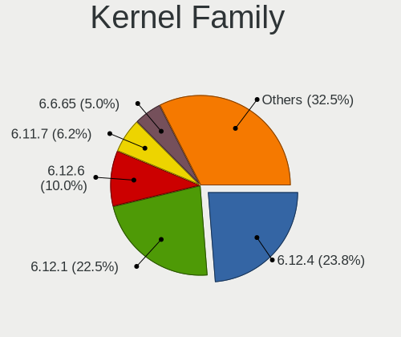
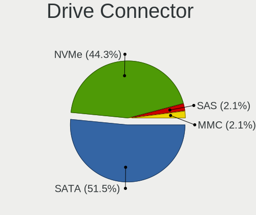
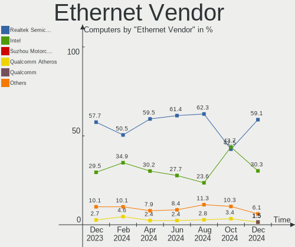
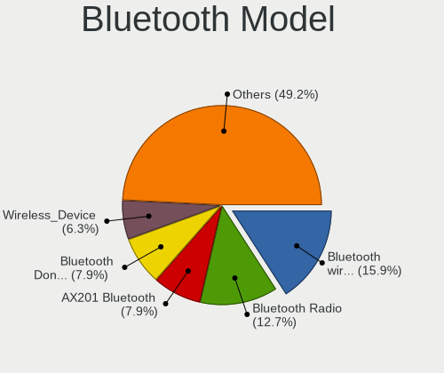

ArcoLinux Hardware Trends
-------------------------

A project to identify most popular hardware characteristics and track their change
over time based on data collected by ArcoLinux users at https://Linux-Hardware.org.

Anyone can contribute to the study by uploading probes of their computers by
the [hw-probe](https://github.com/linuxhw/hw-probe) tool:

    sudo -E hw-probe -all -upload

This is a report for all computer types. See also reports for [desktops](/Dist/ArcoLinux/Desktop/README.md) and [notebooks](/Dist/ArcoLinux/Notebook/README.md).

Full-feature report is available here: https://linux-hardware.org/?view=trends

Period: Jan, 2021.

Contents
--------

- [ OS                       ](#os)
- [ OS Family                ](#os-family)
- [ Kernel                   ](#kernel)
- [ Kernel Family            ](#kernel-family)
- [ Kernel Major Ver.        ](#kernel-major-ver)
- [ Arch                     ](#arch)
- [ DE                       ](#de)
- [ Display Server           ](#display-server)
- [ Display Manager          ](#display-manager)
- [ OS Lang                  ](#os-lang)
- [ Boot Mode                ](#boot-mode)
- [ Filesystem               ](#filesystem)
- [ Part. scheme             ](#part-scheme)
- [ Dual Boot with Linux/BSD ](#dual-boot-with-linux/bsd)
- [ Dual Boot (Win)          ](#dual-boot-win)
- [ Country                  ](#country)
- [ City                     ](#city)
- [ Vendor                   ](#vendor)
- [ Model                    ](#model)
- [ Model Family             ](#model-family)
- [ MFG Year                 ](#mfg-year)
- [ Form Factor              ](#form-factor)
- [ Secure Boot              ](#secure-boot)
- [ Coreboot                 ](#coreboot)
- [ RAM Size                 ](#ram-size)
- [ RAM Used                 ](#ram-used)
- [ Has CD-ROM               ](#has-cd-rom)
- [ Total Drives             ](#total-drives)
- [ Has Ethernet             ](#has-ethernet)
- [ Drive Vendor             ](#drive-vendor)
- [ Drive Model              ](#drive-model)
- [ HDD Vendor               ](#hdd-vendor)
- [ SSD Vendor               ](#ssd-vendor)
- [ Drive Kind               ](#drive-kind)
- [ Drive Connector          ](#drive-connector)
- [ Drive Size               ](#drive-size)
- [ Space Total              ](#space-total)
- [ Space Used               ](#space-used)
- [ Malfunc. Drives          ](#malfunc-drives)
- [ Malfunc. Drive Vendor    ](#malfunc-drive-vendor)
- [ Malfunc. HDD Vendor      ](#malfunc-hdd-vendor)
- [ Malfunc. Drive Kind      ](#malfunc-drive-kind)
- [ Failed Drives            ](#failed-drives)
- [ Failed Drive Vendor      ](#failed-drive-vendor)
- [ Drive Status             ](#drive-status)
- [ Storage Vendor           ](#storage-vendor)
- [ Storage Model            ](#storage-model)
- [ Storage Kind             ](#storage-kind)
- [ CPU Vendor               ](#cpu-vendor)
- [ CPU Model                ](#cpu-model)
- [ CPU Model Family         ](#cpu-model-family)
- [ CPU Cores                ](#cpu-cores)
- [ CPU Sockets              ](#cpu-sockets)
- [ CPU Threads              ](#cpu-threads)
- [ CPU Op-Modes             ](#cpu-op-modes)
- [ CPU Microcode            ](#cpu-microcode)
- [ CPU Microarch            ](#cpu-microarch)
- [ GPU Vendor               ](#gpu-vendor)
- [ GPU Model                ](#gpu-model)
- [ GPU Combo                ](#gpu-combo)
- [ GPU Driver               ](#gpu-driver)
- [ GPU Memory               ](#gpu-memory)
- [ Monitor Vendor           ](#monitor-vendor)
- [ Monitor Model            ](#monitor-model)
- [ Monitor Resolution       ](#monitor-resolution)
- [ Monitor Diagonal         ](#monitor-diagonal)
- [ Monitor Width            ](#monitor-width)
- [ Aspect Ratio             ](#aspect-ratio)
- [ Monitor Area             ](#monitor-area)
- [ Pixel Density            ](#pixel-density)
- [ Multiple Monitors        ](#multiple-monitors)
- [ Net Controller Vendor    ](#net-controller-vendor)
- [ Net Controller Model     ](#net-controller-model)
- [ Wireless Vendor          ](#wireless-vendor)
- [ Wireless Model           ](#wireless-model)
- [ Ethernet Vendor          ](#ethernet-vendor)
- [ Ethernet Model           ](#ethernet-model)
- [ Net Controller Kind      ](#net-controller-kind)
- [ Used Controller          ](#used-controller)
- [ NICs                     ](#nics)
- [ Memory Vendor            ](#memory-vendor)
- [ Memory Model             ](#memory-model)
- [ Memory Kind              ](#memory-kind)
- [ Memory Form Factor       ](#memory-form-factor)
- [ Memory Size              ](#memory-size)
- [ Memory Speed             ](#memory-speed)
- [ Sound Vendor             ](#sound-vendor)
- [ Sound Model              ](#sound-model)
- [ Camera Vendor            ](#camera-vendor)
- [ Camera Model             ](#camera-model)
- [ Fingerprint Vendor       ](#fingerprint-vendor)
- [ Fingerprint Model        ](#fingerprint-model)
- [ Chipcard Vendor          ](#chipcard-vendor)
- [ Chipcard Model           ](#chipcard-model)
- [ Printer Vendor           ](#printer-vendor)
- [ Printer Model            ](#printer-model)
- [ Scanner Vendor           ](#scanner-vendor)
- [ Scanner Model            ](#scanner-model)
- [ Bluetooth Vendor         ](#bluetooth-vendor)
- [ Bluetooth Model          ](#bluetooth-model)
- [ Unsupported Devices      ](#unsupported-devices)
- [ Unsupported Device Types ](#unsupported-device-types)

OS
--

Installed operating systems

| Name              | Computers | Percent |
|-------------------|-----------|---------|
| ArcoLinux Rolling | 52        | 89.66%  |
| ArcoLinux         | 5         | 8.62%   |
| ArcoLinux 20.2.12 | 1         | 1.72%   |

OS Family
---------

OS without a version

| Name      | Computers | Percent |
|-----------|-----------|---------|
| ArcoLinux | 58        | 100%    |

Kernel
------

Version of the Linux kernel

| Version                      | Computers | Percent |
|------------------------------|-----------|---------|
| 5.10.7-arch1-1               | 8         | 13.79%  |
| 5.10.9-arch1-1               | 7         | 12.07%  |
| 5.10.6-arch1-1               | 7         | 12.07%  |
| 5.10.5-arch1-1               | 6         | 10.34%  |
| 5.9.1-arch1-1                | 5         | 8.62%   |
| 5.10.3-arch1-1               | 4         | 6.9%    |
| 5.4.91-1-lts                 | 2         | 3.45%   |
| 5.4.89-1-lts                 | 2         | 3.45%   |
| 5.4.88-1-lts                 | 2         | 3.45%   |
| 5.4.87-1-lts                 | 2         | 3.45%   |
| 5.4.86-1-lts                 | 2         | 3.45%   |
| 5.10.4-zen2-1-zen            | 2         | 3.45%   |
| 5.10.11-arch1-1              | 2         | 3.45%   |
| 5.4.92-1-lts                 | 1         | 1.72%   |
| 5.10.9-zen1-1-zen            | 1         | 1.72%   |
| 5.10.8-arch1-1               | 1         | 1.72%   |
| 5.10.7-zen1-1-zen            | 1         | 1.72%   |
| 5.10.4-arch2-1               | 1         | 1.72%   |
| 5.10.10-hardened1-1-hardened | 1         | 1.72%   |
| 5.10.10-arch1-1              | 1         | 1.72%   |

Kernel Family
-------------

Linux kernel without a distro release

| Version | Computers | Percent |
|---------|-----------|---------|
| 5.10.7  | 9         | 15.52%  |
| 5.10.9  | 8         | 13.79%  |
| 5.10.6  | 7         | 12.07%  |
| 5.10.5  | 6         | 10.34%  |
| 5.9.1   | 5         | 8.62%   |
| 5.10.3  | 4         | 6.9%    |
| 5.10.4  | 3         | 5.17%   |
| 5.4.91  | 2         | 3.45%   |
| 5.4.89  | 2         | 3.45%   |
| 5.4.88  | 2         | 3.45%   |
| 5.4.87  | 2         | 3.45%   |
| 5.4.86  | 2         | 3.45%   |
| 5.10.11 | 2         | 3.45%   |
| 5.10.10 | 2         | 3.45%   |
| 5.4.92  | 1         | 1.72%   |
| 5.10.8  | 1         | 1.72%   |

Kernel Major Ver.
-----------------

Linux kernel major version

| Version | Computers | Percent |
|---------|-----------|---------|
| 5.10    | 42        | 72.41%  |
| 5.4     | 11        | 18.97%  |
| 5.9     | 5         | 8.62%   |

Arch
----

OS architecture (x86_64, i586, etc.)

| Name   | Computers | Percent |
|--------|-----------|---------|
| x86_64 | 58        | 100%    |

DE
--

Desktop Environment

| Name       | Computers | Percent |
|------------|-----------|---------|
| XFCE       | 18        | 31.03%  |
| i3         | 6         | 10.34%  |
| X-Cinnamon | 5         | 8.62%   |
| KDE5       | 5         | 8.62%   |
| xmonad     | 4         | 6.9%    |
| dwm        | 4         | 6.9%    |
| bspwm      | 4         | 6.9%    |
| GNOME      | 3         | 5.17%   |
| Unknown    | 3         | 5.17%   |
| qtile      | 2         | 3.45%   |
| KDE        | 1         | 1.72%   |
| dwm-sc     | 1         | 1.72%   |
| Deepin     | 1         | 1.72%   |
| awesome    | 1         | 1.72%   |

Display Server
--------------

X11 or Wayland

| Name    | Computers | Percent |
|---------|-----------|---------|
| X11     | 54        | 93.1%   |
| Tty     | 3         | 5.17%   |
| Unknown | 1         | 1.72%   |

Display Manager
---------------

SDDM, LightDM, etc.

| Name    | Computers | Percent |
|---------|-----------|---------|
| TDM     | 44        | 75.86%  |
| Unknown | 7         | 12.07%  |
| SDDM    | 3         | 5.17%   |
| LightDM | 3         | 5.17%   |
| Ly      | 1         | 1.72%   |

OS Lang
-------

Language

| Lang  | Computers | Percent |
|-------|-----------|---------|
| en_US | 32        | 55.17%  |
| en_GB | 6         | 10.34%  |
| de_DE | 6         | 10.34%  |
| en_CA | 4         | 6.9%    |
| fr_FR | 2         | 3.45%   |
| nl_BE | 1         | 1.72%   |
| hu_HU | 1         | 1.72%   |
| fr_CA | 1         | 1.72%   |
| es_ES | 1         | 1.72%   |
| en_IN | 1         | 1.72%   |
| en_IL | 1         | 1.72%   |
| en_AU | 1         | 1.72%   |
| de_AT | 1         | 1.72%   |

Boot Mode
---------

EFI or BIOS

| Mode | Computers | Percent |
|------|-----------|---------|
| EFI  | 38        | 65.52%  |
| BIOS | 20        | 34.48%  |

Filesystem
----------

Type of filesystem

| Type    | Computers | Percent |
|---------|-----------|---------|
| Ext4    | 51        | 87.93%  |
| Btrfs   | 4         | 6.9%    |
| Overlay | 3         | 5.17%   |

Part. scheme
------------

Scheme of partitioning

| Type    | Computers | Percent |
|---------|-----------|---------|
| GPT     | 44        | 75.86%  |
| MBR     | 9         | 15.52%  |
| Unknown | 5         | 8.62%   |

Dual Boot with Linux/BSD
------------------------

Hosting more than one Linux/BSD

| Dual boot | Computers | Percent |
|-----------|-----------|---------|
| No        | 41        | 70.69%  |
| Yes       | 17        | 29.31%  |

Dual Boot (Win)
---------------

Hosting Linux and Windows

| Dual boot | Computers | Percent |
|-----------|-----------|---------|
| No        | 34        | 58.62%  |
| Yes       | 24        | 41.38%  |

Country
-------

Geographic location (country)

| Country               | Computers | Percent |
|-----------------------|-----------|---------|
| USA                   | 12        | 20.69%  |
| Germany               | 6         | 10.34%  |
| Canada                | 6         | 10.34%  |
| UK                    | 5         | 8.62%   |
| Netherlands           | 5         | 8.62%   |
| Hungary               | 3         | 5.17%   |
| Switzerland           | 2         | 3.45%   |
| France                | 2         | 3.45%   |
| Colombia              | 2         | 3.45%   |
| China                 | 2         | 3.45%   |
| Belgium               | 2         | 3.45%   |
| Spain                 | 1         | 1.72%   |
| Serbia                | 1         | 1.72%   |
| Palestinian Territory | 1         | 1.72%   |
| Norway                | 1         | 1.72%   |
| Libya                 | 1         | 1.72%   |
| Indonesia             | 1         | 1.72%   |
| India                 | 1         | 1.72%   |
| Egypt                 | 1         | 1.72%   |
| Czech Republic        | 1         | 1.72%   |
| Austria               | 1         | 1.72%   |
| Australia             | 1         | 1.72%   |

City
----

Geographic location (city)

| City             | Computers | Percent |
|------------------|-----------|---------|
| Toronto          | 2         | 3.45%   |
| Bergheim         | 2         | 3.45%   |
| Alblasserdam     | 2         | 3.45%   |
| Zhanjiang        | 1         | 1.72%   |
| West Byfleet     | 1         | 1.72%   |
| Waterbury        | 1         | 1.72%   |
| Waarschoot       | 1         | 1.72%   |
| Vienna           | 1         | 1.72%   |
| Viator           | 1         | 1.72%   |
| Trondheim        | 1         | 1.72%   |
| Tripoli          | 1         | 1.72%   |
| Szombathely      | 1         | 1.72%   |
| Spencerport      | 1         | 1.72%   |
| South Gate       | 1         | 1.72%   |
| Schiedam         | 1         | 1.72%   |
| Santiago de Cali | 1         | 1.72%   |
| Rouyn-Noranda    | 1         | 1.72%   |
| Rockland         | 1         | 1.72%   |
| Riehen           | 1         | 1.72%   |
| Québec          | 1         | 1.72%   |
| Portland         | 1         | 1.72%   |
| Paris            | 1         | 1.72%   |
| Pahrump          | 1         | 1.72%   |
| Nottingham       | 1         | 1.72%   |
| Nijmegen         | 1         | 1.72%   |
| Newry            | 1         | 1.72%   |
| Nantes           | 1         | 1.72%   |
| Mönchengladbach | 1         | 1.72%   |
| Medellín        | 1         | 1.72%   |
| Marstons Mills   | 1         | 1.72%   |
| Lucerne          | 1         | 1.72%   |
| Lier             | 1         | 1.72%   |
| Kansas City      | 1         | 1.72%   |
| Kaarst           | 1         | 1.72%   |
| Jakarta          | 1         | 1.72%   |
| Jacksonville     | 1         | 1.72%   |
| Hodmezovasarhely | 1         | 1.72%   |
| Hamburg          | 1         | 1.72%   |
| Gulberwick       | 1         | 1.72%   |
| Gatesville       | 1         | 1.72%   |
| Gaocheng         | 1         | 1.72%   |
| Denver           | 1         | 1.72%   |
| Dartmouth        | 1         | 1.72%   |
| Dallas           | 1         | 1.72%   |
| Cairo            | 1         | 1.72%   |
| Budapest         | 1         | 1.72%   |
| Brno             | 1         | 1.72%   |
| Berlin           | 1         | 1.72%   |
| Bengaluru        | 1         | 1.72%   |
| Belgrade         | 1         | 1.72%   |
| Belfast          | 1         | 1.72%   |
| Bayt Jala        | 1         | 1.72%   |
| Baton Rouge      | 1         | 1.72%   |
| Amsterdam        | 1         | 1.72%   |
| Alexandria       | 1         | 1.72%   |

Vendor
------

Motherboard manufacturer

| Name                | Computers | Percent |
|---------------------|-----------|---------|
| Lenovo              | 15        | 25.86%  |
| ASUSTek Computer    | 10        | 17.24%  |
| Hewlett-Packard     | 9         | 15.52%  |
| MSI                 | 8         | 13.79%  |
| Dell                | 4         | 6.9%    |
| Unknown             | 3         | 5.17%   |
| Gigabyte Technology | 2         | 3.45%   |
| Acer                | 2         | 3.45%   |
| PROLINE             | 1         | 1.72%   |
| Medion              | 1         | 1.72%   |
| Google              | 1         | 1.72%   |
| ASRock              | 1         | 1.72%   |
| Apple               | 1         | 1.72%   |

Model
-----

Motherboard model

| Name                                   | Computers | Percent |
|----------------------------------------|-----------|---------|
| Unknown                                | 3         | 5.17%   |
| MSI MS-7B79                            | 2         | 3.45%   |
| MSI MS-7A38                            | 2         | 3.45%   |
| ASUS ROG STRIX B450-F GAMING           | 2         | 3.45%   |
| PROLINE ProlinePartner                 | 1         | 1.72%   |
| MSI MS-7B86                            | 1         | 1.72%   |
| MSI MS-7A63                            | 1         | 1.72%   |
| MSI MS-7971                            | 1         | 1.72%   |
| MSI HPE-490uk                          | 1         | 1.72%   |
| Medion E7222                           | 1         | 1.72%   |
| Lenovo Yoga 900-13ISK 80UE             | 1         | 1.72%   |
| Lenovo Yoga 900-13ISK 80MK             | 1         | 1.72%   |
| Lenovo V155-15API 81V5                 | 1         | 1.72%   |
| Lenovo ThinkStation P310 30AV000DUS    | 1         | 1.72%   |
| Lenovo ThinkPad X201 3680KC5           | 1         | 1.72%   |
| Lenovo ThinkPad T61 64659TU            | 1         | 1.72%   |
| Lenovo ThinkPad T440S 20AQ005NUS       | 1         | 1.72%   |
| Lenovo ThinkPad E595 20NFCTO1WW        | 1         | 1.72%   |
| Lenovo ThinkCentre M82 29293V4         | 1         | 1.72%   |
| Lenovo RESCUER R720-15IKBN 80WW        | 1         | 1.72%   |
| Lenovo Legion Y7000 2019 PG0 81T0      | 1         | 1.72%   |
| Lenovo IdeaPad S145-14IWL 81MU         | 1         | 1.72%   |
| Lenovo IdeaPad Flex 5 14IIL05 81X1     | 1         | 1.72%   |
| Lenovo IdeaCentre 510-15ICB 90HU00CEGE | 1         | 1.72%   |
| Lenovo B50-10 80QR                     | 1         | 1.72%   |
| HP ZBook 15 G2                         | 1         | 1.72%   |
| HP Z400 Workstation                    | 1         | 1.72%   |
| HP Pavilion Notebook                   | 1         | 1.72%   |
| HP Pavilion Desktop PC 570-p0xx        | 1         | 1.72%   |
| HP ENVY x360 Convertible 15m-ee0xxx    | 1         | 1.72%   |
| HP ENVY Notebook                       | 1         | 1.72%   |
| HP 750-150nz                           | 1         | 1.72%   |
| HP 250 G7 Notebook PC                  | 1         | 1.72%   |
| HP 15                                  | 1         | 1.72%   |
| Google Swanky                          | 1         | 1.72%   |
| Gigabyte H310N 2.0                     | 1         | 1.72%   |
| Gigabyte B450 AORUS ELITE              | 1         | 1.72%   |
| Dell Latitude E6540                    | 1         | 1.72%   |
| Dell Latitude E6530                    | 1         | 1.72%   |
| Dell Latitude D820                     | 1         | 1.72%   |
| Dell Inspiron 7558                     | 1         | 1.72%   |
| ASUS VivoBook 14_ASUS Laptop X441UAR   | 1         | 1.72%   |
| ASUS STRIX Z270H GAMING                | 1         | 1.72%   |
| ASUS STRIX B250F GAMING                | 1         | 1.72%   |
| ASUS PRIME Z390-P                      | 1         | 1.72%   |
| ASUS PRIME X470-PRO                    | 1         | 1.72%   |
| ASUS PRIME H310M-E                     | 1         | 1.72%   |
| ASUS P8H61-M LX3 PLUS R2.0             | 1         | 1.72%   |
| ASUS K56CM                             | 1         | 1.72%   |
| ASRock J4105-ITX                       | 1         | 1.72%   |
| Apple MacBookPro9,2                    | 1         | 1.72%   |
| Acer NU-A515-44-R68D                   | 1         | 1.72%   |
| Acer Aspire VN7-792G                   | 1         | 1.72%   |

Model Family
------------

Motherboard model prefix

| Name                   | Computers | Percent |
|------------------------|-----------|---------|
| Lenovo ThinkPad        | 4         | 6.9%    |
| Dell Latitude          | 3         | 5.17%   |
| ASUS PRIME             | 3         | 5.17%   |
| Unknown                | 3         | 5.17%   |
| MSI MS-7B79            | 2         | 3.45%   |
| MSI MS-7A38            | 2         | 3.45%   |
| Lenovo Yoga            | 2         | 3.45%   |
| Lenovo IdeaPad         | 2         | 3.45%   |
| HP Pavilion            | 2         | 3.45%   |
| HP ENVY                | 2         | 3.45%   |
| ASUS STRIX             | 2         | 3.45%   |
| ASUS ROG               | 2         | 3.45%   |
| PROLINE ProlinePartner | 1         | 1.72%   |
| MSI MS-7B86            | 1         | 1.72%   |
| MSI MS-7A63            | 1         | 1.72%   |
| MSI MS-7971            | 1         | 1.72%   |
| MSI HPE-490uk          | 1         | 1.72%   |
| Medion E7222           | 1         | 1.72%   |
| Lenovo V155-15API      | 1         | 1.72%   |
| Lenovo ThinkStation    | 1         | 1.72%   |
| Lenovo ThinkCentre     | 1         | 1.72%   |
| Lenovo RESCUER         | 1         | 1.72%   |
| Lenovo Legion          | 1         | 1.72%   |
| Lenovo IdeaCentre      | 1         | 1.72%   |
| Lenovo B50-10          | 1         | 1.72%   |
| HP ZBook               | 1         | 1.72%   |
| HP Z400                | 1         | 1.72%   |
| HP 750-150nz           | 1         | 1.72%   |
| HP 250                 | 1         | 1.72%   |
| HP 15                  | 1         | 1.72%   |
| Google Swanky          | 1         | 1.72%   |
| Gigabyte H310N         | 1         | 1.72%   |
| Gigabyte B450          | 1         | 1.72%   |
| Dell Inspiron          | 1         | 1.72%   |
| ASUS VivoBook          | 1         | 1.72%   |
| ASUS P8H61-M           | 1         | 1.72%   |
| ASUS K56CM             | 1         | 1.72%   |
| ASRock J4105-ITX       | 1         | 1.72%   |
| Apple MacBookPro9      | 1         | 1.72%   |
| Acer NU-A515-44-R68D   | 1         | 1.72%   |
| Acer Aspire            | 1         | 1.72%   |

MFG Year
--------

Motherboard manufacture year

| Year | Computers | Percent |
|------|-----------|---------|
| 2020 | 17        | 29.31%  |
| 2019 | 12        | 20.69%  |
| 2018 | 9         | 15.52%  |
| 2016 | 6         | 10.34%  |
| 2017 | 3         | 5.17%   |
| 2015 | 3         | 5.17%   |
| 2012 | 3         | 5.17%   |
| 2010 | 2         | 3.45%   |
| 2014 | 1         | 1.72%   |
| 2013 | 1         | 1.72%   |
| 2008 | 1         | 1.72%   |

Form Factor
-----------

Physical design of the computer

| Name        | Computers | Percent |
|-------------|-----------|---------|
| Desktop     | 29        | 50%     |
| Notebook    | 27        | 46.55%  |
| Convertible | 2         | 3.45%   |

Secure Boot
-----------

Enabled or disabled

| State    | Computers | Percent |
|----------|-----------|---------|
| Disabled | 58        | 100%    |

Coreboot
--------

Have coreboot on board

| Used | Computers | Percent |
|------|-----------|---------|
| No   | 57        | 98.28%  |
| Yes  | 1         | 1.72%   |

RAM Size
--------

Total RAM memory

| Size in GB | Computers | Percent |
|------------|-----------|---------|
| 4.01-8.0   | 17        | 29.31%  |
| 16.01-24.0 | 16        | 27.59%  |
| 8.01-16.0  | 9         | 15.52%  |
| 3.01-4.0   | 8         | 13.79%  |
| 32.01-64.0 | 6         | 10.34%  |
| 24.01-32.0 | 1         | 1.72%   |
| 2.01-3.0   | 1         | 1.72%   |

RAM Used
--------

Used RAM memory

| Used GB   | Computers | Percent |
|-----------|-----------|---------|
| 1.01-2.0  | 19        | 32.76%  |
| 2.01-3.0  | 14        | 24.14%  |
| 0.51-1.0  | 12        | 20.69%  |
| 3.01-4.0  | 5         | 8.62%   |
| 4.01-8.0  | 3         | 5.17%   |
| 0.01-0.5  | 3         | 5.17%   |
| 8.01-16.0 | 2         | 3.45%   |

Has CD-ROM
----------

Has CD-ROM on board

| Presented | Computers | Percent |
|-----------|-----------|---------|
| No        | 40        | 68.97%  |
| Yes       | 18        | 31.03%  |

Total Drives
------------

Number of drives on board

| Drives | Computers | Percent |
|--------|-----------|---------|
| 1      | 23        | 39.66%  |
| 2      | 17        | 29.31%  |
| 3      | 13        | 22.41%  |
| 4      | 4         | 6.9%    |
| 0      | 1         | 1.72%   |

Has Ethernet
------------

Has Ethernet on board

| Presented | Computers | Percent |
|-----------|-----------|---------|
| Yes       | 50        | 86.21%  |
| No        | 8         | 13.79%  |

Drive Vendor
------------

Hard drive vendors

| Vendor              | Computers | Drives | Percent |
|---------------------|-----------|--------|---------|
| Samsung Electronics | 18        | 20     | 18.37%  |
| Seagate             | 17        | 21     | 17.35%  |
| WDC                 | 13        | 18     | 13.27%  |
| SanDisk             | 6         | 6      | 6.12%   |
| Kingston            | 6         | 6      | 6.12%   |
| Toshiba             | 5         | 6      | 5.1%    |
| Unknown             | 4         | 5      | 4.08%   |
| Intel               | 4         | 4      | 4.08%   |
| Crucial             | 4         | 5      | 4.08%   |
| SK Hynix            | 2         | 2      | 2.04%   |
| Silicon Motion      | 2         | 2      | 2.04%   |
| Micron Technology   | 2         | 2      | 2.04%   |
| JMicron             | 2         | 2      | 2.04%   |
| Vaseky              | 1         | 1      | 1.02%   |
| SPCC                | 1         | 1      | 1.02%   |
| PNY                 | 1         | 1      | 1.02%   |
| PLEXTOR             | 1         | 1      | 1.02%   |
| Phison              | 1         | 1      | 1.02%   |
| Patriot             | 1         | 1      | 1.02%   |
| KODAK               | 1         | 1      | 1.02%   |
| KESU                | 1         | 1      | 1.02%   |
| Hoodisk             | 1         | 1      | 1.02%   |
| Hitachi             | 1         | 1      | 1.02%   |
| HGST                | 1         | 1      | 1.02%   |
| Apple               | 1         | 1      | 1.02%   |
| A-DATA Technology   | 1         | 1      | 1.02%   |

Drive Model
-----------

Hard drive models

| Model                                        | Computers | Percent |
|----------------------------------------------|-----------|---------|
| Unknown SD/MMC/MS PRO 32GB                   | 3         | 2.83%   |
| Kingston SA400S37120G 120GB SSD              | 3         | 2.83%   |
| WDC WDS500G2B0A-00SM50 500GB SSD             | 2         | 1.89%   |
| WDC WD10EZEX-08WN4A0 1TB                     | 2         | 1.89%   |
| Samsung SSD 850 EVO 250GB                    | 2         | 1.89%   |
| Samsung SSD 850 EVO 120GB                    | 2         | 1.89%   |
| Kingston SA400S37480G 480GB SSD              | 2         | 1.89%   |
| Intel SSDPEKNW010T8 1TB                      | 2         | 1.89%   |
| Crucial CT250MX500SSD1 250GB                 | 2         | 1.89%   |
| WDC WDS500G3X0C-00SJG0 500GB                 | 1         | 0.94%   |
| WDC WDS500G2B0C-00PXH0 500GB                 | 1         | 0.94%   |
| WDC WDS120G2G0A-00JH30 120GB SSD             | 1         | 0.94%   |
| WDC WD5000AZRX-00A8LB0 500GB                 | 1         | 0.94%   |
| WDC WD3200BEVT-22ZCT0 320GB                  | 1         | 0.94%   |
| WDC WD3200AAKS-61L9A0 320GB                  | 1         | 0.94%   |
| WDC WD2500BPVT-22ZEST0 250GB                 | 1         | 0.94%   |
| WDC WD20EZRZ-00Z5HB0 2TB                     | 1         | 0.94%   |
| WDC WD1600JS-55MHB1 160GB                    | 1         | 0.94%   |
| WDC WD10EARS-00Y5B1 1TB                      | 1         | 0.94%   |
| WDC WD1002FBYS-50A6B0 1TB                    | 1         | 0.94%   |
| WDC PC SN720 SDAQNTW-512G-1001 512GB         | 1         | 0.94%   |
| WDC PC SN520 SDAPMUW-256G-1101 256GB         | 1         | 0.94%   |
| Vaseky V900/128G 128GB SSD                   | 1         | 0.94%   |
| Unknown MMC Card  32GB                       | 1         | 0.94%   |
| Unknown 016GE2  16GB                         | 1         | 0.94%   |
| Toshiba MQ01ABD100 1TB                       | 1         | 0.94%   |
| Toshiba MG03ACA400 4TB                       | 1         | 0.94%   |
| Toshiba HDWD120 2TB                          | 1         | 0.94%   |
| Toshiba HDWD110 1TB                          | 1         | 0.94%   |
| Toshiba DT01ACA100 1TB                       | 1         | 0.94%   |
| SPCC Solid State Disk 128GB                  | 1         | 0.94%   |
| SK Hynix HFS128G3BMND-3210A 128GB SSD        | 1         | 0.94%   |
| SK Hynix HFM128GDHTNG-8310A 128GB            | 1         | 0.94%   |
| Silicon Motion NVMe SSD Drive 256GB          | 1         | 0.94%   |
| Silicon Motion NVMe SSD 256G                 | 1         | 0.94%   |
| Seagate STM3160318AS 160GB                   | 1         | 0.94%   |
| Seagate ST9320325AS 320GB                    | 1         | 0.94%   |
| Seagate ST6000DM003-2CY186 6TB               | 1         | 0.94%   |
| Seagate ST3000DM001-1E6166 3TB               | 1         | 0.94%   |
| Seagate ST2000VM003-1ET164 2TB               | 1         | 0.94%   |
| Seagate ST2000LM003 HN-M201RAD 2TB           | 1         | 0.94%   |
| Seagate ST2000DM008-2FR102 2TB               | 1         | 0.94%   |
| Seagate ST2000DM001-1ER164 2TB               | 1         | 0.94%   |
| Seagate ST2000DM001-1CH164 2TB               | 1         | 0.94%   |
| Seagate ST1000LM048-2E7172 1TB               | 1         | 0.94%   |
| Seagate ST1000LM035-1RK172 1TB               | 1         | 0.94%   |
| Seagate ST1000LM024 HN-M101MBB 1TB           | 1         | 0.94%   |
| Seagate ST1000DM010-2EP102 1TB               | 1         | 0.94%   |
| Seagate ST1000DM003-1ER162 1TB               | 1         | 0.94%   |
| Seagate Expansion 1TB                        | 1         | 0.94%   |
| Seagate BUP Slim SL 1TB                      | 1         | 0.94%   |
| Seagate BUP Slim BK 1TB                      | 1         | 0.94%   |
| Seagate BUP Slim 2TB                         | 1         | 0.94%   |
| Seagate BarraCuda 120 SSD ZA250CM10003 250GB | 1         | 0.94%   |
| SanDisk X110 MSATA 128GB SSD                 | 1         | 0.94%   |
| SanDisk SSD U110 16GB                        | 1         | 0.94%   |
| SanDisk SSD PLUS 120 GB                      | 1         | 0.94%   |
| SanDisk SSD PLUS 1000GB                      | 1         | 0.94%   |
| SanDisk SSD i100 24GB                        | 1         | 0.94%   |
| SanDisk SD7SN6S-256G-1006 256GB SSD          | 1         | 0.94%   |

HDD Vendor
----------

Hard disk drive vendors

| Vendor  | Computers | Drives | Percent |
|---------|-----------|--------|---------|
| Seagate | 16        | 18     | 48.48%  |
| WDC     | 8         | 11     | 24.24%  |
| Toshiba | 5         | 6      | 15.15%  |
| KESU    | 1         | 1      | 3.03%   |
| Hitachi | 1         | 1      | 3.03%   |
| HGST    | 1         | 1      | 3.03%   |
| Apple   | 1         | 1      | 3.03%   |

SSD Vendor
----------

Solid state drive vendors

| Vendor              | Computers | Drives | Percent |
|---------------------|-----------|--------|---------|
| Samsung Electronics | 10        | 11     | 24.39%  |
| SanDisk             | 6         | 6      | 14.63%  |
| Kingston            | 5         | 5      | 12.2%   |
| WDC                 | 3         | 3      | 7.32%   |
| Crucial             | 3         | 4      | 7.32%   |
| JMicron             | 2         | 2      | 4.88%   |
| Intel               | 2         | 2      | 4.88%   |
| Vaseky              | 1         | 1      | 2.44%   |
| SPCC                | 1         | 1      | 2.44%   |
| SK Hynix            | 1         | 1      | 2.44%   |
| Seagate             | 1         | 3      | 2.44%   |
| PNY                 | 1         | 1      | 2.44%   |
| PLEXTOR             | 1         | 1      | 2.44%   |
| Patriot             | 1         | 1      | 2.44%   |
| KODAK               | 1         | 1      | 2.44%   |
| Hoodisk             | 1         | 1      | 2.44%   |
| A-DATA Technology   | 1         | 1      | 2.44%   |

Drive Kind
----------

HDD or SSD

| Kind    | Computers | Drives | Percent |
|---------|-----------|--------|---------|
| SSD     | 34        | 45     | 37.78%  |
| HDD     | 31        | 39     | 34.44%  |
| NVMe    | 21        | 23     | 23.33%  |
| Unknown | 3         | 3      | 3.33%   |
| MMC     | 1         | 2      | 1.11%   |

Drive Connector
---------------

SATA, SAS, NVMe, etc.

| Type | Computers | Drives | Percent |
|------|-----------|--------|---------|
| SATA | 46        | 77     | 59.74%  |
| NVMe | 21        | 23     | 27.27%  |
| SAS  | 9         | 10     | 11.69%  |
| MMC  | 1         | 2      | 1.3%    |

Drive Size
----------

Size of hard drive

| Size in TB | Computers | Drives | Percent |
|------------|-----------|--------|---------|
| 0.01-0.5   | 38        | 52     | 57.58%  |
| 0.51-1.0   | 18        | 19     | 27.27%  |
| 1.01-2.0   | 7         | 10     | 10.61%  |
| 3.01-4.0   | 1         | 1      | 1.52%   |
| 2.01-3.0   | 1         | 1      | 1.52%   |
| 4.01-10.0  | 1         | 1      | 1.52%   |

Space Total
-----------

Amount of disk space available on the file system

| Size in GB     | Computers | Percent |
|----------------|-----------|---------|
| 101-250        | 21        | 36.21%  |
| 501-1000       | 9         | 15.52%  |
| 251-500        | 6         | 10.34%  |
| 1001-2000      | 6         | 10.34%  |
| More than 3000 | 3         | 5.17%   |
| 1-20           | 3         | 5.17%   |
| 51-100         | 3         | 5.17%   |
| Unknown        | 3         | 5.17%   |
| 21-50          | 2         | 3.45%   |
| 2001-3000      | 2         | 3.45%   |

Space Used
----------

Amount of used disk space

| Used GB        | Computers | Percent |
|----------------|-----------|---------|
| 1-20           | 24        | 41.38%  |
| 21-50          | 13        | 22.41%  |
| 101-250        | 5         | 8.62%   |
| 251-500        | 3         | 5.17%   |
| 1001-2000      | 3         | 5.17%   |
| 501-1000       | 3         | 5.17%   |
| Unknown        | 3         | 5.17%   |
| 51-100         | 2         | 3.45%   |
| More than 3000 | 1         | 1.72%   |
| 0              | 1         | 1.72%   |

Malfunc. Drives
---------------

Drive models with a malfunction

| Model                                 | Computers | Drives | Percent |
|---------------------------------------|-----------|--------|---------|
| WDC WD10EARS-00Y5B1 1TB               | 1         | 1      | 9.09%   |
| Seagate ST3000DM001-1E6166 3TB        | 1         | 1      | 9.09%   |
| SanDisk SSD PLUS 1000GB               | 1         | 1      | 9.09%   |
| SanDisk SSD i100 24GB                 | 1         | 1      | 9.09%   |
| Samsung Electronics SSD 960 EVO 500GB | 1         | 1      | 9.09%   |
| PLEXTOR PX-128M6S 128GB SSD           | 1         | 1      | 9.09%   |
| Kingston SA400S37120G 120GB SSD       | 1         | 1      | 9.09%   |
| Intel SSDSC2CT120A3 120GB             | 1         | 1      | 9.09%   |
| Intel SSDSC2BF180A4H 180GB            | 1         | 1      | 9.09%   |
| Crucial CT512M550SSD1 512GB           | 1         | 1      | 9.09%   |
| Apple HDD HTS545050A7E362 500GB       | 1         | 1      | 9.09%   |

Malfunc. Drive Vendor
---------------------

Vendors of faulty drives

| Vendor              | Computers | Drives | Percent |
|---------------------|-----------|--------|---------|
| SanDisk             | 2         | 2      | 18.18%  |
| Intel               | 2         | 2      | 18.18%  |
| WDC                 | 1         | 1      | 9.09%   |
| Seagate             | 1         | 1      | 9.09%   |
| Samsung Electronics | 1         | 1      | 9.09%   |
| PLEXTOR             | 1         | 1      | 9.09%   |
| Kingston            | 1         | 1      | 9.09%   |
| Crucial             | 1         | 1      | 9.09%   |
| Apple               | 1         | 1      | 9.09%   |

Malfunc. HDD Vendor
-------------------

Vendors of faulty HDD drives

| Vendor  | Computers | Drives | Percent |
|---------|-----------|--------|---------|
| WDC     | 1         | 1      | 33.33%  |
| Seagate | 1         | 1      | 33.33%  |
| Apple   | 1         | 1      | 33.33%  |

Malfunc. Drive Kind
-------------------

Kinds of faulty drives

| Kind | Computers | Drives | Percent |
|------|-----------|--------|---------|
| SSD  | 6         | 7      | 66.67%  |
| HDD  | 2         | 3      | 22.22%  |
| NVMe | 1         | 1      | 11.11%  |

Failed Drives
-------------

Failed drive models

| Model                     | Computers | Drives | Percent |
|---------------------------|-----------|--------|---------|
| Seagate ST9320325AS 320GB | 1         | 1      | 100%    |

Failed Drive Vendor
-------------------

Failed drive vendors

| Vendor  | Computers | Drives | Percent |
|---------|-----------|--------|---------|
| Seagate | 1         | 1      | 100%    |

Drive Status
------------

Number of failed and malfunc. drives

| Status   | Computers | Drives | Percent |
|----------|-----------|--------|---------|
| Works    | 46        | 80     | 64.79%  |
| Detected | 15        | 20     | 21.13%  |
| Malfunc  | 9         | 11     | 12.68%  |
| Failed   | 1         | 1      | 1.41%   |

Storage Vendor
--------------

Storage controller vendors

| Vendor                      | Computers | Percent |
|-----------------------------|-----------|---------|
| Intel                       | 43        | 57.33%  |
| AMD                         | 11        | 14.67%  |
| Samsung Electronics         | 8         | 10.67%  |
| Sandisk                     | 4         | 5.33%   |
| Silicon Motion              | 2         | 2.67%   |
| Micron Technology           | 2         | 2.67%   |
| SK Hynix                    | 1         | 1.33%   |
| Phison Electronics          | 1         | 1.33%   |
| Micron/Crucial Technology   | 1         | 1.33%   |
| Kingston Technology Company | 1         | 1.33%   |
| ASMedia Technology          | 1         | 1.33%   |

Storage Model
-------------

Storage controller models

| Model                                                                          | Computers | Percent |
|--------------------------------------------------------------------------------|-----------|---------|
| AMD FCH SATA Controller [AHCI mode]                                            | 10        | 11.76%  |
| AMD 400 Series Chipset SATA Controller                                         | 9         | 10.59%  |
| Intel 200 Series PCH SATA controller [AHCI mode]                               | 5         | 5.88%   |
| Samsung NVMe SSD Controller SM981/PM981/PM983                                  | 3         | 3.53%   |
| Intel Sunrise Point-LP SATA Controller [AHCI mode]                             | 3         | 3.53%   |
| Intel Q170/Q150/B150/H170/H110/Z170/CM236 Chipset SATA Controller [AHCI Mode]  | 3         | 3.53%   |
| Intel HM170/QM170 Chipset SATA Controller [AHCI Mode]                          | 3         | 3.53%   |
| Intel Cannon Lake PCH SATA AHCI Controller                                     | 3         | 3.53%   |
| Intel 82801 Mobile SATA Controller [RAID mode]                                 | 3         | 3.53%   |
| Intel 7 Series/C210 Series Chipset Family 6-port SATA Controller [AHCI mode]   | 3         | 3.53%   |
| Intel 7 Series Chipset Family 6-port SATA Controller [AHCI mode]               | 3         | 3.53%   |
| Silicon Motion SM2263EN/SM2263XT SSD Controller                                | 2         | 2.35%   |
| Samsung NVMe SSD Controller SM961/PM961/SM963                                  | 2         | 2.35%   |
| Samsung NVMe SSD Controller SM951/PM951                                        | 2         | 2.35%   |
| Micron Non-Volatile memory controller                                          | 2         | 2.35%   |
| Intel SSD 660P Series                                                          | 2         | 2.35%   |
| Intel SATA Controller [RAID mode]                                              | 2         | 2.35%   |
| Intel Cannon Point-LP SATA Controller [AHCI Mode]                              | 2         | 2.35%   |
| Intel 8 Series SATA Controller 1 [AHCI mode]                                   | 2         | 2.35%   |
| SK Hynix BC501 NVMe Solid State Drive 512GB                                    | 1         | 1.18%   |
| Sandisk WD Blue SN550 NVMe SSD                                                 | 1         | 1.18%   |
| Sandisk WD Black SN750 / PC SN730 NVMe SSD                                     | 1         | 1.18%   |
| Sandisk WD Black 2018 / PC SN720 NVMe SSD                                      | 1         | 1.18%   |
| Sandisk PC SN520 NVMe SSD                                                      | 1         | 1.18%   |
| Samsung Electronics Non-Volatile memory controller                             | 1         | 1.18%   |
| Phison E12 NVMe Controller                                                     | 1         | 1.18%   |
| Micron/Crucial P1 NVMe PCIe SSD                                                | 1         | 1.18%   |
| Kingston Company A2000 NVMe SSD                                                | 1         | 1.18%   |
| Intel Wildcat Point-LP SATA Controller [AHCI Mode]                             | 1         | 1.18%   |
| Intel Celeron/Pentium Silver Processor SATA Controller                         | 1         | 1.18%   |
| Intel Celeron N3350/Pentium N4200/Atom E3900 Series SATA AHCI Controller       | 1         | 1.18%   |
| Intel Cannon Lake Mobile PCH SATA AHCI Controller                              | 1         | 1.18%   |
| Intel Atom Processor E3800 Series SATA AHCI Controller                         | 1         | 1.18%   |
| Intel 82801HM/HEM (ICH8M/ICH8M-E) SATA Controller [AHCI mode]                  | 1         | 1.18%   |
| Intel 82801HM/HEM (ICH8M/ICH8M-E) IDE Controller                               | 1         | 1.18%   |
| Intel 82801GBM/GHM (ICH7-M Family) SATA Controller [IDE mode]                  | 1         | 1.18%   |
| Intel 8 Series/C220 Series Chipset Family 6-port SATA Controller 1 [AHCI mode] | 1         | 1.18%   |
| Intel 6 Series/C200 Series Chipset Family 6 port Desktop SATA AHCI Controller  | 1         | 1.18%   |
| Intel 5 Series/3400 Series Chipset 6 port SATA AHCI Controller                 | 1         | 1.18%   |
| ASMedia ASM1062 Serial ATA Controller                                          | 1         | 1.18%   |

Storage Kind
------------

Kind of storage controller (IDE, SATA, NVMe, SAS, ...)

| Kind | Computers | Percent |
|------|-----------|---------|
| SATA | 47        | 62.67%  |
| NVMe | 21        | 28%     |
| RAID | 5         | 6.67%   |
| IDE  | 2         | 2.67%   |

CPU Vendor
----------

Processor vendors

| Vendor | Computers | Percent |
|--------|-----------|---------|
| Intel  | 45        | 77.59%  |
| AMD    | 13        | 22.41%  |

CPU Model
---------

Processor models

| Model                                         | Computers | Percent |
|-----------------------------------------------|-----------|---------|
| Intel Core i7-7700K CPU @ 4.20GHz             | 3         | 5.17%   |
| Intel Core i5-8400 CPU @ 2.80GHz              | 2         | 3.45%   |
| Intel Core i5-6300HQ CPU @ 2.30GHz            | 2         | 3.45%   |
| Intel Core i3-7020U CPU @ 2.30GHz             | 2         | 3.45%   |
| AMD Ryzen 5 4500U with Radeon Graphics        | 2         | 3.45%   |
| AMD Ryzen 3 3200G with Radeon Vega Graphics   | 2         | 3.45%   |
| Intel Xeon CPU W3550 @ 3.07GHz                | 1         | 1.72%   |
| Intel Xeon CPU E5-2640 0 @ 2.50GHz            | 1         | 1.72%   |
| Intel Xeon CPU E3-1245 v5 @ 3.50GHz           | 1         | 1.72%   |
| Intel Pentium Gold G5400 CPU @ 3.70GHz        | 1         | 1.72%   |
| Intel Pentium CPU N3540 @ 2.16GHz             | 1         | 1.72%   |
| Intel Pentium CPU G2020 @ 2.90GHz             | 1         | 1.72%   |
| Intel Core i7-9750H CPU @ 2.60GHz             | 1         | 1.72%   |
| Intel Core i7-8565U CPU @ 1.80GHz             | 1         | 1.72%   |
| Intel Core i7-7700HQ CPU @ 2.80GHz            | 1         | 1.72%   |
| Intel Core i7-6700 CPU @ 3.40GHz              | 1         | 1.72%   |
| Intel Core i7-6560U CPU @ 2.20GHz             | 1         | 1.72%   |
| Intel Core i7-6500U CPU @ 2.50GHz             | 1         | 1.72%   |
| Intel Core i7-5500U CPU @ 2.40GHz             | 1         | 1.72%   |
| Intel Core i7-4810MQ CPU @ 2.80GHz            | 1         | 1.72%   |
| Intel Core i7-4610M CPU @ 3.00GHz             | 1         | 1.72%   |
| Intel Core i7-3820 CPU @ 3.60GHz              | 1         | 1.72%   |
| Intel Core i7-3517U CPU @ 1.90GHz             | 1         | 1.72%   |
| Intel Core i7 CPU 870 @ 2.93GHz               | 1         | 1.72%   |
| Intel Core i5-9600K CPU @ 3.70GHz             | 1         | 1.72%   |
| Intel Core i5-7600K CPU @ 3.80GHz             | 1         | 1.72%   |
| Intel Core i5-7400 CPU @ 3.00GHz              | 1         | 1.72%   |
| Intel Core i5-6200U CPU @ 2.30GHz             | 1         | 1.72%   |
| Intel Core i5-4200U CPU @ 1.60GHz             | 1         | 1.72%   |
| Intel Core i5-3340M CPU @ 2.70GHz             | 1         | 1.72%   |
| Intel Core i5-3210M CPU @ 2.50GHz             | 1         | 1.72%   |
| Intel Core i5-1035G1 CPU @ 1.00GHz            | 1         | 1.72%   |
| Intel Core i5 CPU M 520 @ 2.40GHz             | 1         | 1.72%   |
| Intel Core i3-4005U CPU @ 1.70GHz             | 1         | 1.72%   |
| Intel Core i3-3240 CPU @ 3.40GHz              | 1         | 1.72%   |
| Intel Core i3-2350M CPU @ 2.30GHz             | 1         | 1.72%   |
| Intel Core 2 Duo CPU T8100 @ 2.10GHz          | 1         | 1.72%   |
| Intel Core 2 CPU T5500 @ 1.66GHz              | 1         | 1.72%   |
| Intel Celeron J4105 CPU @ 1.50GHz             | 1         | 1.72%   |
| Intel Celeron CPU N2840 @ 2.16GHz             | 1         | 1.72%   |
| Intel Celeron CPU J3455 @ 1.50GHz             | 1         | 1.72%   |
| Intel Celeron CPU 4205U @ 1.80GHz             | 1         | 1.72%   |
| AMD Ryzen 7 3700U with Radeon Vega Mobile Gfx | 1         | 1.72%   |
| AMD Ryzen 7 2700X Eight-Core Processor        | 1         | 1.72%   |
| AMD Ryzen 7 1700 Eight-Core Processor         | 1         | 1.72%   |
| AMD Ryzen 5 3600X 6-Core Processor            | 1         | 1.72%   |
| AMD Ryzen 5 3600 6-Core Processor             | 1         | 1.72%   |
| AMD Ryzen 5 2600 Six-Core Processor           | 1         | 1.72%   |
| AMD Ryzen 5 2400G with Radeon Vega Graphics   | 1         | 1.72%   |
| AMD Ryzen 3 3200U with Radeon Vega Mobile Gfx | 1         | 1.72%   |
| AMD Ryzen 3 3100 4-Core Processor             | 1         | 1.72%   |

CPU Model Family
----------------

Processor model prefix

| Model              | Computers | Percent |
|--------------------|-----------|---------|
| Intel Core i7      | 15        | 25.86%  |
| Intel Core i5      | 13        | 22.41%  |
| AMD Ryzen 5        | 6         | 10.34%  |
| Intel Core i3      | 5         | 8.62%   |
| Intel Celeron      | 4         | 6.9%    |
| AMD Ryzen 3        | 4         | 6.9%    |
| Intel Xeon         | 3         | 5.17%   |
| AMD Ryzen 7        | 3         | 5.17%   |
| Intel Pentium      | 2         | 3.45%   |
| Intel Pentium Gold | 1         | 1.72%   |
| Intel Core 2 Duo   | 1         | 1.72%   |
| Intel Core 2       | 1         | 1.72%   |

CPU Cores
---------

Number of processor cores

| Number | Computers | Percent |
|--------|-----------|---------|
| 4      | 24        | 41.38%  |
| 2      | 22        | 37.93%  |
| 6      | 10        | 17.24%  |
| 8      | 2         | 3.45%   |

CPU Sockets
-----------

Number of sockets

| Number | Computers | Percent |
|--------|-----------|---------|
| 1      | 58        | 100%    |

CPU Threads
-----------

Threads per core (Hyper-Threading)

| Number | Computers | Percent |
|--------|-----------|---------|
| 2      | 39        | 67.24%  |
| 1      | 19        | 32.76%  |

CPU Op-Modes
------------

CPU Operation Modes (32-bit, 64-bit)

| Op mode        | Computers | Percent |
|----------------|-----------|---------|
| 32-bit, 64-bit | 58        | 100%    |

CPU Microcode
-------------

Microcode number

| Number     | Computers | Percent |
|------------|-----------|---------|
| Unknown    | 7         | 12.07%  |
| 0x906e9    | 6         | 10.34%  |
| 0x306a9    | 4         | 6.9%    |
| 0x906ea    | 3         | 5.17%   |
| 0x506e3    | 3         | 5.17%   |
| 0x08701021 | 3         | 5.17%   |
| 0x806eb    | 2         | 3.45%   |
| 0x406e3    | 2         | 3.45%   |
| 0x40651    | 2         | 3.45%   |
| 0x306c3    | 2         | 3.45%   |
| 0x30678    | 2         | 3.45%   |
| 0x08108109 | 2         | 3.45%   |
| 0x08108102 | 2         | 3.45%   |
| 0x0800820d | 2         | 3.45%   |
| 0x906ec    | 1         | 1.72%   |
| 0x806e9    | 1         | 1.72%   |
| 0x706e5    | 1         | 1.72%   |
| 0x706a1    | 1         | 1.72%   |
| 0x6f6      | 1         | 1.72%   |
| 0x506c9    | 1         | 1.72%   |
| 0x306d4    | 1         | 1.72%   |
| 0x206d7    | 1         | 1.72%   |
| 0x20655    | 1         | 1.72%   |
| 0x106e5    | 1         | 1.72%   |
| 0x106a5    | 1         | 1.72%   |
| 0x10676    | 1         | 1.72%   |
| 0x08600104 | 1         | 1.72%   |
| 0x08600103 | 1         | 1.72%   |
| 0x0810100b | 1         | 1.72%   |
| 0x08001138 | 1         | 1.72%   |

CPU Microarch
-------------

Microarchitecture

| Name          | Computers | Percent |
|---------------|-----------|---------|
| KabyLake      | 15        | 25.86%  |
| Skylake       | 7         | 12.07%  |
| Zen+          | 6         | 10.34%  |
| Zen 2         | 5         | 8.62%   |
| IvyBridge     | 5         | 8.62%   |
| Haswell       | 4         | 6.9%    |
| SandyBridge   | 3         | 5.17%   |
| Zen           | 2         | 3.45%   |
| Silvermont    | 2         | 3.45%   |
| Nehalem       | 2         | 3.45%   |
| Westmere      | 1         | 1.72%   |
| Penryn        | 1         | 1.72%   |
| IceLake       | 1         | 1.72%   |
| Goldmont plus | 1         | 1.72%   |
| Goldmont      | 1         | 1.72%   |
| Core          | 1         | 1.72%   |
| Broadwell     | 1         | 1.72%   |

GPU Vendor
----------

Vendors of graphics cards

| Vendor | Computers | Percent |
|--------|-----------|---------|
| Intel  | 32        | 50%     |
| Nvidia | 23        | 35.94%  |
| AMD    | 9         | 14.06%  |

GPU Model
---------

Graphics card models

| Model                                                                         | Computers | Percent |
|-------------------------------------------------------------------------------|-----------|---------|
| Nvidia GP104 [GeForce GTX 1070]                                               | 3         | 4.55%   |
| Intel HD Graphics 630                                                         | 3         | 4.55%   |
| Intel 3rd Gen Core processor Graphics Controller                              | 3         | 4.55%   |
| AMD Picasso                                                                   | 3         | 4.55%   |
| AMD Ellesmere [Radeon RX 470/480/570/570X/580/580X/590]                       | 3         | 4.55%   |
| Nvidia TU116 [GeForce GTX 1660 SUPER]                                         | 2         | 3.03%   |
| Nvidia GP106 [GeForce GTX 1060 6GB]                                           | 2         | 3.03%   |
| Nvidia GM206 [GeForce GTX 960]                                                | 2         | 3.03%   |
| Intel Xeon E3-1200 v2/3rd Gen Core processor Graphics Controller              | 2         | 3.03%   |
| Intel Skylake GT2 [HD Graphics 520]                                           | 2         | 3.03%   |
| Intel HD Graphics 530                                                         | 2         | 3.03%   |
| Intel Haswell-ULT Integrated Graphics Controller                              | 2         | 3.03%   |
| Intel Atom Processor Z36xxx/Z37xxx Series Graphics & Display                  | 2         | 3.03%   |
| AMD Renoir                                                                    | 2         | 3.03%   |
| Nvidia TU117M [GeForce GTX 1650 Mobile / Max-Q]                               | 1         | 1.52%   |
| Nvidia TU116 [GeForce GTX 1650 SUPER]                                         | 1         | 1.52%   |
| Nvidia GP107M [GeForce GTX 1050 Mobile]                                       | 1         | 1.52%   |
| Nvidia GP107GL [Quadro P1000]                                                 | 1         | 1.52%   |
| Nvidia GP107 [GeForce GTX 1050 Ti]                                            | 1         | 1.52%   |
| Nvidia GP102 [GeForce GTX 1080 Ti]                                            | 1         | 1.52%   |
| Nvidia GM107M [GeForce GTX 960M]                                              | 1         | 1.52%   |
| Nvidia GM107M [GeForce GTX 950M]                                              | 1         | 1.52%   |
| Nvidia GK107GLM [Quadro K1100M]                                               | 1         | 1.52%   |
| Nvidia GK107 [GeForce GTX 650]                                                | 1         | 1.52%   |
| Nvidia GF117M [GeForce 610M/710M/810M/820M / GT 620M/625M/630M/720M]          | 1         | 1.52%   |
| Nvidia GF108M [GeForce GT 635M]                                               | 1         | 1.52%   |
| Nvidia GF100GL [Quadro 4000]                                                  | 1         | 1.52%   |
| Nvidia G92 [GeForce GT 230 OEM]                                               | 1         | 1.52%   |
| Intel UHD Graphics 630 (Desktop)                                              | 1         | 1.52%   |
| Intel UHD Graphics 620 (Whiskey Lake)                                         | 1         | 1.52%   |
| Intel UHD Graphics 610                                                        | 1         | 1.52%   |
| Intel UHD Graphics 605                                                        | 1         | 1.52%   |
| Intel Mobile GM965/GL960 Integrated Graphics Controller (secondary)           | 1         | 1.52%   |
| Intel Mobile GM965/GL960 Integrated Graphics Controller (primary)             | 1         | 1.52%   |
| Intel Mobile 945GM/GMS/GME, 943/940GML Express Integrated Graphics Controller | 1         | 1.52%   |
| Intel Mobile 945GM/GMS, 943/940GML Express Integrated Graphics Controller     | 1         | 1.52%   |
| Intel Kaby Lake-U GT2f Integrated Graphics Controller                         | 1         | 1.52%   |
| Intel Iris Plus Graphics G1 (Ice Lake)                                        | 1         | 1.52%   |
| Intel Iris Graphics 540                                                       | 1         | 1.52%   |
| Intel HD Graphics 620                                                         | 1         | 1.52%   |
| Intel HD Graphics 5500                                                        | 1         | 1.52%   |
| Intel HD Graphics 500                                                         | 1         | 1.52%   |
| Intel Core Processor Integrated Graphics Controller                           | 1         | 1.52%   |
| Intel Coffee Lake UHD Graphics                                                | 1         | 1.52%   |
| Intel 4th Gen Core Processor Integrated Graphics Controller                   | 1         | 1.52%   |
| Intel 2nd Generation Core Processor Family Integrated Graphics Controller     | 1         | 1.52%   |
| AMD Mars XTX [Radeon HD 8790M]                                                | 1         | 1.52%   |

GPU Combo
---------

Combinations of graphics cards

| Name           | Computers | Percent |
|----------------|-----------|---------|
| 1 x Intel      | 26        | 44.83%  |
| 1 x Nvidia     | 18        | 31.03%  |
| 1 x AMD        | 8         | 13.79%  |
| Intel + Nvidia | 5         | 8.62%   |
| Intel + AMD    | 1         | 1.72%   |

GPU Driver
----------

Free vs proprietary

| Driver      | Computers | Percent |
|-------------|-----------|---------|
| Free        | 48        | 82.76%  |
| Proprietary | 8         | 13.79%  |
| Unknown     | 2         | 3.45%   |

GPU Memory
----------

Total video memory

| Size in GB | Computers | Percent |
|------------|-----------|---------|
| Unknown    | 33        | 56.9%   |
| 1.01-2.0   | 11        | 18.97%  |
| 7.01-8.0   | 5         | 8.62%   |
| 3.01-4.0   | 5         | 8.62%   |
| 5.01-6.0   | 2         | 3.45%   |
| 8.01-16.0  | 1         | 1.72%   |
| 0.01-0.5   | 1         | 1.72%   |

Monitor Vendor
--------------

Monitor vendors

| Vendor               | Computers | Percent |
|----------------------|-----------|---------|
| Samsung Electronics  | 8         | 12.31%  |
| LG Display           | 6         | 9.23%   |
| AU Optronics         | 6         | 9.23%   |
| Acer                 | 6         | 9.23%   |
| Goldstar             | 5         | 7.69%   |
| AOC                  | 5         | 7.69%   |
| Chimei Innolux       | 4         | 6.15%   |
| Ancor Communications | 4         | 6.15%   |
| Dell                 | 3         | 4.62%   |
| BOE                  | 3         | 4.62%   |
| Philips              | 2         | 3.08%   |
| MStar                | 2         | 3.08%   |
| Lenovo               | 2         | 3.08%   |
| Hewlett-Packard      | 2         | 3.08%   |
| Eizo                 | 2         | 3.08%   |
| Sony                 | 1         | 1.54%   |
| LG Philips           | 1         | 1.54%   |
| DTV                  | 1         | 1.54%   |
| BenQ                 | 1         | 1.54%   |
| Apple                | 1         | 1.54%   |

Monitor Model
-------------

Monitor models

| Model                                                                 | Computers | Percent |
|-----------------------------------------------------------------------|-----------|---------|
| MStar TV_MONITOR MST0030 1440x900 1150x650mm 52.0-inch                | 2         | 3.08%   |
| Sony TV SNYE903 1920x1080 1600x900mm 72.3-inch                        | 1         | 1.54%   |
| Samsung Electronics SA300/SA350 SAM0790 1920x1080 510x287mm 23.0-inch | 1         | 1.54%   |
| Samsung Electronics S24F350 SAM0D20 1920x1080 521x293mm 23.5-inch     | 1         | 1.54%   |
| Samsung Electronics S22R35x SAM103A 1920x1080 476x268mm 21.5-inch     | 1         | 1.54%   |
| Samsung Electronics LCD Monitor SEC5441 1366x768 344x194mm 15.5-inch  | 1         | 1.54%   |
| Samsung Electronics LCD Monitor SDC5344 1920x1080 344x194mm 15.5-inch | 1         | 1.54%   |
| Samsung Electronics LCD Monitor SDC4951 1366x768 344x194mm 15.5-inch  | 1         | 1.54%   |
| Samsung Electronics LCD Monitor SDC454A 3200x1800 293x165mm 13.2-inch | 1         | 1.54%   |
| Samsung Electronics LCD Monitor SDC415A 3200x1800 293x165mm 13.2-inch | 1         | 1.54%   |
| Philips PHL 275B1 PHL0946 2560x1440 597x336mm 27.0-inch               | 1         | 1.54%   |
| Philips PHL 273V7 PHLC156 1920x1080 598x336mm 27.0-inch               | 1         | 1.54%   |
| LG Philips LCD Monitor LPLA900 1280x800 331x207mm 15.4-inch           | 1         | 1.54%   |
| LG Display LCD Monitor LGD065A 1920x1080 344x194mm 15.5-inch          | 1         | 1.54%   |
| LG Display LCD Monitor LGD0590 1920x1080 344x194mm 15.5-inch          | 1         | 1.54%   |
| LG Display LCD Monitor LGD04B7 1366x768 344x194mm 15.5-inch           | 1         | 1.54%   |
| LG Display LCD Monitor LGD04B4 3200x1800 293x165mm 13.2-inch          | 1         | 1.54%   |
| LG Display LCD Monitor LGD046D 1920x1080 309x174mm 14.0-inch          | 1         | 1.54%   |
| LG Display LCD Monitor LGD042D 1920x1080 290x170mm 13.2-inch          | 1         | 1.54%   |
| Lenovo LCD Monitor LEN4050 1280x800 331x207mm 15.4-inch               | 1         | 1.54%   |
| Lenovo LCD Monitor LEN4011 1280x800 261x163mm 12.1-inch               | 1         | 1.54%   |
| Hewlett-Packard 27es HWP3327 1920x1080 600x340mm 27.2-inch            | 1         | 1.54%   |
| Hewlett-Packard 27ea HPN3395 1920x1080 527x296mm 23.8-inch            | 1         | 1.54%   |
| Goldstar W2340 GSM57A7 1920x1080 510x290mm 23.1-inch                  | 1         | 1.54%   |
| Goldstar W2040 GSM4EB2 1600x900 443x249mm 20.0-inch                   | 1         | 1.54%   |
| Goldstar LCD Monitor GSM580D 1920x1080 510x290mm 23.1-inch            | 1         | 1.54%   |
| Goldstar IPS FULLHD GSM5AB7 1920x1080 480x270mm 21.7-inch             | 1         | 1.54%   |
| Goldstar HDR WQHD GSM7755 3440x1440 820x346mm 35.0-inch               | 1         | 1.54%   |
| Eizo EV3285 ENC2971 3840x2160 698x393mm 31.5-inch                     | 1         | 1.54%   |
| Eizo CG223W ENC2144 1680x1050 474x297mm 22.0-inch                     | 1         | 1.54%   |
| DTV Digital TV DTV2011 1920x1080 1024x576mm 46.3-inch                 | 1         | 1.54%   |
| Dell U2410 DELF016 1920x1080 520x320mm 24.0-inch                      | 1         | 1.54%   |
| Dell E172FP DELA00A 1280x1024 338x270mm 17.0-inch                     | 1         | 1.54%   |
| Dell 2007FP DELA020 1600x1200 367x275mm 18.1-inch                     | 1         | 1.54%   |
| Chimei Innolux LCD Monitor CMN15F4 1920x1080 344x193mm 15.5-inch      | 1         | 1.54%   |
| Chimei Innolux LCD Monitor CMN15BA 1920x1080 344x194mm 15.5-inch      | 1         | 1.54%   |
| Chimei Innolux LCD Monitor CMN14D6 1366x768 309x173mm 13.9-inch       | 1         | 1.54%   |
| Chimei Innolux LCD Monitor CMN1406 1920x1080 309x173mm 13.9-inch      | 1         | 1.54%   |
| BOE LCD Monitor BOE08A8 1920x1080 344x194mm 15.5-inch                 | 1         | 1.54%   |
| BOE LCD Monitor BOE06A5 1366x768 344x194mm 15.5-inch                  | 1         | 1.54%   |
| BOE LCD Monitor BOE0648 1920x1080 344x194mm 15.5-inch                 | 1         | 1.54%   |
| BenQ GW2480 BNQ78E7 1920x1080 527x296mm 23.8-inch                     | 1         | 1.54%   |
| AU Optronics LCD Monitor AUO61ED 1920x1080 340x190mm 15.3-inch        | 1         | 1.54%   |
| AU Optronics LCD Monitor AUO45EC 1366x768 340x190mm 15.3-inch         | 1         | 1.54%   |
| AU Optronics LCD Monitor AUO2D3C 1366x768 310x170mm 13.9-inch         | 1         | 1.54%   |
| AU Optronics LCD Monitor AUO21ED 1920x1080 344x194mm 15.5-inch        | 1         | 1.54%   |
| AU Optronics LCD Monitor AUO129E 1600x900 382x214mm 17.2-inch         | 1         | 1.54%   |
| AU Optronics LCD Monitor AUO109D 1920x1080 381x214mm 17.2-inch        | 1         | 1.54%   |
| Apple Color LCD APP9CC7 1280x800 290x180mm 13.4-inch                  | 1         | 1.54%   |
| AOC PD271F AOC2710 1920x1080 598x336mm 27.0-inch                      | 1         | 1.54%   |
| AOC 2963 AOC2963 1920x1080 670x280mm 28.6-inch                        | 1         | 1.54%   |
| AOC 24B1W AOC2401 1920x1080 521x293mm 23.5-inch                       | 1         | 1.54%   |
| AOC 2381 AOC2381 1920x1080 509x286mm 23.0-inch                        | 1         | 1.54%   |
| AOC 1950w AOC1950 1366x768 410x230mm 18.5-inch                        | 1         | 1.54%   |
| Ancor Communications VX238 ACI23C1 1920x1080 510x290mm 23.1-inch      | 1         | 1.54%   |
| Ancor Communications VS248 ACI2498 1920x1080 531x299mm 24.0-inch      | 1         | 1.54%   |
| Ancor Communications ASUS VX279 ACI27E4 1920x1080 598x336mm 27.0-inch | 1         | 1.54%   |
| Ancor Communications ASUS VS228 ACI22FD 1920x1080 476x268mm 21.5-inch | 1         | 1.54%   |
| Acer S240HL ACR0289 1920x1080 531x299mm 24.0-inch                     | 1         | 1.54%   |
| Acer S202HL ACR020B 1600x900 443x249mm 20.0-inch                      | 1         | 1.54%   |

Monitor Resolution
------------------

Monitor screen resolution

| Resolution         | Computers | Percent |
|--------------------|-----------|---------|
| 1920x1080 (FHD)    | 29        | 48.33%  |
| 1366x768 (WXGA)    | 9         | 15%     |
| 1280x800 (WXGA)    | 4         | 6.67%   |
| 3840x2160 (4K)     | 3         | 5%      |
| 3200x1800 (QHD+)   | 3         | 5%      |
| 2560x1440 (QHD)    | 3         | 5%      |
| 1600x900 (HD+)     | 3         | 5%      |
| 3440x1440          | 1         | 1.67%   |
| 2560x1080          | 1         | 1.67%   |
| 1920x1200 (WUXGA)  | 1         | 1.67%   |
| 1680x1050 (WSXGA+) | 1         | 1.67%   |
| 1600x1200          | 1         | 1.67%   |
| 1280x1024 (SXGA)   | 1         | 1.67%   |

Monitor Diagonal
----------------

Diagonal size in inches

| Inches | Computers | Percent |
|--------|-----------|---------|
| 15     | 16        | 25.4%   |
| 13     | 8         | 12.7%   |
| 23     | 7         | 11.11%  |
| 27     | 6         | 9.52%   |
| 24     | 6         | 9.52%   |
| 21     | 3         | 4.76%   |
| 17     | 3         | 4.76%   |
| 52     | 2         | 3.17%   |
| 20     | 2         | 3.17%   |
| 72     | 1         | 1.59%   |
| 46     | 1         | 1.59%   |
| 35     | 1         | 1.59%   |
| 31     | 1         | 1.59%   |
| 28     | 1         | 1.59%   |
| 22     | 1         | 1.59%   |
| 19     | 1         | 1.59%   |
| 18     | 1         | 1.59%   |
| 14     | 1         | 1.59%   |
| 12     | 1         | 1.59%   |

Monitor Width
-------------

Physical width

| Width in mm | Computers | Percent |
|-------------|-----------|---------|
| 301-350     | 20        | 31.75%  |
| 501-600     | 18        | 28.57%  |
| 401-500     | 7         | 11.11%  |
| 201-300     | 6         | 9.52%   |
| 351-400     | 4         | 6.35%   |
| 601-700     | 3         | 4.76%   |
| 1001-1500   | 3         | 4.76%   |
| 801-900     | 1         | 1.59%   |
| 1501-2000   | 1         | 1.59%   |

Aspect Ratio
------------

Proportional relationship between the width and the height

| Ratio | Computers | Percent |
|-------|-----------|---------|
| 16/9  | 46        | 80.7%   |
| 16/10 | 6         | 10.53%  |
| 21/9  | 2         | 3.51%   |
| 5/4   | 1         | 1.75%   |
| 4/3   | 1         | 1.75%   |
| 3/2   | 1         | 1.75%   |

Monitor Area
------------

Area in inch²

| Area in inch² | Computers | Percent |
|----------------|-----------|---------|
| 101-110        | 16        | 25.4%   |
| 201-250        | 15        | 23.81%  |
| 301-350        | 6         | 9.52%   |
| 81-90          | 5         | 7.94%   |
| 71-80          | 4         | 6.35%   |
| More than 1000 | 3         | 4.76%   |
| 251-300        | 3         | 4.76%   |
| 151-200        | 3         | 4.76%   |
| 351-500        | 2         | 3.17%   |
| 141-150        | 2         | 3.17%   |
| 121-130        | 2         | 3.17%   |
| 61-70          | 1         | 1.59%   |
| 501-1000       | 1         | 1.59%   |

Pixel Density
-------------

Pixels per inch

| Density       | Computers | Percent |
|---------------|-----------|---------|
| 51-100        | 25        | 40.32%  |
| 101-120       | 15        | 24.19%  |
| 121-160       | 14        | 22.58%  |
| 1-50          | 4         | 6.45%   |
| More than 240 | 3         | 4.84%   |
| 161-240       | 1         | 1.61%   |

Multiple Monitors
-----------------

Total monitors connected

| Total | Computers | Percent |
|-------|-----------|---------|
| 1     | 46        | 79.31%  |
| 2     | 9         | 15.52%  |
| 0     | 2         | 3.45%   |
| 3     | 1         | 1.72%   |

Net Controller Vendor
---------------------

Controller vendors

| Vendor                         | Computers | Percent |
|--------------------------------|-----------|---------|
| Realtek Semiconductor          | 34        | 43.59%  |
| Intel                          | 31        | 39.74%  |
| Qualcomm Atheros               | 8         | 10.26%  |
| Broadcom Inc. and subsidiaries | 3         | 3.85%   |
| TP-Link                        | 1         | 1.28%   |
| Broadcom                       | 1         | 1.28%   |

Net Controller Model
--------------------

Controller models

| Model                                                                   | Computers | Percent |
|-------------------------------------------------------------------------|-----------|---------|
| Realtek RTL8111/8168/8411 PCI Express Gigabit Ethernet Controller       | 29        | 31.87%  |
| Realtek RTL8723BE PCIe Wireless Network Adapter                         | 3         | 3.3%    |
| Realtek RTL810xE PCI Express Fast Ethernet controller                   | 3         | 3.3%    |
| Intel Wireless 7260                                                     | 3         | 3.3%    |
| Intel I211 Gigabit Network Connection                                   | 3         | 3.3%    |
| Intel Ethernet Connection (2) I219-V                                    | 3         | 3.3%    |
| Realtek RTL8821CE 802.11ac PCIe Wireless Network Adapter                | 2         | 2.2%    |
| Qualcomm Atheros QCA9377 802.11ac Wireless Network Adapter              | 2         | 2.2%    |
| Qualcomm Atheros QCA6174 802.11ac Wireless Network Adapter              | 2         | 2.2%    |
| Qualcomm Atheros AR9485 Wireless Network Adapter                        | 2         | 2.2%    |
| Intel Wireless 8260                                                     | 2         | 2.2%    |
| Intel Wireless 7265                                                     | 2         | 2.2%    |
| Intel Wireless 3165                                                     | 2         | 2.2%    |
| Intel Wi-Fi 6 AX200                                                     | 2         | 2.2%    |
| Intel Ethernet Connection I217-LM                                       | 2         | 2.2%    |
| Intel Centrino Advanced-N 6200                                          | 2         | 2.2%    |
| Intel 82579LM Gigabit Network Connection (Lewisville)                   | 2         | 2.2%    |
| TP-Link TL WN823N RTL8192EU                                             | 1         | 1.1%    |
| Realtek RTL8821AE 802.11ac PCIe Wireless Network Adapter                | 1         | 1.1%    |
| Realtek RTL8812AE 802.11ac PCIe Wireless Network Adapter                | 1         | 1.1%    |
| Realtek RTL8153 Gigabit Ethernet Adapter                                | 1         | 1.1%    |
| Qualcomm Atheros QCA9565 / AR9565 Wireless Network Adapter              | 1         | 1.1%    |
| Qualcomm Atheros AR9462 Wireless Network Adapter                        | 1         | 1.1%    |
| Intel Wireless-AC 9560 [Jefferson Peak]                                 | 1         | 1.1%    |
| Intel Wireless-AC 9260                                                  | 1         | 1.1%    |
| Intel Wireless 8265 / 8275                                              | 1         | 1.1%    |
| Intel PRO/Wireless 4965 AG or AGN [Kedron] Network Connection           | 1         | 1.1%    |
| Intel PRO/Wireless 3945ABG [Golan] Network Connection                   | 1         | 1.1%    |
| Intel Killer Wi-Fi 6 AX1650i 160MHz Wireless Network Adapter (201NGW)   | 1         | 1.1%    |
| Intel Ethernet Connection I218-V                                        | 1         | 1.1%    |
| Intel Ethernet Connection (7) I219-V                                    | 1         | 1.1%    |
| Intel Ethernet Connection (2) I219-LM                                   | 1         | 1.1%    |
| Intel Dual Band Wireless-AC 3168NGW [Stone Peak]                        | 1         | 1.1%    |
| Intel Centrino Advanced-N 6235                                          | 1         | 1.1%    |
| Intel Centrino Advanced-N 6205 [Taylor Peak]                            | 1         | 1.1%    |
| Intel 82577LM Gigabit Network Connection                                | 1         | 1.1%    |
| Intel 82566MM Gigabit Network Connection                                | 1         | 1.1%    |
| Broadcom NetXtreme BCM5752 Gigabit Ethernet PCI Express                 | 1         | 1.1%    |
| Broadcom Inc. and subsidiaries NetXtreme BCM57765 Gigabit Ethernet PCIe | 1         | 1.1%    |
| Broadcom Inc. and subsidiaries NetXtreme BCM5764M Gigabit Ethernet PCIe | 1         | 1.1%    |
| Broadcom Inc. and subsidiaries BCM4331 802.11a/b/g/n                    | 1         | 1.1%    |
| Broadcom Inc. and subsidiaries BCM4311 802.11b/g WLAN                   | 1         | 1.1%    |

Wireless Vendor
---------------

Wireless vendors

| Vendor                         | Computers | Percent |
|--------------------------------|-----------|---------|
| Intel                          | 22        | 55%     |
| Qualcomm Atheros               | 8         | 20%     |
| Realtek Semiconductor          | 7         | 17.5%   |
| Broadcom Inc. and subsidiaries | 2         | 5%      |
| TP-Link                        | 1         | 2.5%    |

Wireless Model
--------------

Wireless models

| Model                                                                 | Computers | Percent |
|-----------------------------------------------------------------------|-----------|---------|
| Realtek RTL8723BE PCIe Wireless Network Adapter                       | 3         | 7.5%    |
| Intel Wireless 7260                                                   | 3         | 7.5%    |
| Realtek RTL8821CE 802.11ac PCIe Wireless Network Adapter              | 2         | 5%      |
| Qualcomm Atheros QCA9377 802.11ac Wireless Network Adapter            | 2         | 5%      |
| Qualcomm Atheros QCA6174 802.11ac Wireless Network Adapter            | 2         | 5%      |
| Qualcomm Atheros AR9485 Wireless Network Adapter                      | 2         | 5%      |
| Intel Wireless 8260                                                   | 2         | 5%      |
| Intel Wireless 7265                                                   | 2         | 5%      |
| Intel Wireless 3165                                                   | 2         | 5%      |
| Intel Wi-Fi 6 AX200                                                   | 2         | 5%      |
| Intel Centrino Advanced-N 6200                                        | 2         | 5%      |
| TP-Link TL WN823N RTL8192EU                                           | 1         | 2.5%    |
| Realtek RTL8821AE 802.11ac PCIe Wireless Network Adapter              | 1         | 2.5%    |
| Realtek RTL8812AE 802.11ac PCIe Wireless Network Adapter              | 1         | 2.5%    |
| Qualcomm Atheros QCA9565 / AR9565 Wireless Network Adapter            | 1         | 2.5%    |
| Qualcomm Atheros AR9462 Wireless Network Adapter                      | 1         | 2.5%    |
| Intel Wireless-AC 9560 [Jefferson Peak]                               | 1         | 2.5%    |
| Intel Wireless-AC 9260                                                | 1         | 2.5%    |
| Intel Wireless 8265 / 8275                                            | 1         | 2.5%    |
| Intel PRO/Wireless 4965 AG or AGN [Kedron] Network Connection         | 1         | 2.5%    |
| Intel PRO/Wireless 3945ABG [Golan] Network Connection                 | 1         | 2.5%    |
| Intel Killer Wi-Fi 6 AX1650i 160MHz Wireless Network Adapter (201NGW) | 1         | 2.5%    |
| Intel Dual Band Wireless-AC 3168NGW [Stone Peak]                      | 1         | 2.5%    |
| Intel Centrino Advanced-N 6235                                        | 1         | 2.5%    |
| Intel Centrino Advanced-N 6205 [Taylor Peak]                          | 1         | 2.5%    |
| Broadcom Inc. and subsidiaries BCM4331 802.11a/b/g/n                  | 1         | 2.5%    |
| Broadcom Inc. and subsidiaries BCM4311 802.11b/g WLAN                 | 1         | 2.5%    |

Ethernet Vendor
---------------

Ethernet vendors

| Vendor                         | Computers | Percent |
|--------------------------------|-----------|---------|
| Realtek Semiconductor          | 33        | 64.71%  |
| Intel                          | 15        | 29.41%  |
| Broadcom Inc. and subsidiaries | 2         | 3.92%   |
| Broadcom                       | 1         | 1.96%   |

Ethernet Model
--------------

Ethernet models

| Model                                                                   | Computers | Percent |
|-------------------------------------------------------------------------|-----------|---------|
| Realtek RTL8111/8168/8411 PCI Express Gigabit Ethernet Controller       | 29        | 56.86%  |
| Realtek RTL810xE PCI Express Fast Ethernet controller                   | 3         | 5.88%   |
| Intel I211 Gigabit Network Connection                                   | 3         | 5.88%   |
| Intel Ethernet Connection (2) I219-V                                    | 3         | 5.88%   |
| Intel Ethernet Connection I217-LM                                       | 2         | 3.92%   |
| Intel 82579LM Gigabit Network Connection (Lewisville)                   | 2         | 3.92%   |
| Realtek RTL8153 Gigabit Ethernet Adapter                                | 1         | 1.96%   |
| Intel Ethernet Connection I218-V                                        | 1         | 1.96%   |
| Intel Ethernet Connection (7) I219-V                                    | 1         | 1.96%   |
| Intel Ethernet Connection (2) I219-LM                                   | 1         | 1.96%   |
| Intel 82577LM Gigabit Network Connection                                | 1         | 1.96%   |
| Intel 82566MM Gigabit Network Connection                                | 1         | 1.96%   |
| Broadcom NetXtreme BCM5752 Gigabit Ethernet PCI Express                 | 1         | 1.96%   |
| Broadcom Inc. and subsidiaries NetXtreme BCM57765 Gigabit Ethernet PCIe | 1         | 1.96%   |
| Broadcom Inc. and subsidiaries NetXtreme BCM5764M Gigabit Ethernet PCIe | 1         | 1.96%   |

Net Controller Kind
-------------------

Ethernet, WiFi or modem

| Kind     | Computers | Percent |
|----------|-----------|---------|
| Ethernet | 50        | 56.18%  |
| WiFi     | 39        | 43.82%  |

Used Controller
---------------

Currently used network controller

| Kind     | Computers | Percent |
|----------|-----------|---------|
| Ethernet | 31        | 50.82%  |
| WiFi     | 30        | 49.18%  |

NICs
----

Total network controllers on board

| Total | Computers | Percent |
|-------|-----------|---------|
| 2     | 29        | 50%     |
| 1     | 28        | 48.28%  |
| 3     | 1         | 1.72%   |

Memory Vendor
-------------

Memory module vendors

| Vendor              | Computers | Percent |
|---------------------|-----------|---------|
| Samsung Electronics | 11        | 17.46%  |
| Corsair             | 9         | 14.29%  |
| SK Hynix            | 8         | 12.7%   |
| G.Skill             | 6         | 9.52%   |
| Crucial             | 6         | 9.52%   |
| Micron Technology   | 5         | 7.94%   |
| Kingston            | 5         | 7.94%   |
| Elpida              | 4         | 6.35%   |
| Unknown             | 3         | 4.76%   |
| A-DATA Technology   | 2         | 3.17%   |
| Unknown (ABCD)      | 1         | 1.59%   |
| Silicon Power       | 1         | 1.59%   |
| Ramaxel Technology  | 1         | 1.59%   |
| Patriot             | 1         | 1.59%   |

Memory Model
------------

Memory module models

| Model                                                          | Computers | Percent |
|----------------------------------------------------------------|-----------|---------|
| Samsung RAM M471A5244CB0-CTD 4096MB SODIMM DDR4 2667MT/s       | 2         | 2.99%   |
| Corsair RAM CMK8GX4M1D3000C16 8GB DIMM DDR4 3200MT/s           | 2         | 2.99%   |
| Corsair RAM CMK16GX4M2B3000C15 8192MB DIMM DDR4 3466MT/s       | 2         | 2.99%   |
| Unknown RAM V02D4LF8GB5285282400 8192MB DIMM DDR4 2400MT/s     | 1         | 1.49%   |
| Unknown RAM Module 4GB DIMM DDR3 1333MT/s                      | 1         | 1.49%   |
| Unknown RAM Module 2GB SODIMM DDR2 667MT/s                     | 1         | 1.49%   |
| Unknown RAM Module 1GB SODIMM DDR2 667MT/s                     | 1         | 1.49%   |
| Unknown (ABCD) RAM 123456789012345678 2GB DIMM DDR3 2400MT/s   | 1         | 1.49%   |
| SK Hynix RAM HMT451S6BFR8A-PB 4GB SODIMM DDR3 1600MT/s         | 1         | 1.49%   |
| SK Hynix RAM HMT41GS6BFR8A-PB 8192MB SODIMM DDR3 1600MT/s      | 1         | 1.49%   |
| SK Hynix RAM HMT41GS6AFR8A-PB 8192MB SODIMM DDR3 1600MT/s      | 1         | 1.49%   |
| SK Hynix RAM HMT351U7BFR8C-H9 4GB DIMM DDR3 1333MT/s           | 1         | 1.49%   |
| SK Hynix RAM HMA82GS6CJR8N-VK 16GB SODIMM DDR4 2667MT/s        | 1         | 1.49%   |
| SK Hynix RAM HMA81GS6JJR8N-VK 8192MB SODIMM DDR4 2667MT/s      | 1         | 1.49%   |
| SK Hynix RAM HMA451S6AFR8N-TF 4GB SODIMM DDR4 2133MT/s         | 1         | 1.49%   |
| SK Hynix RAM HMA41GU6AFR8N-TF 8192MB DIMM DDR4 2465MT/s        | 1         | 1.49%   |
| Silicon Power RAM SP016GBLFU266B02 16GB DIMM DDR4 2400MT/s     | 1         | 1.49%   |
| Samsung RAM M471B5674QH0-YK0 2GB SODIMM DDR3 1600MT/s          | 1         | 1.49%   |
| Samsung RAM M471B5673FH0-CF8 2GB SODIMM DDR3 1067MT/s          | 1         | 1.49%   |
| Samsung RAM M471B5173EB0-YK0 4096MB SODIMM DDR3 1600MT/s       | 1         | 1.49%   |
| Samsung RAM M471B1G73EB0-YK0 8192MB SODIMM DDR3 1600MT/s       | 1         | 1.49%   |
| Samsung RAM M471A5244CB0-CWE 4096MB Row Of Chips DDR4 3200MT/s | 1         | 1.49%   |
| Samsung RAM M471A5244CB0-CRC 4096MB SODIMM DDR4 2667MT/s       | 1         | 1.49%   |
| Samsung RAM M471A1G43DB0-CRC 4GB SODIMM DDR4 2400MT/s          | 1         | 1.49%   |
| Samsung RAM M378B1G73EB0-YK0 8GB DIMM DDR3 1600MT/s            | 1         | 1.49%   |
| Samsung RAM M378A1K43CB2-CTD 8GB DIMM DDR4 3200MT/s            | 1         | 1.49%   |
| Samsung RAM K4E6E304EB-EGCF 4GB SODIMM LPDDR3 1867MT/s         | 1         | 1.49%   |
| Ramaxel RAM RMSA3260MH78HAF-2666 8192MB SODIMM DDR4 2667MT/s   | 1         | 1.49%   |
| Patriot RAM Module 8GB SODIMM DDR3 1600MT/s                    | 1         | 1.49%   |
| Micron RAM 8KTF51264HZ-1G6E1 4GB SODIMM DDR3 1600MT/s          | 1         | 1.49%   |
| Micron RAM 8ATF1G64HZ-2G3B1 8GB SODIMM DDR4 2400MT/s           | 1         | 1.49%   |
| Micron RAM 4ATF51264HZ-3G2J1 4GB SODIMM DDR4 3200MT/s          | 1         | 1.49%   |
| Micron RAM 4ATF51264HZ-2G6E! 4GB SODIMM DDR4 2400MT/s          | 1         | 1.49%   |
| Micron RAM 16ATF1G64AZ-2G3A2 8GB DIMM DDR4 2400MT/s            | 1         | 1.49%   |
| Kingston RAM KHX2400C14S4/8G 8GB SODIMM DDR4 2400MT/s          | 1         | 1.49%   |
| Kingston RAM KHX1600C9S3K2/8GX 4GB SODIMM DDR3 1333MT/s        | 1         | 1.49%   |
| Kingston RAM HP24D4U7S8MH-8 8GB DIMM DDR4 2400MT/s             | 1         | 1.49%   |
| Kingston RAM 99U5474-013.A00LF 2GB DIMM DDR3 1600MT/s          | 1         | 1.49%   |
| Kingston RAM 99U5295-011.A00LF 2GB SODIMM DDR 667MT/s          | 1         | 1.49%   |
| Kingston RAM 9905458-026.A00LF 4GB DIMM DDR3 1333MT/s          | 1         | 1.49%   |
| G.Skill RAM F4-3200C16-8GTZR 8192MB DIMM DDR4 3200MT/s         | 1         | 1.49%   |
| G.Skill RAM F4-3200C14-8GFX 8GB DIMM DDR4 3733MT/s             | 1         | 1.49%   |
| G.Skill RAM F4-3000C16-8GISB 8GB DIMM DDR4 3200MT/s            | 1         | 1.49%   |
| G.Skill RAM F4-3000C16-16GISB 16384MB DIMM DDR4 3000MT/s       | 1         | 1.49%   |
| G.Skill RAM F4-2666C15-4GVR 4GB DIMM DDR4 2933MT/s             | 1         | 1.49%   |
| G.Skill RAM F3-12800CL9-4 4GB DIMM DDR3 1600MT/s               | 1         | 1.49%   |
| Elpida RAM Module 8GB SODIMM LPDDR3 1867MT/s                   | 1         | 1.49%   |
| Elpida RAM Module 4GB SODIMM LPDDR3 1600MT/s                   | 1         | 1.49%   |
| Elpida RAM EDJ8416E6MB-GN-F 4GB Chip DDR3 1600MT/s             | 1         | 1.49%   |
| Elpida RAM EBJ20UF8BCF0-DJ-F 2GB DIMM DDR3 1333MT/s            | 1         | 1.49%   |
| Crucial RAM Module 8GB SODIMM DDR3 1600MT/s                    | 1         | 1.49%   |
| Crucial RAM CT4G4SFS824A.C8FF 4GB SODIMM DDR4 2400MT/s         | 1         | 1.49%   |
| Crucial RAM CT16G4SFD8266.M16FJ 16GB SODIMM DDR4 2667MT/s      | 1         | 1.49%   |
| Crucial RAM CT102464BF160B.M16 8GB SODIMM DDR3 1600MT/s        | 1         | 1.49%   |
| Crucial RAM BLS8G4D26BFSE.16FD2 8GB DIMM DDR4 2667MT/s         | 1         | 1.49%   |
| Crucial RAM BLS4G4D26BFSB.8FB 4GB DIMM DDR4 2666MT/s           | 1         | 1.49%   |
| Corsair RAM CMW32GX4M2C3200C16 16GB DIMM DDR4 3200MT/s         | 1         | 1.49%   |
| Corsair RAM CMK4GX4M1A2400C16 4GB DIMM DDR4 2400MT/s           | 1         | 1.49%   |
| Corsair RAM CMK16GX4M2B3200C16 8GB DIMM DDR4 3266MT/s          | 1         | 1.49%   |
| Corsair RAM CMK16GX4M2A2666C16 8GB DIMM DDR4 3200MT/s          | 1         | 1.49%   |

Memory Kind
-----------

Memory module kinds

| Kind   | Computers | Percent |
|--------|-----------|---------|
| DDR4   | 32        | 60.38%  |
| DDR3   | 15        | 28.3%   |
| LPDDR3 | 3         | 5.66%   |
| DDR2   | 2         | 3.77%   |
| LPDDR4 | 1         | 1.89%   |

Memory Form Factor
------------------

Physical design of the memory module

| Name         | Computers | Percent |
|--------------|-----------|---------|
| SODIMM       | 27        | 50%     |
| DIMM         | 25        | 46.3%   |
| Row Of Chips | 1         | 1.85%   |
| Chip         | 1         | 1.85%   |

Memory Size
-----------

Memory module size

| Size  | Computers | Percent |
|-------|-----------|---------|
| 8192  | 27        | 45.76%  |
| 4096  | 18        | 30.51%  |
| 16384 | 8         | 13.56%  |
| 2048  | 5         | 8.47%   |
| 1024  | 1         | 1.69%   |

Memory Speed
------------

Memory module speed

| Speed | Computers | Percent |
|-------|-----------|---------|
| 2400  | 12        | 19.35%  |
| 1600  | 12        | 19.35%  |
| 3200  | 9         | 14.52%  |
| 2667  | 8         | 12.9%   |
| 1333  | 4         | 6.45%   |
| 3466  | 2         | 3.23%   |
| 3000  | 2         | 3.23%   |
| 1867  | 2         | 3.23%   |
| 667   | 2         | 3.23%   |
| 3733  | 1         | 1.61%   |
| 3600  | 1         | 1.61%   |
| 3266  | 1         | 1.61%   |
| 2933  | 1         | 1.61%   |
| 2800  | 1         | 1.61%   |
| 2666  | 1         | 1.61%   |
| 2465  | 1         | 1.61%   |
| 2133  | 1         | 1.61%   |
| 1067  | 1         | 1.61%   |

Sound Vendor
------------

Sound card vendors

| Vendor              | Computers | Percent |
|---------------------|-----------|---------|
| Intel               | 45        | 54.88%  |
| Nvidia              | 19        | 23.17%  |
| AMD                 | 14        | 17.07%  |
| Logitech            | 1         | 1.22%   |
| Kingston Technology | 1         | 1.22%   |
| Focusrite-Novation  | 1         | 1.22%   |
| C-Media Electronics | 1         | 1.22%   |

Sound Model
-----------

Sound card models

| Model                                                                      | Computers | Percent |
|----------------------------------------------------------------------------|-----------|---------|
| Intel 7 Series/C216 Chipset Family High Definition Audio Controller        | 7         | 7.53%   |
| AMD Family 17h (Models 10h-1fh) HD Audio Controller                        | 7         | 7.53%   |
| Intel Sunrise Point-LP HD Audio                                            | 5         | 5.38%   |
| Intel 200 Series PCH HD Audio                                              | 5         | 5.38%   |
| Intel 100 Series/C230 Series Chipset Family HD Audio Controller            | 5         | 5.38%   |
| Intel Cannon Lake PCH cAVS                                                 | 4         | 4.3%    |
| Nvidia TU116 High Definition Audio Controller                              | 3         | 3.23%   |
| Nvidia GP104 High Definition Audio Controller                              | 3         | 3.23%   |
| AMD Starship/Matisse HD Audio Controller                                   | 3         | 3.23%   |
| AMD Raven/Raven2/Fenghuang HDMI/DP Audio Controller                        | 3         | 3.23%   |
| AMD Family 17h (Models 00h-0fh) HD Audio Controller                        | 3         | 3.23%   |
| AMD Ellesmere HDMI Audio [Radeon RX 470/480 / 570/580/590]                 | 3         | 3.23%   |
| Nvidia GP107GL High Definition Audio Controller                            | 2         | 2.15%   |
| Nvidia GP106 High Definition Audio Controller                              | 2         | 2.15%   |
| Nvidia GM206 High Definition Audio Controller                              | 2         | 2.15%   |
| Nvidia GK107 HDMI Audio Controller                                         | 2         | 2.15%   |
| Intel Haswell-ULT HD Audio Controller                                      | 2         | 2.15%   |
| Intel Cannon Point-LP High Definition Audio Controller                     | 2         | 2.15%   |
| Intel Atom Processor Z36xxx/Z37xxx Series High Definition Audio Controller | 2         | 2.15%   |
| Intel 8 Series/C220 Series Chipset High Definition Audio Controller        | 2         | 2.15%   |
| Intel 8 Series HD Audio Controller                                         | 2         | 2.15%   |
| Intel 5 Series/3400 Series Chipset High Definition Audio                   | 2         | 2.15%   |
| AMD Renoir Radeon High Definition Audio Controller                         | 2         | 2.15%   |
| Nvidia TU107 GeForce GTX 1650 High Definition Audio Controller             | 1         | 1.08%   |
| Nvidia GP102 HDMI Audio Controller                                         | 1         | 1.08%   |
| Nvidia GM107 High Definition Audio Controller [GeForce 940MX]              | 1         | 1.08%   |
| Nvidia GF108 High Definition Audio Controller                              | 1         | 1.08%   |
| Nvidia GF100 High Definition Audio Controller                              | 1         | 1.08%   |
| Logitech [G533 Wireless Headset Dongle]                                    | 1         | 1.08%   |
| Kingston Technology HyperX 7.1 Audio                                       | 1         | 1.08%   |
| Intel Xeon E3-1200 v3/4th Gen Core Processor HD Audio Controller           | 1         | 1.08%   |
| Intel Wildcat Point-LP High Definition Audio Controller                    | 1         | 1.08%   |
| Intel NM10/ICH7 Family High Definition Audio Controller                    | 1         | 1.08%   |
| Intel Ice Lake-LP Smart Sound Technology Audio Controller                  | 1         | 1.08%   |
| Intel CM238 HD Audio Controller                                            | 1         | 1.08%   |
| Intel Celeron/Pentium Silver Processor High Definition Audio               | 1         | 1.08%   |
| Intel Celeron N3350/Pentium N4200/Atom E3900 Series Audio Cluster          | 1         | 1.08%   |
| Intel Broadwell-U Audio Controller                                         | 1         | 1.08%   |
| Intel 82801JI (ICH10 Family) HD Audio Controller                           | 1         | 1.08%   |
| Intel 82801H (ICH8 Family) HD Audio Controller                             | 1         | 1.08%   |
| Intel 6 Series/C200 Series Chipset Family High Definition Audio Controller | 1         | 1.08%   |
| Focusrite-Novation Scarlett 6i6                                            | 1         | 1.08%   |
| C-Media Electronics Audio Adapter (Unitek Y-247A)                          | 1         | 1.08%   |

Camera Vendor
-------------

Camera device vendors

| Vendor                                 | Computers | Percent |
|----------------------------------------|-----------|---------|
| Chicony Electronics                    | 7         | 24.14%  |
| Logitech                               | 4         | 13.79%  |
| IMC Networks                           | 4         | 13.79%  |
| Microdia                               | 3         | 10.34%  |
| Acer                                   | 3         | 10.34%  |
| Syntek                                 | 2         | 6.9%    |
| Sunplus Innovation Technology          | 1         | 3.45%   |
| Realtek Semiconductor                  | 1         | 3.45%   |
| Microsoft                              | 1         | 3.45%   |
| Lite-On Technology                     | 1         | 3.45%   |
| Cheng Uei Precision Industry (Foxlink) | 1         | 3.45%   |
| Apple                                  | 1         | 3.45%   |

Camera Model
------------

Camera device models

| Model                                            | Computers | Percent |
|--------------------------------------------------|-----------|---------|
| Logitech Webcam C270                             | 2         | 6.9%    |
| IMC Networks Lenovo EasyCamera                   | 2         | 6.9%    |
| Acer Integrated Camera                           | 2         | 6.9%    |
| Syntek Lenovo EasyCamera                         | 1         | 3.45%   |
| Syntek Integrated Camera                         | 1         | 3.45%   |
| Sunplus HP Wide Vision HD                        | 1         | 3.45%   |
| Realtek HP Truevision HD integrated webcam       | 1         | 3.45%   |
| Microsoft LifeCam HD-3000                        | 1         | 3.45%   |
| Microdia Integrated_Webcam_HD                    | 1         | 3.45%   |
| Microdia Integrated Webcam                       | 1         | 3.45%   |
| Microdia Camera                                  | 1         | 3.45%   |
| Logitech Webcam Pro 9000                         | 1         | 3.45%   |
| Logitech Webcam C930e                            | 1         | 3.45%   |
| Lite-On HP HD Webcam                             | 1         | 3.45%   |
| IMC Networks USB2.0 VGA UVC WebCam               | 1         | 3.45%   |
| IMC Networks USB Camera                          | 1         | 3.45%   |
| Chicony USB 2.0 Camera                           | 1         | 3.45%   |
| Chicony TOSHIBA Web Camera - HD                  | 1         | 3.45%   |
| Chicony Integrated Camera                        | 1         | 3.45%   |
| Chicony HP Wide Vision HD Camera                 | 1         | 3.45%   |
| Chicony HP Truevision HD                         | 1         | 3.45%   |
| Chicony HD WebCam                                | 1         | 3.45%   |
| Chicony HD User Facing                           | 1         | 3.45%   |
| Cheng Uei Precision Industry (Foxlink) HP Webcam | 1         | 3.45%   |
| Apple FaceTime HD Camera                         | 1         | 3.45%   |
| Acer EasyCamera                                  | 1         | 3.45%   |

Fingerprint Vendor
------------------

Fingerprint sensor vendors

| Vendor                     | Computers | Percent |
|----------------------------|-----------|---------|
| Validity Sensors           | 3         | 60%     |
| STMicroelectronics         | 1         | 20%     |
| Shenzhen Goodix Technology | 1         | 20%     |

Fingerprint Model
-----------------

Fingerprint sensor models

| Model                                        | Computers | Percent |
|----------------------------------------------|-----------|---------|
| Validity Sensors VFS495 Fingerprint Reader   | 1         | 20%     |
| Validity Sensors VFS 5011 fingerprint sensor | 1         | 20%     |
| Validity Sensors Swipe Fingerprint Sensor    | 1         | 20%     |
| STMicroelectronics Fingerprint Reader        | 1         | 20%     |
| Shenzhen Goodix Fingerprint Reader           | 1         | 20%     |

Chipcard Vendor
---------------

Chipcard module vendors

| Vendor   | Computers | Percent |
|----------|-----------|---------|
| O2 Micro | 1         | 50%     |
| Broadcom | 1         | 50%     |

Chipcard Model
--------------

Chipcard module models

| Model                                                                        | Computers | Percent |
|------------------------------------------------------------------------------|-----------|---------|
| O2 Micro Oz776 SmartCard Reader                                              | 1         | 50%     |
| Broadcom BCM5880 Secure Applications Processor with fingerprint touch sensor | 1         | 50%     |

Printer Vendor
--------------

Printer device vendors

Zero info for selected period =(

Printer Model
-------------

Printer device models

Zero info for selected period =(

Scanner Vendor
--------------

Scanner device vendors

Zero info for selected period =(

Scanner Model
-------------

Scanner device models

Zero info for selected period =(

Bluetooth Vendor
----------------

Controller vendors

| Vendor                          | Computers | Percent |
|---------------------------------|-----------|---------|
| Intel                           | 17        | 44.74%  |
| Realtek Semiconductor           | 6         | 15.79%  |
| Qualcomm Atheros Communications | 3         | 7.89%   |
| Lite-On Technology              | 3         | 7.89%   |
| Broadcom                        | 3         | 7.89%   |
| Cambridge Silicon Radio         | 2         | 5.26%   |
| IMC Networks                    | 1         | 2.63%   |
| Chicony Electronics             | 1         | 2.63%   |
| Belkin Components               | 1         | 2.63%   |
| Apple                           | 1         | 2.63%   |

Bluetooth Model
---------------

Controller models

| Model                                                 | Computers | Percent |
|-------------------------------------------------------|-----------|---------|
| Intel Bluetooth wireless interface                    | 10        | 26.32%  |
| Realtek Bluetooth Radio                               | 5         | 13.16%  |
| Qualcomm Atheros  Bluetooth Device                    | 3         | 7.89%   |
| Lite-On Bluetooth Device                              | 3         | 7.89%   |
| Intel Bluetooth Device                                | 2         | 5.26%   |
| Intel AX200 Bluetooth                                 | 2         | 5.26%   |
| Cambridge Silicon Radio Bluetooth Dongle (HCI mode)   | 2         | 5.26%   |
| Broadcom BCM20702A0 Bluetooth 4.0                     | 2         | 5.26%   |
| Realtek  Bluetooth 4.2 Adapter                        | 1         | 2.63%   |
| Intel Wireless-AC 9260 Bluetooth Adapter              | 1         | 2.63%   |
| Intel Wireless-AC 3168 Bluetooth                      | 1         | 2.63%   |
| Intel Bluetooth 9460/9560 Jefferson Peak (JfP)        | 1         | 2.63%   |
| IMC Networks Atheros AR3012 Bluetooth 4.0 Adapter     | 1         | 2.63%   |
| Chicony Bluetooth (RTL8723BE)                         | 1         | 2.63%   |
| Broadcom BCM2045B (BDC-2.1)                           | 1         | 2.63%   |
| Belkin Components F8T065BF Mini Bluetooth 4.0 Adapter | 1         | 2.63%   |
| Apple Bluetooth USB Host Controller                   | 1         | 2.63%   |

Unsupported Devices
-------------------

Total unsupported devices on board

| Total | Computers | Percent |
|-------|-----------|---------|
| 0     | 45        | 77.59%  |
| 1     | 13        | 22.41%  |

Unsupported Device Types
------------------------

Types of unsupported devices

| Type               | Computers | Percent |
|--------------------|-----------|---------|
| Fingerprint reader | 5         | 38.46%  |
| Graphics card      | 4         | 30.77%  |
| Net/wireless       | 2         | 15.38%  |
| Chipcard           | 2         | 15.38%  |

