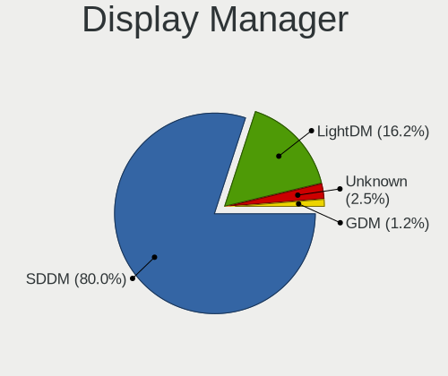
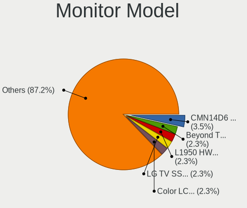
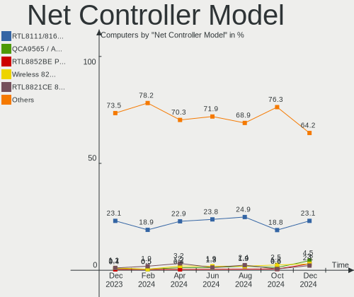
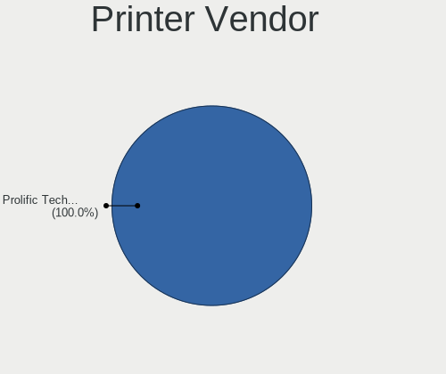

ArcoLinux Hardware Trends
-------------------------

A project to identify most popular hardware characteristics and track their change
over time based on data collected by ArcoLinux users at https://Linux-Hardware.org.

Anyone can contribute to this report by the [hw-probe](https://github.com/linuxhw/hw-probe) tool:

    sudo -E hw-probe -all -upload

This is a report for all computer types. See also reports for [desktops](/Dist/ArcoLinux/Desktop/README.md) and [notebooks](/Dist/ArcoLinux/Notebook/README.md).

Full-feature report is available here: https://linux-hardware.org/?view=trends

Period: Aug, 2021.

Contents
--------

* [ System ](#system)
  - [ OS                       ](#os)
  - [ OS Family                ](#os-family)
  - [ Kernel                   ](#kernel)
  - [ Kernel Family            ](#kernel-family)
  - [ Kernel Major Ver.        ](#kernel-major-ver)
  - [ Arch                     ](#arch)
  - [ DE                       ](#de)
  - [ Display Server           ](#display-server)
  - [ Display Manager          ](#display-manager)
  - [ OS Lang                  ](#os-lang)
  - [ Boot Mode                ](#boot-mode)
  - [ Filesystem               ](#filesystem)
  - [ Part. scheme             ](#part-scheme)
  - [ Dual Boot with Linux/BSD ](#dual-boot-with-linuxbsd)
  - [ Dual Boot (Win)          ](#dual-boot-win)

* [ Board ](#board)
  - [ Vendor                   ](#vendor)
  - [ Model                    ](#model)
  - [ Model Family             ](#model-family)
  - [ MFG Year                 ](#mfg-year)
  - [ Form Factor              ](#form-factor)
  - [ Secure Boot              ](#secure-boot)
  - [ Coreboot                 ](#coreboot)
  - [ RAM Size                 ](#ram-size)
  - [ RAM Used                 ](#ram-used)
  - [ Total Drives             ](#total-drives)
  - [ Has CD-ROM               ](#has-cd-rom)
  - [ Has Ethernet             ](#has-ethernet)
  - [ Has WiFi                 ](#has-wifi)
  - [ Has Bluetooth            ](#has-bluetooth)

* [ Location ](#location)
  - [ Country                  ](#country)
  - [ City                     ](#city)

* [ Drives ](#drives)
  - [ Drive Vendor             ](#drive-vendor)
  - [ Drive Model              ](#drive-model)
  - [ HDD Vendor               ](#hdd-vendor)
  - [ SSD Vendor               ](#ssd-vendor)
  - [ Drive Kind               ](#drive-kind)
  - [ Drive Connector          ](#drive-connector)
  - [ Drive Size               ](#drive-size)
  - [ Space Total              ](#space-total)
  - [ Space Used               ](#space-used)
  - [ Malfunc. Drives          ](#malfunc-drives)
  - [ Malfunc. Drive Vendor    ](#malfunc-drive-vendor)
  - [ Malfunc. HDD Vendor      ](#malfunc-hdd-vendor)
  - [ Malfunc. Drive Kind      ](#malfunc-drive-kind)
  - [ Failed Drives            ](#failed-drives)
  - [ Failed Drive Vendor      ](#failed-drive-vendor)
  - [ Drive Status             ](#drive-status)

* [ Storage controller ](#storage-controller)
  - [ Storage Vendor           ](#storage-vendor)
  - [ Storage Model            ](#storage-model)
  - [ Storage Kind             ](#storage-kind)

* [ Processor ](#processor)
  - [ CPU Vendor               ](#cpu-vendor)
  - [ CPU Model                ](#cpu-model)
  - [ CPU Model Family         ](#cpu-model-family)
  - [ CPU Cores                ](#cpu-cores)
  - [ CPU Sockets              ](#cpu-sockets)
  - [ CPU Threads              ](#cpu-threads)
  - [ CPU Op-Modes             ](#cpu-op-modes)
  - [ CPU Microcode            ](#cpu-microcode)
  - [ CPU Microarch            ](#cpu-microarch)

* [ Graphics ](#graphics)
  - [ GPU Vendor               ](#gpu-vendor)
  - [ GPU Model                ](#gpu-model)
  - [ GPU Combo                ](#gpu-combo)
  - [ GPU Driver               ](#gpu-driver)
  - [ GPU Memory               ](#gpu-memory)

* [ Monitor ](#monitor)
  - [ Monitor Vendor           ](#monitor-vendor)
  - [ Monitor Model            ](#monitor-model)
  - [ Monitor Resolution       ](#monitor-resolution)
  - [ Monitor Diagonal         ](#monitor-diagonal)
  - [ Monitor Width            ](#monitor-width)
  - [ Aspect Ratio             ](#aspect-ratio)
  - [ Monitor Area             ](#monitor-area)
  - [ Pixel Density            ](#pixel-density)
  - [ Multiple Monitors        ](#multiple-monitors)

* [ Network ](#network)
  - [ Net Controller Vendor    ](#net-controller-vendor)
  - [ Net Controller Model     ](#net-controller-model)
  - [ Wireless Vendor          ](#wireless-vendor)
  - [ Wireless Model           ](#wireless-model)
  - [ Ethernet Vendor          ](#ethernet-vendor)
  - [ Ethernet Model           ](#ethernet-model)
  - [ Net Controller Kind      ](#net-controller-kind)
  - [ Used Controller          ](#used-controller)
  - [ NICs                     ](#nics)
  - [ IPv6                     ](#ipv6)

* [ Bluetooth ](#bluetooth)
  - [ Bluetooth Vendor         ](#bluetooth-vendor)
  - [ Bluetooth Model          ](#bluetooth-model)

* [ Sound ](#sound)
  - [ Sound Vendor             ](#sound-vendor)
  - [ Sound Model              ](#sound-model)

* [ Memory ](#memory)
  - [ Memory Vendor            ](#memory-vendor)
  - [ Memory Model             ](#memory-model)
  - [ Memory Kind              ](#memory-kind)
  - [ Memory Form Factor       ](#memory-form-factor)
  - [ Memory Size              ](#memory-size)
  - [ Memory Speed             ](#memory-speed)

* [ Printers & scanners ](#printers--scanners)
  - [ Printer Vendor           ](#printer-vendor)
  - [ Printer Model            ](#printer-model)
  - [ Scanner Vendor           ](#scanner-vendor)
  - [ Scanner Model            ](#scanner-model)

* [ Camera ](#camera)
  - [ Camera Vendor            ](#camera-vendor)
  - [ Camera Model             ](#camera-model)

* [ Security ](#security)
  - [ Fingerprint Vendor       ](#fingerprint-vendor)
  - [ Fingerprint Model        ](#fingerprint-model)
  - [ Chipcard Vendor          ](#chipcard-vendor)
  - [ Chipcard Model           ](#chipcard-model)

* [ Unsupported ](#unsupported)
  - [ Unsupported Devices      ](#unsupported-devices)
  - [ Unsupported Device Types ](#unsupported-device-types)

System
------

OS
--

Installed operating systems

| Name              | Computers | Percent |
|-------------------|-----------|---------|
| ArcoLinux Rolling | 79        | 91.86%  |
| ArcoLinux         | 7         | 8.14%   |

OS Family
---------

OS without a version

| Name      | Computers | Percent |
|-----------|-----------|---------|
| ArcoLinux | 86        | 100%    |

Kernel
------

Version of the Linux kernel

| Version                      | Computers | Percent |
|------------------------------|-----------|---------|
| 5.13.12-arch1-1              | 22        | 25.58%  |
| 5.13.13-arch1-1              | 9         | 10.47%  |
| 5.13.8-arch1-1               | 7         | 8.14%   |
| 5.13.10-arch1-1              | 7         | 8.14%   |
| 5.13.9-arch1-1               | 6         | 6.98%   |
| 5.10.56-1-lts                | 6         | 6.98%   |
| 5.13.7-arch1-1               | 5         | 5.81%   |
| 5.13.6-arch1-1               | 5         | 5.81%   |
| 5.10.60-1-lts                | 3         | 3.49%   |
| 5.13.4-arch1-1               | 2         | 2.33%   |
| 5.13.12-zen1-1-zen           | 2         | 2.33%   |
| 5.10.61-1-lts                | 2         | 2.33%   |
| 5.13.9-zen1-1-zen            | 1         | 1.16%   |
| 5.13.6-zen1-1-zen            | 1         | 1.16%   |
| 5.13.5-arch1-1               | 1         | 1.16%   |
| 5.12.19-hardened1-1-hardened | 1         | 1.16%   |
| 5.12.15-arch1-1              | 1         | 1.16%   |
| 5.12.13-arch1-2              | 1         | 1.16%   |
| 5.12.1-arch1-1               | 1         | 1.16%   |
| 5.10.6-arch1-1               | 1         | 1.16%   |
| 5.10.55-1-lts                | 1         | 1.16%   |
| 5.10.54-1-lts                | 1         | 1.16%   |

Kernel Family
-------------

Linux kernel without a distro release

| Version | Computers | Percent |
|---------|-----------|---------|
| 5.13.12 | 24        | 27.91%  |
| 5.13.13 | 9         | 10.47%  |
| 5.13.9  | 7         | 8.14%   |
| 5.13.8  | 7         | 8.14%   |
| 5.13.10 | 7         | 8.14%   |
| 5.13.6  | 6         | 6.98%   |
| 5.10.56 | 6         | 6.98%   |
| 5.13.7  | 5         | 5.81%   |
| 5.10.60 | 3         | 3.49%   |
| 5.13.4  | 2         | 2.33%   |
| 5.10.61 | 2         | 2.33%   |
| 5.13.5  | 1         | 1.16%   |
| 5.12.19 | 1         | 1.16%   |
| 5.12.15 | 1         | 1.16%   |
| 5.12.13 | 1         | 1.16%   |
| 5.12.1  | 1         | 1.16%   |
| 5.10.6  | 1         | 1.16%   |
| 5.10.55 | 1         | 1.16%   |
| 5.10.54 | 1         | 1.16%   |

Kernel Major Ver.
-----------------

Linux kernel major version

| Version | Computers | Percent |
|---------|-----------|---------|
| 5.13    | 68        | 79.07%  |
| 5.10    | 14        | 16.28%  |
| 5.12    | 4         | 4.65%   |

Arch
----

OS architecture (x86_64, i586, etc.)

| Name   | Computers | Percent |
|--------|-----------|---------|
| x86_64 | 86        | 100%    |

DE
--

Desktop Environment

| Name         | Computers | Percent |
|--------------|-----------|---------|
| XFCE         | 27        | 31.4%   |
| qtile        | 10        | 11.63%  |
| awesome      | 9         | 10.47%  |
| KDE5         | 8         | 9.3%    |
| i3           | 6         | 6.98%   |
| X-Cinnamon   | 5         | 5.81%   |
| xmonad       | 4         | 4.65%   |
| KDE          | 4         | 4.65%   |
| GNOME        | 4         | 4.65%   |
| bspwm        | 4         | 4.65%   |
| dwm          | 3         | 3.49%   |
| herbstluftwm | 1         | 1.16%   |
| Budgie       | 1         | 1.16%   |

Display Server
--------------

X11 or Wayland

| Name    | Computers | Percent |
|---------|-----------|---------|
| X11     | 81        | 94.19%  |
| Tty     | 4         | 4.65%   |
| Wayland | 1         | 1.16%   |

Display Manager
---------------

SDDM, LightDM, etc.

| Name    | Computers | Percent |
|---------|-----------|---------|
| SDDM    | 52        | 60.47%  |
| TDM     | 14        | 16.28%  |
| LightDM | 8         | 9.3%    |
| Unknown | 8         | 9.3%    |
| GDM     | 2         | 2.33%   |
| XDM     | 1         | 1.16%   |
| LXDM    | 1         | 1.16%   |

OS Lang
-------

Language

| Lang  | Computers | Percent |
|-------|-----------|---------|
| en_US | 52        | 60.47%  |
| en_GB | 13        | 15.12%  |
| fr_FR | 3         | 3.49%   |
| en_IN | 3         | 3.49%   |
| de_DE | 3         | 3.49%   |
| ru_RU | 2         | 2.33%   |
| pl_PL | 2         | 2.33%   |
| hu_HU | 2         | 2.33%   |
| pt_BR | 1         | 1.16%   |
| fr_BE | 1         | 1.16%   |
| es_ES | 1         | 1.16%   |
| en_CA | 1         | 1.16%   |
| en_AU | 1         | 1.16%   |
| de_ch | 1         | 1.16%   |

Boot Mode
---------

EFI or BIOS

| Mode | Computers | Percent |
|------|-----------|---------|
| EFI  | 55        | 63.95%  |
| BIOS | 31        | 36.05%  |

Filesystem
----------

Type of filesystem

| Type    | Computers | Percent |
|---------|-----------|---------|
| Ext4    | 61        | 70.93%  |
| Btrfs   | 21        | 24.42%  |
| Overlay | 3         | 3.49%   |
| Xfs     | 1         | 1.16%   |

Part. scheme
------------

Scheme of partitioning

| Type    | Computers | Percent |
|---------|-----------|---------|
| GPT     | 60        | 69.77%  |
| MBR     | 19        | 22.09%  |
| Unknown | 7         | 8.14%   |

Dual Boot with Linux/BSD
------------------------

Hosting more than one Linux/BSD

| Dual boot | Computers | Percent |
|-----------|-----------|---------|
| No        | 67        | 77.91%  |
| Yes       | 19        | 22.09%  |

Dual Boot (Win)
---------------

Hosting Linux and Windows

| Dual boot | Computers | Percent |
|-----------|-----------|---------|
| No        | 55        | 63.95%  |
| Yes       | 31        | 36.05%  |

Board
-----

Vendor
------

Motherboard manufacturer

| Name                | Computers | Percent |
|---------------------|-----------|---------|
| ASUSTek Computer    | 18        | 20.93%  |
| Lenovo              | 17        | 19.77%  |
| Hewlett-Packard     | 10        | 11.63%  |
| Gigabyte Technology | 9         | 10.47%  |
| MSI                 | 6         | 6.98%   |
| Dell                | 5         | 5.81%   |
| Apple               | 4         | 4.65%   |
| Acer                | 3         | 3.49%   |
| ZOTAC               | 1         | 1.16%   |
| TUXEDO              | 1         | 1.16%   |
| Timi                | 1         | 1.16%   |
| System76            | 1         | 1.16%   |
| Supermicro          | 1         | 1.16%   |
| Razer               | 1         | 1.16%   |
| Medion              | 1         | 1.16%   |
| Intel               | 1         | 1.16%   |
| Fujitsu             | 1         | 1.16%   |
| Foxconn             | 1         | 1.16%   |
| Eluktronics         | 1         | 1.16%   |
| Biostar             | 1         | 1.16%   |
| AZW                 | 1         | 1.16%   |
| ASRock              | 1         | 1.16%   |

Model
-----

Motherboard model

| Name                                       | Computers | Percent |
|--------------------------------------------|-----------|---------|
| ASUS TUF GAMING X570-PLUS                  | 2         | 2.33%   |
| ZOTAC ZBOX-ECM73070C/53060C                | 1         | 1.16%   |
| TUXEDO BC1510 1710                         | 1         | 1.16%   |
| Timi TM1607                                | 1         | 1.16%   |
| System76 Gazelle                           | 1         | 1.16%   |
| Supermicro X8DTH-i/6/iF/6F                 | 1         | 1.16%   |
| Razer Blade                                | 1         | 1.16%   |
| MSI MS-7C91                                | 1         | 1.16%   |
| MSI MS-7C56                                | 1         | 1.16%   |
| MSI MS-7B77                                | 1         | 1.16%   |
| MSI MS-7978                                | 1         | 1.16%   |
| MSI MS-7971                                | 1         | 1.16%   |
| MSI Modern 14 B4MW                         | 1         | 1.16%   |
| Medion E62009                              | 1         | 1.16%   |
| Lenovo ThinkPad X250 20CLS1LC1K            | 1         | 1.16%   |
| Lenovo ThinkPad X201 3626GWG               | 1         | 1.16%   |
| Lenovo ThinkPad X1 Carbon Gen 9 20XW005NMX | 1         | 1.16%   |
| Lenovo ThinkPad W541 20EF001TMS            | 1         | 1.16%   |
| Lenovo ThinkPad W541 20EF0000US            | 1         | 1.16%   |
| Lenovo ThinkPad T61 7661ZLF                | 1         | 1.16%   |
| Lenovo ThinkPad T510 4384GFG               | 1         | 1.16%   |
| Lenovo ThinkPad T440 20B70048US            | 1         | 1.16%   |
| Lenovo ThinkPad T410s 2924AM7              | 1         | 1.16%   |
| Lenovo ThinkPad P51 20HHCTO1WW             | 1         | 1.16%   |
| Lenovo ThinkPad E14 20RA0016FR             | 1         | 1.16%   |
| Lenovo Legion Y530-15ICH 81FV              | 1         | 1.16%   |
| Lenovo IdeaPad L340-15API 81LW             | 1         | 1.16%   |
| Lenovo IdeaPad FLEX-14API 81SS             | 1         | 1.16%   |
| Lenovo IdeaPad 520-15IKB 81BF              | 1         | 1.16%   |
| Lenovo IdeaPad 510-15IKB 80SV              | 1         | 1.16%   |
| Lenovo IdeaPad 330-17IKB 81DM              | 1         | 1.16%   |
| Intel X99                                  | 1         | 1.16%   |
| HP Pavilion Gaming Laptop 15-ec0xxx        | 1         | 1.16%   |
| HP Pavilion Gaming Laptop 15-dk0001ua      | 1         | 1.16%   |
| HP Laptop 15q-bu1xx                        | 1         | 1.16%   |
| HP Laptop 15-db0xxx                        | 1         | 1.16%   |
| HP Laptop 15-da0xxx                        | 1         | 1.16%   |
| HP Laptop 15-bw0xx                         | 1         | 1.16%   |
| HP ENVY x360 Convertible 15-ee0xxx         | 1         | 1.16%   |
| HP ENVY x360 Convertible 13-ar0xxx         | 1         | 1.16%   |
| HP ENVY Laptop 17-cg0xxx                   | 1         | 1.16%   |
| HP EliteBook 840 G3                        | 1         | 1.16%   |
| Gigabyte Z77X-D3H                          | 1         | 1.16%   |
| Gigabyte TRX40 AORUS PRO WIFI              | 1         | 1.16%   |
| Gigabyte H370M-D3H                         | 1         | 1.16%   |
| Gigabyte H170-D3HP                         | 1         | 1.16%   |
| Gigabyte GA-870A-USB3                      | 1         | 1.16%   |
| Gigabyte G41M-ES2L                         | 1         | 1.16%   |
| Gigabyte G31M-ES2L                         | 1         | 1.16%   |
| Gigabyte B365M GAMING HD                   | 1         | 1.16%   |
| Gigabyte A520M H                           | 1         | 1.16%   |
| Fujitsu LIFEBOOK E756                      | 1         | 1.16%   |
| Foxconn p6621c                             | 1         | 1.16%   |
| Eluktronics MAG-15 2070                    | 1         | 1.16%   |
| Dell XPS 15 9500                           | 1         | 1.16%   |
| Dell XPS 15 7590                           | 1         | 1.16%   |
| Dell Vostro 3500                           | 1         | 1.16%   |
| Dell Inspiron 5579                         | 1         | 1.16%   |
| Dell Inspiron 15-5568                      | 1         | 1.16%   |
| Biostar J3060NH                            | 1         | 1.16%   |

Model Family
------------

Motherboard model prefix

| Name                  | Computers | Percent |
|-----------------------|-----------|---------|
| Lenovo ThinkPad       | 11        | 12.79%  |
| Lenovo IdeaPad        | 5         | 5.81%   |
| HP Laptop             | 4         | 4.65%   |
| HP ENVY               | 3         | 3.49%   |
| ASUS ROG              | 3         | 3.49%   |
| HP Pavilion           | 2         | 2.33%   |
| Dell XPS              | 2         | 2.33%   |
| Dell Inspiron         | 2         | 2.33%   |
| ASUS TUF              | 2         | 2.33%   |
| Acer Nitro            | 2         | 2.33%   |
| ZOTAC ZBOX-ECM73070C  | 1         | 1.16%   |
| TUXEDO BC1510         | 1         | 1.16%   |
| Timi TM1607           | 1         | 1.16%   |
| System76 Gazelle      | 1         | 1.16%   |
| Supermicro X8DTH-i    | 1         | 1.16%   |
| Razer Blade           | 1         | 1.16%   |
| MSI MS-7C91           | 1         | 1.16%   |
| MSI MS-7C56           | 1         | 1.16%   |
| MSI MS-7B77           | 1         | 1.16%   |
| MSI MS-7978           | 1         | 1.16%   |
| MSI MS-7971           | 1         | 1.16%   |
| MSI Modern            | 1         | 1.16%   |
| Medion E62009         | 1         | 1.16%   |
| Lenovo Legion         | 1         | 1.16%   |
| Intel X99             | 1         | 1.16%   |
| HP EliteBook          | 1         | 1.16%   |
| Gigabyte Z77X-D3H     | 1         | 1.16%   |
| Gigabyte TRX40        | 1         | 1.16%   |
| Gigabyte H370M-D3H    | 1         | 1.16%   |
| Gigabyte H170-D3HP    | 1         | 1.16%   |
| Gigabyte GA-870A-USB3 | 1         | 1.16%   |
| Gigabyte G41M-ES2L    | 1         | 1.16%   |
| Gigabyte G31M-ES2L    | 1         | 1.16%   |
| Gigabyte B365M        | 1         | 1.16%   |
| Gigabyte A520M        | 1         | 1.16%   |
| Fujitsu LIFEBOOK      | 1         | 1.16%   |
| Foxconn p6621c        | 1         | 1.16%   |
| Eluktronics MAG-15    | 1         | 1.16%   |
| Dell Vostro           | 1         | 1.16%   |
| Biostar J3060NH       | 1         | 1.16%   |
| AZW SEi               | 1         | 1.16%   |
| ASUS Z170-A           | 1         | 1.16%   |
| ASUS Z170             | 1         | 1.16%   |
| ASUS X580VD           | 1         | 1.16%   |
| ASUS X556UA           | 1         | 1.16%   |
| ASUS X441SA           | 1         | 1.16%   |
| ASUS VivoBook         | 1         | 1.16%   |
| ASUS STRIX            | 1         | 1.16%   |
| ASUS PRIME            | 1         | 1.16%   |
| ASUS P8P67            | 1         | 1.16%   |
| ASUS K53SD            | 1         | 1.16%   |
| ASUS K53E             | 1         | 1.16%   |
| ASUS G750JX           | 1         | 1.16%   |
| ASUS E200HA           | 1         | 1.16%   |
| ASRock X299           | 1         | 1.16%   |
| Apple MacPro5         | 1         | 1.16%   |
| Apple MacBookPro9     | 1         | 1.16%   |
| Apple MacBookPro11    | 1         | 1.16%   |
| Apple iMac19          | 1         | 1.16%   |
| Acer Aspire           | 1         | 1.16%   |

MFG Year
--------

Motherboard manufacture year

| Year | Computers | Percent |
|------|-----------|---------|
| 2020 | 20        | 23.26%  |
| 2021 | 18        | 20.93%  |
| 2019 | 12        | 13.95%  |
| 2018 | 11        | 12.79%  |
| 2016 | 5         | 5.81%   |
| 2017 | 4         | 4.65%   |
| 2013 | 3         | 3.49%   |
| 2012 | 3         | 3.49%   |
| 2011 | 3         | 3.49%   |
| 2010 | 3         | 3.49%   |
| 2014 | 2         | 2.33%   |
| 2009 | 1         | 1.16%   |
| 2008 | 1         | 1.16%   |

Form Factor
-----------

Physical design of the computer

| Name        | Computers | Percent |
|-------------|-----------|---------|
| Notebook    | 52        | 60.47%  |
| Desktop     | 29        | 33.72%  |
| Convertible | 2         | 2.33%   |
| Mini pc     | 1         | 1.16%   |
| All in one  | 1         | 1.16%   |
| Server      | 1         | 1.16%   |

Secure Boot
-----------

Enabled or disabled

| State    | Computers | Percent |
|----------|-----------|---------|
| Disabled | 86        | 100%    |

Coreboot
--------

Have coreboot on board

| Used | Computers | Percent |
|------|-----------|---------|
| No   | 85        | 98.84%  |
| Yes  | 1         | 1.16%   |

RAM Size
--------

Total RAM memory

| Size in GB  | Computers | Percent |
|-------------|-----------|---------|
| 16.01-24.0  | 26        | 30.23%  |
| 4.01-8.0    | 18        | 20.93%  |
| 8.01-16.0   | 16        | 18.6%   |
| 3.01-4.0    | 10        | 11.63%  |
| 32.01-64.0  | 8         | 9.3%    |
| 64.01-256.0 | 5         | 5.81%   |
| 24.01-32.0  | 1         | 1.16%   |
| 2.01-3.0    | 1         | 1.16%   |
| 1.01-2.0    | 1         | 1.16%   |

RAM Used
--------

Used RAM memory

| Used GB   | Computers | Percent |
|-----------|-----------|---------|
| 1.01-2.0  | 28        | 32.56%  |
| 2.01-3.0  | 20        | 23.26%  |
| 3.01-4.0  | 14        | 16.28%  |
| 0.51-1.0  | 10        | 11.63%  |
| 4.01-8.0  | 9         | 10.47%  |
| 8.01-16.0 | 3         | 3.49%   |
| 0.01-0.5  | 2         | 2.33%   |

Total Drives
------------

Number of drives on board

| Drives | Computers | Percent |
|--------|-----------|---------|
| 1      | 41        | 47.67%  |
| 2      | 27        | 31.4%   |
| 4      | 7         | 8.14%   |
| 3      | 7         | 8.14%   |
| 5      | 4         | 4.65%   |

Has CD-ROM
----------

Has CD-ROM on board

| Presented | Computers | Percent |
|-----------|-----------|---------|
| No        | 66        | 76.74%  |
| Yes       | 20        | 23.26%  |

Has Ethernet
------------

Has Ethernet on board

| Presented | Computers | Percent |
|-----------|-----------|---------|
| Yes       | 75        | 87.21%  |
| No        | 11        | 12.79%  |

Has WiFi
--------

Has WiFi module

| Presented | Computers | Percent |
|-----------|-----------|---------|
| Yes       | 66        | 76.74%  |
| No        | 20        | 23.26%  |

Has Bluetooth
-------------

Has Bluetooth module

| Presented | Computers | Percent |
|-----------|-----------|---------|
| Yes       | 64        | 74.42%  |
| No        | 22        | 25.58%  |

Location
--------

Country
-------

Geographic location (country)

| Country                | Computers | Percent |
|------------------------|-----------|---------|
| USA                    | 16        | 18.6%   |
| UK                     | 11        | 12.79%  |
| India                  | 7         | 8.14%   |
| Germany                | 7         | 8.14%   |
| Switzerland            | 3         | 3.49%   |
| Canada                 | 3         | 3.49%   |
| Brazil                 | 3         | 3.49%   |
| Belgium                | 3         | 3.49%   |
| Sweden                 | 2         | 2.33%   |
| Poland                 | 2         | 2.33%   |
| Netherlands            | 2         | 2.33%   |
| Hungary                | 2         | 2.33%   |
| France                 | 2         | 2.33%   |
| Estonia                | 2         | 2.33%   |
| Bulgaria               | 2         | 2.33%   |
| Australia              | 2         | 2.33%   |
| Ukraine                | 1         | 1.16%   |
| Spain                  | 1         | 1.16%   |
| Russia                 | 1         | 1.16%   |
| Romania                | 1         | 1.16%   |
| Panama                 | 1         | 1.16%   |
| Lebanon                | 1         | 1.16%   |
| Kuwait                 | 1         | 1.16%   |
| Ivory Coast            | 1         | 1.16%   |
| Indonesia              | 1         | 1.16%   |
| Hong Kong              | 1         | 1.16%   |
| Finland                | 1         | 1.16%   |
| Egypt                  | 1         | 1.16%   |
| Colombia               | 1         | 1.16%   |
| Bosnia and Herzegovina | 1         | 1.16%   |
| Barbados               | 1         | 1.16%   |
| Bangladesh             | 1         | 1.16%   |
| Argentina              | 1         | 1.16%   |

City
----

Geographic location (city)

| City                   | Computers | Percent |
|------------------------|-----------|---------|
| Tallinn                | 2         | 2.33%   |
| Kolkata                | 2         | 2.33%   |
| Edmonton               | 2         | 2.33%   |
| Zurich                 | 1         | 1.16%   |
| Yuma                   | 1         | 1.16%   |
| York                   | 1         | 1.16%   |
| West Columbia          | 1         | 1.16%   |
| Welwyn Garden City     | 1         | 1.16%   |
| Warsaw                 | 1         | 1.16%   |
| Vorbach                | 1         | 1.16%   |
| Volgograd              | 1         | 1.16%   |
| Voglans                | 1         | 1.16%   |
| Tucson                 | 1         | 1.16%   |
| Tanta                  | 1         | 1.16%   |
| Sydney                 | 1         | 1.16%   |
| Stuttgart              | 1         | 1.16%   |
| Stoke-on-Trent         | 1         | 1.16%   |
| Spokane                | 1         | 1.16%   |
| Sidon                  | 1         | 1.16%   |
| Shumen                 | 1         | 1.16%   |
| Sfantu Gheorghe        | 1         | 1.16%   |
| Sebastiao Laranjeiras  | 1         | 1.16%   |
| Scottsdale             | 1         | 1.16%   |
| Schwalbach am Taunus   | 1         | 1.16%   |
| S??o Paulo             | 1         | 1.16%   |
| Santiago de Compostela | 1         | 1.16%   |
| Pune                   | 1         | 1.16%   |
| Porto Alegre           | 1         | 1.16%   |
| Plano                  | 1         | 1.16%   |
| Penonom?©              | 1         | 1.16%   |
| Ottignies              | 1         | 1.16%   |
| Ostermundigen          | 1         | 1.16%   |
| Norwalk                | 1         | 1.16%   |
| Northampton            | 1         | 1.16%   |
| New York               | 1         | 1.16%   |
| New Delhi              | 1         | 1.16%   |
| Nagykoros              | 1         | 1.16%   |
| Mt. Dora               | 1         | 1.16%   |
| Machhagan              | 1         | 1.16%   |
| London                 | 1         | 1.16%   |
| Levis                  | 1         | 1.16%   |
| Lerwick                | 1         | 1.16%   |
| Laguna Niguel          | 1         | 1.16%   |
| Kuwait City            | 1         | 1.16%   |
| Kherson                | 1         | 1.16%   |
| Kent                   | 1         | 1.16%   |
| Jaipur                 | 1         | 1.16%   |
| Helsinki               | 1         | 1.16%   |
| Hackney                | 1         | 1.16%   |
| Hackleton              | 1         | 1.16%   |
| Grimsby                | 1         | 1.16%   |
| Faerjestaden           | 1         | 1.16%   |
| Everett                | 1         | 1.16%   |
| Enid                   | 1         | 1.16%   |
| Emmerich               | 1         | 1.16%   |
| Duffel                 | 1         | 1.16%   |
| Downham Market         | 1         | 1.16%   |
| Dombivali              | 1         | 1.16%   |
| Denver                 | 1         | 1.16%   |
| Denpasar               | 1         | 1.16%   |

Drives
------

Drive Vendor
------------

Hard drive vendors

| Vendor              | Computers | Drives | Percent |
|---------------------|-----------|--------|---------|
| Samsung Electronics | 26        | 33     | 18.57%  |
| WDC                 | 19        | 25     | 13.57%  |
| Seagate             | 16        | 23     | 11.43%  |
| Toshiba             | 12        | 12     | 8.57%   |
| Crucial             | 10        | 11     | 7.14%   |
| Kingston            | 7         | 7      | 5%      |
| Intel               | 7         | 8      | 5%      |
| Phison              | 4         | 4      | 2.86%   |
| SK Hynix            | 3         | 3      | 2.14%   |
| Micron Technology   | 3         | 3      | 2.14%   |
| HGST                | 3         | 3      | 2.14%   |
| Apple               | 3         | 4      | 2.14%   |
| A-DATA Technology   | 3         | 3      | 2.14%   |
| Unknown             | 2         | 2      | 1.43%   |
| Transcend           | 2         | 2      | 1.43%   |
| Silicon Motion      | 2         | 3      | 1.43%   |
| SanDisk             | 2         | 2      | 1.43%   |
| PNY                 | 2         | 2      | 1.43%   |
| KIOXIA              | 2         | 2      | 1.43%   |
| China               | 2         | 4      | 1.43%   |
| XPG                 | 1         | 1      | 0.71%   |
| Union Memory        | 1         | 1      | 0.71%   |
| SPCC                | 1         | 1      | 0.71%   |
| SABRENT             | 1         | 1      | 0.71%   |
| Mushkin             | 1         | 1      | 0.71%   |
| LITEONIT            | 1         | 1      | 0.71%   |
| Lexar               | 1         | 1      | 0.71%   |
| LaCie               | 1         | 1      | 0.71%   |
| KingSpec            | 1         | 1      | 0.71%   |
| Hitachi             | 1         | 1      | 0.71%   |

Drive Model
-----------

Hard drive models

| Model                                   | Computers | Percent |
|-----------------------------------------|-----------|---------|
| Samsung SSD 860 EVO 500GB               | 5         | 3.21%   |
| Samsung SSD 970 EVO Plus 1TB            | 3         | 1.92%   |
| Toshiba MQ04ABF100 1TB                  | 2         | 1.28%   |
| Toshiba MQ01ABD100 1TB                  | 2         | 1.28%   |
| Seagate ST1000LM049-2GH172 1TB          | 2         | 1.28%   |
| Seagate ST1000LM035-1RK172 1TB          | 2         | 1.28%   |
| Seagate ST1000LM024 HN-M101MBB 1TB      | 2         | 1.28%   |
| Seagate ST1000DM010-2EP102 1TB          | 2         | 1.28%   |
| Samsung SSD 980 PRO 1TB                 | 2         | 1.28%   |
| Samsung SSD 860 EVO 250GB               | 2         | 1.28%   |
| Kingston SA400S37120G 120GB SSD         | 2         | 1.28%   |
| Crucial CT500P2SSD8 500GB               | 2         | 1.28%   |
| Crucial CT1000P1SSD8 1TB                | 2         | 1.28%   |
| Crucial CT1000MX500SSD1 1TB             | 2         | 1.28%   |
| XPG GAMMIX S11 Pro 512GB                | 1         | 0.64%   |
| WDC WDS500G1B0A-00H9H0 500GB SSD        | 1         | 0.64%   |
| WDC WDS480G2G0A-00JH30 480GB SSD        | 1         | 0.64%   |
| WDC WDS250G2B0C-00PXH0 250GB            | 1         | 0.64%   |
| WDC WDS240G2G0A-00JH30 240GB SSD        | 1         | 0.64%   |
| WDC WDS100T2B0C-00PXH0 1TB              | 1         | 0.64%   |
| WDC WDBNCE5000PNC 500GB SSD             | 1         | 0.64%   |
| WDC WD6400BEVT-60A0RT0 640GB            | 1         | 0.64%   |
| WDC WD5000BPVT-22HXZT1 500GB            | 1         | 0.64%   |
| WDC WD5000AAKX-603CA0 500GB             | 1         | 0.64%   |
| WDC WD5000AAKX-001CA0 500GB             | 1         | 0.64%   |
| WDC WD3200AAKS-61L9A0 320GB             | 1         | 0.64%   |
| WDC WD20PURZ-85AKKY0 2TB                | 1         | 0.64%   |
| WDC WD2002FYPS-02W3B0 2TB               | 1         | 0.64%   |
| WDC WD10SPZX-75Z10T2 1TB                | 1         | 0.64%   |
| WDC WD10SPZX-60Z10T0 1TB                | 1         | 0.64%   |
| WDC WD10SPSX-60A6WT0 1TB                | 1         | 0.64%   |
| WDC WD10JPCX-24UE4T0 1TB                | 1         | 0.64%   |
| WDC WD10EZRZ-00HTKB0 1TB                | 1         | 0.64%   |
| WDC WD10EZRX-00L4HB0 1TB                | 1         | 0.64%   |
| WDC WD10EZEX-08WN4A0 1TB                | 1         | 0.64%   |
| WDC WD1003FZEX-00K3CA0 1TB              | 1         | 0.64%   |
| WDC WD1002FBYS-02A6B0 1TB               | 1         | 0.64%   |
| WDC PC SN530 SDBPNPZ-512G-1014 512GB    | 1         | 0.64%   |
| WDC PC SN530 NVMe 512GB                 | 1         | 0.64%   |
| Unknown SD/MMC/MS PRO 128GB             | 1         | 0.64%   |
| Unknown HBG4a2  32GB                    | 1         | 0.64%   |
| Union Memory UMIS RPJTJ256MED1OWX 256GB | 1         | 0.64%   |
| Transcend TS512GSSD720 512GB            | 1         | 0.64%   |
| Transcend TS480GSSD220S 480GB           | 1         | 0.64%   |
| Toshiba THNSNK256GCS8 SATA 256GB SSD    | 1         | 0.64%   |
| Toshiba THNS128GG4BAAA-NonFDE 128GB SSD | 1         | 0.64%   |
| Toshiba MQ01ABF050 500GB                | 1         | 0.64%   |
| Toshiba MQ01ABD100V 1TB                 | 1         | 0.64%   |
| Toshiba MK1665GSX 160GB                 | 1         | 0.64%   |
| Toshiba KXG60ZNV256G 256GB              | 1         | 0.64%   |
| Toshiba KBG30ZMV256G KIOXIA 256GB       | 1         | 0.64%   |
| Toshiba DT01ACA100 1TB                  | 1         | 0.64%   |
| SPCC M.2 PCIe SSD 512GB                 | 1         | 0.64%   |
| SK Hynix SC311 SATA 128GB SSD           | 1         | 0.64%   |
| SK Hynix HFM001TD3JX013N 1TB            | 1         | 0.64%   |
| SK Hynix BC501 HFM512GDJTNG-8310A 512GB | 1         | 0.64%   |
| Silicon Motion SPT256L2-2IAS7G2 256GB   | 1         | 0.64%   |
| Silicon Motion NVMe SSD Drive 256GB     | 1         | 0.64%   |
| Silicon Motion NVME SSD 512GB           | 1         | 0.64%   |
| Seagate ST9500420AS 500GB               | 1         | 0.64%   |

HDD Vendor
----------

Hard disk drive vendors

| Vendor              | Computers | Drives | Percent |
|---------------------|-----------|--------|---------|
| Seagate             | 15        | 22     | 35.71%  |
| WDC                 | 13        | 17     | 30.95%  |
| Toshiba             | 8         | 8      | 19.05%  |
| HGST                | 3         | 3      | 7.14%   |
| Samsung Electronics | 1         | 1      | 2.38%   |
| Hitachi             | 1         | 1      | 2.38%   |
| Apple               | 1         | 1      | 2.38%   |

SSD Vendor
----------

Solid state drive vendors

| Vendor              | Computers | Drives | Percent |
|---------------------|-----------|--------|---------|
| Samsung Electronics | 20        | 22     | 34.48%  |
| Kingston            | 6         | 6      | 10.34%  |
| Crucial             | 6         | 7      | 10.34%  |
| WDC                 | 4         | 4      | 6.9%    |
| Intel               | 3         | 3      | 5.17%   |
| Transcend           | 2         | 2      | 3.45%   |
| Toshiba             | 2         | 2      | 3.45%   |
| SanDisk             | 2         | 2      | 3.45%   |
| PNY                 | 2         | 2      | 3.45%   |
| China               | 2         | 4      | 3.45%   |
| Apple               | 2         | 2      | 3.45%   |
| SK Hynix            | 1         | 1      | 1.72%   |
| SABRENT             | 1         | 1      | 1.72%   |
| Micron Technology   | 1         | 1      | 1.72%   |
| LITEONIT            | 1         | 1      | 1.72%   |
| Lexar               | 1         | 1      | 1.72%   |
| KingSpec            | 1         | 1      | 1.72%   |
| A-DATA Technology   | 1         | 1      | 1.72%   |

Drive Kind
----------

HDD or SSD

| Kind    | Computers | Drives | Percent |
|---------|-----------|--------|---------|
| SSD     | 46        | 63     | 35.94%  |
| HDD     | 40        | 53     | 31.25%  |
| NVMe    | 38        | 45     | 29.69%  |
| Unknown | 3         | 4      | 2.34%   |
| MMC     | 1         | 1      | 0.78%   |

Drive Connector
---------------

SATA, SAS, NVMe, etc.

| Type | Computers | Drives | Percent |
|------|-----------|--------|---------|
| SATA | 65        | 111    | 58.56%  |
| NVMe | 38        | 45     | 34.23%  |
| SAS  | 7         | 9      | 6.31%   |
| MMC  | 1         | 1      | 0.9%    |

Drive Size
----------

Size of hard drive

| Size in TB | Computers | Drives | Percent |
|------------|-----------|--------|---------|
| 0.01-0.5   | 45        | 60     | 50.56%  |
| 0.51-1.0   | 33        | 40     | 37.08%  |
| 1.01-2.0   | 8         | 13     | 8.99%   |
| 3.01-4.0   | 3         | 3      | 3.37%   |

Space Total
-----------

Amount of disk space available on the file system

| Size in GB     | Computers | Percent |
|----------------|-----------|---------|
| 251-500        | 27        | 31.4%   |
| 101-250        | 20        | 23.26%  |
| 501-1000       | 13        | 15.12%  |
| 1001-2000      | 10        | 11.63%  |
| More than 3000 | 7         | 8.14%   |
| 2001-3000      | 5         | 5.81%   |
| Unknown        | 2         | 2.33%   |
| 1-20           | 1         | 1.16%   |
| 51-100         | 1         | 1.16%   |

Space Used
----------

Amount of used disk space

| Used GB   | Computers | Percent |
|-----------|-----------|---------|
| 1-20      | 23        | 26.74%  |
| 21-50     | 22        | 25.58%  |
| 101-250   | 16        | 18.6%   |
| 501-1000  | 11        | 12.79%  |
| 51-100    | 6         | 6.98%   |
| 251-500   | 5         | 5.81%   |
| Unknown   | 2         | 2.33%   |
| 1001-2000 | 1         | 1.16%   |

Malfunc. Drives
---------------

Drive models with a malfunction

| Model                                   | Computers | Drives | Percent |
|-----------------------------------------|-----------|--------|---------|
| WDC WD6400BEVT-60A0RT0 640GB            | 1         | 1      | 5.26%   |
| WDC WD5000BPVT-22HXZT1 500GB            | 1         | 1      | 5.26%   |
| WDC WD5000AAKX-603CA0 500GB             | 1         | 1      | 5.26%   |
| WDC WD2002FYPS-02W3B0 2TB               | 1         | 1      | 5.26%   |
| WDC WD1002FBYS-02A6B0 1TB               | 1         | 1      | 5.26%   |
| Transcend TS512GSSD720 512GB            | 1         | 1      | 5.26%   |
| Toshiba THNSNK256GCS8 SATA 256GB SSD    | 1         | 1      | 5.26%   |
| Toshiba MQ04ABF100 1TB                  | 1         | 1      | 5.26%   |
| Toshiba MQ01ABD100 1TB                  | 1         | 1      | 5.26%   |
| SK Hynix BC501 HFM512GDJTNG-8310A 512GB | 1         | 1      | 5.26%   |
| Seagate ST9500420AS 500GB               | 1         | 1      | 5.26%   |
| Seagate ST3500312CS 500GB               | 1         | 1      | 5.26%   |
| Seagate ST1000LM024 HN-M101MBB 1TB      | 1         | 1      | 5.26%   |
| Seagate ST1000DM010-2EP102 1TB          | 1         | 1      | 5.26%   |
| Kingston SUV500M8960G 960GB SSD         | 1         | 1      | 5.26%   |
| Kingston SA400S37120G 120GB SSD         | 1         | 1      | 5.26%   |
| Intel SSDSA2M160G2GC 160GB              | 1         | 1      | 5.26%   |
| HGST HTS725050A7E630 500GB              | 1         | 1      | 5.26%   |
| HGST HTS541010A9E680 1TB                | 1         | 1      | 5.26%   |

Malfunc. Drive Vendor
---------------------

Vendors of faulty drives

| Vendor    | Computers | Drives | Percent |
|-----------|-----------|--------|---------|
| WDC       | 4         | 5      | 23.53%  |
| Toshiba   | 3         | 3      | 17.65%  |
| Seagate   | 3         | 4      | 17.65%  |
| Kingston  | 2         | 2      | 11.76%  |
| HGST      | 2         | 2      | 11.76%  |
| Transcend | 1         | 1      | 5.88%   |
| SK Hynix  | 1         | 1      | 5.88%   |
| Intel     | 1         | 1      | 5.88%   |

Malfunc. HDD Vendor
-------------------

Vendors of faulty HDD drives

| Vendor  | Computers | Drives | Percent |
|---------|-----------|--------|---------|
| WDC     | 4         | 5      | 36.36%  |
| Seagate | 3         | 4      | 27.27%  |
| Toshiba | 2         | 2      | 18.18%  |
| HGST    | 2         | 2      | 18.18%  |

Malfunc. Drive Kind
-------------------

Kinds of faulty drives

| Kind | Computers | Drives | Percent |
|------|-----------|--------|---------|
| HDD  | 11        | 13     | 64.71%  |
| SSD  | 5         | 5      | 29.41%  |
| NVMe | 1         | 1      | 5.88%   |

Failed Drives
-------------

Failed drive models

Zero info for selected period =(

Failed Drive Vendor
-------------------

Failed drive vendors

Zero info for selected period =(

Drive Status
------------

Number of failed and malfunc. drives

| Status   | Computers | Drives | Percent |
|----------|-----------|--------|---------|
| Works    | 69        | 126    | 66.35%  |
| Detected | 19        | 21     | 18.27%  |
| Malfunc  | 16        | 19     | 15.38%  |

Storage controller
------------------

Storage Vendor
--------------

Storage controller vendors

| Vendor                       | Computers | Percent |
|------------------------------|-----------|---------|
| Intel                        | 64        | 52.46%  |
| AMD                          | 16        | 13.11%  |
| Samsung Electronics          | 9         | 7.38%   |
| Sandisk                      | 4         | 3.28%   |
| Phison Electronics           | 4         | 3.28%   |
| Micron/Crucial Technology    | 4         | 3.28%   |
| Silicon Motion               | 3         | 2.46%   |
| Marvell Technology Group     | 3         | 2.46%   |
| ADATA Technology             | 3         | 2.46%   |
| Toshiba America Info Systems | 2         | 1.64%   |
| SK Hynix                     | 2         | 1.64%   |
| Micron Technology            | 2         | 1.64%   |
| KIOXIA                       | 2         | 1.64%   |
| ASMedia Technology           | 2         | 1.64%   |
| Union Memory (Shenzhen)      | 1         | 0.82%   |
| Kingston Technology Company  | 1         | 0.82%   |

Storage Model
-------------

Storage controller models

| Model                                                                            | Computers | Percent |
|----------------------------------------------------------------------------------|-----------|---------|
| Intel Sunrise Point-LP SATA Controller [AHCI mode]                               | 10        | 7.75%   |
| AMD FCH SATA Controller [AHCI mode]                                              | 9         | 6.98%   |
| Intel Q170/Q150/B150/H170/H110/Z170/CM236 Chipset SATA Controller [AHCI Mode]    | 5         | 3.88%   |
| Intel Cannon Lake Mobile PCH SATA AHCI Controller                                | 5         | 3.88%   |
| Phison E12 NVMe Controller                                                       | 4         | 3.1%    |
| Intel SSD 660P Series                                                            | 4         | 3.1%    |
| Intel Cannon Lake PCH SATA AHCI Controller                                       | 4         | 3.1%    |
| Intel 82801 Mobile SATA Controller [RAID mode]                                   | 4         | 3.1%    |
| AMD Starship/Matisse Chipset SATA Controller [AHCI mode]                         | 4         | 3.1%    |
| Silicon Motion SM2263EN/SM2263XT SSD Controller                                  | 3         | 2.33%   |
| Sandisk WD Blue SN550 NVMe SSD                                                   | 3         | 2.33%   |
| Samsung NVMe SSD Controller SM981/PM981/PM983                                    | 3         | 2.33%   |
| Intel 8 Series/C220 Series Chipset Family 6-port SATA Controller 1 [AHCI mode]   | 3         | 2.33%   |
| Intel 5 Series/3400 Series Chipset 6 port SATA AHCI Controller                   | 3         | 2.33%   |
| ADATA XPG SX8200 Pro PCIe Gen3x4 M.2 2280 Solid State Drive                      | 3         | 2.33%   |
| Samsung NVMe SSD Controller SM961/PM961/SM963                                    | 2         | 1.55%   |
| Samsung NVMe SSD Controller SM951/PM951                                          | 2         | 1.55%   |
| Samsung NVMe SSD Controller PM9A1/PM9A3/980PRO                                   | 2         | 1.55%   |
| Micron/Crucial P2 NVMe PCIe SSD                                                  | 2         | 1.55%   |
| Micron/Crucial P1 NVMe PCIe SSD                                                  | 2         | 1.55%   |
| Micron Non-Volatile memory controller                                            | 2         | 1.55%   |
| KIOXIA Non-Volatile memory controller                                            | 2         | 1.55%   |
| Intel NM10/ICH7 Family SATA Controller [IDE mode]                                | 2         | 1.55%   |
| Intel Comet Lake SATA AHCI Controller                                            | 2         | 1.55%   |
| Intel Atom/Celeron/Pentium Processor x5-E8000/J3xxx/N3xxx Series SATA Controller | 2         | 1.55%   |
| Intel 6 Series/C200 Series Chipset Family 6 port Mobile SATA AHCI Controller     | 2         | 1.55%   |
| Intel 200 Series PCH SATA controller [AHCI mode]                                 | 2         | 1.55%   |
| ASMedia ASM1062 Serial ATA Controller                                            | 2         | 1.55%   |
| AMD SB7x0/SB8x0/SB9x0 SATA Controller [AHCI mode]                                | 2         | 1.55%   |
| Union Memory (Shenzhen) Non-Volatile memory controller                           | 1         | 0.78%   |
| Toshiba America Info Systems XG6 NVMe SSD Controller                             | 1         | 0.78%   |
| Toshiba America Info Systems BG3 NVMe SSD Controller                             | 1         | 0.78%   |
| SK Hynix NVMe SSD Controller                                                     | 1         | 0.78%   |
| SK Hynix BC501 NVMe Solid State Drive                                            | 1         | 0.78%   |
| Sandisk Non-Volatile memory controller                                           | 1         | 0.78%   |
| Samsung Electronics Non-Volatile memory controller                               | 1         | 0.78%   |
| Marvell Group 88SS9183 PCIe SSD Controller                                       | 1         | 0.78%   |
| Marvell Group 88SE9172 SATA 6Gb/s Controller                                     | 1         | 0.78%   |
| Marvell Group 88SE912x SATA 6Gb/s Controller [IDE mode]                          | 1         | 0.78%   |
| Marvell Group 88SE912x IDE Controller                                            | 1         | 0.78%   |
| Kingston Company U-SNS8154P3 NVMe SSD                                            | 1         | 0.78%   |
| Intel Wildcat Point-LP SATA Controller [AHCI Mode]                               | 1         | 0.78%   |
| Intel Tiger Lake-LP SATA Controller [AHCI mode]                                  | 1         | 0.78%   |
| Intel SATA Controller [RAID mode]                                                | 1         | 0.78%   |
| Intel HM170/QM170 Chipset SATA Controller [AHCI Mode]                            | 1         | 0.78%   |
| Intel Cannon Point-LP SATA Controller [AHCI Mode]                                | 1         | 0.78%   |
| Intel C610/X99 series chipset sSATA Controller [AHCI mode]                       | 1         | 0.78%   |
| Intel C610/X99 series chipset 6-Port SATA Controller [AHCI mode]                 | 1         | 0.78%   |
| Intel 82801JI (ICH10 Family) SATA AHCI Controller                                | 1         | 0.78%   |
| Intel 82801JI (ICH10 Family) 4 port SATA IDE Controller #1                       | 1         | 0.78%   |
| Intel 82801JI (ICH10 Family) 2 port SATA IDE Controller #2                       | 1         | 0.78%   |
| Intel 82801HM/HEM (ICH8M/ICH8M-E) SATA Controller [AHCI mode]                    | 1         | 0.78%   |
| Intel 82801HM/HEM (ICH8M/ICH8M-E) IDE Controller                                 | 1         | 0.78%   |
| Intel 8 Series SATA Controller 1 [AHCI mode]                                     | 1         | 0.78%   |
| Intel 7 Series/C210 Series Chipset Family 6-port SATA Controller [AHCI mode]     | 1         | 0.78%   |
| Intel 7 Series Chipset Family 6-port SATA Controller [AHCI mode]                 | 1         | 0.78%   |
| Intel 6 Series/C200 Series Chipset Family 6 port Desktop SATA AHCI Controller    | 1         | 0.78%   |
| Intel 500 Series Chipset Family SATA AHCI Controller                             | 1         | 0.78%   |
| Intel 5 Series/3400 Series Chipset 4 port SATA AHCI Controller                   | 1         | 0.78%   |
| Intel 400 Series Chipset Family SATA RAID Controller                             | 1         | 0.78%   |

Storage Kind
------------

Kind of storage controller (IDE, SATA, NVMe, SAS, ...)

| Kind | Computers | Percent |
|------|-----------|---------|
| SATA | 69        | 57.98%  |
| NVMe | 38        | 31.93%  |
| RAID | 6         | 5.04%   |
| IDE  | 6         | 5.04%   |

Processor
---------

CPU Vendor
----------

Processor vendors

| Vendor | Computers | Percent |
|--------|-----------|---------|
| Intel  | 67        | 77.91%  |
| AMD    | 19        | 22.09%  |

CPU Model
---------

Processor models

| Model                                         | Computers | Percent |
|-----------------------------------------------|-----------|---------|
| Intel Core i5-8250U CPU @ 1.60GHz             | 4         | 4.65%   |
| Intel Core i7-9750H CPU @ 2.60GHz             | 3         | 3.49%   |
| AMD Ryzen 7 3700X 8-Core Processor            | 3         | 3.49%   |
| Intel Core i7-7700HQ CPU @ 2.80GHz            | 2         | 2.33%   |
| Intel Core i7-6700K CPU @ 4.00GHz             | 2         | 2.33%   |
| Intel Core i5-8300H CPU @ 2.30GHz             | 2         | 2.33%   |
| Intel Core i5-6200U CPU @ 2.30GHz             | 2         | 2.33%   |
| Intel 11th Gen Core i7-1165G7 @ 2.80GHz       | 2         | 2.33%   |
| AMD Ryzen 7 5800X 8-Core Processor            | 2         | 2.33%   |
| AMD Ryzen 5 4500U with Radeon Graphics        | 2         | 2.33%   |
| AMD Ryzen 3 3200U with Radeon Vega Mobile Gfx | 2         | 2.33%   |
| Intel Xeon CPU X5675 @ 3.07GHz                | 1         | 1.16%   |
| Intel Xeon CPU X5670 @ 2.93GHz                | 1         | 1.16%   |
| Intel Xeon CPU E5-2620 v3 @ 2.40GHz           | 1         | 1.16%   |
| Intel Pentium Dual-Core CPU E5300 @ 2.60GHz   | 1         | 1.16%   |
| Intel Core m3-7Y30 CPU @ 1.00GHz              | 1         | 1.16%   |
| Intel Core i9-9900K CPU @ 3.60GHz             | 1         | 1.16%   |
| Intel Core i9-10900X CPU @ 3.70GHz            | 1         | 1.16%   |
| Intel Core i7-8750H CPU @ 2.20GHz             | 1         | 1.16%   |
| Intel Core i7-8700 CPU @ 3.20GHz              | 1         | 1.16%   |
| Intel Core i7-7700K CPU @ 4.20GHz             | 1         | 1.16%   |
| Intel Core i7-6500U CPU @ 2.50GHz             | 1         | 1.16%   |
| Intel Core i7-4910MQ CPU @ 2.90GHz            | 1         | 1.16%   |
| Intel Core i7-4710MQ CPU @ 2.50GHz            | 1         | 1.16%   |
| Intel Core i7-4700HQ CPU @ 2.40GHz            | 1         | 1.16%   |
| Intel Core i7-3770 CPU @ 3.40GHz              | 1         | 1.16%   |
| Intel Core i7-2670QM CPU @ 2.20GHz            | 1         | 1.16%   |
| Intel Core i7-10750H CPU @ 2.60GHz            | 1         | 1.16%   |
| Intel Core i7-10700K CPU @ 3.80GHz            | 1         | 1.16%   |
| Intel Core i7-10700 CPU @ 2.90GHz             | 1         | 1.16%   |
| Intel Core i7-1065G7 CPU @ 1.30GHz            | 1         | 1.16%   |
| Intel Core i7 CPU M 620 @ 2.67GHz             | 1         | 1.16%   |
| Intel Core i5-9400 CPU @ 2.90GHz              | 1         | 1.16%   |
| Intel Core i5-9300H CPU @ 2.40GHz             | 1         | 1.16%   |
| Intel Core i5-8500 CPU @ 3.00GHz              | 1         | 1.16%   |
| Intel Core i5-8400 CPU @ 2.80GHz              | 1         | 1.16%   |
| Intel Core i5-8259U CPU @ 2.30GHz             | 1         | 1.16%   |
| Intel Core i5-7600K CPU @ 3.80GHz             | 1         | 1.16%   |
| Intel Core i5-7200U CPU @ 2.50GHz             | 1         | 1.16%   |
| Intel Core i5-6600 CPU @ 3.30GHz              | 1         | 1.16%   |
| Intel Core i5-6500 CPU @ 3.20GHz              | 1         | 1.16%   |
| Intel Core i5-6300U CPU @ 2.40GHz             | 1         | 1.16%   |
| Intel Core i5-5300U CPU @ 2.30GHz             | 1         | 1.16%   |
| Intel Core i5-4300U CPU @ 1.90GHz             | 1         | 1.16%   |
| Intel Core i5-4258U CPU @ 2.40GHz             | 1         | 1.16%   |
| Intel Core i5-3210M CPU @ 2.50GHz             | 1         | 1.16%   |
| Intel Core i5-2410M CPU @ 2.30GHz             | 1         | 1.16%   |
| Intel Core i5-2400 CPU @ 3.10GHz              | 1         | 1.16%   |
| Intel Core i5-1035G1 CPU @ 1.00GHz            | 1         | 1.16%   |
| Intel Core i5-10300H CPU @ 2.50GHz            | 1         | 1.16%   |
| Intel Core i5-10210U CPU @ 1.60GHz            | 1         | 1.16%   |
| Intel Core i5 CPU M 540 @ 2.53GHz             | 1         | 1.16%   |
| Intel Core i5 CPU M 520 @ 2.40GHz             | 1         | 1.16%   |
| Intel Core i3-8130U CPU @ 2.20GHz             | 1         | 1.16%   |
| Intel Core i3 CPU M 380 @ 2.53GHz             | 1         | 1.16%   |
| Intel Core 2 Duo CPU T7500 @ 2.20GHz          | 1         | 1.16%   |
| Intel Core 2 Duo CPU E8500 @ 3.16GHz          | 1         | 1.16%   |
| Intel Celeron CPU N3060 @ 1.60GHz             | 1         | 1.16%   |
| Intel Celeron CPU J3060 @ 1.60GHz             | 1         | 1.16%   |
| Intel Atom x5-Z8350 CPU @ 1.44GHz             | 1         | 1.16%   |

CPU Model Family
----------------

Processor model prefix

| Model                   | Computers | Percent |
|-------------------------|-----------|---------|
| Intel Core i5           | 29        | 33.72%  |
| Intel Core i7           | 21        | 24.42%  |
| AMD Ryzen 7             | 6         | 6.98%   |
| AMD Ryzen 5             | 4         | 4.65%   |
| Other                   | 3         | 3.49%   |
| Intel Xeon              | 3         | 3.49%   |
| Intel Core i9           | 2         | 2.33%   |
| Intel Core i3           | 2         | 2.33%   |
| Intel Core 2 Duo        | 2         | 2.33%   |
| Intel Celeron           | 2         | 2.33%   |
| AMD Ryzen 9             | 2         | 2.33%   |
| AMD Ryzen 3             | 2         | 2.33%   |
| AMD Phenom II X4        | 2         | 2.33%   |
| Intel Pentium Dual-Core | 1         | 1.16%   |
| Intel Core m3           | 1         | 1.16%   |
| Intel Atom              | 1         | 1.16%   |
| AMD Ryzen Threadripper  | 1         | 1.16%   |
| AMD A6                  | 1         | 1.16%   |
| AMD A4                  | 1         | 1.16%   |

CPU Cores
---------

Number of processor cores

| Number | Computers | Percent |
|--------|-----------|---------|
| 4      | 33        | 38.37%  |
| 2      | 25        | 29.07%  |
| 6      | 14        | 16.28%  |
| 8      | 10        | 11.63%  |
| 12     | 2         | 2.33%   |
| 32     | 1         | 1.16%   |
| 10     | 1         | 1.16%   |

CPU Sockets
-----------

Number of sockets

| Number | Computers | Percent |
|--------|-----------|---------|
| 1      | 85        | 98.84%  |
| 2      | 1         | 1.16%   |

CPU Threads
-----------

Threads per core (Hyper-Threading)

| Number | Computers | Percent |
|--------|-----------|---------|
| 2      | 67        | 77.91%  |
| 1      | 19        | 22.09%  |

CPU Op-Modes
------------

CPU Operation Modes (32-bit, 64-bit)

| Op mode        | Computers | Percent |
|----------------|-----------|---------|
| 32-bit, 64-bit | 86        | 100%    |

CPU Microcode
-------------

Microcode number

| Number     | Computers | Percent |
|------------|-----------|---------|
| Unknown    | 10        | 11.63%  |
| 0x906ea    | 9         | 10.47%  |
| 0x806ea    | 6         | 6.98%   |
| 0x506e3    | 4         | 4.65%   |
| 0x406e3    | 4         | 4.65%   |
| 0x08701021 | 4         | 4.65%   |
| 0x906e9    | 3         | 3.49%   |
| 0x406c4    | 3         | 3.49%   |
| 0x306c3    | 3         | 3.49%   |
| 0x20655    | 3         | 3.49%   |
| 0x0a201009 | 3         | 3.49%   |
| 0xa0655    | 2         | 2.33%   |
| 0xa0652    | 2         | 2.33%   |
| 0x806c1    | 2         | 2.33%   |
| 0x706e5    | 2         | 2.33%   |
| 0x40651    | 2         | 2.33%   |
| 0x206c2    | 2         | 2.33%   |
| 0x206a7    | 2         | 2.33%   |
| 0x1067a    | 2         | 2.33%   |
| 0x08108102 | 2         | 2.33%   |
| 0x010000c8 | 2         | 2.33%   |
| 0x906ec    | 1         | 1.16%   |
| 0x806ec    | 1         | 1.16%   |
| 0x806e9    | 1         | 1.16%   |
| 0x806d1    | 1         | 1.16%   |
| 0x6fb      | 1         | 1.16%   |
| 0x50657    | 1         | 1.16%   |
| 0x306f2    | 1         | 1.16%   |
| 0x306d4    | 1         | 1.16%   |
| 0x20652    | 1         | 1.16%   |
| 0x0a50000c | 1         | 1.16%   |
| 0x08600104 | 1         | 1.16%   |
| 0x08301025 | 1         | 1.16%   |
| 0x08108109 | 1         | 1.16%   |
| 0x06006705 | 1         | 1.16%   |

CPU Microarch
-------------

Microarchitecture

| Name        | Computers | Percent |
|-------------|-----------|---------|
| KabyLake    | 25        | 29.07%  |
| Skylake     | 9         | 10.47%  |
| Zen 2       | 7         | 8.14%   |
| Westmere    | 6         | 6.98%   |
| Haswell     | 6         | 6.98%   |
| Zen+        | 4         | 4.65%   |
| Zen 3       | 4         | 4.65%   |
| CometLake   | 4         | 4.65%   |
| Silvermont  | 3         | 3.49%   |
| SandyBridge | 3         | 3.49%   |
| Icelake     | 3         | 3.49%   |
| TigerLake   | 2         | 2.33%   |
| Penryn      | 2         | 2.33%   |
| K10         | 2         | 2.33%   |
| IvyBridge   | 2         | 2.33%   |
| Excavator   | 2         | 2.33%   |
| Core        | 1         | 1.16%   |
| Broadwell   | 1         | 1.16%   |

Graphics
--------

GPU Vendor
----------

Vendors of graphics cards

| Vendor | Computers | Percent |
|--------|-----------|---------|
| Intel  | 49        | 44.55%  |
| Nvidia | 38        | 34.55%  |
| AMD    | 23        | 20.91%  |

GPU Model
---------

Graphics card models

| Model                                                                                    | Computers | Percent |
|------------------------------------------------------------------------------------------|-----------|---------|
| Intel CoffeeLake-H GT2 [UHD Graphics 630]                                                | 7         | 6.31%   |
| Intel UHD Graphics 620                                                                   | 5         | 4.5%    |
| AMD Ellesmere [Radeon RX 470/480/570/570X/580/580X/590]                                  | 5         | 4.5%    |
| Intel Skylake GT2 [HD Graphics 520]                                                      | 4         | 3.6%    |
| Intel Core Processor Integrated Graphics Controller                                      | 4         | 3.6%    |
| AMD Picasso                                                                              | 4         | 3.6%    |
| Nvidia GP107M [GeForce GTX 1050 Mobile]                                                  | 3         | 2.7%    |
| Intel CometLake-S GT2 [UHD Graphics 630]                                                 | 3         | 2.7%    |
| Intel Atom/Celeron/Pentium Processor x5-E8000/J3xxx/N3xxx Integrated Graphics Controller | 3         | 2.7%    |
| Nvidia TU117M [GeForce GTX 1650 Mobile / Max-Q]                                          | 2         | 1.8%    |
| Nvidia GP106 [GeForce GTX 1060 6GB]                                                      | 2         | 1.8%    |
| Nvidia GP102 [GeForce GTX 1080 Ti]                                                       | 2         | 1.8%    |
| Nvidia GK107GLM [Quadro K1100M]                                                          | 2         | 1.8%    |
| Nvidia GA106M [GeForce RTX 3060 Mobile / Max-Q]                                          | 2         | 1.8%    |
| Intel TigerLake-LP GT2 [Iris Xe Graphics]                                                | 2         | 1.8%    |
| Intel HD Graphics 630                                                                    | 2         | 1.8%    |
| Intel Haswell-ULT Integrated Graphics Controller                                         | 2         | 1.8%    |
| Intel CometLake-H GT2 [UHD Graphics]                                                     | 2         | 1.8%    |
| Intel 4th Gen Core Processor Integrated Graphics Controller                              | 2         | 1.8%    |
| Intel 2nd Generation Core Processor Family Integrated Graphics Controller                | 2         | 1.8%    |
| AMD Stoney [Radeon R2/R3/R4/R5 Graphics]                                                 | 2         | 1.8%    |
| AMD Renoir                                                                               | 2         | 1.8%    |
| AMD Navi 21 [Radeon RX 6800/6800 XT / 6900 XT]                                           | 2         | 1.8%    |
| Nvidia TU117M [GeForce GTX 1650 Ti Mobile]                                               | 1         | 0.9%    |
| Nvidia TU116 [GeForce GTX 1660]                                                          | 1         | 0.9%    |
| Nvidia TU106M [GeForce RTX 2070 Mobile]                                                  | 1         | 0.9%    |
| Nvidia TU106 [GeForce RTX 2060 SUPER]                                                    | 1         | 0.9%    |
| Nvidia TU106 [GeForce RTX 2060 Rev. A]                                                   | 1         | 0.9%    |
| Nvidia TU104 [GeForce RTX 2060]                                                          | 1         | 0.9%    |
| Nvidia GT218M [NVS 3100M]                                                                | 1         | 0.9%    |
| Nvidia GP108M [GeForce MX330]                                                            | 1         | 0.9%    |
| Nvidia GP108M [GeForce MX150]                                                            | 1         | 0.9%    |
| Nvidia GP107M [GeForce GTX 1050 3 GB Max-Q]                                              | 1         | 0.9%    |
| Nvidia GP104M [GeForce GTX 1070 Mobile]                                                  | 1         | 0.9%    |
| Nvidia GP104 [GeForce GTX 1080]                                                          | 1         | 0.9%    |
| Nvidia GP104 [GeForce GTX 1070]                                                          | 1         | 0.9%    |
| Nvidia GM206 [GeForce GTX 960]                                                           | 1         | 0.9%    |
| Nvidia GM204 [GeForce GTX 970]                                                           | 1         | 0.9%    |
| Nvidia GM108M [GeForce MX130]                                                            | 1         | 0.9%    |
| Nvidia GM108M [GeForce MX110]                                                            | 1         | 0.9%    |
| Nvidia GM108M [GeForce 940MX]                                                            | 1         | 0.9%    |
| Nvidia GM107GLM [Quadro M1200 Mobile]                                                    | 1         | 0.9%    |
| Nvidia GK106M [GeForce GTX 770M]                                                         | 1         | 0.9%    |
| Nvidia GF119M [GeForce 610M]                                                             | 1         | 0.9%    |
| Nvidia GA107M [GeForce RTX 3050 Mobile]                                                  | 1         | 0.9%    |
| Nvidia GA104 [GeForce RTX 3070]                                                          | 1         | 0.9%    |
| Nvidia GA102 [GeForce RTX 3080]                                                          | 1         | 0.9%    |
| Nvidia G98 [GeForce 8400 GS Rev. 2]                                                      | 1         | 0.9%    |
| Intel TigerLake-H GT1 [UHD Graphics]                                                     | 1         | 0.9%    |
| Intel Mobile GM965/GL960 Integrated Graphics Controller (secondary)                      | 1         | 0.9%    |
| Intel Mobile GM965/GL960 Integrated Graphics Controller (primary)                        | 1         | 0.9%    |
| Intel Iris Plus Graphics G7                                                              | 1         | 0.9%    |
| Intel Iris Plus Graphics G1 (Ice Lake)                                                   | 1         | 0.9%    |
| Intel HD Graphics 620                                                                    | 1         | 0.9%    |
| Intel HD Graphics 615                                                                    | 1         | 0.9%    |
| Intel HD Graphics 5500                                                                   | 1         | 0.9%    |
| Intel CometLake-U GT2 [UHD Graphics]                                                     | 1         | 0.9%    |
| Intel CoffeeLake-U GT3e [Iris Plus Graphics 655]                                         | 1         | 0.9%    |
| Intel 4 Series Chipset Integrated Graphics Controller                                    | 1         | 0.9%    |
| Intel 3rd Gen Core processor Graphics Controller                                         | 1         | 0.9%    |

GPU Combo
---------

Combinations of graphics cards

| Name           | Computers | Percent |
|----------------|-----------|---------|
| 1 x Intel      | 28        | 32.56%  |
| Intel + Nvidia | 20        | 23.26%  |
| 1 x AMD        | 20        | 23.26%  |
| 1 x Nvidia     | 15        | 17.44%  |
| AMD + Nvidia   | 2         | 2.33%   |
| Intel + AMD    | 1         | 1.16%   |

GPU Driver
----------

Free vs proprietary

| Driver      | Computers | Percent |
|-------------|-----------|---------|
| Free        | 61        | 70.93%  |
| Proprietary | 21        | 24.42%  |
| Unknown     | 4         | 4.65%   |

GPU Memory
----------

Total video memory

| Size in GB | Computers | Percent |
|------------|-----------|---------|
| Unknown    | 53        | 61.63%  |
| 7.01-8.0   | 6         | 6.98%   |
| 3.01-4.0   | 6         | 6.98%   |
| 1.01-2.0   | 6         | 6.98%   |
| 0.01-0.5   | 6         | 6.98%   |
| 5.01-6.0   | 4         | 4.65%   |
| 8.01-16.0  | 4         | 4.65%   |
| 2.01-3.0   | 1         | 1.16%   |

Monitor
-------

Monitor Vendor
--------------

Monitor vendors

| Vendor                  | Computers | Percent |
|-------------------------|-----------|---------|
| AU Optronics            | 16        | 17.02%  |
| Samsung Electronics     | 10        | 10.64%  |
| LG Display              | 9         | 9.57%   |
| BOE                     | 9         | 9.57%   |
| Goldstar                | 7         | 7.45%   |
| Chimei Innolux          | 7         | 7.45%   |
| Dell                    | 5         | 5.32%   |
| Lenovo                  | 4         | 4.26%   |
| BenQ                    | 3         | 3.19%   |
| Apple                   | 3         | 3.19%   |
| Acer                    | 3         | 3.19%   |
| Sharp                   | 2         | 2.13%   |
| Ancor Communications    | 2         | 2.13%   |
| Vizio                   | 1         | 1.06%   |
| ViewSonic               | 1         | 1.06%   |
| Toshiba                 | 1         | 1.06%   |
| SUNNY                   | 1         | 1.06%   |
| Sony                    | 1         | 1.06%   |
| Seiki                   | 1         | 1.06%   |
| Philips                 | 1         | 1.06%   |
| Medion                  | 1         | 1.06%   |
| Iiyama                  | 1         | 1.06%   |
| HXF                     | 1         | 1.06%   |
| CSO                     | 1         | 1.06%   |
| Chi Mei Optoelectronics | 1         | 1.06%   |
| ASUSTek Computer        | 1         | 1.06%   |
| AOpen                   | 1         | 1.06%   |

Monitor Model
-------------

Monitor models

| Model                                                                     | Computers | Percent |
|---------------------------------------------------------------------------|-----------|---------|
| LG Display LCD Monitor LGD05E5 1920x1080 344x194mm 15.5-inch              | 2         | 2.11%   |
| Chimei Innolux LCD Monitor CMN14D4 1920x1080 309x173mm 13.9-inch          | 2         | 2.11%   |
| AU Optronics LCD Monitor AUO61ED 1920x1080 340x190mm 15.3-inch            | 2         | 2.11%   |
| AU Optronics LCD Monitor AUO21ED 1920x1080 344x194mm 15.5-inch            | 2         | 2.11%   |
| Vizio 320AR VIZ0089 1360x768 477x268mm 21.5-inch                          | 1         | 1.05%   |
| ViewSonic VX3209-2K VSC328E 2560x1440 698x393mm 31.5-inch                 | 1         | 1.05%   |
| Toshiba TV TSB0205 1360x768 930x523mm 42.0-inch                           | 1         | 1.05%   |
| SUNNY SUNNY SNN0002 1920x1080 708x398mm 32.0-inch                         | 1         | 1.05%   |
| Sony TV SNYE903 1920x1080 1600x900mm 72.3-inch                            | 1         | 1.05%   |
| Sharp LQ140M1JW49 SHP1523 1920x1080 309x174mm 14.0-inch                   | 1         | 1.05%   |
| Sharp LCD Monitor SHP14D0 3840x2400 336x210mm 15.6-inch                   | 1         | 1.05%   |
| Seiki SE42UMS SEK0030 3840x2160 698x393mm 31.5-inch                       | 1         | 1.05%   |
| Samsung Electronics U32J59x SAM0F52 3840x2160 697x392mm 31.5-inch         | 1         | 1.05%   |
| Samsung Electronics U32J59x SAM0F35 3840x2160 697x392mm 31.5-inch         | 1         | 1.05%   |
| Samsung Electronics U32D970 SAM0BDE 1920x1080 700x390mm 31.5-inch         | 1         | 1.05%   |
| Samsung Electronics SyncMaster SAM05D5 1360x768                           | 1         | 1.05%   |
| Samsung Electronics SyncMaster SAM01BB 1280x1024 376x301mm 19.0-inch      | 1         | 1.05%   |
| Samsung Electronics S24E450 SAM0C80 1920x1080 521x293mm 23.5-inch         | 1         | 1.05%   |
| Samsung Electronics S23B350 SAM08D6 1920x1080 510x287mm 23.0-inch         | 1         | 1.05%   |
| Samsung Electronics LCD Monitor SDC3150 1920x1080 344x194mm 15.5-inch     | 1         | 1.05%   |
| Samsung Electronics LCD Monitor SAM090B 1920x1080 1020x570mm 46.0-inch    | 1         | 1.05%   |
| Samsung Electronics Color LCD SDCA029 2160x1440 252x168mm 11.9-inch       | 1         | 1.05%   |
| Samsung Electronics C34H89x SAM0E25 3440x1440 797x333mm 34.0-inch         | 1         | 1.05%   |
| Philips PHL 243V7 PHLC155 1920x1080 530x300mm 24.0-inch                   | 1         | 1.05%   |
| Medion MD 20889 MED3687 1920x1080 509x286mm 23.0-inch                     | 1         | 1.05%   |
| LG Display LCD Monitor LGD065B 1920x1080 382x215mm 17.3-inch              | 1         | 1.05%   |
| LG Display LCD Monitor LGD05D8 1920x1080 344x194mm 15.5-inch              | 1         | 1.05%   |
| LG Display LCD Monitor LGD05C0 1920x1080 344x194mm 15.5-inch              | 1         | 1.05%   |
| LG Display LCD Monitor LGD0590 1920x1080 344x194mm 15.5-inch              | 1         | 1.05%   |
| LG Display LCD Monitor LGD056D 1920x1080 380x210mm 17.1-inch              | 1         | 1.05%   |
| LG Display LCD Monitor LGD04E2 1366x768 344x194mm 15.5-inch               | 1         | 1.05%   |
| LG Display LCD Monitor LGD02DC 1366x768 344x194mm 15.5-inch               | 1         | 1.05%   |
| Lenovo LCD Monitor LEN40B1 1600x900 344x194mm 15.5-inch                   | 1         | 1.05%   |
| Lenovo LCD Monitor LEN4036 1440x900 304x190mm 14.1-inch                   | 1         | 1.05%   |
| Lenovo LCD Monitor LEN4033 1440x900 304x190mm 14.1-inch                   | 1         | 1.05%   |
| Lenovo LCD Monitor LEN4011 1280x800 261x163mm 12.1-inch                   | 1         | 1.05%   |
| Iiyama PLG2488H IVM6126 1920x1080 531x299mm 24.0-inch                     | 1         | 1.05%   |
| HXF BM278GW HXF2700 2560x1440 600x330mm 27.0-inch                         | 1         | 1.05%   |
| Goldstar ULTRAWIDE GSM76FE 2560x1080 798x334mm 34.1-inch                  | 1         | 1.05%   |
| Goldstar ULTRAWIDE GSM76FC 3840x1600 874x366mm 37.3-inch                  | 1         | 1.05%   |
| Goldstar LG ULTRAWIDE GSM59F1 1920x1080 580x240mm 24.7-inch               | 1         | 1.05%   |
| Goldstar HDR WFHD GSM7714 2560x1080 798x334mm 34.1-inch                   | 1         | 1.05%   |
| Goldstar HDR 4K GSM7707 3840x2160 600x340mm 27.2-inch                     | 1         | 1.05%   |
| Goldstar HD GSM5ACB 1366x768 410x230mm 18.5-inch                          | 1         | 1.05%   |
| Goldstar 27GL850 GSM5B7F 2560x1440 597x336mm 27.0-inch                    | 1         | 1.05%   |
| Dell U2415 DELA0BA 1920x1080 518x324mm 24.1-inch                          | 1         | 1.05%   |
| Dell U2414H DELA0A2 1920x1080 527x296mm 23.8-inch                         | 1         | 1.05%   |
| Dell SX2210 DELA046 1920x1080 477x268mm 21.5-inch                         | 1         | 1.05%   |
| Dell S2721NX DEL4200 1920x1080 600x340mm 27.2-inch                        | 1         | 1.05%   |
| Dell P2720DC DELD0FC 2560x1440 597x336mm 27.0-inch                        | 1         | 1.05%   |
| CSO LCD Monitor CSO1404 1920x1200 302x189mm 14.0-inch                     | 1         | 1.05%   |
| Chimei Innolux LCD Monitor CMN176C 1920x1080 381x214mm 17.2-inch          | 1         | 1.05%   |
| Chimei Innolux LCD Monitor CMN15F5 1920x1080 344x193mm 15.5-inch          | 1         | 1.05%   |
| Chimei Innolux LCD Monitor CMN1493 1366x768 310x170mm 13.9-inch           | 1         | 1.05%   |
| Chimei Innolux LCD Monitor CMN1482 1600x900 309x174mm 14.0-inch           | 1         | 1.05%   |
| Chimei Innolux LCD Monitor CMN1130 1366x768 256x144mm 11.6-inch           | 1         | 1.05%   |
| Chi Mei Optoelectronics LCD Monitor CMO1720 1920x1080 382x215mm 17.3-inch | 1         | 1.05%   |
| BOE LCD Monitor BOE08D7 1920x1080 309x174mm 14.0-inch                     | 1         | 1.05%   |
| BOE LCD Monitor BOE08BE 1920x1080 382x215mm 17.3-inch                     | 1         | 1.05%   |
| BOE LCD Monitor BOE0852 1920x1080 344x194mm 15.5-inch                     | 1         | 1.05%   |

Monitor Resolution
------------------

Monitor screen resolution

| Resolution        | Computers | Percent |
|-------------------|-----------|---------|
| 1920x1080 (FHD)   | 49        | 54.44%  |
| 1366x768 (WXGA)   | 9         | 10%     |
| 3840x2160 (4K)    | 7         | 7.78%   |
| 2560x1440 (QHD)   | 5         | 5.56%   |
| 2560x1080         | 3         | 3.33%   |
| 1600x900 (HD+)    | 3         | 3.33%   |
| 1920x1200 (WUXGA) | 2         | 2.22%   |
| 1440x900 (WXGA+)  | 2         | 2.22%   |
| 1360x768          | 2         | 2.22%   |
| 1280x800 (WXGA)   | 2         | 2.22%   |
| 3840x2400         | 1         | 1.11%   |
| 3840x1600         | 1         | 1.11%   |
| 3840x1080         | 1         | 1.11%   |
| 3440x1440         | 1         | 1.11%   |
| 2560x1600         | 1         | 1.11%   |
| 1280x1024 (SXGA)  | 1         | 1.11%   |

Monitor Diagonal
----------------

Diagonal size in inches

| Inches  | Computers | Percent |
|---------|-----------|---------|
| 15      | 30        | 32.26%  |
| 27      | 9         | 9.68%   |
| 14      | 7         | 7.53%   |
| 17      | 6         | 6.45%   |
| 13      | 6         | 6.45%   |
| 31      | 5         | 5.38%   |
| 24      | 5         | 5.38%   |
| 34      | 4         | 4.3%    |
| 23      | 4         | 4.3%    |
| 21      | 3         | 3.23%   |
| 12      | 3         | 3.23%   |
| 72      | 2         | 2.15%   |
| 54      | 1         | 1.08%   |
| 52      | 1         | 1.08%   |
| 49      | 1         | 1.08%   |
| 42      | 1         | 1.08%   |
| 37      | 1         | 1.08%   |
| 19      | 1         | 1.08%   |
| 18      | 1         | 1.08%   |
| 11      | 1         | 1.08%   |
| Unknown | 1         | 1.08%   |

Monitor Width
-------------

Physical width

| Width in mm | Computers | Percent |
|-------------|-----------|---------|
| 301-350     | 40        | 43.48%  |
| 501-600     | 17        | 18.48%  |
| 351-400     | 7         | 7.61%   |
| 201-300     | 7         | 7.61%   |
| 601-700     | 5         | 5.43%   |
| 701-800     | 4         | 4.35%   |
| 401-500     | 4         | 4.35%   |
| 1001-1500   | 3         | 3.26%   |
| 1501-2000   | 2         | 2.17%   |
| 801-900     | 1         | 1.09%   |
| 901-1000    | 1         | 1.09%   |
| Unknown     | 1         | 1.09%   |

Aspect Ratio
------------

Proportional relationship between the width and the height

| Ratio | Computers | Percent |
|-------|-----------|---------|
| 16/9  | 70        | 82.35%  |
| 16/10 | 7         | 8.24%   |
| 21/9  | 5         | 5.88%   |
| 5/4   | 1         | 1.18%   |
| 32/9  | 1         | 1.18%   |
| 3/2   | 1         | 1.18%   |

Monitor Area
------------

Area in inch²

| Area in inch² | Computers | Percent |
|----------------|-----------|---------|
| 101-110        | 30        | 31.91%  |
| 81-90          | 11        | 11.7%   |
| 351-500        | 10        | 10.64%  |
| 301-350        | 9         | 9.57%   |
| 201-250        | 9         | 9.57%   |
| 121-130        | 6         | 6.38%   |
| More than 1000 | 4         | 4.26%   |
| 71-80          | 3         | 3.19%   |
| 151-200        | 3         | 3.19%   |
| 61-70          | 2         | 2.13%   |
| 251-300        | 2         | 2.13%   |
| 501-1000       | 2         | 2.13%   |
| 51-60          | 1         | 1.06%   |
| 141-150        | 1         | 1.06%   |
| Unknown        | 1         | 1.06%   |

Pixel Density
-------------

Pixels per inch

| Density       | Computers | Percent |
|---------------|-----------|---------|
| 121-160       | 41        | 45.05%  |
| 101-120       | 19        | 20.88%  |
| 51-100        | 17        | 18.68%  |
| 161-240       | 6         | 6.59%   |
| 1-50          | 5         | 5.49%   |
| More than 240 | 2         | 2.2%    |
| Unknown       | 1         | 1.1%    |

Multiple Monitors
-----------------

Total monitors connected

| Total | Computers | Percent |
|-------|-----------|---------|
| 1     | 64        | 74.42%  |
| 2     | 16        | 18.6%   |
| 0     | 5         | 5.81%   |
| 3     | 1         | 1.16%   |

Network
-------

Net Controller Vendor
---------------------

Controller vendors

| Vendor                | Computers | Percent |
|-----------------------|-----------|---------|
| Intel                 | 49        | 40.5%   |
| Realtek Semiconductor | 43        | 35.54%  |
| Qualcomm Atheros      | 16        | 13.22%  |
| Broadcom              | 6         | 4.96%   |
| TP-Link               | 4         | 3.31%   |
| Ralink Technology     | 1         | 0.83%   |
| Microsoft             | 1         | 0.83%   |
| Broadcom Limited      | 1         | 0.83%   |

Net Controller Model
--------------------

Controller models

| Model                                                             | Computers | Percent |
|-------------------------------------------------------------------|-----------|---------|
| Realtek RTL8111/8168/8411 PCI Express Gigabit Ethernet Controller | 34        | 22.22%  |
| Intel Wi-Fi 6 AX200                                               | 10        | 6.54%   |
| Qualcomm Atheros QCA9377 802.11ac Wireless Network Adapter        | 6         | 3.92%   |
| Intel Ethernet Connection (2) I219-V                              | 5         | 3.27%   |
| Realtek RTL8153 Gigabit Ethernet Adapter                          | 4         | 2.61%   |
| Intel Cannon Lake PCH CNVi WiFi                                   | 4         | 2.61%   |
| Realtek RTL8822CE 802.11ac PCIe Wireless Network Adapter          | 3         | 1.96%   |
| Intel Wireless 8265 / 8275                                        | 3         | 1.96%   |
| Intel Wireless 8260                                               | 3         | 1.96%   |
| Intel Wireless 7260                                               | 3         | 1.96%   |
| Intel Centrino Ultimate-N 6300                                    | 3         | 1.96%   |
| Intel 82577LM Gigabit Network Connection                          | 3         | 1.96%   |
| TP-Link TL-WN722N v2/v3 [Realtek RTL8188EUS]                      | 2         | 1.31%   |
| Realtek RTL8822BE 802.11a/b/g/n/ac WiFi adapter                   | 2         | 1.31%   |
| Realtek RTL8821CE 802.11ac PCIe Wireless Network Adapter          | 2         | 1.31%   |
| Realtek RTL8723DE Wireless Network Adapter                        | 2         | 1.31%   |
| Realtek RTL8125 2.5GbE Controller                                 | 2         | 1.31%   |
| Realtek RTL810xE PCI Express Fast Ethernet controller             | 2         | 1.31%   |
| Qualcomm Atheros AR8151 v2.0 Gigabit Ethernet                     | 2         | 1.31%   |
| Intel Wireless-AC 9260                                            | 2         | 1.31%   |
| Intel Ethernet Controller I225-V                                  | 2         | 1.31%   |
| Intel Ethernet Connection I217-LM                                 | 2         | 1.31%   |
| Intel Ethernet Connection (7) I219-V                              | 2         | 1.31%   |
| Intel Comet Lake PCH CNVi WiFi                                    | 2         | 1.31%   |
| TP-Link AC600 wireless Realtek RTL8811AU [Archer T2U Nano]        | 1         | 0.65%   |
| TP-Link 802.11ac WLAN Adapter                                     | 1         | 0.65%   |
| Realtek RTL88x2bu [AC1200 Techkey]                                | 1         | 0.65%   |
| Realtek RTL8723BE PCIe Wireless Network Adapter                   | 1         | 0.65%   |
| Realtek RTL8188CE 802.11b/g/n WiFi Adapter                        | 1         | 0.65%   |
| Realtek Killer E3000 2.5GbE Controller                            | 1         | 0.65%   |
| Realtek Killer E2600 Gigabit Ethernet Controller                  | 1         | 0.65%   |
| Ralink MT7601U Wireless Adapter                                   | 1         | 0.65%   |
| Qualcomm Atheros QCA9565 / AR9565 Wireless Network Adapter        | 1         | 0.65%   |
| Qualcomm Atheros QCA8171 Gigabit Ethernet                         | 1         | 0.65%   |
| Qualcomm Atheros QCA6174 802.11ac Wireless Network Adapter        | 1         | 0.65%   |
| Qualcomm Atheros Killer E2500 Gigabit Ethernet Controller         | 1         | 0.65%   |
| Qualcomm Atheros Killer E2400 Gigabit Ethernet Controller         | 1         | 0.65%   |
| Qualcomm Atheros AR9287 Wireless Network Adapter (PCI-Express)    | 1         | 0.65%   |
| Qualcomm Atheros AR8161 Gigabit Ethernet                          | 1         | 0.65%   |
| Qualcomm Atheros AR8131 Gigabit Ethernet                          | 1         | 0.65%   |
| Microsoft XBOX ACC                                                | 1         | 0.65%   |
| Intel Wireless 7265                                               | 1         | 0.65%   |
| Intel Wireless 3165                                               | 1         | 0.65%   |
| Intel Wi-Fi 6 AX201                                               | 1         | 0.65%   |
| Intel Tiger Lake PCH CNVi WiFi                                    | 1         | 0.65%   |
| Intel PRO/Wireless 4965 AG or AGN [Kedron] Network Connection     | 1         | 0.65%   |
| Intel Ice Lake-LP PCH CNVi WiFi                                   | 1         | 0.65%   |
| Intel I211 Gigabit Network Connection                             | 1         | 0.65%   |
| Intel Ethernet Connection I219-V                                  | 1         | 0.65%   |
| Intel Ethernet Connection I219-LM                                 | 1         | 0.65%   |
| Intel Ethernet Connection I218-LM                                 | 1         | 0.65%   |
| Intel Ethernet Connection (5) I219-V                              | 1         | 0.65%   |
| Intel Ethernet Connection (3) I218-LM                             | 1         | 0.65%   |
| Intel Dual Band Wireless-AC 3168NGW [Stone Peak]                  | 1         | 0.65%   |
| Intel Dual Band Wireless-AC 3165 Plus Bluetooth                   | 1         | 0.65%   |
| Intel Comet Lake PCH-LP CNVi WiFi                                 | 1         | 0.65%   |
| Intel Centrino Wireless-N 1030 [Rainbow Peak]                     | 1         | 0.65%   |
| Intel Centrino Wireless-N 100                                     | 1         | 0.65%   |
| Intel 82599ES 10-Gigabit SFI/SFP+ Network Connection              | 1         | 0.65%   |
| Intel 82576 Gigabit Network Connection                            | 1         | 0.65%   |

Wireless Vendor
---------------

Wireless vendors

| Vendor                | Computers | Percent |
|-----------------------|-----------|---------|
| Intel                 | 41        | 56.94%  |
| Realtek Semiconductor | 10        | 13.89%  |
| Qualcomm Atheros      | 9         | 12.5%   |
| Broadcom              | 5         | 6.94%   |
| TP-Link               | 4         | 5.56%   |
| Ralink Technology     | 1         | 1.39%   |
| Microsoft             | 1         | 1.39%   |
| Broadcom Limited      | 1         | 1.39%   |

Wireless Model
--------------

Wireless models

| Model                                                          | Computers | Percent |
|----------------------------------------------------------------|-----------|---------|
| Intel Wi-Fi 6 AX200                                            | 10        | 13.89%  |
| Qualcomm Atheros QCA9377 802.11ac Wireless Network Adapter     | 6         | 8.33%   |
| Intel Cannon Lake PCH CNVi WiFi                                | 4         | 5.56%   |
| Intel Wireless 8265 / 8275                                     | 3         | 4.17%   |
| Intel Wireless 8260                                            | 3         | 4.17%   |
| Intel Wireless 7260                                            | 3         | 4.17%   |
| Intel Centrino Ultimate-N 6300                                 | 3         | 4.17%   |
| TP-Link TL-WN722N v2/v3 [Realtek RTL8188EUS]                   | 2         | 2.78%   |
| Realtek RTL8822BE 802.11a/b/g/n/ac WiFi adapter                | 2         | 2.78%   |
| Realtek RTL8821CE 802.11ac PCIe Wireless Network Adapter       | 2         | 2.78%   |
| Realtek RTL8723DE Wireless Network Adapter                     | 2         | 2.78%   |
| Intel Wireless-AC 9260                                         | 2         | 2.78%   |
| Intel Comet Lake PCH CNVi WiFi                                 | 2         | 2.78%   |
| TP-Link AC600 wireless Realtek RTL8811AU [Archer T2U Nano]     | 1         | 1.39%   |
| TP-Link 802.11ac WLAN Adapter                                  | 1         | 1.39%   |
| Realtek RTL88x2bu [AC1200 Techkey]                             | 1         | 1.39%   |
| Realtek RTL8822CE 802.11ac PCIe Wireless Network Adapter       | 1         | 1.39%   |
| Realtek RTL8723BE PCIe Wireless Network Adapter                | 1         | 1.39%   |
| Realtek RTL8188CE 802.11b/g/n WiFi Adapter                     | 1         | 1.39%   |
| Ralink MT7601U Wireless Adapter                                | 1         | 1.39%   |
| Qualcomm Atheros QCA9565 / AR9565 Wireless Network Adapter     | 1         | 1.39%   |
| Qualcomm Atheros QCA6174 802.11ac Wireless Network Adapter     | 1         | 1.39%   |
| Qualcomm Atheros AR9287 Wireless Network Adapter (PCI-Express) | 1         | 1.39%   |
| Microsoft XBOX ACC                                             | 1         | 1.39%   |
| Intel Wireless 7265                                            | 1         | 1.39%   |
| Intel Wireless 3165                                            | 1         | 1.39%   |
| Intel Wi-Fi 6 AX201                                            | 1         | 1.39%   |
| Intel Tiger Lake PCH CNVi WiFi                                 | 1         | 1.39%   |
| Intel PRO/Wireless 4965 AG or AGN [Kedron] Network Connection  | 1         | 1.39%   |
| Intel Ice Lake-LP PCH CNVi WiFi                                | 1         | 1.39%   |
| Intel Dual Band Wireless-AC 3168NGW [Stone Peak]               | 1         | 1.39%   |
| Intel Dual Band Wireless-AC 3165 Plus Bluetooth                | 1         | 1.39%   |
| Intel Comet Lake PCH-LP CNVi WiFi                              | 1         | 1.39%   |
| Intel Centrino Wireless-N 1030 [Rainbow Peak]                  | 1         | 1.39%   |
| Intel Centrino Wireless-N 100                                  | 1         | 1.39%   |
| Broadcom Limited BCM4360 802.11ac Wireless Network Adapter     | 1         | 1.39%   |
| Broadcom BCM4364 802.11ac Wireless Network Adapter             | 1         | 1.39%   |
| Broadcom BCM4360 802.11ac Wireless Network Adapter             | 1         | 1.39%   |
| Broadcom BCM4352 802.11ac Wireless Network Adapter             | 1         | 1.39%   |
| Broadcom BCM4331 802.11a/b/g/n                                 | 1         | 1.39%   |
| Broadcom BCM4322 802.11a/b/g/n Wireless LAN Controller         | 1         | 1.39%   |

Ethernet Vendor
---------------

Ethernet vendors

| Vendor                | Computers | Percent |
|-----------------------|-----------|---------|
| Realtek Semiconductor | 42        | 56%     |
| Intel                 | 23        | 30.67%  |
| Qualcomm Atheros      | 7         | 9.33%   |
| Broadcom              | 3         | 4%      |

Ethernet Model
--------------

Ethernet models

| Model                                                             | Computers | Percent |
|-------------------------------------------------------------------|-----------|---------|
| Realtek RTL8111/8168/8411 PCI Express Gigabit Ethernet Controller | 34        | 41.98%  |
| Intel Ethernet Connection (2) I219-V                              | 5         | 6.17%   |
| Realtek RTL8153 Gigabit Ethernet Adapter                          | 4         | 4.94%   |
| Intel 82577LM Gigabit Network Connection                          | 3         | 3.7%    |
| Realtek RTL8822CE 802.11ac PCIe Wireless Network Adapter          | 2         | 2.47%   |
| Realtek RTL8125 2.5GbE Controller                                 | 2         | 2.47%   |
| Realtek RTL810xE PCI Express Fast Ethernet controller             | 2         | 2.47%   |
| Qualcomm Atheros AR8151 v2.0 Gigabit Ethernet                     | 2         | 2.47%   |
| Intel Ethernet Controller I225-V                                  | 2         | 2.47%   |
| Intel Ethernet Connection I217-LM                                 | 2         | 2.47%   |
| Intel Ethernet Connection (7) I219-V                              | 2         | 2.47%   |
| Realtek Killer E3000 2.5GbE Controller                            | 1         | 1.23%   |
| Realtek Killer E2600 Gigabit Ethernet Controller                  | 1         | 1.23%   |
| Qualcomm Atheros QCA8171 Gigabit Ethernet                         | 1         | 1.23%   |
| Qualcomm Atheros Killer E2500 Gigabit Ethernet Controller         | 1         | 1.23%   |
| Qualcomm Atheros Killer E2400 Gigabit Ethernet Controller         | 1         | 1.23%   |
| Qualcomm Atheros AR8161 Gigabit Ethernet                          | 1         | 1.23%   |
| Qualcomm Atheros AR8131 Gigabit Ethernet                          | 1         | 1.23%   |
| Intel I211 Gigabit Network Connection                             | 1         | 1.23%   |
| Intel Ethernet Connection I219-V                                  | 1         | 1.23%   |
| Intel Ethernet Connection I219-LM                                 | 1         | 1.23%   |
| Intel Ethernet Connection I218-LM                                 | 1         | 1.23%   |
| Intel Ethernet Connection (5) I219-V                              | 1         | 1.23%   |
| Intel Ethernet Connection (3) I218-LM                             | 1         | 1.23%   |
| Intel 82599ES 10-Gigabit SFI/SFP+ Network Connection              | 1         | 1.23%   |
| Intel 82576 Gigabit Network Connection                            | 1         | 1.23%   |
| Intel 82574L Gigabit Network Connection                           | 1         | 1.23%   |
| Intel 82571EB/82571GB Gigabit Ethernet Controller (Copper)        | 1         | 1.23%   |
| Intel 82566MM Gigabit Network Connection                          | 1         | 1.23%   |
| Broadcom NetXtreme BCM57766 Gigabit Ethernet PCIe                 | 1         | 1.23%   |
| Broadcom NetXtreme BCM57765 Gigabit Ethernet PCIe                 | 1         | 1.23%   |
| Broadcom NetLink BCM57780 Gigabit Ethernet PCIe                   | 1         | 1.23%   |

Net Controller Kind
-------------------

Ethernet, WiFi or modem

| Kind     | Computers | Percent |
|----------|-----------|---------|
| Ethernet | 74        | 52.86%  |
| WiFi     | 66        | 47.14%  |

Used Controller
---------------

Currently used network controller

| Kind     | Computers | Percent |
|----------|-----------|---------|
| WiFi     | 51        | 53.13%  |
| Ethernet | 45        | 46.88%  |

NICs
----

Total network controllers on board

| Total | Computers | Percent |
|-------|-----------|---------|
| 2     | 47        | 54.65%  |
| 1     | 35        | 40.7%   |
| 3     | 2         | 2.33%   |
| 9     | 1         | 1.16%   |
| 4     | 1         | 1.16%   |

IPv6
----

IPv6 vs IPv4

| Used | Computers | Percent |
|------|-----------|---------|
| No   | 62        | 72.09%  |
| Yes  | 24        | 27.91%  |

Bluetooth
---------

Bluetooth Vendor
----------------

Controller vendors

| Vendor                          | Computers | Percent |
|---------------------------------|-----------|---------|
| Intel                           | 33        | 50.77%  |
| Realtek Semiconductor           | 8         | 12.31%  |
| Qualcomm Atheros Communications | 6         | 9.23%   |
| IMC Networks                    | 5         | 7.69%   |
| Broadcom                        | 5         | 7.69%   |
| Apple                           | 4         | 6.15%   |
| Cambridge Silicon Radio         | 3         | 4.62%   |
| ASUSTek Computer                | 1         | 1.54%   |

Bluetooth Model
---------------

Controller models

| Model                                               | Computers | Percent |
|-----------------------------------------------------|-----------|---------|
| Intel Bluetooth wireless interface                  | 10        | 15.38%  |
| Intel AX200 Bluetooth                               | 9         | 13.85%  |
| Intel Bluetooth Device                              | 8         | 12.31%  |
| Qualcomm Atheros  Bluetooth Device                  | 6         | 9.23%   |
| Realtek Bluetooth Radio                             | 4         | 6.15%   |
| Intel Bluetooth 9460/9560 Jefferson Peak (JfP)      | 4         | 6.15%   |
| Cambridge Silicon Radio Bluetooth Dongle (HCI mode) | 3         | 4.62%   |
| Broadcom BCM2045B (BDC-2.1)                         | 3         | 4.62%   |
| Realtek  Bluetooth 4.2 Adapter                      | 2         | 3.08%   |
| Realtek 802.11n WLAN Adapter                        | 2         | 3.08%   |
| IMC Networks Bluetooth Radio                        | 2         | 3.08%   |
| IMC Networks Bluetooth Device                       | 2         | 3.08%   |
| Apple Bluetooth USB Host Controller                 | 2         | 3.08%   |
| Intel Wireless-AC 3168 Bluetooth                    | 1         | 1.54%   |
| Intel Centrino Advanced-N 6230 Bluetooth adapter    | 1         | 1.54%   |
| IMC Networks BCM20702A0                             | 1         | 1.54%   |
| Broadcom BCM20702A0 Bluetooth 4.0                   | 1         | 1.54%   |
| Broadcom BCM2045B (BDC-2) [Bluetooth Controller]    | 1         | 1.54%   |
| ASUS ASUS USB-BT500                                 | 1         | 1.54%   |
| Apple Built-in Bluetooth 2.0+EDR HCI                | 1         | 1.54%   |
| Apple Bluetooth Host Controller                     | 1         | 1.54%   |

Sound
-----

Sound Vendor
------------

Sound card vendors

| Vendor                 | Computers | Percent |
|------------------------|-----------|---------|
| Intel                  | 65        | 46.43%  |
| Nvidia                 | 29        | 20.71%  |
| AMD                    | 27        | 19.29%  |
| Logitech               | 3         | 2.14%   |
| Realtek Semiconductor  | 2         | 1.43%   |
| Yamaha                 | 1         | 0.71%   |
| Texas Instruments      | 1         | 0.71%   |
| SteelSeries ApS        | 1         | 0.71%   |
| Sony                   | 1         | 0.71%   |
| Samson Technologies    | 1         | 0.71%   |
| RODE Microphones       | 1         | 0.71%   |
| Mark of the Unicorn    | 1         | 0.71%   |
| JMTek                  | 1         | 0.71%   |
| GYROCOM C&C            | 1         | 0.71%   |
| Giga-Byte Technology   | 1         | 0.71%   |
| Generalplus Technology | 1         | 0.71%   |
| FIFINE Microphones     | 1         | 0.71%   |
| Corsair                | 1         | 0.71%   |
| C-Media Electronics    | 1         | 0.71%   |

Sound Model
-----------

Sound card models

| Model                                                                                             | Computers | Percent |
|---------------------------------------------------------------------------------------------------|-----------|---------|
| Intel Sunrise Point-LP HD Audio                                                                   | 11        | 6.96%   |
| Intel Cannon Lake PCH cAVS                                                                        | 11        | 6.96%   |
| AMD Starship/Matisse HD Audio Controller                                                          | 8         | 5.06%   |
| AMD Family 17h (Models 10h-1fh) HD Audio Controller                                               | 7         | 4.43%   |
| Intel 100 Series/C230 Series Chipset Family HD Audio Controller                                   | 5         | 3.16%   |
| AMD Ellesmere HDMI Audio [Radeon RX 470/480 / 570/580/590]                                        | 5         | 3.16%   |
| Intel Comet Lake PCH cAVS                                                                         | 4         | 2.53%   |
| Intel 5 Series/3400 Series Chipset High Definition Audio                                          | 4         | 2.53%   |
| Nvidia TU106 High Definition Audio Controller                                                     | 3         | 1.9%    |
| Nvidia GP107GL High Definition Audio Controller                                                   | 3         | 1.9%    |
| Nvidia GP104 High Definition Audio Controller                                                     | 3         | 1.9%    |
| Nvidia Audio device                                                                               | 3         | 1.9%    |
| Intel 8 Series/C220 Series Chipset High Definition Audio Controller                               | 3         | 1.9%    |
| Intel 6 Series/C200 Series Chipset Family High Definition Audio Controller                        | 3         | 1.9%    |
| Intel 200 Series PCH HD Audio                                                                     | 3         | 1.9%    |
| AMD Renoir Radeon High Definition Audio Controller                                                | 3         | 1.9%    |
| AMD Raven/Raven2/Fenghuang HDMI/DP Audio Controller                                               | 3         | 1.9%    |
| Realtek Semiconductor USB Audio                                                                   | 2         | 1.27%   |
| Nvidia TU116 High Definition Audio Controller                                                     | 2         | 1.27%   |
| Nvidia GP106 High Definition Audio Controller                                                     | 2         | 1.27%   |
| Nvidia GP102 HDMI Audio Controller                                                                | 2         | 1.27%   |
| Nvidia GK107 HDMI Audio Controller                                                                | 2         | 1.27%   |
| Intel Xeon E3-1200 v3/4th Gen Core Processor HD Audio Controller                                  | 2         | 1.27%   |
| Intel Tiger Lake-LP Smart Sound Technology Audio Controller                                       | 2         | 1.27%   |
| Intel NM10/ICH7 Family High Definition Audio Controller                                           | 2         | 1.27%   |
| Intel Ice Lake-LP Smart Sound Technology Audio Controller                                         | 2         | 1.27%   |
| Intel Haswell-ULT HD Audio Controller                                                             | 2         | 1.27%   |
| Intel CM238 HD Audio Controller                                                                   | 2         | 1.27%   |
| Intel Atom/Celeron/Pentium Processor x5-E8000/J3xxx/N3xxx Series High Definition Audio Controller | 2         | 1.27%   |
| Intel 8 Series HD Audio Controller                                                                | 2         | 1.27%   |
| Intel 7 Series/C216 Chipset Family High Definition Audio Controller                               | 2         | 1.27%   |
| AMD SBx00 Azalia (Intel HDA)                                                                      | 2         | 1.27%   |
| AMD Navi 21 HDMI Audio [Radeon RX 6800/6800 XT / 6900 XT]                                         | 2         | 1.27%   |
| AMD High Definition Audio Controller                                                              | 2         | 1.27%   |
| AMD Family 15h (Models 60h-6fh) Audio Controller                                                  | 2         | 1.27%   |
| Yamaha AG06/AG03                                                                                  | 1         | 0.63%   |
| Texas Instruments PCM2902 Audio Codec                                                             | 1         | 0.63%   |
| SteelSeries ApS SteelSeries Arctis 7                                                              | 1         | 0.63%   |
| Sony DualShock 4 [CUH-ZCT2x]                                                                      | 1         | 0.63%   |
| Samson Technologies Meteor condenser microphone                                                   | 1         | 0.63%   |
| RODE Microphones RODE AI-1                                                                        | 1         | 0.63%   |
| Nvidia TU107 GeForce GTX 1650 High Definition Audio Controller                                    | 1         | 0.63%   |
| Nvidia TU104 HD Audio Controller                                                                  | 1         | 0.63%   |
| Nvidia High Definition Audio Controller                                                           | 1         | 0.63%   |
| Nvidia GM206 High Definition Audio Controller                                                     | 1         | 0.63%   |
| Nvidia GM204 High Definition Audio Controller                                                     | 1         | 0.63%   |
| Nvidia GM107 High Definition Audio Controller [GeForce 940MX]                                     | 1         | 0.63%   |
| Nvidia GK106 HDMI Audio Controller                                                                | 1         | 0.63%   |
| Nvidia GA104 High Definition Audio Controller                                                     | 1         | 0.63%   |
| Nvidia GA102 High Definition Audio Controller                                                     | 1         | 0.63%   |
| Mark of the Unicorn M Series                                                                      | 1         | 0.63%   |
| Logitech PRO X                                                                                    | 1         | 0.63%   |
| Logitech PRO                                                                                      | 1         | 0.63%   |
| Logitech G635 Gaming Headset                                                                      | 1         | 0.63%   |
| JMTek USB PnP Audio Device                                                                        | 1         | 0.63%   |
| Intel Wildcat Point-LP High Definition Audio Controller                                           | 1         | 0.63%   |
| Intel Tiger Lake-H HD Audio Controller                                                            | 1         | 0.63%   |
| Intel Comet Lake PCH-LP cAVS                                                                      | 1         | 0.63%   |
| Intel Cannon Point-LP High Definition Audio Controller                                            | 1         | 0.63%   |
| Intel C610/X99 series chipset HD Audio Controller                                                 | 1         | 0.63%   |

Memory
------

Memory Vendor
-------------

Memory module vendors

| Vendor              | Computers | Percent |
|---------------------|-----------|---------|
| Samsung Electronics | 24        | 25.53%  |
| SK Hynix            | 15        | 15.96%  |
| Unknown             | 10        | 10.64%  |
| Micron Technology   | 10        | 10.64%  |
| Kingston            | 8         | 8.51%   |
| Corsair             | 7         | 7.45%   |
| Ramaxel Technology  | 3         | 3.19%   |
| Crucial             | 3         | 3.19%   |
| A-DATA Technology   | 3         | 3.19%   |
| Team                | 2         | 2.13%   |
| Patriot             | 2         | 2.13%   |
| Nanya Technology    | 2         | 2.13%   |
| G.Skill             | 2         | 2.13%   |
| Avant               | 2         | 2.13%   |
| Neo Forza           | 1         | 1.06%   |

Memory Model
------------

Memory module models

| Model                                                           | Computers | Percent |
|-----------------------------------------------------------------|-----------|---------|
| Samsung RAM M471B5273CH0-CH9 4096MB SODIMM DDR3 1334MT/s        | 3         | 3.06%   |
| Samsung RAM M471A1K43DB1-CWE 8GB SODIMM DDR4 3200MT/s           | 3         | 3.06%   |
| Samsung RAM M471A1K43CB1-CRC 8192MB SODIMM DDR4 2667MT/s        | 3         | 3.06%   |
| Unknown RAM Module 2GB DIMM 800MT/s                             | 2         | 2.04%   |
| SK Hynix RAM HMT451S6AFR8A-PB 4GB SODIMM DDR3 1600MT/s          | 2         | 2.04%   |
| SK Hynix RAM HMA81GS6AFR8N-UH 8GB SODIMM DDR4 2667MT/s          | 2         | 2.04%   |
| Samsung RAM M471A5244CB0-CTD 4096MB SODIMM DDR4 2667MT/s        | 2         | 2.04%   |
| Samsung RAM M471A5244CB0-CRC 4GB SODIMM DDR4 2667MT/s           | 2         | 2.04%   |
| Samsung RAM M471A1K43CB1-CTD 8192MB SODIMM DDR4 2667MT/s        | 2         | 2.04%   |
| Corsair RAM CMK32GX4M2B3200C16 16GB DIMM DDR4 3400MT/s          | 2         | 2.04%   |
| Unknown RAM Module 8GB SODIMM DDR3 1600MT/s                     | 1         | 1.02%   |
| Unknown RAM Module 8GB DIMM DDR4 2667MT/s                       | 1         | 1.02%   |
| Unknown RAM Module 4GB SODIMM DDR3 1600MT/s                     | 1         | 1.02%   |
| Unknown RAM Module 4GB DIMM 1600MT/s                            | 1         | 1.02%   |
| Unknown RAM Module 4GB DIMM 1333MT/s                            | 1         | 1.02%   |
| Unknown RAM Module 2GB SODIMM DDR2 667MT/s                      | 1         | 1.02%   |
| Unknown RAM Module 1GB SODIMM DDR2 667MT/s                      | 1         | 1.02%   |
| Unknown RAM Module 16GB DIMM DDR4 3600MT/s                      | 1         | 1.02%   |
| Unknown RAM Module 16GB DIMM DDR4 2400MT/s                      | 1         | 1.02%   |
| Unknown RAM DDR4 16GB 2666MHz 16GB SODIMM DDR4 2667MT/s         | 1         | 1.02%   |
| Team RAM TEAMGROUP-UD4-3200 8GB DIMM DDR4 3200MT/s              | 1         | 1.02%   |
| Team RAM TEAMGROUP-UD4-3000 8GB DIMM DDR4 3000MT/s              | 1         | 1.02%   |
| SK Hynix RAM HMT451S6CFR6A-PB 4GB SODIMM DDR3 1600MT/s          | 1         | 1.02%   |
| SK Hynix RAM HMT351S6EFR8C-PB 4GB SODIMM DDR3 1600MT/s          | 1         | 1.02%   |
| SK Hynix RAM HMT351S6EFR8A-PB 4GB Chip DDR3 1600MT/s            | 1         | 1.02%   |
| SK Hynix RAM HMT125U6DFR8C-H9 2GB DIMM DDR3 1333MT/s            | 1         | 1.02%   |
| SK Hynix RAM HMA851S6JJR6N-VK 4GB SODIMM DDR4 2667MT/s          | 1         | 1.02%   |
| SK Hynix RAM HMA851S6CJR6N-VK 4GB SODIMM DDR4 2667MT/s          | 1         | 1.02%   |
| SK Hynix RAM HMA851S6CJR6N-VK 4096MB SODIMM DDR4 2667MT/s       | 1         | 1.02%   |
| SK Hynix RAM HMA81GS6DJR8N-XN 8GB SODIMM DDR4 3200MT/s          | 1         | 1.02%   |
| SK Hynix RAM HMA81GS6CJR8N-VK 8GB SODIMM DDR4 2667MT/s          | 1         | 1.02%   |
| SK Hynix RAM HMA41GS6AFR8N-TF 8GB SODIMM DDR4 2667MT/s          | 1         | 1.02%   |
| SK Hynix RAM 9CCNNNBKTMLBR-NUD 2GB Row Of Chips LPDDR3 1867MT/s | 1         | 1.02%   |
| Samsung RAM Module 8GB SODIMM DDR4 2133MT/s                     | 1         | 1.02%   |
| Samsung RAM Module 8GB DIMM DDR3 1333MT/s                       | 1         | 1.02%   |
| Samsung RAM M471B5673FH0-CF8 2GB SODIMM DDR3 1067MT/s           | 1         | 1.02%   |
| Samsung RAM M471B5173QH0-YK0 4GB SODIMM DDR3 1600MT/s           | 1         | 1.02%   |
| Samsung RAM M471B1G73EB0-YK0 8192MB SODIMM DDR3 1600MT/s        | 1         | 1.02%   |
| Samsung RAM M471A1K43DB1-CTD 8192MB SODIMM DDR4 2667MT/s        | 1         | 1.02%   |
| Samsung RAM M471A1K43BB1-CRC 8192MB SODIMM DDR4 2667MT/s        | 1         | 1.02%   |
| Samsung RAM M471A1G44AB0-CWE 8GB SODIMM DDR4 3200MT/s           | 1         | 1.02%   |
| Samsung RAM M393B5270DH0-YK0 4GB DIMM DDR3 1600MT/s             | 1         | 1.02%   |
| Samsung RAM M378A1K43CB2-CTD 8GB DIMM DDR4 3200MT/s             | 1         | 1.02%   |
| Ramaxel RAM RMT1970ED48E8F1066 2GB SODIMM DDR3 1066MT/s         | 1         | 1.02%   |
| Ramaxel RAM RMSA3270MB86H9F2400 4GB SODIMM DDR4 2400MT/s        | 1         | 1.02%   |
| Ramaxel RAM RMSA3260NA78HAF-2400 8GB SODIMM DDR4 2400MT/s       | 1         | 1.02%   |
| Patriot RAM PSD38G1600L2S 8GB SODIMM DDR3 1600MT/s              | 1         | 1.02%   |
| Patriot RAM 3200 C16 Series 8GB DIMM DDR4 3200MT/s              | 1         | 1.02%   |
| Neo Forza RAM NMSO416E82-3200E 16GB SODIMM DDR4 3200MT/s        | 1         | 1.02%   |
| Nanya RAM NT2GC64B8HC0NS-CG 2GB SODIMM DDR3 1334MT/s            | 1         | 1.02%   |
| Nanya RAM NT2GC64B8HC0NF-CG 2GB DIMM DDR3 1333MT/s              | 1         | 1.02%   |
| Micron RAM Module 2GB SODIMM DDR3 1600MT/s                      | 1         | 1.02%   |
| Micron RAM 8KTF51264HZ-1G6E1 4GB DIMM DDR3 1600MT/s             | 1         | 1.02%   |
| Micron RAM 8JTF25664AZ-1G4D1 2GB DIMM DDR3 1333MT/s             | 1         | 1.02%   |
| Micron RAM 8ATF51264HZ-2G1B1 4GB SODIMM DDR4 2667MT/s           | 1         | 1.02%   |
| Micron RAM 53E1G32D2NP-046 2GB Row Of Chips LPDDR4 4267MT/s     | 1         | 1.02%   |
| Micron RAM 4KTF25664HZ-1G9P1 2GB SODIMM DDR3 1776MT/s           | 1         | 1.02%   |
| Micron RAM 4ATS1G64HZ-2G3E1 8GB SODIMM DDR4 2667MT/s            | 1         | 1.02%   |
| Micron RAM 18KSF51272PZ-1G4K1 4GB DIMM DDR3 1333MT/s            | 1         | 1.02%   |
| Micron RAM 16ATF4G64HZ-2G6B2 32GB SODIMM DDR4 2667MT/s          | 1         | 1.02%   |

Memory Kind
-----------

Memory module kinds

| Kind    | Computers | Percent |
|---------|-----------|---------|
| DDR4    | 53        | 67.09%  |
| DDR3    | 20        | 25.32%  |
| Unknown | 3         | 3.8%    |
| LPDDR4  | 1         | 1.27%   |
| LPDDR3  | 1         | 1.27%   |
| DDR2    | 1         | 1.27%   |

Memory Form Factor
------------------

Physical design of the memory module

| Name         | Computers | Percent |
|--------------|-----------|---------|
| SODIMM       | 46        | 58.23%  |
| DIMM         | 30        | 37.97%  |
| Row Of Chips | 2         | 2.53%   |
| Chip         | 1         | 1.27%   |

Memory Size
-----------

Memory module size

| Size  | Computers | Percent |
|-------|-----------|---------|
| 8192  | 37        | 44.05%  |
| 4096  | 20        | 23.81%  |
| 2048  | 12        | 14.29%  |
| 16384 | 10        | 11.9%   |
| 32768 | 4         | 4.76%   |
| 1024  | 1         | 1.19%   |

Memory Speed
------------

Memory module speed

| Speed | Computers | Percent |
|-------|-----------|---------|
| 2667  | 26        | 30.59%  |
| 3200  | 11        | 12.94%  |
| 1600  | 11        | 12.94%  |
| 2400  | 7         | 8.24%   |
| 1333  | 5         | 5.88%   |
| 1334  | 4         | 4.71%   |
| 2933  | 3         | 3.53%   |
| 3600  | 2         | 2.35%   |
| 3400  | 2         | 2.35%   |
| 3000  | 2         | 2.35%   |
| 800   | 2         | 2.35%   |
| 4267  | 1         | 1.18%   |
| 2666  | 1         | 1.18%   |
| 2197  | 1         | 1.18%   |
| 2133  | 1         | 1.18%   |
| 1867  | 1         | 1.18%   |
| 1800  | 1         | 1.18%   |
| 1776  | 1         | 1.18%   |
| 1067  | 1         | 1.18%   |
| 1066  | 1         | 1.18%   |
| 667   | 1         | 1.18%   |

Printers & scanners
-------------------

Printer Vendor
--------------

Printer device vendors

| Vendor              | Computers | Percent |
|---------------------|-----------|---------|
| Samsung Electronics | 1         | 50%     |
| Brother Industries  | 1         | 50%     |

Printer Model
-------------

Printer device models

| Model                            | Computers | Percent |
|----------------------------------|-----------|---------|
| Samsung SCX-3400 Series          | 1         | 50%     |
| Brother DCP-7055 scanner/printer | 1         | 50%     |

Scanner Vendor
--------------

Scanner device vendors

Zero info for selected period =(

Scanner Model
-------------

Scanner device models

Zero info for selected period =(

Camera
------

Camera Vendor
-------------

Camera device vendors

| Vendor                                 | Computers | Percent |
|----------------------------------------|-----------|---------|
| Chicony Electronics                    | 12        | 19.67%  |
| Realtek Semiconductor                  | 6         | 9.84%   |
| IMC Networks                           | 6         | 9.84%   |
| Cheng Uei Precision Industry (Foxlink) | 6         | 9.84%   |
| Acer                                   | 5         | 8.2%    |
| Syntek                                 | 3         | 4.92%   |
| Logitech                               | 3         | 4.92%   |
| Lenovo                                 | 3         | 4.92%   |
| Apple                                  | 3         | 4.92%   |
| Sunplus Innovation Technology          | 2         | 3.28%   |
| Quanta                                 | 2         | 3.28%   |
| Microdia                               | 2         | 3.28%   |
| WaveRider Communications               | 1         | 1.64%   |
| Unknown                                | 1         | 1.64%   |
| Ruision                                | 1         | 1.64%   |
| OmniVision Technologies                | 1         | 1.64%   |
| Microsoft                              | 1         | 1.64%   |
| Lite-On Technology                     | 1         | 1.64%   |
| Huawei Technologies                    | 1         | 1.64%   |
| Alcor Micro                            | 1         | 1.64%   |

Camera Model
------------

Camera device models

| Model                                                                      | Computers | Percent |
|----------------------------------------------------------------------------|-----------|---------|
| Syntek Integrated Camera                                                   | 3         | 4.92%   |
| Chicony Integrated Camera                                                  | 3         | 4.92%   |
| Realtek USB2.0 VGA UVC WebCam                                              | 2         | 3.28%   |
| Realtek Integrated_Webcam_HD                                               | 2         | 3.28%   |
| Quanta HD User Facing                                                      | 2         | 3.28%   |
| Microdia Integrated_Webcam_HD                                              | 2         | 3.28%   |
| Lenovo Integrated Webcam [R5U877]                                          | 2         | 3.28%   |
| Chicony HP Wide Vision HD Camera                                           | 2         | 3.28%   |
| Cheng Uei Precision Industry (Foxlink) HP Webcam                           | 2         | 3.28%   |
| WaveRider USB 2.0 Camera                                                   | 1         | 1.64%   |
| Unknown HD camera                                                          | 1         | 1.64%   |
| Sunplus USB Camera                                                         | 1         | 1.64%   |
| Sunplus Full HD webcam                                                     | 1         | 1.64%   |
| Ruision UVC Camera                                                         | 1         | 1.64%   |
| Realtek USB Camera                                                         | 1         | 1.64%   |
| Realtek Integrated Webcam HD                                               | 1         | 1.64%   |
| OmniVision Monitor Webcam                                                  | 1         | 1.64%   |
| Microsoft LifeCam HD-3000                                                  | 1         | 1.64%   |
| Logitech Webcam C925e                                                      | 1         | 1.64%   |
| Logitech HD Pro Webcam C920                                                | 1         | 1.64%   |
| Logitech C922 Pro Stream Webcam                                            | 1         | 1.64%   |
| Lite-On Integrated Camera                                                  | 1         | 1.64%   |
| Lenovo Integrated Webcam                                                   | 1         | 1.64%   |
| IMC Networks USB2.0 VGA UVC WebCam                                         | 1         | 1.64%   |
| IMC Networks USB2.0 UVC HD Webcam                                          | 1         | 1.64%   |
| IMC Networks USB 2.0 Camera                                                | 1         | 1.64%   |
| IMC Networks Integrated Camera                                             | 1         | 1.64%   |
| IMC Networks HP TrueVision HD Camera                                       | 1         | 1.64%   |
| IMC Networks EasyCamera                                                    | 1         | 1.64%   |
| Huawei HiCamera                                                            | 1         | 1.64%   |
| Chicony USB2.0 HD UVC WebCam                                               | 1         | 1.64%   |
| Chicony USB2.0 Camera                                                      | 1         | 1.64%   |
| Chicony HP TrueVision HD Camera                                            | 1         | 1.64%   |
| Chicony HP HD Camera                                                       | 1         | 1.64%   |
| Chicony HD Webcam                                                          | 1         | 1.64%   |
| Chicony EasyCamera                                                         | 1         | 1.64%   |
| Chicony 1.3M Webcam                                                        | 1         | 1.64%   |
| Cheng Uei Precision Industry (Foxlink) XiaoMi Webcam                       | 1         | 1.64%   |
| Cheng Uei Precision Industry (Foxlink) HP Wide Vision HD Integrated Webcam | 1         | 1.64%   |
| Cheng Uei Precision Industry (Foxlink) HP Wide Vision HD Camera            | 1         | 1.64%   |
| Cheng Uei Precision Industry (Foxlink) HP TrueVision HD Camera             | 1         | 1.64%   |
| Apple iPhone 5/5C/5S/6/SE                                                  | 1         | 1.64%   |
| Apple FaceTime HD Camera (Built-in)                                        | 1         | 1.64%   |
| Apple FaceTime HD Camera                                                   | 1         | 1.64%   |
| Alcor Micro Asus Integrated Webcam                                         | 1         | 1.64%   |
| Acer SunplusIT Integrated Camera                                           | 1         | 1.64%   |
| Acer Integrated Camera                                                     | 1         | 1.64%   |
| Acer HD Webcam                                                             | 1         | 1.64%   |
| Acer EasyCamera                                                            | 1         | 1.64%   |
| Acer BisonCam,NB Pro                                                       | 1         | 1.64%   |

Security
--------

Fingerprint Vendor
------------------

Fingerprint sensor vendors

| Vendor                     | Computers | Percent |
|----------------------------|-----------|---------|
| Validity Sensors           | 6         | 54.55%  |
| Upek                       | 2         | 18.18%  |
| Synaptics                  | 2         | 18.18%  |
| Shenzhen Goodix Technology | 1         | 9.09%   |

Fingerprint Model
-----------------

Fingerprint sensor models

| Model                                                  | Computers | Percent |
|--------------------------------------------------------|-----------|---------|
| Validity Sensors VFS 5011 fingerprint sensor           | 3         | 27.27%  |
| Upek Biometric Touchchip/Touchstrip Fingerprint Sensor | 2         | 18.18%  |
| Validity Sensors VFS495 Fingerprint Reader             | 1         | 9.09%   |
| Validity Sensors Synaptics WBDI                        | 1         | 9.09%   |
| Validity Sensors Swipe Fingerprint Sensor              | 1         | 9.09%   |
| Synaptics  WBDI                                        | 1         | 9.09%   |
| Shenzhen Goodix FingerPrint                            | 1         | 9.09%   |
| Unknown                                                | 1         | 9.09%   |

Chipcard Vendor
---------------

Chipcard module vendors

| Vendor      | Computers | Percent |
|-------------|-----------|---------|
| Lenovo      | 2         | 40%     |
| Alcor Micro | 2         | 40%     |
| O2 Micro    | 1         | 20%     |

Chipcard Model
--------------

Chipcard module models

| Model                                | Computers | Percent |
|--------------------------------------|-----------|---------|
| Lenovo Integrated Smart Card Reader  | 2         | 40%     |
| Alcor Micro AU9540 Smartcard Reader  | 2         | 40%     |
| O2 Micro OZ776 CCID Smartcard Reader | 1         | 20%     |

Unsupported
-----------

Unsupported Devices
-------------------

Total unsupported devices on board

| Total | Computers | Percent |
|-------|-----------|---------|
| 0     | 57        | 66.28%  |
| 1     | 20        | 23.26%  |
| 2     | 9         | 10.47%  |

Unsupported Device Types
------------------------

Types of unsupported devices

| Type                  | Computers | Percent |
|-----------------------|-----------|---------|
| Graphics card         | 13        | 35.14%  |
| Fingerprint reader    | 11        | 29.73%  |
| Chipcard              | 5         | 13.51%  |
| Net/wireless          | 4         | 10.81%  |
| Multimedia controller | 2         | 5.41%   |
| Unassigned class      | 1         | 2.7%    |
| Dvb card              | 1         | 2.7%    |

