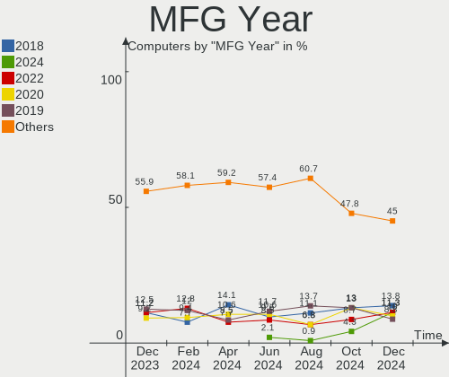
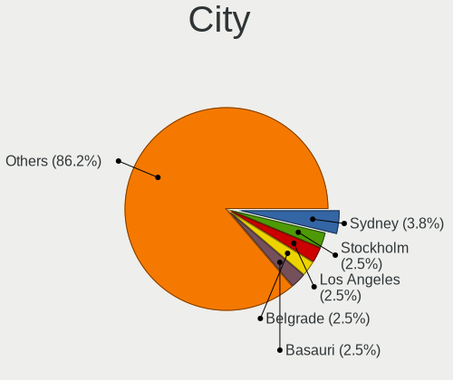
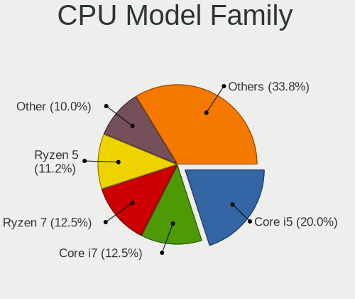
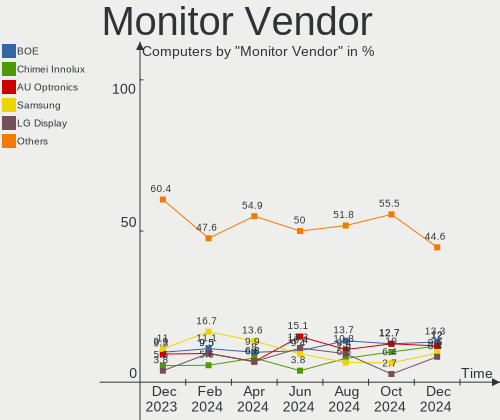
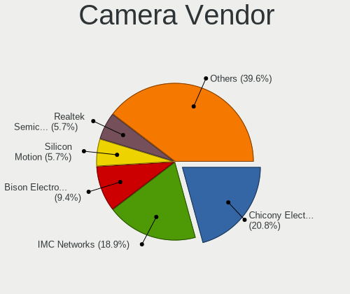

ArcoLinux - Hardware Trends
---------------------------

A project to identify most popular hardware characteristics and track their change
over time based on data collected by Linux users at https://Linux-Hardware.org.

Anyone can contribute to this report by the [hw-probe](https://github.com/linuxhw/hw-probe) tool:

    sudo -E hw-probe -all -upload

This is a report for all computer types. See also reports for [desktops](/Dist/ArcoLinux/Desktop/README.md) and [notebooks](/Dist/ArcoLinux/Notebook/README.md).

This report is for one last month. Overall report since the beginning of time: [TestDays](https://github.com/linuxhw/TestDays)

Period: Jan, 2024.

Contents
--------

* [ System ](#system)
  - [ OS                       ](#os)
  - [ OS Family                ](#os-family)
  - [ Kernel                   ](#kernel)
  - [ Kernel Family            ](#kernel-family)
  - [ Kernel Major Ver.        ](#kernel-major-ver)
  - [ Arch                     ](#arch)
  - [ DE                       ](#de)
  - [ Display Server           ](#display-server)
  - [ Display Manager          ](#display-manager)
  - [ OS Lang                  ](#os-lang)
  - [ Boot Mode                ](#boot-mode)
  - [ Filesystem               ](#filesystem)
  - [ Part. scheme             ](#part-scheme)
  - [ Dual Boot with Linux/BSD ](#dual-boot-with-linuxbsd)
  - [ Dual Boot (Win)          ](#dual-boot-win)

* [ Board ](#board)
  - [ Vendor                   ](#vendor)
  - [ Model                    ](#model)
  - [ Model Family             ](#model-family)
  - [ MFG Year                 ](#mfg-year)
  - [ Form Factor              ](#form-factor)
  - [ Secure Boot              ](#secure-boot)
  - [ Coreboot                 ](#coreboot)
  - [ RAM Size                 ](#ram-size)
  - [ RAM Used                 ](#ram-used)
  - [ Total Drives             ](#total-drives)
  - [ Has CD-ROM               ](#has-cd-rom)
  - [ Has Ethernet             ](#has-ethernet)
  - [ Has WiFi                 ](#has-wifi)
  - [ Has Bluetooth            ](#has-bluetooth)

* [ Location ](#location)
  - [ Country                  ](#country)
  - [ City                     ](#city)

* [ Drives ](#drives)
  - [ Drive Vendor             ](#drive-vendor)
  - [ Drive Model              ](#drive-model)
  - [ HDD Vendor               ](#hdd-vendor)
  - [ SSD Vendor               ](#ssd-vendor)
  - [ Drive Kind               ](#drive-kind)
  - [ Drive Connector          ](#drive-connector)
  - [ Drive Size               ](#drive-size)
  - [ Space Total              ](#space-total)
  - [ Space Used               ](#space-used)
  - [ Malfunc. Drives          ](#malfunc-drives)
  - [ Malfunc. Drive Vendor    ](#malfunc-drive-vendor)
  - [ Malfunc. HDD Vendor      ](#malfunc-hdd-vendor)
  - [ Malfunc. Drive Kind      ](#malfunc-drive-kind)
  - [ Failed Drives            ](#failed-drives)
  - [ Failed Drive Vendor      ](#failed-drive-vendor)
  - [ Drive Status             ](#drive-status)

* [ Storage controller ](#storage-controller)
  - [ Storage Vendor           ](#storage-vendor)
  - [ Storage Model            ](#storage-model)
  - [ Storage Kind             ](#storage-kind)

* [ Processor ](#processor)
  - [ CPU Vendor               ](#cpu-vendor)
  - [ CPU Model                ](#cpu-model)
  - [ CPU Model Family         ](#cpu-model-family)
  - [ CPU Cores                ](#cpu-cores)
  - [ CPU Sockets              ](#cpu-sockets)
  - [ CPU Threads              ](#cpu-threads)
  - [ CPU Op-Modes             ](#cpu-op-modes)
  - [ CPU Microcode            ](#cpu-microcode)
  - [ CPU Microarch            ](#cpu-microarch)

* [ Graphics ](#graphics)
  - [ GPU Vendor               ](#gpu-vendor)
  - [ GPU Model                ](#gpu-model)
  - [ GPU Combo                ](#gpu-combo)
  - [ GPU Driver               ](#gpu-driver)
  - [ GPU Memory               ](#gpu-memory)

* [ Monitor ](#monitor)
  - [ Monitor Vendor           ](#monitor-vendor)
  - [ Monitor Model            ](#monitor-model)
  - [ Monitor Resolution       ](#monitor-resolution)
  - [ Monitor Diagonal         ](#monitor-diagonal)
  - [ Monitor Width            ](#monitor-width)
  - [ Aspect Ratio             ](#aspect-ratio)
  - [ Monitor Area             ](#monitor-area)
  - [ Pixel Density            ](#pixel-density)
  - [ Multiple Monitors        ](#multiple-monitors)

* [ Network ](#network)
  - [ Net Controller Vendor    ](#net-controller-vendor)
  - [ Net Controller Model     ](#net-controller-model)
  - [ Wireless Vendor          ](#wireless-vendor)
  - [ Wireless Model           ](#wireless-model)
  - [ Ethernet Vendor          ](#ethernet-vendor)
  - [ Ethernet Model           ](#ethernet-model)
  - [ Net Controller Kind      ](#net-controller-kind)
  - [ Used Controller          ](#used-controller)
  - [ NICs                     ](#nics)
  - [ IPv6                     ](#ipv6)

* [ Bluetooth ](#bluetooth)
  - [ Bluetooth Vendor         ](#bluetooth-vendor)
  - [ Bluetooth Model          ](#bluetooth-model)

* [ Sound ](#sound)
  - [ Sound Vendor             ](#sound-vendor)
  - [ Sound Model              ](#sound-model)

* [ Memory ](#memory)
  - [ Memory Vendor            ](#memory-vendor)
  - [ Memory Model             ](#memory-model)
  - [ Memory Kind              ](#memory-kind)
  - [ Memory Form Factor       ](#memory-form-factor)
  - [ Memory Size              ](#memory-size)
  - [ Memory Speed             ](#memory-speed)

* [ Printers & scanners ](#printers--scanners)
  - [ Printer Vendor           ](#printer-vendor)
  - [ Printer Model            ](#printer-model)
  - [ Scanner Vendor           ](#scanner-vendor)
  - [ Scanner Model            ](#scanner-model)

* [ Camera ](#camera)
  - [ Camera Vendor            ](#camera-vendor)
  - [ Camera Model             ](#camera-model)

* [ Security ](#security)
  - [ Fingerprint Vendor       ](#fingerprint-vendor)
  - [ Fingerprint Model        ](#fingerprint-model)
  - [ Chipcard Vendor          ](#chipcard-vendor)
  - [ Chipcard Model           ](#chipcard-model)

* [ Unsupported ](#unsupported)
  - [ Unsupported Devices      ](#unsupported-devices)
  - [ Unsupported Device Types ](#unsupported-device-types)

System
------

OS
--

Installed operating systems

| Name              | Computers | Percent |
|-------------------|-----------|---------|
| ArcoLinux Rolling | 137       | 97.16%  |
| ArcoLinux         | 4         | 2.84%   |

OS Family
---------

OS without a version

| Name      | Computers | Percent |
|-----------|-----------|---------|
| ArcoLinux | 141       | 100%    |

Kernel
------

Version of the Linux kernel

| Version                     | Computers | Percent |
|-----------------------------|-----------|---------|
| 6.6.1-arch1-1               | 23        | 16.31%  |
| 6.6.8-arch1-1               | 18        | 12.77%  |
| 6.7.0-arch3-1               | 14        | 9.93%   |
| 6.6.9-arch1-1               | 11        | 7.8%    |
| 6.6.10-arch1-1              | 10        | 7.09%   |
| 6.7.1-arch1-1               | 7         | 4.96%   |
| 6.7.2-arch1-1               | 5         | 3.55%   |
| 6.7.0-zen3-1-zen            | 5         | 3.55%   |
| 6.6.8-zen1-1-zen            | 5         | 3.55%   |
| 6.6.10-zen1-1-zen           | 5         | 3.55%   |
| 6.6.9-zen1-1-zen            | 4         | 2.84%   |
| 6.6.14-1-lts                | 3         | 2.13%   |
| 6.5.8-arch1-1               | 3         | 2.13%   |
| 6.6.3-arch1-1               | 2         | 1.42%   |
| 6.6.12-1-lts                | 2         | 1.42%   |
| 6.6.11-1-lts                | 2         | 1.42%   |
| 6.5.9-arch2-1               | 2         | 1.42%   |
| 6.1.70-1-lts                | 2         | 1.42%   |
| 6.7.2-zen1-1-zen            | 1         | 0.71%   |
| 6.7.0-1-ck-generic-v3       | 1         | 0.71%   |
| 6.6.7-arch1-1               | 1         | 0.71%   |
| 6.6.5-x64v2-xanmod1-1       | 1         | 0.71%   |
| 6.6.4-arch1-1               | 1         | 0.71%   |
| 6.6.13-hardened1-1-hardened | 1         | 0.71%   |
| 6.6.13-1-lts                | 1         | 0.71%   |
| 6.6.11-hardened1-1-hardened | 1         | 0.71%   |
| 6.6.11-2-lts                | 1         | 0.71%   |
| 6.4.12-zen1-1-zen           | 1         | 0.71%   |
| 6.4.12-arch1-1              | 1         | 0.71%   |
| 6.4.11-arch1-1              | 1         | 0.71%   |
| 6.3.8-arch1-1               | 1         | 0.71%   |
| 6.1.66-x64v1-xanmod1-1-lts  | 1         | 0.71%   |
| 6.1.58-1-lts                | 1         | 0.71%   |
| 5.18.3-arch1-1              | 1         | 0.71%   |
| 5.15.10-arch1-1             | 1         | 0.71%   |
| 5.13.8-arch1-1              | 1         | 0.71%   |

Kernel Family
-------------

Linux kernel without a distro release

| Version | Computers | Percent |
|---------|-----------|---------|
| 6.6.8   | 23        | 16.31%  |
| 6.6.1   | 23        | 16.31%  |
| 6.7.0   | 20        | 14.18%  |
| 6.6.9   | 15        | 10.64%  |
| 6.6.10  | 15        | 10.64%  |
| 6.7.1   | 7         | 4.96%   |
| 6.7.2   | 6         | 4.26%   |
| 6.6.11  | 4         | 2.84%   |
| 6.6.14  | 3         | 2.13%   |
| 6.5.8   | 3         | 2.13%   |
| 6.6.3   | 2         | 1.42%   |
| 6.6.13  | 2         | 1.42%   |
| 6.6.12  | 2         | 1.42%   |
| 6.5.9   | 2         | 1.42%   |
| 6.4.12  | 2         | 1.42%   |
| 6.1.70  | 2         | 1.42%   |
| 6.6.7   | 1         | 0.71%   |
| 6.6.5   | 1         | 0.71%   |
| 6.6.4   | 1         | 0.71%   |
| 6.4.11  | 1         | 0.71%   |
| 6.3.8   | 1         | 0.71%   |
| 6.1.66  | 1         | 0.71%   |
| 6.1.58  | 1         | 0.71%   |
| 5.18.3  | 1         | 0.71%   |
| 5.15.10 | 1         | 0.71%   |
| 5.13.8  | 1         | 0.71%   |

Kernel Major Ver.
-----------------

Linux kernel major version

| Version | Computers | Percent |
|---------|-----------|---------|
| 6.6     | 92        | 65.25%  |
| 6.7     | 33        | 23.4%   |
| 6.5     | 5         | 3.55%   |
| 6.1     | 4         | 2.84%   |
| 6.4     | 3         | 2.13%   |
| 6.3     | 1         | 0.71%   |
| 5.18    | 1         | 0.71%   |
| 5.15    | 1         | 0.71%   |
| 5.13    | 1         | 0.71%   |

Arch
----

OS architecture (x86_64, i586, etc.)

| Name   | Computers | Percent |
|--------|-----------|---------|
| x86_64 | 141       | 100%    |

DE
--

Desktop Environment

| Name         | Computers | Percent |
|--------------|-----------|---------|
| XFCE         | 54        | 38.3%   |
| KDE5         | 31        | 21.99%  |
| GNOME        | 12        | 8.51%   |
| Cinnamon     | 8         | 5.67%   |
| Deepin       | 7         | 4.96%   |
| Hyprland     | 6         | 4.26%   |
| X-Cinnamon   | 3         | 2.13%   |
| wayfire      | 3         | 2.13%   |
| i3           | 3         | 2.13%   |
| Budgie       | 3         | 2.13%   |
| LXQt         | 2         | 1.42%   |
| herbstluftwm | 2         | 1.42%   |
| awesome      | 2         | 1.42%   |
| Unknown      | 2         | 1.42%   |
| qtile        | 1         | 0.71%   |
| MATE         | 1         | 0.71%   |
| LXDE         | 1         | 0.71%   |

Display Server
--------------

X11 or Wayland

| Name    | Computers | Percent |
|---------|-----------|---------|
| X11     | 120       | 85.11%  |
| Wayland | 17        | 12.06%  |
| Tty     | 3         | 2.13%   |
| Unknown | 1         | 0.71%   |

Display Manager
---------------

SDDM, LightDM, etc.

| Name    | Computers | Percent |
|---------|-----------|---------|
| SDDM    | 100       | 70.92%  |
| LightDM | 30        | 21.28%  |
| GDM     | 4         | 2.84%   |
| Unknown | 4         | 2.84%   |
| LXDM    | 2         | 1.42%   |
| Ly      | 1         | 0.71%   |

OS Lang
-------

Language

| Lang  | Computers | Percent |
|-------|-----------|---------|
| en_US | 73        | 51.77%  |
| de_DE | 10        | 7.09%   |
| C     | 10        | 7.09%   |
| ru_RU | 7         | 4.96%   |
| en_CA | 7         | 4.96%   |
| en_GB | 5         | 3.55%   |
| es_ES | 4         | 2.84%   |
| it_IT | 3         | 2.13%   |
| th_TH | 2         | 1.42%   |
| hu_HU | 2         | 1.42%   |
| es_MX | 2         | 1.42%   |
| es_AR | 2         | 1.42%   |
| en_ZA | 2         | 1.42%   |
| zh_CN | 1         | 0.71%   |
| pt_BR | 1         | 0.71%   |
| nl_NL | 1         | 0.71%   |
| ja_JP | 1         | 0.71%   |
| id_ID | 1         | 0.71%   |
| fr_FR | 1         | 0.71%   |
| en_SG | 1         | 0.71%   |
| en_IN | 1         | 0.71%   |
| en_HK | 1         | 0.71%   |
| en_AU | 1         | 0.71%   |
| de_AT | 1         | 0.71%   |
| cs_CZ | 1         | 0.71%   |

Boot Mode
---------

EFI or BIOS

| Mode | Computers | Percent |
|------|-----------|---------|
| EFI  | 105       | 74.47%  |
| BIOS | 36        | 25.53%  |

Filesystem
----------

Type of filesystem

| Type     | Computers | Percent |
|----------|-----------|---------|
| Ext4     | 84        | 59.57%  |
| Btrfs    | 42        | 29.79%  |
| Overlay  | 11        | 7.8%    |
| Xfs      | 1         | 0.71%   |
| Reiserfs | 1         | 0.71%   |
| Jfs      | 1         | 0.71%   |
| Unknown  | 1         | 0.71%   |

Part. scheme
------------

Scheme of partitioning

| Type    | Computers | Percent |
|---------|-----------|---------|
| GPT     | 112       | 79.43%  |
| MBR     | 25        | 17.73%  |
| Unknown | 4         | 2.84%   |

Dual Boot with Linux/BSD
------------------------

Hosting more than one Linux/BSD

| Dual boot | Computers | Percent |
|-----------|-----------|---------|
| No        | 98        | 69.5%   |
| Yes       | 43        | 30.5%   |

Dual Boot (Win)
---------------

Hosting Linux and Windows

| Dual boot | Computers | Percent |
|-----------|-----------|---------|
| No        | 73        | 51.77%  |
| Yes       | 68        | 48.23%  |

Board
-----

Vendor
------

Motherboard manufacturer

| Name                | Computers | Percent |
|---------------------|-----------|---------|
| Hewlett-Packard     | 22        | 15.6%   |
| ASUSTek Computer    | 22        | 15.6%   |
| Lenovo              | 21        | 14.89%  |
| Dell                | 19        | 13.48%  |
| MSI                 | 14        | 9.93%   |
| Gigabyte Technology | 8         | 5.67%   |
| Acer                | 7         | 4.96%   |
| ASRock              | 5         | 3.55%   |
| Apple               | 4         | 2.84%   |
| Intel               | 2         | 1.42%   |
| Toshiba             | 1         | 0.71%   |
| Supermicro          | 1         | 0.71%   |
| Samsung Electronics | 1         | 0.71%   |
| PC Specialist       | 1         | 0.71%   |
| NVN-ED01            | 1         | 0.71%   |
| NEC Computers       | 1         | 0.71%   |
| MouseComputer       | 1         | 0.71%   |
| Microsoft           | 1         | 0.71%   |
| INET                | 1         | 0.71%   |
| Fujitsu             | 1         | 0.71%   |
| ELUKTRONICS         | 1         | 0.71%   |
| Dynabook            | 1         | 0.71%   |
| Digitek             | 1         | 0.71%   |
| CompuLab            | 1         | 0.71%   |
| BESSTAR Tech        | 1         | 0.71%   |
| Alienware           | 1         | 0.71%   |
| Unknown             | 1         | 0.71%   |

Model
-----

Motherboard model

| Name                                           | Computers | Percent |
|------------------------------------------------|-----------|---------|
| Unknown                                        | 3         | 2.13%   |
| Dell Latitude 7490                             | 2         | 1.42%   |
| Toshiba Satellite L855                         | 1         | 0.71%   |
| Supermicro SYS-6018R-CMG367-HM005              | 1         | 0.71%   |
| Samsung 530U3BI/530U4BI/530U4BH                | 1         | 0.71%   |
| PC Specialist GK5NPFO                          | 1         | 0.71%   |
| NEC Computers PC-VK27MXZCG                     | 1         | 0.71%   |
| MSI MS-7E27                                    | 1         | 0.71%   |
| MSI MS-7D31                                    | 1         | 0.71%   |
| MSI MS-7D25                                    | 1         | 0.71%   |
| MSI MS-7C84                                    | 1         | 0.71%   |
| MSI MS-7C75                                    | 1         | 0.71%   |
| MSI MS-7C56                                    | 1         | 0.71%   |
| MSI MS-7C51                                    | 1         | 0.71%   |
| MSI MS-7C37                                    | 1         | 0.71%   |
| MSI MS-7B98                                    | 1         | 0.71%   |
| MSI MS-7A78                                    | 1         | 0.71%   |
| MSI MS-7A70                                    | 1         | 0.71%   |
| MSI MS-7984                                    | 1         | 0.71%   |
| MSI Cyborg 15 A13VE                            | 1         | 0.71%   |
| MSI Compaq dx2420 Microtower                   | 1         | 0.71%   |
| MouseComputer N150RF1                          | 1         | 0.71%   |
| Microsoft Surface Laptop Go                    | 1         | 0.71%   |
| Lenovo Yoga C740-14IML 81TC                    | 1         | 0.71%   |
| Lenovo ThinkPad X250 20CM004XUK                | 1         | 0.71%   |
| Lenovo ThinkPad X250 20CLS60800                | 1         | 0.71%   |
| Lenovo ThinkPad X1 Carbon 6th (PRC) 20KH002FUS | 1         | 0.71%   |
| Lenovo ThinkPad W540 20BHS0620V                | 1         | 0.71%   |
| Lenovo ThinkPad T520 4242RM9                   | 1         | 0.71%   |
| Lenovo ThinkPad T450s 20BWS0PJ00               | 1         | 0.71%   |
| Lenovo ThinkPad T430 2349IF8                   | 1         | 0.71%   |
| Lenovo ThinkPad T420 4236MBU                   | 1         | 0.71%   |
| Lenovo ThinkPad T420 4180PV4                   | 1         | 0.71%   |
| Lenovo ThinkPad T410 25184QG                   | 1         | 0.71%   |
| Lenovo ThinkPad T15p Gen 3 21DA000TRA          | 1         | 0.71%   |
| Lenovo ThinkPad T14 Gen 2i 20W1SB7J00          | 1         | 0.71%   |
| Lenovo ThinkCentre M910s 10MLS0WN00            | 1         | 0.71%   |
| Lenovo ThinkBook 15 G3 ACL 21A4                | 1         | 0.71%   |
| Lenovo MIIX 520-12IKB 20M3                     | 1         | 0.71%   |
| Lenovo Legion Y545 81Q6                        | 1         | 0.71%   |

Model Family
------------

Motherboard model prefix

| Name                              | Computers | Percent |
|-----------------------------------|-----------|---------|
| Lenovo ThinkPad                   | 12        | 8.51%   |
| Dell Inspiron                     | 7         | 4.96%   |
| HP Pavilion                       | 6         | 4.26%   |
| Dell Latitude                     | 6         | 4.26%   |
| Acer Aspire                       | 6         | 4.26%   |
| ASUS TUF                          | 5         | 3.55%   |
| Dell OptiPlex                     | 4         | 2.84%   |
| HP OMEN                           | 3         | 2.13%   |
| ASUS ROG                          | 3         | 2.13%   |
| ASUS PRIME                        | 3         | 2.13%   |
| Unknown                           | 3         | 2.13%   |
| Lenovo IdeaPad                    | 2         | 1.42%   |
| HP ProDesk                        | 2         | 1.42%   |
| HP EliteDesk                      | 2         | 1.42%   |
| ASUS VivoBook                     | 2         | 1.42%   |
| ASUS ASUS                         | 2         | 1.42%   |
| Toshiba Satellite                 | 1         | 0.71%   |
| Supermicro SYS-6018R-CMG367-HM005 | 1         | 0.71%   |
| Samsung 530U3BI                   | 1         | 0.71%   |
| PC Specialist GK5NPFO             | 1         | 0.71%   |
| NEC Computers PC-VK27MXZCG        | 1         | 0.71%   |
| MSI MS-7E27                       | 1         | 0.71%   |
| MSI MS-7D31                       | 1         | 0.71%   |
| MSI MS-7D25                       | 1         | 0.71%   |
| MSI MS-7C84                       | 1         | 0.71%   |
| MSI MS-7C75                       | 1         | 0.71%   |
| MSI MS-7C56                       | 1         | 0.71%   |
| MSI MS-7C51                       | 1         | 0.71%   |
| MSI MS-7C37                       | 1         | 0.71%   |
| MSI MS-7B98                       | 1         | 0.71%   |
| MSI MS-7A78                       | 1         | 0.71%   |
| MSI MS-7A70                       | 1         | 0.71%   |
| MSI MS-7984                       | 1         | 0.71%   |
| MSI Cyborg                        | 1         | 0.71%   |
| MSI Compaq                        | 1         | 0.71%   |
| MouseComputer N150RF1             | 1         | 0.71%   |
| Microsoft Surface                 | 1         | 0.71%   |
| Lenovo Yoga                       | 1         | 0.71%   |
| Lenovo ThinkCentre                | 1         | 0.71%   |
| Lenovo ThinkBook                  | 1         | 0.71%   |

MFG Year
--------

Motherboard manufacture year

| Year | Computers | Percent |
|------|-----------|---------|
| 2020 | 16        | 11.35%  |
| 2018 | 15        | 10.64%  |
| 2021 | 13        | 9.22%   |
| 2019 | 13        | 9.22%   |
| 2013 | 11        | 7.8%    |
| 2023 | 10        | 7.09%   |
| 2022 | 10        | 7.09%   |
| 2016 | 10        | 7.09%   |
| 2012 | 9         | 6.38%   |
| 2011 | 9         | 6.38%   |
| 2015 | 8         | 5.67%   |
| 2014 | 6         | 4.26%   |
| 2017 | 4         | 2.84%   |
| 2010 | 2         | 1.42%   |
| 2009 | 2         | 1.42%   |
| 2008 | 2         | 1.42%   |
| 2007 | 1         | 0.71%   |

Form Factor
-----------

Physical design of the computer

| Name        | Computers | Percent |
|-------------|-----------|---------|
| Notebook    | 75        | 53.19%  |
| Desktop     | 56        | 39.72%  |
| Mini pc     | 5         | 3.55%   |
| Convertible | 3         | 2.13%   |
| Tablet      | 2         | 1.42%   |

Secure Boot
-----------

Enabled or disabled

| State    | Computers | Percent |
|----------|-----------|---------|
| Disabled | 141       | 100%    |

Coreboot
--------

Have coreboot on board

| Used | Computers | Percent |
|------|-----------|---------|
| No   | 141       | 100%    |

RAM Size
--------

Total RAM memory

| Size in GB  | Computers | Percent |
|-------------|-----------|---------|
| 16.01-24.0  | 36        | 25.53%  |
| 4.01-8.0    | 34        | 24.11%  |
| 32.01-64.0  | 28        | 19.86%  |
| 8.01-16.0   | 16        | 11.35%  |
| 3.01-4.0    | 15        | 10.64%  |
| 64.01-256.0 | 8         | 5.67%   |
| 24.01-32.0  | 3         | 2.13%   |
| 2.01-3.0    | 1         | 0.71%   |

RAM Used
--------

Used RAM memory

| Used GB   | Computers | Percent |
|-----------|-----------|---------|
| 1.01-2.0  | 56        | 39.72%  |
| 2.01-3.0  | 28        | 19.86%  |
| 4.01-8.0  | 26        | 18.44%  |
| 3.01-4.0  | 19        | 13.48%  |
| 0.51-1.0  | 7         | 4.96%   |
| 8.01-16.0 | 5         | 3.55%   |

Total Drives
------------

Number of drives on board

| Drives | Computers | Percent |
|--------|-----------|---------|
| 1      | 62        | 43.97%  |
| 2      | 43        | 30.5%   |
| 3      | 22        | 15.6%   |
| 4      | 5         | 3.55%   |
| 5      | 4         | 2.84%   |
| 8      | 2         | 1.42%   |
| 6      | 2         | 1.42%   |
| 0      | 1         | 0.71%   |

Has CD-ROM
----------

Has CD-ROM on board

| Presented | Computers | Percent |
|-----------|-----------|---------|
| No        | 107       | 75.89%  |
| Yes       | 34        | 24.11%  |

Has Ethernet
------------

Has Ethernet on board

| Presented | Computers | Percent |
|-----------|-----------|---------|
| Yes       | 127       | 90.07%  |
| No        | 14        | 9.93%   |

Has WiFi
--------

Has WiFi module

| Presented | Computers | Percent |
|-----------|-----------|---------|
| Yes       | 116       | 82.27%  |
| No        | 25        | 17.73%  |

Has Bluetooth
-------------

Has Bluetooth module

| Presented | Computers | Percent |
|-----------|-----------|---------|
| Yes       | 103       | 73.05%  |
| No        | 38        | 26.95%  |

Location
--------

Country
-------

Geographic location (country)

| Country      | Computers | Percent |
|--------------|-----------|---------|
| USA          | 36        | 25.53%  |
| Germany      | 12        | 8.51%   |
| Russia       | 9         | 6.38%   |
| Canada       | 8         | 5.67%   |
| UK           | 6         | 4.26%   |
| Spain        | 5         | 3.55%   |
| Belgium      | 4         | 2.84%   |
| Romania      | 3         | 2.13%   |
| Mexico       | 3         | 2.13%   |
| Malaysia     | 3         | 2.13%   |
| Italy        | 3         | 2.13%   |
| Egypt        | 3         | 2.13%   |
| Brazil       | 3         | 2.13%   |
| Thailand     | 2         | 1.42%   |
| South Africa | 2         | 1.42%   |
| Portugal     | 2         | 1.42%   |
| Indonesia    | 2         | 1.42%   |
| India        | 2         | 1.42%   |
| Hungary      | 2         | 1.42%   |
| France       | 2         | 1.42%   |
| Argentina    | 2         | 1.42%   |
| Vietnam      | 1         | 0.71%   |
| South Korea  | 1         | 0.71%   |
| Serbia       | 1         | 0.71%   |
| Qatar        | 1         | 0.71%   |
| Puerto Rico  | 1         | 0.71%   |
| Poland       | 1         | 0.71%   |
| Netherlands  | 1         | 0.71%   |
| Moldova      | 1         | 0.71%   |
| Lithuania    | 1         | 0.71%   |
| Lebanon      | 1         | 0.71%   |
| Japan        | 1         | 0.71%   |
| Israel       | 1         | 0.71%   |
| Ireland      | 1         | 0.71%   |
| Iraq         | 1         | 0.71%   |
| Hong Kong    | 1         | 0.71%   |
| Greece       | 1         | 0.71%   |
| Georgia      | 1         | 0.71%   |
| Finland      | 1         | 0.71%   |
| El Salvador  | 1         | 0.71%   |

City
----

Geographic location (city)

| City               | Computers | Percent |
|--------------------|-----------|---------|
| Munich             | 3         | 2.13%   |
| Moscow             | 3         | 2.13%   |
| Kalamazoo          | 3         | 2.13%   |
| Winnipeg           | 2         | 1.42%   |
| Seremban           | 2         | 1.42%   |
| San Juan           | 2         | 1.42%   |
| Richmond           | 2         | 1.42%   |
| Dallas             | 2         | 1.42%   |
| Barcelona          | 2         | 1.42%   |
| Bangkok            | 2         | 1.42%   |
| Atlanta            | 2         | 1.42%   |
| Zapopan            | 1         | 0.71%   |
| Yulee              | 1         | 0.71%   |
| Youngstown         | 1         | 0.71%   |
| Wuppertal          | 1         | 0.71%   |
| Worthing           | 1         | 0.71%   |
| Wichita            | 1         | 0.71%   |
| West Chester       | 1         | 0.71%   |
| Walker             | 1         | 0.71%   |
| Voronezh           | 1         | 0.71%   |
| Volgograd          | 1         | 0.71%   |
| Vilnius            | 1         | 0.71%   |
| Vernon             | 1         | 0.71%   |
| Tsuen Wan          | 1         | 0.71%   |
| Toronto            | 1         | 0.71%   |
| Tilton             | 1         | 0.71%   |
| Terni              | 1         | 0.71%   |
| Temple             | 1         | 0.71%   |
| Tel Aviv           | 1         | 0.71%   |
| Tbilisi            | 1         | 0.71%   |
| Tazewell           | 1         | 0.71%   |
| Tampa              | 1         | 0.71%   |
| Sungai Petani      | 1         | 0.71%   |
| Smithtown          | 1         | 0.71%   |
| Sighetu Marmaţiei | 1         | 0.71%   |
| Semlin             | 1         | 0.71%   |
| San José          | 1         | 0.71%   |
| San Francisco      | 1         | 0.71%   |
| Samara             | 1         | 0.71%   |
| Salzburg           | 1         | 0.71%   |

Drives
------

Drive Vendor
------------

Hard drive vendors

| Vendor                       | Computers | Drives | Percent |
|------------------------------|-----------|--------|---------|
| Samsung Electronics          | 39        | 49     | 15.29%  |
| Seagate                      | 33        | 39     | 12.94%  |
| WDC                          | 31        | 34     | 12.16%  |
| Kingston                     | 20        | 21     | 7.84%   |
| Sandisk                      | 19        | 19     | 7.45%   |
| Toshiba                      | 16        | 17     | 6.27%   |
| Phison Electronics           | 11        | 13     | 4.31%   |
| Intel                        | 9         | 11     | 3.53%   |
| MAXIO Technology (Hangzhou)  | 5         | 5      | 1.96%   |
| SK hynix                     | 4         | 4      | 1.57%   |
| Micron/Crucial Technology    | 4         | 5      | 1.57%   |
| Micron Technology            | 4         | 4      | 1.57%   |
| HGST                         | 4         | 4      | 1.57%   |
| Crucial                      | 4         | 6      | 1.57%   |
| Hitachi                      | 3         | 3      | 1.18%   |
| China                        | 3         | 3      | 1.18%   |
| Silicon Motion               | 2         | 2      | 0.78%   |
| Shenzhen Longsys Electronics | 2         | 2      | 0.78%   |
| KingSpec                     | 2         | 2      | 0.78%   |
| Apple                        | 2         | 2      | 0.78%   |
| USB3.0                       | 1         | 1      | 0.39%   |
| Unknown                      | 1         | 1      | 0.39%   |
| Team                         | 1         | 1      | 0.39%   |
| TDAS                         | 1         | 4      | 0.39%   |
| SUNEAST                      | 1         | 1      | 0.39%   |
| StarTech                     | 1         | 1      | 0.39%   |
| SSK                          | 1         | 1      | 0.39%   |
| SPCC                         | 1         | 1      | 0.39%   |
| ShiJi                        | 1         | 1      | 0.39%   |
| Seagate Technology           | 1         | 1      | 0.39%   |
| SABRENT                      | 1         | 1      | 0.39%   |
| Rogueware                    | 1         | 1      | 0.39%   |
| Plextor                      | 1         | 1      | 0.39%   |
| Phison                       | 1         | 1      | 0.39%   |
| OWC                          | 1         | 1      | 0.39%   |
| OCZ                          | 1         | 1      | 0.39%   |
| Netac                        | 1         | 1      | 0.39%   |
| Min Yi U                     | 1         | 1      | 0.39%   |
| Mercury                      | 1         | 1      | 0.39%   |
| LITEON                       | 1         | 1      | 0.39%   |

Drive Model
-----------

Hard drive models

| Model                                                 | Computers | Percent |
|-------------------------------------------------------|-----------|---------|
| Samsung NVMe SSD Controller SM981/PM981/PM983 1TB     | 9         | 3.19%   |
| Phison E12 NVMe Controller 1TB                        | 6         | 2.13%   |
| Seagate ST1000LM035-1RK172 1TB                        | 5         | 1.77%   |
| Samsung SSD 870 EVO 1TB                               | 4         | 1.42%   |
| Samsung SSD 850 EVO 120GB                             | 4         | 1.42%   |
| Samsung NVMe SSD Controller PM9A1/PM9A3/980PRO 2TB    | 4         | 1.42%   |
| Kingston SA400S37480G 480GB SSD                       | 4         | 1.42%   |
| Kingston SA400S37240G 240GB SSD                       | 4         | 1.42%   |
| Seagate ST1000LM024 HN-M101MBB 1TB                    | 3         | 1.06%   |
| Sandisk WD Blue SN550 NVMe SSD 512GB                  | 3         | 1.06%   |
| Samsung SSD 860 EVO 1TB                               | 3         | 1.06%   |
| Samsung NVMe SSD Controller SM961/PM961/SM963 256GB   | 3         | 1.06%   |
| Phison PS5013 E13 NVMe Controller 256GB               | 3         | 1.06%   |
| Phison E16 PCIe4 NVMe Controller 2TB                  | 3         | 1.06%   |
| MAXIO (Hangzhou) NVMe SSD Controller MAP1202 512GB    | 3         | 1.06%   |
| WDC WDS240G2G0A-00JH30 240GB SSD                      | 2         | 0.71%   |
| WDC WDS120G2G0A-00JH30 120GB SSD                      | 2         | 0.71%   |
| WDC WD10EZEX-22MFCA0 1TB                              | 2         | 0.71%   |
| Toshiba XG6 NVMe SSD Controller 256GB                 | 2         | 0.71%   |
| Toshiba HDWD110 1TB                                   | 2         | 0.71%   |
| Toshiba DT01ACA200 2TB                                | 2         | 0.71%   |
| SK hynix BC501 NVMe Solid State Drive 512GB           | 2         | 0.71%   |
| Silicon Motion SM2263EN/SM2263XT SSD Controller 128GB | 2         | 0.71%   |
| Seagate ST6000DM003-2CY186 6TB                        | 2         | 0.71%   |
| Seagate ST2000LM003 HN-M201RAD 2TB                    | 2         | 0.71%   |
| Seagate ST1000LM049-2GH172 1TB                        | 2         | 0.71%   |
| Seagate ST1000DM010-2EP102 1TB                        | 2         | 0.71%   |
| Sandisk WD Black SN750 / PC SN730 NVMe SSD 512GB      | 2         | 0.71%   |
| Sandisk WD Black 2018/SN750 / PC SN720 NVMe SSD 1TB   | 2         | 0.71%   |
| SanDisk SSD PLUS 120GB                                | 2         | 0.71%   |
| SanDisk SSD PLUS 1000GB                               | 2         | 0.71%   |
| Samsung MZALQ512HBLU-00BL2 512GB                      | 2         | 0.71%   |
| Micron/Crucial P2 NVMe PCIe SSD 1TB                   | 2         | 0.71%   |
| Micron/Crucial P1 NVMe PCIe SSD 1TB                   | 2         | 0.71%   |
| Kingston SNVS1000G 1TB                                | 2         | 0.71%   |
| Kingston SMS200S330G 32GB SSD                         | 2         | 0.71%   |
| Kingston SFYRS1000G 1TB                               | 2         | 0.71%   |
| Intel SSD 660P Series 1024GB                          | 2         | 0.71%   |
| HGST HTS541010A9E680 1TB                              | 2         | 0.71%   |
| Crucial CT275MX300SSD1 275GB                          | 2         | 0.71%   |

HDD Vendor
----------

Hard disk drive vendors

| Vendor   | Computers | Drives | Percent |
|----------|-----------|--------|---------|
| Seagate  | 33        | 38     | 37.93%  |
| WDC      | 26        | 27     | 29.89%  |
| Toshiba  | 12        | 13     | 13.79%  |
| HGST     | 4         | 4      | 4.6%    |
| Hitachi  | 3         | 3      | 3.45%   |
| USB3.0   | 1         | 1      | 1.15%   |
| Unknown  | 1         | 1      | 1.15%   |
| TDAS     | 1         | 4      | 1.15%   |
| Min Yi U | 1         | 1      | 1.15%   |
| Mercury  | 1         | 1      | 1.15%   |
| Inateck  | 1         | 1      | 1.15%   |
| Fujitsu  | 1         | 1      | 1.15%   |
| CSD      | 1         | 1      | 1.15%   |
| Apple    | 1         | 1      | 1.15%   |

SSD Vendor
----------

Solid state drive vendors

| Vendor              | Computers | Drives | Percent |
|---------------------|-----------|--------|---------|
| Samsung Electronics | 25        | 26     | 29.07%  |
| Kingston            | 13        | 14     | 15.12%  |
| WDC                 | 6         | 7      | 6.98%   |
| SanDisk             | 6         | 6      | 6.98%   |
| Crucial             | 4         | 6      | 4.65%   |
| Intel               | 3         | 3      | 3.49%   |
| China               | 3         | 3      | 3.49%   |
| KingSpec            | 2         | 2      | 2.33%   |
| Toshiba             | 1         | 1      | 1.16%   |
| Team                | 1         | 1      | 1.16%   |
| SUNEAST             | 1         | 1      | 1.16%   |
| SPCC                | 1         | 1      | 1.16%   |
| ShiJi               | 1         | 1      | 1.16%   |
| Seagate             | 1         | 1      | 1.16%   |
| SABRENT             | 1         | 1      | 1.16%   |
| Rogueware           | 1         | 1      | 1.16%   |
| Plextor             | 1         | 1      | 1.16%   |
| Phison              | 1         | 1      | 1.16%   |
| OCZ                 | 1         | 1      | 1.16%   |
| Netac               | 1         | 1      | 1.16%   |
| LITEON              | 1         | 1      | 1.16%   |
| Kingmax             | 1         | 1      | 1.16%   |
| KingFast            | 1         | 1      | 1.16%   |
| GOODRAM             | 1         | 1      | 1.16%   |
| FIKWOT              | 1         | 1      | 1.16%   |
| Fanxiang            | 1         | 1      | 1.16%   |
| EYOTA               | 1         | 1      | 1.16%   |
| Corsair             | 1         | 1      | 1.16%   |
| Colorful            | 1         | 1      | 1.16%   |
| Biostar             | 1         | 1      | 1.16%   |
| Apple               | 1         | 1      | 1.16%   |
| A-DATA Technology   | 1         | 1      | 1.16%   |

Drive Kind
----------

HDD or SSD

| Kind    | Computers | Drives | Percent |
|---------|-----------|--------|---------|
| HDD     | 73        | 97     | 34.43%  |
| NVMe    | 71        | 95     | 33.49%  |
| SSD     | 65        | 91     | 30.66%  |
| Unknown | 3         | 3      | 1.42%   |

Drive Connector
---------------

SATA, SAS, NVMe, etc.

| Type | Computers | Drives | Percent |
|------|-----------|--------|---------|
| SATA | 108       | 173    | 55.96%  |
| NVMe | 70        | 93     | 36.27%  |
| SAS  | 15        | 20     | 7.77%   |

Drive Size
----------

Size of hard drive

| Size in TB | Computers | Drives | Percent |
|------------|-----------|--------|---------|
| 0.01-0.5   | 63        | 91     | 43.75%  |
| 0.51-1.0   | 59        | 72     | 40.97%  |
| 1.01-2.0   | 14        | 15     | 9.72%   |
| 4.01-10.0  | 4         | 4      | 2.78%   |
| 3.01-4.0   | 3         | 5      | 2.08%   |
| 2.01-3.0   | 1         | 1      | 0.69%   |

Space Total
-----------

Amount of disk space available on the file system

| Size in GB     | Computers | Percent |
|----------------|-----------|---------|
| 251-500        | 27        | 19.15%  |
| 101-250        | 27        | 19.15%  |
| More than 3000 | 22        | 15.6%   |
| 501-1000       | 21        | 14.89%  |
| 1001-2000      | 18        | 12.77%  |
| 1-20           | 8         | 5.67%   |
| 2001-3000      | 6         | 4.26%   |
| 51-100         | 5         | 3.55%   |
| Unknown        | 5         | 3.55%   |
| 21-50          | 2         | 1.42%   |

Space Used
----------

Amount of used disk space

| Used GB        | Computers | Percent |
|----------------|-----------|---------|
| 1-20           | 40        | 28.37%  |
| 101-250        | 28        | 19.86%  |
| 21-50          | 24        | 17.02%  |
| 51-100         | 15        | 10.64%  |
| 251-500        | 10        | 7.09%   |
| 501-1000       | 8         | 5.67%   |
| More than 3000 | 5         | 3.55%   |
| 1001-2000      | 5         | 3.55%   |
| Unknown        | 5         | 3.55%   |
| 2001-3000      | 1         | 0.71%   |

Malfunc. Drives
---------------

Drive models with a malfunction

| Model                                                         | Computers | Drives | Percent |
|---------------------------------------------------------------|-----------|--------|---------|
| SanDisk SSD PLUS 120GB                                        | 2         | 2      | 4.76%   |
| SanDisk SSD PLUS 1000GB                                       | 2         | 2      | 4.76%   |
| Samsung Electronics SSD 870 EVO 1TB                           | 2         | 2      | 4.76%   |
| WDC WDS500G2B0A-00SM50 500GB SSD                              | 1         | 1      | 2.38%   |
| WDC WDS240G2G0A-00JH30 240GB SSD                              | 1         | 1      | 2.38%   |
| WDC WD7500AARS-00Y5B1 752GB                                   | 1         | 1      | 2.38%   |
| WDC WD5000LPCX-60VHAT0 500GB                                  | 1         | 1      | 2.38%   |
| WDC WD5000AAKX-083CA1 500GB                                   | 1         | 1      | 2.38%   |
| WDC WD3200BPVT-22JJ5T0 320GB                                  | 1         | 1      | 2.38%   |
| WDC WD3200BEVT-08A23T1 320GB                                  | 1         | 1      | 2.38%   |
| WDC WD2002FAEX-007BA0 2TB                                     | 1         | 1      | 2.38%   |
| WDC WD10SPCX-22HWST0 1TB                                      | 1         | 1      | 2.38%   |
| Toshiba THNSNK256GVN8 M.2 2280 256GB SSD                      | 1         | 1      | 2.38%   |
| Toshiba MQ01ABD100 1TB                                        | 1         | 1      | 2.38%   |
| Toshiba MK6475GSX 640GB                                       | 1         | 1      | 2.38%   |
| Seagate ST380815AS 80GB                                       | 1         | 1      | 2.38%   |
| Seagate ST3500418AS 500GB                                     | 1         | 1      | 2.38%   |
| Seagate ST3500412AS 500GB                                     | 1         | 1      | 2.38%   |
| Seagate ST2000LM003 HN-M201RAD 2TB                            | 1         | 1      | 2.38%   |
| Seagate ST1000LM049-2GH172 1TB                                | 1         | 1      | 2.38%   |
| Seagate ST1000LM035-1RK172 1TB                                | 1         | 1      | 2.38%   |
| Seagate ST1000LM024 HN-M101MBB 1TB                            | 1         | 1      | 2.38%   |
| Seagate ST1000DX001-1CM162 1TB                                | 1         | 1      | 2.38%   |
| Seagate ST1000DM003-1CH162 1TB                                | 1         | 1      | 2.38%   |
| SanDisk SSD PLUS 480GB                                        | 1         | 1      | 2.38%   |
| Samsung Electronics NVMe SSD Controller SM981/PM981/PM983 1TB | 1         | 1      | 2.38%   |
| Kingston SMS200S330G 32GB SSD                                 | 1         | 1      | 2.38%   |
| Intel SSDSC2BF360A5L 360GB                                    | 1         | 1      | 2.38%   |
| Intel SSDSC2BF180A4L 180GB                                    | 1         | 1      | 2.38%   |
| Inateck ASM225CM 4TB                                          | 1         | 1      | 2.38%   |
| HGST HTS725032A7E630 320GB                                    | 1         | 1      | 2.38%   |
| HGST HTS541010A9E680 1TB                                      | 1         | 1      | 2.38%   |
| Fujitsu MHZ2160BH G2 160GB                                    | 1         | 1      | 2.38%   |
| CSD CAA500S 500GB                                             | 1         | 1      | 2.38%   |
| Crucial CT275MX300SSD1 275GB                                  | 1         | 1      | 2.38%   |
| Crucial CT240BX200SSD1 240GB                                  | 1         | 1      | 2.38%   |
| Corsair Performance3 SSD 128GB                                | 1         | 1      | 2.38%   |
| Colorful SL500 240GB SSD                                      | 1         | 1      | 2.38%   |
| Apple HDD HTS541010A9E662 1TB                                 | 1         | 1      | 2.38%   |

Malfunc. Drive Vendor
---------------------

Vendors of faulty drives

| Vendor              | Computers | Drives | Percent |
|---------------------|-----------|--------|---------|
| WDC                 | 9         | 9      | 21.95%  |
| Seagate             | 8         | 9      | 19.51%  |
| SanDisk             | 5         | 5      | 12.2%   |
| Toshiba             | 3         | 3      | 7.32%   |
| Samsung Electronics | 3         | 3      | 7.32%   |
| Intel               | 2         | 2      | 4.88%   |
| HGST                | 2         | 2      | 4.88%   |
| Crucial             | 2         | 2      | 4.88%   |
| Kingston            | 1         | 1      | 2.44%   |
| Inateck             | 1         | 1      | 2.44%   |
| Fujitsu             | 1         | 1      | 2.44%   |
| CSD                 | 1         | 1      | 2.44%   |
| Corsair             | 1         | 1      | 2.44%   |
| Colorful            | 1         | 1      | 2.44%   |
| Apple               | 1         | 1      | 2.44%   |

Malfunc. HDD Vendor
-------------------

Vendors of faulty HDD drives

| Vendor  | Computers | Drives | Percent |
|---------|-----------|--------|---------|
| Seagate | 8         | 9      | 34.78%  |
| WDC     | 7         | 7      | 30.43%  |
| Toshiba | 2         | 2      | 8.7%    |
| HGST    | 2         | 2      | 8.7%    |
| Inateck | 1         | 1      | 4.35%   |
| Fujitsu | 1         | 1      | 4.35%   |
| CSD     | 1         | 1      | 4.35%   |
| Apple   | 1         | 1      | 4.35%   |

Malfunc. Drive Kind
-------------------

Kinds of faulty drives

| Kind | Computers | Drives | Percent |
|------|-----------|--------|---------|
| HDD  | 22        | 24     | 55%     |
| SSD  | 17        | 17     | 42.5%   |
| NVMe | 1         | 1      | 2.5%    |

Failed Drives
-------------

Failed drive models

| Model                                 | Computers | Drives | Percent |
|---------------------------------------|-----------|--------|---------|
| Toshiba XG6 NVMe SSD Controller 256GB | 1         | 1      | 25%     |
| Seagate ST91000430AS 1TB              | 1         | 1      | 25%     |
| Seagate ST3500410AS 500GB             | 1         | 1      | 25%     |
| Seagate ST31500341AS 1TB              | 1         | 1      | 25%     |

Failed Drive Vendor
-------------------

Failed drive vendors

| Vendor  | Computers | Drives | Percent |
|---------|-----------|--------|---------|
| Seagate | 2         | 3      | 66.67%  |
| Toshiba | 1         | 1      | 33.33%  |

Drive Status
------------

Number of failed and malfunc. drives

| Status   | Computers | Drives | Percent |
|----------|-----------|--------|---------|
| Works    | 119       | 213    | 68.39%  |
| Malfunc  | 36        | 42     | 20.69%  |
| Detected | 16        | 27     | 9.2%    |
| Failed   | 3         | 4      | 1.72%   |

Storage controller
------------------

Storage Vendor
--------------

Storage controller vendors

| Vendor                       | Computers | Percent |
|------------------------------|-----------|---------|
| Intel                        | 100       | 46.73%  |
| AMD                          | 30        | 14.02%  |
| Samsung Electronics          | 21        | 9.81%   |
| SanDisk                      | 13        | 6.07%   |
| Phison Electronics           | 10        | 4.67%   |
| Kingston Technology Company  | 8         | 3.74%   |
| MAXIO Technology (Hangzhou)  | 5         | 2.34%   |
| ASMedia Technology           | 5         | 2.34%   |
| SK hynix                     | 4         | 1.87%   |
| Micron/Crucial Technology    | 4         | 1.87%   |
| Micron Technology            | 4         | 1.87%   |
| Toshiba America Info Systems | 3         | 1.4%    |
| Silicon Motion               | 2         | 0.93%   |
| Shenzhen Longsys Electronics | 1         | 0.47%   |
| Seagate Technology           | 1         | 0.47%   |
| Nvidia                       | 1         | 0.47%   |
| KIOXIA                       | 1         | 0.47%   |
| ADATA Technology             | 1         | 0.47%   |

Storage Model
-------------

Storage controller models

| Model                                                                          | Computers | Percent |
|--------------------------------------------------------------------------------|-----------|---------|
| AMD FCH SATA Controller [AHCI mode]                                            | 18        | 7.83%   |
| Intel 8 Series/C220 Series Chipset Family 6-port SATA Controller 1 [AHCI mode] | 11        | 4.78%   |
| Samsung NVMe SSD Controller SM981/PM981/PM983                                  | 9         | 3.91%   |
| Intel 7 Series Chipset Family 6-port SATA Controller [AHCI mode]               | 8         | 3.48%   |
| Intel Sunrise Point-LP SATA Controller [AHCI mode]                             | 7         | 3.04%   |
| Intel 82801 Mobile SATA Controller [RAID mode]                                 | 7         | 3.04%   |
| Intel 6 Series/C200 Series Chipset Family 6 port Mobile SATA AHCI Controller   | 7         | 3.04%   |
| Intel 200 Series PCH SATA controller [AHCI mode]                               | 6         | 2.61%   |
| AMD 500 Series Chipset SATA Controller                                         | 6         | 2.61%   |
| Phison E12 NVMe Controller                                                     | 5         | 2.17%   |
| Intel Cannon Lake PCH SATA AHCI Controller                                     | 5         | 2.17%   |
| ASMedia ASM1061/ASM1062 Serial ATA Controller                                  | 5         | 2.17%   |
| Samsung NVMe SSD Controller PM9A1/PM9A3/980PRO                                 | 4         | 1.74%   |
| Samsung NVMe SSD Controller 980 (DRAM-less)                                    | 4         | 1.74%   |
| Intel SATA Controller [RAID mode]                                              | 4         | 1.74%   |
| Intel Q170/Q150/B150/H170/H110/Z170/CM236 Chipset SATA Controller [AHCI Mode]  | 4         | 1.74%   |
| SanDisk Ultra 3D / WD Blue SN550 NVMe SSD                                      | 3         | 1.3%    |
| Samsung NVMe SSD Controller SM961/PM961/SM963                                  | 3         | 1.3%    |
| Phison PS5013-E13 PCIe3 NVMe Controller (DRAM-less)                            | 3         | 1.3%    |
| MAXIO (Hangzhou) NVMe SSD Controller MAP1202 (DRAM-less)                       | 3         | 1.3%    |
| Kingston Company NV1 NVMe SSD SM2263XT (DRAM-less)                             | 3         | 1.3%    |
| Intel Wildcat Point-LP SATA Controller [AHCI Mode]                             | 3         | 1.3%    |
| Intel Volume Management Device NVMe RAID Controller                            | 3         | 1.3%    |
| Intel Comet Lake SATA AHCI Controller                                          | 3         | 1.3%    |
| Intel Cannon Lake Mobile PCH SATA AHCI Controller                              | 3         | 1.3%    |
| Intel Alder Lake-S PCH SATA Controller [AHCI Mode]                             | 3         | 1.3%    |
| AMD 400 Series Chipset SATA Controller                                         | 3         | 1.3%    |
| Toshiba America Info Systems XG6 NVMe SSD Controller                           | 2         | 0.87%   |
| SK hynix BC501 NVMe Solid State Drive                                          | 2         | 0.87%   |
| Silicon Motion SM2263EN/SM2263XT (DRAM-less) NVMe SSD Controllers              | 2         | 0.87%   |
| SanDisk IX SN530 NVMe SSD (DRAM-less)                                          | 2         | 0.87%   |
| SanDisk Extreme Pro / WD Black SN750 / PC SN730 / Red SN700 NVMe SSD           | 2         | 0.87%   |
| SanDisk Extreme Pro / WD Black 2018/SN750/PC SN720 NVMe SSD                    | 2         | 0.87%   |
| Samsung NVMe SSD Controller S4LV008[Pascal]                                    | 2         | 0.87%   |
| Phison E16 PCIe4 NVMe Controller                                               | 2         | 0.87%   |
| Micron/Crucial P2 [Nick P2] / P3 / P3 Plus NVMe PCIe SSD (DRAM-less)           | 2         | 0.87%   |
| Micron/Crucial P1 NVMe PCIe SSD[Frampton]                                      | 2         | 0.87%   |
| MAXIO (Hangzhou) NVMe SSD Controller MAP1602 (DRAM-less)                       | 2         | 0.87%   |
| Kingston Company NV2 NVMe SSD SM2267XT (DRAM-less)                             | 2         | 0.87%   |
| Kingston Company KC3000/FURY Renegade NVMe SSD E18                             | 2         | 0.87%   |

Storage Kind
------------

Kind of storage controller (IDE, SATA, NVMe, SAS, ...)

| Kind | Computers | Percent |
|------|-----------|---------|
| SATA | 112       | 56%     |
| NVMe | 69        | 34.5%   |
| RAID | 15        | 7.5%    |
| IDE  | 4         | 2%      |

Processor
---------

CPU Vendor
----------

Processor vendors

| Vendor | Computers | Percent |
|--------|-----------|---------|
| Intel  | 107       | 75.89%  |
| AMD    | 34        | 24.11%  |

CPU Model
---------

Processor models

| Model                                       | Computers | Percent |
|---------------------------------------------|-----------|---------|
| AMD Ryzen 7 5700G with Radeon Graphics      | 4         | 2.84%   |
| Intel Core i7-6700 CPU @ 3.40GHz            | 3         | 2.13%   |
| Intel Core i5-2520M CPU @ 2.50GHz           | 3         | 2.13%   |
| Intel 12th Gen Core i5-12600K               | 3         | 2.13%   |
| Intel Core i7-9750H CPU @ 2.60GHz           | 2         | 1.42%   |
| Intel Core i7-8750H CPU @ 2.20GHz           | 2         | 1.42%   |
| Intel Core i7-8650U CPU @ 1.90GHz           | 2         | 1.42%   |
| Intel Core i7-7700K CPU @ 4.20GHz           | 2         | 1.42%   |
| Intel Core i7-6700HQ CPU @ 2.60GHz          | 2         | 1.42%   |
| Intel Core i7-6500U CPU @ 2.50GHz           | 2         | 1.42%   |
| Intel Core i7-4702MQ CPU @ 2.20GHz          | 2         | 1.42%   |
| Intel Core i7-10510U CPU @ 1.80GHz          | 2         | 1.42%   |
| Intel Core i5-6500 CPU @ 3.20GHz            | 2         | 1.42%   |
| Intel Core i5-5300U CPU @ 2.30GHz           | 2         | 1.42%   |
| Intel Core i5-1035G1 CPU @ 1.00GHz          | 2         | 1.42%   |
| Intel Core i3-4160 CPU @ 3.60GHz            | 2         | 1.42%   |
| Intel 12th Gen Core i7-12700H               | 2         | 1.42%   |
| Intel 11th Gen Core i7-1185G7 @ 3.00GHz     | 2         | 1.42%   |
| Intel 11th Gen Core i5-1135G7 @ 2.40GHz     | 2         | 1.42%   |
| AMD Ryzen 7 5800X 8-Core Processor          | 2         | 1.42%   |
| AMD Ryzen 7 3700X 8-Core Processor          | 2         | 1.42%   |
| AMD Ryzen 5 5600X 6-Core Processor          | 2         | 1.42%   |
| AMD Ryzen 5 4600H with Radeon Graphics      | 2         | 1.42%   |
| Intel Xeon CPU E5-2678 v3 @ 2.50GHz         | 1         | 0.71%   |
| Intel Xeon CPU E5-2470 v2 @ 2.40GHz         | 1         | 0.71%   |
| Intel Pentium Dual-Core CPU E5300 @ 2.60GHz | 1         | 0.71%   |
| Intel Pentium Dual-Core CPU E5200 @ 2.50GHz | 1         | 0.71%   |
| Intel Pentium CPU N3520 @ 2.16GHz           | 1         | 0.71%   |
| Intel Pentium CPU G3240 @ 3.10GHz           | 1         | 0.71%   |
| Intel Pentium CPU 2020M @ 2.40GHz           | 1         | 0.71%   |
| Intel Core i9-9900K CPU @ 3.60GHz           | 1         | 0.71%   |
| Intel Core i9-10850K CPU @ 3.60GHz          | 1         | 0.71%   |
| Intel Core i7-9700K CPU @ 3.60GHz           | 1         | 0.71%   |
| Intel Core i7-8700 CPU @ 3.20GHz            | 1         | 0.71%   |
| Intel Core i7-7820HQ CPU @ 2.90GHz          | 1         | 0.71%   |
| Intel Core i7-7700HQ CPU @ 2.80GHz          | 1         | 0.71%   |
| Intel Core i7-7500U CPU @ 2.70GHz           | 1         | 0.71%   |
| Intel Core i7-6700K CPU @ 4.00GHz           | 1         | 0.71%   |
| Intel Core i7-5600U CPU @ 2.60GHz           | 1         | 0.71%   |
| Intel Core i7-4800MQ CPU @ 2.70GHz          | 1         | 0.71%   |

CPU Model Family
----------------

Processor model prefix

| Model                   | Computers | Percent |
|-------------------------|-----------|---------|
| Intel Core i7           | 38        | 26.95%  |
| Intel Core i5           | 31        | 21.99%  |
| Other                   | 15        | 10.64%  |
| AMD Ryzen 7             | 13        | 9.22%   |
| AMD Ryzen 5             | 13        | 9.22%   |
| Intel Core i3           | 7         | 4.96%   |
| Intel Celeron           | 4         | 2.84%   |
| Intel Pentium           | 3         | 2.13%   |
| Intel Xeon              | 2         | 1.42%   |
| Intel Pentium Dual-Core | 2         | 1.42%   |
| Intel Core i9           | 2         | 1.42%   |
| Intel Core 2 Duo        | 2         | 1.42%   |
| AMD Ryzen 9             | 2         | 1.42%   |
| AMD A10                 | 2         | 1.42%   |
| Intel Core 2            | 1         | 0.71%   |
| AMD Turion II Dual-Core | 1         | 0.71%   |
| AMD E                   | 1         | 0.71%   |
| AMD Athlon              | 1         | 0.71%   |
| AMD A8                  | 1         | 0.71%   |

CPU Cores
---------

Number of processor cores

| Number | Computers | Percent |
|--------|-----------|---------|
| 4      | 50        | 35.46%  |
| 2      | 40        | 28.37%  |
| 6      | 21        | 14.89%  |
| 8      | 18        | 12.77%  |
| 10     | 6         | 4.26%   |
| 24     | 2         | 1.42%   |
| 14     | 2         | 1.42%   |
| 20     | 1         | 0.71%   |
| 16     | 1         | 0.71%   |

CPU Sockets
-----------

Number of sockets

| Number | Computers | Percent |
|--------|-----------|---------|
| 1      | 140       | 99.29%  |
| 2      | 1         | 0.71%   |

CPU Threads
-----------

Threads per core (Hyper-Threading)

| Number | Computers | Percent |
|--------|-----------|---------|
| 2      | 113       | 80.14%  |
| 1      | 28        | 19.86%  |

CPU Op-Modes
------------

CPU Operation Modes (32-bit, 64-bit)

| Op mode        | Computers | Percent |
|----------------|-----------|---------|
| 32-bit, 64-bit | 141       | 100%    |

CPU Microcode
-------------

Microcode number

| Number     | Computers | Percent |
|------------|-----------|---------|
| Unknown    | 111       | 78.72%  |
| 0x0a50000d | 4         | 2.84%   |
| 0x206a7    | 2         | 1.42%   |
| 0x08701021 | 2         | 1.42%   |
| 0x08600106 | 2         | 1.42%   |
| 0x806ea    | 1         | 0.71%   |
| 0x0a601206 | 1         | 0.71%   |
| 0x0a601203 | 1         | 0.71%   |
| 0x0a50000c | 1         | 0.71%   |
| 0x0a404102 | 1         | 0.71%   |
| 0x0a20120e | 1         | 0.71%   |
| 0x0a20120a | 1         | 0.71%   |
| 0x0a20102b | 1         | 0.71%   |
| 0x08701030 | 1         | 0.71%   |
| 0x08608103 | 1         | 0.71%   |
| 0x08600103 | 1         | 0.71%   |
| 0x08108109 | 1         | 0.71%   |
| 0x08108102 | 1         | 0.71%   |
| 0x0810100b | 1         | 0.71%   |
| 0x0800820d | 1         | 0.71%   |
| 0x07030106 | 1         | 0.71%   |
| 0x07030105 | 1         | 0.71%   |
| 0x0600611a | 1         | 0.71%   |
| 0x05000029 | 1         | 0.71%   |
| 0x00000000 | 1         | 0.71%   |

CPU Microarch
-------------

Microarchitecture

| Name             | Computers | Percent |
|------------------|-----------|---------|
| KabyLake         | 26        | 18.44%  |
| Haswell          | 14        | 9.93%   |
| Zen 3            | 13        | 9.22%   |
| Skylake          | 12        | 8.51%   |
| IvyBridge        | 12        | 8.51%   |
| Alderlake Hybrid | 9         | 6.38%   |
| SandyBridge      | 7         | 4.96%   |
| Zen 2            | 6         | 4.26%   |
| TigerLake        | 6         | 4.26%   |
| Unknown          | 6         | 4.26%   |
| Penryn           | 4         | 2.84%   |
| Icelake          | 4         | 2.84%   |
| Zen+             | 3         | 2.13%   |
| CometLake        | 3         | 2.13%   |
| Broadwell        | 3         | 2.13%   |
| Westmere         | 2         | 1.42%   |
| Tremont          | 2         | 1.42%   |
| Puma             | 2         | 1.42%   |
| Zen              | 1         | 0.71%   |
| Silvermont       | 1         | 0.71%   |
| K10              | 1         | 0.71%   |
| Goldmont plus    | 1         | 0.71%   |
| Excavator        | 1         | 0.71%   |
| Core             | 1         | 0.71%   |
| Bobcat           | 1         | 0.71%   |

Graphics
--------

GPU Vendor
----------

Vendors of graphics cards

| Vendor | Computers | Percent |
|--------|-----------|---------|
| Intel  | 81        | 45.76%  |
| Nvidia | 58        | 32.77%  |
| AMD    | 38        | 21.47%  |

GPU Model
---------

Graphics card models

| Model                                                                       | Computers | Percent |
|-----------------------------------------------------------------------------|-----------|---------|
| Intel 3rd Gen Core processor Graphics Controller                            | 8         | 4.42%   |
| Intel HD Graphics 530                                                       | 7         | 3.87%   |
| Intel 2nd Generation Core Processor Family Integrated Graphics Controller   | 7         | 3.87%   |
| Intel TigerLake-LP GT2 [Iris Xe Graphics]                                   | 6         | 3.31%   |
| AMD Cezanne [Radeon Vega Series / Radeon Vega Mobile Series]                | 6         | 3.31%   |
| Intel 4th Gen Core Processor Integrated Graphics Controller                 | 5         | 2.76%   |
| Intel UHD Graphics 620                                                      | 4         | 2.21%   |
| Intel Skylake GT2 [HD Graphics 520]                                         | 4         | 2.21%   |
| Intel CoffeeLake-S GT2 [UHD Graphics 630]                                   | 4         | 2.21%   |
| Nvidia GA107M [GeForce RTX 3050 Mobile]                                     | 3         | 1.66%   |
| Intel Xeon E3-1200 v3/4th Gen Core Processor Integrated Graphics Controller | 3         | 1.66%   |
| Intel HD Graphics 5500                                                      | 3         | 1.66%   |
| Intel AlderLake-S GT1                                                       | 3         | 1.66%   |
| AMD Renoir [Radeon RX Vega 6 (Ryzen 4000/5000 Mobile Series)]               | 3         | 1.66%   |
| AMD Navi 23 [Radeon RX 6600/6600 XT/6600M]                                  | 3         | 1.66%   |
| Nvidia TU117M [GeForce GTX 1650 Mobile / Max-Q]                             | 2         | 1.1%    |
| Nvidia TU116M [GeForce GTX 1660 Ti Mobile]                                  | 2         | 1.1%    |
| Nvidia GT218 [GeForce 210]                                                  | 2         | 1.1%    |
| Nvidia GP107M [GeForce GTX 1050 Mobile]                                     | 2         | 1.1%    |
| Nvidia GK208B [GeForce GT 710]                                              | 2         | 1.1%    |
| Nvidia GK107M [GeForce GT 750M]                                             | 2         | 1.1%    |
| Intel WhiskeyLake-U GT2 [UHD Graphics 620]                                  | 2         | 1.1%    |
| Intel Raptor Lake-P [UHD Graphics]                                          | 2         | 1.1%    |
| Intel JasperLake [UHD Graphics]                                             | 2         | 1.1%    |
| Intel Iris Plus Graphics G1 (Ice Lake)                                      | 2         | 1.1%    |
| Intel Haswell-ULT Integrated Graphics Controller                            | 2         | 1.1%    |
| Intel Core Processor Integrated Graphics Controller                         | 2         | 1.1%    |
| Intel CometLake-U GT2 [UHD Graphics]                                        | 2         | 1.1%    |
| Intel CoffeeLake-H GT2 [UHD Graphics 630]                                   | 2         | 1.1%    |
| AMD Rembrandt [Radeon 680M]                                                 | 2         | 1.1%    |
| AMD Picasso/Raven 2 [Radeon Vega Series / Radeon Vega Mobile Series]        | 2         | 1.1%    |
| AMD Navi 10 [Radeon RX 5600 OEM/5600 XT / 5700/5700 XT]                     | 2         | 1.1%    |
| AMD Lucienne                                                                | 2         | 1.1%    |
| AMD Ellesmere [Radeon RX 470/480/570/570X/580/580X/590]                     | 2         | 1.1%    |
| Nvidia TU116M [GeForce GTX 1650 Ti Mobile]                                  | 1         | 0.55%   |
| Nvidia TU116 [GeForce GTX 1650 SUPER]                                       | 1         | 0.55%   |
| Nvidia TU106 [GeForce RTX 2070]                                             | 1         | 0.55%   |
| Nvidia TU106 [GeForce RTX 2070 Rev. A]                                      | 1         | 0.55%   |
| Nvidia TU106 [GeForce RTX 2060 Rev. A]                                      | 1         | 0.55%   |
| Nvidia TU104 [GeForce RTX 2070 SUPER]                                       | 1         | 0.55%   |

GPU Combo
---------

Combinations of graphics cards

| Name           | Computers | Percent |
|----------------|-----------|---------|
| 1 x Intel      | 53        | 37.59%  |
| 1 x Nvidia     | 27        | 19.15%  |
| Intel + Nvidia | 23        | 16.31%  |
| 1 x AMD        | 23        | 16.31%  |
| AMD + Nvidia   | 8         | 5.67%   |
| Intel + AMD    | 4         | 2.84%   |
| 2 x AMD        | 3         | 2.13%   |

GPU Driver
----------

Free vs proprietary

| Driver      | Computers | Percent |
|-------------|-----------|---------|
| Free        | 98        | 69.5%   |
| Proprietary | 39        | 27.66%  |
| Unknown     | 4         | 2.84%   |

GPU Memory
----------

Total video memory

| Size in GB | Computers | Percent |
|------------|-----------|---------|
| Unknown    | 75        | 53.19%  |
| 7.01-8.0   | 16        | 11.35%  |
| 0.01-0.5   | 16        | 11.35%  |
| 3.01-4.0   | 9         | 6.38%   |
| 1.01-2.0   | 9         | 6.38%   |
| 8.01-16.0  | 5         | 3.55%   |
| 0.51-1.0   | 5         | 3.55%   |
| 5.01-6.0   | 4         | 2.84%   |
| 4.01-5.0   | 1         | 0.71%   |
| 16.01-24.0 | 1         | 0.71%   |

Monitor
-------

Monitor Vendor
--------------

Monitor vendors

| Vendor                  | Computers | Percent |
|-------------------------|-----------|---------|
| AU Optronics            | 20        | 13.16%  |
| Samsung Electronics     | 17        | 11.18%  |
| LG Display              | 13        | 8.55%   |
| Goldstar                | 13        | 8.55%   |
| BOE                     | 13        | 8.55%   |
| Chimei Innolux          | 11        | 7.24%   |
| Dell                    | 8         | 5.26%   |
| Acer                    | 6         | 3.95%   |
| Philips                 | 5         | 3.29%   |
| Hewlett-Packard         | 5         | 3.29%   |
| BenQ                    | 4         | 2.63%   |
| Unknown                 | 3         | 1.97%   |
| LG Electronics          | 3         | 1.97%   |
| Lenovo                  | 3         | 1.97%   |
| Sceptre Tech            | 2         | 1.32%   |
| PANDA                   | 2         | 1.32%   |
| Iiyama                  | 2         | 1.32%   |
| HannStar                | 2         | 1.32%   |
| Denver                  | 2         | 1.32%   |
| Apple                   | 2         | 1.32%   |
| Westinghouse            | 1         | 0.66%   |
| Vizio                   | 1         | 0.66%   |
| ViewSonic               | 1         | 0.66%   |
| TMX                     | 1         | 0.66%   |
| Sony                    | 1         | 0.66%   |
| Sharp                   | 1         | 0.66%   |
| SGT                     | 1         | 0.66%   |
| RIS                     | 1         | 0.66%   |
| InfoVision              | 1         | 0.66%   |
| GreenWood               | 1         | 0.66%   |
| Gigabyte Technology     | 1         | 0.66%   |
| Eizo                    | 1         | 0.66%   |
| CND                     | 1         | 0.66%   |
| Chi Mei Optoelectronics | 1         | 0.66%   |
| Cbox                    | 1         | 0.66%   |
| AOC                     | 1         | 0.66%   |

Monitor Model
-------------

Monitor models

| Model                                                                  | Computers | Percent |
|------------------------------------------------------------------------|-----------|---------|
| Unknown LCD Monitor FFFF 2288x1287 2550x2550mm 142.0-inch              | 3         | 1.89%   |
| Goldstar FULL HD GSM5B55 1920x1080 480x270mm 21.7-inch                 | 3         | 1.89%   |
| Samsung Electronics LCD Monitor SEC5441 1366x768 344x194mm 15.5-inch   | 2         | 1.26%   |
| LG Display LCD Monitor LGD0563 1920x1080 344x194mm 15.5-inch           | 2         | 1.26%   |
| Goldstar MONITOR GSM59C6 1920x1080 509x286mm 23.0-inch                 | 2         | 1.26%   |
| Denver X300 LHCFFFF 2560x1080 690x291mm 29.5-inch                      | 2         | 1.26%   |
| Chimei Innolux LCD Monitor CMN1515 1920x1080 344x193mm 15.5-inch       | 2         | 1.26%   |
| BOE LCD Monitor BOE0812 1920x1080 344x194mm 15.5-inch                  | 2         | 1.26%   |
| AU Optronics LCD Monitor AUO22EC 1366x768 344x193mm 15.5-inch          | 2         | 1.26%   |
| AU Optronics LCD Monitor AUO133D 1920x1080 309x173mm 13.9-inch         | 2         | 1.26%   |
| AU Optronics LCD Monitor AUO106C 1366x768 276x155mm 12.5-inch          | 2         | 1.26%   |
| Westinghouse LD-2240       WDT19D2 1920x1080 480x270mm 21.7-inch       | 1         | 0.63%   |
| Vizio D32h-F0 VIZ1028 1366x768 697x392mm 31.5-inch                     | 1         | 0.63%   |
| ViewSonic VP2458 VSC5337 1920x1080 530x300mm 24.0-inch                 | 1         | 0.63%   |
| TMX TL156VDXP0101 TMX1561 1920x1080 344x194mm 15.5-inch                | 1         | 0.63%   |
| Sony TV *02 SNYC603 1920x1080 1085x610mm 49.0-inch                     | 1         | 0.63%   |
| Sharp LCD Monitor SHP154D 1920x1080 309x174mm 14.0-inch                | 1         | 0.63%   |
| SGT '' SGT2380 1920x1080 455x256mm 20.6-inch                           | 1         | 0.63%   |
| Sceptre Tech Sceptre O34 SPT8542 3440x1440 797x334mm 34.0-inch         | 1         | 0.63%   |
| Sceptre Tech Sceptre F27 SPT0AD7 1920x1080 600x330mm 27.0-inch         | 1         | 0.63%   |
| Sceptre Tech Sceptre F24 SPT09AB 1920x1080 530x290mm 23.8-inch         | 1         | 0.63%   |
| Samsung Electronics U32R59x SAM0F96 3840x2160 697x392mm 31.5-inch      | 1         | 0.63%   |
| Samsung Electronics U28H75x SAM0DFE 3840x2160 608x345mm 27.5-inch      | 1         | 0.63%   |
| Samsung Electronics SME1920N SAM06A3 1366x768 410x230mm 18.5-inch      | 1         | 0.63%   |
| Samsung Electronics SMBX2450 SAM0722 1920x1080 531x299mm 24.0-inch     | 1         | 0.63%   |
| Samsung Electronics SA300/SA350 SAM078B 1600x900 443x249mm 20.0-inch   | 1         | 0.63%   |
| Samsung Electronics LS24AG32x SAM71D9 1920x1080 530x300mm 24.0-inch    | 1         | 0.63%   |
| Samsung Electronics LCD Monitor SEC3150 1366x768 344x193mm 15.5-inch   | 1         | 0.63%   |
| Samsung Electronics LCD Monitor SEC304C 1366x768 309x174mm 14.0-inch   | 1         | 0.63%   |
| Samsung Electronics LCD Monitor SDC4851 1366x768 344x194mm 15.5-inch   | 1         | 0.63%   |
| Samsung Electronics LCD Monitor SDC4180 2880x1620 344x194mm 15.5-inch  | 1         | 0.63%   |
| Samsung Electronics LCD Monitor SDC324C 1920x1080 344x194mm 15.5-inch  | 1         | 0.63%   |
| Samsung Electronics LCD Monitor SAM0C3C 1366x768 609x347mm 27.6-inch   | 1         | 0.63%   |
| Samsung Electronics LCD Monitor SAM0C00 3840x2160 1050x590mm 47.4-inch | 1         | 0.63%   |
| Samsung Electronics LC27T55 SAM701E 1920x1080 609x349mm 27.6-inch      | 1         | 0.63%   |
| Samsung Electronics C32F391 SAM0D34 1920x1080 698x393mm 31.5-inch      | 1         | 0.63%   |
| Samsung Electronics C27JG5x SAM0F56 2560x1440 600x340mm 27.2-inch      | 1         | 0.63%   |
| RIS R22N RIS0839 1920x1080 477x268mm 21.5-inch                         | 1         | 0.63%   |
| Philips PHL 276E9Q PHLC17B 1920x1080 600x340mm 27.2-inch               | 1         | 0.63%   |
| Philips PHL 272V8 PHLC21A 1920x1080 600x340mm 27.2-inch                | 1         | 0.63%   |

Monitor Resolution
------------------

Monitor screen resolution

| Resolution         | Computers | Percent |
|--------------------|-----------|---------|
| 1920x1080 (FHD)    | 74        | 52.11%  |
| 1366x768 (WXGA)    | 21        | 14.79%  |
| 3840x2160 (4K)     | 12        | 8.45%   |
| 2560x1440 (QHD)    | 8         | 5.63%   |
| 1600x900 (HD+)     | 5         | 3.52%   |
| 2560x1080          | 3         | 2.11%   |
| 2288x1287          | 3         | 2.11%   |
| 3440x1440          | 2         | 1.41%   |
| 1920x1200 (WUXGA)  | 2         | 1.41%   |
| 1680x1050 (WSXGA+) | 2         | 1.41%   |
| 1280x800 (WXGA)    | 2         | 1.41%   |
| 1280x1024 (SXGA)   | 2         | 1.41%   |
| 3840x1080          | 1         | 0.7%    |
| 3360x1080          | 1         | 0.7%    |
| 2880x1620          | 1         | 0.7%    |
| 2736x1824          | 1         | 0.7%    |
| 2560x1600          | 1         | 0.7%    |
| Unknown            | 1         | 0.7%    |

Monitor Diagonal
----------------

Diagonal size in inches

| Inches  | Computers | Percent |
|---------|-----------|---------|
| 15      | 47        | 31.13%  |
| 27      | 17        | 11.26%  |
| 14      | 12        | 7.95%   |
| 31      | 9         | 5.96%   |
| 24      | 9         | 5.96%   |
| 23      | 8         | 5.3%    |
| 21      | 8         | 5.3%    |
| 13      | 7         | 4.64%   |
| 17      | 6         | 3.97%   |
| 34      | 4         | 2.65%   |
| 12      | 4         | 2.65%   |
| 142     | 3         | 1.99%   |
| 49      | 3         | 1.99%   |
| Unknown | 3         | 1.99%   |
| 26      | 2         | 1.32%   |
| 22      | 2         | 1.32%   |
| 18      | 2         | 1.32%   |
| 84      | 1         | 0.66%   |
| 32      | 1         | 0.66%   |
| 28      | 1         | 0.66%   |
| 25      | 1         | 0.66%   |
| 20      | 1         | 0.66%   |

Monitor Width
-------------

Physical width

| Width in mm    | Computers | Percent |
|----------------|-----------|---------|
| 301-350        | 61        | 40.94%  |
| 501-600        | 32        | 21.48%  |
| 601-700        | 13        | 8.72%   |
| 401-500        | 12        | 8.05%   |
| 351-400        | 9         | 6.04%   |
| 201-300        | 7         | 4.7%    |
| 701-800        | 5         | 3.36%   |
| More than 2000 | 3         | 2.01%   |
| 1001-1500      | 3         | 2.01%   |
| Unknown        | 3         | 2.01%   |
| 1501-2000      | 1         | 0.67%   |

Aspect Ratio
------------

Proportional relationship between the width and the height

| Ratio   | Computers | Percent |
|---------|-----------|---------|
| 16/9    | 110       | 82.09%  |
| 16/10   | 8         | 5.97%   |
| 21/9    | 4         | 2.99%   |
| 1.00    | 3         | 2.24%   |
| Unknown | 3         | 2.24%   |
| 32/9    | 2         | 1.49%   |
| 6/5     | 1         | 0.75%   |
| 5/4     | 1         | 0.75%   |
| 3/2     | 1         | 0.75%   |
| 2.00    | 1         | 0.75%   |

Monitor Area
------------

Area in inch²

| Area in inch² | Computers | Percent |
|----------------|-----------|---------|
| 101-110        | 45        | 29.41%  |
| 201-250        | 23        | 15.03%  |
| 301-350        | 18        | 11.76%  |
| 81-90          | 17        | 11.11%  |
| 351-500        | 15        | 9.8%    |
| More than 1000 | 5         | 3.27%   |
| 251-300        | 5         | 3.27%   |
| 151-200        | 5         | 3.27%   |
| 121-130        | 5         | 3.27%   |
| 71-80          | 3         | 1.96%   |
| 61-70          | 3         | 1.96%   |
| Unknown        | 3         | 1.96%   |
| 141-150        | 2         | 1.31%   |
| 501-1000       | 2         | 1.31%   |
| 91-100         | 2         | 1.31%   |

Pixel Density
-------------

Pixels per inch

| Density       | Computers | Percent |
|---------------|-----------|---------|
| 121-160       | 54        | 36.99%  |
| 51-100        | 45        | 30.82%  |
| 101-120       | 30        | 20.55%  |
| 161-240       | 7         | 4.79%   |
| 1-50          | 6         | 4.11%   |
| Unknown       | 3         | 2.05%   |
| More than 240 | 1         | 0.68%   |

Multiple Monitors
-----------------

Total monitors connected

| Total | Computers | Percent |
|-------|-----------|---------|
| 1     | 112       | 79.43%  |
| 2     | 27        | 19.15%  |
| 4     | 1         | 0.71%   |
| 3     | 1         | 0.71%   |

Network
-------

Net Controller Vendor
---------------------

Controller vendors

| Vendor                            | Computers | Percent |
|-----------------------------------|-----------|---------|
| Intel                             | 84        | 39.25%  |
| Realtek Semiconductor             | 75        | 35.05%  |
| Qualcomm Atheros                  | 16        | 7.48%   |
| MediaTek                          | 9         | 4.21%   |
| Broadcom                          | 9         | 4.21%   |
| TP-Link                           | 7         | 3.27%   |
| Broadcom Limited                  | 3         | 1.4%    |
| Samsung Electronics               | 2         | 0.93%   |
| Sierra Wireless                   | 1         | 0.47%   |
| Ralink Technology                 | 1         | 0.47%   |
| OPPO Electronics                  | 1         | 0.47%   |
| Microsoft                         | 1         | 0.47%   |
| ICS Advent                        | 1         | 0.47%   |
| Fibocom                           | 1         | 0.47%   |
| Ericsson Business Mobile Networks | 1         | 0.47%   |
| DisplayLink                       | 1         | 0.47%   |
| ASUSTek Computer                  | 1         | 0.47%   |

Net Controller Model
--------------------

Controller models

| Model                                                                  | Computers | Percent |
|------------------------------------------------------------------------|-----------|---------|
| Realtek RTL8111/8168/8211/8411 PCI Express Gigabit Ethernet Controller | 48        | 18.53%  |
| Intel Wi-Fi 6 AX200                                                    | 10        | 3.86%   |
| Realtek RTL8125 2.5GbE Controller                                      | 9         | 3.47%   |
| Realtek RTL810xE PCI Express Fast Ethernet controller                  | 8         | 3.09%   |
| Intel 82579LM Gigabit Network Connection (Lewisville)                  | 8         | 3.09%   |
| Realtek 802.11ac NIC                                                   | 5         | 1.93%   |
| MediaTek MT7921 802.11ax PCI Express Wireless Network Adapter          | 5         | 1.93%   |
| Intel Wireless 8265 / 8275                                             | 5         | 1.93%   |
| Intel Wireless 7265                                                    | 5         | 1.93%   |
| Qualcomm Atheros QCA9377 802.11ac Wireless Network Adapter             | 4         | 1.54%   |
| Intel Wireless 7260                                                    | 4         | 1.54%   |
| Intel Wi-Fi 6 AX201                                                    | 4         | 1.54%   |
| Intel Ethernet Connection I217-LM                                      | 4         | 1.54%   |
| Intel Ethernet Connection (2) I219-LM                                  | 4         | 1.54%   |
| Intel Centrino Advanced-N 6205 [Taylor Peak]                           | 4         | 1.54%   |
| Intel Cannon Lake PCH CNVi WiFi                                        | 4         | 1.54%   |
| Realtek RTL8821CE 802.11ac PCIe Wireless Network Adapter               | 3         | 1.16%   |
| Qualcomm Atheros AR9462 Wireless Network Adapter                       | 3         | 1.16%   |
| Intel Ethernet Controller I225-V                                       | 3         | 1.16%   |
| Intel Ethernet Connection (7) I219-V                                   | 3         | 1.16%   |
| Intel Ethernet Connection (4) I219-LM                                  | 3         | 1.16%   |
| Intel Ethernet Connection (3) I218-LM                                  | 3         | 1.16%   |
| Intel Ethernet Connection (2) I219-V                                   | 3         | 1.16%   |
| TP-Link TL-WN823N v2/v3 [Realtek RTL8192EU]                            | 2         | 0.77%   |
| TP-Link TL-WN722N v2/v3 [Realtek RTL8188EUS]                           | 2         | 0.77%   |
| Samsung Galaxy series, misc. (tethering mode)                          | 2         | 0.77%   |
| Realtek RTL8188FTV 802.11b/g/n 1T1R 2.4G WLAN Adapter                  | 2         | 0.77%   |
| Realtek RTL8188EE Wireless Network Adapter                             | 2         | 0.77%   |
| Qualcomm Atheros QCA6174 802.11ac Wireless Network Adapter             | 2         | 0.77%   |
| Qualcomm Atheros Killer E2500 Gigabit Ethernet Controller              | 2         | 0.77%   |
| Qualcomm Atheros AR9285 Wireless Network Adapter (PCI-Express)         | 2         | 0.77%   |
| MediaTek MT7922 802.11ax PCI Express Wireless Network Adapter          | 2         | 0.77%   |
| Intel Wireless 8260                                                    | 2         | 0.77%   |
| Intel Wireless 3165                                                    | 2         | 0.77%   |
| Intel Wi-Fi 6E(802.11ax) AX210/AX1675* 2x2 [Typhoon Peak]              | 2         | 0.77%   |
| Intel Raptor Lake PCH CNVi WiFi                                        | 2         | 0.77%   |
| Intel I211 Gigabit Network Connection                                  | 2         | 0.77%   |
| Intel Ethernet Connection I217-V                                       | 2         | 0.77%   |
| Intel Centrino Wireless-N 1030 [Rainbow Peak]                          | 2         | 0.77%   |
| Intel Centrino Wireless-N 1000 [Condor Peak]                           | 2         | 0.77%   |

Wireless Vendor
---------------

Wireless vendors

| Vendor                | Computers | Percent |
|-----------------------|-----------|---------|
| Intel                 | 62        | 50.82%  |
| Realtek Semiconductor | 18        | 14.75%  |
| Qualcomm Atheros      | 12        | 9.84%   |
| MediaTek              | 8         | 6.56%   |
| Broadcom              | 8         | 6.56%   |
| TP-Link               | 7         | 5.74%   |
| Broadcom Limited      | 2         | 1.64%   |
| Sierra Wireless       | 1         | 0.82%   |
| Ralink Technology     | 1         | 0.82%   |
| Microsoft             | 1         | 0.82%   |
| Fibocom               | 1         | 0.82%   |
| ASUSTek Computer      | 1         | 0.82%   |

Wireless Model
--------------

Wireless models

| Model                                                                | Computers | Percent |
|----------------------------------------------------------------------|-----------|---------|
| Intel Wi-Fi 6 AX200                                                  | 10        | 8.06%   |
| Realtek 802.11ac NIC                                                 | 5         | 4.03%   |
| MediaTek MT7921 802.11ax PCI Express Wireless Network Adapter        | 5         | 4.03%   |
| Intel Wireless 8265 / 8275                                           | 5         | 4.03%   |
| Intel Wireless 7265                                                  | 5         | 4.03%   |
| Qualcomm Atheros QCA9377 802.11ac Wireless Network Adapter           | 4         | 3.23%   |
| Intel Wireless 7260                                                  | 4         | 3.23%   |
| Intel Wi-Fi 6 AX201                                                  | 4         | 3.23%   |
| Intel Centrino Advanced-N 6205 [Taylor Peak]                         | 4         | 3.23%   |
| Intel Cannon Lake PCH CNVi WiFi                                      | 4         | 3.23%   |
| Realtek RTL8821CE 802.11ac PCIe Wireless Network Adapter             | 3         | 2.42%   |
| Qualcomm Atheros AR9462 Wireless Network Adapter                     | 3         | 2.42%   |
| TP-Link TL-WN823N v2/v3 [Realtek RTL8192EU]                          | 2         | 1.61%   |
| TP-Link TL-WN722N v2/v3 [Realtek RTL8188EUS]                         | 2         | 1.61%   |
| Realtek RTL8188FTV 802.11b/g/n 1T1R 2.4G WLAN Adapter                | 2         | 1.61%   |
| Realtek RTL8188EE Wireless Network Adapter                           | 2         | 1.61%   |
| Qualcomm Atheros QCA6174 802.11ac Wireless Network Adapter           | 2         | 1.61%   |
| Qualcomm Atheros AR9285 Wireless Network Adapter (PCI-Express)       | 2         | 1.61%   |
| MediaTek MT7922 802.11ax PCI Express Wireless Network Adapter        | 2         | 1.61%   |
| Intel Wireless 8260                                                  | 2         | 1.61%   |
| Intel Wireless 3165                                                  | 2         | 1.61%   |
| Intel Wi-Fi 6E(802.11ax) AX210/AX1675* 2x2 [Typhoon Peak]            | 2         | 1.61%   |
| Intel Raptor Lake PCH CNVi WiFi                                      | 2         | 1.61%   |
| Intel Centrino Wireless-N 1030 [Rainbow Peak]                        | 2         | 1.61%   |
| Intel Centrino Wireless-N 1000 [Condor Peak]                         | 2         | 1.61%   |
| Intel Alder Lake-S PCH CNVi WiFi                                     | 2         | 1.61%   |
| Intel Alder Lake-P PCH CNVi WiFi                                     | 2         | 1.61%   |
| Broadcom Limited BCM4360 802.11ac Dual Band Wireless Network Adapter | 2         | 1.61%   |
| Broadcom BCM4331 802.11a/b/g/n                                       | 2         | 1.61%   |
| TP-Link TL-WN821N v5/v6 [RTL8192EU]                                  | 1         | 0.81%   |
| TP-Link Archer T4U ver.3                                             | 1         | 0.81%   |
| TP-Link Archer T3U [Realtek RTL8812BU]                               | 1         | 0.81%   |
| Sierra Wireless EM7345 4G LTE                                        | 1         | 0.81%   |
| Realtek RTL88x2bu [AC1200 Techkey]                                   | 1         | 0.81%   |
| Realtek RTL8852CE PCIe 802.11ax Wireless Network Controller          | 1         | 0.81%   |
| Realtek RTL8852AE 802.11ax PCIe Wireless Network Adapter             | 1         | 0.81%   |
| Realtek RTL8822CE 802.11ac PCIe Wireless Network Adapter             | 1         | 0.81%   |
| Realtek RTL8723BU 802.11b/g/n WLAN Adapter                           | 1         | 0.81%   |
| Realtek RTL8192EU 802.11b/g/n WLAN Adapter                           | 1         | 0.81%   |
| Realtek RTL8188EUS 802.11n Wireless Network Adapter                  | 1         | 0.81%   |

Ethernet Vendor
---------------

Ethernet vendors

| Vendor                | Computers | Percent |
|-----------------------|-----------|---------|
| Realtek Semiconductor | 67        | 50.76%  |
| Intel                 | 49        | 37.12%  |
| Qualcomm Atheros      | 6         | 4.55%   |
| Broadcom              | 4         | 3.03%   |
| Samsung Electronics   | 2         | 1.52%   |
| OPPO Electronics      | 1         | 0.76%   |
| ICS Advent            | 1         | 0.76%   |
| DisplayLink           | 1         | 0.76%   |
| Broadcom Limited      | 1         | 0.76%   |

Ethernet Model
--------------

Ethernet models

| Model                                                                  | Computers | Percent |
|------------------------------------------------------------------------|-----------|---------|
| Realtek RTL8111/8168/8211/8411 PCI Express Gigabit Ethernet Controller | 48        | 36.09%  |
| Realtek RTL8125 2.5GbE Controller                                      | 9         | 6.77%   |
| Realtek RTL810xE PCI Express Fast Ethernet controller                  | 8         | 6.02%   |
| Intel 82579LM Gigabit Network Connection (Lewisville)                  | 8         | 6.02%   |
| Intel Ethernet Connection I217-LM                                      | 4         | 3.01%   |
| Intel Ethernet Connection (2) I219-LM                                  | 4         | 3.01%   |
| Intel Ethernet Controller I225-V                                       | 3         | 2.26%   |
| Intel Ethernet Connection (7) I219-V                                   | 3         | 2.26%   |
| Intel Ethernet Connection (4) I219-LM                                  | 3         | 2.26%   |
| Intel Ethernet Connection (3) I218-LM                                  | 3         | 2.26%   |
| Intel Ethernet Connection (2) I219-V                                   | 3         | 2.26%   |
| Samsung Galaxy series, misc. (tethering mode)                          | 2         | 1.5%    |
| Qualcomm Atheros Killer E2500 Gigabit Ethernet Controller              | 2         | 1.5%    |
| Intel I211 Gigabit Network Connection                                  | 2         | 1.5%    |
| Intel Ethernet Connection I217-V                                       | 2         | 1.5%    |
| Broadcom NetXtreme BCM57765 Gigabit Ethernet PCIe                      | 2         | 1.5%    |
| Realtek RT8126 PCIe Ethernet Controller                                | 1         | 0.75%   |
| Realtek PCIe GbE Family Controller                                     | 1         | 0.75%   |
| Qualcomm Atheros QCA8172 Fast Ethernet                                 | 1         | 0.75%   |
| Qualcomm Atheros Killer E2400 Gigabit Ethernet Controller              | 1         | 0.75%   |
| Qualcomm Atheros AR8162 Fast Ethernet                                  | 1         | 0.75%   |
| Qualcomm Atheros AR8152 v2.0 Fast Ethernet                             | 1         | 0.75%   |
| OPPO SM8350-IDP _SN:361A1B3C                                           | 1         | 0.75%   |
| Intel I210 Gigabit Network Connection                                  | 1         | 0.75%   |
| Intel Ethernet Controller I226-V                                       | 1         | 0.75%   |
| Intel Ethernet Connection I219-LM                                      | 1         | 0.75%   |
| Intel Ethernet Connection (7) I219-LM                                  | 1         | 0.75%   |
| Intel Ethernet Connection (6) I219-LM                                  | 1         | 0.75%   |
| Intel Ethernet Connection (5) I219-LM                                  | 1         | 0.75%   |
| Intel Ethernet Connection (17) I219-V                                  | 1         | 0.75%   |
| Intel Ethernet Connection (16) I219-V                                  | 1         | 0.75%   |
| Intel Ethernet Connection (14) I219-V                                  | 1         | 0.75%   |
| Intel Ethernet Connection (13) I219-V                                  | 1         | 0.75%   |
| Intel 82579V Gigabit Network Connection                                | 1         | 0.75%   |
| Intel 82577LM Gigabit Network Connection                               | 1         | 0.75%   |
| Intel 82576 Gigabit Network Connection                                 | 1         | 0.75%   |
| Intel 82567LM-3 Gigabit Network Connection                             | 1         | 0.75%   |
| Intel 82566DM Gigabit Network Connection                               | 1         | 0.75%   |
| ICS Advent USB 10/100 LAN                                              | 1         | 0.75%   |
| DisplayLink USB3.0 Dual Video Dock                                     | 1         | 0.75%   |

Net Controller Kind
-------------------

Ethernet, WiFi or modem

| Kind     | Computers | Percent |
|----------|-----------|---------|
| Ethernet | 127       | 51.84%  |
| WiFi     | 116       | 47.35%  |
| Modem    | 1         | 0.41%   |
| Unknown  | 1         | 0.41%   |

Used Controller
---------------

Currently used network controller

| Kind     | Computers | Percent |
|----------|-----------|---------|
| WiFi     | 84        | 59.15%  |
| Ethernet | 58        | 40.85%  |

NICs
----

Total network controllers on board

| Total | Computers | Percent |
|-------|-----------|---------|
| 2     | 85        | 60.28%  |
| 1     | 51        | 36.17%  |
| 3     | 3         | 2.13%   |
| 5     | 1         | 0.71%   |
| 4     | 1         | 0.71%   |

IPv6
----

IPv6 vs IPv4

| Used | Computers | Percent |
|------|-----------|---------|
| No   | 92        | 65.25%  |
| Yes  | 49        | 34.75%  |

Bluetooth
---------

Bluetooth Vendor
----------------

Controller vendors

| Vendor                          | Computers | Percent |
|---------------------------------|-----------|---------|
| Intel                           | 52        | 50%     |
| Foxconn / Hon Hai               | 8         | 7.69%   |
| Broadcom                        | 7         | 6.73%   |
| Realtek Semiconductor           | 5         | 4.81%   |
| Qualcomm Atheros Communications | 5         | 4.81%   |
| IMC Networks                    | 5         | 4.81%   |
| Cambridge Silicon Radio         | 5         | 4.81%   |
| Apple                           | 5         | 4.81%   |
| TP-Link                         | 4         | 3.85%   |
| ASUSTek Computer                | 3         | 2.88%   |
| Lite-On Technology              | 2         | 1.92%   |
| MediaTek                        | 1         | 0.96%   |
| Actions                         | 1         | 0.96%   |
| Unknown                         | 1         | 0.96%   |

Bluetooth Model
---------------

Controller models

| Model                                               | Computers | Percent |
|-----------------------------------------------------|-----------|---------|
| Intel Bluetooth wireless interface                  | 18        | 17.31%  |
| Intel AX200 Bluetooth                               | 10        | 9.62%   |
| Intel AX201 Bluetooth                               | 8         | 7.69%   |
| Intel Bluetooth Device                              | 6         | 5.77%   |
| Intel Bluetooth 9460/9560 Jefferson Peak (JfP)      | 6         | 5.77%   |
| Foxconn / Hon Hai Wireless_Device                   | 5         | 4.81%   |
| Cambridge Silicon Radio Bluetooth Dongle (HCI mode) | 5         | 4.81%   |
| TP-Link UB500 Adapter                               | 4         | 3.85%   |
| Qualcomm Atheros  Bluetooth Device                  | 4         | 3.85%   |
| Realtek Bluetooth Radio                             | 3         | 2.88%   |
| Broadcom BCM2045B (BDC-2.1)                         | 3         | 2.88%   |
| Apple Bluetooth USB Host Controller                 | 3         | 2.88%   |
| Intel AX210 Bluetooth                               | 2         | 1.92%   |
| IMC Networks Wireless_Device                        | 2         | 1.92%   |
| Foxconn / Hon Hai Bluetooth Device                  | 2         | 1.92%   |
| ASUS Broadcom BCM20702A0 Bluetooth                  | 2         | 1.92%   |
| Apple Bluetooth Host Controller                     | 2         | 1.92%   |
| Realtek  Bluetooth 4.2 Adapter                      | 1         | 0.96%   |
| Realtek 802.11ac WLAN Adapter                       | 1         | 0.96%   |
| Qualcomm Atheros QCA61x4 Bluetooth 4.0              | 1         | 0.96%   |
| MediaTek Wireless_Device                            | 1         | 0.96%   |
| Lite-On Qualcomm Atheros QCA9377 Bluetooth          | 1         | 0.96%   |
| Lite-On Bluetooth Device                            | 1         | 0.96%   |
| Intel Wireless-AC 3168 Bluetooth                    | 1         | 0.96%   |
| Intel Centrino Bluetooth Wireless Transceiver       | 1         | 0.96%   |
| IMC Networks Bluetooth USB Host Controller          | 1         | 0.96%   |
| IMC Networks Bluetooth Radio                        | 1         | 0.96%   |
| IMC Networks BCM20702A0                             | 1         | 0.96%   |
| Foxconn / Hon Hai MediaTek MT7921 Bluetooth         | 1         | 0.96%   |
| Broadcom HP Portable SoftSailing                    | 1         | 0.96%   |
| Broadcom HP Portable Bumble Bee                     | 1         | 0.96%   |
| Broadcom BCM43142A0 Bluetooth 4.0                   | 1         | 0.96%   |
| Broadcom BCM2045 Bluetooth                          | 1         | 0.96%   |
| ASUS ASUS USB-BT500                                 | 1         | 0.96%   |
| Actions general adapter                             | 1         | 0.96%   |
| Unknown                                             | 1         | 0.96%   |

Sound
-----

Sound Vendor
------------

Sound card vendors

| Vendor                                       | Computers | Percent |
|----------------------------------------------|-----------|---------|
| Intel                                        | 104       | 47.27%  |
| Nvidia                                       | 48        | 21.82%  |
| AMD                                          | 40        | 18.18%  |
| Texas Instruments                            | 3         | 1.36%   |
| Logitech                                     | 3         | 1.36%   |
| C-Media Electronics                          | 3         | 1.36%   |
| Kingston Technology                          | 2         | 0.91%   |
| Generalplus Technology                       | 2         | 0.91%   |
| ASUSTek Computer                             | 2         | 0.91%   |
| Zoran Co. Personal Media Division (Nogatech) | 1         | 0.45%   |
| SteelSeries ApS                              | 1         | 0.45%   |
| Sony                                         | 1         | 0.45%   |
| RODE Microphones                             | 1         | 0.45%   |
| Razer USA                                    | 1         | 0.45%   |
| PreSonus Audio Electronics                   | 1         | 0.45%   |
| Native Instruments                           | 1         | 0.45%   |
| Micro Star International                     | 1         | 0.45%   |
| JMTek                                        | 1         | 0.45%   |
| ESS Technology                               | 1         | 0.45%   |
| DSEA A/S                                     | 1         | 0.45%   |
| Creative Technology                          | 1         | 0.45%   |
| BR23                                         | 1         | 0.45%   |

Sound Model
-----------

Sound card models

| Model                                                                      | Computers | Percent |
|----------------------------------------------------------------------------|-----------|---------|
| AMD Family 17h/19h HD Audio Controller                                     | 20        | 7.66%   |
| Intel 7 Series/C216 Chipset Family High Definition Audio Controller        | 11        | 4.21%   |
| AMD Renoir Radeon High Definition Audio Controller                         | 11        | 4.21%   |
| Intel Cannon Lake PCH cAVS                                                 | 10        | 3.83%   |
| Intel 8 Series/C220 Series Chipset High Definition Audio Controller        | 10        | 3.83%   |
| Intel Sunrise Point-LP HD Audio                                            | 9         | 3.45%   |
| Intel Xeon E3-1200 v3/4th Gen Core Processor HD Audio Controller           | 8         | 3.07%   |
| Intel 6 Series/C200 Series Chipset Family High Definition Audio Controller | 8         | 3.07%   |
| Nvidia Audio device                                                        | 7         | 2.68%   |
| Intel 100 Series/C230 Series Chipset Family HD Audio Controller            | 7         | 2.68%   |
| AMD Starship/Matisse HD Audio Controller                                   | 7         | 2.68%   |
| Intel Tiger Lake-LP Smart Sound Technology Audio Controller                | 6         | 2.3%    |
| Intel 200 Series PCH HD Audio                                              | 6         | 2.3%    |
| AMD Navi 21/23 HDMI/DP Audio Controller                                    | 5         | 1.92%   |
| Nvidia TU116 High Definition Audio Controller                              | 4         | 1.53%   |
| Nvidia GA104 High Definition Audio Controller                              | 4         | 1.53%   |
| Texas Instruments PCM2902 Audio Codec                                      | 3         | 1.15%   |
| Nvidia TU106 High Definition Audio Controller                              | 3         | 1.15%   |
| Nvidia GP104 High Definition Audio Controller                              | 3         | 1.15%   |
| Nvidia GA106 High Definition Audio Controller                              | 3         | 1.15%   |
| Intel Wildcat Point-LP High Definition Audio Controller                    | 3         | 1.15%   |
| Intel Ice Lake-LP Smart Sound Technology Audio Controller                  | 3         | 1.15%   |
| Intel Broadwell-U Audio Controller                                         | 3         | 1.15%   |
| Intel Alder Lake-S HD Audio Controller                                     | 3         | 1.15%   |
| AMD Raven/Raven2/Fenghuang HDMI/DP Audio Controller                        | 3         | 1.15%   |
| AMD Navi 10 HDMI Audio                                                     | 3         | 1.15%   |
| AMD Kabini HDMI/DP Audio                                                   | 3         | 1.15%   |
| Nvidia TU107 GeForce GTX 1650 High Definition Audio Controller             | 2         | 0.77%   |
| Nvidia High Definition Audio Controller                                    | 2         | 0.77%   |
| Nvidia GP108 High Definition Audio Controller                              | 2         | 0.77%   |
| Nvidia GP107GL High Definition Audio Controller                            | 2         | 0.77%   |
| Nvidia GM206 High Definition Audio Controller                              | 2         | 0.77%   |
| Nvidia GK208 HDMI/DP Audio Controller                                      | 2         | 0.77%   |
| Nvidia GK106 HDMI Audio Controller                                         | 2         | 0.77%   |
| Kingston Technology HyperX 7.1 Audio                                       | 2         | 0.77%   |
| Intel Raptor Lake-P/U/H cAVS                                               | 2         | 0.77%   |
| Intel Raptor Lake High Definition Audio Controller                         | 2         | 0.77%   |
| Intel NM10/ICH7 Family High Definition Audio Controller                    | 2         | 0.77%   |
| Intel Jasper Lake HD Audio                                                 | 2         | 0.77%   |
| Intel Haswell-ULT HD Audio Controller                                      | 2         | 0.77%   |

Memory
------

Memory Vendor
-------------

Memory module vendors

| Vendor                       | Computers | Percent |
|------------------------------|-----------|---------|
| Samsung Electronics          | 39        | 23.21%  |
| SK hynix                     | 32        | 19.05%  |
| Micron Technology            | 17        | 10.12%  |
| Kingston                     | 16        | 9.52%   |
| Corsair                      | 15        | 8.93%   |
| G.Skill                      | 9         | 5.36%   |
| Crucial                      | 9         | 5.36%   |
| Unknown                      | 6         | 3.57%   |
| A-DATA Technology            | 5         | 2.98%   |
| Ramaxel Technology           | 3         | 1.79%   |
| Patriot Memory (PDP Systems) | 3         | 1.79%   |
| Apacer                       | 2         | 1.19%   |
| Unknown (ABCD)               | 1         | 0.6%    |
| Unknown (8AF1)               | 1         | 0.6%    |
| Team                         | 1         | 0.6%    |
| Shenzhen Jinge Information   | 1         | 0.6%    |
| SHARETRONIC                  | 1         | 0.6%    |
| Sesame                       | 1         | 0.6%    |
| PNY                          | 1         | 0.6%    |
| Patriot                      | 1         | 0.6%    |
| Nanya Technology             | 1         | 0.6%    |
| Kingmax                      | 1         | 0.6%    |
| Elpida                       | 1         | 0.6%    |
| AMD                          | 1         | 0.6%    |

Memory Model
------------

Memory module models

| Model                                                               | Computers | Percent |
|---------------------------------------------------------------------|-----------|---------|
| SK hynix RAM HMT351S6CFR8C-PB 4GB SODIMM DDR3 1600MT/s              | 3         | 1.68%   |
| Samsung RAM M471B5273DH0-CH9 4GB SODIMM DDR3 1334MT/s               | 3         | 1.68%   |
| Crucial RAM CT102464BF160B.M16 8GB SODIMM DDR3 1600MT/s             | 3         | 1.68%   |
| Unknown RAM Module 4GB SODIMM DDR4 2133MT/s                         | 2         | 1.12%   |
| SK hynix RAM HMT41GS6BFR8A-PB 8GB SODIMM DDR3 1600MT/s              | 2         | 1.12%   |
| SK hynix RAM HMT351S6EFR8A-PB 4096MB SODIMM DDR3 1600MT/s           | 2         | 1.12%   |
| Samsung RAM Module 8GB DIMM DDR4 2133MT/s                           | 2         | 1.12%   |
| Samsung RAM M471B1G73QH0-YK0 8GB SODIMM DDR3 1600MT/s               | 2         | 1.12%   |
| Samsung RAM M471B1G73EB0-YK0 8GB SODIMM DDR3 1600MT/s               | 2         | 1.12%   |
| Samsung RAM M471A1K43DB1-CTD 8GB SODIMM DDR4 2667MT/s               | 2         | 1.12%   |
| Samsung RAM M471A1K43CB1-CRC 8GB SODIMM DDR4 2667MT/s               | 2         | 1.12%   |
| Samsung RAM M471A1G44AB0-CWE 8GB SODIMM DDR4 3200MT/s               | 2         | 1.12%   |
| Corsair RAM CMK16GX4M2B3200C16 8GB DIMM DDR4 3600MT/s               | 2         | 1.12%   |
| Corsair RAM CMK16GX4M2B3000C15 8GB DIMM DDR4 3533MT/s               | 2         | 1.12%   |
| A-DATA RAM DDR4 2400 2OZ 8GB DIMM DDR4 2400MT/s                     | 2         | 1.12%   |
| Unknown RAM Module 8GB SODIMM DDR3 1333MT/s                         | 1         | 0.56%   |
| Unknown RAM Module 2GB SODIMM                                       | 1         | 0.56%   |
| Unknown RAM Module 2GB DIMM DDR2 800MT/s                            | 1         | 0.56%   |
| Unknown RAM Module 16GB DIMM DDR4 2666MT/s                          | 1         | 0.56%   |
| Unknown (ABCD) RAM 123456789012345678 2048MB SODIMM LPDDR4 2400MT/s | 1         | 0.56%   |
| Unknown (8AF1) RAM TSD3/8GB 8GB DIMM DDR3 1600MT/s                  | 1         | 0.56%   |
| Team RAM TEAMGROUP-UD4-3200 16GB DIMM DDR4 3800MT/s                 | 1         | 0.56%   |
| SK hynix RAM imation 32GB SODIMM DDR4 3200MT/s                      | 1         | 0.56%   |
| SK hynix RAM HMT451S6MFR8A-PB 4GB SODIMM DDR3 1600MT/s              | 1         | 0.56%   |
| SK hynix RAM HMT451S6MFR6A-PB 4GB SODIMM DDR3 1600MT/s              | 1         | 0.56%   |
| SK hynix RAM HMT451S6BFR8A-PB 4GB SODIMM DDR3 1600MT/s              | 1         | 0.56%   |
| SK hynix RAM HMT41GS6AFR8A-PB 8GB SODIMM DDR3 1600MT/s              | 1         | 0.56%   |
| SK hynix RAM HMT351U6CFR8C-PB 4GB DIMM DDR3 1800MT/s                | 1         | 0.56%   |
| SK hynix RAM HMT351S6BFR8C-H9 4GB SODIMM DDR3 1333MT/s              | 1         | 0.56%   |
| SK hynix RAM HMT325S6EFR8C-PB 2GB SODIMM DDR3 1600MT/s              | 1         | 0.56%   |
| SK hynix RAM HMT325S6BFR8C-H9 2GB SODIMM DDR3 1600MT/s              | 1         | 0.56%   |
| SK hynix RAM HMT325S6BFR8C-H9 2GB SODIMM DDR3 1333MT/s              | 1         | 0.56%   |
| SK hynix RAM HMT31GR7BFR4C 8GB DIMM DDR3 1333MT/s                   | 1         | 0.56%   |
| SK hynix RAM HMCG66AGBSA092N 8GB SODIMM DDR5 5600MT/s               | 1         | 0.56%   |
| SK hynix RAM HMA851S6DJR6N-XN 4GB SODIMM DDR4 3200MT/s              | 1         | 0.56%   |
| SK hynix RAM HMA82GS6JJR8N-VK 16GB SODIMM DDR4 2667MT/s             | 1         | 0.56%   |
| SK hynix RAM HMA82GS6AFR8N-UH 16GB SODIMM DDR4 2667MT/s             | 1         | 0.56%   |
| SK hynix RAM HMA81GU6JJR8N-VK 8GB DIMM DDR4 2667MT/s                | 1         | 0.56%   |
| SK hynix RAM HMA81GU6CJR8N-VK 8GB DIMM DDR4 2667MT/s                | 1         | 0.56%   |
| SK hynix RAM HMA81GS6DJR8N-VK 8GB SODIMM DDR4 2667MT/s              | 1         | 0.56%   |

Memory Kind
-----------

Memory module kinds

| Kind    | Computers | Percent |
|---------|-----------|---------|
| DDR4    | 75        | 52.82%  |
| DDR3    | 41        | 28.87%  |
| DDR5    | 8         | 5.63%   |
| LPDDR4  | 5         | 3.52%   |
| SDRAM   | 4         | 2.82%   |
| DDR2    | 4         | 2.82%   |
| LPDDR3  | 2         | 1.41%   |
| LPDDR5  | 1         | 0.7%    |
| DRAM    | 1         | 0.7%    |
| Unknown | 1         | 0.7%    |

Memory Form Factor
------------------

Physical design of the memory module

| Name         | Computers | Percent |
|--------------|-----------|---------|
| SODIMM       | 79        | 57.25%  |
| DIMM         | 50        | 36.23%  |
| Row Of Chips | 9         | 6.52%   |

Memory Size
-----------

Memory module size

| Size  | Computers | Percent |
|-------|-----------|---------|
| 8192  | 73        | 47.71%  |
| 4096  | 31        | 20.26%  |
| 16384 | 28        | 18.3%   |
| 2048  | 12        | 7.84%   |
| 32768 | 8         | 5.23%   |
| 512   | 1         | 0.65%   |

Memory Speed
------------

Memory module speed

| Speed   | Computers | Percent |
|---------|-----------|---------|
| 1600    | 30        | 19.61%  |
| 2667    | 22        | 14.38%  |
| 3200    | 19        | 12.42%  |
| 3600    | 10        | 6.54%   |
| 2400    | 9         | 5.88%   |
| 2133    | 8         | 5.23%   |
| 1334    | 6         | 3.92%   |
| 1333    | 6         | 3.92%   |
| 4800    | 4         | 2.61%   |
| 4267    | 4         | 2.61%   |
| 800     | 4         | 2.61%   |
| 5600    | 2         | 1.31%   |
| 3666    | 2         | 1.31%   |
| 3533    | 2         | 1.31%   |
| 3466    | 2         | 1.31%   |
| 2933    | 2         | 1.31%   |
| 1867    | 2         | 1.31%   |
| 1067    | 2         | 1.31%   |
| 8400    | 1         | 0.65%   |
| 6400    | 1         | 0.65%   |
| 6000    | 1         | 0.65%   |
| 5200    | 1         | 0.65%   |
| 4199    | 1         | 0.65%   |
| 3800    | 1         | 0.65%   |
| 3534    | 1         | 0.65%   |
| 3334    | 1         | 0.65%   |
| 3266    | 1         | 0.65%   |
| 3066    | 1         | 0.65%   |
| 3000    | 1         | 0.65%   |
| 2666    | 1         | 0.65%   |
| 2465    | 1         | 0.65%   |
| 2048    | 1         | 0.65%   |
| 1800    | 1         | 0.65%   |
| 667     | 1         | 0.65%   |
| Unknown | 1         | 0.65%   |

Printers & scanners
-------------------

Printer Vendor
--------------

Printer device vendors

| Vendor             | Computers | Percent |
|--------------------|-----------|---------|
| Hewlett-Packard    | 2         | 66.67%  |
| Brother Industries | 1         | 33.33%  |

Printer Model
-------------

Printer device models

| Model                   | Computers | Percent |
|-------------------------|-----------|---------|
| HP LaserJet 1020        | 1         | 33.33%  |
| HP Ink Tank 110 series  | 1         | 33.33%  |
| Brother HL-2170W series | 1         | 33.33%  |

Scanner Vendor
--------------

Scanner device vendors

Zero info for selected period =(

Scanner Model
-------------

Scanner device models

Zero info for selected period =(

Camera
------

Camera Vendor
-------------

Camera device vendors

| Vendor                                 | Computers | Percent |
|----------------------------------------|-----------|---------|
| Chicony Electronics                    | 12        | 13.95%  |
| Sunplus Innovation Technology          | 8         | 9.3%    |
| Realtek Semiconductor                  | 7         | 8.14%   |
| Microdia                               | 6         | 6.98%   |
| IMC Networks                           | 6         | 6.98%   |
| Quanta                                 | 5         | 5.81%   |
| Suyin                                  | 4         | 4.65%   |
| Logitech                               | 4         | 4.65%   |
| Bison Electronics                      | 4         | 4.65%   |
| Sonix Technology                       | 3         | 3.49%   |
| Samsung Electronics                    | 3         | 3.49%   |
| Luxvisions Innotech Limited            | 3         | 3.49%   |
| Lite-On Technology                     | 3         | 3.49%   |
| Apple                                  | 3         | 3.49%   |
| Microsoft                              | 2         | 2.33%   |
| Z-Star Microelectronics                | 1         | 1.16%   |
| USB Camera                             | 1         | 1.16%   |
| Syntek                                 | 1         | 1.16%   |
| Silicon Motion                         | 1         | 1.16%   |
| Razer USA                              | 1         | 1.16%   |
| Lenovo                                 | 1         | 1.16%   |
| Importek                               | 1         | 1.16%   |
| Google                                 | 1         | 1.16%   |
| Generalplus Technology                 | 1         | 1.16%   |
| GEMBIRD                                | 1         | 1.16%   |
| Cheng Uei Precision Industry (Foxlink) | 1         | 1.16%   |
| Alcor Micro                            | 1         | 1.16%   |
| Acer                                   | 1         | 1.16%   |

Camera Model
------------

Camera device models

| Model                                         | Computers | Percent |
|-----------------------------------------------|-----------|---------|
| Sunplus Integrated_Webcam_HD                  | 3         | 3.49%   |
| Samsung Galaxy series, misc. (MTP mode)       | 3         | 3.49%   |
| Microdia Integrated_Webcam_HD                 | 3         | 3.49%   |
| Lite-On Integrated Camera                     | 3         | 3.49%   |
| Chicony Integrated Camera                     | 3         | 3.49%   |
| Chicony HD WebCam                             | 3         | 3.49%   |
| Bison Integrated Camera                       | 3         | 3.49%   |
| Sunplus HD WebCam                             | 2         | 2.33%   |
| Realtek Integrated_Webcam_HD                  | 2         | 2.33%   |
| Luxvisions Innotech Limited Integrated Camera | 2         | 2.33%   |
| IMC Networks USB2.0 HD UVC WebCam             | 2         | 2.33%   |
| IMC Networks Integrated Camera                | 2         | 2.33%   |
| Apple iPhone 5/5C/5S/6/SE/7/8/X/XR            | 2         | 2.33%   |
| Z-Star Venus USB2.0 Camera                    | 1         | 1.16%   |
| USB Camera USB Camera                         | 1         | 1.16%   |
| Syntek Lenovo EasyCamera                      | 1         | 1.16%   |
| Suyin Integrated_Webcam_HD                    | 1         | 1.16%   |
| Suyin Integrated Webcam                       | 1         | 1.16%   |
| Suyin HP TrueVision Full HD                   | 1         | 1.16%   |
| Suyin HD WebCam                               | 1         | 1.16%   |
| Sunplus SPCA2281 Web Camera                   | 1         | 1.16%   |
| Sunplus Laptop_Integrated_Webcam_FHD          | 1         | 1.16%   |
| Sunplus HP TrueVision HD                      | 1         | 1.16%   |
| Sonix USB2.0 HD UVC WebCam                    | 1         | 1.16%   |
| Sonix USB2.0 FHD UVC WebCam                   | 1         | 1.16%   |
| Sonix NexiGo HD Webcam                        | 1         | 1.16%   |
| Silicon Motion WebCam SC-13HDL11431N          | 1         | 1.16%   |
| Realtek Windows Hello CAM                     | 1         | 1.16%   |
| Realtek HP Wide Vision FHD Camera             | 1         | 1.16%   |
| Realtek HP Truevision HD                      | 1         | 1.16%   |
| Realtek HD Webcam - Realtek                   | 1         | 1.16%   |
| Realtek EasyCamera                            | 1         | 1.16%   |
| Razer USA Razer Kiyo Pro                      | 1         | 1.16%   |
| Quanta VGA WebCam                             | 1         | 1.16%   |
| Quanta Laptop_Integrated_Webcam_2HDM          | 1         | 1.16%   |
| Quanta HP Wide Vision HD Camera               | 1         | 1.16%   |
| Quanta HP Webcam                              | 1         | 1.16%   |
| Quanta HP TrueVision HD Camera                | 1         | 1.16%   |
| Microsoft LifeCam HD-3000                     | 1         | 1.16%   |
| Microsoft LifeCam Cinema                      | 1         | 1.16%   |

Security
--------

Fingerprint Vendor
------------------

Fingerprint sensor vendors

| Vendor                             | Computers | Percent |
|------------------------------------|-----------|---------|
| Validity Sensors                   | 4         | 36.36%  |
| Upek                               | 2         | 18.18%  |
| Synaptics                          | 2         | 18.18%  |
| Shenzhen Goodix Technology         | 1         | 9.09%   |
| Realtek USB2.0 Finger Print Bridge | 1         | 9.09%   |
| Elan Microelectronics              | 1         | 9.09%   |

Fingerprint Model
-----------------

Fingerprint sensor models

| Model                                                           | Computers | Percent |
|-----------------------------------------------------------------|-----------|---------|
| Upek Biometric Touchchip/Touchstrip Fingerprint Sensor          | 2         | 18.18%  |
| Validity Sensors VFS495 Fingerprint Reader                      | 1         | 9.09%   |
| Validity Sensors VFS491                                         | 1         | 9.09%   |
| Validity Sensors VFS301 Fingerprint Reader                      | 1         | 9.09%   |
| Validity Sensors VFS 5011 fingerprint sensor                    | 1         | 9.09%   |
| Synaptics Prometheus MIS Touch Fingerprint Reader               | 1         | 9.09%   |
| Synaptics Metallica MIS Touch Fingerprint Reader                | 1         | 9.09%   |
| Shenzhen Goodix Fingerprint Reader                              | 1         | 9.09%   |
| Realtek USB2.0 Finger Print Bridge FocalTech Fingerprint Device | 1         | 9.09%   |
| Elan ELAN:ARM-M4                                                | 1         | 9.09%   |

Chipcard Vendor
---------------

Chipcard module vendors

| Vendor      | Computers | Percent |
|-------------|-----------|---------|
| Broadcom    | 4         | 40%     |
| Alcor Micro | 4         | 40%     |
| OmniKey     | 1         | 10%     |
| Lenovo      | 1         | 10%     |

Chipcard Model
--------------

Chipcard module models

| Model                                          | Computers | Percent |
|------------------------------------------------|-----------|---------|
| Alcor Micro AU9540 Smartcard Reader            | 4         | 40%     |
| Broadcom 5880                                  | 3         | 30%     |
| OmniKey 3x21 Smart Card Reader                 | 1         | 10%     |
| Lenovo Integrated Smart Card Reader            | 1         | 10%     |
| Broadcom BCM5880 Secure Applications Processor | 1         | 10%     |

Unsupported
-----------

Unsupported Devices
-------------------

Total unsupported devices on board

| Total | Computers | Percent |
|-------|-----------|---------|
| 0     | 105       | 74.47%  |
| 1     | 29        | 20.57%  |
| 2     | 6         | 4.26%   |
| 3     | 1         | 0.71%   |

Unsupported Device Types
------------------------

Types of unsupported devices

| Type                     | Computers | Percent |
|--------------------------|-----------|---------|
| Fingerprint reader       | 11        | 25%     |
| Graphics card            | 10        | 22.73%  |
| Chipcard                 | 10        | 22.73%  |
| Net/wireless             | 4         | 9.09%   |
| Multimedia controller    | 3         | 6.82%   |
| Camera                   | 2         | 4.55%   |
| Unassigned class         | 1         | 2.27%   |
| Storage                  | 1         | 2.27%   |
| Net/ethernet             | 1         | 2.27%   |
| Communication controller | 1         | 2.27%   |

