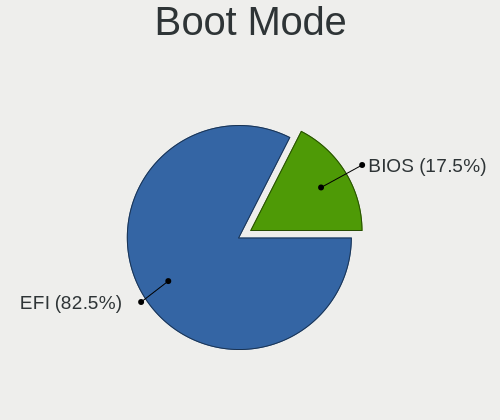
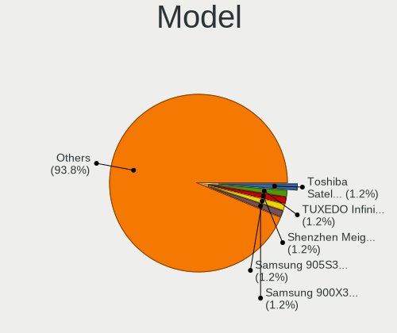
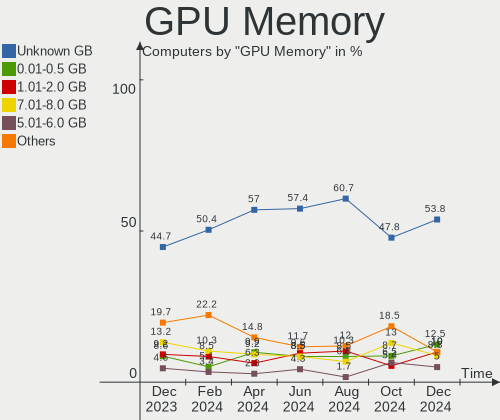
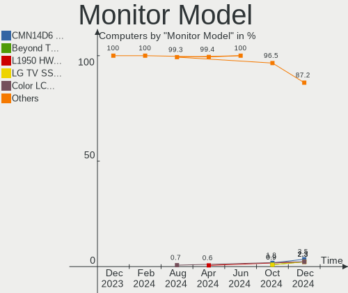
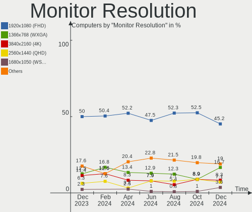

ArcoLinux - Hardware Trends
---------------------------

A project to identify most popular hardware characteristics and track their change
over time based on data collected by Linux users at https://Linux-Hardware.org.

Anyone can contribute to this report by the [hw-probe](https://github.com/linuxhw/hw-probe) tool:

    sudo -E hw-probe -all -upload

This is a report for all computer types. See also reports for [desktops](/Dist/ArcoLinux/Desktop/README.md) and [notebooks](/Dist/ArcoLinux/Notebook/README.md).

This report is for one last month. Overall report since the beginning of time: [TestDays](https://github.com/linuxhw/TestDays)

Period: Oct, 2023.

Contents
--------

* [ System ](#system)
  - [ OS                       ](#os)
  - [ OS Family                ](#os-family)
  - [ Kernel                   ](#kernel)
  - [ Kernel Family            ](#kernel-family)
  - [ Kernel Major Ver.        ](#kernel-major-ver)
  - [ Arch                     ](#arch)
  - [ DE                       ](#de)
  - [ Display Server           ](#display-server)
  - [ Display Manager          ](#display-manager)
  - [ OS Lang                  ](#os-lang)
  - [ Boot Mode                ](#boot-mode)
  - [ Filesystem               ](#filesystem)
  - [ Part. scheme             ](#part-scheme)
  - [ Dual Boot with Linux/BSD ](#dual-boot-with-linuxbsd)
  - [ Dual Boot (Win)          ](#dual-boot-win)

* [ Board ](#board)
  - [ Vendor                   ](#vendor)
  - [ Model                    ](#model)
  - [ Model Family             ](#model-family)
  - [ MFG Year                 ](#mfg-year)
  - [ Form Factor              ](#form-factor)
  - [ Secure Boot              ](#secure-boot)
  - [ Coreboot                 ](#coreboot)
  - [ RAM Size                 ](#ram-size)
  - [ RAM Used                 ](#ram-used)
  - [ Total Drives             ](#total-drives)
  - [ Has CD-ROM               ](#has-cd-rom)
  - [ Has Ethernet             ](#has-ethernet)
  - [ Has WiFi                 ](#has-wifi)
  - [ Has Bluetooth            ](#has-bluetooth)

* [ Location ](#location)
  - [ Country                  ](#country)
  - [ City                     ](#city)

* [ Drives ](#drives)
  - [ Drive Vendor             ](#drive-vendor)
  - [ Drive Model              ](#drive-model)
  - [ HDD Vendor               ](#hdd-vendor)
  - [ SSD Vendor               ](#ssd-vendor)
  - [ Drive Kind               ](#drive-kind)
  - [ Drive Connector          ](#drive-connector)
  - [ Drive Size               ](#drive-size)
  - [ Space Total              ](#space-total)
  - [ Space Used               ](#space-used)
  - [ Malfunc. Drives          ](#malfunc-drives)
  - [ Malfunc. Drive Vendor    ](#malfunc-drive-vendor)
  - [ Malfunc. HDD Vendor      ](#malfunc-hdd-vendor)
  - [ Malfunc. Drive Kind      ](#malfunc-drive-kind)
  - [ Failed Drives            ](#failed-drives)
  - [ Failed Drive Vendor      ](#failed-drive-vendor)
  - [ Drive Status             ](#drive-status)

* [ Storage controller ](#storage-controller)
  - [ Storage Vendor           ](#storage-vendor)
  - [ Storage Model            ](#storage-model)
  - [ Storage Kind             ](#storage-kind)

* [ Processor ](#processor)
  - [ CPU Vendor               ](#cpu-vendor)
  - [ CPU Model                ](#cpu-model)
  - [ CPU Model Family         ](#cpu-model-family)
  - [ CPU Cores                ](#cpu-cores)
  - [ CPU Sockets              ](#cpu-sockets)
  - [ CPU Threads              ](#cpu-threads)
  - [ CPU Op-Modes             ](#cpu-op-modes)
  - [ CPU Microcode            ](#cpu-microcode)
  - [ CPU Microarch            ](#cpu-microarch)

* [ Graphics ](#graphics)
  - [ GPU Vendor               ](#gpu-vendor)
  - [ GPU Model                ](#gpu-model)
  - [ GPU Combo                ](#gpu-combo)
  - [ GPU Driver               ](#gpu-driver)
  - [ GPU Memory               ](#gpu-memory)

* [ Monitor ](#monitor)
  - [ Monitor Vendor           ](#monitor-vendor)
  - [ Monitor Model            ](#monitor-model)
  - [ Monitor Resolution       ](#monitor-resolution)
  - [ Monitor Diagonal         ](#monitor-diagonal)
  - [ Monitor Width            ](#monitor-width)
  - [ Aspect Ratio             ](#aspect-ratio)
  - [ Monitor Area             ](#monitor-area)
  - [ Pixel Density            ](#pixel-density)
  - [ Multiple Monitors        ](#multiple-monitors)

* [ Network ](#network)
  - [ Net Controller Vendor    ](#net-controller-vendor)
  - [ Net Controller Model     ](#net-controller-model)
  - [ Wireless Vendor          ](#wireless-vendor)
  - [ Wireless Model           ](#wireless-model)
  - [ Ethernet Vendor          ](#ethernet-vendor)
  - [ Ethernet Model           ](#ethernet-model)
  - [ Net Controller Kind      ](#net-controller-kind)
  - [ Used Controller          ](#used-controller)
  - [ NICs                     ](#nics)
  - [ IPv6                     ](#ipv6)

* [ Bluetooth ](#bluetooth)
  - [ Bluetooth Vendor         ](#bluetooth-vendor)
  - [ Bluetooth Model          ](#bluetooth-model)

* [ Sound ](#sound)
  - [ Sound Vendor             ](#sound-vendor)
  - [ Sound Model              ](#sound-model)

* [ Memory ](#memory)
  - [ Memory Vendor            ](#memory-vendor)
  - [ Memory Model             ](#memory-model)
  - [ Memory Kind              ](#memory-kind)
  - [ Memory Form Factor       ](#memory-form-factor)
  - [ Memory Size              ](#memory-size)
  - [ Memory Speed             ](#memory-speed)

* [ Printers & scanners ](#printers--scanners)
  - [ Printer Vendor           ](#printer-vendor)
  - [ Printer Model            ](#printer-model)
  - [ Scanner Vendor           ](#scanner-vendor)
  - [ Scanner Model            ](#scanner-model)

* [ Camera ](#camera)
  - [ Camera Vendor            ](#camera-vendor)
  - [ Camera Model             ](#camera-model)

* [ Security ](#security)
  - [ Fingerprint Vendor       ](#fingerprint-vendor)
  - [ Fingerprint Model        ](#fingerprint-model)
  - [ Chipcard Vendor          ](#chipcard-vendor)
  - [ Chipcard Model           ](#chipcard-model)

* [ Unsupported ](#unsupported)
  - [ Unsupported Devices      ](#unsupported-devices)
  - [ Unsupported Device Types ](#unsupported-device-types)

System
------

OS
--

Installed operating systems

| Name              | Computers | Percent |
|-------------------|-----------|---------|
| ArcoLinux Rolling | 123       | 97.62%  |
| ArcoLinux         | 3         | 2.38%   |

OS Family
---------

OS without a version

| Name      | Computers | Percent |
|-----------|-----------|---------|
| ArcoLinux | 126       | 100%    |

Kernel
------

Version of the Linux kernel

| Version                     | Computers | Percent |
|-----------------------------|-----------|---------|
| 6.5.7-arch1-1               | 19        | 15.08%  |
| 6.5.5-arch1-1               | 14        | 11.11%  |
| 6.5.8-arch1-1               | 11        | 8.73%   |
| 6.5.9-arch2-1               | 8         | 6.35%   |
| 6.5.6-arch2-1               | 7         | 5.56%   |
| 6.5.5-zen1-1-zen            | 7         | 5.56%   |
| 6.5.3-arch1-1               | 7         | 5.56%   |
| 6.4.11-arch1-1              | 7         | 5.56%   |
| 6.5.7-zen2-1-zen            | 4         | 3.17%   |
| 6.5.6-zen2-1-zen            | 4         | 3.17%   |
| 6.5.3-x64v2-xanmod1-1       | 4         | 3.17%   |
| 6.5.9-zen2-1-zen            | 3         | 2.38%   |
| 6.3.8-arch1-1               | 3         | 2.38%   |
| 6.1.59-1-lts                | 3         | 2.38%   |
| 6.1.55-1-lts                | 3         | 2.38%   |
| 6.5.7-zen1-1-zen            | 2         | 1.59%   |
| 6.5.4-arch2-1               | 2         | 1.59%   |
| 6.1.58-1-lts                | 2         | 1.59%   |
| 6.1.57-1-lts                | 2         | 1.59%   |
| 6.1.56-1-lts                | 2         | 1.59%   |
| 6.5.8-zen1-1-zen            | 1         | 0.79%   |
| 6.5.6-lqx1-1-lqx            | 1         | 0.79%   |
| 6.5.5-hardened1-1-hardened  | 1         | 0.79%   |
| 6.5.3-zen1-1-zen            | 1         | 0.79%   |
| 6.5.2.8.realtime1-1-rt      | 1         | 0.79%   |
| 6.4.12-arch1-1              | 1         | 0.79%   |
| 6.4.11-hardened1-1-hardened | 1         | 0.79%   |
| 6.4.11-arch2-1              | 1         | 0.79%   |
| 6.1.53-1-lts                | 1         | 0.79%   |
| 6.1.46-x64v1-xanmod1-1-lts  | 1         | 0.79%   |
| 6.1.28-1-lts                | 1         | 0.79%   |
| 5.16.11-arch1-1             | 1         | 0.79%   |

Kernel Family
-------------

Linux kernel without a distro release

| Version | Computers | Percent |
|---------|-----------|---------|
| 6.5.7   | 25        | 19.84%  |
| 6.5.5   | 22        | 17.46%  |
| 6.5.8   | 12        | 9.52%   |
| 6.5.6   | 12        | 9.52%   |
| 6.5.3   | 12        | 9.52%   |
| 6.5.9   | 11        | 8.73%   |
| 6.4.11  | 9         | 7.14%   |
| 6.3.8   | 3         | 2.38%   |
| 6.1.59  | 3         | 2.38%   |
| 6.1.55  | 3         | 2.38%   |
| 6.5.4   | 2         | 1.59%   |
| 6.1.58  | 2         | 1.59%   |
| 6.1.57  | 2         | 1.59%   |
| 6.1.56  | 2         | 1.59%   |
| 6.5.2.8 | 1         | 0.79%   |
| 6.4.12  | 1         | 0.79%   |
| 6.1.53  | 1         | 0.79%   |
| 6.1.46  | 1         | 0.79%   |
| 6.1.28  | 1         | 0.79%   |
| 5.16.11 | 1         | 0.79%   |

Kernel Major Ver.
-----------------

Linux kernel major version

| Version | Computers | Percent |
|---------|-----------|---------|
| 6.5     | 96        | 76.19%  |
| 6.1     | 15        | 11.9%   |
| 6.4     | 10        | 7.94%   |
| 6.3     | 3         | 2.38%   |
| 6.5.2   | 1         | 0.79%   |
| 5.16    | 1         | 0.79%   |

Arch
----

OS architecture (x86_64, i586, etc.)

| Name   | Computers | Percent |
|--------|-----------|---------|
| x86_64 | 126       | 100%    |

DE
--

Desktop Environment

| Name          | Computers | Percent |
|---------------|-----------|---------|
| XFCE          | 39        | 30.95%  |
| KDE5          | 35        | 27.78%  |
| GNOME         | 14        | 11.11%  |
| i3            | 10        | 7.94%   |
| Cinnamon      | 6         | 4.76%   |
| Hyprland      | 4         | 3.17%   |
| Budgie        | 3         | 2.38%   |
| Deepin        | 2         | 1.59%   |
| awesome       | 2         | 1.59%   |
| Unknown       | 2         | 1.59%   |
| X-Cinnamon    | 1         | 0.79%   |
| Pantheon      | 1         | 0.79%   |
| LXQt          | 1         | 0.79%   |
| LeftWM        | 1         | 0.79%   |
| Hypr          | 1         | 0.79%   |
| GNOME Classic | 1         | 0.79%   |
| dwm           | 1         | 0.79%   |
| chadwm        | 1         | 0.79%   |
| bspwm         | 1         | 0.79%   |

Display Server
--------------

X11 or Wayland

| Name    | Computers | Percent |
|---------|-----------|---------|
| X11     | 108       | 85.71%  |
| Wayland | 16        | 12.7%   |
| Tty     | 1         | 0.79%   |
| Unknown | 1         | 0.79%   |

Display Manager
---------------

SDDM, LightDM, etc.

| Name    | Computers | Percent |
|---------|-----------|---------|
| SDDM    | 104       | 82.54%  |
| LightDM | 14        | 11.11%  |
| GDM     | 5         | 3.97%   |
| Unknown | 3         | 2.38%   |

OS Lang
-------

Language

| Lang  | Computers | Percent |
|-------|-----------|---------|
| en_US | 56        | 44.44%  |
| en_GB | 10        | 7.94%   |
| it_IT | 7         | 5.56%   |
| C     | 7         | 5.56%   |
| pt_BR | 6         | 4.76%   |
| ru_RU | 4         | 3.17%   |
| fr_FR | 4         | 3.17%   |
| de_DE | 4         | 3.17%   |
| en_HK | 3         | 2.38%   |
| uk_UA | 2         | 1.59%   |
| hu_HU | 2         | 1.59%   |
| es_MX | 2         | 1.59%   |
| es_ES | 2         | 1.59%   |
| en_CA | 2         | 1.59%   |
| en_AU | 2         | 1.59%   |
| zh_CN | 1         | 0.79%   |
| tr_TR | 1         | 0.79%   |
| sv_SE | 1         | 0.79%   |
| ro_RO | 1         | 0.79%   |
| pt_PT | 1         | 0.79%   |
| nl_NL | 1         | 0.79%   |
| nl_BE | 1         | 0.79%   |
| id_ID | 1         | 0.79%   |
| es_PA | 1         | 0.79%   |
| es_AR | 1         | 0.79%   |
| en_ZA | 1         | 0.79%   |
| en_IN | 1         | 0.79%   |
| en_IL | 1         | 0.79%   |

Boot Mode
---------

EFI or BIOS

| Mode | Computers | Percent |
|------|-----------|---------|
| EFI  | 98        | 77.78%  |
| BIOS | 28        | 22.22%  |

Filesystem
----------

Type of filesystem

| Type    | Computers | Percent |
|---------|-----------|---------|
| Ext4    | 84        | 66.67%  |
| Btrfs   | 30        | 23.81%  |
| Overlay | 9         | 7.14%   |
| F2fs    | 2         | 1.59%   |
| Xfs     | 1         | 0.79%   |

Part. scheme
------------

Scheme of partitioning

| Type    | Computers | Percent |
|---------|-----------|---------|
| GPT     | 110       | 87.3%   |
| MBR     | 13        | 10.32%  |
| Unknown | 3         | 2.38%   |

Dual Boot with Linux/BSD
------------------------

Hosting more than one Linux/BSD

| Dual boot | Computers | Percent |
|-----------|-----------|---------|
| No        | 96        | 76.19%  |
| Yes       | 30        | 23.81%  |

Dual Boot (Win)
---------------

Hosting Linux and Windows

| Dual boot | Computers | Percent |
|-----------|-----------|---------|
| No        | 73        | 57.94%  |
| Yes       | 53        | 42.06%  |

Board
-----

Vendor
------

Motherboard manufacturer

| Name                | Computers | Percent |
|---------------------|-----------|---------|
| Lenovo              | 25        | 19.84%  |
| ASUSTek Computer    | 24        | 19.05%  |
| Hewlett-Packard     | 17        | 13.49%  |
| Gigabyte Technology | 14        | 11.11%  |
| Dell                | 12        | 9.52%   |
| Acer                | 6         | 4.76%   |
| MSI                 | 5         | 3.97%   |
| Samsung Electronics | 4         | 3.17%   |
| Intel               | 3         | 2.38%   |
| ASRock              | 3         | 2.38%   |
| Apple               | 2         | 1.59%   |
| Unknown             | 2         | 1.59%   |
| Win element         | 1         | 0.79%   |
| Toshiba             | 1         | 0.79%   |
| Razer               | 1         | 0.79%   |
| MACHINIST           | 1         | 0.79%   |
| Extra Terrestrial   | 1         | 0.79%   |
| EXPER               | 1         | 0.79%   |
| BESSTAR Tech        | 1         | 0.79%   |
| BANGHO              | 1         | 0.79%   |
| AMI                 | 1         | 0.79%   |

Model
-----

Motherboard model

| Name                                     | Computers | Percent |
|------------------------------------------|-----------|---------|
| Unknown                                  | 3         | 2.38%   |
| Win element M600                         | 1         | 0.79%   |
| Toshiba Satellite C55-C                  | 1         | 0.79%   |
| Samsung 950QED                           | 1         | 0.79%   |
| Samsung 750XED                           | 1         | 0.79%   |
| Samsung 550P5C/550P7C                    | 1         | 0.79%   |
| Samsung 270E5J/2570EJ                    | 1         | 0.79%   |
| Razer Book 13 - RZ09-0357                | 1         | 0.79%   |
| MSI Prestige 15 A10SC                    | 1         | 0.79%   |
| MSI MS-7D25                              | 1         | 0.79%   |
| MSI MS-7D09                              | 1         | 0.79%   |
| MSI MS-7C79                              | 1         | 0.79%   |
| MSI MS-7C37                              | 1         | 0.79%   |
| MACHINIST X99-RS9 V2.0                   | 1         | 0.79%   |
| Lenovo XiaoXin Air 15IKBR 81GY           | 1         | 0.79%   |
| Lenovo ThinkStation P330 Tiny 30CES1YB01 | 1         | 0.79%   |
| Lenovo ThinkPad X230 232578G             | 1         | 0.79%   |
| Lenovo ThinkPad X220 4291C84             | 1         | 0.79%   |
| Lenovo ThinkPad X1 Carbon 6th 20KH006KUK | 1         | 0.79%   |
| Lenovo ThinkPad T490 20N3SDGJ02          | 1         | 0.79%   |
| Lenovo ThinkPad T480 20L50010US          | 1         | 0.79%   |
| Lenovo ThinkPad T480 20L5000AIX          | 1         | 0.79%   |
| Lenovo ThinkPad T430 2349IF8             | 1         | 0.79%   |
| Lenovo ThinkPad P53 20QN0050RT           | 1         | 0.79%   |
| Lenovo ThinkPad L540 20AUS11P00          | 1         | 0.79%   |
| Lenovo ThinkPad L380 Yoga 20M7000JUS     | 1         | 0.79%   |
| Lenovo ThinkPad E490 20N80006UE          | 1         | 0.79%   |
| Lenovo ThinkPad 3354DSG                  | 1         | 0.79%   |
| Lenovo Legion 5 15ACH6A 82NW             | 1         | 0.79%   |
| Lenovo IdeaPad Y700-17ISK 80Q0           | 1         | 0.79%   |
| Lenovo IdeaPad Y700-15ISK 80NV           | 1         | 0.79%   |
| Lenovo IdeaPad S145-15API 81V7           | 1         | 0.79%   |
| Lenovo IdeaPad L340-15IRH Gaming 81LK    | 1         | 0.79%   |
| Lenovo IdeaPad 5 Pro 14ARH7 82SJ         | 1         | 0.79%   |
| Lenovo IdeaPad 330-15IGM 81D1            | 1         | 0.79%   |
| Lenovo IdeaPad 320-14IKB 80XK            | 1         | 0.79%   |
| Lenovo IdeaPad 3 15ITL05 81X8            | 1         | 0.79%   |
| Lenovo IdeaPad 3 14ITL6 82H7             | 1         | 0.79%   |
| Lenovo Flex 2-15 20405                   | 1         | 0.79%   |
| Intel NUC7i5BNH                          | 1         | 0.79%   |

Model Family
------------

Motherboard model prefix

| Name                | Computers | Percent |
|---------------------|-----------|---------|
| Lenovo ThinkPad     | 12        | 9.52%   |
| Lenovo IdeaPad      | 9         | 7.14%   |
| ASUS ROG            | 6         | 4.76%   |
| HP Pavilion         | 3         | 2.38%   |
| HP Laptop           | 3         | 2.38%   |
| Dell XPS            | 3         | 2.38%   |
| Dell OptiPlex       | 3         | 2.38%   |
| ASUS VivoBook       | 3         | 2.38%   |
| Unknown             | 3         | 2.38%   |
| Gigabyte B550       | 2         | 1.59%   |
| Gigabyte B450M      | 2         | 1.59%   |
| Dell Vostro         | 2         | 1.59%   |
| ASUS ASUS           | 2         | 1.59%   |
| Acer Veriton        | 2         | 1.59%   |
| Acer Aspire         | 2         | 1.59%   |
| Win element M600    | 1         | 0.79%   |
| Toshiba Satellite   | 1         | 0.79%   |
| Samsung 950QED      | 1         | 0.79%   |
| Samsung 750XED      | 1         | 0.79%   |
| Samsung 550P5C      | 1         | 0.79%   |
| Samsung 270E5J      | 1         | 0.79%   |
| Razer Book          | 1         | 0.79%   |
| MSI Prestige        | 1         | 0.79%   |
| MSI MS-7D25         | 1         | 0.79%   |
| MSI MS-7D09         | 1         | 0.79%   |
| MSI MS-7C79         | 1         | 0.79%   |
| MSI MS-7C37         | 1         | 0.79%   |
| MACHINIST X99-RS9   | 1         | 0.79%   |
| Lenovo XiaoXin      | 1         | 0.79%   |
| Lenovo ThinkStation | 1         | 0.79%   |
| Lenovo Legion       | 1         | 0.79%   |
| Lenovo Flex         | 1         | 0.79%   |
| Intel NUC7i5BNH     | 1         | 0.79%   |
| Intel HM570         | 1         | 0.79%   |
| Intel B75           | 1         | 0.79%   |
| HP ProDesk          | 1         | 0.79%   |
| HP Presario         | 1         | 0.79%   |
| HP OMEN             | 1         | 0.79%   |
| HP Notebook         | 1         | 0.79%   |
| HP Folio            | 1         | 0.79%   |

MFG Year
--------

Motherboard manufacture year

| Year | Computers | Percent |
|------|-----------|---------|
| 2018 | 17        | 13.49%  |
| 2021 | 16        | 12.7%   |
| 2022 | 14        | 11.11%  |
| 2020 | 12        | 9.52%   |
| 2019 | 10        | 7.94%   |
| 2013 | 10        | 7.94%   |
| 2015 | 8         | 6.35%   |
| 2014 | 8         | 6.35%   |
| 2017 | 7         | 5.56%   |
| 2012 | 7         | 5.56%   |
| 2011 | 7         | 5.56%   |
| 2016 | 4         | 3.17%   |
| 2023 | 3         | 2.38%   |
| 2010 | 3         | 2.38%   |

Form Factor
-----------

Physical design of the computer

| Name        | Computers | Percent |
|-------------|-----------|---------|
| Notebook    | 68        | 53.97%  |
| Desktop     | 49        | 38.89%  |
| Convertible | 3         | 2.38%   |
| Mini pc     | 3         | 2.38%   |
| All in one  | 2         | 1.59%   |
| Tablet      | 1         | 0.79%   |

Secure Boot
-----------

Enabled or disabled

| State    | Computers | Percent |
|----------|-----------|---------|
| Disabled | 126       | 100%    |

Coreboot
--------

Have coreboot on board

| Used | Computers | Percent |
|------|-----------|---------|
| No   | 126       | 100%    |

RAM Size
--------

Total RAM memory

| Size in GB  | Computers | Percent |
|-------------|-----------|---------|
| 32.01-64.0  | 28        | 22.22%  |
| 4.01-8.0    | 27        | 21.43%  |
| 16.01-24.0  | 25        | 19.84%  |
| 8.01-16.0   | 24        | 19.05%  |
| 3.01-4.0    | 12        | 9.52%   |
| 64.01-256.0 | 7         | 5.56%   |
| 24.01-32.0  | 2         | 1.59%   |
| 1.01-2.0    | 1         | 0.79%   |

RAM Used
--------

Used RAM memory

| Used GB   | Computers | Percent |
|-----------|-----------|---------|
| 1.01-2.0  | 44        | 34.92%  |
| 2.01-3.0  | 36        | 28.57%  |
| 4.01-8.0  | 22        | 17.46%  |
| 3.01-4.0  | 13        | 10.32%  |
| 8.01-16.0 | 6         | 4.76%   |
| 0.51-1.0  | 5         | 3.97%   |

Total Drives
------------

Number of drives on board

| Drives | Computers | Percent |
|--------|-----------|---------|
| 1      | 57        | 45.24%  |
| 2      | 38        | 30.16%  |
| 3      | 15        | 11.9%   |
| 5      | 5         | 3.97%   |
| 4      | 5         | 3.97%   |
| 6      | 4         | 3.17%   |
| 8      | 1         | 0.79%   |
| 7      | 1         | 0.79%   |

Has CD-ROM
----------

Has CD-ROM on board

| Presented | Computers | Percent |
|-----------|-----------|---------|
| No        | 97        | 76.98%  |
| Yes       | 29        | 23.02%  |

Has Ethernet
------------

Has Ethernet on board

| Presented | Computers | Percent |
|-----------|-----------|---------|
| Yes       | 110       | 87.3%   |
| No        | 16        | 12.7%   |

Has WiFi
--------

Has WiFi module

| Presented | Computers | Percent |
|-----------|-----------|---------|
| Yes       | 107       | 84.92%  |
| No        | 19        | 15.08%  |

Has Bluetooth
-------------

Has Bluetooth module

| Presented | Computers | Percent |
|-----------|-----------|---------|
| Yes       | 99        | 78.57%  |
| No        | 27        | 21.43%  |

Location
--------

Country
-------

Geographic location (country)

| Country      | Computers | Percent |
|--------------|-----------|---------|
| USA          | 28        | 22.22%  |
| UK           | 9         | 7.14%   |
| Brazil       | 9         | 7.14%   |
| Italy        | 8         | 6.35%   |
| Romania      | 4         | 3.17%   |
| India        | 4         | 3.17%   |
| Germany      | 4         | 3.17%   |
| France       | 4         | 3.17%   |
| Turkey       | 3         | 2.38%   |
| Sweden       | 3         | 2.38%   |
| Spain        | 3         | 2.38%   |
| Indonesia    | 3         | 2.38%   |
| Hong Kong    | 3         | 2.38%   |
| Canada       | 3         | 2.38%   |
| Australia    | 3         | 2.38%   |
| Russia       | 2         | 1.59%   |
| Mexico       | 2         | 1.59%   |
| Hungary      | 2         | 1.59%   |
| China        | 2         | 1.59%   |
| Belgium      | 2         | 1.59%   |
| Argentina    | 2         | 1.59%   |
| Vietnam      | 1         | 0.79%   |
| UAE          | 1         | 0.79%   |
| South Korea  | 1         | 0.79%   |
| South Africa | 1         | 0.79%   |
| Saudi Arabia | 1         | 0.79%   |
| Portugal     | 1         | 0.79%   |
| Philippines  | 1         | 0.79%   |
| Panama       | 1         | 0.79%   |
| Pakistan     | 1         | 0.79%   |
| Norway       | 1         | 0.79%   |
| New Zealand  | 1         | 0.79%   |
| Netherlands  | 1         | 0.79%   |
| Kenya        | 1         | 0.79%   |
| Israel       | 1         | 0.79%   |
| Iran         | 1         | 0.79%   |
| Greece       | 1         | 0.79%   |
| Ghana        | 1         | 0.79%   |
| Estonia      | 1         | 0.79%   |
| Egypt        | 1         | 0.79%   |

City
----

Geographic location (city)

| City                   | Computers | Percent |
|------------------------|-----------|---------|
| Tsuen Wan              | 3         | 2.38%   |
| Rio de Janeiro         | 3         | 2.38%   |
| Charlotte              | 3         | 2.38%   |
| Solna                  | 2         | 1.59%   |
| Los Angeles            | 2         | 1.59%   |
| Leicester              | 2         | 1.59%   |
| Istanbul               | 2         | 1.59%   |
| Feltham                | 2         | 1.59%   |
| Budapest               | 2         | 1.59%   |
| Bengaluru              | 2         | 1.59%   |
| Baltimore              | 2         | 1.59%   |
| Aracaju                | 2         | 1.59%   |
| Adelaide               | 2         | 1.59%   |
| Yerevan                | 1         | 0.79%   |
| Yangcheon-gu           | 1         | 0.79%   |
| Xiamen                 | 1         | 0.79%   |
| Windsor                | 1         | 0.79%   |
| Wilrijk                | 1         | 0.79%   |
| Vienna                 | 1         | 0.79%   |
| Vicosa                 | 1         | 0.79%   |
| Vancouver              | 1         | 0.79%   |
| Utrecht                | 1         | 0.79%   |
| Terranuova Bracciolini | 1         | 0.79%   |
| Tehran                 | 1         | 0.79%   |
| Tallinn                | 1         | 0.79%   |
| Stockport              | 1         | 0.79%   |
| Stockholm              | 1         | 0.79%   |
| Southern Pines         | 1         | 0.79%   |
| Sao Paulo              | 1         | 0.79%   |
| San Jose               | 1         | 0.79%   |
| San Francisco          | 1         | 0.79%   |
| Salvador               | 1         | 0.79%   |
| Salt Lake City         | 1         | 0.79%   |
| Saint-Denis            | 1         | 0.79%   |
| Rudolstadt             | 1         | 0.79%   |
| Roswell                | 1         | 0.79%   |
| Rosu                   | 1         | 0.79%   |
| Rocca Pietore          | 1         | 0.79%   |
| Rehovot                | 1         | 0.79%   |
| Puebla City            | 1         | 0.79%   |

Drives
------

Drive Vendor
------------

Hard drive vendors

| Vendor                       | Computers | Drives | Percent |
|------------------------------|-----------|--------|---------|
| Samsung Electronics          | 40        | 46     | 16.81%  |
| WDC                          | 32        | 35     | 13.45%  |
| Seagate                      | 23        | 31     | 9.66%   |
| Kingston                     | 16        | 16     | 6.72%   |
| Sandisk                      | 11        | 11     | 4.62%   |
| Silicon Motion               | 10        | 10     | 4.2%    |
| Crucial                      | 10        | 10     | 4.2%    |
| Toshiba                      | 9         | 9      | 3.78%   |
| SK hynix                     | 8         | 11     | 3.36%   |
| Phison Electronics           | 6         | 7      | 2.52%   |
| Micron Technology            | 5         | 5      | 2.1%    |
| A-DATA Technology            | 5         | 6      | 2.1%    |
| Realtek Semiconductor        | 4         | 4      | 1.68%   |
| Intel                        | 4         | 5      | 1.68%   |
| China                        | 4         | 4      | 1.68%   |
| Unknown                      | 3         | 3      | 1.26%   |
| HGST                         | 3         | 3      | 1.26%   |
| Apple                        | 3         | 3      | 1.26%   |
| PNY                          | 2         | 2      | 0.84%   |
| Lexar                        | 2         | 2      | 0.84%   |
| Kingston Technology Company  | 2         | 3      | 0.84%   |
| JMicron Technology           | 2         | 2      | 0.84%   |
| Hewlett-Packard              | 2         | 2      | 0.84%   |
| Apacer                       | 2         | 2      | 0.84%   |
| Union Memory (Shenzhen)      | 1         | 1      | 0.42%   |
| TwinMOS                      | 1         | 1      | 0.42%   |
| Transcend                    | 1         | 1      | 0.42%   |
| Team                         | 1         | 1      | 0.42%   |
| T-FORCE                      | 1         | 1      | 0.42%   |
| SPCC                         | 1         | 1      | 0.42%   |
| ShiJi                        | 1         | 1      | 0.42%   |
| Shenzhen Longsys Electronics | 1         | 2      | 0.42%   |
| Seagate Technology           | 1         | 1      | 0.42%   |
| SCY                          | 1         | 1      | 0.42%   |
| Realtek                      | 1         | 1      | 0.42%   |
| Plextor                      | 1         | 1      | 0.42%   |
| Micron/Crucial Technology    | 1         | 1      | 0.42%   |
| Maxtor                       | 1         | 1      | 0.42%   |
| MAXIO Technology (Hangzhou)  | 1         | 1      | 0.42%   |
| LaCie                        | 1         | 1      | 0.42%   |

Drive Model
-----------

Hard drive models

| Model                                                 | Computers | Percent |
|-------------------------------------------------------|-----------|---------|
| Samsung NVMe SSD Controller PM9A1/PM9A3/980PRO 1TB    | 8         | 3.16%   |
| Silicon Motion SM2263EN/SM2263XT SSD Controller 256GB | 7         | 2.77%   |
| Samsung NVMe SSD Controller SM981/PM981/PM983 1TB     | 7         | 2.77%   |
| Kingston SA400S37480G 480GB SSD                       | 5         | 1.98%   |
| Samsung SSD 850 EVO 250GB                             | 4         | 1.58%   |
| Phison E12 NVMe Controller 1TB                        | 4         | 1.58%   |
| Kingston SA400S37240G 240GB SSD                       | 4         | 1.58%   |
| Toshiba MQ01ABD100 1TB                                | 3         | 1.19%   |
| Silicon Motion SM2262/SM2262EN SSD Controller 2TB     | 3         | 1.19%   |
| WDC WDS500G2B0A-00SM50 500GB SSD                      | 2         | 0.79%   |
| WDC WD4005FZBX-00K5WB0 4TB                            | 2         | 0.79%   |
| WDC WD20EZAZ-00GGJB0 2TB                              | 2         | 0.79%   |
| WDC WD10SPCX-24HWST1 1TB                              | 2         | 0.79%   |
| WDC WD10EZEX-08WN4A0 1TB                              | 2         | 0.79%   |
| Seagate ST31000524AS 1TB                              | 2         | 0.79%   |
| Seagate ST1000LM035-1RK172 1TB                        | 2         | 0.79%   |
| Seagate ST1000DM010-2EP102 1TB                        | 2         | 0.79%   |
| Seagate ST1000DM003-1CH162 1TB                        | 2         | 0.79%   |
| SanDisk Extreme 55AE 1TB SSD                          | 2         | 0.79%   |
| Samsung SSD 870 EVO 500GB                             | 2         | 0.79%   |
| Samsung SSD 860 EVO 1TB                               | 2         | 0.79%   |
| Realtek SPCC M.2 PCIe SSD 512GB                       | 2         | 0.79%   |
| Micron 1100 SATA 256GB SSD                            | 2         | 0.79%   |
| Kingston SKC3000S1024G 1TB                            | 2         | 0.79%   |
| JMicron Generic 256GB                                 | 2         | 0.79%   |
| HGST HTS721010A9E630 1TB                              | 2         | 0.79%   |
| Crucial CT500MX500SSD1 500GB                          | 2         | 0.79%   |
| Crucial CT480BX500SSD1 480GB                          | 2         | 0.79%   |
| Apple HDD HTS545050A7E362 500GB                       | 2         | 0.79%   |
| WDC WDS250G2B0A-00SM50 250GB SSD                      | 1         | 0.4%    |
| WDC WDBNCE0010PNC 1TB SSD                             | 1         | 0.4%    |
| WDC WD5000LUCT-63C26Y0 500GB                          | 1         | 0.4%    |
| WDC WD5000LPVX-00V0TT0 500GB                          | 1         | 0.4%    |
| WDC WD5000LPCX-24VHAT0 500GB                          | 1         | 0.4%    |
| WDC WD5000BPKX-75HPJT0 500GB                          | 1         | 0.4%    |
| WDC WD5000BPKT-75PK4T0 500GB                          | 1         | 0.4%    |
| WDC WD5000BEVT-22A0RT0 500GB                          | 1         | 0.4%    |
| WDC WD5000AAKX-75U6AA0 500GB                          | 1         | 0.4%    |
| WDC WD5000AAKS-00UU3A0 500GB                          | 1         | 0.4%    |
| WDC WD5000AAKS-007AA0 500GB                           | 1         | 0.4%    |

HDD Vendor
----------

Hard disk drive vendors

| Vendor              | Computers | Drives | Percent |
|---------------------|-----------|--------|---------|
| WDC                 | 29        | 31     | 42.03%  |
| Seagate             | 23        | 30     | 33.33%  |
| Toshiba             | 6         | 6      | 8.7%    |
| Samsung Electronics | 3         | 3      | 4.35%   |
| HGST                | 3         | 3      | 4.35%   |
| Apple               | 2         | 2      | 2.9%    |
| Maxtor              | 1         | 1      | 1.45%   |
| Hitachi             | 1         | 1      | 1.45%   |
| Fujitsu             | 1         | 1      | 1.45%   |

SSD Vendor
----------

Solid state drive vendors

| Vendor              | Computers | Drives | Percent |
|---------------------|-----------|--------|---------|
| Samsung Electronics | 20        | 23     | 21.28%  |
| Kingston            | 13        | 13     | 13.83%  |
| Crucial             | 10        | 10     | 10.64%  |
| SanDisk             | 5         | 5      | 5.32%   |
| A-DATA Technology   | 5         | 6      | 5.32%   |
| WDC                 | 4         | 4      | 4.26%   |
| China               | 4         | 4      | 4.26%   |
| Micron Technology   | 3         | 3      | 3.19%   |
| SK hynix            | 2         | 2      | 2.13%   |
| PNY                 | 2         | 2      | 2.13%   |
| Lexar               | 2         | 2      | 2.13%   |
| Hewlett-Packard     | 2         | 2      | 2.13%   |
| Apacer              | 2         | 2      | 2.13%   |
| TwinMOS             | 1         | 1      | 1.06%   |
| Transcend           | 1         | 1      | 1.06%   |
| Toshiba             | 1         | 1      | 1.06%   |
| Team                | 1         | 1      | 1.06%   |
| T-FORCE             | 1         | 1      | 1.06%   |
| SPCC                | 1         | 1      | 1.06%   |
| ShiJi               | 1         | 1      | 1.06%   |
| SCY                 | 1         | 1      | 1.06%   |
| Plextor             | 1         | 1      | 1.06%   |
| LaCie               | 1         | 1      | 1.06%   |
| KingDian            | 1         | 1      | 1.06%   |
| Intel               | 1         | 1      | 1.06%   |
| Gigabyte Technology | 1         | 1      | 1.06%   |
| EYOTA               | 1         | 1      | 1.06%   |
| EDILOCA             | 1         | 1      | 1.06%   |
| Colorful            | 1         | 1      | 1.06%   |
| Apple               | 1         | 1      | 1.06%   |
| aigo                | 1         | 1      | 1.06%   |
| ADATA SU            | 1         | 1      | 1.06%   |
| Acer                | 1         | 1      | 1.06%   |

Drive Kind
----------

HDD or SSD

| Kind | Computers | Drives | Percent |
|------|-----------|--------|---------|
| SSD  | 71        | 98     | 38.38%  |
| NVMe | 57        | 85     | 30.81%  |
| HDD  | 55        | 78     | 29.73%  |
| MMC  | 2         | 2      | 1.08%   |

Drive Connector
---------------

SATA, SAS, NVMe, etc.

| Type | Computers | Drives | Percent |
|------|-----------|--------|---------|
| SATA | 93        | 167    | 57.06%  |
| NVMe | 55        | 81     | 33.74%  |
| SAS  | 13        | 13     | 7.98%   |
| MMC  | 2         | 2      | 1.23%   |

Drive Size
----------

Size of hard drive

| Size in TB | Computers | Drives | Percent |
|------------|-----------|--------|---------|
| 0.01-0.5   | 69        | 92     | 50.36%  |
| 0.51-1.0   | 44        | 53     | 32.12%  |
| 1.01-2.0   | 13        | 18     | 9.49%   |
| 3.01-4.0   | 5         | 6      | 3.65%   |
| 4.01-10.0  | 3         | 4      | 2.19%   |
| 2.01-3.0   | 2         | 2      | 1.46%   |
| 10.01-20.0 | 1         | 1      | 0.73%   |

Space Total
-----------

Amount of disk space available on the file system

| Size in GB     | Computers | Percent |
|----------------|-----------|---------|
| 251-500        | 24        | 19.05%  |
| More than 3000 | 22        | 17.46%  |
| 101-250        | 21        | 16.67%  |
| 501-1000       | 21        | 16.67%  |
| 1001-2000      | 15        | 11.9%   |
| Unknown        | 6         | 4.76%   |
| 1-20           | 5         | 3.97%   |
| 51-100         | 5         | 3.97%   |
| 2001-3000      | 4         | 3.17%   |
| 21-50          | 3         | 2.38%   |

Space Used
----------

Amount of used disk space

| Used GB        | Computers | Percent |
|----------------|-----------|---------|
| 1-20           | 45        | 35.71%  |
| 21-50          | 14        | 11.11%  |
| 101-250        | 14        | 11.11%  |
| 1001-2000      | 12        | 9.52%   |
| 251-500        | 11        | 8.73%   |
| 501-1000       | 8         | 6.35%   |
| 51-100         | 8         | 6.35%   |
| Unknown        | 6         | 4.76%   |
| More than 3000 | 4         | 3.17%   |
| 2001-3000      | 4         | 3.17%   |

Malfunc. Drives
---------------

Drive models with a malfunction

| Model                                                   | Computers | Drives | Percent |
|---------------------------------------------------------|-----------|--------|---------|
| WDC WD5000AAKX-75U6AA0 500GB                            | 1         | 1      | 3.57%   |
| WDC WD5000AAKS-007AA0 500GB                             | 1         | 1      | 3.57%   |
| WDC WD20EZRX-00D8PB0 2TB                                | 1         | 1      | 3.57%   |
| WDC WD10SPZX-60Z10T0 1TB                                | 1         | 1      | 3.57%   |
| Toshiba MQ01ABD100 1TB                                  | 1         | 1      | 3.57%   |
| Silicon Motion SM2263EN/SM2263XT SSD Controller 256GB   | 1         | 1      | 3.57%   |
| Seagate ST9320325AS 320GB                               | 1         | 1      | 3.57%   |
| Seagate ST500DM002-1BD142 500GB                         | 1         | 1      | 3.57%   |
| Seagate ST3500418AS 500GB                               | 1         | 1      | 3.57%   |
| Seagate ST31000524AS 1TB                                | 1         | 1      | 3.57%   |
| Seagate ST2000DM001-1ER164 2TB                          | 1         | 2      | 3.57%   |
| Seagate ST2000DM001-1CH164 2TB                          | 1         | 1      | 3.57%   |
| Seagate ST1000DM010-2EP102 1TB                          | 1         | 1      | 3.57%   |
| SanDisk SSD PLUS 1000GB                                 | 1         | 1      | 3.57%   |
| Samsung Electronics SSD 870 EVO 500GB                   | 1         | 1      | 3.57%   |
| Samsung Electronics HM500JI 500GB                       | 1         | 1      | 3.57%   |
| Samsung Electronics HD502IJ 500GB                       | 1         | 1      | 3.57%   |
| Realtek Semiconductor RTS5763DL NVMe SSD Controller 1TB | 1         | 1      | 3.57%   |
| Maxtor 6B200M0 208GB                                    | 1         | 1      | 3.57%   |
| Intel SSDSC2BF180A4L 180GB                              | 1         | 1      | 3.57%   |
| Hitachi HDP725050GLA360 500GB                           | 1         | 1      | 3.57%   |
| HGST HTS725050A7E630 500GB                              | 1         | 1      | 3.57%   |
| HGST HTS721010A9E630 1TB                                | 1         | 1      | 3.57%   |
| Fujitsu MHZ2320BH G2 320GB                              | 1         | 1      | 3.57%   |
| Crucial M4-CT128M4SSD2 128GB                            | 1         | 1      | 3.57%   |
| Colorful SL500 240GB SSD                                | 1         | 1      | 3.57%   |
| Apple HDD HTS545050A7E362 500GB                         | 1         | 1      | 3.57%   |
| A-DATA Technology SU650 960GB SSD                       | 1         | 2      | 3.57%   |

Malfunc. Drive Vendor
---------------------

Vendors of faulty drives

| Vendor                | Computers | Drives | Percent |
|-----------------------|-----------|--------|---------|
| Seagate               | 7         | 8      | 25%     |
| WDC                   | 4         | 4      | 14.29%  |
| Samsung Electronics   | 3         | 3      | 10.71%  |
| HGST                  | 2         | 2      | 7.14%   |
| Toshiba               | 1         | 1      | 3.57%   |
| Silicon Motion        | 1         | 1      | 3.57%   |
| SanDisk               | 1         | 1      | 3.57%   |
| Realtek Semiconductor | 1         | 1      | 3.57%   |
| Maxtor                | 1         | 1      | 3.57%   |
| Intel                 | 1         | 1      | 3.57%   |
| Hitachi               | 1         | 1      | 3.57%   |
| Fujitsu               | 1         | 1      | 3.57%   |
| Crucial               | 1         | 1      | 3.57%   |
| Colorful              | 1         | 1      | 3.57%   |
| Apple                 | 1         | 1      | 3.57%   |
| A-DATA Technology     | 1         | 2      | 3.57%   |

Malfunc. HDD Vendor
-------------------

Vendors of faulty HDD drives

| Vendor              | Computers | Drives | Percent |
|---------------------|-----------|--------|---------|
| Seagate             | 7         | 8      | 35%     |
| WDC                 | 4         | 4      | 20%     |
| Samsung Electronics | 2         | 2      | 10%     |
| HGST                | 2         | 2      | 10%     |
| Toshiba             | 1         | 1      | 5%      |
| Maxtor              | 1         | 1      | 5%      |
| Hitachi             | 1         | 1      | 5%      |
| Fujitsu             | 1         | 1      | 5%      |
| Apple               | 1         | 1      | 5%      |

Malfunc. Drive Kind
-------------------

Kinds of faulty drives

| Kind | Computers | Drives | Percent |
|------|-----------|--------|---------|
| HDD  | 18        | 21     | 69.23%  |
| SSD  | 6         | 7      | 23.08%  |
| NVMe | 2         | 2      | 7.69%   |

Failed Drives
-------------

Failed drive models

Zero info for selected period =(

Failed Drive Vendor
-------------------

Failed drive vendors

Zero info for selected period =(

Drive Status
------------

Number of failed and malfunc. drives

| Status   | Computers | Drives | Percent |
|----------|-----------|--------|---------|
| Works    | 114       | 214    | 73.55%  |
| Malfunc  | 26        | 30     | 16.77%  |
| Detected | 15        | 19     | 9.68%   |

Storage controller
------------------

Storage Vendor
--------------

Storage controller vendors

| Vendor                       | Computers | Percent |
|------------------------------|-----------|---------|
| Intel                        | 80        | 44.2%   |
| AMD                          | 28        | 15.47%  |
| Samsung Electronics          | 17        | 9.39%   |
| Silicon Motion               | 10        | 5.52%   |
| SK hynix                     | 6         | 3.31%   |
| SanDisk                      | 6         | 3.31%   |
| Phison Electronics           | 6         | 3.31%   |
| Kingston Technology Company  | 5         | 2.76%   |
| Realtek Semiconductor        | 4         | 2.21%   |
| Toshiba America Info Systems | 2         | 1.1%    |
| Seagate Technology           | 2         | 1.1%    |
| Micron Technology            | 2         | 1.1%    |
| Marvell Technology Group     | 2         | 1.1%    |
| ASMedia Technology           | 2         | 1.1%    |
| Union Memory (Shenzhen)      | 1         | 0.55%   |
| Shenzhen Longsys Electronics | 1         | 0.55%   |
| Micron/Crucial Technology    | 1         | 0.55%   |
| MAXIO Technology (Hangzhou)  | 1         | 0.55%   |
| KIOXIA                       | 1         | 0.55%   |
| JMicron Technology           | 1         | 0.55%   |
| INNOGRIT                     | 1         | 0.55%   |
| Biwin Storage Technology     | 1         | 0.55%   |
| ADATA Technology             | 1         | 0.55%   |

Storage Model
-------------

Storage controller models

| Model                                                                          | Computers | Percent |
|--------------------------------------------------------------------------------|-----------|---------|
| AMD FCH SATA Controller [AHCI mode]                                            | 20        | 10.1%   |
| Intel 8 Series/C220 Series Chipset Family 6-port SATA Controller 1 [AHCI mode] | 10        | 5.05%   |
| Intel 82801 Mobile SATA Controller [RAID mode]                                 | 9         | 4.55%   |
| Samsung NVMe SSD Controller PM9A1/PM9A3/980PRO                                 | 8         | 4.04%   |
| Silicon Motion SM2263EN/SM2263XT (DRAM-less) NVMe SSD Controllers              | 7         | 3.54%   |
| Samsung NVMe SSD Controller SM981/PM981/PM983                                  | 7         | 3.54%   |
| Intel Volume Management Device NVMe RAID Controller                            | 5         | 2.53%   |
| Intel Sunrise Point-LP SATA Controller [AHCI mode]                             | 5         | 2.53%   |
| Intel 6 Series/C200 Series Chipset Family 6 port Mobile SATA AHCI Controller   | 5         | 2.53%   |
| Intel 500 Series Chipset Family SATA AHCI Controller                           | 5         | 2.53%   |
| AMD 400 Series Chipset SATA Controller                                         | 5         | 2.53%   |
| SK hynix Gold P31/BC711/PC711 NVMe Solid State Drive                           | 4         | 2.02%   |
| Phison E12 NVMe Controller                                                     | 4         | 2.02%   |
| Intel HM170/QM170 Chipset SATA Controller [AHCI Mode]                          | 4         | 2.02%   |
| Intel 7 Series Chipset Family 6-port SATA Controller [AHCI mode]               | 4         | 2.02%   |
| AMD 500 Series Chipset SATA Controller                                         | 4         | 2.02%   |
| Silicon Motion SM2262/SM2262EN SSD Controller                                  | 3         | 1.52%   |
| Realtek RTS5765DL NVMe SSD Controller (DRAM-less)                              | 3         | 1.52%   |
| Kingston Company KC3000/FURY Renegade NVMe SSD E18                             | 3         | 1.52%   |
| Intel Wildcat Point-LP SATA Controller [AHCI Mode]                             | 3         | 1.52%   |
| Intel Tiger Lake-LP SATA Controller                                            | 3         | 1.52%   |
| Intel Cannon Lake Mobile PCH SATA AHCI Controller                              | 3         | 1.52%   |
| Intel 8 Series SATA Controller 1 [AHCI mode]                                   | 3         | 1.52%   |
| Intel 200 Series PCH SATA controller [AHCI mode]                               | 3         | 1.52%   |
| SK hynix PC601 NVMe Solid State Drive                                          | 2         | 1.01%   |
| SanDisk WD Black SN770 / PC SN740 256GB / PC SN560 (DRAM-less) NVMe SSD        | 2         | 1.01%   |
| Samsung NVMe SSD Controller 980 (DRAM-less)                                    | 2         | 1.01%   |
| Intel Cannon Lake PCH SATA AHCI Controller                                     | 2         | 1.01%   |
| Intel Alder Lake-S PCH SATA Controller [AHCI Mode]                             | 2         | 1.01%   |
| Intel 7 Series/C210 Series Chipset Family 6-port SATA Controller [AHCI mode]   | 2         | 1.01%   |
| Intel 6 Series/C200 Series Chipset Family 6 port Desktop SATA AHCI Controller  | 2         | 1.01%   |
| ASMedia ASM1062 Serial ATA Controller                                          | 2         | 1.01%   |
| AMD SB7x0/SB8x0/SB9x0 SATA Controller [AHCI mode]                              | 2         | 1.01%   |
| Union Memory (Shenzhen) AM610 PCIe 3.0 x2 NVMe SSD 128GB, 256GB                | 1         | 0.51%   |
| Toshiba America Info Systems XG6 NVMe SSD Controller                           | 1         | 0.51%   |
| Toshiba America Info Systems XG4 NVMe SSD Controller                           | 1         | 0.51%   |
| Shenzhen Longsys Non-Volatile memory controller                                | 1         | 0.51%   |
| Seagate FireCuda/IronWolf 510 SSD                                              | 1         | 0.51%   |
| Seagate FireCuda 530 SSD                                                       | 1         | 0.51%   |
| SanDisk Ultra 3D / WD Blue SN570 NVMe SSD (DRAM-less)                          | 1         | 0.51%   |

Storage Kind
------------

Kind of storage controller (IDE, SATA, NVMe, SAS, ...)

| Kind | Computers | Percent |
|------|-----------|---------|
| SATA | 94        | 55.95%  |
| NVMe | 55        | 32.74%  |
| RAID | 15        | 8.93%   |
| IDE  | 4         | 2.38%   |

Processor
---------

CPU Vendor
----------

Processor vendors

| Vendor | Computers | Percent |
|--------|-----------|---------|
| Intel  | 93        | 73.81%  |
| AMD    | 33        | 26.19%  |

CPU Model
---------

Processor models

| Model                                   | Computers | Percent |
|-----------------------------------------|-----------|---------|
| Intel Core i7-8550U CPU @ 1.80GHz       | 4         | 3.17%   |
| Intel Core i5-7200U CPU @ 2.50GHz       | 3         | 2.38%   |
| Intel Core i7-8750H CPU @ 2.20GHz       | 2         | 1.59%   |
| Intel Core i7-6700HQ CPU @ 2.60GHz      | 2         | 1.59%   |
| Intel Core i7-6500U CPU @ 2.50GHz       | 2         | 1.59%   |
| Intel Core i7-3770 CPU @ 3.40GHz        | 2         | 1.59%   |
| Intel Core i7-10700K CPU @ 3.80GHz      | 2         | 1.59%   |
| Intel Core i5-4260U CPU @ 1.40GHz       | 2         | 1.59%   |
| Intel Core i5-3320M CPU @ 2.60GHz       | 2         | 1.59%   |
| Intel Core i5-2430M CPU @ 2.40GHz       | 2         | 1.59%   |
| Intel 11th Gen Core i5-11600K @ 3.90GHz | 2         | 1.59%   |
| Intel 11th Gen Core i3-1115G4 @ 3.00GHz | 2         | 1.59%   |
| AMD Ryzen 9 6900HX with Radeon Graphics | 2         | 1.59%   |
| AMD Ryzen 9 5900X 12-Core Processor     | 2         | 1.59%   |
| AMD Ryzen 7 4800H with Radeon Graphics  | 2         | 1.59%   |
| AMD Ryzen 7 3800X 8-Core Processor      | 2         | 1.59%   |
| AMD Ryzen 5 5600H with Radeon Graphics  | 2         | 1.59%   |
| Intel Xeon CPU E5-2666 v3 @ 2.90GHz     | 1         | 0.79%   |
| Intel Pentium CPU G3220T @ 2.60GHz      | 1         | 0.79%   |
| Intel N100                              | 1         | 0.79%   |
| Intel Genuine CPU 0000 @ 2.60GHz        | 1         | 0.79%   |
| Intel Core M-5Y10c CPU @ 0.80GHz        | 1         | 0.79%   |
| Intel Core i7-9750H CPU @ 2.60GHz       | 1         | 0.79%   |
| Intel Core i7-8850H CPU @ 2.60GHz       | 1         | 0.79%   |
| Intel Core i7-8700T CPU @ 2.40GHz       | 1         | 0.79%   |
| Intel Core i7-8700K CPU @ 3.70GHz       | 1         | 0.79%   |
| Intel Core i7-8700 CPU @ 3.20GHz        | 1         | 0.79%   |
| Intel Core i7-8665U CPU @ 1.90GHz       | 1         | 0.79%   |
| Intel Core i7-8650U CPU @ 1.90GHz       | 1         | 0.79%   |
| Intel Core i7-7700HQ CPU @ 2.80GHz      | 1         | 0.79%   |
| Intel Core i7-7700 CPU @ 3.60GHz        | 1         | 0.79%   |
| Intel Core i7-4720HQ CPU @ 2.60GHz      | 1         | 0.79%   |
| Intel Core i7-4710HQ CPU @ 2.50GHz      | 1         | 0.79%   |
| Intel Core i7-4702MQ CPU @ 2.20GHz      | 1         | 0.79%   |
| Intel Core i7-4600M CPU @ 2.90GHz       | 1         | 0.79%   |
| Intel Core i7-4510U CPU @ 2.00GHz       | 1         | 0.79%   |
| Intel Core i7-3520M CPU @ 2.90GHz       | 1         | 0.79%   |
| Intel Core i7-2630QM CPU @ 2.00GHz      | 1         | 0.79%   |
| Intel Core i7-10710U CPU @ 1.10GHz      | 1         | 0.79%   |
| Intel Core i7-10700 CPU @ 2.90GHz       | 1         | 0.79%   |

CPU Model Family
----------------

Processor model prefix

| Model            | Computers | Percent |
|------------------|-----------|---------|
| Intel Core i7    | 33        | 26.19%  |
| Intel Core i5    | 29        | 23.02%  |
| Other            | 15        | 11.9%   |
| AMD Ryzen 7      | 10        | 7.94%   |
| AMD Ryzen 5      | 9         | 7.14%   |
| Intel Core i3    | 8         | 6.35%   |
| AMD Ryzen 9      | 8         | 6.35%   |
| Intel Celeron    | 3         | 2.38%   |
| AMD E1           | 2         | 1.59%   |
| Intel Xeon       | 1         | 0.79%   |
| Intel Pentium    | 1         | 0.79%   |
| Intel Genuine    | 1         | 0.79%   |
| Intel Core M     | 1         | 0.79%   |
| Intel Core 2 Duo | 1         | 0.79%   |
| Intel Atom       | 1         | 0.79%   |
| AMD Ryzen 3 PRO  | 1         | 0.79%   |
| AMD FX           | 1         | 0.79%   |
| AMD A6           | 1         | 0.79%   |

CPU Cores
---------

Number of processor cores

| Number | Computers | Percent |
|--------|-----------|---------|
| 4      | 41        | 32.54%  |
| 2      | 38        | 30.16%  |
| 6      | 19        | 15.08%  |
| 8      | 16        | 12.7%   |
| 12     | 5         | 3.97%   |
| 16     | 2         | 1.59%   |
| 14     | 2         | 1.59%   |
| 1      | 2         | 1.59%   |
| 10     | 1         | 0.79%   |

CPU Sockets
-----------

Number of sockets

| Number | Computers | Percent |
|--------|-----------|---------|
| 1      | 126       | 100%    |

CPU Threads
-----------

Threads per core (Hyper-Threading)

| Number | Computers | Percent |
|--------|-----------|---------|
| 2      | 107       | 84.92%  |
| 1      | 19        | 15.08%  |

CPU Op-Modes
------------

CPU Operation Modes (32-bit, 64-bit)

| Op mode        | Computers | Percent |
|----------------|-----------|---------|
| 32-bit, 64-bit | 126       | 100%    |

CPU Microcode
-------------

Microcode number

| Number     | Computers | Percent |
|------------|-----------|---------|
| Unknown    | 81        | 64.29%  |
| 0x0a601203 | 3         | 2.38%   |
| 0x08701030 | 3         | 2.38%   |
| 0x08701021 | 3         | 2.38%   |
| 0x906e9    | 2         | 1.59%   |
| 0x806c1    | 2         | 1.59%   |
| 0x306a9    | 2         | 1.59%   |
| 0x0a404102 | 2         | 1.59%   |
| 0x08600106 | 2         | 1.59%   |
| 0x08600104 | 2         | 1.59%   |
| 0x0800820d | 2         | 1.59%   |
| 0xa0660    | 1         | 0.79%   |
| 0xa0655    | 1         | 0.79%   |
| 0xa0653    | 1         | 0.79%   |
| 0x906a3    | 1         | 0.79%   |
| 0x806ea    | 1         | 0.79%   |
| 0x806e9    | 1         | 0.79%   |
| 0x706e5    | 1         | 0.79%   |
| 0x706a1    | 1         | 0.79%   |
| 0x0a601201 | 1         | 0.79%   |
| 0x0a50000f | 1         | 0.79%   |
| 0x0a50000d | 1         | 0.79%   |
| 0x0a50000c | 1         | 0.79%   |
| 0x0a20120a | 1         | 0.79%   |
| 0x0a201025 | 1         | 0.79%   |
| 0x0a201016 | 1         | 0.79%   |
| 0x08108109 | 1         | 0.79%   |
| 0x08108102 | 1         | 0.79%   |
| 0x0700010b | 1         | 0.79%   |
| 0x06006705 | 1         | 0.79%   |
| 0x06001116 | 1         | 0.79%   |
| 0x06000822 | 1         | 0.79%   |
| 0x05000119 | 1         | 0.79%   |

CPU Microarch
-------------

Microarchitecture

| Name             | Computers | Percent |
|------------------|-----------|---------|
| KabyLake         | 25        | 19.84%  |
| Haswell          | 15        | 11.9%   |
| Zen 2            | 10        | 7.94%   |
| IvyBridge        | 10        | 7.94%   |
| Unknown          | 8         | 6.35%   |
| Zen 3            | 7         | 5.56%   |
| Skylake          | 6         | 4.76%   |
| SandyBridge      | 6         | 4.76%   |
| CometLake        | 6         | 4.76%   |
| Icelake          | 5         | 3.97%   |
| Alderlake Hybrid | 5         | 3.97%   |
| Zen+             | 4         | 3.17%   |
| TigerLake        | 4         | 3.17%   |
| Broadwell        | 3         | 2.38%   |
| Silvermont       | 2         | 1.59%   |
| Piledriver       | 2         | 1.59%   |
| Penryn           | 2         | 1.59%   |
| Westmere         | 1         | 0.79%   |
| Jaguar           | 1         | 0.79%   |
| Gracemont        | 1         | 0.79%   |
| Goldmont plus    | 1         | 0.79%   |
| Excavator        | 1         | 0.79%   |
| Bobcat           | 1         | 0.79%   |

Graphics
--------

GPU Vendor
----------

Vendors of graphics cards

| Vendor | Computers | Percent |
|--------|-----------|---------|
| Intel  | 75        | 48.39%  |
| Nvidia | 44        | 28.39%  |
| AMD    | 36        | 23.23%  |

GPU Model
---------

Graphics card models

| Model                                                                       | Computers | Percent |
|-----------------------------------------------------------------------------|-----------|---------|
| Intel UHD Graphics 620                                                      | 6         | 3.7%    |
| Intel 3rd Gen Core processor Graphics Controller                            | 6         | 3.7%    |
| AMD Ellesmere [Radeon RX 470/480/570/570X/580/580X/590]                     | 6         | 3.7%    |
| Intel CoffeeLake-H GT2 [UHD Graphics 630]                                   | 5         | 3.09%   |
| Intel 2nd Generation Core Processor Family Integrated Graphics Controller   | 5         | 3.09%   |
| Intel Xeon E3-1200 v3/4th Gen Core Processor Integrated Graphics Controller | 4         | 2.47%   |
| Intel HD Graphics 530                                                       | 4         | 2.47%   |
| Intel Haswell-ULT Integrated Graphics Controller                            | 4         | 2.47%   |
| Intel 4th Gen Core Processor Integrated Graphics Controller                 | 4         | 2.47%   |
| AMD Renoir [Radeon RX Vega 6 (Ryzen 4000/5000 Mobile Series)]               | 4         | 2.47%   |
| AMD Cezanne [Radeon Vega Series / Radeon Vega Mobile Series]                | 4         | 2.47%   |
| Nvidia GM107M [GeForce GTX 960M]                                            | 3         | 1.85%   |
| Nvidia GF117M [GeForce 610M/710M/810M/820M / GT 620M/625M/630M/720M]        | 3         | 1.85%   |
| Intel HD Graphics 630                                                       | 3         | 1.85%   |
| Intel HD Graphics 620                                                       | 3         | 1.85%   |
| Intel Alder Lake-P GT2 [Iris Xe Graphics]                                   | 3         | 1.85%   |
| AMD Rembrandt [Radeon 680M]                                                 | 3         | 1.85%   |
| AMD Raphael                                                                 | 3         | 1.85%   |
| Nvidia TU117M [GeForce GTX 1650 Mobile / Max-Q]                             | 2         | 1.23%   |
| Nvidia GP107M [GeForce GTX 1050 Ti Mobile]                                  | 2         | 1.23%   |
| Nvidia GP107M [GeForce GTX 1050 Mobile]                                     | 2         | 1.23%   |
| Nvidia GP104 [GeForce GTX 1070]                                             | 2         | 1.23%   |
| Nvidia GA106 [GeForce RTX 3060 Lite Hash Rate]                              | 2         | 1.23%   |
| Nvidia GA102 [GeForce RTX 3080 Lite Hash Rate]                              | 2         | 1.23%   |
| Intel WhiskeyLake-U GT2 [UHD Graphics 620]                                  | 2         | 1.23%   |
| Intel TigerLake-LP GT2 [Iris Xe Graphics]                                   | 2         | 1.23%   |
| Intel Tiger Lake-LP GT2 [UHD Graphics G4]                                   | 2         | 1.23%   |
| Intel Skylake GT2 [HD Graphics 520]                                         | 2         | 1.23%   |
| Intel HD Graphics 5500                                                      | 2         | 1.23%   |
| AMD Picasso/Raven 2 [Radeon Vega Series / Radeon Vega Mobile Series]        | 2         | 1.23%   |
| AMD Navi 31 [Radeon RX 7900 XT/7900 XTX]                                    | 2         | 1.23%   |
| AMD Navi 23 [Radeon RX 6600/6600 XT/6600M]                                  | 2         | 1.23%   |
| AMD Navi 22 [Radeon RX 6700/6700 XT/6750 XT / 6800M/6850M XT]               | 2         | 1.23%   |
| Nvidia TU117GLM [Quadro T2000 Mobile / Max-Q]                               | 1         | 0.62%   |
| Nvidia TU116M [GeForce GTX 1660 Ti Mobile]                                  | 1         | 0.62%   |
| Nvidia TU116 [GeForce GTX 1660]                                             | 1         | 0.62%   |
| Nvidia TU116 [GeForce GTX 1660 Ti]                                          | 1         | 0.62%   |
| Nvidia TU116 [GeForce GTX 1660 SUPER]                                       | 1         | 0.62%   |
| Nvidia TU106 [GeForce RTX 2060 SUPER]                                       | 1         | 0.62%   |
| Nvidia TU106 [GeForce RTX 2060 Rev. A]                                      | 1         | 0.62%   |

GPU Combo
---------

Combinations of graphics cards

| Name           | Computers | Percent |
|----------------|-----------|---------|
| 1 x Intel      | 48        | 38.1%   |
| 1 x AMD        | 24        | 19.05%  |
| Intel + Nvidia | 23        | 18.25%  |
| 1 x Nvidia     | 16        | 12.7%   |
| 2 x AMD        | 6         | 4.76%   |
| AMD + Nvidia   | 4         | 3.17%   |
| 2 x Intel      | 2         | 1.59%   |
| Intel + AMD    | 2         | 1.59%   |
| 2 x Nvidia     | 1         | 0.79%   |

GPU Driver
----------

Free vs proprietary

| Driver      | Computers | Percent |
|-------------|-----------|---------|
| Free        | 95        | 75.4%   |
| Proprietary | 31        | 24.6%   |

GPU Memory
----------

Total video memory

| Size in GB | Computers | Percent |
|------------|-----------|---------|
| Unknown    | 67        | 53.17%  |
| 1.01-2.0   | 14        | 11.11%  |
| 7.01-8.0   | 12        | 9.52%   |
| 0.01-0.5   | 10        | 7.94%   |
| 8.01-16.0  | 8         | 6.35%   |
| 3.01-4.0   | 7         | 5.56%   |
| 5.01-6.0   | 4         | 3.17%   |
| 16.01-24.0 | 2         | 1.59%   |
| 0.51-1.0   | 2         | 1.59%   |

Monitor
-------

Monitor Vendor
--------------

Monitor vendors

| Vendor               | Computers | Percent |
|----------------------|-----------|---------|
| Samsung Electronics  | 19        | 12.93%  |
| AU Optronics         | 19        | 12.93%  |
| LG Display           | 18        | 12.24%  |
| Chimei Innolux       | 12        | 8.16%   |
| Hewlett-Packard      | 11        | 7.48%   |
| Dell                 | 9         | 6.12%   |
| BOE                  | 9         | 6.12%   |
| Goldstar             | 8         | 5.44%   |
| Unknown              | 5         | 3.4%    |
| AOC                  | 5         | 3.4%    |
| Ancor Communications | 5         | 3.4%    |
| Acer                 | 4         | 2.72%   |
| Sharp                | 3         | 2.04%   |
| Philips              | 3         | 2.04%   |
| Gigabyte Technology  | 3         | 2.04%   |
| Xiangye              | 1         | 0.68%   |
| Wacom                | 1         | 0.68%   |
| ViewSonic            | 1         | 0.68%   |
| Unknown (XXX)        | 1         | 0.68%   |
| Toshiba              | 1         | 0.68%   |
| Sony                 | 1         | 0.68%   |
| Sceptre              | 1         | 0.68%   |
| MiTAC                | 1         | 0.68%   |
| Medion               | 1         | 0.68%   |
| Iiyama               | 1         | 0.68%   |
| HannStar             | 1         | 0.68%   |
| DENON                | 1         | 0.68%   |
| ASUSTek Computer     | 1         | 0.68%   |
| Apple                | 1         | 0.68%   |

Monitor Model
-------------

Monitor models

| Model                                                                 | Computers | Percent |
|-----------------------------------------------------------------------|-----------|---------|
| Unknown LCD Monitor FFFF 2288x1287 2550x2550mm 142.0-inch             | 5         | 3.27%   |
| LG Display LCD Monitor LGD0563 1920x1080 344x194mm 15.5-inch          | 2         | 1.31%   |
| Hewlett-Packard w1907 HWP26A2 1440x900 408x255mm 18.9-inch            | 2         | 1.31%   |
| Goldstar LG ULTRAWIDE GSM59F1 2560x1080 800x340mm 34.2-inch           | 2         | 1.31%   |
| Chimei Innolux LCD Monitor CMN1521 1920x1080 344x193mm 15.5-inch      | 2         | 1.31%   |
| Xiangye N2408HZ XYE2700 1920x1080 597x336mm 27.0-inch                 | 1         | 0.65%   |
| Wacom One 13 WAC1070 1920x1080 294x166mm 13.3-inch                    | 1         | 0.65%   |
| ViewSonic VX2858Sml VSCD02F 1920x1080 621x341mm 27.9-inch             | 1         | 0.65%   |
| Unknown (XXX) Beyond TV XXX2851 3840x2160 1210x680mm 54.6-inch        | 1         | 0.65%   |
| Toshiba TSB-TV TSB0206 1360x768 930x520mm 41.9-inch                   | 1         | 0.65%   |
| Sony TV  *00 SNYF303 1920x1080 1220x680mm 55.0-inch                   | 1         | 0.65%   |
| Sharp LQ156M1JW25 SHP152C 1920x1080 344x194mm 15.5-inch               | 1         | 0.65%   |
| Sharp LQ134R1JX48 SHP1528 3840x2400 288x180mm 13.4-inch               | 1         | 0.65%   |
| Sharp LCD Monitor SHP1476 3840x2160 346x194mm 15.6-inch               | 1         | 0.65%   |
| Sceptre LCD Monitor F24                                               | 1         | 0.65%   |
| Samsung Electronics U32J59x SAM0F52 3840x2160 697x392mm 31.5-inch     | 1         | 0.65%   |
| Samsung Electronics T22D390 SAM0B6B 1920x1080 477x268mm 21.5-inch     | 1         | 0.65%   |
| Samsung Electronics SyncMaster SAM0378 1440x900 410x257mm 19.1-inch   | 1         | 0.65%   |
| Samsung Electronics SMB2220N SAM06A2 1920x1080 477x268mm 21.5-inch    | 1         | 0.65%   |
| Samsung Electronics S22C150 SAM0AE5 1920x1080 477x268mm 21.5-inch     | 1         | 0.65%   |
| Samsung Electronics S19D300 SAM0B34 1366x768 410x230mm 18.5-inch      | 1         | 0.65%   |
| Samsung Electronics S19B300 SAM08A5 1366x768 410x230mm 18.5-inch      | 1         | 0.65%   |
| Samsung Electronics LS24A600U SAM7161 2560x1440 527x297mm 23.8-inch   | 1         | 0.65%   |
| Samsung Electronics LCD Monitor SEC384A 1366x768 344x194mm 15.5-inch  | 1         | 0.65%   |
| Samsung Electronics LCD Monitor SEC3651 1366x768 344x194mm 15.5-inch  | 1         | 0.65%   |
| Samsung Electronics LCD Monitor SEC324A 1366x768 344x194mm 15.5-inch  | 1         | 0.65%   |
| Samsung Electronics LCD Monitor SDC4171 2880x1800 302x189mm 14.0-inch | 1         | 0.65%   |
| Samsung Electronics LCD Monitor SDC4161 1920x1080 344x194mm 15.5-inch | 1         | 0.65%   |
| Samsung Electronics LCD Monitor SDC4159 1920x1080 344x194mm 15.5-inch | 1         | 0.65%   |
| Samsung Electronics LCD Monitor SAM7016 3840x2160 950x540mm 43.0-inch | 1         | 0.65%   |
| Samsung Electronics LCD Monitor SAM0B30 1920x1080 885x498mm 40.0-inch | 1         | 0.65%   |
| Samsung Electronics LCD Monitor SAM0902 1920x1080 480x270mm 21.7-inch | 1         | 0.65%   |
| Samsung Electronics LCD Monitor C32R50x 3840x1080                     | 1         | 0.65%   |
| Samsung Electronics LC27G7xT SAM105C 2560x1440 597x336mm 27.0-inch    | 1         | 0.65%   |
| Samsung Electronics C32F391 SAM0D34 1920x1080 698x393mm 31.5-inch     | 1         | 0.65%   |
| Philips PHL 241V8 PHLC212 1920x1080 527x296mm 23.8-inch               | 1         | 0.65%   |
| Philips PHL 221V8 PHLC211 1920x1080 477x268mm 21.5-inch               | 1         | 0.65%   |
| Philips PHL 193V5 PHLC0CD 1366x768 410x230mm 18.5-inch                | 1         | 0.65%   |
| MiTAC Smart TV MTC0030 3840x2160 960x540mm 43.4-inch                  | 1         | 0.65%   |
| Medion MD20444 MED3661 1920x1080 521x293mm 23.5-inch                  | 1         | 0.65%   |

Monitor Resolution
------------------

Monitor screen resolution

| Resolution         | Computers | Percent |
|--------------------|-----------|---------|
| 1920x1080 (FHD)    | 63        | 43.45%  |
| 1366x768 (WXGA)    | 29        | 20%     |
| 3840x2160 (4K)     | 15        | 10.34%  |
| 2560x1440 (QHD)    | 12        | 8.28%   |
| 2288x1287          | 5         | 3.45%   |
| 1600x900 (HD+)     | 4         | 2.76%   |
| 1440x900 (WXGA+)   | 4         | 2.76%   |
| 2880x1800          | 2         | 1.38%   |
| 2560x1080          | 2         | 1.38%   |
| 1920x1200 (WUXGA)  | 2         | 1.38%   |
| 3840x2400          | 1         | 0.69%   |
| 3840x1080          | 1         | 0.69%   |
| 3440x1440          | 1         | 0.69%   |
| 1920x550           | 1         | 0.69%   |
| 1680x1050 (WSXGA+) | 1         | 0.69%   |
| 1600x1200          | 1         | 0.69%   |
| Unknown            | 1         | 0.69%   |

Monitor Diagonal
----------------

Diagonal size in inches

| Inches  | Computers | Percent |
|---------|-----------|---------|
| 15      | 38        | 25.5%   |
| 27      | 15        | 10.07%  |
| 24      | 11        | 7.38%   |
| 14      | 10        | 6.71%   |
| 21      | 9         | 6.04%   |
| 13      | 9         | 6.04%   |
| 31      | 7         | 4.7%    |
| 17      | 7         | 4.7%    |
| 23      | 6         | 4.03%   |
| 142     | 5         | 3.36%   |
| 19      | 4         | 2.68%   |
| 18      | 4         | 2.68%   |
| 54      | 3         | 2.01%   |
| 72      | 2         | 1.34%   |
| 40      | 2         | 1.34%   |
| 34      | 2         | 1.34%   |
| 20      | 2         | 1.34%   |
| 12      | 2         | 1.34%   |
| Unknown | 2         | 1.34%   |
| 84      | 1         | 0.67%   |
| 75      | 1         | 0.67%   |
| 74      | 1         | 0.67%   |
| 52      | 1         | 0.67%   |
| 42      | 1         | 0.67%   |
| 32      | 1         | 0.67%   |
| 22      | 1         | 0.67%   |
| 16      | 1         | 0.67%   |
| 11      | 1         | 0.67%   |

Monitor Width
-------------

Physical width

| Width in mm    | Computers | Percent |
|----------------|-----------|---------|
| 301-350        | 51        | 34.46%  |
| 501-600        | 30        | 20.27%  |
| 401-500        | 20        | 13.51%  |
| 201-300        | 9         | 6.08%   |
| 601-700        | 8         | 5.41%   |
| 351-400        | 8         | 5.41%   |
| More than 2000 | 5         | 3.38%   |
| 1501-2000      | 5         | 3.38%   |
| 1001-1500      | 4         | 2.7%    |
| 701-800        | 3         | 2.03%   |
| 801-900        | 2         | 1.35%   |
| Unknown        | 2         | 1.35%   |
| 901-1000       | 1         | 0.68%   |

Aspect Ratio
------------

Proportional relationship between the width and the height

| Ratio   | Computers | Percent |
|---------|-----------|---------|
| 16/9    | 110       | 83.33%  |
| 16/10   | 12        | 9.09%   |
| 1.00    | 5         | 3.79%   |
| 21/9    | 2         | 1.52%   |
| 4/3     | 1         | 0.76%   |
| 32/9    | 1         | 0.76%   |
| Unknown | 1         | 0.76%   |

Monitor Area
------------

Area in inch

| Area in inch | Computers | Percent |
|----------------|-----------|---------|
| 101-110        | 39        | 26.71%  |
| 201-250        | 20        | 13.7%   |
| 301-350        | 15        | 10.27%  |
| 81-90          | 14        | 9.59%   |
| More than 1000 | 12        | 8.22%   |
| 351-500        | 10        | 6.85%   |
| 151-200        | 7         | 4.79%   |
| 121-130        | 6         | 4.11%   |
| 71-80          | 5         | 3.42%   |
| 251-300        | 5         | 3.42%   |
| 141-150        | 4         | 2.74%   |
| 501-1000       | 3         | 2.05%   |
| 61-70          | 2         | 1.37%   |
| Unknown        | 2         | 1.37%   |
| 51-60          | 1         | 0.68%   |
| 131-140        | 1         | 0.68%   |

Pixel Density
-------------

Pixels per inch

| Density       | Computers | Percent |
|---------------|-----------|---------|
| 51-100        | 41        | 29.08%  |
| 121-160       | 39        | 27.66%  |
| 101-120       | 39        | 27.66%  |
| 1-50          | 9         | 6.38%   |
| 161-240       | 6         | 4.26%   |
| More than 240 | 5         | 3.55%   |
| Unknown       | 2         | 1.42%   |

Multiple Monitors
-----------------

Total monitors connected

| Total | Computers | Percent |
|-------|-----------|---------|
| 1     | 97        | 76.98%  |
| 2     | 24        | 19.05%  |
| 3     | 4         | 3.17%   |
| 0     | 1         | 0.79%   |

Network
-------

Net Controller Vendor
---------------------

Controller vendors

| Vendor                            | Computers | Percent |
|-----------------------------------|-----------|---------|
| Realtek Semiconductor             | 78        | 39.59%  |
| Intel                             | 72        | 36.55%  |
| Qualcomm Atheros                  | 16        | 8.12%   |
| MediaTek                          | 9         | 4.57%   |
| TP-Link                           | 4         | 2.03%   |
| Broadcom                          | 4         | 2.03%   |
| Ericsson Business Mobile Networks | 3         | 1.52%   |
| Ralink Technology                 | 2         | 1.02%   |
| Ralink                            | 2         | 1.02%   |
| Broadcom Limited                  | 2         | 1.02%   |
| Tenda                             | 1         | 0.51%   |
| NetGear                           | 1         | 0.51%   |
| JMicron Technology                | 1         | 0.51%   |
| ASUSTek Computer                  | 1         | 0.51%   |
| Aquantia                          | 1         | 0.51%   |

Net Controller Model
--------------------

Controller models

| Model                                                                | Computers | Percent |
|----------------------------------------------------------------------|-----------|---------|
| Realtek RTL8111/8168/8411 PCI Express Gigabit Ethernet Controller    | 56        | 24.35%  |
| Realtek RTL810xE PCI Express Fast Ethernet controller                | 9         | 3.91%   |
| Realtek RTL8125 2.5GbE Controller                                    | 7         | 3.04%   |
| Intel 82579LM Gigabit Network Connection (Lewisville)                | 6         | 2.61%   |
| Realtek RTL8821CE 802.11ac PCIe Wireless Network Adapter             | 5         | 2.17%   |
| Intel Wi-Fi 6 AX210/AX211/AX411 160MHz                               | 5         | 2.17%   |
| Intel Wi-Fi 6 AX200                                                  | 5         | 2.17%   |
| Intel Ethernet Controller I225-V                                     | 5         | 2.17%   |
| Qualcomm Atheros QCA9377 802.11ac Wireless Network Adapter           | 4         | 1.74%   |
| MediaTek MT7921 802.11ax PCI Express Wireless Network Adapter        | 4         | 1.74%   |
| Intel Wireless 8265 / 8275                                           | 4         | 1.74%   |
| Intel Ethernet Connection (4) I219-V                                 | 4         | 1.74%   |
| Intel Cannon Lake PCH CNVi WiFi                                      | 4         | 1.74%   |
| Intel Wireless-AC 9260                                               | 3         | 1.3%    |
| Intel Wireless 7265                                                  | 3         | 1.3%    |
| Intel Wi-Fi 6 AX201                                                  | 3         | 1.3%    |
| Intel Alder Lake-P PCH CNVi WiFi                                     | 3         | 1.3%    |
| Realtek RTL8822CE 802.11ac PCIe Wireless Network Adapter             | 2         | 0.87%   |
| Realtek RTL8153 Gigabit Ethernet Adapter                             | 2         | 0.87%   |
| Realtek 802.11ac NIC                                                 | 2         | 0.87%   |
| Qualcomm Atheros QCA9565 / AR9565 Wireless Network Adapter           | 2         | 0.87%   |
| Qualcomm Atheros AR9485 Wireless Network Adapter                     | 2         | 0.87%   |
| Qualcomm Atheros AR9462 Wireless Network Adapter                     | 2         | 0.87%   |
| Qualcomm Atheros AR9285 Wireless Network Adapter (PCI-Express)       | 2         | 0.87%   |
| MediaTek MT7921K (RZ608) Wi-Fi 6E 80MHz                              | 2         | 0.87%   |
| Intel Wireless 8260                                                  | 2         | 0.87%   |
| Intel Wireless 7260                                                  | 2         | 0.87%   |
| Intel Wireless 3165                                                  | 2         | 0.87%   |
| Intel Wireless 3160                                                  | 2         | 0.87%   |
| Intel Ice Lake-LP PCH CNVi WiFi                                      | 2         | 0.87%   |
| Intel Ethernet Connection I217-V                                     | 2         | 0.87%   |
| Intel Ethernet Connection I217-LM                                    | 2         | 0.87%   |
| Intel Ethernet Connection (7) I219-LM                                | 2         | 0.87%   |
| Intel Ethernet Connection (2) I219-V                                 | 2         | 0.87%   |
| Intel Dual Band Wireless-AC 3168NGW [Stone Peak]                     | 2         | 0.87%   |
| Intel Comet Lake PCH CNVi WiFi                                       | 2         | 0.87%   |
| Intel Centrino Advanced-N 6205 [Taylor Peak]                         | 2         | 0.87%   |
| Ericsson Business Mobile Networks H5321 gw Mobile Broadband Module   | 2         | 0.87%   |
| Broadcom Limited BCM4360 802.11ac Dual Band Wireless Network Adapter | 2         | 0.87%   |
| TP-Link TL-WN823N v2/v3 [Realtek RTL8192EU]                          | 1         | 0.43%   |

Wireless Vendor
---------------

Wireless vendors

| Vendor                | Computers | Percent |
|-----------------------|-----------|---------|
| Intel                 | 56        | 50.45%  |
| Realtek Semiconductor | 18        | 16.22%  |
| Qualcomm Atheros      | 13        | 11.71%  |
| MediaTek              | 8         | 7.21%   |
| TP-Link               | 4         | 3.6%    |
| Broadcom              | 3         | 2.7%    |
| Ralink Technology     | 2         | 1.8%    |
| Ralink                | 2         | 1.8%    |
| Broadcom Limited      | 2         | 1.8%    |
| Tenda                 | 1         | 0.9%    |
| NetGear               | 1         | 0.9%    |
| ASUSTek Computer      | 1         | 0.9%    |

Wireless Model
--------------

Wireless models

| Model                                                                | Computers | Percent |
|----------------------------------------------------------------------|-----------|---------|
| Realtek RTL8821CE 802.11ac PCIe Wireless Network Adapter             | 5         | 4.5%    |
| Intel Wi-Fi 6 AX210/AX211/AX411 160MHz                               | 5         | 4.5%    |
| Intel Wi-Fi 6 AX200                                                  | 5         | 4.5%    |
| Qualcomm Atheros QCA9377 802.11ac Wireless Network Adapter           | 4         | 3.6%    |
| MediaTek MT7921 802.11ax PCI Express Wireless Network Adapter        | 4         | 3.6%    |
| Intel Wireless 8265 / 8275                                           | 4         | 3.6%    |
| Intel Cannon Lake PCH CNVi WiFi                                      | 4         | 3.6%    |
| Intel Wireless-AC 9260                                               | 3         | 2.7%    |
| Intel Wireless 7265                                                  | 3         | 2.7%    |
| Intel Wi-Fi 6 AX201                                                  | 3         | 2.7%    |
| Intel Alder Lake-P PCH CNVi WiFi                                     | 3         | 2.7%    |
| Realtek RTL8822CE 802.11ac PCIe Wireless Network Adapter             | 2         | 1.8%    |
| Realtek 802.11ac NIC                                                 | 2         | 1.8%    |
| Qualcomm Atheros QCA9565 / AR9565 Wireless Network Adapter           | 2         | 1.8%    |
| Qualcomm Atheros AR9485 Wireless Network Adapter                     | 2         | 1.8%    |
| Qualcomm Atheros AR9462 Wireless Network Adapter                     | 2         | 1.8%    |
| Qualcomm Atheros AR9285 Wireless Network Adapter (PCI-Express)       | 2         | 1.8%    |
| MediaTek MT7921K (RZ608) Wi-Fi 6E 80MHz                              | 2         | 1.8%    |
| Intel Wireless 8260                                                  | 2         | 1.8%    |
| Intel Wireless 7260                                                  | 2         | 1.8%    |
| Intel Wireless 3165                                                  | 2         | 1.8%    |
| Intel Wireless 3160                                                  | 2         | 1.8%    |
| Intel Ice Lake-LP PCH CNVi WiFi                                      | 2         | 1.8%    |
| Intel Dual Band Wireless-AC 3168NGW [Stone Peak]                     | 2         | 1.8%    |
| Intel Comet Lake PCH CNVi WiFi                                       | 2         | 1.8%    |
| Intel Centrino Advanced-N 6205 [Taylor Peak]                         | 2         | 1.8%    |
| Broadcom Limited BCM4360 802.11ac Dual Band Wireless Network Adapter | 2         | 1.8%    |
| TP-Link TL-WN823N v2/v3 [Realtek RTL8192EU]                          | 1         | 0.9%    |
| TP-Link TL-WN821N v5/v6 [RTL8192EU]                                  | 1         | 0.9%    |
| TP-Link Archer T3U [Realtek RTL8812BU]                               | 1         | 0.9%    |
| TP-Link AC600 wireless Realtek RTL8811AU [Archer T2U Nano]           | 1         | 0.9%    |
| Tenda U12                                                            | 1         | 0.9%    |
| Realtek RTL8852AE 802.11ax PCIe Wireless Network Adapter             | 1         | 0.9%    |
| Realtek RTL8822BE 802.11a/b/g/n/ac WiFi adapter                      | 1         | 0.9%    |
| Realtek RTL8821AE 802.11ac PCIe Wireless Network Adapter             | 1         | 0.9%    |
| Realtek RTL8812AE 802.11ac PCIe Wireless Network Adapter             | 1         | 0.9%    |
| Realtek RTL8811AU 802.11a/b/g/n/ac WLAN Adapter                      | 1         | 0.9%    |
| Realtek RTL8723BE PCIe Wireless Network Adapter                      | 1         | 0.9%    |
| Realtek RTL8192EE PCIe Wireless Network Adapter                      | 1         | 0.9%    |
| Realtek RTL8188FTV 802.11b/g/n 1T1R 2.4G WLAN Adapter                | 1         | 0.9%    |

Ethernet Vendor
---------------

Ethernet vendors

| Vendor                | Computers | Percent |
|-----------------------|-----------|---------|
| Realtek Semiconductor | 73        | 65.18%  |
| Intel                 | 32        | 28.57%  |
| Qualcomm Atheros      | 3         | 2.68%   |
| MediaTek              | 1         | 0.89%   |
| JMicron Technology    | 1         | 0.89%   |
| Broadcom              | 1         | 0.89%   |
| Aquantia              | 1         | 0.89%   |

Ethernet Model
--------------

Ethernet models

| Model                                                               | Computers | Percent |
|---------------------------------------------------------------------|-----------|---------|
| Realtek RTL8111/8168/8411 PCI Express Gigabit Ethernet Controller   | 56        | 48.28%  |
| Realtek RTL810xE PCI Express Fast Ethernet controller               | 9         | 7.76%   |
| Realtek RTL8125 2.5GbE Controller                                   | 7         | 6.03%   |
| Intel 82579LM Gigabit Network Connection (Lewisville)               | 6         | 5.17%   |
| Intel Ethernet Controller I225-V                                    | 5         | 4.31%   |
| Intel Ethernet Connection (4) I219-V                                | 4         | 3.45%   |
| Realtek RTL8153 Gigabit Ethernet Adapter                            | 2         | 1.72%   |
| Intel Ethernet Connection I217-V                                    | 2         | 1.72%   |
| Intel Ethernet Connection I217-LM                                   | 2         | 1.72%   |
| Intel Ethernet Connection (7) I219-LM                               | 2         | 1.72%   |
| Intel Ethernet Connection (2) I219-V                                | 2         | 1.72%   |
| Realtek Killer E3000 2.5GbE Controller                              | 1         | 0.86%   |
| Realtek Killer E2600 Gigabit Ethernet Controller                    | 1         | 0.86%   |
| Qualcomm Atheros QCA8171 Gigabit Ethernet                           | 1         | 0.86%   |
| Qualcomm Atheros AR8152 v2.0 Fast Ethernet                          | 1         | 0.86%   |
| Qualcomm Atheros AR8151 v2.0 Gigabit Ethernet                       | 1         | 0.86%   |
| MediaTek Wiko U316AT                                                | 1         | 0.86%   |
| JMicron JMC250 PCI Express Gigabit Ethernet Controller              | 1         | 0.86%   |
| Intel I211 Gigabit Network Connection                               | 1         | 0.86%   |
| Intel I210 Gigabit Network Connection                               | 1         | 0.86%   |
| Intel Ethernet Connection (7) I219-V                                | 1         | 0.86%   |
| Intel Ethernet Connection (6) I219-LM                               | 1         | 0.86%   |
| Intel Ethernet Connection (5) I219-V                                | 1         | 0.86%   |
| Intel Ethernet Connection (4) I219-LM                               | 1         | 0.86%   |
| Intel Ethernet Connection (14) I219-V                               | 1         | 0.86%   |
| Intel Ethernet Connection (13) I219-V                               | 1         | 0.86%   |
| Intel 82579V Gigabit Network Connection                             | 1         | 0.86%   |
| Intel 82567LM-3 Gigabit Network Connection                          | 1         | 0.86%   |
| Broadcom NetXtreme BCM57766 Gigabit Ethernet PCIe                   | 1         | 0.86%   |
| Aquantia AQC113CS NBase-T/IEEE 802.3bz Ethernet Controller [AQtion] | 1         | 0.86%   |

Net Controller Kind
-------------------

Ethernet, WiFi or modem

| Kind     | Computers | Percent |
|----------|-----------|---------|
| Ethernet | 110       | 50%     |
| WiFi     | 107       | 48.64%  |
| Modem    | 3         | 1.36%   |

Used Controller
---------------

Currently used network controller

| Kind     | Computers | Percent |
|----------|-----------|---------|
| WiFi     | 81        | 60%     |
| Ethernet | 54        | 40%     |

NICs
----

Total network controllers on board

| Total | Computers | Percent |
|-------|-----------|---------|
| 2     | 77        | 61.11%  |
| 1     | 44        | 34.92%  |
| 3     | 5         | 3.97%   |

IPv6
----

IPv6 vs IPv4

| Used | Computers | Percent |
|------|-----------|---------|
| No   | 81        | 64.29%  |
| Yes  | 45        | 35.71%  |

Bluetooth
---------

Bluetooth Vendor
----------------

Controller vendors

| Vendor                          | Computers | Percent |
|---------------------------------|-----------|---------|
| Intel                           | 52        | 52.53%  |
| Realtek Semiconductor           | 10        | 10.1%   |
| IMC Networks                    | 9         | 9.09%   |
| Qualcomm Atheros Communications | 6         | 6.06%   |
| ASUSTek Computer                | 4         | 4.04%   |
| MediaTek                        | 3         | 3.03%   |
| Cambridge Silicon Radio         | 3         | 3.03%   |
| Lite-On Technology              | 2         | 2.02%   |
| Broadcom                        | 2         | 2.02%   |
| Apple                           | 2         | 2.02%   |
| TP-Link                         | 1         | 1.01%   |
| Realtek                         | 1         | 1.01%   |
| Ralink                          | 1         | 1.01%   |
| Foxconn International           | 1         | 1.01%   |
| Dell                            | 1         | 1.01%   |
| Actions                         | 1         | 1.01%   |

Bluetooth Model
---------------

Controller models

| Model                                               | Computers | Percent |
|-----------------------------------------------------|-----------|---------|
| Intel Bluetooth wireless interface                  | 15        | 15.15%  |
| Intel AX201 Bluetooth                               | 10        | 10.1%   |
| Realtek Bluetooth Radio                             | 8         | 8.08%   |
| Intel Bluetooth 9460/9560 Jefferson Peak (JfP)      | 7         | 7.07%   |
| Intel AX210 Bluetooth                               | 5         | 5.05%   |
| Intel AX200 Bluetooth                               | 5         | 5.05%   |
| IMC Networks Wireless_Device                        | 4         | 4.04%   |
| Qualcomm Atheros AR3012 Bluetooth 4.0               | 3         | 3.03%   |
| MediaTek Wireless_Device                            | 3         | 3.03%   |
| Intel Wireless-AC 9260 Bluetooth Adapter            | 3         | 3.03%   |
| Intel Bluetooth Device                              | 3         | 3.03%   |
| Cambridge Silicon Radio Bluetooth Dongle (HCI mode) | 3         | 3.03%   |
| Realtek  Bluetooth 4.2 Adapter                      | 2         | 2.02%   |
| Qualcomm Atheros  Bluetooth Device                  | 2         | 2.02%   |
| Intel Wireless-AC 3168 Bluetooth                    | 2         | 2.02%   |
| Intel Centrino Bluetooth Wireless Transceiver       | 2         | 2.02%   |
| IMC Networks Bluetooth Radio                        | 2         | 2.02%   |
| IMC Networks Bluetooth Device                       | 2         | 2.02%   |
| TP-Link UB500 Adapter                               | 1         | 1.01%   |
| Realtek Bluetooth Radio                             | 1         | 1.01%   |
| Ralink RT3290 Bluetooth                             | 1         | 1.01%   |
| Qualcomm Atheros AR3011 Bluetooth                   | 1         | 1.01%   |
| Lite-On Bluetooth Radio                             | 1         | 1.01%   |
| Lite-On Atheros AR3012 Bluetooth                    | 1         | 1.01%   |
| IMC Networks BCM20702A0                             | 1         | 1.01%   |
| Foxconn International BCM43142A0 Bluetooth module   | 1         | 1.01%   |
| Dell BCM20702A0 Bluetooth Module                    | 1         | 1.01%   |
| Broadcom BCM20702 Bluetooth 4.0 [ThinkPad]          | 1         | 1.01%   |
| Broadcom BCM2045B (BDC-2.1)                         | 1         | 1.01%   |
| ASUS Broadcom BCM20702A0 Bluetooth                  | 1         | 1.01%   |
| ASUS Bluetooth Radio                                | 1         | 1.01%   |
| ASUS Bluetooth Adapter                              | 1         | 1.01%   |
| ASUS ASUS USB-BT500                                 | 1         | 1.01%   |
| Apple Bluetooth USB Host Controller                 | 1         | 1.01%   |
| Apple Bluetooth Host Controller                     | 1         | 1.01%   |
| Actions general adapter                             | 1         | 1.01%   |

Sound
-----

Sound Vendor
------------

Sound card vendors

| Vendor                  | Computers | Percent |
|-------------------------|-----------|---------|
| Intel                   | 92        | 50%     |
| AMD                     | 40        | 21.74%  |
| Nvidia                  | 26        | 14.13%  |
| JMTek                   | 3         | 1.63%   |
| Texas Instruments       | 2         | 1.09%   |
| Realtek Semiconductor   | 2         | 1.09%   |
| Razer USA               | 2         | 1.09%   |
| GN Netcom               | 2         | 1.09%   |
| C-Media Electronics     | 2         | 1.09%   |
| TEAC                    | 1         | 0.54%   |
| SteelSeries ApS         | 1         | 0.54%   |
| Other World Computing   | 1         | 0.54%   |
| NAE Technologies        | 1         | 0.54%   |
| Logitech                | 1         | 0.54%   |
| Jieli Technology        | 1         | 0.54%   |
| Dell                    | 1         | 0.54%   |
| Creative Technology     | 1         | 0.54%   |
| Blue Microphones        | 1         | 0.54%   |
| BEHRINGER International | 1         | 0.54%   |
| ASUSTek Computer        | 1         | 0.54%   |
| ASRock                  | 1         | 0.54%   |
| A-DATA Technology       | 1         | 0.54%   |

Sound Model
-----------

Sound card models

| Model                                                                      | Computers | Percent |
|----------------------------------------------------------------------------|-----------|---------|
| AMD Family 17h/19h HD Audio Controller                                     | 15        | 6.67%   |
| Intel Sunrise Point-LP HD Audio                                            | 12        | 5.33%   |
| Intel 8 Series/C220 Series Chipset High Definition Audio Controller        | 11        | 4.89%   |
| Intel 7 Series/C216 Chipset Family High Definition Audio Controller        | 9         | 4%      |
| Intel Xeon E3-1200 v3/4th Gen Core Processor HD Audio Controller           | 8         | 3.56%   |
| Intel Cannon Lake PCH cAVS                                                 | 8         | 3.56%   |
| AMD Starship/Matisse HD Audio Controller                                   | 8         | 3.56%   |
| Intel 6 Series/C200 Series Chipset Family High Definition Audio Controller | 7         | 3.11%   |
| AMD Ellesmere HDMI Audio [Radeon RX 470/480 / 570/580/590]                 | 7         | 3.11%   |
| AMD Renoir Radeon High Definition Audio Controller                         | 6         | 2.67%   |
| AMD Rembrandt Radeon High Definition Audio Controller                      | 6         | 2.67%   |
| AMD Navi 21/23 HDMI/DP Audio Controller                                    | 5         | 2.22%   |
| Nvidia TU116 High Definition Audio Controller                              | 4         | 1.78%   |
| Nvidia GP107GL High Definition Audio Controller                            | 4         | 1.78%   |
| Nvidia GA106 High Definition Audio Controller                              | 4         | 1.78%   |
| Intel Tiger Lake-LP Smart Sound Technology Audio Controller                | 4         | 1.78%   |
| Intel Haswell-ULT HD Audio Controller                                      | 4         | 1.78%   |
| Intel Alder Lake PCH-P High Definition Audio Controller                    | 4         | 1.78%   |
| Intel 8 Series HD Audio Controller                                         | 4         | 1.78%   |
| Intel 100 Series/C230 Series Chipset Family HD Audio Controller            | 4         | 1.78%   |
| Intel Wildcat Point-LP High Definition Audio Controller                    | 3         | 1.33%   |
| Intel Tiger Lake-H HD Audio Controller                                     | 3         | 1.33%   |
| Intel Broadwell-U Audio Controller                                         | 3         | 1.33%   |
| Intel 200 Series PCH HD Audio                                              | 3         | 1.33%   |
| AMD Navi 31 HDMI/DP Audio                                                  | 3         | 1.33%   |
| Nvidia TU106 High Definition Audio Controller                              | 2         | 0.89%   |
| Nvidia GP104 High Definition Audio Controller                              | 2         | 0.89%   |
| Nvidia GA102 High Definition Audio Controller                              | 2         | 0.89%   |
| JMTek USB PnP Audio Device                                                 | 2         | 0.89%   |
| Intel Smart Sound Technology (SST) Audio Controller                        | 2         | 0.89%   |
| Intel Ice Lake-LP Smart Sound Technology Audio Controller                  | 2         | 0.89%   |
| Intel Comet Lake PCH-LP cAVS                                               | 2         | 0.89%   |
| Intel Comet Lake PCH cAVS                                                  | 2         | 0.89%   |
| Intel Cannon Point-LP High Definition Audio Controller                     | 2         | 0.89%   |
| Intel Alder Lake-S HD Audio Controller                                     | 2         | 0.89%   |
| AMD SBx00 Azalia (Intel HDA)                                               | 2         | 0.89%   |
| AMD Raven/Raven2/Fenghuang HDMI/DP Audio Controller                        | 2         | 0.89%   |
| AMD FCH Azalia Controller                                                  | 2         | 0.89%   |
| AMD Family 17h (Models 00h-0fh) HD Audio Controller                        | 2         | 0.89%   |
| Texas Instruments PCM2902 Audio Codec                                      | 1         | 0.44%   |

Memory
------

Memory Vendor
-------------

Memory module vendors

| Vendor                     | Computers | Percent |
|----------------------------|-----------|---------|
| Samsung Electronics        | 36        | 24.83%  |
| SK hynix                   | 25        | 17.24%  |
| Kingston                   | 19        | 13.1%   |
| Micron Technology          | 12        | 8.28%   |
| Crucial                    | 11        | 7.59%   |
| Corsair                    | 9         | 6.21%   |
| G.Skill                    | 8         | 5.52%   |
| A-DATA Technology          | 5         | 3.45%   |
| Unknown                    | 4         | 2.76%   |
| Team                       | 3         | 2.07%   |
| Ramaxel Technology         | 2         | 1.38%   |
| Timetec                    | 1         | 0.69%   |
| Smart Brazil               | 1         | 0.69%   |
| Smart                      | 1         | 0.69%   |
| Shenzhen Jinge Information | 1         | 0.69%   |
| Sesame                     | 1         | 0.69%   |
| PNY                        | 1         | 0.69%   |
| Nanya Technology           | 1         | 0.69%   |
| Magnum Tech                | 1         | 0.69%   |
| Kllisre                    | 1         | 0.69%   |
| Asgard                     | 1         | 0.69%   |
| Apacer                     | 1         | 0.69%   |

Memory Model
------------

Memory module models

| Model                                                        | Computers | Percent |
|--------------------------------------------------------------|-----------|---------|
| Samsung RAM M471A2K43DB1-CTD 16GB SODIMM DDR4 2667MT/s       | 3         | 1.94%   |
| Kingston RAM KHX3200C16D4/16GX 16GB DIMM DDR4 3600MT/s       | 3         | 1.94%   |
| SK hynix RAM Module 2GB SODIMM DDR3 1600MT/s                 | 2         | 1.29%   |
| SK hynix RAM HMT451S6BFR8A-PB 4GB SODIMM DDR3 1600MT/s       | 2         | 1.29%   |
| SK hynix RAM HMT41GS6AFR8A-PB 8GB SODIMM DDR3 1600MT/s       | 2         | 1.29%   |
| SK hynix RAM HMT351U6EFR8C-PB 4GB DIMM DDR3 1800MT/s         | 2         | 1.29%   |
| SK hynix RAM HMT351S6CFR8C-PB 4GB SODIMM DDR3 1600MT/s       | 2         | 1.29%   |
| Samsung RAM M471B5273CH0-CK0 4GB SODIMM DDR3 1600MT/s        | 2         | 1.29%   |
| Samsung RAM M471B1G73QH0-YK0 8GB SODIMM DDR3 1867MT/s        | 2         | 1.29%   |
| Samsung RAM M471A5244CB0-CWE 4GB SODIMM DDR4 3200MT/s        | 2         | 1.29%   |
| Samsung RAM M471A1K43DB1-CTD 8GB SODIMM DDR4 2667MT/s        | 2         | 1.29%   |
| Samsung RAM M471A1K43CB1-CTD 8GB SODIMM DDR4 2667MT/s        | 2         | 1.29%   |
| Samsung RAM M471A1G43DB0-CPB 8GB SODIMM DDR4 2667MT/s        | 2         | 1.29%   |
| Micron RAM 8ATF1G64HZ-3G2J1 8GB SODIMM DDR4 3200MT/s         | 2         | 1.29%   |
| Corsair RAM CMK16GX4M2B3200C16 8GB DIMM DDR4 3600MT/s        | 2         | 1.29%   |
| Unknown RAM Module 8GB SODIMM DDR4 2400MT/s                  | 1         | 0.65%   |
| Unknown RAM Module 8GB SODIMM DDR3 1333MT/s                  | 1         | 0.65%   |
| Unknown RAM Module 4GB SODIMM DDR3 1600MT/s                  | 1         | 0.65%   |
| Unknown RAM Module 16GB SODIMM DDR4 2667MT/s                 | 1         | 0.65%   |
| Timetec RAM U8G-1 8GB DIMM DDR3 800MT/s                      | 1         | 0.65%   |
| Team RAM TEAMGROUP-UD4-3200 8192MB DIMM DDR4 3733MT/s        | 1         | 0.65%   |
| Team RAM TEAMGROUP-UD3 8GB DIMM DDR3 1600MT/s                | 1         | 0.65%   |
| Team RAM TEAMGROUP-SD4-3200 8GB SODIMM DDR4 3200MT/s         | 1         | 0.65%   |
| Smart RAM SH5641G8FJ8NWRNSQR 8GB SODIMM DDR3 1600MT/s        | 1         | 0.65%   |
| Smart Brazil RAM SMS4WEC8C1K0446FCG 8GB SODIMM DDR4 3200MT/s | 1         | 0.65%   |
| SK hynix RAM Module 8GB DIMM DDR4 2666MT/s                   | 1         | 0.65%   |
| SK hynix RAM HYMP125S64CP8-S6 2GB SODIMM DDR2 800MT/s        | 1         | 0.65%   |
| SK hynix RAM HMT451U6AFR8C-PB 4GB DIMM DDR3 1600MT/s         | 1         | 0.65%   |
| SK hynix RAM HMT451S6CFR6A-PB 4GB SODIMM DDR3 1600MT/s       | 1         | 0.65%   |
| SK hynix RAM HMT351S6EFR8A-PB 4GB SODIMM DDR3 1600MT/s       | 1         | 0.65%   |
| SK hynix RAM HMAA1GS6CJR6N-XN 8GB SODIMM DDR4 3200MT/s       | 1         | 0.65%   |
| SK hynix RAM HMA851U6AFR6N-UH 4GB DIMM DDR4 2400MT/s         | 1         | 0.65%   |
| SK hynix RAM HMA851S6DJR6N-XN 4GB SODIMM DDR4 3200MT/s       | 1         | 0.65%   |
| SK hynix RAM HMA851S6CJR6N-XN 4GB Row Of Chips DDR4 3200MT/s | 1         | 0.65%   |
| SK hynix RAM HMA82GS6DJR8N-XN 16GB SODIMM DDR4 3200MT/s      | 1         | 0.65%   |
| SK hynix RAM HMA82GS6CJR8N-VK 16GB SODIMM DDR4 2667MT/s      | 1         | 0.65%   |
| SK hynix RAM HMA82GS6AFR8N-UH 16GB SODIMM DDR4 2667MT/s      | 1         | 0.65%   |
| SK hynix RAM HMA81GS6CJR8N-VK 8GB SODIMM DDR4 2667MT/s       | 1         | 0.65%   |
| SK hynix RAM HMA81GS6AFR8N-UH 8GB SODIMM DDR4 2667MT/s       | 1         | 0.65%   |
| SK hynix RAM HMA81GS6AFR8N-UH 8GB SODIMM DDR4 2400MT/s       | 1         | 0.65%   |

Memory Kind
-----------

Memory module kinds

| Kind   | Computers | Percent |
|--------|-----------|---------|
| DDR4   | 68        | 55.28%  |
| DDR3   | 39        | 31.71%  |
| DDR5   | 7         | 5.69%   |
| LPDDR5 | 3         | 2.44%   |
| LPDDR4 | 2         | 1.63%   |
| LPDDR3 | 2         | 1.63%   |
| SDRAM  | 1         | 0.81%   |
| DDR2   | 1         | 0.81%   |

Memory Form Factor
------------------

Physical design of the memory module

| Name         | Computers | Percent |
|--------------|-----------|---------|
| SODIMM       | 73        | 58.4%   |
| DIMM         | 44        | 35.2%   |
| Row Of Chips | 8         | 6.4%    |

Memory Size
-----------

Memory module size

| Size  | Computers | Percent |
|-------|-----------|---------|
| 8192  | 58        | 41.13%  |
| 16384 | 36        | 25.53%  |
| 4096  | 32        | 22.7%   |
| 2048  | 8         | 5.67%   |
| 32768 | 6         | 4.26%   |
| 49152 | 1         | 0.71%   |

Memory Speed
------------

Memory module speed

| Speed | Computers | Percent |
|-------|-----------|---------|
| 1600  | 29        | 21.64%  |
| 2667  | 26        | 19.4%   |
| 3200  | 24        | 17.91%  |
| 3600  | 8         | 5.97%   |
| 2400  | 7         | 5.22%   |
| 1333  | 6         | 4.48%   |
| 2133  | 5         | 3.73%   |
| 6400  | 4         | 2.99%   |
| 4800  | 4         | 2.99%   |
| 4267  | 2         | 1.49%   |
| 3733  | 2         | 1.49%   |
| 2666  | 2         | 1.49%   |
| 1800  | 2         | 1.49%   |
| 800   | 2         | 1.49%   |
| 8400  | 1         | 0.75%   |
| 6000  | 1         | 0.75%   |
| 5200  | 1         | 0.75%   |
| 3866  | 1         | 0.75%   |
| 3800  | 1         | 0.75%   |
| 3400  | 1         | 0.75%   |
| 3266  | 1         | 0.75%   |
| 3000  | 1         | 0.75%   |
| 2000  | 1         | 0.75%   |
| 1866  | 1         | 0.75%   |
| 1334  | 1         | 0.75%   |

Printers & scanners
-------------------

Printer Vendor
--------------

Printer device vendors

Zero info for selected period =(

Printer Model
-------------

Printer device models

Zero info for selected period =(

Scanner Vendor
--------------

Scanner device vendors

Zero info for selected period =(

Scanner Model
-------------

Scanner device models

Zero info for selected period =(

Camera
------

Camera Vendor
-------------

Camera device vendors

| Vendor                                 | Computers | Percent |
|----------------------------------------|-----------|---------|
| Chicony Electronics                    | 18        | 22.5%   |
| IMC Networks                           | 15        | 18.75%  |
| Microdia                               | 8         | 10%     |
| Bison Electronics                      | 7         | 8.75%   |
| Syntek                                 | 5         | 6.25%   |
| Sunplus Innovation Technology          | 5         | 6.25%   |
| Logitech                               | 5         | 6.25%   |
| Realtek Semiconductor                  | 4         | 5%      |
| Sonix Technology                       | 2         | 2.5%    |
| Suyin                                  | 1         | 1.25%   |
| SunplusIT                              | 1         | 1.25%   |
| Silicon Motion                         | 1         | 1.25%   |
| Samsung Electronics                    | 1         | 1.25%   |
| Owl Labs                               | 1         | 1.25%   |
| Microsoft                              | 1         | 1.25%   |
| Luxvisions Innotech Limited            | 1         | 1.25%   |
| Cheng Uei Precision Industry (Foxlink) | 1         | 1.25%   |
| Apple                                  | 1         | 1.25%   |
| ANYKA                                  | 1         | 1.25%   |
| Acer                                   | 1         | 1.25%   |

Camera Model
------------

Camera device models

| Model                                                | Computers | Percent |
|------------------------------------------------------|-----------|---------|
| IMC Networks USB2.0 HD UVC WebCam                    | 5         | 6.25%   |
| IMC Networks Integrated Camera                       | 5         | 6.25%   |
| Chicony Integrated Camera (1280x720@30)              | 3         | 3.75%   |
| Syntek Integrated Camera                             | 2         | 2.5%    |
| Realtek USB Camera                                   | 2         | 2.5%    |
| Microdia Integrated Camera                           | 2         | 2.5%    |
| Logitech BRIO Ultra HD Webcam                        | 2         | 2.5%    |
| IMC Networks USB2.0 VGA UVC WebCam                   | 2         | 2.5%    |
| Chicony Integrated Camera                            | 2         | 2.5%    |
| Chicony HP Webcam                                    | 2         | 2.5%    |
| Chicony HP TrueVision HD Camera                      | 2         | 2.5%    |
| Chicony HP High Definition 1MP Webcam                | 2         | 2.5%    |
| Chicony HD WebCam                                    | 2         | 2.5%    |
| Bison Lenovo EasyCamera                              | 2         | 2.5%    |
| Syntek Lenovo EasyCamera                             | 1         | 1.25%   |
| Syntek Laptop_Integrated_Webcam_1.3M                 | 1         | 1.25%   |
| Syntek EasyCamera                                    | 1         | 1.25%   |
| Suyin Integrated_Webcam_HD                           | 1         | 1.25%   |
| SunplusIT 720p HD Camera                             | 1         | 1.25%   |
| Sunplus Laptop_Integrated_Webcam_FHD                 | 1         | 1.25%   |
| Sunplus Laptop_Integrated_Webcam_1.3M                | 1         | 1.25%   |
| Sunplus Integrated_Webcam_HD                         | 1         | 1.25%   |
| Sunplus HP TrueVision HD                             | 1         | 1.25%   |
| Sunplus 1080p FHD Camera                             | 1         | 1.25%   |
| Sonix USB2.0 HD UVC WebCam                           | 1         | 1.25%   |
| Sonix USB2.0 FHD UVC WebCam                          | 1         | 1.25%   |
| Silicon Motion WebCam SC-13HDL11939N                 | 1         | 1.25%   |
| Samsung Galaxy series, misc. (MTP mode)              | 1         | 1.25%   |
| Realtek Integrated Webcam                            | 1         | 1.25%   |
| Realtek 5M Webcam                                    | 1         | 1.25%   |
| Owl Labs Meeting Owl Pro                             | 1         | 1.25%   |
| Microsoft LifeCam Cinema                             | 1         | 1.25%   |
| Microdia Webcam SC-10HDD12636P                       | 1         | 1.25%   |
| Microdia USB Camera                                  | 1         | 1.25%   |
| Microdia Sonix USB 2.0 Camera                        | 1         | 1.25%   |
| Microdia PC-LM1E                                     | 1         | 1.25%   |
| Microdia Laptop_Integrated_Webcam_1.3M               | 1         | 1.25%   |
| Microdia Integrated_Webcam_HD                        | 1         | 1.25%   |
| Luxvisions Innotech Limited HP Wide Vision HD Camera | 1         | 1.25%   |
| Logitech Webcam C270                                 | 1         | 1.25%   |

Security
--------

Fingerprint Vendor
------------------

Fingerprint sensor vendors

| Vendor                             | Computers | Percent |
|------------------------------------|-----------|---------|
| Synaptics                          | 7         | 63.64%  |
| Validity Sensors                   | 2         | 18.18%  |
| Shenzhen Goodix Technology         | 1         | 9.09%   |
| Realtek USB2.0 Finger Print Bridge | 1         | 9.09%   |

Fingerprint Model
-----------------

Fingerprint sensor models

| Model                                                           | Computers | Percent |
|-----------------------------------------------------------------|-----------|---------|
| Synaptics Metallica MIS Touch Fingerprint Reader                | 3         | 27.27%  |
| Synaptics Metallica MOH Touch Fingerprint Reader                | 2         | 18.18%  |
| Validity Sensors VFS7552 Touch Fingerprint Sensor               | 1         | 9.09%   |
| Validity Sensors VFS5011 Fingerprint Reader                     | 1         | 9.09%   |
| Synaptics WBDI Fingerprint Reader USB 086                       | 1         | 9.09%   |
| Synaptics Prometheus MIS Touch Fingerprint Reader               | 1         | 9.09%   |
| Shenzhen Goodix  FingerPrint Device                             | 1         | 9.09%   |
| Realtek USB2.0 Finger Print Bridge FocalTech Fingerprint Device | 1         | 9.09%   |

Chipcard Vendor
---------------

Chipcard module vendors

| Vendor      | Computers | Percent |
|-------------|-----------|---------|
| Alcor Micro | 3         | 60%     |
| Upek        | 1         | 20%     |
| Broadcom    | 1         | 20%     |

Chipcard Model
--------------

Chipcard module models

| Model                                                      | Computers | Percent |
|------------------------------------------------------------|-----------|---------|
| Alcor Micro AU9540 Smartcard Reader                        | 3         | 60%     |
| Upek TouchChip Fingerprint Coprocessor (WBF advanced mode) | 1         | 20%     |
| Broadcom 5880                                              | 1         | 20%     |

Unsupported
-----------

Unsupported Devices
-------------------

Total unsupported devices on board

| Total | Computers | Percent |
|-------|-----------|---------|
| 0     | 103       | 81.75%  |
| 1     | 21        | 16.67%  |
| 2     | 2         | 1.59%   |

Unsupported Device Types
------------------------

Types of unsupported devices

| Type                  | Computers | Percent |
|-----------------------|-----------|---------|
| Fingerprint reader    | 11        | 42.31%  |
| Graphics card         | 5         | 19.23%  |
| Chipcard              | 5         | 19.23%  |
| Net/wireless          | 2         | 7.69%   |
| Multimedia controller | 1         | 3.85%   |
| Card reader           | 1         | 3.85%   |
| Bluetooth             | 1         | 3.85%   |

