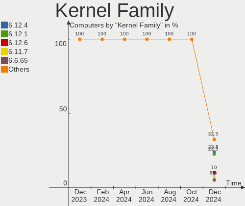
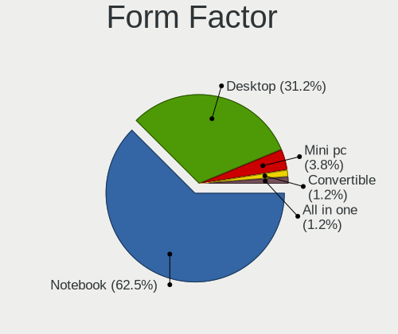
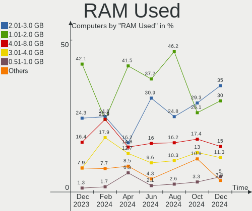
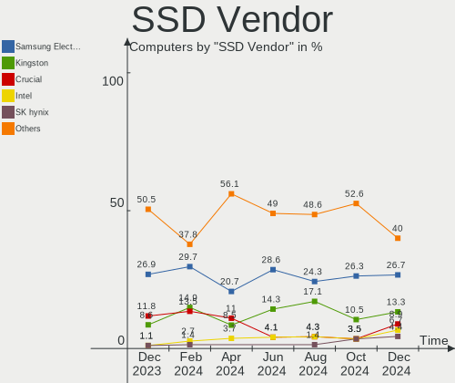
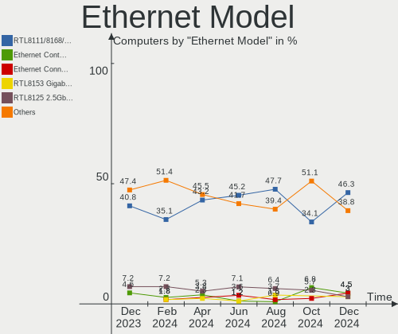

ArcoLinux - Hardware Trends
---------------------------

A project to identify most popular hardware characteristics and track their change
over time based on data collected by Linux users at https://Linux-Hardware.org.

Anyone can contribute to this report by the [hw-probe](https://github.com/linuxhw/hw-probe) tool:

    sudo -E hw-probe -all -upload

This is a report for all computer types. See also reports for [desktops](/Dist/ArcoLinux/Desktop/README.md) and [notebooks](/Dist/ArcoLinux/Notebook/README.md).

This report is for one last month. Overall report since the beginning of time: [TestCoverage](https://github.com/linuxhw/TestCoverage)

Period: Nov, 2022.

Contents
--------

* [ System ](#system)
  - [ OS                       ](#os)
  - [ OS Family                ](#os-family)
  - [ Kernel                   ](#kernel)
  - [ Kernel Family            ](#kernel-family)
  - [ Kernel Major Ver.        ](#kernel-major-ver)
  - [ Arch                     ](#arch)
  - [ DE                       ](#de)
  - [ Display Server           ](#display-server)
  - [ Display Manager          ](#display-manager)
  - [ OS Lang                  ](#os-lang)
  - [ Boot Mode                ](#boot-mode)
  - [ Filesystem               ](#filesystem)
  - [ Part. scheme             ](#part-scheme)
  - [ Dual Boot with Linux/BSD ](#dual-boot-with-linuxbsd)
  - [ Dual Boot (Win)          ](#dual-boot-win)

* [ Board ](#board)
  - [ Vendor                   ](#vendor)
  - [ Model                    ](#model)
  - [ Model Family             ](#model-family)
  - [ MFG Year                 ](#mfg-year)
  - [ Form Factor              ](#form-factor)
  - [ Secure Boot              ](#secure-boot)
  - [ Coreboot                 ](#coreboot)
  - [ RAM Size                 ](#ram-size)
  - [ RAM Used                 ](#ram-used)
  - [ Total Drives             ](#total-drives)
  - [ Has CD-ROM               ](#has-cd-rom)
  - [ Has Ethernet             ](#has-ethernet)
  - [ Has WiFi                 ](#has-wifi)
  - [ Has Bluetooth            ](#has-bluetooth)

* [ Location ](#location)
  - [ Country                  ](#country)
  - [ City                     ](#city)

* [ Drives ](#drives)
  - [ Drive Vendor             ](#drive-vendor)
  - [ Drive Model              ](#drive-model)
  - [ HDD Vendor               ](#hdd-vendor)
  - [ SSD Vendor               ](#ssd-vendor)
  - [ Drive Kind               ](#drive-kind)
  - [ Drive Connector          ](#drive-connector)
  - [ Drive Size               ](#drive-size)
  - [ Space Total              ](#space-total)
  - [ Space Used               ](#space-used)
  - [ Malfunc. Drives          ](#malfunc-drives)
  - [ Malfunc. Drive Vendor    ](#malfunc-drive-vendor)
  - [ Malfunc. HDD Vendor      ](#malfunc-hdd-vendor)
  - [ Malfunc. Drive Kind      ](#malfunc-drive-kind)
  - [ Failed Drives            ](#failed-drives)
  - [ Failed Drive Vendor      ](#failed-drive-vendor)
  - [ Drive Status             ](#drive-status)

* [ Storage controller ](#storage-controller)
  - [ Storage Vendor           ](#storage-vendor)
  - [ Storage Model            ](#storage-model)
  - [ Storage Kind             ](#storage-kind)

* [ Processor ](#processor)
  - [ CPU Vendor               ](#cpu-vendor)
  - [ CPU Model                ](#cpu-model)
  - [ CPU Model Family         ](#cpu-model-family)
  - [ CPU Cores                ](#cpu-cores)
  - [ CPU Sockets              ](#cpu-sockets)
  - [ CPU Threads              ](#cpu-threads)
  - [ CPU Op-Modes             ](#cpu-op-modes)
  - [ CPU Microcode            ](#cpu-microcode)
  - [ CPU Microarch            ](#cpu-microarch)

* [ Graphics ](#graphics)
  - [ GPU Vendor               ](#gpu-vendor)
  - [ GPU Model                ](#gpu-model)
  - [ GPU Combo                ](#gpu-combo)
  - [ GPU Driver               ](#gpu-driver)
  - [ GPU Memory               ](#gpu-memory)

* [ Monitor ](#monitor)
  - [ Monitor Vendor           ](#monitor-vendor)
  - [ Monitor Model            ](#monitor-model)
  - [ Monitor Resolution       ](#monitor-resolution)
  - [ Monitor Diagonal         ](#monitor-diagonal)
  - [ Monitor Width            ](#monitor-width)
  - [ Aspect Ratio             ](#aspect-ratio)
  - [ Monitor Area             ](#monitor-area)
  - [ Pixel Density            ](#pixel-density)
  - [ Multiple Monitors        ](#multiple-monitors)

* [ Network ](#network)
  - [ Net Controller Vendor    ](#net-controller-vendor)
  - [ Net Controller Model     ](#net-controller-model)
  - [ Wireless Vendor          ](#wireless-vendor)
  - [ Wireless Model           ](#wireless-model)
  - [ Ethernet Vendor          ](#ethernet-vendor)
  - [ Ethernet Model           ](#ethernet-model)
  - [ Net Controller Kind      ](#net-controller-kind)
  - [ Used Controller          ](#used-controller)
  - [ NICs                     ](#nics)
  - [ IPv6                     ](#ipv6)

* [ Bluetooth ](#bluetooth)
  - [ Bluetooth Vendor         ](#bluetooth-vendor)
  - [ Bluetooth Model          ](#bluetooth-model)

* [ Sound ](#sound)
  - [ Sound Vendor             ](#sound-vendor)
  - [ Sound Model              ](#sound-model)

* [ Memory ](#memory)
  - [ Memory Vendor            ](#memory-vendor)
  - [ Memory Model             ](#memory-model)
  - [ Memory Kind              ](#memory-kind)
  - [ Memory Form Factor       ](#memory-form-factor)
  - [ Memory Size              ](#memory-size)
  - [ Memory Speed             ](#memory-speed)

* [ Printers & scanners ](#printers--scanners)
  - [ Printer Vendor           ](#printer-vendor)
  - [ Printer Model            ](#printer-model)
  - [ Scanner Vendor           ](#scanner-vendor)
  - [ Scanner Model            ](#scanner-model)

* [ Camera ](#camera)
  - [ Camera Vendor            ](#camera-vendor)
  - [ Camera Model             ](#camera-model)

* [ Security ](#security)
  - [ Fingerprint Vendor       ](#fingerprint-vendor)
  - [ Fingerprint Model        ](#fingerprint-model)
  - [ Chipcard Vendor          ](#chipcard-vendor)
  - [ Chipcard Model           ](#chipcard-model)

* [ Unsupported ](#unsupported)
  - [ Unsupported Devices      ](#unsupported-devices)
  - [ Unsupported Device Types ](#unsupported-device-types)

System
------

OS
--

Installed operating systems

| Name              | Computers | Percent |
|-------------------|-----------|---------|
| ArcoLinux Rolling | 56        | 90.32%  |
| ArcoLinux         | 6         | 9.68%   |

OS Family
---------

OS without a version

| Name      | Computers | Percent |
|-----------|-----------|---------|
| ArcoLinux | 62        | 100%    |

Kernel
------

Version of the Linux kernel

| Version                 | Computers | Percent |
|-------------------------|-----------|---------|
| 6.0.8-arch1-1           | 13        | 20.97%  |
| 6.0.9-arch1-1           | 7         | 11.29%  |
| 6.0.10-arch2-1          | 7         | 11.29%  |
| 6.0.7-arch1-1           | 6         | 9.68%   |
| 6.0.8-zen1-1-zen        | 5         | 8.06%   |
| 6.0.6-arch1-1           | 5         | 8.06%   |
| 6.0.7-zen1-1-zen        | 2         | 3.23%   |
| 6.0.7-x64v1-xanmod1-1.1 | 2         | 3.23%   |
| 6.0.2-x64v2-xanmod1-1   | 2         | 3.23%   |
| 5.15.79-1-lts           | 2         | 3.23%   |
| 6.0.9-zen1-1-zen        | 1         | 1.61%   |
| 6.0.7-AMD               | 1         | 1.61%   |
| 6.0.2-zen1-1-zen        | 1         | 1.61%   |
| 6.0.2-arch1-1           | 1         | 1.61%   |
| 6.0.10-zen2-1-zen       | 1         | 1.61%   |
| 6.0.1-arch2-1           | 1         | 1.61%   |
| 5.19.9-arch1-1          | 1         | 1.61%   |
| 5.18.9-arch1-1          | 1         | 1.61%   |
| 5.17.6-arch1-1          | 1         | 1.61%   |
| 5.16.12-arch1-1         | 1         | 1.61%   |
| 5.15.77-1-lts           | 1         | 1.61%   |

Kernel Family
-------------

Linux kernel without a distro release

| Version | Computers | Percent |
|---------|-----------|---------|
| 6.0.8   | 18        | 29.03%  |
| 6.0.7   | 11        | 17.74%  |
| 6.0.9   | 8         | 12.9%   |
| 6.0.10  | 8         | 12.9%   |
| 6.0.6   | 5         | 8.06%   |
| 6.0.2   | 4         | 6.45%   |
| 5.15.79 | 2         | 3.23%   |
| 6.0.1   | 1         | 1.61%   |
| 5.19.9  | 1         | 1.61%   |
| 5.18.9  | 1         | 1.61%   |
| 5.17.6  | 1         | 1.61%   |
| 5.16.12 | 1         | 1.61%   |
| 5.15.77 | 1         | 1.61%   |

Kernel Major Ver.
-----------------

Linux kernel major version

| Version | Computers | Percent |
|---------|-----------|---------|
| 6.0     | 55        | 88.71%  |
| 5.15    | 3         | 4.84%   |
| 5.19    | 1         | 1.61%   |
| 5.18    | 1         | 1.61%   |
| 5.17    | 1         | 1.61%   |
| 5.16    | 1         | 1.61%   |

Arch
----

OS architecture (x86_64, i586, etc.)

| Name   | Computers | Percent |
|--------|-----------|---------|
| x86_64 | 62        | 100%    |

DE
--

Desktop Environment

| Name       | Computers | Percent |
|------------|-----------|---------|
| XFCE       | 24        | 38.71%  |
| KDE5       | 14        | 22.58%  |
| i3         | 5         | 8.06%   |
| GNOME      | 3         | 4.84%   |
| awesome    | 3         | 4.84%   |
| MATE       | 2         | 3.23%   |
| LeftWM     | 2         | 3.23%   |
| chadwm     | 2         | 3.23%   |
| bspwm      | 2         | 3.23%   |
| xmonad     | 1         | 1.61%   |
| X-Cinnamon | 1         | 1.61%   |
| sway       | 1         | 1.61%   |
| qtile      | 1         | 1.61%   |
| Unknown    | 1         | 1.61%   |

Display Server
--------------

X11 or Wayland

| Name    | Computers | Percent |
|---------|-----------|---------|
| X11     | 57        | 91.94%  |
| Tty     | 3         | 4.84%   |
| Wayland | 2         | 3.23%   |

Display Manager
---------------

SDDM, LightDM, etc.

| Name    | Computers | Percent |
|---------|-----------|---------|
| SDDM    | 44        | 70.97%  |
| LightDM | 10        | 16.13%  |
| Unknown | 7         | 11.29%  |
| GDM     | 1         | 1.61%   |

OS Lang
-------

Language

| Lang       | Computers | Percent |
|------------|-----------|---------|
| en_US      | 32        | 51.61%  |
| de_DE      | 7         | 11.29%  |
| en_GB      | 5         | 8.06%   |
| ru_RU      | 2         | 3.23%   |
| en_CA      | 2         | 3.23%   |
| C          | 2         | 3.23%   |
| pt_PT      | 1         | 1.61%   |
| nb_NO      | 1         | 1.61%   |
| hu_HU.UTF8 | 1         | 1.61%   |
| es_UY      | 1         | 1.61%   |
| es_PE      | 1         | 1.61%   |
| es_MX      | 1         | 1.61%   |
| es_BO      | 1         | 1.61%   |
| es_AR      | 1         | 1.61%   |
| en_ZA      | 1         | 1.61%   |
| en_SG      | 1         | 1.61%   |
| en_IN      | 1         | 1.61%   |
| en_AG      | 1         | 1.61%   |

Boot Mode
---------

EFI or BIOS

| Mode | Computers | Percent |
|------|-----------|---------|
| EFI  | 47        | 75.81%  |
| BIOS | 15        | 24.19%  |

Filesystem
----------

Type of filesystem

| Type     | Computers | Percent |
|----------|-----------|---------|
| Ext4     | 39        | 62.9%   |
| Btrfs    | 19        | 30.65%  |
| Xfs      | 1         | 1.61%   |
| Tmpfs    | 1         | 1.61%   |
| Reiserfs | 1         | 1.61%   |
| Overlay  | 1         | 1.61%   |

Part. scheme
------------

Scheme of partitioning

| Type    | Computers | Percent |
|---------|-----------|---------|
| GPT     | 50        | 80.65%  |
| MBR     | 6         | 9.68%   |
| Unknown | 6         | 9.68%   |

Dual Boot with Linux/BSD
------------------------

Hosting more than one Linux/BSD

| Dual boot | Computers | Percent |
|-----------|-----------|---------|
| No        | 46        | 74.19%  |
| Yes       | 16        | 25.81%  |

Dual Boot (Win)
---------------

Hosting Linux and Windows

| Dual boot | Computers | Percent |
|-----------|-----------|---------|
| No        | 39        | 62.9%   |
| Yes       | 23        | 37.1%   |

Board
-----

Vendor
------

Motherboard manufacturer

| Name                | Computers | Percent |
|---------------------|-----------|---------|
| ASUSTek Computer    | 14        | 22.58%  |
| Hewlett-Packard     | 13        | 20.97%  |
| MSI                 | 7         | 11.29%  |
| Dell                | 6         | 9.68%   |
| Lenovo              | 4         | 6.45%   |
| Gigabyte Technology | 3         | 4.84%   |
| HUAWEI              | 2         | 3.23%   |
| Alienware           | 2         | 3.23%   |
| Acer                | 2         | 3.23%   |
| TUXEDO              | 1         | 1.61%   |
| Toshiba             | 1         | 1.61%   |
| Timi                | 1         | 1.61%   |
| System76            | 1         | 1.61%   |
| Intel               | 1         | 1.61%   |
| Fujitsu             | 1         | 1.61%   |
| CSL-Computer        | 1         | 1.61%   |
| ASRock              | 1         | 1.61%   |
| Apple               | 1         | 1.61%   |

Model
-----

Motherboard model

| Name                                 | Computers | Percent |
|--------------------------------------|-----------|---------|
| HP EliteBook 840 G2                  | 2         | 3.23%   |
| ASUS STRIX Z270H GAMING              | 2         | 3.23%   |
| TUXEDO Aura 15 Gen2                  | 1         | 1.61%   |
| Toshiba Satellite L775               | 1         | 1.61%   |
| Timi RedmiBook Pro 15S               | 1         | 1.61%   |
| System76 Oryx Pro                    | 1         | 1.61%   |
| MSI MS-7C91                          | 1         | 1.61%   |
| MSI MS-7C83                          | 1         | 1.61%   |
| MSI MS-7C37                          | 1         | 1.61%   |
| MSI MS-7B89                          | 1         | 1.61%   |
| MSI MS-7A15                          | 1         | 1.61%   |
| MSI Katana GF76 11UD                 | 1         | 1.61%   |
| MSI A320M-HDV R4.0                   | 1         | 1.61%   |
| Lenovo ThinkPad X270 20HNS03B00      | 1         | 1.61%   |
| Lenovo ThinkPad X240 20AMA0W706      | 1         | 1.61%   |
| Lenovo ThinkPad T14 Gen 1 20UDCTO1WW | 1         | 1.61%   |
| Lenovo B51-80 80LM                   | 1         | 1.61%   |
| Intel NUC7CJYH                       | 1         | 1.61%   |
| HUAWEI KLVL-WXX9                     | 1         | 1.61%   |
| HUAWEI HLYL-WXX9                     | 1         | 1.61%   |
| HP Z2 Tower G5 Workstation           | 1         | 1.61%   |
| HP Victus by Laptop 16-e0xxx         | 1         | 1.61%   |
| HP ProDesk 600 G1 SFF                | 1         | 1.61%   |
| HP Pavilion Gaming Laptop 15-ec0xxx  | 1         | 1.61%   |
| HP Pavilion dv6                      | 1         | 1.61%   |
| HP OMEN 30L Desktop GT13-1xxx        | 1         | 1.61%   |
| HP Laptop 15-da0xxx                  | 1         | 1.61%   |
| HP EliteBook 840 G1                  | 1         | 1.61%   |
| HP Desktop M01-F1xxx                 | 1         | 1.61%   |
| HP 500-536d                          | 1         | 1.61%   |
| HP 250 G7 Notebook PC                | 1         | 1.61%   |
| Gigabyte Z87X-SLI                    | 1         | 1.61%   |
| Gigabyte Z690 AORUS ELITE AX         | 1         | 1.61%   |
| Gigabyte B85M-D3H                    | 1         | 1.61%   |
| Fujitsu LIFEBOOK U759                | 1         | 1.61%   |
| Dell XPS 15 9570                     | 1         | 1.61%   |
| Dell Vostro 3550                     | 1         | 1.61%   |
| Dell Precision 3571                  | 1         | 1.61%   |
| Dell OptiPlex 3050                   | 1         | 1.61%   |
| Dell Latitude E5470                  | 1         | 1.61%   |

Model Family
------------

Motherboard model prefix

| Name              | Computers | Percent |
|-------------------|-----------|---------|
| ASUS PRIME        | 5         | 8.06%   |
| Lenovo ThinkPad   | 3         | 4.84%   |
| HP EliteBook      | 3         | 4.84%   |
| HP Pavilion       | 2         | 3.23%   |
| Dell Latitude     | 2         | 3.23%   |
| ASUS STRIX        | 2         | 3.23%   |
| TUXEDO Aura       | 1         | 1.61%   |
| Toshiba Satellite | 1         | 1.61%   |
| Timi RedmiBook    | 1         | 1.61%   |
| System76 Oryx     | 1         | 1.61%   |
| MSI MS-7C91       | 1         | 1.61%   |
| MSI MS-7C83       | 1         | 1.61%   |
| MSI MS-7C37       | 1         | 1.61%   |
| MSI MS-7B89       | 1         | 1.61%   |
| MSI MS-7A15       | 1         | 1.61%   |
| MSI Katana        | 1         | 1.61%   |
| MSI A320M-HDV     | 1         | 1.61%   |
| Lenovo B51-80     | 1         | 1.61%   |
| Intel NUC7CJYH    | 1         | 1.61%   |
| HUAWEI KLVL-WXX9  | 1         | 1.61%   |
| HUAWEI HLYL-WXX9  | 1         | 1.61%   |
| HP Z2             | 1         | 1.61%   |
| HP Victus         | 1         | 1.61%   |
| HP ProDesk        | 1         | 1.61%   |
| HP OMEN           | 1         | 1.61%   |
| HP Laptop         | 1         | 1.61%   |
| HP Desktop        | 1         | 1.61%   |
| HP 500-536d       | 1         | 1.61%   |
| HP 250            | 1         | 1.61%   |
| Gigabyte Z87X-SLI | 1         | 1.61%   |
| Gigabyte Z690     | 1         | 1.61%   |
| Gigabyte B85M-D3H | 1         | 1.61%   |
| Fujitsu LIFEBOOK  | 1         | 1.61%   |
| Dell XPS          | 1         | 1.61%   |
| Dell Vostro       | 1         | 1.61%   |
| Dell Precision    | 1         | 1.61%   |
| Dell OptiPlex     | 1         | 1.61%   |
| CSL-Computer R    | 1         | 1.61%   |
| ASUS Zephyrus     | 1         | 1.61%   |
| ASUS TUF          | 1         | 1.61%   |

MFG Year
--------

Motherboard manufacture year

| Year | Computers | Percent |
|------|-----------|---------|
| 2021 | 10        | 16.13%  |
| 2019 | 9         | 14.52%  |
| 2017 | 7         | 11.29%  |
| 2020 | 6         | 9.68%   |
| 2018 | 5         | 8.06%   |
| 2015 | 5         | 8.06%   |
| 2013 | 5         | 8.06%   |
| 2012 | 4         | 6.45%   |
| 2022 | 2         | 3.23%   |
| 2016 | 2         | 3.23%   |
| 2014 | 2         | 3.23%   |
| 2011 | 2         | 3.23%   |
| 2010 | 1         | 1.61%   |
| 2008 | 1         | 1.61%   |
| 2007 | 1         | 1.61%   |

Form Factor
-----------

Physical design of the computer

| Name     | Computers | Percent |
|----------|-----------|---------|
| Notebook | 31        | 50%     |
| Desktop  | 30        | 48.39%  |
| Mini pc  | 1         | 1.61%   |

Secure Boot
-----------

Enabled or disabled

| State    | Computers | Percent |
|----------|-----------|---------|
| Disabled | 62        | 100%    |

Coreboot
--------

Have coreboot on board

| Used | Computers | Percent |
|------|-----------|---------|
| No   | 62        | 100%    |

RAM Size
--------

Total RAM memory

| Size in GB  | Computers | Percent |
|-------------|-----------|---------|
| 4.01-8.0    | 16        | 25.81%  |
| 32.01-64.0  | 13        | 20.97%  |
| 8.01-16.0   | 12        | 19.35%  |
| 3.01-4.0    | 9         | 14.52%  |
| 16.01-24.0  | 8         | 12.9%   |
| 24.01-32.0  | 3         | 4.84%   |
| 64.01-256.0 | 1         | 1.61%   |

RAM Used
--------

Used RAM memory

| Used GB   | Computers | Percent |
|-----------|-----------|---------|
| 1.01-2.0  | 25        | 40.32%  |
| 4.01-8.0  | 11        | 17.74%  |
| 2.01-3.0  | 9         | 14.52%  |
| 3.01-4.0  | 7         | 11.29%  |
| 0.51-1.0  | 6         | 9.68%   |
| 8.01-16.0 | 4         | 6.45%   |

Total Drives
------------

Number of drives on board

| Drives | Computers | Percent |
|--------|-----------|---------|
| 1      | 31        | 50%     |
| 2      | 16        | 25.81%  |
| 3      | 11        | 17.74%  |
| 4      | 2         | 3.23%   |
| 6      | 1         | 1.61%   |
| 5      | 1         | 1.61%   |

Has CD-ROM
----------

Has CD-ROM on board

| Presented | Computers | Percent |
|-----------|-----------|---------|
| No        | 50        | 80.65%  |
| Yes       | 12        | 19.35%  |

Has Ethernet
------------

Has Ethernet on board

| Presented | Computers | Percent |
|-----------|-----------|---------|
| Yes       | 57        | 91.94%  |
| No        | 5         | 8.06%   |

Has WiFi
--------

Has WiFi module

| Presented | Computers | Percent |
|-----------|-----------|---------|
| Yes       | 46        | 74.19%  |
| No        | 16        | 25.81%  |

Has Bluetooth
-------------

Has Bluetooth module

| Presented | Computers | Percent |
|-----------|-----------|---------|
| Yes       | 40        | 64.52%  |
| No        | 22        | 35.48%  |

Location
--------

Country
-------

Geographic location (country)

| Country         | Computers | Percent |
|-----------------|-----------|---------|
| USA             | 13        | 20.97%  |
| Germany         | 6         | 9.68%   |
| Belgium         | 5         | 8.06%   |
| UK              | 3         | 4.84%   |
| Russia          | 3         | 4.84%   |
| India           | 3         | 4.84%   |
| Romania         | 2         | 3.23%   |
| Netherlands     | 2         | 3.23%   |
| Mexico          | 2         | 3.23%   |
| Hungary         | 2         | 3.23%   |
| Canada          | 2         | 3.23%   |
| Venezuela       | 1         | 1.61%   |
| Uruguay         | 1         | 1.61%   |
| Sweden          | 1         | 1.61%   |
| South Africa    | 1         | 1.61%   |
| Singapore       | 1         | 1.61%   |
| Portugal        | 1         | 1.61%   |
| Peru            | 1         | 1.61%   |
| Norway          | 1         | 1.61%   |
| North Macedonia | 1         | 1.61%   |
| Malaysia        | 1         | 1.61%   |
| Italy           | 1         | 1.61%   |
| Greece          | 1         | 1.61%   |
| Gibraltar       | 1         | 1.61%   |
| France          | 1         | 1.61%   |
| Estonia         | 1         | 1.61%   |
| Czechia         | 1         | 1.61%   |
| Brazil          | 1         | 1.61%   |
| Bolivia         | 1         | 1.61%   |
| Argentina       | 1         | 1.61%   |

City
----

Geographic location (city)

| City                  | Computers | Percent |
|-----------------------|-----------|---------|
| Duffel                | 3         | 4.84%   |
| Walhalla              | 2         | 3.23%   |
| Moscow                | 2         | 3.23%   |
| Houston               | 2         | 3.23%   |
| Weimar                | 1         | 1.61%   |
| Waldport              | 1         | 1.61%   |
| Vence                 | 1         | 1.61%   |
| Vapi                  | 1         | 1.61%   |
| Tallinn               | 1         | 1.61%   |
| Tacoma                | 1         | 1.61%   |
| Surprise              | 1         | 1.61%   |
| Surat                 | 1         | 1.61%   |
| Somerset West         | 1         | 1.61%   |
| Singapore             | 1         | 1.61%   |
| Røyken Municipality  | 1         | 1.61%   |
| Royal Tunbridge Wells | 1         | 1.61%   |
| Roosendaal            | 1         | 1.61%   |
| Prague                | 1         | 1.61%   |
| Pilisszanto           | 1         | 1.61%   |
| Örebro               | 1         | 1.61%   |
| Nuevo Laredo          | 1         | 1.61%   |
| Novokuznetsk          | 1         | 1.61%   |
| Newport               | 1         | 1.61%   |
| Newmarket             | 1         | 1.61%   |
| Neustadt in Holstein  | 1         | 1.61%   |
| Munich                | 1         | 1.61%   |
| Montevideo            | 1         | 1.61%   |
| Milton Keynes         | 1         | 1.61%   |
| Mexico City           | 1         | 1.61%   |
| Maracaibo             | 1         | 1.61%   |
| Malacca               | 1         | 1.61%   |
| London                | 1         | 1.61%   |
| Lisbon                | 1         | 1.61%   |
| Kirchheim unter Teck  | 1         | 1.61%   |
| Ica                   | 1         | 1.61%   |
| Hulshout              | 1         | 1.61%   |
| Hercules              | 1         | 1.61%   |
| Gurgaon               | 1         | 1.61%   |
| Gibraltar             | 1         | 1.61%   |
| Gelsenkirchen         | 1         | 1.61%   |

Drives
------

Drive Vendor
------------

Hard drive vendors

| Vendor                      | Computers | Drives | Percent |
|-----------------------------|-----------|--------|---------|
| WDC                         | 14        | 17     | 14.14%  |
| Seagate                     | 14        | 18     | 14.14%  |
| Samsung Electronics         | 14        | 17     | 14.14%  |
| Kingston                    | 9         | 9      | 9.09%   |
| Toshiba                     | 5         | 6      | 5.05%   |
| Sandisk                     | 5         | 5      | 5.05%   |
| SK hynix                    | 4         | 4      | 4.04%   |
| Unknown                     | 3         | 3      | 3.03%   |
| Phison Electronics          | 3         | 3      | 3.03%   |
| Kingston Technology Company | 3         | 3      | 3.03%   |
| Hitachi                     | 3         | 4      | 3.03%   |
| Crucial                     | 3         | 3      | 3.03%   |
| SPCC                        | 2         | 2      | 2.02%   |
| KIOXIA                      | 2         | 2      | 2.02%   |
| Intel                       | 2         | 2      | 2.02%   |
| Hewlett-Packard             | 2         | 2      | 2.02%   |
| Verbatim                    | 1         | 1      | 1.01%   |
| Union Memory                | 1         | 1      | 1.01%   |
| Realtek Semiconductor       | 1         | 1      | 1.01%   |
| PNY                         | 1         | 1      | 1.01%   |
| Netac                       | 1         | 1      | 1.01%   |
| Maxtor                      | 1         | 1      | 1.01%   |
| JMicron Technology          | 1         | 1      | 1.01%   |
| Corsair                     | 1         | 1      | 1.01%   |
| China                       | 1         | 1      | 1.01%   |
| Apple                       | 1         | 1      | 1.01%   |
| A-DATA Technology           | 1         | 1      | 1.01%   |

Drive Model
-----------

Hard drive models

| Model                                                | Computers | Percent |
|------------------------------------------------------|-----------|---------|
| Samsung NVMe SSD Controller PM9A1/PM9A3/980PRO 250GB | 4         | 3.67%   |
| Kingston SA400S37240G 240GB SSD                      | 4         | 3.67%   |
| Samsung NVMe SSD Controller SM981/PM981/PM983 1TB    | 3         | 2.75%   |
| Samsung NVMe SSD Controller SM961/PM961/SM963 250GB  | 3         | 2.75%   |
| WDC WDS500G2B0B-00YS70 500GB SSD                     | 2         | 1.83%   |
| Toshiba XG6 NVMe SSD Controller 256GB                | 2         | 1.83%   |
| Seagate ST2000DM001-1CH164 2TB                       | 2         | 1.83%   |
| Seagate ST1000DM003-1ER162 1TB                       | 2         | 1.83%   |
| Sandisk WD Blue SN550 NVMe SSD 1TB                   | 2         | 1.83%   |
| Samsung SSD 860 EVO 250GB                            | 2         | 1.83%   |
| Phison E16 PCIe4 NVMe Controller 1TB                 | 2         | 1.83%   |
| WDC WDS250G2B0A-00SM50 250GB SSD                     | 1         | 0.92%   |
| WDC WDS240G2G0A-00JH30 240GB SSD                     | 1         | 0.92%   |
| WDC WD84PURZ-85B2YY0 8TB                             | 1         | 0.92%   |
| WDC WD5000LPVX-22V0TT0 500GB                         | 1         | 0.92%   |
| WDC WD5000AZRX-00A8LB0 500GB                         | 1         | 0.92%   |
| WDC WD5000AAKS-65A7B2 500GB                          | 1         | 0.92%   |
| WDC WD5000AACS-00G8B1 500GB                          | 1         | 0.92%   |
| WDC WD3200BEKT-75PVMT1 320GB                         | 1         | 0.92%   |
| WDC WD3200AVJS-63B6A0 320GB                          | 1         | 0.92%   |
| WDC WD20SPZX-22UA7T0 2TB                             | 1         | 0.92%   |
| WDC WD10SPZX-60Z10T0 1TB                             | 1         | 0.92%   |
| WDC WD10EZEX-60WN4A1 1TB                             | 1         | 0.92%   |
| WDC WD10EZEX-22MFCA0 1TB                             | 1         | 0.92%   |
| WDC WD10EZEX-08WN4A0 1TB                             | 1         | 0.92%   |
| WDC PC SA530 SDASN8Y-256G-1006 256GB SSD             | 1         | 0.92%   |
| Verbatim Portable Drive 1TB                          | 1         | 0.92%   |
| Unknown SD/MMC/MS PRO 8GB                            | 1         | 0.92%   |
| Unknown MMC Card  64GB                               | 1         | 0.92%   |
| Unknown MMC Card  16GB                               | 1         | 0.92%   |
| Union Memory UMIS RPJTJ128MEE1MWX 128GB              | 1         | 0.92%   |
| Toshiba MQ04ABF100 1TB                               | 1         | 0.92%   |
| Toshiba KXG50ZNV1T02 NVMe 1024GB                     | 1         | 0.92%   |
| Toshiba HDWD110 1TB                                  | 1         | 0.92%   |
| Toshiba DT01ACA100 1TB                               | 1         | 0.92%   |
| SPCC Solid State Disk 256GB                          | 1         | 0.92%   |
| SPCC Solid State Disk 128GB                          | 1         | 0.92%   |
| SK hynix SC308 SATA 256GB SSD                        | 1         | 0.92%   |
| SK hynix PC801 NVMe 1TB                              | 1         | 0.92%   |
| SK hynix PC711 HFS512GDE9X073N 512GB                 | 1         | 0.92%   |

HDD Vendor
----------

Hard disk drive vendors

| Vendor  | Computers | Drives | Percent |
|---------|-----------|--------|---------|
| Seagate | 14        | 18     | 43.75%  |
| WDC     | 10        | 12     | 31.25%  |
| Hitachi | 3         | 4      | 9.38%   |
| Toshiba | 2         | 3      | 6.25%   |
| Unknown | 1         | 1      | 3.13%   |
| Maxtor  | 1         | 1      | 3.13%   |
| Apple   | 1         | 1      | 3.13%   |

SSD Vendor
----------

Solid state drive vendors

| Vendor              | Computers | Drives | Percent |
|---------------------|-----------|--------|---------|
| Kingston            | 8         | 8      | 22.22%  |
| Samsung Electronics | 7         | 7      | 19.44%  |
| WDC                 | 5         | 5      | 13.89%  |
| Crucial             | 3         | 3      | 8.33%   |
| SPCC                | 2         | 2      | 5.56%   |
| SK hynix            | 2         | 2      | 5.56%   |
| Hewlett-Packard     | 2         | 2      | 5.56%   |
| SanDisk             | 1         | 1      | 2.78%   |
| PNY                 | 1         | 1      | 2.78%   |
| Netac               | 1         | 1      | 2.78%   |
| JMicron Technology  | 1         | 1      | 2.78%   |
| Corsair             | 1         | 1      | 2.78%   |
| China               | 1         | 1      | 2.78%   |
| A-DATA Technology   | 1         | 1      | 2.78%   |

Drive Kind
----------

HDD or SSD

| Kind    | Computers | Drives | Percent |
|---------|-----------|--------|---------|
| SSD     | 31        | 36     | 33.7%   |
| NVMe    | 30        | 32     | 32.61%  |
| HDD     | 28        | 40     | 30.43%  |
| MMC     | 2         | 2      | 2.17%   |
| Unknown | 1         | 1      | 1.09%   |

Drive Connector
---------------

SATA, SAS, NVMe, etc.

| Type | Computers | Drives | Percent |
|------|-----------|--------|---------|
| SATA | 46        | 72     | 56.1%   |
| NVMe | 30        | 32     | 36.59%  |
| SAS  | 4         | 5      | 4.88%   |
| MMC  | 2         | 2      | 2.44%   |

Drive Size
----------

Size of hard drive

| Size in TB | Computers | Drives | Percent |
|------------|-----------|--------|---------|
| 0.01-0.5   | 33        | 40     | 53.23%  |
| 0.51-1.0   | 16        | 20     | 25.81%  |
| 1.01-2.0   | 7         | 7      | 11.29%  |
| 4.01-10.0  | 4         | 6      | 6.45%   |
| 3.01-4.0   | 1         | 1      | 1.61%   |
| 2.01-3.0   | 1         | 2      | 1.61%   |

Space Total
-----------

Amount of disk space available on the file system

| Size in GB     | Computers | Percent |
|----------------|-----------|---------|
| 101-250        | 15        | 24.19%  |
| More than 3000 | 13        | 20.97%  |
| 251-500        | 13        | 20.97%  |
| 501-1000       | 10        | 16.13%  |
| 1001-2000      | 6         | 9.68%   |
| Unknown        | 2         | 3.23%   |
| 21-50          | 1         | 1.61%   |
| 1-20           | 1         | 1.61%   |
| 51-100         | 1         | 1.61%   |

Space Used
----------

Amount of used disk space

| Used GB        | Computers | Percent |
|----------------|-----------|---------|
| 1-20           | 16        | 25.81%  |
| 51-100         | 13        | 20.97%  |
| 251-500        | 8         | 12.9%   |
| 101-250        | 8         | 12.9%   |
| 21-50          | 5         | 8.06%   |
| 501-1000       | 5         | 8.06%   |
| More than 3000 | 3         | 4.84%   |
| Unknown        | 2         | 3.23%   |
| 2001-3000      | 1         | 1.61%   |
| 1001-2000      | 1         | 1.61%   |

Malfunc. Drives
---------------

Drive models with a malfunction

| Model                                             | Computers | Drives | Percent |
|---------------------------------------------------|-----------|--------|---------|
| WDC WD5000AACS-00G8B1 500GB                       | 1         | 1      | 9.09%   |
| WDC WD3200AVJS-63B6A0 320GB                       | 1         | 1      | 9.09%   |
| WDC PC SA530 SDASN8Y-256G-1006 256GB SSD          | 1         | 1      | 9.09%   |
| SK hynix PC711 HFS512GDE9X073N 512GB              | 1         | 1      | 9.09%   |
| Seagate ST9320325AS 320GB                         | 1         | 1      | 9.09%   |
| Seagate ST3500312CS 500GB                         | 1         | 1      | 9.09%   |
| Sandisk WD Black SN750 / PC SN730 NVMe SSD 1024GB | 1         | 1      | 9.09%   |
| Intel SSD 600P Series 1024GB                      | 1         | 1      | 9.09%   |
| Hitachi HTS547564A9E384 640GB                     | 1         | 1      | 9.09%   |
| Corsair CSSD-F60GB2 64GB                          | 1         | 1      | 9.09%   |
| China SSD 240GB                                   | 1         | 1      | 9.09%   |

Malfunc. Drive Vendor
---------------------

Vendors of faulty drives

| Vendor   | Computers | Drives | Percent |
|----------|-----------|--------|---------|
| WDC      | 3         | 3      | 27.27%  |
| Seagate  | 2         | 2      | 18.18%  |
| SK hynix | 1         | 1      | 9.09%   |
| Sandisk  | 1         | 1      | 9.09%   |
| Intel    | 1         | 1      | 9.09%   |
| Hitachi  | 1         | 1      | 9.09%   |
| Corsair  | 1         | 1      | 9.09%   |
| China    | 1         | 1      | 9.09%   |

Malfunc. HDD Vendor
-------------------

Vendors of faulty HDD drives

| Vendor  | Computers | Drives | Percent |
|---------|-----------|--------|---------|
| WDC     | 2         | 2      | 40%     |
| Seagate | 2         | 2      | 40%     |
| Hitachi | 1         | 1      | 20%     |

Malfunc. Drive Kind
-------------------

Kinds of faulty drives

| Kind | Computers | Drives | Percent |
|------|-----------|--------|---------|
| HDD  | 5         | 5      | 45.45%  |
| NVMe | 3         | 3      | 27.27%  |
| SSD  | 3         | 3      | 27.27%  |

Failed Drives
-------------

Failed drive models

Zero info for selected period =(

Failed Drive Vendor
-------------------

Failed drive vendors

Zero info for selected period =(

Drive Status
------------

Number of failed and malfunc. drives

| Status   | Computers | Drives | Percent |
|----------|-----------|--------|---------|
| Works    | 49        | 80     | 69.01%  |
| Detected | 12        | 20     | 16.9%   |
| Malfunc  | 10        | 11     | 14.08%  |

Storage controller
------------------

Storage Vendor
--------------

Storage controller vendors

| Vendor                       | Computers | Percent |
|------------------------------|-----------|---------|
| Intel                        | 42        | 47.73%  |
| AMD                          | 14        | 15.91%  |
| Samsung Electronics          | 9         | 10.23%  |
| SanDisk                      | 4         | 4.55%   |
| Kingston Technology Company  | 4         | 4.55%   |
| Toshiba America Info Systems | 3         | 3.41%   |
| Phison Electronics           | 3         | 3.41%   |
| SK hynix                     | 2         | 2.27%   |
| KIOXIA                       | 2         | 2.27%   |
| Union Memory (Shenzhen)      | 1         | 1.14%   |
| Realtek Semiconductor        | 1         | 1.14%   |
| Marvell Technology Group     | 1         | 1.14%   |
| JMicron Technology           | 1         | 1.14%   |
| ASMedia Technology           | 1         | 1.14%   |

Storage Model
-------------

Storage controller models

| Model                                                                          | Computers | Percent |
|--------------------------------------------------------------------------------|-----------|---------|
| AMD FCH SATA Controller [AHCI mode]                                            | 10        | 10.2%   |
| Samsung NVMe SSD Controller PM9A1/PM9A3/980PRO                                 | 4         | 4.08%   |
| Intel 8 Series/C220 Series Chipset Family 6-port SATA Controller 1 [AHCI mode] | 4         | 4.08%   |
| Intel 200 Series PCH SATA controller [AHCI mode]                               | 4         | 4.08%   |
| AMD 400 Series Chipset SATA Controller                                         | 4         | 4.08%   |
| Samsung NVMe SSD Controller SM981/PM981/PM983                                  | 3         | 3.06%   |
| Samsung NVMe SSD Controller SM961/PM961/SM963                                  | 3         | 3.06%   |
| Intel Q170/Q150/B150/H170/H110/Z170/CM236 Chipset SATA Controller [AHCI Mode]  | 3         | 3.06%   |
| Intel Celeron/Pentium Silver Processor SATA Controller                         | 3         | 3.06%   |
| Intel 6 Series/C200 Series Chipset Family 6 port Mobile SATA AHCI Controller   | 3         | 3.06%   |
| AMD 500 Series Chipset SATA Controller                                         | 3         | 3.06%   |
| Toshiba America Info Systems XG6 NVMe SSD Controller                           | 2         | 2.04%   |
| SanDisk WD Blue SN550 NVMe SSD                                                 | 2         | 2.04%   |
| Phison E16 PCIe4 NVMe Controller                                               | 2         | 2.04%   |
| KIOXIA NVMe SSD Controller BG4                                                 | 2         | 2.04%   |
| Intel Wildcat Point-LP SATA Controller [AHCI Mode]                             | 2         | 2.04%   |
| Intel Volume Management Device NVMe RAID Controller                            | 2         | 2.04%   |
| Intel Sunrise Point-LP SATA Controller [AHCI mode]                             | 2         | 2.04%   |
| Intel Cannon Lake Mobile PCH SATA AHCI Controller                              | 2         | 2.04%   |
| Intel Alder Lake-S PCH SATA Controller [AHCI Mode]                             | 2         | 2.04%   |
| Intel 82801 Mobile SATA Controller [RAID mode]                                 | 2         | 2.04%   |
| Intel 8 Series SATA Controller 1 [AHCI mode]                                   | 2         | 2.04%   |
| Intel 7 Series Chipset Family 6-port SATA Controller [AHCI mode]               | 2         | 2.04%   |
| Intel 400 Series Chipset Family SATA AHCI Controller                           | 2         | 2.04%   |
| AMD FCH SATA Controller D                                                      | 2         | 2.04%   |
| Union Memory (Shenzhen) Non-Volatile memory controller                         | 1         | 1.02%   |
| Toshiba America Info Systems XG5 NVMe SSD Controller                           | 1         | 1.02%   |
| SK hynix Non-Volatile memory controller                                        | 1         | 1.02%   |
| SK hynix Gold P31/PC711 NVMe Solid State Drive                                 | 1         | 1.02%   |
| SanDisk WD Black SN750 / PC SN730 NVMe SSD                                     | 1         | 1.02%   |
| SanDisk Non-Volatile memory controller                                         | 1         | 1.02%   |
| Realtek Realtek Non-Volatile memory controller                                 | 1         | 1.02%   |
| Phison E12 NVMe Controller                                                     | 1         | 1.02%   |
| Marvell Group 88SE9120 SATA 6Gb/s Controller                                   | 1         | 1.02%   |
| Kingston Company U-SNS8154P3 NVMe SSD                                          | 1         | 1.02%   |
| Kingston Company SNVS2000G [NV1 NVMe PCIe SSD 2TB]                             | 1         | 1.02%   |
| Kingston Company OM3PDP3 NVMe SSD                                              | 1         | 1.02%   |
| Kingston Company A2000 NVMe SSD                                                | 1         | 1.02%   |
| JMicron JMB363 SATA/IDE Controller                                             | 1         | 1.02%   |
| Intel SSD Pro 7600p/760p/E 6100p Series                                        | 1         | 1.02%   |

Storage Kind
------------

Kind of storage controller (IDE, SATA, NVMe, SAS, ...)

| Kind | Computers | Percent |
|------|-----------|---------|
| SATA | 50        | 57.47%  |
| NVMe | 30        | 34.48%  |
| RAID | 5         | 5.75%   |
| IDE  | 2         | 2.3%    |

Processor
---------

CPU Vendor
----------

Processor vendors

| Vendor | Computers | Percent |
|--------|-----------|---------|
| Intel  | 44        | 70.97%  |
| AMD    | 18        | 29.03%  |

CPU Model
---------

Processor models

| Model                                  | Computers | Percent |
|----------------------------------------|-----------|---------|
| Intel Core i7-7700K CPU @ 4.20GHz      | 2         | 3.23%   |
| Intel Core i5-4200U CPU @ 1.60GHz      | 2         | 3.23%   |
| Intel Core i3-7100 CPU @ 3.90GHz       | 2         | 3.23%   |
| AMD Ryzen 5 5600G with Radeon Graphics | 2         | 3.23%   |
| Intel Pentium Dual CPU E2180 @ 2.00GHz | 1         | 1.61%   |
| Intel Pentium CPU G4560 @ 3.50GHz      | 1         | 1.61%   |
| Intel Core i9-8950HK CPU @ 2.90GHz     | 1         | 1.61%   |
| Intel Core i7-9750H CPU @ 2.60GHz      | 1         | 1.61%   |
| Intel Core i7-8750H CPU @ 2.20GHz      | 1         | 1.61%   |
| Intel Core i7-8665U CPU @ 1.90GHz      | 1         | 1.61%   |
| Intel Core i7-7700 CPU @ 3.60GHz       | 1         | 1.61%   |
| Intel Core i7-4770 CPU @ 3.40GHz       | 1         | 1.61%   |
| Intel Core i7-3770K CPU @ 3.50GHz      | 1         | 1.61%   |
| Intel Core i7-3520M CPU @ 2.90GHz      | 1         | 1.61%   |
| Intel Core i7-10700 CPU @ 2.90GHz      | 1         | 1.61%   |
| Intel Core i5-7300U CPU @ 2.60GHz      | 1         | 1.61%   |
| Intel Core i5-7200U CPU @ 2.50GHz      | 1         | 1.61%   |
| Intel Core i5-6400 CPU @ 2.70GHz       | 1         | 1.61%   |
| Intel Core i5-6300U CPU @ 2.40GHz      | 1         | 1.61%   |
| Intel Core i5-5300U CPU @ 2.30GHz      | 1         | 1.61%   |
| Intel Core i5-5200U CPU @ 2.20GHz      | 1         | 1.61%   |
| Intel Core i5-4690K CPU @ 3.50GHz      | 1         | 1.61%   |
| Intel Core i5-4570 CPU @ 3.20GHz       | 1         | 1.61%   |
| Intel Core i5-4200M CPU @ 2.50GHz      | 1         | 1.61%   |
| Intel Core i5-2430M CPU @ 2.40GHz      | 1         | 1.61%   |
| Intel Core i5-2410M CPU @ 2.30GHz      | 1         | 1.61%   |
| Intel Core i5-10400F CPU @ 2.90GHz     | 1         | 1.61%   |
| Intel Core i3-6100U CPU @ 2.30GHz      | 1         | 1.61%   |
| Intel Core i3-4160 CPU @ 3.60GHz       | 1         | 1.61%   |
| Intel Core i3-3240 CPU @ 3.40GHz       | 1         | 1.61%   |
| Intel Core i3-3110M CPU @ 2.40GHz      | 1         | 1.61%   |
| Intel Core i3-2350M CPU @ 2.30GHz      | 1         | 1.61%   |
| Intel Core i3-10100 CPU @ 3.60GHz      | 1         | 1.61%   |
| Intel Core i3-1005G1 CPU @ 1.20GHz     | 1         | 1.61%   |
| Intel Core i3 CPU M 350 @ 2.27GHz      | 1         | 1.61%   |
| Intel Celeron N4120 CPU @ 1.10GHz      | 1         | 1.61%   |
| Intel Celeron N4000 CPU @ 1.10GHz      | 1         | 1.61%   |
| Intel Celeron J4005 CPU @ 2.00GHz      | 1         | 1.61%   |
| Intel 12th Gen Core i9-12900K          | 1         | 1.61%   |
| Intel 12th Gen Core i7-12700H          | 1         | 1.61%   |

CPU Model Family
----------------

Processor model prefix

| Model              | Computers | Percent |
|--------------------|-----------|---------|
| Intel Core i5      | 14        | 22.58%  |
| Intel Core i7      | 10        | 16.13%  |
| Intel Core i3      | 10        | 16.13%  |
| AMD Ryzen 7        | 7         | 11.29%  |
| AMD Ryzen 5        | 7         | 11.29%  |
| Other              | 4         | 6.45%   |
| Intel Celeron      | 3         | 4.84%   |
| Intel Pentium Dual | 1         | 1.61%   |
| Intel Pentium      | 1         | 1.61%   |
| Intel Core i9      | 1         | 1.61%   |
| AMD Ryzen 9        | 1         | 1.61%   |
| AMD Ryzen 7 PRO    | 1         | 1.61%   |
| AMD Ryzen 3        | 1         | 1.61%   |
| AMD Athlon         | 1         | 1.61%   |

CPU Cores
---------

Number of processor cores

| Number | Computers | Percent |
|--------|-----------|---------|
| 2      | 25        | 40.32%  |
| 4      | 13        | 20.97%  |
| 8      | 10        | 16.13%  |
| 6      | 10        | 16.13%  |
| 16     | 1         | 1.61%   |
| 14     | 1         | 1.61%   |
| 12     | 1         | 1.61%   |
| 10     | 1         | 1.61%   |

CPU Sockets
-----------

Number of sockets

| Number | Computers | Percent |
|--------|-----------|---------|
| 1      | 62        | 100%    |

CPU Threads
-----------

Threads per core (Hyper-Threading)

| Number | Computers | Percent |
|--------|-----------|---------|
| 2      | 53        | 85.48%  |
| 1      | 9         | 14.52%  |

CPU Op-Modes
------------

CPU Operation Modes (32-bit, 64-bit)

| Op mode        | Computers | Percent |
|----------------|-----------|---------|
| 32-bit, 64-bit | 62        | 100%    |

CPU Microcode
-------------

Microcode number

| Number     | Computers | Percent |
|------------|-----------|---------|
| Unknown    | 8         | 12.9%   |
| 0x906e9    | 6         | 9.68%   |
| 0x306c3    | 4         | 6.45%   |
| 0x306a9    | 3         | 4.84%   |
| 0x206a7    | 3         | 4.84%   |
| 0x0a50000c | 3         | 4.84%   |
| 0xa0655    | 2         | 3.23%   |
| 0x906ea    | 2         | 3.23%   |
| 0x90672    | 2         | 3.23%   |
| 0x706a1    | 2         | 3.23%   |
| 0x406e3    | 2         | 3.23%   |
| 0x40651    | 2         | 3.23%   |
| 0x0a201016 | 2         | 3.23%   |
| 0x08108109 | 2         | 3.23%   |
| 0x906a3    | 1         | 1.61%   |
| 0x806ec    | 1         | 1.61%   |
| 0x806e9    | 1         | 1.61%   |
| 0x806d1    | 1         | 1.61%   |
| 0x706e5    | 1         | 1.61%   |
| 0x706a8    | 1         | 1.61%   |
| 0x6fd      | 1         | 1.61%   |
| 0x306d4    | 1         | 1.61%   |
| 0x20652    | 1         | 1.61%   |
| 0x0a50000d | 1         | 1.61%   |
| 0x0a20120a | 1         | 1.61%   |
| 0x0a201205 | 1         | 1.61%   |
| 0x08701021 | 1         | 1.61%   |
| 0x08701013 | 1         | 1.61%   |
| 0x08608103 | 1         | 1.61%   |
| 0x08600106 | 1         | 1.61%   |
| 0x08600104 | 1         | 1.61%   |
| 0x08101016 | 1         | 1.61%   |
| 0x0800820d | 1         | 1.61%   |

CPU Microarch
-------------

Microarchitecture

| Name             | Computers | Percent |
|------------------|-----------|---------|
| KabyLake         | 12        | 19.35%  |
| Zen 3            | 8         | 12.9%   |
| Haswell          | 7         | 11.29%  |
| Zen 2            | 5         | 8.06%   |
| IvyBridge        | 4         | 6.45%   |
| Zen+             | 3         | 4.84%   |
| Skylake          | 3         | 4.84%   |
| SandyBridge      | 3         | 4.84%   |
| Goldmont plus    | 3         | 4.84%   |
| CometLake        | 3         | 4.84%   |
| Alderlake Hybrid | 3         | 4.84%   |
| Broadwell        | 2         | 3.23%   |
| Unknown          | 2         | 3.23%   |
| Zen              | 1         | 1.61%   |
| Westmere         | 1         | 1.61%   |
| IceLake          | 1         | 1.61%   |
| Core             | 1         | 1.61%   |

Graphics
--------

GPU Vendor
----------

Vendors of graphics cards

| Vendor | Computers | Percent |
|--------|-----------|---------|
| Intel  | 37        | 50%     |
| Nvidia | 20        | 27.03%  |
| AMD    | 17        | 22.97%  |

GPU Model
---------

Graphics card models

| Model                                                                       | Computers | Percent |
|-----------------------------------------------------------------------------|-----------|---------|
| Intel HD Graphics 630                                                       | 4         | 5.26%   |
| Intel GeminiLake [UHD Graphics 600]                                         | 3         | 3.95%   |
| Intel CoffeeLake-H GT2 [UHD Graphics 630]                                   | 3         | 3.95%   |
| Intel 2nd Generation Core Processor Family Integrated Graphics Controller   | 3         | 3.95%   |
| AMD Renoir                                                                  | 3         | 3.95%   |
| AMD Cezanne [Radeon Vega Series / Radeon Vega Mobile Series]                | 3         | 3.95%   |
| Nvidia TU117M [GeForce GTX 1650 Mobile / Max-Q]                             | 2         | 2.63%   |
| Intel Skylake GT2 [HD Graphics 520]                                         | 2         | 2.63%   |
| Intel HD Graphics 620                                                       | 2         | 2.63%   |
| Intel HD Graphics 5500                                                      | 2         | 2.63%   |
| Intel Haswell-ULT Integrated Graphics Controller                            | 2         | 2.63%   |
| Intel CometLake-S GT2 [UHD Graphics 630]                                    | 2         | 2.63%   |
| Intel 3rd Gen Core processor Graphics Controller                            | 2         | 2.63%   |
| AMD Picasso/Raven 2 [Radeon Vega Series / Radeon Vega Mobile Series]        | 2         | 2.63%   |
| AMD Ellesmere [Radeon RX 470/480/570/570X/580/580X/590]                     | 2         | 2.63%   |
| Nvidia TU117GLM [Quadro T1000 Mobile]                                       | 1         | 1.32%   |
| Nvidia TU117 [GeForce GTX 1650]                                             | 1         | 1.32%   |
| Nvidia TU116 [GeForce GTX 1650]                                             | 1         | 1.32%   |
| Nvidia TU106M [GeForce RTX 2060 Mobile]                                     | 1         | 1.32%   |
| Nvidia TU106 [GeForce RTX 2070]                                             | 1         | 1.32%   |
| Nvidia TU106 [GeForce RTX 2060 SUPER]                                       | 1         | 1.32%   |
| Nvidia TU106 [GeForce RTX 2060 Rev. A]                                      | 1         | 1.32%   |
| Nvidia GP107M [GeForce GTX 1050 Ti Mobile]                                  | 1         | 1.32%   |
| Nvidia GP104M [GeForce GTX 1070 Mobile]                                     | 1         | 1.32%   |
| Nvidia GP104 [GeForce GTX 1080]                                             | 1         | 1.32%   |
| Nvidia GM204 [GeForce GTX 970]                                              | 1         | 1.32%   |
| Nvidia GK107M [GeForce GT 750M]                                             | 1         | 1.32%   |
| Nvidia GA107M [GeForce RTX 3050 Ti Mobile]                                  | 1         | 1.32%   |
| Nvidia GA107GLM [RTX A1000 Laptop GPU]                                      | 1         | 1.32%   |
| Nvidia GA104 [GeForce RTX 3070]                                             | 1         | 1.32%   |
| Nvidia GA104 [GeForce RTX 3070 Ti]                                          | 1         | 1.32%   |
| Nvidia GA104 [GeForce RTX 3060 Ti Lite Hash Rate]                           | 1         | 1.32%   |
| Nvidia GA102 [GeForce RTX 3080 12GB]                                        | 1         | 1.32%   |
| Intel Xeon E3-1200 v3/4th Gen Core Processor Integrated Graphics Controller | 1         | 1.32%   |
| Intel Xeon E3-1200 v2/3rd Gen Core processor Graphics Controller            | 1         | 1.32%   |
| Intel WhiskeyLake-U GT2 [UHD Graphics 620]                                  | 1         | 1.32%   |
| Intel TigerLake-H GT1 [UHD Graphics]                                        | 1         | 1.32%   |
| Intel Iris Plus Graphics G1 (Ice Lake)                                      | 1         | 1.32%   |
| Intel HD Graphics 610                                                       | 1         | 1.32%   |
| Intel HD Graphics 530                                                       | 1         | 1.32%   |

GPU Combo
---------

Combinations of graphics cards

| Name           | Computers | Percent |
|----------------|-----------|---------|
| 1 x Intel      | 27        | 43.55%  |
| 1 x AMD        | 11        | 17.74%  |
| 1 x Nvidia     | 10        | 16.13%  |
| Intel + Nvidia | 8         | 12.9%   |
| 2 x AMD        | 2         | 3.23%   |
| Intel + AMD    | 2         | 3.23%   |
| AMD + Nvidia   | 2         | 3.23%   |

GPU Driver
----------

Free vs proprietary

| Driver      | Computers | Percent |
|-------------|-----------|---------|
| Free        | 47        | 75.81%  |
| Proprietary | 13        | 20.97%  |
| Unknown     | 2         | 3.23%   |

GPU Memory
----------

Total video memory

| Size in GB | Computers | Percent |
|------------|-----------|---------|
| Unknown    | 34        | 54.84%  |
| 3.01-4.0   | 8         | 12.9%   |
| 7.01-8.0   | 7         | 11.29%  |
| 0.01-0.5   | 6         | 9.68%   |
| 5.01-6.0   | 2         | 3.23%   |
| 1.01-2.0   | 2         | 3.23%   |
| 0.51-1.0   | 2         | 3.23%   |
| 8.01-16.0  | 1         | 1.61%   |

Monitor
-------

Monitor Vendor
--------------

Monitor vendors

| Vendor                  | Computers | Percent |
|-------------------------|-----------|---------|
| BOE                     | 8         | 11.94%  |
| Samsung Electronics     | 7         | 10.45%  |
| AU Optronics            | 7         | 10.45%  |
| LG Display              | 6         | 8.96%   |
| Dell                    | 6         | 8.96%   |
| Goldstar                | 4         | 5.97%   |
| ASUSTek Computer        | 4         | 5.97%   |
| Acer                    | 4         | 5.97%   |
| BenQ                    | 3         | 4.48%   |
| Sony                    | 2         | 2.99%   |
| MSI                     | 2         | 2.99%   |
| Chi Mei Optoelectronics | 2         | 2.99%   |
| TMX                     | 1         | 1.49%   |
| SKY                     | 1         | 1.49%   |
| Sharp                   | 1         | 1.49%   |
| Philips                 | 1         | 1.49%   |
| PANDA                   | 1         | 1.49%   |
| MiTAC                   | 1         | 1.49%   |
| Lenovo                  | 1         | 1.49%   |
| Hewlett-Packard         | 1         | 1.49%   |
| Compal                  | 1         | 1.49%   |
| Chimei Innolux          | 1         | 1.49%   |
| Apple                   | 1         | 1.49%   |
| Ancor Communications    | 1         | 1.49%   |

Monitor Model
-------------

Monitor models

| Model                                                                    | Computers | Percent |
|--------------------------------------------------------------------------|-----------|---------|
| TMX TL156VDXP01 TMX1560 1920x1080 344x194mm 15.5-inch                    | 1         | 1.45%   |
| Sony TV SNY0801 1360x768                                                 | 1         | 1.45%   |
| Sony TV *00 SNY8204 3840x2160 1085x610mm 49.0-inch                       | 1         | 1.45%   |
| SKY TV-monitor SKY1801 3840x2160 708x398mm 32.0-inch                     | 1         | 1.45%   |
| Sharp LCD Monitor SHP148D 3840x2160 344x194mm 15.5-inch                  | 1         | 1.45%   |
| Samsung Electronics SA300/SA350 SAM0790 1920x1080 510x287mm 23.0-inch    | 1         | 1.45%   |
| Samsung Electronics LCD Monitor SEC4251 1366x768 344x194mm 15.5-inch     | 1         | 1.45%   |
| Samsung Electronics LCD Monitor SDC484E 1600x900 309x174mm 14.0-inch     | 1         | 1.45%   |
| Samsung Electronics LCD Monitor SAM0E8C 1920x1080 885x498mm 40.0-inch    | 1         | 1.45%   |
| Samsung Electronics LC27T55 SAM701E 1920x1080 610x350mm 27.7-inch        | 1         | 1.45%   |
| Samsung Electronics C32R50x SAM7000 1920x1080 698x393mm 31.5-inch        | 1         | 1.45%   |
| Samsung Electronics C32JG5x SAM0FDE 2560x1440 697x392mm 31.5-inch        | 1         | 1.45%   |
| Samsung Electronics C24F390 SAM0D2C 1920x1080 520x290mm 23.4-inch        | 1         | 1.45%   |
| Philips 247EL PHLC084 1920x1080 521x293mm 23.5-inch                      | 1         | 1.45%   |
| PANDA LCD Monitor NCP0040 1920x1080 344x194mm 15.5-inch                  | 1         | 1.45%   |
| MSI MAG272CQR MSI3CA6 2560x1440 598x336mm 27.0-inch                      | 1         | 1.45%   |
| MSI G24C4 MSI3BA0 1920x1080 520x290mm 23.4-inch                          | 1         | 1.45%   |
| MiTAC DSGi TV SZM0308 1920x1080 880x490mm 39.7-inch                      | 1         | 1.45%   |
| LG Display LCD Monitor LGD0709 1920x1080 344x194mm 15.5-inch             | 1         | 1.45%   |
| LG Display LCD Monitor LGD04B1 1366x768 310x174mm 14.0-inch              | 1         | 1.45%   |
| LG Display LCD Monitor LGD046F 1920x1080 345x194mm 15.6-inch             | 1         | 1.45%   |
| LG Display LCD Monitor LGD03F7 1366x768 344x194mm 15.5-inch              | 1         | 1.45%   |
| LG Display LCD Monitor LGD03D7 1366x768 309x174mm 14.0-inch              | 1         | 1.45%   |
| LG Display LCD Monitor LGD03CD 1366x768 277x156mm 12.5-inch              | 1         | 1.45%   |
| Lenovo LEN P27h-10 LEN61AF 2560x1440 600x340mm 27.2-inch                 | 1         | 1.45%   |
| Hewlett-Packard 20wd HWP3144 1600x900 432x239mm 19.4-inch                | 1         | 1.45%   |
| Goldstar M2380D GSM57BC 1920x1080 598x336mm 27.0-inch                    | 1         | 1.45%   |
| Goldstar HDR WFHD GSM7715 2560x1080 798x334mm 34.1-inch                  | 1         | 1.45%   |
| Goldstar FULL HD GSM5B55 1920x1080 480x270mm 21.7-inch                   | 1         | 1.45%   |
| Goldstar FULL HD GSM5B54 1920x1080 480x270mm 21.7-inch                   | 1         | 1.45%   |
| Dell U2515H DELD072 2560x1440 553x311mm 25.0-inch                        | 1         | 1.45%   |
| Dell U2415 DELA0B8 1920x1200 518x324mm 24.1-inch                         | 1         | 1.45%   |
| Dell P190S DEL405B 1280x1024 376x301mm 19.0-inch                         | 1         | 1.45%   |
| Dell P190S DEL405A 1280x1024 376x301mm 19.0-inch                         | 1         | 1.45%   |
| Dell E2414H DEL4091 1920x1080 530x300mm 24.0-inch                        | 1         | 1.45%   |
| Dell D3218HN DEL200B 1920x1080 698x393mm 31.5-inch                       | 1         | 1.45%   |
| Dell 1908FP DEL4025 1280x1024 376x301mm 19.0-inch                        | 1         | 1.45%   |
| Compal TERRA 2451W WOR2451 1920x1080 341x256mm 16.8-inch                 | 1         | 1.45%   |
| Chimei Innolux LCD Monitor CMN1604 1920x1080 355x199mm 16.0-inch         | 1         | 1.45%   |
| Chi Mei Optoelectronics LCD Monitor CMO15A3 1366x768 344x193mm 15.5-inch | 1         | 1.45%   |

Monitor Resolution
------------------

Monitor screen resolution

| Resolution        | Computers | Percent |
|-------------------|-----------|---------|
| 1920x1080 (FHD)   | 30        | 45.45%  |
| 1366x768 (WXGA)   | 13        | 19.7%   |
| 2560x1440 (QHD)   | 5         | 7.58%   |
| 3840x2160 (4K)    | 4         | 6.06%   |
| 1600x900 (HD+)    | 3         | 4.55%   |
| 1280x1024 (SXGA)  | 2         | 3.03%   |
| 3200x2000         | 1         | 1.52%   |
| 2560x1080         | 1         | 1.52%   |
| 2288x1287         | 1         | 1.52%   |
| 2160x1440         | 1         | 1.52%   |
| 1920x540          | 1         | 1.52%   |
| 1920x1200 (WUXGA) | 1         | 1.52%   |
| 1440x900 (WXGA+)  | 1         | 1.52%   |
| 1360x768          | 1         | 1.52%   |
| 1280x800 (WXGA)   | 1         | 1.52%   |

Monitor Diagonal
----------------

Diagonal size in inches

| Inches | Computers | Percent |
|--------|-----------|---------|
| 15     | 14        | 21.21%  |
| 27     | 9         | 13.64%  |
| 24     | 6         | 9.09%   |
| 14     | 5         | 7.58%   |
| 23     | 4         | 6.06%   |
| 31     | 3         | 4.55%   |
| 19     | 3         | 4.55%   |
| 17     | 3         | 4.55%   |
| 16     | 3         | 4.55%   |
| 13     | 3         | 4.55%   |
| 12     | 3         | 4.55%   |
| 21     | 2         | 3.03%   |
| 72     | 1         | 1.52%   |
| 65     | 1         | 1.52%   |
| 43     | 1         | 1.52%   |
| 39     | 1         | 1.52%   |
| 34     | 1         | 1.52%   |
| 32     | 1         | 1.52%   |
| 25     | 1         | 1.52%   |
| 18     | 1         | 1.52%   |

Monitor Width
-------------

Physical width

| Width in mm | Computers | Percent |
|-------------|-----------|---------|
| 301-350     | 21        | 32.31%  |
| 501-600     | 15        | 23.08%  |
| 351-400     | 7         | 10.77%  |
| 601-700     | 6         | 9.23%   |
| 401-500     | 5         | 7.69%   |
| 201-300     | 5         | 7.69%   |
| 701-800     | 2         | 3.08%   |
| 801-900     | 1         | 1.54%   |
| 1501-2000   | 1         | 1.54%   |
| 1001-1500   | 1         | 1.54%   |
| 901-1000    | 1         | 1.54%   |

Aspect Ratio
------------

Proportional relationship between the width and the height

| Ratio | Computers | Percent |
|-------|-----------|---------|
| 16/9  | 52        | 85.25%  |
| 16/10 | 4         | 6.56%   |
| 5/4   | 2         | 3.28%   |
| 4/3   | 1         | 1.64%   |
| 3/2   | 1         | 1.64%   |
| 21/9  | 1         | 1.64%   |

Monitor Area
------------

Area in inch²

| Area in inch² | Computers | Percent |
|----------------|-----------|---------|
| 101-110        | 16        | 24.62%  |
| 201-250        | 10        | 15.38%  |
| 301-350        | 9         | 13.85%  |
| 81-90          | 8         | 12.31%  |
| 351-500        | 5         | 7.69%   |
| 61-70          | 3         | 4.62%   |
| 151-200        | 3         | 4.62%   |
| 121-130        | 3         | 4.62%   |
| More than 1000 | 2         | 3.08%   |
| 251-300        | 2         | 3.08%   |
| 501-1000       | 2         | 3.08%   |
| 141-150        | 1         | 1.54%   |
| 131-140        | 1         | 1.54%   |

Pixel Density
-------------

Pixels per inch

| Density       | Computers | Percent |
|---------------|-----------|---------|
| 51-100        | 26        | 40.63%  |
| 121-160       | 19        | 29.69%  |
| 101-120       | 15        | 23.44%  |
| More than 240 | 2         | 3.13%   |
| 1-50          | 1         | 1.56%   |
| 161-240       | 1         | 1.56%   |

Multiple Monitors
-----------------

Total monitors connected

| Total | Computers | Percent |
|-------|-----------|---------|
| 1     | 48        | 77.42%  |
| 2     | 10        | 16.13%  |
| 3     | 2         | 3.23%   |
| 0     | 2         | 3.23%   |

Network
-------

Net Controller Vendor
---------------------

Controller vendors

| Vendor                            | Computers | Percent |
|-----------------------------------|-----------|---------|
| Realtek Semiconductor             | 42        | 45.65%  |
| Intel                             | 30        | 32.61%  |
| Qualcomm Atheros                  | 6         | 6.52%   |
| Broadcom                          | 3         | 3.26%   |
| Samsung Electronics               | 1         | 1.09%   |
| Ralink Technology                 | 1         | 1.09%   |
| Qualcomm Atheros Communications   | 1         | 1.09%   |
| Novatel Wireless                  | 1         | 1.09%   |
| Microsoft                         | 1         | 1.09%   |
| JMicron Technology                | 1         | 1.09%   |
| Huawei Technologies               | 1         | 1.09%   |
| Hewlett-Packard                   | 1         | 1.09%   |
| Ericsson Business Mobile Networks | 1         | 1.09%   |
| Dell                              | 1         | 1.09%   |
| D-Link System                     | 1         | 1.09%   |

Net Controller Model
--------------------

Controller models

| Model                                                                   | Computers | Percent |
|-------------------------------------------------------------------------|-----------|---------|
| Realtek RTL8111/8168/8411 PCI Express Gigabit Ethernet Controller       | 33        | 29.46%  |
| Intel Wi-Fi 6 AX200                                                     | 5         | 4.46%   |
| Realtek RTL8822CE 802.11ac PCIe Wireless Network Adapter                | 4         | 3.57%   |
| Realtek RTL8821CE 802.11ac PCIe Wireless Network Adapter                | 3         | 2.68%   |
| Intel Ethernet Connection (2) I219-V                                    | 3         | 2.68%   |
| Realtek RTL8852AE 802.11ax PCIe Wireless Network Adapter                | 2         | 1.79%   |
| Realtek RTL8125 2.5GbE Controller                                       | 2         | 1.79%   |
| Qualcomm Atheros AR9485 Wireless Network Adapter                        | 2         | 1.79%   |
| Intel Wireless 7265                                                     | 2         | 1.79%   |
| Intel Wireless 7260                                                     | 2         | 1.79%   |
| Intel Ethernet Connection I218-LM                                       | 2         | 1.79%   |
| Intel Ethernet Connection (3) I218-LM                                   | 2         | 1.79%   |
| Intel Dual Band Wireless-AC 3168NGW [Stone Peak]                        | 2         | 1.79%   |
| Intel Cannon Lake PCH CNVi WiFi                                         | 2         | 1.79%   |
| Samsung GT-I9070 (network tethering, USB debugging enabled)             | 1         | 0.89%   |
| Realtek RTL8723DE Wireless Network Adapter                              | 1         | 0.89%   |
| Realtek RTL8192CU 802.11n WLAN Adapter                                  | 1         | 0.89%   |
| Realtek RTL8188EE Wireless Network Adapter                              | 1         | 0.89%   |
| Realtek RTL8188CE 802.11b/g/n WiFi Adapter                              | 1         | 0.89%   |
| Realtek RTL8153 Gigabit Ethernet Adapter                                | 1         | 0.89%   |
| Realtek RTL810xE PCI Express Fast Ethernet controller                   | 1         | 0.89%   |
| Realtek Killer E2600 Gigabit Ethernet Controller                        | 1         | 0.89%   |
| Realtek 8821CE Wireless LAN 802.11ac PCIe NIC                           | 1         | 0.89%   |
| Realtek 802.11ac NIC                                                    | 1         | 0.89%   |
| Ralink RT2870/RT3070 Wireless Adapter                                   | 1         | 0.89%   |
| Qualcomm Atheros QCA6174 802.11ac Wireless Network Adapter              | 1         | 0.89%   |
| Qualcomm Atheros Killer E220x Gigabit Ethernet Controller               | 1         | 0.89%   |
| Qualcomm Atheros AR9271 802.11n                                         | 1         | 0.89%   |
| Qualcomm Atheros Attansic L1 Gigabit Ethernet                           | 1         | 0.89%   |
| Qualcomm Atheros AR9462 Wireless Network Adapter                        | 1         | 0.89%   |
| Qualcomm Atheros AR9285 Wireless Network Adapter (PCI-Express)          | 1         | 0.89%   |
| Novatel Wireless M2000                                                  | 1         | 0.89%   |
| Microsoft Xbox360 Wireless N Networking Adapter [Atheros AR7010+AR9280] | 1         | 0.89%   |
| JMicron JMC250 PCI Express Gigabit Ethernet Controller                  | 1         | 0.89%   |
| Intel Wireless-AC 9260                                                  | 1         | 0.89%   |
| Intel Wireless 8265 / 8275                                              | 1         | 0.89%   |
| Intel Wireless 8260                                                     | 1         | 0.89%   |
| Intel Tiger Lake PCH CNVi WiFi                                          | 1         | 0.89%   |
| Intel I211 Gigabit Network Connection                                   | 1         | 0.89%   |
| Intel Gemini Lake PCH CNVi WiFi                                         | 1         | 0.89%   |

Wireless Vendor
---------------

Wireless vendors

| Vendor                          | Computers | Percent |
|---------------------------------|-----------|---------|
| Intel                           | 23        | 46%     |
| Realtek Semiconductor           | 15        | 30%     |
| Qualcomm Atheros                | 5         | 10%     |
| Broadcom                        | 2         | 4%      |
| Ralink Technology               | 1         | 2%      |
| Qualcomm Atheros Communications | 1         | 2%      |
| Microsoft                       | 1         | 2%      |
| Hewlett-Packard                 | 1         | 2%      |
| Dell                            | 1         | 2%      |

Wireless Model
--------------

Wireless models

| Model                                                                   | Computers | Percent |
|-------------------------------------------------------------------------|-----------|---------|
| Intel Wi-Fi 6 AX200                                                     | 5         | 10%     |
| Realtek RTL8822CE 802.11ac PCIe Wireless Network Adapter                | 4         | 8%      |
| Realtek RTL8821CE 802.11ac PCIe Wireless Network Adapter                | 3         | 6%      |
| Realtek RTL8852AE 802.11ax PCIe Wireless Network Adapter                | 2         | 4%      |
| Qualcomm Atheros AR9485 Wireless Network Adapter                        | 2         | 4%      |
| Intel Wireless 7265                                                     | 2         | 4%      |
| Intel Wireless 7260                                                     | 2         | 4%      |
| Intel Dual Band Wireless-AC 3168NGW [Stone Peak]                        | 2         | 4%      |
| Intel Cannon Lake PCH CNVi WiFi                                         | 2         | 4%      |
| Realtek RTL8723DE Wireless Network Adapter                              | 1         | 2%      |
| Realtek RTL8192CU 802.11n WLAN Adapter                                  | 1         | 2%      |
| Realtek RTL8188EE Wireless Network Adapter                              | 1         | 2%      |
| Realtek RTL8188CE 802.11b/g/n WiFi Adapter                              | 1         | 2%      |
| Realtek 8821CE Wireless LAN 802.11ac PCIe NIC                           | 1         | 2%      |
| Realtek 802.11ac NIC                                                    | 1         | 2%      |
| Ralink RT2870/RT3070 Wireless Adapter                                   | 1         | 2%      |
| Qualcomm Atheros QCA6174 802.11ac Wireless Network Adapter              | 1         | 2%      |
| Qualcomm Atheros AR9271 802.11n                                         | 1         | 2%      |
| Qualcomm Atheros AR9462 Wireless Network Adapter                        | 1         | 2%      |
| Qualcomm Atheros AR9285 Wireless Network Adapter (PCI-Express)          | 1         | 2%      |
| Microsoft Xbox360 Wireless N Networking Adapter [Atheros AR7010+AR9280] | 1         | 2%      |
| Intel Wireless-AC 9260                                                  | 1         | 2%      |
| Intel Wireless 8265 / 8275                                              | 1         | 2%      |
| Intel Wireless 8260                                                     | 1         | 2%      |
| Intel Tiger Lake PCH CNVi WiFi                                          | 1         | 2%      |
| Intel Gemini Lake PCH CNVi WiFi                                         | 1         | 2%      |
| Intel Dual Band Wireless-AC 3165 Plus Bluetooth                         | 1         | 2%      |
| Intel Centrino Wireless-N 1030 [Rainbow Peak]                           | 1         | 2%      |
| Intel Cannon Point-LP CNVi [Wireless-AC]                                | 1         | 2%      |
| Intel Alder Lake-S PCH CNVi WiFi                                        | 1         | 2%      |
| Intel Alder Lake-P PCH CNVi WiFi                                        | 1         | 2%      |
| HP lt4112 Gobi 4G Module Network Device                                 | 1         | 2%      |
| Dell DW5820e L850-GL                                                    | 1         | 2%      |
| Broadcom BCM4331 802.11a/b/g/n                                          | 1         | 2%      |
| Broadcom BCM4313 802.11bgn Wireless Network Adapter                     | 1         | 2%      |

Ethernet Vendor
---------------

Ethernet vendors

| Vendor                | Computers | Percent |
|-----------------------|-----------|---------|
| Realtek Semiconductor | 37        | 61.67%  |
| Intel                 | 14        | 23.33%  |
| Qualcomm Atheros      | 2         | 3.33%   |
| Broadcom              | 2         | 3.33%   |
| Samsung Electronics   | 1         | 1.67%   |
| Novatel Wireless      | 1         | 1.67%   |
| JMicron Technology    | 1         | 1.67%   |
| Huawei Technologies   | 1         | 1.67%   |
| D-Link System         | 1         | 1.67%   |

Ethernet Model
--------------

Ethernet models

| Model                                                             | Computers | Percent |
|-------------------------------------------------------------------|-----------|---------|
| Realtek RTL8111/8168/8411 PCI Express Gigabit Ethernet Controller | 33        | 54.1%   |
| Intel Ethernet Connection (2) I219-V                              | 3         | 4.92%   |
| Realtek RTL8125 2.5GbE Controller                                 | 2         | 3.28%   |
| Intel Ethernet Connection I218-LM                                 | 2         | 3.28%   |
| Intel Ethernet Connection (3) I218-LM                             | 2         | 3.28%   |
| Samsung GT-I9070 (network tethering, USB debugging enabled)       | 1         | 1.64%   |
| Realtek RTL8153 Gigabit Ethernet Adapter                          | 1         | 1.64%   |
| Realtek RTL810xE PCI Express Fast Ethernet controller             | 1         | 1.64%   |
| Realtek Killer E2600 Gigabit Ethernet Controller                  | 1         | 1.64%   |
| Qualcomm Atheros Killer E220x Gigabit Ethernet Controller         | 1         | 1.64%   |
| Qualcomm Atheros Attansic L1 Gigabit Ethernet                     | 1         | 1.64%   |
| Novatel Wireless M2000                                            | 1         | 1.64%   |
| JMicron JMC250 PCI Express Gigabit Ethernet Controller            | 1         | 1.64%   |
| Intel I211 Gigabit Network Connection                             | 1         | 1.64%   |
| Intel Ethernet Controller I225-V                                  | 1         | 1.64%   |
| Intel Ethernet Connection I217-LM                                 | 1         | 1.64%   |
| Intel Ethernet Connection (6) I219-LM                             | 1         | 1.64%   |
| Intel Ethernet Connection (4) I219-LM                             | 1         | 1.64%   |
| Intel Ethernet Connection (16) I219-LM                            | 1         | 1.64%   |
| Intel Ethernet Connection (11) I219-LM                            | 1         | 1.64%   |
| Huawei SNE-LX1                                                    | 1         | 1.64%   |
| D-Link System DGE-528T Gigabit Ethernet Adapter                   | 1         | 1.64%   |
| Broadcom NetXtreme BCM57765 Gigabit Ethernet PCIe                 | 1         | 1.64%   |
| Broadcom NetLink BCM57785 Gigabit Ethernet PCIe                   | 1         | 1.64%   |

Net Controller Kind
-------------------

Ethernet, WiFi or modem

| Kind     | Computers | Percent |
|----------|-----------|---------|
| Ethernet | 57        | 55.34%  |
| WiFi     | 45        | 43.69%  |
| Modem    | 1         | 0.97%   |

Used Controller
---------------

Currently used network controller

| Kind     | Computers | Percent |
|----------|-----------|---------|
| WiFi     | 38        | 55.07%  |
| Ethernet | 31        | 44.93%  |

NICs
----

Total network controllers on board

| Total | Computers | Percent |
|-------|-----------|---------|
| 2     | 35        | 56.45%  |
| 1     | 25        | 40.32%  |
| 3     | 2         | 3.23%   |

IPv6
----

IPv6 vs IPv4

| Used | Computers | Percent |
|------|-----------|---------|
| No   | 46        | 74.19%  |
| Yes  | 16        | 25.81%  |

Bluetooth
---------

Bluetooth Vendor
----------------

Controller vendors

| Vendor                          | Computers | Percent |
|---------------------------------|-----------|---------|
| Intel                           | 21        | 52.5%   |
| Realtek Semiconductor           | 7         | 17.5%   |
| ASUSTek Computer                | 3         | 7.5%    |
| Realtek                         | 2         | 5%      |
| Qualcomm Atheros Communications | 2         | 5%      |
| Cambridge Silicon Radio         | 2         | 5%      |
| Opticis                         | 1         | 2.5%    |
| Belkin Components               | 1         | 2.5%    |
| Apple                           | 1         | 2.5%    |

Bluetooth Model
---------------

Controller models

| Model                                                 | Computers | Percent |
|-------------------------------------------------------|-----------|---------|
| Intel Bluetooth wireless interface                    | 7         | 17.5%   |
| Realtek Bluetooth Radio                               | 4         | 10%     |
| Intel Bluetooth 9460/9560 Jefferson Peak (JfP)        | 4         | 10%     |
| Realtek  Bluetooth 4.2 Adapter                        | 3         | 7.5%    |
| Intel AX200 Bluetooth                                 | 3         | 7.5%    |
| Realtek Bluetooth Radio                               | 2         | 5%      |
| Intel Wireless-AC 3168 Bluetooth                      | 2         | 5%      |
| Intel AX201 Bluetooth                                 | 2         | 5%      |
| Cambridge Silicon Radio Bluetooth Dongle (HCI mode)   | 2         | 5%      |
| ASUS ASUS USB-BT500                                   | 2         | 5%      |
| Qualcomm Atheros  Bluetooth Device                    | 1         | 2.5%    |
| Qualcomm Atheros AR3012 Bluetooth 4.0                 | 1         | 2.5%    |
| Opticis Bluetooth Radio                               | 1         | 2.5%    |
| Intel Wireless-AC 9260 Bluetooth Adapter              | 1         | 2.5%    |
| Intel Centrino Advanced-N 6230 Bluetooth adapter      | 1         | 2.5%    |
| Intel Bluetooth Device                                | 1         | 2.5%    |
| Belkin Components F8T065BF Mini Bluetooth 4.0 Adapter | 1         | 2.5%    |
| ASUS Broadcom BCM20702A0 Bluetooth                    | 1         | 2.5%    |
| Apple Bluetooth USB Host Controller                   | 1         | 2.5%    |

Sound
-----

Sound Vendor
------------

Sound card vendors

| Vendor                | Computers | Percent |
|-----------------------|-----------|---------|
| Intel                 | 43        | 48.31%  |
| AMD                   | 20        | 22.47%  |
| Nvidia                | 17        | 19.1%   |
| Kingston Technology   | 2         | 2.25%   |
| RODE Microphones      | 1         | 1.12%   |
| RME                   | 1         | 1.12%   |
| Realtek Semiconductor | 1         | 1.12%   |
| JMTek                 | 1         | 1.12%   |
| Fujitsu               | 1         | 1.12%   |
| DSEA A/S              | 1         | 1.12%   |
| C-Media Electronics   | 1         | 1.12%   |

Sound Model
-----------

Sound card models

| Model                                                                      | Computers | Percent |
|----------------------------------------------------------------------------|-----------|---------|
| AMD Family 17h/19h HD Audio Controller                                     | 10        | 9.17%   |
| AMD Renoir Radeon High Definition Audio Controller                         | 8         | 7.34%   |
| AMD Starship/Matisse HD Audio Controller                                   | 6         | 5.5%    |
| Intel 8 Series/C220 Series Chipset High Definition Audio Controller        | 5         | 4.59%   |
| Nvidia TU107 GeForce GTX 1650 High Definition Audio Controller             | 4         | 3.67%   |
| Nvidia TU106 High Definition Audio Controller                              | 4         | 3.67%   |
| Intel Sunrise Point-LP HD Audio                                            | 4         | 3.67%   |
| Intel 6 Series/C200 Series Chipset Family High Definition Audio Controller | 4         | 3.67%   |
| Intel 200 Series PCH HD Audio                                              | 4         | 3.67%   |
| Nvidia GA104 High Definition Audio Controller                              | 3         | 2.75%   |
| Intel Xeon E3-1200 v3/4th Gen Core Processor HD Audio Controller           | 3         | 2.75%   |
| Intel Celeron/Pentium Silver Processor High Definition Audio               | 3         | 2.75%   |
| Intel Cannon Lake PCH cAVS                                                 | 3         | 2.75%   |
| Intel 7 Series/C216 Chipset Family High Definition Audio Controller        | 3         | 2.75%   |
| Nvidia GP104 High Definition Audio Controller                              | 2         | 1.83%   |
| Intel Wildcat Point-LP High Definition Audio Controller                    | 2         | 1.83%   |
| Intel Haswell-ULT HD Audio Controller                                      | 2         | 1.83%   |
| Intel Comet Lake PCH-V cAVS                                                | 2         | 1.83%   |
| Intel Broadwell-U Audio Controller                                         | 2         | 1.83%   |
| Intel Alder Lake-S HD Audio Controller                                     | 2         | 1.83%   |
| Intel 8 Series HD Audio Controller                                         | 2         | 1.83%   |
| Intel 100 Series/C230 Series Chipset Family HD Audio Controller            | 2         | 1.83%   |
| AMD Raven/Raven2/Fenghuang HDMI/DP Audio Controller                        | 2         | 1.83%   |
| AMD Navi 21/23 HDMI/DP Audio Controller                                    | 2         | 1.83%   |
| AMD Ellesmere HDMI Audio [Radeon RX 470/480 / 570/580/590]                 | 2         | 1.83%   |
| RODE Microphones RODE NT-USB                                               | 1         | 0.92%   |
| RME ADI-2 DAC (59920196)                                                   | 1         | 0.92%   |
| Realtek Semiconductor Realtek USB2.0 Audio                                 | 1         | 0.92%   |
| Nvidia TU116 High Definition Audio Controller                              | 1         | 0.92%   |
| Nvidia GM204 High Definition Audio Controller                              | 1         | 0.92%   |
| Nvidia GK107 HDMI Audio Controller                                         | 1         | 0.92%   |
| Nvidia GA102 High Definition Audio Controller                              | 1         | 0.92%   |
| Kingston Technology HyperX Amp                                             | 1         | 0.92%   |
| Kingston Technology HyperX 7.1 Audio                                       | 1         | 0.92%   |
| JMTek USB PnP Audio Device                                                 | 1         | 0.92%   |
| Intel Tiger Lake-H HD Audio Controller                                     | 1         | 0.92%   |
| Intel Ice Lake-LP Smart Sound Technology Audio Controller                  | 1         | 0.92%   |
| Intel Comet Lake PCH cAVS                                                  | 1         | 0.92%   |
| Intel Cannon Point-LP High Definition Audio Controller                     | 1         | 0.92%   |
| Intel Alder Lake PCH-P High Definition Audio Controller                    | 1         | 0.92%   |

Memory
------

Memory Vendor
-------------

Memory module vendors

| Vendor              | Computers | Percent |
|---------------------|-----------|---------|
| Samsung Electronics | 12        | 18.46%  |
| SK hynix            | 11        | 16.92%  |
| Corsair             | 9         | 13.85%  |
| Kingston            | 7         | 10.77%  |
| Micron Technology   | 6         | 9.23%   |
| Crucial             | 5         | 7.69%   |
| A-DATA Technology   | 3         | 4.62%   |
| Unknown             | 2         | 3.08%   |
| Unknown (ABCD)      | 1         | 1.54%   |
| Transcend           | 1         | 1.54%   |
| Timetec             | 1         | 1.54%   |
| Team                | 1         | 1.54%   |
| Ramaxel Technology  | 1         | 1.54%   |
| Neo Forza           | 1         | 1.54%   |
| G.Skill             | 1         | 1.54%   |
| Elpida              | 1         | 1.54%   |
| CSX                 | 1         | 1.54%   |
| Avant               | 1         | 1.54%   |

Memory Model
------------

Memory module models

| Model                                                            | Computers | Percent |
|------------------------------------------------------------------|-----------|---------|
| Samsung RAM M471B5173EB0-YK0 4GB SODIMM DDR3 1600MT/s            | 2         | 2.9%    |
| Samsung RAM M471A1K43EB1-CWE 8GB SODIMM DDR4 3200MT/s            | 2         | 2.9%    |
| Micron RAM 8JTF51264AZ-1G6E1 4GB DIMM DDR3 1600MT/s              | 2         | 2.9%    |
| Corsair RAM CMK16GX4M2B3000C15 8GB DIMM DDR4 3200MT/s            | 2         | 2.9%    |
| Unknown RAM Module 4GB DIMM DDR3 1600MT/s                        | 1         | 1.45%   |
| Unknown RAM Module 1GB DIMM DDR2 800MT/s                         | 1         | 1.45%   |
| Unknown (ABCD) RAM 123456789012345678 2GB SODIMM LPDDR4 2400MT/s | 1         | 1.45%   |
| Transcend RAM TS512MSK64V3H 4GB SODIMM DDR3 1333MT/s             | 1         | 1.45%   |
| Timetec RAM SD4-3200 16GB SODIMM DDR4 3200MT/s                   | 1         | 1.45%   |
| Team RAM TEAMGROUP-UD4-3200 16GB DIMM DDR4 3733MT/s              | 1         | 1.45%   |
| SK hynix RAM Module 4GB SODIMM DDR3 1600MT/s                     | 1         | 1.45%   |
| SK hynix RAM HMT451U6AFR8A-PB 4GB DIMM DDR3 1600MT/s             | 1         | 1.45%   |
| SK hynix RAM HMT451S6BFR8A-PB 4GB SODIMM DDR3 1600MT/s           | 1         | 1.45%   |
| SK hynix RAM HMT351S6BFR8C-H9 4GB SODIMM 1334MT/s                | 1         | 1.45%   |
| SK hynix RAM HMT325S6BFR8C-H9 2GB SODIMM DDR3 1600MT/s           | 1         | 1.45%   |
| SK hynix RAM HMCG88MEBSA092N 32GB SODIMM DDR5 4800MT/s           | 1         | 1.45%   |
| SK hynix RAM HMAB2GS6AMR6N-XN 16GB SODIMM DDR4 3200MT/s          | 1         | 1.45%   |
| SK hynix RAM HMA851U6AFR6N-UH 4GB DIMM DDR4 2400MT/s             | 1         | 1.45%   |
| SK hynix RAM HMA82GS6CJR8N-VK 16GB SODIMM DDR4 2667MT/s          | 1         | 1.45%   |
| SK hynix RAM HMA81GU6AFR8N-UH 8GB DIMM DDR4 2400MT/s             | 1         | 1.45%   |
| SK hynix RAM HMA41GS6AFR8N-TF 8GB SODIMM DDR4 2667MT/s           | 1         | 1.45%   |
| Samsung RAM Module 32GB DIMM DDR4 3200MT/s                       | 1         | 1.45%   |
| Samsung RAM M471B5773DH0-CH9 2GB SODIMM DDR3 1600MT/s            | 1         | 1.45%   |
| Samsung RAM M471B5173QH0-YK0 4GB SODIMM DDR3 1600MT/s            | 1         | 1.45%   |
| Samsung RAM M471A5244CB0-CTD 4GB SODIMM DDR4 3266MT/s            | 1         | 1.45%   |
| Samsung RAM M471A5244CB0-CTD 4GB Row Of Chips DDR4 2667MT/s      | 1         | 1.45%   |
| Samsung RAM M471A1K43DB1-CWE 8192MB SODIMM DDR4 3200MT/s         | 1         | 1.45%   |
| Samsung RAM M471A1K43CB1-CRC 8GB SODIMM DDR4 2667MT/s            | 1         | 1.45%   |
| Samsung RAM M471A1G44AB0-CWE 8GB Row Of Chips DDR4 3200MT/s      | 1         | 1.45%   |
| Ramaxel RAM RMT3020EC58E9F1333 4GB SODIMM DDR3 4199MT/s          | 1         | 1.45%   |
| Neo Forza RAM NMUD480E85-2666E 8GB DIMM DDR4 2667MT/s            | 1         | 1.45%   |
| Micron RAM 8ATF1G64HZ-2G3H1R 8GB SODIMM DDR4 2400MT/s            | 1         | 1.45%   |
| Micron RAM 4ATF51264HZ-3G2J1 4GB SODIMM DDR4 3200MT/s            | 1         | 1.45%   |
| Micron RAM 4ATF51264AZ-2G3B1 4GB DIMM DDR4 2800MT/s              | 1         | 1.45%   |
| Micron RAM 16ATF2G64HZ-2G6E1 16GB SODIMM DDR4 2667MT/s           | 1         | 1.45%   |
| Kingston RAM X2YH1K-MIE 16GB DIMM DDR4 3200MT/s                  | 1         | 1.45%   |
| Kingston RAM KHX3200C16D4/8GX 8192MB DIMM DDR4 3600MT/s          | 1         | 1.45%   |
| Kingston RAM KHX2666C15D4/4G 4GB DIMM DDR4 3200MT/s              | 1         | 1.45%   |
| Kingston RAM HP26D4S9S8HJ-8 8GB SODIMM DDR4 2667MT/s             | 1         | 1.45%   |
| Kingston RAM ASU1333D3S9DR8/2G 2GB SODIMM DDR3 1333MT/s          | 1         | 1.45%   |

Memory Kind
-----------

Memory module kinds

| Kind   | Computers | Percent |
|--------|-----------|---------|
| DDR4   | 35        | 61.4%   |
| DDR3   | 16        | 28.07%  |
| DDR5   | 3         | 5.26%   |
| SDRAM  | 1         | 1.75%   |
| LPDDR4 | 1         | 1.75%   |
| DDR2   | 1         | 1.75%   |

Memory Form Factor
------------------

Physical design of the memory module

| Name         | Computers | Percent |
|--------------|-----------|---------|
| DIMM         | 28        | 50%     |
| SODIMM       | 26        | 46.43%  |
| Row Of Chips | 2         | 3.57%   |

Memory Size
-----------

Memory module size

| Size  | Computers | Percent |
|-------|-----------|---------|
| 8192  | 21        | 35%     |
| 4096  | 21        | 35%     |
| 16384 | 11        | 18.33%  |
| 32768 | 4         | 6.67%   |
| 2048  | 2         | 3.33%   |
| 1024  | 1         | 1.67%   |

Memory Speed
------------

Memory module speed

| Speed | Computers | Percent |
|-------|-----------|---------|
| 1600  | 14        | 22.58%  |
| 3200  | 11        | 17.74%  |
| 2667  | 8         | 12.9%   |
| 2400  | 6         | 9.68%   |
| 1333  | 3         | 4.84%   |
| 3733  | 2         | 3.23%   |
| 3600  | 2         | 3.23%   |
| 3466  | 2         | 3.23%   |
| 3400  | 2         | 3.23%   |
| 1334  | 2         | 3.23%   |
| 5800  | 1         | 1.61%   |
| 5200  | 1         | 1.61%   |
| 4800  | 1         | 1.61%   |
| 4199  | 1         | 1.61%   |
| 3333  | 1         | 1.61%   |
| 3266  | 1         | 1.61%   |
| 3020  | 1         | 1.61%   |
| 2800  | 1         | 1.61%   |
| 1867  | 1         | 1.61%   |
| 800   | 1         | 1.61%   |

Printers & scanners
-------------------

Printer Vendor
--------------

Printer device vendors

| Vendor   | Computers | Percent |
|----------|-----------|---------|
| Gprinter | 1         | 100%    |

Printer Model
-------------

Printer device models

| Model          | Computers | Percent |
|----------------|-----------|---------|
| Gprinter GP-58 | 1         | 100%    |

Scanner Vendor
--------------

Scanner device vendors

Zero info for selected period =(

Scanner Model
-------------

Scanner device models

Zero info for selected period =(

Camera
------

Camera Vendor
-------------

Camera device vendors

| Vendor                                 | Computers | Percent |
|----------------------------------------|-----------|---------|
| Chicony Electronics                    | 8         | 26.67%  |
| Sunplus Innovation Technology          | 3         | 10%     |
| Microdia                               | 3         | 10%     |
| Lite-On Technology                     | 3         | 10%     |
| Acer                                   | 3         | 10%     |
| Quanta                                 | 2         | 6.67%   |
| Logitech                               | 2         | 6.67%   |
| IMC Networks                           | 2         | 6.67%   |
| Ricoh                                  | 1         | 3.33%   |
| Realtek Semiconductor                  | 1         | 3.33%   |
| Cheng Uei Precision Industry (Foxlink) | 1         | 3.33%   |
| Apple                                  | 1         | 3.33%   |

Camera Model
------------

Camera device models

| Model                                            | Computers | Percent |
|--------------------------------------------------|-----------|---------|
| Lite-On Integrated Camera                        | 2         | 6.67%   |
| Acer BisonCam,NB Pro                             | 2         | 6.67%   |
| Sunplus XiaoMi USB 2.0 Webcam                    | 1         | 3.33%   |
| Sunplus Laptop Integrated Webcam FHD             | 1         | 3.33%   |
| Sunplus HD WebCam                                | 1         | 3.33%   |
| Ricoh Laptop_Integrated_Webcam_FHD               | 1         | 3.33%   |
| Realtek Integrated_Webcam_HD                     | 1         | 3.33%   |
| Quanta HP Wide Vision HD Camera                  | 1         | 3.33%   |
| Quanta HP TrueVision HD Camera                   | 1         | 3.33%   |
| Microdia Sonix USB 2.0 Camera                    | 1         | 3.33%   |
| Microdia Integrated_Webcam_HD                    | 1         | 3.33%   |
| Microdia Integrated_Webcam_FHD                   | 1         | 3.33%   |
| Logitech Webcam C930e                            | 1         | 3.33%   |
| Logitech C920 PRO HD Webcam                      | 1         | 3.33%   |
| Lite-On HP HD Webcam                             | 1         | 3.33%   |
| IMC Networks USB2.0 HD UVC WebCam                | 1         | 3.33%   |
| IMC Networks ov9734_azurewave_camera             | 1         | 3.33%   |
| Chicony USB2.0 0.3M UVC WebCam                   | 1         | 3.33%   |
| Chicony Lenovo EasyCamera                        | 1         | 3.33%   |
| Chicony Integrated Camera                        | 1         | 3.33%   |
| Chicony HP Webcam                                | 1         | 3.33%   |
| Chicony HP TrueVision HD Camera                  | 1         | 3.33%   |
| Chicony HP TrueVision HD                         | 1         | 3.33%   |
| Chicony FJ Camera                                | 1         | 3.33%   |
| Chicony CNF9055 Toshiba Webcam                   | 1         | 3.33%   |
| Cheng Uei Precision Industry (Foxlink) HD Camera | 1         | 3.33%   |
| Apple FaceTime HD Camera                         | 1         | 3.33%   |
| Acer HD Webcam                                   | 1         | 3.33%   |

Security
--------

Fingerprint Vendor
------------------

Fingerprint sensor vendors

| Vendor                     | Computers | Percent |
|----------------------------|-----------|---------|
| Validity Sensors           | 5         | 55.56%  |
| Synaptics                  | 2         | 22.22%  |
| Shenzhen Goodix Technology | 2         | 22.22%  |

Fingerprint Model
-----------------

Fingerprint sensor models

| Model                                             | Computers | Percent |
|---------------------------------------------------|-----------|---------|
| Validity Sensors VFS5011 Fingerprint Reader       | 2         | 22.22%  |
| Validity Sensors VFS495 Fingerprint Reader        | 1         | 11.11%  |
| Validity Sensors VFS 5011 fingerprint sensor      | 1         | 11.11%  |
| Validity Sensors Fingerprint scanner              | 1         | 11.11%  |
| Synaptics Prometheus MIS Touch Fingerprint Reader | 1         | 11.11%  |
| Shenzhen Goodix  Fingerprint Device               | 1         | 11.11%  |
| Shenzhen Goodix Fingerprint Reader                | 1         | 11.11%  |
| Unknown                                           | 1         | 11.11%  |

Chipcard Vendor
---------------

Chipcard module vendors

| Vendor      | Computers | Percent |
|-------------|-----------|---------|
| Alcor Micro | 3         | 60%     |
| Broadcom    | 2         | 40%     |

Chipcard Model
--------------

Chipcard module models

| Model                               | Computers | Percent |
|-------------------------------------|-----------|---------|
| Alcor Micro AU9540 Smartcard Reader | 3         | 60%     |
| Broadcom 5880                       | 1         | 20%     |
| Broadcom 58200                      | 1         | 20%     |

Unsupported
-----------

Unsupported Devices
-------------------

Total unsupported devices on board

| Total | Computers | Percent |
|-------|-----------|---------|
| 0     | 44        | 70.97%  |
| 1     | 16        | 25.81%  |
| 4     | 1         | 1.61%   |
| 2     | 1         | 1.61%   |

Unsupported Device Types
------------------------

Types of unsupported devices

| Type               | Computers | Percent |
|--------------------|-----------|---------|
| Fingerprint reader | 9         | 45%     |
| Chipcard           | 5         | 25%     |
| Graphics card      | 4         | 20%     |
| Net/wireless       | 2         | 10%     |

