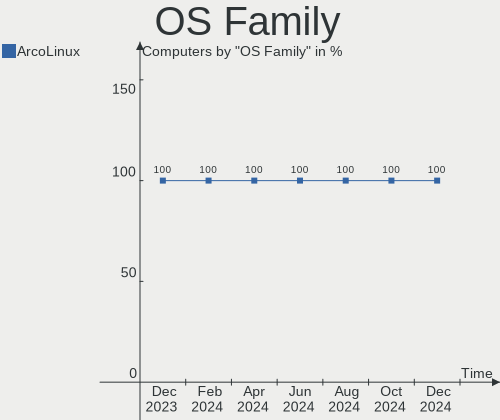
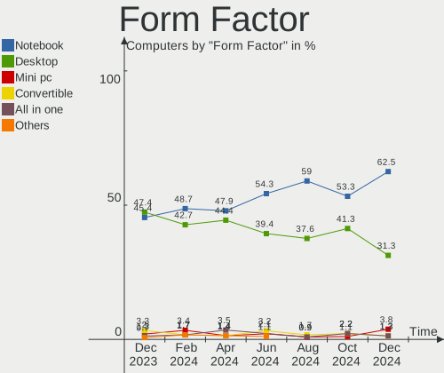
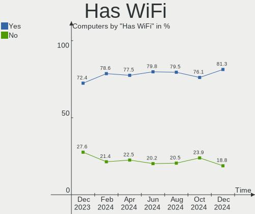
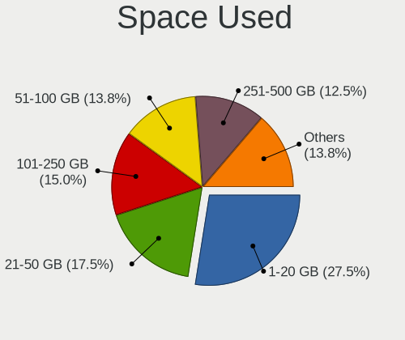
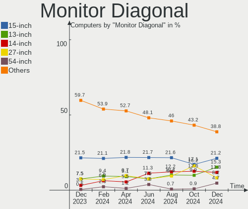
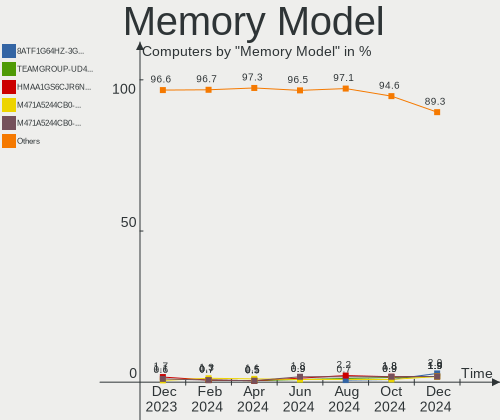

ArcoLinux - Hardware Trends
---------------------------

A project to identify most popular hardware characteristics and track their change
over time based on data collected by Linux users at https://Linux-Hardware.org.

Anyone can contribute to this report by the [hw-probe](https://github.com/linuxhw/hw-probe) tool:

    sudo -E hw-probe -all -upload

This is a report for all computer types. See also reports for [desktops](/Dist/ArcoLinux/Desktop/README.md) and [notebooks](/Dist/ArcoLinux/Notebook/README.md).

This report is for one last month. Overall report since the beginning of time: [TestDays](https://github.com/linuxhw/TestDays)

Period: May, 2023.

Contents
--------

* [ System ](#system)
  - [ OS                       ](#os)
  - [ OS Family                ](#os-family)
  - [ Kernel                   ](#kernel)
  - [ Kernel Family            ](#kernel-family)
  - [ Kernel Major Ver.        ](#kernel-major-ver)
  - [ Arch                     ](#arch)
  - [ DE                       ](#de)
  - [ Display Server           ](#display-server)
  - [ Display Manager          ](#display-manager)
  - [ OS Lang                  ](#os-lang)
  - [ Boot Mode                ](#boot-mode)
  - [ Filesystem               ](#filesystem)
  - [ Part. scheme             ](#part-scheme)
  - [ Dual Boot with Linux/BSD ](#dual-boot-with-linuxbsd)
  - [ Dual Boot (Win)          ](#dual-boot-win)

* [ Board ](#board)
  - [ Vendor                   ](#vendor)
  - [ Model                    ](#model)
  - [ Model Family             ](#model-family)
  - [ MFG Year                 ](#mfg-year)
  - [ Form Factor              ](#form-factor)
  - [ Secure Boot              ](#secure-boot)
  - [ Coreboot                 ](#coreboot)
  - [ RAM Size                 ](#ram-size)
  - [ RAM Used                 ](#ram-used)
  - [ Total Drives             ](#total-drives)
  - [ Has CD-ROM               ](#has-cd-rom)
  - [ Has Ethernet             ](#has-ethernet)
  - [ Has WiFi                 ](#has-wifi)
  - [ Has Bluetooth            ](#has-bluetooth)

* [ Location ](#location)
  - [ Country                  ](#country)
  - [ City                     ](#city)

* [ Drives ](#drives)
  - [ Drive Vendor             ](#drive-vendor)
  - [ Drive Model              ](#drive-model)
  - [ HDD Vendor               ](#hdd-vendor)
  - [ SSD Vendor               ](#ssd-vendor)
  - [ Drive Kind               ](#drive-kind)
  - [ Drive Connector          ](#drive-connector)
  - [ Drive Size               ](#drive-size)
  - [ Space Total              ](#space-total)
  - [ Space Used               ](#space-used)
  - [ Malfunc. Drives          ](#malfunc-drives)
  - [ Malfunc. Drive Vendor    ](#malfunc-drive-vendor)
  - [ Malfunc. HDD Vendor      ](#malfunc-hdd-vendor)
  - [ Malfunc. Drive Kind      ](#malfunc-drive-kind)
  - [ Failed Drives            ](#failed-drives)
  - [ Failed Drive Vendor      ](#failed-drive-vendor)
  - [ Drive Status             ](#drive-status)

* [ Storage controller ](#storage-controller)
  - [ Storage Vendor           ](#storage-vendor)
  - [ Storage Model            ](#storage-model)
  - [ Storage Kind             ](#storage-kind)

* [ Processor ](#processor)
  - [ CPU Vendor               ](#cpu-vendor)
  - [ CPU Model                ](#cpu-model)
  - [ CPU Model Family         ](#cpu-model-family)
  - [ CPU Cores                ](#cpu-cores)
  - [ CPU Sockets              ](#cpu-sockets)
  - [ CPU Threads              ](#cpu-threads)
  - [ CPU Op-Modes             ](#cpu-op-modes)
  - [ CPU Microcode            ](#cpu-microcode)
  - [ CPU Microarch            ](#cpu-microarch)

* [ Graphics ](#graphics)
  - [ GPU Vendor               ](#gpu-vendor)
  - [ GPU Model                ](#gpu-model)
  - [ GPU Combo                ](#gpu-combo)
  - [ GPU Driver               ](#gpu-driver)
  - [ GPU Memory               ](#gpu-memory)

* [ Monitor ](#monitor)
  - [ Monitor Vendor           ](#monitor-vendor)
  - [ Monitor Model            ](#monitor-model)
  - [ Monitor Resolution       ](#monitor-resolution)
  - [ Monitor Diagonal         ](#monitor-diagonal)
  - [ Monitor Width            ](#monitor-width)
  - [ Aspect Ratio             ](#aspect-ratio)
  - [ Monitor Area             ](#monitor-area)
  - [ Pixel Density            ](#pixel-density)
  - [ Multiple Monitors        ](#multiple-monitors)

* [ Network ](#network)
  - [ Net Controller Vendor    ](#net-controller-vendor)
  - [ Net Controller Model     ](#net-controller-model)
  - [ Wireless Vendor          ](#wireless-vendor)
  - [ Wireless Model           ](#wireless-model)
  - [ Ethernet Vendor          ](#ethernet-vendor)
  - [ Ethernet Model           ](#ethernet-model)
  - [ Net Controller Kind      ](#net-controller-kind)
  - [ Used Controller          ](#used-controller)
  - [ NICs                     ](#nics)
  - [ IPv6                     ](#ipv6)

* [ Bluetooth ](#bluetooth)
  - [ Bluetooth Vendor         ](#bluetooth-vendor)
  - [ Bluetooth Model          ](#bluetooth-model)

* [ Sound ](#sound)
  - [ Sound Vendor             ](#sound-vendor)
  - [ Sound Model              ](#sound-model)

* [ Memory ](#memory)
  - [ Memory Vendor            ](#memory-vendor)
  - [ Memory Model             ](#memory-model)
  - [ Memory Kind              ](#memory-kind)
  - [ Memory Form Factor       ](#memory-form-factor)
  - [ Memory Size              ](#memory-size)
  - [ Memory Speed             ](#memory-speed)

* [ Printers & scanners ](#printers--scanners)
  - [ Printer Vendor           ](#printer-vendor)
  - [ Printer Model            ](#printer-model)
  - [ Scanner Vendor           ](#scanner-vendor)
  - [ Scanner Model            ](#scanner-model)

* [ Camera ](#camera)
  - [ Camera Vendor            ](#camera-vendor)
  - [ Camera Model             ](#camera-model)

* [ Security ](#security)
  - [ Fingerprint Vendor       ](#fingerprint-vendor)
  - [ Fingerprint Model        ](#fingerprint-model)
  - [ Chipcard Vendor          ](#chipcard-vendor)
  - [ Chipcard Model           ](#chipcard-model)

* [ Unsupported ](#unsupported)
  - [ Unsupported Devices      ](#unsupported-devices)
  - [ Unsupported Device Types ](#unsupported-device-types)

System
------

OS
--

Installed operating systems

| Name              | Computers | Percent |
|-------------------|-----------|---------|
| ArcoLinux Rolling | 138       | 96.5%   |
| ArcoLinux         | 5         | 3.5%    |

OS Family
---------

OS without a version

| Name      | Computers | Percent |
|-----------|-----------|---------|
| ArcoLinux | 143       | 100%    |

Kernel
------

Version of the Linux kernel

| Version                       | Computers | Percent |
|-------------------------------|-----------|---------|
| 6.3.2-arch1-1                 | 26        | 18.18%  |
| 6.3.4-arch1-1                 | 14        | 9.79%   |
| 6.3.1-arch2-1                 | 14        | 9.79%   |
| 6.3.1-arch1-1                 | 13        | 9.09%   |
| 6.3.2-zen1-1-zen              | 8         | 5.59%   |
| 6.3.3-arch1-1                 | 7         | 4.9%    |
| 6.2.11-arch1-1                | 6         | 4.2%    |
| 6.1.27-1-lts                  | 6         | 4.2%    |
| 6.3.4-arch2-1                 | 5         | 3.5%    |
| 6.2.13-arch1-1                | 5         | 3.5%    |
| 6.2.10-x64v1-xanmod1-1        | 5         | 3.5%    |
| 6.3.5-arch1-1                 | 3         | 2.1%    |
| 6.1.29-1-lts                  | 3         | 2.1%    |
| 6.1.28-1-lts                  | 3         | 2.1%    |
| 6.3.3-zen1-1-zen              | 2         | 1.4%    |
| 6.3.3-x64v1-xanmod1-1         | 2         | 1.4%    |
| 6.3.1-zen2-1-zen              | 2         | 1.4%    |
| 6.2.12-arch1-1                | 2         | 1.4%    |
| 6.1.30-1-lts                  | 2         | 1.4%    |
| 6.3.5-zen1-1-zen              | 1         | 0.7%    |
| 6.3.4-zen1-1-zen              | 1         | 0.7%    |
| 6.3.3-1-cachyos-bore          | 1         | 0.7%    |
| 6.3.2-AMD                     | 1         | 0.7%    |
| 6.3.1-zen1-1-zen              | 1         | 0.7%    |
| 6.3.1-alderlake-xanmod1-1     | 1         | 0.7%    |
| 6.3.0.11.realtime1-1-rt       | 1         | 0.7%    |
| 6.2.13-zen-1-zen              | 1         | 0.7%    |
| 6.2.12-zen1-1-zen             | 1         | 0.7%    |
| 6.2.0.3.realtime1-4-rt        | 1         | 0.7%    |
| 6.1.28-hardened1-1-hardened   | 1         | 0.7%    |
| 6.1.23-x64v1-xanmod1-1-lts    | 1         | 0.7%    |
| 6.1.13-x64v2-rt7-xanmod1-1-rt | 1         | 0.7%    |
| 6.0.9-arch1-1                 | 1         | 0.7%    |
| 5.17.9-arch1-1                | 1         | 0.7%    |

Kernel Family
-------------

Linux kernel without a distro release

| Version  | Computers | Percent |
|----------|-----------|---------|
| 6.3.2    | 35        | 24.48%  |
| 6.3.1    | 31        | 21.68%  |
| 6.3.4    | 20        | 13.99%  |
| 6.3.3    | 12        | 8.39%   |
| 6.2.13   | 6         | 4.2%    |
| 6.2.11   | 6         | 4.2%    |
| 6.1.27   | 6         | 4.2%    |
| 6.2.10   | 5         | 3.5%    |
| 6.3.5    | 4         | 2.8%    |
| 6.1.28   | 4         | 2.8%    |
| 6.2.12   | 3         | 2.1%    |
| 6.1.29   | 3         | 2.1%    |
| 6.1.30   | 2         | 1.4%    |
| 6.3.0.11 | 1         | 0.7%    |
| 6.2.0.3  | 1         | 0.7%    |
| 6.1.23   | 1         | 0.7%    |
| 6.1.13   | 1         | 0.7%    |
| 6.0.9    | 1         | 0.7%    |
| 5.17.9   | 1         | 0.7%    |

Kernel Major Ver.
-----------------

Linux kernel major version

| Version | Computers | Percent |
|---------|-----------|---------|
| 6.3     | 102       | 71.33%  |
| 6.2     | 20        | 13.99%  |
| 6.1     | 17        | 11.89%  |
| 6.3.0   | 1         | 0.7%    |
| 6.2.0   | 1         | 0.7%    |
| 6.0     | 1         | 0.7%    |
| 5.17    | 1         | 0.7%    |

Arch
----

OS architecture (x86_64, i586, etc.)

| Name   | Computers | Percent |
|--------|-----------|---------|
| x86_64 | 143       | 100%    |

DE
--

Desktop Environment

| Name           | Computers | Percent |
|----------------|-----------|---------|
| KDE5           | 45        | 31.47%  |
| XFCE           | 39        | 27.27%  |
| i3             | 11        | 7.69%   |
| GNOME          | 10        | 6.99%   |
| Hyprland       | 8         | 5.59%   |
| X-Cinnamon     | 5         | 3.5%    |
| Cinnamon       | 5         | 3.5%    |
| LeftWM         | 3         | 2.1%    |
| bspwm          | 3         | 2.1%    |
| qtile          | 2         | 1.4%    |
| Deepin         | 2         | 1.4%    |
| chadwm         | 2         | 1.4%    |
| awesome        | 2         | 1.4%    |
| openbox        | 1         | 0.7%    |
| MATE           | 1         | 0.7%    |
| ICEWM          | 1         | 0.7%    |
| i3-with-shmlog | 1         | 0.7%    |
| dwm            | 1         | 0.7%    |
| Unknown        | 1         | 0.7%    |

Display Server
--------------

X11 or Wayland

| Name    | Computers | Percent |
|---------|-----------|---------|
| X11     | 125       | 87.41%  |
| Wayland | 18        | 12.59%  |

Display Manager
---------------

SDDM, LightDM, etc.

| Name    | Computers | Percent |
|---------|-----------|---------|
| SDDM    | 108       | 75.52%  |
| LightDM | 25        | 17.48%  |
| Unknown | 5         | 3.5%    |
| GDM     | 4         | 2.8%    |
| LXDM    | 1         | 0.7%    |

OS Lang
-------

Language

| Lang        | Computers | Percent |
|-------------|-----------|---------|
| en_US       | 75        | 52.45%  |
| en_GB       | 13        | 9.09%   |
| en_CA       | 7         | 4.9%    |
| de_DE       | 7         | 4.9%    |
| C           | 5         | 3.5%    |
| fr_FR       | 4         | 2.8%    |
| en_AU       | 4         | 2.8%    |
| sv_SE       | 3         | 2.1%    |
| ru_RU       | 3         | 2.1%    |
| zh_CN       | 2         | 1.4%    |
| it_IT       | 2         | 1.4%    |
| es_MX       | 2         | 1.4%    |
| es_ES       | 2         | 1.4%    |
| en_DK       | 2         | 1.4%    |
| tr_TR       | 1         | 0.7%    |
| sr_RS@latin | 1         | 0.7%    |
| pt_BR       | 1         | 0.7%    |
| pl_PL       | 1         | 0.7%    |
| nl_NL       | 1         | 0.7%    |
| nl_BE.UTF8  | 1         | 0.7%    |
| nb_NO       | 1         | 0.7%    |
| hu_HU       | 1         | 0.7%    |
| fr_CA       | 1         | 0.7%    |
| es_AR       | 1         | 0.7%    |
| en_ZA       | 1         | 0.7%    |
| en_IN       | 1         | 0.7%    |

Boot Mode
---------

EFI or BIOS

| Mode | Computers | Percent |
|------|-----------|---------|
| EFI  | 115       | 80.42%  |
| BIOS | 28        | 19.58%  |

Filesystem
----------

Type of filesystem

| Type    | Computers | Percent |
|---------|-----------|---------|
| Ext4    | 97        | 67.83%  |
| Btrfs   | 38        | 26.57%  |
| Overlay | 5         | 3.5%    |
| Xfs     | 3         | 2.1%    |

Part. scheme
------------

Scheme of partitioning

| Type    | Computers | Percent |
|---------|-----------|---------|
| GPT     | 125       | 87.41%  |
| MBR     | 13        | 9.09%   |
| Unknown | 5         | 3.5%    |

Dual Boot with Linux/BSD
------------------------

Hosting more than one Linux/BSD

| Dual boot | Computers | Percent |
|-----------|-----------|---------|
| No        | 106       | 74.13%  |
| Yes       | 37        | 25.87%  |

Dual Boot (Win)
---------------

Hosting Linux and Windows

| Dual boot | Computers | Percent |
|-----------|-----------|---------|
| No        | 82        | 57.34%  |
| Yes       | 61        | 42.66%  |

Board
-----

Vendor
------

Motherboard manufacturer

| Name                | Computers | Percent |
|---------------------|-----------|---------|
| ASUSTek Computer    | 41        | 28.67%  |
| Hewlett-Packard     | 22        | 15.38%  |
| Lenovo              | 21        | 14.69%  |
| MSI                 | 12        | 8.39%   |
| Gigabyte Technology | 10        | 6.99%   |
| Dell                | 9         | 6.29%   |
| ASRock              | 6         | 4.2%    |
| Toshiba             | 3         | 2.1%    |
| Acer                | 3         | 2.1%    |
| Intel               | 2         | 1.4%    |
| Fujitsu             | 2         | 1.4%    |
| TUXEDO              | 1         | 0.7%    |
| System76            | 1         | 0.7%    |
| NEC Computers       | 1         | 0.7%    |
| Microsoft           | 1         | 0.7%    |
| Medion              | 1         | 0.7%    |
| HUAWEI              | 1         | 0.7%    |
| Google              | 1         | 0.7%    |
| Framework           | 1         | 0.7%    |
| Eluktronics         | 1         | 0.7%    |
| BESSTAR Tech        | 1         | 0.7%    |
| A14CR               | 1         | 0.7%    |
| Unknown             | 1         | 0.7%    |

Model
-----

Motherboard model

| Name                                   | Computers | Percent |
|----------------------------------------|-----------|---------|
| MSI MS-7A38                            | 2         | 1.4%    |
| ASUS PRIME B550-PLUS                   | 2         | 1.4%    |
| ASUS ASUS TUF Dash F15 FX517ZE_FX517ZE | 2         | 1.4%    |
| Unknown                                | 2         | 1.4%    |
| TUXEDO Pulse 15 Gen2                   | 1         | 0.7%    |
| Toshiba TECRA Z40-A                    | 1         | 0.7%    |
| Toshiba Satellite Pro C50-A-1E6        | 1         | 0.7%    |
| Toshiba Satellite C55-A                | 1         | 0.7%    |
| System76 Oryx Pro                      | 1         | 0.7%    |
| NEC Computers PC-VK26TXZCM             | 1         | 0.7%    |
| MSI MS-7D17                            | 1         | 0.7%    |
| MSI MS-7D09                            | 1         | 0.7%    |
| MSI MS-7C95                            | 1         | 0.7%    |
| MSI MS-7C91                            | 1         | 0.7%    |
| MSI MS-7C83                            | 1         | 0.7%    |
| MSI MS-7C52                            | 1         | 0.7%    |
| MSI MS-7C35                            | 1         | 0.7%    |
| MSI MS-7C13                            | 1         | 0.7%    |
| MSI MS-7693                            | 1         | 0.7%    |
| MSI A320M-HDV R4.0                     | 1         | 0.7%    |
| Microsoft Surface Go                   | 1         | 0.7%    |
| Medion G24                             | 1         | 0.7%    |
| Lenovo Yoga 7 16IAP7 82QG              | 1         | 0.7%    |
| Lenovo Yoga 14sITL 2021 82G2           | 1         | 0.7%    |
| Lenovo ThinkPad X260 20F5S6P801        | 1         | 0.7%    |
| Lenovo ThinkPad T550 20CJS1V900        | 1         | 0.7%    |
| Lenovo ThinkPad T550 20CJS0S800        | 1         | 0.7%    |
| Lenovo ThinkPad T470 W10DG 20JNS10501  | 1         | 0.7%    |
| Lenovo ThinkPad T440 20B7S1MF0D        | 1         | 0.7%    |
| Lenovo ThinkPad T430 2349GDU           | 1         | 0.7%    |
| Lenovo ThinkPad T430 2347EA2           | 1         | 0.7%    |
| Lenovo ThinkPad T15p Gen 3 21DA0009GE  | 1         | 0.7%    |
| Lenovo ThinkPad P72 20MBCTO1WW         | 1         | 0.7%    |
| Lenovo ThinkCentre M900 10FM0016MX     | 1         | 0.7%    |
| Lenovo ThinkCentre M900 10FGS0YM01     | 1         | 0.7%    |
| Lenovo ThinkBook 13s-IML 20RR          | 1         | 0.7%    |
| Lenovo IdeaPad Y700-17ISK 80Q0         | 1         | 0.7%    |
| Lenovo IdeaPad Slim 1-14AST-05 81VS    | 1         | 0.7%    |
| Lenovo IdeaPad Gaming 3 15IHU6 82MG    | 1         | 0.7%    |
| Lenovo IdeaPad 510-15IKB 80SV          | 1         | 0.7%    |

Model Family
------------

Motherboard model prefix

| Name                       | Computers | Percent |
|----------------------------|-----------|---------|
| ASUS PRIME                 | 11        | 7.69%   |
| Lenovo ThinkPad            | 9         | 6.29%   |
| ASUS ROG                   | 9         | 6.29%   |
| Lenovo IdeaPad             | 6         | 4.2%    |
| HP Pavilion                | 5         | 3.5%    |
| HP ENVY                    | 4         | 2.8%    |
| ASUS TUF                   | 4         | 2.8%    |
| HP Laptop                  | 3         | 2.1%    |
| Toshiba Satellite          | 2         | 1.4%    |
| MSI MS-7A38                | 2         | 1.4%    |
| Lenovo Yoga                | 2         | 1.4%    |
| Lenovo ThinkCentre         | 2         | 1.4%    |
| HP OMEN                    | 2         | 1.4%    |
| HP EliteBook               | 2         | 1.4%    |
| Dell Precision             | 2         | 1.4%    |
| Dell Latitude              | 2         | 1.4%    |
| Dell Inspiron              | 2         | 1.4%    |
| ASUS VivoBook              | 2         | 1.4%    |
| ASUS ASUS                  | 2         | 1.4%    |
| Unknown                    | 2         | 1.4%    |
| TUXEDO Pulse               | 1         | 0.7%    |
| Toshiba TECRA              | 1         | 0.7%    |
| System76 Oryx              | 1         | 0.7%    |
| NEC Computers PC-VK26TXZCM | 1         | 0.7%    |
| MSI MS-7D17                | 1         | 0.7%    |
| MSI MS-7D09                | 1         | 0.7%    |
| MSI MS-7C95                | 1         | 0.7%    |
| MSI MS-7C91                | 1         | 0.7%    |
| MSI MS-7C83                | 1         | 0.7%    |
| MSI MS-7C52                | 1         | 0.7%    |
| MSI MS-7C35                | 1         | 0.7%    |
| MSI MS-7C13                | 1         | 0.7%    |
| MSI MS-7693                | 1         | 0.7%    |
| MSI A320M-HDV              | 1         | 0.7%    |
| Microsoft Surface          | 1         | 0.7%    |
| Medion G24                 | 1         | 0.7%    |
| Lenovo ThinkBook           | 1         | 0.7%    |
| Lenovo IdeaCentre          | 1         | 0.7%    |
| Intel NUC10i7FNH           | 1         | 0.7%    |
| Intel DG43GT               | 1         | 0.7%    |

MFG Year
--------

Motherboard manufacture year

| Year | Computers | Percent |
|------|-----------|---------|
| 2019 | 23        | 16.08%  |
| 2020 | 18        | 12.59%  |
| 2021 | 17        | 11.89%  |
| 2022 | 14        | 9.79%   |
| 2018 | 13        | 9.09%   |
| 2017 | 13        | 9.09%   |
| 2015 | 10        | 6.99%   |
| 2016 | 9         | 6.29%   |
| 2012 | 9         | 6.29%   |
| 2013 | 5         | 3.5%    |
| 2014 | 4         | 2.8%    |
| 2008 | 3         | 2.1%    |
| 2011 | 2         | 1.4%    |
| 2023 | 1         | 0.7%    |
| 2010 | 1         | 0.7%    |
| 2009 | 1         | 0.7%    |

Form Factor
-----------

Physical design of the computer

| Name        | Computers | Percent |
|-------------|-----------|---------|
| Desktop     | 68        | 47.55%  |
| Notebook    | 67        | 46.85%  |
| Convertible | 3         | 2.1%    |
| Tablet      | 2         | 1.4%    |
| All in one  | 2         | 1.4%    |
| Mini pc     | 1         | 0.7%    |

Secure Boot
-----------

Enabled or disabled

| State    | Computers | Percent |
|----------|-----------|---------|
| Disabled | 142       | 99.3%   |
| Enabled  | 1         | 0.7%    |

Coreboot
--------

Have coreboot on board

| Used | Computers | Percent |
|------|-----------|---------|
| No   | 142       | 99.3%   |
| Yes  | 1         | 0.7%    |

RAM Size
--------

Total RAM memory

| Size in GB  | Computers | Percent |
|-------------|-----------|---------|
| 16.01-24.0  | 37        | 25.87%  |
| 4.01-8.0    | 35        | 24.48%  |
| 32.01-64.0  | 32        | 22.38%  |
| 8.01-16.0   | 22        | 15.38%  |
| 3.01-4.0    | 10        | 6.99%   |
| 64.01-256.0 | 4         | 2.8%    |
| 24.01-32.0  | 2         | 1.4%    |
| 2.01-3.0    | 1         | 0.7%    |

RAM Used
--------

Used RAM memory

| Used GB   | Computers | Percent |
|-----------|-----------|---------|
| 1.01-2.0  | 44        | 30.77%  |
| 2.01-3.0  | 37        | 25.87%  |
| 4.01-8.0  | 28        | 19.58%  |
| 3.01-4.0  | 26        | 18.18%  |
| 8.01-16.0 | 6         | 4.2%    |
| 0.51-1.0  | 2         | 1.4%    |

Total Drives
------------

Number of drives on board

| Drives | Computers | Percent |
|--------|-----------|---------|
| 1      | 68        | 47.55%  |
| 2      | 34        | 23.78%  |
| 3      | 22        | 15.38%  |
| 4      | 13        | 9.09%   |
| 5      | 3         | 2.1%    |
| 6      | 2         | 1.4%    |
| 7      | 1         | 0.7%    |

Has CD-ROM
----------

Has CD-ROM on board

| Presented | Computers | Percent |
|-----------|-----------|---------|
| No        | 113       | 79.02%  |
| Yes       | 30        | 20.98%  |

Has Ethernet
------------

Has Ethernet on board

| Presented | Computers | Percent |
|-----------|-----------|---------|
| Yes       | 130       | 90.91%  |
| No        | 13        | 9.09%   |

Has WiFi
--------

Has WiFi module

| Presented | Computers | Percent |
|-----------|-----------|---------|
| Yes       | 112       | 78.32%  |
| No        | 31        | 21.68%  |

Has Bluetooth
-------------

Has Bluetooth module

| Presented | Computers | Percent |
|-----------|-----------|---------|
| Yes       | 107       | 74.83%  |
| No        | 36        | 25.17%  |

Location
--------

Country
-------

Geographic location (country)

| Country      | Computers | Percent |
|--------------|-----------|---------|
| USA          | 32        | 22.38%  |
| Germany      | 14        | 9.79%   |
| UK           | 11        | 7.69%   |
| Canada       | 8         | 5.59%   |
| Belgium      | 6         | 4.2%    |
| Sweden       | 5         | 3.5%    |
| Australia    | 5         | 3.5%    |
| Mexico       | 4         | 2.8%    |
| France       | 4         | 2.8%    |
| Brazil       | 4         | 2.8%    |
| Turkey       | 3         | 2.1%    |
| Spain        | 3         | 2.1%    |
| Russia       | 3         | 2.1%    |
| India        | 3         | 2.1%    |
| Serbia       | 2         | 1.4%    |
| Peru         | 2         | 1.4%    |
| Netherlands  | 2         | 1.4%    |
| Italy        | 2         | 1.4%    |
| Greece       | 2         | 1.4%    |
| Denmark      | 2         | 1.4%    |
| China        | 2         | 1.4%    |
| Bulgaria     | 2         | 1.4%    |
| Argentina    | 2         | 1.4%    |
| Taiwan       | 1         | 0.7%    |
| South Korea  | 1         | 0.7%    |
| South Africa | 1         | 0.7%    |
| Saudi Arabia | 1         | 0.7%    |
| Romania      | 1         | 0.7%    |
| Portugal     | 1         | 0.7%    |
| Poland       | 1         | 0.7%    |
| Pakistan     | 1         | 0.7%    |
| Norway       | 1         | 0.7%    |
| Morocco      | 1         | 0.7%    |
| Malaysia     | 1         | 0.7%    |
| Luxembourg   | 1         | 0.7%    |
| Kuwait       | 1         | 0.7%    |
| Kosovo       | 1         | 0.7%    |
| Iran         | 1         | 0.7%    |
| Indonesia    | 1         | 0.7%    |
| Hungary      | 1         | 0.7%    |

City
----

Geographic location (city)

| City                   | Computers | Percent |
|------------------------|-----------|---------|
| Troy                   | 2         | 1.4%    |
| Toronto                | 2         | 1.4%    |
| Perth                  | 2         | 1.4%    |
| New York               | 2         | 1.4%    |
| Houston                | 2         | 1.4%    |
| Feltham                | 2         | 1.4%    |
| Zapopan                | 1         | 0.7%    |
| Wyoming                | 1         | 0.7%    |
| Winter Springs         | 1         | 0.7%    |
| Westerau               | 1         | 0.7%    |
| Wakefield              | 1         | 0.7%    |
| Vigneux-sur-Seine      | 1         | 0.7%    |
| Varna                  | 1         | 0.7%    |
| Valencia               | 1         | 0.7%    |
| Trabzon                | 1         | 0.7%    |
| Tillsonburg            | 1         | 0.7%    |
| Thrissur               | 1         | 0.7%    |
| Tehran                 | 1         | 0.7%    |
| Taipei                 | 1         | 0.7%    |
| Sydney                 | 1         | 0.7%    |
| Stockholm              | 1         | 0.7%    |
| St Petersburg          | 1         | 0.7%    |
| Spokane                | 1         | 0.7%    |
| Sofia                  | 1         | 0.7%    |
| Slagelse               | 1         | 0.7%    |
| Siemianowice Śląskie | 1         | 0.7%    |
| Shanghai               | 1         | 0.7%    |
| Seraing                | 1         | 0.7%    |
| Schwanewede            | 1         | 0.7%    |
| Santa Pola             | 1         | 0.7%    |
| Santa Cruz             | 1         | 0.7%    |
| San Tan Valley         | 1         | 0.7%    |
| San Luis Potosí City  | 1         | 0.7%    |
| Saint Paul             | 1         | 0.7%    |
| Rouyn-Noranda          | 1         | 0.7%    |
| Rochester              | 1         | 0.7%    |
| Riyadh                 | 1         | 0.7%    |
| Rio de Janeiro         | 1         | 0.7%    |
| Riemerling             | 1         | 0.7%    |
| Rheinfelden            | 1         | 0.7%    |

Drives
------

Drive Vendor
------------

Hard drive vendors

| Vendor                      | Computers | Drives | Percent |
|-----------------------------|-----------|--------|---------|
| Samsung Electronics         | 54        | 73     | 21.95%  |
| Seagate                     | 33        | 40     | 13.41%  |
| WDC                         | 29        | 36     | 11.79%  |
| SanDisk                     | 16        | 18     | 6.5%    |
| Toshiba                     | 13        | 13     | 5.28%   |
| Crucial                     | 12        | 16     | 4.88%   |
| Kingston                    | 11        | 13     | 4.47%   |
| SK hynix                    | 8         | 8      | 3.25%   |
| Micron/Crucial Technology   | 8         | 9      | 3.25%   |
| Intel                       | 7         | 7      | 2.85%   |
| Unknown                     | 6         | 7      | 2.44%   |
| Hitachi                     | 6         | 6      | 2.44%   |
| Phison Electronics          | 5         | 6      | 2.03%   |
| Micron Technology           | 5         | 5      | 2.03%   |
| SSK                         | 3         | 3      | 1.22%   |
| Kingston Technology Company | 3         | 3      | 1.22%   |
| Silicon Motion              | 2         | 2      | 0.81%   |
| LITEON                      | 2         | 2      | 0.81%   |
| KIOXIA                      | 2         | 2      | 0.81%   |
| A-DATA Technology           | 2         | 2      | 0.81%   |
| Verbatim                    | 1         | 1      | 0.41%   |
| Union Memory (Shenzhen)     | 1         | 1      | 0.41%   |
| Team                        | 1         | 1      | 0.41%   |
| StarTech                    | 1         | 1      | 0.41%   |
| Realtek Semiconductor       | 1         | 1      | 0.41%   |
| Phison                      | 1         | 1      | 0.41%   |
| Patriot                     | 1         | 1      | 0.41%   |
| Netac                       | 1         | 1      | 0.41%   |
| JMicron Technology          | 1         | 1      | 0.41%   |
| HGST                        | 1         | 1      | 0.41%   |
| GOODRAM                     | 1         | 1      | 0.41%   |
| Gigabyte Technology         | 1         | 1      | 0.41%   |
| Fanxiang                    | 1         | 1      | 0.41%   |
| CT500P2S                    | 1         | 1      | 0.41%   |
| Corsair                     | 1         | 1      | 0.41%   |
| China                       | 1         | 1      | 0.41%   |
| BlueRay                     | 1         | 1      | 0.41%   |
| ASMT                        | 1         | 2      | 0.41%   |
| ADATA Technology            | 1         | 1      | 0.41%   |

Drive Model
-----------

Hard drive models

| Model                                               | Computers | Percent |
|-----------------------------------------------------|-----------|---------|
| Samsung NVMe SSD Controller SM981/PM981/PM983 256GB | 14        | 5.09%   |
| Samsung NVMe SSD Controller PM9A1/PM9A3/980PRO 1TB  | 11        | 4%      |
| Micron/Crucial P2 NVMe PCIe SSD 1TB                 | 6         | 2.18%   |
| Crucial CT1000MX500SSD1 1TB                         | 6         | 2.18%   |
| Seagate ST1000LM035-1RK172 1TB                      | 4         | 1.45%   |
| Sandisk WD Blue SN550 NVMe SSD 512GB                | 4         | 1.45%   |
| Samsung SSD 870 EVO 1TB                             | 4         | 1.45%   |
| Samsung SSD 860 EVO 500GB                           | 4         | 1.45%   |
| Unknown MMC Card  64GB                              | 3         | 1.09%   |
| Toshiba MQ01ABD100 1TB                              | 3         | 1.09%   |
| SSK Disk 256GB                                      | 3         | 1.09%   |
| Seagate ST1000DM010-2EP102 1TB                      | 3         | 1.09%   |
| Seagate ST1000DM003-1CH162 1TB                      | 3         | 1.09%   |
| Sandisk WD Black SN750 / PC SN730 NVMe SSD 256GB    | 3         | 1.09%   |
| Sandisk WD Black 2018/SN750 / PC SN720 NVMe SSD 1TB | 3         | 1.09%   |
| Samsung SSD 860 EVO 1TB                             | 3         | 1.09%   |
| Samsung NVMe SSD Controller SM961/PM961/SM963 256GB | 3         | 1.09%   |
| WDC WD10EZEX-08WN4A0 1TB                            | 2         | 0.73%   |
| WDC WD10EZEX-00WN4A0 1TB                            | 2         | 0.73%   |
| Toshiba KSG60ZMV256G M.2 2280 256GB SSD             | 2         | 0.73%   |
| Toshiba DT01ACA100 1TB                              | 2         | 0.73%   |
| Silicon Motion SM2263EN/SM2263XT SSD Controller 1TB | 2         | 0.73%   |
| Seagate ST2000LM007-1R8174 2TB                      | 2         | 0.73%   |
| Seagate ST2000DM008-2FR102 2TB                      | 2         | 0.73%   |
| Seagate ST2000DM001-1ER164 2TB                      | 2         | 0.73%   |
| Seagate Expansion 1TB                               | 2         | 0.73%   |
| Samsung SSD 850 EVO 250GB                           | 2         | 0.73%   |
| Samsung NVMe SSD Controller SM951/PM951 128GB       | 2         | 0.73%   |
| Phison E16 PCIe4 NVMe Controller 1TB                | 2         | 0.73%   |
| Phison E12 NVMe Controller 256GB                    | 2         | 0.73%   |
| Micron/Crucial P1 NVMe PCIe SSD 500GB               | 2         | 0.73%   |
| Kingston Company SNV2S1000G 1TB                     | 2         | 0.73%   |
| Kingston SA400S37240G 240GB SSD                     | 2         | 0.73%   |
| Intel SSDPEKNU512GZ 512GB                           | 2         | 0.73%   |
| Crucial CT2000MX500SSD1 2TB                         | 2         | 0.73%   |
| WDC WDS250G2B0A-00SM50 250GB SSD                    | 1         | 0.36%   |
| WDC WDS240G2G0A-00JH30 240GB SSD                    | 1         | 0.36%   |
| WDC WDS200T2B0B-00YS70 2TB SSD                      | 1         | 0.36%   |
| WDC WDS120G2G0A-00JH30 120GB SSD                    | 1         | 0.36%   |
| WDC WDS100T2G0A-00JH30 1TB SSD                      | 1         | 0.36%   |

HDD Vendor
----------

Hard disk drive vendors

| Vendor              | Computers | Drives | Percent |
|---------------------|-----------|--------|---------|
| Seagate             | 33        | 40     | 41.25%  |
| WDC                 | 25        | 30     | 31.25%  |
| Toshiba             | 8         | 8      | 10%     |
| Hitachi             | 6         | 6      | 7.5%    |
| SSK                 | 3         | 3      | 3.75%   |
| Samsung Electronics | 2         | 2      | 2.5%    |
| Unknown             | 1         | 1      | 1.25%   |
| HGST                | 1         | 1      | 1.25%   |
| ASMT                | 1         | 2      | 1.25%   |

SSD Vendor
----------

Solid state drive vendors

| Vendor              | Computers | Drives | Percent |
|---------------------|-----------|--------|---------|
| Samsung Electronics | 26        | 34     | 32.5%   |
| Crucial             | 12        | 16     | 15%     |
| Kingston            | 9         | 11     | 11.25%  |
| WDC                 | 6         | 6      | 7.5%    |
| SK hynix            | 5         | 5      | 6.25%   |
| Toshiba             | 4         | 4      | 5%      |
| SanDisk             | 2         | 2      | 2.5%    |
| LITEON              | 2         | 2      | 2.5%    |
| A-DATA Technology   | 2         | 2      | 2.5%    |
| Verbatim            | 1         | 1      | 1.25%   |
| Team                | 1         | 1      | 1.25%   |
| Patriot             | 1         | 1      | 1.25%   |
| Netac               | 1         | 1      | 1.25%   |
| Micron Technology   | 1         | 1      | 1.25%   |
| JMicron Technology  | 1         | 1      | 1.25%   |
| Intel               | 1         | 1      | 1.25%   |
| GOODRAM             | 1         | 1      | 1.25%   |
| Gigabyte Technology | 1         | 1      | 1.25%   |
| Corsair             | 1         | 1      | 1.25%   |
| China               | 1         | 1      | 1.25%   |
| BlueRay             | 1         | 1      | 1.25%   |

Drive Kind
----------

HDD or SSD

| Kind    | Computers | Drives | Percent |
|---------|-----------|--------|---------|
| NVMe    | 79        | 96     | 35.75%  |
| SSD     | 71        | 94     | 32.13%  |
| HDD     | 64        | 93     | 28.96%  |
| MMC     | 5         | 6      | 2.26%   |
| Unknown | 2         | 2      | 0.9%    |

Drive Connector
---------------

SATA, SAS, NVMe, etc.

| Type | Computers | Drives | Percent |
|------|-----------|--------|---------|
| SATA | 103       | 171    | 51.24%  |
| NVMe | 79        | 95     | 39.3%   |
| SAS  | 14        | 19     | 6.97%   |
| MMC  | 5         | 6      | 2.49%   |

Drive Size
----------

Size of hard drive

| Size in TB | Computers | Drives | Percent |
|------------|-----------|--------|---------|
| 0.01-0.5   | 64        | 87     | 43.84%  |
| 0.51-1.0   | 51        | 63     | 34.93%  |
| 1.01-2.0   | 22        | 26     | 15.07%  |
| 3.01-4.0   | 5         | 6      | 3.42%   |
| 4.01-10.0  | 4         | 5      | 2.74%   |

Space Total
-----------

Amount of disk space available on the file system

| Size in GB     | Computers | Percent |
|----------------|-----------|---------|
| 251-500        | 28        | 19.58%  |
| More than 3000 | 27        | 18.88%  |
| 101-250        | 23        | 16.08%  |
| 1001-2000      | 20        | 13.99%  |
| 501-1000       | 19        | 13.29%  |
| 2001-3000      | 7         | 4.9%    |
| 1-20           | 6         | 4.2%    |
| Unknown        | 6         | 4.2%    |
| 51-100         | 5         | 3.5%    |
| 21-50          | 2         | 1.4%    |

Space Used
----------

Amount of used disk space

| Used GB        | Computers | Percent |
|----------------|-----------|---------|
| 1-20           | 33        | 23.08%  |
| 21-50          | 24        | 16.78%  |
| 101-250        | 20        | 13.99%  |
| 51-100         | 15        | 10.49%  |
| 251-500        | 14        | 9.79%   |
| 1001-2000      | 12        | 8.39%   |
| 501-1000       | 12        | 8.39%   |
| Unknown        | 6         | 4.2%    |
| More than 3000 | 4         | 2.8%    |
| 2001-3000      | 3         | 2.1%    |

Malfunc. Drives
---------------

Drive models with a malfunction

| Model                                                           | Computers | Drives | Percent |
|-----------------------------------------------------------------|-----------|--------|---------|
| Seagate ST1000DM003-1CH162 1TB                                  | 2         | 2      | 5.41%   |
| Samsung Electronics NVMe SSD Controller SM981/PM981/PM983 256GB | 2         | 2      | 5.41%   |
| WDC WD5000AAKS-00V1A0 500GB                                     | 1         | 1      | 2.7%    |
| WDC WD5000AACS-00G8B1 500GB                                     | 1         | 1      | 2.7%    |
| WDC WD3200BEKT-00F3T0 320GB                                     | 1         | 1      | 2.7%    |
| WDC WD20EARS-00J2GB0 2TB                                        | 1         | 1      | 2.7%    |
| WDC WD15EARS-60MVWB0 1TB                                        | 1         | 1      | 2.7%    |
| WDC WD10JPVX-22JC3T0 1TB                                        | 1         | 1      | 2.7%    |
| WDC WD10EZRZ-00Z5HB0 1TB                                        | 1         | 1      | 2.7%    |
| WDC WD10EZEX-00WN4A0 1TB                                        | 1         | 1      | 2.7%    |
| Toshiba MQ04ABF100 1TB                                          | 1         | 1      | 2.7%    |
| Toshiba MQ01ABD100 1TB                                          | 1         | 1      | 2.7%    |
| Team L5 LITE SSD 240GB                                          | 1         | 1      | 2.7%    |
| SK hynix SH920 2.5 7MM 256GB SSD                                | 1         | 1      | 2.7%    |
| Seagate ST95005620AS 500GB                                      | 1         | 2      | 2.7%    |
| Seagate ST8000DM004-2CX188 8TB                                  | 1         | 1      | 2.7%    |
| Seagate ST500DM002-1BD142 500GB                                 | 1         | 1      | 2.7%    |
| Seagate ST3500413AS 500GB                                       | 1         | 1      | 2.7%    |
| Seagate ST3320413CS 320GB                                       | 1         | 1      | 2.7%    |
| Seagate ST3250310AS 250GB                                       | 1         | 2      | 2.7%    |
| Seagate ST2000DL003-9VT166 2TB                                  | 1         | 1      | 2.7%    |
| Seagate ST1000LM048-2E7172 1TB                                  | 1         | 1      | 2.7%    |
| Seagate ST1000LM035-1RK172 1TB                                  | 1         | 1      | 2.7%    |
| SanDisk SD8SNAT128G1002 128GB SSD                               | 1         | 1      | 2.7%    |
| Samsung Electronics SSD 870 EVO 1TB                             | 1         | 1      | 2.7%    |
| Samsung Electronics SSD 860 EVO 1TB                             | 1         | 1      | 2.7%    |
| Samsung Electronics SSD 850 EVO 250GB                           | 1         | 1      | 2.7%    |
| Samsung Electronics NVMe SSD Controller PM9A1/PM9A3/980PRO 1TB  | 1         | 2      | 2.7%    |
| Samsung Electronics HD503HI 500GB                               | 1         | 1      | 2.7%    |
| Micron/Crucial Technology P1 NVMe PCIe SSD 500GB                | 1         | 1      | 2.7%    |
| Micron Technology 1100_MTFDDAV256TBN 256GB SSD                  | 1         | 1      | 2.7%    |
| Hitachi HTS542525K9SA00 250GB                                   | 1         | 1      | 2.7%    |
| Hitachi HDS721032CLA362 320GB                                   | 1         | 1      | 2.7%    |
| Crucial CT275MX300SSD1 275GB                                    | 1         | 1      | 2.7%    |
| Corsair CSSD-F60GB2 64GB                                        | 1         | 1      | 2.7%    |

Malfunc. Drive Vendor
---------------------

Vendors of faulty drives

| Vendor                    | Computers | Drives | Percent |
|---------------------------|-----------|--------|---------|
| Seagate                   | 10        | 13     | 29.41%  |
| WDC                       | 8         | 8      | 23.53%  |
| Samsung Electronics       | 5         | 8      | 14.71%  |
| Toshiba                   | 2         | 2      | 5.88%   |
| Hitachi                   | 2         | 2      | 5.88%   |
| Team                      | 1         | 1      | 2.94%   |
| SK hynix                  | 1         | 1      | 2.94%   |
| SanDisk                   | 1         | 1      | 2.94%   |
| Micron/Crucial Technology | 1         | 1      | 2.94%   |
| Micron Technology         | 1         | 1      | 2.94%   |
| Crucial                   | 1         | 1      | 2.94%   |
| Corsair                   | 1         | 1      | 2.94%   |

Malfunc. HDD Vendor
-------------------

Vendors of faulty HDD drives

| Vendor              | Computers | Drives | Percent |
|---------------------|-----------|--------|---------|
| Seagate             | 10        | 13     | 43.48%  |
| WDC                 | 8         | 8      | 34.78%  |
| Toshiba             | 2         | 2      | 8.7%    |
| Hitachi             | 2         | 2      | 8.7%    |
| Samsung Electronics | 1         | 1      | 4.35%   |

Malfunc. Drive Kind
-------------------

Kinds of faulty drives

| Kind | Computers | Drives | Percent |
|------|-----------|--------|---------|
| HDD  | 20        | 26     | 60.61%  |
| SSD  | 9         | 9      | 27.27%  |
| NVMe | 4         | 5      | 12.12%  |

Failed Drives
-------------

Failed drive models

Zero info for selected period =(

Failed Drive Vendor
-------------------

Failed drive vendors

Zero info for selected period =(

Drive Status
------------

Number of failed and malfunc. drives

| Status   | Computers | Drives | Percent |
|----------|-----------|--------|---------|
| Works    | 122       | 219    | 69.32%  |
| Malfunc  | 30        | 40     | 17.05%  |
| Detected | 24        | 32     | 13.64%  |

Storage controller
------------------

Storage Vendor
--------------

Storage controller vendors

| Vendor                       | Computers | Percent |
|------------------------------|-----------|---------|
| Intel                        | 92        | 43.4%   |
| AMD                          | 37        | 17.45%  |
| Samsung Electronics          | 32        | 15.09%  |
| SanDisk                      | 14        | 6.6%    |
| Micron/Crucial Technology    | 8         | 3.77%   |
| Phison Electronics           | 6         | 2.83%   |
| Kingston Technology Company  | 5         | 2.36%   |
| Micron Technology            | 4         | 1.89%   |
| SK hynix                     | 3         | 1.42%   |
| Silicon Motion               | 2         | 0.94%   |
| KIOXIA                       | 2         | 0.94%   |
| ASMedia Technology           | 2         | 0.94%   |
| Union Memory (Shenzhen)      | 1         | 0.47%   |
| Toshiba America Info Systems | 1         | 0.47%   |
| Realtek Semiconductor        | 1         | 0.47%   |
| Marvell Technology Group     | 1         | 0.47%   |
| ADATA Technology             | 1         | 0.47%   |

Storage Model
-------------

Storage controller models

| Model                                                                          | Computers | Percent |
|--------------------------------------------------------------------------------|-----------|---------|
| AMD FCH SATA Controller [AHCI mode]                                            | 24        | 10.21%  |
| Samsung NVMe SSD Controller SM981/PM981/PM983                                  | 14        | 5.96%   |
| Samsung NVMe SSD Controller PM9A1/PM9A3/980PRO                                 | 11        | 4.68%   |
| Intel Sunrise Point-LP SATA Controller [AHCI mode]                             | 10        | 4.26%   |
| Intel 200 Series PCH SATA controller [AHCI mode]                               | 10        | 4.26%   |
| Intel 82801 Mobile SATA Controller [RAID mode]                                 | 8         | 3.4%    |
| Intel 7 Series Chipset Family 6-port SATA Controller [AHCI mode]               | 8         | 3.4%    |
| Intel Volume Management Device NVMe RAID Controller                            | 7         | 2.98%   |
| AMD 400 Series Chipset SATA Controller                                         | 7         | 2.98%   |
| Micron/Crucial P2 NVMe PCIe SSD                                                | 6         | 2.55%   |
| Intel Cannon Lake PCH SATA AHCI Controller                                     | 6         | 2.55%   |
| Intel Cannon Lake Mobile PCH SATA AHCI Controller                              | 6         | 2.55%   |
| AMD 500 Series Chipset SATA Controller                                         | 6         | 2.55%   |
| Intel Wildcat Point-LP SATA Controller [AHCI Mode]                             | 5         | 2.13%   |
| SanDisk WD Blue SN550 NVMe SSD                                                 | 4         | 1.7%    |
| Samsung NVMe SSD Controller 980                                                | 4         | 1.7%    |
| Intel Q170/Q150/B150/H170/H110/Z170/CM236 Chipset SATA Controller [AHCI Mode]  | 4         | 1.7%    |
| SanDisk WD Black SN750 / PC SN730 NVMe SSD                                     | 3         | 1.28%   |
| SanDisk WD Black 2018/SN750 / PC SN720 NVMe SSD                                | 3         | 1.28%   |
| Samsung NVMe SSD Controller SM961/PM961/SM963                                  | 3         | 1.28%   |
| Micron NVMe Storage Controller                                                 | 3         | 1.28%   |
| Intel HM170/QM170 Chipset SATA Controller [AHCI Mode]                          | 3         | 1.28%   |
| Intel Comet Lake SATA AHCI Controller                                          | 3         | 1.28%   |
| Intel 500 Series Chipset Family SATA AHCI Controller                           | 3         | 1.28%   |
| AMD SB7x0/SB8x0/SB9x0 SATA Controller [AHCI mode]                              | 3         | 1.28%   |
| SK hynix Gold P31/PC711 NVMe Solid State Drive                                 | 2         | 0.85%   |
| Silicon Motion SM2263EN/SM2263XT SSD Controller                                | 2         | 0.85%   |
| Samsung NVMe SSD Controller SM951/PM951                                        | 2         | 0.85%   |
| Phison E18 PCIe4 NVMe Controller                                               | 2         | 0.85%   |
| Phison E16 PCIe4 NVMe Controller                                               | 2         | 0.85%   |
| Phison E12 NVMe Controller                                                     | 2         | 0.85%   |
| Micron/Crucial P1 NVMe PCIe SSD                                                | 2         | 0.85%   |
| KIOXIA NVMe SSD Controller BG4                                                 | 2         | 0.85%   |
| Kingston Company Company Non-Volatile memory controller                        | 2         | 0.85%   |
| Intel Tiger Lake-LP SATA Controller                                            | 2         | 0.85%   |
| Intel SATA Controller [RAID mode]                                              | 2         | 0.85%   |
| Intel Non-Volatile memory controller                                           | 2         | 0.85%   |
| Intel 82801JI (ICH10 Family) 4 port SATA IDE Controller #1                     | 2         | 0.85%   |
| Intel 82801JI (ICH10 Family) 2 port SATA IDE Controller #2                     | 2         | 0.85%   |
| Intel 8 Series/C220 Series Chipset Family 6-port SATA Controller 1 [AHCI mode] | 2         | 0.85%   |

Storage Kind
------------

Kind of storage controller (IDE, SATA, NVMe, SAS, ...)

| Kind | Computers | Percent |
|------|-----------|---------|
| SATA | 106       | 50.48%  |
| NVMe | 79        | 37.62%  |
| RAID | 22        | 10.48%  |
| IDE  | 3         | 1.43%   |

Processor
---------

CPU Vendor
----------

Processor vendors

| Vendor | Computers | Percent |
|--------|-----------|---------|
| Intel  | 101       | 70.63%  |
| AMD    | 42        | 29.37%  |

CPU Model
---------

Processor models

| Model                                   | Computers | Percent |
|-----------------------------------------|-----------|---------|
| Intel Core i5-7200U CPU @ 2.50GHz       | 4         | 2.8%    |
| Intel Core i7-8700K CPU @ 3.70GHz       | 3         | 2.1%    |
| Intel Core i7-7700HQ CPU @ 2.80GHz      | 3         | 2.1%    |
| Intel Core i5-5300U CPU @ 2.30GHz       | 3         | 2.1%    |
| Intel Core i5-3320M CPU @ 2.60GHz       | 3         | 2.1%    |
| AMD Ryzen 5 5600X 6-Core Processor      | 3         | 2.1%    |
| AMD Ryzen 5 3600 6-Core Processor       | 3         | 2.1%    |
| Intel Core i7-9750H CPU @ 2.60GHz       | 2         | 1.4%    |
| Intel Core i7-8750H CPU @ 2.20GHz       | 2         | 1.4%    |
| Intel Core i7-8700 CPU @ 3.20GHz        | 2         | 1.4%    |
| Intel Core i7-7700K CPU @ 4.20GHz       | 2         | 1.4%    |
| Intel Core i7-6700HQ CPU @ 2.60GHz      | 2         | 1.4%    |
| Intel Core i7-3610QM CPU @ 2.30GHz      | 2         | 1.4%    |
| Intel Core i7-10700K CPU @ 3.80GHz      | 2         | 1.4%    |
| Intel Core i5-8600K CPU @ 3.60GHz       | 2         | 1.4%    |
| Intel Core i5-8250U CPU @ 1.60GHz       | 2         | 1.4%    |
| Intel Core i5-6300U CPU @ 2.40GHz       | 2         | 1.4%    |
| Intel Core i5-5200U CPU @ 2.20GHz       | 2         | 1.4%    |
| Intel Core 2 Quad CPU Q6600 @ 2.40GHz   | 2         | 1.4%    |
| Intel 12th Gen Core i7-1260P            | 2         | 1.4%    |
| Intel 12th Gen Core i5-12450H           | 2         | 1.4%    |
| Intel 11th Gen Core i5-1135G7 @ 2.40GHz | 2         | 1.4%    |
| AMD Ryzen 9 5950X 16-Core Processor     | 2         | 1.4%    |
| AMD Ryzen 9 5900HX with Radeon Graphics | 2         | 1.4%    |
| AMD Ryzen 7 5700U with Radeon Graphics  | 2         | 1.4%    |
| AMD Ryzen 7 5700G with Radeon Graphics  | 2         | 1.4%    |
| AMD Ryzen 7 3700X 8-Core Processor      | 2         | 1.4%    |
| AMD Ryzen 5 5500U with Radeon Graphics  | 2         | 1.4%    |
| AMD Ryzen 5 2600 Six-Core Processor     | 2         | 1.4%    |
| AMD FX-8350 Eight-Core Processor        | 2         | 1.4%    |
| Intel Xeon W-2123 CPU @ 3.60GHz         | 1         | 0.7%    |
| Intel Xeon CPU E3-1230 v3 @ 3.30GHz     | 1         | 0.7%    |
| Intel Pentium CPU N3700 @ 1.60GHz       | 1         | 0.7%    |
| Intel Pentium CPU J2900 @ 2.41GHz       | 1         | 0.7%    |
| Intel Pentium CPU 4415Y @ 1.60GHz       | 1         | 0.7%    |
| Intel Core i9-9900KS CPU @ 4.00GHz      | 1         | 0.7%    |
| Intel Core i9-9900K CPU @ 3.60GHz       | 1         | 0.7%    |
| Intel Core i9-7900X CPU @ 3.30GHz       | 1         | 0.7%    |
| Intel Core i9-10900K CPU @ 3.70GHz      | 1         | 0.7%    |
| Intel Core i7-9700 CPU @ 3.00GHz        | 1         | 0.7%    |

CPU Model Family
----------------

Processor model prefix

| Model                          | Computers | Percent |
|--------------------------------|-----------|---------|
| Intel Core i7                  | 31        | 21.68%  |
| Intel Core i5                  | 30        | 20.98%  |
| Other                          | 18        | 12.59%  |
| AMD Ryzen 5                    | 16        | 11.19%  |
| AMD Ryzen 7                    | 11        | 7.69%   |
| Intel Core i3                  | 10        | 6.99%   |
| AMD Ryzen 9                    | 5         | 3.5%    |
| Intel Core i9                  | 4         | 2.8%    |
| Intel Pentium                  | 3         | 2.1%    |
| AMD FX                         | 3         | 2.1%    |
| Intel Xeon                     | 2         | 1.4%    |
| Intel Core 2 Quad              | 2         | 1.4%    |
| Intel Celeron                  | 2         | 1.4%    |
| Intel Core 2 Duo               | 1         | 0.7%    |
| AMD Turion X2 Dual-Core Mobile | 1         | 0.7%    |
| AMD Ryzen Threadripper         | 1         | 0.7%    |
| AMD Ryzen 3                    | 1         | 0.7%    |
| AMD Athlon                     | 1         | 0.7%    |
| AMD A10                        | 1         | 0.7%    |

CPU Cores
---------

Number of processor cores

| Number | Computers | Percent |
|--------|-----------|---------|
| 4      | 42        | 29.37%  |
| 2      | 36        | 25.17%  |
| 6      | 31        | 21.68%  |
| 8      | 22        | 15.38%  |
| 10     | 4         | 2.8%    |
| 16     | 3         | 2.1%    |
| 14     | 2         | 1.4%    |
| 12     | 2         | 1.4%    |
| 24     | 1         | 0.7%    |

CPU Sockets
-----------

Number of sockets

| Number | Computers | Percent |
|--------|-----------|---------|
| 1      | 143       | 100%    |

CPU Threads
-----------

Threads per core (Hyper-Threading)

| Number | Computers | Percent |
|--------|-----------|---------|
| 2      | 120       | 83.92%  |
| 1      | 23        | 16.08%  |

CPU Op-Modes
------------

CPU Operation Modes (32-bit, 64-bit)

| Op mode        | Computers | Percent |
|----------------|-----------|---------|
| 32-bit, 64-bit | 143       | 100%    |

CPU Microcode
-------------

Microcode number

| Number     | Computers | Percent |
|------------|-----------|---------|
| Unknown    | 88        | 61.54%  |
| 0x08701021 | 4         | 2.8%    |
| 0x08608103 | 4         | 2.8%    |
| 0x0a50000c | 3         | 2.1%    |
| 0x0a20120a | 3         | 2.1%    |
| 0x0800820d | 3         | 2.1%    |
| 0xa0655    | 2         | 1.4%    |
| 0x806ea    | 2         | 1.4%    |
| 0x806c1    | 2         | 1.4%    |
| 0x406e3    | 2         | 1.4%    |
| 0x0a50000d | 2         | 1.4%    |
| 0x0a201016 | 2         | 1.4%    |
| 0x08701013 | 2         | 1.4%    |
| 0x08108102 | 2         | 1.4%    |
| 0x08101016 | 2         | 1.4%    |
| 0x06006705 | 2         | 1.4%    |
| 0xa0671    | 1         | 0.7%    |
| 0x906ea    | 1         | 0.7%    |
| 0x906a3    | 1         | 0.7%    |
| 0x90672    | 1         | 0.7%    |
| 0x506e3    | 1         | 0.7%    |
| 0x40651    | 1         | 0.7%    |
| 0x306a9    | 1         | 0.7%    |
| 0x0a601203 | 1         | 0.7%    |
| 0x0a201205 | 1         | 0.7%    |
| 0x0a201025 | 1         | 0.7%    |
| 0x08600106 | 1         | 0.7%    |
| 0x0830104d | 1         | 0.7%    |
| 0x08108109 | 1         | 0.7%    |
| 0x06003106 | 1         | 0.7%    |
| 0x06000852 | 1         | 0.7%    |
| 0x06000822 | 1         | 0.7%    |
| 0x0600063e | 1         | 0.7%    |
| 0x02000032 | 1         | 0.7%    |

CPU Microarch
-------------

Microarchitecture

| Name             | Computers | Percent |
|------------------|-----------|---------|
| KabyLake         | 38        | 26.57%  |
| Zen 3            | 12        | 8.39%   |
| Skylake          | 12        | 8.39%   |
| Zen 2            | 9         | 6.29%   |
| IvyBridge        | 9         | 6.29%   |
| Alderlake Hybrid | 9         | 6.29%   |
| Zen+             | 7         | 4.9%    |
| Haswell          | 6         | 4.2%    |
| CometLake        | 6         | 4.2%    |
| Broadwell        | 5         | 3.5%    |
| Unknown          | 5         | 3.5%    |
| TigerLake        | 4         | 2.8%    |
| Icelake          | 4         | 2.8%    |
| Silvermont       | 3         | 2.1%    |
| Zen              | 2         | 1.4%    |
| SandyBridge      | 2         | 1.4%    |
| Piledriver       | 2         | 1.4%    |
| Excavator        | 2         | 1.4%    |
| Core             | 2         | 1.4%    |
| Steamroller      | 1         | 0.7%    |
| Penryn           | 1         | 0.7%    |
| K8 & K10 hybrid  | 1         | 0.7%    |
| Bulldozer        | 1         | 0.7%    |

Graphics
--------

GPU Vendor
----------

Vendors of graphics cards

| Vendor | Computers | Percent |
|--------|-----------|---------|
| Intel  | 77        | 43.75%  |
| Nvidia | 60        | 34.09%  |
| AMD    | 39        | 22.16%  |

GPU Model
---------

Graphics card models

| Model                                                                         | Computers | Percent |
|-------------------------------------------------------------------------------|-----------|---------|
| Intel 3rd Gen Core processor Graphics Controller                              | 8         | 4.44%   |
| Intel CoffeeLake-S GT2 [UHD Graphics 630]                                     | 6         | 3.33%   |
| Intel Skylake GT2 [HD Graphics 520]                                           | 5         | 2.78%   |
| Intel HD Graphics 630                                                         | 5         | 2.78%   |
| Intel HD Graphics 620                                                         | 5         | 2.78%   |
| Intel HD Graphics 5500                                                        | 5         | 2.78%   |
| Intel CoffeeLake-H GT2 [UHD Graphics 630]                                     | 5         | 2.78%   |
| AMD Cezanne [Radeon Vega Series / Radeon Vega Mobile Series]                  | 5         | 2.78%   |
| Nvidia GP107M [GeForce GTX 1050 Mobile]                                       | 4         | 2.22%   |
| Intel UHD Graphics 620                                                        | 4         | 2.22%   |
| Intel HD Graphics 530                                                         | 4         | 2.22%   |
| AMD Lucienne                                                                  | 4         | 2.22%   |
| Intel TigerLake-LP GT2 [Iris Xe Graphics]                                     | 3         | 1.67%   |
| Intel Alder Lake-P Integrated Graphics Controller                             | 3         | 1.67%   |
| Intel Alder Lake-P GT1 [UHD Graphics]                                         | 3         | 1.67%   |
| AMD Picasso/Raven 2 [Radeon Vega Series / Radeon Vega Mobile Series]          | 3         | 1.67%   |
| AMD Navi 22 [Radeon RX 6700/6700 XT/6750 XT / 6800M/6850M XT]                 | 3         | 1.67%   |
| Nvidia TU104 [GeForce RTX 2080 Rev. A]                                        | 2         | 1.11%   |
| Nvidia GP106 [GeForce GTX 1060 6GB]                                           | 2         | 1.11%   |
| Nvidia GM108M [GeForce 940MX]                                                 | 2         | 1.11%   |
| Nvidia GF108M [GeForce GT 620M/630M/635M/640M LE]                             | 2         | 1.11%   |
| Nvidia GA107M [GeForce RTX 3050 Ti Mobile]                                    | 2         | 1.11%   |
| Nvidia GA107M [GeForce RTX 3050 Mobile]                                       | 2         | 1.11%   |
| Intel Haswell-ULT Integrated Graphics Controller                              | 2         | 1.11%   |
| Intel CometLake-U GT2 [UHD Graphics]                                          | 2         | 1.11%   |
| Intel Atom Processor Z36xxx/Z37xxx Series Graphics & Display                  | 2         | 1.11%   |
| Intel 4th Gen Core Processor Integrated Graphics Controller                   | 2         | 1.11%   |
| Intel 2nd Generation Core Processor Family Integrated Graphics Controller     | 2         | 1.11%   |
| AMD Sun XT [Radeon HD 8670A/8670M/8690M / R5 M330 / M430 / Radeon 520 Mobile] | 2         | 1.11%   |
| AMD Stoney [Radeon R2/R3/R4/R5 Graphics]                                      | 2         | 1.11%   |
| AMD Renoir                                                                    | 2         | 1.11%   |
| AMD Raven Ridge [Radeon Vega Series / Radeon Vega Mobile Series]              | 2         | 1.11%   |
| AMD Navi 23 [Radeon RX 6600/6600 XT/6600M]                                    | 2         | 1.11%   |
| AMD Navi 10 [Radeon RX 5600 OEM/5600 XT / 5700/5700 XT]                       | 2         | 1.11%   |
| AMD Ellesmere [Radeon RX 470/480/570/570X/580/580X/590]                       | 2         | 1.11%   |
| Nvidia TU117M [GeForce GTX 1650 Ti Mobile]                                    | 1         | 0.56%   |
| Nvidia TU117M [GeForce GTX 1650 Mobile / Max-Q]                               | 1         | 0.56%   |
| Nvidia TU117GLM [T550 Laptop GPU]                                             | 1         | 0.56%   |
| Nvidia TU117 [GeForce GTX 1650]                                               | 1         | 0.56%   |
| Nvidia TU116M [GeForce GTX 1660 Ti Mobile]                                    | 1         | 0.56%   |

GPU Combo
---------

Combinations of graphics cards

| Name           | Computers | Percent |
|----------------|-----------|---------|
| 1 x Intel      | 45        | 31.47%  |
| 1 x AMD        | 31        | 21.68%  |
| 1 x Nvidia     | 29        | 20.28%  |
| Intel + Nvidia | 28        | 19.58%  |
| 2 x AMD        | 3         | 2.1%    |
| Intel + AMD    | 3         | 2.1%    |
| AMD + Nvidia   | 2         | 1.4%    |
| 2 x Nvidia     | 1         | 0.7%    |
| 2 x Intel      | 1         | 0.7%    |

GPU Driver
----------

Free vs proprietary

| Driver      | Computers | Percent |
|-------------|-----------|---------|
| Free        | 95        | 66.43%  |
| Proprietary | 48        | 33.57%  |

GPU Memory
----------

Total video memory

| Size in GB | Computers | Percent |
|------------|-----------|---------|
| Unknown    | 71        | 49.65%  |
| 0.01-0.5   | 12        | 8.39%   |
| 7.01-8.0   | 11        | 7.69%   |
| 3.01-4.0   | 11        | 7.69%   |
| 1.01-2.0   | 11        | 7.69%   |
| 8.01-16.0  | 9         | 6.29%   |
| 5.01-6.0   | 7         | 4.9%    |
| 0.51-1.0   | 4         | 2.8%    |
| 2.01-3.0   | 3         | 2.1%    |
| 4.01-5.0   | 2         | 1.4%    |
| 16.01-24.0 | 2         | 1.4%    |

Monitor
-------

Monitor Vendor
--------------

Monitor vendors

| Vendor               | Computers | Percent |
|----------------------|-----------|---------|
| AU Optronics         | 17        | 10.49%  |
| Samsung Electronics  | 16        | 9.88%   |
| LG Display           | 15        | 9.26%   |
| Chimei Innolux       | 14        | 8.64%   |
| Dell                 | 13        | 8.02%   |
| BOE                  | 12        | 7.41%   |
| Goldstar             | 11        | 6.79%   |
| Hewlett-Packard      | 9         | 5.56%   |
| AOC                  | 7         | 4.32%   |
| Ancor Communications | 7         | 4.32%   |
| Acer                 | 5         | 3.09%   |
| BenQ                 | 4         | 2.47%   |
| Sharp                | 3         | 1.85%   |
| Vizio                | 2         | 1.23%   |
| ViewSonic            | 2         | 1.23%   |
| Sony                 | 2         | 1.23%   |
| Iiyama               | 2         | 1.23%   |
| CSO                  | 2         | 1.23%   |
| ASUSTek Computer     | 2         | 1.23%   |
| VMO                  | 1         | 0.62%   |
| Toshiba              | 1         | 0.62%   |
| TMX                  | 1         | 0.62%   |
| S2-Tek               | 1         | 0.62%   |
| Philips              | 1         | 0.62%   |
| PANDA                | 1         | 0.62%   |
| Panasonic            | 1         | 0.62%   |
| OVS                  | 1         | 0.62%   |
| MSI                  | 1         | 0.62%   |
| Mi                   | 1         | 0.62%   |
| Lenovo               | 1         | 0.62%   |
| Gigabyte Technology  | 1         | 0.62%   |
| Fujitsu Siemens      | 1         | 0.62%   |
| Eizo                 | 1         | 0.62%   |
| ECS                  | 1         | 0.62%   |
| DENON                | 1         | 0.62%   |
| AOpen                | 1         | 0.62%   |

Monitor Model
-------------

Monitor models

| Model                                                                 | Computers | Percent |
|-----------------------------------------------------------------------|-----------|---------|
| LG Display LCD Monitor LGD0469 1920x1080 382x215mm 17.3-inch          | 2         | 1.19%   |
| Goldstar ULTRAWIDE GSM59F1 2560x1080 673x284mm 28.8-inch              | 2         | 1.19%   |
| Goldstar FULL HD GSM5B55 1920x1080 480x270mm 21.7-inch                | 2         | 1.19%   |
| Chimei Innolux LCD Monitor CMN153C 1920x1080 344x193mm 15.5-inch      | 2         | 1.19%   |
| AU Optronics LCD Monitor AUO61ED 1920x1080 344x193mm 15.5-inch        | 2         | 1.19%   |
| AU Optronics LCD Monitor AUO38ED 1920x1080 344x193mm 15.5-inch        | 2         | 1.19%   |
| Ancor Communications ASUS VX279 ACI27E4 1920x1080 600x340mm 27.2-inch | 2         | 1.19%   |
| VMO LCD QHD 1 VMO1091 2560x1440 597x336mm 27.0-inch                   | 1         | 0.6%    |
| Vizio V655-G9 VIZ1033 3840x2160 1096x616mm 49.5-inch                  | 1         | 0.6%    |
| Vizio E231-B1 VIZ0095 1360x768 534x311mm 24.3-inch                    | 1         | 0.6%    |
| ViewSonic XG2405 VSC0D39 1920x1080 527x296mm 23.8-inch                | 1         | 0.6%    |
| ViewSonic VX2363 Series VSC6B2F 1920x1080 509x286mm 23.0-inch         | 1         | 0.6%    |
| Toshiba TV TSB0206 1920x1080 1600x1000mm 74.3-inch                    | 1         | 0.6%    |
| TMX TL134ADXP01-0 TMX0001 2560x1600 288x180mm 13.4-inch               | 1         | 0.6%    |
| Sony TV SNYEE01 1920x1080                                             | 1         | 0.6%    |
| Sony TV SNYE903 1920x1080                                             | 1         | 0.6%    |
| Sharp LQ156M1JW09 SHP14D3 1920x1080 344x194mm 15.5-inch               | 1         | 0.6%    |
| Sharp LQ100P1JX51 SHP14A6 1800x1200 211x141mm 10.0-inch               | 1         | 0.6%    |
| Sharp LCD Monitor SHP1476 3840x2160 346x194mm 15.6-inch               | 1         | 0.6%    |
| Samsung Electronics U32R59x SAM0F96 3840x2160 697x392mm 31.5-inch     | 1         | 0.6%    |
| Samsung Electronics U28H75x SAM0DFE 3840x2160 608x345mm 27.5-inch     | 1         | 0.6%    |
| Samsung Electronics SyncMaster SAM0564 1360x768 410x230mm 18.5-inch   | 1         | 0.6%    |
| Samsung Electronics SyncMaster SAM0471 1360x768 344x194mm 15.5-inch   | 1         | 0.6%    |
| Samsung Electronics SMS24A850 SAM082F 1920x1200 518x324mm 24.1-inch   | 1         | 0.6%    |
| Samsung Electronics S24C650 SAM09E9 1920x1080 520x290mm 23.4-inch     | 1         | 0.6%    |
| Samsung Electronics LCD Monitor SEC5441 1280x800 331x207mm 15.4-inch  | 1         | 0.6%    |
| Samsung Electronics LCD Monitor SEC3959 1366x768 344x194mm 15.5-inch  | 1         | 0.6%    |
| Samsung Electronics LCD Monitor SEC344B 1440x900 367x230mm 17.1-inch  | 1         | 0.6%    |
| Samsung Electronics LCD Monitor SDC4951 1366x768 344x194mm 15.5-inch  | 1         | 0.6%    |
| Samsung Electronics LCD Monitor SDC3150 1920x1080 344x194mm 15.5-inch | 1         | 0.6%    |
| Samsung Electronics LCD Monitor SAM0F13 3840x2160 950x540mm 43.0-inch | 1         | 0.6%    |
| Samsung Electronics LC49G95T SAM7052 3840x1080 1193x336mm 48.8-inch   | 1         | 0.6%    |
| Samsung Electronics LC32G5xT SAM7080 2560x1440 700x400mm 31.7-inch    | 1         | 0.6%    |
| Samsung Electronics LC27G5xT SAM707A 2560x1440 600x340mm 27.2-inch    | 1         | 0.6%    |
| Samsung Electronics C27F591 SAM0D36 1920x1080 600x340mm 27.2-inch     | 1         | 0.6%    |
| Samsung Electronics C24F390 SAM0D2C 1920x1080 521x293mm 23.5-inch     | 1         | 0.6%    |
| S2-Tek TV STK531A 1920x1080 930x530mm 42.1-inch                       | 1         | 0.6%    |
| Philips PHL 193V5 PHLC0CD 1366x768 410x230mm 18.5-inch                | 1         | 0.6%    |
| PANDA LCD Monitor NCP0050 1920x1080 309x174mm 14.0-inch               | 1         | 0.6%    |
| Panasonic VVX14T092N00 MEI96A2 2256x1504 285x190mm 13.5-inch          | 1         | 0.6%    |

Monitor Resolution
------------------

Monitor screen resolution

| Resolution         | Computers | Percent |
|--------------------|-----------|---------|
| 1920x1080 (FHD)    | 80        | 50.63%  |
| 1366x768 (WXGA)    | 18        | 11.39%  |
| 2560x1440 (QHD)    | 16        | 10.13%  |
| 3840x2160 (4K)     | 12        | 7.59%   |
| 2560x1080          | 4         | 2.53%   |
| 1920x1200 (WUXGA)  | 4         | 2.53%   |
| 1600x900 (HD+)     | 4         | 2.53%   |
| 1440x900 (WXGA+)   | 4         | 2.53%   |
| 3840x1080          | 2         | 1.27%   |
| 3440x1440          | 2         | 1.27%   |
| 2560x1600          | 2         | 1.27%   |
| 1680x1050 (WSXGA+) | 2         | 1.27%   |
| 1360x768           | 2         | 1.27%   |
| 3840x1600          | 1         | 0.63%   |
| 2880x1800          | 1         | 0.63%   |
| 2288x1287          | 1         | 0.63%   |
| 2256x1504          | 1         | 0.63%   |
| 1800x1200          | 1         | 0.63%   |
| 1600x1200          | 1         | 0.63%   |

Monitor Diagonal
----------------

Diagonal size in inches

| Inches | Computers | Percent |
|--------|-----------|---------|
| 15     | 39        | 24.22%  |
| 27     | 22        | 13.66%  |
| 24     | 13        | 8.07%   |
| 13     | 11        | 6.83%   |
| 23     | 10        | 6.21%   |
| 31     | 9         | 5.59%   |
| 17     | 9         | 5.59%   |
| 14     | 9         | 5.59%   |
| 21     | 6         | 3.73%   |
| 34     | 5         | 3.11%   |
| 18     | 4         | 2.48%   |
| 72     | 3         | 1.86%   |
| 19     | 3         | 1.86%   |
| 32     | 2         | 1.24%   |
| 22     | 2         | 1.24%   |
| 20     | 2         | 1.24%   |
| 16     | 2         | 1.24%   |
| 84     | 1         | 0.62%   |
| 74     | 1         | 0.62%   |
| 69     | 1         | 0.62%   |
| 49     | 1         | 0.62%   |
| 48     | 1         | 0.62%   |
| 42     | 1         | 0.62%   |
| 37     | 1         | 0.62%   |
| 28     | 1         | 0.62%   |
| 12     | 1         | 0.62%   |
| 10     | 1         | 0.62%   |

Monitor Width
-------------

Physical width

| Width in mm | Computers | Percent |
|-------------|-----------|---------|
| 301-350     | 56        | 35.44%  |
| 501-600     | 40        | 25.32%  |
| 401-500     | 16        | 10.13%  |
| 601-700     | 13        | 8.23%   |
| 351-400     | 11        | 6.96%   |
| 701-800     | 7         | 4.43%   |
| 1501-2000   | 6         | 3.8%    |
| 201-300     | 5         | 3.16%   |
| 1001-1500   | 2         | 1.27%   |
| 801-900     | 1         | 0.63%   |
| 901-1000    | 1         | 0.63%   |

Aspect Ratio
------------

Proportional relationship between the width and the height

| Ratio | Computers | Percent |
|-------|-----------|---------|
| 16/9  | 121       | 80.13%  |
| 16/10 | 17        | 11.26%  |
| 21/9  | 7         | 4.64%   |
| 32/9  | 2         | 1.32%   |
| 3/2   | 2         | 1.32%   |
| 5/4   | 1         | 0.66%   |
| 4/3   | 1         | 0.66%   |

Monitor Area
------------

Area in inch²

| Area in inch² | Computers | Percent |
|----------------|-----------|---------|
| 101-110        | 39        | 24.22%  |
| 201-250        | 26        | 16.15%  |
| 301-350        | 22        | 13.66%  |
| 81-90          | 18        | 11.18%  |
| 351-500        | 16        | 9.94%   |
| 121-130        | 8         | 4.97%   |
| 151-200        | 7         | 4.35%   |
| More than 1000 | 6         | 3.73%   |
| 251-300        | 6         | 3.73%   |
| 141-150        | 3         | 1.86%   |
| 501-1000       | 3         | 1.86%   |
| 71-80          | 2         | 1.24%   |
| 111-120        | 2         | 1.24%   |
| 61-70          | 1         | 0.62%   |
| 41-50          | 1         | 0.62%   |
| 131-140        | 1         | 0.62%   |

Pixel Density
-------------

Pixels per inch

| Density       | Computers | Percent |
|---------------|-----------|---------|
| 51-100        | 61        | 38.85%  |
| 121-160       | 43        | 27.39%  |
| 101-120       | 34        | 21.66%  |
| 161-240       | 9         | 5.73%   |
| 1-50          | 6         | 3.82%   |
| More than 240 | 4         | 2.55%   |

Multiple Monitors
-----------------

Total monitors connected

| Total | Computers | Percent |
|-------|-----------|---------|
| 1     | 117       | 81.82%  |
| 2     | 21        | 14.69%  |
| 3     | 5         | 3.5%    |

Network
-------

Net Controller Vendor
---------------------

Controller vendors

| Vendor                          | Computers | Percent |
|---------------------------------|-----------|---------|
| Intel                           | 94        | 44.34%  |
| Realtek Semiconductor           | 76        | 35.85%  |
| Qualcomm Atheros                | 17        | 8.02%   |
| Sierra Wireless                 | 3         | 1.42%   |
| Ralink Technology               | 3         | 1.42%   |
| MediaTek                        | 3         | 1.42%   |
| ASIX Electronics                | 3         | 1.42%   |
| Samsung Electronics             | 2         | 0.94%   |
| Qualcomm Atheros Communications | 2         | 0.94%   |
| Broadcom                        | 2         | 0.94%   |
| Xiaomi                          | 1         | 0.47%   |
| TP-Link                         | 1         | 0.47%   |
| T & A Mobile Phones             | 1         | 0.47%   |
| JMicron Technology              | 1         | 0.47%   |
| Huawei Technologies             | 1         | 0.47%   |
| Hewlett-Packard                 | 1         | 0.47%   |
| Emulex                          | 1         | 0.47%   |

Net Controller Model
--------------------

Controller models

| Model                                                             | Computers | Percent |
|-------------------------------------------------------------------|-----------|---------|
| Realtek RTL8111/8168/8411 PCI Express Gigabit Ethernet Controller | 55        | 21.15%  |
| Intel Wi-Fi 6 AX200                                               | 12        | 4.62%   |
| Intel Ethernet Controller I225-V                                  | 8         | 3.08%   |
| Intel Wireless 8260                                               | 7         | 2.69%   |
| Intel Cannon Lake PCH CNVi WiFi                                   | 7         | 2.69%   |
| Realtek RTL8125 2.5GbE Controller                                 | 6         | 2.31%   |
| Realtek RTL810xE PCI Express Fast Ethernet controller             | 6         | 2.31%   |
| Intel Ethernet Connection (2) I219-V                              | 6         | 2.31%   |
| Intel Wireless 7265                                               | 5         | 1.92%   |
| Intel I211 Gigabit Network Connection                             | 5         | 1.92%   |
| Intel Ethernet Connection (7) I219-V                              | 5         | 1.92%   |
| Intel Alder Lake-P PCH CNVi WiFi                                  | 5         | 1.92%   |
| Intel 82579LM Gigabit Network Connection (Lewisville)             | 5         | 1.92%   |
| Realtek RTL8821CE 802.11ac PCIe Wireless Network Adapter          | 4         | 1.54%   |
| Realtek RTL8153 Gigabit Ethernet Adapter                          | 4         | 1.54%   |
| Intel Wireless 3160                                               | 4         | 1.54%   |
| Intel Wi-Fi 6 AX201                                               | 4         | 1.54%   |
| Intel Dual Band Wireless-AC 3168NGW [Stone Peak]                  | 4         | 1.54%   |
| Ralink MT7601U Wireless Adapter                                   | 3         | 1.15%   |
| Qualcomm Atheros QCA9377 802.11ac Wireless Network Adapter        | 3         | 1.15%   |
| Qualcomm Atheros QCA6174 802.11ac Wireless Network Adapter        | 3         | 1.15%   |
| Intel Wireless 8265 / 8275                                        | 3         | 1.15%   |
| Intel Wireless 7260                                               | 3         | 1.15%   |
| Intel Wi-Fi 6 AX210/AX211/AX411 160MHz                            | 3         | 1.15%   |
| Intel Ethernet Connection I217-V                                  | 3         | 1.15%   |
| Intel Ethernet Connection (3) I218-LM                             | 3         | 1.15%   |
| Intel Ethernet Connection (2) I219-LM                             | 3         | 1.15%   |
| ASIX AX88179 Gigabit Ethernet                                     | 3         | 1.15%   |
| Sierra Wireless EM7455                                            | 2         | 0.77%   |
| Samsung Galaxy series, misc. (tethering mode)                     | 2         | 0.77%   |
| Realtek RTL8822CE 802.11ac PCIe Wireless Network Adapter          | 2         | 0.77%   |
| Realtek RTL8821AE 802.11ac PCIe Wireless Network Adapter          | 2         | 0.77%   |
| Realtek RTL8723DE Wireless Network Adapter                        | 2         | 0.77%   |
| Qualcomm Atheros QCA9565 / AR9565 Wireless Network Adapter        | 2         | 0.77%   |
| Qualcomm Atheros AR9271 802.11n                                   | 2         | 0.77%   |
| Qualcomm Atheros AR9485 Wireless Network Adapter                  | 2         | 0.77%   |
| Intel Ethernet Connection I219-V                                  | 2         | 0.77%   |
| Intel Ethernet Connection I219-LM                                 | 2         | 0.77%   |
| Intel Ethernet Connection (16) I219-LM                            | 2         | 0.77%   |
| Intel Comet Lake PCH-LP CNVi WiFi                                 | 2         | 0.77%   |

Wireless Vendor
---------------

Wireless vendors

| Vendor                          | Computers | Percent |
|---------------------------------|-----------|---------|
| Intel                           | 73        | 61.34%  |
| Realtek Semiconductor           | 17        | 14.29%  |
| Qualcomm Atheros                | 14        | 11.76%  |
| Sierra Wireless                 | 3         | 2.52%   |
| Ralink Technology               | 3         | 2.52%   |
| MediaTek                        | 3         | 2.52%   |
| Qualcomm Atheros Communications | 2         | 1.68%   |
| Broadcom                        | 2         | 1.68%   |
| TP-Link                         | 1         | 0.84%   |
| Hewlett-Packard                 | 1         | 0.84%   |

Wireless Model
--------------

Wireless models

| Model                                                                   | Computers | Percent |
|-------------------------------------------------------------------------|-----------|---------|
| Intel Wi-Fi 6 AX200                                                     | 12        | 10.08%  |
| Intel Wireless 8260                                                     | 7         | 5.88%   |
| Intel Cannon Lake PCH CNVi WiFi                                         | 7         | 5.88%   |
| Intel Wireless 7265                                                     | 5         | 4.2%    |
| Intel Alder Lake-P PCH CNVi WiFi                                        | 5         | 4.2%    |
| Realtek RTL8821CE 802.11ac PCIe Wireless Network Adapter                | 4         | 3.36%   |
| Intel Wireless 3160                                                     | 4         | 3.36%   |
| Intel Wi-Fi 6 AX201                                                     | 4         | 3.36%   |
| Intel Dual Band Wireless-AC 3168NGW [Stone Peak]                        | 4         | 3.36%   |
| Ralink MT7601U Wireless Adapter                                         | 3         | 2.52%   |
| Qualcomm Atheros QCA9377 802.11ac Wireless Network Adapter              | 3         | 2.52%   |
| Qualcomm Atheros QCA6174 802.11ac Wireless Network Adapter              | 3         | 2.52%   |
| Intel Wireless 8265 / 8275                                              | 3         | 2.52%   |
| Intel Wireless 7260                                                     | 3         | 2.52%   |
| Intel Wi-Fi 6 AX210/AX211/AX411 160MHz                                  | 3         | 2.52%   |
| Sierra Wireless EM7455                                                  | 2         | 1.68%   |
| Realtek RTL8822CE 802.11ac PCIe Wireless Network Adapter                | 2         | 1.68%   |
| Realtek RTL8821AE 802.11ac PCIe Wireless Network Adapter                | 2         | 1.68%   |
| Realtek RTL8723DE Wireless Network Adapter                              | 2         | 1.68%   |
| Qualcomm Atheros QCA9565 / AR9565 Wireless Network Adapter              | 2         | 1.68%   |
| Qualcomm Atheros AR9271 802.11n                                         | 2         | 1.68%   |
| Qualcomm Atheros AR9485 Wireless Network Adapter                        | 2         | 1.68%   |
| Intel Comet Lake PCH-LP CNVi WiFi                                       | 2         | 1.68%   |
| Intel Comet Lake PCH CNVi WiFi                                          | 2         | 1.68%   |
| Intel Centrino Advanced-N 6205 [Taylor Peak]                            | 2         | 1.68%   |
| TP-Link TL-WN722N v2/v3 [Realtek RTL8188EUS]                            | 1         | 0.84%   |
| Sierra Wireless EM7305                                                  | 1         | 0.84%   |
| Realtek RTL88x2bu [AC1200 Techkey]                                      | 1         | 0.84%   |
| Realtek RTL8852AE 802.11ax PCIe Wireless Network Adapter                | 1         | 0.84%   |
| Realtek RTL8822BE 802.11a/b/g/n/ac WiFi adapter                         | 1         | 0.84%   |
| Realtek RTL8723BE PCIe Wireless Network Adapter                         | 1         | 0.84%   |
| Realtek RTL8188EUS 802.11n Wireless Network Adapter                     | 1         | 0.84%   |
| Realtek RTL8188EE Wireless Network Adapter                              | 1         | 0.84%   |
| Realtek 8821CE PCIe 802.11ac Wireless Network Controller                | 1         | 0.84%   |
| Qualcomm Atheros AR9462 Wireless Network Adapter                        | 1         | 0.84%   |
| Qualcomm Atheros AR93xx Wireless Network Adapter                        | 1         | 0.84%   |
| Qualcomm Atheros AR928X Wireless Network Adapter (PCI-Express)          | 1         | 0.84%   |
| Qualcomm Atheros AR242x / AR542x Wireless Network Adapter (PCI-Express) | 1         | 0.84%   |
| MediaTek MT7922 802.11ax PCI Express Wireless Network Adapter           | 1         | 0.84%   |
| MediaTek MT7921K (RZ608) Wi-Fi 6E 80MHz                                 | 1         | 0.84%   |

Ethernet Vendor
---------------

Ethernet vendors

| Vendor                | Computers | Percent |
|-----------------------|-----------|---------|
| Realtek Semiconductor | 70        | 50.36%  |
| Intel                 | 53        | 38.13%  |
| Qualcomm Atheros      | 5         | 3.6%    |
| ASIX Electronics      | 3         | 2.16%   |
| Samsung Electronics   | 2         | 1.44%   |
| Xiaomi                | 1         | 0.72%   |
| T & A Mobile Phones   | 1         | 0.72%   |
| JMicron Technology    | 1         | 0.72%   |
| Huawei Technologies   | 1         | 0.72%   |
| Emulex                | 1         | 0.72%   |
| Broadcom              | 1         | 0.72%   |

Ethernet Model
--------------

Ethernet models

| Model                                                             | Computers | Percent |
|-------------------------------------------------------------------|-----------|---------|
| Realtek RTL8111/8168/8411 PCI Express Gigabit Ethernet Controller | 55        | 39.01%  |
| Intel Ethernet Controller I225-V                                  | 8         | 5.67%   |
| Realtek RTL8125 2.5GbE Controller                                 | 6         | 4.26%   |
| Realtek RTL810xE PCI Express Fast Ethernet controller             | 6         | 4.26%   |
| Intel Ethernet Connection (2) I219-V                              | 6         | 4.26%   |
| Intel I211 Gigabit Network Connection                             | 5         | 3.55%   |
| Intel Ethernet Connection (7) I219-V                              | 5         | 3.55%   |
| Intel 82579LM Gigabit Network Connection (Lewisville)             | 5         | 3.55%   |
| Realtek RTL8153 Gigabit Ethernet Adapter                          | 4         | 2.84%   |
| Intel Ethernet Connection I217-V                                  | 3         | 2.13%   |
| Intel Ethernet Connection (3) I218-LM                             | 3         | 2.13%   |
| Intel Ethernet Connection (2) I219-LM                             | 3         | 2.13%   |
| ASIX AX88179 Gigabit Ethernet                                     | 3         | 2.13%   |
| Samsung Galaxy series, misc. (tethering mode)                     | 2         | 1.42%   |
| Intel Ethernet Connection I219-V                                  | 2         | 1.42%   |
| Intel Ethernet Connection I219-LM                                 | 2         | 1.42%   |
| Intel Ethernet Connection (16) I219-LM                            | 2         | 1.42%   |
| Xiaomi Mi/Redmi series (RNDIS)                                    | 1         | 0.71%   |
| T & A Mobile Phones Alcatel 1                                     | 1         | 0.71%   |
| Qualcomm Atheros QCA8171 Gigabit Ethernet                         | 1         | 0.71%   |
| Qualcomm Atheros Killer E2500 Gigabit Ethernet Controller         | 1         | 0.71%   |
| Qualcomm Atheros Killer E2400 Gigabit Ethernet Controller         | 1         | 0.71%   |
| Qualcomm Atheros Killer E220x Gigabit Ethernet Controller         | 1         | 0.71%   |
| Qualcomm Atheros AR8162 Fast Ethernet                             | 1         | 0.71%   |
| JMicron JMC250 PCI Express Gigabit Ethernet Controller            | 1         | 0.71%   |
| Intel Ethernet Controller X550                                    | 1         | 0.71%   |
| Intel Ethernet Connection I218-V                                  | 1         | 0.71%   |
| Intel Ethernet Connection I218-LM                                 | 1         | 0.71%   |
| Intel Ethernet Connection (7) I219-LM                             | 1         | 0.71%   |
| Intel Ethernet Connection (5) I219-LM                             | 1         | 0.71%   |
| Intel Ethernet Connection (4) I219-LM                             | 1         | 0.71%   |
| Intel Ethernet Connection (16) I219-V                             | 1         | 0.71%   |
| Intel Ethernet Connection (10) I219-V                             | 1         | 0.71%   |
| Intel 82571EB/82571GB Gigabit Ethernet Controller (Copper)        | 1         | 0.71%   |
| Intel 82567V-2 Gigabit Network Connection                         | 1         | 0.71%   |
| Huawei ANE-LX1                                                    | 1         | 0.71%   |
| Emulex OneConnect 10Gb NIC (be3)                                  | 1         | 0.71%   |
| Broadcom NetXtreme BCM5761 Gigabit Ethernet PCIe                  | 1         | 0.71%   |

Net Controller Kind
-------------------

Ethernet, WiFi or modem

| Kind     | Computers | Percent |
|----------|-----------|---------|
| Ethernet | 130       | 53.72%  |
| WiFi     | 112       | 46.28%  |

Used Controller
---------------

Currently used network controller

| Kind     | Computers | Percent |
|----------|-----------|---------|
| WiFi     | 84        | 55.63%  |
| Ethernet | 67        | 44.37%  |

NICs
----

Total network controllers on board

| Total | Computers | Percent |
|-------|-----------|---------|
| 2     | 84        | 58.74%  |
| 1     | 52        | 36.36%  |
| 3     | 6         | 4.2%    |
| 5     | 1         | 0.7%    |

IPv6
----

IPv6 vs IPv4

| Used | Computers | Percent |
|------|-----------|---------|
| No   | 108       | 75.52%  |
| Yes  | 35        | 24.48%  |

Bluetooth
---------

Bluetooth Vendor
----------------

Controller vendors

| Vendor                          | Computers | Percent |
|---------------------------------|-----------|---------|
| Intel                           | 68        | 62.96%  |
| Realtek Semiconductor           | 14        | 12.96%  |
| Cambridge Silicon Radio         | 7         | 6.48%   |
| Qualcomm Atheros Communications | 5         | 4.63%   |
| IMC Networks                    | 4         | 3.7%    |
| Broadcom                        | 4         | 3.7%    |
| Toshiba                         | 1         | 0.93%   |
| Realtek                         | 1         | 0.93%   |
| MediaTek                        | 1         | 0.93%   |
| Lite-On Technology              | 1         | 0.93%   |
| Foxconn / Hon Hai               | 1         | 0.93%   |
| ASUSTek Computer                | 1         | 0.93%   |

Bluetooth Model
---------------

Controller models

| Model                                               | Computers | Percent |
|-----------------------------------------------------|-----------|---------|
| Intel Bluetooth wireless interface                  | 23        | 21.3%   |
| Intel AX200 Bluetooth                               | 11        | 10.19%  |
| Intel AX201 Bluetooth                               | 10        | 9.26%   |
| Intel Bluetooth 9460/9560 Jefferson Peak (JfP)      | 9         | 8.33%   |
| Realtek Bluetooth Radio                             | 8         | 7.41%   |
| Cambridge Silicon Radio Bluetooth Dongle (HCI mode) | 7         | 6.48%   |
| Intel Wireless-AC 3168 Bluetooth                    | 5         | 4.63%   |
| Intel Bluetooth Device                              | 5         | 4.63%   |
| Realtek  Bluetooth 4.2 Adapter                      | 4         | 3.7%    |
| Intel AX210 Bluetooth                               | 3         | 2.78%   |
| Realtek RTL8821A Bluetooth                          | 2         | 1.85%   |
| Qualcomm Atheros  Bluetooth Device                  | 2         | 1.85%   |
| Qualcomm Atheros QCA61x4 Bluetooth 4.0              | 2         | 1.85%   |
| IMC Networks Bluetooth Device                       | 2         | 1.85%   |
| Toshiba Atheros AR3012 Bluetooth                    | 1         | 0.93%   |
| Realtek Bluetooth Radio                             | 1         | 0.93%   |
| Qualcomm Atheros AR3012 Bluetooth                   | 1         | 0.93%   |
| MediaTek Wireless_Device                            | 1         | 0.93%   |
| Lite-On Qualcomm Atheros QCA9377 Bluetooth          | 1         | 0.93%   |
| Intel Wireless-AC 9260 Bluetooth Adapter            | 1         | 0.93%   |
| Intel Centrino Bluetooth Wireless Transceiver       | 1         | 0.93%   |
| IMC Networks Wireless_Device                        | 1         | 0.93%   |
| IMC Networks Bluetooth Radio                        | 1         | 0.93%   |
| Foxconn / Hon Hai Wireless_Device                   | 1         | 0.93%   |
| Broadcom HP Portable SoftSailing                    | 1         | 0.93%   |
| Broadcom HP Bluethunder                             | 1         | 0.93%   |
| Broadcom Bluetooth 3.0 Device                       | 1         | 0.93%   |
| Broadcom BCM20702 Bluetooth 4.0 [ThinkPad]          | 1         | 0.93%   |
| ASUS ASUS USB-BT500                                 | 1         | 0.93%   |

Sound
-----

Sound Vendor
------------

Sound card vendors

| Vendor                     | Computers | Percent |
|----------------------------|-----------|---------|
| Intel                      | 98        | 42.42%  |
| AMD                        | 50        | 21.65%  |
| Nvidia                     | 48        | 20.78%  |
| C-Media Electronics        | 7         | 3.03%   |
| Logitech                   | 4         | 1.73%   |
| Kingston Technology        | 4         | 1.73%   |
| RODE Microphones           | 3         | 1.3%    |
| ASUSTek Computer           | 3         | 1.3%    |
| Sony                       | 2         | 0.87%   |
| Turtle Beach               | 1         | 0.43%   |
| Texas Instruments          | 1         | 0.43%   |
| Razer USA                  | 1         | 0.43%   |
| PreSonus Audio Electronics | 1         | 0.43%   |
| M-Audio                    | 1         | 0.43%   |
| JMTek                      | 1         | 0.43%   |
| Hewlett-Packard            | 1         | 0.43%   |
| Generalplus Technology     | 1         | 0.43%   |
| Creative Labs              | 1         | 0.43%   |
| Corsair                    | 1         | 0.43%   |
| BEHRINGER International    | 1         | 0.43%   |
| AKAI Professional M.I.     | 1         | 0.43%   |

Sound Model
-----------

Sound card models

| Model                                                               | Computers | Percent |
|---------------------------------------------------------------------|-----------|---------|
| AMD Family 17h/19h HD Audio Controller                              | 16        | 5.86%   |
| Intel Sunrise Point-LP HD Audio                                     | 15        | 5.49%   |
| AMD Starship/Matisse HD Audio Controller                            | 14        | 5.13%   |
| Intel Cannon Lake PCH cAVS                                          | 12        | 4.4%    |
| Intel 7 Series/C216 Chipset Family High Definition Audio Controller | 10        | 3.66%   |
| Intel 200 Series PCH HD Audio                                       | 10        | 3.66%   |
| AMD Renoir Radeon High Definition Audio Controller                  | 10        | 3.66%   |
| Intel Alder Lake PCH-P High Definition Audio Controller             | 7         | 2.56%   |
| Nvidia GP106 High Definition Audio Controller                       | 6         | 2.2%    |
| Intel 100 Series/C230 Series Chipset Family HD Audio Controller     | 6         | 2.2%    |
| AMD Navi 21/23 HDMI/DP Audio Controller                             | 6         | 2.2%    |
| Nvidia GP107GL High Definition Audio Controller                     | 5         | 1.83%   |
| Nvidia GP104 High Definition Audio Controller                       | 5         | 1.83%   |
| Intel Wildcat Point-LP High Definition Audio Controller             | 5         | 1.83%   |
| Intel Broadwell-U Audio Controller                                  | 5         | 1.83%   |
| AMD Raven/Raven2/Fenghuang HDMI/DP Audio Controller                 | 5         | 1.83%   |
| Nvidia TU106 High Definition Audio Controller                       | 4         | 1.47%   |
| Intel Tiger Lake-LP Smart Sound Technology Audio Controller         | 4         | 1.47%   |
| AMD SBx00 Azalia (Intel HDA)                                        | 4         | 1.47%   |
| AMD Family 17h (Models 00h-0fh) HD Audio Controller                 | 4         | 1.47%   |
| Nvidia TU116 High Definition Audio Controller                       | 3         | 1.1%    |
| Nvidia TU107 GeForce GTX 1650 High Definition Audio Controller      | 3         | 1.1%    |
| Nvidia GM107 High Definition Audio Controller [GeForce 940MX]       | 3         | 1.1%    |
| Nvidia GA102 High Definition Audio Controller                       | 3         | 1.1%    |
| Nvidia Audio device                                                 | 3         | 1.1%    |
| Intel Xeon E3-1200 v3/4th Gen Core Processor HD Audio Controller    | 3         | 1.1%    |
| Intel Tiger Lake-H HD Audio Controller                              | 3         | 1.1%    |
| Intel Comet Lake PCH-LP cAVS                                        | 3         | 1.1%    |
| Intel Comet Lake PCH cAVS                                           | 3         | 1.1%    |
| Intel CM238 HD Audio Controller                                     | 3         | 1.1%    |
| Intel 82801JI (ICH10 Family) HD Audio Controller                    | 3         | 1.1%    |
| Intel 8 Series/C220 Series Chipset High Definition Audio Controller | 3         | 1.1%    |
| C-Media Electronics Audio Adapter (Unitek Y-247A)                   | 3         | 1.1%    |
| AMD Navi 10 HDMI Audio                                              | 3         | 1.1%    |
| RODE Microphones RODE NT-USB                                        | 2         | 0.73%   |
| Nvidia TU104 HD Audio Controller                                    | 2         | 0.73%   |
| Nvidia GK104 HDMI Audio Controller                                  | 2         | 0.73%   |
| Nvidia GF108 High Definition Audio Controller                       | 2         | 0.73%   |
| Nvidia GA104 High Definition Audio Controller                       | 2         | 0.73%   |
| Kingston Technology HyperX 7.1 Audio                                | 2         | 0.73%   |

Memory
------

Memory Vendor
-------------

Memory module vendors

| Vendor              | Computers | Percent |
|---------------------|-----------|---------|
| Samsung Electronics | 38        | 23.46%  |
| SK hynix            | 32        | 19.75%  |
| Corsair             | 24        | 14.81%  |
| Micron Technology   | 15        | 9.26%   |
| Kingston            | 15        | 9.26%   |
| G.Skill             | 12        | 7.41%   |
| Team                | 5         | 3.09%   |
| Unknown             | 4         | 2.47%   |
| Crucial             | 4         | 2.47%   |
| A-DATA Technology   | 4         | 2.47%   |
| Ramaxel Technology  | 2         | 1.23%   |
| Unknown (0x0B5E)    | 1         | 0.62%   |
| Timetec             | 1         | 0.62%   |
| Thermaltake         | 1         | 0.62%   |
| OCZ                 | 1         | 0.62%   |
| Lexar               | 1         | 0.62%   |
| High Bridge         | 1         | 0.62%   |
| GOODRAM             | 1         | 0.62%   |

Memory Model
------------

Memory module models

| Model                                                           | Computers | Percent |
|-----------------------------------------------------------------|-----------|---------|
| SK hynix RAM HMA81GS6AFR8N-UH 8GB SODIMM DDR4 2667MT/s          | 5         | 2.92%   |
| Samsung RAM M471B1G73DB0-YK0 8GB SODIMM DDR3 1600MT/s           | 3         | 1.75%   |
| Samsung RAM M471A5244CB0-CWE 4GB SODIMM DDR4 3200MT/s           | 3         | 1.75%   |
| Samsung RAM M471A1K43CB1-CRC 8GB SODIMM DDR4 2667MT/s           | 3         | 1.75%   |
| Samsung RAM M471A1G43DB0-CPB 8GB SODIMM DDR4 2667MT/s           | 3         | 1.75%   |
| Corsair RAM CMW32GX4M2E3200C16 16GB DIMM DDR4 3200MT/s          | 3         | 1.75%   |
| Corsair RAM CMK16GX4M2B3000C15 8GB DIMM DDR4 3533MT/s           | 3         | 1.75%   |
| Unknown RAM Module 2GB DIMM DDR2 800MT/s                        | 2         | 1.17%   |
| Team RAM TEAMGROUP-UD4-3200 16GB DIMM DDR4 3733MT/s             | 2         | 1.17%   |
| Team RAM TEAMGROUP-SD4-2666 16GB SODIMM DDR4 2667MT/s           | 2         | 1.17%   |
| SK hynix RAM HMT451S6BFR8A-PB 4GB SODIMM DDR3 1600MT/s          | 2         | 1.17%   |
| SK hynix RAM HMT351S6CFR8C-PB 4GB SODIMM DDR3 1600MT/s          | 2         | 1.17%   |
| SK hynix RAM HMA851S6DJR6N-XN 4GB SODIMM DDR4 3200MT/s          | 2         | 1.17%   |
| SK hynix RAM HMA81GS6DJR8N-XN 8GB SODIMM DDR4 3200MT/s          | 2         | 1.17%   |
| Samsung RAM M471B5173DB0-YK0 4GB SODIMM DDR3 1600MT/s           | 2         | 1.17%   |
| Samsung RAM M471B1G73QH0-YK0 8GB SODIMM DDR3 1867MT/s           | 2         | 1.17%   |
| Samsung RAM M378A5244CB0-CTD 4GB DIMM DDR4 3334MT/s             | 2         | 1.17%   |
| Micron RAM MT62F1G32D4DR-031 2GB Row Of Chips LPDDR5 6400MT/s   | 2         | 1.17%   |
| Micron RAM 4ATF51264HZ-2G3AZ 4GB SODIMM DDR4 2133MT/s           | 2         | 1.17%   |
| G.Skill RAM F4-3200C16-8GVKB 8GB DIMM DDR4 3866MT/s             | 2         | 1.17%   |
| Corsair RAM CMK32GX4M2E3200C16 16GB DIMM DDR4 3534MT/s          | 2         | 1.17%   |
| Corsair RAM CMK16GX4M2D3000C16 8GB DIMM DDR4 3200MT/s           | 2         | 1.17%   |
| Corsair RAM CMH32GX4M2D3600C18 16GB DIMM DDR4 3600MT/s          | 2         | 1.17%   |
| Unknown RAM Module 8GB DIMM DDR3 1600MT/s                       | 1         | 0.58%   |
| Unknown RAM Module 4GB SODIMM DDR3 1333MT/s                     | 1         | 0.58%   |
| Unknown (0x0B5E) RAM HEMA81GS6DJR8N-XN 8GB SODIMM DDR4 3200MT/s | 1         | 0.58%   |
| Timetec RAM SD4-3200 16GB SODIMM DDR4 3200MT/s                  | 1         | 0.58%   |
| Thermaltake RAM R017D408GX2-4000C19A 8GB DIMM DDR4 2666MT/s     | 1         | 0.58%   |
| Team RAM TEAMGROUP-UD4-3000 8GB DIMM DDR4 3200MT/s              | 1         | 0.58%   |
| Team RAM TEAMGROUP-UD4-3000 8GB DIMM DDR4 3000MT/s              | 1         | 0.58%   |
| SK hynix RAM HYMP125U64CP8-S6 2GB DIMM DDR2 49926MT/s           | 1         | 0.58%   |
| SK hynix RAM HMT851S6AMR6A-PB 4GB Chip DDR3 1600MT/s            | 1         | 0.58%   |
| SK hynix RAM HMT451S6DFR8A-PB 4GB SODIMM DDR3 1600MT/s          | 1         | 0.58%   |
| SK hynix RAM HMT451S6CFR6A-PB 4096MB SODIMM DDR3 1600MT/s       | 1         | 0.58%   |
| SK hynix RAM HMT425S6CFR6A-PB 2GB SODIMM DDR3 1600MT/s          | 1         | 0.58%   |
| SK hynix RAM HMT41GS6MFR8C-PB 8GB SODIMM DDR3 1600MT/s          | 1         | 0.58%   |
| SK hynix RAM HMT351U6EFR8C-PB 4GB DIMM DDR3 1800MT/s            | 1         | 0.58%   |
| SK hynix RAM HMCG78MEBSA092N 16GB SODIMM DDR5 4800MT/s          | 1         | 0.58%   |
| SK hynix RAM HMA851S6CJR6N-XN 4GB Row Of Chips DDR4 3200MT/s    | 1         | 0.58%   |
| SK hynix RAM HMA851S6CJR6N-VK 4GB Row Of Chips DDR4 2667MT/s    | 1         | 0.58%   |

Memory Kind
-----------

Memory module kinds

| Kind   | Computers | Percent |
|--------|-----------|---------|
| DDR4   | 96        | 68.57%  |
| DDR3   | 30        | 21.43%  |
| DDR5   | 5         | 3.57%   |
| DDR2   | 4         | 2.86%   |
| LPDDR5 | 2         | 1.43%   |
| LPDDR4 | 2         | 1.43%   |
| LPDDR3 | 1         | 0.71%   |

Memory Form Factor
------------------

Physical design of the memory module

| Name         | Computers | Percent |
|--------------|-----------|---------|
| SODIMM       | 71        | 50.35%  |
| DIMM         | 62        | 43.97%  |
| Row Of Chips | 7         | 4.96%   |
| Chip         | 1         | 0.71%   |

Memory Size
-----------

Memory module size

| Size  | Computers | Percent |
|-------|-----------|---------|
| 8192  | 61        | 38.61%  |
| 16384 | 41        | 25.95%  |
| 4096  | 35        | 22.15%  |
| 32768 | 10        | 6.33%   |
| 2048  | 10        | 6.33%   |
| 1024  | 1         | 0.63%   |

Memory Speed
------------

Memory module speed

| Speed | Computers | Percent |
|-------|-----------|---------|
| 2667  | 30        | 19.11%  |
| 3200  | 28        | 17.83%  |
| 1600  | 24        | 15.29%  |
| 2400  | 10        | 6.37%   |
| 2133  | 10        | 6.37%   |
| 3600  | 7         | 4.46%   |
| 4800  | 4         | 2.55%   |
| 3733  | 4         | 2.55%   |
| 1867  | 4         | 2.55%   |
| 3866  | 3         | 1.91%   |
| 3533  | 3         | 1.91%   |
| 6400  | 2         | 1.27%   |
| 3534  | 2         | 1.27%   |
| 3334  | 2         | 1.27%   |
| 2666  | 2         | 1.27%   |
| 1333  | 2         | 1.27%   |
| 800   | 2         | 1.27%   |
| 49926 | 1         | 0.64%   |
| 8400  | 1         | 0.64%   |
| 5800  | 1         | 0.64%   |
| 4267  | 1         | 0.64%   |
| 4266  | 1         | 0.64%   |
| 4000  | 1         | 0.64%   |
| 3933  | 1         | 0.64%   |
| 3466  | 1         | 0.64%   |
| 3400  | 1         | 0.64%   |
| 3066  | 1         | 0.64%   |
| 3020  | 1         | 0.64%   |
| 3000  | 1         | 0.64%   |
| 2747  | 1         | 0.64%   |
| 1866  | 1         | 0.64%   |
| 1800  | 1         | 0.64%   |
| 1334  | 1         | 0.64%   |
| 667   | 1         | 0.64%   |
| 533   | 1         | 0.64%   |

Printers & scanners
-------------------

Printer Vendor
--------------

Printer device vendors

| Vendor             | Computers | Percent |
|--------------------|-----------|---------|
| Seiko Epson        | 1         | 50%     |
| Brother Industries | 1         | 50%     |

Printer Model
-------------

Printer device models

| Model                      | Computers | Percent |
|----------------------------|-----------|---------|
| Seiko Epson XP-2100 Series | 1         | 50%     |
| Brother DCP-L2550DW series | 1         | 50%     |

Scanner Vendor
--------------

Scanner device vendors

Zero info for selected period =(

Scanner Model
-------------

Scanner device models

Zero info for selected period =(

Camera
------

Camera Vendor
-------------

Camera device vendors

| Vendor                        | Computers | Percent |
|-------------------------------|-----------|---------|
| Chicony Electronics           | 24        | 30.77%  |
| IMC Networks                  | 10        | 12.82%  |
| Logitech                      | 7         | 8.97%   |
| Suyin                         | 5         | 6.41%   |
| Realtek Semiconductor         | 5         | 6.41%   |
| Sunplus Innovation Technology | 4         | 5.13%   |
| Quanta                        | 4         | 5.13%   |
| Microdia                      | 3         | 3.85%   |
| Luxvisions Innotech Limited   | 3         | 3.85%   |
| Lite-On Technology            | 3         | 3.85%   |
| Acer                          | 3         | 3.85%   |
| Sonix Technology              | 2         | 2.56%   |
| Syntek                        | 1         | 1.28%   |
| Shinetech                     | 1         | 1.28%   |
| Primax Electronics            | 1         | 1.28%   |
| Bison Electronics             | 1         | 1.28%   |
| Apple                         | 1         | 1.28%   |

Camera Model
------------

Camera device models

| Model                                                | Computers | Percent |
|------------------------------------------------------|-----------|---------|
| Chicony Integrated Camera                            | 6         | 7.59%   |
| IMC Networks Integrated Camera                       | 4         | 5.06%   |
| Suyin Integrated_Webcam_HD                           | 3         | 3.8%    |
| IMC Networks USB2.0 HD UVC WebCam                    | 3         | 3.8%    |
| Chicony HD WebCam                                    | 3         | 3.8%    |
| Sonix USB2.0 HD UVC WebCam                           | 2         | 2.53%   |
| Luxvisions Innotech Limited HP TrueVision HD Camera  | 2         | 2.53%   |
| Logitech Webcam C930e                                | 2         | 2.53%   |
| Logitech Webcam C270                                 | 2         | 2.53%   |
| IMC Networks USB2.0 VGA UVC WebCam                   | 2         | 2.53%   |
| Chicony USB2.0 VGA UVC WebCam                        | 2         | 2.53%   |
| Chicony USB2.0 HD UVC WebCam                         | 2         | 2.53%   |
| Chicony Integrated IR Camera                         | 2         | 2.53%   |
| Chicony HP Wide Vision HD Camera                     | 2         | 2.53%   |
| Syntek Lenovo EasyCamera                             | 1         | 1.27%   |
| Suyin HP webcam [dv6-1190en]                         | 1         | 1.27%   |
| Suyin HP Truevision HD                               | 1         | 1.27%   |
| Sunplus Webcam                                       | 1         | 1.27%   |
| Sunplus Integrated_Webcam_HD                         | 1         | 1.27%   |
| Sunplus HP Wide Vision HD                            | 1         | 1.27%   |
| Sunplus Asus Webcam                                  | 1         | 1.27%   |
| Shinetech USB2.0 5M UVC WebCam                       | 1         | 1.27%   |
| Realtek USB Camera                                   | 1         | 1.27%   |
| Realtek Integrated_Webcam_HD                         | 1         | 1.27%   |
| Realtek Integrated Webcam HD                         | 1         | 1.27%   |
| Realtek HP "Truevision HD" laptop camera             | 1         | 1.27%   |
| Realtek EasyCamera                                   | 1         | 1.27%   |
| Quanta HP Wide Vision HD Camera                      | 1         | 1.27%   |
| Quanta HP TrueVision HD Camera                       | 1         | 1.27%   |
| Quanta HP HD Camera                                  | 1         | 1.27%   |
| Quanta HP 5MP Camera                                 | 1         | 1.27%   |
| Primax HP HD Webcam [Fixed]                          | 1         | 1.27%   |
| Microdia Webcam Vitade AF                            | 1         | 1.27%   |
| Microdia Dell Integrated HD Webcam                   | 1         | 1.27%   |
| Microdia CameraA                                     | 1         | 1.27%   |
| Luxvisions Innotech Limited HP Wide Vision HD Camera | 1         | 1.27%   |
| Logitech Webcam C110                                 | 1         | 1.27%   |
| Logitech HD Pro Webcam C920                          | 1         | 1.27%   |
| Logitech C922 Pro Stream Webcam                      | 1         | 1.27%   |
| Lite-On TOSHIBA Web Camera - HD                      | 1         | 1.27%   |

Security
--------

Fingerprint Vendor
------------------

Fingerprint sensor vendors

| Vendor                     | Computers | Percent |
|----------------------------|-----------|---------|
| Validity Sensors           | 8         | 53.33%  |
| Synaptics                  | 4         | 26.67%  |
| Shenzhen Goodix Technology | 2         | 13.33%  |
| Elan Microelectronics      | 1         | 6.67%   |

Fingerprint Model
-----------------

Fingerprint sensor models

| Model                                                    | Computers | Percent |
|----------------------------------------------------------|-----------|---------|
| Validity Sensors Swipe Fingerprint Sensor                | 2         | 13.33%  |
| Validity Sensors VFS7552 Touch Fingerprint Sensor        | 1         | 6.67%   |
| Validity Sensors VFS491                                  | 1         | 6.67%   |
| Validity Sensors VFS Fingerprint sensor                  | 1         | 6.67%   |
| Validity Sensors VFS 5011 fingerprint sensor             | 1         | 6.67%   |
| Validity Sensors Synaptics WBDI                          | 1         | 6.67%   |
| Validity Sensors Fingerprint scanner                     | 1         | 6.67%   |
| Synaptics UWP WBDI                                       | 1         | 6.67%   |
| Synaptics Prometheus MIS Touch Fingerprint Reader        | 1         | 6.67%   |
| Synaptics Metallica MIS Touch Fingerprint Reader         | 1         | 6.67%   |
| Synaptics FS7604 Touch Fingerprint Sensor with PurePrint | 1         | 6.67%   |
| Shenzhen Goodix  Fingerprint Device                      | 1         | 6.67%   |
| Shenzhen Goodix Fingerprint Reader                       | 1         | 6.67%   |
| Elan ELAN:ARM-M4                                         | 1         | 6.67%   |

Chipcard Vendor
---------------

Chipcard module vendors

| Vendor      | Computers | Percent |
|-------------|-----------|---------|
| Alcor Micro | 3         | 33.33%  |
| Upek        | 2         | 22.22%  |
| O2 Micro    | 2         | 22.22%  |
| Broadcom    | 2         | 22.22%  |

Chipcard Model
--------------

Chipcard module models

| Model                                                      | Computers | Percent |
|------------------------------------------------------------|-----------|---------|
| Alcor Micro AU9540 Smartcard Reader                        | 3         | 33.33%  |
| Upek TouchChip Fingerprint Coprocessor (WBF advanced mode) | 2         | 22.22%  |
| O2 Micro OZ776 CCID Smartcard Reader                       | 2         | 22.22%  |
| Broadcom 5880                                              | 2         | 22.22%  |

Unsupported
-----------

Unsupported Devices
-------------------

Total unsupported devices on board

| Total | Computers | Percent |
|-------|-----------|---------|
| 0     | 112       | 78.32%  |
| 1     | 26        | 18.18%  |
| 2     | 5         | 3.5%    |

Unsupported Device Types
------------------------

Types of unsupported devices

| Type                  | Computers | Percent |
|-----------------------|-----------|---------|
| Fingerprint reader    | 15        | 41.67%  |
| Chipcard              | 9         | 25%     |
| Graphics card         | 5         | 13.89%  |
| Multimedia controller | 4         | 11.11%  |
| Sound                 | 1         | 2.78%   |
| Net/wireless          | 1         | 2.78%   |
| Camera                | 1         | 2.78%   |

