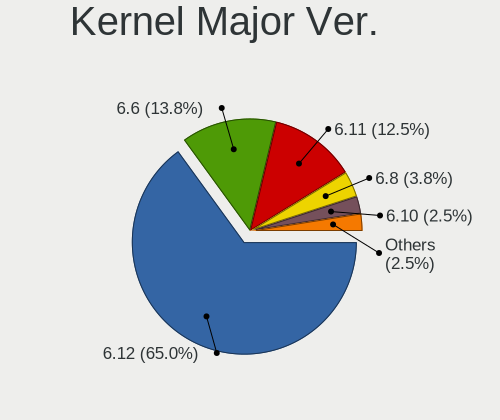
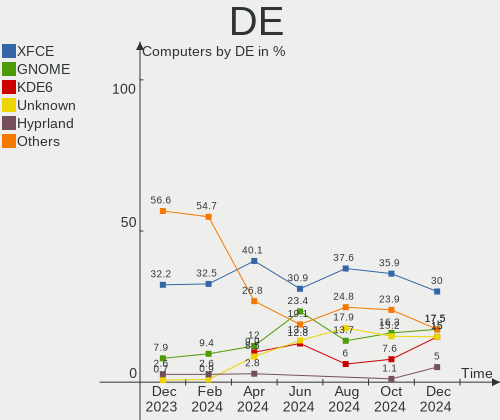
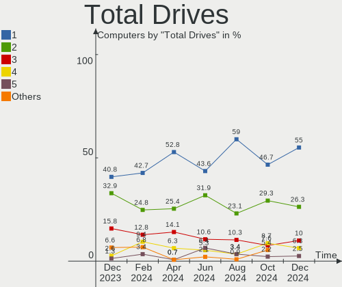
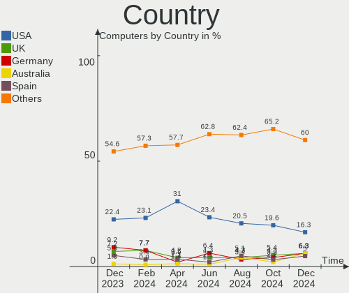
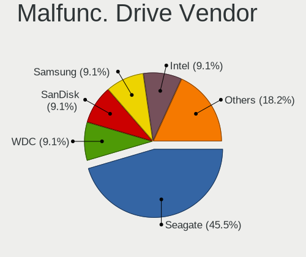
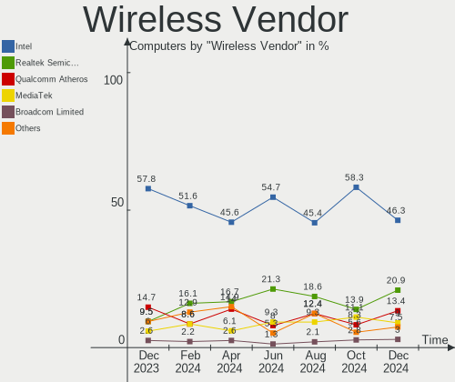

ArcoLinux - Hardware Trends
---------------------------

A project to identify most popular hardware characteristics and track their change
over time based on data collected by Linux users at https://Linux-Hardware.org.

Anyone can contribute to this report by the [hw-probe](https://github.com/linuxhw/hw-probe) tool:

    sudo -E hw-probe -all -upload

This is a report for all computer types. See also reports for [desktops](/Dist/ArcoLinux/Desktop/README.md) and [notebooks](/Dist/ArcoLinux/Notebook/README.md).

This report is for one last month. Overall report since the beginning of time: [TestDays](https://github.com/linuxhw/TestDays)

Period: Apr, 2023.

Contents
--------

* [ System ](#system)
  - [ OS                       ](#os)
  - [ OS Family                ](#os-family)
  - [ Kernel                   ](#kernel)
  - [ Kernel Family            ](#kernel-family)
  - [ Kernel Major Ver.        ](#kernel-major-ver)
  - [ Arch                     ](#arch)
  - [ DE                       ](#de)
  - [ Display Server           ](#display-server)
  - [ Display Manager          ](#display-manager)
  - [ OS Lang                  ](#os-lang)
  - [ Boot Mode                ](#boot-mode)
  - [ Filesystem               ](#filesystem)
  - [ Part. scheme             ](#part-scheme)
  - [ Dual Boot with Linux/BSD ](#dual-boot-with-linuxbsd)
  - [ Dual Boot (Win)          ](#dual-boot-win)

* [ Board ](#board)
  - [ Vendor                   ](#vendor)
  - [ Model                    ](#model)
  - [ Model Family             ](#model-family)
  - [ MFG Year                 ](#mfg-year)
  - [ Form Factor              ](#form-factor)
  - [ Secure Boot              ](#secure-boot)
  - [ Coreboot                 ](#coreboot)
  - [ RAM Size                 ](#ram-size)
  - [ RAM Used                 ](#ram-used)
  - [ Total Drives             ](#total-drives)
  - [ Has CD-ROM               ](#has-cd-rom)
  - [ Has Ethernet             ](#has-ethernet)
  - [ Has WiFi                 ](#has-wifi)
  - [ Has Bluetooth            ](#has-bluetooth)

* [ Location ](#location)
  - [ Country                  ](#country)
  - [ City                     ](#city)

* [ Drives ](#drives)
  - [ Drive Vendor             ](#drive-vendor)
  - [ Drive Model              ](#drive-model)
  - [ HDD Vendor               ](#hdd-vendor)
  - [ SSD Vendor               ](#ssd-vendor)
  - [ Drive Kind               ](#drive-kind)
  - [ Drive Connector          ](#drive-connector)
  - [ Drive Size               ](#drive-size)
  - [ Space Total              ](#space-total)
  - [ Space Used               ](#space-used)
  - [ Malfunc. Drives          ](#malfunc-drives)
  - [ Malfunc. Drive Vendor    ](#malfunc-drive-vendor)
  - [ Malfunc. HDD Vendor      ](#malfunc-hdd-vendor)
  - [ Malfunc. Drive Kind      ](#malfunc-drive-kind)
  - [ Failed Drives            ](#failed-drives)
  - [ Failed Drive Vendor      ](#failed-drive-vendor)
  - [ Drive Status             ](#drive-status)

* [ Storage controller ](#storage-controller)
  - [ Storage Vendor           ](#storage-vendor)
  - [ Storage Model            ](#storage-model)
  - [ Storage Kind             ](#storage-kind)

* [ Processor ](#processor)
  - [ CPU Vendor               ](#cpu-vendor)
  - [ CPU Model                ](#cpu-model)
  - [ CPU Model Family         ](#cpu-model-family)
  - [ CPU Cores                ](#cpu-cores)
  - [ CPU Sockets              ](#cpu-sockets)
  - [ CPU Threads              ](#cpu-threads)
  - [ CPU Op-Modes             ](#cpu-op-modes)
  - [ CPU Microcode            ](#cpu-microcode)
  - [ CPU Microarch            ](#cpu-microarch)

* [ Graphics ](#graphics)
  - [ GPU Vendor               ](#gpu-vendor)
  - [ GPU Model                ](#gpu-model)
  - [ GPU Combo                ](#gpu-combo)
  - [ GPU Driver               ](#gpu-driver)
  - [ GPU Memory               ](#gpu-memory)

* [ Monitor ](#monitor)
  - [ Monitor Vendor           ](#monitor-vendor)
  - [ Monitor Model            ](#monitor-model)
  - [ Monitor Resolution       ](#monitor-resolution)
  - [ Monitor Diagonal         ](#monitor-diagonal)
  - [ Monitor Width            ](#monitor-width)
  - [ Aspect Ratio             ](#aspect-ratio)
  - [ Monitor Area             ](#monitor-area)
  - [ Pixel Density            ](#pixel-density)
  - [ Multiple Monitors        ](#multiple-monitors)

* [ Network ](#network)
  - [ Net Controller Vendor    ](#net-controller-vendor)
  - [ Net Controller Model     ](#net-controller-model)
  - [ Wireless Vendor          ](#wireless-vendor)
  - [ Wireless Model           ](#wireless-model)
  - [ Ethernet Vendor          ](#ethernet-vendor)
  - [ Ethernet Model           ](#ethernet-model)
  - [ Net Controller Kind      ](#net-controller-kind)
  - [ Used Controller          ](#used-controller)
  - [ NICs                     ](#nics)
  - [ IPv6                     ](#ipv6)

* [ Bluetooth ](#bluetooth)
  - [ Bluetooth Vendor         ](#bluetooth-vendor)
  - [ Bluetooth Model          ](#bluetooth-model)

* [ Sound ](#sound)
  - [ Sound Vendor             ](#sound-vendor)
  - [ Sound Model              ](#sound-model)

* [ Memory ](#memory)
  - [ Memory Vendor            ](#memory-vendor)
  - [ Memory Model             ](#memory-model)
  - [ Memory Kind              ](#memory-kind)
  - [ Memory Form Factor       ](#memory-form-factor)
  - [ Memory Size              ](#memory-size)
  - [ Memory Speed             ](#memory-speed)

* [ Printers & scanners ](#printers--scanners)
  - [ Printer Vendor           ](#printer-vendor)
  - [ Printer Model            ](#printer-model)
  - [ Scanner Vendor           ](#scanner-vendor)
  - [ Scanner Model            ](#scanner-model)

* [ Camera ](#camera)
  - [ Camera Vendor            ](#camera-vendor)
  - [ Camera Model             ](#camera-model)

* [ Security ](#security)
  - [ Fingerprint Vendor       ](#fingerprint-vendor)
  - [ Fingerprint Model        ](#fingerprint-model)
  - [ Chipcard Vendor          ](#chipcard-vendor)
  - [ Chipcard Model           ](#chipcard-model)

* [ Unsupported ](#unsupported)
  - [ Unsupported Devices      ](#unsupported-devices)
  - [ Unsupported Device Types ](#unsupported-device-types)

System
------

OS
--

Installed operating systems

| Name              | Computers | Percent |
|-------------------|-----------|---------|
| ArcoLinux Rolling | 68        | 97.14%  |
| ArcoLinux         | 2         | 2.86%   |

OS Family
---------

OS without a version

| Name      | Computers | Percent |
|-----------|-----------|---------|
| ArcoLinux | 70        | 100%    |

Kernel
------

Version of the Linux kernel

| Version               | Computers | Percent |
|-----------------------|-----------|---------|
| 6.2.11-arch1-1        | 18        | 25.71%  |
| 6.2.12-zen1-1-zen     | 7         | 10%     |
| 6.2.10-arch1-1        | 7         | 10%     |
| 6.2.9-arch1-1         | 6         | 8.57%   |
| 6.2.12-arch1-1        | 6         | 8.57%   |
| 6.2.13-arch1-1        | 5         | 7.14%   |
| 6.2.8-arch1-1         | 4         | 5.71%   |
| 6.2.9-zen1-1-zen      | 2         | 2.86%   |
| 6.2.11-zen1-1-zen     | 2         | 2.86%   |
| 6.2.10-zen1-1-zen     | 2         | 2.86%   |
| 6.1.25-1-lts          | 2         | 2.86%   |
| 6.1.24-1-lts          | 2         | 2.86%   |
| 6.1.23-1-lts          | 2         | 2.86%   |
| 6.1.11-arch1-1        | 2         | 2.86%   |
| 6.2.7-x64v1-xanmod1-1 | 1         | 1.43%   |
| 6.2.11-AMD            | 1         | 1.43%   |
| 6.0.2-zen1-1-zen      | 1         | 1.43%   |

Kernel Family
-------------

Linux kernel without a distro release

| Version | Computers | Percent |
|---------|-----------|---------|
| 6.2.11  | 21        | 30%     |
| 6.2.12  | 13        | 18.57%  |
| 6.2.10  | 9         | 12.86%  |
| 6.2.9   | 8         | 11.43%  |
| 6.2.13  | 5         | 7.14%   |
| 6.2.8   | 4         | 5.71%   |
| 6.1.25  | 2         | 2.86%   |
| 6.1.24  | 2         | 2.86%   |
| 6.1.23  | 2         | 2.86%   |
| 6.1.11  | 2         | 2.86%   |
| 6.2.7   | 1         | 1.43%   |
| 6.0.2   | 1         | 1.43%   |

Kernel Major Ver.
-----------------

Linux kernel major version

| Version | Computers | Percent |
|---------|-----------|---------|
| 6.2     | 61        | 87.14%  |
| 6.1     | 8         | 11.43%  |
| 6.0     | 1         | 1.43%   |

Arch
----

OS architecture (x86_64, i586, etc.)

| Name   | Computers | Percent |
|--------|-----------|---------|
| x86_64 | 70        | 100%    |

DE
--

Desktop Environment

| Name           | Computers | Percent |
|----------------|-----------|---------|
| KDE5           | 20        | 28.57%  |
| XFCE           | 13        | 18.57%  |
| Hyprland       | 13        | 18.57%  |
| chadwm         | 6         | 8.57%   |
| GNOME          | 4         | 5.71%   |
| bspwm          | 3         | 4.29%   |
| xmonad         | 2         | 2.86%   |
| dwm            | 2         | 2.86%   |
| awesome        | 2         | 2.86%   |
| sway           | 1         | 1.43%   |
| MATE           | 1         | 1.43%   |
| i3-with-shmlog | 1         | 1.43%   |
| i3             | 1         | 1.43%   |
| herbstluftwm   | 1         | 1.43%   |

Display Server
--------------

X11 or Wayland

| Name    | Computers | Percent |
|---------|-----------|---------|
| X11     | 47        | 67.14%  |
| Wayland | 22        | 31.43%  |
| Tty     | 1         | 1.43%   |

Display Manager
---------------

SDDM, LightDM, etc.

| Name    | Computers | Percent |
|---------|-----------|---------|
| SDDM    | 56        | 80%     |
| LightDM | 5         | 7.14%   |
| GDM     | 5         | 7.14%   |
| Unknown | 4         | 5.71%   |

OS Lang
-------

Language

| Lang  | Computers | Percent |
|-------|-----------|---------|
| en_US | 32        | 45.71%  |
| en_GB | 6         | 8.57%   |
| en_IN | 5         | 7.14%   |
| es_ES | 3         | 4.29%   |
| en_AU | 3         | 4.29%   |
| de_DE | 3         | 4.29%   |
| en_CA | 2         | 2.86%   |
| C     | 2         | 2.86%   |
| tr_TR | 1         | 1.43%   |
| th_TH | 1         | 1.43%   |
| pt_BR | 1         | 1.43%   |
| pl_PL | 1         | 1.43%   |
| nl_NL | 1         | 1.43%   |
| it_IT | 1         | 1.43%   |
| fr_FR | 1         | 1.43%   |
| fr_CA | 1         | 1.43%   |
| fr_BE | 1         | 1.43%   |
| es_VE | 1         | 1.43%   |
| es_MX | 1         | 1.43%   |
| en_ZA | 1         | 1.43%   |
| en_AG | 1         | 1.43%   |
| ca_AD | 1         | 1.43%   |

Boot Mode
---------

EFI or BIOS

| Mode | Computers | Percent |
|------|-----------|---------|
| EFI  | 59        | 84.29%  |
| BIOS | 11        | 15.71%  |

Filesystem
----------

Type of filesystem

| Type    | Computers | Percent |
|---------|-----------|---------|
| Ext4    | 48        | 68.57%  |
| Btrfs   | 20        | 28.57%  |
| Overlay | 2         | 2.86%   |

Part. scheme
------------

Scheme of partitioning

| Type    | Computers | Percent |
|---------|-----------|---------|
| GPT     | 62        | 88.57%  |
| MBR     | 6         | 8.57%   |
| Unknown | 2         | 2.86%   |

Dual Boot with Linux/BSD
------------------------

Hosting more than one Linux/BSD

| Dual boot | Computers | Percent |
|-----------|-----------|---------|
| No        | 53        | 75.71%  |
| Yes       | 17        | 24.29%  |

Dual Boot (Win)
---------------

Hosting Linux and Windows

| Dual boot | Computers | Percent |
|-----------|-----------|---------|
| No        | 37        | 52.86%  |
| Yes       | 33        | 47.14%  |

Board
-----

Vendor
------

Motherboard manufacturer

| Name                        | Computers | Percent |
|-----------------------------|-----------|---------|
| ASUSTek Computer            | 18        | 25.71%  |
| Lenovo                      | 9         | 12.86%  |
| Gigabyte Technology         | 8         | 11.43%  |
| Dell                        | 8         | 11.43%  |
| Hewlett-Packard             | 7         | 10%     |
| MSI                         | 5         | 7.14%   |
| Acer                        | 5         | 7.14%   |
| Unknown                     | 2         | 2.86%   |
| ZOTAC                       | 1         | 1.43%   |
| System76                    | 1         | 1.43%   |
| Shenzhen Wangang Technology | 1         | 1.43%   |
| Packard Bell                | 1         | 1.43%   |
| HUAWEI                      | 1         | 1.43%   |
| Biostar                     | 1         | 1.43%   |
| BESSTAR Tech                | 1         | 1.43%   |
| ASRock                      | 1         | 1.43%   |

Model
-----

Motherboard model

| Name                                        | Computers | Percent |
|---------------------------------------------|-----------|---------|
| Unknown                                     | 2         | 2.86%   |
| ZOTAC ZBOX-CI527/CI547NANO                  | 1         | 1.43%   |
| System76 Oryx Pro                           | 1         | 1.43%   |
| Shenzhen Wangang AERO 2                     | 1         | 1.43%   |
| Packard Bell EasyNote TSX62HR               | 1         | 1.43%   |
| MSI MS-7C91                                 | 1         | 1.43%   |
| MSI MS-7C71                                 | 1         | 1.43%   |
| MSI MS-7C13                                 | 1         | 1.43%   |
| MSI MS-7B89                                 | 1         | 1.43%   |
| MSI MS-7A63                                 | 1         | 1.43%   |
| Lenovo V15 G2 ALC 82KD                      | 1         | 1.43%   |
| Lenovo ThinkPad X1 Extreme Gen 3 20TLS0UV00 | 1         | 1.43%   |
| Lenovo ThinkPad T14 Gen 1 20UDCTO1WW        | 1         | 1.43%   |
| Lenovo Legion Y540-15IRH-PG0 81SY           | 1         | 1.43%   |
| Lenovo Legion 7 16ACHg6 82N6                | 1         | 1.43%   |
| Lenovo IdeaPad 3 15ADA05 81W1               | 1         | 1.43%   |
| Lenovo IdeaPad 3 14ITL05 81X7               | 1         | 1.43%   |
| Lenovo IdeaPad 3 14ALC6 82KT                | 1         | 1.43%   |
| Lenovo E41-25 81FS                          | 1         | 1.43%   |
| HUAWEI NBLB-WAX9N                           | 1         | 1.43%   |
| HP ProDesk 600 G1 SFF                       | 1         | 1.43%   |
| HP Pavilion Laptop 15-eh0xxx                | 1         | 1.43%   |
| HP Pavilion Gaming Laptop 15-ec1xxx         | 1         | 1.43%   |
| HP Pavilion Gaming Laptop 15-dk2xxx         | 1         | 1.43%   |
| HP Pavilion dv7                             | 1         | 1.43%   |
| HP Pavilion dv4                             | 1         | 1.43%   |
| HP ENVY 15                                  | 1         | 1.43%   |
| Gigabyte Z270X-Gaming 7                     | 1         | 1.43%   |
| Gigabyte X570S AERO G                       | 1         | 1.43%   |
| Gigabyte X570 AORUS ELITE                   | 1         | 1.43%   |
| Gigabyte X299 AORUS Ultra Gaming Pro        | 1         | 1.43%   |
| Gigabyte B85M-D3H                           | 1         | 1.43%   |
| Gigabyte B550M DS3H AC                      | 1         | 1.43%   |
| Gigabyte B550 AORUS PRO AC                  | 1         | 1.43%   |
| Gigabyte B450 AORUS ELITE                   | 1         | 1.43%   |
| Dell OptiPlex 9020                          | 1         | 1.43%   |
| Dell Latitude E6440                         | 1         | 1.43%   |
| Dell Latitude 3590                          | 1         | 1.43%   |
| Dell Latitude 3510                          | 1         | 1.43%   |
| Dell Inspiron 5759                          | 1         | 1.43%   |

Model Family
------------

Motherboard model prefix

| Name                  | Computers | Percent |
|-----------------------|-----------|---------|
| ASUS PRIME            | 8         | 11.43%  |
| HP Pavilion           | 5         | 7.14%   |
| Dell Inspiron         | 4         | 5.71%   |
| ASUS ROG              | 4         | 5.71%   |
| Lenovo IdeaPad        | 3         | 4.29%   |
| Dell Latitude         | 3         | 4.29%   |
| Acer Aspire           | 3         | 4.29%   |
| Lenovo ThinkPad       | 2         | 2.86%   |
| Lenovo Legion         | 2         | 2.86%   |
| ASUS VivoBook         | 2         | 2.86%   |
| Unknown               | 2         | 2.86%   |
| ZOTAC ZBOX-CI527      | 1         | 1.43%   |
| System76 Oryx         | 1         | 1.43%   |
| Shenzhen Wangang AERO | 1         | 1.43%   |
| Packard Bell EasyNote | 1         | 1.43%   |
| MSI MS-7C91           | 1         | 1.43%   |
| MSI MS-7C71           | 1         | 1.43%   |
| MSI MS-7C13           | 1         | 1.43%   |
| MSI MS-7B89           | 1         | 1.43%   |
| MSI MS-7A63           | 1         | 1.43%   |
| Lenovo V15            | 1         | 1.43%   |
| Lenovo E41-25         | 1         | 1.43%   |
| HUAWEI NBLB-WAX9N     | 1         | 1.43%   |
| HP ProDesk            | 1         | 1.43%   |
| HP ENVY               | 1         | 1.43%   |
| Gigabyte Z270X-Gaming | 1         | 1.43%   |
| Gigabyte X570S        | 1         | 1.43%   |
| Gigabyte X570         | 1         | 1.43%   |
| Gigabyte X299         | 1         | 1.43%   |
| Gigabyte B85M-D3H     | 1         | 1.43%   |
| Gigabyte B550M        | 1         | 1.43%   |
| Gigabyte B550         | 1         | 1.43%   |
| Gigabyte B450         | 1         | 1.43%   |
| Dell OptiPlex         | 1         | 1.43%   |
| Biostar TZ77B         | 1         | 1.43%   |
| BESSTAR Tech HX90     | 1         | 1.43%   |
| ASUS Zenbook          | 1         | 1.43%   |
| ASUS TUF              | 1         | 1.43%   |
| ASUS STRIX            | 1         | 1.43%   |
| ASUS K54C             | 1         | 1.43%   |

MFG Year
--------

Motherboard manufacture year

| Year | Computers | Percent |
|------|-----------|---------|
| 2020 | 17        | 24.29%  |
| 2021 | 10        | 14.29%  |
| 2018 | 9         | 12.86%  |
| 2019 | 7         | 10%     |
| 2017 | 5         | 7.14%   |
| 2022 | 4         | 5.71%   |
| 2016 | 4         | 5.71%   |
| 2013 | 4         | 5.71%   |
| 2015 | 3         | 4.29%   |
| 2011 | 2         | 2.86%   |
| 2008 | 2         | 2.86%   |
| 2023 | 1         | 1.43%   |
| 2012 | 1         | 1.43%   |
| 2010 | 1         | 1.43%   |

Form Factor
-----------

Physical design of the computer

| Name     | Computers | Percent |
|----------|-----------|---------|
| Notebook | 35        | 50%     |
| Desktop  | 33        | 47.14%  |
| Mini pc  | 2         | 2.86%   |

Secure Boot
-----------

Enabled or disabled

| State    | Computers | Percent |
|----------|-----------|---------|
| Disabled | 70        | 100%    |

Coreboot
--------

Have coreboot on board

| Used | Computers | Percent |
|------|-----------|---------|
| No   | 70        | 100%    |

RAM Size
--------

Total RAM memory

| Size in GB  | Computers | Percent |
|-------------|-----------|---------|
| 32.01-64.0  | 18        | 25.71%  |
| 4.01-8.0    | 17        | 24.29%  |
| 16.01-24.0  | 11        | 15.71%  |
| 8.01-16.0   | 10        | 14.29%  |
| 64.01-256.0 | 9         | 12.86%  |
| 3.01-4.0    | 3         | 4.29%   |
| 2.01-3.0    | 1         | 1.43%   |
| 1.01-2.0    | 1         | 1.43%   |

RAM Used
--------

Used RAM memory

| Used GB    | Computers | Percent |
|------------|-----------|---------|
| 4.01-8.0   | 19        | 27.14%  |
| 2.01-3.0   | 16        | 22.86%  |
| 1.01-2.0   | 15        | 21.43%  |
| 3.01-4.0   | 11        | 15.71%  |
| 0.51-1.0   | 5         | 7.14%   |
| 8.01-16.0  | 3         | 4.29%   |
| 16.01-24.0 | 1         | 1.43%   |

Total Drives
------------

Number of drives on board

| Drives | Computers | Percent |
|--------|-----------|---------|
| 1      | 26        | 37.14%  |
| 2      | 21        | 30%     |
| 3      | 9         | 12.86%  |
| 4      | 6         | 8.57%   |
| 5      | 4         | 5.71%   |
| 7      | 3         | 4.29%   |
| 6      | 1         | 1.43%   |

Has CD-ROM
----------

Has CD-ROM on board

| Presented | Computers | Percent |
|-----------|-----------|---------|
| No        | 60        | 85.71%  |
| Yes       | 10        | 14.29%  |

Has Ethernet
------------

Has Ethernet on board

| Presented | Computers | Percent |
|-----------|-----------|---------|
| Yes       | 61        | 87.14%  |
| No        | 9         | 12.86%  |

Has WiFi
--------

Has WiFi module

| Presented | Computers | Percent |
|-----------|-----------|---------|
| Yes       | 53        | 75.71%  |
| No        | 17        | 24.29%  |

Has Bluetooth
-------------

Has Bluetooth module

| Presented | Computers | Percent |
|-----------|-----------|---------|
| Yes       | 51        | 72.86%  |
| No        | 19        | 27.14%  |

Location
--------

Country
-------

Geographic location (country)

| Country      | Computers | Percent |
|--------------|-----------|---------|
| USA          | 15        | 21.43%  |
| India        | 6         | 8.57%   |
| Germany      | 6         | 8.57%   |
| Belgium      | 5         | 7.14%   |
| UK           | 4         | 5.71%   |
| Spain        | 4         | 5.71%   |
| Canada       | 4         | 5.71%   |
| Turkey       | 3         | 4.29%   |
| Mexico       | 3         | 4.29%   |
| Poland       | 2         | 2.86%   |
| Indonesia    | 2         | 2.86%   |
| Australia    | 2         | 2.86%   |
| Venezuela    | 1         | 1.43%   |
| Ukraine      | 1         | 1.43%   |
| Thailand     | 1         | 1.43%   |
| South Africa | 1         | 1.43%   |
| Philippines  | 1         | 1.43%   |
| Italy        | 1         | 1.43%   |
| Iran         | 1         | 1.43%   |
| Greece       | 1         | 1.43%   |
| France       | 1         | 1.43%   |
| Finland      | 1         | 1.43%   |
| Czechia      | 1         | 1.43%   |
| Bulgaria     | 1         | 1.43%   |
| Brazil       | 1         | 1.43%   |
| Austria      | 1         | 1.43%   |

City
----

Geographic location (city)

| City                  | Computers | Percent |
|-----------------------|-----------|---------|
| Duffel                | 2         | 2.86%   |
| Burgos                | 2         | 2.86%   |
| Brussels              | 2         | 2.86%   |
| Bengaluru             | 2         | 2.86%   |
| Atlanta               | 2         | 2.86%   |
| Zacapu                | 1         | 1.43%   |
| Wilrijk               | 1         | 1.43%   |
| Warsaw                | 1         | 1.43%   |
| Vienna                | 1         | 1.43%   |
| Vechta                | 1         | 1.43%   |
| Thessaloniki          | 1         | 1.43%   |
| Tábor                | 1         | 1.43%   |
| Springfield           | 1         | 1.43%   |
| Sofia                 | 1         | 1.43%   |
| Schwarzenbek          | 1         | 1.43%   |
| Sarnia                | 1         | 1.43%   |
| San Luis Potosí City | 1         | 1.43%   |
| Puebla City           | 1         | 1.43%   |
| Poznan                | 1         | 1.43%   |
| Plano                 | 1         | 1.43%   |
| Palembang             | 1         | 1.43%   |
| Palakkad              | 1         | 1.43%   |
| Oklahoma City         | 1         | 1.43%   |
| Odesa                 | 1         | 1.43%   |
| Nuremberg             | 1         | 1.43%   |
| Norman                | 1         | 1.43%   |
| New York              | 1         | 1.43%   |
| Mission               | 1         | 1.43%   |
| Mineral               | 1         | 1.43%   |
| Maracaibo             | 1         | 1.43%   |
| Langley               | 1         | 1.43%   |
| Kiziklibucak          | 1         | 1.43%   |
| Karlsruhe             | 1         | 1.43%   |
| Juazeiro do Norte     | 1         | 1.43%   |
| Johannesburg          | 1         | 1.43%   |
| Jember                | 1         | 1.43%   |
| Istanbul              | 1         | 1.43%   |
| Isfahan               | 1         | 1.43%   |
| Indore                | 1         | 1.43%   |
| Hyderabad             | 1         | 1.43%   |

Drives
------

Drive Vendor
------------

Hard drive vendors

| Vendor                      | Computers | Drives | Percent |
|-----------------------------|-----------|--------|---------|
| Samsung Electronics         | 24        | 33     | 16.9%   |
| WDC                         | 20        | 25     | 14.08%  |
| Seagate                     | 18        | 24     | 12.68%  |
| Kingston                    | 10        | 10     | 7.04%   |
| Sandisk                     | 9         | 11     | 6.34%   |
| Toshiba                     | 6         | 6      | 4.23%   |
| SK hynix                    | 5         | 6      | 3.52%   |
| Phison Electronics          | 5         | 5      | 3.52%   |
| Crucial                     | 5         | 6      | 3.52%   |
| Micron/Crucial Technology   | 4         | 6      | 2.82%   |
| Intel                       | 4         | 4      | 2.82%   |
| Hitachi                     | 4         | 4      | 2.82%   |
| Kingston Technology Company | 3         | 3      | 2.11%   |
| Unknown                     | 2         | 3      | 1.41%   |
| SPCC                        | 2         | 2      | 1.41%   |
| KIOXIA                      | 2         | 2      | 1.41%   |
| External                    | 2         | 2      | 1.41%   |
| A-DATA Technology           | 2         | 2      | 1.41%   |
| Verbatim                    | 1         | 1      | 0.7%    |
| Union Memory                | 1         | 1      | 0.7%    |
| Silicon Motion              | 1         | 1      | 0.7%    |
| Seagate Technology          | 1         | 1      | 0.7%    |
| SABRENT                     | 1         | 1      | 0.7%    |
| PNY                         | 1         | 1      | 0.7%    |
| Mushkin                     | 1         | 1      | 0.7%    |
| LITEON                      | 1         | 1      | 0.7%    |
| Leven                       | 1         | 1      | 0.7%    |
| Kingmax                     | 1         | 1      | 0.7%    |
| JMicron Technology          | 1         | 1      | 0.7%    |
| GOODRAM                     | 1         | 1      | 0.7%    |
| China                       | 1         | 1      | 0.7%    |
| BAITITON                    | 1         | 1      | 0.7%    |
| AEROFARA                    | 1         | 1      | 0.7%    |

Drive Model
-----------

Hard drive models

| Model                                              | Computers | Percent |
|----------------------------------------------------|-----------|---------|
| Samsung NVMe SSD Controller SM981/PM981/PM983 1TB  | 5         | 3.11%   |
| Samsung NVMe SSD Controller PM9A1/PM9A3/980PRO 2TB | 4         | 2.48%   |
| Micron/Crucial P2 NVMe PCIe SSD 1TB                | 4         | 2.48%   |
| Toshiba MQ01ABD100 1TB                             | 3         | 1.86%   |
| Seagate ST2000LM007-1R8174 2TB                     | 3         | 1.86%   |
| Seagate ST1000LM035-1RK172 970GB                   | 3         | 1.86%   |
| Samsung SSD 870 EVO 1TB                            | 3         | 1.86%   |
| Seagate FireCuda HDD 2TB                           | 2         | 1.24%   |
| Sandisk WD_BLACK SN770 1TB                         | 2         | 1.24%   |
| Phison E12 NVMe Controller 512GB                   | 2         | 1.24%   |
| Hitachi HDS721010CLA332 1TB                        | 2         | 1.24%   |
| External USB3.0 120GB                              | 2         | 1.24%   |
| Crucial CT1000MX500SSD1 1TB                        | 2         | 1.24%   |
| WDC WDS250G2B0A-00SM50 250GB SSD                   | 1         | 0.62%   |
| WDC WDS250G2B0A 250GB SSD                          | 1         | 0.62%   |
| WDC WDS120G2G0A-00JH30 120GB SSD                   | 1         | 0.62%   |
| WDC WD80EFBX-68AZZN0 8TB                           | 1         | 0.62%   |
| WDC WD5000LPCX-24VHAT0 500GB                       | 1         | 0.62%   |
| WDC WD5000LPCX-24C6HT0 500GB                       | 1         | 0.62%   |
| WDC WD5000KS-00MNB0 500GB                          | 1         | 0.62%   |
| WDC WD5000AAKX-001CA0 500GB                        | 1         | 0.62%   |
| WDC WD5000AAKS-00V2B0 500GB                        | 1         | 0.62%   |
| WDC WD3200BEVT-60ZCT1 320GB                        | 1         | 0.62%   |
| WDC WD3200BEKT-60F3T1 320GB                        | 1         | 0.62%   |
| WDC WD3200AVJS-63B6A0 320GB                        | 1         | 0.62%   |
| WDC WD3200AAJS-22L7A0 320GB                        | 1         | 0.62%   |
| WDC WD30EZRX-00D8PB0 3TB                           | 1         | 0.62%   |
| WDC WD20SPZX-22UA7T0 2TB                           | 1         | 0.62%   |
| WDC WD20EZRZ-00Z5HB0 2TB                           | 1         | 0.62%   |
| WDC WD20EZBX-00AYRA0 2TB                           | 1         | 0.62%   |
| WDC WD20EARS-14MVWB0 2TB                           | 1         | 0.62%   |
| WDC WD20EARS-00MVWB0 2TB                           | 1         | 0.62%   |
| WDC WD10JPVX-75JC3T0 1TB                           | 1         | 0.62%   |
| WDC WD10EZEX-22MFCA0 1TB                           | 1         | 0.62%   |
| WDC WD10EZEX-08WN4A0 1TB                           | 1         | 0.62%   |
| WDC WD10EZEX-00ER1A0 1TB                           | 1         | 0.62%   |
| WDC WD10EZEX-00BN5A0 1TB                           | 1         | 0.62%   |
| Verbatim Vi550 S3 128GB                            | 1         | 0.62%   |
| Unknown SD/MMC/MS PRO 249GB                        | 1         | 0.62%   |
| Unknown MMC Card  32GB                             | 1         | 0.62%   |

HDD Vendor
----------

Hard disk drive vendors

| Vendor              | Computers | Drives | Percent |
|---------------------|-----------|--------|---------|
| WDC                 | 18        | 22     | 38.3%   |
| Seagate             | 17        | 21     | 36.17%  |
| Toshiba             | 5         | 5      | 10.64%  |
| Hitachi             | 4         | 4      | 8.51%   |
| Unknown             | 1         | 1      | 2.13%   |
| Samsung Electronics | 1         | 1      | 2.13%   |
| JMicron Technology  | 1         | 1      | 2.13%   |

SSD Vendor
----------

Solid state drive vendors

| Vendor              | Computers | Drives | Percent |
|---------------------|-----------|--------|---------|
| Samsung Electronics | 14        | 15     | 28%     |
| Kingston            | 6         | 6      | 12%     |
| Crucial             | 5         | 6      | 10%     |
| SanDisk             | 3         | 4      | 6%      |
| WDC                 | 2         | 3      | 4%      |
| SPCC                | 2         | 2      | 4%      |
| External            | 2         | 2      | 4%      |
| A-DATA Technology   | 2         | 2      | 4%      |
| Verbatim            | 1         | 1      | 2%      |
| Toshiba             | 1         | 1      | 2%      |
| SK hynix            | 1         | 1      | 2%      |
| Seagate             | 1         | 2      | 2%      |
| PNY                 | 1         | 1      | 2%      |
| Mushkin             | 1         | 1      | 2%      |
| LITEON              | 1         | 1      | 2%      |
| Leven               | 1         | 1      | 2%      |
| Kingmax             | 1         | 1      | 2%      |
| Intel               | 1         | 1      | 2%      |
| GOODRAM             | 1         | 1      | 2%      |
| China               | 1         | 1      | 2%      |
| BAITITON            | 1         | 1      | 2%      |
| AEROFARA            | 1         | 1      | 2%      |

Drive Kind
----------

HDD or SSD

| Kind    | Computers | Drives | Percent |
|---------|-----------|--------|---------|
| NVMe    | 40        | 56     | 33.9%   |
| HDD     | 39        | 55     | 33.05%  |
| SSD     | 37        | 55     | 31.36%  |
| MMC     | 1         | 2      | 0.85%   |
| Unknown | 1         | 1      | 0.85%   |

Drive Connector
---------------

SATA, SAS, NVMe, etc.

| Type | Computers | Drives | Percent |
|------|-----------|--------|---------|
| SATA | 50        | 98     | 50.51%  |
| NVMe | 40        | 56     | 40.4%   |
| SAS  | 8         | 13     | 8.08%   |
| MMC  | 1         | 2      | 1.01%   |

Drive Size
----------

Size of hard drive

| Size in TB | Computers | Drives | Percent |
|------------|-----------|--------|---------|
| 0.01-0.5   | 32        | 48     | 40%     |
| 0.51-1.0   | 29        | 37     | 36.25%  |
| 1.01-2.0   | 14        | 18     | 17.5%   |
| 3.01-4.0   | 2         | 4      | 2.5%    |
| 4.01-10.0  | 2         | 2      | 2.5%    |
| 2.01-3.0   | 1         | 1      | 1.25%   |

Space Total
-----------

Amount of disk space available on the file system

| Size in GB     | Computers | Percent |
|----------------|-----------|---------|
| More than 3000 | 17        | 24.29%  |
| 501-1000       | 15        | 21.43%  |
| 101-250        | 14        | 20%     |
| 1001-2000      | 9         | 12.86%  |
| 251-500        | 7         | 10%     |
| 2001-3000      | 3         | 4.29%   |
| 1-20           | 2         | 2.86%   |
| 21-50          | 1         | 1.43%   |
| 51-100         | 1         | 1.43%   |
| Unknown        | 1         | 1.43%   |

Space Used
----------

Amount of used disk space

| Used GB        | Computers | Percent |
|----------------|-----------|---------|
| 1-20           | 19        | 27.14%  |
| 101-250        | 11        | 15.71%  |
| 21-50          | 8         | 11.43%  |
| 501-1000       | 8         | 11.43%  |
| 1001-2000      | 7         | 10%     |
| 251-500        | 5         | 7.14%   |
| 51-100         | 5         | 7.14%   |
| More than 3000 | 4         | 5.71%   |
| 2001-3000      | 2         | 2.86%   |
| Unknown        | 1         | 1.43%   |

Malfunc. Drives
---------------

Drive models with a malfunction

| Model                                 | Computers | Drives | Percent |
|---------------------------------------|-----------|--------|---------|
| WDC WD5000LPCX-24C6HT0 500GB          | 1         | 1      | 7.14%   |
| WDC WD3200AVJS-63B6A0 320GB           | 1         | 1      | 7.14%   |
| WDC WD3200AAJS-22L7A0 320GB           | 1         | 1      | 7.14%   |
| WDC WD20EARS-00MVWB0 2TB              | 1         | 2      | 7.14%   |
| Toshiba MQ01ABD100 1TB                | 1         | 1      | 7.14%   |
| Seagate ST3500630AS 500GB             | 1         | 1      | 7.14%   |
| Seagate ST3500320AS 500GB             | 1         | 1      | 7.14%   |
| Seagate ST1000LM035-1RK172 970GB      | 1         | 1      | 7.14%   |
| Samsung Electronics SSD 870 EVO 1TB   | 1         | 1      | 7.14%   |
| Samsung Electronics SSD 850 EVO 250GB | 1         | 1      | 7.14%   |
| JMicron Technology Generic 1TB        | 1         | 1      | 7.14%   |
| Hitachi HTS547575A9E384 752GB         | 1         | 1      | 7.14%   |
| Hitachi HDS721050CLA662 500GB         | 1         | 1      | 7.14%   |
| Hitachi HDS721010CLA332 1TB           | 1         | 1      | 7.14%   |

Malfunc. Drive Vendor
---------------------

Vendors of faulty drives

| Vendor              | Computers | Drives | Percent |
|---------------------|-----------|--------|---------|
| WDC                 | 4         | 5      | 30.77%  |
| Hitachi             | 3         | 3      | 23.08%  |
| Seagate             | 2         | 3      | 15.38%  |
| Samsung Electronics | 2         | 2      | 15.38%  |
| Toshiba             | 1         | 1      | 7.69%   |
| JMicron Technology  | 1         | 1      | 7.69%   |

Malfunc. HDD Vendor
-------------------

Vendors of faulty HDD drives

| Vendor             | Computers | Drives | Percent |
|--------------------|-----------|--------|---------|
| WDC                | 4         | 5      | 36.36%  |
| Hitachi            | 3         | 3      | 27.27%  |
| Seagate            | 2         | 3      | 18.18%  |
| Toshiba            | 1         | 1      | 9.09%   |
| JMicron Technology | 1         | 1      | 9.09%   |

Malfunc. Drive Kind
-------------------

Kinds of faulty drives

| Kind | Computers | Drives | Percent |
|------|-----------|--------|---------|
| HDD  | 9         | 13     | 81.82%  |
| SSD  | 2         | 2      | 18.18%  |

Failed Drives
-------------

Failed drive models

| Model                       | Computers | Drives | Percent |
|-----------------------------|-----------|--------|---------|
| WDC WD5000AAKX-001CA0 500GB | 1         | 1      | 100%    |

Failed Drive Vendor
-------------------

Failed drive vendors

| Vendor | Computers | Drives | Percent |
|--------|-----------|--------|---------|
| WDC    | 1         | 1      | 100%    |

Drive Status
------------

Number of failed and malfunc. drives

| Status   | Computers | Drives | Percent |
|----------|-----------|--------|---------|
| Works    | 63        | 132    | 75%     |
| Malfunc  | 11        | 15     | 13.1%   |
| Detected | 9         | 21     | 10.71%  |
| Failed   | 1         | 1      | 1.19%   |

Storage controller
------------------

Storage Vendor
--------------

Storage controller vendors

| Vendor                      | Computers | Percent |
|-----------------------------|-----------|---------|
| Intel                       | 42        | 37.17%  |
| AMD                         | 25        | 22.12%  |
| Samsung Electronics         | 14        | 12.39%  |
| Kingston Technology Company | 7         | 6.19%   |
| SanDisk                     | 6         | 5.31%   |
| Phison Electronics          | 5         | 4.42%   |
| SK hynix                    | 4         | 3.54%   |
| Micron/Crucial Technology   | 4         | 3.54%   |
| Seagate Technology          | 2         | 1.77%   |
| KIOXIA                      | 2         | 1.77%   |
| Union Memory (Shenzhen)     | 1         | 0.88%   |
| Silicon Motion              | 1         | 0.88%   |

Storage Model
-------------

Storage controller models

| Model                                                                          | Computers | Percent |
|--------------------------------------------------------------------------------|-----------|---------|
| AMD FCH SATA Controller [AHCI mode]                                            | 19        | 14.96%  |
| Intel Sunrise Point-LP SATA Controller [AHCI mode]                             | 6         | 4.72%   |
| Intel 200 Series PCH SATA controller [AHCI mode]                               | 6         | 4.72%   |
| Samsung NVMe SSD Controller SM981/PM981/PM983                                  | 5         | 3.94%   |
| Samsung NVMe SSD Controller 980                                                | 5         | 3.94%   |
| Samsung NVMe SSD Controller PM9A1/PM9A3/980PRO                                 | 4         | 3.15%   |
| Micron/Crucial P2 NVMe PCIe SSD                                                | 4         | 3.15%   |
| Intel Comet Lake SATA AHCI Controller                                          | 4         | 3.15%   |
| AMD 500 Series Chipset SATA Controller                                         | 4         | 3.15%   |
| AMD 400 Series Chipset SATA Controller                                         | 4         | 3.15%   |
| SK hynix Gold P31/PC711 NVMe Solid State Drive                                 | 3         | 2.36%   |
| SanDisk WD Black SN770 NVMe SSD                                                | 3         | 2.36%   |
| Kingston Company Company Non-Volatile memory controller                        | 3         | 2.36%   |
| Intel Volume Management Device NVMe RAID Controller                            | 3         | 2.36%   |
| Intel Tiger Lake-LP SATA Controller                                            | 3         | 2.36%   |
| Intel 8 Series/C220 Series Chipset Family 6-port SATA Controller 1 [AHCI mode] | 3         | 2.36%   |
| Phison E12 NVMe Controller                                                     | 2         | 1.57%   |
| Kingston Company NVMe Controller                                               | 2         | 1.57%   |
| Intel Wildcat Point-LP SATA Controller [AHCI Mode]                             | 2         | 1.57%   |
| Intel Celeron/Pentium Silver Processor SATA Controller                         | 2         | 1.57%   |
| Intel Cannon Lake Mobile PCH SATA AHCI Controller                              | 2         | 1.57%   |
| Intel 82801 Mobile SATA Controller [RAID mode]                                 | 2         | 1.57%   |
| Intel 6 Series/C200 Series Chipset Family 6 port Mobile SATA AHCI Controller   | 2         | 1.57%   |
| AMD SB7x0/SB8x0/SB9x0 SATA Controller [AHCI mode]                              | 2         | 1.57%   |
| Union Memory (Shenzhen) Non-Volatile memory controller                         | 1         | 0.79%   |
| SK hynix Non-Volatile memory controller                                        | 1         | 0.79%   |
| Silicon Motion SM2262/SM2262EN SSD Controller                                  | 1         | 0.79%   |
| Seagate FireCuda 530 SSD                                                       | 1         | 0.79%   |
| Seagate FireCuda 510 SSD                                                       | 1         | 0.79%   |
| Sandisk Western Digital WD Black SN850X NVMe SSD                               | 1         | 0.79%   |
| SanDisk WD Blue SN570 NVMe SSD 1TB                                             | 1         | 0.79%   |
| SanDisk WD Blue SN550 NVMe SSD                                                 | 1         | 0.79%   |
| SanDisk PC SN520 NVMe SSD                                                      | 1         | 0.79%   |
| Samsung NVMe SSD Controller SM961/PM961/SM963                                  | 1         | 0.79%   |
| Phison PS5013 E13 NVMe Controller                                              | 1         | 0.79%   |
| Phison E18 PCIe4 NVMe Controller                                               | 1         | 0.79%   |
| Phison E16 PCIe4 NVMe Controller                                               | 1         | 0.79%   |
| Micron/Crucial P1 NVMe PCIe SSD                                                | 1         | 0.79%   |
| Micron/Crucial NVMe Storage Controller                                         | 1         | 0.79%   |
| KIOXIA NVMe SSD Controller BG4                                                 | 1         | 0.79%   |

Storage Kind
------------

Kind of storage controller (IDE, SATA, NVMe, SAS, ...)

| Kind | Computers | Percent |
|------|-----------|---------|
| SATA | 61        | 56.48%  |
| NVMe | 40        | 37.04%  |
| RAID | 6         | 5.56%   |
| IDE  | 1         | 0.93%   |

Processor
---------

CPU Vendor
----------

Processor vendors

| Vendor | Computers | Percent |
|--------|-----------|---------|
| Intel  | 42        | 60%     |
| AMD    | 28        | 40%     |

CPU Model
---------

Processor models

| Model                                    | Computers | Percent |
|------------------------------------------|-----------|---------|
| Intel Core i7-7700K CPU @ 4.20GHz        | 3         | 4.29%   |
| Intel Core i7-8550U CPU @ 1.80GHz        | 2         | 2.86%   |
| Intel Core i5-10210U CPU @ 1.60GHz       | 2         | 2.86%   |
| Intel Core i3-9100F CPU @ 3.60GHz        | 2         | 2.86%   |
| Intel 11th Gen Core i3-1115G4 @ 3.00GHz  | 2         | 2.86%   |
| AMD Ryzen 9 5900X 12-Core Processor      | 2         | 2.86%   |
| AMD Ryzen 9 5900HX with Radeon Graphics  | 2         | 2.86%   |
| AMD Ryzen 7 5700G with Radeon Graphics   | 2         | 2.86%   |
| AMD Ryzen 7 2700X Eight-Core Processor   | 2         | 2.86%   |
| AMD Ryzen 5 5600X 6-Core Processor       | 2         | 2.86%   |
| AMD Ryzen 5 5500U with Radeon Graphics   | 2         | 2.86%   |
| Intel Pentium Silver N5000 CPU @ 1.10GHz | 1         | 1.43%   |
| Intel Core i9-7900X CPU @ 3.30GHz        | 1         | 1.43%   |
| Intel Core i9-10850K CPU @ 3.60GHz       | 1         | 1.43%   |
| Intel Core i7-9750H CPU @ 2.60GHz        | 1         | 1.43%   |
| Intel Core i7-9700K CPU @ 3.60GHz        | 1         | 1.43%   |
| Intel Core i7-7700HQ CPU @ 2.80GHz       | 1         | 1.43%   |
| Intel Core i7-7500U CPU @ 2.70GHz        | 1         | 1.43%   |
| Intel Core i7-6500U CPU @ 2.50GHz        | 1         | 1.43%   |
| Intel Core i7-4790 CPU @ 3.60GHz         | 1         | 1.43%   |
| Intel Core i7-4702MQ CPU @ 2.20GHz       | 1         | 1.43%   |
| Intel Core i7-3770K CPU @ 3.50GHz        | 1         | 1.43%   |
| Intel Core i7-10750H CPU @ 2.60GHz       | 1         | 1.43%   |
| Intel Core i7-10700K CPU @ 3.80GHz       | 1         | 1.43%   |
| Intel Core i5-9300H CPU @ 2.40GHz        | 1         | 1.43%   |
| Intel Core i5-7200U CPU @ 2.50GHz        | 1         | 1.43%   |
| Intel Core i5-5200U CPU @ 2.20GHz        | 1         | 1.43%   |
| Intel Core i5-4670 CPU @ 3.40GHz         | 1         | 1.43%   |
| Intel Core i5-4460 CPU @ 3.20GHz         | 1         | 1.43%   |
| Intel Core i5-4210M CPU @ 2.60GHz        | 1         | 1.43%   |
| Intel Core i5-2500 CPU @ 3.30GHz         | 1         | 1.43%   |
| Intel Core i5-2450M CPU @ 2.50GHz        | 1         | 1.43%   |
| Intel Core i5-10400F CPU @ 2.90GHz       | 1         | 1.43%   |
| Intel Core i3-7100U CPU @ 2.40GHz        | 1         | 1.43%   |
| Intel Core i3-5015U CPU @ 2.10GHz        | 1         | 1.43%   |
| Intel Core i3-2330M CPU @ 2.20GHz        | 1         | 1.43%   |
| Intel Celeron J4125 CPU @ 2.00GHz        | 1         | 1.43%   |
| Intel Atom x5-Z8350 CPU @ 1.44GHz        | 1         | 1.43%   |
| Intel 12th Gen Core i9-12900KF           | 1         | 1.43%   |
| Intel 12th Gen Core i9-12900H            | 1         | 1.43%   |

CPU Model Family
----------------

Processor model prefix

| Model                          | Computers | Percent |
|--------------------------------|-----------|---------|
| Intel Core i7                  | 15        | 21.43%  |
| Intel Core i5                  | 11        | 15.71%  |
| AMD Ryzen 5                    | 9         | 12.86%  |
| Other                          | 7         | 10%     |
| AMD Ryzen 7                    | 7         | 10%     |
| AMD Ryzen 9                    | 6         | 8.57%   |
| Intel Core i3                  | 5         | 7.14%   |
| Intel Core i9                  | 2         | 2.86%   |
| AMD Ryzen 3                    | 2         | 2.86%   |
| Intel Pentium Silver           | 1         | 1.43%   |
| Intel Celeron                  | 1         | 1.43%   |
| Intel Atom                     | 1         | 1.43%   |
| AMD Turion X2 Dual-Core Mobile | 1         | 1.43%   |
| AMD Turion II Dual-Core        | 1         | 1.43%   |
| AMD Ryzen 5 PRO                | 1         | 1.43%   |

CPU Cores
---------

Number of processor cores

| Number | Computers | Percent |
|--------|-----------|---------|
| 4      | 23        | 32.86%  |
| 2      | 15        | 21.43%  |
| 6      | 13        | 18.57%  |
| 8      | 11        | 15.71%  |
| 12     | 3         | 4.29%   |
| 16     | 2         | 2.86%   |
| 10     | 2         | 2.86%   |
| 14     | 1         | 1.43%   |

CPU Sockets
-----------

Number of sockets

| Number | Computers | Percent |
|--------|-----------|---------|
| 1      | 70        | 100%    |

CPU Threads
-----------

Threads per core (Hyper-Threading)

| Number | Computers | Percent |
|--------|-----------|---------|
| 2      | 56        | 80%     |
| 1      | 14        | 20%     |

CPU Op-Modes
------------

CPU Operation Modes (32-bit, 64-bit)

| Op mode        | Computers | Percent |
|----------------|-----------|---------|
| 32-bit, 64-bit | 70        | 100%    |

CPU Microcode
-------------

Microcode number

| Number     | Computers | Percent |
|------------|-----------|---------|
| Unknown    | 40        | 57.14%  |
| 0x0a50000d | 3         | 4.29%   |
| 0x08608103 | 3         | 4.29%   |
| 0x08600106 | 3         | 4.29%   |
| 0x0a201025 | 2         | 2.86%   |
| 0x08701021 | 2         | 2.86%   |
| 0xa0652    | 1         | 1.43%   |
| 0x806ec    | 1         | 1.43%   |
| 0x706a8    | 1         | 1.43%   |
| 0x306d4    | 1         | 1.43%   |
| 0x306c3    | 1         | 1.43%   |
| 0x206a7    | 1         | 1.43%   |
| 0x0a50000c | 1         | 1.43%   |
| 0x0a20120a | 1         | 1.43%   |
| 0x0a201016 | 1         | 1.43%   |
| 0x0a201009 | 1         | 1.43%   |
| 0x08108109 | 1         | 1.43%   |
| 0x08101016 | 1         | 1.43%   |
| 0x0800820d | 1         | 1.43%   |
| 0x08001138 | 1         | 1.43%   |
| 0x08001137 | 1         | 1.43%   |
| 0x06006705 | 1         | 1.43%   |
| 0x02000032 | 1         | 1.43%   |

CPU Microarch
-------------

Microarchitecture

| Name             | Computers | Percent |
|------------------|-----------|---------|
| KabyLake         | 16        | 22.86%  |
| Zen 3            | 9         | 12.86%  |
| Zen 2            | 6         | 8.57%   |
| Haswell          | 5         | 7.14%   |
| Zen+             | 4         | 5.71%   |
| CometLake        | 4         | 5.71%   |
| Zen              | 3         | 4.29%   |
| TigerLake        | 3         | 4.29%   |
| SandyBridge      | 3         | 4.29%   |
| Unknown          | 3         | 4.29%   |
| Skylake          | 2         | 2.86%   |
| Goldmont plus    | 2         | 2.86%   |
| Broadwell        | 2         | 2.86%   |
| Alderlake Hybrid | 2         | 2.86%   |
| Silvermont       | 1         | 1.43%   |
| K8 & K10 hybrid  | 1         | 1.43%   |
| K10              | 1         | 1.43%   |
| IvyBridge        | 1         | 1.43%   |
| Icelake          | 1         | 1.43%   |
| Excavator        | 1         | 1.43%   |

Graphics
--------

GPU Vendor
----------

Vendors of graphics cards

| Vendor | Computers | Percent |
|--------|-----------|---------|
| Nvidia | 31        | 36.9%   |
| Intel  | 28        | 33.33%  |
| AMD    | 25        | 29.76%  |

GPU Model
---------

Graphics card models

| Model                                                                       | Computers | Percent |
|-----------------------------------------------------------------------------|-----------|---------|
| AMD Ellesmere [Radeon RX 470/480/570/570X/580/580X/590]                     | 4         | 4.71%   |
| Nvidia TU117M [GeForce GTX 1650 Mobile / Max-Q]                             | 3         | 3.53%   |
| Intel Xeon E3-1200 v3/4th Gen Core Processor Integrated Graphics Controller | 3         | 3.53%   |
| Intel HD Graphics 620                                                       | 3         | 3.53%   |
| AMD Renoir                                                                  | 3         | 3.53%   |
| AMD Navi 22 [Radeon RX 6700/6700 XT/6750 XT / 6800M/6850M XT]               | 3         | 3.53%   |
| AMD Lucienne                                                                | 3         | 3.53%   |
| Nvidia TU117 [GeForce GTX 1650]                                             | 2         | 2.35%   |
| Nvidia TU106 [GeForce RTX 2060 Rev. A]                                      | 2         | 2.35%   |
| Nvidia GP107 [GeForce GTX 1050 Ti]                                          | 2         | 2.35%   |
| Intel UHD Graphics 620                                                      | 2         | 2.35%   |
| Intel Tiger Lake-LP GT2 [UHD Graphics G4]                                   | 2         | 2.35%   |
| Intel HD Graphics 5500                                                      | 2         | 2.35%   |
| Intel CometLake-U GT2 [UHD Graphics]                                        | 2         | 2.35%   |
| Intel 4th Gen Core Processor Integrated Graphics Controller                 | 2         | 2.35%   |
| Intel 2nd Generation Core Processor Family Integrated Graphics Controller   | 2         | 2.35%   |
| AMD Picasso/Raven 2 [Radeon Vega Series / Radeon Vega Mobile Series]        | 2         | 2.35%   |
| Nvidia TU117M [GeForce GTX 1650 Ti Mobile]                                  | 1         | 1.18%   |
| Nvidia TU117M                                                               | 1         | 1.18%   |
| Nvidia TU106M [GeForce RTX 2060 Mobile]                                     | 1         | 1.18%   |
| Nvidia TU104 [GeForce RTX 2080 Rev. A]                                      | 1         | 1.18%   |
| Nvidia TU104 [GeForce RTX 2060]                                             | 1         | 1.18%   |
| Nvidia GP107M [GeForce MX350]                                               | 1         | 1.18%   |
| Nvidia GP106 [GeForce GTX 1060 6GB]                                         | 1         | 1.18%   |
| Nvidia GP106 [GeForce GTX 1060 3GB]                                         | 1         | 1.18%   |
| Nvidia GP104BM [GeForce GTX 1070 Mobile]                                    | 1         | 1.18%   |
| Nvidia GP104 [GeForce GTX 1070]                                             | 1         | 1.18%   |
| Nvidia GM204 [GeForce GTX 970]                                              | 1         | 1.18%   |
| Nvidia GM108M [GeForce MX110]                                               | 1         | 1.18%   |
| Nvidia GM108M [GeForce 940MX]                                               | 1         | 1.18%   |
| Nvidia GK107M [GeForce GT 750M]                                             | 1         | 1.18%   |
| Nvidia GF119 [GeForce GT 610]                                               | 1         | 1.18%   |
| Nvidia GA106M [GeForce RTX 3060 Mobile / Max-Q]                             | 1         | 1.18%   |
| Nvidia GA104M [GeForce RTX 3080 Mobile / Max-Q 8GB/16GB]                    | 1         | 1.18%   |
| Nvidia GA104 [GeForce RTX 3070]                                             | 1         | 1.18%   |
| Nvidia GA104 [GeForce RTX 3060 Ti Lite Hash Rate]                           | 1         | 1.18%   |
| Nvidia GA102 [GeForce RTX 3090]                                             | 1         | 1.18%   |
| Nvidia GA102 [GeForce RTX 3080 Ti]                                          | 1         | 1.18%   |
| Nvidia GA102 [GeForce RTX 3080 Lite Hash Rate]                              | 1         | 1.18%   |
| Intel TigerLake-LP GT2 [Iris Xe Graphics]                                   | 1         | 1.18%   |

GPU Combo
---------

Combinations of graphics cards

| Name           | Computers | Percent |
|----------------|-----------|---------|
| 1 x AMD        | 20        | 28.57%  |
| 1 x Nvidia     | 19        | 27.14%  |
| 1 x Intel      | 16        | 22.86%  |
| Intel + Nvidia | 10        | 14.29%  |
| Intel + AMD    | 2         | 2.86%   |
| AMD + Nvidia   | 2         | 2.86%   |
| 2 x AMD        | 1         | 1.43%   |

GPU Driver
----------

Free vs proprietary

| Driver      | Computers | Percent |
|-------------|-----------|---------|
| Free        | 44        | 62.86%  |
| Proprietary | 26        | 37.14%  |

GPU Memory
----------

Total video memory

| Size in GB | Computers | Percent |
|------------|-----------|---------|
| Unknown    | 23        | 32.86%  |
| 7.01-8.0   | 11        | 15.71%  |
| 3.01-4.0   | 8         | 11.43%  |
| 0.01-0.5   | 8         | 11.43%  |
| 1.01-2.0   | 7         | 10%     |
| 8.01-16.0  | 6         | 8.57%   |
| 5.01-6.0   | 5         | 7.14%   |
| 2.01-3.0   | 1         | 1.43%   |
| 16.01-24.0 | 1         | 1.43%   |

Monitor
-------

Monitor Vendor
--------------

Monitor vendors

| Vendor                  | Computers | Percent |
|-------------------------|-----------|---------|
| Samsung Electronics     | 10        | 10.87%  |
| AU Optronics            | 8         | 8.7%    |
| Dell                    | 6         | 6.52%   |
| Chimei Innolux          | 6         | 6.52%   |
| BOE                     | 6         | 6.52%   |
| LG Display              | 5         | 5.43%   |
| Goldstar                | 5         | 5.43%   |
| Ancor Communications    | 5         | 5.43%   |
| Hewlett-Packard         | 4         | 4.35%   |
| BenQ                    | 4         | 4.35%   |
| Acer                    | 4         | 4.35%   |
| Unknown                 | 4         | 4.35%   |
| Philips                 | 3         | 3.26%   |
| Sony                    | 2         | 2.17%   |
| MSI                     | 2         | 2.17%   |
| LG Electronics          | 2         | 2.17%   |
| AOC                     | 2         | 2.17%   |
| WST                     | 1         | 1.09%   |
| VMO                     | 1         | 1.09%   |
| Viotek                  | 1         | 1.09%   |
| ViewSonic               | 1         | 1.09%   |
| Unknown                 | 1         | 1.09%   |
| KTC                     | 1         | 1.09%   |
| KEB                     | 1         | 1.09%   |
| Iiyama                  | 1         | 1.09%   |
| Idek Iiyama             | 1         | 1.09%   |
| Fujitsu Siemens         | 1         | 1.09%   |
| eMachines               | 1         | 1.09%   |
| Eizo                    | 1         | 1.09%   |
| Chi Mei Optoelectronics | 1         | 1.09%   |
| BOE Technology Group    | 1         | 1.09%   |

Monitor Model
-------------

Monitor models

| Model                                                                 | Computers | Percent |
|-----------------------------------------------------------------------|-----------|---------|
| Unknown                                                               | 4         | 4.04%   |
| Ancor Communications VG248 ACI24A4 1920x1080 531x299mm 24.0-inch      | 2         | 2.02%   |
| WST LCD Monitor WST1400 1920x1080 310x170mm 13.9-inch                 | 1         | 1.01%   |
| VMO LCD QHD 1 VMO1091 2560x1440 597x336mm 27.0-inch                   | 1         | 1.01%   |
| Viotek GN34CW VTK3400 3440x1440 795x334mm 33.9-inch                   | 1         | 1.01%   |
| ViewSonic VSC PJD VSCD934 1920x1080                                   | 1         | 1.01%   |
| Unknown LCD Monitor CSO 2560x1600                                     | 1         | 1.01%   |
| Sony TV *00 SNYF903 3840x2160 1439x809mm 65.0-inch                    | 1         | 1.01%   |
| Sony LCD Monitor TV 3840x1080                                         | 1         | 1.01%   |
| Samsung Electronics U32R59x SAM0F96 3840x2160 697x392mm 31.5-inch     | 1         | 1.01%   |
| Samsung Electronics SyncMaster SAM027F 1680x1050 474x296mm 22.0-inch  | 1         | 1.01%   |
| Samsung Electronics SMB2340 SAM0691 1920x1080 510x287mm 23.0-inch     | 1         | 1.01%   |
| Samsung Electronics SA300/SA350 SAM078B 1600x900 443x249mm 20.0-inch  | 1         | 1.01%   |
| Samsung Electronics S27E450 SAM0CA8 1920x1080 598x336mm 27.0-inch     | 1         | 1.01%   |
| Samsung Electronics Odyssey G8 SAM71EC 3840x2160 697x392mm 31.5-inch  | 1         | 1.01%   |
| Samsung Electronics LCD Monitor SyncMaster 1680x1050                  | 1         | 1.01%   |
| Samsung Electronics LCD Monitor SEC5142 1280x800 303x190mm 14.1-inch  | 1         | 1.01%   |
| Samsung Electronics LCD Monitor SEC344B 1440x900 367x230mm 17.1-inch  | 1         | 1.01%   |
| Samsung Electronics LCD Monitor SDC544B 1600x900 309x174mm 14.0-inch  | 1         | 1.01%   |
| Samsung Electronics LCD Monitor SDC415D 3840x2400 344x215mm 16.0-inch | 1         | 1.01%   |
| Samsung Electronics C24F390 SAM0D2C 1920x1080 521x293mm 23.5-inch     | 1         | 1.01%   |
| Philips PHL 276E8F PHLC152 2560x1440 597x336mm 27.0-inch              | 1         | 1.01%   |
| Philips PHL 275C5 PHLC0E4 1920x1080 598x336mm 27.0-inch               | 1         | 1.01%   |
| Philips 190SW PHL086D 1440x900 408x255mm 18.9-inch                    | 1         | 1.01%   |
| MSI MAG341CQ MSI1462 3440x1440 797x333mm 34.0-inch                    | 1         | 1.01%   |
| MSI G271CQP MSI4CC3 2560x1440 600x330mm 27.0-inch                     | 1         | 1.01%   |
| LG Electronics LCD Monitor LG ULTRAGEAR 2560x1440                     | 1         | 1.01%   |
| LG Electronics LCD Monitor LG TV SSCR2 3840x1080                      | 1         | 1.01%   |
| LG Electronics LCD Monitor LG TV                                      | 1         | 1.01%   |
| LG Display LCD Monitor LGD069C 1920x1080 309x174mm 14.0-inch          | 1         | 1.01%   |
| LG Display LCD Monitor LGD062F 1920x1080 344x194mm 15.5-inch          | 1         | 1.01%   |
| LG Display LCD Monitor LGD0608 1920x1080 309x174mm 14.0-inch          | 1         | 1.01%   |
| LG Display LCD Monitor LGD05F2 1920x1080 344x194mm 15.5-inch          | 1         | 1.01%   |
| LG Display LCD Monitor LGD02DC 1366x768 344x194mm 15.5-inch           | 1         | 1.01%   |
| KTC Onn TV KTCDD07 1920x1080 698x392mm 31.5-inch                      | 1         | 1.01%   |
| KEB display KEB0156 2560x1600 300x260mm 15.6-inch                     | 1         | 1.01%   |
| Iiyama PLG2488H IVM6126 1920x1080 531x299mm 24.0-inch                 | 1         | 1.01%   |
| Idek Iiyama LCD Monitor PL2474H 3840x1080                             | 1         | 1.01%   |
| Hewlett-Packard w2007 HWP26A7 1680x1050 433x271mm 20.1-inch           | 1         | 1.01%   |
| Hewlett-Packard LCD Monitor Inc. HP 27q 2560x1440                     | 1         | 1.01%   |

Monitor Resolution
------------------

Monitor screen resolution

| Resolution         | Computers | Percent |
|--------------------|-----------|---------|
| 1920x1080 (FHD)    | 41        | 45.05%  |
| 2560x1440 (QHD)    | 9         | 9.89%   |
| 1366x768 (WXGA)    | 9         | 9.89%   |
| 3840x2160 (4K)     | 7         | 7.69%   |
| 3840x1080          | 5         | 5.49%   |
| Unknown            | 4         | 4.4%    |
| 1600x900 (HD+)     | 3         | 3.3%    |
| 1440x900 (WXGA+)   | 3         | 3.3%    |
| 3440x1440          | 2         | 2.2%    |
| 2560x1080          | 2         | 2.2%    |
| 1680x1050 (WSXGA+) | 2         | 2.2%    |
| 3840x2400          | 1         | 1.1%    |
| 2560x1600          | 1         | 1.1%    |
| 1920x1200 (WUXGA)  | 1         | 1.1%    |
| 1280x800 (WXGA)    | 1         | 1.1%    |

Monitor Diagonal
----------------

Diagonal size in inches

| Inches  | Computers | Percent |
|---------|-----------|---------|
| 15      | 18        | 19.78%  |
| Unknown | 15        | 16.48%  |
| 27      | 10        | 10.99%  |
| 24      | 9         | 9.89%   |
| 14      | 7         | 7.69%   |
| 31      | 5         | 5.49%   |
| 23      | 4         | 4.4%    |
| 21      | 4         | 4.4%    |
| 34      | 3         | 3.3%    |
| 20      | 3         | 3.3%    |
| 17      | 3         | 3.3%    |
| 13      | 3         | 3.3%    |
| 22      | 2         | 2.2%    |
| 18      | 2         | 2.2%    |
| 65      | 1         | 1.1%    |
| 19      | 1         | 1.1%    |
| 16      | 1         | 1.1%    |

Monitor Width
-------------

Physical width

| Width in mm | Computers | Percent |
|-------------|-----------|---------|
| 301-350     | 28        | 32.56%  |
| 501-600     | 20        | 23.26%  |
| Unknown     | 15        | 17.44%  |
| 401-500     | 9         | 10.47%  |
| 601-700     | 6         | 6.98%   |
| 701-800     | 3         | 3.49%   |
| 351-400     | 3         | 3.49%   |
| 201-300     | 1         | 1.16%   |
| 1001-1500   | 1         | 1.16%   |

Aspect Ratio
------------

Proportional relationship between the width and the height

| Ratio   | Computers | Percent |
|---------|-----------|---------|
| 16/9    | 50        | 64.94%  |
| Unknown | 14        | 18.18%  |
| 16/10   | 9         | 11.69%  |
| 21/9    | 3         | 3.9%    |
| 6/5     | 1         | 1.3%    |

Monitor Area
------------

Area in inch²

| Area in inch² | Computers | Percent |
|----------------|-----------|---------|
| 101-110        | 17        | 18.68%  |
| 201-250        | 16        | 17.58%  |
| Unknown        | 15        | 16.48%  |
| 81-90          | 10        | 10.99%  |
| 301-350        | 10        | 10.99%  |
| 351-500        | 8         | 8.79%   |
| 151-200        | 6         | 6.59%   |
| 121-130        | 3         | 3.3%    |
| 251-300        | 2         | 2.2%    |
| More than 1000 | 1         | 1.1%    |
| 141-150        | 1         | 1.1%    |
| 131-140        | 1         | 1.1%    |
| 111-120        | 1         | 1.1%    |

Pixel Density
-------------

Pixels per inch

| Density       | Computers | Percent |
|---------------|-----------|---------|
| 51-100        | 27        | 32.14%  |
| 121-160       | 24        | 28.57%  |
| 101-120       | 17        | 20.24%  |
| Unknown       | 15        | 17.86%  |
| More than 240 | 1         | 1.19%   |

Multiple Monitors
-----------------

Total monitors connected

| Total | Computers | Percent |
|-------|-----------|---------|
| 1     | 48        | 68.57%  |
| 2     | 17        | 24.29%  |
| 3     | 4         | 5.71%   |
| 4     | 1         | 1.43%   |

Network
-------

Net Controller Vendor
---------------------

Controller vendors

| Vendor                | Computers | Percent |
|-----------------------|-----------|---------|
| Realtek Semiconductor | 47        | 43.12%  |
| Intel                 | 38        | 34.86%  |
| Qualcomm Atheros      | 14        | 12.84%  |
| MediaTek              | 3         | 2.75%   |
| TP-Link               | 2         | 1.83%   |
| Ovislink              | 1         | 0.92%   |
| Microsoft             | 1         | 0.92%   |
| Emulex                | 1         | 0.92%   |
| Broadcom              | 1         | 0.92%   |
| Android               | 1         | 0.92%   |

Net Controller Model
--------------------

Controller models

| Model                                                                   | Computers | Percent |
|-------------------------------------------------------------------------|-----------|---------|
| Realtek RTL8111/8168/8411 PCI Express Gigabit Ethernet Controller       | 30        | 24.59%  |
| Realtek RTL810xE PCI Express Fast Ethernet controller                   | 7         | 5.74%   |
| Intel Wi-Fi 6 AX200                                                     | 7         | 5.74%   |
| Realtek RTL8125 2.5GbE Controller                                       | 6         | 4.92%   |
| Qualcomm Atheros QCA6174 802.11ac Wireless Network Adapter              | 5         | 4.1%    |
| Intel I211 Gigabit Network Connection                                   | 5         | 4.1%    |
| Intel Ethernet Connection (2) I219-V                                    | 4         | 3.28%   |
| Realtek RTL8822CE 802.11ac PCIe Wireless Network Adapter                | 3         | 2.46%   |
| Intel Wireless 3160                                                     | 3         | 2.46%   |
| Intel Ethernet Controller I225-V                                        | 3         | 2.46%   |
| Intel Ethernet Connection I217-LM                                       | 3         | 2.46%   |
| Realtek RTL8821CE 802.11ac PCIe Wireless Network Adapter                | 2         | 1.64%   |
| Qualcomm Atheros QCA9377 802.11ac Wireless Network Adapter              | 2         | 1.64%   |
| MediaTek MT7921 802.11ax PCI Express Wireless Network Adapter           | 2         | 1.64%   |
| Intel Wireless 3165                                                     | 2         | 1.64%   |
| Intel Dual Band Wireless-AC 3168NGW [Stone Peak]                        | 2         | 1.64%   |
| Intel Comet Lake PCH CNVi WiFi                                          | 2         | 1.64%   |
| Intel Cannon Lake PCH CNVi WiFi                                         | 2         | 1.64%   |
| TP-Link Archer T9UH v1 [Realtek RTL8814AU]                              | 1         | 0.82%   |
| TP-Link Archer T4U ver.3                                                | 1         | 0.82%   |
| Realtek RTL8852AE WiFi 6 802.11ax PCIe Adapter                          | 1         | 0.82%   |
| Realtek RTL8192CE PCIe Wireless Network Adapter                         | 1         | 0.82%   |
| Realtek RTL8188FTV 802.11b/g/n 1T1R 2.4G WLAN Adapter                   | 1         | 0.82%   |
| Realtek RTL8153 Gigabit Ethernet Adapter                                | 1         | 0.82%   |
| Realtek 8821CE PCIe 802.11ac Wireless Network Controller                | 1         | 0.82%   |
| Realtek 802.11ac NIC                                                    | 1         | 0.82%   |
| Qualcomm Atheros QCA9565 / AR9565 Wireless Network Adapter              | 1         | 0.82%   |
| Qualcomm Atheros Killer E2500 Gigabit Ethernet Controller               | 1         | 0.82%   |
| Qualcomm Atheros Killer E2400 Gigabit Ethernet Controller               | 1         | 0.82%   |
| Qualcomm Atheros AR93xx Wireless Network Adapter                        | 1         | 0.82%   |
| Qualcomm Atheros AR9287 Wireless Network Adapter (PCI-Express)          | 1         | 0.82%   |
| Qualcomm Atheros AR9285 Wireless Network Adapter (PCI-Express)          | 1         | 0.82%   |
| Qualcomm Atheros AR8151 v2.0 Gigabit Ethernet                           | 1         | 0.82%   |
| Qualcomm Atheros AR242x / AR542x Wireless Network Adapter (PCI-Express) | 1         | 0.82%   |
| Ovislink AirLive X.USB 802.11abgn [Atheros AR9170+AR9104]               | 1         | 0.82%   |
| Microsoft Xbox Wireless Adapter for Windows                             | 1         | 0.82%   |
| MediaTek MT7630e 802.11bgn Wireless Network Adapter                     | 1         | 0.82%   |
| Intel Wi-Fi 6 AX201                                                     | 1         | 0.82%   |
| Intel Tiger Lake PCH CNVi WiFi                                          | 1         | 0.82%   |
| Intel Gemini Lake PCH CNVi WiFi                                         | 1         | 0.82%   |

Wireless Vendor
---------------

Wireless vendors

| Vendor                | Computers | Percent |
|-----------------------|-----------|---------|
| Intel                 | 25        | 46.3%   |
| Qualcomm Atheros      | 12        | 22.22%  |
| Realtek Semiconductor | 10        | 18.52%  |
| MediaTek              | 3         | 5.56%   |
| TP-Link               | 2         | 3.7%    |
| Ovislink              | 1         | 1.85%   |
| Microsoft             | 1         | 1.85%   |

Wireless Model
--------------

Wireless models

| Model                                                                   | Computers | Percent |
|-------------------------------------------------------------------------|-----------|---------|
| Intel Wi-Fi 6 AX200                                                     | 7         | 12.96%  |
| Qualcomm Atheros QCA6174 802.11ac Wireless Network Adapter              | 5         | 9.26%   |
| Realtek RTL8822CE 802.11ac PCIe Wireless Network Adapter                | 3         | 5.56%   |
| Intel Wireless 3160                                                     | 3         | 5.56%   |
| Realtek RTL8821CE 802.11ac PCIe Wireless Network Adapter                | 2         | 3.7%    |
| Qualcomm Atheros QCA9377 802.11ac Wireless Network Adapter              | 2         | 3.7%    |
| MediaTek MT7921 802.11ax PCI Express Wireless Network Adapter           | 2         | 3.7%    |
| Intel Wireless 3165                                                     | 2         | 3.7%    |
| Intel Dual Band Wireless-AC 3168NGW [Stone Peak]                        | 2         | 3.7%    |
| Intel Comet Lake PCH CNVi WiFi                                          | 2         | 3.7%    |
| Intel Cannon Lake PCH CNVi WiFi                                         | 2         | 3.7%    |
| TP-Link Archer T9UH v1 [Realtek RTL8814AU]                              | 1         | 1.85%   |
| TP-Link Archer T4U ver.3                                                | 1         | 1.85%   |
| Realtek RTL8852AE WiFi 6 802.11ax PCIe Adapter                          | 1         | 1.85%   |
| Realtek RTL8192CE PCIe Wireless Network Adapter                         | 1         | 1.85%   |
| Realtek RTL8188FTV 802.11b/g/n 1T1R 2.4G WLAN Adapter                   | 1         | 1.85%   |
| Realtek 8821CE PCIe 802.11ac Wireless Network Controller                | 1         | 1.85%   |
| Realtek 802.11ac NIC                                                    | 1         | 1.85%   |
| Qualcomm Atheros QCA9565 / AR9565 Wireless Network Adapter              | 1         | 1.85%   |
| Qualcomm Atheros AR93xx Wireless Network Adapter                        | 1         | 1.85%   |
| Qualcomm Atheros AR9287 Wireless Network Adapter (PCI-Express)          | 1         | 1.85%   |
| Qualcomm Atheros AR9285 Wireless Network Adapter (PCI-Express)          | 1         | 1.85%   |
| Qualcomm Atheros AR242x / AR542x Wireless Network Adapter (PCI-Express) | 1         | 1.85%   |
| Ovislink AirLive X.USB 802.11abgn [Atheros AR9170+AR9104]               | 1         | 1.85%   |
| Microsoft Xbox Wireless Adapter for Windows                             | 1         | 1.85%   |
| MediaTek MT7630e 802.11bgn Wireless Network Adapter                     | 1         | 1.85%   |
| Intel Wi-Fi 6 AX201                                                     | 1         | 1.85%   |
| Intel Tiger Lake PCH CNVi WiFi                                          | 1         | 1.85%   |
| Intel Gemini Lake PCH CNVi WiFi                                         | 1         | 1.85%   |
| Intel Comet Lake PCH-LP CNVi WiFi                                       | 1         | 1.85%   |
| Intel Centrino Wireless-N 2230                                          | 1         | 1.85%   |
| Intel Centrino Advanced-N 6235                                          | 1         | 1.85%   |
| Intel Alder Lake-P PCH CNVi WiFi                                        | 1         | 1.85%   |

Ethernet Vendor
---------------

Ethernet vendors

| Vendor                | Computers | Percent |
|-----------------------|-----------|---------|
| Realtek Semiconductor | 43        | 65.15%  |
| Intel                 | 18        | 27.27%  |
| Qualcomm Atheros      | 3         | 4.55%   |
| Emulex                | 1         | 1.52%   |
| Broadcom              | 1         | 1.52%   |

Ethernet Model
--------------

Ethernet models

| Model                                                             | Computers | Percent |
|-------------------------------------------------------------------|-----------|---------|
| Realtek RTL8111/8168/8411 PCI Express Gigabit Ethernet Controller | 30        | 44.78%  |
| Realtek RTL810xE PCI Express Fast Ethernet controller             | 7         | 10.45%  |
| Realtek RTL8125 2.5GbE Controller                                 | 6         | 8.96%   |
| Intel I211 Gigabit Network Connection                             | 5         | 7.46%   |
| Intel Ethernet Connection (2) I219-V                              | 4         | 5.97%   |
| Intel Ethernet Controller I225-V                                  | 3         | 4.48%   |
| Intel Ethernet Connection I217-LM                                 | 3         | 4.48%   |
| Realtek RTL8153 Gigabit Ethernet Adapter                          | 1         | 1.49%   |
| Qualcomm Atheros Killer E2500 Gigabit Ethernet Controller         | 1         | 1.49%   |
| Qualcomm Atheros Killer E2400 Gigabit Ethernet Controller         | 1         | 1.49%   |
| Qualcomm Atheros AR8151 v2.0 Gigabit Ethernet                     | 1         | 1.49%   |
| Intel Ethernet Connection I219-LM                                 | 1         | 1.49%   |
| Intel Ethernet Connection (17) I219-V                             | 1         | 1.49%   |
| Intel Ethernet Connection (12) I219-V                             | 1         | 1.49%   |
| Emulex OneConnect 10Gb NIC (be3)                                  | 1         | 1.49%   |
| Broadcom NetLink BCM57785 Gigabit Ethernet PCIe                   | 1         | 1.49%   |

Net Controller Kind
-------------------

Ethernet, WiFi or modem

| Kind     | Computers | Percent |
|----------|-----------|---------|
| Ethernet | 61        | 53.04%  |
| WiFi     | 53        | 46.09%  |
| Unknown  | 1         | 0.87%   |

Used Controller
---------------

Currently used network controller

| Kind     | Computers | Percent |
|----------|-----------|---------|
| WiFi     | 38        | 54.29%  |
| Ethernet | 32        | 45.71%  |

NICs
----

Total network controllers on board

| Total | Computers | Percent |
|-------|-----------|---------|
| 2     | 38        | 54.29%  |
| 1     | 28        | 40%     |
| 3     | 4         | 5.71%   |

IPv6
----

IPv6 vs IPv4

| Used | Computers | Percent |
|------|-----------|---------|
| No   | 55        | 78.57%  |
| Yes  | 15        | 21.43%  |

Bluetooth
---------

Bluetooth Vendor
----------------

Controller vendors

| Vendor                          | Computers | Percent |
|---------------------------------|-----------|---------|
| Intel                           | 25        | 48.08%  |
| Qualcomm Atheros Communications | 7         | 13.46%  |
| Cambridge Silicon Radio         | 6         | 11.54%  |
| Realtek Semiconductor           | 4         | 7.69%   |
| Lite-On Technology              | 3         | 5.77%   |
| IMC Networks                    | 2         | 3.85%   |
| Foxconn / Hon Hai               | 2         | 3.85%   |
| ASUSTek Computer                | 2         | 3.85%   |
| MediaTek                        | 1         | 1.92%   |

Bluetooth Model
---------------

Controller models

| Model                                               | Computers | Percent |
|-----------------------------------------------------|-----------|---------|
| Qualcomm Atheros  Bluetooth Device                  | 7         | 13.46%  |
| Intel AX200 Bluetooth                               | 7         | 13.46%  |
| Cambridge Silicon Radio Bluetooth Dongle (HCI mode) | 6         | 11.54%  |
| Intel Bluetooth wireless interface                  | 5         | 9.62%   |
| Intel Bluetooth 9460/9560 Jefferson Peak (JfP)      | 5         | 9.62%   |
| Realtek Bluetooth Radio                             | 4         | 7.69%   |
| Intel AX201 Bluetooth                               | 3         | 5.77%   |
| Intel Wireless-AC 3168 Bluetooth                    | 2         | 3.85%   |
| Intel Centrino Bluetooth Wireless Transceiver       | 2         | 3.85%   |
| IMC Networks Bluetooth Radio                        | 2         | 3.85%   |
| MediaTek MT7630e Bluetooth Adapter                  | 1         | 1.92%   |
| Lite-On Wireless_Device                             | 1         | 1.92%   |
| Lite-On Qualcomm Atheros QCA9377 Bluetooth          | 1         | 1.92%   |
| Lite-On Bluetooth Radio                             | 1         | 1.92%   |
| Intel Bluetooth Device                              | 1         | 1.92%   |
| Foxconn / Hon Hai Wireless_Device                   | 1         | 1.92%   |
| Foxconn / Hon Hai Bluetooth USB Host Controller     | 1         | 1.92%   |
| ASUS Broadcom BCM20702A0 Bluetooth                  | 1         | 1.92%   |
| ASUS ASUS USB-BT500                                 | 1         | 1.92%   |

Sound
-----

Sound Vendor
------------

Sound card vendors

| Vendor                     | Computers | Percent |
|----------------------------|-----------|---------|
| Intel                      | 40        | 33.9%   |
| AMD                        | 31        | 26.27%  |
| Nvidia                     | 25        | 21.19%  |
| C-Media Electronics        | 5         | 4.24%   |
| Logitech                   | 4         | 3.39%   |
| Razer USA                  | 2         | 1.69%   |
| XMOS                       | 1         | 0.85%   |
| Turtle Beach               | 1         | 0.85%   |
| Samson Technologies        | 1         | 0.85%   |
| RODE Microphones           | 1         | 0.85%   |
| PreSonus Audio Electronics | 1         | 0.85%   |
| Lenovo                     | 1         | 0.85%   |
| Kingston Technology        | 1         | 0.85%   |
| Hewlett-Packard            | 1         | 0.85%   |
| GN Netcom                  | 1         | 0.85%   |
| Focusrite-Novation         | 1         | 0.85%   |
| Elgato Systems             | 1         | 0.85%   |

Sound Model
-----------

Sound card models

| Model                                                                      | Computers | Percent |
|----------------------------------------------------------------------------|-----------|---------|
| AMD Family 17h/19h HD Audio Controller                                     | 13        | 8.84%   |
| AMD Starship/Matisse HD Audio Controller                                   | 8         | 5.44%   |
| AMD Renoir Radeon High Definition Audio Controller                         | 7         | 4.76%   |
| Intel Sunrise Point-LP HD Audio                                            | 6         | 4.08%   |
| Nvidia TU107 GeForce GTX 1650 High Definition Audio Controller             | 5         | 3.4%    |
| Intel Xeon E3-1200 v3/4th Gen Core Processor HD Audio Controller           | 5         | 3.4%    |
| Intel 8 Series/C220 Series Chipset High Definition Audio Controller        | 5         | 3.4%    |
| Intel 200 Series PCH HD Audio                                              | 5         | 3.4%    |
| AMD Navi 21/23 HDMI/DP Audio Controller                                    | 4         | 2.72%   |
| AMD Family 17h (Models 00h-0fh) HD Audio Controller                        | 4         | 2.72%   |
| AMD Ellesmere HDMI Audio [Radeon RX 470/480 / 570/580/590]                 | 4         | 2.72%   |
| Nvidia TU106 High Definition Audio Controller                              | 3         | 2.04%   |
| Nvidia GA104 High Definition Audio Controller                              | 3         | 2.04%   |
| Nvidia GA102 High Definition Audio Controller                              | 3         | 2.04%   |
| Intel Tiger Lake-LP Smart Sound Technology Audio Controller                | 3         | 2.04%   |
| Intel Comet Lake PCH cAVS                                                  | 3         | 2.04%   |
| Intel Cannon Lake PCH cAVS                                                 | 3         | 2.04%   |
| Intel 6 Series/C200 Series Chipset Family High Definition Audio Controller | 3         | 2.04%   |
| C-Media Electronics Audio Adapter (Unitek Y-247A)                          | 3         | 2.04%   |
| AMD Raven/Raven2/Fenghuang HDMI/DP Audio Controller                        | 3         | 2.04%   |
| Nvidia TU104 HD Audio Controller                                           | 2         | 1.36%   |
| Nvidia GP107GL High Definition Audio Controller                            | 2         | 1.36%   |
| Nvidia GP106 High Definition Audio Controller                              | 2         | 1.36%   |
| Nvidia GP104 High Definition Audio Controller                              | 2         | 1.36%   |
| Intel Wildcat Point-LP High Definition Audio Controller                    | 2         | 1.36%   |
| Intel Comet Lake PCH-LP cAVS                                               | 2         | 1.36%   |
| Intel Celeron/Pentium Silver Processor High Definition Audio               | 2         | 1.36%   |
| Intel Broadwell-U Audio Controller                                         | 2         | 1.36%   |
| AMD SBx00 Azalia (Intel HDA)                                               | 2         | 1.36%   |
| XMOS iFi (by AMR) HD USB Audio                                             | 1         | 0.68%   |
| Turtle Beach Stealth 700 G2                                                | 1         | 0.68%   |
| Samson Technologies GoMic compact condenser microphone                     | 1         | 0.68%   |
| RODE Microphones RODE NT-USB                                               | 1         | 0.68%   |
| Razer USA RZ19-0229 Gaming Microphone                                      | 1         | 0.68%   |
| Razer USA Razer Leviathan V2 X                                             | 1         | 0.68%   |
| Razer USA Nari Ultimate                                                    | 1         | 0.68%   |
| PreSonus Audio Electronics ioStation 24c                                   | 1         | 0.68%   |
| Nvidia GM204 High Definition Audio Controller                              | 1         | 0.68%   |
| Nvidia GF119 HDMI Audio Controller                                         | 1         | 0.68%   |
| Nvidia GA106 High Definition Audio Controller                              | 1         | 0.68%   |

Memory
------

Memory Vendor
-------------

Memory module vendors

| Vendor              | Computers | Percent |
|---------------------|-----------|---------|
| Crucial             | 13        | 16.25%  |
| SK hynix            | 11        | 13.75%  |
| Samsung Electronics | 11        | 13.75%  |
| Corsair             | 9         | 11.25%  |
| Micron Technology   | 8         | 10%     |
| Kingston            | 8         | 10%     |
| G.Skill             | 5         | 6.25%   |
| Unknown             | 3         | 3.75%   |
| A-DATA Technology   | 3         | 3.75%   |
| Ramaxel Technology  | 2         | 2.5%    |
| Unknown (ABCD)      | 1         | 1.25%   |
| Timetec             | 1         | 1.25%   |
| Teikon              | 1         | 1.25%   |
| Team                | 1         | 1.25%   |
| PNY                 | 1         | 1.25%   |
| GOODRAM             | 1         | 1.25%   |
| Unknown             | 1         | 1.25%   |

Memory Model
------------

Memory module models

| Model                                                          | Computers | Percent |
|----------------------------------------------------------------|-----------|---------|
| Corsair RAM CMK16GX4M2B3000C15 8192MB DIMM DDR4 3200MT/s       | 3         | 3.45%   |
| SK hynix RAM HMA81GS6DJR8N-XN 8GB SODIMM DDR4 3200MT/s         | 2         | 2.3%    |
| Samsung RAM M471A5244CB0-CWE 4GB SODIMM DDR4 3200MT/s          | 2         | 2.3%    |
| Micron RAM 4ATF51264HZ-3G2J1 4GB SODIMM DDR4 3200MT/s          | 2         | 2.3%    |
| Crucial RAM BL16G36C16U4B.M8FB1 16GB DIMM DDR4 3800MT/s        | 2         | 2.3%    |
| Corsair RAM CMK16GX4M2E3200C16 8GB DIMM DDR4 3200MT/s          | 2         | 2.3%    |
| Unknown RAM Module 4GB SODIMM DDR4 2400MT/s                    | 1         | 1.15%   |
| Unknown RAM Module 4GB SODIMM DDR4 2133MT/s                    | 1         | 1.15%   |
| Unknown RAM Module 4GB DIMM DDR3 1333MT/s                      | 1         | 1.15%   |
| Unknown (ABCD) RAM 123456789012345678 2GB DIMM LPDDR4 2400MT/s | 1         | 1.15%   |
| Timetec RAM SD4-3200 16GB SODIMM DDR4 3200MT/s                 | 1         | 1.15%   |
| Teikon RAM TMA851S6AFR6N-UHHC 4GB SODIMM DDR4 2400MT/s         | 1         | 1.15%   |
| Team RAM TEAMGROUP-UD4-2666 8GB DIMM DDR4 3000MT/s             | 1         | 1.15%   |
| SK hynix RAM Module 2GB SODIMM DDR3 1066MT/s                   | 1         | 1.15%   |
| SK hynix RAM HMT451S6BFR8A-PB 4GB SODIMM DDR3 1600MT/s         | 1         | 1.15%   |
| SK hynix RAM HMT451S6AFR8A-PB 4GB SODIMM DDR3 1600MT/s         | 1         | 1.15%   |
| SK hynix RAM HMT41GU6BFR8A-PB 8GB DIMM DDR3 2000MT/s           | 1         | 1.15%   |
| SK hynix RAM HMT41GU6AFR8A-PB 8GB DIMM DDR3 1600MT/s           | 1         | 1.15%   |
| SK hynix RAM HMT325S6CFR8C-H9 2GB SODIMM DDR3 1333MT/s         | 1         | 1.15%   |
| SK hynix RAM HMAB2GS6AMR6N-XN 16GB SODIMM DDR4 3200MT/s        | 1         | 1.15%   |
| SK hynix RAM HMA82GS6DJR8N-XN 16GB SODIMM DDR4 3200MT/s        | 1         | 1.15%   |
| SK hynix RAM HMA82GS6AFR8N-UH 16GB SODIMM DDR4 2667MT/s        | 1         | 1.15%   |
| SK hynix RAM H9JCNNNFA5MLYR-N6E 4096MB Row Of Chips 6400MT/s   | 1         | 1.15%   |
| SK hynix RAM DMT451E6BFR8C-PB 4GB DIMM DDR3 1600MT/s           | 1         | 1.15%   |
| Samsung RAM M471B5273DH0-CH9 4GB SODIMM DDR3 1334MT/s          | 1         | 1.15%   |
| Samsung RAM M471B5173EB0-YK0 4GB SODIMM DDR3 1600MT/s          | 1         | 1.15%   |
| Samsung RAM M471A5244CB0-CWE 4GB Row Of Chips DDR4 3200MT/s    | 1         | 1.15%   |
| Samsung RAM M471A5244CB0-CTD 4GB SODIMM DDR4 3266MT/s          | 1         | 1.15%   |
| Samsung RAM M471A1K43CB1-CRC 8GB SODIMM DDR4 2667MT/s          | 1         | 1.15%   |
| Samsung RAM M471A1G44AB0-CWE 8GB Row Of Chips DDR4 3200MT/s    | 1         | 1.15%   |
| Samsung RAM M4 70T5663QZ3-CE6 2GB SODIMM DDR2 667MT/s          | 1         | 1.15%   |
| Samsung RAM M4 70T2953EZ3-CE6 1GB SODIMM DDR2 667MT/s          | 1         | 1.15%   |
| Samsung RAM M378B5173QH0-CK0 4GB DIMM DDR3 1600MT/s            | 1         | 1.15%   |
| Samsung RAM M378B1G73EB0-YK0 8GB DIMM DDR3 1600MT/s            | 1         | 1.15%   |
| Samsung RAM K4A8G165WC-BCTD 4GB SODIMM DDR4 2667MT/s           | 1         | 1.15%   |
| Ramaxel RAM RMSA3260MF68H9F-2666 4GB SODIMM DDR4 2400MT/s      | 1         | 1.15%   |
| Ramaxel RAM RMR5030EF68F9W1600 4GB DIMM DDR3 1600MT/s          | 1         | 1.15%   |
| PNY RAM M4S16S681LJJJ43-12 16GB SODIMM DDR4 2667MT/s           | 1         | 1.15%   |
| Micron RAM 4ATF51264HZ-3G2J1 4GB Row Of Chips DDR4 3200MT/s    | 1         | 1.15%   |
| Micron RAM 4ATF51264HZ-3G2E1 4GB SODIMM DDR4 3200MT/s          | 1         | 1.15%   |

Memory Kind
-----------

Memory module kinds

| Kind   | Computers | Percent |
|--------|-----------|---------|
| DDR4   | 51        | 75%     |
| DDR3   | 13        | 19.12%  |
| SDRAM  | 1         | 1.47%   |
| LPDDR5 | 1         | 1.47%   |
| LPDDR4 | 1         | 1.47%   |
| DDR2   | 1         | 1.47%   |

Memory Form Factor
------------------

Physical design of the memory module

| Name         | Computers | Percent |
|--------------|-----------|---------|
| SODIMM       | 35        | 49.3%   |
| DIMM         | 32        | 45.07%  |
| Row Of Chips | 4         | 5.63%   |

Memory Size
-----------

Memory module size

| Size  | Computers | Percent |
|-------|-----------|---------|
| 8192  | 25        | 33.33%  |
| 4096  | 20        | 26.67%  |
| 16384 | 17        | 22.67%  |
| 32768 | 7         | 9.33%   |
| 2048  | 5         | 6.67%   |
| 1024  | 1         | 1.33%   |

Memory Speed
------------

Memory module speed

| Speed | Computers | Percent |
|-------|-----------|---------|
| 3200  | 17        | 22.97%  |
| 1600  | 10        | 13.51%  |
| 3600  | 7         | 9.46%   |
| 2400  | 7         | 9.46%   |
| 2667  | 6         | 8.11%   |
| 3466  | 3         | 4.05%   |
| 3000  | 3         | 4.05%   |
| 2133  | 3         | 4.05%   |
| 1333  | 3         | 4.05%   |
| 3800  | 2         | 2.7%    |
| 6400  | 1         | 1.35%   |
| 3866  | 1         | 1.35%   |
| 3733  | 1         | 1.35%   |
| 3666  | 1         | 1.35%   |
| 3400  | 1         | 1.35%   |
| 3266  | 1         | 1.35%   |
| 3066  | 1         | 1.35%   |
| 2048  | 1         | 1.35%   |
| 2000  | 1         | 1.35%   |
| 1866  | 1         | 1.35%   |
| 1334  | 1         | 1.35%   |
| 1066  | 1         | 1.35%   |
| 667   | 1         | 1.35%   |

Printers & scanners
-------------------

Printer Vendor
--------------

Printer device vendors

| Vendor          | Computers | Percent |
|-----------------|-----------|---------|
| Hewlett-Packard | 1         | 100%    |

Printer Model
-------------

Printer device models

| Model                           | Computers | Percent |
|---------------------------------|-----------|---------|
| HP DeskJet F4100 Printer series | 1         | 100%    |

Scanner Vendor
--------------

Scanner device vendors

Zero info for selected period =(

Scanner Model
-------------

Scanner device models

Zero info for selected period =(

Camera
------

Camera Vendor
-------------

Camera device vendors

| Vendor                        | Computers | Percent |
|-------------------------------|-----------|---------|
| Chicony Electronics           | 9         | 21.43%  |
| IMC Networks                  | 6         | 14.29%  |
| Logitech                      | 4         | 9.52%   |
| Suyin                         | 3         | 7.14%   |
| Quanta                        | 3         | 7.14%   |
| Microdia                      | 3         | 7.14%   |
| Syntek                        | 2         | 4.76%   |
| Sunplus Innovation Technology | 2         | 4.76%   |
| Realtek Semiconductor         | 2         | 4.76%   |
| Magic Control Technology      | 1         | 2.38%   |
| Luxvisions Innotech Limited   | 1         | 2.38%   |
| Lite-On Technology            | 1         | 2.38%   |
| GEMBIRD                       | 1         | 2.38%   |
| Bison Electronics             | 1         | 2.38%   |
| Amba                          | 1         | 2.38%   |
| Alcor Micro                   | 1         | 2.38%   |
| Acer                          | 1         | 2.38%   |

Camera Model
------------

Camera device models

| Model                                                | Computers | Percent |
|------------------------------------------------------|-----------|---------|
| IMC Networks Integrated Camera                       | 3         | 7.14%   |
| Chicony Integrated Camera                            | 3         | 7.14%   |
| Chicony HD WebCam                                    | 3         | 7.14%   |
| Realtek Integrated_Webcam_HD                         | 2         | 4.76%   |
| Logitech Webcam C930e                                | 2         | 4.76%   |
| Syntek USB Camera Device                             | 1         | 2.38%   |
| Syntek Integrated Camera                             | 1         | 2.38%   |
| Suyin Integrated_Webcam_HD                           | 1         | 2.38%   |
| Suyin HP webcam [dv6-1190en]                         | 1         | 2.38%   |
| Suyin HP Truevision HD                               | 1         | 2.38%   |
| Sunplus YPCendoscope                                 | 1         | 2.38%   |
| Sunplus Integrated_Webcam_HD                         | 1         | 2.38%   |
| Quanta HP TrueVision HD Camera                       | 1         | 2.38%   |
| Quanta HD User Facing                                | 1         | 2.38%   |
| Quanta HD Camera                                     | 1         | 2.38%   |
| Microdia Laptop_Integrated_Webcam_HD                 | 1         | 2.38%   |
| Microdia Integrated_Webcam_HD                        | 1         | 2.38%   |
| Microdia Integrated Webcam                           | 1         | 2.38%   |
| Magic Control j5create 360 Meeting Webcam            | 1         | 2.38%   |
| Luxvisions Innotech Limited HP Wide Vision HD Camera | 1         | 2.38%   |
| Logitech StreamCam                                   | 1         | 2.38%   |
| Logitech HD Webcam C510                              | 1         | 2.38%   |
| Lite-On HP Wide Vision HD Camera                     | 1         | 2.38%   |
| IMC Networks USB2.0 VGA UVC WebCam                   | 1         | 2.38%   |
| IMC Networks USB2.0 HD UVC WebCam                    | 1         | 2.38%   |
| IMC Networks USB2.0 FHD UVC WebCam                   | 1         | 2.38%   |
| GEMBIRD USB2.0 PC CAMERA                             | 1         | 2.38%   |
| Chicony HD User Facing                               | 1         | 2.38%   |
| Chicony EasyCamera                                   | 1         | 2.38%   |
| Chicony 1.3M HD WebCam                               | 1         | 2.38%   |
| Bison BisonCam,NB Pro                                | 1         | 2.38%   |
| Amba Insta360 Link                                   | 1         | 2.38%   |
| Alcor Micro Asus Integrated Webcam                   | 1         | 2.38%   |
| Acer Integrated Camera                               | 1         | 2.38%   |

Security
--------

Fingerprint Vendor
------------------

Fingerprint sensor vendors

| Vendor                | Computers | Percent |
|-----------------------|-----------|---------|
| Synaptics             | 3         | 50%     |
| Validity Sensors      | 1         | 16.67%  |
| LighTuning Technology | 1         | 16.67%  |
| Elan Microelectronics | 1         | 16.67%  |

Fingerprint Model
-----------------

Fingerprint sensor models

| Model                                             | Computers | Percent |
|---------------------------------------------------|-----------|---------|
| Synaptics Prometheus MIS Touch Fingerprint Reader | 2         | 33.33%  |
| Validity Sensors Swipe Fingerprint Sensor         | 1         | 16.67%  |
| Synaptics UWP WBDI                                | 1         | 16.67%  |
| LighTuning EgisTec Touch Fingerprint Sensor       | 1         | 16.67%  |
| Elan ELAN:Fingerprint                             | 1         | 16.67%  |

Chipcard Vendor
---------------

Chipcard module vendors

| Vendor      | Computers | Percent |
|-------------|-----------|---------|
| OmniKey     | 1         | 33.33%  |
| Broadcom    | 1         | 33.33%  |
| Alcor Micro | 1         | 33.33%  |

Chipcard Model
--------------

Chipcard module models

| Model                                          | Computers | Percent |
|------------------------------------------------|-----------|---------|
| OmniKey CardMan 1021                           | 1         | 33.33%  |
| Broadcom BCM5880 Secure Applications Processor | 1         | 33.33%  |
| Alcor Micro AU9540 Smartcard Reader            | 1         | 33.33%  |

Unsupported
-----------

Unsupported Devices
-------------------

Total unsupported devices on board

| Total | Computers | Percent |
|-------|-----------|---------|
| 0     | 59        | 84.29%  |
| 1     | 10        | 14.29%  |
| 2     | 1         | 1.43%   |

Unsupported Device Types
------------------------

Types of unsupported devices

| Type               | Computers | Percent |
|--------------------|-----------|---------|
| Fingerprint reader | 6         | 50%     |
| Chipcard           | 2         | 16.67%  |
| Net/wireless       | 1         | 8.33%   |
| Graphics card      | 1         | 8.33%   |
| Camera             | 1         | 8.33%   |
| Bluetooth          | 1         | 8.33%   |

