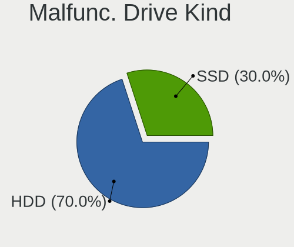
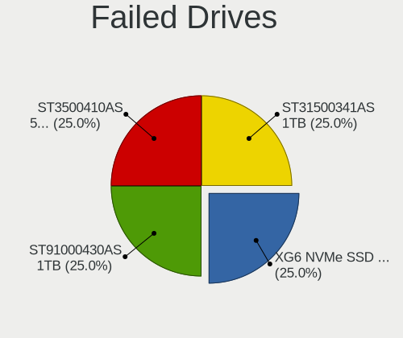
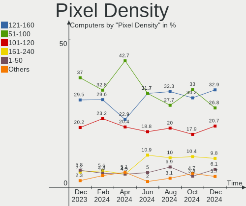
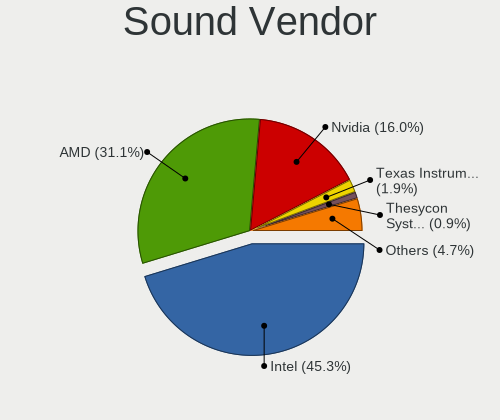
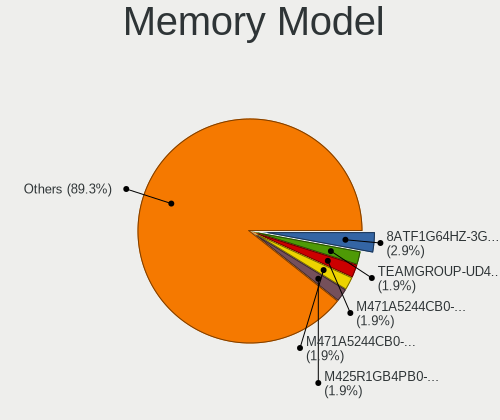
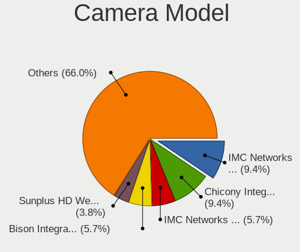

ArcoLinux - Hardware Trends
---------------------------

A project to identify most popular hardware characteristics and track their change
over time based on data collected by Linux users at https://Linux-Hardware.org.

Anyone can contribute to this report by the [hw-probe](https://github.com/linuxhw/hw-probe) tool:

    sudo -E hw-probe -all -upload

This is a report for all computer types. See also reports for [desktops](/Dist/ArcoLinux/Desktop/README.md) and [notebooks](/Dist/ArcoLinux/Notebook/README.md).

This report is for one last month. Overall report since the beginning of time: [TestDays](https://github.com/linuxhw/TestDays)

Period: Nov, 2023.

Contents
--------

* [ System ](#system)
  - [ OS                       ](#os)
  - [ OS Family                ](#os-family)
  - [ Kernel                   ](#kernel)
  - [ Kernel Family            ](#kernel-family)
  - [ Kernel Major Ver.        ](#kernel-major-ver)
  - [ Arch                     ](#arch)
  - [ DE                       ](#de)
  - [ Display Server           ](#display-server)
  - [ Display Manager          ](#display-manager)
  - [ OS Lang                  ](#os-lang)
  - [ Boot Mode                ](#boot-mode)
  - [ Filesystem               ](#filesystem)
  - [ Part. scheme             ](#part-scheme)
  - [ Dual Boot with Linux/BSD ](#dual-boot-with-linuxbsd)
  - [ Dual Boot (Win)          ](#dual-boot-win)

* [ Board ](#board)
  - [ Vendor                   ](#vendor)
  - [ Model                    ](#model)
  - [ Model Family             ](#model-family)
  - [ MFG Year                 ](#mfg-year)
  - [ Form Factor              ](#form-factor)
  - [ Secure Boot              ](#secure-boot)
  - [ Coreboot                 ](#coreboot)
  - [ RAM Size                 ](#ram-size)
  - [ RAM Used                 ](#ram-used)
  - [ Total Drives             ](#total-drives)
  - [ Has CD-ROM               ](#has-cd-rom)
  - [ Has Ethernet             ](#has-ethernet)
  - [ Has WiFi                 ](#has-wifi)
  - [ Has Bluetooth            ](#has-bluetooth)

* [ Location ](#location)
  - [ Country                  ](#country)
  - [ City                     ](#city)

* [ Drives ](#drives)
  - [ Drive Vendor             ](#drive-vendor)
  - [ Drive Model              ](#drive-model)
  - [ HDD Vendor               ](#hdd-vendor)
  - [ SSD Vendor               ](#ssd-vendor)
  - [ Drive Kind               ](#drive-kind)
  - [ Drive Connector          ](#drive-connector)
  - [ Drive Size               ](#drive-size)
  - [ Space Total              ](#space-total)
  - [ Space Used               ](#space-used)
  - [ Malfunc. Drives          ](#malfunc-drives)
  - [ Malfunc. Drive Vendor    ](#malfunc-drive-vendor)
  - [ Malfunc. HDD Vendor      ](#malfunc-hdd-vendor)
  - [ Malfunc. Drive Kind      ](#malfunc-drive-kind)
  - [ Failed Drives            ](#failed-drives)
  - [ Failed Drive Vendor      ](#failed-drive-vendor)
  - [ Drive Status             ](#drive-status)

* [ Storage controller ](#storage-controller)
  - [ Storage Vendor           ](#storage-vendor)
  - [ Storage Model            ](#storage-model)
  - [ Storage Kind             ](#storage-kind)

* [ Processor ](#processor)
  - [ CPU Vendor               ](#cpu-vendor)
  - [ CPU Model                ](#cpu-model)
  - [ CPU Model Family         ](#cpu-model-family)
  - [ CPU Cores                ](#cpu-cores)
  - [ CPU Sockets              ](#cpu-sockets)
  - [ CPU Threads              ](#cpu-threads)
  - [ CPU Op-Modes             ](#cpu-op-modes)
  - [ CPU Microcode            ](#cpu-microcode)
  - [ CPU Microarch            ](#cpu-microarch)

* [ Graphics ](#graphics)
  - [ GPU Vendor               ](#gpu-vendor)
  - [ GPU Model                ](#gpu-model)
  - [ GPU Combo                ](#gpu-combo)
  - [ GPU Driver               ](#gpu-driver)
  - [ GPU Memory               ](#gpu-memory)

* [ Monitor ](#monitor)
  - [ Monitor Vendor           ](#monitor-vendor)
  - [ Monitor Model            ](#monitor-model)
  - [ Monitor Resolution       ](#monitor-resolution)
  - [ Monitor Diagonal         ](#monitor-diagonal)
  - [ Monitor Width            ](#monitor-width)
  - [ Aspect Ratio             ](#aspect-ratio)
  - [ Monitor Area             ](#monitor-area)
  - [ Pixel Density            ](#pixel-density)
  - [ Multiple Monitors        ](#multiple-monitors)

* [ Network ](#network)
  - [ Net Controller Vendor    ](#net-controller-vendor)
  - [ Net Controller Model     ](#net-controller-model)
  - [ Wireless Vendor          ](#wireless-vendor)
  - [ Wireless Model           ](#wireless-model)
  - [ Ethernet Vendor          ](#ethernet-vendor)
  - [ Ethernet Model           ](#ethernet-model)
  - [ Net Controller Kind      ](#net-controller-kind)
  - [ Used Controller          ](#used-controller)
  - [ NICs                     ](#nics)
  - [ IPv6                     ](#ipv6)

* [ Bluetooth ](#bluetooth)
  - [ Bluetooth Vendor         ](#bluetooth-vendor)
  - [ Bluetooth Model          ](#bluetooth-model)

* [ Sound ](#sound)
  - [ Sound Vendor             ](#sound-vendor)
  - [ Sound Model              ](#sound-model)

* [ Memory ](#memory)
  - [ Memory Vendor            ](#memory-vendor)
  - [ Memory Model             ](#memory-model)
  - [ Memory Kind              ](#memory-kind)
  - [ Memory Form Factor       ](#memory-form-factor)
  - [ Memory Size              ](#memory-size)
  - [ Memory Speed             ](#memory-speed)

* [ Printers & scanners ](#printers--scanners)
  - [ Printer Vendor           ](#printer-vendor)
  - [ Printer Model            ](#printer-model)
  - [ Scanner Vendor           ](#scanner-vendor)
  - [ Scanner Model            ](#scanner-model)

* [ Camera ](#camera)
  - [ Camera Vendor            ](#camera-vendor)
  - [ Camera Model             ](#camera-model)

* [ Security ](#security)
  - [ Fingerprint Vendor       ](#fingerprint-vendor)
  - [ Fingerprint Model        ](#fingerprint-model)
  - [ Chipcard Vendor          ](#chipcard-vendor)
  - [ Chipcard Model           ](#chipcard-model)

* [ Unsupported ](#unsupported)
  - [ Unsupported Devices      ](#unsupported-devices)
  - [ Unsupported Device Types ](#unsupported-device-types)

System
------

OS
--

Installed operating systems

| Name              | Computers | Percent |
|-------------------|-----------|---------|
| ArcoLinux Rolling | 115       | 96.64%  |
| ArcoLinux         | 4         | 3.36%   |

OS Family
---------

OS without a version

| Name      | Computers | Percent |
|-----------|-----------|---------|
| ArcoLinux | 119       | 100%    |

Kernel
------

Version of the Linux kernel

| Version                        | Computers | Percent |
|--------------------------------|-----------|---------|
| 6.6.1-arch1-1                  | 20        | 16.81%  |
| 6.5.9-arch2-1                  | 20        | 16.81%  |
| 6.5.8-arch1-1                  | 18        | 15.13%  |
| 6.6.2-arch1-1                  | 14        | 11.76%  |
| 6.1.62-1-lts                   | 6         | 5.04%   |
| 6.5.3-x64v2-xanmod1-1          | 5         | 4.2%    |
| 6.1.61-1-lts                   | 5         | 4.2%    |
| 6.6.1-zen1-1-zen               | 3         | 2.52%   |
| 6.4.11-arch1-1                 | 3         | 2.52%   |
| 6.1.63-1-lts                   | 3         | 2.52%   |
| 6.6.3-arch1-1                  | 2         | 1.68%   |
| 6.5.9-zen2-1-zen               | 2         | 1.68%   |
| 6.5.3-arch1-1                  | 2         | 1.68%   |
| 6.5.10-hardened1-1-hardened    | 2         | 1.68%   |
| 6.4.12-zen1-1-zen              | 2         | 1.68%   |
| 6.5.8-zen1-1-zen               | 1         | 0.84%   |
| 6.5.7-arch1-1                  | 1         | 0.84%   |
| 6.5.5-arch1-1                  | 1         | 0.84%   |
| 6.5.11-lqx1-1-lqx              | 1         | 0.84%   |
| 6.4.11-arch2-1                 | 1         | 0.84%   |
| 6.4.1-arch2-1                  | 1         | 0.84%   |
| 6.3.9-arch1-1                  | 1         | 0.84%   |
| 6.3.6-arch1-1                  | 1         | 0.84%   |
| 6.2.11-1297.native             | 1         | 0.84%   |
| 6.1.60-1-lts                   | 1         | 0.84%   |
| 6.1.59-1-lts                   | 1         | 0.84%   |
| 6.1.46-x64v2-rt13-xanmod1-1-rt | 1         | 0.84%   |

Kernel Family
-------------

Linux kernel without a distro release

| Version | Computers | Percent |
|---------|-----------|---------|
| 6.6.1   | 23        | 19.33%  |
| 6.5.9   | 22        | 18.49%  |
| 6.5.8   | 19        | 15.97%  |
| 6.6.2   | 14        | 11.76%  |
| 6.5.3   | 7         | 5.88%   |
| 6.1.62  | 6         | 5.04%   |
| 6.1.61  | 5         | 4.2%    |
| 6.4.11  | 4         | 3.36%   |
| 6.1.63  | 3         | 2.52%   |
| 6.6.3   | 2         | 1.68%   |
| 6.5.10  | 2         | 1.68%   |
| 6.4.12  | 2         | 1.68%   |
| 6.5.7   | 1         | 0.84%   |
| 6.5.5   | 1         | 0.84%   |
| 6.5.11  | 1         | 0.84%   |
| 6.4.1   | 1         | 0.84%   |
| 6.3.9   | 1         | 0.84%   |
| 6.3.6   | 1         | 0.84%   |
| 6.2.11  | 1         | 0.84%   |
| 6.1.60  | 1         | 0.84%   |
| 6.1.59  | 1         | 0.84%   |
| 6.1.46  | 1         | 0.84%   |

Kernel Major Ver.
-----------------

Linux kernel major version

| Version | Computers | Percent |
|---------|-----------|---------|
| 6.5     | 53        | 44.54%  |
| 6.6     | 39        | 32.77%  |
| 6.1     | 17        | 14.29%  |
| 6.4     | 7         | 5.88%   |
| 6.3     | 2         | 1.68%   |
| 6.2     | 1         | 0.84%   |

Arch
----

OS architecture (x86_64, i586, etc.)

| Name   | Computers | Percent |
|--------|-----------|---------|
| x86_64 | 119       | 100%    |

DE
--

Desktop Environment

| Name     | Computers | Percent |
|----------|-----------|---------|
| XFCE     | 43        | 36.13%  |
| KDE5     | 34        | 28.57%  |
| GNOME    | 8         | 6.72%   |
| Cinnamon | 8         | 6.72%   |
| i3       | 6         | 5.04%   |
| Hyprland | 4         | 3.36%   |
| Deepin   | 4         | 3.36%   |
| chadwm   | 3         | 2.52%   |
| Budgie   | 3         | 2.52%   |
| qtile    | 2         | 1.68%   |
| LeftWM   | 2         | 1.68%   |
| LXQt     | 1         | 0.84%   |
| bspwm    | 1         | 0.84%   |

Display Server
--------------

X11 or Wayland

| Name    | Computers | Percent |
|---------|-----------|---------|
| X11     | 106       | 89.08%  |
| Wayland | 10        | 8.4%    |
| Unknown | 3         | 2.52%   |

Display Manager
---------------

SDDM, LightDM, etc.

| Name    | Computers | Percent |
|---------|-----------|---------|
| SDDM    | 90        | 75.63%  |
| LightDM | 18        | 15.13%  |
| GDM     | 5         | 4.2%    |
| Unknown | 4         | 3.36%   |
| Ly      | 1         | 0.84%   |
| LXDM    | 1         | 0.84%   |

OS Lang
-------

Language

| Lang  | Computers | Percent |
|-------|-----------|---------|
| en_US | 57        | 47.9%   |
| en_GB | 10        | 8.4%    |
| C     | 9         | 7.56%   |
| pt_BR | 6         | 5.04%   |
| it_IT | 5         | 4.2%    |
| es_ES | 3         | 2.52%   |
| en_CA | 3         | 2.52%   |
| en_AU | 3         | 2.52%   |
| de_DE | 3         | 2.52%   |
| zh_CN | 2         | 1.68%   |
| ko_KR | 2         | 1.68%   |
| en_ZA | 2         | 1.68%   |
| uk_UA | 1         | 0.84%   |
| tr_TR | 1         | 0.84%   |
| ru_RU | 1         | 0.84%   |
| pl_PL | 1         | 0.84%   |
| hu_HU | 1         | 0.84%   |
| hr_HR | 1         | 0.84%   |
| gl_ES | 1         | 0.84%   |
| fr_FR | 1         | 0.84%   |
| es_UY | 1         | 0.84%   |
| es_MX | 1         | 0.84%   |
| en_SG | 1         | 0.84%   |
| en_IE | 1         | 0.84%   |
| en_HK | 1         | 0.84%   |
| de_AT | 1         | 0.84%   |

Boot Mode
---------

EFI or BIOS

| Mode | Computers | Percent |
|------|-----------|---------|
| EFI  | 98        | 82.35%  |
| BIOS | 21        | 17.65%  |

Filesystem
----------

Type of filesystem

| Type    | Computers | Percent |
|---------|-----------|---------|
| Ext4    | 77        | 64.71%  |
| Btrfs   | 30        | 25.21%  |
| Overlay | 9         | 7.56%   |
| F2fs    | 3         | 2.52%   |

Part. scheme
------------

Scheme of partitioning

| Type    | Computers | Percent |
|---------|-----------|---------|
| GPT     | 103       | 86.55%  |
| MBR     | 12        | 10.08%  |
| Unknown | 4         | 3.36%   |

Dual Boot with Linux/BSD
------------------------

Hosting more than one Linux/BSD

| Dual boot | Computers | Percent |
|-----------|-----------|---------|
| No        | 82        | 68.91%  |
| Yes       | 37        | 31.09%  |

Dual Boot (Win)
---------------

Hosting Linux and Windows

| Dual boot | Computers | Percent |
|-----------|-----------|---------|
| No        | 65        | 54.62%  |
| Yes       | 54        | 45.38%  |

Board
-----

Vendor
------

Motherboard manufacturer

| Name                                 | Computers | Percent |
|--------------------------------------|-----------|---------|
| ASUSTek Computer                     | 26        | 21.85%  |
| Lenovo                               | 19        | 15.97%  |
| Dell                                 | 17        | 14.29%  |
| MSI                                  | 11        | 9.24%   |
| Hewlett-Packard                      | 11        | 9.24%   |
| ASRock                               | 6         | 5.04%   |
| Acer                                 | 6         | 5.04%   |
| Gigabyte Technology                  | 4         | 3.36%   |
| Apple                                | 3         | 2.52%   |
| Intel                                | 2         | 1.68%   |
| HUAWEI                               | 2         | 1.68%   |
| Fujitsu                              | 2         | 1.68%   |
| Shenzhen Meigao Electronic Equipment | 1         | 0.84%   |
| Razer                                | 1         | 0.84%   |
| NZXT                                 | 1         | 0.84%   |
| Monster                              | 1         | 0.84%   |
| MACHINIST                            | 1         | 0.84%   |
| MACHENIKE                            | 1         | 0.84%   |
| Google                               | 1         | 0.84%   |
| COM1                                 | 1         | 0.84%   |
| BESSTAR Tech                         | 1         | 0.84%   |
| Unknown                              | 1         | 0.84%   |

Model
-----

Motherboard model

| Name                                       | Computers | Percent |
|--------------------------------------------|-----------|---------|
| Shenzhen Meigao Electronic Equipment UM690 | 1         | 0.84%   |
| Razer Blade                                | 1         | 0.84%   |
| NZXT N7 B550                               | 1         | 0.84%   |
| MSI Prestige 15 A10SC                      | 1         | 0.84%   |
| MSI Prestige 14H B12UCX                    | 1         | 0.84%   |
| MSI MS-7C56                                | 1         | 0.84%   |
| MSI MS-7C37                                | 1         | 0.84%   |
| MSI MS-7B79                                | 1         | 0.84%   |
| MSI MS-7721                                | 1         | 0.84%   |
| MSI Modern 14 B4MW                         | 1         | 0.84%   |
| MSI GS66 Stealth 10SF                      | 1         | 0.84%   |
| MSI GF75 Thin 9SC                          | 1         | 0.84%   |
| MSI GF65 Thin 10UE                         | 1         | 0.84%   |
| MSI CR610M                                 | 1         | 0.84%   |
| Monster ABRA A5 V17.2                      | 1         | 0.84%   |
| MACHINIST X99-RS9 V2.0                     | 1         | 0.84%   |
| MACHENIKE L16W                             | 1         | 0.84%   |
| Lenovo Z50-75 80EC                         | 1         | 0.84%   |
| Lenovo Y520-15IKBN 80WK                    | 1         | 0.84%   |
| Lenovo ThinkPad X250 20CM001UUK            | 1         | 0.84%   |
| Lenovo ThinkPad T550 20CJS1MW00            | 1         | 0.84%   |
| Lenovo ThinkPad T540p 20BFS5DV00           | 1         | 0.84%   |
| Lenovo ThinkPad T540p 20BE00AKZA           | 1         | 0.84%   |
| Lenovo ThinkPad T510 4314RBS               | 1         | 0.84%   |
| Lenovo ThinkPad T480s 20L8SA3Q00           | 1         | 0.84%   |
| Lenovo ThinkPad T470p 20J6000TAD           | 1         | 0.84%   |
| Lenovo ThinkPad L540 20AUS11P00            | 1         | 0.84%   |
| Lenovo ThinkCentre M92p 3238A34            | 1         | 0.84%   |
| Lenovo ThinkCentre M910q 10MUS1GB00        | 1         | 0.84%   |
| Lenovo ThinkBook 13s-IML 20RR              | 1         | 0.84%   |
| Lenovo Legion Y545 81Q6                    | 1         | 0.84%   |
| Lenovo Legion R9000P2021H 82JQ             | 1         | 0.84%   |
| Lenovo Legion 7 16ITHg6 82K6               | 1         | 0.84%   |
| Lenovo IdeaPad Y700-17ISK 80Q0             | 1         | 0.84%   |
| Lenovo IdeaPad 330-15IGM 81D1              | 1         | 0.84%   |
| Lenovo IdeaCentre 5 14ACN6 90RX005QMH      | 1         | 0.84%   |
| Intel NUC11PHi7                            | 1         | 0.84%   |
| Intel B75                                  | 1         | 0.84%   |
| HUAWEI NBLB-WAX9N                          | 1         | 0.84%   |
| HUAWEI KPL-W0X                             | 1         | 0.84%   |

Model Family
------------

Motherboard model prefix

| Name                                       | Computers | Percent |
|--------------------------------------------|-----------|---------|
| Lenovo ThinkPad                            | 8         | 6.72%   |
| ASUS VivoBook                              | 7         | 5.88%   |
| Dell Latitude                              | 6         | 5.04%   |
| ASUS TUF                                   | 4         | 3.36%   |
| ASUS PRIME                                 | 4         | 3.36%   |
| Lenovo Legion                              | 3         | 2.52%   |
| Dell Precision                             | 3         | 2.52%   |
| ASUS ROG                                   | 3         | 2.52%   |
| Acer Aspire                                | 3         | 2.52%   |
| MSI Prestige                               | 2         | 1.68%   |
| Lenovo ThinkCentre                         | 2         | 1.68%   |
| Lenovo IdeaPad                             | 2         | 1.68%   |
| HP ProBook                                 | 2         | 1.68%   |
| HP Laptop                                  | 2         | 1.68%   |
| Dell XPS                                   | 2         | 1.68%   |
| Dell OptiPlex                              | 2         | 1.68%   |
| Shenzhen Meigao Electronic Equipment UM690 | 1         | 0.84%   |
| Razer Blade                                | 1         | 0.84%   |
| NZXT N7                                    | 1         | 0.84%   |
| MSI MS-7C56                                | 1         | 0.84%   |
| MSI MS-7C37                                | 1         | 0.84%   |
| MSI MS-7B79                                | 1         | 0.84%   |
| MSI MS-7721                                | 1         | 0.84%   |
| MSI Modern                                 | 1         | 0.84%   |
| MSI GS66                                   | 1         | 0.84%   |
| MSI GF75                                   | 1         | 0.84%   |
| MSI GF65                                   | 1         | 0.84%   |
| MSI CR610M                                 | 1         | 0.84%   |
| Monster ABRA                               | 1         | 0.84%   |
| MACHINIST X99-RS9                          | 1         | 0.84%   |
| MACHENIKE L16W                             | 1         | 0.84%   |
| Lenovo Z50-75                              | 1         | 0.84%   |
| Lenovo Y520-15IKBN                         | 1         | 0.84%   |
| Lenovo ThinkBook                           | 1         | 0.84%   |
| Lenovo IdeaCentre                          | 1         | 0.84%   |
| Intel NUC11PHi7                            | 1         | 0.84%   |
| Intel B75                                  | 1         | 0.84%   |
| HUAWEI NBLB-WAX9N                          | 1         | 0.84%   |
| HUAWEI KPL-W0X                             | 1         | 0.84%   |
| HP Z240                                    | 1         | 0.84%   |

MFG Year
--------

Motherboard manufacture year

| Year | Computers | Percent |
|------|-----------|---------|
| 2021 | 20        | 16.81%  |
| 2018 | 15        | 12.61%  |
| 2020 | 13        | 10.92%  |
| 2019 | 12        | 10.08%  |
| 2013 | 10        | 8.4%    |
| 2022 | 7         | 5.88%   |
| 2017 | 7         | 5.88%   |
| 2023 | 6         | 5.04%   |
| 2015 | 6         | 5.04%   |
| 2014 | 5         | 4.2%    |
| 2011 | 5         | 4.2%    |
| 2016 | 4         | 3.36%   |
| 2012 | 4         | 3.36%   |
| 2010 | 3         | 2.52%   |
| 2009 | 1         | 0.84%   |
| 2008 | 1         | 0.84%   |

Form Factor
-----------

Physical design of the computer

| Name        | Computers | Percent |
|-------------|-----------|---------|
| Notebook    | 71        | 59.66%  |
| Desktop     | 45        | 37.82%  |
| Mini pc     | 2         | 1.68%   |
| Convertible | 1         | 0.84%   |

Secure Boot
-----------

Enabled or disabled

| State    | Computers | Percent |
|----------|-----------|---------|
| Disabled | 118       | 99.16%  |
| Enabled  | 1         | 0.84%   |

Coreboot
--------

Have coreboot on board

| Used | Computers | Percent |
|------|-----------|---------|
| No   | 118       | 99.16%  |
| Yes  | 1         | 0.84%   |

RAM Size
--------

Total RAM memory

| Size in GB  | Computers | Percent |
|-------------|-----------|---------|
| 16.01-24.0  | 41        | 34.45%  |
| 32.01-64.0  | 25        | 21.01%  |
| 4.01-8.0    | 23        | 19.33%  |
| 8.01-16.0   | 11        | 9.24%   |
| 3.01-4.0    | 8         | 6.72%   |
| 64.01-256.0 | 6         | 5.04%   |
| 24.01-32.0  | 4         | 3.36%   |
| 2.01-3.0    | 1         | 0.84%   |

RAM Used
--------

Used RAM memory

| Used GB   | Computers | Percent |
|-----------|-----------|---------|
| 1.01-2.0  | 47        | 39.5%   |
| 2.01-3.0  | 30        | 25.21%  |
| 4.01-8.0  | 15        | 12.61%  |
| 3.01-4.0  | 13        | 10.92%  |
| 8.01-16.0 | 11        | 9.24%   |
| 0.51-1.0  | 3         | 2.52%   |

Total Drives
------------

Number of drives on board

| Drives | Computers | Percent |
|--------|-----------|---------|
| 1      | 55        | 46.22%  |
| 2      | 37        | 31.09%  |
| 3      | 20        | 16.81%  |
| 4      | 3         | 2.52%   |
| 6      | 2         | 1.68%   |
| 5      | 2         | 1.68%   |

Has CD-ROM
----------

Has CD-ROM on board

| Presented | Computers | Percent |
|-----------|-----------|---------|
| No        | 92        | 77.31%  |
| Yes       | 27        | 22.69%  |

Has Ethernet
------------

Has Ethernet on board

| Presented | Computers | Percent |
|-----------|-----------|---------|
| Yes       | 101       | 84.87%  |
| No        | 18        | 15.13%  |

Has WiFi
--------

Has WiFi module

| Presented | Computers | Percent |
|-----------|-----------|---------|
| Yes       | 89        | 74.79%  |
| No        | 30        | 25.21%  |

Has Bluetooth
-------------

Has Bluetooth module

| Presented | Computers | Percent |
|-----------|-----------|---------|
| Yes       | 82        | 68.91%  |
| No        | 37        | 31.09%  |

Location
--------

Country
-------

Geographic location (country)

| Country      | Computers | Percent |
|--------------|-----------|---------|
| USA          | 23        | 19.33%  |
| Germany      | 10        | 8.4%    |
| Brazil       | 8         | 6.72%   |
| Italy        | 7         | 5.88%   |
| Canada       | 6         | 5.04%   |
| UK           | 5         | 4.2%    |
| Spain        | 5         | 4.2%    |
| Turkey       | 4         | 3.36%   |
| Australia    | 4         | 3.36%   |
| Russia       | 3         | 2.52%   |
| Romania      | 3         | 2.52%   |
| France       | 3         | 2.52%   |
| Belgium      | 3         | 2.52%   |
| Uruguay      | 2         | 1.68%   |
| Thailand     | 2         | 1.68%   |
| South Korea  | 2         | 1.68%   |
| South Africa | 2         | 1.68%   |
| Portugal     | 2         | 1.68%   |
| Poland       | 2         | 1.68%   |
| Norway       | 2         | 1.68%   |
| Netherlands  | 2         | 1.68%   |
| China        | 2         | 1.68%   |
| Bulgaria     | 2         | 1.68%   |
| Vietnam      | 1         | 0.84%   |
| Ukraine      | 1         | 0.84%   |
| Sweden       | 1         | 0.84%   |
| Singapore    | 1         | 0.84%   |
| Puerto Rico  | 1         | 0.84%   |
| Philippines  | 1         | 0.84%   |
| Iran         | 1         | 0.84%   |
| India        | 1         | 0.84%   |
| Hungary      | 1         | 0.84%   |
| Hong Kong    | 1         | 0.84%   |
| Greece       | 1         | 0.84%   |
| Finland      | 1         | 0.84%   |
| Croatia      | 1         | 0.84%   |
| Austria      | 1         | 0.84%   |
| Argentina    | 1         | 0.84%   |

City
----

Geographic location (city)

| City                  | Computers | Percent |
|-----------------------|-----------|---------|
| Toronto               | 3         | 2.52%   |
| Parker                | 2         | 1.68%   |
| Istanbul              | 2         | 1.68%   |
| Franca                | 2         | 1.68%   |
| Charlotte             | 2         | 1.68%   |
| Bucharest             | 2         | 1.68%   |
| Zaprešić            | 1         | 0.84%   |
| Xinzo de Limia        | 1         | 0.84%   |
| Woodstock             | 1         | 0.84%   |
| Wiesbaden             | 1         | 0.84%   |
| West Hartford         | 1         | 0.84%   |
| Warsaw                | 1         | 0.84%   |
| Walker                | 1         | 0.84%   |
| Vienna                | 1         | 0.84%   |
| Valencia              | 1         | 0.84%   |
| Udine                 | 1         | 0.84%   |
| Turin                 | 1         | 0.84%   |
| Tsuen Wan             | 1         | 0.84%   |
| Trabzon               | 1         | 0.84%   |
| Timișoara            | 1         | 0.84%   |
| Tiel                  | 1         | 0.84%   |
| Tehran                | 1         | 0.84%   |
| Sydney                | 1         | 0.84%   |
| Stuttgart             | 1         | 0.84%   |
| St Petersburg         | 1         | 0.84%   |
| Sofia                 | 1         | 0.84%   |
| Singapore             | 1         | 0.84%   |
| Shanghai              | 1         | 0.84%   |
| Schwäbisch Hall      | 1         | 0.84%   |
| Sao Paulo             | 1         | 0.84%   |
| Sao Bernardo do Campo | 1         | 0.84%   |
| Sandnes               | 1         | 0.84%   |
| San Francisco         | 1         | 0.84%   |
| Roswell               | 1         | 0.84%   |
| Rio Grande            | 1         | 0.84%   |
| Rio de Janeiro        | 1         | 0.84%   |
| Quinte West           | 1         | 0.84%   |
| Queluz                | 1         | 0.84%   |
| Pyeongtaek-si         | 1         | 0.84%   |
| Porto Alegre          | 1         | 0.84%   |

Drives
------

Drive Vendor
------------

Hard drive vendors

| Vendor                         | Computers | Drives | Percent |
|--------------------------------|-----------|--------|---------|
| Samsung Electronics            | 36        | 41     | 18%     |
| Seagate                        | 21        | 22     | 10.5%   |
| Sandisk                        | 19        | 21     | 9.5%    |
| WDC                            | 18        | 21     | 9%      |
| Kingston                       | 13        | 18     | 6.5%    |
| Toshiba                        | 9         | 9      | 4.5%    |
| Hitachi                        | 6         | 6      | 3%      |
| Unknown                        | 5         | 5      | 2.5%    |
| Silicon Motion                 | 5         | 5      | 2.5%    |
| Micron Technology              | 5         | 5      | 2.5%    |
| Kingston Technology Company    | 5         | 6      | 2.5%    |
| Crucial                        | 5         | 5      | 2.5%    |
| China                          | 5         | 6      | 2.5%    |
| Phison Electronics             | 4         | 4      | 2%      |
| MAXIO Technology (Hangzhou)    | 4         | 4      | 2%      |
| Intel                          | 4         | 5      | 2%      |
| HGST                           | 4         | 5      | 2%      |
| SK hynix                       | 3         | 3      | 1.5%    |
| Micron/Crucial Technology      | 3         | 3      | 1.5%    |
| XrayDisk                       | 2         | 2      | 1%      |
| PNY                            | 2         | 2      | 1%      |
| JMicron Technology             | 2         | 2      | 1%      |
| Transcend                      | 1         | 1      | 0.5%    |
| TO Exter                       | 1         | 1      | 0.5%    |
| SPCC                           | 1         | 1      | 0.5%    |
| Solid State Storage Technology | 1         | 1      | 0.5%    |
| ShiJi                          | 1         | 1      | 0.5%    |
| Shenzhen Longsys Electronics   | 1         | 2      | 0.5%    |
| SABRENT                        | 1         | 1      | 0.5%    |
| RevuAhn                        | 1         | 1      | 0.5%    |
| Realtek Semiconductor          | 1         | 1      | 0.5%    |
| Ramsta                         | 1         | 1      | 0.5%    |
| Plextor                        | 1         | 1      | 0.5%    |
| NXT                            | 1         | 1      | 0.5%    |
| KIOXIA                         | 1         | 1      | 0.5%    |
| Intenso                        | 1         | 1      | 0.5%    |
| HI-LEVEL                       | 1         | 1      | 0.5%    |
| GeIL                           | 1         | 1      | 0.5%    |
| Dogfish                        | 1         | 1      | 0.5%    |
| Beijing Starblaze Technology   | 1         | 1      | 0.5%    |

Drive Model
-----------

Hard drive models

| Model                                                 | Computers | Percent |
|-------------------------------------------------------|-----------|---------|
| Samsung NVMe SSD Controller PM9A1/PM9A3/980PRO 2TB    | 6         | 2.79%   |
| Samsung NVMe SSD Controller SM981/PM981/PM983 250GB   | 5         | 2.33%   |
| Silicon Motion SM2263EN/SM2263XT SSD Controller 256GB | 4         | 1.86%   |
| Seagate ST1000LM035-1RK172 1TB                        | 4         | 1.86%   |
| Kingston SA400S37480G 480GB SSD                       | 4         | 1.86%   |
| Sandisk WD Blue SN550 NVMe SSD 512GB                  | 3         | 1.4%    |
| Samsung SSD 980 1TB                                   | 3         | 1.4%    |
| Micron/Crucial P2 NVMe PCIe SSD 1TB                   | 3         | 1.4%    |
| MAXIO (Hangzhou) NVMe SSD Controller MAP1202 1024GB   | 3         | 1.4%    |
| Kingston SFYRS1000G 1TB                               | 3         | 1.4%    |
| WDC WDS240G2G0A-00JH30 240GB SSD                      | 2         | 0.93%   |
| Unknown MMC Card  128GB                               | 2         | 0.93%   |
| Toshiba MQ01ABD100 1TB                                | 2         | 0.93%   |
| Seagate ST1000LM024 HN-M101MBB 1TB                    | 2         | 0.93%   |
| Seagate ST1000DM010-2EP102 1TB                        | 2         | 0.93%   |
| Seagate ST1000DM003-1SB102 1TB                        | 2         | 0.93%   |
| Sandisk WD Blue SN500 / PC SN520 NVMe SSD 500GB       | 2         | 0.93%   |
| Sandisk WD Black SN750 / PC SN730 NVMe SSD 500GB      | 2         | 0.93%   |
| SanDisk SSD PLUS 480GB                                | 2         | 0.93%   |
| Samsung SSD 860 EVO 500GB                             | 2         | 0.93%   |
| Phison PS5013 E13 NVMe Controller 512GB               | 2         | 0.93%   |
| Kingston Company U-SNS8154P3 NVMe SSD 256GB           | 2         | 0.93%   |
| Kingston Company SNV2S1000G 1TB                       | 2         | 0.93%   |
| Kingston SA400S37240G 240GB SSD                       | 2         | 0.93%   |
| HGST HTS721010A9E630 1TB                              | 2         | 0.93%   |
| Crucial CT1000MX500SSD1 1TB                           | 2         | 0.93%   |
| XrayDisk 512GB SSD                                    | 1         | 0.47%   |
| XrayDisk 1TB SSD                                      | 1         | 0.47%   |
| WDC WDS500G2B0A-00SM50 500GB SSD                      | 1         | 0.47%   |
| WDC WDS480G2G0B-00EPW0 480GB SSD                      | 1         | 0.47%   |
| WDC WDS100T2B0A-00SM50 1TB SSD                        | 1         | 0.47%   |
| WDC WDS100T1R0A-68A4W0 1TB SSD                        | 1         | 0.47%   |
| WDC WD7500BPVX-22JC3T0 752GB                          | 1         | 0.47%   |
| WDC WD5000LPVX-08V0TT5 500GB                          | 1         | 0.47%   |
| WDC WD5000LPLX-08ZNTT0 500GB                          | 1         | 0.47%   |
| WDC WD5000LPCX-24VHAT0 500GB                          | 1         | 0.47%   |
| WDC WD5000BPKX-75HPJT0 500GB                          | 1         | 0.47%   |
| WDC WD5000BEVT-22A0RT0 500GB                          | 1         | 0.47%   |
| WDC WD5000AAKS-00A7B2 500GB                           | 1         | 0.47%   |
| WDC WD20PURZ-85AKKY0 2TB                              | 1         | 0.47%   |

HDD Vendor
----------

Hard disk drive vendors

| Vendor              | Computers | Drives | Percent |
|---------------------|-----------|--------|---------|
| Seagate             | 20        | 21     | 37.04%  |
| WDC                 | 14        | 15     | 25.93%  |
| Toshiba             | 6         | 6      | 11.11%  |
| Hitachi             | 6         | 6      | 11.11%  |
| HGST                | 4         | 5      | 7.41%   |
| Samsung Electronics | 3         | 3      | 5.56%   |
| TO Exter            | 1         | 1      | 1.85%   |

SSD Vendor
----------

Solid state drive vendors

| Vendor              | Computers | Drives | Percent |
|---------------------|-----------|--------|---------|
| Samsung Electronics | 16        | 18     | 25.4%   |
| Kingston            | 8         | 10     | 12.7%   |
| WDC                 | 5         | 6      | 7.94%   |
| SanDisk             | 5         | 5      | 7.94%   |
| Crucial             | 5         | 5      | 7.94%   |
| China               | 5         | 6      | 7.94%   |
| XrayDisk            | 2         | 2      | 3.17%   |
| PNY                 | 2         | 2      | 3.17%   |
| Transcend           | 1         | 1      | 1.59%   |
| Toshiba             | 1         | 1      | 1.59%   |
| SPCC                | 1         | 1      | 1.59%   |
| ShiJi               | 1         | 1      | 1.59%   |
| RevuAhn             | 1         | 1      | 1.59%   |
| Ramsta              | 1         | 1      | 1.59%   |
| Plextor             | 1         | 1      | 1.59%   |
| Micron Technology   | 1         | 1      | 1.59%   |
| JMicron Technology  | 1         | 1      | 1.59%   |
| Intenso             | 1         | 1      | 1.59%   |
| Intel               | 1         | 1      | 1.59%   |
| HI-LEVEL            | 1         | 1      | 1.59%   |
| GeIL                | 1         | 1      | 1.59%   |
| Dogfish             | 1         | 1      | 1.59%   |
| Apple               | 1         | 1      | 1.59%   |

Drive Kind
----------

HDD or SSD

| Kind    | Computers | Drives | Percent |
|---------|-----------|--------|---------|
| NVMe    | 69        | 87     | 38.76%  |
| SSD     | 53        | 69     | 29.78%  |
| HDD     | 47        | 57     | 26.4%   |
| MMC     | 5         | 5      | 2.81%   |
| Unknown | 4         | 4      | 2.25%   |

Drive Connector
---------------

SATA, SAS, NVMe, etc.

| Type | Computers | Drives | Percent |
|------|-----------|--------|---------|
| SATA | 75        | 119    | 46.88%  |
| NVMe | 69        | 87     | 43.13%  |
| SAS  | 11        | 11     | 6.88%   |
| MMC  | 5         | 5      | 3.13%   |

Drive Size
----------

Size of hard drive

| Size in TB | Computers | Drives | Percent |
|------------|-----------|--------|---------|
| 0.01-0.5   | 51        | 68     | 51.52%  |
| 0.51-1.0   | 37        | 47     | 37.37%  |
| 1.01-2.0   | 10        | 10     | 10.1%   |
| 3.01-4.0   | 1         | 1      | 1.01%   |

Space Total
-----------

Amount of disk space available on the file system

| Size in GB     | Computers | Percent |
|----------------|-----------|---------|
| 251-500        | 24        | 20.17%  |
| 101-250        | 24        | 20.17%  |
| 501-1000       | 22        | 18.49%  |
| More than 3000 | 16        | 13.45%  |
| 1001-2000      | 13        | 10.92%  |
| 2001-3000      | 6         | 5.04%   |
| Unknown        | 6         | 5.04%   |
| 1-20           | 5         | 4.2%    |
| 51-100         | 2         | 1.68%   |
| 21-50          | 1         | 0.84%   |

Space Used
----------

Amount of used disk space

| Used GB        | Computers | Percent |
|----------------|-----------|---------|
| 1-20           | 30        | 25.21%  |
| 21-50          | 20        | 16.81%  |
| 101-250        | 19        | 15.97%  |
| 251-500        | 16        | 13.45%  |
| 501-1000       | 13        | 10.92%  |
| 51-100         | 8         | 6.72%   |
| Unknown        | 6         | 5.04%   |
| 1001-2000      | 4         | 3.36%   |
| More than 3000 | 2         | 1.68%   |
| 2001-3000      | 1         | 0.84%   |

Malfunc. Drives
---------------

Drive models with a malfunction

| Model                                                           | Computers | Drives | Percent |
|-----------------------------------------------------------------|-----------|--------|---------|
| Samsung Electronics NVMe SSD Controller SM981/PM981/PM983 250GB | 2         | 2      | 7.41%   |
| WDC WDS240G2G0A-00JH30 240GB SSD                                | 1         | 1      | 3.7%    |
| WDC WD5000LPVX-08V0TT5 500GB                                    | 1         | 1      | 3.7%    |
| WDC WD20EARS-00MVWB0 2TB                                        | 1         | 1      | 3.7%    |
| Toshiba MQ01ABF050 500GB                                        | 1         | 1      | 3.7%    |
| Toshiba MQ01ABD100 1TB                                          | 1         | 1      | 3.7%    |
| Toshiba KSG60ZMV256G M.2 2280 256GB SSD                         | 1         | 1      | 3.7%    |
| Seagate ST9500325AS 500GB                                       | 1         | 1      | 3.7%    |
| Seagate ST4000LM024-2AN17V 4TB                                  | 1         | 1      | 3.7%    |
| Seagate ST3500630NS 500GB                                       | 1         | 1      | 3.7%    |
| Seagate ST2000DM001-1CH164 2TB                                  | 1         | 1      | 3.7%    |
| Seagate ST1000LM024 HN-M101MBB 1TB                              | 1         | 1      | 3.7%    |
| Sandisk WD Blue SN550 NVMe SSD 512GB                            | 1         | 1      | 3.7%    |
| SanDisk SSD PLUS 480GB                                          | 1         | 1      | 3.7%    |
| Samsung Electronics SSD 980 1TB                                 | 1         | 1      | 3.7%    |
| Samsung Electronics SSD 870 EVO 1TB                             | 1         | 1      | 3.7%    |
| Samsung Electronics HM500JI 500GB                               | 1         | 1      | 3.7%    |
| Ramsta SSD S600 480GB                                           | 1         | 1      | 3.7%    |
| Kingston SA400S37480G 480GB SSD                                 | 1         | 1      | 3.7%    |
| Hitachi HUA721010KLA330 1TB                                     | 1         | 1      | 3.7%    |
| Hitachi HTS723232L9SA60 320GB                                   | 1         | 1      | 3.7%    |
| Hitachi HDS722020ALA330 2TB                                     | 1         | 1      | 3.7%    |
| Hitachi HDP725050GLA360 500GB                                   | 1         | 1      | 3.7%    |
| HGST HTS725032A7E630 320GB                                      | 1         | 1      | 3.7%    |
| HGST HTS721010A9E630 1TB                                        | 1         | 1      | 3.7%    |
| Crucial CT240M500SSD1 240GB                                     | 1         | 1      | 3.7%    |

Malfunc. Drive Vendor
---------------------

Vendors of faulty drives

| Vendor              | Computers | Drives | Percent |
|---------------------|-----------|--------|---------|
| Seagate             | 5         | 5      | 18.52%  |
| Samsung Electronics | 5         | 5      | 18.52%  |
| Hitachi             | 4         | 4      | 14.81%  |
| WDC                 | 3         | 3      | 11.11%  |
| Toshiba             | 3         | 3      | 11.11%  |
| SanDisk             | 2         | 2      | 7.41%   |
| HGST                | 2         | 2      | 7.41%   |
| Ramsta              | 1         | 1      | 3.7%    |
| Kingston            | 1         | 1      | 3.7%    |
| Crucial             | 1         | 1      | 3.7%    |

Malfunc. HDD Vendor
-------------------

Vendors of faulty HDD drives

| Vendor              | Computers | Drives | Percent |
|---------------------|-----------|--------|---------|
| Seagate             | 5         | 5      | 31.25%  |
| Hitachi             | 4         | 4      | 25%     |
| WDC                 | 2         | 2      | 12.5%   |
| Toshiba             | 2         | 2      | 12.5%   |
| HGST                | 2         | 2      | 12.5%   |
| Samsung Electronics | 1         | 1      | 6.25%   |

Malfunc. Drive Kind
-------------------

Kinds of faulty drives

| Kind | Computers | Drives | Percent |
|------|-----------|--------|---------|
| HDD  | 14        | 16     | 56%     |
| SSD  | 7         | 7      | 28%     |
| NVMe | 4         | 4      | 16%     |

Failed Drives
-------------

Failed drive models

| Model                           | Computers | Drives | Percent |
|---------------------------------|-----------|--------|---------|
| Samsung Electronics SSD 980 1TB | 1         | 1      | 100%    |

Failed Drive Vendor
-------------------

Failed drive vendors

| Vendor              | Computers | Drives | Percent |
|---------------------|-----------|--------|---------|
| Samsung Electronics | 1         | 1      | 100%    |

Drive Status
------------

Number of failed and malfunc. drives

| Status   | Computers | Drives | Percent |
|----------|-----------|--------|---------|
| Works    | 100       | 170    | 69.93%  |
| Malfunc  | 22        | 27     | 15.38%  |
| Detected | 20        | 24     | 13.99%  |
| Failed   | 1         | 1      | 0.7%    |

Storage controller
------------------

Storage Vendor
--------------

Storage controller vendors

| Vendor                         | Computers | Percent |
|--------------------------------|-----------|---------|
| Intel                          | 71        | 39.23%  |
| AMD                            | 29        | 16.02%  |
| Samsung Electronics            | 18        | 9.94%   |
| SanDisk                        | 14        | 7.73%   |
| Kingston Technology Company    | 11        | 6.08%   |
| Silicon Motion                 | 5         | 2.76%   |
| ASMedia Technology             | 5         | 2.76%   |
| Phison Electronics             | 4         | 2.21%   |
| Micron Technology              | 4         | 2.21%   |
| MAXIO Technology (Hangzhou)    | 4         | 2.21%   |
| SK hynix                       | 3         | 1.66%   |
| Micron/Crucial Technology      | 3         | 1.66%   |
| Toshiba America Info Systems   | 2         | 1.1%    |
| Marvell Technology Group       | 2         | 1.1%    |
| Solid State Storage Technology | 1         | 0.55%   |
| Shenzhen Longsys Electronics   | 1         | 0.55%   |
| Realtek Semiconductor          | 1         | 0.55%   |
| KIOXIA                         | 1         | 0.55%   |
| Beijing Starblaze Technology   | 1         | 0.55%   |
| ADATA Technology               | 1         | 0.55%   |

Storage Model
-------------

Storage controller models

| Model                                                                          | Computers | Percent |
|--------------------------------------------------------------------------------|-----------|---------|
| AMD FCH SATA Controller [AHCI mode]                                            | 15        | 7.89%   |
| Intel 82801 Mobile SATA Controller [RAID mode]                                 | 7         | 3.68%   |
| Intel 8 Series/C220 Series Chipset Family 6-port SATA Controller 1 [AHCI mode] | 7         | 3.68%   |
| AMD 400 Series Chipset SATA Controller                                         | 7         | 3.68%   |
| Samsung NVMe SSD Controller PM9A1/PM9A3/980PRO                                 | 6         | 3.16%   |
| AMD 500 Series Chipset SATA Controller                                         | 6         | 3.16%   |
| Samsung NVMe SSD Controller SM981/PM981/PM983                                  | 5         | 2.63%   |
| Intel HM170/QM170 Chipset SATA Controller [AHCI Mode]                          | 5         | 2.63%   |
| Intel 7 Series/C210 Series Chipset Family 6-port SATA Controller [AHCI mode]   | 5         | 2.63%   |
| ASMedia ASM1062 Serial ATA Controller                                          | 5         | 2.63%   |
| Silicon Motion SM2263EN/SM2263XT (DRAM-less) NVMe SSD Controllers              | 4         | 2.11%   |
| Samsung NVMe SSD Controller 980 (DRAM-less)                                    | 4         | 2.11%   |
| Intel Comet Lake SATA AHCI Controller                                          | 4         | 2.11%   |
| Intel Cannon Lake Mobile PCH SATA AHCI Controller                              | 4         | 2.11%   |
| Intel Alder Lake-S PCH SATA Controller [AHCI Mode]                             | 4         | 2.11%   |
| SanDisk Ultra 3D / WD Blue SN550 NVMe SSD                                      | 3         | 1.58%   |
| Micron/Crucial P2 [Nick P2] / P3 / P3 Plus NVMe PCIe SSD (DRAM-less)           | 3         | 1.58%   |
| MAXIO (Hangzhou) NVMe SSD Controller MAP1202                                   | 3         | 1.58%   |
| Kingston Company NV2 NVMe SSD SM2267XT                                         | 3         | 1.58%   |
| Kingston Company KC3000/FURY Renegade NVMe SSD E18                             | 3         | 1.58%   |
| Intel Sunrise Point-LP SATA Controller [AHCI mode]                             | 3         | 1.58%   |
| Intel 7 Series Chipset Family 6-port SATA Controller [AHCI mode]               | 3         | 1.58%   |
| SanDisk WD Green SN350 240GB (DRAM-less) / SN560E NVMe SSD                     | 2         | 1.05%   |
| SanDisk WD Blue SN500 / PC SN520 x2 M.2 2280 NVMe SSD                          | 2         | 1.05%   |
| Sandisk WD Black SN850X NVMe SSD                                               | 2         | 1.05%   |
| SanDisk WD Black SN770 / PC SN740 256GB / PC SN560 (DRAM-less) NVMe SSD        | 2         | 1.05%   |
| SanDisk Extreme Pro / WD Black SN750 / PC SN730 / Red SN700 NVMe SSD           | 2         | 1.05%   |
| Samsung NVMe SSD Controller PM9B1 (DRAM-less)                                  | 2         | 1.05%   |
| Phison PS5013-E13 PCIe3 NVMe Controller (DRAM-less)                            | 2         | 1.05%   |
| Kingston Company A1000/U-SNS8154P3 x2 NVMe SSD                                 | 2         | 1.05%   |
| Intel Wildcat Point-LP SATA Controller [AHCI Mode]                             | 2         | 1.05%   |
| Intel Volume Management Device NVMe RAID Controller                            | 2         | 1.05%   |
| Intel Tiger Lake-LP SATA Controller                                            | 2         | 1.05%   |
| Intel Tiger Lake SATA AHCI Controller                                          | 2         | 1.05%   |
| Intel SATA Controller [RAID mode]                                              | 2         | 1.05%   |
| Intel 6 Series/C200 Series Chipset Family 6 port Mobile SATA AHCI Controller   | 2         | 1.05%   |
| Intel 200 Series PCH SATA controller [AHCI mode]                               | 2         | 1.05%   |
| Toshiba America Info Systems XG4 NVMe SSD Controller                           | 1         | 0.53%   |
| Toshiba America Info Systems BG3 x2 NVMe SSD Controller (DRAM-less)            | 1         | 0.53%   |
| Solid State Storage CL4-8D512 NVMe SSD M.2 (DRAM-less)                         | 1         | 0.53%   |

Storage Kind
------------

Kind of storage controller (IDE, SATA, NVMe, SAS, ...)

| Kind | Computers | Percent |
|------|-----------|---------|
| SATA | 87        | 50.88%  |
| NVMe | 69        | 40.35%  |
| RAID | 13        | 7.6%    |
| IDE  | 2         | 1.17%   |

Processor
---------

CPU Vendor
----------

Processor vendors

| Vendor | Computers | Percent |
|--------|-----------|---------|
| Intel  | 86        | 72.27%  |
| AMD    | 33        | 27.73%  |

CPU Model
---------

Processor models

| Model                                         | Computers | Percent |
|-----------------------------------------------|-----------|---------|
| Intel Core i7-9750H CPU @ 2.60GHz             | 4         | 3.36%   |
| AMD Ryzen 5 3600 6-Core Processor             | 4         | 3.36%   |
| Intel Core i7-7700HQ CPU @ 2.80GHz            | 3         | 2.52%   |
| Intel Core i5-10210U CPU @ 1.60GHz            | 3         | 2.52%   |
| Intel Core i7-5600U CPU @ 2.60GHz             | 2         | 1.68%   |
| Intel Core i7-4710MQ CPU @ 2.50GHz            | 2         | 1.68%   |
| Intel Core i7-10750H CPU @ 2.60GHz            | 2         | 1.68%   |
| Intel Core i5-8350U CPU @ 1.70GHz             | 2         | 1.68%   |
| Intel Core i5-8265U CPU @ 1.60GHz             | 2         | 1.68%   |
| Intel Core i5 CPU M 540 @ 2.53GHz             | 2         | 1.68%   |
| AMD Ryzen 7 3750H with Radeon Vega Mobile Gfx | 2         | 1.68%   |
| AMD Ryzen 5 5600X 6-Core Processor            | 2         | 1.68%   |
| AMD Ryzen 5 5500U with Radeon Graphics        | 2         | 1.68%   |
| Intel Xeon CPU W3550 @ 3.07GHz                | 1         | 0.84%   |
| Intel Xeon CPU E5-2666 v3 @ 2.90GHz           | 1         | 0.84%   |
| Intel Xeon CPU E3-1241 v3 @ 3.50GHz           | 1         | 0.84%   |
| Intel Pentium CPU G4600 @ 3.60GHz             | 1         | 0.84%   |
| Intel Pentium CPU G4400 @ 3.30GHz             | 1         | 0.84%   |
| Intel Pentium CPU 2020M @ 2.40GHz             | 1         | 0.84%   |
| Intel Pentium 3556U @ 1.70GHz                 | 1         | 0.84%   |
| Intel Core i7-8750H CPU @ 2.20GHz             | 1         | 0.84%   |
| Intel Core i7-8665U CPU @ 1.90GHz             | 1         | 0.84%   |
| Intel Core i7-8650U CPU @ 1.90GHz             | 1         | 0.84%   |
| Intel Core i7-8550U CPU @ 1.80GHz             | 1         | 0.84%   |
| Intel Core i7-6700HQ CPU @ 2.60GHz            | 1         | 0.84%   |
| Intel Core i7-6700 CPU @ 3.40GHz              | 1         | 0.84%   |
| Intel Core i7-4960X CPU @ 3.60GHz             | 1         | 0.84%   |
| Intel Core i7-4790K CPU @ 4.00GHz             | 1         | 0.84%   |
| Intel Core i7-4700HQ CPU @ 2.40GHz            | 1         | 0.84%   |
| Intel Core i7-4600M CPU @ 2.90GHz             | 1         | 0.84%   |
| Intel Core i7-10710U CPU @ 1.10GHz            | 1         | 0.84%   |
| Intel Core i7-10700K CPU @ 3.80GHz            | 1         | 0.84%   |
| Intel Core i5-9600K CPU @ 3.70GHz             | 1         | 0.84%   |
| Intel Core i5-7300U CPU @ 2.60GHz             | 1         | 0.84%   |
| Intel Core i5-6500T CPU @ 2.50GHz             | 1         | 0.84%   |
| Intel Core i5-6300HQ CPU @ 2.30GHz            | 1         | 0.84%   |
| Intel Core i5-5300U CPU @ 2.30GHz             | 1         | 0.84%   |
| Intel Core i5-4258U CPU @ 2.40GHz             | 1         | 0.84%   |
| Intel Core i5-4210M CPU @ 2.60GHz             | 1         | 0.84%   |
| Intel Core i5-4200M CPU @ 2.50GHz             | 1         | 0.84%   |

CPU Model Family
----------------

Processor model prefix

| Model            | Computers | Percent |
|------------------|-----------|---------|
| Intel Core i5    | 28        | 23.53%  |
| Intel Core i7    | 25        | 21.01%  |
| Other            | 17        | 14.29%  |
| AMD Ryzen 5      | 13        | 10.92%  |
| AMD Ryzen 7      | 9         | 7.56%   |
| Intel Core i3    | 6         | 5.04%   |
| Intel Pentium    | 4         | 3.36%   |
| AMD Ryzen 9      | 4         | 3.36%   |
| Intel Xeon       | 3         | 2.52%   |
| Intel Celeron    | 3         | 2.52%   |
| AMD Ryzen 3      | 1         | 0.84%   |
| AMD Phenom II X6 | 1         | 0.84%   |
| AMD FX           | 1         | 0.84%   |
| AMD E2           | 1         | 0.84%   |
| AMD Athlon X4    | 1         | 0.84%   |
| AMD A6           | 1         | 0.84%   |
| AMD A10          | 1         | 0.84%   |

CPU Cores
---------

Number of processor cores

| Number | Computers | Percent |
|--------|-----------|---------|
| 4      | 37        | 31.09%  |
| 2      | 32        | 26.89%  |
| 6      | 24        | 20.17%  |
| 8      | 12        | 10.08%  |
| 12     | 6         | 5.04%   |
| 16     | 3         | 2.52%   |
| 10     | 2         | 1.68%   |
| 14     | 1         | 0.84%   |
| 3      | 1         | 0.84%   |
| 1      | 1         | 0.84%   |

CPU Sockets
-----------

Number of sockets

| Number | Computers | Percent |
|--------|-----------|---------|
| 1      | 119       | 100%    |

CPU Threads
-----------

Threads per core (Hyper-Threading)

| Number | Computers | Percent |
|--------|-----------|---------|
| 2      | 104       | 87.39%  |
| 1      | 15        | 12.61%  |

CPU Op-Modes
------------

CPU Operation Modes (32-bit, 64-bit)

| Op mode        | Computers | Percent |
|----------------|-----------|---------|
| 32-bit, 64-bit | 119       | 100%    |

CPU Microcode
-------------

Microcode number

| Number     | Computers | Percent |
|------------|-----------|---------|
| Unknown    | 78        | 65.55%  |
| 0x0a20120a | 4         | 3.36%   |
| 0x08108109 | 4         | 3.36%   |
| 0x08701030 | 3         | 2.52%   |
| 0x08701021 | 3         | 2.52%   |
| 0x0a50000c | 2         | 1.68%   |
| 0x0a404102 | 2         | 1.68%   |
| 0x08608103 | 2         | 1.68%   |
| 0xa0660    | 1         | 0.84%   |
| 0xa0653    | 1         | 0.84%   |
| 0x906e9    | 1         | 0.84%   |
| 0x90675    | 1         | 0.84%   |
| 0x806ea    | 1         | 0.84%   |
| 0x706a1    | 1         | 0.84%   |
| 0x306f2    | 1         | 0.84%   |
| 0x306a9    | 1         | 0.84%   |
| 0x0a50000d | 1         | 0.84%   |
| 0x0a20102b | 1         | 0.84%   |
| 0x0a201009 | 1         | 0.84%   |
| 0x08701013 | 1         | 0.84%   |
| 0x08600104 | 1         | 0.84%   |
| 0x08108102 | 1         | 0.84%   |
| 0x08101007 | 1         | 0.84%   |
| 0x06003106 | 1         | 0.84%   |
| 0x06003104 | 1         | 0.84%   |
| 0x06000822 | 1         | 0.84%   |
| 0x0500010d | 1         | 0.84%   |
| 0x03000027 | 1         | 0.84%   |
| 0x010000bf | 1         | 0.84%   |

CPU Microarch
-------------

Microarchitecture

| Name             | Computers | Percent |
|------------------|-----------|---------|
| KabyLake         | 22        | 18.49%  |
| Haswell          | 12        | 10.08%  |
| IvyBridge        | 11        | 9.24%   |
| Alderlake Hybrid | 10        | 8.4%    |
| Zen 3            | 9         | 7.56%   |
| Zen 2            | 8         | 6.72%   |
| CometLake        | 6         | 5.04%   |
| Zen+             | 5         | 4.2%    |
| Skylake          | 5         | 4.2%    |
| TigerLake        | 4         | 3.36%   |
| Icelake          | 4         | 3.36%   |
| Unknown          | 4         | 3.36%   |
| SandyBridge      | 3         | 2.52%   |
| Broadwell        | 3         | 2.52%   |
| Westmere         | 2         | 1.68%   |
| Steamroller      | 2         | 1.68%   |
| Goldmont plus    | 2         | 1.68%   |
| Zen              | 1         | 0.84%   |
| Piledriver       | 1         | 0.84%   |
| Nehalem          | 1         | 0.84%   |
| K10 Llano        | 1         | 0.84%   |
| K10              | 1         | 0.84%   |
| Core             | 1         | 0.84%   |
| Bobcat           | 1         | 0.84%   |

Graphics
--------

GPU Vendor
----------

Vendors of graphics cards

| Vendor | Computers | Percent |
|--------|-----------|---------|
| Intel  | 70        | 45.45%  |
| Nvidia | 54        | 35.06%  |
| AMD    | 30        | 19.48%  |

GPU Model
---------

Graphics card models

| Model                                                                     | Computers | Percent |
|---------------------------------------------------------------------------|-----------|---------|
| Intel 4th Gen Core Processor Integrated Graphics Controller               | 6         | 3.82%   |
| Intel 3rd Gen Core processor Graphics Controller                          | 5         | 3.18%   |
| AMD Picasso/Raven 2 [Radeon Vega Series / Radeon Vega Mobile Series]      | 5         | 3.18%   |
| Nvidia GA106M [GeForce RTX 3060 Mobile / Max-Q]                           | 4         | 2.55%   |
| Intel Xeon E3-1200 v2/3rd Gen Core processor Graphics Controller          | 4         | 2.55%   |
| Intel UHD Graphics 620                                                    | 4         | 2.55%   |
| Intel HD Graphics 630                                                     | 4         | 2.55%   |
| Intel HD Graphics 530                                                     | 4         | 2.55%   |
| Intel CoffeeLake-H GT2 [UHD Graphics 630]                                 | 4         | 2.55%   |
| Nvidia TU117M [GeForce GTX 1650 Mobile / Max-Q]                           | 3         | 1.91%   |
| Nvidia GP107 [GeForce GTX 1050 Ti]                                        | 3         | 1.91%   |
| Intel WhiskeyLake-U GT2 [UHD Graphics 620]                                | 3         | 1.91%   |
| Intel TigerLake-LP GT2 [Iris Xe Graphics]                                 | 3         | 1.91%   |
| Intel HD Graphics 5500                                                    | 3         | 1.91%   |
| Intel CometLake-U GT2 [UHD Graphics]                                      | 3         | 1.91%   |
| Intel 2nd Generation Core Processor Family Integrated Graphics Controller | 3         | 1.91%   |
| Nvidia TU116M [GeForce GTX 1660 Ti Mobile]                                | 2         | 1.27%   |
| Nvidia GP107M [GeForce GTX 1050 Mobile]                                   | 2         | 1.27%   |
| Nvidia GK208M [GeForce GT 730M]                                           | 2         | 1.27%   |
| Nvidia GA107M [GeForce RTX 2050]                                          | 2         | 1.27%   |
| Nvidia GA106 [GeForce RTX 3060 Lite Hash Rate]                            | 2         | 1.27%   |
| Nvidia GA104 [GeForce RTX 3060 Ti Lite Hash Rate]                         | 2         | 1.27%   |
| Intel TigerLake-H GT1 [UHD Graphics]                                      | 2         | 1.27%   |
| Intel Raptor Lake-P [Iris Xe Graphics]                                    | 2         | 1.27%   |
| Intel HD Graphics 620                                                     | 2         | 1.27%   |
| Intel Haswell-ULT Integrated Graphics Controller                          | 2         | 1.27%   |
| Intel GeminiLake [UHD Graphics 600]                                       | 2         | 1.27%   |
| Intel Core Processor Integrated Graphics Controller                       | 2         | 1.27%   |
| Intel CometLake-H GT2 [UHD Graphics]                                      | 2         | 1.27%   |
| AMD Rembrandt [Radeon 680M]                                               | 2         | 1.27%   |
| AMD Polaris 20 XL [Radeon RX 580 2048SP]                                  | 2         | 1.27%   |
| AMD Navi 23 [Radeon RX 6600/6600 XT/6600M]                                | 2         | 1.27%   |
| AMD Lucienne                                                              | 2         | 1.27%   |
| AMD Cezanne [Radeon Vega Series / Radeon Vega Mobile Series]              | 2         | 1.27%   |
| Nvidia TU116 [GeForce GTX 1660 SUPER]                                     | 1         | 0.64%   |
| Nvidia TU106M [GeForce RTX 2070 Mobile / Max-Q Refresh]                   | 1         | 0.64%   |
| Nvidia TU106M [GeForce RTX 2060 Mobile]                                   | 1         | 0.64%   |
| Nvidia TU106 [GeForce RTX 2060 Rev. A]                                    | 1         | 0.64%   |
| Nvidia TU104M [GeForce RTX 2080 Mobile]                                   | 1         | 0.64%   |
| Nvidia GT216M [GeForce GT 330M]                                           | 1         | 0.64%   |

GPU Combo
---------

Combinations of graphics cards

| Name           | Computers | Percent |
|----------------|-----------|---------|
| 1 x Intel      | 37        | 31.09%  |
| Intel + Nvidia | 29        | 24.37%  |
| 1 x AMD        | 23        | 19.33%  |
| 1 x Nvidia     | 21        | 17.65%  |
| AMD + Nvidia   | 4         | 3.36%   |
| 2 x Intel      | 2         | 1.68%   |
| Intel + AMD    | 2         | 1.68%   |
| 2 x AMD        | 1         | 0.84%   |

GPU Driver
----------

Free vs proprietary

| Driver      | Computers | Percent |
|-------------|-----------|---------|
| Free        | 81        | 68.07%  |
| Proprietary | 38        | 31.93%  |

GPU Memory
----------

Total video memory

| Size in GB | Computers | Percent |
|------------|-----------|---------|
| Unknown    | 52        | 43.7%   |
| 7.01-8.0   | 15        | 12.61%  |
| 3.01-4.0   | 10        | 8.4%    |
| 1.01-2.0   | 10        | 8.4%    |
| 0.01-0.5   | 9         | 7.56%   |
| 5.01-6.0   | 8         | 6.72%   |
| 0.51-1.0   | 7         | 5.88%   |
| 8.01-16.0  | 6         | 5.04%   |
| 2.01-3.0   | 1         | 0.84%   |
| 16.01-24.0 | 1         | 0.84%   |

Monitor
-------

Monitor Vendor
--------------

Monitor vendors

| Vendor               | Computers | Percent |
|----------------------|-----------|---------|
| Samsung Electronics  | 19        | 13.01%  |
| BOE                  | 18        | 12.33%  |
| AU Optronics         | 18        | 12.33%  |
| Goldstar             | 12        | 8.22%   |
| Chimei Innolux       | 11        | 7.53%   |
| LG Display           | 10        | 6.85%   |
| Hewlett-Packard      | 5         | 3.42%   |
| Acer                 | 5         | 3.42%   |
| Unknown              | 4         | 2.74%   |
| Philips              | 4         | 2.74%   |
| BenQ                 | 4         | 2.74%   |
| AOC                  | 4         | 2.74%   |
| Lenovo               | 3         | 2.05%   |
| Dell                 | 3         | 2.05%   |
| ASUSTek Computer     | 3         | 2.05%   |
| Apple                | 3         | 2.05%   |
| Sony                 | 2         | 1.37%   |
| Sharp                | 2         | 1.37%   |
| CSO                  | 2         | 1.37%   |
| Ancor Communications | 2         | 1.37%   |
| Vestel Elektronik    | 1         | 0.68%   |
| Valve                | 1         | 0.68%   |
| Panasonic            | 1         | 0.68%   |
| MSI                  | 1         | 0.68%   |
| Medion               | 1         | 0.68%   |
| LG Electronics       | 1         | 0.68%   |
| Iiyama               | 1         | 0.68%   |
| HUAWEI               | 1         | 0.68%   |
| Gigabyte Technology  | 1         | 0.68%   |
| DMS                  | 1         | 0.68%   |
| CTV                  | 1         | 0.68%   |
| Arzopa               | 1         | 0.68%   |

Monitor Model
-------------

Monitor models

| Model                                                                   | Computers | Percent |
|-------------------------------------------------------------------------|-----------|---------|
| Unknown LCD Monitor FFFF 2288x1287 2550x2550mm 142.0-inch               | 4         | 2.67%   |
| LG Display LCD Monitor LGD062E 1920x1080 344x194mm 15.5-inch            | 2         | 1.33%   |
| Goldstar HDR WFHD GSM7715 2560x1080 798x334mm 34.1-inch                 | 2         | 1.33%   |
| Goldstar HDR WFHD GSM7714 2560x1080 798x334mm 34.1-inch                 | 2         | 1.33%   |
| AU Optronics LCD Monitor AUO26EC 1366x768 344x193mm 15.5-inch           | 2         | 1.33%   |
| Acer S201HL ACR01A5 1600x900 443x249mm 20.0-inch                        | 2         | 1.33%   |
| Vestel Elektronik 32W_LCD_TV VES3700 1920x1080 706x398mm 31.9-inch      | 1         | 0.67%   |
| Valve Index HMD VLV91A8                                                 | 1         | 0.67%   |
| Sony TV SNYAB03 1920x1080                                               | 1         | 0.67%   |
| Sony TV  *00 SNYF303 1920x1080 1220x680mm 55.0-inch                     | 1         | 0.67%   |
| Sharp LQ156M1JW03 SHP14C5 1920x1080 344x194mm 15.5-inch                 | 1         | 0.67%   |
| Sharp LCD Monitor SHP1476 3840x2160 346x194mm 15.6-inch                 | 1         | 0.67%   |
| Samsung Electronics U32R59x SAM0F96 3840x2160 700x390mm 31.5-inch       | 1         | 0.67%   |
| Samsung Electronics U32J59x SAM0F33 3840x2160 697x392mm 31.5-inch       | 1         | 0.67%   |
| Samsung Electronics SyncMaster SAM0424 1920x1200 520x320mm 24.0-inch    | 1         | 0.67%   |
| Samsung Electronics S24F350 SAM0D21 1920x1080 521x293mm 23.5-inch       | 1         | 0.67%   |
| Samsung Electronics S20D300 SAM0BDB 1366x768 432x240mm 19.5-inch        | 1         | 0.67%   |
| Samsung Electronics LS24AG32x SAM71DA 1920x1080 527x296mm 23.8-inch     | 1         | 0.67%   |
| Samsung Electronics LS24A40xV SAM717D 1920x1080 530x300mm 24.0-inch     | 1         | 0.67%   |
| Samsung Electronics LCD Monitor SEC5441 1366x768 309x174mm 14.0-inch    | 1         | 0.67%   |
| Samsung Electronics LCD Monitor SEC315A 1366x768 344x194mm 15.5-inch    | 1         | 0.67%   |
| Samsung Electronics LCD Monitor SDCA029 3840x2160 344x194mm 15.5-inch   | 1         | 0.67%   |
| Samsung Electronics LCD Monitor SDC4851 1366x768 344x194mm 15.5-inch    | 1         | 0.67%   |
| Samsung Electronics LCD Monitor SDC4180 2880x1620 344x194mm 15.5-inch   | 1         | 0.67%   |
| Samsung Electronics LCD Monitor SDC416D 2880x1800 312x195mm 14.5-inch   | 1         | 0.67%   |
| Samsung Electronics LCD Monitor SAM0FEF 3840x2160 1872x1053mm 84.6-inch | 1         | 0.67%   |
| Samsung Electronics LCD Monitor SAM0FEE 3840x2160 1872x1053mm 84.6-inch | 1         | 0.67%   |
| Samsung Electronics LCD Monitor SAM094E 1920x1080 700x390mm 31.5-inch   | 1         | 0.67%   |
| Samsung Electronics LCD Monitor SAM0902 1920x1080 700x390mm 31.5-inch   | 1         | 0.67%   |
| Samsung Electronics LC27T55 SAM701F 1920x1080 609x349mm 27.6-inch       | 1         | 0.67%   |
| Samsung Electronics LC27T55 SAM701E 1920x1080 609x349mm 27.6-inch       | 1         | 0.67%   |
| Samsung Electronics LC24RG50 SAM0F91 1920x1080 530x300mm 24.0-inch      | 1         | 0.67%   |
| Samsung Electronics C32JG5x SAM0F55 2560x1440 697x392mm 31.5-inch       | 1         | 0.67%   |
| Philips PHL 221V8 PHLC211 1920x1080 477x268mm 21.5-inch                 | 1         | 0.67%   |
| Philips PHL 216V6 PHLC10D 1920x1080 419x262mm 19.5-inch                 | 1         | 0.67%   |
| Philips 22PFL3404D PHLD05D 1920x1080 640x360mm 28.9-inch                | 1         | 0.67%   |
| Philips 226V4 PHLC0B1 1920x1080 477x268mm 21.5-inch                     | 1         | 0.67%   |
| Panasonic LCD Monitor MEI96A2 2880x1620 344x193mm 15.5-inch             | 1         | 0.67%   |
| MSI G241 MSI3BA4 1920x1080 527x296mm 23.8-inch                          | 1         | 0.67%   |
| Medion MD 20889 MED3688 1920x1080 509x286mm 23.0-inch                   | 1         | 0.67%   |

Monitor Resolution
------------------

Monitor screen resolution

| Resolution         | Computers | Percent |
|--------------------|-----------|---------|
| 1920x1080 (FHD)    | 72        | 50.7%   |
| 1366x768 (WXGA)    | 18        | 12.68%  |
| 3840x2160 (4K)     | 11        | 7.75%   |
| 2560x1440 (QHD)    | 7         | 4.93%   |
| 1920x1200 (WUXGA)  | 6         | 4.23%   |
| 2560x1600          | 5         | 3.52%   |
| 2560x1080          | 5         | 3.52%   |
| 2288x1287          | 4         | 2.82%   |
| 1600x900 (HD+)     | 2         | 1.41%   |
| Unknown            | 2         | 1.41%   |
| 4480x1440          | 1         | 0.7%    |
| 3840x1080          | 1         | 0.7%    |
| 3440x1440          | 1         | 0.7%    |
| 2880x1800          | 1         | 0.7%    |
| 2880x1620          | 1         | 0.7%    |
| 1680x1050 (WSXGA+) | 1         | 0.7%    |
| 1440x900 (WXGA+)   | 1         | 0.7%    |
| 1360x768           | 1         | 0.7%    |
| 1280x800 (WXGA)    | 1         | 0.7%    |
| 1280x1024 (SXGA)   | 1         | 0.7%    |

Monitor Diagonal
----------------

Diagonal size in inches

| Inches  | Computers | Percent |
|---------|-----------|---------|
| 15      | 41        | 28.08%  |
| 24      | 14        | 9.59%   |
| 27      | 10        | 6.85%   |
| 13      | 9         | 6.16%   |
| 23      | 8         | 5.48%   |
| 17      | 8         | 5.48%   |
| 14      | 8         | 5.48%   |
| 34      | 6         | 4.11%   |
| 21      | 6         | 4.11%   |
| 142     | 4         | 2.74%   |
| 16      | 4         | 2.74%   |
| 84      | 3         | 2.05%   |
| 31      | 3         | 2.05%   |
| 19      | 3         | 2.05%   |
| 54      | 2         | 1.37%   |
| 20      | 2         | 1.37%   |
| 12      | 2         | 1.37%   |
| Unknown | 2         | 1.37%   |
| 75      | 1         | 0.68%   |
| 72      | 1         | 0.68%   |
| 49      | 1         | 0.68%   |
| 42      | 1         | 0.68%   |
| 32      | 1         | 0.68%   |
| 29      | 1         | 0.68%   |
| 28      | 1         | 0.68%   |
| 25      | 1         | 0.68%   |
| 22      | 1         | 0.68%   |
| 18      | 1         | 0.68%   |
| 11      | 1         | 0.68%   |

Monitor Width
-------------

Physical width

| Width in mm    | Computers | Percent |
|----------------|-----------|---------|
| 301-350        | 59        | 40.97%  |
| 501-600        | 29        | 20.14%  |
| 401-500        | 12        | 8.33%   |
| 351-400        | 10        | 6.94%   |
| 701-800        | 7         | 4.86%   |
| 601-700        | 7         | 4.86%   |
| 201-300        | 5         | 3.47%   |
| 1501-2000      | 5         | 3.47%   |
| More than 2000 | 4         | 2.78%   |
| 1001-1500      | 3         | 2.08%   |
| Unknown        | 2         | 1.39%   |
| 901-1000       | 1         | 0.69%   |

Aspect Ratio
------------

Proportional relationship between the width and the height

| Ratio   | Computers | Percent |
|---------|-----------|---------|
| 16/9    | 104       | 77.61%  |
| 16/10   | 15        | 11.19%  |
| 21/9    | 6         | 4.48%   |
| 1.00    | 4         | 2.99%   |
| Unknown | 2         | 1.49%   |
| 5/4     | 1         | 0.75%   |
| 32/9    | 1         | 0.75%   |
| 3/2     | 1         | 0.75%   |

Monitor Area
------------

Area in inch²

| Area in inch² | Computers | Percent |
|----------------|-----------|---------|
| 101-110        | 39        | 27.46%  |
| 201-250        | 24        | 16.9%   |
| 81-90          | 14        | 9.86%   |
| 351-500        | 12        | 8.45%   |
| 301-350        | 10        | 7.04%   |
| More than 1000 | 8         | 5.63%   |
| 121-130        | 8         | 5.63%   |
| 151-200        | 6         | 4.23%   |
| 111-120        | 5         | 3.52%   |
| 251-300        | 4         | 2.82%   |
| 71-80          | 2         | 1.41%   |
| 61-70          | 2         | 1.41%   |
| 501-1000       | 2         | 1.41%   |
| 91-100         | 2         | 1.41%   |
| Unknown        | 2         | 1.41%   |
| 51-60          | 1         | 0.7%    |
| 141-150        | 1         | 0.7%    |

Pixel Density
-------------

Pixels per inch

| Density       | Computers | Percent |
|---------------|-----------|---------|
| 121-160       | 47        | 34.06%  |
| 51-100        | 43        | 31.16%  |
| 101-120       | 29        | 21.01%  |
| 161-240       | 8         | 5.8%    |
| 1-50          | 6         | 4.35%   |
| More than 240 | 3         | 2.17%   |
| Unknown       | 2         | 1.45%   |

Multiple Monitors
-----------------

Total monitors connected

| Total | Computers | Percent |
|-------|-----------|---------|
| 1     | 91        | 76.47%  |
| 2     | 23        | 19.33%  |
| 3     | 4         | 3.36%   |
| 0     | 1         | 0.84%   |

Network
-------

Net Controller Vendor
---------------------

Controller vendors

| Vendor                   | Computers | Percent |
|--------------------------|-----------|---------|
| Intel                    | 76        | 43.43%  |
| Realtek Semiconductor    | 61        | 34.86%  |
| Qualcomm Atheros         | 11        | 6.29%   |
| Broadcom                 | 9         | 5.14%   |
| TP-Link                  | 3         | 1.71%   |
| MediaTek                 | 3         | 1.71%   |
| Broadcom Limited         | 3         | 1.71%   |
| Xiaomi                   | 1         | 0.57%   |
| Sierra Wireless          | 1         | 0.57%   |
| Ralink Technology        | 1         | 0.57%   |
| Marvell Technology Group | 1         | 0.57%   |
| InterBiometrics          | 1         | 0.57%   |
| Huawei Technologies      | 1         | 0.57%   |
| Edimax Technology        | 1         | 0.57%   |
| Dell                     | 1         | 0.57%   |
| ASIX Electronics         | 1         | 0.57%   |

Net Controller Model
--------------------

Controller models

| Model                                                             | Computers | Percent |
|-------------------------------------------------------------------|-----------|---------|
| Realtek RTL8111/8168/8411 PCI Express Gigabit Ethernet Controller | 40        | 19.61%  |
| Intel Wireless 8265 / 8275                                        | 9         | 4.41%   |
| Realtek RTL8125 2.5GbE Controller                                 | 7         | 3.43%   |
| Realtek RTL810xE PCI Express Fast Ethernet controller             | 6         | 2.94%   |
| Intel Ethernet Connection I217-LM                                 | 6         | 2.94%   |
| Realtek RTL8822CE 802.11ac PCIe Wireless Network Adapter          | 5         | 2.45%   |
| Intel Wi-Fi 6 AX200                                               | 5         | 2.45%   |
| Intel Ethernet Controller I225-V                                  | 5         | 2.45%   |
| Intel 82579LM Gigabit Network Connection (Lewisville)             | 5         | 2.45%   |
| Intel Wireless 7265                                               | 4         | 1.96%   |
| Intel Ethernet Connection (4) I219-LM                             | 4         | 1.96%   |
| Intel Comet Lake PCH-LP CNVi WiFi                                 | 4         | 1.96%   |
| Intel Cannon Lake PCH CNVi WiFi                                   | 4         | 1.96%   |
| Realtek RTL8821CE 802.11ac PCIe Wireless Network Adapter          | 3         | 1.47%   |
| Realtek RTL8153 Gigabit Ethernet Adapter                          | 3         | 1.47%   |
| Qualcomm Atheros QCA9377 802.11ac Wireless Network Adapter        | 3         | 1.47%   |
| Qualcomm Atheros AR9485 Wireless Network Adapter                  | 3         | 1.47%   |
| Intel Wireless 7260                                               | 3         | 1.47%   |
| Intel Tiger Lake PCH CNVi WiFi                                    | 3         | 1.47%   |
| Intel Ethernet Connection (3) I218-LM                             | 3         | 1.47%   |
| Intel Comet Lake PCH CNVi WiFi                                    | 3         | 1.47%   |
| Intel Alder Lake-P PCH CNVi WiFi                                  | 3         | 1.47%   |
| Qualcomm Atheros QCA9565 / AR9565 Wireless Network Adapter        | 2         | 0.98%   |
| Intel Wireless 8260                                               | 2         | 0.98%   |
| Intel Wi-Fi 6 AX210/AX211/AX411 160MHz                            | 2         | 0.98%   |
| Intel Wi-Fi 6 AX201                                               | 2         | 0.98%   |
| Intel Raptor Lake PCH CNVi WiFi                                   | 2         | 0.98%   |
| Intel Ethernet Connection (2) I219-LM                             | 2         | 0.98%   |
| Intel Cannon Point-LP CNVi [Wireless-AC]                          | 2         | 0.98%   |
| Broadcom BCM4352 802.11ac Dual Band Wireless Network Adapter      | 2         | 0.98%   |
| Broadcom BCM43224 802.11a/b/g/n                                   | 2         | 0.98%   |
| Xiaomi Mi/Redmi series (RNDIS + ADB)                              | 1         | 0.49%   |
| TP-Link TL-WN823N v2/v3 [Realtek RTL8192EU]                       | 1         | 0.49%   |
| TP-Link Archer T3U [Realtek RTL8812BU]                            | 1         | 0.49%   |
| TP-Link AC600 wireless Realtek RTL8811AU [Archer T2U Nano]        | 1         | 0.49%   |
| Sierra Wireless EM7455                                            | 1         | 0.49%   |
| Realtek RTL8723BE PCIe Wireless Network Adapter                   | 1         | 0.49%   |
| Realtek Killer E2600 Gigabit Ethernet Controller                  | 1         | 0.49%   |
| Ralink MT7601U Wireless Adapter                                   | 1         | 0.49%   |
| Qualcomm Atheros QCA8171 Gigabit Ethernet                         | 1         | 0.49%   |

Wireless Vendor
---------------

Wireless vendors

| Vendor                | Computers | Percent |
|-----------------------|-----------|---------|
| Intel                 | 58        | 62.37%  |
| Qualcomm Atheros      | 10        | 10.75%  |
| Realtek Semiconductor | 9         | 9.68%   |
| Broadcom              | 5         | 5.38%   |
| TP-Link               | 3         | 3.23%   |
| MediaTek              | 2         | 2.15%   |
| Broadcom Limited      | 2         | 2.15%   |
| Sierra Wireless       | 1         | 1.08%   |
| Ralink Technology     | 1         | 1.08%   |
| Edimax Technology     | 1         | 1.08%   |
| Dell                  | 1         | 1.08%   |

Wireless Model
--------------

Wireless models

| Model                                                          | Computers | Percent |
|----------------------------------------------------------------|-----------|---------|
| Intel Wireless 8265 / 8275                                     | 9         | 9.68%   |
| Realtek RTL8822CE 802.11ac PCIe Wireless Network Adapter       | 5         | 5.38%   |
| Intel Wi-Fi 6 AX200                                            | 5         | 5.38%   |
| Intel Wireless 7265                                            | 4         | 4.3%    |
| Intel Comet Lake PCH-LP CNVi WiFi                              | 4         | 4.3%    |
| Intel Cannon Lake PCH CNVi WiFi                                | 4         | 4.3%    |
| Realtek RTL8821CE 802.11ac PCIe Wireless Network Adapter       | 3         | 3.23%   |
| Qualcomm Atheros QCA9377 802.11ac Wireless Network Adapter     | 3         | 3.23%   |
| Qualcomm Atheros AR9485 Wireless Network Adapter               | 3         | 3.23%   |
| Intel Wireless 7260                                            | 3         | 3.23%   |
| Intel Tiger Lake PCH CNVi WiFi                                 | 3         | 3.23%   |
| Intel Comet Lake PCH CNVi WiFi                                 | 3         | 3.23%   |
| Intel Alder Lake-P PCH CNVi WiFi                               | 3         | 3.23%   |
| Qualcomm Atheros QCA9565 / AR9565 Wireless Network Adapter     | 2         | 2.15%   |
| Intel Wireless 8260                                            | 2         | 2.15%   |
| Intel Wi-Fi 6 AX210/AX211/AX411 160MHz                         | 2         | 2.15%   |
| Intel Wi-Fi 6 AX201                                            | 2         | 2.15%   |
| Intel Raptor Lake PCH CNVi WiFi                                | 2         | 2.15%   |
| Intel Cannon Point-LP CNVi [Wireless-AC]                       | 2         | 2.15%   |
| Broadcom BCM4352 802.11ac Dual Band Wireless Network Adapter   | 2         | 2.15%   |
| Broadcom BCM43224 802.11a/b/g/n                                | 2         | 2.15%   |
| TP-Link TL-WN823N v2/v3 [Realtek RTL8192EU]                    | 1         | 1.08%   |
| TP-Link Archer T3U [Realtek RTL8812BU]                         | 1         | 1.08%   |
| TP-Link AC600 wireless Realtek RTL8811AU [Archer T2U Nano]     | 1         | 1.08%   |
| Sierra Wireless EM7455                                         | 1         | 1.08%   |
| Realtek RTL8723BE PCIe Wireless Network Adapter                | 1         | 1.08%   |
| Ralink MT7601U Wireless Adapter                                | 1         | 1.08%   |
| Qualcomm Atheros AR9462 Wireless Network Adapter               | 1         | 1.08%   |
| Qualcomm Atheros AR9287 Wireless Network Adapter (PCI-Express) | 1         | 1.08%   |
| MediaTek MT7922 802.11ax PCI Express Wireless Network Adapter  | 1         | 1.08%   |
| MediaTek MT7921K (RZ608) Wi-Fi 6E 80MHz                        | 1         | 1.08%   |
| Intel Wireless 3165                                            | 1         | 1.08%   |
| Intel PRO/Wireless 3945ABG [Golan] Network Connection          | 1         | 1.08%   |
| Intel Gemini Lake PCH CNVi WiFi                                | 1         | 1.08%   |
| Intel Dual Band Wireless-AC 3165 Plus Bluetooth                | 1         | 1.08%   |
| Intel Centrino Wireless-N 135                                  | 1         | 1.08%   |
| Intel Centrino Advanced-N 6235                                 | 1         | 1.08%   |
| Intel Centrino Advanced-N 6205 [Taylor Peak]                   | 1         | 1.08%   |
| Intel Centrino Advanced-N 6200                                 | 1         | 1.08%   |
| Intel Alder Lake-S PCH CNVi WiFi                               | 1         | 1.08%   |

Ethernet Vendor
---------------

Ethernet vendors

| Vendor                   | Computers | Percent |
|--------------------------|-----------|---------|
| Realtek Semiconductor    | 55        | 51.4%   |
| Intel                    | 41        | 38.32%  |
| Broadcom                 | 5         | 4.67%   |
| Xiaomi                   | 1         | 0.93%   |
| Qualcomm Atheros         | 1         | 0.93%   |
| MediaTek                 | 1         | 0.93%   |
| Marvell Technology Group | 1         | 0.93%   |
| Broadcom Limited         | 1         | 0.93%   |
| ASIX Electronics         | 1         | 0.93%   |

Ethernet Model
--------------

Ethernet models

| Model                                                             | Computers | Percent |
|-------------------------------------------------------------------|-----------|---------|
| Realtek RTL8111/8168/8411 PCI Express Gigabit Ethernet Controller | 40        | 36.7%   |
| Realtek RTL8125 2.5GbE Controller                                 | 7         | 6.42%   |
| Realtek RTL810xE PCI Express Fast Ethernet controller             | 6         | 5.5%    |
| Intel Ethernet Connection I217-LM                                 | 6         | 5.5%    |
| Intel Ethernet Controller I225-V                                  | 5         | 4.59%   |
| Intel 82579LM Gigabit Network Connection (Lewisville)             | 5         | 4.59%   |
| Intel Ethernet Connection (4) I219-LM                             | 4         | 3.67%   |
| Realtek RTL8153 Gigabit Ethernet Adapter                          | 3         | 2.75%   |
| Intel Ethernet Connection (3) I218-LM                             | 3         | 2.75%   |
| Intel Ethernet Connection (2) I219-LM                             | 2         | 1.83%   |
| Xiaomi Mi/Redmi series (RNDIS + ADB)                              | 1         | 0.92%   |
| Realtek Killer E2600 Gigabit Ethernet Controller                  | 1         | 0.92%   |
| Qualcomm Atheros QCA8171 Gigabit Ethernet                         | 1         | 0.92%   |
| MediaTek X55                                                      | 1         | 0.92%   |
| Marvell Group 88E8040 PCI-E Fast Ethernet Controller              | 1         | 0.92%   |
| Intel Killer E3100X 2.5 Gigabit Ethernet Controller               | 1         | 0.92%   |
| Intel I211 Gigabit Network Connection                             | 1         | 0.92%   |
| Intel Ethernet Controller I226-V                                  | 1         | 0.92%   |
| Intel Ethernet Controller I225-LM                                 | 1         | 0.92%   |
| Intel Ethernet Connection I217-V                                  | 1         | 0.92%   |
| Intel Ethernet Connection (6) I219-LM                             | 1         | 0.92%   |
| Intel Ethernet Connection (5) I219-V                              | 1         | 0.92%   |
| Intel Ethernet Connection (2) I219-V                              | 1         | 0.92%   |
| Intel Ethernet Connection (2) I218-V                              | 1         | 0.92%   |
| Intel Ethernet Connection (17) I219-V                             | 1         | 0.92%   |
| Intel Ethernet Connection (17) I219-LM                            | 1         | 0.92%   |
| Intel Ethernet Connection (16) I219-V                             | 1         | 0.92%   |
| Intel Ethernet Connection (14) I219-V                             | 1         | 0.92%   |
| Intel Ethernet Connection (13) I219-V                             | 1         | 0.92%   |
| Intel 82579V Gigabit Network Connection                           | 1         | 0.92%   |
| Intel 82577LM Gigabit Network Connection                          | 1         | 0.92%   |
| Broadcom NetXtreme BCM57786 Gigabit Ethernet PCIe                 | 1         | 0.92%   |
| Broadcom NetXtreme BCM5764M Gigabit Ethernet PCIe                 | 1         | 0.92%   |
| Broadcom NetXtreme BCM5761 Gigabit Ethernet PCIe                  | 1         | 0.92%   |
| Broadcom NetLink BCM57785 Gigabit Ethernet PCIe                   | 1         | 0.92%   |
| Broadcom NetLink BCM57781 Gigabit Ethernet PCIe                   | 1         | 0.92%   |
| Broadcom Limited NetXtreme BCM5722 Gigabit Ethernet PCI Express   | 1         | 0.92%   |
| ASIX AX88179 Gigabit Ethernet                                     | 1         | 0.92%   |

Net Controller Kind
-------------------

Ethernet, WiFi or modem

| Kind     | Computers | Percent |
|----------|-----------|---------|
| Ethernet | 100       | 52.36%  |
| WiFi     | 89        | 46.6%   |
| Modem    | 2         | 1.05%   |

Used Controller
---------------

Currently used network controller

| Kind     | Computers | Percent |
|----------|-----------|---------|
| WiFi     | 67        | 54.92%  |
| Ethernet | 55        | 45.08%  |

NICs
----

Total network controllers on board

| Total | Computers | Percent |
|-------|-----------|---------|
| 2     | 66        | 55.46%  |
| 1     | 51        | 42.86%  |
| 3     | 2         | 1.68%   |

IPv6
----

IPv6 vs IPv4

| Used | Computers | Percent |
|------|-----------|---------|
| No   | 77        | 64.71%  |
| Yes  | 42        | 35.29%  |

Bluetooth
---------

Bluetooth Vendor
----------------

Controller vendors

| Vendor                          | Computers | Percent |
|---------------------------------|-----------|---------|
| Intel                           | 51        | 62.2%   |
| IMC Networks                    | 5         | 6.1%    |
| Realtek Semiconductor           | 4         | 4.88%   |
| Qualcomm Atheros Communications | 4         | 4.88%   |
| Lite-On Technology              | 3         | 3.66%   |
| Cambridge Silicon Radio         | 3         | 3.66%   |
| Apple                           | 3         | 3.66%   |
| Dell                            | 2         | 2.44%   |
| Broadcom                        | 2         | 2.44%   |
| ASUSTek Computer                | 2         | 2.44%   |
| TP-Link                         | 1         | 1.22%   |
| MediaTek                        | 1         | 1.22%   |
| Foxconn / Hon Hai               | 1         | 1.22%   |

Bluetooth Model
---------------

Controller models

| Model                                               | Computers | Percent |
|-----------------------------------------------------|-----------|---------|
| Intel Bluetooth wireless interface                  | 17        | 20.73%  |
| Intel AX201 Bluetooth                               | 11        | 13.41%  |
| Intel Bluetooth 9460/9560 Jefferson Peak (JfP)      | 10        | 12.2%   |
| Intel Bluetooth Device                              | 5         | 6.1%    |
| Intel AX200 Bluetooth                               | 5         | 6.1%    |
| IMC Networks Bluetooth Radio                        | 4         | 4.88%   |
| Realtek Bluetooth Radio                             | 3         | 3.66%   |
| Cambridge Silicon Radio Bluetooth Dongle (HCI mode) | 3         | 3.66%   |
| Qualcomm Atheros AR3012 Bluetooth 4.0               | 2         | 2.44%   |
| Intel AX210 Bluetooth                               | 2         | 2.44%   |
| Apple Bluetooth Host Controller                     | 2         | 2.44%   |
| TP-Link TP-Cdj+ UB5A Adapter                        | 1         | 1.22%   |
| Realtek 802.11ac WLAN Adapter                       | 1         | 1.22%   |
| Qualcomm Atheros  Bluetooth Device                  | 1         | 1.22%   |
| Qualcomm Atheros Bluetooth                          | 1         | 1.22%   |
| MediaTek Wireless_Device                            | 1         | 1.22%   |
| Lite-On Qualcomm Atheros QCA9377 Bluetooth          | 1         | 1.22%   |
| Lite-On Bluetooth Radio                             | 1         | 1.22%   |
| Lite-On Atheros AR3012 Bluetooth                    | 1         | 1.22%   |
| Intel Centrino Bluetooth Wireless Transceiver       | 1         | 1.22%   |
| IMC Networks BCM20702A0                             | 1         | 1.22%   |
| Foxconn / Hon Hai Wireless_Device                   | 1         | 1.22%   |
| Dell Wireless 355 Bluetooth                         | 1         | 1.22%   |
| Dell Broadcom BCM20702A0 Bluetooth                  | 1         | 1.22%   |
| Broadcom HP Portable Bumble Bee                     | 1         | 1.22%   |
| Broadcom BCM2045B (BDC-2.1)                         | 1         | 1.22%   |
| ASUS BCM20702A0                                     | 1         | 1.22%   |
| ASUS ASUS USB-BT500                                 | 1         | 1.22%   |
| Apple Built-in Bluetooth 2.0+EDR HCI                | 1         | 1.22%   |

Sound
-----

Sound Vendor
------------

Sound card vendors

| Vendor                      | Computers | Percent |
|-----------------------------|-----------|---------|
| Intel                       | 86        | 45.5%   |
| Nvidia                      | 38        | 20.11%  |
| AMD                         | 36        | 19.05%  |
| Logitech                    | 3         | 1.59%   |
| DSEA A/S                    | 3         | 1.59%   |
| C-Media Electronics         | 3         | 1.59%   |
| Kingston Technology         | 2         | 1.06%   |
| JMTek                       | 2         | 1.06%   |
| ASUSTek Computer            | 2         | 1.06%   |
| Valve Software              | 1         | 0.53%   |
| Trust                       | 1         | 0.53%   |
| Texas Instruments           | 1         | 0.53%   |
| Sony                        | 1         | 0.53%   |
| RODE Microphones            | 1         | 0.53%   |
| Realtek Semiconductor       | 1         | 0.53%   |
| Razer USA                   | 1         | 0.53%   |
| Generalplus Technology      | 1         | 0.53%   |
| Fujitsu                     | 1         | 0.53%   |
| Focusrite-Novation          | 1         | 0.53%   |
| FiiO Electronics Technology | 1         | 0.53%   |
| Creative Labs               | 1         | 0.53%   |
| Audient                     | 1         | 0.53%   |
| Anlya.cn                    | 1         | 0.53%   |

Sound Model
-----------

Sound card models

| Model                                                                      | Computers | Percent |
|----------------------------------------------------------------------------|-----------|---------|
| AMD Family 17h/19h HD Audio Controller                                     | 14        | 6.19%   |
| AMD Starship/Matisse HD Audio Controller                                   | 12        | 5.31%   |
| Intel 7 Series/C216 Chipset Family High Definition Audio Controller        | 10        | 4.42%   |
| Intel 8 Series/C220 Series Chipset High Definition Audio Controller        | 9         | 3.98%   |
| Nvidia GA106 High Definition Audio Controller                              | 7         | 3.1%    |
| Nvidia GA104 High Definition Audio Controller                              | 7         | 3.1%    |
| Intel Xeon E3-1200 v3/4th Gen Core Processor HD Audio Controller           | 7         | 3.1%    |
| Intel Sunrise Point-LP HD Audio                                            | 6         | 2.65%   |
| Intel Cannon Lake PCH cAVS                                                 | 6         | 2.65%   |
| AMD Raven/Raven2/Fenghuang HDMI/DP Audio Controller                        | 5         | 2.21%   |
| Nvidia GP107GL High Definition Audio Controller                            | 4         | 1.77%   |
| Intel Tiger Lake-LP Smart Sound Technology Audio Controller                | 4         | 1.77%   |
| Intel Comet Lake PCH-LP cAVS                                               | 4         | 1.77%   |
| Intel Comet Lake PCH cAVS                                                  | 4         | 1.77%   |
| Intel Alder Lake-S HD Audio Controller                                     | 4         | 1.77%   |
| Intel 100 Series/C230 Series Chipset Family HD Audio Controller            | 4         | 1.77%   |
| AMD Renoir Radeon High Definition Audio Controller                         | 4         | 1.77%   |
| AMD FCH Azalia Controller                                                  | 4         | 1.77%   |
| Nvidia TU116 High Definition Audio Controller                              | 3         | 1.33%   |
| Nvidia TU106 High Definition Audio Controller                              | 3         | 1.33%   |
| Intel Wildcat Point-LP High Definition Audio Controller                    | 3         | 1.33%   |
| Intel Tiger Lake-H HD Audio Controller                                     | 3         | 1.33%   |
| Intel CM238 HD Audio Controller                                            | 3         | 1.33%   |
| Intel Cannon Point-LP High Definition Audio Controller                     | 3         | 1.33%   |
| Intel Broadwell-U Audio Controller                                         | 3         | 1.33%   |
| Intel Alder Lake PCH-P High Definition Audio Controller                    | 3         | 1.33%   |
| Intel 6 Series/C200 Series Chipset Family High Definition Audio Controller | 3         | 1.33%   |
| AMD Navi 21/23 HDMI/DP Audio Controller                                    | 3         | 1.33%   |
| AMD Ellesmere HDMI Audio [Radeon RX 470/480 / 570/580/590]                 | 3         | 1.33%   |
| Nvidia GP106 High Definition Audio Controller                              | 2         | 0.88%   |
| Nvidia GM107 High Definition Audio Controller [GeForce 940MX]              | 2         | 0.88%   |
| Nvidia GK208 HDMI/DP Audio Controller                                      | 2         | 0.88%   |
| Nvidia Audio device                                                        | 2         | 0.88%   |
| Intel Raptor Lake-P/U/H cAVS                                               | 2         | 0.88%   |
| Intel Haswell-ULT HD Audio Controller                                      | 2         | 0.88%   |
| Intel Celeron/Pentium Silver Processor High Definition Audio               | 2         | 0.88%   |
| Intel 8 Series HD Audio Controller                                         | 2         | 0.88%   |
| Intel 5 Series/3400 Series Chipset High Definition Audio                   | 2         | 0.88%   |
| Intel 200 Series PCH HD Audio                                              | 2         | 0.88%   |
| AMD SBx00 Azalia (Intel HDA)                                               | 2         | 0.88%   |

Memory
------

Memory Vendor
-------------

Memory module vendors

| Vendor                     | Computers | Percent |
|----------------------------|-----------|---------|
| Samsung Electronics        | 32        | 24.06%  |
| Kingston                   | 26        | 19.55%  |
| SK hynix                   | 22        | 16.54%  |
| Corsair                    | 10        | 7.52%   |
| Micron Technology          | 9         | 6.77%   |
| G.Skill                    | 5         | 3.76%   |
| Crucial                    | 5         | 3.76%   |
| Unknown                    | 3         | 2.26%   |
| Unknown                    | 2         | 1.5%    |
| Sesame                     | 2         | 1.5%    |
| Elpida                     | 2         | 1.5%    |
| A-DATA Technology          | 2         | 1.5%    |
| Unknown (89F7)             | 1         | 0.75%   |
| Team                       | 1         | 0.75%   |
| Shenzhen Jinge Information | 1         | 0.75%   |
| Ramos Technology           | 1         | 0.75%   |
| Qumo                       | 1         | 0.75%   |
| Netac                      | 1         | 0.75%   |
| Juhor                      | 1         | 0.75%   |
| ff                         | 1         | 0.75%   |
| Axiom                      | 1         | 0.75%   |
| ASint Technology           | 1         | 0.75%   |
| Asgard                     | 1         | 0.75%   |
| AMD                        | 1         | 0.75%   |
| 4ea5                       | 1         | 0.75%   |

Memory Model
------------

Memory module models

| Model                                                                      | Computers | Percent |
|----------------------------------------------------------------------------|-----------|---------|
| SK hynix RAM HMT41GS6BFR8A-PB 8GB SODIMM DDR3 1600MT/s                     | 3         | 2.1%    |
| Unknown                                                                    | 3         | 2.1%    |
| SK hynix RAM HMT451S6BFR8A-PB 4GB SODIMM DDR3 1600MT/s                     | 2         | 1.4%    |
| SK hynix RAM HMA81GS6AFR8N-UH 8GB SODIMM DDR4 2667MT/s                     | 2         | 1.4%    |
| SK hynix RAM H9JCNNNCP3MLYR-N6E 2GB Row Of Chips LPDDR5 6400MT/s           | 2         | 1.4%    |
| Samsung RAM M471B1G73DB0-YK0 8GB SODIMM DDR3 1600MT/s                      | 2         | 1.4%    |
| Samsung RAM M471A1K43DB1-CWE 8GB SODIMM DDR4 3200MT/s                      | 2         | 1.4%    |
| Samsung RAM M471A1K43CB1-CTD 8GB SODIMM DDR4 2667MT/s                      | 2         | 1.4%    |
| Samsung RAM M471A1K43CB1-CRC 8GB SODIMM DDR4 2667MT/s                      | 2         | 1.4%    |
| Samsung RAM M471A1G44AB0-CWE 8GB SODIMM DDR4 3200MT/s                      | 2         | 1.4%    |
| Unknown RAM WHS84S8AZAS 8192MB SODIMM DDR4 2667MT/s                        | 1         | 0.7%    |
| Unknown RAM Module 8GB DIMM DDR3 667MT/s                                   | 1         | 0.7%    |
| Unknown RAM Module 2GB DIMM DDR3 667MT/s                                   | 1         | 0.7%    |
| Unknown (89F7) RAM Module 8GB DIMM DDR3 1600MT/s                           | 1         | 0.7%    |
| Team RAM TEAMGROUP-UD4-3600 8GB DIMM DDR4 3600MT/s                         | 1         | 0.7%    |
| SK hynix RAM Module 4GB SODIMM DDR3 1600MT/s                               | 1         | 0.7%    |
| SK hynix RAM HMT451U6BFR8A-PB 4GB DIMM DDR3 1600MT/s                       | 1         | 0.7%    |
| SK hynix RAM HMT41GS6AFR8A-PB 8GB SODIMM DDR3 1600MT/s                     | 1         | 0.7%    |
| SK hynix RAM HMT351S6EFR8A-PB 4GB SODIMM DDR3 1600MT/s                     | 1         | 0.7%    |
| SK hynix RAM HMT351S6EFR8A-PB 4096MB SODIMM DDR3 1600MT/s                  | 1         | 0.7%    |
| SK hynix RAM HMT351S6CFR8C-PB 4GB SODIMM DDR3 1600MT/s                     | 1         | 0.7%    |
| SK hynix RAM HMA851S6JJR6N-VK 4GB SODIMM DDR4 2667MT/s                     | 1         | 0.7%    |
| SK hynix RAM HMA851S6DJR6N-XN 4GB SODIMM DDR4 3200MT/s                     | 1         | 0.7%    |
| SK hynix RAM HMA851S6CJR6N-VK 4GB SODIMM DDR4 2667MT/s                     | 1         | 0.7%    |
| SK hynix RAM HMA82GS6CJR8N-VK 16GB SODIMM DDR4 2667MT/s                    | 1         | 0.7%    |
| SK hynix RAM HMA81GS6DJR8N-XN 8GB SODIMM DDR4 3200MT/s                     | 1         | 0.7%    |
| SK hynix RAM HMA81GS6AFR8N-VK 8GB SODIMM DDR4 2667MT/s                     | 1         | 0.7%    |
| SK hynix RAM H9HCNNN8KUMLHR-NME 1GB LPDDR4 2400MT/s                        | 1         | 0.7%    |
| SK hynix RAM H5AN8G6NCJR-VKC 4GB SODIMM DDR4 2667MT/s                      | 1         | 0.7%    |
| Shenzhen Jinge Information RAM BRBN2G416G16C2666 16GB SODIMM DDR4 2667MT/s | 1         | 0.7%    |
| Sesame RAM S939A2UGS-ITR 8GB DIMM DDR3 1600MT/s                            | 1         | 0.7%    |
| Sesame RAM S939A2SGS-ITR 8GB SODIMM DDR3 2667MT/s                          | 1         | 0.7%    |
| Samsung RAM Module 8GB SODIMM DDR5 4800MT/s                                | 1         | 0.7%    |
| Samsung RAM Module 4GB DIMM DDR3 1333MT/s                                  | 1         | 0.7%    |
| Samsung RAM Module 2GB DIMM DDR3 1333MT/s                                  | 1         | 0.7%    |
| Samsung RAM M471B5773DH0-CH9 2GB SODIMM DDR3 1600MT/s                      | 1         | 0.7%    |
| Samsung RAM M471A5244CB0-CWE 4GB SODIMM DDR4 3200MT/s                      | 1         | 0.7%    |
| Samsung RAM M471A5244CB0-CTD 4GB SODIMM DDR4 3266MT/s                      | 1         | 0.7%    |
| Samsung RAM M471A2K43EB1-CTD 16GB SODIMM DDR4 2667MT/s                     | 1         | 0.7%    |
| Samsung RAM M471A2K43DB1-CWE 16GB SODIMM DDR4 3200MT/s                     | 1         | 0.7%    |

Memory Kind
-----------

Memory module kinds

| Kind   | Computers | Percent |
|--------|-----------|---------|
| DDR4   | 70        | 60.87%  |
| DDR3   | 34        | 29.57%  |
| DDR5   | 6         | 5.22%   |
| LPDDR5 | 3         | 2.61%   |
| SDRAM  | 1         | 0.87%   |
| LPDDR4 | 1         | 0.87%   |

Memory Form Factor
------------------

Physical design of the memory module

| Name         | Computers | Percent |
|--------------|-----------|---------|
| SODIMM       | 68        | 59.13%  |
| DIMM         | 42        | 36.52%  |
| Row Of Chips | 4         | 3.48%   |
| Unknown      | 1         | 0.87%   |

Memory Size
-----------

Memory module size

| Size  | Computers | Percent |
|-------|-----------|---------|
| 8192  | 53        | 42.4%   |
| 16384 | 30        | 24%     |
| 4096  | 28        | 22.4%   |
| 2048  | 7         | 5.6%    |
| 32768 | 5         | 4%      |
| 1024  | 2         | 1.6%    |

Memory Speed
------------

Memory module speed

| Speed | Computers | Percent |
|-------|-----------|---------|
| 2667  | 28        | 22.76%  |
| 1600  | 23        | 18.7%   |
| 3200  | 22        | 17.89%  |
| 2400  | 5         | 4.07%   |
| 4800  | 4         | 3.25%   |
| 1333  | 4         | 3.25%   |
| 6400  | 3         | 2.44%   |
| 3600  | 3         | 2.44%   |
| 3800  | 2         | 1.63%   |
| 3733  | 2         | 1.63%   |
| 3400  | 2         | 1.63%   |
| 2133  | 2         | 1.63%   |
| 1867  | 2         | 1.63%   |
| 1334  | 2         | 1.63%   |
| 5600  | 1         | 0.81%   |
| 4802  | 1         | 0.81%   |
| 4333  | 1         | 0.81%   |
| 3866  | 1         | 0.81%   |
| 3708  | 1         | 0.81%   |
| 3666  | 1         | 0.81%   |
| 3533  | 1         | 0.81%   |
| 3266  | 1         | 0.81%   |
| 3151  | 1         | 0.81%   |
| 3000  | 1         | 0.81%   |
| 2933  | 1         | 0.81%   |
| 2048  | 1         | 0.81%   |
| 2000  | 1         | 0.81%   |
| 1866  | 1         | 0.81%   |
| 1800  | 1         | 0.81%   |
| 1648  | 1         | 0.81%   |
| 1639  | 1         | 0.81%   |
| 1067  | 1         | 0.81%   |
| 667   | 1         | 0.81%   |

Printers & scanners
-------------------

Printer Vendor
--------------

Printer device vendors

Zero info for selected period =(

Printer Model
-------------

Printer device models

Zero info for selected period =(

Scanner Vendor
--------------

Scanner device vendors

Zero info for selected period =(

Scanner Model
-------------

Scanner device models

Zero info for selected period =(

Camera
------

Camera Vendor
-------------

Camera device vendors

| Vendor                                 | Computers | Percent |
|----------------------------------------|-----------|---------|
| IMC Networks                           | 12        | 14.63%  |
| Chicony Electronics                    | 10        | 12.2%   |
| Microdia                               | 9         | 10.98%  |
| Sunplus Innovation Technology          | 8         | 9.76%   |
| Bison Electronics                      | 6         | 7.32%   |
| Quanta                                 | 5         | 6.1%    |
| Logitech                               | 5         | 6.1%    |
| Samsung Electronics                    | 3         | 3.66%   |
| Realtek Semiconductor                  | 3         | 3.66%   |
| Lite-On Technology                     | 3         | 3.66%   |
| Generalplus Technology                 | 2         | 2.44%   |
| Cheng Uei Precision Industry (Foxlink) | 2         | 2.44%   |
| Apple                                  | 2         | 2.44%   |
| WaveRider Communications               | 1         | 1.22%   |
| Valve Software                         | 1         | 1.22%   |
| Syntek                                 | 1         | 1.22%   |
| Suyin                                  | 1         | 1.22%   |
| Sonix Technology                       | 1         | 1.22%   |
| Microsoft                              | 1         | 1.22%   |
| Lenovo                                 | 1         | 1.22%   |
| Jieli Technology                       | 1         | 1.22%   |
| Google                                 | 1         | 1.22%   |
| Genesys Logic                          | 1         | 1.22%   |
| GEMBIRD                                | 1         | 1.22%   |
| Alcor Micro                            | 1         | 1.22%   |

Camera Model
------------

Camera device models

| Model                                       | Computers | Percent |
|---------------------------------------------|-----------|---------|
| IMC Networks USB2.0 VGA UVC WebCam          | 5         | 6.1%    |
| IMC Networks USB2.0 HD UVC WebCam           | 4         | 4.88%   |
| Sunplus Integrated_Webcam_HD                | 3         | 3.66%   |
| Samsung Galaxy series, misc. (MTP mode)     | 3         | 3.66%   |
| Lite-On Integrated Camera                   | 3         | 3.66%   |
| IMC Networks Integrated Camera              | 3         | 3.66%   |
| Quanta HP TrueVision HD Camera              | 2         | 2.44%   |
| Microdia Integrated_Webcam_HD               | 2         | 2.44%   |
| Chicony Integrated Camera                   | 2         | 2.44%   |
| Chicony HD Webcam                           | 2         | 2.44%   |
| Bison EasyCamera                            | 2         | 2.44%   |
| WaveRider USB 2.0 Camera                    | 1         | 1.22%   |
| Valve Software 3D Camera                    | 1         | 1.22%   |
| Syntek Lenovo EasyCamera                    | 1         | 1.22%   |
| Suyin HP TrueVision HD Integrated Webcam    | 1         | 1.22%   |
| Sunplus Laptop_Integrated_Webcam_FHD        | 1         | 1.22%   |
| Sunplus Laptop_Integrated_Webcam_1.3M       | 1         | 1.22%   |
| Sunplus Laptop Integrated Webcam HD         | 1         | 1.22%   |
| Sunplus HD 720P webcam                      | 1         | 1.22%   |
| Sunplus Asus Webcam                         | 1         | 1.22%   |
| Sonix USB2.0 FHD UVC WebCam                 | 1         | 1.22%   |
| Realtek USB Camera                          | 1         | 1.22%   |
| Realtek Integrated Webcam HD                | 1         | 1.22%   |
| Realtek FULL HD 1080P Webcam                | 1         | 1.22%   |
| Quanta HP Wide Vision HD Camera             | 1         | 1.22%   |
| Quanta HP 5MP Camera                        | 1         | 1.22%   |
| Quanta hm1091_techfront                     | 1         | 1.22%   |
| Microsoft LifeCam HD-3000                   | 1         | 1.22%   |
| Microdia Webcam Vitade AF                   | 1         | 1.22%   |
| Microdia USB Camera                         | 1         | 1.22%   |
| Microdia USB 2.0 Camera                     | 1         | 1.22%   |
| Microdia Integrated_Webcam_FHD              | 1         | 1.22%   |
| Microdia Integrated Webcam                  | 1         | 1.22%   |
| Microdia Defender G-Lens 2577 HD720p Camera | 1         | 1.22%   |
| Microdia Camera                             | 1         | 1.22%   |
| Logitech Webcam C930e                       | 1         | 1.22%   |
| Logitech Webcam C270                        | 1         | 1.22%   |
| Logitech Logitech Webcam C925e              | 1         | 1.22%   |
| Logitech C922 Pro Stream Webcam             | 1         | 1.22%   |
| Logitech C920 PRO HD Webcam                 | 1         | 1.22%   |

Security
--------

Fingerprint Vendor
------------------

Fingerprint sensor vendors

| Vendor                             | Computers | Percent |
|------------------------------------|-----------|---------|
| Synaptics                          | 3         | 33.33%  |
| Validity Sensors                   | 2         | 22.22%  |
| Upek                               | 1         | 11.11%  |
| Realtek USB2.0 Finger Print Bridge | 1         | 11.11%  |
| LighTuning Technology              | 1         | 11.11%  |
| Elan Microelectronics              | 1         | 11.11%  |

Fingerprint Model
-----------------

Fingerprint sensor models

| Model                                                           | Computers | Percent |
|-----------------------------------------------------------------|-----------|---------|
| Validity Sensors VFS7552 Touch Fingerprint Sensor               | 1         | 11.11%  |
| Validity Sensors VFS 5011 fingerprint sensor                    | 1         | 11.11%  |
| Upek Biometric Touchchip/Touchstrip Fingerprint Sensor          | 1         | 11.11%  |
| Synaptics WBDI Fingerprint Reader USB 086                       | 1         | 11.11%  |
| Synaptics  FS7604 Touch Fingerprint Sensor with PurePrint       | 1         | 11.11%  |
| Synaptics Metallica MIS Touch Fingerprint Reader                | 1         | 11.11%  |
| Realtek USB2.0 Finger Print Bridge FocalTech Fingerprint Device | 1         | 11.11%  |
| LighTuning EgisTec Touch Fingerprint Sensor                     | 1         | 11.11%  |
| Elan ELAN:Fingerprint                                           | 1         | 11.11%  |

Chipcard Vendor
---------------

Chipcard module vendors

| Vendor      | Computers | Percent |
|-------------|-----------|---------|
| Alcor Micro | 6         | 54.55%  |
| Broadcom    | 5         | 45.45%  |

Chipcard Model
--------------

Chipcard module models

| Model                                          | Computers | Percent |
|------------------------------------------------|-----------|---------|
| Alcor Micro AU9540 Smartcard Reader            | 6         | 54.55%  |
| Broadcom 5880                                  | 3         | 27.27%  |
| Broadcom BCM5880 Secure Applications Processor | 2         | 18.18%  |

Unsupported
-----------

Unsupported Devices
-------------------

Total unsupported devices on board

| Total | Computers | Percent |
|-------|-----------|---------|
| 0     | 90        | 75.63%  |
| 1     | 26        | 21.85%  |
| 2     | 3         | 2.52%   |

Unsupported Device Types
------------------------

Types of unsupported devices

| Type               | Computers | Percent |
|--------------------|-----------|---------|
| Chipcard           | 11        | 32.35%  |
| Fingerprint reader | 9         | 26.47%  |
| Graphics card      | 7         | 20.59%  |
| Net/wireless       | 3         | 8.82%   |
| Storage/raid       | 1         | 2.94%   |
| Storage            | 1         | 2.94%   |
| Card reader        | 1         | 2.94%   |
| Camera             | 1         | 2.94%   |

