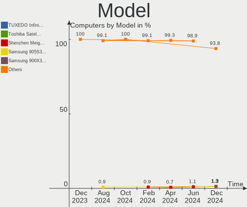
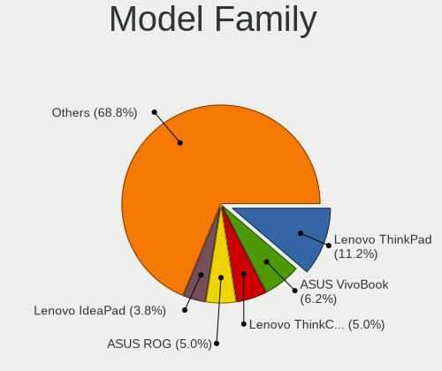
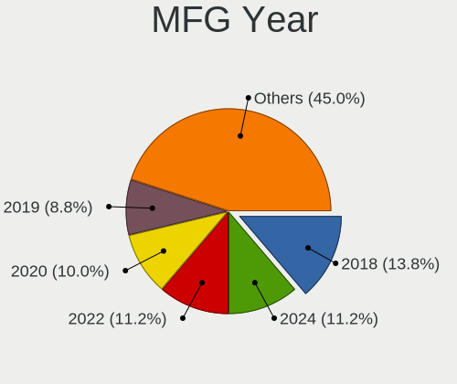
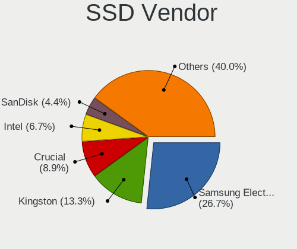
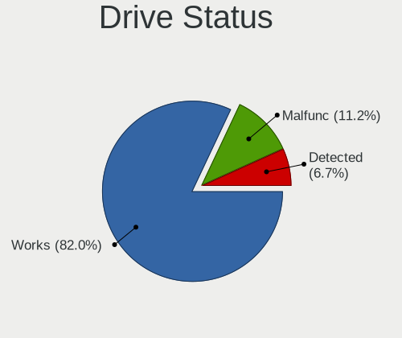
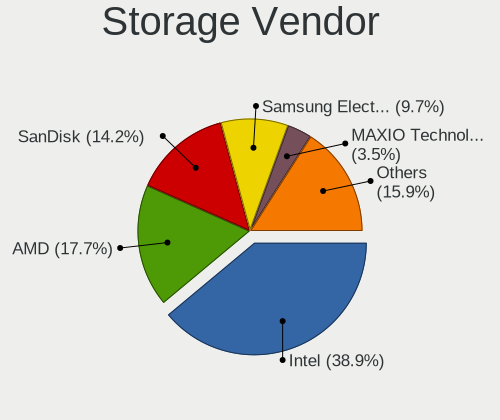
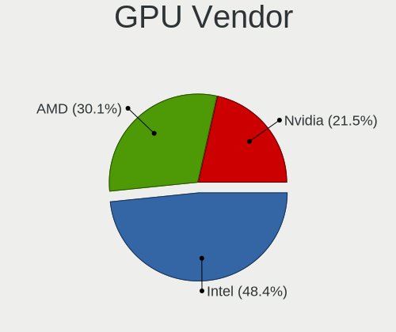
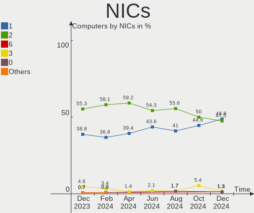

ArcoLinux - Hardware Trends
---------------------------

A project to identify most popular hardware characteristics and track their change
over time based on data collected by Linux users at https://Linux-Hardware.org.

Anyone can contribute to this report by the [hw-probe](https://github.com/linuxhw/hw-probe) tool:

    sudo -E hw-probe -all -upload

This is a report for all computer types. See also reports for [desktops](/Dist/ArcoLinux/Desktop/README.md) and [notebooks](/Dist/ArcoLinux/Notebook/README.md).

This report is for one last month. Overall report since the beginning of time: [TestDays](https://github.com/linuxhw/TestDays)

Period: Feb, 2023.

Contents
--------

* [ System ](#system)
  - [ OS                       ](#os)
  - [ OS Family                ](#os-family)
  - [ Kernel                   ](#kernel)
  - [ Kernel Family            ](#kernel-family)
  - [ Kernel Major Ver.        ](#kernel-major-ver)
  - [ Arch                     ](#arch)
  - [ DE                       ](#de)
  - [ Display Server           ](#display-server)
  - [ Display Manager          ](#display-manager)
  - [ OS Lang                  ](#os-lang)
  - [ Boot Mode                ](#boot-mode)
  - [ Filesystem               ](#filesystem)
  - [ Part. scheme             ](#part-scheme)
  - [ Dual Boot with Linux/BSD ](#dual-boot-with-linuxbsd)
  - [ Dual Boot (Win)          ](#dual-boot-win)

* [ Board ](#board)
  - [ Vendor                   ](#vendor)
  - [ Model                    ](#model)
  - [ Model Family             ](#model-family)
  - [ MFG Year                 ](#mfg-year)
  - [ Form Factor              ](#form-factor)
  - [ Secure Boot              ](#secure-boot)
  - [ Coreboot                 ](#coreboot)
  - [ RAM Size                 ](#ram-size)
  - [ RAM Used                 ](#ram-used)
  - [ Total Drives             ](#total-drives)
  - [ Has CD-ROM               ](#has-cd-rom)
  - [ Has Ethernet             ](#has-ethernet)
  - [ Has WiFi                 ](#has-wifi)
  - [ Has Bluetooth            ](#has-bluetooth)

* [ Location ](#location)
  - [ Country                  ](#country)
  - [ City                     ](#city)

* [ Drives ](#drives)
  - [ Drive Vendor             ](#drive-vendor)
  - [ Drive Model              ](#drive-model)
  - [ HDD Vendor               ](#hdd-vendor)
  - [ SSD Vendor               ](#ssd-vendor)
  - [ Drive Kind               ](#drive-kind)
  - [ Drive Connector          ](#drive-connector)
  - [ Drive Size               ](#drive-size)
  - [ Space Total              ](#space-total)
  - [ Space Used               ](#space-used)
  - [ Malfunc. Drives          ](#malfunc-drives)
  - [ Malfunc. Drive Vendor    ](#malfunc-drive-vendor)
  - [ Malfunc. HDD Vendor      ](#malfunc-hdd-vendor)
  - [ Malfunc. Drive Kind      ](#malfunc-drive-kind)
  - [ Failed Drives            ](#failed-drives)
  - [ Failed Drive Vendor      ](#failed-drive-vendor)
  - [ Drive Status             ](#drive-status)

* [ Storage controller ](#storage-controller)
  - [ Storage Vendor           ](#storage-vendor)
  - [ Storage Model            ](#storage-model)
  - [ Storage Kind             ](#storage-kind)

* [ Processor ](#processor)
  - [ CPU Vendor               ](#cpu-vendor)
  - [ CPU Model                ](#cpu-model)
  - [ CPU Model Family         ](#cpu-model-family)
  - [ CPU Cores                ](#cpu-cores)
  - [ CPU Sockets              ](#cpu-sockets)
  - [ CPU Threads              ](#cpu-threads)
  - [ CPU Op-Modes             ](#cpu-op-modes)
  - [ CPU Microcode            ](#cpu-microcode)
  - [ CPU Microarch            ](#cpu-microarch)

* [ Graphics ](#graphics)
  - [ GPU Vendor               ](#gpu-vendor)
  - [ GPU Model                ](#gpu-model)
  - [ GPU Combo                ](#gpu-combo)
  - [ GPU Driver               ](#gpu-driver)
  - [ GPU Memory               ](#gpu-memory)

* [ Monitor ](#monitor)
  - [ Monitor Vendor           ](#monitor-vendor)
  - [ Monitor Model            ](#monitor-model)
  - [ Monitor Resolution       ](#monitor-resolution)
  - [ Monitor Diagonal         ](#monitor-diagonal)
  - [ Monitor Width            ](#monitor-width)
  - [ Aspect Ratio             ](#aspect-ratio)
  - [ Monitor Area             ](#monitor-area)
  - [ Pixel Density            ](#pixel-density)
  - [ Multiple Monitors        ](#multiple-monitors)

* [ Network ](#network)
  - [ Net Controller Vendor    ](#net-controller-vendor)
  - [ Net Controller Model     ](#net-controller-model)
  - [ Wireless Vendor          ](#wireless-vendor)
  - [ Wireless Model           ](#wireless-model)
  - [ Ethernet Vendor          ](#ethernet-vendor)
  - [ Ethernet Model           ](#ethernet-model)
  - [ Net Controller Kind      ](#net-controller-kind)
  - [ Used Controller          ](#used-controller)
  - [ NICs                     ](#nics)
  - [ IPv6                     ](#ipv6)

* [ Bluetooth ](#bluetooth)
  - [ Bluetooth Vendor         ](#bluetooth-vendor)
  - [ Bluetooth Model          ](#bluetooth-model)

* [ Sound ](#sound)
  - [ Sound Vendor             ](#sound-vendor)
  - [ Sound Model              ](#sound-model)

* [ Memory ](#memory)
  - [ Memory Vendor            ](#memory-vendor)
  - [ Memory Model             ](#memory-model)
  - [ Memory Kind              ](#memory-kind)
  - [ Memory Form Factor       ](#memory-form-factor)
  - [ Memory Size              ](#memory-size)
  - [ Memory Speed             ](#memory-speed)

* [ Printers & scanners ](#printers--scanners)
  - [ Printer Vendor           ](#printer-vendor)
  - [ Printer Model            ](#printer-model)
  - [ Scanner Vendor           ](#scanner-vendor)
  - [ Scanner Model            ](#scanner-model)

* [ Camera ](#camera)
  - [ Camera Vendor            ](#camera-vendor)
  - [ Camera Model             ](#camera-model)

* [ Security ](#security)
  - [ Fingerprint Vendor       ](#fingerprint-vendor)
  - [ Fingerprint Model        ](#fingerprint-model)
  - [ Chipcard Vendor          ](#chipcard-vendor)
  - [ Chipcard Model           ](#chipcard-model)

* [ Unsupported ](#unsupported)
  - [ Unsupported Devices      ](#unsupported-devices)
  - [ Unsupported Device Types ](#unsupported-device-types)

System
------

OS
--

Installed operating systems

| Name              | Computers | Percent |
|-------------------|-----------|---------|
| ArcoLinux Rolling | 55        | 90.16%  |
| ArcoLinux         | 6         | 9.84%   |

OS Family
---------

OS without a version

| Name      | Computers | Percent |
|-----------|-----------|---------|
| ArcoLinux | 61        | 100%    |

Kernel
------

Version of the Linux kernel

| Version                        | Computers | Percent |
|--------------------------------|-----------|---------|
| 6.1.12-arch1-1                 | 16        | 26.23%  |
| 6.1.12-zen1-1-zen              | 7         | 11.48%  |
| 6.1.9-arch1-1                  | 6         | 9.84%   |
| 6.1.11-arch1-1                 | 5         | 8.2%    |
| 6.1.10-arch1-1                 | 5         | 8.2%    |
| 6.1.9-arch1-2                  | 3         | 4.92%   |
| 6.2.1-arch1-1                  | 2         | 3.28%   |
| 6.1.11-x64v1-xanmod1-1         | 2         | 3.28%   |
| 5.15.94-1-lts                  | 2         | 3.28%   |
| 6.2.0-4-cachyos-bore           | 1         | 1.64%   |
| 6.1.9-zen1-2-zen               | 1         | 1.64%   |
| 6.1.9-x64v1-xanmod1-1          | 1         | 1.64%   |
| 6.1.8-hardened1-1-hardened     | 1         | 1.64%   |
| 6.1.8-arch1-1                  | 1         | 1.64%   |
| 6.1.6-arch1-3                  | 1         | 1.64%   |
| 6.1.12-1-lts                   | 1         | 1.64%   |
| 6.1.11-lqx1-1-lqx              | 1         | 1.64%   |
| 6.0.12-arch1-1                 | 1         | 1.64%   |
| 6.0.11-x64v2-rt14-xanmod1-1-rt | 1         | 1.64%   |
| 5.15.93-1-lts                  | 1         | 1.64%   |
| 5.15.91-4-lts                  | 1         | 1.64%   |
| 5.15.91-1-lts                  | 1         | 1.64%   |

Kernel Family
-------------

Linux kernel without a distro release

| Version | Computers | Percent |
|---------|-----------|---------|
| 6.1.12  | 24        | 39.34%  |
| 6.1.9   | 11        | 18.03%  |
| 6.1.11  | 8         | 13.11%  |
| 6.1.10  | 5         | 8.2%    |
| 6.2.1   | 2         | 3.28%   |
| 6.1.8   | 2         | 3.28%   |
| 5.15.94 | 2         | 3.28%   |
| 5.15.91 | 2         | 3.28%   |
| 6.2.0   | 1         | 1.64%   |
| 6.1.6   | 1         | 1.64%   |
| 6.0.12  | 1         | 1.64%   |
| 6.0.11  | 1         | 1.64%   |
| 5.15.93 | 1         | 1.64%   |

Kernel Major Ver.
-----------------

Linux kernel major version

| Version | Computers | Percent |
|---------|-----------|---------|
| 6.1     | 51        | 83.61%  |
| 5.15    | 5         | 8.2%    |
| 6.2     | 3         | 4.92%   |
| 6.0     | 2         | 3.28%   |

Arch
----

OS architecture (x86_64, i586, etc.)

| Name   | Computers | Percent |
|--------|-----------|---------|
| x86_64 | 61        | 100%    |

DE
--

Desktop Environment

| Name           | Computers | Percent |
|----------------|-----------|---------|
| XFCE           | 15        | 24.59%  |
| KDE5           | 10        | 16.39%  |
| i3             | 6         | 9.84%   |
| Hyprland       | 6         | 9.84%   |
| chadwm         | 5         | 8.2%    |
| GNOME          | 4         | 6.56%   |
| awesome        | 4         | 6.56%   |
| xmonad         | 3         | 4.92%   |
| qtile          | 3         | 4.92%   |
| X-Cinnamon     | 2         | 3.28%   |
| i3-with-shmlog | 1         | 1.64%   |
| Deepin         | 1         | 1.64%   |
| bspwm          | 1         | 1.64%   |

Display Server
--------------

X11 or Wayland

| Name    | Computers | Percent |
|---------|-----------|---------|
| X11     | 53        | 86.89%  |
| Wayland | 7         | 11.48%  |
| Tty     | 1         | 1.64%   |

Display Manager
---------------

SDDM, LightDM, etc.

| Name    | Computers | Percent |
|---------|-----------|---------|
| SDDM    | 45        | 73.77%  |
| LightDM | 8         | 13.11%  |
| Unknown | 6         | 9.84%   |
| GDM     | 2         | 3.28%   |

OS Lang
-------

Language

| Lang        | Computers | Percent |
|-------------|-----------|---------|
| en_US       | 34        | 55.74%  |
| de_DE       | 9         | 14.75%  |
| en_GB       | 4         | 6.56%   |
| C           | 2         | 3.28%   |
| ru_RU       | 1         | 1.64%   |
| pl_PL       | 1         | 1.64%   |
| it_IT       | 1         | 1.64%   |
| hr_HR       | 1         | 1.64%   |
| fr_FR       | 1         | 1.64%   |
| es_ES       | 1         | 1.64%   |
| es_CO       | 1         | 1.64%   |
| en_ZA       | 1         | 1.64%   |
| en_US.utf-8 | 1         | 1.64%   |
| en_IL       | 1         | 1.64%   |
| en_CA       | 1         | 1.64%   |
| en_AU       | 1         | 1.64%   |

Boot Mode
---------

EFI or BIOS

| Mode | Computers | Percent |
|------|-----------|---------|
| EFI  | 46        | 75.41%  |
| BIOS | 15        | 24.59%  |

Filesystem
----------

Type of filesystem

| Type    | Computers | Percent |
|---------|-----------|---------|
| Ext4    | 41        | 67.21%  |
| Btrfs   | 17        | 27.87%  |
| Overlay | 2         | 3.28%   |
| Xfs     | 1         | 1.64%   |

Part. scheme
------------

Scheme of partitioning

| Type    | Computers | Percent |
|---------|-----------|---------|
| GPT     | 49        | 80.33%  |
| MBR     | 6         | 9.84%   |
| Unknown | 6         | 9.84%   |

Dual Boot with Linux/BSD
------------------------

Hosting more than one Linux/BSD

| Dual boot | Computers | Percent |
|-----------|-----------|---------|
| No        | 45        | 73.77%  |
| Yes       | 16        | 26.23%  |

Dual Boot (Win)
---------------

Hosting Linux and Windows

| Dual boot | Computers | Percent |
|-----------|-----------|---------|
| No        | 37        | 60.66%  |
| Yes       | 24        | 39.34%  |

Board
-----

Vendor
------

Motherboard manufacturer

| Name                | Computers | Percent |
|---------------------|-----------|---------|
| ASUSTek Computer    | 16        | 26.23%  |
| Lenovo              | 10        | 16.39%  |
| Gigabyte Technology | 7         | 11.48%  |
| Hewlett-Packard     | 6         | 9.84%   |
| Dell                | 5         | 8.2%    |
| MSI                 | 4         | 6.56%   |
| Acer                | 4         | 6.56%   |
| ASRock              | 2         | 3.28%   |
| Toshiba             | 1         | 1.64%   |
| System76            | 1         | 1.64%   |
| Monster             | 1         | 1.64%   |
| Intel               | 1         | 1.64%   |
| Chuwi               | 1         | 1.64%   |
| AZW                 | 1         | 1.64%   |
| Unknown             | 1         | 1.64%   |

Model
-----

Motherboard model

| Name                                   | Computers | Percent |
|----------------------------------------|-----------|---------|
| ASUS All Series                        | 3         | 4.92%   |
| ASUS PRIME Z490-A                      | 2         | 3.28%   |
| Toshiba Satellite L70-B                | 1         | 1.64%   |
| System76 Oryx Pro                      | 1         | 1.64%   |
| MSI MS-7D89                            | 1         | 1.64%   |
| MSI MS-7C37                            | 1         | 1.64%   |
| MSI MS-7816                            | 1         | 1.64%   |
| MSI MS-7751                            | 1         | 1.64%   |
| Monster TULPAR T5 V20.1                | 1         | 1.64%   |
| Lenovo Yoga 720-12IKB 81B5             | 1         | 1.64%   |
| Lenovo ThinkPad T460 20FMS35H02        | 1         | 1.64%   |
| Lenovo ThinkPad T460 20FMS07000        | 1         | 1.64%   |
| Lenovo ThinkPad P53 20QNS00X00         | 1         | 1.64%   |
| Lenovo ThinkPad L470 20J4003WGE        | 1         | 1.64%   |
| Lenovo ThinkPad L14 Gen 1 20U5004JPB   | 1         | 1.64%   |
| Lenovo Legion S7 15ACH6 82K8           | 1         | 1.64%   |
| Lenovo Legion 7 16ARHA7 82UH           | 1         | 1.64%   |
| Lenovo IdeaPad 310-15IKB 80TV          | 1         | 1.64%   |
| Lenovo IdeaCentre 510-15ICB 90HU00CEGE | 1         | 1.64%   |
| Intel NUC7i3BNB J22859-316             | 1         | 1.64%   |
| HP ZBook Studio G3                     | 1         | 1.64%   |
| HP Pavilion dv7                        | 1         | 1.64%   |
| HP OMEN by Laptop 17-cb0xxx            | 1         | 1.64%   |
| HP ENVY 15                             | 1         | 1.64%   |
| HP EliteDesk 800 G2 TWR                | 1         | 1.64%   |
| HP EliteBook 840 G4                    | 1         | 1.64%   |
| Gigabyte Z170XP-SLI                    | 1         | 1.64%   |
| Gigabyte X99-UD4P-CF                   | 1         | 1.64%   |
| Gigabyte X570 AORUS PRO WIFI           | 1         | 1.64%   |
| Gigabyte H61MS                         | 1         | 1.64%   |
| Gigabyte GA-78LMT-USB3 6.0             | 1         | 1.64%   |
| Gigabyte B85N PHOENIX                  | 1         | 1.64%   |
| Gigabyte B450 AORUS ELITE              | 1         | 1.64%   |
| Dell XPS 17 9710                       | 1         | 1.64%   |
| Dell OptiPlex 9020                     | 1         | 1.64%   |
| Dell OptiPlex 745                      | 1         | 1.64%   |
| Dell Inspiron 7506 2n1                 | 1         | 1.64%   |
| Dell Inspiron 3558                     | 1         | 1.64%   |
| Chuwi GemiBook Pro                     | 1         | 1.64%   |
| AZW GTR                                | 1         | 1.64%   |

Model Family
------------

Motherboard model prefix

| Name                   | Computers | Percent |
|------------------------|-----------|---------|
| Lenovo ThinkPad        | 5         | 8.2%    |
| ASUS PRIME             | 3         | 4.92%   |
| ASUS All               | 3         | 4.92%   |
| Lenovo Legion          | 2         | 3.28%   |
| Dell OptiPlex          | 2         | 3.28%   |
| Dell Inspiron          | 2         | 3.28%   |
| ASUS TUF               | 2         | 3.28%   |
| Acer Aspire            | 2         | 3.28%   |
| Toshiba Satellite      | 1         | 1.64%   |
| System76 Oryx          | 1         | 1.64%   |
| MSI MS-7D89            | 1         | 1.64%   |
| MSI MS-7C37            | 1         | 1.64%   |
| MSI MS-7816            | 1         | 1.64%   |
| MSI MS-7751            | 1         | 1.64%   |
| Monster TULPAR         | 1         | 1.64%   |
| Lenovo Yoga            | 1         | 1.64%   |
| Lenovo IdeaPad         | 1         | 1.64%   |
| Lenovo IdeaCentre      | 1         | 1.64%   |
| Intel NUC7i3BNB        | 1         | 1.64%   |
| HP ZBook               | 1         | 1.64%   |
| HP Pavilion            | 1         | 1.64%   |
| HP OMEN                | 1         | 1.64%   |
| HP ENVY                | 1         | 1.64%   |
| HP EliteDesk           | 1         | 1.64%   |
| HP EliteBook           | 1         | 1.64%   |
| Gigabyte Z170XP-SLI    | 1         | 1.64%   |
| Gigabyte X99-UD4P-CF   | 1         | 1.64%   |
| Gigabyte X570          | 1         | 1.64%   |
| Gigabyte H61MS         | 1         | 1.64%   |
| Gigabyte GA-78LMT-USB3 | 1         | 1.64%   |
| Gigabyte B85N          | 1         | 1.64%   |
| Gigabyte B450          | 1         | 1.64%   |
| Dell XPS               | 1         | 1.64%   |
| Chuwi GemiBook         | 1         | 1.64%   |
| AZW GTR                | 1         | 1.64%   |
| ASUS Zenbook           | 1         | 1.64%   |
| ASUS Z10PE-D16         | 1         | 1.64%   |
| ASUS X55VD             | 1         | 1.64%   |
| ASUS STRIX             | 1         | 1.64%   |
| ASUS ROG               | 1         | 1.64%   |

MFG Year
--------

Motherboard manufacture year

| Year | Computers | Percent |
|------|-----------|---------|
| 2021 | 9         | 14.75%  |
| 2017 | 7         | 11.48%  |
| 2016 | 7         | 11.48%  |
| 2014 | 7         | 11.48%  |
| 2020 | 6         | 9.84%   |
| 2019 | 6         | 9.84%   |
| 2022 | 5         | 8.2%    |
| 2012 | 4         | 6.56%   |
| 2018 | 3         | 4.92%   |
| 2013 | 2         | 3.28%   |
| 2015 | 1         | 1.64%   |
| 2010 | 1         | 1.64%   |
| 2009 | 1         | 1.64%   |
| 2008 | 1         | 1.64%   |
| 2007 | 1         | 1.64%   |

Form Factor
-----------

Physical design of the computer

| Name        | Computers | Percent |
|-------------|-----------|---------|
| Desktop     | 32        | 52.46%  |
| Notebook    | 26        | 42.62%  |
| Convertible | 2         | 3.28%   |
| Mini pc     | 1         | 1.64%   |

Secure Boot
-----------

Enabled or disabled

| State    | Computers | Percent |
|----------|-----------|---------|
| Disabled | 61        | 100%    |

Coreboot
--------

Have coreboot on board

| Used | Computers | Percent |
|------|-----------|---------|
| No   | 61        | 100%    |

RAM Size
--------

Total RAM memory

| Size in GB      | Computers | Percent |
|-----------------|-----------|---------|
| 16.01-24.0      | 18        | 29.51%  |
| 32.01-64.0      | 12        | 19.67%  |
| 8.01-16.0       | 12        | 19.67%  |
| 4.01-8.0        | 8         | 13.11%  |
| 24.01-32.0      | 5         | 8.2%    |
| 64.01-256.0     | 3         | 4.92%   |
| 3.01-4.0        | 2         | 3.28%   |
| More than 256.0 | 1         | 1.64%   |

RAM Used
--------

Used RAM memory

| Used GB    | Computers | Percent |
|------------|-----------|---------|
| 2.01-3.0   | 18        | 29.51%  |
| 4.01-8.0   | 13        | 21.31%  |
| 1.01-2.0   | 11        | 18.03%  |
| 3.01-4.0   | 10        | 16.39%  |
| 8.01-16.0  | 6         | 9.84%   |
| 0.51-1.0   | 2         | 3.28%   |
| 16.01-24.0 | 1         | 1.64%   |

Total Drives
------------

Number of drives on board

| Drives | Computers | Percent |
|--------|-----------|---------|
| 2      | 23        | 37.7%   |
| 1      | 22        | 36.07%  |
| 3      | 6         | 9.84%   |
| 4      | 4         | 6.56%   |
| 5      | 2         | 3.28%   |
| 21     | 1         | 1.64%   |
| 9      | 1         | 1.64%   |
| 7      | 1         | 1.64%   |
| 6      | 1         | 1.64%   |

Has CD-ROM
----------

Has CD-ROM on board

| Presented | Computers | Percent |
|-----------|-----------|---------|
| No        | 51        | 83.61%  |
| Yes       | 10        | 16.39%  |

Has Ethernet
------------

Has Ethernet on board

| Presented | Computers | Percent |
|-----------|-----------|---------|
| Yes       | 54        | 88.52%  |
| No        | 7         | 11.48%  |

Has WiFi
--------

Has WiFi module

| Presented | Computers | Percent |
|-----------|-----------|---------|
| Yes       | 43        | 70.49%  |
| No        | 18        | 29.51%  |

Has Bluetooth
-------------

Has Bluetooth module

| Presented | Computers | Percent |
|-----------|-----------|---------|
| Yes       | 43        | 70.49%  |
| No        | 18        | 29.51%  |

Location
--------

Country
-------

Geographic location (country)

| Country      | Computers | Percent |
|--------------|-----------|---------|
| USA          | 12        | 19.67%  |
| Germany      | 9         | 14.75%  |
| Poland       | 3         | 4.92%   |
| UK           | 2         | 3.28%   |
| Spain        | 2         | 3.28%   |
| Romania      | 2         | 3.28%   |
| Netherlands  | 2         | 3.28%   |
| France       | 2         | 3.28%   |
| Belgium      | 2         | 3.28%   |
| Vietnam      | 1         | 1.64%   |
| Turkey       | 1         | 1.64%   |
| Sweden       | 1         | 1.64%   |
| South Africa | 1         | 1.64%   |
| Russia       | 1         | 1.64%   |
| Portugal     | 1         | 1.64%   |
| Philippines  | 1         | 1.64%   |
| Pakistan     | 1         | 1.64%   |
| Norway       | 1         | 1.64%   |
| Mexico       | 1         | 1.64%   |
| Malaysia     | 1         | 1.64%   |
| Japan        | 1         | 1.64%   |
| Italy        | 1         | 1.64%   |
| Israel       | 1         | 1.64%   |
| Indonesia    | 1         | 1.64%   |
| India        | 1         | 1.64%   |
| Czechia      | 1         | 1.64%   |
| Croatia      | 1         | 1.64%   |
| Colombia     | 1         | 1.64%   |
| Canada       | 1         | 1.64%   |
| Brazil       | 1         | 1.64%   |
| Belarus      | 1         | 1.64%   |
| Austria      | 1         | 1.64%   |
| Australia    | 1         | 1.64%   |
| Algeria      | 1         | 1.64%   |

City
----

Geographic location (city)

| City                  | Computers | Percent |
|-----------------------|-----------|---------|
| Schwarzenbek          | 2         | 3.28%   |
| Eindhoven             | 2         | 3.28%   |
| Duffel                | 2         | 3.28%   |
| Yogyakarta            | 1         | 1.64%   |
| Wiesbaden             | 1         | 1.64%   |
| Warsaw                | 1         | 1.64%   |
| Vienna                | 1         | 1.64%   |
| Vaslui                | 1         | 1.64%   |
| Troy                  | 1         | 1.64%   |
| Tokyo                 | 1         | 1.64%   |
| Tel Aviv              | 1         | 1.64%   |
| Sydney                | 1         | 1.64%   |
| Streamwood            | 1         | 1.64%   |
| Solna                 | 1         | 1.64%   |
| Skawina               | 1         | 1.64%   |
| Seville               | 1         | 1.64%   |
| San Luis Potosí City | 1         | 1.64%   |
| Saint Paul            | 1         | 1.64%   |
| Rosenheim             | 1         | 1.64%   |
| Pula                  | 1         | 1.64%   |
| Prague                | 1         | 1.64%   |
| Potterville           | 1         | 1.64%   |
| Piney Flats           | 1         | 1.64%   |
| Phoenix               | 1         | 1.64%   |
| Oropesa               | 1         | 1.64%   |
| Oldenburg             | 1         | 1.64%   |
| Neuss                 | 1         | 1.64%   |
| Mysłowice            | 1         | 1.64%   |
| Munich                | 1         | 1.64%   |
| Mombello di Torino    | 1         | 1.64%   |
| Minsk                 | 1         | 1.64%   |
| Marseille             | 1         | 1.64%   |
| Markham               | 1         | 1.64%   |
| London                | 1         | 1.64%   |
| Krumbach              | 1         | 1.64%   |
| Kolkata               | 1         | 1.64%   |
| Kansas City           | 1         | 1.64%   |
| Johannesburg          | 1         | 1.64%   |
| Izmir                 | 1         | 1.64%   |
| Islamabad             | 1         | 1.64%   |

Drives
------

Drive Vendor
------------

Hard drive vendors

| Vendor                      | Computers | Drives | Percent |
|-----------------------------|-----------|--------|---------|
| Samsung Electronics         | 25        | 38     | 21.37%  |
| WDC                         | 16        | 32     | 13.68%  |
| Sandisk                     | 10        | 11     | 8.55%   |
| Seagate                     | 9         | 11     | 7.69%   |
| Intel                       | 6         | 8      | 5.13%   |
| Kingston                    | 5         | 5      | 4.27%   |
| A-DATA Technology           | 5         | 5      | 4.27%   |
| SK hynix                    | 4         | 4      | 3.42%   |
| Crucial                     | 4         | 4      | 3.42%   |
| Unknown                     | 3         | 3      | 2.56%   |
| Intenso                     | 3         | 3      | 2.56%   |
| Toshiba                     | 2         | 2      | 1.71%   |
| Silicon Motion              | 2         | 2      | 1.71%   |
| Phison Electronics          | 2         | 2      | 1.71%   |
| Micron/Crucial Technology   | 2         | 2      | 1.71%   |
| Hitachi                     | 2         | 2      | 1.71%   |
| Corsair                     | 2         | 2      | 1.71%   |
| TO Exter                    | 1         | 1      | 0.85%   |
| Team                        | 1         | 1      | 0.85%   |
| SSK                         | 1         | 1      | 0.85%   |
| SPCC                        | 1         | 1      | 0.85%   |
| Seagate Technology          | 1         | 1      | 0.85%   |
| Realtek Semiconductor       | 1         | 1      | 0.85%   |
| PNY                         | 1         | 1      | 0.85%   |
| Plextor                     | 1         | 1      | 0.85%   |
| Patriot                     | 1         | 1      | 0.85%   |
| Micron Technology           | 1         | 1      | 0.85%   |
| LITEON                      | 1         | 1      | 0.85%   |
| Kingston Technology Company | 1         | 1      | 0.85%   |
| HS256E                      | 1         | 1      | 0.85%   |
| HGST                        | 1         | 2      | 0.85%   |
| China                       | 1         | 1      | 0.85%   |

Drive Model
-----------

Hard drive models

| Model                                                | Computers | Percent |
|------------------------------------------------------|-----------|---------|
| Samsung NVMe SSD Controller SM981/PM981/PM983 250GB  | 8         | 5.84%   |
| Samsung SSD 980 500GB                                | 4         | 2.92%   |
| Samsung NVMe SSD Controller PM9A1/PM9A3/980PRO 960GB | 4         | 2.92%   |
| Samsung SSD 850 EVO 250GB                            | 3         | 2.19%   |
| Sandisk WD Black SN850 500GB                         | 2         | 1.46%   |
| Sandisk WD Black SN750 / PC SN730 NVMe SSD 512GB     | 2         | 1.46%   |
| Samsung SSD 870 QVO 2TB                              | 2         | 1.46%   |
| Samsung SSD 860 EVO 250GB                            | 2         | 1.46%   |
| Samsung NVMe SSD Controller SM961/PM961/SM963 512GB  | 2         | 1.46%   |
| Intel SSD Pro 7600p/760p/E 6100p Series 1024GB       | 2         | 1.46%   |
| Crucial CT1000MX500SSD1 1TB                          | 2         | 1.46%   |
| WDC WDS500G2B0B-00YS70 500GB SSD                     | 1         | 0.73%   |
| WDC WDS500G2B0A 500GB SSD                            | 1         | 0.73%   |
| WDC WDS200T2B0B-00YS70 2TB SSD                       | 1         | 0.73%   |
| WDC WDS100T2G0A-00JH30 1TB SSD                       | 1         | 0.73%   |
| WDC WD8001FFWX-68J1UN0 8TB                           | 1         | 0.73%   |
| WDC WD5000LPLX-00ZNTT0 500GB                         | 1         | 0.73%   |
| WDC WD5000LPCX-24C6HT0 500GB                         | 1         | 0.73%   |
| WDC WD5000AZLX-21K2TA0 500GB                         | 1         | 0.73%   |
| WDC WD5000AACS-00G8B1 500GB                          | 1         | 0.73%   |
| WDC WD40EZAZ-22SF3B0 4TB                             | 1         | 0.73%   |
| WDC WD30EZRX-00MMMB0 3TB                             | 1         | 0.73%   |
| WDC WD20SPZX-22UA7T0 2TB                             | 1         | 0.73%   |
| WDC WD20EZRZ-00Z5HB0 2TB                             | 1         | 0.73%   |
| WDC WD20EFRX-68EUZN0 2TB                             | 1         | 0.73%   |
| WDC WD2003FZEX-00Z4SA0 2TB                           | 1         | 0.73%   |
| WDC WD2002FAEX-007BA0 2TB                            | 1         | 0.73%   |
| WDC WD10SPZX-21Z10T0 1TB                             | 1         | 0.73%   |
| WDC WD10EZEX-08WN4A0 1TB                             | 1         | 0.73%   |
| WDC WD10EZEX-00BN5A0 1TB                             | 1         | 0.73%   |
| WDC WD10EARS-00Y5B1 1TB                              | 1         | 0.73%   |
| WDC WD10EARS-00MVWB0 1TB                             | 1         | 0.73%   |
| WDC WD10EADS-11M2B1 1TB                              | 1         | 0.73%   |
| WDC WD1003FZEX-00K3CA0 1TB                           | 1         | 0.73%   |
| Unknown MMC Card  134GB                              | 1         | 0.73%   |
| Unknown MMC Card  128GB                              | 1         | 0.73%   |
| Unknown External 500GB                               | 1         | 0.73%   |
| Toshiba MQ01ABD100 1TB                               | 1         | 0.73%   |
| Toshiba DT01ACA100 1TB                               | 1         | 0.73%   |
| TO Exter nal USB 3.0 240GB                           | 1         | 0.73%   |

HDD Vendor
----------

Hard disk drive vendors

| Vendor              | Computers | Drives | Percent |
|---------------------|-----------|--------|---------|
| WDC                 | 14        | 28     | 53.85%  |
| Seagate             | 6         | 8      | 23.08%  |
| Toshiba             | 2         | 2      | 7.69%   |
| Hitachi             | 2         | 2      | 7.69%   |
| Unknown             | 1         | 1      | 3.85%   |
| Samsung Electronics | 1         | 1      | 3.85%   |

SSD Vendor
----------

Solid state drive vendors

| Vendor              | Computers | Drives | Percent |
|---------------------|-----------|--------|---------|
| Samsung Electronics | 11        | 17     | 22.92%  |
| WDC                 | 4         | 4      | 8.33%   |
| Crucial             | 4         | 4      | 8.33%   |
| A-DATA Technology   | 4         | 4      | 8.33%   |
| SK hynix            | 3         | 3      | 6.25%   |
| SanDisk             | 3         | 3      | 6.25%   |
| Kingston            | 3         | 3      | 6.25%   |
| Intenso             | 3         | 3      | 6.25%   |
| Intel               | 2         | 3      | 4.17%   |
| Corsair             | 2         | 2      | 4.17%   |
| TO Exter            | 1         | 1      | 2.08%   |
| Team                | 1         | 1      | 2.08%   |
| SPCC                | 1         | 1      | 2.08%   |
| PNY                 | 1         | 1      | 2.08%   |
| Plextor             | 1         | 1      | 2.08%   |
| Patriot             | 1         | 1      | 2.08%   |
| LITEON              | 1         | 1      | 2.08%   |
| HS256E              | 1         | 1      | 2.08%   |
| China               | 1         | 1      | 2.08%   |

Drive Kind
----------

HDD or SSD

| Kind    | Computers | Drives | Percent |
|---------|-----------|--------|---------|
| SSD     | 40        | 55     | 40.82%  |
| NVMe    | 33        | 49     | 33.67%  |
| HDD     | 20        | 42     | 20.41%  |
| Unknown | 3         | 4      | 3.06%   |
| MMC     | 2         | 2      | 2.04%   |

Drive Connector
---------------

SATA, SAS, NVMe, etc.

| Type | Computers | Drives | Percent |
|------|-----------|--------|---------|
| SATA | 45        | 92     | 52.33%  |
| NVMe | 33        | 49     | 38.37%  |
| SAS  | 6         | 9      | 6.98%   |
| MMC  | 2         | 2      | 2.33%   |

Drive Size
----------

Size of hard drive

| Size in TB | Computers | Drives | Percent |
|------------|-----------|--------|---------|
| 0.01-0.5   | 31        | 40     | 45.59%  |
| 0.51-1.0   | 18        | 24     | 26.47%  |
| 1.01-2.0   | 15        | 20     | 22.06%  |
| 3.01-4.0   | 2         | 2      | 2.94%   |
| 2.01-3.0   | 1         | 1      | 1.47%   |
| 4.01-10.0  | 1         | 10     | 1.47%   |

Space Total
-----------

Amount of disk space available on the file system

| Size in GB     | Computers | Percent |
|----------------|-----------|---------|
| More than 3000 | 15        | 24.59%  |
| 251-500        | 13        | 21.31%  |
| 101-250        | 12        | 19.67%  |
| 1001-2000      | 7         | 11.48%  |
| 501-1000       | 6         | 9.84%   |
| 2001-3000      | 4         | 6.56%   |
| Unknown        | 2         | 3.28%   |
| 1-20           | 1         | 1.64%   |
| 51-100         | 1         | 1.64%   |

Space Used
----------

Amount of used disk space

| Used GB        | Computers | Percent |
|----------------|-----------|---------|
| 1-20           | 11        | 18.03%  |
| 1001-2000      | 8         | 13.11%  |
| 51-100         | 8         | 13.11%  |
| 251-500        | 7         | 11.48%  |
| 21-50          | 7         | 11.48%  |
| 501-1000       | 7         | 11.48%  |
| 101-250        | 6         | 9.84%   |
| More than 3000 | 3         | 4.92%   |
| 2001-3000      | 2         | 3.28%   |
| Unknown        | 2         | 3.28%   |

Malfunc. Drives
---------------

Drive models with a malfunction

| Model                                            | Computers | Drives | Percent |
|--------------------------------------------------|-----------|--------|---------|
| WDC WDS100T2G0A-00JH30 1TB SSD                   | 1         | 1      | 5.56%   |
| WDC WD5000AACS-00G8B1 500GB                      | 1         | 1      | 5.56%   |
| WDC WD20EFRX-68EUZN0 2TB                         | 1         | 1      | 5.56%   |
| WDC WD10EARS-00Y5B1 1TB                          | 1         | 1      | 5.56%   |
| WDC WD10EADS-11M2B1 1TB                          | 1         | 1      | 5.56%   |
| WDC WD1003FZEX-00K3CA0 1TB                       | 1         | 1      | 5.56%   |
| Toshiba MQ01ABD100 1TB                           | 1         | 1      | 5.56%   |
| Toshiba DT01ACA100 1TB                           | 1         | 1      | 5.56%   |
| Seagate ST32000641AS 2TB                         | 1         | 1      | 5.56%   |
| Seagate ST2000DM008-2FR102 2TB                   | 1         | 1      | 5.56%   |
| Seagate ST2000DM001-1ER164 2TB                   | 1         | 1      | 5.56%   |
| Sandisk WD Black SN850 500GB                     | 1         | 1      | 5.56%   |
| Micron/Crucial Technology P1 NVMe PCIe SSD 500GB | 1         | 1      | 5.56%   |
| Hitachi HUA723020ALA640 2TB                      | 1         | 1      | 5.56%   |
| Hitachi HTS545050B9A300 500GB                    | 1         | 1      | 5.56%   |
| Corsair Neutron XT SSD 240GB                     | 1         | 1      | 5.56%   |
| Corsair CSSD-F60GB2 64GB                         | 1         | 1      | 5.56%   |
| A-DATA Technology SX900 128GB SSD                | 1         | 1      | 5.56%   |

Malfunc. Drive Vendor
---------------------

Vendors of faulty drives

| Vendor                    | Computers | Drives | Percent |
|---------------------------|-----------|--------|---------|
| WDC                       | 4         | 6      | 25%     |
| Seagate                   | 3         | 3      | 18.75%  |
| Toshiba                   | 2         | 2      | 12.5%   |
| Hitachi                   | 2         | 2      | 12.5%   |
| Corsair                   | 2         | 2      | 12.5%   |
| Sandisk                   | 1         | 1      | 6.25%   |
| Micron/Crucial Technology | 1         | 1      | 6.25%   |
| A-DATA Technology         | 1         | 1      | 6.25%   |

Malfunc. HDD Vendor
-------------------

Vendors of faulty HDD drives

| Vendor  | Computers | Drives | Percent |
|---------|-----------|--------|---------|
| WDC     | 3         | 5      | 30%     |
| Seagate | 3         | 3      | 30%     |
| Toshiba | 2         | 2      | 20%     |
| Hitachi | 2         | 2      | 20%     |

Malfunc. Drive Kind
-------------------

Kinds of faulty drives

| Kind | Computers | Drives | Percent |
|------|-----------|--------|---------|
| HDD  | 8         | 12     | 57.14%  |
| SSD  | 4         | 4      | 28.57%  |
| NVMe | 2         | 2      | 14.29%  |

Failed Drives
-------------

Failed drive models

| Model                             | Computers | Drives | Percent |
|-----------------------------------|-----------|--------|---------|
| Samsung Electronics SSD 980 500GB | 1         | 1      | 100%    |

Failed Drive Vendor
-------------------

Failed drive vendors

| Vendor              | Computers | Drives | Percent |
|---------------------|-----------|--------|---------|
| Samsung Electronics | 1         | 1      | 100%    |

Drive Status
------------

Number of failed and malfunc. drives

| Status   | Computers | Drives | Percent |
|----------|-----------|--------|---------|
| Works    | 54        | 112    | 66.67%  |
| Detected | 15        | 21     | 18.52%  |
| Malfunc  | 11        | 18     | 13.58%  |
| Failed   | 1         | 1      | 1.23%   |

Storage controller
------------------

Storage Vendor
--------------

Storage controller vendors

| Vendor                      | Computers | Percent |
|-----------------------------|-----------|---------|
| Intel                       | 46        | 45.54%  |
| Samsung Electronics         | 18        | 17.82%  |
| AMD                         | 9         | 8.91%   |
| Sandisk                     | 7         | 6.93%   |
| ASMedia Technology          | 4         | 3.96%   |
| Kingston Technology Company | 3         | 2.97%   |
| Silicon Motion              | 2         | 1.98%   |
| Seagate Technology          | 2         | 1.98%   |
| Phison Electronics          | 2         | 1.98%   |
| Micron/Crucial Technology   | 2         | 1.98%   |
| SK hynix                    | 1         | 0.99%   |
| Realtek Semiconductor       | 1         | 0.99%   |
| Nvidia                      | 1         | 0.99%   |
| Micron Technology           | 1         | 0.99%   |
| ADATA Technology            | 1         | 0.99%   |
| Adaptec                     | 1         | 0.99%   |

Storage Model
-------------

Storage controller models

| Model                                                                                   | Computers | Percent |
|-----------------------------------------------------------------------------------------|-----------|---------|
| Samsung NVMe SSD Controller SM981/PM981/PM983                                           | 8         | 7.02%   |
| Intel Sunrise Point-LP SATA Controller [AHCI mode]                                      | 8         | 7.02%   |
| AMD FCH SATA Controller [AHCI mode]                                                     | 8         | 7.02%   |
| Samsung NVMe SSD Controller PM9A1/PM9A3/980PRO                                          | 4         | 3.51%   |
| Samsung NVMe SSD Controller 980                                                         | 4         | 3.51%   |
| Intel 8 Series/C220 Series Chipset Family 6-port SATA Controller 1 [AHCI mode]          | 4         | 3.51%   |
| Sandisk Non-Volatile memory controller                                                  | 3         | 2.63%   |
| Intel 200 Series PCH SATA controller [AHCI mode]                                        | 3         | 2.63%   |
| ASMedia ASM1062 Serial ATA Controller                                                   | 3         | 2.63%   |
| SanDisk WD PC SN810 / Black SN850 NVMe SSD                                              | 2         | 1.75%   |
| SanDisk WD Black SN750 / PC SN730 NVMe SSD                                              | 2         | 1.75%   |
| Samsung NVMe SSD Controller SM961/PM961/SM963                                           | 2         | 1.75%   |
| Intel Q170/Q150/B150/H170/H110/Z170/CM236 Chipset SATA Controller [AHCI Mode]           | 2         | 1.75%   |
| Intel Cannon Lake Mobile PCH SATA AHCI Controller                                       | 2         | 1.75%   |
| Intel Alder Lake-S PCH SATA Controller [AHCI Mode]                                      | 2         | 1.75%   |
| Intel 9 Series Chipset Family SATA Controller [AHCI Mode]                               | 2         | 1.75%   |
| Intel 82801 Mobile SATA Controller [RAID mode]                                          | 2         | 1.75%   |
| Intel 6 Series/C200 Series Chipset Family Desktop SATA Controller (IDE mode, ports 4-5) | 2         | 1.75%   |
| Intel 6 Series/C200 Series Chipset Family Desktop SATA Controller (IDE mode, ports 0-3) | 2         | 1.75%   |
| Intel 400 Series Chipset Family SATA AHCI Controller                                    | 2         | 1.75%   |
| AMD 400 Series Chipset SATA Controller                                                  | 2         | 1.75%   |
| SK hynix Gold P31/PC711 NVMe Solid State Drive                                          | 1         | 0.88%   |
| Silicon Motion SM2263EN/SM2263XT SSD Controller                                         | 1         | 0.88%   |
| Silicon Motion SM2262/SM2262EN SSD Controller                                           | 1         | 0.88%   |
| Seagate FireCuda 520 SSD                                                                | 1         | 0.88%   |
| Seagate FireCuda 510 SSD                                                                | 1         | 0.88%   |
| SanDisk WD Blue SN550 NVMe SSD                                                          | 1         | 0.88%   |
| Realtek RTS5763DL NVMe SSD Controller                                                   | 1         | 0.88%   |
| Phison E7 NVMe Controller                                                               | 1         | 0.88%   |
| Phison E16 PCIe4 NVMe Controller                                                        | 1         | 0.88%   |
| Nvidia MCP78S [GeForce 8200] IDE                                                        | 1         | 0.88%   |
| Nvidia MCP78S [GeForce 8200] AHCI Controller                                            | 1         | 0.88%   |
| Micron/Crucial P2 NVMe PCIe SSD                                                         | 1         | 0.88%   |
| Micron/Crucial P1 NVMe PCIe SSD                                                         | 1         | 0.88%   |
| Micron Non-Volatile memory controller                                                   | 1         | 0.88%   |
| Kingston Company U-SNS8154P3 NVMe SSD                                                   | 1         | 0.88%   |
| Kingston Company Company Non-Volatile memory controller                                 | 1         | 0.88%   |
| Kingston Company SNVS2000G [NV1 NVMe PCIe SSD 2TB]                                      | 1         | 0.88%   |
| Intel Wildcat Point-LP SATA Controller [AHCI Mode]                                      | 1         | 0.88%   |
| Intel Volume Management Device NVMe RAID Controller                                     | 1         | 0.88%   |

Storage Kind
------------

Kind of storage controller (IDE, SATA, NVMe, SAS, ...)

| Kind | Computers | Percent |
|------|-----------|---------|
| SATA | 45        | 50.56%  |
| NVMe | 32        | 35.96%  |
| RAID | 6         | 6.74%   |
| IDE  | 6         | 6.74%   |

Processor
---------

CPU Vendor
----------

Processor vendors

| Vendor | Computers | Percent |
|--------|-----------|---------|
| Intel  | 47        | 77.05%  |
| AMD    | 14        | 22.95%  |

CPU Model
---------

Processor models

| Model                                   | Computers | Percent |
|-----------------------------------------|-----------|---------|
| Intel Core i7-9750H CPU @ 2.60GHz       | 4         | 6.56%   |
| Intel Core i7-7700K CPU @ 4.20GHz       | 2         | 3.28%   |
| Intel Core i7-10700K CPU @ 3.80GHz      | 2         | 3.28%   |
| Intel Core i5-7200U CPU @ 2.50GHz       | 2         | 3.28%   |
| Intel Core i5-6300U CPU @ 2.40GHz       | 2         | 3.28%   |
| AMD Ryzen 9 6900HX with Radeon Graphics | 2         | 3.28%   |
| AMD Ryzen 9 3900X 12-Core Processor     | 2         | 3.28%   |
| Intel Xeon CPU E5-2698 v4 @ 2.20GHz     | 1         | 1.64%   |
| Intel Xeon CPU E5-1650 v3 @ 3.50GHz     | 1         | 1.64%   |
| Intel Pentium CPU 2020M @ 2.40GHz       | 1         | 1.64%   |
| Intel Core i7-7500U CPU @ 2.70GHz       | 1         | 1.64%   |
| Intel Core i7-6820HQ CPU @ 2.70GHz      | 1         | 1.64%   |
| Intel Core i7-4790 CPU @ 3.60GHz        | 1         | 1.64%   |
| Intel Core i7-4710HQ CPU @ 2.50GHz      | 1         | 1.64%   |
| Intel Core i7-4702MQ CPU @ 2.20GHz      | 1         | 1.64%   |
| Intel Core i7-3770S CPU @ 3.10GHz       | 1         | 1.64%   |
| Intel Core i7-3770K CPU @ 3.50GHz       | 1         | 1.64%   |
| Intel Core i7-3770 CPU @ 3.40GHz        | 1         | 1.64%   |
| Intel Core i7-10875H CPU @ 2.30GHz      | 1         | 1.64%   |
| Intel Core i7-10750H CPU @ 2.60GHz      | 1         | 1.64%   |
| Intel Core i5-8400 CPU @ 2.80GHz        | 1         | 1.64%   |
| Intel Core i5-7300U CPU @ 2.60GHz       | 1         | 1.64%   |
| Intel Core i5-6500 CPU @ 3.20GHz        | 1         | 1.64%   |
| Intel Core i5-5200U CPU @ 2.20GHz       | 1         | 1.64%   |
| Intel Core i5-4690K CPU @ 3.50GHz       | 1         | 1.64%   |
| Intel Core i5-4690 CPU @ 3.50GHz        | 1         | 1.64%   |
| Intel Core i5-4590 CPU @ 3.30GHz        | 1         | 1.64%   |
| Intel Core i5-4570 CPU @ 3.20GHz        | 1         | 1.64%   |
| Intel Core i5-4460 CPU @ 3.20GHz        | 1         | 1.64%   |
| Intel Core i5-2410M CPU @ 2.30GHz       | 1         | 1.64%   |
| Intel Core i5-10300H CPU @ 2.50GHz      | 1         | 1.64%   |
| Intel Core i3-7100U CPU @ 2.40GHz       | 1         | 1.64%   |
| Intel Core i3-7100 CPU @ 3.90GHz        | 1         | 1.64%   |
| Intel Core i3-7020U CPU @ 2.30GHz       | 1         | 1.64%   |
| Intel Core i3-3210 CPU @ 3.20GHz        | 1         | 1.64%   |
| Intel Core 2 CPU 6700 @ 2.66GHz         | 1         | 1.64%   |
| Intel Celeron N5100 @ 1.10GHz           | 1         | 1.64%   |
| Intel 13th Gen Core i7-13700K           | 1         | 1.64%   |
| Intel 12th Gen Core i9-12900K           | 1         | 1.64%   |
| Intel 12th Gen Core i3-12100F           | 1         | 1.64%   |

CPU Model Family
----------------

Processor model prefix

| Model            | Computers | Percent |
|------------------|-----------|---------|
| Intel Core i7    | 18        | 29.51%  |
| Intel Core i5    | 15        | 24.59%  |
| Other            | 5         | 8.2%    |
| AMD Ryzen 9      | 5         | 8.2%    |
| AMD Ryzen 7      | 5         | 8.2%    |
| Intel Core i3    | 4         | 6.56%   |
| Intel Xeon       | 2         | 3.28%   |
| Intel Pentium    | 1         | 1.64%   |
| Intel Core 2     | 1         | 1.64%   |
| Intel Celeron    | 1         | 1.64%   |
| AMD Ryzen 5 PRO  | 1         | 1.64%   |
| AMD Ryzen 3      | 1         | 1.64%   |
| AMD Phenom II X4 | 1         | 1.64%   |
| AMD FX           | 1         | 1.64%   |

CPU Cores
---------

Number of processor cores

| Number | Computers | Percent |
|--------|-----------|---------|
| 4      | 21        | 34.43%  |
| 2      | 14        | 22.95%  |
| 8      | 12        | 19.67%  |
| 6      | 8         | 13.11%  |
| 16     | 2         | 3.28%   |
| 12     | 2         | 3.28%   |
| 40     | 1         | 1.64%   |
| 3      | 1         | 1.64%   |

CPU Sockets
-----------

Number of sockets

| Number | Computers | Percent |
|--------|-----------|---------|
| 1      | 60        | 98.36%  |
| 2      | 1         | 1.64%   |

CPU Threads
-----------

Threads per core (Hyper-Threading)

| Number | Computers | Percent |
|--------|-----------|---------|
| 2      | 49        | 80.33%  |
| 1      | 12        | 19.67%  |

CPU Op-Modes
------------

CPU Operation Modes (32-bit, 64-bit)

| Op mode        | Computers | Percent |
|----------------|-----------|---------|
| 32-bit, 64-bit | 61        | 100%    |

CPU Microcode
-------------

Microcode number

| Number     | Computers | Percent |
|------------|-----------|---------|
| Unknown    | 10        | 16.39%  |
| 0x306c3    | 7         | 11.48%  |
| 0x906ea    | 5         | 8.2%    |
| 0x806e9    | 5         | 8.2%    |
| 0x306a9    | 4         | 6.56%   |
| 0x0a50000c | 4         | 6.56%   |
| 0xa0652    | 3         | 4.92%   |
| 0x906e9    | 3         | 4.92%   |
| 0xa0655    | 2         | 3.28%   |
| 0x406e3    | 2         | 3.28%   |
| 0x0a404102 | 2         | 3.28%   |
| 0x08701021 | 2         | 3.28%   |
| 0xb0671    | 1         | 1.64%   |
| 0x906c0    | 1         | 1.64%   |
| 0x90672    | 1         | 1.64%   |
| 0x806d1    | 1         | 1.64%   |
| 0x806c1    | 1         | 1.64%   |
| 0x506e3    | 1         | 1.64%   |
| 0x306d4    | 1         | 1.64%   |
| 0x08600106 | 1         | 1.64%   |
| 0x08101016 | 1         | 1.64%   |
| 0x0800820d | 1         | 1.64%   |
| 0x06000822 | 1         | 1.64%   |
| 0x010000db | 1         | 1.64%   |

CPU Microarch
-------------

Microarchitecture

| Name             | Computers | Percent |
|------------------|-----------|---------|
| KabyLake         | 14        | 22.95%  |
| Haswell          | 9         | 14.75%  |
| IvyBridge        | 5         | 8.2%    |
| CometLake        | 5         | 8.2%    |
| Zen 3            | 4         | 6.56%   |
| Skylake          | 4         | 6.56%   |
| Unknown          | 4         | 6.56%   |
| Zen 2            | 3         | 4.92%   |
| Broadwell        | 2         | 3.28%   |
| Alderlake Hybrid | 2         | 3.28%   |
| Zen+             | 1         | 1.64%   |
| Zen              | 1         | 1.64%   |
| Tremont          | 1         | 1.64%   |
| TigerLake        | 1         | 1.64%   |
| SandyBridge      | 1         | 1.64%   |
| Piledriver       | 1         | 1.64%   |
| K10              | 1         | 1.64%   |
| Icelake          | 1         | 1.64%   |
| Core             | 1         | 1.64%   |

Graphics
--------

GPU Vendor
----------

Vendors of graphics cards

| Vendor            | Computers | Percent |
|-------------------|-----------|---------|
| Intel             | 35        | 43.75%  |
| Nvidia            | 24        | 30%     |
| AMD               | 20        | 25%     |
| ASPEED Technology | 1         | 1.25%   |

GPU Model
---------

Graphics card models

| Model                                                                       | Computers | Percent |
|-----------------------------------------------------------------------------|-----------|---------|
| Intel HD Graphics 620                                                       | 6         | 7.14%   |
| Intel Xeon E3-1200 v3/4th Gen Core Processor Integrated Graphics Controller | 4         | 4.76%   |
| Nvidia TU106M [GeForce RTX 2060 Mobile]                                     | 3         | 3.57%   |
| Intel HD Graphics 630                                                       | 3         | 3.57%   |
| Intel CometLake-H GT2 [UHD Graphics]                                        | 3         | 3.57%   |
| Intel CoffeeLake-H GT2 [UHD Graphics 630]                                   | 3         | 3.57%   |
| AMD Ellesmere [Radeon RX 470/480/570/570X/580/580X/590]                     | 3         | 3.57%   |
| AMD Cezanne [Radeon Vega Series / Radeon Vega Mobile Series]                | 3         | 3.57%   |
| Nvidia TU106 [GeForce RTX 2060 Rev. A]                                      | 2         | 2.38%   |
| Intel Skylake GT2 [HD Graphics 520]                                         | 2         | 2.38%   |
| Intel HD Graphics 530                                                       | 2         | 2.38%   |
| Intel 4th Gen Core Processor Integrated Graphics Controller                 | 2         | 2.38%   |
| AMD Rembrandt [Radeon 680M]                                                 | 2         | 2.38%   |
| AMD Navi 22 [Radeon RX 6700/6700 XT/6750 XT / 6800M/6850M XT]               | 2         | 2.38%   |
| Nvidia TU117M                                                               | 1         | 1.19%   |
| Nvidia TU117GLM [Quadro T2000 Mobile / Max-Q]                               | 1         | 1.19%   |
| Nvidia TU116 [GeForce GTX 1660 SUPER]                                       | 1         | 1.19%   |
| Nvidia TU106BM [GeForce RTX 2070 Mobile / Max-Q]                            | 1         | 1.19%   |
| Nvidia TU104M [GeForce RTX 2070 SUPER Mobile / Max-Q]                       | 1         | 1.19%   |
| Nvidia TU104 [GeForce RTX 2080 Rev. A]                                      | 1         | 1.19%   |
| Nvidia GP106GL [Quadro P2000]                                               | 1         | 1.19%   |
| Nvidia GP106 [GeForce GTX 1060 6GB]                                         | 1         | 1.19%   |
| Nvidia GP104 [GeForce GTX 1080]                                             | 1         | 1.19%   |
| Nvidia GP104 [GeForce GTX 1070]                                             | 1         | 1.19%   |
| Nvidia GM204 [GeForce GTX 970]                                              | 1         | 1.19%   |
| Nvidia GM108M [GeForce 920MX]                                               | 1         | 1.19%   |
| Nvidia GM107 [GeForce GTX 750 Ti]                                           | 1         | 1.19%   |
| Nvidia GK208BM [GeForce 920M]                                               | 1         | 1.19%   |
| Nvidia GK107M [GeForce GT 750M]                                             | 1         | 1.19%   |
| Nvidia GF119M [GeForce 610M]                                                | 1         | 1.19%   |
| Nvidia GA107M [GeForce RTX 3050 Mobile]                                     | 1         | 1.19%   |
| Nvidia GA106M [GeForce RTX 3060 Mobile / Max-Q]                             | 1         | 1.19%   |
| Nvidia AD103 [GeForce RTX 4080]                                             | 1         | 1.19%   |
| Intel Xeon E3-1200 v2/3rd Gen Core processor Graphics Controller            | 1         | 1.19%   |
| Intel TigerLake-LP GT2 [Iris Xe Graphics]                                   | 1         | 1.19%   |
| Intel TigerLake-H GT1 [UHD Graphics]                                        | 1         | 1.19%   |
| Intel Raptor Lake-S GT1 [UHD Graphics 770]                                  | 1         | 1.19%   |
| Intel JasperLake [UHD Graphics]                                             | 1         | 1.19%   |
| Intel IvyBridge GT2 [HD Graphics 4000]                                      | 1         | 1.19%   |
| Intel HD Graphics 5500                                                      | 1         | 1.19%   |

GPU Combo
---------

Combinations of graphics cards

| Name           | Computers | Percent |
|----------------|-----------|---------|
| 1 x Intel      | 18        | 29.51%  |
| Intel + Nvidia | 14        | 22.95%  |
| 1 x AMD        | 13        | 21.31%  |
| 1 x Nvidia     | 8         | 13.11%  |
| 2 x AMD        | 3         | 4.92%   |
| Intel + AMD    | 2         | 3.28%   |
| 2 x Intel      | 1         | 1.64%   |
| AMD + Nvidia   | 1         | 1.64%   |
| AMD + ASPEED   | 1         | 1.64%   |

GPU Driver
----------

Free vs proprietary

| Driver      | Computers | Percent |
|-------------|-----------|---------|
| Free        | 43        | 70.49%  |
| Proprietary | 18        | 29.51%  |

GPU Memory
----------

Total video memory

| Size in GB | Computers | Percent |
|------------|-----------|---------|
| Unknown    | 33        | 54.1%   |
| 7.01-8.0   | 7         | 11.48%  |
| 5.01-6.0   | 6         | 9.84%   |
| 1.01-2.0   | 5         | 8.2%    |
| 0.01-0.5   | 4         | 6.56%   |
| 3.01-4.0   | 2         | 3.28%   |
| 8.01-16.0  | 2         | 3.28%   |
| 2.01-3.0   | 1         | 1.64%   |
| 0.51-1.0   | 1         | 1.64%   |

Monitor
-------

Monitor Vendor
--------------

Monitor vendors

| Vendor               | Computers | Percent |
|----------------------|-----------|---------|
| Dell                 | 12        | 15%     |
| Samsung Electronics  | 11        | 13.75%  |
| LG Display           | 6         | 7.5%    |
| BOE                  | 6         | 7.5%    |
| Acer                 | 6         | 7.5%    |
| Goldstar             | 5         | 6.25%   |
| AU Optronics         | 5         | 6.25%   |
| Chimei Innolux       | 4         | 5%      |
| Ancor Communications | 4         | 5%      |
| Philips              | 2         | 2.5%    |
| PANDA                | 2         | 2.5%    |
| MSI                  | 2         | 2.5%    |
| LG Electronics       | 2         | 2.5%    |
| BenQ                 | 2         | 2.5%    |
| AOC                  | 2         | 2.5%    |
| Unknown              | 2         | 2.5%    |
| ViewSonic            | 1         | 1.25%   |
| Sharp                | 1         | 1.25%   |
| InfoVision           | 1         | 1.25%   |
| Iiyama               | 1         | 1.25%   |
| Eizo                 | 1         | 1.25%   |
| CSO                  | 1         | 1.25%   |
| ASUSTek Computer     | 1         | 1.25%   |

Monitor Model
-------------

Monitor models

| Model                                                                 | Computers | Percent |
|-----------------------------------------------------------------------|-----------|---------|
| Unknown                                                               | 2         | 2.38%   |
| ViewSonic LCD Monitor VA2719 Series                                   | 1         | 1.19%   |
| Sharp LCD Monitor SHP1517 3840x2400 366x229mm 17.0-inch               | 1         | 1.19%   |
| Samsung Electronics SyncMaster SAM0354 1920x1200 291x364mm 18.3-inch  | 1         | 1.19%   |
| Samsung Electronics SyncMaster SAM01D0 1600x1200 432x324mm 21.3-inch  | 1         | 1.19%   |
| Samsung Electronics SA300/SA350 SAM0791 1920x1080 510x287mm 23.0-inch | 1         | 1.19%   |
| Samsung Electronics S24R35xFZ SAM71A8 1920x1080 527x296mm 23.8-inch   | 1         | 1.19%   |
| Samsung Electronics LU28R55 SAM1018 3840x2160 632x360mm 28.6-inch     | 1         | 1.19%   |
| Samsung Electronics LU28R55 SAM1016 3840x2160 632x360mm 28.6-inch     | 1         | 1.19%   |
| Samsung Electronics LU28R55 SAM1015 3840x2160 632x360mm 28.6-inch     | 1         | 1.19%   |
| Samsung Electronics LCD Monitor SDC4171 2880x1800 302x189mm 14.0-inch | 1         | 1.19%   |
| Samsung Electronics LCD Monitor SAM0902 1920x1080 890x500mm 40.2-inch | 1         | 1.19%   |
| Samsung Electronics LCD Monitor LC24RG50                              | 1         | 1.19%   |
| Samsung Electronics C49RG9x SAM0F99 3840x1080 1193x336mm 48.8-inch    | 1         | 1.19%   |
| Samsung Electronics C24F390 SAM0D2C 1920x1080 521x293mm 23.5-inch     | 1         | 1.19%   |
| Philips PHL 328E9F PHLC181 2560x1440 697x392mm 31.5-inch              | 1         | 1.19%   |
| Philips PHL 242E1GJ PHLC244 1920x1080 527x296mm 23.8-inch             | 1         | 1.19%   |
| PANDA LCD Monitor NCP004D 1920x1080 344x194mm 15.5-inch               | 1         | 1.19%   |
| PANDA LCD Monitor NCP004B 1920x1080 344x194mm 15.5-inch               | 1         | 1.19%   |
| MSI MAG161V MSI3AA1 1920x1080 309x174mm 14.0-inch                     | 1         | 1.19%   |
| MSI G241 MSI3BA4 1920x1080 527x296mm 23.8-inch                        | 1         | 1.19%   |
| LG Electronics LCD Monitor E2350                                      | 1         | 1.19%   |
| LG Electronics LCD Monitor 27EA33                                     | 1         | 1.19%   |
| LG Display LCD Monitor LGD0551 1920x1080 309x174mm 14.0-inch          | 1         | 1.19%   |
| LG Display LCD Monitor LGD0521 1920x1080 309x174mm 14.0-inch          | 1         | 1.19%   |
| LG Display LCD Monitor LGD046F 1920x1080 344x194mm 15.5-inch          | 1         | 1.19%   |
| LG Display LCD Monitor LGD0396 1600x900 382x215mm 17.3-inch           | 1         | 1.19%   |
| LG Display LCD Monitor LGD038E 1366x768 344x194mm 15.5-inch           | 1         | 1.19%   |
| LG Display LCD Monitor LGD027A 1600x900 382x215mm 17.3-inch           | 1         | 1.19%   |
| InfoVision LCD Monitor IVO04E6 1920x1080 276x156mm 12.5-inch          | 1         | 1.19%   |
| Iiyama PL2792H IVM664F 1920x1080 598x336mm 27.0-inch                  | 1         | 1.19%   |
| Goldstar ULTRAWIDE GSM76FC 3840x1600 874x366mm 37.3-inch              | 1         | 1.19%   |
| Goldstar ULTRAWIDE GSM59F1 2560x1080 798x334mm 34.1-inch              | 1         | 1.19%   |
| Goldstar M2380D GSM57BC 1920x1080 598x336mm 27.0-inch                 | 1         | 1.19%   |
| Goldstar IPS235 GSM587D 1920x1080 510x290mm 23.1-inch                 | 1         | 1.19%   |
| Goldstar IPS FULLHD GSM5AB6 1920x1080 480x270mm 21.7-inch             | 1         | 1.19%   |
| Eizo EV2450 ENC2531 1920x1080 528x297mm 23.9-inch                     | 1         | 1.19%   |
| Dell U2917W DEL40F9 2560x1080 673x284mm 28.8-inch                     | 1         | 1.19%   |
| Dell U2410 DELF015 1920x1200 518x324mm 24.1-inch                      | 1         | 1.19%   |
| Dell U2312HM DEL4073 1920x1080 510x287mm 23.0-inch                    | 1         | 1.19%   |

Monitor Resolution
------------------

Monitor screen resolution

| Resolution         | Computers | Percent |
|--------------------|-----------|---------|
| 1920x1080 (FHD)    | 32        | 43.24%  |
| 3840x2160 (4K)     | 4         | 5.41%   |
| 1600x900 (HD+)     | 4         | 5.41%   |
| 1366x768 (WXGA)    | 4         | 5.41%   |
| Unknown            | 4         | 5.41%   |
| 2560x1440 (QHD)    | 3         | 4.05%   |
| 3840x1600          | 2         | 2.7%    |
| 3840x1080          | 2         | 2.7%    |
| 2560x1080          | 2         | 2.7%    |
| 1920x1200 (WUXGA)  | 2         | 2.7%    |
| 1440x900 (WXGA+)   | 2         | 2.7%    |
| 7280x1440          | 1         | 1.35%   |
| 4096x2160          | 1         | 1.35%   |
| 3840x2400          | 1         | 1.35%   |
| 3520x1080          | 1         | 1.35%   |
| 3440x1440          | 1         | 1.35%   |
| 3286x1080          | 1         | 1.35%   |
| 2880x1800          | 1         | 1.35%   |
| 2560x1600          | 1         | 1.35%   |
| 2288x1287          | 1         | 1.35%   |
| 2160x1440          | 1         | 1.35%   |
| 1680x1050 (WSXGA+) | 1         | 1.35%   |
| 1600x1200          | 1         | 1.35%   |
| 1280x1024 (SXGA)   | 1         | 1.35%   |

Monitor Diagonal
----------------

Diagonal size in inches

| Inches  | Computers | Percent |
|---------|-----------|---------|
| 15      | 12        | 16%     |
| 23      | 9         | 12%     |
| 14      | 8         | 10.67%  |
| Unknown | 8         | 10.67%  |
| 27      | 5         | 6.67%   |
| 24      | 5         | 6.67%   |
| 17      | 4         | 5.33%   |
| 28      | 3         | 4%      |
| 21      | 3         | 4%      |
| 19      | 3         | 4%      |
| 37      | 2         | 2.67%   |
| 34      | 2         | 2.67%   |
| 31      | 2         | 2.67%   |
| 18      | 2         | 2.67%   |
| 13      | 2         | 2.67%   |
| 54      | 1         | 1.33%   |
| 48      | 1         | 1.33%   |
| 22      | 1         | 1.33%   |
| 16      | 1         | 1.33%   |
| 12      | 1         | 1.33%   |

Monitor Width
-------------

Physical width

| Width in mm | Computers | Percent |
|-------------|-----------|---------|
| 301-350     | 22        | 29.33%  |
| 501-600     | 17        | 22.67%  |
| 401-500     | 8         | 10.67%  |
| Unknown     | 8         | 10.67%  |
| 601-700     | 6         | 8%      |
| 351-400     | 5         | 6.67%   |
| 201-300     | 3         | 4%      |
| 801-900     | 2         | 2.67%   |
| 701-800     | 2         | 2.67%   |
| 1001-1500   | 2         | 2.67%   |

Aspect Ratio
------------

Proportional relationship between the width and the height

| Ratio   | Computers | Percent |
|---------|-----------|---------|
| 16/9    | 42        | 63.64%  |
| Unknown | 8         | 12.12%  |
| 16/10   | 6         | 9.09%   |
| 21/9    | 5         | 7.58%   |
| 5/4     | 1         | 1.52%   |
| 4/3     | 1         | 1.52%   |
| 32/9    | 1         | 1.52%   |
| 3/2     | 1         | 1.52%   |
| 0.80    | 1         | 1.52%   |

Monitor Area
------------

Area in inch²

| Area in inch² | Computers | Percent |
|----------------|-----------|---------|
| 201-250        | 16        | 21.62%  |
| 101-110        | 12        | 16.22%  |
| 81-90          | 10        | 13.51%  |
| Unknown        | 8         | 10.81%  |
| 351-500        | 7         | 9.46%   |
| 301-350        | 5         | 6.76%   |
| 151-200        | 4         | 5.41%   |
| 121-130        | 4         | 5.41%   |
| 251-300        | 2         | 2.7%    |
| 501-1000       | 2         | 2.7%    |
| More than 1000 | 1         | 1.35%   |
| 61-70          | 1         | 1.35%   |
| 141-150        | 1         | 1.35%   |
| 111-120        | 1         | 1.35%   |

Pixel Density
-------------

Pixels per inch

| Density       | Computers | Percent |
|---------------|-----------|---------|
| 51-100        | 24        | 34.78%  |
| 121-160       | 17        | 24.64%  |
| 101-120       | 12        | 17.39%  |
| Unknown       | 8         | 11.59%  |
| 161-240       | 4         | 5.8%    |
| More than 240 | 3         | 4.35%   |
| 1-50          | 1         | 1.45%   |

Multiple Monitors
-----------------

Total monitors connected

| Total | Computers | Percent |
|-------|-----------|---------|
| 1     | 41        | 67.21%  |
| 2     | 15        | 24.59%  |
| 3     | 3         | 4.92%   |
| 4     | 1         | 1.64%   |
| 0     | 1         | 1.64%   |

Network
-------

Net Controller Vendor
---------------------

Controller vendors

| Vendor                                | Computers | Percent |
|---------------------------------------|-----------|---------|
| Intel                                 | 39        | 43.82%  |
| Realtek Semiconductor                 | 26        | 29.21%  |
| MediaTek                              | 5         | 5.62%   |
| Qualcomm Atheros                      | 4         | 4.49%   |
| Ralink Technology                     | 2         | 2.25%   |
| Ralink                                | 2         | 2.25%   |
| DisplayLink                           | 2         | 2.25%   |
| Broadcom                              | 2         | 2.25%   |
| Sierra Wireless                       | 1         | 1.12%   |
| Qualcomm Atheros Communications       | 1         | 1.12%   |
| Nvidia                                | 1         | 1.12%   |
| Lenovo                                | 1         | 1.12%   |
| FIBOCOM                               | 1         | 1.12%   |
| Aquantia                              | 1         | 1.12%   |
| 802.11g Adapter [Linksys WUSB54GC v3] | 1         | 1.12%   |

Net Controller Model
--------------------

Controller models

| Model                                                             | Computers | Percent |
|-------------------------------------------------------------------|-----------|---------|
| Realtek RTL8111/8168/8411 PCI Express Gigabit Ethernet Controller | 20        | 18.69%  |
| Intel Wi-Fi 6 AX200                                               | 5         | 4.67%   |
| Intel Ethernet Controller I225-V                                  | 5         | 4.67%   |
| Intel Wireless 8265 / 8275                                        | 4         | 3.74%   |
| Realtek RTL8153 Gigabit Ethernet Adapter                          | 3         | 2.8%    |
| MediaTek MT7921 802.11ax PCI Express Wireless Network Adapter     | 3         | 2.8%    |
| Intel Wireless 8260                                               | 3         | 2.8%    |
| Intel Ethernet Connection (2) I219-V                              | 3         | 2.8%    |
| Realtek RTL88x2bu [AC1200 Techkey]                                | 2         | 1.87%   |
| Realtek RTL8125 2.5GbE Controller                                 | 2         | 1.87%   |
| Intel Wireless 3160                                               | 2         | 1.87%   |
| Intel Ethernet Connection I219-LM                                 | 2         | 1.87%   |
| Intel Ethernet Connection (7) I219-V                              | 2         | 1.87%   |
| Intel Ethernet Connection (4) I219-V                              | 2         | 1.87%   |
| Intel Ethernet Connection (2) I219-LM                             | 2         | 1.87%   |
| Intel Ethernet Connection (2) I218-V                              | 2         | 1.87%   |
| Intel Comet Lake PCH CNVi WiFi                                    | 2         | 1.87%   |
| Intel Centrino Wireless-N 2230                                    | 2         | 1.87%   |
| Intel Cannon Lake PCH CNVi WiFi                                   | 2         | 1.87%   |
| Intel 82579V Gigabit Network Connection                           | 2         | 1.87%   |
| Sierra Wireless EM7455                                            | 1         | 0.93%   |
| Realtek RTL8852AE 802.11ax PCIe Wireless Network Adapter          | 1         | 0.93%   |
| Realtek RTL8821AE 802.11ac PCIe Wireless Network Adapter          | 1         | 0.93%   |
| Realtek RTL8188FTV 802.11b/g/n 1T1R 2.4G WLAN Adapter             | 1         | 0.93%   |
| Ralink RT5370 Wireless Adapter                                    | 1         | 0.93%   |
| Ralink MT7601U Wireless Adapter                                   | 1         | 0.93%   |
| Ralink RT5392 PCIe Wireless Network Adapter                       | 1         | 0.93%   |
| Ralink RT5390 Wireless 802.11n 1T/1R PCIe                         | 1         | 0.93%   |
| Qualcomm Atheros QCA9377 802.11ac Wireless Network Adapter        | 1         | 0.93%   |
| Qualcomm Atheros Killer E2500 Gigabit Ethernet Controller         | 1         | 0.93%   |
| Qualcomm Atheros Killer E220x Gigabit Ethernet Controller         | 1         | 0.93%   |
| Qualcomm Atheros AR9271 802.11n                                   | 1         | 0.93%   |
| Qualcomm Atheros AR8161 Gigabit Ethernet                          | 1         | 0.93%   |
| Nvidia MCP77 Ethernet                                             | 1         | 0.93%   |
| MediaTek WLAN controller                                          | 1         | 0.93%   |
| MediaTek MT7922 802.11ax PCI Express Wireless Network Adapter     | 1         | 0.93%   |
| Lenovo Hydra Force Sensor                                         | 1         | 0.93%   |
| Intel WLAN controller                                             | 1         | 0.93%   |
| Intel Wireless 7260                                               | 1         | 0.93%   |
| Intel Wireless 3165                                               | 1         | 0.93%   |

Wireless Vendor
---------------

Wireless vendors

| Vendor                                | Computers | Percent |
|---------------------------------------|-----------|---------|
| Intel                                 | 27        | 58.7%   |
| Realtek Semiconductor                 | 5         | 10.87%  |
| MediaTek                              | 4         | 8.7%    |
| Ralink Technology                     | 2         | 4.35%   |
| Ralink                                | 2         | 4.35%   |
| Sierra Wireless                       | 1         | 2.17%   |
| Qualcomm Atheros Communications       | 1         | 2.17%   |
| Qualcomm Atheros                      | 1         | 2.17%   |
| FIBOCOM                               | 1         | 2.17%   |
| Broadcom                              | 1         | 2.17%   |
| 802.11g Adapter [Linksys WUSB54GC v3] | 1         | 2.17%   |

Wireless Model
--------------

Wireless models

| Model                                                                                                  | Computers | Percent |
|--------------------------------------------------------------------------------------------------------|-----------|---------|
| Intel Wi-Fi 6 AX200                                                                                    | 5         | 10.87%  |
| Intel Wireless 8265 / 8275                                                                             | 4         | 8.7%    |
| Intel Wireless 8260                                                                                    | 3         | 6.52%   |
| Realtek RTL88x2bu [AC1200 Techkey]                                                                     | 2         | 4.35%   |
| MediaTek MT7921 802.11ax PCI Express Wireless Network Adapter                                          | 2         | 4.35%   |
| Intel Wireless 3160                                                                                    | 2         | 4.35%   |
| Intel Comet Lake PCH CNVi WiFi                                                                         | 2         | 4.35%   |
| Intel Centrino Wireless-N 2230                                                                         | 2         | 4.35%   |
| Intel Cannon Lake PCH CNVi WiFi                                                                        | 2         | 4.35%   |
| Sierra Wireless EM7455                                                                                 | 1         | 2.17%   |
| Realtek RTL8852AE 802.11ax PCIe Wireless Network Adapter                                               | 1         | 2.17%   |
| Realtek RTL8821AE 802.11ac PCIe Wireless Network Adapter                                               | 1         | 2.17%   |
| Realtek RTL8188FTV 802.11b/g/n 1T1R 2.4G WLAN Adapter                                                  | 1         | 2.17%   |
| Ralink RT5370 Wireless Adapter                                                                         | 1         | 2.17%   |
| Ralink MT7601U Wireless Adapter                                                                        | 1         | 2.17%   |
| Ralink RT5392 PCIe Wireless Network Adapter                                                            | 1         | 2.17%   |
| Ralink RT5390 Wireless 802.11n 1T/1R PCIe                                                              | 1         | 2.17%   |
| Qualcomm Atheros QCA9377 802.11ac Wireless Network Adapter                                             | 1         | 2.17%   |
| Qualcomm Atheros AR9271 802.11n                                                                        | 1         | 2.17%   |
| MediaTek WLAN controller                                                                               | 1         | 2.17%   |
| MediaTek MT7922 802.11ax PCI Express Wireless Network Adapter                                          | 1         | 2.17%   |
| Intel WLAN controller                                                                                  | 1         | 2.17%   |
| Intel Wireless 7260                                                                                    | 1         | 2.17%   |
| Intel Wireless 3165                                                                                    | 1         | 2.17%   |
| Intel Wi-Fi 6 AX201                                                                                    | 1         | 2.17%   |
| Intel Tiger Lake PCH CNVi WiFi                                                                         | 1         | 2.17%   |
| Intel Dual Band Wireless-AC 3168NGW [Stone Peak]                                                       | 1         | 2.17%   |
| Intel Alder Lake-S PCH CNVi WiFi                                                                       | 1         | 2.17%   |
| FIBOCOM L831-EAU                                                                                       | 1         | 2.17%   |
| Broadcom BCM4313 802.11bgn Wireless Network Adapter                                                    | 1         | 2.17%   |
| 802.11g Adapter [Linksys WUSB54GC v3] WUSB600N v1 Dual-Band Wireless-N Network Adapter [Ralink RT2870] | 1         | 2.17%   |

Ethernet Vendor
---------------

Ethernet vendors

| Vendor                | Computers | Percent |
|-----------------------|-----------|---------|
| Intel                 | 26        | 44.07%  |
| Realtek Semiconductor | 24        | 40.68%  |
| Qualcomm Atheros      | 3         | 5.08%   |
| DisplayLink           | 2         | 3.39%   |
| Nvidia                | 1         | 1.69%   |
| MediaTek              | 1         | 1.69%   |
| Broadcom              | 1         | 1.69%   |
| Aquantia              | 1         | 1.69%   |

Ethernet Model
--------------

Ethernet models

| Model                                                             | Computers | Percent |
|-------------------------------------------------------------------|-----------|---------|
| Realtek RTL8111/8168/8411 PCI Express Gigabit Ethernet Controller | 20        | 33.33%  |
| Intel Ethernet Controller I225-V                                  | 5         | 8.33%   |
| Realtek RTL8153 Gigabit Ethernet Adapter                          | 3         | 5%      |
| Intel Ethernet Connection (2) I219-V                              | 3         | 5%      |
| Realtek RTL8125 2.5GbE Controller                                 | 2         | 3.33%   |
| Intel Ethernet Connection I219-LM                                 | 2         | 3.33%   |
| Intel Ethernet Connection (7) I219-V                              | 2         | 3.33%   |
| Intel Ethernet Connection (4) I219-V                              | 2         | 3.33%   |
| Intel Ethernet Connection (2) I219-LM                             | 2         | 3.33%   |
| Intel Ethernet Connection (2) I218-V                              | 2         | 3.33%   |
| Intel 82579V Gigabit Network Connection                           | 2         | 3.33%   |
| Qualcomm Atheros Killer E2500 Gigabit Ethernet Controller         | 1         | 1.67%   |
| Qualcomm Atheros Killer E220x Gigabit Ethernet Controller         | 1         | 1.67%   |
| Qualcomm Atheros AR8161 Gigabit Ethernet                          | 1         | 1.67%   |
| Nvidia MCP77 Ethernet                                             | 1         | 1.67%   |
| MediaTek MT7921 802.11ax PCI Express Wireless Network Adapter     | 1         | 1.67%   |
| Intel I211 Gigabit Network Connection                             | 1         | 1.67%   |
| Intel I210 Gigabit Network Connection                             | 1         | 1.67%   |
| Intel Ethernet Controller I226-V                                  | 1         | 1.67%   |
| Intel Ethernet Connection I217-V                                  | 1         | 1.67%   |
| Intel Ethernet Connection I217-LM                                 | 1         | 1.67%   |
| Intel Ethernet Connection (4) I219-LM                             | 1         | 1.67%   |
| DisplayLink ThinkPad USB 3.0 Ultra Dock                           | 1         | 1.67%   |
| DisplayLink Dell D3100 Docking Station                            | 1         | 1.67%   |
| Broadcom NetXtreme BCM5754 Gigabit Ethernet PCI Express           | 1         | 1.67%   |
| Aquantia Ethernet controller                                      | 1         | 1.67%   |

Net Controller Kind
-------------------

Ethernet, WiFi or modem

| Kind     | Computers | Percent |
|----------|-----------|---------|
| Ethernet | 54        | 55.1%   |
| WiFi     | 43        | 43.88%  |
| Modem    | 1         | 1.02%   |

Used Controller
---------------

Currently used network controller

| Kind     | Computers | Percent |
|----------|-----------|---------|
| Ethernet | 35        | 53.85%  |
| WiFi     | 30        | 46.15%  |

NICs
----

Total network controllers on board

| Total | Computers | Percent |
|-------|-----------|---------|
| 2     | 30        | 49.18%  |
| 1     | 30        | 49.18%  |
| 3     | 1         | 1.64%   |

IPv6
----

IPv6 vs IPv4

| Used | Computers | Percent |
|------|-----------|---------|
| No   | 42        | 68.85%  |
| Yes  | 19        | 31.15%  |

Bluetooth
---------

Bluetooth Vendor
----------------

Controller vendors

| Vendor                  | Computers | Percent |
|-------------------------|-----------|---------|
| Intel                   | 27        | 62.79%  |
| Realtek Semiconductor   | 5         | 11.63%  |
| Cambridge Silicon Radio | 3         | 6.98%   |
| Lite-On Technology      | 2         | 4.65%   |
| IMC Networks            | 2         | 4.65%   |
| Foxconn / Hon Hai       | 2         | 4.65%   |
| Broadcom                | 1         | 2.33%   |
| ASUSTek Computer        | 1         | 2.33%   |

Bluetooth Model
---------------

Controller models

| Model                                               | Computers | Percent |
|-----------------------------------------------------|-----------|---------|
| Intel Bluetooth wireless interface                  | 11        | 25.58%  |
| Intel AX201 Bluetooth                               | 5         | 11.63%  |
| Intel AX200 Bluetooth                               | 5         | 11.63%  |
| Realtek Bluetooth Radio                             | 4         | 9.3%    |
| Cambridge Silicon Radio Bluetooth Dongle (HCI mode) | 3         | 6.98%   |
| Intel Centrino Bluetooth Wireless Transceiver       | 2         | 4.65%   |
| Intel Bluetooth 9460/9560 Jefferson Peak (JfP)      | 2         | 4.65%   |
| IMC Networks Wireless_Device                        | 2         | 4.65%   |
| Foxconn / Hon Hai Wireless_Device                   | 2         | 4.65%   |
| Realtek RTL8821A Bluetooth                          | 1         | 2.33%   |
| Lite-On Wireless_Device                             | 1         | 2.33%   |
| Lite-On Qualcomm Atheros QCA9377 Bluetooth          | 1         | 2.33%   |
| Intel Wireless-AC 3168 Bluetooth                    | 1         | 2.33%   |
| Intel Bluetooth Device                              | 1         | 2.33%   |
| Broadcom BCM20702A0 Bluetooth 4.0                   | 1         | 2.33%   |
| ASUS ASUS USB-BT500                                 | 1         | 2.33%   |

Sound
-----

Sound Vendor
------------

Sound card vendors

| Vendor                               | Computers | Percent |
|--------------------------------------|-----------|---------|
| Intel                                | 47        | 46.53%  |
| Nvidia                               | 20        | 19.8%   |
| AMD                                  | 19        | 18.81%  |
| RODE Microphones                     | 2         | 1.98%   |
| C-Media Electronics                  | 2         | 1.98%   |
| Thesycon Systemsoftware & Consulting | 1         | 0.99%   |
| Texas Instruments                    | 1         | 0.99%   |
| Micro Star International             | 1         | 0.99%   |
| Logitech                             | 1         | 0.99%   |
| Kingston Technology                  | 1         | 0.99%   |
| JMTek                                | 1         | 0.99%   |
| GN Netcom                            | 1         | 0.99%   |
| Generalplus Technology               | 1         | 0.99%   |
| Focusrite-Novation                   | 1         | 0.99%   |
| DSEA A/S                             | 1         | 0.99%   |
| Corsair                              | 1         | 0.99%   |

Sound Model
-----------

Sound card models

| Model                                                                      | Computers | Percent |
|----------------------------------------------------------------------------|-----------|---------|
| AMD Family 17h/19h HD Audio Controller                                     | 9         | 7.38%   |
| Intel Sunrise Point-LP HD Audio                                            | 8         | 6.56%   |
| Nvidia TU106 High Definition Audio Controller                              | 6         | 4.92%   |
| Intel Xeon E3-1200 v3/4th Gen Core Processor HD Audio Controller           | 6         | 4.92%   |
| Intel 8 Series/C220 Series Chipset High Definition Audio Controller        | 6         | 4.92%   |
| Intel Comet Lake PCH cAVS                                                  | 5         | 4.1%    |
| Intel Cannon Lake PCH cAVS                                                 | 5         | 4.1%    |
| AMD Renoir Radeon High Definition Audio Controller                         | 5         | 4.1%    |
| Intel 6 Series/C200 Series Chipset Family High Definition Audio Controller | 4         | 3.28%   |
| Intel 200 Series PCH HD Audio                                              | 3         | 2.46%   |
| AMD Navi 21/23 HDMI/DP Audio Controller                                    | 3         | 2.46%   |
| AMD Ellesmere HDMI Audio [Radeon RX 470/480 / 570/580/590]                 | 3         | 2.46%   |
| Nvidia TU107 GeForce GTX 1650 High Definition Audio Controller             | 2         | 1.64%   |
| Nvidia TU104 HD Audio Controller                                           | 2         | 1.64%   |
| Nvidia GP106 High Definition Audio Controller                              | 2         | 1.64%   |
| Nvidia GP104 High Definition Audio Controller                              | 2         | 1.64%   |
| Intel C610/X99 series chipset HD Audio Controller                          | 2         | 1.64%   |
| Intel Alder Lake-S HD Audio Controller                                     | 2         | 1.64%   |
| Intel 9 Series Chipset Family HD Audio Controller                          | 2         | 1.64%   |
| Intel 7 Series/C216 Chipset Family High Definition Audio Controller        | 2         | 1.64%   |
| Intel 100 Series/C230 Series Chipset Family HD Audio Controller            | 2         | 1.64%   |
| C-Media Electronics Audio Adapter (Unitek Y-247A)                          | 2         | 1.64%   |
| AMD Starship/Matisse HD Audio Controller                                   | 2         | 1.64%   |
| AMD Rembrandt Radeon High Definition Audio Controller                      | 2         | 1.64%   |
| AMD Oland/Hainan/Cape Verde/Pitcairn HDMI Audio [Radeon HD 7000 Series]    | 2         | 1.64%   |
| Thesycon Systemsoftware & Consulting D10 Balanced                          | 1         | 0.82%   |
| Texas Instruments Nuforce µDAC                                          | 1         | 0.82%   |
| RODE Microphones RODE NT-USB                                               | 1         | 0.82%   |
| RODE Microphones RODE AI-1                                                 | 1         | 0.82%   |
| Nvidia TU116 High Definition Audio Controller                              | 1         | 0.82%   |
| Nvidia MCP72XE/MCP72P/MCP78U/MCP78S High Definition Audio                  | 1         | 0.82%   |
| Nvidia GM204 High Definition Audio Controller                              | 1         | 0.82%   |
| Nvidia GM107 High Definition Audio Controller [GeForce 940MX]              | 1         | 0.82%   |
| Nvidia GK208 HDMI/DP Audio Controller                                      | 1         | 0.82%   |
| Nvidia Audio device                                                        | 1         | 0.82%   |
| Micro Star International USB Audio                                         | 1         | 0.82%   |
| Logitech G560 Gaming Speaker                                               | 1         | 0.82%   |
| Kingston Technology HyperX 7.1 Audio                                       | 1         | 0.82%   |
| JMTek USB PnP Audio Device                                                 | 1         | 0.82%   |
| Intel Wildcat Point-LP High Definition Audio Controller                    | 1         | 0.82%   |

Memory
------

Memory Vendor
-------------

Memory module vendors

| Vendor              | Computers | Percent |
|---------------------|-----------|---------|
| Micron Technology   | 13        | 18.84%  |
| Samsung Electronics | 11        | 15.94%  |
| Corsair             | 9         | 13.04%  |
| Kingston            | 8         | 11.59%  |
| Crucial             | 5         | 7.25%   |
| SK hynix            | 4         | 5.8%    |
| G.Skill             | 4         | 5.8%    |
| Ramaxel Technology  | 3         | 4.35%   |
| Unknown             | 2         | 2.9%    |
| Team                | 2         | 2.9%    |
| GOODRAM             | 2         | 2.9%    |
| Timetec             | 1         | 1.45%   |
| Smart               | 1         | 1.45%   |
| PNY                 | 1         | 1.45%   |
| CSX                 | 1         | 1.45%   |
| Apacer              | 1         | 1.45%   |
| A-DATA Technology   | 1         | 1.45%   |

Memory Model
------------

Memory module models

| Model                                                          | Computers | Percent |
|----------------------------------------------------------------|-----------|---------|
| SK hynix RAM Module 8GB SODIMM DDR4 2133MT/s                   | 2         | 2.7%    |
| Micron RAM 16ATF2G64HZ-3G2J1 16GB SODIMM DDR4 3200MT/s         | 2         | 2.7%    |
| Corsair RAM CMK32GX4M2B3200C16 16GB DIMM DDR4 3400MT/s         | 2         | 2.7%    |
| Unknown RAM Module 8GB DIMM 1333MT/s                           | 1         | 1.35%   |
| Unknown RAM Module 4GB DIMM 1333MT/s                           | 1         | 1.35%   |
| Unknown RAM Module 2GB DIMM DDR3 1333MT/s                      | 1         | 1.35%   |
| Timetec RAM SD4-3200 16GB SODIMM DDR4 3200MT/s                 | 1         | 1.35%   |
| Team RAM TEAMGROUP-UD4-3200 16384MB DIMM DDR4 3733MT/s         | 1         | 1.35%   |
| Team RAM TEAMGROUP-SD4-2666 16GB SODIMM DDR4 2667MT/s          | 1         | 1.35%   |
| Smart RAM SF4642G8CK8IEHLSBG 16GB SODIMM DDR4 2667MT/s         | 1         | 1.35%   |
| SK hynix RAM HMT451S6BFR8A-PB 4GB SODIMM DDR3 1600MT/s         | 1         | 1.35%   |
| SK hynix RAM HMA84GR7MFR4N-UH 32GB DIMM DDR4 2400MT/s          | 1         | 1.35%   |
| Samsung RAM UBE3D4AA-MGCR 2GB Row Of Chips LPDDR4 4267MT/s     | 1         | 1.35%   |
| Samsung RAM M471B5674QH0-YK0 2GB SODIMM DDR3 1600MT/s          | 1         | 1.35%   |
| Samsung RAM M471B1G73QH0-YK0 8GB SODIMM DDR3 1867MT/s          | 1         | 1.35%   |
| Samsung RAM M471B1G73DB0-YK0 8192MB SODIMM DDR3 1600MT/s       | 1         | 1.35%   |
| Samsung RAM M471A5244CB0-CRC 4GB SODIMM DDR4 2667MT/s          | 1         | 1.35%   |
| Samsung RAM M471A1K43DB1-CWE 8GB SODIMM DDR4 3200MT/s          | 1         | 1.35%   |
| Samsung RAM M471A1G44AB0-CWE 8GB SODIMM DDR4 3200MT/s          | 1         | 1.35%   |
| Samsung RAM M471A1G44AB0-CWE 8GB Row Of Chips DDR4 3200MT/s    | 1         | 1.35%   |
| Samsung RAM M425R2GA3BB0-CQKOL 16GB SODIMM DDR5 4800MT/s       | 1         | 1.35%   |
| Samsung RAM M393A4K40CB1-CRC 32GB DIMM DDR4 2400MT/s           | 1         | 1.35%   |
| Samsung RAM M393A4K40BB1-CRC 32GB DIMM DDR4 2400MT/s           | 1         | 1.35%   |
| Samsung RAM M393A4K40BB0-CPB 32GB DIMM DDR4 2133MT/s           | 1         | 1.35%   |
| Samsung RAM M378A1K43CB2-CTD 8GB DIMM DDR4 3266MT/s            | 1         | 1.35%   |
| Samsung RAM HMT41GS6MFR8C-PB 8GB SODIMM DDR3 1600MT/s          | 1         | 1.35%   |
| Ramaxel RAM RMT3170MP68F9F1600 4GB SODIMM DDR3 1600MT/s        | 1         | 1.35%   |
| Ramaxel RAM RMT3160MP68FAF1600 8192MB SODIMM DDR3 1600MT/s     | 1         | 1.35%   |
| Ramaxel RAM RMSA3260MH78HAF-2666 8GB SODIMM DDR4 2667MT/s      | 1         | 1.35%   |
| PNY RAM 16GF2X16QFHH36-135-K 16GB DIMM DDR4 3200MT/s           | 1         | 1.35%   |
| Micron RAM MT53E1G32D2NP-046 8GB SODIMM LPDDR4 4266MT/s        | 1         | 1.35%   |
| Micron RAM Module 4GB DIMM 1066MT/s                            | 1         | 1.35%   |
| Micron RAM 8KTF51264AZ-1G6E1 4GB DIMM DDR3 1600MT/s            | 1         | 1.35%   |
| Micron RAM 8KTF5126 4HZ-1G6D1 4GB SODIMM DDR3 1600MT/s         | 1         | 1.35%   |
| Micron RAM 8ATF51264AZ-2G1A2 4GB DIMM DDR4 2666MT/s            | 1         | 1.35%   |
| Micron RAM 8ATF1G64HZ-3G2R1 8GB SODIMM DDR4 3200MT/s           | 1         | 1.35%   |
| Micron RAM 8ATF1G64HZ-3G2J1 8GB SODIMM DDR4 3200MT/s           | 1         | 1.35%   |
| Micron RAM 53E1G32D4NQ-046WTE 4GB Row Of Chips LPDDR4 3200MT/s | 1         | 1.35%   |
| Micron RAM 4ATF51264HZ-2G3AZ 4GB SODIMM DDR4 2133MT/s          | 1         | 1.35%   |
| Micron RAM 16KTF51264HZ-1G6M1 4GB SODIMM DDR3 1600MT/s         | 1         | 1.35%   |

Memory Kind
-----------

Memory module kinds

| Kind    | Computers | Percent |
|---------|-----------|---------|
| DDR4    | 32        | 57.14%  |
| DDR3    | 16        | 28.57%  |
| LPDDR4  | 3         | 5.36%   |
| DDR5    | 3         | 5.36%   |
| Unknown | 2         | 3.57%   |

Memory Form Factor
------------------

Physical design of the memory module

| Name         | Computers | Percent |
|--------------|-----------|---------|
| SODIMM       | 27        | 47.37%  |
| DIMM         | 27        | 47.37%  |
| Row Of Chips | 3         | 5.26%   |

Memory Size
-----------

Memory module size

| Size  | Computers | Percent |
|-------|-----------|---------|
| 8192  | 22        | 34.92%  |
| 16384 | 17        | 26.98%  |
| 4096  | 16        | 25.4%   |
| 32768 | 5         | 7.94%   |
| 2048  | 3         | 4.76%   |

Memory Speed
------------

Memory module speed

| Speed | Computers | Percent |
|-------|-----------|---------|
| 3200  | 14        | 22.22%  |
| 1600  | 12        | 19.05%  |
| 2667  | 6         | 9.52%   |
| 2133  | 6         | 9.52%   |
| 2400  | 4         | 6.35%   |
| 3400  | 3         | 4.76%   |
| 4800  | 2         | 3.17%   |
| 3000  | 2         | 3.17%   |
| 1866  | 2         | 3.17%   |
| 1333  | 2         | 3.17%   |
| 5200  | 1         | 1.59%   |
| 4267  | 1         | 1.59%   |
| 4266  | 1         | 1.59%   |
| 3733  | 1         | 1.59%   |
| 3600  | 1         | 1.59%   |
| 3466  | 1         | 1.59%   |
| 3266  | 1         | 1.59%   |
| 3020  | 1         | 1.59%   |
| 2666  | 1         | 1.59%   |
| 1066  | 1         | 1.59%   |

Printers & scanners
-------------------

Printer Vendor
--------------

Printer device vendors

| Vendor             | Computers | Percent |
|--------------------|-----------|---------|
| Brother Industries | 1         | 100%    |

Printer Model
-------------

Printer device models

| Model              | Computers | Percent |
|--------------------|-----------|---------|
| Brother MFC-J497DW | 1         | 100%    |

Scanner Vendor
--------------

Scanner device vendors

Zero info for selected period =(

Scanner Model
-------------

Scanner device models

Zero info for selected period =(

Camera
------

Camera Vendor
-------------

Camera device vendors

| Vendor                                 | Computers | Percent |
|----------------------------------------|-----------|---------|
| Chicony Electronics                    | 8         | 21.05%  |
| Logitech                               | 6         | 15.79%  |
| Sunplus Innovation Technology          | 4         | 10.53%  |
| Quanta                                 | 4         | 10.53%  |
| Suyin                                  | 2         | 5.26%   |
| Sonix Technology                       | 2         | 5.26%   |
| Realtek Semiconductor                  | 2         | 5.26%   |
| Bison Electronics                      | 2         | 5.26%   |
| Acer                                   | 2         | 5.26%   |
| Samsung Electronics                    | 1         | 2.63%   |
| Microdia                               | 1         | 2.63%   |
| IMC Networks                           | 1         | 2.63%   |
| Cheng Uei Precision Industry (Foxlink) | 1         | 2.63%   |
| Amba                                   | 1         | 2.63%   |
| A4Tech                                 | 1         | 2.63%   |

Camera Model
------------

Camera device models

| Model                                               | Computers | Percent |
|-----------------------------------------------------|-----------|---------|
| Chicony Integrated Camera                           | 3         | 7.89%   |
| Quanta HD User Facing                               | 2         | 5.26%   |
| Logitech Webcam C930e                               | 2         | 5.26%   |
| Suyin HP TrueVision HD Integrated Webcam            | 1         | 2.63%   |
| Suyin HP Truevision HD                              | 1         | 2.63%   |
| Sunplus Integrated_Webcam_HD                        | 1         | 2.63%   |
| Sunplus Hy HD Camera                                | 1         | 2.63%   |
| Sunplus Full HD webcam                              | 1         | 2.63%   |
| Sunplus Canyon CNS CWC5 Webcam                      | 1         | 2.63%   |
| Sonix USB2.0 HD UVC WebCam                          | 1         | 2.63%   |
| Sonix USB2.0 FHD UVC WebCam                         | 1         | 2.63%   |
| Samsung Galaxy A5 (MTP)                             | 1         | 2.63%   |
| Realtek NexiGo N960E FHD Webcam                     | 1         | 2.63%   |
| Realtek Integrated_Webcam_HD                        | 1         | 2.63%   |
| Quanta HP Wide Vision HD Camera                     | 1         | 2.63%   |
| Quanta HD Webcam                                    | 1         | 2.63%   |
| Microdia Webcam Vitade AF                           | 1         | 2.63%   |
| Logitech Webcam C270                                | 1         | 2.63%   |
| Logitech HD Pro Webcam C920                         | 1         | 2.63%   |
| Logitech C922 Pro Stream Webcam                     | 1         | 2.63%   |
| Logitech C920 PRO HD Webcam                         | 1         | 2.63%   |
| IMC Networks Integrated Camera                      | 1         | 2.63%   |
| Chicony UVC 1.00 device HD UVC WebCam               | 1         | 2.63%   |
| Chicony TOSHIBA Web Camera - HD                     | 1         | 2.63%   |
| Chicony HP HD Camera                                | 1         | 2.63%   |
| Chicony HD Webcam                                   | 1         | 2.63%   |
| Chicony EasyCamera                                  | 1         | 2.63%   |
| Cheng Uei Precision Industry (Foxlink) HP HD Camera | 1         | 2.63%   |
| Bison Integrated Camera                             | 1         | 2.63%   |
| Bison EasyCamera                                    | 1         | 2.63%   |
| Amba Insta360 Link                                  | 1         | 2.63%   |
| Acer ThinkPad P50 Integrated Camera                 | 1         | 2.63%   |
| Acer BisonCam,NB Pro                                | 1         | 2.63%   |
| A4Tech HD 720P PC Camera                            | 1         | 2.63%   |

Security
--------

Fingerprint Vendor
------------------

Fingerprint sensor vendors

| Vendor                     | Computers | Percent |
|----------------------------|-----------|---------|
| Validity Sensors           | 6         | 50%     |
| Synaptics                  | 3         | 25%     |
| Shenzhen Goodix Technology | 2         | 16.67%  |
| LighTuning Technology      | 1         | 8.33%   |

Fingerprint Model
-----------------

Fingerprint sensor models

| Model                                             | Computers | Percent |
|---------------------------------------------------|-----------|---------|
| Validity Sensors VFS495 Fingerprint Reader        | 2         | 16.67%  |
| Validity Sensors VFS5011 Fingerprint Reader       | 1         | 8.33%   |
| Validity Sensors VFS 5011 fingerprint sensor      | 1         | 8.33%   |
| Validity Sensors Swipe Fingerprint Sensor         | 1         | 8.33%   |
| Validity Sensors Fingerprint scanner              | 1         | 8.33%   |
| Synaptics  WBDI                                   | 1         | 8.33%   |
| Synaptics Prometheus MIS Touch Fingerprint Reader | 1         | 8.33%   |
| Shenzhen Goodix  FingerPrint Device               | 1         | 8.33%   |
| Shenzhen Goodix Fingerprint Reader                | 1         | 8.33%   |
| LighTuning Fingerprint Sensor                     | 1         | 8.33%   |
| Unknown                                           | 1         | 8.33%   |

Chipcard Vendor
---------------

Chipcard module vendors

| Vendor      | Computers | Percent |
|-------------|-----------|---------|
| Alcor Micro | 3         | 100%    |

Chipcard Model
--------------

Chipcard module models

| Model                               | Computers | Percent |
|-------------------------------------|-----------|---------|
| Alcor Micro AU9540 Smartcard Reader | 3         | 100%    |

Unsupported
-----------

Unsupported Devices
-------------------

Total unsupported devices on board

| Total | Computers | Percent |
|-------|-----------|---------|
| 0     | 38        | 62.3%   |
| 1     | 18        | 29.51%  |
| 2     | 4         | 6.56%   |
| 4     | 1         | 1.64%   |

Unsupported Device Types
------------------------

Types of unsupported devices

| Type                     | Computers | Percent |
|--------------------------|-----------|---------|
| Fingerprint reader       | 12        | 44.44%  |
| Graphics card            | 4         | 14.81%  |
| Chipcard                 | 3         | 11.11%  |
| Unassigned class         | 2         | 7.41%   |
| Net/wireless             | 2         | 7.41%   |
| Camera                   | 2         | 7.41%   |
| Communication controller | 1         | 3.7%    |
| Bluetooth                | 1         | 3.7%    |

