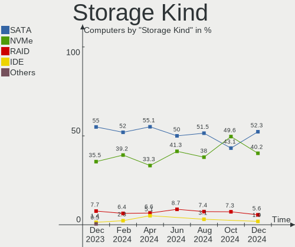
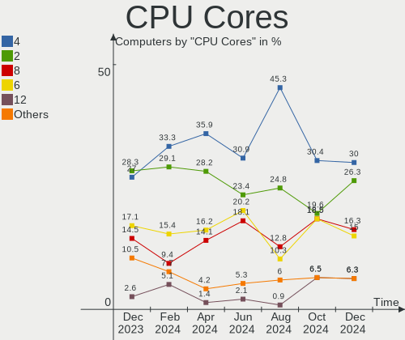
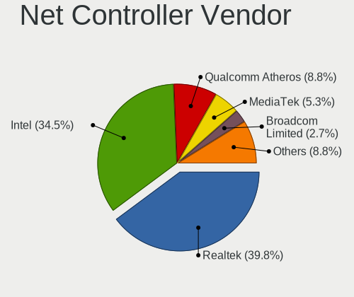
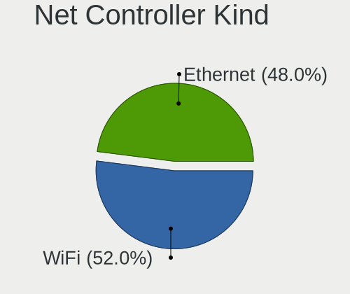

ArcoLinux Hardware Trends
-------------------------

A project to identify most popular hardware characteristics and track their change
over time based on data collected by ArcoLinux users at https://Linux-Hardware.org.

Anyone can contribute to this report by the [hw-probe](https://github.com/linuxhw/hw-probe) tool:

    sudo -E hw-probe -all -upload

This is a report for all computer types. See also reports for [desktops](/Dist/ArcoLinux/Desktop/README.md) and [notebooks](/Dist/ArcoLinux/Notebook/README.md).

Full-feature report is available here: https://linux-hardware.org/?view=trends

Period: Oct, 2021.

Contents
--------

* [ System ](#system)
  - [ OS                       ](#os)
  - [ OS Family                ](#os-family)
  - [ Kernel                   ](#kernel)
  - [ Kernel Family            ](#kernel-family)
  - [ Kernel Major Ver.        ](#kernel-major-ver)
  - [ Arch                     ](#arch)
  - [ DE                       ](#de)
  - [ Display Server           ](#display-server)
  - [ Display Manager          ](#display-manager)
  - [ OS Lang                  ](#os-lang)
  - [ Boot Mode                ](#boot-mode)
  - [ Filesystem               ](#filesystem)
  - [ Part. scheme             ](#part-scheme)
  - [ Dual Boot with Linux/BSD ](#dual-boot-with-linuxbsd)
  - [ Dual Boot (Win)          ](#dual-boot-win)

* [ Board ](#board)
  - [ Vendor                   ](#vendor)
  - [ Model                    ](#model)
  - [ Model Family             ](#model-family)
  - [ MFG Year                 ](#mfg-year)
  - [ Form Factor              ](#form-factor)
  - [ Secure Boot              ](#secure-boot)
  - [ Coreboot                 ](#coreboot)
  - [ RAM Size                 ](#ram-size)
  - [ RAM Used                 ](#ram-used)
  - [ Total Drives             ](#total-drives)
  - [ Has CD-ROM               ](#has-cd-rom)
  - [ Has Ethernet             ](#has-ethernet)
  - [ Has WiFi                 ](#has-wifi)
  - [ Has Bluetooth            ](#has-bluetooth)

* [ Location ](#location)
  - [ Country                  ](#country)
  - [ City                     ](#city)

* [ Drives ](#drives)
  - [ Drive Vendor             ](#drive-vendor)
  - [ Drive Model              ](#drive-model)
  - [ HDD Vendor               ](#hdd-vendor)
  - [ SSD Vendor               ](#ssd-vendor)
  - [ Drive Kind               ](#drive-kind)
  - [ Drive Connector          ](#drive-connector)
  - [ Drive Size               ](#drive-size)
  - [ Space Total              ](#space-total)
  - [ Space Used               ](#space-used)
  - [ Malfunc. Drives          ](#malfunc-drives)
  - [ Malfunc. Drive Vendor    ](#malfunc-drive-vendor)
  - [ Malfunc. HDD Vendor      ](#malfunc-hdd-vendor)
  - [ Malfunc. Drive Kind      ](#malfunc-drive-kind)
  - [ Failed Drives            ](#failed-drives)
  - [ Failed Drive Vendor      ](#failed-drive-vendor)
  - [ Drive Status             ](#drive-status)

* [ Storage controller ](#storage-controller)
  - [ Storage Vendor           ](#storage-vendor)
  - [ Storage Model            ](#storage-model)
  - [ Storage Kind             ](#storage-kind)

* [ Processor ](#processor)
  - [ CPU Vendor               ](#cpu-vendor)
  - [ CPU Model                ](#cpu-model)
  - [ CPU Model Family         ](#cpu-model-family)
  - [ CPU Cores                ](#cpu-cores)
  - [ CPU Sockets              ](#cpu-sockets)
  - [ CPU Threads              ](#cpu-threads)
  - [ CPU Op-Modes             ](#cpu-op-modes)
  - [ CPU Microcode            ](#cpu-microcode)
  - [ CPU Microarch            ](#cpu-microarch)

* [ Graphics ](#graphics)
  - [ GPU Vendor               ](#gpu-vendor)
  - [ GPU Model                ](#gpu-model)
  - [ GPU Combo                ](#gpu-combo)
  - [ GPU Driver               ](#gpu-driver)
  - [ GPU Memory               ](#gpu-memory)

* [ Monitor ](#monitor)
  - [ Monitor Vendor           ](#monitor-vendor)
  - [ Monitor Model            ](#monitor-model)
  - [ Monitor Resolution       ](#monitor-resolution)
  - [ Monitor Diagonal         ](#monitor-diagonal)
  - [ Monitor Width            ](#monitor-width)
  - [ Aspect Ratio             ](#aspect-ratio)
  - [ Monitor Area             ](#monitor-area)
  - [ Pixel Density            ](#pixel-density)
  - [ Multiple Monitors        ](#multiple-monitors)

* [ Network ](#network)
  - [ Net Controller Vendor    ](#net-controller-vendor)
  - [ Net Controller Model     ](#net-controller-model)
  - [ Wireless Vendor          ](#wireless-vendor)
  - [ Wireless Model           ](#wireless-model)
  - [ Ethernet Vendor          ](#ethernet-vendor)
  - [ Ethernet Model           ](#ethernet-model)
  - [ Net Controller Kind      ](#net-controller-kind)
  - [ Used Controller          ](#used-controller)
  - [ NICs                     ](#nics)
  - [ IPv6                     ](#ipv6)

* [ Bluetooth ](#bluetooth)
  - [ Bluetooth Vendor         ](#bluetooth-vendor)
  - [ Bluetooth Model          ](#bluetooth-model)

* [ Sound ](#sound)
  - [ Sound Vendor             ](#sound-vendor)
  - [ Sound Model              ](#sound-model)

* [ Memory ](#memory)
  - [ Memory Vendor            ](#memory-vendor)
  - [ Memory Model             ](#memory-model)
  - [ Memory Kind              ](#memory-kind)
  - [ Memory Form Factor       ](#memory-form-factor)
  - [ Memory Size              ](#memory-size)
  - [ Memory Speed             ](#memory-speed)

* [ Printers & scanners ](#printers--scanners)
  - [ Printer Vendor           ](#printer-vendor)
  - [ Printer Model            ](#printer-model)
  - [ Scanner Vendor           ](#scanner-vendor)
  - [ Scanner Model            ](#scanner-model)

* [ Camera ](#camera)
  - [ Camera Vendor            ](#camera-vendor)
  - [ Camera Model             ](#camera-model)

* [ Security ](#security)
  - [ Fingerprint Vendor       ](#fingerprint-vendor)
  - [ Fingerprint Model        ](#fingerprint-model)
  - [ Chipcard Vendor          ](#chipcard-vendor)
  - [ Chipcard Model           ](#chipcard-model)

* [ Unsupported ](#unsupported)
  - [ Unsupported Devices      ](#unsupported-devices)
  - [ Unsupported Device Types ](#unsupported-device-types)

System
------

OS
--

Installed operating systems

| Name              | Computers | Percent |
|-------------------|-----------|---------|
| ArcoLinux Rolling | 80        | 97.56%  |
| ArcoLinux         | 2         | 2.44%   |

OS Family
---------

OS without a version

| Name      | Computers | Percent |
|-----------|-----------|---------|
| ArcoLinux | 82        | 100%    |

Kernel
------

Version of the Linux kernel

| Version            | Computers | Percent |
|--------------------|-----------|---------|
| 5.14.12-arch1-1    | 21        | 25.61%  |
| 5.14.14-arch1-1    | 13        | 15.85%  |
| 5.14.9-arch2-1     | 8         | 9.76%   |
| 5.14.8-arch1-1     | 5         | 6.1%    |
| 5.14.11-arch1-1    | 5         | 6.1%    |
| 5.13.13-arch1-1    | 5         | 6.1%    |
| 5.14.9-zen2-1-zen  | 4         | 4.88%   |
| 5.14.11-zen1-1-zen | 3         | 3.66%   |
| 5.10.70-1-lts      | 2         | 2.44%   |
| 5.14.9-xanmod1-1   | 1         | 1.22%   |
| 5.14.8-zen1-1-zen  | 1         | 1.22%   |
| 5.14.7-arch1-1     | 1         | 1.22%   |
| 5.14.3-arch1-1     | 1         | 1.22%   |
| 5.14.14-zen1-1-zen | 1         | 1.22%   |
| 5.14.12-zen1-1-zen | 1         | 1.22%   |
| 5.14.12-xanmod1-1  | 1         | 1.22%   |
| 5.14.12-AMD-znver2 | 1         | 1.22%   |
| 5.14.10-zen1-1-zen | 1         | 1.22%   |
| 5.14.10-arch1-1    | 1         | 1.22%   |
| 5.13.8-arch1-1     | 1         | 1.22%   |
| 5.10.73-1-lts      | 1         | 1.22%   |
| 5.10.72-1-lts      | 1         | 1.22%   |
| 5.10.71-1-lts      | 1         | 1.22%   |
| 5.10.69-1-lts      | 1         | 1.22%   |
| 5.10.63-1-lts      | 1         | 1.22%   |

Kernel Family
-------------

Linux kernel without a distro release

| Version | Computers | Percent |
|---------|-----------|---------|
| 5.14.12 | 24        | 29.27%  |
| 5.14.14 | 14        | 17.07%  |
| 5.14.9  | 13        | 15.85%  |
| 5.14.11 | 8         | 9.76%   |
| 5.14.8  | 6         | 7.32%   |
| 5.13.13 | 5         | 6.1%    |
| 5.14.10 | 2         | 2.44%   |
| 5.10.70 | 2         | 2.44%   |
| 5.14.7  | 1         | 1.22%   |
| 5.14.3  | 1         | 1.22%   |
| 5.13.8  | 1         | 1.22%   |
| 5.10.73 | 1         | 1.22%   |
| 5.10.72 | 1         | 1.22%   |
| 5.10.71 | 1         | 1.22%   |
| 5.10.69 | 1         | 1.22%   |
| 5.10.63 | 1         | 1.22%   |

Kernel Major Ver.
-----------------

Linux kernel major version

| Version | Computers | Percent |
|---------|-----------|---------|
| 5.14    | 69        | 84.15%  |
| 5.10    | 7         | 8.54%   |
| 5.13    | 6         | 7.32%   |

Arch
----

OS architecture (x86_64, i586, etc.)

| Name   | Computers | Percent |
|--------|-----------|---------|
| x86_64 | 82        | 100%    |

DE
--

Desktop Environment

| Name           | Computers | Percent |
|----------------|-----------|---------|
| XFCE           | 21        | 25.61%  |
| KDE5           | 18        | 21.95%  |
| i3             | 12        | 14.63%  |
| xmonad         | 5         | 6.1%    |
| qtile          | 5         | 6.1%    |
| GNOME          | 5         | 6.1%    |
| awesome        | 4         | 4.88%   |
| X-Cinnamon     | 3         | 3.66%   |
| herbstluftwm   | 2         | 2.44%   |
| bspwm          | 2         | 2.44%   |
| Unknown        | 2         | 2.44%   |
| LXQt           | 1         | 1.22%   |
| i3-with-shmlog | 1         | 1.22%   |
| dwm            | 1         | 1.22%   |

Display Server
--------------

X11 or Wayland

| Name    | Computers | Percent |
|---------|-----------|---------|
| X11     | 77        | 93.9%   |
| Tty     | 3         | 3.66%   |
| Wayland | 2         | 2.44%   |

Display Manager
---------------

SDDM, LightDM, etc.

| Name    | Computers | Percent |
|---------|-----------|---------|
| SDDM    | 48        | 58.54%  |
| LightDM | 30        | 36.59%  |
| Unknown | 3         | 3.66%   |
| GDM     | 1         | 1.22%   |

OS Lang
-------

Language

| Lang  | Computers | Percent |
|-------|-----------|---------|
| en_US | 43        | 52.44%  |
| en_GB | 12        | 14.63%  |
| en_AU | 6         | 7.32%   |
| de_DE | 3         | 3.66%   |
| pt_BR | 2         | 2.44%   |
| en_IN | 2         | 2.44%   |
| en_CA | 2         | 2.44%   |
| zh_CN | 1         | 1.22%   |
| pt_PT | 1         | 1.22%   |
| pl_PL | 1         | 1.22%   |
| ja_JP | 1         | 1.22%   |
| fr_FR | 1         | 1.22%   |
| fr_BE | 1         | 1.22%   |
| es_MX | 1         | 1.22%   |
| es_ES | 1         | 1.22%   |
| en_ZA | 1         | 1.22%   |
| en_DK | 1         | 1.22%   |
| el_GR | 1         | 1.22%   |
| C     | 1         | 1.22%   |

Boot Mode
---------

EFI or BIOS

| Mode | Computers | Percent |
|------|-----------|---------|
| EFI  | 67        | 81.71%  |
| BIOS | 15        | 18.29%  |

Filesystem
----------

Type of filesystem

| Type    | Computers | Percent |
|---------|-----------|---------|
| Ext4    | 63        | 76.83%  |
| Btrfs   | 14        | 17.07%  |
| Overlay | 3         | 3.66%   |
| F2fs    | 2         | 2.44%   |

Part. scheme
------------

Scheme of partitioning

| Type    | Computers | Percent |
|---------|-----------|---------|
| GPT     | 72        | 87.8%   |
| MBR     | 7         | 8.54%   |
| Unknown | 3         | 3.66%   |

Dual Boot with Linux/BSD
------------------------

Hosting more than one Linux/BSD

| Dual boot | Computers | Percent |
|-----------|-----------|---------|
| No        | 58        | 70.73%  |
| Yes       | 24        | 29.27%  |

Dual Boot (Win)
---------------

Hosting Linux and Windows

| Dual boot | Computers | Percent |
|-----------|-----------|---------|
| No        | 46        | 56.1%   |
| Yes       | 36        | 43.9%   |

Board
-----

Vendor
------

Motherboard manufacturer

| Name                | Computers | Percent |
|---------------------|-----------|---------|
| ASUSTek Computer    | 20        | 24.39%  |
| MSI                 | 9         | 10.98%  |
| Gigabyte Technology | 9         | 10.98%  |
| Dell                | 8         | 9.76%   |
| Lenovo              | 7         | 8.54%   |
| Acer                | 6         | 7.32%   |
| Hewlett-Packard     | 4         | 4.88%   |
| ASRock              | 4         | 4.88%   |
| Apple               | 3         | 3.66%   |
| Razer               | 2         | 2.44%   |
| Intel               | 2         | 2.44%   |
| UNITCOM             | 1         | 1.22%   |
| TUXEDO              | 1         | 1.22%   |
| System76            | 1         | 1.22%   |
| Samsung Electronics | 1         | 1.22%   |
| Pegatron            | 1         | 1.22%   |
| Monster             | 1         | 1.22%   |
| HUAWEI              | 1         | 1.22%   |
| Alienware           | 1         | 1.22%   |

Model
-----

Motherboard model

| Name                                     | Computers | Percent |
|------------------------------------------|-----------|---------|
| ASUS All Series                          | 3         | 3.66%   |
| MSI MS-7971                              | 2         | 2.44%   |
| Lenovo G50-30 80G0                       | 2         | 2.44%   |
| UNITCOM W55xEU                           | 1         | 1.22%   |
| System76 Pangolin                        | 1         | 1.22%   |
| Samsung 550P5C/550P7C                    | 1         | 1.22%   |
| Razer Blade Stealth                      | 1         | 1.22%   |
| Razer Blade                              | 1         | 1.22%   |
| Pegatron p2-1110l                        | 1         | 1.22%   |
| MSI MS-7D22                              | 1         | 1.22%   |
| MSI MS-7C91                              | 1         | 1.22%   |
| MSI MS-7C02                              | 1         | 1.22%   |
| MSI MS-7B89                              | 1         | 1.22%   |
| MSI MS-7751                              | 1         | 1.22%   |
| MSI GS66 Stealth 10SFS                   | 1         | 1.22%   |
| MSI GE63 Raider RGB 8RE                  | 1         | 1.22%   |
| Monster ABRA A5 V11.1                    | 1         | 1.22%   |
| Lenovo Y520-15IKBN 80WK                  | 1         | 1.22%   |
| Lenovo ThinkPad X1 Yoga 2nd 20JES5033F   | 1         | 1.22%   |
| Lenovo ThinkPad X1 Carbon 5th 20HR002BMX | 1         | 1.22%   |
| Lenovo ThinkPad E15 20RD0011AU           | 1         | 1.22%   |
| Lenovo ThinkBook 14-IIL 20SL             | 1         | 1.22%   |
| Intel NUC8i7BEH                          | 1         | 1.22%   |
| Intel NUC11PHi7                          | 1         | 1.22%   |
| HUAWEI WRT-WX9                           | 1         | 1.22%   |
| HP ProBook 450 G3                        | 1         | 1.22%   |
| HP ENVY x360 Convertible 15-ee0xxx       | 1         | 1.22%   |
| HP EliteBook 840 G3                      | 1         | 1.22%   |
| HP Desktop M01-F1xxx                     | 1         | 1.22%   |
| Gigabyte Z170-Gaming K3                  | 1         | 1.22%   |
| Gigabyte X570 AORUS PRO WIFI             | 1         | 1.22%   |
| Gigabyte X570 AORUS MASTER               | 1         | 1.22%   |
| Gigabyte Komputer                        | 1         | 1.22%   |
| Gigabyte H370AORUSGAMING3WIFI            | 1         | 1.22%   |
| Gigabyte F2A88XM-D3HP                    | 1         | 1.22%   |
| Gigabyte B450M DS3H V2                   | 1         | 1.22%   |
| Gigabyte B450 AORUS M                    | 1         | 1.22%   |
| Gigabyte B365M GAMING HD                 | 1         | 1.22%   |
| Dell XPS 13 9343                         | 1         | 1.22%   |
| Dell Vostro 3888                         | 1         | 1.22%   |
| Dell Precision M4800                     | 1         | 1.22%   |
| Dell Precision 7510                      | 1         | 1.22%   |
| Dell Latitude E7440                      | 1         | 1.22%   |
| Dell Latitude E6540                      | 1         | 1.22%   |
| Dell Latitude 5410                       | 1         | 1.22%   |
| Dell Inspiron 3520                       | 1         | 1.22%   |
| ASUS X580VD                              | 1         | 1.22%   |
| ASUS X555LD                              | 1         | 1.22%   |
| ASUS VivoBook_ASUS Laptop X510UNO        | 1         | 1.22%   |
| ASUS TUF Z390M-PRO GAMING                | 1         | 1.22%   |
| ASUS TUF Gaming FX505DD_FX505DD          | 1         | 1.22%   |
| ASUS STRIX B250F GAMING                  | 1         | 1.22%   |
| ASUS ROG STRIX X570-E GAMING             | 1         | 1.22%   |
| ASUS ROG STRIX B460-H GAMING             | 1         | 1.22%   |
| ASUS ROG STRIX B450-F GAMING II          | 1         | 1.22%   |
| ASUS ROG Maximus X HERO                  | 1         | 1.22%   |
| ASUS ROG CROSSHAIR VIII HERO             | 1         | 1.22%   |
| ASUS PRIME Z590-A                        | 1         | 1.22%   |
| ASUS PRIME Z490-A                        | 1         | 1.22%   |
| ASUS N53Jq                               | 1         | 1.22%   |

Model Family
------------

Motherboard model prefix

| Name                          | Computers | Percent |
|-------------------------------|-----------|---------|
| ASUS ROG                      | 5         | 6.1%    |
| Acer Aspire                   | 4         | 4.88%   |
| Lenovo ThinkPad               | 3         | 3.66%   |
| Dell Latitude                 | 3         | 3.66%   |
| ASUS All                      | 3         | 3.66%   |
| Razer Blade                   | 2         | 2.44%   |
| MSI MS-7971                   | 2         | 2.44%   |
| Lenovo G50-30                 | 2         | 2.44%   |
| Gigabyte X570                 | 2         | 2.44%   |
| Dell Precision                | 2         | 2.44%   |
| ASUS TUF                      | 2         | 2.44%   |
| ASUS PRIME                    | 2         | 2.44%   |
| Acer Nitro                    | 2         | 2.44%   |
| UNITCOM W55xEU                | 1         | 1.22%   |
| System76 Pangolin             | 1         | 1.22%   |
| Samsung 550P5C                | 1         | 1.22%   |
| Pegatron p2-1110l             | 1         | 1.22%   |
| MSI MS-7D22                   | 1         | 1.22%   |
| MSI MS-7C91                   | 1         | 1.22%   |
| MSI MS-7C02                   | 1         | 1.22%   |
| MSI MS-7B89                   | 1         | 1.22%   |
| MSI MS-7751                   | 1         | 1.22%   |
| MSI GS66                      | 1         | 1.22%   |
| MSI GE63                      | 1         | 1.22%   |
| Monster ABRA                  | 1         | 1.22%   |
| Lenovo Y520-15IKBN            | 1         | 1.22%   |
| Lenovo ThinkBook              | 1         | 1.22%   |
| Intel NUC8i7BEH               | 1         | 1.22%   |
| Intel NUC11PHi7               | 1         | 1.22%   |
| HUAWEI WRT-WX9                | 1         | 1.22%   |
| HP ProBook                    | 1         | 1.22%   |
| HP ENVY                       | 1         | 1.22%   |
| HP EliteBook                  | 1         | 1.22%   |
| HP Desktop                    | 1         | 1.22%   |
| Gigabyte Z170-Gaming          | 1         | 1.22%   |
| Gigabyte Komputer             | 1         | 1.22%   |
| Gigabyte H370AORUSGAMING3WIFI | 1         | 1.22%   |
| Gigabyte F2A88XM-D3HP         | 1         | 1.22%   |
| Gigabyte B450M                | 1         | 1.22%   |
| Gigabyte B450                 | 1         | 1.22%   |
| Gigabyte B365M                | 1         | 1.22%   |
| Dell XPS                      | 1         | 1.22%   |
| Dell Vostro                   | 1         | 1.22%   |
| Dell Inspiron                 | 1         | 1.22%   |
| ASUS X580VD                   | 1         | 1.22%   |
| ASUS X555LD                   | 1         | 1.22%   |
| ASUS VivoBook                 | 1         | 1.22%   |
| ASUS STRIX                    | 1         | 1.22%   |
| ASUS N53Jq                    | 1         | 1.22%   |
| ASUS M4A79XTD                 | 1         | 1.22%   |
| ASUS K53E                     | 1         | 1.22%   |
| ASUS ASUS                     | 1         | 1.22%   |
| ASRock FM2A75M                | 1         | 1.22%   |
| ASRock B450M                  | 1         | 1.22%   |
| ASRock B360M                  | 1         | 1.22%   |
| ASRock 4X4                    | 1         | 1.22%   |
| Apple MacBookPro8             | 1         | 1.22%   |
| Apple iMac18                  | 1         | 1.22%   |
| Apple iMac14                  | 1         | 1.22%   |
| Alienware 17                  | 1         | 1.22%   |

MFG Year
--------

Motherboard manufacture year

| Year | Computers | Percent |
|------|-----------|---------|
| 2021 | 21        | 25.61%  |
| 2020 | 17        | 20.73%  |
| 2019 | 12        | 14.63%  |
| 2018 | 9         | 10.98%  |
| 2014 | 5         | 6.1%    |
| 2017 | 4         | 4.88%   |
| 2016 | 3         | 3.66%   |
| 2015 | 3         | 3.66%   |
| 2013 | 2         | 2.44%   |
| 2012 | 2         | 2.44%   |
| 2011 | 2         | 2.44%   |
| 2010 | 1         | 1.22%   |
| 2007 | 1         | 1.22%   |

Form Factor
-----------

Physical design of the computer

| Name        | Computers | Percent |
|-------------|-----------|---------|
| Notebook    | 39        | 47.56%  |
| Desktop     | 37        | 45.12%  |
| Convertible | 2         | 2.44%   |
| Mini pc     | 2         | 2.44%   |
| All in one  | 2         | 2.44%   |

Secure Boot
-----------

Enabled or disabled

| State    | Computers | Percent |
|----------|-----------|---------|
| Disabled | 82        | 100%    |

Coreboot
--------

Have coreboot on board

| Used | Computers | Percent |
|------|-----------|---------|
| No   | 82        | 100%    |

RAM Size
--------

Total RAM memory

| Size in GB  | Computers | Percent |
|-------------|-----------|---------|
| 16.01-24.0  | 29        | 35.37%  |
| 4.01-8.0    | 13        | 15.85%  |
| 32.01-64.0  | 13        | 15.85%  |
| 8.01-16.0   | 11        | 13.41%  |
| 64.01-256.0 | 6         | 7.32%   |
| 3.01-4.0    | 5         | 6.1%    |
| 1.01-2.0    | 3         | 3.66%   |
| 24.01-32.0  | 2         | 2.44%   |

RAM Used
--------

Used RAM memory

| Used GB    | Computers | Percent |
|------------|-----------|---------|
| 2.01-3.0   | 25        | 30.49%  |
| 1.01-2.0   | 21        | 25.61%  |
| 4.01-8.0   | 17        | 20.73%  |
| 3.01-4.0   | 9         | 10.98%  |
| 0.51-1.0   | 6         | 7.32%   |
| 24.01-32.0 | 1         | 1.22%   |
| 16.01-24.0 | 1         | 1.22%   |
| 8.01-16.0  | 1         | 1.22%   |
| 0.01-0.5   | 1         | 1.22%   |

Total Drives
------------

Number of drives on board

| Drives | Computers | Percent |
|--------|-----------|---------|
| 2      | 33        | 40.24%  |
| 1      | 27        | 32.93%  |
| 3      | 8         | 9.76%   |
| 5      | 5         | 6.1%    |
| 4      | 5         | 6.1%    |
| 7      | 2         | 2.44%   |
| 6      | 2         | 2.44%   |

Has CD-ROM
----------

Has CD-ROM on board

| Presented | Computers | Percent |
|-----------|-----------|---------|
| No        | 62        | 75.61%  |
| Yes       | 20        | 24.39%  |

Has Ethernet
------------

Has Ethernet on board

| Presented | Computers | Percent |
|-----------|-----------|---------|
| Yes       | 75        | 91.46%  |
| No        | 7         | 8.54%   |

Has WiFi
--------

Has WiFi module

| Presented | Computers | Percent |
|-----------|-----------|---------|
| Yes       | 60        | 73.17%  |
| No        | 22        | 26.83%  |

Has Bluetooth
-------------

Has Bluetooth module

| Presented | Computers | Percent |
|-----------|-----------|---------|
| Yes       | 59        | 71.95%  |
| No        | 23        | 28.05%  |

Location
--------

Country
-------

Geographic location (country)

| Country      | Computers | Percent |
|--------------|-----------|---------|
| USA          | 13        | 15.85%  |
| UK           | 10        | 12.2%   |
| Australia    | 6         | 7.32%   |
| India        | 4         | 4.88%   |
| Germany      | 4         | 4.88%   |
| Canada       | 4         | 4.88%   |
| Belgium      | 3         | 3.66%   |
| Ukraine      | 2         | 2.44%   |
| Turkey       | 2         | 2.44%   |
| South Africa | 2         | 2.44%   |
| Portugal     | 2         | 2.44%   |
| Poland       | 2         | 2.44%   |
| Norway       | 2         | 2.44%   |
| Netherlands  | 2         | 2.44%   |
| Hong Kong    | 2         | 2.44%   |
| Greece       | 2         | 2.44%   |
| France       | 2         | 2.44%   |
| Brazil       | 2         | 2.44%   |
| Vietnam      | 1         | 1.22%   |
| Switzerland  | 1         | 1.22%   |
| Spain        | 1         | 1.22%   |
| Russia       | 1         | 1.22%   |
| Romania      | 1         | 1.22%   |
| Nepal        | 1         | 1.22%   |
| Mexico       | 1         | 1.22%   |
| Lithuania    | 1         | 1.22%   |
| Japan        | 1         | 1.22%   |
| Indonesia    | 1         | 1.22%   |
| El Salvador  | 1         | 1.22%   |
| Denmark      | 1         | 1.22%   |
| Croatia      | 1         | 1.22%   |
| China        | 1         | 1.22%   |
| Bulgaria     | 1         | 1.22%   |
| Azerbaijan   | 1         | 1.22%   |

City
----

Geographic location (city)

| City                   | Computers | Percent |
|------------------------|-----------|---------|
| Brisbane               | 4         | 4.88%   |
| Lerwick                | 3         | 3.66%   |
| Lisbon                 | 2         | 2.44%   |
| Leverkusen             | 2         | 2.44%   |
| Central                | 2         | 2.44%   |
| Winschoten             | 1         | 1.22%   |
| Wantage                | 1         | 1.22%   |
| Villanueva de la Torre | 1         | 1.22%   |
| Villahermosa           | 1         | 1.22%   |
| Umargam                | 1         | 1.22%   |
| Tucson                 | 1         | 1.22%   |
| Toulouse               | 1         | 1.22%   |
| Toronto                | 1         | 1.22%   |
| Tampa                  | 1         | 1.22%   |
| Sydney                 | 1         | 1.22%   |
| Staten Island          | 1         | 1.22%   |
| Smyrna                 | 1         | 1.22%   |
| Serres                 | 1         | 1.22%   |
| S??o Paulo             | 1         | 1.22%   |
| San Salvador           | 1         | 1.22%   |
| Rybinsk                | 1         | 1.22%   |
| Rennes                 | 1         | 1.22%   |
| Reading                | 1         | 1.22%   |
| Qu?©bec                | 1         | 1.22%   |
| Pune                   | 1         | 1.22%   |
| Pula                   | 1         | 1.22%   |
| Plano                  | 1         | 1.22%   |
| Peterborough           | 1         | 1.22%   |
| Ostermundigen          | 1         | 1.22%   |
| Oslo                   | 1         | 1.22%   |
| Novi Pazar             | 1         | 1.22%   |
| Nerima                 | 1         | 1.22%   |
| Nelspruit              | 1         | 1.22%   |
| Moelfre                | 1         | 1.22%   |
| Middletown             | 1         | 1.22%   |
| Miami Beach            | 1         | 1.22%   |
| Melbourne              | 1         | 1.22%   |
| Louisville             | 1         | 1.22%   |
| Limal                  | 1         | 1.22%   |
| Kyiv                   | 1         | 1.22%   |
| Klaip?—da              | 1         | 1.22%   |
| Kathmandu              | 1         | 1.22%   |
| Jundia?­               | 1         | 1.22%   |
| Hyderabad              | 1         | 1.22%   |
| Holte                  | 1         | 1.22%   |
| Hinchley Wood          | 1         | 1.22%   |
| Hanoi                  | 1         | 1.22%   |
| Hamar                  | 1         | 1.22%   |
| Grays                  | 1         | 1.22%   |
| Gotha                  | 1         | 1.22%   |
| Gooding                | 1         | 1.22%   |
| Glasgow                | 1         | 1.22%   |
| Gdynia                 | 1         | 1.22%   |
| Gdansk                 | 1         | 1.22%   |
| Enghien                | 1         | 1.22%   |
| Duffel                 | 1         | 1.22%   |
| Dnipro                 | 1         | 1.22%   |
| Denpasar               | 1         | 1.22%   |
| Demorest               | 1         | 1.22%   |
| Dallas                 | 1         | 1.22%   |

Drives
------

Drive Vendor
------------

Hard drive vendors

| Vendor              | Computers | Drives | Percent |
|---------------------|-----------|--------|---------|
| Samsung Electronics | 31        | 41     | 19.87%  |
| WDC                 | 27        | 31     | 17.31%  |
| Seagate             | 19        | 22     | 12.18%  |
| Toshiba             | 10        | 14     | 6.41%   |
| Kingston            | 8         | 10     | 5.13%   |
| Intel               | 8         | 8      | 5.13%   |
| Crucial             | 7         | 10     | 4.49%   |
| SanDisk             | 5         | 6      | 3.21%   |
| Gigabyte Technology | 3         | 3      | 1.92%   |
| A-DATA Technology   | 3         | 3      | 1.92%   |
| XPG                 | 2         | 2      | 1.28%   |
| Unknown             | 2         | 2      | 1.28%   |
| Transcend           | 2         | 2      | 1.28%   |
| SPCC                | 2         | 2      | 1.28%   |
| PNY                 | 2         | 2      | 1.28%   |
| Micron Technology   | 2         | 2      | 1.28%   |
| KingSpec            | 2         | 2      | 1.28%   |
| Intenso             | 2         | 2      | 1.28%   |
| Hitachi             | 2         | 2      | 1.28%   |
| HGST                | 2         | 4      | 1.28%   |
| Apple               | 2         | 4      | 1.28%   |
| Vaseky              | 1         | 1      | 0.64%   |
| Team                | 1         | 1      | 0.64%   |
| SK Hynix            | 1         | 1      | 0.64%   |
| Patriot             | 1         | 1      | 0.64%   |
| OSCOO               | 1         | 1      | 0.64%   |
| NGFF                | 1         | 1      | 0.64%   |
| Lenovo              | 1         | 1      | 0.64%   |
| JMicron             | 1         | 1      | 0.64%   |
| Hewlett-Packard     | 1         | 1      | 0.64%   |
| GOODRAM             | 1         | 1      | 0.64%   |
| Corsair             | 1         | 1      | 0.64%   |
| Apricorn            | 1         | 1      | 0.64%   |
| AMD                 | 1         | 2      | 0.64%   |

Drive Model
-----------

Hard drive models

| Model                                | Computers | Percent |
|--------------------------------------|-----------|---------|
| WDC WD10EZEX-08WN4A0 1TB             | 3         | 1.7%    |
| Samsung SSD 970 EVO 1TB              | 3         | 1.7%    |
| Samsung SSD 860 EVO 500GB            | 3         | 1.7%    |
| Kingston SA400S37480G 480GB SSD      | 3         | 1.7%    |
| WDC WDS500G2B0A-00SM50 500GB SSD     | 2         | 1.14%   |
| WDC WDS100T3X0C-00SJG0 1TB           | 2         | 1.14%   |
| Toshiba MQ04ABF100 1TB               | 2         | 1.14%   |
| Seagate ST1000LM035-1RK172 1TB       | 2         | 1.14%   |
| Seagate ST1000LM024 HN-M101MBB 1TB   | 2         | 1.14%   |
| Seagate ST1000DM010-2EP102 1TB       | 2         | 1.14%   |
| Samsung SSD 970 PRO 1TB              | 2         | 1.14%   |
| Samsung SSD 970 EVO Plus 500GB       | 2         | 1.14%   |
| Samsung SSD 860 EVO 1TB              | 2         | 1.14%   |
| Kingston SA400S37120G 120GB SSD      | 2         | 1.14%   |
| Intel SSDPEKNW010T8 1TB              | 2         | 1.14%   |
| Crucial CT500MX500SSD1 500GB         | 2         | 1.14%   |
| Crucial CT2000MX500SSD1 2TB          | 2         | 1.14%   |
| Crucial CT1000MX500SSD1 1TB          | 2         | 1.14%   |
| Apple HDD ST1000DM003 1TB            | 2         | 1.14%   |
| XPG SPECTRIX S40G 512GB              | 1         | 0.57%   |
| XPG GAMMIX S5 256GB                  | 1         | 0.57%   |
| WDC WDS500G1X0E-00AFY0 500GB         | 1         | 0.57%   |
| WDC WDS250G1B0C-00S6U0 250GB         | 1         | 0.57%   |
| WDC WDS240G2G0B-00EPW0 240GB SSD     | 1         | 0.57%   |
| WDC WDS100T2B0C-00PXH0 1TB           | 1         | 0.57%   |
| WDC WDS100T2B0A-00SM50 1TB SSD       | 1         | 0.57%   |
| WDC WD6402AAEX-00Z3A0 640GB          | 1         | 0.57%   |
| WDC WD6401AALS-00L3B2 640GB          | 1         | 0.57%   |
| WDC WD6400BEVT-60A0RT0 640GB         | 1         | 0.57%   |
| WDC WD5000BPVT-60HXZT3 500GB         | 1         | 0.57%   |
| WDC WD5000AAKX-603CA0 500GB          | 1         | 0.57%   |
| WDC WD5000AAKX-001CA0 500GB          | 1         | 0.57%   |
| WDC WD5000AAKS-75A7B2 500GB          | 1         | 0.57%   |
| WDC WD3200BEVT-75A23T0 320GB         | 1         | 0.57%   |
| WDC WD3200AAKS-61L9A0 320GB          | 1         | 0.57%   |
| WDC WD3200AAJS-56M0A0 320GB          | 1         | 0.57%   |
| WDC WD3200AAJS-56B4A0 320GB          | 1         | 0.57%   |
| WDC WD20EFRX-68EUZN0 2TB             | 1         | 0.57%   |
| WDC WD10SPZX-21Z10T0 1TB             | 1         | 0.57%   |
| WDC WD10EZEX-75M2NA0 1TB             | 1         | 0.57%   |
| WDC WD10EZEX-00BBHA0 1TB             | 1         | 0.57%   |
| WDC PC SN730 SDBPNTY-1T00-1032 1TB   | 1         | 0.57%   |
| WDC PC SN530 SDBPNPZ-512G-1114 512GB | 1         | 0.57%   |
| WDC PC SN520 SDAPNUW-128G            | 1         | 0.57%   |
| Vaseky V900/128G 128GB SSD           | 1         | 0.57%   |
| Unknown SD/MMC/MS PRO 128GB          | 1         | 0.57%   |
| Unknown ED4QT  128GB                 | 1         | 0.57%   |
| Transcend TS480GSSD220S 480GB        | 1         | 0.57%   |
| Transcend TS1TSSD230S 1TB            | 1         | 0.57%   |
| Toshiba TR200 480GB SSD              | 1         | 0.57%   |
| Toshiba RC500 250GB                  | 1         | 0.57%   |
| Toshiba MQ01ABD100M 1TB              | 1         | 0.57%   |
| Toshiba KBG40ZNT512G MEMORY 512GB    | 1         | 0.57%   |
| Toshiba HDWD130 3TB                  | 1         | 0.57%   |
| Toshiba HDWD110 1TB                  | 1         | 0.57%   |
| Toshiba DT01ACA200 2TB               | 1         | 0.57%   |
| Toshiba DT01ACA100 1TB               | 1         | 0.57%   |
| Team T253TD001T 1TB SSD              | 1         | 0.57%   |
| SPCC Solid State Disk 256GB          | 1         | 0.57%   |
| SPCC Solid State Disk 1TB            | 1         | 0.57%   |

HDD Vendor
----------

Hard disk drive vendors

| Vendor              | Computers | Drives | Percent |
|---------------------|-----------|--------|---------|
| Seagate             | 17        | 19     | 34.69%  |
| WDC                 | 15        | 19     | 30.61%  |
| Toshiba             | 7         | 9      | 14.29%  |
| Samsung Electronics | 2         | 2      | 4.08%   |
| Hitachi             | 2         | 2      | 4.08%   |
| HGST                | 2         | 4      | 4.08%   |
| Apple               | 2         | 2      | 4.08%   |
| Unknown             | 1         | 1      | 2.04%   |
| Intenso             | 1         | 1      | 2.04%   |

SSD Vendor
----------

Solid state drive vendors

| Vendor              | Computers | Drives | Percent |
|---------------------|-----------|--------|---------|
| Samsung Electronics | 16        | 20     | 25.4%   |
| Kingston            | 7         | 8      | 11.11%  |
| Crucial             | 6         | 9      | 9.52%   |
| SanDisk             | 5         | 6      | 7.94%   |
| WDC                 | 4         | 4      | 6.35%   |
| A-DATA Technology   | 3         | 3      | 4.76%   |
| Transcend           | 2         | 2      | 3.17%   |
| SPCC                | 2         | 2      | 3.17%   |
| PNY                 | 2         | 2      | 3.17%   |
| KingSpec            | 2         | 2      | 3.17%   |
| Intel               | 2         | 2      | 3.17%   |
| Vaseky              | 1         | 1      | 1.59%   |
| Toshiba             | 1         | 3      | 1.59%   |
| Team                | 1         | 1      | 1.59%   |
| SK Hynix            | 1         | 1      | 1.59%   |
| Seagate             | 1         | 1      | 1.59%   |
| Patriot             | 1         | 1      | 1.59%   |
| NGFF                | 1         | 1      | 1.59%   |
| Intenso             | 1         | 1      | 1.59%   |
| GOODRAM             | 1         | 1      | 1.59%   |
| Gigabyte Technology | 1         | 1      | 1.59%   |
| Apple               | 1         | 1      | 1.59%   |
| AMD                 | 1         | 2      | 1.59%   |

Drive Kind
----------

HDD or SSD

| Kind    | Computers | Drives | Percent |
|---------|-----------|--------|---------|
| SSD     | 51        | 75     | 36.96%  |
| HDD     | 42        | 59     | 30.43%  |
| NVMe    | 41        | 50     | 29.71%  |
| Unknown | 3         | 3      | 2.17%   |
| MMC     | 1         | 1      | 0.72%   |

Drive Connector
---------------

SATA, SAS, NVMe, etc.

| Type | Computers | Drives | Percent |
|------|-----------|--------|---------|
| SATA | 66        | 129    | 57.89%  |
| NVMe | 41        | 50     | 35.96%  |
| SAS  | 6         | 8      | 5.26%   |
| MMC  | 1         | 1      | 0.88%   |

Drive Size
----------

Size of hard drive

| Size in TB | Computers | Drives | Percent |
|------------|-----------|--------|---------|
| 0.01-0.5   | 49        | 71     | 50%     |
| 0.51-1.0   | 37        | 44     | 37.76%  |
| 1.01-2.0   | 7         | 11     | 7.14%   |
| 3.01-4.0   | 2         | 3      | 2.04%   |
| 2.01-3.0   | 2         | 4      | 2.04%   |
| 4.01-10.0  | 1         | 1      | 1.02%   |

Space Total
-----------

Amount of disk space available on the file system

| Size in GB     | Computers | Percent |
|----------------|-----------|---------|
| 251-500        | 16        | 19.51%  |
| 101-250        | 14        | 17.07%  |
| 501-1000       | 14        | 17.07%  |
| 1001-2000      | 13        | 15.85%  |
| More than 3000 | 7         | 8.54%   |
| 1-20           | 5         | 6.1%    |
| 51-100         | 5         | 6.1%    |
| Unknown        | 4         | 4.88%   |
| 2001-3000      | 3         | 3.66%   |
| 21-50          | 1         | 1.22%   |

Space Used
----------

Amount of used disk space

| Used GB        | Computers | Percent |
|----------------|-----------|---------|
| 1-20           | 19        | 23.17%  |
| 21-50          | 16        | 19.51%  |
| 101-250        | 13        | 15.85%  |
| 251-500        | 12        | 14.63%  |
| 51-100         | 9         | 10.98%  |
| 501-1000       | 4         | 4.88%   |
| Unknown        | 4         | 4.88%   |
| 1001-2000      | 3         | 3.66%   |
| More than 3000 | 2         | 2.44%   |

Malfunc. Drives
---------------

Drive models with a malfunction

| Model                                        | Computers | Drives | Percent |
|----------------------------------------------|-----------|--------|---------|
| XPG SPECTRIX S40G 512GB                      | 1         | 1      | 5.26%   |
| WDC WD6400BEVT-60A0RT0 640GB                 | 1         | 1      | 5.26%   |
| WDC WD5000AAKX-603CA0 500GB                  | 1         | 1      | 5.26%   |
| WDC WD5000AAKX-001CA0 500GB                  | 1         | 1      | 5.26%   |
| WDC WD3200AAJS-56B4A0 320GB                  | 1         | 1      | 5.26%   |
| Transcend TS480GSSD220S 480GB                | 1         | 1      | 5.26%   |
| Transcend TS1TSSD230S 1TB                    | 1         | 1      | 5.26%   |
| Seagate ST9500325AS 500GB                    | 1         | 1      | 5.26%   |
| Seagate ST3500413AS 500GB                    | 1         | 1      | 5.26%   |
| Seagate ST3160023AS 160GB                    | 1         | 1      | 5.26%   |
| Seagate ST31500341AS 1TB                     | 1         | 1      | 5.26%   |
| Seagate ST1000LM024 HN-M101MBB 1TB           | 1         | 1      | 5.26%   |
| SanDisk SSD PLUS 480GB                       | 1         | 1      | 5.26%   |
| Samsung Electronics SSD 870 EVO 2TB          | 1         | 1      | 5.26%   |
| Samsung Electronics MZVLW128HEGR-000L2 128GB | 1         | 1      | 5.26%   |
| Lenovo LENSE20256GMSP34MEAT2TA 256GB         | 1         | 1      | 5.26%   |
| Kingston SA400S37120G 120GB SSD              | 1         | 1      | 5.26%   |
| Intel SSDSA2M160G2GC 160GB                   | 1         | 1      | 5.26%   |
| Hitachi HDS723020BLA642 2TB                  | 1         | 1      | 5.26%   |

Malfunc. Drive Vendor
---------------------

Vendors of faulty drives

| Vendor              | Computers | Drives | Percent |
|---------------------|-----------|--------|---------|
| Seagate             | 5         | 5      | 26.32%  |
| WDC                 | 4         | 4      | 21.05%  |
| Transcend           | 2         | 2      | 10.53%  |
| Samsung Electronics | 2         | 2      | 10.53%  |
| XPG                 | 1         | 1      | 5.26%   |
| SanDisk             | 1         | 1      | 5.26%   |
| Lenovo              | 1         | 1      | 5.26%   |
| Kingston            | 1         | 1      | 5.26%   |
| Intel               | 1         | 1      | 5.26%   |
| Hitachi             | 1         | 1      | 5.26%   |

Malfunc. HDD Vendor
-------------------

Vendors of faulty HDD drives

| Vendor  | Computers | Drives | Percent |
|---------|-----------|--------|---------|
| Seagate | 5         | 5      | 50%     |
| WDC     | 4         | 4      | 40%     |
| Hitachi | 1         | 1      | 10%     |

Malfunc. Drive Kind
-------------------

Kinds of faulty drives

| Kind | Computers | Drives | Percent |
|------|-----------|--------|---------|
| HDD  | 10        | 10     | 52.63%  |
| SSD  | 6         | 6      | 31.58%  |
| NVMe | 3         | 3      | 15.79%  |

Failed Drives
-------------

Failed drive models

Zero info for selected period =(

Failed Drive Vendor
-------------------

Failed drive vendors

Zero info for selected period =(

Drive Status
------------

Number of failed and malfunc. drives

| Status   | Computers | Drives | Percent |
|----------|-----------|--------|---------|
| Works    | 72        | 152    | 70.59%  |
| Malfunc  | 18        | 19     | 17.65%  |
| Detected | 12        | 17     | 11.76%  |

Storage controller
------------------

Storage Vendor
--------------

Storage controller vendors

| Vendor                      | Computers | Percent |
|-----------------------------|-----------|---------|
| Intel                       | 59        | 48.76%  |
| AMD                         | 18        | 14.88%  |
| Samsung Electronics         | 17        | 14.05%  |
| Sandisk                     | 8         | 6.61%   |
| Silicon Motion              | 2         | 1.65%   |
| Realtek Semiconductor       | 2         | 1.65%   |
| Phison Electronics          | 2         | 1.65%   |
| Micron Technology           | 2         | 1.65%   |
| Marvell Technology Group    | 2         | 1.65%   |
| KIOXIA                      | 2         | 1.65%   |
| Kingston Technology Company | 2         | 1.65%   |
| ASMedia Technology          | 2         | 1.65%   |
| Seagate Technology          | 1         | 0.83%   |
| Micron/Crucial Technology   | 1         | 0.83%   |
| Lenovo                      | 1         | 0.83%   |

Storage Model
-------------

Storage controller models

| Model                                                                          | Computers | Percent |
|--------------------------------------------------------------------------------|-----------|---------|
| AMD FCH SATA Controller [AHCI mode]                                            | 13        | 9.77%   |
| Samsung NVMe SSD Controller SM981/PM981/PM983                                  | 10        | 7.52%   |
| AMD 400 Series Chipset SATA Controller                                         | 6         | 4.51%   |
| Intel SSD 660P Series                                                          | 5         | 3.76%   |
| Intel Q170/Q150/B150/H170/H110/Z170/CM236 Chipset SATA Controller [AHCI Mode]  | 5         | 3.76%   |
| Intel Sunrise Point-LP SATA Controller [AHCI mode]                             | 4         | 3.01%   |
| Intel Cannon Lake Mobile PCH SATA AHCI Controller                              | 4         | 3.01%   |
| Sandisk WD Black SN750 / PC SN730 NVMe SSD                                     | 3         | 2.26%   |
| Intel SATA Controller [RAID mode]                                              | 3         | 2.26%   |
| Intel HM170/QM170 Chipset SATA Controller [AHCI Mode]                          | 3         | 2.26%   |
| Intel Cannon Lake PCH SATA AHCI Controller                                     | 3         | 2.26%   |
| Intel 8 Series/C220 Series Chipset Family 6-port SATA Controller 1 [AHCI mode] | 3         | 2.26%   |
| Intel 7 Series Chipset Family 6-port SATA Controller [AHCI mode]               | 3         | 2.26%   |
| Intel 400 Series Chipset Family SATA AHCI Controller                           | 3         | 2.26%   |
| Sandisk WD Blue SN550 NVMe SSD                                                 | 2         | 1.5%    |
| Sandisk WD Blue SN500 / PC SN520 NVMe SSD                                      | 2         | 1.5%    |
| Samsung NVMe SSD Controller SM961/PM961/SM963                                  | 2         | 1.5%    |
| Samsung NVMe SSD Controller PM9A1/PM9A3/980PRO                                 | 2         | 1.5%    |
| Samsung NVMe SSD Controller 980                                                | 2         | 1.5%    |
| Phison E16 PCIe4 NVMe Controller                                               | 2         | 1.5%    |
| Micron Non-Volatile memory controller                                          | 2         | 1.5%    |
| Intel Wildcat Point-LP SATA Controller [AHCI Mode]                             | 2         | 1.5%    |
| Intel Comet Lake SATA AHCI Controller                                          | 2         | 1.5%    |
| Intel C610/X99 series chipset sSATA Controller [AHCI mode]                     | 2         | 1.5%    |
| Intel C610/X99 series chipset 6-Port SATA Controller [AHCI mode]               | 2         | 1.5%    |
| Intel Atom Processor E3800 Series SATA AHCI Controller                         | 2         | 1.5%    |
| Intel 8 Series SATA Controller 1 [AHCI mode]                                   | 2         | 1.5%    |
| Intel 6 Series/C200 Series Chipset Family 6 port Mobile SATA AHCI Controller   | 2         | 1.5%    |
| Intel 500 Series Chipset Family SATA AHCI Controller                           | 2         | 1.5%    |
| Silicon Motion SM2263EN/SM2263XT SSD Controller                                | 1         | 0.75%   |
| Silicon Motion SM2262/SM2262EN SSD Controller                                  | 1         | 0.75%   |
| Seagate FireCuda 520 SSD                                                       | 1         | 0.75%   |
| Sandisk WD Black SN850                                                         | 1         | 0.75%   |
| Samsung Electronics Non-Volatile memory controller                             | 1         | 0.75%   |
| Realtek RTS5763DL NVMe SSD Controller                                          | 1         | 0.75%   |
| Realtek Realtek Non-Volatile memory controller                                 | 1         | 0.75%   |
| Phison PS5013 E13 NVMe Controller                                              | 1         | 0.75%   |
| Micron/Crucial P1 NVMe PCIe SSD                                                | 1         | 0.75%   |
| Marvell Group 88SS9183 PCIe SSD Controller                                     | 1         | 0.75%   |
| Marvell Group 88SE6111/6121 SATA II / PATA Controller                          | 1         | 0.75%   |
| Lenovo Non-Volatile memory controller                                          | 1         | 0.75%   |
| KIOXIA NVMe SSD                                                                | 1         | 0.75%   |
| KIOXIA Non-Volatile memory controller                                          | 1         | 0.75%   |
| Kingston Company U-SNS8154P3 NVMe SSD                                          | 1         | 0.75%   |
| Kingston Company A2000 NVMe SSD                                                | 1         | 0.75%   |
| Intel NVMe Optane Memory Series                                                | 1         | 0.75%   |
| Intel NM10/ICH7 Family SATA Controller [IDE mode]                              | 1         | 0.75%   |
| Intel Ice Lake-LP SATA Controller [AHCI mode]                                  | 1         | 0.75%   |
| Intel Comet Lake PCH-H RAID                                                    | 1         | 0.75%   |
| Intel Cannon Point-LP SATA Controller [AHCI Mode]                              | 1         | 0.75%   |
| Intel 82801 Mobile SATA Controller [RAID mode]                                 | 1         | 0.75%   |
| Intel 8 Series Chipset Family 4-port SATA Controller 1 [IDE mode] - Mobile     | 1         | 0.75%   |
| Intel 7 Series/C210 Series Chipset Family 4-port SATA Controller [IDE mode]    | 1         | 0.75%   |
| Intel 7 Series/C210 Series Chipset Family 2-port SATA Controller [IDE mode]    | 1         | 0.75%   |
| Intel 6 Series/C200 Series Chipset Family 6 port Desktop SATA AHCI Controller  | 1         | 0.75%   |
| Intel 5 Series/3400 Series Chipset 4 port SATA AHCI Controller                 | 1         | 0.75%   |
| Intel 300 Series Chipset Family SATA RAID Controller                           | 1         | 0.75%   |
| Intel 200 Series PCH SATA controller [AHCI mode]                               | 1         | 0.75%   |
| ASMedia ASM1062 Serial ATA Controller                                          | 1         | 0.75%   |
| ASMedia ASM1061 SATA IDE Controller                                            | 1         | 0.75%   |

Storage Kind
------------

Kind of storage controller (IDE, SATA, NVMe, SAS, ...)

| Kind | Computers | Percent |
|------|-----------|---------|
| SATA | 65        | 55.56%  |
| NVMe | 41        | 35.04%  |
| RAID | 6         | 5.13%   |
| IDE  | 5         | 4.27%   |

Processor
---------

CPU Vendor
----------

Processor vendors

| Vendor | Computers | Percent |
|--------|-----------|---------|
| Intel  | 62        | 75.61%  |
| AMD    | 20        | 24.39%  |

CPU Model
---------

Processor models

| Model                                       | Computers | Percent |
|---------------------------------------------|-----------|---------|
| Intel Core i7-8750H CPU @ 2.20GHz           | 3         | 3.66%   |
| Intel Core i7-7700HQ CPU @ 2.80GHz          | 2         | 2.44%   |
| Intel Core i7-4800MQ CPU @ 2.70GHz          | 2         | 2.44%   |
| Intel Core i5-10400 CPU @ 2.90GHz           | 2         | 2.44%   |
| Intel Celeron CPU N2840 @ 2.16GHz           | 2         | 2.44%   |
| AMD Ryzen 9 3900X 12-Core Processor         | 2         | 2.44%   |
| AMD Ryzen 7 3700X 8-Core Processor          | 2         | 2.44%   |
| AMD Ryzen 3 2200G with Radeon Vega Graphics | 2         | 2.44%   |
| Intel Xeon CPU E5-1660 v3 @ 3.00GHz         | 1         | 1.22%   |
| Intel Pentium Dual CPU E2200 @ 2.20GHz      | 1         | 1.22%   |
| Intel Pentium CPU G630T @ 2.30GHz           | 1         | 1.22%   |
| Intel Core M-5Y10c CPU @ 0.80GHz            | 1         | 1.22%   |
| Intel Core i9-10980HK CPU @ 2.40GHz         | 1         | 1.22%   |
| Intel Core i9-10850K CPU @ 3.60GHz          | 1         | 1.22%   |
| Intel Core i7-8700K CPU @ 3.70GHz           | 1         | 1.22%   |
| Intel Core i7-8700 CPU @ 3.20GHz            | 1         | 1.22%   |
| Intel Core i7-8559U CPU @ 2.70GHz           | 1         | 1.22%   |
| Intel Core i7-8550U CPU @ 1.80GHz           | 1         | 1.22%   |
| Intel Core i7-7700K CPU @ 4.20GHz           | 1         | 1.22%   |
| Intel Core i7-7600U CPU @ 2.80GHz           | 1         | 1.22%   |
| Intel Core i7-7500U CPU @ 2.70GHz           | 1         | 1.22%   |
| Intel Core i7-6820HQ CPU @ 2.70GHz          | 1         | 1.22%   |
| Intel Core i7-6700K CPU @ 4.00GHz           | 1         | 1.22%   |
| Intel Core i7-6500U CPU @ 2.50GHz           | 1         | 1.22%   |
| Intel Core i7-5960X CPU @ 3.00GHz           | 1         | 1.22%   |
| Intel Core i7-4770 CPU @ 3.40GHz            | 1         | 1.22%   |
| Intel Core i7-4700MQ CPU @ 2.40GHz          | 1         | 1.22%   |
| Intel Core i7-4510U CPU @ 2.00GHz           | 1         | 1.22%   |
| Intel Core i7-3770K CPU @ 3.50GHz           | 1         | 1.22%   |
| Intel Core i7-3630QM CPU @ 2.40GHz          | 1         | 1.22%   |
| Intel Core i7-3612QM CPU @ 2.10GHz          | 1         | 1.22%   |
| Intel Core i7-10750H CPU @ 2.60GHz          | 1         | 1.22%   |
| Intel Core i7-10700K CPU @ 3.80GHz          | 1         | 1.22%   |
| Intel Core i7-1065G7 CPU @ 1.30GHz          | 1         | 1.22%   |
| Intel Core i7-10610U CPU @ 1.80GHz          | 1         | 1.22%   |
| Intel Core i7-10510U CPU @ 1.80GHz          | 1         | 1.22%   |
| Intel Core i7 CPU Q 740 @ 1.73GHz           | 1         | 1.22%   |
| Intel Core i5-9600K CPU @ 3.70GHz           | 1         | 1.22%   |
| Intel Core i5-9400F CPU @ 2.90GHz           | 1         | 1.22%   |
| Intel Core i5-8400 CPU @ 2.80GHz            | 1         | 1.22%   |
| Intel Core i5-8300H CPU @ 2.30GHz           | 1         | 1.22%   |
| Intel Core i5-8265U CPU @ 1.60GHz           | 1         | 1.22%   |
| Intel Core i5-8250U CPU @ 1.60GHz           | 1         | 1.22%   |
| Intel Core i5-7600K CPU @ 3.80GHz           | 1         | 1.22%   |
| Intel Core i5-7600 CPU @ 3.50GHz            | 1         | 1.22%   |
| Intel Core i5-7300HQ CPU @ 2.50GHz          | 1         | 1.22%   |
| Intel Core i5-7200U CPU @ 2.50GHz           | 1         | 1.22%   |
| Intel Core i5-6500 CPU @ 3.20GHz            | 1         | 1.22%   |
| Intel Core i5-6200U CPU @ 2.30GHz           | 1         | 1.22%   |
| Intel Core i5-5200U CPU @ 2.20GHz           | 1         | 1.22%   |
| Intel Core i5-4570 CPU @ 3.20GHz            | 1         | 1.22%   |
| Intel Core i5-4300U CPU @ 1.90GHz           | 1         | 1.22%   |
| Intel Core i5-3210M CPU @ 2.50GHz           | 1         | 1.22%   |
| Intel Core i5-2435M CPU @ 2.40GHz           | 1         | 1.22%   |
| Intel Core i5-2410M CPU @ 2.30GHz           | 1         | 1.22%   |
| Intel Core i3-10100 CPU @ 3.60GHz           | 1         | 1.22%   |
| Intel 11th Gen Core i7-1165G7 @ 2.80GHz     | 1         | 1.22%   |
| Intel 11th Gen Core i5-11600KF @ 3.90GHz    | 1         | 1.22%   |
| Intel 11th Gen Core i5-11400 @ 2.60GHz      | 1         | 1.22%   |
| AMD Ryzen 9 5900X 12-Core Processor         | 1         | 1.22%   |

CPU Model Family
----------------

Processor model prefix

| Model              | Computers | Percent |
|--------------------|-----------|---------|
| Intel Core i7      | 30        | 36.59%  |
| Intel Core i5      | 20        | 24.39%  |
| AMD Ryzen 9        | 5         | 6.1%    |
| AMD Ryzen 7        | 5         | 6.1%    |
| Other              | 4         | 4.88%   |
| AMD Ryzen 5        | 4         | 4.88%   |
| Intel Core i9      | 2         | 2.44%   |
| Intel Celeron      | 2         | 2.44%   |
| AMD Ryzen 3        | 2         | 2.44%   |
| Intel Xeon         | 1         | 1.22%   |
| Intel Pentium Dual | 1         | 1.22%   |
| Intel Pentium      | 1         | 1.22%   |
| Intel Core M       | 1         | 1.22%   |
| Intel Core i3      | 1         | 1.22%   |
| AMD Phenom II X4   | 1         | 1.22%   |
| AMD A8             | 1         | 1.22%   |
| AMD A10            | 1         | 1.22%   |

CPU Cores
---------

Number of processor cores

| Number | Computers | Percent |
|--------|-----------|---------|
| 4      | 32        | 39.02%  |
| 2      | 19        | 23.17%  |
| 6      | 17        | 20.73%  |
| 8      | 9         | 10.98%  |
| 12     | 3         | 3.66%   |
| 16     | 1         | 1.22%   |
| 10     | 1         | 1.22%   |

CPU Sockets
-----------

Number of sockets

| Number | Computers | Percent |
|--------|-----------|---------|
| 1      | 82        | 100%    |

CPU Threads
-----------

Threads per core (Hyper-Threading)

| Number | Computers | Percent |
|--------|-----------|---------|
| 2      | 64        | 78.05%  |
| 1      | 18        | 21.95%  |

CPU Op-Modes
------------

CPU Operation Modes (32-bit, 64-bit)

| Op mode        | Computers | Percent |
|----------------|-----------|---------|
| 32-bit, 64-bit | 82        | 100%    |

CPU Microcode
-------------

Microcode number

| Number     | Computers | Percent |
|------------|-----------|---------|
| Unknown    | 7         | 8.54%   |
| 0x906ea    | 6         | 7.32%   |
| 0x906e9    | 6         | 7.32%   |
| 0x08701021 | 6         | 7.32%   |
| 0x306c3    | 5         | 6.1%    |
| 0xa0653    | 3         | 3.66%   |
| 0x806ea    | 3         | 3.66%   |
| 0x806e9    | 3         | 3.66%   |
| 0x506e3    | 3         | 3.66%   |
| 0x306a9    | 3         | 3.66%   |
| 0x206a7    | 3         | 3.66%   |
| 0xa0652    | 2         | 2.44%   |
| 0x806ec    | 2         | 2.44%   |
| 0x406e3    | 2         | 2.44%   |
| 0x306f2    | 2         | 2.44%   |
| 0x30678    | 2         | 2.44%   |
| 0x08600104 | 2         | 2.44%   |
| 0x08101016 | 2         | 2.44%   |
| 0xa0671    | 1         | 1.22%   |
| 0xa0655    | 1         | 1.22%   |
| 0x906ec    | 1         | 1.22%   |
| 0x806eb    | 1         | 1.22%   |
| 0x806c1    | 1         | 1.22%   |
| 0x706e5    | 1         | 1.22%   |
| 0x6fd      | 1         | 1.22%   |
| 0x40651    | 1         | 1.22%   |
| 0x306d4    | 1         | 1.22%   |
| 0x106e5    | 1         | 1.22%   |
| 0x0a201016 | 1         | 1.22%   |
| 0x0a201009 | 1         | 1.22%   |
| 0x08600106 | 1         | 1.22%   |
| 0x08600103 | 1         | 1.22%   |
| 0x08108102 | 1         | 1.22%   |
| 0x0800820d | 1         | 1.22%   |
| 0x06006704 | 1         | 1.22%   |
| 0x06003106 | 1         | 1.22%   |
| 0x06001119 | 1         | 1.22%   |
| 0x010000db | 1         | 1.22%   |

CPU Microarch
-------------

Microarchitecture

| Name        | Computers | Percent |
|-------------|-----------|---------|
| KabyLake    | 24        | 29.27%  |
| Zen 2       | 10        | 12.2%   |
| Haswell     | 9         | 10.98%  |
| CometLake   | 7         | 8.54%   |
| Skylake     | 5         | 6.1%    |
| IvyBridge   | 4         | 4.88%   |
| SandyBridge | 3         | 3.66%   |
| Zen+        | 2         | 2.44%   |
| Zen 3       | 2         | 2.44%   |
| Zen         | 2         | 2.44%   |
| Silvermont  | 2         | 2.44%   |
| IceLake     | 2         | 2.44%   |
| Broadwell   | 2         | 2.44%   |
| TigerLake   | 1         | 1.22%   |
| Steamroller | 1         | 1.22%   |
| Piledriver  | 1         | 1.22%   |
| Nehalem     | 1         | 1.22%   |
| K10         | 1         | 1.22%   |
| Excavator   | 1         | 1.22%   |
| Core        | 1         | 1.22%   |
| Unknown     | 1         | 1.22%   |

Graphics
--------

GPU Vendor
----------

Vendors of graphics cards

| Vendor | Computers | Percent |
|--------|-----------|---------|
| Intel  | 43        | 41.35%  |
| Nvidia | 42        | 40.38%  |
| AMD    | 19        | 18.27%  |

GPU Model
---------

Graphics card models

| Model                                                                       | Computers | Percent |
|-----------------------------------------------------------------------------|-----------|---------|
| Intel CometLake-S GT2 [UHD Graphics 630]                                    | 4         | 3.85%   |
| Intel CoffeeLake-H GT2 [UHD Graphics 630]                                   | 4         | 3.85%   |
| AMD Renoir                                                                  | 4         | 3.85%   |
| Nvidia TU106M [GeForce RTX 2060 Mobile]                                     | 3         | 2.88%   |
| Nvidia GP107M [GeForce GTX 1050 Mobile]                                     | 3         | 2.88%   |
| Nvidia GA104 [GeForce RTX 3070]                                             | 3         | 2.88%   |
| Intel HD Graphics 630                                                       | 3         | 2.88%   |
| Intel HD Graphics 620                                                       | 3         | 2.88%   |
| Intel 3rd Gen Core processor Graphics Controller                            | 3         | 2.88%   |
| Intel 2nd Generation Core Processor Family Integrated Graphics Controller   | 3         | 2.88%   |
| AMD Navi 21 [Radeon RX 6800/6800 XT / 6900 XT]                              | 3         | 2.88%   |
| Nvidia GP107M [GeForce GTX 1050 3 GB Max-Q]                                 | 2         | 1.92%   |
| Nvidia GP102 [GeForce GTX 1080 Ti]                                          | 2         | 1.92%   |
| Intel UHD Graphics 620                                                      | 2         | 1.92%   |
| Intel Skylake GT2 [HD Graphics 520]                                         | 2         | 1.92%   |
| Intel Haswell-ULT Integrated Graphics Controller                            | 2         | 1.92%   |
| Intel CometLake-U GT2 [UHD Graphics]                                        | 2         | 1.92%   |
| Intel CometLake-H GT2 [UHD Graphics]                                        | 2         | 1.92%   |
| Intel Atom Processor Z36xxx/Z37xxx Series Graphics & Display                | 2         | 1.92%   |
| AMD Hawaii PRO GL [FirePro W8100]                                           | 2         | 1.92%   |
| Nvidia TU117 [GeForce GTX 1650]                                             | 1         | 0.96%   |
| Nvidia TU116 [GeForce GTX 1660 Ti]                                          | 1         | 0.96%   |
| Nvidia TU116 [GeForce GTX 1650 SUPER]                                       | 1         | 0.96%   |
| Nvidia TU106 [GeForce RTX 2070]                                             | 1         | 0.96%   |
| Nvidia TU106 [GeForce RTX 2060 Rev. A]                                      | 1         | 0.96%   |
| Nvidia TU104M [GeForce RTX 2070 SUPER Mobile / Max-Q]                       | 1         | 0.96%   |
| Nvidia TU104 [GeForce RTX 2080 Rev. A]                                      | 1         | 0.96%   |
| Nvidia GP108M [GeForce MX150]                                               | 1         | 0.96%   |
| Nvidia GP108 [GeForce GT 1030]                                              | 1         | 0.96%   |
| Nvidia GP107 [GeForce GTX 1050]                                             | 1         | 0.96%   |
| Nvidia GP107 [GeForce GTX 1050 Ti]                                          | 1         | 0.96%   |
| Nvidia GP106M [GeForce GTX 1060 Mobile]                                     | 1         | 0.96%   |
| Nvidia GP106 [GeForce GTX 1060 6GB]                                         | 1         | 0.96%   |
| Nvidia GP106 [GeForce GTX 1060 3GB]                                         | 1         | 0.96%   |
| Nvidia GP104M [GeForce GTX 1070 Mobile]                                     | 1         | 0.96%   |
| Nvidia GP104 [GeForce GTX 1080]                                             | 1         | 0.96%   |
| Nvidia GP104 [GeForce GTX 1070]                                             | 1         | 0.96%   |
| Nvidia GM204 [GeForce GTX 970]                                              | 1         | 0.96%   |
| Nvidia GM108M [GeForce 940MX]                                               | 1         | 0.96%   |
| Nvidia GM107GLM [Quadro M1000M]                                             | 1         | 0.96%   |
| Nvidia GK208B [GeForce GT 710]                                              | 1         | 0.96%   |
| Nvidia GK107M [GeForce GT 755M Mac Edition]                                 | 1         | 0.96%   |
| Nvidia GK107GLM [Quadro K1100M]                                             | 1         | 0.96%   |
| Nvidia GK106M [GeForce GTX 770M]                                            | 1         | 0.96%   |
| Nvidia GK106 [GeForce GTX 660]                                              | 1         | 0.96%   |
| Nvidia GF117M [GeForce 610M/710M/810M/820M / GT 620M/625M/630M/720M]        | 1         | 0.96%   |
| Nvidia GF108M [GeForce GT 620M/630M/635M/640M LE]                           | 1         | 0.96%   |
| Nvidia GF108M [GeForce GT 425M]                                             | 1         | 0.96%   |
| Nvidia GA106M [GeForce RTX 3060 Mobile / Max-Q]                             | 1         | 0.96%   |
| Intel Xeon E3-1200 v3/4th Gen Core Processor Integrated Graphics Controller | 1         | 0.96%   |
| Intel WhiskeyLake-U GT2 [UHD Graphics 620]                                  | 1         | 0.96%   |
| Intel TigerLake-LP GT2 [Iris Xe Graphics]                                   | 1         | 0.96%   |
| Intel RocketLake-S GT1 [UHD Graphics 730]                                   | 1         | 0.96%   |
| Intel Iris Plus Graphics G7                                                 | 1         | 0.96%   |
| Intel HD Graphics 5500                                                      | 1         | 0.96%   |
| Intel HD Graphics 5300                                                      | 1         | 0.96%   |
| Intel HD Graphics 530                                                       | 1         | 0.96%   |
| Intel CoffeeLake-U GT3e [Iris Plus Graphics 655]                            | 1         | 0.96%   |
| Intel 82945G/GZ Integrated Graphics Controller                              | 1         | 0.96%   |
| Intel 4th Gen Core Processor Integrated Graphics Controller                 | 1         | 0.96%   |

GPU Combo
---------

Combinations of graphics cards

| Name           | Computers | Percent |
|----------------|-----------|---------|
| 1 x Intel      | 24        | 29.27%  |
| 1 x Nvidia     | 22        | 26.83%  |
| Intel + Nvidia | 17        | 20.73%  |
| 1 x AMD        | 15        | 18.29%  |
| Intel + AMD    | 2         | 2.44%   |
| AMD + Nvidia   | 2         | 2.44%   |

GPU Driver
----------

Free vs proprietary

| Driver      | Computers | Percent |
|-------------|-----------|---------|
| Free        | 49        | 59.76%  |
| Proprietary | 32        | 39.02%  |
| Unknown     | 1         | 1.22%   |

GPU Memory
----------

Total video memory

| Size in GB | Computers | Percent |
|------------|-----------|---------|
| Unknown    | 38        | 46.34%  |
| 1.01-2.0   | 10        | 12.2%   |
| 7.01-8.0   | 8         | 9.76%   |
| 3.01-4.0   | 6         | 7.32%   |
| 0.01-0.5   | 6         | 7.32%   |
| 8.01-16.0  | 5         | 6.1%    |
| 5.01-6.0   | 4         | 4.88%   |
| 0.51-1.0   | 3         | 3.66%   |
| 2.01-3.0   | 2         | 2.44%   |

Monitor
-------

Monitor Vendor
--------------

Monitor vendors

| Vendor               | Computers | Percent |
|----------------------|-----------|---------|
| AU Optronics         | 13        | 13.27%  |
| Samsung Electronics  | 9         | 9.18%   |
| Goldstar             | 8         | 8.16%   |
| LG Display           | 7         | 7.14%   |
| Dell                 | 7         | 7.14%   |
| Chimei Innolux       | 7         | 7.14%   |
| Ancor Communications | 6         | 6.12%   |
| BOE                  | 4         | 4.08%   |
| Sharp                | 3         | 3.06%   |
| Hewlett-Packard      | 3         | 3.06%   |
| BenQ                 | 3         | 3.06%   |
| Apple                | 3         | 3.06%   |
| Vestel Elektronik    | 2         | 2.04%   |
| Sony                 | 2         | 2.04%   |
| Philips              | 2         | 2.04%   |
| PANDA                | 2         | 2.04%   |
| MSI                  | 2         | 2.04%   |
| ASUSTek Computer     | 2         | 2.04%   |
| AOC                  | 2         | 2.04%   |
| Sceptre Tech         | 1         | 1.02%   |
| NEC Computers        | 1         | 1.02%   |
| Mitsubishi           | 1         | 1.02%   |
| MiTAC                | 1         | 1.02%   |
| Medion               | 1         | 1.02%   |
| LGD                  | 1         | 1.02%   |
| Lenovo               | 1         | 1.02%   |
| Gigabyte Technology  | 1         | 1.02%   |
| Gateway              | 1         | 1.02%   |
| Daewoo               | 1         | 1.02%   |
| Acer                 | 1         | 1.02%   |

Monitor Model
-------------

Monitor models

| Model                                                                   | Computers | Percent |
|-------------------------------------------------------------------------|-----------|---------|
| AU Optronics LCD Monitor AUO21ED 1920x1080 344x194mm 15.5-inch          | 3         | 3.03%   |
| Vestel Elektronik 50UHD_LCD_TV VES3700 3840x2160 1872x1053mm 84.6-inch  | 2         | 2.02%   |
| Sony TV SNYE903 1920x1080 1600x900mm 72.3-inch                          | 2         | 2.02%   |
| AU Optronics LCD Monitor AUO61ED 1920x1080 340x190mm 15.3-inch          | 2         | 2.02%   |
| Ancor Communications ROG PG279Q ACI27EC 2560x1440 598x336mm 27.0-inch   | 2         | 2.02%   |
| Sharp LQ156M1JW03 SHP14C5 1920x1080 344x194mm 15.5-inch                 | 1         | 1.01%   |
| Sharp LQ133Z1JW26 SHP1493 3200x1800 294x165mm 13.3-inch                 | 1         | 1.01%   |
| Sharp LCD Monitor SHP1420 1920x1080 290x170mm 13.2-inch                 | 1         | 1.01%   |
| Sceptre Tech Sceptre H40 SPT0FF1 1920x1080 575x323mm 26.0-inch          | 1         | 1.01%   |
| Samsung Electronics U28D590 SAM0B80 3840x2160 607x345mm 27.5-inch       | 1         | 1.01%   |
| Samsung Electronics SyncMaster SAM05C6 1920x1080 520x290mm 23.4-inch    | 1         | 1.01%   |
| Samsung Electronics SMS27A650 SAM082E 1920x1080 600x340mm 27.2-inch     | 1         | 1.01%   |
| Samsung Electronics LCD Monitor SEC324A 1366x768 344x194mm 15.5-inch    | 1         | 1.01%   |
| Samsung Electronics LCD Monitor SDC4852 3840x2160 340x190mm 15.3-inch   | 1         | 1.01%   |
| Samsung Electronics LCD Monitor SAM0D51 1920x1080 1210x680mm 54.6-inch  | 1         | 1.01%   |
| Samsung Electronics LCD Monitor SAM0C3C 1920x1080 700x390mm 31.5-inch   | 1         | 1.01%   |
| Samsung Electronics C24F390 SAM0D2D 1920x1080 521x293mm 23.5-inch       | 1         | 1.01%   |
| Samsung Electronics C24F390 SAM0D2C 1920x1080 520x290mm 23.4-inch       | 1         | 1.01%   |
| Philips PHL 328E9F PHLC181 2560x1440 697x392mm 31.5-inch                | 1         | 1.01%   |
| Philips PHL 276E8V PHLC18F 3840x2160 597x336mm 27.0-inch                | 1         | 1.01%   |
| PANDA LCD Monitor NCP004D 1920x1080 344x194mm 15.5-inch                 | 1         | 1.01%   |
| PANDA LCD Monitor NCP002D 1920x1080 344x194mm 15.5-inch                 | 1         | 1.01%   |
| NEC Computers EA244WMi NEC68D6 1920x1200 520x320mm 24.0-inch            | 1         | 1.01%   |
| MSI MAG342CQRV MSI3DB6 3440x1440 797x333mm 34.0-inch                    | 1         | 1.01%   |
| MSI MAG322CQR MSI3DA7 2560x1440 697x392mm 31.5-inch                     | 1         | 1.01%   |
| Mitsubishi MEUSLCD6 MEL31CE 1920x1080 890x500mm 40.2-inch               | 1         | 1.01%   |
| MiTAC DSGi TV SZM0308 1920x540 708x398mm 32.0-inch                      | 1         | 1.01%   |
| Medion MD 20889 MED3687 1920x1080 509x286mm 23.0-inch                   | 1         | 1.01%   |
| LGD LCD Monitor 1920x1080                                               | 1         | 1.01%   |
| LG Display LCD Monitor LGD05E5 1920x1080 344x194mm 15.5-inch            | 1         | 1.01%   |
| LG Display LCD Monitor LGD0590 1920x1080 344x194mm 15.5-inch            | 1         | 1.01%   |
| LG Display LCD Monitor LGD04B9 1920x1080 344x194mm 15.5-inch            | 1         | 1.01%   |
| LG Display LCD Monitor LGD03FF 1920x1080 309x175mm 14.0-inch            | 1         | 1.01%   |
| LG Display LCD Monitor LGD037E 1920x1080 345x194mm 15.6-inch            | 1         | 1.01%   |
| LG Display LCD Monitor LGD02DC 1366x768 344x194mm 15.5-inch             | 1         | 1.01%   |
| LG Display LCD Monitor LGD02DA 1920x1080 380x220mm 17.3-inch            | 1         | 1.01%   |
| Lenovo LCD Monitor LEN40BA 1920x1080 344x194mm 15.5-inch                | 1         | 1.01%   |
| Hewlett-Packard OMEN X 25f HPN360E 1920x1080 540x300mm 24.3-inch        | 1         | 1.01%   |
| Hewlett-Packard LP2475w HWP26F9 1920x1200 546x352mm 25.6-inch           | 1         | 1.01%   |
| Hewlett-Packard 2511 HWP293C 1920x1080 553x311mm 25.0-inch              | 1         | 1.01%   |
| Goldstar ULTRAFINE GSM5BC2 3840x2160 697x392mm 31.5-inch                | 1         | 1.01%   |
| Goldstar ULTRAFINE GSM5BC1 3840x2160 697x392mm 31.5-inch                | 1         | 1.01%   |
| Goldstar TV SSCR GSMC0C8 3840x2160 1600x900mm 72.3-inch                 | 1         | 1.01%   |
| Goldstar QHD GSM772A 2560x1440 697x392mm 31.5-inch                      | 1         | 1.01%   |
| Goldstar HDR WFHD GSM7714 2560x1080 798x334mm 34.1-inch                 | 1         | 1.01%   |
| Goldstar HD GSM5ACB 1366x768 410x230mm 18.5-inch                        | 1         | 1.01%   |
| Goldstar FULL HD GSM5B55 1920x1080 480x270mm 21.7-inch                  | 1         | 1.01%   |
| Goldstar 25UM58G GSM5B98 2560x1080 673x284mm 28.8-inch                  | 1         | 1.01%   |
| Goldstar 20LS3R-ZA GSM4E5F 1360x768 470x280mm 21.5-inch                 | 1         | 1.01%   |
| Gigabyte Technology AORUS FI27Q-P GBT2707 2560x1440 596x335mm 26.9-inch | 1         | 1.01%   |
| Gateway VX930 GWY232D 1600x1200 350x262mm 17.2-inch                     | 1         | 1.01%   |
| Dell U2717D DEL40EA 2560x1440 600x340mm 27.2-inch                       | 1         | 1.01%   |
| Dell U2515H DELD070 2560x1440 553x311mm 25.0-inch                       | 1         | 1.01%   |
| Dell S2721DGF DEL41D9 2560x1440 597x336mm 27.0-inch                     | 1         | 1.01%   |
| Dell LCD Monitor LNK0001 1920x1080 300x230mm 14.9-inch                  | 1         | 1.01%   |
| Dell E1916HV DELF06C 1366x768 409x230mm 18.5-inch                       | 1         | 1.01%   |
| Dell 2209WA DELF011 1680x1050 474x296mm 22.0-inch                       | 1         | 1.01%   |
| Dell 1704FPV DEL3015 1280x1024 338x270mm 17.0-inch                      | 1         | 1.01%   |
| Daewoo LM2000W DWE2000 1600x900 410x256mm 19.0-inch                     | 1         | 1.01%   |
| Chimei Innolux P130ZDZ-EF1 CMN8201 2160x1440 275x183mm 13.0-inch        | 1         | 1.01%   |

Monitor Resolution
------------------

Monitor screen resolution

| Resolution         | Computers | Percent |
|--------------------|-----------|---------|
| 1920x1080 (FHD)    | 44        | 47.83%  |
| 2560x1440 (QHD)    | 12        | 13.04%  |
| 3840x2160 (4K)     | 10        | 10.87%  |
| 1366x768 (WXGA)    | 10        | 10.87%  |
| 3440x1440          | 2         | 2.17%   |
| 2560x1080          | 2         | 2.17%   |
| 1920x1200 (WUXGA)  | 2         | 2.17%   |
| 3200x1800 (QHD+)   | 1         | 1.09%   |
| 2160x1440          | 1         | 1.09%   |
| 1920x540           | 1         | 1.09%   |
| 1680x1050 (WSXGA+) | 1         | 1.09%   |
| 1600x900 (HD+)     | 1         | 1.09%   |
| 1600x1200          | 1         | 1.09%   |
| 1440x900 (WXGA+)   | 1         | 1.09%   |
| 1360x768           | 1         | 1.09%   |
| 1280x800 (WXGA)    | 1         | 1.09%   |
| 1280x1024 (SXGA)   | 1         | 1.09%   |

Monitor Diagonal
----------------

Diagonal size in inches

| Inches  | Computers | Percent |
|---------|-----------|---------|
| 15      | 27        | 27.55%  |
| 27      | 14        | 14.29%  |
| 13      | 7         | 7.14%   |
| 31      | 5         | 5.1%    |
| 24      | 5         | 5.1%    |
| 23      | 5         | 5.1%    |
| 17      | 4         | 4.08%   |
| 14      | 4         | 4.08%   |
| 72      | 3         | 3.06%   |
| 34      | 3         | 3.06%   |
| 25      | 3         | 3.06%   |
| 21      | 3         | 3.06%   |
| 84      | 2         | 2.04%   |
| 26      | 2         | 2.04%   |
| 19      | 2         | 2.04%   |
| 18      | 2         | 2.04%   |
| 54      | 1         | 1.02%   |
| 40      | 1         | 1.02%   |
| 39      | 1         | 1.02%   |
| 28      | 1         | 1.02%   |
| 22      | 1         | 1.02%   |
| 11      | 1         | 1.02%   |
| Unknown | 1         | 1.02%   |

Monitor Width
-------------

Physical width

| Width in mm | Computers | Percent |
|-------------|-----------|---------|
| 301-350     | 34        | 36.56%  |
| 501-600     | 24        | 25.81%  |
| 601-700     | 8         | 8.6%    |
| 401-500     | 8         | 8.6%    |
| 201-300     | 6         | 6.45%   |
| 1501-2000   | 4         | 4.3%    |
| 701-800     | 3         | 3.23%   |
| 801-900     | 2         | 2.15%   |
| 351-400     | 2         | 2.15%   |
| 1001-1500   | 1         | 1.08%   |
| Unknown     | 1         | 1.08%   |

Aspect Ratio
------------

Proportional relationship between the width and the height

| Ratio   | Computers | Percent |
|---------|-----------|---------|
| 16/9    | 72        | 83.72%  |
| 16/10   | 5         | 5.81%   |
| 21/9    | 4         | 4.65%   |
| 4/3     | 2         | 2.33%   |
| 5/4     | 1         | 1.16%   |
| 3/2     | 1         | 1.16%   |
| Unknown | 1         | 1.16%   |

Monitor Area
------------

Area in inch²

| Area in inch² | Computers | Percent |
|----------------|-----------|---------|
| 101-110        | 28        | 29.47%  |
| 301-350        | 14        | 14.74%  |
| 201-250        | 10        | 10.53%  |
| 351-500        | 8         | 8.42%   |
| 81-90          | 7         | 7.37%   |
| 251-300        | 7         | 7.37%   |
| More than 1000 | 5         | 5.26%   |
| 141-150        | 4         | 4.21%   |
| 71-80          | 3         | 3.16%   |
| 151-200        | 3         | 3.16%   |
| 121-130        | 2         | 2.11%   |
| 501-1000       | 2         | 2.11%   |
| 51-60          | 1         | 1.05%   |
| Unknown        | 1         | 1.05%   |

Pixel Density
-------------

Pixels per inch

| Density       | Computers | Percent |
|---------------|-----------|---------|
| 121-160       | 32        | 35.56%  |
| 51-100        | 28        | 31.11%  |
| 101-120       | 19        | 21.11%  |
| 161-240       | 5         | 5.56%   |
| 1-50          | 4         | 4.44%   |
| More than 240 | 1         | 1.11%   |
| Unknown       | 1         | 1.11%   |

Multiple Monitors
-----------------

Total monitors connected

| Total | Computers | Percent |
|-------|-----------|---------|
| 1     | 62        | 75.61%  |
| 2     | 15        | 18.29%  |
| 3     | 3         | 3.66%   |
| 0     | 2         | 2.44%   |

Network
-------

Net Controller Vendor
---------------------

Controller vendors

| Vendor                    | Computers | Percent |
|---------------------------|-----------|---------|
| Intel                     | 50        | 42.74%  |
| Realtek Semiconductor     | 42        | 35.9%   |
| Qualcomm Atheros          | 14        | 11.97%  |
| Broadcom                  | 5         | 4.27%   |
| TP-Link                   | 1         | 0.85%   |
| Solarflare Communications | 1         | 0.85%   |
| Sierra Wireless           | 1         | 0.85%   |
| Ralink Technology         | 1         | 0.85%   |
| Emulex                    | 1         | 0.85%   |
| D-Link System             | 1         | 0.85%   |

Net Controller Model
--------------------

Controller models

| Model                                                             | Computers | Percent |
|-------------------------------------------------------------------|-----------|---------|
| Realtek RTL8111/8168/8411 PCI Express Gigabit Ethernet Controller | 33        | 22.45%  |
| Intel Wi-Fi 6 AX200                                               | 9         | 6.12%   |
| Intel I211 Gigabit Network Connection                             | 6         | 4.08%   |
| Realtek RTL8125 2.5GbE Controller                                 | 5         | 3.4%    |
| Intel Wireless 8265 / 8275                                        | 5         | 3.4%    |
| Realtek RTL8153 Gigabit Ethernet Adapter                          | 4         | 2.72%   |
| Intel Cannon Lake PCH CNVi WiFi                                   | 4         | 2.72%   |
| Intel Ethernet Connection (7) I219-V                              | 3         | 2.04%   |
| Realtek RTL8822CE 802.11ac PCIe Wireless Network Adapter          | 2         | 1.36%   |
| Realtek RTL8821CE 802.11ac PCIe Wireless Network Adapter          | 2         | 1.36%   |
| Qualcomm Atheros QCA9565 / AR9565 Wireless Network Adapter        | 2         | 1.36%   |
| Qualcomm Atheros QCA9377 802.11ac Wireless Network Adapter        | 2         | 1.36%   |
| Qualcomm Atheros Killer E220x Gigabit Ethernet Controller         | 2         | 1.36%   |
| Intel Wireless-AC 9260                                            | 2         | 1.36%   |
| Intel Wireless 8260                                               | 2         | 1.36%   |
| Intel Wireless 7260                                               | 2         | 1.36%   |
| Intel Wireless 3165                                               | 2         | 1.36%   |
| Intel Ethernet Controller I225-V                                  | 2         | 1.36%   |
| Intel Ethernet Connection I217-LM                                 | 2         | 1.36%   |
| Intel Ethernet Connection (2) I219-V                              | 2         | 1.36%   |
| Intel Ethernet Connection (2) I218-V                              | 2         | 1.36%   |
| Intel Comet Lake PCH CNVi WiFi                                    | 2         | 1.36%   |
| Intel Cannon Point-LP CNVi [Wireless-AC]                          | 2         | 1.36%   |
| Broadcom NetXtreme BCM57766 Gigabit Ethernet PCIe                 | 2         | 1.36%   |
| Broadcom BCM4360 802.11ac Wireless Network Adapter                | 2         | 1.36%   |
| TP-Link AC600 wireless Realtek RTL8811AU [Archer T2U Nano]        | 1         | 0.68%   |
| Solarflare SFC9020 10G Ethernet Controller                        | 1         | 0.68%   |
| Sierra Wireless EM7455                                            | 1         | 0.68%   |
| Realtek RTL8723BE PCIe Wireless Network Adapter                   | 1         | 0.68%   |
| Realtek RTL8192CE PCIe Wireless Network Adapter                   | 1         | 0.68%   |
| Realtek RTL8188CE 802.11b/g/n WiFi Adapter                        | 1         | 0.68%   |
| Realtek RTL810xE PCI Express Fast Ethernet controller             | 1         | 0.68%   |
| Realtek Killer E2600 Gigabit Ethernet Controller                  | 1         | 0.68%   |
| Realtek 802.11ac NIC                                              | 1         | 0.68%   |
| Ralink MT7601U Wireless Adapter                                   | 1         | 0.68%   |
| Qualcomm Atheros QCA8171 Gigabit Ethernet                         | 1         | 0.68%   |
| Qualcomm Atheros QCA6174 802.11ac Wireless Network Adapter        | 1         | 0.68%   |
| Qualcomm Atheros Killer E2500 Gigabit Ethernet Controller         | 1         | 0.68%   |
| Qualcomm Atheros AR9485 Wireless Network Adapter                  | 1         | 0.68%   |
| Qualcomm Atheros AR9462 Wireless Network Adapter                  | 1         | 0.68%   |
| Qualcomm Atheros AR9285 Wireless Network Adapter (PCI-Express)    | 1         | 0.68%   |
| Qualcomm Atheros AR8152 v2.0 Fast Ethernet                        | 1         | 0.68%   |
| Qualcomm Atheros AR8151 v2.0 Gigabit Ethernet                     | 1         | 0.68%   |
| Qualcomm Atheros AR8131 Gigabit Ethernet                          | 1         | 0.68%   |
| Intel Wi-Fi 6 AX201                                               | 1         | 0.68%   |
| Intel Ice Lake-LP PCH CNVi WiFi                                   | 1         | 0.68%   |
| Intel Ethernet Controller I225-LM                                 | 1         | 0.68%   |
| Intel Ethernet controller                                         | 1         | 0.68%   |
| Intel Ethernet Connection I219-V                                  | 1         | 0.68%   |
| Intel Ethernet Connection I218-LM                                 | 1         | 0.68%   |
| Intel Ethernet Connection (6) I219-V                              | 1         | 0.68%   |
| Intel Ethernet Connection (4) I219-V                              | 1         | 0.68%   |
| Intel Ethernet Connection (4) I219-LM                             | 1         | 0.68%   |
| Intel Ethernet Connection (2) I219-LM                             | 1         | 0.68%   |
| Intel Ethernet Connection (12) I219-V                             | 1         | 0.68%   |
| Intel Ethernet Connection (10) I219-V                             | 1         | 0.68%   |
| Intel Ethernet Connection (10) I219-LM                            | 1         | 0.68%   |
| Intel Dual Band Wireless-AC 3168NGW [Stone Peak]                  | 1         | 0.68%   |
| Intel Comet Lake PCH-LP CNVi WiFi                                 | 1         | 0.68%   |
| Intel Centrino Wireless-N 1030 [Rainbow Peak]                     | 1         | 0.68%   |

Wireless Vendor
---------------

Wireless vendors

| Vendor                | Computers | Percent |
|-----------------------|-----------|---------|
| Intel                 | 36        | 59.02%  |
| Realtek Semiconductor | 8         | 13.11%  |
| Qualcomm Atheros      | 8         | 13.11%  |
| Broadcom              | 5         | 8.2%    |
| TP-Link               | 1         | 1.64%   |
| Sierra Wireless       | 1         | 1.64%   |
| Ralink Technology     | 1         | 1.64%   |
| D-Link System         | 1         | 1.64%   |

Wireless Model
--------------

Wireless models

| Model                                                                      | Computers | Percent |
|----------------------------------------------------------------------------|-----------|---------|
| Intel Wi-Fi 6 AX200                                                        | 9         | 14.75%  |
| Intel Wireless 8265 / 8275                                                 | 5         | 8.2%    |
| Intel Cannon Lake PCH CNVi WiFi                                            | 4         | 6.56%   |
| Realtek RTL8822CE 802.11ac PCIe Wireless Network Adapter                   | 2         | 3.28%   |
| Realtek RTL8821CE 802.11ac PCIe Wireless Network Adapter                   | 2         | 3.28%   |
| Qualcomm Atheros QCA9565 / AR9565 Wireless Network Adapter                 | 2         | 3.28%   |
| Qualcomm Atheros QCA9377 802.11ac Wireless Network Adapter                 | 2         | 3.28%   |
| Intel Wireless-AC 9260                                                     | 2         | 3.28%   |
| Intel Wireless 8260                                                        | 2         | 3.28%   |
| Intel Wireless 7260                                                        | 2         | 3.28%   |
| Intel Wireless 3165                                                        | 2         | 3.28%   |
| Intel Comet Lake PCH CNVi WiFi                                             | 2         | 3.28%   |
| Intel Cannon Point-LP CNVi [Wireless-AC]                                   | 2         | 3.28%   |
| Broadcom BCM4360 802.11ac Wireless Network Adapter                         | 2         | 3.28%   |
| TP-Link AC600 wireless Realtek RTL8811AU [Archer T2U Nano]                 | 1         | 1.64%   |
| Sierra Wireless EM7455                                                     | 1         | 1.64%   |
| Realtek RTL8723BE PCIe Wireless Network Adapter                            | 1         | 1.64%   |
| Realtek RTL8192CE PCIe Wireless Network Adapter                            | 1         | 1.64%   |
| Realtek RTL8188CE 802.11b/g/n WiFi Adapter                                 | 1         | 1.64%   |
| Realtek 802.11ac NIC                                                       | 1         | 1.64%   |
| Ralink MT7601U Wireless Adapter                                            | 1         | 1.64%   |
| Qualcomm Atheros QCA6174 802.11ac Wireless Network Adapter                 | 1         | 1.64%   |
| Qualcomm Atheros AR9485 Wireless Network Adapter                           | 1         | 1.64%   |
| Qualcomm Atheros AR9462 Wireless Network Adapter                           | 1         | 1.64%   |
| Qualcomm Atheros AR9285 Wireless Network Adapter (PCI-Express)             | 1         | 1.64%   |
| Intel Wi-Fi 6 AX201                                                        | 1         | 1.64%   |
| Intel Ice Lake-LP PCH CNVi WiFi                                            | 1         | 1.64%   |
| Intel Dual Band Wireless-AC 3168NGW [Stone Peak]                           | 1         | 1.64%   |
| Intel Comet Lake PCH-LP CNVi WiFi                                          | 1         | 1.64%   |
| Intel Centrino Wireless-N 1030 [Rainbow Peak]                              | 1         | 1.64%   |
| Intel Centrino Advanced-N 6235                                             | 1         | 1.64%   |
| D-Link System AirPlus G DWL-G122 Wireless Adapter(rev.C1) [Ralink RT2571W] | 1         | 1.64%   |
| Broadcom BCM43602 802.11ac Wireless LAN SoC                                | 1         | 1.64%   |
| Broadcom BCM4352 802.11ac Wireless Network Adapter                         | 1         | 1.64%   |
| Broadcom BCM4331 802.11a/b/g/n                                             | 1         | 1.64%   |

Ethernet Vendor
---------------

Ethernet vendors

| Vendor                    | Computers | Percent |
|---------------------------|-----------|---------|
| Realtek Semiconductor     | 40        | 49.38%  |
| Intel                     | 29        | 35.8%   |
| Qualcomm Atheros          | 7         | 8.64%   |
| Broadcom                  | 3         | 3.7%    |
| Solarflare Communications | 1         | 1.23%   |
| Emulex                    | 1         | 1.23%   |

Ethernet Model
--------------

Ethernet models

| Model                                                             | Computers | Percent |
|-------------------------------------------------------------------|-----------|---------|
| Realtek RTL8111/8168/8411 PCI Express Gigabit Ethernet Controller | 33        | 38.37%  |
| Intel I211 Gigabit Network Connection                             | 6         | 6.98%   |
| Realtek RTL8125 2.5GbE Controller                                 | 5         | 5.81%   |
| Realtek RTL8153 Gigabit Ethernet Adapter                          | 4         | 4.65%   |
| Intel Ethernet Connection (7) I219-V                              | 3         | 3.49%   |
| Qualcomm Atheros Killer E220x Gigabit Ethernet Controller         | 2         | 2.33%   |
| Intel Ethernet Controller I225-V                                  | 2         | 2.33%   |
| Intel Ethernet Connection I217-LM                                 | 2         | 2.33%   |
| Intel Ethernet Connection (2) I219-V                              | 2         | 2.33%   |
| Intel Ethernet Connection (2) I218-V                              | 2         | 2.33%   |
| Broadcom NetXtreme BCM57766 Gigabit Ethernet PCIe                 | 2         | 2.33%   |
| Solarflare SFC9020 10G Ethernet Controller                        | 1         | 1.16%   |
| Realtek RTL810xE PCI Express Fast Ethernet controller             | 1         | 1.16%   |
| Realtek Killer E2600 Gigabit Ethernet Controller                  | 1         | 1.16%   |
| Qualcomm Atheros QCA8171 Gigabit Ethernet                         | 1         | 1.16%   |
| Qualcomm Atheros Killer E2500 Gigabit Ethernet Controller         | 1         | 1.16%   |
| Qualcomm Atheros AR8152 v2.0 Fast Ethernet                        | 1         | 1.16%   |
| Qualcomm Atheros AR8151 v2.0 Gigabit Ethernet                     | 1         | 1.16%   |
| Qualcomm Atheros AR8131 Gigabit Ethernet                          | 1         | 1.16%   |
| Intel Ethernet Controller I225-LM                                 | 1         | 1.16%   |
| Intel Ethernet controller                                         | 1         | 1.16%   |
| Intel Ethernet Connection I219-V                                  | 1         | 1.16%   |
| Intel Ethernet Connection I218-LM                                 | 1         | 1.16%   |
| Intel Ethernet Connection (6) I219-V                              | 1         | 1.16%   |
| Intel Ethernet Connection (4) I219-V                              | 1         | 1.16%   |
| Intel Ethernet Connection (4) I219-LM                             | 1         | 1.16%   |
| Intel Ethernet Connection (2) I219-LM                             | 1         | 1.16%   |
| Intel Ethernet Connection (12) I219-V                             | 1         | 1.16%   |
| Intel Ethernet Connection (10) I219-V                             | 1         | 1.16%   |
| Intel Ethernet Connection (10) I219-LM                            | 1         | 1.16%   |
| Intel 82579V Gigabit Network Connection                           | 1         | 1.16%   |
| Intel 82574L Gigabit Network Connection                           | 1         | 1.16%   |
| Emulex OneConnect 10Gb NIC (be3)                                  | 1         | 1.16%   |
| Broadcom NetXtreme BCM57765 Gigabit Ethernet PCIe                 | 1         | 1.16%   |

Net Controller Kind
-------------------

Ethernet, WiFi or modem

| Kind     | Computers | Percent |
|----------|-----------|---------|
| Ethernet | 75        | 55.56%  |
| WiFi     | 60        | 44.44%  |

Used Controller
---------------

Currently used network controller

| Kind     | Computers | Percent |
|----------|-----------|---------|
| Ethernet | 46        | 51.11%  |
| WiFi     | 44        | 48.89%  |

NICs
----

Total network controllers on board

| Total | Computers | Percent |
|-------|-----------|---------|
| 2     | 48        | 58.54%  |
| 1     | 28        | 34.15%  |
| 3     | 6         | 7.32%   |

IPv6
----

IPv6 vs IPv4

| Used | Computers | Percent |
|------|-----------|---------|
| No   | 62        | 75.61%  |
| Yes  | 20        | 24.39%  |

Bluetooth
---------

Bluetooth Vendor
----------------

Controller vendors

| Vendor                          | Computers | Percent |
|---------------------------------|-----------|---------|
| Intel                           | 36        | 61.02%  |
| Cambridge Silicon Radio         | 6         | 10.17%  |
| Lite-On Technology              | 4         | 6.78%   |
| Realtek Semiconductor           | 3         | 5.08%   |
| Qualcomm Atheros Communications | 3         | 5.08%   |
| IMC Networks                    | 3         | 5.08%   |
| Apple                           | 3         | 5.08%   |
| ASUSTek Computer                | 1         | 1.69%   |

Bluetooth Model
---------------

Controller models

| Model                                                 | Computers | Percent |
|-------------------------------------------------------|-----------|---------|
| Intel AX200 Bluetooth                                 | 10        | 16.95%  |
| Intel Bluetooth Device                                | 8         | 13.56%  |
| Intel Bluetooth 9460/9560 Jefferson Peak (JfP)        | 6         | 10.17%  |
| Cambridge Silicon Radio Bluetooth Dongle (HCI mode)   | 6         | 10.17%  |
| Intel AX201 Bluetooth                                 | 5         | 8.47%   |
| Intel Bluetooth wireless interface                    | 4         | 6.78%   |
| Lite-On Bluetooth Device                              | 3         | 5.08%   |
| Intel Wireless-AC 9260 Bluetooth Adapter              | 2         | 3.39%   |
| IMC Networks Bluetooth Radio                          | 2         | 3.39%   |
| Apple Bluetooth USB Host Controller                   | 2         | 3.39%   |
| Realtek RTL8723B Bluetooth                            | 1         | 1.69%   |
| Realtek  Bluetooth 4.2 Adapter                        | 1         | 1.69%   |
| Realtek Bluetooth Radio                               | 1         | 1.69%   |
| Qualcomm Atheros  Bluetooth Device                    | 1         | 1.69%   |
| Qualcomm Atheros Bluetooth USB Host Controller        | 1         | 1.69%   |
| Qualcomm Atheros AR3012 Bluetooth 4.0                 | 1         | 1.69%   |
| Lite-On Atheros AR3012 Bluetooth                      | 1         | 1.69%   |
| Intel Wireless-AC 3168 Bluetooth                      | 1         | 1.69%   |
| IMC Networks BCM20702A0                               | 1         | 1.69%   |
| ASUS Broadcom BCM20702 Single-Chip Bluetooth 4.0 + LE | 1         | 1.69%   |
| Apple Bluetooth Host Controller                       | 1         | 1.69%   |

Sound
-----

Sound Vendor
------------

Sound card vendors

| Vendor                               | Computers | Percent |
|--------------------------------------|-----------|---------|
| Intel                                | 62        | 41.89%  |
| Nvidia                               | 37        | 25%     |
| AMD                                  | 25        | 16.89%  |
| Logitech                             | 3         | 2.03%   |
| Thesycon Systemsoftware & Consulting | 2         | 1.35%   |
| Focusrite-Novation                   | 2         | 1.35%   |
| Yamaha                               | 1         | 0.68%   |
| Texas Instruments                    | 1         | 0.68%   |
| SteelSeries ApS                      | 1         | 0.68%   |
| SAVITECH                             | 1         | 0.68%   |
| RODE Microphones                     | 1         | 0.68%   |
| Realtek Semiconductor                | 1         | 0.68%   |
| GN Netcom                            | 1         | 0.68%   |
| Generalplus Technology               | 1         | 0.68%   |
| Creative Technology                  | 1         | 0.68%   |
| Creative Labs                        | 1         | 0.68%   |
| Corsair                              | 1         | 0.68%   |
| Cambridge Silicon Radio              | 1         | 0.68%   |
| C-Media Electronics                  | 1         | 0.68%   |
| Barco Display Systems                | 1         | 0.68%   |
| Bang Olufsen                         | 1         | 0.68%   |
| AudioQuest                           | 1         | 0.68%   |
| Afatech                              | 1         | 0.68%   |

Sound Model
-----------

Sound card models

| Model                                                                      | Computers | Percent |
|----------------------------------------------------------------------------|-----------|---------|
| Intel Sunrise Point-LP HD Audio                                            | 7         | 4.32%   |
| Intel Cannon Lake PCH cAVS                                                 | 7         | 4.32%   |
| AMD Starship/Matisse HD Audio Controller                                   | 7         | 4.32%   |
| AMD Family 17h (Models 10h-1fh) HD Audio Controller                        | 6         | 3.7%    |
| Nvidia TU106 High Definition Audio Controller                              | 5         | 3.09%   |
| Nvidia GP107GL High Definition Audio Controller                            | 5         | 3.09%   |
| Intel 8 Series/C220 Series Chipset High Definition Audio Controller        | 5         | 3.09%   |
| Intel 100 Series/C230 Series Chipset Family HD Audio Controller            | 5         | 3.09%   |
| Intel Comet Lake PCH-V Smart Sound Technology Audio Controller             | 4         | 2.47%   |
| Intel 7 Series/C216 Chipset Family High Definition Audio Controller        | 4         | 2.47%   |
| Nvidia GP106 High Definition Audio Controller                              | 3         | 1.85%   |
| Nvidia GP104 High Definition Audio Controller                              | 3         | 1.85%   |
| Nvidia GA104 High Definition Audio Controller                              | 3         | 1.85%   |
| Intel Comet Lake PCH cAVS                                                  | 3         | 1.85%   |
| Intel CM238 HD Audio Controller                                            | 3         | 1.85%   |
| Intel 6 Series/C200 Series Chipset Family High Definition Audio Controller | 3         | 1.85%   |
| Intel 200 Series PCH HD Audio                                              | 3         | 1.85%   |
| AMD Renoir Radeon High Definition Audio Controller                         | 3         | 1.85%   |
| AMD Navi 21 HDMI Audio [Radeon RX 6800/6800 XT / 6900 XT]                  | 3         | 1.85%   |
| Thesycon Systemsoftware & Consulting SMSL USB AUDIO                        | 2         | 1.23%   |
| Nvidia TU116 High Definition Audio Controller                              | 2         | 1.23%   |
| Nvidia TU104 HD Audio Controller                                           | 2         | 1.23%   |
| Nvidia GP102 HDMI Audio Controller                                         | 2         | 1.23%   |
| Nvidia GK107 HDMI Audio Controller                                         | 2         | 1.23%   |
| Nvidia GK106 HDMI Audio Controller                                         | 2         | 1.23%   |
| Nvidia GF108 High Definition Audio Controller                              | 2         | 1.23%   |
| Intel Xeon E3-1200 v3/4th Gen Core Processor HD Audio Controller           | 2         | 1.23%   |
| Intel Wildcat Point-LP High Definition Audio Controller                    | 2         | 1.23%   |
| Intel Tiger Lake-H HD Audio Controller                                     | 2         | 1.23%   |
| Intel Haswell-ULT HD Audio Controller                                      | 2         | 1.23%   |
| Intel Comet Lake PCH-LP cAVS                                               | 2         | 1.23%   |
| Intel Cannon Point-LP High Definition Audio Controller                     | 2         | 1.23%   |
| Intel C610/X99 series chipset HD Audio Controller                          | 2         | 1.23%   |
| Intel Broadwell-U Audio Controller                                         | 2         | 1.23%   |
| Intel Atom Processor Z36xxx/Z37xxx Series High Definition Audio Controller | 2         | 1.23%   |
| Intel 8 Series HD Audio Controller                                         | 2         | 1.23%   |
| AMD Hawaii HDMI Audio [Radeon R9 290/290X / 390/390X]                      | 2         | 1.23%   |
| AMD FCH Azalia Controller                                                  | 2         | 1.23%   |
| AMD Baffin HDMI/DP Audio [Radeon RX 550 640SP / RX 560/560X]               | 2         | 1.23%   |
| Yamaha MG-XU                                                               | 1         | 0.62%   |
| Texas Instruments Nuforce ?‚?µDAC                                          | 1         | 0.62%   |
| SteelSeries ApS SteelSeries Arctis 7                                       | 1         | 0.62%   |
| SAVITECH SA9023 audio controller                                           | 1         | 0.62%   |
| RODE Microphones RODE AI-1                                                 | 1         | 0.62%   |
| Realtek Semiconductor USB Audio                                            | 1         | 0.62%   |
| Nvidia TU107 GeForce GTX 1650 High Definition Audio Controller             | 1         | 0.62%   |
| Nvidia GP108 High Definition Audio Controller                              | 1         | 0.62%   |
| Nvidia GM204 High Definition Audio Controller                              | 1         | 0.62%   |
| Nvidia GM107 High Definition Audio Controller [GeForce 940MX]              | 1         | 0.62%   |
| Nvidia GK208 HDMI/DP Audio Controller                                      | 1         | 0.62%   |
| Nvidia Audio device                                                        | 1         | 0.62%   |
| Logitech USB Headset H540                                                  | 1         | 0.62%   |
| Logitech H600 [Wireless Headset]                                           | 1         | 0.62%   |
| Logitech G633 Gaming Headset                                               | 1         | 0.62%   |
| Intel Tiger Lake-LP Smart Sound Technology Audio Controller                | 1         | 0.62%   |
| Intel NM10/ICH7 Family High Definition Audio Controller                    | 1         | 0.62%   |
| Intel Ice Lake-LP Smart Sound Technology Audio Controller                  | 1         | 0.62%   |
| Intel 5 Series/3400 Series Chipset High Definition Audio                   | 1         | 0.62%   |
| GN Netcom DELL PRO STEREO HEADSET UC150                                    | 1         | 0.62%   |
| Generalplus Technology Usb Audio Device                                    | 1         | 0.62%   |

Memory
------

Memory Vendor
-------------

Memory module vendors

| Vendor              | Computers | Percent |
|---------------------|-----------|---------|
| Samsung Electronics | 15        | 17.86%  |
| Crucial             | 11        | 13.1%   |
| SK Hynix            | 10        | 11.9%   |
| Kingston            | 10        | 11.9%   |
| Micron Technology   | 8         | 9.52%   |
| Corsair             | 8         | 9.52%   |
| G.Skill             | 7         | 8.33%   |
| Unknown             | 5         | 5.95%   |
| A-DATA Technology   | 3         | 3.57%   |
| Team                | 1         | 1.19%   |
| Ramaxel Technology  | 1         | 1.19%   |
| Nanya Technology    | 1         | 1.19%   |
| Kingmax             | 1         | 1.19%   |
| GOODRAM             | 1         | 1.19%   |
| EUDAR               | 1         | 1.19%   |
| ASint Technology    | 1         | 1.19%   |

Memory Model
------------

Memory module models

| Model                                                         | Computers | Percent |
|---------------------------------------------------------------|-----------|---------|
| Micron RAM 8ATF1G64HZ-3G2J1 8GB SODIMM DDR4 3200MT/s          | 3         | 3.37%   |
| G.Skill RAM F4-3000C16-8GISB 8GB DIMM DDR4 3200MT/s           | 2         | 2.25%   |
| Unknown RAM Module 8GB SODIMM DDR3 1600MT/s                   | 1         | 1.12%   |
| Unknown RAM Module 4GB SODIMM DDR3 1333MT/s                   | 1         | 1.12%   |
| Unknown RAM Module 4GB DIMM 1600MT/s                          | 1         | 1.12%   |
| Unknown RAM Module 2GB DIMM 1600MT/s                          | 1         | 1.12%   |
| Unknown RAM Module 1GB DIMM 667MT/s                           | 1         | 1.12%   |
| Unknown RAM 1866 CL10 Ser 8192MB DIMM DDR3 800MT/s            | 1         | 1.12%   |
| Team RAM TEAMGROUP-UD4-3200 16384MB DIMM DDR4 3200MT/s        | 1         | 1.12%   |
| SK Hynix RAM Module 4GB SODIMM DDR4 2133MT/s                  | 1         | 1.12%   |
| SK Hynix RAM Module 2GB SODIMM DDR3 1600MT/s                  | 1         | 1.12%   |
| SK Hynix RAM Module 16GB DIMM DDR4 3200MT/s                   | 1         | 1.12%   |
| SK Hynix RAM HMT425S6AFR6R-PB 2GB Chip DDR3 1600MT/s          | 1         | 1.12%   |
| SK Hynix RAM HMT41GU6MFR8C-PB 8GB DIMM DDR3 1600MT/s          | 1         | 1.12%   |
| SK Hynix RAM HMT41GS6BFR8A-PB 8192MB SODIMM DDR3 1600MT/s     | 1         | 1.12%   |
| SK Hynix RAM HMA82GS6JJR8N-VK 16GB SODIMM DDR4 2667MT/s       | 1         | 1.12%   |
| SK Hynix RAM HMA82GS6CJR8N-VK 16GB SODIMM DDR4 2667MT/s       | 1         | 1.12%   |
| SK Hynix RAM HMA81GS6DJR8N-XN 8GB SODIMM DDR4 3200MT/s        | 1         | 1.12%   |
| SK Hynix RAM HMA81GS6AFR8N-UH 8GB SODIMM DDR4 2667MT/s        | 1         | 1.12%   |
| Samsung RAM Module 2GB SODIMM LPDDR3 1600MT/s                 | 1         | 1.12%   |
| Samsung RAM M471B5673FH0-CH9 2048MB SODIMM DDR3 1334MT/s      | 1         | 1.12%   |
| Samsung RAM M471B5273CH0-CH9 4096MB SODIMM DDR3 1334MT/s      | 1         | 1.12%   |
| Samsung RAM M471A4G43MB1-CTD 32GB SODIMM DDR4 2667MT/s        | 1         | 1.12%   |
| Samsung RAM M471A2K43EB1-CTD 16GB SODIMM DDR4 2667MT/s        | 1         | 1.12%   |
| Samsung RAM M471A1K43DB1-CWE 8GB SODIMM DDR4 3200MT/s         | 1         | 1.12%   |
| Samsung RAM M471A1K43CB1-CTD 8GB SODIMM DDR4 2667MT/s         | 1         | 1.12%   |
| Samsung RAM M471A1K43CB1-CRC 8GB SODIMM DDR4 2667MT/s         | 1         | 1.12%   |
| Samsung RAM M471A1G43EB1-CRC 8GB SODIMM DDR4 2400MT/s         | 1         | 1.12%   |
| Samsung RAM M378B5773DH0-CH9 2048MB DIMM DDR3 1333MT/s        | 1         | 1.12%   |
| Samsung RAM M378A5244CB0-CWE 4GB DIMM DDR4 3200MT/s           | 1         | 1.12%   |
| Samsung RAM K4EBE304EB-EGCF 8GB Row Of Chips LPDDR3 1867MT/s  | 1         | 1.12%   |
| Samsung RAM K4E6E304EC-EGCG 4GB Row Of Chips LPDDR3 2133MT/s  | 1         | 1.12%   |
| Samsung RAM K4E6E304EB-EGCF 4GB Row Of Chips LPDDR3 1867MT/s  | 1         | 1.12%   |
| Samsung RAM 2400C11 Serie 4GB DIMM DDR3 1600MT/s              | 1         | 1.12%   |
| Ramaxel RAM RMSA3300ME78HBF-2666 16384MB SODIMM DDR4 2667MT/s | 1         | 1.12%   |
| Nanya RAM NT4GC64B8HG0NS-DI 4GB SODIMM DDR3 1600MT/s          | 1         | 1.12%   |
| Micron RAM Module 8GB SODIMM DDR3 1600MT/s                    | 1         | 1.12%   |
| Micron RAM Module 4GB SODIMM DDR4 2400MT/s                    | 1         | 1.12%   |
| Micron RAM 8ATF51264HZ-2G1B1 4GB SODIMM DDR4 2667MT/s         | 1         | 1.12%   |
| Micron RAM 16ATF2G64HZ-3G2J1 16384MB SODIMM DDR4 3200MT/s     | 1         | 1.12%   |
| Micron RAM 16ATF1G64AZ-2G3A2 8GB DIMM DDR4 2400MT/s           | 1         | 1.12%   |
| Kingston RAM Module 8GB DIMM DDR4 2667MT/s                    | 1         | 1.12%   |
| Kingston RAM Module 4GB DIMM DDR4 2667MT/s                    | 1         | 1.12%   |
| Kingston RAM KY7N41-MIE 8GB DIMM DDR4 2666MT/s                | 1         | 1.12%   |
| Kingston RAM KNWMX1-HYA 4GB SODIMM DDR3 1600MT/s              | 1         | 1.12%   |
| Kingston RAM KHX3200C18D4/16G 16GB DIMM DDR4 3200MT/s         | 1         | 1.12%   |
| Kingston RAM KHX2133C14/8G 8GB DIMM DDR4 2400MT/s             | 1         | 1.12%   |
| Kingston RAM KHX1600C9D3/4GX 4096MB DIMM DDR3 2400MT/s        | 1         | 1.12%   |
| Kingston RAM ACR24D4S7S8MB-8 8GB SODIMM DDR4 2400MT/s         | 1         | 1.12%   |
| Kingston RAM ACR21D4S15HAG/8G 8GB SODIMM DDR4 2133MT/s        | 1         | 1.12%   |
| Kingston RAM 99U5428-101.A00LF 8GB SODIMM DDR3 1600MT/s       | 1         | 1.12%   |
| Kingston RAM 99U5428-018.A00LF 8192MB SODIMM DDR3 1600MT/s    | 1         | 1.12%   |
| Kingston RAM 9905711-032.A00G 8GB SODIMM DDR4 2667MT/s        | 1         | 1.12%   |
| Kingston RAM 9905700-012.A00G 8GB SODIMM DDR4 2667MT/s        | 1         | 1.12%   |
| Kingston RAM 9905471-084.A00LF 8GB DIMM DDR3 1600MT/s         | 1         | 1.12%   |
| Kingmax RAM GLLG42F-DA--------- 8GB DIMM DDR4 2400MT/s        | 1         | 1.12%   |
| GOODRAM RAM GR2133S464L15S/8G 8GB SODIMM DDR4 2133MT/s        | 1         | 1.12%   |
| G.Skill RAM F4-3600C16-16GTZNC 16GB DIMM DDR4 3600MT/s        | 1         | 1.12%   |
| G.Skill RAM F4-3200C14-8GTZRX 8GB DIMM DDR4 3200MT/s          | 1         | 1.12%   |
| G.Skill RAM F4-2666C15-8GVR 8GB DIMM DDR4 2800MT/s            | 1         | 1.12%   |

Memory Kind
-----------

Memory module kinds

| Kind    | Computers | Percent |
|---------|-----------|---------|
| DDR4    | 53        | 68.83%  |
| DDR3    | 17        | 22.08%  |
| LPDDR3  | 4         | 5.19%   |
| Unknown | 2         | 2.6%    |
| SDRAM   | 1         | 1.3%    |

Memory Form Factor
------------------

Physical design of the memory module

| Name         | Computers | Percent |
|--------------|-----------|---------|
| SODIMM       | 37        | 48.05%  |
| DIMM         | 36        | 46.75%  |
| Row Of Chips | 3         | 3.9%    |
| Chip         | 1         | 1.3%    |

Memory Size
-----------

Memory module size

| Size  | Computers | Percent |
|-------|-----------|---------|
| 8192  | 38        | 46.91%  |
| 4096  | 17        | 20.99%  |
| 16384 | 14        | 17.28%  |
| 2048  | 6         | 7.41%   |
| 32768 | 5         | 6.17%   |
| 1024  | 1         | 1.23%   |

Memory Speed
------------

Memory module speed

| Speed | Computers | Percent |
|-------|-----------|---------|
| 3200  | 19        | 23.17%  |
| 1600  | 16        | 19.51%  |
| 2667  | 14        | 17.07%  |
| 2400  | 10        | 12.2%   |
| 2133  | 6         | 7.32%   |
| 3000  | 3         | 3.66%   |
| 1333  | 3         | 3.66%   |
| 1867  | 2         | 2.44%   |
| 1334  | 2         | 2.44%   |
| 3733  | 1         | 1.22%   |
| 3600  | 1         | 1.22%   |
| 3466  | 1         | 1.22%   |
| 3400  | 1         | 1.22%   |
| 2800  | 1         | 1.22%   |
| 2666  | 1         | 1.22%   |
| 667   | 1         | 1.22%   |

Printers & scanners
-------------------

Printer Vendor
--------------

Printer device vendors

Zero info for selected period =(

Printer Model
-------------

Printer device models

Zero info for selected period =(

Scanner Vendor
--------------

Scanner device vendors

Zero info for selected period =(

Scanner Model
-------------

Scanner device models

Zero info for selected period =(

Camera
------

Camera Vendor
-------------

Camera device vendors

| Vendor                                 | Computers | Percent |
|----------------------------------------|-----------|---------|
| Chicony Electronics                    | 10        | 21.28%  |
| IMC Networks                           | 6         | 12.77%  |
| Acer                                   | 6         | 12.77%  |
| Logitech                               | 5         | 10.64%  |
| Realtek Semiconductor                  | 4         | 8.51%   |
| Apple                                  | 4         | 8.51%   |
| Sunplus Innovation Technology          | 3         | 6.38%   |
| Microdia                               | 3         | 6.38%   |
| Quanta                                 | 2         | 4.26%   |
| Silicon Motion                         | 1         | 2.13%   |
| Lenovo                                 | 1         | 2.13%   |
| Generalplus Technology                 | 1         | 2.13%   |
| Cheng Uei Precision Industry (Foxlink) | 1         | 2.13%   |

Camera Model
------------

Camera device models

| Model                                               | Computers | Percent |
|-----------------------------------------------------|-----------|---------|
| Chicony Integrated Camera                           | 3         | 6.25%   |
| Realtek Integrated_Webcam_HD                        | 2         | 4.17%   |
| Microdia Laptop_Integrated_Webcam_HD                | 2         | 4.17%   |
| Logitech HD Pro Webcam C920                         | 2         | 4.17%   |
| IMC Networks USB2.0 HD UVC WebCam                   | 2         | 4.17%   |
| Chicony HD WebCam                                   | 2         | 4.17%   |
| Apple FaceTime HD Camera (Built-in)                 | 2         | 4.17%   |
| Acer BisonCam,NB Pro                                | 2         | 4.17%   |
| Sunplus USB Camera                                  | 1         | 2.08%   |
| Sunplus Laptop Integrated Webcam HD                 | 1         | 2.08%   |
| Sunplus Integrated_Webcam_HD                        | 1         | 2.08%   |
| Silicon Motion WebCam SC-13HDL11939N                | 1         | 2.08%   |
| Realtek HD WebCam                                   | 1         | 2.08%   |
| Realtek 5M Webcam                                   | 1         | 2.08%   |
| Quanta HD Webcam                                    | 1         | 2.08%   |
| Quanta HD User Facing                               | 1         | 2.08%   |
| Microdia Laptop_Integrated_Webcam_FHD               | 1         | 2.08%   |
| Logitech Webcam C270                                | 1         | 2.08%   |
| Logitech HD Webcam C910                             | 1         | 2.08%   |
| Logitech HD Webcam C615                             | 1         | 2.08%   |
| Lenovo 500 RGB Camera                               | 1         | 2.08%   |
| IMC Networks VGA UVC WebCam                         | 1         | 2.08%   |
| IMC Networks USB 2.0 Camera                         | 1         | 2.08%   |
| IMC Networks Lenovo EasyCamera                      | 1         | 2.08%   |
| IMC Networks Integrated Camera                      | 1         | 2.08%   |
| Generalplus GENERAL WEBCAM                          | 1         | 2.08%   |
| Chicony USB2.0 VGA UVC WebCam                       | 1         | 2.08%   |
| Chicony USB2.0 HD UVC WebCam                        | 1         | 2.08%   |
| Chicony USB2.0 Camera                               | 1         | 2.08%   |
| Chicony Integrated IR Camera                        | 1         | 2.08%   |
| Chicony HP Wide Vision HD Camera                    | 1         | 2.08%   |
| Chicony 2.0M UVC WebCam                             | 1         | 2.08%   |
| Cheng Uei Precision Industry (Foxlink) HP HD Camera | 1         | 2.08%   |
| Apple iPhone 5/5C/5S/6/SE                           | 1         | 2.08%   |
| Apple FaceTime HD Camera                            | 1         | 2.08%   |
| Acer Lenovo EasyCamera                              | 1         | 2.08%   |
| Acer HD Webcam                                      | 1         | 2.08%   |
| Acer HD Camera                                      | 1         | 2.08%   |
| Acer EasyCamera                                     | 1         | 2.08%   |

Security
--------

Fingerprint Vendor
------------------

Fingerprint sensor vendors

| Vendor                     | Computers | Percent |
|----------------------------|-----------|---------|
| Validity Sensors           | 3         | 60%     |
| Shenzhen Goodix Technology | 2         | 40%     |

Fingerprint Model
-----------------

Fingerprint sensor models

| Model                                      | Computers | Percent |
|--------------------------------------------|-----------|---------|
| Validity Sensors Synaptics WBDI            | 2         | 40%     |
| Shenzhen Goodix  FingerPrint Device        | 2         | 40%     |
| Validity Sensors VFS495 Fingerprint Reader | 1         | 20%     |

Chipcard Vendor
---------------

Chipcard module vendors

| Vendor   | Computers | Percent |
|----------|-----------|---------|
| Broadcom | 3         | 100%    |

Chipcard Model
--------------

Chipcard module models

| Model                                          | Computers | Percent |
|------------------------------------------------|-----------|---------|
| Broadcom BCM5880 Secure Applications Processor | 1         | 33.33%  |
| Broadcom 5880                                  | 1         | 33.33%  |
| Broadcom 58200                                 | 1         | 33.33%  |

Unsupported
-----------

Unsupported Devices
-------------------

Total unsupported devices on board

| Total | Computers | Percent |
|-------|-----------|---------|
| 0     | 66        | 80.49%  |
| 1     | 14        | 17.07%  |
| 2     | 2         | 2.44%   |

Unsupported Device Types
------------------------

Types of unsupported devices

| Type               | Computers | Percent |
|--------------------|-----------|---------|
| Graphics card      | 6         | 33.33%  |
| Fingerprint reader | 5         | 27.78%  |
| Chipcard           | 3         | 16.67%  |
| Unassigned class   | 2         | 11.11%  |
| Net/wireless       | 1         | 5.56%   |
| Bluetooth          | 1         | 5.56%   |

