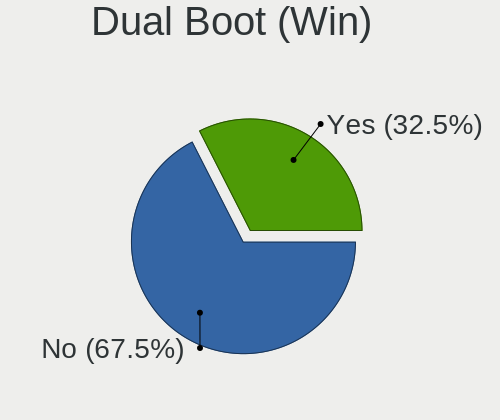
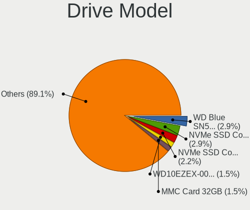
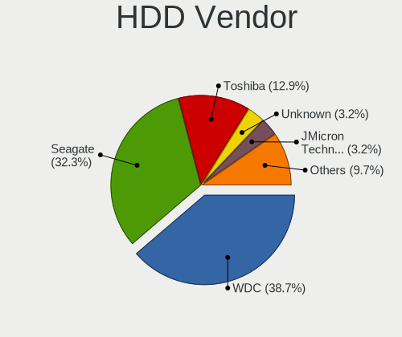
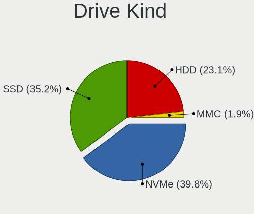
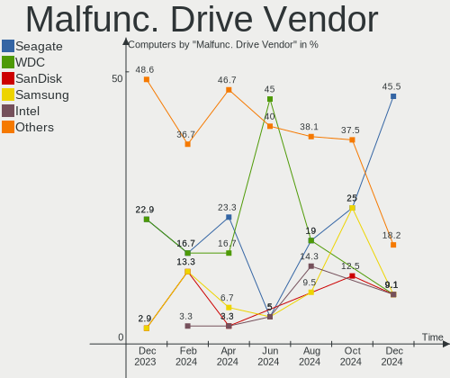
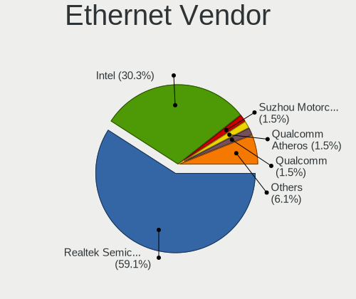
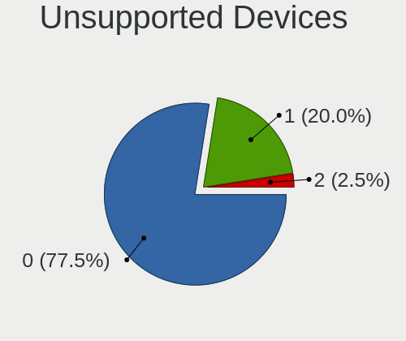

ArcoLinux - Hardware Trends
---------------------------

A project to identify most popular hardware characteristics and track their change
over time based on data collected by Linux users at https://Linux-Hardware.org.

Anyone can contribute to this report by the [hw-probe](https://github.com/linuxhw/hw-probe) tool:

    sudo -E hw-probe -all -upload

This is a report for all computer types. See also reports for [desktops](/Dist/ArcoLinux/Desktop/README.md) and [notebooks](/Dist/ArcoLinux/Notebook/README.md).

This report is for one last month. Overall report since the beginning of time: [TestCoverage](https://github.com/linuxhw/TestCoverage)

Period: Oct, 2022.

Contents
--------

* [ System ](#system)
  - [ OS                       ](#os)
  - [ OS Family                ](#os-family)
  - [ Kernel                   ](#kernel)
  - [ Kernel Family            ](#kernel-family)
  - [ Kernel Major Ver.        ](#kernel-major-ver)
  - [ Arch                     ](#arch)
  - [ DE                       ](#de)
  - [ Display Server           ](#display-server)
  - [ Display Manager          ](#display-manager)
  - [ OS Lang                  ](#os-lang)
  - [ Boot Mode                ](#boot-mode)
  - [ Filesystem               ](#filesystem)
  - [ Part. scheme             ](#part-scheme)
  - [ Dual Boot with Linux/BSD ](#dual-boot-with-linuxbsd)
  - [ Dual Boot (Win)          ](#dual-boot-win)

* [ Board ](#board)
  - [ Vendor                   ](#vendor)
  - [ Model                    ](#model)
  - [ Model Family             ](#model-family)
  - [ MFG Year                 ](#mfg-year)
  - [ Form Factor              ](#form-factor)
  - [ Secure Boot              ](#secure-boot)
  - [ Coreboot                 ](#coreboot)
  - [ RAM Size                 ](#ram-size)
  - [ RAM Used                 ](#ram-used)
  - [ Total Drives             ](#total-drives)
  - [ Has CD-ROM               ](#has-cd-rom)
  - [ Has Ethernet             ](#has-ethernet)
  - [ Has WiFi                 ](#has-wifi)
  - [ Has Bluetooth            ](#has-bluetooth)

* [ Location ](#location)
  - [ Country                  ](#country)
  - [ City                     ](#city)

* [ Drives ](#drives)
  - [ Drive Vendor             ](#drive-vendor)
  - [ Drive Model              ](#drive-model)
  - [ HDD Vendor               ](#hdd-vendor)
  - [ SSD Vendor               ](#ssd-vendor)
  - [ Drive Kind               ](#drive-kind)
  - [ Drive Connector          ](#drive-connector)
  - [ Drive Size               ](#drive-size)
  - [ Space Total              ](#space-total)
  - [ Space Used               ](#space-used)
  - [ Malfunc. Drives          ](#malfunc-drives)
  - [ Malfunc. Drive Vendor    ](#malfunc-drive-vendor)
  - [ Malfunc. HDD Vendor      ](#malfunc-hdd-vendor)
  - [ Malfunc. Drive Kind      ](#malfunc-drive-kind)
  - [ Failed Drives            ](#failed-drives)
  - [ Failed Drive Vendor      ](#failed-drive-vendor)
  - [ Drive Status             ](#drive-status)

* [ Storage controller ](#storage-controller)
  - [ Storage Vendor           ](#storage-vendor)
  - [ Storage Model            ](#storage-model)
  - [ Storage Kind             ](#storage-kind)

* [ Processor ](#processor)
  - [ CPU Vendor               ](#cpu-vendor)
  - [ CPU Model                ](#cpu-model)
  - [ CPU Model Family         ](#cpu-model-family)
  - [ CPU Cores                ](#cpu-cores)
  - [ CPU Sockets              ](#cpu-sockets)
  - [ CPU Threads              ](#cpu-threads)
  - [ CPU Op-Modes             ](#cpu-op-modes)
  - [ CPU Microcode            ](#cpu-microcode)
  - [ CPU Microarch            ](#cpu-microarch)

* [ Graphics ](#graphics)
  - [ GPU Vendor               ](#gpu-vendor)
  - [ GPU Model                ](#gpu-model)
  - [ GPU Combo                ](#gpu-combo)
  - [ GPU Driver               ](#gpu-driver)
  - [ GPU Memory               ](#gpu-memory)

* [ Monitor ](#monitor)
  - [ Monitor Vendor           ](#monitor-vendor)
  - [ Monitor Model            ](#monitor-model)
  - [ Monitor Resolution       ](#monitor-resolution)
  - [ Monitor Diagonal         ](#monitor-diagonal)
  - [ Monitor Width            ](#monitor-width)
  - [ Aspect Ratio             ](#aspect-ratio)
  - [ Monitor Area             ](#monitor-area)
  - [ Pixel Density            ](#pixel-density)
  - [ Multiple Monitors        ](#multiple-monitors)

* [ Network ](#network)
  - [ Net Controller Vendor    ](#net-controller-vendor)
  - [ Net Controller Model     ](#net-controller-model)
  - [ Wireless Vendor          ](#wireless-vendor)
  - [ Wireless Model           ](#wireless-model)
  - [ Ethernet Vendor          ](#ethernet-vendor)
  - [ Ethernet Model           ](#ethernet-model)
  - [ Net Controller Kind      ](#net-controller-kind)
  - [ Used Controller          ](#used-controller)
  - [ NICs                     ](#nics)
  - [ IPv6                     ](#ipv6)

* [ Bluetooth ](#bluetooth)
  - [ Bluetooth Vendor         ](#bluetooth-vendor)
  - [ Bluetooth Model          ](#bluetooth-model)

* [ Sound ](#sound)
  - [ Sound Vendor             ](#sound-vendor)
  - [ Sound Model              ](#sound-model)

* [ Memory ](#memory)
  - [ Memory Vendor            ](#memory-vendor)
  - [ Memory Model             ](#memory-model)
  - [ Memory Kind              ](#memory-kind)
  - [ Memory Form Factor       ](#memory-form-factor)
  - [ Memory Size              ](#memory-size)
  - [ Memory Speed             ](#memory-speed)

* [ Printers & scanners ](#printers--scanners)
  - [ Printer Vendor           ](#printer-vendor)
  - [ Printer Model            ](#printer-model)
  - [ Scanner Vendor           ](#scanner-vendor)
  - [ Scanner Model            ](#scanner-model)

* [ Camera ](#camera)
  - [ Camera Vendor            ](#camera-vendor)
  - [ Camera Model             ](#camera-model)

* [ Security ](#security)
  - [ Fingerprint Vendor       ](#fingerprint-vendor)
  - [ Fingerprint Model        ](#fingerprint-model)
  - [ Chipcard Vendor          ](#chipcard-vendor)
  - [ Chipcard Model           ](#chipcard-model)

* [ Unsupported ](#unsupported)
  - [ Unsupported Devices      ](#unsupported-devices)
  - [ Unsupported Device Types ](#unsupported-device-types)

System
------

OS
--

Installed operating systems

| Name              | Computers | Percent |
|-------------------|-----------|---------|
| ArcoLinux Rolling | 75        | 94.94%  |
| ArcoLinux         | 4         | 5.06%   |

OS Family
---------

OS without a version

| Name      | Computers | Percent |
|-----------|-----------|---------|
| ArcoLinux | 79        | 100%    |

Kernel
------

Version of the Linux kernel

| Version               | Computers | Percent |
|-----------------------|-----------|---------|
| 5.19.13-arch1-1       | 15        | 18.99%  |
| 6.0.2-arch1-1         | 11        | 13.92%  |
| 5.15.74-1-lts         | 8         | 10.13%  |
| 6.0.2-zen1-1-zen      | 6         | 7.59%   |
| 6.0.5-arch1-1         | 5         | 6.33%   |
| 5.19.12-arch1-1       | 5         | 6.33%   |
| 6.0.1-arch2-1         | 4         | 5.06%   |
| 6.0.2-x64v1-xanmod1-1 | 3         | 3.8%    |
| 6.0.1-x64v2-xanmod1-1 | 2         | 2.53%   |
| 6.0.1-arch1-1         | 2         | 2.53%   |
| 5.19.11-arch1-1       | 2         | 2.53%   |
| 5.15.72-1-lts         | 2         | 2.53%   |
| 5.15.71-1-lts         | 2         | 2.53%   |
| 6.0.6-arch1-1         | 1         | 1.27%   |
| 6.0.1-zen2-1-zen      | 1         | 1.27%   |
| 6.0.1-zen1-1-zen      | 1         | 1.27%   |
| 6.0.0-arch1-1         | 1         | 1.27%   |
| 5.19.9-arch1-1        | 1         | 1.27%   |
| 5.19.15-xanmod1-1     | 1         | 1.27%   |
| 5.19.12-zen1-1-zen    | 1         | 1.27%   |
| 5.17.7-arch1-1        | 1         | 1.27%   |
| 5.15.75-1-lts         | 1         | 1.27%   |
| 5.15.73-1-lts         | 1         | 1.27%   |
| 5.15.11-arch2-1       | 1         | 1.27%   |
| 5.14.6-arch1-1        | 1         | 1.27%   |

Kernel Family
-------------

Linux kernel without a distro release

| Version | Computers | Percent |
|---------|-----------|---------|
| 6.0.2   | 20        | 25.32%  |
| 5.19.13 | 15        | 18.99%  |
| 6.0.1   | 10        | 12.66%  |
| 5.15.74 | 8         | 10.13%  |
| 5.19.12 | 6         | 7.59%   |
| 6.0.5   | 5         | 6.33%   |
| 5.19.11 | 2         | 2.53%   |
| 5.15.72 | 2         | 2.53%   |
| 5.15.71 | 2         | 2.53%   |
| 6.0.6   | 1         | 1.27%   |
| 6.0.0   | 1         | 1.27%   |
| 5.19.9  | 1         | 1.27%   |
| 5.19.15 | 1         | 1.27%   |
| 5.17.7  | 1         | 1.27%   |
| 5.15.75 | 1         | 1.27%   |
| 5.15.73 | 1         | 1.27%   |
| 5.15.11 | 1         | 1.27%   |
| 5.14.6  | 1         | 1.27%   |

Kernel Major Ver.
-----------------

Linux kernel major version

| Version | Computers | Percent |
|---------|-----------|---------|
| 6.0     | 37        | 46.84%  |
| 5.19    | 25        | 31.65%  |
| 5.15    | 15        | 18.99%  |
| 5.17    | 1         | 1.27%   |
| 5.14    | 1         | 1.27%   |

Arch
----

OS architecture (x86_64, i586, etc.)

| Name   | Computers | Percent |
|--------|-----------|---------|
| x86_64 | 79        | 100%    |

DE
--

Desktop Environment

| Name       | Computers | Percent |
|------------|-----------|---------|
| XFCE       | 26        | 32.91%  |
| KDE5       | 18        | 22.78%  |
| i3         | 8         | 10.13%  |
| awesome    | 8         | 10.13%  |
| bspwm      | 6         | 7.59%   |
| GNOME      | 5         | 6.33%   |
| qtile      | 3         | 3.8%    |
| X-Cinnamon | 2         | 2.53%   |
| xmonad     | 1         | 1.27%   |
| LeftWM     | 1         | 1.27%   |
| ICEWM      | 1         | 1.27%   |

Display Server
--------------

X11 or Wayland

| Name    | Computers | Percent |
|---------|-----------|---------|
| X11     | 70        | 88.61%  |
| Tty     | 5         | 6.33%   |
| Wayland | 3         | 3.8%    |
| Unknown | 1         | 1.27%   |

Display Manager
---------------

SDDM, LightDM, etc.

| Name    | Computers | Percent |
|---------|-----------|---------|
| SDDM    | 55        | 69.62%  |
| LightDM | 16        | 20.25%  |
| GDM     | 4         | 5.06%   |
| Unknown | 4         | 5.06%   |

OS Lang
-------

Language

| Lang  | Computers | Percent |
|-------|-----------|---------|
| en_US | 38        | 48.1%   |
| en_GB | 7         | 8.86%   |
| de_DE | 5         | 6.33%   |
| fr_FR | 3         | 3.8%    |
| C     | 3         | 3.8%    |
| tr_TR | 2         | 2.53%   |
| ru_RU | 2         | 2.53%   |
| pl_PL | 2         | 2.53%   |
| en_ZA | 2         | 2.53%   |
| en_PH | 2         | 2.53%   |
| en_IN | 2         | 2.53%   |
| th_TH | 1         | 1.27%   |
| nl_NL | 1         | 1.27%   |
| ja_JP | 1         | 1.27%   |
| hu_HU | 1         | 1.27%   |
| fr_CA | 1         | 1.27%   |
| es_MX | 1         | 1.27%   |
| es_ES | 1         | 1.27%   |
| es_CO | 1         | 1.27%   |
| en_IL | 1         | 1.27%   |
| en_AG | 1         | 1.27%   |
| de_AT | 1         | 1.27%   |

Boot Mode
---------

EFI or BIOS

| Mode | Computers | Percent |
|------|-----------|---------|
| EFI  | 61        | 77.22%  |
| BIOS | 18        | 22.78%  |

Filesystem
----------

Type of filesystem

| Type    | Computers | Percent |
|---------|-----------|---------|
| Ext4    | 58        | 73.42%  |
| Btrfs   | 18        | 22.78%  |
| Overlay | 2         | 2.53%   |
| Xfs     | 1         | 1.27%   |

Part. scheme
------------

Scheme of partitioning

| Type    | Computers | Percent |
|---------|-----------|---------|
| GPT     | 64        | 81.01%  |
| MBR     | 11        | 13.92%  |
| Unknown | 4         | 5.06%   |

Dual Boot with Linux/BSD
------------------------

Hosting more than one Linux/BSD

| Dual boot | Computers | Percent |
|-----------|-----------|---------|
| No        | 51        | 64.56%  |
| Yes       | 28        | 35.44%  |

Dual Boot (Win)
---------------

Hosting Linux and Windows

| Dual boot | Computers | Percent |
|-----------|-----------|---------|
| No        | 41        | 51.9%   |
| Yes       | 38        | 48.1%   |

Board
-----

Vendor
------

Motherboard manufacturer

| Name                | Computers | Percent |
|---------------------|-----------|---------|
| ASUSTek Computer    | 15        | 18.99%  |
| Hewlett-Packard     | 11        | 13.92%  |
| Lenovo              | 10        | 12.66%  |
| Dell                | 9         | 11.39%  |
| MSI                 | 6         | 7.59%   |
| Gigabyte Technology | 6         | 7.59%   |
| ASRock              | 5         | 6.33%   |
| Acer                | 4         | 5.06%   |
| HUAWEI              | 2         | 2.53%   |
| ZOTAC               | 1         | 1.27%   |
| TUXEDO              | 1         | 1.27%   |
| Toshiba             | 1         | 1.27%   |
| System76            | 1         | 1.27%   |
| Sony                | 1         | 1.27%   |
| Schenker            | 1         | 1.27%   |
| Samsung Electronics | 1         | 1.27%   |
| NEC Computers       | 1         | 1.27%   |
| Microsoft           | 1         | 1.27%   |
| LG Electronics      | 1         | 1.27%   |
| Casper              | 1         | 1.27%   |

Model
-----

Motherboard model

| Name                                        | Computers | Percent |
|---------------------------------------------|-----------|---------|
| Lenovo IdeaPad 320-15ISK 80XH               | 2         | 2.53%   |
| Dell Latitude 3380                          | 2         | 2.53%   |
| ZOTAC ZBOX-ECM73070C/53060C                 | 1         | 1.27%   |
| TUXEDO Aura 15 Gen2                         | 1         | 1.27%   |
| Toshiba Satellite L775                      | 1         | 1.27%   |
| System76 Oryx Pro                           | 1         | 1.27%   |
| Sony SVE14A27CXH                            | 1         | 1.27%   |
| Schenker SLIM_13_14_SSL13_14L18             | 1         | 1.27%   |
| Samsung 300E4A/300E5A/300E7A/3430EA/3530EA  | 1         | 1.27%   |
| NEC Computers PC-VK27MXZCG                  | 1         | 1.27%   |
| MSI MS-7C95                                 | 1         | 1.27%   |
| MSI MS-7C37                                 | 1         | 1.27%   |
| MSI MS-7B89                                 | 1         | 1.27%   |
| MSI MS-7B85                                 | 1         | 1.27%   |
| MSI MS-7972                                 | 1         | 1.27%   |
| MSI CR61 3M                                 | 1         | 1.27%   |
| Microsoft Surface Pro 3                     | 1         | 1.27%   |
| LG C500                                     | 1         | 1.27%   |
| Lenovo ThinkPad X1 Carbon Gen 9 20XWCTO1WW  | 1         | 1.27%   |
| Lenovo ThinkPad X1 Carbon Gen 10 21CBCTO1WW | 1         | 1.27%   |
| Lenovo ThinkPad T450s 20BWA0DW00            | 1         | 1.27%   |
| Lenovo ThinkPad Edge S430 33643DG           | 1         | 1.27%   |
| Lenovo ThinkPad Edge 03193UG                | 1         | 1.27%   |
| Lenovo ThinkCentre M700 10J0S35C00          | 1         | 1.27%   |
| Lenovo Legion T5 28IMB05 90NC00R5US         | 1         | 1.27%   |
| Lenovo Legion 5 15IMH05H 81Y6               | 1         | 1.27%   |
| HUAWEI VLT-WX0                              | 1         | 1.27%   |
| HUAWEI HLYL-WXX9                            | 1         | 1.27%   |
| HP Z420 Workstation                         | 1         | 1.27%   |
| HP ProDesk 600 G1 SFF                       | 1         | 1.27%   |
| HP Pavilion Power Desktop 580-1xx           | 1         | 1.27%   |
| HP Pavilion Laptop 15-cw0xxx                | 1         | 1.27%   |
| HP Pavilion g7                              | 1         | 1.27%   |
| HP Pavilion All-in-One 27-d0xxx             | 1         | 1.27%   |
| HP Laptop 15s-eq2xxx                        | 1         | 1.27%   |
| HP Laptop 14s-dk1xxx                        | 1         | 1.27%   |
| HP ENVY x360 Convertible 13-ar0xxx          | 1         | 1.27%   |
| HP Compaq Elite 8300 SFF                    | 1         | 1.27%   |
| HP 700-527c                                 | 1         | 1.27%   |
| Gigabyte X570 AORUS PRO WIFI                | 1         | 1.27%   |

Model Family
------------

Motherboard model prefix

| Name                       | Computers | Percent |
|----------------------------|-----------|---------|
| Lenovo ThinkPad            | 5         | 6.33%   |
| HP Pavilion                | 4         | 5.06%   |
| Dell Latitude              | 4         | 5.06%   |
| ASUS ROG                   | 4         | 5.06%   |
| Gigabyte X570              | 3         | 3.8%    |
| Acer Aspire                | 3         | 3.8%    |
| Lenovo Legion              | 2         | 2.53%   |
| Lenovo IdeaPad             | 2         | 2.53%   |
| HP Laptop                  | 2         | 2.53%   |
| Dell Inspiron              | 2         | 2.53%   |
| ASUS VivoBook              | 2         | 2.53%   |
| ASUS TUF                   | 2         | 2.53%   |
| ASUS PRIME                 | 2         | 2.53%   |
| ZOTAC ZBOX-ECM73070C       | 1         | 1.27%   |
| TUXEDO Aura                | 1         | 1.27%   |
| Toshiba Satellite          | 1         | 1.27%   |
| System76 Oryx              | 1         | 1.27%   |
| Sony SVE14A27CXH           | 1         | 1.27%   |
| Schenker SLIM              | 1         | 1.27%   |
| Samsung 300E4A             | 1         | 1.27%   |
| NEC Computers PC-VK27MXZCG | 1         | 1.27%   |
| MSI MS-7C95                | 1         | 1.27%   |
| MSI MS-7C37                | 1         | 1.27%   |
| MSI MS-7B89                | 1         | 1.27%   |
| MSI MS-7B85                | 1         | 1.27%   |
| MSI MS-7972                | 1         | 1.27%   |
| MSI CR61                   | 1         | 1.27%   |
| Microsoft Surface          | 1         | 1.27%   |
| LG C500                    | 1         | 1.27%   |
| Lenovo ThinkCentre         | 1         | 1.27%   |
| HUAWEI VLT-WX0             | 1         | 1.27%   |
| HUAWEI HLYL-WXX9           | 1         | 1.27%   |
| HP Z420                    | 1         | 1.27%   |
| HP ProDesk                 | 1         | 1.27%   |
| HP ENVY                    | 1         | 1.27%   |
| HP Compaq                  | 1         | 1.27%   |
| HP 700-527c                | 1         | 1.27%   |
| Gigabyte P55-USB3          | 1         | 1.27%   |
| Gigabyte B360M-DS3H        | 1         | 1.27%   |
| Gigabyte B360M-D3H         | 1         | 1.27%   |

MFG Year
--------

Motherboard manufacture year

| Year | Computers | Percent |
|------|-----------|---------|
| 2019 | 13        | 16.46%  |
| 2020 | 10        | 12.66%  |
| 2017 | 8         | 10.13%  |
| 2013 | 8         | 10.13%  |
| 2021 | 7         | 8.86%   |
| 2018 | 6         | 7.59%   |
| 2015 | 5         | 6.33%   |
| 2011 | 5         | 6.33%   |
| 2016 | 4         | 5.06%   |
| 2012 | 4         | 5.06%   |
| 2022 | 3         | 3.8%    |
| 2010 | 3         | 3.8%    |
| 2014 | 1         | 1.27%   |
| 2009 | 1         | 1.27%   |
| 2007 | 1         | 1.27%   |

Form Factor
-----------

Physical design of the computer

| Name        | Computers | Percent |
|-------------|-----------|---------|
| Notebook    | 38        | 48.1%   |
| Desktop     | 36        | 45.57%  |
| Mini pc     | 2         | 2.53%   |
| Tablet      | 1         | 1.27%   |
| Convertible | 1         | 1.27%   |
| All in one  | 1         | 1.27%   |

Secure Boot
-----------

Enabled or disabled

| State    | Computers | Percent |
|----------|-----------|---------|
| Disabled | 79        | 100%    |

Coreboot
--------

Have coreboot on board

| Used | Computers | Percent |
|------|-----------|---------|
| No   | 79        | 100%    |

RAM Size
--------

Total RAM memory

| Size in GB  | Computers | Percent |
|-------------|-----------|---------|
| 16.01-24.0  | 22        | 27.85%  |
| 4.01-8.0    | 21        | 26.58%  |
| 8.01-16.0   | 15        | 18.99%  |
| 32.01-64.0  | 13        | 16.46%  |
| 64.01-256.0 | 4         | 5.06%   |
| 3.01-4.0    | 2         | 2.53%   |
| 24.01-32.0  | 1         | 1.27%   |
| 1.01-2.0    | 1         | 1.27%   |

RAM Used
--------

Used RAM memory

| Used GB   | Computers | Percent |
|-----------|-----------|---------|
| 2.01-3.0  | 22        | 27.85%  |
| 3.01-4.0  | 16        | 20.25%  |
| 4.01-8.0  | 14        | 17.72%  |
| 1.01-2.0  | 13        | 16.46%  |
| 0.51-1.0  | 9         | 11.39%  |
| 8.01-16.0 | 5         | 6.33%   |

Total Drives
------------

Number of drives on board

| Drives | Computers | Percent |
|--------|-----------|---------|
| 1      | 28        | 35.44%  |
| 2      | 25        | 31.65%  |
| 3      | 13        | 16.46%  |
| 4      | 10        | 12.66%  |
| 5      | 2         | 2.53%   |
| 6      | 1         | 1.27%   |

Has CD-ROM
----------

Has CD-ROM on board

| Presented | Computers | Percent |
|-----------|-----------|---------|
| No        | 57        | 72.15%  |
| Yes       | 22        | 27.85%  |

Has Ethernet
------------

Has Ethernet on board

| Presented | Computers | Percent |
|-----------|-----------|---------|
| Yes       | 69        | 87.34%  |
| No        | 10        | 12.66%  |

Has WiFi
--------

Has WiFi module

| Presented | Computers | Percent |
|-----------|-----------|---------|
| Yes       | 60        | 75.95%  |
| No        | 19        | 24.05%  |

Has Bluetooth
-------------

Has Bluetooth module

| Presented | Computers | Percent |
|-----------|-----------|---------|
| Yes       | 52        | 65.82%  |
| No        | 27        | 34.18%  |

Location
--------

Country
-------

Geographic location (country)

| Country      | Computers | Percent |
|--------------|-----------|---------|
| USA          | 15        | 18.99%  |
| Germany      | 8         | 10.13%  |
| France       | 5         | 6.33%   |
| Turkey       | 3         | 3.8%    |
| Spain        | 3         | 3.8%    |
| Poland       | 3         | 3.8%    |
| Italy        | 3         | 3.8%    |
| Belgium      | 3         | 3.8%    |
| South Africa | 2         | 2.53%   |
| Philippines  | 2         | 2.53%   |
| Pakistan     | 2         | 2.53%   |
| Netherlands  | 2         | 2.53%   |
| Mexico       | 2         | 2.53%   |
| Ireland      | 2         | 2.53%   |
| India        | 2         | 2.53%   |
| Hungary      | 2         | 2.53%   |
| Greece       | 2         | 2.53%   |
| Austria      | 2         | 2.53%   |
| Vietnam      | 1         | 1.27%   |
| UK           | 1         | 1.27%   |
| Thailand     | 1         | 1.27%   |
| Switzerland  | 1         | 1.27%   |
| South Korea  | 1         | 1.27%   |
| Serbia       | 1         | 1.27%   |
| Russia       | 1         | 1.27%   |
| Romania      | 1         | 1.27%   |
| Malaysia     | 1         | 1.27%   |
| Kuwait       | 1         | 1.27%   |
| Japan        | 1         | 1.27%   |
| Israel       | 1         | 1.27%   |
| Colombia     | 1         | 1.27%   |
| Chile        | 1         | 1.27%   |
| Canada       | 1         | 1.27%   |
| Bangladesh   | 1         | 1.27%   |

City
----

Geographic location (city)

| City                     | Computers | Percent |
|--------------------------|-----------|---------|
| Vienna                   | 2         | 2.53%   |
| Quezon City              | 2         | 2.53%   |
| Milan                    | 2         | 2.53%   |
| Lahore                   | 2         | 2.53%   |
| Frankfurt am Main        | 2         | 2.53%   |
| Dessau                   | 2         | 2.53%   |
| Torun                    | 1         | 1.27%   |
| Tel Aviv                 | 1         | 1.27%   |
| Surprise                 | 1         | 1.27%   |
| Steubenville             | 1         | 1.27%   |
| Shinjuku                 | 1         | 1.27%   |
| Seongnam-si              | 1         | 1.27%   |
| Santiago                 | 1         | 1.27%   |
| San Salvatore Monferrato | 1         | 1.27%   |
| San Jose                 | 1         | 1.27%   |
| Rotherham                | 1         | 1.27%   |
| Richardson               | 1         | 1.27%   |
| Paris                    | 1         | 1.27%   |
| Palm City                | 1         | 1.27%   |
| Ochten                   | 1         | 1.27%   |
| Novi Sad                 | 1         | 1.27%   |
| New York                 | 1         | 1.27%   |
| Nagyer                   | 1         | 1.27%   |
| Naaldwijk                | 1         | 1.27%   |
| Moscow                   | 1         | 1.27%   |
| Montlebon                | 1         | 1.27%   |
| Monclova                 | 1         | 1.27%   |
| Marquette                | 1         | 1.27%   |
| Marnand                  | 1         | 1.27%   |
| Ludhiana                 | 1         | 1.27%   |
| Lessay                   | 1         | 1.27%   |
| Las Vegas                | 1         | 1.27%   |
| Kuwait City              | 1         | 1.27%   |
| Kirchheim unter Teck     | 1         | 1.27%   |
| Kayseri                  | 1         | 1.27%   |
| Kalisz                   | 1         | 1.27%   |
| Johannesburg             | 1         | 1.27%   |
| Izbica Kujawska          | 1         | 1.27%   |
| Hulshout                 | 1         | 1.27%   |
| Houston                  | 1         | 1.27%   |

Drives
------

Drive Vendor
------------

Hard drive vendors

| Vendor                       | Computers | Drives | Percent |
|------------------------------|-----------|--------|---------|
| Samsung Electronics          | 31        | 35     | 20%     |
| WDC                          | 23        | 27     | 14.84%  |
| Seagate                      | 17        | 19     | 10.97%  |
| SanDisk                      | 9         | 10     | 5.81%   |
| Toshiba                      | 8         | 8      | 5.16%   |
| Kingston                     | 8         | 10     | 5.16%   |
| Crucial                      | 8         | 8      | 5.16%   |
| A-DATA Technology            | 6         | 7      | 3.87%   |
| Unknown                      | 5         | 5      | 3.23%   |
| SK hynix                     | 3         | 3      | 1.94%   |
| Silicon Motion               | 3         | 3      | 1.94%   |
| HGST                         | 3         | 3      | 1.94%   |
| Phison Electronics           | 2         | 3      | 1.29%   |
| Micron/Crucial Technology    | 2         | 2      | 1.29%   |
| Micron Technology            | 2         | 2      | 1.29%   |
| Intenso                      | 2         | 2      | 1.29%   |
| Intel                        | 2         | 2      | 1.29%   |
| ADATA Technology             | 2         | 2      | 1.29%   |
| VENO                         | 1         | 1      | 0.65%   |
| USB3.0                       | 1         | 1      | 0.65%   |
| Team                         | 1         | 1      | 0.65%   |
| Shenzhen Longsys Electronics | 1         | 1      | 0.65%   |
| Realtek                      | 1         | 1      | 0.65%   |
| PNY                          | 1         | 1      | 0.65%   |
| Patriot                      | 1         | 1      | 0.65%   |
| OCZ                          | 1         | 1      | 0.65%   |
| LITEON                       | 1         | 1      | 0.65%   |
| Lite-On Technology           | 1         | 1      | 0.65%   |
| KIOXIA                       | 1         | 1      | 0.65%   |
| Kingmax                      | 1         | 1      | 0.65%   |
| JAMESDONKEY                  | 1         | 1      | 0.65%   |
| Hoodisk                      | 1         | 1      | 0.65%   |
| Hewlett-Packard              | 1         | 1      | 0.65%   |
| Gigabyte Technology          | 1         | 1      | 0.65%   |
| Fantom                       | 1         | 1      | 0.65%   |
| Corsair                      | 1         | 1      | 0.65%   |
| Unknown                      | 1         | 1      | 0.65%   |

Drive Model
-----------

Hard drive models

| Model                                                           | Computers | Percent |
|-----------------------------------------------------------------|-----------|---------|
| Samsung NVMe SSD Controller SM981/PM981/PM983 500GB             | 10        | 5.92%   |
| Kingston SA400S37240G 240GB SSD                                 | 4         | 2.37%   |
| Unknown SD/MMC/MS PRO 1TB                                       | 3         | 1.78%   |
| Toshiba MQ04ABF100 1TB                                          | 3         | 1.78%   |
| Samsung SSD 860 EVO 500GB                                       | 3         | 1.78%   |
| Samsung NVMe SSD Controller PM9A1/PM9A3/980PRO 250GB            | 3         | 1.78%   |
| WDC WD5000LPVX-22V0TT0 500GB                                    | 2         | 1.18%   |
| WDC WD40EFRX-68N32N0 4TB                                        | 2         | 1.18%   |
| WDC WD10EZEX-08WN4A0 1TB                                        | 2         | 1.18%   |
| Silicon Motion SM2262/SM2262EN SSD Controller 1024GB            | 2         | 1.18%   |
| Seagate ST1000DM003-1SB102 1TB                                  | 2         | 1.18%   |
| Sandisk WD Black SN850 1TB                                      | 2         | 1.18%   |
| Samsung SSD 860 EVO 250GB                                       | 2         | 1.18%   |
| Samsung SSD 860 EVO 1TB                                         | 2         | 1.18%   |
| Samsung SSD 850 EVO 250GB                                       | 2         | 1.18%   |
| Kingston SNVS500G 500GB                                         | 2         | 1.18%   |
| Crucial CT1000MX500SSD1 1TB                                     | 2         | 1.18%   |
| ADATA XPG SX8200 Pro PCIe Gen3x4 M.2 2280 Solid State Drive 1TB | 2         | 1.18%   |
| WDC WDS500G2B0B-00YS70 500GB SSD                                | 1         | 0.59%   |
| WDC WDS240G2G0B-00EPW0 240GB SSD                                | 1         | 0.59%   |
| WDC WDS240G2G0A-00JH30 240GB SSD                                | 1         | 0.59%   |
| WDC WDS120G2G0A-00JH30 120GB SSD                                | 1         | 0.59%   |
| WDC WDS100T2G0A-00JH30 1TB SSD                                  | 1         | 0.59%   |
| WDC WD6003FZBX-00K5WB0 6TB                                      | 1         | 0.59%   |
| WDC WD5000AACS-00ZUB0 500GB                                     | 1         | 0.59%   |
| WDC WD5000AACS-00G8B1 500GB                                     | 1         | 0.59%   |
| WDC WD40EZRZ-00GXCB0 4TB                                        | 1         | 0.59%   |
| WDC WD40EZAZ-22SF3B0 4TB                                        | 1         | 0.59%   |
| WDC WD40EFRX-68WT0N0 4TB                                        | 1         | 0.59%   |
| WDC WD3200BPVT-22ZEST0 320GB                                    | 1         | 0.59%   |
| WDC WD20SPZX-22UA7T0 2TB                                        | 1         | 0.59%   |
| WDC WD20EZBX-00AYRA0 2TB                                        | 1         | 0.59%   |
| WDC WD20EZAZ-00GGJB0 2TB                                        | 1         | 0.59%   |
| WDC WD10SPZX-75Z10T3 1TB                                        | 1         | 0.59%   |
| WDC WD10EZEX-60M2NA0 1TB                                        | 1         | 0.59%   |
| WDC WD10EZEX-22BN5A0 1TB                                        | 1         | 0.59%   |
| WDC WD1003FZEX-00K3CA0 1TB                                      | 1         | 0.59%   |
| WDC WD1002FAEX-00Y9A0 1TB                                       | 1         | 0.59%   |
| WDC WD1001FALS-00J7B0 1TB                                       | 1         | 0.59%   |
| VENO SCORP-256GB SSD                                            | 1         | 0.59%   |

HDD Vendor
----------

Hard disk drive vendors

| Vendor              | Computers | Drives | Percent |
|---------------------|-----------|--------|---------|
| WDC                 | 19        | 22     | 35.19%  |
| Seagate             | 17        | 19     | 31.48%  |
| Toshiba             | 7         | 7      | 12.96%  |
| Unknown             | 3         | 3      | 5.56%   |
| HGST                | 3         | 3      | 5.56%   |
| USB3.0              | 1         | 1      | 1.85%   |
| Samsung Electronics | 1         | 1      | 1.85%   |
| Intenso             | 1         | 1      | 1.85%   |
| Hewlett-Packard     | 1         | 1      | 1.85%   |
| Fantom              | 1         | 1      | 1.85%   |

SSD Vendor
----------

Solid state drive vendors

| Vendor              | Computers | Drives | Percent |
|---------------------|-----------|--------|---------|
| Samsung Electronics | 18        | 18     | 29.03%  |
| Crucial             | 8         | 8      | 12.9%   |
| Kingston            | 6         | 7      | 9.68%   |
| A-DATA Technology   | 6         | 7      | 9.68%   |
| WDC                 | 5         | 5      | 8.06%   |
| SanDisk             | 3         | 3      | 4.84%   |
| SK hynix            | 2         | 2      | 3.23%   |
| VENO                | 1         | 1      | 1.61%   |
| Toshiba             | 1         | 1      | 1.61%   |
| Team                | 1         | 1      | 1.61%   |
| PNY                 | 1         | 1      | 1.61%   |
| Patriot             | 1         | 1      | 1.61%   |
| OCZ                 | 1         | 1      | 1.61%   |
| LITEON              | 1         | 1      | 1.61%   |
| Kingmax             | 1         | 1      | 1.61%   |
| JAMESDONKEY         | 1         | 1      | 1.61%   |
| Intenso             | 1         | 1      | 1.61%   |
| Hoodisk             | 1         | 1      | 1.61%   |
| Gigabyte Technology | 1         | 1      | 1.61%   |
| Corsair             | 1         | 1      | 1.61%   |
| Unknown             | 1         | 1      | 1.61%   |

Drive Kind
----------

HDD or SSD

| Kind | Computers | Drives | Percent |
|------|-----------|--------|---------|
| SSD  | 50        | 64     | 37.31%  |
| HDD  | 44        | 59     | 32.84%  |
| NVMe | 38        | 45     | 28.36%  |
| MMC  | 2         | 2      | 1.49%   |

Drive Connector
---------------

SATA, SAS, NVMe, etc.

| Type | Computers | Drives | Percent |
|------|-----------|--------|---------|
| SATA | 67        | 116    | 58.26%  |
| NVMe | 38        | 44     | 33.04%  |
| SAS  | 8         | 8      | 6.96%   |
| MMC  | 2         | 2      | 1.74%   |

Drive Size
----------

Size of hard drive

| Size in TB | Computers | Drives | Percent |
|------------|-----------|--------|---------|
| 0.01-0.5   | 41        | 63     | 42.27%  |
| 0.51-1.0   | 37        | 39     | 38.14%  |
| 1.01-2.0   | 12        | 13     | 12.37%  |
| 3.01-4.0   | 4         | 5      | 4.12%   |
| 4.01-10.0  | 2         | 2      | 2.06%   |
| 2.01-3.0   | 1         | 1      | 1.03%   |

Space Total
-----------

Amount of disk space available on the file system

| Size in GB     | Computers | Percent |
|----------------|-----------|---------|
| 501-1000       | 17        | 21.52%  |
| 101-250        | 14        | 17.72%  |
| 1001-2000      | 14        | 17.72%  |
| More than 3000 | 11        | 13.92%  |
| 251-500        | 11        | 13.92%  |
| 21-50          | 3         | 3.8%    |
| 2001-3000      | 3         | 3.8%    |
| 1-20           | 3         | 3.8%    |
| 51-100         | 2         | 2.53%   |
| Unknown        | 1         | 1.27%   |

Space Used
----------

Amount of used disk space

| Used GB        | Computers | Percent |
|----------------|-----------|---------|
| 501-1000       | 16        | 20.25%  |
| 101-250        | 13        | 16.46%  |
| 51-100         | 12        | 15.19%  |
| 21-50          | 11        | 13.92%  |
| 1-20           | 10        | 12.66%  |
| 251-500        | 8         | 10.13%  |
| More than 3000 | 4         | 5.06%   |
| 1001-2000      | 3         | 3.8%    |
| 2001-3000      | 1         | 1.27%   |
| Unknown        | 1         | 1.27%   |

Malfunc. Drives
---------------

Drive models with a malfunction

| Model                                                           | Computers | Drives | Percent |
|-----------------------------------------------------------------|-----------|--------|---------|
| WDC WDS240G2G0A-00JH30 240GB SSD                                | 1         | 1      | 7.14%   |
| WDC WD5000AACS-00G8B1 500GB                                     | 1         | 1      | 7.14%   |
| WDC WD10EZEX-22BN5A0 1TB                                        | 1         | 1      | 7.14%   |
| USB3.0 Super Speed 1TB                                          | 1         | 1      | 7.14%   |
| Toshiba MQ01ABF050 500GB                                        | 1         | 1      | 7.14%   |
| Seagate ST500LM012 HN-M500MBB 500GB                             | 1         | 1      | 7.14%   |
| Seagate ST1000LM035-1RK172 1TB                                  | 1         | 1      | 7.14%   |
| SanDisk SSD PLUS 1000GB                                         | 1         | 1      | 7.14%   |
| Samsung Electronics SSD 870 EVO 1TB                             | 1         | 1      | 7.14%   |
| Samsung Electronics NVMe SSD Controller SM981/PM981/PM983 500GB | 1         | 1      | 7.14%   |
| Intel SSD 600P Series 256GB                                     | 1         | 1      | 7.14%   |
| Hewlett-Packard MB1000GCWCV 1TB                                 | 1         | 1      | 7.14%   |
| Crucial CT525MX300SSD1 528GB                                    | 1         | 1      | 7.14%   |
| Corsair CSSD-F60GB2 64GB                                        | 1         | 1      | 7.14%   |

Malfunc. Drive Vendor
---------------------

Vendors of faulty drives

| Vendor              | Computers | Drives | Percent |
|---------------------|-----------|--------|---------|
| WDC                 | 3         | 3      | 21.43%  |
| Seagate             | 2         | 2      | 14.29%  |
| Samsung Electronics | 2         | 2      | 14.29%  |
| USB3.0              | 1         | 1      | 7.14%   |
| Toshiba             | 1         | 1      | 7.14%   |
| SanDisk             | 1         | 1      | 7.14%   |
| Intel               | 1         | 1      | 7.14%   |
| Hewlett-Packard     | 1         | 1      | 7.14%   |
| Crucial             | 1         | 1      | 7.14%   |
| Corsair             | 1         | 1      | 7.14%   |

Malfunc. HDD Vendor
-------------------

Vendors of faulty HDD drives

| Vendor          | Computers | Drives | Percent |
|-----------------|-----------|--------|---------|
| WDC             | 2         | 2      | 28.57%  |
| Seagate         | 2         | 2      | 28.57%  |
| USB3.0          | 1         | 1      | 14.29%  |
| Toshiba         | 1         | 1      | 14.29%  |
| Hewlett-Packard | 1         | 1      | 14.29%  |

Malfunc. Drive Kind
-------------------

Kinds of faulty drives

| Kind | Computers | Drives | Percent |
|------|-----------|--------|---------|
| HDD  | 7         | 7      | 50%     |
| SSD  | 5         | 5      | 35.71%  |
| NVMe | 2         | 2      | 14.29%  |

Failed Drives
-------------

Failed drive models

Zero info for selected period =(

Failed Drive Vendor
-------------------

Failed drive vendors

Zero info for selected period =(

Drive Status
------------

Number of failed and malfunc. drives

| Status   | Computers | Drives | Percent |
|----------|-----------|--------|---------|
| Works    | 70        | 135    | 73.68%  |
| Malfunc  | 13        | 14     | 13.68%  |
| Detected | 12        | 21     | 12.63%  |

Storage controller
------------------

Storage Vendor
--------------

Storage controller vendors

| Vendor                       | Computers | Percent |
|------------------------------|-----------|---------|
| Intel                        | 53        | 45.3%   |
| AMD                          | 20        | 17.09%  |
| Samsung Electronics          | 16        | 13.68%  |
| SanDisk                      | 6         | 5.13%   |
| Silicon Motion               | 3         | 2.56%   |
| Kingston Technology Company  | 3         | 2.56%   |
| Phison Electronics           | 2         | 1.71%   |
| Micron/Crucial Technology    | 2         | 1.71%   |
| Micron Technology            | 2         | 1.71%   |
| ASMedia Technology           | 2         | 1.71%   |
| ADATA Technology             | 2         | 1.71%   |
| SK hynix                     | 1         | 0.85%   |
| Shenzhen Longsys Electronics | 1         | 0.85%   |
| Marvell Technology Group     | 1         | 0.85%   |
| Lite-On Technology           | 1         | 0.85%   |
| KIOXIA                       | 1         | 0.85%   |
| JMicron Technology           | 1         | 0.85%   |

Storage Model
-------------

Storage controller models

| Model                                                                          | Computers | Percent |
|--------------------------------------------------------------------------------|-----------|---------|
| AMD FCH SATA Controller [AHCI mode]                                            | 16        | 12.31%  |
| Samsung NVMe SSD Controller SM981/PM981/PM983                                  | 11        | 8.46%   |
| Intel Sunrise Point-LP SATA Controller [AHCI mode]                             | 6         | 4.62%   |
| Intel 8 Series/C220 Series Chipset Family 6-port SATA Controller 1 [AHCI mode] | 5         | 3.85%   |
| Intel Cannon Lake PCH SATA AHCI Controller                                     | 4         | 3.08%   |
| AMD 400 Series Chipset SATA Controller                                         | 4         | 3.08%   |
| Samsung NVMe SSD Controller PM9A1/PM9A3/980PRO                                 | 3         | 2.31%   |
| Intel Q170/Q150/B150/H170/H110/Z170/CM236 Chipset SATA Controller [AHCI Mode]  | 3         | 2.31%   |
| Intel 6 Series/C200 Series Chipset Family 6 port Mobile SATA AHCI Controller   | 3         | 2.31%   |
| Intel 200 Series PCH SATA controller [AHCI mode]                               | 3         | 2.31%   |
| Silicon Motion SM2262/SM2262EN SSD Controller                                  | 2         | 1.54%   |
| SanDisk WD PC SN810 / Black SN850 NVMe SSD                                     | 2         | 1.54%   |
| Micron Non-Volatile memory controller                                          | 2         | 1.54%   |
| Kingston Company Company Non-Volatile memory controller                        | 2         | 1.54%   |
| Intel Wildcat Point-LP SATA Controller [AHCI Mode]                             | 2         | 1.54%   |
| Intel Comet Lake SATA AHCI Controller                                          | 2         | 1.54%   |
| Intel Cannon Point-LP SATA Controller [AHCI Mode]                              | 2         | 1.54%   |
| Intel Cannon Lake Mobile PCH SATA AHCI Controller                              | 2         | 1.54%   |
| Intel 7 Series/C210 Series Chipset Family 6-port SATA Controller [AHCI mode]   | 2         | 1.54%   |
| Intel 7 Series Chipset Family 6-port SATA Controller [AHCI mode]               | 2         | 1.54%   |
| Intel 5 Series/3400 Series Chipset 4 port SATA AHCI Controller                 | 2         | 1.54%   |
| Intel 400 Series Chipset Family SATA AHCI Controller                           | 2         | 1.54%   |
| ASMedia ASM1062 Serial ATA Controller                                          | 2         | 1.54%   |
| ADATA XPG SX8200 Pro PCIe Gen3x4 M.2 2280 Solid State Drive                    | 2         | 1.54%   |
| SK hynix BC511                                                                 | 1         | 0.77%   |
| Silicon Motion SM2263EN/SM2263XT SSD Controller                                | 1         | 0.77%   |
| Shenzhen Longsys Electronics Non-Volatile memory controller                    | 1         | 0.77%   |
| SanDisk WD Blue SN570 NVMe SSD                                                 | 1         | 0.77%   |
| SanDisk WD Blue SN550 NVMe SSD                                                 | 1         | 0.77%   |
| SanDisk WD Black SN750 / PC SN730 NVMe SSD                                     | 1         | 0.77%   |
| SanDisk WD Black 2018/SN750 / PC SN720 NVMe SSD                                | 1         | 0.77%   |
| SanDisk Non-Volatile memory controller                                         | 1         | 0.77%   |
| Samsung NVMe SSD Controller SM961/PM961/SM963                                  | 1         | 0.77%   |
| Samsung NVMe SSD Controller SM951/PM951                                        | 1         | 0.77%   |
| Phison E7 NVMe Controller                                                      | 1         | 0.77%   |
| Phison E12 NVMe Controller                                                     | 1         | 0.77%   |
| Micron/Crucial P2 NVMe PCIe SSD                                                | 1         | 0.77%   |
| Micron/Crucial NVMe Controller                                                 | 1         | 0.77%   |
| Marvell Group 88SE9128 PCIe SATA 6 Gb/s RAID controller with HyperDuo          | 1         | 0.77%   |
| Lite-On Non-Volatile memory controller                                         | 1         | 0.77%   |

Storage Kind
------------

Kind of storage controller (IDE, SATA, NVMe, SAS, ...)

| Kind | Computers | Percent |
|------|-----------|---------|
| SATA | 68        | 58.62%  |
| NVMe | 38        | 32.76%  |
| IDE  | 5         | 4.31%   |
| RAID | 4         | 3.45%   |
| SAS  | 1         | 0.86%   |

Processor
---------

CPU Vendor
----------

Processor vendors

| Vendor | Computers | Percent |
|--------|-----------|---------|
| Intel  | 55        | 69.62%  |
| AMD    | 24        | 30.38%  |

CPU Model
---------

Processor models

| Model                                  | Computers | Percent |
|----------------------------------------|-----------|---------|
| Intel Core i3-6006U CPU @ 2.00GHz      | 3         | 3.8%    |
| Intel Core i7-7700 CPU @ 3.60GHz       | 2         | 2.53%   |
| Intel Core i7-4790 CPU @ 3.60GHz       | 2         | 2.53%   |
| Intel Core i5-4210M CPU @ 2.60GHz      | 2         | 2.53%   |
| Intel Core i5-10400F CPU @ 2.90GHz     | 2         | 2.53%   |
| AMD Ryzen 9 3900X 12-Core Processor    | 2         | 2.53%   |
| AMD Ryzen 7 5700U with Radeon Graphics | 2         | 2.53%   |
| Intel Xeon CPU E5-2697 v2 @ 2.70GHz    | 1         | 1.27%   |
| Intel Xeon CPU E3-1230 v3 @ 3.30GHz    | 1         | 1.27%   |
| Intel Pentium Dual CPU T2330 @ 1.60GHz | 1         | 1.27%   |
| Intel Core i9-9900K CPU @ 3.60GHz      | 1         | 1.27%   |
| Intel Core i7-9750H CPU @ 2.60GHz      | 1         | 1.27%   |
| Intel Core i7-8750H CPU @ 2.20GHz      | 1         | 1.27%   |
| Intel Core i7-8565U CPU @ 1.80GHz      | 1         | 1.27%   |
| Intel Core i7-8550U CPU @ 1.80GHz      | 1         | 1.27%   |
| Intel Core i7-7500U CPU @ 2.70GHz      | 1         | 1.27%   |
| Intel Core i7-5600U CPU @ 2.60GHz      | 1         | 1.27%   |
| Intel Core i7-3770K CPU @ 3.50GHz      | 1         | 1.27%   |
| Intel Core i7-3632QM CPU @ 2.20GHz     | 1         | 1.27%   |
| Intel Core i7-3520M CPU @ 2.90GHz      | 1         | 1.27%   |
| Intel Core i7-10750H CPU @ 2.60GHz     | 1         | 1.27%   |
| Intel Core i7-10700K CPU @ 3.80GHz     | 1         | 1.27%   |
| Intel Core i7-10700 CPU @ 2.90GHz      | 1         | 1.27%   |
| Intel Core i5-9400F CPU @ 2.90GHz      | 1         | 1.27%   |
| Intel Core i5-9400 CPU @ 2.90GHz       | 1         | 1.27%   |
| Intel Core i5-8500 CPU @ 3.00GHz       | 1         | 1.27%   |
| Intel Core i5-8265U CPU @ 1.60GHz      | 1         | 1.27%   |
| Intel Core i5-8250U CPU @ 1.60GHz      | 1         | 1.27%   |
| Intel Core i5-7200U CPU @ 2.50GHz      | 1         | 1.27%   |
| Intel Core i5-6600K CPU @ 3.50GHz      | 1         | 1.27%   |
| Intel Core i5-6500T CPU @ 2.50GHz      | 1         | 1.27%   |
| Intel Core i5-6300HQ CPU @ 2.30GHz     | 1         | 1.27%   |
| Intel Core i5-5200U CPU @ 2.20GHz      | 1         | 1.27%   |
| Intel Core i5-4570 CPU @ 3.20GHz       | 1         | 1.27%   |
| Intel Core i5-4300U CPU @ 1.90GHz      | 1         | 1.27%   |
| Intel Core i5-3570 CPU @ 3.40GHz       | 1         | 1.27%   |
| Intel Core i5-3470 CPU @ 3.20GHz       | 1         | 1.27%   |
| Intel Core i5-3340M CPU @ 2.70GHz      | 1         | 1.27%   |
| Intel Core i5-2450M CPU @ 2.50GHz      | 1         | 1.27%   |
| Intel Core i5-2430M CPU @ 2.40GHz      | 1         | 1.27%   |

CPU Model Family
----------------

Processor model prefix

| Model              | Computers | Percent |
|--------------------|-----------|---------|
| Intel Core i5      | 23        | 29.11%  |
| Intel Core i7      | 16        | 20.25%  |
| AMD Ryzen 5        | 9         | 11.39%  |
| Intel Core i3      | 8         | 10.13%  |
| AMD Ryzen 7        | 7         | 8.86%   |
| Other              | 4         | 5.06%   |
| AMD Ryzen 9        | 3         | 3.8%    |
| Intel Xeon         | 2         | 2.53%   |
| AMD Ryzen 3        | 2         | 2.53%   |
| Intel Pentium Dual | 1         | 1.27%   |
| Intel Core i9      | 1         | 1.27%   |
| AMD Phenom II X4   | 1         | 1.27%   |
| AMD E1             | 1         | 1.27%   |
| AMD A6             | 1         | 1.27%   |

CPU Cores
---------

Number of processor cores

| Number | Computers | Percent |
|--------|-----------|---------|
| 4      | 27        | 34.18%  |
| 2      | 21        | 26.58%  |
| 6      | 15        | 18.99%  |
| 8      | 10        | 12.66%  |
| 12     | 4         | 5.06%   |
| 10     | 1         | 1.27%   |
| 1      | 1         | 1.27%   |

CPU Sockets
-----------

Number of sockets

| Number | Computers | Percent |
|--------|-----------|---------|
| 1      | 79        | 100%    |

CPU Threads
-----------

Threads per core (Hyper-Threading)

| Number | Computers | Percent |
|--------|-----------|---------|
| 2      | 64        | 81.01%  |
| 1      | 15        | 18.99%  |

CPU Op-Modes
------------

CPU Operation Modes (32-bit, 64-bit)

| Op mode        | Computers | Percent |
|----------------|-----------|---------|
| 32-bit, 64-bit | 79        | 100%    |

CPU Microcode
-------------

Microcode number

| Number     | Computers | Percent |
|------------|-----------|---------|
| Unknown    | 7         | 8.86%   |
| 0x306c3    | 6         | 7.59%   |
| 0x306a9    | 6         | 7.59%   |
| 0x906ea    | 4         | 5.06%   |
| 0x906e9    | 3         | 3.8%    |
| 0x506e3    | 3         | 3.8%    |
| 0x406e3    | 3         | 3.8%    |
| 0x08608103 | 3         | 3.8%    |
| 0x0800820d | 3         | 3.8%    |
| 0xa0655    | 2         | 2.53%   |
| 0x906ed    | 2         | 2.53%   |
| 0x806ea    | 2         | 2.53%   |
| 0x806c1    | 2         | 2.53%   |
| 0x306d4    | 2         | 2.53%   |
| 0x206a7    | 2         | 2.53%   |
| 0x20655    | 2         | 2.53%   |
| 0x08701013 | 2         | 2.53%   |
| 0x08600106 | 2         | 2.53%   |
| 0xa0653    | 1         | 1.27%   |
| 0xa0652    | 1         | 1.27%   |
| 0x906eb    | 1         | 1.27%   |
| 0x906a4    | 1         | 1.27%   |
| 0x90675    | 1         | 1.27%   |
| 0x806ec    | 1         | 1.27%   |
| 0x806eb    | 1         | 1.27%   |
| 0x806e9    | 1         | 1.27%   |
| 0x6fd      | 1         | 1.27%   |
| 0x40651    | 1         | 1.27%   |
| 0x306e4    | 1         | 1.27%   |
| 0x106e5    | 1         | 1.27%   |
| 0x0a201205 | 1         | 1.27%   |
| 0x0a201016 | 1         | 1.27%   |
| 0x08701021 | 1         | 1.27%   |
| 0x08600104 | 1         | 1.27%   |
| 0x08108109 | 1         | 1.27%   |
| 0x08108102 | 1         | 1.27%   |
| 0x0810100b | 1         | 1.27%   |
| 0x08001126 | 1         | 1.27%   |
| 0x0700010b | 1         | 1.27%   |
| 0x06001116 | 1         | 1.27%   |

CPU Microarch
-------------

Microarchitecture

| Name             | Computers | Percent |
|------------------|-----------|---------|
| KabyLake         | 17        | 21.52%  |
| Zen 2            | 7         | 8.86%   |
| IvyBridge        | 7         | 8.86%   |
| Haswell          | 7         | 8.86%   |
| Zen+             | 6         | 7.59%   |
| Skylake          | 6         | 7.59%   |
| CometLake        | 5         | 6.33%   |
| Zen 3            | 3         | 3.8%    |
| SandyBridge      | 3         | 3.8%    |
| Unknown          | 3         | 3.8%    |
| Zen              | 2         | 2.53%   |
| Westmere         | 2         | 2.53%   |
| TigerLake        | 2         | 2.53%   |
| Broadwell        | 2         | 2.53%   |
| Alderlake Hybrid | 2         | 2.53%   |
| Piledriver       | 1         | 1.27%   |
| Nehalem          | 1         | 1.27%   |
| K10              | 1         | 1.27%   |
| Jaguar           | 1         | 1.27%   |
| Core             | 1         | 1.27%   |

Graphics
--------

GPU Vendor
----------

Vendors of graphics cards

| Vendor | Computers | Percent |
|--------|-----------|---------|
| Intel  | 39        | 42.86%  |
| Nvidia | 27        | 29.67%  |
| AMD    | 25        | 27.47%  |

GPU Model
---------

Graphics card models

| Model                                                                       | Computers | Percent |
|-----------------------------------------------------------------------------|-----------|---------|
| AMD Ellesmere [Radeon RX 470/480/570/570X/580/580X/590]                     | 5         | 5.32%   |
| Intel CoffeeLake-S GT2 [UHD Graphics 630]                                   | 3         | 3.19%   |
| Intel 3rd Gen Core processor Graphics Controller                            | 3         | 3.19%   |
| Intel 2nd Generation Core Processor Family Integrated Graphics Controller   | 3         | 3.19%   |
| AMD Renoir                                                                  | 3         | 3.19%   |
| AMD Picasso/Raven 2 [Radeon Vega Series / Radeon Vega Mobile Series]        | 3         | 3.19%   |
| AMD Lucienne                                                                | 3         | 3.19%   |
| Nvidia TU106M [GeForce RTX 2060 Mobile]                                     | 2         | 2.13%   |
| Nvidia GK104 [GeForce GTX 770]                                              | 2         | 2.13%   |
| Intel Xeon E3-1200 v3/4th Gen Core Processor Integrated Graphics Controller | 2         | 2.13%   |
| Intel Xeon E3-1200 v2/3rd Gen Core processor Graphics Controller            | 2         | 2.13%   |
| Intel WhiskeyLake-U GT2 [UHD Graphics 620]                                  | 2         | 2.13%   |
| Intel UHD Graphics 620                                                      | 2         | 2.13%   |
| Intel TigerLake-LP GT2 [Iris Xe Graphics]                                   | 2         | 2.13%   |
| Intel HD Graphics 620                                                       | 2         | 2.13%   |
| Intel HD Graphics 5500                                                      | 2         | 2.13%   |
| Intel HD Graphics 530                                                       | 2         | 2.13%   |
| Intel HD Graphics 520                                                       | 2         | 2.13%   |
| Intel Core Processor Integrated Graphics Controller                         | 2         | 2.13%   |
| Intel 4th Gen Core Processor Integrated Graphics Controller                 | 2         | 2.13%   |
| AMD Thames [Radeon HD 7500M/7600M Series]                                   | 2         | 2.13%   |
| Nvidia TU116 [GeForce GTX 1650]                                             | 1         | 1.06%   |
| Nvidia TU116 [GeForce GTX 1650 SUPER]                                       | 1         | 1.06%   |
| Nvidia TU106 [GeForce RTX 2070]                                             | 1         | 1.06%   |
| Nvidia TU106 [GeForce RTX 2060 Rev. A]                                      | 1         | 1.06%   |
| Nvidia TU104 [GeForce RTX 2070 SUPER]                                       | 1         | 1.06%   |
| Nvidia GP108M [GeForce MX150]                                               | 1         | 1.06%   |
| Nvidia GP108 [GeForce GT 1030]                                              | 1         | 1.06%   |
| Nvidia GP107GLM [Quadro P2000 Mobile]                                       | 1         | 1.06%   |
| Nvidia GP107 [GeForce GTX 1050]                                             | 1         | 1.06%   |
| Nvidia GP106 [GeForce GTX 1060 6GB]                                         | 1         | 1.06%   |
| Nvidia GP106 [GeForce GTX 1060 3GB]                                         | 1         | 1.06%   |
| Nvidia GP104 [GeForce GTX 1080]                                             | 1         | 1.06%   |
| Nvidia GM108M [GeForce 940MX]                                               | 1         | 1.06%   |
| Nvidia GM108M [GeForce 920MX]                                               | 1         | 1.06%   |
| Nvidia GM108M [GeForce 840M]                                                | 1         | 1.06%   |
| Nvidia GM107M [GeForce GTX 960M]                                            | 1         | 1.06%   |
| Nvidia GM107 [GeForce GTX 750 Ti]                                           | 1         | 1.06%   |
| Nvidia GK107 [NVS 510]                                                      | 1         | 1.06%   |
| Nvidia GF119M [GeForce GT 520MX]                                            | 1         | 1.06%   |

GPU Combo
---------

Combinations of graphics cards

| Name           | Computers | Percent |
|----------------|-----------|---------|
| 1 x Intel      | 26        | 32.91%  |
| 1 x AMD        | 22        | 27.85%  |
| 1 x Nvidia     | 16        | 20.25%  |
| Intel + Nvidia | 11        | 13.92%  |
| 2 x AMD        | 2         | 2.53%   |
| 2 x Intel      | 1         | 1.27%   |
| Intel + AMD    | 1         | 1.27%   |

GPU Driver
----------

Free vs proprietary

| Driver      | Computers | Percent |
|-------------|-----------|---------|
| Free        | 55        | 69.62%  |
| Proprietary | 22        | 27.85%  |
| Unknown     | 2         | 2.53%   |

GPU Memory
----------

Total video memory

| Size in GB | Computers | Percent |
|------------|-----------|---------|
| Unknown    | 42        | 53.16%  |
| 7.01-8.0   | 9         | 11.39%  |
| 1.01-2.0   | 8         | 10.13%  |
| 0.01-0.5   | 8         | 10.13%  |
| 0.51-1.0   | 4         | 5.06%   |
| 3.01-4.0   | 3         | 3.8%    |
| 5.01-6.0   | 2         | 2.53%   |
| 2.01-3.0   | 1         | 1.27%   |
| 16.01-24.0 | 1         | 1.27%   |
| 8.01-16.0  | 1         | 1.27%   |

Monitor
-------

Monitor Vendor
--------------

Monitor vendors

| Vendor                  | Computers | Percent |
|-------------------------|-----------|---------|
| Samsung Electronics     | 14        | 14.58%  |
| AU Optronics            | 13        | 13.54%  |
| Goldstar                | 7         | 7.29%   |
| Chimei Innolux          | 7         | 7.29%   |
| BOE                     | 7         | 7.29%   |
| LG Display              | 6         | 6.25%   |
| Acer                    | 6         | 6.25%   |
| Dell                    | 5         | 5.21%   |
| BenQ                    | 5         | 5.21%   |
| Philips                 | 3         | 3.13%   |
| Lenovo                  | 2         | 2.08%   |
| Iiyama                  | 2         | 2.08%   |
| Hewlett-Packard         | 2         | 2.08%   |
| AOC                     | 2         | 2.08%   |
| Ancor Communications    | 2         | 2.08%   |
| ViewSonic               | 1         | 1.04%   |
| Sony                    | 1         | 1.04%   |
| Sceptre Tech            | 1         | 1.04%   |
| PRISM+                  | 1         | 1.04%   |
| Pixio                   | 1         | 1.04%   |
| PANDA                   | 1         | 1.04%   |
| HJW                     | 1         | 1.04%   |
| Gigabyte Technology     | 1         | 1.04%   |
| Eizo                    | 1         | 1.04%   |
| CSO                     | 1         | 1.04%   |
| Chi Mei Optoelectronics | 1         | 1.04%   |
| ASUSTek Computer        | 1         | 1.04%   |
| Albatron                | 1         | 1.04%   |

Monitor Model
-------------

Monitor models

| Model                                                                 | Computers | Percent |
|-----------------------------------------------------------------------|-----------|---------|
| LG Display LCD Monitor LGD02DC 1366x768 344x194mm 15.5-inch           | 2         | 2.04%   |
| Goldstar LG HDR 4K GSM7707 3840x2160 600x340mm 27.2-inch              | 2         | 2.04%   |
| ViewSonic VX2452 Series VSCDE2E 1920x1080 521x293mm 23.5-inch         | 1         | 1.02%   |
| Sony TV  *00 SNY8004 3840x2160 1220x680mm 55.0-inch                   | 1         | 1.02%   |
| Sceptre Tech Sceptre F27 SPT0AD7 1920x1080 600x330mm 27.0-inch        | 1         | 1.02%   |
| Samsung Electronics T24B750 SAM095F 1920x1080 531x299mm 24.0-inch     | 1         | 1.02%   |
| Samsung Electronics SyncMaster SAM03E8 1920x1080                      | 1         | 1.02%   |
| Samsung Electronics SyncMaster SAM010B 1280x1024 340x270mm 17.1-inch  | 1         | 1.02%   |
| Samsung Electronics SA300/SA350 SAM078B 1600x900 443x249mm 20.0-inch  | 1         | 1.02%   |
| Samsung Electronics S23B350 SAM08D6 1920x1080 510x287mm 23.0-inch     | 1         | 1.02%   |
| Samsung Electronics S22F350 SAM0D1A 1920x1080 480x270mm 21.7-inch     | 1         | 1.02%   |
| Samsung Electronics LF22T35 SAM707B 1920x1080 477x268mm 21.5-inch     | 1         | 1.02%   |
| Samsung Electronics LCD Monitor SEC3542 2160x1440 254x169mm 12.0-inch | 1         | 1.02%   |
| Samsung Electronics LCD Monitor SEC324A 1366x768 344x194mm 15.5-inch  | 1         | 1.02%   |
| Samsung Electronics LCD Monitor SDC544B 1600x900 309x174mm 14.0-inch  | 1         | 1.02%   |
| Samsung Electronics LCD Monitor SDC4161 1920x1080 344x194mm 15.5-inch | 1         | 1.02%   |
| Samsung Electronics C32F391 SAM0D35 1920x1080 698x393mm 31.5-inch     | 1         | 1.02%   |
| Samsung Electronics C27F591 SAM0D37 1920x1080 598x336mm 27.0-inch     | 1         | 1.02%   |
| Samsung Electronics C27F591 SAM0D36 1920x1080 600x340mm 27.2-inch     | 1         | 1.02%   |
| Samsung Electronics C27F390 SAM0D32 1920x1080 598x336mm 27.0-inch     | 1         | 1.02%   |
| PRISM+ K3A8F HDMI INN3200 1920x1080 698x393mm 31.5-inch               | 1         | 1.02%   |
| Pixio PX275h WAM2700 2560x1440 600x330mm 27.0-inch                    | 1         | 1.02%   |
| Philips PHL 278E8Q PHLC161 1920x1080 600x340mm 27.2-inch              | 1         | 1.02%   |
| Philips PHL 271E1 PHLC208 1920x1080 598x336mm 27.0-inch               | 1         | 1.02%   |
| Philips PHL 223V5 PHLC0CF 1920x1080 477x268mm 21.5-inch               | 1         | 1.02%   |
| PANDA LCD Monitor NCP002D 1920x1080 344x194mm 15.5-inch               | 1         | 1.02%   |
| LG Display LCD Monitor LGD046D 1920x1080 309x174mm 14.0-inch          | 1         | 1.02%   |
| LG Display LCD Monitor LGD045C 1366x768 345x194mm 15.6-inch           | 1         | 1.02%   |
| LG Display LCD Monitor LGD0395 1366x768 344x194mm 15.5-inch           | 1         | 1.02%   |
| LG Display LCD Monitor LGD033B 1366x768 344x194mm 15.5-inch           | 1         | 1.02%   |
| Lenovo LEN T25d-10 LEN61DB 1920x1200 535x339mm 24.9-inch              | 1         | 1.02%   |
| Lenovo LEN P24q-20 LEN61F5 2560x1440 530x300mm 24.0-inch              | 1         | 1.02%   |
| Iiyama PL2288H IVM5634 1920x1080 477x268mm 21.5-inch                  | 1         | 1.02%   |
| Iiyama PL1906 IVM483C 1280x1024 376x301mm 19.0-inch                   | 1         | 1.02%   |
| HJW HDMI TO USB HJW0001 1920x1080 708x398mm 32.0-inch                 | 1         | 1.02%   |
| Hewlett-Packard E24i G4 HPN3690 1920x1200 518x324mm 24.1-inch         | 1         | 1.02%   |
| Hewlett-Packard ALL-in-One HPN4033 1920x1080 598x336mm 27.0-inch      | 1         | 1.02%   |
| Goldstar M2380D GSM57BC 1920x1080 598x336mm 27.0-inch                 | 1         | 1.02%   |
| Goldstar M2232 GSM595C 1920x1080 476x267mm 21.5-inch                  | 1         | 1.02%   |
| Goldstar LG ULTRAGEAR GSM5B80 2560x1440 600x340mm 27.2-inch           | 1         | 1.02%   |

Monitor Resolution
------------------

Monitor screen resolution

| Resolution         | Computers | Percent |
|--------------------|-----------|---------|
| 1920x1080 (FHD)    | 46        | 54.12%  |
| 1366x768 (WXGA)    | 13        | 15.29%  |
| 2560x1440 (QHD)    | 7         | 8.24%   |
| 1600x900 (HD+)     | 5         | 5.88%   |
| 3840x2160 (4K)     | 4         | 4.71%   |
| 1280x1024 (SXGA)   | 3         | 3.53%   |
| 1920x1200 (WUXGA)  | 2         | 2.35%   |
| 3840x2400          | 1         | 1.18%   |
| 3840x1080          | 1         | 1.18%   |
| 2160x1440          | 1         | 1.18%   |
| 1680x1050 (WSXGA+) | 1         | 1.18%   |
| 1440x900 (WXGA+)   | 1         | 1.18%   |

Monitor Diagonal
----------------

Diagonal size in inches

| Inches  | Computers | Percent |
|---------|-----------|---------|
| 15      | 22        | 22.92%  |
| 27      | 16        | 16.67%  |
| 24      | 10        | 10.42%  |
| 23      | 8         | 8.33%   |
| 21      | 7         | 7.29%   |
| 17      | 6         | 6.25%   |
| 13      | 6         | 6.25%   |
| 14      | 5         | 5.21%   |
| 31      | 4         | 4.17%   |
| Unknown | 3         | 3.13%   |
| 65      | 1         | 1.04%   |
| 32      | 1         | 1.04%   |
| 25      | 1         | 1.04%   |
| 22      | 1         | 1.04%   |
| 20      | 1         | 1.04%   |
| 19      | 1         | 1.04%   |
| 18      | 1         | 1.04%   |
| 16      | 1         | 1.04%   |
| 12      | 1         | 1.04%   |

Monitor Width
-------------

Physical width

| Width in mm | Computers | Percent |
|-------------|-----------|---------|
| 501-600     | 31        | 33.33%  |
| 301-350     | 31        | 33.33%  |
| 401-500     | 9         | 9.68%   |
| 351-400     | 8         | 8.6%    |
| 601-700     | 5         | 5.38%   |
| 201-300     | 4         | 4.3%    |
| Unknown     | 3         | 3.23%   |
| 701-800     | 1         | 1.08%   |
| 1001-1500   | 1         | 1.08%   |

Aspect Ratio
------------

Proportional relationship between the width and the height

| Ratio   | Computers | Percent |
|---------|-----------|---------|
| 16/9    | 69        | 85.19%  |
| 16/10   | 7         | 8.64%   |
| 5/4     | 2         | 2.47%   |
| Unknown | 2         | 2.47%   |
| 6/5     | 1         | 1.23%   |

Monitor Area
------------

Area in inch

| Area in inch | Computers | Percent |
|----------------|-----------|---------|
| 101-110        | 23        | 24.73%  |
| 201-250        | 19        | 20.43%  |
| 301-350        | 16        | 17.2%   |
| 81-90          | 8         | 8.6%    |
| 351-500        | 5         | 5.38%   |
| 251-300        | 4         | 4.3%    |
| 151-200        | 4         | 4.3%    |
| 71-80          | 3         | 3.23%   |
| 121-130        | 3         | 3.23%   |
| Unknown        | 3         | 3.23%   |
| 131-140        | 2         | 2.15%   |
| More than 1000 | 1         | 1.08%   |
| 61-70          | 1         | 1.08%   |
| 141-150        | 1         | 1.08%   |

Pixel Density
-------------

Pixels per inch

| Density       | Computers | Percent |
|---------------|-----------|---------|
| 51-100        | 34        | 37.78%  |
| 101-120       | 26        | 28.89%  |
| 121-160       | 22        | 24.44%  |
| 161-240       | 4         | 4.44%   |
| Unknown       | 3         | 3.33%   |
| More than 240 | 1         | 1.11%   |

Multiple Monitors
-----------------

Total monitors connected

| Total | Computers | Percent |
|-------|-----------|---------|
| 1     | 56        | 70.89%  |
| 2     | 20        | 25.32%  |
| 0     | 2         | 2.53%   |
| 3     | 1         | 1.27%   |

Network
-------

Net Controller Vendor
---------------------

Controller vendors

| Vendor                            | Computers | Percent |
|-----------------------------------|-----------|---------|
| Realtek Semiconductor             | 51        | 45.13%  |
| Intel                             | 43        | 38.05%  |
| Qualcomm Atheros                  | 8         | 7.08%   |
| Broadcom                          | 3         | 2.65%   |
| Ralink                            | 2         | 1.77%   |
| vivo                              | 1         | 0.88%   |
| Samsung Electronics               | 1         | 0.88%   |
| Ralink Technology                 | 1         | 0.88%   |
| Marvell Technology Group          | 1         | 0.88%   |
| Ericsson Business Mobile Networks | 1         | 0.88%   |
| ASIX Electronics                  | 1         | 0.88%   |

Net Controller Model
--------------------

Controller models

| Model                                                                   | Computers | Percent |
|-------------------------------------------------------------------------|-----------|---------|
| Realtek RTL8111/8168/8411 PCI Express Gigabit Ethernet Controller       | 39        | 28.47%  |
| Intel Wi-Fi 6 AX200                                                     | 9         | 6.57%   |
| Realtek RTL8821CE 802.11ac PCIe Wireless Network Adapter                | 6         | 4.38%   |
| Intel I211 Gigabit Network Connection                                   | 6         | 4.38%   |
| Realtek RTL8125 2.5GbE Controller                                       | 4         | 2.92%   |
| Intel Ethernet Connection (2) I219-V                                    | 4         | 2.92%   |
| Intel Wireless-AC 9260                                                  | 3         | 2.19%   |
| Intel Ethernet Connection I217-LM                                       | 3         | 2.19%   |
| Realtek RTL8822CE 802.11ac PCIe Wireless Network Adapter                | 2         | 1.46%   |
| Realtek RTL8821AE 802.11ac PCIe Wireless Network Adapter                | 2         | 1.46%   |
| Realtek RTL8723AE PCIe Wireless Network Adapter                         | 2         | 1.46%   |
| Realtek RTL8188CE 802.11b/g/n WiFi Adapter                              | 2         | 1.46%   |
| Realtek RTL810xE PCI Express Fast Ethernet controller                   | 2         | 1.46%   |
| Qualcomm Atheros QCA9377 802.11ac Wireless Network Adapter              | 2         | 1.46%   |
| Qualcomm Atheros QCA6174 802.11ac Wireless Network Adapter              | 2         | 1.46%   |
| Intel Wireless 8265 / 8275                                              | 2         | 1.46%   |
| Intel Wireless 7265                                                     | 2         | 1.46%   |
| Intel Wireless 7260                                                     | 2         | 1.46%   |
| Intel Ethernet Connection (7) I219-V                                    | 2         | 1.46%   |
| Intel Dual Band Wireless-AC 3168NGW [Stone Peak]                        | 2         | 1.46%   |
| Intel 82579LM Gigabit Network Connection (Lewisville)                   | 2         | 1.46%   |
| vivo 1818                                                               | 1         | 0.73%   |
| Samsung GT-I9070 (network tethering, USB debugging enabled)             | 1         | 0.73%   |
| Realtek RTL8822BE 802.11a/b/g/n/ac WiFi adapter                         | 1         | 0.73%   |
| Realtek RTL8192CE PCIe Wireless Network Adapter                         | 1         | 0.73%   |
| Realtek RTL8188CUS 802.11n WLAN Adapter                                 | 1         | 0.73%   |
| Realtek RTL8153 Gigabit Ethernet Adapter                                | 1         | 0.73%   |
| Realtek Killer E3000 2.5GbE Controller                                  | 1         | 0.73%   |
| Ralink RT2870/RT3070 Wireless Adapter                                   | 1         | 0.73%   |
| Ralink RT3290 Wireless 802.11n 1T/1R PCIe                               | 1         | 0.73%   |
| Ralink RT3090 Wireless 802.11n 1T/1R PCIe                               | 1         | 0.73%   |
| Qualcomm Atheros AR9285 Wireless Network Adapter (PCI-Express)          | 1         | 0.73%   |
| Qualcomm Atheros AR8161 Gigabit Ethernet                                | 1         | 0.73%   |
| Qualcomm Atheros AR8132 Fast Ethernet                                   | 1         | 0.73%   |
| Qualcomm Atheros AR242x / AR542x Wireless Network Adapter (PCI-Express) | 1         | 0.73%   |
| Marvell Group 88W8897 [AVASTAR] 802.11ac Wireless                       | 1         | 0.73%   |
| Intel Wireless 3165                                                     | 1         | 0.73%   |
| Intel Wi-Fi 6 AX210/AX211/AX411 160MHz                                  | 1         | 0.73%   |
| Intel Wi-Fi 6 AX201                                                     | 1         | 0.73%   |
| Intel Ethernet Controller I225-V                                        | 1         | 0.73%   |

Wireless Vendor
---------------

Wireless vendors

| Vendor                   | Computers | Percent |
|--------------------------|-----------|---------|
| Intel                    | 31        | 51.67%  |
| Realtek Semiconductor    | 17        | 28.33%  |
| Qualcomm Atheros         | 6         | 10%     |
| Ralink                   | 2         | 3.33%   |
| Broadcom                 | 2         | 3.33%   |
| Ralink Technology        | 1         | 1.67%   |
| Marvell Technology Group | 1         | 1.67%   |

Wireless Model
--------------

Wireless models

| Model                                                                   | Computers | Percent |
|-------------------------------------------------------------------------|-----------|---------|
| Intel Wi-Fi 6 AX200                                                     | 9         | 15%     |
| Realtek RTL8821CE 802.11ac PCIe Wireless Network Adapter                | 6         | 10%     |
| Intel Wireless-AC 9260                                                  | 3         | 5%      |
| Realtek RTL8822CE 802.11ac PCIe Wireless Network Adapter                | 2         | 3.33%   |
| Realtek RTL8821AE 802.11ac PCIe Wireless Network Adapter                | 2         | 3.33%   |
| Realtek RTL8723AE PCIe Wireless Network Adapter                         | 2         | 3.33%   |
| Realtek RTL8188CE 802.11b/g/n WiFi Adapter                              | 2         | 3.33%   |
| Qualcomm Atheros QCA9377 802.11ac Wireless Network Adapter              | 2         | 3.33%   |
| Qualcomm Atheros QCA6174 802.11ac Wireless Network Adapter              | 2         | 3.33%   |
| Intel Wireless 8265 / 8275                                              | 2         | 3.33%   |
| Intel Wireless 7265                                                     | 2         | 3.33%   |
| Intel Wireless 7260                                                     | 2         | 3.33%   |
| Intel Dual Band Wireless-AC 3168NGW [Stone Peak]                        | 2         | 3.33%   |
| Realtek RTL8822BE 802.11a/b/g/n/ac WiFi adapter                         | 1         | 1.67%   |
| Realtek RTL8192CE PCIe Wireless Network Adapter                         | 1         | 1.67%   |
| Realtek RTL8188CUS 802.11n WLAN Adapter                                 | 1         | 1.67%   |
| Ralink RT2870/RT3070 Wireless Adapter                                   | 1         | 1.67%   |
| Ralink RT3290 Wireless 802.11n 1T/1R PCIe                               | 1         | 1.67%   |
| Ralink RT3090 Wireless 802.11n 1T/1R PCIe                               | 1         | 1.67%   |
| Qualcomm Atheros AR9285 Wireless Network Adapter (PCI-Express)          | 1         | 1.67%   |
| Qualcomm Atheros AR242x / AR542x Wireless Network Adapter (PCI-Express) | 1         | 1.67%   |
| Marvell Group 88W8897 [AVASTAR] 802.11ac Wireless                       | 1         | 1.67%   |
| Intel Wireless 3165                                                     | 1         | 1.67%   |
| Intel Wi-Fi 6 AX210/AX211/AX411 160MHz                                  | 1         | 1.67%   |
| Intel Wi-Fi 6 AX201                                                     | 1         | 1.67%   |
| Intel Comet Lake PCH-LP CNVi WiFi                                       | 1         | 1.67%   |
| Intel Comet Lake PCH CNVi WiFi                                          | 1         | 1.67%   |
| Intel Centrino Wireless-N 2230                                          | 1         | 1.67%   |
| Intel Centrino Wireless-N 130                                           | 1         | 1.67%   |
| Intel Centrino Advanced-N 6235                                          | 1         | 1.67%   |
| Intel Centrino Advanced-N 6205 [Taylor Peak]                            | 1         | 1.67%   |
| Intel Cannon Lake PCH CNVi WiFi                                         | 1         | 1.67%   |
| Intel Alder Lake-P PCH CNVi WiFi                                        | 1         | 1.67%   |
| Broadcom BCM43228 802.11a/b/g/n                                         | 1         | 1.67%   |
| Broadcom BCM43227 802.11b/g/n                                           | 1         | 1.67%   |

Ethernet Vendor
---------------

Ethernet vendors

| Vendor                | Computers | Percent |
|-----------------------|-----------|---------|
| Realtek Semiconductor | 45        | 61.64%  |
| Intel                 | 22        | 30.14%  |
| Qualcomm Atheros      | 2         | 2.74%   |
| Broadcom              | 2         | 2.74%   |
| Samsung Electronics   | 1         | 1.37%   |
| ASIX Electronics      | 1         | 1.37%   |

Ethernet Model
--------------

Ethernet models

| Model                                                             | Computers | Percent |
|-------------------------------------------------------------------|-----------|---------|
| Realtek RTL8111/8168/8411 PCI Express Gigabit Ethernet Controller | 39        | 52%     |
| Intel I211 Gigabit Network Connection                             | 6         | 8%      |
| Realtek RTL8125 2.5GbE Controller                                 | 4         | 5.33%   |
| Intel Ethernet Connection (2) I219-V                              | 4         | 5.33%   |
| Intel Ethernet Connection I217-LM                                 | 3         | 4%      |
| Realtek RTL810xE PCI Express Fast Ethernet controller             | 2         | 2.67%   |
| Intel Ethernet Connection (7) I219-V                              | 2         | 2.67%   |
| Intel 82579LM Gigabit Network Connection (Lewisville)             | 2         | 2.67%   |
| Samsung GT-I9070 (network tethering, USB debugging enabled)       | 1         | 1.33%   |
| Realtek RTL8153 Gigabit Ethernet Adapter                          | 1         | 1.33%   |
| Realtek Killer E3000 2.5GbE Controller                            | 1         | 1.33%   |
| Qualcomm Atheros AR8161 Gigabit Ethernet                          | 1         | 1.33%   |
| Qualcomm Atheros AR8132 Fast Ethernet                             | 1         | 1.33%   |
| Intel Ethernet Controller I225-V                                  | 1         | 1.33%   |
| Intel Ethernet Connection I217-V                                  | 1         | 1.33%   |
| Intel Ethernet Connection (7) I219-LM                             | 1         | 1.33%   |
| Intel Ethernet Connection (3) I218-LM                             | 1         | 1.33%   |
| Intel 82579V Gigabit Network Connection                           | 1         | 1.33%   |
| Broadcom NetLink BCM5787M Gigabit Ethernet PCI Express            | 1         | 1.33%   |
| Broadcom NetLink BCM57785 Gigabit Ethernet PCIe                   | 1         | 1.33%   |
| ASIX AX88179 Gigabit Ethernet                                     | 1         | 1.33%   |

Net Controller Kind
-------------------

Ethernet, WiFi or modem

| Kind     | Computers | Percent |
|----------|-----------|---------|
| Ethernet | 69        | 52.67%  |
| WiFi     | 60        | 45.8%   |
| Modem    | 1         | 0.76%   |
| Unknown  | 1         | 0.76%   |

Used Controller
---------------

Currently used network controller

| Kind     | Computers | Percent |
|----------|-----------|---------|
| WiFi     | 46        | 52.87%  |
| Ethernet | 41        | 47.13%  |

NICs
----

Total network controllers on board

| Total | Computers | Percent |
|-------|-----------|---------|
| 2     | 45        | 56.96%  |
| 1     | 31        | 39.24%  |
| 3     | 3         | 3.8%    |

IPv6
----

IPv6 vs IPv4

| Used | Computers | Percent |
|------|-----------|---------|
| No   | 63        | 79.75%  |
| Yes  | 16        | 20.25%  |

Bluetooth
---------

Bluetooth Vendor
----------------

Controller vendors

| Vendor                          | Computers | Percent |
|---------------------------------|-----------|---------|
| Intel                           | 26        | 49.06%  |
| Realtek Semiconductor           | 9         | 16.98%  |
| IMC Networks                    | 5         | 9.43%   |
| Qualcomm Atheros Communications | 3         | 5.66%   |
| Cambridge Silicon Radio         | 3         | 5.66%   |
| ASUSTek Computer                | 2         | 3.77%   |
| TP-Link                         | 1         | 1.89%   |
| Realtek                         | 1         | 1.89%   |
| Ralink                          | 1         | 1.89%   |
| Lite-On Technology              | 1         | 1.89%   |
| Broadcom                        | 1         | 1.89%   |

Bluetooth Model
---------------

Controller models

| Model                                               | Computers | Percent |
|-----------------------------------------------------|-----------|---------|
| Intel AX200 Bluetooth                               | 8         | 15.09%  |
| Intel Bluetooth wireless interface                  | 6         | 11.32%  |
| Realtek  Bluetooth 4.2 Adapter                      | 4         | 7.55%   |
| Intel Wireless-AC 9260 Bluetooth Adapter            | 4         | 7.55%   |
| Realtek Bluetooth Radio                             | 3         | 5.66%   |
| Qualcomm Atheros  Bluetooth Device                  | 3         | 5.66%   |
| Cambridge Silicon Radio Bluetooth Dongle (HCI mode) | 3         | 5.66%   |
| Realtek RTL8821A Bluetooth                          | 2         | 3.77%   |
| Intel Wireless-AC 3168 Bluetooth                    | 2         | 3.77%   |
| Intel Centrino Bluetooth Wireless Transceiver       | 2         | 3.77%   |
| Intel Bluetooth 9460/9560 Jefferson Peak (JfP)      | 2         | 3.77%   |
| IMC Networks Bluetooth Radio                        | 2         | 3.77%   |
| IMC Networks Bluetooth                              | 2         | 3.77%   |
| TP-Link TPuLink UB500 Adapter                       | 1         | 1.89%   |
| Realtek Bluetooth Radio                             | 1         | 1.89%   |
| Ralink RT3290 Bluetooth                             | 1         | 1.89%   |
| Lite-On Qualcomm Atheros QCA9377 Bluetooth          | 1         | 1.89%   |
| Intel Centrino Advanced-N 6230 Bluetooth adapter    | 1         | 1.89%   |
| Intel AX201 Bluetooth                               | 1         | 1.89%   |
| IMC Networks Bluetooth Device                       | 1         | 1.89%   |
| Broadcom BCM2045B (BDC-2.1)                         | 1         | 1.89%   |
| ASUS BCM20702A0                                     | 1         | 1.89%   |
| ASUS ASUS USB-BT500                                 | 1         | 1.89%   |

Sound
-----

Sound Vendor
------------

Sound card vendors

| Vendor                  | Computers | Percent |
|-------------------------|-----------|---------|
| Intel                   | 53        | 43.8%   |
| AMD                     | 28        | 23.14%  |
| Nvidia                  | 21        | 17.36%  |
| C-Media Electronics     | 4         | 3.31%   |
| Logitech                | 2         | 1.65%   |
| Kingston Technology     | 2         | 1.65%   |
| Creative Labs           | 2         | 1.65%   |
| XMOS                    | 1         | 0.83%   |
| RODE Microphones        | 1         | 0.83%   |
| RME                     | 1         | 0.83%   |
| Native Instruments      | 1         | 0.83%   |
| JMTek                   | 1         | 0.83%   |
| Focusrite-Novation      | 1         | 0.83%   |
| Elgato Systems          | 1         | 0.83%   |
| Creative Technology     | 1         | 0.83%   |
| BEHRINGER International | 1         | 0.83%   |

Sound Model
-----------

Sound card models

| Model                                                                      | Computers | Percent |
|----------------------------------------------------------------------------|-----------|---------|
| AMD Family 17h/19h HD Audio Controller                                     | 11        | 7.48%   |
| Intel Sunrise Point-LP HD Audio                                            | 7         | 4.76%   |
| AMD Renoir Radeon High Definition Audio Controller                         | 7         | 4.76%   |
| AMD Starship/Matisse HD Audio Controller                                   | 6         | 4.08%   |
| Intel Cannon Lake PCH cAVS                                                 | 5         | 3.4%    |
| Intel 8 Series/C220 Series Chipset High Definition Audio Controller        | 5         | 3.4%    |
| Intel 7 Series/C216 Chipset Family High Definition Audio Controller        | 5         | 3.4%    |
| AMD Ellesmere HDMI Audio [Radeon RX 470/480 / 570/580/590]                 | 5         | 3.4%    |
| Nvidia TU106 High Definition Audio Controller                              | 4         | 2.72%   |
| Intel Xeon E3-1200 v3/4th Gen Core Processor HD Audio Controller           | 4         | 2.72%   |
| Intel 6 Series/C200 Series Chipset Family High Definition Audio Controller | 4         | 2.72%   |
| AMD Raven/Raven2/Fenghuang HDMI/DP Audio Controller                        | 4         | 2.72%   |
| AMD Family 17h (Models 00h-0fh) HD Audio Controller                        | 4         | 2.72%   |
| Intel Comet Lake PCH cAVS                                                  | 3         | 2.04%   |
| Intel 5 Series/3400 Series Chipset High Definition Audio                   | 3         | 2.04%   |
| Intel 200 Series PCH HD Audio                                              | 3         | 2.04%   |
| Intel 100 Series/C230 Series Chipset Family HD Audio Controller            | 3         | 2.04%   |
| AMD Oland/Hainan/Cape Verde/Pitcairn HDMI Audio [Radeon HD 7000 Series]    | 3         | 2.04%   |
| Nvidia TU116 High Definition Audio Controller                              | 2         | 1.36%   |
| Nvidia GP107GL High Definition Audio Controller                            | 2         | 1.36%   |
| Nvidia GP106 High Definition Audio Controller                              | 2         | 1.36%   |
| Nvidia GK104 HDMI Audio Controller                                         | 2         | 1.36%   |
| Nvidia GA104 High Definition Audio Controller                              | 2         | 1.36%   |
| Intel Wildcat Point-LP High Definition Audio Controller                    | 2         | 1.36%   |
| Intel Tiger Lake-LP Smart Sound Technology Audio Controller                | 2         | 1.36%   |
| Intel Cannon Point-LP High Definition Audio Controller                     | 2         | 1.36%   |
| Intel Broadwell-U Audio Controller                                         | 2         | 1.36%   |
| AMD Navi 21/23 HDMI/DP Audio Controller                                    | 2         | 1.36%   |
| AMD FCH Azalia Controller                                                  | 2         | 1.36%   |
| XMOS iFi (by AMR) HD USB Audio                                             | 1         | 0.68%   |
| RODE Microphones RODE NT-USB                                               | 1         | 0.68%   |
| RME ADI-2 DAC (59920196)                                                   | 1         | 0.68%   |
| Nvidia TU104 HD Audio Controller                                           | 1         | 0.68%   |
| Nvidia GP108 High Definition Audio Controller                              | 1         | 0.68%   |
| Nvidia GP104 High Definition Audio Controller                              | 1         | 0.68%   |
| Nvidia GM107 High Definition Audio Controller [GeForce 940MX]              | 1         | 0.68%   |
| Nvidia GK107 HDMI Audio Controller                                         | 1         | 0.68%   |
| Nvidia GF108 High Definition Audio Controller                              | 1         | 0.68%   |
| Nvidia GA102 High Definition Audio Controller                              | 1         | 0.68%   |
| Native Instruments Maschine MK3                                            | 1         | 0.68%   |

Memory
------

Memory Vendor
-------------

Memory module vendors

| Vendor              | Computers | Percent |
|---------------------|-----------|---------|
| SK hynix            | 19        | 21.84%  |
| Samsung Electronics | 18        | 20.69%  |
| Micron Technology   | 9         | 10.34%  |
| Crucial             | 8         | 9.2%    |
| Unknown             | 6         | 6.9%    |
| Kingston            | 6         | 6.9%    |
| Corsair             | 5         | 5.75%   |
| G.Skill             | 4         | 4.6%    |
| GOODRAM             | 2         | 2.3%    |
| Timetec             | 1         | 1.15%   |
| Team                | 1         | 1.15%   |
| Panram              | 1         | 1.15%   |
| Nanya Technology    | 1         | 1.15%   |
| Goldkey             | 1         | 1.15%   |
| CSX                 | 1         | 1.15%   |
| Avant               | 1         | 1.15%   |
| Apacer              | 1         | 1.15%   |
| AMD                 | 1         | 1.15%   |
| A-DATA Technology   | 1         | 1.15%   |

Memory Model
------------

Memory module models

| Model                                                          | Computers | Percent |
|----------------------------------------------------------------|-----------|---------|
| SK hynix RAM Module 4GB SODIMM DDR3 1600MT/s                   | 2         | 2.13%   |
| SK hynix RAM HMT41GS6BFR8A-PB 8GB SODIMM DDR3 1600MT/s         | 2         | 2.13%   |
| SK hynix RAM HMA81GS6DJR8N-XN 8GB SODIMM DDR4 3200MT/s         | 2         | 2.13%   |
| Samsung RAM M471A5244CB0-CRC 4GB SODIMM DDR4 2667MT/s          | 2         | 2.13%   |
| Samsung RAM M471A1K43DB1-CWE 8GB SODIMM DDR4 3200MT/s          | 2         | 2.13%   |
| Micron RAM 4ATF51264HZ-2G3E1 4GB SODIMM DDR4 2667MT/s          | 2         | 2.13%   |
| Micron RAM 16KTF51264HZ-1G6M1 4GB SODIMM DDR3 1600MT/s         | 2         | 2.13%   |
| Unknown RAM Module 8GB SODIMM DDR3                             | 1         | 1.06%   |
| Unknown RAM Module 8GB DIMM 1333MT/s                           | 1         | 1.06%   |
| Unknown RAM Module 4GB SODIMM DDR4 2133MT/s                    | 1         | 1.06%   |
| Unknown RAM Module 4GB SODIMM DDR3 1333MT/s                    | 1         | 1.06%   |
| Unknown RAM Module 2GB DIMM 1333MT/s                           | 1         | 1.06%   |
| Unknown RAM 4000 C19 Series 8192MB DIMM DDR4 4000MT/s          | 1         | 1.06%   |
| Timetec RAM SD4-3200 16GB SODIMM DDR4 3200MT/s                 | 1         | 1.06%   |
| Team RAM TEAMGROUP-UD4-3200 16GB DIMM DDR4 3733MT/s            | 1         | 1.06%   |
| SK hynix RAM HMT451U6BFR8A-PB 4GB DIMM DDR3 1600MT/s           | 1         | 1.06%   |
| SK hynix RAM HMT451U6AFR8C-PB 4GB DIMM DDR3 1600MT/s           | 1         | 1.06%   |
| SK hynix RAM HMT41GU6DFR8A-PB 8GB DIMM DDR3 1600MT/s           | 1         | 1.06%   |
| SK hynix RAM HMT41GS6DFR8A-PB 8GB SODIMM DDR3 1600MT/s         | 1         | 1.06%   |
| SK hynix RAM HMT351U6EFR8C-PB 4GB DIMM DDR3 1800MT/s           | 1         | 1.06%   |
| SK hynix RAM HMT351S6EFR8A-PB 4GB SODIMM DDR3 1600MT/s         | 1         | 1.06%   |
| SK hynix RAM HMT325S6EFR8C-PB 2GB SODIMM DDR3 1600MT/s         | 1         | 1.06%   |
| SK hynix RAM HMT125S6TFR8C-G7 2GB SODIMM DDR3 1067MT/s         | 1         | 1.06%   |
| SK hynix RAM HMA851S6DJR6N-XN 4GB SODIMM DDR4 3200MT/s         | 1         | 1.06%   |
| SK hynix RAM HMA851S6DJR6N-VK 4096MB SODIMM DDR4 2667MT/s      | 1         | 1.06%   |
| SK hynix RAM HMA851S6CJR6N-XN 4GB SODIMM DDR4 3200MT/s         | 1         | 1.06%   |
| SK hynix RAM HMA851S6AFR6N-UH 4GB SODIMM DDR4 2667MT/s         | 1         | 1.06%   |
| SK hynix RAM HMA81GU6MFR8N-UH 8GB DIMM DDR4 2400MT/s           | 1         | 1.06%   |
| SK hynix RAM HMA81GU6AFR8N-UH 8192MB DIMM DDR4 2400MT/s        | 1         | 1.06%   |
| SK hynix RAM HMA81GS6AFR8N-UH 8GB SODIMM DDR4 2667MT/s         | 1         | 1.06%   |
| SK hynix RAM HCNNNFAMMLXR-NEE 4GB Row Of Chips LPDDR4 4267MT/s | 1         | 1.06%   |
| Samsung RAM M471B5273DH0-CK0 4GB SODIMM DDR3 1600MT/s          | 1         | 1.06%   |
| Samsung RAM M471B5173EB0-YK0 4GB SODIMM DDR3 1600MT/s          | 1         | 1.06%   |
| Samsung RAM M471A5244CB0-CTD 4GB Row Of Chips DDR4 2667MT/s    | 1         | 1.06%   |
| Samsung RAM M471A2G43AB2-CWE 16GB SODIMM DDR4 3200MT/s         | 1         | 1.06%   |
| Samsung RAM M471A1K43CB1-CRC 8GB SODIMM DDR4 2667MT/s          | 1         | 1.06%   |
| Samsung RAM M471A1K43BB1-CRC 8GB SODIMM DDR4 2667MT/s          | 1         | 1.06%   |
| Samsung RAM M471A1K43BB0-CPB 8GB SODIMM DDR4 2133MT/s          | 1         | 1.06%   |
| Samsung RAM M471A1G44BB0-CWE 8GB SODIMM DDR4 3200MT/s          | 1         | 1.06%   |
| Samsung RAM M471A1G44AB0-CWE 8GB SODIMM DDR4 3200MT/s          | 1         | 1.06%   |

Memory Kind
-----------

Memory module kinds

| Kind    | Computers | Percent |
|---------|-----------|---------|
| DDR4    | 44        | 59.46%  |
| DDR3    | 23        | 31.08%  |
| LPDDR4  | 2         | 2.7%    |
| Unknown | 2         | 2.7%    |
| LPDDR5  | 1         | 1.35%   |
| LPDDR3  | 1         | 1.35%   |
| DDR2    | 1         | 1.35%   |

Memory Form Factor
------------------

Physical design of the memory module

| Name         | Computers | Percent |
|--------------|-----------|---------|
| SODIMM       | 39        | 52.7%   |
| DIMM         | 31        | 41.89%  |
| Row Of Chips | 4         | 5.41%   |

Memory Size
-----------

Memory module size

| Size  | Computers | Percent |
|-------|-----------|---------|
| 8192  | 39        | 46.99%  |
| 4096  | 24        | 28.92%  |
| 16384 | 9         | 10.84%  |
| 32768 | 5         | 6.02%   |
| 2048  | 5         | 6.02%   |
| 1024  | 1         | 1.2%    |

Memory Speed
------------

Memory module speed

| Speed   | Computers | Percent |
|---------|-----------|---------|
| 1600    | 18        | 22.78%  |
| 2667    | 13        | 16.46%  |
| 3200    | 11        | 13.92%  |
| 2400    | 7         | 8.86%   |
| 1333    | 4         | 5.06%   |
| 3600    | 3         | 3.8%    |
| 3000    | 3         | 3.8%    |
| 2133    | 3         | 3.8%    |
| 3800    | 2         | 2.53%   |
| 3400    | 2         | 2.53%   |
| 6400    | 1         | 1.27%   |
| 4267    | 1         | 1.27%   |
| 4000    | 1         | 1.27%   |
| 3733    | 1         | 1.27%   |
| 3334    | 1         | 1.27%   |
| 3266    | 1         | 1.27%   |
| 3066    | 1         | 1.27%   |
| 3020    | 1         | 1.27%   |
| 1867    | 1         | 1.27%   |
| 1800    | 1         | 1.27%   |
| 1067    | 1         | 1.27%   |
| 533     | 1         | 1.27%   |
| Unknown | 1         | 1.27%   |

Printers & scanners
-------------------

Printer Vendor
--------------

Printer device vendors

| Vendor             | Computers | Percent |
|--------------------|-----------|---------|
| Brother Industries | 2         | 66.67%  |
| Hewlett-Packard    | 1         | 33.33%  |

Printer Model
-------------

Printer device models

| Model                        | Computers | Percent |
|------------------------------|-----------|---------|
| HP OfficeJet Pro 8020 series | 1         | 33.33%  |
| Brother MFC-J450DW           | 1         | 33.33%  |
| Brother MFC-7460DN           | 1         | 33.33%  |

Scanner Vendor
--------------

Scanner device vendors

Zero info for selected period =(

Scanner Model
-------------

Scanner device models

Zero info for selected period =(

Camera
------

Camera Vendor
-------------

Camera device vendors

| Vendor                                 | Computers | Percent |
|----------------------------------------|-----------|---------|
| Chicony Electronics                    | 8         | 19.05%  |
| Sunplus Innovation Technology          | 5         | 11.9%   |
| Acer                                   | 5         | 11.9%   |
| Logitech                               | 4         | 9.52%   |
| IMC Networks                           | 4         | 9.52%   |
| Microdia                               | 3         | 7.14%   |
| Suyin                                  | 2         | 4.76%   |
| Quanta                                 | 2         | 4.76%   |
| Cheng Uei Precision Industry (Foxlink) | 2         | 4.76%   |
| Syntek                                 | 1         | 2.38%   |
| Silicon Motion                         | 1         | 2.38%   |
| Samsung Electronics                    | 1         | 2.38%   |
| Realtek Semiconductor                  | 1         | 2.38%   |
| Razer USA                              | 1         | 2.38%   |
| Luxvisions Innotech Limited            | 1         | 2.38%   |
| Creative Technology                    | 1         | 2.38%   |

Camera Model
------------

Camera device models

| Model                                                          | Computers | Percent |
|----------------------------------------------------------------|-----------|---------|
| Sunplus Integrated_Webcam_HD                                   | 3         | 7.14%   |
| Acer BisonCam,NB Pro                                           | 2         | 4.76%   |
| Syntek Integrated Camera                                       | 1         | 2.38%   |
| Suyin USB 2.0 Webcam Device                                    | 1         | 2.38%   |
| Suyin Acer CrystalEye Webcam                                   | 1         | 2.38%   |
| Sunplus Integrated Webcam                                      | 1         | 2.38%   |
| Sunplus 1.3M HD WebCam                                         | 1         | 2.38%   |
| Silicon Motion WebCam SC-0311139N                              | 1         | 2.38%   |
| Samsung Galaxy series, misc. (MTP mode)                        | 1         | 2.38%   |
| Realtek Integrated_Webcam_HD                                   | 1         | 2.38%   |
| Razer USA Razer Kiyo Pro                                       | 1         | 2.38%   |
| Quanta HP 5M Camera                                            | 1         | 2.38%   |
| Quanta hm1091_techfront                                        | 1         | 2.38%   |
| Microdia USB 2.0 Camera                                        | 1         | 2.38%   |
| Microdia Laptop_Integrated_Webcam_HD                           | 1         | 2.38%   |
| Microdia Integrated_Webcam_HD                                  | 1         | 2.38%   |
| Luxvisions Innotech Limited HP TrueVision HD Camera            | 1         | 2.38%   |
| Logitech Webcam C930e                                          | 1         | 2.38%   |
| Logitech Webcam C270                                           | 1         | 2.38%   |
| Logitech Webcam C110                                           | 1         | 2.38%   |
| Logitech HD Pro Webcam C920                                    | 1         | 2.38%   |
| IMC Networks USB2.0 VGA UVC WebCam                             | 1         | 2.38%   |
| IMC Networks USB2.0 HD UVC WebCam                              | 1         | 2.38%   |
| IMC Networks HD Camera                                         | 1         | 2.38%   |
| IMC Networks EasyCamera                                        | 1         | 2.38%   |
| Creative Live! Cam Chat HD [VF0700]                            | 1         | 2.38%   |
| Chicony USB2.0 HD UVC WebCam                                   | 1         | 2.38%   |
| Chicony USB2.0 Camera                                          | 1         | 2.38%   |
| Chicony Integrated Camera [ThinkPad]                           | 1         | 2.38%   |
| Chicony HP Wide Vision HD Camera                               | 1         | 2.38%   |
| Chicony HP Truevision HD                                       | 1         | 2.38%   |
| Chicony HD WebCam                                              | 1         | 2.38%   |
| Chicony EasyCamera                                             | 1         | 2.38%   |
| Chicony CNF9055 Toshiba Webcam                                 | 1         | 2.38%   |
| Cheng Uei Precision Industry (Foxlink) USB2.0 UVC VGA WebCam   | 1         | 2.38%   |
| Cheng Uei Precision Industry (Foxlink) HP TrueVision HD Camera | 1         | 2.38%   |
| Acer Lenovo Integrated Webcam                                  | 1         | 2.38%   |
| Acer Integrated RGB Camera                                     | 1         | 2.38%   |
| Acer Integrated Camera                                         | 1         | 2.38%   |

Security
--------

Fingerprint Vendor
------------------

Fingerprint sensor vendors

| Vendor                     | Computers | Percent |
|----------------------------|-----------|---------|
| Synaptics                  | 2         | 33.33%  |
| Elan Microelectronics      | 2         | 33.33%  |
| Upek                       | 1         | 16.67%  |
| Shenzhen Goodix Technology | 1         | 16.67%  |

Fingerprint Model
-----------------

Fingerprint sensor models

| Model                                                  | Computers | Percent |
|--------------------------------------------------------|-----------|---------|
| Unknown                                                | 2         | 33.33%  |
| Upek Biometric Touchchip/Touchstrip Fingerprint Sensor | 1         | 16.67%  |
| Shenzhen Goodix Fingerprint Reader                     | 1         | 16.67%  |
| Elan ELAN:Fingerprint                                  | 1         | 16.67%  |
| Elan ELAN:ARM-M4                                       | 1         | 16.67%  |

Chipcard Vendor
---------------

Chipcard module vendors

| Vendor   | Computers | Percent |
|----------|-----------|---------|
| Broadcom | 2         | 100%    |

Chipcard Model
--------------

Chipcard module models

| Model                                          | Computers | Percent |
|------------------------------------------------|-----------|---------|
| Broadcom BCM5880 Secure Applications Processor | 1         | 50%     |
| Broadcom 5880                                  | 1         | 50%     |

Unsupported
-----------

Unsupported Devices
-------------------

Total unsupported devices on board

| Total | Computers | Percent |
|-------|-----------|---------|
| 0     | 61        | 77.22%  |
| 1     | 16        | 20.25%  |
| 2     | 2         | 2.53%   |

Unsupported Device Types
------------------------

Types of unsupported devices

| Type               | Computers | Percent |
|--------------------|-----------|---------|
| Graphics card      | 7         | 35%     |
| Fingerprint reader | 6         | 30%     |
| Chipcard           | 2         | 10%     |
| Camera             | 2         | 10%     |
| Wireless           | 1         | 5%      |
| Net/ethernet       | 1         | 5%      |
| Bluetooth          | 1         | 5%      |

