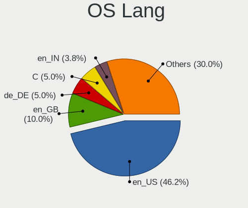
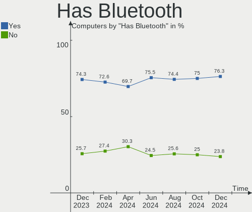
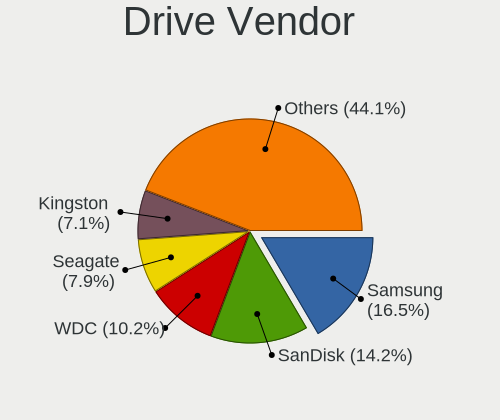
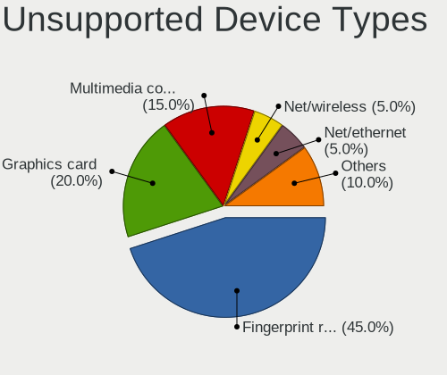

ArcoLinux Hardware Trends
-------------------------

A project to identify most popular hardware characteristics and track their change
over time based on data collected by ArcoLinux users at https://Linux-Hardware.org.

Anyone can contribute to this report by the [hw-probe](https://github.com/linuxhw/hw-probe) tool:

    sudo -E hw-probe -all -upload

This is a report for all computer types. See also reports for [desktops](/Dist/ArcoLinux/Desktop/README.md) and [notebooks](/Dist/ArcoLinux/Notebook/README.md).

Full-feature report is available here: https://linux-hardware.org/?view=trends

Period: Mar, 2022.

Contents
--------

* [ System ](#system)
  - [ OS                       ](#os)
  - [ OS Family                ](#os-family)
  - [ Kernel                   ](#kernel)
  - [ Kernel Family            ](#kernel-family)
  - [ Kernel Major Ver.        ](#kernel-major-ver)
  - [ Arch                     ](#arch)
  - [ DE                       ](#de)
  - [ Display Server           ](#display-server)
  - [ Display Manager          ](#display-manager)
  - [ OS Lang                  ](#os-lang)
  - [ Boot Mode                ](#boot-mode)
  - [ Filesystem               ](#filesystem)
  - [ Part. scheme             ](#part-scheme)
  - [ Dual Boot with Linux/BSD ](#dual-boot-with-linuxbsd)
  - [ Dual Boot (Win)          ](#dual-boot-win)

* [ Board ](#board)
  - [ Vendor                   ](#vendor)
  - [ Model                    ](#model)
  - [ Model Family             ](#model-family)
  - [ MFG Year                 ](#mfg-year)
  - [ Form Factor              ](#form-factor)
  - [ Secure Boot              ](#secure-boot)
  - [ Coreboot                 ](#coreboot)
  - [ RAM Size                 ](#ram-size)
  - [ RAM Used                 ](#ram-used)
  - [ Total Drives             ](#total-drives)
  - [ Has CD-ROM               ](#has-cd-rom)
  - [ Has Ethernet             ](#has-ethernet)
  - [ Has WiFi                 ](#has-wifi)
  - [ Has Bluetooth            ](#has-bluetooth)

* [ Location ](#location)
  - [ Country                  ](#country)
  - [ City                     ](#city)

* [ Drives ](#drives)
  - [ Drive Vendor             ](#drive-vendor)
  - [ Drive Model              ](#drive-model)
  - [ HDD Vendor               ](#hdd-vendor)
  - [ SSD Vendor               ](#ssd-vendor)
  - [ Drive Kind               ](#drive-kind)
  - [ Drive Connector          ](#drive-connector)
  - [ Drive Size               ](#drive-size)
  - [ Space Total              ](#space-total)
  - [ Space Used               ](#space-used)
  - [ Malfunc. Drives          ](#malfunc-drives)
  - [ Malfunc. Drive Vendor    ](#malfunc-drive-vendor)
  - [ Malfunc. HDD Vendor      ](#malfunc-hdd-vendor)
  - [ Malfunc. Drive Kind      ](#malfunc-drive-kind)
  - [ Failed Drives            ](#failed-drives)
  - [ Failed Drive Vendor      ](#failed-drive-vendor)
  - [ Drive Status             ](#drive-status)

* [ Storage controller ](#storage-controller)
  - [ Storage Vendor           ](#storage-vendor)
  - [ Storage Model            ](#storage-model)
  - [ Storage Kind             ](#storage-kind)

* [ Processor ](#processor)
  - [ CPU Vendor               ](#cpu-vendor)
  - [ CPU Model                ](#cpu-model)
  - [ CPU Model Family         ](#cpu-model-family)
  - [ CPU Cores                ](#cpu-cores)
  - [ CPU Sockets              ](#cpu-sockets)
  - [ CPU Threads              ](#cpu-threads)
  - [ CPU Op-Modes             ](#cpu-op-modes)
  - [ CPU Microcode            ](#cpu-microcode)
  - [ CPU Microarch            ](#cpu-microarch)

* [ Graphics ](#graphics)
  - [ GPU Vendor               ](#gpu-vendor)
  - [ GPU Model                ](#gpu-model)
  - [ GPU Combo                ](#gpu-combo)
  - [ GPU Driver               ](#gpu-driver)
  - [ GPU Memory               ](#gpu-memory)

* [ Monitor ](#monitor)
  - [ Monitor Vendor           ](#monitor-vendor)
  - [ Monitor Model            ](#monitor-model)
  - [ Monitor Resolution       ](#monitor-resolution)
  - [ Monitor Diagonal         ](#monitor-diagonal)
  - [ Monitor Width            ](#monitor-width)
  - [ Aspect Ratio             ](#aspect-ratio)
  - [ Monitor Area             ](#monitor-area)
  - [ Pixel Density            ](#pixel-density)
  - [ Multiple Monitors        ](#multiple-monitors)

* [ Network ](#network)
  - [ Net Controller Vendor    ](#net-controller-vendor)
  - [ Net Controller Model     ](#net-controller-model)
  - [ Wireless Vendor          ](#wireless-vendor)
  - [ Wireless Model           ](#wireless-model)
  - [ Ethernet Vendor          ](#ethernet-vendor)
  - [ Ethernet Model           ](#ethernet-model)
  - [ Net Controller Kind      ](#net-controller-kind)
  - [ Used Controller          ](#used-controller)
  - [ NICs                     ](#nics)
  - [ IPv6                     ](#ipv6)

* [ Bluetooth ](#bluetooth)
  - [ Bluetooth Vendor         ](#bluetooth-vendor)
  - [ Bluetooth Model          ](#bluetooth-model)

* [ Sound ](#sound)
  - [ Sound Vendor             ](#sound-vendor)
  - [ Sound Model              ](#sound-model)

* [ Memory ](#memory)
  - [ Memory Vendor            ](#memory-vendor)
  - [ Memory Model             ](#memory-model)
  - [ Memory Kind              ](#memory-kind)
  - [ Memory Form Factor       ](#memory-form-factor)
  - [ Memory Size              ](#memory-size)
  - [ Memory Speed             ](#memory-speed)

* [ Printers & scanners ](#printers--scanners)
  - [ Printer Vendor           ](#printer-vendor)
  - [ Printer Model            ](#printer-model)
  - [ Scanner Vendor           ](#scanner-vendor)
  - [ Scanner Model            ](#scanner-model)

* [ Camera ](#camera)
  - [ Camera Vendor            ](#camera-vendor)
  - [ Camera Model             ](#camera-model)

* [ Security ](#security)
  - [ Fingerprint Vendor       ](#fingerprint-vendor)
  - [ Fingerprint Model        ](#fingerprint-model)
  - [ Chipcard Vendor          ](#chipcard-vendor)
  - [ Chipcard Model           ](#chipcard-model)

* [ Unsupported ](#unsupported)
  - [ Unsupported Devices      ](#unsupported-devices)
  - [ Unsupported Device Types ](#unsupported-device-types)

System
------

OS
--

Installed operating systems

| Name              | Computers | Percent |
|-------------------|-----------|---------|
| ArcoLinux Rolling | 53        | 92.98%  |
| ArcoLinux         | 4         | 7.02%   |

OS Family
---------

OS without a version

| Name      | Computers | Percent |
|-----------|-----------|---------|
| ArcoLinux | 57        | 100%    |

Kernel
------

Version of the Linux kernel

| Version            | Computers | Percent |
|--------------------|-----------|---------|
| 5.16.12-arch1-1    | 8         | 14.04%  |
| 5.16.16-arch1-1    | 7         | 12.28%  |
| 5.16.11-arch1-1    | 6         | 10.53%  |
| 5.16.15-arch1-1    | 5         | 8.77%   |
| 5.16.14-arch1-1    | 5         | 8.77%   |
| 5.16.13-arch1-1    | 5         | 8.77%   |
| 5.17.1-arch1-1     | 4         | 7.02%   |
| 5.16.16-zen1-1-zen | 2         | 3.51%   |
| 5.15.26-1-lts      | 2         | 3.51%   |
| 5.15.10-arch1-1    | 2         | 3.51%   |
| 5.16.2-arch1-1     | 1         | 1.75%   |
| 5.16.15-zen1-1-zen | 1         | 1.75%   |
| 5.16.14-zen1-1-zen | 1         | 1.75%   |
| 5.16.13-zen1-1-zen | 1         | 1.75%   |
| 5.16.12-zen1-1-zen | 1         | 1.75%   |
| 5.16.12-lqx1-1-lqx | 1         | 1.75%   |
| 5.16.11-AMD-znver2 | 1         | 1.75%   |
| 5.15.32-1-lts      | 1         | 1.75%   |
| 5.15.31-1-lts      | 1         | 1.75%   |
| 5.15.11-arch2-1    | 1         | 1.75%   |
| 5.10.68-1-lts      | 1         | 1.75%   |

Kernel Family
-------------

Linux kernel without a distro release

| Version | Computers | Percent |
|---------|-----------|---------|
| 5.16.12 | 10        | 17.54%  |
| 5.16.16 | 9         | 15.79%  |
| 5.16.11 | 7         | 12.28%  |
| 5.16.15 | 6         | 10.53%  |
| 5.16.14 | 6         | 10.53%  |
| 5.16.13 | 6         | 10.53%  |
| 5.17.1  | 4         | 7.02%   |
| 5.15.26 | 2         | 3.51%   |
| 5.15.10 | 2         | 3.51%   |
| 5.16.2  | 1         | 1.75%   |
| 5.15.32 | 1         | 1.75%   |
| 5.15.31 | 1         | 1.75%   |
| 5.15.11 | 1         | 1.75%   |
| 5.10.68 | 1         | 1.75%   |

Kernel Major Ver.
-----------------

Linux kernel major version

| Version | Computers | Percent |
|---------|-----------|---------|
| 5.16    | 45        | 78.95%  |
| 5.15    | 7         | 12.28%  |
| 5.17    | 4         | 7.02%   |
| 5.10    | 1         | 1.75%   |

Arch
----

OS architecture (x86_64, i586, etc.)

| Name   | Computers | Percent |
|--------|-----------|---------|
| x86_64 | 57        | 100%    |

DE
--

Desktop Environment

| Name       | Computers | Percent |
|------------|-----------|---------|
| XFCE       | 18        | 31.58%  |
| KDE5       | 11        | 19.3%   |
| i3         | 4         | 7.02%   |
| xmonad     | 3         | 5.26%   |
| X-Cinnamon | 3         | 5.26%   |
| awesome    | 3         | 5.26%   |
| GNOME      | 2         | 3.51%   |
| dwm        | 2         | 3.51%   |
| bspwm      | 2         | 3.51%   |
| Unknown    | 2         | 3.51%   |
| qtile      | 1         | 1.75%   |
| openbox    | 1         | 1.75%   |
| MATE       | 1         | 1.75%   |
| LeftWM     | 1         | 1.75%   |
| Deepin     | 1         | 1.75%   |
| Cutefish   | 1         | 1.75%   |
| Cinnamon   | 1         | 1.75%   |

Display Server
--------------

X11 or Wayland

| Name    | Computers | Percent |
|---------|-----------|---------|
| X11     | 51        | 89.47%  |
| Tty     | 4         | 7.02%   |
| Wayland | 2         | 3.51%   |

Display Manager
---------------

SDDM, LightDM, etc.

| Name    | Computers | Percent |
|---------|-----------|---------|
| SDDM    | 36        | 63.16%  |
| LightDM | 14        | 24.56%  |
| Unknown | 5         | 8.77%   |
| GDM     | 2         | 3.51%   |

OS Lang
-------

Language

| Lang    | Computers | Percent |
|---------|-----------|---------|
| en_US   | 37        | 64.91%  |
| es_ES   | 2         | 3.51%   |
| es_AR   | 2         | 3.51%   |
| en_GB   | 2         | 3.51%   |
| tr_TR   | 1         | 1.75%   |
| sv_SE   | 1         | 1.75%   |
| pt_BR   | 1         | 1.75%   |
| pl_PL   | 1         | 1.75%   |
| nl_NL   | 1         | 1.75%   |
| it_IT   | 1         | 1.75%   |
| en_IN   | 1         | 1.75%   |
| en_IE   | 1         | 1.75%   |
| en_DK   | 1         | 1.75%   |
| en_CA   | 1         | 1.75%   |
| en_AU   | 1         | 1.75%   |
| de_DE   | 1         | 1.75%   |
| da_DK   | 1         | 1.75%   |
| Unknown | 1         | 1.75%   |

Boot Mode
---------

EFI or BIOS

| Mode | Computers | Percent |
|------|-----------|---------|
| EFI  | 47        | 82.46%  |
| BIOS | 10        | 17.54%  |

Filesystem
----------

Type of filesystem

| Type    | Computers | Percent |
|---------|-----------|---------|
| Ext4    | 45        | 78.95%  |
| Btrfs   | 9         | 15.79%  |
| Overlay | 2         | 3.51%   |
| Xfs     | 1         | 1.75%   |

Part. scheme
------------

Scheme of partitioning

| Type    | Computers | Percent |
|---------|-----------|---------|
| GPT     | 50        | 87.72%  |
| MBR     | 4         | 7.02%   |
| Unknown | 3         | 5.26%   |

Dual Boot with Linux/BSD
------------------------

Hosting more than one Linux/BSD

| Dual boot | Computers | Percent |
|-----------|-----------|---------|
| No        | 39        | 68.42%  |
| Yes       | 18        | 31.58%  |

Dual Boot (Win)
---------------

Hosting Linux and Windows

| Dual boot | Computers | Percent |
|-----------|-----------|---------|
| No        | 38        | 66.67%  |
| Yes       | 19        | 33.33%  |

Board
-----

Vendor
------

Motherboard manufacturer

| Name                | Computers | Percent |
|---------------------|-----------|---------|
| Lenovo              | 10        | 17.54%  |
| Dell                | 8         | 14.04%  |
| ASUSTek Computer    | 8         | 14.04%  |
| MSI                 | 7         | 12.28%  |
| ASRock              | 4         | 7.02%   |
| Hewlett-Packard     | 3         | 5.26%   |
| Gigabyte Technology | 3         | 5.26%   |
| Supermicro          | 2         | 3.51%   |
| Intel               | 2         | 3.51%   |
| Acer                | 2         | 3.51%   |
| System76            | 1         | 1.75%   |
| Sony                | 1         | 1.75%   |
| Samsung Electronics | 1         | 1.75%   |
| Kanji               | 1         | 1.75%   |
| HUAWEI              | 1         | 1.75%   |
| HPE                 | 1         | 1.75%   |
| Biostar             | 1         | 1.75%   |
| Unknown             | 1         | 1.75%   |

Model
-----

Motherboard model

| Name                                     | Computers | Percent |
|------------------------------------------|-----------|---------|
| MSI MS-7B98                              | 2         | 3.51%   |
| Unknown                                  | 2         | 3.51%   |
| System76 Oryx Pro                        | 1         | 1.75%   |
| Supermicro SYS-E100-9AP                  | 1         | 1.75%   |
| Supermicro SYS-5019A-FTN4                | 1         | 1.75%   |
| Sony VPCEH25FM                           | 1         | 1.75%   |
| Samsung 3570R/370R/470R/450R/510R/4450RV | 1         | 1.75%   |
| MSI MS-7B89                              | 1         | 1.75%   |
| MSI MS-7B86                              | 1         | 1.75%   |
| MSI MS-7A34                              | 1         | 1.75%   |
| MSI MS-7978                              | 1         | 1.75%   |
| MSI GS66 Stealth 10SE                    | 1         | 1.75%   |
| Lenovo Yoga 7 14ACN6 82N7                | 1         | 1.75%   |
| Lenovo ThinkPad X260 20F60086MD          | 1         | 1.75%   |
| Lenovo ThinkPad X1 Nano Gen 1 20UN002PCK | 1         | 1.75%   |
| Lenovo ThinkPad T460s 20F9S02U00         | 1         | 1.75%   |
| Lenovo ThinkPad T420 4180MBM             | 1         | 1.75%   |
| Lenovo ThinkPad T14 Gen 2a 20XKCTO1WW    | 1         | 1.75%   |
| Lenovo ThinkBook 15 G2 ITL 20VE          | 1         | 1.75%   |
| Lenovo Legion 5 Pro 16ACH6H 82JQ         | 1         | 1.75%   |
| Lenovo IdeaPad Gaming 3 15IMH05 81Y4     | 1         | 1.75%   |
| Lenovo B550 20053                        | 1         | 1.75%   |
| Kanji Tamura MAX DUO                     | 1         | 1.75%   |
| Intel NUC7CJYH                           | 1         | 1.75%   |
| HUAWEI KLVL-WXX9                         | 1         | 1.75%   |
| HPE ProLiant DL380 Gen10                 | 1         | 1.75%   |
| HP Laptop 15-dw0xxx                      | 1         | 1.75%   |
| HP Laptop 15-da0xxx                      | 1         | 1.75%   |
| HP Desktop M01-F0xxx                     | 1         | 1.75%   |
| Gigabyte X570 GAMING X                   | 1         | 1.75%   |
| Gigabyte AB350N-Gaming WIFI              | 1         | 1.75%   |
| Gigabyte A520M H                         | 1         | 1.75%   |
| Dell XPS 13 7390                         | 1         | 1.75%   |
| Dell Precision M4800                     | 1         | 1.75%   |
| Dell Precision 7540                      | 1         | 1.75%   |
| Dell OptiPlex 7050                       | 1         | 1.75%   |
| Dell OptiPlex 7020                       | 1         | 1.75%   |
| Dell Latitude E7240                      | 1         | 1.75%   |
| Dell Inspiron 7520                       | 1         | 1.75%   |
| Dell Inspiron 15 7000 Gaming             | 1         | 1.75%   |
| Biostar J3060NH                          | 1         | 1.75%   |
| ASUS ROG Strix G513IC_G513IC             | 1         | 1.75%   |
| ASUS ROG STRIX B550-F GAMING             | 1         | 1.75%   |
| ASUS PRIME Z490-A                        | 1         | 1.75%   |
| ASUS PRIME X570-P                        | 1         | 1.75%   |
| ASUS P8Z77-V LE                          | 1         | 1.75%   |
| ASUS N550JK                              | 1         | 1.75%   |
| ASUS CM6870                              | 1         | 1.75%   |
| ASUS 1145991                             | 1         | 1.75%   |
| ASRock Z87 Professional                  | 1         | 1.75%   |
| ASRock X399 Taichi                       | 1         | 1.75%   |
| ASRock B550 Phantom Gaming 4/ac          | 1         | 1.75%   |
| ASRock B450M Steel Legend                | 1         | 1.75%   |
| Acer Predator G3-710                     | 1         | 1.75%   |
| Acer Aspire A515-52G                     | 1         | 1.75%   |

Model Family
------------

Motherboard model prefix

| Name                      | Computers | Percent |
|---------------------------|-----------|---------|
| Lenovo ThinkPad           | 5         | 8.77%   |
| MSI MS-7B98               | 2         | 3.51%   |
| HP Laptop                 | 2         | 3.51%   |
| Dell Precision            | 2         | 3.51%   |
| Dell OptiPlex             | 2         | 3.51%   |
| Dell Inspiron             | 2         | 3.51%   |
| ASUS ROG                  | 2         | 3.51%   |
| ASUS PRIME                | 2         | 3.51%   |
| Unknown                   | 2         | 3.51%   |
| System76 Oryx             | 1         | 1.75%   |
| Supermicro SYS-E100-9AP   | 1         | 1.75%   |
| Supermicro SYS-5019A-FTN4 | 1         | 1.75%   |
| Sony VPCEH25FM            | 1         | 1.75%   |
| Samsung 3570R             | 1         | 1.75%   |
| MSI MS-7B89               | 1         | 1.75%   |
| MSI MS-7B86               | 1         | 1.75%   |
| MSI MS-7A34               | 1         | 1.75%   |
| MSI MS-7978               | 1         | 1.75%   |
| MSI GS66                  | 1         | 1.75%   |
| Lenovo Yoga               | 1         | 1.75%   |
| Lenovo ThinkBook          | 1         | 1.75%   |
| Lenovo Legion             | 1         | 1.75%   |
| Lenovo IdeaPad            | 1         | 1.75%   |
| Lenovo B550               | 1         | 1.75%   |
| Kanji Tamura              | 1         | 1.75%   |
| Intel NUC7CJYH            | 1         | 1.75%   |
| HUAWEI KLVL-WXX9          | 1         | 1.75%   |
| HPE ProLiant              | 1         | 1.75%   |
| HP Desktop                | 1         | 1.75%   |
| Gigabyte X570             | 1         | 1.75%   |
| Gigabyte AB350N-Gaming    | 1         | 1.75%   |
| Gigabyte A520M            | 1         | 1.75%   |
| Dell XPS                  | 1         | 1.75%   |
| Dell Latitude             | 1         | 1.75%   |
| Biostar J3060NH           | 1         | 1.75%   |
| ASUS P8Z77-V              | 1         | 1.75%   |
| ASUS N550JK               | 1         | 1.75%   |
| ASUS CM6870               | 1         | 1.75%   |
| ASUS 1145991              | 1         | 1.75%   |
| ASRock Z87                | 1         | 1.75%   |
| ASRock X399               | 1         | 1.75%   |
| ASRock B550               | 1         | 1.75%   |
| ASRock B450M              | 1         | 1.75%   |
| Acer Predator             | 1         | 1.75%   |
| Acer Aspire               | 1         | 1.75%   |

MFG Year
--------

Motherboard manufacture year

| Year | Computers | Percent |
|------|-----------|---------|
| 2020 | 11        | 19.3%   |
| 2019 | 11        | 19.3%   |
| 2021 | 6         | 10.53%  |
| 2018 | 6         | 10.53%  |
| 2017 | 5         | 8.77%   |
| 2015 | 5         | 8.77%   |
| 2016 | 3         | 5.26%   |
| 2013 | 3         | 5.26%   |
| 2012 | 3         | 5.26%   |
| 2011 | 2         | 3.51%   |
| 2014 | 1         | 1.75%   |
| 2010 | 1         | 1.75%   |

Form Factor
-----------

Physical design of the computer

| Name        | Computers | Percent |
|-------------|-----------|---------|
| Desktop     | 28        | 49.12%  |
| Notebook    | 25        | 43.86%  |
| Convertible | 2         | 3.51%   |
| Mini pc     | 1         | 1.75%   |
| Server      | 1         | 1.75%   |

Secure Boot
-----------

Enabled or disabled

| State    | Computers | Percent |
|----------|-----------|---------|
| Disabled | 57        | 100%    |

Coreboot
--------

Have coreboot on board

| Used | Computers | Percent |
|------|-----------|---------|
| No   | 57        | 100%    |

RAM Size
--------

Total RAM memory

| Size in GB  | Computers | Percent |
|-------------|-----------|---------|
| 16.01-24.0  | 16        | 28.07%  |
| 8.01-16.0   | 12        | 21.05%  |
| 4.01-8.0    | 11        | 19.3%   |
| 32.01-64.0  | 11        | 19.3%   |
| 3.01-4.0    | 3         | 5.26%   |
| 24.01-32.0  | 3         | 5.26%   |
| 64.01-256.0 | 1         | 1.75%   |

RAM Used
--------

Used RAM memory

| Used GB   | Computers | Percent |
|-----------|-----------|---------|
| 2.01-3.0  | 22        | 38.6%   |
| 1.01-2.0  | 11        | 19.3%   |
| 4.01-8.0  | 8         | 14.04%  |
| 3.01-4.0  | 7         | 12.28%  |
| 0.51-1.0  | 5         | 8.77%   |
| 8.01-16.0 | 3         | 5.26%   |
| 0.01-0.5  | 1         | 1.75%   |

Total Drives
------------

Number of drives on board

| Drives | Computers | Percent |
|--------|-----------|---------|
| 1      | 29        | 50.88%  |
| 2      | 17        | 29.82%  |
| 3      | 6         | 10.53%  |
| 4      | 3         | 5.26%   |
| 8      | 1         | 1.75%   |
| 6      | 1         | 1.75%   |

Has CD-ROM
----------

Has CD-ROM on board

| Presented | Computers | Percent |
|-----------|-----------|---------|
| No        | 46        | 80.7%   |
| Yes       | 11        | 19.3%   |

Has Ethernet
------------

Has Ethernet on board

| Presented | Computers | Percent |
|-----------|-----------|---------|
| Yes       | 54        | 94.74%  |
| No        | 3         | 5.26%   |

Has WiFi
--------

Has WiFi module

| Presented | Computers | Percent |
|-----------|-----------|---------|
| Yes       | 41        | 71.93%  |
| No        | 16        | 28.07%  |

Has Bluetooth
-------------

Has Bluetooth module

| Presented | Computers | Percent |
|-----------|-----------|---------|
| Yes       | 34        | 59.65%  |
| No        | 23        | 40.35%  |

Location
--------

Country
-------

Geographic location (country)

| Country     | Computers | Percent |
|-------------|-----------|---------|
| USA         | 17        | 29.82%  |
| Sweden      | 3         | 5.26%   |
| Italy       | 3         | 5.26%   |
| UK          | 2         | 3.51%   |
| Turkey      | 2         | 3.51%   |
| Spain       | 2         | 3.51%   |
| Indonesia   | 2         | 3.51%   |
| Germany     | 2         | 3.51%   |
| Denmark     | 2         | 3.51%   |
| Croatia     | 2         | 3.51%   |
| Belgium     | 2         | 3.51%   |
| Argentina   | 2         | 3.51%   |
| UAE         | 1         | 1.75%   |
| Poland      | 1         | 1.75%   |
| Netherlands | 1         | 1.75%   |
| Mexico      | 1         | 1.75%   |
| Kenya       | 1         | 1.75%   |
| Iran        | 1         | 1.75%   |
| India       | 1         | 1.75%   |
| France      | 1         | 1.75%   |
| Czechia     | 1         | 1.75%   |
| Colombia    | 1         | 1.75%   |
| Canada      | 1         | 1.75%   |
| Bulgaria    | 1         | 1.75%   |
| Brazil      | 1         | 1.75%   |
| Barbados    | 1         | 1.75%   |
| Bangladesh  | 1         | 1.75%   |
| Australia   | 1         | 1.75%   |

City
----

Geographic location (city)

| City                | Computers | Percent |
|---------------------|-----------|---------|
| Durham              | 3         | 5.26%   |
| Lier                | 2         | 3.51%   |
| Chicago             | 2         | 3.51%   |
| Brooklyn            | 2         | 3.51%   |
| Zagreb              | 1         | 1.75%   |
| Tucson              | 1         | 1.75%   |
| Tehran              | 1         | 1.75%   |
| Sydney              | 1         | 1.75%   |
| Surrey              | 1         | 1.75%   |
| St Helens           | 1         | 1.75%   |
| Sierksdorf          | 1         | 1.75%   |
| Seville             | 1         | 1.75%   |
| Sandviken           | 1         | 1.75%   |
| Saeffle             | 1         | 1.75%   |
| Rosario             | 1         | 1.75%   |
| Purwokerto          | 1         | 1.75%   |
| Portland            | 1         | 1.75%   |
| Plainfield          | 1         | 1.75%   |
| Pardubice           | 1         | 1.75%   |
| Padova              | 1         | 1.75%   |
| Odense              | 1         | 1.75%   |
| Novi Pazar          | 1         | 1.75%   |
| Nairobi             | 1         | 1.75%   |
| Montesilvano Marina | 1         | 1.75%   |
| Minneapolis         | 1         | 1.75%   |
| Milan               | 1         | 1.75%   |
| Mattoon             | 1         | 1.75%   |
| Malmo               | 1         | 1.75%   |
| Lodz                | 1         | 1.75%   |
| Le Relecq-Kerhuon   | 1         | 1.75%   |
| Karlovac            | 1         | 1.75%   |
| Jakarta             | 1         | 1.75%   |
| Houston             | 1         | 1.75%   |
| Houghton            | 1         | 1.75%   |
| Haarlem             | 1         | 1.75%   |
| Farrukhabad         | 1         | 1.75%   |
| Dudley              | 1         | 1.75%   |
| Dubai               | 1         | 1.75%   |
| Dhaka               | 1         | 1.75%   |
| Denizli             | 1         | 1.75%   |
| Córdoba            | 1         | 1.75%   |
| Copenhagen          | 1         | 1.75%   |
| Canoas              | 1         | 1.75%   |
| Bridgetown          | 1         | 1.75%   |
| Breitenbrunn        | 1         | 1.75%   |
| Bogotá             | 1         | 1.75%   |
| Baton Rouge         | 1         | 1.75%   |
| Barcelona           | 1         | 1.75%   |
| Atlanta             | 1         | 1.75%   |
| Apodaca             | 1         | 1.75%   |
| Antalya             | 1         | 1.75%   |
| Anna                | 1         | 1.75%   |

Drives
------

Drive Vendor
------------

Hard drive vendors

| Vendor              | Computers | Drives | Percent |
|---------------------|-----------|--------|---------|
| WDC                 | 18        | 21     | 18.37%  |
| Samsung Electronics | 13        | 16     | 13.27%  |
| Seagate             | 11        | 14     | 11.22%  |
| Toshiba             | 9         | 10     | 9.18%   |
| Kingston            | 8         | 8      | 8.16%   |
| Crucial             | 6         | 7      | 6.12%   |
| SanDisk             | 5         | 5      | 5.1%    |
| SPCC                | 3         | 3      | 3.06%   |
| SK Hynix            | 3         | 3      | 3.06%   |
| Unknown             | 2         | 2      | 2.04%   |
| Intel               | 2         | 2      | 2.04%   |
| HGST                | 2         | 2      | 2.04%   |
| XPG                 | 1         | 1      | 1.02%   |
| Transcend           | 1         | 1      | 1.02%   |
| StoreJet            | 1         | 1      | 1.02%   |
| SSSTC               | 1         | 1      | 1.02%   |
| Phison Electronics  | 1         | 1      | 1.02%   |
| Phison              | 1         | 1      | 1.02%   |
| Micron Technology   | 1         | 1      | 1.02%   |
| LITEON              | 1         | 1      | 1.02%   |
| HS-SSD-C100         | 1         | 1      | 1.02%   |
| HPE                 | 1         | 1      | 1.02%   |
| Hitachi             | 1         | 1      | 1.02%   |
| Hewlett-Packard     | 1         | 1      | 1.02%   |
| Gigabyte Technology | 1         | 1      | 1.02%   |
| Drevo               | 1         | 1      | 1.02%   |
| Corsair             | 1         | 1      | 1.02%   |
| ASMedia             | 1         | 1      | 1.02%   |

Drive Model
-----------

Hard drive models

| Model                                       | Computers | Percent |
|---------------------------------------------|-----------|---------|
| Kingston SA400S37240G 240GB SSD             | 3         | 2.83%   |
| Crucial CT1000P1SSD8 1TB                    | 3         | 2.83%   |
| WDC WDS500G2B0B-00YS70 500GB SSD            | 2         | 1.89%   |
| WDC WD10SPZX-08Z10 1TB                      | 2         | 1.89%   |
| Seagate ST2000DM008-2FR102 2TB              | 2         | 1.89%   |
| Seagate ST1000DM003-1SB102 1TB              | 2         | 1.89%   |
| SanDisk SSD PLUS 240GB                      | 2         | 1.89%   |
| Samsung SSD 970 EVO Plus 500GB              | 2         | 1.89%   |
| Samsung SSD 840 EVO 120GB                   | 2         | 1.89%   |
| Kingston SA400M8240G 240GB SSD              | 2         | 1.89%   |
| XPG GAMMIX S11 Pro 256GB                    | 1         | 0.94%   |
| WDC WDS500G2B0A-00SM50 500GB SSD            | 1         | 0.94%   |
| WDC WDS100T2G0A-00JH30 1TB SSD              | 1         | 0.94%   |
| WDC WDS100T2B0C 1TB                         | 1         | 0.94%   |
| WDC WDBNCE5000PNC 500GB SSD                 | 1         | 0.94%   |
| WDC WD7500BPVT-55HXZT4 752GB                | 1         | 0.94%   |
| WDC WD5000AAKX-603CA0 500GB                 | 1         | 0.94%   |
| WDC WD40EFRX-68N32N0 4TB                    | 1         | 0.94%   |
| WDC WD20SPZX-22UA7T0 2TB                    | 1         | 0.94%   |
| WDC WD10JPVX-75JC3T0 1TB                    | 1         | 0.94%   |
| WDC WD10EZRX-00D8PB0 1TB                    | 1         | 0.94%   |
| WDC WD10EZEX-08WN4A0 1TB                    | 1         | 0.94%   |
| WDC WD10EZEX-00WN4A0 1TB                    | 1         | 0.94%   |
| WDC WD10EUCX-63YZ1Y0 1TB                    | 1         | 0.94%   |
| WDC WD10EARX-00N0YB0 1TB                    | 1         | 0.94%   |
| WDC PC SN730 SDBPNTY-1T00-1101 1TB          | 1         | 0.94%   |
| WDC PC SN530 SDBPNPZ-512G-1032 512GB        | 1         | 0.94%   |
| Unknown SD/MMC/MS PRO 32GB                  | 1         | 0.94%   |
| Unknown APPSD  134GB                        | 1         | 0.94%   |
| Transcend TS480GSSD220S 480GB               | 1         | 0.94%   |
| Toshiba TR150 120GB SSD                     | 1         | 0.94%   |
| Toshiba THNSNJ512GDNU 512GB SSD             | 1         | 0.94%   |
| Toshiba MQ04ABF100 1TB                      | 1         | 0.94%   |
| Toshiba MK3261GSY 320GB                     | 1         | 0.94%   |
| Toshiba KXG6AZNV512G NVMe SED 512GB         | 1         | 0.94%   |
| Toshiba KXG60ZNV1T02 1TB                    | 1         | 0.94%   |
| Toshiba KBG40ZNT1T02 MEMORY 1TB             | 1         | 0.94%   |
| Toshiba HDWD110 1TB                         | 1         | 0.94%   |
| Toshiba DT01ACA200 2TB                      | 1         | 0.94%   |
| StoreJet Transcend 960GB                    | 1         | 0.94%   |
| SSSTC CVB-8D128-HP 128GB SSD                | 1         | 0.94%   |
| SPCC Solid State Disk 256GB                 | 1         | 0.94%   |
| SPCC Solid State Disk 120GB                 | 1         | 0.94%   |
| SPCC M.2 PCIe SSD 512GB                     | 1         | 0.94%   |
| SK Hynix SKHynix_HFS001TDE9X084N 1TB        | 1         | 0.94%   |
| SK Hynix SKHynix_HFM512GD3HX015N 512GB      | 1         | 0.94%   |
| SK Hynix PC611 NVMe 512GB                   | 1         | 0.94%   |
| Seagate ST330006 51NS 3TB                   | 1         | 0.94%   |
| Seagate ST32000542AS 2TB                    | 1         | 0.94%   |
| Seagate ST31000524AS 1TB                    | 1         | 0.94%   |
| Seagate ST3000DM001-1CH166 3TB              | 1         | 0.94%   |
| Seagate ST3000DM 001-1E6166 3TB             | 1         | 0.94%   |
| Seagate ST1000LM024 HN-M101MBB 1TB          | 1         | 0.94%   |
| Seagate ST1000DM010-2EP102 1TB              | 1         | 0.94%   |
| Seagate FireCuda 510 SSD ZP500GM30021 500GB | 1         | 0.94%   |
| Seagate Expansion HDD 5TB                   | 1         | 0.94%   |
| Seagate Expansion 320GB                     | 1         | 0.94%   |
| SanDisk SDSSDA480G 480GB                    | 1         | 0.94%   |
| Sandisk NVMe SSD Drive 500GB                | 1         | 0.94%   |
| SanDisk DF4032  32GB                        | 1         | 0.94%   |

HDD Vendor
----------

Hard disk drive vendors

| Vendor              | Computers | Drives | Percent |
|---------------------|-----------|--------|---------|
| WDC                 | 12        | 13     | 34.29%  |
| Seagate             | 11        | 13     | 31.43%  |
| Toshiba             | 4         | 5      | 11.43%  |
| HGST                | 2         | 2      | 5.71%   |
| Unknown             | 1         | 1      | 2.86%   |
| StoreJet            | 1         | 1      | 2.86%   |
| Samsung Electronics | 1         | 1      | 2.86%   |
| Hitachi             | 1         | 1      | 2.86%   |
| Hewlett-Packard     | 1         | 1      | 2.86%   |
| ASMedia             | 1         | 1      | 2.86%   |

SSD Vendor
----------

Solid state drive vendors

| Vendor              | Computers | Drives | Percent |
|---------------------|-----------|--------|---------|
| Samsung Electronics | 8         | 9      | 21.62%  |
| Kingston            | 8         | 8      | 21.62%  |
| WDC                 | 5         | 5      | 13.51%  |
| SanDisk             | 3         | 3      | 8.11%   |
| Toshiba             | 2         | 2      | 5.41%   |
| SPCC                | 2         | 2      | 5.41%   |
| Crucial             | 2         | 2      | 5.41%   |
| Transcend           | 1         | 1      | 2.7%    |
| SSSTC               | 1         | 1      | 2.7%    |
| Micron Technology   | 1         | 1      | 2.7%    |
| LITEON              | 1         | 1      | 2.7%    |
| HS-SSD-C100         | 1         | 1      | 2.7%    |
| HPE                 | 1         | 1      | 2.7%    |
| Drevo               | 1         | 1      | 2.7%    |

Drive Kind
----------

HDD or SSD

| Kind | Computers | Drives | Percent |
|------|-----------|--------|---------|
| SSD  | 33        | 38     | 37.08%  |
| HDD  | 29        | 39     | 32.58%  |
| NVMe | 25        | 30     | 28.09%  |
| MMC  | 2         | 2      | 2.25%   |

Drive Connector
---------------

SATA, SAS, NVMe, etc.

| Type | Computers | Drives | Percent |
|------|-----------|--------|---------|
| SATA | 41        | 68     | 55.41%  |
| NVMe | 25        | 30     | 33.78%  |
| SAS  | 6         | 9      | 8.11%   |
| MMC  | 2         | 2      | 2.7%    |

Drive Size
----------

Size of hard drive

| Size in TB | Computers | Drives | Percent |
|------------|-----------|--------|---------|
| 0.01-0.5   | 32        | 40     | 49.23%  |
| 0.51-1.0   | 22        | 23     | 33.85%  |
| 1.01-2.0   | 7         | 8      | 10.77%  |
| 2.01-3.0   | 2         | 3      | 3.08%   |
| 3.01-4.0   | 1         | 2      | 1.54%   |
| 4.01-10.0  | 1         | 1      | 1.54%   |

Space Total
-----------

Amount of disk space available on the file system

| Size in GB     | Computers | Percent |
|----------------|-----------|---------|
| 251-500        | 13        | 22.81%  |
| 501-1000       | 13        | 22.81%  |
| 1001-2000      | 9         | 15.79%  |
| 101-250        | 7         | 12.28%  |
| More than 3000 | 5         | 8.77%   |
| Unknown        | 4         | 7.02%   |
| 1-20           | 2         | 3.51%   |
| 51-100         | 2         | 3.51%   |
| 21-50          | 1         | 1.75%   |
| 2001-3000      | 1         | 1.75%   |

Space Used
----------

Amount of used disk space

| Used GB        | Computers | Percent |
|----------------|-----------|---------|
| 101-250        | 13        | 22.81%  |
| 21-50          | 11        | 19.3%   |
| 1-20           | 11        | 19.3%   |
| 251-500        | 6         | 10.53%  |
| 501-1000       | 5         | 8.77%   |
| 51-100         | 5         | 8.77%   |
| Unknown        | 4         | 7.02%   |
| More than 3000 | 2         | 3.51%   |

Malfunc. Drives
---------------

Drive models with a malfunction

| Model                                 | Computers | Drives | Percent |
|---------------------------------------|-----------|--------|---------|
| WDC WD7500BPVT-55HXZT4 752GB          | 1         | 1      | 9.09%   |
| WDC WD5000AAKX-603CA0 500GB           | 1         | 1      | 9.09%   |
| WDC WD40EFRX-68N32N0 4TB              | 1         | 2      | 9.09%   |
| WDC WD10SPZX-08Z10 1TB                | 1         | 1      | 9.09%   |
| WDC WD10EZEX-00WN4A0 1TB              | 1         | 1      | 9.09%   |
| Toshiba DT01ACA200 2TB                | 1         | 2      | 9.09%   |
| SSSTC CVB-8D128-HP 128GB SSD          | 1         | 1      | 9.09%   |
| Samsung Electronics SSD 840 EVO 120GB | 1         | 1      | 9.09%   |
| HGST HTS721010A9 1TB                  | 1         | 1      | 9.09%   |
| Drevo X1 pro 480G SSD                 | 1         | 1      | 9.09%   |
| ASMedia AS2115 240GB                  | 1         | 1      | 9.09%   |

Malfunc. Drive Vendor
---------------------

Vendors of faulty drives

| Vendor              | Computers | Drives | Percent |
|---------------------|-----------|--------|---------|
| WDC                 | 5         | 6      | 45.45%  |
| Toshiba             | 1         | 2      | 9.09%   |
| SSSTC               | 1         | 1      | 9.09%   |
| Samsung Electronics | 1         | 1      | 9.09%   |
| HGST                | 1         | 1      | 9.09%   |
| Drevo               | 1         | 1      | 9.09%   |
| ASMedia             | 1         | 1      | 9.09%   |

Malfunc. HDD Vendor
-------------------

Vendors of faulty HDD drives

| Vendor  | Computers | Drives | Percent |
|---------|-----------|--------|---------|
| WDC     | 5         | 6      | 62.5%   |
| Toshiba | 1         | 2      | 12.5%   |
| HGST    | 1         | 1      | 12.5%   |
| ASMedia | 1         | 1      | 12.5%   |

Malfunc. Drive Kind
-------------------

Kinds of faulty drives

| Kind | Computers | Drives | Percent |
|------|-----------|--------|---------|
| HDD  | 8         | 10     | 72.73%  |
| SSD  | 3         | 3      | 27.27%  |

Failed Drives
-------------

Failed drive models

Zero info for selected period =(

Failed Drive Vendor
-------------------

Failed drive vendors

Zero info for selected period =(

Drive Status
------------

Number of failed and malfunc. drives

| Status   | Computers | Drives | Percent |
|----------|-----------|--------|---------|
| Works    | 51        | 82     | 70.83%  |
| Malfunc  | 11        | 13     | 15.28%  |
| Detected | 10        | 14     | 13.89%  |

Storage controller
------------------

Storage Vendor
--------------

Storage controller vendors

| Vendor                       | Computers | Percent |
|------------------------------|-----------|---------|
| Intel                        | 37        | 45.12%  |
| AMD                          | 15        | 18.29%  |
| Samsung Electronics          | 6         | 7.32%   |
| Phison Electronics           | 5         | 6.1%    |
| Sandisk                      | 4         | 4.88%   |
| Micron/Crucial Technology    | 4         | 4.88%   |
| SK Hynix                     | 3         | 3.66%   |
| Toshiba America Info Systems | 2         | 2.44%   |
| Seagate Technology           | 1         | 1.22%   |
| Marvell Technology Group     | 1         | 1.22%   |
| KIOXIA                       | 1         | 1.22%   |
| ASMedia Technology           | 1         | 1.22%   |
| ADATA Technology             | 1         | 1.22%   |
| Adaptec                      | 1         | 1.22%   |

Storage Model
-------------

Storage controller models

| Model                                                                            | Computers | Percent |
|----------------------------------------------------------------------------------|-----------|---------|
| AMD FCH SATA Controller [AHCI mode]                                              | 10        | 10.99%  |
| Phison E12 NVMe Controller                                                       | 5         | 5.49%   |
| Intel 82801 Mobile SATA Controller [RAID mode]                                   | 5         | 5.49%   |
| AMD 400 Series Chipset SATA Controller                                           | 5         | 5.49%   |
| Samsung NVMe SSD Controller SM981/PM981/PM983                                    | 4         | 4.4%    |
| Sandisk WD Blue SN550 NVMe SSD                                                   | 3         | 3.3%    |
| Micron/Crucial NVMe Controller                                                   | 3         | 3.3%    |
| Intel 8 Series/C220 Series Chipset Family 6-port SATA Controller 1 [AHCI mode]   | 3         | 3.3%    |
| AMD 500 Series Chipset SATA Controller                                           | 3         | 3.3%    |
| Toshiba America Info Systems XG6 NVMe SSD Controller                             | 2         | 2.2%    |
| SK Hynix Gold P31 SSD                                                            | 2         | 2.2%    |
| Samsung NVMe SSD Controller 980                                                  | 2         | 2.2%    |
| Intel Sunrise Point-LP SATA Controller [AHCI mode]                               | 2         | 2.2%    |
| Intel Q170/Q150/B150/H170/H110/Z170/CM236 Chipset SATA Controller [AHCI Mode]    | 2         | 2.2%    |
| Intel Celeron/Pentium Silver Processor SATA Controller                           | 2         | 2.2%    |
| Intel Celeron N3350/Pentium N4200/Atom E3900 Series SATA AHCI Controller         | 2         | 2.2%    |
| Intel Cannon Lake PCH SATA AHCI Controller                                       | 2         | 2.2%    |
| Intel Cannon Lake Mobile PCH SATA AHCI Controller                                | 2         | 2.2%    |
| Intel 7 Series/C210 Series Chipset Family 6-port SATA Controller [AHCI mode]     | 2         | 2.2%    |
| Intel 7 Series Chipset Family 6-port SATA Controller [AHCI mode]                 | 2         | 2.2%    |
| Intel 6 Series/C200 Series Chipset Family 6 port Mobile SATA AHCI Controller     | 2         | 2.2%    |
| AMD 300 Series Chipset SATA Controller                                           | 2         | 2.2%    |
| SK Hynix Non-Volatile memory controller                                          | 1         | 1.1%    |
| Seagate FireCuda 510 SSD                                                         | 1         | 1.1%    |
| Sandisk WD Black SN750 / PC SN730 NVMe SSD                                       | 1         | 1.1%    |
| Micron/Crucial P2 NVMe PCIe SSD                                                  | 1         | 1.1%    |
| Marvell Group 88SE9120 SATA 6Gb/s Controller                                     | 1         | 1.1%    |
| KIOXIA Non-Volatile memory controller                                            | 1         | 1.1%    |
| Intel Tiger Lake-LP SATA Controller [AHCI mode]                                  | 1         | 1.1%    |
| Intel SSD 660P Series                                                            | 1         | 1.1%    |
| Intel Non-Volatile memory controller                                             | 1         | 1.1%    |
| Intel Comet Lake PCH-H RAID                                                      | 1         | 1.1%    |
| Intel Atom/Celeron/Pentium Processor x5-E8000/J3xxx/N3xxx Series SATA Controller | 1         | 1.1%    |
| Intel Atom Processor C3000 Series SATA Controller 1                              | 1         | 1.1%    |
| Intel Atom Processor C3000 Series SATA Controller 0                              | 1         | 1.1%    |
| Intel 82801IBM/IEM (ICH9M/ICH9M-E) 4 port SATA Controller [AHCI mode]            | 1         | 1.1%    |
| Intel 7 Series/C210 Series Chipset Family 4-port SATA Controller [IDE mode]      | 1         | 1.1%    |
| Intel 7 Series/C210 Series Chipset Family 2-port SATA Controller [IDE mode]      | 1         | 1.1%    |
| Intel 5 Series/3400 Series Chipset 4 port SATA IDE Controller                    | 1         | 1.1%    |
| Intel 5 Series/3400 Series Chipset 2 port SATA IDE Controller                    | 1         | 1.1%    |
| Intel 400 Series Chipset Family SATA AHCI Controller                             | 1         | 1.1%    |
| Intel 200 Series PCH SATA controller [AHCI mode]                                 | 1         | 1.1%    |
| ASMedia ASM1062 Serial ATA Controller                                            | 1         | 1.1%    |
| AMD X399 Series Chipset SATA Controller                                          | 1         | 1.1%    |
| ADATA XPG SX8200 Pro PCIe Gen3x4 M.2 2280 Solid State Drive                      | 1         | 1.1%    |
| Adaptec Smart Storage PQI SAS                                                    | 1         | 1.1%    |

Storage Kind
------------

Kind of storage controller (IDE, SATA, NVMe, SAS, ...)

| Kind | Computers | Percent |
|------|-----------|---------|
| SATA | 42        | 55.26%  |
| NVMe | 25        | 32.89%  |
| RAID | 6         | 7.89%   |
| IDE  | 2         | 2.63%   |
| SAS  | 1         | 1.32%   |

Processor
---------

CPU Vendor
----------

Processor vendors

| Vendor | Computers | Percent |
|--------|-----------|---------|
| Intel  | 39        | 68.42%  |
| AMD    | 18        | 31.58%  |

CPU Model
---------

Processor models

| Model                                          | Computers | Percent |
|------------------------------------------------|-----------|---------|
| AMD Ryzen 5 3600 6-Core Processor              | 3         | 5.26%   |
| Intel Core i7-10750H CPU @ 2.60GHz             | 2         | 3.51%   |
| Intel Core i5-9400F CPU @ 2.90GHz              | 2         | 3.51%   |
| Intel Core i5-6500 CPU @ 3.20GHz               | 2         | 3.51%   |
| AMD Ryzen 7 3700X 8-Core Processor             | 2         | 3.51%   |
| Intel Xeon Silver 4210R CPU @ 2.40GHz          | 1         | 1.75%   |
| Intel Xeon CPU E5-2689 0 @ 2.60GHz             | 1         | 1.75%   |
| Intel Pentium Silver N5030 CPU @ 1.10GHz       | 1         | 1.75%   |
| Intel Core i7-9850H CPU @ 2.60GHz              | 1         | 1.75%   |
| Intel Core i7-9750H CPU @ 2.60GHz              | 1         | 1.75%   |
| Intel Core i7-7700HQ CPU @ 2.80GHz             | 1         | 1.75%   |
| Intel Core i7-6700 CPU @ 3.40GHz               | 1         | 1.75%   |
| Intel Core i7-6600U CPU @ 2.60GHz              | 1         | 1.75%   |
| Intel Core i7-6500U CPU @ 2.50GHz              | 1         | 1.75%   |
| Intel Core i7-4810MQ CPU @ 2.80GHz             | 1         | 1.75%   |
| Intel Core i7-4790S CPU @ 3.20GHz              | 1         | 1.75%   |
| Intel Core i7-4700HQ CPU @ 2.40GHz             | 1         | 1.75%   |
| Intel Core i7-3770K CPU @ 3.50GHz              | 1         | 1.75%   |
| Intel Core i7-3770 CPU @ 3.40GHz               | 1         | 1.75%   |
| Intel Core i7-10700K CPU @ 3.80GHz             | 1         | 1.75%   |
| Intel Core i7-10510U CPU @ 1.80GHz             | 1         | 1.75%   |
| Intel Core i5-8265U CPU @ 1.60GHz              | 1         | 1.75%   |
| Intel Core i5-8250U CPU @ 1.60GHz              | 1         | 1.75%   |
| Intel Core i5-4590 CPU @ 3.30GHz               | 1         | 1.75%   |
| Intel Core i5-4310U CPU @ 2.00GHz              | 1         | 1.75%   |
| Intel Core i5-3230M CPU @ 2.60GHz              | 1         | 1.75%   |
| Intel Core i5-3210M CPU @ 2.50GHz              | 1         | 1.75%   |
| Intel Core i5-2540M CPU @ 2.60GHz              | 1         | 1.75%   |
| Intel Core i5 CPU 650 @ 3.20GHz                | 1         | 1.75%   |
| Intel Core i3-2330M CPU @ 2.20GHz              | 1         | 1.75%   |
| Intel Core 2 Duo CPU T6570 @ 2.10GHz           | 1         | 1.75%   |
| Intel Celeron J4005 CPU @ 2.00GHz              | 1         | 1.75%   |
| Intel Celeron CPU N3350 @ 1.10GHz              | 1         | 1.75%   |
| Intel Celeron CPU J3060 @ 1.60GHz              | 1         | 1.75%   |
| Intel Atom Processor E3940 @ 1.60GHz           | 1         | 1.75%   |
| Intel Atom CPU C3758 @ 2.20GHz                 | 1         | 1.75%   |
| Intel 11th Gen Core i7-1160G7 @ 1.20GHz        | 1         | 1.75%   |
| Intel 11th Gen Core i5-1135G7 @ 2.40GHz        | 1         | 1.75%   |
| AMD Ryzen Threadripper 2950X 16-Core Processor | 1         | 1.75%   |
| AMD Ryzen 9 3900X 12-Core Processor            | 1         | 1.75%   |
| AMD Ryzen 7 PRO 5850U with Radeon Graphics     | 1         | 1.75%   |
| AMD Ryzen 7 5800U with Radeon Graphics         | 1         | 1.75%   |
| AMD Ryzen 7 5800H with Radeon Graphics         | 1         | 1.75%   |
| AMD Ryzen 7 4800H with Radeon Graphics         | 1         | 1.75%   |
| AMD Ryzen 5 5600X 6-Core Processor             | 1         | 1.75%   |
| AMD Ryzen 5 4600H with Radeon Graphics         | 1         | 1.75%   |
| AMD Ryzen 5 3400G with Radeon Vega Graphics    | 1         | 1.75%   |
| AMD Ryzen 5 2600X Six-Core Processor           | 1         | 1.75%   |
| AMD Ryzen 5 1600 Six-Core Processor            | 1         | 1.75%   |
| AMD Ryzen 3 3200G with Radeon Vega Graphics    | 1         | 1.75%   |
| AMD Ryzen 3 2200G with Radeon Vega Graphics    | 1         | 1.75%   |

CPU Model Family
----------------

Processor model prefix

| Model                  | Computers | Percent |
|------------------------|-----------|---------|
| Intel Core i7          | 15        | 26.32%  |
| Intel Core i5          | 12        | 21.05%  |
| AMD Ryzen 5            | 8         | 14.04%  |
| AMD Ryzen 7            | 5         | 8.77%   |
| Intel Celeron          | 3         | 5.26%   |
| Other                  | 2         | 3.51%   |
| Intel Atom             | 2         | 3.51%   |
| AMD Ryzen 3            | 2         | 3.51%   |
| Intel Xeon Silver      | 1         | 1.75%   |
| Intel Xeon             | 1         | 1.75%   |
| Intel Pentium Silver   | 1         | 1.75%   |
| Intel Core i3          | 1         | 1.75%   |
| Intel Core 2 Duo       | 1         | 1.75%   |
| AMD Ryzen Threadripper | 1         | 1.75%   |
| AMD Ryzen 9            | 1         | 1.75%   |
| AMD Ryzen 7 PRO        | 1         | 1.75%   |

CPU Cores
---------

Number of processor cores

| Number | Computers | Percent |
|--------|-----------|---------|
| 4      | 20        | 35.09%  |
| 6      | 13        | 22.81%  |
| 2      | 12        | 21.05%  |
| 8      | 9         | 15.79%  |
| 16     | 1         | 1.75%   |
| 12     | 1         | 1.75%   |
| 10     | 1         | 1.75%   |

CPU Sockets
-----------

Number of sockets

| Number | Computers | Percent |
|--------|-----------|---------|
| 1      | 57        | 100%    |

CPU Threads
-----------

Threads per core (Hyper-Threading)

| Number | Computers | Percent |
|--------|-----------|---------|
| 2      | 43        | 75.44%  |
| 1      | 14        | 24.56%  |

CPU Op-Modes
------------

CPU Operation Modes (32-bit, 64-bit)

| Op mode        | Computers | Percent |
|----------------|-----------|---------|
| 32-bit, 64-bit | 57        | 100%    |

CPU Microcode
-------------

Microcode number

| Number     | Computers | Percent |
|------------|-----------|---------|
| Unknown    | 5         | 8.77%   |
| 0x306c3    | 4         | 7.02%   |
| 0x906ea    | 3         | 5.26%   |
| 0x506e3    | 3         | 5.26%   |
| 0x306a9    | 3         | 5.26%   |
| 0x0a50000c | 3         | 5.26%   |
| 0x08701021 | 3         | 5.26%   |
| 0x806c1    | 2         | 3.51%   |
| 0x506c9    | 2         | 3.51%   |
| 0x206a7    | 2         | 3.51%   |
| 0x08108109 | 2         | 3.51%   |
| 0xa0655    | 1         | 1.75%   |
| 0xa0652    | 1         | 1.75%   |
| 0x906ed    | 1         | 1.75%   |
| 0x906e9    | 1         | 1.75%   |
| 0x806ec    | 1         | 1.75%   |
| 0x806ea    | 1         | 1.75%   |
| 0x706a8    | 1         | 1.75%   |
| 0x706a1    | 1         | 1.75%   |
| 0x506f1    | 1         | 1.75%   |
| 0x50657    | 1         | 1.75%   |
| 0x406e3    | 1         | 1.75%   |
| 0x406c4    | 1         | 1.75%   |
| 0x40651    | 1         | 1.75%   |
| 0x206d7    | 1         | 1.75%   |
| 0x20655    | 1         | 1.75%   |
| 0x1067a    | 1         | 1.75%   |
| 0x0a201016 | 1         | 1.75%   |
| 0x08701013 | 1         | 1.75%   |
| 0x08701012 | 1         | 1.75%   |
| 0x08600106 | 1         | 1.75%   |
| 0x08600104 | 1         | 1.75%   |
| 0x08101016 | 1         | 1.75%   |
| 0x0800820d | 1         | 1.75%   |
| 0x0800820b | 1         | 1.75%   |
| 0x08001137 | 1         | 1.75%   |

CPU Microarch
-------------

Microarchitecture

| Name          | Computers | Percent |
|---------------|-----------|---------|
| Zen 2         | 8         | 14.04%  |
| KabyLake      | 8         | 14.04%  |
| Skylake       | 6         | 10.53%  |
| Haswell       | 5         | 8.77%   |
| Zen+          | 4         | 7.02%   |
| Zen 3         | 4         | 7.02%   |
| IvyBridge     | 4         | 7.02%   |
| SandyBridge   | 3         | 5.26%   |
| Goldmont      | 3         | 5.26%   |
| CometLake     | 3         | 5.26%   |
| Zen           | 2         | 3.51%   |
| TigerLake     | 2         | 3.51%   |
| Goldmont plus | 2         | 3.51%   |
| Westmere      | 1         | 1.75%   |
| Silvermont    | 1         | 1.75%   |
| Penryn        | 1         | 1.75%   |

Graphics
--------

GPU Vendor
----------

Vendors of graphics cards

| Vendor                     | Computers | Percent |
|----------------------------|-----------|---------|
| Intel                      | 29        | 40.28%  |
| Nvidia                     | 24        | 33.33%  |
| AMD                        | 17        | 23.61%  |
| Matrox Electronics Systems | 1         | 1.39%   |
| ASPEED Technology          | 1         | 1.39%   |

GPU Model
---------

Graphics card models

| Model                                                                                    | Computers | Percent |
|------------------------------------------------------------------------------------------|-----------|---------|
| AMD Cezanne                                                                              | 3         | 4.17%   |
| Nvidia TU106M [GeForce RTX 2060 Mobile]                                                  | 2         | 2.78%   |
| Nvidia GP108 [GeForce GT 1030]                                                           | 2         | 2.78%   |
| Nvidia GP106 [GeForce GTX 1060 6GB]                                                      | 2         | 2.78%   |
| Intel Xeon E3-1200 v3/4th Gen Core Processor Integrated Graphics Controller              | 2         | 2.78%   |
| Intel Skylake GT2 [HD Graphics 520]                                                      | 2         | 2.78%   |
| Intel HD Graphics 500                                                                    | 2         | 2.78%   |
| Intel CometLake-H GT2 [UHD Graphics]                                                     | 2         | 2.78%   |
| Intel CoffeeLake-H GT2 [UHD Graphics 630]                                                | 2         | 2.78%   |
| Intel 4th Gen Core Processor Integrated Graphics Controller                              | 2         | 2.78%   |
| Intel 3rd Gen Core processor Graphics Controller                                         | 2         | 2.78%   |
| Intel 2nd Generation Core Processor Family Integrated Graphics Controller                | 2         | 2.78%   |
| AMD Renoir                                                                               | 2         | 2.78%   |
| AMD Picasso/Raven 2 [Radeon Vega Series / Radeon Vega Mobile Series]                     | 2         | 2.78%   |
| AMD Ellesmere [Radeon RX 470/480/570/570X/580/580X/590]                                  | 2         | 2.78%   |
| AMD Baffin [Radeon RX 460/560D / Pro 450/455/460/555/555X/560/560X]                      | 2         | 2.78%   |
| Nvidia TU117M [GeForce GTX 1650 Ti Mobile]                                               | 1         | 1.39%   |
| Nvidia TU116 [GeForce GTX 1660 Ti]                                                       | 1         | 1.39%   |
| Nvidia TU116 [GeForce GTX 1650 SUPER]                                                    | 1         | 1.39%   |
| Nvidia TU106 [GeForce RTX 2060 Rev. A]                                                   | 1         | 1.39%   |
| Nvidia TU104 [GeForce RTX 2070 SUPER]                                                    | 1         | 1.39%   |
| Nvidia TU102 [GeForce RTX 2080 Ti Rev. A]                                                | 1         | 1.39%   |
| Nvidia GP108M [GeForce MX150]                                                            | 1         | 1.39%   |
| Nvidia GP107M [GeForce GTX 1050 Ti Mobile]                                               | 1         | 1.39%   |
| Nvidia GP104 [GeForce GTX 1070]                                                          | 1         | 1.39%   |
| Nvidia GM204 [GeForce GTX 970]                                                           | 1         | 1.39%   |
| Nvidia GM108M [GeForce MX110]                                                            | 1         | 1.39%   |
| Nvidia GM107M [GeForce GTX 850M]                                                         | 1         | 1.39%   |
| Nvidia GM107 [GeForce GTX 750 Ti]                                                        | 1         | 1.39%   |
| Nvidia GK208B [GeForce GT 710]                                                           | 1         | 1.39%   |
| Nvidia GK106GLM [Quadro K2100M]                                                          | 1         | 1.39%   |
| Nvidia GA107M [GeForce RTX 3050 Mobile]                                                  | 1         | 1.39%   |
| Nvidia GA106M [GeForce RTX 3060 Mobile / Max-Q]                                          | 1         | 1.39%   |
| Nvidia GA104 [GeForce RTX 3060 Ti]                                                       | 1         | 1.39%   |
| Matrox Electronics Systems MGA G200eH3                                                   | 1         | 1.39%   |
| Intel WhiskeyLake-U GT2 [UHD Graphics 620]                                               | 1         | 1.39%   |
| Intel UHD Graphics 620                                                                   | 1         | 1.39%   |
| Intel TigerLake-LP GT2 [Iris Xe Graphics]                                                | 1         | 1.39%   |
| Intel Tiger Lake Iris Xe Graphics                                                        | 1         | 1.39%   |
| Intel Mobile 4 Series Chipset Integrated Graphics Controller                             | 1         | 1.39%   |
| Intel IvyBridge GT2 [HD Graphics 4000]                                                   | 1         | 1.39%   |
| Intel HD Graphics 630                                                                    | 1         | 1.39%   |
| Intel HD Graphics 530                                                                    | 1         | 1.39%   |
| Intel Haswell-ULT Integrated Graphics Controller                                         | 1         | 1.39%   |
| Intel GeminiLake [UHD Graphics 605]                                                      | 1         | 1.39%   |
| Intel GeminiLake [UHD Graphics 600]                                                      | 1         | 1.39%   |
| Intel CometLake-U GT2 [UHD Graphics]                                                     | 1         | 1.39%   |
| Intel Atom/Celeron/Pentium Processor x5-E8000/J3xxx/N3xxx Integrated Graphics Controller | 1         | 1.39%   |
| ASPEED Technology ASPEED Graphics Family                                                 | 1         | 1.39%   |
| AMD Raven Ridge [Radeon Vega Series / Radeon Vega Mobile Series]                         | 1         | 1.39%   |
| AMD Navi 10 [Radeon RX 5600 OEM/5600 XT / 5700/5700 XT]                                  | 1         | 1.39%   |
| AMD Mars [Radeon HD 8670A/8670M/8750M / R7 M370]                                         | 1         | 1.39%   |
| AMD Lexa XT [Radeon PRO WX 3200]                                                         | 1         | 1.39%   |
| AMD Lexa PRO [Radeon 540/540X/550/550X / RX 540X/550/550X]                               | 1         | 1.39%   |
| AMD Chelsea LP [Radeon HD 7730M]                                                         | 1         | 1.39%   |

GPU Combo
---------

Combinations of graphics cards

| Name           | Computers | Percent |
|----------------|-----------|---------|
| 1 x Intel      | 16        | 28.07%  |
| 1 x Nvidia     | 13        | 22.81%  |
| 1 x AMD        | 12        | 21.05%  |
| Intel + Nvidia | 9         | 15.79%  |
| Intel + AMD    | 3         | 5.26%   |
| AMD + Nvidia   | 2         | 3.51%   |
| 1 x Matrox     | 1         | 1.75%   |
| 1 x ASPEED     | 1         | 1.75%   |

GPU Driver
----------

Free vs proprietary

| Driver      | Computers | Percent |
|-------------|-----------|---------|
| Free        | 37        | 64.91%  |
| Proprietary | 19        | 33.33%  |
| Unknown     | 1         | 1.75%   |

GPU Memory
----------

Total video memory

| Size in GB | Computers | Percent |
|------------|-----------|---------|
| Unknown    | 24        | 42.11%  |
| 1.01-2.0   | 10        | 17.54%  |
| 3.01-4.0   | 8         | 14.04%  |
| 7.01-8.0   | 6         | 10.53%  |
| 5.01-6.0   | 4         | 7.02%   |
| 0.01-0.5   | 3         | 5.26%   |
| 8.01-16.0  | 1         | 1.75%   |
| 0.51-1.0   | 1         | 1.75%   |

Monitor
-------

Monitor Vendor
--------------

Monitor vendors

| Vendor                  | Computers | Percent |
|-------------------------|-----------|---------|
| BOE                     | 9         | 14.52%  |
| Samsung Electronics     | 5         | 8.06%   |
| Chimei Innolux          | 5         | 8.06%   |
| BenQ                    | 5         | 8.06%   |
| Acer                    | 5         | 8.06%   |
| LG Display              | 4         | 6.45%   |
| Iiyama                  | 3         | 4.84%   |
| Goldstar                | 3         | 4.84%   |
| Dell                    | 3         | 4.84%   |
| AU Optronics            | 3         | 4.84%   |
| Sharp                   | 2         | 3.23%   |
| CSO                     | 2         | 3.23%   |
| AOC                     | 2         | 3.23%   |
| Vizio                   | 1         | 1.61%   |
| VIE                     | 1         | 1.61%   |
| UTV                     | 1         | 1.61%   |
| Sceptre Tech            | 1         | 1.61%   |
| Mi                      | 1         | 1.61%   |
| Hewlett-Packard         | 1         | 1.61%   |
| Compal                  | 1         | 1.61%   |
| Chi Mei Optoelectronics | 1         | 1.61%   |
| Belinea                 | 1         | 1.61%   |
| ASUSTek Computer        | 1         | 1.61%   |
| Ancor Communications    | 1         | 1.61%   |

Monitor Model
-------------

Monitor models

| Model                                                                    | Computers | Percent |
|--------------------------------------------------------------------------|-----------|---------|
| Acer V173 ACR0053 1280x1024 338x270mm 17.0-inch                          | 3         | 4.69%   |
| Samsung Electronics C49RG9x SAM0F99 3840x1080 1193x336mm 48.8-inch       | 2         | 3.13%   |
| BenQ GW2780 BNQ78E6 1920x1080 598x336mm 27.0-inch                        | 2         | 3.13%   |
| Vizio M322i-B1 VIZ1005 1920x1080 698x392mm 31.5-inch                     | 1         | 1.56%   |
| VIE LED MONITOR VIE2302 1920x1080 473x296mm 22.0-inch                    | 1         | 1.56%   |
| UTV MONITOR UTV0030 1920x1080 580x330mm 26.3-inch                        | 1         | 1.56%   |
| Sharp LQ156M1JW03 SHP14C5 1920x1080 344x194mm 15.5-inch                  | 1         | 1.56%   |
| Sharp LCD Monitor SHP14AD 3840x2160 294x165mm 13.3-inch                  | 1         | 1.56%   |
| Sceptre Tech F27 SPT0ABF 1920x1080 409x230mm 18.5-inch                   | 1         | 1.56%   |
| Samsung Electronics U32J59x SAM0F35 3840x2160 700x390mm 31.5-inch        | 1         | 1.56%   |
| Samsung Electronics S27D850 SAM0BC9 2560x1440 598x336mm 27.0-inch        | 1         | 1.56%   |
| Samsung Electronics LCD Monitor SEC5448 1920x1080 344x194mm 15.5-inch    | 1         | 1.56%   |
| Mi Monitor XMI23C3 1920x1080 530x290mm 23.8-inch                         | 1         | 1.56%   |
| LG Display LCD Monitor LGD053F 1920x1080 344x194mm 15.5-inch             | 1         | 1.56%   |
| LG Display LCD Monitor LGD04FF 1920x1080 309x174mm 14.0-inch             | 1         | 1.56%   |
| LG Display LCD Monitor LGD046F 1920x1080 345x194mm 15.6-inch             | 1         | 1.56%   |
| LG Display LCD Monitor LGD0323 1920x1080 345x194mm 15.6-inch             | 1         | 1.56%   |
| Iiyama PLG2488H IVM6126 1920x1080 530x300mm 24.0-inch                    | 1         | 1.56%   |
| Iiyama PLE2483H IVM6113 1920x1080 531x299mm 24.0-inch                    | 1         | 1.56%   |
| Iiyama PL3271Q IVM761C 2560x1440 700x390mm 31.5-inch                     | 1         | 1.56%   |
| Iiyama PL2409HD IVM560C 1920x1080 521x293mm 23.5-inch                    | 1         | 1.56%   |
| Hewlett-Packard LE2202x HWP2966 1920x1080 476x268mm 21.5-inch            | 1         | 1.56%   |
| Goldstar LG HDR WFHD GSM7714 2560x1080 800x340mm 34.2-inch               | 1         | 1.56%   |
| Goldstar FULL HD GSM5ABB 1920x1080 480x270mm 21.7-inch                   | 1         | 1.56%   |
| Goldstar 23MP55 GSM5A23 1920x1080 510x290mm 23.1-inch                    | 1         | 1.56%   |
| Dell SX2210 DELA046 1920x1080 477x268mm 21.5-inch                        | 1         | 1.56%   |
| Dell S2719DGF DELD0E6 2560x1440 600x340mm 27.2-inch                      | 1         | 1.56%   |
| Dell E2216H DELF068 1920x1080 476x268mm 21.5-inch                        | 1         | 1.56%   |
| Dell E2213H DELA08F 1920x1080 480x270mm 21.7-inch                        | 1         | 1.56%   |
| CSO LCD Monitor CSO1609 2560x1600 345x215mm 16.0-inch                    | 1         | 1.56%   |
| CSO LCD Monitor CSO1303 2160x1350 280x175mm 13.0-inch                    | 1         | 1.56%   |
| Compal TERRA 2451W WOR2451 1920x1080 341x256mm 16.8-inch                 | 1         | 1.56%   |
| Chimei Innolux P140ZKA-BZ1 CMN8C03 2160x1440 296x197mm 14.0-inch         | 1         | 1.56%   |
| Chimei Innolux LCD Monitor CMN15B8 1366x768 340x190mm 15.3-inch          | 1         | 1.56%   |
| Chimei Innolux LCD Monitor CMN15A9 1366x768 344x194mm 15.5-inch          | 1         | 1.56%   |
| Chimei Innolux LCD Monitor CMN1510 1920x1080 344x193mm 15.5-inch         | 1         | 1.56%   |
| Chimei Innolux LCD Monitor CMN1239 1920x1080 276x155mm 12.5-inch         | 1         | 1.56%   |
| Chi Mei Optoelectronics LCD Monitor CMO1571 1366x768 344x193mm 15.5-inch | 1         | 1.56%   |
| BOE LCD Monitor BOE09E0 1366x768 344x194mm 15.5-inch                     | 1         | 1.56%   |
| BOE LCD Monitor BOE090F 1920x1080 344x194mm 15.5-inch                    | 1         | 1.56%   |
| BOE LCD Monitor BOE08E8 1920x1080 344x194mm 15.5-inch                    | 1         | 1.56%   |
| BOE LCD Monitor BOE0855 1920x1080 309x174mm 14.0-inch                    | 1         | 1.56%   |
| BOE LCD Monitor BOE07DB 1920x1080 309x174mm 14.0-inch                    | 1         | 1.56%   |
| BOE LCD Monitor BOE07B6 1920x1080 382x215mm 17.3-inch                    | 1         | 1.56%   |
| BOE LCD Monitor BOE0700 1920x1080 344x194mm 15.5-inch                    | 1         | 1.56%   |
| BOE LCD Monitor BOE062B 1920x1080 344x193mm 15.5-inch                    | 1         | 1.56%   |
| BOE LCD Monitor BOE05DA 1366x768 277x156mm 12.5-inch                     | 1         | 1.56%   |
| BenQ ZOWIE XL LCD BNQ7F3F 1920x1080 531x298mm 24.0-inch                  | 1         | 1.56%   |
| BenQ RL2460H BNQ7F34 1920x1080 530x300mm 24.0-inch                       | 1         | 1.56%   |
| BenQ 241W BNQ76DB 1920x1200 520x330mm 24.2-inch                          | 1         | 1.56%   |
| Belinea 1705 S1 MAX06DA 1280x1024 337x270mm 17.0-inch                    | 1         | 1.56%   |
| AU Optronics LCD Monitor AUO70EC 1366x768 344x193mm 15.5-inch            | 1         | 1.56%   |
| AU Optronics LCD Monitor AUO2E8D 1920x1080 344x194mm 15.5-inch           | 1         | 1.56%   |
| AU Optronics LCD Monitor AUO213E 1600x900 309x174mm 14.0-inch            | 1         | 1.56%   |
| ASUSTek Computer VP249 AUS24AF 1920x1080 527x296mm 23.8-inch             | 1         | 1.56%   |
| AOC Q2963 AOC2963 2560x1080 670x280mm 28.6-inch                          | 1         | 1.56%   |
| AOC 2460 AOC2460 1920x1080 531x299mm 24.0-inch                           | 1         | 1.56%   |
| Ancor Communications ASUS VG27A ACI27C2 1920x1080 598x336mm 27.0-inch    | 1         | 1.56%   |
| Acer XG270HU ACR0414 2560x1440 600x340mm 27.2-inch                       | 1         | 1.56%   |
| Acer LCD Monitor CP3271K P 3840x2160                                     | 1         | 1.56%   |

Monitor Resolution
------------------

Monitor screen resolution

| Resolution        | Computers | Percent |
|-------------------|-----------|---------|
| 1920x1080 (FHD)   | 31        | 52.54%  |
| 1366x768 (WXGA)   | 6         | 10.17%  |
| 3840x2160 (4K)    | 5         | 8.47%   |
| 2560x1440 (QHD)   | 4         | 6.78%   |
| 1440x900 (WXGA+)  | 3         | 5.08%   |
| 3840x1080         | 2         | 3.39%   |
| 2560x1080         | 2         | 3.39%   |
| 2560x1600         | 1         | 1.69%   |
| 2160x1440         | 1         | 1.69%   |
| 2160x1350         | 1         | 1.69%   |
| 1920x1200 (WUXGA) | 1         | 1.69%   |
| 1600x900 (HD+)    | 1         | 1.69%   |
| 1280x1024 (SXGA)  | 1         | 1.69%   |

Monitor Diagonal
----------------

Diagonal size in inches

| Inches  | Computers | Percent |
|---------|-----------|---------|
| 15      | 15        | 23.81%  |
| 27      | 6         | 9.52%   |
| 24      | 6         | 9.52%   |
| 21      | 5         | 7.94%   |
| 14      | 5         | 7.94%   |
| 31      | 3         | 4.76%   |
| 23      | 3         | 4.76%   |
| 19      | 3         | 4.76%   |
| 48      | 2         | 3.17%   |
| 17      | 2         | 3.17%   |
| 16      | 2         | 3.17%   |
| 13      | 2         | 3.17%   |
| 12      | 2         | 3.17%   |
| 84      | 1         | 1.59%   |
| 34      | 1         | 1.59%   |
| 32      | 1         | 1.59%   |
| 28      | 1         | 1.59%   |
| 22      | 1         | 1.59%   |
| 18      | 1         | 1.59%   |
| Unknown | 1         | 1.59%   |

Monitor Width
-------------

Physical width

| Width in mm | Computers | Percent |
|-------------|-----------|---------|
| 301-350     | 22        | 36.67%  |
| 501-600     | 13        | 21.67%  |
| 401-500     | 9         | 15%     |
| 201-300     | 5         | 8.33%   |
| 601-700     | 4         | 6.67%   |
| 701-800     | 2         | 3.33%   |
| 1001-1500   | 2         | 3.33%   |
| 351-400     | 1         | 1.67%   |
| 1501-2000   | 1         | 1.67%   |
| Unknown     | 1         | 1.67%   |

Aspect Ratio
------------

Proportional relationship between the width and the height

| Ratio   | Computers | Percent |
|---------|-----------|---------|
| 16/9    | 42        | 72.41%  |
| 16/10   | 8         | 13.79%  |
| 32/9    | 2         | 3.45%   |
| 21/9    | 2         | 3.45%   |
| 5/4     | 1         | 1.72%   |
| 4/3     | 1         | 1.72%   |
| 3/2     | 1         | 1.72%   |
| Unknown | 1         | 1.72%   |

Monitor Area
------------

Area in inch²

| Area in inch² | Computers | Percent |
|----------------|-----------|---------|
| 101-110        | 15        | 24.59%  |
| 201-250        | 9         | 14.75%  |
| 301-350        | 6         | 9.84%   |
| 81-90          | 5         | 8.2%    |
| 351-500        | 5         | 8.2%    |
| 151-200        | 5         | 8.2%    |
| 251-300        | 3         | 4.92%   |
| 71-80          | 2         | 3.28%   |
| 61-70          | 2         | 3.28%   |
| 141-150        | 2         | 3.28%   |
| 501-1000       | 2         | 3.28%   |
| More than 1000 | 1         | 1.64%   |
| 131-140        | 1         | 1.64%   |
| 121-130        | 1         | 1.64%   |
| 111-120        | 1         | 1.64%   |
| Unknown        | 1         | 1.64%   |

Pixel Density
-------------

Pixels per inch

| Density       | Computers | Percent |
|---------------|-----------|---------|
| 51-100        | 21        | 36.21%  |
| 121-160       | 19        | 32.76%  |
| 101-120       | 12        | 20.69%  |
| 161-240       | 4         | 6.9%    |
| More than 240 | 1         | 1.72%   |
| Unknown       | 1         | 1.72%   |

Multiple Monitors
-----------------

Total monitors connected

| Total | Computers | Percent |
|-------|-----------|---------|
| 1     | 45        | 78.95%  |
| 2     | 11        | 19.3%   |
| 0     | 1         | 1.75%   |

Network
-------

Net Controller Vendor
---------------------

Controller vendors

| Vendor                | Computers | Percent |
|-----------------------|-----------|---------|
| Realtek Semiconductor | 36        | 42.86%  |
| Intel                 | 32        | 38.1%   |
| Qualcomm Atheros      | 4         | 4.76%   |
| MediaTek              | 2         | 2.38%   |
| Xiaomi                | 1         | 1.19%   |
| TP-Link               | 1         | 1.19%   |
| Tenda                 | 1         | 1.19%   |
| Samsung Electronics   | 1         | 1.19%   |
| Ralink                | 1         | 1.19%   |
| D-Link System         | 1         | 1.19%   |
| Broadcom Limited      | 1         | 1.19%   |
| Broadcom              | 1         | 1.19%   |
| ASUSTek Computer      | 1         | 1.19%   |
| ASIX Electronics      | 1         | 1.19%   |

Net Controller Model
--------------------

Controller models

| Model                                                             | Computers | Percent |
|-------------------------------------------------------------------|-----------|---------|
| Realtek RTL8111/8168/8411 PCI Express Gigabit Ethernet Controller | 31        | 30.69%  |
| Intel Wireless 8260                                               | 3         | 2.97%   |
| Realtek RTL8852AE 802.11ax PCIe Wireless Network Adapter          | 2         | 1.98%   |
| Realtek RTL8821CE 802.11ac PCIe Wireless Network Adapter          | 2         | 1.98%   |
| Realtek RTL810xE PCI Express Fast Ethernet controller             | 2         | 1.98%   |
| Realtek 802.11n                                                   | 2         | 1.98%   |
| Qualcomm Atheros AR9485 Wireless Network Adapter                  | 2         | 1.98%   |
| MEDIATEK MT7921 802.11ax PCI Express Wireless Network Adapter     | 2         | 1.98%   |
| Intel Wireless 3165                                               | 2         | 1.98%   |
| Intel Wi-Fi 6 AX201                                               | 2         | 1.98%   |
| Intel Wi-Fi 6 AX200                                               | 2         | 1.98%   |
| Intel I211 Gigabit Network Connection                             | 2         | 1.98%   |
| Intel Ethernet Controller I225-V                                  | 2         | 1.98%   |
| Intel Ethernet Connection I217-LM                                 | 2         | 1.98%   |
| Intel Dual Band Wireless-AC 3168NGW [Stone Peak]                  | 2         | 1.98%   |
| Intel Comet Lake PCH CNVi WiFi                                    | 2         | 1.98%   |
| Intel 82576 Gigabit Network Connection                            | 2         | 1.98%   |
| Xiaomi Mi/Redmi series (RNDIS)                                    | 1         | 0.99%   |
| TP-Link TL-WN823N v2/v3 [Realtek RTL8192EU]                       | 1         | 0.99%   |
| Tenda U12                                                         | 1         | 0.99%   |
| Samsung GT-I9070 (network tethering, USB debugging enabled)       | 1         | 0.99%   |
| Realtek RTL8822CE 802.11ac PCIe Wireless Network Adapter          | 1         | 0.99%   |
| Realtek RTL8723DE Wireless Network Adapter                        | 1         | 0.99%   |
| Realtek RTL8723BU 802.11b/g/n WLAN Adapter                        | 1         | 0.99%   |
| Realtek RTL8188EUS 802.11n Wireless Network Adapter               | 1         | 0.99%   |
| Ralink RT3090 Wireless 802.11n 1T/1R PCIe                         | 1         | 0.99%   |
| Qualcomm Atheros QCA9565 / AR9565 Wireless Network Adapter        | 1         | 0.99%   |
| Qualcomm Atheros Killer E2400 Gigabit Ethernet Controller         | 1         | 0.99%   |
| MediaTek U FEEL                                                   | 1         | 0.99%   |
| Intel Wireless 8265 / 8275                                        | 1         | 0.99%   |
| Intel Wireless 7265                                               | 1         | 0.99%   |
| Intel I350 Gigabit Network Connection                             | 1         | 0.99%   |
| Intel I210 Gigabit Network Connection                             | 1         | 0.99%   |
| Intel Gemini Lake PCH CNVi WiFi                                   | 1         | 0.99%   |
| Intel Ethernet controller                                         | 1         | 0.99%   |
| Intel Ethernet Connection X553 1GbE                               | 1         | 0.99%   |
| Intel Ethernet Connection I219-V                                  | 1         | 0.99%   |
| Intel Ethernet Connection I219-LM                                 | 1         | 0.99%   |
| Intel Ethernet Connection I218-LM                                 | 1         | 0.99%   |
| Intel Ethernet Connection I217-V                                  | 1         | 0.99%   |
| Intel Ethernet Connection (7) I219-V                              | 1         | 0.99%   |
| Intel Ethernet Connection (7) I219-LM                             | 1         | 0.99%   |
| Intel Ethernet Connection (5) I219-LM                             | 1         | 0.99%   |
| Intel Centrino Wireless-N 1000 [Condor Peak]                      | 1         | 0.99%   |
| Intel Centrino Advanced-N 6235                                    | 1         | 0.99%   |
| Intel Centrino Advanced-N 6205 [Taylor Peak]                      | 1         | 0.99%   |
| Intel Cannon Point-LP CNVi [Wireless-AC]                          | 1         | 0.99%   |
| Intel Cannon Lake PCH CNVi WiFi                                   | 1         | 0.99%   |
| Intel 82579LM Gigabit Network Connection (Lewisville)             | 1         | 0.99%   |
| D-Link System DGE-528T Gigabit Ethernet Adapter                   | 1         | 0.99%   |
| Broadcom NetLink BCM5906M Fast Ethernet PCI Express               | 1         | 0.99%   |
| Broadcom Limited BCM4352 802.11ac Wireless Network Adapter        | 1         | 0.99%   |
| ASUS 802.11ac NIC                                                 | 1         | 0.99%   |
| ASIX AX88179 Gigabit Ethernet                                     | 1         | 0.99%   |

Wireless Vendor
---------------

Wireless vendors

| Vendor                | Computers | Percent |
|-----------------------|-----------|---------|
| Intel                 | 21        | 51.22%  |
| Realtek Semiconductor | 10        | 24.39%  |
| Qualcomm Atheros      | 3         | 7.32%   |
| MEDIATEK              | 2         | 4.88%   |
| TP-Link               | 1         | 2.44%   |
| Tenda                 | 1         | 2.44%   |
| Ralink                | 1         | 2.44%   |
| Broadcom Limited      | 1         | 2.44%   |
| ASUSTek Computer      | 1         | 2.44%   |

Wireless Model
--------------

Wireless models

| Model                                                         | Computers | Percent |
|---------------------------------------------------------------|-----------|---------|
| Intel Wireless 8260                                           | 3         | 7.32%   |
| Realtek RTL8852AE 802.11ax PCIe Wireless Network Adapter      | 2         | 4.88%   |
| Realtek RTL8821CE 802.11ac PCIe Wireless Network Adapter      | 2         | 4.88%   |
| Realtek 802.11n                                               | 2         | 4.88%   |
| Qualcomm Atheros AR9485 Wireless Network Adapter              | 2         | 4.88%   |
| MEDIATEK MT7921 802.11ax PCI Express Wireless Network Adapter | 2         | 4.88%   |
| Intel Wireless 3165                                           | 2         | 4.88%   |
| Intel Wi-Fi 6 AX201                                           | 2         | 4.88%   |
| Intel Wi-Fi 6 AX200                                           | 2         | 4.88%   |
| Intel Dual Band Wireless-AC 3168NGW [Stone Peak]              | 2         | 4.88%   |
| Intel Comet Lake PCH CNVi WiFi                                | 2         | 4.88%   |
| TP-Link TL-WN823N v2/v3 [Realtek RTL8192EU]                   | 1         | 2.44%   |
| Tenda U12                                                     | 1         | 2.44%   |
| Realtek RTL8822CE 802.11ac PCIe Wireless Network Adapter      | 1         | 2.44%   |
| Realtek RTL8723DE Wireless Network Adapter                    | 1         | 2.44%   |
| Realtek RTL8723BU 802.11b/g/n WLAN Adapter                    | 1         | 2.44%   |
| Realtek RTL8188EUS 802.11n Wireless Network Adapter           | 1         | 2.44%   |
| Ralink RT3090 Wireless 802.11n 1T/1R PCIe                     | 1         | 2.44%   |
| Qualcomm Atheros QCA9565 / AR9565 Wireless Network Adapter    | 1         | 2.44%   |
| Intel Wireless 8265 / 8275                                    | 1         | 2.44%   |
| Intel Wireless 7265                                           | 1         | 2.44%   |
| Intel Gemini Lake PCH CNVi WiFi                               | 1         | 2.44%   |
| Intel Centrino Wireless-N 1000 [Condor Peak]                  | 1         | 2.44%   |
| Intel Centrino Advanced-N 6235                                | 1         | 2.44%   |
| Intel Centrino Advanced-N 6205 [Taylor Peak]                  | 1         | 2.44%   |
| Intel Cannon Point-LP CNVi [Wireless-AC]                      | 1         | 2.44%   |
| Intel Cannon Lake PCH CNVi WiFi                               | 1         | 2.44%   |
| Broadcom Limited BCM4352 802.11ac Wireless Network Adapter    | 1         | 2.44%   |
| ASUS 802.11ac NIC                                             | 1         | 2.44%   |

Ethernet Vendor
---------------

Ethernet vendors

| Vendor                | Computers | Percent |
|-----------------------|-----------|---------|
| Realtek Semiconductor | 33        | 56.9%   |
| Intel                 | 18        | 31.03%  |
| Xiaomi                | 1         | 1.72%   |
| Samsung Electronics   | 1         | 1.72%   |
| Qualcomm Atheros      | 1         | 1.72%   |
| MediaTek              | 1         | 1.72%   |
| D-Link System         | 1         | 1.72%   |
| Broadcom              | 1         | 1.72%   |
| ASIX Electronics      | 1         | 1.72%   |

Ethernet Model
--------------

Ethernet models

| Model                                                             | Computers | Percent |
|-------------------------------------------------------------------|-----------|---------|
| Realtek RTL8111/8168/8411 PCI Express Gigabit Ethernet Controller | 31        | 51.67%  |
| Realtek RTL810xE PCI Express Fast Ethernet controller             | 2         | 3.33%   |
| Intel I211 Gigabit Network Connection                             | 2         | 3.33%   |
| Intel Ethernet Controller I225-V                                  | 2         | 3.33%   |
| Intel Ethernet Connection I217-LM                                 | 2         | 3.33%   |
| Intel 82576 Gigabit Network Connection                            | 2         | 3.33%   |
| Xiaomi Mi/Redmi series (RNDIS)                                    | 1         | 1.67%   |
| Samsung GT-I9070 (network tethering, USB debugging enabled)       | 1         | 1.67%   |
| Qualcomm Atheros Killer E2400 Gigabit Ethernet Controller         | 1         | 1.67%   |
| MediaTek U FEEL                                                   | 1         | 1.67%   |
| Intel I350 Gigabit Network Connection                             | 1         | 1.67%   |
| Intel I210 Gigabit Network Connection                             | 1         | 1.67%   |
| Intel Ethernet controller                                         | 1         | 1.67%   |
| Intel Ethernet Connection X553 1GbE                               | 1         | 1.67%   |
| Intel Ethernet Connection I219-V                                  | 1         | 1.67%   |
| Intel Ethernet Connection I219-LM                                 | 1         | 1.67%   |
| Intel Ethernet Connection I218-LM                                 | 1         | 1.67%   |
| Intel Ethernet Connection I217-V                                  | 1         | 1.67%   |
| Intel Ethernet Connection (7) I219-V                              | 1         | 1.67%   |
| Intel Ethernet Connection (7) I219-LM                             | 1         | 1.67%   |
| Intel Ethernet Connection (5) I219-LM                             | 1         | 1.67%   |
| Intel 82579LM Gigabit Network Connection (Lewisville)             | 1         | 1.67%   |
| D-Link System DGE-528T Gigabit Ethernet Adapter                   | 1         | 1.67%   |
| Broadcom NetLink BCM5906M Fast Ethernet PCI Express               | 1         | 1.67%   |
| ASIX AX88179 Gigabit Ethernet                                     | 1         | 1.67%   |

Net Controller Kind
-------------------

Ethernet, WiFi or modem

| Kind     | Computers | Percent |
|----------|-----------|---------|
| Ethernet | 54        | 56.84%  |
| WiFi     | 41        | 43.16%  |

Used Controller
---------------

Currently used network controller

| Kind     | Computers | Percent |
|----------|-----------|---------|
| Ethernet | 31        | 51.67%  |
| WiFi     | 29        | 48.33%  |

NICs
----

Total network controllers on board

| Total | Computers | Percent |
|-------|-----------|---------|
| 2     | 32        | 56.14%  |
| 1     | 20        | 35.09%  |
| 3     | 3         | 5.26%   |
| 4     | 2         | 3.51%   |

IPv6
----

IPv6 vs IPv4

| Used | Computers | Percent |
|------|-----------|---------|
| No   | 46        | 80.7%   |
| Yes  | 11        | 19.3%   |

Bluetooth
---------

Bluetooth Vendor
----------------

Controller vendors

| Vendor                          | Computers | Percent |
|---------------------------------|-----------|---------|
| Intel                           | 19        | 55.88%  |
| Realtek Semiconductor           | 5         | 14.71%  |
| IMC Networks                    | 2         | 5.88%   |
| Cambridge Silicon Radio         | 2         | 5.88%   |
| Broadcom                        | 2         | 5.88%   |
| Realtek                         | 1         | 2.94%   |
| Qualcomm Atheros Communications | 1         | 2.94%   |
| Foxconn / Hon Hai               | 1         | 2.94%   |
| Belkin Components               | 1         | 2.94%   |

Bluetooth Model
---------------

Controller models

| Model                                                 | Computers | Percent |
|-------------------------------------------------------|-----------|---------|
| Intel Bluetooth wireless interface                    | 7         | 20.59%  |
| Intel AX201 Bluetooth                                 | 4         | 11.76%  |
| Realtek  Bluetooth 4.2 Adapter                        | 3         | 8.82%   |
| Intel Bluetooth 9460/9560 Jefferson Peak (JfP)        | 3         | 8.82%   |
| Realtek Bluetooth Radio                               | 2         | 5.88%   |
| Intel Wireless-AC 3168 Bluetooth                      | 2         | 5.88%   |
| Intel AX200 Bluetooth                                 | 2         | 5.88%   |
| Cambridge Silicon Radio Bluetooth Dongle (HCI mode)   | 2         | 5.88%   |
| Realtek Bluetooth Radio                               | 1         | 2.94%   |
| Qualcomm Atheros AR9462 Bluetooth                     | 1         | 2.94%   |
| Intel Centrino Bluetooth Wireless Transceiver         | 1         | 2.94%   |
| IMC Networks Wireless_Device                          | 1         | 2.94%   |
| IMC Networks Bluetooth USB Host Controller            | 1         | 2.94%   |
| Foxconn / Hon Hai Wireless_Device                     | 1         | 2.94%   |
| Broadcom BCM2046 Bluetooth Device                     | 1         | 2.94%   |
| Broadcom BCM2045B (BDC-2.1)                           | 1         | 2.94%   |
| Belkin Components F8T065BF Mini Bluetooth 4.0 Adapter | 1         | 2.94%   |

Sound
-----

Sound Vendor
------------

Sound card vendors

| Vendor                  | Computers | Percent |
|-------------------------|-----------|---------|
| Intel                   | 37        | 38.54%  |
| Nvidia                  | 21        | 21.88%  |
| AMD                     | 21        | 21.88%  |
| JMTek                   | 3         | 3.13%   |
| RODE Microphones        | 2         | 2.08%   |
| Kingston Technology     | 2         | 2.08%   |
| Texas Instruments       | 1         | 1.04%   |
| Realtek Semiconductor   | 1         | 1.04%   |
| Medeli Electronics      | 1         | 1.04%   |
| Logitech                | 1         | 1.04%   |
| GYROCOM C&C             | 1         | 1.04%   |
| Generalplus Technology  | 1         | 1.04%   |
| Focusrite-Novation      | 1         | 1.04%   |
| Cambridge Silicon Radio | 1         | 1.04%   |
| C-Media Electronics     | 1         | 1.04%   |
| Apple                   | 1         | 1.04%   |

Sound Model
-----------

Sound card models

| Model                                                                                             | Computers | Percent |
|---------------------------------------------------------------------------------------------------|-----------|---------|
| AMD Family 17h/19h HD Audio Controller                                                            | 8         | 7.14%   |
| AMD Starship/Matisse HD Audio Controller                                                          | 7         | 6.25%   |
| Intel 7 Series/C216 Chipset Family High Definition Audio Controller                               | 5         | 4.46%   |
| Intel Xeon E3-1200 v3/4th Gen Core Processor HD Audio Controller                                  | 4         | 3.57%   |
| Intel Cannon Lake PCH cAVS                                                                        | 4         | 3.57%   |
| Intel 8 Series/C220 Series Chipset High Definition Audio Controller                               | 4         | 3.57%   |
| AMD Renoir Radeon High Definition Audio Controller                                                | 4         | 3.57%   |
| AMD Baffin HDMI/DP Audio [Radeon RX 550 640SP / RX 560/560X]                                      | 4         | 3.57%   |
| Nvidia TU106 High Definition Audio Controller                                                     | 3         | 2.68%   |
| JMTek USB PnP Audio Device                                                                        | 3         | 2.68%   |
| Intel Sunrise Point-LP HD Audio                                                                   | 3         | 2.68%   |
| Intel Comet Lake PCH cAVS                                                                         | 3         | 2.68%   |
| AMD Raven/Raven2/Fenghuang HDMI/DP Audio Controller                                               | 3         | 2.68%   |
| AMD Family 17h (Models 00h-0fh) HD Audio Controller                                               | 3         | 2.68%   |
| RODE Microphones RODE NT-USB                                                                      | 2         | 1.79%   |
| Nvidia TU116 High Definition Audio Controller                                                     | 2         | 1.79%   |
| Nvidia GP108 High Definition Audio Controller                                                     | 2         | 1.79%   |
| Nvidia GP106 High Definition Audio Controller                                                     | 2         | 1.79%   |
| Nvidia Audio device                                                                               | 2         | 1.79%   |
| Kingston Technology HyperX 7.1 Audio                                                              | 2         | 1.79%   |
| Intel Tiger Lake-LP Smart Sound Technology Audio Controller                                       | 2         | 1.79%   |
| Intel Celeron/Pentium Silver Processor High Definition Audio                                      | 2         | 1.79%   |
| Intel Celeron N3350/Pentium N4200/Atom E3900 Series Audio Cluster                                 | 2         | 1.79%   |
| Intel 6 Series/C200 Series Chipset Family High Definition Audio Controller                        | 2         | 1.79%   |
| Intel 100 Series/C230 Series Chipset Family HD Audio Controller                                   | 2         | 1.79%   |
| AMD Ellesmere HDMI Audio [Radeon RX 470/480 / 570/580/590]                                        | 2         | 1.79%   |
| Texas Instruments PCM2900C Audio CODEC                                                            | 1         | 0.89%   |
| Realtek Semiconductor Realtek USB2.0 Audio                                                        | 1         | 0.89%   |
| Nvidia TU107 GeForce GTX 1650 High Definition Audio Controller                                    | 1         | 0.89%   |
| Nvidia TU104 HD Audio Controller                                                                  | 1         | 0.89%   |
| Nvidia TU102 High Definition Audio Controller                                                     | 1         | 0.89%   |
| Nvidia GP107GL High Definition Audio Controller                                                   | 1         | 0.89%   |
| Nvidia GP104 High Definition Audio Controller                                                     | 1         | 0.89%   |
| Nvidia GM204 High Definition Audio Controller                                                     | 1         | 0.89%   |
| Nvidia GM107 High Definition Audio Controller [GeForce 940MX]                                     | 1         | 0.89%   |
| Nvidia GK208 HDMI/DP Audio Controller                                                             | 1         | 0.89%   |
| Nvidia GK106 HDMI Audio Controller                                                                | 1         | 0.89%   |
| Nvidia GA104 High Definition Audio Controller                                                     | 1         | 0.89%   |
| Medeli Electronics MU900                                                                          | 1         | 0.89%   |
| Logitech G560 Gaming Speaker                                                                      | 1         | 0.89%   |
| Intel Haswell-ULT HD Audio Controller                                                             | 1         | 0.89%   |
| Intel Comet Lake PCH-LP cAVS                                                                      | 1         | 0.89%   |
| Intel CM238 HD Audio Controller                                                                   | 1         | 0.89%   |
| Intel Cannon Point-LP High Definition Audio Controller                                            | 1         | 0.89%   |
| Intel Atom/Celeron/Pentium Processor x5-E8000/J3xxx/N3xxx Series High Definition Audio Controller | 1         | 0.89%   |
| Intel 82801I (ICH9 Family) HD Audio Controller                                                    | 1         | 0.89%   |
| Intel 8 Series HD Audio Controller                                                                | 1         | 0.89%   |
| Intel 5 Series/3400 Series Chipset High Definition Audio                                          | 1         | 0.89%   |
| Intel 200 Series PCH HD Audio                                                                     | 1         | 0.89%   |
| GYROCOM C&C Fiio E10                                                                              | 1         | 0.89%   |
| Generalplus Technology USB Audio Device                                                           | 1         | 0.89%   |
| Focusrite-Novation Scarlett Solo (3rd Gen.)                                                       | 1         | 0.89%   |
| Cambridge Silicon Radio Avantree DG60                                                             | 1         | 0.89%   |
| C-Media Electronics Audio Adapter (Unitek Y-247A)                                                 | 1         | 0.89%   |
| Apple USB-C to 3.5mm Headphone Jack Adapter                                                       | 1         | 0.89%   |
| AMD Navi 10 HDMI Audio                                                                            | 1         | 0.89%   |

Memory
------

Memory Vendor
-------------

Memory module vendors

| Vendor              | Computers | Percent |
|---------------------|-----------|---------|
| Samsung Electronics | 11        | 17.19%  |
| SK Hynix            | 10        | 15.63%  |
| Corsair             | 9         | 14.06%  |
| Micron Technology   | 5         | 7.81%   |
| Kingston            | 5         | 7.81%   |
| Unknown             | 4         | 6.25%   |
| G.Skill             | 4         | 6.25%   |
| Crucial             | 4         | 6.25%   |
| Team                | 2         | 3.13%   |
| Ramaxel Technology  | 2         | 3.13%   |
| Unknown (ABCD)      | 1         | 1.56%   |
| Silicon Power       | 1         | 1.56%   |
| PNY                 | 1         | 1.56%   |
| HPE                 | 1         | 1.56%   |
| Goldkey             | 1         | 1.56%   |
| atermiter           | 1         | 1.56%   |
| ASint Technology    | 1         | 1.56%   |
| A-DATA Technology   | 1         | 1.56%   |

Memory Model
------------

Memory module models

| Model                                                               | Computers | Percent |
|---------------------------------------------------------------------|-----------|---------|
| Corsair RAM CMK8GX4M2A2133C13 4GB DIMM DDR4 2933MT/s                | 2         | 2.86%   |
| Corsair RAM CMK16GX4M2B3000C15 8GB DIMM DDR4 3000MT/s               | 2         | 2.86%   |
| Unknown RAM Module 4GB SODIMM DDR3                                  | 1         | 1.43%   |
| Unknown RAM Module 4GB SODIMM 800MT/s                               | 1         | 1.43%   |
| Unknown RAM Module 4GB DIMM SDRAM                                   | 1         | 1.43%   |
| Unknown RAM Module 4GB Chip DDR4 2133MT/s                           | 1         | 1.43%   |
| Unknown (ABCD) RAM 123456789012345678 2048MB SODIMM LPDDR4 2400MT/s | 1         | 1.43%   |
| Team RAM TEAMGROUP-UD4-3200 8GB DIMM DDR4 3200MT/s                  | 1         | 1.43%   |
| Team RAM TEAMGROUP-UD4-2666 8GB DIMM DDR4 2667MT/s                  | 1         | 1.43%   |
| SK Hynix RAM HMT451U6BFR8A-PB 4GB DIMM DDR3 1600MT/s                | 1         | 1.43%   |
| SK Hynix RAM HMT41GS6BFR8A-PB 8192MB SODIMM DDR3 1600MT/s           | 1         | 1.43%   |
| SK Hynix RAM HMT351S6CFR8C-PB 4GB SODIMM DDR3 1600MT/s              | 1         | 1.43%   |
| SK Hynix RAM HMAA1GS6CJR6N-XN 8GB Row Of Chips DDR4 3200MT/s        | 1         | 1.43%   |
| SK Hynix RAM HMA851S6CJR6N-VK 4GB SODIMM DDR4 2667MT/s              | 1         | 1.43%   |
| SK Hynix RAM HMA82GS6MFR8N-TF 16GB SODIMM DDR4 2133MT/s             | 1         | 1.43%   |
| SK Hynix RAM HMA82GR7DJR8N-XN 16GB DIMM DDR4 3200MT/s               | 1         | 1.43%   |
| SK Hynix RAM HMA81GS6DJR8N-XN 8GB SODIMM DDR4 3200MT/s              | 1         | 1.43%   |
| SK Hynix RAM HMA81GS6AFR8N-UH 8GB SODIMM DDR4 2667MT/s              | 1         | 1.43%   |
| SK Hynix RAM H9CCNNNCLGALAR-NVD 8GB Row Of Chips LPDDR3 2133MT/s    | 1         | 1.43%   |
| Silicon Power RAM SP008GBLFU240B02 8GB DIMM DDR4 2400MT/s           | 1         | 1.43%   |
| Samsung RAM M471B5273DH0-CH9 4096MB SODIMM DDR3 1334MT/s            | 1         | 1.43%   |
| Samsung RAM M471B5173QH0-YK0 4096MB SODIMM DDR3 1600MT/s            | 1         | 1.43%   |
| Samsung RAM M471B5173DB0-YK0 4GB SODIMM DDR3 1600MT/s               | 1         | 1.43%   |
| Samsung RAM M471A5244CB0-CWE 4GB SODIMM DDR4 3200MT/s               | 1         | 1.43%   |
| Samsung RAM M471A2K43CB1-CRC 16384MB SODIMM DDR4 2667MT/s           | 1         | 1.43%   |
| Samsung RAM M471A1K43DB1-CTD 8192MB SODIMM DDR4 2667MT/s            | 1         | 1.43%   |
| Samsung RAM M471A1K43CB1-CTD 8192MB SODIMM DDR4 2667MT/s            | 1         | 1.43%   |
| Samsung RAM M471A1G44AB0-CWE 8GB SODIMM DDR4 3200MT/s               | 1         | 1.43%   |
| Samsung RAM M471A1G44AB0-CTD 8GB Row Of Chips DDR4 2667MT/s         | 1         | 1.43%   |
| Samsung RAM M393B5170GB0 4GB DIMM DDR3 1866MT/s                     | 1         | 1.43%   |
| Samsung RAM M378B5273DH0-CH9 4GB DIMM DDR3 2133MT/s                 | 1         | 1.43%   |
| Ramaxel RAM RMSA3320MJ78HAF-3200 8GB SODIMM DDR4 3200MT/s           | 1         | 1.43%   |
| Ramaxel RAM RMR1870EC58E9F1333 4GB DIMM DDR3 1333MT/s               | 1         | 1.43%   |
| PNY RAM 8GBF1X08LFHH35-12-K 8GB DIMM DDR4 2667MT/s                  | 1         | 1.43%   |
| Micron RAM MT53E1G32D2NP-046 8GB Row Of Chips LPDDR4 4266MT/s       | 1         | 1.43%   |
| Micron RAM Module 2GB Row Of Chips LPDDR4 4267MT/s                  | 1         | 1.43%   |
| Micron RAM 8KTF51264HZ-1G6E1 4GB DIMM DDR3 1600MT/s                 | 1         | 1.43%   |
| Micron RAM 8ATF1G64HZ-3G2J1 8GB SODIMM DDR4 3200MT/s                | 1         | 1.43%   |
| Micron RAM 4ATS2G64HZ-3G2B1 16GB SODIMM DDR4 3200MT/s               | 1         | 1.43%   |
| Kingston RAM LV32D4S2S8HD-8 8GB SODIMM DDR4 3200MT/s                | 1         | 1.43%   |
| Kingston RAM KHX2133C14/8G 8GB DIMM DDR4 2400MT/s                   | 1         | 1.43%   |
| Kingston RAM ACR24D4U7S8MB-8 8GB DIMM DDR4 2400MT/s                 | 1         | 1.43%   |
| Kingston RAM ACR16D3LS1KFG/4G 4GB SODIMM DDR3 1600MT/s              | 1         | 1.43%   |
| Kingston RAM 9905471-076.A00LF 8GB DIMM DDR3 1333MT/s               | 1         | 1.43%   |
| HPE RAM P03052-091 32GB DIMM DDR4 2933MT/s                          | 1         | 1.43%   |
| Goldkey RAM GKE800SO102408-2666A 8GB SODIMM DDR4 2667MT/s           | 1         | 1.43%   |
| G.Skill RAM F4-3600C16-8GVKC 8GB DIMM DDR4 3600MT/s                 | 1         | 1.43%   |
| G.Skill RAM F4-3200C16-16GSXWB 16GB DIMM DDR4 2133MT/s              | 1         | 1.43%   |
| G.Skill RAM F4-3000C16-8GISB 8GB DIMM DDR4 3200MT/s                 | 1         | 1.43%   |
| G.Skill RAM F4-2133C15-8GIS 8GB DIMM DDR4 2133MT/s                  | 1         | 1.43%   |
| Crucial RAM CT8G4SFRA266.M8FR 8GB SODIMM DDR4 2667MT/s              | 1         | 1.43%   |
| Crucial RAM CT51264BD160B.C16F 4GB DIMM DDR3 1600MT/s               | 1         | 1.43%   |
| Crucial RAM CT4G4SFS824A.M8FF 4GB SODIMM DDR4 2400MT/s              | 1         | 1.43%   |
| Crucial RAM CT4G4SFS824A.C8FF 4GB SODIMM DDR4 2400MT/s              | 1         | 1.43%   |
| Crucial RAM CT102464BF160B.C16 8GB SODIMM DDR3 1600MT/s             | 1         | 1.43%   |
| Corsair RAM CMWX8GD3200C16W4 8GB DIMM DDR4 3200MT/s                 | 1         | 1.43%   |
| Corsair RAM CMT16GX4M2Z3200C16 8GB DIMM DDR4 2133MT/s               | 1         | 1.43%   |
| Corsair RAM CML8GX3M2A1600C9 4GB DIMM DDR3 1867MT/s                 | 1         | 1.43%   |
| Corsair RAM CML16GX3M2A1600C10 8GB DIMM DDR3 1600MT/s               | 1         | 1.43%   |
| Corsair RAM CMK32GX4M2B3200C16 16384MB DIMM DDR4 3400MT/s           | 1         | 1.43%   |

Memory Kind
-----------

Memory module kinds

| Kind    | Computers | Percent |
|---------|-----------|---------|
| DDR4    | 35        | 64.81%  |
| DDR3    | 13        | 24.07%  |
| LPDDR4  | 3         | 5.56%   |
| SDRAM   | 1         | 1.85%   |
| LPDDR3  | 1         | 1.85%   |
| Unknown | 1         | 1.85%   |

Memory Form Factor
------------------

Physical design of the memory module

| Name         | Computers | Percent |
|--------------|-----------|---------|
| DIMM         | 26        | 46.43%  |
| SODIMM       | 24        | 42.86%  |
| Row Of Chips | 5         | 8.93%   |
| Chip         | 1         | 1.79%   |

Memory Size
-----------

Memory module size

| Size  | Computers | Percent |
|-------|-----------|---------|
| 8192  | 31        | 51.67%  |
| 4096  | 18        | 30%     |
| 16384 | 7         | 11.67%  |
| 32768 | 2         | 3.33%   |
| 2048  | 2         | 3.33%   |

Memory Speed
------------

Memory module speed

| Speed   | Computers | Percent |
|---------|-----------|---------|
| 3200    | 13        | 21.31%  |
| 1600    | 11        | 18.03%  |
| 2667    | 9         | 14.75%  |
| 2400    | 5         | 8.2%    |
| 2133    | 5         | 8.2%    |
| 2933    | 3         | 4.92%   |
| 3600    | 2         | 3.28%   |
| 3466    | 2         | 3.28%   |
| 1333    | 2         | 3.28%   |
| Unknown | 2         | 3.28%   |
| 4267    | 1         | 1.64%   |
| 4266    | 1         | 1.64%   |
| 3400    | 1         | 1.64%   |
| 1867    | 1         | 1.64%   |
| 1866    | 1         | 1.64%   |
| 1334    | 1         | 1.64%   |
| 800     | 1         | 1.64%   |

Printers & scanners
-------------------

Printer Vendor
--------------

Printer device vendors

| Vendor          | Computers | Percent |
|-----------------|-----------|---------|
| Hewlett-Packard | 1         | 100%    |

Printer Model
-------------

Printer device models

| Model                           | Computers | Percent |
|---------------------------------|-----------|---------|
| HP LaserJet Professional P1102w | 1         | 100%    |

Scanner Vendor
--------------

Scanner device vendors

Zero info for selected period =(

Scanner Model
-------------

Scanner device models

Zero info for selected period =(

Camera
------

Camera Vendor
-------------

Camera device vendors

| Vendor                      | Computers | Percent |
|-----------------------------|-----------|---------|
| Chicony Electronics         | 6         | 17.14%  |
| Microdia                    | 5         | 14.29%  |
| IMC Networks                | 4         | 11.43%  |
| Acer                        | 4         | 11.43%  |
| Samsung Electronics         | 3         | 8.57%   |
| Logitech                    | 3         | 8.57%   |
| Syntek                      | 1         | 2.86%   |
| Silicon Motion              | 1         | 2.86%   |
| Realtek Semiconductor       | 1         | 2.86%   |
| Quanta                      | 1         | 2.86%   |
| MacroSilicon                | 1         | 2.86%   |
| Luxvisions Innotech Limited | 1         | 2.86%   |
| Arkmicro Technologies       | 1         | 2.86%   |
| ARC International           | 1         | 2.86%   |
| ANYKA                       | 1         | 2.86%   |
| Alcor Micro                 | 1         | 2.86%   |

Camera Model
------------

Camera device models

| Model                                               | Computers | Percent |
|-----------------------------------------------------|-----------|---------|
| Chicony Integrated Camera                           | 4         | 11.43%  |
| Samsung Galaxy series, misc. (MTP mode)             | 3         | 8.57%   |
| Microdia Integrated_Webcam_HD                       | 2         | 5.71%   |
| Logitech HD Pro Webcam C920                         | 2         | 5.71%   |
| IMC Networks Integrated Camera                      | 2         | 5.71%   |
| Acer Integrated Camera                              | 2         | 5.71%   |
| Syntek Integrated Camera                            | 1         | 2.86%   |
| Silicon Motion Lenovo EasyCamera                    | 1         | 2.86%   |
| Realtek Integrated_Webcam_HD                        | 1         | 2.86%   |
| Quanta HD Webcam                                    | 1         | 2.86%   |
| Microdia Webcam SC-10HDD12636P                      | 1         | 2.86%   |
| Microdia Laptop_Integrated_Webcam_HD                | 1         | 2.86%   |
| Microdia Integrated Webcam                          | 1         | 2.86%   |
| MacroSilicon MiraBox Capture                        | 1         | 2.86%   |
| Luxvisions Innotech Limited HP TrueVision HD Camera | 1         | 2.86%   |
| Logitech Webcam C930e                               | 1         | 2.86%   |
| IMC Networks USB2.0 UVC HD Webcam                   | 1         | 2.86%   |
| IMC Networks HD Camera                              | 1         | 2.86%   |
| Chicony Sony Visual Communication Camera            | 1         | 2.86%   |
| Chicony HP TrueVision HD Camera                     | 1         | 2.86%   |
| Arkmicro USB2.0 PC CAMERA                           | 1         | 2.86%   |
| ARC International Camera                            | 1         | 2.86%   |
| ANYKA V380 FHD Camera                               | 1         | 2.86%   |
| Alcor Micro USB2.0 Camera                           | 1         | 2.86%   |
| Acer HD Camera                                      | 1         | 2.86%   |
| Acer BisonCam,NB Pro                                | 1         | 2.86%   |

Security
--------

Fingerprint Vendor
------------------

Fingerprint sensor vendors

| Vendor                     | Computers | Percent |
|----------------------------|-----------|---------|
| Validity Sensors           | 2         | 33.33%  |
| Synaptics                  | 2         | 33.33%  |
| Shenzhen Goodix Technology | 2         | 33.33%  |

Fingerprint Model
-----------------

Fingerprint sensor models

| Model                                             | Computers | Percent |
|---------------------------------------------------|-----------|---------|
| Validity Sensors VFS7500 Touch Fingerprint Sensor | 1         | 16.67%  |
| Validity Sensors VFS 5011 fingerprint sensor      | 1         | 16.67%  |
| Synaptics Prometheus MIS Touch Fingerprint Reader | 1         | 16.67%  |
| Shenzhen Goodix  Fingerprint Device               | 1         | 16.67%  |
| Shenzhen Goodix Fingerprint Reader                | 1         | 16.67%  |
| Unknown                                           | 1         | 16.67%  |

Chipcard Vendor
---------------

Chipcard module vendors

| Vendor      | Computers | Percent |
|-------------|-----------|---------|
| Broadcom    | 2         | 50%     |
| Alcor Micro | 2         | 50%     |

Chipcard Model
--------------

Chipcard module models

| Model                                          | Computers | Percent |
|------------------------------------------------|-----------|---------|
| Alcor Micro AU9540 Smartcard Reader            | 2         | 50%     |
| Broadcom BCM5880 Secure Applications Processor | 1         | 25%     |
| Broadcom 58200                                 | 1         | 25%     |

Unsupported
-----------

Unsupported Devices
-------------------

Total unsupported devices on board

| Total | Computers | Percent |
|-------|-----------|---------|
| 0     | 41        | 71.93%  |
| 1     | 10        | 17.54%  |
| 3     | 3         | 5.26%   |
| 2     | 3         | 5.26%   |

Unsupported Device Types
------------------------

Types of unsupported devices

| Type                     | Computers | Percent |
|--------------------------|-----------|---------|
| Fingerprint reader       | 6         | 25%     |
| Camera                   | 5         | 20.83%  |
| Chipcard                 | 4         | 16.67%  |
| Graphics card            | 2         | 8.33%   |
| Communication controller | 2         | 8.33%   |
| Unassigned class         | 1         | 4.17%   |
| Network                  | 1         | 4.17%   |
| Net/wireless             | 1         | 4.17%   |
| Multimedia controller    | 1         | 4.17%   |
| Bluetooth                | 1         | 4.17%   |

