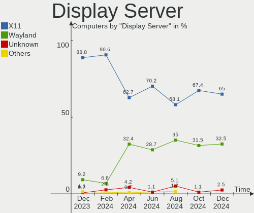
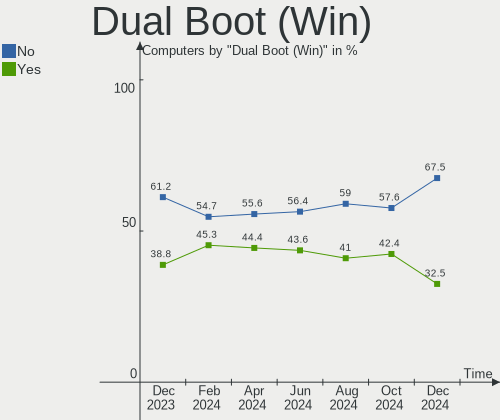
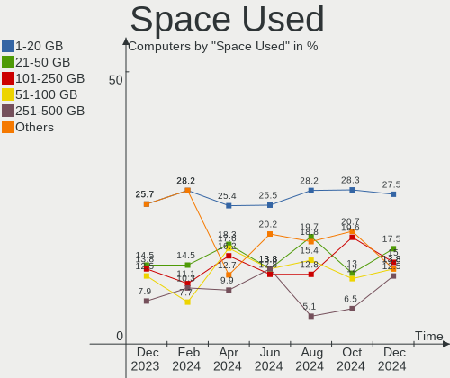
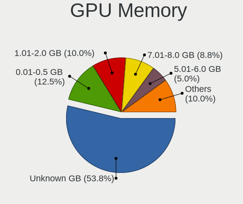
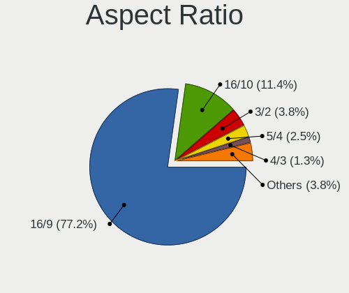
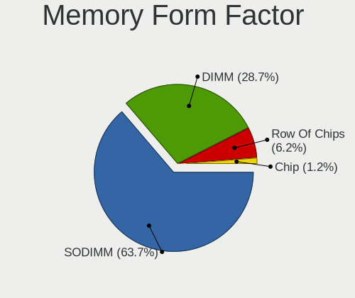

ArcoLinux - Hardware Trends
---------------------------

A project to identify most popular hardware characteristics and track their change
over time based on data collected by Linux users at https://Linux-Hardware.org.

Anyone can contribute to this report by the [hw-probe](https://github.com/linuxhw/hw-probe) tool:

    sudo -E hw-probe -all -upload

This is a report for all computer types. See also reports for [desktops](/Dist/ArcoLinux/Desktop/README.md) and [notebooks](/Dist/ArcoLinux/Notebook/README.md).

This report is for one last month. Overall report since the beginning of time: [TestDays](https://github.com/linuxhw/TestDays)

Period: Dec, 2024.

Contents
--------

* [ System ](#system)
  - [ OS                       ](#os)
  - [ OS Family                ](#os-family)
  - [ Kernel                   ](#kernel)
  - [ Kernel Family            ](#kernel-family)
  - [ Kernel Major Ver.        ](#kernel-major-ver)
  - [ Arch                     ](#arch)
  - [ DE                       ](#de)
  - [ Display Server           ](#display-server)
  - [ Display Manager          ](#display-manager)
  - [ OS Lang                  ](#os-lang)
  - [ Boot Mode                ](#boot-mode)
  - [ Filesystem               ](#filesystem)
  - [ Part. scheme             ](#part-scheme)
  - [ Dual Boot with Linux/BSD ](#dual-boot-with-linuxbsd)
  - [ Dual Boot (Win)          ](#dual-boot-win)

* [ Board ](#board)
  - [ Vendor                   ](#vendor)
  - [ Model                    ](#model)
  - [ Model Family             ](#model-family)
  - [ MFG Year                 ](#mfg-year)
  - [ Form Factor              ](#form-factor)
  - [ Secure Boot              ](#secure-boot)
  - [ Coreboot                 ](#coreboot)
  - [ RAM Size                 ](#ram-size)
  - [ RAM Used                 ](#ram-used)
  - [ Total Drives             ](#total-drives)
  - [ Has CD-ROM               ](#has-cd-rom)
  - [ Has Ethernet             ](#has-ethernet)
  - [ Has WiFi                 ](#has-wifi)
  - [ Has Bluetooth            ](#has-bluetooth)

* [ Location ](#location)
  - [ Country                  ](#country)
  - [ City                     ](#city)

* [ Drives ](#drives)
  - [ Drive Vendor             ](#drive-vendor)
  - [ Drive Model              ](#drive-model)
  - [ HDD Vendor               ](#hdd-vendor)
  - [ SSD Vendor               ](#ssd-vendor)
  - [ Drive Kind               ](#drive-kind)
  - [ Drive Connector          ](#drive-connector)
  - [ Drive Size               ](#drive-size)
  - [ Space Total              ](#space-total)
  - [ Space Used               ](#space-used)
  - [ Malfunc. Drives          ](#malfunc-drives)
  - [ Malfunc. Drive Vendor    ](#malfunc-drive-vendor)
  - [ Malfunc. HDD Vendor      ](#malfunc-hdd-vendor)
  - [ Malfunc. Drive Kind      ](#malfunc-drive-kind)
  - [ Failed Drives            ](#failed-drives)
  - [ Failed Drive Vendor      ](#failed-drive-vendor)
  - [ Drive Status             ](#drive-status)

* [ Storage controller ](#storage-controller)
  - [ Storage Vendor           ](#storage-vendor)
  - [ Storage Model            ](#storage-model)
  - [ Storage Kind             ](#storage-kind)

* [ Processor ](#processor)
  - [ CPU Vendor               ](#cpu-vendor)
  - [ CPU Model                ](#cpu-model)
  - [ CPU Model Family         ](#cpu-model-family)
  - [ CPU Cores                ](#cpu-cores)
  - [ CPU Sockets              ](#cpu-sockets)
  - [ CPU Threads              ](#cpu-threads)
  - [ CPU Op-Modes             ](#cpu-op-modes)
  - [ CPU Microcode            ](#cpu-microcode)
  - [ CPU Microarch            ](#cpu-microarch)

* [ Graphics ](#graphics)
  - [ GPU Vendor               ](#gpu-vendor)
  - [ GPU Model                ](#gpu-model)
  - [ GPU Combo                ](#gpu-combo)
  - [ GPU Driver               ](#gpu-driver)
  - [ GPU Memory               ](#gpu-memory)

* [ Monitor ](#monitor)
  - [ Monitor Vendor           ](#monitor-vendor)
  - [ Monitor Model            ](#monitor-model)
  - [ Monitor Resolution       ](#monitor-resolution)
  - [ Monitor Diagonal         ](#monitor-diagonal)
  - [ Monitor Width            ](#monitor-width)
  - [ Aspect Ratio             ](#aspect-ratio)
  - [ Monitor Area             ](#monitor-area)
  - [ Pixel Density            ](#pixel-density)
  - [ Multiple Monitors        ](#multiple-monitors)

* [ Network ](#network)
  - [ Net Controller Vendor    ](#net-controller-vendor)
  - [ Net Controller Model     ](#net-controller-model)
  - [ Wireless Vendor          ](#wireless-vendor)
  - [ Wireless Model           ](#wireless-model)
  - [ Ethernet Vendor          ](#ethernet-vendor)
  - [ Ethernet Model           ](#ethernet-model)
  - [ Net Controller Kind      ](#net-controller-kind)
  - [ Used Controller          ](#used-controller)
  - [ NICs                     ](#nics)
  - [ IPv6                     ](#ipv6)

* [ Bluetooth ](#bluetooth)
  - [ Bluetooth Vendor         ](#bluetooth-vendor)
  - [ Bluetooth Model          ](#bluetooth-model)

* [ Sound ](#sound)
  - [ Sound Vendor             ](#sound-vendor)
  - [ Sound Model              ](#sound-model)

* [ Memory ](#memory)
  - [ Memory Vendor            ](#memory-vendor)
  - [ Memory Model             ](#memory-model)
  - [ Memory Kind              ](#memory-kind)
  - [ Memory Form Factor       ](#memory-form-factor)
  - [ Memory Size              ](#memory-size)
  - [ Memory Speed             ](#memory-speed)

* [ Printers & scanners ](#printers--scanners)
  - [ Printer Vendor           ](#printer-vendor)
  - [ Printer Model            ](#printer-model)
  - [ Scanner Vendor           ](#scanner-vendor)
  - [ Scanner Model            ](#scanner-model)

* [ Camera ](#camera)
  - [ Camera Vendor            ](#camera-vendor)
  - [ Camera Model             ](#camera-model)

* [ Security ](#security)
  - [ Fingerprint Vendor       ](#fingerprint-vendor)
  - [ Fingerprint Model        ](#fingerprint-model)
  - [ Chipcard Vendor          ](#chipcard-vendor)
  - [ Chipcard Model           ](#chipcard-model)

* [ Unsupported ](#unsupported)
  - [ Unsupported Devices      ](#unsupported-devices)
  - [ Unsupported Device Types ](#unsupported-device-types)

System
------

OS
--

Installed operating systems

| Name              | Computers | Percent |
|-------------------|-----------|---------|
| ArcoLinux Rolling | 78        | 97.5%   |
| ArcoLinux         | 2         | 2.5%    |

OS Family
---------

OS without a version

| Name      | Computers | Percent |
|-----------|-----------|---------|
| ArcoLinux | 80        | 100%    |

Kernel
------

Version of the Linux kernel

| Version                           | Computers | Percent |
|-----------------------------------|-----------|---------|
| 6.12.4-zen1-1-zen                 | 14        | 17.5%   |
| 6.12.1-zen1-1-zen                 | 12        | 15%     |
| 6.12.6-1-cachyos                  | 5         | 6.25%   |
| 6.12.1-arch1-1                    | 5         | 6.25%   |
| 6.6.65-1-lts                      | 4         | 5%      |
| 6.6.63-1-lts                      | 4         | 5%      |
| 6.12.4-arch1-1                    | 4         | 5%      |
| 6.12.7-zen1-1-zen                 | 3         | 3.75%   |
| 6.11.7-arch1-1                    | 3         | 3.75%   |
| 6.6.67-1-lts                      | 2         | 2.5%    |
| 6.12.3-1-cachyos                  | 2         | 2.5%    |
| 6.11.7-zen1-1-zen                 | 2         | 2.5%    |
| 6.8.5-zen1-1-zen                  | 1         | 1.25%   |
| 6.8.5-arch1-1                     | 1         | 1.25%   |
| 6.8.1-arch1-1                     | 1         | 1.25%   |
| 6.7.4-arch1-1                     | 1         | 1.25%   |
| 6.6.68-1-lts                      | 1         | 1.25%   |
| 6.12.6-zen1-1-zen                 | 1         | 1.25%   |
| 6.12.6-x64v3-xanmod1-1-edge-x64v3 | 1         | 1.25%   |
| 6.12.6-arch1-1                    | 1         | 1.25%   |
| 6.12.5-2-cachyos                  | 1         | 1.25%   |
| 6.12.4-1-cachyos                  | 1         | 1.25%   |
| 6.12.3-arch1-1                    | 1         | 1.25%   |
| 6.12.1-arch1-1.1-g14              | 1         | 1.25%   |
| 6.11.6-zen1-1-zen                 | 1         | 1.25%   |
| 6.11.3-arch1-1                    | 1         | 1.25%   |
| 6.11.2-2-cachyos                  | 1         | 1.25%   |
| 6.11.11-hardened1-1-hardened      | 1         | 1.25%   |
| 6.11.0-1-cachyos                  | 1         | 1.25%   |
| 6.10.4-zen2-1-zen                 | 1         | 1.25%   |
| 6.10.10-zen1-1-zen                | 1         | 1.25%   |
| 6.1.66-2-rt19-MANJARO             | 1         | 1.25%   |

Kernel Family
-------------

Linux kernel without a distro release

| Version | Computers | Percent |
|---------|-----------|---------|
| 6.12.4  | 19        | 23.75%  |
| 6.12.1  | 18        | 22.5%   |
| 6.12.6  | 8         | 10%     |
| 6.11.7  | 5         | 6.25%   |
| 6.6.65  | 4         | 5%      |
| 6.6.63  | 4         | 5%      |
| 6.12.7  | 3         | 3.75%   |
| 6.12.3  | 3         | 3.75%   |
| 6.8.5   | 2         | 2.5%    |
| 6.6.67  | 2         | 2.5%    |
| 6.8.1   | 1         | 1.25%   |
| 6.7.4   | 1         | 1.25%   |
| 6.6.68  | 1         | 1.25%   |
| 6.12.5  | 1         | 1.25%   |
| 6.11.6  | 1         | 1.25%   |
| 6.11.3  | 1         | 1.25%   |
| 6.11.2  | 1         | 1.25%   |
| 6.11.11 | 1         | 1.25%   |
| 6.11.0  | 1         | 1.25%   |
| 6.10.4  | 1         | 1.25%   |
| 6.10.10 | 1         | 1.25%   |
| 6.1.66  | 1         | 1.25%   |

Kernel Major Ver.
-----------------

Linux kernel major version

| Version | Computers | Percent |
|---------|-----------|---------|
| 6.12    | 52        | 65%     |
| 6.6     | 11        | 13.75%  |
| 6.11    | 10        | 12.5%   |
| 6.8     | 3         | 3.75%   |
| 6.10    | 2         | 2.5%    |
| 6.7     | 1         | 1.25%   |
| 6.1     | 1         | 1.25%   |

Arch
----

OS architecture (x86_64, i586, etc.)

| Name   | Computers | Percent |
|--------|-----------|---------|
| x86_64 | 80        | 100%    |

DE
--

Desktop Environment

| Name     | Computers | Percent |
|----------|-----------|---------|
| XFCE     | 24        | 30%     |
| GNOME    | 14        | 17.5%   |
| KDE6     | 12        | 15%     |
| Unknown  | 12        | 15%     |
| Hyprland | 4         | 5%      |
| Cinnamon | 4         | 5%      |
| i3       | 2         | 2.5%    |
| chadwm   | 2         | 2.5%    |
| Budgie   | 2         | 2.5%    |
| qtile    | 1         | 1.25%   |
| LXQt     | 1         | 1.25%   |
| Deepin   | 1         | 1.25%   |
| bspwm    | 1         | 1.25%   |

Display Server
--------------

X11 or Wayland

| Name    | Computers | Percent |
|---------|-----------|---------|
| X11     | 52        | 65%     |
| Wayland | 26        | 32.5%   |
| Unknown | 2         | 2.5%    |

Display Manager
---------------

SDDM, LightDM, etc.

| Name    | Computers | Percent |
|---------|-----------|---------|
| SDDM    | 64        | 80%     |
| LightDM | 13        | 16.25%  |
| Unknown | 2         | 2.5%    |
| GDM     | 1         | 1.25%   |

OS Lang
-------

Language

| Lang  | Computers | Percent |
|-------|-----------|---------|
| en_US | 37        | 46.25%  |
| en_GB | 8         | 10%     |
| de_DE | 4         | 5%      |
| C     | 4         | 5%      |
| en_IN | 3         | 3.75%   |
| en_CA | 3         | 3.75%   |
| ru_RU | 2         | 2.5%    |
| pt_BR | 2         | 2.5%    |
| it_IT | 2         | 2.5%    |
| es_MX | 2         | 2.5%    |
| es_ES | 2         | 2.5%    |
| en_AU | 2         | 2.5%    |
| tr_TR | 1         | 1.25%   |
| pt_PT | 1         | 1.25%   |
| nl_NL | 1         | 1.25%   |
| hu_HU | 1         | 1.25%   |
| es_PA | 1         | 1.25%   |
| en_ZA | 1         | 1.25%   |
| en_HK | 1         | 1.25%   |
| en_DK | 1         | 1.25%   |
| de_CH | 1         | 1.25%   |

Boot Mode
---------

EFI or BIOS

| Mode | Computers | Percent |
|------|-----------|---------|
| EFI  | 66        | 82.5%   |
| BIOS | 14        | 17.5%   |

Filesystem
----------

Type of filesystem

| Type    | Computers | Percent |
|---------|-----------|---------|
| Ext4    | 52        | 65%     |
| Btrfs   | 22        | 27.5%   |
| Overlay | 4         | 5%      |
| Xfs     | 2         | 2.5%    |

Part. scheme
------------

Scheme of partitioning

| Type    | Computers | Percent |
|---------|-----------|---------|
| GPT     | 70        | 87.5%   |
| MBR     | 8         | 10%     |
| Unknown | 2         | 2.5%    |

Dual Boot with Linux/BSD
------------------------

Hosting more than one Linux/BSD

| Dual boot | Computers | Percent |
|-----------|-----------|---------|
| No        | 57        | 71.25%  |
| Yes       | 23        | 28.75%  |

Dual Boot (Win)
---------------

Hosting Linux and Windows

| Dual boot | Computers | Percent |
|-----------|-----------|---------|
| No        | 54        | 67.5%   |
| Yes       | 26        | 32.5%   |

Board
-----

Vendor
------

Motherboard manufacturer

| Name                                 | Computers | Percent |
|--------------------------------------|-----------|---------|
| ASUSTek Computer                     | 21        | 26.25%  |
| Lenovo                               | 20        | 25%     |
| Hewlett-Packard                      | 6         | 7.5%    |
| Gigabyte Technology                  | 5         | 6.25%   |
| MSI                                  | 4         | 5%      |
| Samsung Electronics                  | 3         | 3.75%   |
| Dell                                 | 3         | 3.75%   |
| Intel                                | 2         | 2.5%    |
| Chuwi                                | 2         | 2.5%    |
| Biostar                              | 2         | 2.5%    |
| Apple                                | 2         | 2.5%    |
| TUXEDO                               | 1         | 1.25%   |
| Toshiba                              | 1         | 1.25%   |
| Shenzhen Meigao Electronic Equipment | 1         | 1.25%   |
| Notebook                             | 1         | 1.25%   |
| HUAWEI                               | 1         | 1.25%   |
| Google                               | 1         | 1.25%   |
| Framework                            | 1         | 1.25%   |
| ASRock                               | 1         | 1.25%   |
| Acer                                 | 1         | 1.25%   |
| Unknown                              | 1         | 1.25%   |

Model
-----

Motherboard model

| Name                                       | Computers | Percent |
|--------------------------------------------|-----------|---------|
| TUXEDO InfinityBook Pro AMD Gen9           | 1         | 1.25%   |
| Toshiba Satellite C55-B                    | 1         | 1.25%   |
| Shenzhen Meigao Electronic Equipment UM690 | 1         | 1.25%   |
| Samsung 905S3G/906S3G/915S3G               | 1         | 1.25%   |
| Samsung 900X3C/900X3D/900X3E/900X4C/900X4D | 1         | 1.25%   |
| Samsung 530U3BI/530U4BI/530U4BH            | 1         | 1.25%   |
| Notebook NH5xAx                            | 1         | 1.25%   |
| MSI MS-7D91                                | 1         | 1.25%   |
| MSI MS-7B86                                | 1         | 1.25%   |
| MSI MS-7816                                | 1         | 1.25%   |
| MSI GS66 Stealth 10SE                      | 1         | 1.25%   |
| Lenovo Yoga C740-14IML 81TC                | 1         | 1.25%   |
| Lenovo ThinkPad X1 Carbon 6th 20KH006KUK   | 1         | 1.25%   |
| Lenovo ThinkPad W540 20BHS14J0J            | 1         | 1.25%   |
| Lenovo ThinkPad T60 1951FDG                | 1         | 1.25%   |
| Lenovo ThinkPad T560 20FJS1WT00            | 1         | 1.25%   |
| Lenovo ThinkPad T470s W10DG 20JTS1LS00     | 1         | 1.25%   |
| Lenovo ThinkPad T430 2349IF8               | 1         | 1.25%   |
| Lenovo ThinkPad Edge E540 20C600LPMS       | 1         | 1.25%   |
| Lenovo ThinkPad Edge 031925U               | 1         | 1.25%   |
| Lenovo ThinkPad A485 20MVS08500            | 1         | 1.25%   |
| Lenovo ThinkCentre M75t Gen 2 11KBS07W00   | 1         | 1.25%   |
| Lenovo ThinkCentre M710q 10MQS2M703        | 1         | 1.25%   |
| Lenovo ThinkCentre M70q Gen 3 11T300B5MH   | 1         | 1.25%   |
| Lenovo ThinkCentre E73 10DR0012GE          | 1         | 1.25%   |
| Lenovo ThinkBook 15 G4 IAP 21DJ            | 1         | 1.25%   |
| Lenovo Legion 5 15ACH6H 82JU               | 1         | 1.25%   |
| Lenovo IdeaPad 5 Pro 14ACN6 82L7           | 1         | 1.25%   |
| Lenovo IdeaPad 330-15ICH 81FK              | 1         | 1.25%   |
| Lenovo IdeaPad 1 15AMN7 82VG               | 1         | 1.25%   |
| Lenovo IdeaCentre AIO 3 27ALC6 F0FY00NNUK  | 1         | 1.25%   |
| Intel X99                                  | 1         | 1.25%   |
| Intel NUC12WSKi3                           | 1         | 1.25%   |
| HUAWEI NBLK-WAX9X                          | 1         | 1.25%   |
| HP Pavilion Laptop 14-dv1xxx               | 1         | 1.25%   |
| HP Laptop 15-dy1xxx                        | 1         | 1.25%   |
| HP Laptop 14s-fq1xxx                       | 1         | 1.25%   |
| HP ENVY 15                                 | 1         | 1.25%   |
| HP EliteDesk 800 G2 TWR                    | 1         | 1.25%   |
| HP Compaq dc5850 Microtower                | 1         | 1.25%   |

Model Family
------------

Motherboard model prefix

| Name                                       | Computers | Percent |
|--------------------------------------------|-----------|---------|
| Lenovo ThinkPad                            | 9         | 11.25%  |
| ASUS VivoBook                              | 5         | 6.25%   |
| Lenovo ThinkCentre                         | 4         | 5%      |
| ASUS ROG                                   | 4         | 5%      |
| Lenovo IdeaPad                             | 3         | 3.75%   |
| ASUS TUF                                   | 3         | 3.75%   |
| HP Laptop                                  | 2         | 2.5%    |
| ASUS PRIME                                 | 2         | 2.5%    |
| TUXEDO InfinityBook                        | 1         | 1.25%   |
| Toshiba Satellite                          | 1         | 1.25%   |
| Shenzhen Meigao Electronic Equipment UM690 | 1         | 1.25%   |
| Samsung 905S3G                             | 1         | 1.25%   |
| Samsung 900X3C                             | 1         | 1.25%   |
| Samsung 530U3BI                            | 1         | 1.25%   |
| Notebook NH5xAx                            | 1         | 1.25%   |
| MSI MS-7D91                                | 1         | 1.25%   |
| MSI MS-7B86                                | 1         | 1.25%   |
| MSI MS-7816                                | 1         | 1.25%   |
| MSI GS66                                   | 1         | 1.25%   |
| Lenovo Yoga                                | 1         | 1.25%   |
| Lenovo ThinkBook                           | 1         | 1.25%   |
| Lenovo Legion                              | 1         | 1.25%   |
| Lenovo IdeaCentre                          | 1         | 1.25%   |
| Intel X99                                  | 1         | 1.25%   |
| Intel NUC12WSKi3                           | 1         | 1.25%   |
| HUAWEI NBLK-WAX9X                          | 1         | 1.25%   |
| HP Pavilion                                | 1         | 1.25%   |
| HP ENVY                                    | 1         | 1.25%   |
| HP EliteDesk                               | 1         | 1.25%   |
| HP Compaq                                  | 1         | 1.25%   |
| Google Cyan                                | 1         | 1.25%   |
| Gigabyte X570S                             | 1         | 1.25%   |
| Gigabyte NZXT                              | 1         | 1.25%   |
| Gigabyte B550M                             | 1         | 1.25%   |
| Gigabyte B550                              | 1         | 1.25%   |
| Gigabyte AB350M-DS3H                       | 1         | 1.25%   |
| Framework Laptop                           | 1         | 1.25%   |
| Dell OptiPlex                              | 1         | 1.25%   |
| Dell Latitude                              | 1         | 1.25%   |
| Dell Inspiron                              | 1         | 1.25%   |

MFG Year
--------

Motherboard manufacture year

| Year | Computers | Percent |
|------|-----------|---------|
| 2018 | 11        | 13.75%  |
| 2024 | 9         | 11.25%  |
| 2022 | 9         | 11.25%  |
| 2020 | 8         | 10%     |
| 2019 | 7         | 8.75%   |
| 2021 | 6         | 7.5%    |
| 2014 | 6         | 7.5%    |
| 2013 | 5         | 6.25%   |
| 2023 | 4         | 5%      |
| 2017 | 3         | 3.75%   |
| 2012 | 3         | 3.75%   |
| 2016 | 2         | 2.5%    |
| 2015 | 2         | 2.5%    |
| 2010 | 2         | 2.5%    |
| 2008 | 1         | 1.25%   |
| 2007 | 1         | 1.25%   |
| 2006 | 1         | 1.25%   |

Form Factor
-----------

Physical design of the computer

| Name        | Computers | Percent |
|-------------|-----------|---------|
| Notebook    | 50        | 62.5%   |
| Desktop     | 25        | 31.25%  |
| Mini pc     | 3         | 3.75%   |
| Convertible | 1         | 1.25%   |
| All in one  | 1         | 1.25%   |

Secure Boot
-----------

Enabled or disabled

| State    | Computers | Percent |
|----------|-----------|---------|
| Disabled | 80        | 100%    |

Coreboot
--------

Have coreboot on board

| Used | Computers | Percent |
|------|-----------|---------|
| No   | 79        | 98.75%  |
| Yes  | 1         | 1.25%   |

RAM Size
--------

Total RAM memory

| Size in GB  | Computers | Percent |
|-------------|-----------|---------|
| 16.01-24.0  | 20        | 25%     |
| 4.01-8.0    | 16        | 20%     |
| 32.01-64.0  | 15        | 18.75%  |
| 8.01-16.0   | 12        | 15%     |
| 3.01-4.0    | 9         | 11.25%  |
| 64.01-256.0 | 3         | 3.75%   |
| 24.01-32.0  | 2         | 2.5%    |
| 1.01-2.0    | 2         | 2.5%    |
| 2.01-3.0    | 1         | 1.25%   |

RAM Used
--------

Used RAM memory

| Used GB    | Computers | Percent |
|------------|-----------|---------|
| 2.01-3.0   | 28        | 35%     |
| 1.01-2.0   | 24        | 30%     |
| 4.01-8.0   | 12        | 15%     |
| 3.01-4.0   | 9         | 11.25%  |
| 0.51-1.0   | 4         | 5%      |
| 8.01-16.0  | 2         | 2.5%    |
| 16.01-24.0 | 1         | 1.25%   |

Total Drives
------------

Number of drives on board

| Drives | Computers | Percent |
|--------|-----------|---------|
| 1      | 44        | 55%     |
| 2      | 21        | 26.25%  |
| 3      | 8         | 10%     |
| 4      | 5         | 6.25%   |
| 5      | 2         | 2.5%    |

Has CD-ROM
----------

Has CD-ROM on board

| Presented | Computers | Percent |
|-----------|-----------|---------|
| No        | 71        | 88.75%  |
| Yes       | 9         | 11.25%  |

Has Ethernet
------------

Has Ethernet on board

| Presented | Computers | Percent |
|-----------|-----------|---------|
| Yes       | 61        | 76.25%  |
| No        | 19        | 23.75%  |

Has WiFi
--------

Has WiFi module

| Presented | Computers | Percent |
|-----------|-----------|---------|
| Yes       | 65        | 81.25%  |
| No        | 15        | 18.75%  |

Has Bluetooth
-------------

Has Bluetooth module

| Presented | Computers | Percent |
|-----------|-----------|---------|
| Yes       | 61        | 76.25%  |
| No        | 19        | 23.75%  |

Location
--------

Country
-------

Geographic location (country)

| Country         | Computers | Percent |
|-----------------|-----------|---------|
| USA             | 13        | 16.25%  |
| UK              | 5         | 6.25%   |
| Germany         | 5         | 6.25%   |
| Australia       | 5         | 6.25%   |
| Spain           | 4         | 5%      |
| Netherlands     | 4         | 5%      |
| India           | 4         | 5%      |
| Sweden          | 3         | 3.75%   |
| Serbia          | 3         | 3.75%   |
| Indonesia       | 3         | 3.75%   |
| Canada          | 3         | 3.75%   |
| Brazil          | 3         | 3.75%   |
| Turkey          | 2         | 2.5%    |
| Switzerland     | 2         | 2.5%    |
| South Africa    | 2         | 2.5%    |
| Russia          | 2         | 2.5%    |
| Italy           | 2         | 2.5%    |
| Belgium         | 2         | 2.5%    |
| Uzbekistan      | 1         | 1.25%   |
| The Netherlands | 1         | 1.25%   |
| Portugal        | 1         | 1.25%   |
| Panama          | 1         | 1.25%   |
| Morocco         | 1         | 1.25%   |
| Mexico          | 1         | 1.25%   |
| Hungary         | 1         | 1.25%   |
| Hong Kong       | 1         | 1.25%   |
| Greece          | 1         | 1.25%   |
| Estonia         | 1         | 1.25%   |
| Denmark         | 1         | 1.25%   |
| Colombia        | 1         | 1.25%   |
| Bangladesh      | 1         | 1.25%   |

City
----

Geographic location (city)

| City          | Computers | Percent |
|---------------|-----------|---------|
| Sydney        | 3         | 3.75%   |
| Stockholm     | 2         | 2.5%    |
| Los Angeles   | 2         | 2.5%    |
| Belgrade      | 2         | 2.5%    |
| Basauri       | 2         | 2.5%    |
| Barnet        | 2         | 2.5%    |
| Zurich        | 1         | 1.25%   |
| Zaječar      | 1         | 1.25%   |
| Yogyakarta    | 1         | 1.25%   |
| Winter Park   | 1         | 1.25%   |
| Wilhelmshaven | 1         | 1.25%   |
| Washington    | 1         | 1.25%   |
| Urmitz        | 1         | 1.25%   |
| Unterammergau | 1         | 1.25%   |
| Tunja         | 1         | 1.25%   |
| Tsuen Wan     | 1         | 1.25%   |
| Thornhill     | 1         | 1.25%   |
| Tétouan      | 1         | 1.25%   |
| Tashkent      | 1         | 1.25%   |
| Tallinn       | 1         | 1.25%   |
| Seville       | 1         | 1.25%   |
| Senbag        | 1         | 1.25%   |
| Senago        | 1         | 1.25%   |
| Sao Paulo     | 1         | 1.25%   |
| Samara        | 1         | 1.25%   |
| Querência    | 1         | 1.25%   |
| Pune          | 1         | 1.25%   |
| Pretoria      | 1         | 1.25%   |
| Perugia       | 1         | 1.25%   |
| Panama City   | 1         | 1.25%   |
| Oss           | 1         | 1.25%   |
| Nuremberg     | 1         | 1.25%   |
| Miramar Beach | 1         | 1.25%   |
| Melbourne     | 1         | 1.25%   |
| Mazatlán     | 1         | 1.25%   |
| Mauá         | 1         | 1.25%   |
| Marysville    | 1         | 1.25%   |
| Mandeville    | 1         | 1.25%   |
| Lys'va        | 1         | 1.25%   |
| Lakeland      | 1         | 1.25%   |

Drives
------

Drive Vendor
------------

Hard drive vendors

| Vendor                       | Computers | Drives | Percent |
|------------------------------|-----------|--------|---------|
| Samsung Electronics          | 21        | 22     | 16.54%  |
| SanDisk                      | 18        | 21     | 14.17%  |
| WDC                          | 13        | 14     | 10.24%  |
| Seagate                      | 10        | 13     | 7.87%   |
| Kingston                     | 9         | 12     | 7.09%   |
| Intel                        | 7         | 7      | 5.51%   |
| Toshiba                      | 5         | 5      | 3.94%   |
| SK hynix                     | 5         | 5      | 3.94%   |
| MAXIO Technology (Hangzhou)  | 4         | 4      | 3.15%   |
| Crucial                      | 4         | 4      | 3.15%   |
| Unknown                      | 3         | 3      | 2.36%   |
| Micron Technology            | 2         | 2      | 1.57%   |
| KIOXIA                       | 2         | 2      | 1.57%   |
| Apple                        | 2         | 2      | 1.57%   |
| Transcend                    | 1         | 1      | 0.79%   |
| Silicon Motion               | 1         | 1      | 0.79%   |
| ShiJi                        | 1         | 1      | 0.79%   |
| Shenzhen Longsys Electronics | 1         | 1      | 0.79%   |
| PNY                          | 1         | 1      | 0.79%   |
| Phison Electronics           | 1         | 1      | 0.79%   |
| Patriot                      | 1         | 1      | 0.79%   |
| OCZ                          | 1         | 1      | 0.79%   |
| Netac                        | 1         | 1      | 0.79%   |
| Micron/Crucial Technology    | 1         | 1      | 0.79%   |
| JMicron Technology           | 1         | 1      | 0.79%   |
| JASTER                       | 1         | 1      | 0.79%   |
| Intenso                      | 1         | 1      | 0.79%   |
| Hitachi                      | 1         | 1      | 0.79%   |
| HGST                         | 1         | 1      | 0.79%   |
| Fujitsu                      | 1         | 1      | 0.79%   |
| DeTech                       | 1         | 1      | 0.79%   |
| CONSISTENT                   | 1         | 1      | 0.79%   |
| Apacer                       | 1         | 1      | 0.79%   |
| ADATA Technology             | 1         | 1      | 0.79%   |
| A-DATA Technology            | 1         | 2      | 0.79%   |
| Unknown                      | 1         | 1      | 0.79%   |

Drive Model
-----------

Hard drive models

| Model                                                  | Computers | Percent |
|--------------------------------------------------------|-----------|---------|
| Sandisk WD Blue SN550 NVMe SSD 256GB                   | 4         | 2.92%   |
| MAXIO (Hangzhou) NVMe SSD Controller MAP1202 512GB     | 4         | 2.92%   |
| Samsung NVMe SSD Controller SM981/PM981/PM983 512GB    | 3         | 2.19%   |
| WDC WD10EZEX-00BN5A0 1TB                               | 2         | 1.46%   |
| Unknown MMC Card  32GB                                 | 2         | 1.46%   |
| Sandisk WD Black SN850 2TB                             | 2         | 1.46%   |
| Sandisk WD Black SN750 / PC SN730 NVMe SSD 512GB       | 2         | 1.46%   |
| Samsung NVMe SSD Controller SM961/PM961/SM963 256GB    | 2         | 1.46%   |
| Kingston SA400S37240G 240GB SSD                        | 2         | 1.46%   |
| Intel SSDPEKNU512GZ 512GB                              | 2         | 1.46%   |
| Crucial CT240BX500SSD1 240GB                           | 2         | 1.46%   |
| Apple SSD SM0256G 256GB                                | 2         | 1.46%   |
| WDC WD800JD-75MSA3 80GB                                | 1         | 0.73%   |
| WDC WD7501AALS-00J7B1 752GB                            | 1         | 0.73%   |
| WDC WD5000BEVT-22A0RT0 500GB                           | 1         | 0.73%   |
| WDC WD5000AAKX-001CA0 500GB                            | 1         | 0.73%   |
| WDC WD30EFRX-68EUZN0 3TB                               | 1         | 0.73%   |
| WDC WD20PURZ-85GU6Y0 2TB                               | 1         | 0.73%   |
| WDC WD20EZAZ-00GGJB0 2TB                               | 1         | 0.73%   |
| WDC WD2002FAEX-007BA0 2TB                              | 1         | 0.73%   |
| WDC WD15EARS-00MVWB0 1TB                               | 1         | 0.73%   |
| WDC WD10JPCX-24UE4T0 1TB                               | 1         | 0.73%   |
| WDC WD1003FZEX-00MK2A0 1TB                             | 1         | 0.73%   |
| WDC WD Blue SA510 M.2 2280 2TB SSD                     | 1         | 0.73%   |
| Unknown SD/MMC/MS PRO 128GB                            | 1         | 0.73%   |
| Transcend TS240GSSD220S 240GB                          | 1         | 0.73%   |
| Toshiba THNSNJ512GCSU 512GB SSD                        | 1         | 0.73%   |
| Toshiba MQ04ABF100 1TB                                 | 1         | 0.73%   |
| Toshiba MQ01ABF050 500GB                               | 1         | 0.73%   |
| Toshiba HDWD110 1TB                                    | 1         | 0.73%   |
| Toshiba DT01ACA100 1TB                                 | 1         | 0.73%   |
| SK hynix SKHynix_HFS256GEJ4X112N 256GB                 | 1         | 0.73%   |
| SK hynix SC311 SATA 256GB SSD                          | 1         | 0.73%   |
| SK hynix SC300 2.5 7MM 128GB SSD                       | 1         | 0.73%   |
| SK hynix BC711 HFM512GD3JX013N 512GB                   | 1         | 0.73%   |
| SK hynix BC511 512GB                                   | 1         | 0.73%   |
| Silicon Motion SM2263EN/SM2263XT SSD Controller 256GB  | 1         | 0.73%   |
| ShiJi SSD 1TB                                          | 1         | 0.73%   |
| Shenzhen Longsys SM2263EN/SM2263XT-based OEM SSD 128GB | 1         | 0.73%   |
| Seagate ST9250315AS 250GB                              | 1         | 0.73%   |

HDD Vendor
----------

Hard disk drive vendors

| Vendor             | Computers | Drives | Percent |
|--------------------|-----------|--------|---------|
| WDC                | 12        | 13     | 38.71%  |
| Seagate            | 10        | 13     | 32.26%  |
| Toshiba            | 4         | 4      | 12.9%   |
| Unknown            | 1         | 1      | 3.23%   |
| JMicron Technology | 1         | 1      | 3.23%   |
| Hitachi            | 1         | 1      | 3.23%   |
| HGST               | 1         | 1      | 3.23%   |
| Fujitsu            | 1         | 1      | 3.23%   |

SSD Vendor
----------

Solid state drive vendors

| Vendor              | Computers | Drives | Percent |
|---------------------|-----------|--------|---------|
| Samsung Electronics | 12        | 13     | 26.67%  |
| Kingston            | 6         | 7      | 13.33%  |
| Crucial             | 4         | 4      | 8.89%   |
| Intel               | 3         | 3      | 6.67%   |
| SK hynix            | 2         | 2      | 4.44%   |
| SanDisk             | 2         | 3      | 4.44%   |
| Apple               | 2         | 2      | 4.44%   |
| WDC                 | 1         | 1      | 2.22%   |
| Transcend           | 1         | 1      | 2.22%   |
| Toshiba             | 1         | 1      | 2.22%   |
| ShiJi               | 1         | 1      | 2.22%   |
| PNY                 | 1         | 1      | 2.22%   |
| Patriot             | 1         | 1      | 2.22%   |
| OCZ                 | 1         | 1      | 2.22%   |
| JASTER              | 1         | 1      | 2.22%   |
| Intenso             | 1         | 1      | 2.22%   |
| DeTech              | 1         | 1      | 2.22%   |
| CONSISTENT          | 1         | 1      | 2.22%   |
| Apacer              | 1         | 1      | 2.22%   |
| A-DATA Technology   | 1         | 2      | 2.22%   |
| Unknown             | 1         | 1      | 2.22%   |

Drive Kind
----------

HDD or SSD

| Kind | Computers | Drives | Percent |
|------|-----------|--------|---------|
| NVMe | 43        | 53     | 39.81%  |
| SSD  | 38        | 49     | 35.19%  |
| HDD  | 25        | 35     | 23.15%  |
| MMC  | 2         | 2      | 1.85%   |

Drive Connector
---------------

SATA, SAS, NVMe, etc.

| Type | Computers | Drives | Percent |
|------|-----------|--------|---------|
| SATA | 50        | 82     | 51.55%  |
| NVMe | 43        | 53     | 44.33%  |
| SAS  | 2         | 2      | 2.06%   |
| MMC  | 2         | 2      | 2.06%   |

Drive Size
----------

Size of hard drive

| Size in TB | Computers | Drives | Percent |
|------------|-----------|--------|---------|
| 0.01-0.5   | 31        | 46     | 46.27%  |
| 0.51-1.0   | 22        | 23     | 32.84%  |
| 1.01-2.0   | 9         | 10     | 13.43%  |
| 3.01-4.0   | 2         | 2      | 2.99%   |
| 2.01-3.0   | 1         | 1      | 1.49%   |
| 10.01-20.0 | 1         | 1      | 1.49%   |
| 4.01-10.0  | 1         | 1      | 1.49%   |

Space Total
-----------

Amount of disk space available on the file system

| Size in GB     | Computers | Percent |
|----------------|-----------|---------|
| 101-250        | 18        | 22.5%   |
| More than 3000 | 15        | 18.75%  |
| 251-500        | 15        | 18.75%  |
| 501-1000       | 12        | 15%     |
| 1001-2000      | 6         | 7.5%    |
| 2001-3000      | 4         | 5%      |
| 21-50          | 3         | 3.75%   |
| 51-100         | 3         | 3.75%   |
| 1-20           | 2         | 2.5%    |
| Unknown        | 2         | 2.5%    |

Space Used
----------

Amount of used disk space

| Used GB        | Computers | Percent |
|----------------|-----------|---------|
| 1-20           | 22        | 27.5%   |
| 21-50          | 14        | 17.5%   |
| 101-250        | 12        | 15%     |
| 51-100         | 11        | 13.75%  |
| 251-500        | 10        | 12.5%   |
| 1001-2000      | 3         | 3.75%   |
| More than 3000 | 2         | 2.5%    |
| 2001-3000      | 2         | 2.5%    |
| 501-1000       | 2         | 2.5%    |
| Unknown        | 2         | 2.5%    |

Malfunc. Drives
---------------

Drive models with a malfunction

| Model                                        | Computers | Drives | Percent |
|----------------------------------------------|-----------|--------|---------|
| WDC WD5000BEVT-22A0RT0 500GB                 | 1         | 1      | 9.09%   |
| Seagate ST9250315AS 250GB                    | 1         | 1      | 9.09%   |
| Seagate ST500DM002-1BD142 500GB              | 1         | 1      | 9.09%   |
| Seagate ST3320413AS 320GB                    | 1         | 1      | 9.09%   |
| Seagate ST250DM000-1BD141 250GB              | 1         | 1      | 9.09%   |
| Seagate ST1000DX002-2DV162 1TB               | 1         | 1      | 9.09%   |
| SanDisk iSSD P4 16GB                         | 1         | 1      | 9.09%   |
| Samsung Electronics SSD 840 PRO Series 128GB | 1         | 1      | 9.09%   |
| Intel SSDSC2BF180A4L 180GB                   | 1         | 1      | 9.09%   |
| Hitachi HTS545050B9A300 500GB                | 1         | 1      | 9.09%   |
| Fujitsu MHY2120BH 120GB                      | 1         | 1      | 9.09%   |

Malfunc. Drive Vendor
---------------------

Vendors of faulty drives

| Vendor              | Computers | Drives | Percent |
|---------------------|-----------|--------|---------|
| Seagate             | 5         | 5      | 45.45%  |
| WDC                 | 1         | 1      | 9.09%   |
| SanDisk             | 1         | 1      | 9.09%   |
| Samsung Electronics | 1         | 1      | 9.09%   |
| Intel               | 1         | 1      | 9.09%   |
| Hitachi             | 1         | 1      | 9.09%   |
| Fujitsu             | 1         | 1      | 9.09%   |

Malfunc. HDD Vendor
-------------------

Vendors of faulty HDD drives

| Vendor  | Computers | Drives | Percent |
|---------|-----------|--------|---------|
| Seagate | 5         | 5      | 62.5%   |
| WDC     | 1         | 1      | 12.5%   |
| Hitachi | 1         | 1      | 12.5%   |
| Fujitsu | 1         | 1      | 12.5%   |

Malfunc. Drive Kind
-------------------

Kinds of faulty drives

| Kind | Computers | Drives | Percent |
|------|-----------|--------|---------|
| HDD  | 7         | 8      | 70%     |
| SSD  | 3         | 3      | 30%     |

Failed Drives
-------------

Failed drive models

Zero info for selected period =(

Failed Drive Vendor
-------------------

Failed drive vendors

Zero info for selected period =(

Drive Status
------------

Number of failed and malfunc. drives

| Status   | Computers | Drives | Percent |
|----------|-----------|--------|---------|
| Works    | 73        | 119    | 82.02%  |
| Malfunc  | 10        | 11     | 11.24%  |
| Detected | 6         | 9      | 6.74%   |

Storage controller
------------------

Storage Vendor
--------------

Storage controller vendors

| Vendor                       | Computers | Percent |
|------------------------------|-----------|---------|
| Intel                        | 44        | 38.94%  |
| AMD                          | 20        | 17.7%   |
| SanDisk                      | 16        | 14.16%  |
| Samsung Electronics          | 11        | 9.73%   |
| MAXIO Technology (Hangzhou)  | 4         | 3.54%   |
| SK hynix                     | 3         | 2.65%   |
| Kingston Technology Company  | 3         | 2.65%   |
| Micron Technology            | 2         | 1.77%   |
| KIOXIA                       | 2         | 1.77%   |
| Silicon Motion               | 1         | 0.88%   |
| Shenzhen Longsys Electronics | 1         | 0.88%   |
| Phison Electronics           | 1         | 0.88%   |
| Netac Technology             | 1         | 0.88%   |
| Micron/Crucial Technology    | 1         | 0.88%   |
| Marvell Technology Group     | 1         | 0.88%   |
| ASMedia Technology           | 1         | 0.88%   |
| ADATA Technology             | 1         | 0.88%   |

Storage Model
-------------

Storage controller models

| Model                                                                          | Computers | Percent |
|--------------------------------------------------------------------------------|-----------|---------|
| AMD FCH SATA Controller [AHCI mode]                                            | 12        | 9.84%   |
| SanDisk WD Black SN770 / PC SN740 256GB / PC SN560 (DRAM-less) NVMe SSD        | 4         | 3.28%   |
| SanDisk Ultra 3D / WD PC SN530, IX SN530, Blue SN550 NVMe SSD (DRAM-less)      | 4         | 3.28%   |
| MAXIO (Hangzhou) NVMe SSD Controller MAP1202 (DRAM-less)                       | 4         | 3.28%   |
| Intel 82801 Mobile SATA Controller [RAID mode]                                 | 4         | 3.28%   |
| AMD 500 Series Chipset SATA Controller                                         | 4         | 3.28%   |
| Samsung NVMe SSD Controller SM981/PM981/PM983                                  | 3         | 2.46%   |
| Intel Sunrise Point-LP SATA Controller [AHCI mode]                             | 3         | 2.46%   |
| Intel 8 Series/C220 Series Chipset Family 6-port SATA Controller 1 [AHCI mode] | 3         | 2.46%   |
| AMD 400 Series Chipset SATA Controller                                         | 3         | 2.46%   |
| SanDisk WD PC SN810 / Black SN850 NVMe SSD                                     | 2         | 1.64%   |
| SanDisk Extreme Pro / WD Black SN750 / PC SN730 / Red SN700 NVMe SSD           | 2         | 1.64%   |
| Samsung S4LN058A01[SSUBX] AHCI SSD Controller (Apple slot)                     | 2         | 1.64%   |
| Samsung NVMe SSD Controller SM961/PM961/SM963                                  | 2         | 1.64%   |
| KIOXIA NVMe SSD Controller BG4 (DRAM-less)                                     | 2         | 1.64%   |
| Kingston Company FURY Renegade NVMe SSD + Heatsink [E18]                       | 2         | 1.64%   |
| Intel Volume Management Device NVMe RAID Controller                            | 2         | 1.64%   |
| Intel SSD 670p Series [Keystone Harbor]                                        | 2         | 1.64%   |
| Intel Comet Lake SATA AHCI Controller                                          | 2         | 1.64%   |
| Intel Cannon Lake Mobile PCH SATA AHCI Controller                              | 2         | 1.64%   |
| Intel Alder Lake-P SATA AHCI Controller                                        | 2         | 1.64%   |
| Intel 8 Series SATA Controller 1 [AHCI mode]                                   | 2         | 1.64%   |
| Intel 7 Series Chipset Family 6-port SATA Controller [AHCI mode]               | 2         | 1.64%   |
| Intel 200 Series PCH SATA controller [AHCI mode]                               | 2         | 1.64%   |
| AMD 600 Series Chipset SATA Controller                                         | 2         | 1.64%   |
| AMD 300 Series Chipset SATA Controller                                         | 2         | 1.64%   |
| SK hynix Gold P31/BC711/PC711 NVMe Solid State Drive                           | 1         | 0.82%   |
| SK hynix BC901 NVMe Solid State Drive (DRAM-less)                              | 1         | 0.82%   |
| SK hynix BC511 NVMe SSD                                                        | 1         | 0.82%   |
| Silicon Motion SM2263EN/SM2263XT (DRAM-less) NVMe SSD Controllers              | 1         | 0.82%   |
| Shenzhen Longsys SM2263EN/SM2263XT-based OEM NVME SSD (DRAM-less)              | 1         | 0.82%   |
| Sandisk WD Blue SN580 NVMe SSD (DRAM-less)                                     | 1         | 0.82%   |
| SanDisk WD Blue SN500 / PC SN520 x2 M.2 2280 NVMe SSD                          | 1         | 0.82%   |
| Sandisk WD Black SN850X NVMe SSD                                               | 1         | 0.82%   |
| SanDisk PC SN735 / WD_BLACK SN750 SE NVMe SSD (DRAM-less)                      | 1         | 0.82%   |
| SanDisk Extreme Pro / WD Black 2018/SN750/PC SN720 NVMe SSD                    | 1         | 0.82%   |
| Samsung NVMe SSD Controller PM9C1a (DRAM-less)                                 | 1         | 0.82%   |
| Samsung NVMe SSD Controller PM9B1 (DRAM-less)                                  | 1         | 0.82%   |
| Samsung NVMe SSD Controller PM9A1/PM9A3/980PRO                                 | 1         | 0.82%   |
| Samsung NVMe SSD Controller 980 (DRAM-less)                                    | 1         | 0.82%   |

Storage Kind
------------

Kind of storage controller (IDE, SATA, NVMe, SAS, ...)

| Kind | Computers | Percent |
|------|-----------|---------|
| SATA | 56        | 52.34%  |
| NVMe | 43        | 40.19%  |
| RAID | 6         | 5.61%   |
| IDE  | 2         | 1.87%   |

Processor
---------

CPU Vendor
----------

Processor vendors

| Vendor | Computers | Percent |
|--------|-----------|---------|
| Intel  | 49        | 61.25%  |
| AMD    | 31        | 38.75%  |

CPU Model
---------

Processor models

| Model                                    | Computers | Percent |
|------------------------------------------|-----------|---------|
| Intel Core i5-6300U CPU @ 2.40GHz        | 3         | 3.75%   |
| Intel Core i5-6500 CPU @ 3.20GHz         | 2         | 2.5%    |
| Intel Core i3-7020U CPU @ 2.30GHz        | 2         | 2.5%    |
| AMD Ryzen 9 7845HX with Radeon Graphics  | 2         | 2.5%    |
| Intel Xeon CPU E5-2670 v3 @ 2.30GHz      | 1         | 1.25%   |
| Intel Pentium Silver N5000 CPU @ 1.10GHz | 1         | 1.25%   |
| Intel Pentium Gold G5400 CPU @ 3.70GHz   | 1         | 1.25%   |
| Intel Pentium CPU G3240 @ 3.10GHz        | 1         | 1.25%   |
| Intel Core m3-6Y30 CPU @ 0.90GHz         | 1         | 1.25%   |
| Intel Core i7-8750H CPU @ 2.20GHz        | 1         | 1.25%   |
| Intel Core i7-8550U CPU @ 1.80GHz        | 1         | 1.25%   |
| Intel Core i7-4800MQ CPU @ 2.70GHz       | 1         | 1.25%   |
| Intel Core i7-4712MQ CPU @ 2.30GHz       | 1         | 1.25%   |
| Intel Core i7-4702MQ CPU @ 2.20GHz       | 1         | 1.25%   |
| Intel Core i7-3740QM CPU @ 2.70GHz       | 1         | 1.25%   |
| Intel Core i7-3517U CPU @ 1.90GHz        | 1         | 1.25%   |
| Intel Core i7-10750H CPU @ 2.60GHz       | 1         | 1.25%   |
| Intel Core i7-10700K CPU @ 3.80GHz       | 1         | 1.25%   |
| Intel Core i7-10510U CPU @ 1.80GHz       | 1         | 1.25%   |
| Intel Core i5-8300H CPU @ 2.30GHz        | 1         | 1.25%   |
| Intel Core i5-5350U CPU @ 1.80GHz        | 1         | 1.25%   |
| Intel Core i5-4690 CPU @ 3.50GHz         | 1         | 1.25%   |
| Intel Core i5-4250U CPU @ 1.30GHz        | 1         | 1.25%   |
| Intel Core i5-4210U CPU @ 1.70GHz        | 1         | 1.25%   |
| Intel Core i5-3570K CPU @ 3.40GHz        | 1         | 1.25%   |
| Intel Core i5-3330 CPU @ 3.00GHz         | 1         | 1.25%   |
| Intel Core i5-2467M CPU @ 1.60GHz        | 1         | 1.25%   |
| Intel Core i5-10500T CPU @ 2.30GHz       | 1         | 1.25%   |
| Intel Core i5-10400F CPU @ 2.90GHz       | 1         | 1.25%   |
| Intel Core i5-1035G1 CPU @ 1.00GHz       | 1         | 1.25%   |
| Intel Core i3-4005U CPU @ 1.70GHz        | 1         | 1.25%   |
| Intel Core i3-1005G1 CPU @ 1.20GHz       | 1         | 1.25%   |
| Intel Core i3 CPU M 370 @ 2.40GHz        | 1         | 1.25%   |
| Intel Core 2 CPU T5500 @ 1.66GHz         | 1         | 1.25%   |
| Intel Celeron N5100 @ 1.10GHz            | 1         | 1.25%   |
| Intel Celeron CPU N3060 @ 1.60GHz        | 1         | 1.25%   |
| Intel Celeron CPU N2840 @ 2.16GHz        | 1         | 1.25%   |
| Intel Atom CPU Z3735F @ 1.33GHz          | 1         | 1.25%   |
| Intel 13th Gen Core i5-13600K            | 1         | 1.25%   |
| Intel 12th Gen Core i7-1255U             | 1         | 1.25%   |

CPU Model Family
----------------

Processor model prefix

| Model                | Computers | Percent |
|----------------------|-----------|---------|
| Intel Core i5        | 16        | 20%     |
| Intel Core i7        | 10        | 12.5%   |
| AMD Ryzen 7          | 10        | 12.5%   |
| AMD Ryzen 5          | 9         | 11.25%  |
| Other                | 8         | 10%     |
| AMD Ryzen 9          | 6         | 7.5%    |
| Intel Core i3        | 5         | 6.25%   |
| Intel Celeron        | 3         | 3.75%   |
| Intel Xeon           | 1         | 1.25%   |
| Intel Pentium Silver | 1         | 1.25%   |
| Intel Pentium Gold   | 1         | 1.25%   |
| Intel Pentium        | 1         | 1.25%   |
| Intel Core m3        | 1         | 1.25%   |
| Intel Core 2         | 1         | 1.25%   |
| Intel Atom           | 1         | 1.25%   |
| AMD Ryzen 7 PRO      | 1         | 1.25%   |
| AMD Ryzen 5 PRO      | 1         | 1.25%   |
| AMD Ryzen 3          | 1         | 1.25%   |
| AMD Quad-Core        | 1         | 1.25%   |
| AMD Athlon II X2     | 1         | 1.25%   |
| AMD A4               | 1         | 1.25%   |

CPU Cores
---------

Number of processor cores

| Number | Computers | Percent |
|--------|-----------|---------|
| 4      | 24        | 30%     |
| 2      | 21        | 26.25%  |
| 8      | 13        | 16.25%  |
| 6      | 12        | 15%     |
| 12     | 5         | 6.25%   |
| 10     | 3         | 3.75%   |
| 16     | 1         | 1.25%   |
| 14     | 1         | 1.25%   |

CPU Sockets
-----------

Number of sockets

| Number | Computers | Percent |
|--------|-----------|---------|
| 1      | 79        | 98.75%  |
| 2      | 1         | 1.25%   |

CPU Threads
-----------

Threads per core (Hyper-Threading)

| Number | Computers | Percent |
|--------|-----------|---------|
| 2      | 65        | 81.25%  |
| 1      | 15        | 18.75%  |

CPU Op-Modes
------------

CPU Operation Modes (32-bit, 64-bit)

| Op mode        | Computers | Percent |
|----------------|-----------|---------|
| 32-bit, 64-bit | 80        | 100%    |

CPU Microcode
-------------

Microcode number

| Number     | Computers | Percent |
|------------|-----------|---------|
| Unknown    | 77        | 96.25%  |
| 0x0a601206 | 1         | 1.25%   |
| 0x08701034 | 1         | 1.25%   |
| 0x0700010f | 1         | 1.25%   |

CPU Microarch
-------------

Microarchitecture

| Name             | Computers | Percent |
|------------------|-----------|---------|
| Haswell          | 9         | 11.25%  |
| Unknown          | 9         | 11.25%  |
| Zen 3            | 7         | 8.75%   |
| Zen 2            | 7         | 8.75%   |
| KabyLake         | 7         | 8.75%   |
| Skylake          | 6         | 7.5%    |
| Alderlake Hybrid | 6         | 7.5%    |
| IvyBridge        | 4         | 5%      |
| CometLake        | 4         | 5%      |
| Zen+             | 3         | 3.75%   |
| Silvermont       | 3         | 3.75%   |
| Zen              | 2         | 2.5%    |
| TigerLake        | 2         | 2.5%    |
| IceLake          | 2         | 2.5%    |
| Westmere         | 1         | 1.25%   |
| Tremont          | 1         | 1.25%   |
| SandyBridge      | 1         | 1.25%   |
| K10              | 1         | 1.25%   |
| Jaguar           | 1         | 1.25%   |
| Goldmont plus    | 1         | 1.25%   |
| Excavator        | 1         | 1.25%   |
| Core             | 1         | 1.25%   |
| Broadwell        | 1         | 1.25%   |

Graphics
--------

GPU Vendor
----------

Vendors of graphics cards

| Vendor | Computers | Percent |
|--------|-----------|---------|
| Intel  | 45        | 48.39%  |
| AMD    | 28        | 30.11%  |
| Nvidia | 20        | 21.51%  |

GPU Model
---------

Graphics card models

| Model                                                                         | Computers | Percent |
|-------------------------------------------------------------------------------|-----------|---------|
| Intel Skylake GT2 [HD Graphics 520]                                           | 3         | 3.16%   |
| Intel Haswell-ULT Integrated Graphics Controller                              | 3         | 3.16%   |
| Intel 4th Gen Core Processor Integrated Graphics Controller                   | 3         | 3.16%   |
| AMD Raphael                                                                   | 3         | 3.16%   |
| AMD Cezanne [Radeon Vega Series / Radeon Vega Mobile Series]                  | 3         | 3.16%   |
| Nvidia TU106 [GeForce RTX 2060 Rev. A]                                        | 2         | 2.11%   |
| Nvidia AD107M [GeForce RTX 4060 Max-Q / Mobile]                               | 2         | 2.11%   |
| Intel TigerLake-LP GT2 [Iris Xe Graphics]                                     | 2         | 2.11%   |
| Intel Iris Plus Graphics G1 (Ice Lake)                                        | 2         | 2.11%   |
| Intel HD Graphics 620                                                         | 2         | 2.11%   |
| Intel HD Graphics 530                                                         | 2         | 2.11%   |
| Intel CoffeeLake-H GT2 [UHD Graphics 630]                                     | 2         | 2.11%   |
| Intel Atom Processor Z36xxx/Z37xxx Series Graphics & Display                  | 2         | 2.11%   |
| Intel 3rd Gen Core processor Graphics Controller                              | 2         | 2.11%   |
| AMD Renoir [Radeon Vega Series / Radeon Vega Mobile Series]                   | 2         | 2.11%   |
| AMD Picasso/Raven 2 [Radeon Vega Series / Radeon Vega Mobile Series]          | 2         | 2.11%   |
| AMD Navi 10 [Radeon RX 5600 OEM/5600 XT / 5700/5700 XT]                       | 2         | 2.11%   |
| Nvidia TU117M [GeForce GTX 1650 Mobile / Max-Q]                               | 1         | 1.05%   |
| Nvidia TU116M [GeForce GTX 1660 Ti Mobile]                                    | 1         | 1.05%   |
| Nvidia TU116 [GeForce GTX 1660 SUPER]                                         | 1         | 1.05%   |
| Nvidia TU106M [GeForce RTX 2070 Mobile / Max-Q Refresh]                       | 1         | 1.05%   |
| Nvidia TU106M [GeForce RTX 2060 Mobile]                                       | 1         | 1.05%   |
| Nvidia GP107M [GeForce GTX 1050 Ti Mobile]                                    | 1         | 1.05%   |
| Nvidia GP107M [GeForce GTX 1050 Mobile]                                       | 1         | 1.05%   |
| Nvidia GP107 [GeForce GTX 1050 Ti]                                            | 1         | 1.05%   |
| Nvidia GP104 [GeForce GTX 1080]                                               | 1         | 1.05%   |
| Nvidia GM204 [GeForce GTX 970]                                                | 1         | 1.05%   |
| Nvidia GM107 [GeForce GTX 750]                                                | 1         | 1.05%   |
| Nvidia GK107M [GeForce GT 750M]                                               | 1         | 1.05%   |
| Nvidia GK107GLM [Quadro K1100M]                                               | 1         | 1.05%   |
| Nvidia GA106M [GeForce RTX 3060 Mobile / Max-Q]                               | 1         | 1.05%   |
| Nvidia GA106 [RTX A2000]                                                      | 1         | 1.05%   |
| Nvidia AD104 [GeForce RTX 4070 SUPER]                                         | 1         | 1.05%   |
| Intel Xeon E3-1200 v3/4th Gen Core Processor Integrated Graphics Controller   | 1         | 1.05%   |
| Intel Xeon E3-1200 v2/3rd Gen Core processor Graphics Controller              | 1         | 1.05%   |
| Intel UHD Graphics 620                                                        | 1         | 1.05%   |
| Intel Raptor Lake-S GT1 [UHD Graphics 770]                                    | 1         | 1.05%   |
| Intel Mobile 945GM/GMS/GME, 943/940GML Express Integrated Graphics Controller | 1         | 1.05%   |
| Intel Mobile 945GM/GMS, 943/940GML Express Integrated Graphics Controller     | 1         | 1.05%   |
| Intel JasperLake [UHD Graphics]                                               | 1         | 1.05%   |

GPU Combo
---------

Combinations of graphics cards

| Name           | Computers | Percent |
|----------------|-----------|---------|
| 1 x Intel      | 37        | 46.25%  |
| 1 x AMD        | 19        | 23.75%  |
| 1 x Nvidia     | 9         | 11.25%  |
| AMD + Nvidia   | 6         | 7.5%    |
| Intel + Nvidia | 5         | 6.25%   |
| Intel + AMD    | 2         | 2.5%    |
| 2 x Intel      | 1         | 1.25%   |
| 2 x AMD        | 1         | 1.25%   |

GPU Driver
----------

Free vs proprietary

| Driver      | Computers | Percent |
|-------------|-----------|---------|
| Free        | 58        | 72.5%   |
| Proprietary | 16        | 20%     |
| Unknown     | 6         | 7.5%    |

GPU Memory
----------

Total video memory

| Size in GB | Computers | Percent |
|------------|-----------|---------|
| Unknown    | 43        | 53.75%  |
| 0.01-0.5   | 10        | 12.5%   |
| 1.01-2.0   | 8         | 10%     |
| 7.01-8.0   | 7         | 8.75%   |
| 5.01-6.0   | 4         | 5%      |
| 0.51-1.0   | 3         | 3.75%   |
| 3.01-4.0   | 2         | 2.5%    |
| 8.01-16.0  | 2         | 2.5%    |
| 16.01-24.0 | 1         | 1.25%   |

Monitor
-------

Monitor Vendor
--------------

Monitor vendors

| Vendor              | Computers | Percent |
|---------------------|-----------|---------|
| BOE                 | 11        | 13.25%  |
| Chimei Innolux      | 10        | 12.05%  |
| AU Optronics        | 10        | 12.05%  |
| Samsung Electronics | 8         | 9.64%   |
| LG Display          | 7         | 8.43%   |
| Goldstar            | 5         | 6.02%   |
| MSI                 | 3         | 3.61%   |
| Dell                | 3         | 3.61%   |
| AOC                 | 3         | 3.61%   |
| Unknown (XXX)       | 2         | 2.41%   |
| Lenovo              | 2         | 2.41%   |
| InfoVision          | 2         | 2.41%   |
| Iiyama              | 2         | 2.41%   |
| Hewlett-Packard     | 2         | 2.41%   |
| Apple               | 2         | 2.41%   |
| Sharp               | 1         | 1.2%    |
| Pixio               | 1         | 1.2%    |
| Philips             | 1         | 1.2%    |
| PANDA               | 1         | 1.2%    |
| Panasonic           | 1         | 1.2%    |
| Gateway             | 1         | 1.2%    |
| CSW                 | 1         | 1.2%    |
| CSO                 | 1         | 1.2%    |
| CHO                 | 1         | 1.2%    |
| BenQ                | 1         | 1.2%    |
| ASUSTek Computer    | 1         | 1.2%    |

Monitor Model
-------------

Monitor models

| Model                                                                   | Computers | Percent |
|-------------------------------------------------------------------------|-----------|---------|
| Chimei Innolux LCD Monitor CMN14D6 1366x768 309x173mm 13.9-inch         | 3         | 3.49%   |
| Unknown (XXX) Beyond TV XXX9221 1920x1080 1209x680mm 54.6-inch          | 2         | 2.33%   |
| Hewlett-Packard L1950 HWP26E7 1280x1024 380x300mm 19.1-inch             | 2         | 2.33%   |
| Goldstar LG TV SSCR2 GSMC0C8 3840x2160                                  | 2         | 2.33%   |
| Apple Color LCD APP9CDF 1440x900 286x179mm 13.3-inch                    | 2         | 2.33%   |
| Sharp LQ156M1JW03 SHP14C5 1920x1080 344x194mm 15.5-inch                 | 1         | 1.16%   |
| Samsung Electronics U32J59x SAM0F52 3840x2160 697x392mm 31.5-inch       | 1         | 1.16%   |
| Samsung Electronics SyncMaster SAM060D 1920x1080                        | 1         | 1.16%   |
| Samsung Electronics SyncMaster SAM05FC 1920x1080                        | 1         | 1.16%   |
| Samsung Electronics SyncMaster SAM027E 1680x1050 474x296mm 22.0-inch    | 1         | 1.16%   |
| Samsung Electronics Odyssey G95C SAM74D9 3840x1080 1193x336mm 48.8-inch | 1         | 1.16%   |
| Samsung Electronics LCD Monitor SDC4154 2880x1800 302x189mm 14.0-inch   | 1         | 1.16%   |
| Samsung Electronics LCD Monitor SAM0D43 3840x2160 1872x1053mm 84.6-inch | 1         | 1.16%   |
| Samsung Electronics LCD Monitor SAM0C39 1920x1080 885x498mm 40.0-inch   | 1         | 1.16%   |
| Samsung Electronics LCD Monitor SAM0902 1920x1080 700x390mm 31.5-inch   | 1         | 1.16%   |
| Samsung Electronics LCD Monitor SAM07E8 1280x720 950x540mm 43.0-inch    | 1         | 1.16%   |
| Samsung Electronics LC32G5xT SAM7089 2560x1440 698x393mm 31.5-inch      | 1         | 1.16%   |
| Pixio VXD-G34UHDW WAM3400 3440x1440 810x300mm 34.0-inch                 | 1         | 1.16%   |
| Philips PHL 276B9 PHL095D 2560x1440 597x336mm 27.0-inch                 | 1         | 1.16%   |
| PANDA LCD Monitor NCP0050 1920x1080 309x174mm 14.0-inch                 | 1         | 1.16%   |
| Panasonic LCD Monitor MEI96A2 2560x1440 309x173mm 13.9-inch             | 1         | 1.16%   |
| MSI G273 MSI3CA7 1920x1080 597x336mm 27.0-inch                          | 1         | 1.16%   |
| MSI G241V E2 MSI3BA7 1920x1080 527x296mm 23.8-inch                      | 1         | 1.16%   |
| MSI G2412 MSI9BA4 1920x1080 527x296mm 23.8-inch                         | 1         | 1.16%   |
| LG Display LCD Monitor LGD063B 1920x1080 382x215mm 17.3-inch            | 1         | 1.16%   |
| LG Display LCD Monitor LGD0625 1920x1080 344x194mm 15.5-inch            | 1         | 1.16%   |
| LG Display LCD Monitor LGD056D 1920x1080 382x215mm 17.3-inch            | 1         | 1.16%   |
| LG Display LCD Monitor LGD04E7 1920x1080 344x194mm 15.5-inch            | 1         | 1.16%   |
| LG Display LCD Monitor LGD03E6 1366x768 345x194mm 15.6-inch             | 1         | 1.16%   |
| LG Display LCD Monitor LGD03B8 1366x768 310x174mm 14.0-inch             | 1         | 1.16%   |
| LG Display LCD Monitor LGD038E 1366x768 344x194mm 15.5-inch             | 1         | 1.16%   |
| Lenovo LEN-A-A LENF918 1920x1080 596x335mm 26.9-inch                    | 1         | 1.16%   |
| Lenovo LCD Monitor LEN4020 1024x768 286x214mm 14.1-inch                 | 1         | 1.16%   |
| InfoVision LCD Monitor IVO8C41 1920x1080 309x174mm 14.0-inch            | 1         | 1.16%   |
| InfoVision LCD Monitor IVO057D 1920x1080 309x174mm 14.0-inch            | 1         | 1.16%   |
| Iiyama PL3494WQ IVM7631 3440x1440 797x334mm 34.0-inch                   | 1         | 1.16%   |
| Iiyama PL2792QN IVM6658 2560x1440 597x336mm 27.0-inch                   | 1         | 1.16%   |
| Goldstar Ultra HD GSM5B08 3840x2160 600x340mm 27.2-inch                 | 1         | 1.16%   |
| Goldstar FULL HD GSM5B55 1920x1080 480x270mm 21.7-inch                  | 1         | 1.16%   |
| Goldstar E2241 GSM5819 1920x1080 477x268mm 21.5-inch                    | 1         | 1.16%   |

Monitor Resolution
------------------

Monitor screen resolution

| Resolution         | Computers | Percent |
|--------------------|-----------|---------|
| 1920x1080 (FHD)    | 38        | 45.24%  |
| 1366x768 (WXGA)    | 14        | 16.67%  |
| 3840x2160 (4K)     | 7         | 8.33%   |
| 2560x1440 (QHD)    | 6         | 7.14%   |
| 1680x1050 (WSXGA+) | 3         | 3.57%   |
| 3440x1440          | 2         | 2.38%   |
| 2160x1440          | 2         | 2.38%   |
| 1440x900 (WXGA+)   | 2         | 2.38%   |
| 1280x1024 (SXGA)   | 2         | 2.38%   |
| 3840x1080          | 1         | 1.19%   |
| 2880x1920          | 1         | 1.19%   |
| 2880x1800          | 1         | 1.19%   |
| 2560x1600          | 1         | 1.19%   |
| 2240x1400          | 1         | 1.19%   |
| 1920x1200 (WUXGA)  | 1         | 1.19%   |
| 1280x720 (HD)      | 1         | 1.19%   |
| 1024x768 (XGA)     | 1         | 1.19%   |

Monitor Diagonal
----------------

Diagonal size in inches

| Inches  | Computers | Percent |
|---------|-----------|---------|
| 15      | 18        | 21.18%  |
| 13      | 13        | 15.29%  |
| 14      | 10        | 11.76%  |
| 27      | 7         | 8.24%   |
| 54      | 4         | 4.71%   |
| 31      | 4         | 4.71%   |
| 17      | 4         | 4.71%   |
| 23      | 3         | 3.53%   |
| 22      | 3         | 3.53%   |
| 21      | 3         | 3.53%   |
| 72      | 2         | 2.35%   |
| 34      | 2         | 2.35%   |
| 24      | 2         | 2.35%   |
| 19      | 2         | 2.35%   |
| 11      | 2         | 2.35%   |
| 84      | 1         | 1.18%   |
| 48      | 1         | 1.18%   |
| 43      | 1         | 1.18%   |
| 26      | 1         | 1.18%   |
| 16      | 1         | 1.18%   |
| Unknown | 1         | 1.18%   |

Monitor Width
-------------

Physical width

| Width in mm | Computers | Percent |
|-------------|-----------|---------|
| 301-350     | 33        | 38.82%  |
| 501-600     | 13        | 15.29%  |
| 201-300     | 11        | 12.94%  |
| 401-500     | 6         | 7.06%   |
| 351-400     | 6         | 7.06%   |
| 1001-1500   | 5         | 5.88%   |
| 601-700     | 4         | 4.71%   |
| 1501-2000   | 3         | 3.53%   |
| 801-900     | 1         | 1.18%   |
| 701-800     | 1         | 1.18%   |
| 901-1000    | 1         | 1.18%   |
| Unknown     | 1         | 1.18%   |

Aspect Ratio
------------

Proportional relationship between the width and the height

| Ratio | Computers | Percent |
|-------|-----------|---------|
| 16/9  | 61        | 77.22%  |
| 16/10 | 9         | 11.39%  |
| 3/2   | 3         | 3.8%    |
| 5/4   | 2         | 2.53%   |
| 4/3   | 1         | 1.27%   |
| 32/9  | 1         | 1.27%   |
| 21/9  | 1         | 1.27%   |
| 2.70  | 1         | 1.27%   |

Monitor Area
------------

Area in inch²

| Area in inch² | Computers | Percent |
|----------------|-----------|---------|
| 81-90          | 18        | 21.43%  |
| 101-110        | 18        | 21.43%  |
| 201-250        | 9         | 10.71%  |
| 301-350        | 8         | 9.52%   |
| More than 1000 | 7         | 8.33%   |
| 351-500        | 6         | 7.14%   |
| 71-80          | 4         | 4.76%   |
| 121-130        | 4         | 4.76%   |
| 151-200        | 3         | 3.57%   |
| 51-60          | 2         | 2.38%   |
| 501-1000       | 2         | 2.38%   |
| 111-120        | 1         | 1.19%   |
| 91-100         | 1         | 1.19%   |
| Unknown        | 1         | 1.19%   |

Pixel Density
-------------

Pixels per inch

| Density       | Computers | Percent |
|---------------|-----------|---------|
| 121-160       | 27        | 32.93%  |
| 51-100        | 22        | 26.83%  |
| 101-120       | 17        | 20.73%  |
| 161-240       | 8         | 9.76%   |
| 1-50          | 5         | 6.1%    |
| More than 240 | 2         | 2.44%   |
| Unknown       | 1         | 1.22%   |

Multiple Monitors
-----------------

Total monitors connected

| Total | Computers | Percent |
|-------|-----------|---------|
| 1     | 68        | 85%     |
| 2     | 11        | 13.75%  |
| 3     | 1         | 1.25%   |

Network
-------

Net Controller Vendor
---------------------

Controller vendors

| Vendor                                 | Computers | Percent |
|----------------------------------------|-----------|---------|
| Realtek Semiconductor                  | 45        | 39.82%  |
| Intel                                  | 39        | 34.51%  |
| Qualcomm Atheros                       | 10        | 8.85%   |
| MediaTek                               | 6         | 5.31%   |
| Broadcom Limited                       | 3         | 2.65%   |
| Suzhou Motorcomm Electronic Technology | 1         | 0.88%   |
| Ralink                                 | 1         | 0.88%   |
| Qualcomm                               | 1         | 0.88%   |
| OPPO Electronics                       | 1         | 0.88%   |
| NetGear                                | 1         | 0.88%   |
| Motorola PCS                           | 1         | 0.88%   |
| ICS Advent                             | 1         | 0.88%   |
| Edimax Technology                      | 1         | 0.88%   |
| D-Link                                 | 1         | 0.88%   |
| Belkin Components                      | 1         | 0.88%   |

Net Controller Model
--------------------

Controller models

| Model                                                                  | Computers | Percent |
|------------------------------------------------------------------------|-----------|---------|
| Realtek RTL8111/8168/8211/8411 PCI Express Gigabit Ethernet Controller | 31        | 23.13%  |
| Qualcomm Atheros QCA9565 / AR9565 Wireless Network Adapter             | 6         | 4.48%   |
| Realtek RTL8852BE PCIe 802.11ax Wireless Network Controller            | 4         | 2.99%   |
| Intel Wireless 8265 / 8275                                             | 4         | 2.99%   |
| Realtek RTL8821CE 802.11ac PCIe Wireless Network Adapter               | 3         | 2.24%   |
| MediaTek MT7921 802.11ax PCI Express Wireless Network Adapter          | 3         | 2.24%   |
| Intel Wireless 8260                                                    | 3         | 2.24%   |
| Intel Wi-Fi 6 AX200                                                    | 3         | 2.24%   |
| Intel Ethernet Controller I225-V                                       | 3         | 2.24%   |
| Intel Ethernet Connection I219-LM                                      | 3         | 2.24%   |
| Realtek RTL8852AE 802.11ax PCIe Wireless Network Adapter               | 2         | 1.49%   |
| Realtek RTL8822CE 802.11ac PCIe Wireless Network Adapter               | 2         | 1.49%   |
| Realtek RTL8153 Gigabit Ethernet Adapter                               | 2         | 1.49%   |
| Realtek RTL8125 2.5GbE Controller                                      | 2         | 1.49%   |
| Realtek RTL810xE PCI Express Fast Ethernet controller                  | 2         | 1.49%   |
| Qualcomm Atheros QCA9377 802.11ac Wireless Network Adapter             | 2         | 1.49%   |
| MediaTek MT7921K (RZ608) Wi-Fi 6E 80MHz                                | 2         | 1.49%   |
| Intel Wireless 7265                                                    | 2         | 1.49%   |
| Intel Wireless 7260                                                    | 2         | 1.49%   |
| Intel Cannon Lake PCH CNVi WiFi                                        | 2         | 1.49%   |
| Intel Alder Lake-P PCH CNVi WiFi                                       | 2         | 1.49%   |
| Broadcom Limited BCM4360 802.11ac Dual Band Wireless Network Adapter   | 2         | 1.49%   |
| Suzhou Motorcomm Electronic YT6801 Gigabit Ethernet Controller         | 1         | 0.75%   |
| Realtek RTL88x2bu [AC1200 Techkey]                                     | 1         | 0.75%   |
| Realtek RTL8822BE 802.11a/b/g/n/ac WiFi adapter                        | 1         | 0.75%   |
| Realtek RTL8188EUS 802.11n Wireless Network Adapter                    | 1         | 0.75%   |
| Realtek RTL8188CE 802.11b/g/n WiFi Adapter                             | 1         | 0.75%   |
| Realtek RTL8152 Fast Ethernet Adapter                                  | 1         | 0.75%   |
| Realtek RT8126 PCIe Ethernet Controller                                | 1         | 0.75%   |
| Ralink RT5392 PCIe Wireless Network Adapter                            | 1         | 0.75%   |
| Qualcomm POCO F3                                                       | 1         | 0.75%   |
| Qualcomm Atheros Killer E220x Gigabit Ethernet Controller              | 1         | 0.75%   |
| Qualcomm Atheros AR9287 Wireless Network Adapter (PCI-Express)         | 1         | 0.75%   |
| OPPO CPH2477                                                           | 1         | 0.75%   |
| NetGear Wireless_Device                                                | 1         | 0.75%   |
| Motorola PCS moto g84 5G                                               | 1         | 0.75%   |
| MediaTek MT7922 802.11ax PCI Express Wireless Network Adapter          | 1         | 0.75%   |
| Intel Wireless 3165                                                    | 1         | 0.75%   |
| Intel Wi-Fi 6E(802.11ax) AX210/AX1675* 2x2 [Typhoon Peak]              | 1         | 0.75%   |
| Intel Wi-Fi 6 AX201 160MHz                                             | 1         | 0.75%   |

Wireless Vendor
---------------

Wireless vendors

| Vendor                | Computers | Percent |
|-----------------------|-----------|---------|
| Intel                 | 31        | 46.27%  |
| Realtek Semiconductor | 14        | 20.9%   |
| Qualcomm Atheros      | 9         | 13.43%  |
| MediaTek              | 6         | 8.96%   |
| Broadcom Limited      | 2         | 2.99%   |
| Ralink                | 1         | 1.49%   |
| NetGear               | 1         | 1.49%   |
| Edimax Technology     | 1         | 1.49%   |
| D-Link                | 1         | 1.49%   |
| Belkin Components     | 1         | 1.49%   |

Wireless Model
--------------

Wireless models

| Model                                                                   | Computers | Percent |
|-------------------------------------------------------------------------|-----------|---------|
| Qualcomm Atheros QCA9565 / AR9565 Wireless Network Adapter              | 6         | 8.96%   |
| Intel Wireless 8265 / 8275                                              | 4         | 5.97%   |
| Realtek RTL8852BE PCIe 802.11ax Wireless Network Controller             | 3         | 4.48%   |
| Realtek RTL8821CE 802.11ac PCIe Wireless Network Adapter                | 3         | 4.48%   |
| MediaTek MT7921 802.11ax PCI Express Wireless Network Adapter           | 3         | 4.48%   |
| Intel Wireless 8260                                                     | 3         | 4.48%   |
| Intel Wi-Fi 6 AX200                                                     | 3         | 4.48%   |
| Realtek RTL8852AE 802.11ax PCIe Wireless Network Adapter                | 2         | 2.99%   |
| Realtek RTL8822CE 802.11ac PCIe Wireless Network Adapter                | 2         | 2.99%   |
| Qualcomm Atheros QCA9377 802.11ac Wireless Network Adapter              | 2         | 2.99%   |
| MediaTek MT7921K (RZ608) Wi-Fi 6E 80MHz                                 | 2         | 2.99%   |
| Intel Wireless 7265                                                     | 2         | 2.99%   |
| Intel Wireless 7260                                                     | 2         | 2.99%   |
| Intel Cannon Lake PCH CNVi WiFi                                         | 2         | 2.99%   |
| Intel Alder Lake-P PCH CNVi WiFi                                        | 2         | 2.99%   |
| Broadcom Limited BCM4360 802.11ac Dual Band Wireless Network Adapter    | 2         | 2.99%   |
| Realtek RTL88x2bu [AC1200 Techkey]                                      | 1         | 1.49%   |
| Realtek RTL8822BE 802.11a/b/g/n/ac WiFi adapter                         | 1         | 1.49%   |
| Realtek RTL8188EUS 802.11n Wireless Network Adapter                     | 1         | 1.49%   |
| Realtek RTL8188CE 802.11b/g/n WiFi Adapter                              | 1         | 1.49%   |
| Ralink RT5392 PCIe Wireless Network Adapter                             | 1         | 1.49%   |
| Qualcomm Atheros AR9287 Wireless Network Adapter (PCI-Express)          | 1         | 1.49%   |
| NetGear Wireless_Device                                                 | 1         | 1.49%   |
| MediaTek MT7922 802.11ax PCI Express Wireless Network Adapter           | 1         | 1.49%   |
| Intel Wireless 3165                                                     | 1         | 1.49%   |
| Intel Wi-Fi 6E(802.11ax) AX210/AX1675* 2x2 [Typhoon Peak]               | 1         | 1.49%   |
| Intel Wi-Fi 6 AX201 160MHz                                              | 1         | 1.49%   |
| Intel Wi-Fi 5(802.11ac) Wireless-AC 9x6x [Thunder Peak]                 | 1         | 1.49%   |
| Intel Raptor Lake-S PCH CNVi WiFi                                       | 1         | 1.49%   |
| Intel PRO/Wireless 3945ABG [Golan] Network Connection                   | 1         | 1.49%   |
| Intel Comet Lake PCH-LP CNVi WiFi                                       | 1         | 1.49%   |
| Intel Comet Lake PCH CNVi WiFi                                          | 1         | 1.49%   |
| Intel Centrino Wireless-N 2230                                          | 1         | 1.49%   |
| Intel Centrino Advanced-N 6235                                          | 1         | 1.49%   |
| Intel Centrino Advanced-N 6230 [Rainbow Peak]                           | 1         | 1.49%   |
| Intel Centrino Advanced-N 6205 [Taylor Peak]                            | 1         | 1.49%   |
| Intel Alder Lake-S PCH CNVi WiFi                                        | 1         | 1.49%   |
| Edimax EW-7811Un 802.11n Wireless Adapter [Realtek RTL8188CUS]          | 1         | 1.49%   |
| D-Link DWA-171 AC600 DB Wireless Adapter(rev.A1) [Realtek RTL8811AU]    | 1         | 1.49%   |
| Belkin Components F7D1101 v1 Basic Wireless Adapter [Realtek RTL8188SU] | 1         | 1.49%   |

Ethernet Vendor
---------------

Ethernet vendors

| Vendor                                 | Computers | Percent |
|----------------------------------------|-----------|---------|
| Realtek Semiconductor                  | 39        | 59.09%  |
| Intel                                  | 20        | 30.3%   |
| Suzhou Motorcomm Electronic Technology | 1         | 1.52%   |
| Qualcomm Atheros                       | 1         | 1.52%   |
| Qualcomm                               | 1         | 1.52%   |
| OPPO Electronics                       | 1         | 1.52%   |
| Motorola PCS                           | 1         | 1.52%   |
| ICS Advent                             | 1         | 1.52%   |
| Broadcom Limited                       | 1         | 1.52%   |

Ethernet Model
--------------

Ethernet models

| Model                                                                  | Computers | Percent |
|------------------------------------------------------------------------|-----------|---------|
| Realtek RTL8111/8168/8211/8411 PCI Express Gigabit Ethernet Controller | 31        | 46.27%  |
| Intel Ethernet Controller I225-V                                       | 3         | 4.48%   |
| Intel Ethernet Connection I219-LM                                      | 3         | 4.48%   |
| Realtek RTL8153 Gigabit Ethernet Adapter                               | 2         | 2.99%   |
| Realtek RTL8125 2.5GbE Controller                                      | 2         | 2.99%   |
| Realtek RTL810xE PCI Express Fast Ethernet controller                  | 2         | 2.99%   |
| Suzhou Motorcomm Electronic YT6801 Gigabit Ethernet Controller         | 1         | 1.49%   |
| Realtek RTL8852BE PCIe 802.11ax Wireless Network Controller            | 1         | 1.49%   |
| Realtek RTL8152 Fast Ethernet Adapter                                  | 1         | 1.49%   |
| Realtek RT8126 PCIe Ethernet Controller                                | 1         | 1.49%   |
| Qualcomm POCO F3                                                       | 1         | 1.49%   |
| Qualcomm Atheros Killer E220x Gigabit Ethernet Controller              | 1         | 1.49%   |
| OPPO CPH2477                                                           | 1         | 1.49%   |
| Motorola PCS moto g84 5G                                               | 1         | 1.49%   |
| Intel Killer E3100 2.5 Gigabit Ethernet Controller                     | 1         | 1.49%   |
| Intel I350 Gigabit Network Connection                                  | 1         | 1.49%   |
| Intel I211 Gigabit Network Connection                                  | 1         | 1.49%   |
| Intel Ethernet Controller I226-V                                       | 1         | 1.49%   |
| Intel Ethernet Connection I217-LM                                      | 1         | 1.49%   |
| Intel Ethernet Connection (4) I219-V                                   | 1         | 1.49%   |
| Intel Ethernet Connection (2) I219-V                                   | 1         | 1.49%   |
| Intel Ethernet Connection (2) I219-LM                                  | 1         | 1.49%   |
| Intel Ethernet Connection (17) I219-LM                                 | 1         | 1.49%   |
| Intel Ethernet Connection (16) I219-V                                  | 1         | 1.49%   |
| Intel Ethernet Connection (14) I219-V                                  | 1         | 1.49%   |
| Intel Ethernet Connection (13) I219-V                                  | 1         | 1.49%   |
| Intel 82579LM Gigabit Network Connection (Lewisville)                  | 1         | 1.49%   |
| Intel 82573L Gigabit Ethernet Controller                               | 1         | 1.49%   |
| ICS Advent USB 10/100 LAN                                              | 1         | 1.49%   |
| Broadcom Limited NetXtreme BCM5754 Gigabit Ethernet PCI Express        | 1         | 1.49%   |

Net Controller Kind
-------------------

Ethernet, WiFi or modem

| Kind     | Computers | Percent |
|----------|-----------|---------|
| WiFi     | 65        | 52%     |
| Ethernet | 60        | 48%     |

Used Controller
---------------

Currently used network controller

| Kind     | Computers | Percent |
|----------|-----------|---------|
| WiFi     | 49        | 58.33%  |
| Ethernet | 35        | 41.67%  |

NICs
----

Total network controllers on board

| Total | Computers | Percent |
|-------|-----------|---------|
| 1     | 39        | 48.75%  |
| 2     | 38        | 47.5%   |
| 6     | 1         | 1.25%   |
| 3     | 1         | 1.25%   |
| 0     | 1         | 1.25%   |

IPv6
----

IPv6 vs IPv4

| Used | Computers | Percent |
|------|-----------|---------|
| No   | 58        | 72.5%   |
| Yes  | 22        | 27.5%   |

Bluetooth
---------

Bluetooth Vendor
----------------

Controller vendors

| Vendor                          | Computers | Percent |
|---------------------------------|-----------|---------|
| Intel                           | 27        | 42.86%  |
| Realtek Semiconductor           | 10        | 15.87%  |
| IMC Networks                    | 6         | 9.52%   |
| Cambridge Silicon Radio         | 5         | 7.94%   |
| MediaTek                        | 4         | 6.35%   |
| Lite-On Technology              | 3         | 4.76%   |
| Qualcomm Atheros Communications | 2         | 3.17%   |
| Apple                           | 2         | 3.17%   |
| Toshiba                         | 1         | 1.59%   |
| Realtek                         | 1         | 1.59%   |
| Broadcom                        | 1         | 1.59%   |
| Actions                         | 1         | 1.59%   |

Bluetooth Model
---------------

Controller models

| Model                                               | Computers | Percent |
|-----------------------------------------------------|-----------|---------|
| Intel Bluetooth wireless interface                  | 10        | 15.87%  |
| Realtek Bluetooth Radio                             | 8         | 12.7%   |
| Intel AX201 Bluetooth                               | 5         | 7.94%   |
| Cambridge Silicon Radio Bluetooth Dongle (HCI mode) | 5         | 7.94%   |
| MediaTek Wireless_Device                            | 4         | 6.35%   |
| Intel Bluetooth 9460/9560 Jefferson Peak (JfP)      | 3         | 4.76%   |
| Intel AX200 Bluetooth                               | 3         | 4.76%   |
| IMC Networks Bluetooth Radio                        | 3         | 4.76%   |
| Lite-On Bluetooth Device                            | 2         | 3.17%   |
| Intel Centrino Bluetooth Wireless Transceiver       | 2         | 3.17%   |
| IMC Networks Wireless_Device                        | 2         | 3.17%   |
| Apple Bluetooth USB Host Controller                 | 2         | 3.17%   |
| Toshiba Bluetooth Device                            | 1         | 1.59%   |
| Realtek RTL8822BE Bluetooth 4.2 Adapter             | 1         | 1.59%   |
| Realtek  Bluetooth 4.2 Adapter                      | 1         | 1.59%   |
| Realtek Bluetooth Radio                             | 1         | 1.59%   |
| Qualcomm Atheros AR9462 Bluetooth                   | 1         | 1.59%   |
| Qualcomm Atheros AR3012 Bluetooth 4.0               | 1         | 1.59%   |
| Lite-On Qualcomm Atheros QCA9377 Bluetooth          | 1         | 1.59%   |
| Intel Wireless-AC 9260 Bluetooth Adapter            | 1         | 1.59%   |
| Intel Centrino Advanced-N 6230 Bluetooth adapter    | 1         | 1.59%   |
| Intel AX211 Bluetooth                               | 1         | 1.59%   |
| Intel AX210 Bluetooth                               | 1         | 1.59%   |
| IMC Networks Bluetooth Device                       | 1         | 1.59%   |
| Broadcom BCM2045B (BDC-2) [Bluetooth Controller]    | 1         | 1.59%   |
| Actions general adapter                             | 1         | 1.59%   |

Sound
-----

Sound Vendor
------------

Sound card vendors

| Vendor                               | Computers | Percent |
|--------------------------------------|-----------|---------|
| Intel                                | 48        | 45.28%  |
| AMD                                  | 33        | 31.13%  |
| Nvidia                               | 17        | 16.04%  |
| Texas Instruments                    | 2         | 1.89%   |
| Thesycon Systemsoftware & Consulting | 1         | 0.94%   |
| RODE Microphones                     | 1         | 0.94%   |
| Razer USA                            | 1         | 0.94%   |
| Kingston Technology                  | 1         | 0.94%   |
| ASUSTek Computer                     | 1         | 0.94%   |
| Unknown                              | 1         | 0.94%   |

Sound Model
-----------

Sound card models

| Model                                                                      | Computers | Percent |
|----------------------------------------------------------------------------|-----------|---------|
| AMD Family 17h/19h/1ah HD Audio Controller                                 | 19        | 14.07%  |
| Intel Sunrise Point-LP HD Audio                                            | 7         | 5.19%   |
| AMD Renoir Radeon High Definition Audio Controller                         | 7         | 5.19%   |
| AMD Starship/Matisse HD Audio Controller                                   | 6         | 4.44%   |
| Intel 8 Series/C220 Series Chipset High Definition Audio Controller        | 5         | 3.7%    |
| AMD Rembrandt Radeon High Definition Audio Controller                      | 5         | 3.7%    |
| Nvidia TU106 High Definition Audio Controller                              | 4         | 2.96%   |
| Intel Xeon E3-1200 v3/4th Gen Core Processor HD Audio Controller           | 4         | 2.96%   |
| Intel Alder Lake PCH-P High Definition Audio Controller                    | 4         | 2.96%   |
| Intel Haswell-ULT HD Audio Controller                                      | 3         | 2.22%   |
| Intel 8 Series HD Audio Controller                                         | 3         | 2.22%   |
| Intel 7 Series/C216 Chipset Family High Definition Audio Controller        | 3         | 2.22%   |
| Texas Instruments PCM2902 Audio Codec                                      | 2         | 1.48%   |
| Nvidia TU116 High Definition Audio Controller                              | 2         | 1.48%   |
| Nvidia GA106 High Definition Audio Controller                              | 2         | 1.48%   |
| Nvidia AD107 High Definition Audio Controller                              | 2         | 1.48%   |
| Intel Tiger Lake-LP Smart Sound Technology Audio Controller                | 2         | 1.48%   |
| Intel Ice Lake-LP Smart Sound Technology Audio Controller                  | 2         | 1.48%   |
| Intel Comet Lake PCH cAVS                                                  | 2         | 1.48%   |
| Intel Cannon Lake PCH cAVS                                                 | 2         | 1.48%   |
| Intel 6 Series/C200 Series Chipset Family High Definition Audio Controller | 2         | 1.48%   |
| Intel 200 Series PCH HD Audio                                              | 2         | 1.48%   |
| AMD Raven/Raven2/Fenghuang HDMI/DP Audio Controller                        | 2         | 1.48%   |
| AMD Navi 31 HDMI/DP Audio                                                  | 2         | 1.48%   |
| AMD Navi 21/23 HDMI/DP Audio Controller                                    | 2         | 1.48%   |
| AMD Navi 10 HDMI Audio                                                     | 2         | 1.48%   |
| AMD Family 17h (Models 00h-0fh) HD Audio Controller                        | 2         | 1.48%   |
| Thesycon Systemsoftware & Consulting E70                                   | 1         | 0.74%   |
| RODE Microphones RODE NT-USB                                               | 1         | 0.74%   |
| Razer USA Razer Seiren Mini                                                | 1         | 0.74%   |
| Nvidia TU107 GeForce GTX 1650 High Definition Audio Controller             | 1         | 0.74%   |
| Nvidia GP107GL High Definition Audio Controller                            | 1         | 0.74%   |
| Nvidia GP104 High Definition Audio Controller                              | 1         | 0.74%   |
| Nvidia GM204 High Definition Audio Controller                              | 1         | 0.74%   |
| Nvidia GM107 High Definition Audio Controller [GeForce 940MX]              | 1         | 0.74%   |
| Nvidia GK107 HDMI Audio Controller                                         | 1         | 0.74%   |
| Nvidia AD104 High Definition Audio Controller                              | 1         | 0.74%   |
| Kingston Technology HyperX 7.1 Audio                                       | 1         | 0.74%   |
| Intel Wildcat Point-LP High Definition Audio Controller                    | 1         | 0.74%   |
| Intel Smart Sound Technology (SST) Audio Controller                        | 1         | 0.74%   |

Memory
------

Memory Vendor
-------------

Memory module vendors

| Vendor                     | Computers | Percent |
|----------------------------|-----------|---------|
| Samsung Electronics        | 20        | 20.83%  |
| SK hynix                   | 17        | 17.71%  |
| Micron Technology          | 10        | 10.42%  |
| Kingston                   | 9         | 9.38%   |
| Corsair                    | 6         | 6.25%   |
| Crucial                    | 5         | 5.21%   |
| G.Skill                    | 4         | 4.17%   |
| Unknown                    | 3         | 3.13%   |
| Team                       | 3         | 3.13%   |
| A-DATA Technology          | 3         | 3.13%   |
| Ramaxel Technology         | 2         | 2.08%   |
| Elpida                     | 2         | 2.08%   |
| Unknown (0x0FB6)           | 1         | 1.04%   |
| Unknown (0B92)             | 1         | 1.04%   |
| Smart                      | 1         | 1.04%   |
| Silicon Power              | 1         | 1.04%   |
| Shenzhen Jinge Information | 1         | 1.04%   |
| Patriot Memory             | 1         | 1.04%   |
| Patriot                    | 1         | 1.04%   |
| Lexar                      | 1         | 1.04%   |
| Goldkey                    | 1         | 1.04%   |
| Atermiter                  | 1         | 1.04%   |
| AMD                        | 1         | 1.04%   |
| Unknown                    | 1         | 1.04%   |

Memory Model
------------

Memory module models

| Model                                                                      | Computers | Percent |
|----------------------------------------------------------------------------|-----------|---------|
| Micron RAM 8ATF1G64HZ-3G2J1 8GB SODIMM DDR4 3200MT/s                       | 3         | 2.91%   |
| Team RAM TEAMGROUP-UD4-3600 8GB DIMM DDR4 3733MT/s                         | 2         | 1.94%   |
| SK hynix RAM HMAA1GS6CJR6N-XN 8GB SODIMM DDR4 3200MT/s                     | 2         | 1.94%   |
| Samsung RAM M471A5244CB0-CTD 4GB SODIMM DDR4 3266MT/s                      | 2         | 1.94%   |
| Samsung RAM M471A5244CB0-CRC 4GB SODIMM DDR4 2667MT/s                      | 2         | 1.94%   |
| Samsung RAM M425R1GB4PB0-CWMOD 8GB SODIMM DDR5 5600MT/s                    | 2         | 1.94%   |
| Unknown RAM Module 8GB SODIMM DDR4 3200MT/s                                | 1         | 0.97%   |
| Unknown RAM Module 2GB SODIMM DDR3 1333MT/s                                | 1         | 0.97%   |
| Unknown RAM Module 2GB SODIMM DDR2                                         | 1         | 0.97%   |
| Unknown RAM Module 1GB SODIMM DDR2                                         | 1         | 0.97%   |
| Unknown (0x0FB6) RAM FUCUN16GB3200MHZ 16GB SODIMM DDR4 3200MT/s            | 1         | 0.97%   |
| Unknown (0B92) RAM Module 8GB DIMM DDR4 2400MT/s                           | 1         | 0.97%   |
| Team RAM Module 8GB DIMM DDR4 2133MT/s                                     | 1         | 0.97%   |
| Smart RAM SH564568FH8NZPHSCR 2GB SODIMM DDR3 1334MT/s                      | 1         | 0.97%   |
| SK hynix RAM Module 4GB SODIMM DDR3 1600MT/s                               | 1         | 0.97%   |
| SK hynix RAM Module 2GB SODIMM DDR3 1600MT/s                               | 1         | 0.97%   |
| SK hynix RAM HMT451S6BFR8A-PB 4096MB SODIMM DDR3 1600MT/s                  | 1         | 0.97%   |
| SK hynix RAM HMT425S6CFR6A-PB 2GB SODIMM DDR3 1600MT/s                     | 1         | 0.97%   |
| SK hynix RAM HMT41GS6BFR8A-PB 8GB SODIMM DDR3 1600MT/s                     | 1         | 0.97%   |
| SK hynix RAM HMT41GS6BFR8A-PB 8GB Chip DDR3 1600MT/s                       | 1         | 0.97%   |
| SK hynix RAM HMT351S6CFR8C-PB 4GB SODIMM DDR3 1600MT/s                     | 1         | 0.97%   |
| SK hynix RAM HMT325S6BFR8C-H9 2048MB SODIMM DDR3 1600MT/s                  | 1         | 0.97%   |
| SK hynix RAM HMT125U6TFR8C-H9 2GB DIMM DDR3 1333MT/s                       | 1         | 0.97%   |
| SK hynix RAM HMA851S6CJR6N-VK 4GB Row Of Chips DDR4 2667MT/s               | 1         | 0.97%   |
| SK hynix RAM HMA851S6AFR6N-TF 4GB SODIMM DDR4 2133MT/s                     | 1         | 0.97%   |
| SK hynix RAM HMA82GS6JJR8N-VK 16GB SODIMM DDR4 2667MT/s                    | 1         | 0.97%   |
| SK hynix RAM HMA82GS6DJR8N-VK 16GB SODIMM DDR4 2667MT/s                    | 1         | 0.97%   |
| SK hynix RAM HMA81GS6CJR8N-VK 8GB SODIMM DDR4 2667MT/s                     | 1         | 0.97%   |
| SK hynix RAM H9HCNNNCPMMLXR-NEE 8GB SODIMM LPDDR4 4266MT/s                 | 1         | 0.97%   |
| SK hynix RAM H9CCNNNCLGALAR-NVD 8192MB Row Of Chips LPDDR3 2133MT/s        | 1         | 0.97%   |
| Silicon Power RAM SP004GBSFU240N02 4GB SODIMM DDR4 2400MT/s                | 1         | 0.97%   |
| Shenzhen Jinge Information RAM BRBN2G416G16C2666 16GB SODIMM DDR4 2667MT/s | 1         | 0.97%   |
| Samsung RAM Module 2GB SODIMM LPDDR3 1600MT/s                              | 1         | 0.97%   |
| Samsung RAM M471B5173QH0-YK0 4GB SODIMM DDR3 1600MT/s                      | 1         | 0.97%   |
| Samsung RAM M471B5173DB0-YK0 4GB SODIMM DDR3 1600MT/s                      | 1         | 0.97%   |
| Samsung RAM M471A5244BB0-CRC 4GB SODIMM DDR4 2667MT/s                      | 1         | 0.97%   |
| Samsung RAM M471A1K43EB1-CWE 8GB SODIMM DDR4 3200MT/s                      | 1         | 0.97%   |
| Samsung RAM M471A1K43DB1-CWE 8GB SODIMM DDR4 3200MT/s                      | 1         | 0.97%   |
| Samsung RAM M471A1K43DB1-CTD 8GB SODIMM DDR4 2667MT/s                      | 1         | 0.97%   |
| Samsung RAM M471A1K43BB1-CTD 8GB Row Of Chips DDR4 2667MT/s                | 1         | 0.97%   |

Memory Kind
-----------

Memory module kinds

| Kind   | Computers | Percent |
|--------|-----------|---------|
| DDR4   | 46        | 57.5%   |
| DDR3   | 19        | 23.75%  |
| DDR5   | 8         | 10%     |
| LPDDR4 | 2         | 2.5%    |
| LPDDR3 | 2         | 2.5%    |
| SDRAM  | 1         | 1.25%   |
| LPDDR5 | 1         | 1.25%   |
| DDR2   | 1         | 1.25%   |

Memory Form Factor
------------------

Physical design of the memory module

| Name         | Computers | Percent |
|--------------|-----------|---------|
| SODIMM       | 51        | 63.75%  |
| DIMM         | 23        | 28.75%  |
| Row Of Chips | 5         | 6.25%   |
| Chip         | 1         | 1.25%   |

Memory Size
-----------

Memory module size

| Size  | Computers | Percent |
|-------|-----------|---------|
| 8192  | 32        | 36.36%  |
| 16384 | 20        | 22.73%  |
| 4096  | 18        | 20.45%  |
| 2048  | 9         | 10.23%  |
| 32768 | 8         | 9.09%   |
| 1024  | 1         | 1.14%   |

Memory Speed
------------

Memory module speed

| Speed   | Computers | Percent |
|---------|-----------|---------|
| 3200    | 22        | 23.66%  |
| 1600    | 17        | 18.28%  |
| 2667    | 14        | 15.05%  |
| 5600    | 5         | 5.38%   |
| 2400    | 5         | 5.38%   |
| 2133    | 4         | 4.3%    |
| 1333    | 4         | 4.3%    |
| 6000    | 2         | 2.15%   |
| 3800    | 2         | 2.15%   |
| 3733    | 2         | 2.15%   |
| 3266    | 2         | 2.15%   |
| 2666    | 2         | 2.15%   |
| 6400    | 1         | 1.08%   |
| 4800    | 1         | 1.08%   |
| 4266    | 1         | 1.08%   |
| 3600    | 1         | 1.08%   |
| 3400    | 1         | 1.08%   |
| 2048    | 1         | 1.08%   |
| 1867    | 1         | 1.08%   |
| 1866    | 1         | 1.08%   |
| 1639    | 1         | 1.08%   |
| 1334    | 1         | 1.08%   |
| 1067    | 1         | 1.08%   |
| Unknown | 1         | 1.08%   |

Printers & scanners
-------------------

Printer Vendor
--------------

Printer device vendors

Zero info for selected period =(

Printer Model
-------------

Printer device models

Zero info for selected period =(

Scanner Vendor
--------------

Scanner device vendors

Zero info for selected period =(

Scanner Model
-------------

Scanner device models

Zero info for selected period =(

Camera
------

Camera Vendor
-------------

Camera device vendors

| Vendor                        | Computers | Percent |
|-------------------------------|-----------|---------|
| Chicony Electronics           | 11        | 20.75%  |
| IMC Networks                  | 10        | 18.87%  |
| Bison Electronics             | 5         | 9.43%   |
| Silicon Motion                | 3         | 5.66%   |
| Realtek Semiconductor         | 3         | 5.66%   |
| Suyin                         | 2         | 3.77%   |
| Sunplus Innovation Technology | 2         | 3.77%   |
| Samsung Electronics           | 2         | 3.77%   |
| Quanta                        | 2         | 3.77%   |
| Microdia                      | 2         | 3.77%   |
| Luxvisions Innotech Limited   | 2         | 3.77%   |
| Logitech                      | 2         | 3.77%   |
| Shine-optics                  | 1         | 1.89%   |
| Razer USA                     | 1         | 1.89%   |
| Lite-On Technology            | 1         | 1.89%   |
| Lenovo                        | 1         | 1.89%   |
| kingcome                      | 1         | 1.89%   |
| Apple                         | 1         | 1.89%   |
| A4Tech                        | 1         | 1.89%   |

Camera Model
------------

Camera device models

| Model                                                   | Computers | Percent |
|---------------------------------------------------------|-----------|---------|
| IMC Networks USB2.0 HD UVC WebCam                       | 5         | 9.43%   |
| Chicony Integrated Camera                               | 5         | 9.43%   |
| IMC Networks USB2.0 VGA UVC WebCam                      | 3         | 5.66%   |
| Bison Integrated Camera                                 | 3         | 5.66%   |
| Sunplus HD WebCam                                       | 2         | 3.77%   |
| Samsung Galaxy series, misc. (MTP mode)                 | 2         | 3.77%   |
| Luxvisions Innotech Limited HP TrueVision HD Camera     | 2         | 3.77%   |
| Chicony USB2.0 VGA UVC WebCam                           | 2         | 3.77%   |
| Suyin HP Truevision HD                                  | 1         | 1.89%   |
| Suyin Asus Integrated Webcam                            | 1         | 1.89%   |
| Silicon Motion Webcam SC-13HDL11624N [Namuga Co., Ltd.] | 1         | 1.89%   |
| Silicon Motion WebCam SC-13HDL11431N                    | 1         | 1.89%   |
| Silicon Motion WebCam SC-10HDD13335N                    | 1         | 1.89%   |
| Shine-optics USB2.0 HD UVC WebCam                       | 1         | 1.89%   |
| Realtek USB Camera                                      | 1         | 1.89%   |
| Realtek Integrated_Webcam_HD                            | 1         | 1.89%   |
| Realtek HD WebCam                                       | 1         | 1.89%   |
| Razer USA Gaming Webcam [Kiyo]                          | 1         | 1.89%   |
| Quanta VGA WebCam                                       | 1         | 1.89%   |
| Quanta HP Wide Vision HD Camera                         | 1         | 1.89%   |
| Microdia USB Camera                                     | 1         | 1.89%   |
| Microdia Integrated_Webcam_HD                           | 1         | 1.89%   |
| Logitech Webcam C930e                                   | 1         | 1.89%   |
| Logitech HD Webcam B910                                 | 1         | 1.89%   |
| Lite-On Integrated Camera                               | 1         | 1.89%   |
| Lenovo Integrated Webcam [R5U877]                       | 1         | 1.89%   |
| kingcome FHD WebCam                                     | 1         | 1.89%   |
| IMC Networks ov9734_azurewave_camera                    | 1         | 1.89%   |
| IMC Networks Integrated Camera                          | 1         | 1.89%   |
| Chicony USB2.0 Camera                                   | 1         | 1.89%   |
| Chicony TOSHIBA Web Camera - HD                         | 1         | 1.89%   |
| Chicony Integrated 5M Camera                            | 1         | 1.89%   |
| Chicony EasyCamera                                      | 1         | 1.89%   |
| Bison SunplusIT Integrated Camera                       | 1         | 1.89%   |
| Bison HD Camera                                         | 1         | 1.89%   |
| Apple iPhone 5/5C/5S/6/SE/7/8/X/XR                      | 1         | 1.89%   |
| A4Tech PK-635G                                          | 1         | 1.89%   |

Security
--------

Fingerprint Vendor
------------------

Fingerprint sensor vendors

| Vendor                     | Computers | Percent |
|----------------------------|-----------|---------|
| Validity Sensors           | 3         | 33.33%  |
| Shenzhen Goodix Technology | 2         | 22.22%  |
| Elan Microelectronics      | 2         | 22.22%  |
| Synaptics                  | 1         | 11.11%  |
| STMicroelectronics         | 1         | 11.11%  |

Fingerprint Model
-----------------

Fingerprint sensor models

| Model                                            | Computers | Percent |
|--------------------------------------------------|-----------|---------|
| Validity Sensors VFS5011 Fingerprint Reader      | 1         | 11.11%  |
| Validity Sensors Synaptics WBDI                  | 1         | 11.11%  |
| Validity Sensors Swipe Fingerprint Sensor        | 1         | 11.11%  |
| Synaptics Metallica MIS Touch Fingerprint Reader | 1         | 11.11%  |
| STMicroelectronics Fingerprint Reader            | 1         | 11.11%  |
| Shenzhen Goodix  Fingerprint Device              | 1         | 11.11%  |
| Shenzhen Goodix Fingerprint Reader               | 1         | 11.11%  |
| Elan ELAN:Fingerprint                            | 1         | 11.11%  |
| Elan ELAN:ARM-M4                                 | 1         | 11.11%  |

Chipcard Vendor
---------------

Chipcard module vendors

| Vendor   | Computers | Percent |
|----------|-----------|---------|
| Broadcom | 1         | 100%    |

Chipcard Model
--------------

Chipcard module models

| Model         | Computers | Percent |
|---------------|-----------|---------|
| Broadcom 5880 | 1         | 100%    |

Unsupported
-----------

Unsupported Devices
-------------------

Total unsupported devices on board

| Total | Computers | Percent |
|-------|-----------|---------|
| 0     | 62        | 77.5%   |
| 1     | 16        | 20%     |
| 2     | 2         | 2.5%    |

Unsupported Device Types
------------------------

Types of unsupported devices

| Type                  | Computers | Percent |
|-----------------------|-----------|---------|
| Fingerprint reader    | 9         | 45%     |
| Graphics card         | 4         | 20%     |
| Multimedia controller | 3         | 15%     |
| Net/wireless          | 1         | 5%      |
| Net/ethernet          | 1         | 5%      |
| Chipcard              | 1         | 5%      |
| Bluetooth             | 1         | 5%      |

