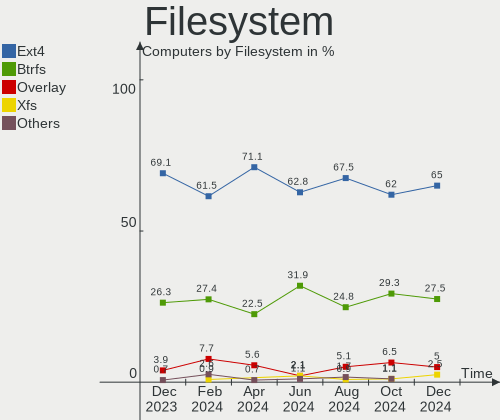
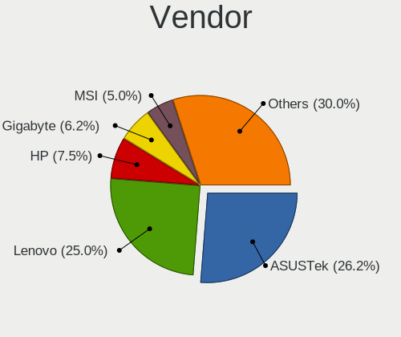
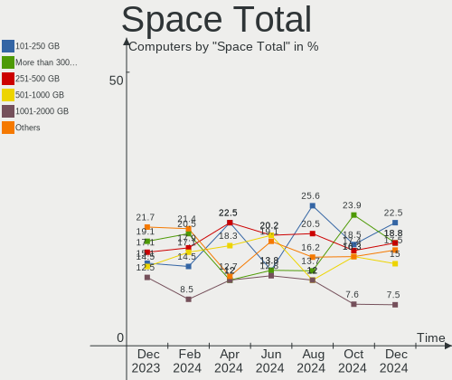

ArcoLinux - Hardware Trends
---------------------------

A project to identify most popular hardware characteristics and track their change
over time based on data collected by Linux users at https://Linux-Hardware.org.

Anyone can contribute to this report by the [hw-probe](https://github.com/linuxhw/hw-probe) tool:

    sudo -E hw-probe -all -upload

This is a report for all computer types. See also reports for [desktops](/Dist/ArcoLinux/Desktop/README.md) and [notebooks](/Dist/ArcoLinux/Notebook/README.md).

This report is for one last month. Overall report since the beginning of time: [TestDays](https://github.com/linuxhw/TestDays)

Period: Sep, 2023.

Contents
--------

* [ System ](#system)
  - [ OS                       ](#os)
  - [ OS Family                ](#os-family)
  - [ Kernel                   ](#kernel)
  - [ Kernel Family            ](#kernel-family)
  - [ Kernel Major Ver.        ](#kernel-major-ver)
  - [ Arch                     ](#arch)
  - [ DE                       ](#de)
  - [ Display Server           ](#display-server)
  - [ Display Manager          ](#display-manager)
  - [ OS Lang                  ](#os-lang)
  - [ Boot Mode                ](#boot-mode)
  - [ Filesystem               ](#filesystem)
  - [ Part. scheme             ](#part-scheme)
  - [ Dual Boot with Linux/BSD ](#dual-boot-with-linuxbsd)
  - [ Dual Boot (Win)          ](#dual-boot-win)

* [ Board ](#board)
  - [ Vendor                   ](#vendor)
  - [ Model                    ](#model)
  - [ Model Family             ](#model-family)
  - [ MFG Year                 ](#mfg-year)
  - [ Form Factor              ](#form-factor)
  - [ Secure Boot              ](#secure-boot)
  - [ Coreboot                 ](#coreboot)
  - [ RAM Size                 ](#ram-size)
  - [ RAM Used                 ](#ram-used)
  - [ Total Drives             ](#total-drives)
  - [ Has CD-ROM               ](#has-cd-rom)
  - [ Has Ethernet             ](#has-ethernet)
  - [ Has WiFi                 ](#has-wifi)
  - [ Has Bluetooth            ](#has-bluetooth)

* [ Location ](#location)
  - [ Country                  ](#country)
  - [ City                     ](#city)

* [ Drives ](#drives)
  - [ Drive Vendor             ](#drive-vendor)
  - [ Drive Model              ](#drive-model)
  - [ HDD Vendor               ](#hdd-vendor)
  - [ SSD Vendor               ](#ssd-vendor)
  - [ Drive Kind               ](#drive-kind)
  - [ Drive Connector          ](#drive-connector)
  - [ Drive Size               ](#drive-size)
  - [ Space Total              ](#space-total)
  - [ Space Used               ](#space-used)
  - [ Malfunc. Drives          ](#malfunc-drives)
  - [ Malfunc. Drive Vendor    ](#malfunc-drive-vendor)
  - [ Malfunc. HDD Vendor      ](#malfunc-hdd-vendor)
  - [ Malfunc. Drive Kind      ](#malfunc-drive-kind)
  - [ Failed Drives            ](#failed-drives)
  - [ Failed Drive Vendor      ](#failed-drive-vendor)
  - [ Drive Status             ](#drive-status)

* [ Storage controller ](#storage-controller)
  - [ Storage Vendor           ](#storage-vendor)
  - [ Storage Model            ](#storage-model)
  - [ Storage Kind             ](#storage-kind)

* [ Processor ](#processor)
  - [ CPU Vendor               ](#cpu-vendor)
  - [ CPU Model                ](#cpu-model)
  - [ CPU Model Family         ](#cpu-model-family)
  - [ CPU Cores                ](#cpu-cores)
  - [ CPU Sockets              ](#cpu-sockets)
  - [ CPU Threads              ](#cpu-threads)
  - [ CPU Op-Modes             ](#cpu-op-modes)
  - [ CPU Microcode            ](#cpu-microcode)
  - [ CPU Microarch            ](#cpu-microarch)

* [ Graphics ](#graphics)
  - [ GPU Vendor               ](#gpu-vendor)
  - [ GPU Model                ](#gpu-model)
  - [ GPU Combo                ](#gpu-combo)
  - [ GPU Driver               ](#gpu-driver)
  - [ GPU Memory               ](#gpu-memory)

* [ Monitor ](#monitor)
  - [ Monitor Vendor           ](#monitor-vendor)
  - [ Monitor Model            ](#monitor-model)
  - [ Monitor Resolution       ](#monitor-resolution)
  - [ Monitor Diagonal         ](#monitor-diagonal)
  - [ Monitor Width            ](#monitor-width)
  - [ Aspect Ratio             ](#aspect-ratio)
  - [ Monitor Area             ](#monitor-area)
  - [ Pixel Density            ](#pixel-density)
  - [ Multiple Monitors        ](#multiple-monitors)

* [ Network ](#network)
  - [ Net Controller Vendor    ](#net-controller-vendor)
  - [ Net Controller Model     ](#net-controller-model)
  - [ Wireless Vendor          ](#wireless-vendor)
  - [ Wireless Model           ](#wireless-model)
  - [ Ethernet Vendor          ](#ethernet-vendor)
  - [ Ethernet Model           ](#ethernet-model)
  - [ Net Controller Kind      ](#net-controller-kind)
  - [ Used Controller          ](#used-controller)
  - [ NICs                     ](#nics)
  - [ IPv6                     ](#ipv6)

* [ Bluetooth ](#bluetooth)
  - [ Bluetooth Vendor         ](#bluetooth-vendor)
  - [ Bluetooth Model          ](#bluetooth-model)

* [ Sound ](#sound)
  - [ Sound Vendor             ](#sound-vendor)
  - [ Sound Model              ](#sound-model)

* [ Memory ](#memory)
  - [ Memory Vendor            ](#memory-vendor)
  - [ Memory Model             ](#memory-model)
  - [ Memory Kind              ](#memory-kind)
  - [ Memory Form Factor       ](#memory-form-factor)
  - [ Memory Size              ](#memory-size)
  - [ Memory Speed             ](#memory-speed)

* [ Printers & scanners ](#printers--scanners)
  - [ Printer Vendor           ](#printer-vendor)
  - [ Printer Model            ](#printer-model)
  - [ Scanner Vendor           ](#scanner-vendor)
  - [ Scanner Model            ](#scanner-model)

* [ Camera ](#camera)
  - [ Camera Vendor            ](#camera-vendor)
  - [ Camera Model             ](#camera-model)

* [ Security ](#security)
  - [ Fingerprint Vendor       ](#fingerprint-vendor)
  - [ Fingerprint Model        ](#fingerprint-model)
  - [ Chipcard Vendor          ](#chipcard-vendor)
  - [ Chipcard Model           ](#chipcard-model)

* [ Unsupported ](#unsupported)
  - [ Unsupported Devices      ](#unsupported-devices)
  - [ Unsupported Device Types ](#unsupported-device-types)

System
------

OS
--

Installed operating systems

| Name              | Computers | Percent |
|-------------------|-----------|---------|
| ArcoLinux Rolling | 126       | 96.18%  |
| ArcoLinux         | 5         | 3.82%   |

OS Family
---------

OS without a version

| Name      | Computers | Percent |
|-----------|-----------|---------|
| ArcoLinux | 131       | 100%    |

Kernel
------

Version of the Linux kernel

| Version                      | Computers | Percent |
|------------------------------|-----------|---------|
| 6.4.12-arch1-1               | 30        | 22.9%   |
| 6.5.3-arch1-1                | 15        | 11.45%  |
| 6.4.11-arch1-1               | 13        | 9.92%   |
| 6.4.12-zen1-1-zen            | 11        | 8.4%    |
| 6.5.4-arch2-1                | 8         | 6.11%   |
| 6.5.5-arch1-1                | 7         | 5.34%   |
| 6.5.2-arch1-1                | 7         | 5.34%   |
| 6.3.8-arch1-1                | 5         | 3.82%   |
| 6.1.53-1-lts                 | 4         | 3.05%   |
| 6.1.54-1-lts                 | 3         | 2.29%   |
| 6.1.50-1-lts                 | 3         | 2.29%   |
| 6.5.5-zen1-1-zen             | 2         | 1.53%   |
| 6.4.11-arch2-1               | 2         | 1.53%   |
| 6.4.10-arch1-1               | 2         | 1.53%   |
| 6.1.52-1-lts                 | 2         | 1.53%   |
| 6.5.5-hardened1-1-hardened   | 1         | 0.76%   |
| 6.5.4-zen2-1-zen             | 1         | 0.76%   |
| 6.5.3-zen1-1-zen             | 1         | 0.76%   |
| 6.5.3-AMD                    | 1         | 0.76%   |
| 6.5.2-zen1-1-zen             | 1         | 0.76%   |
| 6.4.9-arch1-1                | 1         | 0.76%   |
| 6.4.4-arch1-1                | 1         | 0.76%   |
| 6.4.3-arch1-1                | 1         | 0.76%   |
| 6.4.2-x64v2-xanmod1-3        | 1         | 0.76%   |
| 6.4.11-zen1-1-zen            | 1         | 0.76%   |
| 6.4.10-273-tkg-linux-tkg-pds | 1         | 0.76%   |
| 6.3.1-1-cachyos-eevdf-bore   | 1         | 0.76%   |
| 6.2.9-arch1-1                | 1         | 0.76%   |
| 6.2.11-arch1-1               | 1         | 0.76%   |
| 6.1.55-1-lts                 | 1         | 0.76%   |
| 6.1.53-x64v1-xanmod1-1-lts   | 1         | 0.76%   |
| 6.1.51-1-lts                 | 1         | 0.76%   |

Kernel Family
-------------

Linux kernel without a distro release

| Version | Computers | Percent |
|---------|-----------|---------|
| 6.4.12  | 41        | 31.3%   |
| 6.5.3   | 17        | 12.98%  |
| 6.4.11  | 16        | 12.21%  |
| 6.5.5   | 10        | 7.63%   |
| 6.5.4   | 9         | 6.87%   |
| 6.5.2   | 8         | 6.11%   |
| 6.3.8   | 5         | 3.82%   |
| 6.1.53  | 5         | 3.82%   |
| 6.4.10  | 3         | 2.29%   |
| 6.1.54  | 3         | 2.29%   |
| 6.1.50  | 3         | 2.29%   |
| 6.1.52  | 2         | 1.53%   |
| 6.4.9   | 1         | 0.76%   |
| 6.4.4   | 1         | 0.76%   |
| 6.4.3   | 1         | 0.76%   |
| 6.4.2   | 1         | 0.76%   |
| 6.3.1   | 1         | 0.76%   |
| 6.2.9   | 1         | 0.76%   |
| 6.2.11  | 1         | 0.76%   |
| 6.1.55  | 1         | 0.76%   |
| 6.1.51  | 1         | 0.76%   |

Kernel Major Ver.
-----------------

Linux kernel major version

| Version | Computers | Percent |
|---------|-----------|---------|
| 6.4     | 64        | 48.85%  |
| 6.5     | 44        | 33.59%  |
| 6.1     | 15        | 11.45%  |
| 6.3     | 6         | 4.58%   |
| 6.2     | 2         | 1.53%   |

Arch
----

OS architecture (x86_64, i586, etc.)

| Name   | Computers | Percent |
|--------|-----------|---------|
| x86_64 | 131       | 100%    |

DE
--

Desktop Environment

| Name        | Computers | Percent |
|-------------|-----------|---------|
| XFCE        | 47        | 35.88%  |
| KDE5        | 32        | 24.43%  |
| GNOME       | 18        | 13.74%  |
| i3          | 10        | 7.63%   |
| Hyprland    | 6         | 4.58%   |
| Budgie      | 5         | 3.82%   |
| Cinnamon    | 4         | 3.05%   |
| chadwm      | 3         | 2.29%   |
| X-Cinnamon  | 2         | 1.53%   |
| xmonad      | 1         | 0.76%   |
| XFCE:GNOME: | 1         | 0.76%   |
| qtile       | 1         | 0.76%   |
| awesome     | 1         | 0.76%   |

Display Server
--------------

X11 or Wayland

| Name    | Computers | Percent |
|---------|-----------|---------|
| X11     | 113       | 86.26%  |
| Wayland | 13        | 9.92%   |
| Unknown | 4         | 3.05%   |
| Tty     | 1         | 0.76%   |

Display Manager
---------------

SDDM, LightDM, etc.

| Name    | Computers | Percent |
|---------|-----------|---------|
| SDDM    | 104       | 79.39%  |
| LightDM | 17        | 12.98%  |
| Unknown | 5         | 3.82%   |
| LXDM    | 3         | 2.29%   |
| GDM     | 2         | 1.53%   |

OS Lang
-------

Language

| Lang  | Computers | Percent |
|-------|-----------|---------|
| en_US | 57        | 43.51%  |
| en_GB | 11        | 8.4%    |
| C     | 7         | 5.34%   |
| ru_RU | 6         | 4.58%   |
| pt_BR | 6         | 4.58%   |
| es_MX | 5         | 3.82%   |
| es_ES | 5         | 3.82%   |
| en_IN | 4         | 3.05%   |
| en_CA | 4         | 3.05%   |
| de_DE | 4         | 3.05%   |
| it_IT | 3         | 2.29%   |
| fr_FR | 3         | 2.29%   |
| en_ZA | 2         | 1.53%   |
| zh_CN | 1         | 0.76%   |
| tr_TR | 1         | 0.76%   |
| th_TH | 1         | 0.76%   |
| sv_SE | 1         | 0.76%   |
| pt_PT | 1         | 0.76%   |
| nl_NL | 1         | 0.76%   |
| nb_NO | 1         | 0.76%   |
| lt_LT | 1         | 0.76%   |
| id_ID | 1         | 0.76%   |
| hu_HU | 1         | 0.76%   |
| fr_CA | 1         | 0.76%   |
| es_PE | 1         | 0.76%   |
| en_HK | 1         | 0.76%   |
| cs_CZ | 1         | 0.76%   |

Boot Mode
---------

EFI or BIOS

| Mode | Computers | Percent |
|------|-----------|---------|
| EFI  | 106       | 80.92%  |
| BIOS | 25        | 19.08%  |

Filesystem
----------

Type of filesystem

| Type     | Computers | Percent |
|----------|-----------|---------|
| Ext4     | 79        | 60.31%  |
| Btrfs    | 40        | 30.53%  |
| Overlay  | 8         | 6.11%   |
| F2fs     | 2         | 1.53%   |
| Xfs      | 1         | 0.76%   |
| Reiserfs | 1         | 0.76%   |

Part. scheme
------------

Scheme of partitioning

| Type    | Computers | Percent |
|---------|-----------|---------|
| GPT     | 114       | 87.02%  |
| MBR     | 12        | 9.16%   |
| Unknown | 5         | 3.82%   |

Dual Boot with Linux/BSD
------------------------

Hosting more than one Linux/BSD

| Dual boot | Computers | Percent |
|-----------|-----------|---------|
| No        | 92        | 70.23%  |
| Yes       | 39        | 29.77%  |

Dual Boot (Win)
---------------

Hosting Linux and Windows

| Dual boot | Computers | Percent |
|-----------|-----------|---------|
| No        | 73        | 55.73%  |
| Yes       | 58        | 44.27%  |

Board
-----

Vendor
------

Motherboard manufacturer

| Name                                 | Computers | Percent |
|--------------------------------------|-----------|---------|
| ASUSTek Computer                     | 26        | 19.85%  |
| Lenovo                               | 21        | 16.03%  |
| Gigabyte Technology                  | 17        | 12.98%  |
| Hewlett-Packard                      | 15        | 11.45%  |
| Dell                                 | 14        | 10.69%  |
| Acer                                 | 7         | 5.34%   |
| ASRock                               | 5         | 3.82%   |
| MSI                                  | 4         | 3.05%   |
| Apple                                | 3         | 2.29%   |
| Intel                                | 2         | 1.53%   |
| Chuwi                                | 2         | 1.53%   |
| BESSTAR Tech                         | 2         | 1.53%   |
| Shenzhen Meigao Electronic Equipment | 1         | 0.76%   |
| Samsung Electronics                  | 1         | 0.76%   |
| Razer                                | 1         | 0.76%   |
| Positivo                             | 1         | 0.76%   |
| Monster                              | 1         | 0.76%   |
| Medion                               | 1         | 0.76%   |
| MACHINIST                            | 1         | 0.76%   |
| IP3 Tech                             | 1         | 0.76%   |
| Huanan                               | 1         | 0.76%   |
| Dynabook                             | 1         | 0.76%   |
| AZW                                  | 1         | 0.76%   |
| A-DATA Technology                    | 1         | 0.76%   |
| Unknown                              | 1         | 0.76%   |

Model
-----

Motherboard model

| Name                                          | Computers | Percent |
|-----------------------------------------------|-----------|---------|
| Gigabyte X570 AORUS MASTER                    | 2         | 1.53%   |
| Dell XPS 15 9560                              | 2         | 1.53%   |
| Chuwi GemiBook Pro                            | 2         | 1.53%   |
| ASRock B450M Pro4                             | 2         | 1.53%   |
| Acer Aspire E5-575G                           | 2         | 1.53%   |
| Shenzhen Meigao Electronic Equipment UM560 XT | 1         | 0.76%   |
| Samsung RV413/RV513                           | 1         | 0.76%   |
| Razer Blade                                   | 1         | 0.76%   |
| Positivo D6200                                | 1         | 0.76%   |
| MSI MS-7C91                                   | 1         | 0.76%   |
| MSI MS-7A78                                   | 1         | 0.76%   |
| MSI MS-7A38                                   | 1         | 0.76%   |
| MSI CR610M                                    | 1         | 0.76%   |
| Monster ABRA A7 V11.3                         | 1         | 0.76%   |
| Medion MS-7667                                | 1         | 0.76%   |
| MACHINIST X99-RS9 V2.0                        | 1         | 0.76%   |
| Lenovo ThinkPad X260 20F5S2WY00               | 1         | 0.76%   |
| Lenovo ThinkPad X230 23252SG                  | 1         | 0.76%   |
| Lenovo ThinkPad X1 Carbon Gen 10 21CB00AYMX   | 1         | 0.76%   |
| Lenovo ThinkPad X1 Carbon 6th 20KH006KUK      | 1         | 0.76%   |
| Lenovo ThinkPad W541 20EGS24300               | 1         | 0.76%   |
| Lenovo ThinkPad T480 20L6S1FU00               | 1         | 0.76%   |
| Lenovo ThinkPad T470 W10DG 20JNS10501         | 1         | 0.76%   |
| Lenovo ThinkPad T440 20B7S1K400               | 1         | 0.76%   |
| Lenovo ThinkPad T430 2349IF8                  | 1         | 0.76%   |
| Lenovo ThinkPad T420 4178AFU                  | 1         | 0.76%   |
| Lenovo ThinkPad E490 20N9001RBR               | 1         | 0.76%   |
| Lenovo ThinkPad E15 Gen 2 20TD0005MX          | 1         | 0.76%   |
| Lenovo Legion T5 28IMB05 90NC00JAUS           | 1         | 0.76%   |
| Lenovo IdeaPadFlex 5-1570 81CA                | 1         | 0.76%   |
| Lenovo IdeaPadFlex 5 14ARE05 81X2             | 1         | 0.76%   |
| Lenovo IdeaPad Y700-15ISK 80NV                | 1         | 0.76%   |
| Lenovo IdeaPad S145-15AST 81N3                | 1         | 0.76%   |
| Lenovo IdeaPad 5 15ARE05 81YQ                 | 1         | 0.76%   |
| Lenovo IdeaPad 330-15IGM 81D1                 | 1         | 0.76%   |
| Lenovo IdeaPad 3 15ABA7 82RN                  | 1         | 0.76%   |
| Lenovo E41-25 81FS                            | 1         | 0.76%   |
| IP3 Tech UNITY F24B                           | 1         | 0.76%   |
| Intel NUC8i3CYS                               | 1         | 0.76%   |
| Intel NUC7i3BNH                               | 1         | 0.76%   |

Model Family
------------

Motherboard model prefix

| Name                                       | Computers | Percent |
|--------------------------------------------|-----------|---------|
| Lenovo ThinkPad                            | 12        | 9.16%   |
| Lenovo IdeaPad                             | 5         | 3.82%   |
| ASUS ROG                                   | 5         | 3.82%   |
| Gigabyte X570                              | 4         | 3.05%   |
| Dell Inspiron                              | 4         | 3.05%   |
| HP Pavilion                                | 3         | 2.29%   |
| HP EliteBook                               | 3         | 2.29%   |
| Dell XPS                                   | 3         | 2.29%   |
| Dell Latitude                              | 3         | 2.29%   |
| ASUS VivoBook                              | 3         | 2.29%   |
| ASUS PRIME                                 | 3         | 2.29%   |
| Acer Nitro                                 | 3         | 2.29%   |
| Acer Aspire                                | 3         | 2.29%   |
| Lenovo IdeaPadFlex                         | 2         | 1.53%   |
| HP ProBook                                 | 2         | 1.53%   |
| HP OMEN                                    | 2         | 1.53%   |
| Dell OptiPlex                              | 2         | 1.53%   |
| Chuwi GemiBook                             | 2         | 1.53%   |
| ASUS P8H61-M                               | 2         | 1.53%   |
| ASUS ASUS                                  | 2         | 1.53%   |
| ASRock B450M                               | 2         | 1.53%   |
| Apple MacBookPro9                          | 2         | 1.53%   |
| Shenzhen Meigao Electronic Equipment UM560 | 1         | 0.76%   |
| Samsung RV413                              | 1         | 0.76%   |
| Razer Blade                                | 1         | 0.76%   |
| Positivo D6200                             | 1         | 0.76%   |
| MSI MS-7C91                                | 1         | 0.76%   |
| MSI MS-7A78                                | 1         | 0.76%   |
| MSI MS-7A38                                | 1         | 0.76%   |
| MSI CR610M                                 | 1         | 0.76%   |
| Monster ABRA                               | 1         | 0.76%   |
| Medion MS-7667                             | 1         | 0.76%   |
| MACHINIST X99-RS9                          | 1         | 0.76%   |
| Lenovo Legion                              | 1         | 0.76%   |
| Lenovo E41-25                              | 1         | 0.76%   |
| IP3 Tech UNITY                             | 1         | 0.76%   |
| Intel NUC8i3CYS                            | 1         | 0.76%   |
| Intel NUC7i3BNH                            | 1         | 0.76%   |
| Huanan X99-F8                              | 1         | 0.76%   |
| HP Laptop                                  | 1         | 0.76%   |

MFG Year
--------

Motherboard manufacture year

| Year | Computers | Percent |
|------|-----------|---------|
| 2020 | 18        | 13.74%  |
| 2018 | 18        | 13.74%  |
| 2019 | 15        | 11.45%  |
| 2017 | 13        | 9.92%   |
| 2022 | 12        | 9.16%   |
| 2021 | 11        | 8.4%    |
| 2016 | 9         | 6.87%   |
| 2012 | 9         | 6.87%   |
| 2013 | 7         | 5.34%   |
| 2015 | 5         | 3.82%   |
| 2014 | 5         | 3.82%   |
| 2011 | 5         | 3.82%   |
| 2023 | 2         | 1.53%   |
| 2010 | 1         | 0.76%   |
| 2009 | 1         | 0.76%   |

Form Factor
-----------

Physical design of the computer

| Name        | Computers | Percent |
|-------------|-----------|---------|
| Notebook    | 74        | 56.49%  |
| Desktop     | 48        | 36.64%  |
| Convertible | 6         | 4.58%   |
| Mini pc     | 2         | 1.53%   |
| All in one  | 1         | 0.76%   |

Secure Boot
-----------

Enabled or disabled

| State    | Computers | Percent |
|----------|-----------|---------|
| Disabled | 130       | 99.24%  |
| Enabled  | 1         | 0.76%   |

Coreboot
--------

Have coreboot on board

| Used | Computers | Percent |
|------|-----------|---------|
| No   | 131       | 100%    |

RAM Size
--------

Total RAM memory

| Size in GB  | Computers | Percent |
|-------------|-----------|---------|
| 16.01-24.0  | 37        | 28.24%  |
| 4.01-8.0    | 33        | 25.19%  |
| 32.01-64.0  | 17        | 12.98%  |
| 3.01-4.0    | 12        | 9.16%   |
| 64.01-256.0 | 12        | 9.16%   |
| 8.01-16.0   | 12        | 9.16%   |
| 24.01-32.0  | 7         | 5.34%   |
| 1.01-2.0    | 1         | 0.76%   |

RAM Used
--------

Used RAM memory

| Used GB   | Computers | Percent |
|-----------|-----------|---------|
| 1.01-2.0  | 56        | 42.75%  |
| 2.01-3.0  | 36        | 27.48%  |
| 4.01-8.0  | 16        | 12.21%  |
| 3.01-4.0  | 13        | 9.92%   |
| 8.01-16.0 | 6         | 4.58%   |
| 0.51-1.0  | 4         | 3.05%   |

Total Drives
------------

Number of drives on board

| Drives | Computers | Percent |
|--------|-----------|---------|
| 1      | 59        | 45.04%  |
| 2      | 42        | 32.06%  |
| 3      | 13        | 9.92%   |
| 5      | 8         | 6.11%   |
| 4      | 6         | 4.58%   |
| 6      | 2         | 1.53%   |
| 10     | 1         | 0.76%   |

Has CD-ROM
----------

Has CD-ROM on board

| Presented | Computers | Percent |
|-----------|-----------|---------|
| No        | 108       | 82.44%  |
| Yes       | 23        | 17.56%  |

Has Ethernet
------------

Has Ethernet on board

| Presented | Computers | Percent |
|-----------|-----------|---------|
| Yes       | 109       | 83.21%  |
| No        | 22        | 16.79%  |

Has WiFi
--------

Has WiFi module

| Presented | Computers | Percent |
|-----------|-----------|---------|
| Yes       | 110       | 83.97%  |
| No        | 21        | 16.03%  |

Has Bluetooth
-------------

Has Bluetooth module

| Presented | Computers | Percent |
|-----------|-----------|---------|
| Yes       | 107       | 81.68%  |
| No        | 24        | 18.32%  |

Location
--------

Country
-------

Geographic location (country)

| Country      | Computers | Percent |
|--------------|-----------|---------|
| USA          | 20        | 15.27%  |
| Brazil       | 13        | 9.92%   |
| UK           | 10        | 7.63%   |
| Germany      | 9         | 6.87%   |
| Spain        | 7         | 5.34%   |
| Mexico       | 6         | 4.58%   |
| Turkey       | 5         | 3.82%   |
| India        | 5         | 3.82%   |
| Canada       | 5         | 3.82%   |
| Russia       | 4         | 3.05%   |
| Norway       | 3         | 2.29%   |
| Netherlands  | 3         | 2.29%   |
| Italy        | 3         | 2.29%   |
| Iran         | 3         | 2.29%   |
| France       | 3         | 2.29%   |
| Thailand     | 2         | 1.53%   |
| Sweden       | 2         | 1.53%   |
| South Africa | 2         | 1.53%   |
| Indonesia    | 2         | 1.53%   |
| Hungary      | 2         | 1.53%   |
| Czechia      | 2         | 1.53%   |
| Belgium      | 2         | 1.53%   |
| Austria      | 2         | 1.53%   |
| Uruguay      | 1         | 0.76%   |
| Suriname     | 1         | 0.76%   |
| Portugal     | 1         | 0.76%   |
| Poland       | 1         | 0.76%   |
| Philippines  | 1         | 0.76%   |
| Peru         | 1         | 0.76%   |
| New Zealand  | 1         | 0.76%   |
| Lithuania    | 1         | 0.76%   |
| Latvia       | 1         | 0.76%   |
| Hong Kong    | 1         | 0.76%   |
| Estonia      | 1         | 0.76%   |
| Egypt        | 1         | 0.76%   |
| Cuba         | 1         | 0.76%   |
| Colombia     | 1         | 0.76%   |
| China        | 1         | 0.76%   |
| Australia    | 1         | 0.76%   |

City
----

Geographic location (city)

| City                     | Computers | Percent |
|--------------------------|-----------|---------|
| Istanbul                 | 4         | 3.05%   |
| Rio de Janeiro           | 3         | 2.29%   |
| Guadalajara              | 3         | 2.29%   |
| Feltham                  | 3         | 2.29%   |
| Saltillo                 | 2         | 1.53%   |
| Prague                   | 2         | 1.53%   |
| Madrid                   | 2         | 1.53%   |
| Burgos                   | 2         | 1.53%   |
| Berlin                   | 2         | 1.53%   |
| Bangkok                  | 2         | 1.53%   |
| Amsterdam                | 2         | 1.53%   |
| Yakutsk                  | 1         | 0.76%   |
| Yachats                  | 1         | 0.76%   |
| Wroclaw                  | 1         | 0.76%   |
| Wolfville                | 1         | 0.76%   |
| Werther                  | 1         | 0.76%   |
| Wausau                   | 1         | 0.76%   |
| Voronezh                 | 1         | 0.76%   |
| Vicosa                   | 1         | 0.76%   |
| Tulungagung              | 1         | 0.76%   |
| Tsuen Wan                | 1         | 0.76%   |
| Trieste                  | 1         | 0.76%   |
| Toronto                  | 1         | 0.76%   |
| Terni                    | 1         | 0.76%   |
| Tehran                   | 1         | 0.76%   |
| Sydney                   | 1         | 0.76%   |
| Steinberg                | 1         | 0.76%   |
| Standerton               | 1         | 0.76%   |
| Springfield              | 1         | 0.76%   |
| Sierndorf                | 1         | 0.76%   |
| Shenzhen                 | 1         | 0.76%   |
| Senago                   | 1         | 0.76%   |
| Sao Paulo                | 1         | 0.76%   |
| Sao Joao del Rei         | 1         | 0.76%   |
| Sao Domingos das Dores   | 1         | 0.76%   |
| Sanford                  | 1         | 0.76%   |
| Salaberry-de-Valleyfield | 1         | 0.76%   |
| Rudolstadt               | 1         | 0.76%   |
| Roswell                  | 1         | 0.76%   |
| Rosny-sous-Bois          | 1         | 0.76%   |

Drives
------

Drive Vendor
------------

Hard drive vendors

| Vendor                         | Computers | Drives | Percent |
|--------------------------------|-----------|--------|---------|
| Samsung Electronics            | 45        | 66     | 20.64%  |
| WDC                            | 25        | 32     | 11.47%  |
| Sandisk                        | 19        | 23     | 8.72%   |
| Seagate                        | 14        | 19     | 6.42%   |
| Kingston                       | 13        | 18     | 5.96%   |
| Toshiba                        | 10        | 10     | 4.59%   |
| SK hynix                       | 8         | 9      | 3.67%   |
| Crucial                        | 8         | 8      | 3.67%   |
| Phison Electronics             | 6         | 9      | 2.75%   |
| Kingston Technology Company    | 6         | 6      | 2.75%   |
| Intel                          | 6         | 6      | 2.75%   |
| Unknown                        | 5         | 7      | 2.29%   |
| Micron/Crucial Technology      | 5         | 6      | 2.29%   |
| KIOXIA                         | 4         | 4      | 1.83%   |
| Hitachi                        | 4         | 4      | 1.83%   |
| HGST                           | 3         | 3      | 1.38%   |
| Silicon Motion                 | 2         | 2      | 0.92%   |
| SABRENT                        | 2         | 3      | 0.92%   |
| Lexar                          | 2         | 2      | 0.92%   |
| China                          | 2         | 2      | 0.92%   |
| Apple                          | 2         | 2      | 0.92%   |
| ADATA Technology               | 2         | 2      | 0.92%   |
| XPG                            | 1         | 1      | 0.46%   |
| Union Memory                   | 1         | 1      | 0.46%   |
| Super Talent                   | 1         | 1      | 0.46%   |
| Solid State Storage Technology | 1         | 1      | 0.46%   |
| ShiJi                          | 1         | 1      | 0.46%   |
| Plextor                        | 1         | 1      | 0.46%   |
| Patriot                        | 1         | 1      | 0.46%   |
| OXYBR                          | 1         | 1      | 0.46%   |
| Micron Technology              | 1         | 1      | 0.46%   |
| Maxtor                         | 1         | 1      | 0.46%   |
| MAXIO Technology (Hangzhou)    | 1         | 1      | 0.46%   |
| LITEON                         | 1         | 1      | 0.46%   |
| KingSpec                       | 1         | 1      | 0.46%   |
| Kingmax                        | 1         | 1      | 0.46%   |
| JMicron Technology             | 1         | 1      | 0.46%   |
| Intenso                        | 1         | 1      | 0.46%   |
| HS-SSD-C100                    | 1         | 1      | 0.46%   |
| Hewlett-Packard                | 1         | 1      | 0.46%   |

Drive Model
-----------

Hard drive models

| Model                                                 | Computers | Percent |
|-------------------------------------------------------|-----------|---------|
| Samsung NVMe SSD Controller SM981/PM981/PM983 256GB   | 15        | 6.05%   |
| Samsung NVMe SSD Controller PM9A1/PM9A3/980PRO 1TB    | 6         | 2.42%   |
| Toshiba DT01ACA100 1TB                                | 4         | 1.61%   |
| Kingston Company A2000 NVMe SSD 1TB                   | 4         | 1.61%   |
| Kingston SA400S37480G 480GB SSD                       | 4         | 1.61%   |
| Sandisk WD Blue SN550 NVMe SSD 512GB                  | 3         | 1.21%   |
| Sandisk WD Black SN850 1TB                            | 3         | 1.21%   |
| Samsung SSD 870 EVO 500GB                             | 3         | 1.21%   |
| Phison E16 PCIe4 NVMe Controller 500GB                | 3         | 1.21%   |
| Kingston SV300S37A120G 120GB SSD                      | 3         | 1.21%   |
| Kingston SA400S37240G 240GB SSD                       | 3         | 1.21%   |
| WDC WD5000LPCX-24VHAT0 500GB                          | 2         | 0.81%   |
| WDC WD10SPZX-21Z10T0 1TB                              | 2         | 0.81%   |
| WDC WD10JPVX-60JC3T0 1TB                              | 2         | 0.81%   |
| WDC WD10EZRX-00L4HB0 1TB                              | 2         | 0.81%   |
| WDC WD10EZEX-08WN4A0 1TB                              | 2         | 0.81%   |
| Unknown MMC Card  64GB                                | 2         | 0.81%   |
| Unknown MMC Card  128GB                               | 2         | 0.81%   |
| Toshiba MQ01ABD100 1TB                                | 2         | 0.81%   |
| SK hynix BC511 512GB                                  | 2         | 0.81%   |
| Silicon Motion SM2263EN/SM2263XT SSD Controller 512GB | 2         | 0.81%   |
| Seagate ST9500325AS 500GB                             | 2         | 0.81%   |
| SanDisk SSD PLUS 480GB                                | 2         | 0.81%   |
| Sandisk PC SN520 NVMe SSD 512GB                       | 2         | 0.81%   |
| Samsung SSD 870 QVO 1TB                               | 2         | 0.81%   |
| Samsung SSD 870 EVO 1TB                               | 2         | 0.81%   |
| Samsung SSD 860 EVO 1TB                               | 2         | 0.81%   |
| Samsung SSD 850 EVO 250GB                             | 2         | 0.81%   |
| Samsung SSD 840 PRO Series 128GB                      | 2         | 0.81%   |
| Samsung MZVLQ256HAJD-00000 256GB                      | 2         | 0.81%   |
| Samsung MZVLQ1T0HBLB-00B00 1TB                        | 2         | 0.81%   |
| Samsung HM500JI 500GB                                 | 2         | 0.81%   |
| Phison PS5013 E13 NVMe Controller 512GB               | 2         | 0.81%   |
| Micron/Crucial P2 NVMe PCIe SSD 1TB                   | 2         | 0.81%   |
| Micron/Crucial CT1000P5SSD8 1TB                       | 2         | 0.81%   |
| Kingston SUV400S37120G 120GB SSD                      | 2         | 0.81%   |
| Intel SSD Pro 7600p/760p/E 6100p Series 1TB           | 2         | 0.81%   |
| HGST HTS721010A9E630 1TB                              | 2         | 0.81%   |
| Crucial CT1000MX500SSD1 1TB                           | 2         | 0.81%   |
| XPG NVMe SSD Drive 2TB                                | 1         | 0.4%    |

HDD Vendor
----------

Hard disk drive vendors

| Vendor              | Computers | Drives | Percent |
|---------------------|-----------|--------|---------|
| WDC                 | 22        | 26     | 37.93%  |
| Seagate             | 13        | 18     | 22.41%  |
| Toshiba             | 8         | 8      | 13.79%  |
| Samsung Electronics | 5         | 5      | 8.62%   |
| Hitachi             | 4         | 4      | 6.9%    |
| HGST                | 3         | 3      | 5.17%   |
| SABRENT             | 1         | 2      | 1.72%   |
| H/W                 | 1         | 3      | 1.72%   |
| Apple               | 1         | 1      | 1.72%   |

SSD Vendor
----------

Solid state drive vendors

| Vendor              | Computers | Drives | Percent |
|---------------------|-----------|--------|---------|
| Samsung Electronics | 22        | 27     | 27.5%   |
| Kingston            | 12        | 17     | 15%     |
| Crucial             | 8         | 8      | 10%     |
| SanDisk             | 6         | 6      | 7.5%    |
| WDC                 | 4         | 6      | 5%      |
| SK hynix            | 2         | 2      | 2.5%    |
| Lexar               | 2         | 2      | 2.5%    |
| Intel               | 2         | 2      | 2.5%    |
| China               | 2         | 2      | 2.5%    |
| Super Talent        | 1         | 1      | 1.25%   |
| ShiJi               | 1         | 1      | 1.25%   |
| SABRENT             | 1         | 1      | 1.25%   |
| Plextor             | 1         | 1      | 1.25%   |
| Patriot             | 1         | 1      | 1.25%   |
| OXYBR               | 1         | 1      | 1.25%   |
| Maxtor              | 1         | 1      | 1.25%   |
| LITEON              | 1         | 1      | 1.25%   |
| KingSpec            | 1         | 1      | 1.25%   |
| Kingmax             | 1         | 1      | 1.25%   |
| Intenso             | 1         | 1      | 1.25%   |
| HS-SSD-C100         | 1         | 1      | 1.25%   |
| Hewlett-Packard     | 1         | 1      | 1.25%   |
| GOODRAM             | 1         | 1      | 1.25%   |
| EYOTA               | 1         | 1      | 1.25%   |
| CONSISTENT          | 1         | 1      | 1.25%   |
| Colorful            | 1         | 1      | 1.25%   |
| AS201               | 1         | 1      | 1.25%   |
| Apple               | 1         | 1      | 1.25%   |
| A-DATA Technology   | 1         | 1      | 1.25%   |

Drive Kind
----------

HDD or SSD

| Kind    | Computers | Drives | Percent |
|---------|-----------|--------|---------|
| NVMe    | 72        | 100    | 38.1%   |
| SSD     | 65        | 92     | 34.39%  |
| HDD     | 46        | 70     | 24.34%  |
| MMC     | 5         | 7      | 2.65%   |
| Unknown | 1         | 1      | 0.53%   |

Drive Connector
---------------

SATA, SAS, NVMe, etc.

| Type | Computers | Drives | Percent |
|------|-----------|--------|---------|
| SATA | 87        | 156    | 51.18%  |
| NVMe | 72        | 100    | 42.35%  |
| SAS  | 6         | 7      | 3.53%   |
| MMC  | 5         | 7      | 2.94%   |

Drive Size
----------

Size of hard drive

| Size in TB | Computers | Drives | Percent |
|------------|-----------|--------|---------|
| 0.01-0.5   | 62        | 87     | 50%     |
| 0.51-1.0   | 47        | 57     | 37.9%   |
| 1.01-2.0   | 7         | 10     | 5.65%   |
| 3.01-4.0   | 3         | 3      | 2.42%   |
| 2.01-3.0   | 3         | 3      | 2.42%   |
| 10.01-20.0 | 1         | 1      | 0.81%   |
| 4.01-10.0  | 1         | 1      | 0.81%   |

Space Total
-----------

Amount of disk space available on the file system

| Size in GB     | Computers | Percent |
|----------------|-----------|---------|
| 251-500        | 29        | 22.14%  |
| 1001-2000      | 25        | 19.08%  |
| More than 3000 | 22        | 16.79%  |
| 101-250        | 20        | 15.27%  |
| 501-1000       | 14        | 10.69%  |
| 51-100         | 6         | 4.58%   |
| 1-20           | 5         | 3.82%   |
| Unknown        | 5         | 3.82%   |
| 2001-3000      | 3         | 2.29%   |
| 21-50          | 2         | 1.53%   |

Space Used
----------

Amount of used disk space

| Used GB        | Computers | Percent |
|----------------|-----------|---------|
| 1-20           | 34        | 25.95%  |
| 21-50          | 31        | 23.66%  |
| 101-250        | 18        | 13.74%  |
| 51-100         | 15        | 11.45%  |
| 251-500        | 9         | 6.87%   |
| 501-1000       | 9         | 6.87%   |
| 1001-2000      | 7         | 5.34%   |
| Unknown        | 5         | 3.82%   |
| 2001-3000      | 2         | 1.53%   |
| More than 3000 | 1         | 0.76%   |

Malfunc. Drives
---------------

Drive models with a malfunction

| Model                                                           | Computers | Drives | Percent |
|-----------------------------------------------------------------|-----------|--------|---------|
| Seagate ST9500325AS 500GB                                       | 2         | 2      | 5.88%   |
| Samsung Electronics HM500JI 500GB                               | 2         | 2      | 5.88%   |
| WDC WD30EZRX-00DC0B0 3TB                                        | 1         | 1      | 2.94%   |
| WDC WD10JPCX-24UE4T0 1TB                                        | 1         | 1      | 2.94%   |
| WDC WD10EZRX-00L4HB0 1TB                                        | 1         | 1      | 2.94%   |
| Toshiba MQ01ABF050 500GB                                        | 1         | 1      | 2.94%   |
| Toshiba MQ01ABD100 1TB                                          | 1         | 1      | 2.94%   |
| Toshiba DT01ACA100 1TB                                          | 1         | 1      | 2.94%   |
| Super Talent FTM48N325H 480GB SSD                               | 1         | 1      | 2.94%   |
| SK hynix SC401 SATA 512GB SSD                                   | 1         | 1      | 2.94%   |
| SK hynix PC711 HFS512GDE9X073N 512GB                            | 1         | 1      | 2.94%   |
| Seagate ST9320325AS 320GB                                       | 1         | 1      | 2.94%   |
| Seagate ST3500418AS 500GB                                       | 1         | 1      | 2.94%   |
| Seagate ST2000DM008-2FR102 2TB                                  | 1         | 2      | 2.94%   |
| Seagate ST2000DM001-1ER164 2TB                                  | 1         | 2      | 2.94%   |
| Seagate ST1000DM010-2EP102 1TB                                  | 1         | 1      | 2.94%   |
| Seagate ST1000DM003-9YN162 1TB                                  | 1         | 1      | 2.94%   |
| Seagate ST1000DM003-1ER162 1TB                                  | 1         | 1      | 2.94%   |
| Samsung Electronics NVMe SSD Controller SM981/PM981/PM983 256GB | 1         | 1      | 2.94%   |
| Samsung Electronics HD322HJ 320GB                               | 1         | 1      | 2.94%   |
| Kingston SUV400S37120G 120GB SSD                                | 1         | 1      | 2.94%   |
| Intel SSDSC2BF180A4L 180GB                                      | 1         | 1      | 2.94%   |
| Intel SSDSA2M080G2GC 80GB                                       | 1         | 1      | 2.94%   |
| Intel SSD Pro 7600p/760p/E 6100p Series 1TB                     | 1         | 1      | 2.94%   |
| Hitachi HDS721050DLE630 500GB                                   | 1         | 1      | 2.94%   |
| Hitachi HDS721050CLA662 500GB                                   | 1         | 1      | 2.94%   |
| Hitachi HDS721025CLA382 250GB                                   | 1         | 1      | 2.94%   |
| HGST HTS541075A9E680 752GB                                      | 1         | 1      | 2.94%   |
| Hewlett-Packard SSD S600 240GB                                  | 1         | 1      | 2.94%   |
| Crucial CT525MX300SSD1 528GB                                    | 1         | 1      | 2.94%   |
| Colorful SL500 240GB SSD                                        | 1         | 1      | 2.94%   |
| China G521N256GB                                                | 1         | 1      | 2.94%   |

Malfunc. Drive Vendor
---------------------

Vendors of faulty drives

| Vendor              | Computers | Drives | Percent |
|---------------------|-----------|--------|---------|
| Seagate             | 8         | 11     | 24.24%  |
| Samsung Electronics | 4         | 4      | 12.12%  |
| WDC                 | 3         | 3      | 9.09%   |
| Toshiba             | 3         | 3      | 9.09%   |
| Intel               | 3         | 3      | 9.09%   |
| Hitachi             | 3         | 3      | 9.09%   |
| SK hynix            | 2         | 2      | 6.06%   |
| Super Talent        | 1         | 1      | 3.03%   |
| Kingston            | 1         | 1      | 3.03%   |
| HGST                | 1         | 1      | 3.03%   |
| Hewlett-Packard     | 1         | 1      | 3.03%   |
| Crucial             | 1         | 1      | 3.03%   |
| Colorful            | 1         | 1      | 3.03%   |
| China               | 1         | 1      | 3.03%   |

Malfunc. HDD Vendor
-------------------

Vendors of faulty HDD drives

| Vendor              | Computers | Drives | Percent |
|---------------------|-----------|--------|---------|
| Seagate             | 8         | 11     | 38.1%   |
| WDC                 | 3         | 3      | 14.29%  |
| Toshiba             | 3         | 3      | 14.29%  |
| Samsung Electronics | 3         | 3      | 14.29%  |
| Hitachi             | 3         | 3      | 14.29%  |
| HGST                | 1         | 1      | 4.76%   |

Malfunc. Drive Kind
-------------------

Kinds of faulty drives

| Kind | Computers | Drives | Percent |
|------|-----------|--------|---------|
| HDD  | 19        | 24     | 63.33%  |
| SSD  | 8         | 9      | 26.67%  |
| NVMe | 3         | 3      | 10%     |

Failed Drives
-------------

Failed drive models

Zero info for selected period =(

Failed Drive Vendor
-------------------

Failed drive vendors

Zero info for selected period =(

Drive Status
------------

Number of failed and malfunc. drives

| Status   | Computers | Drives | Percent |
|----------|-----------|--------|---------|
| Works    | 117       | 201    | 72.67%  |
| Malfunc  | 30        | 36     | 18.63%  |
| Detected | 14        | 33     | 8.7%    |

Storage controller
------------------

Storage Vendor
--------------

Storage controller vendors

| Vendor                         | Computers | Percent |
|--------------------------------|-----------|---------|
| Intel                          | 85        | 42.71%  |
| AMD                            | 29        | 14.57%  |
| Samsung Electronics            | 26        | 13.07%  |
| SanDisk                        | 13        | 6.53%   |
| Kingston Technology Company    | 7         | 3.52%   |
| SK hynix                       | 6         | 3.02%   |
| Phison Electronics             | 6         | 3.02%   |
| Micron/Crucial Technology      | 5         | 2.51%   |
| KIOXIA                         | 4         | 2.01%   |
| JMicron Technology             | 3         | 1.51%   |
| Toshiba America Info Systems   | 2         | 1.01%   |
| Silicon Motion                 | 2         | 1.01%   |
| Marvell Technology Group       | 2         | 1.01%   |
| ADATA Technology               | 2         | 1.01%   |
| Union Memory (Shenzhen)        | 1         | 0.5%    |
| Solid State Storage Technology | 1         | 0.5%    |
| Seagate Technology             | 1         | 0.5%    |
| Micron Technology              | 1         | 0.5%    |
| MAXIO Technology (Hangzhou)    | 1         | 0.5%    |
| INNOGRIT                       | 1         | 0.5%    |
| ASMedia Technology             | 1         | 0.5%    |

Storage Model
-------------

Storage controller models

| Model                                                                                   | Computers | Percent |
|-----------------------------------------------------------------------------------------|-----------|---------|
| AMD FCH SATA Controller [AHCI mode]                                                     | 23        | 10.6%   |
| Samsung NVMe SSD Controller SM981/PM981/PM983                                           | 15        | 6.91%   |
| Intel Sunrise Point-LP SATA Controller [AHCI mode]                                      | 9         | 4.15%   |
| Intel HM170/QM170 Chipset SATA Controller [AHCI Mode]                                   | 7         | 3.23%   |
| Intel 7 Series Chipset Family 6-port SATA Controller [AHCI mode]                        | 7         | 3.23%   |
| Samsung NVMe SSD Controller PM9A1/PM9A3/980PRO                                          | 6         | 2.76%   |
| Intel 82801 Mobile SATA Controller [RAID mode]                                          | 6         | 2.76%   |
| Intel 8 Series/C220 Series Chipset Family 6-port SATA Controller 1 [AHCI mode]          | 6         | 2.76%   |
| Intel 200 Series PCH SATA controller [AHCI mode]                                        | 6         | 2.76%   |
| Samsung NVMe SSD Controller 980                                                         | 5         | 2.3%    |
| Intel Volume Management Device NVMe RAID Controller                                     | 5         | 2.3%    |
| AMD 400 Series Chipset SATA Controller                                                  | 5         | 2.3%    |
| Kingston Company A2000 NVMe SSD                                                         | 4         | 1.84%   |
| Intel Cannon Lake PCH SATA AHCI Controller                                              | 4         | 1.84%   |
| AMD 500 Series Chipset SATA Controller                                                  | 4         | 1.84%   |
| SanDisk WD PC SN810 / Black SN850 NVMe SSD                                              | 3         | 1.38%   |
| SanDisk WD Blue SN550 NVMe SSD                                                          | 3         | 1.38%   |
| Phison E16 PCIe4 NVMe Controller                                                        | 3         | 1.38%   |
| KIOXIA NVMe SSD Controller BG4 (DRAM-less)                                              | 3         | 1.38%   |
| Intel Q170/Q150/B150/H170/H110/Z170/CM236 Chipset SATA Controller [AHCI Mode]           | 3         | 1.38%   |
| Intel Jasper Lake SATA AHCI Controller                                                  | 3         | 1.38%   |
| SK hynix Gold P31/BC711/PC711 NVMe Solid State Drive                                    | 2         | 0.92%   |
| SK hynix BC511 NVMe SSD                                                                 | 2         | 0.92%   |
| Silicon Motion SM2263EN/SM2263XT (DRAM-less) NVMe SSD Controllers                       | 2         | 0.92%   |
| SanDisk WD Blue SN570 NVMe SSD 1TB                                                      | 2         | 0.92%   |
| SanDisk WD Black SN770 / PC SN740 256GB / PC SN560 (DRAM-less) NVMe SSD                 | 2         | 0.92%   |
| SanDisk PC SN520 NVMe SSD                                                               | 2         | 0.92%   |
| Phison PS5013 E13 NVMe Controller                                                       | 2         | 0.92%   |
| Micron/Crucial P5 NVMe PCIe SSD[SlashP5]                                                | 2         | 0.92%   |
| Micron/Crucial P2 [Nick P2] / P3 / P3 Plus NVMe PCIe SSD (DRAM-less)                    | 2         | 0.92%   |
| Intel Tiger Lake-LP SATA Controller                                                     | 2         | 0.92%   |
| Intel SSD DC P4101/Pro 7600p/760p/E 6100p Series                                        | 2         | 0.92%   |
| Intel SSD 670p Series [Keystone Harbor]                                                 | 2         | 0.92%   |
| Intel Celeron/Pentium Silver Processor SATA Controller                                  | 2         | 0.92%   |
| Intel Cannon Lake Mobile PCH SATA AHCI Controller                                       | 2         | 0.92%   |
| Intel 8 Series SATA Controller 1 [AHCI mode]                                            | 2         | 0.92%   |
| Intel 7 Series/C210 Series Chipset Family 6-port SATA Controller [AHCI mode]            | 2         | 0.92%   |
| Intel 6 Series/C200 Series Chipset Family Desktop SATA Controller (IDE mode, ports 4-5) | 2         | 0.92%   |
| Intel 6 Series/C200 Series Chipset Family Desktop SATA Controller (IDE mode, ports 0-3) | 2         | 0.92%   |
| Intel 6 Series/C200 Series Chipset Family 6 port Mobile SATA AHCI Controller            | 2         | 0.92%   |

Storage Kind
------------

Kind of storage controller (IDE, SATA, NVMe, SAS, ...)

| Kind | Computers | Percent |
|------|-----------|---------|
| SATA | 102       | 54.26%  |
| NVMe | 72        | 38.3%   |
| RAID | 11        | 5.85%   |
| IDE  | 3         | 1.6%    |

Processor
---------

CPU Vendor
----------

Processor vendors

| Vendor | Computers | Percent |
|--------|-----------|---------|
| Intel  | 97        | 74.05%  |
| AMD    | 34        | 25.95%  |

CPU Model
---------

Processor models

| Model                                   | Computers | Percent |
|-----------------------------------------|-----------|---------|
| Intel Core i7-7700HQ CPU @ 2.80GHz      | 5         | 3.82%   |
| Intel Core i7-7500U CPU @ 2.70GHz       | 3         | 2.29%   |
| Intel Core i3-1005G1 CPU @ 1.20GHz      | 3         | 2.29%   |
| AMD Ryzen 5 5600G with Radeon Graphics  | 3         | 2.29%   |
| Intel Core i7-7700K CPU @ 4.20GHz       | 2         | 1.53%   |
| Intel Core i7-6500U CPU @ 2.50GHz       | 2         | 1.53%   |
| Intel Core i5-7200U CPU @ 2.50GHz       | 2         | 1.53%   |
| Intel Core i5-6300U CPU @ 2.40GHz       | 2         | 1.53%   |
| Intel Core i5-3320M CPU @ 2.60GHz       | 2         | 1.53%   |
| Intel Core i5-10400 CPU @ 2.90GHz       | 2         | 1.53%   |
| Intel Celeron N5100 @ 1.10GHz           | 2         | 1.53%   |
| Intel 11th Gen Core i7-1165G7 @ 2.80GHz | 2         | 1.53%   |
| AMD Ryzen 9 5900X 12-Core Processor     | 2         | 1.53%   |
| AMD Ryzen 9 3900X 12-Core Processor     | 2         | 1.53%   |
| AMD Ryzen 5 4500U with Radeon Graphics  | 2         | 1.53%   |
| Intel Xeon CPU E5-2699 v3 @ 2.30GHz     | 1         | 0.76%   |
| Intel Xeon CPU E5-2666 v3 @ 2.90GHz     | 1         | 0.76%   |
| Intel Xeon CPU E3-1545M v5 @ 2.90GHz    | 1         | 0.76%   |
| Intel Pentium CPU 2020M @ 2.40GHz       | 1         | 0.76%   |
| Intel Core i9-7920X CPU @ 2.90GHz       | 1         | 0.76%   |
| Intel Core i7-9750H CPU @ 2.60GHz       | 1         | 0.76%   |
| Intel Core i7-8750H CPU @ 2.20GHz       | 1         | 0.76%   |
| Intel Core i7-8700K CPU @ 3.70GHz       | 1         | 0.76%   |
| Intel Core i7-8700 CPU @ 3.20GHz        | 1         | 0.76%   |
| Intel Core i7-8650U CPU @ 1.90GHz       | 1         | 0.76%   |
| Intel Core i7-8565U CPU @ 1.80GHz       | 1         | 0.76%   |
| Intel Core i7-8550U CPU @ 1.80GHz       | 1         | 0.76%   |
| Intel Core i7-7700 CPU @ 3.60GHz        | 1         | 0.76%   |
| Intel Core i7-6700K CPU @ 4.00GHz       | 1         | 0.76%   |
| Intel Core i7-6700HQ CPU @ 2.60GHz      | 1         | 0.76%   |
| Intel Core i7-4770HQ CPU @ 2.20GHz      | 1         | 0.76%   |
| Intel Core i7-4720HQ CPU @ 2.60GHz      | 1         | 0.76%   |
| Intel Core i7-4710MQ CPU @ 2.50GHz      | 1         | 0.76%   |
| Intel Core i7-4700HQ CPU @ 2.40GHz      | 1         | 0.76%   |
| Intel Core i7-3770K CPU @ 3.50GHz       | 1         | 0.76%   |
| Intel Core i7-3615QM CPU @ 2.30GHz      | 1         | 0.76%   |
| Intel Core i7-3610QM CPU @ 2.30GHz      | 1         | 0.76%   |
| Intel Core i7-3520M CPU @ 2.90GHz       | 1         | 0.76%   |
| Intel Core i7-2620M CPU @ 2.70GHz       | 1         | 0.76%   |
| Intel Core i7-2600K CPU @ 3.40GHz       | 1         | 0.76%   |

CPU Model Family
----------------

Processor model prefix

| Model                  | Computers | Percent |
|------------------------|-----------|---------|
| Intel Core i7          | 35        | 26.72%  |
| Intel Core i5          | 24        | 18.32%  |
| AMD Ryzen 5            | 13        | 9.92%   |
| Other                  | 12        | 9.16%   |
| Intel Core i3          | 12        | 9.16%   |
| Intel Celeron          | 8         | 6.11%   |
| AMD Ryzen 9            | 8         | 6.11%   |
| AMD Ryzen 7            | 6         | 4.58%   |
| Intel Xeon             | 3         | 2.29%   |
| AMD Ryzen Threadripper | 2         | 1.53%   |
| Intel Pentium          | 1         | 0.76%   |
| Intel Core i9          | 1         | 0.76%   |
| Intel Core 2 Duo       | 1         | 0.76%   |
| Intel Atom             | 1         | 0.76%   |
| AMD Ryzen 7 PRO        | 1         | 0.76%   |
| AMD Ryzen 3            | 1         | 0.76%   |
| AMD E                  | 1         | 0.76%   |
| AMD A6                 | 1         | 0.76%   |

CPU Cores
---------

Number of processor cores

| Number | Computers | Percent |
|--------|-----------|---------|
| 4      | 48        | 36.64%  |
| 2      | 37        | 28.24%  |
| 6      | 21        | 16.03%  |
| 8      | 11        | 8.4%    |
| 12     | 9         | 6.87%   |
| 24     | 2         | 1.53%   |
| 18     | 1         | 0.76%   |
| 14     | 1         | 0.76%   |
| 10     | 1         | 0.76%   |

CPU Sockets
-----------

Number of sockets

| Number | Computers | Percent |
|--------|-----------|---------|
| 1      | 131       | 100%    |

CPU Threads
-----------

Threads per core (Hyper-Threading)

| Number | Computers | Percent |
|--------|-----------|---------|
| 2      | 105       | 80.15%  |
| 1      | 26        | 19.85%  |

CPU Op-Modes
------------

CPU Operation Modes (32-bit, 64-bit)

| Op mode        | Computers | Percent |
|----------------|-----------|---------|
| 32-bit, 64-bit | 131       | 100%    |

CPU Microcode
-------------

Microcode number

| Number     | Computers | Percent |
|------------|-----------|---------|
| Unknown    | 86        | 65.65%  |
| 0x0a50000d | 5         | 3.82%   |
| 0x0a50000c | 3         | 2.29%   |
| 0x906e9    | 2         | 1.53%   |
| 0x806e9    | 2         | 1.53%   |
| 0x806d1    | 2         | 1.53%   |
| 0x806c1    | 2         | 1.53%   |
| 0x306c3    | 2         | 1.53%   |
| 0x0a601203 | 2         | 1.53%   |
| 0x08701021 | 2         | 1.53%   |
| 0x08600106 | 2         | 1.53%   |
| 0x08600104 | 2         | 1.53%   |
| 0x0800820d | 2         | 1.53%   |
| 0x06006705 | 2         | 1.53%   |
| 0x906eb    | 1         | 0.76%   |
| 0x806c2    | 1         | 0.76%   |
| 0x506e3    | 1         | 0.76%   |
| 0x306f2    | 1         | 0.76%   |
| 0x206a7    | 1         | 0.76%   |
| 0x0a404101 | 1         | 0.76%   |
| 0x0a201025 | 1         | 0.76%   |
| 0x0a201016 | 1         | 0.76%   |
| 0x0a008205 | 1         | 0.76%   |
| 0x08108109 | 1         | 0.76%   |
| 0x08101016 | 1         | 0.76%   |
| 0x08101007 | 1         | 0.76%   |
| 0x08008204 | 1         | 0.76%   |
| 0x08001137 | 1         | 0.76%   |
| 0x05000101 | 1         | 0.76%   |

CPU Microarch
-------------

Microarchitecture

| Name             | Computers | Percent |
|------------------|-----------|---------|
| KabyLake         | 31        | 23.66%  |
| Zen 3            | 12        | 9.16%   |
| IvyBridge        | 10        | 7.63%   |
| Haswell          | 10        | 7.63%   |
| Skylake          | 9         | 6.87%   |
| Zen 2            | 7         | 5.34%   |
| Icelake          | 6         | 4.58%   |
| TigerLake        | 5         | 3.82%   |
| SandyBridge      | 5         | 3.82%   |
| CometLake        | 5         | 3.82%   |
| Unknown          | 5         | 3.82%   |
| Zen+             | 4         | 3.05%   |
| Zen              | 4         | 3.05%   |
| Tremont          | 3         | 2.29%   |
| Silvermont       | 2         | 1.53%   |
| Goldmont plus    | 2         | 1.53%   |
| Excavator        | 2         | 1.53%   |
| Broadwell        | 2         | 1.53%   |
| Alderlake Hybrid | 2         | 1.53%   |
| Westmere         | 1         | 0.76%   |
| Penryn           | 1         | 0.76%   |
| Goldmont         | 1         | 0.76%   |
| CannonLake       | 1         | 0.76%   |
| Bobcat           | 1         | 0.76%   |

Graphics
--------

GPU Vendor
----------

Vendors of graphics cards

| Vendor | Computers | Percent |
|--------|-----------|---------|
| Intel  | 77        | 46.39%  |
| Nvidia | 51        | 30.72%  |
| AMD    | 38        | 22.89%  |

GPU Model
---------

Graphics card models

| Model                                                                     | Computers | Percent |
|---------------------------------------------------------------------------|-----------|---------|
| Intel HD Graphics 620                                                     | 7         | 4.14%   |
| Intel HD Graphics 630                                                     | 6         | 3.55%   |
| Intel 3rd Gen Core processor Graphics Controller                          | 6         | 3.55%   |
| AMD Cezanne [Radeon Vega Series / Radeon Vega Mobile Series]              | 6         | 3.55%   |
| Intel TigerLake-LP GT2 [Iris Xe Graphics]                                 | 5         | 2.96%   |
| Nvidia GM108M [GeForce 940MX]                                             | 4         | 2.37%   |
| Intel Skylake GT2 [HD Graphics 520]                                       | 4         | 2.37%   |
| Intel 2nd Generation Core Processor Family Integrated Graphics Controller | 4         | 2.37%   |
| AMD Renoir                                                                | 4         | 2.37%   |
| Intel Xeon E3-1200 v2/3rd Gen Core processor Graphics Controller          | 3         | 1.78%   |
| Intel UHD Graphics 620                                                    | 3         | 1.78%   |
| Intel TigerLake-H GT1 [UHD Graphics]                                      | 3         | 1.78%   |
| Intel JasperLake [UHD Graphics]                                           | 3         | 1.78%   |
| Intel Iris Plus Graphics G1 (Ice Lake)                                    | 3         | 1.78%   |
| Intel CoffeeLake-H GT2 [UHD Graphics 630]                                 | 3         | 1.78%   |
| Intel 4th Gen Core Processor Integrated Graphics Controller               | 3         | 1.78%   |
| AMD Raven Ridge [Radeon Vega Series / Radeon Vega Mobile Series]          | 3         | 1.78%   |
| AMD Polaris 20 XL [Radeon RX 580 2048SP]                                  | 3         | 1.78%   |
| AMD Navi 14 [Radeon RX 5500/5500M / Pro 5500M]                            | 3         | 1.78%   |
| Nvidia TU117M [GeForce GTX 1650 Ti Mobile]                                | 2         | 1.18%   |
| Nvidia GP107M [GeForce GTX 1050 Mobile]                                   | 2         | 1.18%   |
| Nvidia GP106 [GeForce GTX 1060 6GB]                                       | 2         | 1.18%   |
| Nvidia GP102 [GeForce GTX 1080 Ti]                                        | 2         | 1.18%   |
| Nvidia GM107M [GeForce GTX 960M]                                          | 2         | 1.18%   |
| Intel WhiskeyLake-U GT2 [UHD Graphics 620]                                | 2         | 1.18%   |
| Intel HD Graphics 5500                                                    | 2         | 1.18%   |
| Intel Haswell-ULT Integrated Graphics Controller                          | 2         | 1.18%   |
| Intel GeminiLake [UHD Graphics 600]                                       | 2         | 1.18%   |
| Intel DG2 [Arc A750]                                                      | 2         | 1.18%   |
| Intel CometLake-H GT2 [UHD Graphics]                                      | 2         | 1.18%   |
| Intel CoffeeLake-S GT2 [UHD Graphics 630]                                 | 2         | 1.18%   |
| Intel Atom Processor Z36xxx/Z37xxx Series Graphics & Display              | 2         | 1.18%   |
| Intel Alder Lake-P Integrated Graphics Controller                         | 2         | 1.18%   |
| AMD Stoney [Radeon R2/R3/R4/R5 Graphics]                                  | 2         | 1.18%   |
| AMD Raphael                                                               | 2         | 1.18%   |
| AMD Navi 23 [Radeon RX 6600/6600 XT/6600M]                                | 2         | 1.18%   |
| Nvidia TU117M [GeForce GTX 1650 Mobile / Max-Q]                           | 1         | 0.59%   |
| Nvidia TU117M                                                             | 1         | 0.59%   |
| Nvidia TU116 [GeForce GTX 1660]                                           | 1         | 0.59%   |
| Nvidia TU116 [GeForce GTX 1660 SUPER]                                     | 1         | 0.59%   |

GPU Combo
---------

Combinations of graphics cards

| Name           | Computers | Percent |
|----------------|-----------|---------|
| 1 x Intel      | 48        | 36.64%  |
| 1 x AMD        | 28        | 21.37%  |
| Intel + Nvidia | 25        | 19.08%  |
| 1 x Nvidia     | 20        | 15.27%  |
| AMD + Nvidia   | 5         | 3.82%   |
| Intel + AMD    | 3         | 2.29%   |
| 2 x AMD        | 2         | 1.53%   |

GPU Driver
----------

Free vs proprietary

| Driver      | Computers | Percent |
|-------------|-----------|---------|
| Free        | 89        | 67.94%  |
| Proprietary | 41        | 31.3%   |
| Unknown     | 1         | 0.76%   |

GPU Memory
----------

Total video memory

| Size in GB | Computers | Percent |
|------------|-----------|---------|
| Unknown    | 68        | 51.91%  |
| 7.01-8.0   | 17        | 12.98%  |
| 0.01-0.5   | 14        | 10.69%  |
| 1.01-2.0   | 8         | 6.11%   |
| 3.01-4.0   | 7         | 5.34%   |
| 0.51-1.0   | 7         | 5.34%   |
| 5.01-6.0   | 5         | 3.82%   |
| 8.01-16.0  | 4         | 3.05%   |
| 2.01-3.0   | 1         | 0.76%   |

Monitor
-------

Monitor Vendor
--------------

Monitor vendors

| Vendor                  | Computers | Percent |
|-------------------------|-----------|---------|
| AU Optronics            | 21        | 13.29%  |
| Chimei Innolux          | 16        | 10.13%  |
| BOE                     | 15        | 9.49%   |
| Goldstar                | 14        | 8.86%   |
| LG Display              | 13        | 8.23%   |
| Dell                    | 11        | 6.96%   |
| Samsung Electronics     | 10        | 6.33%   |
| AOC                     | 5         | 3.16%   |
| Lenovo                  | 4         | 2.53%   |
| Ancor Communications    | 4         | 2.53%   |
| ViewSonic               | 3         | 1.9%    |
| Unknown                 | 3         | 1.9%    |
| Sharp                   | 3         | 1.9%    |
| Philips                 | 3         | 1.9%    |
| Iiyama                  | 3         | 1.9%    |
| Hewlett-Packard         | 3         | 1.9%    |
| ASUSTek Computer        | 3         | 1.9%    |
| Apple                   | 3         | 1.9%    |
| Acer                    | 3         | 1.9%    |
| PANDA                   | 2         | 1.27%   |
| BenQ                    | 2         | 1.27%   |
| VMO                     | 1         | 0.63%   |
| Sony                    | 1         | 0.63%   |
| SGT                     | 1         | 0.63%   |
| RTK                     | 1         | 0.63%   |
| Positivo                | 1         | 0.63%   |
| MStar                   | 1         | 0.63%   |
| Insignia                | 1         | 0.63%   |
| InfoVision              | 1         | 0.63%   |
| HUAWEI                  | 1         | 0.63%   |
| HKC                     | 1         | 0.63%   |
| HannStar                | 1         | 0.63%   |
| CSO                     | 1         | 0.63%   |
| Chi Mei Optoelectronics | 1         | 0.63%   |
| APT                     | 1         | 0.63%   |

Monitor Model
-------------

Monitor models

| Model                                                                  | Computers | Percent |
|------------------------------------------------------------------------|-----------|---------|
| Unknown LCD Monitor FFFF 2288x1287 2550x2550mm 142.0-inch              | 3         | 1.79%   |
| Samsung Electronics C27F390 SAM0D32 1920x1080 598x336mm 27.0-inch      | 2         | 1.19%   |
| Dell U2711 DELA056 1920x1080 600x340mm 27.2-inch                       | 2         | 1.19%   |
| Chimei Innolux LCD Monitor CMN1738 1920x1080 381x214mm 17.2-inch       | 2         | 1.19%   |
| AU Optronics LCD Monitor AUO61ED 1920x1080 340x190mm 15.3-inch         | 2         | 1.19%   |
| AU Optronics LCD Monitor AUO2336 2560x1440 309x174mm 14.0-inch         | 2         | 1.19%   |
| VMO LCD QHD 1 VMO1091 2560x1440 600x340mm 27.2-inch                    | 1         | 0.6%    |
| ViewSonic VX2858Sml VSCD02F 1920x1080 621x341mm 27.9-inch              | 1         | 0.6%    |
| ViewSonic VX2758-C-MH VSC35DD 1920x1080 597x336mm 27.0-inch            | 1         | 0.6%    |
| ViewSonic VG2239 Series VSCC42B 1920x1080 477x268mm 21.5-inch          | 1         | 0.6%    |
| Sony TV *00 SNYF303 1920x1080 1218x685mm 55.0-inch                     | 1         | 0.6%    |
| Sharp LCD Monitor SHP1476 3840x2160 346x194mm 15.6-inch                | 1         | 0.6%    |
| Sharp LCD Monitor SHP1453 1920x1080 346x194mm 15.6-inch                | 1         | 0.6%    |
| Sharp LCD Monitor SHP143A 3840x2160 346x194mm 15.6-inch                | 1         | 0.6%    |
| SGT '' SGT2380 1920x1080 531x289mm 23.8-inch                           | 1         | 0.6%    |
| Samsung Electronics U32R59x SAM0F96 3840x2160 697x392mm 31.5-inch      | 1         | 0.6%    |
| Samsung Electronics SyncMaster SAM060D 1920x1080                       | 1         | 0.6%    |
| Samsung Electronics SA300/SA350 SAM078B 1600x900 443x249mm 20.0-inch   | 1         | 0.6%    |
| Samsung Electronics Odyssey G52A SAM71E6 2560x1440 699x393mm 31.6-inch | 1         | 0.6%    |
| Samsung Electronics Odyssey G50A SAM7181 2560x1440 597x336mm 27.0-inch | 1         | 0.6%    |
| Samsung Electronics LCD Monitor SEC3047 1366x768 277x156mm 12.5-inch   | 1         | 0.6%    |
| Samsung Electronics LCD Monitor SDCA029 3840x2160 344x194mm 15.5-inch  | 1         | 0.6%    |
| Samsung Electronics LCD Monitor SDC414D 3456x2160 336x210mm 15.6-inch  | 1         | 0.6%    |
| Samsung Electronics LCD Monitor SAM0659 1920x1080                      | 1         | 0.6%    |
| Samsung Electronics LC27RG50 SAM100A 1920x1080 530x300mm 24.0-inch     | 1         | 0.6%    |
| Samsung Electronics C49RG9x SAM0F9C 3840x1080 1193x336mm 48.8-inch     | 1         | 0.6%    |
| RTK FHD HDR RTKBC32 1920x1080 597x336mm 27.0-inch                      | 1         | 0.6%    |
| Positivo 22MP55PJ POS5B7A 1920x1080 600x340mm 27.2-inch                | 1         | 0.6%    |
| Philips PHL 322E1 PHLC20F 1920x1080 698x393mm 31.5-inch                | 1         | 0.6%    |
| Philips PHL 243V5 PHLC0D1 1920x1080 521x293mm 23.5-inch                | 1         | 0.6%    |
| Philips PHL 240V5A PHLC10C 1920x1080 527x296mm 23.8-inch               | 1         | 0.6%    |
| PANDA LCD Monitor NCP004D 1920x1080 344x194mm 15.5-inch                | 1         | 0.6%    |
| PANDA LCD Monitor NCP002D 1920x1080 344x194mm 15.5-inch                | 1         | 0.6%    |
| MStar Demo MST0030 1360x765 1150x650mm 52.0-inch                       | 1         | 0.6%    |
| LG Display LCD Monitor LGD062E 1920x1080 344x194mm 15.5-inch           | 1         | 0.6%    |
| LG Display LCD Monitor LGD0563 1920x1080 344x194mm 15.5-inch           | 1         | 0.6%    |
| LG Display LCD Monitor LGD053F 1920x1080 344x194mm 15.5-inch           | 1         | 0.6%    |
| LG Display LCD Monitor LGD04E8 1920x1080 382x215mm 17.3-inch           | 1         | 0.6%    |
| LG Display LCD Monitor LGD04E2 1366x768 344x194mm 15.5-inch            | 1         | 0.6%    |
| LG Display LCD Monitor LGD046D 1920x1080 309x174mm 14.0-inch           | 1         | 0.6%    |

Monitor Resolution
------------------

Monitor screen resolution

| Resolution         | Computers | Percent |
|--------------------|-----------|---------|
| 1920x1080 (FHD)    | 76        | 50.33%  |
| 1366x768 (WXGA)    | 21        | 13.91%  |
| 2560x1440 (QHD)    | 14        | 9.27%   |
| 3840x2160 (4K)     | 10        | 6.62%   |
| 1920x1200 (WUXGA)  | 4         | 2.65%   |
| 1600x900 (HD+)     | 4         | 2.65%   |
| 2560x1080          | 3         | 1.99%   |
| 2288x1287          | 3         | 1.99%   |
| 1440x900 (WXGA+)   | 3         | 1.99%   |
| 2560x1600          | 2         | 1.32%   |
| 2160x1440          | 2         | 1.32%   |
| 1680x1050 (WSXGA+) | 2         | 1.32%   |
| 5120x1440          | 1         | 0.66%   |
| 3840x1080          | 1         | 0.66%   |
| 3456x2160          | 1         | 0.66%   |
| 3440x1440          | 1         | 0.66%   |
| 2880x1800          | 1         | 0.66%   |
| 1280x800 (WXGA)    | 1         | 0.66%   |
| Unknown            | 1         | 0.66%   |

Monitor Diagonal
----------------

Diagonal size in inches

| Inches  | Computers | Percent |
|---------|-----------|---------|
| 15      | 43        | 26.54%  |
| 27      | 18        | 11.11%  |
| 24      | 17        | 10.49%  |
| 14      | 17        | 10.49%  |
| 23      | 12        | 7.41%   |
| 13      | 9         | 5.56%   |
| 17      | 7         | 4.32%   |
| 31      | 6         | 3.7%    |
| 21      | 6         | 3.7%    |
| 142     | 3         | 1.85%   |
| 40      | 3         | 1.85%   |
| 12      | 3         | 1.85%   |
| Unknown | 3         | 1.85%   |
| 34      | 2         | 1.23%   |
| 29      | 2         | 1.23%   |
| 20      | 2         | 1.23%   |
| 19      | 2         | 1.23%   |
| 75      | 1         | 0.62%   |
| 52      | 1         | 0.62%   |
| 48      | 1         | 0.62%   |
| 26      | 1         | 0.62%   |
| 25      | 1         | 0.62%   |
| 22      | 1         | 0.62%   |
| 10      | 1         | 0.62%   |

Monitor Width
-------------

Physical width

| Width in mm    | Computers | Percent |
|----------------|-----------|---------|
| 301-350        | 63        | 39.87%  |
| 501-600        | 41        | 25.95%  |
| 601-700        | 12        | 7.59%   |
| 401-500        | 11        | 6.96%   |
| 201-300        | 10        | 6.33%   |
| 351-400        | 7         | 4.43%   |
| More than 2000 | 3         | 1.9%    |
| 801-900        | 3         | 1.9%    |
| Unknown        | 3         | 1.9%    |
| 701-800        | 2         | 1.27%   |
| 1001-1500      | 2         | 1.27%   |
| 1501-2000      | 1         | 0.63%   |

Aspect Ratio
------------

Proportional relationship between the width and the height

| Ratio   | Computers | Percent |
|---------|-----------|---------|
| 16/9    | 110       | 80.29%  |
| 16/10   | 15        | 10.95%  |
| 21/9    | 3         | 2.19%   |
| 1.00    | 3         | 2.19%   |
| 3/2     | 2         | 1.46%   |
| Unknown | 2         | 1.46%   |
| 32/9    | 1         | 0.73%   |
| 2.00    | 1         | 0.73%   |

Monitor Area
------------

Area in inch

| Area in inch | Computers | Percent |
|----------------|-----------|---------|
| 101-110        | 43        | 27.04%  |
| 201-250        | 29        | 18.24%  |
| 81-90          | 23        | 14.47%  |
| 301-350        | 18        | 11.32%  |
| 351-500        | 10        | 6.29%   |
| 251-300        | 6         | 3.77%   |
| 121-130        | 6         | 3.77%   |
| 151-200        | 5         | 3.14%   |
| More than 1000 | 4         | 2.52%   |
| 501-1000       | 4         | 2.52%   |
| 71-80          | 3         | 1.89%   |
| 61-70          | 3         | 1.89%   |
| Unknown        | 3         | 1.89%   |
| 41-50          | 1         | 0.63%   |
| 131-140        | 1         | 0.63%   |

Pixel Density
-------------

Pixels per inch

| Density       | Computers | Percent |
|---------------|-----------|---------|
| 121-160       | 47        | 31.54%  |
| 51-100        | 44        | 29.53%  |
| 101-120       | 34        | 22.82%  |
| 161-240       | 12        | 8.05%   |
| More than 240 | 5         | 3.36%   |
| 1-50          | 4         | 2.68%   |
| Unknown       | 3         | 2.01%   |

Multiple Monitors
-----------------

Total monitors connected

| Total | Computers | Percent |
|-------|-----------|---------|
| 1     | 94        | 71.76%  |
| 2     | 31        | 23.66%  |
| 3     | 6         | 4.58%   |

Network
-------

Net Controller Vendor
---------------------

Controller vendors

| Vendor                | Computers | Percent |
|-----------------------|-----------|---------|
| Realtek Semiconductor | 78        | 38.42%  |
| Intel                 | 74        | 36.45%  |
| Qualcomm Atheros      | 19        | 9.36%   |
| Broadcom              | 7         | 3.45%   |
| MediaTek              | 6         | 2.96%   |
| TP-Link               | 3         | 1.48%   |
| ASIX Electronics      | 2         | 0.99%   |
| Xiaomi                | 1         | 0.49%   |
| T & A Mobile Phones   | 1         | 0.49%   |
| Sierra Wireless       | 1         | 0.49%   |
| Ralink                | 1         | 0.49%   |
| QinHeng Electronics   | 1         | 0.49%   |
| Pulse-Eight           | 1         | 0.49%   |
| NetGear               | 1         | 0.49%   |
| Microsoft             | 1         | 0.49%   |
| Microchip Technology  | 1         | 0.49%   |
| Mellanox Technologies | 1         | 0.49%   |
| JMicron Technology    | 1         | 0.49%   |
| Dell                  | 1         | 0.49%   |
| D-Link System         | 1         | 0.49%   |
| D-Link                | 1         | 0.49%   |

Net Controller Model
--------------------

Controller models

| Model                                                             | Computers | Percent |
|-------------------------------------------------------------------|-----------|---------|
| Realtek RTL8111/8168/8411 PCI Express Gigabit Ethernet Controller | 54        | 22.59%  |
| Intel Wi-Fi 6 AX200                                               | 14        | 5.86%   |
| Realtek RTL8125 2.5GbE Controller                                 | 7         | 2.93%   |
| Intel Wireless 8265 / 8275                                        | 7         | 2.93%   |
| Realtek RTL810xE PCI Express Fast Ethernet controller             | 6         | 2.51%   |
| Intel I211 Gigabit Network Connection                             | 6         | 2.51%   |
| Qualcomm Atheros QCA9377 802.11ac Wireless Network Adapter        | 5         | 2.09%   |
| Qualcomm Atheros QCA6174 802.11ac Wireless Network Adapter        | 5         | 2.09%   |
| Intel Wireless 3165                                               | 5         | 2.09%   |
| Realtek RTL8153 Gigabit Ethernet Adapter                          | 4         | 1.67%   |
| Intel Wireless 7265                                               | 4         | 1.67%   |
| Intel Wireless 7260                                               | 4         | 1.67%   |
| Intel 82579LM Gigabit Network Connection (Lewisville)             | 4         | 1.67%   |
| Realtek RTL8821CE 802.11ac PCIe Wireless Network Adapter          | 3         | 1.26%   |
| MediaTek MT7921 802.11ax PCI Express Wireless Network Adapter     | 3         | 1.26%   |
| Intel Tiger Lake PCH CNVi WiFi                                    | 3         | 1.26%   |
| Intel Ethernet Controller I225-V                                  | 3         | 1.26%   |
| Intel Ethernet Connection (2) I219-V                              | 3         | 1.26%   |
| Intel Cannon Lake PCH CNVi WiFi                                   | 3         | 1.26%   |
| Realtek RTL8822CE 802.11ac PCIe Wireless Network Adapter          | 2         | 0.84%   |
| Realtek RTL8822BE 802.11a/b/g/n/ac WiFi adapter                   | 2         | 0.84%   |
| Realtek Killer E2600 Gigabit Ethernet Controller                  | 2         | 0.84%   |
| Qualcomm Atheros Killer E2500 Gigabit Ethernet Controller         | 2         | 0.84%   |
| Qualcomm Atheros AR9485 Wireless Network Adapter                  | 2         | 0.84%   |
| Intel Wireless 8260                                               | 2         | 0.84%   |
| Intel Wi-Fi 6 AX210/AX211/AX411 160MHz                            | 2         | 0.84%   |
| Intel Wi-Fi 6 AX201                                               | 2         | 0.84%   |
| Intel Ethernet Connection I219-LM                                 | 2         | 0.84%   |
| Intel Ethernet Connection I218-LM                                 | 2         | 0.84%   |
| Intel Ethernet Connection (4) I219-V                              | 2         | 0.84%   |
| Intel Dual Band Wireless-AC 3168NGW [Stone Peak]                  | 2         | 0.84%   |
| Intel Dual Band Wireless-AC 3165 Plus Bluetooth                   | 2         | 0.84%   |
| Intel Comet Lake PCH CNVi WiFi                                    | 2         | 0.84%   |
| Intel Centrino Advanced-N 6205 [Taylor Peak]                      | 2         | 0.84%   |
| Intel Cannon Point-LP CNVi [Wireless-AC]                          | 2         | 0.84%   |
| Intel Alder Lake-P PCH CNVi WiFi                                  | 2         | 0.84%   |
| Broadcom NetXtreme BCM57765 Gigabit Ethernet PCIe                 | 2         | 0.84%   |
| Broadcom BCM4360 802.11ac Wireless Network Adapter                | 2         | 0.84%   |
| Broadcom BCM4331 802.11a/b/g/n                                    | 2         | 0.84%   |
| ASIX AX88179 Gigabit Ethernet                                     | 2         | 0.84%   |

Wireless Vendor
---------------

Wireless vendors

| Vendor                | Computers | Percent |
|-----------------------|-----------|---------|
| Intel                 | 65        | 56.03%  |
| Qualcomm Atheros      | 16        | 13.79%  |
| Realtek Semiconductor | 13        | 11.21%  |
| Broadcom              | 7         | 6.03%   |
| MediaTek              | 5         | 4.31%   |
| TP-Link               | 3         | 2.59%   |
| Xiaomi                | 1         | 0.86%   |
| Sierra Wireless       | 1         | 0.86%   |
| Ralink                | 1         | 0.86%   |
| NetGear               | 1         | 0.86%   |
| Microsoft             | 1         | 0.86%   |
| Dell                  | 1         | 0.86%   |
| D-Link                | 1         | 0.86%   |

Wireless Model
--------------

Wireless models

| Model                                                                                         | Computers | Percent |
|-----------------------------------------------------------------------------------------------|-----------|---------|
| Intel Wi-Fi 6 AX200                                                                           | 14        | 12.07%  |
| Intel Wireless 8265 / 8275                                                                    | 7         | 6.03%   |
| Qualcomm Atheros QCA9377 802.11ac Wireless Network Adapter                                    | 5         | 4.31%   |
| Qualcomm Atheros QCA6174 802.11ac Wireless Network Adapter                                    | 5         | 4.31%   |
| Intel Wireless 3165                                                                           | 5         | 4.31%   |
| Intel Wireless 7265                                                                           | 4         | 3.45%   |
| Intel Wireless 7260                                                                           | 4         | 3.45%   |
| Realtek RTL8821CE 802.11ac PCIe Wireless Network Adapter                                      | 3         | 2.59%   |
| MediaTek MT7921 802.11ax PCI Express Wireless Network Adapter                                 | 3         | 2.59%   |
| Intel Tiger Lake PCH CNVi WiFi                                                                | 3         | 2.59%   |
| Intel Cannon Lake PCH CNVi WiFi                                                               | 3         | 2.59%   |
| Realtek RTL8822CE 802.11ac PCIe Wireless Network Adapter                                      | 2         | 1.72%   |
| Realtek RTL8822BE 802.11a/b/g/n/ac WiFi adapter                                               | 2         | 1.72%   |
| Qualcomm Atheros AR9485 Wireless Network Adapter                                              | 2         | 1.72%   |
| Intel Wireless 8260                                                                           | 2         | 1.72%   |
| Intel Wi-Fi 6 AX210/AX211/AX411 160MHz                                                        | 2         | 1.72%   |
| Intel Wi-Fi 6 AX201                                                                           | 2         | 1.72%   |
| Intel Dual Band Wireless-AC 3168NGW [Stone Peak]                                              | 2         | 1.72%   |
| Intel Dual Band Wireless-AC 3165 Plus Bluetooth                                               | 2         | 1.72%   |
| Intel Comet Lake PCH CNVi WiFi                                                                | 2         | 1.72%   |
| Intel Centrino Advanced-N 6205 [Taylor Peak]                                                  | 2         | 1.72%   |
| Intel Cannon Point-LP CNVi [Wireless-AC]                                                      | 2         | 1.72%   |
| Intel Alder Lake-P PCH CNVi WiFi                                                              | 2         | 1.72%   |
| Broadcom BCM4360 802.11ac Wireless Network Adapter                                            | 2         | 1.72%   |
| Broadcom BCM4331 802.11a/b/g/n                                                                | 2         | 1.72%   |
| Xiaomi MediaTek MT7601U [MI WiFi]                                                             | 1         | 0.86%   |
| TP-Link TL-WN823N v2/v3 [Realtek RTL8192EU]                                                   | 1         | 0.86%   |
| TP-Link Archer T3U [Realtek RTL8812BU]                                                        | 1         | 0.86%   |
| TP-Link AC600 wireless Realtek RTL8811AU [Archer T2U Nano]                                    | 1         | 0.86%   |
| Sierra Wireless EM7455                                                                        | 1         | 0.86%   |
| Realtek RTL8852BE PCIe 802.11ax Wireless Network Controller                                   | 1         | 0.86%   |
| Realtek RTL8821AE 802.11ac PCIe Wireless Network Adapter                                      | 1         | 0.86%   |
| Realtek RTL8723DE Wireless Network Adapter                                                    | 1         | 0.86%   |
| Realtek RTL8723BE PCIe Wireless Network Adapter                                               | 1         | 0.86%   |
| Realtek RTL8188EUS 802.11n Wireless Network Adapter                                           | 1         | 0.86%   |
| Realtek Realtek 8812AU/8821AU 802.11ac WLAN Adapter [USB Wireless Dual-Band Adapter 2.4/5Ghz] | 1         | 0.86%   |
| Ralink RT3290 Wireless 802.11n 1T/1R PCIe                                                     | 1         | 0.86%   |
| Qualcomm Atheros QCA9565 / AR9565 Wireless Network Adapter                                    | 1         | 0.86%   |
| Qualcomm Atheros AR93xx Wireless Network Adapter                                              | 1         | 0.86%   |
| Qualcomm Atheros AR9287 Wireless Network Adapter (PCI-Express)                                | 1         | 0.86%   |

Ethernet Vendor
---------------

Ethernet vendors

| Vendor                | Computers | Percent |
|-----------------------|-----------|---------|
| Realtek Semiconductor | 72        | 61.02%  |
| Intel                 | 34        | 28.81%  |
| Qualcomm Atheros      | 3         | 2.54%   |
| Broadcom              | 2         | 1.69%   |
| ASIX Electronics      | 2         | 1.69%   |
| T & A Mobile Phones   | 1         | 0.85%   |
| Microchip Technology  | 1         | 0.85%   |
| Mellanox Technologies | 1         | 0.85%   |
| JMicron Technology    | 1         | 0.85%   |
| D-Link System         | 1         | 0.85%   |

Ethernet Model
--------------

Ethernet models

| Model                                                             | Computers | Percent |
|-------------------------------------------------------------------|-----------|---------|
| Realtek RTL8111/8168/8411 PCI Express Gigabit Ethernet Controller | 54        | 45%     |
| Realtek RTL8125 2.5GbE Controller                                 | 7         | 5.83%   |
| Realtek RTL810xE PCI Express Fast Ethernet controller             | 6         | 5%      |
| Intel I211 Gigabit Network Connection                             | 6         | 5%      |
| Realtek RTL8153 Gigabit Ethernet Adapter                          | 4         | 3.33%   |
| Intel 82579LM Gigabit Network Connection (Lewisville)             | 4         | 3.33%   |
| Intel Ethernet Controller I225-V                                  | 3         | 2.5%    |
| Intel Ethernet Connection (2) I219-V                              | 3         | 2.5%    |
| Realtek Killer E2600 Gigabit Ethernet Controller                  | 2         | 1.67%   |
| Qualcomm Atheros Killer E2500 Gigabit Ethernet Controller         | 2         | 1.67%   |
| Intel Ethernet Connection I219-LM                                 | 2         | 1.67%   |
| Intel Ethernet Connection I218-LM                                 | 2         | 1.67%   |
| Intel Ethernet Connection (4) I219-V                              | 2         | 1.67%   |
| Broadcom NetXtreme BCM57765 Gigabit Ethernet PCIe                 | 2         | 1.67%   |
| ASIX AX88179 Gigabit Ethernet                                     | 2         | 1.67%   |
| T & A Mobile Phones 9008A                                         | 1         | 0.83%   |
| Realtek RTL8152 Fast Ethernet Adapter                             | 1         | 0.83%   |
| Qualcomm Atheros QCA8171 Gigabit Ethernet                         | 1         | 0.83%   |
| Microchip SMSC9512/9514 Fast Ethernet Adapter                     | 1         | 0.83%   |
| Mellanox MT26448 [ConnectX EN 10GigE, PCIe 2.0 5GT/s]             | 1         | 0.83%   |
| JMicron JMC250 PCI Express Gigabit Ethernet Controller            | 1         | 0.83%   |
| Intel Ethernet Controller X550                                    | 1         | 0.83%   |
| Intel Ethernet Controller I226-V                                  | 1         | 0.83%   |
| Intel Ethernet Connection I217-V                                  | 1         | 0.83%   |
| Intel Ethernet Connection I217-LM                                 | 1         | 0.83%   |
| Intel Ethernet Connection (6) I219-V                              | 1         | 0.83%   |
| Intel Ethernet Connection (5) I219-LM                             | 1         | 0.83%   |
| Intel Ethernet Connection (4) I219-LM                             | 1         | 0.83%   |
| Intel Ethernet Connection (3) I218-LM                             | 1         | 0.83%   |
| Intel Ethernet Connection (2) I219-LM                             | 1         | 0.83%   |
| Intel Ethernet Connection (14) I219-LM                            | 1         | 0.83%   |
| Intel Ethernet Connection (13) I219-V                             | 1         | 0.83%   |
| Intel Ethernet Connection (11) I219-V                             | 1         | 0.83%   |
| D-Link System DGE-528T Gigabit Ethernet Adapter                   | 1         | 0.83%   |

Net Controller Kind
-------------------

Ethernet, WiFi or modem

| Kind     | Computers | Percent |
|----------|-----------|---------|
| WiFi     | 110       | 49.55%  |
| Ethernet | 109       | 49.1%   |
| Modem    | 3         | 1.35%   |

Used Controller
---------------

Currently used network controller

| Kind     | Computers | Percent |
|----------|-----------|---------|
| WiFi     | 82        | 58.57%  |
| Ethernet | 58        | 41.43%  |

NICs
----

Total network controllers on board

| Total | Computers | Percent |
|-------|-----------|---------|
| 2     | 77        | 58.78%  |
| 1     | 46        | 35.11%  |
| 3     | 6         | 4.58%   |
| 0     | 2         | 1.53%   |

IPv6
----

IPv6 vs IPv4

| Used | Computers | Percent |
|------|-----------|---------|
| No   | 91        | 69.47%  |
| Yes  | 40        | 30.53%  |

Bluetooth
---------

Bluetooth Vendor
----------------

Controller vendors

| Vendor                          | Computers | Percent |
|---------------------------------|-----------|---------|
| Intel                           | 60        | 55.56%  |
| Realtek Semiconductor           | 10        | 9.26%   |
| Qualcomm Atheros Communications | 8         | 7.41%   |
| IMC Networks                    | 8         | 7.41%   |
| Broadcom                        | 6         | 5.56%   |
| MediaTek                        | 3         | 2.78%   |
| Lite-On Technology              | 3         | 2.78%   |
| Apple                           | 3         | 2.78%   |
| Cambridge Silicon Radio         | 2         | 1.85%   |
| ASUSTek Computer                | 2         | 1.85%   |
| Ralink                          | 1         | 0.93%   |
| Integrated System Solution      | 1         | 0.93%   |
| Actions                         | 1         | 0.93%   |

Bluetooth Model
---------------

Controller models

| Model                                               | Computers | Percent |
|-----------------------------------------------------|-----------|---------|
| Intel Bluetooth wireless interface                  | 24        | 22.22%  |
| Intel AX200 Bluetooth                               | 14        | 12.96%  |
| Intel AX201 Bluetooth                               | 10        | 9.26%   |
| Realtek Bluetooth Radio                             | 7         | 6.48%   |
| Qualcomm Atheros  Bluetooth Device                  | 6         | 5.56%   |
| Intel Bluetooth 9460/9560 Jefferson Peak (JfP)      | 5         | 4.63%   |
| IMC Networks Bluetooth Radio                        | 4         | 3.7%    |
| MediaTek Wireless_Device                            | 3         | 2.78%   |
| IMC Networks Wireless_Device                        | 3         | 2.78%   |
| Realtek  Bluetooth 4.2 Adapter                      | 2         | 1.85%   |
| Lite-On Qualcomm Atheros QCA9377 Bluetooth          | 2         | 1.85%   |
| Intel Wireless-AC 3168 Bluetooth                    | 2         | 1.85%   |
| Cambridge Silicon Radio Bluetooth Dongle (HCI mode) | 2         | 1.85%   |
| ASUS ASUS USB-BT500                                 | 2         | 1.85%   |
| Apple Bluetooth USB Host Controller                 | 2         | 1.85%   |
| Realtek RTL8822BE Bluetooth 4.2 Adapter             | 1         | 0.93%   |
| Ralink RT3290 Bluetooth                             | 1         | 0.93%   |
| Qualcomm Atheros QCA61x4 Bluetooth 4.0              | 1         | 0.93%   |
| Qualcomm Atheros AR3012 Bluetooth                   | 1         | 0.93%   |
| Lite-On Bluetooth Device                            | 1         | 0.93%   |
| Intel Wireless-AC 9260 Bluetooth Adapter            | 1         | 0.93%   |
| Intel Centrino Bluetooth Wireless Transceiver       | 1         | 0.93%   |
| Intel Centrino Advanced-N 6230 Bluetooth adapter    | 1         | 0.93%   |
| Intel Bluetooth Device                              | 1         | 0.93%   |
| Intel AX210 Bluetooth                               | 1         | 0.93%   |
| Integrated System Solution Bluetooth Device         | 1         | 0.93%   |
| IMC Networks BCM20702A0                             | 1         | 0.93%   |
| Broadcom HP Portable Bumble Bee                     | 1         | 0.93%   |
| Broadcom BCM20702A0 Bluetooth 4.0                   | 1         | 0.93%   |
| Broadcom BCM20702 Bluetooth 4.0 [ThinkPad]          | 1         | 0.93%   |
| Broadcom BCM2070 Bluetooth Device                   | 1         | 0.93%   |
| Broadcom BCM2045B (BDC-2.1)                         | 1         | 0.93%   |
| Broadcom BCM2045 Bluetooth                          | 1         | 0.93%   |
| Apple Bluetooth Host Controller                     | 1         | 0.93%   |
| Actions general adapter                             | 1         | 0.93%   |

Sound
-----

Sound Vendor
------------

Sound card vendors

| Vendor                     | Computers | Percent |
|----------------------------|-----------|---------|
| Intel                      | 96        | 46.38%  |
| AMD                        | 43        | 20.77%  |
| Nvidia                     | 37        | 17.87%  |
| C-Media Electronics        | 4         | 1.93%   |
| Logitech                   | 3         | 1.45%   |
| ASUSTek Computer           | 3         | 1.45%   |
| SteelSeries ApS            | 2         | 0.97%   |
| VIA Technologies           | 1         | 0.48%   |
| Turtle Beach               | 1         | 0.48%   |
| Texas Instruments          | 1         | 0.48%   |
| Samson Technologies        | 1         | 0.48%   |
| RODE Microphones           | 1         | 0.48%   |
| Razer USA                  | 1         | 0.48%   |
| PreSonus Audio Electronics | 1         | 0.48%   |
| Lenovo                     | 1         | 0.48%   |
| KTMicro                    | 1         | 0.48%   |
| JMTek                      | 1         | 0.48%   |
| Hewlett-Packard            | 1         | 0.48%   |
| Generalplus Technology     | 1         | 0.48%   |
| Focusrite-Novation         | 1         | 0.48%   |
| EDIFIER                    | 1         | 0.48%   |
| DSEA A/S                   | 1         | 0.48%   |
| Creative Labs              | 1         | 0.48%   |
| Corsair                    | 1         | 0.48%   |
| Astro Gaming               | 1         | 0.48%   |
| A-DATA Technology          | 1         | 0.48%   |

Sound Model
-----------

Sound card models

| Model                                                                      | Computers | Percent |
|----------------------------------------------------------------------------|-----------|---------|
| AMD Family 17h/19h HD Audio Controller                                     | 19        | 7.79%   |
| Intel Sunrise Point-LP HD Audio                                            | 14        | 5.74%   |
| AMD Renoir Radeon High Definition Audio Controller                         | 12        | 4.92%   |
| Intel 7 Series/C216 Chipset Family High Definition Audio Controller        | 9         | 3.69%   |
| Intel CM238 HD Audio Controller                                            | 7         | 2.87%   |
| Intel Cannon Lake PCH cAVS                                                 | 7         | 2.87%   |
| Intel 8 Series/C220 Series Chipset High Definition Audio Controller        | 7         | 2.87%   |
| AMD Starship/Matisse HD Audio Controller                                   | 7         | 2.87%   |
| Intel 6 Series/C200 Series Chipset Family High Definition Audio Controller | 6         | 2.46%   |
| Intel 200 Series PCH HD Audio                                              | 6         | 2.46%   |
| Intel Tiger Lake-LP Smart Sound Technology Audio Controller                | 5         | 2.05%   |
| Nvidia TU107 GeForce GTX 1650 High Definition Audio Controller             | 4         | 1.64%   |
| Nvidia GP106 High Definition Audio Controller                              | 4         | 1.64%   |
| Nvidia GA104 High Definition Audio Controller                              | 4         | 1.64%   |
| AMD Raven/Raven2/Fenghuang HDMI/DP Audio Controller                        | 4         | 1.64%   |
| AMD Family 17h (Models 00h-0fh) HD Audio Controller                        | 4         | 1.64%   |
| AMD Ellesmere HDMI Audio [Radeon RX 470/480 / 570/580/590]                 | 4         | 1.64%   |
| Nvidia TU106 High Definition Audio Controller                              | 3         | 1.23%   |
| Nvidia TU104 HD Audio Controller                                           | 3         | 1.23%   |
| Intel Xeon E3-1200 v3/4th Gen Core Processor HD Audio Controller           | 3         | 1.23%   |
| Intel Tiger Lake-H HD Audio Controller                                     | 3         | 1.23%   |
| Intel Jasper Lake HD Audio                                                 | 3         | 1.23%   |
| Intel Ice Lake-LP Smart Sound Technology Audio Controller                  | 3         | 1.23%   |
| Intel Comet Lake PCH cAVS                                                  | 3         | 1.23%   |
| Intel Cannon Point-LP High Definition Audio Controller                     | 3         | 1.23%   |
| AMD Navi 10 HDMI Audio                                                     | 3         | 1.23%   |
| Nvidia TU116 High Definition Audio Controller                              | 2         | 0.82%   |
| Nvidia GP107GL High Definition Audio Controller                            | 2         | 0.82%   |
| Nvidia GP102 HDMI Audio Controller                                         | 2         | 0.82%   |
| Nvidia GM206 High Definition Audio Controller                              | 2         | 0.82%   |
| Nvidia GK107 HDMI Audio Controller                                         | 2         | 0.82%   |
| Nvidia GA106 High Definition Audio Controller                              | 2         | 0.82%   |
| Nvidia Audio device                                                        | 2         | 0.82%   |
| Intel Wildcat Point-LP High Definition Audio Controller                    | 2         | 0.82%   |
| Intel Haswell-ULT HD Audio Controller                                      | 2         | 0.82%   |
| Intel DG2 Audio Controller                                                 | 2         | 0.82%   |
| Intel Comet Lake PCH-LP cAVS                                               | 2         | 0.82%   |
| Intel Celeron/Pentium Silver Processor High Definition Audio               | 2         | 0.82%   |
| Intel Broadwell-U Audio Controller                                         | 2         | 0.82%   |
| Intel Alder Lake PCH-P High Definition Audio Controller                    | 2         | 0.82%   |

Memory
------

Memory Vendor
-------------

Memory module vendors

| Vendor                     | Computers | Percent |
|----------------------------|-----------|---------|
| Samsung Electronics        | 26        | 17.81%  |
| SK hynix                   | 25        | 17.12%  |
| Kingston                   | 21        | 14.38%  |
| Micron Technology          | 18        | 12.33%  |
| Crucial                    | 11        | 7.53%   |
| Corsair                    | 11        | 7.53%   |
| A-DATA Technology          | 9         | 6.16%   |
| G.Skill                    | 5         | 3.42%   |
| Unknown                    | 3         | 2.05%   |
| Ramaxel Technology         | 2         | 1.37%   |
| Elpida                     | 2         | 1.37%   |
| Unknown (ABCD)             | 1         | 0.68%   |
| Unknown (0x0DD5)           | 1         | 0.68%   |
| Team                       | 1         | 0.68%   |
| Super Talent               | 1         | 0.68%   |
| Smart                      | 1         | 0.68%   |
| Shenzhen Jinge Information | 1         | 0.68%   |
| SHARETRONIC                | 1         | 0.68%   |
| Patriot                    | 1         | 0.68%   |
| Neo Forza                  | 1         | 0.68%   |
| Nanya Technology           | 1         | 0.68%   |
| High Bridge                | 1         | 0.68%   |
| Asgard                     | 1         | 0.68%   |
| Apacer                     | 1         | 0.68%   |

Memory Model
------------

Memory module models

| Model                                                          | Computers | Percent |
|----------------------------------------------------------------|-----------|---------|
| Samsung RAM M471A1G43DB0-CPB 8GB SODIMM DDR4 2667MT/s          | 3         | 1.88%   |
| SK hynix RAM HMT351S6CFR8C-PB 4GB SODIMM DDR3 1600MT/s         | 2         | 1.25%   |
| SK hynix RAM HMA82GS6AFR8N-UH 16GB SODIMM DDR4 2667MT/s        | 2         | 1.25%   |
| SK hynix RAM HMA81GS6AFR8N-UH 8GB SODIMM DDR4 2667MT/s         | 2         | 1.25%   |
| Samsung RAM M471B1G73QH0-YK0 8GB SODIMM DDR3 1867MT/s          | 2         | 1.25%   |
| Samsung RAM M471B1G73EB0-YK0 8GB SODIMM DDR3 1600MT/s          | 2         | 1.25%   |
| Samsung RAM M471B1G73DB0-YK0 8GB SODIMM DDR3 1600MT/s          | 2         | 1.25%   |
| Samsung RAM M471A5244CB0-CWE 4GB SODIMM DDR4 3200MT/s          | 2         | 1.25%   |
| Samsung RAM M471A1K43DB1-CTD 8GB SODIMM DDR4 2667MT/s          | 2         | 1.25%   |
| Micron RAM 53E1G32D4NQ-046WTE 1GB Row Of Chips LPDDR4 3200MT/s | 2         | 1.25%   |
| Kingston RAM KHX2133C14D4/4G 4GB DIMM DDR4 2933MT/s            | 2         | 1.25%   |
| Kingston RAM KF3200C20S4/32GX 32GB SODIMM DDR4 3200MT/s        | 2         | 1.25%   |
| Kingston RAM KF3200C16D4/16GX 16GB DIMM DDR4 3200MT/s          | 2         | 1.25%   |
| Crucial RAM CT32G4SFD832A.M16FF 32GB SODIMM DDR4 3200MT/s      | 2         | 1.25%   |
| A-DATA RAM DDR4 2400 2OZ 8GB DIMM DDR4 3000MT/s                | 2         | 1.25%   |
| Unknown RAM Module 4GB SODIMM DDR4 2133MT/s                    | 1         | 0.63%   |
| Unknown RAM Module 32GB DIMM DDR4 2666MT/s                     | 1         | 0.63%   |
| Unknown RAM Module 2GB DIMM 800MT/s                            | 1         | 0.63%   |
| Unknown RAM Module 1GB DIMM 800MT/s                            | 1         | 0.63%   |
| Unknown (ABCD) RAM 123456789012345678 4GB DIMM LPDDR4 2400MT/s | 1         | 0.63%   |
| Unknown (0x0DD5) RAM AZ8G4SW266-8G 8GB SODIMM DDR4 2667MT/s    | 1         | 0.63%   |
| Team RAM TEAMGROUP-UD4-3600 8GB DIMM DDR4 3600MT/s             | 1         | 0.63%   |
| Super Talent RAM SUPERTALENT02 4GB DIMM DDR3 1600MT/s          | 1         | 0.63%   |
| Smart RAM SF4641G8CK8IEHLSBG 8GB SODIMM DDR4 2667MT/s          | 1         | 0.63%   |
| SK hynix RAM Module 8GB SODIMM DDR3 1600MT/s                   | 1         | 0.63%   |
| SK hynix RAM Module 8GB DIMM DDR4 2666MT/s                     | 1         | 0.63%   |
| SK hynix RAM Module 4GB SODIMM DDR3 1600MT/s                   | 1         | 0.63%   |
| SK hynix RAM Module 2GB SODIMM DDR3 1066MT/s                   | 1         | 0.63%   |
| SK hynix RAM HMT451S6CFR6A-PB 4GB SODIMM DDR3 1600MT/s         | 1         | 0.63%   |
| SK hynix RAM HMT451S6BFR8A-PB 4GB SODIMM DDR3 1600MT/s         | 1         | 0.63%   |
| SK hynix RAM HMT451S6AFR8A-PB 4GB SODIMM DDR3 1600MT/s         | 1         | 0.63%   |
| SK hynix RAM HMT41GS6AFR8A-PB 8192MB SODIMM DDR3 1600MT/s      | 1         | 0.63%   |
| SK hynix RAM HMT351S6CFR8C-H9 4GB SODIMM DDR3 1333MT/s         | 1         | 0.63%   |
| SK hynix RAM HMAA1GS6CJR6N-XN 8GB SODIMM DDR4 3200MT/s         | 1         | 0.63%   |
| SK hynix RAM HMA851S6DJR6N-XN 4GB SODIMM DDR4 3200MT/s         | 1         | 0.63%   |
| SK hynix RAM HMA851S6DJR6N-VK 4GB SODIMM DDR4 2667MT/s         | 1         | 0.63%   |
| SK hynix RAM HMA82GS6DJR8N-XN 16GB SODIMM DDR4 3200MT/s        | 1         | 0.63%   |
| SK hynix RAM HMA81GS6JJR8N-VK 8GB SODIMM DDR4 2667MT/s         | 1         | 0.63%   |
| SK hynix RAM HMA81GS6AFR8N-VK 8GB SODIMM DDR4 2667MT/s         | 1         | 0.63%   |
| SK hynix RAM HMA41GS6AFR8N-TF 8GB SODIMM DDR4 2667MT/s         | 1         | 0.63%   |

Memory Kind
-----------

Memory module kinds

| Kind    | Computers | Percent |
|---------|-----------|---------|
| DDR4    | 79        | 63.2%   |
| DDR3    | 30        | 24%     |
| LPDDR4  | 6         | 4.8%    |
| DDR5    | 4         | 3.2%    |
| LPDDR3  | 2         | 1.6%    |
| Unknown | 2         | 1.6%    |
| LPDDR5  | 1         | 0.8%    |
| DRAM    | 1         | 0.8%    |

Memory Form Factor
------------------

Physical design of the memory module

| Name         | Computers | Percent |
|--------------|-----------|---------|
| SODIMM       | 74        | 58.73%  |
| DIMM         | 41        | 32.54%  |
| Row Of Chips | 11        | 8.73%   |

Memory Size
-----------

Memory module size

| Size  | Computers | Percent |
|-------|-----------|---------|
| 8192  | 60        | 43.17%  |
| 4096  | 33        | 23.74%  |
| 16384 | 30        | 21.58%  |
| 32768 | 9         | 6.47%   |
| 2048  | 6         | 4.32%   |
| 1024  | 1         | 0.72%   |

Memory Speed
------------

Memory module speed

| Speed | Computers | Percent |
|-------|-----------|---------|
| 3200  | 30        | 21.28%  |
| 2667  | 28        | 19.86%  |
| 1600  | 23        | 16.31%  |
| 2400  | 10        | 7.09%   |
| 2133  | 8         | 5.67%   |
| 3000  | 6         | 4.26%   |
| 1333  | 6         | 4.26%   |
| 2933  | 4         | 2.84%   |
| 3733  | 3         | 2.13%   |
| 3600  | 3         | 2.13%   |
| 4800  | 2         | 1.42%   |
| 3400  | 2         | 1.42%   |
| 2666  | 2         | 1.42%   |
| 7000  | 1         | 0.71%   |
| 6400  | 1         | 0.71%   |
| 6000  | 1         | 0.71%   |
| 4267  | 1         | 0.71%   |
| 4000  | 1         | 0.71%   |
| 3866  | 1         | 0.71%   |
| 3534  | 1         | 0.71%   |
| 3533  | 1         | 0.71%   |
| 3266  | 1         | 0.71%   |
| 1867  | 1         | 0.71%   |
| 1800  | 1         | 0.71%   |
| 1400  | 1         | 0.71%   |
| 1066  | 1         | 0.71%   |
| 800   | 1         | 0.71%   |

Printers & scanners
-------------------

Printer Vendor
--------------

Printer device vendors

| Vendor          | Computers | Percent |
|-----------------|-----------|---------|
| Hewlett-Packard | 2         | 100%    |

Printer Model
-------------

Printer device models

| Model               | Computers | Percent |
|---------------------|-----------|---------|
| HP LaserJet 3050    | 1         | 50%     |
| HP ENVY 6400 series | 1         | 50%     |

Scanner Vendor
--------------

Scanner device vendors

Zero info for selected period =(

Scanner Model
-------------

Scanner device models

Zero info for selected period =(

Camera
------

Camera Vendor
-------------

Camera device vendors

| Vendor                                 | Computers | Percent |
|----------------------------------------|-----------|---------|
| Chicony Electronics                    | 19        | 23.75%  |
| IMC Networks                           | 9         | 11.25%  |
| Sunplus Innovation Technology          | 7         | 8.75%   |
| Microdia                               | 7         | 8.75%   |
| Quanta                                 | 5         | 6.25%   |
| Logitech                               | 5         | 6.25%   |
| Bison Electronics                      | 5         | 6.25%   |
| Sonix Technology                       | 4         | 5%      |
| Cheng Uei Precision Industry (Foxlink) | 4         | 5%      |
| Realtek Semiconductor                  | 3         | 3.75%   |
| Microsoft                              | 2         | 2.5%    |
| Luxvisions Innotech Limited            | 2         | 2.5%    |
| webcamvendor                           | 1         | 1.25%   |
| Syntek                                 | 1         | 1.25%   |
| Suyin                                  | 1         | 1.25%   |
| Silicon Motion                         | 1         | 1.25%   |
| Samsung Electronics                    | 1         | 1.25%   |
| Lite-On Technology                     | 1         | 1.25%   |
| Fifine K420                            | 1         | 1.25%   |
| Apple                                  | 1         | 1.25%   |

Camera Model
------------

Camera device models

| Model                                                | Computers | Percent |
|------------------------------------------------------|-----------|---------|
| Chicony Integrated Camera                            | 6         | 7.41%   |
| Sunplus Integrated_Webcam_HD                         | 4         | 4.94%   |
| Chicony HD WebCam                                    | 4         | 4.94%   |
| Sonix USB2.0 HD UVC WebCam                           | 3         | 3.7%    |
| Microdia Integrated_Webcam_HD                        | 3         | 3.7%    |
| IMC Networks USB2.0 VGA UVC WebCam                   | 3         | 3.7%    |
| Bison Integrated Camera                              | 3         | 3.7%    |
| Realtek Integrated_Webcam_HD                         | 2         | 2.47%   |
| Quanta HD User Facing                                | 2         | 2.47%   |
| Microdia Webcam Vitade AF                            | 2         | 2.47%   |
| IMC Networks USB2.0 UVC HD Webcam                    | 2         | 2.47%   |
| IMC Networks Integrated Camera                       | 2         | 2.47%   |
| Chicony EasyCamera                                   | 2         | 2.47%   |
| webcamvendor webcamproduct                           | 1         | 1.23%   |
| Syntek Integrated Camera                             | 1         | 1.23%   |
| Suyin Integrated_Webcam_HD                           | 1         | 1.23%   |
| Sunplus Hy HD Camera                                 | 1         | 1.23%   |
| Sunplus HP TrueVision HD                             | 1         | 1.23%   |
| Sunplus Asus Webcam                                  | 1         | 1.23%   |
| Sonix Lihappe8 Webcam L4085A2SN                      | 1         | 1.23%   |
| Silicon Motion WebCam SC-0311139N                    | 1         | 1.23%   |
| Samsung Galaxy series, misc. (MTP mode)              | 1         | 1.23%   |
| Realtek HP Wide Vision FHD Camera                    | 1         | 1.23%   |
| Quanta HP Wide Vision HD Camera                      | 1         | 1.23%   |
| Quanta HP TrueVision HD Camera                       | 1         | 1.23%   |
| Quanta HD Webcam                                     | 1         | 1.23%   |
| Microsoft LifeCam VX-700                             | 1         | 1.23%   |
| Microsoft LifeCam HD-3000                            | 1         | 1.23%   |
| Microdia USB Camera                                  | 1         | 1.23%   |
| Microdia Sonix USB 2.0 Camera                        | 1         | 1.23%   |
| Luxvisions Innotech Limited Integrated RGB Camera    | 1         | 1.23%   |
| Luxvisions Innotech Limited HP Wide Vision HD Camera | 1         | 1.23%   |
| Logitech Webcam C170                                 | 1         | 1.23%   |
| Logitech StreamCam                                   | 1         | 1.23%   |
| Logitech HD Webcam C615                              | 1         | 1.23%   |
| Logitech HD Webcam C510                              | 1         | 1.23%   |
| Logitech C922 Pro Stream Webcam                      | 1         | 1.23%   |
| Lite-On Integrated Camera                            | 1         | 1.23%   |
| IMC Networks USB2.0 HD UVC WebCam                    | 1         | 1.23%   |
| IMC Networks Integrated Webcam                       | 1         | 1.23%   |

Security
--------

Fingerprint Vendor
------------------

Fingerprint sensor vendors

| Vendor                     | Computers | Percent |
|----------------------------|-----------|---------|
| Synaptics                  | 6         | 42.86%  |
| Validity Sensors           | 4         | 28.57%  |
| Shenzhen Goodix Technology | 2         | 14.29%  |
| Upek                       | 1         | 7.14%   |
| Elan Microelectronics      | 1         | 7.14%   |

Fingerprint Model
-----------------

Fingerprint sensor models

| Model                                                       | Computers | Percent |
|-------------------------------------------------------------|-----------|---------|
| Synaptics Metallica MIS Touch Fingerprint Reader            | 2         | 14.29%  |
| Shenzhen Goodix  FingerPrint Device                         | 2         | 14.29%  |
| Validity Sensors VFS7552 Touch Fingerprint Sensor           | 1         | 7.14%   |
| Validity Sensors VFS495 Fingerprint Reader                  | 1         | 7.14%   |
| Validity Sensors Synaptics WBDI                             | 1         | 7.14%   |
| Validity Sensors Synaptics VFS7552 Touch Fingerprint Sensor | 1         | 7.14%   |
| Upek Biometric Touchchip/Touchstrip Fingerprint Sensor      | 1         | 7.14%   |
| Synaptics WBDI                                              | 1         | 7.14%   |
| Synaptics  WBDI                                             | 1         | 7.14%   |
| Synaptics  FS7604 Touch Fingerprint Sensor with PurePrint   | 1         | 7.14%   |
| Synaptics Metallica MOH Touch Fingerprint Reader            | 1         | 7.14%   |
| Elan ELAN:ARM-M4                                            | 1         | 7.14%   |

Chipcard Vendor
---------------

Chipcard module vendors

| Vendor       | Computers | Percent |
|--------------|-----------|---------|
| Alcor Micro  | 3         | 50%     |
| Broadcom     | 2         | 33.33%  |
| Aladdin R.D. | 1         | 16.67%  |

Chipcard Model
--------------

Chipcard module models

| Model                               | Computers | Percent |
|-------------------------------------|-----------|---------|
| Alcor Micro AU9540 Smartcard Reader | 3         | 50%     |
| Broadcom 5880                       | 1         | 16.67%  |
| Broadcom 58200                      | 1         | 16.67%  |
| Aladdin R.D. JaCarta LT             | 1         | 16.67%  |

Unsupported
-----------

Unsupported Devices
-------------------

Total unsupported devices on board

| Total | Computers | Percent |
|-------|-----------|---------|
| 0     | 102       | 77.86%  |
| 1     | 24        | 18.32%  |
| 2     | 5         | 3.82%   |

Unsupported Device Types
------------------------

Types of unsupported devices

| Type                  | Computers | Percent |
|-----------------------|-----------|---------|
| Fingerprint reader    | 14        | 41.18%  |
| Chipcard              | 5         | 14.71%  |
| Net/wireless          | 4         | 11.76%  |
| Graphics card         | 3         | 8.82%   |
| Unassigned class      | 2         | 5.88%   |
| Multimedia controller | 2         | 5.88%   |
| Card reader           | 2         | 5.88%   |
| Sound                 | 1         | 2.94%   |
| Bluetooth             | 1         | 2.94%   |

