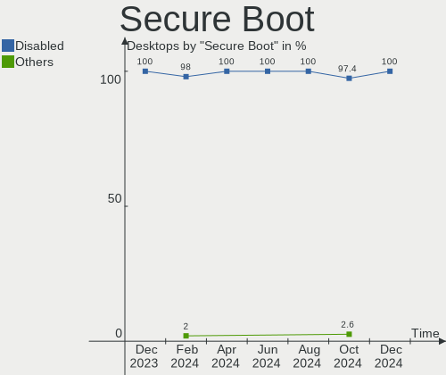
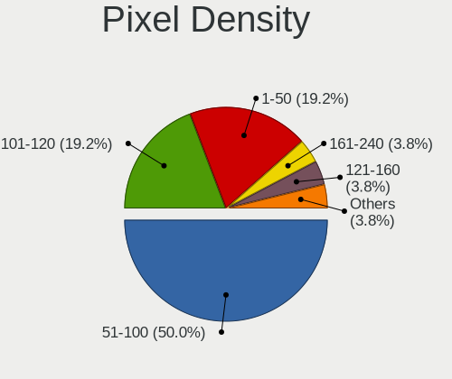

ArcoLinux Hardware Trends (Desktop)
-----------------------------------

A project to identify most popular hardware characteristics and track their change
over time based on data collected by ArcoLinux users at https://Linux-Hardware.org.

Anyone can contribute to the study by uploading probes of their computers by
the [hw-probe](https://github.com/linuxhw/hw-probe) tool:

    sudo -E hw-probe -all -upload

Full-feature report is available here: https://linux-hardware.org/?view=trends&formfactor=desktop

Period: Nov, 2020.

Contents
--------

- [ OS                       ](#os)
- [ OS Family                ](#os-family)
- [ Kernel                   ](#kernel)
- [ Kernel Family            ](#kernel-family)
- [ Kernel Major Ver.        ](#kernel-major-ver)
- [ Arch                     ](#arch)
- [ DE                       ](#de)
- [ Display Server           ](#display-server)
- [ Display Manager          ](#display-manager)
- [ OS Lang                  ](#os-lang)
- [ Boot Mode                ](#boot-mode)
- [ Filesystem               ](#filesystem)
- [ Part. scheme             ](#part-scheme)
- [ Dual Boot with Linux/BSD ](#dual-boot-with-linux/bsd)
- [ Dual Boot (Win)          ](#dual-boot-win)
- [ Country                  ](#country)
- [ City                     ](#city)
- [ Vendor                   ](#vendor)
- [ Model                    ](#model)
- [ Model Family             ](#model-family)
- [ MFG Year                 ](#mfg-year)
- [ Form Factor              ](#form-factor)
- [ Secure Boot              ](#secure-boot)
- [ Coreboot                 ](#coreboot)
- [ RAM Size                 ](#ram-size)
- [ RAM Used                 ](#ram-used)
- [ Has CD-ROM               ](#has-cd-rom)
- [ Total Drives             ](#total-drives)
- [ Has Ethernet             ](#has-ethernet)
- [ Drive Vendor             ](#drive-vendor)
- [ Drive Model              ](#drive-model)
- [ HDD Vendor               ](#hdd-vendor)
- [ SSD Vendor               ](#ssd-vendor)
- [ Drive Kind               ](#drive-kind)
- [ Drive Connector          ](#drive-connector)
- [ Drive Size               ](#drive-size)
- [ Space Total              ](#space-total)
- [ Space Used               ](#space-used)
- [ Malfunc. Drives          ](#malfunc-drives)
- [ Malfunc. Drive Vendor    ](#malfunc-drive-vendor)
- [ Malfunc. HDD Vendor      ](#malfunc-hdd-vendor)
- [ Malfunc. Drive Kind      ](#malfunc-drive-kind)
- [ Failed Drives            ](#failed-drives)
- [ Failed Drive Vendor      ](#failed-drive-vendor)
- [ Drive Status             ](#drive-status)
- [ Storage Vendor           ](#storage-vendor)
- [ Storage Model            ](#storage-model)
- [ Storage Kind             ](#storage-kind)
- [ CPU Vendor               ](#cpu-vendor)
- [ CPU Model                ](#cpu-model)
- [ CPU Model Family         ](#cpu-model-family)
- [ CPU Cores                ](#cpu-cores)
- [ CPU Sockets              ](#cpu-sockets)
- [ CPU Threads              ](#cpu-threads)
- [ CPU Op-Modes             ](#cpu-op-modes)
- [ CPU Microcode            ](#cpu-microcode)
- [ CPU Microarch            ](#cpu-microarch)
- [ GPU Vendor               ](#gpu-vendor)
- [ GPU Model                ](#gpu-model)
- [ GPU Combo                ](#gpu-combo)
- [ GPU Driver               ](#gpu-driver)
- [ GPU Memory               ](#gpu-memory)
- [ Monitor Vendor           ](#monitor-vendor)
- [ Monitor Model            ](#monitor-model)
- [ Monitor Resolution       ](#monitor-resolution)
- [ Monitor Diagonal         ](#monitor-diagonal)
- [ Monitor Width            ](#monitor-width)
- [ Aspect Ratio             ](#aspect-ratio)
- [ Monitor Area             ](#monitor-area)
- [ Pixel Density            ](#pixel-density)
- [ Multiple Monitors        ](#multiple-monitors)
- [ Net Controller Vendor    ](#net-controller-vendor)
- [ Net Controller Model     ](#net-controller-model)
- [ Wireless Vendor          ](#wireless-vendor)
- [ Wireless Model           ](#wireless-model)
- [ Ethernet Vendor          ](#ethernet-vendor)
- [ Ethernet Model           ](#ethernet-model)
- [ Net Controller Kind      ](#net-controller-kind)
- [ Used Controller          ](#used-controller)
- [ NICs                     ](#nics)
- [ Memory Vendor            ](#memory-vendor)
- [ Memory Model             ](#memory-model)
- [ Memory Kind              ](#memory-kind)
- [ Memory Form Factor       ](#memory-form-factor)
- [ Memory Size              ](#memory-size)
- [ Memory Speed             ](#memory-speed)
- [ Sound Vendor             ](#sound-vendor)
- [ Sound Model              ](#sound-model)
- [ Camera Vendor            ](#camera-vendor)
- [ Camera Model             ](#camera-model)
- [ Fingerprint Vendor       ](#fingerprint-vendor)
- [ Fingerprint Model        ](#fingerprint-model)
- [ Chipcard Vendor          ](#chipcard-vendor)
- [ Chipcard Model           ](#chipcard-model)
- [ Printer Vendor           ](#printer-vendor)
- [ Printer Model            ](#printer-model)
- [ Scanner Vendor           ](#scanner-vendor)
- [ Scanner Model            ](#scanner-model)
- [ Bluetooth Vendor         ](#bluetooth-vendor)
- [ Bluetooth Model          ](#bluetooth-model)
- [ Unsupported Devices      ](#unsupported-devices)
- [ Unsupported Device Types ](#unsupported-device-types)

OS
--

Installed operating systems

| Name              | Desktops | Percent |
|-------------------|----------|---------|
| ArcoLinux Rolling | 30       | 88.24%  |
| ArcoLinux         | 3        | 8.82%   |
| ArcoLinux 20.6.5  | 1        | 2.94%   |

OS Family
---------

OS without a version

| Name      | Desktops | Percent |
|-----------|----------|---------|
| ArcoLinux | 34       | 100%    |

Kernel
------

Version of the Linux kernel

| Version           | Desktops | Percent |
|-------------------|----------|---------|
| 5.9.6-arch1-1     | 9        | 26.47%  |
| 5.9.9-arch1-1     | 4        | 11.76%  |
| 5.9.10-arch1-1    | 4        | 11.76%  |
| 5.9.8-arch1-1     | 3        | 8.82%   |
| 5.9.6-zen1-1-zen  | 2        | 5.88%   |
| 5.8.14-arch1-1    | 2        | 5.88%   |
| 5.4.78-1-lts      | 2        | 5.88%   |
| 5.9.9-zen1-1-zen  | 1        | 2.94%   |
| 5.9.8-zen1-1-zen  | 1        | 2.94%   |
| 5.9.3-arch1-1     | 1        | 2.94%   |
| 5.9.2-arch1-1     | 1        | 2.94%   |
| 5.9.11-xanmod1-1  | 1        | 2.94%   |
| 5.9.10-zen1-1-zen | 1        | 2.94%   |
| 5.8.14-zen1-1-zen | 1        | 2.94%   |
| 5.4.75-1-lts      | 1        | 2.94%   |

Kernel Family
-------------

Linux kernel without a distro release

| Version | Desktops | Percent |
|---------|----------|---------|
| 5.9.6   | 11       | 32.35%  |
| 5.9.9   | 5        | 14.71%  |
| 5.9.10  | 5        | 14.71%  |
| 5.9.8   | 4        | 11.76%  |
| 5.8.14  | 3        | 8.82%   |
| 5.4.78  | 2        | 5.88%   |
| 5.9.3   | 1        | 2.94%   |
| 5.9.2   | 1        | 2.94%   |
| 5.9.11  | 1        | 2.94%   |
| 5.4.75  | 1        | 2.94%   |

Kernel Major Ver.
-----------------

Linux kernel major version

| Version | Desktops | Percent |
|---------|----------|---------|
| 5.9     | 28       | 82.35%  |
| 5.8     | 3        | 8.82%   |
| 5.4     | 3        | 8.82%   |

Arch
----

OS architecture (x86_64, i586, etc.)

| Name   | Desktops | Percent |
|--------|----------|---------|
| x86_64 | 34       | 100%    |

DE
--

Desktop Environment

| Name     | Desktops | Percent |
|----------|----------|---------|
| XFCE     | 16       | 47.06%  |
| KDE5     | 7        | 20.59%  |
| GNOME    | 3        | 8.82%   |
| xmonad   | 1        | 2.94%   |
| qtile    | 1        | 2.94%   |
| MATE     | 1        | 2.94%   |
| LXQt     | 1        | 2.94%   |
| KDE      | 1        | 2.94%   |
| i3       | 1        | 2.94%   |
| Cinnamon | 1        | 2.94%   |
| bspwm    | 1        | 2.94%   |

Display Server
--------------

X11 or Wayland

| Name | Desktops | Percent |
|------|----------|---------|
| X11  | 33       | 97.06%  |
| Tty  | 1        | 2.94%   |

Display Manager
---------------

SDDM, LightDM, etc.

| Name    | Desktops | Percent |
|---------|----------|---------|
| TDM     | 27       | 79.41%  |
| SDDM    | 4        | 11.76%  |
| Unknown | 3        | 8.82%   |

OS Lang
-------

Language

| Lang       | Desktops | Percent |
|------------|----------|---------|
| en_US.utf8 | 8        | 23.53%  |
| en_US      | 6        | 17.65%  |
| en_GB.utf8 | 5        | 14.71%  |
| de_DE.utf8 | 4        | 11.76%  |
| en_GB      | 3        | 8.82%   |
| zh_CN      | 1        | 2.94%   |
| pt_PT.utf8 | 1        | 2.94%   |
| hu_HU      | 1        | 2.94%   |
| fr_FR.utf8 | 1        | 2.94%   |
| fr_FR      | 1        | 2.94%   |
| fi_FI.utf8 | 1        | 2.94%   |
| en_IE.utf8 | 1        | 2.94%   |
| de_AT      | 1        | 2.94%   |

Boot Mode
---------

EFI or BIOS

| Mode | Desktops | Percent |
|------|----------|---------|
| EFI  | 23       | 67.65%  |
| BIOS | 11       | 32.35%  |

Filesystem
----------

Type of filesystem

| Type  | Desktops | Percent |
|-------|----------|---------|
| Ext4  | 32       | 94.12%  |
| Btrfs | 2        | 5.88%   |

Part. scheme
------------

Scheme of partitioning

| Type    | Desktops | Percent |
|---------|----------|---------|
| GPT     | 24       | 70.59%  |
| MBR     | 7        | 20.59%  |
| Unknown | 3        | 8.82%   |

Dual Boot with Linux/BSD
------------------------

Hosting more than one Linux/BSD

| Dual boot | Desktops | Percent |
|-----------|----------|---------|
| No        | 24       | 70.59%  |
| Yes       | 10       | 29.41%  |

Dual Boot (Win)
---------------

Hosting Linux and Windows

| Dual boot | Desktops | Percent |
|-----------|----------|---------|
| No        | 20       | 58.82%  |
| Yes       | 14       | 41.18%  |

Country
-------

Geographic location (country)

| Country     | Desktops | Percent |
|-------------|----------|---------|
| UK          | 6        | 17.65%  |
| USA         | 5        | 14.71%  |
| Germany     | 4        | 11.76%  |
| Belgium     | 4        | 11.76%  |
| France      | 2        | 5.88%   |
| Serbia      | 1        | 2.94%   |
| Portugal    | 1        | 2.94%   |
| Poland      | 1        | 2.94%   |
| Netherlands | 1        | 2.94%   |
| Mexico      | 1        | 2.94%   |
| Malaysia    | 1        | 2.94%   |
| Israel      | 1        | 2.94%   |
| Ireland     | 1        | 2.94%   |
| Hungary     | 1        | 2.94%   |
| Finland     | 1        | 2.94%   |
| Egypt       | 1        | 2.94%   |
| China       | 1        | 2.94%   |
| Austria     | 1        | 2.94%   |

City
----

Geographic location (city)

| City              | Desktops | Percent |
|-------------------|----------|---------|
| Lier              | 3        | 8.82%   |
| London            | 2        | 5.88%   |
| Berlin            | 2        | 5.88%   |
| Yiyang            | 1        | 2.94%   |
| Warsaw            | 1        | 2.94%   |
| Vienna            | 1        | 2.94%   |
| Van Nuys          | 1        | 2.94%   |
| Torres Novas      | 1        | 2.94%   |
| Tel Aviv          | 1        | 2.94%   |
| Sungai Petani     | 1        | 2.94%   |
| Springdale        | 1        | 2.94%   |
| Sarasota          | 1        | 2.94%   |
| Saarbrücken      | 1        | 2.94%   |
| Pori              | 1        | 2.94%   |
| Paris             | 1        | 2.94%   |
| Novi Sad          | 1        | 2.94%   |
| Miskolc           | 1        | 2.94%   |
| Martigues         | 1        | 2.94%   |
| Livingston        | 1        | 2.94%   |
| Hurricane         | 1        | 2.94%   |
| Dungarvan         | 1        | 2.94%   |
| Doncaster         | 1        | 2.94%   |
| Conroe            | 1        | 2.94%   |
| Ciudad del Carmen | 1        | 2.94%   |
| Chorley           | 1        | 2.94%   |
| Chinnor           | 1        | 2.94%   |
| Cairo             | 1        | 2.94%   |
| Beckum            | 1        | 2.94%   |
| Antwerp           | 1        | 2.94%   |
| Amsterdam         | 1        | 2.94%   |

Vendor
------

Motherboard manufacturer

| Name                | Desktops | Percent |
|---------------------|----------|---------|
| ASUSTek Computer    | 12       | 35.29%  |
| ASRock              | 6        | 17.65%  |
| MSI                 | 5        | 14.71%  |
| Gigabyte Technology | 4        | 11.76%  |
| Dell                | 3        | 8.82%   |
| Lenovo              | 2        | 5.88%   |
| Alienware           | 2        | 5.88%   |

Model
-----

Motherboard model

| Name                              | Desktops | Percent |
|-----------------------------------|----------|---------|
| ASUS STRIX Z270H GAMING           | 2        | 5.88%   |
| MSI MS-7C80                       | 1        | 2.94%   |
| MSI MS-7C37                       | 1        | 2.94%   |
| MSI MS-7B79                       | 1        | 2.94%   |
| MSI MS-7994                       | 1        | 2.94%   |
| MSI MS-7891                       | 1        | 2.94%   |
| Lenovo ThinkCentre M91p 4512A47   | 1        | 2.94%   |
| Lenovo ThinkCentre Edge72 3493DEG | 1        | 2.94%   |
| Gigabyte Z97MX-Gaming 5           | 1        | 2.94%   |
| Gigabyte H170-D3HP                | 1        | 2.94%   |
| Gigabyte B450 AORUS M             | 1        | 2.94%   |
| Gigabyte B250-D3A                 | 1        | 2.94%   |
| Dell OptiPlex 7010                | 1        | 2.94%   |
| Dell OptiPlex 5050                | 1        | 2.94%   |
| Dell Dimension 5100               | 1        | 2.94%   |
| ASUS Z170M-PLUS                   | 1        | 2.94%   |
| ASUS TUF GAMING X570-PLUS         | 1        | 2.94%   |
| ASUS ROG STRIX X570-E GAMING      | 1        | 2.94%   |
| ASUS Rampage II GENE              | 1        | 2.94%   |
| ASUS PRIME X470-PRO               | 1        | 2.94%   |
| ASUS PRIME X370-PRO               | 1        | 2.94%   |
| ASUS PRIME B450M-A                | 1        | 2.94%   |
| ASUS Maximus VIII FORMULA         | 1        | 2.94%   |
| ASUS M5A78L-M/USB3                | 1        | 2.94%   |
| ASUS ASUSPRO D425MC_S425MC        | 1        | 2.94%   |
| ASRock X470 Master SLI            | 1        | 2.94%   |
| ASRock P67 Extreme4               | 1        | 2.94%   |
| ASRock G41C-GS                    | 1        | 2.94%   |
| ASRock B75 Pro3-M                 | 1        | 2.94%   |
| ASRock B450M Pro4                 | 1        | 2.94%   |
| ASRock 970M Pro3                  | 1        | 2.94%   |
| Alienware X51                     | 1        | 2.94%   |
| Alienware Area 51                 | 1        | 2.94%   |

Model Family
------------

Motherboard model prefix

| Name                  | Desktops | Percent |
|-----------------------|----------|---------|
| ASUS PRIME            | 3        | 8.82%   |
| Lenovo ThinkCentre    | 2        | 5.88%   |
| Dell OptiPlex         | 2        | 5.88%   |
| ASUS STRIX            | 2        | 5.88%   |
| MSI MS-7C80           | 1        | 2.94%   |
| MSI MS-7C37           | 1        | 2.94%   |
| MSI MS-7B79           | 1        | 2.94%   |
| MSI MS-7994           | 1        | 2.94%   |
| MSI MS-7891           | 1        | 2.94%   |
| Gigabyte Z97MX-Gaming | 1        | 2.94%   |
| Gigabyte H170-D3HP    | 1        | 2.94%   |
| Gigabyte B450         | 1        | 2.94%   |
| Gigabyte B250-D3A     | 1        | 2.94%   |
| Dell Dimension        | 1        | 2.94%   |
| ASUS Z170M-PLUS       | 1        | 2.94%   |
| ASUS TUF              | 1        | 2.94%   |
| ASUS ROG              | 1        | 2.94%   |
| ASUS Rampage          | 1        | 2.94%   |
| ASUS Maximus          | 1        | 2.94%   |
| ASUS M5A78L-M         | 1        | 2.94%   |
| ASUS ASUSPRO          | 1        | 2.94%   |
| ASRock X470           | 1        | 2.94%   |
| ASRock P67            | 1        | 2.94%   |
| ASRock G41C-GS        | 1        | 2.94%   |
| ASRock B75            | 1        | 2.94%   |
| ASRock B450M          | 1        | 2.94%   |
| ASRock 970M           | 1        | 2.94%   |
| Alienware X51         | 1        | 2.94%   |
| Alienware Area        | 1        | 2.94%   |

MFG Year
--------

Motherboard manufacture year

| Year | Desktops | Percent |
|------|----------|---------|
| 2020 | 8        | 23.53%  |
| 2018 | 7        | 20.59%  |
| 2019 | 4        | 11.76%  |
| 2013 | 4        | 11.76%  |
| 2012 | 3        | 8.82%   |
| 2016 | 2        | 5.88%   |
| 2017 | 1        | 2.94%   |
| 2015 | 1        | 2.94%   |
| 2014 | 1        | 2.94%   |
| 2011 | 1        | 2.94%   |
| 2010 | 1        | 2.94%   |
| 2005 | 1        | 2.94%   |

Form Factor
-----------

Physical design of the computer

| Name    | Desktops | Percent |
|---------|----------|---------|
| Desktop | 34       | 100%    |

Secure Boot
-----------

Enabled or disabled

| State    | Desktops | Percent |
|----------|----------|---------|
| Disabled | 34       | 100%    |

Coreboot
--------

Have coreboot on board

| Used | Desktops | Percent |
|------|----------|---------|
| No   | 34       | 100%    |

RAM Size
--------

Total RAM memory

| Size in GB | Desktops | Percent |
|------------|----------|---------|
| 16.01-24.0 | 13       | 38.24%  |
| 4.01-8.0   | 7        | 20.59%  |
| 32.01-64.0 | 6        | 17.65%  |
| 24.01-32.0 | 4        | 11.76%  |
| 3.01-4.0   | 2        | 5.88%   |
| 8.01-16.0  | 2        | 5.88%   |

RAM Used
--------

Used RAM memory

| Used GB   | Desktops | Percent |
|-----------|----------|---------|
| 4.01-8.0  | 9        | 26.47%  |
| 1.01-2.0  | 9        | 26.47%  |
| 2.01-3.0  | 7        | 20.59%  |
| 3.01-4.0  | 5        | 14.71%  |
| 8.01-16.0 | 2        | 5.88%   |
| 0.01-1.0  | 2        | 5.88%   |

Has CD-ROM
----------

Has CD-ROM on board

| Presented | Desktops | Percent |
|-----------|----------|---------|
| No        | 20       | 58.82%  |
| Yes       | 14       | 41.18%  |

Total Drives
------------

Number of drives on board

| Drives | Desktops | Percent |
|--------|----------|---------|
| 1      | 11       | 32.35%  |
| 2      | 9        | 26.47%  |
| 4      | 6        | 17.65%  |
| 3      | 5        | 14.71%  |
| 5      | 2        | 5.88%   |
| 6      | 1        | 2.94%   |

Has Ethernet
------------

Has Ethernet on board

| Presented | Desktops | Percent |
|-----------|----------|---------|
| Yes       | 34       | 100%    |

Drive Vendor
------------

Hard drive vendors

| Vendor              | Desktops | Drives | Percent |
|---------------------|----------|--------|---------|
| Samsung Electronics | 19       | 22     | 26.39%  |
| WDC                 | 14       | 19     | 19.44%  |
| Seagate             | 12       | 14     | 16.67%  |
| SanDisk             | 4        | 4      | 5.56%   |
| Kingston            | 3        | 3      | 4.17%   |
| Crucial             | 3        | 3      | 4.17%   |
| Unknown             | 2        | 2      | 2.78%   |
| Toshiba             | 2        | 2      | 2.78%   |
| OCZ                 | 2        | 3      | 2.78%   |
| Hitachi             | 2        | 2      | 2.78%   |
| XPG                 | 1        | 1      | 1.39%   |
| SPCC                | 1        | 1      | 1.39%   |
| PNY                 | 1        | 2      | 1.39%   |
| Phison              | 1        | 1      | 1.39%   |
| MAXTOR              | 1        | 1      | 1.39%   |
| Intel               | 1        | 1      | 1.39%   |
| HGST                | 1        | 1      | 1.39%   |
| ExcelStor           | 1        | 1      | 1.39%   |
| A-DATA Technology   | 1        | 1      | 1.39%   |

Drive Model
-----------

Hard drive models

| Model                                | Desktops | Percent |
|--------------------------------------|----------|---------|
| Samsung SSD 970 EVO Plus 500GB       | 4        | 4.82%   |
| Samsung SSD 860 EVO 500GB            | 4        | 4.82%   |
| Samsung SSD 850 EVO 500GB            | 3        | 3.61%   |
| Samsung SSD 860 EVO 250GB            | 2        | 2.41%   |
| Samsung HD203WI 2TB                  | 2        | 2.41%   |
| XPG GAMMIX S5 512GB                  | 1        | 1.2%    |
| WDC WDS500G3X0C-00SJG0 500GB         | 1        | 1.2%    |
| WDC WDS250G1B0C-00S6U0 250GB         | 1        | 1.2%    |
| WDC WDS240G2G0A-00JH30 240GB SSD     | 1        | 1.2%    |
| WDC WD6400AAKS-65A7B2 640GB          | 1        | 1.2%    |
| WDC WD6400AAKS-65A7B0 640GB          | 1        | 1.2%    |
| WDC WD5000LPLX-08ZNTT0 500GB         | 1        | 1.2%    |
| WDC WD5000AAKX-001CA0 500GB          | 1        | 1.2%    |
| WDC WD5000AAKS-60WWPA0 500GB         | 1        | 1.2%    |
| WDC WD40EFRX-68N32N0 4TB             | 1        | 1.2%    |
| WDC WD20EARS-00MVWB0 2TB             | 1        | 1.2%    |
| WDC WD1600AAJS-00WAA0 160GB          | 1        | 1.2%    |
| WDC WD10EZRX-00L4HB0 1TB             | 1        | 1.2%    |
| WDC WD10EZEX-22MFCA0 1TB             | 1        | 1.2%    |
| WDC WD10EZEX-08WN4A0 1TB             | 1        | 1.2%    |
| WDC WD10EAVS-00D7B0 1TB              | 1        | 1.2%    |
| WDC WD10EADS-00M2B0 1TB              | 1        | 1.2%    |
| WDC WD1002FAEX-00Z3A0 1TB            | 1        | 1.2%    |
| WDC PC SN720 SDAPNTW-256G            | 1        | 1.2%    |
| Unknown SDEZS25-240G-Z01 240GB       | 1        | 1.2%    |
| Unknown HX240GSSDSATA3 240GB         | 1        | 1.2%    |
| Toshiba MQ01ABD032 320GB             | 1        | 1.2%    |
| Toshiba HDWD120 2TB                  | 1        | 1.2%    |
| SPCC Solid State Disk 256GB          | 1        | 1.2%    |
| Seagate ST9320325AS 320GB            | 1        | 1.2%    |
| Seagate ST9250827AS 250GB            | 1        | 1.2%    |
| Seagate ST4000DX002-1H2178 4TB       | 1        | 1.2%    |
| Seagate ST4000DM004-2CV104 4TB       | 1        | 1.2%    |
| Seagate ST3500410SV 500GB            | 1        | 1.2%    |
| Seagate ST3500312CS 500GB            | 1        | 1.2%    |
| Seagate ST3250410AS 250GB            | 1        | 1.2%    |
| Seagate ST3250318AS 250GB            | 1        | 1.2%    |
| Seagate ST2000DM001-1ER164 2TB       | 1        | 1.2%    |
| Seagate ST2000DL003-9VT166 2TB       | 1        | 1.2%    |
| Seagate ST1000LX015-1U7172 1TB       | 1        | 1.2%    |
| Seagate ST1000LM024 HN-M101MBB 1TB   | 1        | 1.2%    |
| Seagate ST1000DM003-1CH162 1TB       | 1        | 1.2%    |
| Seagate Backup+ Hub BK 8TB           | 1        | 1.2%    |
| SanDisk SSD PLUS 240GB               | 1        | 1.2%    |
| SanDisk SDSSDX240GG25 240GB          | 1        | 1.2%    |
| SanDisk SDSSDH3500G 500GB            | 1        | 1.2%    |
| SanDisk SDSSDA240G 240GB             | 1        | 1.2%    |
| Samsung SSD 950 PRO 256GB            | 1        | 1.2%    |
| Samsung SSD 870 QVO 1TB              | 1        | 1.2%    |
| Samsung SSD 850 EVO 120GB            | 1        | 1.2%    |
| Samsung MZ7LN512HCHP-000L1 512GB SSD | 1        | 1.2%    |
| Samsung HD501LJ 500GB                | 1        | 1.2%    |
| Samsung HD321KJ 320GB                | 1        | 1.2%    |
| Samsung HD103SJ 1TB                  | 1        | 1.2%    |
| PNY CS900 120GB SSD                  | 1        | 1.2%    |
| PNY CS3030 250GB SSD                 | 1        | 1.2%    |
| Phison Sabrent Rocket 4.0 1TB        | 1        | 1.2%    |
| OCZ VERTEX4 128GB SSD                | 1        | 1.2%    |
| OCZ AGILITY3 64GB SSD                | 1        | 1.2%    |
| OCZ AGILITY3 240GB SSD               | 1        | 1.2%    |

HDD Vendor
----------

Hard disk drive vendors

| Vendor              | Desktops | Drives | Percent |
|---------------------|----------|--------|---------|
| WDC                 | 12       | 14     | 34.29%  |
| Seagate             | 11       | 13     | 31.43%  |
| Samsung Electronics | 5        | 5      | 14.29%  |
| Toshiba             | 2        | 2      | 5.71%   |
| Hitachi             | 2        | 2      | 5.71%   |
| MAXTOR              | 1        | 1      | 2.86%   |
| HGST                | 1        | 1      | 2.86%   |
| ExcelStor           | 1        | 1      | 2.86%   |

SSD Vendor
----------

Solid state drive vendors

| Vendor              | Desktops | Drives | Percent |
|---------------------|----------|--------|---------|
| Samsung Electronics | 12       | 12     | 44.44%  |
| SanDisk             | 4        | 4      | 14.81%  |
| Crucial             | 3        | 3      | 11.11%  |
| OCZ                 | 2        | 3      | 7.41%   |
| Kingston            | 2        | 2      | 7.41%   |
| WDC                 | 1        | 1      | 3.7%    |
| Unknown             | 1        | 1      | 3.7%    |
| SPCC                | 1        | 1      | 3.7%    |
| PNY                 | 1        | 1      | 3.7%    |

Drive Kind
----------

HDD or SSD

| Kind    | Desktops | Drives | Percent |
|---------|----------|--------|---------|
| SSD     | 24       | 28     | 39.34%  |
| HDD     | 22       | 39     | 36.07%  |
| NVMe    | 13       | 15     | 21.31%  |
| Unknown | 2        | 2      | 3.28%   |

Drive Connector
---------------

SATA, SAS, NVMe, etc.

| Type | Desktops | Drives | Percent |
|------|----------|--------|---------|
| SATA | 30       | 68     | 68.18%  |
| NVMe | 13       | 15     | 29.55%  |
| SAS  | 1        | 1      | 2.27%   |

Drive Size
----------

Size of hard drive

| Size in TB | Desktops | Drives | Percent |
|------------|----------|--------|---------|
| 0.01-0.5   | 27       | 42     | 54%     |
| 0.51-1.0   | 13       | 14     | 26%     |
| 1.01-2.0   | 7        | 8      | 14%     |
| 3.01-4.0   | 3        | 3      | 6%      |

Space Total
-----------

Amount of disk space available on the file system

| Size in GB     | Desktops | Percent |
|----------------|----------|---------|
| 251-500        | 10       | 29.41%  |
| 1001-2000      | 9        | 26.47%  |
| 101-250        | 5        | 14.71%  |
| More than 3000 | 4        | 11.76%  |
| 2001-3000      | 2        | 5.88%   |
| 501-1000       | 2        | 5.88%   |
| 51-100         | 2        | 5.88%   |

Space Used
----------

Amount of used disk space

| Used GB        | Desktops | Percent |
|----------------|----------|---------|
| 1-20           | 7        | 20.59%  |
| 501-1000       | 7        | 20.59%  |
| 251-500        | 4        | 11.76%  |
| 21-50          | 4        | 11.76%  |
| 101-250        | 4        | 11.76%  |
| 1001-2000      | 3        | 8.82%   |
| More than 3000 | 2        | 5.88%   |
| 51-100         | 2        | 5.88%   |
| 2001-3000      | 1        | 2.94%   |

Malfunc. Drives
---------------

Drive models with a malfunction

| Model                              | Desktops | Drives | Percent |
|------------------------------------|----------|--------|---------|
| WDC WD5000AAKS-60WWPA0 500GB       | 1        | 1      | 12.5%   |
| WDC WD20EARS-00MVWB0 2TB           | 1        | 1      | 12.5%   |
| WDC WD10EADS-00M2B0 1TB            | 1        | 1      | 12.5%   |
| Seagate ST9320325AS 320GB          | 1        | 1      | 12.5%   |
| Seagate ST1000LM024 HN-M101MBB 1TB | 1        | 1      | 12.5%   |
| Samsung Electronics HD501LJ 500GB  | 1        | 1      | 12.5%   |
| OCZ AGILITY3 240GB SSD             | 1        | 1      | 12.5%   |
| MAXTOR STM3250310AS 250GB          | 1        | 1      | 12.5%   |

Malfunc. Drive Vendor
---------------------

Vendors of faulty drives

| Vendor              | Desktops | Drives | Percent |
|---------------------|----------|--------|---------|
| WDC                 | 3        | 3      | 37.5%   |
| Seagate             | 2        | 2      | 25%     |
| Samsung Electronics | 1        | 1      | 12.5%   |
| OCZ                 | 1        | 1      | 12.5%   |
| MAXTOR              | 1        | 1      | 12.5%   |

Malfunc. HDD Vendor
-------------------

Vendors of faulty HDD drives

| Vendor              | Desktops | Drives | Percent |
|---------------------|----------|--------|---------|
| WDC                 | 3        | 3      | 42.86%  |
| Seagate             | 2        | 2      | 28.57%  |
| Samsung Electronics | 1        | 1      | 14.29%  |
| MAXTOR              | 1        | 1      | 14.29%  |

Malfunc. Drive Kind
-------------------

Kinds of faulty drives

| Kind | Desktops | Drives | Percent |
|------|----------|--------|---------|
| HDD  | 7        | 7      | 87.5%   |
| SSD  | 1        | 1      | 12.5%   |

Failed Drives
-------------

Failed drive models

Zero info for selected period =(

Failed Drive Vendor
-------------------

Failed drive vendors

Zero info for selected period =(

Drive Status
------------

Number of failed and malfunc. drives

| Status   | Desktops | Drives | Percent |
|----------|----------|--------|---------|
| Works    | 30       | 63     | 68.18%  |
| Malfunc  | 8        | 8      | 18.18%  |
| Detected | 6        | 13     | 13.64%  |

Storage Vendor
--------------

Storage controller vendors

| Vendor                      | Desktops | Percent |
|-----------------------------|----------|---------|
| Intel                       | 20       | 37.04%  |
| AMD                         | 14       | 25.93%  |
| Samsung Electronics         | 5        | 9.26%   |
| Sandisk                     | 3        | 5.56%   |
| Phison Electronics          | 2        | 3.7%    |
| Marvell Technology Group    | 2        | 3.7%    |
| JMicron Technology          | 2        | 3.7%    |
| ASMedia Technology          | 2        | 3.7%    |
| Silicon Image               | 1        | 1.85%   |
| Realtek Semiconductor       | 1        | 1.85%   |
| Kingston Technology Company | 1        | 1.85%   |
| ADATA Technology            | 1        | 1.85%   |

Storage Model
-------------

Storage controller models

| Model                                                                                   | Desktops | Percent |
|-----------------------------------------------------------------------------------------|----------|---------|
| AMD FCH SATA Controller [AHCI mode]                                                     | 12       | 17.39%  |
| AMD 400 Series Chipset SATA Controller                                                  | 7        | 10.14%  |
| Samsung Electronics NVMe SSD Controller SM981/PM981/PM983                               | 4        | 5.8%    |
| Intel 200 Series PCH SATA controller [AHCI mode]                                        | 4        | 5.8%    |
| Intel Q170/Q150/B150/H170/H110/Z170/CM236 Chipset SATA Controller [AHCI Mode]           | 3        | 4.35%   |
| JMicron Technology JMB363 SATA/IDE Controller                                           | 2        | 2.9%    |
| Intel NM10/ICH7 Family SATA Controller [IDE mode]                                       | 2        | 2.9%    |
| Intel 82801G (ICH7 Family) IDE Controller                                               | 2        | 2.9%    |
| Intel 7 Series/C210 Series Chipset Family 6-port SATA Controller [AHCI mode]            | 2        | 2.9%    |
| Intel 6 Series/C200 Series Chipset Family Desktop SATA Controller (IDE mode, ports 4-5) | 2        | 2.9%    |
| Intel 6 Series/C200 Series Chipset Family Desktop SATA Controller (IDE mode, ports 0-3) | 2        | 2.9%    |
| Intel 6 Series/C200 Series Chipset Family 6 port Desktop SATA AHCI Controller           | 2        | 2.9%    |
| ASMedia Technology ASM1062 Serial ATA Controller                                        | 2        | 2.9%    |
| AMD SB7x0/SB8x0/SB9x0 IDE Controller                                                    | 2        | 2.9%    |
| Silicon Image SiI 3132 Serial ATA Raid II Controller                                    | 1        | 1.45%   |
| Sandisk WD Black 2019/PC SN750 NVMe SSD                                                 | 1        | 1.45%   |
| Sandisk WD Black 2018 / PC SN720 NVMe SSD                                               | 1        | 1.45%   |
| Sandisk WD Black 2018 / PC SN520 NVMe SSD                                               | 1        | 1.45%   |
| Samsung Electronics NVMe SSD Controller SM951/PM951                                     | 1        | 1.45%   |
| Realtek Semiconductor RTS5763DL NVMe SSD Controller                                     | 1        | 1.45%   |
| Phison Electronics E16 PCIe4 NVMe Controller                                            | 1        | 1.45%   |
| Phison Electronics E12 NVMe Controller                                                  | 1        | 1.45%   |
| Marvell Technology Group 88SE912x SATA 6Gb/s Controller [IDE mode]                      | 1        | 1.45%   |
| Marvell Technology Group 88SE9128 PCIe SATA 6 Gb/s RAID controller                      | 1        | 1.45%   |
| Kingston Technology Company Non-Volatile memory controller                              | 1        | 1.45%   |
| Intel SSD 660P Series                                                                   | 1        | 1.45%   |
| Intel 9 Series Chipset Family SATA Controller [AHCI Mode]                               | 1        | 1.45%   |
| Intel 82801JI (ICH10 Family) SATA AHCI Controller                                       | 1        | 1.45%   |
| Intel 82801JI (ICH10 Family) 4 port SATA IDE Controller #1                              | 1        | 1.45%   |
| Intel 82801JI (ICH10 Family) 2 port SATA IDE Controller #2                              | 1        | 1.45%   |
| Intel 400 Series Chipset Family SATA AHCI Controller                                    | 1        | 1.45%   |
| AMD X370 Series Chipset SATA Controller                                                 | 1        | 1.45%   |
| AMD SB7x0/SB8x0/SB9x0 SATA Controller [IDE mode]                                        | 1        | 1.45%   |
| AMD SB7x0/SB8x0/SB9x0 SATA Controller [AHCI mode]                                       | 1        | 1.45%   |
| ADATA Technology XPG SX8200 Pro PCIe Gen3x4 M.2 2280 Solid State Drive                  | 1        | 1.45%   |

Storage Kind
------------

Kind of storage controller (IDE, SATA, NVMe, SAS, ...)

| Kind | Desktops | Percent |
|------|----------|---------|
| SATA | 29       | 58%     |
| NVMe | 13       | 26%     |
| IDE  | 8        | 16%     |

CPU Vendor
----------

Processor vendors

| Vendor | Desktops | Percent |
|--------|----------|---------|
| Intel  | 20       | 58.82%  |
| AMD    | 14       | 41.18%  |

CPU Model
---------

Processor models

| Model                                       | Desktops | Percent |
|---------------------------------------------|----------|---------|
| AMD Ryzen 7 2700X Eight-Core Processor      | 3        | 8.82%   |
| Intel Core i7-7700K CPU @ 4.20GHz           | 2        | 5.88%   |
| Intel Core i7-6700K CPU @ 4.00GHz           | 2        | 5.88%   |
| AMD Ryzen 5 3400G with Radeon Vega Graphics | 2        | 5.88%   |
| AMD Ryzen 5 1600 Six-Core Processor         | 2        | 5.88%   |
| Intel Xeon CPU X5680 @ 3.33GHz              | 1        | 2.94%   |
| Intel Xeon CPU E3-1245 V2 @ 3.40GHz         | 1        | 2.94%   |
| Intel Pentium CPU G4560 @ 3.50GHz           | 1        | 2.94%   |
| Intel Pentium 4 CPU 3.20GHz                 | 1        | 2.94%   |
| Intel Core i7-7700 CPU @ 3.60GHz            | 1        | 2.94%   |
| Intel Core i7-3770S CPU @ 3.10GHz           | 1        | 2.94%   |
| Intel Core i7-3770 CPU @ 3.40GHz            | 1        | 2.94%   |
| Intel Core i7-2600K CPU @ 3.40GHz           | 1        | 2.94%   |
| Intel Core i7 CPU 920 @ 2.67GHz             | 1        | 2.94%   |
| Intel Core i5-7400 CPU @ 3.00GHz            | 1        | 2.94%   |
| Intel Core i5-6600 CPU @ 3.30GHz            | 1        | 2.94%   |
| Intel Core i5-4690K CPU @ 3.50GHz           | 1        | 2.94%   |
| Intel Core i5-2400 CPU @ 3.10GHz            | 1        | 2.94%   |
| Intel Core i5-10600K CPU @ 4.10GHz          | 1        | 2.94%   |
| Intel Core i3-3220 CPU @ 3.30GHz            | 1        | 2.94%   |
| Intel Core 2 Quad CPU Q9550 @ 2.83GHz       | 1        | 2.94%   |
| AMD Ryzen 7 3700X 8-Core Processor          | 1        | 2.94%   |
| AMD Ryzen 7 2700 Eight-Core Processor       | 1        | 2.94%   |
| AMD Ryzen 5 3600X 6-Core Processor          | 1        | 2.94%   |
| AMD Ryzen 5 3600 6-Core Processor           | 1        | 2.94%   |
| AMD FX-8320 Eight-Core Processor            | 1        | 2.94%   |
| AMD FX-6120 Six-Core Processor              | 1        | 2.94%   |
| AMD A4-6300 APU with Radeon HD Graphics     | 1        | 2.94%   |

CPU Model Family
----------------

Processor model prefix

| Model             | Desktops | Percent |
|-------------------|----------|---------|
| Intel Core i7     | 9        | 26.47%  |
| AMD Ryzen 5       | 6        | 17.65%  |
| Intel Core i5     | 5        | 14.71%  |
| AMD Ryzen 7       | 5        | 14.71%  |
| Intel Xeon        | 2        | 5.88%   |
| AMD FX            | 2        | 5.88%   |
| Intel Pentium 4   | 1        | 2.94%   |
| Intel Pentium     | 1        | 2.94%   |
| Intel Core i3     | 1        | 2.94%   |
| Intel Core 2 Quad | 1        | 2.94%   |
| AMD A4            | 1        | 2.94%   |

CPU Cores
---------

Number of processor cores

| Number | Desktops | Percent |
|--------|----------|---------|
| 4      | 18       | 52.94%  |
| 6      | 6        | 17.65%  |
| 8      | 5        | 14.71%  |
| 2      | 2        | 5.88%   |
| 1      | 2        | 5.88%   |
| 3      | 1        | 2.94%   |

CPU Sockets
-----------

Number of sockets

| Number | Desktops | Percent |
|--------|----------|---------|
| 1      | 34       | 100%    |

CPU Threads
-----------

Threads per core (Hyper-Threading)

| Number | Desktops | Percent |
|--------|----------|---------|
| 2      | 29       | 85.29%  |
| 1      | 5        | 14.71%  |

CPU Op-Modes
------------

CPU Operation Modes (32-bit, 64-bit)

| Op mode        | Desktops | Percent |
|----------------|----------|---------|
| 32-bit, 64-bit | 34       | 100%    |

CPU Microcode
-------------

Microcode number

| Number     | Desktops | Percent |
|------------|----------|---------|
| 0x0800820d | 5        | 14.71%  |
| 0x906e9    | 4        | 11.76%  |
| 0x306a9    | 4        | 11.76%  |
| Unknown    | 4        | 11.76%  |
| 0x506e3    | 3        | 8.82%   |
| 0x08701021 | 2        | 5.88%   |
| 0xf41      | 1        | 2.94%   |
| 0xa0655    | 1        | 2.94%   |
| 0x306c3    | 1        | 2.94%   |
| 0x206c2    | 1        | 2.94%   |
| 0x206a7    | 1        | 2.94%   |
| 0x106a5    | 1        | 2.94%   |
| 0x1067a    | 1        | 2.94%   |
| 0x08701013 | 1        | 2.94%   |
| 0x08108109 | 1        | 2.94%   |
| 0x08001138 | 1        | 2.94%   |
| 0x06001119 | 1        | 2.94%   |
| 0x0600063e | 1        | 2.94%   |

CPU Microarch
-------------

Microarchitecture

| Name        | Desktops | Percent |
|-------------|----------|---------|
| Zen+        | 7        | 20.59%  |
| KabyLake    | 5        | 14.71%  |
| IvyBridge   | 4        | 11.76%  |
| Zen 2       | 3        | 8.82%   |
| Skylake     | 3        | 8.82%   |
| SandyBridge | 2        | 5.88%   |
| Piledriver  | 2        | 5.88%   |
| Zen         | 1        | 2.94%   |
| Westmere    | 1        | 2.94%   |
| Penryn      | 1        | 2.94%   |
| NetBurst    | 1        | 2.94%   |
| Nehalem     | 1        | 2.94%   |
| Haswell     | 1        | 2.94%   |
| CometLake   | 1        | 2.94%   |
| Bulldozer   | 1        | 2.94%   |

GPU Vendor
----------

Vendors of graphics cards

| Vendor | Desktops | Percent |
|--------|----------|---------|
| Nvidia | 16       | 40%     |
| Intel  | 12       | 30%     |
| AMD    | 12       | 30%     |

GPU Model
---------

Graphics card models

| Model                                                                       | Desktops | Percent |
|-----------------------------------------------------------------------------|----------|---------|
| Intel Xeon E3-1200 v2/3rd Gen Core processor Graphics Controller            | 4        | 10%     |
| Intel HD Graphics 630                                                       | 4        | 10%     |
| AMD Ellesmere [Radeon RX 470/480/570/570X/580/580X/590]                     | 4        | 10%     |
| Nvidia GP106 [GeForce GTX 1060 6GB]                                         | 3        | 7.5%    |
| Nvidia GP104 [GeForce GTX 1080]                                             | 2        | 5%      |
| Nvidia GM206 [GeForce GTX 960]                                              | 2        | 5%      |
| AMD Picasso                                                                 | 2        | 5%      |
| AMD Baffin [Radeon RX 550 640SP / RX 560/560X]                              | 2        | 5%      |
| Nvidia TU116 [GeForce GTX 1660 Ti]                                          | 1        | 2.5%    |
| Nvidia GP108 [GeForce GT 1030]                                              | 1        | 2.5%    |
| Nvidia GP104 [GeForce GTX 1070]                                             | 1        | 2.5%    |
| Nvidia GM204 [GeForce GTX 970]                                              | 1        | 2.5%    |
| Nvidia GK208B [GeForce GT 710]                                              | 1        | 2.5%    |
| Nvidia GK104 [GeForce GTX 770]                                              | 1        | 2.5%    |
| Nvidia GK104 [GeForce GTX 660 OEM]                                          | 1        | 2.5%    |
| Nvidia GF116 [GeForce GTX 550 Ti]                                           | 1        | 2.5%    |
| Nvidia G86 [GeForce 8500 GT]                                                | 1        | 2.5%    |
| Intel Xeon E3-1200 v3/4th Gen Core Processor Integrated Graphics Controller | 1        | 2.5%    |
| Intel HD Graphics 610                                                       | 1        | 2.5%    |
| Intel HD Graphics 530                                                       | 1        | 2.5%    |
| Intel 2nd Generation Core Processor Family Integrated Graphics Controller   | 1        | 2.5%    |
| AMD Turks XT [Radeon HD 6670/7670]                                          | 1        | 2.5%    |
| AMD Richland [Radeon HD 8370D]                                              | 1        | 2.5%    |
| AMD Navi 10 [Radeon RX 5600 OEM/5600 XT / 5700/5700 XT]                     | 1        | 2.5%    |
| AMD Hawaii PRO [Radeon R9 290/390]                                          | 1        | 2.5%    |

GPU Combo
---------

Combinations of graphics cards

| Name        | Desktops | Percent |
|-------------|----------|---------|
| 1 x Nvidia  | 16       | 47.06%  |
| 1 x AMD     | 11       | 32.35%  |
| 1 x Intel   | 6        | 17.65%  |
| Intel + AMD | 1        | 2.94%   |

GPU Driver
----------

Free vs proprietary

| Driver      | Desktops | Percent |
|-------------|----------|---------|
| Free        | 21       | 61.76%  |
| Proprietary | 12       | 35.29%  |
| Unknown     | 1        | 2.94%   |

GPU Memory
----------

Total video memory

| Size in GB | Desktops | Percent |
|------------|----------|---------|
| Unknown    | 9        | 26.47%  |
| 3.01-4.0   | 8        | 23.53%  |
| 1.01-2.0   | 6        | 17.65%  |
| 7.01-8.0   | 4        | 11.76%  |
| 5.01-6.0   | 4        | 11.76%  |
| 0.51-1.0   | 2        | 5.88%   |
| 0.01-0.5   | 1        | 2.94%   |

Monitor Vendor
--------------

Monitor vendors

| Vendor               | Desktops | Percent |
|----------------------|----------|---------|
| Goldstar             | 6        | 16.67%  |
| Ancor Communications | 5        | 13.89%  |
| Acer                 | 5        | 13.89%  |
| Samsung Electronics  | 4        | 11.11%  |
| BenQ                 | 4        | 11.11%  |
| Philips              | 2        | 5.56%   |
| Dell                 | 2        | 5.56%   |
| AOC                  | 2        | 5.56%   |
| Vizio                | 1        | 2.78%   |
| Panasonic            | 1        | 2.78%   |
| OEM                  | 1        | 2.78%   |
| Medion               | 1        | 2.78%   |
| Gigabyte Technology  | 1        | 2.78%   |
| Eizo                 | 1        | 2.78%   |

Monitor Model
-------------

Monitor models

| Model                                                                   | Desktops | Percent |
|-------------------------------------------------------------------------|----------|---------|
| Ancor Communications ASUS VX279 ACI27E4 1920x1080 598x336mm 27.0-inch   | 2        | 5.41%   |
| Acer VG271 ACR06E2 1920x1080 600x340mm 27.2-inch                        | 2        | 5.41%   |
| Vizio D43n-E1 VIZ1009 1920x1080 953x543mm 43.2-inch                     | 1        | 2.7%    |
| Samsung Electronics S19D300 SAM0B34 1280x720 410x230mm 18.5-inch        | 1        | 2.7%    |
| Samsung Electronics LCD Monitor SAM0E84 3840x2160 1872x1053mm 84.6-inch | 1        | 2.7%    |
| Samsung Electronics LCD Monitor SAM03C4 1920x1080                       | 1        | 2.7%    |
| Samsung Electronics LCD Monitor SAM01FF 1360x768 885x498mm 40.0-inch    | 1        | 2.7%    |
| Philips PHL 243V5 PHLC0D1 1920x1080 521x293mm 23.5-inch                 | 1        | 2.7%    |
| Philips PHL 223V5 PHLC0CF 1920x1080 480x270mm 21.7-inch                 | 1        | 2.7%    |
| Panasonic TV MEIA296 1920x1080 1280x720mm 57.8-inch                     | 1        | 2.7%    |
| OEM 32W_LCD_TV OEM3700 1920x1080                                        | 1        | 2.7%    |
| Medion MD20432 MED36A9 1920x1080 521x293mm 23.5-inch                    | 1        | 2.7%    |
| Goldstar W2243 GSM56FE 1920x1080 477x269mm 21.6-inch                    | 1        | 2.7%    |
| Goldstar ULTRAWIDE GSM76FE 2560x1080 798x334mm 34.1-inch                | 1        | 2.7%    |
| Goldstar ULTRAWIDE GSM76F9 2560x1080 531x298mm 24.0-inch                | 1        | 2.7%    |
| Goldstar ULTRAWIDE GSM76E4 3440x1440 800x335mm 34.1-inch                | 1        | 2.7%    |
| Goldstar IPS FULLHD GSM5AB8 1920x1080 480x270mm 21.7-inch               | 1        | 2.7%    |
| Goldstar IPS FULLHD GSM5AB7 1920x1080 480x270mm 21.7-inch               | 1        | 2.7%    |
| Gigabyte Technology G32QC GBT3200 2560x1440 697x392mm 31.5-inch         | 1        | 2.7%    |
| Eizo S2110W ENC1792 1680x1050 460x290mm 21.4-inch                       | 1        | 2.7%    |
| Dell U2719D DEL415A 2560x1440 597x336mm 27.0-inch                       | 1        | 2.7%    |
| Dell E171FP DEL300F 1280x1024 338x270mm 17.0-inch                       | 1        | 2.7%    |
| Dell 1703FP DEL3011 1280x1024 338x270mm 17.0-inch                       | 1        | 2.7%    |
| BenQ GL2780 BNQ78EC 1920x1080 598x336mm 27.0-inch                       | 1        | 2.7%    |
| BenQ GC2870 BNQ78DD 1920x1080 621x341mm 27.9-inch                       | 1        | 2.7%    |
| BenQ EX3501R BNQ7F5E 3440x1440 820x350mm 35.1-inch                      | 1        | 2.7%    |
| BenQ EW3270ZL BNQ7945 2560x1440 709x399mm 32.0-inch                     | 1        | 2.7%    |
| AOC D2769 AOC2769 1920x1080 598x336mm 27.0-inch                         | 1        | 2.7%    |
| AOC 2369M AOC2369 1920x1080 509x286mm 23.0-inch                         | 1        | 2.7%    |
| Ancor Communications VE248 ACI2494 1920x1080 531x299mm 24.0-inch        | 1        | 2.7%    |
| Ancor Communications MX279 ACI27C3 1920x1080 600x340mm 27.2-inch        | 1        | 2.7%    |
| Ancor Communications ASUS MG28U ACI28A7 3840x2160 621x341mm 27.9-inch   | 1        | 2.7%    |
| Acer XV272U ACR06C1 2560x1440 597x336mm 27.0-inch                       | 1        | 2.7%    |
| Acer K202HQLA ACR0498 1366x768 434x236mm 19.4-inch                      | 1        | 2.7%    |
| Acer H233H ACR00A0 1920x1080 510x287mm 23.0-inch                        | 1        | 2.7%    |

Monitor Resolution
------------------

Monitor screen resolution

| Resolution         | Desktops | Percent |
|--------------------|----------|---------|
| 1920x1080 (FHD)    | 17       | 51.52%  |
| 2560x1440 (QHD)    | 4        | 12.12%  |
| 3840x2160 (4K)     | 2        | 6.06%   |
| 3440x1440          | 2        | 6.06%   |
| 2560x1080          | 2        | 6.06%   |
| 1366x768 (WXGA)    | 2        | 6.06%   |
| 1920x540           | 1        | 3.03%   |
| 1680x1050 (WSXGA+) | 1        | 3.03%   |
| 1360x768           | 1        | 3.03%   |
| 1280x1024 (SXGA)   | 1        | 3.03%   |

Monitor Diagonal
----------------

Diagonal size in inches

| Inches  | Desktops | Percent |
|---------|----------|---------|
| 27      | 11       | 30.56%  |
| 21      | 5        | 13.89%  |
| 23      | 4        | 11.11%  |
| 34      | 3        | 8.33%   |
| 84      | 2        | 5.56%   |
| Unknown | 2        | 5.56%   |
| 43      | 1        | 2.78%   |
| 40      | 1        | 2.78%   |
| 35      | 1        | 2.78%   |
| 32      | 1        | 2.78%   |
| 31      | 1        | 2.78%   |
| 24      | 1        | 2.78%   |
| 19      | 1        | 2.78%   |
| 18      | 1        | 2.78%   |
| 17      | 1        | 2.78%   |

Monitor Width
-------------

Physical width

| Width in mm | Desktops | Percent |
|-------------|----------|---------|
| 501-600     | 12       | 33.33%  |
| 401-500     | 7        | 19.44%  |
| 601-700     | 5        | 13.89%  |
| 701-800     | 4        | 11.11%  |
| 801-900     | 2        | 5.56%   |
| 1501-2000   | 2        | 5.56%   |
| Unknown     | 2        | 5.56%   |
| 301-350     | 1        | 2.78%   |
| 901-1000    | 1        | 2.78%   |

Aspect Ratio
------------

Proportional relationship between the width and the height

| Ratio | Desktops | Percent |
|-------|----------|---------|
| 16/9  | 26       | 78.79%  |
| 21/9  | 4        | 12.12%  |
| 5/4   | 1        | 3.03%   |
| 32/9  | 1        | 3.03%   |
| 16/10 | 1        | 3.03%   |

Monitor Area
------------

Area in inch²

| Area in inch² | Desktops | Percent |
|----------------|----------|---------|
| 301-350        | 11       | 30.56%  |
| 201-250        | 10       | 27.78%  |
| 351-500        | 6        | 16.67%  |
| More than 1000 | 2        | 5.56%   |
| 141-150        | 2        | 5.56%   |
| 501-1000       | 2        | 5.56%   |
| Unknown        | 2        | 5.56%   |
| 151-200        | 1        | 2.78%   |

Pixel Density
-------------

Pixels per inch

| Density | Desktops | Percent |
|---------|----------|---------|
| 51-100  | 23       | 65.71%  |
| 101-120 | 8        | 22.86%  |
| Unknown | 2        | 5.71%   |
| 1-50    | 1        | 2.86%   |
| 121-160 | 1        | 2.86%   |

Multiple Monitors
-----------------

Total monitors connected

| Total | Desktops | Percent |
|-------|----------|---------|
| 1     | 28       | 82.35%  |
| 2     | 5        | 14.71%  |
| 0     | 1        | 2.94%   |

Net Controller Vendor
---------------------

Controller vendors

| Vendor                         | Desktops | Percent |
|--------------------------------|----------|---------|
| Realtek Semiconductor          | 19       | 43.18%  |
| Intel                          | 16       | 36.36%  |
| Qualcomm Atheros               | 4        | 9.09%   |
| Microsoft                      | 2        | 4.55%   |
| Broadcom Inc. and subsidiaries | 2        | 4.55%   |
| Marvell Technology Group       | 1        | 2.27%   |

Net Controller Model
--------------------

Controller models

| Model                                                                    | Desktops | Percent |
|--------------------------------------------------------------------------|----------|---------|
| Realtek RTL8111/8168/8411 PCI Express Gigabit Ethernet Controller        | 17       | 36.96%  |
| Intel Ethernet Connection (2) I219-V                                     | 6        | 13.04%  |
| Intel I211 Gigabit Network Connection                                    | 4        | 8.7%    |
| Intel Wi-Fi 6 AX200                                                      | 3        | 6.52%   |
| Realtek RTL8125 2.5GbE Controller                                        | 2        | 4.35%   |
| Intel 82579LM Gigabit Network Connection (Lewisville)                    | 2        | 4.35%   |
| Qualcomm Atheros QCA9377 802.11ac Wireless Network Adapter               | 1        | 2.17%   |
| Qualcomm Atheros QCA6174 802.11ac Wireless Network Adapter               | 1        | 2.17%   |
| Qualcomm Atheros Killer E220x Gigabit Ethernet Controller                | 1        | 2.17%   |
| Qualcomm Atheros AR9485 Wireless Network Adapter                         | 1        | 2.17%   |
| Microsoft Xbox 360 Wireless Adapter                                      | 1        | 2.17%   |
| Microsoft Wireless XBox Controller Dongle                                | 1        | 2.17%   |
| Marvell Group 88E8053 PCI-E Gigabit Ethernet Controller                  | 1        | 2.17%   |
| Intel NM10/ICH7 Family LAN Controller                                    | 1        | 2.17%   |
| Intel Ethernet Connection (7) I219-V                                     | 1        | 2.17%   |
| Intel Ethernet Connection (5) I219-V                                     | 1        | 2.17%   |
| Broadcom Inc. and subsidiaries NetLink BCM5784M Gigabit Ethernet PCIe    | 1        | 2.17%   |
| Broadcom Inc. and subsidiaries BCM4360 802.11ac Wireless Network Adapter | 1        | 2.17%   |

Wireless Vendor
---------------

Wireless vendors

| Vendor                         | Desktops | Percent |
|--------------------------------|----------|---------|
| Qualcomm Atheros               | 3        | 33.33%  |
| Intel                          | 3        | 33.33%  |
| Microsoft                      | 2        | 22.22%  |
| Broadcom Inc. and subsidiaries | 1        | 11.11%  |

Wireless Model
--------------

Wireless models

| Model                                                                    | Desktops | Percent |
|--------------------------------------------------------------------------|----------|---------|
| Intel Wi-Fi 6 AX200                                                      | 3        | 33.33%  |
| Qualcomm Atheros QCA9377 802.11ac Wireless Network Adapter               | 1        | 11.11%  |
| Qualcomm Atheros QCA6174 802.11ac Wireless Network Adapter               | 1        | 11.11%  |
| Qualcomm Atheros AR9485 Wireless Network Adapter                         | 1        | 11.11%  |
| Microsoft Xbox 360 Wireless Adapter                                      | 1        | 11.11%  |
| Microsoft Wireless XBox Controller Dongle                                | 1        | 11.11%  |
| Broadcom Inc. and subsidiaries BCM4360 802.11ac Wireless Network Adapter | 1        | 11.11%  |

Ethernet Vendor
---------------

Ethernet vendors

| Vendor                         | Desktops | Percent |
|--------------------------------|----------|---------|
| Realtek Semiconductor          | 19       | 51.35%  |
| Intel                          | 15       | 40.54%  |
| Qualcomm Atheros               | 1        | 2.7%    |
| Marvell Technology Group       | 1        | 2.7%    |
| Broadcom Inc. and subsidiaries | 1        | 2.7%    |

Ethernet Model
--------------

Ethernet models

| Model                                                                 | Desktops | Percent |
|-----------------------------------------------------------------------|----------|---------|
| Realtek RTL8111/8168/8411 PCI Express Gigabit Ethernet Controller     | 17       | 45.95%  |
| Intel Ethernet Connection (2) I219-V                                  | 6        | 16.22%  |
| Intel I211 Gigabit Network Connection                                 | 4        | 10.81%  |
| Realtek RTL8125 2.5GbE Controller                                     | 2        | 5.41%   |
| Intel 82579LM Gigabit Network Connection (Lewisville)                 | 2        | 5.41%   |
| Qualcomm Atheros Killer E220x Gigabit Ethernet Controller             | 1        | 2.7%    |
| Marvell Group 88E8053 PCI-E Gigabit Ethernet Controller               | 1        | 2.7%    |
| Intel NM10/ICH7 Family LAN Controller                                 | 1        | 2.7%    |
| Intel Ethernet Connection (7) I219-V                                  | 1        | 2.7%    |
| Intel Ethernet Connection (5) I219-V                                  | 1        | 2.7%    |
| Broadcom Inc. and subsidiaries NetLink BCM5784M Gigabit Ethernet PCIe | 1        | 2.7%    |

Net Controller Kind
-------------------

Ethernet, WiFi or modem

| Kind     | Desktops | Percent |
|----------|----------|---------|
| Ethernet | 34       | 79.07%  |
| WiFi     | 9        | 20.93%  |

Used Controller
---------------

Currently used network controller

| Kind     | Desktops | Percent |
|----------|----------|---------|
| Ethernet | 32       | 94.12%  |
| WiFi     | 2        | 5.88%   |

NICs
----

Total network controllers on board

| Total | Desktops | Percent |
|-------|----------|---------|
| 1     | 25       | 73.53%  |
| 2     | 7        | 20.59%  |
| 3     | 2        | 5.88%   |

Memory Vendor
-------------

Memory module vendors

| Vendor              | Desktops | Percent |
|---------------------|----------|---------|
| G.Skill             | 6        | 16.22%  |
| Corsair             | 6        | 16.22%  |
| Kingston            | 5        | 13.51%  |
| Unknown             | 3        | 8.11%   |
| SK Hynix            | 3        | 8.11%   |
| Samsung Electronics | 3        | 8.11%   |
| Crucial             | 3        | 8.11%   |
| A-DATA Technology   | 2        | 5.41%   |
| Transcend           | 1        | 2.7%    |
| Ramaxel Technology  | 1        | 2.7%    |
| Nanya Technology    | 1        | 2.7%    |
| Micron Technology   | 1        | 2.7%    |
| Goldkey             | 1        | 2.7%    |
| Elpida              | 1        | 2.7%    |

Memory Model
------------

Memory module models

| Model                                                    | Desktops | Percent |
|----------------------------------------------------------|----------|---------|
| Corsair RAM CMK16GX4M2B3000C15 8GB DIMM DDR4 3466MT/s    | 3        | 6.98%   |
| G.Skill RAM F4-3200C16-8GVGB 8GB DIMM DDR4 3200MT/s      | 2        | 4.65%   |
| G.Skill RAM F4-3000C16-8GISB 8GB DIMM DDR4 3200MT/s      | 2        | 4.65%   |
| Unknown RAM Module 8GB DIMM 667MT/s                      | 1        | 2.33%   |
| Unknown RAM Module 4GB DIMM SDRAM                        | 1        | 2.33%   |
| Unknown RAM Module 2GB DIMM SDRAM                        | 1        | 2.33%   |
| Unknown RAM Module 2GB DIMM 1066MT/s                     | 1        | 2.33%   |
| Transcend RAM JM1333KLN-8GK 4GB DIMM DDR3 1333MT/s       | 1        | 2.33%   |
| SK Hynix RAM HMT351U6CFR8C-PB 4GB DIMM DDR3 1800MT/s     | 1        | 2.33%   |
| SK Hynix RAM HMA851U6AFR6N-UH 4GB DIMM DDR4 2400MT/s     | 1        | 2.33%   |
| SK Hynix RAM HMA81GU6CJR8N-VK 8GB DIMM DDR4 2666MT/s     | 1        | 2.33%   |
| Samsung RAM M378B5773CH0-CH9 2048MB DIMM DDR3 1867MT/s   | 1        | 2.33%   |
| Samsung RAM M378B5273DH0-CK0 4GB DIMM DDR3 2200MT/s      | 1        | 2.33%   |
| Samsung RAM M378B1G73EB0-CK0 8GB DIMM DDR3 1600MT/s      | 1        | 2.33%   |
| Samsung RAM M378B1G73DB0-CK0 8GB DIMM DDR3 1600MT/s      | 1        | 2.33%   |
| Ramaxel RAM RMR5030MM58E8F1600 2GB DIMM DDR3 1600MT/s    | 1        | 2.33%   |
| Nanya RAM NT4GC64B8HG0NF-DI 4GB DIMM DDR3 1600MT/s       | 1        | 2.33%   |
| Micron RAM 16KTF51264AZ-1G6M1 4GB DIMM DDR3 1333MT/s     | 1        | 2.33%   |
| Kingston RAM KPN424-ELG 1024MB DIMM DDR 667MT/s          | 1        | 2.33%   |
| Kingston RAM KHX3200C16D4/32GX 32GB DIMM DDR4 3200MT/s   | 1        | 2.33%   |
| Kingston RAM KHX2666C16/8G 8192MB DIMM DDR4 2800MT/s     | 1        | 2.33%   |
| Kingston RAM KHX2133C14D4/4G 4GB DIMM DDR4 2933MT/s      | 1        | 2.33%   |
| Kingston RAM KC6844-IFA37 2GB DIMM DDR 533MT/s           | 1        | 2.33%   |
| Kingston RAM 99U5471-057.A00LF 8GB DIMM DDR3 1333MT/s    | 1        | 2.33%   |
| Kingston RAM 99U5471-030.A00LF 8GB DIMM DDR3 1333MT/s    | 1        | 2.33%   |
| Kingston RAM 2G-UDIMM 2048MB DIMM DDR2 667MT/s           | 1        | 2.33%   |
| Goldkey RAM GKE800UD51208-2133AH 8GB DIMM DDR4 2133MT/s  | 1        | 2.33%   |
| G.Skill RAM F4-3200C16-8GVKB 8192MB DIMM DDR4 3200MT/s   | 1        | 2.33%   |
| G.Skill RAM F4-3200C16-8GFX 8GB DIMM DDR4 3200MT/s       | 1        | 2.33%   |
| Elpida RAM EBJ41UF8BOW0-DJ-F 4GB DIMM DDR3 1333MT/s      | 1        | 2.33%   |
| Crucial RAM CT8G4DFS824A.C8FHD1 8GB DIMM DDR4 2667MT/s   | 1        | 2.33%   |
| Crucial RAM CT102464BD160B.M16 8GB DIMM DDR3 1600MT/s    | 1        | 2.33%   |
| Crucial RAM BLT4G3D1608ET3LX0. 4GB DIMM 1600MT/s         | 1        | 2.33%   |
| Corsair RAM CMZ8GX3M2A1600C9 4GB DIMM DDR3 1600MT/s      | 1        | 2.33%   |
| Corsair RAM CMK8GX4M1A2400C14 8GB DIMM DDR4 2667MT/s     | 1        | 2.33%   |
| Corsair RAM CMK32GX4M4B3200C16 8GB DIMM DDR4 3600MT/s    | 1        | 2.33%   |
| Corsair RAM CMK16GX4M2B3200C16 8192MB DIMM DDR4 3266MT/s | 1        | 2.33%   |
| A-DATA RAM DDR4 2666 2OZ 16GB DIMM DDR4 3200MT/s         | 1        | 2.33%   |
| A-DATA RAM AM2U139C4P284V 4GB DIMM DDR3 1333MT/s         | 1        | 2.33%   |

Memory Kind
-----------

Memory module kinds

| Kind    | Desktops | Percent |
|---------|----------|---------|
| DDR4    | 18       | 54.55%  |
| DDR3    | 9        | 27.27%  |
| SDRAM   | 2        | 6.06%   |
| Unknown | 2        | 6.06%   |
| DDR2    | 1        | 3.03%   |
| DDR     | 1        | 3.03%   |

Memory Form Factor
------------------

Physical design of the memory module

| Name | Desktops | Percent |
|------|----------|---------|
| DIMM | 31       | 100%    |

Memory Size
-----------

Memory module size

| Size  | Desktops | Percent |
|-------|----------|---------|
| 8192  | 19       | 52.78%  |
| 4096  | 10       | 27.78%  |
| 2048  | 4        | 11.11%  |
| 32768 | 1        | 2.78%   |
| 16384 | 1        | 2.78%   |
| 1024  | 1        | 2.78%   |

Memory Speed
------------

Memory module speed

| Speed   | Desktops | Percent |
|---------|----------|---------|
| 3200    | 8        | 21.62%  |
| 1600    | 5        | 13.51%  |
| 3466    | 3        | 8.11%   |
| 1333    | 3        | 8.11%   |
| 2667    | 2        | 5.41%   |
| 667     | 2        | 5.41%   |
| 3600    | 1        | 2.7%    |
| 3266    | 1        | 2.7%    |
| 2933    | 1        | 2.7%    |
| 2800    | 1        | 2.7%    |
| 2666    | 1        | 2.7%    |
| 2400    | 1        | 2.7%    |
| 2200    | 1        | 2.7%    |
| 2133    | 1        | 2.7%    |
| 1867    | 1        | 2.7%    |
| 1800    | 1        | 2.7%    |
| 1066    | 1        | 2.7%    |
| 800     | 1        | 2.7%    |
| 533     | 1        | 2.7%    |
| Unknown | 1        | 2.7%    |

Sound Vendor
------------

Sound card vendors

| Vendor                  | Desktops | Percent |
|-------------------------|----------|---------|
| Intel                   | 18       | 29.51%  |
| AMD                     | 18       | 29.51%  |
| Nvidia                  | 15       | 24.59%  |
| C-Media Electronics     | 3        | 4.92%   |
| Texas Instruments       | 1        | 1.64%   |
| RODE Microphones        | 1        | 1.64%   |
| RadioShack (Tandy)      | 1        | 1.64%   |
| Kingston Technology     | 1        | 1.64%   |
| Creative Technology     | 1        | 1.64%   |
| Corsair                 | 1        | 1.64%   |
| BEHRINGER International | 1        | 1.64%   |

Sound Model
-----------

Sound card models

| Model                                                                      | Desktops | Percent |
|----------------------------------------------------------------------------|----------|---------|
| AMD Family 17h (Models 00h-0fh) HD Audio Controller                        | 6        | 8.82%   |
| Intel 6 Series/C200 Series Chipset Family High Definition Audio Controller | 4        | 5.88%   |
| Intel 200 Series PCH HD Audio                                              | 4        | 5.88%   |
| AMD Ellesmere HDMI Audio [Radeon RX 470/480 / 570/580/590]                 | 4        | 5.88%   |
| Nvidia GP106 High Definition Audio Controller                              | 3        | 4.41%   |
| Nvidia GP104 High Definition Audio Controller                              | 3        | 4.41%   |
| Intel 100 Series/C230 Series Chipset Family HD Audio Controller            | 3        | 4.41%   |
| Nvidia GM206 High Definition Audio Controller                              | 2        | 2.94%   |
| Nvidia GK104 HDMI Audio Controller                                         | 2        | 2.94%   |
| Intel NM10/ICH7 Family High Definition Audio Controller                    | 2        | 2.94%   |
| Intel 82801JI (ICH10 Family) HD Audio Controller                           | 2        | 2.94%   |
| AMD Starship/Matisse HD Audio Controller                                   | 2        | 2.94%   |
| AMD SBx00 Azalia (Intel HDA)                                               | 2        | 2.94%   |
| AMD Family 17h (Models 10h-1fh) HD Audio Controller                        | 2        | 2.94%   |
| AMD Baffin HDMI/DP Audio [Radeon RX 550 640SP / RX 560/560X]               | 2        | 2.94%   |
| Texas Instruments PCM2902 Audio Codec                                      | 1        | 1.47%   |
| RODE Microphones RODE NT-USB                                               | 1        | 1.47%   |
| RadioShack (Tandy) 4300054 Gigaware USB Audio Adapter                      | 1        | 1.47%   |
| Nvidia TU116 High Definition Audio Controller                              | 1        | 1.47%   |
| Nvidia GP108 High Definition Audio Controller                              | 1        | 1.47%   |
| Nvidia GM204 High Definition Audio Controller                              | 1        | 1.47%   |
| Nvidia GK208 HDMI/DP Audio Controller                                      | 1        | 1.47%   |
| Nvidia GF116 High Definition Audio Controller                              | 1        | 1.47%   |
| Kingston Technology HyperX 7.1 Audio                                       | 1        | 1.47%   |
| Intel Xeon E3-1200 v3/4th Gen Core Processor HD Audio Controller           | 1        | 1.47%   |
| Intel Comet Lake PCH cAVS                                                  | 1        | 1.47%   |
| Intel 9 Series Chipset Family HD Audio Controller                          | 1        | 1.47%   |
| Intel 7 Series/C216 Chipset Family High Definition Audio Controller        | 1        | 1.47%   |
| Creative Technology Sound Blaster Premium HD [SBX]                         | 1        | 1.47%   |
| Corsair CA-HS1 USB Headset                                                 | 1        | 1.47%   |
| C-Media Electronics USB Advanced Audio Device                              | 1        | 1.47%   |
| C-Media Electronics Blue Snowball                                          | 1        | 1.47%   |
| C-Media Electronics Auna Mic CM900                                         | 1        | 1.47%   |
| BEHRINGER International UMC202HD 192k                                      | 1        | 1.47%   |
| AMD Turks HDMI Audio [Radeon HD 6500/6600 / 6700M Series]                  | 1        | 1.47%   |
| AMD Trinity HDMI Audio Controller                                          | 1        | 1.47%   |
| AMD Raven/Raven2/Fenghuang HDMI/DP Audio Controller                        | 1        | 1.47%   |
| AMD Navi 10 HDMI Audio                                                     | 1        | 1.47%   |
| AMD Hawaii HDMI Audio [Radeon R9 290/290X / 390/390X]                      | 1        | 1.47%   |
| AMD FCH Azalia Controller                                                  | 1        | 1.47%   |

Camera Vendor
-------------

Camera device vendors

| Vendor                      | Desktops | Percent |
|-----------------------------|----------|---------|
| Logitech                    | 6        | 50%     |
| Microsoft                   | 2        | 16.67%  |
| KYE Systems (Mouse Systems) | 2        | 16.67%  |
| Samsung Electronics         | 1        | 8.33%   |
| Hewlett-Packard             | 1        | 8.33%   |

Camera Model
------------

Camera device models

| Model                                      | Desktops | Percent |
|--------------------------------------------|----------|---------|
| KYE Systems (Mouse Systems) PC-LM1E Camera | 2        | 16.67%  |
| Samsung Galaxy A5 (MTP)                    | 1        | 8.33%   |
| Microsoft Xbox NUI Camera                  | 1        | 8.33%   |
| Microsoft LifeCam HD-3000                  | 1        | 8.33%   |
| Logitech Webcam C930e                      | 1        | 8.33%   |
| Logitech Webcam C925e                      | 1        | 8.33%   |
| Logitech Webcam C310                       | 1        | 8.33%   |
| Logitech Webcam C270                       | 1        | 8.33%   |
| Logitech HD Webcam C910                    | 1        | 8.33%   |
| Logitech HD Pro Webcam C920                | 1        | 8.33%   |
| HP Webcam HD 2300                          | 1        | 8.33%   |

Fingerprint Vendor
------------------

Fingerprint sensor vendors

Zero info for selected period =(

Fingerprint Model
-----------------

Fingerprint sensor models

Zero info for selected period =(

Chipcard Vendor
---------------

Chipcard module vendors

Zero info for selected period =(

Chipcard Model
--------------

Chipcard module models

Zero info for selected period =(

Printer Vendor
--------------

Printer device vendors

| Vendor             | Desktops | Percent |
|--------------------|----------|---------|
| Hewlett-Packard    | 1        | 50%     |
| Brother Industries | 1        | 50%     |

Printer Model
-------------

Printer device models

| Model                  | Desktops | Percent |
|------------------------|----------|---------|
| HP DeskJet 2600 series | 1        | 50%     |
| Brother MFC-J6545DW    | 1        | 50%     |

Scanner Vendor
--------------

Scanner device vendors

| Vendor      | Desktops | Percent |
|-------------|----------|---------|
| Seiko Epson | 1        | 100%    |

Scanner Model
-------------

Scanner device models

| Model                                         | Desktops | Percent |
|-----------------------------------------------|----------|---------|
| Seiko Epson GT-9300UF [Perfection 2400 PHOTO] | 1        | 100%    |

Bluetooth Vendor
----------------

Controller vendors

| Vendor                  | Desktops | Percent |
|-------------------------|----------|---------|
| Intel                   | 3        | 23.08%  |
| Cambridge Silicon Radio | 3        | 23.08%  |
| Broadcom                | 2        | 15.38%  |
| Belkin Components       | 2        | 15.38%  |
| ASUSTek Computer        | 2        | 15.38%  |
| IMC Networks            | 1        | 7.69%   |

Bluetooth Model
---------------

Controller models

| Model                                                 | Desktops | Percent |
|-------------------------------------------------------|----------|---------|
| Intel AX200 Bluetooth                                 | 3        | 23.08%  |
| Cambridge Silicon Radio Bluetooth Dongle (HCI mode)   | 3        | 23.08%  |
| Broadcom BCM20702A0 Bluetooth 4.0                     | 2        | 15.38%  |
| Belkin Components F8T065BF Mini Bluetooth 4.0 Adapter | 2        | 15.38%  |
| IMC Networks Bluetooth Device                         | 1        | 7.69%   |
| ASUS Qualcomm Bluetooth 4.1                           | 1        | 7.69%   |
| ASUS Broadcom BCM20702A0 Bluetooth                    | 1        | 7.69%   |

Unsupported Devices
-------------------

Total unsupported devices on board

| Total | Desktops | Percent |
|-------|----------|---------|
| 0     | 31       | 91.18%  |
| 1     | 2        | 5.88%   |
| 2     | 1        | 2.94%   |

Unsupported Device Types
------------------------

Types of unsupported devices

| Type          | Desktops | Percent |
|---------------|----------|---------|
| Graphics card | 2        | 50%     |
| Net/wireless  | 1        | 25%     |
| Camera        | 1        | 25%     |

