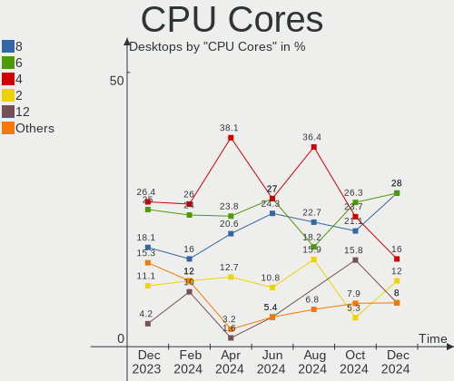
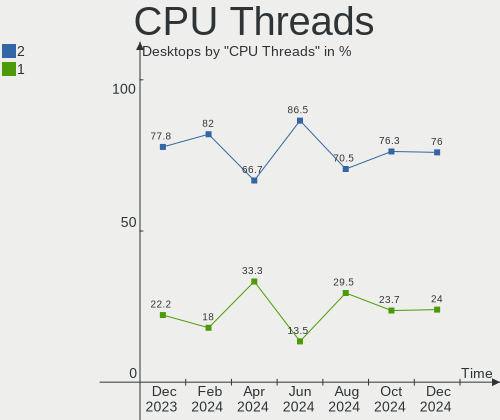
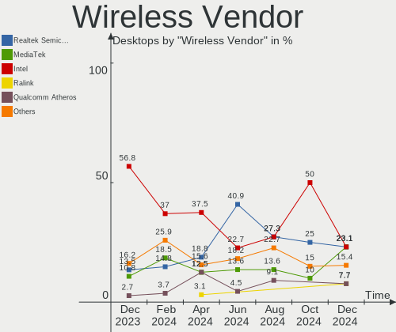
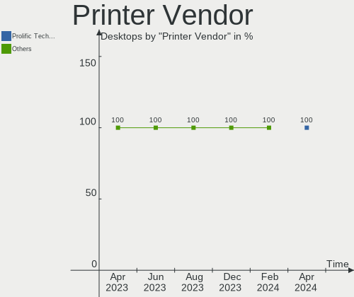
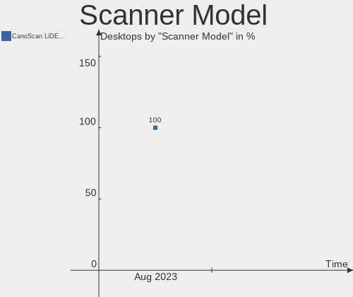

ArcoLinux - Hardware Trends (Desktops)
--------------------------------------

A project to identify most popular hardware characteristics and track their change
over time based on data collected by Linux users at https://Linux-Hardware.org.

Anyone can contribute to this report by the [hw-probe](https://github.com/linuxhw/hw-probe) tool:

    sudo -E hw-probe -all -upload

This report is for one last month. Overall report since the beginning of time: [TestDays](https://github.com/linuxhw/TestDays)

Period: Aug, 2023.

Contents
--------

* [ System ](#system)
  - [ OS                       ](#os)
  - [ OS Family                ](#os-family)
  - [ Kernel                   ](#kernel)
  - [ Kernel Family            ](#kernel-family)
  - [ Kernel Major Ver.        ](#kernel-major-ver)
  - [ Arch                     ](#arch)
  - [ DE                       ](#de)
  - [ Display Server           ](#display-server)
  - [ Display Manager          ](#display-manager)
  - [ OS Lang                  ](#os-lang)
  - [ Boot Mode                ](#boot-mode)
  - [ Filesystem               ](#filesystem)
  - [ Part. scheme             ](#part-scheme)
  - [ Dual Boot with Linux/BSD ](#dual-boot-with-linuxbsd)
  - [ Dual Boot (Win)          ](#dual-boot-win)

* [ Board ](#board)
  - [ Vendor                   ](#vendor)
  - [ Model                    ](#model)
  - [ Model Family             ](#model-family)
  - [ MFG Year                 ](#mfg-year)
  - [ Form Factor              ](#form-factor)
  - [ Secure Boot              ](#secure-boot)
  - [ Coreboot                 ](#coreboot)
  - [ RAM Size                 ](#ram-size)
  - [ RAM Used                 ](#ram-used)
  - [ Total Drives             ](#total-drives)
  - [ Has CD-ROM               ](#has-cd-rom)
  - [ Has Ethernet             ](#has-ethernet)
  - [ Has WiFi                 ](#has-wifi)
  - [ Has Bluetooth            ](#has-bluetooth)

* [ Location ](#location)
  - [ Country                  ](#country)
  - [ City                     ](#city)

* [ Drives ](#drives)
  - [ Drive Vendor             ](#drive-vendor)
  - [ Drive Model              ](#drive-model)
  - [ HDD Vendor               ](#hdd-vendor)
  - [ SSD Vendor               ](#ssd-vendor)
  - [ Drive Kind               ](#drive-kind)
  - [ Drive Connector          ](#drive-connector)
  - [ Drive Size               ](#drive-size)
  - [ Space Total              ](#space-total)
  - [ Space Used               ](#space-used)
  - [ Malfunc. Drives          ](#malfunc-drives)
  - [ Malfunc. Drive Vendor    ](#malfunc-drive-vendor)
  - [ Malfunc. HDD Vendor      ](#malfunc-hdd-vendor)
  - [ Malfunc. Drive Kind      ](#malfunc-drive-kind)
  - [ Failed Drives            ](#failed-drives)
  - [ Failed Drive Vendor      ](#failed-drive-vendor)
  - [ Drive Status             ](#drive-status)

* [ Storage controller ](#storage-controller)
  - [ Storage Vendor           ](#storage-vendor)
  - [ Storage Model            ](#storage-model)
  - [ Storage Kind             ](#storage-kind)

* [ Processor ](#processor)
  - [ CPU Vendor               ](#cpu-vendor)
  - [ CPU Model                ](#cpu-model)
  - [ CPU Model Family         ](#cpu-model-family)
  - [ CPU Cores                ](#cpu-cores)
  - [ CPU Sockets              ](#cpu-sockets)
  - [ CPU Threads              ](#cpu-threads)
  - [ CPU Op-Modes             ](#cpu-op-modes)
  - [ CPU Microcode            ](#cpu-microcode)
  - [ CPU Microarch            ](#cpu-microarch)

* [ Graphics ](#graphics)
  - [ GPU Vendor               ](#gpu-vendor)
  - [ GPU Model                ](#gpu-model)
  - [ GPU Combo                ](#gpu-combo)
  - [ GPU Driver               ](#gpu-driver)
  - [ GPU Memory               ](#gpu-memory)

* [ Monitor ](#monitor)
  - [ Monitor Vendor           ](#monitor-vendor)
  - [ Monitor Model            ](#monitor-model)
  - [ Monitor Resolution       ](#monitor-resolution)
  - [ Monitor Diagonal         ](#monitor-diagonal)
  - [ Monitor Width            ](#monitor-width)
  - [ Aspect Ratio             ](#aspect-ratio)
  - [ Monitor Area             ](#monitor-area)
  - [ Pixel Density            ](#pixel-density)
  - [ Multiple Monitors        ](#multiple-monitors)

* [ Network ](#network)
  - [ Net Controller Vendor    ](#net-controller-vendor)
  - [ Net Controller Model     ](#net-controller-model)
  - [ Wireless Vendor          ](#wireless-vendor)
  - [ Wireless Model           ](#wireless-model)
  - [ Ethernet Vendor          ](#ethernet-vendor)
  - [ Ethernet Model           ](#ethernet-model)
  - [ Net Controller Kind      ](#net-controller-kind)
  - [ Used Controller          ](#used-controller)
  - [ NICs                     ](#nics)
  - [ IPv6                     ](#ipv6)

* [ Bluetooth ](#bluetooth)
  - [ Bluetooth Vendor         ](#bluetooth-vendor)
  - [ Bluetooth Model          ](#bluetooth-model)

* [ Sound ](#sound)
  - [ Sound Vendor             ](#sound-vendor)
  - [ Sound Model              ](#sound-model)

* [ Memory ](#memory)
  - [ Memory Vendor            ](#memory-vendor)
  - [ Memory Model             ](#memory-model)
  - [ Memory Kind              ](#memory-kind)
  - [ Memory Form Factor       ](#memory-form-factor)
  - [ Memory Size              ](#memory-size)
  - [ Memory Speed             ](#memory-speed)

* [ Printers & scanners ](#printers--scanners)
  - [ Printer Vendor           ](#printer-vendor)
  - [ Printer Model            ](#printer-model)
  - [ Scanner Vendor           ](#scanner-vendor)
  - [ Scanner Model            ](#scanner-model)

* [ Camera ](#camera)
  - [ Camera Vendor            ](#camera-vendor)
  - [ Camera Model             ](#camera-model)

* [ Security ](#security)
  - [ Fingerprint Vendor       ](#fingerprint-vendor)
  - [ Fingerprint Model        ](#fingerprint-model)
  - [ Chipcard Vendor          ](#chipcard-vendor)
  - [ Chipcard Model           ](#chipcard-model)

* [ Unsupported ](#unsupported)
  - [ Unsupported Devices      ](#unsupported-devices)
  - [ Unsupported Device Types ](#unsupported-device-types)

System
------

OS
--

Installed operating systems

| Name              | Desktops | Percent |
|-------------------|----------|---------|
| ArcoLinux Rolling | 57       | 96.61%  |
| ArcoLinux         | 2        | 3.39%   |

OS Family
---------

OS without a version

| Name      | Desktops | Percent |
|-----------|----------|---------|
| ArcoLinux | 59       | 100%    |

Kernel
------

Version of the Linux kernel

| Version                        | Desktops | Percent |
|--------------------------------|----------|---------|
| 6.4.10-arch1-1                 | 9        | 15.25%  |
| 6.4.8-arch1-1                  | 5        | 8.47%   |
| 6.4.12-arch1-1                 | 5        | 8.47%   |
| 6.4.11-arch2-1                 | 5        | 8.47%   |
| 6.4.11-arch1-1                 | 3        | 5.08%   |
| 6.3.8-arch1-1                  | 3        | 5.08%   |
| 6.4.7-zen1-1-zen               | 2        | 3.39%   |
| 6.1.49-1-lts                   | 2        | 3.39%   |
| 6.1.39-3-lts                   | 2        | 3.39%   |
| 6.1.39-2-lts                   | 2        | 3.39%   |
| 6.4.9-arch1-1                  | 1        | 1.69%   |
| 6.4.8-zen1-1-zen               | 1        | 1.69%   |
| 6.4.8-1-cachyos                | 1        | 1.69%   |
| 6.4.7-zen1-2-zen               | 1        | 1.69%   |
| 6.4.7-arch1-3                  | 1        | 1.69%   |
| 6.4.7-arch1-2                  | 1        | 1.69%   |
| 6.4.7-arch1-1                  | 1        | 1.69%   |
| 6.4.6-arch1-1                  | 1        | 1.69%   |
| 6.4.4-arch1-1                  | 1        | 1.69%   |
| 6.4.2-x64v2-xanmod1-3          | 1        | 1.69%   |
| 6.4.12-zen1-1-zen              | 1        | 1.69%   |
| 6.4.11-zen2-1-zen              | 1        | 1.69%   |
| 6.3.8-zen1-1-zen               | 1        | 1.69%   |
| 6.3.8-x64v1-xanmod1-1          | 1        | 1.69%   |
| 6.3.3.15.realtime2-4-rt        | 1        | 1.69%   |
| 6.3.3-arch1-1                  | 1        | 1.69%   |
| 6.2.11-arch1-1                 | 1        | 1.69%   |
| 6.2.10-arch1-1                 | 1        | 1.69%   |
| 6.1.45-1-lts                   | 1        | 1.69%   |
| 6.1.38-x64v1-xanmod1-1-lts     | 1        | 1.69%   |
| 6.1.33-x64v2-rt11-xanmod1-1-rt | 1        | 1.69%   |

Kernel Family
-------------

Linux kernel without a distro release

| Version  | Desktops | Percent |
|----------|----------|---------|
| 6.4.11   | 9        | 15.25%  |
| 6.4.10   | 9        | 15.25%  |
| 6.4.8    | 7        | 11.86%  |
| 6.4.7    | 6        | 10.17%  |
| 6.4.12   | 6        | 10.17%  |
| 6.3.8    | 5        | 8.47%   |
| 6.1.39   | 4        | 6.78%   |
| 6.1.49   | 2        | 3.39%   |
| 6.4.9    | 1        | 1.69%   |
| 6.4.6    | 1        | 1.69%   |
| 6.4.4    | 1        | 1.69%   |
| 6.4.2    | 1        | 1.69%   |
| 6.3.3.15 | 1        | 1.69%   |
| 6.3.3    | 1        | 1.69%   |
| 6.2.11   | 1        | 1.69%   |
| 6.2.10   | 1        | 1.69%   |
| 6.1.45   | 1        | 1.69%   |
| 6.1.38   | 1        | 1.69%   |
| 6.1.33   | 1        | 1.69%   |

Kernel Major Ver.
-----------------

Linux kernel major version

| Version | Desktops | Percent |
|---------|----------|---------|
| 6.4     | 41       | 69.49%  |
| 6.1     | 9        | 15.25%  |
| 6.3     | 6        | 10.17%  |
| 6.2     | 2        | 3.39%   |
| 6.3.3   | 1        | 1.69%   |

Arch
----

OS architecture (x86_64, i586, etc.)

| Name   | Desktops | Percent |
|--------|----------|---------|
| x86_64 | 59       | 100%    |

DE
--

Desktop Environment

| Name     | Desktops | Percent |
|----------|----------|---------|
| XFCE     | 19       | 32.2%   |
| KDE5     | 16       | 27.12%  |
| i3       | 6        | 10.17%  |
| Hyprland | 4        | 6.78%   |
| GNOME    | 3        | 5.08%   |
| Cinnamon | 3        | 5.08%   |
| qtile    | 2        | 3.39%   |
| sway     | 1        | 1.69%   |
| LXQt     | 1        | 1.69%   |
| Hypr     | 1        | 1.69%   |
| Deepin   | 1        | 1.69%   |
| Budgie   | 1        | 1.69%   |
| awesome  | 1        | 1.69%   |

Display Server
--------------

X11 or Wayland

| Name    | Desktops | Percent |
|---------|----------|---------|
| X11     | 49       | 83.05%  |
| Wayland | 8        | 13.56%  |
| Tty     | 1        | 1.69%   |
| Unknown | 1        | 1.69%   |

Display Manager
---------------

SDDM, LightDM, etc.

| Name    | Desktops | Percent |
|---------|----------|---------|
| SDDM    | 50       | 84.75%  |
| LightDM | 7        | 11.86%  |
| Unknown | 2        | 3.39%   |

OS Lang
-------

Language

| Lang  | Desktops | Percent |
|-------|----------|---------|
| en_US | 29       | 49.15%  |
| ru_RU | 5        | 8.47%   |
| fr_FR | 3        | 5.08%   |
| en_AU | 3        | 5.08%   |
| pt_BR | 2        | 3.39%   |
| en_GB | 2        | 3.39%   |
| de_DE | 2        | 3.39%   |
| C     | 2        | 3.39%   |
| zh_CN | 1        | 1.69%   |
| tr_TR | 1        | 1.69%   |
| hu_HU | 1        | 1.69%   |
| es_VE | 1        | 1.69%   |
| es_UY | 1        | 1.69%   |
| es_MX | 1        | 1.69%   |
| es_ES | 1        | 1.69%   |
| en_ZA | 1        | 1.69%   |
| en_CA | 1        | 1.69%   |
| da_DK | 1        | 1.69%   |
| cs_CZ | 1        | 1.69%   |

Boot Mode
---------

EFI or BIOS

| Mode | Desktops | Percent |
|------|----------|---------|
| EFI  | 47       | 79.66%  |
| BIOS | 12       | 20.34%  |

Filesystem
----------

Type of filesystem

| Type    | Desktops | Percent |
|---------|----------|---------|
| Ext4    | 33       | 55.93%  |
| Btrfs   | 21       | 35.59%  |
| Xfs     | 2        | 3.39%   |
| Overlay | 2        | 3.39%   |
| F2fs    | 1        | 1.69%   |

Part. scheme
------------

Scheme of partitioning

| Type    | Desktops | Percent |
|---------|----------|---------|
| GPT     | 52       | 88.14%  |
| MBR     | 5        | 8.47%   |
| Unknown | 2        | 3.39%   |

Dual Boot with Linux/BSD
------------------------

Hosting more than one Linux/BSD

| Dual boot | Desktops | Percent |
|-----------|----------|---------|
| No        | 39       | 66.1%   |
| Yes       | 20       | 33.9%   |

Dual Boot (Win)
---------------

Hosting Linux and Windows

| Dual boot | Desktops | Percent |
|-----------|----------|---------|
| Yes       | 40       | 67.8%   |
| No        | 19       | 32.2%   |

Board
-----

Vendor
------

Motherboard manufacturer

| Name                | Desktops | Percent |
|---------------------|----------|---------|
| ASUSTek Computer    | 19       | 32.2%   |
| Gigabyte Technology | 9        | 15.25%  |
| MSI                 | 8        | 13.56%  |
| ASRock              | 7        | 11.86%  |
| Hewlett-Packard     | 6        | 10.17%  |
| Dell                | 4        | 6.78%   |
| Lenovo              | 2        | 3.39%   |
| SZMZ                | 1        | 1.69%   |
| Positivo            | 1        | 1.69%   |
| Acer                | 1        | 1.69%   |
| Unknown             | 1        | 1.69%   |

Model
-----

Motherboard model

| Name                                 | Desktops | Percent |
|--------------------------------------|----------|---------|
| HP Z240 Tower Workstation            | 2        | 3.39%   |
| Gigabyte X570 AORUS MASTER           | 2        | 3.39%   |
| ASUS PRIME A320M-K                   | 2        | 3.39%   |
| SZMZ X99M-G2                         | 1        | 1.69%   |
| Positivo D6200                       | 1        | 1.69%   |
| MSI PPPPP-CCC#MMMMMMMM               | 1        | 1.69%   |
| MSI MS-7C94                          | 1        | 1.69%   |
| MSI MS-7C56                          | 1        | 1.69%   |
| MSI MS-7C37                          | 1        | 1.69%   |
| MSI MS-7C02                          | 1        | 1.69%   |
| MSI MS-7B79                          | 1        | 1.69%   |
| MSI MS-7850                          | 1        | 1.69%   |
| MSI Mr. Gamer X-Treme GTX 680 R2     | 1        | 1.69%   |
| Lenovo ThinkCentre M900 10FGS0YM01   | 1        | 1.69%   |
| Lenovo Legion T5 28IMB05 90NC00JAUS  | 1        | 1.69%   |
| HP Z620 Workstation                  | 1        | 1.69%   |
| HP ProDesk 600 G1 DM                 | 1        | 1.69%   |
| HP ProDesk 400 G3 MT                 | 1        | 1.69%   |
| HP OMEN 30L Desktop GT13-1xxx        | 1        | 1.69%   |
| Gigabyte Z390 UD V2                  | 1        | 1.69%   |
| Gigabyte Z390 AORUS PRO              | 1        | 1.69%   |
| Gigabyte X299 AORUS Ultra Gaming Pro | 1        | 1.69%   |
| Gigabyte H61M-S2PV                   | 1        | 1.69%   |
| Gigabyte H610M S2H DDR4              | 1        | 1.69%   |
| Gigabyte B650I AORUS ULTRA           | 1        | 1.69%   |
| Gigabyte A520M S2H                   | 1        | 1.69%   |
| Dell OptiPlex 990                    | 1        | 1.69%   |
| Dell OptiPlex 7090                   | 1        | 1.69%   |
| Dell OptiPlex 7040                   | 1        | 1.69%   |
| Dell OptiPlex 7010                   | 1        | 1.69%   |
| ASUS TUF Gaming X570-PLUS            | 1        | 1.69%   |
| ASUS TUF Gaming B560-PLUS WIFI       | 1        | 1.69%   |
| ASUS TUF Gaming B450M-PRO II         | 1        | 1.69%   |
| ASUS ROG STRIX Z690-E GAMING WIFI    | 1        | 1.69%   |
| ASUS ROG STRIX X570-E GAMING         | 1        | 1.69%   |
| ASUS ROG STRIX X470-I GAMING         | 1        | 1.69%   |
| ASUS ROG Maximus X HERO              | 1        | 1.69%   |
| ASUS ROG CROSSHAIR VIII DARK HERO    | 1        | 1.69%   |
| ASUS Q170M2                          | 1        | 1.69%   |
| ASUS PRIME H310T R2.0                | 1        | 1.69%   |

Model Family
------------

Motherboard model prefix

| Name                   | Desktops | Percent |
|------------------------|----------|---------|
| ASUS ROG               | 5        | 8.47%   |
| Dell OptiPlex          | 4        | 6.78%   |
| ASUS PRIME             | 4        | 6.78%   |
| ASUS TUF               | 3        | 5.08%   |
| HP Z240                | 2        | 3.39%   |
| HP ProDesk             | 2        | 3.39%   |
| Gigabyte Z390          | 2        | 3.39%   |
| Gigabyte X570          | 2        | 3.39%   |
| SZMZ X99M-G2           | 1        | 1.69%   |
| Positivo D6200         | 1        | 1.69%   |
| MSI PPPPP-CCC#MMMMMMMM | 1        | 1.69%   |
| MSI MS-7C94            | 1        | 1.69%   |
| MSI MS-7C56            | 1        | 1.69%   |
| MSI MS-7C37            | 1        | 1.69%   |
| MSI MS-7C02            | 1        | 1.69%   |
| MSI MS-7B79            | 1        | 1.69%   |
| MSI MS-7850            | 1        | 1.69%   |
| MSI Mr.                | 1        | 1.69%   |
| Lenovo ThinkCentre     | 1        | 1.69%   |
| Lenovo Legion          | 1        | 1.69%   |
| HP Z620                | 1        | 1.69%   |
| HP OMEN                | 1        | 1.69%   |
| Gigabyte X299          | 1        | 1.69%   |
| Gigabyte H61M-S2PV     | 1        | 1.69%   |
| Gigabyte H610M         | 1        | 1.69%   |
| Gigabyte B650I         | 1        | 1.69%   |
| Gigabyte A520M         | 1        | 1.69%   |
| ASUS Q170M2            | 1        | 1.69%   |
| ASUS P5Q-E             | 1        | 1.69%   |
| ASUS M5A78L-M          | 1        | 1.69%   |
| ASUS KomplettPC        | 1        | 1.69%   |
| ASUS H110M-C           | 1        | 1.69%   |
| ASUS CROSSHAIR         | 1        | 1.69%   |
| ASUS All               | 1        | 1.69%   |
| ASRock Z75             | 1        | 1.69%   |
| ASRock X670E           | 1        | 1.69%   |
| ASRock X570            | 1        | 1.69%   |
| ASRock N68-VS3         | 1        | 1.69%   |
| ASRock B460            | 1        | 1.69%   |
| ASRock B360M           | 1        | 1.69%   |

MFG Year
--------

Motherboard manufacture year

| Year | Desktops | Percent |
|------|----------|---------|
| 2020 | 9        | 15.25%  |
| 2019 | 9        | 15.25%  |
| 2021 | 8        | 13.56%  |
| 2017 | 6        | 10.17%  |
| 2018 | 4        | 6.78%   |
| 2016 | 4        | 6.78%   |
| 2013 | 4        | 6.78%   |
| 2011 | 4        | 6.78%   |
| 2023 | 3        | 5.08%   |
| 2022 | 2        | 3.39%   |
| 2014 | 2        | 3.39%   |
| 2012 | 2        | 3.39%   |
| 2010 | 1        | 1.69%   |
| 2008 | 1        | 1.69%   |

Form Factor
-----------

Physical design of the computer

| Name    | Desktops | Percent |
|---------|----------|---------|
| Desktop | 59       | 100%    |

Secure Boot
-----------

Enabled or disabled

| State    | Desktops | Percent |
|----------|----------|---------|
| Disabled | 59       | 100%    |

Coreboot
--------

Have coreboot on board

| Used | Desktops | Percent |
|------|----------|---------|
| No   | 59       | 100%    |

RAM Size
--------

Total RAM memory

| Size in GB  | Desktops | Percent |
|-------------|----------|---------|
| 32.01-64.0  | 20       | 33.9%   |
| 16.01-24.0  | 17       | 28.81%  |
| 64.01-256.0 | 7        | 11.86%  |
| 8.01-16.0   | 6        | 10.17%  |
| 4.01-8.0    | 4        | 6.78%   |
| 24.01-32.0  | 3        | 5.08%   |
| 3.01-4.0    | 2        | 3.39%   |

RAM Used
--------

Used RAM memory

| Used GB   | Desktops | Percent |
|-----------|----------|---------|
| 1.01-2.0  | 17       | 28.81%  |
| 3.01-4.0  | 16       | 27.12%  |
| 2.01-3.0  | 15       | 25.42%  |
| 4.01-8.0  | 7        | 11.86%  |
| 8.01-16.0 | 3        | 5.08%   |
| 0.51-1.0  | 1        | 1.69%   |

Total Drives
------------

Number of drives on board

| Drives | Desktops | Percent |
|--------|----------|---------|
| 1      | 17       | 28.81%  |
| 2      | 16       | 27.12%  |
| 4      | 9        | 15.25%  |
| 3      | 7        | 11.86%  |
| 6      | 3        | 5.08%   |
| 5      | 3        | 5.08%   |
| 7      | 2        | 3.39%   |
| 11     | 1        | 1.69%   |
| 10     | 1        | 1.69%   |

Has CD-ROM
----------

Has CD-ROM on board

| Presented | Desktops | Percent |
|-----------|----------|---------|
| No        | 44       | 74.58%  |
| Yes       | 15       | 25.42%  |

Has Ethernet
------------

Has Ethernet on board

| Presented | Desktops | Percent |
|-----------|----------|---------|
| Yes       | 59       | 100%    |

Has WiFi
--------

Has WiFi module

| Presented | Desktops | Percent |
|-----------|----------|---------|
| Yes       | 31       | 52.54%  |
| No        | 28       | 47.46%  |

Has Bluetooth
-------------

Has Bluetooth module

| Presented | Desktops | Percent |
|-----------|----------|---------|
| Yes       | 32       | 54.24%  |
| No        | 27       | 45.76%  |

Location
--------

Country
-------

Geographic location (country)

| Country      | Desktops | Percent |
|--------------|----------|---------|
| USA          | 10       | 16.95%  |
| Russia       | 5        | 8.47%   |
| Germany      | 4        | 6.78%   |
| France       | 4        | 6.78%   |
| Australia    | 4        | 6.78%   |
| Brazil       | 3        | 5.08%   |
| Venezuela    | 2        | 3.39%   |
| UK           | 2        | 3.39%   |
| Sweden       | 2        | 3.39%   |
| Spain        | 2        | 3.39%   |
| Romania      | 2        | 3.39%   |
| Mexico       | 2        | 3.39%   |
| Bolivia      | 2        | 3.39%   |
| Uruguay      | 1        | 1.69%   |
| Turkey       | 1        | 1.69%   |
| Thailand     | 1        | 1.69%   |
| South Korea  | 1        | 1.69%   |
| South Africa | 1        | 1.69%   |
| Slovenia     | 1        | 1.69%   |
| Poland       | 1        | 1.69%   |
| Norway       | 1        | 1.69%   |
| Ireland      | 1        | 1.69%   |
| Hungary      | 1        | 1.69%   |
| Egypt        | 1        | 1.69%   |
| Denmark      | 1        | 1.69%   |
| Czechia      | 1        | 1.69%   |
| Canada       | 1        | 1.69%   |
| Argentina    | 1        | 1.69%   |

City
----

Geographic location (city)

| City              | Desktops | Percent |
|-------------------|----------|---------|
| Zapopan           | 1        | 1.69%   |
| Yangcheon-gu      | 1        | 1.69%   |
| Woodway           | 1        | 1.69%   |
| Wharton           | 1        | 1.69%   |
| Voronezh          | 1        | 1.69%   |
| Vicosa            | 1        | 1.69%   |
| Valencia          | 1        | 1.69%   |
| Uberlândia       | 1        | 1.69%   |
| Teresopolis       | 1        | 1.69%   |
| Tamarac           | 1        | 1.69%   |
| Sydney            | 1        | 1.69%   |
| Stuttgart         | 1        | 1.69%   |
| Stockholm         | 1        | 1.69%   |
| Spokane           | 1        | 1.69%   |
| Smolensk          | 1        | 1.69%   |
| Saratov           | 1        | 1.69%   |
| Rouen             | 1        | 1.69%   |
| Roscanvel         | 1        | 1.69%   |
| Red Lake          | 1        | 1.69%   |
| Perth             | 1        | 1.69%   |
| Oslo              | 1        | 1.69%   |
| Oruro             | 1        | 1.69%   |
| Novosibirsk       | 1        | 1.69%   |
| Nashville         | 1        | 1.69%   |
| Nachod            | 1        | 1.69%   |
| Morelia           | 1        | 1.69%   |
| Montevideo        | 1        | 1.69%   |
| Mölnlycke        | 1        | 1.69%   |
| Melbourne         | 1        | 1.69%   |
| Maribor           | 1        | 1.69%   |
| Maracaibo         | 1        | 1.69%   |
| Mannheim          | 1        | 1.69%   |
| Lüdenscheid      | 1        | 1.69%   |
| Levallois-Perret  | 1        | 1.69%   |
| La Paz            | 1        | 1.69%   |
| Jacksonville      | 1        | 1.69%   |
| Ivanovo           | 1        | 1.69%   |
| Houston           | 1        | 1.69%   |
| Gebiczyn          | 1        | 1.69%   |
| Frankfurt am Main | 1        | 1.69%   |

Drives
------

Drive Vendor
------------

Hard drive vendors

| Vendor                      | Desktops | Drives | Percent |
|-----------------------------|----------|--------|---------|
| WDC                         | 24       | 36     | 17.65%  |
| Samsung Electronics         | 23       | 33     | 16.91%  |
| Seagate                     | 20       | 29     | 14.71%  |
| Kingston                    | 11       | 14     | 8.09%   |
| SanDisk                     | 9        | 9      | 6.62%   |
| Phison Electronics          | 6        | 6      | 4.41%   |
| Kingston Technology Company | 5        | 5      | 3.68%   |
| Crucial                     | 5        | 5      | 3.68%   |
| Toshiba                     | 4        | 5      | 2.94%   |
| Silicon Motion              | 3        | 4      | 2.21%   |
| Hitachi                     | 3        | 3      | 2.21%   |
| Patriot                     | 2        | 2      | 1.47%   |
| Intel                       | 2        | 2      | 1.47%   |
| ADATA Technology            | 2        | 2      | 1.47%   |
| A-DATA Technology           | 2        | 3      | 1.47%   |
| Unknown                     | 1        | 1      | 0.74%   |
| sobetter                    | 1        | 1      | 0.74%   |
| SK hynix                    | 1        | 1      | 0.74%   |
| SABRENT                     | 1        | 1      | 0.74%   |
| Realtek Semiconductor       | 1        | 1      | 0.74%   |
| OXYBR                       | 1        | 1      | 0.74%   |
| OCZ                         | 1        | 1      | 0.74%   |
| Micron/Crucial Technology   | 1        | 1      | 0.74%   |
| Maxtor                      | 1        | 1      | 0.74%   |
| Maxone                      | 1        | 1      | 0.74%   |
| Intenso                     | 1        | 1      | 0.74%   |
| H/W                         | 1        | 3      | 0.74%   |
| G-DRIVE                     | 1        | 1      | 0.74%   |
| Corsair                     | 1        | 1      | 0.74%   |
| Apacer                      | 1        | 1      | 0.74%   |

Drive Model
-----------

Hard drive models

| Model                                                 | Desktops | Percent |
|-------------------------------------------------------|----------|---------|
| Samsung NVMe SSD Controller SM981/PM981/PM983 500GB   | 6        | 3.64%   |
| Kingston SA400S37480G 480GB SSD                       | 4        | 2.42%   |
| WDC WD10EZEX-08WN4A0 1TB                              | 3        | 1.82%   |
| Seagate ST1000DM003-1CH162 1TB                        | 3        | 1.82%   |
| Phison E12 NVMe Controller 256GB                      | 3        | 1.82%   |
| Kingston Company A2000 NVMe SSD 1TB                   | 3        | 1.82%   |
| WDC WD40EZRX-00SPEB0 4TB                              | 2        | 1.21%   |
| WDC WD10EZRX-00L4HB0 1TB                              | 2        | 1.21%   |
| Silicon Motion SM2263EN/SM2263XT SSD Controller 256GB | 2        | 1.21%   |
| Seagate ST2000DM008-2FR102 2TB                        | 2        | 1.21%   |
| Samsung SSD 980 1TB                                   | 2        | 1.21%   |
| Samsung SSD 850 EVO 250GB                             | 2        | 1.21%   |
| Samsung SSD 840 PRO Series 128GB                      | 2        | 1.21%   |
| Samsung NVMe SSD Controller SM961/PM961/SM963 1024GB  | 2        | 1.21%   |
| Samsung NVMe SSD Controller PM9A1/PM9A3/980PRO 1024GB | 2        | 1.21%   |
| Kingston SA400S37240G 240GB SSD                       | 2        | 1.21%   |
| WDC WDS500G2B0B-00YS70 500GB SSD                      | 1        | 0.61%   |
| WDC WDS500G2B0A-00SM50 500GB SSD                      | 1        | 0.61%   |
| WDC WDS480G2G0B-00EPW0 480GB SSD                      | 1        | 0.61%   |
| WDC WDS240G2G0A-00JH30 240GB SSD                      | 1        | 0.61%   |
| WDC WDS120G2G0A-00JH30 120GB SSD                      | 1        | 0.61%   |
| WDC WDS100T1R0A-68A4W0 1TB SSD                        | 1        | 0.61%   |
| WDC WD80EMAZ-00WJTA0 8TB                              | 1        | 0.61%   |
| WDC WD6400AAKS-22A7B2 640GB                           | 1        | 0.61%   |
| WDC WD5000BPKX-00HPJT0 500GB                          | 1        | 0.61%   |
| WDC WD5000AAKX-001CA0 500GB                           | 1        | 0.61%   |
| WDC WD5000AAKS-00A7B0 500GB                           | 1        | 0.61%   |
| WDC WD5000AACS-00G8B1 500GB                           | 1        | 0.61%   |
| WDC WD4005FZBX-00K5WB0 4TB                            | 1        | 0.61%   |
| WDC WD3200AAKS-00L9A0 320GB                           | 1        | 0.61%   |
| WDC WD30EFRX-68EUZN0 3TB                              | 1        | 0.61%   |
| WDC WD20PURZ-85AKKY0 2TB                              | 1        | 0.61%   |
| WDC WD20EARS-14MVWB0 2TB                              | 1        | 0.61%   |
| WDC WD20EARS-00MVWB0 2TB                              | 1        | 0.61%   |
| WDC WD2003FZEX-00SRLA0 2TB                            | 1        | 0.61%   |
| WDC WD1600AABS-00PRA0 160GB                           | 1        | 0.61%   |
| WDC WD10PURZ-85U8XY0 1TB                              | 1        | 0.61%   |
| WDC WD10JPVX-60JC3T0 1TB                              | 1        | 0.61%   |
| WDC WD10EZEX-22RKKA0 1TB                              | 1        | 0.61%   |
| WDC WD10EURX-63UY4Y0 1TB                              | 1        | 0.61%   |

HDD Vendor
----------

Hard disk drive vendors

| Vendor              | Desktops | Drives | Percent |
|---------------------|----------|--------|---------|
| Seagate             | 20       | 28     | 39.22%  |
| WDC                 | 18       | 28     | 35.29%  |
| Toshiba             | 3        | 4      | 5.88%   |
| Samsung Electronics | 3        | 3      | 5.88%   |
| Hitachi             | 3        | 3      | 5.88%   |
| SABRENT             | 1        | 1      | 1.96%   |
| Maxtor              | 1        | 1      | 1.96%   |
| Maxone              | 1        | 1      | 1.96%   |
| H/W                 | 1        | 3      | 1.96%   |

SSD Vendor
----------

Solid state drive vendors

| Vendor              | Desktops | Drives | Percent |
|---------------------|----------|--------|---------|
| Samsung Electronics | 11       | 13     | 23.4%   |
| Kingston            | 9        | 11     | 19.15%  |
| WDC                 | 7        | 8      | 14.89%  |
| Crucial             | 5        | 5      | 10.64%  |
| SanDisk             | 4        | 4      | 8.51%   |
| Patriot             | 2        | 2      | 4.26%   |
| A-DATA Technology   | 2        | 3      | 4.26%   |
| Seagate             | 1        | 1      | 2.13%   |
| OXYBR               | 1        | 1      | 2.13%   |
| OCZ                 | 1        | 1      | 2.13%   |
| Intenso             | 1        | 1      | 2.13%   |
| Intel               | 1        | 1      | 2.13%   |
| Corsair             | 1        | 1      | 2.13%   |
| Apacer              | 1        | 1      | 2.13%   |

Drive Kind
----------

HDD or SSD

| Kind    | Desktops | Drives | Percent |
|---------|----------|--------|---------|
| NVMe    | 37       | 48     | 33.94%  |
| HDD     | 36       | 72     | 33.03%  |
| SSD     | 34       | 53     | 31.19%  |
| Unknown | 2        | 2      | 1.83%   |

Drive Connector
---------------

SATA, SAS, NVMe, etc.

| Type | Desktops | Drives | Percent |
|------|----------|--------|---------|
| SATA | 47       | 117    | 51.09%  |
| NVMe | 37       | 48     | 40.22%  |
| SAS  | 8        | 10     | 8.7%    |

Drive Size
----------

Size of hard drive

| Size in TB | Desktops | Drives | Percent |
|------------|----------|--------|---------|
| 0.01-0.5   | 35       | 52     | 41.18%  |
| 0.51-1.0   | 28       | 42     | 32.94%  |
| 1.01-2.0   | 13       | 18     | 15.29%  |
| 2.01-3.0   | 4        | 5      | 4.71%   |
| 3.01-4.0   | 3        | 5      | 3.53%   |
| 4.01-10.0  | 2        | 3      | 2.35%   |

Space Total
-----------

Amount of disk space available on the file system

| Size in GB     | Desktops | Percent |
|----------------|----------|---------|
| More than 3000 | 14       | 23.73%  |
| 251-500        | 13       | 22.03%  |
| 501-1000       | 10       | 16.95%  |
| 101-250        | 9        | 15.25%  |
| 2001-3000      | 4        | 6.78%   |
| 1001-2000      | 4        | 6.78%   |
| 1-20           | 2        | 3.39%   |
| Unknown        | 2        | 3.39%   |
| 51-100         | 1        | 1.69%   |

Space Used
----------

Amount of used disk space

| Used GB        | Desktops | Percent |
|----------------|----------|---------|
| 101-250        | 12       | 20.34%  |
| 1-20           | 12       | 20.34%  |
| 21-50          | 11       | 18.64%  |
| 51-100         | 6        | 10.17%  |
| 251-500        | 5        | 8.47%   |
| 1001-2000      | 4        | 6.78%   |
| More than 3000 | 3        | 5.08%   |
| 501-1000       | 3        | 5.08%   |
| Unknown        | 2        | 3.39%   |
| 2001-3000      | 1        | 1.69%   |

Malfunc. Drives
---------------

Drive models with a malfunction

| Model                                 | Desktops | Drives | Percent |
|---------------------------------------|----------|--------|---------|
| Seagate ST1000DM003-1CH162 1TB        | 3        | 3      | 11.11%  |
| WDC WD6400AAKS-22A7B2 640GB           | 1        | 1      | 3.7%    |
| WDC WD5000AACS-00G8B1 500GB           | 1        | 1      | 3.7%    |
| WDC WD40EZRX-00SPEB0 4TB              | 1        | 1      | 3.7%    |
| WDC WD30EFRX-68EUZN0 3TB              | 1        | 1      | 3.7%    |
| WDC WD20EARS-00MVWB0 2TB              | 1        | 2      | 3.7%    |
| WDC WD10EZRX-00L4HB0 1TB              | 1        | 1      | 3.7%    |
| WDC WD10EARS-22Y5B1 1TB               | 1        | 1      | 3.7%    |
| Seagate STM31000528AS 1TB             | 1        | 1      | 3.7%    |
| Seagate ST500DM002-1SB10A 500GB       | 1        | 1      | 3.7%    |
| Seagate ST3500630AS 500GB             | 1        | 1      | 3.7%    |
| Seagate ST3500414CS 500GB             | 1        | 1      | 3.7%    |
| Seagate ST3500320AS 500GB             | 1        | 1      | 3.7%    |
| SanDisk SSD PLUS 1000GB               | 1        | 1      | 3.7%    |
| SanDisk SD8SBAT128G1122 128GB SSD     | 1        | 1      | 3.7%    |
| Samsung Electronics SSD 870 EVO 1TB   | 1        | 1      | 3.7%    |
| Samsung Electronics SSD 850 EVO 250GB | 1        | 1      | 3.7%    |
| Samsung Electronics HD642JJ 640GB     | 1        | 1      | 3.7%    |
| Maxtor STM3250310AS 250GB             | 1        | 1      | 3.7%    |
| Kingston SA400S37480G 480GB SSD       | 1        | 1      | 3.7%    |
| Intel SSDSC2BW240A4 240GB             | 1        | 1      | 3.7%    |
| Hitachi HTS543225A7A384 250GB         | 1        | 1      | 3.7%    |
| Hitachi HDS721010CLA332 1TB           | 1        | 1      | 3.7%    |
| Crucial CT2000MX500SSD1 2TB           | 1        | 1      | 3.7%    |
| Corsair CSSD-F60GB2 64GB              | 1        | 1      | 3.7%    |

Malfunc. Drive Vendor
---------------------

Vendors of faulty drives

| Vendor              | Desktops | Drives | Percent |
|---------------------|----------|--------|---------|
| WDC                 | 7        | 8      | 28%     |
| Seagate             | 7        | 8      | 28%     |
| SanDisk             | 2        | 2      | 8%      |
| Samsung Electronics | 2        | 3      | 8%      |
| Hitachi             | 2        | 2      | 8%      |
| Maxtor              | 1        | 1      | 4%      |
| Kingston            | 1        | 1      | 4%      |
| Intel               | 1        | 1      | 4%      |
| Crucial             | 1        | 1      | 4%      |
| Corsair             | 1        | 1      | 4%      |

Malfunc. HDD Vendor
-------------------

Vendors of faulty HDD drives

| Vendor              | Desktops | Drives | Percent |
|---------------------|----------|--------|---------|
| WDC                 | 7        | 8      | 38.89%  |
| Seagate             | 7        | 8      | 38.89%  |
| Hitachi             | 2        | 2      | 11.11%  |
| Samsung Electronics | 1        | 1      | 5.56%   |
| Maxtor              | 1        | 1      | 5.56%   |

Malfunc. Drive Kind
-------------------

Kinds of faulty drives

| Kind | Desktops | Drives | Percent |
|------|----------|--------|---------|
| HDD  | 14       | 20     | 66.67%  |
| SSD  | 7        | 8      | 33.33%  |

Failed Drives
-------------

Failed drive models

Zero info for selected period =(

Failed Drive Vendor
-------------------

Failed drive vendors

Zero info for selected period =(

Drive Status
------------

Number of failed and malfunc. drives

| Status   | Desktops | Drives | Percent |
|----------|----------|--------|---------|
| Works    | 51       | 129    | 66.23%  |
| Malfunc  | 18       | 28     | 23.38%  |
| Detected | 8        | 18     | 10.39%  |

Storage controller
------------------

Storage Vendor
--------------

Storage controller vendors

| Vendor                       | Desktops | Percent |
|------------------------------|----------|---------|
| Intel                        | 35       | 33.02%  |
| AMD                          | 23       | 21.7%   |
| Samsung Electronics          | 13       | 12.26%  |
| Kingston Technology Company  | 8        | 7.55%   |
| Phison Electronics           | 6        | 5.66%   |
| SanDisk                      | 5        | 4.72%   |
| Silicon Motion               | 3        | 2.83%   |
| ASMedia Technology           | 3        | 2.83%   |
| ADATA Technology             | 2        | 1.89%   |
| Toshiba America Info Systems | 1        | 0.94%   |
| SK hynix                     | 1        | 0.94%   |
| Silicon Image                | 1        | 0.94%   |
| Realtek Semiconductor        | 1        | 0.94%   |
| Nvidia                       | 1        | 0.94%   |
| Micron/Crucial Technology    | 1        | 0.94%   |
| Marvell Technology Group     | 1        | 0.94%   |
| INNOGRIT                     | 1        | 0.94%   |

Storage Model
-------------

Storage controller models

| Model                                                                          | Desktops | Percent |
|--------------------------------------------------------------------------------|----------|---------|
| AMD FCH SATA Controller [AHCI mode]                                            | 12       | 10.17%  |
| Samsung NVMe SSD Controller SM981/PM981/PM983                                  | 6        | 5.08%   |
| Intel SATA Controller [RAID mode]                                              | 4        | 3.39%   |
| Intel Q170/Q150/B150/H170/H110/Z170/CM236 Chipset SATA Controller [AHCI Mode]  | 4        | 3.39%   |
| Intel Cannon Lake PCH SATA AHCI Controller                                     | 4        | 3.39%   |
| Intel 200 Series PCH SATA controller [AHCI mode]                               | 4        | 3.39%   |
| AMD 500 Series Chipset SATA Controller                                         | 4        | 3.39%   |
| AMD 400 Series Chipset SATA Controller                                         | 4        | 3.39%   |
| Samsung NVMe SSD Controller 980                                                | 3        | 2.54%   |
| Phison E12 NVMe Controller                                                     | 3        | 2.54%   |
| Kingston Company Company Non-Volatile memory controller                        | 3        | 2.54%   |
| Kingston Company A2000 NVMe SSD                                                | 3        | 2.54%   |
| Intel Alder Lake-S PCH SATA Controller [AHCI Mode]                             | 3        | 2.54%   |
| Intel 8 Series/C220 Series Chipset Family 6-port SATA Controller 1 [AHCI mode] | 3        | 2.54%   |
| Intel 7 Series/C210 Series Chipset Family 6-port SATA Controller [AHCI mode]   | 3        | 2.54%   |
| ASMedia ASM1062 Serial ATA Controller                                          | 3        | 2.54%   |
| Silicon Motion SM2263EN/SM2263XT (DRAM-less) NVMe SSD Controllers              | 2        | 1.69%   |
| SanDisk WD Blue SN570 NVMe SSD 1TB                                             | 2        | 1.69%   |
| Samsung NVMe SSD Controller SM961/PM961/SM963                                  | 2        | 1.69%   |
| Samsung NVMe SSD Controller PM9A1/PM9A3/980PRO                                 | 2        | 1.69%   |
| Intel 500 Series Chipset Family SATA AHCI Controller                           | 2        | 1.69%   |
| Intel 400 Series Chipset Family SATA AHCI Controller                           | 2        | 1.69%   |
| AMD FCH SATA Controller D                                                      | 2        | 1.69%   |
| ADATA FALCON NVMe SSD                                                          | 2        | 1.69%   |
| Toshiba America Info Systems XG6 NVMe SSD Controller                           | 1        | 0.85%   |
| SK hynix Gold P31/BC711/PC711 NVMe Solid State Drive                           | 1        | 0.85%   |
| Silicon Motion SM2262/SM2262EN SSD Controller                                  | 1        | 0.85%   |
| Silicon Image SiI 3114 [SATALink/SATARaid] Serial ATA Controller               | 1        | 0.85%   |
| SanDisk WD PC SN810 / Black SN850 NVMe SSD                                     | 1        | 0.85%   |
| SanDisk WD Blue SN550 NVMe SSD                                                 | 1        | 0.85%   |
| SanDisk WD Black 2018/SN750 / PC SN720 NVMe SSD                                | 1        | 0.85%   |
| Samsung NVMe SSD Controller SM951/PM951                                        | 1        | 0.85%   |
| Realtek RTS5765DL NVMe SSD Controller (DRAM-less)                              | 1        | 0.85%   |
| Phison PS5021-E21 PCIe4 NVMe Controller (DRAM-less)                            | 1        | 0.85%   |
| Phison PS5013 E13 NVMe Controller                                              | 1        | 0.85%   |
| Phison E16 PCIe4 NVMe Controller                                               | 1        | 0.85%   |
| Nvidia MCP61 SATA Controller                                                   | 1        | 0.85%   |
| Nvidia MCP61 IDE                                                               | 1        | 0.85%   |
| Micron/Crucial P2 [Nick P2] / P3 / P3 Plus NVMe PCIe SSD (DRAM-less)           | 1        | 0.85%   |
| Marvell Group 88SE9230 PCIe 2.0 x2 4-port SATA 6 Gb/s RAID Controller          | 1        | 0.85%   |

Storage Kind
------------

Kind of storage controller (IDE, SATA, NVMe, SAS, ...)

| Kind | Desktops | Percent |
|------|----------|---------|
| SATA | 50       | 49.5%   |
| NVMe | 37       | 36.63%  |
| RAID | 9        | 8.91%   |
| IDE  | 4        | 3.96%   |
| SAS  | 1        | 0.99%   |

Processor
---------

CPU Vendor
----------

Processor vendors

| Vendor | Desktops | Percent |
|--------|----------|---------|
| Intel  | 34       | 57.63%  |
| AMD    | 25       | 42.37%  |

CPU Model
---------

Processor models

| Model                                  | Desktops | Percent |
|----------------------------------------|----------|---------|
| AMD Ryzen 9 3900X 12-Core Processor    | 3        | 5.08%   |
| AMD Ryzen 7 5800X 8-Core Processor     | 3        | 5.08%   |
| Intel Core i7-6700 CPU @ 3.40GHz       | 2        | 3.39%   |
| Intel Core i5-6500 CPU @ 3.20GHz       | 2        | 3.39%   |
| AMD Ryzen 5 5600G with Radeon Graphics | 2        | 3.39%   |
| AMD Ryzen 5 3600 6-Core Processor      | 2        | 3.39%   |
| Intel Xeon CPU E5450 @ 3.00GHz         | 1        | 1.69%   |
| Intel Xeon CPU E5-2667 v2 @ 3.30GHz    | 1        | 1.69%   |
| Intel Xeon CPU E5-2660 v3 @ 2.60GHz    | 1        | 1.69%   |
| Intel Pentium Gold G5400 CPU @ 3.70GHz | 1        | 1.69%   |
| Intel Core i9-9900KF CPU @ 3.60GHz     | 1        | 1.69%   |
| Intel Core i9-7900X CPU @ 3.30GHz      | 1        | 1.69%   |
| Intel Core i7-8700K CPU @ 3.70GHz      | 1        | 1.69%   |
| Intel Core i7-4790K CPU @ 4.00GHz      | 1        | 1.69%   |
| Intel Core i7-4770 CPU @ 3.40GHz       | 1        | 1.69%   |
| Intel Core i7-3770K CPU @ 3.50GHz      | 1        | 1.69%   |
| Intel Core i7 CPU 860 @ 2.80GHz        | 1        | 1.69%   |
| Intel Core i5-9600K CPU @ 3.70GHz      | 1        | 1.69%   |
| Intel Core i5-8400 CPU @ 2.80GHz       | 1        | 1.69%   |
| Intel Core i5-7500 CPU @ 3.40GHz       | 1        | 1.69%   |
| Intel Core i5-6600 CPU @ 3.30GHz       | 1        | 1.69%   |
| Intel Core i5-6500T CPU @ 2.50GHz      | 1        | 1.69%   |
| Intel Core i5-4570 CPU @ 3.20GHz       | 1        | 1.69%   |
| Intel Core i5-3570 CPU @ 3.40GHz       | 1        | 1.69%   |
| Intel Core i5-2500 CPU @ 3.30GHz       | 1        | 1.69%   |
| Intel Core i5-2400 CPU @ 3.10GHz       | 1        | 1.69%   |
| Intel Core i5-10505 CPU @ 3.20GHz      | 1        | 1.69%   |
| Intel Core i5-10500 CPU @ 3.10GHz      | 1        | 1.69%   |
| Intel Core i5-10400F CPU @ 2.90GHz     | 1        | 1.69%   |
| Intel Core i5-10400 CPU @ 2.90GHz      | 1        | 1.69%   |
| Intel Core i3-8100 CPU @ 3.60GHz       | 1        | 1.69%   |
| Intel Core i3-7100 CPU @ 3.90GHz       | 1        | 1.69%   |
| Intel Core i3-3220 CPU @ 3.30GHz       | 1        | 1.69%   |
| Intel 13th Gen Core i9-13900KF         | 1        | 1.69%   |
| Intel 12th Gen Core i7-12700F          | 1        | 1.69%   |
| Intel 12th Gen Core i5-12400F          | 1        | 1.69%   |
| AMD Ryzen 9 7900X 12-Core Processor    | 1        | 1.69%   |
| AMD Ryzen 9 5950X 16-Core Processor    | 1        | 1.69%   |
| AMD Ryzen 9 5900X 12-Core Processor    | 1        | 1.69%   |
| AMD Ryzen 7 7700X 8-Core Processor     | 1        | 1.69%   |

CPU Model Family
----------------

Processor model prefix

| Model              | Desktops | Percent |
|--------------------|----------|---------|
| Intel Core i5      | 15       | 25.42%  |
| Intel Core i7      | 7        | 11.86%  |
| AMD Ryzen 7        | 7        | 11.86%  |
| AMD Ryzen 5        | 7        | 11.86%  |
| AMD Ryzen 9        | 6        | 10.17%  |
| Other              | 3        | 5.08%   |
| Intel Xeon         | 3        | 5.08%   |
| Intel Core i3      | 3        | 5.08%   |
| Intel Core i9      | 2        | 3.39%   |
| Intel Pentium Gold | 1        | 1.69%   |
| AMD Ryzen 5 PRO    | 1        | 1.69%   |
| AMD Ryzen 3        | 1        | 1.69%   |
| AMD Phenom II X4   | 1        | 1.69%   |
| AMD Athlon II X2   | 1        | 1.69%   |
| AMD A6             | 1        | 1.69%   |

CPU Cores
---------

Number of processor cores

| Number | Desktops | Percent |
|--------|----------|---------|
| 4      | 22       | 37.29%  |
| 6      | 15       | 25.42%  |
| 8      | 8        | 13.56%  |
| 12     | 6        | 10.17%  |
| 2      | 4        | 6.78%   |
| 10     | 2        | 3.39%   |
| 24     | 1        | 1.69%   |
| 16     | 1        | 1.69%   |

CPU Sockets
-----------

Number of sockets

| Number | Desktops | Percent |
|--------|----------|---------|
| 1      | 59       | 100%    |

CPU Threads
-----------

Threads per core (Hyper-Threading)

| Number | Desktops | Percent |
|--------|----------|---------|
| 2      | 42       | 71.19%  |
| 1      | 17       | 28.81%  |

CPU Op-Modes
------------

CPU Operation Modes (32-bit, 64-bit)

| Op mode        | Desktops | Percent |
|----------------|----------|---------|
| 32-bit, 64-bit | 59       | 100%    |

CPU Microcode
-------------

Microcode number

| Number     | Desktops | Percent |
|------------|----------|---------|
| Unknown    | 30       | 50.85%  |
| 0x0a201025 | 3        | 5.08%   |
| 0x08701021 | 3        | 5.08%   |
| 0xa0653    | 2        | 3.39%   |
| 0x90672    | 2        | 3.39%   |
| 0x0a601203 | 2        | 3.39%   |
| 0x08701013 | 2        | 3.39%   |
| 0x08108109 | 2        | 3.39%   |
| 0x0800820d | 2        | 3.39%   |
| 0x906ec    | 1        | 1.69%   |
| 0x906eb    | 1        | 1.69%   |
| 0x906ea    | 1        | 1.69%   |
| 0x0a50000d | 1        | 1.69%   |
| 0x0a201204 | 1        | 1.69%   |
| 0x0a201016 | 1        | 1.69%   |
| 0x08701030 | 1        | 1.69%   |
| 0x08600106 | 1        | 1.69%   |
| 0x03000014 | 1        | 1.69%   |
| 0x010000c8 | 1        | 1.69%   |
| 0x010000b6 | 1        | 1.69%   |

CPU Microarch
-------------

Microarchitecture

| Name             | Desktops | Percent |
|------------------|----------|---------|
| Zen 2            | 8        | 13.56%  |
| KabyLake         | 8        | 13.56%  |
| Zen 3            | 7        | 11.86%  |
| Skylake          | 7        | 11.86%  |
| Zen+             | 5        | 8.47%   |
| IvyBridge        | 4        | 6.78%   |
| Haswell          | 4        | 6.78%   |
| CometLake        | 4        | 6.78%   |
| Alderlake Hybrid | 3        | 5.08%   |
| SandyBridge      | 2        | 3.39%   |
| K10              | 2        | 3.39%   |
| Unknown          | 2        | 3.39%   |
| Penryn           | 1        | 1.69%   |
| Nehalem          | 1        | 1.69%   |
| K10 Llano        | 1        | 1.69%   |

Graphics
--------

GPU Vendor
----------

Vendors of graphics cards

| Vendor | Desktops | Percent |
|--------|----------|---------|
| Nvidia | 30       | 49.18%  |
| AMD    | 18       | 29.51%  |
| Intel  | 13       | 21.31%  |

GPU Model
---------

Graphics card models

| Model                                                                       | Desktops | Percent |
|-----------------------------------------------------------------------------|----------|---------|
| Nvidia GP106 [GeForce GTX 1060 6GB]                                         | 3        | 4.76%   |
| Intel HD Graphics 530                                                       | 3        | 4.76%   |
| AMD Picasso/Raven 2 [Radeon Vega Series / Radeon Vega Mobile Series]        | 3        | 4.76%   |
| Nvidia TU104 [GeForce RTX 2080 SUPER]                                       | 2        | 3.17%   |
| Nvidia TU104 [GeForce RTX 2080 Rev. A]                                      | 2        | 3.17%   |
| Nvidia GM206 [GeForce GTX 960]                                              | 2        | 3.17%   |
| Nvidia GA106 [GeForce RTX 3060 Lite Hash Rate]                              | 2        | 3.17%   |
| Nvidia GA104 [GeForce RTX 3060 Ti Lite Hash Rate]                           | 2        | 3.17%   |
| Nvidia GA102 [GeForce RTX 3080 Lite Hash Rate]                              | 2        | 3.17%   |
| Intel Xeon E3-1200 v2/3rd Gen Core processor Graphics Controller            | 2        | 3.17%   |
| Intel CometLake-S GT2 [UHD Graphics 630]                                    | 2        | 3.17%   |
| Intel CoffeeLake-S GT2 [UHD Graphics 630]                                   | 2        | 3.17%   |
| AMD Raphael                                                                 | 2        | 3.17%   |
| AMD Navi 14 [Radeon RX 5500/5500M / Pro 5500M]                              | 2        | 3.17%   |
| AMD Navi 10 [Radeon RX 5600 OEM/5600 XT / 5700/5700 XT]                     | 2        | 3.17%   |
| AMD Ellesmere [Radeon RX 470/480/570/570X/580/580X/590]                     | 2        | 3.17%   |
| Nvidia TU116 [GeForce GTX 1660 Ti]                                          | 1        | 1.59%   |
| Nvidia TU116 [GeForce GTX 1660 SUPER]                                       | 1        | 1.59%   |
| Nvidia TU104 [GeForce RTX 2070 SUPER]                                       | 1        | 1.59%   |
| Nvidia TU104 [GeForce RTX 2060]                                             | 1        | 1.59%   |
| Nvidia GP107GL [Quadro P620]                                                | 1        | 1.59%   |
| Nvidia GP107 [GeForce GTX 1050 Ti]                                          | 1        | 1.59%   |
| Nvidia GP106GL [Quadro P2000]                                               | 1        | 1.59%   |
| Nvidia GP104 [GeForce GTX 1070]                                             | 1        | 1.59%   |
| Nvidia GP102 [GeForce GTX 1080 Ti]                                          | 1        | 1.59%   |
| Nvidia GM107 [GeForce GTX 750 Ti]                                           | 1        | 1.59%   |
| Nvidia GK107 [GeForce GT 640]                                               | 1        | 1.59%   |
| Nvidia GA104 [GeForce RTX 3070 Lite Hash Rate]                              | 1        | 1.59%   |
| Nvidia GA104 [GeForce RTX 3060]                                             | 1        | 1.59%   |
| Nvidia AD104 [GeForce RTX 4070 Ti]                                          | 1        | 1.59%   |
| Nvidia AD102 [GeForce RTX 4090]                                             | 1        | 1.59%   |
| Intel Xeon E3-1200 v3/4th Gen Core Processor Integrated Graphics Controller | 1        | 1.59%   |
| Intel HD Graphics 630                                                       | 1        | 1.59%   |
| Intel CoffeeLake-S GT1 [UHD Graphics 610]                                   | 1        | 1.59%   |
| Intel 2nd Generation Core Processor Family Integrated Graphics Controller   | 1        | 1.59%   |
| AMD Vega 10 XL/XT [Radeon RX Vega 56/64]                                    | 1        | 1.59%   |
| AMD Turks XT [Radeon HD 6670/7670]                                          | 1        | 1.59%   |
| AMD Tahiti XT [Radeon HD 7970/8970 OEM / R9 280X]                           | 1        | 1.59%   |
| AMD RS780L [Radeon 3000]                                                    | 1        | 1.59%   |
| AMD Renoir                                                                  | 1        | 1.59%   |

GPU Combo
---------

Combinations of graphics cards

| Name           | Desktops | Percent |
|----------------|----------|---------|
| 1 x Nvidia     | 29       | 49.15%  |
| 1 x AMD        | 15       | 25.42%  |
| 1 x Intel      | 11       | 18.64%  |
| 2 x AMD        | 2        | 3.39%   |
| Intel + Nvidia | 1        | 1.69%   |
| Intel + AMD    | 1        | 1.69%   |

GPU Driver
----------

Free vs proprietary

| Driver      | Desktops | Percent |
|-------------|----------|---------|
| Free        | 30       | 50.85%  |
| Proprietary | 29       | 49.15%  |

GPU Memory
----------

Total video memory

| Size in GB | Desktops | Percent |
|------------|----------|---------|
| 7.01-8.0   | 16       | 27.12%  |
| Unknown    | 13       | 22.03%  |
| 5.01-6.0   | 7        | 11.86%  |
| 8.01-16.0  | 7        | 11.86%  |
| 1.01-2.0   | 6        | 10.17%  |
| 3.01-4.0   | 3        | 5.08%   |
| 16.01-24.0 | 2        | 3.39%   |
| 0.51-1.0   | 2        | 3.39%   |
| 4.01-5.0   | 1        | 1.69%   |
| 2.01-3.0   | 1        | 1.69%   |
| 0.01-0.5   | 1        | 1.69%   |

Monitor
-------

Monitor Vendor
--------------

Monitor vendors

| Vendor               | Desktops | Percent |
|----------------------|----------|---------|
| Goldstar             | 11       | 14.86%  |
| Samsung Electronics  | 10       | 13.51%  |
| Dell                 | 9        | 12.16%  |
| Philips              | 4        | 5.41%   |
| ASUSTek Computer     | 4        | 5.41%   |
| Acer                 | 4        | 5.41%   |
| ViewSonic            | 3        | 4.05%   |
| Iiyama               | 3        | 4.05%   |
| AOC                  | 3        | 4.05%   |
| Sony                 | 2        | 2.7%    |
| LG Electronics       | 2        | 2.7%    |
| BenQ                 | 2        | 2.7%    |
| Xiangye              | 1        | 1.35%   |
| Vizio                | 1        | 1.35%   |
| Unknown              | 1        | 1.35%   |
| Toshiba              | 1        | 1.35%   |
| SKG                  | 1        | 1.35%   |
| PRISM+               | 1        | 1.35%   |
| Positivo             | 1        | 1.35%   |
| MSI                  | 1        | 1.35%   |
| Huion                | 1        | 1.35%   |
| Hewlett-Packard      | 1        | 1.35%   |
| HannStar             | 1        | 1.35%   |
| Grundig              | 1        | 1.35%   |
| Gigabyte Technology  | 1        | 1.35%   |
| Game Factor          | 1        | 1.35%   |
| CVT                  | 1        | 1.35%   |
| Compal               | 1        | 1.35%   |
| Ancor Communications | 1        | 1.35%   |

Monitor Model
-------------

Monitor models

| Model                                                                | Desktops | Percent |
|----------------------------------------------------------------------|----------|---------|
| Goldstar ULTRAWIDE GSM76FE 2560x1080 798x334mm 34.1-inch             | 2        | 2.6%    |
| ASUSTek Computer VG245 AUS24A1 1920x1080 531x299mm 24.0-inch         | 2        | 2.6%    |
| Xiangye N2408HZ XYE2700 1920x1080 597x336mm 27.0-inch                | 1        | 1.3%    |
| Vizio E260MV VIZ0062 1920x1080 580x320mm 26.1-inch                   | 1        | 1.3%    |
| ViewSonic VX2450 SERIES VSCE226 1920x1080 525x297mm 23.7-inch        | 1        | 1.3%    |
| ViewSonic VX2433wm VSC3822 1920x1080 520x290mm 23.4-inch             | 1        | 1.3%    |
| ViewSonic VX2370 SERIES VSC342C 1920x1080 509x286mm 23.0-inch        | 1        | 1.3%    |
| Unknown LCD Monitor FFFF 2288x1287 2550x2550mm 142.0-inch            | 1        | 1.3%    |
| Toshiba LCD-MONITOR LCDE980 1440x900 408x255mm 18.9-inch             | 1        | 1.3%    |
| Sony TV *02 SNYC603 1920x1080 1085x610mm 49.0-inch                   | 1        | 1.3%    |
| Sony onn. TV SNY050A 1920x1080 930x520mm 41.9-inch                   | 1        | 1.3%    |
| SKG DEXP DF24H1 SKG2413 1920x1080 597x336mm 27.0-inch                | 1        | 1.3%    |
| Samsung Electronics U32R59x SAM0F96 3840x2160 700x390mm 31.5-inch    | 1        | 1.3%    |
| Samsung Electronics U32J59x SAM0F35 3840x2160 697x392mm 31.5-inch    | 1        | 1.3%    |
| Samsung Electronics SyncMaster SAM055E 1920x1080 510x290mm 23.1-inch | 1        | 1.3%    |
| Samsung Electronics SyncMaster SAM0303 1680x1050 494x320mm 23.2-inch | 1        | 1.3%    |
| Samsung Electronics SMT27A550 SAM07B6 1920x1080 600x340mm 27.2-inch  | 1        | 1.3%    |
| Samsung Electronics S34J55x SAM0F70 3440x1440 797x333mm 34.0-inch    | 1        | 1.3%    |
| Samsung Electronics S27C350 SAM0A3E 1920x1080 598x336mm 27.0-inch    | 1        | 1.3%    |
| Samsung Electronics S24F350 SAM0D20 1920x1080 521x293mm 23.5-inch    | 1        | 1.3%    |
| Samsung Electronics S22F350 SAM0D1B 1920x1080 477x268mm 21.5-inch    | 1        | 1.3%    |
| Samsung Electronics LCD Monitor S27C350 4480x1080                    | 1        | 1.3%    |
| Samsung Electronics LC27T55 SAM701F 1920x1080 610x350mm 27.7-inch    | 1        | 1.3%    |
| Samsung Electronics C27F390 SAM0D32 1920x1080 598x336mm 27.0-inch    | 1        | 1.3%    |
| PRISM+ ULTRON 2754C INN0027 1920x1080 598x337mm 27.0-inch            | 1        | 1.3%    |
| Positivo 22MP55PJ POS5B7A 1920x1080 600x340mm 27.2-inch              | 1        | 1.3%    |
| Philips PHL 322E1 PHLC20F 1920x1080 698x393mm 31.5-inch              | 1        | 1.3%    |
| Philips PHL 243V5 PHLC0D1 1920x1080 520x290mm 23.4-inch              | 1        | 1.3%    |
| Philips PHL 242E1GJ PHLC244 1920x1080 527x296mm 23.8-inch            | 1        | 1.3%    |
| Philips 27M1N3500LS PHLC27B 2560x1440 597x336mm 27.0-inch            | 1        | 1.3%    |
| MSI MPG321QRF-QD MSI3DB8 2560x1440 710x400mm 32.1-inch               | 1        | 1.3%    |
| LG Electronics LCD Monitor MP59G 2944x1080                           | 1        | 1.3%    |
| LG Electronics LCD Monitor LG ULTRAWIDE 4480x1080                    | 1        | 1.3%    |
| Iiyama PL2792Q IVM6637 2560x1440 597x336mm 27.0-inch                 | 1        | 1.3%    |
| Iiyama PL2773HD IVM6606 1920x1080 600x340mm 27.2-inch                | 1        | 1.3%    |
| Iiyama PL2470H IVM615C 1920x1080 527x296mm 23.8-inch                 | 1        | 1.3%    |
| Huion Kamvas 20 HAT1950 1920x1080 432x243mm 19.5-inch                | 1        | 1.3%    |
| Hewlett-Packard X27 HPN3722 1920x1080 597x336mm 27.0-inch            | 1        | 1.3%    |
| HannStar HL225D HSD6311 1920x1080 477x268mm 21.5-inch                | 1        | 1.3%    |
| Grundig WXGA GRU4448 1600x1200                                       | 1        | 1.3%    |

Monitor Resolution
------------------

Monitor screen resolution

| Resolution         | Desktops | Percent |
|--------------------|----------|---------|
| 1920x1080 (FHD)    | 34       | 50%     |
| 2560x1440 (QHD)    | 8        | 11.76%  |
| 3840x2160 (4K)     | 7        | 10.29%  |
| 2560x1080          | 5        | 7.35%   |
| 3440x1440          | 2        | 2.94%   |
| 1680x1050 (WSXGA+) | 2        | 2.94%   |
| 1440x900 (WXGA+)   | 2        | 2.94%   |
| Unknown            | 2        | 2.94%   |
| 4480x1080          | 1        | 1.47%   |
| 3840x2524          | 1        | 1.47%   |
| 2944x1080          | 1        | 1.47%   |
| 2288x1287          | 1        | 1.47%   |
| 1600x900 (HD+)     | 1        | 1.47%   |
| 1280x1024 (SXGA)   | 1        | 1.47%   |

Monitor Diagonal
----------------

Diagonal size in inches

| Inches  | Desktops | Percent |
|---------|----------|---------|
| 27      | 16       | 22.54%  |
| 24      | 14       | 19.72%  |
| 34      | 7        | 9.86%   |
| 31      | 7        | 9.86%   |
| 23      | 7        | 9.86%   |
| 21      | 3        | 4.23%   |
| 18      | 3        | 4.23%   |
| Unknown | 3        | 4.23%   |
| 19      | 2        | 2.82%   |
| 142     | 1        | 1.41%   |
| 54      | 1        | 1.41%   |
| 49      | 1        | 1.41%   |
| 41      | 1        | 1.41%   |
| 40      | 1        | 1.41%   |
| 32      | 1        | 1.41%   |
| 26      | 1        | 1.41%   |
| 22      | 1        | 1.41%   |
| 17      | 1        | 1.41%   |

Monitor Width
-------------

Physical width

| Width in mm    | Desktops | Percent |
|----------------|----------|---------|
| 501-600        | 35       | 50.72%  |
| 601-700        | 8        | 11.59%  |
| 401-500        | 8        | 11.59%  |
| 701-800        | 7        | 10.14%  |
| Unknown        | 3        | 4.35%   |
| 801-900        | 2        | 2.9%    |
| 1001-1500      | 2        | 2.9%    |
| More than 2000 | 1        | 1.45%   |
| 351-400        | 1        | 1.45%   |
| 301-350        | 1        | 1.45%   |
| 901-1000       | 1        | 1.45%   |

Aspect Ratio
------------

Proportional relationship between the width and the height

| Ratio   | Desktops | Percent |
|---------|----------|---------|
| 16/9    | 44       | 72.13%  |
| 21/9    | 7        | 11.48%  |
| 16/10   | 3        | 4.92%   |
| Unknown | 3        | 4.92%   |
| 6/5     | 1        | 1.64%   |
| 5/4     | 1        | 1.64%   |
| 3/2     | 1        | 1.64%   |
| 1.00    | 1        | 1.64%   |

Monitor Area
------------

Area in inch²

| Area in inch² | Desktops | Percent |
|----------------|----------|---------|
| 201-250        | 21       | 30.43%  |
| 301-350        | 16       | 23.19%  |
| 351-500        | 14       | 20.29%  |
| 151-200        | 6        | 8.7%    |
| More than 1000 | 3        | 4.35%   |
| 251-300        | 3        | 4.35%   |
| Unknown        | 3        | 4.35%   |
| 501-1000       | 2        | 2.9%    |
| 141-150        | 1        | 1.45%   |

Pixel Density
-------------

Pixels per inch

| Density | Desktops | Percent |
|---------|----------|---------|
| 51-100  | 42       | 67.74%  |
| 101-120 | 10       | 16.13%  |
| 161-240 | 3        | 4.84%   |
| Unknown | 3        | 4.84%   |
| 1-50    | 2        | 3.23%   |
| 121-160 | 2        | 3.23%   |

Multiple Monitors
-----------------

Total monitors connected

| Total | Desktops | Percent |
|-------|----------|---------|
| 1     | 38       | 64.41%  |
| 2     | 18       | 30.51%  |
| 3     | 2        | 3.39%   |
| 0     | 1        | 1.69%   |

Network
-------

Net Controller Vendor
---------------------

Controller vendors

| Vendor                          | Desktops | Percent |
|---------------------------------|----------|---------|
| Realtek Semiconductor           | 39       | 43.82%  |
| Intel                           | 34       | 38.2%   |
| Qualcomm Atheros                | 5        | 5.62%   |
| TP-Link                         | 2        | 2.25%   |
| Ralink Technology               | 2        | 2.25%   |
| D-Link System                   | 2        | 2.25%   |
| Qualcomm Atheros Communications | 1        | 1.12%   |
| Nvidia                          | 1        | 1.12%   |
| MediaTek                        | 1        | 1.12%   |
| Marvell Technology Group        | 1        | 1.12%   |
| Broadcom                        | 1        | 1.12%   |

Net Controller Model
--------------------

Controller models

| Model                                                                         | Desktops | Percent |
|-------------------------------------------------------------------------------|----------|---------|
| Realtek RTL8111/8168/8411 PCI Express Gigabit Ethernet Controller             | 29       | 28.16%  |
| Intel Wi-Fi 6 AX200                                                           | 8        | 7.77%   |
| Realtek RTL8125 2.5GbE Controller                                             | 7        | 6.8%    |
| Intel I211 Gigabit Network Connection                                         | 7        | 6.8%    |
| Intel Ethernet Connection (2) I219-LM                                         | 5        | 4.85%   |
| Intel Ethernet Controller I225-V                                              | 3        | 2.91%   |
| Intel Ethernet Connection (2) I219-V                                          | 3        | 2.91%   |
| Intel 82579LM Gigabit Network Connection (Lewisville)                         | 3        | 2.91%   |
| Qualcomm Atheros AR93xx Wireless Network Adapter                              | 2        | 1.94%   |
| Intel Tiger Lake PCH CNVi WiFi                                                | 2        | 1.94%   |
| Intel Ethernet Connection (7) I219-V                                          | 2        | 1.94%   |
| Intel Alder Lake-S PCH CNVi WiFi                                              | 2        | 1.94%   |
| TP-Link TL-WN823N v2/v3 [Realtek RTL8192EU]                                   | 1        | 0.97%   |
| TP-Link 802.11n NIC                                                           | 1        | 0.97%   |
| Realtek RTL8822CE 802.11ac PCIe Wireless Network Adapter                      | 1        | 0.97%   |
| Realtek RTL8822BE 802.11a/b/g/n/ac WiFi adapter                               | 1        | 0.97%   |
| Realtek RTL8821CE 802.11ac PCIe Wireless Network Adapter                      | 1        | 0.97%   |
| Realtek RTL8192EE PCIe Wireless Network Adapter                               | 1        | 0.97%   |
| Realtek RTL8188EE Wireless Network Adapter                                    | 1        | 0.97%   |
| Realtek RTL8188CUS 802.11n WLAN Adapter                                       | 1        | 0.97%   |
| Realtek RTL8153 Gigabit Ethernet Adapter                                      | 1        | 0.97%   |
| Ralink RT5572 Wireless Adapter                                                | 1        | 0.97%   |
| Ralink MT7601U Wireless Adapter                                               | 1        | 0.97%   |
| Qualcomm Atheros QCA6174 802.11ac Wireless Network Adapter                    | 1        | 0.97%   |
| Qualcomm Atheros AR9271 802.11n                                               | 1        | 0.97%   |
| Qualcomm Atheros AR8151 v2.0 Gigabit Ethernet                                 | 1        | 0.97%   |
| Qualcomm Atheros AR2413/AR2414 Wireless Network Adapter [AR5005G(S) 802.11bg] | 1        | 0.97%   |
| Nvidia MCP61 Ethernet                                                         | 1        | 0.97%   |
| MediaTek MT7922 802.11ax PCI Express Wireless Network Adapter                 | 1        | 0.97%   |
| Marvell Group 88E8056 PCI-E Gigabit Ethernet Controller                       | 1        | 0.97%   |
| Marvell Group 88E8001 Gigabit Ethernet Controller                             | 1        | 0.97%   |
| Intel Wireless-AC 9260                                                        | 1        | 0.97%   |
| Intel Wireless 8260                                                           | 1        | 0.97%   |
| Intel Wi-Fi 6 AX210/AX211/AX411 160MHz                                        | 1        | 0.97%   |
| Intel Ethernet Connection I217-LM                                             | 1        | 0.97%   |
| Intel Ethernet Connection (14) I219-LM                                        | 1        | 0.97%   |
| Intel Ethernet Connection (12) I219-V                                         | 1        | 0.97%   |
| Intel Dual Band Wireless-AC 3168NGW [Stone Peak]                              | 1        | 0.97%   |
| Intel 82574L Gigabit Network Connection                                       | 1        | 0.97%   |
| D-Link System DWA-125 Wireless N 150 Adapter(rev.A2) [Ralink RT3070]          | 1        | 0.97%   |

Wireless Vendor
---------------

Wireless vendors

| Vendor                          | Desktops | Percent |
|---------------------------------|----------|---------|
| Intel                           | 16       | 47.06%  |
| Realtek Semiconductor           | 6        | 17.65%  |
| Qualcomm Atheros                | 4        | 11.76%  |
| TP-Link                         | 2        | 5.88%   |
| Ralink Technology               | 2        | 5.88%   |
| Qualcomm Atheros Communications | 1        | 2.94%   |
| MediaTek                        | 1        | 2.94%   |
| D-Link System                   | 1        | 2.94%   |
| Broadcom                        | 1        | 2.94%   |

Wireless Model
--------------

Wireless models

| Model                                                                         | Desktops | Percent |
|-------------------------------------------------------------------------------|----------|---------|
| Intel Wi-Fi 6 AX200                                                           | 8        | 23.53%  |
| Qualcomm Atheros AR93xx Wireless Network Adapter                              | 2        | 5.88%   |
| Intel Tiger Lake PCH CNVi WiFi                                                | 2        | 5.88%   |
| Intel Alder Lake-S PCH CNVi WiFi                                              | 2        | 5.88%   |
| TP-Link TL-WN823N v2/v3 [Realtek RTL8192EU]                                   | 1        | 2.94%   |
| TP-Link 802.11n NIC                                                           | 1        | 2.94%   |
| Realtek RTL8822CE 802.11ac PCIe Wireless Network Adapter                      | 1        | 2.94%   |
| Realtek RTL8822BE 802.11a/b/g/n/ac WiFi adapter                               | 1        | 2.94%   |
| Realtek RTL8821CE 802.11ac PCIe Wireless Network Adapter                      | 1        | 2.94%   |
| Realtek RTL8192EE PCIe Wireless Network Adapter                               | 1        | 2.94%   |
| Realtek RTL8188EE Wireless Network Adapter                                    | 1        | 2.94%   |
| Realtek RTL8188CUS 802.11n WLAN Adapter                                       | 1        | 2.94%   |
| Ralink RT5572 Wireless Adapter                                                | 1        | 2.94%   |
| Ralink MT7601U Wireless Adapter                                               | 1        | 2.94%   |
| Qualcomm Atheros QCA6174 802.11ac Wireless Network Adapter                    | 1        | 2.94%   |
| Qualcomm Atheros AR9271 802.11n                                               | 1        | 2.94%   |
| Qualcomm Atheros AR2413/AR2414 Wireless Network Adapter [AR5005G(S) 802.11bg] | 1        | 2.94%   |
| MediaTek MT7922 802.11ax PCI Express Wireless Network Adapter                 | 1        | 2.94%   |
| Intel Wireless-AC 9260                                                        | 1        | 2.94%   |
| Intel Wireless 8260                                                           | 1        | 2.94%   |
| Intel Wi-Fi 6 AX210/AX211/AX411 160MHz                                        | 1        | 2.94%   |
| Intel Dual Band Wireless-AC 3168NGW [Stone Peak]                              | 1        | 2.94%   |
| D-Link System DWA-125 Wireless N 150 Adapter(rev.A2) [Ralink RT3070]          | 1        | 2.94%   |
| Broadcom Network controller                                                   | 1        | 2.94%   |

Ethernet Vendor
---------------

Ethernet vendors

| Vendor                   | Desktops | Percent |
|--------------------------|----------|---------|
| Realtek Semiconductor    | 36       | 54.55%  |
| Intel                    | 26       | 39.39%  |
| Qualcomm Atheros         | 1        | 1.52%   |
| Nvidia                   | 1        | 1.52%   |
| Marvell Technology Group | 1        | 1.52%   |
| D-Link System            | 1        | 1.52%   |

Ethernet Model
--------------

Ethernet models

| Model                                                             | Desktops | Percent |
|-------------------------------------------------------------------|----------|---------|
| Realtek RTL8111/8168/8411 PCI Express Gigabit Ethernet Controller | 29       | 42.03%  |
| Realtek RTL8125 2.5GbE Controller                                 | 7        | 10.14%  |
| Intel I211 Gigabit Network Connection                             | 7        | 10.14%  |
| Intel Ethernet Connection (2) I219-LM                             | 5        | 7.25%   |
| Intel Ethernet Controller I225-V                                  | 3        | 4.35%   |
| Intel Ethernet Connection (2) I219-V                              | 3        | 4.35%   |
| Intel 82579LM Gigabit Network Connection (Lewisville)             | 3        | 4.35%   |
| Intel Ethernet Connection (7) I219-V                              | 2        | 2.9%    |
| Realtek RTL8153 Gigabit Ethernet Adapter                          | 1        | 1.45%   |
| Qualcomm Atheros AR8151 v2.0 Gigabit Ethernet                     | 1        | 1.45%   |
| Nvidia MCP61 Ethernet                                             | 1        | 1.45%   |
| Marvell Group 88E8056 PCI-E Gigabit Ethernet Controller           | 1        | 1.45%   |
| Marvell Group 88E8001 Gigabit Ethernet Controller                 | 1        | 1.45%   |
| Intel Ethernet Connection I217-LM                                 | 1        | 1.45%   |
| Intel Ethernet Connection (14) I219-LM                            | 1        | 1.45%   |
| Intel Ethernet Connection (12) I219-V                             | 1        | 1.45%   |
| Intel 82574L Gigabit Network Connection                           | 1        | 1.45%   |
| D-Link System DGE-528T Gigabit Ethernet Adapter                   | 1        | 1.45%   |

Net Controller Kind
-------------------

Ethernet, WiFi or modem

| Kind     | Desktops | Percent |
|----------|----------|---------|
| Ethernet | 59       | 65.56%  |
| WiFi     | 31       | 34.44%  |

Used Controller
---------------

Currently used network controller

| Kind     | Desktops | Percent |
|----------|----------|---------|
| Ethernet | 46       | 75.41%  |
| WiFi     | 15       | 24.59%  |

NICs
----

Total network controllers on board

| Total | Desktops | Percent |
|-------|----------|---------|
| 1     | 28       | 47.46%  |
| 2     | 26       | 44.07%  |
| 3     | 5        | 8.47%   |

IPv6
----

IPv6 vs IPv4

| Used | Desktops | Percent |
|------|----------|---------|
| No   | 36       | 61.02%  |
| Yes  | 23       | 38.98%  |

Bluetooth
---------

Bluetooth Vendor
----------------

Controller vendors

| Vendor                          | Desktops | Percent |
|---------------------------------|----------|---------|
| Intel                           | 15       | 46.88%  |
| Cambridge Silicon Radio         | 6        | 18.75%  |
| Realtek Semiconductor           | 4        | 12.5%   |
| ASUSTek Computer                | 4        | 12.5%   |
| MediaTek                        | 2        | 6.25%   |
| Qualcomm Atheros Communications | 1        | 3.13%   |

Bluetooth Model
---------------

Controller models

| Model                                               | Desktops | Percent |
|-----------------------------------------------------|----------|---------|
| Intel AX200 Bluetooth                               | 7        | 21.88%  |
| Cambridge Silicon Radio Bluetooth Dongle (HCI mode) | 6        | 18.75%  |
| Realtek Bluetooth Radio                             | 4        | 12.5%   |
| Intel AX201 Bluetooth                               | 3        | 9.38%   |
| ASUS ASUS USB-BT500                                 | 3        | 9.38%   |
| MediaTek Wireless_Device                            | 2        | 6.25%   |
| Intel Bluetooth Device                              | 2        | 6.25%   |
| Qualcomm Atheros QCA61x4 Bluetooth 4.0              | 1        | 3.13%   |
| Intel Wireless-AC 9260 Bluetooth Adapter            | 1        | 3.13%   |
| Intel Bluetooth wireless interface                  | 1        | 3.13%   |
| Intel AX210 Bluetooth                               | 1        | 3.13%   |
| ASUS Bluetooth Radio                                | 1        | 3.13%   |

Sound
-----

Sound Vendor
------------

Sound card vendors

| Vendor               | Desktops | Percent |
|----------------------|----------|---------|
| Intel                | 34       | 26.77%  |
| Nvidia               | 31       | 24.41%  |
| AMD                  | 31       | 24.41%  |
| Texas Instruments    | 4        | 3.15%   |
| C-Media Electronics  | 4        | 3.15%   |
| Razer USA            | 3        | 2.36%   |
| Logitech             | 3        | 2.36%   |
| SteelSeries ApS      | 2        | 1.57%   |
| JMTek                | 2        | 1.57%   |
| Focusrite-Novation   | 2        | 1.57%   |
| ASUSTek Computer     | 2        | 1.57%   |
| XMOS                 | 1        | 0.79%   |
| Samson Technologies  | 1        | 0.79%   |
| Mark of the Unicorn  | 1        | 0.79%   |
| Kingston Technology  | 1        | 0.79%   |
| GN Netcom            | 1        | 0.79%   |
| Giga-Byte Technology | 1        | 0.79%   |
| DSEA A/S             | 1        | 0.79%   |
| Audient              | 1        | 0.79%   |
| A4Tech               | 1        | 0.79%   |

Sound Model
-----------

Sound card models

| Model                                                                      | Desktops | Percent |
|----------------------------------------------------------------------------|----------|---------|
| AMD Starship/Matisse HD Audio Controller                                   | 12       | 8.33%   |
| AMD Family 17h/19h HD Audio Controller                                     | 8        | 5.56%   |
| Intel 100 Series/C230 Series Chipset Family HD Audio Controller            | 7        | 4.86%   |
| Nvidia TU104 HD Audio Controller                                           | 6        | 4.17%   |
| Nvidia GP106 High Definition Audio Controller                              | 4        | 2.78%   |
| Nvidia GA104 High Definition Audio Controller                              | 4        | 2.78%   |
| Intel Cannon Lake PCH cAVS                                                 | 4        | 2.78%   |
| Intel 200 Series PCH HD Audio                                              | 4        | 2.78%   |
| AMD Navi 10 HDMI Audio                                                     | 4        | 2.78%   |
| Intel Alder Lake-S HD Audio Controller                                     | 3        | 2.08%   |
| Intel 8 Series/C220 Series Chipset High Definition Audio Controller        | 3        | 2.08%   |
| Intel 7 Series/C216 Chipset Family High Definition Audio Controller        | 3        | 2.08%   |
| AMD Renoir Radeon High Definition Audio Controller                         | 3        | 2.08%   |
| AMD Raven/Raven2/Fenghuang HDMI/DP Audio Controller                        | 3        | 2.08%   |
| Texas Instruments PCM2902 Audio Codec                                      | 2        | 1.39%   |
| Nvidia TU116 High Definition Audio Controller                              | 2        | 1.39%   |
| Nvidia GP107GL High Definition Audio Controller                            | 2        | 1.39%   |
| Nvidia GM206 High Definition Audio Controller                              | 2        | 1.39%   |
| Nvidia GA106 High Definition Audio Controller                              | 2        | 1.39%   |
| Nvidia GA102 High Definition Audio Controller                              | 2        | 1.39%   |
| Intel Smart Sound Technology (SST) Audio Controller                        | 2        | 1.39%   |
| Intel Comet Lake PCH-V cAVS                                                | 2        | 1.39%   |
| Intel 6 Series/C200 Series Chipset Family High Definition Audio Controller | 2        | 1.39%   |
| AMD Rembrandt Radeon High Definition Audio Controller                      | 2        | 1.39%   |
| AMD Navi 21/23 HDMI/DP Audio Controller                                    | 2        | 1.39%   |
| AMD Family 17h (Models 00h-0fh) HD Audio Controller                        | 2        | 1.39%   |
| AMD Ellesmere HDMI Audio [Radeon RX 470/480 / 570/580/590]                 | 2        | 1.39%   |
| XMOS iFi (by AMR) HD USB Audio                                             | 1        | 0.69%   |
| Texas Instruments PCM2900C Audio CODEC                                     | 1        | 0.69%   |
| Texas Instruments PCM2704 16-bit stereo audio DAC                          | 1        | 0.69%   |
| SteelSeries ApS Arctis Nova 7                                              | 1        | 0.69%   |
| SteelSeries ApS Arctis 7 wireless adapter                                  | 1        | 0.69%   |
| Samson Technologies C01U Pro condenser microphone                          | 1        | 0.69%   |
| Razer USA Razer Barracuda X                                                | 1        | 0.69%   |
| Razer USA Nommo Chroma                                                     | 1        | 0.69%   |
| Razer USA Kraken 7.1 V2                                                    | 1        | 0.69%   |
| Nvidia MCP61 High Definition Audio                                         | 1        | 0.69%   |
| Nvidia GP104 High Definition Audio Controller                              | 1        | 0.69%   |
| Nvidia GP102 HDMI Audio Controller                                         | 1        | 0.69%   |
| Nvidia GM107 High Definition Audio Controller [GeForce 940MX]              | 1        | 0.69%   |

Memory
------

Memory Vendor
-------------

Memory module vendors

| Vendor              | Desktops | Percent |
|---------------------|----------|---------|
| Corsair             | 12       | 20.69%  |
| Kingston            | 11       | 18.97%  |
| Unknown             | 7        | 12.07%  |
| G.Skill             | 7        | 12.07%  |
| Samsung Electronics | 5        | 8.62%   |
| A-DATA Technology   | 3        | 5.17%   |
| SK hynix            | 2        | 3.45%   |
| Crucial             | 2        | 3.45%   |
| Unknown (89F7)      | 1        | 1.72%   |
| Ramaxel Technology  | 1        | 1.72%   |
| Patriot             | 1        | 1.72%   |
| Micron Technology   | 1        | 1.72%   |
| KLEVV               | 1        | 1.72%   |
| Hewlett-Packard     | 1        | 1.72%   |
| GOODRAM             | 1        | 1.72%   |
| 9801AD80            | 1        | 1.72%   |
| Unknown             | 1        | 1.72%   |

Memory Model
------------

Memory module models

| Model                                                   | Desktops | Percent |
|---------------------------------------------------------|----------|---------|
| Unknown RAM Module 4GB DIMM DDR3 1333MT/s               | 2        | 2.94%   |
| Kingston RAM KHX2133C14D4/4G 4GB DIMM DDR4 2933MT/s     | 2        | 2.94%   |
| G.Skill RAM F4-3200C16-16GTZR 16GB DIMM DDR4 3333MT/s   | 2        | 2.94%   |
| Corsair RAM CMK32GX4M2B3200C16 16GB DIMM DDR4 3400MT/s  | 2        | 2.94%   |
| Corsair RAM CMK32GX4M2B3000C15 16GB DIMM DDR4 3000MT/s  | 2        | 2.94%   |
| Unknown RAM Module 8GB DIMM DDR4 2667MT/s               | 1        | 1.47%   |
| Unknown RAM Module 4GB DIMM DDR4 2133MT/s               | 1        | 1.47%   |
| Unknown RAM Module 4GB DIMM DDR3 1600MT/s               | 1        | 1.47%   |
| Unknown RAM Module 4GB DIMM 400MT/s                     | 1        | 1.47%   |
| Unknown RAM Module 4GB DIMM 1600MT/s                    | 1        | 1.47%   |
| Unknown RAM Module 1GB DIMM DDR2 1066MT/s               | 1        | 1.47%   |
| Unknown (89F7) RAM Module 8GB DIMM DDR3 1600MT/s        | 1        | 1.47%   |
| SK hynix RAM HMT41GU7BFR8C-RD 8GB DIMM DDR3 1866MT/s    | 1        | 1.47%   |
| SK hynix RAM HMAA1GU6CJR6N-XN 8GB DIMM DDR4 3200MT/s    | 1        | 1.47%   |
| Samsung RAM Module 8GB DIMM DDR4 2133MT/s               | 1        | 1.47%   |
| Samsung RAM Module 2GB DIMM DDR3 1333MT/s               | 1        | 1.47%   |
| Samsung RAM M471B5273CH0-CK0 4GB SODIMM DDR3 1600MT/s   | 1        | 1.47%   |
| Samsung RAM M471B1G73EB0-YK0 8GB SODIMM DDR3 1600MT/s   | 1        | 1.47%   |
| Samsung RAM M471A4G43AB1-CWE 32GB SODIMM DDR4 3200MT/s  | 1        | 1.47%   |
| Samsung RAM M471A1K43CB1-CTD 8GB SODIMM DDR4 2667MT/s   | 1        | 1.47%   |
| Samsung RAM M378B5173CB0-CK0 4GB DIMM DDR3 2000MT/s     | 1        | 1.47%   |
| Ramaxel RAM RMUA5090KB78HAF2133 8GB DIMM DDR4 2133MT/s  | 1        | 1.47%   |
| Patriot RAM PSD38G16002 8GB DIMM DDR3 1600MT/s          | 1        | 1.47%   |
| Micron RAM 16ATF2G64HZ-2G1B1 16GB SODIMM DDR4 2133MT/s  | 1        | 1.47%   |
| KLEVV RAM KD4AGUA8A-26N1900 16GB DIMM DDR4 2667MT/s     | 1        | 1.47%   |
| Kingston RAM Module 8GB DIMM DDR4 2133MT/s              | 1        | 1.47%   |
| Kingston RAM KHX3200C16D4/8GX 8192MB DIMM DDR4 3600MT/s | 1        | 1.47%   |
| Kingston RAM KHX3200C16D4/16GX 16GB DIMM DDR4 3600MT/s  | 1        | 1.47%   |
| Kingston RAM KF3200C16D4/8GX 8192MB DIMM DDR4 3600MT/s  | 1        | 1.47%   |
| Kingston RAM KF3200C16D4/16GX 16GB DIMM DDR4 3200MT/s   | 1        | 1.47%   |
| Kingston RAM CL16-18-18 D4-3200 16GB DIMM DDR4 3200MT/s | 1        | 1.47%   |
| Kingston RAM 9965525-129.A00LF 8GB DIMM DDR3 1866MT/s   | 1        | 1.47%   |
| Kingston RAM 9905743-057.A00G 16GB DIMM DDR4 2933MT/s   | 1        | 1.47%   |
| Kingston RAM 9905743-044.A00G 16GB DIMM DDR4 2933MT/s   | 1        | 1.47%   |
| Kingston RAM 9905700-025.A00G 8GB SODIMM DDR4 2667MT/s  | 1        | 1.47%   |
| Kingston RAM 9905700-024.A00G 8GB SODIMM DDR4 2400MT/s  | 1        | 1.47%   |
| Kingston RAM 9905678-027.A00G 8GB DIMM DDR4 2133MT/s    | 1        | 1.47%   |
| HP RAM 7EH67AA# 8GB DIMM DDR4 3200MT/s                  | 1        | 1.47%   |
| GOODRAM RAM IRX2666D464L16S/8G 8GB DIMM DDR4 3400MT/s   | 1        | 1.47%   |
| G.Skill RAM F5-6400J3239F48G 48GB DIMM DDR5 5040MT/s    | 1        | 1.47%   |

Memory Kind
-----------

Memory module kinds

| Kind    | Desktops | Percent |
|---------|----------|---------|
| DDR4    | 39       | 69.64%  |
| DDR3    | 11       | 19.64%  |
| DDR5    | 3        | 5.36%   |
| Unknown | 2        | 3.57%   |
| DDR2    | 1        | 1.79%   |

Memory Form Factor
------------------

Physical design of the memory module

| Name   | Desktops | Percent |
|--------|----------|---------|
| DIMM   | 52       | 92.86%  |
| SODIMM | 4        | 7.14%   |

Memory Size
-----------

Memory module size

| Size  | Desktops | Percent |
|-------|----------|---------|
| 8192  | 26       | 42.62%  |
| 16384 | 18       | 29.51%  |
| 4096  | 11       | 18.03%  |
| 32768 | 3        | 4.92%   |
| 49152 | 1        | 1.64%   |
| 2048  | 1        | 1.64%   |
| 1024  | 1        | 1.64%   |

Memory Speed
------------

Memory module speed

| Speed | Desktops | Percent |
|-------|----------|---------|
| 3200  | 11       | 17.46%  |
| 3600  | 7        | 11.11%  |
| 2133  | 7        | 11.11%  |
| 1600  | 6        | 9.52%   |
| 2667  | 5        | 7.94%   |
| 1333  | 4        | 6.35%   |
| 3400  | 3        | 4.76%   |
| 3000  | 3        | 4.76%   |
| 2933  | 3        | 4.76%   |
| 2400  | 3        | 4.76%   |
| 3333  | 2        | 3.17%   |
| 6000  | 1        | 1.59%   |
| 5040  | 1        | 1.59%   |
| 4800  | 1        | 1.59%   |
| 3800  | 1        | 1.59%   |
| 3020  | 1        | 1.59%   |
| 2000  | 1        | 1.59%   |
| 1866  | 1        | 1.59%   |
| 1066  | 1        | 1.59%   |
| 400   | 1        | 1.59%   |

Printers & scanners
-------------------

Printer Vendor
--------------

Printer device vendors

| Vendor          | Desktops | Percent |
|-----------------|----------|---------|
| Hewlett-Packard | 1        | 100%    |

Printer Model
-------------

Printer device models

| Model               | Desktops | Percent |
|---------------------|----------|---------|
| HP ENVY 6400 series | 1        | 100%    |

Scanner Vendor
--------------

Scanner device vendors

| Vendor | Desktops | Percent |
|--------|----------|---------|
| Canon  | 1        | 100%    |

Scanner Model
-------------

Scanner device models

| Model                   | Desktops | Percent |
|-------------------------|----------|---------|
| Canon CanoScan LiDE 200 | 1        | 100%    |

Camera
------

Camera Vendor
-------------

Camera device vendors

| Vendor                        | Desktops | Percent |
|-------------------------------|----------|---------|
| Logitech                      | 10       | 55.56%  |
| Sunplus Innovation Technology | 2        | 11.11%  |
| Silicon Motion                | 1        | 5.56%   |
| Microsoft                     | 1        | 5.56%   |
| GEMBIRD                       | 1        | 5.56%   |
| Fifine K420                   | 1        | 5.56%   |
| Cubeternet                    | 1        | 5.56%   |
| Apple                         | 1        | 5.56%   |

Camera Model
------------

Camera device models

| Model                                             | Desktops | Percent |
|---------------------------------------------------|----------|---------|
| Logitech C922 Pro Stream Webcam                   | 4        | 22.22%  |
| Sunplus HD 720P webcam                            | 1        | 5.56%   |
| Sunplus FHD Camera Microphone                     | 1        | 5.56%   |
| Silicon Motion SM731 Camera                       | 1        | 5.56%   |
| Microsoft LifeCam HD-3000                         | 1        | 5.56%   |
| Logitech Webcam C270                              | 1        | 5.56%   |
| Logitech QuickCam Pro for Notebooks               | 1        | 5.56%   |
| Logitech Logi Webcam C920e                        | 1        | 5.56%   |
| Logitech HD Webcam C525                           | 1        | 5.56%   |
| Logitech HD Pro Webcam C920                       | 1        | 5.56%   |
| Logitech BRIO Ultra HD Webcam                     | 1        | 5.56%   |
| GEMBIRD Generic UVC 1.00 camera [AppoTech AX2311] | 1        | 5.56%   |
| Fifine K420 Fifine K420                           | 1        | 5.56%   |
| Cubeternet USB2.0 Camera                          | 1        | 5.56%   |
| Apple iPhone 5/5C/5S/6/SE/7/8/X                   | 1        | 5.56%   |

Security
--------

Fingerprint Vendor
------------------

Fingerprint sensor vendors

Zero info for selected period =(

Fingerprint Model
-----------------

Fingerprint sensor models

Zero info for selected period =(

Chipcard Vendor
---------------

Chipcard module vendors

Zero info for selected period =(

Chipcard Model
--------------

Chipcard module models

Zero info for selected period =(

Unsupported
-----------

Unsupported Devices
-------------------

Total unsupported devices on board

| Total | Desktops | Percent |
|-------|----------|---------|
| 0     | 58       | 98.31%  |
| 1     | 1        | 1.69%   |

Unsupported Device Types
------------------------

Types of unsupported devices

| Type             | Desktops | Percent |
|------------------|----------|---------|
| Unassigned class | 1        | 100%    |

