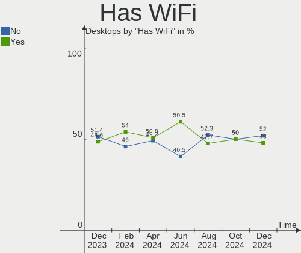
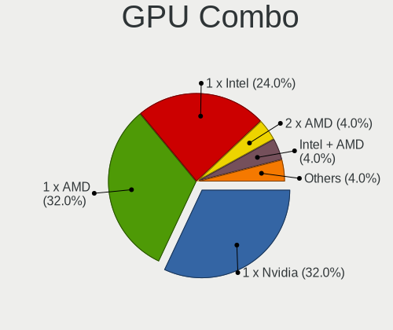
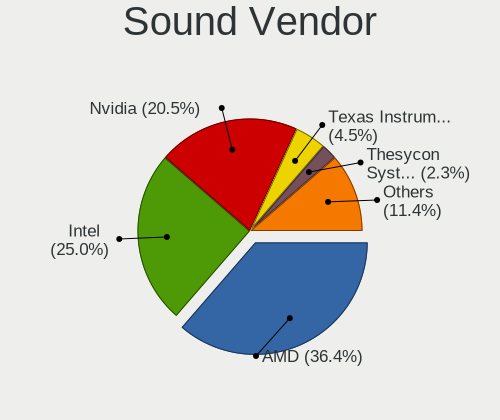
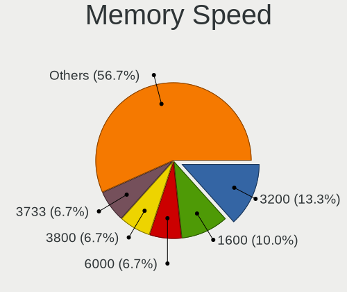
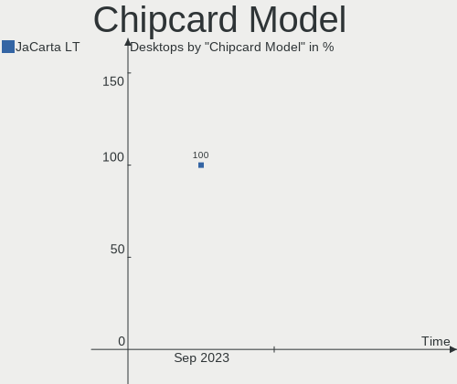

ArcoLinux Hardware Trends (Desktops)
------------------------------------

A project to identify most popular hardware characteristics and track their change
over time based on data collected by ArcoLinux users at https://Linux-Hardware.org.

Anyone can contribute to this report by the [hw-probe](https://github.com/linuxhw/hw-probe) tool:

    sudo -E hw-probe -all -upload

Full-feature report is available here: https://linux-hardware.org/?view=trends&formfactor=desktop

Period: Sep, 2021.

Contents
--------

* [ System ](#system)
  - [ OS                       ](#os)
  - [ OS Family                ](#os-family)
  - [ Kernel                   ](#kernel)
  - [ Kernel Family            ](#kernel-family)
  - [ Kernel Major Ver.        ](#kernel-major-ver)
  - [ Arch                     ](#arch)
  - [ DE                       ](#de)
  - [ Display Server           ](#display-server)
  - [ Display Manager          ](#display-manager)
  - [ OS Lang                  ](#os-lang)
  - [ Boot Mode                ](#boot-mode)
  - [ Filesystem               ](#filesystem)
  - [ Part. scheme             ](#part-scheme)
  - [ Dual Boot with Linux/BSD ](#dual-boot-with-linuxbsd)
  - [ Dual Boot (Win)          ](#dual-boot-win)

* [ Board ](#board)
  - [ Vendor                   ](#vendor)
  - [ Model                    ](#model)
  - [ Model Family             ](#model-family)
  - [ MFG Year                 ](#mfg-year)
  - [ Form Factor              ](#form-factor)
  - [ Secure Boot              ](#secure-boot)
  - [ Coreboot                 ](#coreboot)
  - [ RAM Size                 ](#ram-size)
  - [ RAM Used                 ](#ram-used)
  - [ Total Drives             ](#total-drives)
  - [ Has CD-ROM               ](#has-cd-rom)
  - [ Has Ethernet             ](#has-ethernet)
  - [ Has WiFi                 ](#has-wifi)
  - [ Has Bluetooth            ](#has-bluetooth)

* [ Location ](#location)
  - [ Country                  ](#country)
  - [ City                     ](#city)

* [ Drives ](#drives)
  - [ Drive Vendor             ](#drive-vendor)
  - [ Drive Model              ](#drive-model)
  - [ HDD Vendor               ](#hdd-vendor)
  - [ SSD Vendor               ](#ssd-vendor)
  - [ Drive Kind               ](#drive-kind)
  - [ Drive Connector          ](#drive-connector)
  - [ Drive Size               ](#drive-size)
  - [ Space Total              ](#space-total)
  - [ Space Used               ](#space-used)
  - [ Malfunc. Drives          ](#malfunc-drives)
  - [ Malfunc. Drive Vendor    ](#malfunc-drive-vendor)
  - [ Malfunc. HDD Vendor      ](#malfunc-hdd-vendor)
  - [ Malfunc. Drive Kind      ](#malfunc-drive-kind)
  - [ Failed Drives            ](#failed-drives)
  - [ Failed Drive Vendor      ](#failed-drive-vendor)
  - [ Drive Status             ](#drive-status)

* [ Storage controller ](#storage-controller)
  - [ Storage Vendor           ](#storage-vendor)
  - [ Storage Model            ](#storage-model)
  - [ Storage Kind             ](#storage-kind)

* [ Processor ](#processor)
  - [ CPU Vendor               ](#cpu-vendor)
  - [ CPU Model                ](#cpu-model)
  - [ CPU Model Family         ](#cpu-model-family)
  - [ CPU Cores                ](#cpu-cores)
  - [ CPU Sockets              ](#cpu-sockets)
  - [ CPU Threads              ](#cpu-threads)
  - [ CPU Op-Modes             ](#cpu-op-modes)
  - [ CPU Microcode            ](#cpu-microcode)
  - [ CPU Microarch            ](#cpu-microarch)

* [ Graphics ](#graphics)
  - [ GPU Vendor               ](#gpu-vendor)
  - [ GPU Model                ](#gpu-model)
  - [ GPU Combo                ](#gpu-combo)
  - [ GPU Driver               ](#gpu-driver)
  - [ GPU Memory               ](#gpu-memory)

* [ Monitor ](#monitor)
  - [ Monitor Vendor           ](#monitor-vendor)
  - [ Monitor Model            ](#monitor-model)
  - [ Monitor Resolution       ](#monitor-resolution)
  - [ Monitor Diagonal         ](#monitor-diagonal)
  - [ Monitor Width            ](#monitor-width)
  - [ Aspect Ratio             ](#aspect-ratio)
  - [ Monitor Area             ](#monitor-area)
  - [ Pixel Density            ](#pixel-density)
  - [ Multiple Monitors        ](#multiple-monitors)

* [ Network ](#network)
  - [ Net Controller Vendor    ](#net-controller-vendor)
  - [ Net Controller Model     ](#net-controller-model)
  - [ Wireless Vendor          ](#wireless-vendor)
  - [ Wireless Model           ](#wireless-model)
  - [ Ethernet Vendor          ](#ethernet-vendor)
  - [ Ethernet Model           ](#ethernet-model)
  - [ Net Controller Kind      ](#net-controller-kind)
  - [ Used Controller          ](#used-controller)
  - [ NICs                     ](#nics)
  - [ IPv6                     ](#ipv6)

* [ Bluetooth ](#bluetooth)
  - [ Bluetooth Vendor         ](#bluetooth-vendor)
  - [ Bluetooth Model          ](#bluetooth-model)

* [ Sound ](#sound)
  - [ Sound Vendor             ](#sound-vendor)
  - [ Sound Model              ](#sound-model)

* [ Memory ](#memory)
  - [ Memory Vendor            ](#memory-vendor)
  - [ Memory Model             ](#memory-model)
  - [ Memory Kind              ](#memory-kind)
  - [ Memory Form Factor       ](#memory-form-factor)
  - [ Memory Size              ](#memory-size)
  - [ Memory Speed             ](#memory-speed)

* [ Printers & scanners ](#printers--scanners)
  - [ Printer Vendor           ](#printer-vendor)
  - [ Printer Model            ](#printer-model)
  - [ Scanner Vendor           ](#scanner-vendor)
  - [ Scanner Model            ](#scanner-model)

* [ Camera ](#camera)
  - [ Camera Vendor            ](#camera-vendor)
  - [ Camera Model             ](#camera-model)

* [ Security ](#security)
  - [ Fingerprint Vendor       ](#fingerprint-vendor)
  - [ Fingerprint Model        ](#fingerprint-model)
  - [ Chipcard Vendor          ](#chipcard-vendor)
  - [ Chipcard Model           ](#chipcard-model)

* [ Unsupported ](#unsupported)
  - [ Unsupported Devices      ](#unsupported-devices)
  - [ Unsupported Device Types ](#unsupported-device-types)

System
------

OS
--

Installed operating systems

| Name              | Desktops | Percent |
|-------------------|----------|---------|
| ArcoLinux Rolling | 37       | 97.37%  |
| ArcoLinux         | 1        | 2.63%   |

OS Family
---------

OS without a version

| Name      | Desktops | Percent |
|-----------|----------|---------|
| ArcoLinux | 38       | 100%    |

Kernel
------

Version of the Linux kernel

| Version                     | Desktops | Percent |
|-----------------------------|----------|---------|
| 5.13.13-arch1-1             | 11       | 28.95%  |
| 5.14.6-arch1-1              | 5        | 13.16%  |
| 5.14.2-arch1-2              | 4        | 10.53%  |
| 5.10.62-1-lts               | 3        | 7.89%   |
| 5.10.61-1-lts               | 3        | 7.89%   |
| 5.14.8-arch1-1              | 2        | 5.26%   |
| 5.14.7-zen1-1-zen           | 1        | 2.63%   |
| 5.14.7-arch1-1              | 1        | 2.63%   |
| 5.14.6-hardened1-1-hardened | 1        | 2.63%   |
| 5.14.5-arch1-1              | 1        | 2.63%   |
| 5.14.3-zen1-1-zen           | 1        | 2.63%   |
| 5.14.3-arch1-1              | 1        | 2.63%   |
| 5.13.8-arch1-1              | 1        | 2.63%   |
| 5.13.12-arch1-1             | 1        | 2.63%   |
| 5.10.69-1-lts               | 1        | 2.63%   |
| 5.10.66-1-lts               | 1        | 2.63%   |

Kernel Family
-------------

Linux kernel without a distro release

| Version | Desktops | Percent |
|---------|----------|---------|
| 5.13.13 | 11       | 28.95%  |
| 5.14.6  | 6        | 15.79%  |
| 5.14.2  | 4        | 10.53%  |
| 5.10.62 | 3        | 7.89%   |
| 5.10.61 | 3        | 7.89%   |
| 5.14.8  | 2        | 5.26%   |
| 5.14.7  | 2        | 5.26%   |
| 5.14.3  | 2        | 5.26%   |
| 5.14.5  | 1        | 2.63%   |
| 5.13.8  | 1        | 2.63%   |
| 5.13.12 | 1        | 2.63%   |
| 5.10.69 | 1        | 2.63%   |
| 5.10.66 | 1        | 2.63%   |

Kernel Major Ver.
-----------------

Linux kernel major version

| Version | Desktops | Percent |
|---------|----------|---------|
| 5.14    | 17       | 44.74%  |
| 5.13    | 13       | 34.21%  |
| 5.10    | 8        | 21.05%  |

Arch
----

OS architecture (x86_64, i586, etc.)

| Name   | Desktops | Percent |
|--------|----------|---------|
| x86_64 | 38       | 100%    |

DE
--

Desktop Environment

| Name       | Desktops | Percent |
|------------|----------|---------|
| XFCE       | 15       | 39.47%  |
| KDE5       | 8        | 21.05%  |
| awesome    | 6        | 15.79%  |
| i3         | 2        | 5.26%   |
| xmonad     | 1        | 2.63%   |
| X-Cinnamon | 1        | 2.63%   |
| qtile      | 1        | 2.63%   |
| MATE       | 1        | 2.63%   |
| GNOME      | 1        | 2.63%   |
| Budgie     | 1        | 2.63%   |
| bspwm      | 1        | 2.63%   |

Display Server
--------------

X11 or Wayland

| Name    | Desktops | Percent |
|---------|----------|---------|
| X11     | 35       | 92.11%  |
| Tty     | 2        | 5.26%   |
| Unknown | 1        | 2.63%   |

Display Manager
---------------

SDDM, LightDM, etc.

| Name    | Desktops | Percent |
|---------|----------|---------|
| SDDM    | 30       | 78.95%  |
| LightDM | 6        | 15.79%  |
| Unknown | 2        | 5.26%   |

OS Lang
-------

Language

| Lang  | Desktops | Percent |
|-------|----------|---------|
| en_US | 16       | 42.11%  |
| en_GB | 7        | 18.42%  |
| en_IN | 3        | 7.89%   |
| de_DE | 3        | 7.89%   |
| pt_PT | 2        | 5.26%   |
| en_AU | 2        | 5.26%   |
| nl_BE | 1        | 2.63%   |
| fr_FR | 1        | 2.63%   |
| en_IE | 1        | 2.63%   |
| en_CA | 1        | 2.63%   |
| de_CH | 1        | 2.63%   |

Boot Mode
---------

EFI or BIOS

| Mode | Desktops | Percent |
|------|----------|---------|
| EFI  | 23       | 60.53%  |
| BIOS | 15       | 39.47%  |

Filesystem
----------

Type of filesystem

| Type    | Desktops | Percent |
|---------|----------|---------|
| Ext4    | 29       | 76.32%  |
| Btrfs   | 7        | 18.42%  |
| Overlay | 1        | 2.63%   |
| F2fs    | 1        | 2.63%   |

Part. scheme
------------

Scheme of partitioning

| Type    | Desktops | Percent |
|---------|----------|---------|
| GPT     | 30       | 78.95%  |
| MBR     | 7        | 18.42%  |
| Unknown | 1        | 2.63%   |

Dual Boot with Linux/BSD
------------------------

Hosting more than one Linux/BSD

| Dual boot | Desktops | Percent |
|-----------|----------|---------|
| No        | 29       | 76.32%  |
| Yes       | 9        | 23.68%  |

Dual Boot (Win)
---------------

Hosting Linux and Windows

| Dual boot | Desktops | Percent |
|-----------|----------|---------|
| Yes       | 20       | 52.63%  |
| No        | 18       | 47.37%  |

Board
-----

Vendor
------

Motherboard manufacturer

| Name                | Desktops | Percent |
|---------------------|----------|---------|
| ASUSTek Computer    | 18       | 47.37%  |
| Gigabyte Technology | 8        | 21.05%  |
| MSI                 | 3        | 7.89%   |
| Lenovo              | 2        | 5.26%   |
| ASRock              | 2        | 5.26%   |
| SeeedStudio         | 1        | 2.63%   |
| Maibenben           | 1        | 2.63%   |
| Hewlett-Packard     | 1        | 2.63%   |
| Biostar             | 1        | 2.63%   |
| Unknown             | 1        | 2.63%   |

Model
-----

Motherboard model

| Name                                   | Desktops | Percent |
|----------------------------------------|----------|---------|
| ASUS PRIME X570-P                      | 2        | 5.26%   |
| SeeedStudio ODYSSEY-X86J4125           | 1        | 2.63%   |
| MSI MS-7D22                            | 1        | 2.63%   |
| MSI MS-7C35                            | 1        | 2.63%   |
| MSI A320M-HDV R4.0                     | 1        | 2.63%   |
| Maibenben PC34                         | 1        | 2.63%   |
| Lenovo IdeaCentre 720-18IKL 90H0006JMH | 1        | 2.63%   |
| Lenovo IdeaCentre 510-15ICB 90HU00CEGE | 1        | 2.63%   |
| HP 750-114                             | 1        | 2.63%   |
| Gigabyte Z97-HD3                       | 1        | 2.63%   |
| Gigabyte Z97-D3H                       | 1        | 2.63%   |
| Gigabyte Z170-Gaming K3                | 1        | 2.63%   |
| Gigabyte X570 GAMING X                 | 1        | 2.63%   |
| Gigabyte X570 AORUS PRO WIFI           | 1        | 2.63%   |
| Gigabyte X570 AORUS MASTER             | 1        | 2.63%   |
| Gigabyte H61M-DS2 DVI                  | 1        | 2.63%   |
| Gigabyte B450M DS3H V2                 | 1        | 2.63%   |
| Biostar J3060NH                        | 1        | 2.63%   |
| ASUS STRIX Z270H GAMING                | 1        | 2.63%   |
| ASUS STRIX B250F GAMING                | 1        | 2.63%   |
| ASUS ROG STRIX X570-F GAMING           | 1        | 2.63%   |
| ASUS ROG STRIX X470-F GAMING           | 1        | 2.63%   |
| ASUS ROG STRIX B550-F GAMING           | 1        | 2.63%   |
| ASUS ROG CROSSHAIR VIII HERO           | 1        | 2.63%   |
| ASUS PRIME Z490-A                      | 1        | 2.63%   |
| ASUS PRIME X570-PRO                    | 1        | 2.63%   |
| ASUS PRIME X370-PRO                    | 1        | 2.63%   |
| ASUS P8Z77-V LX                        | 1        | 2.63%   |
| ASUS P8H67                             | 1        | 2.63%   |
| ASUS Maximus VIII HERO ALPHA           | 1        | 2.63%   |
| ASUS M5A78L-M/USB3                     | 1        | 2.63%   |
| ASUS M4A79XTD EVO                      | 1        | 2.63%   |
| ASUS M4A77T                            | 1        | 2.63%   |
| ASUS M2N-E SLI                         | 1        | 2.63%   |
| ASRock X570 Taichi                     | 1        | 2.63%   |
| ASRock FM2A75M Pro4+                   | 1        | 2.63%   |
| Unknown                                | 1        | 2.63%   |

Model Family
------------

Motherboard model prefix

| Name                         | Desktops | Percent |
|------------------------------|----------|---------|
| ASUS PRIME                   | 5        | 13.16%  |
| ASUS ROG                     | 4        | 10.53%  |
| Gigabyte X570                | 3        | 7.89%   |
| Lenovo IdeaCentre            | 2        | 5.26%   |
| ASUS STRIX                   | 2        | 5.26%   |
| SeeedStudio ODYSSEY-X86J4125 | 1        | 2.63%   |
| MSI MS-7D22                  | 1        | 2.63%   |
| MSI MS-7C35                  | 1        | 2.63%   |
| MSI A320M-HDV                | 1        | 2.63%   |
| Maibenben PC34               | 1        | 2.63%   |
| HP 750-114                   | 1        | 2.63%   |
| Gigabyte Z97-HD3             | 1        | 2.63%   |
| Gigabyte Z97-D3H             | 1        | 2.63%   |
| Gigabyte Z170-Gaming         | 1        | 2.63%   |
| Gigabyte H61M-DS2            | 1        | 2.63%   |
| Gigabyte B450M               | 1        | 2.63%   |
| Biostar J3060NH              | 1        | 2.63%   |
| ASUS P8Z77-V                 | 1        | 2.63%   |
| ASUS P8H67                   | 1        | 2.63%   |
| ASUS Maximus                 | 1        | 2.63%   |
| ASUS M5A78L-M                | 1        | 2.63%   |
| ASUS M4A79XTD                | 1        | 2.63%   |
| ASUS M4A77T                  | 1        | 2.63%   |
| ASUS M2N-E                   | 1        | 2.63%   |
| ASRock X570                  | 1        | 2.63%   |
| ASRock FM2A75M               | 1        | 2.63%   |
| Unknown                      | 1        | 2.63%   |

MFG Year
--------

Motherboard manufacture year

| Year | Desktops | Percent |
|------|----------|---------|
| 2020 | 11       | 28.95%  |
| 2021 | 8        | 21.05%  |
| 2018 | 5        | 13.16%  |
| 2016 | 3        | 7.89%   |
| 2014 | 3        | 7.89%   |
| 2010 | 2        | 5.26%   |
| 2019 | 1        | 2.63%   |
| 2017 | 1        | 2.63%   |
| 2015 | 1        | 2.63%   |
| 2013 | 1        | 2.63%   |
| 2012 | 1        | 2.63%   |
| 2011 | 1        | 2.63%   |

Form Factor
-----------

Physical design of the computer

| Name    | Desktops | Percent |
|---------|----------|---------|
| Desktop | 38       | 100%    |

Secure Boot
-----------

Enabled or disabled

| State    | Desktops | Percent |
|----------|----------|---------|
| Disabled | 38       | 100%    |

Coreboot
--------

Have coreboot on board

| Used | Desktops | Percent |
|------|----------|---------|
| No   | 38       | 100%    |

RAM Size
--------

Total RAM memory

| Size in GB  | Desktops | Percent |
|-------------|----------|---------|
| 16.01-24.0  | 11       | 28.95%  |
| 32.01-64.0  | 10       | 26.32%  |
| 8.01-16.0   | 8        | 21.05%  |
| 4.01-8.0    | 4        | 10.53%  |
| 64.01-256.0 | 4        | 10.53%  |
| 24.01-32.0  | 1        | 2.63%   |

RAM Used
--------

Used RAM memory

| Used GB   | Desktops | Percent |
|-----------|----------|---------|
| 2.01-3.0  | 12       | 31.58%  |
| 1.01-2.0  | 8        | 21.05%  |
| 4.01-8.0  | 5        | 13.16%  |
| 3.01-4.0  | 4        | 10.53%  |
| 8.01-16.0 | 4        | 10.53%  |
| 0.51-1.0  | 4        | 10.53%  |
| 0.01-0.5  | 1        | 2.63%   |

Total Drives
------------

Number of drives on board

| Drives | Desktops | Percent |
|--------|----------|---------|
| 2      | 11       | 28.95%  |
| 1      | 11       | 28.95%  |
| 4      | 6        | 15.79%  |
| 3      | 5        | 13.16%  |
| 6      | 2        | 5.26%   |
| 5      | 2        | 5.26%   |
| 8      | 1        | 2.63%   |

Has CD-ROM
----------

Has CD-ROM on board

| Presented | Desktops | Percent |
|-----------|----------|---------|
| No        | 29       | 76.32%  |
| Yes       | 9        | 23.68%  |

Has Ethernet
------------

Has Ethernet on board

| Presented | Desktops | Percent |
|-----------|----------|---------|
| Yes       | 38       | 100%    |

Has WiFi
--------

Has WiFi module

| Presented | Desktops | Percent |
|-----------|----------|---------|
| No        | 23       | 60.53%  |
| Yes       | 15       | 39.47%  |

Has Bluetooth
-------------

Has Bluetooth module

| Presented | Desktops | Percent |
|-----------|----------|---------|
| Yes       | 21       | 55.26%  |
| No        | 17       | 44.74%  |

Location
--------

Country
-------

Geographic location (country)

| Country     | Desktops | Percent |
|-------------|----------|---------|
| USA         | 8        | 21.05%  |
| UK          | 6        | 15.79%  |
| India       | 3        | 7.89%   |
| Germany     | 3        | 7.89%   |
| Belgium     | 3        | 7.89%   |
| Switzerland | 2        | 5.26%   |
| Portugal    | 2        | 5.26%   |
| Ireland     | 2        | 5.26%   |
| Australia   | 2        | 5.26%   |
| Sweden      | 1        | 2.63%   |
| Netherlands | 1        | 2.63%   |
| Kuwait      | 1        | 2.63%   |
| France      | 1        | 2.63%   |
| Canada      | 1        | 2.63%   |
| Bulgaria    | 1        | 2.63%   |
| Barbados    | 1        | 2.63%   |

City
----

Geographic location (city)

| City                     | Desktops | Percent |
|--------------------------|----------|---------|
| Lerwick                  | 2        | 5.26%   |
| Leiria                   | 2        | 5.26%   |
| Duffel                   | 2        | 5.26%   |
| Zurich                   | 1        | 2.63%   |
| Winschoten               | 1        | 2.63%   |
| Tuscaloosa               | 1        | 2.63%   |
| Thornleigh               | 1        | 2.63%   |
| Tekoa                    | 1        | 2.63%   |
| Stockholm                | 1        | 2.63%   |
| Sofia                    | 1        | 2.63%   |
| Saint-Jean-sur-Richelieu | 1        | 2.63%   |
| Rouen                    | 1        | 2.63%   |
| Petersburg               | 1        | 2.63%   |
| New Delhi                | 1        | 2.63%   |
| Neuss                    | 1        | 2.63%   |
| Munich                   | 1        | 2.63%   |
| Mt. Dora                 | 1        | 2.63%   |
| Melbourne                | 1        | 2.63%   |
| Mahomet                  | 1        | 2.63%   |
| London                   | 1        | 2.63%   |
| Kuwait City              | 1        | 2.63%   |
| Irvine                   | 1        | 2.63%   |
| Hamburg                  | 1        | 2.63%   |
| Delhi                    | 1        | 2.63%   |
| Dallas                   | 1        | 2.63%   |
| Cupar                    | 1        | 2.63%   |
| Cork                     | 1        | 2.63%   |
| Chislehurst              | 1        | 2.63%   |
| Celbridge                | 1        | 2.63%   |
| Bruges                   | 1        | 2.63%   |
| Bridgetown               | 1        | 2.63%   |
| Bern                     | 1        | 2.63%   |
| Ames                     | 1        | 2.63%   |
| Akola                    | 1        | 2.63%   |
| Acton                    | 1        | 2.63%   |

Drives
------

Drive Vendor
------------

Hard drive vendors

| Vendor              | Desktops | Drives | Percent |
|---------------------|----------|--------|---------|
| WDC                 | 18       | 27     | 23.38%  |
| Samsung Electronics | 18       | 29     | 23.38%  |
| Seagate             | 7        | 9      | 9.09%   |
| Crucial             | 6        | 6      | 7.79%   |
| Toshiba             | 3        | 3      | 3.9%    |
| SPCC                | 2        | 2      | 2.6%    |
| Phison              | 2        | 3      | 2.6%    |
| MAXTOR              | 2        | 3      | 2.6%    |
| Kingston            | 2        | 2      | 2.6%    |
| JMicron             | 2        | 2      | 2.6%    |
| A-DATA Technology   | 2        | 3      | 2.6%    |
| XPG                 | 1        | 1      | 1.3%    |
| Vaseky              | 1        | 1      | 1.3%    |
| Unknown             | 1        | 1      | 1.3%    |
| Transcend           | 1        | 1      | 1.3%    |
| SK Hynix            | 1        | 2      | 1.3%    |
| SanDisk             | 1        | 1      | 1.3%    |
| PLEXTOR             | 1        | 1      | 1.3%    |
| Patriot             | 1        | 1      | 1.3%    |
| PALIT               | 1        | 1      | 1.3%    |
| LITEON              | 1        | 1      | 1.3%    |
| Intel               | 1        | 1      | 1.3%    |
| Hitachi             | 1        | 1      | 1.3%    |
| Corsair             | 1        | 1      | 1.3%    |

Drive Model
-----------

Hard drive models

| Model                                | Desktops | Percent |
|--------------------------------------|----------|---------|
| Samsung SSD 850 EVO 250GB            | 4        | 4.12%   |
| Samsung SSD 860 EVO 500GB            | 3        | 3.09%   |
| WDC WDS500G1X0E-00AFY0 500GB         | 2        | 2.06%   |
| WDC WDS240G2G0A-00JH30 240GB SSD     | 2        | 2.06%   |
| WDC WD40EZRZ-75GXCB0 4TB             | 2        | 2.06%   |
| WDC WD10EADS-11M2B1 1TB              | 2        | 2.06%   |
| WDC WD1003FZEX-00K3CA0 1TB           | 2        | 2.06%   |
| Seagate ST2000DM001-1ER164 2TB       | 2        | 2.06%   |
| Samsung SSD 970 EVO Plus 500GB       | 2        | 2.06%   |
| Samsung SSD 960 EVO 250GB            | 2        | 2.06%   |
| Samsung SSD 850 EVO 500GB            | 2        | 2.06%   |
| Crucial CT500MX500SSD1 500GB         | 2        | 2.06%   |
| XPG GAMMIX S11L 256GB                | 1        | 1.03%   |
| WDC WDS500G2B0A-00SM50 500GB SSD     | 1        | 1.03%   |
| WDC WDS250G2B0C 250GB                | 1        | 1.03%   |
| WDC WDS250G1B0A-00H9H0 250GB SSD     | 1        | 1.03%   |
| WDC WD6400AAKS-22A7B2 640GB          | 1        | 1.03%   |
| WDC WD5000BPKX-00HPJT0 500GB         | 1        | 1.03%   |
| WDC WD5000AAKX-001CA0 500GB          | 1        | 1.03%   |
| WDC WD5000AAKS-00A7B0 500GB          | 1        | 1.03%   |
| WDC WD40EZRZ-19GXCB0 4TB             | 1        | 1.03%   |
| WDC WD3200BEVT-75A23T0 320GB         | 1        | 1.03%   |
| WDC WD30EZRX-00D8PB0 3TB             | 1        | 1.03%   |
| WDC WD20EFRX-68EUZN0 2TB             | 1        | 1.03%   |
| WDC WD20EARX-00PASB0 2TB             | 1        | 1.03%   |
| WDC WD10PURZ-85U8XY0 1TB             | 1        | 1.03%   |
| WDC WD10EAVS-00D7B1 1TB              | 1        | 1.03%   |
| WDC WD1001FALS-403AA0 1TB            | 1        | 1.03%   |
| WDC PC SN720 SDAQNTW-512G-1001 512GB | 1        | 1.03%   |
| Vaseky V900/128G 128GB SSD           | 1        | 1.03%   |
| Unknown SD/MMC/MS PRO 128GB          | 1        | 1.03%   |
| Transcend TS480GSSD220S 480GB        | 1        | 1.03%   |
| Toshiba HDWT140 4TB                  | 1        | 1.03%   |
| Toshiba HDWG480 8TB                  | 1        | 1.03%   |
| Toshiba DT01ACA100 1TB               | 1        | 1.03%   |
| SPCC Solid State Disk 1TB            | 1        | 1.03%   |
| SPCC M.2 PCIe SSD 2TB                | 1        | 1.03%   |
| SK Hynix SHGS31-500GS-2 500GB SSD    | 1        | 1.03%   |
| SK Hynix SHGS31-1000GS-2 1TB SSD     | 1        | 1.03%   |
| Seagate ST8000DM004-2CX188 8TB       | 1        | 1.03%   |
| Seagate ST500DM002-1BD142 500GB      | 1        | 1.03%   |
| Seagate ST4000VX007-2DT166 4TB       | 1        | 1.03%   |
| Seagate ST4000LM024-2AN17V 4TB       | 1        | 1.03%   |
| Seagate ST2000DM008-2FR102 2TB       | 1        | 1.03%   |
| Seagate ST2000DM001-1CH164 2TB       | 1        | 1.03%   |
| SanDisk SSD PLUS 480GB               | 1        | 1.03%   |
| Samsung SSD 980 PRO 1TB              | 1        | 1.03%   |
| Samsung SSD 980 500GB                | 1        | 1.03%   |
| Samsung SSD 970 PRO 1TB              | 1        | 1.03%   |
| Samsung SSD 970 EVO Plus 250GB       | 1        | 1.03%   |
| Samsung SSD 970 EVO Plus 1TB         | 1        | 1.03%   |
| Samsung SSD 970 EVO 500GB            | 1        | 1.03%   |
| Samsung SSD 970 EVO 1TB              | 1        | 1.03%   |
| Samsung SSD 870 QVO 2TB              | 1        | 1.03%   |
| Samsung SSD 870 QVO 1TB              | 1        | 1.03%   |
| Samsung SSD 870 EVO 2TB              | 1        | 1.03%   |
| Samsung SSD 860 QVO 1TB              | 1        | 1.03%   |
| Samsung SSD 850 PRO 256GB            | 1        | 1.03%   |
| Samsung SSD 840 PRO Series 256GB     | 1        | 1.03%   |
| Samsung SSD 840 EVO 250GB            | 1        | 1.03%   |

HDD Vendor
----------

Hard disk drive vendors

| Vendor              | Desktops | Drives | Percent |
|---------------------|----------|--------|---------|
| WDC                 | 13       | 19     | 46.43%  |
| Seagate             | 7        | 9      | 25%     |
| Toshiba             | 3        | 3      | 10.71%  |
| MAXTOR              | 2        | 3      | 7.14%   |
| Unknown             | 1        | 1      | 3.57%   |
| Samsung Electronics | 1        | 1      | 3.57%   |
| Hitachi             | 1        | 1      | 3.57%   |

SSD Vendor
----------

Solid state drive vendors

| Vendor              | Desktops | Drives | Percent |
|---------------------|----------|--------|---------|
| Samsung Electronics | 13       | 16     | 43.33%  |
| Crucial             | 4        | 4      | 13.33%  |
| WDC                 | 3        | 4      | 10%     |
| Kingston            | 2        | 2      | 6.67%   |
| Vaseky              | 1        | 1      | 3.33%   |
| Transcend           | 1        | 1      | 3.33%   |
| SPCC                | 1        | 1      | 3.33%   |
| SK Hynix            | 1        | 2      | 3.33%   |
| SanDisk             | 1        | 1      | 3.33%   |
| PLEXTOR             | 1        | 1      | 3.33%   |
| Patriot             | 1        | 1      | 3.33%   |
| PALIT               | 1        | 1      | 3.33%   |

Drive Kind
----------

HDD or SSD

| Kind    | Desktops | Drives | Percent |
|---------|----------|--------|---------|
| SSD     | 25       | 35     | 37.31%  |
| HDD     | 21       | 37     | 31.34%  |
| NVMe    | 20       | 30     | 29.85%  |
| Unknown | 1        | 1      | 1.49%   |

Drive Connector
---------------

SATA, SAS, NVMe, etc.

| Type | Desktops | Drives | Percent |
|------|----------|--------|---------|
| SATA | 31       | 70     | 57.41%  |
| NVMe | 19       | 29     | 35.19%  |
| SAS  | 4        | 4      | 7.41%   |

Drive Size
----------

Size of hard drive

| Size in TB | Desktops | Drives | Percent |
|------------|----------|--------|---------|
| 0.01-0.5   | 22       | 37     | 46.81%  |
| 0.51-1.0   | 10       | 15     | 21.28%  |
| 1.01-2.0   | 9        | 11     | 19.15%  |
| 3.01-4.0   | 3        | 6      | 6.38%   |
| 4.01-10.0  | 2        | 2      | 4.26%   |
| 2.01-3.0   | 1        | 1      | 2.13%   |

Space Total
-----------

Amount of disk space available on the file system

| Size in GB     | Desktops | Percent |
|----------------|----------|---------|
| 251-500        | 8        | 21.05%  |
| 101-250        | 8        | 21.05%  |
| 501-1000       | 8        | 21.05%  |
| More than 3000 | 7        | 18.42%  |
| 1001-2000      | 4        | 10.53%  |
| 21-50          | 1        | 2.63%   |
| 2001-3000      | 1        | 2.63%   |
| Unknown        | 1        | 2.63%   |

Space Used
----------

Amount of used disk space

| Used GB   | Desktops | Percent |
|-----------|----------|---------|
| 21-50     | 9        | 23.68%  |
| 1-20      | 7        | 18.42%  |
| 501-1000  | 6        | 15.79%  |
| 51-100    | 5        | 13.16%  |
| 101-250   | 4        | 10.53%  |
| 1001-2000 | 3        | 7.89%   |
| 251-500   | 2        | 5.26%   |
| 2001-3000 | 1        | 2.63%   |
| Unknown   | 1        | 2.63%   |

Malfunc. Drives
---------------

Drive models with a malfunction

| Model                                 | Desktops | Drives | Percent |
|---------------------------------------|----------|--------|---------|
| WDC WDS500G1X0E-00AFY0 500GB          | 1        | 1      | 7.69%   |
| WDC WD6400AAKS-22A7B2 640GB           | 1        | 1      | 7.69%   |
| WDC WD5000AAKX-001CA0 500GB           | 1        | 1      | 7.69%   |
| WDC WD20EFRX-68EUZN0 2TB              | 1        | 1      | 7.69%   |
| WDC WD10PURZ-85U8XY0 1TB              | 1        | 1      | 7.69%   |
| WDC WD1003FZEX-00K3CA0 1TB            | 1        | 1      | 7.69%   |
| WDC WD1001FALS-403AA0 1TB             | 1        | 1      | 7.69%   |
| Toshiba DT01ACA100 1TB                | 1        | 1      | 7.69%   |
| Seagate ST2000DM001-1ER164 2TB        | 1        | 1      | 7.69%   |
| Samsung Electronics SSD 960 EVO 250GB | 1        | 1      | 7.69%   |
| MAXTOR STM3320820AS 320GB             | 1        | 2      | 7.69%   |
| MAXTOR STM3250310AS 250GB             | 1        | 1      | 7.69%   |
| Hitachi HDS721010CLA332 1TB           | 1        | 1      | 7.69%   |

Malfunc. Drive Vendor
---------------------

Vendors of faulty drives

| Vendor              | Desktops | Drives | Percent |
|---------------------|----------|--------|---------|
| WDC                 | 5        | 7      | 45.45%  |
| MAXTOR              | 2        | 3      | 18.18%  |
| Toshiba             | 1        | 1      | 9.09%   |
| Seagate             | 1        | 1      | 9.09%   |
| Samsung Electronics | 1        | 1      | 9.09%   |
| Hitachi             | 1        | 1      | 9.09%   |

Malfunc. HDD Vendor
-------------------

Vendors of faulty HDD drives

| Vendor  | Desktops | Drives | Percent |
|---------|----------|--------|---------|
| WDC     | 5        | 6      | 50%     |
| MAXTOR  | 2        | 3      | 20%     |
| Toshiba | 1        | 1      | 10%     |
| Seagate | 1        | 1      | 10%     |
| Hitachi | 1        | 1      | 10%     |

Malfunc. Drive Kind
-------------------

Kinds of faulty drives

| Kind | Desktops | Drives | Percent |
|------|----------|--------|---------|
| HDD  | 7        | 12     | 77.78%  |
| NVMe | 2        | 2      | 22.22%  |

Failed Drives
-------------

Failed drive models

Zero info for selected period =(

Failed Drive Vendor
-------------------

Failed drive vendors

Zero info for selected period =(

Drive Status
------------

Number of failed and malfunc. drives

| Status   | Desktops | Drives | Percent |
|----------|----------|--------|---------|
| Works    | 34       | 85     | 73.91%  |
| Malfunc  | 8        | 14     | 17.39%  |
| Detected | 4        | 4      | 8.7%    |

Storage controller
------------------

Storage Vendor
--------------

Storage controller vendors

| Vendor                    | Desktops | Percent |
|---------------------------|----------|---------|
| AMD                       | 21       | 32.81%  |
| Intel                     | 16       | 25%     |
| Samsung Electronics       | 10       | 15.63%  |
| Sandisk                   | 4        | 6.25%   |
| Phison Electronics        | 3        | 4.69%   |
| Micron/Crucial Technology | 2        | 3.13%   |
| ADATA Technology          | 2        | 3.13%   |
| VIA Technologies          | 1        | 1.56%   |
| Realtek Semiconductor     | 1        | 1.56%   |
| Nvidia                    | 1        | 1.56%   |
| Marvell Technology Group  | 1        | 1.56%   |
| Lite-On Technology        | 1        | 1.56%   |
| ASMedia Technology        | 1        | 1.56%   |

Storage Model
-------------

Storage controller models

| Model                                                                                   | Desktops | Percent |
|-----------------------------------------------------------------------------------------|----------|---------|
| AMD FCH SATA Controller [AHCI mode]                                                     | 17       | 22.37%  |
| Samsung NVMe SSD Controller SM981/PM981/PM983                                           | 6        | 7.89%   |
| Phison E16 PCIe4 NVMe Controller                                                        | 3        | 3.95%   |
| Intel Q170/Q150/B150/H170/H110/Z170/CM236 Chipset SATA Controller [AHCI Mode]           | 3        | 3.95%   |
| AMD SB7x0/SB8x0/SB9x0 SATA Controller [AHCI mode]                                       | 3        | 3.95%   |
| AMD SB7x0/SB8x0/SB9x0 IDE Controller                                                    | 3        | 3.95%   |
| Sandisk WD Black SN850                                                                  | 2        | 2.63%   |
| Samsung NVMe SSD Controller SM961/PM961/SM963                                           | 2        | 2.63%   |
| Intel SATA Controller [RAID mode]                                                       | 2        | 2.63%   |
| Intel 9 Series Chipset Family SATA Controller [AHCI Mode]                               | 2        | 2.63%   |
| Intel 200 Series PCH SATA controller [AHCI mode]                                        | 2        | 2.63%   |
| AMD 400 Series Chipset SATA Controller                                                  | 2        | 2.63%   |
| ADATA XPG SX8200 Pro PCIe Gen3x4 M.2 2280 Solid State Drive                             | 2        | 2.63%   |
| VIA VT6415 PATA IDE Host Controller                                                     | 1        | 1.32%   |
| Sandisk WD Blue SN550 NVMe SSD                                                          | 1        | 1.32%   |
| Sandisk WD Black 2018/SN750 / PC SN720 NVMe SSD                                         | 1        | 1.32%   |
| Samsung NVMe SSD Controller PM9A1/PM9A3/980PRO                                          | 1        | 1.32%   |
| Samsung NVMe SSD Controller 980                                                         | 1        | 1.32%   |
| Realtek Realtek Non-Volatile memory controller                                          | 1        | 1.32%   |
| Phison E12 NVMe Controller                                                              | 1        | 1.32%   |
| Nvidia CK804 Serial ATA Controller                                                      | 1        | 1.32%   |
| Nvidia CK804 IDE                                                                        | 1        | 1.32%   |
| Micron/Crucial P2 NVMe PCIe SSD                                                         | 1        | 1.32%   |
| Micron/Crucial P1 NVMe PCIe SSD                                                         | 1        | 1.32%   |
| Marvell Group 88SE6111/6121 SATA II / PATA Controller                                   | 1        | 1.32%   |
| Lite-On Non-Volatile memory controller                                                  | 1        | 1.32%   |
| Intel SSD 660P Series                                                                   | 1        | 1.32%   |
| Intel Celeron/Pentium Silver Processor SATA Controller                                  | 1        | 1.32%   |
| Intel Cannon Lake PCH SATA AHCI Controller                                              | 1        | 1.32%   |
| Intel Atom/Celeron/Pentium Processor x5-E8000/J3xxx/N3xxx Series SATA Controller        | 1        | 1.32%   |
| Intel 7 Series/C210 Series Chipset Family 6-port SATA Controller [AHCI mode]            | 1        | 1.32%   |
| Intel 6 Series/C200 Series Chipset Family Desktop SATA Controller (IDE mode, ports 4-5) | 1        | 1.32%   |
| Intel 6 Series/C200 Series Chipset Family Desktop SATA Controller (IDE mode, ports 0-3) | 1        | 1.32%   |
| Intel 500 Series Chipset Family SATA AHCI Controller                                    | 1        | 1.32%   |
| Intel 400 Series Chipset Family SATA RAID Controller                                    | 1        | 1.32%   |
| ASMedia ASM1062 Serial ATA Controller                                                   | 1        | 1.32%   |
| AMD X370 Series Chipset SATA Controller                                                 | 1        | 1.32%   |
| AMD Starship/Matisse Chipset SATA Controller [AHCI mode]                                | 1        | 1.32%   |
| AMD FCH SATA Controller D                                                               | 1        | 1.32%   |
| AMD FCH IDE Controller                                                                  | 1        | 1.32%   |

Storage Kind
------------

Kind of storage controller (IDE, SATA, NVMe, SAS, ...)

| Kind | Desktops | Percent |
|------|----------|---------|
| SATA | 33       | 53.23%  |
| NVMe | 19       | 30.65%  |
| IDE  | 7        | 11.29%  |
| RAID | 3        | 4.84%   |

Processor
---------

CPU Vendor
----------

Processor vendors

| Vendor | Desktops | Percent |
|--------|----------|---------|
| AMD    | 22       | 57.89%  |
| Intel  | 16       | 42.11%  |

CPU Model
---------

Processor models

| Model                                         | Desktops | Percent |
|-----------------------------------------------|----------|---------|
| AMD Ryzen 9 3900X 12-Core Processor           | 3        | 7.89%   |
| Intel Core i7-7700K CPU @ 4.20GHz             | 2        | 5.26%   |
| Intel Core i7-6700K CPU @ 4.00GHz             | 2        | 5.26%   |
| Intel Core i7-4790K CPU @ 4.00GHz             | 2        | 5.26%   |
| AMD Ryzen 9 5950X 16-Core Processor           | 2        | 5.26%   |
| AMD Ryzen 5 5600X 6-Core Processor            | 2        | 5.26%   |
| AMD Ryzen 5 3600 6-Core Processor             | 2        | 5.26%   |
| Intel Xeon CPU E3-1230 V2 @ 3.30GHz           | 1        | 2.63%   |
| Intel Core i7-7700 CPU @ 3.60GHz              | 1        | 2.63%   |
| Intel Core i7-10700K CPU @ 3.80GHz            | 1        | 2.63%   |
| Intel Core i5-8400 CPU @ 2.80GHz              | 1        | 2.63%   |
| Intel Core i5-6400 CPU @ 2.70GHz              | 1        | 2.63%   |
| Intel Core i5-3570K CPU @ 3.40GHz             | 1        | 2.63%   |
| Intel Core i5-3470 CPU @ 3.20GHz              | 1        | 2.63%   |
| Intel Celeron J4125 CPU @ 2.00GHz             | 1        | 2.63%   |
| Intel Celeron CPU J3060 @ 1.60GHz             | 1        | 2.63%   |
| Intel 11th Gen Core i5-11400 @ 2.60GHz        | 1        | 2.63%   |
| AMD Ryzen 9 5900HX with Radeon Graphics       | 1        | 2.63%   |
| AMD Ryzen 9 3950X 16-Core Processor           | 1        | 2.63%   |
| AMD Ryzen 7 5800X 8-Core Processor            | 1        | 2.63%   |
| AMD Ryzen 7 3700X 8-Core Processor            | 1        | 2.63%   |
| AMD Ryzen 7 2700X Eight-Core Processor        | 1        | 2.63%   |
| AMD Ryzen 7 1700X Eight-Core Processor        | 1        | 2.63%   |
| AMD Ryzen 5 3450U with Radeon Vega Mobile Gfx | 1        | 2.63%   |
| AMD Ryzen 3 2300X Quad-Core Processor         | 1        | 2.63%   |
| AMD Phenom II X4 955 Processor                | 1        | 2.63%   |
| AMD FX-6300 Six-Core Processor                | 1        | 2.63%   |
| AMD Athlon II X4 640 Processor                | 1        | 2.63%   |
| AMD Athlon 64 X2 Dual Core Processor 4600+    | 1        | 2.63%   |
| AMD A8-5600K APU with Radeon HD Graphics      | 1        | 2.63%   |

CPU Model Family
----------------

Processor model prefix

| Model            | Desktops | Percent |
|------------------|----------|---------|
| Intel Core i7    | 8        | 21.05%  |
| AMD Ryzen 9      | 7        | 18.42%  |
| AMD Ryzen 5      | 5        | 13.16%  |
| Intel Core i5    | 4        | 10.53%  |
| AMD Ryzen 7      | 4        | 10.53%  |
| Intel Celeron    | 2        | 5.26%   |
| Other            | 1        | 2.63%   |
| Intel Xeon       | 1        | 2.63%   |
| AMD Ryzen 3      | 1        | 2.63%   |
| AMD Phenom II X4 | 1        | 2.63%   |
| AMD FX           | 1        | 2.63%   |
| AMD Athlon II X4 | 1        | 2.63%   |
| AMD Athlon 64 X2 | 1        | 2.63%   |
| AMD A8           | 1        | 2.63%   |

CPU Cores
---------

Number of processor cores

| Number | Desktops | Percent |
|--------|----------|---------|
| 4      | 16       | 42.11%  |
| 8      | 6        | 15.79%  |
| 6      | 6        | 15.79%  |
| 16     | 3        | 7.89%   |
| 12     | 3        | 7.89%   |
| 2      | 3        | 7.89%   |
| 3      | 1        | 2.63%   |

CPU Sockets
-----------

Number of sockets

| Number | Desktops | Percent |
|--------|----------|---------|
| 1      | 38       | 100%    |

CPU Threads
-----------

Threads per core (Hyper-Threading)

| Number | Desktops | Percent |
|--------|----------|---------|
| 2      | 28       | 73.68%  |
| 1      | 10       | 26.32%  |

CPU Op-Modes
------------

CPU Operation Modes (32-bit, 64-bit)

| Op mode        | Desktops | Percent |
|----------------|----------|---------|
| 32-bit, 64-bit | 38       | 100%    |

CPU Microcode
-------------

Microcode number

| Number     | Desktops | Percent |
|------------|----------|---------|
| 0x08701021 | 5        | 13.16%  |
| 0x0a201009 | 4        | 10.53%  |
| 0x506e3    | 3        | 7.89%   |
| 0x306a9    | 3        | 7.89%   |
| Unknown    | 3        | 7.89%   |
| 0x906e9    | 2        | 5.26%   |
| 0x306c3    | 2        | 5.26%   |
| 0x0800820d | 2        | 5.26%   |
| 0xa0671    | 1        | 2.63%   |
| 0xa0655    | 1        | 2.63%   |
| 0x906ea    | 1        | 2.63%   |
| 0x706a8    | 1        | 2.63%   |
| 0x406c4    | 1        | 2.63%   |
| 0x0a50000c | 1        | 2.63%   |
| 0x0a201016 | 1        | 2.63%   |
| 0x08701013 | 1        | 2.63%   |
| 0x08108102 | 1        | 2.63%   |
| 0x08001138 | 1        | 2.63%   |
| 0x06001119 | 1        | 2.63%   |
| 0x06000852 | 1        | 2.63%   |
| 0x010000c8 | 1        | 2.63%   |
| 0x010000b6 | 1        | 2.63%   |

CPU Microarch
-------------

Microarchitecture

| Name          | Desktops | Percent |
|---------------|----------|---------|
| Zen 2         | 7        | 18.42%  |
| Zen 3         | 6        | 15.79%  |
| KabyLake      | 4        | 10.53%  |
| Zen+          | 3        | 7.89%   |
| Skylake       | 3        | 7.89%   |
| IvyBridge     | 3        | 7.89%   |
| Piledriver    | 2        | 5.26%   |
| K10           | 2        | 5.26%   |
| Haswell       | 2        | 5.26%   |
| Zen           | 1        | 2.63%   |
| Silvermont    | 1        | 2.63%   |
| K8 Hammer     | 1        | 2.63%   |
| Icelake       | 1        | 2.63%   |
| Goldmont plus | 1        | 2.63%   |
| CometLake     | 1        | 2.63%   |

Graphics
--------

GPU Vendor
----------

Vendors of graphics cards

| Vendor | Desktops | Percent |
|--------|----------|---------|
| Nvidia | 20       | 51.28%  |
| AMD    | 11       | 28.21%  |
| Intel  | 8        | 20.51%  |

GPU Model
---------

Graphics card models

| Model                                                                                    | Desktops | Percent |
|------------------------------------------------------------------------------------------|----------|---------|
| Nvidia GM204 [GeForce GTX 970]                                                           | 3        | 7.69%   |
| Nvidia GA104 [GeForce RTX 3070]                                                          | 3        | 7.69%   |
| Nvidia GP104 [GeForce GTX 1080]                                                          | 2        | 5.13%   |
| Nvidia GP104 [GeForce GTX 1070 Ti]                                                       | 2        | 5.13%   |
| Intel HD Graphics 630                                                                    | 2        | 5.13%   |
| AMD Cedar [Radeon HD 5000/6000/7350/8350 Series]                                         | 2        | 5.13%   |
| Nvidia TU106 [GeForce RTX 2060 Rev. A]                                                   | 1        | 2.56%   |
| Nvidia TU104 [GeForce RTX 2060]                                                          | 1        | 2.56%   |
| Nvidia GT218 [GeForce 210]                                                               | 1        | 2.56%   |
| Nvidia GP107 [GeForce GTX 1050]                                                          | 1        | 2.56%   |
| Nvidia GM107 [GeForce GTX 750]                                                           | 1        | 2.56%   |
| Nvidia GK208B [GeForce GT 710]                                                           | 1        | 2.56%   |
| Nvidia GK107 [GeForce GT 740]                                                            | 1        | 2.56%   |
| Nvidia GK107 [GeForce GT 630 OEM]                                                        | 1        | 2.56%   |
| Nvidia GA106 [GeForce RTX 3060 Lite Hash Rate]                                           | 1        | 2.56%   |
| Nvidia GA102 [GeForce RTX 3080 Lite Hash Rate]                                           | 1        | 2.56%   |
| Intel Xeon E3-1200 v3/4th Gen Core Processor Integrated Graphics Controller              | 1        | 2.56%   |
| Intel RocketLake-S GT1 [UHD Graphics 730]                                                | 1        | 2.56%   |
| Intel HD Graphics 530                                                                    | 1        | 2.56%   |
| Intel GeminiLake [UHD Graphics 600]                                                      | 1        | 2.56%   |
| Intel CometLake-S GT2 [UHD Graphics 630]                                                 | 1        | 2.56%   |
| Intel Atom/Celeron/Pentium Processor x5-E8000/J3xxx/N3xxx Integrated Graphics Controller | 1        | 2.56%   |
| AMD Pitcairn PRO [Radeon HD 7850 / R7 265 / R9 270 1024SP]                               | 1        | 2.56%   |
| AMD Picasso                                                                              | 1        | 2.56%   |
| AMD Navi 21 [Radeon RX 6800/6800 XT / 6900 XT]                                           | 1        | 2.56%   |
| AMD Navi 10 [Radeon RX 5600 OEM/5600 XT / 5700/5700 XT]                                  | 1        | 2.56%   |
| AMD Juniper XT [Radeon HD 5770]                                                          | 1        | 2.56%   |
| AMD Hawaii PRO GL [FirePro W8100]                                                        | 1        | 2.56%   |
| AMD Ellesmere [Radeon RX 470/480/570/570X/580/580X/590]                                  | 1        | 2.56%   |
| AMD Cypress PRO [Radeon HD 5850]                                                         | 1        | 2.56%   |
| AMD Cezanne                                                                              | 1        | 2.56%   |

GPU Combo
---------

Combinations of graphics cards

| Name           | Desktops | Percent |
|----------------|----------|---------|
| 1 x Nvidia     | 19       | 50%     |
| 1 x AMD        | 11       | 28.95%  |
| 1 x Intel      | 7        | 18.42%  |
| Intel + Nvidia | 1        | 2.63%   |

GPU Driver
----------

Free vs proprietary

| Driver      | Desktops | Percent |
|-------------|----------|---------|
| Free        | 20       | 52.63%  |
| Proprietary | 17       | 44.74%  |
| Unknown     | 1        | 2.63%   |

GPU Memory
----------

Total video memory

| Size in GB | Desktops | Percent |
|------------|----------|---------|
| 7.01-8.0   | 9        | 23.68%  |
| Unknown    | 9        | 23.68%  |
| 3.01-4.0   | 4        | 10.53%  |
| 1.01-2.0   | 4        | 10.53%  |
| 0.51-1.0   | 4        | 10.53%  |
| 0.01-0.5   | 4        | 10.53%  |
| 8.01-16.0  | 3        | 7.89%   |
| 5.01-6.0   | 1        | 2.63%   |

Monitor
-------

Monitor Vendor
--------------

Monitor vendors

| Vendor               | Desktops | Percent |
|----------------------|----------|---------|
| Dell                 | 9        | 20.93%  |
| Goldstar             | 6        | 13.95%  |
| BenQ                 | 6        | 13.95%  |
| Hewlett-Packard      | 4        | 9.3%    |
| Acer                 | 4        | 9.3%    |
| ASUSTek Computer     | 2        | 4.65%   |
| AOC                  | 2        | 4.65%   |
| Vizio                | 1        | 2.33%   |
| Vestel Elektronik    | 1        | 2.33%   |
| Sony                 | 1        | 2.33%   |
| Samsung Electronics  | 1        | 2.33%   |
| Philips              | 1        | 2.33%   |
| MiTAC                | 1        | 2.33%   |
| Iiyama               | 1        | 2.33%   |
| Eizo                 | 1        | 2.33%   |
| Compal               | 1        | 2.33%   |
| Ancor Communications | 1        | 2.33%   |

Monitor Model
-------------

Monitor models

| Model                                                                  | Desktops | Percent |
|------------------------------------------------------------------------|----------|---------|
| Hewlett-Packard w2408 HWP26CF 1920x1200 518x324mm 24.1-inch            | 2        | 4.26%   |
| Dell U2412M DELA07B 1920x1200 518x324mm 24.1-inch                      | 2        | 4.26%   |
| Vizio D24hn-G9 VIZ1031 1360x768 521x293mm 23.5-inch                    | 1        | 2.13%   |
| Vestel Elektronik 50UHD_LCD_TV VES3700 3840x2160 1872x1053mm 84.6-inch | 1        | 2.13%   |
| Sony TV SNYE903 1920x1080 1600x900mm 72.3-inch                         | 1        | 2.13%   |
| Samsung Electronics U28D590 SAM0B80 3840x2160 607x345mm 27.5-inch      | 1        | 2.13%   |
| Philips PHL 273V5 PHLC0D2 1920x1080 600x340mm 27.2-inch                | 1        | 2.13%   |
| MiTAC DSGi TV SZM0308 1920x540 708x398mm 32.0-inch                     | 1        | 2.13%   |
| Iiyama PL2409HD IVM560C 1920x1080 521x293mm 23.5-inch                  | 1        | 2.13%   |
| Hewlett-Packard v220 HWP26FE 1680x1050 473x296mm 22.0-inch             | 1        | 2.13%   |
| Hewlett-Packard 27q HPN3565 2560x1440 597x336mm 27.0-inch              | 1        | 2.13%   |
| Goldstar Ultra HD GSM5B09 3840x2160 600x340mm 27.2-inch                | 1        | 2.13%   |
| Goldstar LG ULTRAWIDE GSM59F1 1920x1080 580x240mm 24.7-inch            | 1        | 2.13%   |
| Goldstar HDR 4K GSM7707 3840x2160 600x340mm 27.2-inch                  | 1        | 2.13%   |
| Goldstar HDR 4K GSM7706 3840x2160 600x340mm 27.2-inch                  | 1        | 2.13%   |
| Goldstar HD GSM5ACB 1366x768 410x230mm 18.5-inch                       | 1        | 2.13%   |
| Goldstar FULL HD GSM5B55 1920x1080 480x270mm 21.7-inch                 | 1        | 2.13%   |
| Goldstar 34GL750 GSM773B 2560x1080 798x334mm 34.1-inch                 | 1        | 2.13%   |
| Eizo EV2450 ENC2531 1920x1080 528x297mm 23.9-inch                      | 1        | 2.13%   |
| Dell U2718Q DELA0EC 3840x2160 609x349mm 27.6-inch                      | 1        | 2.13%   |
| Dell U2414H DELA0A2 1920x1080 527x296mm 23.8-inch                      | 1        | 2.13%   |
| Dell SX2210 DELA046 1920x1080 477x268mm 21.5-inch                      | 1        | 2.13%   |
| Dell S2716DG DELA0D1 2560x1440 598x336mm 27.0-inch                     | 1        | 2.13%   |
| Dell P2719H DEL4184 1920x1080 598x336mm 27.0-inch                      | 1        | 2.13%   |
| Dell P2421D DELD0FF 2560x1440 527x296mm 23.8-inch                      | 1        | 2.13%   |
| Dell E171FP DEL300F 1280x1024 338x270mm 17.0-inch                      | 1        | 2.13%   |
| Dell D3218HN DEL200B 1920x1080 698x393mm 31.5-inch                     | 1        | 2.13%   |
| Dell 2009W DEL4042 1680x1050 433x270mm 20.1-inch                       | 1        | 2.13%   |
| Dell 1703FP DEL3011 1280x1024 338x270mm 17.0-inch                      | 1        | 2.13%   |
| Compal LCD Monitor WOR2760 2560x1440 600x340mm 27.2-inch               | 1        | 2.13%   |
| BenQ RL2455 BNQ7F1C 1920x1080 531x298mm 24.0-inch                      | 1        | 2.13%   |
| BenQ GW2780 BNQ78E6 1920x1080 598x336mm 27.0-inch                      | 1        | 2.13%   |
| BenQ GW2480 BNQ78E7 1920x1080 527x296mm 23.8-inch                      | 1        | 2.13%   |
| BenQ GL2460 BNQ78CE 1920x1080 531x299mm 24.0-inch                      | 1        | 2.13%   |
| BenQ EX3200R BNQ7F4E 1920x1080 698x393mm 31.5-inch                     | 1        | 2.13%   |
| BenQ EL2870U BNQ7949 3840x2160 621x341mm 27.9-inch                     | 1        | 2.13%   |
| ASUSTek Computer VP249 AUS24AF 1920x1080 527x296mm 23.8-inch           | 1        | 2.13%   |
| ASUSTek Computer VG27AQL1A AUS2704 2560x1440 596x336mm 26.9-inch       | 1        | 2.13%   |
| AOC Q2781 AOC2781 2560x1440 600x340mm 27.2-inch                        | 1        | 2.13%   |
| AOC AG241QG4 AOC2410 2560x1440 527x396mm 26.0-inch                     | 1        | 2.13%   |
| Ancor Communications ASUS VX279 ACI27E4 1920x1080 598x336mm 27.0-inch  | 1        | 2.13%   |
| Acer K272HUL ACR03DD 2560x1440 600x340mm 27.2-inch                     | 1        | 2.13%   |
| Acer K242HL ACR03E3 1920x1080 531x299mm 24.0-inch                      | 1        | 2.13%   |
| Acer G276HL ACR0300 1920x1080 600x340mm 27.2-inch                      | 1        | 2.13%   |
| Acer EI342CKR ACR0763 3440x1440 797x334mm 34.0-inch                    | 1        | 2.13%   |

Monitor Resolution
------------------

Monitor screen resolution

| Resolution         | Desktops | Percent |
|--------------------|----------|---------|
| 1920x1080 (FHD)    | 15       | 36.59%  |
| 2560x1440 (QHD)    | 8        | 19.51%  |
| 3840x2160 (4K)     | 7        | 17.07%  |
| 2560x1080          | 2        | 4.88%   |
| 1920x1200 (WUXGA)  | 2        | 4.88%   |
| 1680x1050 (WSXGA+) | 2        | 4.88%   |
| 1366x768 (WXGA)    | 2        | 4.88%   |
| 3440x1440          | 1        | 2.44%   |
| 1920x540           | 1        | 2.44%   |
| 1280x1024 (SXGA)   | 1        | 2.44%   |

Monitor Diagonal
----------------

Diagonal size in inches

| Inches | Desktops | Percent |
|--------|----------|---------|
| 27     | 16       | 37.21%  |
| 24     | 10       | 23.26%  |
| 34     | 3        | 6.98%   |
| 31     | 3        | 6.98%   |
| 21     | 2        | 4.65%   |
| 84     | 1        | 2.33%   |
| 72     | 1        | 2.33%   |
| 39     | 1        | 2.33%   |
| 26     | 1        | 2.33%   |
| 23     | 1        | 2.33%   |
| 22     | 1        | 2.33%   |
| 20     | 1        | 2.33%   |
| 18     | 1        | 2.33%   |
| 17     | 1        | 2.33%   |

Monitor Width
-------------

Physical width

| Width in mm | Desktops | Percent |
|-------------|----------|---------|
| 501-600     | 21       | 52.5%   |
| 601-700     | 7        | 17.5%   |
| 401-500     | 5        | 12.5%   |
| 701-800     | 3        | 7.5%    |
| 1501-2000   | 2        | 5%      |
| 801-900     | 1        | 2.5%    |
| 301-350     | 1        | 2.5%    |

Aspect Ratio
------------

Proportional relationship between the width and the height

| Ratio | Desktops | Percent |
|-------|----------|---------|
| 16/9  | 29       | 76.32%  |
| 16/10 | 4        | 10.53%  |
| 21/9  | 3        | 7.89%   |
| 5/4   | 1        | 2.63%   |
| 4/3   | 1        | 2.63%   |

Monitor Area
------------

Area in inch

| Area in inch | Desktops | Percent |
|----------------|----------|---------|
| 301-350        | 17       | 39.53%  |
| 201-250        | 11       | 25.58%  |
| 351-500        | 6        | 13.95%  |
| More than 1000 | 2        | 4.65%   |
| 251-300        | 2        | 4.65%   |
| 151-200        | 2        | 4.65%   |
| 141-150        | 2        | 4.65%   |
| 501-1000       | 1        | 2.33%   |

Pixel Density
-------------

Pixels per inch

| Density | Desktops | Percent |
|---------|----------|---------|
| 51-100  | 22       | 56.41%  |
| 101-120 | 10       | 25.64%  |
| 121-160 | 3        | 7.69%   |
| 1-50    | 2        | 5.13%   |
| 161-240 | 2        | 5.13%   |

Multiple Monitors
-----------------

Total monitors connected

| Total | Desktops | Percent |
|-------|----------|---------|
| 1     | 25       | 65.79%  |
| 2     | 10       | 26.32%  |
| 0     | 2        | 5.26%   |
| 3     | 1        | 2.63%   |

Network
-------

Net Controller Vendor
---------------------

Controller vendors

| Vendor                | Desktops | Percent |
|-----------------------|----------|---------|
| Intel                 | 22       | 43.14%  |
| Realtek Semiconductor | 20       | 39.22%  |
| Qualcomm Atheros      | 3        | 5.88%   |
| Seeed Technology      | 1        | 1.96%   |
| Ralink Technology     | 1        | 1.96%   |
| Oculus VR             | 1        | 1.96%   |
| Nvidia                | 1        | 1.96%   |
| Broadcom              | 1        | 1.96%   |
| Arduino SA            | 1        | 1.96%   |

Net Controller Model
--------------------

Controller models

| Model                                                             | Desktops | Percent |
|-------------------------------------------------------------------|----------|---------|
| Realtek RTL8111/8168/8411 PCI Express Gigabit Ethernet Controller | 16       | 26.67%  |
| Intel I211 Gigabit Network Connection                             | 10       | 16.67%  |
| Intel Wi-Fi 6 AX200                                               | 6        | 10%     |
| Realtek RTL8125 2.5GbE Controller                                 | 3        | 5%      |
| Intel Ethernet Controller I225-V                                  | 3        | 5%      |
| Intel Ethernet Connection (2) I219-V                              | 3        | 5%      |
| Seeed Seeeduino_Cortex_M0+                                        | 1        | 1.67%   |
| Realtek RTL8821CE 802.11ac PCIe Wireless Network Adapter          | 1        | 1.67%   |
| Realtek RTL8169 PCI Gigabit Ethernet Controller                   | 1        | 1.67%   |
| Realtek 802.11ac NIC                                              | 1        | 1.67%   |
| Ralink MT7601U Wireless Adapter                                   | 1        | 1.67%   |
| Qualcomm Atheros QCA8171 Gigabit Ethernet                         | 1        | 1.67%   |
| Qualcomm Atheros QCA6174 802.11ac Wireless Network Adapter        | 1        | 1.67%   |
| Qualcomm Atheros Killer E220x Gigabit Ethernet Controller         | 1        | 1.67%   |
| Oculus VR Rift S                                                  | 1        | 1.67%   |
| Nvidia CK804 Ethernet Controller                                  | 1        | 1.67%   |
| Intel Wireless 3165                                               | 1        | 1.67%   |
| Intel Gemini Lake PCH CNVi WiFi                                   | 1        | 1.67%   |
| Intel Ethernet Connection I217-V                                  | 1        | 1.67%   |
| Intel Ethernet Connection (7) I219-V                              | 1        | 1.67%   |
| Intel Ethernet Connection (10) I219-V                             | 1        | 1.67%   |
| Intel Dual Band Wireless-AC 3168NGW [Stone Peak]                  | 1        | 1.67%   |
| Intel Dual Band Wireless-AC 3165 Plus Bluetooth                   | 1        | 1.67%   |
| Broadcom BCM4360 802.11ac Wireless Network Adapter                | 1        | 1.67%   |
| Arduino SA Uno R3 (CDC ACM)                                       | 1        | 1.67%   |

Wireless Vendor
---------------

Wireless vendors

| Vendor                | Desktops | Percent |
|-----------------------|----------|---------|
| Intel                 | 10       | 66.67%  |
| Realtek Semiconductor | 2        | 13.33%  |
| Ralink Technology     | 1        | 6.67%   |
| Qualcomm Atheros      | 1        | 6.67%   |
| Broadcom              | 1        | 6.67%   |

Wireless Model
--------------

Wireless models

| Model                                                      | Desktops | Percent |
|------------------------------------------------------------|----------|---------|
| Intel Wi-Fi 6 AX200                                        | 6        | 40%     |
| Realtek RTL8821CE 802.11ac PCIe Wireless Network Adapter   | 1        | 6.67%   |
| Realtek 802.11ac NIC                                       | 1        | 6.67%   |
| Ralink MT7601U Wireless Adapter                            | 1        | 6.67%   |
| Qualcomm Atheros QCA6174 802.11ac Wireless Network Adapter | 1        | 6.67%   |
| Intel Wireless 3165                                        | 1        | 6.67%   |
| Intel Gemini Lake PCH CNVi WiFi                            | 1        | 6.67%   |
| Intel Dual Band Wireless-AC 3168NGW [Stone Peak]           | 1        | 6.67%   |
| Intel Dual Band Wireless-AC 3165 Plus Bluetooth            | 1        | 6.67%   |
| Broadcom BCM4360 802.11ac Wireless Network Adapter         | 1        | 6.67%   |

Ethernet Vendor
---------------

Ethernet vendors

| Vendor                | Desktops | Percent |
|-----------------------|----------|---------|
| Realtek Semiconductor | 19       | 46.34%  |
| Intel                 | 19       | 46.34%  |
| Qualcomm Atheros      | 2        | 4.88%   |
| Nvidia                | 1        | 2.44%   |

Ethernet Model
--------------

Ethernet models

| Model                                                             | Desktops | Percent |
|-------------------------------------------------------------------|----------|---------|
| Realtek RTL8111/8168/8411 PCI Express Gigabit Ethernet Controller | 16       | 38.1%   |
| Intel I211 Gigabit Network Connection                             | 10       | 23.81%  |
| Realtek RTL8125 2.5GbE Controller                                 | 3        | 7.14%   |
| Intel Ethernet Controller I225-V                                  | 3        | 7.14%   |
| Intel Ethernet Connection (2) I219-V                              | 3        | 7.14%   |
| Realtek RTL8169 PCI Gigabit Ethernet Controller                   | 1        | 2.38%   |
| Qualcomm Atheros QCA8171 Gigabit Ethernet                         | 1        | 2.38%   |
| Qualcomm Atheros Killer E220x Gigabit Ethernet Controller         | 1        | 2.38%   |
| Nvidia CK804 Ethernet Controller                                  | 1        | 2.38%   |
| Intel Ethernet Connection I217-V                                  | 1        | 2.38%   |
| Intel Ethernet Connection (7) I219-V                              | 1        | 2.38%   |
| Intel Ethernet Connection (10) I219-V                             | 1        | 2.38%   |

Net Controller Kind
-------------------

Ethernet, WiFi or modem

| Kind     | Desktops | Percent |
|----------|----------|---------|
| Ethernet | 38       | 67.86%  |
| WiFi     | 15       | 26.79%  |
| Modem    | 3        | 5.36%   |

Used Controller
---------------

Currently used network controller

| Kind     | Desktops | Percent |
|----------|----------|---------|
| Ethernet | 34       | 87.18%  |
| WiFi     | 5        | 12.82%  |

NICs
----

Total network controllers on board

| Total | Desktops | Percent |
|-------|----------|---------|
| 1     | 23       | 60.53%  |
| 2     | 12       | 31.58%  |
| 3     | 3        | 7.89%   |

IPv6
----

IPv6 vs IPv4

| Used | Desktops | Percent |
|------|----------|---------|
| No   | 25       | 65.79%  |
| Yes  | 13       | 34.21%  |

Bluetooth
---------

Bluetooth Vendor
----------------

Controller vendors

| Vendor                  | Desktops | Percent |
|-------------------------|----------|---------|
| Intel                   | 11       | 52.38%  |
| Cambridge Silicon Radio | 5        | 23.81%  |
| Realtek Semiconductor   | 2        | 9.52%   |
| Belkin Components       | 1        | 4.76%   |
| ASUSTek Computer        | 1        | 4.76%   |
| Apple                   | 1        | 4.76%   |

Bluetooth Model
---------------

Controller models

| Model                                                 | Desktops | Percent |
|-------------------------------------------------------|----------|---------|
| Intel AX200 Bluetooth                                 | 7        | 33.33%  |
| Cambridge Silicon Radio Bluetooth Dongle (HCI mode)   | 5        | 23.81%  |
| Intel Bluetooth Device                                | 3        | 14.29%  |
| Realtek Bluetooth Radio                               | 2        | 9.52%   |
| Intel Bluetooth 9460/9560 Jefferson Peak (JfP)        | 1        | 4.76%   |
| Belkin Components F8T065BF Mini Bluetooth 4.0 Adapter | 1        | 4.76%   |
| ASUS Qualcomm Bluetooth 4.1                           | 1        | 4.76%   |
| Apple Bluetooth USB Host Controller                   | 1        | 4.76%   |

Sound
-----

Sound Vendor
------------

Sound card vendors

| Vendor                               | Desktops | Percent |
|--------------------------------------|----------|---------|
| AMD                                  | 24       | 30%     |
| Nvidia                               | 20       | 25%     |
| Intel                                | 16       | 20%     |
| C-Media Electronics                  | 3        | 3.75%   |
| Logitech                             | 2        | 2.5%    |
| Thesycon Systemsoftware & Consulting | 1        | 1.25%   |
| Texas Instruments                    | 1        | 1.25%   |
| SteelSeries ApS                      | 1        | 1.25%   |
| Sennheiser Communications            | 1        | 1.25%   |
| RODE Microphones                     | 1        | 1.25%   |
| PreSonus Audio Electronics           | 1        | 1.25%   |
| Plantronics                          | 1        | 1.25%   |
| M-Audio                              | 1        | 1.25%   |
| Kingston Technology                  | 1        | 1.25%   |
| JMTek                                | 1        | 1.25%   |
| Focusrite-Novation                   | 1        | 1.25%   |
| DigiTech                             | 1        | 1.25%   |
| Dell                                 | 1        | 1.25%   |
| DCMT Technology                      | 1        | 1.25%   |
| Afatech                              | 1        | 1.25%   |

Sound Model
-----------

Sound card models

| Model                                                                                             | Desktops | Percent |
|---------------------------------------------------------------------------------------------------|----------|---------|
| AMD Starship/Matisse HD Audio Controller                                                          | 12       | 13.64%  |
| Nvidia GP104 High Definition Audio Controller                                                     | 4        | 4.55%   |
| Nvidia GM204 High Definition Audio Controller                                                     | 3        | 3.41%   |
| Nvidia GA104 High Definition Audio Controller                                                     | 3        | 3.41%   |
| Intel 200 Series PCH HD Audio                                                                     | 3        | 3.41%   |
| Intel 100 Series/C230 Series Chipset Family HD Audio Controller                                   | 3        | 3.41%   |
| AMD SBx00 Azalia (Intel HDA)                                                                      | 3        | 3.41%   |
| Nvidia GK107 HDMI Audio Controller                                                                | 2        | 2.27%   |
| Intel 9 Series Chipset Family HD Audio Controller                                                 | 2        | 2.27%   |
| Intel 6 Series/C200 Series Chipset Family High Definition Audio Controller                        | 2        | 2.27%   |
| AMD Family 17h (Models 10h-1fh) HD Audio Controller                                               | 2        | 2.27%   |
| AMD Family 17h (Models 00h-0fh) HD Audio Controller                                               | 2        | 2.27%   |
| AMD Cedar HDMI Audio [Radeon HD 5400/6300/7300 Series]                                            | 2        | 2.27%   |
| Thesycon Systemsoftware & Consulting DX7s                                                         | 1        | 1.14%   |
| Texas Instruments PCM2902 Audio Codec                                                             | 1        | 1.14%   |
| SteelSeries ApS SteelSeries Arctis 7                                                              | 1        | 1.14%   |
| Sennheiser Communications Headset [PC 8]                                                          | 1        | 1.14%   |
| RODE Microphones RODE AI-1                                                                        | 1        | 1.14%   |
| PreSonus Audio Electronics AudioBox USB 96                                                        | 1        | 1.14%   |
| Plantronics RIG 800HD                                                                             | 1        | 1.14%   |
| Nvidia TU106 High Definition Audio Controller                                                     | 1        | 1.14%   |
| Nvidia TU104 HD Audio Controller                                                                  | 1        | 1.14%   |
| Nvidia High Definition Audio Controller                                                           | 1        | 1.14%   |
| Nvidia GP107GL High Definition Audio Controller                                                   | 1        | 1.14%   |
| Nvidia GM107 High Definition Audio Controller [GeForce 940MX]                                     | 1        | 1.14%   |
| Nvidia GK208 HDMI/DP Audio Controller                                                             | 1        | 1.14%   |
| Nvidia GA102 High Definition Audio Controller                                                     | 1        | 1.14%   |
| Nvidia Audio device                                                                               | 1        | 1.14%   |
| M-Audio M-Audio Producer                                                                          | 1        | 1.14%   |
| Logitech USB Headset H540                                                                         | 1        | 1.14%   |
| Logitech G930                                                                                     | 1        | 1.14%   |
| Kingston Technology HyperX Cloud Flight Wireless Headset                                          | 1        | 1.14%   |
| JMTek USB PnP Audio Device(EEPROM)                                                                | 1        | 1.14%   |
| Intel Xeon E3-1200 v3/4th Gen Core Processor HD Audio Controller                                  | 1        | 1.14%   |
| Intel Tiger Lake-H HD Audio Controller                                                            | 1        | 1.14%   |
| Intel Comet Lake PCH cAVS                                                                         | 1        | 1.14%   |
| Intel Celeron/Pentium Silver Processor High Definition Audio                                      | 1        | 1.14%   |
| Intel Cannon Lake PCH cAVS                                                                        | 1        | 1.14%   |
| Intel Atom/Celeron/Pentium Processor x5-E8000/J3xxx/N3xxx Series High Definition Audio Controller | 1        | 1.14%   |
| Intel 7 Series/C216 Chipset Family High Definition Audio Controller                               | 1        | 1.14%   |
| Focusrite-Novation Scarlett 8i6 USB                                                               | 1        | 1.14%   |
| DigiTech Lexicon Alpha                                                                            | 1        | 1.14%   |
| Dell AC511 Sound Bar                                                                              | 1        | 1.14%   |
| DCMT Technology USB Condenser Microphone                                                          | 1        | 1.14%   |
| C-Media Electronics Schiit Modi 3                                                                 | 1        | 1.14%   |
| C-Media Electronics CMI8738/CMI8768 PCI Audio                                                     | 1        | 1.14%   |
| C-Media Electronics Audio Adapter (Unitek Y-247A)                                                 | 1        | 1.14%   |
| AMD Renoir Radeon High Definition Audio Controller                                                | 1        | 1.14%   |
| AMD Raven/Raven2/Fenghuang HDMI/DP Audio Controller                                               | 1        | 1.14%   |
| AMD Oland/Hainan/Cape Verde/Pitcairn HDMI Audio [Radeon HD 7000 Series]                           | 1        | 1.14%   |
| AMD Navi 21 HDMI Audio [Radeon RX 6800/6800 XT / 6900 XT]                                         | 1        | 1.14%   |
| AMD Navi 10 HDMI Audio                                                                            | 1        | 1.14%   |
| AMD Juniper HDMI Audio [Radeon HD 5700 Series]                                                    | 1        | 1.14%   |
| AMD Hawaii HDMI Audio [Radeon R9 290/290X / 390/390X]                                             | 1        | 1.14%   |
| AMD FCH Azalia Controller                                                                         | 1        | 1.14%   |
| AMD Ellesmere HDMI Audio [Radeon RX 470/480 / 570/580/590]                                        | 1        | 1.14%   |
| AMD Cypress HDMI Audio [Radeon HD 5830/5850/5870 / 6850/6870 Rebrand]                             | 1        | 1.14%   |
| Afatech GAMDIAS USB Audio Device                                                                  | 1        | 1.14%   |

Memory
------

Memory Vendor
-------------

Memory module vendors

| Vendor              | Desktops | Percent |
|---------------------|----------|---------|
| Corsair             | 14       | 35%     |
| Crucial             | 5        | 12.5%   |
| G.Skill             | 4        | 10%     |
| Unknown             | 3        | 7.5%    |
| Micron Technology   | 3        | 7.5%    |
| Team                | 2        | 5%      |
| SK Hynix            | 2        | 5%      |
| Samsung Electronics | 2        | 5%      |
| A-DATA Technology   | 2        | 5%      |
| Unknown (ABCD)      | 1        | 2.5%    |
| Patriot             | 1        | 2.5%    |
| Kingston            | 1        | 2.5%    |

Memory Model
------------

Memory module models

| Model                                                        | Desktops | Percent |
|--------------------------------------------------------------|----------|---------|
| Corsair RAM CMK32GX4M2B3200C16 16GB DIMM DDR4 3400MT/s       | 2        | 4.65%   |
| Unknown RAM Module 4GB DIMM 667MT/s                          | 1        | 2.33%   |
| Unknown RAM Module 4GB DIMM 1333MT/s                         | 1        | 2.33%   |
| Unknown RAM Module 4GB DIMM 1066MT/s                         | 1        | 2.33%   |
| Unknown RAM Module 2GB DIMM 1066MT/s                         | 1        | 2.33%   |
| Unknown (ABCD) RAM 123456789012345678 2GB DIMM DDR3 2400MT/s | 1        | 2.33%   |
| Team RAM TEAMGROUP-UD4-3600 8GB DIMM DDR4 3600MT/s           | 1        | 2.33%   |
| Team RAM TEAMGROUP-UD4-3000 8GB DIMM DDR4 3000MT/s           | 1        | 2.33%   |
| SK Hynix RAM HMT451U6BFR8A-PB 4GB DIMM DDR3 1600MT/s         | 1        | 2.33%   |
| SK Hynix RAM HMT41GU6BFR8A-PB 8192MB DIMM DDR3 1600MT/s      | 1        | 2.33%   |
| SK Hynix RAM HMA81GU6AFR8N-UH 8GB DIMM DDR4 2400MT/s         | 1        | 2.33%   |
| Samsung RAM M379B5273DH0-YK0 4GB DIMM DDR3 1600MT/s          | 1        | 2.33%   |
| Samsung RAM M378A1K43CB2-CTD 8192MB DIMM DDR4 3200MT/s       | 1        | 2.33%   |
| Patriot RAM 3200 C16 Series 16GB DIMM DDR4 3200MT/s          | 1        | 2.33%   |
| Micron RAM 8KTF51264HZ-1G6E1 4GB DIMM DDR3 1600MT/s          | 1        | 2.33%   |
| Micron RAM 8JTF51264AZ-1G6E1 4GB DIMM DDR3 1600MT/s          | 1        | 2.33%   |
| Micron RAM 16ATF1G64AZ-2G3A2 8GB DIMM DDR4 2400MT/s          | 1        | 2.33%   |
| Kingston RAM KHX3200C18D4/16G 16GB DIMM DDR4 3200MT/s        | 1        | 2.33%   |
| G.Skill RAM F4-3600C16-16GTZNC 16384MB DIMM DDR4 3600MT/s    | 1        | 2.33%   |
| G.Skill RAM F4-3200C14-8GFX 8192MB DIMM DDR4 3733MT/s        | 1        | 2.33%   |
| G.Skill RAM F4-3000C16-16GISB 16384MB DIMM DDR4 3000MT/s     | 1        | 2.33%   |
| G.Skill RAM F3-14900CL9-4GBXL 4096MB DIMM DDR3 1866MT/s      | 1        | 2.33%   |
| Crucial RAM CT8G4SFS632A.M4FE 8GB SODIMM DDR4 3200MT/s       | 1        | 2.33%   |
| Crucial RAM CT8G4SFRA32A.C4FE 8GB SODIMM DDR4 3200MT/s       | 1        | 2.33%   |
| Crucial RAM CT8G4DFRA32A.C4FE 8GB DIMM DDR4 3200MT/s         | 1        | 2.33%   |
| Crucial RAM CT16G4SFD832A.M16FRS 16GB SODIMM DDR4 3200MT/s   | 1        | 2.33%   |
| Crucial RAM CT16G4DFRA32A.C16FP 16GB DIMM DDR4 3200MT/s      | 1        | 2.33%   |
| Crucial RAM BL16G32C16U4B.M16FE1 16GB DIMM DDR4 3200MT/s     | 1        | 2.33%   |
| Corsair RAM CMZ8GX3M2A1600C9 4GB DIMM DDR3 1600MT/s          | 1        | 2.33%   |
| Corsair RAM CMZ16GX3M4A1600C9 4GB DIMM DDR3 1600MT/s         | 1        | 2.33%   |
| Corsair RAM CMX8GX3M2A1333C9 4GB DIMM DDR3 1333MT/s          | 1        | 2.33%   |
| Corsair RAM CMW32GX4M2Z3600C18 16GB DIMM DDR4 3733MT/s       | 1        | 2.33%   |
| Corsair RAM CMW32GX4M2C3200C16 16384MB DIMM DDR4 3200MT/s    | 1        | 2.33%   |
| Corsair RAM CMW16GX4M2C3200C16 8192MB DIMM DDR4 3266MT/s     | 1        | 2.33%   |
| Corsair RAM CMV4GX3M1A1333C9 4GB DIMM DDR3 1600MT/s          | 1        | 2.33%   |
| Corsair RAM CMU64GX4M4C3200C16 16GB DIMM DDR4 3000MT/s       | 1        | 2.33%   |
| Corsair RAM CMK32GX4M2E3200C16 16384MB DIMM DDR4 3200MT/s    | 1        | 2.33%   |
| Corsair RAM CMK16GX4M2B3200C16 8192MB DIMM DDR4 3600MT/s     | 1        | 2.33%   |
| Corsair RAM CMK16GX4M2B3000C15 8192MB DIMM DDR4 3466MT/s     | 1        | 2.33%   |
| Corsair RAM CMK16GX4M2A2666C16 8192MB DIMM DDR4 3200MT/s     | 1        | 2.33%   |
| A-DATA RAM Module 4GB DIMM DDR3 1600MT/s                     | 1        | 2.33%   |
| A-DATA RAM DDR4 3000 8192MB DIMM DDR4 3600MT/s               | 1        | 2.33%   |

Memory Kind
-----------

Memory module kinds

| Kind    | Desktops | Percent |
|---------|----------|---------|
| DDR4    | 25       | 67.57%  |
| DDR3    | 8        | 21.62%  |
| Unknown | 3        | 8.11%   |
| LPDDR4  | 1        | 2.7%    |

Memory Form Factor
------------------

Physical design of the memory module

| Name   | Desktops | Percent |
|--------|----------|---------|
| DIMM   | 35       | 94.59%  |
| SODIMM | 2        | 5.41%   |

Memory Size
-----------

Memory module size

| Size  | Desktops | Percent |
|-------|----------|---------|
| 16384 | 16       | 40%     |
| 8192  | 11       | 27.5%   |
| 4096  | 11       | 27.5%   |
| 32768 | 1        | 2.5%    |
| 2048  | 1        | 2.5%    |

Memory Speed
------------

Memory module speed

| Speed | Desktops | Percent |
|-------|----------|---------|
| 3200  | 11       | 28.21%  |
| 1600  | 7        | 17.95%  |
| 3600  | 4        | 10.26%  |
| 3000  | 3        | 7.69%   |
| 2400  | 3        | 7.69%   |
| 3733  | 2        | 5.13%   |
| 3400  | 2        | 5.13%   |
| 1333  | 2        | 5.13%   |
| 3466  | 1        | 2.56%   |
| 3266  | 1        | 2.56%   |
| 1867  | 1        | 2.56%   |
| 1066  | 1        | 2.56%   |
| 667   | 1        | 2.56%   |

Printers & scanners
-------------------

Printer Vendor
--------------

Printer device vendors

| Vendor             | Desktops | Percent |
|--------------------|----------|---------|
| Hewlett-Packard    | 2        | 66.67%  |
| Brother Industries | 1        | 33.33%  |

Printer Model
-------------

Printer device models

| Model                    | Desktops | Percent |
|--------------------------|----------|---------|
| HP OfficeJet 5200 series | 1        | 33.33%  |
| HP LaserJet P1005        | 1        | 33.33%  |
| Brother Printer          | 1        | 33.33%  |

Scanner Vendor
--------------

Scanner device vendors

Zero info for selected period =(

Scanner Model
-------------

Scanner device models

Zero info for selected period =(

Camera
------

Camera Vendor
-------------

Camera device vendors

| Vendor                   | Desktops | Percent |
|--------------------------|----------|---------|
| Logitech                 | 5        | 45.45%  |
| Hewlett-Packard          | 2        | 18.18%  |
| WaveRider Communications | 1        | 9.09%   |
| Microdia                 | 1        | 9.09%   |
| Lenovo                   | 1        | 9.09%   |
| Generalplus Technology   | 1        | 9.09%   |

Camera Model
------------

Camera device models

| Model                       | Desktops | Percent |
|-----------------------------|----------|---------|
| Logitech Webcam C270        | 3        | 27.27%  |
| HP Webcam HD 2300           | 2        | 18.18%  |
| WaveRider USB 2.0 Camera    | 1        | 9.09%   |
| Microdia Integrated Camera  | 1        | 9.09%   |
| Logitech Webcam C925e       | 1        | 9.09%   |
| Logitech HD Pro Webcam C920 | 1        | 9.09%   |
| Lenovo 500 RGB Camera       | 1        | 9.09%   |
| Generalplus GENERAL WEBCAM  | 1        | 9.09%   |

Security
--------

Fingerprint Vendor
------------------

Fingerprint sensor vendors

Zero info for selected period =(

Fingerprint Model
-----------------

Fingerprint sensor models

Zero info for selected period =(

Chipcard Vendor
---------------

Chipcard module vendors

| Vendor                | Desktops | Percent |
|-----------------------|----------|---------|
| Gemalto (was Gemplus) | 2        | 100%    |

Chipcard Model
--------------

Chipcard module models

| Model                                             | Desktops | Percent |
|---------------------------------------------------|----------|---------|
| Gemalto (was Gemplus) GemPC Twin SmartCard Reader | 2        | 100%    |

Unsupported
-----------

Unsupported Devices
-------------------

Total unsupported devices on board

| Total | Desktops | Percent |
|-------|----------|---------|
| 0     | 35       | 92.11%  |
| 1     | 3        | 7.89%   |

Unsupported Device Types
------------------------

Types of unsupported devices

| Type          | Desktops | Percent |
|---------------|----------|---------|
| Graphics card | 1        | 33.33%  |
| Chipcard      | 1        | 33.33%  |
| Camera        | 1        | 33.33%  |

