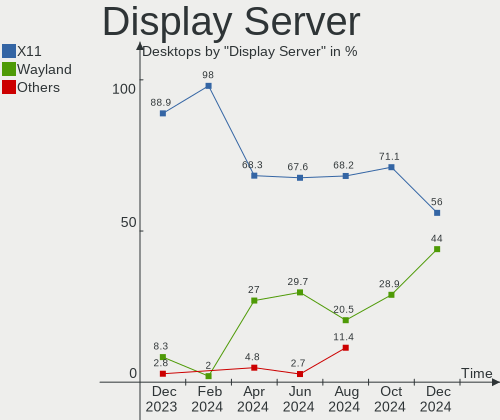
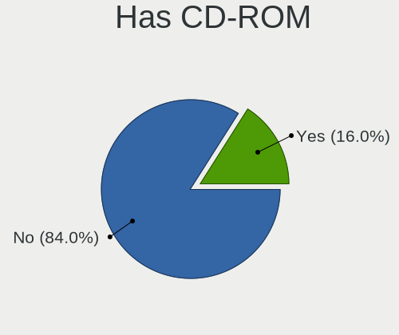
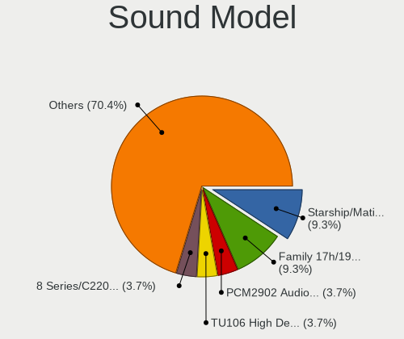

ArcoLinux Hardware Trends (Desktops)
------------------------------------

A project to identify most popular hardware characteristics and track their change
over time based on data collected by ArcoLinux users at https://Linux-Hardware.org.

Anyone can contribute to this report by the [hw-probe](https://github.com/linuxhw/hw-probe) tool:

    sudo -E hw-probe -all -upload

Full-feature report is available here: https://linux-hardware.org/?view=trends

Period: Dec, 2021.

Contents
--------

* [ System ](#system)
  - [ OS                       ](#os)
  - [ OS Family                ](#os-family)
  - [ Kernel                   ](#kernel)
  - [ Kernel Family            ](#kernel-family)
  - [ Kernel Major Ver.        ](#kernel-major-ver)
  - [ Arch                     ](#arch)
  - [ DE                       ](#de)
  - [ Display Server           ](#display-server)
  - [ Display Manager          ](#display-manager)
  - [ OS Lang                  ](#os-lang)
  - [ Boot Mode                ](#boot-mode)
  - [ Filesystem               ](#filesystem)
  - [ Part. scheme             ](#part-scheme)
  - [ Dual Boot with Linux/BSD ](#dual-boot-with-linuxbsd)
  - [ Dual Boot (Win)          ](#dual-boot-win)

* [ Board ](#board)
  - [ Vendor                   ](#vendor)
  - [ Model                    ](#model)
  - [ Model Family             ](#model-family)
  - [ MFG Year                 ](#mfg-year)
  - [ Form Factor              ](#form-factor)
  - [ Secure Boot              ](#secure-boot)
  - [ Coreboot                 ](#coreboot)
  - [ RAM Size                 ](#ram-size)
  - [ RAM Used                 ](#ram-used)
  - [ Total Drives             ](#total-drives)
  - [ Has CD-ROM               ](#has-cd-rom)
  - [ Has Ethernet             ](#has-ethernet)
  - [ Has WiFi                 ](#has-wifi)
  - [ Has Bluetooth            ](#has-bluetooth)

* [ Location ](#location)
  - [ Country                  ](#country)
  - [ City                     ](#city)

* [ Drives ](#drives)
  - [ Drive Vendor             ](#drive-vendor)
  - [ Drive Model              ](#drive-model)
  - [ HDD Vendor               ](#hdd-vendor)
  - [ SSD Vendor               ](#ssd-vendor)
  - [ Drive Kind               ](#drive-kind)
  - [ Drive Connector          ](#drive-connector)
  - [ Drive Size               ](#drive-size)
  - [ Space Total              ](#space-total)
  - [ Space Used               ](#space-used)
  - [ Malfunc. Drives          ](#malfunc-drives)
  - [ Malfunc. Drive Vendor    ](#malfunc-drive-vendor)
  - [ Malfunc. HDD Vendor      ](#malfunc-hdd-vendor)
  - [ Malfunc. Drive Kind      ](#malfunc-drive-kind)
  - [ Failed Drives            ](#failed-drives)
  - [ Failed Drive Vendor      ](#failed-drive-vendor)
  - [ Drive Status             ](#drive-status)

* [ Storage controller ](#storage-controller)
  - [ Storage Vendor           ](#storage-vendor)
  - [ Storage Model            ](#storage-model)
  - [ Storage Kind             ](#storage-kind)

* [ Processor ](#processor)
  - [ CPU Vendor               ](#cpu-vendor)
  - [ CPU Model                ](#cpu-model)
  - [ CPU Model Family         ](#cpu-model-family)
  - [ CPU Cores                ](#cpu-cores)
  - [ CPU Sockets              ](#cpu-sockets)
  - [ CPU Threads              ](#cpu-threads)
  - [ CPU Op-Modes             ](#cpu-op-modes)
  - [ CPU Microcode            ](#cpu-microcode)
  - [ CPU Microarch            ](#cpu-microarch)

* [ Graphics ](#graphics)
  - [ GPU Vendor               ](#gpu-vendor)
  - [ GPU Model                ](#gpu-model)
  - [ GPU Combo                ](#gpu-combo)
  - [ GPU Driver               ](#gpu-driver)
  - [ GPU Memory               ](#gpu-memory)

* [ Monitor ](#monitor)
  - [ Monitor Vendor           ](#monitor-vendor)
  - [ Monitor Model            ](#monitor-model)
  - [ Monitor Resolution       ](#monitor-resolution)
  - [ Monitor Diagonal         ](#monitor-diagonal)
  - [ Monitor Width            ](#monitor-width)
  - [ Aspect Ratio             ](#aspect-ratio)
  - [ Monitor Area             ](#monitor-area)
  - [ Pixel Density            ](#pixel-density)
  - [ Multiple Monitors        ](#multiple-monitors)

* [ Network ](#network)
  - [ Net Controller Vendor    ](#net-controller-vendor)
  - [ Net Controller Model     ](#net-controller-model)
  - [ Wireless Vendor          ](#wireless-vendor)
  - [ Wireless Model           ](#wireless-model)
  - [ Ethernet Vendor          ](#ethernet-vendor)
  - [ Ethernet Model           ](#ethernet-model)
  - [ Net Controller Kind      ](#net-controller-kind)
  - [ Used Controller          ](#used-controller)
  - [ NICs                     ](#nics)
  - [ IPv6                     ](#ipv6)

* [ Bluetooth ](#bluetooth)
  - [ Bluetooth Vendor         ](#bluetooth-vendor)
  - [ Bluetooth Model          ](#bluetooth-model)

* [ Sound ](#sound)
  - [ Sound Vendor             ](#sound-vendor)
  - [ Sound Model              ](#sound-model)

* [ Memory ](#memory)
  - [ Memory Vendor            ](#memory-vendor)
  - [ Memory Model             ](#memory-model)
  - [ Memory Kind              ](#memory-kind)
  - [ Memory Form Factor       ](#memory-form-factor)
  - [ Memory Size              ](#memory-size)
  - [ Memory Speed             ](#memory-speed)

* [ Printers & scanners ](#printers--scanners)
  - [ Printer Vendor           ](#printer-vendor)
  - [ Printer Model            ](#printer-model)
  - [ Scanner Vendor           ](#scanner-vendor)
  - [ Scanner Model            ](#scanner-model)

* [ Camera ](#camera)
  - [ Camera Vendor            ](#camera-vendor)
  - [ Camera Model             ](#camera-model)

* [ Security ](#security)
  - [ Fingerprint Vendor       ](#fingerprint-vendor)
  - [ Fingerprint Model        ](#fingerprint-model)
  - [ Chipcard Vendor          ](#chipcard-vendor)
  - [ Chipcard Model           ](#chipcard-model)

* [ Unsupported ](#unsupported)
  - [ Unsupported Devices      ](#unsupported-devices)
  - [ Unsupported Device Types ](#unsupported-device-types)

System
------

OS
--

Installed operating systems

| Name              | Desktops | Percent |
|-------------------|----------|---------|
| ArcoLinux Rolling | 82       | 100%    |

OS Family
---------

OS without a version

| Name      | Desktops | Percent |
|-----------|----------|---------|
| ArcoLinux | 82       | 100%    |

Kernel
------

Version of the Linux kernel

| Version            | Desktops | Percent |
|--------------------|----------|---------|
| 5.15.7-arch1-1     | 28       | 34.15%  |
| 5.15.10-arch1-1    | 10       | 12.2%   |
| 5.15.7-zen1-1-zen  | 6        | 7.32%   |
| 5.15.6-arch2-1     | 6        | 7.32%   |
| 5.10.84-1-lts      | 6        | 7.32%   |
| 5.15.11-arch2-1    | 4        | 4.88%   |
| 5.10.88-2-lts      | 3        | 3.66%   |
| 5.15.8-arch1-1     | 2        | 2.44%   |
| 5.15.6-zen2-1-zen  | 2        | 2.44%   |
| 5.15.5-arch1-1     | 2        | 2.44%   |
| 5.15.12-arch1-1    | 2        | 2.44%   |
| 5.10.83-1-lts      | 2        | 2.44%   |
| 5.15.8-zen1-1-zen  | 1        | 1.22%   |
| 5.15.7-xanmod1-1   | 1        | 1.22%   |
| 5.15.5-zen1-1-zen  | 1        | 1.22%   |
| 5.15.11-zen1-1-zen | 1        | 1.22%   |
| 5.15.10-zen1-1-zen | 1        | 1.22%   |
| 5.15.10-xanmod1-1  | 1        | 1.22%   |
| 5.14.2-arch1-1     | 1        | 1.22%   |
| 5.14.16-arch1-1    | 1        | 1.22%   |
| 5.14.14-arch1-1    | 1        | 1.22%   |

Kernel Family
-------------

Linux kernel without a distro release

| Version | Desktops | Percent |
|---------|----------|---------|
| 5.15.7  | 35       | 42.68%  |
| 5.15.10 | 12       | 14.63%  |
| 5.15.6  | 8        | 9.76%   |
| 5.10.84 | 6        | 7.32%   |
| 5.15.11 | 5        | 6.1%    |
| 5.15.8  | 3        | 3.66%   |
| 5.15.5  | 3        | 3.66%   |
| 5.10.88 | 3        | 3.66%   |
| 5.15.12 | 2        | 2.44%   |
| 5.10.83 | 2        | 2.44%   |
| 5.14.2  | 1        | 1.22%   |
| 5.14.16 | 1        | 1.22%   |
| 5.14.14 | 1        | 1.22%   |

Kernel Major Ver.
-----------------

Linux kernel major version

| Version | Desktops | Percent |
|---------|----------|---------|
| 5.15    | 68       | 82.93%  |
| 5.10    | 11       | 13.41%  |
| 5.14    | 3        | 3.66%   |

Arch
----

OS architecture (x86_64, i586, etc.)

| Name   | Desktops | Percent |
|--------|----------|---------|
| x86_64 | 82       | 100%    |

DE
--

Desktop Environment

| Name       | Desktops | Percent |
|------------|----------|---------|
| XFCE       | 26       | 31.71%  |
| KDE5       | 25       | 30.49%  |
| LeftWM     | 6        | 7.32%   |
| xmonad     | 3        | 3.66%   |
| X-Cinnamon | 3        | 3.66%   |
| qtile      | 3        | 3.66%   |
| GNOME      | 3        | 3.66%   |
| Deepin     | 3        | 3.66%   |
| i3         | 2        | 2.44%   |
| awesome    | 2        | 2.44%   |
| Unity      | 1        | 1.22%   |
| openbox    | 1        | 1.22%   |
| ICEWM      | 1        | 1.22%   |
| Cutefish   | 1        | 1.22%   |
| Cinnamon   | 1        | 1.22%   |
| bspwm      | 1        | 1.22%   |

Display Server
--------------

X11 or Wayland

| Name    | Desktops | Percent |
|---------|----------|---------|
| X11     | 67       | 81.71%  |
| Tty     | 12       | 14.63%  |
| Wayland | 2        | 2.44%   |
| Unknown | 1        | 1.22%   |

Display Manager
---------------

SDDM, LightDM, etc.

| Name    | Desktops | Percent |
|---------|----------|---------|
| SDDM    | 59       | 71.95%  |
| LightDM | 23       | 28.05%  |

OS Lang
-------

Language

| Lang  | Desktops | Percent |
|-------|----------|---------|
| en_US | 40       | 48.78%  |
| en_GB | 13       | 15.85%  |
| en_CA | 4        | 4.88%   |
| en_AU | 4        | 4.88%   |
| ru_RU | 2        | 2.44%   |
| es_ES | 2        | 2.44%   |
| en_IN | 2        | 2.44%   |
| de_DE | 2        | 2.44%   |
| sv_SE | 1        | 1.22%   |
| ru_UA | 1        | 1.22%   |
| pt_PT | 1        | 1.22%   |
| pt_BR | 1        | 1.22%   |
| nl_NL | 1        | 1.22%   |
| nl_BE | 1        | 1.22%   |
| fr_FR | 1        | 1.22%   |
| fr_CA | 1        | 1.22%   |
| fi_FI | 1        | 1.22%   |
| en_ZA | 1        | 1.22%   |
| en_NZ | 1        | 1.22%   |
| en_IL | 1        | 1.22%   |
| bg_BG | 1        | 1.22%   |

Boot Mode
---------

EFI or BIOS

| Mode | Desktops | Percent |
|------|----------|---------|
| EFI  | 59       | 71.95%  |
| BIOS | 23       | 28.05%  |

Filesystem
----------

Type of filesystem

| Type    | Desktops | Percent |
|---------|----------|---------|
| Ext4    | 58       | 70.73%  |
| Btrfs   | 19       | 23.17%  |
| F2fs    | 2        | 2.44%   |
| Xfs     | 1        | 1.22%   |
| Overlay | 1        | 1.22%   |
| Unknown | 1        | 1.22%   |

Part. scheme
------------

Scheme of partitioning

| Type | Desktops | Percent |
|------|----------|---------|
| GPT  | 68       | 82.93%  |
| MBR  | 14       | 17.07%  |

Dual Boot with Linux/BSD
------------------------

Hosting more than one Linux/BSD

| Dual boot | Desktops | Percent |
|-----------|----------|---------|
| No        | 57       | 69.51%  |
| Yes       | 25       | 30.49%  |

Dual Boot (Win)
---------------

Hosting Linux and Windows

| Dual boot | Desktops | Percent |
|-----------|----------|---------|
| Yes       | 47       | 57.32%  |
| No        | 35       | 42.68%  |

Board
-----

Vendor
------

Motherboard manufacturer

| Name                | Desktops | Percent |
|---------------------|----------|---------|
| ASUSTek Computer    | 33       | 40.24%  |
| Gigabyte Technology | 12       | 14.63%  |
| MSI                 | 9        | 10.98%  |
| ASRock              | 6        | 7.32%   |
| Dell                | 5        | 6.1%    |
| Hewlett-Packard     | 4        | 4.88%   |
| Lenovo              | 2        | 2.44%   |
| Unknown             | 2        | 2.44%   |
| SYWZ                | 1        | 1.22%   |
| Packard Bell        | 1        | 1.22%   |
| Medion              | 1        | 1.22%   |
| Intel               | 1        | 1.22%   |
| Foxconn             | 1        | 1.22%   |
| EVGA                | 1        | 1.22%   |
| ECS                 | 1        | 1.22%   |
| Biostar             | 1        | 1.22%   |
| Acer                | 1        | 1.22%   |

Model
-----

Motherboard model

| Name                                | Desktops | Percent |
|-------------------------------------|----------|---------|
| ASUS ROG STRIX B550-F GAMING        | 4        | 4.88%   |
| MSI MS-7C91                         | 2        | 2.44%   |
| MSI MS-7B85                         | 2        | 2.44%   |
| Dell OptiPlex 7010                  | 2        | 2.44%   |
| ASUS ROG STRIX X570-E GAMING        | 2        | 2.44%   |
| ASUS ROG STRIX B450-F GAMING II     | 2        | 2.44%   |
| ASUS CROSSHAIR VI HERO              | 2        | 2.44%   |
| ASRock B450M Steel Legend           | 2        | 2.44%   |
| Unknown                             | 2        | 2.44%   |
| SYWZ S210H Series                   | 1        | 1.22%   |
| Packard Bell IMEDIA S2185           | 1        | 1.22%   |
| MSI MS-7C84                         | 1        | 1.22%   |
| MSI MS-7C37                         | 1        | 1.22%   |
| MSI MS-7B79                         | 1        | 1.22%   |
| MSI MS-7A40                         | 1        | 1.22%   |
| MSI B250 Gaming Infinite A(MS-B915) | 1        | 1.22%   |
| Medion E62009                       | 1        | 1.22%   |
| Lenovo ThinkCentre M93p 10AAS0QF00  | 1        | 1.22%   |
| Lenovo ThinkCentre M92p 3238A6G     | 1        | 1.22%   |
| Intel DH67BL AAG10189-208           | 1        | 1.22%   |
| HP Z210 Workstation                 | 1        | 1.22%   |
| HP EliteDesk 800 G1 SFF             | 1        | 1.22%   |
| HP Desktop M01-F1xxx                | 1        | 1.22%   |
| HP Compaq 8200 Elite SFF PC         | 1        | 1.22%   |
| Gigabyte Z97X-Gaming GT             | 1        | 1.22%   |
| Gigabyte Z87X-UD3H                  | 1        | 1.22%   |
| Gigabyte Z77X-D3H                   | 1        | 1.22%   |
| Gigabyte Z77-D3H                    | 1        | 1.22%   |
| Gigabyte Z370M AORUS Gaming         | 1        | 1.22%   |
| Gigabyte Z170XP-SLI                 | 1        | 1.22%   |
| Gigabyte Z170N-WIFI                 | 1        | 1.22%   |
| Gigabyte H81M-S                     | 1        | 1.22%   |
| Gigabyte GA-78LMT-S2P               | 1        | 1.22%   |
| Gigabyte G41M-Combo                 | 1        | 1.22%   |
| Gigabyte B550 AORUS MASTER          | 1        | 1.22%   |
| Gigabyte B150-HD3P-CF               | 1        | 1.22%   |
| Foxconn p6604y                      | 1        | 1.22%   |
| EVGA 141-HW-E877                    | 1        | 1.22%   |
| ECS H61H2-MV                        | 1        | 1.22%   |
| Dell Vostro 270                     | 1        | 1.22%   |
| Dell OptiPlex 9010                  | 1        | 1.22%   |
| Dell Inspiron One 2020              | 1        | 1.22%   |
| Biostar J3060NH                     | 1        | 1.22%   |
| ASUS Z170 PRO GAMING                | 1        | 1.22%   |
| ASUS TUF Z390M-PRO GAMING           | 1        | 1.22%   |
| ASUS TUF Z370-PRO GAMING            | 1        | 1.22%   |
| ASUS TUF GAMING X570-PLUS           | 1        | 1.22%   |
| ASUS TUF GAMING B550-PRO            | 1        | 1.22%   |
| ASUS TUF GAMING B550-PLUS           | 1        | 1.22%   |
| ASUS STRIX Z270H GAMING             | 1        | 1.22%   |
| ASUS ROG STRIX X570-I GAMING        | 1        | 1.22%   |
| ASUS ROG STRIX X470-F GAMING        | 1        | 1.22%   |
| ASUS ROG STRIX B460-I GAMING        | 1        | 1.22%   |
| ASUS ROG STRIX B450-F GAMING        | 1        | 1.22%   |
| ASUS PRIME Z490-A                   | 1        | 1.22%   |
| ASUS PRIME Z370-P                   | 1        | 1.22%   |
| ASUS PRIME X570-PRO                 | 1        | 1.22%   |
| ASUS PRIME X570-P                   | 1        | 1.22%   |
| ASUS PRIME X470-PRO                 | 1        | 1.22%   |
| ASUS PRIME B360M-A                  | 1        | 1.22%   |

Model Family
------------

Motherboard model prefix

| Name                  | Desktops | Percent |
|-----------------------|----------|---------|
| ASUS ROG              | 12       | 14.63%  |
| ASUS PRIME            | 7        | 8.54%   |
| ASUS TUF              | 5        | 6.1%    |
| Dell OptiPlex         | 3        | 3.66%   |
| MSI MS-7C91           | 2        | 2.44%   |
| MSI MS-7B85           | 2        | 2.44%   |
| Lenovo ThinkCentre    | 2        | 2.44%   |
| ASUS CROSSHAIR        | 2        | 2.44%   |
| ASRock B450M          | 2        | 2.44%   |
| Unknown               | 2        | 2.44%   |
| SYWZ S210H            | 1        | 1.22%   |
| Packard Bell IMEDIA   | 1        | 1.22%   |
| MSI MS-7C84           | 1        | 1.22%   |
| MSI MS-7C37           | 1        | 1.22%   |
| MSI MS-7B79           | 1        | 1.22%   |
| MSI MS-7A40           | 1        | 1.22%   |
| MSI B250              | 1        | 1.22%   |
| Medion E62009         | 1        | 1.22%   |
| Intel DH67BL          | 1        | 1.22%   |
| HP Z210               | 1        | 1.22%   |
| HP EliteDesk          | 1        | 1.22%   |
| HP Desktop            | 1        | 1.22%   |
| HP Compaq             | 1        | 1.22%   |
| Gigabyte Z97X-Gaming  | 1        | 1.22%   |
| Gigabyte Z87X-UD3H    | 1        | 1.22%   |
| Gigabyte Z77X-D3H     | 1        | 1.22%   |
| Gigabyte Z77-D3H      | 1        | 1.22%   |
| Gigabyte Z370M        | 1        | 1.22%   |
| Gigabyte Z170XP-SLI   | 1        | 1.22%   |
| Gigabyte Z170N-WIFI   | 1        | 1.22%   |
| Gigabyte H81M-S       | 1        | 1.22%   |
| Gigabyte GA-78LMT-S2P | 1        | 1.22%   |
| Gigabyte G41M-Combo   | 1        | 1.22%   |
| Gigabyte B550         | 1        | 1.22%   |
| Gigabyte B150-HD3P-CF | 1        | 1.22%   |
| Foxconn p6604y        | 1        | 1.22%   |
| EVGA 141-HW-E877      | 1        | 1.22%   |
| ECS H61H2-MV          | 1        | 1.22%   |
| Dell Vostro           | 1        | 1.22%   |
| Dell Inspiron         | 1        | 1.22%   |
| Biostar J3060NH       | 1        | 1.22%   |
| ASUS Z170             | 1        | 1.22%   |
| ASUS STRIX            | 1        | 1.22%   |
| ASUS P8P67            | 1        | 1.22%   |
| ASUS P8H61-M          | 1        | 1.22%   |
| ASUS CM6870           | 1        | 1.22%   |
| ASUS All              | 1        | 1.22%   |
| ASUS 1145991          | 1        | 1.22%   |
| ASRock H310M-STX      | 1        | 1.22%   |
| ASRock H310CM-HDV     | 1        | 1.22%   |
| ASRock AB350          | 1        | 1.22%   |
| ASRock 880GM-LE       | 1        | 1.22%   |
| Acer Aspire           | 1        | 1.22%   |

MFG Year
--------

Motherboard manufacture year

| Year | Desktops | Percent |
|------|----------|---------|
| 2021 | 25       | 30.49%  |
| 2020 | 15       | 18.29%  |
| 2018 | 7        | 8.54%   |
| 2019 | 6        | 7.32%   |
| 2013 | 6        | 7.32%   |
| 2012 | 6        | 7.32%   |
| 2015 | 5        | 6.1%    |
| 2017 | 4        | 4.88%   |
| 2016 | 3        | 3.66%   |
| 2014 | 2        | 2.44%   |
| 2011 | 1        | 1.22%   |
| 2010 | 1        | 1.22%   |
| 2006 | 1        | 1.22%   |

Form Factor
-----------

Physical design of the computer

| Name    | Desktops | Percent |
|---------|----------|---------|
| Desktop | 82       | 100%    |

Secure Boot
-----------

Enabled or disabled

| State    | Desktops | Percent |
|----------|----------|---------|
| Disabled | 82       | 100%    |

Coreboot
--------

Have coreboot on board

| Used | Desktops | Percent |
|------|----------|---------|
| No   | 82       | 100%    |

RAM Size
--------

Total RAM memory

| Size in GB  | Desktops | Percent |
|-------------|----------|---------|
| 32.01-64.0  | 24       | 29.27%  |
| 16.01-24.0  | 23       | 28.05%  |
| 8.01-16.0   | 16       | 19.51%  |
| 4.01-8.0    | 9        | 10.98%  |
| 3.01-4.0    | 4        | 4.88%   |
| 64.01-256.0 | 4        | 4.88%   |
| 24.01-32.0  | 2        | 2.44%   |

RAM Used
--------

Used RAM memory

| Used GB   | Desktops | Percent |
|-----------|----------|---------|
| 4.01-8.0  | 21       | 25.61%  |
| 1.01-2.0  | 19       | 23.17%  |
| 2.01-3.0  | 17       | 20.73%  |
| 3.01-4.0  | 9        | 10.98%  |
| 0.51-1.0  | 9        | 10.98%  |
| 0.01-0.5  | 4        | 4.88%   |
| 8.01-16.0 | 3        | 3.66%   |

Total Drives
------------

Number of drives on board

| Drives | Desktops | Percent |
|--------|----------|---------|
| 2      | 22       | 26.83%  |
| 1      | 20       | 24.39%  |
| 3      | 17       | 20.73%  |
| 4      | 11       | 13.41%  |
| 6      | 6        | 7.32%   |
| 5      | 4        | 4.88%   |
| 9      | 1        | 1.22%   |
| 7      | 1        | 1.22%   |

Has CD-ROM
----------

Has CD-ROM on board

| Presented | Desktops | Percent |
|-----------|----------|---------|
| No        | 56       | 68.29%  |
| Yes       | 26       | 31.71%  |

Has Ethernet
------------

Has Ethernet on board

| Presented | Desktops | Percent |
|-----------|----------|---------|
| Yes       | 82       | 100%    |

Has WiFi
--------

Has WiFi module

| Presented | Desktops | Percent |
|-----------|----------|---------|
| No        | 46       | 56.1%   |
| Yes       | 36       | 43.9%   |

Has Bluetooth
-------------

Has Bluetooth module

| Presented | Desktops | Percent |
|-----------|----------|---------|
| No        | 51       | 62.2%   |
| Yes       | 31       | 37.8%   |

Location
--------

Country
-------

Geographic location (country)

| Country                          | Desktops | Percent |
|----------------------------------|----------|---------|
| USA                              | 15       | 18.29%  |
| UK                               | 12       | 14.63%  |
| Belgium                          | 6        | 7.32%   |
| Canada                           | 5        | 6.1%    |
| Australia                        | 4        | 4.88%   |
| Russia                           | 3        | 3.66%   |
| Norway                           | 3        | 3.66%   |
| India                            | 3        | 3.66%   |
| Finland                          | 3        | 3.66%   |
| Ukraine                          | 2        | 2.44%   |
| Spain                            | 2        | 2.44%   |
| Netherlands                      | 2        | 2.44%   |
| Germany                          | 2        | 2.44%   |
| Brazil                           | 2        | 2.44%   |
| Sweden                           | 1        | 1.22%   |
| South Africa                     | 1        | 1.22%   |
| Saudi Arabia                     | 1        | 1.22%   |
| Saint Vincent and the Grenadines | 1        | 1.22%   |
| Portugal                         | 1        | 1.22%   |
| New Zealand                      | 1        | 1.22%   |
| Morocco                          | 1        | 1.22%   |
| Israel                           | 1        | 1.22%   |
| Ireland                          | 1        | 1.22%   |
| Indonesia                        | 1        | 1.22%   |
| Honduras                         | 1        | 1.22%   |
| France                           | 1        | 1.22%   |
| Czechia                          | 1        | 1.22%   |
| Colombia                         | 1        | 1.22%   |
| Bulgaria                         | 1        | 1.22%   |
| Barbados                         | 1        | 1.22%   |
| Austria                          | 1        | 1.22%   |
| Algeria                          | 1        | 1.22%   |

City
----

Geographic location (city)

| City           | Desktops | Percent |
|----------------|----------|---------|
| Sydney         | 3        | 3.66%   |
| Wilrijk        | 2        | 2.44%   |
| Oslo           | 2        | 2.44%   |
| New Delhi      | 2        | 2.44%   |
| London         | 2        | 2.44%   |
| Wolverhampton  | 1        | 1.22%   |
| Westhill       | 1        | 1.22%   |
| West Covina    | 1        | 1.22%   |
| Walsall        | 1        | 1.22%   |
| Vyazniki       | 1        | 1.22%   |
| Vienna         | 1        | 1.22%   |
| Toccoa         | 1        | 1.22%   |
| Thornhill      | 1        | 1.22%   |
| Tel Aviv       | 1        | 1.22%   |
| Tegucigalpa    | 1        | 1.22%   |
| Tarvasjoki     | 1        | 1.22%   |
| Stevenage      | 1        | 1.22%   |
| Stavanger      | 1        | 1.22%   |
| St Petersburg  | 1        | 1.22%   |
| Sloviansk      | 1        | 1.22%   |
| Selby          | 1        | 1.22%   |
| Sein?¤joki     | 1        | 1.22%   |
| San Tan Valley | 1        | 1.22%   |
| Rybinsk        | 1        | 1.22%   |
| Revelstoke     | 1        | 1.22%   |
| Rabat          | 1        | 1.22%   |
| Prague         | 1        | 1.22%   |
| Petrolina      | 1        | 1.22%   |
| Palmdale       | 1        | 1.22%   |
| Olympia        | 1        | 1.22%   |
| Novi Pazar     | 1        | 1.22%   |
| Mostaganem     | 1        | 1.22%   |
| Moelfre        | 1        | 1.22%   |
| Manchester     | 1        | 1.22%   |
| Lokeren        | 1        | 1.22%   |
| Livingston     | 1        | 1.22%   |
| Littleton      | 1        | 1.22%   |
| Levis          | 1        | 1.22%   |
| Lelystad       | 1        | 1.22%   |
| Leiria         | 1        | 1.22%   |
| Langenfeld     | 1        | 1.22%   |
| Lambeth        | 1        | 1.22%   |
| Kyiv           | 1        | 1.22%   |
| Kristianstad   | 1        | 1.22%   |
| Kingstown      | 1        | 1.22%   |
| Karlsruhe      | 1        | 1.22%   |
| Jeddah         | 1        | 1.22%   |
| Hampton        | 1        | 1.22%   |
| Hamilton       | 1        | 1.22%   |
| Haaltert       | 1        | 1.22%   |
| Genk           | 1        | 1.22%   |
| Garland        | 1        | 1.22%   |
| Finchley       | 1        | 1.22%   |
| Espoo          | 1        | 1.22%   |
| Elgin          | 1        | 1.22%   |
| Elda           | 1        | 1.22%   |
| Edmonton       | 1        | 1.22%   |
| Dublin         | 1        | 1.22%   |
| Denver         | 1        | 1.22%   |
| Dagenham       | 1        | 1.22%   |

Drives
------

Drive Vendor
------------

Hard drive vendors

| Vendor              | Desktops | Drives | Percent |
|---------------------|----------|--------|---------|
| WDC                 | 37       | 47     | 20.67%  |
| Samsung Electronics | 32       | 50     | 17.88%  |
| Seagate             | 31       | 45     | 17.32%  |
| Crucial             | 11       | 12     | 6.15%   |
| Toshiba             | 10       | 10     | 5.59%   |
| Kingston            | 9        | 10     | 5.03%   |
| SanDisk             | 7        | 9      | 3.91%   |
| Corsair             | 5        | 6      | 2.79%   |
| Hitachi             | 4        | 4      | 2.23%   |
| A-DATA Technology   | 3        | 4      | 1.68%   |
| XPG                 | 2        | 2      | 1.12%   |
| SK Hynix            | 2        | 3      | 1.12%   |
| PNY                 | 2        | 2      | 1.12%   |
| Phison              | 2        | 2      | 1.12%   |
| Intel               | 2        | 2      | 1.12%   |
| Hewlett-Packard     | 2        | 2      | 1.12%   |
| China               | 2        | 4      | 1.12%   |
| WD MediaMax         | 1        | 1      | 0.56%   |
| V-GeN               | 1        | 2      | 0.56%   |
| Transcend           | 1        | 1      | 0.56%   |
| TO Exter            | 1        | 1      | 0.56%   |
| tigo                | 1        | 1      | 0.56%   |
| Silicon Motion      | 1        | 1      | 0.56%   |
| OCZ                 | 1        | 1      | 0.56%   |
| Micron Technology   | 1        | 2      | 0.56%   |
| KingSpec            | 1        | 1      | 0.56%   |
| KingFast            | 1        | 1      | 0.56%   |
| Intenso             | 1        | 1      | 0.56%   |
| INTEL SS            | 1        | 1      | 0.56%   |
| HS-SSD-E100         | 1        | 1      | 0.56%   |
| HGST                | 1        | 1      | 0.56%   |
| Gigabyte Technology | 1        | 1      | 0.56%   |
| 1TB                 | 1        | 1      | 0.56%   |

Drive Model
-----------

Hard drive models

| Model                           | Desktops | Percent |
|---------------------------------|----------|---------|
| Seagate ST1000DM010-2EP102 1TB  | 5        | 2.23%   |
| Samsung SSD 860 EVO 500GB       | 4        | 1.79%   |
| Samsung SSD 840 EVO 250GB       | 4        | 1.79%   |
| Kingston SA400S37240G 240GB SSD | 4        | 1.79%   |
| Seagate ST2000DM008-2FR102 2TB  | 3        | 1.34%   |
| Samsung SSD 970 EVO Plus 1TB    | 3        | 1.34%   |
| Samsung SSD 860 EVO 250GB       | 3        | 1.34%   |
| Samsung SSD 850 EVO 250GB       | 3        | 1.34%   |
| Crucial CT500MX500SSD1 500GB    | 3        | 1.34%   |
| Toshiba HDWD110 1TB             | 2        | 0.89%   |
| Toshiba DT01ACA100 1TB          | 2        | 0.89%   |
| Seagate ST4000DM004-2CV104 4TB  | 2        | 0.89%   |
| Seagate ST31000528AS 1TB        | 2        | 0.89%   |
| Seagate ST31000524AS 1TB        | 2        | 0.89%   |
| Seagate ST1000DM003-1SB10C 1TB  | 2        | 0.89%   |
| Seagate Expansion 1TB           | 2        | 0.89%   |
| Seagate BUP Slim BK 2TB         | 2        | 0.89%   |
| SanDisk SDSSDH31024G 1TB        | 2        | 0.89%   |
| Samsung SSD 970 EVO 500GB       | 2        | 0.89%   |
| Samsung SSD 970 EVO 1TB         | 2        | 0.89%   |
| Samsung SSD 860 EVO 1TB         | 2        | 0.89%   |
| Samsung SSD 850 EVO 500GB       | 2        | 0.89%   |
| Samsung SSD 840 EVO 120GB       | 2        | 0.89%   |
| Crucial CT240BX500SSD1 240GB    | 2        | 0.89%   |
| Crucial CT1000MX500SSD1 1TB     | 2        | 0.89%   |
| Corsair Force MP600 500GB       | 2        | 0.89%   |
| A-DATA SX8200PNP 1TB            | 2        | 0.89%   |
| XPG GAMMIX S5 256GB             | 1        | 0.45%   |
| XPG GAMMIX S11 Pro 1TB          | 1        | 0.45%   |
| WDC WDS500G3XHC-00SJG0 500GB    | 1        | 0.45%   |
| WDC WDS500G1X0E-00AFY0 500GB    | 1        | 0.45%   |
| WDC WDS250G2B0C-00PXH0 250GB    | 1        | 0.45%   |
| WDC WDS200T2B0B-00YS70 2TB SSD  | 1        | 0.45%   |
| WDC WDS100T2G0A-00JH30 1TB SSD  | 1        | 0.45%   |
| WDC WDS100T2B0B-00YS70 1TB SSD  | 1        | 0.45%   |
| WDC WDBRPG0010BNC-WRSN 1TB      | 1        | 0.45%   |
| WDC WDBNCE0010PNC 1TB SSD       | 1        | 0.45%   |
| WDC WD6000HLHX-01JJPV0 600GB    | 1        | 0.45%   |
| WDC WD5000HHTZ-75N21V0 500GB    | 1        | 0.45%   |
| WDC WD5000BEVT-35A0RT0 500GB    | 1        | 0.45%   |
| WDC WD5000AVCS-632DY1 500GB     | 1        | 0.45%   |
| WDC WD5000AAKX-75U6AA0 500GB    | 1        | 0.45%   |
| WDC WD5000AAKX-603CA0 500GB     | 1        | 0.45%   |
| WDC WD5000AAKX-00ERMA0 500GB    | 1        | 0.45%   |
| WDC WD5000AAKS-22A7B0 500GB     | 1        | 0.45%   |
| WDC WD40EZRZ-00GXCB0 4TB        | 1        | 0.45%   |
| WDC WD40EFRX-68WT0N0 4TB        | 1        | 0.45%   |
| WDC WD40EFRX-68N32N0 4TB        | 1        | 0.45%   |
| WDC WD3200AAJS-00L7A0 320GB     | 1        | 0.45%   |
| WDC WD30EFRX-68EUZN0 3TB        | 1        | 0.45%   |
| WDC WD2500AAKX-603CA0 250GB     | 1        | 0.45%   |
| WDC WD2500AAJS-00B4A0 250GB     | 1        | 0.45%   |
| WDC WD20EZRX-00D8PB0 2TB        | 1        | 0.45%   |
| WDC WD20EARX-00PASB0 2TB        | 1        | 0.45%   |
| WDC WD2003FZEX-00Z4SA0 2TB      | 1        | 0.45%   |
| WDC WD2002FAEX-007BA0 2TB       | 1        | 0.45%   |
| WDC WD2001FASS-00W2B0 2TB       | 1        | 0.45%   |
| WDC WD2000JD-00HBB0 200GB       | 1        | 0.45%   |
| WDC WD1600AVVS-63L2B0 160GB     | 1        | 0.45%   |
| WDC WD10SPZX-21Z10T0 1TB        | 1        | 0.45%   |

HDD Vendor
----------

Hard disk drive vendors

| Vendor              | Desktops | Drives | Percent |
|---------------------|----------|--------|---------|
| WDC                 | 32       | 39     | 39.51%  |
| Seagate             | 30       | 42     | 37.04%  |
| Toshiba             | 9        | 9      | 11.11%  |
| Hitachi             | 4        | 4      | 4.94%   |
| Samsung Electronics | 2        | 2      | 2.47%   |
| WD MediaMax         | 1        | 1      | 1.23%   |
| TO Exter            | 1        | 1      | 1.23%   |
| HGST                | 1        | 1      | 1.23%   |
| Hewlett-Packard     | 1        | 1      | 1.23%   |

SSD Vendor
----------

Solid state drive vendors

| Vendor              | Desktops | Drives | Percent |
|---------------------|----------|--------|---------|
| Samsung Electronics | 24       | 31     | 32.88%  |
| Crucial             | 10       | 11     | 13.7%   |
| Kingston            | 8        | 8      | 10.96%  |
| SanDisk             | 7        | 9      | 9.59%   |
| WDC                 | 4        | 4      | 5.48%   |
| PNY                 | 2        | 2      | 2.74%   |
| Corsair             | 2        | 2      | 2.74%   |
| China               | 2        | 4      | 2.74%   |
| V-GeN               | 1        | 2      | 1.37%   |
| Transcend           | 1        | 1      | 1.37%   |
| Toshiba             | 1        | 1      | 1.37%   |
| SK Hynix            | 1        | 1      | 1.37%   |
| OCZ                 | 1        | 1      | 1.37%   |
| Micron Technology   | 1        | 2      | 1.37%   |
| KingSpec            | 1        | 1      | 1.37%   |
| KingFast            | 1        | 1      | 1.37%   |
| Intenso             | 1        | 1      | 1.37%   |
| INTEL SS            | 1        | 1      | 1.37%   |
| HS-SSD-E100         | 1        | 1      | 1.37%   |
| Hewlett-Packard     | 1        | 1      | 1.37%   |
| Gigabyte Technology | 1        | 1      | 1.37%   |
| 1TB                 | 1        | 1      | 1.37%   |

Drive Kind
----------

HDD or SSD

| Kind | Desktops | Drives | Percent |
|------|----------|--------|---------|
| HDD  | 62       | 100    | 40.52%  |
| SSD  | 55       | 87     | 35.95%  |
| NVMe | 36       | 45     | 23.53%  |

Drive Connector
---------------

SATA, SAS, NVMe, etc.

| Type | Desktops | Drives | Percent |
|------|----------|--------|---------|
| SATA | 77       | 178    | 63.11%  |
| NVMe | 36       | 45     | 29.51%  |
| SAS  | 9        | 9      | 7.38%   |

Drive Size
----------

Size of hard drive

| Size in TB | Desktops | Drives | Percent |
|------------|----------|--------|---------|
| 0.51-1.0   | 51       | 66     | 37.23%  |
| 0.01-0.5   | 51       | 79     | 37.23%  |
| 1.01-2.0   | 20       | 26     | 14.6%   |
| 3.01-4.0   | 7        | 7      | 5.11%   |
| 2.01-3.0   | 4        | 5      | 2.92%   |
| 4.01-10.0  | 4        | 4      | 2.92%   |

Space Total
-----------

Amount of disk space available on the file system

| Size in GB     | Desktops | Percent |
|----------------|----------|---------|
| 1001-2000      | 21       | 25.61%  |
| More than 3000 | 16       | 19.51%  |
| 101-250        | 15       | 18.29%  |
| 501-1000       | 11       | 13.41%  |
| 251-500        | 9        | 10.98%  |
| 2001-3000      | 6        | 7.32%   |
| Unknown        | 3        | 3.66%   |
| 51-100         | 1        | 1.22%   |

Space Used
----------

Amount of used disk space

| Used GB        | Desktops | Percent |
|----------------|----------|---------|
| 501-1000       | 13       | 15.85%  |
| 251-500        | 11       | 13.41%  |
| 1-20           | 11       | 13.41%  |
| 21-50          | 10       | 12.2%   |
| 101-250        | 10       | 12.2%   |
| 51-100         | 9        | 10.98%  |
| 2001-3000      | 7        | 8.54%   |
| 1001-2000      | 5        | 6.1%    |
| More than 3000 | 3        | 3.66%   |
| Unknown        | 3        | 3.66%   |

Malfunc. Drives
---------------

Drive models with a malfunction

| Model                                 | Desktops | Drives | Percent |
|---------------------------------------|----------|--------|---------|
| Seagate ST31000528AS 1TB              | 2        | 2      | 6.67%   |
| WDC WD5000BEVT-35A0RT0 500GB          | 1        | 1      | 3.33%   |
| WDC WD5000AVCS-632DY1 500GB           | 1        | 1      | 3.33%   |
| WDC WD5000AAKX-75U6AA0 500GB          | 1        | 1      | 3.33%   |
| WDC WD5000AAKX-00ERMA0 500GB          | 1        | 1      | 3.33%   |
| WDC WD3200AAJS-00L7A0 320GB           | 1        | 1      | 3.33%   |
| WDC WD2500AAKX-603CA0 250GB           | 1        | 1      | 3.33%   |
| WDC WD2001FASS-00W2B0 2TB             | 1        | 1      | 3.33%   |
| WDC WD2000JD-00HBB0 200GB             | 1        | 1      | 3.33%   |
| WDC WD1600AVVS-63L2B0 160GB           | 1        | 1      | 3.33%   |
| WDC WD10EZRZ-22HTKB0 1TB              | 1        | 1      | 3.33%   |
| WDC WD10EARS-00Y5B1 1TB               | 1        | 1      | 3.33%   |
| Toshiba MK1252GSX 120GB               | 1        | 1      | 3.33%   |
| Seagate ST9320325AS 320GB             | 1        | 1      | 3.33%   |
| Seagate ST8000DM004-2CX188 8TB        | 1        | 1      | 3.33%   |
| Seagate ST500LT012-1DG142 500GB       | 1        | 1      | 3.33%   |
| Seagate ST4000VN008-2DR166 4TB        | 1        | 1      | 3.33%   |
| Seagate ST3500312CS 500GB             | 1        | 1      | 3.33%   |
| Seagate ST31000524AS 1TB              | 1        | 1      | 3.33%   |
| Seagate ST2000DM008-2FR102 2TB        | 1        | 3      | 3.33%   |
| Seagate ST2000DM001-1ER164 2TB        | 1        | 1      | 3.33%   |
| Seagate ST1000DM010-2EP102 1TB        | 1        | 1      | 3.33%   |
| SanDisk SSD PLUS 1000GB               | 1        | 1      | 3.33%   |
| SanDisk SDSSDA240G 240GB              | 1        | 1      | 3.33%   |
| Samsung Electronics SSD 870 EVO 1TB   | 1        | 1      | 3.33%   |
| Samsung Electronics SSD 840 EVO 250GB | 1        | 1      | 3.33%   |
| Hitachi HUA723020ALA640 2TB           | 1        | 1      | 3.33%   |
| Hewlett-Packard SSD S600 120GB        | 1        | 1      | 3.33%   |
| Corsair Neutron XT SSD 240GB          | 1        | 1      | 3.33%   |

Malfunc. Drive Vendor
---------------------

Vendors of faulty drives

| Vendor              | Desktops | Drives | Percent |
|---------------------|----------|--------|---------|
| Seagate             | 10       | 13     | 37.04%  |
| WDC                 | 9        | 11     | 33.33%  |
| SanDisk             | 2        | 2      | 7.41%   |
| Samsung Electronics | 2        | 2      | 7.41%   |
| Toshiba             | 1        | 1      | 3.7%    |
| Hitachi             | 1        | 1      | 3.7%    |
| Hewlett-Packard     | 1        | 1      | 3.7%    |
| Corsair             | 1        | 1      | 3.7%    |

Malfunc. HDD Vendor
-------------------

Vendors of faulty HDD drives

| Vendor  | Desktops | Drives | Percent |
|---------|----------|--------|---------|
| Seagate | 10       | 13     | 47.62%  |
| WDC     | 9        | 11     | 42.86%  |
| Toshiba | 1        | 1      | 4.76%   |
| Hitachi | 1        | 1      | 4.76%   |

Malfunc. Drive Kind
-------------------

Kinds of faulty drives

| Kind | Desktops | Drives | Percent |
|------|----------|--------|---------|
| HDD  | 18       | 26     | 75%     |
| SSD  | 6        | 6      | 25%     |

Failed Drives
-------------

Failed drive models

Zero info for selected period =(

Failed Drive Vendor
-------------------

Failed drive vendors

Zero info for selected period =(

Drive Status
------------

Number of failed and malfunc. drives

| Status   | Desktops | Drives | Percent |
|----------|----------|--------|---------|
| Works    | 72       | 186    | 68.57%  |
| Malfunc  | 23       | 32     | 21.9%   |
| Detected | 10       | 14     | 9.52%   |

Storage controller
------------------

Storage Vendor
--------------

Storage controller vendors

| Vendor                      | Desktops | Percent |
|-----------------------------|----------|---------|
| Intel                       | 44       | 33.33%  |
| AMD                         | 38       | 28.79%  |
| Samsung Electronics         | 15       | 11.36%  |
| Phison Electronics          | 6        | 4.55%   |
| Marvell Technology Group    | 5        | 3.79%   |
| Sandisk                     | 4        | 3.03%   |
| ASMedia Technology          | 4        | 3.03%   |
| Seagate Technology          | 3        | 2.27%   |
| ADATA Technology            | 3        | 2.27%   |
| SK Hynix                    | 2        | 1.52%   |
| Silicon Motion              | 2        | 1.52%   |
| Realtek Semiconductor       | 2        | 1.52%   |
| Kingston Technology Company | 2        | 1.52%   |
| Nvidia                      | 1        | 0.76%   |
| Micron/Crucial Technology   | 1        | 0.76%   |

Storage Model
-------------

Storage controller models

| Model                                                                                   | Desktops | Percent |
|-----------------------------------------------------------------------------------------|----------|---------|
| AMD FCH SATA Controller [AHCI mode]                                                     | 17       | 11.04%  |
| AMD 400 Series Chipset SATA Controller                                                  | 12       | 7.79%   |
| AMD Starship/Matisse Chipset SATA Controller [AHCI mode]                                | 9        | 5.84%   |
| Samsung NVMe SSD Controller SM981/PM981/PM983                                           | 8        | 5.19%   |
| Intel 200 Series PCH SATA controller [AHCI mode]                                        | 7        | 4.55%   |
| Intel 7 Series/C210 Series Chipset Family 6-port SATA Controller [AHCI mode]            | 6        | 3.9%    |
| Intel Cannon Lake PCH SATA AHCI Controller                                              | 5        | 3.25%   |
| Intel 8 Series/C220 Series Chipset Family 6-port SATA Controller 1 [AHCI mode]          | 5        | 3.25%   |
| ASMedia ASM1062 Serial ATA Controller                                                   | 4        | 2.6%    |
| Samsung NVMe SSD Controller SM961/PM961/SM963                                           | 3        | 1.95%   |
| Samsung NVMe SSD Controller PM9A1/PM9A3/980PRO                                          | 3        | 1.95%   |
| Phison E16 PCIe4 NVMe Controller                                                        | 3        | 1.95%   |
| Marvell Group 88SE9172 SATA 6Gb/s Controller                                            | 3        | 1.95%   |
| Intel SATA Controller [RAID mode]                                                       | 3        | 1.95%   |
| Intel Q170/Q150/B150/H170/H110/Z170/CM236 Chipset SATA Controller [AHCI Mode]           | 3        | 1.95%   |
| Intel 6 Series/C200 Series Chipset Family Desktop SATA Controller (IDE mode, ports 4-5) | 3        | 1.95%   |
| Intel 6 Series/C200 Series Chipset Family Desktop SATA Controller (IDE mode, ports 0-3) | 3        | 1.95%   |
| Intel 6 Series/C200 Series Chipset Family 6 port Desktop SATA AHCI Controller           | 3        | 1.95%   |
| AMD SB7x0/SB8x0/SB9x0 SATA Controller [IDE mode]                                        | 3        | 1.95%   |
| AMD SB7x0/SB8x0/SB9x0 IDE Controller                                                    | 3        | 1.95%   |
| ADATA XPG SX8200 Pro PCIe Gen3x4 M.2 2280 Solid State Drive                             | 3        | 1.95%   |
| Silicon Motion SM2263EN/SM2263XT SSD Controller                                         | 2        | 1.3%    |
| Seagate FireCuda 510 SSD                                                                | 2        | 1.3%    |
| Samsung NVMe SSD Controller 980                                                         | 2        | 1.3%    |
| Realtek Realtek Non-Volatile memory controller                                          | 2        | 1.3%    |
| Phison E12 NVMe Controller                                                              | 2        | 1.3%    |
| Intel SSD 660P Series                                                                   | 2        | 1.3%    |
| Intel 7 Series/C210 Series Chipset Family 4-port SATA Controller [IDE mode]             | 2        | 1.3%    |
| Intel 7 Series/C210 Series Chipset Family 2-port SATA Controller [IDE mode]             | 2        | 1.3%    |
| AMD X370 Series Chipset SATA Controller                                                 | 2        | 1.3%    |
| AMD 300 Series Chipset SATA Controller                                                  | 2        | 1.3%    |
| SK Hynix PC300 NVMe Solid State Drive 1TB                                               | 1        | 0.65%   |
| SK Hynix BC501 NVMe Solid State Drive                                                   | 1        | 0.65%   |
| Seagate Non-Volatile memory controller                                                  | 1        | 0.65%   |
| Sandisk WD PC SN810 / Black SN850 NVMe SSD                                              | 1        | 0.65%   |
| Sandisk WD Blue SN550 NVMe SSD                                                          | 1        | 0.65%   |
| Sandisk WD Black SN750 / PC SN730 NVMe SSD                                              | 1        | 0.65%   |
| Sandisk WD Black 2018/SN750 / PC SN720 NVMe SSD                                         | 1        | 0.65%   |
| Phison E7 NVMe Controller                                                               | 1        | 0.65%   |
| Nvidia MCP61 SATA Controller                                                            | 1        | 0.65%   |
| Nvidia MCP61 IDE                                                                        | 1        | 0.65%   |
| Micron/Crucial P1 NVMe PCIe SSD                                                         | 1        | 0.65%   |
| Marvell Group 88SE9220 PCIe 2.0 x2 2-port SATA 6 Gb/s RAID Controller                   | 1        | 0.65%   |
| Marvell Group 88SE912x SATA 6Gb/s Controller [IDE mode]                                 | 1        | 0.65%   |
| Marvell Group 88SE912x IDE Controller                                                   | 1        | 0.65%   |
| Kingston Company SNVS2000G [NV1 NVMe PCIe SSD 2TB]                                      | 1        | 0.65%   |
| Kingston Company A2000 NVMe SSD                                                         | 1        | 0.65%   |
| Intel NM10/ICH7 Family SATA Controller [IDE mode]                                       | 1        | 0.65%   |
| Intel Comet Lake PCH-H RAID                                                             | 1        | 0.65%   |
| Intel C610/X99 series chipset sSATA Controller [AHCI mode]                              | 1        | 0.65%   |
| Intel C610/X99 series chipset 6-Port SATA Controller [AHCI mode]                        | 1        | 0.65%   |
| Intel Atom/Celeron/Pentium Processor x5-E8000/J3xxx/N3xxx Series SATA Controller        | 1        | 0.65%   |
| Intel 9 Series Chipset Family SATA Controller [AHCI Mode]                               | 1        | 0.65%   |
| Intel 6 Series/C200 Series Chipset Family IDE-r Controller                              | 1        | 0.65%   |
| Intel 400 Series Chipset Family SATA AHCI Controller                                    | 1        | 0.65%   |
| AMD SB7x0/SB8x0/SB9x0 SATA Controller [AHCI mode]                                       | 1        | 0.65%   |

Storage Kind
------------

Kind of storage controller (IDE, SATA, NVMe, SAS, ...)

| Kind | Desktops | Percent |
|------|----------|---------|
| SATA | 71       | 57.72%  |
| NVMe | 36       | 29.27%  |
| IDE  | 12       | 9.76%   |
| RAID | 4        | 3.25%   |

Processor
---------

CPU Vendor
----------

Processor vendors

| Vendor | Desktops | Percent |
|--------|----------|---------|
| Intel  | 43       | 52.44%  |
| AMD    | 39       | 47.56%  |

CPU Model
---------

Processor models

| Model                                       | Desktops | Percent |
|---------------------------------------------|----------|---------|
| AMD Ryzen 9 5900X 12-Core Processor         | 5        | 6.1%    |
| AMD Ryzen 7 5800X 8-Core Processor          | 5        | 6.1%    |
| AMD Ryzen 5 3600X 6-Core Processor          | 4        | 4.88%   |
| Intel Core i5-3570 CPU @ 3.40GHz            | 3        | 3.66%   |
| AMD Ryzen 5 5600X 6-Core Processor          | 3        | 3.66%   |
| AMD Ryzen 5 3600 6-Core Processor           | 3        | 3.66%   |
| Intel Core i7-7700K CPU @ 4.20GHz           | 2        | 2.44%   |
| Intel Core i7-4790 CPU @ 3.60GHz            | 2        | 2.44%   |
| Intel Core i7-3770 CPU @ 3.40GHz            | 2        | 2.44%   |
| Intel Core i7-2600 CPU @ 3.40GHz            | 2        | 2.44%   |
| Intel Core i5-9400 CPU @ 2.90GHz            | 2        | 2.44%   |
| Intel Core i5-2400 CPU @ 3.10GHz            | 2        | 2.44%   |
| Intel Core i5-10400 CPU @ 2.90GHz           | 2        | 2.44%   |
| AMD Ryzen 7 5700G with Radeon Graphics      | 2        | 2.44%   |
| AMD Ryzen 7 3700X 8-Core Processor          | 2        | 2.44%   |
| Intel Xeon E-2176M CPU @ 2.70GHz            | 1        | 1.22%   |
| Intel Pentium CPU G2030T @ 2.60GHz          | 1        | 1.22%   |
| Intel Pentium CPU G2020 @ 2.90GHz           | 1        | 1.22%   |
| Intel Core i7-8700K CPU @ 3.70GHz           | 1        | 1.22%   |
| Intel Core i7-7700 CPU @ 3.60GHz            | 1        | 1.22%   |
| Intel Core i7-6700K CPU @ 4.00GHz           | 1        | 1.22%   |
| Intel Core i7-5930K CPU @ 3.50GHz           | 1        | 1.22%   |
| Intel Core i7-4765T CPU @ 2.00GHz           | 1        | 1.22%   |
| Intel Core i7-3820 CPU @ 3.60GHz            | 1        | 1.22%   |
| Intel Core i7-10700K CPU @ 3.80GHz          | 1        | 1.22%   |
| Intel Core i5-9600KF CPU @ 3.70GHz          | 1        | 1.22%   |
| Intel Core i5-9600K CPU @ 3.70GHz           | 1        | 1.22%   |
| Intel Core i5-9400F CPU @ 2.90GHz           | 1        | 1.22%   |
| Intel Core i5-8600K CPU @ 3.60GHz           | 1        | 1.22%   |
| Intel Core i5-6600K CPU @ 3.50GHz           | 1        | 1.22%   |
| Intel Core i5-6500 CPU @ 3.20GHz            | 1        | 1.22%   |
| Intel Core i5-4670K CPU @ 3.40GHz           | 1        | 1.22%   |
| Intel Core i5-4590 CPU @ 3.30GHz            | 1        | 1.22%   |
| Intel Core i5-3570K CPU @ 3.40GHz           | 1        | 1.22%   |
| Intel Core i5-3470T CPU @ 2.90GHz           | 1        | 1.22%   |
| Intel Core i5-3470 CPU @ 3.20GHz            | 1        | 1.22%   |
| Intel Core i5-2500 CPU @ 3.30GHz            | 1        | 1.22%   |
| Intel Core i3-8300 CPU @ 3.70GHz            | 1        | 1.22%   |
| Intel Core i3-4130 CPU @ 3.40GHz            | 1        | 1.22%   |
| Intel Core 2 Duo CPU E8500 @ 3.16GHz        | 1        | 1.22%   |
| Intel Celeron CPU J3060 @ 1.60GHz           | 1        | 1.22%   |
| AMD Ryzen 7 3800X 8-Core Processor          | 1        | 1.22%   |
| AMD Ryzen 7 2700X Eight-Core Processor      | 1        | 1.22%   |
| AMD Ryzen 7 1800X Eight-Core Processor      | 1        | 1.22%   |
| AMD Ryzen 5 5600G with Radeon Graphics      | 1        | 1.22%   |
| AMD Ryzen 5 3400G with Radeon Vega Graphics | 1        | 1.22%   |
| AMD Ryzen 5 2600 Six-Core Processor         | 1        | 1.22%   |
| AMD Ryzen 5 2400G with Radeon Vega Graphics | 1        | 1.22%   |
| AMD Ryzen 5 1500X Quad-Core Processor       | 1        | 1.22%   |
| AMD Ryzen 3 2200G with Radeon Vega Graphics | 1        | 1.22%   |
| AMD FX-4300 Quad-Core Processor             | 1        | 1.22%   |
| AMD FX-4100 Quad-Core Processor             | 1        | 1.22%   |
| AMD Athlon II X3 440 Processor              | 1        | 1.22%   |
| AMD Athlon II X2 220 Processor              | 1        | 1.22%   |
| AMD Athlon 64 X2 Dual Core Processor 4200+  | 1        | 1.22%   |
| AMD A4-5000 APU with Radeon HD Graphics     | 1        | 1.22%   |

CPU Model Family
----------------

Processor model prefix

| Model            | Desktops | Percent |
|------------------|----------|---------|
| Intel Core i5    | 21       | 25.61%  |
| Intel Core i7    | 15       | 18.29%  |
| AMD Ryzen 5      | 15       | 18.29%  |
| AMD Ryzen 7      | 12       | 14.63%  |
| AMD Ryzen 9      | 5        | 6.1%    |
| Intel Pentium    | 2        | 2.44%   |
| Intel Core i3    | 2        | 2.44%   |
| AMD FX           | 2        | 2.44%   |
| Intel Xeon       | 1        | 1.22%   |
| Intel Core 2 Duo | 1        | 1.22%   |
| Intel Celeron    | 1        | 1.22%   |
| AMD Ryzen 3      | 1        | 1.22%   |
| AMD Athlon II X3 | 1        | 1.22%   |
| AMD Athlon II X2 | 1        | 1.22%   |
| AMD Athlon 64 X2 | 1        | 1.22%   |
| AMD A4           | 1        | 1.22%   |

CPU Cores
---------

Number of processor cores

| Number | Desktops | Percent |
|--------|----------|---------|
| 4      | 30       | 36.59%  |
| 6      | 23       | 28.05%  |
| 8      | 13       | 15.85%  |
| 2      | 10       | 12.2%   |
| 12     | 5        | 6.1%    |
| 3      | 1        | 1.22%   |

CPU Sockets
-----------

Number of sockets

| Number | Desktops | Percent |
|--------|----------|---------|
| 1      | 82       | 100%    |

CPU Threads
-----------

Threads per core (Hyper-Threading)

| Number | Desktops | Percent |
|--------|----------|---------|
| 2      | 53       | 64.63%  |
| 1      | 29       | 35.37%  |

CPU Op-Modes
------------

CPU Operation Modes (32-bit, 64-bit)

| Op mode        | Desktops | Percent |
|----------------|----------|---------|
| 32-bit, 64-bit | 82       | 100%    |

CPU Microcode
-------------

Microcode number

| Number     | Desktops | Percent |
|------------|----------|---------|
| 0x306a9    | 10       | 12.2%   |
| 0x08701021 | 10       | 12.2%   |
| 0x0a201016 | 9        | 10.98%  |
| 0x906ea    | 5        | 6.1%    |
| 0x306c3    | 5        | 6.1%    |
| 0x206a7    | 4        | 4.88%   |
| 0x0a201009 | 4        | 4.88%   |
| 0x906e9    | 3        | 3.66%   |
| 0x506e3    | 3        | 3.66%   |
| 0x0a50000c | 3        | 3.66%   |
| Unknown    | 3        | 3.66%   |
| 0xa0653    | 2        | 2.44%   |
| 0x906ed    | 2        | 2.44%   |
| 0x0800820d | 2        | 2.44%   |
| 0x08001138 | 2        | 2.44%   |
| 0xa0655    | 1        | 1.22%   |
| 0x906ec    | 1        | 1.22%   |
| 0x906eb    | 1        | 1.22%   |
| 0x406c4    | 1        | 1.22%   |
| 0x306f2    | 1        | 1.22%   |
| 0x206d7    | 1        | 1.22%   |
| 0x1067a    | 1        | 1.22%   |
| 0x08108109 | 1        | 1.22%   |
| 0x08101016 | 1        | 1.22%   |
| 0x0810100b | 1        | 1.22%   |
| 0x0700010b | 1        | 1.22%   |
| 0x06000822 | 1        | 1.22%   |
| 0x06000623 | 1        | 1.22%   |
| 0x010000c6 | 1        | 1.22%   |
| 0x010000b6 | 1        | 1.22%   |

CPU Microarch
-------------

Microarchitecture

| Name        | Desktops | Percent |
|-------------|----------|---------|
| Zen 3       | 16       | 19.51%  |
| KabyLake    | 12       | 14.63%  |
| Zen 2       | 10       | 12.2%   |
| IvyBridge   | 10       | 12.2%   |
| Haswell     | 7        | 8.54%   |
| SandyBridge | 6        | 7.32%   |
| Zen         | 4        | 4.88%   |
| Zen+        | 3        | 3.66%   |
| Skylake     | 3        | 3.66%   |
| CometLake   | 3        | 3.66%   |
| K10         | 2        | 2.44%   |
| Silvermont  | 1        | 1.22%   |
| Piledriver  | 1        | 1.22%   |
| Penryn      | 1        | 1.22%   |
| K8 Hammer   | 1        | 1.22%   |
| Jaguar      | 1        | 1.22%   |
| Bulldozer   | 1        | 1.22%   |

Graphics
--------

GPU Vendor
----------

Vendors of graphics cards

| Vendor | Desktops | Percent |
|--------|----------|---------|
| Nvidia | 44       | 48.89%  |
| AMD    | 24       | 26.67%  |
| Intel  | 22       | 24.44%  |

GPU Model
---------

Graphics card models

| Model                                                                                    | Desktops | Percent |
|------------------------------------------------------------------------------------------|----------|---------|
| Intel Xeon E3-1200 v2/3rd Gen Core processor Graphics Controller                         | 5        | 5.49%   |
| AMD Navi 21 [Radeon RX 6800/6800 XT / 6900 XT]                                           | 5        | 5.49%   |
| Intel CoffeeLake-S GT2 [UHD Graphics 630]                                                | 4        | 4.4%    |
| Nvidia TU117 [GeForce GTX 1650]                                                          | 3        | 3.3%    |
| Nvidia TU116 [GeForce GTX 1660 SUPER]                                                    | 3        | 3.3%    |
| Nvidia GP102 [GeForce GTX 1080 Ti]                                                       | 3        | 3.3%    |
| Nvidia GK208B [GeForce GT 710]                                                           | 3        | 3.3%    |
| AMD Lexa PRO [Radeon 540/540X/550/550X / RX 540X/550/550X]                               | 3        | 3.3%    |
| AMD Ellesmere [Radeon RX 470/480/570/570X/580/580X/590]                                  | 3        | 3.3%    |
| Nvidia GP107 [GeForce GTX 1050 Ti]                                                       | 2        | 2.2%    |
| Nvidia GP106 [GeForce GTX 1060 6GB]                                                      | 2        | 2.2%    |
| Nvidia GP104 [GeForce GTX 1080]                                                          | 2        | 2.2%    |
| Nvidia GP104 [GeForce GTX 1070]                                                          | 2        | 2.2%    |
| Nvidia GF108 [GeForce GT 630]                                                            | 2        | 2.2%    |
| Intel Xeon E3-1200 v3/4th Gen Core Processor Integrated Graphics Controller              | 2        | 2.2%    |
| Intel IvyBridge GT2 [HD Graphics 4000]                                                   | 2        | 2.2%    |
| Intel HD Graphics 630                                                                    | 2        | 2.2%    |
| Intel CometLake-S GT2 [UHD Graphics 630]                                                 | 2        | 2.2%    |
| AMD Cezanne                                                                              | 2        | 2.2%    |
| Nvidia TU116 [GeForce GTX 1660 Ti]                                                       | 1        | 1.1%    |
| Nvidia TU106 [GeForce RTX 2060 SUPER]                                                    | 1        | 1.1%    |
| Nvidia TU106 [GeForce RTX 2060 Rev. A]                                                   | 1        | 1.1%    |
| Nvidia TU104 [GeForce RTX 2080]                                                          | 1        | 1.1%    |
| Nvidia TU104 [GeForce RTX 2080 SUPER]                                                    | 1        | 1.1%    |
| Nvidia TU104 [GeForce RTX 2070 SUPER]                                                    | 1        | 1.1%    |
| Nvidia GP108 [GeForce GT 1030]                                                           | 1        | 1.1%    |
| Nvidia GP107 [GeForce GTX 1050]                                                          | 1        | 1.1%    |
| Nvidia GM206 [GeForce GTX 960]                                                           | 1        | 1.1%    |
| Nvidia GM206 [GeForce GTX 950]                                                           | 1        | 1.1%    |
| Nvidia GM204 [GeForce GTX 970]                                                           | 1        | 1.1%    |
| Nvidia GM200 [GeForce GTX 980 Ti]                                                        | 1        | 1.1%    |
| Nvidia GK110 [GeForce GTX 780]                                                           | 1        | 1.1%    |
| Nvidia GK107 [GeForce GTX 650]                                                           | 1        | 1.1%    |
| Nvidia GK106 [GeForce GTX 660]                                                           | 1        | 1.1%    |
| Nvidia GK104 [GeForce GTX 770]                                                           | 1        | 1.1%    |
| Nvidia GF114 [GeForce GTX 560]                                                           | 1        | 1.1%    |
| Nvidia GF108 [GeForce GT 430]                                                            | 1        | 1.1%    |
| Nvidia GA106 [GeForce RTX 3060 Lite Hash Rate]                                           | 1        | 1.1%    |
| Nvidia GA104 [GeForce RTX 3060 Ti]                                                       | 1        | 1.1%    |
| Nvidia GA102 [GeForce RTX 3080]                                                          | 1        | 1.1%    |
| Nvidia GA102 [GeForce RTX 3080 Ti]                                                       | 1        | 1.1%    |
| Nvidia G98 [GeForce 8400 GS Rev. 2]                                                      | 1        | 1.1%    |
| Intel HD Graphics 530                                                                    | 1        | 1.1%    |
| Intel Coffee Lake UHD Graphics P630                                                      | 1        | 1.1%    |
| Intel Atom/Celeron/Pentium Processor x5-E8000/J3xxx/N3xxx Integrated Graphics Controller | 1        | 1.1%    |
| Intel 4th Generation Core Processor Family Integrated Graphics Controller                | 1        | 1.1%    |
| Intel 2nd Generation Core Processor Family Integrated Graphics Controller                | 1        | 1.1%    |
| AMD RV730 PRO [Radeon HD 4650]                                                           | 1        | 1.1%    |
| AMD RS880 [Radeon HD 4200]                                                               | 1        | 1.1%    |
| AMD Raven Ridge [Radeon Vega Series / Radeon Vega Mobile Series]                         | 1        | 1.1%    |
| AMD Picasso/Raven 2 [Radeon Vega Series / Radeon Vega Mobile Series]                     | 1        | 1.1%    |
| AMD Navi 21 [Radeon RX 6900 XT]                                                          | 1        | 1.1%    |
| AMD Navi 14 [Radeon RX 5500/5500M / Pro 5500M]                                           | 1        | 1.1%    |
| AMD Navi 10 [Radeon RX 5600 OEM/5600 XT / 5700/5700 XT]                                  | 1        | 1.1%    |
| AMD Kabini [Radeon HD 8330]                                                              | 1        | 1.1%    |
| AMD Hawaii PRO GL [FirePro W8100]                                                        | 1        | 1.1%    |
| AMD Caicos XT [Radeon HD 7470/8470 / R5 235/310 OEM]                                     | 1        | 1.1%    |
| AMD Barts PRO [Radeon HD 6850]                                                           | 1        | 1.1%    |

GPU Combo
---------

Combinations of graphics cards

| Name           | Desktops | Percent |
|----------------|----------|---------|
| 1 x Nvidia     | 42       | 51.22%  |
| 1 x AMD        | 23       | 28.05%  |
| 1 x Intel      | 14       | 17.07%  |
| 2 x Nvidia     | 1        | 1.22%   |
| Intel + Nvidia | 1        | 1.22%   |
| Intel + AMD    | 1        | 1.22%   |

GPU Driver
----------

Free vs proprietary

| Driver      | Desktops | Percent |
|-------------|----------|---------|
| Free        | 50       | 60.98%  |
| Proprietary | 28       | 34.15%  |
| Unknown     | 4        | 4.88%   |

GPU Memory
----------

Total video memory

| Size in GB | Desktops | Percent |
|------------|----------|---------|
| Unknown    | 25       | 30.49%  |
| 1.01-2.0   | 13       | 15.85%  |
| 7.01-8.0   | 11       | 13.41%  |
| 8.01-16.0  | 11       | 13.41%  |
| 3.01-4.0   | 7        | 8.54%   |
| 5.01-6.0   | 6        | 7.32%   |
| 0.51-1.0   | 4        | 4.88%   |
| 0.01-0.5   | 4        | 4.88%   |
| 2.01-3.0   | 1        | 1.22%   |

Monitor
-------

Monitor Vendor
--------------

Monitor vendors

| Vendor               | Desktops | Percent |
|----------------------|----------|---------|
| Samsung Electronics  | 19       | 19.59%  |
| Dell                 | 15       | 15.46%  |
| Goldstar             | 10       | 10.31%  |
| BenQ                 | 7        | 7.22%   |
| AOC                  | 6        | 6.19%   |
| Ancor Communications | 5        | 5.15%   |
| Acer                 | 5        | 5.15%   |
| ViewSonic            | 3        | 3.09%   |
| Hewlett-Packard      | 3        | 3.09%   |
| ASUSTek Computer     | 3        | 3.09%   |
| Vizio                | 2        | 2.06%   |
| Sceptre Tech         | 2        | 2.06%   |
| MSI                  | 2        | 2.06%   |
| Gigabyte Technology  | 2        | 2.06%   |
| Vestel Elektronik    | 1        | 1.03%   |
| Unknown              | 1        | 1.03%   |
| Toshiba              | 1        | 1.03%   |
| Sony                 | 1        | 1.03%   |
| Sharp                | 1        | 1.03%   |
| PRISM+               | 1        | 1.03%   |
| Philips              | 1        | 1.03%   |
| ONN                  | 1        | 1.03%   |
| Nixeus               | 1        | 1.03%   |
| MiTAC                | 1        | 1.03%   |
| HPN                  | 1        | 1.03%   |
| Denver               | 1        | 1.03%   |
| Belinea              | 1        | 1.03%   |

Monitor Model
-------------

Monitor models

| Model                                                                   | Desktops | Percent |
|-------------------------------------------------------------------------|----------|---------|
| Dell U2312HM DEL4072 1920x1080 510x290mm 23.1-inch                      | 2        | 1.9%    |
| Ancor Communications ROG PG279Q ACI27EC 2560x1440 598x336mm 27.0-inch   | 2        | 1.9%    |
| Vizio D43n-E1 VIZ1009 1920x1080 953x543mm 43.2-inch                     | 1        | 0.95%   |
| Vizio D28h-C1 VIZ0095 1360x768 607x345mm 27.5-inch                      | 1        | 0.95%   |
| ViewSonic VX2270 SERIES VSCE02C 1920x1080 476x267mm 21.5-inch           | 1        | 0.95%   |
| ViewSonic VG932 SERIES VSCD427 1280x1024 380x300mm 19.1-inch            | 1        | 0.95%   |
| ViewSonic VA2719 Series VSCC132 1920x1080 598x336mm 27.0-inch           | 1        | 0.95%   |
| Vestel Elektronik 50UHD_LCD_TV VES3700 3840x2160 1872x1053mm 84.6-inch  | 1        | 0.95%   |
| Unknown LCD Monitor SAMSUNG 5760x2160                                   | 1        | 0.95%   |
| Toshiba TV TSB0108 1920x1080 890x500mm 40.2-inch                        | 1        | 0.95%   |
| Sony TV SNYE903 1920x1080 1600x900mm 72.3-inch                          | 1        | 0.95%   |
| Sharp LL-193A-B SHP2141 1280x1024 376x301mm 19.0-inch                   | 1        | 0.95%   |
| Sceptre Tech Sceptre M27 SPT0ACD 1920x1080 598x336mm 27.0-inch          | 1        | 0.95%   |
| Sceptre Tech Sceptre C35 SPT0DB7 3440x1440 820x350mm 35.1-inch          | 1        | 0.95%   |
| Samsung Electronics SyncMaster SAM052A 1920x1080 510x287mm 23.0-inch    | 1        | 0.95%   |
| Samsung Electronics SyncMaster SAM043F 1920x1200 518x324mm 24.1-inch    | 1        | 0.95%   |
| Samsung Electronics SyncMaster SAM0370 1680x1050 459x296mm 21.5-inch    | 1        | 0.95%   |
| Samsung Electronics SyncMaster SAM036E 1280x1024 376x301mm 19.0-inch    | 1        | 0.95%   |
| Samsung Electronics SyncMaster SAM010B 1280x1024 338x270mm 17.0-inch    | 1        | 0.95%   |
| Samsung Electronics SMT22A300 SAM087B 1920x1080 477x268mm 21.5-inch     | 1        | 0.95%   |
| Samsung Electronics SMBX2031 SAM076A 1600x900 443x249mm 20.0-inch       | 1        | 0.95%   |
| Samsung Electronics S24F350 SAM0D20 1920x1080 521x293mm 23.5-inch       | 1        | 0.95%   |
| Samsung Electronics S23B550 SAM0919 1920x1080 510x287mm 23.0-inch       | 1        | 0.95%   |
| Samsung Electronics S23B350 SAM08D6 1920x1080 510x287mm 23.0-inch       | 1        | 0.95%   |
| Samsung Electronics S22C450 SAM09C6 1680x1050 473x291mm 21.9-inch       | 1        | 0.95%   |
| Samsung Electronics S19B150 SAM0980 1366x768 410x230mm 18.5-inch        | 1        | 0.95%   |
| Samsung Electronics LCD Monitor SAM0DFA 3840x2160 890x500mm 40.2-inch   | 1        | 0.95%   |
| Samsung Electronics LCD Monitor SAM0D4F 1920x1080 1210x680mm 54.6-inch  | 1        | 0.95%   |
| Samsung Electronics LCD Monitor SAM090B 1920x1080 1020x570mm 46.0-inch  | 1        | 0.95%   |
| Samsung Electronics LCD Monitor SAM0344 1440x900 410x260mm 19.1-inch    | 1        | 0.95%   |
| Samsung Electronics C49HG9x SAM0E5D 3840x1080 1200x340mm 49.1-inch      | 1        | 0.95%   |
| Samsung Electronics C34H89x SAM0E25 3440x1440 797x333mm 34.0-inch       | 1        | 0.95%   |
| Samsung Electronics C27F398 SAM0D45 1920x1080 600x340mm 27.2-inch       | 1        | 0.95%   |
| Samsung Electronics C27F390 SAM0D32 1920x1080 600x340mm 27.2-inch       | 1        | 0.95%   |
| Samsung Electronics C24F390 SAM0D2C 1920x1080 520x290mm 23.4-inch       | 1        | 0.95%   |
| PRISM+ X315 INN3200 2560x1440 697x393mm 31.5-inch                       | 1        | 0.95%   |
| Philips PHL 243V7 PHLC155 1920x1080 530x300mm 24.0-inch                 | 1        | 0.95%   |
| ONN ONA18HO015 ONN0101 1920x1080 470x290mm 21.7-inch                    | 1        | 0.95%   |
| Nixeus NX-VUE24 NIX2415 1920x1080 477x268mm 21.5-inch                   | 1        | 0.95%   |
| MSI Optix MAG27CQ MSI1462 2560x1440 597x336mm 27.0-inch                 | 1        | 0.95%   |
| MSI Optix AG32C MSI1462 1920x1080 700x390mm 31.5-inch                   | 1        | 0.95%   |
| MiTAC DSGi TV SZM0308 1920x540 708x398mm 32.0-inch                      | 1        | 0.95%   |
| HPN LCD Monitor HP Z27 5760x2160                                        | 1        | 0.95%   |
| Hewlett-Packard w2408 HWP26CF 1920x1200 518x324mm 24.1-inch             | 1        | 0.95%   |
| Hewlett-Packard V22 HPN36A8 1920x1080 477x268mm 21.5-inch               | 1        | 0.95%   |
| Hewlett-Packard 27ea HPN3395 1920x1080 527x296mm 23.8-inch              | 1        | 0.95%   |
| Goldstar ULTRAWIDE GSM76E4 3440x1440 800x335mm 34.1-inch                | 1        | 0.95%   |
| Goldstar TV SSCR GSMC0C8 3840x2160 1600x900mm 72.3-inch                 | 1        | 0.95%   |
| Goldstar MP59HT GSM5B43 1920x1080 480x270mm 21.7-inch                   | 1        | 0.95%   |
| Goldstar M2394D GSM56C4 1920x1080 509x286mm 23.0-inch                   | 1        | 0.95%   |
| Goldstar LG ULTRAGEAR GSM776F 2560x1440 700x390mm 31.5-inch             | 1        | 0.95%   |
| Goldstar LG HDR WQHD GSM772B 3440x1440 800x340mm 34.2-inch              | 1        | 0.95%   |
| Goldstar IPS FULLHD GSM5AB6 1920x1080 480x270mm 21.7-inch               | 1        | 0.95%   |
| Goldstar E2341 GSM581C 1920x1080 510x290mm 23.1-inch                    | 1        | 0.95%   |
| Goldstar 34GL750 GSM773B 2560x1080 798x334mm 34.1-inch                  | 1        | 0.95%   |
| Goldstar 22MP55 GSM5A26 1920x1080 477x268mm 21.5-inch                   | 1        | 0.95%   |
| Gigabyte Technology M27Q GBT270D 2560x1440 596x335mm 26.9-inch          | 1        | 0.95%   |
| Gigabyte Technology AORUS FI27Q-P GBT2707 2560x1440 596x335mm 26.9-inch | 1        | 0.95%   |
| Denver Hailstorm LHC3201 1920x1080 700x400mm 31.7-inch                  | 1        | 0.95%   |
| Dell UP2516D DEL40E1 2560x1440 550x310mm 24.9-inch                      | 1        | 0.95%   |

Monitor Resolution
------------------

Monitor screen resolution

| Resolution         | Desktops | Percent |
|--------------------|----------|---------|
| 1920x1080 (FHD)    | 49       | 52.13%  |
| 2560x1440 (QHD)    | 12       | 12.77%  |
| 1280x1024 (SXGA)   | 7        | 7.45%   |
| 3440x1440          | 6        | 6.38%   |
| 3840x2160 (4K)     | 4        | 4.26%   |
| 1920x1200 (WUXGA)  | 3        | 3.19%   |
| 3840x1080          | 2        | 2.13%   |
| 1920x540           | 2        | 2.13%   |
| 1440x900 (WXGA+)   | 2        | 2.13%   |
| 1366x768 (WXGA)    | 2        | 2.13%   |
| 5760x2160          | 1        | 1.06%   |
| 2560x1080          | 1        | 1.06%   |
| 1680x1050 (WSXGA+) | 1        | 1.06%   |
| 1600x900 (HD+)     | 1        | 1.06%   |
| Unknown            | 1        | 1.06%   |

Monitor Diagonal
----------------

Diagonal size in inches

| Inches  | Desktops | Percent |
|---------|----------|---------|
| 27      | 16       | 16.67%  |
| 24      | 16       | 16.67%  |
| 23      | 14       | 14.58%  |
| 21      | 12       | 12.5%   |
| 34      | 6        | 6.25%   |
| 31      | 5        | 5.21%   |
| 19      | 5        | 5.21%   |
| 17      | 4        | 4.17%   |
| 72      | 3        | 3.13%   |
| 84      | 2        | 2.08%   |
| 54      | 2        | 2.08%   |
| 26      | 2        | 2.08%   |
| Unknown | 2        | 2.08%   |
| 49      | 1        | 1.04%   |
| 43      | 1        | 1.04%   |
| 39      | 1        | 1.04%   |
| 35      | 1        | 1.04%   |
| 25      | 1        | 1.04%   |
| 20      | 1        | 1.04%   |
| 18      | 1        | 1.04%   |

Monitor Width
-------------

Physical width

| Width in mm | Desktops | Percent |
|-------------|----------|---------|
| 501-600     | 42       | 46.15%  |
| 401-500     | 16       | 17.58%  |
| 601-700     | 7        | 7.69%   |
| 701-800     | 6        | 6.59%   |
| 1501-2000   | 5        | 5.49%   |
| 301-350     | 4        | 4.4%    |
| 351-400     | 3        | 3.3%    |
| 1001-1500   | 3        | 3.3%    |
| 801-900     | 2        | 2.2%    |
| Unknown     | 2        | 2.2%    |
| 901-1000    | 1        | 1.1%    |

Aspect Ratio
------------

Proportional relationship between the width and the height

| Ratio   | Desktops | Percent |
|---------|----------|---------|
| 16/9    | 58       | 67.44%  |
| 16/10   | 11       | 12.79%  |
| 5/4     | 7        | 8.14%   |
| 21/9    | 7        | 8.14%   |
| Unknown | 2        | 2.33%   |
| 32/9    | 1        | 1.16%   |

Monitor Area
------------

Area in inch²

| Area in inch² | Desktops | Percent |
|----------------|----------|---------|
| 201-250        | 30       | 32.26%  |
| 301-350        | 17       | 18.28%  |
| 351-500        | 11       | 11.83%  |
| 151-200        | 11       | 11.83%  |
| More than 1000 | 7        | 7.53%   |
| 251-300        | 7        | 7.53%   |
| 141-150        | 5        | 5.38%   |
| 501-1000       | 3        | 3.23%   |
| Unknown        | 2        | 2.15%   |

Pixel Density
-------------

Pixels per inch

| Density | Desktops | Percent |
|---------|----------|---------|
| 51-100  | 56       | 63.64%  |
| 101-120 | 24       | 27.27%  |
| 1-50    | 5        | 5.68%   |
| Unknown | 2        | 2.27%   |
| 121-160 | 1        | 1.14%   |

Multiple Monitors
-----------------

Total monitors connected

| Total | Desktops | Percent |
|-------|----------|---------|
| 1     | 48       | 58.54%  |
| 2     | 27       | 32.93%  |
| 0     | 4        | 4.88%   |
| 3     | 3        | 3.66%   |

Network
-------

Net Controller Vendor
---------------------

Controller vendors

| Vendor                   | Desktops | Percent |
|--------------------------|----------|---------|
| Intel                    | 49       | 44.95%  |
| Realtek Semiconductor    | 42       | 38.53%  |
| Qualcomm Atheros         | 6        | 5.5%    |
| Broadcom                 | 3        | 2.75%   |
| Ralink Technology        | 2        | 1.83%   |
| Ralink                   | 1        | 0.92%   |
| Qualcomm                 | 1        | 0.92%   |
| Oculus VR                | 1        | 0.92%   |
| Motorola                 | 1        | 0.92%   |
| Marvell Technology Group | 1        | 0.92%   |
| Lenovo                   | 1        | 0.92%   |
| D-Link System            | 1        | 0.92%   |

Net Controller Model
--------------------

Controller models

| Model                                                             | Desktops | Percent |
|-------------------------------------------------------------------|----------|---------|
| Realtek RTL8111/8168/8411 PCI Express Gigabit Ethernet Controller | 28       | 21.88%  |
| Intel I211 Gigabit Network Connection                             | 15       | 11.72%  |
| Intel Wi-Fi 6 AX200                                               | 9        | 7.03%   |
| Realtek RTL8125 2.5GbE Controller                                 | 8        | 6.25%   |
| Intel Ethernet Connection (2) I219-V                              | 7        | 5.47%   |
| Intel 82579LM Gigabit Network Connection (Lewisville)             | 6        | 4.69%   |
| Intel Ethernet Controller I225-V                                  | 5        | 3.91%   |
| Intel Wireless-AC 9260                                            | 4        | 3.13%   |
| Realtek RTL810xE PCI Express Fast Ethernet controller             | 3        | 2.34%   |
| Intel Ethernet Connection (7) I219-V                              | 3        | 2.34%   |
| Intel Dual Band Wireless-AC 3168NGW [Stone Peak]                  | 3        | 2.34%   |
| Qualcomm Atheros AR9462 Wireless Network Adapter                  | 2        | 1.56%   |
| Qualcomm Atheros AR8161 Gigabit Ethernet                          | 2        | 1.56%   |
| Intel Ethernet Connection I217-V                                  | 2        | 1.56%   |
| Intel Ethernet Connection I217-LM                                 | 2        | 1.56%   |
| Intel Cannon Lake PCH CNVi WiFi                                   | 2        | 1.56%   |
| Broadcom BCM4360 802.11ac Wireless Network Adapter                | 2        | 1.56%   |
| Realtek RTL88x2bu [AC1200 Techkey]                                | 1        | 0.78%   |
| Realtek RTL8821CE 802.11ac PCIe Wireless Network Adapter          | 1        | 0.78%   |
| Realtek RTL8192EE PCIe Wireless Network Adapter                   | 1        | 0.78%   |
| Realtek RTL8188EUS 802.11n Wireless Network Adapter               | 1        | 0.78%   |
| Realtek RTL8188CE 802.11b/g/n WiFi Adapter                        | 1        | 0.78%   |
| Realtek RTL-8100/8101L/8139 PCI Fast Ethernet Adapter             | 1        | 0.78%   |
| Realtek 802.11ac NIC                                              | 1        | 0.78%   |
| Ralink RT2870/RT3070 Wireless Adapter                             | 1        | 0.78%   |
| Ralink MT7601U Wireless Adapter                                   | 1        | 0.78%   |
| Ralink RT3090 Wireless 802.11n 1T/1R PCIe                         | 1        | 0.78%   |
| Qualcomm SDM636-QRD _SN:494F4540                                  | 1        | 0.78%   |
| Qualcomm Atheros Killer E220x Gigabit Ethernet Controller         | 1        | 0.78%   |
| Qualcomm Atheros AR9485 Wireless Network Adapter                  | 1        | 0.78%   |
| Oculus VR Rift S                                                  | 1        | 0.78%   |
| Motorola SM56 Data Fax Modem                                      | 1        | 0.78%   |
| Marvell Group 88E8056 PCI-E Gigabit Ethernet Controller           | 1        | 0.78%   |
| Lenovo ThinkPad Lan                                               | 1        | 0.78%   |
| Intel Wireless 8260                                               | 1        | 0.78%   |
| Intel Wireless 3165                                               | 1        | 0.78%   |
| Intel Ethernet Connection (2) I218-V                              | 1        | 0.78%   |
| Intel Ethernet Connection (12) I219-V                             | 1        | 0.78%   |
| Intel Centrino Advanced-N 6205 [Taylor Peak]                      | 1        | 0.78%   |
| Intel 82579V Gigabit Network Connection                           | 1        | 0.78%   |
| D-Link System WUA-1340                                            | 1        | 0.78%   |
| Broadcom BCM4352 802.11ac Wireless Network Adapter                | 1        | 0.78%   |

Wireless Vendor
---------------

Wireless vendors

| Vendor                | Desktops | Percent |
|-----------------------|----------|---------|
| Intel                 | 21       | 56.76%  |
| Realtek Semiconductor | 6        | 16.22%  |
| Qualcomm Atheros      | 3        | 8.11%   |
| Broadcom              | 3        | 8.11%   |
| Ralink Technology     | 2        | 5.41%   |
| Ralink                | 1        | 2.7%    |
| D-Link System         | 1        | 2.7%    |

Wireless Model
--------------

Wireless models

| Model                                                    | Desktops | Percent |
|----------------------------------------------------------|----------|---------|
| Intel Wi-Fi 6 AX200                                      | 9        | 24.32%  |
| Intel Wireless-AC 9260                                   | 4        | 10.81%  |
| Intel Dual Band Wireless-AC 3168NGW [Stone Peak]         | 3        | 8.11%   |
| Qualcomm Atheros AR9462 Wireless Network Adapter         | 2        | 5.41%   |
| Intel Cannon Lake PCH CNVi WiFi                          | 2        | 5.41%   |
| Broadcom BCM4360 802.11ac Wireless Network Adapter       | 2        | 5.41%   |
| Realtek RTL88x2bu [AC1200 Techkey]                       | 1        | 2.7%    |
| Realtek RTL8821CE 802.11ac PCIe Wireless Network Adapter | 1        | 2.7%    |
| Realtek RTL8192EE PCIe Wireless Network Adapter          | 1        | 2.7%    |
| Realtek RTL8188EUS 802.11n Wireless Network Adapter      | 1        | 2.7%    |
| Realtek RTL8188CE 802.11b/g/n WiFi Adapter               | 1        | 2.7%    |
| Realtek 802.11ac NIC                                     | 1        | 2.7%    |
| Ralink RT2870/RT3070 Wireless Adapter                    | 1        | 2.7%    |
| Ralink MT7601U Wireless Adapter                          | 1        | 2.7%    |
| Ralink RT3090 Wireless 802.11n 1T/1R PCIe                | 1        | 2.7%    |
| Qualcomm Atheros AR9485 Wireless Network Adapter         | 1        | 2.7%    |
| Intel Wireless 8260                                      | 1        | 2.7%    |
| Intel Wireless 3165                                      | 1        | 2.7%    |
| Intel Centrino Advanced-N 6205 [Taylor Peak]             | 1        | 2.7%    |
| D-Link System WUA-1340                                   | 1        | 2.7%    |
| Broadcom BCM4352 802.11ac Wireless Network Adapter       | 1        | 2.7%    |

Ethernet Vendor
---------------

Ethernet vendors

| Vendor                   | Desktops | Percent |
|--------------------------|----------|---------|
| Intel                    | 41       | 47.67%  |
| Realtek Semiconductor    | 39       | 45.35%  |
| Qualcomm Atheros         | 3        | 3.49%   |
| Qualcomm                 | 1        | 1.16%   |
| Marvell Technology Group | 1        | 1.16%   |
| Lenovo                   | 1        | 1.16%   |

Ethernet Model
--------------

Ethernet models

| Model                                                             | Desktops | Percent |
|-------------------------------------------------------------------|----------|---------|
| Realtek RTL8111/8168/8411 PCI Express Gigabit Ethernet Controller | 28       | 31.46%  |
| Intel I211 Gigabit Network Connection                             | 15       | 16.85%  |
| Realtek RTL8125 2.5GbE Controller                                 | 8        | 8.99%   |
| Intel Ethernet Connection (2) I219-V                              | 7        | 7.87%   |
| Intel 82579LM Gigabit Network Connection (Lewisville)             | 6        | 6.74%   |
| Intel Ethernet Controller I225-V                                  | 5        | 5.62%   |
| Realtek RTL810xE PCI Express Fast Ethernet controller             | 3        | 3.37%   |
| Intel Ethernet Connection (7) I219-V                              | 3        | 3.37%   |
| Qualcomm Atheros AR8161 Gigabit Ethernet                          | 2        | 2.25%   |
| Intel Ethernet Connection I217-V                                  | 2        | 2.25%   |
| Intel Ethernet Connection I217-LM                                 | 2        | 2.25%   |
| Realtek RTL-8100/8101L/8139 PCI Fast Ethernet Adapter             | 1        | 1.12%   |
| Qualcomm SDM636-QRD _SN:494F4540                                  | 1        | 1.12%   |
| Qualcomm Atheros Killer E220x Gigabit Ethernet Controller         | 1        | 1.12%   |
| Marvell Group 88E8056 PCI-E Gigabit Ethernet Controller           | 1        | 1.12%   |
| Lenovo ThinkPad Lan                                               | 1        | 1.12%   |
| Intel Ethernet Connection (2) I218-V                              | 1        | 1.12%   |
| Intel Ethernet Connection (12) I219-V                             | 1        | 1.12%   |
| Intel 82579V Gigabit Network Connection                           | 1        | 1.12%   |

Net Controller Kind
-------------------

Ethernet, WiFi or modem

| Kind     | Desktops | Percent |
|----------|----------|---------|
| Ethernet | 82       | 68.33%  |
| WiFi     | 36       | 30%     |
| Modem    | 2        | 1.67%   |

Used Controller
---------------

Currently used network controller

| Kind     | Desktops | Percent |
|----------|----------|---------|
| Ethernet | 69       | 81.18%  |
| WiFi     | 16       | 18.82%  |

NICs
----

Total network controllers on board

| Total | Desktops | Percent |
|-------|----------|---------|
| 1     | 50       | 60.98%  |
| 2     | 28       | 34.15%  |
| 3     | 4        | 4.88%   |

IPv6
----

IPv6 vs IPv4

| Used | Desktops | Percent |
|------|----------|---------|
| No   | 57       | 69.51%  |
| Yes  | 25       | 30.49%  |

Bluetooth
---------

Bluetooth Vendor
----------------

Controller vendors

| Vendor                  | Desktops | Percent |
|-------------------------|----------|---------|
| Intel                   | 19       | 61.29%  |
| Cambridge Silicon Radio | 5        | 16.13%  |
| Edimax Technology       | 2        | 6.45%   |
| ASUSTek Computer        | 2        | 6.45%   |
| Realtek Semiconductor   | 1        | 3.23%   |
| Lite-On Technology      | 1        | 3.23%   |
| Broadcom                | 1        | 3.23%   |

Bluetooth Model
---------------

Controller models

| Model                                               | Desktops | Percent |
|-----------------------------------------------------|----------|---------|
| Intel AX200 Bluetooth                               | 9        | 29.03%  |
| Cambridge Silicon Radio Bluetooth Dongle (HCI mode) | 5        | 16.13%  |
| Intel Wireless-AC 9260 Bluetooth Adapter            | 4        | 12.9%   |
| Intel Bluetooth Device                              | 3        | 9.68%   |
| Intel Wireless-AC 3168 Bluetooth                    | 2        | 6.45%   |
| Edimax Bluetooth Adapter                            | 2        | 6.45%   |
| ASUS ASUS USB-BT500                                 | 2        | 6.45%   |
| Realtek  Bluetooth 4.2 Adapter                      | 1        | 3.23%   |
| Lite-On Bluetooth Device                            | 1        | 3.23%   |
| Intel Bluetooth wireless interface                  | 1        | 3.23%   |
| Broadcom BCM20702A0 Bluetooth 4.0                   | 1        | 3.23%   |

Sound
-----

Sound Vendor
------------

Sound card vendors

| Vendor                     | Desktops | Percent |
|----------------------------|----------|---------|
| Nvidia                     | 43       | 26.38%  |
| AMD                        | 43       | 26.38%  |
| Intel                      | 42       | 25.77%  |
| Logitech                   | 3        | 1.84%   |
| Kingston Technology        | 3        | 1.84%   |
| JMTek                      | 3        | 1.84%   |
| C-Media Electronics        | 3        | 1.84%   |
| VIA Technologies           | 2        | 1.23%   |
| SteelSeries ApS            | 2        | 1.23%   |
| SAVITECH                   | 2        | 1.23%   |
| RODE Microphones           | 2        | 1.23%   |
| Focusrite-Novation         | 2        | 1.23%   |
| Blue Microphones           | 2        | 1.23%   |
| XMOS                       | 1        | 0.61%   |
| Razer USA                  | 1        | 0.61%   |
| Project                    | 1        | 0.61%   |
| PreSonus Audio Electronics | 1        | 0.61%   |
| Philips (or NXP)           | 1        | 0.61%   |
| Creative Technology        | 1        | 0.61%   |
| Creative Labs              | 1        | 0.61%   |
| Corsair                    | 1        | 0.61%   |
| Cambridge Silicon Radio    | 1        | 0.61%   |
| ASUSTek Computer           | 1        | 0.61%   |
| Arturia                    | 1        | 0.61%   |

Sound Model
-----------

Sound card models

| Model                                                                       | Desktops | Percent |
|-----------------------------------------------------------------------------|----------|---------|
| AMD Starship/Matisse HD Audio Controller                                    | 23       | 12.3%   |
| Intel 7 Series/C216 Chipset Family High Definition Audio Controller         | 9        | 4.81%   |
| Intel 6 Series/C200 Series Chipset Family High Definition Audio Controller  | 7        | 3.74%   |
| Intel 200 Series PCH HD Audio                                               | 6        | 3.21%   |
| AMD Navi 21 HDMI Audio [Radeon RX 6800/6800 XT / 6900 XT]                   | 6        | 3.21%   |
| AMD Family 17h (Models 10h-1fh) HD Audio Controller                         | 6        | 3.21%   |
| Intel Cannon Lake PCH cAVS                                                  | 5        | 2.67%   |
| Intel 8 Series/C220 Series Chipset High Definition Audio Controller         | 5        | 2.67%   |
| Nvidia TU116 High Definition Audio Controller                               | 4        | 2.14%   |
| Nvidia GP104 High Definition Audio Controller                               | 4        | 2.14%   |
| AMD SBx00 Azalia (Intel HDA)                                                | 4        | 2.14%   |
| AMD Family 17h (Models 00h-0fh) HD Audio Controller                         | 4        | 2.14%   |
| Nvidia TU107 GeForce GTX 1650 High Definition Audio Controller              | 3        | 1.6%    |
| Nvidia TU104 HD Audio Controller                                            | 3        | 1.6%    |
| Nvidia GP107GL High Definition Audio Controller                             | 3        | 1.6%    |
| Nvidia GP102 HDMI Audio Controller                                          | 3        | 1.6%    |
| Nvidia GK208 HDMI/DP Audio Controller                                       | 3        | 1.6%    |
| Nvidia GF108 High Definition Audio Controller                               | 3        | 1.6%    |
| Kingston Technology HyperX 7.1 Audio                                        | 3        | 1.6%    |
| Intel Xeon E3-1200 v3/4th Gen Core Processor HD Audio Controller            | 3        | 1.6%    |
| Intel 100 Series/C230 Series Chipset Family HD Audio Controller             | 3        | 1.6%    |
| AMD Renoir Radeon High Definition Audio Controller                          | 3        | 1.6%    |
| AMD Ellesmere HDMI Audio [Radeon RX 470/480 / 570/580/590]                  | 3        | 1.6%    |
| AMD Baffin HDMI/DP Audio [Radeon RX 550 640SP / RX 560/560X]                | 3        | 1.6%    |
| RODE Microphones RODE NT-USB                                                | 2        | 1.07%   |
| Nvidia TU106 High Definition Audio Controller                               | 2        | 1.07%   |
| Nvidia GP106 High Definition Audio Controller                               | 2        | 1.07%   |
| Nvidia GM206 High Definition Audio Controller                               | 2        | 1.07%   |
| Nvidia GA102 High Definition Audio Controller                               | 2        | 1.07%   |
| JMTek USB PnP Audio Device                                                  | 2        | 1.07%   |
| Intel Comet Lake PCH-V cAVS                                                 | 2        | 1.07%   |
| Blue Microphones Yeti Stereo Microphone                                     | 2        | 1.07%   |
| AMD Raven/Raven2/Fenghuang HDMI/DP Audio Controller                         | 2        | 1.07%   |
| AMD Navi 10 HDMI Audio                                                      | 2        | 1.07%   |
| XMOS iFi (by AMR) HD USB Audio                                              | 1        | 0.53%   |
| VIA Technologies VT1720/24 [Envy24PT/HT] PCI Multi-Channel Audio Controller | 1        | 0.53%   |
| VIA Technologies Audio-gd                                                   | 1        | 0.53%   |
| SteelSeries ApS SteelSeries Arctis 7                                        | 1        | 0.53%   |
| SteelSeries ApS SteelSeries Arctis 5                                        | 1        | 0.53%   |
| SAVITECH SA9023 Audio Streaming Controller                                  | 1        | 0.53%   |
| SAVITECH SA9023 audio controller                                            | 1        | 0.53%   |
| Razer USA RC30-026902, Gaming Headset [Nari Essential, Wireless, Receiver]  | 1        | 0.53%   |
| Project MaiA DS2 USB Audio 2.0                                              | 1        | 0.53%   |
| PreSonus Audio Electronics AudioBox USB 96                                  | 1        | 0.53%   |
| Philips (or NXP) DSS330 Digital Speaker System [uda1321]                    | 1        | 0.53%   |
| Nvidia MCP61 High Definition Audio                                          | 1        | 0.53%   |
| Nvidia GP108 High Definition Audio Controller                               | 1        | 0.53%   |
| Nvidia GM204 High Definition Audio Controller                               | 1        | 0.53%   |
| Nvidia GM200 High Definition Audio                                          | 1        | 0.53%   |
| Nvidia GK110 High Definition Audio Controller                               | 1        | 0.53%   |
| Nvidia GK107 HDMI Audio Controller                                          | 1        | 0.53%   |
| Nvidia GK106 HDMI Audio Controller                                          | 1        | 0.53%   |
| Nvidia GK104 HDMI Audio Controller                                          | 1        | 0.53%   |
| Nvidia GF114 HDMI Audio Controller                                          | 1        | 0.53%   |
| Nvidia GA104 High Definition Audio Controller                               | 1        | 0.53%   |
| Nvidia Audio device                                                         | 1        | 0.53%   |
| Logitech USB Headset                                                        | 1        | 0.53%   |
| Logitech Logi Z407                                                          | 1        | 0.53%   |
| Logitech G933 Wireless Headset Dongle                                       | 1        | 0.53%   |
| JMTek LCS USB Audio                                                         | 1        | 0.53%   |

Memory
------

Memory Vendor
-------------

Memory module vendors

| Vendor              | Desktops | Percent |
|---------------------|----------|---------|
| Corsair             | 23       | 24.21%  |
| Kingston            | 15       | 15.79%  |
| G.Skill             | 13       | 13.68%  |
| Crucial             | 10       | 10.53%  |
| A-DATA Technology   | 6        | 6.32%   |
| Unknown             | 5        | 5.26%   |
| SK Hynix            | 5        | 5.26%   |
| Samsung Electronics | 5        | 5.26%   |
| Micron Technology   | 5        | 5.26%   |
| Team                | 2        | 2.11%   |
| Unknown             | 2        | 2.11%   |
| Ramaxel Technology  | 1        | 1.05%   |
| Patriot             | 1        | 1.05%   |
| Lexar Co Limited    | 1        | 1.05%   |
| ASint Technology    | 1        | 1.05%   |

Memory Model
------------

Memory module models

| Model                                                           | Desktops | Percent |
|-----------------------------------------------------------------|----------|---------|
| Corsair RAM CMK16GX4M2B3200C16 8GB DIMM DDR4 3600MT/s           | 3        | 3%      |
| Kingston RAM KHX3200C16D4/16GX 16GB DIMM DDR4 3600MT/s          | 2        | 2%      |
| Kingston RAM KHX2666C16/8G 8GB DIMM DDR4 3200MT/s               | 2        | 2%      |
| G.Skill RAM F4-3600C16-16GVKC 16GB DIMM DDR4 3866MT/s           | 2        | 2%      |
| G.Skill RAM F4-3200C16-8GTZR 8GB DIMM DDR4 3200MT/s             | 2        | 2%      |
| G.Skill RAM F4-3200C16-16GVK 16GB DIMM DDR4 3600MT/s            | 2        | 2%      |
| Corsair RAM CMK32GX4M2B3200C16 16GB DIMM DDR4 3400MT/s          | 2        | 2%      |
| Unknown                                                         | 2        | 2%      |
| Unknown RAM Module 8GB DIMM DDR3 1333MT/s                       | 1        | 1%      |
| Unknown RAM Module 4GB DIMM DDR3 1333MT/s                       | 1        | 1%      |
| Unknown RAM Module 4GB DIMM 800MT/s                             | 1        | 1%      |
| Unknown RAM Module 4GB DIMM 1600MT/s                            | 1        | 1%      |
| Unknown RAM Module 1GB DIMM                                     | 1        | 1%      |
| Team RAM TEAMGROUP-UD4-3200 16GB DIMM DDR4 3200MT/s             | 1        | 1%      |
| Team RAM TEAMGROUP-UD4-3200 16384MB DIMM DDR4 3200MT/s          | 1        | 1%      |
| SK Hynix RAM Module 2GB DIMM DDR3 1333MT/s                      | 1        | 1%      |
| SK Hynix RAM Module 16GB DIMM DDR4 3200MT/s                     | 1        | 1%      |
| SK Hynix RAM HMT451U6BFR8A-PB 4GB DIMM DDR3 1600MT/s            | 1        | 1%      |
| SK Hynix RAM HMT451U6AFR8C-PB 4GB DIMM DDR3 1600MT/s            | 1        | 1%      |
| SK Hynix RAM HMT451S6AFR8A-PB 4GB SODIMM DDR3 1600MT/s          | 1        | 1%      |
| Samsung RAM Module 2GB DIMM DDR3 1333MT/s                       | 1        | 1%      |
| Samsung RAM M471B1G73DB0-YK0 8192MB SODIMM DDR3 1600MT/s        | 1        | 1%      |
| Samsung RAM M378B5273DH0-CK0 4096MB DIMM DDR3 2200MT/s          | 1        | 1%      |
| Samsung RAM M378B5173DB0-CK0 4GB DIMM DDR3 1600MT/s             | 1        | 1%      |
| Samsung RAM M378A1K43CB2-CTD 8GB DIMM DDR4 3200MT/s             | 1        | 1%      |
| Ramaxel RAM RMT3170EB68F9W1600 4GB SODIMM DDR3 1600MT/s         | 1        | 1%      |
| Patriot RAM 3000 C16 Series 8GB DIMM DDR4 3200MT/s              | 1        | 1%      |
| Micron RAM 8KTF51264HZ-1G6E1 4GB DIMM DDR3 1600MT/s             | 1        | 1%      |
| Micron RAM 8JTF51264AZ-1G6E1 4GB DIMM DDR3 1600MT/s             | 1        | 1%      |
| Micron RAM 16JTF51264AZ-1G4M1 4096MB DIMM DDR3 1333MT/s         | 1        | 1%      |
| Micron RAM 16JTF25664AZ-1G4F1 2GB DIMM DDR3 1333MT/s            | 1        | 1%      |
| Micron RAM 16ATF2G64HZ-2G6J1 16GB SODIMM DDR4 2667MT/s          | 1        | 1%      |
| Lexar Co Limited RAM LD4AU016G-H3200GST 16GB DIMM DDR4 3200MT/s | 1        | 1%      |
| Kingston RAM MSI24D4U7S8MB-8 8GB DIMM DDR4 2133MT/s             | 1        | 1%      |
| Kingston RAM Module 4GB DIMM DDR3 1600MT/s                      | 1        | 1%      |
| Kingston RAM Module 2GB DIMM DDR3 1600MT/s                      | 1        | 1%      |
| Kingston RAM KP4T2F-MIN 4GB DIMM DDR3 1333MT/s                  | 1        | 1%      |
| Kingston RAM KHX2400C11D3/8GX 8192MB DIMM DDR3 2400MT/s         | 1        | 1%      |
| Kingston RAM KHX1866C10D3/8G 8GB DIMM DDR3 1867MT/s             | 1        | 1%      |
| Kingston RAM KHX1600C10D3/8GX 8GB DIMM DDR3 1600MT/s            | 1        | 1%      |
| Kingston RAM HP698650-154-HYAG 4GB DIMM DDR3 1600MT/s           | 1        | 1%      |
| Kingston RAM ACR16D3LU1NGG/4G 4GB DIMM DDR3 1600MT/s            | 1        | 1%      |
| Kingston RAM ACR16D3LS1NGG/2G 2GB SODIMM DDR3 1600MT/s          | 1        | 1%      |
| Kingston RAM 99U5471-037.A00LF 8GB DIMM DDR3 1600MT/s           | 1        | 1%      |
| Kingston RAM 99U5471-012.A00LF 4GB DIMM DDR3 1600MT/s           | 1        | 1%      |
| Kingston RAM 99P5474-055.A00LF 4GB DIMM DDR3 1600MT/s           | 1        | 1%      |
| Kingston RAM 99P5471-011.A00LF 4GB DIMM DDR3 1600MT/s           | 1        | 1%      |
| Kingston RAM 9905471-014.A00LF 4GB DIMM 1333MT/s                | 1        | 1%      |
| G.Skill RAM F4-3200C16-8GSXKB 8GB DIMM DDR4 2133MT/s            | 1        | 1%      |
| G.Skill RAM F4-3200C16-16GTZKW 16GB DIMM DDR4 3200MT/s          | 1        | 1%      |
| G.Skill RAM F4-3200C14-8GTZRX 8GB DIMM DDR4 3200MT/s            | 1        | 1%      |
| G.Skill RAM F4-3000C16-8GISB 8GB DIMM DDR4 3200MT/s             | 1        | 1%      |
| G.Skill RAM F4-2400C15-8GVR 8GB DIMM DDR4 3200MT/s              | 1        | 1%      |
| G.Skill RAM F3-14900CL10-8GBXL 8GB DIMM DDR3 1867MT/s           | 1        | 1%      |
| G.Skill RAM F3-12800CL9-4 4GB DIMM DDR3 1600MT/s                | 1        | 1%      |
| Crucial RAM CT8G4DFS824A.C8FBD1 8GB DIMM DDR4 3000MT/s          | 1        | 1%      |
| Crucial RAM CT51264BD160B.C16F 4GB DIMM DDR3 1600MT/s           | 1        | 1%      |
| Crucial RAM CT102464BA1339.M16 8GB DIMM DDR3 1333MT/s           | 1        | 1%      |
| Crucial RAM BLS8G4D32AESBK.M8FE 8GB DIMM DDR4 3200MT/s          | 1        | 1%      |
| Crucial RAM BLS8G4D240FSA.16FAD 8GB DIMM DDR4 2400MT/s          | 1        | 1%      |

Memory Kind
-----------

Memory module kinds

| Kind    | Desktops | Percent |
|---------|----------|---------|
| DDR4    | 51       | 62.96%  |
| DDR3    | 26       | 32.1%   |
| Unknown | 3        | 3.7%    |
| DDR2    | 1        | 1.23%   |

Memory Form Factor
------------------

Physical design of the memory module

| Name   | Desktops | Percent |
|--------|----------|---------|
| DIMM   | 77       | 95.06%  |
| SODIMM | 4        | 4.94%   |

Memory Size
-----------

Memory module size

| Size  | Desktops | Percent |
|-------|----------|---------|
| 8192  | 34       | 38.64%  |
| 16384 | 25       | 28.41%  |
| 4096  | 18       | 20.45%  |
| 2048  | 6        | 6.82%   |
| 32768 | 3        | 3.41%   |
| 1024  | 1        | 1.14%   |
| 16    | 1        | 1.14%   |

Memory Speed
------------

Memory module speed

| Speed   | Desktops | Percent |
|---------|----------|---------|
| 3200    | 19       | 21.84%  |
| 1600    | 17       | 19.54%  |
| 3600    | 10       | 11.49%  |
| 1333    | 8        | 9.2%    |
| 2133    | 5        | 5.75%   |
| 2666    | 4        | 4.6%    |
| 2400    | 4        | 4.6%    |
| 3866    | 2        | 2.3%    |
| 3800    | 2        | 2.3%    |
| 3400    | 2        | 2.3%    |
| 3000    | 2        | 2.3%    |
| 2800    | 2        | 2.3%    |
| 2667    | 2        | 2.3%    |
| 52217   | 1        | 1.15%   |
| 3733    | 1        | 1.15%   |
| 3466    | 1        | 1.15%   |
| 2933    | 1        | 1.15%   |
| 2200    | 1        | 1.15%   |
| 1867    | 1        | 1.15%   |
| 800     | 1        | 1.15%   |
| Unknown | 1        | 1.15%   |

Printers & scanners
-------------------

Printer Vendor
--------------

Printer device vendors

| Vendor             | Desktops | Percent |
|--------------------|----------|---------|
| Hewlett-Packard    | 3        | 60%     |
| Brother Industries | 2        | 40%     |

Printer Model
-------------

Printer device models

| Model                    | Desktops | Percent |
|--------------------------|----------|---------|
| HP OfficeJet 4650 series | 1        | 20%     |
| HP LaserJet M203-M206    | 1        | 20%     |
| HP DeskJet 2700 series   | 1        | 20%     |
| Brother MFC-J497DW       | 1        | 20%     |
| Brother HL-3140CW series | 1        | 20%     |

Scanner Vendor
--------------

Scanner device vendors

| Vendor      | Desktops | Percent |
|-------------|----------|---------|
| Seiko Epson | 1        | 100%    |

Scanner Model
-------------

Scanner device models

| Model                                                   | Desktops | Percent |
|---------------------------------------------------------|----------|---------|
| Seiko Epson GT-F730 [GT-S630/Perfection V33/V330 Photo] | 1        | 100%    |

Camera
------

Camera Vendor
-------------

Camera device vendors

| Vendor                        | Desktops | Percent |
|-------------------------------|----------|---------|
| Logitech                      | 8        | 42.11%  |
| Microdia                      | 3        | 15.79%  |
| Sunplus Innovation Technology | 2        | 10.53%  |
| Hewlett-Packard               | 2        | 10.53%  |
| Realtek Semiconductor         | 1        | 5.26%   |
| Razer USA                     | 1        | 5.26%   |
| Microsoft                     | 1        | 5.26%   |
| Apple                         | 1        | 5.26%   |

Camera Model
------------

Camera device models

| Model                          | Desktops | Percent |
|--------------------------------|----------|---------|
| Logitech Webcam C270           | 2        | 10.53%  |
| Logitech HD Pro Webcam C920    | 2        | 10.53%  |
| Sunplus USB 2.0 Camera         | 1        | 5.26%   |
| Sunplus Full HD webcam         | 1        | 5.26%   |
| Realtek Full HD webcam         | 1        | 5.26%   |
| Razer USA Gaming Webcam [Kiyo] | 1        | 5.26%   |
| Microsoft LifeCam HD-3000      | 1        | 5.26%   |
| Microdia USB 2.0 Camera        | 1        | 5.26%   |
| Microdia Integrated_Webcam_HD  | 1        | 5.26%   |
| Microdia Integrated Camera     | 1        | 5.26%   |
| Logitech Webcam C930e          | 1        | 5.26%   |
| Logitech Webcam C310           | 1        | 5.26%   |
| Logitech Webcam C170           | 1        | 5.26%   |
| Logitech HD Webcam C615        | 1        | 5.26%   |
| HP Webcam HD 2300              | 1        | 5.26%   |
| HP Webcam 3110                 | 1        | 5.26%   |
| Apple iPhone 5/5C/5S/6/SE      | 1        | 5.26%   |

Security
--------

Fingerprint Vendor
------------------

Fingerprint sensor vendors

Zero info for selected period =(

Fingerprint Model
-----------------

Fingerprint sensor models

Zero info for selected period =(

Chipcard Vendor
---------------

Chipcard module vendors

| Vendor                | Desktops | Percent |
|-----------------------|----------|---------|
| SCM Microsystems      | 1        | 50%     |
| Gemalto (was Gemplus) | 1        | 50%     |

Chipcard Model
--------------

Chipcard module models

| Model                                             | Desktops | Percent |
|---------------------------------------------------|----------|---------|
| SCM Microsystems SCR3500 A Contact Reader         | 1        | 50%     |
| Gemalto (was Gemplus) GemPC Twin SmartCard Reader | 1        | 50%     |

Unsupported
-----------

Unsupported Devices
-------------------

Total unsupported devices on board

| Total | Desktops | Percent |
|-------|----------|---------|
| 0     | 71       | 86.59%  |
| 1     | 6        | 7.32%   |
| 2     | 5        | 6.1%    |

Unsupported Device Types
------------------------

Types of unsupported devices

| Type             | Desktops | Percent |
|------------------|----------|---------|
| Graphics card    | 7        | 50%     |
| Net/wireless     | 2        | 14.29%  |
| Unassigned class | 1        | 7.14%   |
| Modem            | 1        | 7.14%   |
| Dvb card         | 1        | 7.14%   |
| Chipcard         | 1        | 7.14%   |
| Card reader      | 1        | 7.14%   |

