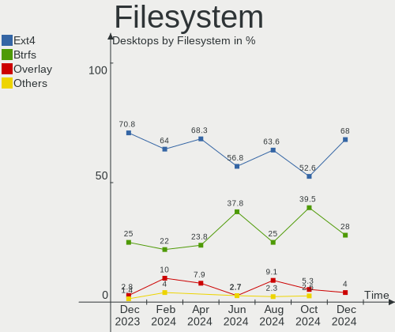
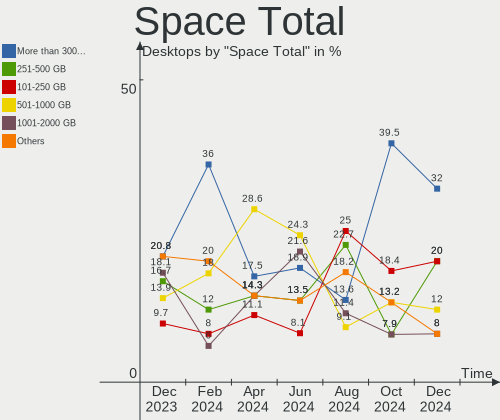
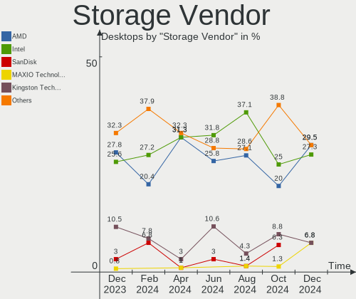
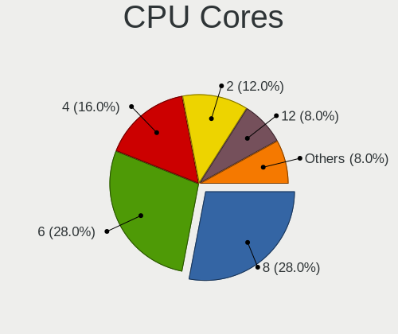
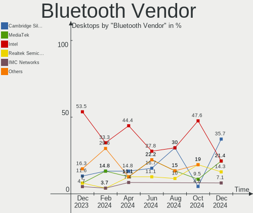
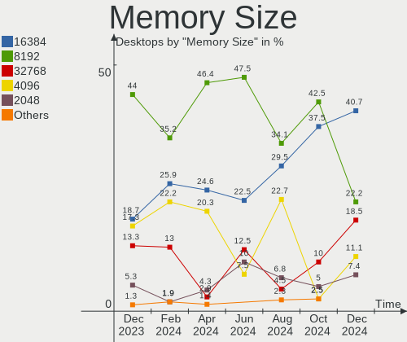

ArcoLinux - Hardware Trends (Desktops)
--------------------------------------

A project to identify most popular hardware characteristics and track their change
over time based on data collected by Linux users at https://Linux-Hardware.org.

Anyone can contribute to this report by the [hw-probe](https://github.com/linuxhw/hw-probe) tool:

    sudo -E hw-probe -all -upload

This report is for one last month. Overall report since the beginning of time: [TestDays](https://github.com/linuxhw/TestDays)

Period: May, 2023.

Contents
--------

* [ System ](#system)
  - [ OS                       ](#os)
  - [ OS Family                ](#os-family)
  - [ Kernel                   ](#kernel)
  - [ Kernel Family            ](#kernel-family)
  - [ Kernel Major Ver.        ](#kernel-major-ver)
  - [ Arch                     ](#arch)
  - [ DE                       ](#de)
  - [ Display Server           ](#display-server)
  - [ Display Manager          ](#display-manager)
  - [ OS Lang                  ](#os-lang)
  - [ Boot Mode                ](#boot-mode)
  - [ Filesystem               ](#filesystem)
  - [ Part. scheme             ](#part-scheme)
  - [ Dual Boot with Linux/BSD ](#dual-boot-with-linuxbsd)
  - [ Dual Boot (Win)          ](#dual-boot-win)

* [ Board ](#board)
  - [ Vendor                   ](#vendor)
  - [ Model                    ](#model)
  - [ Model Family             ](#model-family)
  - [ MFG Year                 ](#mfg-year)
  - [ Form Factor              ](#form-factor)
  - [ Secure Boot              ](#secure-boot)
  - [ Coreboot                 ](#coreboot)
  - [ RAM Size                 ](#ram-size)
  - [ RAM Used                 ](#ram-used)
  - [ Total Drives             ](#total-drives)
  - [ Has CD-ROM               ](#has-cd-rom)
  - [ Has Ethernet             ](#has-ethernet)
  - [ Has WiFi                 ](#has-wifi)
  - [ Has Bluetooth            ](#has-bluetooth)

* [ Location ](#location)
  - [ Country                  ](#country)
  - [ City                     ](#city)

* [ Drives ](#drives)
  - [ Drive Vendor             ](#drive-vendor)
  - [ Drive Model              ](#drive-model)
  - [ HDD Vendor               ](#hdd-vendor)
  - [ SSD Vendor               ](#ssd-vendor)
  - [ Drive Kind               ](#drive-kind)
  - [ Drive Connector          ](#drive-connector)
  - [ Drive Size               ](#drive-size)
  - [ Space Total              ](#space-total)
  - [ Space Used               ](#space-used)
  - [ Malfunc. Drives          ](#malfunc-drives)
  - [ Malfunc. Drive Vendor    ](#malfunc-drive-vendor)
  - [ Malfunc. HDD Vendor      ](#malfunc-hdd-vendor)
  - [ Malfunc. Drive Kind      ](#malfunc-drive-kind)
  - [ Failed Drives            ](#failed-drives)
  - [ Failed Drive Vendor      ](#failed-drive-vendor)
  - [ Drive Status             ](#drive-status)

* [ Storage controller ](#storage-controller)
  - [ Storage Vendor           ](#storage-vendor)
  - [ Storage Model            ](#storage-model)
  - [ Storage Kind             ](#storage-kind)

* [ Processor ](#processor)
  - [ CPU Vendor               ](#cpu-vendor)
  - [ CPU Model                ](#cpu-model)
  - [ CPU Model Family         ](#cpu-model-family)
  - [ CPU Cores                ](#cpu-cores)
  - [ CPU Sockets              ](#cpu-sockets)
  - [ CPU Threads              ](#cpu-threads)
  - [ CPU Op-Modes             ](#cpu-op-modes)
  - [ CPU Microcode            ](#cpu-microcode)
  - [ CPU Microarch            ](#cpu-microarch)

* [ Graphics ](#graphics)
  - [ GPU Vendor               ](#gpu-vendor)
  - [ GPU Model                ](#gpu-model)
  - [ GPU Combo                ](#gpu-combo)
  - [ GPU Driver               ](#gpu-driver)
  - [ GPU Memory               ](#gpu-memory)

* [ Monitor ](#monitor)
  - [ Monitor Vendor           ](#monitor-vendor)
  - [ Monitor Model            ](#monitor-model)
  - [ Monitor Resolution       ](#monitor-resolution)
  - [ Monitor Diagonal         ](#monitor-diagonal)
  - [ Monitor Width            ](#monitor-width)
  - [ Aspect Ratio             ](#aspect-ratio)
  - [ Monitor Area             ](#monitor-area)
  - [ Pixel Density            ](#pixel-density)
  - [ Multiple Monitors        ](#multiple-monitors)

* [ Network ](#network)
  - [ Net Controller Vendor    ](#net-controller-vendor)
  - [ Net Controller Model     ](#net-controller-model)
  - [ Wireless Vendor          ](#wireless-vendor)
  - [ Wireless Model           ](#wireless-model)
  - [ Ethernet Vendor          ](#ethernet-vendor)
  - [ Ethernet Model           ](#ethernet-model)
  - [ Net Controller Kind      ](#net-controller-kind)
  - [ Used Controller          ](#used-controller)
  - [ NICs                     ](#nics)
  - [ IPv6                     ](#ipv6)

* [ Bluetooth ](#bluetooth)
  - [ Bluetooth Vendor         ](#bluetooth-vendor)
  - [ Bluetooth Model          ](#bluetooth-model)

* [ Sound ](#sound)
  - [ Sound Vendor             ](#sound-vendor)
  - [ Sound Model              ](#sound-model)

* [ Memory ](#memory)
  - [ Memory Vendor            ](#memory-vendor)
  - [ Memory Model             ](#memory-model)
  - [ Memory Kind              ](#memory-kind)
  - [ Memory Form Factor       ](#memory-form-factor)
  - [ Memory Size              ](#memory-size)
  - [ Memory Speed             ](#memory-speed)

* [ Printers & scanners ](#printers--scanners)
  - [ Printer Vendor           ](#printer-vendor)
  - [ Printer Model            ](#printer-model)
  - [ Scanner Vendor           ](#scanner-vendor)
  - [ Scanner Model            ](#scanner-model)

* [ Camera ](#camera)
  - [ Camera Vendor            ](#camera-vendor)
  - [ Camera Model             ](#camera-model)

* [ Security ](#security)
  - [ Fingerprint Vendor       ](#fingerprint-vendor)
  - [ Fingerprint Model        ](#fingerprint-model)
  - [ Chipcard Vendor          ](#chipcard-vendor)
  - [ Chipcard Model           ](#chipcard-model)

* [ Unsupported ](#unsupported)
  - [ Unsupported Devices      ](#unsupported-devices)
  - [ Unsupported Device Types ](#unsupported-device-types)

System
------

OS
--

Installed operating systems

| Name              | Desktops | Percent |
|-------------------|----------|---------|
| ArcoLinux Rolling | 67       | 98.53%  |
| ArcoLinux         | 1        | 1.47%   |

OS Family
---------

OS without a version

| Name      | Desktops | Percent |
|-----------|----------|---------|
| ArcoLinux | 68       | 100%    |

Kernel
------

Version of the Linux kernel

| Version                     | Desktops | Percent |
|-----------------------------|----------|---------|
| 6.3.2-arch1-1               | 13       | 19.12%  |
| 6.3.1-arch1-1               | 9        | 13.24%  |
| 6.3.4-arch1-1               | 6        | 8.82%   |
| 6.3.1-arch2-1               | 5        | 7.35%   |
| 6.2.11-arch1-1              | 5        | 7.35%   |
| 6.3.2-zen1-1-zen            | 4        | 5.88%   |
| 6.3.4-arch2-1               | 3        | 4.41%   |
| 6.1.27-1-lts                | 3        | 4.41%   |
| 6.3.3-x64v1-xanmod1-1       | 2        | 2.94%   |
| 6.3.3-arch1-1               | 2        | 2.94%   |
| 6.2.13-arch1-1              | 2        | 2.94%   |
| 6.2.10-x64v1-xanmod1-1      | 2        | 2.94%   |
| 6.1.29-1-lts                | 2        | 2.94%   |
| 6.3.5-arch1-1               | 1        | 1.47%   |
| 6.3.3-1-cachyos-bore        | 1        | 1.47%   |
| 6.3.2-AMD                   | 1        | 1.47%   |
| 6.3.1-zen2-1-zen            | 1        | 1.47%   |
| 6.2.13-zen-1-zen            | 1        | 1.47%   |
| 6.2.12-zen1-1-zen           | 1        | 1.47%   |
| 6.2.12-arch1-1              | 1        | 1.47%   |
| 6.2.0.3.realtime1-4-rt      | 1        | 1.47%   |
| 6.1.28-hardened1-1-hardened | 1        | 1.47%   |
| 6.1.23-x64v1-xanmod1-1-lts  | 1        | 1.47%   |

Kernel Family
-------------

Linux kernel without a distro release

| Version | Desktops | Percent |
|---------|----------|---------|
| 6.3.2   | 18       | 26.47%  |
| 6.3.1   | 15       | 22.06%  |
| 6.3.4   | 9        | 13.24%  |
| 6.3.3   | 5        | 7.35%   |
| 6.2.11  | 5        | 7.35%   |
| 6.2.13  | 3        | 4.41%   |
| 6.1.27  | 3        | 4.41%   |
| 6.2.12  | 2        | 2.94%   |
| 6.2.10  | 2        | 2.94%   |
| 6.1.29  | 2        | 2.94%   |
| 6.3.5   | 1        | 1.47%   |
| 6.2.0.3 | 1        | 1.47%   |
| 6.1.28  | 1        | 1.47%   |
| 6.1.23  | 1        | 1.47%   |

Kernel Major Ver.
-----------------

Linux kernel major version

| Version | Desktops | Percent |
|---------|----------|---------|
| 6.3     | 48       | 70.59%  |
| 6.2     | 12       | 17.65%  |
| 6.1     | 7        | 10.29%  |
| 6.2.0   | 1        | 1.47%   |

Arch
----

OS architecture (x86_64, i586, etc.)

| Name   | Desktops | Percent |
|--------|----------|---------|
| x86_64 | 68       | 100%    |

DE
--

Desktop Environment

| Name       | Desktops | Percent |
|------------|----------|---------|
| XFCE       | 22       | 32.35%  |
| KDE5       | 20       | 29.41%  |
| X-Cinnamon | 5        | 7.35%   |
| Hyprland   | 5        | 7.35%   |
| Cinnamon   | 4        | 5.88%   |
| i3         | 3        | 4.41%   |
| qtile      | 2        | 2.94%   |
| GNOME      | 2        | 2.94%   |
| chadwm     | 2        | 2.94%   |
| openbox    | 1        | 1.47%   |
| bspwm      | 1        | 1.47%   |
| Unknown    | 1        | 1.47%   |

Display Server
--------------

X11 or Wayland

| Name    | Desktops | Percent |
|---------|----------|---------|
| X11     | 62       | 91.18%  |
| Wayland | 6        | 8.82%   |

Display Manager
---------------

SDDM, LightDM, etc.

| Name    | Desktops | Percent |
|---------|----------|---------|
| SDDM    | 56       | 82.35%  |
| LightDM | 11       | 16.18%  |
| Unknown | 1        | 1.47%   |

OS Lang
-------

Language

| Lang  | Desktops | Percent |
|-------|----------|---------|
| en_US | 35       | 51.47%  |
| en_GB | 6        | 8.82%   |
| en_CA | 4        | 5.88%   |
| fr_FR | 3        | 4.41%   |
| C     | 3        | 4.41%   |
| sv_SE | 2        | 2.94%   |
| ru_RU | 2        | 2.94%   |
| it_IT | 2        | 2.94%   |
| en_DK | 2        | 2.94%   |
| en_AU | 2        | 2.94%   |
| de_DE | 2        | 2.94%   |
| nb_NO | 1        | 1.47%   |
| es_MX | 1        | 1.47%   |
| es_ES | 1        | 1.47%   |
| es_AR | 1        | 1.47%   |
| en_IN | 1        | 1.47%   |

Boot Mode
---------

EFI or BIOS

| Mode | Desktops | Percent |
|------|----------|---------|
| EFI  | 57       | 83.82%  |
| BIOS | 11       | 16.18%  |

Filesystem
----------

Type of filesystem

| Type    | Desktops | Percent |
|---------|----------|---------|
| Ext4    | 48       | 70.59%  |
| Btrfs   | 15       | 22.06%  |
| Overlay | 3        | 4.41%   |
| Xfs     | 2        | 2.94%   |

Part. scheme
------------

Scheme of partitioning

| Type    | Desktops | Percent |
|---------|----------|---------|
| GPT     | 65       | 95.59%  |
| MBR     | 2        | 2.94%   |
| Unknown | 1        | 1.47%   |

Dual Boot with Linux/BSD
------------------------

Hosting more than one Linux/BSD

| Dual boot | Desktops | Percent |
|-----------|----------|---------|
| No        | 47       | 69.12%  |
| Yes       | 21       | 30.88%  |

Dual Boot (Win)
---------------

Hosting Linux and Windows

| Dual boot | Desktops | Percent |
|-----------|----------|---------|
| Yes       | 36       | 52.94%  |
| No        | 32       | 47.06%  |

Board
-----

Vendor
------

Motherboard manufacturer

| Name                | Desktops | Percent |
|---------------------|----------|---------|
| ASUSTek Computer    | 25       | 36.76%  |
| MSI                 | 12       | 17.65%  |
| Gigabyte Technology | 10       | 14.71%  |
| ASRock              | 6        | 8.82%   |
| Hewlett-Packard     | 4        | 5.88%   |
| Lenovo              | 3        | 4.41%   |
| Dell                | 3        | 4.41%   |
| Intel               | 1        | 1.47%   |
| Google              | 1        | 1.47%   |
| Fujitsu             | 1        | 1.47%   |
| BESSTAR Tech        | 1        | 1.47%   |
| Unknown             | 1        | 1.47%   |

Model
-----

Motherboard model

| Name                                    | Desktops | Percent |
|-----------------------------------------|----------|---------|
| MSI MS-7A38                             | 2        | 2.94%   |
| ASUS PRIME B550-PLUS                    | 2        | 2.94%   |
| MSI MS-7D17                             | 1        | 1.47%   |
| MSI MS-7D09                             | 1        | 1.47%   |
| MSI MS-7C95                             | 1        | 1.47%   |
| MSI MS-7C91                             | 1        | 1.47%   |
| MSI MS-7C83                             | 1        | 1.47%   |
| MSI MS-7C52                             | 1        | 1.47%   |
| MSI MS-7C35                             | 1        | 1.47%   |
| MSI MS-7C13                             | 1        | 1.47%   |
| MSI MS-7693                             | 1        | 1.47%   |
| MSI A320M-HDV R4.0                      | 1        | 1.47%   |
| Lenovo ThinkCentre M900 10FM0016MX      | 1        | 1.47%   |
| Lenovo ThinkCentre M900 10FGS0YM01      | 1        | 1.47%   |
| Lenovo IdeaCentre 510A-15ICB 90HV001MUS | 1        | 1.47%   |
| Intel DG43GT AAE62768-300               | 1        | 1.47%   |
| HP ProDesk 400 G6 MT                    | 1        | 1.47%   |
| HP Pavilion Desktop 595-p0xxx           | 1        | 1.47%   |
| HP OMEN by Desktop PC 880-p1xx          | 1        | 1.47%   |
| HP Compaq Pro 6300 MT                   | 1        | 1.47%   |
| Google Sumo                             | 1        | 1.47%   |
| Gigabyte Z97X-UD3H                      | 1        | 1.47%   |
| Gigabyte Z490I AORUS ULTRA              | 1        | 1.47%   |
| Gigabyte Z390 I AORUS PRO WIFI          | 1        | 1.47%   |
| Gigabyte Z270X-Gaming 7                 | 1        | 1.47%   |
| Gigabyte X570S AORUS ELITE AX           | 1        | 1.47%   |
| Gigabyte X570 AORUS MASTER              | 1        | 1.47%   |
| Gigabyte h8-1220                        | 1        | 1.47%   |
| Gigabyte GB-BRi5(H)-8250                | 1        | 1.47%   |
| Gigabyte B450M H                        | 1        | 1.47%   |
| Gigabyte B450 AORUS ELITE               | 1        | 1.47%   |
| Fujitsu ESPRIMO D538                    | 1        | 1.47%   |
| Dell Studio 540                         | 1        | 1.47%   |
| Dell Precision 5820 Tower               | 1        | 1.47%   |
| Dell OptiPlex 790                       | 1        | 1.47%   |
| BESSTAR Tech DMAF5                      | 1        | 1.47%   |
| ASUS TUF Gaming X570-PLUS               | 1        | 1.47%   |
| ASUS TUF Gaming H670-PRO WIFI D4        | 1        | 1.47%   |
| ASUS TUF Gaming B550-PLUS               | 1        | 1.47%   |
| ASUS STRIX Z270H GAMING                 | 1        | 1.47%   |

Model Family
------------

Motherboard model prefix

| Name                     | Desktops | Percent |
|--------------------------|----------|---------|
| ASUS PRIME               | 11       | 16.18%  |
| ASUS ROG                 | 6        | 8.82%   |
| ASUS TUF                 | 3        | 4.41%   |
| MSI MS-7A38              | 2        | 2.94%   |
| Lenovo ThinkCentre       | 2        | 2.94%   |
| MSI MS-7D17              | 1        | 1.47%   |
| MSI MS-7D09              | 1        | 1.47%   |
| MSI MS-7C95              | 1        | 1.47%   |
| MSI MS-7C91              | 1        | 1.47%   |
| MSI MS-7C83              | 1        | 1.47%   |
| MSI MS-7C52              | 1        | 1.47%   |
| MSI MS-7C35              | 1        | 1.47%   |
| MSI MS-7C13              | 1        | 1.47%   |
| MSI MS-7693              | 1        | 1.47%   |
| MSI A320M-HDV            | 1        | 1.47%   |
| Lenovo IdeaCentre        | 1        | 1.47%   |
| Intel DG43GT             | 1        | 1.47%   |
| HP ProDesk               | 1        | 1.47%   |
| HP Pavilion              | 1        | 1.47%   |
| HP OMEN                  | 1        | 1.47%   |
| HP Compaq                | 1        | 1.47%   |
| Google Sumo              | 1        | 1.47%   |
| Gigabyte Z97X-UD3H       | 1        | 1.47%   |
| Gigabyte Z490I           | 1        | 1.47%   |
| Gigabyte Z390            | 1        | 1.47%   |
| Gigabyte Z270X-Gaming    | 1        | 1.47%   |
| Gigabyte X570S           | 1        | 1.47%   |
| Gigabyte X570            | 1        | 1.47%   |
| Gigabyte h8-1220         | 1        | 1.47%   |
| Gigabyte GB-BRi5(H)-8250 | 1        | 1.47%   |
| Gigabyte B450M           | 1        | 1.47%   |
| Gigabyte B450            | 1        | 1.47%   |
| Fujitsu ESPRIMO          | 1        | 1.47%   |
| Dell Studio              | 1        | 1.47%   |
| Dell Precision           | 1        | 1.47%   |
| Dell OptiPlex            | 1        | 1.47%   |
| BESSTAR Tech DMAF5       | 1        | 1.47%   |
| ASUS STRIX               | 1        | 1.47%   |
| ASUS P5Q-PRO             | 1        | 1.47%   |
| ASUS M5A97               | 1        | 1.47%   |

MFG Year
--------

Motherboard manufacture year

| Year | Desktops | Percent |
|------|----------|---------|
| 2019 | 16       | 23.53%  |
| 2020 | 12       | 17.65%  |
| 2021 | 10       | 14.71%  |
| 2017 | 9        | 13.24%  |
| 2018 | 7        | 10.29%  |
| 2022 | 3        | 4.41%   |
| 2012 | 3        | 4.41%   |
| 2014 | 2        | 2.94%   |
| 2008 | 2        | 2.94%   |
| 2015 | 1        | 1.47%   |
| 2013 | 1        | 1.47%   |
| 2011 | 1        | 1.47%   |
| 2009 | 1        | 1.47%   |

Form Factor
-----------

Physical design of the computer

| Name    | Desktops | Percent |
|---------|----------|---------|
| Desktop | 68       | 100%    |

Secure Boot
-----------

Enabled or disabled

| State    | Desktops | Percent |
|----------|----------|---------|
| Disabled | 68       | 100%    |

Coreboot
--------

Have coreboot on board

| Used | Desktops | Percent |
|------|----------|---------|
| No   | 67       | 98.53%  |
| Yes  | 1        | 1.47%   |

RAM Size
--------

Total RAM memory

| Size in GB  | Desktops | Percent |
|-------------|----------|---------|
| 32.01-64.0  | 23       | 33.82%  |
| 16.01-24.0  | 22       | 32.35%  |
| 4.01-8.0    | 10       | 14.71%  |
| 8.01-16.0   | 7        | 10.29%  |
| 64.01-256.0 | 4        | 5.88%   |
| 3.01-4.0    | 1        | 1.47%   |
| 24.01-32.0  | 1        | 1.47%   |

RAM Used
--------

Used RAM memory

| Used GB   | Desktops | Percent |
|-----------|----------|---------|
| 2.01-3.0  | 18       | 26.47%  |
| 4.01-8.0  | 17       | 25%     |
| 3.01-4.0  | 15       | 22.06%  |
| 1.01-2.0  | 12       | 17.65%  |
| 8.01-16.0 | 4        | 5.88%   |
| 0.51-1.0  | 2        | 2.94%   |

Total Drives
------------

Number of drives on board

| Drives | Desktops | Percent |
|--------|----------|---------|
| 2      | 19       | 27.94%  |
| 3      | 18       | 26.47%  |
| 1      | 14       | 20.59%  |
| 4      | 11       | 16.18%  |
| 5      | 3        | 4.41%   |
| 6      | 2        | 2.94%   |
| 7      | 1        | 1.47%   |

Has CD-ROM
----------

Has CD-ROM on board

| Presented | Desktops | Percent |
|-----------|----------|---------|
| No        | 54       | 79.41%  |
| Yes       | 14       | 20.59%  |

Has Ethernet
------------

Has Ethernet on board

| Presented | Desktops | Percent |
|-----------|----------|---------|
| Yes       | 68       | 100%    |

Has WiFi
--------

Has WiFi module

| Presented | Desktops | Percent |
|-----------|----------|---------|
| Yes       | 38       | 55.88%  |
| No        | 30       | 44.12%  |

Has Bluetooth
-------------

Has Bluetooth module

| Presented | Desktops | Percent |
|-----------|----------|---------|
| Yes       | 42       | 61.76%  |
| No        | 26       | 38.24%  |

Location
--------

Country
-------

Geographic location (country)

| Country     | Desktops | Percent |
|-------------|----------|---------|
| USA         | 14       | 20.59%  |
| UK          | 6        | 8.82%   |
| Germany     | 5        | 7.35%   |
| Canada      | 5        | 7.35%   |
| Sweden      | 3        | 4.41%   |
| Mexico      | 3        | 4.41%   |
| France      | 3        | 4.41%   |
| Russia      | 2        | 2.94%   |
| Italy       | 2        | 2.94%   |
| India       | 2        | 2.94%   |
| Denmark     | 2        | 2.94%   |
| Bulgaria    | 2        | 2.94%   |
| Belgium     | 2        | 2.94%   |
| Australia   | 2        | 2.94%   |
| Turkey      | 1        | 1.47%   |
| Taiwan      | 1        | 1.47%   |
| Serbia      | 1        | 1.47%   |
| Romania     | 1        | 1.47%   |
| Portugal    | 1        | 1.47%   |
| Peru        | 1        | 1.47%   |
| Pakistan    | 1        | 1.47%   |
| Norway      | 1        | 1.47%   |
| Netherlands | 1        | 1.47%   |
| Malaysia    | 1        | 1.47%   |
| Luxembourg  | 1        | 1.47%   |
| Kuwait      | 1        | 1.47%   |
| Greece      | 1        | 1.47%   |
| Brazil      | 1        | 1.47%   |
| Argentina   | 1        | 1.47%   |

City
----

Geographic location (city)

| City                  | Desktops | Percent |
|-----------------------|----------|---------|
| Perth                 | 2        | 2.94%   |
| Zapopan               | 1        | 1.47%   |
| Wakefield             | 1        | 1.47%   |
| Vigneux-sur-Seine     | 1        | 1.47%   |
| Varna                 | 1        | 1.47%   |
| Troy                  | 1        | 1.47%   |
| Toronto               | 1        | 1.47%   |
| Tillsonburg           | 1        | 1.47%   |
| Thrissur              | 1        | 1.47%   |
| Taipei                | 1        | 1.47%   |
| Stockholm             | 1        | 1.47%   |
| St Petersburg         | 1        | 1.47%   |
| Sofia                 | 1        | 1.47%   |
| Slagelse              | 1        | 1.47%   |
| Schwanewede           | 1        | 1.47%   |
| San Tan Valley        | 1        | 1.47%   |
| San Luis Potosí City | 1        | 1.47%   |
| Rouyn-Noranda         | 1        | 1.47%   |
| Rheinfelden           | 1        | 1.47%   |
| Prattville            | 1        | 1.47%   |
| Pierrefonds           | 1        | 1.47%   |
| Pavlovsk              | 1        | 1.47%   |
| Ottawa                | 1        | 1.47%   |
| Novi Sad              | 1        | 1.47%   |
| North Salt Lake       | 1        | 1.47%   |
| New York              | 1        | 1.47%   |
| Neunkirchen           | 1        | 1.47%   |
| Nashville             | 1        | 1.47%   |
| Mumbai                | 1        | 1.47%   |
| Moore                 | 1        | 1.47%   |
| Montebelluna          | 1        | 1.47%   |
| Mölnlycke            | 1        | 1.47%   |
| Mainz                 | 1        | 1.47%   |
| Luxembourg            | 1        | 1.47%   |
| Loule                 | 1        | 1.47%   |
| Louisville            | 1        | 1.47%   |
| Lingolsheim           | 1        | 1.47%   |
| Lima                  | 1        | 1.47%   |
| Lier                  | 1        | 1.47%   |
| Kuwait City           | 1        | 1.47%   |

Drives
------

Drive Vendor
------------

Hard drive vendors

| Vendor                      | Desktops | Drives | Percent |
|-----------------------------|----------|--------|---------|
| Samsung Electronics         | 33       | 50     | 22.76%  |
| WDC                         | 22       | 29     | 15.17%  |
| Seagate                     | 20       | 26     | 13.79%  |
| Sandisk                     | 8        | 10     | 5.52%   |
| Kingston                    | 8        | 10     | 5.52%   |
| Micron/Crucial Technology   | 7        | 8      | 4.83%   |
| Crucial                     | 7        | 11     | 4.83%   |
| Toshiba                     | 5        | 5      | 3.45%   |
| Hitachi                     | 5        | 5      | 3.45%   |
| SSK                         | 3        | 3      | 2.07%   |
| Phison Electronics          | 3        | 3      | 2.07%   |
| Intel                       | 3        | 3      | 2.07%   |
| Unknown                     | 2        | 2      | 1.38%   |
| SK hynix                    | 2        | 2      | 1.38%   |
| Silicon Motion              | 2        | 2      | 1.38%   |
| Kingston Technology Company | 2        | 2      | 1.38%   |
| StarTech                    | 1        | 1      | 0.69%   |
| Realtek Semiconductor       | 1        | 1      | 0.69%   |
| Phison                      | 1        | 1      | 0.69%   |
| Patriot                     | 1        | 1      | 0.69%   |
| JMicron Technology          | 1        | 1      | 0.69%   |
| Gigabyte Technology         | 1        | 1      | 0.69%   |
| Fanxiang                    | 1        | 1      | 0.69%   |
| Corsair                     | 1        | 1      | 0.69%   |
| China                       | 1        | 1      | 0.69%   |
| BlueRay                     | 1        | 1      | 0.69%   |
| ASMT                        | 1        | 2      | 0.69%   |
| ADATA Technology            | 1        | 1      | 0.69%   |
| A-DATA Technology           | 1        | 1      | 0.69%   |

Drive Model
-----------

Hard drive models

| Model                                               | Desktops | Percent |
|-----------------------------------------------------|----------|---------|
| Samsung NVMe SSD Controller SM981/PM981/PM983 256GB | 9        | 5.23%   |
| Samsung NVMe SSD Controller PM9A1/PM9A3/980PRO 1TB  | 9        | 5.23%   |
| Crucial CT1000MX500SSD1 1TB                         | 6        | 3.49%   |
| Micron/Crucial P2 NVMe PCIe SSD 1TB                 | 5        | 2.91%   |
| SSK Disk 256GB                                      | 3        | 1.74%   |
| Seagate ST1000DM010-2EP102 1TB                      | 3        | 1.74%   |
| Seagate ST1000DM003-1CH162 1TB                      | 3        | 1.74%   |
| Samsung SSD 870 EVO 1TB                             | 3        | 1.74%   |
| Samsung SSD 860 EVO 500GB                           | 3        | 1.74%   |
| WDC WD10EZEX-08WN4A0 1TB                            | 2        | 1.16%   |
| WDC WD10EZEX-00WN4A0 1TB                            | 2        | 1.16%   |
| Toshiba DT01ACA100 1TB                              | 2        | 1.16%   |
| Silicon Motion SM2263EN/SM2263XT SSD Controller 1TB | 2        | 1.16%   |
| Seagate ST2000DM008-2FR102 2TB                      | 2        | 1.16%   |
| Seagate ST2000DM001-1ER164 2TB                      | 2        | 1.16%   |
| Seagate Expansion 1TB                               | 2        | 1.16%   |
| Sandisk WD Blue SN550 NVMe SSD 512GB                | 2        | 1.16%   |
| Sandisk WD Black 2018/SN750 / PC SN720 NVMe SSD 1TB | 2        | 1.16%   |
| Samsung SSD 850 EVO 250GB                           | 2        | 1.16%   |
| Micron/Crucial P1 NVMe PCIe SSD 500GB               | 2        | 1.16%   |
| Kingston SA400S37240G 240GB SSD                     | 2        | 1.16%   |
| WDC WDS250G2B0A-00SM50 250GB SSD                    | 1        | 0.58%   |
| WDC WDS240G2G0A-00JH30 240GB SSD                    | 1        | 0.58%   |
| WDC WDS200T2B0B-00YS70 2TB SSD                      | 1        | 0.58%   |
| WDC WDS120G2G0A-00JH30 120GB SSD                    | 1        | 0.58%   |
| WDC WDBNCE0020PNC 2TB SSD                           | 1        | 0.58%   |
| WDC WD5000LPLX-75ZNTT0 500GB                        | 1        | 0.58%   |
| WDC WD5000KS-00MNB0 500GB                           | 1        | 0.58%   |
| WDC WD5000AZLX-75K2TA0 500GB                        | 1        | 0.58%   |
| WDC WD5000AAKS-00V1A0 500GB                         | 1        | 0.58%   |
| WDC WD5000AACS-00G8B1 500GB                         | 1        | 0.58%   |
| WDC WD40PURZ-85TTDY0 4TB                            | 1        | 0.58%   |
| WDC WD40EFRX-68N32N0 4TB                            | 1        | 0.58%   |
| WDC WD20EARS-00MVWB0 2TB                            | 1        | 0.58%   |
| WDC WD20EARS-00J2GB0 2TB                            | 1        | 0.58%   |
| WDC WD15EARS-60MVWB0 1TB                            | 1        | 0.58%   |
| WDC WD10JPVX-22JC3T0 1TB                            | 1        | 0.58%   |
| WDC WD10EZRZ-00Z5HB0 1TB                            | 1        | 0.58%   |
| WDC WD10EZEX-75WN4A1 1TB                            | 1        | 0.58%   |
| WDC WD10EZEX-22MFCA0 1TB                            | 1        | 0.58%   |

HDD Vendor
----------

Hard disk drive vendors

| Vendor              | Desktops | Drives | Percent |
|---------------------|----------|--------|---------|
| Seagate             | 20       | 26     | 36.36%  |
| WDC                 | 19       | 24     | 34.55%  |
| Hitachi             | 5        | 5      | 9.09%   |
| Toshiba             | 4        | 4      | 7.27%   |
| SSK                 | 3        | 3      | 5.45%   |
| Samsung Electronics | 2        | 2      | 3.64%   |
| Unknown             | 1        | 1      | 1.82%   |
| ASMT                | 1        | 2      | 1.82%   |

SSD Vendor
----------

Solid state drive vendors

| Vendor              | Desktops | Drives | Percent |
|---------------------|----------|--------|---------|
| Samsung Electronics | 17       | 24     | 35.42%  |
| Kingston            | 7        | 9      | 14.58%  |
| Crucial             | 7        | 11     | 14.58%  |
| WDC                 | 5        | 5      | 10.42%  |
| SK hynix            | 2        | 2      | 4.17%   |
| Toshiba             | 1        | 1      | 2.08%   |
| SanDisk             | 1        | 1      | 2.08%   |
| Patriot             | 1        | 1      | 2.08%   |
| JMicron Technology  | 1        | 1      | 2.08%   |
| Intel               | 1        | 1      | 2.08%   |
| Gigabyte Technology | 1        | 1      | 2.08%   |
| Corsair             | 1        | 1      | 2.08%   |
| China               | 1        | 1      | 2.08%   |
| BlueRay             | 1        | 1      | 2.08%   |
| A-DATA Technology   | 1        | 1      | 2.08%   |

Drive Kind
----------

HDD or SSD

| Kind    | Desktops | Drives | Percent |
|---------|----------|--------|---------|
| NVMe    | 41       | 54     | 32.8%   |
| SSD     | 41       | 61     | 32.8%   |
| HDD     | 40       | 67     | 32%     |
| Unknown | 2        | 2      | 1.6%    |
| MMC     | 1        | 1      | 0.8%    |

Drive Connector
---------------

SATA, SAS, NVMe, etc.

| Type | Desktops | Drives | Percent |
|------|----------|--------|---------|
| SATA | 59       | 117    | 53.64%  |
| NVMe | 41       | 54     | 37.27%  |
| SAS  | 9        | 13     | 8.18%   |
| MMC  | 1        | 1      | 0.91%   |

Drive Size
----------

Size of hard drive

| Size in TB | Desktops | Drives | Percent |
|------------|----------|--------|---------|
| 0.01-0.5   | 37       | 58     | 41.11%  |
| 0.51-1.0   | 30       | 41     | 33.33%  |
| 1.01-2.0   | 14       | 18     | 15.56%  |
| 3.01-4.0   | 5        | 6      | 5.56%   |
| 4.01-10.0  | 4        | 5      | 4.44%   |

Space Total
-----------

Amount of disk space available on the file system

| Size in GB     | Desktops | Percent |
|----------------|----------|---------|
| More than 3000 | 16       | 23.53%  |
| 251-500        | 14       | 20.59%  |
| 501-1000       | 10       | 14.71%  |
| 101-250        | 9        | 13.24%  |
| 1001-2000      | 7        | 10.29%  |
| 2001-3000      | 6        | 8.82%   |
| 1-20           | 2        | 2.94%   |
| Unknown        | 2        | 2.94%   |
| 21-50          | 1        | 1.47%   |
| 51-100         | 1        | 1.47%   |

Space Used
----------

Amount of used disk space

| Used GB        | Desktops | Percent |
|----------------|----------|---------|
| 1-20           | 15       | 22.06%  |
| 21-50          | 12       | 17.65%  |
| 101-250        | 8        | 11.76%  |
| 51-100         | 8        | 11.76%  |
| 1001-2000      | 7        | 10.29%  |
| 251-500        | 6        | 8.82%   |
| More than 3000 | 4        | 5.88%   |
| 501-1000       | 4        | 5.88%   |
| 2001-3000      | 2        | 2.94%   |
| Unknown        | 2        | 2.94%   |

Malfunc. Drives
---------------

Drive models with a malfunction

| Model                                                          | Desktops | Drives | Percent |
|----------------------------------------------------------------|----------|--------|---------|
| Seagate ST1000DM003-1CH162 1TB                                 | 2        | 2      | 8.7%    |
| WDC WD5000AAKS-00V1A0 500GB                                    | 1        | 1      | 4.35%   |
| WDC WD5000AACS-00G8B1 500GB                                    | 1        | 1      | 4.35%   |
| WDC WD20EARS-00J2GB0 2TB                                       | 1        | 1      | 4.35%   |
| WDC WD15EARS-60MVWB0 1TB                                       | 1        | 1      | 4.35%   |
| WDC WD10JPVX-22JC3T0 1TB                                       | 1        | 1      | 4.35%   |
| WDC WD10EZRZ-00Z5HB0 1TB                                       | 1        | 1      | 4.35%   |
| WDC WD10EZEX-00WN4A0 1TB                                       | 1        | 1      | 4.35%   |
| Seagate ST8000DM004-2CX188 8TB                                 | 1        | 1      | 4.35%   |
| Seagate ST500DM002-1BD142 500GB                                | 1        | 1      | 4.35%   |
| Seagate ST3500413AS 500GB                                      | 1        | 1      | 4.35%   |
| Seagate ST3320413CS 320GB                                      | 1        | 1      | 4.35%   |
| Seagate ST3250310AS 250GB                                      | 1        | 2      | 4.35%   |
| Seagate ST2000DL003-9VT166 2TB                                 | 1        | 1      | 4.35%   |
| Samsung Electronics SSD 870 EVO 1TB                            | 1        | 1      | 4.35%   |
| Samsung Electronics SSD 850 EVO 250GB                          | 1        | 1      | 4.35%   |
| Samsung Electronics NVMe SSD Controller PM9A1/PM9A3/980PRO 1TB | 1        | 2      | 4.35%   |
| Samsung Electronics HD503HI 500GB                              | 1        | 1      | 4.35%   |
| Micron/Crucial Technology P1 NVMe PCIe SSD 500GB               | 1        | 1      | 4.35%   |
| Hitachi HDS721032CLA362 320GB                                  | 1        | 1      | 4.35%   |
| Crucial CT275MX300SSD1 275GB                                   | 1        | 1      | 4.35%   |
| Corsair CSSD-F60GB2 64GB                                       | 1        | 1      | 4.35%   |

Malfunc. Drive Vendor
---------------------

Vendors of faulty drives

| Vendor                    | Desktops | Drives | Percent |
|---------------------------|----------|--------|---------|
| WDC                       | 7        | 7      | 33.33%  |
| Seagate                   | 7        | 9      | 33.33%  |
| Samsung Electronics       | 3        | 5      | 14.29%  |
| Micron/Crucial Technology | 1        | 1      | 4.76%   |
| Hitachi                   | 1        | 1      | 4.76%   |
| Crucial                   | 1        | 1      | 4.76%   |
| Corsair                   | 1        | 1      | 4.76%   |

Malfunc. HDD Vendor
-------------------

Vendors of faulty HDD drives

| Vendor              | Desktops | Drives | Percent |
|---------------------|----------|--------|---------|
| WDC                 | 7        | 7      | 43.75%  |
| Seagate             | 7        | 9      | 43.75%  |
| Samsung Electronics | 1        | 1      | 6.25%   |
| Hitachi             | 1        | 1      | 6.25%   |

Malfunc. Drive Kind
-------------------

Kinds of faulty drives

| Kind | Desktops | Drives | Percent |
|------|----------|--------|---------|
| HDD  | 13       | 18     | 68.42%  |
| SSD  | 4        | 4      | 21.05%  |
| NVMe | 2        | 3      | 10.53%  |

Failed Drives
-------------

Failed drive models

Zero info for selected period =(

Failed Drive Vendor
-------------------

Failed drive vendors

Zero info for selected period =(

Drive Status
------------

Number of failed and malfunc. drives

| Status   | Desktops | Drives | Percent |
|----------|----------|--------|---------|
| Works    | 63       | 142    | 69.23%  |
| Malfunc  | 17       | 25     | 18.68%  |
| Detected | 11       | 18     | 12.09%  |

Storage controller
------------------

Storage Vendor
--------------

Storage controller vendors

| Vendor                      | Desktops | Percent |
|-----------------------------|----------|---------|
| Intel                       | 37       | 32.17%  |
| AMD                         | 31       | 26.96%  |
| Samsung Electronics         | 19       | 16.52%  |
| SanDisk                     | 7        | 6.09%   |
| Micron/Crucial Technology   | 7        | 6.09%   |
| Phison Electronics          | 4        | 3.48%   |
| Kingston Technology Company | 3        | 2.61%   |
| Silicon Motion              | 2        | 1.74%   |
| ASMedia Technology          | 2        | 1.74%   |
| Realtek Semiconductor       | 1        | 0.87%   |
| Marvell Technology Group    | 1        | 0.87%   |
| ADATA Technology            | 1        | 0.87%   |

Storage Model
-------------

Storage controller models

| Model                                                                         | Desktops | Percent |
|-------------------------------------------------------------------------------|----------|---------|
| AMD FCH SATA Controller [AHCI mode]                                           | 19       | 14.39%  |
| Intel 200 Series PCH SATA controller [AHCI mode]                              | 10       | 7.58%   |
| Samsung NVMe SSD Controller SM981/PM981/PM983                                 | 9        | 6.82%   |
| Samsung NVMe SSD Controller PM9A1/PM9A3/980PRO                                | 9        | 6.82%   |
| AMD 400 Series Chipset SATA Controller                                        | 7        | 5.3%    |
| Intel Cannon Lake PCH SATA AHCI Controller                                    | 6        | 4.55%   |
| AMD 500 Series Chipset SATA Controller                                        | 6        | 4.55%   |
| Micron/Crucial P2 NVMe PCIe SSD                                               | 5        | 3.79%   |
| Intel 500 Series Chipset Family SATA AHCI Controller                          | 3        | 2.27%   |
| Silicon Motion SM2263EN/SM2263XT SSD Controller                               | 2        | 1.52%   |
| SanDisk WD Blue SN550 NVMe SSD                                                | 2        | 1.52%   |
| SanDisk WD Black 2018/SN750 / PC SN720 NVMe SSD                               | 2        | 1.52%   |
| Phison E18 PCIe4 NVMe Controller                                              | 2        | 1.52%   |
| Micron/Crucial P1 NVMe PCIe SSD                                               | 2        | 1.52%   |
| Intel Volume Management Device NVMe RAID Controller                           | 2        | 1.52%   |
| Intel SATA Controller [RAID mode]                                             | 2        | 1.52%   |
| Intel Comet Lake SATA AHCI Controller                                         | 2        | 1.52%   |
| Intel 82801JI (ICH10 Family) 4 port SATA IDE Controller #1                    | 2        | 1.52%   |
| Intel 82801JI (ICH10 Family) 2 port SATA IDE Controller #2                    | 2        | 1.52%   |
| ASMedia ASM1062 Serial ATA Controller                                         | 2        | 1.52%   |
| AMD SB7x0/SB8x0/SB9x0 SATA Controller [AHCI mode]                             | 2        | 1.52%   |
| AMD FCH SATA Controller D                                                     | 2        | 1.52%   |
| SanDisk WD PC SN810 / Black SN850 NVMe SSD                                    | 1        | 0.76%   |
| SanDisk WD Blue SN570 NVMe SSD 1TB                                            | 1        | 0.76%   |
| SanDisk WD Black SN750 / PC SN730 NVMe SSD                                    | 1        | 0.76%   |
| SanDisk Non-Volatile memory controller                                        | 1        | 0.76%   |
| Samsung NVMe SSD Controller SM961/PM961/SM963                                 | 1        | 0.76%   |
| Samsung NVMe SSD Controller SM951/PM951                                       | 1        | 0.76%   |
| Samsung NVMe SSD Controller 980                                               | 1        | 0.76%   |
| Realtek NVMe Controller                                                       | 1        | 0.76%   |
| Phison E16 PCIe4 NVMe Controller                                              | 1        | 0.76%   |
| Phison E12 NVMe Controller                                                    | 1        | 0.76%   |
| Micron/Crucial NVMe Storage Controller                                        | 1        | 0.76%   |
| Marvell Group 88SE6101/6102 single-port PATA133 interface                     | 1        | 0.76%   |
| Kingston Company Company Non-Volatile memory controller                       | 1        | 0.76%   |
| Kingston Company SNVS2000G [NV1 NVMe PCIe SSD 2TB]                            | 1        | 0.76%   |
| Kingston Company A2000 NVMe SSD                                               | 1        | 0.76%   |
| Intel SSD Pro 7600p/760p/E 6100p Series                                       | 1        | 0.76%   |
| Intel SSD 600P Series                                                         | 1        | 0.76%   |
| Intel Q170/Q150/B150/H170/H110/Z170/CM236 Chipset SATA Controller [AHCI Mode] | 1        | 0.76%   |

Storage Kind
------------

Kind of storage controller (IDE, SATA, NVMe, SAS, ...)

| Kind | Desktops | Percent |
|------|----------|---------|
| SATA | 57       | 52.29%  |
| NVMe | 41       | 37.61%  |
| RAID | 9        | 8.26%   |
| IDE  | 2        | 1.83%   |

Processor
---------

CPU Vendor
----------

Processor vendors

| Vendor | Desktops | Percent |
|--------|----------|---------|
| Intel  | 37       | 54.41%  |
| AMD    | 31       | 45.59%  |

CPU Model
---------

Processor models

| Model                                          | Desktops | Percent |
|------------------------------------------------|----------|---------|
| Intel Core i7-8700K CPU @ 3.70GHz              | 3        | 4.41%   |
| AMD Ryzen 5 5600X 6-Core Processor             | 3        | 4.41%   |
| AMD Ryzen 5 3600 6-Core Processor              | 3        | 4.41%   |
| Intel Core i7-8700 CPU @ 3.20GHz               | 2        | 2.94%   |
| Intel Core i7-7700K CPU @ 4.20GHz              | 2        | 2.94%   |
| Intel Core i7-10700K CPU @ 3.80GHz             | 2        | 2.94%   |
| Intel Core i5-8600K CPU @ 3.60GHz              | 2        | 2.94%   |
| Intel Core 2 Quad CPU Q6600 @ 2.40GHz          | 2        | 2.94%   |
| AMD Ryzen 9 5950X 16-Core Processor            | 2        | 2.94%   |
| AMD Ryzen 7 5700G with Radeon Graphics         | 2        | 2.94%   |
| AMD Ryzen 7 3700X 8-Core Processor             | 2        | 2.94%   |
| AMD Ryzen 5 2600 Six-Core Processor            | 2        | 2.94%   |
| AMD FX-8350 Eight-Core Processor               | 2        | 2.94%   |
| Intel Xeon W-2123 CPU @ 3.60GHz                | 1        | 1.47%   |
| Intel Xeon CPU E3-1230 v3 @ 3.30GHz            | 1        | 1.47%   |
| Intel Core i9-9900KS CPU @ 4.00GHz             | 1        | 1.47%   |
| Intel Core i9-9900K CPU @ 3.60GHz              | 1        | 1.47%   |
| Intel Core i9-7900X CPU @ 3.30GHz              | 1        | 1.47%   |
| Intel Core i9-10900K CPU @ 3.70GHz             | 1        | 1.47%   |
| Intel Core i7-9700 CPU @ 3.00GHz               | 1        | 1.47%   |
| Intel Core i7-4790K CPU @ 4.00GHz              | 1        | 1.47%   |
| Intel Core i5-9600K CPU @ 3.70GHz              | 1        | 1.47%   |
| Intel Core i5-8250U CPU @ 1.60GHz              | 1        | 1.47%   |
| Intel Core i5-6600 CPU @ 3.30GHz               | 1        | 1.47%   |
| Intel Core i5-6500T CPU @ 2.50GHz              | 1        | 1.47%   |
| Intel Core i5-3570 CPU @ 3.40GHz               | 1        | 1.47%   |
| Intel Core i5-2400S CPU @ 2.50GHz              | 1        | 1.47%   |
| Intel Core i5-10400F CPU @ 2.90GHz             | 1        | 1.47%   |
| Intel Core i3-9100F CPU @ 3.60GHz              | 1        | 1.47%   |
| Intel Core i3-8100 CPU @ 3.60GHz               | 1        | 1.47%   |
| Intel Core i3-7100 CPU @ 3.90GHz               | 1        | 1.47%   |
| Intel Core 2 Duo CPU E7500 @ 2.93GHz           | 1        | 1.47%   |
| Intel Celeron CPU N2930 @ 1.83GHz              | 1        | 1.47%   |
| Intel 12th Gen Core i9-12900K                  | 1        | 1.47%   |
| Intel 11th Gen Core i7-11700K @ 3.60GHz        | 1        | 1.47%   |
| Intel 11th Gen Core i7-11700F @ 2.50GHz        | 1        | 1.47%   |
| Intel 11th Gen Core i5-11600K @ 3.90GHz        | 1        | 1.47%   |
| AMD Ryzen Threadripper 3960X 24-Core Processor | 1        | 1.47%   |
| AMD Ryzen 9 5900HX with Radeon Graphics        | 1        | 1.47%   |
| AMD Ryzen 7 7700 8-Core Processor              | 1        | 1.47%   |

CPU Model Family
----------------

Processor model prefix

| Model                  | Desktops | Percent |
|------------------------|----------|---------|
| AMD Ryzen 5            | 13       | 19.12%  |
| Intel Core i7          | 11       | 16.18%  |
| Intel Core i5          | 9        | 13.24%  |
| AMD Ryzen 7            | 8        | 11.76%  |
| Other                  | 4        | 5.88%   |
| Intel Core i9          | 4        | 5.88%   |
| Intel Core i3          | 3        | 4.41%   |
| AMD Ryzen 9            | 3        | 4.41%   |
| AMD FX                 | 3        | 4.41%   |
| Intel Xeon             | 2        | 2.94%   |
| Intel Core 2 Quad      | 2        | 2.94%   |
| Intel Core 2 Duo       | 1        | 1.47%   |
| Intel Celeron          | 1        | 1.47%   |
| AMD Ryzen Threadripper | 1        | 1.47%   |
| AMD Ryzen 3            | 1        | 1.47%   |
| AMD Athlon             | 1        | 1.47%   |
| AMD A10                | 1        | 1.47%   |

CPU Cores
---------

Number of processor cores

| Number | Desktops | Percent |
|--------|----------|---------|
| 6      | 21       | 30.88%  |
| 4      | 21       | 30.88%  |
| 8      | 16       | 23.53%  |
| 2      | 4        | 5.88%   |
| 16     | 3        | 4.41%   |
| 10     | 2        | 2.94%   |
| 24     | 1        | 1.47%   |

CPU Sockets
-----------

Number of sockets

| Number | Desktops | Percent |
|--------|----------|---------|
| 1      | 68       | 100%    |

CPU Threads
-----------

Threads per core (Hyper-Threading)

| Number | Desktops | Percent |
|--------|----------|---------|
| 2      | 52       | 76.47%  |
| 1      | 16       | 23.53%  |

CPU Op-Modes
------------

CPU Operation Modes (32-bit, 64-bit)

| Op mode        | Desktops | Percent |
|----------------|----------|---------|
| 32-bit, 64-bit | 68       | 100%    |

CPU Microcode
-------------

Microcode number

| Number     | Desktops | Percent |
|------------|----------|---------|
| Unknown    | 33       | 48.53%  |
| 0x08701021 | 4        | 5.88%   |
| 0x0a20120a | 3        | 4.41%   |
| 0x0800820d | 3        | 4.41%   |
| 0xa0655    | 2        | 2.94%   |
| 0x0a50000d | 2        | 2.94%   |
| 0x0a50000c | 2        | 2.94%   |
| 0x0a201016 | 2        | 2.94%   |
| 0x08701013 | 2        | 2.94%   |
| 0x08108102 | 2        | 2.94%   |
| 0x08101016 | 2        | 2.94%   |
| 0xa0671    | 1        | 1.47%   |
| 0x90672    | 1        | 1.47%   |
| 0x506e3    | 1        | 1.47%   |
| 0x0a601203 | 1        | 1.47%   |
| 0x0a201205 | 1        | 1.47%   |
| 0x0a201025 | 1        | 1.47%   |
| 0x0830104d | 1        | 1.47%   |
| 0x06003106 | 1        | 1.47%   |
| 0x06000852 | 1        | 1.47%   |
| 0x06000822 | 1        | 1.47%   |
| 0x0600063e | 1        | 1.47%   |

CPU Microarch
-------------

Microarchitecture

| Name             | Desktops | Percent |
|------------------|----------|---------|
| KabyLake         | 17       | 25%     |
| Zen 3            | 11       | 16.18%  |
| Zen 2            | 7        | 10.29%  |
| Zen+             | 6        | 8.82%   |
| Skylake          | 4        | 5.88%   |
| CometLake        | 4        | 5.88%   |
| Icelake          | 3        | 4.41%   |
| Zen              | 2        | 2.94%   |
| Piledriver       | 2        | 2.94%   |
| Haswell          | 2        | 2.94%   |
| Core             | 2        | 2.94%   |
| Steamroller      | 1        | 1.47%   |
| Silvermont       | 1        | 1.47%   |
| SandyBridge      | 1        | 1.47%   |
| Penryn           | 1        | 1.47%   |
| IvyBridge        | 1        | 1.47%   |
| Bulldozer        | 1        | 1.47%   |
| Alderlake Hybrid | 1        | 1.47%   |
| Unknown          | 1        | 1.47%   |

Graphics
--------

GPU Vendor
----------

Vendors of graphics cards

| Vendor | Desktops | Percent |
|--------|----------|---------|
| Nvidia | 28       | 40.58%  |
| AMD    | 25       | 36.23%  |
| Intel  | 16       | 23.19%  |

GPU Model
---------

Graphics card models

| Model                                                                       | Desktops | Percent |
|-----------------------------------------------------------------------------|----------|---------|
| Intel CoffeeLake-S GT2 [UHD Graphics 630]                                   | 6        | 8.22%   |
| AMD Cezanne [Radeon Vega Series / Radeon Vega Mobile Series]                | 4        | 5.48%   |
| AMD Navi 22 [Radeon RX 6700/6700 XT/6750 XT / 6800M/6850M XT]               | 3        | 4.11%   |
| Nvidia TU104 [GeForce RTX 2080 Rev. A]                                      | 2        | 2.74%   |
| Nvidia GP106 [GeForce GTX 1060 6GB]                                         | 2        | 2.74%   |
| Intel HD Graphics 630                                                       | 2        | 2.74%   |
| Intel HD Graphics 530                                                       | 2        | 2.74%   |
| AMD Raven Ridge [Radeon Vega Series / Radeon Vega Mobile Series]            | 2        | 2.74%   |
| AMD Picasso/Raven 2 [Radeon Vega Series / Radeon Vega Mobile Series]        | 2        | 2.74%   |
| AMD Navi 23 [Radeon RX 6600/6600 XT/6600M]                                  | 2        | 2.74%   |
| AMD Navi 10 [Radeon RX 5600 OEM/5600 XT / 5700/5700 XT]                     | 2        | 2.74%   |
| AMD Ellesmere [Radeon RX 470/480/570/570X/580/580X/590]                     | 2        | 2.74%   |
| Nvidia TU117 [GeForce GTX 1650]                                             | 1        | 1.37%   |
| Nvidia TU116 [GeForce GTX 1660 Ti]                                          | 1        | 1.37%   |
| Nvidia TU116 [GeForce GTX 1660 SUPER]                                       | 1        | 1.37%   |
| Nvidia TU106 [GeForce RTX 2060 Rev. A]                                      | 1        | 1.37%   |
| Nvidia TU102 [GeForce RTX 2080 Ti]                                          | 1        | 1.37%   |
| Nvidia GP107 [GeForce GTX 1050 Ti]                                          | 1        | 1.37%   |
| Nvidia GP106GL [Quadro P2200]                                               | 1        | 1.37%   |
| Nvidia GP106GL [Quadro P2000]                                               | 1        | 1.37%   |
| Nvidia GP106 [GeForce GTX 1060 3GB]                                         | 1        | 1.37%   |
| Nvidia GP104GL [Quadro P4000]                                               | 1        | 1.37%   |
| Nvidia GP104 [GeForce GTX 1080]                                             | 1        | 1.37%   |
| Nvidia GP104 [GeForce GTX 1070]                                             | 1        | 1.37%   |
| Nvidia GP104 [GeForce GTX 1070 Ti]                                          | 1        | 1.37%   |
| Nvidia GP102 [GeForce GTX 1080 Ti]                                          | 1        | 1.37%   |
| Nvidia GM206 [GeForce GTX 950]                                              | 1        | 1.37%   |
| Nvidia GM107GL [Quadro K2200]                                               | 1        | 1.37%   |
| Nvidia GM107 [GeForce GTX 750 Ti]                                           | 1        | 1.37%   |
| Nvidia GK104 [GeForce GTX 770]                                              | 1        | 1.37%   |
| Nvidia GK104 [GeForce GTX 680]                                              | 1        | 1.37%   |
| Nvidia GA106 [GeForce RTX 3060 Lite Hash Rate]                              | 1        | 1.37%   |
| Nvidia GA104 [GeForce RTX 3070]                                             | 1        | 1.37%   |
| Nvidia GA104 [GeForce RTX 3070 Lite Hash Rate]                              | 1        | 1.37%   |
| Nvidia GA102 [GeForce RTX 3090]                                             | 1        | 1.37%   |
| Nvidia GA102 [GeForce RTX 3080]                                             | 1        | 1.37%   |
| Nvidia GA102 [GeForce RTX 3080 Lite Hash Rate]                              | 1        | 1.37%   |
| Intel Xeon E3-1200 v3/4th Gen Core Processor Integrated Graphics Controller | 1        | 1.37%   |
| Intel Xeon E3-1200 v2/3rd Gen Core processor Graphics Controller            | 1        | 1.37%   |
| Intel UHD Graphics 620                                                      | 1        | 1.37%   |

GPU Combo
---------

Combinations of graphics cards

| Name           | Desktops | Percent |
|----------------|----------|---------|
| 1 x Nvidia     | 26       | 38.24%  |
| 1 x AMD        | 22       | 32.35%  |
| 1 x Intel      | 14       | 20.59%  |
| 2 x AMD        | 3        | 4.41%   |
| 2 x Nvidia     | 1        | 1.47%   |
| 2 x Intel      | 1        | 1.47%   |
| Intel + Nvidia | 1        | 1.47%   |

GPU Driver
----------

Free vs proprietary

| Driver      | Desktops | Percent |
|-------------|----------|---------|
| Free        | 41       | 60.29%  |
| Proprietary | 27       | 39.71%  |

GPU Memory
----------

Total video memory

| Size in GB | Desktops | Percent |
|------------|----------|---------|
| Unknown    | 18       | 26.47%  |
| 7.01-8.0   | 10       | 14.71%  |
| 8.01-16.0  | 9        | 13.24%  |
| 1.01-2.0   | 7        | 10.29%  |
| 5.01-6.0   | 6        | 8.82%   |
| 3.01-4.0   | 6        | 8.82%   |
| 0.51-1.0   | 3        | 4.41%   |
| 0.01-0.5   | 3        | 4.41%   |
| 4.01-5.0   | 2        | 2.94%   |
| 2.01-3.0   | 2        | 2.94%   |
| 16.01-24.0 | 2        | 2.94%   |

Monitor
-------

Monitor Vendor
--------------

Monitor vendors

| Vendor               | Desktops | Percent |
|----------------------|----------|---------|
| Goldstar             | 10       | 13.16%  |
| Dell                 | 10       | 13.16%  |
| Samsung Electronics  | 8        | 10.53%  |
| Hewlett-Packard      | 7        | 9.21%   |
| AOC                  | 7        | 9.21%   |
| Ancor Communications | 7        | 9.21%   |
| BenQ                 | 4        | 5.26%   |
| Acer                 | 4        | 5.26%   |
| ViewSonic            | 2        | 2.63%   |
| Sony                 | 2        | 2.63%   |
| ASUSTek Computer     | 2        | 2.63%   |
| VMO                  | 1        | 1.32%   |
| Vizio                | 1        | 1.32%   |
| Toshiba              | 1        | 1.32%   |
| S2-Tek               | 1        | 1.32%   |
| OVS                  | 1        | 1.32%   |
| MSI                  | 1        | 1.32%   |
| Mi                   | 1        | 1.32%   |
| Lenovo               | 1        | 1.32%   |
| Iiyama               | 1        | 1.32%   |
| Gigabyte Technology  | 1        | 1.32%   |
| Eizo                 | 1        | 1.32%   |
| DENON                | 1        | 1.32%   |
| AOpen                | 1        | 1.32%   |

Monitor Model
-------------

Monitor models

| Model                                                                 | Desktops | Percent |
|-----------------------------------------------------------------------|----------|---------|
| Goldstar ULTRAWIDE GSM59F1 2560x1080 673x284mm 28.8-inch              | 2        | 2.47%   |
| Ancor Communications ASUS VX279 ACI27E4 1920x1080 600x340mm 27.2-inch | 2        | 2.47%   |
| VMO LCD QHD 1 VMO1091 2560x1440 597x336mm 27.0-inch                   | 1        | 1.23%   |
| Vizio V655-G9 VIZ1033 3840x2160 1096x616mm 49.5-inch                  | 1        | 1.23%   |
| ViewSonic XG2405 VSC0D39 1920x1080 527x296mm 23.8-inch                | 1        | 1.23%   |
| ViewSonic VX2363 Series VSC6B2F 1920x1080 509x286mm 23.0-inch         | 1        | 1.23%   |
| Toshiba TV TSB0206 1920x1080 1600x1000mm 74.3-inch                    | 1        | 1.23%   |
| Sony TV SNYEE01 1920x1080                                             | 1        | 1.23%   |
| Sony TV SNYE903 1920x1080                                             | 1        | 1.23%   |
| Samsung Electronics U32R59x SAM0F96 3840x2160 697x392mm 31.5-inch     | 1        | 1.23%   |
| Samsung Electronics U28H75x SAM0DFE 3840x2160 608x345mm 27.5-inch     | 1        | 1.23%   |
| Samsung Electronics SyncMaster SAM0564 1360x768 410x230mm 18.5-inch   | 1        | 1.23%   |
| Samsung Electronics S24C650 SAM09E9 1920x1080 520x290mm 23.4-inch     | 1        | 1.23%   |
| Samsung Electronics LCD Monitor SAM0F13 3840x2160 950x540mm 43.0-inch | 1        | 1.23%   |
| Samsung Electronics LC32G5xT SAM7080 2560x1440 700x400mm 31.7-inch    | 1        | 1.23%   |
| Samsung Electronics LC27G5xT SAM707A 2560x1440 600x340mm 27.2-inch    | 1        | 1.23%   |
| Samsung Electronics C27F591 SAM0D36 1920x1080 600x340mm 27.2-inch     | 1        | 1.23%   |
| Samsung Electronics C24F390 SAM0D2C 1920x1080 521x293mm 23.5-inch     | 1        | 1.23%   |
| S2-Tek TV STK531A 1920x1080 930x530mm 42.1-inch                       | 1        | 1.23%   |
| OVS KRYPTO27F OVS2709 1920x1080 597x336mm 27.0-inch                   | 1        | 1.23%   |
| MSI Optix G241VC MSI1462 1920x1080 521x294mm 23.6-inch                | 1        | 1.23%   |
| Mi Monitor XMI3445 3440x1440 797x334mm 34.0-inch                      | 1        | 1.23%   |
| Lenovo LEN E2054A LEN60DF 1440x900 419x262mm 19.5-inch                | 1        | 1.23%   |
| Iiyama PL2730Q IVM6643 2560x1440 597x336mm 27.0-inch                  | 1        | 1.23%   |
| Hewlett-Packard V221 HWP3111 1920x1080 477x268mm 21.5-inch            | 1        | 1.23%   |
| Hewlett-Packard S270c HWP319A 1920x1080 598x336mm 27.0-inch           | 1        | 1.23%   |
| Hewlett-Packard Pavilion32 HWP3337 2560x1440 708x399mm 32.0-inch      | 1        | 1.23%   |
| Hewlett-Packard Pavilion 27q HPN3493 2560x1440 597x336mm 27.0-inch    | 1        | 1.23%   |
| Hewlett-Packard L2045w HWP2694 1680x1050 430x270mm 20.0-inch          | 1        | 1.23%   |
| Hewlett-Packard 27yh HPN351C 1920x1080 600x340mm 27.2-inch            | 1        | 1.23%   |
| Hewlett-Packard 27f HPN354A 1920x1080 598x336mm 27.0-inch             | 1        | 1.23%   |
| Goldstar ULTRAWIDE GSM76FC 3840x1600 874x366mm 37.3-inch              | 1        | 1.23%   |
| Goldstar ULTRAGEAR GSM5BB2 1920x1080 527x296mm 23.8-inch              | 1        | 1.23%   |
| Goldstar Ultra HD GSM5B09 3840x2160 600x340mm 27.2-inch               | 1        | 1.23%   |
| Goldstar M2380D GSM57BC 1920x1080 598x336mm 27.0-inch                 | 1        | 1.23%   |
| Goldstar IPS FULLHD GSM5AB8 1920x1080 480x270mm 21.7-inch             | 1        | 1.23%   |
| Goldstar HDR WFHD GSM7714 2560x1080 798x334mm 34.1-inch               | 1        | 1.23%   |
| Goldstar HDR QHD GSM5B95 2560x1440 698x392mm 31.5-inch                | 1        | 1.23%   |
| Goldstar HDR 4K GSM7707 3840x2160 600x340mm 27.2-inch                 | 1        | 1.23%   |
| Goldstar FULL HD GSM5B55 1920x1080 480x270mm 21.7-inch                | 1        | 1.23%   |

Monitor Resolution
------------------

Monitor screen resolution

| Resolution         | Desktops | Percent |
|--------------------|----------|---------|
| 1920x1080 (FHD)    | 39       | 51.32%  |
| 2560x1440 (QHD)    | 13       | 17.11%  |
| 3840x2160 (4K)     | 8        | 10.53%  |
| 2560x1080          | 4        | 5.26%   |
| 1440x900 (WXGA+)   | 3        | 3.95%   |
| 3440x1440          | 2        | 2.63%   |
| 3840x1600          | 1        | 1.32%   |
| 3840x1080          | 1        | 1.32%   |
| 2288x1287          | 1        | 1.32%   |
| 1920x1200 (WUXGA)  | 1        | 1.32%   |
| 1680x1050 (WSXGA+) | 1        | 1.32%   |
| 1600x1200          | 1        | 1.32%   |
| 1360x768           | 1        | 1.32%   |

Monitor Diagonal
----------------

Diagonal size in inches

| Inches | Desktops | Percent |
|--------|----------|---------|
| 27     | 21       | 27.63%  |
| 24     | 10       | 13.16%  |
| 31     | 8        | 10.53%  |
| 23     | 8        | 10.53%  |
| 34     | 5        | 6.58%   |
| 21     | 5        | 6.58%   |
| 72     | 3        | 3.95%   |
| 19     | 3        | 3.95%   |
| 20     | 2        | 2.63%   |
| 18     | 2        | 2.63%   |
| 84     | 1        | 1.32%   |
| 74     | 1        | 1.32%   |
| 69     | 1        | 1.32%   |
| 49     | 1        | 1.32%   |
| 42     | 1        | 1.32%   |
| 37     | 1        | 1.32%   |
| 32     | 1        | 1.32%   |
| 28     | 1        | 1.32%   |
| 22     | 1        | 1.32%   |

Monitor Width
-------------

Physical width

| Width in mm | Desktops | Percent |
|-------------|----------|---------|
| 501-600     | 34       | 45.95%  |
| 601-700     | 12       | 16.22%  |
| 401-500     | 12       | 16.22%  |
| 701-800     | 6        | 8.11%   |
| 1501-2000   | 6        | 8.11%   |
| 801-900     | 1        | 1.35%   |
| 351-400     | 1        | 1.35%   |
| 1001-1500   | 1        | 1.35%   |
| 901-1000    | 1        | 1.35%   |

Aspect Ratio
------------

Proportional relationship between the width and the height

| Ratio | Desktops | Percent |
|-------|----------|---------|
| 16/9  | 54       | 73.97%  |
| 16/10 | 9        | 12.33%  |
| 21/9  | 7        | 9.59%   |
| 5/4   | 1        | 1.37%   |
| 4/3   | 1        | 1.37%   |
| 32/9  | 1        | 1.37%   |

Monitor Area
------------

Area in inch²

| Area in inch² | Desktops | Percent |
|----------------|----------|---------|
| 301-350        | 21       | 28%     |
| 201-250        | 20       | 26.67%  |
| 351-500        | 14       | 18.67%  |
| 151-200        | 7        | 9.33%   |
| More than 1000 | 6        | 8%      |
| 251-300        | 4        | 5.33%   |
| 501-1000       | 2        | 2.67%   |
| 141-150        | 1        | 1.33%   |

Pixel Density
-------------

Pixels per inch

| Density | Desktops | Percent |
|---------|----------|---------|
| 51-100  | 49       | 67.12%  |
| 101-120 | 15       | 20.55%  |
| 1-50    | 5        | 6.85%   |
| 161-240 | 2        | 2.74%   |
| 121-160 | 2        | 2.74%   |

Multiple Monitors
-----------------

Total monitors connected

| Total | Desktops | Percent |
|-------|----------|---------|
| 1     | 53       | 77.94%  |
| 2     | 12       | 17.65%  |
| 3     | 3        | 4.41%   |

Network
-------

Net Controller Vendor
---------------------

Controller vendors

| Vendor                          | Desktops | Percent |
|---------------------------------|----------|---------|
| Intel                           | 44       | 45.83%  |
| Realtek Semiconductor           | 38       | 39.58%  |
| Qualcomm Atheros                | 4        | 4.17%   |
| Ralink Technology               | 2        | 2.08%   |
| Qualcomm Atheros Communications | 2        | 2.08%   |
| MediaTek                        | 2        | 2.08%   |
| TP-Link                         | 1        | 1.04%   |
| Huawei Technologies             | 1        | 1.04%   |
| Emulex                          | 1        | 1.04%   |
| Broadcom                        | 1        | 1.04%   |

Net Controller Model
--------------------

Controller models

| Model                                                             | Desktops | Percent |
|-------------------------------------------------------------------|----------|---------|
| Realtek RTL8111/8168/8411 PCI Express Gigabit Ethernet Controller | 30       | 26.09%  |
| Intel Wi-Fi 6 AX200                                               | 8        | 6.96%   |
| Intel Ethernet Controller I225-V                                  | 8        | 6.96%   |
| Realtek RTL8125 2.5GbE Controller                                 | 6        | 5.22%   |
| Intel Ethernet Connection (2) I219-V                              | 6        | 5.22%   |
| Intel I211 Gigabit Network Connection                             | 5        | 4.35%   |
| Intel Ethernet Connection (7) I219-V                              | 5        | 4.35%   |
| Intel Dual Band Wireless-AC 3168NGW [Stone Peak]                  | 3        | 2.61%   |
| Realtek RTL8821CE 802.11ac PCIe Wireless Network Adapter          | 2        | 1.74%   |
| Ralink MT7601U Wireless Adapter                                   | 2        | 1.74%   |
| Qualcomm Atheros AR9271 802.11n                                   | 2        | 1.74%   |
| Intel Wi-Fi 6 AX210/AX211/AX411 160MHz                            | 2        | 1.74%   |
| Intel Ethernet Connection I217-V                                  | 2        | 1.74%   |
| Intel Ethernet Connection (2) I219-LM                             | 2        | 1.74%   |
| Intel Cannon Lake PCH CNVi WiFi                                   | 2        | 1.74%   |
| Intel 82579LM Gigabit Network Connection (Lewisville)             | 2        | 1.74%   |
| TP-Link TL-WN722N v2/v3 [Realtek RTL8188EUS]                      | 1        | 0.87%   |
| Realtek RTL88x2bu [AC1200 Techkey]                                | 1        | 0.87%   |
| Realtek RTL8822BE 802.11a/b/g/n/ac WiFi adapter                   | 1        | 0.87%   |
| Realtek RTL8188EUS 802.11n Wireless Network Adapter               | 1        | 0.87%   |
| Realtek 8821CE PCIe 802.11ac Wireless Network Controller          | 1        | 0.87%   |
| Qualcomm Atheros Killer E2500 Gigabit Ethernet Controller         | 1        | 0.87%   |
| Qualcomm Atheros Killer E220x Gigabit Ethernet Controller         | 1        | 0.87%   |
| Qualcomm Atheros AR93xx Wireless Network Adapter                  | 1        | 0.87%   |
| Qualcomm Atheros AR928X Wireless Network Adapter (PCI-Express)    | 1        | 0.87%   |
| MediaTek MT7922 802.11ax PCI Express Wireless Network Adapter     | 1        | 0.87%   |
| MediaTek MT7921K (RZ608) Wi-Fi 6E 80MHz                           | 1        | 0.87%   |
| Intel Wireless-AC 9260                                            | 1        | 0.87%   |
| Intel Wireless 8265 / 8275                                        | 1        | 0.87%   |
| Intel Wireless 8260                                               | 1        | 0.87%   |
| Intel Wireless 7260                                               | 1        | 0.87%   |
| Intel Tiger Lake PCH CNVi WiFi                                    | 1        | 0.87%   |
| Intel Ethernet Controller X550                                    | 1        | 0.87%   |
| Intel Ethernet Connection I219-V                                  | 1        | 0.87%   |
| Intel Ethernet Connection (5) I219-LM                             | 1        | 0.87%   |
| Intel Dual Band Wireless-AC 3165 Plus Bluetooth                   | 1        | 0.87%   |
| Intel Comet Lake PCH CNVi WiFi                                    | 1        | 0.87%   |
| Intel Centrino Wireless-N 130                                     | 1        | 0.87%   |
| Intel Alder Lake-S PCH CNVi WiFi                                  | 1        | 0.87%   |
| Intel 82571EB/82571GB Gigabit Ethernet Controller (Copper)        | 1        | 0.87%   |

Wireless Vendor
---------------

Wireless vendors

| Vendor                          | Desktops | Percent |
|---------------------------------|----------|---------|
| Intel                           | 24       | 60%     |
| Realtek Semiconductor           | 6        | 15%     |
| Ralink Technology               | 2        | 5%      |
| Qualcomm Atheros Communications | 2        | 5%      |
| Qualcomm Atheros                | 2        | 5%      |
| MediaTek                        | 2        | 5%      |
| TP-Link                         | 1        | 2.5%    |
| Broadcom                        | 1        | 2.5%    |

Wireless Model
--------------

Wireless models

| Model                                                          | Desktops | Percent |
|----------------------------------------------------------------|----------|---------|
| Intel Wi-Fi 6 AX200                                            | 8        | 20%     |
| Intel Dual Band Wireless-AC 3168NGW [Stone Peak]               | 3        | 7.5%    |
| Realtek RTL8821CE 802.11ac PCIe Wireless Network Adapter       | 2        | 5%      |
| Ralink MT7601U Wireless Adapter                                | 2        | 5%      |
| Qualcomm Atheros AR9271 802.11n                                | 2        | 5%      |
| Intel Wi-Fi 6 AX210/AX211/AX411 160MHz                         | 2        | 5%      |
| Intel Cannon Lake PCH CNVi WiFi                                | 2        | 5%      |
| TP-Link TL-WN722N v2/v3 [Realtek RTL8188EUS]                   | 1        | 2.5%    |
| Realtek RTL88x2bu [AC1200 Techkey]                             | 1        | 2.5%    |
| Realtek RTL8822BE 802.11a/b/g/n/ac WiFi adapter                | 1        | 2.5%    |
| Realtek RTL8188EUS 802.11n Wireless Network Adapter            | 1        | 2.5%    |
| Realtek 8821CE PCIe 802.11ac Wireless Network Controller       | 1        | 2.5%    |
| Qualcomm Atheros AR93xx Wireless Network Adapter               | 1        | 2.5%    |
| Qualcomm Atheros AR928X Wireless Network Adapter (PCI-Express) | 1        | 2.5%    |
| MediaTek MT7922 802.11ax PCI Express Wireless Network Adapter  | 1        | 2.5%    |
| MediaTek MT7921K (RZ608) Wi-Fi 6E 80MHz                        | 1        | 2.5%    |
| Intel Wireless-AC 9260                                         | 1        | 2.5%    |
| Intel Wireless 8265 / 8275                                     | 1        | 2.5%    |
| Intel Wireless 8260                                            | 1        | 2.5%    |
| Intel Wireless 7260                                            | 1        | 2.5%    |
| Intel Tiger Lake PCH CNVi WiFi                                 | 1        | 2.5%    |
| Intel Dual Band Wireless-AC 3165 Plus Bluetooth                | 1        | 2.5%    |
| Intel Comet Lake PCH CNVi WiFi                                 | 1        | 2.5%    |
| Intel Centrino Wireless-N 130                                  | 1        | 2.5%    |
| Intel Alder Lake-S PCH CNVi WiFi                               | 1        | 2.5%    |
| Broadcom BCM43225 802.11b/g/n                                  | 1        | 2.5%    |

Ethernet Vendor
---------------

Ethernet vendors

| Vendor                | Desktops | Percent |
|-----------------------|----------|---------|
| Realtek Semiconductor | 35       | 47.95%  |
| Intel                 | 34       | 46.58%  |
| Qualcomm Atheros      | 2        | 2.74%   |
| Huawei Technologies   | 1        | 1.37%   |
| Emulex                | 1        | 1.37%   |

Ethernet Model
--------------

Ethernet models

| Model                                                             | Desktops | Percent |
|-------------------------------------------------------------------|----------|---------|
| Realtek RTL8111/8168/8411 PCI Express Gigabit Ethernet Controller | 30       | 40%     |
| Intel Ethernet Controller I225-V                                  | 8        | 10.67%  |
| Realtek RTL8125 2.5GbE Controller                                 | 6        | 8%      |
| Intel Ethernet Connection (2) I219-V                              | 6        | 8%      |
| Intel I211 Gigabit Network Connection                             | 5        | 6.67%   |
| Intel Ethernet Connection (7) I219-V                              | 5        | 6.67%   |
| Intel Ethernet Connection I217-V                                  | 2        | 2.67%   |
| Intel Ethernet Connection (2) I219-LM                             | 2        | 2.67%   |
| Intel 82579LM Gigabit Network Connection (Lewisville)             | 2        | 2.67%   |
| Qualcomm Atheros Killer E2500 Gigabit Ethernet Controller         | 1        | 1.33%   |
| Qualcomm Atheros Killer E220x Gigabit Ethernet Controller         | 1        | 1.33%   |
| Intel Ethernet Controller X550                                    | 1        | 1.33%   |
| Intel Ethernet Connection I219-V                                  | 1        | 1.33%   |
| Intel Ethernet Connection (5) I219-LM                             | 1        | 1.33%   |
| Intel 82571EB/82571GB Gigabit Ethernet Controller (Copper)        | 1        | 1.33%   |
| Intel 82567V-2 Gigabit Network Connection                         | 1        | 1.33%   |
| Huawei ANE-LX1                                                    | 1        | 1.33%   |
| Emulex OneConnect 10Gb NIC (be3)                                  | 1        | 1.33%   |

Net Controller Kind
-------------------

Ethernet, WiFi or modem

| Kind     | Desktops | Percent |
|----------|----------|---------|
| Ethernet | 68       | 64.15%  |
| WiFi     | 38       | 35.85%  |

Used Controller
---------------

Currently used network controller

| Kind     | Desktops | Percent |
|----------|----------|---------|
| Ethernet | 53       | 75.71%  |
| WiFi     | 17       | 24.29%  |

NICs
----

Total network controllers on board

| Total | Desktops | Percent |
|-------|----------|---------|
| 2     | 32       | 47.06%  |
| 1     | 30       | 44.12%  |
| 3     | 5        | 7.35%   |
| 5     | 1        | 1.47%   |

IPv6
----

IPv6 vs IPv4

| Used | Desktops | Percent |
|------|----------|---------|
| No   | 51       | 75%     |
| Yes  | 17       | 25%     |

Bluetooth
---------

Bluetooth Vendor
----------------

Controller vendors

| Vendor                  | Desktops | Percent |
|-------------------------|----------|---------|
| Intel                   | 25       | 59.52%  |
| Cambridge Silicon Radio | 7        | 16.67%  |
| Realtek Semiconductor   | 5        | 11.9%   |
| Broadcom                | 2        | 4.76%   |
| MediaTek                | 1        | 2.38%   |
| Foxconn / Hon Hai       | 1        | 2.38%   |
| ASUSTek Computer        | 1        | 2.38%   |

Bluetooth Model
---------------

Controller models

| Model                                               | Desktops | Percent |
|-----------------------------------------------------|----------|---------|
| Intel AX200 Bluetooth                               | 8        | 19.05%  |
| Cambridge Silicon Radio Bluetooth Dongle (HCI mode) | 7        | 16.67%  |
| Intel Wireless-AC 3168 Bluetooth                    | 4        | 9.52%   |
| Intel Bluetooth wireless interface                  | 4        | 9.52%   |
| Realtek Bluetooth Radio                             | 3        | 7.14%   |
| Intel AX201 Bluetooth                               | 3        | 7.14%   |
| Realtek  Bluetooth 4.2 Adapter                      | 2        | 4.76%   |
| Intel Bluetooth 9460/9560 Jefferson Peak (JfP)      | 2        | 4.76%   |
| Intel AX210 Bluetooth                               | 2        | 4.76%   |
| MediaTek Wireless_Device                            | 1        | 2.38%   |
| Intel Wireless-AC 9260 Bluetooth Adapter            | 1        | 2.38%   |
| Intel Bluetooth Device                              | 1        | 2.38%   |
| Foxconn / Hon Hai Wireless_Device                   | 1        | 2.38%   |
| Broadcom HP Bluethunder                             | 1        | 2.38%   |
| Broadcom Bluetooth 3.0 Device                       | 1        | 2.38%   |
| ASUS ASUS USB-BT500                                 | 1        | 2.38%   |

Sound
-----

Sound Vendor
------------

Sound card vendors

| Vendor                     | Desktops | Percent |
|----------------------------|----------|---------|
| AMD                        | 38       | 29.92%  |
| Intel                      | 34       | 26.77%  |
| Nvidia                     | 28       | 22.05%  |
| C-Media Electronics        | 6        | 4.72%   |
| RODE Microphones           | 3        | 2.36%   |
| Kingston Technology        | 3        | 2.36%   |
| Sony                       | 2        | 1.57%   |
| Logitech                   | 2        | 1.57%   |
| Turtle Beach               | 1        | 0.79%   |
| Texas Instruments          | 1        | 0.79%   |
| Razer USA                  | 1        | 0.79%   |
| PreSonus Audio Electronics | 1        | 0.79%   |
| M-Audio                    | 1        | 0.79%   |
| Hewlett-Packard            | 1        | 0.79%   |
| Creative Labs              | 1        | 0.79%   |
| Corsair                    | 1        | 0.79%   |
| BEHRINGER International    | 1        | 0.79%   |
| ASUSTek Computer           | 1        | 0.79%   |
| AKAI Professional M.I.     | 1        | 0.79%   |

Sound Model
-----------

Sound card models

| Model                                                           | Desktops | Percent |
|-----------------------------------------------------------------|----------|---------|
| AMD Starship/Matisse HD Audio Controller                        | 14       | 9.4%    |
| Intel 200 Series PCH HD Audio                                   | 10       | 6.71%   |
| AMD Family 17h/19h HD Audio Controller                          | 8        | 5.37%   |
| Intel Cannon Lake PCH cAVS                                      | 6        | 4.03%   |
| AMD Navi 21/23 HDMI/DP Audio Controller                         | 6        | 4.03%   |
| Nvidia GP106 High Definition Audio Controller                   | 5        | 3.36%   |
| Nvidia GP104 High Definition Audio Controller                   | 4        | 2.68%   |
| AMD Renoir Radeon High Definition Audio Controller              | 4        | 2.68%   |
| AMD Raven/Raven2/Fenghuang HDMI/DP Audio Controller             | 4        | 2.68%   |
| AMD Family 17h (Models 00h-0fh) HD Audio Controller             | 4        | 2.68%   |
| Nvidia GA102 High Definition Audio Controller                   | 3        | 2.01%   |
| Intel Tiger Lake-H HD Audio Controller                          | 3        | 2.01%   |
| Intel 82801JI (ICH10 Family) HD Audio Controller                | 3        | 2.01%   |
| AMD SBx00 Azalia (Intel HDA)                                    | 3        | 2.01%   |
| AMD Navi 10 HDMI Audio                                          | 3        | 2.01%   |
| RODE Microphones RODE NT-USB                                    | 2        | 1.34%   |
| Nvidia TU116 High Definition Audio Controller                   | 2        | 1.34%   |
| Nvidia TU104 HD Audio Controller                                | 2        | 1.34%   |
| Nvidia GM107 High Definition Audio Controller [GeForce 940MX]   | 2        | 1.34%   |
| Nvidia GK104 HDMI Audio Controller                              | 2        | 1.34%   |
| Nvidia GA104 High Definition Audio Controller                   | 2        | 1.34%   |
| Intel Comet Lake PCH cAVS                                       | 2        | 1.34%   |
| Intel 100 Series/C230 Series Chipset Family HD Audio Controller | 2        | 1.34%   |
| C-Media Electronics Audio Adapter (Unitek Y-247A)               | 2        | 1.34%   |
| AMD Ellesmere HDMI Audio [Radeon RX 470/480 / 570/580/590]      | 2        | 1.34%   |
| Turtle Beach Ear Force P11 Headset                              | 1        | 0.67%   |
| Texas Instruments PCM2902 Audio Codec                           | 1        | 0.67%   |
| Sony DualShock 4 [CUH-ZCT2x]                                    | 1        | 0.67%   |
| Sony DualSense wireless controller (PS5)                        | 1        | 0.67%   |
| RODE Microphones RODE AI-1                                      | 1        | 0.67%   |
| Razer USA Razer Seiren Mini                                     | 1        | 0.67%   |
| PreSonus Audio Electronics ioStation 24c                        | 1        | 0.67%   |
| Nvidia TU107 GeForce GTX 1650 High Definition Audio Controller  | 1        | 0.67%   |
| Nvidia TU106 High Definition Audio Controller                   | 1        | 0.67%   |
| Nvidia TU102 High Definition Audio Controller                   | 1        | 0.67%   |
| Nvidia GP107GL High Definition Audio Controller                 | 1        | 0.67%   |
| Nvidia GP102 HDMI Audio Controller                              | 1        | 0.67%   |
| Nvidia GM206 High Definition Audio Controller                   | 1        | 0.67%   |
| Nvidia GA106 High Definition Audio Controller                   | 1        | 0.67%   |
| M-Audio M-Audio Fast Track Pro                                  | 1        | 0.67%   |

Memory
------

Memory Vendor
-------------

Memory module vendors

| Vendor              | Desktops | Percent |
|---------------------|----------|---------|
| Corsair             | 24       | 32%     |
| G.Skill             | 11       | 14.67%  |
| Kingston            | 8        | 10.67%  |
| SK hynix            | 6        | 8%      |
| Samsung Electronics | 6        | 8%      |
| A-DATA Technology   | 4        | 5.33%   |
| Unknown             | 3        | 4%      |
| Team                | 3        | 4%      |
| Crucial             | 3        | 4%      |
| Micron Technology   | 2        | 2.67%   |
| Thermaltake         | 1        | 1.33%   |
| Ramaxel Technology  | 1        | 1.33%   |
| OCZ                 | 1        | 1.33%   |
| Lexar               | 1        | 1.33%   |
| GOODRAM             | 1        | 1.33%   |

Memory Model
------------

Memory module models

| Model                                                       | Desktops | Percent |
|-------------------------------------------------------------|----------|---------|
| Corsair RAM CMW32GX4M2E3200C16 16GB DIMM DDR4 3200MT/s      | 3        | 3.8%    |
| Corsair RAM CMK16GX4M2B3000C15 8GB DIMM DDR4 3533MT/s       | 3        | 3.8%    |
| Unknown RAM Module 2GB DIMM DDR2 800MT/s                    | 2        | 2.53%   |
| Team RAM TEAMGROUP-UD4-3200 16GB DIMM DDR4 3733MT/s         | 2        | 2.53%   |
| Samsung RAM M378A5244CB0-CTD 4GB DIMM DDR4 3334MT/s         | 2        | 2.53%   |
| G.Skill RAM F4-3200C16-8GVKB 8GB DIMM DDR4 3866MT/s         | 2        | 2.53%   |
| Corsair RAM CMK32GX4M2E3200C16 16GB DIMM DDR4 3534MT/s      | 2        | 2.53%   |
| Corsair RAM CMK16GX4M2D3000C16 8GB DIMM DDR4 3200MT/s       | 2        | 2.53%   |
| Corsair RAM CMH32GX4M2D3600C18 16GB DIMM DDR4 3600MT/s      | 2        | 2.53%   |
| Unknown RAM Module 8GB DIMM DDR3 1600MT/s                   | 1        | 1.27%   |
| Thermaltake RAM R017D408GX2-4000C19A 8GB DIMM DDR4 2666MT/s | 1        | 1.27%   |
| Team RAM TEAMGROUP-UD4-3000 8GB DIMM DDR4 3200MT/s          | 1        | 1.27%   |
| Team RAM TEAMGROUP-UD4-3000 8GB DIMM DDR4 3000MT/s          | 1        | 1.27%   |
| SK hynix RAM HYMP125U64CP8-S6 2GB DIMM DDR2 49926MT/s       | 1        | 1.27%   |
| SK hynix RAM HMT425S6CFR6A-PB 2GB SODIMM DDR3 1600MT/s      | 1        | 1.27%   |
| SK hynix RAM HMT351U6EFR8C-PB 4GB DIMM DDR3 1800MT/s        | 1        | 1.27%   |
| SK hynix RAM HMA82GU6CJR8N-VK 16GB DIMM DDR4 2667MT/s       | 1        | 1.27%   |
| SK hynix RAM HMA81GU6AFR8N-UH 8GB DIMM DDR4 2400MT/s        | 1        | 1.27%   |
| SK hynix RAM HMA81GR7CJR8N-VK 8GB DIMM DDR4 2666MT/s        | 1        | 1.27%   |
| SK hynix RAM HMA451R7MFR8N-TF 4GB DIMM DDR4 2133MT/s        | 1        | 1.27%   |
| Samsung RAM Module 4GB DIMM DDR4 2667MT/s                   | 1        | 1.27%   |
| Samsung RAM Module 16GB DIMM DDR4 2400MT/s                  | 1        | 1.27%   |
| Samsung RAM M471A1G43DB0-CPB 8GB SODIMM DDR4 2667MT/s       | 1        | 1.27%   |
| Samsung RAM M378A2K43CB1-CTD 16GB DIMM DDR4 3200MT/s        | 1        | 1.27%   |
| Ramaxel RAM RMUA5090KB78HAF2133 8GB DIMM DDR4 2133MT/s      | 1        | 1.27%   |
| OCZ RAM OCZ3P1600LV2G 2GB DIMM DDR3 533MT/s                 | 1        | 1.27%   |
| Micron RAM 16JTF51264AZ-1G4M1 4GB DIMM DDR3 1333MT/s        | 1        | 1.27%   |
| Micron RAM 16ATF1G64AZ-2G3A2 8GB DIMM DDR4 2400MT/s         | 1        | 1.27%   |
| Lexar RAM LD4AU016G-H3200GST 16GB DIMM DDR4 3200MT/s        | 1        | 1.27%   |
| Kingston RAM KHX3200C16D4/32GX 32GB DIMM DDR4 3200MT/s      | 1        | 1.27%   |
| Kingston RAM KHX3200C16D4/16GX 16GB DIMM DDR4 3600MT/s      | 1        | 1.27%   |
| Kingston RAM KHX2666C16/8G 8GB DIMM DDR4 3466MT/s           | 1        | 1.27%   |
| Kingston RAM KHX2400C15S4/16G 16GB SODIMM DDR4 2400MT/s     | 1        | 1.27%   |
| Kingston RAM KHX1866C9D3/4GX 4GB DIMM DDR3 1867MT/s         | 1        | 1.27%   |
| Kingston RAM KHX1866C10D3/8G 8GB DIMM DDR3 2133MT/s         | 1        | 1.27%   |
| Kingston RAM KF3200C16D4/32GX 32GB DIMM DDR4 3933MT/s       | 1        | 1.27%   |
| Kingston RAM ACR16D3LU1KFG/4G 4GB DIMM DDR3 1600MT/s        | 1        | 1.27%   |
| Kingston RAM 9905734-120.A00G 16GB DIMM DDR4 3200MT/s       | 1        | 1.27%   |
| GOODRAM RAM GR2666D464L19S/8G 8GB DIMM DDR4 2667MT/s        | 1        | 1.27%   |
| G.Skill RAM F4-3600C16-16GVKC 16GB DIMM DDR4 3866MT/s       | 1        | 1.27%   |

Memory Kind
-----------

Memory module kinds

| Kind | Desktops | Percent |
|------|----------|---------|
| DDR4 | 54       | 80.6%   |
| DDR3 | 9        | 13.43%  |
| DDR2 | 3        | 4.48%   |
| DDR5 | 1        | 1.49%   |

Memory Form Factor
------------------

Physical design of the memory module

| Name   | Desktops | Percent |
|--------|----------|---------|
| DIMM   | 61       | 91.04%  |
| SODIMM | 6        | 8.96%   |

Memory Size
-----------

Memory module size

| Size  | Desktops | Percent |
|-------|----------|---------|
| 8192  | 28       | 37.33%  |
| 16384 | 26       | 34.67%  |
| 4096  | 10       | 13.33%  |
| 32768 | 6        | 8%      |
| 2048  | 5        | 6.67%   |

Memory Speed
------------

Memory module speed

| Speed | Desktops | Percent |
|-------|----------|---------|
| 3200  | 14       | 18.18%  |
| 3600  | 7        | 9.09%   |
| 2400  | 7        | 9.09%   |
| 2133  | 6        | 7.79%   |
| 2667  | 5        | 6.49%   |
| 3733  | 4        | 5.19%   |
| 1600  | 4        | 5.19%   |
| 3866  | 3        | 3.9%    |
| 3533  | 3        | 3.9%    |
| 1867  | 3        | 3.9%    |
| 3534  | 2        | 2.6%    |
| 3334  | 2        | 2.6%    |
| 2666  | 2        | 2.6%    |
| 800   | 2        | 2.6%    |
| 49926 | 1        | 1.3%    |
| 5800  | 1        | 1.3%    |
| 4000  | 1        | 1.3%    |
| 3933  | 1        | 1.3%    |
| 3466  | 1        | 1.3%    |
| 3400  | 1        | 1.3%    |
| 3066  | 1        | 1.3%    |
| 3020  | 1        | 1.3%    |
| 3000  | 1        | 1.3%    |
| 2747  | 1        | 1.3%    |
| 1800  | 1        | 1.3%    |
| 1333  | 1        | 1.3%    |
| 533   | 1        | 1.3%    |

Printers & scanners
-------------------

Printer Vendor
--------------

Printer device vendors

| Vendor             | Desktops | Percent |
|--------------------|----------|---------|
| Seiko Epson        | 1        | 50%     |
| Brother Industries | 1        | 50%     |

Printer Model
-------------

Printer device models

| Model                      | Desktops | Percent |
|----------------------------|----------|---------|
| Seiko Epson XP-2100 Series | 1        | 50%     |
| Brother DCP-L2550DW series | 1        | 50%     |

Scanner Vendor
--------------

Scanner device vendors

Zero info for selected period =(

Scanner Model
-------------

Scanner device models

Zero info for selected period =(

Camera
------

Camera Vendor
-------------

Camera device vendors

| Vendor                        | Desktops | Percent |
|-------------------------------|----------|---------|
| Logitech                      | 7        | 63.64%  |
| Suyin                         | 1        | 9.09%   |
| Sunplus Innovation Technology | 1        | 9.09%   |
| Microdia                      | 1        | 9.09%   |
| Apple                         | 1        | 9.09%   |

Camera Model
------------

Camera device models

| Model                           | Desktops | Percent |
|---------------------------------|----------|---------|
| Logitech Webcam C930e           | 2        | 18.18%  |
| Logitech Webcam C270            | 2        | 18.18%  |
| Suyin Integrated_Webcam_HD      | 1        | 9.09%   |
| Sunplus Webcam                  | 1        | 9.09%   |
| Microdia CameraA                | 1        | 9.09%   |
| Logitech Webcam C110            | 1        | 9.09%   |
| Logitech HD Pro Webcam C920     | 1        | 9.09%   |
| Logitech C922 Pro Stream Webcam | 1        | 9.09%   |
| Apple iPhone 5/5C/5S/6/SE/7/8/X | 1        | 9.09%   |

Security
--------

Fingerprint Vendor
------------------

Fingerprint sensor vendors

Zero info for selected period =(

Fingerprint Model
-----------------

Fingerprint sensor models

Zero info for selected period =(

Chipcard Vendor
---------------

Chipcard module vendors

Zero info for selected period =(

Chipcard Model
--------------

Chipcard module models

Zero info for selected period =(

Unsupported
-----------

Unsupported Devices
-------------------

Total unsupported devices on board

| Total | Desktops | Percent |
|-------|----------|---------|
| 0     | 65       | 95.59%  |
| 1     | 3        | 4.41%   |

Unsupported Device Types
------------------------

Types of unsupported devices

| Type                  | Desktops | Percent |
|-----------------------|----------|---------|
| Sound                 | 1        | 33.33%  |
| Multimedia controller | 1        | 33.33%  |
| Graphics card         | 1        | 33.33%  |

