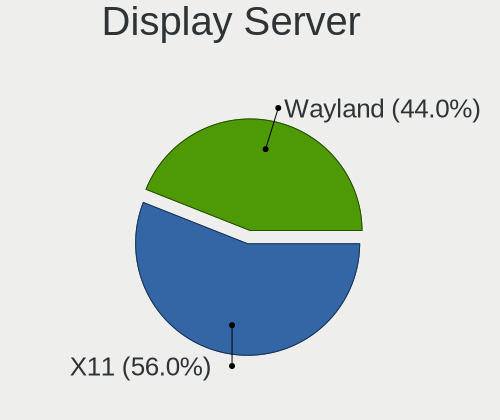
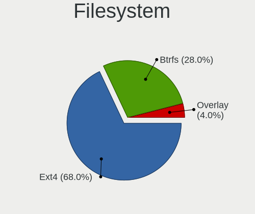
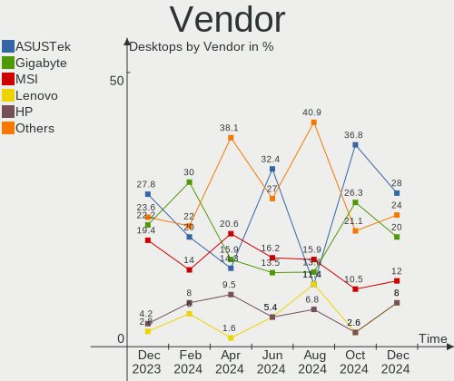
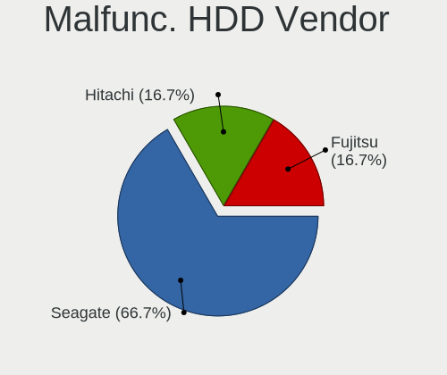
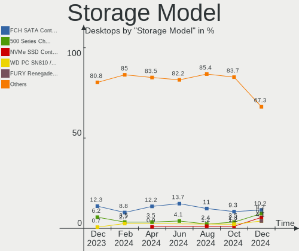
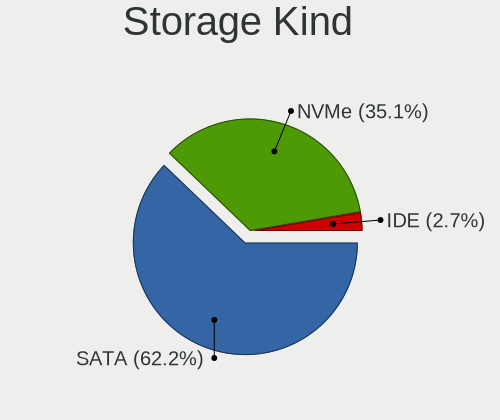
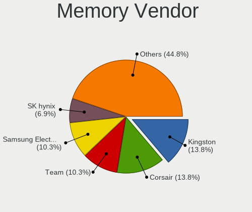

ArcoLinux - Hardware Trends (Desktops)
--------------------------------------

A project to identify most popular hardware characteristics and track their change
over time based on data collected by Linux users at https://Linux-Hardware.org.

Anyone can contribute to this report by the [hw-probe](https://github.com/linuxhw/hw-probe) tool:

    sudo -E hw-probe -all -upload

This report is for one last month. Overall report since the beginning of time: [TestCoverage](https://github.com/linuxhw/TestCoverage)

Period: Jan, 2023.

Contents
--------

* [ System ](#system)
  - [ OS                       ](#os)
  - [ OS Family                ](#os-family)
  - [ Kernel                   ](#kernel)
  - [ Kernel Family            ](#kernel-family)
  - [ Kernel Major Ver.        ](#kernel-major-ver)
  - [ Arch                     ](#arch)
  - [ DE                       ](#de)
  - [ Display Server           ](#display-server)
  - [ Display Manager          ](#display-manager)
  - [ OS Lang                  ](#os-lang)
  - [ Boot Mode                ](#boot-mode)
  - [ Filesystem               ](#filesystem)
  - [ Part. scheme             ](#part-scheme)
  - [ Dual Boot with Linux/BSD ](#dual-boot-with-linuxbsd)
  - [ Dual Boot (Win)          ](#dual-boot-win)

* [ Board ](#board)
  - [ Vendor                   ](#vendor)
  - [ Model                    ](#model)
  - [ Model Family             ](#model-family)
  - [ MFG Year                 ](#mfg-year)
  - [ Form Factor              ](#form-factor)
  - [ Secure Boot              ](#secure-boot)
  - [ Coreboot                 ](#coreboot)
  - [ RAM Size                 ](#ram-size)
  - [ RAM Used                 ](#ram-used)
  - [ Total Drives             ](#total-drives)
  - [ Has CD-ROM               ](#has-cd-rom)
  - [ Has Ethernet             ](#has-ethernet)
  - [ Has WiFi                 ](#has-wifi)
  - [ Has Bluetooth            ](#has-bluetooth)

* [ Location ](#location)
  - [ Country                  ](#country)
  - [ City                     ](#city)

* [ Drives ](#drives)
  - [ Drive Vendor             ](#drive-vendor)
  - [ Drive Model              ](#drive-model)
  - [ HDD Vendor               ](#hdd-vendor)
  - [ SSD Vendor               ](#ssd-vendor)
  - [ Drive Kind               ](#drive-kind)
  - [ Drive Connector          ](#drive-connector)
  - [ Drive Size               ](#drive-size)
  - [ Space Total              ](#space-total)
  - [ Space Used               ](#space-used)
  - [ Malfunc. Drives          ](#malfunc-drives)
  - [ Malfunc. Drive Vendor    ](#malfunc-drive-vendor)
  - [ Malfunc. HDD Vendor      ](#malfunc-hdd-vendor)
  - [ Malfunc. Drive Kind      ](#malfunc-drive-kind)
  - [ Failed Drives            ](#failed-drives)
  - [ Failed Drive Vendor      ](#failed-drive-vendor)
  - [ Drive Status             ](#drive-status)

* [ Storage controller ](#storage-controller)
  - [ Storage Vendor           ](#storage-vendor)
  - [ Storage Model            ](#storage-model)
  - [ Storage Kind             ](#storage-kind)

* [ Processor ](#processor)
  - [ CPU Vendor               ](#cpu-vendor)
  - [ CPU Model                ](#cpu-model)
  - [ CPU Model Family         ](#cpu-model-family)
  - [ CPU Cores                ](#cpu-cores)
  - [ CPU Sockets              ](#cpu-sockets)
  - [ CPU Threads              ](#cpu-threads)
  - [ CPU Op-Modes             ](#cpu-op-modes)
  - [ CPU Microcode            ](#cpu-microcode)
  - [ CPU Microarch            ](#cpu-microarch)

* [ Graphics ](#graphics)
  - [ GPU Vendor               ](#gpu-vendor)
  - [ GPU Model                ](#gpu-model)
  - [ GPU Combo                ](#gpu-combo)
  - [ GPU Driver               ](#gpu-driver)
  - [ GPU Memory               ](#gpu-memory)

* [ Monitor ](#monitor)
  - [ Monitor Vendor           ](#monitor-vendor)
  - [ Monitor Model            ](#monitor-model)
  - [ Monitor Resolution       ](#monitor-resolution)
  - [ Monitor Diagonal         ](#monitor-diagonal)
  - [ Monitor Width            ](#monitor-width)
  - [ Aspect Ratio             ](#aspect-ratio)
  - [ Monitor Area             ](#monitor-area)
  - [ Pixel Density            ](#pixel-density)
  - [ Multiple Monitors        ](#multiple-monitors)

* [ Network ](#network)
  - [ Net Controller Vendor    ](#net-controller-vendor)
  - [ Net Controller Model     ](#net-controller-model)
  - [ Wireless Vendor          ](#wireless-vendor)
  - [ Wireless Model           ](#wireless-model)
  - [ Ethernet Vendor          ](#ethernet-vendor)
  - [ Ethernet Model           ](#ethernet-model)
  - [ Net Controller Kind      ](#net-controller-kind)
  - [ Used Controller          ](#used-controller)
  - [ NICs                     ](#nics)
  - [ IPv6                     ](#ipv6)

* [ Bluetooth ](#bluetooth)
  - [ Bluetooth Vendor         ](#bluetooth-vendor)
  - [ Bluetooth Model          ](#bluetooth-model)

* [ Sound ](#sound)
  - [ Sound Vendor             ](#sound-vendor)
  - [ Sound Model              ](#sound-model)

* [ Memory ](#memory)
  - [ Memory Vendor            ](#memory-vendor)
  - [ Memory Model             ](#memory-model)
  - [ Memory Kind              ](#memory-kind)
  - [ Memory Form Factor       ](#memory-form-factor)
  - [ Memory Size              ](#memory-size)
  - [ Memory Speed             ](#memory-speed)

* [ Printers & scanners ](#printers--scanners)
  - [ Printer Vendor           ](#printer-vendor)
  - [ Printer Model            ](#printer-model)
  - [ Scanner Vendor           ](#scanner-vendor)
  - [ Scanner Model            ](#scanner-model)

* [ Camera ](#camera)
  - [ Camera Vendor            ](#camera-vendor)
  - [ Camera Model             ](#camera-model)

* [ Security ](#security)
  - [ Fingerprint Vendor       ](#fingerprint-vendor)
  - [ Fingerprint Model        ](#fingerprint-model)
  - [ Chipcard Vendor          ](#chipcard-vendor)
  - [ Chipcard Model           ](#chipcard-model)

* [ Unsupported ](#unsupported)
  - [ Unsupported Devices      ](#unsupported-devices)
  - [ Unsupported Device Types ](#unsupported-device-types)

System
------

OS
--

Installed operating systems

| Name              | Desktops | Percent |
|-------------------|----------|---------|
| ArcoLinux Rolling | 31       | 93.94%  |
| ArcoLinux         | 2        | 6.06%   |

OS Family
---------

OS without a version

| Name      | Desktops | Percent |
|-----------|----------|---------|
| ArcoLinux | 33       | 100%    |

Kernel
------

Version of the Linux kernel

| Version               | Desktops | Percent |
|-----------------------|----------|---------|
| 6.1.3-arch1-1         | 4        | 12.12%  |
| 6.1.2-arch1-1         | 4        | 12.12%  |
| 5.15.86-1-lts         | 4        | 12.12%  |
| 6.1.4-arch1-1         | 3        | 9.09%   |
| 6.1.5-arch2-1         | 2        | 6.06%   |
| 6.1.3-x64v1-xanmod1-1 | 2        | 6.06%   |
| 6.1.1-zen1-1-zen      | 2        | 6.06%   |
| 6.1.8-zen1-1-zen      | 1        | 3.03%   |
| 6.1.8-arch1-1         | 1        | 3.03%   |
| 6.1.6-zen1-1-zen      | 1        | 3.03%   |
| 6.1.6-arch1-3         | 1        | 3.03%   |
| 6.1.6-arch1-1         | 1        | 3.03%   |
| 6.1.5-zen2-1-zen      | 1        | 3.03%   |
| 6.1.1-x64v1-xanmod1-1 | 1        | 3.03%   |
| 6.1.1-arch1-1         | 1        | 3.03%   |
| 6.0.9-arch1-1         | 1        | 3.03%   |
| 5.17.6-arch1-1        | 1        | 3.03%   |
| 5.15.90-1-lts         | 1        | 3.03%   |
| 5.15.88-1-lts         | 1        | 3.03%   |

Kernel Family
-------------

Linux kernel without a distro release

| Version | Desktops | Percent |
|---------|----------|---------|
| 6.1.3   | 6        | 18.18%  |
| 6.1.2   | 4        | 12.12%  |
| 6.1.1   | 4        | 12.12%  |
| 5.15.86 | 4        | 12.12%  |
| 6.1.6   | 3        | 9.09%   |
| 6.1.5   | 3        | 9.09%   |
| 6.1.4   | 3        | 9.09%   |
| 6.1.8   | 2        | 6.06%   |
| 6.0.9   | 1        | 3.03%   |
| 5.17.6  | 1        | 3.03%   |
| 5.15.90 | 1        | 3.03%   |
| 5.15.88 | 1        | 3.03%   |

Kernel Major Ver.
-----------------

Linux kernel major version

| Version | Desktops | Percent |
|---------|----------|---------|
| 6.1     | 25       | 75.76%  |
| 5.15    | 6        | 18.18%  |
| 6.0     | 1        | 3.03%   |
| 5.17    | 1        | 3.03%   |

Arch
----

OS architecture (x86_64, i586, etc.)

| Name   | Desktops | Percent |
|--------|----------|---------|
| x86_64 | 33       | 100%    |

DE
--

Desktop Environment

| Name           | Desktops | Percent |
|----------------|----------|---------|
| KDE5           | 12       | 36.36%  |
| XFCE           | 6        | 18.18%  |
| i3             | 3        | 9.09%   |
| LXQt           | 2        | 6.06%   |
| LeftWM         | 2        | 6.06%   |
| Hyprland       | 2        | 6.06%   |
| chadwm         | 2        | 6.06%   |
| qtile          | 1        | 3.03%   |
| i3-with-shmlog | 1        | 3.03%   |
| GNOME          | 1        | 3.03%   |
| awesome        | 1        | 3.03%   |

Display Server
--------------

X11 or Wayland

| Name    | Desktops | Percent |
|---------|----------|---------|
| X11     | 28       | 84.85%  |
| Wayland | 4        | 12.12%  |
| Tty     | 1        | 3.03%   |

Display Manager
---------------

SDDM, LightDM, etc.

| Name    | Desktops | Percent |
|---------|----------|---------|
| SDDM    | 22       | 66.67%  |
| LightDM | 7        | 21.21%  |
| Unknown | 2        | 6.06%   |
| Ly      | 1        | 3.03%   |
| GDM     | 1        | 3.03%   |

OS Lang
-------

Language

| Lang  | Desktops | Percent |
|-------|----------|---------|
| en_US | 22       | 66.67%  |
| en_GB | 2        | 6.06%   |
| pt_PT | 1        | 3.03%   |
| nl_NL | 1        | 3.03%   |
| es_ES | 1        | 3.03%   |
| es_CR | 1        | 3.03%   |
| es_CO | 1        | 3.03%   |
| es_AR | 1        | 3.03%   |
| en_SG | 1        | 3.03%   |
| en_IL | 1        | 3.03%   |
| C     | 1        | 3.03%   |

Boot Mode
---------

EFI or BIOS

| Mode | Desktops | Percent |
|------|----------|---------|
| EFI  | 24       | 72.73%  |
| BIOS | 9        | 27.27%  |

Filesystem
----------

Type of filesystem

| Type    | Desktops | Percent |
|---------|----------|---------|
| Ext4    | 20       | 60.61%  |
| Btrfs   | 11       | 33.33%  |
| Xfs     | 1        | 3.03%   |
| Overlay | 1        | 3.03%   |

Part. scheme
------------

Scheme of partitioning

| Type    | Desktops | Percent |
|---------|----------|---------|
| GPT     | 29       | 87.88%  |
| MBR     | 2        | 6.06%   |
| Unknown | 2        | 6.06%   |

Dual Boot with Linux/BSD
------------------------

Hosting more than one Linux/BSD

| Dual boot | Desktops | Percent |
|-----------|----------|---------|
| No        | 22       | 66.67%  |
| Yes       | 11       | 33.33%  |

Dual Boot (Win)
---------------

Hosting Linux and Windows

| Dual boot | Desktops | Percent |
|-----------|----------|---------|
| No        | 18       | 54.55%  |
| Yes       | 15       | 45.45%  |

Board
-----

Vendor
------

Motherboard manufacturer

| Name                | Desktops | Percent |
|---------------------|----------|---------|
| Gigabyte Technology | 10       | 30.3%   |
| ASUSTek Computer    | 7        | 21.21%  |
| Hewlett-Packard     | 4        | 12.12%  |
| MSI                 | 3        | 9.09%   |
| ASRock              | 3        | 9.09%   |
| SYWZ                | 1        | 3.03%   |
| MACHINIST           | 1        | 3.03%   |
| Kllisre             | 1        | 3.03%   |
| Dell                | 1        | 3.03%   |
| AZW                 | 1        | 3.03%   |
| Acer                | 1        | 3.03%   |

Model
-----

Motherboard model

| Name                              | Desktops | Percent |
|-----------------------------------|----------|---------|
| ASUS TUF Gaming X570-PLUS         | 2        | 6.06%   |
| SYWZ S210H Series                 | 1        | 3.03%   |
| MSI MS-7D09                       | 1        | 3.03%   |
| MSI MS-7C52                       | 1        | 3.03%   |
| MSI A320M-HDV R4.0                | 1        | 3.03%   |
| MACHINIST X79 V2.82H              | 1        | 3.03%   |
| Kllisre X99-B5 V1.1               | 1        | 3.03%   |
| HP Z2 Tower G5 Workstation        | 1        | 3.03%   |
| HP OMEN 30L Desktop GT13-1xxx     | 1        | 3.03%   |
| HP EliteDesk 800 G2 TWR           | 1        | 3.03%   |
| HP 500-536d                       | 1        | 3.03%   |
| Gigabyte Z390 UD                  | 1        | 3.03%   |
| Gigabyte Z390 I AORUS PRO WIFI    | 1        | 3.03%   |
| Gigabyte Z370 AORUS Gaming 7      | 1        | 3.03%   |
| Gigabyte Z170XP-SLI               | 1        | 3.03%   |
| Gigabyte P55-USB3                 | 1        | 3.03%   |
| Gigabyte H61MS                    | 1        | 3.03%   |
| Gigabyte GA-78LMT-USB3 6.0        | 1        | 3.03%   |
| Gigabyte B550 AORUS MASTER        | 1        | 3.03%   |
| Gigabyte B450M DS3H WIFI          | 1        | 3.03%   |
| Gigabyte B450M DS3H V2            | 1        | 3.03%   |
| Dell Precision Tower 5810         | 1        | 3.03%   |
| AZW GTR                           | 1        | 3.03%   |
| ASUS Z170-K                       | 1        | 3.03%   |
| ASUS TUF Gaming B450M-PLUS II     | 1        | 3.03%   |
| ASUS ROG STRIX Z690-F GAMING WIFI | 1        | 3.03%   |
| ASUS PRIME Z490-A                 | 1        | 3.03%   |
| ASUS P8Z77-V LX                   | 1        | 3.03%   |
| ASRock Z77 Extreme4               | 1        | 3.03%   |
| ASRock B450 Pro4                  | 1        | 3.03%   |
| ASRock B250M-HDV                  | 1        | 3.03%   |
| Acer Predator G3-710              | 1        | 3.03%   |

Model Family
------------

Motherboard model prefix

| Name                   | Desktops | Percent |
|------------------------|----------|---------|
| ASUS TUF               | 3        | 9.09%   |
| Gigabyte Z390          | 2        | 6.06%   |
| Gigabyte B450M         | 2        | 6.06%   |
| SYWZ S210H             | 1        | 3.03%   |
| MSI MS-7D09            | 1        | 3.03%   |
| MSI MS-7C52            | 1        | 3.03%   |
| MSI A320M-HDV          | 1        | 3.03%   |
| MACHINIST X79          | 1        | 3.03%   |
| Kllisre X99-B5         | 1        | 3.03%   |
| HP Z2                  | 1        | 3.03%   |
| HP OMEN                | 1        | 3.03%   |
| HP EliteDesk           | 1        | 3.03%   |
| HP 500-536d            | 1        | 3.03%   |
| Gigabyte Z370          | 1        | 3.03%   |
| Gigabyte Z170XP-SLI    | 1        | 3.03%   |
| Gigabyte P55-USB3      | 1        | 3.03%   |
| Gigabyte H61MS         | 1        | 3.03%   |
| Gigabyte GA-78LMT-USB3 | 1        | 3.03%   |
| Gigabyte B550          | 1        | 3.03%   |
| Dell Precision         | 1        | 3.03%   |
| AZW GTR                | 1        | 3.03%   |
| ASUS Z170-K            | 1        | 3.03%   |
| ASUS ROG               | 1        | 3.03%   |
| ASUS PRIME             | 1        | 3.03%   |
| ASUS P8Z77-V           | 1        | 3.03%   |
| ASRock Z77             | 1        | 3.03%   |
| ASRock B450            | 1        | 3.03%   |
| ASRock B250M-HDV       | 1        | 3.03%   |
| Acer Predator          | 1        | 3.03%   |

MFG Year
--------

Motherboard manufacture year

| Year | Desktops | Percent |
|------|----------|---------|
| 2021 | 5        | 15.15%  |
| 2020 | 5        | 15.15%  |
| 2019 | 5        | 15.15%  |
| 2018 | 3        | 9.09%   |
| 2016 | 3        | 9.09%   |
| 2022 | 2        | 6.06%   |
| 2017 | 2        | 6.06%   |
| 2015 | 2        | 6.06%   |
| 2014 | 2        | 6.06%   |
| 2012 | 2        | 6.06%   |
| 2013 | 1        | 3.03%   |
| 2010 | 1        | 3.03%   |

Form Factor
-----------

Physical design of the computer

| Name    | Desktops | Percent |
|---------|----------|---------|
| Desktop | 33       | 100%    |

Secure Boot
-----------

Enabled or disabled

| State    | Desktops | Percent |
|----------|----------|---------|
| Disabled | 33       | 100%    |

Coreboot
--------

Have coreboot on board

| Used | Desktops | Percent |
|------|----------|---------|
| No   | 33       | 100%    |

RAM Size
--------

Total RAM memory

| Size in GB  | Desktops | Percent |
|-------------|----------|---------|
| 32.01-64.0  | 10       | 30.3%   |
| 16.01-24.0  | 10       | 30.3%   |
| 64.01-256.0 | 4        | 12.12%  |
| 24.01-32.0  | 3        | 9.09%   |
| 8.01-16.0   | 3        | 9.09%   |
| 3.01-4.0    | 2        | 6.06%   |
| 4.01-8.0    | 1        | 3.03%   |

RAM Used
--------

Used RAM memory

| Used GB    | Desktops | Percent |
|------------|----------|---------|
| 2.01-3.0   | 11       | 33.33%  |
| 4.01-8.0   | 7        | 21.21%  |
| 3.01-4.0   | 5        | 15.15%  |
| 1.01-2.0   | 5        | 15.15%  |
| 16.01-24.0 | 3        | 9.09%   |
| 8.01-16.0  | 1        | 3.03%   |
| 0.51-1.0   | 1        | 3.03%   |

Total Drives
------------

Number of drives on board

| Drives | Desktops | Percent |
|--------|----------|---------|
| 3      | 10       | 30.3%   |
| 2      | 10       | 30.3%   |
| 4      | 6        | 18.18%  |
| 5      | 3        | 9.09%   |
| 1      | 3        | 9.09%   |
| 6      | 1        | 3.03%   |

Has CD-ROM
----------

Has CD-ROM on board

| Presented | Desktops | Percent |
|-----------|----------|---------|
| No        | 19       | 57.58%  |
| Yes       | 14       | 42.42%  |

Has Ethernet
------------

Has Ethernet on board

| Presented | Desktops | Percent |
|-----------|----------|---------|
| Yes       | 33       | 100%    |

Has WiFi
--------

Has WiFi module

| Presented | Desktops | Percent |
|-----------|----------|---------|
| Yes       | 18       | 54.55%  |
| No        | 15       | 45.45%  |

Has Bluetooth
-------------

Has Bluetooth module

| Presented | Desktops | Percent |
|-----------|----------|---------|
| No        | 18       | 54.55%  |
| Yes       | 15       | 45.45%  |

Location
--------

Country
-------

Geographic location (country)

| Country     | Desktops | Percent |
|-------------|----------|---------|
| USA         | 10       | 30.3%   |
| Netherlands | 3        | 9.09%   |
| Spain       | 2        | 6.06%   |
| Portugal    | 2        | 6.06%   |
| Mexico      | 2        | 6.06%   |
| UK          | 1        | 3.03%   |
| Sweden      | 1        | 3.03%   |
| Slovenia    | 1        | 3.03%   |
| Pakistan    | 1        | 3.03%   |
| Malaysia    | 1        | 3.03%   |
| Israel      | 1        | 3.03%   |
| India       | 1        | 3.03%   |
| Greece      | 1        | 3.03%   |
| France      | 1        | 3.03%   |
| Czechia     | 1        | 3.03%   |
| Costa Rica  | 1        | 3.03%   |
| Colombia    | 1        | 3.03%   |
| Belgium     | 1        | 3.03%   |
| Argentina   | 1        | 3.03%   |

City
----

Geographic location (city)

| City                   | Desktops | Percent |
|------------------------|----------|---------|
| Umeå                  | 1        | 3.03%   |
| Texas City             | 1        | 3.03%   |
| Seattle                | 1        | 3.03%   |
| Santa Cruz de Tenerife | 1        | 3.03%   |
| Remedios de Escalada   | 1        | 3.03%   |
| Portland               | 1        | 3.03%   |
| Pavas                  | 1        | 3.03%   |
| Olympia                | 1        | 3.03%   |
| Ochten                 | 1        | 3.03%   |
| Naaldwijk              | 1        | 3.03%   |
| Maribor                | 1        | 3.03%   |
| Malacca                | 1        | 3.03%   |
| Madrid                 | 1        | 3.03%   |
| Klinec                 | 1        | 3.03%   |
| Katy                   | 1        | 3.03%   |
| Karachi                | 1        | 3.03%   |
| Kansas City            | 1        | 3.03%   |
| Hawick                 | 1        | 3.03%   |
| Hadera                 | 1        | 3.03%   |
| Guadalajara            | 1        | 3.03%   |
| Duffel                 | 1        | 3.03%   |
| Colfax                 | 1        | 3.03%   |
| Coimbra                | 1        | 3.03%   |
| Ciudad del Carmen      | 1        | 3.03%   |
| Chicago                | 1        | 3.03%   |
| Chia                   | 1        | 3.03%   |
| Bozeman                | 1        | 3.03%   |
| Barasat                | 1        | 3.03%   |
| Austin                 | 1        | 3.03%   |
| Athens                 | 1        | 3.03%   |
| Amsterdam              | 1        | 3.03%   |
| Aix-en-Provence        | 1        | 3.03%   |
| Águeda Municipality   | 1        | 3.03%   |

Drives
------

Drive Vendor
------------

Hard drive vendors

| Vendor                      | Desktops | Drives | Percent |
|-----------------------------|----------|--------|---------|
| WDC                         | 16       | 23     | 19.05%  |
| Samsung Electronics         | 12       | 18     | 14.29%  |
| Seagate                     | 11       | 12     | 13.1%   |
| Kingston                    | 8        | 8      | 9.52%   |
| Toshiba                     | 4        | 4      | 4.76%   |
| Phison Electronics          | 4        | 4      | 4.76%   |
| Crucial                     | 4        | 5      | 4.76%   |
| Silicon Motion              | 3        | 3      | 3.57%   |
| Hitachi                     | 3        | 3      | 3.57%   |
| SanDisk                     | 2        | 2      | 2.38%   |
| Realtek Semiconductor       | 2        | 2      | 2.38%   |
| Micron/Crucial Technology   | 2        | 2      | 2.38%   |
| Verbatim                    | 1        | 1      | 1.19%   |
| Unknown                     | 1        | 1      | 1.19%   |
| SPCC                        | 1        | 1      | 1.19%   |
| SK hynix                    | 1        | 1      | 1.19%   |
| PNY                         | 1        | 1      | 1.19%   |
| Patriot                     | 1        | 1      | 1.19%   |
| OCZ                         | 1        | 1      | 1.19%   |
| LITEONIT                    | 1        | 1      | 1.19%   |
| Kingston Technology Company | 1        | 1      | 1.19%   |
| JMicron Technology          | 1        | 1      | 1.19%   |
| Intel                       | 1        | 1      | 1.19%   |
| Corsair                     | 1        | 1      | 1.19%   |
| Biwin Storage Technology    | 1        | 1      | 1.19%   |

Drive Model
-----------

Hard drive models

| Model                                                 | Desktops | Percent |
|-------------------------------------------------------|----------|---------|
| WDC WDS240G2G0A-00JH30 240GB SSD                      | 3        | 3.16%   |
| Samsung NVMe SSD Controller SM981/PM981/PM983 500GB   | 3        | 3.16%   |
| Samsung NVMe SSD Controller PM9A1/PM9A3/980PRO 512GB  | 3        | 3.16%   |
| WDC WD10EZEX-08WN4A0 1TB                              | 2        | 2.11%   |
| Silicon Motion SM2263EN/SM2263XT SSD Controller 512GB | 2        | 2.11%   |
| Seagate ST2000DM008-2FR102 2TB                        | 2        | 2.11%   |
| Samsung SSD 980 1TB                                   | 2        | 2.11%   |
| Samsung NVMe SSD Controller SM961/PM961/SM963 256GB   | 2        | 2.11%   |
| Realtek RTS5763DL NVMe SSD Controller 4TB             | 2        | 2.11%   |
| Phison E12 NVMe Controller 1TB                        | 2        | 2.11%   |
| Kingston SA400S37480G 480GB SSD                       | 2        | 2.11%   |
| Kingston SA400S37240G 240GB SSD                       | 2        | 2.11%   |
| Crucial CT240BX500SSD1 240GB                          | 2        | 2.11%   |
| WDC WDS500G2B0B-00YS70 500GB SSD                      | 1        | 1.05%   |
| WDC WDS500G2B0A 500GB SSD                             | 1        | 1.05%   |
| WDC WDS100T2G0A-00JH30 1TB SSD                        | 1        | 1.05%   |
| WDC WD5000HHTZ-75N21V0 500GB                          | 1        | 1.05%   |
| WDC WD5000AZLX-75K2TA0 500GB                          | 1        | 1.05%   |
| WDC WD5000AAKS-07A7B2 500GB                           | 1        | 1.05%   |
| WDC WD5000AACS-00G8B1 500GB                           | 1        | 1.05%   |
| WDC WD20EZBX-60AYRA0 2TB                              | 1        | 1.05%   |
| WDC WD20EZBX-00AYRA0 2TB                              | 1        | 1.05%   |
| WDC WD20EARX-00PASB0 2TB                              | 1        | 1.05%   |
| WDC WD2003FZEX-00Z4SA0 2TB                            | 1        | 1.05%   |
| WDC WD2002FAEX-007BA0 2TB                             | 1        | 1.05%   |
| WDC WD10EARS-00Y5B1 1TB                               | 1        | 1.05%   |
| WDC WD10EARS-00MVWB0 1TB                              | 1        | 1.05%   |
| WDC WD100EFAX-68LHPN0 10TB                            | 1        | 1.05%   |
| WDC WD1002FAEX-00Z3A0 1TB                             | 1        | 1.05%   |
| Verbatim Portable Drive 1TB                           | 1        | 1.05%   |
| Unknown SD/MMC/MS PRO 2GB                             | 1        | 1.05%   |
| Toshiba XG6 NVMe SSD Controller 512GB                 | 1        | 1.05%   |
| Toshiba MQ04ABF100 1TB                                | 1        | 1.05%   |
| Toshiba MQ01ABD100 1TB                                | 1        | 1.05%   |
| Toshiba DT01ACA100 1TB                                | 1        | 1.05%   |
| SPCC M.2 SSD 1TB                                      | 1        | 1.05%   |
| SK hynix SC300 2.5 7MM 128GB SSD                      | 1        | 1.05%   |
| Silicon Motion ADATA SX8000NP 256GB                   | 1        | 1.05%   |
| Seagate ST9640320AS 640GB                             | 1        | 1.05%   |
| Seagate ST8000DM004-2CX188 8TB                        | 1        | 1.05%   |

HDD Vendor
----------

Hard disk drive vendors

| Vendor              | Desktops | Drives | Percent |
|---------------------|----------|--------|---------|
| WDC                 | 13       | 17     | 40.63%  |
| Seagate             | 11       | 12     | 34.38%  |
| Toshiba             | 3        | 3      | 9.38%   |
| Hitachi             | 3        | 3      | 9.38%   |
| Unknown             | 1        | 1      | 3.13%   |
| Samsung Electronics | 1        | 1      | 3.13%   |

SSD Vendor
----------

Solid state drive vendors

| Vendor              | Desktops | Drives | Percent |
|---------------------|----------|--------|---------|
| Kingston            | 7        | 7      | 23.33%  |
| WDC                 | 6        | 6      | 20%     |
| Samsung Electronics | 5        | 7      | 16.67%  |
| Crucial             | 4        | 5      | 13.33%  |
| SPCC                | 1        | 1      | 3.33%   |
| SK hynix            | 1        | 1      | 3.33%   |
| SanDisk             | 1        | 1      | 3.33%   |
| PNY                 | 1        | 1      | 3.33%   |
| Patriot             | 1        | 1      | 3.33%   |
| OCZ                 | 1        | 1      | 3.33%   |
| LITEONIT            | 1        | 1      | 3.33%   |
| Corsair             | 1        | 1      | 3.33%   |

Drive Kind
----------

HDD or SSD

| Kind    | Desktops | Drives | Percent |
|---------|----------|--------|---------|
| HDD     | 25       | 37     | 34.72%  |
| SSD     | 24       | 33     | 33.33%  |
| NVMe    | 21       | 27     | 29.17%  |
| Unknown | 2        | 2      | 2.78%   |

Drive Connector
---------------

SATA, SAS, NVMe, etc.

| Type | Desktops | Drives | Percent |
|------|----------|--------|---------|
| SATA | 29       | 66     | 52.73%  |
| NVMe | 21       | 27     | 38.18%  |
| SAS  | 5        | 6      | 9.09%   |

Drive Size
----------

Size of hard drive

| Size in TB | Desktops | Drives | Percent |
|------------|----------|--------|---------|
| 0.01-0.5   | 23       | 34     | 46%     |
| 0.51-1.0   | 15       | 19     | 30%     |
| 1.01-2.0   | 9        | 13     | 18%     |
| 4.01-10.0  | 2        | 3      | 4%      |
| 3.01-4.0   | 1        | 1      | 2%      |

Space Total
-----------

Amount of disk space available on the file system

| Size in GB     | Desktops | Percent |
|----------------|----------|---------|
| More than 3000 | 10       | 30.3%   |
| 1001-2000      | 10       | 30.3%   |
| 2001-3000      | 5        | 15.15%  |
| 501-1000       | 3        | 9.09%   |
| 251-500        | 2        | 6.06%   |
| 101-250        | 2        | 6.06%   |
| 1-20           | 1        | 3.03%   |

Space Used
----------

Amount of used disk space

| Used GB        | Desktops | Percent |
|----------------|----------|---------|
| 1001-2000      | 9        | 27.27%  |
| 501-1000       | 7        | 21.21%  |
| 101-250        | 6        | 18.18%  |
| 251-500        | 3        | 9.09%   |
| 21-50          | 2        | 6.06%   |
| 2001-3000      | 2        | 6.06%   |
| 51-100         | 2        | 6.06%   |
| More than 3000 | 1        | 3.03%   |
| 1-20           | 1        | 3.03%   |

Malfunc. Drives
---------------

Drive models with a malfunction

| Model                                          | Desktops | Drives | Percent |
|------------------------------------------------|----------|--------|---------|
| WDC WDS100T2G0A-00JH30 1TB SSD                 | 1        | 1      | 7.69%   |
| WDC WD5000AACS-00G8B1 500GB                    | 1        | 1      | 7.69%   |
| WDC WD10EARS-00Y5B1 1TB                        | 1        | 1      | 7.69%   |
| Toshiba DT01ACA100 1TB                         | 1        | 1      | 7.69%   |
| Seagate ST3500320AS 500GB                      | 1        | 1      | 7.69%   |
| Seagate ST2000DM001-1ER164 2TB                 | 1        | 1      | 7.69%   |
| Seagate ST1000DM003-9YN162 1TB                 | 1        | 1      | 7.69%   |
| Samsung Electronics SSD 840 Series 120GB       | 1        | 2      | 7.69%   |
| Micron/Crucial Technology P1 NVMe PCIe SSD 1TB | 1        | 1      | 7.69%   |
| Intel SSD 600P Series 256GB                    | 1        | 1      | 7.69%   |
| Hitachi HUA723020ALA640 2TB                    | 1        | 1      | 7.69%   |
| Hitachi HTS547575A9E384 752GB                  | 1        | 1      | 7.69%   |
| Corsair CSSD-F60GB2 64GB                       | 1        | 1      | 7.69%   |

Malfunc. Drive Vendor
---------------------

Vendors of faulty drives

| Vendor                    | Desktops | Drives | Percent |
|---------------------------|----------|--------|---------|
| WDC                       | 3        | 3      | 23.08%  |
| Seagate                   | 3        | 3      | 23.08%  |
| Hitachi                   | 2        | 2      | 15.38%  |
| Toshiba                   | 1        | 1      | 7.69%   |
| Samsung Electronics       | 1        | 2      | 7.69%   |
| Micron/Crucial Technology | 1        | 1      | 7.69%   |
| Intel                     | 1        | 1      | 7.69%   |
| Corsair                   | 1        | 1      | 7.69%   |

Malfunc. HDD Vendor
-------------------

Vendors of faulty HDD drives

| Vendor  | Desktops | Drives | Percent |
|---------|----------|--------|---------|
| Seagate | 3        | 3      | 37.5%   |
| WDC     | 2        | 2      | 25%     |
| Hitachi | 2        | 2      | 25%     |
| Toshiba | 1        | 1      | 12.5%   |

Malfunc. Drive Kind
-------------------

Kinds of faulty drives

| Kind | Desktops | Drives | Percent |
|------|----------|--------|---------|
| HDD  | 6        | 8      | 54.55%  |
| SSD  | 3        | 4      | 27.27%  |
| NVMe | 2        | 2      | 18.18%  |

Failed Drives
-------------

Failed drive models

Zero info for selected period =(

Failed Drive Vendor
-------------------

Failed drive vendors

Zero info for selected period =(

Drive Status
------------

Number of failed and malfunc. drives

| Status   | Desktops | Drives | Percent |
|----------|----------|--------|---------|
| Works    | 30       | 75     | 65.22%  |
| Malfunc  | 10       | 14     | 21.74%  |
| Detected | 6        | 10     | 13.04%  |

Storage controller
------------------

Storage Vendor
--------------

Storage controller vendors

| Vendor                       | Desktops | Percent |
|------------------------------|----------|---------|
| Intel                        | 22       | 36.67%  |
| AMD                          | 11       | 18.33%  |
| Samsung Electronics          | 8        | 13.33%  |
| Silicon Motion               | 3        | 5%      |
| Phison Electronics           | 3        | 5%      |
| ASMedia Technology           | 3        | 5%      |
| Realtek Semiconductor        | 2        | 3.33%   |
| Micron/Crucial Technology    | 2        | 3.33%   |
| Kingston Technology Company  | 2        | 3.33%   |
| Toshiba America Info Systems | 1        | 1.67%   |
| SanDisk                      | 1        | 1.67%   |
| JMicron Technology           | 1        | 1.67%   |
| Biwin Storage Technology     | 1        | 1.67%   |

Storage Model
-------------

Storage controller models

| Model                                                                                   | Desktops | Percent |
|-----------------------------------------------------------------------------------------|----------|---------|
| AMD FCH SATA Controller [AHCI mode]                                                     | 7        | 9.59%   |
| AMD 400 Series Chipset SATA Controller                                                  | 4        | 5.48%   |
| Samsung NVMe SSD Controller SM981/PM981/PM983                                           | 3        | 4.11%   |
| Samsung NVMe SSD Controller PM9A1/PM9A3/980PRO                                          | 3        | 4.11%   |
| Intel Q170/Q150/B150/H170/H110/Z170/CM236 Chipset SATA Controller [AHCI Mode]           | 3        | 4.11%   |
| Intel Cannon Lake PCH SATA AHCI Controller                                              | 3        | 4.11%   |
| Intel 200 Series PCH SATA controller [AHCI mode]                                        | 3        | 4.11%   |
| ASMedia ASM1062 Serial ATA Controller                                                   | 3        | 4.11%   |
| Silicon Motion SM2263EN/SM2263XT SSD Controller                                         | 2        | 2.74%   |
| Samsung NVMe SSD Controller SM961/PM961/SM963                                           | 2        | 2.74%   |
| Samsung NVMe SSD Controller 980                                                         | 2        | 2.74%   |
| Realtek RTS5763DL NVMe SSD Controller                                                   | 2        | 2.74%   |
| Phison E12 NVMe Controller                                                              | 2        | 2.74%   |
| Intel SATA Controller [RAID mode]                                                       | 2        | 2.74%   |
| Intel 8 Series/C220 Series Chipset Family 6-port SATA Controller 1 [AHCI mode]          | 2        | 2.74%   |
| AMD FCH SATA Controller D                                                               | 2        | 2.74%   |
| Toshiba America Info Systems XG6 NVMe SSD Controller                                    | 1        | 1.37%   |
| Silicon Motion Non-Volatile memory controller                                           | 1        | 1.37%   |
| SanDisk WD Blue SN570 NVMe SSD                                                          | 1        | 1.37%   |
| Phison E7 NVMe Controller                                                               | 1        | 1.37%   |
| Micron/Crucial P2 NVMe PCIe SSD                                                         | 1        | 1.37%   |
| Micron/Crucial P1 NVMe PCIe SSD                                                         | 1        | 1.37%   |
| Kingston Company SNVS2000G [NV1 NVMe PCIe SSD 2TB]                                      | 1        | 1.37%   |
| Kingston Company KC2000 NVMe SSD                                                        | 1        | 1.37%   |
| JMicron JMB363 SATA/IDE Controller                                                      | 1        | 1.37%   |
| Intel Volume Management Device NVMe RAID Controller                                     | 1        | 1.37%   |
| Intel SSD 600P Series                                                                   | 1        | 1.37%   |
| Intel Comet Lake SATA AHCI Controller                                                   | 1        | 1.37%   |
| Intel Comet Lake PCH-H RAID                                                             | 1        | 1.37%   |
| Intel C610/X99 series chipset sSATA Controller [AHCI mode]                              | 1        | 1.37%   |
| Intel C610/X99 series chipset 6-Port SATA Controller [AHCI mode]                        | 1        | 1.37%   |
| Intel C600/X79 series chipset 6-Port SATA AHCI Controller                               | 1        | 1.37%   |
| Intel Alder Lake-S PCH SATA Controller [AHCI Mode]                                      | 1        | 1.37%   |
| Intel 7 Series/C210 Series Chipset Family 6-port SATA Controller [AHCI mode]            | 1        | 1.37%   |
| Intel 6 Series/C200 Series Chipset Family Desktop SATA Controller (IDE mode, ports 4-5) | 1        | 1.37%   |
| Intel 6 Series/C200 Series Chipset Family Desktop SATA Controller (IDE mode, ports 0-3) | 1        | 1.37%   |
| Intel 500 Series Chipset Family SATA AHCI Controller                                    | 1        | 1.37%   |
| Intel 5 Series/3400 Series Chipset 4 port SATA IDE Controller                           | 1        | 1.37%   |
| Intel 5 Series/3400 Series Chipset 2 port SATA IDE Controller                           | 1        | 1.37%   |
| Biwin Storage Non-Volatile memory controller                                            | 1        | 1.37%   |

Storage Kind
------------

Kind of storage controller (IDE, SATA, NVMe, SAS, ...)

| Kind | Desktops | Percent |
|------|----------|---------|
| SATA | 28       | 50%     |
| NVMe | 20       | 35.71%  |
| RAID | 5        | 8.93%   |
| IDE  | 3        | 5.36%   |

Processor
---------

CPU Vendor
----------

Processor vendors

| Vendor | Desktops | Percent |
|--------|----------|---------|
| Intel  | 22       | 66.67%  |
| AMD    | 11       | 33.33%  |

CPU Model
---------

Processor models

| Model                                   | Desktops | Percent |
|-----------------------------------------|----------|---------|
| Intel Core i7-8700K CPU @ 3.70GHz       | 2        | 6.06%   |
| Intel Core i7-10700K CPU @ 3.80GHz      | 2        | 6.06%   |
| AMD Ryzen 5 3600 6-Core Processor       | 2        | 6.06%   |
| Intel Xeon E-2176M CPU @ 2.70GHz        | 1        | 3.03%   |
| Intel Xeon CPU E5-2696 v3 @ 2.30GHz     | 1        | 3.03%   |
| Intel Xeon CPU E5-2650 v2 @ 2.60GHz     | 1        | 3.03%   |
| Intel Xeon CPU E5-1620 v3 @ 3.50GHz     | 1        | 3.03%   |
| Intel Core i9-9900K CPU @ 3.60GHz       | 1        | 3.03%   |
| Intel Core i7-7700K CPU @ 4.20GHz       | 1        | 3.03%   |
| Intel Core i7-7700 CPU @ 3.60GHz        | 1        | 3.03%   |
| Intel Core i7-6700K CPU @ 4.00GHz       | 1        | 3.03%   |
| Intel Core i7-3770K CPU @ 3.50GHz       | 1        | 3.03%   |
| Intel Core i7-10700 CPU @ 2.90GHz       | 1        | 3.03%   |
| Intel Core i5-6500 CPU @ 3.20GHz        | 1        | 3.03%   |
| Intel Core i5-3570K CPU @ 3.40GHz       | 1        | 3.03%   |
| Intel Core i5 CPU 750 @ 2.67GHz         | 1        | 3.03%   |
| Intel Core i3-7100 CPU @ 3.90GHz        | 1        | 3.03%   |
| Intel Core i3-4160 CPU @ 3.60GHz        | 1        | 3.03%   |
| Intel Core i3-3210 CPU @ 3.20GHz        | 1        | 3.03%   |
| Intel 12th Gen Core i7-12700K           | 1        | 3.03%   |
| Intel 11th Gen Core i7-11700K @ 3.60GHz | 1        | 3.03%   |
| AMD Ryzen 9 6900HX with Radeon Graphics | 1        | 3.03%   |
| AMD Ryzen 7 5800X3D 8-Core Processor    | 1        | 3.03%   |
| AMD Ryzen 7 5800X 8-Core Processor      | 1        | 3.03%   |
| AMD Ryzen 7 5700G with Radeon Graphics  | 1        | 3.03%   |
| AMD Ryzen 5 5600G with Radeon Graphics  | 1        | 3.03%   |
| AMD Ryzen 5 5500                        | 1        | 3.03%   |
| AMD Ryzen 5 3600X 6-Core Processor      | 1        | 3.03%   |
| AMD Ryzen 5 2600 Six-Core Processor     | 1        | 3.03%   |
| AMD FX-6350 Six-Core Processor          | 1        | 3.03%   |

CPU Model Family
----------------

Processor model prefix

| Model         | Desktops | Percent |
|---------------|----------|---------|
| Intel Core i7 | 9        | 27.27%  |
| AMD Ryzen 5   | 6        | 18.18%  |
| Intel Xeon    | 4        | 12.12%  |
| Intel Core i5 | 3        | 9.09%   |
| Intel Core i3 | 3        | 9.09%   |
| AMD Ryzen 7   | 3        | 9.09%   |
| Other         | 2        | 6.06%   |
| Intel Core i9 | 1        | 3.03%   |
| AMD Ryzen 9   | 1        | 3.03%   |
| AMD FX        | 1        | 3.03%   |

CPU Cores
---------

Number of processor cores

| Number | Desktops | Percent |
|--------|----------|---------|
| 8      | 10       | 30.3%   |
| 6      | 9        | 27.27%  |
| 4      | 8        | 24.24%  |
| 2      | 3        | 9.09%   |
| 18     | 1        | 3.03%   |
| 12     | 1        | 3.03%   |
| 3      | 1        | 3.03%   |

CPU Sockets
-----------

Number of sockets

| Number | Desktops | Percent |
|--------|----------|---------|
| 1      | 33       | 100%    |

CPU Threads
-----------

Threads per core (Hyper-Threading)

| Number | Desktops | Percent |
|--------|----------|---------|
| 2      | 30       | 90.91%  |
| 1      | 3        | 9.09%   |

CPU Op-Modes
------------

CPU Operation Modes (32-bit, 64-bit)

| Op mode        | Desktops | Percent |
|----------------|----------|---------|
| 32-bit, 64-bit | 33       | 100%    |

CPU Microcode
-------------

Microcode number

| Number     | Desktops | Percent |
|------------|----------|---------|
| Unknown    | 4        | 12.12%  |
| 0xa0655    | 3        | 9.09%   |
| 0x906e9    | 3        | 9.09%   |
| 0x306a9    | 3        | 9.09%   |
| 0x08701021 | 3        | 9.09%   |
| 0x906ea    | 2        | 6.06%   |
| 0x306f2    | 2        | 6.06%   |
| 0xa0671    | 1        | 3.03%   |
| 0x906ed    | 1        | 3.03%   |
| 0x90672    | 1        | 3.03%   |
| 0x506e3    | 1        | 3.03%   |
| 0x306c3    | 1        | 3.03%   |
| 0x106e5    | 1        | 3.03%   |
| 0x0a50000d | 1        | 3.03%   |
| 0x0a50000c | 1        | 3.03%   |
| 0x0a404102 | 1        | 3.03%   |
| 0x0a20120a | 1        | 3.03%   |
| 0x0a201016 | 1        | 3.03%   |
| 0x0800820b | 1        | 3.03%   |
| 0x06000822 | 1        | 3.03%   |

CPU Microarch
-------------

Microarchitecture

| Name             | Desktops | Percent |
|------------------|----------|---------|
| KabyLake         | 7        | 21.21%  |
| Zen 3            | 5        | 15.15%  |
| IvyBridge        | 4        | 12.12%  |
| Zen 2            | 3        | 9.09%   |
| Haswell          | 3        | 9.09%   |
| CometLake        | 3        | 9.09%   |
| Skylake          | 2        | 6.06%   |
| Zen+             | 1        | 3.03%   |
| Piledriver       | 1        | 3.03%   |
| Nehalem          | 1        | 3.03%   |
| Icelake          | 1        | 3.03%   |
| Alderlake Hybrid | 1        | 3.03%   |
| Unknown          | 1        | 3.03%   |

Graphics
--------

GPU Vendor
----------

Vendors of graphics cards

| Vendor | Desktops | Percent |
|--------|----------|---------|
| Nvidia | 15       | 41.67%  |
| AMD    | 12       | 33.33%  |
| Intel  | 9        | 25%     |

GPU Model
---------

Graphics card models

| Model                                                                     | Desktops | Percent |
|---------------------------------------------------------------------------|----------|---------|
| AMD Ellesmere [Radeon RX 470/480/570/570X/580/580X/590]                   | 3        | 7.89%   |
| Nvidia GP104 [GeForce GTX 1070]                                           | 2        | 5.26%   |
| Nvidia GA102 [GeForce RTX 3080 Ti]                                        | 2        | 5.26%   |
| Intel HD Graphics 630                                                     | 2        | 5.26%   |
| Intel CoffeeLake-S GT2 [UHD Graphics 630]                                 | 2        | 5.26%   |
| AMD Lexa PRO [Radeon 540/540X/550/550X / RX 540X/550/550X]                | 2        | 5.26%   |
| AMD Cezanne [Radeon Vega Series / Radeon Vega Mobile Series]              | 2        | 5.26%   |
| Nvidia TU117GLM [Quadro T1000 Mobile]                                     | 1        | 2.63%   |
| Nvidia TU116 [GeForce GTX 1650 SUPER]                                     | 1        | 2.63%   |
| Nvidia TU106 [GeForce RTX 2060 SUPER]                                     | 1        | 2.63%   |
| Nvidia TU106 [GeForce RTX 2060 Rev. A]                                    | 1        | 2.63%   |
| Nvidia TU106 [GeForce RTX 2060 12GB]                                      | 1        | 2.63%   |
| Nvidia TU104 [GeForce RTX 2070 SUPER]                                     | 1        | 2.63%   |
| Nvidia GP104 [GeForce GTX 1080]                                           | 1        | 2.63%   |
| Nvidia GM204 [GeForce GTX 980]                                            | 1        | 2.63%   |
| Nvidia GF114 [GeForce GTX 560 Ti]                                         | 1        | 2.63%   |
| Nvidia GA106 [GeForce RTX 3060 Lite Hash Rate]                            | 1        | 2.63%   |
| Nvidia GA104 [GeForce RTX 3060]                                           | 1        | 2.63%   |
| Intel Xeon E3-1200 v2/3rd Gen Core processor Graphics Controller          | 1        | 2.63%   |
| Intel HD Graphics 530                                                     | 1        | 2.63%   |
| Intel CometLake-S GT2 [UHD Graphics 630]                                  | 1        | 2.63%   |
| Intel Coffee Lake-S GT2 [UHD Graphics P630]                               | 1        | 2.63%   |
| Intel 4th Generation Core Processor Family Integrated Graphics Controller | 1        | 2.63%   |
| AMD Rembrandt [Radeon 680M]                                               | 1        | 2.63%   |
| AMD Oland GL [FirePro W2100]                                              | 1        | 2.63%   |
| AMD Navi 24 [Radeon RX 6400/6500 XT/6500M]                                | 1        | 2.63%   |
| AMD Navi 23 [Radeon RX 6600/6600 XT/6600M]                                | 1        | 2.63%   |
| AMD Navi 21 [Radeon RX 6800/6800 XT / 6900 XT]                            | 1        | 2.63%   |
| AMD Navi 10 [Radeon RX 5600 OEM/5600 XT / 5700/5700 XT]                   | 1        | 2.63%   |
| AMD Cape Verde XT [Radeon HD 7770/8760 / R7 250X]                         | 1        | 2.63%   |

GPU Combo
---------

Combinations of graphics cards

| Name           | Desktops | Percent |
|----------------|----------|---------|
| 1 x Nvidia     | 13       | 39.39%  |
| 1 x AMD        | 9        | 27.27%  |
| 1 x Intel      | 6        | 18.18%  |
| 2 x AMD        | 2        | 6.06%   |
| Intel + Nvidia | 2        | 6.06%   |
| Intel + AMD    | 1        | 3.03%   |

GPU Driver
----------

Free vs proprietary

| Driver      | Desktops | Percent |
|-------------|----------|---------|
| Free        | 18       | 54.55%  |
| Proprietary | 14       | 42.42%  |
| Unknown     | 1        | 3.03%   |

GPU Memory
----------

Total video memory

| Size in GB | Desktops | Percent |
|------------|----------|---------|
| 7.01-8.0   | 9        | 27.27%  |
| Unknown    | 7        | 21.21%  |
| 3.01-4.0   | 6        | 18.18%  |
| 8.01-16.0  | 6        | 18.18%  |
| 0.51-1.0   | 2        | 6.06%   |
| 5.01-6.0   | 1        | 3.03%   |
| 2.01-3.0   | 1        | 3.03%   |
| 1.01-2.0   | 1        | 3.03%   |

Monitor
-------

Monitor Vendor
--------------

Monitor vendors

| Vendor               | Desktops | Percent |
|----------------------|----------|---------|
| Samsung Electronics  | 6        | 15.38%  |
| Goldstar             | 6        | 15.38%  |
| Dell                 | 4        | 10.26%  |
| BenQ                 | 3        | 7.69%   |
| ASUSTek Computer     | 3        | 7.69%   |
| AOC                  | 3        | 7.69%   |
| Ancor Communications | 3        | 7.69%   |
| Hewlett-Packard      | 2        | 5.13%   |
| ViewSonic            | 1        | 2.56%   |
| Sony                 | 1        | 2.56%   |
| Nixeus               | 1        | 2.56%   |
| Medion               | 1        | 2.56%   |
| Lenovo               | 1        | 2.56%   |
| Gigabyte Technology  | 1        | 2.56%   |
| Denver               | 1        | 2.56%   |
| DENON                | 1        | 2.56%   |
| AGO                  | 1        | 2.56%   |

Monitor Model
-------------

Monitor models

| Model                                                                 | Desktops | Percent |
|-----------------------------------------------------------------------|----------|---------|
| Goldstar FULL HD GSM5B55 1920x1080 480x270mm 21.7-inch                | 2        | 4.76%   |
| ViewSonic LCD Monitor VSCC132 1920x1080 600x340mm 27.2-inch           | 1        | 2.38%   |
| Sony TV  *00 SNY8204 3840x2160 1220x680mm 55.0-inch                   | 1        | 2.38%   |
| Samsung Electronics SyncMaster SAM05ED 1920x1080 600x340mm 27.2-inch  | 1        | 2.38%   |
| Samsung Electronics SyncMaster SAM059A 1920x1080 480x270mm 21.7-inch  | 1        | 2.38%   |
| Samsung Electronics S27D590 SAM0B49 1920x1080 598x336mm 27.0-inch     | 1        | 2.38%   |
| Samsung Electronics S24C300 SAM0A24 1920x1080 531x299mm 24.0-inch     | 1        | 2.38%   |
| Samsung Electronics LS28AG700N SAM7177 3840x2160 640x360mm 28.9-inch  | 1        | 2.38%   |
| Samsung Electronics C49RG9x SAM0F99 3840x1080 1193x336mm 48.8-inch    | 1        | 2.38%   |
| Nixeus NX-VUE24 NIX2415 1920x1080 477x268mm 21.5-inch                 | 1        | 2.38%   |
| Medion MD 20889 MED3688 1920x1080 509x286mm 23.0-inch                 | 1        | 2.38%   |
| Lenovo LEN P27h-10 LEN61AF 2560x1440 600x340mm 27.2-inch              | 1        | 2.38%   |
| Hewlett-Packard LCD Monitor E232 2944x1080                            | 1        | 2.38%   |
| Hewlett-Packard L2245w HWP26FC 1680x1050 473x296mm 22.0-inch          | 1        | 2.38%   |
| Goldstar M2380D GSM57BC 1920x1080 598x336mm 27.0-inch                 | 1        | 2.38%   |
| Goldstar L226W GSM566B 1680x1050 474x296mm 22.0-inch                  | 1        | 2.38%   |
| Goldstar IPS FULLHD GSM5AB6 1920x1080 480x270mm 21.7-inch             | 1        | 2.38%   |
| Goldstar 27GN7 GSM5B8E 1920x1080 610x360mm 27.9-inch                  | 1        | 2.38%   |
| Gigabyte Technology M27Q GBT270D 2560x1440 596x335mm 26.9-inch        | 1        | 2.38%   |
| Denver N27FW LHCFFFF 1920x1080 598x336mm 27.0-inch                    | 1        | 2.38%   |
| DENON AVR DON0063 3840x2160 1420x800mm 64.2-inch                      | 1        | 2.38%   |
| Dell U2415 DELA0B8 1920x1200 518x324mm 24.1-inch                      | 1        | 2.38%   |
| Dell U2414H DELA0B2 1920x1080 527x296mm 23.8-inch                     | 1        | 2.38%   |
| Dell U2410 DELF015 1920x1200 518x324mm 24.1-inch                      | 1        | 2.38%   |
| Dell U2311H DELA05F 1920x1080 509x286mm 23.0-inch                     | 1        | 2.38%   |
| Dell U2311H DELA05E 1920x1080 509x286mm 23.0-inch                     | 1        | 2.38%   |
| Dell D3218HN DEL200B 1920x1080 698x393mm 31.5-inch                    | 1        | 2.38%   |
| Dell 1708FP DEL4024 1280x1024 338x270mm 17.0-inch                     | 1        | 2.38%   |
| BenQ GW2780 BNQ78E6 1920x1080 600x340mm 27.2-inch                     | 1        | 2.38%   |
| BenQ GL2480 BNQ78ED 1920x1080 531x298mm 24.0-inch                     | 1        | 2.38%   |
| BenQ BL2381T BNQ8032 1920x1200 490x300mm 22.6-inch                    | 1        | 2.38%   |
| ASUSTek Computer VP249 AUS24AF 1920x1080 527x296mm 23.8-inch          | 1        | 2.38%   |
| ASUSTek Computer VG278 AUS27AD 1920x1080 600x340mm 27.2-inch          | 1        | 2.38%   |
| ASUSTek Computer ROG PG278QR AUS27B1 2560x1440 600x340mm 27.2-inch    | 1        | 2.38%   |
| AOC 2769M AOC2769 1920x1080 598x336mm 27.0-inch                       | 1        | 2.38%   |
| AOC 24G2WG3- AOC2402 1920x1080 520x290mm 23.4-inch                    | 1        | 2.38%   |
| AOC 2460 AOC2460 1920x1080 531x299mm 24.0-inch                        | 1        | 2.38%   |
| Ancor Communications MX279 ACI27C3 1920x1080 600x340mm 27.2-inch      | 1        | 2.38%   |
| Ancor Communications ASUS VG23A ACI23D3 1920x1080 533x312mm 24.3-inch | 1        | 2.38%   |
| Ancor Communications ASUS MX239 ACI23C2 1920x1080 528x310mm 24.1-inch | 1        | 2.38%   |

Monitor Resolution
------------------

Monitor screen resolution

| Resolution         | Desktops | Percent |
|--------------------|----------|---------|
| 1920x1080 (FHD)    | 20       | 52.63%  |
| 3840x2160 (4K)     | 6        | 15.79%  |
| 2560x1440 (QHD)    | 4        | 10.53%  |
| 1920x1200 (WUXGA)  | 3        | 7.89%   |
| 1680x1050 (WSXGA+) | 2        | 5.26%   |
| 3840x1080          | 1        | 2.63%   |
| 2944x1080          | 1        | 2.63%   |
| 1280x1024 (SXGA)   | 1        | 2.63%   |

Monitor Diagonal
----------------

Diagonal size in inches

| Inches  | Desktops | Percent |
|---------|----------|---------|
| 27      | 11       | 28.95%  |
| 24      | 9        | 23.68%  |
| 21      | 4        | 10.53%  |
| 23      | 3        | 7.89%   |
| 31      | 2        | 5.26%   |
| 22      | 2        | 5.26%   |
| 72      | 1        | 2.63%   |
| 65      | 1        | 2.63%   |
| 48      | 1        | 2.63%   |
| 29      | 1        | 2.63%   |
| 28      | 1        | 2.63%   |
| 17      | 1        | 2.63%   |
| Unknown | 1        | 2.63%   |

Monitor Width
-------------

Physical width

| Width in mm | Desktops | Percent |
|-------------|----------|---------|
| 501-600     | 19       | 52.78%  |
| 401-500     | 7        | 19.44%  |
| 601-700     | 5        | 13.89%  |
| 1001-1500   | 2        | 5.56%   |
| 301-350     | 1        | 2.78%   |
| 1501-2000   | 1        | 2.78%   |
| Unknown     | 1        | 2.78%   |

Aspect Ratio
------------

Proportional relationship between the width and the height

| Ratio   | Desktops | Percent |
|---------|----------|---------|
| 16/9    | 25       | 71.43%  |
| 16/10   | 5        | 14.29%  |
| 5/4     | 1        | 2.86%   |
| 32/9    | 1        | 2.86%   |
| 3/2     | 1        | 2.86%   |
| 21/9    | 1        | 2.86%   |
| Unknown | 1        | 2.86%   |

Monitor Area
------------

Area in inch²

| Area in inch² | Desktops | Percent |
|----------------|----------|---------|
| 201-250        | 13       | 34.21%  |
| 301-350        | 12       | 31.58%  |
| 251-300        | 5        | 13.16%  |
| 351-500        | 3        | 7.89%   |
| More than 1000 | 2        | 5.26%   |
| 141-150        | 1        | 2.63%   |
| 501-1000       | 1        | 2.63%   |
| Unknown        | 1        | 2.63%   |

Pixel Density
-------------

Pixels per inch

| Density | Desktops | Percent |
|---------|----------|---------|
| 51-100  | 25       | 71.43%  |
| 101-120 | 7        | 20%     |
| 1-50    | 1        | 2.86%   |
| 121-160 | 1        | 2.86%   |
| Unknown | 1        | 2.86%   |

Multiple Monitors
-----------------

Total monitors connected

| Total | Desktops | Percent |
|-------|----------|---------|
| 1     | 24       | 72.73%  |
| 2     | 7        | 21.21%  |
| 3     | 2        | 6.06%   |

Network
-------

Net Controller Vendor
---------------------

Controller vendors

| Vendor                | Desktops | Percent |
|-----------------------|----------|---------|
| Realtek Semiconductor | 22       | 45.83%  |
| Intel                 | 20       | 41.67%  |
| Broadcom              | 2        | 4.17%   |
| TP-Link               | 1        | 2.08%   |
| Ralink Technology     | 1        | 2.08%   |
| Qualcomm Atheros      | 1        | 2.08%   |
| Huawei Technologies   | 1        | 2.08%   |

Net Controller Model
--------------------

Controller models

| Model                                                             | Desktops | Percent |
|-------------------------------------------------------------------|----------|---------|
| Realtek RTL8111/8168/8411 PCI Express Gigabit Ethernet Controller | 19       | 35.19%  |
| Intel Ethernet Controller I225-V                                  | 4        | 7.41%   |
| Intel Ethernet Connection (2) I219-V                              | 3        | 5.56%   |
| Intel Wireless-AC 9260                                            | 2        | 3.7%    |
| Intel Wi-Fi 6 AX210/AX211/AX411 160MHz                            | 2        | 3.7%    |
| Intel Wi-Fi 6 AX200                                               | 2        | 3.7%    |
| Intel Ethernet Connection (7) I219-V                              | 2        | 3.7%    |
| Intel Dual Band Wireless-AC 3168NGW [Stone Peak]                  | 2        | 3.7%    |
| TP-Link 802.11ac NIC                                              | 1        | 1.85%   |
| Realtek RTL8812AE 802.11ac PCIe Wireless Network Adapter          | 1        | 1.85%   |
| Realtek RTL8188FTV 802.11b/g/n 1T1R 2.4G WLAN Adapter             | 1        | 1.85%   |
| Realtek RTL8188EE Wireless Network Adapter                        | 1        | 1.85%   |
| Realtek RTL8125 2.5GbE Controller                                 | 1        | 1.85%   |
| Ralink MT7601U Wireless Adapter                                   | 1        | 1.85%   |
| Qualcomm Atheros Killer E2500 Gigabit Ethernet Controller         | 1        | 1.85%   |
| Intel Wireless 7265                                               | 1        | 1.85%   |
| Intel Wireless 3165                                               | 1        | 1.85%   |
| Intel Tiger Lake PCH CNVi WiFi                                    | 1        | 1.85%   |
| Intel I211 Gigabit Network Connection                             | 1        | 1.85%   |
| Intel Ethernet Connection I217-LM                                 | 1        | 1.85%   |
| Intel Ethernet Connection (2) I219-LM                             | 1        | 1.85%   |
| Intel Ethernet Connection (11) I219-LM                            | 1        | 1.85%   |
| Intel Cannon Lake PCH CNVi WiFi                                   | 1        | 1.85%   |
| Huawei ELS-NX9                                                    | 1        | 1.85%   |
| Broadcom NetLink BCM57781 Gigabit Ethernet PCIe                   | 1        | 1.85%   |
| Broadcom BCM4360 802.11ac Wireless Network Adapter                | 1        | 1.85%   |

Wireless Vendor
---------------

Wireless vendors

| Vendor                | Desktops | Percent |
|-----------------------|----------|---------|
| Intel                 | 12       | 66.67%  |
| Realtek Semiconductor | 3        | 16.67%  |
| TP-Link               | 1        | 5.56%   |
| Ralink Technology     | 1        | 5.56%   |
| Broadcom              | 1        | 5.56%   |

Wireless Model
--------------

Wireless models

| Model                                                    | Desktops | Percent |
|----------------------------------------------------------|----------|---------|
| Intel Wireless-AC 9260                                   | 2        | 11.11%  |
| Intel Wi-Fi 6 AX210/AX211/AX411 160MHz                   | 2        | 11.11%  |
| Intel Wi-Fi 6 AX200                                      | 2        | 11.11%  |
| Intel Dual Band Wireless-AC 3168NGW [Stone Peak]         | 2        | 11.11%  |
| TP-Link 802.11ac NIC                                     | 1        | 5.56%   |
| Realtek RTL8812AE 802.11ac PCIe Wireless Network Adapter | 1        | 5.56%   |
| Realtek RTL8188FTV 802.11b/g/n 1T1R 2.4G WLAN Adapter    | 1        | 5.56%   |
| Realtek RTL8188EE Wireless Network Adapter               | 1        | 5.56%   |
| Ralink MT7601U Wireless Adapter                          | 1        | 5.56%   |
| Intel Wireless 7265                                      | 1        | 5.56%   |
| Intel Wireless 3165                                      | 1        | 5.56%   |
| Intel Tiger Lake PCH CNVi WiFi                           | 1        | 5.56%   |
| Intel Cannon Lake PCH CNVi WiFi                          | 1        | 5.56%   |
| Broadcom BCM4360 802.11ac Wireless Network Adapter       | 1        | 5.56%   |

Ethernet Vendor
---------------

Ethernet vendors

| Vendor                | Desktops | Percent |
|-----------------------|----------|---------|
| Realtek Semiconductor | 20       | 57.14%  |
| Intel                 | 12       | 34.29%  |
| Qualcomm Atheros      | 1        | 2.86%   |
| Huawei Technologies   | 1        | 2.86%   |
| Broadcom              | 1        | 2.86%   |

Ethernet Model
--------------

Ethernet models

| Model                                                             | Desktops | Percent |
|-------------------------------------------------------------------|----------|---------|
| Realtek RTL8111/8168/8411 PCI Express Gigabit Ethernet Controller | 19       | 52.78%  |
| Intel Ethernet Controller I225-V                                  | 4        | 11.11%  |
| Intel Ethernet Connection (2) I219-V                              | 3        | 8.33%   |
| Intel Ethernet Connection (7) I219-V                              | 2        | 5.56%   |
| Realtek RTL8125 2.5GbE Controller                                 | 1        | 2.78%   |
| Qualcomm Atheros Killer E2500 Gigabit Ethernet Controller         | 1        | 2.78%   |
| Intel I211 Gigabit Network Connection                             | 1        | 2.78%   |
| Intel Ethernet Connection I217-LM                                 | 1        | 2.78%   |
| Intel Ethernet Connection (2) I219-LM                             | 1        | 2.78%   |
| Intel Ethernet Connection (11) I219-LM                            | 1        | 2.78%   |
| Huawei ELS-NX9                                                    | 1        | 2.78%   |
| Broadcom NetLink BCM57781 Gigabit Ethernet PCIe                   | 1        | 2.78%   |

Net Controller Kind
-------------------

Ethernet, WiFi or modem

| Kind     | Desktops | Percent |
|----------|----------|---------|
| Ethernet | 33       | 64.71%  |
| WiFi     | 18       | 35.29%  |

Used Controller
---------------

Currently used network controller

| Kind     | Desktops | Percent |
|----------|----------|---------|
| Ethernet | 27       | 77.14%  |
| WiFi     | 8        | 22.86%  |

NICs
----

Total network controllers on board

| Total | Desktops | Percent |
|-------|----------|---------|
| 1     | 17       | 51.52%  |
| 2     | 15       | 45.45%  |
| 3     | 1        | 3.03%   |

IPv6
----

IPv6 vs IPv4

| Used | Desktops | Percent |
|------|----------|---------|
| No   | 23       | 69.7%   |
| Yes  | 10       | 30.3%   |

Bluetooth
---------

Bluetooth Vendor
----------------

Controller vendors

| Vendor                  | Desktops | Percent |
|-------------------------|----------|---------|
| Intel                   | 12       | 80%     |
| Realtek Semiconductor   | 1        | 6.67%   |
| Cambridge Silicon Radio | 1        | 6.67%   |
| ASUSTek Computer        | 1        | 6.67%   |

Bluetooth Model
---------------

Controller models

| Model                                               | Desktops | Percent |
|-----------------------------------------------------|----------|---------|
| Intel Wireless-AC 9260 Bluetooth Adapter            | 2        | 13.33%  |
| Intel Wireless-AC 3168 Bluetooth                    | 2        | 13.33%  |
| Intel Bluetooth wireless interface                  | 2        | 13.33%  |
| Intel AX210 Bluetooth                               | 2        | 13.33%  |
| Intel AX200 Bluetooth                               | 2        | 13.33%  |
| Realtek Bluetooth Radio                             | 1        | 6.67%   |
| Intel Bluetooth Device                              | 1        | 6.67%   |
| Intel Bluetooth 9460/9560 Jefferson Peak (JfP)      | 1        | 6.67%   |
| Cambridge Silicon Radio Bluetooth Dongle (HCI mode) | 1        | 6.67%   |
| ASUS ASUS USB-BT500                                 | 1        | 6.67%   |

Sound
-----

Sound Vendor
------------

Sound card vendors

| Vendor                      | Desktops | Percent |
|-----------------------------|----------|---------|
| Intel                       | 21       | 31.34%  |
| Nvidia                      | 15       | 22.39%  |
| AMD                         | 15       | 22.39%  |
| Texas Instruments           | 2        | 2.99%   |
| Focusrite-Novation          | 2        | 2.99%   |
| SteelSeries ApS             | 1        | 1.49%   |
| Soundprese                  | 1        | 1.49%   |
| SAVITECH                    | 1        | 1.49%   |
| RODE Microphones            | 1        | 1.49%   |
| RME                         | 1        | 1.49%   |
| Kingston Technology         | 1        | 1.49%   |
| Jieli Technology            | 1        | 1.49%   |
| FiiO Electronics Technology | 1        | 1.49%   |
| DSEA A/S                    | 1        | 1.49%   |
| C-Media Electronics         | 1        | 1.49%   |
| Audio-Technica              | 1        | 1.49%   |
| ASUSTek Computer            | 1        | 1.49%   |

Sound Model
-----------

Sound card models

| Model                                                                      | Desktops | Percent |
|----------------------------------------------------------------------------|----------|---------|
| AMD Starship/Matisse HD Audio Controller                                   | 5        | 6.25%   |
| AMD Family 17h/19h HD Audio Controller                                     | 4        | 5%      |
| Nvidia TU106 High Definition Audio Controller                              | 3        | 3.75%   |
| Nvidia GP104 High Definition Audio Controller                              | 3        | 3.75%   |
| Intel Cannon Lake PCH cAVS                                                 | 3        | 3.75%   |
| Intel 200 Series PCH HD Audio                                              | 3        | 3.75%   |
| Intel 100 Series/C230 Series Chipset Family HD Audio Controller            | 3        | 3.75%   |
| AMD Renoir Radeon High Definition Audio Controller                         | 3        | 3.75%   |
| AMD Navi 21/23 HDMI/DP Audio Controller                                    | 3        | 3.75%   |
| AMD Ellesmere HDMI Audio [Radeon RX 470/480 / 570/580/590]                 | 3        | 3.75%   |
| Texas Instruments PCM2902 Audio Codec                                      | 2        | 2.5%    |
| Nvidia GA102 High Definition Audio Controller                              | 2        | 2.5%    |
| Intel Comet Lake PCH cAVS                                                  | 2        | 2.5%    |
| Intel 8 Series/C220 Series Chipset High Definition Audio Controller        | 2        | 2.5%    |
| Intel 7 Series/C216 Chipset Family High Definition Audio Controller        | 2        | 2.5%    |
| Focusrite-Novation Scarlett 2i2 Camera                                     | 2        | 2.5%    |
| AMD Oland/Hainan/Cape Verde/Pitcairn HDMI Audio [Radeon HD 7000 Series]    | 2        | 2.5%    |
| AMD Baffin HDMI/DP Audio [Radeon RX 550 640SP / RX 560/560X]               | 2        | 2.5%    |
| SteelSeries ApS Arctis Pro Wireless                                        | 1        | 1.25%   |
| Soundprese HD-II                                                           | 1        | 1.25%   |
| SAVITECH SA9023 audio controller                                           | 1        | 1.25%   |
| RODE Microphones RODE NT-USB                                               | 1        | 1.25%   |
| RME ADI-2 DAC (57750512)                                                   | 1        | 1.25%   |
| Nvidia TU116 High Definition Audio Controller                              | 1        | 1.25%   |
| Nvidia TU107 GeForce GTX 1650 High Definition Audio Controller             | 1        | 1.25%   |
| Nvidia TU104 HD Audio Controller                                           | 1        | 1.25%   |
| Nvidia GM204 High Definition Audio Controller                              | 1        | 1.25%   |
| Nvidia GF114 HDMI Audio Controller                                         | 1        | 1.25%   |
| Nvidia GA106 High Definition Audio Controller                              | 1        | 1.25%   |
| Nvidia GA104 High Definition Audio Controller                              | 1        | 1.25%   |
| Kingston Technology HyperX 7.1 Audio                                       | 1        | 1.25%   |
| Jieli Technology UACDemoV1.0                                               | 1        | 1.25%   |
| Intel Xeon E3-1200 v3/4th Gen Core Processor HD Audio Controller           | 1        | 1.25%   |
| Intel Tiger Lake-H HD Audio Controller                                     | 1        | 1.25%   |
| Intel C610/X99 series chipset HD Audio Controller                          | 1        | 1.25%   |
| Intel C600/X79 series chipset High Definition Audio Controller             | 1        | 1.25%   |
| Intel Alder Lake-S HD Audio Controller                                     | 1        | 1.25%   |
| Intel 6 Series/C200 Series Chipset Family High Definition Audio Controller | 1        | 1.25%   |
| Intel 5 Series/3400 Series Chipset High Definition Audio                   | 1        | 1.25%   |
| FiiO Electronics Technology FiiO USB DAC-E10                               | 1        | 1.25%   |

Memory
------

Memory Vendor
-------------

Memory module vendors

| Vendor              | Desktops | Percent |
|---------------------|----------|---------|
| Corsair             | 6        | 17.65%  |
| Unknown             | 5        | 14.71%  |
| Kingston            | 4        | 11.76%  |
| Crucial             | 4        | 11.76%  |
| SK hynix            | 3        | 8.82%   |
| Micron Technology   | 3        | 8.82%   |
| Team                | 2        | 5.88%   |
| G.Skill             | 2        | 5.88%   |
| Silicon Power       | 1        | 2.94%   |
| Samsung Electronics | 1        | 2.94%   |
| PNY                 | 1        | 2.94%   |
| CSX                 | 1        | 2.94%   |
| A-DATA Technology   | 1        | 2.94%   |

Memory Model
------------

Memory module models

| Model                                                     | Desktops | Percent |
|-----------------------------------------------------------|----------|---------|
| Unknown RAM Module 8GB DIMM 1333MT/s                      | 2        | 5.56%   |
| Unknown RAM Module 8GB DIMM DDR4 2667MT/s                 | 1        | 2.78%   |
| Unknown RAM Module 4GB DIMM 1333MT/s                      | 1        | 2.78%   |
| Unknown RAM Module 2GB DIMM DDR3 1333MT/s                 | 1        | 2.78%   |
| Unknown RAM 3600 C20 Series 32GB DIMM DDR4 3666MT/s       | 1        | 2.78%   |
| Team RAM TEAMGROUP-UD4-3200 8GB DIMM DDR4 3733MT/s        | 1        | 2.78%   |
| Team RAM TEAMGROUP-UD4-3000 8GB DIMM DDR4 3200MT/s        | 1        | 2.78%   |
| SK hynix RAM HMA81GU6AFR8N-UH 8192MB DIMM DDR4 2400MT/s   | 1        | 2.78%   |
| SK hynix RAM HMA451R7AFR8N-UH 4GB RIMM DDR4 2400MT/s      | 1        | 2.78%   |
| SK hynix RAM HMA41GU6AFR8N-TF 8GB DIMM DDR4 2465MT/s      | 1        | 2.78%   |
| Silicon Power RAM SP004GBLFU240W02 4GB DIMM DDR4 2400MT/s | 1        | 2.78%   |
| Samsung RAM Module 32GB DIMM DDR4 3200MT/s                | 1        | 2.78%   |
| PNY RAM 16GF2X16QFHH36-135-K 16GB DIMM DDR4 3200MT/s      | 1        | 2.78%   |
| Micron RAM MTC8C1084S1UC48BA1 16GB DIMM DDR5 5200MT/s     | 1        | 2.78%   |
| Micron RAM 9ASF51272PZ-2G1A2 4GB RIMM DDR4 2133MT/s       | 1        | 2.78%   |
| Micron RAM 8JTF51264AZ-1G6E1 4GB DIMM DDR3 1600MT/s       | 1        | 2.78%   |
| Kingston RAM Module 16GB DIMM DDR4 3200MT/s               | 1        | 2.78%   |
| Kingston RAM KHX2666C16/8G 8GB DIMM DDR4 3466MT/s         | 1        | 2.78%   |
| Kingston RAM KHX2400C15/16G 16GB DIMM DDR4 3334MT/s       | 1        | 2.78%   |
| Kingston RAM KHX2400C11D3/8GX 8GB DIMM DDR3 2400MT/s      | 1        | 2.78%   |
| G.Skill RAM F4-3200C14-8GTZR 8GB DIMM DDR4 3200MT/s       | 1        | 2.78%   |
| G.Skill RAM F4-2400C15-4GRR 4GB DIMM DDR4 2133MT/s        | 1        | 2.78%   |
| CSX RAM V01D3LF2GB26818813 2GB DIMM DDR3 1333MT/s         | 1        | 2.78%   |
| Crucial RAM CT4G4DFS824A.C8FHP 4GB DIMM DDR4 2400MT/s     | 1        | 2.78%   |
| Crucial RAM CT4G4DFS824A.C8FF 4GB DIMM DDR4 2667MT/s      | 1        | 2.78%   |
| Crucial RAM CT16G48C40S5.M8A1 16GB SODIMM DDR5 4800MT/s   | 1        | 2.78%   |
| Crucial RAM BLS16G4D32AESE.M16FE 16GB DIMM DDR4 3733MT/s  | 1        | 2.78%   |
| Crucial RAM BL8G30C15U4R.M8FE1 8GB DIMM DDR4 3200MT/s     | 1        | 2.78%   |
| Corsair RAM CML8GX3M2A1600C9 4GB DIMM DDR3 1867MT/s       | 1        | 2.78%   |
| Corsair RAM CMK8GX4M2A2400C16 4GB DIMM DDR4 3020MT/s      | 1        | 2.78%   |
| Corsair RAM CMK8GX4M1D3000C16 8GB DIMM DDR4 3200MT/s      | 1        | 2.78%   |
| Corsair RAM CMK32GX4M2B3200C16 16GB DIMM DDR4 3400MT/s    | 1        | 2.78%   |
| Corsair RAM CMK32GX4M2B3000C15 16GB DIMM DDR4 3000MT/s    | 1        | 2.78%   |
| Corsair RAM CMK16GX4M2D3600C18 8GB DIMM DDR4 3600MT/s     | 1        | 2.78%   |
| A-DATA RAM DDR4 3000 8GB DIMM DDR4 3600MT/s               | 1        | 2.78%   |

Memory Kind
-----------

Memory module kinds

| Kind    | Desktops | Percent |
|---------|----------|---------|
| DDR4    | 23       | 74.19%  |
| DDR3    | 4        | 12.9%   |
| DDR5    | 2        | 6.45%   |
| Unknown | 2        | 6.45%   |

Memory Form Factor
------------------

Physical design of the memory module

| Name   | Desktops | Percent |
|--------|----------|---------|
| DIMM   | 29       | 93.55%  |
| SODIMM | 1        | 3.23%   |
| RIMM   | 1        | 3.23%   |

Memory Size
-----------

Memory module size

| Size  | Desktops | Percent |
|-------|----------|---------|
| 8192  | 11       | 34.38%  |
| 16384 | 10       | 31.25%  |
| 4096  | 7        | 21.88%  |
| 32768 | 3        | 9.38%   |
| 2048  | 1        | 3.13%   |

Memory Speed
------------

Memory module speed

| Speed | Desktops | Percent |
|-------|----------|---------|
| 3200  | 7        | 21.21%  |
| 2400  | 4        | 12.12%  |
| 1333  | 3        | 9.09%   |
| 3733  | 2        | 6.06%   |
| 3600  | 2        | 6.06%   |
| 2667  | 2        | 6.06%   |
| 2133  | 2        | 6.06%   |
| 5200  | 1        | 3.03%   |
| 4800  | 1        | 3.03%   |
| 3666  | 1        | 3.03%   |
| 3466  | 1        | 3.03%   |
| 3400  | 1        | 3.03%   |
| 3334  | 1        | 3.03%   |
| 3020  | 1        | 3.03%   |
| 3000  | 1        | 3.03%   |
| 2465  | 1        | 3.03%   |
| 1867  | 1        | 3.03%   |
| 1600  | 1        | 3.03%   |

Printers & scanners
-------------------

Printer Vendor
--------------

Printer device vendors

| Vendor             | Desktops | Percent |
|--------------------|----------|---------|
| Brother Industries | 2        | 100%    |

Printer Model
-------------

Printer device models

| Model                    | Desktops | Percent |
|--------------------------|----------|---------|
| Brother MFC-J497DW       | 1        | 50%     |
| Brother HL-L2300D series | 1        | 50%     |

Scanner Vendor
--------------

Scanner device vendors

Zero info for selected period =(

Scanner Model
-------------

Scanner device models

Zero info for selected period =(

Camera
------

Camera Vendor
-------------

Camera device vendors

| Vendor              | Desktops | Percent |
|---------------------|----------|---------|
| Logitech            | 4        | 44.44%  |
| Microdia            | 2        | 22.22%  |
| Samsung Electronics | 1        | 11.11%  |
| Apple               | 1        | 11.11%  |
| Anker               | 1        | 11.11%  |

Camera Model
------------

Camera device models

| Model                           | Desktops | Percent |
|---------------------------------|----------|---------|
| Microdia USB 2.0 Camera         | 2        | 22.22%  |
| Samsung Galaxy A5 (MTP)         | 1        | 11.11%  |
| Logitech Webcam C930e           | 1        | 11.11%  |
| Logitech QuickCam Ultra Vision  | 1        | 11.11%  |
| Logitech HD Pro Webcam C920     | 1        | 11.11%  |
| Logitech C922 Pro Stream Webcam | 1        | 11.11%  |
| Apple iPhone 5/5C/5S/6/SE       | 1        | 11.11%  |
| Anker PowerConf C300            | 1        | 11.11%  |

Security
--------

Fingerprint Vendor
------------------

Fingerprint sensor vendors

| Vendor                | Desktops | Percent |
|-----------------------|----------|---------|
| LighTuning Technology | 1        | 50%     |
| DigitalPersona        | 1        | 50%     |

Fingerprint Model
-----------------

Fingerprint sensor models

| Model                             | Desktops | Percent |
|-----------------------------------|----------|---------|
| LighTuning Fingerprint Sensor     | 1        | 50%     |
| DigitalPersona Fingerprint Reader | 1        | 50%     |

Chipcard Vendor
---------------

Chipcard module vendors

Zero info for selected period =(

Chipcard Model
--------------

Chipcard module models

Zero info for selected period =(

Unsupported
-----------

Unsupported Devices
-------------------

Total unsupported devices on board

| Total | Desktops | Percent |
|-------|----------|---------|
| 0     | 28       | 84.85%  |
| 1     | 3        | 9.09%   |
| 2     | 2        | 6.06%   |

Unsupported Device Types
------------------------

Types of unsupported devices

| Type               | Desktops | Percent |
|--------------------|----------|---------|
| Graphics card      | 3        | 37.5%   |
| Fingerprint reader | 2        | 25%     |
| Unassigned class   | 1        | 12.5%   |
| Net/wireless       | 1        | 12.5%   |
| Camera             | 1        | 12.5%   |

