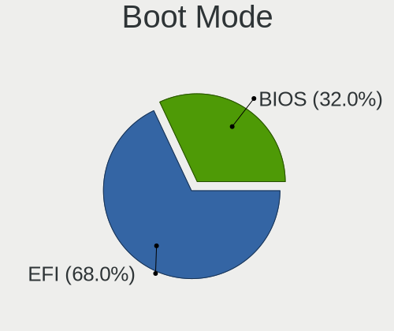
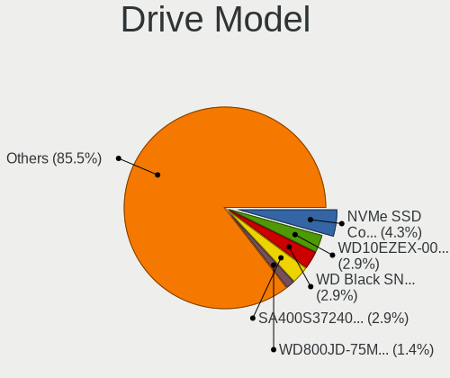
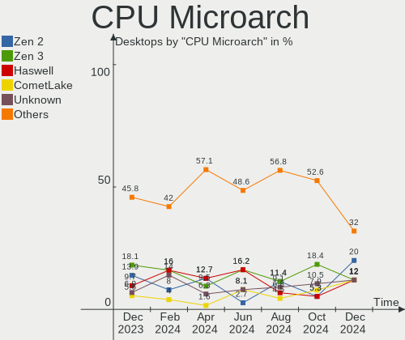
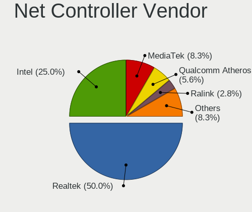
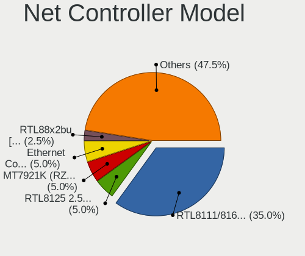

ArcoLinux - Hardware Trends (Desktops)
--------------------------------------

A project to identify most popular hardware characteristics and track their change
over time based on data collected by Linux users at https://Linux-Hardware.org.

Anyone can contribute to this report by the [hw-probe](https://github.com/linuxhw/hw-probe) tool:

    sudo -E hw-probe -all -upload

This report is for one last month. Overall report since the beginning of time: [TestDays](https://github.com/linuxhw/TestDays)

Period: Mar, 2023.

Contents
--------

* [ System ](#system)
  - [ OS                       ](#os)
  - [ OS Family                ](#os-family)
  - [ Kernel                   ](#kernel)
  - [ Kernel Family            ](#kernel-family)
  - [ Kernel Major Ver.        ](#kernel-major-ver)
  - [ Arch                     ](#arch)
  - [ DE                       ](#de)
  - [ Display Server           ](#display-server)
  - [ Display Manager          ](#display-manager)
  - [ OS Lang                  ](#os-lang)
  - [ Boot Mode                ](#boot-mode)
  - [ Filesystem               ](#filesystem)
  - [ Part. scheme             ](#part-scheme)
  - [ Dual Boot with Linux/BSD ](#dual-boot-with-linuxbsd)
  - [ Dual Boot (Win)          ](#dual-boot-win)

* [ Board ](#board)
  - [ Vendor                   ](#vendor)
  - [ Model                    ](#model)
  - [ Model Family             ](#model-family)
  - [ MFG Year                 ](#mfg-year)
  - [ Form Factor              ](#form-factor)
  - [ Secure Boot              ](#secure-boot)
  - [ Coreboot                 ](#coreboot)
  - [ RAM Size                 ](#ram-size)
  - [ RAM Used                 ](#ram-used)
  - [ Total Drives             ](#total-drives)
  - [ Has CD-ROM               ](#has-cd-rom)
  - [ Has Ethernet             ](#has-ethernet)
  - [ Has WiFi                 ](#has-wifi)
  - [ Has Bluetooth            ](#has-bluetooth)

* [ Location ](#location)
  - [ Country                  ](#country)
  - [ City                     ](#city)

* [ Drives ](#drives)
  - [ Drive Vendor             ](#drive-vendor)
  - [ Drive Model              ](#drive-model)
  - [ HDD Vendor               ](#hdd-vendor)
  - [ SSD Vendor               ](#ssd-vendor)
  - [ Drive Kind               ](#drive-kind)
  - [ Drive Connector          ](#drive-connector)
  - [ Drive Size               ](#drive-size)
  - [ Space Total              ](#space-total)
  - [ Space Used               ](#space-used)
  - [ Malfunc. Drives          ](#malfunc-drives)
  - [ Malfunc. Drive Vendor    ](#malfunc-drive-vendor)
  - [ Malfunc. HDD Vendor      ](#malfunc-hdd-vendor)
  - [ Malfunc. Drive Kind      ](#malfunc-drive-kind)
  - [ Failed Drives            ](#failed-drives)
  - [ Failed Drive Vendor      ](#failed-drive-vendor)
  - [ Drive Status             ](#drive-status)

* [ Storage controller ](#storage-controller)
  - [ Storage Vendor           ](#storage-vendor)
  - [ Storage Model            ](#storage-model)
  - [ Storage Kind             ](#storage-kind)

* [ Processor ](#processor)
  - [ CPU Vendor               ](#cpu-vendor)
  - [ CPU Model                ](#cpu-model)
  - [ CPU Model Family         ](#cpu-model-family)
  - [ CPU Cores                ](#cpu-cores)
  - [ CPU Sockets              ](#cpu-sockets)
  - [ CPU Threads              ](#cpu-threads)
  - [ CPU Op-Modes             ](#cpu-op-modes)
  - [ CPU Microcode            ](#cpu-microcode)
  - [ CPU Microarch            ](#cpu-microarch)

* [ Graphics ](#graphics)
  - [ GPU Vendor               ](#gpu-vendor)
  - [ GPU Model                ](#gpu-model)
  - [ GPU Combo                ](#gpu-combo)
  - [ GPU Driver               ](#gpu-driver)
  - [ GPU Memory               ](#gpu-memory)

* [ Monitor ](#monitor)
  - [ Monitor Vendor           ](#monitor-vendor)
  - [ Monitor Model            ](#monitor-model)
  - [ Monitor Resolution       ](#monitor-resolution)
  - [ Monitor Diagonal         ](#monitor-diagonal)
  - [ Monitor Width            ](#monitor-width)
  - [ Aspect Ratio             ](#aspect-ratio)
  - [ Monitor Area             ](#monitor-area)
  - [ Pixel Density            ](#pixel-density)
  - [ Multiple Monitors        ](#multiple-monitors)

* [ Network ](#network)
  - [ Net Controller Vendor    ](#net-controller-vendor)
  - [ Net Controller Model     ](#net-controller-model)
  - [ Wireless Vendor          ](#wireless-vendor)
  - [ Wireless Model           ](#wireless-model)
  - [ Ethernet Vendor          ](#ethernet-vendor)
  - [ Ethernet Model           ](#ethernet-model)
  - [ Net Controller Kind      ](#net-controller-kind)
  - [ Used Controller          ](#used-controller)
  - [ NICs                     ](#nics)
  - [ IPv6                     ](#ipv6)

* [ Bluetooth ](#bluetooth)
  - [ Bluetooth Vendor         ](#bluetooth-vendor)
  - [ Bluetooth Model          ](#bluetooth-model)

* [ Sound ](#sound)
  - [ Sound Vendor             ](#sound-vendor)
  - [ Sound Model              ](#sound-model)

* [ Memory ](#memory)
  - [ Memory Vendor            ](#memory-vendor)
  - [ Memory Model             ](#memory-model)
  - [ Memory Kind              ](#memory-kind)
  - [ Memory Form Factor       ](#memory-form-factor)
  - [ Memory Size              ](#memory-size)
  - [ Memory Speed             ](#memory-speed)

* [ Printers & scanners ](#printers--scanners)
  - [ Printer Vendor           ](#printer-vendor)
  - [ Printer Model            ](#printer-model)
  - [ Scanner Vendor           ](#scanner-vendor)
  - [ Scanner Model            ](#scanner-model)

* [ Camera ](#camera)
  - [ Camera Vendor            ](#camera-vendor)
  - [ Camera Model             ](#camera-model)

* [ Security ](#security)
  - [ Fingerprint Vendor       ](#fingerprint-vendor)
  - [ Fingerprint Model        ](#fingerprint-model)
  - [ Chipcard Vendor          ](#chipcard-vendor)
  - [ Chipcard Model           ](#chipcard-model)

* [ Unsupported ](#unsupported)
  - [ Unsupported Devices      ](#unsupported-devices)
  - [ Unsupported Device Types ](#unsupported-device-types)

System
------

OS
--

Installed operating systems

| Name              | Desktops | Percent |
|-------------------|----------|---------|
| ArcoLinux Rolling | 41       | 100%    |

OS Family
---------

OS without a version

| Name      | Desktops | Percent |
|-----------|----------|---------|
| ArcoLinux | 41       | 100%    |

Kernel
------

Version of the Linux kernel

| Version                       | Desktops | Percent |
|-------------------------------|----------|---------|
| 6.2.8-arch1-1                 | 9        | 21.95%  |
| 6.2.6-arch1-1                 | 4        | 9.76%   |
| 6.2.2-arch1-1                 | 3        | 7.32%   |
| 6.2.1-arch1-1                 | 3        | 7.32%   |
| 6.1.21-1-lts                  | 3        | 7.32%   |
| 6.2.7-x64v1-xanmod1-1         | 2        | 4.88%   |
| 6.2.6-zen1-1-zen              | 2        | 4.88%   |
| 6.1.11-arch1-1                | 2        | 4.88%   |
| 5.15.96.61.realtime1-1-rt-lts | 2        | 4.88%   |
| 6.2.8-AMD                     | 1        | 2.44%   |
| 6.2.7-lqx1-1-lqx              | 1        | 2.44%   |
| 6.2.7-arch1-1                 | 1        | 2.44%   |
| 6.2.5-arch1-1                 | 1        | 2.44%   |
| 6.2.2-zen1-1-zen              | 1        | 2.44%   |
| 6.2.1-zen1-1-zen              | 1        | 2.44%   |
| 6.1.6-arch1-3                 | 1        | 2.44%   |
| 6.1.21-hardened1-1-hardened   | 1        | 2.44%   |
| 6.1.19-1-lts                  | 1        | 2.44%   |
| 6.1.15-1-lts                  | 1        | 2.44%   |
| 6.1.12-arch1-1                | 1        | 2.44%   |

Kernel Family
-------------

Linux kernel without a distro release

| Version    | Desktops | Percent |
|------------|----------|---------|
| 6.2.8      | 10       | 24.39%  |
| 6.2.6      | 6        | 14.63%  |
| 6.2.7      | 4        | 9.76%   |
| 6.2.2      | 4        | 9.76%   |
| 6.2.1      | 4        | 9.76%   |
| 6.1.21     | 4        | 9.76%   |
| 6.1.11     | 2        | 4.88%   |
| 5.15.96.61 | 2        | 4.88%   |
| 6.2.5      | 1        | 2.44%   |
| 6.1.6      | 1        | 2.44%   |
| 6.1.19     | 1        | 2.44%   |
| 6.1.15     | 1        | 2.44%   |
| 6.1.12     | 1        | 2.44%   |

Kernel Major Ver.
-----------------

Linux kernel major version

| Version | Desktops | Percent |
|---------|----------|---------|
| 6.2     | 29       | 70.73%  |
| 6.1     | 10       | 24.39%  |
| 5.15.96 | 2        | 4.88%   |

Arch
----

OS architecture (x86_64, i586, etc.)

| Name   | Desktops | Percent |
|--------|----------|---------|
| x86_64 | 41       | 100%    |

DE
--

Desktop Environment

| Name     | Desktops | Percent |
|----------|----------|---------|
| XFCE     | 13       | 31.71%  |
| KDE5     | 10       | 24.39%  |
| Hyprland | 5        | 12.2%   |
| bspwm    | 4        | 9.76%   |
| qtile    | 2        | 4.88%   |
| i3       | 2        | 4.88%   |
| GNOME    | 2        | 4.88%   |
| xmonad   | 1        | 2.44%   |
| LeftWM   | 1        | 2.44%   |
| Cinnamon | 1        | 2.44%   |

Display Server
--------------

X11 or Wayland

| Name    | Desktops | Percent |
|---------|----------|---------|
| X11     | 32       | 78.05%  |
| Wayland | 6        | 14.63%  |
| Tty     | 3        | 7.32%   |

Display Manager
---------------

SDDM, LightDM, etc.

| Name    | Desktops | Percent |
|---------|----------|---------|
| SDDM    | 39       | 95.12%  |
| LightDM | 2        | 4.88%   |

OS Lang
-------

Language

| Lang  | Desktops | Percent |
|-------|----------|---------|
| en_US | 20       | 48.78%  |
| en_GB | 7        | 17.07%  |
| C     | 4        | 9.76%   |
| it_IT | 2        | 4.88%   |
| de_DE | 2        | 4.88%   |
| nl_NL | 1        | 2.44%   |
| fr_FR | 1        | 2.44%   |
| fi_FI | 1        | 2.44%   |
| en_ZA | 1        | 2.44%   |
| en_IN | 1        | 2.44%   |
| en_CA | 1        | 2.44%   |

Boot Mode
---------

EFI or BIOS

| Mode | Desktops | Percent |
|------|----------|---------|
| EFI  | 37       | 90.24%  |
| BIOS | 4        | 9.76%   |

Filesystem
----------

Type of filesystem

| Type    | Desktops | Percent |
|---------|----------|---------|
| Ext4    | 25       | 60.98%  |
| Btrfs   | 10       | 24.39%  |
| Overlay | 5        | 12.2%   |
| F2fs    | 1        | 2.44%   |

Part. scheme
------------

Scheme of partitioning

| Type | Desktops | Percent |
|------|----------|---------|
| GPT  | 37       | 90.24%  |
| MBR  | 4        | 9.76%   |

Dual Boot with Linux/BSD
------------------------

Hosting more than one Linux/BSD

| Dual boot | Desktops | Percent |
|-----------|----------|---------|
| No        | 26       | 63.41%  |
| Yes       | 15       | 36.59%  |

Dual Boot (Win)
---------------

Hosting Linux and Windows

| Dual boot | Desktops | Percent |
|-----------|----------|---------|
| No        | 23       | 56.1%   |
| Yes       | 18       | 43.9%   |

Board
-----

Vendor
------

Motherboard manufacturer

| Name                | Desktops | Percent |
|---------------------|----------|---------|
| ASUSTek Computer    | 18       | 43.9%   |
| Gigabyte Technology | 6        | 14.63%  |
| Hewlett-Packard     | 4        | 9.76%   |
| ASRock              | 4        | 9.76%   |
| MSI                 | 3        | 7.32%   |
| Dell                | 3        | 7.32%   |
| Lenovo              | 1        | 2.44%   |
| Huanan              | 1        | 2.44%   |
| Unknown             | 1        | 2.44%   |

Model
-----

Motherboard model

| Name                                                                     | Desktops | Percent |
|--------------------------------------------------------------------------|----------|---------|
| MSI MS-7C02                                                              | 1        | 2.44%   |
| MSI MS-7B51                                                              | 1        | 2.44%   |
| MSI A320M-HDV R4.0                                                       | 1        | 2.44%   |
| Lenovo IdeaCentre 510-15ICB 90HU00CEGE                                   | 1        | 2.44%   |
| Huanan X79-ZD3 INTEL (INTEL Xeon E5/Corei7 DMI2 - C600/C200 Cipset V3.6C | 1        | 2.44%   |
| HP ProOne 600 G1 AiO                                                     | 1        | 2.44%   |
| HP Pavilion Power Desktop 580-1xx                                        | 1        | 2.44%   |
| HP EliteDesk 800 G2 DM 35W                                               | 1        | 2.44%   |
| HP 750-427c                                                              | 1        | 2.44%   |
| Gigabyte X570 AORUS ELITE                                                | 1        | 2.44%   |
| Gigabyte H61MS                                                           | 1        | 2.44%   |
| Gigabyte GA-78LMT-USB3 6.0                                               | 1        | 2.44%   |
| Gigabyte B560M DS3H                                                      | 1        | 2.44%   |
| Gigabyte B550 AORUS PRO V2                                               | 1        | 2.44%   |
| Gigabyte B450M DS3H WIFI                                                 | 1        | 2.44%   |
| Dell Vostro 3800                                                         | 1        | 2.44%   |
| Dell OptiPlex 9010                                                       | 1        | 2.44%   |
| Dell OptiPlex 3050                                                       | 1        | 2.44%   |
| ASUS X79-DELUXE                                                          | 1        | 2.44%   |
| ASUS TUF Z390-PRO GAMING                                                 | 1        | 2.44%   |
| ASUS TUF Gaming X570-PLUS                                                | 1        | 2.44%   |
| ASUS STRIX Z270H GAMING                                                  | 1        | 2.44%   |
| ASUS ROG STRIX X570-I GAMING                                             | 1        | 2.44%   |
| ASUS ROG STRIX B560-I GAMING WIFI                                        | 1        | 2.44%   |
| ASUS ROG STRIX B550-F GAMING                                             | 1        | 2.44%   |
| ASUS ROG STRIX B450-F GAMING                                             | 1        | 2.44%   |
| ASUS ROG CROSSHAIR VIII EXTREME                                          | 1        | 2.44%   |
| ASUS Q170M2                                                              | 1        | 2.44%   |
| ASUS PRIME Z490-A                                                        | 1        | 2.44%   |
| ASUS PRIME X570-P                                                        | 1        | 2.44%   |
| ASUS PRIME H610M-K D4                                                    | 1        | 2.44%   |
| ASUS PRIME B660M-K D4                                                    | 1        | 2.44%   |
| ASUS PRIME B650-PLUS                                                     | 1        | 2.44%   |
| ASUS PRIME B250M-A                                                       | 1        | 2.44%   |
| ASUS PRIME A320M-K                                                       | 1        | 2.44%   |
| ASUS P8Z77-V LE                                                          | 1        | 2.44%   |
| ASRock Z370M Pro4                                                        | 1        | 2.44%   |
| ASRock B450M Pro4                                                        | 1        | 2.44%   |
| ASRock B250M-HDV                                                         | 1        | 2.44%   |
| ASRock 970 Extreme4                                                      | 1        | 2.44%   |

Model Family
------------

Motherboard model prefix

| Name                   | Desktops | Percent |
|------------------------|----------|---------|
| ASUS PRIME             | 7        | 17.07%  |
| ASUS ROG               | 5        | 12.2%   |
| Dell OptiPlex          | 2        | 4.88%   |
| ASUS TUF               | 2        | 4.88%   |
| MSI MS-7C02            | 1        | 2.44%   |
| MSI MS-7B51            | 1        | 2.44%   |
| MSI A320M-HDV          | 1        | 2.44%   |
| Lenovo IdeaCentre      | 1        | 2.44%   |
| Huanan X79-ZD3         | 1        | 2.44%   |
| HP ProOne              | 1        | 2.44%   |
| HP Pavilion            | 1        | 2.44%   |
| HP EliteDesk           | 1        | 2.44%   |
| HP 750-427c            | 1        | 2.44%   |
| Gigabyte X570          | 1        | 2.44%   |
| Gigabyte H61MS         | 1        | 2.44%   |
| Gigabyte GA-78LMT-USB3 | 1        | 2.44%   |
| Gigabyte B560M         | 1        | 2.44%   |
| Gigabyte B550          | 1        | 2.44%   |
| Gigabyte B450M         | 1        | 2.44%   |
| Dell Vostro            | 1        | 2.44%   |
| ASUS X79-DELUXE        | 1        | 2.44%   |
| ASUS STRIX             | 1        | 2.44%   |
| ASUS Q170M2            | 1        | 2.44%   |
| ASUS P8Z77-V           | 1        | 2.44%   |
| ASRock Z370M           | 1        | 2.44%   |
| ASRock B450M           | 1        | 2.44%   |
| ASRock B250M-HDV       | 1        | 2.44%   |
| ASRock 970             | 1        | 2.44%   |
| Unknown                | 1        | 2.44%   |

MFG Year
--------

Motherboard manufacture year

| Year | Desktops | Percent |
|------|----------|---------|
| 2019 | 8        | 19.51%  |
| 2018 | 7        | 17.07%  |
| 2017 | 6        | 14.63%  |
| 2022 | 3        | 7.32%   |
| 2021 | 3        | 7.32%   |
| 2020 | 3        | 7.32%   |
| 2013 | 3        | 7.32%   |
| 2016 | 2        | 4.88%   |
| 2014 | 2        | 4.88%   |
| 2015 | 1        | 2.44%   |
| 2012 | 1        | 2.44%   |
| 2011 | 1        | 2.44%   |
| 2007 | 1        | 2.44%   |

Form Factor
-----------

Physical design of the computer

| Name    | Desktops | Percent |
|---------|----------|---------|
| Desktop | 41       | 100%    |

Secure Boot
-----------

Enabled or disabled

| State    | Desktops | Percent |
|----------|----------|---------|
| Disabled | 41       | 100%    |

Coreboot
--------

Have coreboot on board

| Used | Desktops | Percent |
|------|----------|---------|
| No   | 41       | 100%    |

RAM Size
--------

Total RAM memory

| Size in GB  | Desktops | Percent |
|-------------|----------|---------|
| 32.01-64.0  | 12       | 29.27%  |
| 16.01-24.0  | 10       | 24.39%  |
| 24.01-32.0  | 8        | 19.51%  |
| 8.01-16.0   | 4        | 9.76%   |
| 4.01-8.0    | 3        | 7.32%   |
| 64.01-256.0 | 3        | 7.32%   |
| 3.01-4.0    | 1        | 2.44%   |

RAM Used
--------

Used RAM memory

| Used GB   | Desktops | Percent |
|-----------|----------|---------|
| 2.01-3.0  | 12       | 29.27%  |
| 4.01-8.0  | 9        | 21.95%  |
| 1.01-2.0  | 9        | 21.95%  |
| 3.01-4.0  | 5        | 12.2%   |
| 0.51-1.0  | 4        | 9.76%   |
| 8.01-16.0 | 2        | 4.88%   |

Total Drives
------------

Number of drives on board

| Drives | Desktops | Percent |
|--------|----------|---------|
| 3      | 12       | 29.27%  |
| 2      | 11       | 26.83%  |
| 1      | 9        | 21.95%  |
| 4      | 5        | 12.2%   |
| 5      | 3        | 7.32%   |
| 6      | 1        | 2.44%   |

Has CD-ROM
----------

Has CD-ROM on board

| Presented | Desktops | Percent |
|-----------|----------|---------|
| No        | 32       | 78.05%  |
| Yes       | 9        | 21.95%  |

Has Ethernet
------------

Has Ethernet on board

| Presented | Desktops | Percent |
|-----------|----------|---------|
| Yes       | 41       | 100%    |

Has WiFi
--------

Has WiFi module

| Presented | Desktops | Percent |
|-----------|----------|---------|
| No        | 27       | 65.85%  |
| Yes       | 14       | 34.15%  |

Has Bluetooth
-------------

Has Bluetooth module

| Presented | Desktops | Percent |
|-----------|----------|---------|
| No        | 21       | 51.22%  |
| Yes       | 20       | 48.78%  |

Location
--------

Country
-------

Geographic location (country)

| Country      | Desktops | Percent |
|--------------|----------|---------|
| USA          | 7        | 17.07%  |
| Belgium      | 6        | 14.63%  |
| UK           | 4        | 9.76%   |
| Germany      | 3        | 7.32%   |
| Italy        | 2        | 4.88%   |
| India        | 2        | 4.88%   |
| Canada       | 2        | 4.88%   |
| Austria      | 2        | 4.88%   |
| Uruguay      | 1        | 2.44%   |
| Ukraine      | 1        | 2.44%   |
| Sweden       | 1        | 2.44%   |
| South Africa | 1        | 2.44%   |
| Russia       | 1        | 2.44%   |
| Portugal     | 1        | 2.44%   |
| Netherlands  | 1        | 2.44%   |
| Mexico       | 1        | 2.44%   |
| France       | 1        | 2.44%   |
| Finland      | 1        | 2.44%   |
| Denmark      | 1        | 2.44%   |
| Australia    | 1        | 2.44%   |
| Argentina    | 1        | 2.44%   |

City
----

Geographic location (city)

| City                  | Desktops | Percent |
|-----------------------|----------|---------|
| Duffel                | 3        | 7.32%   |
| Mechelen              | 2        | 4.88%   |
| Kolkata               | 2        | 4.88%   |
| Vaxjo                 | 1        | 2.44%   |
| Valley Stream         | 1        | 2.44%   |
| Sydney                | 1        | 2.44%   |
| San Luis Potosí City | 1        | 2.44%   |
| Roosendaal            | 1        | 2.44%   |
| Rome                  | 1        | 2.44%   |
| Ripon                 | 1        | 2.44%   |
| Portland              | 1        | 2.44%   |
| Port Elizabeth        | 1        | 2.44%   |
| Odense                | 1        | 2.44%   |
| Newport               | 1        | 2.44%   |
| Neuss                 | 1        | 2.44%   |
| Moscow                | 1        | 2.44%   |
| Montevideo            | 1        | 2.44%   |
| Lviv                  | 1        | 2.44%   |
| Lurate Caccivio       | 1        | 2.44%   |
| Leander               | 1        | 2.44%   |
| Labrador City         | 1        | 2.44%   |
| La Grange             | 1        | 2.44%   |
| Kennebunk             | 1        | 2.44%   |
| Innsbruck             | 1        | 2.44%   |
| Helsinki              | 1        | 2.44%   |
| Heidelberg            | 1        | 2.44%   |
| Haywards Heath        | 1        | 2.44%   |
| Ellmau                | 1        | 2.44%   |
| Dessau                | 1        | 2.44%   |
| Coueron               | 1        | 2.44%   |
| Córdoba              | 1        | 2.44%   |
| Connersville          | 1        | 2.44%   |
| Colfax                | 1        | 2.44%   |
| Coimbra               | 1        | 2.44%   |
| Chicoutimi            | 1        | 2.44%   |
| Cambridge             | 1        | 2.44%   |
| Antwerp               | 1        | 2.44%   |

Drives
------

Drive Vendor
------------

Hard drive vendors

| Vendor                    | Desktops | Drives | Percent |
|---------------------------|----------|--------|---------|
| Samsung Electronics       | 20       | 30     | 22.73%  |
| WDC                       | 13       | 15     | 14.77%  |
| Seagate                   | 11       | 13     | 12.5%   |
| Sandisk                   | 9        | 11     | 10.23%  |
| Kingston                  | 8        | 8      | 9.09%   |
| Crucial                   | 3        | 3      | 3.41%   |
| Unknown                   | 2        | 2      | 2.27%   |
| Toshiba                   | 2        | 2      | 2.27%   |
| Phison Electronics        | 2        | 3      | 2.27%   |
| Intel                     | 2        | 2      | 2.27%   |
| Hitachi                   | 2        | 2      | 2.27%   |
| ADATA Technology          | 2        | 2      | 2.27%   |
| SSD_2.5"                  | 1        | 1      | 1.14%   |
| SK hynix                  | 1        | 1      | 1.14%   |
| Micron/Crucial Technology | 1        | 1      | 1.14%   |
| KIOXIA                    | 1        | 1      | 1.14%   |
| Intenso                   | 1        | 1      | 1.14%   |
| Hewlett-Packard           | 1        | 1      | 1.14%   |
| H/W                       | 1        | 3      | 1.14%   |
| External                  | 1        | 1      | 1.14%   |
| Corsair                   | 1        | 1      | 1.14%   |
| Biostar                   | 1        | 2      | 1.14%   |
| ASMedia                   | 1        | 1      | 1.14%   |
| A-DATA Technology         | 1        | 1      | 1.14%   |

Drive Model
-----------

Hard drive models

| Model                                                              | Desktops | Percent |
|--------------------------------------------------------------------|----------|---------|
| Samsung NVMe SSD Controller SM981/PM981/PM983 250GB                | 8        | 7.92%   |
| WDC WD10EZEX-08WN4A0 1TB                                           | 3        | 2.97%   |
| Kingston SA400S37240G 240GB SSD                                    | 3        | 2.97%   |
| WDC WDS240G2G0A-00JH30 240GB SSD                                   | 2        | 1.98%   |
| Unknown SD/MMC/MS PRO 64GB                                         | 2        | 1.98%   |
| Seagate ST2000DM008-2FR102 2TB                                     | 2        | 1.98%   |
| Samsung SSD 870 QVO 2TB                                            | 2        | 1.98%   |
| Samsung SSD 860 EVO 500GB                                          | 2        | 1.98%   |
| Samsung SSD 850 EVO 500GB                                          | 2        | 1.98%   |
| Samsung NVMe SSD Controller PM9A1/PM9A3/980PRO 1TB                 | 2        | 1.98%   |
| Kingston SNVS500G 500GB                                            | 2        | 1.98%   |
| Crucial CT240BX500SSD1 240GB                                       | 2        | 1.98%   |
| ADATA XPG SX8200 Pro PCIe Gen3x4 M.2 2280 Solid State Drive 1024GB | 2        | 1.98%   |
| WDC WDS500G2B0B-00YS70 500GB SSD                                   | 1        | 0.99%   |
| WDC WDS500G2B0A-00SM50 500GB SSD                                   | 1        | 0.99%   |
| WDC WDS500G2B0A 500GB SSD                                          | 1        | 0.99%   |
| WDC WDS120G1G0A-00SS50 120GB SSD                                   | 1        | 0.99%   |
| WDC WD5000AAKX-75U6AA0 500GB                                       | 1        | 0.99%   |
| WDC WD5000AACS-00G8B1 500GB                                        | 1        | 0.99%   |
| WDC WD3200AVJS-63B6A0 320GB                                        | 1        | 0.99%   |
| WDC WD10JPVX-22JC3T0 1TB                                           | 1        | 0.99%   |
| WDC WD10EZRX-00A8LB0 1TB                                           | 1        | 0.99%   |
| WDC WD10EZEX-60WN4A1 1TB                                           | 1        | 0.99%   |
| Toshiba THNSFJ256GDNU A 256GB SSD                                  | 1        | 0.99%   |
| Toshiba DT01ACA100 1TB                                             | 1        | 0.99%   |
| SSD_2.5" TLC_256GB_Innov                                           | 1        | 0.99%   |
| SK hynix C2S3T/240G 240GB SSD                                      | 1        | 0.99%   |
| Seagate ST8000DM004-2CX188 8TB                                     | 1        | 0.99%   |
| Seagate ST2000VX003-1HH164 2TB                                     | 1        | 0.99%   |
| Seagate ST2000DM001-1ER164 2TB                                     | 1        | 0.99%   |
| Seagate ST1000DM010-2EP102 1TB                                     | 1        | 0.99%   |
| Seagate ST1000DM003-1SB102 1TB                                     | 1        | 0.99%   |
| Seagate ST1000DM003-1ER162 1TB                                     | 1        | 0.99%   |
| Seagate ST1000DM003-1CH162 1TB                                     | 1        | 0.99%   |
| Seagate Expansion HDD 2TB                                          | 1        | 0.99%   |
| Seagate BarraCuda 120 SSD ZA2000CM10003 2TB                        | 1        | 0.99%   |
| Sandisk WDC WDS240G2G0C-00AJM0 240GB                               | 1        | 0.99%   |
| Sandisk WDC WDS200T2B0C-00PXH0 2TB                                 | 1        | 0.99%   |
| Sandisk WD Blue SN570 500GB                                        | 1        | 0.99%   |
| Sandisk WD Blue SN570 1TB                                          | 1        | 0.99%   |

HDD Vendor
----------

Hard disk drive vendors

| Vendor              | Desktops | Drives | Percent |
|---------------------|----------|--------|---------|
| Seagate             | 10       | 12     | 37.04%  |
| WDC                 | 7        | 9      | 25.93%  |
| Unknown             | 2        | 2      | 7.41%   |
| Hitachi             | 2        | 2      | 7.41%   |
| Toshiba             | 1        | 1      | 3.7%    |
| Samsung Electronics | 1        | 1      | 3.7%    |
| Hewlett-Packard     | 1        | 1      | 3.7%    |
| H/W                 | 1        | 3      | 3.7%    |
| External            | 1        | 1      | 3.7%    |
| ASMedia             | 1        | 1      | 3.7%    |

SSD Vendor
----------

Solid state drive vendors

| Vendor              | Desktops | Drives | Percent |
|---------------------|----------|--------|---------|
| Samsung Electronics | 15       | 16     | 36.59%  |
| WDC                 | 6        | 6      | 14.63%  |
| Kingston            | 6        | 6      | 14.63%  |
| SanDisk             | 3        | 4      | 7.32%   |
| Crucial             | 3        | 3      | 7.32%   |
| Toshiba             | 1        | 1      | 2.44%   |
| SK hynix            | 1        | 1      | 2.44%   |
| Seagate             | 1        | 1      | 2.44%   |
| Intenso             | 1        | 1      | 2.44%   |
| Intel               | 1        | 1      | 2.44%   |
| Corsair             | 1        | 1      | 2.44%   |
| Biostar             | 1        | 2      | 2.44%   |
| A-DATA Technology   | 1        | 1      | 2.44%   |

Drive Kind
----------

HDD or SSD

| Kind    | Desktops | Drives | Percent |
|---------|----------|--------|---------|
| SSD     | 32       | 44     | 39.02%  |
| NVMe    | 25       | 30     | 30.49%  |
| HDD     | 24       | 33     | 29.27%  |
| Unknown | 1        | 1      | 1.22%   |

Drive Connector
---------------

SATA, SAS, NVMe, etc.

| Type | Desktops | Drives | Percent |
|------|----------|--------|---------|
| SATA | 39       | 70     | 55.71%  |
| NVMe | 25       | 30     | 35.71%  |
| SAS  | 6        | 8      | 8.57%   |

Drive Size
----------

Size of hard drive

| Size in TB | Desktops | Drives | Percent |
|------------|----------|--------|---------|
| 0.01-0.5   | 29       | 39     | 47.54%  |
| 0.51-1.0   | 15       | 19     | 24.59%  |
| 1.01-2.0   | 14       | 16     | 22.95%  |
| 4.01-10.0  | 2        | 2      | 3.28%   |
| 3.01-4.0   | 1        | 1      | 1.64%   |

Space Total
-----------

Amount of disk space available on the file system

| Size in GB     | Desktops | Percent |
|----------------|----------|---------|
| More than 3000 | 10       | 24.39%  |
| 1001-2000      | 7        | 17.07%  |
| 251-500        | 6        | 14.63%  |
| 501-1000       | 6        | 14.63%  |
| 101-250        | 5        | 12.2%   |
| 2001-3000      | 4        | 9.76%   |
| 1-20           | 1        | 2.44%   |
| 51-100         | 1        | 2.44%   |
| Unknown        | 1        | 2.44%   |

Space Used
----------

Amount of used disk space

| Used GB        | Desktops | Percent |
|----------------|----------|---------|
| 1001-2000      | 8        | 19.51%  |
| 1-20           | 8        | 19.51%  |
| 251-500        | 4        | 9.76%   |
| 21-50          | 4        | 9.76%   |
| 101-250        | 4        | 9.76%   |
| 501-1000       | 4        | 9.76%   |
| 51-100         | 4        | 9.76%   |
| 2001-3000      | 3        | 7.32%   |
| More than 3000 | 1        | 2.44%   |
| Unknown        | 1        | 2.44%   |

Malfunc. Drives
---------------

Drive models with a malfunction

| Model                             | Desktops | Drives | Percent |
|-----------------------------------|----------|--------|---------|
| WDC WD5000AAKX-75U6AA0 500GB      | 1        | 1      | 6.67%   |
| WDC WD5000AACS-00G8B1 500GB       | 1        | 1      | 6.67%   |
| WDC WD3200AVJS-63B6A0 320GB       | 1        | 1      | 6.67%   |
| WDC WD10JPVX-22JC3T0 1TB          | 1        | 1      | 6.67%   |
| WDC WD10EZRX-00A8LB0 1TB          | 1        | 1      | 6.67%   |
| Toshiba DT01ACA100 1TB            | 1        | 1      | 6.67%   |
| Seagate ST2000VX003-1HH164 2TB    | 1        | 1      | 6.67%   |
| Seagate ST1000DM003-1CH162 1TB    | 1        | 1      | 6.67%   |
| Samsung Electronics HM251JI 250GB | 1        | 1      | 6.67%   |
| Intel SSDSC2CT240A4 240GB         | 1        | 1      | 6.67%   |
| Hitachi HDS722020ALA330 2TB       | 1        | 1      | 6.67%   |
| Hewlett-Packard MB2000EBUCF 2TB   | 1        | 1      | 6.67%   |
| Crucial CT250BX100SSD1 250GB      | 1        | 1      | 6.67%   |
| Corsair CSSD-F60GB2 64GB          | 1        | 1      | 6.67%   |
| ASMedia AS2115 8TB                | 1        | 1      | 6.67%   |

Malfunc. Drive Vendor
---------------------

Vendors of faulty drives

| Vendor              | Desktops | Drives | Percent |
|---------------------|----------|--------|---------|
| WDC                 | 5        | 5      | 33.33%  |
| Seagate             | 2        | 2      | 13.33%  |
| Toshiba             | 1        | 1      | 6.67%   |
| Samsung Electronics | 1        | 1      | 6.67%   |
| Intel               | 1        | 1      | 6.67%   |
| Hitachi             | 1        | 1      | 6.67%   |
| Hewlett-Packard     | 1        | 1      | 6.67%   |
| Crucial             | 1        | 1      | 6.67%   |
| Corsair             | 1        | 1      | 6.67%   |
| ASMedia             | 1        | 1      | 6.67%   |

Malfunc. HDD Vendor
-------------------

Vendors of faulty HDD drives

| Vendor              | Desktops | Drives | Percent |
|---------------------|----------|--------|---------|
| WDC                 | 5        | 5      | 41.67%  |
| Seagate             | 2        | 2      | 16.67%  |
| Toshiba             | 1        | 1      | 8.33%   |
| Samsung Electronics | 1        | 1      | 8.33%   |
| Hitachi             | 1        | 1      | 8.33%   |
| Hewlett-Packard     | 1        | 1      | 8.33%   |
| ASMedia             | 1        | 1      | 8.33%   |

Malfunc. Drive Kind
-------------------

Kinds of faulty drives

| Kind | Desktops | Drives | Percent |
|------|----------|--------|---------|
| HDD  | 11       | 12     | 78.57%  |
| SSD  | 3        | 3      | 21.43%  |

Failed Drives
-------------

Failed drive models

Zero info for selected period =(

Failed Drive Vendor
-------------------

Failed drive vendors

Zero info for selected period =(

Drive Status
------------

Number of failed and malfunc. drives

| Status   | Desktops | Drives | Percent |
|----------|----------|--------|---------|
| Works    | 38       | 85     | 65.52%  |
| Malfunc  | 13       | 15     | 22.41%  |
| Detected | 7        | 8      | 12.07%  |

Storage controller
------------------

Storage Vendor
--------------

Storage controller vendors

| Vendor                      | Desktops | Percent |
|-----------------------------|----------|---------|
| Intel                       | 25       | 35.21%  |
| AMD                         | 17       | 23.94%  |
| Samsung Electronics         | 10       | 14.08%  |
| SanDisk                     | 6        | 8.45%   |
| ASMedia Technology          | 3        | 4.23%   |
| Phison Electronics          | 2        | 2.82%   |
| Marvell Technology Group    | 2        | 2.82%   |
| Kingston Technology Company | 2        | 2.82%   |
| ADATA Technology            | 2        | 2.82%   |
| Micron/Crucial Technology   | 1        | 1.41%   |
| KIOXIA                      | 1        | 1.41%   |

Storage Model
-------------

Storage controller models

| Model                                                                                   | Desktops | Percent |
|-----------------------------------------------------------------------------------------|----------|---------|
| AMD FCH SATA Controller [AHCI mode]                                                     | 13       | 15.12%  |
| Samsung NVMe SSD Controller SM981/PM981/PM983                                           | 8        | 9.3%    |
| Intel 200 Series PCH SATA controller [AHCI mode]                                        | 5        | 5.81%   |
| AMD 400 Series Chipset SATA Controller                                                  | 4        | 4.65%   |
| Intel Q170/Q150/B150/H170/H110/Z170/CM236 Chipset SATA Controller [AHCI Mode]           | 3        | 3.49%   |
| Intel Cannon Lake PCH SATA AHCI Controller                                              | 3        | 3.49%   |
| ASMedia ASM1062 Serial ATA Controller                                                   | 3        | 3.49%   |
| SanDisk WD Blue SN570 NVMe SSD 1TB                                                      | 2        | 2.33%   |
| SanDisk Non-Volatile memory controller                                                  | 2        | 2.33%   |
| Samsung NVMe SSD Controller PM9A1/PM9A3/980PRO                                          | 2        | 2.33%   |
| Kingston Company SNVS2000G [NV1 NVMe PCIe SSD 2TB]                                      | 2        | 2.33%   |
| Intel Volume Management Device NVMe RAID Controller                                     | 2        | 2.33%   |
| Intel Comet Lake SATA AHCI Controller                                                   | 2        | 2.33%   |
| Intel Alder Lake-S PCH SATA Controller [AHCI Mode]                                      | 2        | 2.33%   |
| Intel 8 Series/C220 Series Chipset Family 6-port SATA Controller 1 [AHCI mode]          | 2        | 2.33%   |
| Intel 500 Series Chipset Family SATA AHCI Controller                                    | 2        | 2.33%   |
| AMD SB7x0/SB8x0/SB9x0 SATA Controller [IDE mode]                                        | 2        | 2.33%   |
| AMD SB7x0/SB8x0/SB9x0 IDE Controller                                                    | 2        | 2.33%   |
| AMD FCH SATA Controller D                                                               | 2        | 2.33%   |
| AMD 500 Series Chipset SATA Controller                                                  | 2        | 2.33%   |
| ADATA XPG SX8200 Pro PCIe Gen3x4 M.2 2280 Solid State Drive                             | 2        | 2.33%   |
| SanDisk WD Blue SN550 NVMe SSD                                                          | 1        | 1.16%   |
| SanDisk WD Blue SN500 / PC SN520 NVMe SSD                                               | 1        | 1.16%   |
| SanDisk WD Black 2018/SN750 / PC SN720 NVMe SSD                                         | 1        | 1.16%   |
| Samsung NVMe SSD Controller SM961/PM961/SM963                                           | 1        | 1.16%   |
| Samsung NVMe SSD Controller 980                                                         | 1        | 1.16%   |
| Phison E16 PCIe4 NVMe Controller                                                        | 1        | 1.16%   |
| Phison E12 NVMe Controller                                                              | 1        | 1.16%   |
| Micron/Crucial P2 NVMe PCIe SSD                                                         | 1        | 1.16%   |
| Marvell Group 88SE9230 PCIe 2.0 x2 4-port SATA 6 Gb/s RAID Controller                   | 1        | 1.16%   |
| Marvell Group 88SE9120 SATA 6Gb/s Controller                                            | 1        | 1.16%   |
| KIOXIA NVMe SSD                                                                         | 1        | 1.16%   |
| Intel SSD Pro 7600p/760p/E 6100p Series                                                 | 1        | 1.16%   |
| Intel SATA Controller [RAID mode]                                                       | 1        | 1.16%   |
| Intel C600/X79 series chipset 6-Port SATA AHCI Controller                               | 1        | 1.16%   |
| Intel 7 Series/C210 Series Chipset Family 6-port SATA Controller [AHCI mode]            | 1        | 1.16%   |
| Intel 6 Series/C200 Series Chipset Family Desktop SATA Controller (IDE mode, ports 4-5) | 1        | 1.16%   |
| Intel 6 Series/C200 Series Chipset Family Desktop SATA Controller (IDE mode, ports 0-3) | 1        | 1.16%   |
| Intel 6 Series/C200 Series Chipset Family 6 port Desktop SATA AHCI Controller           | 1        | 1.16%   |
| AMD 300 Series Chipset SATA Controller                                                  | 1        | 1.16%   |

Storage Kind
------------

Kind of storage controller (IDE, SATA, NVMe, SAS, ...)

| Kind | Desktops | Percent |
|------|----------|---------|
| SATA | 39       | 55.71%  |
| NVMe | 25       | 35.71%  |
| RAID | 3        | 4.29%   |
| IDE  | 3        | 4.29%   |

Processor
---------

CPU Vendor
----------

Processor vendors

| Vendor | Desktops | Percent |
|--------|----------|---------|
| Intel  | 24       | 58.54%  |
| AMD    | 17       | 41.46%  |

CPU Model
---------

Processor models

| Model                                       | Desktops | Percent |
|---------------------------------------------|----------|---------|
| AMD Ryzen 7 5800X 8-Core Processor          | 3        | 7.32%   |
| AMD Ryzen 5 5600G with Radeon Graphics      | 2        | 4.88%   |
| Intel Xeon CPU E5-2667 v2 @ 3.30GHz         | 1        | 2.44%   |
| Intel Pentium CPU G4560 @ 3.50GHz           | 1        | 2.44%   |
| Intel Core i9-9900K CPU @ 3.60GHz           | 1        | 2.44%   |
| Intel Core i7-9700K CPU @ 3.60GHz           | 1        | 2.44%   |
| Intel Core i7-8700K CPU @ 3.70GHz           | 1        | 2.44%   |
| Intel Core i7-7700K CPU @ 4.20GHz           | 1        | 2.44%   |
| Intel Core i7-6700 CPU @ 3.40GHz            | 1        | 2.44%   |
| Intel Core i7-4960X CPU @ 3.60GHz           | 1        | 2.44%   |
| Intel Core i7-3770K CPU @ 3.50GHz           | 1        | 2.44%   |
| Intel Core i7-3770 CPU @ 3.40GHz            | 1        | 2.44%   |
| Intel Core i7-10700K CPU @ 3.80GHz          | 1        | 2.44%   |
| Intel Core i7-10700 CPU @ 2.90GHz           | 1        | 2.44%   |
| Intel Core i7-10510U CPU @ 1.80GHz          | 1        | 2.44%   |
| Intel Core i5-8400 CPU @ 2.80GHz            | 1        | 2.44%   |
| Intel Core i5-7600 CPU @ 3.50GHz            | 1        | 2.44%   |
| Intel Core i5-6500T CPU @ 2.50GHz           | 1        | 2.44%   |
| Intel Core i5-6500 CPU @ 3.20GHz            | 1        | 2.44%   |
| Intel Core i5-4590S CPU @ 3.00GHz           | 1        | 2.44%   |
| Intel Core i3-7100 CPU @ 3.90GHz            | 1        | 2.44%   |
| Intel Core i3-4130 CPU @ 3.40GHz            | 1        | 2.44%   |
| Intel Core i3-3210 CPU @ 3.20GHz            | 1        | 2.44%   |
| Intel 12th Gen Core i5-12400F               | 1        | 2.44%   |
| Intel 12th Gen Core i3-12100                | 1        | 2.44%   |
| Intel 11th Gen Core i5-11600K @ 3.90GHz     | 1        | 2.44%   |
| AMD Ryzen 9 5900X 12-Core Processor         | 1        | 2.44%   |
| AMD Ryzen 9 3900X 12-Core Processor         | 1        | 2.44%   |
| AMD Ryzen 7 7700X 8-Core Processor          | 1        | 2.44%   |
| AMD Ryzen 7 3800X 8-Core Processor          | 1        | 2.44%   |
| AMD Ryzen 7 2700X Eight-Core Processor      | 1        | 2.44%   |
| AMD Ryzen 5 5600X 6-Core Processor          | 1        | 2.44%   |
| AMD Ryzen 5 3600 6-Core Processor           | 1        | 2.44%   |
| AMD Ryzen 5 2600 Six-Core Processor         | 1        | 2.44%   |
| AMD Ryzen 5 1600 Six-Core Processor         | 1        | 2.44%   |
| AMD Ryzen 3 2200G with Radeon Vega Graphics | 1        | 2.44%   |
| AMD FX-6350 Six-Core Processor              | 1        | 2.44%   |
| AMD FX-6300 Six-Core Processor              | 1        | 2.44%   |

CPU Model Family
----------------

Processor model prefix

| Model         | Desktops | Percent |
|---------------|----------|---------|
| Intel Core i7 | 10       | 24.39%  |
| AMD Ryzen 7   | 6        | 14.63%  |
| AMD Ryzen 5   | 6        | 14.63%  |
| Intel Core i5 | 5        | 12.2%   |
| Other         | 3        | 7.32%   |
| Intel Core i3 | 3        | 7.32%   |
| AMD Ryzen 9   | 2        | 4.88%   |
| AMD FX        | 2        | 4.88%   |
| Intel Xeon    | 1        | 2.44%   |
| Intel Pentium | 1        | 2.44%   |
| Intel Core i9 | 1        | 2.44%   |
| AMD Ryzen 3   | 1        | 2.44%   |

CPU Cores
---------

Number of processor cores

| Number | Desktops | Percent |
|--------|----------|---------|
| 8      | 11       | 26.83%  |
| 6      | 11       | 26.83%  |
| 4      | 11       | 26.83%  |
| 2      | 4        | 9.76%   |
| 12     | 2        | 4.88%   |
| 3      | 2        | 4.88%   |

CPU Sockets
-----------

Number of sockets

| Number | Desktops | Percent |
|--------|----------|---------|
| 1      | 41       | 100%    |

CPU Threads
-----------

Threads per core (Hyper-Threading)

| Number | Desktops | Percent |
|--------|----------|---------|
| 2      | 34       | 82.93%  |
| 1      | 7        | 17.07%  |

CPU Op-Modes
------------

CPU Operation Modes (32-bit, 64-bit)

| Op mode        | Desktops | Percent |
|----------------|----------|---------|
| 32-bit, 64-bit | 41       | 100%    |

CPU Microcode
-------------

Microcode number

| Number     | Desktops | Percent |
|------------|----------|---------|
| Unknown    | 17       | 41.46%  |
| 0x906e9    | 4        | 9.76%   |
| 0x0a201016 | 4        | 9.76%   |
| 0x08701021 | 2        | 4.88%   |
| 0xa0655    | 1        | 2.44%   |
| 0x506e3    | 1        | 2.44%   |
| 0x306a9    | 1        | 2.44%   |
| 0x0a601203 | 1        | 2.44%   |
| 0x0a50000d | 1        | 2.44%   |
| 0x0a50000c | 1        | 2.44%   |
| 0x08701013 | 1        | 2.44%   |
| 0x08101016 | 1        | 2.44%   |
| 0x0800820d | 1        | 2.44%   |
| 0x08008206 | 1        | 2.44%   |
| 0x08001126 | 1        | 2.44%   |
| 0x06000852 | 1        | 2.44%   |
| 0x06000822 | 1        | 2.44%   |
| 0x00000000 | 1        | 2.44%   |

CPU Microarch
-------------

Microarchitecture

| Name             | Desktops | Percent |
|------------------|----------|---------|
| KabyLake         | 9        | 21.95%  |
| Zen 3            | 7        | 17.07%  |
| IvyBridge        | 5        | 12.2%   |
| Zen 2            | 3        | 7.32%   |
| Skylake          | 3        | 7.32%   |
| Zen+             | 2        | 4.88%   |
| Zen              | 2        | 4.88%   |
| Piledriver       | 2        | 4.88%   |
| Haswell          | 2        | 4.88%   |
| CometLake        | 2        | 4.88%   |
| Alderlake Hybrid | 2        | 4.88%   |
| Icelake          | 1        | 2.44%   |
| Unknown          | 1        | 2.44%   |

Graphics
--------

GPU Vendor
----------

Vendors of graphics cards

| Vendor | Desktops | Percent |
|--------|----------|---------|
| Nvidia | 17       | 41.46%  |
| AMD    | 13       | 31.71%  |
| Intel  | 11       | 26.83%  |

GPU Model
---------

Graphics card models

| Model                                                                       | Desktops | Percent |
|-----------------------------------------------------------------------------|----------|---------|
| AMD Ellesmere [Radeon RX 470/480/570/570X/580/580X/590]                     | 4        | 9.52%   |
| Nvidia GM206 [GeForce GTX 960]                                              | 2        | 4.76%   |
| Nvidia GA106 [GeForce RTX 3060 Lite Hash Rate]                              | 2        | 4.76%   |
| Nvidia GA104 [GeForce RTX 3070 Lite Hash Rate]                              | 2        | 4.76%   |
| Intel HD Graphics 630                                                       | 2        | 4.76%   |
| AMD Navi 22 [Radeon RX 6700/6700 XT/6750 XT / 6800M/6850M XT]               | 2        | 4.76%   |
| AMD Navi 10 [Radeon RX 5600 OEM/5600 XT / 5700/5700 XT]                     | 2        | 4.76%   |
| AMD Cezanne [Radeon Vega Series / Radeon Vega Mobile Series]                | 2        | 4.76%   |
| Nvidia TU116 [GeForce GTX 1650 SUPER]                                       | 1        | 2.38%   |
| Nvidia TU106 [GeForce RTX 2060 Rev. A]                                      | 1        | 2.38%   |
| Nvidia TU104 [GeForce RTX 2070 SUPER]                                       | 1        | 2.38%   |
| Nvidia GP106 [GeForce GTX 1060 6GB]                                         | 1        | 2.38%   |
| Nvidia GP104 [GeForce GTX 1070 Ti]                                          | 1        | 2.38%   |
| Nvidia GP102 [GeForce GTX 1080 Ti]                                          | 1        | 2.38%   |
| Nvidia GM204 [GeForce GTX 970]                                              | 1        | 2.38%   |
| Nvidia GM200 [GeForce GTX 980 Ti]                                           | 1        | 2.38%   |
| Nvidia GM107 [GeForce GTX 750 Ti]                                           | 1        | 2.38%   |
| Nvidia GA102 [GeForce RTX 3080 Lite Hash Rate]                              | 1        | 2.38%   |
| Nvidia AD104 [GeForce RTX 4070 Ti]                                          | 1        | 2.38%   |
| Intel Xeon E3-1200 v3/4th Gen Core Processor Integrated Graphics Controller | 1        | 2.38%   |
| Intel Xeon E3-1200 v2/3rd Gen Core processor Graphics Controller            | 1        | 2.38%   |
| Intel IvyBridge GT2 [HD Graphics 4000]                                      | 1        | 2.38%   |
| Intel HD Graphics 610                                                       | 1        | 2.38%   |
| Intel HD Graphics 530                                                       | 1        | 2.38%   |
| Intel CometLake-U GT2 [UHD Graphics]                                        | 1        | 2.38%   |
| Intel CometLake-S GT2 [UHD Graphics 630]                                    | 1        | 2.38%   |
| Intel CoffeeLake-S GT2 [UHD Graphics 630]                                   | 1        | 2.38%   |
| Intel 4th Generation Core Processor Family Integrated Graphics Controller   | 1        | 2.38%   |
| AMD Raven Ridge [Radeon Vega Series / Radeon Vega Mobile Series]            | 1        | 2.38%   |
| AMD Navi 21 [Radeon RX 6800/6800 XT / 6900 XT]                              | 1        | 2.38%   |
| AMD Lexa PRO [Radeon 540/540X/550/550X / RX 540X/550/550X]                  | 1        | 2.38%   |
| AMD Cedar [Radeon HD 5000/6000/7350/8350 Series]                            | 1        | 2.38%   |

GPU Combo
---------

Combinations of graphics cards

| Name       | Desktops | Percent |
|------------|----------|---------|
| 1 x Nvidia | 17       | 41.46%  |
| 1 x AMD    | 12       | 29.27%  |
| 1 x Intel  | 11       | 26.83%  |
| 2 x AMD    | 1        | 2.44%   |

GPU Driver
----------

Free vs proprietary

| Driver      | Desktops | Percent |
|-------------|----------|---------|
| Free        | 24       | 58.54%  |
| Proprietary | 16       | 39.02%  |
| Unknown     | 1        | 2.44%   |

GPU Memory
----------

Total video memory

| Size in GB | Desktops | Percent |
|------------|----------|---------|
| Unknown    | 13       | 31.71%  |
| 8.01-16.0  | 8        | 19.51%  |
| 7.01-8.0   | 7        | 17.07%  |
| 3.01-4.0   | 6        | 14.63%  |
| 1.01-2.0   | 3        | 7.32%   |
| 5.01-6.0   | 2        | 4.88%   |
| 0.51-1.0   | 1        | 2.44%   |
| 0.01-0.5   | 1        | 2.44%   |

Monitor
-------

Monitor Vendor
--------------

Monitor vendors

| Vendor               | Desktops | Percent |
|----------------------|----------|---------|
| Samsung Electronics  | 9        | 18.37%  |
| Goldstar             | 6        | 12.24%  |
| Dell                 | 6        | 12.24%  |
| Sony                 | 3        | 6.12%   |
| Hewlett-Packard      | 3        | 6.12%   |
| Microstep            | 2        | 4.08%   |
| Idek Iiyama          | 2        | 4.08%   |
| BenQ                 | 2        | 4.08%   |
| AOC                  | 2        | 4.08%   |
| Ancor Communications | 2        | 4.08%   |
| Acer                 | 2        | 4.08%   |
| Vestel Elektronik    | 1        | 2.04%   |
| Philips              | 1        | 2.04%   |
| Panasonic            | 1        | 2.04%   |
| NEC Computers        | 1        | 2.04%   |
| MSI                  | 1        | 2.04%   |
| LG Electronics       | 1        | 2.04%   |
| Iiyama               | 1        | 2.04%   |
| Eizo                 | 1        | 2.04%   |
| ASUSTek Computer     | 1        | 2.04%   |
| Unknown              | 1        | 2.04%   |

Monitor Model
-------------

Monitor models

| Model                                                                  | Desktops | Percent |
|------------------------------------------------------------------------|----------|---------|
| Vestel Elektronik 55UHD_LCD_TV VES3700 3840x2160 1872x1053mm 84.6-inch | 1        | 1.96%   |
| Sony TV SNY4B03 1920x1080 1063x598mm 48.0-inch                         | 1        | 1.96%   |
| Sony TV SNY0801 1360x768                                               | 1        | 1.96%   |
| Sony LCD Monitor TV 3280x1080                                          | 1        | 1.96%   |
| Samsung Electronics LS24A40xV SAM717D 1920x1080 527x296mm 23.8-inch    | 1        | 1.96%   |
| Samsung Electronics LCD Monitor SAM065D 1920x1080                      | 1        | 1.96%   |
| Samsung Electronics LCD Monitor SAM03BB 1920x1080 886x498mm 40.0-inch  | 1        | 1.96%   |
| Samsung Electronics LCD Monitor S24B300 1920x1080                      | 1        | 1.96%   |
| Samsung Electronics LC32G5xT SAM7080 2560x1440 698x393mm 31.5-inch     | 1        | 1.96%   |
| Samsung Electronics C27JG5x SAM0F58 2560x1440 597x336mm 27.0-inch      | 1        | 1.96%   |
| Samsung Electronics C27F390 SAM0D32 1920x1080 598x336mm 27.0-inch      | 1        | 1.96%   |
| Samsung Electronics C24FG7x SAM0E43 1920x1080 532x304mm 24.1-inch      | 1        | 1.96%   |
| Samsung Electronics C24F390 SAM0D2C 1920x1080 521x293mm 23.5-inch      | 1        | 1.96%   |
| Philips PHL 272V8 PHLC21A 1920x1080 598x336mm 27.0-inch                | 1        | 1.96%   |
| Panasonic TV MEIA296 3840x2160 698x392mm 31.5-inch                     | 1        | 1.96%   |
| NEC Computers LCD Monitor PA271W 2560x1440                             | 1        | 1.96%   |
| MSI Optix G241VC MSI1462 1920x1080 521x294mm 23.6-inch                 | 1        | 1.96%   |
| Microstep LCD Monitor MSI MAG341CQ 5360x1440                           | 1        | 1.96%   |
| Microstep LCD Monitor MSI MAG321CQR 2560x1440                          | 1        | 1.96%   |
| LG Electronics LCD Monitor LG ULTRAWIDE 2560x1080                      | 1        | 1.96%   |
| Iiyama PL1906 IVM483C 1280x1024 376x301mm 19.0-inch                    | 1        | 1.96%   |
| Idek Iiyama LCD Monitor PL3266Q 2048x1152                              | 1        | 1.96%   |
| Idek Iiyama LCD Monitor PL2773HD 1920x1080                             | 1        | 1.96%   |
| Hewlett-Packard X34 HPN3728 3440x1440 800x335mm 34.1-inch              | 1        | 1.96%   |
| Hewlett-Packard LP2475w HWP26F7 1920x1200 546x352mm 25.6-inch          | 1        | 1.96%   |
| Hewlett-Packard HPQ 600 AIO HWP108B 1920x1080 477x268mm 21.5-inch      | 1        | 1.96%   |
| Goldstar ULTRAWIDE GSM76FD 2560x1080 798x334mm 34.1-inch               | 1        | 1.96%   |
| Goldstar ULTRAWIDE GSM5AE2 3440x1440 800x335mm 34.1-inch               | 1        | 1.96%   |
| Goldstar M2380D GSM57BC 1920x1080 598x336mm 27.0-inch                  | 1        | 1.96%   |
| Goldstar IPS FULLHD GSM5AB8 1920x1080 480x270mm 21.7-inch              | 1        | 1.96%   |
| Goldstar IPS FULLHD GSM5AB6 1920x1080 480x270mm 21.7-inch              | 1        | 1.96%   |
| Goldstar FULL HD GSM5B55 1920x1080 480x270mm 21.7-inch                 | 1        | 1.96%   |
| Eizo EV2450 ENC2530 1920x1080 528x297mm 23.9-inch                      | 1        | 1.96%   |
| Dell S3219D DELD0EE 2560x1440 708x399mm 32.0-inch                      | 1        | 1.96%   |
| Dell S2721DGF DEL41DA 2560x1440 597x336mm 27.0-inch                    | 1        | 1.96%   |
| Dell LCD Monitor U2713HM                                               | 1        | 1.96%   |
| Dell LCD Monitor U2312HM 6400x1440                                     | 1        | 1.96%   |
| Dell LCD Monitor U2312HM                                               | 1        | 1.96%   |
| Dell E1914H DELD03A 1366x768 410x230mm 18.5-inch                       | 1        | 1.96%   |
| Dell D3218HN DEL200B 1920x1080 698x393mm 31.5-inch                     | 1        | 1.96%   |

Monitor Resolution
------------------

Monitor screen resolution

| Resolution        | Desktops | Percent |
|-------------------|----------|---------|
| 1920x1080 (FHD)   | 18       | 37.5%   |
| 2560x1440 (QHD)   | 7        | 14.58%  |
| 3440x1440         | 4        | 8.33%   |
| 3840x2160 (4K)    | 3        | 6.25%   |
| Unknown           | 3        | 6.25%   |
| 2560x1080         | 2        | 4.17%   |
| 6400x1440         | 1        | 2.08%   |
| 5360x1440         | 1        | 2.08%   |
| 3840x1080         | 1        | 2.08%   |
| 3280x1080         | 1        | 2.08%   |
| 2048x1152         | 1        | 2.08%   |
| 1920x1200 (WUXGA) | 1        | 2.08%   |
| 1600x1200         | 1        | 2.08%   |
| 1440x900 (WXGA+)  | 1        | 2.08%   |
| 1366x768 (WXGA)   | 1        | 2.08%   |
| 1360x768          | 1        | 2.08%   |
| 1280x1024 (SXGA)  | 1        | 2.08%   |

Monitor Diagonal
----------------

Diagonal size in inches

| Inches  | Desktops | Percent |
|---------|----------|---------|
| Unknown | 13       | 27.66%  |
| 27      | 6        | 12.77%  |
| 34      | 5        | 10.64%  |
| 21      | 4        | 8.51%   |
| 24      | 3        | 6.38%   |
| 84      | 2        | 4.26%   |
| 40      | 2        | 4.26%   |
| 31      | 2        | 4.26%   |
| 23      | 2        | 4.26%   |
| 19      | 2        | 4.26%   |
| 72      | 1        | 2.13%   |
| 50      | 1        | 2.13%   |
| 32      | 1        | 2.13%   |
| 25      | 1        | 2.13%   |
| 20      | 1        | 2.13%   |
| 18      | 1        | 2.13%   |

Monitor Width
-------------

Physical width

| Width in mm | Desktops | Percent |
|-------------|----------|---------|
| Unknown     | 13       | 28.26%  |
| 501-600     | 10       | 21.74%  |
| 401-500     | 7        | 15.22%  |
| 701-800     | 6        | 13.04%  |
| 601-700     | 3        | 6.52%   |
| 1501-2000   | 3        | 6.52%   |
| 801-900     | 2        | 4.35%   |
| 351-400     | 1        | 2.17%   |
| 1001-1500   | 1        | 2.17%   |

Aspect Ratio
------------

Proportional relationship between the width and the height

| Ratio   | Desktops | Percent |
|---------|----------|---------|
| 16/9    | 23       | 52.27%  |
| Unknown | 12       | 27.27%  |
| 21/9    | 5        | 11.36%  |
| 16/10   | 2        | 4.55%   |
| 5/4     | 1        | 2.27%   |
| 4/3     | 1        | 2.27%   |

Monitor Area
------------

Area in inch²

| Area in inch² | Desktops | Percent |
|----------------|----------|---------|
| Unknown        | 13       | 27.66%  |
| 351-500        | 8        | 17.02%  |
| 201-250        | 7        | 14.89%  |
| 301-350        | 6        | 12.77%  |
| More than 1000 | 4        | 8.51%   |
| 151-200        | 4        | 8.51%   |
| 251-300        | 2        | 4.26%   |
| 501-1000       | 2        | 4.26%   |
| 141-150        | 1        | 2.13%   |

Pixel Density
-------------

Pixels per inch

| Density | Desktops | Percent |
|---------|----------|---------|
| 51-100  | 18       | 41.86%  |
| Unknown | 13       | 30.23%  |
| 101-120 | 10       | 23.26%  |
| 1-50    | 2        | 4.65%   |

Multiple Monitors
-----------------

Total monitors connected

| Total | Desktops | Percent |
|-------|----------|---------|
| 1     | 30       | 73.17%  |
| 2     | 9        | 21.95%  |
| 3     | 1        | 2.44%   |
| 0     | 1        | 2.44%   |

Network
-------

Net Controller Vendor
---------------------

Controller vendors

| Vendor                | Desktops | Percent |
|-----------------------|----------|---------|
| Realtek Semiconductor | 26       | 49.06%  |
| Intel                 | 21       | 39.62%  |
| Ralink Technology     | 2        | 3.77%   |
| Samsung Electronics   | 1        | 1.89%   |
| D-Link System         | 1        | 1.89%   |
| Broadcom              | 1        | 1.89%   |
| Aquantia              | 1        | 1.89%   |

Net Controller Model
--------------------

Controller models

| Model                                                               | Desktops | Percent |
|---------------------------------------------------------------------|----------|---------|
| Realtek RTL8111/8168/8411 PCI Express Gigabit Ethernet Controller   | 23       | 38.33%  |
| Realtek RTL8125 2.5GbE Controller                                   | 3        | 5%      |
| Intel I211 Gigabit Network Connection                               | 3        | 5%      |
| Intel Ethernet Controller I225-V                                    | 3        | 5%      |
| Intel Ethernet Connection (7) I219-V                                | 3        | 5%      |
| Intel Ethernet Connection (2) I219-V                                | 3        | 5%      |
| Intel Dual Band Wireless-AC 3168NGW [Stone Peak]                    | 3        | 5%      |
| Intel Ethernet Connection (2) I219-LM                               | 2        | 3.33%   |
| Samsung Galaxy series, misc. (tethering mode)                       | 1        | 1.67%   |
| Realtek RTL8821CE 802.11ac PCIe Wireless Network Adapter            | 1        | 1.67%   |
| Realtek RTL8188EUS 802.11n Wireless Network Adapter                 | 1        | 1.67%   |
| Realtek 8821CE PCIe 802.11ac Wireless Network Controller            | 1        | 1.67%   |
| Ralink RT2870/RT3070 Wireless Adapter                               | 1        | 1.67%   |
| Ralink MT7601U Wireless Adapter                                     | 1        | 1.67%   |
| Intel Wireless 8260                                                 | 1        | 1.67%   |
| Intel Wireless 7260                                                 | 1        | 1.67%   |
| Intel Wi-Fi 6 AX210/AX211/AX411 160MHz                              | 1        | 1.67%   |
| Intel Wi-Fi 6 AX200                                                 | 1        | 1.67%   |
| Intel Tiger Lake PCH CNVi WiFi                                      | 1        | 1.67%   |
| Intel Ethernet Connection I217-LM                                   | 1        | 1.67%   |
| Intel 82579V Gigabit Network Connection                             | 1        | 1.67%   |
| Intel 82579LM Gigabit Network Connection (Lewisville)               | 1        | 1.67%   |
| D-Link System DGE-528T Gigabit Ethernet Adapter                     | 1        | 1.67%   |
| Broadcom BCM4352 802.11ac Wireless Network Adapter                  | 1        | 1.67%   |
| Aquantia AQC113CS NBase-T/IEEE 802.3bz Ethernet Controller [AQtion] | 1        | 1.67%   |

Wireless Vendor
---------------

Wireless vendors

| Vendor                | Desktops | Percent |
|-----------------------|----------|---------|
| Intel                 | 8        | 57.14%  |
| Realtek Semiconductor | 3        | 21.43%  |
| Ralink Technology     | 2        | 14.29%  |
| Broadcom              | 1        | 7.14%   |

Wireless Model
--------------

Wireless models

| Model                                                    | Desktops | Percent |
|----------------------------------------------------------|----------|---------|
| Intel Dual Band Wireless-AC 3168NGW [Stone Peak]         | 3        | 21.43%  |
| Realtek RTL8821CE 802.11ac PCIe Wireless Network Adapter | 1        | 7.14%   |
| Realtek RTL8188EUS 802.11n Wireless Network Adapter      | 1        | 7.14%   |
| Realtek 8821CE PCIe 802.11ac Wireless Network Controller | 1        | 7.14%   |
| Ralink RT2870/RT3070 Wireless Adapter                    | 1        | 7.14%   |
| Ralink MT7601U Wireless Adapter                          | 1        | 7.14%   |
| Intel Wireless 8260                                      | 1        | 7.14%   |
| Intel Wireless 7260                                      | 1        | 7.14%   |
| Intel Wi-Fi 6 AX210/AX211/AX411 160MHz                   | 1        | 7.14%   |
| Intel Wi-Fi 6 AX200                                      | 1        | 7.14%   |
| Intel Tiger Lake PCH CNVi WiFi                           | 1        | 7.14%   |
| Broadcom BCM4352 802.11ac Wireless Network Adapter       | 1        | 7.14%   |

Ethernet Vendor
---------------

Ethernet vendors

| Vendor                | Desktops | Percent |
|-----------------------|----------|---------|
| Realtek Semiconductor | 26       | 56.52%  |
| Intel                 | 17       | 36.96%  |
| Samsung Electronics   | 1        | 2.17%   |
| D-Link System         | 1        | 2.17%   |
| Aquantia              | 1        | 2.17%   |

Ethernet Model
--------------

Ethernet models

| Model                                                               | Desktops | Percent |
|---------------------------------------------------------------------|----------|---------|
| Realtek RTL8111/8168/8411 PCI Express Gigabit Ethernet Controller   | 23       | 50%     |
| Realtek RTL8125 2.5GbE Controller                                   | 3        | 6.52%   |
| Intel I211 Gigabit Network Connection                               | 3        | 6.52%   |
| Intel Ethernet Controller I225-V                                    | 3        | 6.52%   |
| Intel Ethernet Connection (7) I219-V                                | 3        | 6.52%   |
| Intel Ethernet Connection (2) I219-V                                | 3        | 6.52%   |
| Intel Ethernet Connection (2) I219-LM                               | 2        | 4.35%   |
| Samsung Galaxy series, misc. (tethering mode)                       | 1        | 2.17%   |
| Intel Ethernet Connection I217-LM                                   | 1        | 2.17%   |
| Intel 82579V Gigabit Network Connection                             | 1        | 2.17%   |
| Intel 82579LM Gigabit Network Connection (Lewisville)               | 1        | 2.17%   |
| D-Link System DGE-528T Gigabit Ethernet Adapter                     | 1        | 2.17%   |
| Aquantia AQC113CS NBase-T/IEEE 802.3bz Ethernet Controller [AQtion] | 1        | 2.17%   |

Net Controller Kind
-------------------

Ethernet, WiFi or modem

| Kind     | Desktops | Percent |
|----------|----------|---------|
| Ethernet | 41       | 74.55%  |
| WiFi     | 14       | 25.45%  |

Used Controller
---------------

Currently used network controller

| Kind     | Desktops | Percent |
|----------|----------|---------|
| Ethernet | 36       | 87.8%   |
| WiFi     | 5        | 12.2%   |

NICs
----

Total network controllers on board

| Total | Desktops | Percent |
|-------|----------|---------|
| 1     | 27       | 65.85%  |
| 2     | 12       | 29.27%  |
| 3     | 2        | 4.88%   |

IPv6
----

IPv6 vs IPv4

| Used | Desktops | Percent |
|------|----------|---------|
| No   | 27       | 65.85%  |
| Yes  | 14       | 34.15%  |

Bluetooth
---------

Bluetooth Vendor
----------------

Controller vendors

| Vendor                  | Desktops | Percent |
|-------------------------|----------|---------|
| Intel                   | 7        | 35%     |
| ASUSTek Computer        | 5        | 25%     |
| Realtek Semiconductor   | 4        | 20%     |
| Cambridge Silicon Radio | 2        | 10%     |
| TP-Link                 | 1        | 5%      |
| Broadcom                | 1        | 5%      |

Bluetooth Model
---------------

Controller models

| Model                                               | Desktops | Percent |
|-----------------------------------------------------|----------|---------|
| Realtek Bluetooth Radio                             | 3        | 15%     |
| Intel Wireless-AC 3168 Bluetooth                    | 3        | 15%     |
| ASUS ASUS USB-BT500                                 | 3        | 15%     |
| Cambridge Silicon Radio Bluetooth Dongle (HCI mode) | 2        | 10%     |
| TP-Link UB500 Adapter                               | 1        | 5%      |
| Realtek  Bluetooth 4.2 Adapter                      | 1        | 5%      |
| Intel Bluetooth wireless interface                  | 1        | 5%      |
| Intel AX210 Bluetooth                               | 1        | 5%      |
| Intel AX201 Bluetooth                               | 1        | 5%      |
| Intel AX200 Bluetooth                               | 1        | 5%      |
| Broadcom BCM20702A0 Bluetooth 4.0                   | 1        | 5%      |
| ASUS Broadcom BCM20702A0 Bluetooth                  | 1        | 5%      |
| ASUS BCM20702A0                                     | 1        | 5%      |

Sound
-----

Sound Vendor
------------

Sound card vendors

| Vendor                | Desktops | Percent |
|-----------------------|----------|---------|
| Intel                 | 24       | 29.63%  |
| AMD                   | 21       | 25.93%  |
| Nvidia                | 17       | 20.99%  |
| RODE Microphones      | 3        | 3.7%    |
| JMTek                 | 2        | 2.47%   |
| Audio-Technica        | 2        | 2.47%   |
| Texas Instruments     | 1        | 1.23%   |
| SteelSeries ApS       | 1        | 1.23%   |
| Realtek Semiconductor | 1        | 1.23%   |
| Logitech              | 1        | 1.23%   |
| Kingston Technology   | 1        | 1.23%   |
| Harman International  | 1        | 1.23%   |
| Focusrite-Novation    | 1        | 1.23%   |
| Creative Technology   | 1        | 1.23%   |
| Corsair               | 1        | 1.23%   |
| C-Media Electronics   | 1        | 1.23%   |
| ASUSTek Computer      | 1        | 1.23%   |
| Astro Gaming          | 1        | 1.23%   |

Sound Model
-----------

Sound card models

| Model                                                                      | Desktops | Percent |
|----------------------------------------------------------------------------|----------|---------|
| AMD Starship/Matisse HD Audio Controller                                   | 8        | 8.6%    |
| Intel 200 Series PCH HD Audio                                              | 5        | 5.38%   |
| AMD Family 17h/19h HD Audio Controller                                     | 4        | 4.3%    |
| AMD Ellesmere HDMI Audio [Radeon RX 470/480 / 570/580/590]                 | 4        | 4.3%    |
| Intel Cannon Lake PCH cAVS                                                 | 3        | 3.23%   |
| Intel 100 Series/C230 Series Chipset Family HD Audio Controller            | 3        | 3.23%   |
| AMD Navi 21/23 HDMI/DP Audio Controller                                    | 3        | 3.23%   |
| AMD Family 17h (Models 00h-0fh) HD Audio Controller                        | 3        | 3.23%   |
| RODE Microphones RODE NT-USB                                               | 2        | 2.15%   |
| Nvidia GM206 High Definition Audio Controller                              | 2        | 2.15%   |
| Nvidia GA106 High Definition Audio Controller                              | 2        | 2.15%   |
| Nvidia GA104 High Definition Audio Controller                              | 2        | 2.15%   |
| JMTek USB PnP Audio Device                                                 | 2        | 2.15%   |
| Intel Xeon E3-1200 v3/4th Gen Core Processor HD Audio Controller           | 2        | 2.15%   |
| Intel Alder Lake-S HD Audio Controller                                     | 2        | 2.15%   |
| Intel 8 Series/C220 Series Chipset High Definition Audio Controller        | 2        | 2.15%   |
| Intel 7 Series/C216 Chipset Family High Definition Audio Controller        | 2        | 2.15%   |
| Intel 6 Series/C200 Series Chipset Family High Definition Audio Controller | 2        | 2.15%   |
| Audio-Technica AT2020USB+                                                  | 2        | 2.15%   |
| AMD SBx00 Azalia (Intel HDA)                                               | 2        | 2.15%   |
| AMD Renoir Radeon High Definition Audio Controller                         | 2        | 2.15%   |
| AMD Navi 10 HDMI Audio                                                     | 2        | 2.15%   |
| Texas Instruments PCM2904 Audio Codec                                      | 1        | 1.08%   |
| SteelSeries ApS Arctis 7+                                                  | 1        | 1.08%   |
| RODE Microphones RODE AI-1                                                 | 1        | 1.08%   |
| Realtek Semiconductor LS24A40xV                                            | 1        | 1.08%   |
| Nvidia TU116 High Definition Audio Controller                              | 1        | 1.08%   |
| Nvidia TU106 High Definition Audio Controller                              | 1        | 1.08%   |
| Nvidia TU104 HD Audio Controller                                           | 1        | 1.08%   |
| Nvidia GP106 High Definition Audio Controller                              | 1        | 1.08%   |
| Nvidia GP104 High Definition Audio Controller                              | 1        | 1.08%   |
| Nvidia GP102 HDMI Audio Controller                                         | 1        | 1.08%   |
| Nvidia GM204 High Definition Audio Controller                              | 1        | 1.08%   |
| Nvidia GM200 High Definition Audio                                         | 1        | 1.08%   |
| Nvidia GM107 High Definition Audio Controller [GeForce 940MX]              | 1        | 1.08%   |
| Nvidia GA102 High Definition Audio Controller                              | 1        | 1.08%   |
| Nvidia Audio device                                                        | 1        | 1.08%   |
| Logitech Blue Microphones                                                  | 1        | 1.08%   |
| Kingston Technology HyperX 7.1 Audio                                       | 1        | 1.08%   |
| Intel Tiger Lake-H HD Audio Controller                                     | 1        | 1.08%   |

Memory
------

Memory Vendor
-------------

Memory module vendors

| Vendor              | Desktops | Percent |
|---------------------|----------|---------|
| Corsair             | 12       | 24.49%  |
| G.Skill             | 8        | 16.33%  |
| SK hynix            | 6        | 12.24%  |
| Kingston            | 4        | 8.16%   |
| Crucial             | 4        | 8.16%   |
| Samsung Electronics | 3        | 6.12%   |
| Micron Technology   | 3        | 6.12%   |
| A-DATA Technology   | 3        | 6.12%   |
| Unknown             | 2        | 4.08%   |
| Patriot             | 2        | 4.08%   |
| Unknown (0B38)      | 1        | 2.04%   |
| Nanya Technology    | 1        | 2.04%   |

Memory Model
------------

Memory module models

| Model                                                          | Desktops | Percent |
|----------------------------------------------------------------|----------|---------|
| Corsair RAM CMK32GX4M2B3200C16 16GB DIMM DDR4 3400MT/s         | 2        | 3.77%   |
| Corsair RAM CMK16GX4M2B3200C16 8GB DIMM DDR4 3600MT/s          | 2        | 3.77%   |
| A-DATA RAM DDR4 3200 8GB DIMM DDR4 3400MT/s                    | 2        | 3.77%   |
| Unknown RAM Module 8GB DIMM 1333MT/s                           | 1        | 1.89%   |
| Unknown RAM Module 4GB DIMM 1333MT/s                           | 1        | 1.89%   |
| Unknown RAM Module 16GB SODIMM DDR4 2667MT/s                   | 1        | 1.89%   |
| Unknown (0B38) RAM GMA16G4SCL196P-26 16GB SODIMM DDR4 2667MT/s | 1        | 1.89%   |
| SK hynix RAM Module 16GB SODIMM DDR4 2133MT/s                  | 1        | 1.89%   |
| SK hynix RAM HMT351U6EFR8C-PB 4GB DIMM DDR3 1800MT/s           | 1        | 1.89%   |
| SK hynix RAM HMT351U6CFR8C-PB 4GB DIMM DDR3 1800MT/s           | 1        | 1.89%   |
| SK hynix RAM HMA851U6AFR6N-UH 4GB DIMM DDR4 2400MT/s           | 1        | 1.89%   |
| SK hynix RAM HMA81GU6MFR8N-UH 8GB DIMM DDR4 2400MT/s           | 1        | 1.89%   |
| SK hynix RAM HMA41GU6AFR8N-TF 8GB DIMM DDR4 2465MT/s           | 1        | 1.89%   |
| Samsung RAM M378B5173DB0-CK0 4GB DIMM DDR3 1600MT/s            | 1        | 1.89%   |
| Samsung RAM M378A1K43CB2-CTD 8GB DIMM DDR4 3266MT/s            | 1        | 1.89%   |
| Samsung RAM M378A1K43BB1-CPB 8GB DIMM DDR4 2733MT/s            | 1        | 1.89%   |
| Patriot RAM PSD48G320081 8GB DIMM DDR4 3200MT/s                | 1        | 1.89%   |
| Patriot RAM 2666 C15 Series 8GB DIMM DDR4 2666MT/s             | 1        | 1.89%   |
| Nanya RAM NT8GC72B4NB1N 8GB DIMM DDR3 1333MT/s                 | 1        | 1.89%   |
| Micron RAM 9JSF25672AZ-1G4D1 2GB DIMM DDR3 1333MT/s            | 1        | 1.89%   |
| Micron RAM 4ATF51264AZ-2G3B1 4GB DIMM DDR4 2800MT/s            | 1        | 1.89%   |
| Micron RAM 16KTF1G64HZ-1G6N1 8GB SODIMM DDR3 1600MT/s          | 1        | 1.89%   |
| Kingston RAM KHX2666C16/8G 8GB DIMM DDR4 3466MT/s              | 1        | 1.89%   |
| Kingston RAM KHX2133C14D4/8G 8GB DIMM DDR4 2667MT/s            | 1        | 1.89%   |
| Kingston RAM KHX2133C14D4/4G 4GB DIMM DDR4 2933MT/s            | 1        | 1.89%   |
| Kingston RAM 9905743-045.A00G 16GB DIMM DDR4 2667MT/s          | 1        | 1.89%   |
| Kingston RAM 9905678-027.A00G 8GB DIMM DDR4 2133MT/s           | 1        | 1.89%   |
| G.Skill RAM F4-3600C17-8GTZR 8GB DIMM DDR4 3600MT/s            | 1        | 1.89%   |
| G.Skill RAM F4-3600C16-8GVKC 8GB DIMM DDR4 3600MT/s            | 1        | 1.89%   |
| G.Skill RAM F4-3600C16-16GTZNC 16GB DIMM DDR4 3600MT/s         | 1        | 1.89%   |
| G.Skill RAM F4-3200C16-8GVKB 8GB DIMM DDR4 3866MT/s            | 1        | 1.89%   |
| G.Skill RAM F4-3200C16-8GVGB 8GB DIMM DDR4 3200MT/s            | 1        | 1.89%   |
| G.Skill RAM F4-3200C16-16GVK 16GB DIMM DDR4 3600MT/s           | 1        | 1.89%   |
| G.Skill RAM F4-3000C16-16GISB 16GB DIMM DDR4 3000MT/s          | 1        | 1.89%   |
| G.Skill RAM F4-2666C15-4GVR 4GB DIMM DDR4 2933MT/s             | 1        | 1.89%   |
| Crucial RAM CT8G4DFRA266.C8FJ 8GB DIMM DDR4 2800MT/s           | 1        | 1.89%   |
| Crucial RAM BLT4G3D1869DT1TX0. 4GB DIMM DDR3 1867MT/s          | 1        | 1.89%   |
| Crucial RAM BLS16G4D240FSB.16FBD 16GB DIMM DDR4 2400MT/s       | 1        | 1.89%   |
| Crucial RAM BL8G32C16U4B.M8FE1 8GB DIMM DDR4 3600MT/s          | 1        | 1.89%   |
| Corsair RAM CMY8GX3M2A1866C9 4GB DIMM DDR3 1867MT/s            | 1        | 1.89%   |

Memory Kind
-----------

Memory module kinds

| Kind    | Desktops | Percent |
|---------|----------|---------|
| DDR4    | 31       | 75.61%  |
| DDR3    | 8        | 19.51%  |
| DDR5    | 1        | 2.44%   |
| Unknown | 1        | 2.44%   |

Memory Form Factor
------------------

Physical design of the memory module

| Name   | Desktops | Percent |
|--------|----------|---------|
| DIMM   | 38       | 92.68%  |
| SODIMM | 3        | 7.32%   |

Memory Size
-----------

Memory module size

| Size  | Desktops | Percent |
|-------|----------|---------|
| 8192  | 22       | 44.9%   |
| 16384 | 12       | 24.49%  |
| 4096  | 11       | 22.45%  |
| 32768 | 3        | 6.12%   |
| 2048  | 1        | 2.04%   |

Memory Speed
------------

Memory module speed

| Speed | Desktops | Percent |
|-------|----------|---------|
| 3600  | 8        | 15.69%  |
| 3400  | 4        | 7.84%   |
| 1333  | 4        | 7.84%   |
| 2667  | 3        | 5.88%   |
| 2400  | 3        | 5.88%   |
| 1867  | 3        | 5.88%   |
| 1600  | 3        | 5.88%   |
| 3466  | 2        | 3.92%   |
| 3200  | 2        | 3.92%   |
| 2933  | 2        | 3.92%   |
| 2800  | 2        | 3.92%   |
| 2133  | 2        | 3.92%   |
| 1800  | 2        | 3.92%   |
| 5200  | 1        | 1.96%   |
| 4133  | 1        | 1.96%   |
| 3866  | 1        | 1.96%   |
| 3733  | 1        | 1.96%   |
| 3666  | 1        | 1.96%   |
| 3266  | 1        | 1.96%   |
| 3020  | 1        | 1.96%   |
| 3000  | 1        | 1.96%   |
| 2733  | 1        | 1.96%   |
| 2666  | 1        | 1.96%   |
| 2465  | 1        | 1.96%   |

Printers & scanners
-------------------

Printer Vendor
--------------

Printer device vendors

Zero info for selected period =(

Printer Model
-------------

Printer device models

Zero info for selected period =(

Scanner Vendor
--------------

Scanner device vendors

Zero info for selected period =(

Scanner Model
-------------

Scanner device models

Zero info for selected period =(

Camera
------

Camera Vendor
-------------

Camera device vendors

| Vendor                | Desktops | Percent |
|-----------------------|----------|---------|
| Logitech              | 3        | 33.33%  |
| Realtek Semiconductor | 2        | 22.22%  |
| MacroSilicon          | 2        | 22.22%  |
| Microsoft             | 1        | 11.11%  |
| Elgato Systems        | 1        | 11.11%  |

Camera Model
------------

Camera device models

| Model                                   | Desktops | Percent |
|-----------------------------------------|----------|---------|
| MacroSilicon USB Video                  | 2        | 22.22%  |
| Logitech Webcam C930e                   | 2        | 22.22%  |
| Realtek HP 2.0MP High Definition Webcam | 1        | 11.11%  |
| Realtek FULL HD 1080P Webcam            | 1        | 11.11%  |
| Microsoft LifeCam HD-3000               | 1        | 11.11%  |
| Logitech Quickcam 3000 For Business     | 1        | 11.11%  |
| Elgato Systems Elgato Facecam           | 1        | 11.11%  |

Security
--------

Fingerprint Vendor
------------------

Fingerprint sensor vendors

Zero info for selected period =(

Fingerprint Model
-----------------

Fingerprint sensor models

Zero info for selected period =(

Chipcard Vendor
---------------

Chipcard module vendors

Zero info for selected period =(

Chipcard Model
--------------

Chipcard module models

Zero info for selected period =(

Unsupported
-----------

Unsupported Devices
-------------------

Total unsupported devices on board

| Total | Desktops | Percent |
|-------|----------|---------|
| 0     | 39       | 95.12%  |
| 1     | 2        | 4.88%   |

Unsupported Device Types
------------------------

Types of unsupported devices

| Type          | Desktops | Percent |
|---------------|----------|---------|
| Graphics card | 2        | 100%    |

