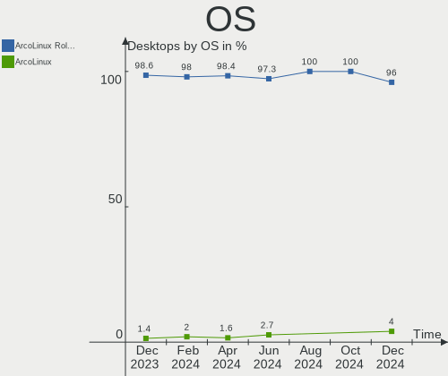
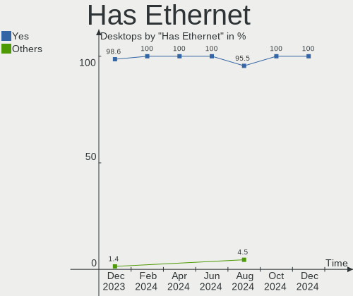
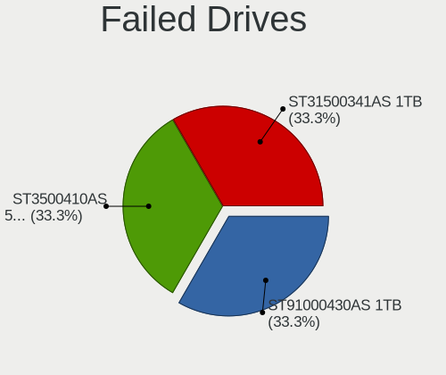
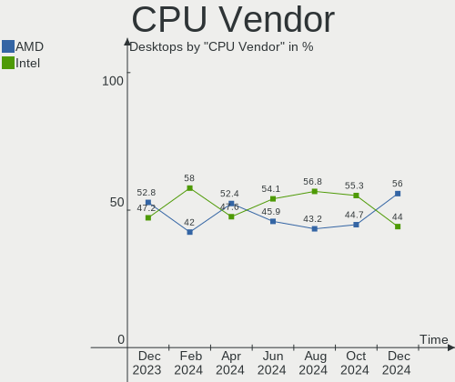
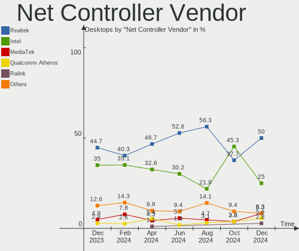
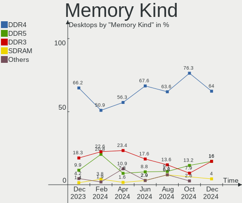
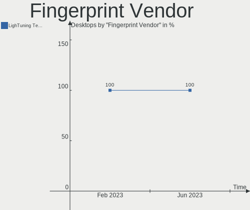

ArcoLinux - Hardware Trends (Desktops)
--------------------------------------

A project to identify most popular hardware characteristics and track their change
over time based on data collected by Linux users at https://Linux-Hardware.org.

Anyone can contribute to this report by the [hw-probe](https://github.com/linuxhw/hw-probe) tool:

    sudo -E hw-probe -all -upload

This report is for one last month. Overall report since the beginning of time: [TestDays](https://github.com/linuxhw/TestDays)

Period: Feb, 2023.

Contents
--------

* [ System ](#system)
  - [ OS                       ](#os)
  - [ OS Family                ](#os-family)
  - [ Kernel                   ](#kernel)
  - [ Kernel Family            ](#kernel-family)
  - [ Kernel Major Ver.        ](#kernel-major-ver)
  - [ Arch                     ](#arch)
  - [ DE                       ](#de)
  - [ Display Server           ](#display-server)
  - [ Display Manager          ](#display-manager)
  - [ OS Lang                  ](#os-lang)
  - [ Boot Mode                ](#boot-mode)
  - [ Filesystem               ](#filesystem)
  - [ Part. scheme             ](#part-scheme)
  - [ Dual Boot with Linux/BSD ](#dual-boot-with-linuxbsd)
  - [ Dual Boot (Win)          ](#dual-boot-win)

* [ Board ](#board)
  - [ Vendor                   ](#vendor)
  - [ Model                    ](#model)
  - [ Model Family             ](#model-family)
  - [ MFG Year                 ](#mfg-year)
  - [ Form Factor              ](#form-factor)
  - [ Secure Boot              ](#secure-boot)
  - [ Coreboot                 ](#coreboot)
  - [ RAM Size                 ](#ram-size)
  - [ RAM Used                 ](#ram-used)
  - [ Total Drives             ](#total-drives)
  - [ Has CD-ROM               ](#has-cd-rom)
  - [ Has Ethernet             ](#has-ethernet)
  - [ Has WiFi                 ](#has-wifi)
  - [ Has Bluetooth            ](#has-bluetooth)

* [ Location ](#location)
  - [ Country                  ](#country)
  - [ City                     ](#city)

* [ Drives ](#drives)
  - [ Drive Vendor             ](#drive-vendor)
  - [ Drive Model              ](#drive-model)
  - [ HDD Vendor               ](#hdd-vendor)
  - [ SSD Vendor               ](#ssd-vendor)
  - [ Drive Kind               ](#drive-kind)
  - [ Drive Connector          ](#drive-connector)
  - [ Drive Size               ](#drive-size)
  - [ Space Total              ](#space-total)
  - [ Space Used               ](#space-used)
  - [ Malfunc. Drives          ](#malfunc-drives)
  - [ Malfunc. Drive Vendor    ](#malfunc-drive-vendor)
  - [ Malfunc. HDD Vendor      ](#malfunc-hdd-vendor)
  - [ Malfunc. Drive Kind      ](#malfunc-drive-kind)
  - [ Failed Drives            ](#failed-drives)
  - [ Failed Drive Vendor      ](#failed-drive-vendor)
  - [ Drive Status             ](#drive-status)

* [ Storage controller ](#storage-controller)
  - [ Storage Vendor           ](#storage-vendor)
  - [ Storage Model            ](#storage-model)
  - [ Storage Kind             ](#storage-kind)

* [ Processor ](#processor)
  - [ CPU Vendor               ](#cpu-vendor)
  - [ CPU Model                ](#cpu-model)
  - [ CPU Model Family         ](#cpu-model-family)
  - [ CPU Cores                ](#cpu-cores)
  - [ CPU Sockets              ](#cpu-sockets)
  - [ CPU Threads              ](#cpu-threads)
  - [ CPU Op-Modes             ](#cpu-op-modes)
  - [ CPU Microcode            ](#cpu-microcode)
  - [ CPU Microarch            ](#cpu-microarch)

* [ Graphics ](#graphics)
  - [ GPU Vendor               ](#gpu-vendor)
  - [ GPU Model                ](#gpu-model)
  - [ GPU Combo                ](#gpu-combo)
  - [ GPU Driver               ](#gpu-driver)
  - [ GPU Memory               ](#gpu-memory)

* [ Monitor ](#monitor)
  - [ Monitor Vendor           ](#monitor-vendor)
  - [ Monitor Model            ](#monitor-model)
  - [ Monitor Resolution       ](#monitor-resolution)
  - [ Monitor Diagonal         ](#monitor-diagonal)
  - [ Monitor Width            ](#monitor-width)
  - [ Aspect Ratio             ](#aspect-ratio)
  - [ Monitor Area             ](#monitor-area)
  - [ Pixel Density            ](#pixel-density)
  - [ Multiple Monitors        ](#multiple-monitors)

* [ Network ](#network)
  - [ Net Controller Vendor    ](#net-controller-vendor)
  - [ Net Controller Model     ](#net-controller-model)
  - [ Wireless Vendor          ](#wireless-vendor)
  - [ Wireless Model           ](#wireless-model)
  - [ Ethernet Vendor          ](#ethernet-vendor)
  - [ Ethernet Model           ](#ethernet-model)
  - [ Net Controller Kind      ](#net-controller-kind)
  - [ Used Controller          ](#used-controller)
  - [ NICs                     ](#nics)
  - [ IPv6                     ](#ipv6)

* [ Bluetooth ](#bluetooth)
  - [ Bluetooth Vendor         ](#bluetooth-vendor)
  - [ Bluetooth Model          ](#bluetooth-model)

* [ Sound ](#sound)
  - [ Sound Vendor             ](#sound-vendor)
  - [ Sound Model              ](#sound-model)

* [ Memory ](#memory)
  - [ Memory Vendor            ](#memory-vendor)
  - [ Memory Model             ](#memory-model)
  - [ Memory Kind              ](#memory-kind)
  - [ Memory Form Factor       ](#memory-form-factor)
  - [ Memory Size              ](#memory-size)
  - [ Memory Speed             ](#memory-speed)

* [ Printers & scanners ](#printers--scanners)
  - [ Printer Vendor           ](#printer-vendor)
  - [ Printer Model            ](#printer-model)
  - [ Scanner Vendor           ](#scanner-vendor)
  - [ Scanner Model            ](#scanner-model)

* [ Camera ](#camera)
  - [ Camera Vendor            ](#camera-vendor)
  - [ Camera Model             ](#camera-model)

* [ Security ](#security)
  - [ Fingerprint Vendor       ](#fingerprint-vendor)
  - [ Fingerprint Model        ](#fingerprint-model)
  - [ Chipcard Vendor          ](#chipcard-vendor)
  - [ Chipcard Model           ](#chipcard-model)

* [ Unsupported ](#unsupported)
  - [ Unsupported Devices      ](#unsupported-devices)
  - [ Unsupported Device Types ](#unsupported-device-types)

System
------

OS
--

Installed operating systems

| Name              | Desktops | Percent |
|-------------------|----------|---------|
| ArcoLinux Rolling | 29       | 90.63%  |
| ArcoLinux         | 3        | 9.38%   |

OS Family
---------

OS without a version

| Name      | Desktops | Percent |
|-----------|----------|---------|
| ArcoLinux | 32       | 100%    |

Kernel
------

Version of the Linux kernel

| Version                        | Desktops | Percent |
|--------------------------------|----------|---------|
| 6.1.12-arch1-1                 | 7        | 21.88%  |
| 6.1.12-zen1-1-zen              | 5        | 15.63%  |
| 6.1.9-arch1-1                  | 2        | 6.25%   |
| 6.1.11-arch1-1                 | 2        | 6.25%   |
| 5.15.94-1-lts                  | 2        | 6.25%   |
| 6.2.1-arch1-1                  | 1        | 3.13%   |
| 6.2.0-4-cachyos-bore           | 1        | 3.13%   |
| 6.1.9-zen1-2-zen               | 1        | 3.13%   |
| 6.1.9-x64v1-xanmod1-1          | 1        | 3.13%   |
| 6.1.8-hardened1-1-hardened     | 1        | 3.13%   |
| 6.1.8-arch1-1                  | 1        | 3.13%   |
| 6.1.6-arch1-3                  | 1        | 3.13%   |
| 6.1.12-1-lts                   | 1        | 3.13%   |
| 6.1.11-x64v1-xanmod1-1         | 1        | 3.13%   |
| 6.1.11-lqx1-1-lqx              | 1        | 3.13%   |
| 6.1.10-arch1-1                 | 1        | 3.13%   |
| 6.0.12-arch1-1                 | 1        | 3.13%   |
| 6.0.11-x64v2-rt14-xanmod1-1-rt | 1        | 3.13%   |
| 5.15.93-1-lts                  | 1        | 3.13%   |

Kernel Family
-------------

Linux kernel without a distro release

| Version | Desktops | Percent |
|---------|----------|---------|
| 6.1.12  | 13       | 40.63%  |
| 6.1.9   | 4        | 12.5%   |
| 6.1.11  | 4        | 12.5%   |
| 6.1.8   | 2        | 6.25%   |
| 5.15.94 | 2        | 6.25%   |
| 6.2.1   | 1        | 3.13%   |
| 6.2.0   | 1        | 3.13%   |
| 6.1.6   | 1        | 3.13%   |
| 6.1.10  | 1        | 3.13%   |
| 6.0.12  | 1        | 3.13%   |
| 6.0.11  | 1        | 3.13%   |
| 5.15.93 | 1        | 3.13%   |

Kernel Major Ver.
-----------------

Linux kernel major version

| Version | Desktops | Percent |
|---------|----------|---------|
| 6.1     | 25       | 78.13%  |
| 5.15    | 3        | 9.38%   |
| 6.2     | 2        | 6.25%   |
| 6.0     | 2        | 6.25%   |

Arch
----

OS architecture (x86_64, i586, etc.)

| Name   | Desktops | Percent |
|--------|----------|---------|
| x86_64 | 32       | 100%    |

DE
--

Desktop Environment

| Name           | Desktops | Percent |
|----------------|----------|---------|
| XFCE           | 7        | 21.88%  |
| KDE5           | 5        | 15.63%  |
| i3             | 5        | 15.63%  |
| GNOME          | 3        | 9.38%   |
| awesome        | 3        | 9.38%   |
| xmonad         | 2        | 6.25%   |
| chadwm         | 2        | 6.25%   |
| X-Cinnamon     | 1        | 3.13%   |
| qtile          | 1        | 3.13%   |
| i3-with-shmlog | 1        | 3.13%   |
| Hyprland       | 1        | 3.13%   |
| bspwm          | 1        | 3.13%   |

Display Server
--------------

X11 or Wayland

| Name    | Desktops | Percent |
|---------|----------|---------|
| X11     | 29       | 90.63%  |
| Wayland | 2        | 6.25%   |
| Tty     | 1        | 3.13%   |

Display Manager
---------------

SDDM, LightDM, etc.

| Name    | Desktops | Percent |
|---------|----------|---------|
| SDDM    | 24       | 75%     |
| LightDM | 3        | 9.38%   |
| Unknown | 3        | 9.38%   |
| GDM     | 2        | 6.25%   |

OS Lang
-------

Language

| Lang        | Desktops | Percent |
|-------------|----------|---------|
| en_US       | 17       | 53.13%  |
| de_DE       | 4        | 12.5%   |
| en_GB       | 2        | 6.25%   |
| C           | 2        | 6.25%   |
| it_IT       | 1        | 3.13%   |
| fr_FR       | 1        | 3.13%   |
| es_CO       | 1        | 3.13%   |
| en_ZA       | 1        | 3.13%   |
| en_US.utf-8 | 1        | 3.13%   |
| en_IL       | 1        | 3.13%   |
| en_AU       | 1        | 3.13%   |

Boot Mode
---------

EFI or BIOS

| Mode | Desktops | Percent |
|------|----------|---------|
| EFI  | 21       | 65.63%  |
| BIOS | 11       | 34.38%  |

Filesystem
----------

Type of filesystem

| Type    | Desktops | Percent |
|---------|----------|---------|
| Ext4    | 19       | 59.38%  |
| Btrfs   | 10       | 31.25%  |
| Overlay | 2        | 6.25%   |
| Xfs     | 1        | 3.13%   |

Part. scheme
------------

Scheme of partitioning

| Type    | Desktops | Percent |
|---------|----------|---------|
| GPT     | 24       | 75%     |
| MBR     | 5        | 15.63%  |
| Unknown | 3        | 9.38%   |

Dual Boot with Linux/BSD
------------------------

Hosting more than one Linux/BSD

| Dual boot | Desktops | Percent |
|-----------|----------|---------|
| No        | 24       | 75%     |
| Yes       | 8        | 25%     |

Dual Boot (Win)
---------------

Hosting Linux and Windows

| Dual boot | Desktops | Percent |
|-----------|----------|---------|
| No        | 18       | 56.25%  |
| Yes       | 14       | 43.75%  |

Board
-----

Vendor
------

Motherboard manufacturer

| Name                | Desktops | Percent |
|---------------------|----------|---------|
| ASUSTek Computer    | 12       | 37.5%   |
| Gigabyte Technology | 7        | 21.88%  |
| MSI                 | 4        | 12.5%   |
| Dell                | 2        | 6.25%   |
| ASRock              | 2        | 6.25%   |
| Lenovo              | 1        | 3.13%   |
| Hewlett-Packard     | 1        | 3.13%   |
| AZW                 | 1        | 3.13%   |
| Acer                | 1        | 3.13%   |
| Unknown             | 1        | 3.13%   |

Model
-----

Motherboard model

| Name                                   | Desktops | Percent |
|----------------------------------------|----------|---------|
| ASUS All Series                        | 3        | 9.38%   |
| ASUS PRIME Z490-A                      | 2        | 6.25%   |
| MSI MS-7D89                            | 1        | 3.13%   |
| MSI MS-7C37                            | 1        | 3.13%   |
| MSI MS-7816                            | 1        | 3.13%   |
| MSI MS-7751                            | 1        | 3.13%   |
| Lenovo IdeaCentre 510-15ICB 90HU00CEGE | 1        | 3.13%   |
| HP EliteDesk 800 G2 TWR                | 1        | 3.13%   |
| Gigabyte Z170XP-SLI                    | 1        | 3.13%   |
| Gigabyte X99-UD4P-CF                   | 1        | 3.13%   |
| Gigabyte X570 AORUS PRO WIFI           | 1        | 3.13%   |
| Gigabyte H61MS                         | 1        | 3.13%   |
| Gigabyte GA-78LMT-USB3 6.0             | 1        | 3.13%   |
| Gigabyte B85N PHOENIX                  | 1        | 3.13%   |
| Gigabyte B450 AORUS ELITE              | 1        | 3.13%   |
| Dell OptiPlex 9020                     | 1        | 3.13%   |
| Dell OptiPlex 745                      | 1        | 3.13%   |
| AZW GTR                                | 1        | 3.13%   |
| ASUS Z10PE-D16 WS                      | 1        | 3.13%   |
| ASUS TUF Gaming H670-PRO WIFI D4       | 1        | 3.13%   |
| ASUS TUF Gaming B450M-PLUS II          | 1        | 3.13%   |
| ASUS STRIX Z270H GAMING                | 1        | 3.13%   |
| ASUS PRIME A320M-K                     | 1        | 3.13%   |
| ASUS BT6130-8                          | 1        | 3.13%   |
| ASUS BM6630_BM6330_BP6230              | 1        | 3.13%   |
| ASRock Z690 Steel Legend               | 1        | 3.13%   |
| ASRock B250M-HDV                       | 1        | 3.13%   |
| Acer Aspire X3300                      | 1        | 3.13%   |
| Unknown                                | 1        | 3.13%   |

Model Family
------------

Motherboard model prefix

| Name                   | Desktops | Percent |
|------------------------|----------|---------|
| ASUS PRIME             | 3        | 9.38%   |
| ASUS All               | 3        | 9.38%   |
| Dell OptiPlex          | 2        | 6.25%   |
| ASUS TUF               | 2        | 6.25%   |
| MSI MS-7D89            | 1        | 3.13%   |
| MSI MS-7C37            | 1        | 3.13%   |
| MSI MS-7816            | 1        | 3.13%   |
| MSI MS-7751            | 1        | 3.13%   |
| Lenovo IdeaCentre      | 1        | 3.13%   |
| HP EliteDesk           | 1        | 3.13%   |
| Gigabyte Z170XP-SLI    | 1        | 3.13%   |
| Gigabyte X99-UD4P-CF   | 1        | 3.13%   |
| Gigabyte X570          | 1        | 3.13%   |
| Gigabyte H61MS         | 1        | 3.13%   |
| Gigabyte GA-78LMT-USB3 | 1        | 3.13%   |
| Gigabyte B85N          | 1        | 3.13%   |
| Gigabyte B450          | 1        | 3.13%   |
| AZW GTR                | 1        | 3.13%   |
| ASUS Z10PE-D16         | 1        | 3.13%   |
| ASUS STRIX             | 1        | 3.13%   |
| ASUS BT6130-8          | 1        | 3.13%   |
| ASUS BM6630            | 1        | 3.13%   |
| ASRock Z690            | 1        | 3.13%   |
| ASRock B250M-HDV       | 1        | 3.13%   |
| Acer Aspire            | 1        | 3.13%   |
| Unknown                | 1        | 3.13%   |

MFG Year
--------

Motherboard manufacture year

| Year | Desktops | Percent |
|------|----------|---------|
| 2014 | 6        | 18.75%  |
| 2021 | 3        | 9.38%   |
| 2020 | 3        | 9.38%   |
| 2018 | 3        | 9.38%   |
| 2017 | 3        | 9.38%   |
| 2016 | 3        | 9.38%   |
| 2012 | 3        | 9.38%   |
| 2022 | 2        | 6.25%   |
| 2019 | 2        | 6.25%   |
| 2013 | 2        | 6.25%   |
| 2009 | 1        | 3.13%   |
| 2007 | 1        | 3.13%   |

Form Factor
-----------

Physical design of the computer

| Name    | Desktops | Percent |
|---------|----------|---------|
| Desktop | 32       | 100%    |

Secure Boot
-----------

Enabled or disabled

| State    | Desktops | Percent |
|----------|----------|---------|
| Disabled | 32       | 100%    |

Coreboot
--------

Have coreboot on board

| Used | Desktops | Percent |
|------|----------|---------|
| No   | 32       | 100%    |

RAM Size
--------

Total RAM memory

| Size in GB      | Desktops | Percent |
|-----------------|----------|---------|
| 32.01-64.0      | 9        | 28.13%  |
| 16.01-24.0      | 7        | 21.88%  |
| 24.01-32.0      | 4        | 12.5%   |
| 8.01-16.0       | 4        | 12.5%   |
| 4.01-8.0        | 3        | 9.38%   |
| 3.01-4.0        | 2        | 6.25%   |
| 64.01-256.0     | 2        | 6.25%   |
| More than 256.0 | 1        | 3.13%   |

RAM Used
--------

Used RAM memory

| Used GB    | Desktops | Percent |
|------------|----------|---------|
| 2.01-3.0   | 9        | 28.13%  |
| 4.01-8.0   | 6        | 18.75%  |
| 3.01-4.0   | 6        | 18.75%  |
| 1.01-2.0   | 6        | 18.75%  |
| 8.01-16.0  | 4        | 12.5%   |
| 16.01-24.0 | 1        | 3.13%   |

Total Drives
------------

Number of drives on board

| Drives | Desktops | Percent |
|--------|----------|---------|
| 2      | 12       | 37.5%   |
| 1      | 7        | 21.88%  |
| 3      | 4        | 12.5%   |
| 4      | 3        | 9.38%   |
| 5      | 2        | 6.25%   |
| 21     | 1        | 3.13%   |
| 9      | 1        | 3.13%   |
| 7      | 1        | 3.13%   |
| 6      | 1        | 3.13%   |

Has CD-ROM
----------

Has CD-ROM on board

| Presented | Desktops | Percent |
|-----------|----------|---------|
| No        | 24       | 75%     |
| Yes       | 8        | 25%     |

Has Ethernet
------------

Has Ethernet on board

| Presented | Desktops | Percent |
|-----------|----------|---------|
| Yes       | 32       | 100%    |

Has WiFi
--------

Has WiFi module

| Presented | Desktops | Percent |
|-----------|----------|---------|
| No        | 17       | 53.13%  |
| Yes       | 15       | 46.88%  |

Has Bluetooth
-------------

Has Bluetooth module

| Presented | Desktops | Percent |
|-----------|----------|---------|
| No        | 17       | 53.13%  |
| Yes       | 15       | 46.88%  |

Location
--------

Country
-------

Geographic location (country)

| Country      | Desktops | Percent |
|--------------|----------|---------|
| USA          | 7        | 21.88%  |
| Germany      | 4        | 12.5%   |
| Belgium      | 2        | 6.25%   |
| UK           | 1        | 3.13%   |
| South Africa | 1        | 3.13%   |
| Romania      | 1        | 3.13%   |
| Portugal     | 1        | 3.13%   |
| Poland       | 1        | 3.13%   |
| Philippines  | 1        | 3.13%   |
| Norway       | 1        | 3.13%   |
| Mexico       | 1        | 3.13%   |
| Japan        | 1        | 3.13%   |
| Italy        | 1        | 3.13%   |
| Israel       | 1        | 3.13%   |
| Indonesia    | 1        | 3.13%   |
| India        | 1        | 3.13%   |
| France       | 1        | 3.13%   |
| Czechia      | 1        | 3.13%   |
| Colombia     | 1        | 3.13%   |
| Brazil       | 1        | 3.13%   |
| Austria      | 1        | 3.13%   |
| Australia    | 1        | 3.13%   |

City
----

Geographic location (city)

| City                  | Desktops | Percent |
|-----------------------|----------|---------|
| Duffel                | 2        | 6.25%   |
| Yogyakarta            | 1        | 3.13%   |
| Wiesbaden             | 1        | 3.13%   |
| Warsaw                | 1        | 3.13%   |
| Vienna                | 1        | 3.13%   |
| Troy                  | 1        | 3.13%   |
| Tokyo                 | 1        | 3.13%   |
| Tel Aviv              | 1        | 3.13%   |
| Sydney                | 1        | 3.13%   |
| Streamwood            | 1        | 3.13%   |
| Schwarzenbek          | 1        | 3.13%   |
| San Luis Potosí City | 1        | 3.13%   |
| Rosenheim             | 1        | 3.13%   |
| Prague                | 1        | 3.13%   |
| Potterville           | 1        | 3.13%   |
| Neuss                 | 1        | 3.13%   |
| Mombello di Torino    | 1        | 3.13%   |
| London                | 1        | 3.13%   |
| Kolkata               | 1        | 3.13%   |
| Kansas City           | 1        | 3.13%   |
| Johannesburg          | 1        | 3.13%   |
| Coimbra               | 1        | 3.13%   |
| Clamart               | 1        | 3.13%   |
| Cibolo                | 1        | 3.13%   |
| Chia                  | 1        | 3.13%   |
| Bucharest             | 1        | 3.13%   |
| Bloomington           | 1        | 3.13%   |
| Binmaley              | 1        | 3.13%   |
| Belo Horizonte        | 1        | 3.13%   |
| Bellingham            | 1        | 3.13%   |
| Aker                  | 1        | 3.13%   |

Drives
------

Drive Vendor
------------

Hard drive vendors

| Vendor              | Desktops | Drives | Percent |
|---------------------|----------|--------|---------|
| Samsung Electronics | 15       | 27     | 20.55%  |
| WDC                 | 13       | 28     | 17.81%  |
| Seagate             | 7        | 9      | 9.59%   |
| Sandisk             | 6        | 7      | 8.22%   |
| Kingston            | 3        | 3      | 4.11%   |
| A-DATA Technology   | 3        | 3      | 4.11%   |
| Toshiba             | 2        | 2      | 2.74%   |
| SK hynix            | 2        | 2      | 2.74%   |
| Silicon Motion      | 2        | 2      | 2.74%   |
| Phison Electronics  | 2        | 2      | 2.74%   |
| Hitachi             | 2        | 2      | 2.74%   |
| Crucial             | 2        | 2      | 2.74%   |
| Corsair             | 2        | 2      | 2.74%   |
| Unknown             | 1        | 1      | 1.37%   |
| TO Exter            | 1        | 1      | 1.37%   |
| Team                | 1        | 1      | 1.37%   |
| SPCC                | 1        | 1      | 1.37%   |
| Seagate Technology  | 1        | 1      | 1.37%   |
| PNY                 | 1        | 1      | 1.37%   |
| Patriot             | 1        | 1      | 1.37%   |
| LITEON              | 1        | 1      | 1.37%   |
| Intenso             | 1        | 1      | 1.37%   |
| Intel               | 1        | 1      | 1.37%   |
| HGST                | 1        | 2      | 1.37%   |
| China               | 1        | 1      | 1.37%   |

Drive Model
-----------

Hard drive models

| Model                                                 | Desktops | Percent |
|-------------------------------------------------------|----------|---------|
| Samsung SSD 980 500GB                                 | 4        | 4.4%    |
| Samsung NVMe SSD Controller SM981/PM981/PM983 250GB   | 4        | 4.4%    |
| Samsung SSD 850 EVO 250GB                             | 3        | 3.3%    |
| Sandisk WD Black SN850 500GB                          | 2        | 2.2%    |
| Samsung SSD 870 QVO 2TB                               | 2        | 2.2%    |
| WDC WDS500G2B0A 500GB SSD                             | 1        | 1.1%    |
| WDC WDS200T2B0B-00YS70 2TB SSD                        | 1        | 1.1%    |
| WDC WDS100T2G0A-00JH30 1TB SSD                        | 1        | 1.1%    |
| WDC WD8001FFWX-68J1UN0 8TB                            | 1        | 1.1%    |
| WDC WD5000LPLX-00ZNTT0 500GB                          | 1        | 1.1%    |
| WDC WD5000AZLX-21K2TA0 500GB                          | 1        | 1.1%    |
| WDC WD5000AACS-00G8B1 500GB                           | 1        | 1.1%    |
| WDC WD40EZAZ-22SF3B0 4TB                              | 1        | 1.1%    |
| WDC WD30EZRX-00MMMB0 3TB                              | 1        | 1.1%    |
| WDC WD20EZRZ-00Z5HB0 2TB                              | 1        | 1.1%    |
| WDC WD20EFRX-68EUZN0 2TB                              | 1        | 1.1%    |
| WDC WD2003FZEX-00Z4SA0 2TB                            | 1        | 1.1%    |
| WDC WD2002FAEX-007BA0 2TB                             | 1        | 1.1%    |
| WDC WD10EZEX-08WN4A0 1TB                              | 1        | 1.1%    |
| WDC WD10EZEX-00BN5A0 1TB                              | 1        | 1.1%    |
| WDC WD10EARS-00Y5B1 1TB                               | 1        | 1.1%    |
| WDC WD10EARS-00MVWB0 1TB                              | 1        | 1.1%    |
| WDC WD10EADS-11M2B1 1TB                               | 1        | 1.1%    |
| WDC WD1003FZEX-00K3CA0 1TB                            | 1        | 1.1%    |
| Unknown External 500GB                                | 1        | 1.1%    |
| Toshiba MQ01ABD100 1TB                                | 1        | 1.1%    |
| Toshiba DT01ACA100 1TB                                | 1        | 1.1%    |
| TO Exter nal USB 3.0 240GB                            | 1        | 1.1%    |
| Team TM8PS7001T 1024GB SSD                            | 1        | 1.1%    |
| SPCC M.2 SSD 1TB                                      | 1        | 1.1%    |
| SK hynix SC300 2.5 7MM 128GB SSD                      | 1        | 1.1%    |
| SK hynix C2S3T/240G 240GB SSD                         | 1        | 1.1%    |
| Silicon Motion SM2263EN/SM2263XT SSD Controller 512GB | 1        | 1.1%    |
| Silicon Motion SM2262/SM2262EN SSD Controller 1TB     | 1        | 1.1%    |
| Seagate FireCuda 510 SSD 500GB                        | 1        | 1.1%    |
| Seagate ST32000641AS 2TB                              | 1        | 1.1%    |
| Seagate ST2000DM008-2FR102 2TB                        | 1        | 1.1%    |
| Seagate ST2000DM005-2CW102 2TB                        | 1        | 1.1%    |
| Seagate ST2000DM001-1ER164 2TB                        | 1        | 1.1%    |
| Seagate ST1000DM005 HD103SJ 1TB                       | 1        | 1.1%    |

HDD Vendor
----------

Hard disk drive vendors

| Vendor              | Desktops | Drives | Percent |
|---------------------|----------|--------|---------|
| WDC                 | 11       | 25     | 52.38%  |
| Seagate             | 4        | 6      | 19.05%  |
| Toshiba             | 2        | 2      | 9.52%   |
| Hitachi             | 2        | 2      | 9.52%   |
| Unknown             | 1        | 1      | 4.76%   |
| Samsung Electronics | 1        | 1      | 4.76%   |

SSD Vendor
----------

Solid state drive vendors

| Vendor              | Desktops | Drives | Percent |
|---------------------|----------|--------|---------|
| Samsung Electronics | 9        | 15     | 28.13%  |
| WDC                 | 3        | 3      | 9.38%   |
| A-DATA Technology   | 3        | 3      | 9.38%   |
| SK hynix            | 2        | 2      | 6.25%   |
| SanDisk             | 2        | 2      | 6.25%   |
| Crucial             | 2        | 2      | 6.25%   |
| Corsair             | 2        | 2      | 6.25%   |
| TO Exter            | 1        | 1      | 3.13%   |
| Team                | 1        | 1      | 3.13%   |
| SPCC                | 1        | 1      | 3.13%   |
| PNY                 | 1        | 1      | 3.13%   |
| Patriot             | 1        | 1      | 3.13%   |
| LITEON              | 1        | 1      | 3.13%   |
| Kingston            | 1        | 1      | 3.13%   |
| Intenso             | 1        | 1      | 3.13%   |
| China               | 1        | 1      | 3.13%   |

Drive Kind
----------

HDD or SSD

| Kind    | Desktops | Drives | Percent |
|---------|----------|--------|---------|
| SSD     | 26       | 38     | 44.07%  |
| HDD     | 16       | 37     | 27.12%  |
| NVMe    | 15       | 26     | 25.42%  |
| Unknown | 2        | 3      | 3.39%   |

Drive Connector
---------------

SATA, SAS, NVMe, etc.

| Type | Desktops | Drives | Percent |
|------|----------|--------|---------|
| SATA | 30       | 70     | 60%     |
| NVMe | 15       | 26     | 30%     |
| SAS  | 5        | 8      | 10%     |

Drive Size
----------

Size of hard drive

| Size in TB | Desktops | Drives | Percent |
|------------|----------|--------|---------|
| 0.01-0.5   | 21       | 27     | 42%     |
| 1.01-2.0   | 13       | 18     | 26%     |
| 0.51-1.0   | 12       | 17     | 24%     |
| 3.01-4.0   | 2        | 2      | 4%      |
| 2.01-3.0   | 1        | 1      | 2%      |
| 4.01-10.0  | 1        | 10     | 2%      |

Space Total
-----------

Amount of disk space available on the file system

| Size in GB     | Desktops | Percent |
|----------------|----------|---------|
| More than 3000 | 11       | 34.38%  |
| 251-500        | 7        | 21.88%  |
| 101-250        | 4        | 12.5%   |
| 501-1000       | 4        | 12.5%   |
| 2001-3000      | 3        | 9.38%   |
| 1001-2000      | 2        | 6.25%   |
| 1-20           | 1        | 3.13%   |

Space Used
----------

Amount of used disk space

| Used GB        | Desktops | Percent |
|----------------|----------|---------|
| 251-500        | 6        | 18.75%  |
| 1001-2000      | 6        | 18.75%  |
| 21-50          | 4        | 12.5%   |
| 1-20           | 4        | 12.5%   |
| 501-1000       | 4        | 12.5%   |
| 51-100         | 4        | 12.5%   |
| More than 3000 | 3        | 9.38%   |
| 2001-3000      | 1        | 3.13%   |

Malfunc. Drives
---------------

Drive models with a malfunction

| Model                             | Desktops | Drives | Percent |
|-----------------------------------|----------|--------|---------|
| WDC WDS100T2G0A-00JH30 1TB SSD    | 1        | 1      | 5.88%   |
| WDC WD5000AACS-00G8B1 500GB       | 1        | 1      | 5.88%   |
| WDC WD20EFRX-68EUZN0 2TB          | 1        | 1      | 5.88%   |
| WDC WD10EARS-00Y5B1 1TB           | 1        | 1      | 5.88%   |
| WDC WD10EADS-11M2B1 1TB           | 1        | 1      | 5.88%   |
| WDC WD1003FZEX-00K3CA0 1TB        | 1        | 1      | 5.88%   |
| Toshiba MQ01ABD100 1TB            | 1        | 1      | 5.88%   |
| Toshiba DT01ACA100 1TB            | 1        | 1      | 5.88%   |
| Seagate ST32000641AS 2TB          | 1        | 1      | 5.88%   |
| Seagate ST2000DM008-2FR102 2TB    | 1        | 1      | 5.88%   |
| Seagate ST2000DM001-1ER164 2TB    | 1        | 1      | 5.88%   |
| Sandisk WD Black SN850 500GB      | 1        | 1      | 5.88%   |
| Hitachi HUA723020ALA640 2TB       | 1        | 1      | 5.88%   |
| Hitachi HTS545050B9A300 500GB     | 1        | 1      | 5.88%   |
| Corsair Neutron XT SSD 240GB      | 1        | 1      | 5.88%   |
| Corsair CSSD-F60GB2 64GB          | 1        | 1      | 5.88%   |
| A-DATA Technology SX900 128GB SSD | 1        | 1      | 5.88%   |

Malfunc. Drive Vendor
---------------------

Vendors of faulty drives

| Vendor            | Desktops | Drives | Percent |
|-------------------|----------|--------|---------|
| WDC               | 4        | 6      | 26.67%  |
| Seagate           | 3        | 3      | 20%     |
| Toshiba           | 2        | 2      | 13.33%  |
| Hitachi           | 2        | 2      | 13.33%  |
| Corsair           | 2        | 2      | 13.33%  |
| Sandisk           | 1        | 1      | 6.67%   |
| A-DATA Technology | 1        | 1      | 6.67%   |

Malfunc. HDD Vendor
-------------------

Vendors of faulty HDD drives

| Vendor  | Desktops | Drives | Percent |
|---------|----------|--------|---------|
| WDC     | 3        | 5      | 30%     |
| Seagate | 3        | 3      | 30%     |
| Toshiba | 2        | 2      | 20%     |
| Hitachi | 2        | 2      | 20%     |

Malfunc. Drive Kind
-------------------

Kinds of faulty drives

| Kind | Desktops | Drives | Percent |
|------|----------|--------|---------|
| HDD  | 8        | 12     | 61.54%  |
| SSD  | 4        | 4      | 30.77%  |
| NVMe | 1        | 1      | 7.69%   |

Failed Drives
-------------

Failed drive models

| Model                             | Desktops | Drives | Percent |
|-----------------------------------|----------|--------|---------|
| Samsung Electronics SSD 980 500GB | 1        | 1      | 100%    |

Failed Drive Vendor
-------------------

Failed drive vendors

| Vendor              | Desktops | Drives | Percent |
|---------------------|----------|--------|---------|
| Samsung Electronics | 1        | 1      | 100%    |

Drive Status
------------

Number of failed and malfunc. drives

| Status   | Desktops | Drives | Percent |
|----------|----------|--------|---------|
| Works    | 27       | 73     | 57.45%  |
| Malfunc  | 10       | 17     | 21.28%  |
| Detected | 9        | 13     | 19.15%  |
| Failed   | 1        | 1      | 2.13%   |

Storage controller
------------------

Storage Vendor
--------------

Storage controller vendors

| Vendor                      | Desktops | Percent |
|-----------------------------|----------|---------|
| Intel                       | 24       | 40%     |
| Samsung Electronics         | 10       | 16.67%  |
| AMD                         | 8        | 13.33%  |
| SanDisk                     | 4        | 6.67%   |
| ASMedia Technology          | 4        | 6.67%   |
| Silicon Motion              | 2        | 3.33%   |
| Seagate Technology          | 2        | 3.33%   |
| Phison Electronics          | 2        | 3.33%   |
| Kingston Technology Company | 2        | 3.33%   |
| Nvidia                      | 1        | 1.67%   |
| Adaptec                     | 1        | 1.67%   |

Storage Model
-------------

Storage controller models

| Model                                                                                   | Desktops | Percent |
|-----------------------------------------------------------------------------------------|----------|---------|
| AMD FCH SATA Controller [AHCI mode]                                                     | 7        | 9.59%   |
| Samsung NVMe SSD Controller SM981/PM981/PM983                                           | 4        | 5.48%   |
| Samsung NVMe SSD Controller 980                                                         | 4        | 5.48%   |
| Intel 8 Series/C220 Series Chipset Family 6-port SATA Controller 1 [AHCI mode]          | 3        | 4.11%   |
| Intel 200 Series PCH SATA controller [AHCI mode]                                        | 3        | 4.11%   |
| ASMedia ASM1062 Serial ATA Controller                                                   | 3        | 4.11%   |
| SanDisk WD PC SN810 / Black SN850 NVMe SSD                                              | 2        | 2.74%   |
| Intel Alder Lake-S PCH SATA Controller [AHCI Mode]                                      | 2        | 2.74%   |
| Intel 9 Series Chipset Family SATA Controller [AHCI Mode]                               | 2        | 2.74%   |
| Intel 6 Series/C200 Series Chipset Family Desktop SATA Controller (IDE mode, ports 4-5) | 2        | 2.74%   |
| Intel 6 Series/C200 Series Chipset Family Desktop SATA Controller (IDE mode, ports 0-3) | 2        | 2.74%   |
| AMD 400 Series Chipset SATA Controller                                                  | 2        | 2.74%   |
| Silicon Motion SM2263EN/SM2263XT SSD Controller                                         | 1        | 1.37%   |
| Silicon Motion SM2262/SM2262EN SSD Controller                                           | 1        | 1.37%   |
| Seagate FireCuda 520 SSD                                                                | 1        | 1.37%   |
| Seagate FireCuda 510 SSD                                                                | 1        | 1.37%   |
| SanDisk WD Blue SN550 NVMe SSD                                                          | 1        | 1.37%   |
| SanDisk WD Black SN750 / PC SN730 NVMe SSD                                              | 1        | 1.37%   |
| SanDisk Non-Volatile memory controller                                                  | 1        | 1.37%   |
| Samsung NVMe SSD Controller SM961/PM961/SM963                                           | 1        | 1.37%   |
| Samsung NVMe SSD Controller PM9A1/PM9A3/980PRO                                          | 1        | 1.37%   |
| Phison E7 NVMe Controller                                                               | 1        | 1.37%   |
| Phison E16 PCIe4 NVMe Controller                                                        | 1        | 1.37%   |
| Nvidia MCP78S [GeForce 8200] IDE                                                        | 1        | 1.37%   |
| Nvidia MCP78S [GeForce 8200] AHCI Controller                                            | 1        | 1.37%   |
| Kingston Company Company Non-Volatile memory controller                                 | 1        | 1.37%   |
| Kingston Company SNVS2000G [NV1 NVMe PCIe SSD 2TB]                                      | 1        | 1.37%   |
| Intel Volume Management Device NVMe RAID Controller                                     | 1        | 1.37%   |
| Intel SSD Pro 7600p/760p/E 6100p Series                                                 | 1        | 1.37%   |
| Intel SATA Controller [RAID mode]                                                       | 1        | 1.37%   |
| Intel SATA controller                                                                   | 1        | 1.37%   |
| Intel Q170/Q150/B150/H170/H110/Z170/CM236 Chipset SATA Controller [AHCI Mode]           | 1        | 1.37%   |
| Intel Comet Lake SATA AHCI Controller                                                   | 1        | 1.37%   |
| Intel Comet Lake PCH-H RAID                                                             | 1        | 1.37%   |
| Intel Cannon Lake PCH SATA AHCI Controller                                              | 1        | 1.37%   |
| Intel C610/X99 series chipset sSATA Controller [RAID mode]                              | 1        | 1.37%   |
| Intel C610/X99 series chipset sSATA Controller [AHCI mode]                              | 1        | 1.37%   |
| Intel C610/X99 series chipset SATA Controller [RAID mode]                               | 1        | 1.37%   |
| Intel C610/X99 series chipset 6-Port SATA Controller [AHCI mode]                        | 1        | 1.37%   |
| Intel 82801HR/HO/HH (ICH8R/DO/DH) 2 port SATA Controller [IDE mode]                     | 1        | 1.37%   |

Storage Kind
------------

Kind of storage controller (IDE, SATA, NVMe, SAS, ...)

| Kind | Desktops | Percent |
|------|----------|---------|
| SATA | 26       | 50.98%  |
| NVMe | 15       | 29.41%  |
| IDE  | 6        | 11.76%  |
| RAID | 4        | 7.84%   |

Processor
---------

CPU Vendor
----------

Processor vendors

| Vendor | Desktops | Percent |
|--------|----------|---------|
| Intel  | 23       | 71.88%  |
| AMD    | 9        | 28.13%  |

CPU Model
---------

Processor models

| Model                                       | Desktops | Percent |
|---------------------------------------------|----------|---------|
| Intel Core i7-7700K CPU @ 4.20GHz           | 2        | 6.25%   |
| Intel Core i7-10700K CPU @ 3.80GHz          | 2        | 6.25%   |
| AMD Ryzen 9 3900X 12-Core Processor         | 2        | 6.25%   |
| Intel Xeon CPU E5-2698 v4 @ 2.20GHz         | 1        | 3.13%   |
| Intel Xeon CPU E5-1650 v3 @ 3.50GHz         | 1        | 3.13%   |
| Intel Core i7-4790 CPU @ 3.60GHz            | 1        | 3.13%   |
| Intel Core i7-3770S CPU @ 3.10GHz           | 1        | 3.13%   |
| Intel Core i7-3770K CPU @ 3.50GHz           | 1        | 3.13%   |
| Intel Core i7-3770 CPU @ 3.40GHz            | 1        | 3.13%   |
| Intel Core i5-8400 CPU @ 2.80GHz            | 1        | 3.13%   |
| Intel Core i5-6500 CPU @ 3.20GHz            | 1        | 3.13%   |
| Intel Core i5-4690K CPU @ 3.50GHz           | 1        | 3.13%   |
| Intel Core i5-4690 CPU @ 3.50GHz            | 1        | 3.13%   |
| Intel Core i5-4590 CPU @ 3.30GHz            | 1        | 3.13%   |
| Intel Core i5-4570 CPU @ 3.20GHz            | 1        | 3.13%   |
| Intel Core i5-4460 CPU @ 3.20GHz            | 1        | 3.13%   |
| Intel Core i3-7100 CPU @ 3.90GHz            | 1        | 3.13%   |
| Intel Core i3-3210 CPU @ 3.20GHz            | 1        | 3.13%   |
| Intel Core 2 CPU 6700 @ 2.66GHz             | 1        | 3.13%   |
| Intel 13th Gen Core i7-13700K               | 1        | 3.13%   |
| Intel 12th Gen Core i9-12900K               | 1        | 3.13%   |
| Intel 12th Gen Core i3-12100F               | 1        | 3.13%   |
| AMD Ryzen 9 6900HX with Radeon Graphics     | 1        | 3.13%   |
| AMD Ryzen 9 5900HX with Radeon Graphics     | 1        | 3.13%   |
| AMD Ryzen 7 5700G with Radeon Graphics      | 1        | 3.13%   |
| AMD Ryzen 7 2700X Eight-Core Processor      | 1        | 3.13%   |
| AMD Ryzen 3 2200G with Radeon Vega Graphics | 1        | 3.13%   |
| AMD Phenom II X4 925 Processor              | 1        | 3.13%   |
| AMD FX-6350 Six-Core Processor              | 1        | 3.13%   |

CPU Model Family
----------------

Processor model prefix

| Model            | Desktops | Percent |
|------------------|----------|---------|
| Intel Core i7    | 8        | 25%     |
| Intel Core i5    | 7        | 21.88%  |
| AMD Ryzen 9      | 4        | 12.5%   |
| Other            | 3        | 9.38%   |
| Intel Xeon       | 2        | 6.25%   |
| Intel Core i3    | 2        | 6.25%   |
| AMD Ryzen 7      | 2        | 6.25%   |
| Intel Core 2     | 1        | 3.13%   |
| AMD Ryzen 3      | 1        | 3.13%   |
| AMD Phenom II X4 | 1        | 3.13%   |
| AMD FX           | 1        | 3.13%   |

CPU Cores
---------

Number of processor cores

| Number | Desktops | Percent |
|--------|----------|---------|
| 4      | 15       | 46.88%  |
| 8      | 6        | 18.75%  |
| 2      | 3        | 9.38%   |
| 16     | 2        | 6.25%   |
| 12     | 2        | 6.25%   |
| 6      | 2        | 6.25%   |
| 40     | 1        | 3.13%   |
| 3      | 1        | 3.13%   |

CPU Sockets
-----------

Number of sockets

| Number | Desktops | Percent |
|--------|----------|---------|
| 1      | 31       | 96.88%  |
| 2      | 1        | 3.13%   |

CPU Threads
-----------

Threads per core (Hyper-Threading)

| Number | Desktops | Percent |
|--------|----------|---------|
| 2      | 22       | 68.75%  |
| 1      | 10       | 31.25%  |

CPU Op-Modes
------------

CPU Operation Modes (32-bit, 64-bit)

| Op mode        | Desktops | Percent |
|----------------|----------|---------|
| 32-bit, 64-bit | 32       | 100%    |

CPU Microcode
-------------

Microcode number

| Number     | Desktops | Percent |
|------------|----------|---------|
| Unknown    | 7        | 21.88%  |
| 0x306c3    | 5        | 15.63%  |
| 0x906e9    | 3        | 9.38%   |
| 0x306a9    | 3        | 9.38%   |
| 0xa0655    | 2        | 6.25%   |
| 0x0a50000c | 2        | 6.25%   |
| 0x08701021 | 2        | 6.25%   |
| 0xb0671    | 1        | 3.13%   |
| 0x906ea    | 1        | 3.13%   |
| 0x90672    | 1        | 3.13%   |
| 0x0a404102 | 1        | 3.13%   |
| 0x08101016 | 1        | 3.13%   |
| 0x0800820d | 1        | 3.13%   |
| 0x06000822 | 1        | 3.13%   |
| 0x010000db | 1        | 3.13%   |

CPU Microarch
-------------

Microarchitecture

| Name             | Desktops | Percent |
|------------------|----------|---------|
| Haswell          | 7        | 21.88%  |
| KabyLake         | 4        | 12.5%   |
| IvyBridge        | 4        | 12.5%   |
| Zen 3            | 2        | 6.25%   |
| Zen 2            | 2        | 6.25%   |
| CometLake        | 2        | 6.25%   |
| Alderlake Hybrid | 2        | 6.25%   |
| Unknown          | 2        | 6.25%   |
| Zen+             | 1        | 3.13%   |
| Zen              | 1        | 3.13%   |
| Skylake          | 1        | 3.13%   |
| Piledriver       | 1        | 3.13%   |
| K10              | 1        | 3.13%   |
| Core             | 1        | 3.13%   |
| Broadwell        | 1        | 3.13%   |

Graphics
--------

GPU Vendor
----------

Vendors of graphics cards

| Vendor            | Desktops | Percent |
|-------------------|----------|---------|
| AMD               | 13       | 36.11%  |
| Intel             | 12       | 33.33%  |
| Nvidia            | 10       | 27.78%  |
| ASPEED Technology | 1        | 2.78%   |

GPU Model
---------

Graphics card models

| Model                                                                       | Desktops | Percent |
|-----------------------------------------------------------------------------|----------|---------|
| Intel Xeon E3-1200 v3/4th Gen Core Processor Integrated Graphics Controller | 4        | 10.53%  |
| Intel HD Graphics 630                                                       | 3        | 7.89%   |
| AMD Ellesmere [Radeon RX 470/480/570/570X/580/580X/590]                     | 3        | 7.89%   |
| Nvidia TU106 [GeForce RTX 2060 Rev. A]                                      | 2        | 5.26%   |
| AMD Cezanne [Radeon Vega Series / Radeon Vega Mobile Series]                | 2        | 5.26%   |
| Nvidia TU116 [GeForce GTX 1660 SUPER]                                       | 1        | 2.63%   |
| Nvidia TU104 [GeForce RTX 2080 Rev. A]                                      | 1        | 2.63%   |
| Nvidia GP106 [GeForce GTX 1060 6GB]                                         | 1        | 2.63%   |
| Nvidia GP104 [GeForce GTX 1080]                                             | 1        | 2.63%   |
| Nvidia GP104 [GeForce GTX 1070]                                             | 1        | 2.63%   |
| Nvidia GM204 [GeForce GTX 970]                                              | 1        | 2.63%   |
| Nvidia GM107 [GeForce GTX 750 Ti]                                           | 1        | 2.63%   |
| Nvidia AD103 [GeForce RTX 4080]                                             | 1        | 2.63%   |
| Intel Xeon E3-1200 v2/3rd Gen Core processor Graphics Controller            | 1        | 2.63%   |
| Intel Raptor Lake-S GT1 [UHD Graphics 770]                                  | 1        | 2.63%   |
| Intel IvyBridge GT2 [HD Graphics 4000]                                      | 1        | 2.63%   |
| Intel HD Graphics 530                                                       | 1        | 2.63%   |
| Intel CoffeeLake-S GT2 [UHD Graphics 630]                                   | 1        | 2.63%   |
| ASPEED Technology ASPEED Graphics Family                                    | 1        | 2.63%   |
| AMD RV730 PRO [Radeon HD 4650]                                              | 1        | 2.63%   |
| AMD Rembrandt [Radeon 680M]                                                 | 1        | 2.63%   |
| AMD Raven Ridge [Radeon Vega Series / Radeon Vega Mobile Series]            | 1        | 2.63%   |
| AMD Pitcairn PRO [Radeon HD 7850 / R7 265 / R9 270 1024SP]                  | 1        | 2.63%   |
| AMD Navi 22 [Radeon RX 6700/6700 XT/6750 XT / 6800M/6850M XT]               | 1        | 2.63%   |
| AMD Navi 21 [Radeon RX 6800/6800 XT / 6900 XT]                              | 1        | 2.63%   |
| AMD Navi 14 [Radeon RX 5500/5500M / Pro 5500M]                              | 1        | 2.63%   |
| AMD Lexa PRO [Radeon 540/540X/550/550X / RX 540X/550/550X]                  | 1        | 2.63%   |
| AMD Cape Verde PRO [Radeon HD 7750/8740 / R7 250E]                          | 1        | 2.63%   |
| AMD Bonaire XTX [Radeon R7 260X/360]                                        | 1        | 2.63%   |

GPU Combo
---------

Combinations of graphics cards

| Name           | Desktops | Percent |
|----------------|----------|---------|
| 1 x AMD        | 10       | 31.25%  |
| 1 x Intel      | 9        | 28.13%  |
| 1 x Nvidia     | 7        | 21.88%  |
| Intel + Nvidia | 3        | 9.38%   |
| 2 x AMD        | 2        | 6.25%   |
| AMD + ASPEED   | 1        | 3.13%   |

GPU Driver
----------

Free vs proprietary

| Driver      | Desktops | Percent |
|-------------|----------|---------|
| Free        | 23       | 71.88%  |
| Proprietary | 9        | 28.13%  |

GPU Memory
----------

Total video memory

| Size in GB | Desktops | Percent |
|------------|----------|---------|
| Unknown    | 14       | 43.75%  |
| 7.01-8.0   | 6        | 18.75%  |
| 5.01-6.0   | 3        | 9.38%   |
| 1.01-2.0   | 3        | 9.38%   |
| 3.01-4.0   | 2        | 6.25%   |
| 2.01-3.0   | 1        | 3.13%   |
| 8.01-16.0  | 1        | 3.13%   |
| 0.51-1.0   | 1        | 3.13%   |
| 0.01-0.5   | 1        | 3.13%   |

Monitor
-------

Monitor Vendor
--------------

Monitor vendors

| Vendor               | Desktops | Percent |
|----------------------|----------|---------|
| Dell                 | 9        | 23.08%  |
| Samsung Electronics  | 8        | 20.51%  |
| Goldstar             | 4        | 10.26%  |
| Ancor Communications | 4        | 10.26%  |
| Acer                 | 4        | 10.26%  |
| MSI                  | 2        | 5.13%   |
| BenQ                 | 2        | 5.13%   |
| AOC                  | 2        | 5.13%   |
| ViewSonic            | 1        | 2.56%   |
| Philips              | 1        | 2.56%   |
| LG Electronics       | 1        | 2.56%   |
| ASUSTek Computer     | 1        | 2.56%   |

Monitor Model
-------------

Monitor models

| Model                                                                 | Desktops | Percent |
|-----------------------------------------------------------------------|----------|---------|
| ViewSonic LCD Monitor VA2719 Series                                   | 1        | 2.33%   |
| Samsung Electronics SyncMaster SAM0354 1920x1200 291x364mm 18.3-inch  | 1        | 2.33%   |
| Samsung Electronics SyncMaster SAM01D0 1600x1200 432x324mm 21.3-inch  | 1        | 2.33%   |
| Samsung Electronics SA300/SA350 SAM0791 1920x1080 510x287mm 23.0-inch | 1        | 2.33%   |
| Samsung Electronics LU28R55 SAM1018 3840x2160 632x360mm 28.6-inch     | 1        | 2.33%   |
| Samsung Electronics LU28R55 SAM1016 3840x2160 632x360mm 28.6-inch     | 1        | 2.33%   |
| Samsung Electronics LCD Monitor SAM0902 1920x1080 890x500mm 40.2-inch | 1        | 2.33%   |
| Samsung Electronics LCD Monitor LC24RG50                              | 1        | 2.33%   |
| Samsung Electronics C49RG9x SAM0F99 3840x1080 1193x336mm 48.8-inch    | 1        | 2.33%   |
| Samsung Electronics C24F390 SAM0D2C 1920x1080 521x293mm 23.5-inch     | 1        | 2.33%   |
| Philips PHL 328E9F PHLC181 2560x1440 697x392mm 31.5-inch              | 1        | 2.33%   |
| MSI MAG161V MSI3AA1 1920x1080 309x174mm 14.0-inch                     | 1        | 2.33%   |
| MSI G241 MSI3BA4 1920x1080 527x296mm 23.8-inch                        | 1        | 2.33%   |
| LG Electronics LCD Monitor 27EA33                                     | 1        | 2.33%   |
| Goldstar ULTRAWIDE GSM76FC 3840x1600 874x366mm 37.3-inch              | 1        | 2.33%   |
| Goldstar ULTRAWIDE GSM59F1 2560x1080 798x334mm 34.1-inch              | 1        | 2.33%   |
| Goldstar M2380D GSM57BC 1920x1080 598x336mm 27.0-inch                 | 1        | 2.33%   |
| Goldstar IPS FULLHD GSM5AB6 1920x1080 480x270mm 21.7-inch             | 1        | 2.33%   |
| Dell U2917W DEL40F9 2560x1080 673x284mm 28.8-inch                     | 1        | 2.33%   |
| Dell U2410 DELF015 1920x1200 518x324mm 24.1-inch                      | 1        | 2.33%   |
| Dell U2312HM DEL4073 1920x1080 510x287mm 23.0-inch                    | 1        | 2.33%   |
| Dell U2311H DELA05F 1920x1080 509x286mm 23.0-inch                     | 1        | 2.33%   |
| Dell U2311H DELA05E 1920x1080 509x286mm 23.0-inch                     | 1        | 2.33%   |
| Dell S2721HN DEL41F7 1920x1080 598x336mm 27.0-inch                    | 1        | 2.33%   |
| Dell P2014H DEL4095 1600x900 434x236mm 19.4-inch                      | 1        | 2.33%   |
| Dell P190S DEL405B 1280x1024 376x301mm 19.0-inch                      | 1        | 2.33%   |
| Dell P190S DEL405A 1280x1024 376x301mm 19.0-inch                      | 1        | 2.33%   |
| Dell LCD Monitor E2215HV 1920x1080                                    | 1        | 2.33%   |
| Dell E198WFP DELF006 1440x900 408x255mm 18.9-inch                     | 1        | 2.33%   |
| Dell AW3821DW DELA17F 3840x1600 880x367mm 37.5-inch                   | 1        | 2.33%   |
| BenQ LCD Monitor GW2780 3840x1080                                     | 1        | 2.33%   |
| BenQ G2411HD BNQ7825 1920x1080 531x299mm 24.0-inch                    | 1        | 2.33%   |
| ASUSTek Computer VP249 AUS24AF 1920x1080 527x296mm 23.8-inch          | 1        | 2.33%   |
| AOC Q32G1WG4 AOC3201 2560x1440 697x393mm 31.5-inch                    | 1        | 2.33%   |
| AOC LCD Monitor 2060W 3520x1080                                       | 1        | 2.33%   |
| Ancor Communications ROG PG348Q ACI3433 3440x1440 798x335mm 34.1-inch | 1        | 2.33%   |
| Ancor Communications LCD Monitor ASUS VH192 3286x1080                 | 1        | 2.33%   |
| Ancor Communications LCD Monitor ASUS ET20 1600x900                   | 1        | 2.33%   |
| Ancor Communications ASUS VX279 ACI27E4 1920x1080 598x336mm 27.0-inch | 1        | 2.33%   |
| Acer X233H ACR009A 1920x1080 510x287mm 23.0-inch                      | 1        | 2.33%   |

Monitor Resolution
------------------

Monitor screen resolution

| Resolution        | Desktops | Percent |
|-------------------|----------|---------|
| 1920x1080 (FHD)   | 15       | 37.5%   |
| Unknown           | 3        | 7.5%    |
| 3840x2160 (4K)    | 2        | 5%      |
| 3840x1600         | 2        | 5%      |
| 3840x1080         | 2        | 5%      |
| 2560x1440 (QHD)   | 2        | 5%      |
| 2560x1080         | 2        | 5%      |
| 1920x1200 (WUXGA) | 2        | 5%      |
| 1600x900 (HD+)    | 2        | 5%      |
| 1440x900 (WXGA+)  | 2        | 5%      |
| 3520x1080         | 1        | 2.5%    |
| 3440x1440         | 1        | 2.5%    |
| 3286x1080         | 1        | 2.5%    |
| 2288x1287         | 1        | 2.5%    |
| 1600x1200         | 1        | 2.5%    |
| 1280x1024 (SXGA)  | 1        | 2.5%    |

Monitor Diagonal
----------------

Diagonal size in inches

| Inches  | Desktops | Percent |
|---------|----------|---------|
| 23      | 6        | 16.67%  |
| Unknown | 6        | 16.67%  |
| 27      | 4        | 11.11%  |
| 24      | 3        | 8.33%   |
| 19      | 3        | 8.33%   |
| 37      | 2        | 5.56%   |
| 34      | 2        | 5.56%   |
| 31      | 2        | 5.56%   |
| 28      | 2        | 5.56%   |
| 21      | 2        | 5.56%   |
| 54      | 1        | 2.78%   |
| 48      | 1        | 2.78%   |
| 18      | 1        | 2.78%   |
| 14      | 1        | 2.78%   |

Monitor Width
-------------

Physical width

| Width in mm | Desktops | Percent |
|-------------|----------|---------|
| 501-600     | 11       | 30.56%  |
| Unknown     | 6        | 16.67%  |
| 601-700     | 5        | 13.89%  |
| 401-500     | 5        | 13.89%  |
| 801-900     | 2        | 5.56%   |
| 701-800     | 2        | 5.56%   |
| 1001-1500   | 2        | 5.56%   |
| 351-400     | 1        | 2.78%   |
| 301-350     | 1        | 2.78%   |
| 201-300     | 1        | 2.78%   |

Aspect Ratio
------------

Proportional relationship between the width and the height

| Ratio   | Desktops | Percent |
|---------|----------|---------|
| 16/9    | 18       | 50%     |
| Unknown | 6        | 16.67%  |
| 21/9    | 5        | 13.89%  |
| 16/10   | 3        | 8.33%   |
| 5/4     | 1        | 2.78%   |
| 4/3     | 1        | 2.78%   |
| 32/9    | 1        | 2.78%   |
| 0.80    | 1        | 2.78%   |

Monitor Area
------------

Area in inch²

| Area in inch² | Desktops | Percent |
|----------------|----------|---------|
| 201-250        | 9        | 25.71%  |
| 351-500        | 6        | 17.14%  |
| Unknown        | 6        | 17.14%  |
| 301-350        | 4        | 11.43%  |
| 151-200        | 4        | 11.43%  |
| 251-300        | 2        | 5.71%   |
| 501-1000       | 2        | 5.71%   |
| More than 1000 | 1        | 2.86%   |
| 81-90          | 1        | 2.86%   |

Pixel Density
-------------

Pixels per inch

| Density | Desktops | Percent |
|---------|----------|---------|
| 51-100  | 16       | 51.61%  |
| Unknown | 6        | 19.35%  |
| 101-120 | 5        | 16.13%  |
| 121-160 | 3        | 9.68%   |
| 1-50    | 1        | 3.23%   |

Multiple Monitors
-----------------

Total monitors connected

| Total | Desktops | Percent |
|-------|----------|---------|
| 1     | 22       | 68.75%  |
| 2     | 6        | 18.75%  |
| 3     | 2        | 6.25%   |
| 4     | 1        | 3.13%   |
| 0     | 1        | 3.13%   |

Network
-------

Net Controller Vendor
---------------------

Controller vendors

| Vendor                                | Desktops | Percent |
|---------------------------------------|----------|---------|
| Intel                                 | 20       | 46.51%  |
| Realtek Semiconductor                 | 13       | 30.23%  |
| Ralink Technology                     | 2        | 4.65%   |
| Ralink                                | 1        | 2.33%   |
| Qualcomm Atheros Communications       | 1        | 2.33%   |
| Qualcomm Atheros                      | 1        | 2.33%   |
| Nvidia                                | 1        | 2.33%   |
| DisplayLink                           | 1        | 2.33%   |
| Broadcom                              | 1        | 2.33%   |
| Aquantia                              | 1        | 2.33%   |
| 802.11g Adapter [Linksys WUSB54GC v3] | 1        | 2.33%   |

Net Controller Model
--------------------

Controller models

| Model                                                                                                  | Desktops | Percent |
|--------------------------------------------------------------------------------------------------------|----------|---------|
| Realtek RTL8111/8168/8411 PCI Express Gigabit Ethernet Controller                                      | 9        | 17.65%  |
| Intel Ethernet Controller I225-V                                                                       | 5        | 9.8%    |
| Intel Wi-Fi 6 AX200                                                                                    | 3        | 5.88%   |
| Intel Ethernet Connection (2) I219-V                                                                   | 3        | 5.88%   |
| Realtek RTL88x2bu [AC1200 Techkey]                                                                     | 2        | 3.92%   |
| Intel Ethernet Connection (2) I218-V                                                                   | 2        | 3.92%   |
| Intel 82579V Gigabit Network Connection                                                                | 2        | 3.92%   |
| Realtek RTL8188FTV 802.11b/g/n 1T1R 2.4G WLAN Adapter                                                  | 1        | 1.96%   |
| Realtek RTL8153 Gigabit Ethernet Adapter                                                               | 1        | 1.96%   |
| Realtek RTL8125 2.5GbE Controller                                                                      | 1        | 1.96%   |
| Ralink RT5370 Wireless Adapter                                                                         | 1        | 1.96%   |
| Ralink MT7601U Wireless Adapter                                                                        | 1        | 1.96%   |
| Ralink RT5392 PCIe Wireless Network Adapter                                                            | 1        | 1.96%   |
| Qualcomm Atheros Killer E220x Gigabit Ethernet Controller                                              | 1        | 1.96%   |
| Qualcomm Atheros AR9271 802.11n                                                                        | 1        | 1.96%   |
| Nvidia MCP77 Ethernet                                                                                  | 1        | 1.96%   |
| Intel WLAN controller                                                                                  | 1        | 1.96%   |
| Intel Wireless 7260                                                                                    | 1        | 1.96%   |
| Intel I211 Gigabit Network Connection                                                                  | 1        | 1.96%   |
| Intel I210 Gigabit Network Connection                                                                  | 1        | 1.96%   |
| Intel Ethernet Controller I226-V                                                                       | 1        | 1.96%   |
| Intel Ethernet Connection I217-V                                                                       | 1        | 1.96%   |
| Intel Ethernet Connection I217-LM                                                                      | 1        | 1.96%   |
| Intel Ethernet Connection (7) I219-V                                                                   | 1        | 1.96%   |
| Intel Ethernet Connection (2) I219-LM                                                                  | 1        | 1.96%   |
| Intel Dual Band Wireless-AC 3168NGW [Stone Peak]                                                       | 1        | 1.96%   |
| Intel Centrino Wireless-N 2230                                                                         | 1        | 1.96%   |
| Intel Alder Lake-S PCH CNVi WiFi                                                                       | 1        | 1.96%   |
| DisplayLink Dell D3100 Docking Station                                                                 | 1        | 1.96%   |
| Broadcom NetXtreme BCM5754 Gigabit Ethernet PCI Express                                                | 1        | 1.96%   |
| Aquantia Ethernet controller                                                                           | 1        | 1.96%   |
| 802.11g Adapter [Linksys WUSB54GC v3] WUSB600N v1 Dual-Band Wireless-N Network Adapter [Ralink RT2870] | 1        | 1.96%   |

Wireless Vendor
---------------

Wireless vendors

| Vendor                                | Desktops | Percent |
|---------------------------------------|----------|---------|
| Intel                                 | 8        | 50%     |
| Realtek Semiconductor                 | 3        | 18.75%  |
| Ralink Technology                     | 2        | 12.5%   |
| Ralink                                | 1        | 6.25%   |
| Qualcomm Atheros Communications       | 1        | 6.25%   |
| 802.11g Adapter [Linksys WUSB54GC v3] | 1        | 6.25%   |

Wireless Model
--------------

Wireless models

| Model                                                                                                  | Desktops | Percent |
|--------------------------------------------------------------------------------------------------------|----------|---------|
| Intel Wi-Fi 6 AX200                                                                                    | 3        | 18.75%  |
| Realtek RTL88x2bu [AC1200 Techkey]                                                                     | 2        | 12.5%   |
| Realtek RTL8188FTV 802.11b/g/n 1T1R 2.4G WLAN Adapter                                                  | 1        | 6.25%   |
| Ralink RT5370 Wireless Adapter                                                                         | 1        | 6.25%   |
| Ralink MT7601U Wireless Adapter                                                                        | 1        | 6.25%   |
| Ralink RT5392 PCIe Wireless Network Adapter                                                            | 1        | 6.25%   |
| Qualcomm Atheros AR9271 802.11n                                                                        | 1        | 6.25%   |
| Intel WLAN controller                                                                                  | 1        | 6.25%   |
| Intel Wireless 7260                                                                                    | 1        | 6.25%   |
| Intel Dual Band Wireless-AC 3168NGW [Stone Peak]                                                       | 1        | 6.25%   |
| Intel Centrino Wireless-N 2230                                                                         | 1        | 6.25%   |
| Intel Alder Lake-S PCH CNVi WiFi                                                                       | 1        | 6.25%   |
| 802.11g Adapter [Linksys WUSB54GC v3] WUSB600N v1 Dual-Band Wireless-N Network Adapter [Ralink RT2870] | 1        | 6.25%   |

Ethernet Vendor
---------------

Ethernet vendors

| Vendor                | Desktops | Percent |
|-----------------------|----------|---------|
| Intel                 | 19       | 54.29%  |
| Realtek Semiconductor | 11       | 31.43%  |
| Qualcomm Atheros      | 1        | 2.86%   |
| Nvidia                | 1        | 2.86%   |
| DisplayLink           | 1        | 2.86%   |
| Broadcom              | 1        | 2.86%   |
| Aquantia              | 1        | 2.86%   |

Ethernet Model
--------------

Ethernet models

| Model                                                             | Desktops | Percent |
|-------------------------------------------------------------------|----------|---------|
| Realtek RTL8111/8168/8411 PCI Express Gigabit Ethernet Controller | 9        | 25.71%  |
| Intel Ethernet Controller I225-V                                  | 5        | 14.29%  |
| Intel Ethernet Connection (2) I219-V                              | 3        | 8.57%   |
| Intel Ethernet Connection (2) I218-V                              | 2        | 5.71%   |
| Intel 82579V Gigabit Network Connection                           | 2        | 5.71%   |
| Realtek RTL8153 Gigabit Ethernet Adapter                          | 1        | 2.86%   |
| Realtek RTL8125 2.5GbE Controller                                 | 1        | 2.86%   |
| Qualcomm Atheros Killer E220x Gigabit Ethernet Controller         | 1        | 2.86%   |
| Nvidia MCP77 Ethernet                                             | 1        | 2.86%   |
| Intel I211 Gigabit Network Connection                             | 1        | 2.86%   |
| Intel I210 Gigabit Network Connection                             | 1        | 2.86%   |
| Intel Ethernet Controller I226-V                                  | 1        | 2.86%   |
| Intel Ethernet Connection I217-V                                  | 1        | 2.86%   |
| Intel Ethernet Connection I217-LM                                 | 1        | 2.86%   |
| Intel Ethernet Connection (7) I219-V                              | 1        | 2.86%   |
| Intel Ethernet Connection (2) I219-LM                             | 1        | 2.86%   |
| DisplayLink Dell D3100 Docking Station                            | 1        | 2.86%   |
| Broadcom NetXtreme BCM5754 Gigabit Ethernet PCI Express           | 1        | 2.86%   |
| Aquantia Ethernet controller                                      | 1        | 2.86%   |

Net Controller Kind
-------------------

Ethernet, WiFi or modem

| Kind     | Desktops | Percent |
|----------|----------|---------|
| Ethernet | 32       | 68.09%  |
| WiFi     | 15       | 31.91%  |

Used Controller
---------------

Currently used network controller

| Kind     | Desktops | Percent |
|----------|----------|---------|
| Ethernet | 26       | 76.47%  |
| WiFi     | 8        | 23.53%  |

NICs
----

Total network controllers on board

| Total | Desktops | Percent |
|-------|----------|---------|
| 1     | 22       | 68.75%  |
| 2     | 9        | 28.13%  |
| 3     | 1        | 3.13%   |

IPv6
----

IPv6 vs IPv4

| Used | Desktops | Percent |
|------|----------|---------|
| No   | 20       | 62.5%   |
| Yes  | 12       | 37.5%   |

Bluetooth
---------

Bluetooth Vendor
----------------

Controller vendors

| Vendor                  | Desktops | Percent |
|-------------------------|----------|---------|
| Intel                   | 8        | 53.33%  |
| Realtek Semiconductor   | 3        | 20%     |
| Cambridge Silicon Radio | 3        | 20%     |
| ASUSTek Computer        | 1        | 6.67%   |

Bluetooth Model
---------------

Controller models

| Model                                               | Desktops | Percent |
|-----------------------------------------------------|----------|---------|
| Realtek Bluetooth Radio                             | 3        | 20%     |
| Intel AX200 Bluetooth                               | 3        | 20%     |
| Cambridge Silicon Radio Bluetooth Dongle (HCI mode) | 3        | 20%     |
| Intel Wireless-AC 3168 Bluetooth                    | 1        | 6.67%   |
| Intel Centrino Bluetooth Wireless Transceiver       | 1        | 6.67%   |
| Intel Bluetooth wireless interface                  | 1        | 6.67%   |
| Intel Bluetooth Device                              | 1        | 6.67%   |
| Intel AX201 Bluetooth                               | 1        | 6.67%   |
| ASUS ASUS USB-BT500                                 | 1        | 6.67%   |

Sound
-----

Sound Vendor
------------

Sound card vendors

| Vendor                               | Desktops | Percent |
|--------------------------------------|----------|---------|
| Intel                                | 23       | 37.1%   |
| AMD                                  | 14       | 22.58%  |
| Nvidia                               | 11       | 17.74%  |
| RODE Microphones                     | 2        | 3.23%   |
| C-Media Electronics                  | 2        | 3.23%   |
| Thesycon Systemsoftware & Consulting | 1        | 1.61%   |
| Texas Instruments                    | 1        | 1.61%   |
| Micro Star International             | 1        | 1.61%   |
| Logitech                             | 1        | 1.61%   |
| Kingston Technology                  | 1        | 1.61%   |
| JMTek                                | 1        | 1.61%   |
| GN Netcom                            | 1        | 1.61%   |
| Generalplus Technology               | 1        | 1.61%   |
| Focusrite-Novation                   | 1        | 1.61%   |
| DSEA A/S                             | 1        | 1.61%   |

Sound Model
-----------

Sound card models

| Model                                                                      | Desktops | Percent |
|----------------------------------------------------------------------------|----------|---------|
| Intel Xeon E3-1200 v3/4th Gen Core Processor HD Audio Controller           | 4        | 5.33%   |
| Intel 8 Series/C220 Series Chipset High Definition Audio Controller        | 4        | 5.33%   |
| AMD Family 17h/19h HD Audio Controller                                     | 4        | 5.33%   |
| Intel 6 Series/C200 Series Chipset Family High Definition Audio Controller | 3        | 4%      |
| Intel 200 Series PCH HD Audio                                              | 3        | 4%      |
| AMD Ellesmere HDMI Audio [Radeon RX 470/480 / 570/580/590]                 | 3        | 4%      |
| Nvidia TU106 High Definition Audio Controller                              | 2        | 2.67%   |
| Nvidia GP104 High Definition Audio Controller                              | 2        | 2.67%   |
| Intel Comet Lake PCH cAVS                                                  | 2        | 2.67%   |
| Intel C610/X99 series chipset HD Audio Controller                          | 2        | 2.67%   |
| Intel Alder Lake-S HD Audio Controller                                     | 2        | 2.67%   |
| Intel 9 Series Chipset Family HD Audio Controller                          | 2        | 2.67%   |
| C-Media Electronics Audio Adapter (Unitek Y-247A)                          | 2        | 2.67%   |
| AMD Starship/Matisse HD Audio Controller                                   | 2        | 2.67%   |
| AMD Renoir Radeon High Definition Audio Controller                         | 2        | 2.67%   |
| AMD Oland/Hainan/Cape Verde/Pitcairn HDMI Audio [Radeon HD 7000 Series]    | 2        | 2.67%   |
| AMD Navi 21/23 HDMI/DP Audio Controller                                    | 2        | 2.67%   |
| Thesycon Systemsoftware & Consulting D10 Balanced                          | 1        | 1.33%   |
| Texas Instruments Nuforce µDAC                                          | 1        | 1.33%   |
| RODE Microphones RODE NT-USB                                               | 1        | 1.33%   |
| RODE Microphones RODE AI-1                                                 | 1        | 1.33%   |
| Nvidia TU116 High Definition Audio Controller                              | 1        | 1.33%   |
| Nvidia TU104 HD Audio Controller                                           | 1        | 1.33%   |
| Nvidia MCP72XE/MCP72P/MCP78U/MCP78S High Definition Audio                  | 1        | 1.33%   |
| Nvidia GP106 High Definition Audio Controller                              | 1        | 1.33%   |
| Nvidia GM204 High Definition Audio Controller                              | 1        | 1.33%   |
| Nvidia GM107 High Definition Audio Controller [GeForce 940MX]              | 1        | 1.33%   |
| Nvidia Audio device                                                        | 1        | 1.33%   |
| Micro Star International USB Audio                                         | 1        | 1.33%   |
| Logitech G560 Gaming Speaker                                               | 1        | 1.33%   |
| Kingston Technology HyperX 7.1 Audio                                       | 1        | 1.33%   |
| JMTek USB PnP Audio Device                                                 | 1        | 1.33%   |
| Intel Cannon Lake PCH cAVS                                                 | 1        | 1.33%   |
| Intel Audio device                                                         | 1        | 1.33%   |
| Intel 82801H (ICH8 Family) HD Audio Controller                             | 1        | 1.33%   |
| Intel 7 Series/C216 Chipset Family High Definition Audio Controller        | 1        | 1.33%   |
| Intel 100 Series/C230 Series Chipset Family HD Audio Controller            | 1        | 1.33%   |
| GN Netcom Jabra Speak 710                                                  | 1        | 1.33%   |
| Generalplus Technology USB Audio Device                                    | 1        | 1.33%   |
| Focusrite-Novation Scarlett 2i2 Camera                                     | 1        | 1.33%   |

Memory
------

Memory Vendor
-------------

Memory module vendors

| Vendor              | Desktops | Percent |
|---------------------|----------|---------|
| Corsair             | 9        | 25%     |
| Kingston            | 5        | 13.89%  |
| Micron Technology   | 4        | 11.11%  |
| G.Skill             | 4        | 11.11%  |
| Samsung Electronics | 3        | 8.33%   |
| Crucial             | 3        | 8.33%   |
| Unknown             | 2        | 5.56%   |
| Team                | 1        | 2.78%   |
| SK hynix            | 1        | 2.78%   |
| PNY                 | 1        | 2.78%   |
| GOODRAM             | 1        | 2.78%   |
| CSX                 | 1        | 2.78%   |
| A-DATA Technology   | 1        | 2.78%   |

Memory Model
------------

Memory module models

| Model                                                      | Desktops | Percent |
|------------------------------------------------------------|----------|---------|
| Corsair RAM CMK32GX4M2B3200C16 16GB DIMM DDR4 3400MT/s     | 2        | 5%      |
| Unknown RAM Module 8GB DIMM 1333MT/s                       | 1        | 2.5%    |
| Unknown RAM Module 4GB DIMM 1333MT/s                       | 1        | 2.5%    |
| Unknown RAM Module 2GB DIMM DDR3 1333MT/s                  | 1        | 2.5%    |
| Team RAM TEAMGROUP-UD4-3200 16384MB DIMM DDR4 3733MT/s     | 1        | 2.5%    |
| SK hynix RAM HMA84GR7MFR4N-UH 32GB DIMM DDR4 2400MT/s      | 1        | 2.5%    |
| Samsung RAM M471B5674QH0-YK0 2GB SODIMM DDR3 1600MT/s      | 1        | 2.5%    |
| Samsung RAM M393A4K40CB1-CRC 32GB DIMM DDR4 2400MT/s       | 1        | 2.5%    |
| Samsung RAM M393A4K40BB1-CRC 32GB DIMM DDR4 2400MT/s       | 1        | 2.5%    |
| Samsung RAM M393A4K40BB0-CPB 32GB DIMM DDR4 2133MT/s       | 1        | 2.5%    |
| Samsung RAM M378A1K43CB2-CTD 8GB DIMM DDR4 3266MT/s        | 1        | 2.5%    |
| PNY RAM 16GF2X16QFHH36-135-K 16GB DIMM DDR4 3200MT/s       | 1        | 2.5%    |
| Micron RAM Module 4GB DIMM 1066MT/s                        | 1        | 2.5%    |
| Micron RAM 8KTF51264AZ-1G6E1 4GB DIMM DDR3 1600MT/s        | 1        | 2.5%    |
| Micron RAM 8ATF51264AZ-2G1A2 4GB DIMM DDR4 2666MT/s        | 1        | 2.5%    |
| Micron RAM 16KTF51264HZ-1G6M1 4GB SODIMM DDR3 1600MT/s     | 1        | 2.5%    |
| Kingston RAM Module 8GB DIMM DDR3 1600MT/s                 | 1        | 2.5%    |
| Kingston RAM KHX1866C10D3/8G 8GB DIMM DDR3 2133MT/s        | 1        | 2.5%    |
| Kingston RAM KHX1600C9D3/4GX 4GB DIMM DDR3 1600MT/s        | 1        | 2.5%    |
| Kingston RAM KHX1600C10D3/4G 4GB DIMM DDR3 1866MT/s        | 1        | 2.5%    |
| Kingston RAM ASU16D3LU1KBG/4G 4GB DIMM DDR3 3200MT/s       | 1        | 2.5%    |
| Kingston RAM 9995403-009.A00LF 2GB DIMM 1066MT/s           | 1        | 2.5%    |
| GOODRAM RAM GR1600D364L11/8G 8GB DIMM DDR3 1600MT/s        | 1        | 2.5%    |
| G.Skill RAM F4-3600C16-16GTZNC 16GB DIMM DDR4 3600MT/s     | 1        | 2.5%    |
| G.Skill RAM F4-3200C16-8GIS 8GB DIMM DDR4 3200MT/s         | 1        | 2.5%    |
| G.Skill RAM F4-3000C16-16GISB 16GB DIMM DDR4 3000MT/s      | 1        | 2.5%    |
| G.Skill RAM F3-12800CL9-4GBRL 4GB DIMM DDR3 1866MT/s       | 1        | 2.5%    |
| CSX RAM V01D3LF2GB26818813 2GB DIMM DDR3 1333MT/s          | 1        | 2.5%    |
| Crucial RAM CT16G4SFD832A.M16FRS 16GB SODIMM DDR4 3200MT/s | 1        | 2.5%    |
| Crucial RAM CT16G48C40S5.M8A1 16GB SODIMM DDR5 4800MT/s    | 1        | 2.5%    |
| Crucial RAM BLT4G3D1608DT1TX0. 4GB DIMM DDR3 1600MT/s      | 1        | 2.5%    |
| Corsair RAM CMY8GX3M2A1600C9 4GB DIMM DDR3 1600MT/s        | 1        | 2.5%    |
| Corsair RAM CMW32GX4M2C3200C16 16GB DIMM DDR4 3200MT/s     | 1        | 2.5%    |
| Corsair RAM CMT32GX5M2B5200Z40 16GB DIMM DDR5 5200MT/s     | 1        | 2.5%    |
| Corsair RAM CMK8GX4M2A2400C16 4GB DIMM DDR4 3020MT/s       | 1        | 2.5%    |
| Corsair RAM CMK32GX4M2B3000C15 16GB DIMM DDR4 3000MT/s     | 1        | 2.5%    |
| Corsair RAM CMK16GX4M2B3000C15 8GB DIMM DDR4 3200MT/s      | 1        | 2.5%    |
| Corsair RAM CMH32GX4M2K4000C18 16GB DIMM DDR4 2133MT/s     | 1        | 2.5%    |
| A-DATA RAM DDR4 3200 8GB DIMM DDR4 3400MT/s                | 1        | 2.5%    |

Memory Kind
-----------

Memory module kinds

| Kind    | Desktops | Percent |
|---------|----------|---------|
| DDR4    | 16       | 53.33%  |
| DDR3    | 10       | 33.33%  |
| DDR5    | 2        | 6.67%   |
| Unknown | 2        | 6.67%   |

Memory Form Factor
------------------

Physical design of the memory module

| Name   | Desktops | Percent |
|--------|----------|---------|
| DIMM   | 27       | 90%     |
| SODIMM | 3        | 10%     |

Memory Size
-----------

Memory module size

| Size  | Desktops | Percent |
|-------|----------|---------|
| 16384 | 11       | 31.43%  |
| 4096  | 11       | 31.43%  |
| 8192  | 7        | 20%     |
| 32768 | 3        | 8.57%   |
| 2048  | 3        | 8.57%   |

Memory Speed
------------

Memory module speed

| Speed | Desktops | Percent |
|-------|----------|---------|
| 1600  | 6        | 17.65%  |
| 3200  | 5        | 14.71%  |
| 3400  | 3        | 8.82%   |
| 2133  | 3        | 8.82%   |
| 3000  | 2        | 5.88%   |
| 2400  | 2        | 5.88%   |
| 1866  | 2        | 5.88%   |
| 1333  | 2        | 5.88%   |
| 5200  | 1        | 2.94%   |
| 4800  | 1        | 2.94%   |
| 3733  | 1        | 2.94%   |
| 3600  | 1        | 2.94%   |
| 3466  | 1        | 2.94%   |
| 3266  | 1        | 2.94%   |
| 3020  | 1        | 2.94%   |
| 2666  | 1        | 2.94%   |
| 1066  | 1        | 2.94%   |

Printers & scanners
-------------------

Printer Vendor
--------------

Printer device vendors

| Vendor             | Desktops | Percent |
|--------------------|----------|---------|
| Brother Industries | 1        | 100%    |

Printer Model
-------------

Printer device models

| Model              | Desktops | Percent |
|--------------------|----------|---------|
| Brother MFC-J497DW | 1        | 100%    |

Scanner Vendor
--------------

Scanner device vendors

Zero info for selected period =(

Scanner Model
-------------

Scanner device models

Zero info for selected period =(

Camera
------

Camera Vendor
-------------

Camera device vendors

| Vendor                        | Desktops | Percent |
|-------------------------------|----------|---------|
| Logitech                      | 6        | 54.55%  |
| Sunplus Innovation Technology | 2        | 18.18%  |
| Realtek Semiconductor         | 1        | 9.09%   |
| Amba                          | 1        | 9.09%   |
| A4Tech                        | 1        | 9.09%   |

Camera Model
------------

Camera device models

| Model                           | Desktops | Percent |
|---------------------------------|----------|---------|
| Logitech Webcam C930e           | 2        | 18.18%  |
| Sunplus Hy HD Camera            | 1        | 9.09%   |
| Sunplus Full HD webcam          | 1        | 9.09%   |
| Realtek NexiGo N960E FHD Webcam | 1        | 9.09%   |
| Logitech Webcam C270            | 1        | 9.09%   |
| Logitech HD Pro Webcam C920     | 1        | 9.09%   |
| Logitech C922 Pro Stream Webcam | 1        | 9.09%   |
| Logitech C920 PRO HD Webcam     | 1        | 9.09%   |
| Amba Insta360 Link              | 1        | 9.09%   |
| A4Tech HD 720P PC Camera        | 1        | 9.09%   |

Security
--------

Fingerprint Vendor
------------------

Fingerprint sensor vendors

| Vendor                | Desktops | Percent |
|-----------------------|----------|---------|
| LighTuning Technology | 1        | 100%    |

Fingerprint Model
-----------------

Fingerprint sensor models

| Model                         | Desktops | Percent |
|-------------------------------|----------|---------|
| LighTuning Fingerprint Sensor | 1        | 100%    |

Chipcard Vendor
---------------

Chipcard module vendors

Zero info for selected period =(

Chipcard Model
--------------

Chipcard module models

Zero info for selected period =(

Unsupported
-----------

Unsupported Devices
-------------------

Total unsupported devices on board

| Total | Desktops | Percent |
|-------|----------|---------|
| 0     | 25       | 78.13%  |
| 1     | 6        | 18.75%  |
| 4     | 1        | 3.13%   |

Unsupported Device Types
------------------------

Types of unsupported devices

| Type                     | Desktops | Percent |
|--------------------------|----------|---------|
| Unassigned class         | 2        | 28.57%  |
| Net/wireless             | 2        | 28.57%  |
| Graphics card            | 1        | 14.29%  |
| Fingerprint reader       | 1        | 14.29%  |
| Communication controller | 1        | 14.29%  |

