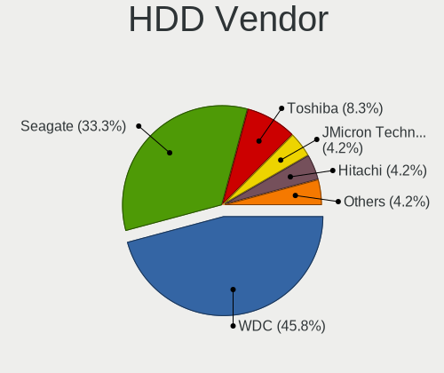
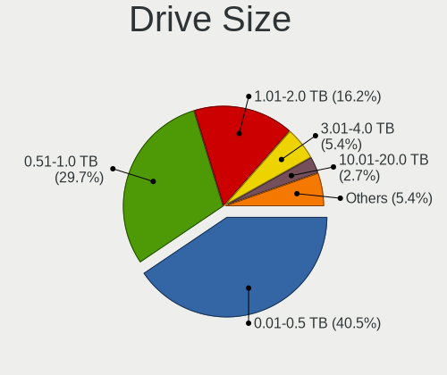
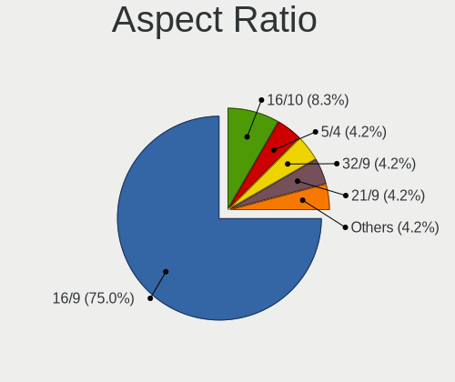
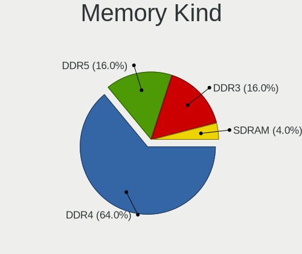

ArcoLinux - Hardware Trends (Desktops)
--------------------------------------

A project to identify most popular hardware characteristics and track their change
over time based on data collected by Linux users at https://Linux-Hardware.org.

Anyone can contribute to this report by the [hw-probe](https://github.com/linuxhw/hw-probe) tool:

    sudo -E hw-probe -all -upload

This report is for one last month. Overall report since the beginning of time: [TestCoverage](https://github.com/linuxhw/TestCoverage)

Period: Sep, 2022.

Contents
--------

* [ System ](#system)
  - [ OS                       ](#os)
  - [ OS Family                ](#os-family)
  - [ Kernel                   ](#kernel)
  - [ Kernel Family            ](#kernel-family)
  - [ Kernel Major Ver.        ](#kernel-major-ver)
  - [ Arch                     ](#arch)
  - [ DE                       ](#de)
  - [ Display Server           ](#display-server)
  - [ Display Manager          ](#display-manager)
  - [ OS Lang                  ](#os-lang)
  - [ Boot Mode                ](#boot-mode)
  - [ Filesystem               ](#filesystem)
  - [ Part. scheme             ](#part-scheme)
  - [ Dual Boot with Linux/BSD ](#dual-boot-with-linuxbsd)
  - [ Dual Boot (Win)          ](#dual-boot-win)

* [ Board ](#board)
  - [ Vendor                   ](#vendor)
  - [ Model                    ](#model)
  - [ Model Family             ](#model-family)
  - [ MFG Year                 ](#mfg-year)
  - [ Form Factor              ](#form-factor)
  - [ Secure Boot              ](#secure-boot)
  - [ Coreboot                 ](#coreboot)
  - [ RAM Size                 ](#ram-size)
  - [ RAM Used                 ](#ram-used)
  - [ Total Drives             ](#total-drives)
  - [ Has CD-ROM               ](#has-cd-rom)
  - [ Has Ethernet             ](#has-ethernet)
  - [ Has WiFi                 ](#has-wifi)
  - [ Has Bluetooth            ](#has-bluetooth)

* [ Location ](#location)
  - [ Country                  ](#country)
  - [ City                     ](#city)

* [ Drives ](#drives)
  - [ Drive Vendor             ](#drive-vendor)
  - [ Drive Model              ](#drive-model)
  - [ HDD Vendor               ](#hdd-vendor)
  - [ SSD Vendor               ](#ssd-vendor)
  - [ Drive Kind               ](#drive-kind)
  - [ Drive Connector          ](#drive-connector)
  - [ Drive Size               ](#drive-size)
  - [ Space Total              ](#space-total)
  - [ Space Used               ](#space-used)
  - [ Malfunc. Drives          ](#malfunc-drives)
  - [ Malfunc. Drive Vendor    ](#malfunc-drive-vendor)
  - [ Malfunc. HDD Vendor      ](#malfunc-hdd-vendor)
  - [ Malfunc. Drive Kind      ](#malfunc-drive-kind)
  - [ Failed Drives            ](#failed-drives)
  - [ Failed Drive Vendor      ](#failed-drive-vendor)
  - [ Drive Status             ](#drive-status)

* [ Storage controller ](#storage-controller)
  - [ Storage Vendor           ](#storage-vendor)
  - [ Storage Model            ](#storage-model)
  - [ Storage Kind             ](#storage-kind)

* [ Processor ](#processor)
  - [ CPU Vendor               ](#cpu-vendor)
  - [ CPU Model                ](#cpu-model)
  - [ CPU Model Family         ](#cpu-model-family)
  - [ CPU Cores                ](#cpu-cores)
  - [ CPU Sockets              ](#cpu-sockets)
  - [ CPU Threads              ](#cpu-threads)
  - [ CPU Op-Modes             ](#cpu-op-modes)
  - [ CPU Microcode            ](#cpu-microcode)
  - [ CPU Microarch            ](#cpu-microarch)

* [ Graphics ](#graphics)
  - [ GPU Vendor               ](#gpu-vendor)
  - [ GPU Model                ](#gpu-model)
  - [ GPU Combo                ](#gpu-combo)
  - [ GPU Driver               ](#gpu-driver)
  - [ GPU Memory               ](#gpu-memory)

* [ Monitor ](#monitor)
  - [ Monitor Vendor           ](#monitor-vendor)
  - [ Monitor Model            ](#monitor-model)
  - [ Monitor Resolution       ](#monitor-resolution)
  - [ Monitor Diagonal         ](#monitor-diagonal)
  - [ Monitor Width            ](#monitor-width)
  - [ Aspect Ratio             ](#aspect-ratio)
  - [ Monitor Area             ](#monitor-area)
  - [ Pixel Density            ](#pixel-density)
  - [ Multiple Monitors        ](#multiple-monitors)

* [ Network ](#network)
  - [ Net Controller Vendor    ](#net-controller-vendor)
  - [ Net Controller Model     ](#net-controller-model)
  - [ Wireless Vendor          ](#wireless-vendor)
  - [ Wireless Model           ](#wireless-model)
  - [ Ethernet Vendor          ](#ethernet-vendor)
  - [ Ethernet Model           ](#ethernet-model)
  - [ Net Controller Kind      ](#net-controller-kind)
  - [ Used Controller          ](#used-controller)
  - [ NICs                     ](#nics)
  - [ IPv6                     ](#ipv6)

* [ Bluetooth ](#bluetooth)
  - [ Bluetooth Vendor         ](#bluetooth-vendor)
  - [ Bluetooth Model          ](#bluetooth-model)

* [ Sound ](#sound)
  - [ Sound Vendor             ](#sound-vendor)
  - [ Sound Model              ](#sound-model)

* [ Memory ](#memory)
  - [ Memory Vendor            ](#memory-vendor)
  - [ Memory Model             ](#memory-model)
  - [ Memory Kind              ](#memory-kind)
  - [ Memory Form Factor       ](#memory-form-factor)
  - [ Memory Size              ](#memory-size)
  - [ Memory Speed             ](#memory-speed)

* [ Printers & scanners ](#printers--scanners)
  - [ Printer Vendor           ](#printer-vendor)
  - [ Printer Model            ](#printer-model)
  - [ Scanner Vendor           ](#scanner-vendor)
  - [ Scanner Model            ](#scanner-model)

* [ Camera ](#camera)
  - [ Camera Vendor            ](#camera-vendor)
  - [ Camera Model             ](#camera-model)

* [ Security ](#security)
  - [ Fingerprint Vendor       ](#fingerprint-vendor)
  - [ Fingerprint Model        ](#fingerprint-model)
  - [ Chipcard Vendor          ](#chipcard-vendor)
  - [ Chipcard Model           ](#chipcard-model)

* [ Unsupported ](#unsupported)
  - [ Unsupported Devices      ](#unsupported-devices)
  - [ Unsupported Device Types ](#unsupported-device-types)

System
------

OS
--

Installed operating systems

| Name              | Desktops | Percent |
|-------------------|----------|---------|
| ArcoLinux Rolling | 18       | 100%    |

OS Family
---------

OS without a version

| Name      | Desktops | Percent |
|-----------|----------|---------|
| ArcoLinux | 18       | 100%    |

Kernel
------

Version of the Linux kernel

| Version             | Desktops | Percent |
|---------------------|----------|---------|
| 5.19.12-arch1-1     | 3        | 16.67%  |
| 5.19.11-arch1-1     | 3        | 16.67%  |
| 5.19.9-arch1-1      | 2        | 11.11%  |
| 5.17.6-arch1-1      | 2        | 11.11%  |
| 5.19.9-zen1-1.1-zen | 1        | 5.56%   |
| 5.19.9-zen1-1-zen   | 1        | 5.56%   |
| 5.19.8-arch1-1      | 1        | 5.56%   |
| 5.19.7-zen2-1-zen   | 1        | 5.56%   |
| 5.19.7-arch1-1      | 1        | 5.56%   |
| 5.19.10-zen1-1-zen  | 1        | 5.56%   |
| 5.19.10-arch1-1     | 1        | 5.56%   |
| 5.15.71-1-lts       | 1        | 5.56%   |

Kernel Family
-------------

Linux kernel without a distro release

| Version | Desktops | Percent |
|---------|----------|---------|
| 5.19.9  | 4        | 22.22%  |
| 5.19.12 | 3        | 16.67%  |
| 5.19.11 | 3        | 16.67%  |
| 5.19.7  | 2        | 11.11%  |
| 5.19.10 | 2        | 11.11%  |
| 5.17.6  | 2        | 11.11%  |
| 5.19.8  | 1        | 5.56%   |
| 5.15.71 | 1        | 5.56%   |

Kernel Major Ver.
-----------------

Linux kernel major version

| Version | Desktops | Percent |
|---------|----------|---------|
| 5.19    | 15       | 83.33%  |
| 5.17    | 2        | 11.11%  |
| 5.15    | 1        | 5.56%   |

Arch
----

OS architecture (x86_64, i586, etc.)

| Name   | Desktops | Percent |
|--------|----------|---------|
| x86_64 | 18       | 100%    |

DE
--

Desktop Environment

| Name         | Desktops | Percent |
|--------------|----------|---------|
| XFCE         | 11       | 61.11%  |
| KDE5         | 3        | 16.67%  |
| xmonad       | 1        | 5.56%   |
| qtile        | 1        | 5.56%   |
| herbstluftwm | 1        | 5.56%   |
| awesome      | 1        | 5.56%   |

Display Server
--------------

X11 or Wayland

| Name | Desktops | Percent |
|------|----------|---------|
| X11  | 17       | 94.44%  |
| Tty  | 1        | 5.56%   |

Display Manager
---------------

SDDM, LightDM, etc.

| Name    | Desktops | Percent |
|---------|----------|---------|
| SDDM    | 12       | 66.67%  |
| LightDM | 6        | 33.33%  |

OS Lang
-------

Language

| Lang  | Desktops | Percent |
|-------|----------|---------|
| en_US | 10       | 55.56%  |
| fr_FR | 1        | 5.56%   |
| fr_CA | 1        | 5.56%   |
| es_MX | 1        | 5.56%   |
| en_SG | 1        | 5.56%   |
| en_IN | 1        | 5.56%   |
| en_GB | 1        | 5.56%   |
| en_AG | 1        | 5.56%   |
| de_DE | 1        | 5.56%   |

Boot Mode
---------

EFI or BIOS

| Mode | Desktops | Percent |
|------|----------|---------|
| EFI  | 14       | 77.78%  |
| BIOS | 4        | 22.22%  |

Filesystem
----------

Type of filesystem

| Type    | Desktops | Percent |
|---------|----------|---------|
| Ext4    | 11       | 61.11%  |
| Btrfs   | 6        | 33.33%  |
| Overlay | 1        | 5.56%   |

Part. scheme
------------

Scheme of partitioning

| Type | Desktops | Percent |
|------|----------|---------|
| GPT  | 16       | 88.89%  |
| MBR  | 2        | 11.11%  |

Dual Boot with Linux/BSD
------------------------

Hosting more than one Linux/BSD

| Dual boot | Desktops | Percent |
|-----------|----------|---------|
| No        | 11       | 61.11%  |
| Yes       | 7        | 38.89%  |

Dual Boot (Win)
---------------

Hosting Linux and Windows

| Dual boot | Desktops | Percent |
|-----------|----------|---------|
| Yes       | 10       | 55.56%  |
| No        | 8        | 44.44%  |

Board
-----

Vendor
------

Motherboard manufacturer

| Name                | Desktops | Percent |
|---------------------|----------|---------|
| ASUSTek Computer    | 7        | 38.89%  |
| Gigabyte Technology | 6        | 33.33%  |
| ASRock              | 3        | 16.67%  |
| Packard Bell        | 1        | 5.56%   |
| Hewlett-Packard     | 1        | 5.56%   |

Model
-----

Motherboard model

| Name                         | Desktops | Percent |
|------------------------------|----------|---------|
| ASUS TUF Gaming X570-PLUS    | 2        | 11.11%  |
| Packard Bell IMEDIA S3850    | 1        | 5.56%   |
| HP 500-536d                  | 1        | 5.56%   |
| Gigabyte Z97-D3H             | 1        | 5.56%   |
| Gigabyte Z390 UD             | 1        | 5.56%   |
| Gigabyte X570S AERO G        | 1        | 5.56%   |
| Gigabyte X570 GAMING X       | 1        | 5.56%   |
| Gigabyte P55-USB3            | 1        | 5.56%   |
| Gigabyte A320M-S2H V2        | 1        | 5.56%   |
| ASUS ROG STRIX B550-F GAMING | 1        | 5.56%   |
| ASUS ROG Maximus X HERO      | 1        | 5.56%   |
| ASUS PRIME Z390-A            | 1        | 5.56%   |
| ASUS P8H61-M LE/CSM          | 1        | 5.56%   |
| ASUS Maximus IX HERO         | 1        | 5.56%   |
| ASRock X300M-STX             | 1        | 5.56%   |
| ASRock H87M Pro4             | 1        | 5.56%   |
| ASRock B250M-HDV             | 1        | 5.56%   |

Model Family
------------

Motherboard model prefix

| Name                | Desktops | Percent |
|---------------------|----------|---------|
| ASUS TUF            | 2        | 11.11%  |
| ASUS ROG            | 2        | 11.11%  |
| Packard Bell IMEDIA | 1        | 5.56%   |
| HP 500-536d         | 1        | 5.56%   |
| Gigabyte Z97-D3H    | 1        | 5.56%   |
| Gigabyte Z390       | 1        | 5.56%   |
| Gigabyte X570S      | 1        | 5.56%   |
| Gigabyte X570       | 1        | 5.56%   |
| Gigabyte P55-USB3   | 1        | 5.56%   |
| Gigabyte A320M-S2H  | 1        | 5.56%   |
| ASUS PRIME          | 1        | 5.56%   |
| ASUS P8H61-M        | 1        | 5.56%   |
| ASUS Maximus        | 1        | 5.56%   |
| ASRock X300M-STX    | 1        | 5.56%   |
| ASRock H87M         | 1        | 5.56%   |
| ASRock B250M-HDV    | 1        | 5.56%   |

MFG Year
--------

Motherboard manufacture year

| Year | Desktops | Percent |
|------|----------|---------|
| 2020 | 3        | 16.67%  |
| 2019 | 3        | 16.67%  |
| 2018 | 3        | 16.67%  |
| 2017 | 2        | 11.11%  |
| 2014 | 2        | 11.11%  |
| 2010 | 2        | 11.11%  |
| 2021 | 1        | 5.56%   |
| 2013 | 1        | 5.56%   |
| 2011 | 1        | 5.56%   |

Form Factor
-----------

Physical design of the computer

| Name    | Desktops | Percent |
|---------|----------|---------|
| Desktop | 18       | 100%    |

Secure Boot
-----------

Enabled or disabled

| State    | Desktops | Percent |
|----------|----------|---------|
| Disabled | 18       | 100%    |

Coreboot
--------

Have coreboot on board

| Used | Desktops | Percent |
|------|----------|---------|
| No   | 18       | 100%    |

RAM Size
--------

Total RAM memory

| Size in GB  | Desktops | Percent |
|-------------|----------|---------|
| 32.01-64.0  | 6        | 33.33%  |
| 16.01-24.0  | 4        | 22.22%  |
| 3.01-4.0    | 3        | 16.67%  |
| 64.01-256.0 | 2        | 11.11%  |
| 8.01-16.0   | 2        | 11.11%  |
| 4.01-8.0    | 1        | 5.56%   |

RAM Used
--------

Used RAM memory

| Used GB   | Desktops | Percent |
|-----------|----------|---------|
| 2.01-3.0  | 6        | 33.33%  |
| 1.01-2.0  | 5        | 27.78%  |
| 3.01-4.0  | 4        | 22.22%  |
| 4.01-8.0  | 2        | 11.11%  |
| 8.01-16.0 | 1        | 5.56%   |

Total Drives
------------

Number of drives on board

| Drives | Desktops | Percent |
|--------|----------|---------|
| 4      | 5        | 27.78%  |
| 3      | 4        | 22.22%  |
| 2      | 4        | 22.22%  |
| 5      | 3        | 16.67%  |
| 1      | 2        | 11.11%  |

Has CD-ROM
----------

Has CD-ROM on board

| Presented | Desktops | Percent |
|-----------|----------|---------|
| No        | 10       | 55.56%  |
| Yes       | 8        | 44.44%  |

Has Ethernet
------------

Has Ethernet on board

| Presented | Desktops | Percent |
|-----------|----------|---------|
| Yes       | 18       | 100%    |

Has WiFi
--------

Has WiFi module

| Presented | Desktops | Percent |
|-----------|----------|---------|
| No        | 10       | 55.56%  |
| Yes       | 8        | 44.44%  |

Has Bluetooth
-------------

Has Bluetooth module

| Presented | Desktops | Percent |
|-----------|----------|---------|
| No        | 12       | 66.67%  |
| Yes       | 6        | 33.33%  |

Location
--------

Country
-------

Geographic location (country)

| Country     | Desktops | Percent |
|-------------|----------|---------|
| USA         | 5        | 27.78%  |
| Netherlands | 2        | 11.11%  |
| Germany     | 2        | 11.11%  |
| UK          | 1        | 5.56%   |
| Sweden      | 1        | 5.56%   |
| Mexico      | 1        | 5.56%   |
| Malaysia    | 1        | 5.56%   |
| Ireland     | 1        | 5.56%   |
| India       | 1        | 5.56%   |
| Greece      | 1        | 5.56%   |
| France      | 1        | 5.56%   |
| Canada      | 1        | 5.56%   |

City
----

Geographic location (city)

| City              | Desktops | Percent |
|-------------------|----------|---------|
| Zapopan           | 1        | 5.56%   |
| West Columbia     | 1        | 5.56%   |
| Vence             | 1        | 5.56%   |
| Rossville         | 1        | 5.56%   |
| Rochester         | 1        | 5.56%   |
| Peoria            | 1        | 5.56%   |
| Nieuw-Vennep      | 1        | 5.56%   |
| Montreal          | 1        | 5.56%   |
| Mohali            | 1        | 5.56%   |
| Maryville         | 1        | 5.56%   |
| Malacca           | 1        | 5.56%   |
| London            | 1        | 5.56%   |
| Frankfurt am Main | 1        | 5.56%   |
| Dublin            | 1        | 5.56%   |
| Brakel            | 1        | 5.56%   |
| Borås            | 1        | 5.56%   |
| Athens            | 1        | 5.56%   |
| Amsterdam         | 1        | 5.56%   |

Drives
------

Drive Vendor
------------

Hard drive vendors

| Vendor                    | Desktops | Drives | Percent |
|---------------------------|----------|--------|---------|
| WDC                       | 11       | 17     | 25%     |
| Samsung Electronics       | 9        | 12     | 20.45%  |
| Seagate                   | 5        | 6      | 11.36%  |
| Phison Electronics        | 4        | 4      | 9.09%   |
| Kingston                  | 3        | 3      | 6.82%   |
| Sandisk                   | 2        | 3      | 4.55%   |
| SK hynix                  | 1        | 1      | 2.27%   |
| Silicon Motion            | 1        | 1      | 2.27%   |
| RSH-319                   | 1        | 1      | 2.27%   |
| Realtek Semiconductor     | 1        | 1      | 2.27%   |
| Patriot                   | 1        | 1      | 2.27%   |
| Micron/Crucial Technology | 1        | 1      | 2.27%   |
| Intenso                   | 1        | 1      | 2.27%   |
| Inateck                   | 1        | 1      | 2.27%   |
| Crucial                   | 1        | 1      | 2.27%   |
| Corsair                   | 1        | 1      | 2.27%   |

Drive Model
-----------

Hard drive models

| Model                                                  | Desktops | Percent |
|--------------------------------------------------------|----------|---------|
| Phison E16 PCIe4 NVMe Controller 1TB                   | 3        | 5.56%   |
| WDC WD10EZEX-08WN4A0 1TB                               | 2        | 3.7%    |
| Samsung SSD 860 EVO 250GB                              | 2        | 3.7%    |
| Samsung SSD 860 EVO 1TB                                | 2        | 3.7%    |
| Samsung NVMe SSD Controller SM981/PM981/PM983 256GB    | 2        | 3.7%    |
| Kingston SA400S37240G 240GB SSD                        | 2        | 3.7%    |
| WDC WDS200T2B0A-00SM50 2TB SSD                         | 1        | 1.85%   |
| WDC WD80EFBX-68AZZN0 8TB                               | 1        | 1.85%   |
| WDC WD8003FFBX-68B9AN0 8TB                             | 1        | 1.85%   |
| WDC WD7501AALS-00J7B1 752GB                            | 1        | 1.85%   |
| WDC WD5000AAKS-00V1A0 500GB                            | 1        | 1.85%   |
| WDC WD5000AACS-00G8B1 500GB                            | 1        | 1.85%   |
| WDC WD40EZRZ-75GXCB0 4TB                               | 1        | 1.85%   |
| WDC WD40EZRZ-00GXCB0 4TB                               | 1        | 1.85%   |
| WDC WD40EFRX-68N32N0 4TB                               | 1        | 1.85%   |
| WDC WD4004FZWX-00GBGB0 4TB                             | 1        | 1.85%   |
| WDC WD20EZBX-00AYRA0 2TB                               | 1        | 1.85%   |
| WDC WD20EZAZ-00GGJB0 2TB                               | 1        | 1.85%   |
| WDC WD10EZEX-75WN4A0 1TB                               | 1        | 1.85%   |
| WDC WD10EARS-22Y5B1 1TB                                | 1        | 1.85%   |
| WDC WD10EADS-114BB1 1TB                                | 1        | 1.85%   |
| SK hynix SHGP31-500GM-2 500GB                          | 1        | 1.85%   |
| Silicon Motion SM2263EN/SM2263XT SSD Controller 1024GB | 1        | 1.85%   |
| Seagate ST3000DM001-1ER166 3TB                         | 1        | 1.85%   |
| Seagate ST2000DM008-2FR102 2TB                         | 1        | 1.85%   |
| Seagate ST1000DM003-1ER162 1TB                         | 1        | 1.85%   |
| Seagate Expansion 1TB                                  | 1        | 1.85%   |
| Seagate Backup+ Hub BK 8TB                             | 1        | 1.85%   |
| Sandisk WDC WDS500G2B0C-00PXH0 500GB                   | 1        | 1.85%   |
| Sandisk WD Blue SN570 500GB                            | 1        | 1.85%   |
| Sandisk WD Black SN850 500GB                           | 1        | 1.85%   |
| Samsung SSD 970 EVO Plus 500GB                         | 1        | 1.85%   |
| Samsung SSD 850 EVO 500GB                              | 1        | 1.85%   |
| Samsung SSD 840 Series 120GB                           | 1        | 1.85%   |
| Samsung SSD 840 EVO 750GB                              | 1        | 1.85%   |
| Samsung NVMe SSD Controller SM961/PM961/SM963 256GB    | 1        | 1.85%   |
| Samsung NVMe SSD Controller PM9A1/PM9A3/980PRO 1024GB  | 1        | 1.85%   |
| RSH-319 ASM1153E 3TB                                   | 1        | 1.85%   |
| Realtek RTS5763DL NVMe SSD Controller 1TB              | 1        | 1.85%   |
| Phison E12 NVMe Controller 1024GB                      | 1        | 1.85%   |

HDD Vendor
----------

Hard disk drive vendors

| Vendor  | Desktops | Drives | Percent |
|---------|----------|--------|---------|
| WDC     | 10       | 16     | 58.82%  |
| Seagate | 5        | 6      | 29.41%  |
| RSH-319 | 1        | 1      | 5.88%   |
| Inateck | 1        | 1      | 5.88%   |

SSD Vendor
----------

Solid state drive vendors

| Vendor              | Desktops | Drives | Percent |
|---------------------|----------|--------|---------|
| Samsung Electronics | 7        | 7      | 50%     |
| Kingston            | 2        | 2      | 14.29%  |
| WDC                 | 1        | 1      | 7.14%   |
| Patriot             | 1        | 1      | 7.14%   |
| Intenso             | 1        | 1      | 7.14%   |
| Crucial             | 1        | 1      | 7.14%   |
| Corsair             | 1        | 1      | 7.14%   |

Drive Kind
----------

HDD or SSD

| Kind | Desktops | Drives | Percent |
|------|----------|--------|---------|
| NVMe | 13       | 17     | 36.11%  |
| HDD  | 13       | 24     | 36.11%  |
| SSD  | 10       | 14     | 27.78%  |

Drive Connector
---------------

SATA, SAS, NVMe, etc.

| Type | Desktops | Drives | Percent |
|------|----------|--------|---------|
| SATA | 16       | 34     | 48.48%  |
| NVMe | 13       | 17     | 39.39%  |
| SAS  | 4        | 4      | 12.12%  |

Drive Size
----------

Size of hard drive

| Size in TB | Desktops | Drives | Percent |
|------------|----------|--------|---------|
| 0.51-1.0   | 9        | 11     | 33.33%  |
| 0.01-0.5   | 6        | 12     | 22.22%  |
| 3.01-4.0   | 4        | 5      | 14.81%  |
| 1.01-2.0   | 4        | 4      | 14.81%  |
| 2.01-3.0   | 2        | 3      | 7.41%   |
| 4.01-10.0  | 2        | 3      | 7.41%   |

Space Total
-----------

Amount of disk space available on the file system

| Size in GB     | Desktops | Percent |
|----------------|----------|---------|
| More than 3000 | 9        | 50%     |
| 501-1000       | 4        | 22.22%  |
| 101-250        | 2        | 11.11%  |
| 1001-2000      | 2        | 11.11%  |
| 251-500        | 1        | 5.56%   |

Space Used
----------

Amount of used disk space

| Used GB        | Desktops | Percent |
|----------------|----------|---------|
| 101-250        | 4        | 22.22%  |
| 1001-2000      | 3        | 16.67%  |
| More than 3000 | 2        | 11.11%  |
| 251-500        | 2        | 11.11%  |
| 21-50          | 2        | 11.11%  |
| 2001-3000      | 2        | 11.11%  |
| 1-20           | 2        | 11.11%  |
| 51-100         | 1        | 5.56%   |

Malfunc. Drives
---------------

Drive models with a malfunction

| Model                          | Desktops | Drives | Percent |
|--------------------------------|----------|--------|---------|
| WDC WD5000AACS-00G8B1 500GB    | 1        | 1      | 16.67%  |
| WDC WD10EARS-22Y5B1 1TB        | 1        | 1      | 16.67%  |
| WDC WD10EADS-114BB1 1TB        | 1        | 1      | 16.67%  |
| Seagate ST3000DM001-1ER166 3TB | 1        | 2      | 16.67%  |
| Inateck ASM1153E 4TB           | 1        | 1      | 16.67%  |
| Corsair CSSD-F60GB2 64GB       | 1        | 1      | 16.67%  |

Malfunc. Drive Vendor
---------------------

Vendors of faulty drives

| Vendor  | Desktops | Drives | Percent |
|---------|----------|--------|---------|
| WDC     | 3        | 3      | 50%     |
| Seagate | 1        | 2      | 16.67%  |
| Inateck | 1        | 1      | 16.67%  |
| Corsair | 1        | 1      | 16.67%  |

Malfunc. HDD Vendor
-------------------

Vendors of faulty HDD drives

| Vendor  | Desktops | Drives | Percent |
|---------|----------|--------|---------|
| WDC     | 3        | 3      | 60%     |
| Seagate | 1        | 2      | 20%     |
| Inateck | 1        | 1      | 20%     |

Malfunc. Drive Kind
-------------------

Kinds of faulty drives

| Kind | Desktops | Drives | Percent |
|------|----------|--------|---------|
| HDD  | 5        | 6      | 83.33%  |
| SSD  | 1        | 1      | 16.67%  |

Failed Drives
-------------

Failed drive models

Zero info for selected period =(

Failed Drive Vendor
-------------------

Failed drive vendors

Zero info for selected period =(

Drive Status
------------

Number of failed and malfunc. drives

| Status   | Desktops | Drives | Percent |
|----------|----------|--------|---------|
| Works    | 16       | 42     | 66.67%  |
| Malfunc  | 5        | 7      | 20.83%  |
| Detected | 3        | 6      | 12.5%   |

Storage controller
------------------

Storage Vendor
--------------

Storage controller vendors

| Vendor                      | Desktops | Percent |
|-----------------------------|----------|---------|
| Intel                       | 11       | 31.43%  |
| AMD                         | 7        | 20%     |
| Samsung Electronics         | 5        | 14.29%  |
| Phison Electronics          | 4        | 11.43%  |
| SanDisk                     | 2        | 5.71%   |
| SK hynix                    | 1        | 2.86%   |
| Silicon Motion              | 1        | 2.86%   |
| Realtek Semiconductor       | 1        | 2.86%   |
| Micron/Crucial Technology   | 1        | 2.86%   |
| Kingston Technology Company | 1        | 2.86%   |
| JMicron Technology          | 1        | 2.86%   |

Storage Model
-------------

Storage controller models

| Model                                                                                   | Desktops | Percent |
|-----------------------------------------------------------------------------------------|----------|---------|
| AMD FCH SATA Controller [AHCI mode]                                                     | 6        | 15.38%  |
| Samsung NVMe SSD Controller SM981/PM981/PM983                                           | 3        | 7.69%   |
| Phison E16 PCIe4 NVMe Controller                                                        | 3        | 7.69%   |
| Intel 200 Series PCH SATA controller [AHCI mode]                                        | 3        | 7.69%   |
| Intel Cannon Lake PCH SATA AHCI Controller                                              | 2        | 5.13%   |
| Intel 8 Series/C220 Series Chipset Family 6-port SATA Controller 1 [AHCI mode]          | 2        | 5.13%   |
| SK hynix Gold P31 SSD                                                                   | 1        | 2.56%   |
| Silicon Motion SM2263EN/SM2263XT SSD Controller                                         | 1        | 2.56%   |
| SanDisk WD PC SN810 / Black SN850 NVMe SSD                                              | 1        | 2.56%   |
| SanDisk WD Blue SN570 NVMe SSD                                                          | 1        | 2.56%   |
| SanDisk Non-Volatile memory controller                                                  | 1        | 2.56%   |
| Samsung NVMe SSD Controller SM961/PM961/SM963                                           | 1        | 2.56%   |
| Samsung NVMe SSD Controller PM9A1/PM9A3/980PRO                                          | 1        | 2.56%   |
| Realtek RTS5763DL NVMe SSD Controller                                                   | 1        | 2.56%   |
| Phison E12 NVMe Controller                                                              | 1        | 2.56%   |
| Micron/Crucial Non-Volatile memory controller                                           | 1        | 2.56%   |
| Kingston Company SNVS2000G [NV1 NVMe PCIe SSD 2TB]                                      | 1        | 2.56%   |
| JMicron JMB363 SATA/IDE Controller                                                      | 1        | 2.56%   |
| Intel 9 Series Chipset Family SATA Controller [AHCI Mode]                               | 1        | 2.56%   |
| Intel 6 Series/C200 Series Chipset Family Desktop SATA Controller (IDE mode, ports 4-5) | 1        | 2.56%   |
| Intel 6 Series/C200 Series Chipset Family Desktop SATA Controller (IDE mode, ports 0-3) | 1        | 2.56%   |
| Intel 6 Series/C200 Series Chipset Family 6 port Desktop SATA AHCI Controller           | 1        | 2.56%   |
| Intel 5 Series/3400 Series Chipset 4 port SATA IDE Controller                           | 1        | 2.56%   |
| Intel 5 Series/3400 Series Chipset 2 port SATA IDE Controller                           | 1        | 2.56%   |
| AMD 500 Series Chipset SATA Controller                                                  | 1        | 2.56%   |
| AMD 300 Series Chipset SATA Controller                                                  | 1        | 2.56%   |

Storage Kind
------------

Kind of storage controller (IDE, SATA, NVMe, SAS, ...)

| Kind | Desktops | Percent |
|------|----------|---------|
| SATA | 16       | 51.61%  |
| NVMe | 13       | 41.94%  |
| IDE  | 2        | 6.45%   |

Processor
---------

CPU Vendor
----------

Processor vendors

| Vendor | Desktops | Percent |
|--------|----------|---------|
| Intel  | 11       | 61.11%  |
| AMD    | 7        | 38.89%  |

CPU Model
---------

Processor models

| Model                                       | Desktops | Percent |
|---------------------------------------------|----------|---------|
| AMD Ryzen 9 5900X 12-Core Processor         | 2        | 11.11%  |
| AMD Ryzen 5 5600X 6-Core Processor          | 2        | 11.11%  |
| Intel Xeon CPU E3-1230 v3 @ 3.30GHz         | 1        | 5.56%   |
| Intel Pentium CPU G630 @ 2.70GHz            | 1        | 5.56%   |
| Intel Core i9-9900K CPU @ 3.60GHz           | 1        | 5.56%   |
| Intel Core i7-8700K CPU @ 3.70GHz           | 1        | 5.56%   |
| Intel Core i7-7700 CPU @ 3.60GHz            | 1        | 5.56%   |
| Intel Core i7-4790K CPU @ 4.00GHz           | 1        | 5.56%   |
| Intel Core i5-8400 CPU @ 2.80GHz            | 1        | 5.56%   |
| Intel Core i5-2300 CPU @ 2.80GHz            | 1        | 5.56%   |
| Intel Core i5 CPU 750 @ 2.67GHz             | 1        | 5.56%   |
| Intel Core i3-7100 CPU @ 3.90GHz            | 1        | 5.56%   |
| Intel Core i3-4160 CPU @ 3.60GHz            | 1        | 5.56%   |
| AMD Ryzen 9 3900X 12-Core Processor         | 1        | 5.56%   |
| AMD Ryzen 5 5600G with Radeon Graphics      | 1        | 5.56%   |
| AMD Ryzen 5 3400G with Radeon Vega Graphics | 1        | 5.56%   |

CPU Model Family
----------------

Processor model prefix

| Model         | Desktops | Percent |
|---------------|----------|---------|
| AMD Ryzen 5   | 4        | 22.22%  |
| Intel Core i7 | 3        | 16.67%  |
| Intel Core i5 | 3        | 16.67%  |
| AMD Ryzen 9   | 3        | 16.67%  |
| Intel Core i3 | 2        | 11.11%  |
| Intel Xeon    | 1        | 5.56%   |
| Intel Pentium | 1        | 5.56%   |
| Intel Core i9 | 1        | 5.56%   |

CPU Cores
---------

Number of processor cores

| Number | Desktops | Percent |
|--------|----------|---------|
| 4      | 6        | 33.33%  |
| 6      | 5        | 27.78%  |
| 12     | 3        | 16.67%  |
| 2      | 3        | 16.67%  |
| 8      | 1        | 5.56%   |

CPU Sockets
-----------

Number of sockets

| Number | Desktops | Percent |
|--------|----------|---------|
| 1      | 18       | 100%    |

CPU Threads
-----------

Threads per core (Hyper-Threading)

| Number | Desktops | Percent |
|--------|----------|---------|
| 2      | 14       | 77.78%  |
| 1      | 4        | 22.22%  |

CPU Op-Modes
------------

CPU Operation Modes (32-bit, 64-bit)

| Op mode        | Desktops | Percent |
|----------------|----------|---------|
| 32-bit, 64-bit | 18       | 100%    |

CPU Microcode
-------------

Microcode number

| Number     | Desktops | Percent |
|------------|----------|---------|
| 0x306c3    | 3        | 16.67%  |
| 0x0a201016 | 3        | 16.67%  |
| 0x906ea    | 2        | 11.11%  |
| 0x906e9    | 2        | 11.11%  |
| 0x206a7    | 2        | 11.11%  |
| 0x906ed    | 1        | 5.56%   |
| 0x106e5    | 1        | 5.56%   |
| 0x0a20120a | 1        | 5.56%   |
| 0x08701021 | 1        | 5.56%   |
| 0x08108109 | 1        | 5.56%   |
| Unknown    | 1        | 5.56%   |

CPU Microarch
-------------

Microarchitecture

| Name        | Desktops | Percent |
|-------------|----------|---------|
| Zen 3       | 5        | 27.78%  |
| KabyLake    | 5        | 27.78%  |
| Haswell     | 3        | 16.67%  |
| SandyBridge | 2        | 11.11%  |
| Zen+        | 1        | 5.56%   |
| Zen 2       | 1        | 5.56%   |
| Nehalem     | 1        | 5.56%   |

Graphics
--------

GPU Vendor
----------

Vendors of graphics cards

| Vendor | Desktops | Percent |
|--------|----------|---------|
| AMD    | 8        | 40%     |
| Nvidia | 7        | 35%     |
| Intel  | 5        | 25%     |

GPU Model
---------

Graphics card models

| Model                                                                       | Desktops | Percent |
|-----------------------------------------------------------------------------|----------|---------|
| Nvidia GM204 [GeForce GTX 970]                                              | 2        | 10%     |
| Nvidia TU106 [GeForce RTX 2060 SUPER]                                       | 1        | 5%      |
| Nvidia GP104 [GeForce GTX 1080]                                             | 1        | 5%      |
| Nvidia GK104 [GeForce GTX 770]                                              | 1        | 5%      |
| Nvidia GF108 [GeForce GT 420]                                               | 1        | 5%      |
| Nvidia GA102 [GeForce RTX 3080 Ti]                                          | 1        | 5%      |
| Intel Xeon E3-1200 v3/4th Gen Core Processor Integrated Graphics Controller | 1        | 5%      |
| Intel HD Graphics 630                                                       | 1        | 5%      |
| Intel CoffeeLake-S GT2 [UHD Graphics 630]                                   | 1        | 5%      |
| Intel 4th Generation Core Processor Family Integrated Graphics Controller   | 1        | 5%      |
| Intel 2nd Generation Core Processor Family Integrated Graphics Controller   | 1        | 5%      |
| AMD Picasso/Raven 2 [Radeon Vega Series / Radeon Vega Mobile Series]        | 1        | 5%      |
| AMD Navi 24 [Radeon RX 6400 / 6500 XT]                                      | 1        | 5%      |
| AMD Navi 23 [Radeon RX 6600/6600 XT/6600M]                                  | 1        | 5%      |
| AMD Navi 22 [Radeon RX 6700/6700 XT/6750 XT / 6800M]                        | 1        | 5%      |
| AMD Navi 21 [Radeon RX 6800/6800 XT / 6900 XT]                              | 1        | 5%      |
| AMD Navi 10 [Radeon RX 5600 OEM/5600 XT / 5700/5700 XT]                     | 1        | 5%      |
| AMD Cezanne                                                                 | 1        | 5%      |
| AMD Cape Verde XT [Radeon HD 7770/8760 / R7 250X]                           | 1        | 5%      |

GPU Combo
---------

Combinations of graphics cards

| Name           | Desktops | Percent |
|----------------|----------|---------|
| 1 x AMD        | 7        | 38.89%  |
| 1 x Nvidia     | 6        | 33.33%  |
| 1 x Intel      | 3        | 16.67%  |
| Intel + Nvidia | 1        | 5.56%   |
| Intel + AMD    | 1        | 5.56%   |

GPU Driver
----------

Free vs proprietary

| Driver      | Desktops | Percent |
|-------------|----------|---------|
| Free        | 12       | 66.67%  |
| Proprietary | 6        | 33.33%  |

GPU Memory
----------

Total video memory

| Size in GB | Desktops | Percent |
|------------|----------|---------|
| Unknown    | 5        | 27.78%  |
| 7.01-8.0   | 4        | 22.22%  |
| 3.01-4.0   | 3        | 16.67%  |
| 8.01-16.0  | 3        | 16.67%  |
| 1.01-2.0   | 2        | 11.11%  |
| 0.51-1.0   | 1        | 5.56%   |

Monitor
-------

Monitor Vendor
--------------

Monitor vendors

| Vendor               | Desktops | Percent |
|----------------------|----------|---------|
| Goldstar             | 5        | 26.32%  |
| Samsung Electronics  | 3        | 15.79%  |
| MSI                  | 2        | 10.53%  |
| Dell                 | 2        | 10.53%  |
| AOC                  | 2        | 10.53%  |
| ViewSonic            | 1        | 5.26%   |
| Microstep            | 1        | 5.26%   |
| Hewlett-Packard      | 1        | 5.26%   |
| Eizo                 | 1        | 5.26%   |
| Ancor Communications | 1        | 5.26%   |

Monitor Model
-------------

Monitor models

| Model                                                                | Desktops | Percent |
|----------------------------------------------------------------------|----------|---------|
| ViewSonic VX3276-QHD VSCE635 2560x1440 698x393mm 31.5-inch           | 1        | 4.76%   |
| Samsung Electronics U28E590 SAM0C4D 3840x2160 607x345mm 27.5-inch    | 1        | 4.76%   |
| Samsung Electronics U28E570 SAM0D70 3840x2160 608x345mm 27.5-inch    | 1        | 4.76%   |
| Samsung Electronics SyncMaster SAM027F 1680x1050 474x296mm 22.0-inch | 1        | 4.76%   |
| Samsung Electronics S27D590 SAM0B49 1920x1080 598x336mm 27.0-inch    | 1        | 4.76%   |
| MSI MAG272CQR MSI3CA6 2560x1440 598x336mm 27.0-inch                  | 1        | 4.76%   |
| MSI G241V E2 MSI3BA7 1920x1080 527x296mm 23.8-inch                   | 1        | 4.76%   |
| Microstep LCD Monitor MSI MAG274R2 3840x1080                         | 1        | 4.76%   |
| Microstep LCD Monitor MSI MAG274R2                                   | 1        | 4.76%   |
| Hewlett-Packard 20wd HWP3144 1600x900 432x239mm 19.4-inch            | 1        | 4.76%   |
| Goldstar W2343 GSM5700 1920x1080 474x296mm 22.0-inch                 | 1        | 4.76%   |
| Goldstar MP59G GSM5B35 1920x1080 480x270mm 21.7-inch                 | 1        | 4.76%   |
| Goldstar M2380D GSM57BC 1920x1080 598x336mm 27.0-inch                | 1        | 4.76%   |
| Goldstar LG ULTRAWIDE GSM777D 3840x1600 890x390mm 38.3-inch          | 1        | 4.76%   |
| Goldstar FULL HD GSM5B55 1920x1080 480x270mm 21.7-inch               | 1        | 4.76%   |
| Eizo S2411W ENC1850 1920x1200 519x324mm 24.1-inch                    | 1        | 4.76%   |
| Dell S2240L DELD054 1920x1080 476x267mm 21.5-inch                    | 1        | 4.76%   |
| Dell P2217H DELA0D9 1920x1080 476x267mm 21.5-inch                    | 1        | 4.76%   |
| AOC Q32G2WG3 AOC3202 2560x1440 697x392mm 31.5-inch                   | 1        | 4.76%   |
| AOC Q2781 AOC2781 2560x1440 600x340mm 27.2-inch                      | 1        | 4.76%   |
| Ancor Communications VX279 ACI27E4 1920x1080 600x340mm 27.2-inch     | 1        | 4.76%   |

Monitor Resolution
------------------

Monitor screen resolution

| Resolution         | Desktops | Percent |
|--------------------|----------|---------|
| 1920x1080 (FHD)    | 8        | 40%     |
| 3840x2160 (4K)     | 3        | 15%     |
| 2560x1440 (QHD)    | 3        | 15%     |
| 3840x1600          | 1        | 5%      |
| 3840x1080          | 1        | 5%      |
| 1920x1200 (WUXGA)  | 1        | 5%      |
| 1680x1050 (WSXGA+) | 1        | 5%      |
| 1600x900 (HD+)     | 1        | 5%      |
| Unknown            | 1        | 5%      |

Monitor Diagonal
----------------

Diagonal size in inches

| Inches  | Desktops | Percent |
|---------|----------|---------|
| 27      | 7        | 36.84%  |
| 21      | 3        | 15.79%  |
| 31      | 2        | 10.53%  |
| 23      | 2        | 10.53%  |
| 38      | 1        | 5.26%   |
| 24      | 1        | 5.26%   |
| 22      | 1        | 5.26%   |
| 19      | 1        | 5.26%   |
| Unknown | 1        | 5.26%   |

Monitor Width
-------------

Physical width

| Width in mm | Desktops | Percent |
|-------------|----------|---------|
| 501-600     | 8        | 42.11%  |
| 401-500     | 5        | 26.32%  |
| 601-700     | 4        | 21.05%  |
| 801-900     | 1        | 5.26%   |
| Unknown     | 1        | 5.26%   |

Aspect Ratio
------------

Proportional relationship between the width and the height

| Ratio   | Desktops | Percent |
|---------|----------|---------|
| 16/9    | 14       | 77.78%  |
| 16/10   | 2        | 11.11%  |
| 21/9    | 1        | 5.56%   |
| Unknown | 1        | 5.56%   |

Monitor Area
------------

Area in inch²

| Area in inch² | Desktops | Percent |
|----------------|----------|---------|
| 301-350        | 7        | 36.84%  |
| 201-250        | 6        | 31.58%  |
| 351-500        | 2        | 10.53%  |
| 251-300        | 1        | 5.26%   |
| 151-200        | 1        | 5.26%   |
| 501-1000       | 1        | 5.26%   |
| Unknown        | 1        | 5.26%   |

Pixel Density
-------------

Pixels per inch

| Density | Desktops | Percent |
|---------|----------|---------|
| 51-100  | 11       | 55%     |
| 101-120 | 6        | 30%     |
| 161-240 | 1        | 5%      |
| 121-160 | 1        | 5%      |
| Unknown | 1        | 5%      |

Multiple Monitors
-----------------

Total monitors connected

| Total | Desktops | Percent |
|-------|----------|---------|
| 1     | 14       | 77.78%  |
| 2     | 4        | 22.22%  |

Network
-------

Net Controller Vendor
---------------------

Controller vendors

| Vendor                                 | Desktops | Percent |
|----------------------------------------|----------|---------|
| Realtek Semiconductor                  | 10       | 40%     |
| Intel                                  | 10       | 40%     |
| Sony Ericsson Mobile Communications AB | 1        | 4%      |
| Ralink Technology                      | 1        | 4%      |
| MediaTek                               | 1        | 4%      |
| D-Link                                 | 1        | 4%      |
| Broadcom                               | 1        | 4%      |

Net Controller Model
--------------------

Controller models

| Model                                                                | Desktops | Percent |
|----------------------------------------------------------------------|----------|---------|
| Realtek RTL8111/8168/8411 PCI Express Gigabit Ethernet Controller    | 9        | 33.33%  |
| Intel Ethernet Connection (2) I219-V                                 | 3        | 11.11%  |
| Intel Ethernet Controller I225-V                                     | 2        | 7.41%   |
| Intel Ethernet Connection I217-V                                     | 2        | 7.41%   |
| Sony Ericsson Mobile AB XQ-AD51                                      | 1        | 3.7%    |
| Realtek RTL8822BE 802.11a/b/g/n/ac WiFi adapter                      | 1        | 3.7%    |
| Realtek RTL8188EE Wireless Network Adapter                           | 1        | 3.7%    |
| Ralink RT2870/RT3070 Wireless Adapter                                | 1        | 3.7%    |
| MediaTek MT7921K (RZ608) Wi-Fi 6E 80MHz                              | 1        | 3.7%    |
| Intel Wireless-AC 9260                                               | 1        | 3.7%    |
| Intel Wi-Fi 6 AX200                                                  | 1        | 3.7%    |
| Intel Ethernet Connection (7) I219-V                                 | 1        | 3.7%    |
| Intel 82579V Gigabit Network Connection                              | 1        | 3.7%    |
| D-Link DWA-131 Wireless N Nano Adapter (Rev. E1) [Realtek RTL8192EU] | 1        | 3.7%    |
| Broadcom BCM4360 802.11ac Wireless Network Adapter                   | 1        | 3.7%    |

Wireless Vendor
---------------

Wireless vendors

| Vendor                | Desktops | Percent |
|-----------------------|----------|---------|
| Realtek Semiconductor | 2        | 25%     |
| Intel                 | 2        | 25%     |
| Ralink Technology     | 1        | 12.5%   |
| MediaTek              | 1        | 12.5%   |
| D-Link                | 1        | 12.5%   |
| Broadcom              | 1        | 12.5%   |

Wireless Model
--------------

Wireless models

| Model                                                                | Desktops | Percent |
|----------------------------------------------------------------------|----------|---------|
| Realtek RTL8822BE 802.11a/b/g/n/ac WiFi adapter                      | 1        | 12.5%   |
| Realtek RTL8188EE Wireless Network Adapter                           | 1        | 12.5%   |
| Ralink RT2870/RT3070 Wireless Adapter                                | 1        | 12.5%   |
| MediaTek MT7921K (RZ608) Wi-Fi 6E 80MHz                              | 1        | 12.5%   |
| Intel Wireless-AC 9260                                               | 1        | 12.5%   |
| Intel Wi-Fi 6 AX200                                                  | 1        | 12.5%   |
| D-Link DWA-131 Wireless N Nano Adapter (Rev. E1) [Realtek RTL8192EU] | 1        | 12.5%   |
| Broadcom BCM4360 802.11ac Wireless Network Adapter                   | 1        | 12.5%   |

Ethernet Vendor
---------------

Ethernet vendors

| Vendor                                 | Desktops | Percent |
|----------------------------------------|----------|---------|
| Realtek Semiconductor                  | 9        | 47.37%  |
| Intel                                  | 9        | 47.37%  |
| Sony Ericsson Mobile Communications AB | 1        | 5.26%   |

Ethernet Model
--------------

Ethernet models

| Model                                                             | Desktops | Percent |
|-------------------------------------------------------------------|----------|---------|
| Realtek RTL8111/8168/8411 PCI Express Gigabit Ethernet Controller | 9        | 47.37%  |
| Intel Ethernet Connection (2) I219-V                              | 3        | 15.79%  |
| Intel Ethernet Controller I225-V                                  | 2        | 10.53%  |
| Intel Ethernet Connection I217-V                                  | 2        | 10.53%  |
| Sony Ericsson Mobile AB XQ-AD51                                   | 1        | 5.26%   |
| Intel Ethernet Connection (7) I219-V                              | 1        | 5.26%   |
| Intel 82579V Gigabit Network Connection                           | 1        | 5.26%   |

Net Controller Kind
-------------------

Ethernet, WiFi or modem

| Kind     | Desktops | Percent |
|----------|----------|---------|
| Ethernet | 18       | 69.23%  |
| WiFi     | 8        | 30.77%  |

Used Controller
---------------

Currently used network controller

| Kind     | Desktops | Percent |
|----------|----------|---------|
| Ethernet | 13       | 65%     |
| WiFi     | 7        | 35%     |

NICs
----

Total network controllers on board

| Total | Desktops | Percent |
|-------|----------|---------|
| 1     | 12       | 66.67%  |
| 2     | 6        | 33.33%  |

IPv6
----

IPv6 vs IPv4

| Used | Desktops | Percent |
|------|----------|---------|
| No   | 17       | 94.44%  |
| Yes  | 1        | 5.56%   |

Bluetooth
---------

Bluetooth Vendor
----------------

Controller vendors

| Vendor                   | Desktops | Percent |
|--------------------------|----------|---------|
| Intel                    | 2        | 28.57%  |
| MediaTek                 | 1        | 14.29%  |
| HTC (High Tech Computer) | 1        | 14.29%  |
| Edimax Technology        | 1        | 14.29%  |
| Cambridge Silicon Radio  | 1        | 14.29%  |
| ASUSTek Computer         | 1        | 14.29%  |

Bluetooth Model
---------------

Controller models

| Model                                                                | Desktops | Percent |
|----------------------------------------------------------------------|----------|---------|
| MediaTek Wireless_Device                                             | 1        | 14.29%  |
| Intel Wireless-AC 9260 Bluetooth Adapter                             | 1        | 14.29%  |
| Intel AX200 Bluetooth                                                | 1        | 14.29%  |
| HTC (High Tech Computer) Vive Hub Bluetooth 4.1 (Broadcom BCM920703) | 1        | 14.29%  |
| Edimax Bluetooth Adapter                                             | 1        | 14.29%  |
| Cambridge Silicon Radio Bluetooth Dongle (HCI mode)                  | 1        | 14.29%  |
| ASUS Bluetooth Radio                                                 | 1        | 14.29%  |

Sound
-----

Sound Vendor
------------

Sound card vendors

| Vendor              | Desktops | Percent |
|---------------------|----------|---------|
| Intel               | 11       | 34.38%  |
| AMD                 | 9        | 28.13%  |
| Nvidia              | 7        | 21.88%  |
| C-Media Electronics | 2        | 6.25%   |
| Razer USA           | 1        | 3.13%   |
| OPPO Electronics    | 1        | 3.13%   |
| Corsair             | 1        | 3.13%   |

Sound Model
-----------

Sound card models

| Model                                                                      | Desktops | Percent |
|----------------------------------------------------------------------------|----------|---------|
| AMD Starship/Matisse HD Audio Controller                                   | 5        | 12.2%   |
| AMD Navi 21/23 HDMI/DP Audio Controller                                    | 4        | 9.76%   |
| Intel 200 Series PCH HD Audio                                              | 3        | 7.32%   |
| Nvidia GM204 High Definition Audio Controller                              | 2        | 4.88%   |
| Intel Xeon E3-1200 v3/4th Gen Core Processor HD Audio Controller           | 2        | 4.88%   |
| Intel Cannon Lake PCH cAVS                                                 | 2        | 4.88%   |
| Intel 8 Series/C220 Series Chipset High Definition Audio Controller        | 2        | 4.88%   |
| Intel 6 Series/C200 Series Chipset Family High Definition Audio Controller | 2        | 4.88%   |
| AMD Family 17h/19h HD Audio Controller                                     | 2        | 4.88%   |
| Razer USA Kraken Tournament Edition                                        | 1        | 2.44%   |
| OPPO Electronics RMX3171                                                   | 1        | 2.44%   |
| Nvidia TU106 High Definition Audio Controller                              | 1        | 2.44%   |
| Nvidia GP104 High Definition Audio Controller                              | 1        | 2.44%   |
| Nvidia GK104 HDMI Audio Controller                                         | 1        | 2.44%   |
| Nvidia GF108 High Definition Audio Controller                              | 1        | 2.44%   |
| Nvidia GA102 High Definition Audio Controller                              | 1        | 2.44%   |
| Intel 9 Series Chipset Family HD Audio Controller                          | 1        | 2.44%   |
| Intel 5 Series/3400 Series Chipset High Definition Audio                   | 1        | 2.44%   |
| Corsair VOID PRO Wireless Gaming Headset                                   | 1        | 2.44%   |
| C-Media Electronics USB Audio Device                                       | 1        | 2.44%   |
| C-Media Electronics Blue Snowball                                          | 1        | 2.44%   |
| C-Media Electronics Audio Adapter                                          | 1        | 2.44%   |
| AMD Renoir Radeon High Definition Audio Controller                         | 1        | 2.44%   |
| AMD Raven/Raven2/Fenghuang HDMI/DP Audio Controller                        | 1        | 2.44%   |
| AMD Oland/Hainan/Cape Verde/Pitcairn HDMI Audio [Radeon HD 7000 Series]    | 1        | 2.44%   |
| AMD Navi 10 HDMI Audio                                                     | 1        | 2.44%   |

Memory
------

Memory Vendor
-------------

Memory module vendors

| Vendor              | Desktops | Percent |
|---------------------|----------|---------|
| Corsair             | 4        | 21.05%  |
| Kingston            | 3        | 15.79%  |
| G.Skill             | 3        | 15.79%  |
| Team                | 2        | 10.53%  |
| Crucial             | 2        | 10.53%  |
| Unknown             | 1        | 5.26%   |
| SK hynix            | 1        | 5.26%   |
| Samsung Electronics | 1        | 5.26%   |
| Micron Technology   | 1        | 5.26%   |
| A-DATA Technology   | 1        | 5.26%   |

Memory Model
------------

Memory module models

| Model                                                    | Desktops | Percent |
|----------------------------------------------------------|----------|---------|
| G.Skill RAM F4-3200C16-16GVK 16GB DIMM DDR4 3600MT/s     | 2        | 10.53%  |
| Unknown RAM Module 8GB DIMM 1333MT/s                     | 1        | 5.26%   |
| Team RAM TEAMGROUP-UD4-3600 32GB DIMM DDR4 3600MT/s      | 1        | 5.26%   |
| Team RAM TEAMGROUP-UD4-3000 8GB DIMM DDR4 3000MT/s       | 1        | 5.26%   |
| SK hynix RAM HMA81GU6AFR8N-UH 8GB DIMM DDR4 2400MT/s     | 1        | 5.26%   |
| Samsung RAM Module 2GB DIMM DDR3 1333MT/s                | 1        | 5.26%   |
| Micron RAM 8JTF51264AZ-1G6E1 4GB DIMM DDR3 1600MT/s      | 1        | 5.26%   |
| Kingston RAM KHX3000C15D4/8GX 8GB DIMM DDR4 3400MT/s     | 1        | 5.26%   |
| Kingston RAM KHX2400C15/16G 16GB DIMM DDR4 3334MT/s      | 1        | 5.26%   |
| Kingston RAM 99U5471-020.A00LF 4GB DIMM DDR3 1600MT/s    | 1        | 5.26%   |
| G.Skill RAM F3-14900CL9-4GBSR 4GB DIMM DDR3 1867MT/s     | 1        | 5.26%   |
| Crucial RAM BL8G32C16S4B.8FE 8GB SODIMM DDR4 3200MT/s    | 1        | 5.26%   |
| Crucial RAM BL16G36C16U4B.M16FE1 16GB DIMM DDR4 3600MT/s | 1        | 5.26%   |
| Corsair RAM CMZ16GX3M4A1600C9 4GB DIMM DDR3 1600MT/s     | 1        | 5.26%   |
| Corsair RAM CMU16GX4M2C3000C15 8GB DIMM DDR4 3200MT/s    | 1        | 5.26%   |
| Corsair RAM CMK8GX4M2A2400C16 4GB DIMM DDR4 3020MT/s     | 1        | 5.26%   |
| Corsair RAM CMH32GX4M4E3200C16 8GB DIMM DDR4 3266MT/s    | 1        | 5.26%   |
| A-DATA RAM DDR4 3000 8GB DIMM DDR4 3600MT/s              | 1        | 5.26%   |

Memory Kind
-----------

Memory module kinds

| Kind    | Desktops | Percent |
|---------|----------|---------|
| DDR4    | 12       | 66.67%  |
| DDR3    | 5        | 27.78%  |
| Unknown | 1        | 5.56%   |

Memory Form Factor
------------------

Physical design of the memory module

| Name   | Desktops | Percent |
|--------|----------|---------|
| DIMM   | 17       | 94.44%  |
| SODIMM | 1        | 5.56%   |

Memory Size
-----------

Memory module size

| Size  | Desktops | Percent |
|-------|----------|---------|
| 16384 | 6        | 31.58%  |
| 8192  | 6        | 31.58%  |
| 4096  | 5        | 26.32%  |
| 32768 | 1        | 5.26%   |
| 2048  | 1        | 5.26%   |

Memory Speed
------------

Memory module speed

| Speed | Desktops | Percent |
|-------|----------|---------|
| 3600  | 5        | 26.32%  |
| 1600  | 3        | 15.79%  |
| 3200  | 2        | 10.53%  |
| 1333  | 2        | 10.53%  |
| 3400  | 1        | 5.26%   |
| 3334  | 1        | 5.26%   |
| 3266  | 1        | 5.26%   |
| 3020  | 1        | 5.26%   |
| 3000  | 1        | 5.26%   |
| 2400  | 1        | 5.26%   |
| 1867  | 1        | 5.26%   |

Printers & scanners
-------------------

Printer Vendor
--------------

Printer device vendors

Zero info for selected period =(

Printer Model
-------------

Printer device models

Zero info for selected period =(

Scanner Vendor
--------------

Scanner device vendors

Zero info for selected period =(

Scanner Model
-------------

Scanner device models

Zero info for selected period =(

Camera
------

Camera Vendor
-------------

Camera device vendors

| Vendor    | Desktops | Percent |
|-----------|----------|---------|
| Logitech  | 3        | 75%     |
| Microsoft | 1        | 25%     |

Camera Model
------------

Camera device models

| Model                       | Desktops | Percent |
|-----------------------------|----------|---------|
| Logitech HD Pro Webcam C920 | 2        | 50%     |
| Microsoft LifeCam Cinema    | 1        | 25%     |
| Logitech Webcam C110        | 1        | 25%     |

Security
--------

Fingerprint Vendor
------------------

Fingerprint sensor vendors

Zero info for selected period =(

Fingerprint Model
-----------------

Fingerprint sensor models

Zero info for selected period =(

Chipcard Vendor
---------------

Chipcard module vendors

Zero info for selected period =(

Chipcard Model
--------------

Chipcard module models

Zero info for selected period =(

Unsupported
-----------

Unsupported Devices
-------------------

Total unsupported devices on board

| Total | Desktops | Percent |
|-------|----------|---------|
| 0     | 17       | 94.44%  |
| 1     | 1        | 5.56%   |

Unsupported Device Types
------------------------

Types of unsupported devices

| Type      | Desktops | Percent |
|-----------|----------|---------|
| Bluetooth | 1        | 100%    |

