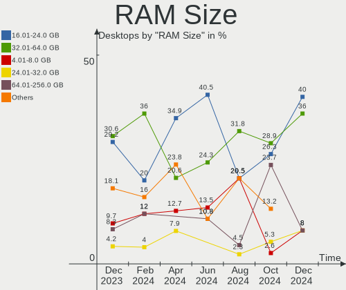
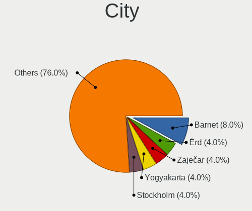
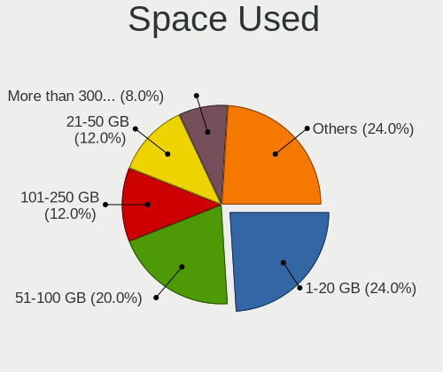
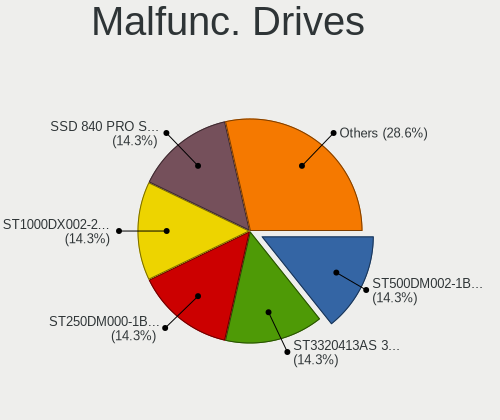
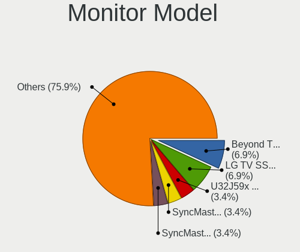
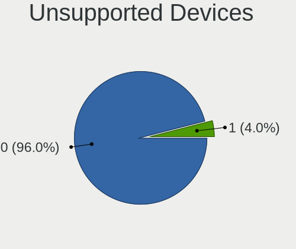

ArcoLinux - Hardware Trends (Desktops)
--------------------------------------

A project to identify most popular hardware characteristics and track their change
over time based on data collected by Linux users at https://Linux-Hardware.org.

Anyone can contribute to this report by the [hw-probe](https://github.com/linuxhw/hw-probe) tool:

    sudo -E hw-probe -all -upload

This report is for one last month. Overall report since the beginning of time: [TestDays](https://github.com/linuxhw/TestDays)

Period: Dec, 2023.

Contents
--------

* [ System ](#system)
  - [ OS                       ](#os)
  - [ OS Family                ](#os-family)
  - [ Kernel                   ](#kernel)
  - [ Kernel Family            ](#kernel-family)
  - [ Kernel Major Ver.        ](#kernel-major-ver)
  - [ Arch                     ](#arch)
  - [ DE                       ](#de)
  - [ Display Server           ](#display-server)
  - [ Display Manager          ](#display-manager)
  - [ OS Lang                  ](#os-lang)
  - [ Boot Mode                ](#boot-mode)
  - [ Filesystem               ](#filesystem)
  - [ Part. scheme             ](#part-scheme)
  - [ Dual Boot with Linux/BSD ](#dual-boot-with-linuxbsd)
  - [ Dual Boot (Win)          ](#dual-boot-win)

* [ Board ](#board)
  - [ Vendor                   ](#vendor)
  - [ Model                    ](#model)
  - [ Model Family             ](#model-family)
  - [ MFG Year                 ](#mfg-year)
  - [ Form Factor              ](#form-factor)
  - [ Secure Boot              ](#secure-boot)
  - [ Coreboot                 ](#coreboot)
  - [ RAM Size                 ](#ram-size)
  - [ RAM Used                 ](#ram-used)
  - [ Total Drives             ](#total-drives)
  - [ Has CD-ROM               ](#has-cd-rom)
  - [ Has Ethernet             ](#has-ethernet)
  - [ Has WiFi                 ](#has-wifi)
  - [ Has Bluetooth            ](#has-bluetooth)

* [ Location ](#location)
  - [ Country                  ](#country)
  - [ City                     ](#city)

* [ Drives ](#drives)
  - [ Drive Vendor             ](#drive-vendor)
  - [ Drive Model              ](#drive-model)
  - [ HDD Vendor               ](#hdd-vendor)
  - [ SSD Vendor               ](#ssd-vendor)
  - [ Drive Kind               ](#drive-kind)
  - [ Drive Connector          ](#drive-connector)
  - [ Drive Size               ](#drive-size)
  - [ Space Total              ](#space-total)
  - [ Space Used               ](#space-used)
  - [ Malfunc. Drives          ](#malfunc-drives)
  - [ Malfunc. Drive Vendor    ](#malfunc-drive-vendor)
  - [ Malfunc. HDD Vendor      ](#malfunc-hdd-vendor)
  - [ Malfunc. Drive Kind      ](#malfunc-drive-kind)
  - [ Failed Drives            ](#failed-drives)
  - [ Failed Drive Vendor      ](#failed-drive-vendor)
  - [ Drive Status             ](#drive-status)

* [ Storage controller ](#storage-controller)
  - [ Storage Vendor           ](#storage-vendor)
  - [ Storage Model            ](#storage-model)
  - [ Storage Kind             ](#storage-kind)

* [ Processor ](#processor)
  - [ CPU Vendor               ](#cpu-vendor)
  - [ CPU Model                ](#cpu-model)
  - [ CPU Model Family         ](#cpu-model-family)
  - [ CPU Cores                ](#cpu-cores)
  - [ CPU Sockets              ](#cpu-sockets)
  - [ CPU Threads              ](#cpu-threads)
  - [ CPU Op-Modes             ](#cpu-op-modes)
  - [ CPU Microcode            ](#cpu-microcode)
  - [ CPU Microarch            ](#cpu-microarch)

* [ Graphics ](#graphics)
  - [ GPU Vendor               ](#gpu-vendor)
  - [ GPU Model                ](#gpu-model)
  - [ GPU Combo                ](#gpu-combo)
  - [ GPU Driver               ](#gpu-driver)
  - [ GPU Memory               ](#gpu-memory)

* [ Monitor ](#monitor)
  - [ Monitor Vendor           ](#monitor-vendor)
  - [ Monitor Model            ](#monitor-model)
  - [ Monitor Resolution       ](#monitor-resolution)
  - [ Monitor Diagonal         ](#monitor-diagonal)
  - [ Monitor Width            ](#monitor-width)
  - [ Aspect Ratio             ](#aspect-ratio)
  - [ Monitor Area             ](#monitor-area)
  - [ Pixel Density            ](#pixel-density)
  - [ Multiple Monitors        ](#multiple-monitors)

* [ Network ](#network)
  - [ Net Controller Vendor    ](#net-controller-vendor)
  - [ Net Controller Model     ](#net-controller-model)
  - [ Wireless Vendor          ](#wireless-vendor)
  - [ Wireless Model           ](#wireless-model)
  - [ Ethernet Vendor          ](#ethernet-vendor)
  - [ Ethernet Model           ](#ethernet-model)
  - [ Net Controller Kind      ](#net-controller-kind)
  - [ Used Controller          ](#used-controller)
  - [ NICs                     ](#nics)
  - [ IPv6                     ](#ipv6)

* [ Bluetooth ](#bluetooth)
  - [ Bluetooth Vendor         ](#bluetooth-vendor)
  - [ Bluetooth Model          ](#bluetooth-model)

* [ Sound ](#sound)
  - [ Sound Vendor             ](#sound-vendor)
  - [ Sound Model              ](#sound-model)

* [ Memory ](#memory)
  - [ Memory Vendor            ](#memory-vendor)
  - [ Memory Model             ](#memory-model)
  - [ Memory Kind              ](#memory-kind)
  - [ Memory Form Factor       ](#memory-form-factor)
  - [ Memory Size              ](#memory-size)
  - [ Memory Speed             ](#memory-speed)

* [ Printers & scanners ](#printers--scanners)
  - [ Printer Vendor           ](#printer-vendor)
  - [ Printer Model            ](#printer-model)
  - [ Scanner Vendor           ](#scanner-vendor)
  - [ Scanner Model            ](#scanner-model)

* [ Camera ](#camera)
  - [ Camera Vendor            ](#camera-vendor)
  - [ Camera Model             ](#camera-model)

* [ Security ](#security)
  - [ Fingerprint Vendor       ](#fingerprint-vendor)
  - [ Fingerprint Model        ](#fingerprint-model)
  - [ Chipcard Vendor          ](#chipcard-vendor)
  - [ Chipcard Model           ](#chipcard-model)

* [ Unsupported ](#unsupported)
  - [ Unsupported Devices      ](#unsupported-devices)
  - [ Unsupported Device Types ](#unsupported-device-types)

System
------

OS
--

Installed operating systems

| Name              | Desktops | Percent |
|-------------------|----------|---------|
| ArcoLinux Rolling | 71       | 98.61%  |
| ArcoLinux         | 1        | 1.39%   |

OS Family
---------

OS without a version

| Name      | Desktops | Percent |
|-----------|----------|---------|
| ArcoLinux | 72       | 100%    |

Kernel
------

Version of the Linux kernel

| Version                | Desktops | Percent |
|------------------------|----------|---------|
| 6.6.1-arch1-1          | 11       | 15.28%  |
| 6.6.7-arch1-1          | 10       | 13.89%  |
| 6.6.8-arch1-1          | 8        | 11.11%  |
| 6.6.4-arch1-1          | 6        | 8.33%   |
| 6.6.3-arch1-1          | 6        | 8.33%   |
| 6.6.7-zen1-1-zen       | 4        | 5.56%   |
| 6.1.68-1-lts           | 4        | 5.56%   |
| 6.6.8-zen1-1-zen       | 2        | 2.78%   |
| 6.6.5-zen1-1-zen       | 2        | 2.78%   |
| 6.6.5-x64v2-xanmod1-1  | 2        | 2.78%   |
| 6.6.5-arch1-1          | 2        | 2.78%   |
| 6.6.2-arch1-1          | 2        | 2.78%   |
| 6.1.69-1-lts           | 2        | 2.78%   |
| 6.6.7-x64v3-xanmod1    | 1        | 1.39%   |
| 6.6.6-zen1-1-zen       | 1        | 1.39%   |
| 6.6.6-arch1-1          | 1        | 1.39%   |
| 6.6.4-zen1-1-zen       | 1        | 1.39%   |
| 6.5.12-x64v2-xanmod1-1 | 1        | 1.39%   |
| 6.4.11-arch1-1         | 1        | 1.39%   |
| 6.3.8-arch1-1          | 1        | 1.39%   |
| 6.1.67-1-lts           | 1        | 1.39%   |
| 6.1.64-1-lts           | 1        | 1.39%   |
| 6.1.63-1-lts           | 1        | 1.39%   |
| 6.1.61-1-lts           | 1        | 1.39%   |

Kernel Family
-------------

Linux kernel without a distro release

| Version | Desktops | Percent |
|---------|----------|---------|
| 6.6.7   | 15       | 20.83%  |
| 6.6.1   | 11       | 15.28%  |
| 6.6.8   | 10       | 13.89%  |
| 6.6.4   | 7        | 9.72%   |
| 6.6.5   | 6        | 8.33%   |
| 6.6.3   | 6        | 8.33%   |
| 6.1.68  | 4        | 5.56%   |
| 6.6.6   | 2        | 2.78%   |
| 6.6.2   | 2        | 2.78%   |
| 6.1.69  | 2        | 2.78%   |
| 6.5.12  | 1        | 1.39%   |
| 6.4.11  | 1        | 1.39%   |
| 6.3.8   | 1        | 1.39%   |
| 6.1.67  | 1        | 1.39%   |
| 6.1.64  | 1        | 1.39%   |
| 6.1.63  | 1        | 1.39%   |
| 6.1.61  | 1        | 1.39%   |

Kernel Major Ver.
-----------------

Linux kernel major version

| Version | Desktops | Percent |
|---------|----------|---------|
| 6.6     | 59       | 81.94%  |
| 6.1     | 10       | 13.89%  |
| 6.5     | 1        | 1.39%   |
| 6.4     | 1        | 1.39%   |
| 6.3     | 1        | 1.39%   |

Arch
----

OS architecture (x86_64, i586, etc.)

| Name   | Desktops | Percent |
|--------|----------|---------|
| x86_64 | 72       | 100%    |

DE
--

Desktop Environment

| Name       | Desktops | Percent |
|------------|----------|---------|
| XFCE       | 19       | 26.39%  |
| KDE5       | 19       | 26.39%  |
| Cinnamon   | 7        | 9.72%   |
| GNOME      | 6        | 8.33%   |
| i3         | 4        | 5.56%   |
| X-Cinnamon | 3        | 4.17%   |
| Hyprland   | 3        | 4.17%   |
| MATE       | 2        | 2.78%   |
| Deepin     | 2        | 2.78%   |
| bspwm      | 2        | 2.78%   |
| wayfire    | 1        | 1.39%   |
| qtile      | 1        | 1.39%   |
| Cutefish   | 1        | 1.39%   |
| Budgie     | 1        | 1.39%   |
| awesome    | 1        | 1.39%   |

Display Server
--------------

X11 or Wayland

| Name    | Desktops | Percent |
|---------|----------|---------|
| X11     | 64       | 88.89%  |
| Wayland | 6        | 8.33%   |
| Tty     | 2        | 2.78%   |

Display Manager
---------------

SDDM, LightDM, etc.

| Name    | Desktops | Percent |
|---------|----------|---------|
| SDDM    | 53       | 73.61%  |
| LightDM | 18       | 25%     |
| Unknown | 1        | 1.39%   |

OS Lang
-------

Language

| Lang  | Desktops | Percent |
|-------|----------|---------|
| en_US | 38       | 52.78%  |
| en_GB | 6        | 8.33%   |
| de_DE | 6        | 8.33%   |
| pt_BR | 3        | 4.17%   |
| it_IT | 3        | 4.17%   |
| fr_FR | 2        | 2.78%   |
| fi_FI | 2        | 2.78%   |
| en_AU | 2        | 2.78%   |
| th_TH | 1        | 1.39%   |
| ru_RU | 1        | 1.39%   |
| nl_BE | 1        | 1.39%   |
| ko_KR | 1        | 1.39%   |
| hu_HU | 1        | 1.39%   |
| es_MX | 1        | 1.39%   |
| en_PH | 1        | 1.39%   |
| en_IN | 1        | 1.39%   |
| en_CA | 1        | 1.39%   |
| C     | 1        | 1.39%   |

Boot Mode
---------

EFI or BIOS

| Mode | Desktops | Percent |
|------|----------|---------|
| EFI  | 58       | 80.56%  |
| BIOS | 14       | 19.44%  |

Filesystem
----------

Type of filesystem

| Type    | Desktops | Percent |
|---------|----------|---------|
| Ext4    | 52       | 72.22%  |
| Btrfs   | 18       | 25%     |
| Overlay | 1        | 1.39%   |
| F2fs    | 1        | 1.39%   |

Part. scheme
------------

Scheme of partitioning

| Type    | Desktops | Percent |
|---------|----------|---------|
| GPT     | 64       | 88.89%  |
| MBR     | 7        | 9.72%   |
| Unknown | 1        | 1.39%   |

Dual Boot with Linux/BSD
------------------------

Hosting more than one Linux/BSD

| Dual boot | Desktops | Percent |
|-----------|----------|---------|
| No        | 47       | 65.28%  |
| Yes       | 25       | 34.72%  |

Dual Boot (Win)
---------------

Hosting Linux and Windows

| Dual boot | Desktops | Percent |
|-----------|----------|---------|
| No        | 41       | 56.94%  |
| Yes       | 31       | 43.06%  |

Board
-----

Vendor
------

Motherboard manufacturer

| Name                | Desktops | Percent |
|---------------------|----------|---------|
| ASUSTek Computer    | 20       | 27.78%  |
| Gigabyte Technology | 16       | 22.22%  |
| MSI                 | 14       | 19.44%  |
| ASRock              | 7        | 9.72%   |
| Dell                | 4        | 5.56%   |
| Hewlett-Packard     | 3        | 4.17%   |
| Lenovo              | 2        | 2.78%   |
| Acer                | 2        | 2.78%   |
| Unknown             | 2        | 2.78%   |
| Win element         | 1        | 1.39%   |
| MACHINIST           | 1        | 1.39%   |

Model
-----

Motherboard model

| Name                                      | Desktops | Percent |
|-------------------------------------------|----------|---------|
| ASUS PRIME A520M-K                        | 2        | 2.78%   |
| ASUS All Series                           | 2        | 2.78%   |
| ASRock X670E Taichi Carrara               | 2        | 2.78%   |
| Unknown                                   | 2        | 2.78%   |
| Win element M600                          | 1        | 1.39%   |
| MSI MS-7D82                               | 1        | 1.39%   |
| MSI MS-7D09                               | 1        | 1.39%   |
| MSI MS-7C96                               | 1        | 1.39%   |
| MSI MS-7C95                               | 1        | 1.39%   |
| MSI MS-7C91                               | 1        | 1.39%   |
| MSI MS-7C83                               | 1        | 1.39%   |
| MSI MS-7C02                               | 1        | 1.39%   |
| MSI MS-7B89                               | 1        | 1.39%   |
| MSI MS-7B84                               | 1        | 1.39%   |
| MSI MS-7B79                               | 1        | 1.39%   |
| MSI MS-7A38                               | 1        | 1.39%   |
| MSI MS-7850                               | 1        | 1.39%   |
| MSI MS-7721                               | 1        | 1.39%   |
| MSI MEG Z590 Aegis Ti5 (MS-B931)          | 1        | 1.39%   |
| MACHINIST X99-RS9 V2.0                    | 1        | 1.39%   |
| Lenovo ThinkCentre M93p 10AAS1D200        | 1        | 1.39%   |
| Lenovo ThinkCentre M72e 3578G4M           | 1        | 1.39%   |
| HP QQ416US#ABA                            | 1        | 1.39%   |
| HP ProDesk 600 G1 SFF                     | 1        | 1.39%   |
| HP Compaq Pro 6305 SFF                    | 1        | 1.39%   |
| Gigabyte Z97X-UD5H                        | 1        | 1.39%   |
| Gigabyte Z690 AORUS XTREME                | 1        | 1.39%   |
| Gigabyte Z390 UD V2                       | 1        | 1.39%   |
| Gigabyte X670 GAMING X AX                 | 1        | 1.39%   |
| Gigabyte X570S AORUS MASTER               | 1        | 1.39%   |
| Gigabyte X570 GAMING X                    | 1        | 1.39%   |
| Gigabyte X570 AORUS PRO WIFI              | 1        | 1.39%   |
| Gigabyte H77-D3H                          | 1        | 1.39%   |
| Gigabyte H370M-DS3H                       | 1        | 1.39%   |
| Gigabyte H310M DS2 2.0                    | 1        | 1.39%   |
| Gigabyte FB 24134 ONE GAMING Premium AR02 | 1        | 1.39%   |
| Gigabyte B550 AORUS MASTER                | 1        | 1.39%   |
| Gigabyte B550 AORUS ELITE AX V2           | 1        | 1.39%   |
| Gigabyte B450M DS3H WIFI                  | 1        | 1.39%   |
| Gigabyte AB350N-Gaming WIFI               | 1        | 1.39%   |

Model Family
------------

Motherboard model prefix

| Name                   | Desktops | Percent |
|------------------------|----------|---------|
| ASUS PRIME             | 7        | 9.72%   |
| ASUS ROG               | 6        | 8.33%   |
| Dell OptiPlex          | 4        | 5.56%   |
| Lenovo ThinkCentre     | 2        | 2.78%   |
| Gigabyte X570          | 2        | 2.78%   |
| Gigabyte B550          | 2        | 2.78%   |
| ASUS TUF               | 2        | 2.78%   |
| ASUS All               | 2        | 2.78%   |
| ASRock X670E           | 2        | 2.78%   |
| Unknown                | 2        | 2.78%   |
| Win element M600       | 1        | 1.39%   |
| MSI MS-7D82            | 1        | 1.39%   |
| MSI MS-7D09            | 1        | 1.39%   |
| MSI MS-7C96            | 1        | 1.39%   |
| MSI MS-7C95            | 1        | 1.39%   |
| MSI MS-7C91            | 1        | 1.39%   |
| MSI MS-7C83            | 1        | 1.39%   |
| MSI MS-7C02            | 1        | 1.39%   |
| MSI MS-7B89            | 1        | 1.39%   |
| MSI MS-7B84            | 1        | 1.39%   |
| MSI MS-7B79            | 1        | 1.39%   |
| MSI MS-7A38            | 1        | 1.39%   |
| MSI MS-7850            | 1        | 1.39%   |
| MSI MS-7721            | 1        | 1.39%   |
| MSI MEG                | 1        | 1.39%   |
| MACHINIST X99-RS9      | 1        | 1.39%   |
| HP QQ416US#ABA         | 1        | 1.39%   |
| HP ProDesk             | 1        | 1.39%   |
| HP Compaq              | 1        | 1.39%   |
| Gigabyte Z97X-UD5H     | 1        | 1.39%   |
| Gigabyte Z690          | 1        | 1.39%   |
| Gigabyte Z390          | 1        | 1.39%   |
| Gigabyte X670          | 1        | 1.39%   |
| Gigabyte X570S         | 1        | 1.39%   |
| Gigabyte H77-D3H       | 1        | 1.39%   |
| Gigabyte H370M-DS3H    | 1        | 1.39%   |
| Gigabyte H310M         | 1        | 1.39%   |
| Gigabyte FB            | 1        | 1.39%   |
| Gigabyte B450M         | 1        | 1.39%   |
| Gigabyte AB350N-Gaming | 1        | 1.39%   |

MFG Year
--------

Motherboard manufacture year

| Year | Desktops | Percent |
|------|----------|---------|
| 2018 | 12       | 16.67%  |
| 2020 | 11       | 15.28%  |
| 2019 | 9        | 12.5%   |
| 2021 | 8        | 11.11%  |
| 2022 | 6        | 8.33%   |
| 2023 | 4        | 5.56%   |
| 2017 | 4        | 5.56%   |
| 2016 | 4        | 5.56%   |
| 2014 | 4        | 5.56%   |
| 2012 | 4        | 5.56%   |
| 2013 | 2        | 2.78%   |
| 2011 | 1        | 1.39%   |
| 2010 | 1        | 1.39%   |
| 2009 | 1        | 1.39%   |
| 2008 | 1        | 1.39%   |

Form Factor
-----------

Physical design of the computer

| Name    | Desktops | Percent |
|---------|----------|---------|
| Desktop | 72       | 100%    |

Secure Boot
-----------

Enabled or disabled

| State    | Desktops | Percent |
|----------|----------|---------|
| Disabled | 72       | 100%    |

Coreboot
--------

Have coreboot on board

| Used | Desktops | Percent |
|------|----------|---------|
| No   | 72       | 100%    |

RAM Size
--------

Total RAM memory

| Size in GB  | Desktops | Percent |
|-------------|----------|---------|
| 32.01-64.0  | 22       | 30.56%  |
| 16.01-24.0  | 21       | 29.17%  |
| 8.01-16.0   | 10       | 13.89%  |
| 4.01-8.0    | 7        | 9.72%   |
| 64.01-256.0 | 6        | 8.33%   |
| 3.01-4.0    | 3        | 4.17%   |
| 24.01-32.0  | 3        | 4.17%   |

RAM Used
--------

Used RAM memory

| Used GB    | Desktops | Percent |
|------------|----------|---------|
| 1.01-2.0   | 26       | 36.11%  |
| 4.01-8.0   | 16       | 22.22%  |
| 2.01-3.0   | 13       | 18.06%  |
| 3.01-4.0   | 7        | 9.72%   |
| 8.01-16.0  | 7        | 9.72%   |
| 32.01-64.0 | 1        | 1.39%   |
| 24.01-32.0 | 1        | 1.39%   |
| 0.01-0.5   | 1        | 1.39%   |

Total Drives
------------

Number of drives on board

| Drives | Desktops | Percent |
|--------|----------|---------|
| 2      | 22       | 30.56%  |
| 3      | 19       | 26.39%  |
| 1      | 15       | 20.83%  |
| 6      | 6        | 8.33%   |
| 4      | 4        | 5.56%   |
| 7      | 2        | 2.78%   |
| 5      | 2        | 2.78%   |
| 13     | 1        | 1.39%   |
| 0      | 1        | 1.39%   |

Has CD-ROM
----------

Has CD-ROM on board

| Presented | Desktops | Percent |
|-----------|----------|---------|
| No        | 55       | 76.39%  |
| Yes       | 17       | 23.61%  |

Has Ethernet
------------

Has Ethernet on board

| Presented | Desktops | Percent |
|-----------|----------|---------|
| Yes       | 71       | 98.61%  |
| No        | 1        | 1.39%   |

Has WiFi
--------

Has WiFi module

| Presented | Desktops | Percent |
|-----------|----------|---------|
| Yes       | 36       | 50%     |
| No        | 36       | 50%     |

Has Bluetooth
-------------

Has Bluetooth module

| Presented | Desktops | Percent |
|-----------|----------|---------|
| Yes       | 42       | 58.33%  |
| No        | 30       | 41.67%  |

Location
--------

Country
-------

Geographic location (country)

| Country      | Desktops | Percent |
|--------------|----------|---------|
| USA          | 16       | 22.22%  |
| UK           | 7        | 9.72%   |
| Germany      | 7        | 9.72%   |
| Italy        | 3        | 4.17%   |
| Finland      | 3        | 4.17%   |
| Brazil       | 3        | 4.17%   |
| Portugal     | 2        | 2.78%   |
| Mexico       | 2        | 2.78%   |
| India        | 2        | 2.78%   |
| Hungary      | 2        | 2.78%   |
| France       | 2        | 2.78%   |
| Egypt        | 2        | 2.78%   |
| Canada       | 2        | 2.78%   |
| Bulgaria     | 2        | 2.78%   |
| Belgium      | 2        | 2.78%   |
| Australia    | 2        | 2.78%   |
| Venezuela    | 1        | 1.39%   |
| Thailand     | 1        | 1.39%   |
| South Korea  | 1        | 1.39%   |
| Singapore    | 1        | 1.39%   |
| Serbia       | 1        | 1.39%   |
| Saudi Arabia | 1        | 1.39%   |
| Russia       | 1        | 1.39%   |
| Poland       | 1        | 1.39%   |
| Philippines  | 1        | 1.39%   |
| Pakistan     | 1        | 1.39%   |
| Japan        | 1        | 1.39%   |
| China        | 1        | 1.39%   |
| Argentina    | 1        | 1.39%   |

City
----

Geographic location (city)

| City             | Desktops | Percent |
|------------------|----------|---------|
| Helsinki         | 3        | 4.17%   |
| Sofia            | 2        | 2.78%   |
| Columbus         | 2        | 2.78%   |
| Zurich           | 1        | 1.39%   |
| Zapopan          | 1        | 1.39%   |
| Warsaw           | 1        | 1.39%   |
| Vicosa           | 1        | 1.39%   |
| Valence          | 1        | 1.39%   |
| Torre del Greco  | 1        | 1.39%   |
| Sydney           | 1        | 1.39%   |
| Sochi            | 1        | 1.39%   |
| Singapore        | 1        | 1.39%   |
| Seattle          | 1        | 1.39%   |
| Schwarzenbek     | 1        | 1.39%   |
| Sao Paulo        | 1        | 1.39%   |
| Rouen            | 1        | 1.39%   |
| Rosenheim        | 1        | 1.39%   |
| Rosario          | 1        | 1.39%   |
| Rio de Janeiro   | 1        | 1.39%   |
| Queluz           | 1        | 1.39%   |
| Parabiago        | 1        | 1.39%   |
| Niš             | 1        | 1.39%   |
| Mumbai           | 1        | 1.39%   |
| Moore            | 1        | 1.39%   |
| Milford          | 1        | 1.39%   |
| Miami            | 1        | 1.39%   |
| McLean           | 1        | 1.39%   |
| Mattoon          | 1        | 1.39%   |
| Mandaluyong City | 1        | 1.39%   |
| Manchester       | 1        | 1.39%   |
| Madison          | 1        | 1.39%   |
| Longyan          | 1        | 1.39%   |
| Liverpool        | 1        | 1.39%   |
| Lisbon           | 1        | 1.39%   |
| LaVerkin         | 1        | 1.39%   |
| Kolkata          | 1        | 1.39%   |
| Kiskunhalas      | 1        | 1.39%   |
| Karasawa         | 1        | 1.39%   |
| Karachi          | 1        | 1.39%   |
| Jonquiere        | 1        | 1.39%   |

Drives
------

Drive Vendor
------------

Hard drive vendors

| Vendor                       | Desktops | Drives | Percent |
|------------------------------|----------|--------|---------|
| WDC                          | 26       | 36     | 16.46%  |
| Samsung Electronics          | 25       | 32     | 15.82%  |
| Seagate                      | 19       | 21     | 12.03%  |
| Kingston                     | 13       | 18     | 8.23%   |
| Toshiba                      | 8        | 8      | 5.06%   |
| Phison Electronics           | 8        | 14     | 5.06%   |
| SanDisk                      | 6        | 8      | 3.8%    |
| Kingston Technology Company  | 5        | 5      | 3.16%   |
| Crucial                      | 5        | 7      | 3.16%   |
| A-DATA Technology            | 5        | 6      | 3.16%   |
| Hitachi                      | 4        | 7      | 2.53%   |
| Micron/Crucial Technology    | 3        | 3      | 1.9%    |
| Plextor                      | 2        | 2      | 1.27%   |
| Hewlett-Packard              | 2        | 2      | 1.27%   |
| ADATA Technology             | 2        | 2      | 1.27%   |
| XrayDisk                     | 1        | 1      | 0.63%   |
| USB3.0                       | 1        | 1      | 0.63%   |
| Team                         | 1        | 1      | 0.63%   |
| Silicon Motion               | 1        | 1      | 0.63%   |
| Shenzhen Longsys Electronics | 1        | 2      | 0.63%   |
| SABRENT                      | 1        | 1      | 0.63%   |
| RevuAhn                      | 1        | 1      | 0.63%   |
| Realtek Semiconductor        | 1        | 1      | 0.63%   |
| Patriot                      | 1        | 1      | 0.63%   |
| Micron Technology            | 1        | 1      | 0.63%   |
| Maxtor                       | 1        | 1      | 0.63%   |
| MAXIO Technology (Hangzhou)  | 1        | 1      | 0.63%   |
| LITEON                       | 1        | 1      | 0.63%   |
| KIOXIA                       | 1        | 1      | 0.63%   |
| HGST                         | 1        | 9      | 0.63%   |
| Gigabyte Technology          | 1        | 1      | 0.63%   |
| Fujitsu                      | 1        | 1      | 0.63%   |
| Fanxiang                     | 1        | 2      | 0.63%   |
| Enmotus                      | 1        | 1      | 0.63%   |
| China                        | 1        | 1      | 0.63%   |
| BR                           | 1        | 1      | 0.63%   |
| Beijing Starblaze Technology | 1        | 1      | 0.63%   |
| AMD                          | 1        | 1      | 0.63%   |
| aigo                         | 1        | 1      | 0.63%   |
| Unknown                      | 1        | 1      | 0.63%   |

Drive Model
-----------

Hard drive models

| Model                                                             | Desktops | Percent |
|-------------------------------------------------------------------|----------|---------|
| Samsung NVMe SSD Controller PM9A1/PM9A3/980PRO 2TB                | 6        | 3.26%   |
| Seagate ST2000DM008-2FR102 2TB                                    | 4        | 2.17%   |
| Phison E16 PCIe4 NVMe Controller 2TB                              | 4        | 2.17%   |
| Phison E12 NVMe Controller 1TB                                    | 4        | 2.17%   |
| Samsung SSD 860 EVO 500GB                                         | 3        | 1.63%   |
| Samsung NVMe SSD Controller SM981/PM981/PM983 512GB               | 3        | 1.63%   |
| Kingston Company SNV2S1000G 1TB                                   | 3        | 1.63%   |
| Kingston SKC3000S1024G 1024GB                                     | 3        | 1.63%   |
| WDC WDS240G2G0A-00JH30 240GB SSD                                  | 2        | 1.09%   |
| WDC WD5000AAKX-60U6AA0 500GB                                      | 2        | 1.09%   |
| WDC WD10EZRX-00L4HB0 1TB                                          | 2        | 1.09%   |
| WDC WD10EZEX-08WN4A0 1TB                                          | 2        | 1.09%   |
| Toshiba HDWD120 2TB                                               | 2        | 1.09%   |
| Toshiba HDWD110 1TB                                               | 2        | 1.09%   |
| Toshiba DT01ACA100 1TB                                            | 2        | 1.09%   |
| Seagate ST6000DM003-2CY186 6TB                                    | 2        | 1.09%   |
| Seagate ST4000DM004-2CV104 4TB                                    | 2        | 1.09%   |
| Seagate ST1000DM003-1CH162 1TB                                    | 2        | 1.09%   |
| Samsung SSD 870 EVO 500GB                                         | 2        | 1.09%   |
| Samsung SSD 870 EVO 250GB                                         | 2        | 1.09%   |
| Samsung SSD 860 EVO 1TB                                           | 2        | 1.09%   |
| Samsung SSD 850 EVO 250GB                                         | 2        | 1.09%   |
| Micron/Crucial P2 NVMe PCIe SSD 4TB                               | 2        | 1.09%   |
| Kingston SNVS500G 500GB                                           | 2        | 1.09%   |
| Kingston SFYRS1000G 1TB                                           | 2        | 1.09%   |
| Crucial CT1000MX500SSD1 1TB                                       | 2        | 1.09%   |
| ADATA XPG SX8200 Pro PCIe Gen3x4 M.2 2280 Solid State Drive 512GB | 2        | 1.09%   |
| XrayDisk 1TB SSD                                                  | 1        | 0.54%   |
| WDC WDS500G2B0A 500GB SSD                                         | 1        | 0.54%   |
| WDC WDS500G1R0A-68A4W0 500GB SSD                                  | 1        | 0.54%   |
| WDC WDS120G2G0A-00JH30 120GB SSD                                  | 1        | 0.54%   |
| WDC WDS100T2B0A-00SM50 1TB SSD                                    | 1        | 0.54%   |
| WDC WDS100T1R0A-68A4W0 1TB SSD                                    | 1        | 0.54%   |
| WDC WD6400AAKS-22A7B2 640GB                                       | 1        | 0.54%   |
| WDC WD5000LPVX-00V0TT0 500GB                                      | 1        | 0.54%   |
| WDC WD5000LPCX-60VHAT0 500GB                                      | 1        | 0.54%   |
| WDC WD5000LPCX-22VHAT0 500GB                                      | 1        | 0.54%   |
| WDC WD5000BPKX-00HPJT0 500GB                                      | 1        | 0.54%   |
| WDC WD5000AAKX-22ERMA0 500GB                                      | 1        | 0.54%   |
| WDC WD4005FZBX-00K5WB0 4TB                                        | 1        | 0.54%   |

HDD Vendor
----------

Hard disk drive vendors

| Vendor              | Desktops | Drives | Percent |
|---------------------|----------|--------|---------|
| WDC                 | 21       | 29     | 36.21%  |
| Seagate             | 19       | 21     | 32.76%  |
| Toshiba             | 7        | 7      | 12.07%  |
| Hitachi             | 4        | 7      | 6.9%    |
| Samsung Electronics | 2        | 2      | 3.45%   |
| USB3.0              | 1        | 1      | 1.72%   |
| SABRENT             | 1        | 1      | 1.72%   |
| Maxtor              | 1        | 1      | 1.72%   |
| HGST                | 1        | 9      | 1.72%   |
| Fujitsu             | 1        | 1      | 1.72%   |

SSD Vendor
----------

Solid state drive vendors

| Vendor              | Desktops | Drives | Percent |
|---------------------|----------|--------|---------|
| Samsung Electronics | 16       | 19     | 29.09%  |
| WDC                 | 6        | 7      | 10.91%  |
| Kingston            | 5        | 6      | 9.09%   |
| Crucial             | 5        | 7      | 9.09%   |
| A-DATA Technology   | 5        | 6      | 9.09%   |
| SanDisk             | 2        | 2      | 3.64%   |
| Plextor             | 2        | 2      | 3.64%   |
| XrayDisk            | 1        | 1      | 1.82%   |
| Toshiba             | 1        | 1      | 1.82%   |
| Team                | 1        | 1      | 1.82%   |
| RevuAhn             | 1        | 1      | 1.82%   |
| Patriot             | 1        | 1      | 1.82%   |
| LITEON              | 1        | 1      | 1.82%   |
| Hewlett-Packard     | 1        | 1      | 1.82%   |
| Gigabyte Technology | 1        | 1      | 1.82%   |
| Fanxiang            | 1        | 1      | 1.82%   |
| China               | 1        | 1      | 1.82%   |
| BR                  | 1        | 1      | 1.82%   |
| AMD                 | 1        | 1      | 1.82%   |
| aigo                | 1        | 1      | 1.82%   |
| Unknown             | 1        | 1      | 1.82%   |

Drive Kind
----------

HDD or SSD

| Kind | Desktops | Drives | Percent |
|------|----------|--------|---------|
| HDD  | 49       | 79     | 36.3%   |
| SSD  | 46       | 63     | 34.07%  |
| NVMe | 40       | 64     | 29.63%  |

Drive Connector
---------------

SATA, SAS, NVMe, etc.

| Type | Desktops | Drives | Percent |
|------|----------|--------|---------|
| SATA | 64       | 138    | 58.72%  |
| NVMe | 40       | 63     | 36.7%   |
| SAS  | 5        | 5      | 4.59%   |

Drive Size
----------

Size of hard drive

| Size in TB | Desktops | Drives | Percent |
|------------|----------|--------|---------|
| 0.01-0.5   | 42       | 60     | 43.75%  |
| 0.51-1.0   | 27       | 40     | 28.13%  |
| 1.01-2.0   | 11       | 14     | 11.46%  |
| 4.01-10.0  | 8        | 17     | 8.33%   |
| 3.01-4.0   | 5        | 6      | 5.21%   |
| 2.01-3.0   | 2        | 4      | 2.08%   |
| 10.01-20.0 | 1        | 1      | 1.04%   |

Space Total
-----------

Amount of disk space available on the file system

| Size in GB     | Desktops | Percent |
|----------------|----------|---------|
| More than 3000 | 15       | 20.83%  |
| 1001-2000      | 13       | 18.06%  |
| 251-500        | 12       | 16.67%  |
| 501-1000       | 10       | 13.89%  |
| 101-250        | 8        | 11.11%  |
| 2001-3000      | 6        | 8.33%   |
| 51-100         | 4        | 5.56%   |
| Unknown        | 4        | 5.56%   |

Space Used
----------

Amount of used disk space

| Used GB        | Desktops | Percent |
|----------------|----------|---------|
| 1-20           | 12       | 16.67%  |
| 501-1000       | 12       | 16.67%  |
| 51-100         | 10       | 13.89%  |
| 21-50          | 9        | 12.5%   |
| 101-250        | 9        | 12.5%   |
| More than 3000 | 6        | 8.33%   |
| 251-500        | 6        | 8.33%   |
| 1001-2000      | 4        | 5.56%   |
| Unknown        | 4        | 5.56%   |

Malfunc. Drives
---------------

Drive models with a malfunction

| Model                                                         | Desktops | Drives | Percent |
|---------------------------------------------------------------|----------|--------|---------|
| WDC WD6400AAKS-22A7B2 640GB                                   | 1        | 1      | 4.35%   |
| WDC WD5000AAKX-60U6AA0 500GB                                  | 1        | 1      | 4.35%   |
| WDC WD5000AAKX-22ERMA0 500GB                                  | 1        | 1      | 4.35%   |
| WDC WD1600BEVS-26VAT0 160GB                                   | 1        | 1      | 4.35%   |
| WDC WD1600AAJS-00PSA0 160GB                                   | 1        | 1      | 4.35%   |
| WDC WD10EZEX-22BN5A0 1TB                                      | 1        | 1      | 4.35%   |
| WDC WD10EAVS-00D7B1 1TB                                       | 1        | 1      | 4.35%   |
| WDC WD1003FZEX-00MK2A0 1TB                                    | 1        | 1      | 4.35%   |
| WDC WD1001FALS-41Y6A1 1TB                                     | 1        | 1      | 4.35%   |
| USB3.0 Super Speed 1TB                                        | 1        | 1      | 4.35%   |
| Toshiba MQ01ABD100 1TB                                        | 1        | 1      | 4.35%   |
| Toshiba HDWD120 2TB                                           | 1        | 1      | 4.35%   |
| Seagate ST3500312CS 500GB                                     | 1        | 1      | 4.35%   |
| Seagate ST2000DM008-2FR102 2TB                                | 1        | 1      | 4.35%   |
| SanDisk SSD PLUS 480GB                                        | 1        | 1      | 4.35%   |
| Maxtor STM3250310AS 250GB                                     | 1        | 1      | 4.35%   |
| MAXIO Technology (Hangzhou) NVMe SSD Controller MAP1001 500GB | 1        | 1      | 4.35%   |
| Hitachi HDS721010CLA332 1TB                                   | 1        | 1      | 4.35%   |
| HGST HUS726060ALE610 6TB                                      | 1        | 8      | 4.35%   |
| Fujitsu MHZ2160BH G2 160GB                                    | 1        | 1      | 4.35%   |
| Crucial CT275MX300SSD1 275GB                                  | 1        | 1      | 4.35%   |
| A-DATA Technology SU650 960GB SSD                             | 1        | 2      | 4.35%   |
| A-DATA Technology SU630 480GB SSD                             | 1        | 1      | 4.35%   |

Malfunc. Drive Vendor
---------------------

Vendors of faulty drives

| Vendor                      | Desktops | Drives | Percent |
|-----------------------------|----------|--------|---------|
| WDC                         | 7        | 9      | 33.33%  |
| Toshiba                     | 2        | 2      | 9.52%   |
| Seagate                     | 2        | 2      | 9.52%   |
| A-DATA Technology           | 2        | 3      | 9.52%   |
| USB3.0                      | 1        | 1      | 4.76%   |
| SanDisk                     | 1        | 1      | 4.76%   |
| Maxtor                      | 1        | 1      | 4.76%   |
| MAXIO Technology (Hangzhou) | 1        | 1      | 4.76%   |
| Hitachi                     | 1        | 1      | 4.76%   |
| HGST                        | 1        | 8      | 4.76%   |
| Fujitsu                     | 1        | 1      | 4.76%   |
| Crucial                     | 1        | 1      | 4.76%   |

Malfunc. HDD Vendor
-------------------

Vendors of faulty HDD drives

| Vendor  | Desktops | Drives | Percent |
|---------|----------|--------|---------|
| WDC     | 7        | 9      | 43.75%  |
| Toshiba | 2        | 2      | 12.5%   |
| Seagate | 2        | 2      | 12.5%   |
| USB3.0  | 1        | 1      | 6.25%   |
| Maxtor  | 1        | 1      | 6.25%   |
| Hitachi | 1        | 1      | 6.25%   |
| HGST    | 1        | 8      | 6.25%   |
| Fujitsu | 1        | 1      | 6.25%   |

Malfunc. Drive Kind
-------------------

Kinds of faulty drives

| Kind | Desktops | Drives | Percent |
|------|----------|--------|---------|
| HDD  | 14       | 25     | 73.68%  |
| SSD  | 4        | 5      | 21.05%  |
| NVMe | 1        | 1      | 5.26%   |

Failed Drives
-------------

Failed drive models

Zero info for selected period =(

Failed Drive Vendor
-------------------

Failed drive vendors

Zero info for selected period =(

Drive Status
------------

Number of failed and malfunc. drives

| Status   | Desktops | Drives | Percent |
|----------|----------|--------|---------|
| Works    | 67       | 171    | 75.28%  |
| Malfunc  | 19       | 31     | 21.35%  |
| Detected | 3        | 4      | 3.37%   |

Storage controller
------------------

Storage Vendor
--------------

Storage controller vendors

| Vendor                       | Desktops | Percent |
|------------------------------|----------|---------|
| AMD                          | 37       | 27.82%  |
| Intel                        | 34       | 25.56%  |
| Kingston Technology Company  | 14       | 10.53%  |
| Samsung Electronics          | 10       | 7.52%   |
| Phison Electronics           | 8        | 6.02%   |
| ASMedia Technology           | 7        | 5.26%   |
| SanDisk                      | 4        | 3.01%   |
| Micron/Crucial Technology    | 3        | 2.26%   |
| Marvell Technology Group     | 2        | 1.5%    |
| INNOGRIT                     | 2        | 1.5%    |
| ADATA Technology             | 2        | 1.5%    |
| Silicon Motion               | 1        | 0.75%   |
| Shenzhen Longsys Electronics | 1        | 0.75%   |
| Realtek Semiconductor        | 1        | 0.75%   |
| Nvidia                       | 1        | 0.75%   |
| Micron Technology            | 1        | 0.75%   |
| MAXIO Technology (Hangzhou)  | 1        | 0.75%   |
| LSI Logic / Symbios Logic    | 1        | 0.75%   |
| KIOXIA                       | 1        | 0.75%   |
| Enmotus                      | 1        | 0.75%   |
| Beijing Starblaze Technology | 1        | 0.75%   |

Storage Model
-------------

Storage controller models

| Model                                                                          | Desktops | Percent |
|--------------------------------------------------------------------------------|----------|---------|
| AMD FCH SATA Controller [AHCI mode]                                            | 22       | 15.07%  |
| AMD 500 Series Chipset SATA Controller                                         | 9        | 6.16%   |
| AMD 400 Series Chipset SATA Controller                                         | 8        | 5.48%   |
| ASMedia ASM1062 Serial ATA Controller                                          | 7        | 4.79%   |
| Samsung NVMe SSD Controller PM9A1/PM9A3/980PRO                                 | 6        | 4.11%   |
| Kingston Company KC3000/FURY Renegade NVMe SSD E18                             | 6        | 4.11%   |
| Intel 8 Series/C220 Series Chipset Family 6-port SATA Controller 1 [AHCI mode] | 5        | 3.42%   |
| Intel 200 Series PCH SATA controller [AHCI mode]                               | 5        | 3.42%   |
| Phison E16 PCIe4 NVMe Controller                                               | 4        | 2.74%   |
| Phison E12 NVMe Controller                                                     | 4        | 2.74%   |
| Samsung NVMe SSD Controller SM981/PM981/PM983                                  | 3        | 2.05%   |
| Kingston Company NV2 NVMe SSD SM2267XT                                         | 3        | 2.05%   |
| Kingston Company NV1 NVMe SSD SM2263XT                                         | 3        | 2.05%   |
| Intel Cannon Lake PCH SATA AHCI Controller                                     | 3        | 2.05%   |
| AMD 300 Series Chipset SATA Controller                                         | 3        | 2.05%   |
| Micron/Crucial P2 [Nick P2] / P3 / P3 Plus NVMe PCIe SSD (DRAM-less)           | 2        | 1.37%   |
| Intel SATA Controller [RAID mode]                                              | 2        | 1.37%   |
| Intel Q170/Q150/B150/H170/H110/Z170/CM236 Chipset SATA Controller [AHCI Mode]  | 2        | 1.37%   |
| Intel Alder Lake-S PCH SATA Controller [AHCI Mode]                             | 2        | 1.37%   |
| Intel 9 Series Chipset Family SATA Controller [AHCI Mode]                      | 2        | 1.37%   |
| Intel 7 Series/C210 Series Chipset Family 6-port SATA Controller [AHCI mode]   | 2        | 1.37%   |
| Intel 6 Series/C200 Series Chipset Family 6 port Desktop SATA AHCI Controller  | 2        | 1.37%   |
| Intel 500 Series Chipset Family SATA AHCI Controller                           | 2        | 1.37%   |
| Intel 4 Series Chipset PT IDER Controller                                      | 2        | 1.37%   |
| INNOGRIT NVMe SSD Controller IG5236                                            | 2        | 1.37%   |
| ADATA XPG SX8200 Pro PCIe Gen3x4 M.2 2280 Solid State Drive                    | 2        | 1.37%   |
| Silicon Motion SM2263EN/SM2263XT (DRAM-less) NVMe SSD Controllers              | 1        | 0.68%   |
| Shenzhen Longsys Non-Volatile memory controller                                | 1        | 0.68%   |
| SanDisk WD PC SN810 / Black SN850 NVMe SSD                                     | 1        | 0.68%   |
| Sandisk WD Black SN850X NVMe SSD                                               | 1        | 0.68%   |
| SanDisk WD Black SN770 / PC SN740 256GB / PC SN560 (DRAM-less) NVMe SSD        | 1        | 0.68%   |
| SanDisk Ultra 3D / WD Blue SN570 NVMe SSD (DRAM-less)                          | 1        | 0.68%   |
| Samsung NVMe SSD Controller 980 (DRAM-less)                                    | 1        | 0.68%   |
| Realtek RTS5765DL NVMe SSD Controller (DRAM-less)                              | 1        | 0.68%   |
| Phison PS5021-E21 PCIe4 NVMe Controller (DRAM-less)                            | 1        | 0.68%   |
| Phison E18 PCIe4 NVMe Controller                                               | 1        | 0.68%   |
| Nvidia MCP78S [GeForce 8200] IDE                                               | 1        | 0.68%   |
| Nvidia MCP78S [GeForce 8200] AHCI Controller                                   | 1        | 0.68%   |
| Micron/Crucial P5 Plus NVMe PCIe SSD                                           | 1        | 0.68%   |
| Micron 2550 NVMe SSD (DRAM-less)                                               | 1        | 0.68%   |

Storage Kind
------------

Kind of storage controller (IDE, SATA, NVMe, SAS, ...)

| Kind | Desktops | Percent |
|------|----------|---------|
| SATA | 69       | 57.98%  |
| NVMe | 40       | 33.61%  |
| RAID | 6        | 5.04%   |
| IDE  | 3        | 2.52%   |
| SAS  | 1        | 0.84%   |

Processor
---------

CPU Vendor
----------

Processor vendors

| Vendor | Desktops | Percent |
|--------|----------|---------|
| AMD    | 38       | 52.78%  |
| Intel  | 34       | 47.22%  |

CPU Model
---------

Processor models

| Model                                  | Desktops | Percent |
|----------------------------------------|----------|---------|
| AMD Ryzen 5 3600 6-Core Processor      | 6        | 8.33%   |
| AMD Ryzen 5 5600X 6-Core Processor     | 3        | 4.17%   |
| Intel Core i7-4790K CPU @ 4.00GHz      | 2        | 2.78%   |
| AMD Ryzen 9 7950X 16-Core Processor    | 2        | 2.78%   |
| AMD Ryzen 9 5950X 16-Core Processor    | 2        | 2.78%   |
| AMD Ryzen 7 5800X 8-Core Processor     | 2        | 2.78%   |
| AMD Ryzen 7 5700X 8-Core Processor     | 2        | 2.78%   |
| AMD Ryzen 7 3800X 8-Core Processor     | 2        | 2.78%   |
| AMD Ryzen 5 5600G with Radeon Graphics | 2        | 2.78%   |
| AMD Ryzen 5 2600 Six-Core Processor    | 2        | 2.78%   |
| Intel Xeon CPU E5-2697A v4 @ 2.60GHz   | 1        | 1.39%   |
| Intel Xeon CPU E5-2666 v3 @ 2.90GHz    | 1        | 1.39%   |
| Intel N100                             | 1        | 1.39%   |
| Intel Core i9-10900X CPU @ 3.70GHz     | 1        | 1.39%   |
| Intel Core i7-9700K CPU @ 3.60GHz      | 1        | 1.39%   |
| Intel Core i7-7700 CPU @ 3.60GHz       | 1        | 1.39%   |
| Intel Core i7-6700 CPU @ 3.40GHz       | 1        | 1.39%   |
| Intel Core i7-4770 CPU @ 3.40GHz       | 1        | 1.39%   |
| Intel Core i7-3770K CPU @ 3.50GHz      | 1        | 1.39%   |
| Intel Core i7-3770 CPU @ 3.40GHz       | 1        | 1.39%   |
| Intel Core i7-10700K CPU @ 3.80GHz     | 1        | 1.39%   |
| Intel Core i7-10700F CPU @ 2.90GHz     | 1        | 1.39%   |
| Intel Core i5-9600K CPU @ 3.70GHz      | 1        | 1.39%   |
| Intel Core i5-9400 CPU @ 2.90GHz       | 1        | 1.39%   |
| Intel Core i5-8600K CPU @ 3.60GHz      | 1        | 1.39%   |
| Intel Core i5-7600 CPU @ 3.50GHz       | 1        | 1.39%   |
| Intel Core i5-6500 CPU @ 3.20GHz       | 1        | 1.39%   |
| Intel Core i5-4570T CPU @ 2.90GHz      | 1        | 1.39%   |
| Intel Core i5-2400 CPU @ 3.10GHz       | 1        | 1.39%   |
| Intel Core i5-10400F CPU @ 2.90GHz     | 1        | 1.39%   |
| Intel Core i3-9100F CPU @ 3.60GHz      | 1        | 1.39%   |
| Intel Core i3-8100 CPU @ 3.60GHz       | 1        | 1.39%   |
| Intel Core i3-4160 CPU @ 3.60GHz       | 1        | 1.39%   |
| Intel Core i3-4130 CPU @ 3.40GHz       | 1        | 1.39%   |
| Intel Core i3-3220 CPU @ 3.30GHz       | 1        | 1.39%   |
| Intel Core i3-10105 CPU @ 3.70GHz      | 1        | 1.39%   |
| Intel Core 2 Duo CPU E8400 @ 3.00GHz   | 1        | 1.39%   |
| Intel Core 2 Duo CPU E7300 @ 2.66GHz   | 1        | 1.39%   |
| Intel 13th Gen Core i7-13700K          | 1        | 1.39%   |
| Intel 12th Gen Core i9-12900KF         | 1        | 1.39%   |

CPU Model Family
----------------

Processor model prefix

| Model            | Desktops | Percent |
|------------------|----------|---------|
| AMD Ryzen 5      | 16       | 22.22%  |
| Intel Core i7    | 10       | 13.89%  |
| AMD Ryzen 9      | 10       | 13.89%  |
| Intel Core i5    | 8        | 11.11%  |
| AMD Ryzen 7      | 7        | 9.72%   |
| Intel Core i3    | 6        | 8.33%   |
| Other            | 5        | 6.94%   |
| Intel Xeon       | 2        | 2.78%   |
| Intel Core 2 Duo | 2        | 2.78%   |
| AMD Ryzen 3      | 2        | 2.78%   |
| Intel Core i9    | 1        | 1.39%   |
| AMD Phenom II X4 | 1        | 1.39%   |
| AMD Athlon X4    | 1        | 1.39%   |
| AMD A8           | 1        | 1.39%   |

CPU Cores
---------

Number of processor cores

| Number | Desktops | Percent |
|--------|----------|---------|
| 4      | 19       | 26.39%  |
| 6      | 18       | 25%     |
| 8      | 13       | 18.06%  |
| 16     | 8        | 11.11%  |
| 2      | 8        | 11.11%  |
| 12     | 3        | 4.17%   |
| 10     | 3        | 4.17%   |

CPU Sockets
-----------

Number of sockets

| Number | Desktops | Percent |
|--------|----------|---------|
| 1      | 72       | 100%    |

CPU Threads
-----------

Threads per core (Hyper-Threading)

| Number | Desktops | Percent |
|--------|----------|---------|
| 2      | 56       | 77.78%  |
| 1      | 16       | 22.22%  |

CPU Op-Modes
------------

CPU Operation Modes (32-bit, 64-bit)

| Op mode        | Desktops | Percent |
|----------------|----------|---------|
| 32-bit, 64-bit | 72       | 100%    |

CPU Microcode
-------------

Microcode number

| Number     | Desktops | Percent |
|------------|----------|---------|
| Unknown    | 31       | 43.06%  |
| 0x0a20120a | 5        | 6.94%   |
| 0x08701021 | 5        | 6.94%   |
| 0x08701030 | 3        | 4.17%   |
| 0x0a601206 | 2        | 2.78%   |
| 0x0a50000d | 2        | 2.78%   |
| 0x0a201204 | 2        | 2.78%   |
| 0x08101016 | 2        | 2.78%   |
| 0x0800820d | 2        | 2.78%   |
| 0x08001129 | 2        | 2.78%   |
| 0xa0655    | 1        | 1.39%   |
| 0x90672    | 1        | 1.39%   |
| 0x506e3    | 1        | 1.39%   |
| 0x206a7    | 1        | 1.39%   |
| 0x0a601203 | 1        | 1.39%   |
| 0x0a601201 | 1        | 1.39%   |
| 0x0a50000c | 1        | 1.39%   |
| 0x0a404102 | 1        | 1.39%   |
| 0x0a20120e | 1        | 1.39%   |
| 0x0a20102b | 1        | 1.39%   |
| 0x08701013 | 1        | 1.39%   |
| 0x08701012 | 1        | 1.39%   |
| 0x08108102 | 1        | 1.39%   |
| 0x06003104 | 1        | 1.39%   |
| 0x0600111f | 1        | 1.39%   |
| 0x010000db | 1        | 1.39%   |

CPU Microarch
-------------

Microarchitecture

| Name             | Desktops | Percent |
|------------------|----------|---------|
| Zen 3            | 13       | 18.06%  |
| Zen 2            | 10       | 13.89%  |
| KabyLake         | 8        | 11.11%  |
| Haswell          | 7        | 9.72%   |
| Unknown          | 5        | 6.94%   |
| Zen              | 4        | 5.56%   |
| CometLake        | 4        | 5.56%   |
| Zen+             | 3        | 4.17%   |
| Skylake          | 3        | 4.17%   |
| IvyBridge        | 3        | 4.17%   |
| Alderlake Hybrid | 3        | 4.17%   |
| Penryn           | 2        | 2.78%   |
| Steamroller      | 1        | 1.39%   |
| SandyBridge      | 1        | 1.39%   |
| Piledriver       | 1        | 1.39%   |
| K10              | 1        | 1.39%   |
| Icelake          | 1        | 1.39%   |
| Gracemont        | 1        | 1.39%   |
| Broadwell        | 1        | 1.39%   |

Graphics
--------

GPU Vendor
----------

Vendors of graphics cards

| Vendor            | Desktops | Percent |
|-------------------|----------|---------|
| AMD               | 33       | 43.42%  |
| Nvidia            | 28       | 36.84%  |
| Intel             | 14       | 18.42%  |
| ASPEED Technology | 1        | 1.32%   |

GPU Model
---------

Graphics card models

| Model                                                                       | Desktops | Percent |
|-----------------------------------------------------------------------------|----------|---------|
| AMD Ellesmere [Radeon RX 470/480/570/570X/580/580X/590]                     | 6        | 7.5%    |
| Nvidia TU106 [GeForce RTX 2070]                                             | 4        | 5%      |
| AMD Navi 31 [Radeon RX 7900 XT/7900 XTX]                                    | 4        | 5%      |
| Intel Xeon E3-1200 v3/4th Gen Core Processor Integrated Graphics Controller | 3        | 3.75%   |
| AMD Raphael                                                                 | 3        | 3.75%   |
| AMD Navi 23 [Radeon RX 6600/6600 XT/6600M]                                  | 3        | 3.75%   |
| AMD Navi 21 [Radeon RX 6800/6800 XT / 6900 XT]                              | 3        | 3.75%   |
| Nvidia GP106 [GeForce GTX 1060 6GB]                                         | 2        | 2.5%    |
| Nvidia GM206 [GeForce GTX 960]                                              | 2        | 2.5%    |
| Nvidia GK208B [GeForce GT 710]                                              | 2        | 2.5%    |
| Nvidia GA106 [GeForce RTX 3060 Lite Hash Rate]                              | 2        | 2.5%    |
| Nvidia GA102 [GeForce RTX 3080 Lite Hash Rate]                              | 2        | 2.5%    |
| Intel HD Graphics 530                                                       | 2        | 2.5%    |
| Intel CoffeeLake-S GT2 [UHD Graphics 630]                                   | 2        | 2.5%    |
| AMD Raven Ridge [Radeon Vega Series / Radeon Vega Mobile Series]            | 2        | 2.5%    |
| AMD Polaris 20 XL [Radeon RX 580 2048SP]                                    | 2        | 2.5%    |
| AMD Navi 22 [Radeon RX 6700/6700 XT/6750 XT / 6800M/6850M XT]               | 2        | 2.5%    |
| AMD Cezanne [Radeon Vega Series / Radeon Vega Mobile Series]                | 2        | 2.5%    |
| Nvidia TU117 [GeForce GTX 1650]                                             | 1        | 1.25%   |
| Nvidia TU116 [GeForce GTX 1660 Ti]                                          | 1        | 1.25%   |
| Nvidia TU116 [GeForce GTX 1660 SUPER]                                       | 1        | 1.25%   |
| Nvidia TU106 [GeForce RTX 2060 SUPER]                                       | 1        | 1.25%   |
| Nvidia TU106 [GeForce RTX 2060 Rev. A]                                      | 1        | 1.25%   |
| Nvidia TU104 [GeForce RTX 2080 Rev. A]                                      | 1        | 1.25%   |
| Nvidia GT218 [GeForce 210]                                                  | 1        | 1.25%   |
| Nvidia GP107 [GeForce GTX 1050 Ti]                                          | 1        | 1.25%   |
| Nvidia GP104 [GeForce GTX 1080]                                             | 1        | 1.25%   |
| Nvidia GP104 [GeForce GTX 1070]                                             | 1        | 1.25%   |
| Nvidia GM204 [GeForce GTX 970]                                              | 1        | 1.25%   |
| Nvidia GK110GL [Tesla K20c]                                                 | 1        | 1.25%   |
| Nvidia GA104 [GeForce RTX 3070]                                             | 1        | 1.25%   |
| Nvidia GA104 [GeForce RTX 3060 Ti Lite Hash Rate]                           | 1        | 1.25%   |
| Nvidia AD104 [GeForce RTX 4070]                                             | 1        | 1.25%   |
| Intel Xeon E3-1200 v2/3rd Gen Core processor Graphics Controller            | 1        | 1.25%   |
| Intel RocketLake-S GT1 [UHD Graphics 750]                                   | 1        | 1.25%   |
| Intel HD Graphics 630                                                       | 1        | 1.25%   |
| Intel CometLake-S GT2 [UHD Graphics 630]                                    | 1        | 1.25%   |
| Intel Alder Lake-N [UHD Graphics]                                           | 1        | 1.25%   |
| Intel 4th Generation Core Processor Family Integrated Graphics Controller   | 1        | 1.25%   |
| Intel 2nd Generation Core Processor Family Integrated Graphics Controller   | 1        | 1.25%   |

GPU Combo
---------

Combinations of graphics cards

| Name           | Desktops | Percent |
|----------------|----------|---------|
| 1 x AMD        | 28       | 38.89%  |
| 1 x Nvidia     | 25       | 34.72%  |
| 1 x Intel      | 11       | 15.28%  |
| 2 x AMD        | 3        | 4.17%   |
| Intel + Nvidia | 2        | 2.78%   |
| 2 x Nvidia     | 1        | 1.39%   |
| Intel + AMD    | 1        | 1.39%   |
| AMD + ASPEED   | 1        | 1.39%   |

GPU Driver
----------

Free vs proprietary

| Driver      | Desktops | Percent |
|-------------|----------|---------|
| Free        | 46       | 63.89%  |
| Proprietary | 25       | 34.72%  |
| Unknown     | 1        | 1.39%   |

GPU Memory
----------

Total video memory

| Size in GB | Desktops | Percent |
|------------|----------|---------|
| 7.01-8.0   | 20       | 27.78%  |
| Unknown    | 14       | 19.44%  |
| 8.01-16.0  | 10       | 13.89%  |
| 1.01-2.0   | 7        | 9.72%   |
| 0.51-1.0   | 6        | 8.33%   |
| 5.01-6.0   | 4        | 5.56%   |
| 3.01-4.0   | 4        | 5.56%   |
| 16.01-24.0 | 4        | 5.56%   |
| 0.01-0.5   | 3        | 4.17%   |

Monitor
-------

Monitor Vendor
--------------

Monitor vendors

| Vendor               | Desktops | Percent |
|----------------------|----------|---------|
| Samsung Electronics  | 14       | 15.91%  |
| Goldstar             | 12       | 13.64%  |
| AOC                  | 7        | 7.95%   |
| Unknown              | 5        | 5.68%   |
| Dell                 | 5        | 5.68%   |
| BenQ                 | 5        | 5.68%   |
| Acer                 | 4        | 4.55%   |
| Sceptre Tech         | 3        | 3.41%   |
| Philips              | 3        | 3.41%   |
| Hewlett-Packard      | 3        | 3.41%   |
| Gigabyte Technology  | 3        | 3.41%   |
| Vizio                | 2        | 2.27%   |
| Sony                 | 2        | 2.27%   |
| SGT                  | 2        | 2.27%   |
| Seiki                | 2        | 2.27%   |
| Lenovo               | 2        | 2.27%   |
| ASUSTek Computer     | 2        | 2.27%   |
| Wacom                | 1        | 1.14%   |
| ViewSonic            | 1        | 1.14%   |
| Vestel Elektronik    | 1        | 1.14%   |
| TCL                  | 1        | 1.14%   |
| Sharp                | 1        | 1.14%   |
| S2-Tek               | 1        | 1.14%   |
| OEM                  | 1        | 1.14%   |
| MLT                  | 1        | 1.14%   |
| Iiyama               | 1        | 1.14%   |
| HKC                  | 1        | 1.14%   |
| DENON                | 1        | 1.14%   |
| Ancor Communications | 1        | 1.14%   |

Monitor Model
-------------

Monitor models

| Model                                                                   | Desktops | Percent |
|-------------------------------------------------------------------------|----------|---------|
| Unknown LCD Monitor FFFF 2288x1287 2550x2550mm 142.0-inch               | 5        | 5.1%    |
| Vizio D40f-J09 VIZ1044 1920x1080 890x490mm 40.0-inch                    | 2        | 2.04%   |
| BenQ ZOWIE XL LCD BNQ7F33 1920x1080 531x298mm 24.0-inch                 | 2        | 2.04%   |
| Wacom Cintiq 16 WAC1064 1920x1080 340x190mm 15.3-inch                   | 1        | 1.02%   |
| ViewSonic XG2405 VSC0D39 1920x1080 527x296mm 23.8-inch                  | 1        | 1.02%   |
| Vestel Elektronik 55UHD_LCD_TV VES3700 3840x2160 1872x1053mm 84.6-inch  | 1        | 1.02%   |
| TCL SMART TV TCL6586 3840x2160 1210x680mm 54.6-inch                     | 1        | 1.02%   |
| Sony TV SNYAB03 1920x1080                                               | 1        | 1.02%   |
| Sony TV  *00 SNYF303 1920x1080 1220x680mm 55.0-inch                     | 1        | 1.02%   |
| Sharp HDMI SHP1197 1920x1080 1103x622mm 49.9-inch                       | 1        | 1.02%   |
| SGT '' SGT2380 1920x1080 455x256mm 20.6-inch                            | 1        | 1.02%   |
| SGT '' SGT2150 1920x1080 481x259mm 21.5-inch                            | 1        | 1.02%   |
| Seiki SE32HXC1TCA SEK6308 1366x768 700x390mm 31.5-inch                  | 1        | 1.02%   |
| Seiki SE24FA01-R SEK2420 1920x1080 521x293mm 23.5-inch                  | 1        | 1.02%   |
| Sceptre Tech Sceptre O34 SPT8542 3440x1440 797x334mm 34.0-inch          | 1        | 1.02%   |
| Sceptre Tech Sceptre F27 SPT0AD7 1920x1080 600x330mm 27.0-inch          | 1        | 1.02%   |
| Sceptre Tech Sceptre C24 SPT09AB 1920x1080 530x300mm 24.0-inch          | 1        | 1.02%   |
| Sceptre Tech F27 SPT0ABF 1920x1080 409x230mm 18.5-inch                  | 1        | 1.02%   |
| Sceptre Tech E24 SPT099D 1920x1080 521x293mm 23.5-inch                  | 1        | 1.02%   |
| Samsung Electronics U32J59x SAM0F35 3840x2160 697x392mm 31.5-inch       | 1        | 1.02%   |
| Samsung Electronics U28E590 SAM0C4E 3840x2160 608x345mm 27.5-inch       | 1        | 1.02%   |
| Samsung Electronics U28E590 SAM0C4D 3840x2160 610x350mm 27.7-inch       | 1        | 1.02%   |
| Samsung Electronics SyncMaster SAM05ED 1920x1080 600x340mm 27.2-inch    | 1        | 1.02%   |
| Samsung Electronics SyncMaster SAM059A 1920x1080 477x268mm 21.5-inch    | 1        | 1.02%   |
| Samsung Electronics SyncMaster SAM055E 1920x1080 510x290mm 23.1-inch    | 1        | 1.02%   |
| Samsung Electronics SyncMaster SAM027F 1680x1050 474x296mm 22.0-inch    | 1        | 1.02%   |
| Samsung Electronics SA300/SA350 SAM078B 1600x900 443x249mm 20.0-inch    | 1        | 1.02%   |
| Samsung Electronics S24F350 SAM0D20 1920x1080 521x293mm 23.5-inch       | 1        | 1.02%   |
| Samsung Electronics S24E450 SAM0CA1 1920x1080 531x299mm 24.0-inch       | 1        | 1.02%   |
| Samsung Electronics S24B300 SAM08CC 1920x1080 521x293mm 23.5-inch       | 1        | 1.02%   |
| Samsung Electronics S22D390 SAM0B63 1920x1080 480x270mm 21.7-inch       | 1        | 1.02%   |
| Samsung Electronics LCD Monitor SAM7017 3840x2160 1872x1053mm 84.6-inch | 1        | 1.02%   |
| Samsung Electronics LCD Monitor SAM0DFA 3840x2160 890x500mm 40.2-inch   | 1        | 1.02%   |
| Samsung Electronics LCD Monitor QCQ95S 3840x2160                        | 1        | 1.02%   |
| Samsung Electronics C32F391 SAM0D34 1920x1080 698x393mm 31.5-inch       | 1        | 1.02%   |
| S2-Tek TV STK531A 1920x1080 930x530mm 42.1-inch                         | 1        | 1.02%   |
| Philips PHL BDM3201FD PHLC12E 1920x1080 698x393mm 31.5-inch             | 1        | 1.02%   |
| Philips PHL 322E1 PHLC20F 1920x1080 698x393mm 31.5-inch                 | 1        | 1.02%   |
| Philips PHL 242E1GJ PHLC244 1920x1080 527x296mm 23.8-inch               | 1        | 1.02%   |
| OEM 26W_LCD_TV OEM3700 1920x540                                         | 1        | 1.02%   |

Monitor Resolution
------------------

Monitor screen resolution

| Resolution         | Desktops | Percent |
|--------------------|----------|---------|
| 1920x1080 (FHD)    | 40       | 45.45%  |
| 3840x2160 (4K)     | 18       | 20.45%  |
| 2560x1440 (QHD)    | 8        | 9.09%   |
| 2288x1287          | 5        | 5.68%   |
| 3440x1440          | 3        | 3.41%   |
| 2560x1080          | 3        | 3.41%   |
| 1680x1050 (WSXGA+) | 3        | 3.41%   |
| 1600x900 (HD+)     | 2        | 2.27%   |
| 3840x1600          | 1        | 1.14%   |
| 1920x540           | 1        | 1.14%   |
| 1920x1200 (WUXGA)  | 1        | 1.14%   |
| 1600x1200          | 1        | 1.14%   |
| 1366x768 (WXGA)    | 1        | 1.14%   |
| 1280x1024 (SXGA)   | 1        | 1.14%   |

Monitor Diagonal
----------------

Diagonal size in inches

| Inches  | Desktops | Percent |
|---------|----------|---------|
| 24      | 15       | 16.13%  |
| 31      | 12       | 12.9%   |
| 27      | 12       | 12.9%   |
| 21      | 8        | 8.6%    |
| 34      | 6        | 6.45%   |
| 142     | 5        | 5.38%   |
| 23      | 5        | 5.38%   |
| 32      | 4        | 4.3%    |
| 84      | 3        | 3.23%   |
| 20      | 3        | 3.23%   |
| 72      | 2        | 2.15%   |
| 42      | 2        | 2.15%   |
| 40      | 2        | 2.15%   |
| 26      | 2        | 2.15%   |
| 22      | 2        | 2.15%   |
| Unknown | 2        | 2.15%   |
| 75      | 1        | 1.08%   |
| 54      | 1        | 1.08%   |
| 49      | 1        | 1.08%   |
| 41      | 1        | 1.08%   |
| 37      | 1        | 1.08%   |
| 25      | 1        | 1.08%   |
| 17      | 1        | 1.08%   |
| 15      | 1        | 1.08%   |

Monitor Width
-------------

Physical width

| Width in mm    | Desktops | Percent |
|----------------|----------|---------|
| 501-600        | 31       | 34.83%  |
| 601-700        | 13       | 14.61%  |
| 401-500        | 12       | 13.48%  |
| 701-800        | 10       | 11.24%  |
| 1501-2000      | 6        | 6.74%   |
| More than 2000 | 5        | 5.62%   |
| 801-900        | 3        | 3.37%   |
| 901-1000       | 3        | 3.37%   |
| 301-350        | 2        | 2.25%   |
| 1001-1500      | 2        | 2.25%   |
| Unknown        | 2        | 2.25%   |

Aspect Ratio
------------

Proportional relationship between the width and the height

| Ratio   | Desktops | Percent |
|---------|----------|---------|
| 16/9    | 59       | 72.84%  |
| 21/9    | 7        | 8.64%   |
| 16/10   | 5        | 6.17%   |
| 1.00    | 5        | 6.17%   |
| 5/4     | 1        | 1.23%   |
| 4/3     | 1        | 1.23%   |
| 3/2     | 1        | 1.23%   |
| 2.00    | 1        | 1.23%   |
| Unknown | 1        | 1.23%   |

Monitor Area
------------

Area in inch²

| Area in inch² | Desktops | Percent |
|----------------|----------|---------|
| 351-500        | 22       | 25.58%  |
| 201-250        | 22       | 25.58%  |
| 301-350        | 12       | 13.95%  |
| More than 1000 | 10       | 11.63%  |
| 251-300        | 6        | 6.98%   |
| 501-1000       | 6        | 6.98%   |
| 151-200        | 4        | 4.65%   |
| Unknown        | 2        | 2.33%   |
| 141-150        | 1        | 1.16%   |
| 101-110        | 1        | 1.16%   |

Pixel Density
-------------

Pixels per inch

| Density | Desktops | Percent |
|---------|----------|---------|
| 51-100  | 48       | 58.54%  |
| 101-120 | 15       | 18.29%  |
| 1-50    | 8        | 9.76%   |
| 121-160 | 8        | 9.76%   |
| Unknown | 2        | 2.44%   |
| 161-240 | 1        | 1.22%   |

Multiple Monitors
-----------------

Total monitors connected

| Total | Desktops | Percent |
|-------|----------|---------|
| 1     | 44       | 61.11%  |
| 2     | 22       | 30.56%  |
| 3     | 4        | 5.56%   |
| 0     | 2        | 2.78%   |

Network
-------

Net Controller Vendor
---------------------

Controller vendors

| Vendor                | Desktops | Percent |
|-----------------------|----------|---------|
| Realtek Semiconductor | 46       | 44.66%  |
| Intel                 | 36       | 34.95%  |
| MediaTek              | 5        | 4.85%   |
| Ralink Technology     | 3        | 2.91%   |
| Qualcomm Atheros      | 3        | 2.91%   |
| TP-Link               | 1        | 0.97%   |
| Samsung Electronics   | 1        | 0.97%   |
| QLogic                | 1        | 0.97%   |
| Nvidia                | 1        | 0.97%   |
| NetGear               | 1        | 0.97%   |
| Lenovo                | 1        | 0.97%   |
| Edimax Technology     | 1        | 0.97%   |
| D-Link System         | 1        | 0.97%   |
| Broadcom Limited      | 1        | 0.97%   |
| Aquantia              | 1        | 0.97%   |

Net Controller Model
--------------------

Controller models

| Model                                                                     | Desktops | Percent |
|---------------------------------------------------------------------------|----------|---------|
| Realtek RTL8111/8168/8411 PCI Express Gigabit Ethernet Controller         | 36       | 29.51%  |
| Realtek RTL8125 2.5GbE Controller                                         | 7        | 5.74%   |
| Intel Wi-Fi 6 AX210/AX211/AX411 160MHz                                    | 7        | 5.74%   |
| Intel Ethernet Controller I225-V                                          | 7        | 5.74%   |
| Intel Wi-Fi 6 AX200                                                       | 6        | 4.92%   |
| Intel I211 Gigabit Network Connection                                     | 4        | 3.28%   |
| Ralink MT7601U Wireless Adapter                                           | 3        | 2.46%   |
| MediaTek MT7922 802.11ax PCI Express Wireless Network Adapter             | 3        | 2.46%   |
| Intel Dual Band Wireless-AC 3168NGW [Stone Peak]                          | 3        | 2.46%   |
| Realtek RTL8821CE 802.11ac PCIe Wireless Network Adapter                  | 2        | 1.64%   |
| Realtek Killer E3000 2.5GbE Controller                                    | 2        | 1.64%   |
| MediaTek MT7921K (RZ608) Wi-Fi 6E 80MHz                                   | 2        | 1.64%   |
| Intel I210 Gigabit Network Connection                                     | 2        | 1.64%   |
| Intel Ethernet Connection I217-V                                          | 2        | 1.64%   |
| Intel Ethernet Connection I217-LM                                         | 2        | 1.64%   |
| Intel Ethernet Connection (7) I219-V                                      | 2        | 1.64%   |
| Intel Ethernet Connection (2) I219-V                                      | 2        | 1.64%   |
| Intel Ethernet Connection (2) I219-LM                                     | 2        | 1.64%   |
| Intel 82567LM-3 Gigabit Network Connection                                | 2        | 1.64%   |
| TP-Link TL-WN823N v2/v3 [Realtek RTL8192EU]                               | 1        | 0.82%   |
| Samsung Galaxy series, misc. (tethering mode)                             | 1        | 0.82%   |
| Realtek RTL8814AU 802.11a/b/g/n/ac Wireless Adapter                       | 1        | 0.82%   |
| Realtek RTL8812AE 802.11ac PCIe Wireless Network Adapter                  | 1        | 0.82%   |
| Realtek 802.11ac NIC                                                      | 1        | 0.82%   |
| Qualcomm Atheros Killer E220x Gigabit Ethernet Controller                 | 1        | 0.82%   |
| Qualcomm Atheros AR9462 Wireless Network Adapter                          | 1        | 0.82%   |
| Qualcomm Atheros AR8151 v2.0 Gigabit Ethernet                             | 1        | 0.82%   |
| QLogic FastLinQ QL41000 Series 10/25/40/50GbE Controller                  | 1        | 0.82%   |
| Nvidia MCP77 Ethernet                                                     | 1        | 0.82%   |
| NetGear Nighthawk A7000 802.11ac Wireless Adapter AC1900 [Realtek 8814AU] | 1        | 0.82%   |
| Lenovo ThinkPad Dock Ethernet [Realtek RTL8153B]                          | 1        | 0.82%   |
| Intel Wireless 8260                                                       | 1        | 0.82%   |
| Intel Wireless 3165                                                       | 1        | 0.82%   |
| Intel Ethernet Controller I226-V                                          | 1        | 0.82%   |
| Intel Ethernet Connection (12) I219-V                                     | 1        | 0.82%   |
| Intel Ethernet Connection (10) I219-V                                     | 1        | 0.82%   |
| Intel Cannon Lake PCH CNVi WiFi                                           | 1        | 0.82%   |
| Intel Alder Lake-S PCH CNVi WiFi                                          | 1        | 0.82%   |
| Intel 82579LM Gigabit Network Connection (Lewisville)                     | 1        | 0.82%   |
| Intel 82576 Gigabit Network Connection                                    | 1        | 0.82%   |

Wireless Vendor
---------------

Wireless vendors

| Vendor                | Desktops | Percent |
|-----------------------|----------|---------|
| Intel                 | 21       | 55.26%  |
| Realtek Semiconductor | 5        | 13.16%  |
| MediaTek              | 5        | 13.16%  |
| Ralink Technology     | 3        | 7.89%   |
| TP-Link               | 1        | 2.63%   |
| Qualcomm Atheros      | 1        | 2.63%   |
| NetGear               | 1        | 2.63%   |
| Edimax Technology     | 1        | 2.63%   |

Wireless Model
--------------

Wireless models

| Model                                                                     | Desktops | Percent |
|---------------------------------------------------------------------------|----------|---------|
| Intel Wi-Fi 6 AX210/AX211/AX411 160MHz                                    | 7        | 18.42%  |
| Intel Wi-Fi 6 AX200                                                       | 6        | 15.79%  |
| Ralink MT7601U Wireless Adapter                                           | 3        | 7.89%   |
| MediaTek MT7922 802.11ax PCI Express Wireless Network Adapter             | 3        | 7.89%   |
| Intel Dual Band Wireless-AC 3168NGW [Stone Peak]                          | 3        | 7.89%   |
| Realtek RTL8821CE 802.11ac PCIe Wireless Network Adapter                  | 2        | 5.26%   |
| MediaTek MT7921K (RZ608) Wi-Fi 6E 80MHz                                   | 2        | 5.26%   |
| TP-Link TL-WN823N v2/v3 [Realtek RTL8192EU]                               | 1        | 2.63%   |
| Realtek RTL8814AU 802.11a/b/g/n/ac Wireless Adapter                       | 1        | 2.63%   |
| Realtek RTL8812AE 802.11ac PCIe Wireless Network Adapter                  | 1        | 2.63%   |
| Realtek 802.11ac NIC                                                      | 1        | 2.63%   |
| Qualcomm Atheros AR9462 Wireless Network Adapter                          | 1        | 2.63%   |
| NetGear Nighthawk A7000 802.11ac Wireless Adapter AC1900 [Realtek 8814AU] | 1        | 2.63%   |
| Intel Wireless 8260                                                       | 1        | 2.63%   |
| Intel Wireless 3165                                                       | 1        | 2.63%   |
| Intel Cannon Lake PCH CNVi WiFi                                           | 1        | 2.63%   |
| Intel Alder Lake-S PCH CNVi WiFi                                          | 1        | 2.63%   |
| Intel 700 Series Chipset Family Wi-Fi                                     | 1        | 2.63%   |
| Edimax AC1200 MU-MIMO USB3.0 Adapter                                      | 1        | 2.63%   |

Ethernet Vendor
---------------

Ethernet vendors

| Vendor                | Desktops | Percent |
|-----------------------|----------|---------|
| Realtek Semiconductor | 45       | 55.56%  |
| Intel                 | 27       | 33.33%  |
| Qualcomm Atheros      | 2        | 2.47%   |
| Samsung Electronics   | 1        | 1.23%   |
| QLogic                | 1        | 1.23%   |
| Nvidia                | 1        | 1.23%   |
| Lenovo                | 1        | 1.23%   |
| D-Link System         | 1        | 1.23%   |
| Broadcom Limited      | 1        | 1.23%   |
| Aquantia              | 1        | 1.23%   |

Ethernet Model
--------------

Ethernet models

| Model                                                              | Desktops | Percent |
|--------------------------------------------------------------------|----------|---------|
| Realtek RTL8111/8168/8411 PCI Express Gigabit Ethernet Controller  | 36       | 42.86%  |
| Realtek RTL8125 2.5GbE Controller                                  | 7        | 8.33%   |
| Intel Ethernet Controller I225-V                                   | 7        | 8.33%   |
| Intel I211 Gigabit Network Connection                              | 4        | 4.76%   |
| Realtek Killer E3000 2.5GbE Controller                             | 2        | 2.38%   |
| Intel I210 Gigabit Network Connection                              | 2        | 2.38%   |
| Intel Ethernet Connection I217-V                                   | 2        | 2.38%   |
| Intel Ethernet Connection I217-LM                                  | 2        | 2.38%   |
| Intel Ethernet Connection (7) I219-V                               | 2        | 2.38%   |
| Intel Ethernet Connection (2) I219-V                               | 2        | 2.38%   |
| Intel Ethernet Connection (2) I219-LM                              | 2        | 2.38%   |
| Intel 82567LM-3 Gigabit Network Connection                         | 2        | 2.38%   |
| Samsung Galaxy series, misc. (tethering mode)                      | 1        | 1.19%   |
| Qualcomm Atheros Killer E220x Gigabit Ethernet Controller          | 1        | 1.19%   |
| Qualcomm Atheros AR8151 v2.0 Gigabit Ethernet                      | 1        | 1.19%   |
| QLogic FastLinQ QL41000 Series 10/25/40/50GbE Controller           | 1        | 1.19%   |
| Nvidia MCP77 Ethernet                                              | 1        | 1.19%   |
| Lenovo ThinkPad Dock Ethernet [Realtek RTL8153B]                   | 1        | 1.19%   |
| Intel Ethernet Controller I226-V                                   | 1        | 1.19%   |
| Intel Ethernet Connection (12) I219-V                              | 1        | 1.19%   |
| Intel Ethernet Connection (10) I219-V                              | 1        | 1.19%   |
| Intel 82579LM Gigabit Network Connection (Lewisville)              | 1        | 1.19%   |
| Intel 82576 Gigabit Network Connection                             | 1        | 1.19%   |
| D-Link System DGE-528T Gigabit Ethernet Adapter                    | 1        | 1.19%   |
| Broadcom Limited NetXtreme BCM5761 Gigabit Ethernet PCIe           | 1        | 1.19%   |
| Aquantia AQC113C NBase-T/IEEE 802.3bz Ethernet Controller [AQtion] | 1        | 1.19%   |

Net Controller Kind
-------------------

Ethernet, WiFi or modem

| Kind     | Desktops | Percent |
|----------|----------|---------|
| Ethernet | 71       | 65.74%  |
| WiFi     | 37       | 34.26%  |

Used Controller
---------------

Currently used network controller

| Kind     | Desktops | Percent |
|----------|----------|---------|
| Ethernet | 59       | 79.73%  |
| WiFi     | 15       | 20.27%  |

NICs
----

Total network controllers on board

| Total | Desktops | Percent |
|-------|----------|---------|
| 1     | 38       | 52.78%  |
| 2     | 25       | 34.72%  |
| 3     | 7        | 9.72%   |
| 6     | 1        | 1.39%   |
| 4     | 1        | 1.39%   |

IPv6
----

IPv6 vs IPv4

| Used | Desktops | Percent |
|------|----------|---------|
| No   | 50       | 69.44%  |
| Yes  | 22       | 30.56%  |

Bluetooth
---------

Bluetooth Vendor
----------------

Controller vendors

| Vendor                  | Desktops | Percent |
|-------------------------|----------|---------|
| Intel                   | 23       | 53.49%  |
| Cambridge Silicon Radio | 5        | 11.63%  |
| Realtek Semiconductor   | 3        | 6.98%   |
| MediaTek                | 3        | 6.98%   |
| IMC Networks            | 2        | 4.65%   |
| Broadcom                | 2        | 4.65%   |
| ASUSTek Computer        | 2        | 4.65%   |
| TP-Link                 | 1        | 2.33%   |
| Realtek                 | 1        | 2.33%   |
| Foxconn / Hon Hai       | 1        | 2.33%   |

Bluetooth Model
---------------

Controller models

| Model                                               | Desktops | Percent |
|-----------------------------------------------------|----------|---------|
| Intel AX210 Bluetooth                               | 7        | 16.28%  |
| Intel AX200 Bluetooth                               | 7        | 16.28%  |
| Cambridge Silicon Radio Bluetooth Dongle (HCI mode) | 5        | 11.63%  |
| Intel Wireless-AC 3168 Bluetooth                    | 4        | 9.3%    |
| Realtek Bluetooth Radio                             | 3        | 6.98%   |
| MediaTek Wireless_Device                            | 3        | 6.98%   |
| Intel Bluetooth wireless interface                  | 2        | 4.65%   |
| Intel Bluetooth Device                              | 2        | 4.65%   |
| ASUS Bluetooth Device                               | 2        | 4.65%   |
| TP-Link UB500 Adapter                               | 1        | 2.33%   |
| Realtek Bluetooth Radio                             | 1        | 2.33%   |
| Intel Bluetooth 9460/9560 Jefferson Peak (JfP)      | 1        | 2.33%   |
| IMC Networks Wireless_Device                        | 1        | 2.33%   |
| IMC Networks Bluetooth Radio                        | 1        | 2.33%   |
| Foxconn / Hon Hai Wireless_Device                   | 1        | 2.33%   |
| Broadcom BCM20702A0 Bluetooth 4.0                   | 1        | 2.33%   |
| Broadcom BCM2045 Bluetooth                          | 1        | 2.33%   |

Sound
-----

Sound Vendor
------------

Sound card vendors

| Vendor                                       | Desktops | Percent |
|----------------------------------------------|----------|---------|
| AMD                                          | 42       | 31.82%  |
| Intel                                        | 31       | 23.48%  |
| Nvidia                                       | 29       | 21.97%  |
| C-Media Electronics                          | 4        | 3.03%   |
| DSEA A/S                                     | 2        | 1.52%   |
| ASRock                                       | 2        | 1.52%   |
| Zoran Co. Personal Media Division (Nogatech) | 1        | 0.76%   |
| Thesycon Systemsoftware & Consulting         | 1        | 0.76%   |
| SteelSeries ApS                              | 1        | 0.76%   |
| Sony                                         | 1        | 0.76%   |
| Roland                                       | 1        | 0.76%   |
| RODE Microphones                             | 1        | 0.76%   |
| Razer USA                                    | 1        | 0.76%   |
| Lenovo                                       | 1        | 0.76%   |
| Kingston Technology                          | 1        | 0.76%   |
| JMTek                                        | 1        | 0.76%   |
| iCON                                         | 1        | 0.76%   |
| GYROCOM C&C                                  | 1        | 0.76%   |
| Giga-Byte Technology                         | 1        | 0.76%   |
| Generalplus Technology                       | 1        | 0.76%   |
| Focusrite-Novation                           | 1        | 0.76%   |
| DCMT Technology                              | 1        | 0.76%   |
| Creative Technology                          | 1        | 0.76%   |
| Creative Labs                                | 1        | 0.76%   |
| Corsair                                      | 1        | 0.76%   |
| BEHRINGER International                      | 1        | 0.76%   |
| ASUSTek Computer                             | 1        | 0.76%   |
| AKG C44-USB Microphone                       | 1        | 0.76%   |

Sound Model
-----------

Sound card models

| Model                                                                      | Desktops | Percent |
|----------------------------------------------------------------------------|----------|---------|
| AMD Starship/Matisse HD Audio Controller                                   | 18       | 10.98%  |
| AMD Family 17h/19h HD Audio Controller                                     | 10       | 6.1%    |
| AMD Navi 21/23 HDMI/DP Audio Controller                                    | 8        | 4.88%   |
| AMD Ellesmere HDMI Audio [Radeon RX 470/480 / 570/580/590]                 | 8        | 4.88%   |
| Nvidia TU106 High Definition Audio Controller                              | 6        | 3.66%   |
| Intel 8 Series/C220 Series Chipset High Definition Audio Controller        | 5        | 3.05%   |
| Intel 200 Series PCH HD Audio                                              | 5        | 3.05%   |
| Intel Xeon E3-1200 v3/4th Gen Core Processor HD Audio Controller           | 4        | 2.44%   |
| AMD Rembrandt Radeon High Definition Audio Controller                      | 4        | 2.44%   |
| AMD Navi 31 HDMI/DP Audio                                                  | 4        | 2.44%   |
| Intel Cannon Lake PCH cAVS                                                 | 3        | 1.83%   |
| Intel 100 Series/C230 Series Chipset Family HD Audio Controller            | 3        | 1.83%   |
| AMD Renoir Radeon High Definition Audio Controller                         | 3        | 1.83%   |
| AMD Raven/Raven2/Fenghuang HDMI/DP Audio Controller                        | 3        | 1.83%   |
| AMD Family 17h (Models 00h-0fh) HD Audio Controller                        | 3        | 1.83%   |
| Nvidia TU116 High Definition Audio Controller                              | 2        | 1.22%   |
| Nvidia GP106 High Definition Audio Controller                              | 2        | 1.22%   |
| Nvidia GP104 High Definition Audio Controller                              | 2        | 1.22%   |
| Nvidia GM206 High Definition Audio Controller                              | 2        | 1.22%   |
| Nvidia GK208 HDMI/DP Audio Controller                                      | 2        | 1.22%   |
| Nvidia GA106 High Definition Audio Controller                              | 2        | 1.22%   |
| Nvidia GA104 High Definition Audio Controller                              | 2        | 1.22%   |
| Nvidia GA102 High Definition Audio Controller                              | 2        | 1.22%   |
| Intel Comet Lake PCH-V cAVS                                                | 2        | 1.22%   |
| Intel Alder Lake-S HD Audio Controller                                     | 2        | 1.22%   |
| Intel 9 Series Chipset Family HD Audio Controller                          | 2        | 1.22%   |
| Intel 82801JD/DO (ICH10 Family) HD Audio Controller                        | 2        | 1.22%   |
| Intel 6 Series/C200 Series Chipset Family High Definition Audio Controller | 2        | 1.22%   |
| ASRock USB Audio                                                           | 2        | 1.22%   |
| AMD FCH Azalia Controller                                                  | 2        | 1.22%   |
| Zoran Co. Personal Media Division (Nogatech) USB Audio and HID             | 1        | 0.61%   |
| Thesycon Systemsoftware & Consulting SABAJ D4 v1.2                         | 1        | 0.61%   |
| SteelSeries ApS SteelSeries Arctis 5                                       | 1        | 0.61%   |
| Sony DualShock 4 [CUH-ZCT2x]                                               | 1        | 0.61%   |
| Roland Rubix24                                                             | 1        | 0.61%   |
| RODE Microphones RODE NT-USB                                               | 1        | 0.61%   |
| Razer USA Razer Kraken V3 HyperSense                                       | 1        | 0.61%   |
| Nvidia TU107 GeForce GTX 1650 High Definition Audio Controller             | 1        | 0.61%   |
| Nvidia TU104 HD Audio Controller                                           | 1        | 0.61%   |
| Nvidia MCP72XE/MCP72P/MCP78U/MCP78S High Definition Audio                  | 1        | 0.61%   |

Memory
------

Memory Vendor
-------------

Memory module vendors

| Vendor                | Desktops | Percent |
|-----------------------|----------|---------|
| Kingston              | 14       | 18.67%  |
| Corsair               | 12       | 16%     |
| G.Skill               | 11       | 14.67%  |
| Crucial               | 8        | 10.67%  |
| SK hynix              | 7        | 9.33%   |
| Samsung Electronics   | 7        | 9.33%   |
| Team                  | 4        | 5.33%   |
| A-DATA Technology     | 2        | 2.67%   |
| Unknown               | 2        | 2.67%   |
| Silicon Power         | 1        | 1.33%   |
| Ramaxel Technology    | 1        | 1.33%   |
| Patriot               | 1        | 1.33%   |
| Micron Technology     | 1        | 1.33%   |
| Kingmax Semiconductor | 1        | 1.33%   |
| H                     | 1        | 1.33%   |
| Golden Empire         | 1        | 1.33%   |
| Asgard                | 1        | 1.33%   |

Memory Model
------------

Memory module models

| Model                                                     | Desktops | Percent |
|-----------------------------------------------------------|----------|---------|
| Team RAM TEAMGROUP-UD4-3200 8GB DIMM DDR4 3733MT/s        | 3        | 3.49%   |
| SK hynix RAM HMA41GU6AFR8N-TF 8GB DIMM DDR4 2465MT/s      | 2        | 2.33%   |
| Corsair RAM CMK32GX4M2D3600C18 16GB DIMM DDR4 3800MT/s    | 2        | 2.33%   |
| Unknown                                                   | 2        | 2.33%   |
| Team RAM TEAMGROUP-UD4-3000 8GB DIMM DDR4 3200MT/s        | 1        | 1.16%   |
| Team RAM TEAMGROUP-UD4-2666 8192MB DIMM DDR4 3000MT/s     | 1        | 1.16%   |
| SK hynix RAM Module 2GB DIMM DDR3 1333MT/s                | 1        | 1.16%   |
| SK hynix RAM HYMP125U64CP8-S6 2GB DIMM DDR2 49926MT/s     | 1        | 1.16%   |
| SK hynix RAM HMT451S6BFR8A-PB 4GB SODIMM DDR3 1600MT/s    | 1        | 1.16%   |
| SK hynix RAM HMT41GU6BFR8A-PB 8GB DIMM DDR3 1600MT/s      | 1        | 1.16%   |
| SK hynix RAM HMT41GU6AFR8A-PB 8GB DIMM DDR3 1600MT/s      | 1        | 1.16%   |
| SK hynix RAM HMAA4GU6AJR8N-XN 32GB DIMM DDR4 3200MT/s     | 1        | 1.16%   |
| Silicon Power RAM SP008GBLFU240B02 8GB DIMM DDR4 2400MT/s | 1        | 1.16%   |
| Samsung RAM Module 4GB DIMM 1066MT/s                      | 1        | 1.16%   |
| Samsung RAM M393A2G40DB0-CPB 16GB RIMM DDR4 2133MT/s      | 1        | 1.16%   |
| Samsung RAM M378B5773CH0-CH9 2GB DIMM DDR3 1867MT/s       | 1        | 1.16%   |
| Samsung RAM M378B5673FH0-CH9 2GB DIMM DDR3 1600MT/s       | 1        | 1.16%   |
| Samsung RAM M378B5673EH1-CH9 2GB DIMM DDR3 1333MT/s       | 1        | 1.16%   |
| Samsung RAM M378B5273CH0-CK0 4GB DIMM DDR3 2000MT/s       | 1        | 1.16%   |
| Samsung RAM M378B5173QH0-CK0 4GB DIMM DDR3 1600MT/s       | 1        | 1.16%   |
| Samsung RAM M378B5173DB0-CK0 4GB DIMM DDR3 1600MT/s       | 1        | 1.16%   |
| Samsung RAM M378B1G73EB0-CK0 8GB DIMM DDR3 1600MT/s       | 1        | 1.16%   |
| Samsung RAM M378A2K43EB1-CWE 16GB DIMM DDR4 3200MT/s      | 1        | 1.16%   |
| Ramaxel RAM RMUA5110MB78HAF2400 8GB DIMM DDR4 2400MT/s    | 1        | 1.16%   |
| Patriot RAM 3200 C16 Series 8GB DIMM DDR4 3600MT/s        | 1        | 1.16%   |
| Micron RAM Module 4GB Row Of Chips LPDDR5 6400MT/s        | 1        | 1.16%   |
| Kingston RAM KY7N41-MIE 8GB DIMM DDR4 2666MT/s            | 1        | 1.16%   |
| Kingston RAM KHX3200C16D4/8GX 8GB DIMM DDR4 3733MT/s      | 1        | 1.16%   |
| Kingston RAM KHX2666C16D4/4G 4GB DIMM DDR4 2667MT/s       | 1        | 1.16%   |
| Kingston RAM KHX2666C15D4/4G 4GB DIMM DDR4 3200MT/s       | 1        | 1.16%   |
| Kingston RAM KHX2400C11D3/8GX 8GB DIMM DDR3 2400MT/s      | 1        | 1.16%   |
| Kingston RAM KHX2133C14D4/4G 4GB DIMM DDR4 2933MT/s       | 1        | 1.16%   |
| Kingston RAM KHX2133C14/8G 8192MB DIMM DDR4 2666MT/s      | 1        | 1.16%   |
| Kingston RAM KHX1866C10D3/8G 8GB DIMM DDR3 2133MT/s       | 1        | 1.16%   |
| Kingston RAM KHX1600C10D3/4G 4GB DIMM DDR3 1600MT/s       | 1        | 1.16%   |
| Kingston RAM KF3600C16D4/16GX 16GB DIMM DDR4 3800MT/s     | 1        | 1.16%   |
| Kingston RAM KF3200C16D4/8GX 8192MB DIMM DDR4 3600MT/s    | 1        | 1.16%   |
| Kingston RAM HX316C10F/8 8GB DIMM DDR3 1600MT/s           | 1        | 1.16%   |
| Kingston RAM ACR16D3LU1KFG/4G 4GB DIMM DDR3 1600MT/s      | 1        | 1.16%   |
| Kingston RAM 99U5713-001.A00G 4GB DIMM DDR4 2400MT/s      | 1        | 1.16%   |

Memory Kind
-----------

Memory module kinds

| Kind    | Desktops | Percent |
|---------|----------|---------|
| DDR4    | 47       | 66.2%   |
| DDR3    | 13       | 18.31%  |
| DDR5    | 7        | 9.86%   |
| SDRAM   | 1        | 1.41%   |
| LPDDR5  | 1        | 1.41%   |
| DDR2    | 1        | 1.41%   |
| Unknown | 1        | 1.41%   |

Memory Form Factor
------------------

Physical design of the memory module

| Name         | Desktops | Percent |
|--------------|----------|---------|
| DIMM         | 65       | 91.55%  |
| SODIMM       | 4        | 5.63%   |
| Row Of Chips | 1        | 1.41%   |
| RIMM         | 1        | 1.41%   |

Memory Size
-----------

Memory module size

| Size  | Desktops | Percent |
|-------|----------|---------|
| 8192  | 33       | 44%     |
| 16384 | 14       | 18.67%  |
| 4096  | 13       | 17.33%  |
| 32768 | 10       | 13.33%  |
| 2048  | 4        | 5.33%   |
| 49152 | 1        | 1.33%   |

Memory Speed
------------

Memory module speed

| Speed | Desktops | Percent |
|-------|----------|---------|
| 3200  | 12       | 14.46%  |
| 1600  | 9        | 10.84%  |
| 2400  | 8        | 9.64%   |
| 3600  | 7        | 8.43%   |
| 4800  | 6        | 7.23%   |
| 2667  | 6        | 7.23%   |
| 3800  | 4        | 4.82%   |
| 3733  | 4        | 4.82%   |
| 2133  | 4        | 4.82%   |
| 2666  | 3        | 3.61%   |
| 3666  | 2        | 2.41%   |
| 2465  | 2        | 2.41%   |
| 1867  | 2        | 2.41%   |
| 1866  | 2        | 2.41%   |
| 1333  | 2        | 2.41%   |
| 49926 | 1        | 1.2%    |
| 6400  | 1        | 1.2%    |
| 6000  | 1        | 1.2%    |
| 3400  | 1        | 1.2%    |
| 3066  | 1        | 1.2%    |
| 3000  | 1        | 1.2%    |
| 2933  | 1        | 1.2%    |
| 2000  | 1        | 1.2%    |
| 1800  | 1        | 1.2%    |
| 1066  | 1        | 1.2%    |

Printers & scanners
-------------------

Printer Vendor
--------------

Printer device vendors

| Vendor             | Desktops | Percent |
|--------------------|----------|---------|
| Brother Industries | 3        | 60%     |
| Kyocera            | 1        | 20%     |
| Hewlett-Packard    | 1        | 20%     |

Printer Model
-------------

Printer device models

| Model                           | Desktops | Percent |
|---------------------------------|----------|---------|
| Kyocera UTAX_TA LP 3240_LP 4240 | 1        | 20%     |
| HP DeskJet F2492 All-in-One     | 1        | 20%     |
| Brother MFC-9325CW              | 1        | 20%     |
| Brother HL-L2300D series        | 1        | 20%     |
| Brother HL-2240 series          | 1        | 20%     |

Scanner Vendor
--------------

Scanner device vendors

Zero info for selected period =(

Scanner Model
-------------

Scanner device models

Zero info for selected period =(

Camera
------

Camera Vendor
-------------

Camera device vendors

| Vendor                        | Desktops | Percent |
|-------------------------------|----------|---------|
| Logitech                      | 6        | 30%     |
| Microdia                      | 2        | 10%     |
| Sunplus Innovation Technology | 1        | 5%      |
| Sonix Technology              | 1        | 5%      |
| Samsung Electronics           | 1        | 5%      |
| Realtek Semiconductor         | 1        | 5%      |
| Razer USA                     | 1        | 5%      |
| Microsoft                     | 1        | 5%      |
| Jieli Technology              | 1        | 5%      |
| Hewlett-Packard               | 1        | 5%      |
| Generalplus Technology        | 1        | 5%      |
| Cubeternet                    | 1        | 5%      |
| ARC International             | 1        | 5%      |
| Apple                         | 1        | 5%      |

Camera Model
------------

Camera device models

| Model                                   | Desktops | Percent |
|-----------------------------------------|----------|---------|
| Logitech Webcam C270                    | 2        | 10%     |
| Sunplus Depstech webcam                 | 1        | 5%      |
| Sonix NexiGo HD Webcam                  | 1        | 5%      |
| Samsung Galaxy series, misc. (MTP mode) | 1        | 5%      |
| Realtek NexiGo N960E FHD Webcam         | 1        | 5%      |
| Razer USA Razer Kiyo Pro                | 1        | 5%      |
| Microsoft LifeCam HD-3000               | 1        | 5%      |
| Microdia Webcam Vitade AF               | 1        | 5%      |
| Microdia USB Camera                     | 1        | 5%      |
| Logitech StreamCam                      | 1        | 5%      |
| Logitech QuickCam Ultra Vision          | 1        | 5%      |
| Logitech HD Pro Webcam C920             | 1        | 5%      |
| Logitech BRIO Ultra HD Webcam           | 1        | 5%      |
| Jieli USB PHY 2.0                       | 1        | 5%      |
| HP HP Webcam HD 4310                    | 1        | 5%      |
| Generalplus GENERAL WEBCAM              | 1        | 5%      |
| Cubeternet USB2.0 Camera                | 1        | 5%      |
| ARC International Camera                | 1        | 5%      |
| Apple iPhone 5/5C/5S/6/SE               | 1        | 5%      |

Security
--------

Fingerprint Vendor
------------------

Fingerprint sensor vendors

Zero info for selected period =(

Fingerprint Model
-----------------

Fingerprint sensor models

Zero info for selected period =(

Chipcard Vendor
---------------

Chipcard module vendors

Zero info for selected period =(

Chipcard Model
--------------

Chipcard module models

Zero info for selected period =(

Unsupported
-----------

Unsupported Devices
-------------------

Total unsupported devices on board

| Total | Desktops | Percent |
|-------|----------|---------|
| 0     | 65       | 90.28%  |
| 1     | 6        | 8.33%   |
| 4     | 1        | 1.39%   |

Unsupported Device Types
------------------------

Types of unsupported devices

| Type             | Desktops | Percent |
|------------------|----------|---------|
| Graphics card    | 2        | 28.57%  |
| Unassigned class | 1        | 14.29%  |
| Sound            | 1        | 14.29%  |
| Net/wireless     | 1        | 14.29%  |
| Camera           | 1        | 14.29%  |
| Bluetooth        | 1        | 14.29%  |

