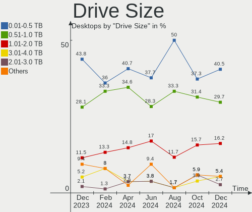
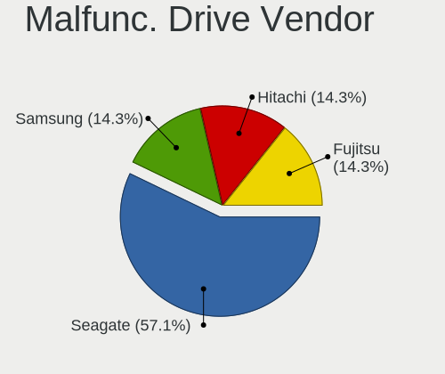
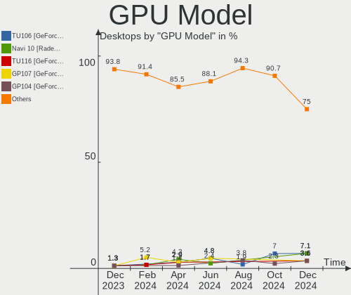

ArcoLinux - Hardware Trends (Desktops)
--------------------------------------

A project to identify most popular hardware characteristics and track their change
over time based on data collected by Linux users at https://Linux-Hardware.org.

Anyone can contribute to this report by the [hw-probe](https://github.com/linuxhw/hw-probe) tool:

    sudo -E hw-probe -all -upload

This report is for one last month. Overall report since the beginning of time: [TestCoverage](https://github.com/linuxhw/TestCoverage)

Period: Nov, 2022.

Contents
--------

* [ System ](#system)
  - [ OS                       ](#os)
  - [ OS Family                ](#os-family)
  - [ Kernel                   ](#kernel)
  - [ Kernel Family            ](#kernel-family)
  - [ Kernel Major Ver.        ](#kernel-major-ver)
  - [ Arch                     ](#arch)
  - [ DE                       ](#de)
  - [ Display Server           ](#display-server)
  - [ Display Manager          ](#display-manager)
  - [ OS Lang                  ](#os-lang)
  - [ Boot Mode                ](#boot-mode)
  - [ Filesystem               ](#filesystem)
  - [ Part. scheme             ](#part-scheme)
  - [ Dual Boot with Linux/BSD ](#dual-boot-with-linuxbsd)
  - [ Dual Boot (Win)          ](#dual-boot-win)

* [ Board ](#board)
  - [ Vendor                   ](#vendor)
  - [ Model                    ](#model)
  - [ Model Family             ](#model-family)
  - [ MFG Year                 ](#mfg-year)
  - [ Form Factor              ](#form-factor)
  - [ Secure Boot              ](#secure-boot)
  - [ Coreboot                 ](#coreboot)
  - [ RAM Size                 ](#ram-size)
  - [ RAM Used                 ](#ram-used)
  - [ Total Drives             ](#total-drives)
  - [ Has CD-ROM               ](#has-cd-rom)
  - [ Has Ethernet             ](#has-ethernet)
  - [ Has WiFi                 ](#has-wifi)
  - [ Has Bluetooth            ](#has-bluetooth)

* [ Location ](#location)
  - [ Country                  ](#country)
  - [ City                     ](#city)

* [ Drives ](#drives)
  - [ Drive Vendor             ](#drive-vendor)
  - [ Drive Model              ](#drive-model)
  - [ HDD Vendor               ](#hdd-vendor)
  - [ SSD Vendor               ](#ssd-vendor)
  - [ Drive Kind               ](#drive-kind)
  - [ Drive Connector          ](#drive-connector)
  - [ Drive Size               ](#drive-size)
  - [ Space Total              ](#space-total)
  - [ Space Used               ](#space-used)
  - [ Malfunc. Drives          ](#malfunc-drives)
  - [ Malfunc. Drive Vendor    ](#malfunc-drive-vendor)
  - [ Malfunc. HDD Vendor      ](#malfunc-hdd-vendor)
  - [ Malfunc. Drive Kind      ](#malfunc-drive-kind)
  - [ Failed Drives            ](#failed-drives)
  - [ Failed Drive Vendor      ](#failed-drive-vendor)
  - [ Drive Status             ](#drive-status)

* [ Storage controller ](#storage-controller)
  - [ Storage Vendor           ](#storage-vendor)
  - [ Storage Model            ](#storage-model)
  - [ Storage Kind             ](#storage-kind)

* [ Processor ](#processor)
  - [ CPU Vendor               ](#cpu-vendor)
  - [ CPU Model                ](#cpu-model)
  - [ CPU Model Family         ](#cpu-model-family)
  - [ CPU Cores                ](#cpu-cores)
  - [ CPU Sockets              ](#cpu-sockets)
  - [ CPU Threads              ](#cpu-threads)
  - [ CPU Op-Modes             ](#cpu-op-modes)
  - [ CPU Microcode            ](#cpu-microcode)
  - [ CPU Microarch            ](#cpu-microarch)

* [ Graphics ](#graphics)
  - [ GPU Vendor               ](#gpu-vendor)
  - [ GPU Model                ](#gpu-model)
  - [ GPU Combo                ](#gpu-combo)
  - [ GPU Driver               ](#gpu-driver)
  - [ GPU Memory               ](#gpu-memory)

* [ Monitor ](#monitor)
  - [ Monitor Vendor           ](#monitor-vendor)
  - [ Monitor Model            ](#monitor-model)
  - [ Monitor Resolution       ](#monitor-resolution)
  - [ Monitor Diagonal         ](#monitor-diagonal)
  - [ Monitor Width            ](#monitor-width)
  - [ Aspect Ratio             ](#aspect-ratio)
  - [ Monitor Area             ](#monitor-area)
  - [ Pixel Density            ](#pixel-density)
  - [ Multiple Monitors        ](#multiple-monitors)

* [ Network ](#network)
  - [ Net Controller Vendor    ](#net-controller-vendor)
  - [ Net Controller Model     ](#net-controller-model)
  - [ Wireless Vendor          ](#wireless-vendor)
  - [ Wireless Model           ](#wireless-model)
  - [ Ethernet Vendor          ](#ethernet-vendor)
  - [ Ethernet Model           ](#ethernet-model)
  - [ Net Controller Kind      ](#net-controller-kind)
  - [ Used Controller          ](#used-controller)
  - [ NICs                     ](#nics)
  - [ IPv6                     ](#ipv6)

* [ Bluetooth ](#bluetooth)
  - [ Bluetooth Vendor         ](#bluetooth-vendor)
  - [ Bluetooth Model          ](#bluetooth-model)

* [ Sound ](#sound)
  - [ Sound Vendor             ](#sound-vendor)
  - [ Sound Model              ](#sound-model)

* [ Memory ](#memory)
  - [ Memory Vendor            ](#memory-vendor)
  - [ Memory Model             ](#memory-model)
  - [ Memory Kind              ](#memory-kind)
  - [ Memory Form Factor       ](#memory-form-factor)
  - [ Memory Size              ](#memory-size)
  - [ Memory Speed             ](#memory-speed)

* [ Printers & scanners ](#printers--scanners)
  - [ Printer Vendor           ](#printer-vendor)
  - [ Printer Model            ](#printer-model)
  - [ Scanner Vendor           ](#scanner-vendor)
  - [ Scanner Model            ](#scanner-model)

* [ Camera ](#camera)
  - [ Camera Vendor            ](#camera-vendor)
  - [ Camera Model             ](#camera-model)

* [ Security ](#security)
  - [ Fingerprint Vendor       ](#fingerprint-vendor)
  - [ Fingerprint Model        ](#fingerprint-model)
  - [ Chipcard Vendor          ](#chipcard-vendor)
  - [ Chipcard Model           ](#chipcard-model)

* [ Unsupported ](#unsupported)
  - [ Unsupported Devices      ](#unsupported-devices)
  - [ Unsupported Device Types ](#unsupported-device-types)

System
------

OS
--

Installed operating systems

| Name              | Desktops | Percent |
|-------------------|----------|---------|
| ArcoLinux Rolling | 28       | 93.33%  |
| ArcoLinux         | 2        | 6.67%   |

OS Family
---------

OS without a version

| Name      | Desktops | Percent |
|-----------|----------|---------|
| ArcoLinux | 30       | 100%    |

Kernel
------

Version of the Linux kernel

| Version                 | Desktops | Percent |
|-------------------------|----------|---------|
| 6.0.9-arch1-1           | 5        | 16.67%  |
| 6.0.8-arch1-1           | 5        | 16.67%  |
| 6.0.8-zen1-1-zen        | 3        | 10%     |
| 6.0.7-x64v1-xanmod1-1.1 | 2        | 6.67%   |
| 6.0.10-arch2-1          | 2        | 6.67%   |
| 5.15.79-1-lts           | 2        | 6.67%   |
| 6.0.9-zen1-1-zen        | 1        | 3.33%   |
| 6.0.7-arch1-1           | 1        | 3.33%   |
| 6.0.7-AMD               | 1        | 3.33%   |
| 6.0.6-arch1-1           | 1        | 3.33%   |
| 6.0.2-zen1-1-zen        | 1        | 3.33%   |
| 6.0.2-x64v2-xanmod1-1   | 1        | 3.33%   |
| 6.0.2-arch1-1           | 1        | 3.33%   |
| 6.0.10-zen2-1-zen       | 1        | 3.33%   |
| 5.17.6-arch1-1          | 1        | 3.33%   |
| 5.16.12-arch1-1         | 1        | 3.33%   |
| 5.15.77-1-lts           | 1        | 3.33%   |

Kernel Family
-------------

Linux kernel without a distro release

| Version | Desktops | Percent |
|---------|----------|---------|
| 6.0.8   | 8        | 26.67%  |
| 6.0.9   | 6        | 20%     |
| 6.0.7   | 4        | 13.33%  |
| 6.0.2   | 3        | 10%     |
| 6.0.10  | 3        | 10%     |
| 5.15.79 | 2        | 6.67%   |
| 6.0.6   | 1        | 3.33%   |
| 5.17.6  | 1        | 3.33%   |
| 5.16.12 | 1        | 3.33%   |
| 5.15.77 | 1        | 3.33%   |

Kernel Major Ver.
-----------------

Linux kernel major version

| Version | Desktops | Percent |
|---------|----------|---------|
| 6.0     | 25       | 83.33%  |
| 5.15    | 3        | 10%     |
| 5.17    | 1        | 3.33%   |
| 5.16    | 1        | 3.33%   |

Arch
----

OS architecture (x86_64, i586, etc.)

| Name   | Desktops | Percent |
|--------|----------|---------|
| x86_64 | 30       | 100%    |

DE
--

Desktop Environment

| Name       | Desktops | Percent |
|------------|----------|---------|
| XFCE       | 14       | 46.67%  |
| KDE5       | 9        | 30%     |
| i3         | 2        | 6.67%   |
| chadwm     | 2        | 6.67%   |
| X-Cinnamon | 1        | 3.33%   |
| qtile      | 1        | 3.33%   |
| awesome    | 1        | 3.33%   |

Display Server
--------------

X11 or Wayland

| Name | Desktops | Percent |
|------|----------|---------|
| X11  | 27       | 90%     |
| Tty  | 3        | 10%     |

Display Manager
---------------

SDDM, LightDM, etc.

| Name    | Desktops | Percent |
|---------|----------|---------|
| SDDM    | 24       | 80%     |
| LightDM | 4        | 13.33%  |
| Unknown | 2        | 6.67%   |

OS Lang
-------

Language

| Lang       | Desktops | Percent |
|------------|----------|---------|
| en_US      | 13       | 43.33%  |
| en_GB      | 4        | 13.33%  |
| de_DE      | 3        | 10%     |
| ru_RU      | 2        | 6.67%   |
| pt_PT      | 1        | 3.33%   |
| hu_HU.UTF8 | 1        | 3.33%   |
| es_MX      | 1        | 3.33%   |
| es_BO      | 1        | 3.33%   |
| en_SG      | 1        | 3.33%   |
| en_CA      | 1        | 3.33%   |
| en_AG      | 1        | 3.33%   |
| C          | 1        | 3.33%   |

Boot Mode
---------

EFI or BIOS

| Mode | Desktops | Percent |
|------|----------|---------|
| EFI  | 25       | 83.33%  |
| BIOS | 5        | 16.67%  |

Filesystem
----------

Type of filesystem

| Type     | Desktops | Percent |
|----------|----------|---------|
| Ext4     | 18       | 60%     |
| Btrfs    | 10       | 33.33%  |
| Reiserfs | 1        | 3.33%   |
| Overlay  | 1        | 3.33%   |

Part. scheme
------------

Scheme of partitioning

| Type    | Desktops | Percent |
|---------|----------|---------|
| GPT     | 26       | 86.67%  |
| MBR     | 2        | 6.67%   |
| Unknown | 2        | 6.67%   |

Dual Boot with Linux/BSD
------------------------

Hosting more than one Linux/BSD

| Dual boot | Desktops | Percent |
|-----------|----------|---------|
| No        | 21       | 70%     |
| Yes       | 9        | 30%     |

Dual Boot (Win)
---------------

Hosting Linux and Windows

| Dual boot | Desktops | Percent |
|-----------|----------|---------|
| No        | 17       | 56.67%  |
| Yes       | 13       | 43.33%  |

Board
-----

Vendor
------

Motherboard manufacturer

| Name                | Desktops | Percent |
|---------------------|----------|---------|
| ASUSTek Computer    | 12       | 40%     |
| MSI                 | 6        | 20%     |
| Hewlett-Packard     | 5        | 16.67%  |
| Gigabyte Technology | 3        | 10%     |
| Dell                | 1        | 3.33%   |
| ASRock              | 1        | 3.33%   |
| Alienware           | 1        | 3.33%   |
| Acer                | 1        | 3.33%   |

Model
-----

Motherboard model

| Name                           | Desktops | Percent |
|--------------------------------|----------|---------|
| ASUS STRIX Z270H GAMING        | 2        | 6.67%   |
| MSI MS-7C91                    | 1        | 3.33%   |
| MSI MS-7C83                    | 1        | 3.33%   |
| MSI MS-7C37                    | 1        | 3.33%   |
| MSI MS-7B89                    | 1        | 3.33%   |
| MSI MS-7A15                    | 1        | 3.33%   |
| MSI A320M-HDV R4.0             | 1        | 3.33%   |
| HP Z2 Tower G5 Workstation     | 1        | 3.33%   |
| HP ProDesk 600 G1 SFF          | 1        | 3.33%   |
| HP OMEN 30L Desktop GT13-1xxx  | 1        | 3.33%   |
| HP Desktop M01-F1xxx           | 1        | 3.33%   |
| HP 500-536d                    | 1        | 3.33%   |
| Gigabyte Z87X-SLI              | 1        | 3.33%   |
| Gigabyte Z690 AORUS ELITE AX   | 1        | 3.33%   |
| Gigabyte B85M-D3H              | 1        | 3.33%   |
| Dell OptiPlex 3050             | 1        | 3.33%   |
| ASUS TUF Gaming X570-PLUS      | 1        | 3.33%   |
| ASUS PRIME Z690-A              | 1        | 3.33%   |
| ASUS PRIME X470-PRO            | 1        | 3.33%   |
| ASUS PRIME B450M-A             | 1        | 3.33%   |
| ASUS PRIME A520M-K             | 1        | 3.33%   |
| ASUS PRIME A320M-K             | 1        | 3.33%   |
| ASUS P8Z77-V LE                | 1        | 3.33%   |
| ASUS P8H61-M LX3 PLUS R2.0     | 1        | 3.33%   |
| ASUS P5K                       | 1        | 3.33%   |
| ASUS H110M-A                   | 1        | 3.33%   |
| ASRock B250M-HDV               | 1        | 3.33%   |
| Alienware Aurora Ryzen Edition | 1        | 3.33%   |
| Acer Predator G3-710           | 1        | 3.33%   |

Model Family
------------

Motherboard model prefix

| Name              | Desktops | Percent |
|-------------------|----------|---------|
| ASUS PRIME        | 5        | 16.67%  |
| ASUS STRIX        | 2        | 6.67%   |
| MSI MS-7C91       | 1        | 3.33%   |
| MSI MS-7C83       | 1        | 3.33%   |
| MSI MS-7C37       | 1        | 3.33%   |
| MSI MS-7B89       | 1        | 3.33%   |
| MSI MS-7A15       | 1        | 3.33%   |
| MSI A320M-HDV     | 1        | 3.33%   |
| HP Z2             | 1        | 3.33%   |
| HP ProDesk        | 1        | 3.33%   |
| HP OMEN           | 1        | 3.33%   |
| HP Desktop        | 1        | 3.33%   |
| HP 500-536d       | 1        | 3.33%   |
| Gigabyte Z87X-SLI | 1        | 3.33%   |
| Gigabyte Z690     | 1        | 3.33%   |
| Gigabyte B85M-D3H | 1        | 3.33%   |
| Dell OptiPlex     | 1        | 3.33%   |
| ASUS TUF          | 1        | 3.33%   |
| ASUS P8Z77-V      | 1        | 3.33%   |
| ASUS P8H61-M      | 1        | 3.33%   |
| ASUS P5K          | 1        | 3.33%   |
| ASUS H110M-A      | 1        | 3.33%   |
| ASRock B250M-HDV  | 1        | 3.33%   |
| Alienware Aurora  | 1        | 3.33%   |
| Acer Predator     | 1        | 3.33%   |

MFG Year
--------

Motherboard manufacture year

| Year | Desktops | Percent |
|------|----------|---------|
| 2021 | 6        | 20%     |
| 2017 | 5        | 16.67%  |
| 2019 | 4        | 13.33%  |
| 2020 | 3        | 10%     |
| 2018 | 2        | 6.67%   |
| 2015 | 2        | 6.67%   |
| 2014 | 2        | 6.67%   |
| 2013 | 2        | 6.67%   |
| 2012 | 2        | 6.67%   |
| 2016 | 1        | 3.33%   |
| 2007 | 1        | 3.33%   |

Form Factor
-----------

Physical design of the computer

| Name    | Desktops | Percent |
|---------|----------|---------|
| Desktop | 30       | 100%    |

Secure Boot
-----------

Enabled or disabled

| State    | Desktops | Percent |
|----------|----------|---------|
| Disabled | 30       | 100%    |

Coreboot
--------

Have coreboot on board

| Used | Desktops | Percent |
|------|----------|---------|
| No   | 30       | 100%    |

RAM Size
--------

Total RAM memory

| Size in GB  | Desktops | Percent |
|-------------|----------|---------|
| 32.01-64.0  | 9        | 30%     |
| 8.01-16.0   | 7        | 23.33%  |
| 4.01-8.0    | 4        | 13.33%  |
| 16.01-24.0  | 4        | 13.33%  |
| 24.01-32.0  | 3        | 10%     |
| 3.01-4.0    | 2        | 6.67%   |
| 64.01-256.0 | 1        | 3.33%   |

RAM Used
--------

Used RAM memory

| Used GB   | Desktops | Percent |
|-----------|----------|---------|
| 1.01-2.0  | 9        | 30%     |
| 4.01-8.0  | 5        | 16.67%  |
| 0.51-1.0  | 5        | 16.67%  |
| 3.01-4.0  | 4        | 13.33%  |
| 2.01-3.0  | 4        | 13.33%  |
| 8.01-16.0 | 3        | 10%     |

Total Drives
------------

Number of drives on board

| Drives | Desktops | Percent |
|--------|----------|---------|
| 3      | 10       | 33.33%  |
| 2      | 8        | 26.67%  |
| 1      | 8        | 26.67%  |
| 4      | 2        | 6.67%   |
| 6      | 1        | 3.33%   |
| 5      | 1        | 3.33%   |

Has CD-ROM
----------

Has CD-ROM on board

| Presented | Desktops | Percent |
|-----------|----------|---------|
| No        | 25       | 83.33%  |
| Yes       | 5        | 16.67%  |

Has Ethernet
------------

Has Ethernet on board

| Presented | Desktops | Percent |
|-----------|----------|---------|
| Yes       | 30       | 100%    |

Has WiFi
--------

Has WiFi module

| Presented | Desktops | Percent |
|-----------|----------|---------|
| No        | 16       | 53.33%  |
| Yes       | 14       | 46.67%  |

Has Bluetooth
-------------

Has Bluetooth module

| Presented | Desktops | Percent |
|-----------|----------|---------|
| No        | 18       | 60%     |
| Yes       | 12       | 40%     |

Location
--------

Country
-------

Geographic location (country)

| Country     | Desktops | Percent |
|-------------|----------|---------|
| USA         | 5        | 16.67%  |
| Belgium     | 4        | 13.33%  |
| UK          | 3        | 10%     |
| Russia      | 2        | 6.67%   |
| Mexico      | 2        | 6.67%   |
| Hungary     | 2        | 6.67%   |
| Germany     | 2        | 6.67%   |
| Romania     | 1        | 3.33%   |
| Portugal    | 1        | 3.33%   |
| Netherlands | 1        | 3.33%   |
| Malaysia    | 1        | 3.33%   |
| Gibraltar   | 1        | 3.33%   |
| France      | 1        | 3.33%   |
| Czechia     | 1        | 3.33%   |
| Canada      | 1        | 3.33%   |
| Brazil      | 1        | 3.33%   |
| Bolivia     | 1        | 3.33%   |

City
----

Geographic location (city)

| City                  | Desktops | Percent |
|-----------------------|----------|---------|
| Duffel                | 3        | 10%     |
| Walhalla              | 1        | 3.33%   |
| Vence                 | 1        | 3.33%   |
| Tacoma                | 1        | 3.33%   |
| Royal Tunbridge Wells | 1        | 3.33%   |
| Roosendaal            | 1        | 3.33%   |
| Prague                | 1        | 3.33%   |
| Pilisszanto           | 1        | 3.33%   |
| Nuevo Laredo          | 1        | 3.33%   |
| Novokuznetsk          | 1        | 3.33%   |
| Newmarket             | 1        | 3.33%   |
| Moscow                | 1        | 3.33%   |
| Milton Keynes         | 1        | 3.33%   |
| Mexico City           | 1        | 3.33%   |
| Malacca               | 1        | 3.33%   |
| Lisbon                | 1        | 3.33%   |
| Kirchheim unter Teck  | 1        | 3.33%   |
| Houston               | 1        | 3.33%   |
| Hercules              | 1        | 3.33%   |
| Gibraltar             | 1        | 3.33%   |
| Dalry                 | 1        | 3.33%   |
| Colfax                | 1        | 3.33%   |
| Cochabamba            | 1        | 3.33%   |
| Campina               | 1        | 3.33%   |
| Budapest              | 1        | 3.33%   |
| Berlin                | 1        | 3.33%   |
| Belo Horizonte        | 1        | 3.33%   |
| Antwerp               | 1        | 3.33%   |

Drives
------

Drive Vendor
------------

Hard drive vendors

| Vendor                      | Desktops | Drives | Percent |
|-----------------------------|----------|--------|---------|
| Seagate                     | 10       | 14     | 16.67%  |
| Samsung Electronics         | 9        | 12     | 15%     |
| WDC                         | 8        | 10     | 13.33%  |
| Kingston                    | 8        | 8      | 13.33%  |
| Toshiba                     | 3        | 4      | 5%      |
| Phison Electronics          | 3        | 3      | 5%      |
| Sandisk                     | 2        | 2      | 3.33%   |
| Intel                       | 2        | 2      | 3.33%   |
| Crucial                     | 2        | 2      | 3.33%   |
| Verbatim                    | 1        | 1      | 1.67%   |
| Unknown                     | 1        | 1      | 1.67%   |
| Union Memory                | 1        | 1      | 1.67%   |
| SPCC                        | 1        | 1      | 1.67%   |
| SK hynix                    | 1        | 1      | 1.67%   |
| Maxtor                      | 1        | 1      | 1.67%   |
| Kingston Technology Company | 1        | 1      | 1.67%   |
| JMicron Technology          | 1        | 1      | 1.67%   |
| Hitachi                     | 1        | 2      | 1.67%   |
| Hewlett-Packard             | 1        | 1      | 1.67%   |
| Corsair                     | 1        | 1      | 1.67%   |
| China                       | 1        | 1      | 1.67%   |
| A-DATA Technology           | 1        | 1      | 1.67%   |

Drive Model
-----------

Hard drive models

| Model                                                | Desktops | Percent |
|------------------------------------------------------|----------|---------|
| Samsung NVMe SSD Controller PM9A1/PM9A3/980PRO 250GB | 3        | 4.35%   |
| Kingston SA400S37240G 240GB SSD                      | 3        | 4.35%   |
| Toshiba XG6 NVMe SSD Controller 256GB                | 2        | 2.9%    |
| Seagate ST2000DM001-1CH164 2TB                       | 2        | 2.9%    |
| Seagate ST1000DM003-1ER162 1TB                       | 2        | 2.9%    |
| Samsung SSD 860 EVO 250GB                            | 2        | 2.9%    |
| Samsung NVMe SSD Controller SM961/PM961/SM963 250GB  | 2        | 2.9%    |
| Phison E16 PCIe4 NVMe Controller 1TB                 | 2        | 2.9%    |
| WDC WDS250G2B0A-00SM50 250GB SSD                     | 1        | 1.45%   |
| WDC WDS240G2G0A-00JH30 240GB SSD                     | 1        | 1.45%   |
| WDC WD84PURZ-85B2YY0 8TB                             | 1        | 1.45%   |
| WDC WD5000AZRX-00A8LB0 500GB                         | 1        | 1.45%   |
| WDC WD5000AAKS-65A7B2 500GB                          | 1        | 1.45%   |
| WDC WD5000AACS-00G8B1 500GB                          | 1        | 1.45%   |
| WDC WD3200AVJS-63B6A0 320GB                          | 1        | 1.45%   |
| WDC WD10EZEX-60WN4A1 1TB                             | 1        | 1.45%   |
| WDC WD10EZEX-22MFCA0 1TB                             | 1        | 1.45%   |
| WDC WD10EZEX-08WN4A0 1TB                             | 1        | 1.45%   |
| Verbatim Portable Drive 1TB                          | 1        | 1.45%   |
| Unknown SD/MMC/MS PRO 8GB                            | 1        | 1.45%   |
| Union Memory UMIS RPJTJ128MEE1MWX 128GB              | 1        | 1.45%   |
| Toshiba HDWD110 1TB                                  | 1        | 1.45%   |
| Toshiba DT01ACA100 1TB                               | 1        | 1.45%   |
| SPCC Solid State Disk 128GB                          | 1        | 1.45%   |
| SK hynix C2S3T/240G 240GB SSD                        | 1        | 1.45%   |
| Seagate ST8000VN004-2M2101 8TB                       | 1        | 1.45%   |
| Seagate ST8000DM004-2CX188 8TB                       | 1        | 1.45%   |
| Seagate ST6000DM003-2CY186 6TB                       | 1        | 1.45%   |
| Seagate ST4000DM004-2CV104 4TB                       | 1        | 1.45%   |
| Seagate ST380815AS 80GB                              | 1        | 1.45%   |
| Seagate ST3500312CS 500GB                            | 1        | 1.45%   |
| Seagate ST2000DM001-1E6164 2TB                       | 1        | 1.45%   |
| Seagate ST1000DM010-2EP102 1TB                       | 1        | 1.45%   |
| Seagate Expansion Desk 8TB                           | 1        | 1.45%   |
| Sandisk WD Blue SN550 NVMe SSD 1TB                   | 1        | 1.45%   |
| SanDisk SDSSDXPS480G 480GB                           | 1        | 1.45%   |
| Samsung SSD 870 QVO 1TB                              | 1        | 1.45%   |
| Samsung SSD 870 EVO 2TB                              | 1        | 1.45%   |
| Samsung SSD 870 EVO 250GB                            | 1        | 1.45%   |
| Samsung SSD 860 EVO 1TB                              | 1        | 1.45%   |

HDD Vendor
----------

Hard disk drive vendors

| Vendor  | Desktops | Drives | Percent |
|---------|----------|--------|---------|
| Seagate | 10       | 14     | 50%     |
| WDC     | 6        | 8      | 30%     |
| Unknown | 1        | 1      | 5%      |
| Toshiba | 1        | 2      | 5%      |
| Maxtor  | 1        | 1      | 5%      |
| Hitachi | 1        | 2      | 5%      |

SSD Vendor
----------

Solid state drive vendors

| Vendor              | Desktops | Drives | Percent |
|---------------------|----------|--------|---------|
| Kingston            | 7        | 7      | 28%     |
| Samsung Electronics | 6        | 6      | 24%     |
| WDC                 | 2        | 2      | 8%      |
| Crucial             | 2        | 2      | 8%      |
| SPCC                | 1        | 1      | 4%      |
| SK hynix            | 1        | 1      | 4%      |
| SanDisk             | 1        | 1      | 4%      |
| JMicron Technology  | 1        | 1      | 4%      |
| Hewlett-Packard     | 1        | 1      | 4%      |
| Corsair             | 1        | 1      | 4%      |
| China               | 1        | 1      | 4%      |
| A-DATA Technology   | 1        | 1      | 4%      |

Drive Kind
----------

HDD or SSD

| Kind    | Desktops | Drives | Percent |
|---------|----------|--------|---------|
| SSD     | 20       | 25     | 37.74%  |
| HDD     | 17       | 28     | 32.08%  |
| NVMe    | 15       | 17     | 28.3%   |
| Unknown | 1        | 1      | 1.89%   |

Drive Connector
---------------

SATA, SAS, NVMe, etc.

| Type | Desktops | Drives | Percent |
|------|----------|--------|---------|
| SATA | 26       | 50     | 59.09%  |
| NVMe | 15       | 17     | 34.09%  |
| SAS  | 3        | 4      | 6.82%   |

Drive Size
----------

Size of hard drive

| Size in TB | Desktops | Drives | Percent |
|------------|----------|--------|---------|
| 0.01-0.5   | 20       | 27     | 50%     |
| 0.51-1.0   | 9        | 12     | 22.5%   |
| 1.01-2.0   | 5        | 5      | 12.5%   |
| 4.01-10.0  | 4        | 6      | 10%     |
| 3.01-4.0   | 1        | 1      | 2.5%    |
| 2.01-3.0   | 1        | 2      | 2.5%    |

Space Total
-----------

Amount of disk space available on the file system

| Size in GB     | Desktops | Percent |
|----------------|----------|---------|
| More than 3000 | 9        | 30%     |
| 501-1000       | 7        | 23.33%  |
| 251-500        | 4        | 13.33%  |
| 101-250        | 4        | 13.33%  |
| 1001-2000      | 4        | 13.33%  |
| 1-20           | 1        | 3.33%   |
| 51-100         | 1        | 3.33%   |

Space Used
----------

Amount of used disk space

| Used GB        | Desktops | Percent |
|----------------|----------|---------|
| 1-20           | 8        | 26.67%  |
| 251-500        | 7        | 23.33%  |
| 51-100         | 5        | 16.67%  |
| 101-250        | 4        | 13.33%  |
| More than 3000 | 3        | 10%     |
| 2001-3000      | 1        | 3.33%   |
| 1001-2000      | 1        | 3.33%   |
| 501-1000       | 1        | 3.33%   |

Malfunc. Drives
---------------

Drive models with a malfunction

| Model                        | Desktops | Drives | Percent |
|------------------------------|----------|--------|---------|
| WDC WD5000AACS-00G8B1 500GB  | 1        | 1      | 16.67%  |
| WDC WD3200AVJS-63B6A0 320GB  | 1        | 1      | 16.67%  |
| Seagate ST3500312CS 500GB    | 1        | 1      | 16.67%  |
| Intel SSD 600P Series 1024GB | 1        | 1      | 16.67%  |
| Corsair CSSD-F60GB2 64GB     | 1        | 1      | 16.67%  |
| China SSD 240GB              | 1        | 1      | 16.67%  |

Malfunc. Drive Vendor
---------------------

Vendors of faulty drives

| Vendor  | Desktops | Drives | Percent |
|---------|----------|--------|---------|
| WDC     | 2        | 2      | 33.33%  |
| Seagate | 1        | 1      | 16.67%  |
| Intel   | 1        | 1      | 16.67%  |
| Corsair | 1        | 1      | 16.67%  |
| China   | 1        | 1      | 16.67%  |

Malfunc. HDD Vendor
-------------------

Vendors of faulty HDD drives

| Vendor  | Desktops | Drives | Percent |
|---------|----------|--------|---------|
| WDC     | 2        | 2      | 66.67%  |
| Seagate | 1        | 1      | 33.33%  |

Malfunc. Drive Kind
-------------------

Kinds of faulty drives

| Kind | Desktops | Drives | Percent |
|------|----------|--------|---------|
| HDD  | 3        | 3      | 50%     |
| SSD  | 2        | 2      | 33.33%  |
| NVMe | 1        | 1      | 16.67%  |

Failed Drives
-------------

Failed drive models

Zero info for selected period =(

Failed Drive Vendor
-------------------

Failed drive vendors

Zero info for selected period =(

Drive Status
------------

Number of failed and malfunc. drives

| Status   | Desktops | Drives | Percent |
|----------|----------|--------|---------|
| Works    | 27       | 54     | 75%     |
| Malfunc  | 5        | 6      | 13.89%  |
| Detected | 4        | 11     | 11.11%  |

Storage controller
------------------

Storage Vendor
--------------

Storage controller vendors

| Vendor                       | Desktops | Percent |
|------------------------------|----------|---------|
| Intel                        | 20       | 41.67%  |
| AMD                          | 11       | 22.92%  |
| Samsung Electronics          | 5        | 10.42%  |
| Phison Electronics           | 3        | 6.25%   |
| Toshiba America Info Systems | 2        | 4.17%   |
| Kingston Technology Company  | 2        | 4.17%   |
| Union Memory (Shenzhen)      | 1        | 2.08%   |
| SanDisk                      | 1        | 2.08%   |
| Marvell Technology Group     | 1        | 2.08%   |
| JMicron Technology           | 1        | 2.08%   |
| ASMedia Technology           | 1        | 2.08%   |

Storage Model
-------------

Storage controller models

| Model                                                                          | Desktops | Percent |
|--------------------------------------------------------------------------------|----------|---------|
| AMD FCH SATA Controller [AHCI mode]                                            | 7        | 12.28%  |
| Intel 200 Series PCH SATA controller [AHCI mode]                               | 4        | 7.02%   |
| AMD 400 Series Chipset SATA Controller                                         | 4        | 7.02%   |
| Samsung NVMe SSD Controller PM9A1/PM9A3/980PRO                                 | 3        | 5.26%   |
| Intel Q170/Q150/B150/H170/H110/Z170/CM236 Chipset SATA Controller [AHCI Mode]  | 3        | 5.26%   |
| Intel 8 Series/C220 Series Chipset Family 6-port SATA Controller 1 [AHCI mode] | 3        | 5.26%   |
| AMD 500 Series Chipset SATA Controller                                         | 3        | 5.26%   |
| Toshiba America Info Systems XG6 NVMe SSD Controller                           | 2        | 3.51%   |
| Samsung NVMe SSD Controller SM961/PM961/SM963                                  | 2        | 3.51%   |
| Phison E16 PCIe4 NVMe Controller                                               | 2        | 3.51%   |
| Intel Alder Lake-S PCH SATA Controller [AHCI Mode]                             | 2        | 3.51%   |
| Intel 400 Series Chipset Family SATA AHCI Controller                           | 2        | 3.51%   |
| AMD FCH SATA Controller D                                                      | 2        | 3.51%   |
| Union Memory (Shenzhen) Non-Volatile memory controller                         | 1        | 1.75%   |
| SanDisk WD Blue SN550 NVMe SSD                                                 | 1        | 1.75%   |
| Samsung NVMe SSD Controller SM981/PM981/PM983                                  | 1        | 1.75%   |
| Phison E12 NVMe Controller                                                     | 1        | 1.75%   |
| Marvell Group 88SE9120 SATA 6Gb/s Controller                                   | 1        | 1.75%   |
| Kingston Company SNVS2000G [NV1 NVMe PCIe SSD 2TB]                             | 1        | 1.75%   |
| Kingston Company A2000 NVMe SSD                                                | 1        | 1.75%   |
| JMicron JMB363 SATA/IDE Controller                                             | 1        | 1.75%   |
| Intel Volume Management Device NVMe RAID Controller                            | 1        | 1.75%   |
| Intel SSD Pro 7600p/760p/E 6100p Series                                        | 1        | 1.75%   |
| Intel SSD 600P Series                                                          | 1        | 1.75%   |
| Intel Comet Lake PCH-H RAID                                                    | 1        | 1.75%   |
| Intel 82801IB (ICH9) 2 port SATA Controller [IDE mode]                         | 1        | 1.75%   |
| Intel 82801I (ICH9 Family) 2 port SATA Controller [IDE mode]                   | 1        | 1.75%   |
| Intel 8 Series/C220 Series Chipset Family 4-port SATA Controller 1 [IDE mode]  | 1        | 1.75%   |
| Intel 7 Series/C210 Series Chipset Family 6-port SATA Controller [AHCI mode]   | 1        | 1.75%   |
| Intel 6 Series/C200 Series Chipset Family 6 port Desktop SATA AHCI Controller  | 1        | 1.75%   |
| ASMedia ASM1062 Serial ATA Controller                                          | 1        | 1.75%   |

Storage Kind
------------

Kind of storage controller (IDE, SATA, NVMe, SAS, ...)

| Kind | Desktops | Percent |
|------|----------|---------|
| SATA | 27       | 58.7%   |
| NVMe | 15       | 32.61%  |
| RAID | 2        | 4.35%   |
| IDE  | 2        | 4.35%   |

Processor
---------

CPU Vendor
----------

Processor vendors

| Vendor | Desktops | Percent |
|--------|----------|---------|
| Intel  | 19       | 63.33%  |
| AMD    | 11       | 36.67%  |

CPU Model
---------

Processor models

| Model                                       | Desktops | Percent |
|---------------------------------------------|----------|---------|
| Intel Core i7-7700K CPU @ 4.20GHz           | 2        | 6.67%   |
| Intel Core i3-7100 CPU @ 3.90GHz            | 2        | 6.67%   |
| AMD Ryzen 5 5600G with Radeon Graphics      | 2        | 6.67%   |
| Intel Pentium Dual CPU E2180 @ 2.00GHz      | 1        | 3.33%   |
| Intel Pentium CPU G4560 @ 3.50GHz           | 1        | 3.33%   |
| Intel Core i7-7700 CPU @ 3.60GHz            | 1        | 3.33%   |
| Intel Core i7-4770 CPU @ 3.40GHz            | 1        | 3.33%   |
| Intel Core i7-3770K CPU @ 3.50GHz           | 1        | 3.33%   |
| Intel Core i7-10700 CPU @ 2.90GHz           | 1        | 3.33%   |
| Intel Core i5-6400 CPU @ 2.70GHz            | 1        | 3.33%   |
| Intel Core i5-4690K CPU @ 3.50GHz           | 1        | 3.33%   |
| Intel Core i5-4570 CPU @ 3.20GHz            | 1        | 3.33%   |
| Intel Core i5-10400F CPU @ 2.90GHz          | 1        | 3.33%   |
| Intel Core i3-4160 CPU @ 3.60GHz            | 1        | 3.33%   |
| Intel Core i3-3240 CPU @ 3.40GHz            | 1        | 3.33%   |
| Intel Core i3-10100 CPU @ 3.60GHz           | 1        | 3.33%   |
| Intel 12th Gen Core i9-12900K               | 1        | 3.33%   |
| Intel 12th Gen Core i5-12600KF              | 1        | 3.33%   |
| AMD Ryzen 9 5900X 12-Core Processor         | 1        | 3.33%   |
| AMD Ryzen 7 5800X 8-Core Processor          | 1        | 3.33%   |
| AMD Ryzen 7 5800 8-Core Processor           | 1        | 3.33%   |
| AMD Ryzen 7 5700X 8-Core Processor          | 1        | 3.33%   |
| AMD Ryzen 7 2700X Eight-Core Processor      | 1        | 3.33%   |
| AMD Ryzen 5 3600X 6-Core Processor          | 1        | 3.33%   |
| AMD Ryzen 5 3600 6-Core Processor           | 1        | 3.33%   |
| AMD Ryzen 3 2200G with Radeon Vega Graphics | 1        | 3.33%   |
| AMD Athlon 3000G with Radeon Vega Graphics  | 1        | 3.33%   |

CPU Model Family
----------------

Processor model prefix

| Model              | Desktops | Percent |
|--------------------|----------|---------|
| Intel Core i7      | 6        | 20%     |
| Intel Core i3      | 5        | 16.67%  |
| Intel Core i5      | 4        | 13.33%  |
| AMD Ryzen 7        | 4        | 13.33%  |
| AMD Ryzen 5        | 4        | 13.33%  |
| Other              | 2        | 6.67%   |
| Intel Pentium Dual | 1        | 3.33%   |
| Intel Pentium      | 1        | 3.33%   |
| AMD Ryzen 9        | 1        | 3.33%   |
| AMD Ryzen 3        | 1        | 3.33%   |
| AMD Athlon         | 1        | 3.33%   |

CPU Cores
---------

Number of processor cores

| Number | Desktops | Percent |
|--------|----------|---------|
| 4      | 10       | 33.33%  |
| 2      | 7        | 23.33%  |
| 8      | 5        | 16.67%  |
| 6      | 5        | 16.67%  |
| 16     | 1        | 3.33%   |
| 12     | 1        | 3.33%   |
| 10     | 1        | 3.33%   |

CPU Sockets
-----------

Number of sockets

| Number | Desktops | Percent |
|--------|----------|---------|
| 1      | 30       | 100%    |

CPU Threads
-----------

Threads per core (Hyper-Threading)

| Number | Desktops | Percent |
|--------|----------|---------|
| 2      | 25       | 83.33%  |
| 1      | 5        | 16.67%  |

CPU Op-Modes
------------

CPU Operation Modes (32-bit, 64-bit)

| Op mode        | Desktops | Percent |
|----------------|----------|---------|
| 32-bit, 64-bit | 30       | 100%    |

CPU Microcode
-------------

Microcode number

| Number     | Desktops | Percent |
|------------|----------|---------|
| 0x906e9    | 6        | 20%     |
| 0x306c3    | 4        | 13.33%  |
| 0xa0655    | 2        | 6.67%   |
| 0x90672    | 2        | 6.67%   |
| 0x306a9    | 2        | 6.67%   |
| 0x0a201016 | 2        | 6.67%   |
| Unknown    | 2        | 6.67%   |
| 0x6fd      | 1        | 3.33%   |
| 0x0a50000d | 1        | 3.33%   |
| 0x0a50000c | 1        | 3.33%   |
| 0x0a20120a | 1        | 3.33%   |
| 0x0a201205 | 1        | 3.33%   |
| 0x08701021 | 1        | 3.33%   |
| 0x08701013 | 1        | 3.33%   |
| 0x08108109 | 1        | 3.33%   |
| 0x08101016 | 1        | 3.33%   |
| 0x0800820d | 1        | 3.33%   |

CPU Microarch
-------------

Microarchitecture

| Name             | Desktops | Percent |
|------------------|----------|---------|
| Zen 3            | 6        | 20%     |
| KabyLake         | 6        | 20%     |
| Haswell          | 4        | 13.33%  |
| CometLake        | 3        | 10%     |
| Zen+             | 2        | 6.67%   |
| Zen 2            | 2        | 6.67%   |
| IvyBridge        | 2        | 6.67%   |
| Alderlake Hybrid | 2        | 6.67%   |
| Zen              | 1        | 3.33%   |
| Skylake          | 1        | 3.33%   |
| Core             | 1        | 3.33%   |

Graphics
--------

GPU Vendor
----------

Vendors of graphics cards

| Vendor | Desktops | Percent |
|--------|----------|---------|
| Nvidia | 12       | 37.5%   |
| Intel  | 12       | 37.5%   |
| AMD    | 8        | 25%     |

GPU Model
---------

Graphics card models

| Model                                                                       | Desktops | Percent |
|-----------------------------------------------------------------------------|----------|---------|
| Intel HD Graphics 630                                                       | 4        | 11.76%  |
| Intel CometLake-S GT2 [UHD Graphics 630]                                    | 2        | 5.88%   |
| AMD Ellesmere [Radeon RX 470/480/570/570X/580/580X/590]                     | 2        | 5.88%   |
| Nvidia TU117GLM [Quadro T1000 Mobile]                                       | 1        | 2.94%   |
| Nvidia TU117 [GeForce GTX 1650]                                             | 1        | 2.94%   |
| Nvidia TU116 [GeForce GTX 1650]                                             | 1        | 2.94%   |
| Nvidia TU106 [GeForce RTX 2070]                                             | 1        | 2.94%   |
| Nvidia TU106 [GeForce RTX 2060 SUPER]                                       | 1        | 2.94%   |
| Nvidia TU106 [GeForce RTX 2060 Rev. A]                                      | 1        | 2.94%   |
| Nvidia GP104 [GeForce GTX 1080]                                             | 1        | 2.94%   |
| Nvidia GM204 [GeForce GTX 970]                                              | 1        | 2.94%   |
| Nvidia GA104 [GeForce RTX 3070]                                             | 1        | 2.94%   |
| Nvidia GA104 [GeForce RTX 3070 Ti]                                          | 1        | 2.94%   |
| Nvidia GA104 [GeForce RTX 3060 Ti Lite Hash Rate]                           | 1        | 2.94%   |
| Nvidia GA102 [GeForce RTX 3080 12GB]                                        | 1        | 2.94%   |
| Intel Xeon E3-1200 v3/4th Gen Core Processor Integrated Graphics Controller | 1        | 2.94%   |
| Intel Xeon E3-1200 v2/3rd Gen Core processor Graphics Controller            | 1        | 2.94%   |
| Intel HD Graphics 610                                                       | 1        | 2.94%   |
| Intel HD Graphics 530                                                       | 1        | 2.94%   |
| Intel AlderLake-S GT1                                                       | 1        | 2.94%   |
| Intel 4th Generation Core Processor Family Integrated Graphics Controller   | 1        | 2.94%   |
| AMD RV630 PRO [Radeon HD 2600 PRO]                                          | 1        | 2.94%   |
| AMD Raven Ridge [Radeon Vega Series / Radeon Vega Mobile Series]            | 1        | 2.94%   |
| AMD Picasso/Raven 2 [Radeon Vega Series / Radeon Vega Mobile Series]        | 1        | 2.94%   |
| AMD Navi 24 [Radeon RX 6400/6500 XT/6500M]                                  | 1        | 2.94%   |
| AMD Navi 23 [Radeon RX 6600/6600 XT/6600M]                                  | 1        | 2.94%   |
| AMD Navi 10 [Radeon RX 5600 OEM/5600 XT / 5700/5700 XT]                     | 1        | 2.94%   |
| AMD Cezanne [Radeon Vega Series / Radeon Vega Mobile Series]                | 1        | 2.94%   |
| AMD Cedar [Radeon HD 5000/6000/7350/8350 Series]                            | 1        | 2.94%   |

GPU Combo
---------

Combinations of graphics cards

| Name           | Desktops | Percent |
|----------------|----------|---------|
| 1 x Nvidia     | 10       | 33.33%  |
| 1 x Intel      | 10       | 33.33%  |
| 1 x AMD        | 6        | 20%     |
| 2 x AMD        | 2        | 6.67%   |
| Intel + Nvidia | 2        | 6.67%   |

GPU Driver
----------

Free vs proprietary

| Driver      | Desktops | Percent |
|-------------|----------|---------|
| Free        | 19       | 63.33%  |
| Proprietary | 9        | 30%     |
| Unknown     | 2        | 6.67%   |

GPU Memory
----------

Total video memory

| Size in GB | Desktops | Percent |
|------------|----------|---------|
| Unknown    | 12       | 40%     |
| 7.01-8.0   | 7        | 23.33%  |
| 3.01-4.0   | 6        | 20%     |
| 0.01-0.5   | 2        | 6.67%   |
| 5.01-6.0   | 1        | 3.33%   |
| 1.01-2.0   | 1        | 3.33%   |
| 8.01-16.0  | 1        | 3.33%   |

Monitor
-------

Monitor Vendor
--------------

Monitor vendors

| Vendor               | Desktops | Percent |
|----------------------|----------|---------|
| Samsung Electronics  | 5        | 15.63%  |
| Dell                 | 5        | 15.63%  |
| ASUSTek Computer     | 4        | 12.5%   |
| Acer                 | 4        | 12.5%   |
| Goldstar             | 3        | 9.38%   |
| Sony                 | 2        | 6.25%   |
| MSI                  | 2        | 6.25%   |
| BenQ                 | 2        | 6.25%   |
| Philips              | 1        | 3.13%   |
| MiTAC                | 1        | 3.13%   |
| Lenovo               | 1        | 3.13%   |
| Hewlett-Packard      | 1        | 3.13%   |
| Ancor Communications | 1        | 3.13%   |

Monitor Model
-------------

Monitor models

| Model                                                                 | Desktops | Percent |
|-----------------------------------------------------------------------|----------|---------|
| Sony TV SNY0801 1360x768                                              | 1        | 2.94%   |
| Sony TV *00 SNY8204 3840x2160 1085x610mm 49.0-inch                    | 1        | 2.94%   |
| Samsung Electronics SA300/SA350 SAM0790 1920x1080 510x287mm 23.0-inch | 1        | 2.94%   |
| Samsung Electronics LCD Monitor SAM0E8C 1920x1080 885x498mm 40.0-inch | 1        | 2.94%   |
| Samsung Electronics LC27T55 SAM701E 1920x1080 610x350mm 27.7-inch     | 1        | 2.94%   |
| Samsung Electronics C32R50x SAM7000 1920x1080 698x393mm 31.5-inch     | 1        | 2.94%   |
| Samsung Electronics C32JG5x SAM0FDE 2560x1440 697x392mm 31.5-inch     | 1        | 2.94%   |
| Samsung Electronics C24F390 SAM0D2C 1920x1080 520x290mm 23.4-inch     | 1        | 2.94%   |
| Philips 247EL PHLC084 1920x1080 521x293mm 23.5-inch                   | 1        | 2.94%   |
| MSI MAG272CQR MSI3CA6 2560x1440 598x336mm 27.0-inch                   | 1        | 2.94%   |
| MSI G24C4 MSI3BA0 1920x1080 520x290mm 23.4-inch                       | 1        | 2.94%   |
| MiTAC DSGi TV SZM0308 1920x1080 880x490mm 39.7-inch                   | 1        | 2.94%   |
| Lenovo LEN P27h-10 LEN61AF 2560x1440 600x340mm 27.2-inch              | 1        | 2.94%   |
| Hewlett-Packard 20wd HWP3144 1600x900 432x239mm 19.4-inch             | 1        | 2.94%   |
| Goldstar M2380D GSM57BC 1920x1080 598x336mm 27.0-inch                 | 1        | 2.94%   |
| Goldstar FULL HD GSM5B55 1920x1080 480x270mm 21.7-inch                | 1        | 2.94%   |
| Goldstar FULL HD GSM5B54 1920x1080 480x270mm 21.7-inch                | 1        | 2.94%   |
| Dell U2415 DELA0B8 1920x1200 518x324mm 24.1-inch                      | 1        | 2.94%   |
| Dell P190S DEL405B 1280x1024 376x301mm 19.0-inch                      | 1        | 2.94%   |
| Dell P190S DEL405A 1280x1024 376x301mm 19.0-inch                      | 1        | 2.94%   |
| Dell E2414H DEL4091 1920x1080 530x300mm 24.0-inch                     | 1        | 2.94%   |
| Dell D3218HN DEL200B 1920x1080 698x393mm 31.5-inch                    | 1        | 2.94%   |
| Dell 1908FP DEL4025 1280x1024 376x301mm 19.0-inch                     | 1        | 2.94%   |
| BenQ GW2780 BNQ78E6 1920x1080 598x336mm 27.0-inch                     | 1        | 2.94%   |
| BenQ GC2870 BNQ78DD 1920x1080 621x341mm 27.9-inch                     | 1        | 2.94%   |
| ASUSTek Computer VZ279 AUS27C0 1920x1080 598x336mm 27.0-inch          | 1        | 2.94%   |
| ASUSTek Computer VG249 AUS2421 1920x1080 530x300mm 24.0-inch          | 1        | 2.94%   |
| ASUSTek Computer VG248 AUS24C2 1920x1080 531x299mm 24.0-inch          | 1        | 2.94%   |
| ASUSTek Computer VG245 AUS24A1 1920x1080 530x300mm 24.0-inch          | 1        | 2.94%   |
| Ancor Communications ASUS VX279 ACI27E4 1920x1080 598x336mm 27.0-inch | 1        | 2.94%   |
| Acer XB241YU ACR0526 2560x1440 527x296mm 23.8-inch                    | 1        | 2.94%   |
| Acer VG271 ACR06E2 1920x1080 598x336mm 27.0-inch                      | 1        | 2.94%   |
| Acer V193HQV ACR027A 1366x768 410x230mm 18.5-inch                     | 1        | 2.94%   |
| Acer AL1916W ACRAD52 1440x900 408x255mm 18.9-inch                     | 1        | 2.94%   |

Monitor Resolution
------------------

Monitor screen resolution

| Resolution        | Desktops | Percent |
|-------------------|----------|---------|
| 1920x1080 (FHD)   | 16       | 51.61%  |
| 2560x1440 (QHD)   | 4        | 12.9%   |
| 3840x2160 (4K)    | 2        | 6.45%   |
| 1280x1024 (SXGA)  | 2        | 6.45%   |
| 2288x1287         | 1        | 3.23%   |
| 1920x540          | 1        | 3.23%   |
| 1920x1200 (WUXGA) | 1        | 3.23%   |
| 1600x900 (HD+)    | 1        | 3.23%   |
| 1440x900 (WXGA+)  | 1        | 3.23%   |
| 1366x768 (WXGA)   | 1        | 3.23%   |
| 1360x768          | 1        | 3.23%   |

Monitor Diagonal
----------------

Diagonal size in inches

| Inches | Desktops | Percent |
|--------|----------|---------|
| 27     | 9        | 29.03%  |
| 24     | 5        | 16.13%  |
| 23     | 4        | 12.9%   |
| 31     | 3        | 9.68%   |
| 19     | 3        | 9.68%   |
| 21     | 2        | 6.45%   |
| 72     | 1        | 3.23%   |
| 65     | 1        | 3.23%   |
| 43     | 1        | 3.23%   |
| 39     | 1        | 3.23%   |
| 18     | 1        | 3.23%   |

Monitor Width
-------------

Physical width

| Width in mm | Desktops | Percent |
|-------------|----------|---------|
| 501-600     | 13       | 43.33%  |
| 601-700     | 6        | 20%     |
| 401-500     | 5        | 16.67%  |
| 351-400     | 2        | 6.67%   |
| 801-900     | 1        | 3.33%   |
| 1501-2000   | 1        | 3.33%   |
| 1001-1500   | 1        | 3.33%   |
| 901-1000    | 1        | 3.33%   |

Aspect Ratio
------------

Proportional relationship between the width and the height

| Ratio | Desktops | Percent |
|-------|----------|---------|
| 16/9  | 24       | 85.71%  |
| 5/4   | 2        | 7.14%   |
| 16/10 | 2        | 7.14%   |

Monitor Area
------------

Area in inch

| Area in inch | Desktops | Percent |
|----------------|----------|---------|
| 301-350        | 9        | 30%     |
| 201-250        | 9        | 30%     |
| 351-500        | 3        | 10%     |
| 151-200        | 3        | 10%     |
| More than 1000 | 2        | 6.67%   |
| 501-1000       | 2        | 6.67%   |
| 251-300        | 1        | 3.33%   |
| 141-150        | 1        | 3.33%   |

Pixel Density
-------------

Pixels per inch

| Density | Desktops | Percent |
|---------|----------|---------|
| 51-100  | 23       | 79.31%  |
| 101-120 | 4        | 13.79%  |
| 1-50    | 1        | 3.45%   |
| 121-160 | 1        | 3.45%   |

Multiple Monitors
-----------------

Total monitors connected

| Total | Desktops | Percent |
|-------|----------|---------|
| 1     | 21       | 70%     |
| 2     | 5        | 16.67%  |
| 3     | 2        | 6.67%   |
| 0     | 2        | 6.67%   |

Network
-------

Net Controller Vendor
---------------------

Controller vendors

| Vendor                          | Desktops | Percent |
|---------------------------------|----------|---------|
| Realtek Semiconductor           | 24       | 54.55%  |
| Intel                           | 13       | 29.55%  |
| Qualcomm Atheros                | 2        | 4.55%   |
| Ralink Technology               | 1        | 2.27%   |
| Qualcomm Atheros Communications | 1        | 2.27%   |
| Microsoft                       | 1        | 2.27%   |
| Huawei Technologies             | 1        | 2.27%   |
| D-Link System                   | 1        | 2.27%   |

Net Controller Model
--------------------

Controller models

| Model                                                                   | Desktops | Percent |
|-------------------------------------------------------------------------|----------|---------|
| Realtek RTL8111/8168/8411 PCI Express Gigabit Ethernet Controller       | 20       | 40.82%  |
| Intel Wi-Fi 6 AX200                                                     | 3        | 6.12%   |
| Intel Ethernet Connection (2) I219-V                                    | 3        | 6.12%   |
| Realtek RTL8125 2.5GbE Controller                                       | 2        | 4.08%   |
| Intel Dual Band Wireless-AC 3168NGW [Stone Peak]                        | 2        | 4.08%   |
| Realtek RTL8822CE 802.11ac PCIe Wireless Network Adapter                | 1        | 2.04%   |
| Realtek RTL8821CE 802.11ac PCIe Wireless Network Adapter                | 1        | 2.04%   |
| Realtek RTL8192CU 802.11n WLAN Adapter                                  | 1        | 2.04%   |
| Realtek RTL8188EE Wireless Network Adapter                              | 1        | 2.04%   |
| Realtek Killer E2600 Gigabit Ethernet Controller                        | 1        | 2.04%   |
| Realtek 8821CE Wireless LAN 802.11ac PCIe NIC                           | 1        | 2.04%   |
| Realtek 802.11ac NIC                                                    | 1        | 2.04%   |
| Ralink RT2870/RT3070 Wireless Adapter                                   | 1        | 2.04%   |
| Qualcomm Atheros AR9271 802.11n                                         | 1        | 2.04%   |
| Qualcomm Atheros Attansic L1 Gigabit Ethernet                           | 1        | 2.04%   |
| Qualcomm Atheros AR9485 Wireless Network Adapter                        | 1        | 2.04%   |
| Microsoft Xbox360 Wireless N Networking Adapter [Atheros AR7010+AR9280] | 1        | 2.04%   |
| Intel I211 Gigabit Network Connection                                   | 1        | 2.04%   |
| Intel Ethernet Controller I225-V                                        | 1        | 2.04%   |
| Intel Ethernet Connection I217-LM                                       | 1        | 2.04%   |
| Intel Ethernet Connection (11) I219-LM                                  | 1        | 2.04%   |
| Intel Alder Lake-S PCH CNVi WiFi                                        | 1        | 2.04%   |
| Huawei SNE-LX1                                                          | 1        | 2.04%   |
| D-Link System DGE-528T Gigabit Ethernet Adapter                         | 1        | 2.04%   |

Wireless Vendor
---------------

Wireless vendors

| Vendor                          | Desktops | Percent |
|---------------------------------|----------|---------|
| Realtek Semiconductor           | 6        | 37.5%   |
| Intel                           | 6        | 37.5%   |
| Ralink Technology               | 1        | 6.25%   |
| Qualcomm Atheros Communications | 1        | 6.25%   |
| Qualcomm Atheros                | 1        | 6.25%   |
| Microsoft                       | 1        | 6.25%   |

Wireless Model
--------------

Wireless models

| Model                                                                   | Desktops | Percent |
|-------------------------------------------------------------------------|----------|---------|
| Intel Wi-Fi 6 AX200                                                     | 3        | 18.75%  |
| Intel Dual Band Wireless-AC 3168NGW [Stone Peak]                        | 2        | 12.5%   |
| Realtek RTL8822CE 802.11ac PCIe Wireless Network Adapter                | 1        | 6.25%   |
| Realtek RTL8821CE 802.11ac PCIe Wireless Network Adapter                | 1        | 6.25%   |
| Realtek RTL8192CU 802.11n WLAN Adapter                                  | 1        | 6.25%   |
| Realtek RTL8188EE Wireless Network Adapter                              | 1        | 6.25%   |
| Realtek 8821CE Wireless LAN 802.11ac PCIe NIC                           | 1        | 6.25%   |
| Realtek 802.11ac NIC                                                    | 1        | 6.25%   |
| Ralink RT2870/RT3070 Wireless Adapter                                   | 1        | 6.25%   |
| Qualcomm Atheros AR9271 802.11n                                         | 1        | 6.25%   |
| Qualcomm Atheros AR9485 Wireless Network Adapter                        | 1        | 6.25%   |
| Microsoft Xbox360 Wireless N Networking Adapter [Atheros AR7010+AR9280] | 1        | 6.25%   |
| Intel Alder Lake-S PCH CNVi WiFi                                        | 1        | 6.25%   |

Ethernet Vendor
---------------

Ethernet vendors

| Vendor                | Desktops | Percent |
|-----------------------|----------|---------|
| Realtek Semiconductor | 22       | 68.75%  |
| Intel                 | 7        | 21.88%  |
| Qualcomm Atheros      | 1        | 3.13%   |
| Huawei Technologies   | 1        | 3.13%   |
| D-Link System         | 1        | 3.13%   |

Ethernet Model
--------------

Ethernet models

| Model                                                             | Desktops | Percent |
|-------------------------------------------------------------------|----------|---------|
| Realtek RTL8111/8168/8411 PCI Express Gigabit Ethernet Controller | 20       | 60.61%  |
| Intel Ethernet Connection (2) I219-V                              | 3        | 9.09%   |
| Realtek RTL8125 2.5GbE Controller                                 | 2        | 6.06%   |
| Realtek Killer E2600 Gigabit Ethernet Controller                  | 1        | 3.03%   |
| Qualcomm Atheros Attansic L1 Gigabit Ethernet                     | 1        | 3.03%   |
| Intel I211 Gigabit Network Connection                             | 1        | 3.03%   |
| Intel Ethernet Controller I225-V                                  | 1        | 3.03%   |
| Intel Ethernet Connection I217-LM                                 | 1        | 3.03%   |
| Intel Ethernet Connection (11) I219-LM                            | 1        | 3.03%   |
| Huawei SNE-LX1                                                    | 1        | 3.03%   |
| D-Link System DGE-528T Gigabit Ethernet Adapter                   | 1        | 3.03%   |

Net Controller Kind
-------------------

Ethernet, WiFi or modem

| Kind     | Desktops | Percent |
|----------|----------|---------|
| Ethernet | 30       | 69.77%  |
| WiFi     | 13       | 30.23%  |

Used Controller
---------------

Currently used network controller

| Kind     | Desktops | Percent |
|----------|----------|---------|
| Ethernet | 24       | 75%     |
| WiFi     | 8        | 25%     |

NICs
----

Total network controllers on board

| Total | Desktops | Percent |
|-------|----------|---------|
| 1     | 18       | 60%     |
| 2     | 11       | 36.67%  |
| 3     | 1        | 3.33%   |

IPv6
----

IPv6 vs IPv4

| Used | Desktops | Percent |
|------|----------|---------|
| No   | 20       | 66.67%  |
| Yes  | 10       | 33.33%  |

Bluetooth
---------

Bluetooth Vendor
----------------

Controller vendors

| Vendor                  | Desktops | Percent |
|-------------------------|----------|---------|
| Intel                   | 4        | 33.33%  |
| ASUSTek Computer        | 3        | 25%     |
| Realtek Semiconductor   | 2        | 16.67%  |
| Cambridge Silicon Radio | 2        | 16.67%  |
| Belkin Components       | 1        | 8.33%   |

Bluetooth Model
---------------

Controller models

| Model                                                 | Desktops | Percent |
|-------------------------------------------------------|----------|---------|
| Intel Wireless-AC 3168 Bluetooth                      | 2        | 16.67%  |
| Cambridge Silicon Radio Bluetooth Dongle (HCI mode)   | 2        | 16.67%  |
| ASUS ASUS USB-BT500                                   | 2        | 16.67%  |
| Realtek  Bluetooth 4.2 Adapter                        | 1        | 8.33%   |
| Realtek Bluetooth Radio                               | 1        | 8.33%   |
| Intel AX201 Bluetooth                                 | 1        | 8.33%   |
| Intel AX200 Bluetooth                                 | 1        | 8.33%   |
| Belkin Components F8T065BF Mini Bluetooth 4.0 Adapter | 1        | 8.33%   |
| ASUS Broadcom BCM20702A0 Bluetooth                    | 1        | 8.33%   |

Sound
-----

Sound Vendor
------------

Sound card vendors

| Vendor              | Desktops | Percent |
|---------------------|----------|---------|
| Intel               | 18       | 36%     |
| AMD                 | 13       | 26%     |
| Nvidia              | 12       | 24%     |
| Kingston Technology | 2        | 4%      |
| RODE Microphones    | 1        | 2%      |
| RME                 | 1        | 2%      |
| JMTek               | 1        | 2%      |
| DSEA A/S            | 1        | 2%      |
| C-Media Electronics | 1        | 2%      |

Sound Model
-----------

Sound card models

| Model                                                                      | Desktops | Percent |
|----------------------------------------------------------------------------|----------|---------|
| AMD Starship/Matisse HD Audio Controller                                   | 6        | 10%     |
| Intel 8 Series/C220 Series Chipset High Definition Audio Controller        | 4        | 6.67%   |
| Intel 200 Series PCH HD Audio                                              | 4        | 6.67%   |
| AMD Family 17h/19h HD Audio Controller                                     | 4        | 6.67%   |
| Nvidia TU106 High Definition Audio Controller                              | 3        | 5%      |
| Nvidia GA104 High Definition Audio Controller                              | 3        | 5%      |
| Nvidia TU107 GeForce GTX 1650 High Definition Audio Controller             | 2        | 3.33%   |
| Intel Xeon E3-1200 v3/4th Gen Core Processor HD Audio Controller           | 2        | 3.33%   |
| Intel Comet Lake PCH-V cAVS                                                | 2        | 3.33%   |
| Intel Alder Lake-S HD Audio Controller                                     | 2        | 3.33%   |
| Intel 100 Series/C230 Series Chipset Family HD Audio Controller            | 2        | 3.33%   |
| AMD Renoir Radeon High Definition Audio Controller                         | 2        | 3.33%   |
| AMD Raven/Raven2/Fenghuang HDMI/DP Audio Controller                        | 2        | 3.33%   |
| AMD Navi 21/23 HDMI/DP Audio Controller                                    | 2        | 3.33%   |
| AMD Ellesmere HDMI Audio [Radeon RX 470/480 / 570/580/590]                 | 2        | 3.33%   |
| RODE Microphones RODE NT-USB                                               | 1        | 1.67%   |
| RME ADI-2 DAC (59920196)                                                   | 1        | 1.67%   |
| Nvidia TU116 High Definition Audio Controller                              | 1        | 1.67%   |
| Nvidia GP104 High Definition Audio Controller                              | 1        | 1.67%   |
| Nvidia GM204 High Definition Audio Controller                              | 1        | 1.67%   |
| Nvidia GA102 High Definition Audio Controller                              | 1        | 1.67%   |
| Kingston Technology HyperX Amp                                             | 1        | 1.67%   |
| Kingston Technology HyperX 7.1 Audio                                       | 1        | 1.67%   |
| JMTek USB PnP Audio Device                                                 | 1        | 1.67%   |
| Intel Comet Lake PCH cAVS                                                  | 1        | 1.67%   |
| Intel 82801I (ICH9 Family) HD Audio Controller                             | 1        | 1.67%   |
| Intel 7 Series/C216 Chipset Family High Definition Audio Controller        | 1        | 1.67%   |
| Intel 6 Series/C200 Series Chipset Family High Definition Audio Controller | 1        | 1.67%   |
| DSEA A/S Sennheiser USB headset                                            | 1        | 1.67%   |
| C-Media Electronics USB Audio Device                                       | 1        | 1.67%   |
| AMD RV630 HDMI Audio [Radeon HD 2600 PRO/XT / HD 3610]                     | 1        | 1.67%   |
| AMD Navi 10 HDMI Audio                                                     | 1        | 1.67%   |
| AMD Family 17h (Models 00h-0fh) HD Audio Controller                        | 1        | 1.67%   |

Memory
------

Memory Vendor
-------------

Memory module vendors

| Vendor              | Desktops | Percent |
|---------------------|----------|---------|
| Corsair             | 9        | 28.13%  |
| Kingston            | 4        | 12.5%   |
| SK hynix            | 3        | 9.38%   |
| Micron Technology   | 3        | 9.38%   |
| Crucial             | 3        | 9.38%   |
| A-DATA Technology   | 3        | 9.38%   |
| Unknown             | 2        | 6.25%   |
| Team                | 1        | 3.13%   |
| Samsung Electronics | 1        | 3.13%   |
| Neo Forza           | 1        | 3.13%   |
| G.Skill             | 1        | 3.13%   |
| Avant               | 1        | 3.13%   |

Memory Model
------------

Memory module models

| Model                                                   | Desktops | Percent |
|---------------------------------------------------------|----------|---------|
| Micron RAM 8JTF51264AZ-1G6E1 4GB DIMM DDR3 1600MT/s     | 2        | 5.88%   |
| Corsair RAM CMK16GX4M2B3000C15 8GB DIMM DDR4 3200MT/s   | 2        | 5.88%   |
| Unknown RAM Module 4GB DIMM DDR3 1600MT/s               | 1        | 2.94%   |
| Unknown RAM Module 1GB DIMM DDR2 800MT/s                | 1        | 2.94%   |
| Team RAM TEAMGROUP-UD4-3200 16GB DIMM DDR4 3733MT/s     | 1        | 2.94%   |
| SK hynix RAM HMT451U6AFR8A-PB 4GB DIMM DDR3 1600MT/s    | 1        | 2.94%   |
| SK hynix RAM HMA851U6AFR6N-UH 4GB DIMM DDR4 2400MT/s    | 1        | 2.94%   |
| SK hynix RAM HMA81GU6AFR8N-UH 8GB DIMM DDR4 2400MT/s    | 1        | 2.94%   |
| Samsung RAM Module 32GB DIMM DDR4 3200MT/s              | 1        | 2.94%   |
| Neo Forza RAM NMUD480E85-2666E 8GB DIMM DDR4 2667MT/s   | 1        | 2.94%   |
| Micron RAM 4ATF51264AZ-2G3B1 4GB DIMM DDR4 2800MT/s     | 1        | 2.94%   |
| Kingston RAM X2YH1K-MIE 16GB DIMM DDR4 3200MT/s         | 1        | 2.94%   |
| Kingston RAM KHX3200C16D4/8GX 8192MB DIMM DDR4 3600MT/s | 1        | 2.94%   |
| Kingston RAM KHX2666C15D4/4G 4GB DIMM DDR4 3200MT/s     | 1        | 2.94%   |
| Kingston RAM 99U5474-013.A00LF 2GB DIMM DDR3 1600MT/s   | 1        | 2.94%   |
| Kingston RAM 9905458-026.A00LF 4GB DIMM DDR3 1333MT/s   | 1        | 2.94%   |
| G.Skill RAM F3-12800CL10-8GBXL 8GB DIMM DDR3 1600MT/s   | 1        | 2.94%   |
| Crucial RAM CT8G4DFS824A.M8FH3 8GB DIMM DDR4 2400MT/s   | 1        | 2.94%   |
| Crucial RAM BLT8G3D1608DT1TX0. 8GB DIMM DDR3 1600MT/s   | 1        | 2.94%   |
| Crucial RAM BL16G32C16U4B.M16FE 16GB DIMM DDR4 3200MT/s | 1        | 2.94%   |
| Corsair RAM CMW32GX4M2Z3600C18 16GB DIMM DDR4 3733MT/s  | 1        | 2.94%   |
| Corsair RAM CML8GX3M2A1600C9 4GB DIMM DDR3 1867MT/s     | 1        | 2.94%   |
| Corsair RAM CML16GX3M2A1600C10 8GB DIMM DDR3 1600MT/s   | 1        | 2.94%   |
| Corsair RAM CMK8GX4M2A2400C16 4GB DIMM DDR4 3020MT/s    | 1        | 2.94%   |
| Corsair RAM CMK32GX5M2B5600C36 16GB DIMM DDR5 5800MT/s  | 1        | 2.94%   |
| Corsair RAM CMK32GX5M2B5200C40 16GB DIMM DDR5 5200MT/s  | 1        | 2.94%   |
| Corsair RAM CMK32GX4M2B3200C16 16GB DIMM DDR4 3400MT/s  | 1        | 2.94%   |
| Corsair RAM CMH32GX4M4E3200C16 8GB DIMM DDR4 3333MT/s   | 1        | 2.94%   |
| Avant RAM W6451U66J7240ND 4GB DIMM DDR4 2400MT/s        | 1        | 2.94%   |
| A-DATA RAM DDR4 3600 2OZ 8GB DIMM DDR4 2667MT/s         | 1        | 2.94%   |
| A-DATA RAM DDR4 3200 8GB DIMM DDR4 3400MT/s             | 1        | 2.94%   |
| A-DATA RAM DDR4 3000 8GB DIMM DDR4 3600MT/s             | 1        | 2.94%   |

Memory Kind
-----------

Memory module kinds

| Kind | Desktops | Percent |
|------|----------|---------|
| DDR4 | 19       | 67.86%  |
| DDR3 | 6        | 21.43%  |
| DDR5 | 2        | 7.14%   |
| DDR2 | 1        | 3.57%   |

Memory Form Factor
------------------

Physical design of the memory module

| Name | Desktops | Percent |
|------|----------|---------|
| DIMM | 28       | 100%    |

Memory Size
-----------

Memory module size

| Size  | Desktops | Percent |
|-------|----------|---------|
| 8192  | 11       | 36.67%  |
| 4096  | 8        | 26.67%  |
| 16384 | 7        | 23.33%  |
| 32768 | 3        | 10%     |
| 1024  | 1        | 3.33%   |

Memory Speed
------------

Memory module speed

| Speed | Desktops | Percent |
|-------|----------|---------|
| 1600  | 6        | 19.35%  |
| 3200  | 4        | 12.9%   |
| 2400  | 3        | 9.68%   |
| 3733  | 2        | 6.45%   |
| 3600  | 2        | 6.45%   |
| 3466  | 2        | 6.45%   |
| 3400  | 2        | 6.45%   |
| 2667  | 2        | 6.45%   |
| 5800  | 1        | 3.23%   |
| 5200  | 1        | 3.23%   |
| 3333  | 1        | 3.23%   |
| 3020  | 1        | 3.23%   |
| 2800  | 1        | 3.23%   |
| 1867  | 1        | 3.23%   |
| 1333  | 1        | 3.23%   |
| 800   | 1        | 3.23%   |

Printers & scanners
-------------------

Printer Vendor
--------------

Printer device vendors

| Vendor   | Desktops | Percent |
|----------|----------|---------|
| Gprinter | 1        | 100%    |

Printer Model
-------------

Printer device models

| Model          | Desktops | Percent |
|----------------|----------|---------|
| Gprinter GP-58 | 1        | 100%    |

Scanner Vendor
--------------

Scanner device vendors

Zero info for selected period =(

Scanner Model
-------------

Scanner device models

Zero info for selected period =(

Camera
------

Camera Vendor
-------------

Camera device vendors

| Vendor   | Desktops | Percent |
|----------|----------|---------|
| Logitech | 2        | 100%    |

Camera Model
------------

Camera device models

| Model                       | Desktops | Percent |
|-----------------------------|----------|---------|
| Logitech Webcam C930e       | 1        | 50%     |
| Logitech C920 PRO HD Webcam | 1        | 50%     |

Security
--------

Fingerprint Vendor
------------------

Fingerprint sensor vendors

Zero info for selected period =(

Fingerprint Model
-----------------

Fingerprint sensor models

Zero info for selected period =(

Chipcard Vendor
---------------

Chipcard module vendors

Zero info for selected period =(

Chipcard Model
--------------

Chipcard module models

Zero info for selected period =(

Unsupported
-----------

Unsupported Devices
-------------------

Total unsupported devices on board

| Total | Desktops | Percent |
|-------|----------|---------|
| 0     | 27       | 90%     |
| 1     | 3        | 10%     |

Unsupported Device Types
------------------------

Types of unsupported devices

| Type          | Desktops | Percent |
|---------------|----------|---------|
| Graphics card | 2        | 66.67%  |
| Net/wireless  | 1        | 33.33%  |

