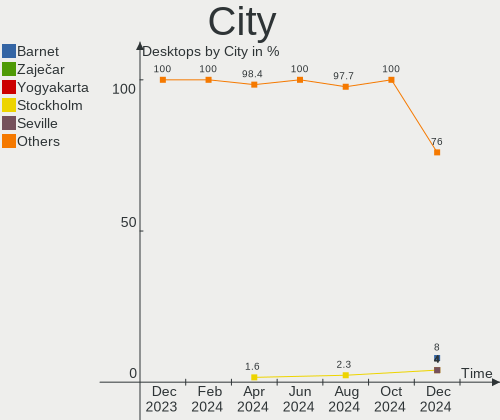
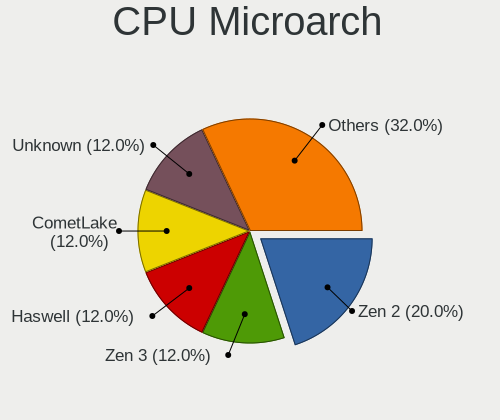
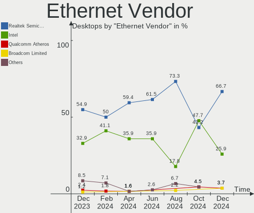
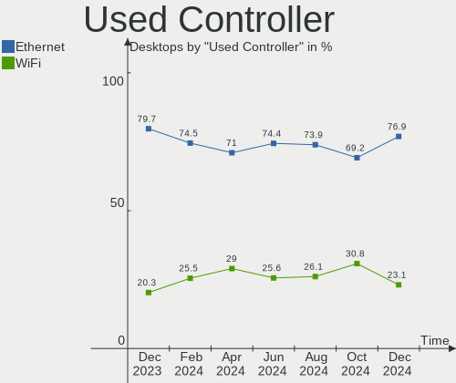

ArcoLinux Hardware Trends (Desktops)
------------------------------------

A project to identify most popular hardware characteristics and track their change
over time based on data collected by ArcoLinux users at https://Linux-Hardware.org.

Anyone can contribute to this report by the [hw-probe](https://github.com/linuxhw/hw-probe) tool:

    sudo -E hw-probe -all -upload

Full-feature report is available here: https://linux-hardware.org/?view=trends

Period: Feb, 2022.

Contents
--------

* [ System ](#system)
  - [ OS                       ](#os)
  - [ OS Family                ](#os-family)
  - [ Kernel                   ](#kernel)
  - [ Kernel Family            ](#kernel-family)
  - [ Kernel Major Ver.        ](#kernel-major-ver)
  - [ Arch                     ](#arch)
  - [ DE                       ](#de)
  - [ Display Server           ](#display-server)
  - [ Display Manager          ](#display-manager)
  - [ OS Lang                  ](#os-lang)
  - [ Boot Mode                ](#boot-mode)
  - [ Filesystem               ](#filesystem)
  - [ Part. scheme             ](#part-scheme)
  - [ Dual Boot with Linux/BSD ](#dual-boot-with-linuxbsd)
  - [ Dual Boot (Win)          ](#dual-boot-win)

* [ Board ](#board)
  - [ Vendor                   ](#vendor)
  - [ Model                    ](#model)
  - [ Model Family             ](#model-family)
  - [ MFG Year                 ](#mfg-year)
  - [ Form Factor              ](#form-factor)
  - [ Secure Boot              ](#secure-boot)
  - [ Coreboot                 ](#coreboot)
  - [ RAM Size                 ](#ram-size)
  - [ RAM Used                 ](#ram-used)
  - [ Total Drives             ](#total-drives)
  - [ Has CD-ROM               ](#has-cd-rom)
  - [ Has Ethernet             ](#has-ethernet)
  - [ Has WiFi                 ](#has-wifi)
  - [ Has Bluetooth            ](#has-bluetooth)

* [ Location ](#location)
  - [ Country                  ](#country)
  - [ City                     ](#city)

* [ Drives ](#drives)
  - [ Drive Vendor             ](#drive-vendor)
  - [ Drive Model              ](#drive-model)
  - [ HDD Vendor               ](#hdd-vendor)
  - [ SSD Vendor               ](#ssd-vendor)
  - [ Drive Kind               ](#drive-kind)
  - [ Drive Connector          ](#drive-connector)
  - [ Drive Size               ](#drive-size)
  - [ Space Total              ](#space-total)
  - [ Space Used               ](#space-used)
  - [ Malfunc. Drives          ](#malfunc-drives)
  - [ Malfunc. Drive Vendor    ](#malfunc-drive-vendor)
  - [ Malfunc. HDD Vendor      ](#malfunc-hdd-vendor)
  - [ Malfunc. Drive Kind      ](#malfunc-drive-kind)
  - [ Failed Drives            ](#failed-drives)
  - [ Failed Drive Vendor      ](#failed-drive-vendor)
  - [ Drive Status             ](#drive-status)

* [ Storage controller ](#storage-controller)
  - [ Storage Vendor           ](#storage-vendor)
  - [ Storage Model            ](#storage-model)
  - [ Storage Kind             ](#storage-kind)

* [ Processor ](#processor)
  - [ CPU Vendor               ](#cpu-vendor)
  - [ CPU Model                ](#cpu-model)
  - [ CPU Model Family         ](#cpu-model-family)
  - [ CPU Cores                ](#cpu-cores)
  - [ CPU Sockets              ](#cpu-sockets)
  - [ CPU Threads              ](#cpu-threads)
  - [ CPU Op-Modes             ](#cpu-op-modes)
  - [ CPU Microcode            ](#cpu-microcode)
  - [ CPU Microarch            ](#cpu-microarch)

* [ Graphics ](#graphics)
  - [ GPU Vendor               ](#gpu-vendor)
  - [ GPU Model                ](#gpu-model)
  - [ GPU Combo                ](#gpu-combo)
  - [ GPU Driver               ](#gpu-driver)
  - [ GPU Memory               ](#gpu-memory)

* [ Monitor ](#monitor)
  - [ Monitor Vendor           ](#monitor-vendor)
  - [ Monitor Model            ](#monitor-model)
  - [ Monitor Resolution       ](#monitor-resolution)
  - [ Monitor Diagonal         ](#monitor-diagonal)
  - [ Monitor Width            ](#monitor-width)
  - [ Aspect Ratio             ](#aspect-ratio)
  - [ Monitor Area             ](#monitor-area)
  - [ Pixel Density            ](#pixel-density)
  - [ Multiple Monitors        ](#multiple-monitors)

* [ Network ](#network)
  - [ Net Controller Vendor    ](#net-controller-vendor)
  - [ Net Controller Model     ](#net-controller-model)
  - [ Wireless Vendor          ](#wireless-vendor)
  - [ Wireless Model           ](#wireless-model)
  - [ Ethernet Vendor          ](#ethernet-vendor)
  - [ Ethernet Model           ](#ethernet-model)
  - [ Net Controller Kind      ](#net-controller-kind)
  - [ Used Controller          ](#used-controller)
  - [ NICs                     ](#nics)
  - [ IPv6                     ](#ipv6)

* [ Bluetooth ](#bluetooth)
  - [ Bluetooth Vendor         ](#bluetooth-vendor)
  - [ Bluetooth Model          ](#bluetooth-model)

* [ Sound ](#sound)
  - [ Sound Vendor             ](#sound-vendor)
  - [ Sound Model              ](#sound-model)

* [ Memory ](#memory)
  - [ Memory Vendor            ](#memory-vendor)
  - [ Memory Model             ](#memory-model)
  - [ Memory Kind              ](#memory-kind)
  - [ Memory Form Factor       ](#memory-form-factor)
  - [ Memory Size              ](#memory-size)
  - [ Memory Speed             ](#memory-speed)

* [ Printers & scanners ](#printers--scanners)
  - [ Printer Vendor           ](#printer-vendor)
  - [ Printer Model            ](#printer-model)
  - [ Scanner Vendor           ](#scanner-vendor)
  - [ Scanner Model            ](#scanner-model)

* [ Camera ](#camera)
  - [ Camera Vendor            ](#camera-vendor)
  - [ Camera Model             ](#camera-model)

* [ Security ](#security)
  - [ Fingerprint Vendor       ](#fingerprint-vendor)
  - [ Fingerprint Model        ](#fingerprint-model)
  - [ Chipcard Vendor          ](#chipcard-vendor)
  - [ Chipcard Model           ](#chipcard-model)

* [ Unsupported ](#unsupported)
  - [ Unsupported Devices      ](#unsupported-devices)
  - [ Unsupported Device Types ](#unsupported-device-types)

System
------

OS
--

Installed operating systems

| Name              | Desktops | Percent |
|-------------------|----------|---------|
| ArcoLinux Rolling | 21       | 95.45%  |
| ArcoLinux         | 1        | 4.55%   |

OS Family
---------

OS without a version

| Name      | Desktops | Percent |
|-----------|----------|---------|
| ArcoLinux | 22       | 100%    |

Kernel
------

Version of the Linux kernel

| Version                      | Desktops | Percent |
|------------------------------|----------|---------|
| 5.16.8-arch1-1               | 3        | 13.64%  |
| 5.16.10-arch1-1              | 3        | 13.64%  |
| 5.16.9-arch1-1               | 2        | 9.09%   |
| 5.16.7-arch1-1               | 2        | 9.09%   |
| 5.16.5-zen1-1-zen            | 2        | 9.09%   |
| 5.16.5-arch1-1               | 2        | 9.09%   |
| 5.16.4-zen1-1-zen            | 1        | 4.55%   |
| 5.16.4-arch1-1               | 1        | 4.55%   |
| 5.16.11-arch1-1              | 1        | 4.55%   |
| 5.16.10-zen1-1-zen           | 1        | 4.55%   |
| 5.15.23-2-lts                | 1        | 4.55%   |
| 5.15.22-1-lts                | 1        | 4.55%   |
| 5.15.19-hardened1-1-hardened | 1        | 4.55%   |
| 5.15.10-arch1-1              | 1        | 4.55%   |

Kernel Family
-------------

Linux kernel without a distro release

| Version | Desktops | Percent |
|---------|----------|---------|
| 5.16.5  | 4        | 18.18%  |
| 5.16.10 | 4        | 18.18%  |
| 5.16.8  | 3        | 13.64%  |
| 5.16.9  | 2        | 9.09%   |
| 5.16.7  | 2        | 9.09%   |
| 5.16.4  | 2        | 9.09%   |
| 5.16.11 | 1        | 4.55%   |
| 5.15.23 | 1        | 4.55%   |
| 5.15.22 | 1        | 4.55%   |
| 5.15.19 | 1        | 4.55%   |
| 5.15.10 | 1        | 4.55%   |

Kernel Major Ver.
-----------------

Linux kernel major version

| Version | Desktops | Percent |
|---------|----------|---------|
| 5.16    | 18       | 81.82%  |
| 5.15    | 4        | 18.18%  |

Arch
----

OS architecture (x86_64, i586, etc.)

| Name   | Desktops | Percent |
|--------|----------|---------|
| x86_64 | 22       | 100%    |

DE
--

Desktop Environment

| Name       | Desktops | Percent |
|------------|----------|---------|
| KDE5       | 9        | 40.91%  |
| XFCE       | 4        | 18.18%  |
| LeftWM     | 3        | 13.64%  |
| X-Cinnamon | 2        | 9.09%   |
| awesome    | 2        | 9.09%   |
| GNOME      | 1        | 4.55%   |
| dwm        | 1        | 4.55%   |

Display Server
--------------

X11 or Wayland

| Name    | Desktops | Percent |
|---------|----------|---------|
| X11     | 19       | 86.36%  |
| Wayland | 3        | 13.64%  |

Display Manager
---------------

SDDM, LightDM, etc.

| Name    | Desktops | Percent |
|---------|----------|---------|
| SDDM    | 17       | 77.27%  |
| LightDM | 4        | 18.18%  |
| Unknown | 1        | 4.55%   |

OS Lang
-------

Language

| Lang  | Desktops | Percent |
|-------|----------|---------|
| en_US | 11       | 50%     |
| en_GB | 4        | 18.18%  |
| sv_SE | 1        | 4.55%   |
| pt_PT | 1        | 4.55%   |
| it_IT | 1        | 4.55%   |
| fr_FR | 1        | 4.55%   |
| es_ES | 1        | 4.55%   |
| en_AU | 1        | 4.55%   |
| de_DE | 1        | 4.55%   |

Boot Mode
---------

EFI or BIOS

| Mode | Desktops | Percent |
|------|----------|---------|
| EFI  | 17       | 77.27%  |
| BIOS | 5        | 22.73%  |

Filesystem
----------

Type of filesystem

| Type    | Desktops | Percent |
|---------|----------|---------|
| Ext4    | 16       | 72.73%  |
| Btrfs   | 4        | 18.18%  |
| Overlay | 1        | 4.55%   |
| Unknown | 1        | 4.55%   |

Part. scheme
------------

Scheme of partitioning

| Type    | Desktops | Percent |
|---------|----------|---------|
| GPT     | 20       | 90.91%  |
| MBR     | 1        | 4.55%   |
| Unknown | 1        | 4.55%   |

Dual Boot with Linux/BSD
------------------------

Hosting more than one Linux/BSD

| Dual boot | Desktops | Percent |
|-----------|----------|---------|
| No        | 12       | 54.55%  |
| Yes       | 10       | 45.45%  |

Dual Boot (Win)
---------------

Hosting Linux and Windows

| Dual boot | Desktops | Percent |
|-----------|----------|---------|
| No        | 12       | 54.55%  |
| Yes       | 10       | 45.45%  |

Board
-----

Vendor
------

Motherboard manufacturer

| Name                | Desktops | Percent |
|---------------------|----------|---------|
| ASUSTek Computer    | 13       | 59.09%  |
| Gigabyte Technology | 4        | 18.18%  |
| Medion              | 1        | 4.55%   |
| Dell                | 1        | 4.55%   |
| Biostar             | 1        | 4.55%   |
| ASRock              | 1        | 4.55%   |
| Unknown             | 1        | 4.55%   |

Model
-----

Motherboard model

| Name                            | Desktops | Percent |
|---------------------------------|----------|---------|
| ASUS PRIME X570-P               | 2        | 9.09%   |
| Medion MS-7707                  | 1        | 4.55%   |
| Gigabyte Nobilis                | 1        | 4.55%   |
| Gigabyte B550 AORUS MASTER      | 1        | 4.55%   |
| Gigabyte B450M DS3H             | 1        | 4.55%   |
| Gigabyte B365M H                | 1        | 4.55%   |
| Dell Vostro 270                 | 1        | 4.55%   |
| Biostar J3060NH                 | 1        | 4.55%   |
| ASUS Z170-A                     | 1        | 4.55%   |
| ASUS Z170 PRO GAMING            | 1        | 4.55%   |
| ASUS TUF Z390M-PRO GAMING       | 1        | 4.55%   |
| ASUS TUF Z390-PRO GAMING        | 1        | 4.55%   |
| ASUS STRIX Z270F GAMING         | 1        | 4.55%   |
| ASUS ROG STRIX X470-F GAMING    | 1        | 4.55%   |
| ASUS ROG STRIX B550-F GAMING    | 1        | 4.55%   |
| ASUS ROG STRIX B450-F GAMING II | 1        | 4.55%   |
| ASUS ROG Maximus XI FORMULA     | 1        | 4.55%   |
| ASUS PRIME Z490-A               | 1        | 4.55%   |
| ASUS CM6870                     | 1        | 4.55%   |
| ASRock B450M Steel Legend       | 1        | 4.55%   |
| Unknown                         | 1        | 4.55%   |

Model Family
------------

Motherboard model prefix

| Name             | Desktops | Percent |
|------------------|----------|---------|
| ASUS ROG         | 4        | 18.18%  |
| ASUS PRIME       | 3        | 13.64%  |
| ASUS TUF         | 2        | 9.09%   |
| Medion MS-7707   | 1        | 4.55%   |
| Gigabyte Nobilis | 1        | 4.55%   |
| Gigabyte B550    | 1        | 4.55%   |
| Gigabyte B450M   | 1        | 4.55%   |
| Gigabyte B365M   | 1        | 4.55%   |
| Dell Vostro      | 1        | 4.55%   |
| Biostar J3060NH  | 1        | 4.55%   |
| ASUS Z170-A      | 1        | 4.55%   |
| ASUS Z170        | 1        | 4.55%   |
| ASUS STRIX       | 1        | 4.55%   |
| ASUS CM6870      | 1        | 4.55%   |
| ASRock B450M     | 1        | 4.55%   |
| Unknown          | 1        | 4.55%   |

MFG Year
--------

Motherboard manufacture year

| Year | Desktops | Percent |
|------|----------|---------|
| 2019 | 5        | 22.73%  |
| 2020 | 4        | 18.18%  |
| 2018 | 4        | 18.18%  |
| 2015 | 3        | 13.64%  |
| 2021 | 1        | 4.55%   |
| 2017 | 1        | 4.55%   |
| 2016 | 1        | 4.55%   |
| 2013 | 1        | 4.55%   |
| 2012 | 1        | 4.55%   |
| 2011 | 1        | 4.55%   |

Form Factor
-----------

Physical design of the computer

| Name    | Desktops | Percent |
|---------|----------|---------|
| Desktop | 22       | 100%    |

Secure Boot
-----------

Enabled or disabled

| State    | Desktops | Percent |
|----------|----------|---------|
| Disabled | 22       | 100%    |

Coreboot
--------

Have coreboot on board

| Used | Desktops | Percent |
|------|----------|---------|
| No   | 22       | 100%    |

RAM Size
--------

Total RAM memory

| Size in GB  | Desktops | Percent |
|-------------|----------|---------|
| 32.01-64.0  | 9        | 40.91%  |
| 8.01-16.0   | 5        | 22.73%  |
| 16.01-24.0  | 4        | 18.18%  |
| 64.01-256.0 | 3        | 13.64%  |
| 4.01-8.0    | 1        | 4.55%   |

RAM Used
--------

Used RAM memory

| Used GB   | Desktops | Percent |
|-----------|----------|---------|
| 1.01-2.0  | 7        | 31.82%  |
| 4.01-8.0  | 5        | 22.73%  |
| 3.01-4.0  | 5        | 22.73%  |
| 2.01-3.0  | 4        | 18.18%  |
| 8.01-16.0 | 1        | 4.55%   |

Total Drives
------------

Number of drives on board

| Drives | Desktops | Percent |
|--------|----------|---------|
| 4      | 6        | 27.27%  |
| 3      | 5        | 22.73%  |
| 2      | 5        | 22.73%  |
| 5      | 2        | 9.09%   |
| 1      | 2        | 9.09%   |
| 7      | 1        | 4.55%   |
| 6      | 1        | 4.55%   |

Has CD-ROM
----------

Has CD-ROM on board

| Presented | Desktops | Percent |
|-----------|----------|---------|
| No        | 14       | 63.64%  |
| Yes       | 8        | 36.36%  |

Has Ethernet
------------

Has Ethernet on board

| Presented | Desktops | Percent |
|-----------|----------|---------|
| Yes       | 22       | 100%    |

Has WiFi
--------

Has WiFi module

| Presented | Desktops | Percent |
|-----------|----------|---------|
| No        | 13       | 59.09%  |
| Yes       | 9        | 40.91%  |

Has Bluetooth
-------------

Has Bluetooth module

| Presented | Desktops | Percent |
|-----------|----------|---------|
| No        | 15       | 68.18%  |
| Yes       | 7        | 31.82%  |

Location
--------

Country
-------

Geographic location (country)

| Country     | Desktops | Percent |
|-------------|----------|---------|
| USA         | 6        | 27.27%  |
| UK          | 2        | 9.09%   |
| Switzerland | 1        | 4.55%   |
| Sweden      | 1        | 4.55%   |
| Spain       | 1        | 4.55%   |
| Romania     | 1        | 4.55%   |
| Portugal    | 1        | 4.55%   |
| Netherlands | 1        | 4.55%   |
| Mexico      | 1        | 4.55%   |
| Italy       | 1        | 4.55%   |
| Germany     | 1        | 4.55%   |
| France      | 1        | 4.55%   |
| Bulgaria    | 1        | 4.55%   |
| Belgium     | 1        | 4.55%   |
| Barbados    | 1        | 4.55%   |
| Australia   | 1        | 4.55%   |

City
----

Geographic location (city)

| City                  | Desktops | Percent |
|-----------------------|----------|---------|
| Wilrijk               | 1        | 4.55%   |
| Rome                  | 1        | 4.55%   |
| Rathfriland           | 1        | 4.55%   |
| Portland              | 1        | 4.55%   |
| Pennsville            | 1        | 4.55%   |
| Olympia               | 1        | 4.55%   |
| Novi Pazar            | 1        | 4.55%   |
| Milton Keynes         | 1        | 4.55%   |
| Martin                | 1        | 4.55%   |
| Los Angeles           | 1        | 4.55%   |
| Leiria                | 1        | 4.55%   |
| Hoellviken            | 1        | 4.55%   |
| Haarlem               | 1        | 4.55%   |
| Dublin                | 1        | 4.55%   |
| Ciudad Nezahualcoyotl | 1        | 4.55%   |
| Carpentras            | 1        | 4.55%   |
| Buchs / Buchs (Dorf)  | 1        | 4.55%   |
| Bucharest             | 1        | 4.55%   |
| Brisbane              | 1        | 4.55%   |
| Bridgetown            | 1        | 4.55%   |
| Bonn                  | 1        | 4.55%   |
| Barcelona             | 1        | 4.55%   |

Drives
------

Drive Vendor
------------

Hard drive vendors

| Vendor              | Desktops | Drives | Percent |
|---------------------|----------|--------|---------|
| WDC                 | 10       | 18     | 18.87%  |
| Samsung Electronics | 10       | 17     | 18.87%  |
| Seagate             | 9        | 14     | 16.98%  |
| Crucial             | 7        | 7      | 13.21%  |
| SanDisk             | 2        | 3      | 3.77%   |
| Phison              | 2        | 2      | 3.77%   |
| XPG                 | 1        | 1      | 1.89%   |
| Transcend           | 1        | 1      | 1.89%   |
| Toshiba             | 1        | 1      | 1.89%   |
| TO Exter            | 1        | 1      | 1.89%   |
| PNY                 | 1        | 1      | 1.89%   |
| Kingston            | 1        | 1      | 1.89%   |
| Intel               | 1        | 1      | 1.89%   |
| Hitachi             | 1        | 1      | 1.89%   |
| Corsair             | 1        | 1      | 1.89%   |
| China               | 1        | 1      | 1.89%   |
| ASMT                | 1        | 1      | 1.89%   |
| ASMedia             | 1        | 1      | 1.89%   |
| A-DATA Technology   | 1        | 1      | 1.89%   |

Drive Model
-----------

Hard drive models

| Model                            | Desktops | Percent |
|----------------------------------|----------|---------|
| WDC WD20EARX-00PASB0 2TB         | 2        | 2.82%   |
| Samsung SSD 970 EVO 500GB        | 2        | 2.82%   |
| Samsung SSD 860 EVO 500GB        | 2        | 2.82%   |
| Samsung SSD 850 EVO 500GB        | 2        | 2.82%   |
| Samsung SSD 850 EVO 250GB        | 2        | 2.82%   |
| Crucial CT500MX500SSD1 500GB     | 2        | 2.82%   |
| Crucial CT1000MX500SSD1 1TB      | 2        | 2.82%   |
| XPG GAMMIX S11 Pro 1TB           | 1        | 1.41%   |
| WDC WDS500G1X0E-00AFY0 500GB     | 1        | 1.41%   |
| WDC WDS250G2B0A-00SM50 250GB SSD | 1        | 1.41%   |
| WDC WD5003ABYX-01WERA2 500GB     | 1        | 1.41%   |
| WDC WD5000HHTZ-75N21V0 500GB     | 1        | 1.41%   |
| WDC WD5000AZRX-00A8LB0 500GB     | 1        | 1.41%   |
| WDC WD5000AAKX-75U6AA0 500GB     | 1        | 1.41%   |
| WDC WD5000AAKX-603CA0 500GB      | 1        | 1.41%   |
| WDC WD4005FZBX-00K5WB0 4TB       | 1        | 1.41%   |
| WDC WD30EZRX-00SPEB0 3TB         | 1        | 1.41%   |
| WDC WD20EZRZ-00Z5HB0 2TB         | 1        | 1.41%   |
| WDC WD10EZEX-75WN4A0 1TB         | 1        | 1.41%   |
| WDC WD10EZEX-60WN4A1 1TB         | 1        | 1.41%   |
| WDC WD10EZEX-08WN4A0 1TB         | 1        | 1.41%   |
| WDC WD1003FBYX-01Y7B1 1TB        | 1        | 1.41%   |
| Transcend TS480GSSD220S 480GB    | 1        | 1.41%   |
| Toshiba DT01ABA100V 1TB          | 1        | 1.41%   |
| TO Exter nal USB 3.0 2TB         | 1        | 1.41%   |
| Seagate ST6000DM003-2CY186 6TB   | 1        | 1.41%   |
| Seagate ST4000DM004-2CV104 4TB   | 1        | 1.41%   |
| Seagate ST3500312CS 500GB        | 1        | 1.41%   |
| Seagate ST330006 51NS 3TB        | 1        | 1.41%   |
| Seagate ST32000542AS 2TB         | 1        | 1.41%   |
| Seagate ST31000528AS 1TB         | 1        | 1.41%   |
| Seagate ST31000524AS 1TB         | 1        | 1.41%   |
| Seagate ST3000DM 001-1E6166 3TB  | 1        | 1.41%   |
| Seagate ST2000DM008-2FR102 2TB   | 1        | 1.41%   |
| Seagate ST2000DM006-2DM164 2TB   | 1        | 1.41%   |
| Seagate ST1000DM010-2EP102 1TB   | 1        | 1.41%   |
| Seagate Expansion HDD 8TB        | 1        | 1.41%   |
| Seagate Desktop 8TB              | 1        | 1.41%   |
| SanDisk Ultra II 240GB SSD       | 1        | 1.41%   |
| SanDisk SSD G5 BICS4 1TB         | 1        | 1.41%   |
| SanDisk SDSSDH3 500G             | 1        | 1.41%   |
| Samsung SSD 980 PRO 1TB          | 1        | 1.41%   |
| Samsung SSD 980 1TB              | 1        | 1.41%   |
| Samsung SSD 970 EVO Plus 250GB   | 1        | 1.41%   |
| Samsung SSD 970 EVO 1TB          | 1        | 1.41%   |
| Samsung SSD 870 QVO 2TB          | 1        | 1.41%   |
| Samsung SSD 860 EVO 250GB        | 1        | 1.41%   |
| Samsung SSD 850 EVO M.2 500GB    | 1        | 1.41%   |
| Samsung Portable SSD T5 1TB      | 1        | 1.41%   |
| Samsung NVMe SSD Drive 1TB       | 1        | 1.41%   |
| PNY CS900 120GB SSD              | 1        | 1.41%   |
| Phison Viper M.2 VPN100 256GB    | 1        | 1.41%   |
| Phison NVMe SSD Drive 1024GB     | 1        | 1.41%   |
| Kingston SA400S37240G 240GB SSD  | 1        | 1.41%   |
| Intel SSDPEKNW010T8 1TB          | 1        | 1.41%   |
| Hitachi HDS723030ALA640 3TB      | 1        | 1.41%   |
| Crucial CT250MX500SSD1 250GB     | 1        | 1.41%   |
| Crucial CT1000P2SSD8 1TB         | 1        | 1.41%   |
| Crucial CT1000MX500SSD4 1TB      | 1        | 1.41%   |
| Corsair Force MP600 500GB        | 1        | 1.41%   |

HDD Vendor
----------

Hard disk drive vendors

| Vendor  | Desktops | Drives | Percent |
|---------|----------|--------|---------|
| WDC     | 10       | 16     | 43.48%  |
| Seagate | 9        | 14     | 39.13%  |
| Toshiba | 1        | 1      | 4.35%   |
| Hitachi | 1        | 1      | 4.35%   |
| ASMT    | 1        | 1      | 4.35%   |
| ASMedia | 1        | 1      | 4.35%   |

SSD Vendor
----------

Solid state drive vendors

| Vendor              | Desktops | Drives | Percent |
|---------------------|----------|--------|---------|
| Samsung Electronics | 8        | 10     | 34.78%  |
| Crucial             | 6        | 6      | 26.09%  |
| SanDisk             | 2        | 3      | 8.7%    |
| WDC                 | 1        | 1      | 4.35%   |
| Transcend           | 1        | 1      | 4.35%   |
| TO Exter            | 1        | 1      | 4.35%   |
| PNY                 | 1        | 1      | 4.35%   |
| Kingston            | 1        | 1      | 4.35%   |
| China               | 1        | 1      | 4.35%   |
| A-DATA Technology   | 1        | 1      | 4.35%   |

Drive Kind
----------

HDD or SSD

| Kind | Desktops | Drives | Percent |
|------|----------|--------|---------|
| SSD  | 18       | 26     | 38.3%   |
| HDD  | 18       | 34     | 38.3%   |
| NVMe | 11       | 14     | 23.4%   |

Drive Connector
---------------

SATA, SAS, NVMe, etc.

| Type | Desktops | Drives | Percent |
|------|----------|--------|---------|
| SATA | 21       | 51     | 55.26%  |
| NVMe | 11       | 14     | 28.95%  |
| SAS  | 6        | 9      | 15.79%  |

Drive Size
----------

Size of hard drive

| Size in TB | Desktops | Drives | Percent |
|------------|----------|--------|---------|
| 0.01-0.5   | 16       | 25     | 39.02%  |
| 0.51-1.0   | 9        | 13     | 21.95%  |
| 1.01-2.0   | 8        | 11     | 19.51%  |
| 2.01-3.0   | 3        | 4      | 7.32%   |
| 4.01-10.0  | 3        | 4      | 7.32%   |
| 3.01-4.0   | 2        | 3      | 4.88%   |

Space Total
-----------

Amount of disk space available on the file system

| Size in GB     | Desktops | Percent |
|----------------|----------|---------|
| More than 3000 | 6        | 27.27%  |
| 1001-2000      | 5        | 22.73%  |
| 251-500        | 4        | 18.18%  |
| 501-1000       | 4        | 18.18%  |
| 2001-3000      | 1        | 4.55%   |
| 101-250        | 1        | 4.55%   |
| Unknown        | 1        | 4.55%   |

Space Used
----------

Amount of used disk space

| Used GB        | Desktops | Percent |
|----------------|----------|---------|
| 1001-2000      | 4        | 18.18%  |
| 501-1000       | 4        | 18.18%  |
| 21-50          | 3        | 13.64%  |
| 1-20           | 3        | 13.64%  |
| More than 3000 | 2        | 9.09%   |
| 251-500        | 2        | 9.09%   |
| 51-100         | 2        | 9.09%   |
| 101-250        | 1        | 4.55%   |
| Unknown        | 1        | 4.55%   |

Malfunc. Drives
---------------

Drive models with a malfunction

| Model                       | Desktops | Drives | Percent |
|-----------------------------|----------|--------|---------|
| WDC WD5000AAKX-603CA0 500GB | 1        | 1      | 20%     |
| WDC WD20EARX-00PASB0 2TB    | 1        | 1      | 20%     |
| Seagate ST3500312CS 500GB   | 1        | 1      | 20%     |
| Seagate ST31000528AS 1TB    | 1        | 1      | 20%     |
| ASMedia AS2115 8TB          | 1        | 1      | 20%     |

Malfunc. Drive Vendor
---------------------

Vendors of faulty drives

| Vendor  | Desktops | Drives | Percent |
|---------|----------|--------|---------|
| WDC     | 2        | 2      | 40%     |
| Seagate | 2        | 2      | 40%     |
| ASMedia | 1        | 1      | 20%     |

Malfunc. HDD Vendor
-------------------

Vendors of faulty HDD drives

| Vendor  | Desktops | Drives | Percent |
|---------|----------|--------|---------|
| WDC     | 2        | 2      | 40%     |
| Seagate | 2        | 2      | 40%     |
| ASMedia | 1        | 1      | 20%     |

Malfunc. Drive Kind
-------------------

Kinds of faulty drives

| Kind | Desktops | Drives | Percent |
|------|----------|--------|---------|
| HDD  | 5        | 5      | 100%    |

Failed Drives
-------------

Failed drive models

Zero info for selected period =(

Failed Drive Vendor
-------------------

Failed drive vendors

Zero info for selected period =(

Drive Status
------------

Number of failed and malfunc. drives

| Status   | Desktops | Drives | Percent |
|----------|----------|--------|---------|
| Works    | 21       | 59     | 67.74%  |
| Detected | 5        | 10     | 16.13%  |
| Malfunc  | 5        | 5      | 16.13%  |

Storage controller
------------------

Storage Vendor
--------------

Storage controller vendors

| Vendor                    | Desktops | Percent |
|---------------------------|----------|---------|
| Intel                     | 14       | 40%     |
| AMD                       | 9        | 25.71%  |
| Samsung Electronics       | 6        | 17.14%  |
| Phison Electronics        | 3        | 8.57%   |
| Sandisk                   | 1        | 2.86%   |
| Micron/Crucial Technology | 1        | 2.86%   |
| ADATA Technology          | 1        | 2.86%   |

Storage Model
-------------

Storage controller models

| Model                                                                            | Desktops | Percent |
|----------------------------------------------------------------------------------|----------|---------|
| Samsung NVMe SSD Controller SM981/PM981/PM983                                    | 5        | 12.82%  |
| AMD FCH SATA Controller [AHCI mode]                                              | 5        | 12.82%  |
| AMD 400 Series Chipset SATA Controller                                           | 4        | 10.26%  |
| Intel Cannon Lake PCH SATA AHCI Controller                                       | 3        | 7.69%   |
| Phison E12 NVMe Controller                                                       | 2        | 5.13%   |
| Intel Q170/Q150/B150/H170/H110/Z170/CM236 Chipset SATA Controller [AHCI Mode]    | 2        | 5.13%   |
| Intel 7 Series/C210 Series Chipset Family 6-port SATA Controller [AHCI mode]     | 2        | 5.13%   |
| Intel 200 Series PCH SATA controller [AHCI mode]                                 | 2        | 5.13%   |
| AMD Starship/Matisse Chipset SATA Controller [AHCI mode]                         | 2        | 5.13%   |
| Sandisk WD PC SN810 / Black SN850 NVMe SSD                                       | 1        | 2.56%   |
| Samsung NVMe SSD Controller PM9A1/PM9A3/980PRO                                   | 1        | 2.56%   |
| Samsung NVMe SSD Controller 980                                                  | 1        | 2.56%   |
| Phison E16 PCIe4 NVMe Controller                                                 | 1        | 2.56%   |
| Micron/Crucial P2 NVMe PCIe SSD                                                  | 1        | 2.56%   |
| Intel SSD 660P Series                                                            | 1        | 2.56%   |
| Intel Comet Lake PCH-H RAID                                                      | 1        | 2.56%   |
| Intel Atom/Celeron/Pentium Processor x5-E8000/J3xxx/N3xxx Series SATA Controller | 1        | 2.56%   |
| Intel 7 Series/C210 Series Chipset Family 4-port SATA Controller [IDE mode]      | 1        | 2.56%   |
| Intel 7 Series/C210 Series Chipset Family 2-port SATA Controller [IDE mode]      | 1        | 2.56%   |
| Intel 6 Series/C200 Series Chipset Family 6 port Desktop SATA AHCI Controller    | 1        | 2.56%   |
| ADATA XPG SX8200 Pro PCIe Gen3x4 M.2 2280 Solid State Drive                      | 1        | 2.56%   |

Storage Kind
------------

Kind of storage controller (IDE, SATA, NVMe, SAS, ...)

| Kind | Desktops | Percent |
|------|----------|---------|
| SATA | 20       | 60.61%  |
| NVMe | 11       | 33.33%  |
| RAID | 1        | 3.03%   |
| IDE  | 1        | 3.03%   |

Processor
---------

CPU Vendor
----------

Processor vendors

| Vendor | Desktops | Percent |
|--------|----------|---------|
| Intel  | 13       | 59.09%  |
| AMD    | 9        | 40.91%  |

CPU Model
---------

Processor models

| Model                                       | Desktops | Percent |
|---------------------------------------------|----------|---------|
| AMD Ryzen 5 3600 6-Core Processor           | 3        | 13.64%  |
| AMD Ryzen 5 5600X 6-Core Processor          | 2        | 9.09%   |
| Intel Pentium CPU G2020 @ 2.90GHz           | 1        | 4.55%   |
| Intel Core i9-9900K CPU @ 3.60GHz           | 1        | 4.55%   |
| Intel Core i7-9700K CPU @ 3.60GHz           | 1        | 4.55%   |
| Intel Core i7-7700 CPU @ 3.60GHz            | 1        | 4.55%   |
| Intel Core i7-6700K CPU @ 4.00GHz           | 1        | 4.55%   |
| Intel Core i7-3820 CPU @ 3.60GHz            | 1        | 4.55%   |
| Intel Core i7-3770 CPU @ 3.40GHz            | 1        | 4.55%   |
| Intel Core i7-10700K CPU @ 3.80GHz          | 1        | 4.55%   |
| Intel Core i5-9600K CPU @ 3.70GHz           | 1        | 4.55%   |
| Intel Core i5-9400F CPU @ 2.90GHz           | 1        | 4.55%   |
| Intel Core i5-6600K CPU @ 3.50GHz           | 1        | 4.55%   |
| Intel Core i5-2300 CPU @ 2.80GHz            | 1        | 4.55%   |
| Intel Celeron CPU J3060 @ 1.60GHz           | 1        | 4.55%   |
| AMD Ryzen 7 5800X 8-Core Processor          | 1        | 4.55%   |
| AMD Ryzen 7 2700X Eight-Core Processor      | 1        | 4.55%   |
| AMD Ryzen 5 3400G with Radeon Vega Graphics | 1        | 4.55%   |
| AMD A6-5400K APU with Radeon HD Graphics    | 1        | 4.55%   |

CPU Model Family
----------------

Processor model prefix

| Model         | Desktops | Percent |
|---------------|----------|---------|
| Intel Core i7 | 6        | 27.27%  |
| AMD Ryzen 5   | 6        | 27.27%  |
| Intel Core i5 | 4        | 18.18%  |
| AMD Ryzen 7   | 2        | 9.09%   |
| Intel Pentium | 1        | 4.55%   |
| Intel Core i9 | 1        | 4.55%   |
| Intel Celeron | 1        | 4.55%   |
| AMD A6        | 1        | 4.55%   |

CPU Cores
---------

Number of processor cores

| Number | Desktops | Percent |
|--------|----------|---------|
| 6      | 7        | 31.82%  |
| 4      | 7        | 31.82%  |
| 8      | 5        | 22.73%  |
| 2      | 2        | 9.09%   |
| 1      | 1        | 4.55%   |

CPU Sockets
-----------

Number of sockets

| Number | Desktops | Percent |
|--------|----------|---------|
| 1      | 22       | 100%    |

CPU Threads
-----------

Threads per core (Hyper-Threading)

| Number | Desktops | Percent |
|--------|----------|---------|
| 2      | 15       | 68.18%  |
| 1      | 7        | 31.82%  |

CPU Op-Modes
------------

CPU Operation Modes (32-bit, 64-bit)

| Op mode        | Desktops | Percent |
|----------------|----------|---------|
| 32-bit, 64-bit | 22       | 100%    |

CPU Microcode
-------------

Microcode number

| Number     | Desktops | Percent |
|------------|----------|---------|
| 0x08701021 | 3        | 13.64%  |
| 0x906ec    | 2        | 9.09%   |
| 0x506e3    | 2        | 9.09%   |
| 0x306a9    | 2        | 9.09%   |
| 0x0a201016 | 2        | 9.09%   |
| 0xa0655    | 1        | 4.55%   |
| 0x906ea    | 1        | 4.55%   |
| 0x906e9    | 1        | 4.55%   |
| 0x406c4    | 1        | 4.55%   |
| 0x206d7    | 1        | 4.55%   |
| 0x206a7    | 1        | 4.55%   |
| 0x0a201009 | 1        | 4.55%   |
| 0x08108109 | 1        | 4.55%   |
| 0x0800820d | 1        | 4.55%   |
| 0x06001119 | 1        | 4.55%   |
| Unknown    | 1        | 4.55%   |

CPU Microarch
-------------

Microarchitecture

| Name        | Desktops | Percent |
|-------------|----------|---------|
| KabyLake    | 5        | 22.73%  |
| Zen 3       | 3        | 13.64%  |
| Zen 2       | 3        | 13.64%  |
| Zen+        | 2        | 9.09%   |
| Skylake     | 2        | 9.09%   |
| SandyBridge | 2        | 9.09%   |
| IvyBridge   | 2        | 9.09%   |
| Silvermont  | 1        | 4.55%   |
| Piledriver  | 1        | 4.55%   |
| CometLake   | 1        | 4.55%   |

Graphics
--------

GPU Vendor
----------

Vendors of graphics cards

| Vendor | Desktops | Percent |
|--------|----------|---------|
| Nvidia | 12       | 48%     |
| AMD    | 8        | 32%     |
| Intel  | 5        | 20%     |

GPU Model
---------

Graphics card models

| Model                                                                                    | Desktops | Percent |
|------------------------------------------------------------------------------------------|----------|---------|
| Nvidia GP106 [GeForce GTX 1060 6GB]                                                      | 2        | 7.69%   |
| Nvidia GP102 [GeForce GTX 1080 Ti]                                                       | 2        | 7.69%   |
| Nvidia TU117 [GeForce GTX 1650]                                                          | 1        | 3.85%   |
| Nvidia TU116 [GeForce GTX 1650 SUPER]                                                    | 1        | 3.85%   |
| Nvidia TU106 [GeForce RTX 2060 SUPER]                                                    | 1        | 3.85%   |
| Nvidia TU106 [GeForce RTX 2060 Rev. A]                                                   | 1        | 3.85%   |
| Nvidia TU104 [GeForce RTX 2080 SUPER]                                                    | 1        | 3.85%   |
| Nvidia GP107 [GeForce GTX 1050]                                                          | 1        | 3.85%   |
| Nvidia GM206 [GeForce GTX 960]                                                           | 1        | 3.85%   |
| Nvidia GA106 [GeForce RTX 3060 Lite Hash Rate]                                           | 1        | 3.85%   |
| Intel Xeon E3-1200 v2/3rd Gen Core processor Graphics Controller                         | 1        | 3.85%   |
| Intel IvyBridge GT2 [HD Graphics 4000]                                                   | 1        | 3.85%   |
| Intel HD Graphics 630                                                                    | 1        | 3.85%   |
| Intel HD Graphics 530                                                                    | 1        | 3.85%   |
| Intel Atom/Celeron/Pentium Processor x5-E8000/J3xxx/N3xxx Integrated Graphics Controller | 1        | 3.85%   |
| AMD Trinity 2 [Radeon HD 7540D]                                                          | 1        | 3.85%   |
| AMD Picasso/Raven 2 [Radeon Vega Series / Radeon Vega Mobile Series]                     | 1        | 3.85%   |
| AMD Navi 21 [Radeon RX 6900 XT]                                                          | 1        | 3.85%   |
| AMD Navi 21 [Radeon RX 6800/6800 XT / 6900 XT]                                           | 1        | 3.85%   |
| AMD Navi 14 [Radeon RX 5500/5500M / Pro 5500M]                                           | 1        | 3.85%   |
| AMD Navi 10 [Radeon RX 5600 OEM/5600 XT / 5700/5700 XT]                                  | 1        | 3.85%   |
| AMD Lexa PRO [Radeon 540/540X/550/550X / RX 540X/550/550X]                               | 1        | 3.85%   |
| AMD Ellesmere [Radeon RX 470/480/570/570X/580/580X/590]                                  | 1        | 3.85%   |
| AMD Caicos XT [Radeon HD 7470/8470 / R5 235/310 OEM]                                     | 1        | 3.85%   |

GPU Combo
---------

Combinations of graphics cards

| Name       | Desktops | Percent |
|------------|----------|---------|
| 1 x Nvidia | 12       | 54.55%  |
| 1 x AMD    | 7        | 31.82%  |
| 1 x Intel  | 2        | 9.09%   |
| 2 x AMD    | 1        | 4.55%   |

GPU Driver
----------

Free vs proprietary

| Driver      | Desktops | Percent |
|-------------|----------|---------|
| Proprietary | 11       | 50%     |
| Free        | 10       | 45.45%  |
| Unknown     | 1        | 4.55%   |

GPU Memory
----------

Total video memory

| Size in GB | Desktops | Percent |
|------------|----------|---------|
| 8.01-16.0  | 5        | 22.73%  |
| 7.01-8.0   | 4        | 18.18%  |
| 5.01-6.0   | 3        | 13.64%  |
| 3.01-4.0   | 3        | 13.64%  |
| 1.01-2.0   | 3        | 13.64%  |
| Unknown    | 3        | 13.64%  |
| 0.51-1.0   | 1        | 4.55%   |

Monitor
-------

Monitor Vendor
--------------

Monitor vendors

| Vendor               | Desktops | Percent |
|----------------------|----------|---------|
| Samsung Electronics  | 5        | 17.24%  |
| Dell                 | 5        | 17.24%  |
| Hewlett-Packard      | 2        | 6.9%    |
| Ancor Communications | 2        | 6.9%    |
| Acer                 | 2        | 6.9%    |
| VIZ                  | 1        | 3.45%   |
| ViewSonic            | 1        | 3.45%   |
| Vestel Elektronik    | 1        | 3.45%   |
| Sony                 | 1        | 3.45%   |
| Nixeus               | 1        | 3.45%   |
| NEC Computers        | 1        | 3.45%   |
| MiTAC                | 1        | 3.45%   |
| Goldstar             | 1        | 3.45%   |
| Gigabyte Technology  | 1        | 3.45%   |
| Eizo                 | 1        | 3.45%   |
| BenQ                 | 1        | 3.45%   |
| Belinea              | 1        | 3.45%   |
| AOC                  | 1        | 3.45%   |

Monitor Model
-------------

Monitor models

| Model                                                                 | Desktops | Percent |
|-----------------------------------------------------------------------|----------|---------|
| VIZ LCD Monitor E60-E3 3840x2160                                      | 1        | 3.13%   |
| ViewSonic VG2756-2K VSC543A 2560x1440 597x336mm 27.0-inch             | 1        | 3.13%   |
| Vestel Elektronik 50UHD_LCD_TV VES3700 3840x2160 1100x620mm 49.7-inch | 1        | 3.13%   |
| Sony TV SNYE903 1920x1080                                             | 1        | 3.13%   |
| Samsung Electronics SyncMaster SAM0274 1440x900 410x260mm 19.1-inch   | 1        | 3.13%   |
| Samsung Electronics SA300/SA350 SAM078F 1920x1080 477x268mm 21.5-inch | 1        | 3.13%   |
| Samsung Electronics LCD Monitor SAM090B 1920x1080 700x390mm 31.5-inch | 1        | 3.13%   |
| Samsung Electronics LCD Monitor SAM07BA 1920x1080 480x270mm 21.7-inch | 1        | 3.13%   |
| Samsung Electronics C27F398 SAM0D45 1920x1080 598x336mm 27.0-inch     | 1        | 3.13%   |
| Samsung Electronics C27F390 SAM0D32 1920x1080 598x336mm 27.0-inch     | 1        | 3.13%   |
| Nixeus NX-VUE24 NIX2415 1920x1080 477x268mm 21.5-inch                 | 1        | 3.13%   |
| NEC Computers PA271W NEC67DA 2560x1440 600x340mm 27.2-inch            | 1        | 3.13%   |
| MiTAC DSGi TV SZM0308 1920x1080 880x490mm 39.7-inch                   | 1        | 3.13%   |
| Hewlett-Packard w2408 HWP26CF 1920x1200 520x320mm 24.0-inch           | 1        | 3.13%   |
| Hewlett-Packard 23f HPN3543 1920x1080 509x286mm 23.0-inch             | 1        | 3.13%   |
| Goldstar 34GL750 GSM773B 2560x1080 800x340mm 34.2-inch                | 1        | 3.13%   |
| Gigabyte Technology M27Q GBT270D 2560x1440 596x335mm 26.9-inch        | 1        | 3.13%   |
| Eizo EV2450 ENC2530 1920x1080 530x300mm 24.0-inch                     | 1        | 3.13%   |
| Dell U2415 DELA0BC 1920x1200 518x324mm 24.1-inch                      | 1        | 3.13%   |
| Dell U2415 DELA0B9 1920x1200 518x324mm 24.1-inch                      | 1        | 3.13%   |
| Dell U2412M DELA07B 1920x1200 518x324mm 24.1-inch                     | 1        | 3.13%   |
| Dell SX2210 DELA046 1920x1080 477x268mm 21.5-inch                     | 1        | 3.13%   |
| Dell S2721DGF DEL41D9 2560x1440 597x336mm 27.0-inch                   | 1        | 3.13%   |
| Dell E207WFP DELD011 1680x1050 430x270mm 20.0-inch                    | 1        | 3.13%   |
| BenQ GW2780 BNQ78E6 1920x1080 598x336mm 27.0-inch                     | 1        | 3.13%   |
| Belinea 1705 S1 MAX06DA 1280x1024 337x270mm 17.0-inch                 | 1        | 3.13%   |
| AOC Q2963 AOC2963 2560x1080 670x280mm 28.6-inch                       | 1        | 3.13%   |
| Ancor Communications ROG PG279Q ACI27EC 2560x1440 598x336mm 27.0-inch | 1        | 3.13%   |
| Ancor Communications ASUS VG27A ACI27C2 1920x1080 598x336mm 27.0-inch | 1        | 3.13%   |
| Acer VG270U ACR0691 2560x1440 597x336mm 27.0-inch                     | 1        | 3.13%   |
| Acer S240HL ACR0289 1920x1080 530x300mm 24.0-inch                     | 1        | 3.13%   |
| Acer S230HL ACR0280 1920x1080 509x286mm 23.0-inch                     | 1        | 3.13%   |

Monitor Resolution
------------------

Monitor screen resolution

| Resolution         | Desktops | Percent |
|--------------------|----------|---------|
| 1920x1080 (FHD)    | 13       | 50%     |
| 2560x1440 (QHD)    | 4        | 15.38%  |
| 3840x2160 (4K)     | 2        | 7.69%   |
| 2560x1080          | 2        | 7.69%   |
| 1920x540           | 1        | 3.85%   |
| 1920x1200 (WUXGA)  | 1        | 3.85%   |
| 1680x1050 (WSXGA+) | 1        | 3.85%   |
| 1440x900 (WXGA+)   | 1        | 3.85%   |
| 1280x1024 (SXGA)   | 1        | 3.85%   |

Monitor Diagonal
----------------

Diagonal size in inches

| Inches  | Desktops | Percent |
|---------|----------|---------|
| 27      | 6        | 21.43%  |
| 24      | 4        | 14.29%  |
| 21      | 3        | 10.71%  |
| 40      | 2        | 7.14%   |
| 23      | 2        | 7.14%   |
| 84      | 1        | 3.57%   |
| 72      | 1        | 3.57%   |
| 54      | 1        | 3.57%   |
| 39      | 1        | 3.57%   |
| 34      | 1        | 3.57%   |
| 31      | 1        | 3.57%   |
| 28      | 1        | 3.57%   |
| 20      | 1        | 3.57%   |
| 19      | 1        | 3.57%   |
| 17      | 1        | 3.57%   |
| Unknown | 1        | 3.57%   |

Monitor Width
-------------

Physical width

| Width in mm | Desktops | Percent |
|-------------|----------|---------|
| 501-600     | 10       | 38.46%  |
| 401-500     | 5        | 19.23%  |
| 801-900     | 3        | 11.54%  |
| 601-700     | 2        | 7.69%   |
| 1501-2000   | 2        | 7.69%   |
| 701-800     | 1        | 3.85%   |
| 301-350     | 1        | 3.85%   |
| 1001-1500   | 1        | 3.85%   |
| Unknown     | 1        | 3.85%   |

Aspect Ratio
------------

Proportional relationship between the width and the height

| Ratio   | Desktops | Percent |
|---------|----------|---------|
| 16/9    | 17       | 68%     |
| 16/10   | 4        | 16%     |
| 21/9    | 2        | 8%      |
| 5/4     | 1        | 4%      |
| Unknown | 1        | 4%      |

Monitor Area
------------

Area in inch

| Area in inch | Desktops | Percent |
|----------------|----------|---------|
| 301-350        | 6        | 22.22%  |
| 201-250        | 4        | 14.81%  |
| 151-200        | 4        | 14.81%  |
| More than 1000 | 3        | 11.11%  |
| 251-300        | 3        | 11.11%  |
| 501-1000       | 3        | 11.11%  |
| 351-500        | 2        | 7.41%   |
| 141-150        | 1        | 3.7%    |
| Unknown        | 1        | 3.7%    |

Pixel Density
-------------

Pixels per inch

| Density | Desktops | Percent |
|---------|----------|---------|
| 51-100  | 14       | 60.87%  |
| 101-120 | 6        | 26.09%  |
| 1-50    | 2        | 8.7%    |
| Unknown | 1        | 4.35%   |

Multiple Monitors
-----------------

Total monitors connected

| Total | Desktops | Percent |
|-------|----------|---------|
| 1     | 11       | 50%     |
| 2     | 8        | 36.36%  |
| 4     | 2        | 9.09%   |
| 0     | 1        | 4.55%   |

Network
-------

Net Controller Vendor
---------------------

Controller vendors

| Vendor                | Desktops | Percent |
|-----------------------|----------|---------|
| Realtek Semiconductor | 13       | 44.83%  |
| Intel                 | 12       | 41.38%  |
| Ralink                | 1        | 3.45%   |
| Qualcomm Atheros      | 1        | 3.45%   |
| DisplayLink           | 1        | 3.45%   |
| Aquantia              | 1        | 3.45%   |

Net Controller Model
--------------------

Controller models

| Model                                                             | Desktops | Percent |
|-------------------------------------------------------------------|----------|---------|
| Realtek RTL8111/8168/8411 PCI Express Gigabit Ethernet Controller | 10       | 28.57%  |
| Intel Ethernet Connection (7) I219-V                              | 3        | 8.57%   |
| Intel Ethernet Connection (2) I219-V                              | 3        | 8.57%   |
| Realtek RTL8153 Gigabit Ethernet Adapter                          | 2        | 5.71%   |
| Intel I211 Gigabit Network Connection                             | 2        | 5.71%   |
| Intel Ethernet Controller I225-V                                  | 2        | 5.71%   |
| Intel Cannon Lake PCH CNVi WiFi                                   | 2        | 5.71%   |
| Realtek RTL8822BE 802.11a/b/g/n/ac WiFi adapter                   | 1        | 2.86%   |
| Realtek RTL8821AE 802.11ac PCIe Wireless Network Adapter          | 1        | 2.86%   |
| Realtek RTL8192EE PCIe Wireless Network Adapter                   | 1        | 2.86%   |
| Realtek RTL8188EUS 802.11n Wireless Network Adapter               | 1        | 2.86%   |
| Realtek RTL8125 2.5GbE Controller                                 | 1        | 2.86%   |
| Ralink RT3090 Wireless 802.11n 1T/1R PCIe                         | 1        | 2.86%   |
| Qualcomm Atheros AR9485 Wireless Network Adapter                  | 1        | 2.86%   |
| Intel Wi-Fi 6 AX200                                               | 1        | 2.86%   |
| Intel 82579V Gigabit Network Connection                           | 1        | 2.86%   |
| DisplayLink USB 3.0 Dual Video Dock                               | 1        | 2.86%   |
| Aquantia AQC111 NBase-T/IEEE 802.3bz Ethernet Controller [AQtion] | 1        | 2.86%   |

Wireless Vendor
---------------

Wireless vendors

| Vendor                | Desktops | Percent |
|-----------------------|----------|---------|
| Realtek Semiconductor | 4        | 44.44%  |
| Intel                 | 3        | 33.33%  |
| Ralink                | 1        | 11.11%  |
| Qualcomm Atheros      | 1        | 11.11%  |

Wireless Model
--------------

Wireless models

| Model                                                    | Desktops | Percent |
|----------------------------------------------------------|----------|---------|
| Intel Cannon Lake PCH CNVi WiFi                          | 2        | 22.22%  |
| Realtek RTL8822BE 802.11a/b/g/n/ac WiFi adapter          | 1        | 11.11%  |
| Realtek RTL8821AE 802.11ac PCIe Wireless Network Adapter | 1        | 11.11%  |
| Realtek RTL8192EE PCIe Wireless Network Adapter          | 1        | 11.11%  |
| Realtek RTL8188EUS 802.11n Wireless Network Adapter      | 1        | 11.11%  |
| Ralink RT3090 Wireless 802.11n 1T/1R PCIe                | 1        | 11.11%  |
| Qualcomm Atheros AR9485 Wireless Network Adapter         | 1        | 11.11%  |
| Intel Wi-Fi 6 AX200                                      | 1        | 11.11%  |

Ethernet Vendor
---------------

Ethernet vendors

| Vendor                | Desktops | Percent |
|-----------------------|----------|---------|
| Realtek Semiconductor | 12       | 48%     |
| Intel                 | 11       | 44%     |
| DisplayLink           | 1        | 4%      |
| Aquantia              | 1        | 4%      |

Ethernet Model
--------------

Ethernet models

| Model                                                             | Desktops | Percent |
|-------------------------------------------------------------------|----------|---------|
| Realtek RTL8111/8168/8411 PCI Express Gigabit Ethernet Controller | 10       | 38.46%  |
| Intel Ethernet Connection (7) I219-V                              | 3        | 11.54%  |
| Intel Ethernet Connection (2) I219-V                              | 3        | 11.54%  |
| Realtek RTL8153 Gigabit Ethernet Adapter                          | 2        | 7.69%   |
| Intel I211 Gigabit Network Connection                             | 2        | 7.69%   |
| Intel Ethernet Controller I225-V                                  | 2        | 7.69%   |
| Realtek RTL8125 2.5GbE Controller                                 | 1        | 3.85%   |
| Intel 82579V Gigabit Network Connection                           | 1        | 3.85%   |
| DisplayLink USB 3.0 Dual Video Dock                               | 1        | 3.85%   |
| Aquantia AQC111 NBase-T/IEEE 802.3bz Ethernet Controller [AQtion] | 1        | 3.85%   |

Net Controller Kind
-------------------

Ethernet, WiFi or modem

| Kind     | Desktops | Percent |
|----------|----------|---------|
| Ethernet | 22       | 70.97%  |
| WiFi     | 9        | 29.03%  |

Used Controller
---------------

Currently used network controller

| Kind     | Desktops | Percent |
|----------|----------|---------|
| Ethernet | 20       | 83.33%  |
| WiFi     | 4        | 16.67%  |

NICs
----

Total network controllers on board

| Total | Desktops | Percent |
|-------|----------|---------|
| 1     | 14       | 63.64%  |
| 2     | 7        | 31.82%  |
| 3     | 1        | 4.55%   |

IPv6
----

IPv6 vs IPv4

| Used | Desktops | Percent |
|------|----------|---------|
| No   | 18       | 81.82%  |
| Yes  | 4        | 18.18%  |

Bluetooth
---------

Bluetooth Vendor
----------------

Controller vendors

| Vendor                  | Desktops | Percent |
|-------------------------|----------|---------|
| Intel                   | 3        | 42.86%  |
| Cambridge Silicon Radio | 3        | 42.86%  |
| Realtek Semiconductor   | 1        | 14.29%  |

Bluetooth Model
---------------

Controller models

| Model                                               | Desktops | Percent |
|-----------------------------------------------------|----------|---------|
| Cambridge Silicon Radio Bluetooth Dongle (HCI mode) | 3        | 42.86%  |
| Intel Bluetooth Device                              | 2        | 28.57%  |
| Realtek Bluetooth Radio                             | 1        | 14.29%  |
| Intel AX200 Bluetooth                               | 1        | 14.29%  |

Sound
-----

Sound Vendor
------------

Sound card vendors

| Vendor                    | Desktops | Percent |
|---------------------------|----------|---------|
| Nvidia                    | 12       | 25.53%  |
| Intel                     | 12       | 25.53%  |
| AMD                       | 11       | 23.4%   |
| Yamaha                    | 1        | 2.13%   |
| Sennheiser Communications | 1        | 2.13%   |
| SAVITECH                  | 1        | 2.13%   |
| RODE Microphones          | 1        | 2.13%   |
| Razer USA                 | 1        | 2.13%   |
| Kingston Technology       | 1        | 2.13%   |
| Generalplus Technology    | 1        | 2.13%   |
| Creative Technology       | 1        | 2.13%   |
| Cambridge Silicon Radio   | 1        | 2.13%   |
| C-Media Electronics       | 1        | 2.13%   |
| Blue Microphones          | 1        | 2.13%   |
| ASUSTek Computer          | 1        | 2.13%   |

Sound Model
-----------

Sound card models

| Model                                                                                             | Desktops | Percent |
|---------------------------------------------------------------------------------------------------|----------|---------|
| AMD Starship/Matisse HD Audio Controller                                                          | 6        | 11.32%  |
| Intel Cannon Lake PCH cAVS                                                                        | 3        | 5.66%   |
| Intel 7 Series/C216 Chipset Family High Definition Audio Controller                               | 3        | 5.66%   |
| Nvidia TU106 High Definition Audio Controller                                                     | 2        | 3.77%   |
| Nvidia GP106 High Definition Audio Controller                                                     | 2        | 3.77%   |
| Nvidia GP102 HDMI Audio Controller                                                                | 2        | 3.77%   |
| Intel 200 Series PCH HD Audio                                                                     | 2        | 3.77%   |
| AMD Navi 21 HDMI Audio [Radeon RX 6800/6800 XT / 6900 XT]                                         | 2        | 3.77%   |
| Yamaha Steinberg UR22mkII                                                                         | 1        | 1.89%   |
| Sennheiser Communications SC260 for MS II                                                         | 1        | 1.89%   |
| SAVITECH SA9023 USB Audio                                                                         | 1        | 1.89%   |
| RODE Microphones RODE NT-USB                                                                      | 1        | 1.89%   |
| Razer USA RC30-026902, Gaming Headset [Nari Essential, Wireless, Receiver]                        | 1        | 1.89%   |
| Nvidia TU116 High Definition Audio Controller                                                     | 1        | 1.89%   |
| Nvidia TU107 GeForce GTX 1650 High Definition Audio Controller                                    | 1        | 1.89%   |
| Nvidia TU104 HD Audio Controller                                                                  | 1        | 1.89%   |
| Nvidia GP107GL High Definition Audio Controller                                                   | 1        | 1.89%   |
| Nvidia GM206 High Definition Audio Controller                                                     | 1        | 1.89%   |
| Nvidia Audio device                                                                               | 1        | 1.89%   |
| Kingston Technology HyperX 7.1 Audio                                                              | 1        | 1.89%   |
| Intel Comet Lake PCH cAVS                                                                         | 1        | 1.89%   |
| Intel Atom/Celeron/Pentium Processor x5-E8000/J3xxx/N3xxx Series High Definition Audio Controller | 1        | 1.89%   |
| Intel 6 Series/C200 Series Chipset Family High Definition Audio Controller                        | 1        | 1.89%   |
| Intel 100 Series/C230 Series Chipset Family HD Audio Controller                                   | 1        | 1.89%   |
| Generalplus Technology USB Audio Device                                                           | 1        | 1.89%   |
| Creative Technology SB Omni Surround 5.1                                                          | 1        | 1.89%   |
| Cambridge Silicon Radio Audioengine HD3                                                           | 1        | 1.89%   |
| C-Media Electronics USB Audio Device                                                              | 1        | 1.89%   |
| Blue Microphones Yeti Stereo Microphone                                                           | 1        | 1.89%   |
| ASUSTek Computer STRIX SOUND CARD                                                                 | 1        | 1.89%   |
| AMD Trinity HDMI Audio Controller                                                                 | 1        | 1.89%   |
| AMD Raven/Raven2/Fenghuang HDMI/DP Audio Controller                                               | 1        | 1.89%   |
| AMD Navi 10 HDMI Audio                                                                            | 1        | 1.89%   |
| AMD FCH Azalia Controller                                                                         | 1        | 1.89%   |
| AMD Family 17h/19h HD Audio Controller                                                            | 1        | 1.89%   |
| AMD Family 17h (Models 00h-0fh) HD Audio Controller                                               | 1        | 1.89%   |
| AMD Ellesmere HDMI Audio [Radeon RX 470/480 / 570/580/590]                                        | 1        | 1.89%   |
| AMD Caicos HDMI Audio [Radeon HD 6450 / 7450/8450/8490 OEM / R5 230/235/235X OEM]                 | 1        | 1.89%   |
| AMD Baffin HDMI/DP Audio [Radeon RX 550 640SP / RX 560/560X]                                      | 1        | 1.89%   |

Memory
------

Memory Vendor
-------------

Memory module vendors

| Vendor              | Desktops | Percent |
|---------------------|----------|---------|
| Kingston            | 7        | 25.93%  |
| Corsair             | 5        | 18.52%  |
| Crucial             | 3        | 11.11%  |
| Team                | 2        | 7.41%   |
| Unknown             | 1        | 3.7%    |
| Samsung Electronics | 1        | 3.7%    |
| Micron Technology   | 1        | 3.7%    |
| Lexar Co Limited    | 1        | 3.7%    |
| Goldkey             | 1        | 3.7%    |
| GeIL                | 1        | 3.7%    |
| G.Skill             | 1        | 3.7%    |
| Avant               | 1        | 3.7%    |
| ASint Technology    | 1        | 3.7%    |
| A-DATA Technology   | 1        | 3.7%    |

Memory Model
------------

Memory module models

| Model                                                           | Desktops | Percent |
|-----------------------------------------------------------------|----------|---------|
| Unknown RAM Module 8GB DIMM DDR3 1333MT/s                       | 1        | 3.45%   |
| Team RAM TEAMGROUP-UD4-3200 16GB DIMM DDR4 3200MT/s             | 1        | 3.45%   |
| Team RAM TEAMGROUP-UD4-3000 8GB DIMM DDR4 3000MT/s              | 1        | 3.45%   |
| Samsung RAM M378B5273DH0-CK0 4096MB DIMM DDR3 2200MT/s          | 1        | 3.45%   |
| Micron RAM 8KTF51264HZ-1G6E1 4GB DIMM DDR3 1600MT/s             | 1        | 3.45%   |
| Lexar Co Limited RAM LD4AU016G-H3200GST 16GB DIMM DDR4 3200MT/s | 1        | 3.45%   |
| Kingston RAM KHX2666C16/8G 8GB DIMM DDR4 3200MT/s               | 1        | 3.45%   |
| Kingston RAM KHX2666C15D4/8G 8GB DIMM DDR4 2667MT/s             | 1        | 3.45%   |
| Kingston RAM KHX2400C15/8G 8GB DIMM DDR4 2933MT/s               | 1        | 3.45%   |
| Kingston RAM KHX2400C15/16G 16GB DIMM DDR4 3334MT/s             | 1        | 3.45%   |
| Kingston RAM KHX2133C14D4/8G 8GB DIMM DDR4 2667MT/s             | 1        | 3.45%   |
| Kingston RAM KHX2133C14/8G 8GB DIMM DDR4 2400MT/s               | 1        | 3.45%   |
| Kingston RAM HP655410-150 4GB DIMM DDR3 1600MT/s                | 1        | 3.45%   |
| Kingston RAM ACR16D3LU1NGG/4G 4GB DIMM DDR3 1600MT/s            | 1        | 3.45%   |
| Goldkey RAM BKH400UD51208 4GB DIMM DDR3 1600MT/s                | 1        | 3.45%   |
| GeIL RAM CL9-9-9 D3-1333 8GB DIMM DDR3 1333MT/s                 | 1        | 3.45%   |
| G.Skill RAM F3-12800CL9-4 4GB DIMM DDR3 1600MT/s                | 1        | 3.45%   |
| Crucial RAM CT51264BD160B.C16F 4GB DIMM DDR3 1600MT/s           | 1        | 3.45%   |
| Crucial RAM BLS16G4D32AESE.M16FE 16GB DIMM DDR4 3733MT/s        | 1        | 3.45%   |
| Crucial RAM BLS16G4D240FSB.16FBD 16GB DIMM DDR4 2400MT/s        | 1        | 3.45%   |
| Corsair RAM CMW32GX4M2Z3200C16 16GB DIMM DDR4 3200MT/s          | 1        | 3.45%   |
| Corsair RAM CMW16GX4M2C3000C15 8GB DIMM DDR4 3200MT/s           | 1        | 3.45%   |
| Corsair RAM CMK32GX4M2E3200C16 16GB DIMM DDR4 3200MT/s          | 1        | 3.45%   |
| Corsair RAM CMK32GX4M2B3200C16 16GB DIMM DDR4 3400MT/s          | 1        | 3.45%   |
| Corsair RAM CMK16GX4M2B3200C16 8192MB DIMM DDR4 3600MT/s        | 1        | 3.45%   |
| Avant RAM F6451U67F1600 4GB DIMM DDR3 1600MT/s                  | 1        | 3.45%   |
| ASint RAM SLZ302G08-GGNHC 2GB DIMM DDR3 1600MT/s                | 1        | 3.45%   |
| ASint RAM SLA302G08-GGNHC 4GB DIMM DDR3 1600MT/s                | 1        | 3.45%   |
| A-DATA RAM Module 4GB DIMM DDR3 1600MT/s                        | 1        | 3.45%   |

Memory Kind
-----------

Memory module kinds

| Kind | Desktops | Percent |
|------|----------|---------|
| DDR4 | 15       | 71.43%  |
| DDR3 | 6        | 28.57%  |

Memory Form Factor
------------------

Physical design of the memory module

| Name | Desktops | Percent |
|------|----------|---------|
| DIMM | 21       | 100%    |

Memory Size
-----------

Memory module size

| Size  | Desktops | Percent |
|-------|----------|---------|
| 16384 | 8        | 36.36%  |
| 8192  | 7        | 31.82%  |
| 4096  | 5        | 22.73%  |
| 32768 | 1        | 4.55%   |
| 2048  | 1        | 4.55%   |

Memory Speed
------------

Memory module speed

| Speed | Desktops | Percent |
|-------|----------|---------|
| 3200  | 6        | 26.09%  |
| 1600  | 5        | 21.74%  |
| 2667  | 2        | 8.7%    |
| 2400  | 2        | 8.7%    |
| 3733  | 1        | 4.35%   |
| 3600  | 1        | 4.35%   |
| 3400  | 1        | 4.35%   |
| 3334  | 1        | 4.35%   |
| 3000  | 1        | 4.35%   |
| 2933  | 1        | 4.35%   |
| 2200  | 1        | 4.35%   |
| 1333  | 1        | 4.35%   |

Printers & scanners
-------------------

Printer Vendor
--------------

Printer device vendors

| Vendor             | Desktops | Percent |
|--------------------|----------|---------|
| Brother Industries | 1        | 100%    |

Printer Model
-------------

Printer device models

| Model                | Desktops | Percent |
|----------------------|----------|---------|
| Brother MFC-L3750CDW | 1        | 100%    |

Scanner Vendor
--------------

Scanner device vendors

Zero info for selected period =(

Scanner Model
-------------

Scanner device models

Zero info for selected period =(

Camera
------

Camera Vendor
-------------

Camera device vendors

| Vendor                  | Desktops | Percent |
|-------------------------|----------|---------|
| Logitech                | 4        | 44.44%  |
| Razer USA               | 1        | 11.11%  |
| OmniVision Technologies | 1        | 11.11%  |
| Hewlett-Packard         | 1        | 11.11%  |
| GEMBIRD                 | 1        | 11.11%  |
| Anker                   | 1        | 11.11%  |

Camera Model
------------

Camera device models

| Model                          | Desktops | Percent |
|--------------------------------|----------|---------|
| Razer USA Gaming Webcam [Kiyo] | 1        | 11.11%  |
| OmniVision Monitor Webcam      | 1        | 11.11%  |
| Logitech Webcam C930e          | 1        | 11.11%  |
| Logitech Webcam C200           | 1        | 11.11%  |
| Logitech HD Webcam C910        | 1        | 11.11%  |
| Logitech HD Pro Webcam C920    | 1        | 11.11%  |
| HP Webcam HD 2300              | 1        | 11.11%  |
| GEMBIRD USB2.0 PC CAMERA       | 1        | 11.11%  |
| Anker PowerConf C300           | 1        | 11.11%  |

Security
--------

Fingerprint Vendor
------------------

Fingerprint sensor vendors

Zero info for selected period =(

Fingerprint Model
-----------------

Fingerprint sensor models

Zero info for selected period =(

Chipcard Vendor
---------------

Chipcard module vendors

| Vendor                | Desktops | Percent |
|-----------------------|----------|---------|
| Yubico.com            | 1        | 33.33%  |
| Gemalto (was Gemplus) | 1        | 33.33%  |
| Cherry                | 1        | 33.33%  |

Chipcard Model
--------------

Chipcard module models

| Model                                             | Desktops | Percent |
|---------------------------------------------------|----------|---------|
| Yubico.com Yubikey NEO(-N) OTP+CCID               | 1        | 33.33%  |
| Gemalto (was Gemplus) GemPC Twin SmartCard Reader | 1        | 33.33%  |
| Cherry Smart Card Reader USB                      | 1        | 33.33%  |

Unsupported
-----------

Unsupported Devices
-------------------

Total unsupported devices on board

| Total | Desktops | Percent |
|-------|----------|---------|
| 0     | 19       | 86.36%  |
| 1     | 3        | 13.64%  |

Unsupported Device Types
------------------------

Types of unsupported devices

| Type          | Desktops | Percent |
|---------------|----------|---------|
| Chipcard      | 2        | 66.67%  |
| Graphics card | 1        | 33.33%  |

