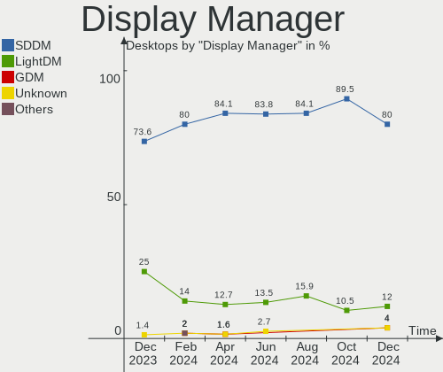
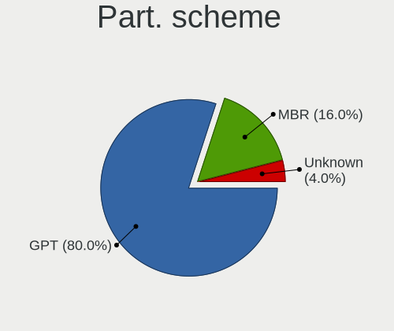
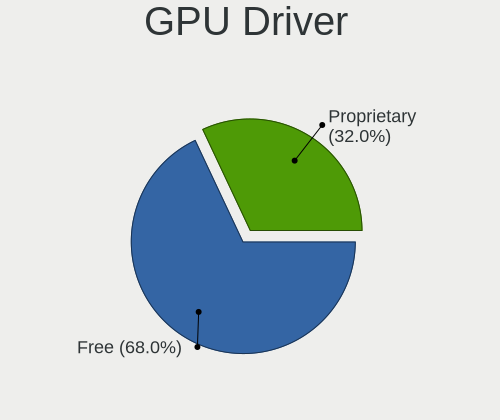
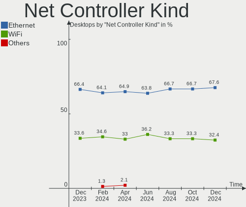

ArcoLinux - Hardware Trends (Desktops)
--------------------------------------

A project to identify most popular hardware characteristics and track their change
over time based on data collected by Linux users at https://Linux-Hardware.org.

Anyone can contribute to this report by the [hw-probe](https://github.com/linuxhw/hw-probe) tool:

    sudo -E hw-probe -all -upload

This report is for one last month. Overall report since the beginning of time: [TestDays](https://github.com/linuxhw/TestDays)

Period: Jan, 2024.

Contents
--------

* [ System ](#system)
  - [ OS                       ](#os)
  - [ OS Family                ](#os-family)
  - [ Kernel                   ](#kernel)
  - [ Kernel Family            ](#kernel-family)
  - [ Kernel Major Ver.        ](#kernel-major-ver)
  - [ Arch                     ](#arch)
  - [ DE                       ](#de)
  - [ Display Server           ](#display-server)
  - [ Display Manager          ](#display-manager)
  - [ OS Lang                  ](#os-lang)
  - [ Boot Mode                ](#boot-mode)
  - [ Filesystem               ](#filesystem)
  - [ Part. scheme             ](#part-scheme)
  - [ Dual Boot with Linux/BSD ](#dual-boot-with-linuxbsd)
  - [ Dual Boot (Win)          ](#dual-boot-win)

* [ Board ](#board)
  - [ Vendor                   ](#vendor)
  - [ Model                    ](#model)
  - [ Model Family             ](#model-family)
  - [ MFG Year                 ](#mfg-year)
  - [ Form Factor              ](#form-factor)
  - [ Secure Boot              ](#secure-boot)
  - [ Coreboot                 ](#coreboot)
  - [ RAM Size                 ](#ram-size)
  - [ RAM Used                 ](#ram-used)
  - [ Total Drives             ](#total-drives)
  - [ Has CD-ROM               ](#has-cd-rom)
  - [ Has Ethernet             ](#has-ethernet)
  - [ Has WiFi                 ](#has-wifi)
  - [ Has Bluetooth            ](#has-bluetooth)

* [ Location ](#location)
  - [ Country                  ](#country)
  - [ City                     ](#city)

* [ Drives ](#drives)
  - [ Drive Vendor             ](#drive-vendor)
  - [ Drive Model              ](#drive-model)
  - [ HDD Vendor               ](#hdd-vendor)
  - [ SSD Vendor               ](#ssd-vendor)
  - [ Drive Kind               ](#drive-kind)
  - [ Drive Connector          ](#drive-connector)
  - [ Drive Size               ](#drive-size)
  - [ Space Total              ](#space-total)
  - [ Space Used               ](#space-used)
  - [ Malfunc. Drives          ](#malfunc-drives)
  - [ Malfunc. Drive Vendor    ](#malfunc-drive-vendor)
  - [ Malfunc. HDD Vendor      ](#malfunc-hdd-vendor)
  - [ Malfunc. Drive Kind      ](#malfunc-drive-kind)
  - [ Failed Drives            ](#failed-drives)
  - [ Failed Drive Vendor      ](#failed-drive-vendor)
  - [ Drive Status             ](#drive-status)

* [ Storage controller ](#storage-controller)
  - [ Storage Vendor           ](#storage-vendor)
  - [ Storage Model            ](#storage-model)
  - [ Storage Kind             ](#storage-kind)

* [ Processor ](#processor)
  - [ CPU Vendor               ](#cpu-vendor)
  - [ CPU Model                ](#cpu-model)
  - [ CPU Model Family         ](#cpu-model-family)
  - [ CPU Cores                ](#cpu-cores)
  - [ CPU Sockets              ](#cpu-sockets)
  - [ CPU Threads              ](#cpu-threads)
  - [ CPU Op-Modes             ](#cpu-op-modes)
  - [ CPU Microcode            ](#cpu-microcode)
  - [ CPU Microarch            ](#cpu-microarch)

* [ Graphics ](#graphics)
  - [ GPU Vendor               ](#gpu-vendor)
  - [ GPU Model                ](#gpu-model)
  - [ GPU Combo                ](#gpu-combo)
  - [ GPU Driver               ](#gpu-driver)
  - [ GPU Memory               ](#gpu-memory)

* [ Monitor ](#monitor)
  - [ Monitor Vendor           ](#monitor-vendor)
  - [ Monitor Model            ](#monitor-model)
  - [ Monitor Resolution       ](#monitor-resolution)
  - [ Monitor Diagonal         ](#monitor-diagonal)
  - [ Monitor Width            ](#monitor-width)
  - [ Aspect Ratio             ](#aspect-ratio)
  - [ Monitor Area             ](#monitor-area)
  - [ Pixel Density            ](#pixel-density)
  - [ Multiple Monitors        ](#multiple-monitors)

* [ Network ](#network)
  - [ Net Controller Vendor    ](#net-controller-vendor)
  - [ Net Controller Model     ](#net-controller-model)
  - [ Wireless Vendor          ](#wireless-vendor)
  - [ Wireless Model           ](#wireless-model)
  - [ Ethernet Vendor          ](#ethernet-vendor)
  - [ Ethernet Model           ](#ethernet-model)
  - [ Net Controller Kind      ](#net-controller-kind)
  - [ Used Controller          ](#used-controller)
  - [ NICs                     ](#nics)
  - [ IPv6                     ](#ipv6)

* [ Bluetooth ](#bluetooth)
  - [ Bluetooth Vendor         ](#bluetooth-vendor)
  - [ Bluetooth Model          ](#bluetooth-model)

* [ Sound ](#sound)
  - [ Sound Vendor             ](#sound-vendor)
  - [ Sound Model              ](#sound-model)

* [ Memory ](#memory)
  - [ Memory Vendor            ](#memory-vendor)
  - [ Memory Model             ](#memory-model)
  - [ Memory Kind              ](#memory-kind)
  - [ Memory Form Factor       ](#memory-form-factor)
  - [ Memory Size              ](#memory-size)
  - [ Memory Speed             ](#memory-speed)

* [ Printers & scanners ](#printers--scanners)
  - [ Printer Vendor           ](#printer-vendor)
  - [ Printer Model            ](#printer-model)
  - [ Scanner Vendor           ](#scanner-vendor)
  - [ Scanner Model            ](#scanner-model)

* [ Camera ](#camera)
  - [ Camera Vendor            ](#camera-vendor)
  - [ Camera Model             ](#camera-model)

* [ Security ](#security)
  - [ Fingerprint Vendor       ](#fingerprint-vendor)
  - [ Fingerprint Model        ](#fingerprint-model)
  - [ Chipcard Vendor          ](#chipcard-vendor)
  - [ Chipcard Model           ](#chipcard-model)

* [ Unsupported ](#unsupported)
  - [ Unsupported Devices      ](#unsupported-devices)
  - [ Unsupported Device Types ](#unsupported-device-types)

System
------

OS
--

Installed operating systems

| Name              | Desktops | Percent |
|-------------------|----------|---------|
| ArcoLinux Rolling | 53       | 94.64%  |
| ArcoLinux         | 3        | 5.36%   |

OS Family
---------

OS without a version

| Name      | Desktops | Percent |
|-----------|----------|---------|
| ArcoLinux | 56       | 100%    |

Kernel
------

Version of the Linux kernel

| Version                    | Desktops | Percent |
|----------------------------|----------|---------|
| 6.6.1-arch1-1              | 10       | 17.86%  |
| 6.6.9-arch1-1              | 8        | 14.29%  |
| 6.7.0-arch3-1              | 6        | 10.71%  |
| 6.6.8-arch1-1              | 6        | 10.71%  |
| 6.6.10-arch1-1             | 5        | 8.93%   |
| 6.7.0-zen3-1-zen           | 3        | 5.36%   |
| 6.7.1-arch1-1              | 2        | 3.57%   |
| 6.6.12-1-lts               | 2        | 3.57%   |
| 6.7.2-zen1-1-zen           | 1        | 1.79%   |
| 6.7.0-1-ck-generic-v3      | 1        | 1.79%   |
| 6.6.9-zen1-1-zen           | 1        | 1.79%   |
| 6.6.8-zen1-1-zen           | 1        | 1.79%   |
| 6.6.3-arch1-1              | 1        | 1.79%   |
| 6.6.14-1-lts               | 1        | 1.79%   |
| 6.6.13-1-lts               | 1        | 1.79%   |
| 6.6.11-1-lts               | 1        | 1.79%   |
| 6.5.9-arch2-1              | 1        | 1.79%   |
| 6.5.8-arch1-1              | 1        | 1.79%   |
| 6.4.12-zen1-1-zen          | 1        | 1.79%   |
| 6.4.12-arch1-1             | 1        | 1.79%   |
| 6.1.70-1-lts               | 1        | 1.79%   |
| 6.1.66-x64v1-xanmod1-1-lts | 1        | 1.79%   |

Kernel Family
-------------

Linux kernel without a distro release

| Version | Desktops | Percent |
|---------|----------|---------|
| 6.7.0   | 10       | 17.86%  |
| 6.6.1   | 10       | 17.86%  |
| 6.6.9   | 9        | 16.07%  |
| 6.6.8   | 7        | 12.5%   |
| 6.6.10  | 5        | 8.93%   |
| 6.7.1   | 2        | 3.57%   |
| 6.6.12  | 2        | 3.57%   |
| 6.4.12  | 2        | 3.57%   |
| 6.7.2   | 1        | 1.79%   |
| 6.6.3   | 1        | 1.79%   |
| 6.6.14  | 1        | 1.79%   |
| 6.6.13  | 1        | 1.79%   |
| 6.6.11  | 1        | 1.79%   |
| 6.5.9   | 1        | 1.79%   |
| 6.5.8   | 1        | 1.79%   |
| 6.1.70  | 1        | 1.79%   |
| 6.1.66  | 1        | 1.79%   |

Kernel Major Ver.
-----------------

Linux kernel major version

| Version | Desktops | Percent |
|---------|----------|---------|
| 6.6     | 37       | 66.07%  |
| 6.7     | 13       | 23.21%  |
| 6.5     | 2        | 3.57%   |
| 6.4     | 2        | 3.57%   |
| 6.1     | 2        | 3.57%   |

Arch
----

OS architecture (x86_64, i586, etc.)

| Name   | Desktops | Percent |
|--------|----------|---------|
| x86_64 | 56       | 100%    |

DE
--

Desktop Environment

| Name         | Desktops | Percent |
|--------------|----------|---------|
| XFCE         | 17       | 30.36%  |
| KDE5         | 13       | 23.21%  |
| GNOME        | 5        | 8.93%   |
| Hyprland     | 4        | 7.14%   |
| Cinnamon     | 3        | 5.36%   |
| X-Cinnamon   | 2        | 3.57%   |
| Deepin       | 2        | 3.57%   |
| Budgie       | 2        | 3.57%   |
| wayfire      | 1        | 1.79%   |
| qtile        | 1        | 1.79%   |
| LXQt         | 1        | 1.79%   |
| LXDE         | 1        | 1.79%   |
| i3           | 1        | 1.79%   |
| herbstluftwm | 1        | 1.79%   |
| awesome      | 1        | 1.79%   |
| Unknown      | 1        | 1.79%   |

Display Server
--------------

X11 or Wayland

| Name    | Desktops | Percent |
|---------|----------|---------|
| X11     | 47       | 83.93%  |
| Wayland | 7        | 12.5%   |
| Tty     | 2        | 3.57%   |

Display Manager
---------------

SDDM, LightDM, etc.

| Name    | Desktops | Percent |
|---------|----------|---------|
| SDDM    | 40       | 71.43%  |
| LightDM | 12       | 21.43%  |
| Unknown | 3        | 5.36%   |
| Ly      | 1        | 1.79%   |

OS Lang
-------

Language

| Lang  | Desktops | Percent |
|-------|----------|---------|
| en_US | 27       | 48.21%  |
| ru_RU | 5        | 8.93%   |
| C     | 5        | 8.93%   |
| de_DE | 4        | 7.14%   |
| en_CA | 3        | 5.36%   |
| it_IT | 2        | 3.57%   |
| hu_HU | 2        | 3.57%   |
| zh_CN | 1        | 1.79%   |
| th_TH | 1        | 1.79%   |
| ja_JP | 1        | 1.79%   |
| es_MX | 1        | 1.79%   |
| es_AR | 1        | 1.79%   |
| en_SG | 1        | 1.79%   |
| en_GB | 1        | 1.79%   |
| cs_CZ | 1        | 1.79%   |

Boot Mode
---------

EFI or BIOS

| Mode | Desktops | Percent |
|------|----------|---------|
| EFI  | 44       | 78.57%  |
| BIOS | 12       | 21.43%  |

Filesystem
----------

Type of filesystem

| Type    | Desktops | Percent |
|---------|----------|---------|
| Ext4    | 33       | 58.93%  |
| Btrfs   | 17       | 30.36%  |
| Overlay | 4        | 7.14%   |
| Xfs     | 1        | 1.79%   |
| Unknown | 1        | 1.79%   |

Part. scheme
------------

Scheme of partitioning

| Type    | Desktops | Percent |
|---------|----------|---------|
| GPT     | 47       | 83.93%  |
| MBR     | 6        | 10.71%  |
| Unknown | 3        | 5.36%   |

Dual Boot with Linux/BSD
------------------------

Hosting more than one Linux/BSD

| Dual boot | Desktops | Percent |
|-----------|----------|---------|
| No        | 36       | 64.29%  |
| Yes       | 20       | 35.71%  |

Dual Boot (Win)
---------------

Hosting Linux and Windows

| Dual boot | Desktops | Percent |
|-----------|----------|---------|
| Yes       | 30       | 53.57%  |
| No        | 26       | 46.43%  |

Board
-----

Vendor
------

Motherboard manufacturer

| Name                | Desktops | Percent |
|---------------------|----------|---------|
| MSI                 | 13       | 23.21%  |
| ASUSTek Computer    | 11       | 19.64%  |
| Hewlett-Packard     | 9        | 16.07%  |
| Gigabyte Technology | 8        | 14.29%  |
| ASRock              | 5        | 8.93%   |
| Dell                | 4        | 7.14%   |
| Supermicro          | 1        | 1.79%   |
| Lenovo              | 1        | 1.79%   |
| Intel               | 1        | 1.79%   |
| Fujitsu             | 1        | 1.79%   |
| BESSTAR Tech        | 1        | 1.79%   |
| Acer                | 1        | 1.79%   |

Model
-----

Motherboard model

| Name                                                           | Desktops | Percent |
|----------------------------------------------------------------|----------|---------|
| Supermicro SYS-6018R-CMG367-HM005                              | 1        | 1.79%   |
| MSI MS-7E27                                                    | 1        | 1.79%   |
| MSI MS-7D31                                                    | 1        | 1.79%   |
| MSI MS-7D25                                                    | 1        | 1.79%   |
| MSI MS-7C84                                                    | 1        | 1.79%   |
| MSI MS-7C75                                                    | 1        | 1.79%   |
| MSI MS-7C56                                                    | 1        | 1.79%   |
| MSI MS-7C51                                                    | 1        | 1.79%   |
| MSI MS-7C37                                                    | 1        | 1.79%   |
| MSI MS-7B98                                                    | 1        | 1.79%   |
| MSI MS-7A78                                                    | 1        | 1.79%   |
| MSI MS-7A70                                                    | 1        | 1.79%   |
| MSI MS-7984                                                    | 1        | 1.79%   |
| MSI Compaq dx2420 Microtower                                   | 1        | 1.79%   |
| Lenovo ThinkCentre M910s 10MLS0WN00                            | 1        | 1.79%   |
| Intel X79 (INTEL Xeon E5/Corei7 DMI2 - C600/C200 Cipset V5.33B | 1        | 1.79%   |
| HP Z240 Tower Workstation                                      | 1        | 1.79%   |
| HP ProDesk 600 G1 SFF                                          | 1        | 1.79%   |
| HP ProDesk 600 G1 DM                                           | 1        | 1.79%   |
| HP Pavilion Desktop 590-p0xxx                                  | 1        | 1.79%   |
| HP OMEN 30L Desktop GT13-1xxx                                  | 1        | 1.79%   |
| HP EliteDesk 800 G4 SFF                                        | 1        | 1.79%   |
| HP EliteDesk 800 G2 TWR                                        | 1        | 1.79%   |
| HP Compaq dx7300 Slim Tower                                    | 1        | 1.79%   |
| HP 500-536d                                                    | 1        | 1.79%   |
| Gigabyte Z790 AORUS PRO X                                      | 1        | 1.79%   |
| Gigabyte Z390 UD V2                                            | 1        | 1.79%   |
| Gigabyte Z270-Gaming 3                                         | 1        | 1.79%   |
| Gigabyte X570 GAMING X                                         | 1        | 1.79%   |
| Gigabyte H310M DS2 2.0                                         | 1        | 1.79%   |
| Gigabyte B550 AORUS ELITE AX V2                                | 1        | 1.79%   |
| Gigabyte B450 AORUS ELITE                                      | 1        | 1.79%   |
| Gigabyte A520M K V2                                            | 1        | 1.79%   |
| Fujitsu ESPRIMO E520                                           | 1        | 1.79%   |
| Dell OptiPlex 780                                              | 1        | 1.79%   |
| Dell OptiPlex 7040                                             | 1        | 1.79%   |
| Dell OptiPlex 7010                                             | 1        | 1.79%   |
| Dell OptiPlex 3060                                             | 1        | 1.79%   |
| BESSTAR Tech DMAF5                                             | 1        | 1.79%   |
| ASUS Z170 PRO GAMING/AURA                                      | 1        | 1.79%   |

Model Family
------------

Motherboard model prefix

| Name                              | Desktops | Percent |
|-----------------------------------|----------|---------|
| Dell OptiPlex                     | 4        | 7.14%   |
| ASUS TUF                          | 3        | 5.36%   |
| ASUS PRIME                        | 3        | 5.36%   |
| HP ProDesk                        | 2        | 3.57%   |
| HP EliteDesk                      | 2        | 3.57%   |
| ASUS ROG                          | 2        | 3.57%   |
| Supermicro SYS-6018R-CMG367-HM005 | 1        | 1.79%   |
| MSI MS-7E27                       | 1        | 1.79%   |
| MSI MS-7D31                       | 1        | 1.79%   |
| MSI MS-7D25                       | 1        | 1.79%   |
| MSI MS-7C84                       | 1        | 1.79%   |
| MSI MS-7C75                       | 1        | 1.79%   |
| MSI MS-7C56                       | 1        | 1.79%   |
| MSI MS-7C51                       | 1        | 1.79%   |
| MSI MS-7C37                       | 1        | 1.79%   |
| MSI MS-7B98                       | 1        | 1.79%   |
| MSI MS-7A78                       | 1        | 1.79%   |
| MSI MS-7A70                       | 1        | 1.79%   |
| MSI MS-7984                       | 1        | 1.79%   |
| MSI Compaq                        | 1        | 1.79%   |
| Lenovo ThinkCentre                | 1        | 1.79%   |
| Intel X79                         | 1        | 1.79%   |
| HP Z240                           | 1        | 1.79%   |
| HP Pavilion                       | 1        | 1.79%   |
| HP OMEN                           | 1        | 1.79%   |
| HP Compaq                         | 1        | 1.79%   |
| HP 500-536d                       | 1        | 1.79%   |
| Gigabyte Z790                     | 1        | 1.79%   |
| Gigabyte Z390                     | 1        | 1.79%   |
| Gigabyte Z270-Gaming              | 1        | 1.79%   |
| Gigabyte X570                     | 1        | 1.79%   |
| Gigabyte H310M                    | 1        | 1.79%   |
| Gigabyte B550                     | 1        | 1.79%   |
| Gigabyte B450                     | 1        | 1.79%   |
| Gigabyte A520M                    | 1        | 1.79%   |
| Fujitsu ESPRIMO                   | 1        | 1.79%   |
| BESSTAR Tech DMAF5                | 1        | 1.79%   |
| ASUS Z170                         | 1        | 1.79%   |
| ASUS P8Z77-V                      | 1        | 1.79%   |
| ASUS P5KPL-AM                     | 1        | 1.79%   |

MFG Year
--------

Motherboard manufacture year

| Year | Desktops | Percent |
|------|----------|---------|
| 2020 | 11       | 19.64%  |
| 2018 | 10       | 17.86%  |
| 2016 | 6        | 10.71%  |
| 2021 | 4        | 7.14%   |
| 2019 | 4        | 7.14%   |
| 2013 | 4        | 7.14%   |
| 2023 | 3        | 5.36%   |
| 2022 | 3        | 5.36%   |
| 2017 | 2        | 3.57%   |
| 2015 | 2        | 3.57%   |
| 2014 | 2        | 3.57%   |
| 2012 | 1        | 1.79%   |
| 2010 | 1        | 1.79%   |
| 2009 | 1        | 1.79%   |
| 2008 | 1        | 1.79%   |
| 2007 | 1        | 1.79%   |

Form Factor
-----------

Physical design of the computer

| Name    | Desktops | Percent |
|---------|----------|---------|
| Desktop | 56       | 100%    |

Secure Boot
-----------

Enabled or disabled

| State    | Desktops | Percent |
|----------|----------|---------|
| Disabled | 56       | 100%    |

Coreboot
--------

Have coreboot on board

| Used | Desktops | Percent |
|------|----------|---------|
| No   | 56       | 100%    |

RAM Size
--------

Total RAM memory

| Size in GB  | Desktops | Percent |
|-------------|----------|---------|
| 32.01-64.0  | 21       | 37.5%   |
| 16.01-24.0  | 13       | 23.21%  |
| 3.01-4.0    | 6        | 10.71%  |
| 8.01-16.0   | 5        | 8.93%   |
| 4.01-8.0    | 4        | 7.14%   |
| 64.01-256.0 | 4        | 7.14%   |
| 24.01-32.0  | 3        | 5.36%   |

RAM Used
--------

Used RAM memory

| Used GB   | Desktops | Percent |
|-----------|----------|---------|
| 1.01-2.0  | 18       | 32.14%  |
| 4.01-8.0  | 14       | 25%     |
| 2.01-3.0  | 11       | 19.64%  |
| 3.01-4.0  | 7        | 12.5%   |
| 0.51-1.0  | 4        | 7.14%   |
| 8.01-16.0 | 2        | 3.57%   |

Total Drives
------------

Number of drives on board

| Drives | Desktops | Percent |
|--------|----------|---------|
| 2      | 19       | 33.93%  |
| 3      | 16       | 28.57%  |
| 1      | 9        | 16.07%  |
| 5      | 4        | 7.14%   |
| 4      | 4        | 7.14%   |
| 8      | 2        | 3.57%   |
| 6      | 2        | 3.57%   |

Has CD-ROM
----------

Has CD-ROM on board

| Presented | Desktops | Percent |
|-----------|----------|---------|
| No        | 43       | 76.79%  |
| Yes       | 13       | 23.21%  |

Has Ethernet
------------

Has Ethernet on board

| Presented | Desktops | Percent |
|-----------|----------|---------|
| Yes       | 56       | 100%    |

Has WiFi
--------

Has WiFi module

| Presented | Desktops | Percent |
|-----------|----------|---------|
| Yes       | 32       | 57.14%  |
| No        | 24       | 42.86%  |

Has Bluetooth
-------------

Has Bluetooth module

| Presented | Desktops | Percent |
|-----------|----------|---------|
| Yes       | 29       | 51.79%  |
| No        | 27       | 48.21%  |

Location
--------

Country
-------

Geographic location (country)

| Country     | Desktops | Percent |
|-------------|----------|---------|
| USA         | 13       | 23.21%  |
| Russia      | 6        | 10.71%  |
| Germany     | 5        | 8.93%   |
| Canada      | 3        | 5.36%   |
| UK          | 2        | 3.57%   |
| Malaysia    | 2        | 3.57%   |
| Italy       | 2        | 3.57%   |
| Hungary     | 2        | 3.57%   |
| Brazil      | 2        | 3.57%   |
| Vietnam     | 1        | 1.79%   |
| Thailand    | 1        | 1.79%   |
| Romania     | 1        | 1.79%   |
| Puerto Rico | 1        | 1.79%   |
| Portugal    | 1        | 1.79%   |
| Mexico      | 1        | 1.79%   |
| Japan       | 1        | 1.79%   |
| Ireland     | 1        | 1.79%   |
| Greece      | 1        | 1.79%   |
| France      | 1        | 1.79%   |
| El Salvador | 1        | 1.79%   |
| Egypt       | 1        | 1.79%   |
| Czechia     | 1        | 1.79%   |
| Cyprus      | 1        | 1.79%   |
| Costa Rica  | 1        | 1.79%   |
| China       | 1        | 1.79%   |
| Belgium     | 1        | 1.79%   |
| Bangladesh  | 1        | 1.79%   |
| Argentina   | 1        | 1.79%   |

City
----

Geographic location (city)

| City                     | Desktops | Percent |
|--------------------------|----------|---------|
| Moscow                   | 3        | 5.36%   |
| Seremban                 | 2        | 3.57%   |
| San Juan                 | 2        | 3.57%   |
| Zapopan                  | 1        | 1.79%   |
| Wuppertal                | 1        | 1.79%   |
| Winnipeg                 | 1        | 1.79%   |
| West Chester             | 1        | 1.79%   |
| Voronezh                 | 1        | 1.79%   |
| Vernon                   | 1        | 1.79%   |
| Tazewell                 | 1        | 1.79%   |
| Sighetu Marmaţiei       | 1        | 1.79%   |
| San José                | 1        | 1.79%   |
| Samara                   | 1        | 1.79%   |
| Richmond                 | 1        | 1.79%   |
| Pierrefonds              | 1        | 1.79%   |
| Nossa Senhora do Socorro | 1        | 1.79%   |
| Nachod                   | 1        | 1.79%   |
| My Binh                  | 1        | 1.79%   |
| Mississauga              | 1        | 1.79%   |
| Minami-tokiwadai         | 1        | 1.79%   |
| Lisbon                   | 1        | 1.79%   |
| Limassol                 | 1        | 1.79%   |
| Lenoir                   | 1        | 1.79%   |
| Lebanon                  | 1        | 1.79%   |
| Landau                   | 1        | 1.79%   |
| Lakeland                 | 1        | 1.79%   |
| Kursk                    | 1        | 1.79%   |
| Katy                     | 1        | 1.79%   |
| Karcag                   | 1        | 1.79%   |
| Kansas City              | 1        | 1.79%   |
| Itapipoca                | 1        | 1.79%   |
| Heyburn                  | 1        | 1.79%   |
| Hamburg                  | 1        | 1.79%   |
| Hagerstown               | 1        | 1.79%   |
| Hadamar                  | 1        | 1.79%   |
| Gourock                  | 1        | 1.79%   |
| Giza                     | 1        | 1.79%   |
| Frankfurt am Main        | 1        | 1.79%   |
| Dublin                   | 1        | 1.79%   |
| Dhaka                    | 1        | 1.79%   |

Drives
------

Drive Vendor
------------

Hard drive vendors

| Vendor                       | Desktops | Drives | Percent |
|------------------------------|----------|--------|---------|
| WDC                          | 20       | 23     | 14.93%  |
| Samsung Electronics          | 19       | 29     | 14.18%  |
| Seagate                      | 18       | 24     | 13.43%  |
| Kingston                     | 10       | 11     | 7.46%   |
| Phison Electronics           | 9        | 11     | 6.72%   |
| Toshiba                      | 8        | 9      | 5.97%   |
| Sandisk                      | 6        | 6      | 4.48%   |
| Crucial                      | 4        | 6      | 2.99%   |
| MAXIO Technology (Hangzhou)  | 3        | 3      | 2.24%   |
| Silicon Motion               | 2        | 2      | 1.49%   |
| Shenzhen Longsys Electronics | 2        | 2      | 1.49%   |
| Micron/Crucial Technology    | 2        | 3      | 1.49%   |
| KingSpec                     | 2        | 2      | 1.49%   |
| HGST                         | 2        | 2      | 1.49%   |
| Unknown                      | 1        | 1      | 0.75%   |
| Team                         | 1        | 1      | 0.75%   |
| TDAS                         | 1        | 4      | 0.75%   |
| SUNEAST                      | 1        | 1      | 0.75%   |
| StarTech                     | 1        | 1      | 0.75%   |
| SSK                          | 1        | 1      | 0.75%   |
| SK hynix                     | 1        | 1      | 0.75%   |
| Seagate Technology           | 1        | 1      | 0.75%   |
| SABRENT                      | 1        | 1      | 0.75%   |
| Plextor                      | 1        | 1      | 0.75%   |
| OCZ                          | 1        | 1      | 0.75%   |
| Min Yi U                     | 1        | 1      | 0.75%   |
| Kingston Technology Company  | 1        | 1      | 0.75%   |
| KingFast                     | 1        | 1      | 0.75%   |
| Intel                        | 1        | 1      | 0.75%   |
| Inateck                      | 1        | 1      | 0.75%   |
| Hitachi                      | 1        | 1      | 0.75%   |
| Fujitsu                      | 1        | 1      | 0.75%   |
| FIKWOT                       | 1        | 1      | 0.75%   |
| Fanxiang                     | 1        | 1      | 0.75%   |
| CSD                          | 1        | 1      | 0.75%   |
| Corsair                      | 1        | 1      | 0.75%   |
| China                        | 1        | 1      | 0.75%   |
| Biostar                      | 1        | 1      | 0.75%   |
| ASMT                         | 1        | 1      | 0.75%   |
| ADATA Technology             | 1        | 1      | 0.75%   |

Drive Model
-----------

Hard drive models

| Model                                                 | Desktops | Percent |
|-------------------------------------------------------|----------|---------|
| Samsung NVMe SSD Controller SM981/PM981/PM983 1TB     | 7        | 4.4%    |
| Phison E12 NVMe Controller 1TB                        | 5        | 3.14%   |
| Kingston SA400S37480G 480GB SSD                       | 4        | 2.52%   |
| Kingston SA400S37240G 240GB SSD                       | 4        | 2.52%   |
| Samsung SSD 870 EVO 1TB                               | 3        | 1.89%   |
| Samsung SSD 850 EVO 120GB                             | 3        | 1.89%   |
| Samsung NVMe SSD Controller PM9A1/PM9A3/980PRO 2TB    | 3        | 1.89%   |
| Phison E16 PCIe4 NVMe Controller 2TB                  | 3        | 1.89%   |
| WDC WDS240G2G0A-00JH30 240GB SSD                      | 2        | 1.26%   |
| WDC WD10EZEX-22MFCA0 1TB                              | 2        | 1.26%   |
| Toshiba HDWD110 1TB                                   | 2        | 1.26%   |
| Toshiba DT01ACA200 2TB                                | 2        | 1.26%   |
| Silicon Motion SM2263EN/SM2263XT SSD Controller 128GB | 2        | 1.26%   |
| Seagate ST6000DM003-2CY186 6TB                        | 2        | 1.26%   |
| Seagate ST1000DM010-2EP102 1TB                        | 2        | 1.26%   |
| Sandisk WD Black 2018/SN750 / PC SN720 NVMe SSD 1TB   | 2        | 1.26%   |
| Phison PS5013 E13 NVMe Controller 256GB               | 2        | 1.26%   |
| MAXIO (Hangzhou) NVMe SSD Controller MAP1202 512GB    | 2        | 1.26%   |
| Crucial CT275MX300SSD1 275GB                          | 2        | 1.26%   |
| Crucial CT1000MX500SSD1 1TB                           | 2        | 1.26%   |
| WDC WDS120G2G0A-00JH30 120GB SSD                      | 1        | 0.63%   |
| WDC WDS120G1G0A-00SS50 120GB SSD                      | 1        | 0.63%   |
| WDC WDS100T1R0A-68A4W0 1TB SSD                        | 1        | 0.63%   |
| WDC WD7500AARS-00Y5B1 752GB                           | 1        | 0.63%   |
| WDC WD5000AAKX-083CA1 500GB                           | 1        | 0.63%   |
| WDC WD4005FZBX-00K5WB0 4TB                            | 1        | 0.63%   |
| WDC WD20PURZ-85AKKY0 2TB                              | 1        | 0.63%   |
| WDC WD20EZRZ-00Z5HB0 2TB                              | 1        | 0.63%   |
| WDC WD20EZBX-60AYRA0 2TB                              | 1        | 0.63%   |
| WDC WD20EZAZ-00L9GB0 2TB                              | 1        | 0.63%   |
| WDC WD2002FAEX-007BA0 2TB                             | 1        | 0.63%   |
| WDC WD10JPVX-00JC3T0 1TB                              | 1        | 0.63%   |
| WDC WD10JPCX-24UE4T0 1TB                              | 1        | 0.63%   |
| WDC WD10EZRX-00L4HB0 1TB                              | 1        | 0.63%   |
| WDC WD10EZEX-21M2NA0 1TB                              | 1        | 0.63%   |
| WDC WD10EZEX-08WN4A0 1TB                              | 1        | 0.63%   |
| WDC WD10EAVS-00D7B1 1TB                               | 1        | 0.63%   |
| WDC WD1001FALS-00E8B0 1TB                             | 1        | 0.63%   |
| WDC WD1001FAES-75W7A0 1TB                             | 1        | 0.63%   |
| Unknown SD/MMC/MS PRO 256GB                           | 1        | 0.63%   |

HDD Vendor
----------

Hard disk drive vendors

| Vendor   | Desktops | Drives | Percent |
|----------|----------|--------|---------|
| Seagate  | 18       | 23     | 34.62%  |
| WDC      | 17       | 18     | 32.69%  |
| Toshiba  | 8        | 9      | 15.38%  |
| HGST     | 2        | 2      | 3.85%   |
| Unknown  | 1        | 1      | 1.92%   |
| TDAS     | 1        | 4      | 1.92%   |
| Min Yi U | 1        | 1      | 1.92%   |
| Inateck  | 1        | 1      | 1.92%   |
| Hitachi  | 1        | 1      | 1.92%   |
| Fujitsu  | 1        | 1      | 1.92%   |
| CSD      | 1        | 1      | 1.92%   |

SSD Vendor
----------

Solid state drive vendors

| Vendor              | Desktops | Drives | Percent |
|---------------------|----------|--------|---------|
| Samsung Electronics | 14       | 15     | 29.79%  |
| Kingston            | 8        | 9      | 17.02%  |
| WDC                 | 4        | 5      | 8.51%   |
| Crucial             | 4        | 6      | 8.51%   |
| SanDisk             | 2        | 2      | 4.26%   |
| KingSpec            | 2        | 2      | 4.26%   |
| Team                | 1        | 1      | 2.13%   |
| SUNEAST             | 1        | 1      | 2.13%   |
| Seagate             | 1        | 1      | 2.13%   |
| SABRENT             | 1        | 1      | 2.13%   |
| Plextor             | 1        | 1      | 2.13%   |
| OCZ                 | 1        | 1      | 2.13%   |
| KingFast            | 1        | 1      | 2.13%   |
| FIKWOT              | 1        | 1      | 2.13%   |
| Fanxiang            | 1        | 1      | 2.13%   |
| Corsair             | 1        | 1      | 2.13%   |
| China               | 1        | 1      | 2.13%   |
| Biostar             | 1        | 1      | 2.13%   |
| A-DATA Technology   | 1        | 1      | 2.13%   |

Drive Kind
----------

HDD or SSD

| Kind    | Desktops | Drives | Percent |
|---------|----------|--------|---------|
| HDD     | 39       | 62     | 36.45%  |
| SSD     | 34       | 52     | 31.78%  |
| NVMe    | 33       | 48     | 30.84%  |
| Unknown | 1        | 1      | 0.93%   |

Drive Connector
---------------

SATA, SAS, NVMe, etc.

| Type | Desktops | Drives | Percent |
|------|----------|--------|---------|
| SATA | 53       | 104    | 56.38%  |
| NVMe | 32       | 46     | 34.04%  |
| SAS  | 9        | 13     | 9.57%   |

Drive Size
----------

Size of hard drive

| Size in TB | Desktops | Drives | Percent |
|------------|----------|--------|---------|
| 0.51-1.0   | 31       | 42     | 39.24%  |
| 0.01-0.5   | 30       | 51     | 37.97%  |
| 1.01-2.0   | 11       | 12     | 13.92%  |
| 3.01-4.0   | 3        | 5      | 3.8%    |
| 4.01-10.0  | 3        | 3      | 3.8%    |
| 2.01-3.0   | 1        | 1      | 1.27%   |

Space Total
-----------

Amount of disk space available on the file system

| Size in GB     | Desktops | Percent |
|----------------|----------|---------|
| 501-1000       | 12       | 21.43%  |
| 251-500        | 11       | 19.64%  |
| More than 3000 | 9        | 16.07%  |
| 1001-2000      | 9        | 16.07%  |
| 101-250        | 8        | 14.29%  |
| 2001-3000      | 5        | 8.93%   |
| 1-20           | 1        | 1.79%   |
| Unknown        | 1        | 1.79%   |

Space Used
----------

Amount of used disk space

| Used GB        | Desktops | Percent |
|----------------|----------|---------|
| 21-50          | 12       | 21.43%  |
| 101-250        | 10       | 17.86%  |
| 1-20           | 10       | 17.86%  |
| 251-500        | 7        | 12.5%   |
| 51-100         | 5        | 8.93%   |
| 1001-2000      | 4        | 7.14%   |
| 501-1000       | 4        | 7.14%   |
| More than 3000 | 2        | 3.57%   |
| 2001-3000      | 1        | 1.79%   |
| Unknown        | 1        | 1.79%   |

Malfunc. Drives
---------------

Drive models with a malfunction

| Model                                                         | Desktops | Drives | Percent |
|---------------------------------------------------------------|----------|--------|---------|
| WDC WDS240G2G0A-00JH30 240GB SSD                              | 1        | 1      | 4.76%   |
| WDC WD7500AARS-00Y5B1 752GB                                   | 1        | 1      | 4.76%   |
| WDC WD5000AAKX-083CA1 500GB                                   | 1        | 1      | 4.76%   |
| WDC WD2002FAEX-007BA0 2TB                                     | 1        | 1      | 4.76%   |
| Seagate ST380815AS 80GB                                       | 1        | 1      | 4.76%   |
| Seagate ST3500418AS 500GB                                     | 1        | 1      | 4.76%   |
| Seagate ST3500412AS 500GB                                     | 1        | 1      | 4.76%   |
| Seagate ST1000LM035-1RK172 1TB                                | 1        | 1      | 4.76%   |
| Seagate ST1000LM024 HN-M101MBB 1TB                            | 1        | 1      | 4.76%   |
| Seagate ST1000DX001-1CM162 1TB                                | 1        | 1      | 4.76%   |
| Seagate ST1000DM003-1CH162 1TB                                | 1        | 1      | 4.76%   |
| SanDisk SSD PLUS 480GB                                        | 1        | 1      | 4.76%   |
| SanDisk SSD PLUS 1000GB                                       | 1        | 1      | 4.76%   |
| Samsung Electronics SSD 870 EVO 1TB                           | 1        | 1      | 4.76%   |
| Samsung Electronics NVMe SSD Controller SM981/PM981/PM983 1TB | 1        | 1      | 4.76%   |
| Inateck ASM225CM 4TB                                          | 1        | 1      | 4.76%   |
| Fujitsu MHZ2160BH G2 160GB                                    | 1        | 1      | 4.76%   |
| CSD CAA500S 500GB                                             | 1        | 1      | 4.76%   |
| Crucial CT275MX300SSD1 275GB                                  | 1        | 1      | 4.76%   |
| Crucial CT240BX200SSD1 240GB                                  | 1        | 1      | 4.76%   |
| Corsair Performance3 SSD 128GB                                | 1        | 1      | 4.76%   |

Malfunc. Drive Vendor
---------------------

Vendors of faulty drives

| Vendor              | Desktops | Drives | Percent |
|---------------------|----------|--------|---------|
| Seagate             | 6        | 7      | 30%     |
| WDC                 | 4        | 4      | 20%     |
| SanDisk             | 2        | 2      | 10%     |
| Samsung Electronics | 2        | 2      | 10%     |
| Crucial             | 2        | 2      | 10%     |
| Inateck             | 1        | 1      | 5%      |
| Fujitsu             | 1        | 1      | 5%      |
| CSD                 | 1        | 1      | 5%      |
| Corsair             | 1        | 1      | 5%      |

Malfunc. HDD Vendor
-------------------

Vendors of faulty HDD drives

| Vendor  | Desktops | Drives | Percent |
|---------|----------|--------|---------|
| Seagate | 6        | 7      | 50%     |
| WDC     | 3        | 3      | 25%     |
| Inateck | 1        | 1      | 8.33%   |
| Fujitsu | 1        | 1      | 8.33%   |
| CSD     | 1        | 1      | 8.33%   |

Malfunc. Drive Kind
-------------------

Kinds of faulty drives

| Kind | Desktops | Drives | Percent |
|------|----------|--------|---------|
| HDD  | 11       | 13     | 57.89%  |
| SSD  | 7        | 7      | 36.84%  |
| NVMe | 1        | 1      | 5.26%   |

Failed Drives
-------------

Failed drive models

| Model                     | Desktops | Drives | Percent |
|---------------------------|----------|--------|---------|
| Seagate ST91000430AS 1TB  | 1        | 1      | 33.33%  |
| Seagate ST3500410AS 500GB | 1        | 1      | 33.33%  |
| Seagate ST31500341AS 1TB  | 1        | 1      | 33.33%  |

Failed Drive Vendor
-------------------

Failed drive vendors

| Vendor  | Desktops | Drives | Percent |
|---------|----------|--------|---------|
| Seagate | 2        | 3      | 100%    |

Drive Status
------------

Number of failed and malfunc. drives

| Status   | Desktops | Drives | Percent |
|----------|----------|--------|---------|
| Works    | 52       | 121    | 66.67%  |
| Malfunc  | 16       | 21     | 20.51%  |
| Detected | 8        | 18     | 10.26%  |
| Failed   | 2        | 3      | 2.56%   |

Storage controller
------------------

Storage Vendor
--------------

Storage controller vendors

| Vendor                       | Desktops | Percent |
|------------------------------|----------|---------|
| Intel                        | 39       | 39.39%  |
| AMD                          | 18       | 18.18%  |
| Samsung Electronics          | 11       | 11.11%  |
| Phison Electronics           | 8        | 8.08%   |
| ASMedia Technology           | 5        | 5.05%   |
| SanDisk                      | 4        | 4.04%   |
| MAXIO Technology (Hangzhou)  | 3        | 3.03%   |
| Kingston Technology Company  | 3        | 3.03%   |
| Silicon Motion               | 2        | 2.02%   |
| Micron/Crucial Technology    | 2        | 2.02%   |
| SK hynix                     | 1        | 1.01%   |
| Shenzhen Longsys Electronics | 1        | 1.01%   |
| Seagate Technology           | 1        | 1.01%   |
| ADATA Technology             | 1        | 1.01%   |

Storage Model
-------------

Storage controller models

| Model                                                                          | Desktops | Percent |
|--------------------------------------------------------------------------------|----------|---------|
| AMD FCH SATA Controller [AHCI mode]                                            | 9        | 8.11%   |
| Samsung NVMe SSD Controller SM981/PM981/PM983                                  | 7        | 6.31%   |
| Intel 200 Series PCH SATA controller [AHCI mode]                               | 6        | 5.41%   |
| AMD 500 Series Chipset SATA Controller                                         | 6        | 5.41%   |
| Intel Cannon Lake PCH SATA AHCI Controller                                     | 5        | 4.5%    |
| Intel 8 Series/C220 Series Chipset Family 6-port SATA Controller 1 [AHCI mode] | 5        | 4.5%    |
| ASMedia ASM1061/ASM1062 Serial ATA Controller                                  | 5        | 4.5%    |
| Phison E12 NVMe Controller                                                     | 4        | 3.6%    |
| Intel SATA Controller [RAID mode]                                              | 4        | 3.6%    |
| Samsung NVMe SSD Controller PM9A1/PM9A3/980PRO                                 | 3        | 2.7%    |
| Intel Q170/Q150/B150/H170/H110/Z170/CM236 Chipset SATA Controller [AHCI Mode]  | 3        | 2.7%    |
| Intel Alder Lake-S PCH SATA Controller [AHCI Mode]                             | 3        | 2.7%    |
| AMD 400 Series Chipset SATA Controller                                         | 3        | 2.7%    |
| Silicon Motion SM2263EN/SM2263XT (DRAM-less) NVMe SSD Controllers              | 2        | 1.8%    |
| SanDisk Extreme Pro / WD Black 2018/SN750/PC SN720 NVMe SSD                    | 2        | 1.8%    |
| Phison PS5013-E13 PCIe3 NVMe Controller (DRAM-less)                            | 2        | 1.8%    |
| Phison E16 PCIe4 NVMe Controller                                               | 2        | 1.8%    |
| MAXIO (Hangzhou) NVMe SSD Controller MAP1202 (DRAM-less)                       | 2        | 1.8%    |
| Kingston Company NV2 NVMe SSD SM2267XT (DRAM-less)                             | 2        | 1.8%    |
| Intel NM10/ICH7 Family SATA Controller [IDE mode]                              | 2        | 1.8%    |
| Intel Comet Lake SATA AHCI Controller                                          | 2        | 1.8%    |
| Intel 7 Series/C210 Series Chipset Family 6-port SATA Controller [AHCI mode]   | 2        | 1.8%    |
| Intel 500 Series Chipset Family SATA AHCI Controller                           | 2        | 1.8%    |
| AMD FCH SATA Controller D                                                      | 2        | 1.8%    |
| SK hynix Platinum P41/PC801 NVMe Solid State Drive                             | 1        | 0.9%    |
| Shenzhen Longsys Lexar NM790 NVME SSD (DRAM-less)                              | 1        | 0.9%    |
| Seagate FireCuda 520 SSD                                                       | 1        | 0.9%    |
| Sandisk WD Black SN850X NVMe SSD                                               | 1        | 0.9%    |
| SanDisk Extreme Pro / WD Black SN750 / PC SN730 / Red SN700 NVMe SSD           | 1        | 0.9%    |
| Samsung NVMe SSD Controller SM961/PM961/SM963                                  | 1        | 0.9%    |
| Samsung NVMe SSD Controller SM951/PM951                                        | 1        | 0.9%    |
| Samsung NVMe SSD Controller S4LV008[Pascal]                                    | 1        | 0.9%    |
| Samsung NVMe SSD Controller 980 (DRAM-less)                                    | 1        | 0.9%    |
| Phison E18 PCIe4 NVMe Controller                                               | 1        | 0.9%    |
| Micron/Crucial P5 Plus NVMe PCIe SSD                                           | 1        | 0.9%    |
| Micron/Crucial P2 [Nick P2] / P3 / P3 Plus NVMe PCIe SSD (DRAM-less)           | 1        | 0.9%    |
| Micron/Crucial P1 NVMe PCIe SSD[Frampton]                                      | 1        | 0.9%    |
| MAXIO (Hangzhou) NVMe SSD Controller MAP1602 (DRAM-less)                       | 1        | 0.9%    |
| Kingston Company KC3000/FURY Renegade NVMe SSD E18                             | 1        | 0.9%    |
| Intel SSD 670p Series [Keystone Harbor]                                        | 1        | 0.9%    |

Storage Kind
------------

Kind of storage controller (IDE, SATA, NVMe, SAS, ...)

| Kind | Desktops | Percent |
|------|----------|---------|
| SATA | 49       | 55.68%  |
| NVMe | 31       | 35.23%  |
| RAID | 4        | 4.55%   |
| IDE  | 4        | 4.55%   |

Processor
---------

CPU Vendor
----------

Processor vendors

| Vendor | Desktops | Percent |
|--------|----------|---------|
| Intel  | 38       | 67.86%  |
| AMD    | 18       | 32.14%  |

CPU Model
---------

Processor models

| Model                                         | Desktops | Percent |
|-----------------------------------------------|----------|---------|
| AMD Ryzen 7 5700G with Radeon Graphics        | 4        | 7.14%   |
| Intel Core i7-6700 CPU @ 3.40GHz              | 3        | 5.36%   |
| Intel 12th Gen Core i5-12600K                 | 3        | 5.36%   |
| Intel Core i7-7700K CPU @ 4.20GHz             | 2        | 3.57%   |
| Intel Core i5-6500 CPU @ 3.20GHz              | 2        | 3.57%   |
| Intel Core i3-4160 CPU @ 3.60GHz              | 2        | 3.57%   |
| AMD Ryzen 7 5800X 8-Core Processor            | 2        | 3.57%   |
| AMD Ryzen 7 3700X 8-Core Processor            | 2        | 3.57%   |
| AMD Ryzen 5 5600X 6-Core Processor            | 2        | 3.57%   |
| Intel Xeon CPU E5-2678 v3 @ 2.50GHz           | 1        | 1.79%   |
| Intel Xeon CPU E5-2470 v2 @ 2.40GHz           | 1        | 1.79%   |
| Intel Pentium Dual-Core CPU E5300 @ 2.60GHz   | 1        | 1.79%   |
| Intel Pentium Dual-Core CPU E5200 @ 2.50GHz   | 1        | 1.79%   |
| Intel Pentium CPU G3240 @ 3.10GHz             | 1        | 1.79%   |
| Intel Core i9-9900K CPU @ 3.60GHz             | 1        | 1.79%   |
| Intel Core i9-10850K CPU @ 3.60GHz            | 1        | 1.79%   |
| Intel Core i7-9700K CPU @ 3.60GHz             | 1        | 1.79%   |
| Intel Core i7-8700 CPU @ 3.20GHz              | 1        | 1.79%   |
| Intel Core i7-6700K CPU @ 4.00GHz             | 1        | 1.79%   |
| Intel Core i7-4790 CPU @ 3.60GHz              | 1        | 1.79%   |
| Intel Core i7-3770 CPU @ 3.40GHz              | 1        | 1.79%   |
| Intel Core i7-14700KF                         | 1        | 1.79%   |
| Intel Core i7-10700K CPU @ 3.80GHz            | 1        | 1.79%   |
| Intel Core i5-9600K CPU @ 3.70GHz             | 1        | 1.79%   |
| Intel Core i5-9400 CPU @ 2.90GHz              | 1        | 1.79%   |
| Intel Core i5-8600K CPU @ 3.60GHz             | 1        | 1.79%   |
| Intel Core i5-7400 CPU @ 3.00GHz              | 1        | 1.79%   |
| Intel Core i5-4570 CPU @ 3.20GHz              | 1        | 1.79%   |
| Intel Core i5-3570 CPU @ 3.40GHz              | 1        | 1.79%   |
| Intel Core i5-10400F CPU @ 2.90GHz            | 1        | 1.79%   |
| Intel Core i3-8100T CPU @ 3.10GHz             | 1        | 1.79%   |
| Intel Core i3-8100 CPU @ 3.60GHz              | 1        | 1.79%   |
| Intel Core 2 Duo CPU E8400 @ 3.00GHz          | 1        | 1.79%   |
| Intel Core 2 CPU 6300 @ 1.86GHz               | 1        | 1.79%   |
| Intel 11th Gen Core i7-11700K @ 3.60GHz       | 1        | 1.79%   |
| AMD Ryzen 7 7700X 8-Core Processor            | 1        | 1.79%   |
| AMD Ryzen 5 5600G with Radeon Graphics        | 1        | 1.79%   |
| AMD Ryzen 5 5500                              | 1        | 1.79%   |
| AMD Ryzen 5 3600 6-Core Processor             | 1        | 1.79%   |
| AMD Ryzen 5 3550H with Radeon Vega Mobile Gfx | 1        | 1.79%   |

CPU Model Family
----------------

Processor model prefix

| Model                   | Desktops | Percent |
|-------------------------|----------|---------|
| Intel Core i7           | 12       | 21.43%  |
| Intel Core i5           | 9        | 16.07%  |
| AMD Ryzen 7             | 9        | 16.07%  |
| AMD Ryzen 5             | 7        | 12.5%   |
| Other                   | 4        | 7.14%   |
| Intel Core i3           | 4        | 7.14%   |
| Intel Xeon              | 2        | 3.57%   |
| Intel Pentium Dual-Core | 2        | 3.57%   |
| Intel Core i9           | 2        | 3.57%   |
| Intel Pentium           | 1        | 1.79%   |
| Intel Core 2 Duo        | 1        | 1.79%   |
| Intel Core 2            | 1        | 1.79%   |
| AMD Athlon              | 1        | 1.79%   |
| AMD A10                 | 1        | 1.79%   |

CPU Cores
---------

Number of processor cores

| Number | Desktops | Percent |
|--------|----------|---------|
| 4      | 16       | 28.57%  |
| 8      | 13       | 23.21%  |
| 6      | 11       | 19.64%  |
| 2      | 9        | 16.07%  |
| 10     | 5        | 8.93%   |
| 24     | 1        | 1.79%   |
| 20     | 1        | 1.79%   |

CPU Sockets
-----------

Number of sockets

| Number | Desktops | Percent |
|--------|----------|---------|
| 1      | 55       | 98.21%  |
| 2      | 1        | 1.79%   |

CPU Threads
-----------

Threads per core (Hyper-Threading)

| Number | Desktops | Percent |
|--------|----------|---------|
| 2      | 40       | 71.43%  |
| 1      | 16       | 28.57%  |

CPU Op-Modes
------------

CPU Operation Modes (32-bit, 64-bit)

| Op mode        | Desktops | Percent |
|----------------|----------|---------|
| 32-bit, 64-bit | 56       | 100%    |

CPU Microcode
-------------

Microcode number

| Number     | Desktops | Percent |
|------------|----------|---------|
| Unknown    | 42       | 75%     |
| 0x0a50000d | 2        | 3.57%   |
| 0x08701021 | 2        | 3.57%   |
| 0x0a601206 | 1        | 1.79%   |
| 0x0a20120e | 1        | 1.79%   |
| 0x0a20120a | 1        | 1.79%   |
| 0x0a20102b | 1        | 1.79%   |
| 0x08701030 | 1        | 1.79%   |
| 0x08108102 | 1        | 1.79%   |
| 0x0810100b | 1        | 1.79%   |
| 0x0800820d | 1        | 1.79%   |
| 0x0600611a | 1        | 1.79%   |
| 0x00000000 | 1        | 1.79%   |

CPU Microarch
-------------

Microarchitecture

| Name             | Desktops | Percent |
|------------------|----------|---------|
| KabyLake         | 11       | 19.64%  |
| Zen 3            | 10       | 17.86%  |
| Skylake          | 6        | 10.71%  |
| Haswell          | 6        | 10.71%  |
| Alderlake Hybrid | 4        | 7.14%   |
| Zen 2            | 3        | 5.36%   |
| Penryn           | 3        | 5.36%   |
| IvyBridge        | 3        | 5.36%   |
| CometLake        | 3        | 5.36%   |
| Zen+             | 2        | 3.57%   |
| Zen              | 1        | 1.79%   |
| Icelake          | 1        | 1.79%   |
| Excavator        | 1        | 1.79%   |
| Core             | 1        | 1.79%   |
| Unknown          | 1        | 1.79%   |

Graphics
--------

GPU Vendor
----------

Vendors of graphics cards

| Vendor | Desktops | Percent |
|--------|----------|---------|
| Nvidia | 25       | 39.68%  |
| Intel  | 19       | 30.16%  |
| AMD    | 19       | 30.16%  |

GPU Model
---------

Graphics card models

| Model                                                                       | Desktops | Percent |
|-----------------------------------------------------------------------------|----------|---------|
| Intel HD Graphics 530                                                       | 5        | 7.58%   |
| Intel CoffeeLake-S GT2 [UHD Graphics 630]                                   | 4        | 6.06%   |
| AMD Cezanne [Radeon Vega Series / Radeon Vega Mobile Series]                | 4        | 6.06%   |
| Intel Xeon E3-1200 v3/4th Gen Core Processor Integrated Graphics Controller | 3        | 4.55%   |
| Intel AlderLake-S GT1                                                       | 3        | 4.55%   |
| Nvidia GT218 [GeForce 210]                                                  | 2        | 3.03%   |
| Nvidia GK208B [GeForce GT 710]                                              | 2        | 3.03%   |
| AMD Navi 23 [Radeon RX 6600/6600 XT/6600M]                                  | 2        | 3.03%   |
| AMD Navi 10 [Radeon RX 5600 OEM/5600 XT / 5700/5700 XT]                     | 2        | 3.03%   |
| AMD Ellesmere [Radeon RX 470/480/570/570X/580/580X/590]                     | 2        | 3.03%   |
| Nvidia TU116 [GeForce GTX 1650 SUPER]                                       | 1        | 1.52%   |
| Nvidia TU106 [GeForce RTX 2070]                                             | 1        | 1.52%   |
| Nvidia TU106 [GeForce RTX 2070 Rev. A]                                      | 1        | 1.52%   |
| Nvidia TU106 [GeForce RTX 2060 Rev. A]                                      | 1        | 1.52%   |
| Nvidia TU104 [GeForce RTX 2070 SUPER]                                       | 1        | 1.52%   |
| Nvidia TU102 [GeForce RTX 2080 Ti Rev. A]                                   | 1        | 1.52%   |
| Nvidia GP108 [GeForce GT 1030]                                              | 1        | 1.52%   |
| Nvidia GP108 [GeForce GT 1010]                                              | 1        | 1.52%   |
| Nvidia GP107 [GeForce GTX 1050 Ti]                                          | 1        | 1.52%   |
| Nvidia GP106GL [Quadro P2000]                                               | 1        | 1.52%   |
| Nvidia GP104 [GeForce GTX 1080]                                             | 1        | 1.52%   |
| Nvidia GP102 [GeForce GTX 1080 Ti]                                          | 1        | 1.52%   |
| Nvidia GM206 [GeForce GTX 960]                                              | 1        | 1.52%   |
| Nvidia GM107 [GeForce GTX 750 Ti]                                           | 1        | 1.52%   |
| Nvidia GA106 [GeForce RTX 3060 Lite Hash Rate]                              | 1        | 1.52%   |
| Nvidia GA106 [Geforce RTX 3050]                                             | 1        | 1.52%   |
| Nvidia GA104 [GeForce RTX 3070]                                             | 1        | 1.52%   |
| Nvidia GA104 [GeForce RTX 3070 Ti]                                          | 1        | 1.52%   |
| Nvidia GA104 [GeForce RTX 3060 Ti Lite Hash Rate]                           | 1        | 1.52%   |
| Nvidia GA102 [GeForce RTX 3080 Ti]                                          | 1        | 1.52%   |
| Nvidia AD106 [GeForce RTX 4060 Ti]                                          | 1        | 1.52%   |
| Nvidia AD104 [GeForce RTX 4070]                                             | 1        | 1.52%   |
| Intel Xeon E3-1200 v2/3rd Gen Core processor Graphics Controller            | 1        | 1.52%   |
| Intel IvyBridge GT2 [HD Graphics 4000]                                      | 1        | 1.52%   |
| Intel 82Q963/Q965 Integrated Graphics Controller                            | 1        | 1.52%   |
| Intel 4th Generation Core Processor Family Integrated Graphics Controller   | 1        | 1.52%   |
| AMD Wani [Radeon R5/R6/R7 Graphics]                                         | 1        | 1.52%   |
| AMD Turks PRO [Radeon HD 6570/7570/8550 / R5 230]                           | 1        | 1.52%   |
| AMD Raven Ridge [Radeon Vega Series / Radeon Vega Mobile Series]            | 1        | 1.52%   |
| AMD R580 [Radeon X1900 GT] (Secondary)                                      | 1        | 1.52%   |

GPU Combo
---------

Combinations of graphics cards

| Name           | Desktops | Percent |
|----------------|----------|---------|
| 1 x Nvidia     | 21       | 37.5%   |
| 1 x AMD        | 14       | 25%     |
| 1 x Intel      | 13       | 23.21%  |
| Intel + Nvidia | 3        | 5.36%   |
| 2 x AMD        | 2        | 3.57%   |
| Intel + AMD    | 2        | 3.57%   |
| AMD + Nvidia   | 1        | 1.79%   |

GPU Driver
----------

Free vs proprietary

| Driver      | Desktops | Percent |
|-------------|----------|---------|
| Free        | 34       | 60.71%  |
| Proprietary | 20       | 35.71%  |
| Unknown     | 2        | 3.57%   |

GPU Memory
----------

Total video memory

| Size in GB | Desktops | Percent |
|------------|----------|---------|
| Unknown    | 17       | 30.36%  |
| 7.01-8.0   | 13       | 23.21%  |
| 1.01-2.0   | 6        | 10.71%  |
| 0.01-0.5   | 6        | 10.71%  |
| 8.01-16.0  | 5        | 8.93%   |
| 3.01-4.0   | 3        | 5.36%   |
| 5.01-6.0   | 2        | 3.57%   |
| 0.51-1.0   | 2        | 3.57%   |
| 4.01-5.0   | 1        | 1.79%   |
| 16.01-24.0 | 1        | 1.79%   |

Monitor
-------

Monitor Vendor
--------------

Monitor vendors

| Vendor              | Desktops | Percent |
|---------------------|----------|---------|
| Goldstar            | 12       | 19.67%  |
| Samsung Electronics | 8        | 13.11%  |
| Hewlett-Packard     | 5        | 8.2%    |
| Philips             | 4        | 6.56%   |
| Acer                | 4        | 6.56%   |
| Unknown             | 3        | 4.92%   |
| LG Electronics      | 3        | 4.92%   |
| Dell                | 3        | 4.92%   |
| BenQ                | 3        | 4.92%   |
| Iiyama              | 2        | 3.28%   |
| Denver              | 2        | 3.28%   |
| Westinghouse        | 1        | 1.64%   |
| Vizio               | 1        | 1.64%   |
| Sony                | 1        | 1.64%   |
| SGT                 | 1        | 1.64%   |
| Sceptre Tech        | 1        | 1.64%   |
| HannStar            | 1        | 1.64%   |
| GreenWood           | 1        | 1.64%   |
| Gigabyte Technology | 1        | 1.64%   |
| Eizo                | 1        | 1.64%   |
| CND                 | 1        | 1.64%   |
| Cbox                | 1        | 1.64%   |
| AOC                 | 1        | 1.64%   |

Monitor Model
-------------

Monitor models

| Model                                                                  | Desktops | Percent |
|------------------------------------------------------------------------|----------|---------|
| Unknown LCD Monitor FFFF 2288x1287 2550x2550mm 142.0-inch              | 3        | 4.48%   |
| Goldstar FULL HD GSM5B55 1920x1080 480x270mm 21.7-inch                 | 3        | 4.48%   |
| Denver X300 LHCFFFF 2560x1080 690x291mm 29.5-inch                      | 2        | 2.99%   |
| Westinghouse LD-2240       WDT19D2 1920x1080 480x270mm 21.7-inch       | 1        | 1.49%   |
| Vizio D32h-F0 VIZ1028 1366x768 697x392mm 31.5-inch                     | 1        | 1.49%   |
| Sony TV *02 SNYC603 1920x1080 1085x610mm 49.0-inch                     | 1        | 1.49%   |
| SGT '' SGT2380 1920x1080 455x256mm 20.6-inch                           | 1        | 1.49%   |
| Sceptre Tech Sceptre F24 SPT09AB 1920x1080 530x290mm 23.8-inch         | 1        | 1.49%   |
| Samsung Electronics U32R59x SAM0F96 3840x2160 697x392mm 31.5-inch      | 1        | 1.49%   |
| Samsung Electronics U28H75x SAM0DFE 3840x2160 608x345mm 27.5-inch      | 1        | 1.49%   |
| Samsung Electronics SME1920N SAM06A3 1366x768 410x230mm 18.5-inch      | 1        | 1.49%   |
| Samsung Electronics SMBX2450 SAM0722 1920x1080 531x299mm 24.0-inch     | 1        | 1.49%   |
| Samsung Electronics LS24AG32x SAM71D9 1920x1080 530x300mm 24.0-inch    | 1        | 1.49%   |
| Samsung Electronics LCD Monitor SAM0C3C 1366x768 609x347mm 27.6-inch   | 1        | 1.49%   |
| Samsung Electronics LCD Monitor SAM0C00 3840x2160 1050x590mm 47.4-inch | 1        | 1.49%   |
| Samsung Electronics LC27T55 SAM701E 1920x1080 609x349mm 27.6-inch      | 1        | 1.49%   |
| Samsung Electronics C27JG5x SAM0F56 2560x1440 600x340mm 27.2-inch      | 1        | 1.49%   |
| Philips PHL 272V8 PHLC21A 1920x1080 600x340mm 27.2-inch                | 1        | 1.49%   |
| Philips PHL 272E1GZ PHLC24D 1920x1080 600x340mm 27.2-inch              | 1        | 1.49%   |
| Philips 22PFL3404D PHLD05D 1920x1080 640x360mm 28.9-inch               | 1        | 1.49%   |
| Philips 170S PHL082B 1280x1024 338x270mm 17.0-inch                     | 1        | 1.49%   |
| LG Electronics LCD Monitor LG ULTRAWIDE 2560x1080                      | 1        | 1.49%   |
| LG Electronics LCD Monitor LG FULL HD 3360x1080                        | 1        | 1.49%   |
| LG Electronics LCD Monitor 27GL650F 3840x1080                          | 1        | 1.49%   |
| Iiyama PLE2483H IVM6113 1920x1080 531x299mm 24.0-inch                  | 1        | 1.49%   |
| Iiyama PL2780H IVM6609 1920x1080 600x340mm 27.2-inch                   | 1        | 1.49%   |
| Iiyama PL2530H IVM6133 1920x1080 540x300mm 24.3-inch                   | 1        | 1.49%   |
| Hewlett-Packard V320 HPN3362 1920x1080 698x393mm 31.5-inch             | 1        | 1.49%   |
| Hewlett-Packard OMEN by HP 25 HPN3427 1920x1080 540x300mm 24.3-inch    | 1        | 1.49%   |
| Hewlett-Packard E232 HWP327A 1920x1080 509x286mm 23.0-inch             | 1        | 1.49%   |
| Hewlett-Packard 22er HWP331C 1920x1080 476x267mm 21.5-inch             | 1        | 1.49%   |
| Hewlett-Packard 22cwa HWP3183 1920x1080 476x268mm 21.5-inch            | 1        | 1.49%   |
| HannStar HL225D HSD6311 1920x1080 477x268mm 21.5-inch                  | 1        | 1.49%   |
| GreenWood ARZOPA GWD0156 1920x1080 344x193mm 15.5-inch                 | 1        | 1.49%   |
| Goldstar Ultra HD GSM5B08 3840x2160 600x340mm 27.2-inch                | 1        | 1.49%   |
| Goldstar MONITOR GSM59C6 1920x1080 509x286mm 23.0-inch                 | 1        | 1.49%   |
| Goldstar LG ULTRAWIDE GSM76FD 2560x1080 800x340mm 34.2-inch            | 1        | 1.49%   |
| Goldstar LG ULTRAGEAR GSM5B7F 2560x1440 600x340mm 27.2-inch            | 1        | 1.49%   |
| Goldstar HDR WFHD GSM7715 2560x1080 798x334mm 34.1-inch                | 1        | 1.49%   |
| Goldstar HDR WFHD GSM7714 2560x1080 798x334mm 34.1-inch                | 1        | 1.49%   |

Monitor Resolution
------------------

Monitor screen resolution

| Resolution         | Desktops | Percent |
|--------------------|----------|---------|
| 1920x1080 (FHD)    | 23       | 41.07%  |
| 3840x2160 (4K)     | 11       | 19.64%  |
| 2560x1440 (QHD)    | 6        | 10.71%  |
| 2560x1080          | 3        | 5.36%   |
| 2288x1287          | 3        | 5.36%   |
| 1366x768 (WXGA)    | 3        | 5.36%   |
| 1680x1050 (WSXGA+) | 2        | 3.57%   |
| 3840x1080          | 1        | 1.79%   |
| 3440x1440          | 1        | 1.79%   |
| 3360x1080          | 1        | 1.79%   |
| 1280x1024 (SXGA)   | 1        | 1.79%   |
| Unknown            | 1        | 1.79%   |

Monitor Diagonal
----------------

Diagonal size in inches

| Inches  | Desktops | Percent |
|---------|----------|---------|
| 27      | 12       | 19.67%  |
| 31      | 8        | 13.11%  |
| 24      | 7        | 11.48%  |
| 21      | 7        | 11.48%  |
| 23      | 4        | 6.56%   |
| 142     | 3        | 4.92%   |
| 49      | 3        | 4.92%   |
| 34      | 3        | 4.92%   |
| Unknown | 3        | 4.92%   |
| 26      | 2        | 3.28%   |
| 22      | 2        | 3.28%   |
| 84      | 1        | 1.64%   |
| 32      | 1        | 1.64%   |
| 28      | 1        | 1.64%   |
| 25      | 1        | 1.64%   |
| 18      | 1        | 1.64%   |
| 17      | 1        | 1.64%   |
| 15      | 1        | 1.64%   |

Monitor Width
-------------

Physical width

| Width in mm    | Desktops | Percent |
|----------------|----------|---------|
| 501-600        | 22       | 36.67%  |
| 601-700        | 12       | 20%     |
| 401-500        | 10       | 16.67%  |
| 701-800        | 4        | 6.67%   |
| More than 2000 | 3        | 5%      |
| 1001-1500      | 3        | 5%      |
| Unknown        | 3        | 5%      |
| 301-350        | 2        | 3.33%   |
| 1501-2000      | 1        | 1.67%   |

Aspect Ratio
------------

Proportional relationship between the width and the height

| Ratio   | Desktops | Percent |
|---------|----------|---------|
| 16/9    | 36       | 69.23%  |
| 21/9    | 3        | 5.77%   |
| 16/10   | 3        | 5.77%   |
| 1.00    | 3        | 5.77%   |
| Unknown | 3        | 5.77%   |
| 32/9    | 2        | 3.85%   |
| 5/4     | 1        | 1.92%   |
| 2.00    | 1        | 1.92%   |

Monitor Area
------------

Area in inch²

| Area in inch² | Desktops | Percent |
|----------------|----------|---------|
| 201-250        | 16       | 25.81%  |
| 351-500        | 13       | 20.97%  |
| 301-350        | 13       | 20.97%  |
| More than 1000 | 5        | 8.06%   |
| 251-300        | 5        | 8.06%   |
| Unknown        | 3        | 4.84%   |
| 151-200        | 2        | 3.23%   |
| 141-150        | 2        | 3.23%   |
| 501-1000       | 2        | 3.23%   |
| 101-110        | 1        | 1.61%   |

Pixel Density
-------------

Pixels per inch

| Density | Desktops | Percent |
|---------|----------|---------|
| 51-100  | 29       | 50%     |
| 101-120 | 12       | 20.69%  |
| 1-50    | 6        | 10.34%  |
| 121-160 | 5        | 8.62%   |
| 161-240 | 3        | 5.17%   |
| Unknown | 3        | 5.17%   |

Multiple Monitors
-----------------

Total monitors connected

| Total | Desktops | Percent |
|-------|----------|---------|
| 1     | 38       | 67.86%  |
| 2     | 17       | 30.36%  |
| 4     | 1        | 1.79%   |

Network
-------

Net Controller Vendor
---------------------

Controller vendors

| Vendor                | Desktops | Percent |
|-----------------------|----------|---------|
| Realtek Semiconductor | 35       | 43.21%  |
| Intel                 | 29       | 35.8%   |
| TP-Link               | 6        | 7.41%   |
| Qualcomm Atheros      | 3        | 3.7%    |
| Samsung Electronics   | 2        | 2.47%   |
| Ralink Technology     | 1        | 1.23%   |
| Microsoft             | 1        | 1.23%   |
| MediaTek              | 1        | 1.23%   |
| Broadcom Limited      | 1        | 1.23%   |
| Broadcom              | 1        | 1.23%   |
| ASUSTek Computer      | 1        | 1.23%   |

Net Controller Model
--------------------

Controller models

| Model                                                                  | Desktops | Percent |
|------------------------------------------------------------------------|----------|---------|
| Realtek RTL8111/8168/8211/8411 PCI Express Gigabit Ethernet Controller | 22       | 22.68%  |
| Realtek RTL8125 2.5GbE Controller                                      | 6        | 6.19%   |
| Intel Wi-Fi 6 AX200                                                    | 5        | 5.15%   |
| Realtek 802.11ac NIC                                                   | 4        | 4.12%   |
| Intel Ethernet Connection (2) I219-LM                                  | 4        | 4.12%   |
| Intel Ethernet Connection (7) I219-V                                   | 3        | 3.09%   |
| Intel Ethernet Connection (2) I219-V                                   | 3        | 3.09%   |
| TP-Link TL-WN722N v2/v3 [Realtek RTL8188EUS]                           | 2        | 2.06%   |
| Samsung Galaxy series, misc. (tethering mode)                          | 2        | 2.06%   |
| Realtek RTL8188FTV 802.11b/g/n 1T1R 2.4G WLAN Adapter                  | 2        | 2.06%   |
| Realtek RTL810xE PCI Express Fast Ethernet controller                  | 2        | 2.06%   |
| Qualcomm Atheros Killer E2500 Gigabit Ethernet Controller              | 2        | 2.06%   |
| Intel Wi-Fi 6E(802.11ax) AX210/AX1675* 2x2 [Typhoon Peak]              | 2        | 2.06%   |
| Intel Ethernet Controller I225-V                                       | 2        | 2.06%   |
| Intel Ethernet Connection I217-LM                                      | 2        | 2.06%   |
| Intel Alder Lake-S PCH CNVi WiFi                                       | 2        | 2.06%   |
| TP-Link TL-WN823N v2/v3 [Realtek RTL8192EU]                            | 1        | 1.03%   |
| TP-Link TL-WN821N v5/v6 [RTL8192EU]                                    | 1        | 1.03%   |
| TP-Link Archer T4U ver.3                                               | 1        | 1.03%   |
| TP-Link Archer T3U [Realtek RTL8812BU]                                 | 1        | 1.03%   |
| Realtek RTL88x2bu [AC1200 Techkey]                                     | 1        | 1.03%   |
| Realtek RTL8852CE PCIe 802.11ax Wireless Network Controller            | 1        | 1.03%   |
| Realtek RTL8821CE 802.11ac PCIe Wireless Network Adapter               | 1        | 1.03%   |
| Realtek RTL8723BU 802.11b/g/n WLAN Adapter                             | 1        | 1.03%   |
| Realtek RTL8192EU 802.11b/g/n WLAN Adapter                             | 1        | 1.03%   |
| Realtek RTL8188EUS 802.11n Wireless Network Adapter                    | 1        | 1.03%   |
| Realtek RTL8188EE Wireless Network Adapter                             | 1        | 1.03%   |
| Realtek RT8126 PCIe Ethernet Controller                                | 1        | 1.03%   |
| Ralink MT7601U Wireless Adapter                                        | 1        | 1.03%   |
| Qualcomm Atheros QCA6174 802.11ac Wireless Network Adapter             | 1        | 1.03%   |
| Microsoft Xbox Wireless Adapter for Windows                            | 1        | 1.03%   |
| MediaTek Network controller                                            | 1        | 1.03%   |
| Intel Tiger Lake PCH CNVi WiFi                                         | 1        | 1.03%   |
| Intel I211 Gigabit Network Connection                                  | 1        | 1.03%   |
| Intel I210 Gigabit Network Connection                                  | 1        | 1.03%   |
| Intel Ethernet Connection I217-V                                       | 1        | 1.03%   |
| Intel Ethernet Connection (7) I219-LM                                  | 1        | 1.03%   |
| Intel Ethernet Connection (17) I219-V                                  | 1        | 1.03%   |
| Intel Ethernet Connection (14) I219-V                                  | 1        | 1.03%   |
| Intel Cannon Lake PCH CNVi WiFi                                        | 1        | 1.03%   |

Wireless Vendor
---------------

Wireless vendors

| Vendor                | Desktops | Percent |
|-----------------------|----------|---------|
| Realtek Semiconductor | 11       | 32.35%  |
| Intel                 | 11       | 32.35%  |
| TP-Link               | 6        | 17.65%  |
| Ralink Technology     | 1        | 2.94%   |
| Qualcomm Atheros      | 1        | 2.94%   |
| Microsoft             | 1        | 2.94%   |
| Broadcom Limited      | 1        | 2.94%   |
| Broadcom              | 1        | 2.94%   |
| ASUSTek Computer      | 1        | 2.94%   |

Wireless Model
--------------

Wireless models

| Model                                                                | Desktops | Percent |
|----------------------------------------------------------------------|----------|---------|
| Intel Wi-Fi 6 AX200                                                  | 5        | 13.89%  |
| Realtek 802.11ac NIC                                                 | 4        | 11.11%  |
| TP-Link TL-WN722N v2/v3 [Realtek RTL8188EUS]                         | 2        | 5.56%   |
| Realtek RTL8188FTV 802.11b/g/n 1T1R 2.4G WLAN Adapter                | 2        | 5.56%   |
| Intel Wi-Fi 6E(802.11ax) AX210/AX1675* 2x2 [Typhoon Peak]            | 2        | 5.56%   |
| Intel Alder Lake-S PCH CNVi WiFi                                     | 2        | 5.56%   |
| TP-Link TL-WN823N v2/v3 [Realtek RTL8192EU]                          | 1        | 2.78%   |
| TP-Link TL-WN821N v5/v6 [RTL8192EU]                                  | 1        | 2.78%   |
| TP-Link Archer T4U ver.3                                             | 1        | 2.78%   |
| TP-Link Archer T3U [Realtek RTL8812BU]                               | 1        | 2.78%   |
| Realtek RTL88x2bu [AC1200 Techkey]                                   | 1        | 2.78%   |
| Realtek RTL8852CE PCIe 802.11ax Wireless Network Controller          | 1        | 2.78%   |
| Realtek RTL8821CE 802.11ac PCIe Wireless Network Adapter             | 1        | 2.78%   |
| Realtek RTL8723BU 802.11b/g/n WLAN Adapter                           | 1        | 2.78%   |
| Realtek RTL8192EU 802.11b/g/n WLAN Adapter                           | 1        | 2.78%   |
| Realtek RTL8188EUS 802.11n Wireless Network Adapter                  | 1        | 2.78%   |
| Realtek RTL8188EE Wireless Network Adapter                           | 1        | 2.78%   |
| Ralink MT7601U Wireless Adapter                                      | 1        | 2.78%   |
| Qualcomm Atheros QCA6174 802.11ac Wireless Network Adapter           | 1        | 2.78%   |
| Microsoft Xbox Wireless Adapter for Windows                          | 1        | 2.78%   |
| Intel Tiger Lake PCH CNVi WiFi                                       | 1        | 2.78%   |
| Intel Cannon Lake PCH CNVi WiFi                                      | 1        | 2.78%   |
| Broadcom Limited BCM4360 802.11ac Dual Band Wireless Network Adapter | 1        | 2.78%   |
| Broadcom BCM4360 802.11ac Dual Band Wireless Network Adapter         | 1        | 2.78%   |
| ASUS USB-AC56 802.11a/b/g/n/ac Wireless Adapter [Realtek RTL8812AU]  | 1        | 2.78%   |

Ethernet Vendor
---------------

Ethernet vendors

| Vendor                | Desktops | Percent |
|-----------------------|----------|---------|
| Realtek Semiconductor | 31       | 52.54%  |
| Intel                 | 24       | 40.68%  |
| Samsung Electronics   | 2        | 3.39%   |
| Qualcomm Atheros      | 2        | 3.39%   |

Ethernet Model
--------------

Ethernet models

| Model                                                                  | Desktops | Percent |
|------------------------------------------------------------------------|----------|---------|
| Realtek RTL8111/8168/8211/8411 PCI Express Gigabit Ethernet Controller | 22       | 36.67%  |
| Realtek RTL8125 2.5GbE Controller                                      | 6        | 10%     |
| Intel Ethernet Connection (2) I219-LM                                  | 4        | 6.67%   |
| Intel Ethernet Connection (7) I219-V                                   | 3        | 5%      |
| Intel Ethernet Connection (2) I219-V                                   | 3        | 5%      |
| Samsung Galaxy series, misc. (tethering mode)                          | 2        | 3.33%   |
| Realtek RTL810xE PCI Express Fast Ethernet controller                  | 2        | 3.33%   |
| Qualcomm Atheros Killer E2500 Gigabit Ethernet Controller              | 2        | 3.33%   |
| Intel Ethernet Controller I225-V                                       | 2        | 3.33%   |
| Intel Ethernet Connection I217-LM                                      | 2        | 3.33%   |
| Realtek RT8126 PCIe Ethernet Controller                                | 1        | 1.67%   |
| Intel I211 Gigabit Network Connection                                  | 1        | 1.67%   |
| Intel I210 Gigabit Network Connection                                  | 1        | 1.67%   |
| Intel Ethernet Connection I217-V                                       | 1        | 1.67%   |
| Intel Ethernet Connection (7) I219-LM                                  | 1        | 1.67%   |
| Intel Ethernet Connection (17) I219-V                                  | 1        | 1.67%   |
| Intel Ethernet Connection (14) I219-V                                  | 1        | 1.67%   |
| Intel 82579V Gigabit Network Connection                                | 1        | 1.67%   |
| Intel 82579LM Gigabit Network Connection (Lewisville)                  | 1        | 1.67%   |
| Intel 82576 Gigabit Network Connection                                 | 1        | 1.67%   |
| Intel 82567LM-3 Gigabit Network Connection                             | 1        | 1.67%   |
| Intel 82566DM Gigabit Network Connection                               | 1        | 1.67%   |

Net Controller Kind
-------------------

Ethernet, WiFi or modem

| Kind     | Desktops | Percent |
|----------|----------|---------|
| Ethernet | 56       | 62.92%  |
| WiFi     | 32       | 35.96%  |
| Unknown  | 1        | 1.12%   |

Used Controller
---------------

Currently used network controller

| Kind     | Desktops | Percent |
|----------|----------|---------|
| Ethernet | 42       | 73.68%  |
| WiFi     | 15       | 26.32%  |

NICs
----

Total network controllers on board

| Total | Desktops | Percent |
|-------|----------|---------|
| 1     | 36       | 64.29%  |
| 2     | 16       | 28.57%  |
| 3     | 3        | 5.36%   |
| 5     | 1        | 1.79%   |

IPv6
----

IPv6 vs IPv4

| Used | Desktops | Percent |
|------|----------|---------|
| No   | 37       | 66.07%  |
| Yes  | 19       | 33.93%  |

Bluetooth
---------

Bluetooth Vendor
----------------

Controller vendors

| Vendor                          | Desktops | Percent |
|---------------------------------|----------|---------|
| Intel                           | 11       | 37.93%  |
| TP-Link                         | 4        | 13.79%  |
| Cambridge Silicon Radio         | 4        | 13.79%  |
| ASUSTek Computer                | 3        | 10.34%  |
| Realtek Semiconductor           | 2        | 6.9%    |
| Qualcomm Atheros Communications | 1        | 3.45%   |
| Foxconn / Hon Hai               | 1        | 3.45%   |
| Broadcom                        | 1        | 3.45%   |
| Apple                           | 1        | 3.45%   |
| Unknown                         | 1        | 3.45%   |

Bluetooth Model
---------------

Controller models

| Model                                               | Desktops | Percent |
|-----------------------------------------------------|----------|---------|
| Intel AX200 Bluetooth                               | 5        | 17.24%  |
| TP-Link UB500 Adapter                               | 4        | 13.79%  |
| Cambridge Silicon Radio Bluetooth Dongle (HCI mode) | 4        | 13.79%  |
| Intel AX210 Bluetooth                               | 2        | 6.9%    |
| Intel AX201 Bluetooth                               | 2        | 6.9%    |
| ASUS Broadcom BCM20702A0 Bluetooth                  | 2        | 6.9%    |
| Realtek  Bluetooth 4.2 Adapter                      | 1        | 3.45%   |
| Realtek Bluetooth Radio                             | 1        | 3.45%   |
| Qualcomm Atheros  Bluetooth Device                  | 1        | 3.45%   |
| Intel Bluetooth Device                              | 1        | 3.45%   |
| Intel Bluetooth 9460/9560 Jefferson Peak (JfP)      | 1        | 3.45%   |
| Foxconn / Hon Hai Wireless_Device                   | 1        | 3.45%   |
| Broadcom BCM2045 Bluetooth                          | 1        | 3.45%   |
| ASUS ASUS USB-BT500                                 | 1        | 3.45%   |
| Apple Bluetooth USB Host Controller                 | 1        | 3.45%   |
| Unknown                                             | 1        | 3.45%   |

Sound
-----

Sound Vendor
------------

Sound card vendors

| Vendor                     | Desktops | Percent |
|----------------------------|----------|---------|
| Intel                      | 37       | 35.58%  |
| Nvidia                     | 25       | 24.04%  |
| AMD                        | 23       | 22.12%  |
| Kingston Technology        | 2        | 1.92%   |
| Generalplus Technology     | 2        | 1.92%   |
| Texas Instruments          | 1        | 0.96%   |
| SteelSeries ApS            | 1        | 0.96%   |
| Sony                       | 1        | 0.96%   |
| RODE Microphones           | 1        | 0.96%   |
| Razer USA                  | 1        | 0.96%   |
| PreSonus Audio Electronics | 1        | 0.96%   |
| Micro Star International   | 1        | 0.96%   |
| Logitech                   | 1        | 0.96%   |
| JMTek                      | 1        | 0.96%   |
| ESS Technology             | 1        | 0.96%   |
| DSEA A/S                   | 1        | 0.96%   |
| Creative Technology        | 1        | 0.96%   |
| C-Media Electronics        | 1        | 0.96%   |
| BR23                       | 1        | 0.96%   |
| ASUSTek Computer           | 1        | 0.96%   |

Sound Model
-----------

Sound card models

| Model                                                               | Desktops | Percent |
|---------------------------------------------------------------------|----------|---------|
| AMD Family 17h/19h HD Audio Controller                              | 9        | 7.2%    |
| AMD Starship/Matisse HD Audio Controller                            | 7        | 5.6%    |
| Intel Cannon Lake PCH cAVS                                          | 6        | 4.8%    |
| Intel 200 Series PCH HD Audio                                       | 6        | 4.8%    |
| AMD Renoir Radeon High Definition Audio Controller                  | 6        | 4.8%    |
| Intel 8 Series/C220 Series Chipset High Definition Audio Controller | 5        | 4%      |
| Intel 100 Series/C230 Series Chipset Family HD Audio Controller     | 5        | 4%      |
| Intel Xeon E3-1200 v3/4th Gen Core Processor HD Audio Controller    | 4        | 3.2%    |
| AMD Navi 21/23 HDMI/DP Audio Controller                             | 4        | 3.2%    |
| Nvidia TU106 High Definition Audio Controller                       | 3        | 2.4%    |
| Nvidia GA104 High Definition Audio Controller                       | 3        | 2.4%    |
| Intel Alder Lake-S HD Audio Controller                              | 3        | 2.4%    |
| AMD Navi 10 HDMI Audio                                              | 3        | 2.4%    |
| Nvidia High Definition Audio Controller                             | 2        | 1.6%    |
| Nvidia GP108 High Definition Audio Controller                       | 2        | 1.6%    |
| Nvidia GK208 HDMI/DP Audio Controller                               | 2        | 1.6%    |
| Nvidia GA106 High Definition Audio Controller                       | 2        | 1.6%    |
| Nvidia Audio device                                                 | 2        | 1.6%    |
| Kingston Technology HyperX 7.1 Audio                                | 2        | 1.6%    |
| Intel NM10/ICH7 Family High Definition Audio Controller             | 2        | 1.6%    |
| Intel Comet Lake PCH cAVS                                           | 2        | 1.6%    |
| Intel 7 Series/C216 Chipset Family High Definition Audio Controller | 2        | 1.6%    |
| Generalplus Technology USB Audio Device                             | 2        | 1.6%    |
| AMD Raven/Raven2/Fenghuang HDMI/DP Audio Controller                 | 2        | 1.6%    |
| AMD Ellesmere HDMI Audio [Radeon RX 470/480 / 570/580/590]          | 2        | 1.6%    |
| Texas Instruments PCM2902 Audio Codec                               | 1        | 0.8%    |
| SteelSeries ApS Arctis Pro Wireless                                 | 1        | 0.8%    |
| Sony DualShock 4 [CUH-ZCT2x]                                        | 1        | 0.8%    |
| RODE Microphones RODE NT-USB                                        | 1        | 0.8%    |
| Razer USA Razer Seiren Mini                                         | 1        | 0.8%    |
| PreSonus Audio Electronics Studio 24c                               | 1        | 0.8%    |
| Nvidia TU116 High Definition Audio Controller                       | 1        | 0.8%    |
| Nvidia TU104 HD Audio Controller                                    | 1        | 0.8%    |
| Nvidia TU102 High Definition Audio Controller                       | 1        | 0.8%    |
| Nvidia GP107GL High Definition Audio Controller                     | 1        | 0.8%    |
| Nvidia GP106 High Definition Audio Controller                       | 1        | 0.8%    |
| Nvidia GP104 High Definition Audio Controller                       | 1        | 0.8%    |
| Nvidia GP102 HDMI Audio Controller                                  | 1        | 0.8%    |
| Nvidia GM206 High Definition Audio Controller                       | 1        | 0.8%    |
| Nvidia GM107 High Definition Audio Controller [GeForce 940MX]       | 1        | 0.8%    |

Memory
------

Memory Vendor
-------------

Memory module vendors

| Vendor                       | Desktops | Percent |
|------------------------------|----------|---------|
| Corsair                      | 12       | 19.67%  |
| Kingston                     | 11       | 18.03%  |
| Samsung Electronics          | 9        | 14.75%  |
| G.Skill                      | 6        | 9.84%   |
| SK hynix                     | 5        | 8.2%    |
| A-DATA Technology            | 3        | 4.92%   |
| Unknown                      | 2        | 3.28%   |
| Patriot Memory (PDP Systems) | 2        | 3.28%   |
| Micron Technology            | 2        | 3.28%   |
| Crucial                      | 2        | 3.28%   |
| Unknown (8AF1)               | 1        | 1.64%   |
| Team                         | 1        | 1.64%   |
| PNY                          | 1        | 1.64%   |
| Patriot                      | 1        | 1.64%   |
| Nanya Technology             | 1        | 1.64%   |
| Kingmax                      | 1        | 1.64%   |
| AMD                          | 1        | 1.64%   |

Memory Model
------------

Memory module models

| Model                                                                    | Desktops | Percent |
|--------------------------------------------------------------------------|----------|---------|
| Samsung RAM Module 8GB DIMM DDR4 2133MT/s                                | 2        | 2.9%    |
| Corsair RAM CMK16GX4M2B3200C16 8GB DIMM DDR4 3600MT/s                    | 2        | 2.9%    |
| Corsair RAM CMK16GX4M2B3000C15 8GB DIMM DDR4 3533MT/s                    | 2        | 2.9%    |
| A-DATA RAM DDR4 2400 2OZ 8GB DIMM DDR4 2400MT/s                          | 2        | 2.9%    |
| Unknown RAM Module 2GB DIMM DDR2 800MT/s                                 | 1        | 1.45%   |
| Unknown RAM Module 16GB DIMM DDR4 2666MT/s                               | 1        | 1.45%   |
| Unknown (8AF1) RAM TSD3/8GB 8GB DIMM DDR3 1600MT/s                       | 1        | 1.45%   |
| Team RAM TEAMGROUP-UD4-3200 16GB DIMM DDR4 3800MT/s                      | 1        | 1.45%   |
| SK hynix RAM HMT351U6CFR8C-PB 4GB DIMM DDR3 1800MT/s                     | 1        | 1.45%   |
| SK hynix RAM HMT31GR7BFR4C 8GB DIMM DDR3 1333MT/s                        | 1        | 1.45%   |
| SK hynix RAM HMA81GU6JJR8N-VK 8GB DIMM DDR4 2667MT/s                     | 1        | 1.45%   |
| SK hynix RAM HMA81GU6CJR8N-VK 8GB DIMM DDR4 2667MT/s                     | 1        | 1.45%   |
| SK hynix RAM HMA42GR7MFR4N-TF 16GB DIMM DDR4 2133MT/s                    | 1        | 1.45%   |
| SK hynix RAM HMA42GR7AFR4N-TF 16GB DIMM DDR4 2133MT/s                    | 1        | 1.45%   |
| SK hynix RAM HMA41GU6AFR8N-TF 8GB DIMM DDR4 2465MT/s                     | 1        | 1.45%   |
| Samsung RAM M471B5273CH0-CK0 4GB SODIMM DDR3 1600MT/s                    | 1        | 1.45%   |
| Samsung RAM M471B1G73EB0-YK0 8GB SODIMM DDR3 1600MT/s                    | 1        | 1.45%   |
| Samsung RAM M393A2G40DB0-CPB 16GB DIMM DDR4 2133MT/s                     | 1        | 1.45%   |
| Samsung RAM M378B5773CH0-CH9 2GB DIMM DDR3 1867MT/s                      | 1        | 1.45%   |
| Samsung RAM M378B5673FH0-CH9 2GB DIMM DDR3 1600MT/s                      | 1        | 1.45%   |
| Samsung RAM M378B5673EH1-CH9 2GB DIMM DDR3 1333MT/s                      | 1        | 1.45%   |
| Samsung RAM M378B1G73EB0-CK0 8GB DIMM DDR3 1600MT/s                      | 1        | 1.45%   |
| Samsung RAM M378A5143TB2-CTD 4GB DIMM DDR4 3334MT/s                      | 1        | 1.45%   |
| Samsung RAM M378A1K43CB2-CTD 8GB DIMM DDR4 3266MT/s                      | 1        | 1.45%   |
| Samsung RAM M3 78T5663EH3-CF7 2GB DIMM DDR2 800MT/s                      | 1        | 1.45%   |
| PNY RAM 8GBF1X08QFHH38-135-K 8GB DIMM DDR4 3600MT/s                      | 1        | 1.45%   |
| Patriot RAM PSD416G320081 16GB DIMM DDR4 3200MT/s                        | 1        | 1.45%   |
| Patriot Memory (PDP Systems) RAM 4000 C20 Series 16GB DIMM DDR4 3600MT/s | 1        | 1.45%   |
| Patriot Memory (PDP Systems) RAM 3600 C18 Series 16GB DIMM DDR4 3600MT/s | 1        | 1.45%   |
| Nanya RAM NT512T64U88B0BY-3C 512MB DIMM DDR2 667MT/s                     | 1        | 1.45%   |
| Micron RAM 8JTF51264AZ-1G6E1 4GB DIMM DDR3 1600MT/s                      | 1        | 1.45%   |
| Micron RAM 8ATF1G64AZ-2G6E1 8GB DIMM DDR4 2667MT/s                       | 1        | 1.45%   |
| Micron RAM 16JTF1G64AZ-1G6E1 8GB DIMM DDR3 1600MT/s                      | 1        | 1.45%   |
| Kingston RAM Module 4GB DIMM DDR3 1333MT/s                               | 1        | 1.45%   |
| Kingston RAM Module 2GB DIMM DDR2 800MT/s                                | 1        | 1.45%   |
| Kingston RAM Module 16GB DIMM DDR4 3200MT/s                              | 1        | 1.45%   |
| Kingston RAM KHX2666C16/8G 8GB DIMM DDR4 3466MT/s                        | 1        | 1.45%   |
| Kingston RAM KHX2400C15S4/16G 16GB SODIMM DDR4 2400MT/s                  | 1        | 1.45%   |
| Kingston RAM KHX2133C14D4/4G 4GB DIMM DDR4 2933MT/s                      | 1        | 1.45%   |
| Kingston RAM KF3200C16D4/8GX 8GB DIMM DDR4 3600MT/s                      | 1        | 1.45%   |

Memory Kind
-----------

Memory module kinds

| Kind  | Desktops | Percent |
|-------|----------|---------|
| DDR4  | 39       | 70.91%  |
| DDR3  | 7        | 12.73%  |
| SDRAM | 3        | 5.45%   |
| DDR2  | 3        | 5.45%   |
| DDR5  | 2        | 3.64%   |
| DRAM  | 1        | 1.82%   |

Memory Form Factor
------------------

Physical design of the memory module

| Name   | Desktops | Percent |
|--------|----------|---------|
| DIMM   | 49       | 94.23%  |
| SODIMM | 3        | 5.77%   |

Memory Size
-----------

Memory module size

| Size  | Desktops | Percent |
|-------|----------|---------|
| 8192  | 25       | 42.37%  |
| 16384 | 16       | 27.12%  |
| 4096  | 10       | 16.95%  |
| 2048  | 4        | 6.78%   |
| 32768 | 3        | 5.08%   |
| 512   | 1        | 1.69%   |

Memory Speed
------------

Memory module speed

| Speed | Desktops | Percent |
|-------|----------|---------|
| 3600  | 10       | 16.39%  |
| 3200  | 5        | 8.2%    |
| 2667  | 5        | 8.2%    |
| 2400  | 5        | 8.2%    |
| 1600  | 5        | 8.2%    |
| 2133  | 3        | 4.92%   |
| 1333  | 3        | 4.92%   |
| 800   | 3        | 4.92%   |
| 3666  | 2        | 3.28%   |
| 3533  | 2        | 3.28%   |
| 3466  | 2        | 3.28%   |
| 2933  | 2        | 3.28%   |
| 6000  | 1        | 1.64%   |
| 4800  | 1        | 1.64%   |
| 3800  | 1        | 1.64%   |
| 3534  | 1        | 1.64%   |
| 3334  | 1        | 1.64%   |
| 3266  | 1        | 1.64%   |
| 3066  | 1        | 1.64%   |
| 3000  | 1        | 1.64%   |
| 2666  | 1        | 1.64%   |
| 2465  | 1        | 1.64%   |
| 2048  | 1        | 1.64%   |
| 1867  | 1        | 1.64%   |
| 1800  | 1        | 1.64%   |
| 667   | 1        | 1.64%   |

Printers & scanners
-------------------

Printer Vendor
--------------

Printer device vendors

| Vendor             | Desktops | Percent |
|--------------------|----------|---------|
| Hewlett-Packard    | 2        | 66.67%  |
| Brother Industries | 1        | 33.33%  |

Printer Model
-------------

Printer device models

| Model                   | Desktops | Percent |
|-------------------------|----------|---------|
| HP LaserJet 1020        | 1        | 33.33%  |
| HP Ink Tank 110 series  | 1        | 33.33%  |
| Brother HL-2170W series | 1        | 33.33%  |

Scanner Vendor
--------------

Scanner device vendors

Zero info for selected period =(

Scanner Model
-------------

Scanner device models

Zero info for selected period =(

Camera
------

Camera Vendor
-------------

Camera device vendors

| Vendor                        | Desktops | Percent |
|-------------------------------|----------|---------|
| Logitech                      | 4        | 26.67%  |
| Samsung Electronics           | 2        | 13.33%  |
| Microsoft                     | 2        | 13.33%  |
| Z-Star Microelectronics       | 1        | 6.67%   |
| Sunplus Innovation Technology | 1        | 6.67%   |
| Sonix Technology              | 1        | 6.67%   |
| Realtek Semiconductor         | 1        | 6.67%   |
| Generalplus Technology        | 1        | 6.67%   |
| GEMBIRD                       | 1        | 6.67%   |
| Apple                         | 1        | 6.67%   |

Camera Model
------------

Camera device models

| Model                                             | Desktops | Percent |
|---------------------------------------------------|----------|---------|
| Samsung Galaxy series, misc. (MTP mode)           | 2        | 13.33%  |
| Z-Star Venus USB2.0 Camera                        | 1        | 6.67%   |
| Sunplus SPCA2281 Web Camera                       | 1        | 6.67%   |
| Sonix NexiGo HD Webcam                            | 1        | 6.67%   |
| Realtek Windows Hello CAM                         | 1        | 6.67%   |
| Microsoft LifeCam HD-3000                         | 1        | 6.67%   |
| Microsoft LifeCam Cinema                          | 1        | 6.67%   |
| Logitech Webcam C930e                             | 1        | 6.67%   |
| Logitech Webcam C270                              | 1        | 6.67%   |
| Logitech C922 Pro Stream Webcam                   | 1        | 6.67%   |
| Logitech BRIO Ultra HD Webcam                     | 1        | 6.67%   |
| Generalplus GENERAL WEBCAM                        | 1        | 6.67%   |
| GEMBIRD Generic UVC 1.00 camera [AppoTech AX2311] | 1        | 6.67%   |
| Apple iPhone 5/5C/5S/6/SE/7/8/X/XR                | 1        | 6.67%   |

Security
--------

Fingerprint Vendor
------------------

Fingerprint sensor vendors

Zero info for selected period =(

Fingerprint Model
-----------------

Fingerprint sensor models

Zero info for selected period =(

Chipcard Vendor
---------------

Chipcard module vendors

Zero info for selected period =(

Chipcard Model
--------------

Chipcard module models

Zero info for selected period =(

Unsupported
-----------

Unsupported Devices
-------------------

Total unsupported devices on board

| Total | Desktops | Percent |
|-------|----------|---------|
| 0     | 47       | 83.93%  |
| 1     | 8        | 14.29%  |
| 3     | 1        | 1.79%   |

Unsupported Device Types
------------------------

Types of unsupported devices

| Type                     | Desktops | Percent |
|--------------------------|----------|---------|
| Net/wireless             | 4        | 36.36%  |
| Graphics card            | 3        | 27.27%  |
| Unassigned class         | 1        | 9.09%   |
| Net/ethernet             | 1        | 9.09%   |
| Communication controller | 1        | 9.09%   |
| Camera                   | 1        | 9.09%   |

