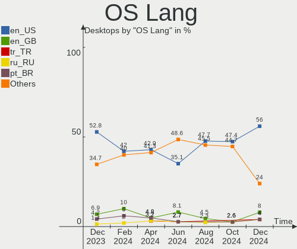
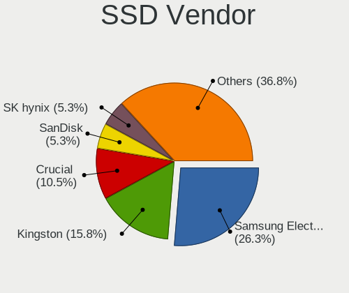
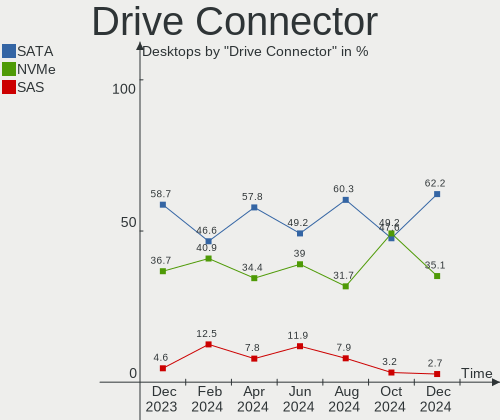
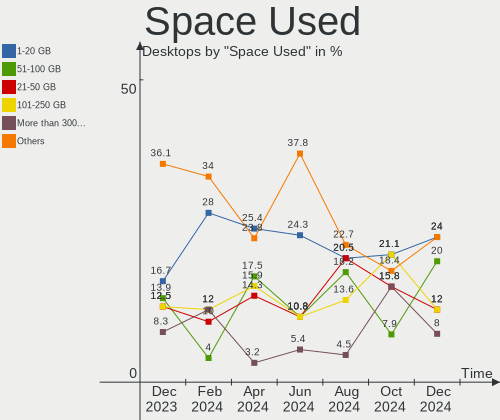
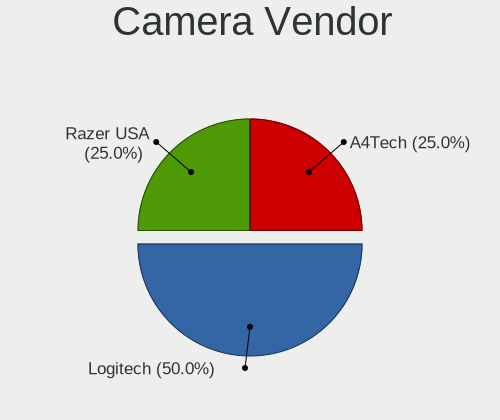

ArcoLinux - Hardware Trends (Desktops)
--------------------------------------

A project to identify most popular hardware characteristics and track their change
over time based on data collected by Linux users at https://Linux-Hardware.org.

Anyone can contribute to this report by the [hw-probe](https://github.com/linuxhw/hw-probe) tool:

    sudo -E hw-probe -all -upload

This report is for one last month. Overall report since the beginning of time: [TestDays](https://github.com/linuxhw/TestDays)

Period: Dec, 2024.

Contents
--------

* [ System ](#system)
  - [ OS                       ](#os)
  - [ OS Family                ](#os-family)
  - [ Kernel                   ](#kernel)
  - [ Kernel Family            ](#kernel-family)
  - [ Kernel Major Ver.        ](#kernel-major-ver)
  - [ Arch                     ](#arch)
  - [ DE                       ](#de)
  - [ Display Server           ](#display-server)
  - [ Display Manager          ](#display-manager)
  - [ OS Lang                  ](#os-lang)
  - [ Boot Mode                ](#boot-mode)
  - [ Filesystem               ](#filesystem)
  - [ Part. scheme             ](#part-scheme)
  - [ Dual Boot with Linux/BSD ](#dual-boot-with-linuxbsd)
  - [ Dual Boot (Win)          ](#dual-boot-win)

* [ Board ](#board)
  - [ Vendor                   ](#vendor)
  - [ Model                    ](#model)
  - [ Model Family             ](#model-family)
  - [ MFG Year                 ](#mfg-year)
  - [ Form Factor              ](#form-factor)
  - [ Secure Boot              ](#secure-boot)
  - [ Coreboot                 ](#coreboot)
  - [ RAM Size                 ](#ram-size)
  - [ RAM Used                 ](#ram-used)
  - [ Total Drives             ](#total-drives)
  - [ Has CD-ROM               ](#has-cd-rom)
  - [ Has Ethernet             ](#has-ethernet)
  - [ Has WiFi                 ](#has-wifi)
  - [ Has Bluetooth            ](#has-bluetooth)

* [ Location ](#location)
  - [ Country                  ](#country)
  - [ City                     ](#city)

* [ Drives ](#drives)
  - [ Drive Vendor             ](#drive-vendor)
  - [ Drive Model              ](#drive-model)
  - [ HDD Vendor               ](#hdd-vendor)
  - [ SSD Vendor               ](#ssd-vendor)
  - [ Drive Kind               ](#drive-kind)
  - [ Drive Connector          ](#drive-connector)
  - [ Drive Size               ](#drive-size)
  - [ Space Total              ](#space-total)
  - [ Space Used               ](#space-used)
  - [ Malfunc. Drives          ](#malfunc-drives)
  - [ Malfunc. Drive Vendor    ](#malfunc-drive-vendor)
  - [ Malfunc. HDD Vendor      ](#malfunc-hdd-vendor)
  - [ Malfunc. Drive Kind      ](#malfunc-drive-kind)
  - [ Failed Drives            ](#failed-drives)
  - [ Failed Drive Vendor      ](#failed-drive-vendor)
  - [ Drive Status             ](#drive-status)

* [ Storage controller ](#storage-controller)
  - [ Storage Vendor           ](#storage-vendor)
  - [ Storage Model            ](#storage-model)
  - [ Storage Kind             ](#storage-kind)

* [ Processor ](#processor)
  - [ CPU Vendor               ](#cpu-vendor)
  - [ CPU Model                ](#cpu-model)
  - [ CPU Model Family         ](#cpu-model-family)
  - [ CPU Cores                ](#cpu-cores)
  - [ CPU Sockets              ](#cpu-sockets)
  - [ CPU Threads              ](#cpu-threads)
  - [ CPU Op-Modes             ](#cpu-op-modes)
  - [ CPU Microcode            ](#cpu-microcode)
  - [ CPU Microarch            ](#cpu-microarch)

* [ Graphics ](#graphics)
  - [ GPU Vendor               ](#gpu-vendor)
  - [ GPU Model                ](#gpu-model)
  - [ GPU Combo                ](#gpu-combo)
  - [ GPU Driver               ](#gpu-driver)
  - [ GPU Memory               ](#gpu-memory)

* [ Monitor ](#monitor)
  - [ Monitor Vendor           ](#monitor-vendor)
  - [ Monitor Model            ](#monitor-model)
  - [ Monitor Resolution       ](#monitor-resolution)
  - [ Monitor Diagonal         ](#monitor-diagonal)
  - [ Monitor Width            ](#monitor-width)
  - [ Aspect Ratio             ](#aspect-ratio)
  - [ Monitor Area             ](#monitor-area)
  - [ Pixel Density            ](#pixel-density)
  - [ Multiple Monitors        ](#multiple-monitors)

* [ Network ](#network)
  - [ Net Controller Vendor    ](#net-controller-vendor)
  - [ Net Controller Model     ](#net-controller-model)
  - [ Wireless Vendor          ](#wireless-vendor)
  - [ Wireless Model           ](#wireless-model)
  - [ Ethernet Vendor          ](#ethernet-vendor)
  - [ Ethernet Model           ](#ethernet-model)
  - [ Net Controller Kind      ](#net-controller-kind)
  - [ Used Controller          ](#used-controller)
  - [ NICs                     ](#nics)
  - [ IPv6                     ](#ipv6)

* [ Bluetooth ](#bluetooth)
  - [ Bluetooth Vendor         ](#bluetooth-vendor)
  - [ Bluetooth Model          ](#bluetooth-model)

* [ Sound ](#sound)
  - [ Sound Vendor             ](#sound-vendor)
  - [ Sound Model              ](#sound-model)

* [ Memory ](#memory)
  - [ Memory Vendor            ](#memory-vendor)
  - [ Memory Model             ](#memory-model)
  - [ Memory Kind              ](#memory-kind)
  - [ Memory Form Factor       ](#memory-form-factor)
  - [ Memory Size              ](#memory-size)
  - [ Memory Speed             ](#memory-speed)

* [ Printers & scanners ](#printers--scanners)
  - [ Printer Vendor           ](#printer-vendor)
  - [ Printer Model            ](#printer-model)
  - [ Scanner Vendor           ](#scanner-vendor)
  - [ Scanner Model            ](#scanner-model)

* [ Camera ](#camera)
  - [ Camera Vendor            ](#camera-vendor)
  - [ Camera Model             ](#camera-model)

* [ Security ](#security)
  - [ Fingerprint Vendor       ](#fingerprint-vendor)
  - [ Fingerprint Model        ](#fingerprint-model)
  - [ Chipcard Vendor          ](#chipcard-vendor)
  - [ Chipcard Model           ](#chipcard-model)

* [ Unsupported ](#unsupported)
  - [ Unsupported Devices      ](#unsupported-devices)
  - [ Unsupported Device Types ](#unsupported-device-types)

System
------

OS
--

Installed operating systems

| Name              | Desktops | Percent |
|-------------------|----------|---------|
| ArcoLinux Rolling | 24       | 96%     |
| ArcoLinux         | 1        | 4%      |

OS Family
---------

OS without a version

| Name      | Desktops | Percent |
|-----------|----------|---------|
| ArcoLinux | 25       | 100%    |

Kernel
------

Version of the Linux kernel

| Version               | Desktops | Percent |
|-----------------------|----------|---------|
| 6.12.6-1-cachyos      | 4        | 16%     |
| 6.12.1-zen1-1-zen     | 3        | 12%     |
| 6.12.4-zen1-1-zen     | 2        | 8%      |
| 6.12.3-1-cachyos      | 2        | 8%      |
| 6.8.1-arch1-1         | 1        | 4%      |
| 6.6.68-1-lts          | 1        | 4%      |
| 6.6.65-1-lts          | 1        | 4%      |
| 6.6.63-1-lts          | 1        | 4%      |
| 6.12.7-zen1-1-zen     | 1        | 4%      |
| 6.12.6-zen1-1-zen     | 1        | 4%      |
| 6.12.5-2-cachyos      | 1        | 4%      |
| 6.12.4-arch1-1        | 1        | 4%      |
| 6.12.1-arch1-1        | 1        | 4%      |
| 6.11.7-arch1-1        | 1        | 4%      |
| 6.11.6-zen1-1-zen     | 1        | 4%      |
| 6.11.2-2-cachyos      | 1        | 4%      |
| 6.11.0-1-cachyos      | 1        | 4%      |
| 6.1.66-2-rt19-MANJARO | 1        | 4%      |

Kernel Family
-------------

Linux kernel without a distro release

| Version | Desktops | Percent |
|---------|----------|---------|
| 6.12.6  | 5        | 20%     |
| 6.12.1  | 4        | 16%     |
| 6.12.4  | 3        | 12%     |
| 6.12.3  | 2        | 8%      |
| 6.8.1   | 1        | 4%      |
| 6.6.68  | 1        | 4%      |
| 6.6.65  | 1        | 4%      |
| 6.6.63  | 1        | 4%      |
| 6.12.7  | 1        | 4%      |
| 6.12.5  | 1        | 4%      |
| 6.11.7  | 1        | 4%      |
| 6.11.6  | 1        | 4%      |
| 6.11.2  | 1        | 4%      |
| 6.11.0  | 1        | 4%      |
| 6.1.66  | 1        | 4%      |

Kernel Major Ver.
-----------------

Linux kernel major version

| Version | Desktops | Percent |
|---------|----------|---------|
| 6.12    | 16       | 64%     |
| 6.11    | 4        | 16%     |
| 6.6     | 3        | 12%     |
| 6.8     | 1        | 4%      |
| 6.1     | 1        | 4%      |

Arch
----

OS architecture (x86_64, i586, etc.)

| Name   | Desktops | Percent |
|--------|----------|---------|
| x86_64 | 25       | 100%    |

DE
--

Desktop Environment

| Name    | Desktops | Percent |
|---------|----------|---------|
| Unknown | 8        | 32%     |
| KDE6    | 5        | 20%     |
| GNOME   | 4        | 16%     |
| XFCE    | 2        | 8%      |
| chadwm  | 2        | 8%      |
| Budgie  | 2        | 8%      |
| LXQt    | 1        | 4%      |
| bspwm   | 1        | 4%      |

Display Server
--------------

X11 or Wayland

| Name    | Desktops | Percent |
|---------|----------|---------|
| X11     | 14       | 56%     |
| Wayland | 11       | 44%     |

Display Manager
---------------

SDDM, LightDM, etc.

| Name    | Desktops | Percent |
|---------|----------|---------|
| SDDM    | 20       | 80%     |
| LightDM | 3        | 12%     |
| GDM     | 1        | 4%      |
| Unknown | 1        | 4%      |

OS Lang
-------

Language

| Lang  | Desktops | Percent |
|-------|----------|---------|
| en_US | 14       | 56%     |
| en_GB | 2        | 8%      |
| tr_TR | 1        | 4%      |
| ru_RU | 1        | 4%      |
| pt_BR | 1        | 4%      |
| it_IT | 1        | 4%      |
| hu_HU | 1        | 4%      |
| en_ZA | 1        | 4%      |
| en_AU | 1        | 4%      |
| de_DE | 1        | 4%      |
| C     | 1        | 4%      |

Boot Mode
---------

EFI or BIOS

| Mode | Desktops | Percent |
|------|----------|---------|
| EFI  | 17       | 68%     |
| BIOS | 8        | 32%     |

Filesystem
----------

Type of filesystem

| Type    | Desktops | Percent |
|---------|----------|---------|
| Ext4    | 17       | 68%     |
| Btrfs   | 7        | 28%     |
| Overlay | 1        | 4%      |

Part. scheme
------------

Scheme of partitioning

| Type    | Desktops | Percent |
|---------|----------|---------|
| GPT     | 20       | 80%     |
| MBR     | 4        | 16%     |
| Unknown | 1        | 4%      |

Dual Boot with Linux/BSD
------------------------

Hosting more than one Linux/BSD

| Dual boot | Desktops | Percent |
|-----------|----------|---------|
| No        | 14       | 56%     |
| Yes       | 11       | 44%     |

Dual Boot (Win)
---------------

Hosting Linux and Windows

| Dual boot | Desktops | Percent |
|-----------|----------|---------|
| Yes       | 13       | 52%     |
| No        | 12       | 48%     |

Board
-----

Vendor
------

Motherboard manufacturer

| Name                                 | Desktops | Percent |
|--------------------------------------|----------|---------|
| ASUSTek Computer                     | 7        | 28%     |
| Gigabyte Technology                  | 5        | 20%     |
| MSI                                  | 3        | 12%     |
| Lenovo                               | 2        | 8%      |
| Hewlett-Packard                      | 2        | 8%      |
| Biostar                              | 2        | 8%      |
| Shenzhen Meigao Electronic Equipment | 1        | 4%      |
| Intel                                | 1        | 4%      |
| Dell                                 | 1        | 4%      |
| ASRock                               | 1        | 4%      |

Model
-----

Motherboard model

| Name                                       | Desktops | Percent |
|--------------------------------------------|----------|---------|
| Shenzhen Meigao Electronic Equipment UM690 | 1        | 4%      |
| MSI MS-7D91                                | 1        | 4%      |
| MSI MS-7B86                                | 1        | 4%      |
| MSI MS-7816                                | 1        | 4%      |
| Lenovo ThinkCentre M75t Gen 2 11KBS07W00   | 1        | 4%      |
| Lenovo ThinkCentre E73 10DR0012GE          | 1        | 4%      |
| Intel X99                                  | 1        | 4%      |
| HP EliteDesk 800 G2 TWR                    | 1        | 4%      |
| HP Compaq dc5850 Microtower                | 1        | 4%      |
| Gigabyte X570S AORUS ELITE AX              | 1        | 4%      |
| Gigabyte NZXT                              | 1        | 4%      |
| Gigabyte B550M AORUS ELITE                 | 1        | 4%      |
| Gigabyte B550 AORUS ELITE AX V2            | 1        | 4%      |
| Gigabyte AB350M-DS3H V2                    | 1        | 4%      |
| Dell OptiPlex 3080                         | 1        | 4%      |
| Biostar IH61MF-Q5                          | 1        | 4%      |
| Biostar H510MHP 2.0                        | 1        | 4%      |
| ASUS TUF Gaming X570-PLUS                  | 1        | 4%      |
| ASUS TUF B450-PLUS GAMING                  | 1        | 4%      |
| ASUS ROG STRIX X870E-E GAMING WIFI         | 1        | 4%      |
| ASUS ROG STRIX B450-F GAMING II            | 1        | 4%      |
| ASUS PRIME Z490-A                          | 1        | 4%      |
| ASUS PRIME H310M-R R2.0                    | 1        | 4%      |
| ASUS P8Z77-V LE PLUS                       | 1        | 4%      |
| ASRock AB350M Pro4                         | 1        | 4%      |

Model Family
------------

Motherboard model prefix

| Name                                       | Desktops | Percent |
|--------------------------------------------|----------|---------|
| Lenovo ThinkCentre                         | 2        | 8%      |
| ASUS TUF                                   | 2        | 8%      |
| ASUS ROG                                   | 2        | 8%      |
| ASUS PRIME                                 | 2        | 8%      |
| Shenzhen Meigao Electronic Equipment UM690 | 1        | 4%      |
| MSI MS-7D91                                | 1        | 4%      |
| MSI MS-7B86                                | 1        | 4%      |
| MSI MS-7816                                | 1        | 4%      |
| Intel X99                                  | 1        | 4%      |
| HP EliteDesk                               | 1        | 4%      |
| HP Compaq                                  | 1        | 4%      |
| Gigabyte X570S                             | 1        | 4%      |
| Gigabyte NZXT                              | 1        | 4%      |
| Gigabyte B550M                             | 1        | 4%      |
| Gigabyte B550                              | 1        | 4%      |
| Gigabyte AB350M-DS3H                       | 1        | 4%      |
| Dell OptiPlex                              | 1        | 4%      |
| Biostar IH61MF-Q5                          | 1        | 4%      |
| Biostar H510MHP                            | 1        | 4%      |
| ASUS P8Z77-V                               | 1        | 4%      |
| ASRock AB350M                              | 1        | 4%      |

MFG Year
--------

Motherboard manufacture year

| Year | Desktops | Percent |
|------|----------|---------|
| 2022 | 5        | 20%     |
| 2020 | 4        | 16%     |
| 2024 | 3        | 12%     |
| 2018 | 3        | 12%     |
| 2019 | 2        | 8%      |
| 2017 | 2        | 8%      |
| 2014 | 2        | 8%      |
| 2021 | 1        | 4%      |
| 2016 | 1        | 4%      |
| 2012 | 1        | 4%      |
| 2008 | 1        | 4%      |

Form Factor
-----------

Physical design of the computer

| Name    | Desktops | Percent |
|---------|----------|---------|
| Desktop | 25       | 100%    |

Secure Boot
-----------

Enabled or disabled

| State    | Desktops | Percent |
|----------|----------|---------|
| Disabled | 25       | 100%    |

Coreboot
--------

Have coreboot on board

| Used | Desktops | Percent |
|------|----------|---------|
| No   | 25       | 100%    |

RAM Size
--------

Total RAM memory

| Size in GB  | Desktops | Percent |
|-------------|----------|---------|
| 16.01-24.0  | 10       | 40%     |
| 32.01-64.0  | 9        | 36%     |
| 4.01-8.0    | 2        | 8%      |
| 24.01-32.0  | 2        | 8%      |
| 64.01-256.0 | 2        | 8%      |

RAM Used
--------

Used RAM memory

| Used GB    | Desktops | Percent |
|------------|----------|---------|
| 2.01-3.0   | 8        | 32%     |
| 4.01-8.0   | 6        | 24%     |
| 1.01-2.0   | 5        | 20%     |
| 3.01-4.0   | 2        | 8%      |
| 8.01-16.0  | 2        | 8%      |
| 16.01-24.0 | 1        | 4%      |
| 0.51-1.0   | 1        | 4%      |

Total Drives
------------

Number of drives on board

| Drives | Desktops | Percent |
|--------|----------|---------|
| 2      | 8        | 32%     |
| 3      | 7        | 28%     |
| 4      | 5        | 20%     |
| 1      | 3        | 12%     |
| 5      | 2        | 8%      |

Has CD-ROM
----------

Has CD-ROM on board

| Presented | Desktops | Percent |
|-----------|----------|---------|
| No        | 21       | 84%     |
| Yes       | 4        | 16%     |

Has Ethernet
------------

Has Ethernet on board

| Presented | Desktops | Percent |
|-----------|----------|---------|
| Yes       | 25       | 100%    |

Has WiFi
--------

Has WiFi module

| Presented | Desktops | Percent |
|-----------|----------|---------|
| No        | 13       | 52%     |
| Yes       | 12       | 48%     |

Has Bluetooth
-------------

Has Bluetooth module

| Presented | Desktops | Percent |
|-----------|----------|---------|
| Yes       | 13       | 52%     |
| No        | 12       | 48%     |

Location
--------

Country
-------

Geographic location (country)

| Country         | Desktops | Percent |
|-----------------|----------|---------|
| USA             | 4        | 16%     |
| UK              | 2        | 8%      |
| Sweden          | 2        | 8%      |
| Indonesia       | 2        | 8%      |
| Germany         | 2        | 8%      |
| Brazil          | 2        | 8%      |
| Belgium         | 2        | 8%      |
| Turkey          | 1        | 4%      |
| The Netherlands | 1        | 4%      |
| Spain           | 1        | 4%      |
| South Africa    | 1        | 4%      |
| Serbia          | 1        | 4%      |
| Russia          | 1        | 4%      |
| Italy           | 1        | 4%      |
| Hungary         | 1        | 4%      |
| Australia       | 1        | 4%      |

City
----

Geographic location (city)

| City              | Desktops | Percent |
|-------------------|----------|---------|
| Barnet            | 2        | 8%      |
| Zaječar          | 1        | 4%      |
| Yogyakarta        | 1        | 4%      |
| Stockholm         | 1        | 4%      |
| Seville           | 1        | 4%      |
| Senago            | 1        | 4%      |
| Sao Paulo         | 1        | 4%      |
| Querência        | 1        | 4%      |
| Nuremberg         | 1        | 4%      |
| Lys'va            | 1        | 4%      |
| Lakeland          | 1        | 4%      |
| Kansas City       | 1        | 4%      |
| Jeffersonville    | 1        | 4%      |
| Izmir             | 1        | 4%      |
| Frankfurt am Main | 1        | 4%      |
| Érd              | 1        | 4%      |
| Duffel            | 1        | 4%      |
| Dallas            | 1        | 4%      |
| Cape Town         | 1        | 4%      |
| Bredene           | 1        | 4%      |
| Borås            | 1        | 4%      |
| Bandung           | 1        | 4%      |
| Amsterdam         | 1        | 4%      |
| Adelaide          | 1        | 4%      |

Drives
------

Drive Vendor
------------

Hard drive vendors

| Vendor                      | Desktops | Drives | Percent |
|-----------------------------|----------|--------|---------|
| WDC                         | 11       | 12     | 18.03%  |
| Seagate                     | 8        | 11     | 13.11%  |
| Sandisk                     | 7        | 7      | 11.48%  |
| Samsung Electronics         | 7        | 8      | 11.48%  |
| Kingston                    | 6        | 9      | 9.84%   |
| MAXIO Technology (Hangzhou) | 3        | 3      | 4.92%   |
| Toshiba                     | 2        | 2      | 3.28%   |
| Intel                       | 2        | 2      | 3.28%   |
| Crucial                     | 2        | 2      | 3.28%   |
| SK hynix                    | 1        | 1      | 1.64%   |
| Phison Electronics          | 1        | 1      | 1.64%   |
| Patriot                     | 1        | 1      | 1.64%   |
| OCZ                         | 1        | 1      | 1.64%   |
| Netac                       | 1        | 1      | 1.64%   |
| Micron/Crucial Technology   | 1        | 1      | 1.64%   |
| JMicron Technology          | 1        | 1      | 1.64%   |
| JASTER                      | 1        | 1      | 1.64%   |
| Hitachi                     | 1        | 1      | 1.64%   |
| Fujitsu                     | 1        | 1      | 1.64%   |
| DeTech                      | 1        | 1      | 1.64%   |
| Apacer                      | 1        | 1      | 1.64%   |
| A-DATA Technology           | 1        | 2      | 1.64%   |

Drive Model
-----------

Hard drive models

| Model                                               | Desktops | Percent |
|-----------------------------------------------------|----------|---------|
| MAXIO (Hangzhou) NVMe SSD Controller MAP1202 512GB  | 3        | 4.35%   |
| WDC WD10EZEX-00BN5A0 1TB                            | 2        | 2.9%    |
| Sandisk WD Black SN850 2TB                          | 2        | 2.9%    |
| Kingston SA400S37240G 240GB SSD                     | 2        | 2.9%    |
| WDC WD800JD-75MSA3 80GB                             | 1        | 1.45%   |
| WDC WD7501AALS-00J7B1 752GB                         | 1        | 1.45%   |
| WDC WD5000AAKX-001CA0 500GB                         | 1        | 1.45%   |
| WDC WD30EFRX-68EUZN0 3TB                            | 1        | 1.45%   |
| WDC WD20PURZ-85GU6Y0 2TB                            | 1        | 1.45%   |
| WDC WD20EZAZ-00GGJB0 2TB                            | 1        | 1.45%   |
| WDC WD2002FAEX-007BA0 2TB                           | 1        | 1.45%   |
| WDC WD15EARS-00MVWB0 1TB                            | 1        | 1.45%   |
| WDC WD10JPCX-24UE4T0 1TB                            | 1        | 1.45%   |
| WDC WD1003FZEX-00MK2A0 1TB                          | 1        | 1.45%   |
| Toshiba HDWD110 1TB                                 | 1        | 1.45%   |
| Toshiba DT01ACA100 1TB                              | 1        | 1.45%   |
| SK hynix SC300 2.5 7MM 128GB SSD                    | 1        | 1.45%   |
| Seagate ST500DM002-1BD142 500GB                     | 1        | 1.45%   |
| Seagate ST4000DM004-2CV104 4TB                      | 1        | 1.45%   |
| Seagate ST3320413AS 320GB                           | 1        | 1.45%   |
| Seagate ST3250318AS 250GB                           | 1        | 1.45%   |
| Seagate ST250DM000-1BD141 250GB                     | 1        | 1.45%   |
| Seagate ST2000DM008-2FR102 2TB                      | 1        | 1.45%   |
| Seagate ST2000DM006-2DM164 2TB                      | 1        | 1.45%   |
| Seagate ST2000DM005-2CW102 2TB                      | 1        | 1.45%   |
| Seagate ST14000NM0018-2H4101 14TB                   | 1        | 1.45%   |
| Seagate ST1000DX002-2DV162 1TB                      | 1        | 1.45%   |
| Seagate ST10000DM0004-1ZC101 10TB                   | 1        | 1.45%   |
| Sandisk WD_BLACK SN770 2TB                          | 1        | 1.45%   |
| Sandisk WD_BLACK SN750 SE 500GB                     | 1        | 1.45%   |
| Sandisk WD Blue SN580 1TB                           | 1        | 1.45%   |
| Sandisk WD Blue SN550 NVMe SSD 256GB                | 1        | 1.45%   |
| SanDisk SSD PLUS 240GB                              | 1        | 1.45%   |
| Samsung SSD 870 EVO 500GB                           | 1        | 1.45%   |
| Samsung SSD 870 EVO 4TB                             | 1        | 1.45%   |
| Samsung SSD 870 EVO 2TB                             | 1        | 1.45%   |
| Samsung SSD 850 EVO 250GB                           | 1        | 1.45%   |
| Samsung SSD 840 PRO Series 128GB                    | 1        | 1.45%   |
| Samsung SSD 840 EVO 120GB                           | 1        | 1.45%   |
| Samsung NVMe SSD Controller SM981/PM981/PM983 512GB | 1        | 1.45%   |

HDD Vendor
----------

Hard disk drive vendors

| Vendor             | Desktops | Drives | Percent |
|--------------------|----------|--------|---------|
| WDC                | 11       | 12     | 45.83%  |
| Seagate            | 8        | 11     | 33.33%  |
| Toshiba            | 2        | 2      | 8.33%   |
| JMicron Technology | 1        | 1      | 4.17%   |
| Hitachi            | 1        | 1      | 4.17%   |
| Fujitsu            | 1        | 1      | 4.17%   |

SSD Vendor
----------

Solid state drive vendors

| Vendor              | Desktops | Drives | Percent |
|---------------------|----------|--------|---------|
| Samsung Electronics | 5        | 6      | 26.32%  |
| Kingston            | 3        | 4      | 15.79%  |
| Crucial             | 2        | 2      | 10.53%  |
| SK hynix            | 1        | 1      | 5.26%   |
| SanDisk             | 1        | 1      | 5.26%   |
| Patriot             | 1        | 1      | 5.26%   |
| OCZ                 | 1        | 1      | 5.26%   |
| JASTER              | 1        | 1      | 5.26%   |
| Intel               | 1        | 1      | 5.26%   |
| DeTech              | 1        | 1      | 5.26%   |
| Apacer              | 1        | 1      | 5.26%   |
| A-DATA Technology   | 1        | 2      | 5.26%   |

Drive Kind
----------

HDD or SSD

| Kind | Desktops | Drives | Percent |
|------|----------|--------|---------|
| HDD  | 18       | 28     | 38.3%   |
| SSD  | 16       | 22     | 34.04%  |
| NVMe | 13       | 20     | 27.66%  |

Drive Connector
---------------

SATA, SAS, NVMe, etc.

| Type | Desktops | Drives | Percent |
|------|----------|--------|---------|
| SATA | 23       | 49     | 62.16%  |
| NVMe | 13       | 20     | 35.14%  |
| SAS  | 1        | 1      | 2.7%    |

Drive Size
----------

Size of hard drive

| Size in TB | Desktops | Drives | Percent |
|------------|----------|--------|---------|
| 0.01-0.5   | 15       | 26     | 40.54%  |
| 0.51-1.0   | 11       | 12     | 29.73%  |
| 1.01-2.0   | 6        | 7      | 16.22%  |
| 3.01-4.0   | 2        | 2      | 5.41%   |
| 2.01-3.0   | 1        | 1      | 2.7%    |
| 10.01-20.0 | 1        | 1      | 2.7%    |
| 4.01-10.0  | 1        | 1      | 2.7%    |

Space Total
-----------

Amount of disk space available on the file system

| Size in GB     | Desktops | Percent |
|----------------|----------|---------|
| More than 3000 | 8        | 32%     |
| 251-500        | 5        | 20%     |
| 101-250        | 5        | 20%     |
| 501-1000       | 3        | 12%     |
| 1001-2000      | 2        | 8%      |
| 21-50          | 1        | 4%      |
| 2001-3000      | 1        | 4%      |

Space Used
----------

Amount of used disk space

| Used GB        | Desktops | Percent |
|----------------|----------|---------|
| 1-20           | 6        | 24%     |
| 51-100         | 5        | 20%     |
| 21-50          | 3        | 12%     |
| 101-250        | 3        | 12%     |
| More than 3000 | 2        | 8%      |
| 251-500        | 2        | 8%      |
| 2001-3000      | 2        | 8%      |
| 1001-2000      | 1        | 4%      |
| 501-1000       | 1        | 4%      |

Malfunc. Drives
---------------

Drive models with a malfunction

| Model                                        | Desktops | Drives | Percent |
|----------------------------------------------|----------|--------|---------|
| Seagate ST500DM002-1BD142 500GB              | 1        | 1      | 14.29%  |
| Seagate ST3320413AS 320GB                    | 1        | 1      | 14.29%  |
| Seagate ST250DM000-1BD141 250GB              | 1        | 1      | 14.29%  |
| Seagate ST1000DX002-2DV162 1TB               | 1        | 1      | 14.29%  |
| Samsung Electronics SSD 840 PRO Series 128GB | 1        | 1      | 14.29%  |
| Hitachi HTS545050B9A300 500GB                | 1        | 1      | 14.29%  |
| Fujitsu MHY2120BH 120GB                      | 1        | 1      | 14.29%  |

Malfunc. Drive Vendor
---------------------

Vendors of faulty drives

| Vendor              | Desktops | Drives | Percent |
|---------------------|----------|--------|---------|
| Seagate             | 4        | 4      | 57.14%  |
| Samsung Electronics | 1        | 1      | 14.29%  |
| Hitachi             | 1        | 1      | 14.29%  |
| Fujitsu             | 1        | 1      | 14.29%  |

Malfunc. HDD Vendor
-------------------

Vendors of faulty HDD drives

| Vendor  | Desktops | Drives | Percent |
|---------|----------|--------|---------|
| Seagate | 4        | 4      | 66.67%  |
| Hitachi | 1        | 1      | 16.67%  |
| Fujitsu | 1        | 1      | 16.67%  |

Malfunc. Drive Kind
-------------------

Kinds of faulty drives

| Kind | Desktops | Drives | Percent |
|------|----------|--------|---------|
| HDD  | 5        | 6      | 83.33%  |
| SSD  | 1        | 1      | 16.67%  |

Failed Drives
-------------

Failed drive models

Zero info for selected period =(

Failed Drive Vendor
-------------------

Failed drive vendors

Zero info for selected period =(

Drive Status
------------

Number of failed and malfunc. drives

| Status   | Desktops | Drives | Percent |
|----------|----------|--------|---------|
| Works    | 23       | 59     | 76.67%  |
| Malfunc  | 6        | 7      | 20%     |
| Detected | 1        | 4      | 3.33%   |

Storage controller
------------------

Storage Vendor
--------------

Storage controller vendors

| Vendor                      | Desktops | Percent |
|-----------------------------|----------|---------|
| AMD                         | 13       | 29.55%  |
| Intel                       | 12       | 27.27%  |
| SanDisk                     | 6        | 13.64%  |
| MAXIO Technology (Hangzhou) | 3        | 6.82%   |
| Kingston Technology Company | 3        | 6.82%   |
| Samsung Electronics         | 2        | 4.55%   |
| Phison Electronics          | 1        | 2.27%   |
| Netac Technology            | 1        | 2.27%   |
| Micron/Crucial Technology   | 1        | 2.27%   |
| Marvell Technology Group    | 1        | 2.27%   |
| ASMedia Technology          | 1        | 2.27%   |

Storage Model
-------------

Storage controller models

| Model                                                                          | Desktops | Percent |
|--------------------------------------------------------------------------------|----------|---------|
| AMD FCH SATA Controller [AHCI mode]                                            | 5        | 10.2%   |
| AMD 500 Series Chipset SATA Controller                                         | 4        | 8.16%   |
| MAXIO (Hangzhou) NVMe SSD Controller MAP1202 (DRAM-less)                       | 3        | 6.12%   |
| SanDisk WD PC SN810 / Black SN850 NVMe SSD                                     | 2        | 4.08%   |
| Kingston Company FURY Renegade NVMe SSD + Heatsink [E18]                       | 2        | 4.08%   |
| AMD 600 Series Chipset SATA Controller                                         | 2        | 4.08%   |
| AMD 400 Series Chipset SATA Controller                                         | 2        | 4.08%   |
| AMD 300 Series Chipset SATA Controller                                         | 2        | 4.08%   |
| Sandisk WD Blue SN580 NVMe SSD (DRAM-less)                                     | 1        | 2.04%   |
| SanDisk WD Black SN770 / PC SN740 256GB / PC SN560 (DRAM-less) NVMe SSD        | 1        | 2.04%   |
| SanDisk Ultra 3D / WD PC SN530, IX SN530, Blue SN550 NVMe SSD (DRAM-less)      | 1        | 2.04%   |
| SanDisk PC SN735 / WD_BLACK SN750 SE NVMe SSD (DRAM-less)                      | 1        | 2.04%   |
| Samsung NVMe SSD Controller SM981/PM981/PM983                                  | 1        | 2.04%   |
| Samsung NVMe SSD Controller SM961/PM961/SM963                                  | 1        | 2.04%   |
| Phison PS5013-E13 PCIe3 NVMe Controller (DRAM-less)                            | 1        | 2.04%   |
| Netac PCIe 4 INNOGRIT based NVMe SSD                                           | 1        | 2.04%   |
| Micron/Crucial P2 [Nick P2] / P3 / P3 Plus NVMe PCIe SSD (DRAM-less)           | 1        | 2.04%   |
| Marvell Group 88SE9120 SATA 6Gb/s Controller                                   | 1        | 2.04%   |
| Kingston Company OM8PGP4 NVMe PCIe SSD (DRAM-less)                             | 1        | 2.04%   |
| Kingston Company KC3000/FURY Renegade NVMe SSD [E18]                           | 1        | 2.04%   |
| Intel SSD 660P Series                                                          | 1        | 2.04%   |
| Intel Raptor Lake SATA AHCI Controller                                         | 1        | 2.04%   |
| Intel Q170/Q150/B150/H170/H110/Z170/CM236 Chipset SATA Controller [AHCI Mode]  | 1        | 2.04%   |
| Intel Comet Lake SATA AHCI Controller                                          | 1        | 2.04%   |
| Intel 9 Series Chipset Family SATA Controller [AHCI Mode]                      | 1        | 2.04%   |
| Intel 8 Series/C220 Series Chipset Family 6-port SATA Controller 1 [AHCI mode] | 1        | 2.04%   |
| Intel 8 Series/C220 Series Chipset Family 4-port SATA Controller 1 [IDE mode]  | 1        | 2.04%   |
| Intel 8 Series/C220 Series Chipset Family 2-port SATA Controller 2 [IDE mode]  | 1        | 2.04%   |
| Intel 7 Series/C210 Series Chipset Family 6-port SATA Controller [AHCI mode]   | 1        | 2.04%   |
| Intel 6 Series/C200 Series Chipset Family 6 port Desktop SATA AHCI Controller  | 1        | 2.04%   |
| Intel 500 Series Chipset Family SATA AHCI Controller                           | 1        | 2.04%   |
| Intel 400 Series Chipset Family SATA AHCI Controller                           | 1        | 2.04%   |
| Intel 200 Series PCH SATA controller [AHCI mode]                               | 1        | 2.04%   |
| ASMedia ASM1061/ASM1062 Serial ATA Controller                                  | 1        | 2.04%   |
| AMD SB7x0/SB8x0/SB9x0 SATA Controller [IDE mode]                               | 1        | 2.04%   |

Storage Kind
------------

Kind of storage controller (IDE, SATA, NVMe, SAS, ...)

| Kind | Desktops | Percent |
|------|----------|---------|
| SATA | 23       | 62.16%  |
| NVMe | 13       | 35.14%  |
| IDE  | 1        | 2.7%    |

Processor
---------

CPU Vendor
----------

Processor vendors

| Vendor | Desktops | Percent |
|--------|----------|---------|
| AMD    | 14       | 56%     |
| Intel  | 11       | 44%     |

CPU Model
---------

Processor models

| Model                                      | Desktops | Percent |
|--------------------------------------------|----------|---------|
| Intel Xeon CPU E5-2670 v3 @ 2.30GHz        | 1        | 4%      |
| Intel Pentium Gold G5400 CPU @ 3.70GHz     | 1        | 4%      |
| Intel Pentium CPU G3240 @ 3.10GHz          | 1        | 4%      |
| Intel Core i7-10700K CPU @ 3.80GHz         | 1        | 4%      |
| Intel Core i5-6500 CPU @ 3.20GHz           | 1        | 4%      |
| Intel Core i5-4690 CPU @ 3.50GHz           | 1        | 4%      |
| Intel Core i5-3570K CPU @ 3.40GHz          | 1        | 4%      |
| Intel Core i5-3330 CPU @ 3.00GHz           | 1        | 4%      |
| Intel Core i5-10500T CPU @ 2.30GHz         | 1        | 4%      |
| Intel Core i5-10400F CPU @ 2.90GHz         | 1        | 4%      |
| Intel 13th Gen Core i5-13600K              | 1        | 4%      |
| AMD Ryzen 9 7950X3D 16-Core Processor      | 1        | 4%      |
| AMD Ryzen 9 6900HX with Radeon Graphics    | 1        | 4%      |
| AMD Ryzen 9 3900X 12-Core Processor        | 1        | 4%      |
| AMD Ryzen 7 PRO 4750G with Radeon Graphics | 1        | 4%      |
| AMD Ryzen 7 7700X 8-Core Processor         | 1        | 4%      |
| AMD Ryzen 7 5700X 8-Core Processor         | 1        | 4%      |
| AMD Ryzen 7 3800X 8-Core Processor         | 1        | 4%      |
| AMD Ryzen 7 2700 Eight-Core Processor      | 1        | 4%      |
| AMD Ryzen 5 5600X 6-Core Processor         | 1        | 4%      |
| AMD Ryzen 5 5600G with Radeon Graphics     | 1        | 4%      |
| AMD Ryzen 5 4600G with Radeon Graphics     | 1        | 4%      |
| AMD Ryzen 5 3600 6-Core Processor          | 1        | 4%      |
| AMD Ryzen 5 1600 Six-Core Processor        | 1        | 4%      |
| AMD Athlon II X2 250 Processor             | 1        | 4%      |

CPU Model Family
----------------

Processor model prefix

| Model              | Desktops | Percent |
|--------------------|----------|---------|
| Intel Core i5      | 6        | 24%     |
| AMD Ryzen 5        | 5        | 20%     |
| AMD Ryzen 7        | 4        | 16%     |
| AMD Ryzen 9        | 3        | 12%     |
| Other              | 1        | 4%      |
| Intel Xeon         | 1        | 4%      |
| Intel Pentium Gold | 1        | 4%      |
| Intel Pentium      | 1        | 4%      |
| Intel Core i7      | 1        | 4%      |
| AMD Ryzen 7 PRO    | 1        | 4%      |
| AMD Athlon II X2   | 1        | 4%      |

CPU Cores
---------

Number of processor cores

| Number | Desktops | Percent |
|--------|----------|---------|
| 8      | 7        | 28%     |
| 6      | 7        | 28%     |
| 4      | 4        | 16%     |
| 2      | 3        | 12%     |
| 12     | 2        | 8%      |
| 16     | 1        | 4%      |
| 14     | 1        | 4%      |

CPU Sockets
-----------

Number of sockets

| Number | Desktops | Percent |
|--------|----------|---------|
| 1      | 25       | 100%    |

CPU Threads
-----------

Threads per core (Hyper-Threading)

| Number | Desktops | Percent |
|--------|----------|---------|
| 2      | 19       | 76%     |
| 1      | 6        | 24%     |

CPU Op-Modes
------------

CPU Operation Modes (32-bit, 64-bit)

| Op mode        | Desktops | Percent |
|----------------|----------|---------|
| 32-bit, 64-bit | 25       | 100%    |

CPU Microcode
-------------

Microcode number

| Number     | Desktops | Percent |
|------------|----------|---------|
| Unknown    | 24       | 96%     |
| 0x0a601206 | 1        | 4%      |

CPU Microarch
-------------

Microarchitecture

| Name             | Desktops | Percent |
|------------------|----------|---------|
| Zen 2            | 5        | 20%     |
| Zen 3            | 3        | 12%     |
| Haswell          | 3        | 12%     |
| CometLake        | 3        | 12%     |
| Unknown          | 3        | 12%     |
| IvyBridge        | 2        | 8%      |
| Zen+             | 1        | 4%      |
| Zen              | 1        | 4%      |
| Skylake          | 1        | 4%      |
| KabyLake         | 1        | 4%      |
| K10              | 1        | 4%      |
| Alderlake Hybrid | 1        | 4%      |

Graphics
--------

GPU Vendor
----------

Vendors of graphics cards

| Vendor | Desktops | Percent |
|--------|----------|---------|
| AMD    | 11       | 40.74%  |
| Nvidia | 9        | 33.33%  |
| Intel  | 7        | 25.93%  |

GPU Model
---------

Graphics card models

| Model                                                                       | Desktops | Percent |
|-----------------------------------------------------------------------------|----------|---------|
| Nvidia TU106 [GeForce RTX 2060 Rev. A]                                      | 2        | 7.14%   |
| AMD Navi 10 [Radeon RX 5600 OEM/5600 XT / 5700/5700 XT]                     | 2        | 7.14%   |
| Nvidia TU116 [GeForce GTX 1660 SUPER]                                       | 1        | 3.57%   |
| Nvidia GP107 [GeForce GTX 1050 Ti]                                          | 1        | 3.57%   |
| Nvidia GP104 [GeForce GTX 1080]                                             | 1        | 3.57%   |
| Nvidia GM204 [GeForce GTX 970]                                              | 1        | 3.57%   |
| Nvidia GM107 [GeForce GTX 750]                                              | 1        | 3.57%   |
| Nvidia GA106 [RTX A2000]                                                    | 1        | 3.57%   |
| Nvidia AD104 [GeForce RTX 4070 SUPER]                                       | 1        | 3.57%   |
| Intel Xeon E3-1200 v3/4th Gen Core Processor Integrated Graphics Controller | 1        | 3.57%   |
| Intel Xeon E3-1200 v2/3rd Gen Core processor Graphics Controller            | 1        | 3.57%   |
| Intel Raptor Lake-S GT1 [UHD Graphics 770]                                  | 1        | 3.57%   |
| Intel IvyBridge GT2 [HD Graphics 4000]                                      | 1        | 3.57%   |
| Intel HD Graphics 530                                                       | 1        | 3.57%   |
| Intel CometLake-S GT2 [UHD Graphics 630]                                    | 1        | 3.57%   |
| Intel CoffeeLake-S GT1 [UHD Graphics 610]                                   | 1        | 3.57%   |
| AMD RS780C [Radeon 3100]                                                    | 1        | 3.57%   |
| AMD Renoir [Radeon Vega Series / Radeon Vega Mobile Series]                 | 1        | 3.57%   |
| AMD Rembrandt [Radeon 680M]                                                 | 1        | 3.57%   |
| AMD Raphael                                                                 | 1        | 3.57%   |
| AMD Navi 33 [Radeon RX 7600/7600 XT/7600M XT/7600S/7700S / PRO W7600]       | 1        | 3.57%   |
| AMD Navi 31 [Radeon RX 7900 XT/7900 XTX/7900 GRE/7900M]                     | 1        | 3.57%   |
| AMD Navi 23 [Radeon RX 6600/6600 XT/6600M]                                  | 1        | 3.57%   |
| AMD Navi 22 [Radeon RX 6700/6700 XT/6750 XT / 6800M/6850M XT]               | 1        | 3.57%   |
| AMD Ellesmere [Radeon RX 470/480/570/570X/580/580X/590]                     | 1        | 3.57%   |
| AMD Caicos PRO [Radeon HD 7450]                                             | 1        | 3.57%   |

GPU Combo
---------

Combinations of graphics cards

| Name         | Desktops | Percent |
|--------------|----------|---------|
| 1 x Nvidia   | 8        | 32%     |
| 1 x AMD      | 8        | 32%     |
| 1 x Intel    | 6        | 24%     |
| 2 x AMD      | 1        | 4%      |
| Intel + AMD  | 1        | 4%      |
| AMD + Nvidia | 1        | 4%      |

GPU Driver
----------

Free vs proprietary

| Driver      | Desktops | Percent |
|-------------|----------|---------|
| Free        | 17       | 68%     |
| Proprietary | 8        | 32%     |

GPU Memory
----------

Total video memory

| Size in GB | Desktops | Percent |
|------------|----------|---------|
| Unknown    | 7        | 28%     |
| 7.01-8.0   | 5        | 20%     |
| 5.01-6.0   | 4        | 16%     |
| 1.01-2.0   | 3        | 12%     |
| 3.01-4.0   | 2        | 8%      |
| 0.01-0.5   | 2        | 8%      |
| 16.01-24.0 | 1        | 4%      |
| 8.01-16.0  | 1        | 4%      |

Monitor
-------

Monitor Vendor
--------------

Monitor vendors

| Vendor              | Desktops | Percent |
|---------------------|----------|---------|
| Samsung Electronics | 6        | 23.08%  |
| Goldstar            | 5        | 19.23%  |
| AOC                 | 3        | 11.54%  |
| Unknown (XXX)       | 2        | 7.69%   |
| MSI                 | 2        | 7.69%   |
| Dell                | 2        | 7.69%   |
| Pixio               | 1        | 3.85%   |
| Iiyama              | 1        | 3.85%   |
| Hewlett-Packard     | 1        | 3.85%   |
| Gateway             | 1        | 3.85%   |
| CHO                 | 1        | 3.85%   |
| BenQ                | 1        | 3.85%   |

Monitor Model
-------------

Monitor models

| Model                                                                   | Desktops | Percent |
|-------------------------------------------------------------------------|----------|---------|
| Unknown (XXX) Beyond TV XXX9221 1920x1080 1209x680mm 54.6-inch          | 2        | 6.9%    |
| Goldstar LG TV SSCR2 GSMC0C8 3840x2160                                  | 2        | 6.9%    |
| Samsung Electronics U32J59x SAM0F52 3840x2160 697x392mm 31.5-inch       | 1        | 3.45%   |
| Samsung Electronics SyncMaster SAM060D 1920x1080                        | 1        | 3.45%   |
| Samsung Electronics SyncMaster SAM05FC 1920x1080                        | 1        | 3.45%   |
| Samsung Electronics SyncMaster SAM027E 1680x1050 474x296mm 22.0-inch    | 1        | 3.45%   |
| Samsung Electronics Odyssey G95C SAM74D9 3840x1080 1193x336mm 48.8-inch | 1        | 3.45%   |
| Samsung Electronics LCD Monitor SAM0C39 1920x1080 885x498mm 40.0-inch   | 1        | 3.45%   |
| Samsung Electronics LCD Monitor SAM0902 1920x1080 700x390mm 31.5-inch   | 1        | 3.45%   |
| Samsung Electronics LCD Monitor SAM07E8 1280x720 950x540mm 43.0-inch    | 1        | 3.45%   |
| Samsung Electronics LC32G5xT SAM7089 2560x1440 698x393mm 31.5-inch      | 1        | 3.45%   |
| Pixio VXD-G34UHDW WAM3400 3440x1440 810x300mm 34.0-inch                 | 1        | 3.45%   |
| MSI G273 MSI3CA7 1920x1080 597x336mm 27.0-inch                          | 1        | 3.45%   |
| MSI G241V E2 MSI3BA7 1920x1080 527x296mm 23.8-inch                      | 1        | 3.45%   |
| Iiyama PL3494WQ IVM7631 3440x1440 797x334mm 34.0-inch                   | 1        | 3.45%   |
| Hewlett-Packard L1950 HWP26E7 1280x1024 380x300mm 19.1-inch             | 1        | 3.45%   |
| Goldstar Ultra HD GSM5B08 3840x2160 600x340mm 27.2-inch                 | 1        | 3.45%   |
| Goldstar FULL HD GSM5B55 1920x1080 480x270mm 21.7-inch                  | 1        | 3.45%   |
| Goldstar E2241 GSM5819 1920x1080 477x268mm 21.5-inch                    | 1        | 3.45%   |
| Gateway HD2200 GWY08A6 1680x1050 473x296mm 22.0-inch                    | 1        | 3.45%   |
| Dell P2419H DELD0D9 1920x1080 527x296mm 23.8-inch                       | 1        | 3.45%   |
| Dell E2215HV DELF05F 1920x1080 476x268mm 21.5-inch                      | 1        | 3.45%   |
| CHO MNT CHO2380 1920x1080 527x296mm 23.8-inch                           | 1        | 3.45%   |
| BenQ GW2780 BNQ78E6 1920x1080 598x336mm 27.0-inch                       | 1        | 3.45%   |
| AOC 2752 AOC2752 1920x1080 579x336mm 26.4-inch                          | 1        | 3.45%   |
| AOC 2450W AOC2450 1920x1080 521x293mm 23.5-inch                         | 1        | 3.45%   |
| AOC 2236 AOC2236 1920x1080 477x268mm 21.5-inch                          | 1        | 3.45%   |

Monitor Resolution
------------------

Monitor screen resolution

| Resolution         | Desktops | Percent |
|--------------------|----------|---------|
| 1920x1080 (FHD)    | 14       | 51.85%  |
| 3840x2160 (4K)     | 5        | 18.52%  |
| 3440x1440          | 2        | 7.41%   |
| 1680x1050 (WSXGA+) | 2        | 7.41%   |
| 3840x1080          | 1        | 3.7%    |
| 2560x1440 (QHD)    | 1        | 3.7%    |
| 1280x720 (HD)      | 1        | 3.7%    |
| 1280x1024 (SXGA)   | 1        | 3.7%    |

Monitor Diagonal
----------------

Diagonal size in inches

| Inches  | Desktops | Percent |
|---------|----------|---------|
| 27      | 5        | 17.86%  |
| 54      | 4        | 14.29%  |
| 21      | 3        | 10.71%  |
| 72      | 2        | 7.14%   |
| 34      | 2        | 7.14%   |
| 31      | 2        | 7.14%   |
| 24      | 2        | 7.14%   |
| 23      | 2        | 7.14%   |
| 22      | 2        | 7.14%   |
| 48      | 1        | 3.57%   |
| 43      | 1        | 3.57%   |
| 19      | 1        | 3.57%   |
| Unknown | 1        | 3.57%   |

Monitor Width
-------------

Physical width

| Width in mm | Desktops | Percent |
|-------------|----------|---------|
| 501-600     | 9        | 32.14%  |
| 401-500     | 5        | 17.86%  |
| 1001-1500   | 5        | 17.86%  |
| 601-700     | 2        | 7.14%   |
| 1501-2000   | 2        | 7.14%   |
| 801-900     | 1        | 3.57%   |
| 701-800     | 1        | 3.57%   |
| 351-400     | 1        | 3.57%   |
| 901-1000    | 1        | 3.57%   |
| Unknown     | 1        | 3.57%   |

Aspect Ratio
------------

Proportional relationship between the width and the height

| Ratio | Desktops | Percent |
|-------|----------|---------|
| 16/9  | 18       | 75%     |
| 16/10 | 2        | 8.33%   |
| 5/4   | 1        | 4.17%   |
| 32/9  | 1        | 4.17%   |
| 21/9  | 1        | 4.17%   |
| 2.70  | 1        | 4.17%   |

Monitor Area
------------

Area in inch²

| Area in inch² | Desktops | Percent |
|----------------|----------|---------|
| 201-250        | 7        | 25.93%  |
| More than 1000 | 6        | 22.22%  |
| 301-350        | 5        | 18.52%  |
| 351-500        | 4        | 14.81%  |
| 151-200        | 2        | 7.41%   |
| 501-1000       | 2        | 7.41%   |
| Unknown        | 1        | 3.7%    |

Pixel Density
-------------

Pixels per inch

| Density | Desktops | Percent |
|---------|----------|---------|
| 51-100  | 13       | 50%     |
| 1-50    | 5        | 19.23%  |
| 101-120 | 5        | 19.23%  |
| 161-240 | 1        | 3.85%   |
| 121-160 | 1        | 3.85%   |
| Unknown | 1        | 3.85%   |

Multiple Monitors
-----------------

Total monitors connected

| Total | Desktops | Percent |
|-------|----------|---------|
| 1     | 18       | 72%     |
| 2     | 6        | 24%     |
| 3     | 1        | 4%      |

Network
-------

Net Controller Vendor
---------------------

Controller vendors

| Vendor                | Desktops | Percent |
|-----------------------|----------|---------|
| Realtek Semiconductor | 18       | 50%     |
| Intel                 | 9        | 25%     |
| MediaTek              | 3        | 8.33%   |
| Qualcomm Atheros      | 2        | 5.56%   |
| Ralink                | 1        | 2.78%   |
| Edimax Technology     | 1        | 2.78%   |
| Broadcom Limited      | 1        | 2.78%   |
| Belkin Components     | 1        | 2.78%   |

Net Controller Model
--------------------

Controller models

| Model                                                                   | Desktops | Percent |
|-------------------------------------------------------------------------|----------|---------|
| Realtek RTL8111/8168/8211/8411 PCI Express Gigabit Ethernet Controller  | 14       | 35%     |
| Realtek RTL8125 2.5GbE Controller                                       | 2        | 5%      |
| MediaTek MT7921K (RZ608) Wi-Fi 6E 80MHz                                 | 2        | 5%      |
| Intel Ethernet Controller I225-V                                        | 2        | 5%      |
| Realtek RTL88x2bu [AC1200 Techkey]                                      | 1        | 2.5%    |
| Realtek RTL8821CE 802.11ac PCIe Wireless Network Adapter                | 1        | 2.5%    |
| Realtek RTL8188EUS 802.11n Wireless Network Adapter                     | 1        | 2.5%    |
| Realtek RTL8153 Gigabit Ethernet Adapter                                | 1        | 2.5%    |
| Realtek RT8126 PCIe Ethernet Controller                                 | 1        | 2.5%    |
| Ralink RT5392 PCIe Wireless Network Adapter                             | 1        | 2.5%    |
| Qualcomm Atheros Killer E220x Gigabit Ethernet Controller               | 1        | 2.5%    |
| Qualcomm Atheros AR9287 Wireless Network Adapter (PCI-Express)          | 1        | 2.5%    |
| MediaTek MT7921 802.11ax PCI Express Wireless Network Adapter           | 1        | 2.5%    |
| Intel Wireless 8265 / 8275                                              | 1        | 2.5%    |
| Intel Wi-Fi 5(802.11ac) Wireless-AC 9x6x [Thunder Peak]                 | 1        | 2.5%    |
| Intel Raptor Lake-S PCH CNVi WiFi                                       | 1        | 2.5%    |
| Intel I350 Gigabit Network Connection                                   | 1        | 2.5%    |
| Intel I211 Gigabit Network Connection                                   | 1        | 2.5%    |
| Intel Ethernet Controller I226-V                                        | 1        | 2.5%    |
| Intel Ethernet Connection (2) I219-LM                                   | 1        | 2.5%    |
| Intel Ethernet Connection (14) I219-V                                   | 1        | 2.5%    |
| Edimax EW-7811Un 802.11n Wireless Adapter [Realtek RTL8188CUS]          | 1        | 2.5%    |
| Broadcom Limited NetXtreme BCM5754 Gigabit Ethernet PCI Express         | 1        | 2.5%    |
| Belkin Components F7D1101 v1 Basic Wireless Adapter [Realtek RTL8188SU] | 1        | 2.5%    |

Wireless Vendor
---------------

Wireless vendors

| Vendor                | Desktops | Percent |
|-----------------------|----------|---------|
| Realtek Semiconductor | 3        | 23.08%  |
| MediaTek              | 3        | 23.08%  |
| Intel                 | 3        | 23.08%  |
| Ralink                | 1        | 7.69%   |
| Qualcomm Atheros      | 1        | 7.69%   |
| Edimax Technology     | 1        | 7.69%   |
| Belkin Components     | 1        | 7.69%   |

Wireless Model
--------------

Wireless models

| Model                                                                   | Desktops | Percent |
|-------------------------------------------------------------------------|----------|---------|
| MediaTek MT7921K (RZ608) Wi-Fi 6E 80MHz                                 | 2        | 15.38%  |
| Realtek RTL88x2bu [AC1200 Techkey]                                      | 1        | 7.69%   |
| Realtek RTL8821CE 802.11ac PCIe Wireless Network Adapter                | 1        | 7.69%   |
| Realtek RTL8188EUS 802.11n Wireless Network Adapter                     | 1        | 7.69%   |
| Ralink RT5392 PCIe Wireless Network Adapter                             | 1        | 7.69%   |
| Qualcomm Atheros AR9287 Wireless Network Adapter (PCI-Express)          | 1        | 7.69%   |
| MediaTek MT7921 802.11ax PCI Express Wireless Network Adapter           | 1        | 7.69%   |
| Intel Wireless 8265 / 8275                                              | 1        | 7.69%   |
| Intel Wi-Fi 5(802.11ac) Wireless-AC 9x6x [Thunder Peak]                 | 1        | 7.69%   |
| Intel Raptor Lake-S PCH CNVi WiFi                                       | 1        | 7.69%   |
| Edimax EW-7811Un 802.11n Wireless Adapter [Realtek RTL8188CUS]          | 1        | 7.69%   |
| Belkin Components F7D1101 v1 Basic Wireless Adapter [Realtek RTL8188SU] | 1        | 7.69%   |

Ethernet Vendor
---------------

Ethernet vendors

| Vendor                | Desktops | Percent |
|-----------------------|----------|---------|
| Realtek Semiconductor | 18       | 66.67%  |
| Intel                 | 7        | 25.93%  |
| Qualcomm Atheros      | 1        | 3.7%    |
| Broadcom Limited      | 1        | 3.7%    |

Ethernet Model
--------------

Ethernet models

| Model                                                                  | Desktops | Percent |
|------------------------------------------------------------------------|----------|---------|
| Realtek RTL8111/8168/8211/8411 PCI Express Gigabit Ethernet Controller | 14       | 51.85%  |
| Realtek RTL8125 2.5GbE Controller                                      | 2        | 7.41%   |
| Intel Ethernet Controller I225-V                                       | 2        | 7.41%   |
| Realtek RTL8153 Gigabit Ethernet Adapter                               | 1        | 3.7%    |
| Realtek RT8126 PCIe Ethernet Controller                                | 1        | 3.7%    |
| Qualcomm Atheros Killer E220x Gigabit Ethernet Controller              | 1        | 3.7%    |
| Intel I350 Gigabit Network Connection                                  | 1        | 3.7%    |
| Intel I211 Gigabit Network Connection                                  | 1        | 3.7%    |
| Intel Ethernet Controller I226-V                                       | 1        | 3.7%    |
| Intel Ethernet Connection (2) I219-LM                                  | 1        | 3.7%    |
| Intel Ethernet Connection (14) I219-V                                  | 1        | 3.7%    |
| Broadcom Limited NetXtreme BCM5754 Gigabit Ethernet PCI Express        | 1        | 3.7%    |

Net Controller Kind
-------------------

Ethernet, WiFi or modem

| Kind     | Desktops | Percent |
|----------|----------|---------|
| Ethernet | 25       | 67.57%  |
| WiFi     | 12       | 32.43%  |

Used Controller
---------------

Currently used network controller

| Kind     | Desktops | Percent |
|----------|----------|---------|
| Ethernet | 20       | 76.92%  |
| WiFi     | 6        | 23.08%  |

NICs
----

Total network controllers on board

| Total | Desktops | Percent |
|-------|----------|---------|
| 1     | 16       | 64%     |
| 2     | 8        | 32%     |
| 6     | 1        | 4%      |

IPv6
----

IPv6 vs IPv4

| Used | Desktops | Percent |
|------|----------|---------|
| No   | 21       | 84%     |
| Yes  | 4        | 16%     |

Bluetooth
---------

Bluetooth Vendor
----------------

Controller vendors

| Vendor                  | Desktops | Percent |
|-------------------------|----------|---------|
| Cambridge Silicon Radio | 5        | 35.71%  |
| MediaTek                | 3        | 21.43%  |
| Intel                   | 3        | 21.43%  |
| Realtek Semiconductor   | 2        | 14.29%  |
| IMC Networks            | 1        | 7.14%   |

Bluetooth Model
---------------

Controller models

| Model                                               | Desktops | Percent |
|-----------------------------------------------------|----------|---------|
| Cambridge Silicon Radio Bluetooth Dongle (HCI mode) | 5        | 35.71%  |
| MediaTek Wireless_Device                            | 3        | 21.43%  |
| Realtek Bluetooth Radio                             | 2        | 14.29%  |
| Intel Wireless-AC 9260 Bluetooth Adapter            | 1        | 7.14%   |
| Intel Bluetooth wireless interface                  | 1        | 7.14%   |
| Intel AX211 Bluetooth                               | 1        | 7.14%   |
| IMC Networks Bluetooth Radio                        | 1        | 7.14%   |

Sound
-----

Sound Vendor
------------

Sound card vendors

| Vendor                               | Desktops | Percent |
|--------------------------------------|----------|---------|
| AMD                                  | 16       | 36.36%  |
| Intel                                | 11       | 25%     |
| Nvidia                               | 9        | 20.45%  |
| Texas Instruments                    | 2        | 4.55%   |
| Thesycon Systemsoftware & Consulting | 1        | 2.27%   |
| RODE Microphones                     | 1        | 2.27%   |
| Razer USA                            | 1        | 2.27%   |
| Kingston Technology                  | 1        | 2.27%   |
| ASUSTek Computer                     | 1        | 2.27%   |
| Unknown                              | 1        | 2.27%   |

Sound Model
-----------

Sound card models

| Model                                                                             | Desktops | Percent |
|-----------------------------------------------------------------------------------|----------|---------|
| AMD Starship/Matisse HD Audio Controller                                          | 5        | 9.26%   |
| AMD Family 17h/19h/1ah HD Audio Controller                                        | 5        | 9.26%   |
| Texas Instruments PCM2902 Audio Codec                                             | 2        | 3.7%    |
| Nvidia TU106 High Definition Audio Controller                                     | 2        | 3.7%    |
| Intel 8 Series/C220 Series Chipset High Definition Audio Controller               | 2        | 3.7%    |
| AMD Renoir Radeon High Definition Audio Controller                                | 2        | 3.7%    |
| AMD Rembrandt Radeon High Definition Audio Controller                             | 2        | 3.7%    |
| AMD Navi 31 HDMI/DP Audio                                                         | 2        | 3.7%    |
| AMD Navi 21/23 HDMI/DP Audio Controller                                           | 2        | 3.7%    |
| AMD Navi 10 HDMI Audio                                                            | 2        | 3.7%    |
| AMD Family 17h (Models 00h-0fh) HD Audio Controller                               | 2        | 3.7%    |
| Thesycon Systemsoftware & Consulting E70                                          | 1        | 1.85%   |
| RODE Microphones RODE NT-USB                                                      | 1        | 1.85%   |
| Razer USA Razer Seiren Mini                                                       | 1        | 1.85%   |
| Nvidia TU116 High Definition Audio Controller                                     | 1        | 1.85%   |
| Nvidia GP107GL High Definition Audio Controller                                   | 1        | 1.85%   |
| Nvidia GP104 High Definition Audio Controller                                     | 1        | 1.85%   |
| Nvidia GM204 High Definition Audio Controller                                     | 1        | 1.85%   |
| Nvidia GM107 High Definition Audio Controller [GeForce 940MX]                     | 1        | 1.85%   |
| Nvidia GA106 High Definition Audio Controller                                     | 1        | 1.85%   |
| Nvidia AD104 High Definition Audio Controller                                     | 1        | 1.85%   |
| Kingston Technology HyperX 7.1 Audio                                              | 1        | 1.85%   |
| Intel Xeon E3-1200 v3/4th Gen Core Processor HD Audio Controller                  | 1        | 1.85%   |
| Intel Smart Sound Technology (SST) Audio Controller                               | 1        | 1.85%   |
| Intel Raptor Lake High Definition Audio Controller                                | 1        | 1.85%   |
| Intel Comet Lake PCH-V cAVS                                                       | 1        | 1.85%   |
| Intel Comet Lake PCH cAVS                                                         | 1        | 1.85%   |
| Intel 9 Series Chipset Family HD Audio Controller                                 | 1        | 1.85%   |
| Intel 7 Series/C216 Chipset Family High Definition Audio Controller               | 1        | 1.85%   |
| Intel 6 Series/C200 Series Chipset Family High Definition Audio Controller        | 1        | 1.85%   |
| Intel 200 Series PCH HD Audio                                                     | 1        | 1.85%   |
| Intel 100 Series/C230 Series Chipset Family HD Audio Controller                   | 1        | 1.85%   |
| ASUSTek Computer USB Audio                                                        | 1        | 1.85%   |
| AMD SBx00 Azalia (Intel HDA)                                                      | 1        | 1.85%   |
| AMD Ellesmere HDMI Audio [Radeon RX 470/480 / 570/580/590]                        | 1        | 1.85%   |
| AMD Caicos HDMI Audio [Radeon HD 6450 / 7450/8450/8490 OEM / R5 230/235/235X OEM] | 1        | 1.85%   |
| Unknown                                                                           | 1        | 1.85%   |

Memory
------

Memory Vendor
-------------

Memory module vendors

| Vendor              | Desktops | Percent |
|---------------------|----------|---------|
| Kingston            | 4        | 13.79%  |
| Corsair             | 4        | 13.79%  |
| Team                | 3        | 10.34%  |
| Samsung Electronics | 3        | 10.34%  |
| SK hynix            | 2        | 6.9%    |
| G.Skill             | 2        | 6.9%    |
| A-DATA Technology   | 2        | 6.9%    |
| Unknown (0B92)      | 1        | 3.45%   |
| Ramaxel Technology  | 1        | 3.45%   |
| Patriot Memory      | 1        | 3.45%   |
| Patriot             | 1        | 3.45%   |
| Lexar               | 1        | 3.45%   |
| Crucial             | 1        | 3.45%   |
| Atermiter           | 1        | 3.45%   |
| AMD                 | 1        | 3.45%   |
| Unknown             | 1        | 3.45%   |

Memory Model
------------

Memory module models

| Model                                                      | Desktops | Percent |
|------------------------------------------------------------|----------|---------|
| Team RAM TEAMGROUP-UD4-3600 8GB DIMM DDR4 3733MT/s         | 2        | 5.88%   |
| Unknown (0B92) RAM Module 8GB DIMM DDR4 2400MT/s           | 1        | 2.94%   |
| Team RAM Module 8GB DIMM DDR4 2133MT/s                     | 1        | 2.94%   |
| SK hynix RAM HMT125U6TFR8C-H9 2GB DIMM DDR3 1333MT/s       | 1        | 2.94%   |
| SK hynix RAM HMA82GS6JJR8N-VK 16GB SODIMM DDR4 2667MT/s    | 1        | 2.94%   |
| SK hynix RAM HMA82GS6DJR8N-VK 16GB SODIMM DDR4 2667MT/s    | 1        | 2.94%   |
| Samsung RAM M378B5273EB0-CH9 8GB DIMM DDR3 1333MT/s        | 1        | 2.94%   |
| Samsung RAM M378B1G73QH0-CK0 8GB DIMM DDR3 1600MT/s        | 1        | 2.94%   |
| Samsung RAM M378A2G43BB3-CWE 16GB DIMM DDR4 3200MT/s       | 1        | 2.94%   |
| Samsung RAM M3 78T5663QZ3-CF7 2GB DIMM DDR2 800MT/s        | 1        | 2.94%   |
| Samsung RAM M3 78T5663EH3-CF7 2GB DIMM DDR2 800MT/s        | 1        | 2.94%   |
| Ramaxel RAM RMR5030ME68F9F1600 4GB DIMM DDR3 1600MT/s      | 1        | 2.94%   |
| Patriot RAM PSD48G320081 8GB DIMM DDR4 3200MT/s            | 1        | 2.94%   |
| Patriot Memory RAM 3200 C16 Series 32GB DIMM DDR4 3400MT/s | 1        | 2.94%   |
| Lexar RAM LD4AU016G-H3200GST 16GB DIMM DDR4 3200MT/s       | 1        | 2.94%   |
| Kingston RAM KF560C36-16 16GB DIMM DDR5 6000MT/s           | 1        | 2.94%   |
| Kingston RAM KF556C36-32 32GB DIMM DDR5 5600MT/s           | 1        | 2.94%   |
| Kingston RAM KF3600C16D4/16GX 16GB DIMM DDR4 3800MT/s      | 1        | 2.94%   |
| Kingston RAM KF3200C16D4/16GX 16GB DIMM DDR4 3200MT/s      | 1        | 2.94%   |
| G.Skill RAM F3-1600C9-8GXM 8GB DIMM DDR3 1867MT/s          | 1        | 2.94%   |
| G.Skill RAM F3-12800CL9-4GBRL 4GB DIMM DDR3 1866MT/s       | 1        | 2.94%   |
| Crucial RAM BLS4G4D240FSE.8FBD2 4GB DIMM DDR4 2666MT/s     | 1        | 2.94%   |
| Crucial RAM BLS4G4D240FSE.8FBD 4GB DIMM DDR4 2667MT/s      | 1        | 2.94%   |
| Corsair RAM CMY8GX3M2A1600C9 4GB DIMM DDR3 1600MT/s        | 1        | 2.94%   |
| Corsair RAM CMK32GX4M2B3200C16 16GB DIMM DDR4 3800MT/s     | 1        | 2.94%   |
| Corsair RAM CMK16GX4M2B3200C16 8GB DIMM DDR4 3600MT/s      | 1        | 2.94%   |
| Corsair RAM CMK16GX4M2B3000C15 8GB DIMM DDR4 3600MT/s      | 1        | 2.94%   |
| Corsair RAM CMH32GX4M2Z3200C16 16GB DIMM DDR4 3200MT/s     | 1        | 2.94%   |
| Atermiter RAM Module 16GB DIMM DDR4 2133MT/s               | 1        | 2.94%   |
| AMD RAM R7416G2606U2S-U 16GB DIMM DDR4 2666MT/s            | 1        | 2.94%   |
| A-DATA RAM Module 32GB SODIMM DDR5 4800MT/s                | 1        | 2.94%   |
| A-DATA RAM Module 16GB DIMM DDR4 2666MT/s                  | 1        | 2.94%   |
| Unknown                                                    | 1        | 2.94%   |

Memory Kind
-----------

Memory module kinds

| Kind  | Desktops | Percent |
|-------|----------|---------|
| DDR4  | 16       | 64%     |
| DDR5  | 4        | 16%     |
| DDR3  | 4        | 16%     |
| SDRAM | 1        | 4%      |

Memory Form Factor
------------------

Physical design of the memory module

| Name   | Desktops | Percent |
|--------|----------|---------|
| DIMM   | 23       | 92%     |
| SODIMM | 2        | 8%      |

Memory Size
-----------

Memory module size

| Size  | Desktops | Percent |
|-------|----------|---------|
| 16384 | 11       | 40.74%  |
| 8192  | 6        | 22.22%  |
| 32768 | 5        | 18.52%  |
| 4096  | 3        | 11.11%  |
| 2048  | 2        | 7.41%   |

Memory Speed
------------

Memory module speed

| Speed | Desktops | Percent |
|-------|----------|---------|
| 3200  | 4        | 13.33%  |
| 1600  | 3        | 10%     |
| 6000  | 2        | 6.67%   |
| 3800  | 2        | 6.67%   |
| 3733  | 2        | 6.67%   |
| 2667  | 2        | 6.67%   |
| 2666  | 2        | 6.67%   |
| 2133  | 2        | 6.67%   |
| 1333  | 2        | 6.67%   |
| 5600  | 1        | 3.33%   |
| 4800  | 1        | 3.33%   |
| 3600  | 1        | 3.33%   |
| 3400  | 1        | 3.33%   |
| 2400  | 1        | 3.33%   |
| 2048  | 1        | 3.33%   |
| 1867  | 1        | 3.33%   |
| 1866  | 1        | 3.33%   |
| 1639  | 1        | 3.33%   |

Printers & scanners
-------------------

Printer Vendor
--------------

Printer device vendors

Zero info for selected period =(

Printer Model
-------------

Printer device models

Zero info for selected period =(

Scanner Vendor
--------------

Scanner device vendors

Zero info for selected period =(

Scanner Model
-------------

Scanner device models

Zero info for selected period =(

Camera
------

Camera Vendor
-------------

Camera device vendors

| Vendor    | Desktops | Percent |
|-----------|----------|---------|
| Logitech  | 2        | 50%     |
| Razer USA | 1        | 25%     |
| A4Tech    | 1        | 25%     |

Camera Model
------------

Camera device models

| Model                          | Desktops | Percent |
|--------------------------------|----------|---------|
| Razer USA Gaming Webcam [Kiyo] | 1        | 25%     |
| Logitech Webcam C930e          | 1        | 25%     |
| Logitech HD Webcam B910        | 1        | 25%     |
| A4Tech PK-635G                 | 1        | 25%     |

Security
--------

Fingerprint Vendor
------------------

Fingerprint sensor vendors

Zero info for selected period =(

Fingerprint Model
-----------------

Fingerprint sensor models

Zero info for selected period =(

Chipcard Vendor
---------------

Chipcard module vendors

Zero info for selected period =(

Chipcard Model
--------------

Chipcard module models

Zero info for selected period =(

Unsupported
-----------

Unsupported Devices
-------------------

Total unsupported devices on board

| Total | Desktops | Percent |
|-------|----------|---------|
| 0     | 24       | 96%     |
| 1     | 1        | 4%      |

Unsupported Device Types
------------------------

Types of unsupported devices

| Type                  | Desktops | Percent |
|-----------------------|----------|---------|
| Multimedia controller | 1        | 100%    |

