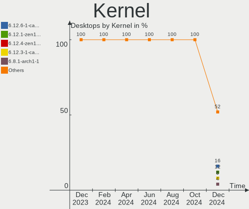
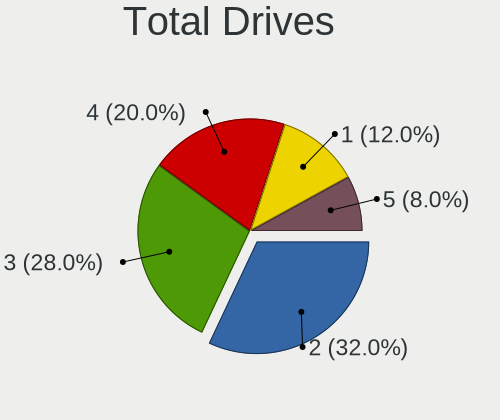
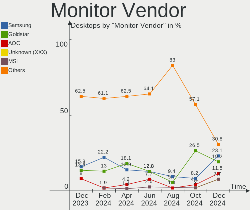
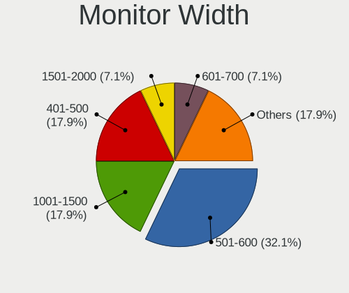

ArcoLinux - Hardware Trends (Desktops)
--------------------------------------

A project to identify most popular hardware characteristics and track their change
over time based on data collected by Linux users at https://Linux-Hardware.org.

Anyone can contribute to this report by the [hw-probe](https://github.com/linuxhw/hw-probe) tool:

    sudo -E hw-probe -all -upload

This report is for one last month. Overall report since the beginning of time: [TestDays](https://github.com/linuxhw/TestDays)

Period: Nov, 2023.

Contents
--------

* [ System ](#system)
  - [ OS                       ](#os)
  - [ OS Family                ](#os-family)
  - [ Kernel                   ](#kernel)
  - [ Kernel Family            ](#kernel-family)
  - [ Kernel Major Ver.        ](#kernel-major-ver)
  - [ Arch                     ](#arch)
  - [ DE                       ](#de)
  - [ Display Server           ](#display-server)
  - [ Display Manager          ](#display-manager)
  - [ OS Lang                  ](#os-lang)
  - [ Boot Mode                ](#boot-mode)
  - [ Filesystem               ](#filesystem)
  - [ Part. scheme             ](#part-scheme)
  - [ Dual Boot with Linux/BSD ](#dual-boot-with-linuxbsd)
  - [ Dual Boot (Win)          ](#dual-boot-win)

* [ Board ](#board)
  - [ Vendor                   ](#vendor)
  - [ Model                    ](#model)
  - [ Model Family             ](#model-family)
  - [ MFG Year                 ](#mfg-year)
  - [ Form Factor              ](#form-factor)
  - [ Secure Boot              ](#secure-boot)
  - [ Coreboot                 ](#coreboot)
  - [ RAM Size                 ](#ram-size)
  - [ RAM Used                 ](#ram-used)
  - [ Total Drives             ](#total-drives)
  - [ Has CD-ROM               ](#has-cd-rom)
  - [ Has Ethernet             ](#has-ethernet)
  - [ Has WiFi                 ](#has-wifi)
  - [ Has Bluetooth            ](#has-bluetooth)

* [ Location ](#location)
  - [ Country                  ](#country)
  - [ City                     ](#city)

* [ Drives ](#drives)
  - [ Drive Vendor             ](#drive-vendor)
  - [ Drive Model              ](#drive-model)
  - [ HDD Vendor               ](#hdd-vendor)
  - [ SSD Vendor               ](#ssd-vendor)
  - [ Drive Kind               ](#drive-kind)
  - [ Drive Connector          ](#drive-connector)
  - [ Drive Size               ](#drive-size)
  - [ Space Total              ](#space-total)
  - [ Space Used               ](#space-used)
  - [ Malfunc. Drives          ](#malfunc-drives)
  - [ Malfunc. Drive Vendor    ](#malfunc-drive-vendor)
  - [ Malfunc. HDD Vendor      ](#malfunc-hdd-vendor)
  - [ Malfunc. Drive Kind      ](#malfunc-drive-kind)
  - [ Failed Drives            ](#failed-drives)
  - [ Failed Drive Vendor      ](#failed-drive-vendor)
  - [ Drive Status             ](#drive-status)

* [ Storage controller ](#storage-controller)
  - [ Storage Vendor           ](#storage-vendor)
  - [ Storage Model            ](#storage-model)
  - [ Storage Kind             ](#storage-kind)

* [ Processor ](#processor)
  - [ CPU Vendor               ](#cpu-vendor)
  - [ CPU Model                ](#cpu-model)
  - [ CPU Model Family         ](#cpu-model-family)
  - [ CPU Cores                ](#cpu-cores)
  - [ CPU Sockets              ](#cpu-sockets)
  - [ CPU Threads              ](#cpu-threads)
  - [ CPU Op-Modes             ](#cpu-op-modes)
  - [ CPU Microcode            ](#cpu-microcode)
  - [ CPU Microarch            ](#cpu-microarch)

* [ Graphics ](#graphics)
  - [ GPU Vendor               ](#gpu-vendor)
  - [ GPU Model                ](#gpu-model)
  - [ GPU Combo                ](#gpu-combo)
  - [ GPU Driver               ](#gpu-driver)
  - [ GPU Memory               ](#gpu-memory)

* [ Monitor ](#monitor)
  - [ Monitor Vendor           ](#monitor-vendor)
  - [ Monitor Model            ](#monitor-model)
  - [ Monitor Resolution       ](#monitor-resolution)
  - [ Monitor Diagonal         ](#monitor-diagonal)
  - [ Monitor Width            ](#monitor-width)
  - [ Aspect Ratio             ](#aspect-ratio)
  - [ Monitor Area             ](#monitor-area)
  - [ Pixel Density            ](#pixel-density)
  - [ Multiple Monitors        ](#multiple-monitors)

* [ Network ](#network)
  - [ Net Controller Vendor    ](#net-controller-vendor)
  - [ Net Controller Model     ](#net-controller-model)
  - [ Wireless Vendor          ](#wireless-vendor)
  - [ Wireless Model           ](#wireless-model)
  - [ Ethernet Vendor          ](#ethernet-vendor)
  - [ Ethernet Model           ](#ethernet-model)
  - [ Net Controller Kind      ](#net-controller-kind)
  - [ Used Controller          ](#used-controller)
  - [ NICs                     ](#nics)
  - [ IPv6                     ](#ipv6)

* [ Bluetooth ](#bluetooth)
  - [ Bluetooth Vendor         ](#bluetooth-vendor)
  - [ Bluetooth Model          ](#bluetooth-model)

* [ Sound ](#sound)
  - [ Sound Vendor             ](#sound-vendor)
  - [ Sound Model              ](#sound-model)

* [ Memory ](#memory)
  - [ Memory Vendor            ](#memory-vendor)
  - [ Memory Model             ](#memory-model)
  - [ Memory Kind              ](#memory-kind)
  - [ Memory Form Factor       ](#memory-form-factor)
  - [ Memory Size              ](#memory-size)
  - [ Memory Speed             ](#memory-speed)

* [ Printers & scanners ](#printers--scanners)
  - [ Printer Vendor           ](#printer-vendor)
  - [ Printer Model            ](#printer-model)
  - [ Scanner Vendor           ](#scanner-vendor)
  - [ Scanner Model            ](#scanner-model)

* [ Camera ](#camera)
  - [ Camera Vendor            ](#camera-vendor)
  - [ Camera Model             ](#camera-model)

* [ Security ](#security)
  - [ Fingerprint Vendor       ](#fingerprint-vendor)
  - [ Fingerprint Model        ](#fingerprint-model)
  - [ Chipcard Vendor          ](#chipcard-vendor)
  - [ Chipcard Model           ](#chipcard-model)

* [ Unsupported ](#unsupported)
  - [ Unsupported Devices      ](#unsupported-devices)
  - [ Unsupported Device Types ](#unsupported-device-types)

System
------

OS
--

Installed operating systems

| Name              | Desktops | Percent |
|-------------------|----------|---------|
| ArcoLinux Rolling | 45       | 100%    |

OS Family
---------

OS without a version

| Name      | Desktops | Percent |
|-----------|----------|---------|
| ArcoLinux | 45       | 100%    |

Kernel
------

Version of the Linux kernel

| Version                        | Desktops | Percent |
|--------------------------------|----------|---------|
| 6.6.2-arch1-1                  | 9        | 20%     |
| 6.6.1-arch1-1                  | 9        | 20%     |
| 6.5.9-arch2-1                  | 5        | 11.11%  |
| 6.5.8-arch1-1                  | 4        | 8.89%   |
| 6.5.3-x64v2-xanmod1-1          | 3        | 6.67%   |
| 6.1.61-1-lts                   | 3        | 6.67%   |
| 6.5.3-arch1-1                  | 2        | 4.44%   |
| 6.6.1-zen1-1-zen               | 1        | 2.22%   |
| 6.5.9-zen2-1-zen               | 1        | 2.22%   |
| 6.5.8-zen1-1-zen               | 1        | 2.22%   |
| 6.5.5-arch1-1                  | 1        | 2.22%   |
| 6.4.1-arch2-1                  | 1        | 2.22%   |
| 6.3.9-arch1-1                  | 1        | 2.22%   |
| 6.3.6-arch1-1                  | 1        | 2.22%   |
| 6.1.62-1-lts                   | 1        | 2.22%   |
| 6.1.60-1-lts                   | 1        | 2.22%   |
| 6.1.46-x64v2-rt13-xanmod1-1-rt | 1        | 2.22%   |

Kernel Family
-------------

Linux kernel without a distro release

| Version | Desktops | Percent |
|---------|----------|---------|
| 6.6.1   | 10       | 22.22%  |
| 6.6.2   | 9        | 20%     |
| 6.5.9   | 6        | 13.33%  |
| 6.5.8   | 5        | 11.11%  |
| 6.5.3   | 5        | 11.11%  |
| 6.1.61  | 3        | 6.67%   |
| 6.5.5   | 1        | 2.22%   |
| 6.4.1   | 1        | 2.22%   |
| 6.3.9   | 1        | 2.22%   |
| 6.3.6   | 1        | 2.22%   |
| 6.1.62  | 1        | 2.22%   |
| 6.1.60  | 1        | 2.22%   |
| 6.1.46  | 1        | 2.22%   |

Kernel Major Ver.
-----------------

Linux kernel major version

| Version | Desktops | Percent |
|---------|----------|---------|
| 6.6     | 19       | 42.22%  |
| 6.5     | 17       | 37.78%  |
| 6.1     | 6        | 13.33%  |
| 6.3     | 2        | 4.44%   |
| 6.4     | 1        | 2.22%   |

Arch
----

OS architecture (x86_64, i586, etc.)

| Name   | Desktops | Percent |
|--------|----------|---------|
| x86_64 | 45       | 100%    |

DE
--

Desktop Environment

| Name     | Desktops | Percent |
|----------|----------|---------|
| XFCE     | 17       | 37.78%  |
| KDE5     | 13       | 28.89%  |
| Cinnamon | 4        | 8.89%   |
| i3       | 2        | 4.44%   |
| GNOME    | 2        | 4.44%   |
| Deepin   | 2        | 4.44%   |
| Budgie   | 2        | 4.44%   |
| LeftWM   | 1        | 2.22%   |
| hyprland | 1        | 2.22%   |
| chadwm   | 1        | 2.22%   |

Display Server
--------------

X11 or Wayland

| Name    | Desktops | Percent |
|---------|----------|---------|
| X11     | 42       | 93.33%  |
| Wayland | 3        | 6.67%   |

Display Manager
---------------

SDDM, LightDM, etc.

| Name    | Desktops | Percent |
|---------|----------|---------|
| SDDM    | 37       | 82.22%  |
| LightDM | 6        | 13.33%  |
| LXDM    | 1        | 2.22%   |
| GDM     | 1        | 2.22%   |

OS Lang
-------

Language

| Lang  | Desktops | Percent |
|-------|----------|---------|
| en_US | 19       | 42.22%  |
| pt_BR | 5        | 11.11%  |
| it_IT | 3        | 6.67%   |
| en_GB | 3        | 6.67%   |
| C     | 3        | 6.67%   |
| ko_KR | 2        | 4.44%   |
| es_ES | 2        | 4.44%   |
| tr_TR | 1        | 2.22%   |
| ru_RU | 1        | 2.22%   |
| hu_HU | 1        | 2.22%   |
| hr_HR | 1        | 2.22%   |
| gl_ES | 1        | 2.22%   |
| fr_FR | 1        | 2.22%   |
| es_UY | 1        | 2.22%   |
| de_DE | 1        | 2.22%   |

Boot Mode
---------

EFI or BIOS

| Mode | Desktops | Percent |
|------|----------|---------|
| EFI  | 38       | 84.44%  |
| BIOS | 7        | 15.56%  |

Filesystem
----------

Type of filesystem

| Type    | Desktops | Percent |
|---------|----------|---------|
| Ext4    | 28       | 62.22%  |
| Btrfs   | 12       | 26.67%  |
| Overlay | 3        | 6.67%   |
| F2fs    | 2        | 4.44%   |

Part. scheme
------------

Scheme of partitioning

| Type | Desktops | Percent |
|------|----------|---------|
| GPT  | 42       | 93.33%  |
| MBR  | 3        | 6.67%   |

Dual Boot with Linux/BSD
------------------------

Hosting more than one Linux/BSD

| Dual boot | Desktops | Percent |
|-----------|----------|---------|
| Yes       | 23       | 51.11%  |
| No        | 22       | 48.89%  |

Dual Boot (Win)
---------------

Hosting Linux and Windows

| Dual boot | Desktops | Percent |
|-----------|----------|---------|
| Yes       | 29       | 64.44%  |
| No        | 16       | 35.56%  |

Board
-----

Vendor
------

Motherboard manufacturer

| Name                                 | Desktops | Percent |
|--------------------------------------|----------|---------|
| ASUSTek Computer                     | 13       | 28.89%  |
| ASRock                               | 6        | 13.33%  |
| MSI                                  | 4        | 8.89%   |
| Gigabyte Technology                  | 4        | 8.89%   |
| Dell                                 | 4        | 8.89%   |
| Hewlett-Packard                      | 3        | 6.67%   |
| Acer                                 | 3        | 6.67%   |
| Lenovo                               | 2        | 4.44%   |
| Shenzhen Meigao Electronic Equipment | 1        | 2.22%   |
| NZXT                                 | 1        | 2.22%   |
| MACHINIST                            | 1        | 2.22%   |
| Intel                                | 1        | 2.22%   |
| Fujitsu                              | 1        | 2.22%   |
| BESSTAR Tech                         | 1        | 2.22%   |

Model
-----

Motherboard model

| Name                                       | Desktops | Percent |
|--------------------------------------------|----------|---------|
| Shenzhen Meigao Electronic Equipment UM690 | 1        | 2.22%   |
| NZXT N7 B550                               | 1        | 2.22%   |
| MSI MS-7C56                                | 1        | 2.22%   |
| MSI MS-7C37                                | 1        | 2.22%   |
| MSI MS-7B79                                | 1        | 2.22%   |
| MSI MS-7721                                | 1        | 2.22%   |
| MACHINIST X99-RS9 V2.0                     | 1        | 2.22%   |
| Lenovo ThinkCentre M92p 3238A34            | 1        | 2.22%   |
| Lenovo IdeaCentre 5 14ACN6 90RX005QMH      | 1        | 2.22%   |
| Intel B75                                  | 1        | 2.22%   |
| HP Z240 Tower Workstation                  | 1        | 2.22%   |
| HP ProDesk 600 G1 SFF                      | 1        | 2.22%   |
| HP Compaq 6200 Pro SFF PC                  | 1        | 2.22%   |
| Gigabyte Z690 UD DDR4                      | 1        | 2.22%   |
| Gigabyte Z390 UD V2                        | 1        | 2.22%   |
| Gigabyte H410M H V3                        | 1        | 2.22%   |
| Gigabyte 970A-DS3P FX                      | 1        | 2.22%   |
| Fujitsu CELSIUS W5012                      | 1        | 2.22%   |
| Dell Precision WorkStation T3500           | 1        | 2.22%   |
| Dell Precision T1700                       | 1        | 2.22%   |
| Dell OptiPlex 9010                         | 1        | 2.22%   |
| Dell OptiPlex 7010                         | 1        | 2.22%   |
| BESSTAR Tech UM700                         | 1        | 2.22%   |
| ASUS X79-DELUXE                            | 1        | 2.22%   |
| ASUS TUF Gaming Z690-PLUS WIFI D4          | 1        | 2.22%   |
| ASUS TUF Gaming B550M-E                    | 1        | 2.22%   |
| ASUS TUF B450M-PRO GAMING                  | 1        | 2.22%   |
| ASUS ROG STRIX Z790-F GAMING WIFI          | 1        | 2.22%   |
| ASUS ROG STRIX B550-F GAMING               | 1        | 2.22%   |
| ASUS ROG CROSSHAIR VIII HERO               | 1        | 2.22%   |
| ASUS PRIME Z490-A                          | 1        | 2.22%   |
| ASUS PRIME B450M-GAMING/BR                 | 1        | 2.22%   |
| ASUS PRIME B450M-A                         | 1        | 2.22%   |
| ASUS PRIME A520M-K                         | 1        | 2.22%   |
| ASUS H110M-A                               | 1        | 2.22%   |
| ASUS All Series                            | 1        | 2.22%   |
| ASRock Z77 Extreme4                        | 1        | 2.22%   |
| ASRock Z690 Extreme                        | 1        | 2.22%   |
| ASRock B450M-HDV R4.0                      | 1        | 2.22%   |
| ASRock B450M Steel Legend                  | 1        | 2.22%   |

Model Family
------------

Motherboard model prefix

| Name                                       | Desktops | Percent |
|--------------------------------------------|----------|---------|
| ASUS PRIME                                 | 4        | 8.89%   |
| ASUS TUF                                   | 3        | 6.67%   |
| ASUS ROG                                   | 3        | 6.67%   |
| Dell Precision                             | 2        | 4.44%   |
| Dell OptiPlex                              | 2        | 4.44%   |
| Shenzhen Meigao Electronic Equipment UM690 | 1        | 2.22%   |
| NZXT N7                                    | 1        | 2.22%   |
| MSI MS-7C56                                | 1        | 2.22%   |
| MSI MS-7C37                                | 1        | 2.22%   |
| MSI MS-7B79                                | 1        | 2.22%   |
| MSI MS-7721                                | 1        | 2.22%   |
| MACHINIST X99-RS9                          | 1        | 2.22%   |
| Lenovo ThinkCentre                         | 1        | 2.22%   |
| Lenovo IdeaCentre                          | 1        | 2.22%   |
| Intel B75                                  | 1        | 2.22%   |
| HP Z240                                    | 1        | 2.22%   |
| HP ProDesk                                 | 1        | 2.22%   |
| HP Compaq                                  | 1        | 2.22%   |
| Gigabyte Z690                              | 1        | 2.22%   |
| Gigabyte Z390                              | 1        | 2.22%   |
| Gigabyte H410M                             | 1        | 2.22%   |
| Gigabyte 970A-DS3P                         | 1        | 2.22%   |
| Fujitsu CELSIUS                            | 1        | 2.22%   |
| BESSTAR Tech UM700                         | 1        | 2.22%   |
| ASUS X79-DELUXE                            | 1        | 2.22%   |
| ASUS H110M-A                               | 1        | 2.22%   |
| ASUS All                                   | 1        | 2.22%   |
| ASRock Z77                                 | 1        | 2.22%   |
| ASRock Z690                                | 1        | 2.22%   |
| ASRock B450M-HDV                           | 1        | 2.22%   |
| ASRock B450M                               | 1        | 2.22%   |
| ASRock B450                                | 1        | 2.22%   |
| ASRock B250M                               | 1        | 2.22%   |
| Acer Predator                              | 1        | 2.22%   |
| Acer Nitro                                 | 1        | 2.22%   |
| Acer Aspire                                | 1        | 2.22%   |

MFG Year
--------

Motherboard manufacture year

| Year | Desktops | Percent |
|------|----------|---------|
| 2021 | 10       | 22.22%  |
| 2018 | 8        | 17.78%  |
| 2020 | 6        | 13.33%  |
| 2019 | 3        | 6.67%   |
| 2013 | 3        | 6.67%   |
| 2023 | 2        | 4.44%   |
| 2022 | 2        | 4.44%   |
| 2017 | 2        | 4.44%   |
| 2016 | 2        | 4.44%   |
| 2015 | 2        | 4.44%   |
| 2010 | 2        | 4.44%   |
| 2014 | 1        | 2.22%   |
| 2012 | 1        | 2.22%   |
| 2011 | 1        | 2.22%   |

Form Factor
-----------

Physical design of the computer

| Name    | Desktops | Percent |
|---------|----------|---------|
| Desktop | 45       | 100%    |

Secure Boot
-----------

Enabled or disabled

| State    | Desktops | Percent |
|----------|----------|---------|
| Disabled | 45       | 100%    |

Coreboot
--------

Have coreboot on board

| Used | Desktops | Percent |
|------|----------|---------|
| No   | 45       | 100%    |

RAM Size
--------

Total RAM memory

| Size in GB  | Desktops | Percent |
|-------------|----------|---------|
| 16.01-24.0  | 16       | 35.56%  |
| 32.01-64.0  | 14       | 31.11%  |
| 8.01-16.0   | 6        | 13.33%  |
| 4.01-8.0    | 3        | 6.67%   |
| 24.01-32.0  | 3        | 6.67%   |
| 64.01-256.0 | 3        | 6.67%   |

RAM Used
--------

Used RAM memory

| Used GB   | Desktops | Percent |
|-----------|----------|---------|
| 1.01-2.0  | 16       | 35.56%  |
| 2.01-3.0  | 12       | 26.67%  |
| 4.01-8.0  | 6        | 13.33%  |
| 3.01-4.0  | 5        | 11.11%  |
| 8.01-16.0 | 5        | 11.11%  |
| 0.51-1.0  | 1        | 2.22%   |

Total Drives
------------

Number of drives on board

| Drives | Desktops | Percent |
|--------|----------|---------|
| 3      | 14       | 31.11%  |
| 2      | 13       | 28.89%  |
| 1      | 11       | 24.44%  |
| 4      | 3        | 6.67%   |
| 6      | 2        | 4.44%   |
| 5      | 2        | 4.44%   |

Has CD-ROM
----------

Has CD-ROM on board

| Presented | Desktops | Percent |
|-----------|----------|---------|
| No        | 31       | 68.89%  |
| Yes       | 14       | 31.11%  |

Has Ethernet
------------

Has Ethernet on board

| Presented | Desktops | Percent |
|-----------|----------|---------|
| Yes       | 45       | 100%    |

Has WiFi
--------

Has WiFi module

| Presented | Desktops | Percent |
|-----------|----------|---------|
| No        | 30       | 66.67%  |
| Yes       | 15       | 33.33%  |

Has Bluetooth
-------------

Has Bluetooth module

| Presented | Desktops | Percent |
|-----------|----------|---------|
| No        | 28       | 62.22%  |
| Yes       | 17       | 37.78%  |

Location
--------

Country
-------

Geographic location (country)

| Country     | Desktops | Percent |
|-------------|----------|---------|
| USA         | 7        | 15.56%  |
| Germany     | 5        | 11.11%  |
| Brazil      | 5        | 11.11%  |
| Italy       | 4        | 8.89%   |
| Spain       | 3        | 6.67%   |
| Thailand    | 2        | 4.44%   |
| South Korea | 2        | 4.44%   |
| Netherlands | 2        | 4.44%   |
| Belgium     | 2        | 4.44%   |
| Uruguay     | 1        | 2.22%   |
| UK          | 1        | 2.22%   |
| Turkey      | 1        | 2.22%   |
| Sweden      | 1        | 2.22%   |
| Russia      | 1        | 2.22%   |
| Portugal    | 1        | 2.22%   |
| Poland      | 1        | 2.22%   |
| Philippines | 1        | 2.22%   |
| Hungary     | 1        | 2.22%   |
| France      | 1        | 2.22%   |
| Croatia     | 1        | 2.22%   |
| Canada      | 1        | 2.22%   |
| Australia   | 1        | 2.22%   |

City
----

Geographic location (city)

| City                    | Desktops | Percent |
|-------------------------|----------|---------|
| Parker                  | 2        | 4.44%   |
| Zaprešić              | 1        | 2.22%   |
| Xinzo de Limia          | 1        | 2.22%   |
| Woodstock               | 1        | 2.22%   |
| Udine                   | 1        | 2.22%   |
| Turin                   | 1        | 2.22%   |
| Tiel                    | 1        | 2.22%   |
| Stuttgart               | 1        | 2.22%   |
| St Petersburg           | 1        | 2.22%   |
| Sao Paulo               | 1        | 2.22%   |
| Rio de Janeiro          | 1        | 2.22%   |
| Queluz                  | 1        | 2.22%   |
| Pyeongtaek-si           | 1        | 2.22%   |
| Porto Alegre            | 1        | 2.22%   |
| Portici                 | 1        | 2.22%   |
| Panama City             | 1        | 2.22%   |
| Palma                   | 1        | 2.22%   |
| Natividad               | 1        | 2.22%   |
| Natal                   | 1        | 2.22%   |
| Mueang Samut Prakan     | 1        | 2.22%   |
| Montrose                | 1        | 2.22%   |
| Montevideo              | 1        | 2.22%   |
| Melbourne               | 1        | 2.22%   |
| Meda                    | 1        | 2.22%   |
| Malmo                   | 1        | 2.22%   |
| Lynnwood                | 1        | 2.22%   |
| Kolonia Zamek           | 1        | 2.22%   |
| Karlsruhe               | 1        | 2.22%   |
| Jeffersonville          | 1        | 2.22%   |
| Izmir                   | 1        | 2.22%   |
| Hillsboro               | 1        | 2.22%   |
| Hérouville-Saint-Clair | 1        | 2.22%   |
| Hayward                 | 1        | 2.22%   |
| Elda                    | 1        | 2.22%   |
| Düsseldorf             | 1        | 2.22%   |
| Duisburg                | 1        | 2.22%   |
| Duffel                  | 1        | 2.22%   |
| Buk-gu                  | 1        | 2.22%   |
| Budapest                | 1        | 2.22%   |
| Brussels                | 1        | 2.22%   |

Drives
------

Drive Vendor
------------

Hard drive vendors

| Vendor                       | Desktops | Drives | Percent |
|------------------------------|----------|--------|---------|
| Samsung Electronics          | 18       | 22     | 18.56%  |
| Seagate                      | 13       | 14     | 13.4%   |
| WDC                          | 10       | 13     | 10.31%  |
| Sandisk                      | 10       | 12     | 10.31%  |
| Kingston                     | 8        | 12     | 8.25%   |
| China                        | 4        | 5      | 4.12%   |
| Toshiba                      | 3        | 3      | 3.09%   |
| Hitachi                      | 3        | 3      | 3.09%   |
| Crucial                      | 3        | 3      | 3.09%   |
| XrayDisk                     | 2        | 2      | 2.06%   |
| Silicon Motion               | 2        | 2      | 2.06%   |
| Phison Electronics           | 2        | 2      | 2.06%   |
| Micron/Crucial Technology    | 2        | 2      | 2.06%   |
| MAXIO Technology (Hangzhou)  | 2        | 2      | 2.06%   |
| SPCC                         | 1        | 1      | 1.03%   |
| Shenzhen Longsys Electronics | 1        | 2      | 1.03%   |
| SABRENT                      | 1        | 1      | 1.03%   |
| RevuAhn                      | 1        | 1      | 1.03%   |
| Realtek Semiconductor        | 1        | 1      | 1.03%   |
| Ramsta                       | 1        | 1      | 1.03%   |
| PNY                          | 1        | 1      | 1.03%   |
| Plextor                      | 1        | 1      | 1.03%   |
| NXT                          | 1        | 1      | 1.03%   |
| Micron Technology            | 1        | 1      | 1.03%   |
| Kingston Technology Company  | 1        | 1      | 1.03%   |
| JMicron Technology           | 1        | 1      | 1.03%   |
| HI-LEVEL                     | 1        | 1      | 1.03%   |
| HGST                         | 1        | 1      | 1.03%   |
| Beijing Starblaze Technology | 1        | 1      | 1.03%   |

Drive Model
-----------

Hard drive models

| Model                                                 | Desktops | Percent |
|-------------------------------------------------------|----------|---------|
| Samsung NVMe SSD Controller PM9A1/PM9A3/980PRO 2TB    | 3        | 2.73%   |
| Kingston SFYRS1000G 1TB                               | 3        | 2.73%   |
| Silicon Motion SM2263EN/SM2263XT SSD Controller 256GB | 2        | 1.82%   |
| Seagate ST1000DM010-2EP102 1TB                        | 2        | 1.82%   |
| Seagate ST1000DM003-1SB102 1TB                        | 2        | 1.82%   |
| Samsung SSD 980 1TB                                   | 2        | 1.82%   |
| Samsung NVMe SSD Controller SM981/PM981/PM983 250GB   | 2        | 1.82%   |
| Micron/Crucial P2 NVMe PCIe SSD 1TB                   | 2        | 1.82%   |
| Kingston SA400S37480G 480GB SSD                       | 2        | 1.82%   |
| XrayDisk 512GB SSD                                    | 1        | 0.91%   |
| XrayDisk 1TB SSD                                      | 1        | 0.91%   |
| WDC WDS500G2B0A-00SM50 500GB SSD                      | 1        | 0.91%   |
| WDC WDS240G2G0A-00JH30 240GB SSD                      | 1        | 0.91%   |
| WDC WDS100T2B0A-00SM50 1TB SSD                        | 1        | 0.91%   |
| WDC WDS100T1R0A-68A4W0 1TB SSD                        | 1        | 0.91%   |
| WDC WD5000LPVX-08V0TT5 500GB                          | 1        | 0.91%   |
| WDC WD5000AAKS-00A7B2 500GB                           | 1        | 0.91%   |
| WDC WD20PURZ-85AKKY0 2TB                              | 1        | 0.91%   |
| WDC WD20EARS-00MVWB0 2TB                              | 1        | 0.91%   |
| WDC WD10SPZX-24Z10 1TB                                | 1        | 0.91%   |
| WDC WD10EZRX-00L4HB0 1TB                              | 1        | 0.91%   |
| WDC WD10EZEX-21WN4A0 1TB                              | 1        | 0.91%   |
| WDC WD10EZEX-08WN4A0 1TB                              | 1        | 0.91%   |
| WDC WD1003FZEX-00K3CA0 1TB                            | 1        | 0.91%   |
| Toshiba MK8052GSX 80GB                                | 1        | 0.91%   |
| Toshiba HDWD110 1TB                                   | 1        | 0.91%   |
| Toshiba DT01ACA200 2TB                                | 1        | 0.91%   |
| SPCC Solid State Disk 1TB                             | 1        | 0.91%   |
| Shenzhen Longsys Lexar SSD NM790 4TB                  | 1        | 0.91%   |
| Seagate ST500DM002-1BD142 500GB                       | 1        | 0.91%   |
| Seagate ST4000LM024-2AN17V 4TB                        | 1        | 0.91%   |
| Seagate ST3500630NS 500GB                             | 1        | 0.91%   |
| Seagate ST2000LM015-2E8174 2TB                        | 1        | 0.91%   |
| Seagate ST2000DM008-2FR102 2TB                        | 1        | 0.91%   |
| Seagate ST2000DM001-1ER164 2TB                        | 1        | 0.91%   |
| Seagate ST2000DM001-1CH164 2TB                        | 1        | 0.91%   |
| Seagate ST2000DL003-9VT166 2TB                        | 1        | 0.91%   |
| Seagate ST1000LM024 HN-M101MBB 1TB                    | 1        | 0.91%   |
| Seagate Portable 5TB                                  | 1        | 0.91%   |
| Sandisk WD_BLACK SN850X 4000GB                        | 1        | 0.91%   |

HDD Vendor
----------

Hard disk drive vendors

| Vendor              | Desktops | Drives | Percent |
|---------------------|----------|--------|---------|
| Seagate             | 12       | 13     | 40%     |
| WDC                 | 8        | 9      | 26.67%  |
| Toshiba             | 3        | 3      | 10%     |
| Samsung Electronics | 3        | 3      | 10%     |
| Hitachi             | 3        | 3      | 10%     |
| HGST                | 1        | 1      | 3.33%   |

SSD Vendor
----------

Solid state drive vendors

| Vendor              | Desktops | Drives | Percent |
|---------------------|----------|--------|---------|
| Samsung Electronics | 9        | 11     | 25.71%  |
| Kingston            | 4        | 6      | 11.43%  |
| China               | 4        | 5      | 11.43%  |
| WDC                 | 3        | 4      | 8.57%   |
| SanDisk             | 3        | 3      | 8.57%   |
| Crucial             | 3        | 3      | 8.57%   |
| XrayDisk            | 2        | 2      | 5.71%   |
| SPCC                | 1        | 1      | 2.86%   |
| RevuAhn             | 1        | 1      | 2.86%   |
| Ramsta              | 1        | 1      | 2.86%   |
| PNY                 | 1        | 1      | 2.86%   |
| Plextor             | 1        | 1      | 2.86%   |
| JMicron Technology  | 1        | 1      | 2.86%   |
| HI-LEVEL            | 1        | 1      | 2.86%   |

Drive Kind
----------

HDD or SSD

| Kind    | Desktops | Drives | Percent |
|---------|----------|--------|---------|
| NVMe    | 28       | 37     | 33.73%  |
| SSD     | 28       | 41     | 33.73%  |
| HDD     | 24       | 32     | 28.92%  |
| Unknown | 3        | 3      | 3.61%   |

Drive Connector
---------------

SATA, SAS, NVMe, etc.

| Type | Desktops | Drives | Percent |
|------|----------|--------|---------|
| SATA | 36       | 71     | 52.17%  |
| NVMe | 28       | 37     | 40.58%  |
| SAS  | 5        | 5      | 7.25%   |

Drive Size
----------

Size of hard drive

| Size in TB | Desktops | Drives | Percent |
|------------|----------|--------|---------|
| 0.01-0.5   | 24       | 36     | 44.44%  |
| 0.51-1.0   | 19       | 26     | 35.19%  |
| 1.01-2.0   | 10       | 10     | 18.52%  |
| 3.01-4.0   | 1        | 1      | 1.85%   |

Space Total
-----------

Amount of disk space available on the file system

| Size in GB     | Desktops | Percent |
|----------------|----------|---------|
| 501-1000       | 11       | 24.44%  |
| 251-500        | 8        | 17.78%  |
| 101-250        | 8        | 17.78%  |
| More than 3000 | 7        | 15.56%  |
| 1001-2000      | 5        | 11.11%  |
| 2001-3000      | 3        | 6.67%   |
| Unknown        | 2        | 4.44%   |
| 21-50          | 1        | 2.22%   |

Space Used
----------

Amount of used disk space

| Used GB        | Desktops | Percent |
|----------------|----------|---------|
| 101-250        | 10       | 22.22%  |
| 1-20           | 9        | 20%     |
| 251-500        | 6        | 13.33%  |
| 21-50          | 5        | 11.11%  |
| 501-1000       | 5        | 11.11%  |
| 51-100         | 4        | 8.89%   |
| 1001-2000      | 2        | 4.44%   |
| Unknown        | 2        | 4.44%   |
| More than 3000 | 1        | 2.22%   |
| 2001-3000      | 1        | 2.22%   |

Malfunc. Drives
---------------

Drive models with a malfunction

| Model                                                           | Desktops | Drives | Percent |
|-----------------------------------------------------------------|----------|--------|---------|
| WDC WD5000LPVX-08V0TT5 500GB                                    | 1        | 1      | 6.67%   |
| WDC WD20EARS-00MVWB0 2TB                                        | 1        | 1      | 6.67%   |
| Seagate ST4000LM024-2AN17V 4TB                                  | 1        | 1      | 6.67%   |
| Seagate ST3500630NS 500GB                                       | 1        | 1      | 6.67%   |
| Seagate ST2000DM001-1CH164 2TB                                  | 1        | 1      | 6.67%   |
| Seagate ST1000LM024 HN-M101MBB 1TB                              | 1        | 1      | 6.67%   |
| SanDisk SSD PLUS 480GB                                          | 1        | 1      | 6.67%   |
| Samsung Electronics SSD 980 1TB                                 | 1        | 1      | 6.67%   |
| Samsung Electronics NVMe SSD Controller SM981/PM981/PM983 250GB | 1        | 1      | 6.67%   |
| Samsung Electronics HM500JI 500GB                               | 1        | 1      | 6.67%   |
| Ramsta SSD S600 480GB                                           | 1        | 1      | 6.67%   |
| Kingston SA400S37480G 480GB SSD                                 | 1        | 1      | 6.67%   |
| Hitachi HUA721010KLA330 1TB                                     | 1        | 1      | 6.67%   |
| Hitachi HDS722020ALA330 2TB                                     | 1        | 1      | 6.67%   |
| Hitachi HDP725050GLA360 500GB                                   | 1        | 1      | 6.67%   |

Malfunc. Drive Vendor
---------------------

Vendors of faulty drives

| Vendor              | Desktops | Drives | Percent |
|---------------------|----------|--------|---------|
| Seagate             | 4        | 4      | 26.67%  |
| Samsung Electronics | 3        | 3      | 20%     |
| Hitachi             | 3        | 3      | 20%     |
| WDC                 | 2        | 2      | 13.33%  |
| SanDisk             | 1        | 1      | 6.67%   |
| Ramsta              | 1        | 1      | 6.67%   |
| Kingston            | 1        | 1      | 6.67%   |

Malfunc. HDD Vendor
-------------------

Vendors of faulty HDD drives

| Vendor              | Desktops | Drives | Percent |
|---------------------|----------|--------|---------|
| Seagate             | 4        | 4      | 40%     |
| Hitachi             | 3        | 3      | 30%     |
| WDC                 | 2        | 2      | 20%     |
| Samsung Electronics | 1        | 1      | 10%     |

Malfunc. Drive Kind
-------------------

Kinds of faulty drives

| Kind | Desktops | Drives | Percent |
|------|----------|--------|---------|
| HDD  | 9        | 10     | 64.29%  |
| SSD  | 3        | 3      | 21.43%  |
| NVMe | 2        | 2      | 14.29%  |

Failed Drives
-------------

Failed drive models

| Model                           | Desktops | Drives | Percent |
|---------------------------------|----------|--------|---------|
| Samsung Electronics SSD 980 1TB | 1        | 1      | 100%    |

Failed Drive Vendor
-------------------

Failed drive vendors

| Vendor              | Desktops | Drives | Percent |
|---------------------|----------|--------|---------|
| Samsung Electronics | 1        | 1      | 100%    |

Drive Status
------------

Number of failed and malfunc. drives

| Status   | Desktops | Drives | Percent |
|----------|----------|--------|---------|
| Works    | 42       | 89     | 68.85%  |
| Malfunc  | 12       | 15     | 19.67%  |
| Detected | 6        | 8      | 9.84%   |
| Failed   | 1        | 1      | 1.64%   |

Storage controller
------------------

Storage Vendor
--------------

Storage controller vendors

| Vendor                       | Desktops | Percent |
|------------------------------|----------|---------|
| Intel                        | 25       | 30.49%  |
| AMD                          | 20       | 24.39%  |
| SanDisk                      | 7        | 8.54%   |
| Samsung Electronics          | 7        | 8.54%   |
| Kingston Technology Company  | 5        | 6.1%    |
| ASMedia Technology           | 5        | 6.1%    |
| Silicon Motion               | 2        | 2.44%   |
| Phison Electronics           | 2        | 2.44%   |
| Micron/Crucial Technology    | 2        | 2.44%   |
| MAXIO Technology (Hangzhou)  | 2        | 2.44%   |
| Shenzhen Longsys Electronics | 1        | 1.22%   |
| Realtek Semiconductor        | 1        | 1.22%   |
| Micron Technology            | 1        | 1.22%   |
| Marvell Technology Group     | 1        | 1.22%   |
| Beijing Starblaze Technology | 1        | 1.22%   |

Storage Model
-------------

Storage controller models

| Model                                                                          | Desktops | Percent |
|--------------------------------------------------------------------------------|----------|---------|
| AMD 400 Series Chipset SATA Controller                                         | 7        | 7.87%   |
| AMD FCH SATA Controller [AHCI mode]                                            | 6        | 6.74%   |
| AMD 500 Series Chipset SATA Controller                                         | 6        | 6.74%   |
| Intel 7 Series/C210 Series Chipset Family 6-port SATA Controller [AHCI mode]   | 5        | 5.62%   |
| ASMedia ASM1062 Serial ATA Controller                                          | 5        | 5.62%   |
| Intel Alder Lake-S PCH SATA Controller [AHCI Mode]                             | 4        | 4.49%   |
| Samsung NVMe SSD Controller PM9A1/PM9A3/980PRO                                 | 3        | 3.37%   |
| Kingston Company KC3000/FURY Renegade NVMe SSD E18                             | 3        | 3.37%   |
| Silicon Motion SM2263EN/SM2263XT (DRAM-less) NVMe SSD Controllers              | 2        | 2.25%   |
| SanDisk WD Green SN350 240GB (DRAM-less) / SN560E NVMe SSD                     | 2        | 2.25%   |
| Sandisk WD Black SN850X NVMe SSD                                               | 2        | 2.25%   |
| Samsung NVMe SSD Controller SM981/PM981/PM983                                  | 2        | 2.25%   |
| Samsung NVMe SSD Controller 980 (DRAM-less)                                    | 2        | 2.25%   |
| Micron/Crucial P2 [Nick P2] / P3 / P3 Plus NVMe PCIe SSD (DRAM-less)           | 2        | 2.25%   |
| Intel SATA Controller [RAID mode]                                              | 2        | 2.25%   |
| Intel Comet Lake SATA AHCI Controller                                          | 2        | 2.25%   |
| Intel 8 Series/C220 Series Chipset Family 6-port SATA Controller 1 [AHCI mode] | 2        | 2.25%   |
| Shenzhen Longsys Non-Volatile memory controller                                | 1        | 1.12%   |
| SanDisk WD Blue SN500 / PC SN520 x2 M.2 2280 NVMe SSD                          | 1        | 1.12%   |
| SanDisk Ultra 3D / WD Blue SN550 NVMe SSD                                      | 1        | 1.12%   |
| SanDisk PC SN735 NVMe SSD (DRAM-less)                                          | 1        | 1.12%   |
| SanDisk Extreme Pro / WD Black SN750 / PC SN730 / Red SN700 NVMe SSD           | 1        | 1.12%   |
| SanDisk Extreme Pro / WD Black 2018/SN750/PC SN720 NVMe SSD                    | 1        | 1.12%   |
| Samsung NVMe SSD Controller S4LV008[Pascal]                                    | 1        | 1.12%   |
| Realtek RTS5762 NVMe SSD Controller                                            | 1        | 1.12%   |
| Phison PS5013-E13 PCIe3 NVMe Controller (DRAM-less)                            | 1        | 1.12%   |
| Phison E12 NVMe Controller                                                     | 1        | 1.12%   |
| Micron 2210 NVMe SSD [Cobain]                                                  | 1        | 1.12%   |
| MAXIO (Hangzhou) NVMe SSD Controller MAP1202                                   | 1        | 1.12%   |
| MAXIO (Hangzhou) NVMe SSD Controller MAP1001                                   | 1        | 1.12%   |
| Marvell Group 88SE9230 PCIe 2.0 x2 4-port SATA 6 Gb/s RAID Controller          | 1        | 1.12%   |
| Kingston Company NV1 NVMe SSD E13T                                             | 1        | 1.12%   |
| Kingston Company KC2000/KC2500 NVMe SSD SM2262EN                               | 1        | 1.12%   |
| Intel Volume Management Device NVMe RAID Controller Intel Corporation          | 1        | 1.12%   |
| Intel Volume Management Device NVMe RAID Controller                            | 1        | 1.12%   |
| Intel Q170/Q150/B150/H170/H110/Z170/CM236 Chipset SATA Controller [AHCI Mode]  | 1        | 1.12%   |
| Intel Cannon Lake PCH SATA AHCI Controller                                     | 1        | 1.12%   |
| Intel C600/X79 series chipset 6-Port SATA AHCI Controller                      | 1        | 1.12%   |
| Intel 9 Series Chipset Family SATA Controller [AHCI Mode]                      | 1        | 1.12%   |
| Intel 82801JI (ICH10 Family) SATA AHCI Controller                              | 1        | 1.12%   |

Storage Kind
------------

Kind of storage controller (IDE, SATA, NVMe, SAS, ...)

| Kind | Desktops | Percent |
|------|----------|---------|
| SATA | 42       | 55.26%  |
| NVMe | 28       | 36.84%  |
| RAID | 5        | 6.58%   |
| IDE  | 1        | 1.32%   |

Processor
---------

CPU Vendor
----------

Processor vendors

| Vendor | Desktops | Percent |
|--------|----------|---------|
| Intel  | 25       | 55.56%  |
| AMD    | 20       | 44.44%  |

CPU Model
---------

Processor models

| Model                                         | Desktops | Percent |
|-----------------------------------------------|----------|---------|
| AMD Ryzen 5 3600 6-Core Processor             | 4        | 8.89%   |
| AMD Ryzen 5 5600X 6-Core Processor            | 2        | 4.44%   |
| Intel Xeon CPU W3550 @ 3.07GHz                | 1        | 2.22%   |
| Intel Xeon CPU E5-2666 v3 @ 2.90GHz           | 1        | 2.22%   |
| Intel Xeon CPU E3-1241 v3 @ 3.50GHz           | 1        | 2.22%   |
| Intel Pentium CPU G4600 @ 3.60GHz             | 1        | 2.22%   |
| Intel Pentium CPU G4400 @ 3.30GHz             | 1        | 2.22%   |
| Intel Core i7-6700 CPU @ 3.40GHz              | 1        | 2.22%   |
| Intel Core i7-4960X CPU @ 3.60GHz             | 1        | 2.22%   |
| Intel Core i7-4790K CPU @ 4.00GHz             | 1        | 2.22%   |
| Intel Core i7-10700K CPU @ 3.80GHz            | 1        | 2.22%   |
| Intel Core i5-9600K CPU @ 3.70GHz             | 1        | 2.22%   |
| Intel Core i5-3570K CPU @ 3.40GHz             | 1        | 2.22%   |
| Intel Core i5-3570 CPU @ 3.40GHz              | 1        | 2.22%   |
| Intel Core i5-3470T CPU @ 2.90GHz             | 1        | 2.22%   |
| Intel Core i5-10400F CPU @ 2.90GHz            | 1        | 2.22%   |
| Intel Core i3-4160 CPU @ 3.60GHz              | 1        | 2.22%   |
| Intel Core i3-3250 CPU @ 3.50GHz              | 1        | 2.22%   |
| Intel Core i3-3220 CPU @ 3.30GHz              | 1        | 2.22%   |
| Intel Core i3-2100 CPU @ 3.10GHz              | 1        | 2.22%   |
| Intel Core i3-10100F CPU @ 3.60GHz            | 1        | 2.22%   |
| Intel 13th Gen Core i7-13700K                 | 1        | 2.22%   |
| Intel 12th Gen Core i9-12900KF                | 1        | 2.22%   |
| Intel 12th Gen Core i9-12900K                 | 1        | 2.22%   |
| Intel 12th Gen Core i7-12700KF                | 1        | 2.22%   |
| Intel 12th Gen Core i5-12400                  | 1        | 2.22%   |
| Intel 11th Gen Core i7-11700F @ 2.50GHz       | 1        | 2.22%   |
| AMD Ryzen 9 6900HX with Radeon Graphics       | 1        | 2.22%   |
| AMD Ryzen 9 5900X 12-Core Processor           | 1        | 2.22%   |
| AMD Ryzen 9 3900XT 12-Core Processor          | 1        | 2.22%   |
| AMD Ryzen 9 3900X 12-Core Processor           | 1        | 2.22%   |
| AMD Ryzen 7 5800X3D 8-Core Processor          | 1        | 2.22%   |
| AMD Ryzen 7 5800X 8-Core Processor            | 1        | 2.22%   |
| AMD Ryzen 7 5700X 8-Core Processor            | 1        | 2.22%   |
| AMD Ryzen 7 5700G with Radeon Graphics        | 1        | 2.22%   |
| AMD Ryzen 7 3750H with Radeon Vega Mobile Gfx | 1        | 2.22%   |
| AMD Ryzen 7 3700X 8-Core Processor            | 1        | 2.22%   |
| AMD Ryzen 5 3400G with Radeon Vega Graphics   | 1        | 2.22%   |
| AMD Phenom II X6 1035T Processor              | 1        | 2.22%   |
| AMD FX-6300 Six-Core Processor                | 1        | 2.22%   |

CPU Model Family
----------------

Processor model prefix

| Model            | Desktops | Percent |
|------------------|----------|---------|
| AMD Ryzen 5      | 7        | 15.56%  |
| Other            | 6        | 13.33%  |
| AMD Ryzen 7      | 6        | 13.33%  |
| Intel Core i5    | 5        | 11.11%  |
| Intel Core i3    | 5        | 11.11%  |
| Intel Core i7    | 4        | 8.89%   |
| AMD Ryzen 9      | 4        | 8.89%   |
| Intel Xeon       | 3        | 6.67%   |
| Intel Pentium    | 2        | 4.44%   |
| AMD Phenom II X6 | 1        | 2.22%   |
| AMD FX           | 1        | 2.22%   |
| AMD Athlon X4    | 1        | 2.22%   |

CPU Cores
---------

Number of processor cores

| Number | Desktops | Percent |
|--------|----------|---------|
| 6      | 11       | 24.44%  |
| 4      | 9        | 20%     |
| 8      | 8        | 17.78%  |
| 2      | 8        | 17.78%  |
| 12     | 4        | 8.89%   |
| 16     | 3        | 6.67%   |
| 10     | 1        | 2.22%   |
| 3      | 1        | 2.22%   |

CPU Sockets
-----------

Number of sockets

| Number | Desktops | Percent |
|--------|----------|---------|
| 1      | 45       | 100%    |

CPU Threads
-----------

Threads per core (Hyper-Threading)

| Number | Desktops | Percent |
|--------|----------|---------|
| 2      | 40       | 88.89%  |
| 1      | 5        | 11.11%  |

CPU Op-Modes
------------

CPU Operation Modes (32-bit, 64-bit)

| Op mode        | Desktops | Percent |
|----------------|----------|---------|
| 32-bit, 64-bit | 45       | 100%    |

CPU Microcode
-------------

Microcode number

| Number     | Desktops | Percent |
|------------|----------|---------|
| Unknown    | 21       | 46.67%  |
| 0x0a20120a | 4        | 8.89%   |
| 0x08701030 | 3        | 6.67%   |
| 0x08701021 | 3        | 6.67%   |
| 0x08108109 | 2        | 4.44%   |
| 0xa0653    | 1        | 2.22%   |
| 0x906e9    | 1        | 2.22%   |
| 0x90675    | 1        | 2.22%   |
| 0x306f2    | 1        | 2.22%   |
| 0x0a50000c | 1        | 2.22%   |
| 0x0a404102 | 1        | 2.22%   |
| 0x0a20102b | 1        | 2.22%   |
| 0x0a201009 | 1        | 2.22%   |
| 0x08701013 | 1        | 2.22%   |
| 0x06003104 | 1        | 2.22%   |
| 0x06000822 | 1        | 2.22%   |
| 0x010000bf | 1        | 2.22%   |

CPU Microarch
-------------

Microarchitecture

| Name             | Desktops | Percent |
|------------------|----------|---------|
| Zen 3            | 7        | 15.56%  |
| Zen 2            | 7        | 15.56%  |
| IvyBridge        | 6        | 13.33%  |
| Alderlake Hybrid | 5        | 11.11%  |
| Haswell          | 4        | 8.89%   |
| CometLake        | 3        | 6.67%   |
| Zen+             | 2        | 4.44%   |
| Skylake          | 2        | 4.44%   |
| KabyLake         | 2        | 4.44%   |
| Steamroller      | 1        | 2.22%   |
| SandyBridge      | 1        | 2.22%   |
| Piledriver       | 1        | 2.22%   |
| Nehalem          | 1        | 2.22%   |
| K10              | 1        | 2.22%   |
| Icelake          | 1        | 2.22%   |
| Unknown          | 1        | 2.22%   |

Graphics
--------

GPU Vendor
----------

Vendors of graphics cards

| Vendor | Desktops | Percent |
|--------|----------|---------|
| Nvidia | 23       | 46.94%  |
| AMD    | 16       | 32.65%  |
| Intel  | 10       | 20.41%  |

GPU Model
---------

Graphics card models

| Model                                                                       | Desktops | Percent |
|-----------------------------------------------------------------------------|----------|---------|
| Intel Xeon E3-1200 v2/3rd Gen Core processor Graphics Controller            | 4        | 8.16%   |
| Nvidia GP107 [GeForce GTX 1050 Ti]                                          | 3        | 6.12%   |
| Nvidia GA106 [GeForce RTX 3060 Lite Hash Rate]                              | 2        | 4.08%   |
| Nvidia GA104 [GeForce RTX 3060 Ti Lite Hash Rate]                           | 2        | 4.08%   |
| AMD Polaris 20 XL [Radeon RX 580 2048SP]                                    | 2        | 4.08%   |
| AMD Picasso/Raven 2 [Radeon Vega Series / Radeon Vega Mobile Series]        | 2        | 4.08%   |
| AMD Navi 23 [Radeon RX 6600/6600 XT/6600M]                                  | 2        | 4.08%   |
| Nvidia TU116 [GeForce GTX 1660 SUPER]                                       | 1        | 2.04%   |
| Nvidia TU106 [GeForce RTX 2060 Rev. A]                                      | 1        | 2.04%   |
| Nvidia GP107GL [Quadro P620]                                                | 1        | 2.04%   |
| Nvidia GP106 [GeForce GTX 1060 6GB]                                         | 1        | 2.04%   |
| Nvidia GP104 [GeForce GTX 1070]                                             | 1        | 2.04%   |
| Nvidia GM107GL [Quadro K2200]                                               | 1        | 2.04%   |
| Nvidia GM107 [GeForce GTX 745]                                              | 1        | 2.04%   |
| Nvidia GK208B [GeForce GT 710]                                              | 1        | 2.04%   |
| Nvidia GF114 [GeForce GTX 560 Ti]                                           | 1        | 2.04%   |
| Nvidia GA106 [Geforce RTX 3050]                                             | 1        | 2.04%   |
| Nvidia GA104GL [RTX A4000]                                                  | 1        | 2.04%   |
| Nvidia GA104 [GeForce RTX 3070]                                             | 1        | 2.04%   |
| Nvidia GA104 [GeForce RTX 3070 Ti]                                          | 1        | 2.04%   |
| Nvidia GA104 [GeForce RTX 3060 Ti]                                          | 1        | 2.04%   |
| Nvidia GA102 [GeForce RTX 3080 Lite Hash Rate]                              | 1        | 2.04%   |
| Nvidia AD104 [GeForce RTX 4070]                                             | 1        | 2.04%   |
| Intel Xeon E3-1200 v3/4th Gen Core Processor Integrated Graphics Controller | 1        | 2.04%   |
| Intel HD Graphics 630                                                       | 1        | 2.04%   |
| Intel HD Graphics 530                                                       | 1        | 2.04%   |
| Intel HD Graphics 510                                                       | 1        | 2.04%   |
| Intel Alder Lake-S GT1 [UHD Graphics 730]                                   | 1        | 2.04%   |
| Intel 2nd Generation Core Processor Family Integrated Graphics Controller   | 1        | 2.04%   |
| AMD Turks XT [Radeon HD 6670/7670]                                          | 1        | 2.04%   |
| AMD Rembrandt [Radeon 680M]                                                 | 1        | 2.04%   |
| AMD Park [Mobility Radeon HD 5430]                                          | 1        | 2.04%   |
| AMD Navi 31 [Radeon RX 7900 XT/7900 XTX]                                    | 1        | 2.04%   |
| AMD Navi 21 [Radeon RX 6800/6800 XT / 6900 XT]                              | 1        | 2.04%   |
| AMD Lexa PRO [Radeon 540/540X/550/550X / RX 540X/550/550X]                  | 1        | 2.04%   |
| AMD Ellesmere [Radeon RX 470/480/570/570X/580/580X/590]                     | 1        | 2.04%   |
| AMD Curacao PRO [Radeon R7 370 / R9 270/370 OEM]                            | 1        | 2.04%   |
| AMD Cezanne [Radeon Vega Series / Radeon Vega Mobile Series]                | 1        | 2.04%   |
| AMD Baffin [Radeon RX 460/560D / Pro 450/455/460/555/555X/560/560X]         | 1        | 2.04%   |

GPU Combo
---------

Combinations of graphics cards

| Name           | Desktops | Percent |
|----------------|----------|---------|
| 1 x Nvidia     | 19       | 42.22%  |
| 1 x AMD        | 15       | 33.33%  |
| 1 x Intel      | 7        | 15.56%  |
| Intel + Nvidia | 3        | 6.67%   |
| AMD + Nvidia   | 1        | 2.22%   |

GPU Driver
----------

Free vs proprietary

| Driver      | Desktops | Percent |
|-------------|----------|---------|
| Free        | 23       | 51.11%  |
| Proprietary | 22       | 48.89%  |

GPU Memory
----------

Total video memory

| Size in GB | Desktops | Percent |
|------------|----------|---------|
| 7.01-8.0   | 13       | 28.89%  |
| Unknown    | 7        | 15.56%  |
| 3.01-4.0   | 6        | 13.33%  |
| 1.01-2.0   | 6        | 13.33%  |
| 8.01-16.0  | 6        | 13.33%  |
| 5.01-6.0   | 3        | 6.67%   |
| 0.51-1.0   | 2        | 4.44%   |
| 16.01-24.0 | 1        | 2.22%   |
| 0.01-0.5   | 1        | 2.22%   |

Monitor
-------

Monitor Vendor
--------------

Monitor vendors

| Vendor               | Desktops | Percent |
|----------------------|----------|---------|
| Goldstar             | 11       | 18.97%  |
| Samsung Electronics  | 10       | 17.24%  |
| Unknown              | 4        | 6.9%    |
| Philips              | 3        | 5.17%   |
| Hewlett-Packard      | 3        | 5.17%   |
| BenQ                 | 3        | 5.17%   |
| AOC                  | 3        | 5.17%   |
| Acer                 | 3        | 5.17%   |
| Sony                 | 2        | 3.45%   |
| Lenovo               | 2        | 3.45%   |
| ASUSTek Computer     | 2        | 3.45%   |
| Ancor Communications | 2        | 3.45%   |
| Vestel Elektronik    | 1        | 1.72%   |
| Valve                | 1        | 1.72%   |
| MSI                  | 1        | 1.72%   |
| Medion               | 1        | 1.72%   |
| LG Electronics       | 1        | 1.72%   |
| HUAWEI               | 1        | 1.72%   |
| Gigabyte Technology  | 1        | 1.72%   |
| Dell                 | 1        | 1.72%   |
| CTV                  | 1        | 1.72%   |
| Arzopa               | 1        | 1.72%   |

Monitor Model
-------------

Monitor models

| Model                                                                   | Desktops | Percent |
|-------------------------------------------------------------------------|----------|---------|
| Unknown LCD Monitor FFFF 2288x1287 2550x2550mm 142.0-inch               | 4        | 6.56%   |
| Goldstar HDR WFHD GSM7714 2560x1080 798x334mm 34.1-inch                 | 2        | 3.28%   |
| Acer S201HL ACR01A5 1600x900 443x249mm 20.0-inch                        | 2        | 3.28%   |
| Vestel Elektronik 32W_LCD_TV VES3700 1920x1080 706x398mm 31.9-inch      | 1        | 1.64%   |
| Valve Index HMD VLV91A8                                                 | 1        | 1.64%   |
| Sony TV SNYAB03 1920x1080                                               | 1        | 1.64%   |
| Sony TV  *00 SNYF303 1920x1080 1220x680mm 55.0-inch                     | 1        | 1.64%   |
| Samsung Electronics U32R59x SAM0F96 3840x2160 700x390mm 31.5-inch       | 1        | 1.64%   |
| Samsung Electronics U32J59x SAM0F33 3840x2160 697x392mm 31.5-inch       | 1        | 1.64%   |
| Samsung Electronics SyncMaster SAM0424 1920x1200 520x320mm 24.0-inch    | 1        | 1.64%   |
| Samsung Electronics S24F350 SAM0D21 1920x1080 521x293mm 23.5-inch       | 1        | 1.64%   |
| Samsung Electronics LS24AG32x SAM71DA 1920x1080 527x296mm 23.8-inch     | 1        | 1.64%   |
| Samsung Electronics LS24A40xV SAM717D 1920x1080 530x300mm 24.0-inch     | 1        | 1.64%   |
| Samsung Electronics LCD Monitor SAM0FEF 3840x2160 1872x1053mm 84.6-inch | 1        | 1.64%   |
| Samsung Electronics LCD Monitor SAM094E 1920x1080 700x390mm 31.5-inch   | 1        | 1.64%   |
| Samsung Electronics LC27T55 SAM701F 1920x1080 609x349mm 27.6-inch       | 1        | 1.64%   |
| Samsung Electronics LC27T55 SAM701E 1920x1080 609x349mm 27.6-inch       | 1        | 1.64%   |
| Samsung Electronics LC24RG50 SAM0F91 1920x1080 530x300mm 24.0-inch      | 1        | 1.64%   |
| Samsung Electronics C32JG5x SAM0F55 2560x1440 697x392mm 31.5-inch       | 1        | 1.64%   |
| Philips PHL 221V8 PHLC211 1920x1080 477x268mm 21.5-inch                 | 1        | 1.64%   |
| Philips 22PFL3404D PHLD05D 1920x1080 640x360mm 28.9-inch                | 1        | 1.64%   |
| Philips 226V4 PHLC0B1 1920x1080 477x268mm 21.5-inch                     | 1        | 1.64%   |
| MSI G241 MSI3BA4 1920x1080 527x296mm 23.8-inch                          | 1        | 1.64%   |
| Medion MD 20889 MED3688 1920x1080 509x286mm 23.0-inch                   | 1        | 1.64%   |
| LG Electronics LCD Monitor LG TV                                        | 1        | 1.64%   |
| LG Electronics LCD Monitor 27GL850 4480x1440                            | 1        | 1.64%   |
| Lenovo G27q-20 LEN66C3 2560x1440 597x336mm 27.0-inch                    | 1        | 1.64%   |
| Lenovo D27-30 LEN66B8 1920x1080 597x336mm 27.0-inch                     | 1        | 1.64%   |
| HUAWEI ZQE-CBA HWV6A25 3440x1440 797x334mm 34.0-inch                    | 1        | 1.64%   |
| Hewlett-Packard Z24n G2 HPN3486 1920x1200 520x320mm 24.0-inch           | 1        | 1.64%   |
| Hewlett-Packard LP2475w HWP26F7 1920x1200 540x350mm 25.3-inch           | 1        | 1.64%   |
| Hewlett-Packard 24f HPN3545 1920x1080 527x296mm 23.8-inch               | 1        | 1.64%   |
| Goldstar ULTRAWIDE GSM76FD 2560x1080 798x334mm 34.1-inch                | 1        | 1.64%   |
| Goldstar M1950A GSM4BFC 1360x768 410x230mm 18.5-inch                    | 1        | 1.64%   |
| Goldstar HDR WFHD GSM7715 2560x1080 798x334mm 34.1-inch                 | 1        | 1.64%   |
| Goldstar FULL HD GSM5B55 1920x1080 480x270mm 21.7-inch                  | 1        | 1.64%   |
| Goldstar E2260 GSM57DF 1920x1080 477x268mm 21.5-inch                    | 1        | 1.64%   |
| Goldstar 27GN7 GSM5B8D 1920x1080 600x303mm 26.5-inch                    | 1        | 1.64%   |
| Goldstar 27GL850 GSM5B7F 2560x1440 597x336mm 27.0-inch                  | 1        | 1.64%   |
| Goldstar 24MP76 GSM5A28 1920x1080 530x300mm 24.0-inch                   | 1        | 1.64%   |

Monitor Resolution
------------------

Monitor screen resolution

| Resolution        | Desktops | Percent |
|-------------------|----------|---------|
| 1920x1080 (FHD)   | 26       | 44.83%  |
| 3840x2160 (4K)    | 7        | 12.07%  |
| 2560x1440 (QHD)   | 6        | 10.34%  |
| 2560x1080         | 4        | 6.9%    |
| 2288x1287         | 4        | 6.9%    |
| 1920x1200 (WUXGA) | 2        | 3.45%   |
| 1600x900 (HD+)    | 2        | 3.45%   |
| Unknown           | 2        | 3.45%   |
| 4480x1440         | 1        | 1.72%   |
| 3840x1080         | 1        | 1.72%   |
| 3440x1440         | 1        | 1.72%   |
| 1360x768          | 1        | 1.72%   |
| 1280x1024 (SXGA)  | 1        | 1.72%   |

Monitor Diagonal
----------------

Diagonal size in inches

| Inches  | Desktops | Percent |
|---------|----------|---------|
| 24      | 11       | 18.97%  |
| 27      | 9        | 15.52%  |
| 34      | 5        | 8.62%   |
| 21      | 5        | 8.62%   |
| 142     | 4        | 6.9%    |
| 23      | 4        | 6.9%    |
| 31      | 3        | 5.17%   |
| 84      | 2        | 3.45%   |
| 20      | 2        | 3.45%   |
| Unknown | 2        | 3.45%   |
| 75      | 1        | 1.72%   |
| 72      | 1        | 1.72%   |
| 54      | 1        | 1.72%   |
| 49      | 1        | 1.72%   |
| 42      | 1        | 1.72%   |
| 32      | 1        | 1.72%   |
| 28      | 1        | 1.72%   |
| 25      | 1        | 1.72%   |
| 19      | 1        | 1.72%   |
| 18      | 1        | 1.72%   |
| 15      | 1        | 1.72%   |

Monitor Width
-------------

Physical width

| Width in mm    | Desktops | Percent |
|----------------|----------|---------|
| 501-600        | 21       | 37.5%   |
| 401-500        | 8        | 14.29%  |
| 701-800        | 6        | 10.71%  |
| 601-700        | 6        | 10.71%  |
| More than 2000 | 4        | 7.14%   |
| 1501-2000      | 4        | 7.14%   |
| 1001-1500      | 2        | 3.57%   |
| Unknown        | 2        | 3.57%   |
| 351-400        | 1        | 1.79%   |
| 301-350        | 1        | 1.79%   |
| 901-1000       | 1        | 1.79%   |

Aspect Ratio
------------

Proportional relationship between the width and the height

| Ratio   | Desktops | Percent |
|---------|----------|---------|
| 16/9    | 38       | 70.37%  |
| 21/9    | 5        | 9.26%   |
| 1.00    | 4        | 7.41%   |
| 16/10   | 3        | 5.56%   |
| Unknown | 2        | 3.7%    |
| 5/4     | 1        | 1.85%   |
| 32/9    | 1        | 1.85%   |

Monitor Area
------------

Area in inch²

| Area in inch² | Desktops | Percent |
|----------------|----------|---------|
| 201-250        | 17       | 30.91%  |
| 351-500        | 10       | 18.18%  |
| 301-350        | 9        | 16.36%  |
| More than 1000 | 6        | 10.91%  |
| 251-300        | 4        | 7.27%   |
| 151-200        | 3        | 5.45%   |
| 501-1000       | 2        | 3.64%   |
| Unknown        | 2        | 3.64%   |
| 141-150        | 1        | 1.82%   |
| 101-110        | 1        | 1.82%   |

Pixel Density
-------------

Pixels per inch

| Density | Desktops | Percent |
|---------|----------|---------|
| 51-100  | 30       | 58.82%  |
| 101-120 | 10       | 19.61%  |
| 1-50    | 5        | 9.8%    |
| 121-160 | 4        | 7.84%   |
| Unknown | 2        | 3.92%   |

Multiple Monitors
-----------------

Total monitors connected

| Total | Desktops | Percent |
|-------|----------|---------|
| 1     | 30       | 66.67%  |
| 2     | 12       | 26.67%  |
| 3     | 2        | 4.44%   |
| 0     | 1        | 2.22%   |

Network
-------

Net Controller Vendor
---------------------

Controller vendors

| Vendor                | Desktops | Percent |
|-----------------------|----------|---------|
| Realtek Semiconductor | 27       | 43.55%  |
| Intel                 | 24       | 38.71%  |
| Broadcom              | 3        | 4.84%   |
| TP-Link               | 2        | 3.23%   |
| MediaTek              | 2        | 3.23%   |
| Ralink Technology     | 1        | 1.61%   |
| Qualcomm Atheros      | 1        | 1.61%   |
| Edimax Technology     | 1        | 1.61%   |
| Broadcom Limited      | 1        | 1.61%   |

Net Controller Model
--------------------

Controller models

| Model                                                             | Desktops | Percent |
|-------------------------------------------------------------------|----------|---------|
| Realtek RTL8111/8168/8411 PCI Express Gigabit Ethernet Controller | 20       | 28.99%  |
| Realtek RTL8125 2.5GbE Controller                                 | 6        | 8.7%    |
| Intel Ethernet Controller I225-V                                  | 5        | 7.25%   |
| Intel 82579LM Gigabit Network Connection (Lewisville)             | 4        | 5.8%    |
| Intel Wi-Fi 6 AX210/AX211/AX411 160MHz                            | 2        | 2.9%    |
| Intel Ethernet Connection I217-LM                                 | 2        | 2.9%    |
| TP-Link Archer T3U [Realtek RTL8812BU]                            | 1        | 1.45%   |
| TP-Link AC600 wireless Realtek RTL8811AU [Archer T2U Nano]        | 1        | 1.45%   |
| Realtek RTL8822CE 802.11ac PCIe Wireless Network Adapter          | 1        | 1.45%   |
| Realtek RTL8153 Gigabit Ethernet Adapter                          | 1        | 1.45%   |
| Realtek RTL810xE PCI Express Fast Ethernet controller             | 1        | 1.45%   |
| Realtek Killer E2600 Gigabit Ethernet Controller                  | 1        | 1.45%   |
| Ralink MT7601U Wireless Adapter                                   | 1        | 1.45%   |
| Qualcomm Atheros QCA9377 802.11ac Wireless Network Adapter        | 1        | 1.45%   |
| MediaTek X55                                                      | 1        | 1.45%   |
| MediaTek MT7921K (RZ608) Wi-Fi 6E 80MHz                           | 1        | 1.45%   |
| Intel Wireless 7265                                               | 1        | 1.45%   |
| Intel Wi-Fi 6 AX200                                               | 1        | 1.45%   |
| Intel Tiger Lake PCH CNVi WiFi                                    | 1        | 1.45%   |
| Intel I211 Gigabit Network Connection                             | 1        | 1.45%   |
| Intel Ethernet Controller I226-V                                  | 1        | 1.45%   |
| Intel Ethernet Connection (2) I219-V                              | 1        | 1.45%   |
| Intel Ethernet Connection (2) I219-LM                             | 1        | 1.45%   |
| Intel Ethernet Connection (2) I218-V                              | 1        | 1.45%   |
| Intel Ethernet Connection (17) I219-V                             | 1        | 1.45%   |
| Intel Ethernet Connection (17) I219-LM                            | 1        | 1.45%   |
| Intel Ethernet Connection (14) I219-V                             | 1        | 1.45%   |
| Intel Comet Lake PCH CNVi WiFi                                    | 1        | 1.45%   |
| Intel Alder Lake-S PCH CNVi WiFi                                  | 1        | 1.45%   |
| Intel 82579V Gigabit Network Connection                           | 1        | 1.45%   |
| Intel 700 Series Chipset Family Wi-Fi                             | 1        | 1.45%   |
| Edimax N150 Adapter                                               | 1        | 1.45%   |
| Broadcom NetXtreme BCM5761 Gigabit Ethernet PCIe                  | 1        | 1.45%   |
| Broadcom NetLink BCM57781 Gigabit Ethernet PCIe                   | 1        | 1.45%   |
| Broadcom Limited NetXtreme BCM5722 Gigabit Ethernet PCI Express   | 1        | 1.45%   |
| Broadcom BCM4352 802.11ac Dual Band Wireless Network Adapter      | 1        | 1.45%   |

Wireless Vendor
---------------

Wireless vendors

| Vendor                | Desktops | Percent |
|-----------------------|----------|---------|
| Intel                 | 8        | 50%     |
| TP-Link               | 2        | 12.5%   |
| Realtek Semiconductor | 1        | 6.25%   |
| Ralink Technology     | 1        | 6.25%   |
| Qualcomm Atheros      | 1        | 6.25%   |
| MediaTek              | 1        | 6.25%   |
| Edimax Technology     | 1        | 6.25%   |
| Broadcom              | 1        | 6.25%   |

Wireless Model
--------------

Wireless models

| Model                                                        | Desktops | Percent |
|--------------------------------------------------------------|----------|---------|
| Intel Wi-Fi 6 AX210/AX211/AX411 160MHz                       | 2        | 12.5%   |
| TP-Link Archer T3U [Realtek RTL8812BU]                       | 1        | 6.25%   |
| TP-Link AC600 wireless Realtek RTL8811AU [Archer T2U Nano]   | 1        | 6.25%   |
| Realtek RTL8822CE 802.11ac PCIe Wireless Network Adapter     | 1        | 6.25%   |
| Ralink MT7601U Wireless Adapter                              | 1        | 6.25%   |
| Qualcomm Atheros QCA9377 802.11ac Wireless Network Adapter   | 1        | 6.25%   |
| MediaTek MT7921K (RZ608) Wi-Fi 6E 80MHz                      | 1        | 6.25%   |
| Intel Wireless 7265                                          | 1        | 6.25%   |
| Intel Wi-Fi 6 AX200                                          | 1        | 6.25%   |
| Intel Tiger Lake PCH CNVi WiFi                               | 1        | 6.25%   |
| Intel Comet Lake PCH CNVi WiFi                               | 1        | 6.25%   |
| Intel Alder Lake-S PCH CNVi WiFi                             | 1        | 6.25%   |
| Intel 700 Series Chipset Family Wi-Fi                        | 1        | 6.25%   |
| Edimax N150 Adapter                                          | 1        | 6.25%   |
| Broadcom BCM4352 802.11ac Dual Band Wireless Network Adapter | 1        | 6.25%   |

Ethernet Vendor
---------------

Ethernet vendors

| Vendor                | Desktops | Percent |
|-----------------------|----------|---------|
| Realtek Semiconductor | 27       | 52.94%  |
| Intel                 | 20       | 39.22%  |
| Broadcom              | 2        | 3.92%   |
| MediaTek              | 1        | 1.96%   |
| Broadcom Limited      | 1        | 1.96%   |

Ethernet Model
--------------

Ethernet models

| Model                                                             | Desktops | Percent |
|-------------------------------------------------------------------|----------|---------|
| Realtek RTL8111/8168/8411 PCI Express Gigabit Ethernet Controller | 20       | 37.74%  |
| Realtek RTL8125 2.5GbE Controller                                 | 6        | 11.32%  |
| Intel Ethernet Controller I225-V                                  | 5        | 9.43%   |
| Intel 82579LM Gigabit Network Connection (Lewisville)             | 4        | 7.55%   |
| Intel Ethernet Connection I217-LM                                 | 2        | 3.77%   |
| Realtek RTL8153 Gigabit Ethernet Adapter                          | 1        | 1.89%   |
| Realtek RTL810xE PCI Express Fast Ethernet controller             | 1        | 1.89%   |
| Realtek Killer E2600 Gigabit Ethernet Controller                  | 1        | 1.89%   |
| MediaTek X55                                                      | 1        | 1.89%   |
| Intel I211 Gigabit Network Connection                             | 1        | 1.89%   |
| Intel Ethernet Controller I226-V                                  | 1        | 1.89%   |
| Intel Ethernet Connection (2) I219-V                              | 1        | 1.89%   |
| Intel Ethernet Connection (2) I219-LM                             | 1        | 1.89%   |
| Intel Ethernet Connection (2) I218-V                              | 1        | 1.89%   |
| Intel Ethernet Connection (17) I219-V                             | 1        | 1.89%   |
| Intel Ethernet Connection (17) I219-LM                            | 1        | 1.89%   |
| Intel Ethernet Connection (14) I219-V                             | 1        | 1.89%   |
| Intel 82579V Gigabit Network Connection                           | 1        | 1.89%   |
| Broadcom NetXtreme BCM5761 Gigabit Ethernet PCIe                  | 1        | 1.89%   |
| Broadcom NetLink BCM57781 Gigabit Ethernet PCIe                   | 1        | 1.89%   |
| Broadcom Limited NetXtreme BCM5722 Gigabit Ethernet PCI Express   | 1        | 1.89%   |

Net Controller Kind
-------------------

Ethernet, WiFi or modem

| Kind     | Desktops | Percent |
|----------|----------|---------|
| Ethernet | 45       | 75%     |
| WiFi     | 15       | 25%     |

Used Controller
---------------

Currently used network controller

| Kind     | Desktops | Percent |
|----------|----------|---------|
| Ethernet | 40       | 86.96%  |
| WiFi     | 6        | 13.04%  |

NICs
----

Total network controllers on board

| Total | Desktops | Percent |
|-------|----------|---------|
| 1     | 29       | 64.44%  |
| 2     | 14       | 31.11%  |
| 3     | 2        | 4.44%   |

IPv6
----

IPv6 vs IPv4

| Used | Desktops | Percent |
|------|----------|---------|
| No   | 30       | 66.67%  |
| Yes  | 15       | 33.33%  |

Bluetooth
---------

Bluetooth Vendor
----------------

Controller vendors

| Vendor                  | Desktops | Percent |
|-------------------------|----------|---------|
| Intel                   | 8        | 47.06%  |
| Cambridge Silicon Radio | 3        | 17.65%  |
| ASUSTek Computer        | 2        | 11.76%  |
| TP-Link                 | 1        | 5.88%   |
| Realtek Semiconductor   | 1        | 5.88%   |
| MediaTek                | 1        | 5.88%   |
| Lite-On Technology      | 1        | 5.88%   |

Bluetooth Model
---------------

Controller models

| Model                                               | Desktops | Percent |
|-----------------------------------------------------|----------|---------|
| Intel AX201 Bluetooth                               | 3        | 17.65%  |
| Cambridge Silicon Radio Bluetooth Dongle (HCI mode) | 3        | 17.65%  |
| Intel AX210 Bluetooth                               | 2        | 11.76%  |
| TP-Link TP-Cdj+ UB5A Adapter                        | 1        | 5.88%   |
| Realtek Bluetooth Radio                             | 1        | 5.88%   |
| MediaTek Wireless_Device                            | 1        | 5.88%   |
| Lite-On Qualcomm Atheros QCA9377 Bluetooth          | 1        | 5.88%   |
| Intel Bluetooth wireless interface                  | 1        | 5.88%   |
| Intel Bluetooth Device                              | 1        | 5.88%   |
| Intel AX200 Bluetooth                               | 1        | 5.88%   |
| ASUS BCM20702A0                                     | 1        | 5.88%   |
| ASUS ASUS USB-BT500                                 | 1        | 5.88%   |

Sound
-----

Sound Vendor
------------

Sound card vendors

| Vendor                      | Desktops | Percent |
|-----------------------------|----------|---------|
| Intel                       | 25       | 27.78%  |
| Nvidia                      | 23       | 25.56%  |
| AMD                         | 22       | 24.44%  |
| Kingston Technology         | 2        | 2.22%   |
| DSEA A/S                    | 2        | 2.22%   |
| ASUSTek Computer            | 2        | 2.22%   |
| Valve Software              | 1        | 1.11%   |
| Texas Instruments           | 1        | 1.11%   |
| Sony                        | 1        | 1.11%   |
| RODE Microphones            | 1        | 1.11%   |
| Realtek Semiconductor       | 1        | 1.11%   |
| Razer USA                   | 1        | 1.11%   |
| Logitech                    | 1        | 1.11%   |
| JMTek                       | 1        | 1.11%   |
| Generalplus Technology      | 1        | 1.11%   |
| Focusrite-Novation          | 1        | 1.11%   |
| FiiO Electronics Technology | 1        | 1.11%   |
| Creative Labs               | 1        | 1.11%   |
| C-Media Electronics         | 1        | 1.11%   |
| Audient                     | 1        | 1.11%   |

Sound Model
-----------

Sound card models

| Model                                                               | Desktops | Percent |
|---------------------------------------------------------------------|----------|---------|
| AMD Starship/Matisse HD Audio Controller                            | 12       | 11.43%  |
| Nvidia GA104 High Definition Audio Controller                       | 6        | 5.71%   |
| Intel 7 Series/C216 Chipset Family High Definition Audio Controller | 5        | 4.76%   |
| Nvidia GP107GL High Definition Audio Controller                     | 4        | 3.81%   |
| Intel Alder Lake-S HD Audio Controller                              | 4        | 3.81%   |
| AMD Family 17h/19h HD Audio Controller                              | 4        | 3.81%   |
| Nvidia GA106 High Definition Audio Controller                       | 3        | 2.86%   |
| Intel 8 Series/C220 Series Chipset High Definition Audio Controller | 3        | 2.86%   |
| AMD Navi 21/23 HDMI/DP Audio Controller                             | 3        | 2.86%   |
| AMD Ellesmere HDMI Audio [Radeon RX 470/480 / 570/580/590]          | 3        | 2.86%   |
| Nvidia GM107 High Definition Audio Controller [GeForce 940MX]       | 2        | 1.9%    |
| Intel Comet Lake PCH cAVS                                           | 2        | 1.9%    |
| Intel 100 Series/C230 Series Chipset Family HD Audio Controller     | 2        | 1.9%    |
| AMD SBx00 Azalia (Intel HDA)                                        | 2        | 1.9%    |
| AMD Raven/Raven2/Fenghuang HDMI/DP Audio Controller                 | 2        | 1.9%    |
| AMD Baffin HDMI/DP Audio [Radeon RX 550 640SP / RX 560/560X]        | 2        | 1.9%    |
| Valve Software Valve VR Radio & HMD Mic                             | 1        | 0.95%   |
| Texas Instruments PCM2902 Audio Codec                               | 1        | 0.95%   |
| Sony DualShock 4 [CUH-ZCT2x]                                        | 1        | 0.95%   |
| RODE Microphones RODE NT-USB                                        | 1        | 0.95%   |
| Realtek Semiconductor LS24A40xV                                     | 1        | 0.95%   |
| Razer USA Kraken Tournament Edition                                 | 1        | 0.95%   |
| Nvidia TU116 High Definition Audio Controller                       | 1        | 0.95%   |
| Nvidia TU106 High Definition Audio Controller                       | 1        | 0.95%   |
| Nvidia GP106 High Definition Audio Controller                       | 1        | 0.95%   |
| Nvidia GP104 High Definition Audio Controller                       | 1        | 0.95%   |
| Nvidia GK208 HDMI/DP Audio Controller                               | 1        | 0.95%   |
| Nvidia GF114 HDMI Audio Controller                                  | 1        | 0.95%   |
| Nvidia GA102 High Definition Audio Controller                       | 1        | 0.95%   |
| Nvidia Audio device                                                 | 1        | 0.95%   |
| Logitech H600 [Wireless Headset]                                    | 1        | 0.95%   |
| Kingston Technology HyperX Cloud Revolver S                         | 1        | 0.95%   |
| Kingston Technology HyperX 7.1 Audio                                | 1        | 0.95%   |
| JMTek USB PnP Audio Device                                          | 1        | 0.95%   |
| Intel Xeon E3-1200 v3/4th Gen Core Processor HD Audio Controller    | 1        | 0.95%   |
| Intel Tiger Lake-H HD Audio Controller                              | 1        | 0.95%   |
| Intel Smart Sound Technology (SST) Audio Controller                 | 1        | 0.95%   |
| Intel Cannon Lake PCH cAVS                                          | 1        | 0.95%   |
| Intel C600/X79 series chipset High Definition Audio Controller      | 1        | 0.95%   |
| Intel 9 Series Chipset Family HD Audio Controller                   | 1        | 0.95%   |

Memory
------

Memory Vendor
-------------

Memory module vendors

| Vendor              | Desktops | Percent |
|---------------------|----------|---------|
| Kingston            | 13       | 27.66%  |
| Samsung Electronics | 9        | 19.15%  |
| Corsair             | 9        | 19.15%  |
| G.Skill             | 4        | 8.51%   |
| Crucial             | 3        | 6.38%   |
| Unknown (89F7)      | 1        | 2.13%   |
| Unknown             | 1        | 2.13%   |
| Team                | 1        | 2.13%   |
| SK hynix            | 1        | 2.13%   |
| Sesame              | 1        | 2.13%   |
| Ramos Technology    | 1        | 2.13%   |
| Netac               | 1        | 2.13%   |
| Asgard              | 1        | 2.13%   |
| Unknown             | 1        | 2.13%   |

Memory Model
------------

Memory module models

| Model                                                    | Desktops | Percent |
|----------------------------------------------------------|----------|---------|
| Unknown RAM Module 8GB DIMM DDR3 667MT/s                 | 1        | 1.85%   |
| Unknown RAM Module 2GB DIMM DDR3 667MT/s                 | 1        | 1.85%   |
| Unknown (89F7) RAM Module 8GB DIMM DDR3 1600MT/s         | 1        | 1.85%   |
| Team RAM TEAMGROUP-UD4-3600 8GB DIMM DDR4 3600MT/s       | 1        | 1.85%   |
| SK hynix RAM HMT451U6BFR8A-PB 4GB DIMM DDR3 1600MT/s     | 1        | 1.85%   |
| Sesame RAM S939A2UGS-ITR 8GB DIMM DDR3 1600MT/s          | 1        | 1.85%   |
| Samsung RAM Module 4GB DIMM DDR3 1333MT/s                | 1        | 1.85%   |
| Samsung RAM Module 2GB DIMM DDR3 1333MT/s                | 1        | 1.85%   |
| Samsung RAM M378B5273DH0-CH9 4GB DIMM DDR3 2133MT/s      | 1        | 1.85%   |
| Samsung RAM M378B5273CH0-CK0 4GB DIMM DDR3 2000MT/s      | 1        | 1.85%   |
| Samsung RAM M378B1G73EB0-CK0 8GB DIMM DDR3 1600MT/s      | 1        | 1.85%   |
| Samsung RAM M378A2K43EB1-CWE 16GB DIMM DDR4 3200MT/s     | 1        | 1.85%   |
| Samsung RAM M378A2G43AB3-CWE 16GB DIMM DDR4 3200MT/s     | 1        | 1.85%   |
| Samsung RAM M378A1K43DB2-CTD 8GB DIMM DDR4 4333MT/s      | 1        | 1.85%   |
| Samsung RAM M378A1G43EB1-CPB 8GB DIMM DDR4 2667MT/s      | 1        | 1.85%   |
| Samsung RAM M323R2GA3BB0-CQKOL 16GB DIMM DDR5 4802MT/s   | 1        | 1.85%   |
| Ramos RAM EWB8GB681PAE 8GB DIMM DDR3 1600MT/s            | 1        | 1.85%   |
| Netac RAM Module 16GB DIMM DDR4 3200MT/s                 | 1        | 1.85%   |
| Kingston RAM Module 8GB DIMM DDR4 2133MT/s               | 1        | 1.85%   |
| Kingston RAM KHX3200C16D4/8GX 8GB DIMM DDR4 3733MT/s     | 1        | 1.85%   |
| Kingston RAM KHX2666C16/16G 16GB DIMM DDR4 3200MT/s      | 1        | 1.85%   |
| Kingston RAM KHX2400C15D4/4G 4GB DIMM DDR4 3151MT/s      | 1        | 1.85%   |
| Kingston RAM KHX2133C14D4/4G 4GB DIMM DDR4 2933MT/s      | 1        | 1.85%   |
| Kingston RAM KHX1600C10D3/4G 4GB DIMM DDR3 1600MT/s      | 1        | 1.85%   |
| Kingston RAM KF556S40-16 16GB SODIMM DDR5 5600MT/s       | 1        | 1.85%   |
| Kingston RAM KF3600C16D4/16GX 16GB DIMM DDR4 3800MT/s    | 1        | 1.85%   |
| Kingston RAM KF3200C16D4/8GX 8GB DIMM DDR4 3600MT/s      | 1        | 1.85%   |
| Kingston RAM CBD26D4S9S8K1C-8 8GB SODIMM DDR4 2667MT/s   | 1        | 1.85%   |
| Kingston RAM ACR32D4U2S1ME-8 8GB DIMM DDR4 3200MT/s      | 1        | 1.85%   |
| Kingston RAM 99U5474-026.A00LF 4GB DIMM DDR3 1333MT/s    | 1        | 1.85%   |
| Kingston RAM 9905700-108.A00G 8GB SODIMM DDR4 2667MT/s   | 1        | 1.85%   |
| Kingston RAM 9905474-050.A00LF 4GB DIMM DDR3 1333MT/s    | 1        | 1.85%   |
| Kingston RAM 9905428-193.A00LF 8GB SODIMM DDR3 1600MT/s  | 1        | 1.85%   |
| G.Skill RAM F5-6000J3238G32G 32GB DIMM DDR5 4800MT/s     | 1        | 1.85%   |
| G.Skill RAM F4-3600C18-16GVK 16GB DIMM DDR4 3733MT/s     | 1        | 1.85%   |
| G.Skill RAM F4-3200C16-8GVKB 8GB DIMM DDR4 3866MT/s      | 1        | 1.85%   |
| G.Skill RAM F4-3200C16-8GTZR 8GB DIMM DDR4 3200MT/s      | 1        | 1.85%   |
| Crucial RAM CT2K102464BD186D 8GB DIMM DDR3 1600MT/s      | 1        | 1.85%   |
| Crucial RAM CT102464BD160B.M16 8192MB DIMM DDR3 1600MT/s | 1        | 1.85%   |
| Crucial RAM CB16GU2666.C8ET 16GB DIMM DDR4 2667MT/s      | 1        | 1.85%   |

Memory Kind
-----------

Memory module kinds

| Kind | Desktops | Percent |
|------|----------|---------|
| DDR4 | 28       | 62.22%  |
| DDR3 | 14       | 31.11%  |
| DDR5 | 3        | 6.67%   |

Memory Form Factor
------------------

Physical design of the memory module

| Name   | Desktops | Percent |
|--------|----------|---------|
| DIMM   | 42       | 93.33%  |
| SODIMM | 3        | 6.67%   |

Memory Size
-----------

Memory module size

| Size  | Desktops | Percent |
|-------|----------|---------|
| 8192  | 21       | 42.86%  |
| 16384 | 14       | 28.57%  |
| 4096  | 10       | 20.41%  |
| 32768 | 2        | 4.08%   |
| 2048  | 2        | 4.08%   |

Memory Speed
------------

Memory module speed

| Speed | Desktops | Percent |
|-------|----------|---------|
| 3200  | 8        | 16.33%  |
| 1600  | 6        | 12.24%  |
| 3600  | 3        | 6.12%   |
| 2667  | 3        | 6.12%   |
| 1333  | 3        | 6.12%   |
| 3800  | 2        | 4.08%   |
| 3733  | 2        | 4.08%   |
| 3400  | 2        | 4.08%   |
| 2133  | 2        | 4.08%   |
| 1867  | 2        | 4.08%   |
| 5600  | 1        | 2.04%   |
| 4802  | 1        | 2.04%   |
| 4800  | 1        | 2.04%   |
| 4333  | 1        | 2.04%   |
| 3866  | 1        | 2.04%   |
| 3708  | 1        | 2.04%   |
| 3666  | 1        | 2.04%   |
| 3533  | 1        | 2.04%   |
| 3151  | 1        | 2.04%   |
| 3000  | 1        | 2.04%   |
| 2933  | 1        | 2.04%   |
| 2000  | 1        | 2.04%   |
| 1866  | 1        | 2.04%   |
| 1800  | 1        | 2.04%   |
| 1648  | 1        | 2.04%   |
| 667   | 1        | 2.04%   |

Printers & scanners
-------------------

Printer Vendor
--------------

Printer device vendors

Zero info for selected period =(

Printer Model
-------------

Printer device models

Zero info for selected period =(

Scanner Vendor
--------------

Scanner device vendors

Zero info for selected period =(

Scanner Model
-------------

Scanner device models

Zero info for selected period =(

Camera
------

Camera Vendor
-------------

Camera device vendors

| Vendor                        | Desktops | Percent |
|-------------------------------|----------|---------|
| Logitech                      | 5        | 26.32%  |
| Microdia                      | 3        | 15.79%  |
| Generalplus Technology        | 2        | 10.53%  |
| WaveRider Communications      | 1        | 5.26%   |
| Valve Software                | 1        | 5.26%   |
| Sunplus Innovation Technology | 1        | 5.26%   |
| Samsung Electronics           | 1        | 5.26%   |
| Realtek Semiconductor         | 1        | 5.26%   |
| Microsoft                     | 1        | 5.26%   |
| Jieli Technology              | 1        | 5.26%   |
| Genesys Logic                 | 1        | 5.26%   |
| GEMBIRD                       | 1        | 5.26%   |

Camera Model
------------

Camera device models

| Model                                             | Desktops | Percent |
|---------------------------------------------------|----------|---------|
| WaveRider USB 2.0 Camera                          | 1        | 5.26%   |
| Valve Software 3D Camera                          | 1        | 5.26%   |
| Sunplus HD 720P webcam                            | 1        | 5.26%   |
| Samsung Galaxy series, misc. (MTP mode)           | 1        | 5.26%   |
| Realtek FULL HD 1080P Webcam                      | 1        | 5.26%   |
| Microsoft LifeCam HD-3000                         | 1        | 5.26%   |
| Microdia USB 2.0 Camera                           | 1        | 5.26%   |
| Microdia Defender G-Lens 2577 HD720p Camera       | 1        | 5.26%   |
| Microdia Camera                                   | 1        | 5.26%   |
| Logitech Webcam C930e                             | 1        | 5.26%   |
| Logitech Webcam C270                              | 1        | 5.26%   |
| Logitech Logitech Webcam C925e                    | 1        | 5.26%   |
| Logitech C922 Pro Stream Webcam                   | 1        | 5.26%   |
| Logitech C920 PRO HD Webcam                       | 1        | 5.26%   |
| Jieli USB PHY 2.0                                 | 1        | 5.26%   |
| Genesys Logic USB2.0 UVC PC Camera                | 1        | 5.26%   |
| Generalplus GENERAL WEBCAM                        | 1        | 5.26%   |
| Generalplus 808 Camera #9 (web-cam mode)          | 1        | 5.26%   |
| GEMBIRD Generic UVC 1.00 camera [AppoTech AX2311] | 1        | 5.26%   |

Security
--------

Fingerprint Vendor
------------------

Fingerprint sensor vendors

Zero info for selected period =(

Fingerprint Model
-----------------

Fingerprint sensor models

Zero info for selected period =(

Chipcard Vendor
---------------

Chipcard module vendors

Zero info for selected period =(

Chipcard Model
--------------

Chipcard module models

Zero info for selected period =(

Unsupported
-----------

Unsupported Devices
-------------------

Total unsupported devices on board

| Total | Desktops | Percent |
|-------|----------|---------|
| 0     | 41       | 91.11%  |
| 1     | 4        | 8.89%   |

Unsupported Device Types
------------------------

Types of unsupported devices

| Type          | Desktops | Percent |
|---------------|----------|---------|
| Net/wireless  | 2        | 40%     |
| Graphics card | 2        | 40%     |
| Storage/raid  | 1        | 20%     |

