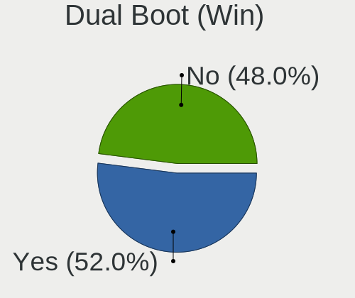
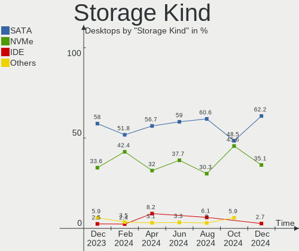
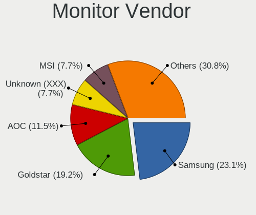
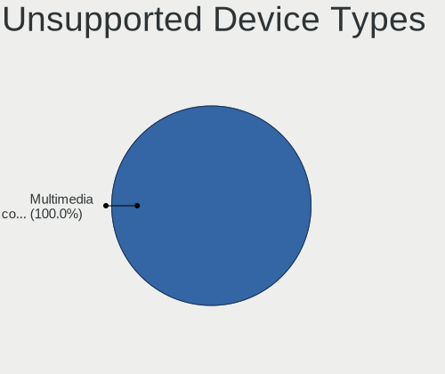

ArcoLinux - Hardware Trends (Desktops)
--------------------------------------

A project to identify most popular hardware characteristics and track their change
over time based on data collected by Linux users at https://Linux-Hardware.org.

Anyone can contribute to this report by the [hw-probe](https://github.com/linuxhw/hw-probe) tool:

    sudo -E hw-probe -all -upload

This report is for one last month. Overall report since the beginning of time: [TestCoverage](https://github.com/linuxhw/TestCoverage)

Period: Jun, 2022.

Contents
--------

* [ System ](#system)
  - [ OS                       ](#os)
  - [ OS Family                ](#os-family)
  - [ Kernel                   ](#kernel)
  - [ Kernel Family            ](#kernel-family)
  - [ Kernel Major Ver.        ](#kernel-major-ver)
  - [ Arch                     ](#arch)
  - [ DE                       ](#de)
  - [ Display Server           ](#display-server)
  - [ Display Manager          ](#display-manager)
  - [ OS Lang                  ](#os-lang)
  - [ Boot Mode                ](#boot-mode)
  - [ Filesystem               ](#filesystem)
  - [ Part. scheme             ](#part-scheme)
  - [ Dual Boot with Linux/BSD ](#dual-boot-with-linuxbsd)
  - [ Dual Boot (Win)          ](#dual-boot-win)

* [ Board ](#board)
  - [ Vendor                   ](#vendor)
  - [ Model                    ](#model)
  - [ Model Family             ](#model-family)
  - [ MFG Year                 ](#mfg-year)
  - [ Form Factor              ](#form-factor)
  - [ Secure Boot              ](#secure-boot)
  - [ Coreboot                 ](#coreboot)
  - [ RAM Size                 ](#ram-size)
  - [ RAM Used                 ](#ram-used)
  - [ Total Drives             ](#total-drives)
  - [ Has CD-ROM               ](#has-cd-rom)
  - [ Has Ethernet             ](#has-ethernet)
  - [ Has WiFi                 ](#has-wifi)
  - [ Has Bluetooth            ](#has-bluetooth)

* [ Location ](#location)
  - [ Country                  ](#country)
  - [ City                     ](#city)

* [ Drives ](#drives)
  - [ Drive Vendor             ](#drive-vendor)
  - [ Drive Model              ](#drive-model)
  - [ HDD Vendor               ](#hdd-vendor)
  - [ SSD Vendor               ](#ssd-vendor)
  - [ Drive Kind               ](#drive-kind)
  - [ Drive Connector          ](#drive-connector)
  - [ Drive Size               ](#drive-size)
  - [ Space Total              ](#space-total)
  - [ Space Used               ](#space-used)
  - [ Malfunc. Drives          ](#malfunc-drives)
  - [ Malfunc. Drive Vendor    ](#malfunc-drive-vendor)
  - [ Malfunc. HDD Vendor      ](#malfunc-hdd-vendor)
  - [ Malfunc. Drive Kind      ](#malfunc-drive-kind)
  - [ Failed Drives            ](#failed-drives)
  - [ Failed Drive Vendor      ](#failed-drive-vendor)
  - [ Drive Status             ](#drive-status)

* [ Storage controller ](#storage-controller)
  - [ Storage Vendor           ](#storage-vendor)
  - [ Storage Model            ](#storage-model)
  - [ Storage Kind             ](#storage-kind)

* [ Processor ](#processor)
  - [ CPU Vendor               ](#cpu-vendor)
  - [ CPU Model                ](#cpu-model)
  - [ CPU Model Family         ](#cpu-model-family)
  - [ CPU Cores                ](#cpu-cores)
  - [ CPU Sockets              ](#cpu-sockets)
  - [ CPU Threads              ](#cpu-threads)
  - [ CPU Op-Modes             ](#cpu-op-modes)
  - [ CPU Microcode            ](#cpu-microcode)
  - [ CPU Microarch            ](#cpu-microarch)

* [ Graphics ](#graphics)
  - [ GPU Vendor               ](#gpu-vendor)
  - [ GPU Model                ](#gpu-model)
  - [ GPU Combo                ](#gpu-combo)
  - [ GPU Driver               ](#gpu-driver)
  - [ GPU Memory               ](#gpu-memory)

* [ Monitor ](#monitor)
  - [ Monitor Vendor           ](#monitor-vendor)
  - [ Monitor Model            ](#monitor-model)
  - [ Monitor Resolution       ](#monitor-resolution)
  - [ Monitor Diagonal         ](#monitor-diagonal)
  - [ Monitor Width            ](#monitor-width)
  - [ Aspect Ratio             ](#aspect-ratio)
  - [ Monitor Area             ](#monitor-area)
  - [ Pixel Density            ](#pixel-density)
  - [ Multiple Monitors        ](#multiple-monitors)

* [ Network ](#network)
  - [ Net Controller Vendor    ](#net-controller-vendor)
  - [ Net Controller Model     ](#net-controller-model)
  - [ Wireless Vendor          ](#wireless-vendor)
  - [ Wireless Model           ](#wireless-model)
  - [ Ethernet Vendor          ](#ethernet-vendor)
  - [ Ethernet Model           ](#ethernet-model)
  - [ Net Controller Kind      ](#net-controller-kind)
  - [ Used Controller          ](#used-controller)
  - [ NICs                     ](#nics)
  - [ IPv6                     ](#ipv6)

* [ Bluetooth ](#bluetooth)
  - [ Bluetooth Vendor         ](#bluetooth-vendor)
  - [ Bluetooth Model          ](#bluetooth-model)

* [ Sound ](#sound)
  - [ Sound Vendor             ](#sound-vendor)
  - [ Sound Model              ](#sound-model)

* [ Memory ](#memory)
  - [ Memory Vendor            ](#memory-vendor)
  - [ Memory Model             ](#memory-model)
  - [ Memory Kind              ](#memory-kind)
  - [ Memory Form Factor       ](#memory-form-factor)
  - [ Memory Size              ](#memory-size)
  - [ Memory Speed             ](#memory-speed)

* [ Printers & scanners ](#printers--scanners)
  - [ Printer Vendor           ](#printer-vendor)
  - [ Printer Model            ](#printer-model)
  - [ Scanner Vendor           ](#scanner-vendor)
  - [ Scanner Model            ](#scanner-model)

* [ Camera ](#camera)
  - [ Camera Vendor            ](#camera-vendor)
  - [ Camera Model             ](#camera-model)

* [ Security ](#security)
  - [ Fingerprint Vendor       ](#fingerprint-vendor)
  - [ Fingerprint Model        ](#fingerprint-model)
  - [ Chipcard Vendor          ](#chipcard-vendor)
  - [ Chipcard Model           ](#chipcard-model)

* [ Unsupported ](#unsupported)
  - [ Unsupported Devices      ](#unsupported-devices)
  - [ Unsupported Device Types ](#unsupported-device-types)

System
------

OS
--

Installed operating systems

| Name              | Desktops | Percent |
|-------------------|----------|---------|
| ArcoLinux Rolling | 24       | 96%     |
| ArcoLinux         | 1        | 4%      |

OS Family
---------

OS without a version

| Name      | Desktops | Percent |
|-----------|----------|---------|
| ArcoLinux | 25       | 100%    |

Kernel
------

Version of the Linux kernel

| Version           | Desktops | Percent |
|-------------------|----------|---------|
| 5.18.1-arch1-1    | 5        | 20%     |
| 5.18.3-arch1-1    | 4        | 16%     |
| 5.18.6-arch1-1    | 3        | 12%     |
| 5.18.5-zen1-1-zen | 3        | 12%     |
| 5.18.5-arch1-1    | 3        | 12%     |
| 5.15.44-1-lts     | 2        | 8%      |
| 5.18.7-arch1-1    | 1        | 4%      |
| 5.18.2-zen1-1-zen | 1        | 4%      |
| 5.18.1-zen1-1-zen | 1        | 4%      |
| 5.15.50-1-lts     | 1        | 4%      |
| 5.15.49-1-lts     | 1        | 4%      |

Kernel Family
-------------

Linux kernel without a distro release

| Version | Desktops | Percent |
|---------|----------|---------|
| 5.18.5  | 6        | 24%     |
| 5.18.1  | 6        | 24%     |
| 5.18.3  | 4        | 16%     |
| 5.18.6  | 3        | 12%     |
| 5.15.44 | 2        | 8%      |
| 5.18.7  | 1        | 4%      |
| 5.18.2  | 1        | 4%      |
| 5.15.50 | 1        | 4%      |
| 5.15.49 | 1        | 4%      |

Kernel Major Ver.
-----------------

Linux kernel major version

| Version | Desktops | Percent |
|---------|----------|---------|
| 5.18    | 21       | 84%     |
| 5.15    | 4        | 16%     |

Arch
----

OS architecture (x86_64, i586, etc.)

| Name   | Desktops | Percent |
|--------|----------|---------|
| x86_64 | 25       | 100%    |

DE
--

Desktop Environment

| Name       | Desktops | Percent |
|------------|----------|---------|
| XFCE       | 6        | 24%     |
| KDE5       | 5        | 20%     |
| X-Cinnamon | 4        | 16%     |
| i3         | 2        | 8%      |
| GNOME      | 2        | 8%      |
| Unknown    | 2        | 8%      |
| qtile      | 1        | 4%      |
| LeftWM     | 1        | 4%      |
| Cinnamon   | 1        | 4%      |
| awesome    | 1        | 4%      |

Display Server
--------------

X11 or Wayland

| Name    | Desktops | Percent |
|---------|----------|---------|
| X11     | 20       | 80%     |
| Tty     | 4        | 16%     |
| Unknown | 1        | 4%      |

Display Manager
---------------

SDDM, LightDM, etc.

| Name    | Desktops | Percent |
|---------|----------|---------|
| SDDM    | 16       | 64%     |
| LightDM | 5        | 20%     |
| Unknown | 2        | 8%      |
| Ly      | 1        | 4%      |
| GDM     | 1        | 4%      |

OS Lang
-------

Language

| Lang  | Desktops | Percent |
|-------|----------|---------|
| en_US | 16       | 64%     |
| de_DE | 2        | 8%      |
| tr_TR | 1        | 4%      |
| sv_SE | 1        | 4%      |
| ru_RU | 1        | 4%      |
| it_IT | 1        | 4%      |
| es_AR | 1        | 4%      |
| en_GB | 1        | 4%      |
| en_CA | 1        | 4%      |

Boot Mode
---------

EFI or BIOS

| Mode | Desktops | Percent |
|------|----------|---------|
| EFI  | 19       | 76%     |
| BIOS | 6        | 24%     |

Filesystem
----------

Type of filesystem

| Type    | Desktops | Percent |
|---------|----------|---------|
| Ext4    | 16       | 64%     |
| Btrfs   | 8        | 32%     |
| Overlay | 1        | 4%      |

Part. scheme
------------

Scheme of partitioning

| Type    | Desktops | Percent |
|---------|----------|---------|
| GPT     | 20       | 80%     |
| MBR     | 3        | 12%     |
| Unknown | 2        | 8%      |

Dual Boot with Linux/BSD
------------------------

Hosting more than one Linux/BSD

| Dual boot | Desktops | Percent |
|-----------|----------|---------|
| No        | 18       | 72%     |
| Yes       | 7        | 28%     |

Dual Boot (Win)
---------------

Hosting Linux and Windows

| Dual boot | Desktops | Percent |
|-----------|----------|---------|
| No        | 13       | 52%     |
| Yes       | 12       | 48%     |

Board
-----

Vendor
------

Motherboard manufacturer

| Name                | Desktops | Percent |
|---------------------|----------|---------|
| MSI                 | 8        | 32%     |
| Gigabyte Technology | 5        | 20%     |
| Dell                | 4        | 16%     |
| ASUSTek Computer    | 4        | 16%     |
| ASRock              | 2        | 8%      |
| PLEXHD              | 1        | 4%      |
| Biostar             | 1        | 4%      |

Model
-----

Motherboard model

| Name                         | Desktops | Percent |
|------------------------------|----------|---------|
| PLEXHD X79 Turbo             | 1        | 4%      |
| MSI MS-7C84                  | 1        | 4%      |
| MSI MS-7C37                  | 1        | 4%      |
| MSI MS-7C35                  | 1        | 4%      |
| MSI MS-7B98                  | 1        | 4%      |
| MSI MS-7B86                  | 1        | 4%      |
| MSI MS-7B84                  | 1        | 4%      |
| MSI MS-7A62                  | 1        | 4%      |
| MSI MS-7817                  | 1        | 4%      |
| Gigabyte Z370XP SLI          | 1        | 4%      |
| Gigabyte X570 AORUS PRO WIFI | 1        | 4%      |
| Gigabyte H87-HD3             | 1        | 4%      |
| Gigabyte B550 AORUS ELITE V2 | 1        | 4%      |
| Gigabyte AB350N-Gaming WIFI  | 1        | 4%      |
| Dell OptiPlex 7010           | 1        | 4%      |
| Dell OptiPlex 3040           | 1        | 4%      |
| Dell OptiPlex 3020           | 1        | 4%      |
| Dell Inspiron 546            | 1        | 4%      |
| Biostar J3060NH              | 1        | 4%      |
| ASUS TUF Gaming B550M-E WIFI | 1        | 4%      |
| ASUS PRIME Z490-A            | 1        | 4%      |
| ASUS PRIME A320M-K           | 1        | 4%      |
| ASUS M5A78L-M LX PLUS        | 1        | 4%      |
| ASRock Z370 Extreme4         | 1        | 4%      |
| ASRock X299 Taichi CLX       | 1        | 4%      |

Model Family
------------

Motherboard model prefix

| Name                   | Desktops | Percent |
|------------------------|----------|---------|
| Dell OptiPlex          | 3        | 12%     |
| ASUS PRIME             | 2        | 8%      |
| PLEXHD X79             | 1        | 4%      |
| MSI MS-7C84            | 1        | 4%      |
| MSI MS-7C37            | 1        | 4%      |
| MSI MS-7C35            | 1        | 4%      |
| MSI MS-7B98            | 1        | 4%      |
| MSI MS-7B86            | 1        | 4%      |
| MSI MS-7B84            | 1        | 4%      |
| MSI MS-7A62            | 1        | 4%      |
| MSI MS-7817            | 1        | 4%      |
| Gigabyte Z370XP        | 1        | 4%      |
| Gigabyte X570          | 1        | 4%      |
| Gigabyte H87-HD3       | 1        | 4%      |
| Gigabyte B550          | 1        | 4%      |
| Gigabyte AB350N-Gaming | 1        | 4%      |
| Dell Inspiron          | 1        | 4%      |
| Biostar J3060NH        | 1        | 4%      |
| ASUS TUF               | 1        | 4%      |
| ASUS M5A78L-M          | 1        | 4%      |
| ASRock Z370            | 1        | 4%      |
| ASRock X299            | 1        | 4%      |

MFG Year
--------

Motherboard manufacture year

| Year | Desktops | Percent |
|------|----------|---------|
| 2019 | 5        | 20%     |
| 2020 | 4        | 16%     |
| 2017 | 4        | 16%     |
| 2013 | 3        | 12%     |
| 2021 | 2        | 8%      |
| 2018 | 2        | 8%      |
| 2016 | 2        | 8%      |
| 2014 | 1        | 4%      |
| 2011 | 1        | 4%      |
| 2009 | 1        | 4%      |

Form Factor
-----------

Physical design of the computer

| Name    | Desktops | Percent |
|---------|----------|---------|
| Desktop | 25       | 100%    |

Secure Boot
-----------

Enabled or disabled

| State    | Desktops | Percent |
|----------|----------|---------|
| Disabled | 25       | 100%    |

Coreboot
--------

Have coreboot on board

| Used | Desktops | Percent |
|------|----------|---------|
| No   | 25       | 100%    |

RAM Size
--------

Total RAM memory

| Size in GB  | Desktops | Percent |
|-------------|----------|---------|
| 32.01-64.0  | 8        | 32%     |
| 4.01-8.0    | 5        | 20%     |
| 16.01-24.0  | 5        | 20%     |
| 64.01-256.0 | 3        | 12%     |
| 8.01-16.0   | 3        | 12%     |
| 24.01-32.0  | 1        | 4%      |

RAM Used
--------

Used RAM memory

| Used GB   | Desktops | Percent |
|-----------|----------|---------|
| 4.01-8.0  | 7        | 28%     |
| 2.01-3.0  | 5        | 20%     |
| 1.01-2.0  | 4        | 16%     |
| 3.01-4.0  | 3        | 12%     |
| 8.01-16.0 | 3        | 12%     |
| 0.51-1.0  | 2        | 8%      |
| 0.01-0.5  | 1        | 4%      |

Total Drives
------------

Number of drives on board

| Drives | Desktops | Percent |
|--------|----------|---------|
| 2      | 7        | 28%     |
| 1      | 7        | 28%     |
| 3      | 5        | 20%     |
| 4      | 4        | 16%     |
| 7      | 2        | 8%      |

Has CD-ROM
----------

Has CD-ROM on board

| Presented | Desktops | Percent |
|-----------|----------|---------|
| No        | 19       | 76%     |
| Yes       | 6        | 24%     |

Has Ethernet
------------

Has Ethernet on board

| Presented | Desktops | Percent |
|-----------|----------|---------|
| Yes       | 25       | 100%    |

Has WiFi
--------

Has WiFi module

| Presented | Desktops | Percent |
|-----------|----------|---------|
| No        | 15       | 60%     |
| Yes       | 10       | 40%     |

Has Bluetooth
-------------

Has Bluetooth module

| Presented | Desktops | Percent |
|-----------|----------|---------|
| No        | 13       | 52%     |
| Yes       | 12       | 48%     |

Location
--------

Country
-------

Geographic location (country)

| Country   | Desktops | Percent |
|-----------|----------|---------|
| USA       | 8        | 32%     |
| Germany   | 3        | 12%     |
| Argentina | 2        | 8%      |
| Turkey    | 1        | 4%      |
| Sweden    | 1        | 4%      |
| Russia    | 1        | 4%      |
| Portugal  | 1        | 4%      |
| Italy     | 1        | 4%      |
| Hong Kong | 1        | 4%      |
| France    | 1        | 4%      |
| Estonia   | 1        | 4%      |
| Canada    | 1        | 4%      |
| Belgium   | 1        | 4%      |
| Barbados  | 1        | 4%      |
| Austria   | 1        | 4%      |

City
----

Geographic location (city)

| City          | Desktops | Percent |
|---------------|----------|---------|
| Weinbach      | 1        | 4%      |
| Vienna        | 1        | 4%      |
| Türi         | 1        | 4%      |
| Torres Vedras | 1        | 4%      |
| Seattle       | 1        | 4%      |
| Rosario       | 1        | 4%      |
| Omsk          | 1        | 4%      |
| Norwalk       | 1        | 4%      |
| Montevrain    | 1        | 4%      |
| Mattoon       | 1        | 4%      |
| Mar del Plata | 1        | 4%      |
| Lier          | 1        | 4%      |
| Leer          | 1        | 4%      |
| Las Vegas     | 1        | 4%      |
| Istanbul      | 1        | 4%      |
| Härnösand   | 1        | 4%      |
| Edmonton      | 1        | 4%      |
| Düsseldorf   | 1        | 4%      |
| Cypress       | 1        | 4%      |
| Crothersville | 1        | 4%      |
| Chicago       | 1        | 4%      |
| Central       | 1        | 4%      |
| Byron Center  | 1        | 4%      |
| Bridgetown    | 1        | 4%      |
| Asti          | 1        | 4%      |

Drives
------

Drive Vendor
------------

Hard drive vendors

| Vendor              | Desktops | Drives | Percent |
|---------------------|----------|--------|---------|
| WDC                 | 12       | 21     | 24.49%  |
| Samsung Electronics | 11       | 17     | 22.45%  |
| Seagate             | 7        | 10     | 14.29%  |
| Toshiba             | 2        | 2      | 4.08%   |
| Gigabyte Technology | 2        | 2      | 4.08%   |
| Crucial             | 2        | 3      | 4.08%   |
| Transcend           | 1        | 1      | 2.04%   |
| Silicon Motion      | 1        | 1      | 2.04%   |
| SanDisk             | 1        | 1      | 2.04%   |
| PNY                 | 1        | 1      | 2.04%   |
| Phison              | 1        | 1      | 2.04%   |
| Patriot             | 1        | 1      | 2.04%   |
| LaCie               | 1        | 1      | 2.04%   |
| Kingston            | 1        | 1      | 2.04%   |
| Intel               | 1        | 1      | 2.04%   |
| Hitachi             | 1        | 1      | 2.04%   |
| Corsair             | 1        | 1      | 2.04%   |
| ASMT                | 1        | 1      | 2.04%   |
| A-DATA Technology   | 1        | 1      | 2.04%   |

Drive Model
-----------

Hard drive models

| Model                                | Desktops | Percent |
|--------------------------------------|----------|---------|
| WDC WD10EADS-00L5B1 1TB              | 2        | 3.13%   |
| Samsung SSD 980 PRO 1TB              | 2        | 3.13%   |
| Samsung SSD 970 EVO Plus 500GB       | 2        | 3.13%   |
| Samsung SSD 970 EVO Plus 1TB         | 2        | 3.13%   |
| Samsung SSD 860 EVO 250GB            | 2        | 3.13%   |
| Samsung SSD 850 EVO 250GB            | 2        | 3.13%   |
| WDC WDS500G1X0E-00AFY0 500GB         | 1        | 1.56%   |
| WDC WDS240G2G0A-00JH30 240GB SSD     | 1        | 1.56%   |
| WDC WDS240G1G0B-00RC30 240GB SSD     | 1        | 1.56%   |
| WDC WD6400AAKS-65Z7B0 640GB          | 1        | 1.56%   |
| WDC WD5002ABYS-01B1B0 500GB          | 1        | 1.56%   |
| WDC WD5000AAKX-00ERMA0 500GB         | 1        | 1.56%   |
| WDC WD5000AAKX-001CA0 500GB          | 1        | 1.56%   |
| WDC WD5000AAKS-75V0A0 500GB          | 1        | 1.56%   |
| WDC WD3200BPVT-75ZEST0 320GB         | 1        | 1.56%   |
| WDC WD20EZRX-00D8PB0 2TB             | 1        | 1.56%   |
| WDC WD2001FASS-00W2B0 2TB            | 1        | 1.56%   |
| WDC WD10EZEX-08WN4A0 1TB             | 1        | 1.56%   |
| WDC WD10EZEX-00BN5A0 1TB             | 1        | 1.56%   |
| WDC WD10EUCX-63YZ1Y0 1TB             | 1        | 1.56%   |
| WDC WD10EFRX-68JCSN0 1TB             | 1        | 1.56%   |
| WDC WD1001FALS-00J7B0 1TB            | 1        | 1.56%   |
| Transcend TS480GSSD220S 480GB        | 1        | 1.56%   |
| Toshiba HDWF180 8TB                  | 1        | 1.56%   |
| Toshiba DT01ACA050 500GB             | 1        | 1.56%   |
| Silicon Motion NVME SSD 256GB        | 1        | 1.56%   |
| Seagate ST9500325AS 500GB            | 1        | 1.56%   |
| Seagate ST4000DM004-2CV104 4TB       | 1        | 1.56%   |
| Seagate ST3000DM008-2DM166 3TB       | 1        | 1.56%   |
| Seagate ST2000DX002-2DV164 2TB       | 1        | 1.56%   |
| Seagate ST2000DM001-9YN164 2TB       | 1        | 1.56%   |
| Seagate ST2000DM001-1ER164 2TB       | 1        | 1.56%   |
| Seagate ST2000DM001-1CH164 2TB       | 1        | 1.56%   |
| Seagate ST1000LM048-2E7172 1TB       | 1        | 1.56%   |
| Seagate ST1000DM003-1ER162 1TB       | 1        | 1.56%   |
| Seagate Expansion 1TB                | 1        | 1.56%   |
| SanDisk SSD PLUS 240GB               | 1        | 1.56%   |
| Samsung SSD 980 500GB                | 1        | 1.56%   |
| Samsung SSD 970 EVO 250GB            | 1        | 1.56%   |
| Samsung SSD 950 PRO 512GB            | 1        | 1.56%   |
| Samsung SSD 870 QVO 2TB              | 1        | 1.56%   |
| Samsung SSD 840 Series 120GB         | 1        | 1.56%   |
| Samsung MZ7TY128HDHP-000L1 128GB SSD | 1        | 1.56%   |
| PNY CS900 500GB SSD                  | 1        | 1.56%   |
| Phison Sabrent Rocket Q 1TB          | 1        | 1.56%   |
| Patriot P210 256GB SSD               | 1        | 1.56%   |
| LaCie Mobile Drive 5TB               | 1        | 1.56%   |
| Kingston SA400M8240G 240GB SSD       | 1        | 1.56%   |
| Intel SSDSC2BW240A4 240GB            | 1        | 1.56%   |
| Hitachi HTS542580K9SA00 80GB         | 1        | 1.56%   |
| Gigabyte GP-ASM2NE6500GTTD 500GB     | 1        | 1.56%   |
| Gigabyte GP-AG41TB                   | 1        | 1.56%   |
| Crucial CT1000P5SSD8 1TB             | 1        | 1.56%   |
| Crucial CT1000P1SSD8 1TB             | 1        | 1.56%   |
| Crucial CT1000MX500SSD1 1TB          | 1        | 1.56%   |
| Corsair Force MP600 500GB            | 1        | 1.56%   |
| ASMT 2115 128GB                      | 1        | 1.56%   |
| A-DATA SP900 256GB SSD               | 1        | 1.56%   |

HDD Vendor
----------

Hard disk drive vendors

| Vendor  | Desktops | Drives | Percent |
|---------|----------|--------|---------|
| WDC     | 10       | 18     | 47.62%  |
| Seagate | 7        | 10     | 33.33%  |
| Toshiba | 2        | 2      | 9.52%   |
| Hitachi | 1        | 1      | 4.76%   |
| ASMT    | 1        | 1      | 4.76%   |

SSD Vendor
----------

Solid state drive vendors

| Vendor              | Desktops | Drives | Percent |
|---------------------|----------|--------|---------|
| Samsung Electronics | 7        | 8      | 41.18%  |
| WDC                 | 2        | 2      | 11.76%  |
| Transcend           | 1        | 1      | 5.88%   |
| SanDisk             | 1        | 1      | 5.88%   |
| PNY                 | 1        | 1      | 5.88%   |
| Patriot             | 1        | 1      | 5.88%   |
| Kingston            | 1        | 1      | 5.88%   |
| Intel               | 1        | 1      | 5.88%   |
| Crucial             | 1        | 1      | 5.88%   |
| A-DATA Technology   | 1        | 1      | 5.88%   |

Drive Kind
----------

HDD or SSD

| Kind    | Desktops | Drives | Percent |
|---------|----------|--------|---------|
| HDD     | 16       | 32     | 36.36%  |
| SSD     | 15       | 18     | 34.09%  |
| NVMe    | 12       | 17     | 27.27%  |
| Unknown | 1        | 1      | 2.27%   |

Drive Connector
---------------

SATA, SAS, NVMe, etc.

| Type | Desktops | Drives | Percent |
|------|----------|--------|---------|
| SATA | 21       | 48     | 58.33%  |
| NVMe | 12       | 17     | 33.33%  |
| SAS  | 3        | 3      | 8.33%   |

Drive Size
----------

Size of hard drive

| Size in TB | Desktops | Drives | Percent |
|------------|----------|--------|---------|
| 0.01-0.5   | 16       | 25     | 47.06%  |
| 0.51-1.0   | 10       | 15     | 29.41%  |
| 1.01-2.0   | 5        | 7      | 14.71%  |
| 3.01-4.0   | 1        | 1      | 2.94%   |
| 2.01-3.0   | 1        | 1      | 2.94%   |
| 4.01-10.0  | 1        | 1      | 2.94%   |

Space Total
-----------

Amount of disk space available on the file system

| Size in GB     | Desktops | Percent |
|----------------|----------|---------|
| More than 3000 | 9        | 36%     |
| 1001-2000      | 4        | 16%     |
| 501-1000       | 4        | 16%     |
| 251-500        | 3        | 12%     |
| 101-250        | 3        | 12%     |
| 2001-3000      | 2        | 8%      |

Space Used
----------

Amount of used disk space

| Used GB        | Desktops | Percent |
|----------------|----------|---------|
| 101-250        | 6        | 24%     |
| 501-1000       | 5        | 20%     |
| 21-50          | 4        | 16%     |
| 1001-2000      | 4        | 16%     |
| 251-500        | 3        | 12%     |
| More than 3000 | 2        | 8%      |
| 51-100         | 1        | 4%      |

Malfunc. Drives
---------------

Drive models with a malfunction

| Model                                    | Desktops | Drives | Percent |
|------------------------------------------|----------|--------|---------|
| WDC WD6400AAKS-65Z7B0 640GB              | 1        | 1      | 10%     |
| WDC WD5000AAKX-00ERMA0 500GB             | 1        | 1      | 10%     |
| WDC WD5000AAKX-001CA0 500GB              | 1        | 1      | 10%     |
| WDC WD2001FASS-00W2B0 2TB                | 1        | 1      | 10%     |
| WDC WD10EADS-00L5B1 1TB                  | 1        | 1      | 10%     |
| Toshiba DT01ACA050 500GB                 | 1        | 1      | 10%     |
| Seagate ST2000DX002-2DV164 2TB           | 1        | 1      | 10%     |
| Seagate ST2000DM001-1ER164 2TB           | 1        | 1      | 10%     |
| Samsung Electronics SSD 970 EVO Plus 1TB | 1        | 1      | 10%     |
| Patriot P210 256GB SSD                   | 1        | 1      | 10%     |

Malfunc. Drive Vendor
---------------------

Vendors of faulty drives

| Vendor              | Desktops | Drives | Percent |
|---------------------|----------|--------|---------|
| WDC                 | 4        | 5      | 44.44%  |
| Seagate             | 2        | 2      | 22.22%  |
| Toshiba             | 1        | 1      | 11.11%  |
| Samsung Electronics | 1        | 1      | 11.11%  |
| Patriot             | 1        | 1      | 11.11%  |

Malfunc. HDD Vendor
-------------------

Vendors of faulty HDD drives

| Vendor  | Desktops | Drives | Percent |
|---------|----------|--------|---------|
| WDC     | 4        | 5      | 57.14%  |
| Seagate | 2        | 2      | 28.57%  |
| Toshiba | 1        | 1      | 14.29%  |

Malfunc. Drive Kind
-------------------

Kinds of faulty drives

| Kind | Desktops | Drives | Percent |
|------|----------|--------|---------|
| HDD  | 6        | 8      | 75%     |
| NVMe | 1        | 1      | 12.5%   |
| SSD  | 1        | 1      | 12.5%   |

Failed Drives
-------------

Failed drive models

| Model                                            | Desktops | Drives | Percent |
|--------------------------------------------------|----------|--------|---------|
| Samsung Electronics MZ7TY128HDHP-000L1 128GB SSD | 1        | 1      | 100%    |

Failed Drive Vendor
-------------------

Failed drive vendors

| Vendor              | Desktops | Drives | Percent |
|---------------------|----------|--------|---------|
| Samsung Electronics | 1        | 1      | 100%    |

Drive Status
------------

Number of failed and malfunc. drives

| Status   | Desktops | Drives | Percent |
|----------|----------|--------|---------|
| Works    | 20       | 49     | 58.82%  |
| Malfunc  | 8        | 10     | 23.53%  |
| Detected | 5        | 8      | 14.71%  |
| Failed   | 1        | 1      | 2.94%   |

Storage controller
------------------

Storage Vendor
--------------

Storage controller vendors

| Vendor                    | Desktops | Percent |
|---------------------------|----------|---------|
| Intel                     | 13       | 30.23%  |
| AMD                       | 12       | 27.91%  |
| Samsung Electronics       | 7        | 16.28%  |
| Phison Electronics        | 3        | 6.98%   |
| ASMedia Technology        | 3        | 6.98%   |
| Silicon Motion            | 1        | 2.33%   |
| SanDisk                   | 1        | 2.33%   |
| Micron/Crucial Technology | 1        | 2.33%   |
| Micron Technology         | 1        | 2.33%   |
| Broadcom / LSI            | 1        | 2.33%   |

Storage Model
-------------

Storage controller models

| Model                                                                            | Desktops | Percent |
|----------------------------------------------------------------------------------|----------|---------|
| AMD FCH SATA Controller [AHCI mode]                                              | 7        | 13.73%  |
| Samsung NVMe SSD Controller SM981/PM981/PM983                                    | 5        | 9.8%    |
| Phison E16 PCIe4 NVMe Controller                                                 | 3        | 5.88%   |
| Intel 8 Series/C220 Series Chipset Family 6-port SATA Controller 1 [AHCI mode]   | 3        | 5.88%   |
| Intel 200 Series PCH SATA controller [AHCI mode]                                 | 3        | 5.88%   |
| ASMedia ASM1062 Serial ATA Controller                                            | 3        | 5.88%   |
| Samsung NVMe SSD Controller PM9A1/PM9A3/980PRO                                   | 2        | 3.92%   |
| Intel 7 Series/C210 Series Chipset Family 6-port SATA Controller [AHCI mode]     | 2        | 3.92%   |
| AMD SB7x0/SB8x0/SB9x0 IDE Controller                                             | 2        | 3.92%   |
| AMD FCH SATA Controller D                                                        | 2        | 3.92%   |
| AMD 500 Series Chipset SATA Controller                                           | 2        | 3.92%   |
| Silicon Motion SM2263EN/SM2263XT SSD Controller                                  | 1        | 1.96%   |
| SanDisk WD PC SN810 / Black SN850 NVMe SSD                                       | 1        | 1.96%   |
| Samsung NVMe SSD Controller SM951/PM951                                          | 1        | 1.96%   |
| Samsung NVMe SSD Controller 980                                                  | 1        | 1.96%   |
| Phison E12 NVMe Controller                                                       | 1        | 1.96%   |
| Micron/Crucial NVMe Controller                                                   | 1        | 1.96%   |
| Micron Non-Volatile memory controller                                            | 1        | 1.96%   |
| Intel SATA Controller [RAID mode]                                                | 1        | 1.96%   |
| Intel Q170/Q150/B150/H170/H110/Z170/CM236 Chipset SATA Controller [AHCI Mode]    | 1        | 1.96%   |
| Intel Comet Lake PCH-H RAID                                                      | 1        | 1.96%   |
| Intel Cannon Lake PCH SATA AHCI Controller                                       | 1        | 1.96%   |
| Intel Atom/Celeron/Pentium Processor x5-E8000/J3xxx/N3xxx Series SATA Controller | 1        | 1.96%   |
| Broadcom / LSI MegaRAID SAS 2208 [Thunderbolt]                                   | 1        | 1.96%   |
| AMD SB7x0/SB8x0/SB9x0 SATA Controller [IDE mode]                                 | 1        | 1.96%   |
| AMD SB7x0/SB8x0/SB9x0 SATA Controller [AHCI mode]                                | 1        | 1.96%   |
| AMD 400 Series Chipset SATA Controller                                           | 1        | 1.96%   |
| AMD 300 Series Chipset SATA Controller                                           | 1        | 1.96%   |

Storage Kind
------------

Kind of storage controller (IDE, SATA, NVMe, SAS, ...)

| Kind | Desktops | Percent |
|------|----------|---------|
| SATA | 23       | 57.5%   |
| NVMe | 12       | 30%     |
| RAID | 3        | 7.5%    |
| IDE  | 2        | 5%      |

Processor
---------

CPU Vendor
----------

Processor vendors

| Vendor | Desktops | Percent |
|--------|----------|---------|
| Intel  | 13       | 52%     |
| AMD    | 12       | 48%     |

CPU Model
---------

Processor models

| Model                                         | Desktops | Percent |
|-----------------------------------------------|----------|---------|
| AMD Ryzen 9 5900X 12-Core Processor           | 2        | 8%      |
| AMD Ryzen 3 2200G with Radeon Vega Graphics   | 2        | 8%      |
| Intel Xeon CPU E5-2650 v2 @ 2.60GHz           | 1        | 4%      |
| Intel Xeon CPU E3-1240 v3 @ 3.40GHz           | 1        | 4%      |
| Intel Pentium CPU G4560 @ 3.50GHz             | 1        | 4%      |
| Intel Core i9-10900X CPU @ 3.70GHz            | 1        | 4%      |
| Intel Core i7-8700K CPU @ 3.70GHz             | 1        | 4%      |
| Intel Core i7-8700 CPU @ 3.20GHz              | 1        | 4%      |
| Intel Core i7-4790 CPU @ 3.60GHz              | 1        | 4%      |
| Intel Core i7-3770 CPU @ 3.40GHz              | 1        | 4%      |
| Intel Core i7-10700K CPU @ 3.80GHz            | 1        | 4%      |
| Intel Core i5-9400F CPU @ 2.90GHz             | 1        | 4%      |
| Intel Core i5-6500 CPU @ 3.20GHz              | 1        | 4%      |
| Intel Core i3-4160 CPU @ 3.60GHz              | 1        | 4%      |
| Intel Celeron CPU J3060 @ 1.60GHz             | 1        | 4%      |
| AMD Ryzen 9 3900X 12-Core Processor           | 1        | 4%      |
| AMD Ryzen 7 5800X 8-Core Processor            | 1        | 4%      |
| AMD Ryzen 7 3700X 8-Core Processor            | 1        | 4%      |
| AMD Ryzen 5 5600G with Radeon Graphics        | 1        | 4%      |
| AMD Ryzen 5 3600 6-Core Processor             | 1        | 4%      |
| AMD Phenom 9750 Quad-Core Processor           | 1        | 4%      |
| AMD FX-6300 Six-Core Processor                | 1        | 4%      |
| AMD A6-9500E RADEON R5, 6 COMPUTE CORES 2C+4G | 1        | 4%      |

CPU Model Family
----------------

Processor model prefix

| Model         | Desktops | Percent |
|---------------|----------|---------|
| Intel Core i7 | 5        | 20%     |
| AMD Ryzen 9   | 3        | 12%     |
| Intel Xeon    | 2        | 8%      |
| Intel Core i5 | 2        | 8%      |
| AMD Ryzen 7   | 2        | 8%      |
| AMD Ryzen 5   | 2        | 8%      |
| AMD Ryzen 3   | 2        | 8%      |
| Intel Pentium | 1        | 4%      |
| Intel Core i9 | 1        | 4%      |
| Intel Core i3 | 1        | 4%      |
| Intel Celeron | 1        | 4%      |
| AMD Phenom    | 1        | 4%      |
| AMD FX        | 1        | 4%      |
| AMD A6        | 1        | 4%      |

CPU Cores
---------

Number of processor cores

| Number | Desktops | Percent |
|--------|----------|---------|
| 4      | 7        | 28%     |
| 6      | 5        | 20%     |
| 8      | 4        | 16%     |
| 12     | 3        | 12%     |
| 2      | 3        | 12%     |
| 10     | 1        | 4%      |
| 3      | 1        | 4%      |
| 1      | 1        | 4%      |

CPU Sockets
-----------

Number of sockets

| Number | Desktops | Percent |
|--------|----------|---------|
| 1      | 25       | 100%    |

CPU Threads
-----------

Threads per core (Hyper-Threading)

| Number | Desktops | Percent |
|--------|----------|---------|
| 2      | 19       | 76%     |
| 1      | 6        | 24%     |

CPU Op-Modes
------------

CPU Operation Modes (32-bit, 64-bit)

| Op mode        | Desktops | Percent |
|----------------|----------|---------|
| 32-bit, 64-bit | 25       | 100%    |

CPU Microcode
-------------

Microcode number

| Number     | Desktops | Percent |
|------------|----------|---------|
| Unknown    | 3        | 12%     |
| 0x906ea    | 2        | 8%      |
| 0x306c3    | 2        | 8%      |
| 0x08701021 | 2        | 8%      |
| 0x08101016 | 2        | 8%      |
| 0xa0655    | 1        | 4%      |
| 0x906e9    | 1        | 4%      |
| 0x506e3    | 1        | 4%      |
| 0x50657    | 1        | 4%      |
| 0x406c4    | 1        | 4%      |
| 0x306e4    | 1        | 4%      |
| 0x306a9    | 1        | 4%      |
| 0x0a201205 | 1        | 4%      |
| 0x0a201016 | 1        | 4%      |
| 0x0a201009 | 1        | 4%      |
| 0x08701013 | 1        | 4%      |
| 0x06006118 | 1        | 4%      |
| 0x0600081c | 1        | 4%      |
| 0x01000095 | 1        | 4%      |

CPU Microarch
-------------

Microarchitecture

| Name       | Desktops | Percent |
|------------|----------|---------|
| Zen 3      | 4        | 16%     |
| KabyLake   | 4        | 16%     |
| Zen 2      | 3        | 12%     |
| Haswell    | 3        | 12%     |
| Zen        | 2        | 8%      |
| Skylake    | 2        | 8%      |
| IvyBridge  | 2        | 8%      |
| Silvermont | 1        | 4%      |
| Piledriver | 1        | 4%      |
| K10        | 1        | 4%      |
| Excavator  | 1        | 4%      |
| CometLake  | 1        | 4%      |

Graphics
--------

GPU Vendor
----------

Vendors of graphics cards

| Vendor           | Desktops | Percent |
|------------------|----------|---------|
| Nvidia           | 11       | 42.31%  |
| AMD              | 10       | 38.46%  |
| Intel            | 4        | 15.38%  |
| ATI Technologies | 1        | 3.85%   |

GPU Model
---------

Graphics card models

| Model                                                                                    | Desktops | Percent |
|------------------------------------------------------------------------------------------|----------|---------|
| Nvidia TU117 [GeForce GTX 1650]                                                          | 2        | 7.69%   |
| AMD Baffin [Radeon RX 460/560D / Pro 450/455/460/555/555X/560/560X]                      | 2        | 7.69%   |
| Nvidia TU106 [GeForce RTX 2060 SUPER]                                                    | 1        | 3.85%   |
| Nvidia TU106 [GeForce RTX 2060 Rev. A]                                                   | 1        | 3.85%   |
| Nvidia GP107 [GeForce GTX 1050 Ti]                                                       | 1        | 3.85%   |
| Nvidia GP106 [GeForce GTX 1060 6GB]                                                      | 1        | 3.85%   |
| Nvidia GP104 [GeForce GTX 1080]                                                          | 1        | 3.85%   |
| Nvidia GP104 [GeForce GTX 1070]                                                          | 1        | 3.85%   |
| Nvidia GM107 [GeForce GTX 750 Ti]                                                        | 1        | 3.85%   |
| Nvidia GA102 [GeForce RTX 3080]                                                          | 1        | 3.85%   |
| Nvidia GA102 [GeForce RTX 3080 Lite Hash Rate]                                           | 1        | 3.85%   |
| Intel HD Graphics 530                                                                    | 1        | 3.85%   |
| Intel CoffeeLake-S GT2 [UHD Graphics 630]                                                | 1        | 3.85%   |
| Intel Atom/Celeron/Pentium Processor x5-E8000/J3xxx/N3xxx Integrated Graphics Controller | 1        | 3.85%   |
| Intel 4th Generation Core Processor Family Integrated Graphics Controller                | 1        | 3.85%   |
| ATI Technologies Wani [Radeon R5/R6/R7 Graphics]                                         | 1        | 3.85%   |
| AMD RS780 [Radeon HD 3200]                                                               | 1        | 3.85%   |
| AMD Raven Ridge [Radeon Vega Series / Radeon Vega Mobile Series]                         | 1        | 3.85%   |
| AMD Park [Mobility Radeon HD 5430]                                                       | 1        | 3.85%   |
| AMD Navi 23 [Radeon RX 6600/6600 XT/6600M]                                               | 1        | 3.85%   |
| AMD Navi 21 [Radeon RX 6800/6800 XT / 6900 XT]                                           | 1        | 3.85%   |
| AMD Navi 10 [Radeon RX 5600 OEM/5600 XT / 5700/5700 XT]                                  | 1        | 3.85%   |
| AMD Ellesmere [Radeon RX 470/480/570/570X/580/580X/590]                                  | 1        | 3.85%   |
| AMD Cezanne                                                                              | 1        | 3.85%   |

GPU Combo
---------

Combinations of graphics cards

| Name           | Desktops | Percent |
|----------------|----------|---------|
| 1 x AMD        | 11       | 44%     |
| 1 x Nvidia     | 10       | 40%     |
| 1 x Intel      | 3        | 12%     |
| Intel + Nvidia | 1        | 4%      |

GPU Driver
----------

Free vs proprietary

| Driver      | Desktops | Percent |
|-------------|----------|---------|
| Free        | 14       | 56%     |
| Proprietary | 10       | 40%     |
| Unknown     | 1        | 4%      |

GPU Memory
----------

Total video memory

| Size in GB | Desktops | Percent |
|------------|----------|---------|
| Unknown    | 6        | 24%     |
| 3.01-4.0   | 5        | 20%     |
| 7.01-8.0   | 4        | 16%     |
| 1.01-2.0   | 3        | 12%     |
| 8.01-16.0  | 3        | 12%     |
| 0.01-0.5   | 3        | 12%     |
| 5.01-6.0   | 1        | 4%      |

Monitor
-------

Monitor Vendor
--------------

Monitor vendors

| Vendor               | Desktops | Percent |
|----------------------|----------|---------|
| Goldstar             | 7        | 25%     |
| Samsung Electronics  | 5        | 17.86%  |
| Dell                 | 3        | 10.71%  |
| Philips              | 2        | 7.14%   |
| BenQ                 | 2        | 7.14%   |
| Ancor Communications | 2        | 7.14%   |
| ViewSonic            | 1        | 3.57%   |
| Unknown              | 1        | 3.57%   |
| Sceptre Tech         | 1        | 3.57%   |
| MSI                  | 1        | 3.57%   |
| Gigabyte Technology  | 1        | 3.57%   |
| ASUSTek Computer     | 1        | 3.57%   |
| Acer                 | 1        | 3.57%   |

Monitor Model
-------------

Monitor models

| Model                                                                   | Desktops | Percent |
|-------------------------------------------------------------------------|----------|---------|
| ViewSonic VX2363 Series VSC6B2F 1920x1080 509x286mm 23.0-inch           | 1        | 3.45%   |
| Unknown LCD Monitor MEC MD20491 1920x1080                               | 1        | 3.45%   |
| Sceptre Tech F27 SPT0ABF 1920x1080 409x230mm 18.5-inch                  | 1        | 3.45%   |
| Samsung Electronics S27R35x SAM1053 1920x1080 598x336mm 27.0-inch       | 1        | 3.45%   |
| Samsung Electronics S22D300 SAM0B3F 1920x1080 477x268mm 21.5-inch       | 1        | 3.45%   |
| Samsung Electronics LCD Monitor SAM0D3A 3840x2160 1872x1053mm 84.6-inch | 1        | 3.45%   |
| Samsung Electronics LCD Monitor SAM0B60 1920x1080 1210x680mm 54.6-inch  | 1        | 3.45%   |
| Samsung Electronics C49RG9x SAM0F99 3840x1080 1193x336mm 48.8-inch      | 1        | 3.45%   |
| Philips PHL 252B9 PHL092C 1920x1200 540x340mm 25.1-inch                 | 1        | 3.45%   |
| Philips FTV PHL2478 1360x768 521x293mm 23.5-inch                        | 1        | 3.45%   |
| MSI G241 MSI3BA4 1920x1080 527x296mm 23.8-inch                          | 1        | 3.45%   |
| Goldstar ULTRAGEAR GSM5B7F 2560x1440 597x336mm 27.0-inch                | 1        | 3.45%   |
| Goldstar QHD GSM772A 2560x1440 697x392mm 31.5-inch                      | 1        | 3.45%   |
| Goldstar LG HDR QHD GSM5B95 2560x1440 700x390mm 31.5-inch               | 1        | 3.45%   |
| Goldstar IPS FULLHD GSM5AB6 1920x1080 480x270mm 21.7-inch               | 1        | 3.45%   |
| Goldstar FULL HD GSM5ABB 1920x1080 480x270mm 21.7-inch                  | 1        | 3.45%   |
| Goldstar E1940 GSM4BD6 1360x768 406x229mm 18.4-inch                     | 1        | 3.45%   |
| Goldstar 23EA53 GSM59A9 1920x1080 510x290mm 23.1-inch                   | 1        | 3.45%   |
| Goldstar 22EN43 GSM59D8 1920x1080 480x270mm 21.7-inch                   | 1        | 3.45%   |
| Gigabyte Technology AORUS FV43U GBT4300 3840x2160 697x392mm 31.5-inch   | 1        | 3.45%   |
| Dell SX2210 DELA046 1920x1080 477x268mm 21.5-inch                       | 1        | 3.45%   |
| Dell S2817Q DEL40EE 3840x2160 620x340mm 27.8-inch                       | 1        | 3.45%   |
| Dell P2720DC DELD0FC 2560x1440 600x340mm 27.2-inch                      | 1        | 3.45%   |
| BenQ GW2780 BNQ78E6 1920x1080 598x336mm 27.0-inch                       | 1        | 3.45%   |
| BenQ GL2450H BNQ78A7 1920x1080 531x298mm 24.0-inch                      | 1        | 3.45%   |
| ASUSTek Computer VG32V AUS32A3 2560x1440 697x393mm 31.5-inch            | 1        | 3.45%   |
| Ancor Communications ROG PG279Q ACI27EC 2560x1440 598x336mm 27.0-inch   | 1        | 3.45%   |
| Ancor Communications ASUS VN247 ACI24C3 1920x1080 521x293mm 23.5-inch   | 1        | 3.45%   |
| Acer VG271 ACR06E2 1920x1080 598x336mm 27.0-inch                        | 1        | 3.45%   |

Monitor Resolution
------------------

Monitor screen resolution

| Resolution        | Desktops | Percent |
|-------------------|----------|---------|
| 1920x1080 (FHD)   | 14       | 51.85%  |
| 2560x1440 (QHD)   | 5        | 18.52%  |
| 3840x2160 (4K)    | 4        | 14.81%  |
| 1360x768          | 2        | 7.41%   |
| 3840x1080         | 1        | 3.7%    |
| 1920x1200 (WUXGA) | 1        | 3.7%    |

Monitor Diagonal
----------------

Diagonal size in inches

| Inches  | Desktops | Percent |
|---------|----------|---------|
| 27      | 7        | 25.93%  |
| 23      | 4        | 14.81%  |
| 21      | 4        | 14.81%  |
| 31      | 3        | 11.11%  |
| 84      | 1        | 3.7%    |
| 54      | 1        | 3.7%    |
| 48      | 1        | 3.7%    |
| 42      | 1        | 3.7%    |
| 32      | 1        | 3.7%    |
| 25      | 1        | 3.7%    |
| 24      | 1        | 3.7%    |
| 18      | 1        | 3.7%    |
| Unknown | 1        | 3.7%    |

Monitor Width
-------------

Physical width

| Width in mm | Desktops | Percent |
|-------------|----------|---------|
| 501-600     | 11       | 42.31%  |
| 401-500     | 5        | 19.23%  |
| 601-700     | 4        | 15.38%  |
| 1001-1500   | 2        | 7.69%   |
| 701-800     | 1        | 3.85%   |
| 1501-2000   | 1        | 3.85%   |
| 901-1000    | 1        | 3.85%   |
| Unknown     | 1        | 3.85%   |

Aspect Ratio
------------

Proportional relationship between the width and the height

| Ratio   | Desktops | Percent |
|---------|----------|---------|
| 16/9    | 20       | 86.96%  |
| 32/9    | 1        | 4.35%   |
| 16/10   | 1        | 4.35%   |
| Unknown | 1        | 4.35%   |

Monitor Area
------------

Area in inch²

| Area in inch² | Desktops | Percent |
|----------------|----------|---------|
| 201-250        | 8        | 29.63%  |
| 301-350        | 7        | 25.93%  |
| 351-500        | 4        | 14.81%  |
| More than 1000 | 2        | 7.41%   |
| 501-1000       | 2        | 7.41%   |
| 251-300        | 1        | 3.7%    |
| 151-200        | 1        | 3.7%    |
| 141-150        | 1        | 3.7%    |
| Unknown        | 1        | 3.7%    |

Pixel Density
-------------

Pixels per inch

| Density | Desktops | Percent |
|---------|----------|---------|
| 51-100  | 13       | 52%     |
| 101-120 | 8        | 32%     |
| 121-160 | 2        | 8%      |
| 1-50    | 1        | 4%      |
| Unknown | 1        | 4%      |

Multiple Monitors
-----------------

Total monitors connected

| Total | Desktops | Percent |
|-------|----------|---------|
| 1     | 18       | 72%     |
| 2     | 3        | 12%     |
| 3     | 2        | 8%      |
| 0     | 2        | 8%      |

Network
-------

Net Controller Vendor
---------------------

Controller vendors

| Vendor                | Desktops | Percent |
|-----------------------|----------|---------|
| Realtek Semiconductor | 18       | 52.94%  |
| Intel                 | 13       | 38.24%  |
| Ralink Technology     | 2        | 5.88%   |
| Qualcomm Atheros      | 1        | 2.94%   |

Net Controller Model
--------------------

Controller models

| Model                                                             | Desktops | Percent |
|-------------------------------------------------------------------|----------|---------|
| Realtek RTL8111/8168/8411 PCI Express Gigabit Ethernet Controller | 13       | 36.11%  |
| Intel Wi-Fi 6 AX200                                               | 7        | 19.44%  |
| Realtek RTL8125 2.5GbE Controller                                 | 4        | 11.11%  |
| Intel Ethernet Connection (2) I219-V                              | 3        | 8.33%   |
| Ralink MT7601U Wireless Adapter                                   | 2        | 5.56%   |
| Realtek RTL810xE PCI Express Fast Ethernet controller             | 1        | 2.78%   |
| Qualcomm Atheros Killer E2500 Gigabit Ethernet Controller         | 1        | 2.78%   |
| Intel Wireless 3165                                               | 1        | 2.78%   |
| Intel I211 Gigabit Network Connection                             | 1        | 2.78%   |
| Intel Ethernet Controller I225-V                                  | 1        | 2.78%   |
| Intel 82579LM Gigabit Network Connection (Lewisville)             | 1        | 2.78%   |
| Intel 82576 Gigabit Network Connection                            | 1        | 2.78%   |

Wireless Vendor
---------------

Wireless vendors

| Vendor            | Desktops | Percent |
|-------------------|----------|---------|
| Intel             | 8        | 80%     |
| Ralink Technology | 2        | 20%     |

Wireless Model
--------------

Wireless models

| Model                           | Desktops | Percent |
|---------------------------------|----------|---------|
| Intel Wi-Fi 6 AX200             | 7        | 70%     |
| Ralink MT7601U Wireless Adapter | 2        | 20%     |
| Intel Wireless 3165             | 1        | 10%     |

Ethernet Vendor
---------------

Ethernet vendors

| Vendor                | Desktops | Percent |
|-----------------------|----------|---------|
| Realtek Semiconductor | 18       | 69.23%  |
| Intel                 | 7        | 26.92%  |
| Qualcomm Atheros      | 1        | 3.85%   |

Ethernet Model
--------------

Ethernet models

| Model                                                             | Desktops | Percent |
|-------------------------------------------------------------------|----------|---------|
| Realtek RTL8111/8168/8411 PCI Express Gigabit Ethernet Controller | 13       | 50%     |
| Realtek RTL8125 2.5GbE Controller                                 | 4        | 15.38%  |
| Intel Ethernet Connection (2) I219-V                              | 3        | 11.54%  |
| Realtek RTL810xE PCI Express Fast Ethernet controller             | 1        | 3.85%   |
| Qualcomm Atheros Killer E2500 Gigabit Ethernet Controller         | 1        | 3.85%   |
| Intel I211 Gigabit Network Connection                             | 1        | 3.85%   |
| Intel Ethernet Controller I225-V                                  | 1        | 3.85%   |
| Intel 82579LM Gigabit Network Connection (Lewisville)             | 1        | 3.85%   |
| Intel 82576 Gigabit Network Connection                            | 1        | 3.85%   |

Net Controller Kind
-------------------

Ethernet, WiFi or modem

| Kind     | Desktops | Percent |
|----------|----------|---------|
| Ethernet | 25       | 71.43%  |
| WiFi     | 10       | 28.57%  |

Used Controller
---------------

Currently used network controller

| Kind     | Desktops | Percent |
|----------|----------|---------|
| Ethernet | 21       | 84%     |
| WiFi     | 4        | 16%     |

NICs
----

Total network controllers on board

| Total | Desktops | Percent |
|-------|----------|---------|
| 1     | 15       | 60%     |
| 2     | 9        | 36%     |
| 3     | 1        | 4%      |

IPv6
----

IPv6 vs IPv4

| Used | Desktops | Percent |
|------|----------|---------|
| No   | 19       | 76%     |
| Yes  | 6        | 24%     |

Bluetooth
---------

Bluetooth Vendor
----------------

Controller vendors

| Vendor                  | Desktops | Percent |
|-------------------------|----------|---------|
| Intel                   | 7        | 58.33%  |
| Cambridge Silicon Radio | 3        | 25%     |
| Broadcom                | 1        | 8.33%   |
| ASUSTek Computer        | 1        | 8.33%   |

Bluetooth Model
---------------

Controller models

| Model                                               | Desktops | Percent |
|-----------------------------------------------------|----------|---------|
| Intel AX200 Bluetooth                               | 6        | 50%     |
| Cambridge Silicon Radio Bluetooth Dongle (HCI mode) | 3        | 25%     |
| Intel Bluetooth wireless interface                  | 1        | 8.33%   |
| Broadcom BCM20702A0 Bluetooth 4.0                   | 1        | 8.33%   |
| ASUS ASUS USB-BT500                                 | 1        | 8.33%   |

Sound
-----

Sound Vendor
------------

Sound card vendors

| Vendor                     | Desktops | Percent |
|----------------------------|----------|---------|
| AMD                        | 15       | 29.41%  |
| Intel                      | 13       | 25.49%  |
| Nvidia                     | 11       | 21.57%  |
| RODE Microphones           | 2        | 3.92%   |
| Kingston Technology        | 2        | 3.92%   |
| SM950 Microphone           | 1        | 1.96%   |
| Samson Technologies        | 1        | 1.96%   |
| Razer USA                  | 1        | 1.96%   |
| PreSonus Audio Electronics | 1        | 1.96%   |
| Plantronics                | 1        | 1.96%   |
| Logitech                   | 1        | 1.96%   |
| Corsair                    | 1        | 1.96%   |
| ATI Technologies           | 1        | 1.96%   |

Sound Model
-----------

Sound card models

| Model                                                                                             | Desktops | Percent |
|---------------------------------------------------------------------------------------------------|----------|---------|
| AMD Starship/Matisse HD Audio Controller                                                          | 6        | 10.34%  |
| Intel 200 Series PCH HD Audio                                                                     | 4        | 6.9%    |
| Intel 8 Series/C220 Series Chipset High Definition Audio Controller                               | 3        | 5.17%   |
| AMD Family 17h/19h HD Audio Controller                                                            | 3        | 5.17%   |
| RODE Microphones RODE NT-USB                                                                      | 2        | 3.45%   |
| Nvidia TU107 GeForce GTX 1650 High Definition Audio Controller                                    | 2        | 3.45%   |
| Nvidia TU106 High Definition Audio Controller                                                     | 2        | 3.45%   |
| Nvidia GP104 High Definition Audio Controller                                                     | 2        | 3.45%   |
| Nvidia GA102 High Definition Audio Controller                                                     | 2        | 3.45%   |
| Intel 7 Series/C216 Chipset Family High Definition Audio Controller                               | 2        | 3.45%   |
| AMD SBx00 Azalia (Intel HDA)                                                                      | 2        | 3.45%   |
| AMD Navi 21/23 HDMI/DP Audio Controller                                                           | 2        | 3.45%   |
| AMD Baffin HDMI/DP Audio [Radeon RX 550 640SP / RX 560/560X]                                      | 2        | 3.45%   |
| SM950 Microphone SM950 Microphone                                                                 | 1        | 1.72%   |
| Samson Technologies Q2U handheld mic with XLR                                                     | 1        | 1.72%   |
| Razer USA RZ19-0229 Gaming Microphone                                                             | 1        | 1.72%   |
| PreSonus Audio Electronics AudioBox 22 VSL                                                        | 1        | 1.72%   |
| Plantronics Blackwire 3220 Series                                                                 | 1        | 1.72%   |
| Nvidia GP107GL High Definition Audio Controller                                                   | 1        | 1.72%   |
| Nvidia GP106 High Definition Audio Controller                                                     | 1        | 1.72%   |
| Nvidia GM107 High Definition Audio Controller [GeForce 940MX]                                     | 1        | 1.72%   |
| Logitech Logi Z407                                                                                | 1        | 1.72%   |
| Kingston Technology HyperX SoloCast                                                               | 1        | 1.72%   |
| Kingston Technology HyperX 7.1 Audio                                                              | 1        | 1.72%   |
| Intel Comet Lake PCH cAVS                                                                         | 1        | 1.72%   |
| Intel Cannon Lake PCH cAVS                                                                        | 1        | 1.72%   |
| Intel Atom/Celeron/Pentium Processor x5-E8000/J3xxx/N3xxx Series High Definition Audio Controller | 1        | 1.72%   |
| Intel 100 Series/C230 Series Chipset Family HD Audio Controller                                   | 1        | 1.72%   |
| Corsair Corsair VOID RGB USB Gaming Headset                                                       | 1        | 1.72%   |
| ATI Technologies Kabini HDMI/DP Audio                                                             | 1        | 1.72%   |
| AMD RS780 HDMI Audio [Radeon 3000/3100 / HD 3200/3300]                                            | 1        | 1.72%   |
| AMD Renoir Radeon High Definition Audio Controller                                                | 1        | 1.72%   |
| AMD Raven/Raven2/Fenghuang HDMI/DP Audio Controller                                               | 1        | 1.72%   |
| AMD Navi 10 HDMI Audio                                                                            | 1        | 1.72%   |
| AMD Family 15h (Models 60h-6fh) Audio Controller                                                  | 1        | 1.72%   |
| AMD Ellesmere HDMI Audio [Radeon RX 470/480 / 570/580/590]                                        | 1        | 1.72%   |
| AMD Cedar HDMI Audio [Radeon HD 5400/6300/7300 Series]                                            | 1        | 1.72%   |

Memory
------

Memory Vendor
-------------

Memory module vendors

| Vendor              | Desktops | Percent |
|---------------------|----------|---------|
| G.Skill             | 5        | 19.23%  |
| Corsair             | 5        | 19.23%  |
| Unknown             | 3        | 11.54%  |
| Kingston            | 3        | 11.54%  |
| SK hynix            | 2        | 7.69%   |
| Crucial             | 2        | 7.69%   |
| Silicon Power       | 1        | 3.85%   |
| Samsung Electronics | 1        | 3.85%   |
| Ramaxel Technology  | 1        | 3.85%   |
| Nanya Technology    | 1        | 3.85%   |
| Micron Technology   | 1        | 3.85%   |
| A-DATA Technology   | 1        | 3.85%   |

Memory Model
------------

Memory module models

| Model                                                     | Desktops | Percent |
|-----------------------------------------------------------|----------|---------|
| G.Skill RAM F4-3600C16-16GTZNC 16GB DIMM DDR4 3600MT/s    | 2        | 7.41%   |
| Corsair RAM CMK16GX4M2B3000C15 8192MB DIMM DDR4 3000MT/s  | 2        | 7.41%   |
| Unknown RAM Module 8GB DIMM DDR3 1600MT/s                 | 1        | 3.7%    |
| Unknown RAM Module 8GB DIMM 1600MT/s                      | 1        | 3.7%    |
| Unknown RAM Module 16GB DIMM DDR4 3600MT/s                | 1        | 3.7%    |
| SK hynix RAM HMT451U6AFR8C-PB 4GB DIMM DDR3 1600MT/s      | 1        | 3.7%    |
| SK hynix RAM HMT41GU6BFR8A-PB 8GB DIMM DDR3 1600MT/s      | 1        | 3.7%    |
| Silicon Power RAM SP008GBLFU240B02 8GB DIMM DDR4 2400MT/s | 1        | 3.7%    |
| Samsung RAM M393B1K70QB0 8GB DIMM DDR3 1866MT/s           | 1        | 3.7%    |
| Ramaxel RAM RMR5030EF68F9W1600 4GB DIMM DDR3 1600MT/s     | 1        | 3.7%    |
| Nanya RAM NT2GT64U8HD0BY-AD 2GB DIMM DDR 2048MT/s         | 1        | 3.7%    |
| Micron RAM 8KTF51264HZ-1G6E1 4GB DIMM DDR3 1600MT/s       | 1        | 3.7%    |
| Kingston RAM KHX2400C15/8G 8GB DIMM DDR4 2933MT/s         | 1        | 3.7%    |
| Kingston RAM KHX2400C12D4/8GX 8GB DIMM DDR4 2400MT/s      | 1        | 3.7%    |
| Kingston RAM 99U5702-025.A00G 8GB DIMM DDR4 2667MT/s      | 1        | 3.7%    |
| G.Skill RAM F4-3600C16-16GVKC 16GB DIMM DDR4 3866MT/s     | 1        | 3.7%    |
| G.Skill RAM F4-3200C16-8GVKB 8GB DIMM DDR4 3200MT/s       | 1        | 3.7%    |
| G.Skill RAM F4-2400C15-8GVR 8GB DIMM DDR4 3200MT/s        | 1        | 3.7%    |
| Crucial RAM BLT8G3D1608ET3LX0. 8GB DIMM DDR3 1867MT/s     | 1        | 3.7%    |
| Crucial RAM BL16G36C16U4BL.M8FB1 16GB DIMM DDR4 2667MT/s  | 1        | 3.7%    |
| Corsair RAM CMW32GX4M2Z3600C18 16GB DIMM DDR4 3733MT/s    | 1        | 3.7%    |
| Corsair RAM CMK8GX4M2A2133C13 4GB DIMM DDR4 2933MT/s      | 1        | 3.7%    |
| Corsair RAM CMK32GX4M2B3200C16 16GB DIMM DDR4 3400MT/s    | 1        | 3.7%    |
| Corsair RAM CMG32GX4M2D3600C18 16GB DIMM DDR4 3600MT/s    | 1        | 3.7%    |
| A-DATA RAM Module 4GB DIMM DDR3 1600MT/s                  | 1        | 3.7%    |

Memory Kind
-----------

Memory module kinds

| Kind    | Desktops | Percent |
|---------|----------|---------|
| DDR4    | 16       | 66.67%  |
| DDR3    | 6        | 25%     |
| DDR2    | 1        | 4.17%   |
| Unknown | 1        | 4.17%   |

Memory Form Factor
------------------

Physical design of the memory module

| Name | Desktops | Percent |
|------|----------|---------|
| DIMM | 24       | 100%    |

Memory Size
-----------

Memory module size

| Size  | Desktops | Percent |
|-------|----------|---------|
| 8192  | 13       | 52%     |
| 16384 | 8        | 32%     |
| 4096  | 3        | 12%     |
| 2048  | 1        | 4%      |

Memory Speed
------------

Memory module speed

| Speed | Desktops | Percent |
|-------|----------|---------|
| 1600  | 5        | 20%     |
| 3600  | 4        | 16%     |
| 3466  | 3        | 12%     |
| 2933  | 2        | 8%      |
| 2667  | 2        | 8%      |
| 2400  | 2        | 8%      |
| 3866  | 1        | 4%      |
| 3733  | 1        | 4%      |
| 3400  | 1        | 4%      |
| 3200  | 1        | 4%      |
| 2048  | 1        | 4%      |
| 1867  | 1        | 4%      |
| 1866  | 1        | 4%      |

Printers & scanners
-------------------

Printer Vendor
--------------

Printer device vendors

| Vendor              | Desktops | Percent |
|---------------------|----------|---------|
| Samsung Electronics | 1        | 100%    |

Printer Model
-------------

Printer device models

| Model                   | Desktops | Percent |
|-------------------------|----------|---------|
| Samsung SCX-3400 Series | 1        | 100%    |

Scanner Vendor
--------------

Scanner device vendors

| Vendor          | Desktops | Percent |
|-----------------|----------|---------|
| Hewlett-Packard | 1        | 100%    |

Scanner Model
-------------

Scanner device models

| Model            | Desktops | Percent |
|------------------|----------|---------|
| HP ScanJet 2400c | 1        | 100%    |

Camera
------

Camera Vendor
-------------

Camera device vendors

| Vendor                                            | Desktops | Percent |
|---------------------------------------------------|----------|---------|
| Logitech                                          | 6        | 54.55%  |
| Sunplus Innovation Technology                     | 1        | 9.09%   |
| STMicroelectronics Imaging Division (VLSI Vision) | 1        | 9.09%   |
| Realtek Semiconductor                             | 1        | 9.09%   |
| OmniVision Technologies                           | 1        | 9.09%   |
| AVerMedia Technologies                            | 1        | 9.09%   |

Camera Model
------------

Camera device models

| Model                                                            | Desktops | Percent |
|------------------------------------------------------------------|----------|---------|
| Sunplus FHD Camera Microphone                                    | 1        | 9.09%   |
| STMicroelectronics Imaging Division (VLSI Vision) STV0680 Camera | 1        | 9.09%   |
| Realtek WEB CAMERA M9 Pro                                        | 1        | 9.09%   |
| OmniVision Monitor Webcam                                        | 1        | 9.09%   |
| Logitech Webcam C930e                                            | 1        | 9.09%   |
| Logitech Webcam C925e                                            | 1        | 9.09%   |
| Logitech Webcam C270                                             | 1        | 9.09%   |
| Logitech HD Webcam B910                                          | 1        | 9.09%   |
| Logitech HD Pro Webcam C920                                      | 1        | 9.09%   |
| Logitech C920 PRO HD Webcam                                      | 1        | 9.09%   |
| AVerMedia Live Streamer CAM 313                                  | 1        | 9.09%   |

Security
--------

Fingerprint Vendor
------------------

Fingerprint sensor vendors

Zero info for selected period =(

Fingerprint Model
-----------------

Fingerprint sensor models

Zero info for selected period =(

Chipcard Vendor
---------------

Chipcard module vendors

Zero info for selected period =(

Chipcard Model
--------------

Chipcard module models

Zero info for selected period =(

Unsupported
-----------

Unsupported Devices
-------------------

Total unsupported devices on board

| Total | Desktops | Percent |
|-------|----------|---------|
| 0     | 23       | 92%     |
| 2     | 1        | 4%      |
| 1     | 1        | 4%      |

Unsupported Device Types
------------------------

Types of unsupported devices

| Type                     | Desktops | Percent |
|--------------------------|----------|---------|
| Graphics card            | 1        | 50%     |
| Communication controller | 1        | 50%     |

