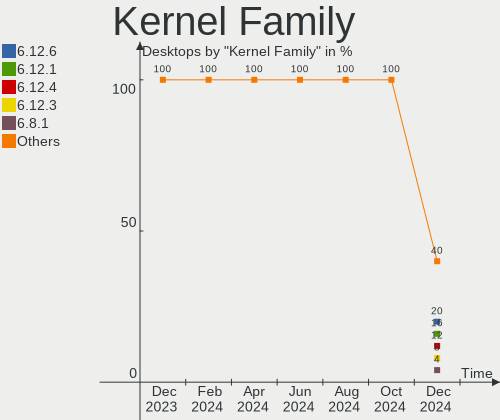
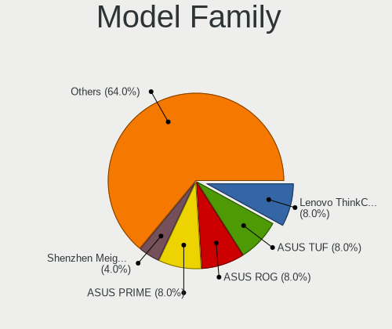
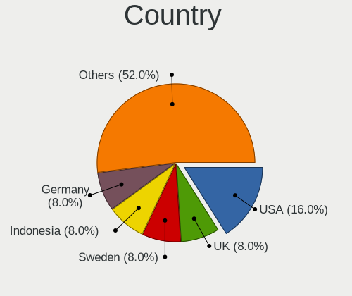
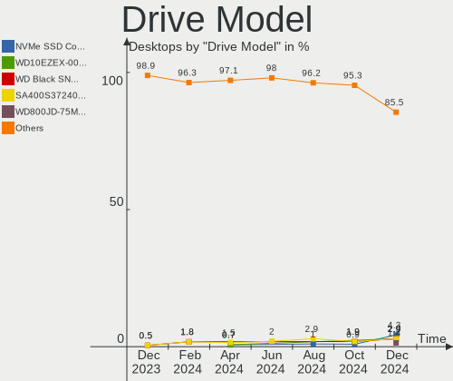
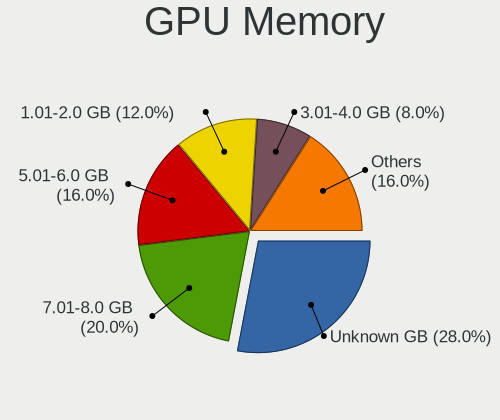

ArcoLinux - Hardware Trends (Desktops)
--------------------------------------

A project to identify most popular hardware characteristics and track their change
over time based on data collected by Linux users at https://Linux-Hardware.org.

Anyone can contribute to this report by the [hw-probe](https://github.com/linuxhw/hw-probe) tool:

    sudo -E hw-probe -all -upload

This report is for one last month. Overall report since the beginning of time: [TestCoverage](https://github.com/linuxhw/TestCoverage)

Period: May, 2022.

Contents
--------

* [ System ](#system)
  - [ OS                       ](#os)
  - [ OS Family                ](#os-family)
  - [ Kernel                   ](#kernel)
  - [ Kernel Family            ](#kernel-family)
  - [ Kernel Major Ver.        ](#kernel-major-ver)
  - [ Arch                     ](#arch)
  - [ DE                       ](#de)
  - [ Display Server           ](#display-server)
  - [ Display Manager          ](#display-manager)
  - [ OS Lang                  ](#os-lang)
  - [ Boot Mode                ](#boot-mode)
  - [ Filesystem               ](#filesystem)
  - [ Part. scheme             ](#part-scheme)
  - [ Dual Boot with Linux/BSD ](#dual-boot-with-linuxbsd)
  - [ Dual Boot (Win)          ](#dual-boot-win)

* [ Board ](#board)
  - [ Vendor                   ](#vendor)
  - [ Model                    ](#model)
  - [ Model Family             ](#model-family)
  - [ MFG Year                 ](#mfg-year)
  - [ Form Factor              ](#form-factor)
  - [ Secure Boot              ](#secure-boot)
  - [ Coreboot                 ](#coreboot)
  - [ RAM Size                 ](#ram-size)
  - [ RAM Used                 ](#ram-used)
  - [ Total Drives             ](#total-drives)
  - [ Has CD-ROM               ](#has-cd-rom)
  - [ Has Ethernet             ](#has-ethernet)
  - [ Has WiFi                 ](#has-wifi)
  - [ Has Bluetooth            ](#has-bluetooth)

* [ Location ](#location)
  - [ Country                  ](#country)
  - [ City                     ](#city)

* [ Drives ](#drives)
  - [ Drive Vendor             ](#drive-vendor)
  - [ Drive Model              ](#drive-model)
  - [ HDD Vendor               ](#hdd-vendor)
  - [ SSD Vendor               ](#ssd-vendor)
  - [ Drive Kind               ](#drive-kind)
  - [ Drive Connector          ](#drive-connector)
  - [ Drive Size               ](#drive-size)
  - [ Space Total              ](#space-total)
  - [ Space Used               ](#space-used)
  - [ Malfunc. Drives          ](#malfunc-drives)
  - [ Malfunc. Drive Vendor    ](#malfunc-drive-vendor)
  - [ Malfunc. HDD Vendor      ](#malfunc-hdd-vendor)
  - [ Malfunc. Drive Kind      ](#malfunc-drive-kind)
  - [ Failed Drives            ](#failed-drives)
  - [ Failed Drive Vendor      ](#failed-drive-vendor)
  - [ Drive Status             ](#drive-status)

* [ Storage controller ](#storage-controller)
  - [ Storage Vendor           ](#storage-vendor)
  - [ Storage Model            ](#storage-model)
  - [ Storage Kind             ](#storage-kind)

* [ Processor ](#processor)
  - [ CPU Vendor               ](#cpu-vendor)
  - [ CPU Model                ](#cpu-model)
  - [ CPU Model Family         ](#cpu-model-family)
  - [ CPU Cores                ](#cpu-cores)
  - [ CPU Sockets              ](#cpu-sockets)
  - [ CPU Threads              ](#cpu-threads)
  - [ CPU Op-Modes             ](#cpu-op-modes)
  - [ CPU Microcode            ](#cpu-microcode)
  - [ CPU Microarch            ](#cpu-microarch)

* [ Graphics ](#graphics)
  - [ GPU Vendor               ](#gpu-vendor)
  - [ GPU Model                ](#gpu-model)
  - [ GPU Combo                ](#gpu-combo)
  - [ GPU Driver               ](#gpu-driver)
  - [ GPU Memory               ](#gpu-memory)

* [ Monitor ](#monitor)
  - [ Monitor Vendor           ](#monitor-vendor)
  - [ Monitor Model            ](#monitor-model)
  - [ Monitor Resolution       ](#monitor-resolution)
  - [ Monitor Diagonal         ](#monitor-diagonal)
  - [ Monitor Width            ](#monitor-width)
  - [ Aspect Ratio             ](#aspect-ratio)
  - [ Monitor Area             ](#monitor-area)
  - [ Pixel Density            ](#pixel-density)
  - [ Multiple Monitors        ](#multiple-monitors)

* [ Network ](#network)
  - [ Net Controller Vendor    ](#net-controller-vendor)
  - [ Net Controller Model     ](#net-controller-model)
  - [ Wireless Vendor          ](#wireless-vendor)
  - [ Wireless Model           ](#wireless-model)
  - [ Ethernet Vendor          ](#ethernet-vendor)
  - [ Ethernet Model           ](#ethernet-model)
  - [ Net Controller Kind      ](#net-controller-kind)
  - [ Used Controller          ](#used-controller)
  - [ NICs                     ](#nics)
  - [ IPv6                     ](#ipv6)

* [ Bluetooth ](#bluetooth)
  - [ Bluetooth Vendor         ](#bluetooth-vendor)
  - [ Bluetooth Model          ](#bluetooth-model)

* [ Sound ](#sound)
  - [ Sound Vendor             ](#sound-vendor)
  - [ Sound Model              ](#sound-model)

* [ Memory ](#memory)
  - [ Memory Vendor            ](#memory-vendor)
  - [ Memory Model             ](#memory-model)
  - [ Memory Kind              ](#memory-kind)
  - [ Memory Form Factor       ](#memory-form-factor)
  - [ Memory Size              ](#memory-size)
  - [ Memory Speed             ](#memory-speed)

* [ Printers & scanners ](#printers--scanners)
  - [ Printer Vendor           ](#printer-vendor)
  - [ Printer Model            ](#printer-model)
  - [ Scanner Vendor           ](#scanner-vendor)
  - [ Scanner Model            ](#scanner-model)

* [ Camera ](#camera)
  - [ Camera Vendor            ](#camera-vendor)
  - [ Camera Model             ](#camera-model)

* [ Security ](#security)
  - [ Fingerprint Vendor       ](#fingerprint-vendor)
  - [ Fingerprint Model        ](#fingerprint-model)
  - [ Chipcard Vendor          ](#chipcard-vendor)
  - [ Chipcard Model           ](#chipcard-model)

* [ Unsupported ](#unsupported)
  - [ Unsupported Devices      ](#unsupported-devices)
  - [ Unsupported Device Types ](#unsupported-device-types)

System
------

OS
--

Installed operating systems

| Name              | Desktops | Percent |
|-------------------|----------|---------|
| ArcoLinux Rolling | 29       | 96.67%  |
| ArcoLinux         | 1        | 3.33%   |

OS Family
---------

OS without a version

| Name      | Desktops | Percent |
|-----------|----------|---------|
| ArcoLinux | 30       | 100%    |

Kernel
------

Version of the Linux kernel

| Version           | Desktops | Percent |
|-------------------|----------|---------|
| 5.17.9-arch1-1    | 6        | 20%     |
| 5.17.5-arch1-1    | 5        | 16.67%  |
| 5.17.5-zen1-1-zen | 3        | 10%     |
| 5.17.5-arch1-2    | 2        | 6.67%   |
| 5.16.11-arch1-1   | 2        | 6.67%   |
| 5.15.38-1-lts     | 2        | 6.67%   |
| 5.18.0-arch1-1    | 1        | 3.33%   |
| 5.17.9-zen1-1-zen | 1        | 3.33%   |
| 5.17.8-arch1-1    | 1        | 3.33%   |
| 5.17.7-zen1-1-zen | 1        | 3.33%   |
| 5.17.7-arch1-1    | 1        | 3.33%   |
| 5.17.6-zen1-1-zen | 1        | 3.33%   |
| 5.15.43-1-lts     | 1        | 3.33%   |
| 5.15.39-1-lts     | 1        | 3.33%   |
| 5.15.37-1-lts     | 1        | 3.33%   |
| 5.14.14-arch1-1   | 1        | 3.33%   |

Kernel Family
-------------

Linux kernel without a distro release

| Version | Desktops | Percent |
|---------|----------|---------|
| 5.17.5  | 10       | 33.33%  |
| 5.17.9  | 7        | 23.33%  |
| 5.17.7  | 2        | 6.67%   |
| 5.16.11 | 2        | 6.67%   |
| 5.15.38 | 2        | 6.67%   |
| 5.18.0  | 1        | 3.33%   |
| 5.17.8  | 1        | 3.33%   |
| 5.17.6  | 1        | 3.33%   |
| 5.15.43 | 1        | 3.33%   |
| 5.15.39 | 1        | 3.33%   |
| 5.15.37 | 1        | 3.33%   |
| 5.14.14 | 1        | 3.33%   |

Kernel Major Ver.
-----------------

Linux kernel major version

| Version | Desktops | Percent |
|---------|----------|---------|
| 5.17    | 21       | 70%     |
| 5.15    | 5        | 16.67%  |
| 5.16    | 2        | 6.67%   |
| 5.18    | 1        | 3.33%   |
| 5.14    | 1        | 3.33%   |

Arch
----

OS architecture (x86_64, i586, etc.)

| Name   | Desktops | Percent |
|--------|----------|---------|
| x86_64 | 30       | 100%    |

DE
--

Desktop Environment

| Name       | Desktops | Percent |
|------------|----------|---------|
| XFCE       | 7        | 23.33%  |
| KDE5       | 6        | 20%     |
| qtile      | 3        | 10%     |
| awesome    | 3        | 10%     |
| xmonad     | 2        | 6.67%   |
| LeftWM     | 2        | 6.67%   |
| GNOME      | 2        | 6.67%   |
| X-Cinnamon | 1        | 3.33%   |
| LXQt       | 1        | 3.33%   |
| i3         | 1        | 3.33%   |
| dwm        | 1        | 3.33%   |
| bspwm      | 1        | 3.33%   |

Display Server
--------------

X11 or Wayland

| Name    | Desktops | Percent |
|---------|----------|---------|
| X11     | 27       | 90%     |
| Tty     | 2        | 6.67%   |
| Wayland | 1        | 3.33%   |

Display Manager
---------------

SDDM, LightDM, etc.

| Name    | Desktops | Percent |
|---------|----------|---------|
| SDDM    | 22       | 73.33%  |
| LightDM | 7        | 23.33%  |
| Unknown | 1        | 3.33%   |

OS Lang
-------

Language

| Lang  | Desktops | Percent |
|-------|----------|---------|
| en_US | 19       | 63.33%  |
| en_GB | 3        | 10%     |
| de_DE | 3        | 10%     |
| sv_SE | 1        | 3.33%   |
| nl_NL | 1        | 3.33%   |
| es_ES | 1        | 3.33%   |
| en_CA | 1        | 3.33%   |
| en_AU | 1        | 3.33%   |

Boot Mode
---------

EFI or BIOS

| Mode | Desktops | Percent |
|------|----------|---------|
| EFI  | 24       | 80%     |
| BIOS | 6        | 20%     |

Filesystem
----------

Type of filesystem

| Type    | Desktops | Percent |
|---------|----------|---------|
| Ext4    | 20       | 66.67%  |
| Btrfs   | 8        | 26.67%  |
| Overlay | 1        | 3.33%   |
| F2fs    | 1        | 3.33%   |

Part. scheme
------------

Scheme of partitioning

| Type    | Desktops | Percent |
|---------|----------|---------|
| GPT     | 26       | 86.67%  |
| MBR     | 3        | 10%     |
| Unknown | 1        | 3.33%   |

Dual Boot with Linux/BSD
------------------------

Hosting more than one Linux/BSD

| Dual boot | Desktops | Percent |
|-----------|----------|---------|
| No        | 20       | 66.67%  |
| Yes       | 10       | 33.33%  |

Dual Boot (Win)
---------------

Hosting Linux and Windows

| Dual boot | Desktops | Percent |
|-----------|----------|---------|
| No        | 16       | 53.33%  |
| Yes       | 14       | 46.67%  |

Board
-----

Vendor
------

Motherboard manufacturer

| Name                | Desktops | Percent |
|---------------------|----------|---------|
| Gigabyte Technology | 9        | 30%     |
| MSI                 | 6        | 20%     |
| ASUSTek Computer    | 5        | 16.67%  |
| Supermicro          | 2        | 6.67%   |
| Dell                | 2        | 6.67%   |
| ASRock              | 2        | 6.67%   |
| Acer                | 2        | 6.67%   |
| Hewlett-Packard     | 1        | 3.33%   |
| Biostar             | 1        | 3.33%   |

Model
-----

Motherboard model

| Name                            | Desktops | Percent |
|---------------------------------|----------|---------|
| Supermicro SYS-110C-FHN4T       | 2        | 6.67%   |
| MSI MS-7C37                     | 2        | 6.67%   |
| Gigabyte X570 AORUS MASTER      | 2        | 6.67%   |
| MSI MS-7C91                     | 1        | 3.33%   |
| MSI MS-7C88                     | 1        | 3.33%   |
| MSI MS-7A37                     | 1        | 3.33%   |
| MSI A320M-HDV R4.0              | 1        | 3.33%   |
| HP 700-527c                     | 1        | 3.33%   |
| Gigabyte X570 AORUS PRO WIFI    | 1        | 3.33%   |
| Gigabyte H110N                  | 1        | 3.33%   |
| Gigabyte GA-M55PLUS-S3G         | 1        | 3.33%   |
| Gigabyte B550 GAMING X V2       | 1        | 3.33%   |
| Gigabyte B550 AORUS PRO V2      | 1        | 3.33%   |
| Gigabyte A520M H                | 1        | 3.33%   |
| Gigabyte A520 AORUS ELITE       | 1        | 3.33%   |
| Dell Vostro 470                 | 1        | 3.33%   |
| Dell Inspiron 530               | 1        | 3.33%   |
| Biostar J3060NH                 | 1        | 3.33%   |
| ASUS Z170 PRO GAMING            | 1        | 3.33%   |
| ASUS PRIME Z490-A               | 1        | 3.33%   |
| ASUS PRIME H310M-R R2.0         | 1        | 3.33%   |
| ASUS PRIME B250M-PLUS           | 1        | 3.33%   |
| ASUS P8Z68-V                    | 1        | 3.33%   |
| ASRock FM2A78M Pro4+            | 1        | 3.33%   |
| ASRock B550 Phantom Gaming 4/ac | 1        | 3.33%   |
| Acer Predator G3-605            | 1        | 3.33%   |
| Acer Aspire X3300               | 1        | 3.33%   |

Model Family
------------

Motherboard model prefix

| Name                      | Desktops | Percent |
|---------------------------|----------|---------|
| Gigabyte X570             | 3        | 10%     |
| ASUS PRIME                | 3        | 10%     |
| Supermicro SYS-110C-FHN4T | 2        | 6.67%   |
| MSI MS-7C37               | 2        | 6.67%   |
| Gigabyte B550             | 2        | 6.67%   |
| MSI MS-7C91               | 1        | 3.33%   |
| MSI MS-7C88               | 1        | 3.33%   |
| MSI MS-7A37               | 1        | 3.33%   |
| MSI A320M-HDV             | 1        | 3.33%   |
| HP 700-527c               | 1        | 3.33%   |
| Gigabyte H110N            | 1        | 3.33%   |
| Gigabyte GA-M55PLUS-S3G   | 1        | 3.33%   |
| Gigabyte A520M            | 1        | 3.33%   |
| Gigabyte A520             | 1        | 3.33%   |
| Dell Vostro               | 1        | 3.33%   |
| Dell Inspiron             | 1        | 3.33%   |
| Biostar J3060NH           | 1        | 3.33%   |
| ASUS Z170                 | 1        | 3.33%   |
| ASUS P8Z68-V              | 1        | 3.33%   |
| ASRock FM2A78M            | 1        | 3.33%   |
| ASRock B550               | 1        | 3.33%   |
| Acer Predator             | 1        | 3.33%   |
| Acer Aspire               | 1        | 3.33%   |

MFG Year
--------

Motherboard manufacture year

| Year | Desktops | Percent |
|------|----------|---------|
| 2020 | 8        | 26.67%  |
| 2019 | 6        | 20%     |
| 2016 | 3        | 10%     |
| 2021 | 2        | 6.67%   |
| 2015 | 2        | 6.67%   |
| 2013 | 2        | 6.67%   |
| 2018 | 1        | 3.33%   |
| 2017 | 1        | 3.33%   |
| 2012 | 1        | 3.33%   |
| 2011 | 1        | 3.33%   |
| 2009 | 1        | 3.33%   |
| 2007 | 1        | 3.33%   |
| 2006 | 1        | 3.33%   |

Form Factor
-----------

Physical design of the computer

| Name    | Desktops | Percent |
|---------|----------|---------|
| Desktop | 30       | 100%    |

Secure Boot
-----------

Enabled or disabled

| State    | Desktops | Percent |
|----------|----------|---------|
| Disabled | 30       | 100%    |

Coreboot
--------

Have coreboot on board

| Used | Desktops | Percent |
|------|----------|---------|
| No   | 30       | 100%    |

RAM Size
--------

Total RAM memory

| Size in GB  | Desktops | Percent |
|-------------|----------|---------|
| 32.01-64.0  | 11       | 36.67%  |
| 16.01-24.0  | 10       | 33.33%  |
| 8.01-16.0   | 4        | 13.33%  |
| 4.01-8.0    | 2        | 6.67%   |
| 3.01-4.0    | 1        | 3.33%   |
| 24.01-32.0  | 1        | 3.33%   |
| 64.01-256.0 | 1        | 3.33%   |

RAM Used
--------

Used RAM memory

| Used GB  | Desktops | Percent |
|----------|----------|---------|
| 4.01-8.0 | 9        | 30%     |
| 2.01-3.0 | 7        | 23.33%  |
| 1.01-2.0 | 7        | 23.33%  |
| 0.51-1.0 | 4        | 13.33%  |
| 3.01-4.0 | 3        | 10%     |

Total Drives
------------

Number of drives on board

| Drives | Desktops | Percent |
|--------|----------|---------|
| 1      | 10       | 33.33%  |
| 2      | 8        | 26.67%  |
| 3      | 6        | 20%     |
| 4      | 5        | 16.67%  |
| 5      | 1        | 3.33%   |

Has CD-ROM
----------

Has CD-ROM on board

| Presented | Desktops | Percent |
|-----------|----------|---------|
| No        | 18       | 60%     |
| Yes       | 12       | 40%     |

Has Ethernet
------------

Has Ethernet on board

| Presented | Desktops | Percent |
|-----------|----------|---------|
| Yes       | 30       | 100%    |

Has WiFi
--------

Has WiFi module

| Presented | Desktops | Percent |
|-----------|----------|---------|
| No        | 19       | 63.33%  |
| Yes       | 11       | 36.67%  |

Has Bluetooth
-------------

Has Bluetooth module

| Presented | Desktops | Percent |
|-----------|----------|---------|
| No        | 17       | 56.67%  |
| Yes       | 13       | 43.33%  |

Location
--------

Country
-------

Geographic location (country)

| Country     | Desktops | Percent |
|-------------|----------|---------|
| USA         | 6        | 20%     |
| Germany     | 3        | 10%     |
| UK          | 2        | 6.67%   |
| Sweden      | 2        | 6.67%   |
| Spain       | 2        | 6.67%   |
| Bulgaria    | 2        | 6.67%   |
| Austria     | 2        | 6.67%   |
| Serbia      | 1        | 3.33%   |
| Russia      | 1        | 3.33%   |
| Norway      | 1        | 3.33%   |
| Netherlands | 1        | 3.33%   |
| India       | 1        | 3.33%   |
| Hong Kong   | 1        | 3.33%   |
| Canada      | 1        | 3.33%   |
| Belgium     | 1        | 3.33%   |
| Barbados    | 1        | 3.33%   |
| Australia   | 1        | 3.33%   |
| Argentina   | 1        | 3.33%   |

City
----

Geographic location (city)

| City           | Desktops | Percent |
|----------------|----------|---------|
| Sofia          | 2        | 6.67%   |
| Durham         | 2        | 6.67%   |
| Vienna         | 1        | 3.33%   |
| Tidnish Bridge | 1        | 3.33%   |
| Sydney         | 1        | 3.33%   |
| Sterling       | 1        | 3.33%   |
| Sandviken      | 1        | 3.33%   |
| Pune           | 1        | 3.33%   |
| Madrid         | 1        | 3.33%   |
| Lier           | 1        | 3.33%   |
| Kollow         | 1        | 3.33%   |
| Henderson      | 1        | 3.33%   |
| Erlangen       | 1        | 3.33%   |
| Edinburgh      | 1        | 3.33%   |
| Drammen        | 1        | 3.33%   |
| Dornbirn       | 1        | 3.33%   |
| Discovery Bay  | 1        | 3.33%   |
| Dingle         | 1        | 3.33%   |
| Colfax         | 1        | 3.33%   |
| Cheboksary     | 1        | 3.33%   |
| Central        | 1        | 3.33%   |
| Bury           | 1        | 3.33%   |
| Buenos Aires   | 1        | 3.33%   |
| Bridgetown     | 1        | 3.33%   |
| Berlin         | 1        | 3.33%   |
| Belgrade       | 1        | 3.33%   |
| Bardallur      | 1        | 3.33%   |
| Amsterdam      | 1        | 3.33%   |

Drives
------

Drive Vendor
------------

Hard drive vendors

| Vendor              | Desktops | Drives | Percent |
|---------------------|----------|--------|---------|
| Samsung Electronics | 15       | 26     | 27.78%  |
| WDC                 | 10       | 12     | 18.52%  |
| Kingston            | 6        | 8      | 11.11%  |
| Seagate             | 5        | 5      | 9.26%   |
| Toshiba             | 4        | 4      | 7.41%   |
| SanDisk             | 4        | 4      | 7.41%   |
| Crucial             | 2        | 2      | 3.7%    |
| Transcend           | 1        | 1      | 1.85%   |
| TO Exter            | 1        | 1      | 1.85%   |
| SPCC                | 1        | 1      | 1.85%   |
| Phison              | 1        | 1      | 1.85%   |
| Patriot             | 1        | 1      | 1.85%   |
| Hitachi             | 1        | 1      | 1.85%   |
| HGST HTS            | 1        | 1      | 1.85%   |
| Gigabyte Technology | 1        | 1      | 1.85%   |

Drive Model
-----------

Hard drive models

| Model                                | Desktops | Percent |
|--------------------------------------|----------|---------|
| Samsung SSD 980 PRO 1TB              | 2        | 2.99%   |
| Samsung SSD 970 EVO Plus 1TB         | 2        | 2.99%   |
| Samsung SSD 860 EVO 250GB            | 2        | 2.99%   |
| Samsung SSD 850 EVO 500GB            | 2        | 2.99%   |
| Samsung SSD 850 EVO 250GB            | 2        | 2.99%   |
| Samsung MZ7LH240HAHQ-00005 240GB SSD | 2        | 2.99%   |
| Kingston SUV400S37240G 240GB SSD     | 2        | 2.99%   |
| WDC WDS500G2B0C-00PXH0 500GB         | 1        | 1.49%   |
| WDC WDS500G1X0E-00AFY0 500GB         | 1        | 1.49%   |
| WDC WDS480G2G0A-00JH30 480GB SSD     | 1        | 1.49%   |
| WDC WDS256G1X0C-00ENX0 256GB         | 1        | 1.49%   |
| WDC WDS240G2G0A-00JH30 240GB SSD     | 1        | 1.49%   |
| WDC WDS100T2B0C-00PXH0 1TB           | 1        | 1.49%   |
| WDC WDS100T2B0A-00SM50 1TB SSD       | 1        | 1.49%   |
| WDC WD5000LPVX-22V0TT0 500GB         | 1        | 1.49%   |
| WDC WD30EZRX-00D8PB0 3TB             | 1        | 1.49%   |
| WDC WD20EZBX-00AYRA0 2TB             | 1        | 1.49%   |
| WDC WD10EZEX-60M2NA0 1TB             | 1        | 1.49%   |
| WDC WD10EAVS-00D7B1 1TB              | 1        | 1.49%   |
| Transcend TS480GSSD220S 480GB        | 1        | 1.49%   |
| Toshiba TR150 240GB SSD              | 1        | 1.49%   |
| Toshiba MQ01ABD100 1TB               | 1        | 1.49%   |
| Toshiba HDWD110 1TB                  | 1        | 1.49%   |
| Toshiba DT01ACA100 1TB               | 1        | 1.49%   |
| TO Exter nal USB 3.0 320GB           | 1        | 1.49%   |
| SPCC Solid State Disk 120GB          | 1        | 1.49%   |
| Seagate ST8000DM004-2CX188 8TB       | 1        | 1.49%   |
| Seagate ST3320620AS 320GB            | 1        | 1.49%   |
| Seagate ST2000LM007-1R8174 2TB       | 1        | 1.49%   |
| Seagate ST2000DM001-1ER164 2TB       | 1        | 1.49%   |
| Seagate ST1000DM003-1ER162 1TB       | 1        | 1.49%   |
| SanDisk Ultra II 240GB SSD           | 1        | 1.49%   |
| SanDisk SDSSDH31024G 1TB             | 1        | 1.49%   |
| SanDisk SDSSDA240G 240GB             | 1        | 1.49%   |
| Sandisk NVMe SSD Drive 500GB         | 1        | 1.49%   |
| Samsung SSD PM830 mSATA 32GB         | 1        | 1.49%   |
| Samsung SSD 970 EVO Plus 500GB       | 1        | 1.49%   |
| Samsung SSD 970 EVO 1TB              | 1        | 1.49%   |
| Samsung SSD 960 EVO 500GB            | 1        | 1.49%   |
| Samsung SSD 870 QVO 2TB              | 1        | 1.49%   |
| Samsung SSD 870 EVO 1TB              | 1        | 1.49%   |
| Samsung SSD 860 EVO 500GB            | 1        | 1.49%   |
| Samsung SSD 860 EVO 1TB              | 1        | 1.49%   |
| Samsung SSD 850 EVO 1TB              | 1        | 1.49%   |
| Samsung SSD 840 EVO 250GB            | 1        | 1.49%   |
| Samsung NVMe SSD Drive 1TB           | 1        | 1.49%   |
| Samsung MZVL21T0HCLR-00B00 1TB       | 1        | 1.49%   |
| Phison Sabrent 1TB                   | 1        | 1.49%   |
| Patriot Torqx 2 128GB SSD            | 1        | 1.49%   |
| Kingston SH103S3240G 240GB SSD       | 1        | 1.49%   |
| Kingston SH103S3120G 120GB SSD       | 1        | 1.49%   |
| Kingston SA400S37240G 240GB SSD      | 1        | 1.49%   |
| Kingston SA400S37120G 120GB SSD      | 1        | 1.49%   |
| Kingston SA2000M8500G 500GB          | 1        | 1.49%   |
| Kingston SA2000M81000G 1TB           | 1        | 1.49%   |
| Hitachi HDS721010CLA632 1TB          | 1        | 1.49%   |
| HGST HTS 541010A9E680 1TB            | 1        | 1.49%   |
| Gigabyte GP-ASM2NE6500GTTD 500GB     | 1        | 1.49%   |
| Crucial CT500MX500SSD1 500GB         | 1        | 1.49%   |
| Crucial CT1000MX500SSD1 1TB          | 1        | 1.49%   |

HDD Vendor
----------

Hard disk drive vendors

| Vendor   | Desktops | Drives | Percent |
|----------|----------|--------|---------|
| Seagate  | 5        | 5      | 35.71%  |
| WDC      | 4        | 5      | 28.57%  |
| Toshiba  | 3        | 3      | 21.43%  |
| Hitachi  | 1        | 1      | 7.14%   |
| HGST HTS | 1        | 1      | 7.14%   |

SSD Vendor
----------

Solid state drive vendors

| Vendor              | Desktops | Drives | Percent |
|---------------------|----------|--------|---------|
| Samsung Electronics | 14       | 17     | 43.75%  |
| Kingston            | 5        | 6      | 15.63%  |
| WDC                 | 3        | 3      | 9.38%   |
| SanDisk             | 3        | 3      | 9.38%   |
| Crucial             | 2        | 2      | 6.25%   |
| Transcend           | 1        | 1      | 3.13%   |
| Toshiba             | 1        | 1      | 3.13%   |
| TO Exter            | 1        | 1      | 3.13%   |
| SPCC                | 1        | 1      | 3.13%   |
| Patriot             | 1        | 1      | 3.13%   |

Drive Kind
----------

HDD or SSD

| Kind | Desktops | Drives | Percent |
|------|----------|--------|---------|
| SSD  | 24       | 36     | 48.98%  |
| HDD  | 13       | 15     | 26.53%  |
| NVMe | 12       | 18     | 24.49%  |

Drive Connector
---------------

SATA, SAS, NVMe, etc.

| Type | Desktops | Drives | Percent |
|------|----------|--------|---------|
| SATA | 30       | 49     | 68.18%  |
| NVMe | 12       | 18     | 27.27%  |
| SAS  | 2        | 2      | 4.55%   |

Drive Size
----------

Size of hard drive

| Size in TB | Desktops | Drives | Percent |
|------------|----------|--------|---------|
| 0.01-0.5   | 23       | 30     | 54.76%  |
| 0.51-1.0   | 13       | 15     | 30.95%  |
| 1.01-2.0   | 4        | 4      | 9.52%   |
| 2.01-3.0   | 1        | 1      | 2.38%   |
| 4.01-10.0  | 1        | 1      | 2.38%   |

Space Total
-----------

Amount of disk space available on the file system

| Size in GB     | Desktops | Percent |
|----------------|----------|---------|
| 101-250        | 7        | 23.33%  |
| More than 3000 | 6        | 20%     |
| 1001-2000      | 5        | 16.67%  |
| 501-1000       | 5        | 16.67%  |
| 251-500        | 3        | 10%     |
| 2001-3000      | 3        | 10%     |
| Unknown        | 1        | 3.33%   |

Space Used
----------

Amount of used disk space

| Used GB   | Desktops | Percent |
|-----------|----------|---------|
| 1001-2000 | 7        | 23.33%  |
| 21-50     | 5        | 16.67%  |
| 101-250   | 5        | 16.67%  |
| 251-500   | 4        | 13.33%  |
| 1-20      | 3        | 10%     |
| 501-1000  | 3        | 10%     |
| 51-100    | 2        | 6.67%   |
| Unknown   | 1        | 3.33%   |

Malfunc. Drives
---------------

Drive models with a malfunction

| Model                     | Desktops | Drives | Percent |
|---------------------------|----------|--------|---------|
| Toshiba MQ01ABD100 1TB    | 1        | 1      | 50%     |
| HGST HTS 541010A9E680 1TB | 1        | 1      | 50%     |

Malfunc. Drive Vendor
---------------------

Vendors of faulty drives

| Vendor   | Desktops | Drives | Percent |
|----------|----------|--------|---------|
| Toshiba  | 1        | 1      | 50%     |
| HGST HTS | 1        | 1      | 50%     |

Malfunc. HDD Vendor
-------------------

Vendors of faulty HDD drives

| Vendor   | Desktops | Drives | Percent |
|----------|----------|--------|---------|
| Toshiba  | 1        | 1      | 50%     |
| HGST HTS | 1        | 1      | 50%     |

Malfunc. Drive Kind
-------------------

Kinds of faulty drives

| Kind | Desktops | Drives | Percent |
|------|----------|--------|---------|
| HDD  | 2        | 2      | 100%    |

Failed Drives
-------------

Failed drive models

Zero info for selected period =(

Failed Drive Vendor
-------------------

Failed drive vendors

Zero info for selected period =(

Drive Status
------------

Number of failed and malfunc. drives

| Status   | Desktops | Drives | Percent |
|----------|----------|--------|---------|
| Works    | 26       | 59     | 78.79%  |
| Detected | 5        | 8      | 15.15%  |
| Malfunc  | 2        | 2      | 6.06%   |

Storage controller
------------------

Storage Vendor
--------------

Storage controller vendors

| Vendor                      | Desktops | Percent |
|-----------------------------|----------|---------|
| Intel                       | 14       | 29.79%  |
| AMD                         | 14       | 29.79%  |
| Samsung Electronics         | 6        | 12.77%  |
| Sandisk                     | 5        | 10.64%  |
| Phison Electronics          | 2        | 4.26%   |
| Nvidia                      | 2        | 4.26%   |
| ASMedia Technology          | 2        | 4.26%   |
| Kingston Technology Company | 1        | 2.13%   |
| JMicron Technology          | 1        | 2.13%   |

Storage Model
-------------

Storage controller models

| Model                                                                            | Desktops | Percent |
|----------------------------------------------------------------------------------|----------|---------|
| AMD FCH SATA Controller [AHCI mode]                                              | 8        | 14.55%  |
| AMD 500 Series Chipset SATA Controller                                           | 6        | 10.91%  |
| Samsung NVMe SSD Controller SM981/PM981/PM983                                    | 4        | 7.27%   |
| Sandisk WD Blue SN550 NVMe SSD                                                   | 3        | 5.45%   |
| Samsung NVMe SSD Controller PM9A1/PM9A3/980PRO                                   | 3        | 5.45%   |
| Intel Q170/Q150/B150/H170/H110/Z170/CM236 Chipset SATA Controller [AHCI Mode]    | 2        | 3.64%   |
| Intel Comet Lake SATA AHCI Controller                                            | 2        | 3.64%   |
| Intel 200 Series PCH SATA controller [AHCI mode]                                 | 2        | 3.64%   |
| ASMedia ASM1062 Serial ATA Controller                                            | 2        | 3.64%   |
| Sandisk WD PC SN810 / Black SN850 NVMe SSD                                       | 1        | 1.82%   |
| Sandisk WD Black NVMe SSD                                                        | 1        | 1.82%   |
| Samsung NVMe SSD Controller SM961/PM961/SM963                                    | 1        | 1.82%   |
| Phison E16 PCIe4 NVMe Controller                                                 | 1        | 1.82%   |
| Phison E12 NVMe Controller                                                       | 1        | 1.82%   |
| Nvidia MCP78S [GeForce 8200] IDE                                                 | 1        | 1.82%   |
| Nvidia MCP78S [GeForce 8200] AHCI Controller                                     | 1        | 1.82%   |
| Nvidia MCP51 Serial ATA Controller                                               | 1        | 1.82%   |
| Nvidia MCP51 IDE                                                                 | 1        | 1.82%   |
| Kingston Company A2000 NVMe SSD                                                  | 1        | 1.82%   |
| JMicron JMB362 SATA Controller                                                   | 1        | 1.82%   |
| Intel Comet Lake PCH-H RAID                                                      | 1        | 1.82%   |
| Intel Atom/Celeron/Pentium Processor x5-E8000/J3xxx/N3xxx Series SATA Controller | 1        | 1.82%   |
| Intel 9 Series Chipset Family SATA Controller [AHCI Mode]                        | 1        | 1.82%   |
| Intel 82801IR/IO/IH (ICH9R/DO/DH) 4 port SATA Controller [IDE mode]              | 1        | 1.82%   |
| Intel 82801I (ICH9 Family) 2 port SATA Controller [IDE mode]                     | 1        | 1.82%   |
| Intel 8 Series/C220 Series Chipset Family 4-port SATA Controller 1 [IDE mode]    | 1        | 1.82%   |
| Intel 7 Series/C210 Series Chipset Family 6-port SATA Controller [AHCI mode]     | 1        | 1.82%   |
| Intel 6 Series/C200 Series Chipset Family 6 port Desktop SATA AHCI Controller    | 1        | 1.82%   |
| Intel 400 Series Chipset Family SATA AHCI Controller                             | 1        | 1.82%   |
| AMD FCH SATA Controller D                                                        | 1        | 1.82%   |
| AMD FCH IDE Controller                                                           | 1        | 1.82%   |
| AMD 300 Series Chipset SATA Controller                                           | 1        | 1.82%   |

Storage Kind
------------

Kind of storage controller (IDE, SATA, NVMe, SAS, ...)

| Kind | Desktops | Percent |
|------|----------|---------|
| SATA | 26       | 59.09%  |
| NVMe | 12       | 27.27%  |
| IDE  | 5        | 11.36%  |
| RAID | 1        | 2.27%   |

Processor
---------

CPU Vendor
----------

Processor vendors

| Vendor | Desktops | Percent |
|--------|----------|---------|
| AMD    | 16       | 53.33%  |
| Intel  | 14       | 46.67%  |

CPU Model
---------

Processor models

| Model                                      | Desktops | Percent |
|--------------------------------------------|----------|---------|
| Intel Xeon W-1250 CPU @ 3.30GHz            | 2        | 6.67%   |
| Intel Core i5-7500 CPU @ 3.40GHz           | 2        | 6.67%   |
| AMD Ryzen 7 3700X 8-Core Processor         | 2        | 6.67%   |
| AMD Ryzen 5 5600X 6-Core Processor         | 2        | 6.67%   |
| Intel Pentium Dual CPU E2160 @ 1.80GHz     | 1        | 3.33%   |
| Intel Core i7-3770 CPU @ 3.40GHz           | 1        | 3.33%   |
| Intel Core i7-10700K CPU @ 3.80GHz         | 1        | 3.33%   |
| Intel Core i5-6600K CPU @ 3.50GHz          | 1        | 3.33%   |
| Intel Core i5-4570 CPU @ 3.20GHz           | 1        | 3.33%   |
| Intel Core i5-4460 CPU @ 3.20GHz           | 1        | 3.33%   |
| Intel Core i5-2500 CPU @ 3.30GHz           | 1        | 3.33%   |
| Intel Core i5-10400F CPU @ 2.90GHz         | 1        | 3.33%   |
| Intel Core i3-9100F CPU @ 3.60GHz          | 1        | 3.33%   |
| Intel Celeron CPU J3060 @ 1.60GHz          | 1        | 3.33%   |
| AMD Ryzen 9 5950X 16-Core Processor        | 1        | 3.33%   |
| AMD Ryzen 9 3900X 12-Core Processor        | 1        | 3.33%   |
| AMD Ryzen 7 5800X 8-Core Processor         | 1        | 3.33%   |
| AMD Ryzen 7 5700G with Radeon Graphics     | 1        | 3.33%   |
| AMD Ryzen 7 2700X Eight-Core Processor     | 1        | 3.33%   |
| AMD Ryzen 5 5600G with Radeon Graphics     | 1        | 3.33%   |
| AMD Ryzen 5 2600X Six-Core Processor       | 1        | 3.33%   |
| AMD Ryzen 5 1600 Six-Core Processor        | 1        | 3.33%   |
| AMD Ryzen 3 2300X Quad-Core Processor      | 1        | 3.33%   |
| AMD Phenom II X4 925 Processor             | 1        | 3.33%   |
| AMD Athlon 64 X2 Dual Core Processor 4800+ | 1        | 3.33%   |
| AMD A10-7700K APU with Radeon R7 Graphics  | 1        | 3.33%   |

CPU Model Family
----------------

Processor model prefix

| Model              | Desktops | Percent |
|--------------------|----------|---------|
| Intel Core i5      | 7        | 23.33%  |
| AMD Ryzen 7        | 5        | 16.67%  |
| AMD Ryzen 5        | 5        | 16.67%  |
| Intel Xeon         | 2        | 6.67%   |
| Intel Core i7      | 2        | 6.67%   |
| AMD Ryzen 9        | 2        | 6.67%   |
| Intel Pentium Dual | 1        | 3.33%   |
| Intel Core i3      | 1        | 3.33%   |
| Intel Celeron      | 1        | 3.33%   |
| AMD Ryzen 3        | 1        | 3.33%   |
| AMD Phenom II X4   | 1        | 3.33%   |
| AMD Athlon 64 X2   | 1        | 3.33%   |
| AMD A10            | 1        | 3.33%   |

CPU Cores
---------

Number of processor cores

| Number | Desktops | Percent |
|--------|----------|---------|
| 4      | 10       | 33.33%  |
| 6      | 8        | 26.67%  |
| 8      | 6        | 20%     |
| 2      | 4        | 13.33%  |
| 16     | 1        | 3.33%   |
| 12     | 1        | 3.33%   |

CPU Sockets
-----------

Number of sockets

| Number | Desktops | Percent |
|--------|----------|---------|
| 1      | 30       | 100%    |

CPU Threads
-----------

Threads per core (Hyper-Threading)

| Number | Desktops | Percent |
|--------|----------|---------|
| 2      | 18       | 60%     |
| 1      | 12       | 40%     |

CPU Op-Modes
------------

CPU Operation Modes (32-bit, 64-bit)

| Op mode        | Desktops | Percent |
|----------------|----------|---------|
| 32-bit, 64-bit | 30       | 100%    |

CPU Microcode
-------------

Microcode number

| Number     | Desktops | Percent |
|------------|----------|---------|
| 0x0a201016 | 4        | 13.33%  |
| 0xa0653    | 3        | 10%     |
| 0x0800820d | 3        | 10%     |
| 0x906e9    | 2        | 6.67%   |
| 0x306c3    | 2        | 6.67%   |
| 0x08701021 | 2        | 6.67%   |
| Unknown    | 2        | 6.67%   |
| 0xa0655    | 1        | 3.33%   |
| 0x906ea    | 1        | 3.33%   |
| 0x6fd      | 1        | 3.33%   |
| 0x506e3    | 1        | 3.33%   |
| 0x406c4    | 1        | 3.33%   |
| 0x306a9    | 1        | 3.33%   |
| 0x206a7    | 1        | 3.33%   |
| 0x0a50000c | 1        | 3.33%   |
| 0x0a500007 | 1        | 3.33%   |
| 0x08001137 | 1        | 3.33%   |
| 0x06003104 | 1        | 3.33%   |
| 0x01000086 | 1        | 3.33%   |

CPU Microarch
-------------

Microarchitecture

| Name        | Desktops | Percent |
|-------------|----------|---------|
| Zen 3       | 6        | 20%     |
| CometLake   | 4        | 13.33%  |
| Zen+        | 3        | 10%     |
| Zen 2       | 3        | 10%     |
| KabyLake    | 3        | 10%     |
| Haswell     | 2        | 6.67%   |
| Zen         | 1        | 3.33%   |
| Steamroller | 1        | 3.33%   |
| Skylake     | 1        | 3.33%   |
| Silvermont  | 1        | 3.33%   |
| SandyBridge | 1        | 3.33%   |
| K8 Hammer   | 1        | 3.33%   |
| K10         | 1        | 3.33%   |
| IvyBridge   | 1        | 3.33%   |
| Core        | 1        | 3.33%   |

Graphics
--------

GPU Vendor
----------

Vendors of graphics cards

| Vendor            | Desktops | Percent |
|-------------------|----------|---------|
| Nvidia            | 17       | 53.13%  |
| AMD               | 9        | 28.13%  |
| Intel             | 4        | 12.5%   |
| ASPEED Technology | 2        | 6.25%   |

GPU Model
---------

Graphics card models

| Model                                                                                    | Desktops | Percent |
|------------------------------------------------------------------------------------------|----------|---------|
| Nvidia GP106 [GeForce GTX 1060 6GB]                                                      | 4        | 12.5%   |
| AMD Ellesmere [Radeon RX 470/480/570/570X/580/580X/590]                                  | 3        | 9.38%   |
| Nvidia TU106 [GeForce RTX 2060 Rev. A]                                                   | 2        | 6.25%   |
| ASPEED Technology ASPEED Graphics Family                                                 | 2        | 6.25%   |
| Nvidia TU117 [GeForce GTX 1650]                                                          | 1        | 3.13%   |
| Nvidia TU116 [GeForce GTX 1660]                                                          | 1        | 3.13%   |
| Nvidia TU102 [GeForce RTX 2080 Ti Rev. A]                                                | 1        | 3.13%   |
| Nvidia GP106 [GeForce GTX 1060 3GB]                                                      | 1        | 3.13%   |
| Nvidia GP104 [GeForce GTX 1080]                                                          | 1        | 3.13%   |
| Nvidia GM107 [GeForce GTX 745]                                                           | 1        | 3.13%   |
| Nvidia GK208B [GeForce GT 720]                                                           | 1        | 3.13%   |
| Nvidia GK208B [GeForce GT 710]                                                           | 1        | 3.13%   |
| Nvidia GA104 [GeForce RTX 3070 Ti]                                                       | 1        | 3.13%   |
| Nvidia GA104 [GeForce RTX 3070 Lite Hash Rate]                                           | 1        | 3.13%   |
| Nvidia G84 [GeForce 8600 GT]                                                             | 1        | 3.13%   |
| Intel Xeon E3-1200 v3/4th Gen Core Processor Integrated Graphics Controller              | 1        | 3.13%   |
| Intel HD Graphics 630                                                                    | 1        | 3.13%   |
| Intel HD Graphics 530                                                                    | 1        | 3.13%   |
| Intel Atom/Celeron/Pentium Processor x5-E8000/J3xxx/N3xxx Integrated Graphics Controller | 1        | 3.13%   |
| AMD RV730 PRO [Radeon HD 4650]                                                           | 1        | 3.13%   |
| AMD Navi 23 [Radeon RX 6600/6600 XT/6600M]                                               | 1        | 3.13%   |
| AMD Navi 21 [Radeon RX 6800/6800 XT / 6900 XT]                                           | 1        | 3.13%   |
| AMD Navi 10 [Radeon RX 5600 OEM/5600 XT / 5700/5700 XT]                                  | 1        | 3.13%   |
| AMD Kaveri [Radeon R7 Graphics]                                                          | 1        | 3.13%   |
| AMD Cezanne                                                                              | 1        | 3.13%   |

GPU Combo
---------

Combinations of graphics cards

| Name           | Desktops | Percent |
|----------------|----------|---------|
| 1 x Nvidia     | 15       | 50%     |
| 1 x AMD        | 9        | 30%     |
| Intel + Nvidia | 2        | 6.67%   |
| 1 x Intel      | 2        | 6.67%   |
| 1 x ASPEED     | 2        | 6.67%   |

GPU Driver
----------

Free vs proprietary

| Driver      | Desktops | Percent |
|-------------|----------|---------|
| Proprietary | 15       | 50%     |
| Free        | 15       | 50%     |

GPU Memory
----------

Total video memory

| Size in GB | Desktops | Percent |
|------------|----------|---------|
| 7.01-8.0   | 7        | 23.33%  |
| 5.01-6.0   | 7        | 23.33%  |
| Unknown    | 5        | 16.67%  |
| 3.01-4.0   | 3        | 10%     |
| 0.01-0.5   | 3        | 10%     |
| 8.01-16.0  | 2        | 6.67%   |
| 0.51-1.0   | 2        | 6.67%   |
| 2.01-3.0   | 1        | 3.33%   |

Monitor
-------

Monitor Vendor
--------------

Monitor vendors

| Vendor               | Desktops | Percent |
|----------------------|----------|---------|
| Dell                 | 8        | 20%     |
| Samsung Electronics  | 7        | 17.5%   |
| Goldstar             | 6        | 15%     |
| AOC                  | 4        | 10%     |
| Acer                 | 4        | 10%     |
| Philips              | 2        | 5%      |
| BenQ                 | 2        | 5%      |
| Ancor Communications | 2        | 5%      |
| PEGA                 | 1        | 2.5%    |
| Iiyama               | 1        | 2.5%    |
| Hewlett-Packard      | 1        | 2.5%    |
| Fujitsu Siemens      | 1        | 2.5%    |
| ASUSTek Computer     | 1        | 2.5%    |

Monitor Model
-------------

Monitor models

| Model                                                                 | Desktops | Percent |
|-----------------------------------------------------------------------|----------|---------|
| Goldstar FULL HD GSM5B55 1920x1080 480x270mm 21.7-inch                | 2        | 4.65%   |
| Dell SE2416H DELD081 1920x1080 527x296mm 23.8-inch                    | 2        | 4.65%   |
| AOC 32G1WG4 AOC3201 1920x1080 700x390mm 31.5-inch                     | 2        | 4.65%   |
| Acer VG271 ACR06E2 1920x1080 598x336mm 27.0-inch                      | 2        | 4.65%   |
| Samsung Electronics T24D391 SAM0B73 1920x1080 520x290mm 23.4-inch     | 1        | 2.33%   |
| Samsung Electronics SyncMaster SAM0657 1920x1080                      | 1        | 2.33%   |
| Samsung Electronics SyncMaster SAM027F 1680x1050 474x296mm 22.0-inch  | 1        | 2.33%   |
| Samsung Electronics SA300/SA350 SAM0791 1920x1080 510x287mm 23.0-inch | 1        | 2.33%   |
| Samsung Electronics S24B300 SAM08CE 1920x1080 530x300mm 24.0-inch     | 1        | 2.33%   |
| Samsung Electronics LS27R75 SAM0F97 2560x1440 598x336mm 27.0-inch     | 1        | 2.33%   |
| Samsung Electronics LCD Monitor U32R59x 3840x2160                     | 1        | 2.33%   |
| Philips PHL 223V5 PHLC0CF 1920x1080 480x270mm 21.7-inch               | 1        | 2.33%   |
| Philips HDMI PHLC194 1920x1080 700x390mm 31.5-inch                    | 1        | 2.33%   |
| PEGA Dell 2710 PEG0108 1920x1080                                      | 1        | 2.33%   |
| Iiyama PL2783Q IVM661F 2560x1440 597x336mm 27.0-inch                  | 1        | 2.33%   |
| Hewlett-Packard LE2001w HWP2841 1600x900 440x250mm 19.9-inch          | 1        | 2.33%   |
| Goldstar ULTRAWIDE GSM76FA 2560x1080 798x334mm 34.1-inch              | 1        | 2.33%   |
| Goldstar LG QHD GSM772A 2560x1440 700x390mm 31.5-inch                 | 1        | 2.33%   |
| Goldstar L206WTQ GSM4E69 1680x1050 430x270mm 20.0-inch                | 1        | 2.33%   |
| Goldstar 24MP56 GSM5A56 1920x1080 510x290mm 23.1-inch                 | 1        | 2.33%   |
| Goldstar 24M45 GSM5A53 1920x1080 520x290mm 23.4-inch                  | 1        | 2.33%   |
| Fujitsu Siemens LSL 3230T FUS07A6 1920x1080 509x286mm 23.0-inch       | 1        | 2.33%   |
| Dell U2713HM DEL4080 2560x1440 597x336mm 27.0-inch                    | 1        | 2.33%   |
| Dell U2312HM DEL4073 1920x1080 510x290mm 23.1-inch                    | 1        | 2.33%   |
| Dell SX2210 DELA046 1920x1080 477x268mm 21.5-inch                     | 1        | 2.33%   |
| Dell S2716DG DELA0D0 2560x1440 598x336mm 27.0-inch                    | 1        | 2.33%   |
| Dell E2414H DEL4091 1920x1080 531x299mm 24.0-inch                     | 1        | 2.33%   |
| Dell E228WFP DELD015 1680x1050 470x300mm 22.0-inch                    | 1        | 2.33%   |
| Dell D3218HN DEL200B 1920x1080 698x393mm 31.5-inch                    | 1        | 2.33%   |
| BenQ GW2780 BNQ78E6 1920x1080 600x340mm 27.2-inch                     | 1        | 2.33%   |
| BenQ GW2760 BNQ78C6 1920x1080 600x340mm 27.2-inch                     | 1        | 2.33%   |
| ASUSTek Computer VA27EHE AUS27D2 1920x1080 598x336mm 27.0-inch        | 1        | 2.33%   |
| AOC U2790B AOC2790 3840x2160 600x340mm 27.2-inch                      | 1        | 2.33%   |
| AOC LCD Monitor 32G1WG4 1920x1080                                     | 1        | 2.33%   |
| AOC 2369M AOC2369 1920x1080 509x286mm 23.0-inch                       | 1        | 2.33%   |
| Ancor Communications VS248 ACI2498 1920x1080 531x299mm 24.0-inch      | 1        | 2.33%   |
| Ancor Communications ASUS VS228 ACI22FD 1920x1080 476x268mm 21.5-inch | 1        | 2.33%   |
| Acer XF240H ACR0472 1920x1080 531x299mm 24.0-inch                     | 1        | 2.33%   |
| Acer LCD Monitor CP3271K P 3840x2160                                  | 1        | 2.33%   |

Monitor Resolution
------------------

Monitor screen resolution

| Resolution         | Desktops | Percent |
|--------------------|----------|---------|
| 1920x1080 (FHD)    | 21       | 55.26%  |
| 2560x1440 (QHD)    | 7        | 18.42%  |
| 3840x2160 (4K)     | 5        | 13.16%  |
| 1680x1050 (WSXGA+) | 3        | 7.89%   |
| 2560x1080          | 1        | 2.63%   |
| 1600x900 (HD+)     | 1        | 2.63%   |

Monitor Diagonal
----------------

Diagonal size in inches

| Inches  | Desktops | Percent |
|---------|----------|---------|
| 27      | 9        | 23.08%  |
| 31      | 5        | 12.82%  |
| 24      | 5        | 12.82%  |
| 23      | 5        | 12.82%  |
| 21      | 5        | 12.82%  |
| Unknown | 5        | 12.82%  |
| 22      | 2        | 5.13%   |
| 20      | 2        | 5.13%   |
| 34      | 1        | 2.56%   |

Monitor Width
-------------

Physical width

| Width in mm | Desktops | Percent |
|-------------|----------|---------|
| 501-600     | 16       | 45.71%  |
| 401-500     | 8        | 22.86%  |
| 601-700     | 5        | 14.29%  |
| Unknown     | 5        | 14.29%  |
| 701-800     | 1        | 2.86%   |

Aspect Ratio
------------

Proportional relationship between the width and the height

| Ratio   | Desktops | Percent |
|---------|----------|---------|
| 16/9    | 25       | 78.13%  |
| 16/10   | 3        | 9.38%   |
| Unknown | 3        | 9.38%   |
| 21/9    | 1        | 3.13%   |

Monitor Area
------------

Area in inch

| Area in inch | Desktops | Percent |
|----------------|----------|---------|
| 201-250        | 16       | 41.03%  |
| 301-350        | 9        | 23.08%  |
| 351-500        | 6        | 15.38%  |
| Unknown        | 5        | 12.82%  |
| 151-200        | 3        | 7.69%   |

Pixel Density
-------------

Pixels per inch

| Density | Desktops | Percent |
|---------|----------|---------|
| 51-100  | 22       | 59.46%  |
| 101-120 | 10       | 27.03%  |
| Unknown | 5        | 13.51%  |

Multiple Monitors
-----------------

Total monitors connected

| Total | Desktops | Percent |
|-------|----------|---------|
| 1     | 20       | 66.67%  |
| 2     | 9        | 30%     |
| 3     | 1        | 3.33%   |

Network
-------

Net Controller Vendor
---------------------

Controller vendors

| Vendor                | Desktops | Percent |
|-----------------------|----------|---------|
| Realtek Semiconductor | 19       | 44.19%  |
| Intel                 | 17       | 39.53%  |
| Qualcomm Atheros      | 2        | 4.65%   |
| Nvidia                | 2        | 4.65%   |
| Insyde Software       | 2        | 4.65%   |
| Ralink Technology     | 1        | 2.33%   |

Net Controller Model
--------------------

Controller models

| Model                                                             | Desktops | Percent |
|-------------------------------------------------------------------|----------|---------|
| Realtek RTL8111/8168/8411 PCI Express Gigabit Ethernet Controller | 15       | 30%     |
| Realtek RTL8125 2.5GbE Controller                                 | 4        | 8%      |
| Intel Wi-Fi 6 AX200                                               | 4        | 8%      |
| Intel I211 Gigabit Network Connection                             | 3        | 6%      |
| Intel Dual Band Wireless-AC 3168NGW [Stone Peak]                  | 3        | 6%      |
| Intel I210 Gigabit Network Connection                             | 2        | 4%      |
| Intel Ethernet Controller X550                                    | 2        | 4%      |
| Intel Ethernet Connection (2) I219-V                              | 2        | 4%      |
| Intel Ethernet Connection (11) I219-LM                            | 2        | 4%      |
| Insyde Software RNDIS/Ethernet Gadget                             | 2        | 4%      |
| Realtek RTL8821AE 802.11ac PCIe Wireless Network Adapter          | 1        | 2%      |
| Ralink RT3072 Wireless Adapter                                    | 1        | 2%      |
| Qualcomm Atheros QCA8171 Gigabit Ethernet                         | 1        | 2%      |
| Qualcomm Atheros AR9485 Wireless Network Adapter                  | 1        | 2%      |
| Nvidia MCP77 Ethernet                                             | 1        | 2%      |
| Nvidia MCP51 Ethernet Controller                                  | 1        | 2%      |
| Intel Wireless 7260                                               | 1        | 2%      |
| Intel Ethernet Controller I225-V                                  | 1        | 2%      |
| Intel Ethernet Connection I217-V                                  | 1        | 2%      |
| Intel 82579V Gigabit Network Connection                           | 1        | 2%      |
| Intel 82562V-2 10/100 Network Connection                          | 1        | 2%      |

Wireless Vendor
---------------

Wireless vendors

| Vendor                | Desktops | Percent |
|-----------------------|----------|---------|
| Intel                 | 8        | 72.73%  |
| Realtek Semiconductor | 1        | 9.09%   |
| Ralink Technology     | 1        | 9.09%   |
| Qualcomm Atheros      | 1        | 9.09%   |

Wireless Model
--------------

Wireless models

| Model                                                    | Desktops | Percent |
|----------------------------------------------------------|----------|---------|
| Intel Wi-Fi 6 AX200                                      | 4        | 36.36%  |
| Intel Dual Band Wireless-AC 3168NGW [Stone Peak]         | 3        | 27.27%  |
| Realtek RTL8821AE 802.11ac PCIe Wireless Network Adapter | 1        | 9.09%   |
| Ralink RT3072 Wireless Adapter                           | 1        | 9.09%   |
| Qualcomm Atheros AR9485 Wireless Network Adapter         | 1        | 9.09%   |
| Intel Wireless 7260                                      | 1        | 9.09%   |

Ethernet Vendor
---------------

Ethernet vendors

| Vendor                | Desktops | Percent |
|-----------------------|----------|---------|
| Realtek Semiconductor | 18       | 52.94%  |
| Intel                 | 11       | 32.35%  |
| Nvidia                | 2        | 5.88%   |
| Insyde Software       | 2        | 5.88%   |
| Qualcomm Atheros      | 1        | 2.94%   |

Ethernet Model
--------------

Ethernet models

| Model                                                             | Desktops | Percent |
|-------------------------------------------------------------------|----------|---------|
| Realtek RTL8111/8168/8411 PCI Express Gigabit Ethernet Controller | 15       | 38.46%  |
| Realtek RTL8125 2.5GbE Controller                                 | 4        | 10.26%  |
| Intel I211 Gigabit Network Connection                             | 3        | 7.69%   |
| Intel I210 Gigabit Network Connection                             | 2        | 5.13%   |
| Intel Ethernet Controller X550                                    | 2        | 5.13%   |
| Intel Ethernet Connection (2) I219-V                              | 2        | 5.13%   |
| Intel Ethernet Connection (11) I219-LM                            | 2        | 5.13%   |
| Insyde Software RNDIS/Ethernet Gadget                             | 2        | 5.13%   |
| Qualcomm Atheros QCA8171 Gigabit Ethernet                         | 1        | 2.56%   |
| Nvidia MCP77 Ethernet                                             | 1        | 2.56%   |
| Nvidia MCP51 Ethernet Controller                                  | 1        | 2.56%   |
| Intel Ethernet Controller I225-V                                  | 1        | 2.56%   |
| Intel Ethernet Connection I217-V                                  | 1        | 2.56%   |
| Intel 82579V Gigabit Network Connection                           | 1        | 2.56%   |
| Intel 82562V-2 10/100 Network Connection                          | 1        | 2.56%   |

Net Controller Kind
-------------------

Ethernet, WiFi or modem

| Kind     | Desktops | Percent |
|----------|----------|---------|
| Ethernet | 30       | 73.17%  |
| WiFi     | 11       | 26.83%  |

Used Controller
---------------

Currently used network controller

| Kind     | Desktops | Percent |
|----------|----------|---------|
| Ethernet | 27       | 87.1%   |
| WiFi     | 4        | 12.9%   |

NICs
----

Total network controllers on board

| Total | Desktops | Percent |
|-------|----------|---------|
| 1     | 17       | 56.67%  |
| 2     | 9        | 30%     |
| 4     | 2        | 6.67%   |
| 3     | 2        | 6.67%   |

IPv6
----

IPv6 vs IPv4

| Used | Desktops | Percent |
|------|----------|---------|
| No   | 24       | 80%     |
| Yes  | 6        | 20%     |

Bluetooth
---------

Bluetooth Vendor
----------------

Controller vendors

| Vendor                          | Desktops | Percent |
|---------------------------------|----------|---------|
| Intel                           | 7        | 53.85%  |
| Cambridge Silicon Radio         | 2        | 15.38%  |
| Realtek Semiconductor           | 1        | 7.69%   |
| Qualcomm Atheros Communications | 1        | 7.69%   |
| IMC Networks                    | 1        | 7.69%   |
| ASUSTek Computer                | 1        | 7.69%   |

Bluetooth Model
---------------

Controller models

| Model                                               | Desktops | Percent |
|-----------------------------------------------------|----------|---------|
| Intel Wireless-AC 3168 Bluetooth                    | 3        | 23.08%  |
| Intel AX200 Bluetooth                               | 3        | 23.08%  |
| Cambridge Silicon Radio Bluetooth Dongle (HCI mode) | 2        | 15.38%  |
| Realtek Bluetooth Radio                             | 1        | 7.69%   |
| Qualcomm Atheros Bluetooth USB Host Controller      | 1        | 7.69%   |
| Intel Bluetooth wireless interface                  | 1        | 7.69%   |
| IMC Networks Bluetooth Radio                        | 1        | 7.69%   |
| ASUS ASUS USB-BT500                                 | 1        | 7.69%   |

Sound
-----

Sound Vendor
------------

Sound card vendors

| Vendor              | Desktops | Percent |
|---------------------|----------|---------|
| Nvidia              | 17       | 29.31%  |
| AMD                 | 15       | 25.86%  |
| Intel               | 14       | 24.14%  |
| SteelSeries ApS     | 2        | 3.45%   |
| Kingston Technology | 2        | 3.45%   |
| Texas Instruments   | 1        | 1.72%   |
| RODE Microphones    | 1        | 1.72%   |
| Razer USA           | 1        | 1.72%   |
| Project             | 1        | 1.72%   |
| Logitech            | 1        | 1.72%   |
| Focusrite-Novation  | 1        | 1.72%   |
| Creative Technology | 1        | 1.72%   |
| C-Media Electronics | 1        | 1.72%   |

Sound Model
-----------

Sound card models

| Model                                                                                             | Desktops | Percent |
|---------------------------------------------------------------------------------------------------|----------|---------|
| AMD Starship/Matisse HD Audio Controller                                                          | 6        | 8.82%   |
| Nvidia GP106 High Definition Audio Controller                                                     | 5        | 7.35%   |
| AMD Family 17h (Models 00h-0fh) HD Audio Controller                                               | 4        | 5.88%   |
| Intel Comet Lake PCH cAVS                                                                         | 3        | 4.41%   |
| AMD Ellesmere HDMI Audio [Radeon RX 470/480 / 570/580/590]                                        | 3        | 4.41%   |
| Nvidia TU106 High Definition Audio Controller                                                     | 2        | 2.94%   |
| Nvidia GK208 HDMI/DP Audio Controller                                                             | 2        | 2.94%   |
| Nvidia GA104 High Definition Audio Controller                                                     | 2        | 2.94%   |
| Kingston Technology HyperX 7.1 Audio                                                              | 2        | 2.94%   |
| Intel 200 Series PCH HD Audio                                                                     | 2        | 2.94%   |
| Intel 100 Series/C230 Series Chipset Family HD Audio Controller                                   | 2        | 2.94%   |
| AMD Renoir Radeon High Definition Audio Controller                                                | 2        | 2.94%   |
| AMD Navi 21/23 HDMI/DP Audio Controller                                                           | 2        | 2.94%   |
| AMD Family 17h/19h HD Audio Controller                                                            | 2        | 2.94%   |
| Texas Instruments PCM2902 Audio Codec                                                             | 1        | 1.47%   |
| SteelSeries ApS SteelSeries Arctis 7                                                              | 1        | 1.47%   |
| SteelSeries ApS Arctis 7+                                                                         | 1        | 1.47%   |
| RODE Microphones RODE NT-USB                                                                      | 1        | 1.47%   |
| Razer USA RC30-026902, Gaming Headset [Nari Essential, Wireless, Receiver]                        | 1        | 1.47%   |
| Project MaiA DS2 USB Audio 2.0                                                                    | 1        | 1.47%   |
| Nvidia TU116 High Definition Audio Controller                                                     | 1        | 1.47%   |
| Nvidia TU107 GeForce GTX 1650 High Definition Audio Controller                                    | 1        | 1.47%   |
| Nvidia TU102 High Definition Audio Controller                                                     | 1        | 1.47%   |
| Nvidia MCP72XE/MCP72P/MCP78U/MCP78S High Definition Audio                                         | 1        | 1.47%   |
| Nvidia MCP51 High Definition Audio                                                                | 1        | 1.47%   |
| Nvidia GP104 High Definition Audio Controller                                                     | 1        | 1.47%   |
| Nvidia GM107 High Definition Audio Controller [GeForce 940MX]                                     | 1        | 1.47%   |
| Logitech PRO X                                                                                    | 1        | 1.47%   |
| Intel Xeon E3-1200 v3/4th Gen Core Processor HD Audio Controller                                  | 1        | 1.47%   |
| Intel Comet Lake PCH-V cAVS                                                                       | 1        | 1.47%   |
| Intel Atom/Celeron/Pentium Processor x5-E8000/J3xxx/N3xxx Series High Definition Audio Controller | 1        | 1.47%   |
| Intel 9 Series Chipset Family HD Audio Controller                                                 | 1        | 1.47%   |
| Intel 82801I (ICH9 Family) HD Audio Controller                                                    | 1        | 1.47%   |
| Intel 8 Series/C220 Series Chipset High Definition Audio Controller                               | 1        | 1.47%   |
| Intel 7 Series/C216 Chipset Family High Definition Audio Controller                               | 1        | 1.47%   |
| Intel 6 Series/C200 Series Chipset Family High Definition Audio Controller                        | 1        | 1.47%   |
| Focusrite-Novation Scarlett 2i2 Camera                                                            | 1        | 1.47%   |
| Creative Technology SB Tactic3D Rage Wireless                                                     | 1        | 1.47%   |
| C-Media Electronics Blue Snowball                                                                 | 1        | 1.47%   |
| AMD RV710/730 HDMI Audio [Radeon HD 4000 series]                                                  | 1        | 1.47%   |
| AMD Navi 10 HDMI Audio                                                                            | 1        | 1.47%   |
| AMD Kaveri HDMI/DP Audio Controller                                                               | 1        | 1.47%   |
| AMD FCH Azalia Controller                                                                         | 1        | 1.47%   |

Memory
------

Memory Vendor
-------------

Memory module vendors

| Vendor              | Desktops | Percent |
|---------------------|----------|---------|
| G.Skill             | 5        | 14.71%  |
| SK Hynix            | 4        | 11.76%  |
| Crucial             | 4        | 11.76%  |
| Corsair             | 4        | 11.76%  |
| A-DATA Technology   | 4        | 11.76%  |
| Micron Technology   | 3        | 8.82%   |
| Kingston            | 3        | 8.82%   |
| Samsung Electronics | 2        | 5.88%   |
| Unknown             | 1        | 2.94%   |
| Team                | 1        | 2.94%   |
| Patriot             | 1        | 2.94%   |
| Neo Forza           | 1        | 2.94%   |
| Elpida              | 1        | 2.94%   |

Memory Model
------------

Memory module models

| Model                                                   | Desktops | Percent |
|---------------------------------------------------------|----------|---------|
| SK Hynix RAM HMAA4GU7CJR8N-XN 32GB DIMM DDR4 3200MT/s   | 2        | 5.26%   |
| Crucial RAM CT8G4DFRA266.C8FJ 8GB DIMM DDR4 2667MT/s    | 2        | 5.26%   |
| Unknown RAM Module 2GB DIMM 400MT/s                     | 1        | 2.63%   |
| Unknown RAM Module 1GB DIMM 400MT/s                     | 1        | 2.63%   |
| Team RAM TEAMGROUP-UD4-2666 8GB DIMM DDR4 2667MT/s      | 1        | 2.63%   |
| SK Hynix RAM Module 4GB DIMM DDR3 1333MT/s              | 1        | 2.63%   |
| SK Hynix RAM HMT451U6BFR8A-PB 4GB DIMM DDR3 1600MT/s    | 1        | 2.63%   |
| Samsung RAM M378B1G73QH0-CK0 8GB DIMM DDR3 1600MT/s     | 1        | 2.63%   |
| Samsung RAM M378B1G73EB0-YK0 8192MB DIMM DDR3 1600MT/s  | 1        | 2.63%   |
| Patriot RAM 3200 C16 Series 8GB DIMM DDR4 3200MT/s      | 1        | 2.63%   |
| Neo Forza RAM NMUD380D81-1333C 8GB DIMM DDR3 1333MT/s   | 1        | 2.63%   |
| Micron RAM Module 4GB DIMM 1066MT/s                     | 1        | 2.63%   |
| Micron RAM 8KTF51264HZ-1G6E1 4GB DIMM DDR3 1600MT/s     | 1        | 2.63%   |
| Micron RAM 16JTF51264AZ-1G6M1 4GB DIMM DDR3 1600MT/s    | 1        | 2.63%   |
| Kingston RAM KHX1866C10D3/8G 8GB DIMM DDR3 1867MT/s     | 1        | 2.63%   |
| Kingston RAM 99U5734-035.A00G 16GB DIMM DDR4 2133MT/s   | 1        | 2.63%   |
| Kingston RAM 9995403-009.A00LF 2GB DIMM 1066MT/s        | 1        | 2.63%   |
| Kingston RAM 9905625-029.A00G 8GB DIMM DDR4 2133MT/s    | 1        | 2.63%   |
| G.Skill RAM F4-3600C16-16GVKC 16GB DIMM DDR4 3866MT/s   | 1        | 2.63%   |
| G.Skill RAM F4-3600C16-16GTZNC 16GB DIMM DDR4 3600MT/s  | 1        | 2.63%   |
| G.Skill RAM F4-3600C16-16GTZN 16GB DIMM DDR4 3733MT/s   | 1        | 2.63%   |
| G.Skill RAM F4-3200C16-8GTZR 8192MB DIMM DDR4 3200MT/s  | 1        | 2.63%   |
| G.Skill RAM F4-3200C16-16GFX 16GB DIMM DDR4 3200MT/s    | 1        | 2.63%   |
| Elpida RAM EBE11UD8AJWA-6E-E 1GB DIMM DDR2 667MT/s      | 1        | 2.63%   |
| Crucial RAM CT8G4DFS824A.M8FA 8GB DIMM DDR4 2400MT/s    | 1        | 2.63%   |
| Crucial RAM CT8G4DFD8213.C16FBR2 8GB DIMM DDR4 2133MT/s | 1        | 2.63%   |
| Crucial RAM BLS8G4D26BFSBK.8FBR 8GB DIMM DDR4 2400MT/s  | 1        | 2.63%   |
| Crucial RAM BL16G32C16U4BL.16FE 16GB DIMM DDR4 3200MT/s | 1        | 2.63%   |
| Corsair RAM CMW32GX4M2Z3600C18 16GB DIMM DDR4 3733MT/s  | 1        | 2.63%   |
| Corsair RAM CMK32GX4M2B3200C16 16GB DIMM DDR4 3400MT/s  | 1        | 2.63%   |
| Corsair RAM CMK16GX4M2D3000C16 8GB DIMM DDR4 3200MT/s   | 1        | 2.63%   |
| Corsair RAM CMH32GX4M2D3600C18 16GB DIMM DDR4 3600MT/s  | 1        | 2.63%   |
| A-DATA RAM Module 4GB DIMM DDR3 1600MT/s                | 1        | 2.63%   |
| A-DATA RAM Module 4GB DIMM DDR3 1333MT/s                | 1        | 2.63%   |
| A-DATA RAM DDR4 3000 8GB DIMM DDR4 3600MT/s             | 1        | 2.63%   |
| A-DATA RAM DDR4 3000 2OZ 4GB DIMM DDR4 3000MT/s         | 1        | 2.63%   |

Memory Kind
-----------

Memory module kinds

| Kind    | Desktops | Percent |
|---------|----------|---------|
| DDR4    | 20       | 68.97%  |
| DDR3    | 6        | 20.69%  |
| Unknown | 2        | 6.9%    |
| DDR2    | 1        | 3.45%   |

Memory Form Factor
------------------

Physical design of the memory module

| Name | Desktops | Percent |
|------|----------|---------|
| DIMM | 29       | 100%    |

Memory Size
-----------

Memory module size

| Size  | Desktops | Percent |
|-------|----------|---------|
| 16384 | 12       | 35.29%  |
| 8192  | 10       | 29.41%  |
| 4096  | 5        | 14.71%  |
| 32768 | 3        | 8.82%   |
| 2048  | 2        | 5.88%   |
| 1024  | 2        | 5.88%   |

Memory Speed
------------

Memory module speed

| Speed | Desktops | Percent |
|-------|----------|---------|
| 3200  | 6        | 19.35%  |
| 3600  | 4        | 12.9%   |
| 2667  | 3        | 9.68%   |
| 2133  | 3        | 9.68%   |
| 1600  | 3        | 9.68%   |
| 3733  | 2        | 6.45%   |
| 2400  | 2        | 6.45%   |
| 1333  | 2        | 6.45%   |
| 3866  | 1        | 3.23%   |
| 3400  | 1        | 3.23%   |
| 3000  | 1        | 3.23%   |
| 1066  | 1        | 3.23%   |
| 667   | 1        | 3.23%   |
| 400   | 1        | 3.23%   |

Printers & scanners
-------------------

Printer Vendor
--------------

Printer device vendors

Zero info for selected period =(

Printer Model
-------------

Printer device models

Zero info for selected period =(

Scanner Vendor
--------------

Scanner device vendors

Zero info for selected period =(

Scanner Model
-------------

Scanner device models

Zero info for selected period =(

Camera
------

Camera Vendor
-------------

Camera device vendors

| Vendor                        | Desktops | Percent |
|-------------------------------|----------|---------|
| Logitech                      | 3        | 42.86%  |
| Sunplus Innovation Technology | 1        | 14.29%  |
| OmniVision Technologies       | 1        | 14.29%  |
| Microsoft                     | 1        | 14.29%  |
| Microdia                      | 1        | 14.29%  |

Camera Model
------------

Camera device models

| Model                           | Desktops | Percent |
|---------------------------------|----------|---------|
| Sunplus HK 1080P K20Pro         | 1        | 14.29%  |
| OmniVision Monitor Webcam       | 1        | 14.29%  |
| Microsoft LifeCam HD-3000       | 1        | 14.29%  |
| Microdia AUKEY PCW1       | 1        | 14.29%  |
| Logitech Webcam C930e           | 1        | 14.29%  |
| Logitech C922 Pro Stream Webcam | 1        | 14.29%  |
| Logitech C920 PRO HD Webcam     | 1        | 14.29%  |

Security
--------

Fingerprint Vendor
------------------

Fingerprint sensor vendors

| Vendor                | Desktops | Percent |
|-----------------------|----------|---------|
| Elan Microelectronics | 2        | 100%    |

Fingerprint Model
-----------------

Fingerprint sensor models

| Model                                       | Desktops | Percent |
|---------------------------------------------|----------|---------|
| Elan fingerprint sensor [FeinTech FPS00200] | 2        | 100%    |

Chipcard Vendor
---------------

Chipcard module vendors

Zero info for selected period =(

Chipcard Model
--------------

Chipcard module models

Zero info for selected period =(

Unsupported
-----------

Unsupported Devices
-------------------

Total unsupported devices on board

| Total | Desktops | Percent |
|-------|----------|---------|
| 0     | 27       | 90%     |
| 1     | 3        | 10%     |

Unsupported Device Types
------------------------

Types of unsupported devices

| Type               | Desktops | Percent |
|--------------------|----------|---------|
| Fingerprint reader | 2        | 66.67%  |
| Graphics card      | 1        | 33.33%  |

