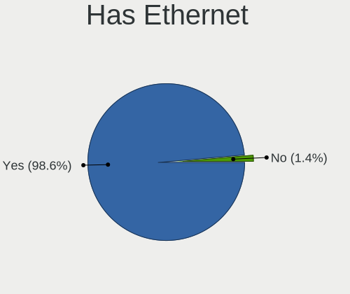
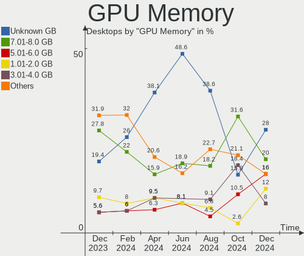
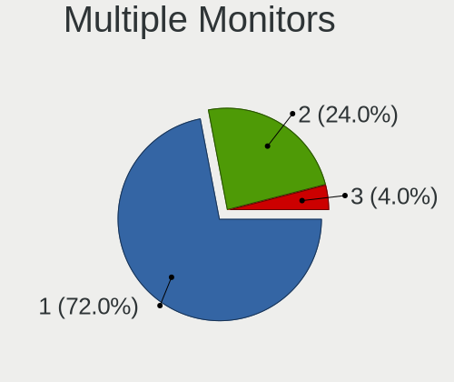
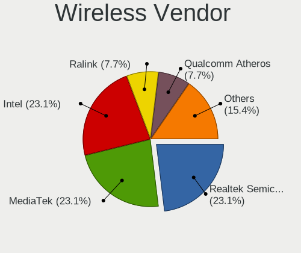
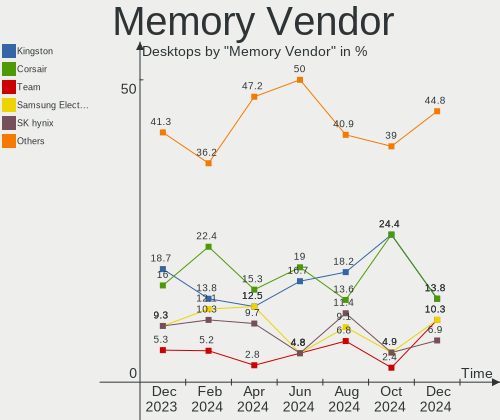

ArcoLinux - Hardware Trends (Desktops)
--------------------------------------

A project to identify most popular hardware characteristics and track their change
over time based on data collected by Linux users at https://Linux-Hardware.org.

Anyone can contribute to this report by the [hw-probe](https://github.com/linuxhw/hw-probe) tool:

    sudo -E hw-probe -all -upload

This report is for one last month. Overall report since the beginning of time: [TestDays](https://github.com/linuxhw/TestDays)

Period: Sep, 2023.

Contents
--------

* [ System ](#system)
  - [ OS                       ](#os)
  - [ OS Family                ](#os-family)
  - [ Kernel                   ](#kernel)
  - [ Kernel Family            ](#kernel-family)
  - [ Kernel Major Ver.        ](#kernel-major-ver)
  - [ Arch                     ](#arch)
  - [ DE                       ](#de)
  - [ Display Server           ](#display-server)
  - [ Display Manager          ](#display-manager)
  - [ OS Lang                  ](#os-lang)
  - [ Boot Mode                ](#boot-mode)
  - [ Filesystem               ](#filesystem)
  - [ Part. scheme             ](#part-scheme)
  - [ Dual Boot with Linux/BSD ](#dual-boot-with-linuxbsd)
  - [ Dual Boot (Win)          ](#dual-boot-win)

* [ Board ](#board)
  - [ Vendor                   ](#vendor)
  - [ Model                    ](#model)
  - [ Model Family             ](#model-family)
  - [ MFG Year                 ](#mfg-year)
  - [ Form Factor              ](#form-factor)
  - [ Secure Boot              ](#secure-boot)
  - [ Coreboot                 ](#coreboot)
  - [ RAM Size                 ](#ram-size)
  - [ RAM Used                 ](#ram-used)
  - [ Total Drives             ](#total-drives)
  - [ Has CD-ROM               ](#has-cd-rom)
  - [ Has Ethernet             ](#has-ethernet)
  - [ Has WiFi                 ](#has-wifi)
  - [ Has Bluetooth            ](#has-bluetooth)

* [ Location ](#location)
  - [ Country                  ](#country)
  - [ City                     ](#city)

* [ Drives ](#drives)
  - [ Drive Vendor             ](#drive-vendor)
  - [ Drive Model              ](#drive-model)
  - [ HDD Vendor               ](#hdd-vendor)
  - [ SSD Vendor               ](#ssd-vendor)
  - [ Drive Kind               ](#drive-kind)
  - [ Drive Connector          ](#drive-connector)
  - [ Drive Size               ](#drive-size)
  - [ Space Total              ](#space-total)
  - [ Space Used               ](#space-used)
  - [ Malfunc. Drives          ](#malfunc-drives)
  - [ Malfunc. Drive Vendor    ](#malfunc-drive-vendor)
  - [ Malfunc. HDD Vendor      ](#malfunc-hdd-vendor)
  - [ Malfunc. Drive Kind      ](#malfunc-drive-kind)
  - [ Failed Drives            ](#failed-drives)
  - [ Failed Drive Vendor      ](#failed-drive-vendor)
  - [ Drive Status             ](#drive-status)

* [ Storage controller ](#storage-controller)
  - [ Storage Vendor           ](#storage-vendor)
  - [ Storage Model            ](#storage-model)
  - [ Storage Kind             ](#storage-kind)

* [ Processor ](#processor)
  - [ CPU Vendor               ](#cpu-vendor)
  - [ CPU Model                ](#cpu-model)
  - [ CPU Model Family         ](#cpu-model-family)
  - [ CPU Cores                ](#cpu-cores)
  - [ CPU Sockets              ](#cpu-sockets)
  - [ CPU Threads              ](#cpu-threads)
  - [ CPU Op-Modes             ](#cpu-op-modes)
  - [ CPU Microcode            ](#cpu-microcode)
  - [ CPU Microarch            ](#cpu-microarch)

* [ Graphics ](#graphics)
  - [ GPU Vendor               ](#gpu-vendor)
  - [ GPU Model                ](#gpu-model)
  - [ GPU Combo                ](#gpu-combo)
  - [ GPU Driver               ](#gpu-driver)
  - [ GPU Memory               ](#gpu-memory)

* [ Monitor ](#monitor)
  - [ Monitor Vendor           ](#monitor-vendor)
  - [ Monitor Model            ](#monitor-model)
  - [ Monitor Resolution       ](#monitor-resolution)
  - [ Monitor Diagonal         ](#monitor-diagonal)
  - [ Monitor Width            ](#monitor-width)
  - [ Aspect Ratio             ](#aspect-ratio)
  - [ Monitor Area             ](#monitor-area)
  - [ Pixel Density            ](#pixel-density)
  - [ Multiple Monitors        ](#multiple-monitors)

* [ Network ](#network)
  - [ Net Controller Vendor    ](#net-controller-vendor)
  - [ Net Controller Model     ](#net-controller-model)
  - [ Wireless Vendor          ](#wireless-vendor)
  - [ Wireless Model           ](#wireless-model)
  - [ Ethernet Vendor          ](#ethernet-vendor)
  - [ Ethernet Model           ](#ethernet-model)
  - [ Net Controller Kind      ](#net-controller-kind)
  - [ Used Controller          ](#used-controller)
  - [ NICs                     ](#nics)
  - [ IPv6                     ](#ipv6)

* [ Bluetooth ](#bluetooth)
  - [ Bluetooth Vendor         ](#bluetooth-vendor)
  - [ Bluetooth Model          ](#bluetooth-model)

* [ Sound ](#sound)
  - [ Sound Vendor             ](#sound-vendor)
  - [ Sound Model              ](#sound-model)

* [ Memory ](#memory)
  - [ Memory Vendor            ](#memory-vendor)
  - [ Memory Model             ](#memory-model)
  - [ Memory Kind              ](#memory-kind)
  - [ Memory Form Factor       ](#memory-form-factor)
  - [ Memory Size              ](#memory-size)
  - [ Memory Speed             ](#memory-speed)

* [ Printers & scanners ](#printers--scanners)
  - [ Printer Vendor           ](#printer-vendor)
  - [ Printer Model            ](#printer-model)
  - [ Scanner Vendor           ](#scanner-vendor)
  - [ Scanner Model            ](#scanner-model)

* [ Camera ](#camera)
  - [ Camera Vendor            ](#camera-vendor)
  - [ Camera Model             ](#camera-model)

* [ Security ](#security)
  - [ Fingerprint Vendor       ](#fingerprint-vendor)
  - [ Fingerprint Model        ](#fingerprint-model)
  - [ Chipcard Vendor          ](#chipcard-vendor)
  - [ Chipcard Model           ](#chipcard-model)

* [ Unsupported ](#unsupported)
  - [ Unsupported Devices      ](#unsupported-devices)
  - [ Unsupported Device Types ](#unsupported-device-types)

System
------

OS
--

Installed operating systems

| Name              | Desktops | Percent |
|-------------------|----------|---------|
| ArcoLinux Rolling | 45       | 93.75%  |
| ArcoLinux         | 3        | 6.25%   |

OS Family
---------

OS without a version

| Name      | Desktops | Percent |
|-----------|----------|---------|
| ArcoLinux | 48       | 100%    |

Kernel
------

Version of the Linux kernel

| Version                    | Desktops | Percent |
|----------------------------|----------|---------|
| 6.4.12-arch1-1             | 16       | 33.33%  |
| 6.5.3-arch1-1              | 5        | 10.42%  |
| 6.4.12-zen1-1-zen          | 4        | 8.33%   |
| 6.4.11-arch1-1             | 4        | 8.33%   |
| 6.5.5-arch1-1              | 2        | 4.17%   |
| 6.5.4-arch2-1              | 2        | 4.17%   |
| 6.5.2-arch1-1              | 2        | 4.17%   |
| 6.1.53-1-lts               | 2        | 4.17%   |
| 6.5.5-zen1-1-zen           | 1        | 2.08%   |
| 6.5.5-hardened1-1-hardened | 1        | 2.08%   |
| 6.5.3-AMD                  | 1        | 2.08%   |
| 6.4.2-x64v2-xanmod1-3      | 1        | 2.08%   |
| 6.4.10-arch1-1             | 1        | 2.08%   |
| 6.3.8-arch1-1              | 1        | 2.08%   |
| 6.2.11-arch1-1             | 1        | 2.08%   |
| 6.1.55-1-lts               | 1        | 2.08%   |
| 6.1.54-1-lts               | 1        | 2.08%   |
| 6.1.51-1-lts               | 1        | 2.08%   |
| 6.1.50-1-lts               | 1        | 2.08%   |

Kernel Family
-------------

Linux kernel without a distro release

| Version | Desktops | Percent |
|---------|----------|---------|
| 6.4.12  | 20       | 41.67%  |
| 6.5.3   | 6        | 12.5%   |
| 6.5.5   | 4        | 8.33%   |
| 6.4.11  | 4        | 8.33%   |
| 6.5.4   | 2        | 4.17%   |
| 6.5.2   | 2        | 4.17%   |
| 6.1.53  | 2        | 4.17%   |
| 6.4.2   | 1        | 2.08%   |
| 6.4.10  | 1        | 2.08%   |
| 6.3.8   | 1        | 2.08%   |
| 6.2.11  | 1        | 2.08%   |
| 6.1.55  | 1        | 2.08%   |
| 6.1.54  | 1        | 2.08%   |
| 6.1.51  | 1        | 2.08%   |
| 6.1.50  | 1        | 2.08%   |

Kernel Major Ver.
-----------------

Linux kernel major version

| Version | Desktops | Percent |
|---------|----------|---------|
| 6.4     | 26       | 54.17%  |
| 6.5     | 14       | 29.17%  |
| 6.1     | 6        | 12.5%   |
| 6.3     | 1        | 2.08%   |
| 6.2     | 1        | 2.08%   |

Arch
----

OS architecture (x86_64, i586, etc.)

| Name   | Desktops | Percent |
|--------|----------|---------|
| x86_64 | 48       | 100%    |

DE
--

Desktop Environment

| Name       | Desktops | Percent |
|------------|----------|---------|
| XFCE       | 20       | 41.67%  |
| KDE5       | 9        | 18.75%  |
| GNOME      | 9        | 18.75%  |
| Hyprland   | 3        | 6.25%   |
| i3         | 2        | 4.17%   |
| Budgie     | 2        | 4.17%   |
| X-Cinnamon | 1        | 2.08%   |
| Cinnamon   | 1        | 2.08%   |
| chadwm     | 1        | 2.08%   |

Display Server
--------------

X11 or Wayland

| Name    | Desktops | Percent |
|---------|----------|---------|
| X11     | 41       | 85.42%  |
| Wayland | 6        | 12.5%   |
| Unknown | 1        | 2.08%   |

Display Manager
---------------

SDDM, LightDM, etc.

| Name    | Desktops | Percent |
|---------|----------|---------|
| SDDM    | 37       | 77.08%  |
| LightDM | 6        | 12.5%   |
| Unknown | 3        | 6.25%   |
| LXDM    | 1        | 2.08%   |
| GDM     | 1        | 2.08%   |

OS Lang
-------

Language

| Lang  | Desktops | Percent |
|-------|----------|---------|
| en_US | 19       | 39.58%  |
| C     | 4        | 8.33%   |
| ru_RU | 3        | 6.25%   |
| pt_BR | 3        | 6.25%   |
| fr_FR | 3        | 6.25%   |
| es_MX | 3        | 6.25%   |
| en_GB | 3        | 6.25%   |
| en_CA | 3        | 6.25%   |
| es_ES | 2        | 4.17%   |
| nb_NO | 1        | 2.08%   |
| lt_LT | 1        | 2.08%   |
| it_IT | 1        | 2.08%   |
| hu_HU | 1        | 2.08%   |
| en_IN | 1        | 2.08%   |

Boot Mode
---------

EFI or BIOS

| Mode | Desktops | Percent |
|------|----------|---------|
| EFI  | 37       | 77.08%  |
| BIOS | 11       | 22.92%  |

Filesystem
----------

Type of filesystem

| Type     | Desktops | Percent |
|----------|----------|---------|
| Ext4     | 23       | 47.92%  |
| Btrfs    | 19       | 39.58%  |
| Overlay  | 4        | 8.33%   |
| Reiserfs | 1        | 2.08%   |
| F2fs     | 1        | 2.08%   |

Part. scheme
------------

Scheme of partitioning

| Type    | Desktops | Percent |
|---------|----------|---------|
| GPT     | 41       | 85.42%  |
| MBR     | 4        | 8.33%   |
| Unknown | 3        | 6.25%   |

Dual Boot with Linux/BSD
------------------------

Hosting more than one Linux/BSD

| Dual boot | Desktops | Percent |
|-----------|----------|---------|
| No        | 31       | 64.58%  |
| Yes       | 17       | 35.42%  |

Dual Boot (Win)
---------------

Hosting Linux and Windows

| Dual boot | Desktops | Percent |
|-----------|----------|---------|
| No        | 26       | 54.17%  |
| Yes       | 22       | 45.83%  |

Board
-----

Vendor
------

Motherboard manufacturer

| Name                                 | Desktops | Percent |
|--------------------------------------|----------|---------|
| Gigabyte Technology                  | 17       | 35.42%  |
| ASUSTek Computer                     | 11       | 22.92%  |
| ASRock                               | 5        | 10.42%  |
| MSI                                  | 3        | 6.25%   |
| Dell                                 | 2        | 4.17%   |
| BESSTAR Tech                         | 2        | 4.17%   |
| Shenzhen Meigao Electronic Equipment | 1        | 2.08%   |
| Positivo                             | 1        | 2.08%   |
| Medion                               | 1        | 2.08%   |
| MACHINIST                            | 1        | 2.08%   |
| Lenovo                               | 1        | 2.08%   |
| Huanan                               | 1        | 2.08%   |
| AZW                                  | 1        | 2.08%   |
| Acer                                 | 1        | 2.08%   |

Model
-----

Motherboard model

| Name                                          | Desktops | Percent |
|-----------------------------------------------|----------|---------|
| Gigabyte X570 AORUS MASTER                    | 2        | 4.17%   |
| ASRock B450M Pro4                             | 2        | 4.17%   |
| Shenzhen Meigao Electronic Equipment UM560 XT | 1        | 2.08%   |
| Positivo D6200                                | 1        | 2.08%   |
| MSI MS-7C91                                   | 1        | 2.08%   |
| MSI MS-7A78                                   | 1        | 2.08%   |
| MSI MS-7A38                                   | 1        | 2.08%   |
| Medion MS-7667                                | 1        | 2.08%   |
| MACHINIST X99-RS9 V2.0                        | 1        | 2.08%   |
| Lenovo Legion T5 28IMB05 90NC00JAUS           | 1        | 2.08%   |
| Huanan X99-F8 GAMING V5.0                     | 1        | 2.08%   |
| Gigabyte Z87X-UD3H                            | 1        | 2.08%   |
| Gigabyte Z390 UD V2                           | 1        | 2.08%   |
| Gigabyte Z270-Gaming 3                        | 1        | 2.08%   |
| Gigabyte X670 AORUS ELITE AX                  | 1        | 2.08%   |
| Gigabyte X570 GAMING X                        | 1        | 2.08%   |
| Gigabyte X570 AORUS ELITE                     | 1        | 2.08%   |
| Gigabyte X470 AORUS GAMING 7 WIFI             | 1        | 2.08%   |
| Gigabyte X399 DESIGNARE EX                    | 1        | 2.08%   |
| Gigabyte X299 AORUS Ultra Gaming              | 1        | 2.08%   |
| Gigabyte H61M-S1                              | 1        | 2.08%   |
| Gigabyte H310M S2 2.0                         | 1        | 2.08%   |
| Gigabyte EP45-UD3LR                           | 1        | 2.08%   |
| Gigabyte B550M DS3H                           | 1        | 2.08%   |
| Gigabyte B550 AORUS ELITE V2                  | 1        | 2.08%   |
| Gigabyte B450M DS3H WIFI                      | 1        | 2.08%   |
| Dell OptiPlex 7010                            | 1        | 2.08%   |
| Dell OptiPlex 3060                            | 1        | 2.08%   |
| BESSTAR Tech UM700                            | 1        | 2.08%   |
| BESSTAR Tech HX90                             | 1        | 2.08%   |
| AZW MINI S                                    | 1        | 2.08%   |
| ASUS Z170 PRO GAMING                          | 1        | 2.08%   |
| ASUS ROG STRIX Z790-E GAMING WIFI             | 1        | 2.08%   |
| ASUS ROG CROSSHAIR VIII HERO                  | 1        | 2.08%   |
| ASUS Q170M2                                   | 1        | 2.08%   |
| ASUS Pro WS WRX80E-SAGE SE WIFI               | 1        | 2.08%   |
| ASUS PRIME Z370-A                             | 1        | 2.08%   |
| ASUS PRIME H270-PLUS                          | 1        | 2.08%   |
| ASUS PRIME B550M-A                            | 1        | 2.08%   |
| ASUS P8Z77-V LE                               | 1        | 2.08%   |

Model Family
------------

Motherboard model prefix

| Name                                       | Desktops | Percent |
|--------------------------------------------|----------|---------|
| Gigabyte X570                              | 4        | 8.33%   |
| ASUS PRIME                                 | 3        | 6.25%   |
| Dell OptiPlex                              | 2        | 4.17%   |
| ASUS ROG                                   | 2        | 4.17%   |
| ASUS P8H61-M                               | 2        | 4.17%   |
| ASRock B450M                               | 2        | 4.17%   |
| Shenzhen Meigao Electronic Equipment UM560 | 1        | 2.08%   |
| Positivo D6200                             | 1        | 2.08%   |
| MSI MS-7C91                                | 1        | 2.08%   |
| MSI MS-7A78                                | 1        | 2.08%   |
| MSI MS-7A38                                | 1        | 2.08%   |
| Medion MS-7667                             | 1        | 2.08%   |
| MACHINIST X99-RS9                          | 1        | 2.08%   |
| Lenovo Legion                              | 1        | 2.08%   |
| Huanan X99-F8                              | 1        | 2.08%   |
| Gigabyte Z87X-UD3H                         | 1        | 2.08%   |
| Gigabyte Z390                              | 1        | 2.08%   |
| Gigabyte Z270-Gaming                       | 1        | 2.08%   |
| Gigabyte X670                              | 1        | 2.08%   |
| Gigabyte X470                              | 1        | 2.08%   |
| Gigabyte X399                              | 1        | 2.08%   |
| Gigabyte X299                              | 1        | 2.08%   |
| Gigabyte H61M-S1                           | 1        | 2.08%   |
| Gigabyte H310M                             | 1        | 2.08%   |
| Gigabyte EP45-UD3LR                        | 1        | 2.08%   |
| Gigabyte B550M                             | 1        | 2.08%   |
| Gigabyte B550                              | 1        | 2.08%   |
| Gigabyte B450M                             | 1        | 2.08%   |
| BESSTAR Tech UM700                         | 1        | 2.08%   |
| BESSTAR Tech HX90                          | 1        | 2.08%   |
| AZW MINI                                   | 1        | 2.08%   |
| ASUS Z170                                  | 1        | 2.08%   |
| ASUS Q170M2                                | 1        | 2.08%   |
| ASUS Pro                                   | 1        | 2.08%   |
| ASUS P8Z77-V                               | 1        | 2.08%   |
| ASRock Z490                                | 1        | 2.08%   |
| ASRock X670E                               | 1        | 2.08%   |
| ASRock A320M-DGS                           | 1        | 2.08%   |
| Acer Nitro                                 | 1        | 2.08%   |

MFG Year
--------

Motherboard manufacture year

| Year | Desktops | Percent |
|------|----------|---------|
| 2020 | 8        | 16.67%  |
| 2019 | 8        | 16.67%  |
| 2018 | 8        | 16.67%  |
| 2022 | 6        | 12.5%   |
| 2017 | 4        | 8.33%   |
| 2012 | 4        | 8.33%   |
| 2021 | 2        | 4.17%   |
| 2016 | 2        | 4.17%   |
| 2013 | 2        | 4.17%   |
| 2023 | 1        | 2.08%   |
| 2015 | 1        | 2.08%   |
| 2011 | 1        | 2.08%   |
| 2009 | 1        | 2.08%   |

Form Factor
-----------

Physical design of the computer

| Name    | Desktops | Percent |
|---------|----------|---------|
| Desktop | 48       | 100%    |

Secure Boot
-----------

Enabled or disabled

| State    | Desktops | Percent |
|----------|----------|---------|
| Disabled | 47       | 97.92%  |
| Enabled  | 1        | 2.08%   |

Coreboot
--------

Have coreboot on board

| Used | Desktops | Percent |
|------|----------|---------|
| No   | 48       | 100%    |

RAM Size
--------

Total RAM memory

| Size in GB  | Desktops | Percent |
|-------------|----------|---------|
| 16.01-24.0  | 13       | 27.08%  |
| 32.01-64.0  | 10       | 20.83%  |
| 64.01-256.0 | 10       | 20.83%  |
| 24.01-32.0  | 7        | 14.58%  |
| 4.01-8.0    | 5        | 10.42%  |
| 8.01-16.0   | 2        | 4.17%   |
| 3.01-4.0    | 1        | 2.08%   |

RAM Used
--------

Used RAM memory

| Used GB   | Desktops | Percent |
|-----------|----------|---------|
| 1.01-2.0  | 18       | 37.5%   |
| 4.01-8.0  | 8        | 16.67%  |
| 2.01-3.0  | 8        | 16.67%  |
| 3.01-4.0  | 7        | 14.58%  |
| 8.01-16.0 | 5        | 10.42%  |
| 0.51-1.0  | 2        | 4.17%   |

Total Drives
------------

Number of drives on board

| Drives | Desktops | Percent |
|--------|----------|---------|
| 2      | 11       | 22.92%  |
| 1      | 11       | 22.92%  |
| 3      | 9        | 18.75%  |
| 5      | 8        | 16.67%  |
| 4      | 6        | 12.5%   |
| 6      | 2        | 4.17%   |
| 10     | 1        | 2.08%   |

Has CD-ROM
----------

Has CD-ROM on board

| Presented | Desktops | Percent |
|-----------|----------|---------|
| No        | 37       | 77.08%  |
| Yes       | 11       | 22.92%  |

Has Ethernet
------------

Has Ethernet on board

| Presented | Desktops | Percent |
|-----------|----------|---------|
| Yes       | 48       | 100%    |

Has WiFi
--------

Has WiFi module

| Presented | Desktops | Percent |
|-----------|----------|---------|
| Yes       | 28       | 58.33%  |
| No        | 20       | 41.67%  |

Has Bluetooth
-------------

Has Bluetooth module

| Presented | Desktops | Percent |
|-----------|----------|---------|
| Yes       | 27       | 56.25%  |
| No        | 21       | 43.75%  |

Location
--------

Country
-------

Geographic location (country)

| Country     | Desktops | Percent |
|-------------|----------|---------|
| USA         | 10       | 20.83%  |
| Brazil      | 7        | 14.58%  |
| UK          | 3        | 6.25%   |
| Germany     | 3        | 6.25%   |
| France      | 3        | 6.25%   |
| Canada      | 3        | 6.25%   |
| Spain       | 2        | 4.17%   |
| Russia      | 2        | 4.17%   |
| Netherlands | 2        | 4.17%   |
| Mexico      | 2        | 4.17%   |
| Belgium     | 2        | 4.17%   |
| Philippines | 1        | 2.08%   |
| Norway      | 1        | 2.08%   |
| Lithuania   | 1        | 2.08%   |
| Italy       | 1        | 2.08%   |
| India       | 1        | 2.08%   |
| Hungary     | 1        | 2.08%   |
| Egypt       | 1        | 2.08%   |
| Cuba        | 1        | 2.08%   |
| Colombia    | 1        | 2.08%   |

City
----

Geographic location (city)

| City                     | Desktops | Percent |
|--------------------------|----------|---------|
| Guadalajara              | 2        | 4.17%   |
| Amsterdam                | 2        | 4.17%   |
| Yakutsk                  | 1        | 2.08%   |
| Wolfville                | 1        | 2.08%   |
| Voronezh                 | 1        | 2.08%   |
| Vicosa                   | 1        | 2.08%   |
| Toronto                  | 1        | 2.08%   |
| Springfield              | 1        | 2.08%   |
| Senago                   | 1        | 2.08%   |
| Sao Joao del Rei         | 1        | 2.08%   |
| Sao Domingos das Dores   | 1        | 2.08%   |
| Rudolstadt               | 1        | 2.08%   |
| Rosny-sous-Bois          | 1        | 2.08%   |
| Rochester                | 1        | 2.08%   |
| Rio de Janeiro           | 1        | 2.08%   |
| Quezon City              | 1        | 2.08%   |
| Port Allen               | 1        | 2.08%   |
| Paulo Afonso             | 1        | 2.08%   |
| Pacajus                  | 1        | 2.08%   |
| Nossa Senhora do Socorro | 1        | 2.08%   |
| North Vancouver          | 1        | 2.08%   |
| Newington                | 1        | 2.08%   |
| Mount Airy               | 1        | 2.08%   |
| Martins Ferry            | 1        | 2.08%   |
| Madrid                   | 1        | 2.08%   |
| Los Angeles              | 1        | 2.08%   |
| Kings Lynn               | 1        | 2.08%   |
| Kaunas                   | 1        | 2.08%   |
| Ibague                   | 1        | 2.08%   |
| Hyderabad                | 1        | 2.08%   |
| Havana                   | 1        | 2.08%   |
| Glendale                 | 1        | 2.08%   |
| Gelsenkirchen            | 1        | 2.08%   |
| Feltham                  | 1        | 2.08%   |
| Duisburg                 | 1        | 2.08%   |
| Duffel                   | 1        | 2.08%   |
| Dallas                   | 1        | 2.08%   |
| Cumming                  | 1        | 2.08%   |
| Coueron                  | 1        | 2.08%   |
| Cairo                    | 1        | 2.08%   |

Drives
------

Drive Vendor
------------

Hard drive vendors

| Vendor                         | Desktops | Drives | Percent |
|--------------------------------|----------|--------|---------|
| Samsung Electronics            | 20       | 36     | 19.61%  |
| WDC                            | 15       | 22     | 14.71%  |
| Seagate                        | 9        | 14     | 8.82%   |
| Sandisk                        | 8        | 12     | 7.84%   |
| Phison Electronics             | 6        | 9      | 5.88%   |
| Kingston                       | 6        | 11     | 5.88%   |
| Toshiba                        | 5        | 5      | 4.9%    |
| Hitachi                        | 4        | 4      | 3.92%   |
| SK hynix                       | 3        | 4      | 2.94%   |
| Kingston Technology Company    | 3        | 3      | 2.94%   |
| Crucial                        | 3        | 3      | 2.94%   |
| SABRENT                        | 2        | 3      | 1.96%   |
| Micron/Crucial Technology      | 2        | 3      | 1.96%   |
| XPG                            | 1        | 1      | 0.98%   |
| Super Talent                   | 1        | 1      | 0.98%   |
| Solid State Storage Technology | 1        | 1      | 0.98%   |
| Silicon Motion                 | 1        | 1      | 0.98%   |
| Patriot                        | 1        | 1      | 0.98%   |
| OXYBR                          | 1        | 1      | 0.98%   |
| Maxtor                         | 1        | 1      | 0.98%   |
| MAXIO Technology (Hangzhou)    | 1        | 1      | 0.98%   |
| KIOXIA                         | 1        | 1      | 0.98%   |
| KingSpec                       | 1        | 1      | 0.98%   |
| Intel                          | 1        | 1      | 0.98%   |
| HS-SSD-C100                    | 1        | 1      | 0.98%   |
| Hewlett-Packard                | 1        | 1      | 0.98%   |
| H/W                            | 1        | 3      | 0.98%   |
| China                          | 1        | 1      | 0.98%   |
| ADATA Technology               | 1        | 1      | 0.98%   |

Drive Model
-----------

Hard drive models

| Model                                               | Desktops | Percent |
|-----------------------------------------------------|----------|---------|
| Samsung NVMe SSD Controller SM981/PM981/PM983 256GB | 6        | 4.8%    |
| Toshiba DT01ACA100 1TB                              | 4        | 3.2%    |
| Samsung NVMe SSD Controller PM9A1/PM9A3/980PRO 1TB  | 4        | 3.2%    |
| Sandisk WD Black SN850 1TB                          | 3        | 2.4%    |
| Phison E16 PCIe4 NVMe Controller 500GB              | 3        | 2.4%    |
| Kingston Company A2000 NVMe SSD 1TB                 | 3        | 2.4%    |
| Kingston SV300S37A120G 120GB SSD                    | 3        | 2.4%    |
| WDC WD10EZRX-00L4HB0 1TB                            | 2        | 1.6%    |
| WDC WD10EZEX-08WN4A0 1TB                            | 2        | 1.6%    |
| Samsung SSD 870 EVO 500GB                           | 2        | 1.6%    |
| Samsung SSD 870 EVO 1TB                             | 2        | 1.6%    |
| Samsung SSD 860 EVO 1TB                             | 2        | 1.6%    |
| Samsung SSD 850 EVO 250GB                           | 2        | 1.6%    |
| Samsung SSD 840 PRO Series 128GB                    | 2        | 1.6%    |
| Phison PS5013 E13 NVMe Controller 512GB             | 2        | 1.6%    |
| Kingston SA400S37480G 480GB SSD                     | 2        | 1.6%    |
| XPG NVMe SSD Drive 2TB                              | 1        | 0.8%    |
| WDC WDS240G2G0A-00JH30 240GB SSD                    | 1        | 0.8%    |
| WDC WDS120G1G0A-00SS50 120GB SSD                    | 1        | 0.8%    |
| WDC WDS100T1R0A-68A4W0 1TB SSD                      | 1        | 0.8%    |
| WDC WD5000KS-00MNB0 500GB                           | 1        | 0.8%    |
| WDC WD5000AAKX-00U6AA0 500GB                        | 1        | 0.8%    |
| WDC WD40EFAX-68JH4N1 4TB                            | 1        | 0.8%    |
| WDC WD30EZRZ-00GXCB0 3TB                            | 1        | 0.8%    |
| WDC WD30EZRX-00DC0B0 3TB                            | 1        | 0.8%    |
| WDC WD30EZRS-42KEZB0 3TB                            | 1        | 0.8%    |
| WDC WD20PURZ-85AKKY0 2TB                            | 1        | 0.8%    |
| WDC WD20EZAZ-00GGJB0 2TB                            | 1        | 0.8%    |
| WDC WD2003FZEX-00SRLA0 2TB                          | 1        | 0.8%    |
| WDC WD10JPVX-60JC3T0 1TB                            | 1        | 0.8%    |
| WDC WD10EZRX-00A3KB0 1TB                            | 1        | 0.8%    |
| WDC WD10EZEX-75WN4A1 1TB                            | 1        | 0.8%    |
| WDC WD1003FZEX-00K3CA0 1TB                          | 1        | 0.8%    |
| WDC WD Blue SA510 2.5 1000GB                        | 1        | 0.8%    |
| Toshiba HDWD120 2TB                                 | 1        | 0.8%    |
| Super Talent FTM48N325H 480GB SSD                   | 1        | 0.8%    |
| Solid State Storage CA5-8D256-Q11 NVMe SSSTC 256GB  | 1        | 0.8%    |
| SK hynix SHPP41-2000GM 2TB                          | 1        | 0.8%    |
| SK hynix SC401 SATA 512GB SSD                       | 1        | 0.8%    |
| SK hynix HFS128G39TND-N210A 128GB SSD               | 1        | 0.8%    |

HDD Vendor
----------

Hard disk drive vendors

| Vendor              | Desktops | Drives | Percent |
|---------------------|----------|--------|---------|
| WDC                 | 13       | 17     | 37.14%  |
| Seagate             | 8        | 13     | 22.86%  |
| Toshiba             | 5        | 5      | 14.29%  |
| Hitachi             | 4        | 4      | 11.43%  |
| Samsung Electronics | 3        | 3      | 8.57%   |
| SABRENT             | 1        | 2      | 2.86%   |
| H/W                 | 1        | 3      | 2.86%   |

SSD Vendor
----------

Solid state drive vendors

| Vendor              | Desktops | Drives | Percent |
|---------------------|----------|--------|---------|
| Samsung Electronics | 12       | 17     | 32.43%  |
| Kingston            | 5        | 10     | 13.51%  |
| WDC                 | 3        | 5      | 8.11%   |
| Crucial             | 3        | 3      | 8.11%   |
| SK hynix            | 2        | 2      | 5.41%   |
| SanDisk             | 2        | 2      | 5.41%   |
| Super Talent        | 1        | 1      | 2.7%    |
| SABRENT             | 1        | 1      | 2.7%    |
| Patriot             | 1        | 1      | 2.7%    |
| OXYBR               | 1        | 1      | 2.7%    |
| Maxtor              | 1        | 1      | 2.7%    |
| KingSpec            | 1        | 1      | 2.7%    |
| Intel               | 1        | 1      | 2.7%    |
| HS-SSD-C100         | 1        | 1      | 2.7%    |
| Hewlett-Packard     | 1        | 1      | 2.7%    |
| China               | 1        | 1      | 2.7%    |

Drive Kind
----------

HDD or SSD

| Kind | Desktops | Drives | Percent |
|------|----------|--------|---------|
| SSD  | 29       | 49     | 34.94%  |
| NVMe | 28       | 51     | 33.73%  |
| HDD  | 26       | 47     | 31.33%  |

Drive Connector
---------------

SATA, SAS, NVMe, etc.

| Type | Desktops | Drives | Percent |
|------|----------|--------|---------|
| SATA | 39       | 92     | 55.71%  |
| NVMe | 28       | 51     | 40%     |
| SAS  | 3        | 4      | 4.29%   |

Drive Size
----------

Size of hard drive

| Size in TB | Desktops | Drives | Percent |
|------------|----------|--------|---------|
| 0.01-0.5   | 30       | 48     | 44.78%  |
| 0.51-1.0   | 23       | 31     | 34.33%  |
| 1.01-2.0   | 6        | 9      | 8.96%   |
| 3.01-4.0   | 3        | 3      | 4.48%   |
| 2.01-3.0   | 3        | 3      | 4.48%   |
| 10.01-20.0 | 1        | 1      | 1.49%   |
| 4.01-10.0  | 1        | 1      | 1.49%   |

Space Total
-----------

Amount of disk space available on the file system

| Size in GB     | Desktops | Percent |
|----------------|----------|---------|
| 1001-2000      | 16       | 33.33%  |
| More than 3000 | 9        | 18.75%  |
| 251-500        | 9        | 18.75%  |
| 501-1000       | 6        | 12.5%   |
| 2001-3000      | 3        | 6.25%   |
| 101-250        | 3        | 6.25%   |
| 51-100         | 1        | 2.08%   |
| Unknown        | 1        | 2.08%   |

Space Used
----------

Amount of used disk space

| Used GB   | Desktops | Percent |
|-----------|----------|---------|
| 21-50     | 13       | 27.08%  |
| 1-20      | 11       | 22.92%  |
| 251-500   | 5        | 10.42%  |
| 501-1000  | 5        | 10.42%  |
| 101-250   | 4        | 8.33%   |
| 1001-2000 | 4        | 8.33%   |
| 51-100    | 3        | 6.25%   |
| 2001-3000 | 2        | 4.17%   |
| Unknown   | 1        | 2.08%   |

Malfunc. Drives
---------------

Drive models with a malfunction

| Model                             | Desktops | Drives | Percent |
|-----------------------------------|----------|--------|---------|
| WDC WD30EZRX-00DC0B0 3TB          | 1        | 1      | 5.26%   |
| WDC WD10EZRX-00L4HB0 1TB          | 1        | 1      | 5.26%   |
| Toshiba DT01ACA100 1TB            | 1        | 1      | 5.26%   |
| Super Talent FTM48N325H 480GB SSD | 1        | 1      | 5.26%   |
| SK hynix SC401 SATA 512GB SSD     | 1        | 1      | 5.26%   |
| Seagate ST9500325AS 500GB         | 1        | 1      | 5.26%   |
| Seagate ST3500418AS 500GB         | 1        | 1      | 5.26%   |
| Seagate ST2000DM008-2FR102 2TB    | 1        | 2      | 5.26%   |
| Seagate ST2000DM001-1ER164 2TB    | 1        | 2      | 5.26%   |
| Seagate ST1000DM010-2EP102 1TB    | 1        | 1      | 5.26%   |
| Seagate ST1000DM003-9YN162 1TB    | 1        | 1      | 5.26%   |
| Seagate ST1000DM003-1ER162 1TB    | 1        | 1      | 5.26%   |
| Samsung Electronics HM500JI 500GB | 1        | 1      | 5.26%   |
| Samsung Electronics HD322HJ 320GB | 1        | 1      | 5.26%   |
| Intel SSDSA2M080G2GC 80GB         | 1        | 1      | 5.26%   |
| Hitachi HDS721050DLE630 500GB     | 1        | 1      | 5.26%   |
| Hitachi HDS721050CLA662 500GB     | 1        | 1      | 5.26%   |
| Hitachi HDS721025CLA382 250GB     | 1        | 1      | 5.26%   |
| Hewlett-Packard SSD S600 240GB    | 1        | 1      | 5.26%   |

Malfunc. Drive Vendor
---------------------

Vendors of faulty drives

| Vendor              | Desktops | Drives | Percent |
|---------------------|----------|--------|---------|
| Seagate             | 6        | 9      | 33.33%  |
| Hitachi             | 3        | 3      | 16.67%  |
| WDC                 | 2        | 2      | 11.11%  |
| Samsung Electronics | 2        | 2      | 11.11%  |
| Toshiba             | 1        | 1      | 5.56%   |
| Super Talent        | 1        | 1      | 5.56%   |
| SK hynix            | 1        | 1      | 5.56%   |
| Intel               | 1        | 1      | 5.56%   |
| Hewlett-Packard     | 1        | 1      | 5.56%   |

Malfunc. HDD Vendor
-------------------

Vendors of faulty HDD drives

| Vendor              | Desktops | Drives | Percent |
|---------------------|----------|--------|---------|
| Seagate             | 6        | 9      | 42.86%  |
| Hitachi             | 3        | 3      | 21.43%  |
| WDC                 | 2        | 2      | 14.29%  |
| Samsung Electronics | 2        | 2      | 14.29%  |
| Toshiba             | 1        | 1      | 7.14%   |

Malfunc. Drive Kind
-------------------

Kinds of faulty drives

| Kind | Desktops | Drives | Percent |
|------|----------|--------|---------|
| HDD  | 13       | 17     | 81.25%  |
| SSD  | 3        | 4      | 18.75%  |

Failed Drives
-------------

Failed drive models

Zero info for selected period =(

Failed Drive Vendor
-------------------

Failed drive vendors

Zero info for selected period =(

Drive Status
------------

Number of failed and malfunc. drives

| Status   | Desktops | Drives | Percent |
|----------|----------|--------|---------|
| Works    | 45       | 106    | 68.18%  |
| Malfunc  | 16       | 21     | 24.24%  |
| Detected | 5        | 20     | 7.58%   |

Storage controller
------------------

Storage Vendor
--------------

Storage controller vendors

| Vendor                         | Desktops | Percent |
|--------------------------------|----------|---------|
| Intel                          | 26       | 29.55%  |
| AMD                            | 21       | 23.86%  |
| Samsung Electronics            | 9        | 10.23%  |
| SanDisk                        | 6        | 6.82%   |
| Phison Electronics             | 6        | 6.82%   |
| Kingston Technology Company    | 4        | 4.55%   |
| JMicron Technology             | 3        | 3.41%   |
| Micron/Crucial Technology      | 2        | 2.27%   |
| Marvell Technology Group       | 2        | 2.27%   |
| Solid State Storage Technology | 1        | 1.14%   |
| SK hynix                       | 1        | 1.14%   |
| Silicon Motion                 | 1        | 1.14%   |
| Seagate Technology             | 1        | 1.14%   |
| MAXIO Technology (Hangzhou)    | 1        | 1.14%   |
| KIOXIA                         | 1        | 1.14%   |
| INNOGRIT                       | 1        | 1.14%   |
| ASMedia Technology             | 1        | 1.14%   |
| ADATA Technology               | 1        | 1.14%   |

Storage Model
-------------

Storage controller models

| Model                                                                                   | Desktops | Percent |
|-----------------------------------------------------------------------------------------|----------|---------|
| AMD FCH SATA Controller [AHCI mode]                                                     | 16       | 16%     |
| Samsung NVMe SSD Controller SM981/PM981/PM983                                           | 6        | 6%      |
| Intel 200 Series PCH SATA controller [AHCI mode]                                        | 6        | 6%      |
| AMD 400 Series Chipset SATA Controller                                                  | 5        | 5%      |
| Samsung NVMe SSD Controller PM9A1/PM9A3/980PRO                                          | 4        | 4%      |
| Intel Cannon Lake PCH SATA AHCI Controller                                              | 4        | 4%      |
| AMD 500 Series Chipset SATA Controller                                                  | 4        | 4%      |
| SanDisk WD PC SN810 / Black SN850 NVMe SSD                                              | 3        | 3%      |
| Phison E16 PCIe4 NVMe Controller                                                        | 3        | 3%      |
| Kingston Company A2000 NVMe SSD                                                         | 3        | 3%      |
| Phison PS5013 E13 NVMe Controller                                                       | 2        | 2%      |
| Intel Q170/Q150/B150/H170/H110/Z170/CM236 Chipset SATA Controller [AHCI Mode]           | 2        | 2%      |
| Intel 8 Series/C220 Series Chipset Family 6-port SATA Controller 1 [AHCI mode]          | 2        | 2%      |
| Intel 7 Series/C210 Series Chipset Family 6-port SATA Controller [AHCI mode]            | 2        | 2%      |
| Intel 6 Series/C200 Series Chipset Family Desktop SATA Controller (IDE mode, ports 4-5) | 2        | 2%      |
| Intel 6 Series/C200 Series Chipset Family Desktop SATA Controller (IDE mode, ports 0-3) | 2        | 2%      |
| Intel 6 Series/C200 Series Chipset Family 6 port Desktop SATA AHCI Controller           | 2        | 2%      |
| Solid State Storage Non-Volatile memory controller                                      | 1        | 1%      |
| SK hynix Platinum P41/PC801 NVMe Solid State Drive                                      | 1        | 1%      |
| Silicon Motion SM2263EN/SM2263XT (DRAM-less) NVMe SSD Controllers                       | 1        | 1%      |
| Seagate FireCuda 530 SSD                                                                | 1        | 1%      |
| SanDisk WD Blue SN570 NVMe SSD 2TB                                                      | 1        | 1%      |
| SanDisk WD Blue SN570 NVMe SSD 1TB                                                      | 1        | 1%      |
| SanDisk WD Blue SN550 NVMe SSD                                                          | 1        | 1%      |
| SanDisk WD Black 2018/SN750 / PC SN720 NVMe SSD                                         | 1        | 1%      |
| Phison E18 PCIe4 NVMe Controller                                                        | 1        | 1%      |
| Micron/Crucial P5 Plus NVMe PCIe SSD                                                    | 1        | 1%      |
| Micron/Crucial P2 [Nick P2] / P3 / P3 Plus NVMe PCIe SSD (DRAM-less)                    | 1        | 1%      |
| Micron/Crucial P1 NVMe PCIe SSD[Frampton]                                               | 1        | 1%      |
| MAXIO (Hangzhou) NVMe SSD Controller MAP1001                                            | 1        | 1%      |
| Marvell Group 88SE9172 SATA 6Gb/s Controller                                            | 1        | 1%      |
| Marvell Group 88SE9120 SATA 6Gb/s Controller                                            | 1        | 1%      |
| KIOXIA NVMe SSD                                                                         | 1        | 1%      |
| Kingston Company KC3000/Renegade NVMe SSD                                               | 1        | 1%      |
| JMicron JMB58x AHCI SATA controller                                                     | 1        | 1%      |
| JMicron JMB368 IDE controller                                                           | 1        | 1%      |
| JMicron JMB362 SATA Controller                                                          | 1        | 1%      |
| Intel Jasper Lake SATA AHCI Controller                                                  | 1        | 1%      |
| Intel Comet Lake SATA AHCI Controller                                                   | 1        | 1%      |
| Intel 82801JI (ICH10 Family) 4 port SATA IDE Controller #1                              | 1        | 1%      |

Storage Kind
------------

Kind of storage controller (IDE, SATA, NVMe, SAS, ...)

| Kind | Desktops | Percent |
|------|----------|---------|
| SATA | 45       | 59.21%  |
| NVMe | 28       | 36.84%  |
| IDE  | 3        | 3.95%   |

Processor
---------

CPU Vendor
----------

Processor vendors

| Vendor | Desktops | Percent |
|--------|----------|---------|
| Intel  | 26       | 54.17%  |
| AMD    | 22       | 45.83%  |

CPU Model
---------

Processor models

| Model                                          | Desktops | Percent |
|------------------------------------------------|----------|---------|
| AMD Ryzen 5 5600G with Radeon Graphics         | 3        | 6.25%   |
| Intel Core i7-7700K CPU @ 4.20GHz              | 2        | 4.17%   |
| Intel Core i5-10400 CPU @ 2.90GHz              | 2        | 4.17%   |
| AMD Ryzen 9 5900X 12-Core Processor            | 2        | 4.17%   |
| AMD Ryzen 9 3900X 12-Core Processor            | 2        | 4.17%   |
| Intel Xeon CPU E5-2699 v3 @ 2.30GHz            | 1        | 2.08%   |
| Intel Xeon CPU E5-2666 v3 @ 2.90GHz            | 1        | 2.08%   |
| Intel Core i9-7920X CPU @ 2.90GHz              | 1        | 2.08%   |
| Intel Core i7-8700K CPU @ 3.70GHz              | 1        | 2.08%   |
| Intel Core i7-8700 CPU @ 3.20GHz               | 1        | 2.08%   |
| Intel Core i7-7700 CPU @ 3.60GHz               | 1        | 2.08%   |
| Intel Core i7-6700K CPU @ 4.00GHz              | 1        | 2.08%   |
| Intel Core i7-3770K CPU @ 3.50GHz              | 1        | 2.08%   |
| Intel Core i7-2600K CPU @ 3.40GHz              | 1        | 2.08%   |
| Intel Core i5-9600K CPU @ 3.70GHz              | 1        | 2.08%   |
| Intel Core i5-9400F CPU @ 2.90GHz              | 1        | 2.08%   |
| Intel Core i5-6500 CPU @ 3.20GHz               | 1        | 2.08%   |
| Intel Core i5-4670K CPU @ 3.40GHz              | 1        | 2.08%   |
| Intel Core i5-3550 CPU @ 3.30GHz               | 1        | 2.08%   |
| Intel Core i5-3470 CPU @ 3.20GHz               | 1        | 2.08%   |
| Intel Core i3-8100T CPU @ 3.10GHz              | 1        | 2.08%   |
| Intel Core i3-8100 CPU @ 3.60GHz               | 1        | 2.08%   |
| Intel Core i3-2100 CPU @ 3.10GHz               | 1        | 2.08%   |
| Intel Core 2 Duo CPU E7500 @ 2.93GHz           | 1        | 2.08%   |
| Intel Celeron N5095 @ 2.00GHz                  | 1        | 2.08%   |
| Intel Celeron CPU G1610 @ 2.60GHz              | 1        | 2.08%   |
| Intel 13th Gen Core i9-13900K                  | 1        | 2.08%   |
| AMD Ryzen Threadripper PRO 5965WX 24-Cores     | 1        | 2.08%   |
| AMD Ryzen Threadripper 1920X 12-Core Processor | 1        | 2.08%   |
| AMD Ryzen 9 7900X 12-Core Processor            | 1        | 2.08%   |
| AMD Ryzen 9 7900 12-Core Processor             | 1        | 2.08%   |
| AMD Ryzen 9 5900HX with Radeon Graphics        | 1        | 2.08%   |
| AMD Ryzen 7 5700G with Radeon Graphics         | 1        | 2.08%   |
| AMD Ryzen 7 3750H with Radeon Vega Mobile Gfx  | 1        | 2.08%   |
| AMD Ryzen 7 2700X Eight-Core Processor         | 1        | 2.08%   |
| AMD Ryzen 5 5600X 6-Core Processor             | 1        | 2.08%   |
| AMD Ryzen 5 5600H with Radeon Graphics         | 1        | 2.08%   |
| AMD Ryzen 5 3600 6-Core Processor              | 1        | 2.08%   |
| AMD Ryzen 5 2600X Six-Core Processor           | 1        | 2.08%   |
| AMD Ryzen 5 2400G with Radeon Vega Graphics    | 1        | 2.08%   |

CPU Model Family
----------------

Processor model prefix

| Model                  | Desktops | Percent |
|------------------------|----------|---------|
| AMD Ryzen 5            | 9        | 18.75%  |
| Intel Core i7          | 8        | 16.67%  |
| Intel Core i5          | 8        | 16.67%  |
| AMD Ryzen 9            | 7        | 14.58%  |
| Intel Core i3          | 3        | 6.25%   |
| AMD Ryzen 7            | 3        | 6.25%   |
| Intel Xeon             | 2        | 4.17%   |
| Intel Celeron          | 2        | 4.17%   |
| AMD Ryzen Threadripper | 2        | 4.17%   |
| Other                  | 1        | 2.08%   |
| Intel Core i9          | 1        | 2.08%   |
| Intel Core 2 Duo       | 1        | 2.08%   |
| AMD Ryzen 3            | 1        | 2.08%   |

CPU Cores
---------

Number of processor cores

| Number | Desktops | Percent |
|--------|----------|---------|
| 4      | 16       | 33.33%  |
| 6      | 14       | 29.17%  |
| 12     | 8        | 16.67%  |
| 8      | 3        | 6.25%   |
| 2      | 3        | 6.25%   |
| 24     | 2        | 4.17%   |
| 18     | 1        | 2.08%   |
| 10     | 1        | 2.08%   |

CPU Sockets
-----------

Number of sockets

| Number | Desktops | Percent |
|--------|----------|---------|
| 1      | 48       | 100%    |

CPU Threads
-----------

Threads per core (Hyper-Threading)

| Number | Desktops | Percent |
|--------|----------|---------|
| 2      | 36       | 75%     |
| 1      | 12       | 25%     |

CPU Op-Modes
------------

CPU Operation Modes (32-bit, 64-bit)

| Op mode        | Desktops | Percent |
|----------------|----------|---------|
| 32-bit, 64-bit | 48       | 100%    |

CPU Microcode
-------------

Microcode number

| Number     | Desktops | Percent |
|------------|----------|---------|
| Unknown    | 25       | 52.08%  |
| 0x0a50000d | 4        | 8.33%   |
| 0x0a601203 | 2        | 4.17%   |
| 0x08701021 | 2        | 4.17%   |
| 0x0800820d | 2        | 4.17%   |
| 0x906eb    | 1        | 2.08%   |
| 0x906e9    | 1        | 2.08%   |
| 0x506e3    | 1        | 2.08%   |
| 0x306f2    | 1        | 2.08%   |
| 0x206a7    | 1        | 2.08%   |
| 0x0a50000c | 1        | 2.08%   |
| 0x0a201025 | 1        | 2.08%   |
| 0x0a201016 | 1        | 2.08%   |
| 0x0a008205 | 1        | 2.08%   |
| 0x08108109 | 1        | 2.08%   |
| 0x08101016 | 1        | 2.08%   |
| 0x08008204 | 1        | 2.08%   |
| 0x08001137 | 1        | 2.08%   |

CPU Microarch
-------------

Microarchitecture

| Name             | Desktops | Percent |
|------------------|----------|---------|
| Zen 3            | 9        | 18.75%  |
| KabyLake         | 9        | 18.75%  |
| Zen+             | 4        | 8.33%   |
| IvyBridge        | 4        | 8.33%   |
| Zen 2            | 3        | 6.25%   |
| Zen              | 3        | 6.25%   |
| Skylake          | 3        | 6.25%   |
| Haswell          | 3        | 6.25%   |
| Unknown          | 3        | 6.25%   |
| SandyBridge      | 2        | 4.17%   |
| CometLake        | 2        | 4.17%   |
| Tremont          | 1        | 2.08%   |
| Penryn           | 1        | 2.08%   |
| Alderlake Hybrid | 1        | 2.08%   |

Graphics
--------

GPU Vendor
----------

Vendors of graphics cards

| Vendor | Desktops | Percent |
|--------|----------|---------|
| Nvidia | 21       | 40.38%  |
| AMD    | 21       | 40.38%  |
| Intel  | 10       | 19.23%  |

GPU Model
---------

Graphics card models

| Model                                                                     | Desktops | Percent |
|---------------------------------------------------------------------------|----------|---------|
| AMD Cezanne [Radeon Vega Series / Radeon Vega Mobile Series]              | 4        | 7.27%   |
| Intel Xeon E3-1200 v2/3rd Gen Core processor Graphics Controller          | 3        | 5.45%   |
| AMD Polaris 20 XL [Radeon RX 580 2048SP]                                  | 3        | 5.45%   |
| AMD Navi 14 [Radeon RX 5500/5500M / Pro 5500M]                            | 3        | 5.45%   |
| Nvidia GP106 [GeForce GTX 1060 6GB]                                       | 2        | 3.64%   |
| Nvidia GP102 [GeForce GTX 1080 Ti]                                        | 2        | 3.64%   |
| Intel DG2 [Arc A750]                                                      | 2        | 3.64%   |
| Intel CoffeeLake-S GT2 [UHD Graphics 630]                                 | 2        | 3.64%   |
| AMD Raven Ridge [Radeon Vega Series / Radeon Vega Mobile Series]          | 2        | 3.64%   |
| AMD Raphael                                                               | 2        | 3.64%   |
| AMD Navi 23 [Radeon RX 6600/6600 XT/6600M]                                | 2        | 3.64%   |
| Nvidia TU116 [GeForce GTX 1660]                                           | 1        | 1.82%   |
| Nvidia TU116 [GeForce GTX 1660 SUPER]                                     | 1        | 1.82%   |
| Nvidia TU106 [GeForce RTX 2070]                                           | 1        | 1.82%   |
| Nvidia TU106 [GeForce RTX 2070 Rev. A]                                    | 1        | 1.82%   |
| Nvidia TU104 [GeForce RTX 2070 SUPER]                                     | 1        | 1.82%   |
| Nvidia TU104 [GeForce RTX 2060]                                           | 1        | 1.82%   |
| Nvidia GP107 [GeForce GTX 1050 Ti]                                        | 1        | 1.82%   |
| Nvidia GP106 [GeForce GTX 1060 3GB]                                       | 1        | 1.82%   |
| Nvidia GP104 [GeForce GTX 1070]                                           | 1        | 1.82%   |
| Nvidia GM206 [GeForce GTX 960]                                            | 1        | 1.82%   |
| Nvidia GM204 [GeForce GTX 970]                                            | 1        | 1.82%   |
| Nvidia GK110GL [Tesla K20c]                                               | 1        | 1.82%   |
| Nvidia GA106 [GeForce RTX 3060 Lite Hash Rate]                            | 1        | 1.82%   |
| Nvidia GA104 [GeForce RTX 3070 Ti]                                        | 1        | 1.82%   |
| Nvidia GA104 [GeForce RTX 3060 Ti]                                        | 1        | 1.82%   |
| Nvidia GA104 [GeForce RTX 3060 Ti Lite Hash Rate]                         | 1        | 1.82%   |
| Nvidia GA102 [GeForce RTX 3080 Ti]                                        | 1        | 1.82%   |
| Intel Raptor Lake-S GT1 [UHD Graphics 770]                                | 1        | 1.82%   |
| Intel JasperLake [UHD Graphics]                                           | 1        | 1.82%   |
| Intel HD Graphics 630                                                     | 1        | 1.82%   |
| Intel 2nd Generation Core Processor Family Integrated Graphics Controller | 1        | 1.82%   |
| AMD Picasso/Raven 2 [Radeon Vega Series / Radeon Vega Mobile Series]      | 1        | 1.82%   |
| AMD Juniper PRO [Radeon HD 5750]                                          | 1        | 1.82%   |
| AMD Hawaii XT / Grenada XT [Radeon R9 290X/390X]                          | 1        | 1.82%   |
| AMD Cypress PRO [Radeon HD 5850]                                          | 1        | 1.82%   |
| AMD Cayman PRO [Radeon HD 6950]                                           | 1        | 1.82%   |
| AMD Barts XT [Radeon HD 6870]                                             | 1        | 1.82%   |
| AMD Barts PRO [Radeon HD 6850]                                            | 1        | 1.82%   |

GPU Combo
---------

Combinations of graphics cards

| Name         | Desktops | Percent |
|--------------|----------|---------|
| 1 x Nvidia   | 19       | 39.58%  |
| 1 x AMD      | 17       | 35.42%  |
| 1 x Intel    | 8        | 16.67%  |
| 2 x AMD      | 2        | 4.17%   |
| Intel + AMD  | 1        | 2.08%   |
| AMD + Nvidia | 1        | 2.08%   |

GPU Driver
----------

Free vs proprietary

| Driver      | Desktops | Percent |
|-------------|----------|---------|
| Free        | 27       | 56.25%  |
| Proprietary | 20       | 41.67%  |
| Unknown     | 1        | 2.08%   |

GPU Memory
----------

Total video memory

| Size in GB | Desktops | Percent |
|------------|----------|---------|
| 7.01-8.0   | 16       | 33.33%  |
| Unknown    | 10       | 20.83%  |
| 0.51-1.0   | 5        | 10.42%  |
| 5.01-6.0   | 4        | 8.33%   |
| 8.01-16.0  | 4        | 8.33%   |
| 3.01-4.0   | 3        | 6.25%   |
| 1.01-2.0   | 3        | 6.25%   |
| 0.01-0.5   | 2        | 4.17%   |
| 2.01-3.0   | 1        | 2.08%   |

Monitor
-------

Monitor Vendor
--------------

Monitor vendors

| Vendor               | Desktops | Percent |
|----------------------|----------|---------|
| Goldstar             | 12       | 21.05%  |
| Dell                 | 8        | 14.04%  |
| Samsung Electronics  | 6        | 10.53%  |
| Ancor Communications | 4        | 7.02%   |
| ViewSonic            | 3        | 5.26%   |
| ASUSTek Computer     | 3        | 5.26%   |
| AOC                  | 3        | 5.26%   |
| Philips              | 2        | 3.51%   |
| Lenovo               | 2        | 3.51%   |
| Hewlett-Packard      | 2        | 3.51%   |
| BenQ                 | 2        | 3.51%   |
| VMO                  | 1        | 1.75%   |
| Unknown              | 1        | 1.75%   |
| Sony                 | 1        | 1.75%   |
| RTK                  | 1        | 1.75%   |
| Positivo             | 1        | 1.75%   |
| Insignia             | 1        | 1.75%   |
| Iiyama               | 1        | 1.75%   |
| HKC                  | 1        | 1.75%   |
| HannStar             | 1        | 1.75%   |
| Acer                 | 1        | 1.75%   |

Monitor Model
-------------

Monitor models

| Model                                                                  | Desktops | Percent |
|------------------------------------------------------------------------|----------|---------|
| Samsung Electronics C27F390 SAM0D32 1920x1080 598x336mm 27.0-inch      | 2        | 3.08%   |
| VMO LCD QHD 1 VMO1091 2560x1440 600x340mm 27.2-inch                    | 1        | 1.54%   |
| ViewSonic VX2858Sml VSCD02F 1920x1080 621x341mm 27.9-inch              | 1        | 1.54%   |
| ViewSonic VX2758-C-MH VSC35DD 1920x1080 597x336mm 27.0-inch            | 1        | 1.54%   |
| ViewSonic VG2239 Series VSCC42B 1920x1080 477x268mm 21.5-inch          | 1        | 1.54%   |
| Unknown LCD Monitor FFFF 2288x1287 2550x2550mm 142.0-inch              | 1        | 1.54%   |
| Sony TV *00 SNYF303 1920x1080 1218x685mm 55.0-inch                     | 1        | 1.54%   |
| Samsung Electronics U32R59x SAM0F96 3840x2160 697x392mm 31.5-inch      | 1        | 1.54%   |
| Samsung Electronics SyncMaster SAM060D 1920x1080                       | 1        | 1.54%   |
| Samsung Electronics Odyssey G52A SAM71E6 2560x1440 699x393mm 31.6-inch | 1        | 1.54%   |
| Samsung Electronics Odyssey G50A SAM7181 2560x1440 597x336mm 27.0-inch | 1        | 1.54%   |
| Samsung Electronics LCD Monitor SAM0659 1920x1080                      | 1        | 1.54%   |
| Samsung Electronics LC27RG50 SAM100A 1920x1080 530x300mm 24.0-inch     | 1        | 1.54%   |
| Samsung Electronics C49RG9x SAM0F9C 3840x1080 1193x336mm 48.8-inch     | 1        | 1.54%   |
| RTK FHD HDR RTKBC32 1920x1080 597x336mm 27.0-inch                      | 1        | 1.54%   |
| Positivo 22MP55PJ POS5B7A 1920x1080 600x340mm 27.2-inch                | 1        | 1.54%   |
| Philips PHL 322E1 PHLC20F 1920x1080 698x393mm 31.5-inch                | 1        | 1.54%   |
| Philips PHL 240V5A PHLC10C 1920x1080 527x296mm 23.8-inch               | 1        | 1.54%   |
| Lenovo LEN T24i-10 LEN61CE 1920x1080 527x296mm 23.8-inch               | 1        | 1.54%   |
| Lenovo LEN P24q-20 LEN61F5 2560x1440 527x296mm 23.8-inch               | 1        | 1.54%   |
| Insignia NS19D220NA16A BBY0019 1680x1050 640x384mm 29.4-inch           | 1        | 1.54%   |
| Iiyama PL2773HD IVM6606 1920x1080 600x340mm 27.2-inch                  | 1        | 1.54%   |
| HKC LCD Monitor 27E1Q 5120x1440                                        | 1        | 1.54%   |
| HKC LCD Monitor 27E1Q                                                  | 1        | 1.54%   |
| Hewlett-Packard w1907 HWP26A2 1440x900 408x255mm 18.9-inch             | 1        | 1.54%   |
| Hewlett-Packard M27fq QHD HPN3716 2560x1440 596x335mm 26.9-inch        | 1        | 1.54%   |
| HannStar HF229 HSD18B2 1680x1050 480x300mm 22.3-inch                   | 1        | 1.54%   |
| Goldstar ULTRAWIDE GSM5C0C 2560x1080 601x254mm 25.7-inch               | 1        | 1.54%   |
| Goldstar Ultra HD GSM5B09 3840x2160 600x340mm 27.2-inch                | 1        | 1.54%   |
| Goldstar LG ULTRAWIDE GSM76FD 2560x1080 800x340mm 34.2-inch            | 1        | 1.54%   |
| Goldstar LG 32 FHD GSM7701 1920x1080 600x340mm 27.2-inch               | 1        | 1.54%   |
| Goldstar IPS FULLHD GSM5AB8 1920x1080 480x270mm 21.7-inch              | 1        | 1.54%   |
| Goldstar IPS FULLHD GSM5AB7 1920x1080 480x270mm 21.7-inch              | 1        | 1.54%   |
| Goldstar HDR WFHD GSM7714 2560x1080 798x334mm 34.1-inch                | 1        | 1.54%   |
| Goldstar FULL HD GSM5BDE 1920x1080 480x270mm 21.7-inch                 | 1        | 1.54%   |
| Goldstar E2341 GSM581C 1920x1080 510x290mm 23.1-inch                   | 1        | 1.54%   |
| Goldstar 32inch LG FHD GSM76F5 1920x1080 700x390mm 31.5-inch           | 1        | 1.54%   |
| Goldstar 24EA53 GSM59AB 1920x1080 510x290mm 23.1-inch                  | 1        | 1.54%   |
| Goldstar 22EA53 GSM59A5 1920x1080 477x268mm 21.5-inch                  | 1        | 1.54%   |
| Dell U2711 DELA056 1920x1080 600x340mm 27.2-inch                       | 1        | 1.54%   |

Monitor Resolution
------------------

Monitor screen resolution

| Resolution         | Desktops | Percent |
|--------------------|----------|---------|
| 1920x1080 (FHD)    | 29       | 50.88%  |
| 2560x1440 (QHD)    | 8        | 14.04%  |
| 3840x2160 (4K)     | 5        | 8.77%   |
| 2560x1080          | 3        | 5.26%   |
| 1920x1200 (WUXGA)  | 2        | 3.51%   |
| 1680x1050 (WSXGA+) | 2        | 3.51%   |
| 1440x900 (WXGA+)   | 2        | 3.51%   |
| 5120x1440          | 1        | 1.75%   |
| 3840x1080          | 1        | 1.75%   |
| 2560x1600          | 1        | 1.75%   |
| 2288x1287          | 1        | 1.75%   |
| 1366x768 (WXGA)    | 1        | 1.75%   |
| Unknown            | 1        | 1.75%   |

Monitor Diagonal
----------------

Diagonal size in inches

| Inches  | Desktops | Percent |
|---------|----------|---------|
| 27      | 15       | 24.59%  |
| 24      | 14       | 22.95%  |
| 31      | 6        | 9.84%   |
| 23      | 6        | 9.84%   |
| 21      | 4        | 6.56%   |
| Unknown | 3        | 4.92%   |
| 40      | 2        | 3.28%   |
| 34      | 2        | 3.28%   |
| 19      | 2        | 3.28%   |
| 142     | 1        | 1.64%   |
| 75      | 1        | 1.64%   |
| 48      | 1        | 1.64%   |
| 29      | 1        | 1.64%   |
| 25      | 1        | 1.64%   |
| 22      | 1        | 1.64%   |
| 20      | 1        | 1.64%   |

Monitor Width
-------------

Physical width

| Width in mm    | Desktops | Percent |
|----------------|----------|---------|
| 501-600        | 28       | 49.12%  |
| 601-700        | 11       | 19.3%   |
| 401-500        | 8        | 14.04%  |
| Unknown        | 3        | 5.26%   |
| 801-900        | 2        | 3.51%   |
| 701-800        | 2        | 3.51%   |
| More than 2000 | 1        | 1.75%   |
| 1501-2000      | 1        | 1.75%   |
| 1001-1500      | 1        | 1.75%   |

Aspect Ratio
------------

Proportional relationship between the width and the height

| Ratio   | Desktops | Percent |
|---------|----------|---------|
| 16/9    | 36       | 70.59%  |
| 16/10   | 8        | 15.69%  |
| 21/9    | 3        | 5.88%   |
| Unknown | 2        | 3.92%   |
| 32/9    | 1        | 1.96%   |
| 1.00    | 1        | 1.96%   |

Monitor Area
------------

Area in inch

| Area in inch | Desktops | Percent |
|----------------|----------|---------|
| 201-250        | 20       | 34.48%  |
| 301-350        | 15       | 25.86%  |
| 351-500        | 9        | 15.52%  |
| 251-300        | 4        | 6.9%    |
| 151-200        | 3        | 5.17%   |
| 501-1000       | 3        | 5.17%   |
| Unknown        | 3        | 5.17%   |
| More than 1000 | 1        | 1.72%   |

Pixel Density
-------------

Pixels per inch

| Density | Desktops | Percent |
|---------|----------|---------|
| 51-100  | 32       | 62.75%  |
| 101-120 | 10       | 19.61%  |
| 121-160 | 5        | 9.8%    |
| Unknown | 3        | 5.88%   |
| 1-50    | 1        | 1.96%   |

Multiple Monitors
-----------------

Total monitors connected

| Total | Desktops | Percent |
|-------|----------|---------|
| 1     | 29       | 60.42%  |
| 2     | 17       | 35.42%  |
| 3     | 2        | 4.17%   |

Network
-------

Net Controller Vendor
---------------------

Controller vendors

| Vendor                | Desktops | Percent |
|-----------------------|----------|---------|
| Realtek Semiconductor | 32       | 43.84%  |
| Intel                 | 25       | 34.25%  |
| Qualcomm Atheros      | 5        | 6.85%   |
| TP-Link               | 3        | 4.11%   |
| MediaTek              | 3        | 4.11%   |
| Xiaomi                | 1        | 1.37%   |
| T & A Mobile Phones   | 1        | 1.37%   |
| Mellanox Technologies | 1        | 1.37%   |
| D-Link System         | 1        | 1.37%   |
| Broadcom              | 1        | 1.37%   |

Net Controller Model
--------------------

Controller models

| Model                                                                                         | Desktops | Percent |
|-----------------------------------------------------------------------------------------------|----------|---------|
| Realtek RTL8111/8168/8411 PCI Express Gigabit Ethernet Controller                             | 26       | 29.89%  |
| Intel Wi-Fi 6 AX200                                                                           | 8        | 9.2%    |
| Realtek RTL8125 2.5GbE Controller                                                             | 7        | 8.05%   |
| Intel I211 Gigabit Network Connection                                                         | 6        | 6.9%    |
| Intel Ethernet Controller I225-V                                                              | 3        | 3.45%   |
| Intel Ethernet Connection (2) I219-V                                                          | 3        | 3.45%   |
| Qualcomm Atheros Killer E2500 Gigabit Ethernet Controller                                     | 2        | 2.3%    |
| Intel Wi-Fi 6 AX210/AX211/AX411 160MHz                                                        | 2        | 2.3%    |
| Xiaomi MediaTek MT7601U [MI WiFi]                                                             | 1        | 1.15%   |
| TP-Link TL-WN823N v2/v3 [Realtek RTL8192EU]                                                   | 1        | 1.15%   |
| TP-Link Archer T3U [Realtek RTL8812BU]                                                        | 1        | 1.15%   |
| TP-Link AC600 wireless Realtek RTL8811AU [Archer T2U Nano]                                    | 1        | 1.15%   |
| T & A Mobile Phones 9008A                                                                     | 1        | 1.15%   |
| Realtek RTL8188EUS 802.11n Wireless Network Adapter                                           | 1        | 1.15%   |
| Realtek RTL8153 Gigabit Ethernet Adapter                                                      | 1        | 1.15%   |
| Realtek Realtek 8812AU/8821AU 802.11ac WLAN Adapter [USB Wireless Dual-Band Adapter 2.4/5Ghz] | 1        | 1.15%   |
| Qualcomm Atheros QCA6174 802.11ac Wireless Network Adapter                                    | 1        | 1.15%   |
| Qualcomm Atheros AR9485 Wireless Network Adapter                                              | 1        | 1.15%   |
| Qualcomm Atheros AR93xx Wireless Network Adapter                                              | 1        | 1.15%   |
| Mellanox MT26448 [ConnectX EN 10GigE, PCIe 2.0 5GT/s]                                         | 1        | 1.15%   |
| MediaTek MT7922 802.11ax PCI Express Wireless Network Adapter                                 | 1        | 1.15%   |
| MediaTek MT7921K (RZ608) Wi-Fi 6E 80MHz                                                       | 1        | 1.15%   |
| MediaTek MT65xx Preloader                                                                     | 1        | 1.15%   |
| Intel Wireless-AC 9260                                                                        | 1        | 1.15%   |
| Intel Wireless 8265 / 8275                                                                    | 1        | 1.15%   |
| Intel Wireless 7265                                                                           | 1        | 1.15%   |
| Intel Wireless 7260                                                                           | 1        | 1.15%   |
| Intel Wireless 3165                                                                           | 1        | 1.15%   |
| Intel Ethernet Controller X550                                                                | 1        | 1.15%   |
| Intel Ethernet Controller I226-V                                                              | 1        | 1.15%   |
| Intel Ethernet Connection I217-V                                                              | 1        | 1.15%   |
| Intel Ethernet Connection (2) I219-LM                                                         | 1        | 1.15%   |
| Intel Ethernet Connection (11) I219-V                                                         | 1        | 1.15%   |
| Intel Dual Band Wireless-AC 3168NGW [Stone Peak]                                              | 1        | 1.15%   |
| Intel Cannon Lake PCH CNVi WiFi                                                               | 1        | 1.15%   |
| Intel 82579LM Gigabit Network Connection (Lewisville)                                         | 1        | 1.15%   |
| D-Link System DGE-528T Gigabit Ethernet Adapter                                               | 1        | 1.15%   |
| Broadcom BCM4360 802.11ac Wireless Network Adapter                                            | 1        | 1.15%   |

Wireless Vendor
---------------

Wireless vendors

| Vendor                | Desktops | Percent |
|-----------------------|----------|---------|
| Intel                 | 17       | 58.62%  |
| TP-Link               | 3        | 10.34%  |
| Qualcomm Atheros      | 3        | 10.34%  |
| Realtek Semiconductor | 2        | 6.9%    |
| MediaTek              | 2        | 6.9%    |
| Xiaomi                | 1        | 3.45%   |
| Broadcom              | 1        | 3.45%   |

Wireless Model
--------------

Wireless models

| Model                                                                                         | Desktops | Percent |
|-----------------------------------------------------------------------------------------------|----------|---------|
| Intel Wi-Fi 6 AX200                                                                           | 8        | 27.59%  |
| Intel Wi-Fi 6 AX210/AX211/AX411 160MHz                                                        | 2        | 6.9%    |
| Xiaomi MediaTek MT7601U [MI WiFi]                                                             | 1        | 3.45%   |
| TP-Link TL-WN823N v2/v3 [Realtek RTL8192EU]                                                   | 1        | 3.45%   |
| TP-Link Archer T3U [Realtek RTL8812BU]                                                        | 1        | 3.45%   |
| TP-Link AC600 wireless Realtek RTL8811AU [Archer T2U Nano]                                    | 1        | 3.45%   |
| Realtek RTL8188EUS 802.11n Wireless Network Adapter                                           | 1        | 3.45%   |
| Realtek Realtek 8812AU/8821AU 802.11ac WLAN Adapter [USB Wireless Dual-Band Adapter 2.4/5Ghz] | 1        | 3.45%   |
| Qualcomm Atheros QCA6174 802.11ac Wireless Network Adapter                                    | 1        | 3.45%   |
| Qualcomm Atheros AR9485 Wireless Network Adapter                                              | 1        | 3.45%   |
| Qualcomm Atheros AR93xx Wireless Network Adapter                                              | 1        | 3.45%   |
| MediaTek MT7922 802.11ax PCI Express Wireless Network Adapter                                 | 1        | 3.45%   |
| MediaTek MT7921K (RZ608) Wi-Fi 6E 80MHz                                                       | 1        | 3.45%   |
| Intel Wireless-AC 9260                                                                        | 1        | 3.45%   |
| Intel Wireless 8265 / 8275                                                                    | 1        | 3.45%   |
| Intel Wireless 7265                                                                           | 1        | 3.45%   |
| Intel Wireless 7260                                                                           | 1        | 3.45%   |
| Intel Wireless 3165                                                                           | 1        | 3.45%   |
| Intel Dual Band Wireless-AC 3168NGW [Stone Peak]                                              | 1        | 3.45%   |
| Intel Cannon Lake PCH CNVi WiFi                                                               | 1        | 3.45%   |
| Broadcom BCM4360 802.11ac Wireless Network Adapter                                            | 1        | 3.45%   |

Ethernet Vendor
---------------

Ethernet vendors

| Vendor                | Desktops | Percent |
|-----------------------|----------|---------|
| Realtek Semiconductor | 32       | 58.18%  |
| Intel                 | 18       | 32.73%  |
| Qualcomm Atheros      | 2        | 3.64%   |
| T & A Mobile Phones   | 1        | 1.82%   |
| Mellanox Technologies | 1        | 1.82%   |
| D-Link System         | 1        | 1.82%   |

Ethernet Model
--------------

Ethernet models

| Model                                                             | Desktops | Percent |
|-------------------------------------------------------------------|----------|---------|
| Realtek RTL8111/8168/8411 PCI Express Gigabit Ethernet Controller | 26       | 45.61%  |
| Realtek RTL8125 2.5GbE Controller                                 | 7        | 12.28%  |
| Intel I211 Gigabit Network Connection                             | 6        | 10.53%  |
| Intel Ethernet Controller I225-V                                  | 3        | 5.26%   |
| Intel Ethernet Connection (2) I219-V                              | 3        | 5.26%   |
| Qualcomm Atheros Killer E2500 Gigabit Ethernet Controller         | 2        | 3.51%   |
| T & A Mobile Phones 9008A                                         | 1        | 1.75%   |
| Realtek RTL8153 Gigabit Ethernet Adapter                          | 1        | 1.75%   |
| Mellanox MT26448 [ConnectX EN 10GigE, PCIe 2.0 5GT/s]             | 1        | 1.75%   |
| Intel Ethernet Controller X550                                    | 1        | 1.75%   |
| Intel Ethernet Controller I226-V                                  | 1        | 1.75%   |
| Intel Ethernet Connection I217-V                                  | 1        | 1.75%   |
| Intel Ethernet Connection (2) I219-LM                             | 1        | 1.75%   |
| Intel Ethernet Connection (11) I219-V                             | 1        | 1.75%   |
| Intel 82579LM Gigabit Network Connection (Lewisville)             | 1        | 1.75%   |
| D-Link System DGE-528T Gigabit Ethernet Adapter                   | 1        | 1.75%   |

Net Controller Kind
-------------------

Ethernet, WiFi or modem

| Kind     | Desktops | Percent |
|----------|----------|---------|
| Ethernet | 48       | 62.34%  |
| WiFi     | 28       | 36.36%  |
| Modem    | 1        | 1.3%    |

Used Controller
---------------

Currently used network controller

| Kind     | Desktops | Percent |
|----------|----------|---------|
| Ethernet | 41       | 78.85%  |
| WiFi     | 11       | 21.15%  |

NICs
----

Total network controllers on board

| Total | Desktops | Percent |
|-------|----------|---------|
| 2     | 21       | 43.75%  |
| 1     | 20       | 41.67%  |
| 3     | 6        | 12.5%   |
| 0     | 1        | 2.08%   |

IPv6
----

IPv6 vs IPv4

| Used | Desktops | Percent |
|------|----------|---------|
| No   | 31       | 64.58%  |
| Yes  | 17       | 35.42%  |

Bluetooth
---------

Bluetooth Vendor
----------------

Controller vendors

| Vendor                          | Desktops | Percent |
|---------------------------------|----------|---------|
| Intel                           | 15       | 53.57%  |
| MediaTek                        | 3        | 10.71%  |
| Realtek Semiconductor           | 2        | 7.14%   |
| Cambridge Silicon Radio         | 2        | 7.14%   |
| Broadcom                        | 2        | 7.14%   |
| ASUSTek Computer                | 2        | 7.14%   |
| Qualcomm Atheros Communications | 1        | 3.57%   |
| Integrated System Solution      | 1        | 3.57%   |

Bluetooth Model
---------------

Controller models

| Model                                               | Desktops | Percent |
|-----------------------------------------------------|----------|---------|
| Intel AX200 Bluetooth                               | 8        | 28.57%  |
| MediaTek Wireless_Device                            | 3        | 10.71%  |
| Intel Bluetooth wireless interface                  | 3        | 10.71%  |
| Realtek Bluetooth Radio                             | 2        | 7.14%   |
| Cambridge Silicon Radio Bluetooth Dongle (HCI mode) | 2        | 7.14%   |
| ASUS ASUS USB-BT500                                 | 2        | 7.14%   |
| Qualcomm Atheros  Bluetooth Device                  | 1        | 3.57%   |
| Intel Wireless-AC 9260 Bluetooth Adapter            | 1        | 3.57%   |
| Intel Wireless-AC 3168 Bluetooth                    | 1        | 3.57%   |
| Intel Bluetooth 9460/9560 Jefferson Peak (JfP)      | 1        | 3.57%   |
| Intel AX210 Bluetooth                               | 1        | 3.57%   |
| Integrated System Solution Bluetooth Device         | 1        | 3.57%   |
| Broadcom BCM20702A0 Bluetooth 4.0                   | 1        | 3.57%   |
| Broadcom BCM2045 Bluetooth                          | 1        | 3.57%   |

Sound
-----

Sound Vendor
------------

Sound card vendors

| Vendor                     | Desktops | Percent |
|----------------------------|----------|---------|
| AMD                        | 29       | 29%     |
| Intel                      | 26       | 26%     |
| Nvidia                     | 20       | 20%     |
| Logitech                   | 3        | 3%      |
| C-Media Electronics        | 3        | 3%      |
| SteelSeries ApS            | 2        | 2%      |
| ASUSTek Computer           | 2        | 2%      |
| VIA Technologies           | 1        | 1%      |
| Turtle Beach               | 1        | 1%      |
| Samson Technologies        | 1        | 1%      |
| RODE Microphones           | 1        | 1%      |
| Razer USA                  | 1        | 1%      |
| PreSonus Audio Electronics | 1        | 1%      |
| KTMicro                    | 1        | 1%      |
| JMTek                      | 1        | 1%      |
| Hewlett-Packard            | 1        | 1%      |
| Generalplus Technology     | 1        | 1%      |
| Focusrite-Novation         | 1        | 1%      |
| Creative Labs              | 1        | 1%      |
| Corsair                    | 1        | 1%      |
| Astro Gaming               | 1        | 1%      |
| A-DATA Technology          | 1        | 1%      |

Sound Model
-----------

Sound card models

| Model                                                                       | Desktops | Percent |
|-----------------------------------------------------------------------------|----------|---------|
| AMD Family 17h/19h HD Audio Controller                                      | 11       | 9.24%   |
| AMD Starship/Matisse HD Audio Controller                                    | 7        | 5.88%   |
| Intel 200 Series PCH HD Audio                                               | 6        | 5.04%   |
| AMD Renoir Radeon High Definition Audio Controller                          | 6        | 5.04%   |
| Intel Cannon Lake PCH cAVS                                                  | 4        | 3.36%   |
| Intel 6 Series/C200 Series Chipset Family High Definition Audio Controller  | 4        | 3.36%   |
| AMD Family 17h (Models 00h-0fh) HD Audio Controller                         | 4        | 3.36%   |
| Nvidia GP106 High Definition Audio Controller                               | 3        | 2.52%   |
| Nvidia GA104 High Definition Audio Controller                               | 3        | 2.52%   |
| AMD Raven/Raven2/Fenghuang HDMI/DP Audio Controller                         | 3        | 2.52%   |
| AMD Navi 10 HDMI Audio                                                      | 3        | 2.52%   |
| AMD Ellesmere HDMI Audio [Radeon RX 470/480 / 570/580/590]                  | 3        | 2.52%   |
| Nvidia TU116 High Definition Audio Controller                               | 2        | 1.68%   |
| Nvidia TU106 High Definition Audio Controller                               | 2        | 1.68%   |
| Nvidia TU104 HD Audio Controller                                            | 2        | 1.68%   |
| Nvidia GP102 HDMI Audio Controller                                          | 2        | 1.68%   |
| Intel DG2 Audio Controller                                                  | 2        | 1.68%   |
| Intel 8 Series/C220 Series Chipset High Definition Audio Controller         | 2        | 1.68%   |
| Intel 7 Series/C216 Chipset Family High Definition Audio Controller         | 2        | 1.68%   |
| C-Media Electronics Audio Adapter (Unitek Y-247A)                           | 2        | 1.68%   |
| ASUSTek Computer USB Audio                                                  | 2        | 1.68%   |
| AMD Rembrandt Radeon High Definition Audio Controller                       | 2        | 1.68%   |
| AMD Navi 21/23 HDMI/DP Audio Controller                                     | 2        | 1.68%   |
| AMD Barts HDMI Audio [Radeon HD 6790/6850/6870 / 7720 OEM]                  | 2        | 1.68%   |
| VIA Technologies VT1720/24 [Envy24PT/HT] PCI Multi-Channel Audio Controller | 1        | 0.84%   |
| Turtle Beach Stealth 700 G2                                                 | 1        | 0.84%   |
| SteelSeries ApS SteelSeries Arctis 5                                        | 1        | 0.84%   |
| SteelSeries ApS SteelSeries Arctis 1 Wireless                               | 1        | 0.84%   |
| Samson Technologies C01U Pro condenser microphone                           | 1        | 0.84%   |
| RODE Microphones RODE NT-USB                                                | 1        | 0.84%   |
| Razer USA Nari Ultimate                                                     | 1        | 0.84%   |
| PreSonus Audio Electronics Studio 24c                                       | 1        | 0.84%   |
| Nvidia GP107GL High Definition Audio Controller                             | 1        | 0.84%   |
| Nvidia GP104 High Definition Audio Controller                               | 1        | 0.84%   |
| Nvidia GM206 High Definition Audio Controller                               | 1        | 0.84%   |
| Nvidia GM204 High Definition Audio Controller                               | 1        | 0.84%   |
| Nvidia GA106 High Definition Audio Controller                               | 1        | 0.84%   |
| Nvidia GA102 High Definition Audio Controller                               | 1        | 0.84%   |
| Logitech Stereo H650e                                                       | 1        | 0.84%   |
| Logitech H390 headset with microphone                                       | 1        | 0.84%   |

Memory
------

Memory Vendor
-------------

Memory module vendors

| Vendor              | Desktops | Percent |
|---------------------|----------|---------|
| Kingston            | 12       | 22.22%  |
| Corsair             | 10       | 18.52%  |
| Crucial             | 7        | 12.96%  |
| A-DATA Technology   | 6        | 11.11%  |
| G.Skill             | 5        | 9.26%   |
| Unknown             | 2        | 3.7%    |
| SK hynix            | 2        | 3.7%    |
| Unknown (0x0DD5)    | 1        | 1.85%   |
| Team                | 1        | 1.85%   |
| Super Talent        | 1        | 1.85%   |
| Samsung Electronics | 1        | 1.85%   |
| Patriot             | 1        | 1.85%   |
| Neo Forza           | 1        | 1.85%   |
| Nanya Technology    | 1        | 1.85%   |
| Micron Technology   | 1        | 1.85%   |
| Asgard              | 1        | 1.85%   |
| Apacer              | 1        | 1.85%   |

Memory Model
------------

Memory module models

| Model                                                       | Desktops | Percent |
|-------------------------------------------------------------|----------|---------|
| Kingston RAM KHX2133C14D4/4G 4GB DIMM DDR4 2933MT/s         | 2        | 3.23%   |
| Kingston RAM KF3200C16D4/16GX 16GB DIMM DDR4 3200MT/s       | 2        | 3.23%   |
| A-DATA RAM DDR4 2400 2OZ 8GB DIMM DDR4 3000MT/s             | 2        | 3.23%   |
| Unknown RAM Module 32GB DIMM DDR4 2666MT/s                  | 1        | 1.61%   |
| Unknown RAM Module 2GB DIMM 800MT/s                         | 1        | 1.61%   |
| Unknown RAM Module 1GB DIMM 800MT/s                         | 1        | 1.61%   |
| Unknown (0x0DD5) RAM AZ8G4SW266-8G 8GB SODIMM DDR4 2667MT/s | 1        | 1.61%   |
| Team RAM TEAMGROUP-UD4-3600 8GB DIMM DDR4 3600MT/s          | 1        | 1.61%   |
| Super Talent RAM SUPERTALENT02 4GB DIMM DDR3 1600MT/s       | 1        | 1.61%   |
| SK hynix RAM Module 8GB DIMM DDR4 2666MT/s                  | 1        | 1.61%   |
| SK hynix RAM DMT451E6AFR8C-H9 4GB DIMM DDR3 1400MT/s        | 1        | 1.61%   |
| Samsung RAM M393A2G40DB0-CPB 16GB DIMM DDR4 2133MT/s        | 1        | 1.61%   |
| Patriot RAM PSD416G320081 16GB DIMM DDR4 3200MT/s           | 1        | 1.61%   |
| Neo Forza RAM NMUD480E85-3000D 8GB DIMM DDR4 3000MT/s       | 1        | 1.61%   |
| Nanya RAM M2F4G64CB8HB 4GB DIMM 1333MT/s                    | 1        | 1.61%   |
| Micron RAM 8JTF51264AZ-1G6E1 4GB DIMM DDR3 1600MT/s         | 1        | 1.61%   |
| Kingston RAM KHX2933C15D4/8GX 8GB DIMM DDR4 2933MT/s        | 1        | 1.61%   |
| Kingston RAM KF3200C20S4/32GX 32GB SODIMM DDR4 3200MT/s     | 1        | 1.61%   |
| Kingston RAM KF2666C15S4/16G 16GB SODIMM DDR4 2667MT/s      | 1        | 1.61%   |
| Kingston RAM HX432C16FB/16 16GB DIMM DDR4 2400MT/s          | 1        | 1.61%   |
| Kingston RAM CBD26D4S9S8K1C-8 8GB SODIMM DDR4 2667MT/s      | 1        | 1.61%   |
| Kingston RAM 9905743-057.A00G 16GB DIMM DDR4 2933MT/s       | 1        | 1.61%   |
| Kingston RAM 9905743-044.A00G 16GB DIMM DDR4 2933MT/s       | 1        | 1.61%   |
| Kingston RAM 9905678-027.A00G 8GB DIMM DDR4 2133MT/s        | 1        | 1.61%   |
| Kingston RAM 9905474-052.A00LF 2GB DIMM DDR3 1333MT/s       | 1        | 1.61%   |
| Kingston RAM 9905471-011.A00LF 4GB DIMM DDR3 1600MT/s       | 1        | 1.61%   |
| G.Skill RAM F5-6400J3239G16G 16GB DIMM DDR5 7000MT/s        | 1        | 1.61%   |
| G.Skill RAM F4-3600C18-8GTZN 8GB DIMM DDR4 3600MT/s         | 1        | 1.61%   |
| G.Skill RAM F4-3600C16-16GVKC 16GB DIMM DDR4 3866MT/s       | 1        | 1.61%   |
| G.Skill RAM F4-3200C16-8GFX 8GB DIMM DDR4 3200MT/s          | 1        | 1.61%   |
| G.Skill RAM F4-3000C16-16GTZR 16GB DIMM DDR4 3000MT/s       | 1        | 1.61%   |
| Crucial RAM CT4G4DFS824A.C8FF 4GB DIMM DDR4 2667MT/s        | 1        | 1.61%   |
| Crucial RAM CT32G4SFD832A.M16FF 32GB SODIMM DDR4 3200MT/s   | 1        | 1.61%   |
| Crucial RAM BLS8G4D26BFSEK.8FD 8GB DIMM DDR4 3000MT/s       | 1        | 1.61%   |
| Crucial RAM BLS8G4D240FSA.M16FAD 8GB DIMM DDR4 2400MT/s     | 1        | 1.61%   |
| Crucial RAM BLS8G3D1609DS1S00. 8GB DIMM DDR3 1800MT/s       | 1        | 1.61%   |
| Crucial RAM BL8G36C16U4B.M8FE1 8GB DIMM DDR4 3733MT/s       | 1        | 1.61%   |
| Crucial RAM BL16G32C16U4B.M16FE1 16GB DIMM DDR4 3400MT/s    | 1        | 1.61%   |
| Crucial RAM BL16G32C16U4B.16FE 16GB DIMM DDR4 3200MT/s      | 1        | 1.61%   |
| Corsair RAM CMW16GX4M2C3200C16 8GB DIMM DDR4 3733MT/s       | 1        | 1.61%   |

Memory Kind
-----------

Memory module kinds

| Kind    | Desktops | Percent |
|---------|----------|---------|
| DDR4    | 33       | 73.33%  |
| DDR3    | 6        | 13.33%  |
| DDR5    | 3        | 6.67%   |
| Unknown | 2        | 4.44%   |
| DRAM    | 1        | 2.22%   |

Memory Form Factor
------------------

Physical design of the memory module

| Name   | Desktops | Percent |
|--------|----------|---------|
| DIMM   | 40       | 88.89%  |
| SODIMM | 5        | 11.11%  |

Memory Size
-----------

Memory module size

| Size  | Desktops | Percent |
|-------|----------|---------|
| 8192  | 19       | 35.85%  |
| 16384 | 17       | 32.08%  |
| 4096  | 9        | 16.98%  |
| 32768 | 5        | 9.43%   |
| 2048  | 2        | 3.77%   |
| 1024  | 1        | 1.89%   |

Memory Speed
------------

Memory module speed

| Speed | Desktops | Percent |
|-------|----------|---------|
| 3200  | 10       | 17.54%  |
| 3000  | 6        | 10.53%  |
| 2667  | 5        | 8.77%   |
| 2933  | 4        | 7.02%   |
| 1600  | 4        | 7.02%   |
| 3600  | 3        | 5.26%   |
| 2400  | 3        | 5.26%   |
| 2133  | 3        | 5.26%   |
| 1333  | 3        | 5.26%   |
| 3733  | 2        | 3.51%   |
| 3400  | 2        | 3.51%   |
| 2666  | 2        | 3.51%   |
| 7000  | 1        | 1.75%   |
| 6000  | 1        | 1.75%   |
| 4800  | 1        | 1.75%   |
| 3866  | 1        | 1.75%   |
| 3534  | 1        | 1.75%   |
| 3533  | 1        | 1.75%   |
| 1867  | 1        | 1.75%   |
| 1800  | 1        | 1.75%   |
| 1400  | 1        | 1.75%   |
| 800   | 1        | 1.75%   |

Printers & scanners
-------------------

Printer Vendor
--------------

Printer device vendors

| Vendor          | Desktops | Percent |
|-----------------|----------|---------|
| Hewlett-Packard | 2        | 100%    |

Printer Model
-------------

Printer device models

| Model               | Desktops | Percent |
|---------------------|----------|---------|
| HP LaserJet 3050    | 1        | 50%     |
| HP ENVY 6400 series | 1        | 50%     |

Scanner Vendor
--------------

Scanner device vendors

Zero info for selected period =(

Scanner Model
-------------

Scanner device models

Zero info for selected period =(

Camera
------

Camera Vendor
-------------

Camera device vendors

| Vendor           | Desktops | Percent |
|------------------|----------|---------|
| Logitech         | 4        | 36.36%  |
| Microsoft        | 2        | 18.18%  |
| Microdia         | 2        | 18.18%  |
| webcamvendor     | 1        | 9.09%   |
| Sonix Technology | 1        | 9.09%   |
| Fifine K420      | 1        | 9.09%   |

Camera Model
------------

Camera device models

| Model                           | Desktops | Percent |
|---------------------------------|----------|---------|
| webcamvendor webcamproduct      | 1        | 9.09%   |
| Sonix Lihappe8 Webcam L4085A2SN | 1        | 9.09%   |
| Microsoft LifeCam VX-700        | 1        | 9.09%   |
| Microsoft LifeCam HD-3000       | 1        | 9.09%   |
| Microdia Webcam Vitade AF       | 1        | 9.09%   |
| Microdia Sonix USB 2.0 Camera   | 1        | 9.09%   |
| Logitech Webcam C170            | 1        | 9.09%   |
| Logitech StreamCam              | 1        | 9.09%   |
| Logitech HD Webcam C510         | 1        | 9.09%   |
| Logitech C922 Pro Stream Webcam | 1        | 9.09%   |
| Fifine K420 Fifine K420         | 1        | 9.09%   |

Security
--------

Fingerprint Vendor
------------------

Fingerprint sensor vendors

Zero info for selected period =(

Fingerprint Model
-----------------

Fingerprint sensor models

Zero info for selected period =(

Chipcard Vendor
---------------

Chipcard module vendors

| Vendor       | Desktops | Percent |
|--------------|----------|---------|
| Aladdin R.D. | 1        | 100%    |

Chipcard Model
--------------

Chipcard module models

| Model                   | Desktops | Percent |
|-------------------------|----------|---------|
| Aladdin R.D. JaCarta LT | 1        | 100%    |

Unsupported
-----------

Unsupported Devices
-------------------

Total unsupported devices on board

| Total | Desktops | Percent |
|-------|----------|---------|
| 0     | 41       | 85.42%  |
| 1     | 7        | 14.58%  |

Unsupported Device Types
------------------------

Types of unsupported devices

| Type             | Desktops | Percent |
|------------------|----------|---------|
| Unassigned class | 2        | 25%     |
| Net/wireless     | 2        | 25%     |
| Graphics card    | 2        | 25%     |
| Sound            | 1        | 12.5%   |
| Card reader      | 1        | 12.5%   |

