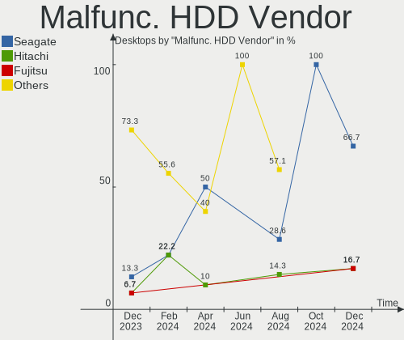
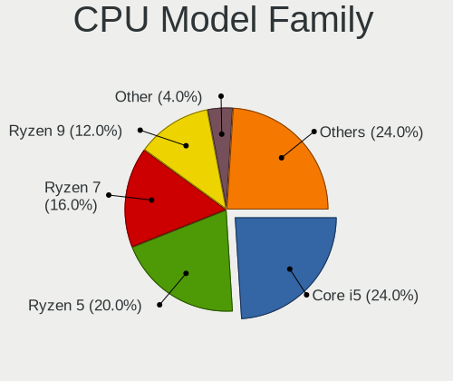
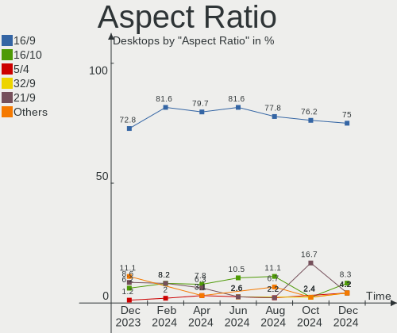
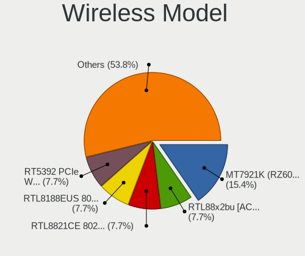
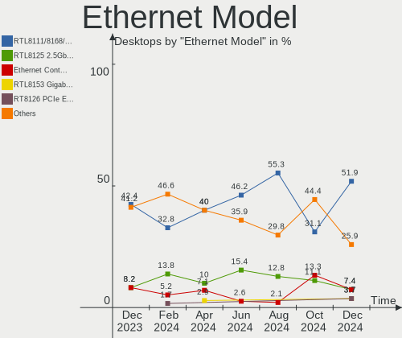
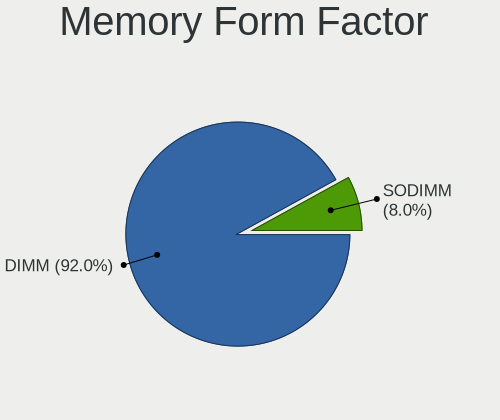

ArcoLinux Hardware Trends (Desktops)
------------------------------------

A project to identify most popular hardware characteristics and track their change
over time based on data collected by Linux users at https://Linux-Hardware.org.

Anyone can contribute to this report by the [hw-probe](https://github.com/linuxhw/hw-probe) tool:

    sudo -E hw-probe -all -upload

Full-feature report is available here: https://linux-hardware.org/?view=trends&formfactor=desktop

Period: Jul, 2021.

Contents
--------

* [ System ](#system)
  - [ OS                       ](#os)
  - [ OS Family                ](#os-family)
  - [ Kernel                   ](#kernel)
  - [ Kernel Family            ](#kernel-family)
  - [ Kernel Major Ver.        ](#kernel-major-ver)
  - [ Arch                     ](#arch)
  - [ DE                       ](#de)
  - [ Display Server           ](#display-server)
  - [ Display Manager          ](#display-manager)
  - [ OS Lang                  ](#os-lang)
  - [ Boot Mode                ](#boot-mode)
  - [ Filesystem               ](#filesystem)
  - [ Part. scheme             ](#part-scheme)
  - [ Dual Boot with Linux/BSD ](#dual-boot-with-linuxbsd)
  - [ Dual Boot (Win)          ](#dual-boot-win)

* [ Board ](#board)
  - [ Vendor                   ](#vendor)
  - [ Model                    ](#model)
  - [ Model Family             ](#model-family)
  - [ MFG Year                 ](#mfg-year)
  - [ Form Factor              ](#form-factor)
  - [ Secure Boot              ](#secure-boot)
  - [ Coreboot                 ](#coreboot)
  - [ RAM Size                 ](#ram-size)
  - [ RAM Used                 ](#ram-used)
  - [ Total Drives             ](#total-drives)
  - [ Has CD-ROM               ](#has-cd-rom)
  - [ Has Ethernet             ](#has-ethernet)
  - [ Has WiFi                 ](#has-wifi)
  - [ Has Bluetooth            ](#has-bluetooth)

* [ Location ](#location)
  - [ Country                  ](#country)
  - [ City                     ](#city)

* [ Drives ](#drives)
  - [ Drive Vendor             ](#drive-vendor)
  - [ Drive Model              ](#drive-model)
  - [ HDD Vendor               ](#hdd-vendor)
  - [ SSD Vendor               ](#ssd-vendor)
  - [ Drive Kind               ](#drive-kind)
  - [ Drive Connector          ](#drive-connector)
  - [ Drive Size               ](#drive-size)
  - [ Space Total              ](#space-total)
  - [ Space Used               ](#space-used)
  - [ Malfunc. Drives          ](#malfunc-drives)
  - [ Malfunc. Drive Vendor    ](#malfunc-drive-vendor)
  - [ Malfunc. HDD Vendor      ](#malfunc-hdd-vendor)
  - [ Malfunc. Drive Kind      ](#malfunc-drive-kind)
  - [ Failed Drives            ](#failed-drives)
  - [ Failed Drive Vendor      ](#failed-drive-vendor)
  - [ Drive Status             ](#drive-status)

* [ Storage controller ](#storage-controller)
  - [ Storage Vendor           ](#storage-vendor)
  - [ Storage Model            ](#storage-model)
  - [ Storage Kind             ](#storage-kind)

* [ Processor ](#processor)
  - [ CPU Vendor               ](#cpu-vendor)
  - [ CPU Model                ](#cpu-model)
  - [ CPU Model Family         ](#cpu-model-family)
  - [ CPU Cores                ](#cpu-cores)
  - [ CPU Sockets              ](#cpu-sockets)
  - [ CPU Threads              ](#cpu-threads)
  - [ CPU Op-Modes             ](#cpu-op-modes)
  - [ CPU Microcode            ](#cpu-microcode)
  - [ CPU Microarch            ](#cpu-microarch)

* [ Graphics ](#graphics)
  - [ GPU Vendor               ](#gpu-vendor)
  - [ GPU Model                ](#gpu-model)
  - [ GPU Combo                ](#gpu-combo)
  - [ GPU Driver               ](#gpu-driver)
  - [ GPU Memory               ](#gpu-memory)

* [ Monitor ](#monitor)
  - [ Monitor Vendor           ](#monitor-vendor)
  - [ Monitor Model            ](#monitor-model)
  - [ Monitor Resolution       ](#monitor-resolution)
  - [ Monitor Diagonal         ](#monitor-diagonal)
  - [ Monitor Width            ](#monitor-width)
  - [ Aspect Ratio             ](#aspect-ratio)
  - [ Monitor Area             ](#monitor-area)
  - [ Pixel Density            ](#pixel-density)
  - [ Multiple Monitors        ](#multiple-monitors)

* [ Network ](#network)
  - [ Net Controller Vendor    ](#net-controller-vendor)
  - [ Net Controller Model     ](#net-controller-model)
  - [ Wireless Vendor          ](#wireless-vendor)
  - [ Wireless Model           ](#wireless-model)
  - [ Ethernet Vendor          ](#ethernet-vendor)
  - [ Ethernet Model           ](#ethernet-model)
  - [ Net Controller Kind      ](#net-controller-kind)
  - [ Used Controller          ](#used-controller)
  - [ NICs                     ](#nics)
  - [ IPv6                     ](#ipv6)

* [ Bluetooth ](#bluetooth)
  - [ Bluetooth Vendor         ](#bluetooth-vendor)
  - [ Bluetooth Model          ](#bluetooth-model)

* [ Sound ](#sound)
  - [ Sound Vendor             ](#sound-vendor)
  - [ Sound Model              ](#sound-model)

* [ Memory ](#memory)
  - [ Memory Vendor            ](#memory-vendor)
  - [ Memory Model             ](#memory-model)
  - [ Memory Kind              ](#memory-kind)
  - [ Memory Form Factor       ](#memory-form-factor)
  - [ Memory Size              ](#memory-size)
  - [ Memory Speed             ](#memory-speed)

* [ Printers & scanners ](#printers-&-scanners)
  - [ Printer Vendor           ](#printer-vendor)
  - [ Printer Model            ](#printer-model)
  - [ Scanner Vendor           ](#scanner-vendor)
  - [ Scanner Model            ](#scanner-model)

* [ Camera ](#camera)
  - [ Camera Vendor            ](#camera-vendor)
  - [ Camera Model             ](#camera-model)

* [ Security ](#security)
  - [ Fingerprint Vendor       ](#fingerprint-vendor)
  - [ Fingerprint Model        ](#fingerprint-model)
  - [ Chipcard Vendor          ](#chipcard-vendor)
  - [ Chipcard Model           ](#chipcard-model)

* [ Unsupported ](#unsupported)
  - [ Unsupported Devices      ](#unsupported-devices)
  - [ Unsupported Device Types ](#unsupported-device-types)

System
------

OS
--

Installed operating systems

| Name              | Desktops | Percent |
|-------------------|----------|---------|
| ArcoLinux Rolling | 23       | 100%    |

OS Family
---------

OS without a version

| Name      | Desktops | Percent |
|-----------|----------|---------|
| ArcoLinux | 23       | 100%    |

Kernel
------

Version of the Linux kernel

| Version            | Desktops | Percent |
|--------------------|----------|---------|
| 5.12.15-arch1-1    | 6        | 26.09%  |
| 5.13.5-arch1-1     | 2        | 8.7%    |
| 5.12.15-zen1-1-zen | 2        | 8.7%    |
| 5.12.14-arch1-1    | 2        | 8.7%    |
| 5.12.13-arch1-2    | 2        | 8.7%    |
| 5.13.6-arch1-1     | 1        | 4.35%   |
| 5.13.4-zen1-1-zen  | 1        | 4.35%   |
| 5.13.4-arch2-1     | 1        | 4.35%   |
| 5.13.1-zen1-1-zen  | 1        | 4.35%   |
| 5.12.13-zen1-2-zen | 1        | 4.35%   |
| 5.12.12-arch1-1    | 1        | 4.35%   |
| 5.12.1-arch1-1     | 1        | 4.35%   |
| 5.10.50-1-lts      | 1        | 4.35%   |
| 5.10.48-1-lts      | 1        | 4.35%   |

Kernel Family
-------------

Linux kernel without a distro release

| Version | Desktops | Percent |
|---------|----------|---------|
| 5.12.15 | 8        | 34.78%  |
| 5.12.13 | 3        | 13.04%  |
| 5.13.5  | 2        | 8.7%    |
| 5.13.4  | 2        | 8.7%    |
| 5.12.14 | 2        | 8.7%    |
| 5.13.6  | 1        | 4.35%   |
| 5.13.1  | 1        | 4.35%   |
| 5.12.12 | 1        | 4.35%   |
| 5.12.1  | 1        | 4.35%   |
| 5.10.50 | 1        | 4.35%   |
| 5.10.48 | 1        | 4.35%   |

Kernel Major Ver.
-----------------

Linux kernel major version

| Version | Desktops | Percent |
|---------|----------|---------|
| 5.12    | 15       | 65.22%  |
| 5.13    | 6        | 26.09%  |
| 5.10    | 2        | 8.7%    |

Arch
----

OS architecture (x86_64, i586, etc.)

| Name   | Desktops | Percent |
|--------|----------|---------|
| x86_64 | 23       | 100%    |

DE
--

Desktop Environment

| Name       | Desktops | Percent |
|------------|----------|---------|
| XFCE       | 7        | 30.43%  |
| KDE5       | 4        | 17.39%  |
| xmonad     | 2        | 8.7%    |
| i3         | 2        | 8.7%    |
| GNOME      | 2        | 8.7%    |
| Cinnamon   | 2        | 8.7%    |
| awesome    | 2        | 8.7%    |
| X-Cinnamon | 1        | 4.35%   |
| bspwm      | 1        | 4.35%   |

Display Server
--------------

X11 or Wayland

| Name | Desktops | Percent |
|------|----------|---------|
| X11  | 19       | 82.61%  |
| Tty  | 4        | 17.39%  |

Display Manager
---------------

SDDM, LightDM, etc.

| Name | Desktops | Percent |
|------|----------|---------|
| SDDM | 18       | 78.26%  |
| TDM  | 4        | 17.39%  |
| GDM  | 1        | 4.35%   |

OS Lang
-------

Language

| Lang  | Desktops | Percent |
|-------|----------|---------|
| en_US | 14       | 60.87%  |
| en_AU | 2        | 8.7%    |
| sl_SI | 1        | 4.35%   |
| ru_RU | 1        | 4.35%   |
| pt_BR | 1        | 4.35%   |
| hu_HU | 1        | 4.35%   |
| en_GB | 1        | 4.35%   |
| en_CA | 1        | 4.35%   |
| C     | 1        | 4.35%   |

Boot Mode
---------

EFI or BIOS

| Mode | Desktops | Percent |
|------|----------|---------|
| EFI  | 16       | 69.57%  |
| BIOS | 7        | 30.43%  |

Filesystem
----------

Type of filesystem

| Type    | Desktops | Percent |
|---------|----------|---------|
| Ext4    | 16       | 69.57%  |
| Btrfs   | 6        | 26.09%  |
| Overlay | 1        | 4.35%   |

Part. scheme
------------

Scheme of partitioning

| Type | Desktops | Percent |
|------|----------|---------|
| GPT  | 19       | 82.61%  |
| MBR  | 4        | 17.39%  |

Dual Boot with Linux/BSD
------------------------

Hosting more than one Linux/BSD

| Dual boot | Desktops | Percent |
|-----------|----------|---------|
| No        | 17       | 73.91%  |
| Yes       | 6        | 26.09%  |

Dual Boot (Win)
---------------

Hosting Linux and Windows

| Dual boot | Desktops | Percent |
|-----------|----------|---------|
| Yes       | 17       | 73.91%  |
| No        | 6        | 26.09%  |

Board
-----

Vendor
------

Motherboard manufacturer

| Name                | Desktops | Percent |
|---------------------|----------|---------|
| ASUSTek Computer    | 10       | 43.48%  |
| Gigabyte Technology | 9        | 39.13%  |
| MSI                 | 1        | 4.35%   |
| Dell                | 1        | 4.35%   |
| Biostar             | 1        | 4.35%   |
| ASRock              | 1        | 4.35%   |

Model
-----

Motherboard model

| Name                          | Desktops | Percent |
|-------------------------------|----------|---------|
| MSI A320M-HDV R4.0            | 1        | 4.35%   |
| Gigabyte Z97-D3H              | 1        | 4.35%   |
| Gigabyte X570 AORUS MASTER    | 1        | 4.35%   |
| Gigabyte P85-D3               | 1        | 4.35%   |
| Gigabyte H310M H              | 1        | 4.35%   |
| Gigabyte GA-870A-USB3         | 1        | 4.35%   |
| Gigabyte Barcoo VA35          | 1        | 4.35%   |
| Gigabyte B85M-D3H             | 1        | 4.35%   |
| Gigabyte B450 AORUS M         | 1        | 4.35%   |
| Gigabyte B365M GAMING HD      | 1        | 4.35%   |
| Dell OptiPlex 7040            | 1        | 4.35%   |
| Biostar TZ68K+                | 1        | 4.35%   |
| ASUS TUF Z370-PLUS GAMING II  | 1        | 4.35%   |
| ASUS TUF GAMING X570-PLUS     | 1        | 4.35%   |
| ASUS TUF GAMING B550M-PLUS    | 1        | 4.35%   |
| ASUS TUF B360M-PLUS GAMING/BR | 1        | 4.35%   |
| ASUS PRIME X570-P             | 1        | 4.35%   |
| ASUS PRIME B250M-K            | 1        | 4.35%   |
| ASUS PRIME A320M-K            | 1        | 4.35%   |
| ASUS P8Z77-V DELUXE           | 1        | 4.35%   |
| ASUS P8P67 LE                 | 1        | 4.35%   |
| ASUS P5Q-E                    | 1        | 4.35%   |
| ASRock Z370 Killer SLI/ac     | 1        | 4.35%   |

Model Family
------------

Motherboard model prefix

| Name                  | Desktops | Percent |
|-----------------------|----------|---------|
| ASUS TUF              | 4        | 17.39%  |
| ASUS PRIME            | 3        | 13.04%  |
| MSI A320M-HDV         | 1        | 4.35%   |
| Gigabyte Z97-D3H      | 1        | 4.35%   |
| Gigabyte X570         | 1        | 4.35%   |
| Gigabyte P85-D3       | 1        | 4.35%   |
| Gigabyte H310M        | 1        | 4.35%   |
| Gigabyte GA-870A-USB3 | 1        | 4.35%   |
| Gigabyte Barcoo       | 1        | 4.35%   |
| Gigabyte B85M-D3H     | 1        | 4.35%   |
| Gigabyte B450         | 1        | 4.35%   |
| Gigabyte B365M        | 1        | 4.35%   |
| Dell OptiPlex         | 1        | 4.35%   |
| Biostar TZ68K+        | 1        | 4.35%   |
| ASUS P8Z77-V          | 1        | 4.35%   |
| ASUS P8P67            | 1        | 4.35%   |
| ASUS P5Q-E            | 1        | 4.35%   |
| ASRock Z370           | 1        | 4.35%   |

MFG Year
--------

Motherboard manufacture year

| Year | Desktops | Percent |
|------|----------|---------|
| 2020 | 5        | 21.74%  |
| 2019 | 5        | 21.74%  |
| 2013 | 4        | 17.39%  |
| 2021 | 3        | 13.04%  |
| 2009 | 2        | 8.7%    |
| 2017 | 1        | 4.35%   |
| 2015 | 1        | 4.35%   |
| 2014 | 1        | 4.35%   |
| 2012 | 1        | 4.35%   |

Form Factor
-----------

Physical design of the computer

| Name    | Desktops | Percent |
|---------|----------|---------|
| Desktop | 23       | 100%    |

Secure Boot
-----------

Enabled or disabled

| State    | Desktops | Percent |
|----------|----------|---------|
| Disabled | 23       | 100%    |

Coreboot
--------

Have coreboot on board

| Used | Desktops | Percent |
|------|----------|---------|
| No   | 23       | 100%    |

RAM Size
--------

Total RAM memory

| Size in GB  | Desktops | Percent |
|-------------|----------|---------|
| 16.01-24.0  | 10       | 43.48%  |
| 32.01-64.0  | 5        | 21.74%  |
| 3.01-4.0    | 3        | 13.04%  |
| 8.01-16.0   | 3        | 13.04%  |
| 4.01-8.0    | 1        | 4.35%   |
| 64.01-256.0 | 1        | 4.35%   |

RAM Used
--------

Used RAM memory

| Used GB    | Desktops | Percent |
|------------|----------|---------|
| 1.01-2.0   | 8        | 34.78%  |
| 4.01-8.0   | 3        | 13.04%  |
| 3.01-4.0   | 3        | 13.04%  |
| 2.01-3.0   | 3        | 13.04%  |
| 8.01-16.0  | 2        | 8.7%    |
| 0.51-1.0   | 2        | 8.7%    |
| 24.01-32.0 | 1        | 4.35%   |
| 0.01-0.5   | 1        | 4.35%   |

Total Drives
------------

Number of drives on board

| Drives | Desktops | Percent |
|--------|----------|---------|
| 3      | 7        | 30.43%  |
| 2      | 7        | 30.43%  |
| 4      | 5        | 21.74%  |
| 5      | 2        | 8.7%    |
| 10     | 1        | 4.35%   |
| 6      | 1        | 4.35%   |

Has CD-ROM
----------

Has CD-ROM on board

| Presented | Desktops | Percent |
|-----------|----------|---------|
| No        | 17       | 73.91%  |
| Yes       | 6        | 26.09%  |

Has Ethernet
------------

Has Ethernet on board

| Presented | Desktops | Percent |
|-----------|----------|---------|
| Yes       | 23       | 100%    |

Has WiFi
--------

Has WiFi module

| Presented | Desktops | Percent |
|-----------|----------|---------|
| No        | 14       | 60.87%  |
| Yes       | 9        | 39.13%  |

Has Bluetooth
-------------

Has Bluetooth module

| Presented | Desktops | Percent |
|-----------|----------|---------|
| No        | 14       | 60.87%  |
| Yes       | 9        | 39.13%  |

Location
--------

Country
-------

Geographic location (country)

| Country    | Desktops | Percent |
|------------|----------|---------|
| USA        | 4        | 17.39%  |
| UK         | 2        | 8.7%    |
| Russia     | 2        | 8.7%    |
| Canada     | 2        | 8.7%    |
| Australia  | 2        | 8.7%    |
| Vietnam    | 1        | 4.35%   |
| Uzbekistan | 1        | 4.35%   |
| Spain      | 1        | 4.35%   |
| Slovenia   | 1        | 4.35%   |
| Ireland    | 1        | 4.35%   |
| India      | 1        | 4.35%   |
| Hong Kong  | 1        | 4.35%   |
| Chile      | 1        | 4.35%   |
| Bulgaria   | 1        | 4.35%   |
| Brazil     | 1        | 4.35%   |
| Azerbaijan | 1        | 4.35%   |

City
----

Geographic location (city)

| City             | Desktops | Percent |
|------------------|----------|---------|
| Moscow           | 2        | 8.7%    |
| Valencia         | 1        | 4.35%   |
| Toronto          | 1        | 4.35%   |
| Tekoa            | 1        | 4.35%   |
| Tashkent         | 1        | 4.35%   |
| Sydney           | 1        | 4.35%   |
| Shumen           | 1        | 4.35%   |
| Santiago         | 1        | 4.35%   |
| Lloydminster     | 1        | 4.35%   |
| Ljubljana        | 1        | 4.35%   |
| Islington        | 1        | 4.35%   |
| Hyderabad        | 1        | 4.35%   |
| Ho Chi Minh City | 1        | 4.35%   |
| Hackney          | 1        | 4.35%   |
| East Hartford    | 1        | 4.35%   |
| Curitiba         | 1        | 4.35%   |
| Central          | 1        | 4.35%   |
| Celbridge        | 1        | 4.35%   |
| Camillus         | 1        | 4.35%   |
| Brisbane         | 1        | 4.35%   |
| Baltimore        | 1        | 4.35%   |
| Baku             | 1        | 4.35%   |

Drives
------

Drive Vendor
------------

Hard drive vendors

| Vendor              | Desktops | Drives | Percent |
|---------------------|----------|--------|---------|
| Samsung Electronics | 13       | 17     | 20.97%  |
| WDC                 | 12       | 21     | 19.35%  |
| Seagate             | 11       | 16     | 17.74%  |
| Kingston            | 4        | 4      | 6.45%   |
| Toshiba             | 3        | 3      | 4.84%   |
| SanDisk             | 2        | 2      | 3.23%   |
| OCZ                 | 2        | 2      | 3.23%   |
| Crucial             | 2        | 2      | 3.23%   |
| Corsair             | 2        | 2      | 3.23%   |
| A-DATA Technology   | 2        | 2      | 3.23%   |
| SPCC                | 1        | 1      | 1.61%   |
| SK Hynix            | 1        | 1      | 1.61%   |
| PLEXTOR             | 1        | 1      | 1.61%   |
| Patriot             | 1        | 1      | 1.61%   |
| LITEON              | 1        | 1      | 1.61%   |
| Lexar               | 1        | 1      | 1.61%   |
| Intel               | 1        | 1      | 1.61%   |
| China               | 1        | 3      | 1.61%   |
| Apacer              | 1        | 1      | 1.61%   |

Drive Model
-----------

Hard drive models

| Model                              | Desktops | Percent |
|------------------------------------|----------|---------|
| WDC WDS250G1B0C-00S6U0 250GB       | 2        | 2.53%   |
| Samsung SSD 860 EVO 500GB          | 2        | 2.53%   |
| Samsung SSD 840 EVO 120GB          | 2        | 2.53%   |
| WDC WDS240G2G0A-00JH30 240GB SSD   | 1        | 1.27%   |
| WDC WDS120G2G0B-00EPW0 120GB SSD   | 1        | 1.27%   |
| WDC WDS120G2G0A-00JH30 120GB SSD   | 1        | 1.27%   |
| WDC WDS100T2G0A-00JH30 1TB SSD     | 1        | 1.27%   |
| WDC WD5000AZRX-00A8LB0 500GB       | 1        | 1.27%   |
| WDC WD5000AAKX-603CA0 500GB        | 1        | 1.27%   |
| WDC WD50 00BEVT-22A0RT0 500GB      | 1        | 1.27%   |
| WDC WD40EZRZ-75GXCB0 4TB           | 1        | 1.27%   |
| WDC WD40EZRZ-19GXCB0 4TB           | 1        | 1.27%   |
| WDC WD3200AAKS-75SBA0 320GB        | 1        | 1.27%   |
| WDC WD30EFRX-68EUZN0 3TB           | 1        | 1.27%   |
| WDC WD2002FAEX-007BA0 2TB          | 1        | 1.27%   |
| WDC WD10JPVX-60JC3T0 1TB           | 1        | 1.27%   |
| WDC WD10EZRX-00L4HB0 1TB           | 1        | 1.27%   |
| WDC WD10EZEX-75M2NA0 1TB           | 1        | 1.27%   |
| WDC WD10EZEX-00BN5A0 1TB           | 1        | 1.27%   |
| WDC WD10EACS-32ZJB0 1TB            | 1        | 1.27%   |
| WDC WD1003FZEX-00MK2A0 1TB         | 1        | 1.27%   |
| Toshiba RC100 240GB                | 1        | 1.27%   |
| Toshiba MQ01ABF050 500GB           | 1        | 1.27%   |
| Toshiba DT01ACA100 1TB             | 1        | 1.27%   |
| SPCC M.2 PCIe SSD 2TB              | 1        | 1.27%   |
| SK Hynix SC311 SATA 128GB SSD      | 1        | 1.27%   |
| Seagate STM31000528AS 1TB          | 1        | 1.27%   |
| Seagate ST8000DM004-2CX188 8TB     | 1        | 1.27%   |
| Seagate ST500DM005 HD502HJ 500GB   | 1        | 1.27%   |
| Seagate ST4000VX007-2DT166 4TB     | 1        | 1.27%   |
| Seagate ST4000LM024-2AN17V 4TB     | 1        | 1.27%   |
| Seagate ST3250318AS 250GB          | 1        | 1.27%   |
| Seagate ST31000340NS 1TB           | 1        | 1.27%   |
| Seagate ST3000VN000 4GB            | 1        | 1.27%   |
| Seagate ST3000DM007-1WY10G 3TB     | 1        | 1.27%   |
| Seagate ST3000DM001-1ER166 3TB     | 1        | 1.27%   |
| Seagate ST2000DM006-2DM164 2TB     | 1        | 1.27%   |
| Seagate ST2000DM001-1CH164 2TB     | 1        | 1.27%   |
| Seagate ST2000DL003-9VT166 2TB     | 1        | 1.27%   |
| Seagate ST1000LM024 HN-M101MBB 1TB | 1        | 1.27%   |
| Seagate ST1000DM003-9YN162 1TB     | 1        | 1.27%   |
| Seagate ST1000DM003-1CH162 1TB     | 1        | 1.27%   |
| SanDisk SDSSDHII120G 120GB         | 1        | 1.27%   |
| SanDisk SDSSDH3 512G               | 1        | 1.27%   |
| Samsung SSD PM871 mSATA 256GB      | 1        | 1.27%   |
| Samsung SSD 980 PRO 500GB          | 1        | 1.27%   |
| Samsung SSD 980 PRO 1TB            | 1        | 1.27%   |
| Samsung SSD 970 PRO 512GB          | 1        | 1.27%   |
| Samsung SSD 970 EVO Plus 1TB       | 1        | 1.27%   |
| Samsung SSD 970 EVO 1TB            | 1        | 1.27%   |
| Samsung SSD 870 EVO 2TB            | 1        | 1.27%   |
| Samsung SSD 860 EVO 1TB            | 1        | 1.27%   |
| Samsung SSD 850 EVO 500GB          | 1        | 1.27%   |
| Samsung SSD 840 PRO Series 256GB   | 1        | 1.27%   |
| Samsung HD753LJ 752GB              | 1        | 1.27%   |
| Samsung HD501LJ 500GB              | 1        | 1.27%   |
| Samsung HD204UI 2TB                | 1        | 1.27%   |
| PLEXTOR PX-256M7VC 256GB SSD       | 1        | 1.27%   |
| Patriot P200 512GB SSD             | 1        | 1.27%   |
| OCZ VERTEX3 90GB SSD               | 1        | 1.27%   |

HDD Vendor
----------

Hard disk drive vendors

| Vendor              | Desktops | Drives | Percent |
|---------------------|----------|--------|---------|
| Seagate             | 11       | 16     | 47.83%  |
| WDC                 | 8        | 14     | 34.78%  |
| Toshiba             | 2        | 2      | 8.7%    |
| Samsung Electronics | 2        | 3      | 8.7%    |

SSD Vendor
----------

Solid state drive vendors

| Vendor              | Desktops | Drives | Percent |
|---------------------|----------|--------|---------|
| Samsung Electronics | 8        | 9      | 25%     |
| WDC                 | 4        | 5      | 12.5%   |
| Kingston            | 4        | 4      | 12.5%   |
| SanDisk             | 2        | 2      | 6.25%   |
| OCZ                 | 2        | 2      | 6.25%   |
| Crucial             | 2        | 2      | 6.25%   |
| SK Hynix            | 1        | 1      | 3.13%   |
| PLEXTOR             | 1        | 1      | 3.13%   |
| Patriot             | 1        | 1      | 3.13%   |
| LITEON              | 1        | 1      | 3.13%   |
| Lexar               | 1        | 1      | 3.13%   |
| Intel               | 1        | 1      | 3.13%   |
| Corsair             | 1        | 1      | 3.13%   |
| China               | 1        | 3      | 3.13%   |
| Apacer              | 1        | 1      | 3.13%   |
| A-DATA Technology   | 1        | 1      | 3.13%   |

Drive Kind
----------

HDD or SSD

| Kind | Desktops | Drives | Percent |
|------|----------|--------|---------|
| SSD  | 21       | 36     | 45.65%  |
| HDD  | 18       | 35     | 39.13%  |
| NVMe | 7        | 11     | 15.22%  |

Drive Connector
---------------

SATA, SAS, NVMe, etc.

| Type | Desktops | Drives | Percent |
|------|----------|--------|---------|
| SATA | 24       | 69     | 72.73%  |
| NVMe | 7        | 11     | 21.21%  |
| SAS  | 2        | 2      | 6.06%   |

Drive Size
----------

Size of hard drive

| Size in TB | Desktops | Drives | Percent |
|------------|----------|--------|---------|
| 0.01-0.5   | 19       | 38     | 46.34%  |
| 0.51-1.0   | 11       | 18     | 26.83%  |
| 1.01-2.0   | 5        | 7      | 12.2%   |
| 2.01-3.0   | 3        | 3      | 7.32%   |
| 3.01-4.0   | 2        | 4      | 4.88%   |
| 4.01-10.0  | 1        | 1      | 2.44%   |

Space Total
-----------

Amount of disk space available on the file system

| Size in GB     | Desktops | Percent |
|----------------|----------|---------|
| 101-250        | 5        | 21.74%  |
| 1001-2000      | 4        | 17.39%  |
| More than 3000 | 3        | 13.04%  |
| 501-1000       | 3        | 13.04%  |
| 251-500        | 2        | 8.7%    |
| 2001-3000      | 2        | 8.7%    |
| Unknown        | 2        | 8.7%    |
| 1-20           | 1        | 4.35%   |
| 51-100         | 1        | 4.35%   |

Space Used
----------

Amount of used disk space

| Used GB   | Desktops | Percent |
|-----------|----------|---------|
| 21-50     | 4        | 17.39%  |
| 101-250   | 4        | 17.39%  |
| 51-100    | 4        | 17.39%  |
| 1-20      | 3        | 13.04%  |
| 251-500   | 2        | 8.7%    |
| 1001-2000 | 2        | 8.7%    |
| 501-1000  | 2        | 8.7%    |
| Unknown   | 2        | 8.7%    |

Malfunc. Drives
---------------

Drive models with a malfunction

| Model                            | Desktops | Drives | Percent |
|----------------------------------|----------|--------|---------|
| WDC WD5000AAKX-603CA0 500GB      | 1        | 1      | 12.5%   |
| WDC WD1003FZEX-00MK2A0 1TB       | 1        | 1      | 12.5%   |
| Seagate STM31000528AS 1TB        | 1        | 1      | 12.5%   |
| Seagate ST500DM005 HD502HJ 500GB | 1        | 1      | 12.5%   |
| Seagate ST3000DM001-1ER166 3TB   | 1        | 1      | 12.5%   |
| Seagate ST1000DM003-9YN162 1TB   | 1        | 1      | 12.5%   |
| Intel SSDSC2BF240A5L 240GB       | 1        | 1      | 12.5%   |
| Corsair Force LS SSD 120GB       | 1        | 1      | 12.5%   |

Malfunc. Drive Vendor
---------------------

Vendors of faulty drives

| Vendor  | Desktops | Drives | Percent |
|---------|----------|--------|---------|
| Seagate | 4        | 4      | 50%     |
| WDC     | 2        | 2      | 25%     |
| Intel   | 1        | 1      | 12.5%   |
| Corsair | 1        | 1      | 12.5%   |

Malfunc. HDD Vendor
-------------------

Vendors of faulty HDD drives

| Vendor  | Desktops | Drives | Percent |
|---------|----------|--------|---------|
| Seagate | 4        | 4      | 66.67%  |
| WDC     | 2        | 2      | 33.33%  |

Malfunc. Drive Kind
-------------------

Kinds of faulty drives

| Kind | Desktops | Drives | Percent |
|------|----------|--------|---------|
| HDD  | 6        | 6      | 75%     |
| SSD  | 2        | 2      | 25%     |

Failed Drives
-------------

Failed drive models

Zero info for selected period =(

Failed Drive Vendor
-------------------

Failed drive vendors

Zero info for selected period =(

Drive Status
------------

Number of failed and malfunc. drives

| Status   | Desktops | Drives | Percent |
|----------|----------|--------|---------|
| Works    | 24       | 71     | 68.57%  |
| Malfunc  | 8        | 8      | 22.86%  |
| Detected | 3        | 3      | 8.57%   |

Storage controller
------------------

Storage Vendor
--------------

Storage controller vendors

| Vendor                       | Desktops | Percent |
|------------------------------|----------|---------|
| Intel                        | 15       | 41.67%  |
| AMD                          | 8        | 22.22%  |
| Samsung Electronics          | 3        | 8.33%   |
| ASMedia Technology           | 3        | 8.33%   |
| Sandisk                      | 2        | 5.56%   |
| Marvell Technology Group     | 2        | 5.56%   |
| Toshiba America Info Systems | 1        | 2.78%   |
| Realtek Semiconductor        | 1        | 2.78%   |
| Phison Electronics           | 1        | 2.78%   |

Storage Model
-------------

Storage controller models

| Model                                                                                   | Desktops | Percent |
|-----------------------------------------------------------------------------------------|----------|---------|
| AMD FCH SATA Controller [AHCI mode]                                                     | 5        | 11.11%  |
| Intel 200 Series PCH SATA controller [AHCI mode]                                        | 4        | 8.89%   |
| Samsung NVMe SSD Controller SM981/PM981/PM983                                           | 3        | 6.67%   |
| ASMedia ASM1062 Serial ATA Controller                                                   | 3        | 6.67%   |
| Sandisk WD Blue SN500 / PC SN520 NVMe SSD                                               | 2        | 4.44%   |
| Samsung NVMe SSD Controller PM9A1/PM9A3/980PRO                                          | 2        | 4.44%   |
| Intel Cannon Lake PCH SATA AHCI Controller                                              | 2        | 4.44%   |
| Intel 8 Series/C220 Series Chipset Family 6-port SATA Controller 1 [AHCI mode]          | 2        | 4.44%   |
| AMD FCH SATA Controller D                                                               | 2        | 4.44%   |
| Toshiba America Info Systems BG3 NVMe SSD Controller                                    | 1        | 2.22%   |
| Realtek Realtek Non-Volatile memory controller                                          | 1        | 2.22%   |
| Phison E16 PCIe4 NVMe Controller                                                        | 1        | 2.22%   |
| Phison E12 NVMe Controller                                                              | 1        | 2.22%   |
| Marvell Group 88SE9230 PCIe 2.0 x2 4-port SATA 6 Gb/s RAID Controller                   | 1        | 2.22%   |
| Marvell Group 88SE912x IDE Controller                                                   | 1        | 2.22%   |
| Marvell Group 88SE9120 SATA 6Gb/s Controller                                            | 1        | 2.22%   |
| Marvell Group 88SE6111/6121 SATA II / PATA Controller                                   | 1        | 2.22%   |
| Intel Q170/Q150/B150/H170/H110/Z170/CM236 Chipset SATA Controller [AHCI Mode]           | 1        | 2.22%   |
| Intel NM10/ICH7 Family SATA Controller [IDE mode]                                       | 1        | 2.22%   |
| Intel 9 Series Chipset Family SATA Controller [AHCI Mode]                               | 1        | 2.22%   |
| Intel 82801JI (ICH10 Family) SATA AHCI Controller                                       | 1        | 2.22%   |
| Intel 7 Series/C210 Series Chipset Family 6-port SATA Controller [AHCI mode]            | 1        | 2.22%   |
| Intel 6 Series/C200 Series Chipset Family Desktop SATA Controller (IDE mode, ports 4-5) | 1        | 2.22%   |
| Intel 6 Series/C200 Series Chipset Family Desktop SATA Controller (IDE mode, ports 0-3) | 1        | 2.22%   |
| Intel 6 Series/C200 Series Chipset Family 6 port Desktop SATA AHCI Controller           | 1        | 2.22%   |
| AMD Starship/Matisse Chipset SATA Controller [AHCI mode]                                | 1        | 2.22%   |
| AMD SB7x0/SB8x0/SB9x0 SATA Controller [AHCI mode]                                       | 1        | 2.22%   |
| AMD SB7x0/SB8x0/SB9x0 IDE Controller                                                    | 1        | 2.22%   |
| AMD 400 Series Chipset SATA Controller                                                  | 1        | 2.22%   |

Storage Kind
------------

Kind of storage controller (IDE, SATA, NVMe, SAS, ...)

| Kind | Desktops | Percent |
|------|----------|---------|
| SATA | 21       | 63.64%  |
| NVMe | 7        | 21.21%  |
| IDE  | 5        | 15.15%  |

Processor
---------

CPU Vendor
----------

Processor vendors

| Vendor | Desktops | Percent |
|--------|----------|---------|
| Intel  | 15       | 65.22%  |
| AMD    | 8        | 34.78%  |

CPU Model
---------

Processor models

| Model                                       | Desktops | Percent |
|---------------------------------------------|----------|---------|
| Intel Core i5-8400 CPU @ 2.80GHz            | 2        | 8.7%    |
| Intel Core i5-6500 CPU @ 3.20GHz            | 2        | 8.7%    |
| AMD Ryzen 7 3700X 8-Core Processor          | 2        | 8.7%    |
| Intel Xeon CPU E5450 @ 3.00GHz              | 1        | 4.35%   |
| Intel Core i9-9900KF CPU @ 3.60GHz          | 1        | 4.35%   |
| Intel Core i9-9900K CPU @ 3.60GHz           | 1        | 4.35%   |
| Intel Core i7-4790K CPU @ 4.00GHz           | 1        | 4.35%   |
| Intel Core i7-3770K CPU @ 3.50GHz           | 1        | 4.35%   |
| Intel Core i5-4670K CPU @ 3.40GHz           | 1        | 4.35%   |
| Intel Core i5-4440 CPU @ 3.10GHz            | 1        | 4.35%   |
| Intel Core i5-2500K CPU @ 3.30GHz           | 1        | 4.35%   |
| Intel Core i5-2400 CPU @ 3.10GHz            | 1        | 4.35%   |
| Intel Core i3-8100 CPU @ 3.60GHz            | 1        | 4.35%   |
| Intel Core 2 Duo CPU E8400 @ 3.00GHz        | 1        | 4.35%   |
| AMD Ryzen 9 3950X 16-Core Processor         | 1        | 4.35%   |
| AMD Ryzen 7 3800X 8-Core Processor          | 1        | 4.35%   |
| AMD Ryzen 5 2600 Six-Core Processor         | 1        | 4.35%   |
| AMD Ryzen 3 2300X Quad-Core Processor       | 1        | 4.35%   |
| AMD Ryzen 3 2200G with Radeon Vega Graphics | 1        | 4.35%   |
| AMD Phenom II X4 955 Processor              | 1        | 4.35%   |

CPU Model Family
----------------

Processor model prefix

| Model            | Desktops | Percent |
|------------------|----------|---------|
| Intel Core i5    | 8        | 34.78%  |
| AMD Ryzen 7      | 3        | 13.04%  |
| Intel Core i9    | 2        | 8.7%    |
| Intel Core i7    | 2        | 8.7%    |
| AMD Ryzen 3      | 2        | 8.7%    |
| Intel Xeon       | 1        | 4.35%   |
| Intel Core i3    | 1        | 4.35%   |
| Intel Core 2 Duo | 1        | 4.35%   |
| AMD Ryzen 9      | 1        | 4.35%   |
| AMD Ryzen 5      | 1        | 4.35%   |
| AMD Phenom II X4 | 1        | 4.35%   |

CPU Cores
---------

Number of processor cores

| Number | Desktops | Percent |
|--------|----------|---------|
| 4      | 13       | 56.52%  |
| 8      | 5        | 21.74%  |
| 6      | 3        | 13.04%  |
| 16     | 1        | 4.35%   |
| 2      | 1        | 4.35%   |

CPU Sockets
-----------

Number of sockets

| Number | Desktops | Percent |
|--------|----------|---------|
| 1      | 23       | 100%    |

CPU Threads
-----------

Threads per core (Hyper-Threading)

| Number | Desktops | Percent |
|--------|----------|---------|
| 1      | 14       | 60.87%  |
| 2      | 9        | 39.13%  |

CPU Op-Modes
------------

CPU Operation Modes (32-bit, 64-bit)

| Op mode        | Desktops | Percent |
|----------------|----------|---------|
| 32-bit, 64-bit | 23       | 100%    |

CPU Microcode
-------------

Microcode number

| Number     | Desktops | Percent |
|------------|----------|---------|
| 0x306c3    | 3        | 13.04%  |
| 0x08701021 | 3        | 13.04%  |
| 0x906ea    | 2        | 8.7%    |
| 0x506e3    | 2        | 8.7%    |
| 0x206a7    | 2        | 8.7%    |
| 0x1067a    | 2        | 8.7%    |
| 0x0800820d | 2        | 8.7%    |
| 0x906ed    | 1        | 4.35%   |
| 0x906ec    | 1        | 4.35%   |
| 0x906eb    | 1        | 4.35%   |
| 0x306a9    | 1        | 4.35%   |
| 0x08701013 | 1        | 4.35%   |
| 0x08101016 | 1        | 4.35%   |
| 0x010000c8 | 1        | 4.35%   |

CPU Microarch
-------------

Microarchitecture

| Name        | Desktops | Percent |
|-------------|----------|---------|
| KabyLake    | 5        | 21.74%  |
| Zen 2       | 4        | 17.39%  |
| Haswell     | 3        | 13.04%  |
| Zen+        | 2        | 8.7%    |
| Skylake     | 2        | 8.7%    |
| SandyBridge | 2        | 8.7%    |
| Penryn      | 2        | 8.7%    |
| Zen         | 1        | 4.35%   |
| K10         | 1        | 4.35%   |
| IvyBridge   | 1        | 4.35%   |

Graphics
--------

GPU Vendor
----------

Vendors of graphics cards

| Vendor | Desktops | Percent |
|--------|----------|---------|
| Nvidia | 10       | 40%     |
| AMD    | 9        | 36%     |
| Intel  | 6        | 24%     |

GPU Model
---------

Graphics card models

| Model                                                                       | Desktops | Percent |
|-----------------------------------------------------------------------------|----------|---------|
| Nvidia TU117 [GeForce GTX 1650]                                             | 2        | 8%      |
| Intel Xeon E3-1200 v3/4th Gen Core Processor Integrated Graphics Controller | 2        | 8%      |
| AMD Ellesmere [Radeon RX 470/480/570/570X/580/580X/590]                     | 2        | 8%      |
| Nvidia TU116 [GeForce GTX 1660 Ti]                                          | 1        | 4%      |
| Nvidia TU116 [GeForce GTX 1650 SUPER]                                       | 1        | 4%      |
| Nvidia GP106 [GeForce GTX 1060 3GB]                                         | 1        | 4%      |
| Nvidia GP102 [GeForce GTX 1080 Ti]                                          | 1        | 4%      |
| Nvidia GM204 [GeForce GTX 970]                                              | 1        | 4%      |
| Nvidia GK208B [GeForce GT 710]                                              | 1        | 4%      |
| Nvidia GA104 [GeForce RTX 3060 Ti]                                          | 1        | 4%      |
| Nvidia G98 [GeForce 8400 GS Rev. 2]                                         | 1        | 4%      |
| Intel Xeon E3-1200 v2/3rd Gen Core processor Graphics Controller            | 1        | 4%      |
| Intel HD Graphics 530                                                       | 1        | 4%      |
| Intel CometLake-S GT2 [UHD Graphics 630]                                    | 1        | 4%      |
| Intel CoffeeLake-S GT2 [UHD Graphics 630]                                   | 1        | 4%      |
| AMD Vega 10 XL/XT [Radeon RX Vega 56/64]                                    | 1        | 4%      |
| AMD Raven Ridge [Radeon Vega Series / Radeon Vega Mobile Series]            | 1        | 4%      |
| AMD Navi 21 [Radeon RX 6800/6800 XT / 6900 XT]                              | 1        | 4%      |
| AMD Navi 10 [Radeon RX 5600 OEM/5600 XT / 5700/5700 XT]                     | 1        | 4%      |
| AMD Lexa PRO [Radeon 540/540X/550/550X / RX 540X/550/550X]                  | 1        | 4%      |
| AMD Curacao PRO [Radeon R7 370 / R9 270/370 OEM]                            | 1        | 4%      |
| AMD Baffin [Radeon RX 550 640SP / RX 560/560X]                              | 1        | 4%      |

GPU Combo
---------

Combinations of graphics cards

| Name           | Desktops | Percent |
|----------------|----------|---------|
| 1 x Nvidia     | 9        | 39.13%  |
| 1 x AMD        | 9        | 39.13%  |
| 1 x Intel      | 4        | 17.39%  |
| Intel + Nvidia | 1        | 4.35%   |

GPU Driver
----------

Free vs proprietary

| Driver      | Desktops | Percent |
|-------------|----------|---------|
| Free        | 15       | 65.22%  |
| Proprietary | 7        | 30.43%  |
| Unknown     | 1        | 4.35%   |

GPU Memory
----------

Total video memory

| Size in GB | Desktops | Percent |
|------------|----------|---------|
| 3.01-4.0   | 8        | 34.78%  |
| Unknown    | 5        | 21.74%  |
| 7.01-8.0   | 3        | 13.04%  |
| 1.01-2.0   | 3        | 13.04%  |
| 8.01-16.0  | 2        | 8.7%    |
| 2.01-3.0   | 1        | 4.35%   |
| 0.01-0.5   | 1        | 4.35%   |

Monitor
-------

Monitor Vendor
--------------

Monitor vendors

| Vendor               | Desktops | Percent |
|----------------------|----------|---------|
| AOC                  | 4        | 15.38%  |
| Hewlett-Packard      | 3        | 11.54%  |
| BenQ                 | 3        | 11.54%  |
| Ancor Communications | 3        | 11.54%  |
| Goldstar             | 2        | 7.69%   |
| ASUSTek Computer     | 2        | 7.69%   |
| VIE                  | 1        | 3.85%   |
| Unknown (XXX)        | 1        | 3.85%   |
| Unknown              | 1        | 3.85%   |
| SUNNY                | 1        | 3.85%   |
| Samsung Electronics  | 1        | 3.85%   |
| LG Electronics       | 1        | 3.85%   |
| Iiyama               | 1        | 3.85%   |
| Dell                 | 1        | 3.85%   |
| Acer                 | 1        | 3.85%   |

Monitor Model
-------------

Monitor models

| Model                                                                | Desktops | Percent |
|----------------------------------------------------------------------|----------|---------|
| VIE R300 VIE2380 1920x1080 521x293mm 23.5-inch                       | 1        | 3.85%   |
| Unknown LCD Monitor Dell S2716DG 2560x1440                           | 1        | 3.85%   |
| Unknown (XXX) Beyond TV XXX2851 3840x2160 1210x680mm 54.6-inch       | 1        | 3.85%   |
| SUNNY SUNNY SNN0002 1920x1080 708x398mm 32.0-inch                    | 1        | 3.85%   |
| Samsung Electronics C32F391 SAM0D35 1920x1080 698x393mm 31.5-inch    | 1        | 3.85%   |
| LG Electronics LCD Monitor LG TV 3840x2160                           | 1        | 3.85%   |
| Iiyama PL2792Q IVM6637 2560x1440 597x336mm 27.0-inch                 | 1        | 3.85%   |
| Hewlett-Packard x20LED HWP290F 1600x900 443x249mm 20.0-inch          | 1        | 3.85%   |
| Hewlett-Packard 22x HPN3656 1920x1080 476x268mm 21.5-inch            | 1        | 3.85%   |
| Hewlett-Packard 2159 HWP282B 1680x1050 480x270mm 21.7-inch           | 1        | 3.85%   |
| Goldstar FULL HD GSM5B55 1920x1080 480x270mm 21.7-inch               | 1        | 3.85%   |
| Goldstar 22MP55 GSM5A26 1920x1080 477x268mm 21.5-inch                | 1        | 3.85%   |
| Dell D3218HN DEL200B 1920x1080 698x393mm 31.5-inch                   | 1        | 3.85%   |
| BenQ GW2470 BNQ78D9 1920x1080 530x300mm 24.0-inch                    | 1        | 3.85%   |
| BenQ EX2780Q BNQ7F76 2560x1440 600x340mm 27.2-inch                   | 1        | 3.85%   |
| BenQ EL2870U BNQ7949 3840x2160 621x341mm 27.9-inch                   | 1        | 3.85%   |
| ASUSTek Computer VP249 AUS24AA 1920x1080 530x300mm 24.0-inch         | 1        | 3.85%   |
| ASUSTek Computer MG248 AUS24A3 1920x1080 530x300mm 24.0-inch         | 1        | 3.85%   |
| AOC Q2781 AOC2781 2560x1440 600x340mm 27.2-inch                      | 1        | 3.85%   |
| AOC 2476WM AOC2476 1920x1080 521x293mm 23.5-inch                     | 1        | 3.85%   |
| AOC 2470W AOC2470 1920x1080 521x293mm 23.5-inch                      | 1        | 3.85%   |
| AOC 2270W AOC2270 1920x1080 477x268mm 21.5-inch                      | 1        | 3.85%   |
| Ancor Communications VG248 ACI24A5 1920x1080 531x299mm 24.0-inch     | 1        | 3.85%   |
| Ancor Communications VE248 ACI2494 1920x1080 531x299mm 24.0-inch     | 1        | 3.85%   |
| Ancor Communications ASUS VW190 ACI19E9 1366x768 410x230mm 18.5-inch | 1        | 3.85%   |
| Acer K222HQL ACR03E1 1920x1080 477x268mm 21.5-inch                   | 1        | 3.85%   |

Monitor Resolution
------------------

Monitor screen resolution

| Resolution      | Desktops | Percent |
|-----------------|----------|---------|
| 1920x1080 (FHD) | 14       | 58.33%  |
| 3840x2160 (4K)  | 4        | 16.67%  |
| 2560x1440 (QHD) | 4        | 16.67%  |
| 1600x900 (HD+)  | 1        | 4.17%   |
| 1366x768 (WXGA) | 1        | 4.17%   |

Monitor Diagonal
----------------

Diagonal size in inches

| Inches  | Desktops | Percent |
|---------|----------|---------|
| 21      | 6        | 24%     |
| 27      | 4        | 16%     |
| 24      | 4        | 16%     |
| 23      | 3        | 12%     |
| 31      | 2        | 8%      |
| Unknown | 2        | 8%      |
| 54      | 1        | 4%      |
| 52      | 1        | 4%      |
| 20      | 1        | 4%      |
| 18      | 1        | 4%      |

Monitor Width
-------------

Physical width

| Width in mm | Desktops | Percent |
|-------------|----------|---------|
| 501-600     | 10       | 40%     |
| 401-500     | 8        | 32%     |
| 601-700     | 3        | 12%     |
| 1001-1500   | 2        | 8%      |
| Unknown     | 2        | 8%      |

Aspect Ratio
------------

Proportional relationship between the width and the height

| Ratio   | Desktops | Percent |
|---------|----------|---------|
| 16/9    | 19       | 90.48%  |
| Unknown | 2        | 9.52%   |

Monitor Area
------------

Area in inch

| Area in inch | Desktops | Percent |
|----------------|----------|---------|
| 201-250        | 12       | 48%     |
| 301-350        | 4        | 16%     |
| More than 1000 | 2        | 8%      |
| 351-500        | 2        | 8%      |
| 151-200        | 2        | 8%      |
| Unknown        | 2        | 8%      |
| 141-150        | 1        | 4%      |

Pixel Density
-------------

Pixels per inch

| Density | Desktops | Percent |
|---------|----------|---------|
| 101-120 | 9        | 40.91%  |
| 51-100  | 9        | 40.91%  |
| Unknown | 2        | 9.09%   |
| 1-50    | 1        | 4.55%   |
| 121-160 | 1        | 4.55%   |

Multiple Monitors
-----------------

Total monitors connected

| Total | Desktops | Percent |
|-------|----------|---------|
| 1     | 16       | 69.57%  |
| 2     | 6        | 26.09%  |
| 0     | 1        | 4.35%   |

Network
-------

Net Controller Vendor
---------------------

Controller vendors

| Vendor                   | Desktops | Percent |
|--------------------------|----------|---------|
| Realtek Semiconductor    | 17       | 53.13%  |
| Intel                    | 11       | 34.38%  |
| TP-Link                  | 1        | 3.13%   |
| Microsoft                | 1        | 3.13%   |
| Marvell Technology Group | 1        | 3.13%   |
| Broadcom                 | 1        | 3.13%   |

Net Controller Model
--------------------

Controller models

| Model                                                             | Desktops | Percent |
|-------------------------------------------------------------------|----------|---------|
| Realtek RTL8111/8168/8411 PCI Express Gigabit Ethernet Controller | 15       | 40.54%  |
| Intel Wi-Fi 6 AX200                                               | 3        | 8.11%   |
| Realtek RTL8125 2.5GbE Controller                                 | 2        | 5.41%   |
| Intel Ethernet Connection (2) I219-V                              | 2        | 5.41%   |
| Intel Dual Band Wireless-AC 3168NGW [Stone Peak]                  | 2        | 5.41%   |
| TP-Link Archer T3U [Realtek RTL8812BU]                            | 1        | 2.7%    |
| Realtek RTL8188EUS 802.11n Wireless Network Adapter               | 1        | 2.7%    |
| Realtek RTL8188EE Wireless Network Adapter                        | 1        | 2.7%    |
| Microsoft Wireless XBox Controller Dongle                         | 1        | 2.7%    |
| Marvell Group 88E8056 PCI-E Gigabit Ethernet Controller           | 1        | 2.7%    |
| Marvell Group 88E8001 Gigabit Ethernet Controller                 | 1        | 2.7%    |
| Intel Wireless-AC 9260                                            | 1        | 2.7%    |
| Intel I211 Gigabit Network Connection                             | 1        | 2.7%    |
| Intel Ethernet Connection I217-V                                  | 1        | 2.7%    |
| Intel Ethernet Connection (7) I219-V                              | 1        | 2.7%    |
| Intel Ethernet Connection (2) I219-LM                             | 1        | 2.7%    |
| Intel 82579V Gigabit Network Connection                           | 1        | 2.7%    |
| Broadcom BCM43228 802.11a/b/g/n                                   | 1        | 2.7%    |

Wireless Vendor
---------------

Wireless vendors

| Vendor                | Desktops | Percent |
|-----------------------|----------|---------|
| Intel                 | 6        | 54.55%  |
| Realtek Semiconductor | 2        | 18.18%  |
| TP-Link               | 1        | 9.09%   |
| Microsoft             | 1        | 9.09%   |
| Broadcom              | 1        | 9.09%   |

Wireless Model
--------------

Wireless models

| Model                                               | Desktops | Percent |
|-----------------------------------------------------|----------|---------|
| Intel Wi-Fi 6 AX200                                 | 3        | 27.27%  |
| Intel Dual Band Wireless-AC 3168NGW [Stone Peak]    | 2        | 18.18%  |
| TP-Link Archer T3U [Realtek RTL8812BU]              | 1        | 9.09%   |
| Realtek RTL8188EUS 802.11n Wireless Network Adapter | 1        | 9.09%   |
| Realtek RTL8188EE Wireless Network Adapter          | 1        | 9.09%   |
| Microsoft Wireless XBox Controller Dongle           | 1        | 9.09%   |
| Intel Wireless-AC 9260                              | 1        | 9.09%   |
| Broadcom BCM43228 802.11a/b/g/n                     | 1        | 9.09%   |

Ethernet Vendor
---------------

Ethernet vendors

| Vendor                   | Desktops | Percent |
|--------------------------|----------|---------|
| Realtek Semiconductor    | 17       | 68%     |
| Intel                    | 7        | 28%     |
| Marvell Technology Group | 1        | 4%      |

Ethernet Model
--------------

Ethernet models

| Model                                                             | Desktops | Percent |
|-------------------------------------------------------------------|----------|---------|
| Realtek RTL8111/8168/8411 PCI Express Gigabit Ethernet Controller | 15       | 57.69%  |
| Realtek RTL8125 2.5GbE Controller                                 | 2        | 7.69%   |
| Intel Ethernet Connection (2) I219-V                              | 2        | 7.69%   |
| Marvell Group 88E8056 PCI-E Gigabit Ethernet Controller           | 1        | 3.85%   |
| Marvell Group 88E8001 Gigabit Ethernet Controller                 | 1        | 3.85%   |
| Intel I211 Gigabit Network Connection                             | 1        | 3.85%   |
| Intel Ethernet Connection I217-V                                  | 1        | 3.85%   |
| Intel Ethernet Connection (7) I219-V                              | 1        | 3.85%   |
| Intel Ethernet Connection (2) I219-LM                             | 1        | 3.85%   |
| Intel 82579V Gigabit Network Connection                           | 1        | 3.85%   |

Net Controller Kind
-------------------

Ethernet, WiFi or modem

| Kind     | Desktops | Percent |
|----------|----------|---------|
| Ethernet | 23       | 71.88%  |
| WiFi     | 9        | 28.13%  |

Used Controller
---------------

Currently used network controller

| Kind     | Desktops | Percent |
|----------|----------|---------|
| Ethernet | 20       | 80%     |
| WiFi     | 5        | 20%     |

NICs
----

Total network controllers on board

| Total | Desktops | Percent |
|-------|----------|---------|
| 1     | 14       | 60.87%  |
| 2     | 7        | 30.43%  |
| 3     | 2        | 8.7%    |

IPv6
----

IPv6 vs IPv4

| Used | Desktops | Percent |
|------|----------|---------|
| No   | 19       | 82.61%  |
| Yes  | 4        | 17.39%  |

Bluetooth
---------

Bluetooth Vendor
----------------

Controller vendors

| Vendor                  | Desktops | Percent |
|-------------------------|----------|---------|
| Intel                   | 6        | 66.67%  |
| ASUSTek Computer        | 2        | 22.22%  |
| Cambridge Silicon Radio | 1        | 11.11%  |

Bluetooth Model
---------------

Controller models

| Model                                               | Desktops | Percent |
|-----------------------------------------------------|----------|---------|
| Intel AX200 Bluetooth                               | 3        | 33.33%  |
| Intel Wireless-AC 3168 Bluetooth                    | 2        | 22.22%  |
| Intel Wireless-AC 9260 Bluetooth Adapter            | 1        | 11.11%  |
| Cambridge Silicon Radio Bluetooth Dongle (HCI mode) | 1        | 11.11%  |
| ASUS Broadcom BCM20702A0 Bluetooth                  | 1        | 11.11%  |
| ASUS BCM20702A0                                     | 1        | 11.11%  |

Sound
-----

Sound Vendor
------------

Sound card vendors

| Vendor              | Desktops | Percent |
|---------------------|----------|---------|
| Intel               | 14       | 35%     |
| AMD                 | 11       | 27.5%   |
| Nvidia              | 9        | 22.5%   |
| C-Media Electronics | 2        | 5%      |
| Native Instruments  | 1        | 2.5%    |
| Logitech            | 1        | 2.5%    |
| Creative Technology | 1        | 2.5%    |
| Afatech             | 1        | 2.5%    |

Sound Model
-----------

Sound card models

| Model                                                                      | Desktops | Percent |
|----------------------------------------------------------------------------|----------|---------|
| Intel 200 Series PCH HD Audio                                              | 4        | 8.33%   |
| AMD Starship/Matisse HD Audio Controller                                   | 4        | 8.33%   |
| Nvidia TU116 High Definition Audio Controller                              | 2        | 4.17%   |
| Nvidia TU107 GeForce GTX 1650 High Definition Audio Controller             | 2        | 4.17%   |
| Intel Xeon E3-1200 v3/4th Gen Core Processor HD Audio Controller           | 2        | 4.17%   |
| Intel Cannon Lake PCH cAVS                                                 | 2        | 4.17%   |
| Intel 6 Series/C200 Series Chipset Family High Definition Audio Controller | 2        | 4.17%   |
| AMD Family 17h (Models 00h-0fh) HD Audio Controller                        | 2        | 4.17%   |
| AMD Ellesmere HDMI Audio [Radeon RX 470/480 / 570/580/590]                 | 2        | 4.17%   |
| AMD Baffin HDMI/DP Audio [Radeon RX 550 640SP / RX 560/560X]               | 2        | 4.17%   |
| Nvidia GP106 High Definition Audio Controller                              | 1        | 2.08%   |
| Nvidia GP102 HDMI Audio Controller                                         | 1        | 2.08%   |
| Nvidia GM204 High Definition Audio Controller                              | 1        | 2.08%   |
| Nvidia GK208 HDMI/DP Audio Controller                                      | 1        | 2.08%   |
| Nvidia GA104 High Definition Audio Controller                              | 1        | 2.08%   |
| Native Instruments Komplete Audio 1                                        | 1        | 2.08%   |
| Logitech [G533 Wireless Headset Dongle]                                    | 1        | 2.08%   |
| Intel NM10/ICH7 Family High Definition Audio Controller                    | 1        | 2.08%   |
| Intel 9 Series Chipset Family HD Audio Controller                          | 1        | 2.08%   |
| Intel 82801JI (ICH10 Family) HD Audio Controller                           | 1        | 2.08%   |
| Intel 8 Series/C220 Series Chipset High Definition Audio Controller        | 1        | 2.08%   |
| Intel 7 Series/C216 Chipset Family High Definition Audio Controller        | 1        | 2.08%   |
| Intel 100 Series/C230 Series Chipset Family HD Audio Controller            | 1        | 2.08%   |
| Creative Technology SB X-Fi Surround 5.1 Pro                               | 1        | 2.08%   |
| C-Media Electronics USB Audio Device                                       | 1        | 2.08%   |
| C-Media Electronics CMI8788 [Oxygen HD Audio]                              | 1        | 2.08%   |
| AMD Vega 10 HDMI Audio [Radeon Vega 56/64]                                 | 1        | 2.08%   |
| AMD SBx00 Azalia (Intel HDA)                                               | 1        | 2.08%   |
| AMD Raven/Raven2/Fenghuang HDMI/DP Audio Controller                        | 1        | 2.08%   |
| AMD Oland/Hainan/Cape Verde/Pitcairn HDMI Audio [Radeon HD 7000 Series]    | 1        | 2.08%   |
| AMD Navi 21 HDMI Audio [Radeon RX 6800/6800 XT / 6900 XT]                  | 1        | 2.08%   |
| AMD Navi 10 HDMI Audio                                                     | 1        | 2.08%   |
| AMD Family 17h (Models 10h-1fh) HD Audio Controller                        | 1        | 2.08%   |
| Afatech GAMDIAS USB Audio Device                                           | 1        | 2.08%   |

Memory
------

Memory Vendor
-------------

Memory module vendors

| Vendor            | Desktops | Percent |
|-------------------|----------|---------|
| Corsair           | 5        | 18.52%  |
| Kingston          | 4        | 14.81%  |
| G.Skill           | 4        | 14.81%  |
| Crucial           | 4        | 14.81%  |
| Unknown           | 3        | 11.11%  |
| Team              | 3        | 11.11%  |
| SK Hynix          | 1        | 3.7%    |
| Patriot           | 1        | 3.7%    |
| Apacer            | 1        | 3.7%    |
| A-DATA Technology | 1        | 3.7%    |

Memory Model
------------

Memory module models

| Model                                                    | Desktops | Percent |
|----------------------------------------------------------|----------|---------|
| Unknown RAM Module 4GB DIMM 1600MT/s                     | 1        | 3.45%   |
| Unknown RAM Module 4GB DIMM 1333MT/s                     | 1        | 3.45%   |
| Unknown RAM Module 2GB DIMM 800MT/s                      | 1        | 3.45%   |
| Unknown RAM Module 1GB DIMM DDR2 1066MT/s                | 1        | 3.45%   |
| Team RAM Vulcan-1600 4GB DIMM DDR3 1333MT/s              | 1        | 3.45%   |
| Team RAM TEAMGROUP-UD4-3000 16GB DIMM DDR4 3000MT/s      | 1        | 3.45%   |
| Team RAM TEAMGROUP-UD4-2400 8GB DIMM DDR4 2400MT/s       | 1        | 3.45%   |
| SK Hynix RAM HMA41GU6AFR8N-TF 8GB DIMM DDR4 2465MT/s     | 1        | 3.45%   |
| Patriot RAM 3000 C16 Series 8GB DIMM DDR4 3000MT/s       | 1        | 3.45%   |
| Kingston RAM KY7N41-MIE 8GB DIMM DDR4 2666MT/s           | 1        | 3.45%   |
| Kingston RAM KHX3200C18D4/16G 16GB DIMM DDR4 3200MT/s    | 1        | 3.45%   |
| Kingston RAM KHX3200C16D4/8GX 8GB DIMM DDR4 3533MT/s     | 1        | 3.45%   |
| Kingston RAM 9905702-119.A00G 8GB DIMM DDR4 2667MT/s     | 1        | 3.45%   |
| G.Skill RAM F4-3600C16-8GTZNC 8GB DIMM DDR4 3800MT/s     | 1        | 3.45%   |
| G.Skill RAM F4-2666C19-16GIS 16384MB DIMM DDR4 2667MT/s  | 1        | 3.45%   |
| G.Skill RAM F4-2400C15-8GVB 8GB DIMM DDR4 2133MT/s       | 1        | 3.45%   |
| G.Skill RAM F3-10666CL9-8GBXL 8GB DIMM DDR3 2133MT/s     | 1        | 3.45%   |
| Crucial RAM CT8G4DFS8266.M8FE 8GB DIMM DDR4 2667MT/s     | 1        | 3.45%   |
| Crucial RAM BLS8G4D240FSEK.8FBD 8GB DIMM DDR4 2400MT/s   | 1        | 3.45%   |
| Crucial RAM BLS4G3D1609DS1S00. 4GB DIMM DDR3 1600MT/s    | 1        | 3.45%   |
| Crucial RAM BLS16G4D32AESE.M16FE 16GB DIMM DDR4 3733MT/s | 1        | 3.45%   |
| Corsair RAM CMZ8GX3M2A1600C9 4096MB DIMM DDR3 1600MT/s   | 1        | 3.45%   |
| Corsair RAM CMZ16GX3M4A1600C9 4GB DIMM DDR3 1600MT/s     | 1        | 3.45%   |
| Corsair RAM CMK16GX4M2A2400C16 8GB DIMM DDR4 2933MT/s    | 1        | 3.45%   |
| Corsair RAM CMK16GX4M2A2400C14 8GB DIMM DDR4 2800MT/s    | 1        | 3.45%   |
| Corsair RAM CM3X2G1333C9 2GB DIMM DDR3 1333MT/s          | 1        | 3.45%   |
| Apacer RAM 78.CAGG0.9KK0C 8GB DIMM DDR3 1600MT/s         | 1        | 3.45%   |
| Apacer RAM 78.B1GET.AU00C 4GB DIMM DDR3 1600MT/s         | 1        | 3.45%   |
| A-DATA RAM DDR4 3000 16GB DIMM DDR4 3600MT/s             | 1        | 3.45%   |

Memory Kind
-----------

Memory module kinds

| Kind    | Desktops | Percent |
|---------|----------|---------|
| DDR4    | 14       | 60.87%  |
| DDR3    | 6        | 26.09%  |
| Unknown | 2        | 8.7%    |
| DDR2    | 1        | 4.35%   |

Memory Form Factor
------------------

Physical design of the memory module

| Name | Desktops | Percent |
|------|----------|---------|
| DIMM | 23       | 100%    |

Memory Size
-----------

Memory module size

| Size  | Desktops | Percent |
|-------|----------|---------|
| 8192  | 11       | 42.31%  |
| 16384 | 7        | 26.92%  |
| 4096  | 5        | 19.23%  |
| 2048  | 2        | 7.69%   |
| 1024  | 1        | 3.85%   |

Memory Speed
------------

Memory module speed

| Speed | Desktops | Percent |
|-------|----------|---------|
| 1600  | 5        | 18.52%  |
| 1333  | 3        | 11.11%  |
| 3000  | 2        | 7.41%   |
| 2667  | 2        | 7.41%   |
| 2400  | 2        | 7.41%   |
| 2133  | 2        | 7.41%   |
| 3800  | 1        | 3.7%    |
| 3733  | 1        | 3.7%    |
| 3600  | 1        | 3.7%    |
| 3533  | 1        | 3.7%    |
| 3200  | 1        | 3.7%    |
| 2933  | 1        | 3.7%    |
| 2800  | 1        | 3.7%    |
| 2666  | 1        | 3.7%    |
| 2465  | 1        | 3.7%    |
| 1066  | 1        | 3.7%    |
| 800   | 1        | 3.7%    |

Printers & scanners
-------------------

Printer Vendor
--------------

Printer device vendors

Zero info for selected period =(

Printer Model
-------------

Printer device models

Zero info for selected period =(

Scanner Vendor
--------------

Scanner device vendors

Zero info for selected period =(

Scanner Model
-------------

Scanner device models

Zero info for selected period =(

Camera
------

Camera Vendor
-------------

Camera device vendors

| Vendor   | Desktops | Percent |
|----------|----------|---------|
| Logitech | 3        | 60%     |
| Unknown  | 1        | 20%     |
| Lenovo   | 1        | 20%     |

Camera Model
------------

Camera device models

| Model                               | Desktops | Percent |
|-------------------------------------|----------|---------|
| Unknown HD camera                   | 1        | 20%     |
| Logitech Webcam C270                | 1        | 20%     |
| Logitech QuickCam Pro for Notebooks | 1        | 20%     |
| Logitech HD Pro Webcam C920         | 1        | 20%     |
| Lenovo 500 RGB Camera               | 1        | 20%     |

Security
--------

Fingerprint Vendor
------------------

Fingerprint sensor vendors

Zero info for selected period =(

Fingerprint Model
-----------------

Fingerprint sensor models

Zero info for selected period =(

Chipcard Vendor
---------------

Chipcard module vendors

Zero info for selected period =(

Chipcard Model
--------------

Chipcard module models

Zero info for selected period =(

Unsupported
-----------

Unsupported Devices
-------------------

Total unsupported devices on board

| Total | Desktops | Percent |
|-------|----------|---------|
| 0     | 22       | 95.65%  |
| 1     | 1        | 4.35%   |

Unsupported Device Types
------------------------

Types of unsupported devices

| Type          | Desktops | Percent |
|---------------|----------|---------|
| Graphics card | 1        | 100%    |

