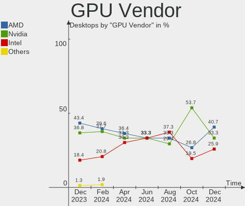
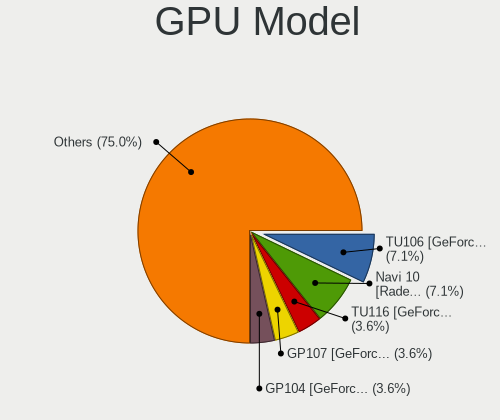
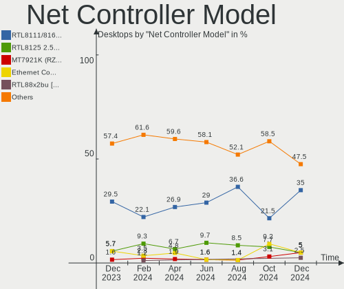

ArcoLinux - Hardware Trends (Desktops)
--------------------------------------

A project to identify most popular hardware characteristics and track their change
over time based on data collected by Linux users at https://Linux-Hardware.org.

Anyone can contribute to this report by the [hw-probe](https://github.com/linuxhw/hw-probe) tool:

    sudo -E hw-probe -all -upload

This report is for one last month. Overall report since the beginning of time: [TestDays](https://github.com/linuxhw/TestDays)

Period: Apr, 2024.

Contents
--------

* [ System ](#system)
  - [ OS                       ](#os)
  - [ OS Family                ](#os-family)
  - [ Kernel                   ](#kernel)
  - [ Kernel Family            ](#kernel-family)
  - [ Kernel Major Ver.        ](#kernel-major-ver)
  - [ Arch                     ](#arch)
  - [ DE                       ](#de)
  - [ Display Server           ](#display-server)
  - [ Display Manager          ](#display-manager)
  - [ OS Lang                  ](#os-lang)
  - [ Boot Mode                ](#boot-mode)
  - [ Filesystem               ](#filesystem)
  - [ Part. scheme             ](#part-scheme)
  - [ Dual Boot with Linux/BSD ](#dual-boot-with-linuxbsd)
  - [ Dual Boot (Win)          ](#dual-boot-win)

* [ Board ](#board)
  - [ Vendor                   ](#vendor)
  - [ Model                    ](#model)
  - [ Model Family             ](#model-family)
  - [ MFG Year                 ](#mfg-year)
  - [ Form Factor              ](#form-factor)
  - [ Secure Boot              ](#secure-boot)
  - [ Coreboot                 ](#coreboot)
  - [ RAM Size                 ](#ram-size)
  - [ RAM Used                 ](#ram-used)
  - [ Total Drives             ](#total-drives)
  - [ Has CD-ROM               ](#has-cd-rom)
  - [ Has Ethernet             ](#has-ethernet)
  - [ Has WiFi                 ](#has-wifi)
  - [ Has Bluetooth            ](#has-bluetooth)

* [ Location ](#location)
  - [ Country                  ](#country)
  - [ City                     ](#city)

* [ Drives ](#drives)
  - [ Drive Vendor             ](#drive-vendor)
  - [ Drive Model              ](#drive-model)
  - [ HDD Vendor               ](#hdd-vendor)
  - [ SSD Vendor               ](#ssd-vendor)
  - [ Drive Kind               ](#drive-kind)
  - [ Drive Connector          ](#drive-connector)
  - [ Drive Size               ](#drive-size)
  - [ Space Total              ](#space-total)
  - [ Space Used               ](#space-used)
  - [ Malfunc. Drives          ](#malfunc-drives)
  - [ Malfunc. Drive Vendor    ](#malfunc-drive-vendor)
  - [ Malfunc. HDD Vendor      ](#malfunc-hdd-vendor)
  - [ Malfunc. Drive Kind      ](#malfunc-drive-kind)
  - [ Failed Drives            ](#failed-drives)
  - [ Failed Drive Vendor      ](#failed-drive-vendor)
  - [ Drive Status             ](#drive-status)

* [ Storage controller ](#storage-controller)
  - [ Storage Vendor           ](#storage-vendor)
  - [ Storage Model            ](#storage-model)
  - [ Storage Kind             ](#storage-kind)

* [ Processor ](#processor)
  - [ CPU Vendor               ](#cpu-vendor)
  - [ CPU Model                ](#cpu-model)
  - [ CPU Model Family         ](#cpu-model-family)
  - [ CPU Cores                ](#cpu-cores)
  - [ CPU Sockets              ](#cpu-sockets)
  - [ CPU Threads              ](#cpu-threads)
  - [ CPU Op-Modes             ](#cpu-op-modes)
  - [ CPU Microcode            ](#cpu-microcode)
  - [ CPU Microarch            ](#cpu-microarch)

* [ Graphics ](#graphics)
  - [ GPU Vendor               ](#gpu-vendor)
  - [ GPU Model                ](#gpu-model)
  - [ GPU Combo                ](#gpu-combo)
  - [ GPU Driver               ](#gpu-driver)
  - [ GPU Memory               ](#gpu-memory)

* [ Monitor ](#monitor)
  - [ Monitor Vendor           ](#monitor-vendor)
  - [ Monitor Model            ](#monitor-model)
  - [ Monitor Resolution       ](#monitor-resolution)
  - [ Monitor Diagonal         ](#monitor-diagonal)
  - [ Monitor Width            ](#monitor-width)
  - [ Aspect Ratio             ](#aspect-ratio)
  - [ Monitor Area             ](#monitor-area)
  - [ Pixel Density            ](#pixel-density)
  - [ Multiple Monitors        ](#multiple-monitors)

* [ Network ](#network)
  - [ Net Controller Vendor    ](#net-controller-vendor)
  - [ Net Controller Model     ](#net-controller-model)
  - [ Wireless Vendor          ](#wireless-vendor)
  - [ Wireless Model           ](#wireless-model)
  - [ Ethernet Vendor          ](#ethernet-vendor)
  - [ Ethernet Model           ](#ethernet-model)
  - [ Net Controller Kind      ](#net-controller-kind)
  - [ Used Controller          ](#used-controller)
  - [ NICs                     ](#nics)
  - [ IPv6                     ](#ipv6)

* [ Bluetooth ](#bluetooth)
  - [ Bluetooth Vendor         ](#bluetooth-vendor)
  - [ Bluetooth Model          ](#bluetooth-model)

* [ Sound ](#sound)
  - [ Sound Vendor             ](#sound-vendor)
  - [ Sound Model              ](#sound-model)

* [ Memory ](#memory)
  - [ Memory Vendor            ](#memory-vendor)
  - [ Memory Model             ](#memory-model)
  - [ Memory Kind              ](#memory-kind)
  - [ Memory Form Factor       ](#memory-form-factor)
  - [ Memory Size              ](#memory-size)
  - [ Memory Speed             ](#memory-speed)

* [ Printers & scanners ](#printers--scanners)
  - [ Printer Vendor           ](#printer-vendor)
  - [ Printer Model            ](#printer-model)
  - [ Scanner Vendor           ](#scanner-vendor)
  - [ Scanner Model            ](#scanner-model)

* [ Camera ](#camera)
  - [ Camera Vendor            ](#camera-vendor)
  - [ Camera Model             ](#camera-model)

* [ Security ](#security)
  - [ Fingerprint Vendor       ](#fingerprint-vendor)
  - [ Fingerprint Model        ](#fingerprint-model)
  - [ Chipcard Vendor          ](#chipcard-vendor)
  - [ Chipcard Model           ](#chipcard-model)

* [ Unsupported ](#unsupported)
  - [ Unsupported Devices      ](#unsupported-devices)
  - [ Unsupported Device Types ](#unsupported-device-types)

System
------

OS
--

Installed operating systems

| Name              | Desktops | Percent |
|-------------------|----------|---------|
| ArcoLinux Rolling | 62       | 98.41%  |
| ArcoLinux         | 1        | 1.59%   |

OS Family
---------

OS without a version

| Name      | Desktops | Percent |
|-----------|----------|---------|
| ArcoLinux | 63       | 100%    |

Kernel
------

Version of the Linux kernel

| Version               | Desktops | Percent |
|-----------------------|----------|---------|
| 6.8.7-arch1-1         | 13       | 20.63%  |
| 6.7.9-arch1-1         | 8        | 12.7%   |
| 6.8.5-arch1-1         | 7        | 11.11%  |
| 6.8.2-arch2-1         | 7        | 11.11%  |
| 6.8.7-zen1-1-zen      | 5        | 7.94%   |
| 6.8.4-arch1-1         | 4        | 6.35%   |
| 6.8.5-zen1-1-zen      | 2        | 3.17%   |
| 6.8.8-zen1-1-zen      | 1        | 1.59%   |
| 6.8.7-2-cachyos-echo  | 1        | 1.59%   |
| 6.8.7-1-cachyos       | 1        | 1.59%   |
| 6.8.6-zen1-1-zen      | 1        | 1.59%   |
| 6.8.6-arch1-1         | 1        | 1.59%   |
| 6.8.6-1-cachyos       | 1        | 1.59%   |
| 6.8.5-x64v-xanmod1-1  | 1        | 1.59%   |
| 6.8.4-zen1-1-zen      | 1        | 1.59%   |
| 6.8.2-zen2-1-zen      | 1        | 1.59%   |
| 6.7.4-zen1-1-zen      | 1        | 1.59%   |
| 6.7.10-x64v-xanmod1-1 | 1        | 1.59%   |
| 6.6.5-x64v2-xanmod1-1 | 1        | 1.59%   |
| 6.6.26-1-lts          | 1        | 1.59%   |
| 6.6.25-1-lts          | 1        | 1.59%   |
| 6.6.16-x64v-xanmod1-1 | 1        | 1.59%   |
| 6.5.9-arch2-1         | 1        | 1.59%   |
| 6.3.8-arch1-1         | 1        | 1.59%   |

Kernel Family
-------------

Linux kernel without a distro release

| Version | Desktops | Percent |
|---------|----------|---------|
| 6.8.7   | 20       | 31.75%  |
| 6.8.5   | 10       | 15.87%  |
| 6.8.2   | 8        | 12.7%   |
| 6.7.9   | 8        | 12.7%   |
| 6.8.4   | 5        | 7.94%   |
| 6.8.6   | 3        | 4.76%   |
| 6.8.8   | 1        | 1.59%   |
| 6.7.4   | 1        | 1.59%   |
| 6.7.10  | 1        | 1.59%   |
| 6.6.5   | 1        | 1.59%   |
| 6.6.26  | 1        | 1.59%   |
| 6.6.25  | 1        | 1.59%   |
| 6.6.16  | 1        | 1.59%   |
| 6.5.9   | 1        | 1.59%   |
| 6.3.8   | 1        | 1.59%   |

Kernel Major Ver.
-----------------

Linux kernel major version

| Version | Desktops | Percent |
|---------|----------|---------|
| 6.8     | 47       | 74.6%   |
| 6.7     | 10       | 15.87%  |
| 6.6     | 4        | 6.35%   |
| 6.5     | 1        | 1.59%   |
| 6.3     | 1        | 1.59%   |

Arch
----

OS architecture (x86_64, i586, etc.)

| Name   | Desktops | Percent |
|--------|----------|---------|
| x86_64 | 63       | 100%    |

DE
--

Desktop Environment

| Name       | Desktops | Percent |
|------------|----------|---------|
| XFCE       | 30       | 47.62%  |
| KDE6       | 8        | 12.7%   |
| GNOME      | 5        | 7.94%   |
| Cinnamon   | 5        | 7.94%   |
| X-Cinnamon | 3        | 4.76%   |
| Unknown    | 3        | 4.76%   |
| xmonad     | 2        | 3.17%   |
| Hyprland   | 2        | 3.17%   |
| qtile      | 1        | 1.59%   |
| LXQt       | 1        | 1.59%   |
| i3         | 1        | 1.59%   |
| chadwm     | 1        | 1.59%   |
| bspwm      | 1        | 1.59%   |

Display Server
--------------

X11 or Wayland

| Name    | Desktops | Percent |
|---------|----------|---------|
| X11     | 43       | 68.25%  |
| Wayland | 17       | 26.98%  |
| Unknown | 3        | 4.76%   |

Display Manager
---------------

SDDM, LightDM, etc.

| Name    | Desktops | Percent |
|---------|----------|---------|
| SDDM    | 53       | 84.13%  |
| LightDM | 8        | 12.7%   |
| GDM     | 1        | 1.59%   |
| Unknown | 1        | 1.59%   |

OS Lang
-------

Language

| Lang  | Desktops | Percent |
|-------|----------|---------|
| en_US | 27       | 42.86%  |
| C     | 5        | 7.94%   |
| pt_BR | 3        | 4.76%   |
| en_IN | 3        | 4.76%   |
| en_GB | 3        | 4.76%   |
| tr_TR | 2        | 3.17%   |
| ru_RU | 2        | 3.17%   |
| it_IT | 2        | 3.17%   |
| fr_FR | 2        | 3.17%   |
| es_ES | 2        | 3.17%   |
| en_CA | 2        | 3.17%   |
| de_DE | 2        | 3.17%   |
| pt_PT | 1        | 1.59%   |
| pl_PL | 1        | 1.59%   |
| lt_LT | 1        | 1.59%   |
| es_AR | 1        | 1.59%   |
| en_IE | 1        | 1.59%   |
| en_AU | 1        | 1.59%   |
| de_AT | 1        | 1.59%   |
| cs_CZ | 1        | 1.59%   |

Boot Mode
---------

EFI or BIOS

| Mode | Desktops | Percent |
|------|----------|---------|
| EFI  | 47       | 74.6%   |
| BIOS | 16       | 25.4%   |

Filesystem
----------

Type of filesystem

| Type    | Desktops | Percent |
|---------|----------|---------|
| Ext4    | 43       | 68.25%  |
| Btrfs   | 15       | 23.81%  |
| Overlay | 5        | 7.94%   |

Part. scheme
------------

Scheme of partitioning

| Type    | Desktops | Percent |
|---------|----------|---------|
| GPT     | 52       | 82.54%  |
| MBR     | 10       | 15.87%  |
| Unknown | 1        | 1.59%   |

Dual Boot with Linux/BSD
------------------------

Hosting more than one Linux/BSD

| Dual boot | Desktops | Percent |
|-----------|----------|---------|
| No        | 33       | 52.38%  |
| Yes       | 30       | 47.62%  |

Dual Boot (Win)
---------------

Hosting Linux and Windows

| Dual boot | Desktops | Percent |
|-----------|----------|---------|
| Yes       | 34       | 53.97%  |
| No        | 29       | 46.03%  |

Board
-----

Vendor
------

Motherboard manufacturer

| Name                                 | Desktops | Percent |
|--------------------------------------|----------|---------|
| MSI                                  | 13       | 20.63%  |
| Gigabyte Technology                  | 10       | 15.87%  |
| ASUSTek Computer                     | 9        | 14.29%  |
| Hewlett-Packard                      | 6        | 9.52%   |
| ASRock                               | 6        | 9.52%   |
| Dell                                 | 5        | 7.94%   |
| Intel                                | 2        | 3.17%   |
| Acer                                 | 2        | 3.17%   |
| Unknown                              | 2        | 3.17%   |
| Shenzhen Meigao Electronic Equipment | 1        | 1.59%   |
| Pegatron                             | 1        | 1.59%   |
| Lenovo                               | 1        | 1.59%   |
| Fujitsu                              | 1        | 1.59%   |
| ECS                                  | 1        | 1.59%   |
| DFI                                  | 1        | 1.59%   |
| Biostar                              | 1        | 1.59%   |
| AZW                                  | 1        | 1.59%   |

Model
-----

Motherboard model

| Name                                       | Desktops | Percent |
|--------------------------------------------|----------|---------|
| MSI MS-7C52                                | 2        | 3.17%   |
| Unknown                                    | 2        | 3.17%   |
| Shenzhen Meigao Electronic Equipment UM690 | 1        | 1.59%   |
| Pegatron NC757AA-ABA a6757c                | 1        | 1.59%   |
| MSI MS-7E26                                | 1        | 1.59%   |
| MSI MS-7C91                                | 1        | 1.59%   |
| MSI MS-7C90                                | 1        | 1.59%   |
| MSI MS-7B93                                | 1        | 1.59%   |
| MSI MS-7B89                                | 1        | 1.59%   |
| MSI MS-7B86                                | 1        | 1.59%   |
| MSI MS-7A38                                | 1        | 1.59%   |
| MSI MS-7A36                                | 1        | 1.59%   |
| MSI MS-7850                                | 1        | 1.59%   |
| MSI Hyrican PC A320M PRO-VD/S              | 1        | 1.59%   |
| MSI H310 Gaming Infinite (MS-B915)         | 1        | 1.59%   |
| Lenovo IdeaCentre 510-15ICB 90HU002JSP     | 1        | 1.59%   |
| Intel H61S                                 | 1        | 1.59%   |
| Intel B75                                  | 1        | 1.59%   |
| HP Z240 Tower Workstation                  | 1        | 1.59%   |
| HP ProDesk 600 G1 SFF                      | 1        | 1.59%   |
| HP ProDesk 600 G1 DM                       | 1        | 1.59%   |
| HP Compaq Elite 8300 SFF                   | 1        | 1.59%   |
| HP Compaq dc5850 Microtower                | 1        | 1.59%   |
| HP 700-527c                                | 1        | 1.59%   |
| Gigabyte Z68MA-D2H-B3                      | 1        | 1.59%   |
| Gigabyte Z390 DESIGNARE                    | 1        | 1.59%   |
| Gigabyte Z270X-Gaming 5                    | 1        | 1.59%   |
| Gigabyte X570 AORUS ELITE                  | 1        | 1.59%   |
| Gigabyte GA-880GM-UD2H                     | 1        | 1.59%   |
| Gigabyte F2A88XN-WIFI                      | 1        | 1.59%   |
| Gigabyte B550 GAMING X V2                  | 1        | 1.59%   |
| Gigabyte B550 AORUS PRO V2                 | 1        | 1.59%   |
| Gigabyte B450M DS3H                        | 1        | 1.59%   |
| Gigabyte A320M-S2H                         | 1        | 1.59%   |
| Fujitsu ESPRIMO Q556                       | 1        | 1.59%   |
| ECS A960M-M3                               | 1        | 1.59%   |
| DFI HD101-H81D                             | 1        | 1.59%   |
| Dell Vostro 3670                           | 1        | 1.59%   |
| Dell OptiPlex 9010                         | 1        | 1.59%   |
| Dell OptiPlex 7040                         | 1        | 1.59%   |

Model Family
------------

Motherboard model prefix

| Name                                       | Desktops | Percent |
|--------------------------------------------|----------|---------|
| Dell OptiPlex                              | 4        | 6.35%   |
| ASUS TUF                                   | 4        | 6.35%   |
| MSI MS-7C52                                | 2        | 3.17%   |
| HP ProDesk                                 | 2        | 3.17%   |
| HP Compaq                                  | 2        | 3.17%   |
| Gigabyte B550                              | 2        | 3.17%   |
| ASUS PRIME                                 | 2        | 3.17%   |
| Unknown                                    | 2        | 3.17%   |
| Shenzhen Meigao Electronic Equipment UM690 | 1        | 1.59%   |
| Pegatron NC757AA-ABA                       | 1        | 1.59%   |
| MSI MS-7E26                                | 1        | 1.59%   |
| MSI MS-7C91                                | 1        | 1.59%   |
| MSI MS-7C90                                | 1        | 1.59%   |
| MSI MS-7B93                                | 1        | 1.59%   |
| MSI MS-7B89                                | 1        | 1.59%   |
| MSI MS-7B86                                | 1        | 1.59%   |
| MSI MS-7A38                                | 1        | 1.59%   |
| MSI MS-7A36                                | 1        | 1.59%   |
| MSI MS-7850                                | 1        | 1.59%   |
| MSI Hyrican                                | 1        | 1.59%   |
| MSI H310                                   | 1        | 1.59%   |
| Lenovo IdeaCentre                          | 1        | 1.59%   |
| Intel H61S                                 | 1        | 1.59%   |
| Intel B75                                  | 1        | 1.59%   |
| HP Z240                                    | 1        | 1.59%   |
| HP 700-527c                                | 1        | 1.59%   |
| Gigabyte Z68MA-D2H-B3                      | 1        | 1.59%   |
| Gigabyte Z390                              | 1        | 1.59%   |
| Gigabyte Z270X-Gaming                      | 1        | 1.59%   |
| Gigabyte X570                              | 1        | 1.59%   |
| Gigabyte GA-880GM-UD2H                     | 1        | 1.59%   |
| Gigabyte F2A88XN-WIFI                      | 1        | 1.59%   |
| Gigabyte B450M                             | 1        | 1.59%   |
| Gigabyte A320M-S2H                         | 1        | 1.59%   |
| Fujitsu ESPRIMO                            | 1        | 1.59%   |
| ECS A960M-M3                               | 1        | 1.59%   |
| DFI HD101-H81D                             | 1        | 1.59%   |
| Dell Vostro                                | 1        | 1.59%   |
| Biostar H61MLC                             | 1        | 1.59%   |
| AZW SER                                    | 1        | 1.59%   |

MFG Year
--------

Motherboard manufacture year

| Year | Desktops | Percent |
|------|----------|---------|
| 2018 | 10       | 15.87%  |
| 2019 | 7        | 11.11%  |
| 2022 | 6        | 9.52%   |
| 2020 | 6        | 9.52%   |
| 2017 | 6        | 9.52%   |
| 2016 | 6        | 9.52%   |
| 2014 | 4        | 6.35%   |
| 2013 | 4        | 6.35%   |
| 2023 | 2        | 3.17%   |
| 2015 | 2        | 3.17%   |
| 2012 | 2        | 3.17%   |
| 2011 | 2        | 3.17%   |
| 2010 | 2        | 3.17%   |
| 2008 | 2        | 3.17%   |
| 2021 | 1        | 1.59%   |
| 2007 | 1        | 1.59%   |

Form Factor
-----------

Physical design of the computer

| Name    | Desktops | Percent |
|---------|----------|---------|
| Desktop | 63       | 100%    |

Secure Boot
-----------

Enabled or disabled

| State    | Desktops | Percent |
|----------|----------|---------|
| Disabled | 63       | 100%    |

Coreboot
--------

Have coreboot on board

| Used | Desktops | Percent |
|------|----------|---------|
| No   | 63       | 100%    |

RAM Size
--------

Total RAM memory

| Size in GB | Desktops | Percent |
|------------|----------|---------|
| 16.01-24.0 | 22       | 34.92%  |
| 32.01-64.0 | 13       | 20.63%  |
| 8.01-16.0  | 11       | 17.46%  |
| 4.01-8.0   | 8        | 12.7%   |
| 24.01-32.0 | 5        | 7.94%   |
| 3.01-4.0   | 4        | 6.35%   |

RAM Used
--------

Used RAM memory

| Used GB    | Desktops | Percent |
|------------|----------|---------|
| 1.01-2.0   | 24       | 38.1%   |
| 4.01-8.0   | 12       | 19.05%  |
| 3.01-4.0   | 9        | 14.29%  |
| 2.01-3.0   | 7        | 11.11%  |
| 0.51-1.0   | 6        | 9.52%   |
| 8.01-16.0  | 4        | 6.35%   |
| 16.01-24.0 | 1        | 1.59%   |

Total Drives
------------

Number of drives on board

| Drives | Desktops | Percent |
|--------|----------|---------|
| 2      | 21       | 33.33%  |
| 1      | 17       | 26.98%  |
| 3      | 15       | 23.81%  |
| 4      | 8        | 12.7%   |
| 5      | 1        | 1.59%   |
| 0      | 1        | 1.59%   |

Has CD-ROM
----------

Has CD-ROM on board

| Presented | Desktops | Percent |
|-----------|----------|---------|
| No        | 45       | 71.43%  |
| Yes       | 18       | 28.57%  |

Has Ethernet
------------

Has Ethernet on board

| Presented | Desktops | Percent |
|-----------|----------|---------|
| Yes       | 63       | 100%    |

Has WiFi
--------

Has WiFi module

| Presented | Desktops | Percent |
|-----------|----------|---------|
| Yes       | 33       | 52.38%  |
| No        | 30       | 47.62%  |

Has Bluetooth
-------------

Has Bluetooth module

| Presented | Desktops | Percent |
|-----------|----------|---------|
| No        | 37       | 58.73%  |
| Yes       | 26       | 41.27%  |

Location
--------

Country
-------

Geographic location (country)

| Country   | Desktops | Percent |
|-----------|----------|---------|
| USA       | 16       | 25.4%   |
| India     | 5        | 7.94%   |
| UK        | 3        | 4.76%   |
| Turkey    | 3        | 4.76%   |
| Russia    | 3        | 4.76%   |
| Brazil    | 3        | 4.76%   |
| Austria   | 3        | 4.76%   |
| Sweden    | 2        | 3.17%   |
| Spain     | 2        | 3.17%   |
| Italy     | 2        | 3.17%   |
| Germany   | 2        | 3.17%   |
| Belgium   | 2        | 3.17%   |
| Australia | 2        | 3.17%   |
| Uruguay   | 1        | 1.59%   |
| Slovenia  | 1        | 1.59%   |
| Romania   | 1        | 1.59%   |
| Portugal  | 1        | 1.59%   |
| Morocco   | 1        | 1.59%   |
| Lithuania | 1        | 1.59%   |
| Kenya     | 1        | 1.59%   |
| Ireland   | 1        | 1.59%   |
| Iran      | 1        | 1.59%   |
| Hungary   | 1        | 1.59%   |
| France    | 1        | 1.59%   |
| Czechia   | 1        | 1.59%   |
| Canada    | 1        | 1.59%   |
| Argentina | 1        | 1.59%   |
| Algeria   | 1        | 1.59%   |

City
----

Geographic location (city)

| City              | Desktops | Percent |
|-------------------|----------|---------|
| Vienna            | 2        | 3.17%   |
| Perth             | 2        | 3.17%   |
| New York          | 2        | 3.17%   |
| Kolkata           | 2        | 3.17%   |
| Duffel            | 2        | 3.17%   |
| Yuzhno-Sakhalinsk | 1        | 1.59%   |
| Xinzo de Limia    | 1        | 1.59%   |
| Vitoria-Gasteiz   | 1        | 1.59%   |
| Velikiye Luki     | 1        | 1.59%   |
| Tehran            | 1        | 1.59%   |
| Stockholm         | 1        | 1.59%   |
| St Louis          | 1        | 1.59%   |
| Sorocaba          | 1        | 1.59%   |
| Secaucus          | 1        | 1.59%   |
| Schwarzach        | 1        | 1.59%   |
| Sao Paulo         | 1        | 1.59%   |
| Rosu              | 1        | 1.59%   |
| Rio Rancho        | 1        | 1.59%   |
| Portland          | 1        | 1.59%   |
| Poessneck         | 1        | 1.59%   |
| Oswego            | 1        | 1.59%   |
| Ormskirk          | 1        | 1.59%   |
| Omsk              | 1        | 1.59%   |
| Nairobi           | 1        | 1.59%   |
| Nachod            | 1        | 1.59%   |
| Montevideo        | 1        | 1.59%   |
| Mishawaka         | 1        | 1.59%   |
| Mesa              | 1        | 1.59%   |
| Mercedes          | 1        | 1.59%   |
| Mandeville        | 1        | 1.59%   |
| Malmo             | 1        | 1.59%   |
| Macomb            | 1        | 1.59%   |
| Lyon              | 1        | 1.59%   |
| Luckenwalde       | 1        | 1.59%   |
| Ljubljana         | 1        | 1.59%   |
| Lebanon           | 1        | 1.59%   |
| Las Vegas         | 1        | 1.59%   |
| Kollam            | 1        | 1.59%   |
| Kaunas            | 1        | 1.59%   |
| Izmir             | 1        | 1.59%   |

Drives
------

Drive Vendor
------------

Hard drive vendors

| Vendor                      | Desktops | Drives | Percent |
|-----------------------------|----------|--------|---------|
| Samsung Electronics         | 26       | 32     | 20.8%   |
| Seagate                     | 19       | 22     | 15.2%   |
| WDC                         | 16       | 20     | 12.8%   |
| Crucial                     | 7        | 8      | 5.6%    |
| Silicon Motion              | 6        | 6      | 4.8%    |
| Kingston                    | 6        | 7      | 4.8%    |
| SanDisk                     | 5        | 6      | 4%      |
| Hitachi                     | 4        | 4      | 3.2%    |
| Toshiba                     | 3        | 3      | 2.4%    |
| Micron/Crucial Technology   | 3        | 3      | 2.4%    |
| HGST                        | 3        | 3      | 2.4%    |
| A-DATA Technology           | 3        | 4      | 2.4%    |
| SPCC                        | 2        | 2      | 1.6%    |
| Kingston Technology Company | 2        | 2      | 1.6%    |
| Intel                       | 2        | 2      | 1.6%    |
| China                       | 2        | 2      | 1.6%    |
| XrayDisk                    | 1        | 1      | 0.8%    |
| Unknown                     | 1        | 1      | 0.8%    |
| Team                        | 1        | 1      | 0.8%    |
| SK hynix                    | 1        | 1      | 0.8%    |
| SABRENT                     | 1        | 1      | 0.8%    |
| PNY                         | 1        | 1      | 0.8%    |
| Phison Electronics          | 1        | 1      | 0.8%    |
| OCZ                         | 1        | 1      | 0.8%    |
| MAXIO Technology (Hangzhou) | 1        | 1      | 0.8%    |
| KIOXIA                      | 1        | 1      | 0.8%    |
| KingSpec                    | 1        | 1      | 0.8%    |
| Hewlett-Packard             | 1        | 1      | 0.8%    |
| Dahua                       | 1        | 1      | 0.8%    |
| Biwin Storage Technology    | 1        | 1      | 0.8%    |
| ADATA Technology            | 1        | 1      | 0.8%    |
| Unknown                     | 1        | 1      | 0.8%    |

Drive Model
-----------

Hard drive models

| Model                                                 | Desktops | Percent |
|-------------------------------------------------------|----------|---------|
| Silicon Motion SM2263EN/SM2263XT SSD Controller 256GB | 6        | 4.38%   |
| Samsung SSD 980 1TB                                   | 4        | 2.92%   |
| Samsung NVMe SSD Controller SM981/PM981/PM983 1TB     | 4        | 2.92%   |
| Seagate ST1000DM010-2EP102 1TB                        | 3        | 2.19%   |
| Samsung HD103SJ 1TB                                   | 3        | 2.19%   |
| Seagate ST500DM002-1BD142 500GB                       | 2        | 1.46%   |
| Seagate ST2000DM008-2FR102 2TB                        | 2        | 1.46%   |
| Seagate Backup+ Hub BK 8TB                            | 2        | 1.46%   |
| SanDisk Extreme 55AE 1TB SSD                          | 2        | 1.46%   |
| Samsung SSD 850 EVO 500GB                             | 2        | 1.46%   |
| Samsung SSD 840 EVO 250GB                             | 2        | 1.46%   |
| Samsung NVMe SSD Controller PM9A1/PM9A3/980PRO 1TB    | 2        | 1.46%   |
| Kingston SA400S37480G 480GB SSD                       | 2        | 1.46%   |
| Kingston SA400S37240G 240GB SSD                       | 2        | 1.46%   |
| Crucial CT480BX500SSD1 480GB                          | 2        | 1.46%   |
| Crucial CT1000MX500SSD1 1TB                           | 2        | 1.46%   |
| XrayDisk 1TB SSD                                      | 1        | 0.73%   |
| WDC WDS240G2G0B-00EPW0 240GB SSD                      | 1        | 0.73%   |
| WDC WDS100T2B0A-00SM50 1TB SSD                        | 1        | 0.73%   |
| WDC WD6401AALS-00L3B2 640GB                           | 1        | 0.73%   |
| WDC WD50EZRZ-00RWYB1 5TB                              | 1        | 0.73%   |
| WDC WD5000AZLX-60K2TA0 500GB                          | 1        | 0.73%   |
| WDC WD5000AAKX-22ERMA0 500GB                          | 1        | 0.73%   |
| WDC WD3200LPVX-22V0TT0 320GB                          | 1        | 0.73%   |
| WDC WD30EFRX-68EUZN0 3TB                              | 1        | 0.73%   |
| WDC WD3000FYYZ-01UL1B0 3TB                            | 1        | 0.73%   |
| WDC WD20EZRZ-00Z5HB0 2TB                              | 1        | 0.73%   |
| WDC WD20EZRX-00D8PB0 2TB                              | 1        | 0.73%   |
| WDC WD20EFRX-68EUZN0 2TB                              | 1        | 0.73%   |
| WDC WD120EMAZ-11BLFA0 12TB                            | 1        | 0.73%   |
| WDC WD10EZRZ-00Z5HB0 1TB                              | 1        | 0.73%   |
| WDC WD10EZEX-60M2NA0 1TB                              | 1        | 0.73%   |
| WDC WD10EZEX-22MFCA0 1TB                              | 1        | 0.73%   |
| WDC WD10EZEX-21M2NA0 1TB                              | 1        | 0.73%   |
| WDC WD10EZEX-00BN5A0 1TB                              | 1        | 0.73%   |
| WDC WD1003FZEX-00MK2A0 1TB                            | 1        | 0.73%   |
| WDC WD Green 2.5 240GB                                | 1        | 0.73%   |
| Unknown SD/MMC/MS PRO 128GB                           | 1        | 0.73%   |
| Toshiba MQ01ACF050 500GB                              | 1        | 0.73%   |
| Toshiba MQ01ABD100 1TB                                | 1        | 0.73%   |

HDD Vendor
----------

Hard disk drive vendors

| Vendor              | Desktops | Drives | Percent |
|---------------------|----------|--------|---------|
| Seagate             | 19       | 21     | 38.78%  |
| WDC                 | 14       | 17     | 28.57%  |
| Samsung Electronics | 4        | 4      | 8.16%   |
| Hitachi             | 4        | 4      | 8.16%   |
| Toshiba             | 3        | 3      | 6.12%   |
| HGST                | 3        | 3      | 6.12%   |
| Unknown             | 1        | 1      | 2.04%   |
| SABRENT             | 1        | 1      | 2.04%   |

SSD Vendor
----------

Solid state drive vendors

| Vendor              | Desktops | Drives | Percent |
|---------------------|----------|--------|---------|
| Samsung Electronics | 12       | 13     | 26.09%  |
| Crucial             | 7        | 8      | 15.22%  |
| Kingston            | 5        | 5      | 10.87%  |
| SanDisk             | 4        | 5      | 8.7%    |
| A-DATA Technology   | 3        | 4      | 6.52%   |
| WDC                 | 2        | 3      | 4.35%   |
| SPCC                | 2        | 2      | 4.35%   |
| China               | 2        | 2      | 4.35%   |
| Team                | 1        | 1      | 2.17%   |
| Seagate             | 1        | 1      | 2.17%   |
| PNY                 | 1        | 1      | 2.17%   |
| OCZ                 | 1        | 1      | 2.17%   |
| KingSpec            | 1        | 1      | 2.17%   |
| Intel               | 1        | 1      | 2.17%   |
| Hewlett-Packard     | 1        | 1      | 2.17%   |
| Dahua               | 1        | 1      | 2.17%   |
| Unknown             | 1        | 1      | 2.17%   |

Drive Kind
----------

HDD or SSD

| Kind | Desktops | Drives | Percent |
|------|----------|--------|---------|
| HDD  | 37       | 54     | 35.92%  |
| SSD  | 35       | 51     | 33.98%  |
| NVMe | 31       | 37     | 30.1%   |

Drive Connector
---------------

SATA, SAS, NVMe, etc.

| Type | Desktops | Drives | Percent |
|------|----------|--------|---------|
| SATA | 52       | 97     | 57.78%  |
| NVMe | 31       | 37     | 34.44%  |
| SAS  | 7        | 8      | 7.78%   |

Drive Size
----------

Size of hard drive

| Size in TB | Desktops | Drives | Percent |
|------------|----------|--------|---------|
| 0.01-0.5   | 33       | 47     | 40.74%  |
| 0.51-1.0   | 31       | 41     | 38.27%  |
| 1.01-2.0   | 9        | 9      | 11.11%  |
| 2.01-3.0   | 3        | 3      | 3.7%    |
| 4.01-10.0  | 3        | 3      | 3.7%    |
| 3.01-4.0   | 1        | 1      | 1.23%   |
| 10.01-20.0 | 1        | 1      | 1.23%   |

Space Total
-----------

Amount of disk space available on the file system

| Size in GB     | Desktops | Percent |
|----------------|----------|---------|
| 501-1000       | 18       | 28.57%  |
| More than 3000 | 11       | 17.46%  |
| 251-500        | 9        | 14.29%  |
| 1001-2000      | 9        | 14.29%  |
| 101-250        | 7        | 11.11%  |
| 1-20           | 5        | 7.94%   |
| 2001-3000      | 2        | 3.17%   |
| 51-100         | 2        | 3.17%   |

Space Used
----------

Amount of used disk space

| Used GB        | Desktops | Percent |
|----------------|----------|---------|
| 1-20           | 16       | 25.4%   |
| 51-100         | 11       | 17.46%  |
| 101-250        | 10       | 15.87%  |
| 21-50          | 9        | 14.29%  |
| 251-500        | 6        | 9.52%   |
| 501-1000       | 4        | 6.35%   |
| 1001-2000      | 3        | 4.76%   |
| More than 3000 | 2        | 3.17%   |
| 2001-3000      | 2        | 3.17%   |

Malfunc. Drives
---------------

Drive models with a malfunction

| Model                                                 | Desktops | Drives | Percent |
|-------------------------------------------------------|----------|--------|---------|
| WDC WD5000AAKX-22ERMA0 500GB                          | 1        | 1      | 5.88%   |
| WDC WD30EFRX-68EUZN0 3TB                              | 1        | 1      | 5.88%   |
| WDC WD Green 2.5 240GB                                | 1        | 1      | 5.88%   |
| Toshiba MQ01ACF050 500GB                              | 1        | 1      | 5.88%   |
| Silicon Motion SM2263EN/SM2263XT SSD Controller 256GB | 1        | 1      | 5.88%   |
| Seagate ST500DM002-1BD142 500GB                       | 1        | 1      | 5.88%   |
| Seagate ST3160815AS 160GB                             | 1        | 1      | 5.88%   |
| Seagate ST31000524AS 1TB                              | 1        | 1      | 5.88%   |
| Seagate ST2000DM001-1CH164 2TB                        | 1        | 1      | 5.88%   |
| Seagate ST1000DM003-1CH162 1TB                        | 1        | 1      | 5.88%   |
| SanDisk SSD PLUS 480GB                                | 1        | 1      | 5.88%   |
| Kingston SA400S37480G 480GB SSD                       | 1        | 1      | 5.88%   |
| KingSpec NT-256 256GB SSD                             | 1        | 1      | 5.88%   |
| Hitachi HDP725050GLA360 500GB                         | 1        | 1      | 5.88%   |
| HGST HTS541010A9E680 1TB                              | 1        | 1      | 5.88%   |
| Crucial CT275MX300SSD1 275GB                          | 1        | 1      | 5.88%   |
| A-DATA Technology SU650 256GB SSD                     | 1        | 1      | 5.88%   |

Malfunc. Drive Vendor
---------------------

Vendors of faulty drives

| Vendor            | Desktops | Drives | Percent |
|-------------------|----------|--------|---------|
| Seagate           | 5        | 5      | 29.41%  |
| WDC               | 3        | 3      | 17.65%  |
| Toshiba           | 1        | 1      | 5.88%   |
| Silicon Motion    | 1        | 1      | 5.88%   |
| SanDisk           | 1        | 1      | 5.88%   |
| Kingston          | 1        | 1      | 5.88%   |
| KingSpec          | 1        | 1      | 5.88%   |
| Hitachi           | 1        | 1      | 5.88%   |
| HGST              | 1        | 1      | 5.88%   |
| Crucial           | 1        | 1      | 5.88%   |
| A-DATA Technology | 1        | 1      | 5.88%   |

Malfunc. HDD Vendor
-------------------

Vendors of faulty HDD drives

| Vendor  | Desktops | Drives | Percent |
|---------|----------|--------|---------|
| Seagate | 5        | 5      | 50%     |
| WDC     | 2        | 2      | 20%     |
| Toshiba | 1        | 1      | 10%     |
| Hitachi | 1        | 1      | 10%     |
| HGST    | 1        | 1      | 10%     |

Malfunc. Drive Kind
-------------------

Kinds of faulty drives

| Kind | Desktops | Drives | Percent |
|------|----------|--------|---------|
| HDD  | 9        | 10     | 56.25%  |
| SSD  | 6        | 6      | 37.5%   |
| NVMe | 1        | 1      | 6.25%   |

Failed Drives
-------------

Failed drive models

Zero info for selected period =(

Failed Drive Vendor
-------------------

Failed drive vendors

Zero info for selected period =(

Drive Status
------------

Number of failed and malfunc. drives

| Status   | Desktops | Drives | Percent |
|----------|----------|--------|---------|
| Works    | 57       | 115    | 71.25%  |
| Malfunc  | 16       | 17     | 20%     |
| Detected | 7        | 10     | 8.75%   |

Storage controller
------------------

Storage Vendor
--------------

Storage controller vendors

| Vendor                      | Desktops | Percent |
|-----------------------------|----------|---------|
| Intel                       | 31       | 31.31%  |
| AMD                         | 31       | 31.31%  |
| Samsung Electronics         | 12       | 12.12%  |
| Silicon Motion              | 6        | 6.06%   |
| Micron/Crucial Technology   | 3        | 3.03%   |
| Kingston Technology Company | 3        | 3.03%   |
| ASMedia Technology          | 3        | 3.03%   |
| VIA Technologies            | 1        | 1.01%   |
| SK hynix                    | 1        | 1.01%   |
| SanDisk                     | 1        | 1.01%   |
| Phison Electronics          | 1        | 1.01%   |
| Nvidia                      | 1        | 1.01%   |
| MAXIO Technology (Hangzhou) | 1        | 1.01%   |
| KIOXIA                      | 1        | 1.01%   |
| INNOGRIT                    | 1        | 1.01%   |
| Biwin Storage Technology    | 1        | 1.01%   |
| ADATA Technology            | 1        | 1.01%   |

Storage Model
-------------

Storage controller models

| Model                                                                          | Desktops | Percent |
|--------------------------------------------------------------------------------|----------|---------|
| AMD FCH SATA Controller [AHCI mode]                                            | 14       | 12.17%  |
| AMD 400 Series Chipset SATA Controller                                         | 10       | 8.7%    |
| Silicon Motion SM2263EN/SM2263XT (DRAM-less) NVMe SSD Controllers              | 6        | 5.22%   |
| Intel 200 Series PCH SATA controller [AHCI mode]                               | 6        | 5.22%   |
| Intel 8 Series/C220 Series Chipset Family 6-port SATA Controller 1 [AHCI mode] | 5        | 4.35%   |
| AMD FCH SATA Controller D                                                      | 5        | 4.35%   |
| Samsung NVMe SSD Controller SM981/PM981/PM983                                  | 4        | 3.48%   |
| Samsung NVMe SSD Controller 980 (DRAM-less)                                    | 4        | 3.48%   |
| AMD 500 Series Chipset SATA Controller                                         | 4        | 3.48%   |
| Intel SATA Controller [RAID mode]                                              | 3        | 2.61%   |
| Intel Cannon Lake PCH SATA AHCI Controller                                     | 3        | 2.61%   |
| ASMedia ASM1061/ASM1062 Serial ATA Controller                                  | 3        | 2.61%   |
| AMD SB7x0/SB8x0/SB9x0 SATA Controller [IDE mode]                               | 3        | 2.61%   |
| AMD SB7x0/SB8x0/SB9x0 IDE Controller                                           | 3        | 2.61%   |
| Samsung NVMe SSD Controller S4LV008[Pascal]                                    | 2        | 1.74%   |
| Samsung NVMe SSD Controller PM9A1/PM9A3/980PRO                                 | 2        | 1.74%   |
| Intel Celeron/Pentium Silver Processor SATA Controller                         | 2        | 1.74%   |
| Intel 9 Series Chipset Family SATA Controller [AHCI Mode]                      | 2        | 1.74%   |
| Intel 6 Series/C200 Series Chipset Family 6 port Desktop SATA AHCI Controller  | 2        | 1.74%   |
| AMD 600 Series Chipset SATA Controller                                         | 2        | 1.74%   |
| VIA VT6415 PATA IDE Host Controller                                            | 1        | 0.87%   |
| SK hynix Gold P31/BC711/PC711 NVMe Solid State Drive                           | 1        | 0.87%   |
| SanDisk Ultra 3D / WD Blue SN550 NVMe SSD                                      | 1        | 0.87%   |
| Samsung NVMe SSD Controller SM961/PM961/SM963                                  | 1        | 0.87%   |
| Phison E12 NVMe Controller                                                     | 1        | 0.87%   |
| Nvidia MCP61 SATA Controller                                                   | 1        | 0.87%   |
| Nvidia MCP61 IDE                                                               | 1        | 0.87%   |
| Micron/Crucial T500 NVMe PCIe SSD                                              | 1        | 0.87%   |
| Micron/Crucial P2 [Nick P2] / P3 / P3 Plus NVMe PCIe SSD (DRAM-less)           | 1        | 0.87%   |
| Micron/Crucial P1 NVMe PCIe SSD[Frampton]                                      | 1        | 0.87%   |
| MAXIO (Hangzhou) NVMe SSD Controller MAP1202 (DRAM-less)                       | 1        | 0.87%   |
| KIOXIA NVMe SSD                                                                | 1        | 0.87%   |
| Kingston Company NV2 NVMe SSD SM2267XT (DRAM-less)                             | 1        | 0.87%   |
| Kingston Company KC3000/FURY Renegade NVMe SSD E18                             | 1        | 0.87%   |
| Kingston Company A1000/U-SNS8154P3 x2 NVMe SSD                                 | 1        | 0.87%   |
| Intel SSD 665p Series [Neptune Harbor Refresh]                                 | 1        | 0.87%   |
| Intel Raptor Lake SATA AHCI Controller                                         | 1        | 0.87%   |
| Intel Q170/Q150/B150/H170/H110/Z170/CM236 Chipset SATA Controller [AHCI Mode]  | 1        | 0.87%   |
| Intel Comet Lake SATA AHCI Controller                                          | 1        | 0.87%   |
| Intel 8 Series/C220 Series Chipset Family 4-port SATA Controller 1 [IDE mode]  | 1        | 0.87%   |

Storage Kind
------------

Kind of storage controller (IDE, SATA, NVMe, SAS, ...)

| Kind | Desktops | Percent |
|------|----------|---------|
| SATA | 55       | 56.7%   |
| NVMe | 31       | 31.96%  |
| IDE  | 8        | 8.25%   |
| RAID | 3        | 3.09%   |

Processor
---------

CPU Vendor
----------

Processor vendors

| Vendor | Desktops | Percent |
|--------|----------|---------|
| AMD    | 33       | 52.38%  |
| Intel  | 30       | 47.62%  |

CPU Model
---------

Processor models

| Model                                       | Desktops | Percent |
|---------------------------------------------|----------|---------|
| AMD Ryzen 7 3800X 8-Core Processor          | 3        | 4.76%   |
| AMD Ryzen 5 2600 Six-Core Processor         | 3        | 4.76%   |
| Intel Core i7-8700 CPU @ 3.20GHz            | 2        | 3.17%   |
| Intel Core i7-6700 CPU @ 3.40GHz            | 2        | 3.17%   |
| Intel Core i5-4570 CPU @ 3.20GHz            | 2        | 3.17%   |
| Intel Celeron J4125 CPU @ 2.00GHz           | 2        | 3.17%   |
| AMD Ryzen 7 7800X3D 8-Core Processor        | 2        | 3.17%   |
| AMD Ryzen 7 5700G with Radeon Graphics      | 2        | 3.17%   |
| AMD Ryzen 5 5600X 6-Core Processor          | 2        | 3.17%   |
| AMD Ryzen 5 3600 6-Core Processor           | 2        | 3.17%   |
| AMD Ryzen 5 3400G with Radeon Vega Graphics | 2        | 3.17%   |
| AMD Ryzen 5 2400G with Radeon Vega Graphics | 2        | 3.17%   |
| Intel Core i7-9700K CPU @ 3.60GHz           | 1        | 1.59%   |
| Intel Core i7-8700K CPU @ 3.70GHz           | 1        | 1.59%   |
| Intel Core i7-7700K CPU @ 4.20GHz           | 1        | 1.59%   |
| Intel Core i7-4790K CPU @ 4.00GHz           | 1        | 1.59%   |
| Intel Core i7-3770 CPU @ 3.40GHz            | 1        | 1.59%   |
| Intel Core i7-10700K CPU @ 3.80GHz          | 1        | 1.59%   |
| Intel Core i5-9400 CPU @ 2.90GHz            | 1        | 1.59%   |
| Intel Core i5-8600K CPU @ 3.60GHz           | 1        | 1.59%   |
| Intel Core i5-7600K CPU @ 3.80GHz           | 1        | 1.59%   |
| Intel Core i5-7500 CPU @ 3.40GHz            | 1        | 1.59%   |
| Intel Core i5-6500T CPU @ 2.50GHz           | 1        | 1.59%   |
| Intel Core i5-4590 CPU @ 3.30GHz            | 1        | 1.59%   |
| Intel Core i5-4570TE CPU @ 2.70GHz          | 1        | 1.59%   |
| Intel Core i5-4440 CPU @ 3.10GHz            | 1        | 1.59%   |
| Intel Core i5-3570 CPU @ 3.40GHz            | 1        | 1.59%   |
| Intel Core i5-3470S CPU @ 2.90GHz           | 1        | 1.59%   |
| Intel Core i5-2500 CPU @ 3.30GHz            | 1        | 1.59%   |
| Intel Core i5-2320 CPU @ 3.00GHz            | 1        | 1.59%   |
| Intel Core i3-4160 CPU @ 3.60GHz            | 1        | 1.59%   |
| Intel Core i3-4130 CPU @ 3.40GHz            | 1        | 1.59%   |
| Intel Core i3-3250 CPU @ 3.50GHz            | 1        | 1.59%   |
| Intel 13th Gen Core i5-13600                | 1        | 1.59%   |
| AMD Ryzen 9 6900HX with Radeon Graphics     | 1        | 1.59%   |
| AMD Ryzen 9 3900X 12-Core Processor         | 1        | 1.59%   |
| AMD Ryzen 7 7735HS with Radeon Graphics     | 1        | 1.59%   |
| AMD Ryzen 7 5800X 8-Core Processor          | 1        | 1.59%   |
| AMD Ryzen 7 5700X 8-Core Processor          | 1        | 1.59%   |
| AMD Ryzen 5 3600XT 6-Core Processor         | 1        | 1.59%   |

CPU Model Family
----------------

Processor model prefix

| Model            | Desktops | Percent |
|------------------|----------|---------|
| Intel Core i5    | 14       | 22.22%  |
| AMD Ryzen 5      | 13       | 20.63%  |
| Intel Core i7    | 10       | 15.87%  |
| AMD Ryzen 7      | 10       | 15.87%  |
| Intel Core i3    | 3        | 4.76%   |
| AMD Athlon II X2 | 3        | 4.76%   |
| Intel Celeron    | 2        | 3.17%   |
| AMD Ryzen 9      | 2        | 3.17%   |
| Other            | 1        | 1.59%   |
| AMD Ryzen 3      | 1        | 1.59%   |
| AMD Phenom II X6 | 1        | 1.59%   |
| AMD Phenom       | 1        | 1.59%   |
| AMD Athlon       | 1        | 1.59%   |
| AMD A6           | 1        | 1.59%   |

CPU Cores
---------

Number of processor cores

| Number | Desktops | Percent |
|--------|----------|---------|
| 4      | 24       | 38.1%   |
| 6      | 15       | 23.81%  |
| 8      | 13       | 20.63%  |
| 2      | 8        | 12.7%   |
| 14     | 1        | 1.59%   |
| 12     | 1        | 1.59%   |
| 1      | 1        | 1.59%   |

CPU Sockets
-----------

Number of sockets

| Number | Desktops | Percent |
|--------|----------|---------|
| 1      | 63       | 100%    |

CPU Threads
-----------

Threads per core (Hyper-Threading)

| Number | Desktops | Percent |
|--------|----------|---------|
| 2      | 42       | 66.67%  |
| 1      | 21       | 33.33%  |

CPU Op-Modes
------------

CPU Operation Modes (32-bit, 64-bit)

| Op mode        | Desktops | Percent |
|----------------|----------|---------|
| 32-bit, 64-bit | 63       | 100%    |

CPU Microcode
-------------

Microcode number

| Number     | Desktops | Percent |
|------------|----------|---------|
| Unknown    | 60       | 95.24%  |
| 0x0a601206 | 1        | 1.59%   |
| 0x08600109 | 1        | 1.59%   |
| 0x0800820d | 1        | 1.59%   |

CPU Microarch
-------------

Microarchitecture

| Name             | Desktops | Percent |
|------------------|----------|---------|
| KabyLake         | 9        | 14.29%  |
| Zen 2            | 8        | 12.7%   |
| Haswell          | 8        | 12.7%   |
| Zen+             | 6        | 9.52%   |
| Zen 3            | 6        | 9.52%   |
| K10              | 5        | 7.94%   |
| IvyBridge        | 4        | 6.35%   |
| Unknown          | 4        | 6.35%   |
| Zen              | 3        | 4.76%   |
| Skylake          | 3        | 4.76%   |
| SandyBridge      | 2        | 3.17%   |
| Goldmont plus    | 2        | 3.17%   |
| Piledriver       | 1        | 1.59%   |
| CometLake        | 1        | 1.59%   |
| Alderlake Hybrid | 1        | 1.59%   |

Graphics
--------

GPU Vendor
----------

Vendors of graphics cards

| Vendor | Desktops | Percent |
|--------|----------|---------|
| AMD    | 24       | 36.36%  |
| Nvidia | 22       | 33.33%  |
| Intel  | 20       | 30.3%   |

GPU Model
---------

Graphics card models

| Model                                                                       | Desktops | Percent |
|-----------------------------------------------------------------------------|----------|---------|
| Intel Xeon E3-1200 v3/4th Gen Core Processor Integrated Graphics Controller | 6        | 8.7%    |
| Intel CoffeeLake-S GT2 [UHD Graphics 630]                                   | 4        | 5.8%    |
| Intel HD Graphics 630                                                       | 3        | 4.35%   |
| AMD Navi 10 [Radeon RX 5600 OEM/5600 XT / 5700/5700 XT]                     | 3        | 4.35%   |
| Nvidia TU117 [GeForce GTX 1650]                                             | 2        | 2.9%    |
| Nvidia TU116 [GeForce GTX 1660 SUPER]                                       | 2        | 2.9%    |
| Nvidia TU106 [GeForce RTX 2060 Rev. A]                                      | 2        | 2.9%    |
| Nvidia GP107 [GeForce GTX 1050]                                             | 2        | 2.9%    |
| Nvidia GP107 [GeForce GTX 1050 Ti]                                          | 2        | 2.9%    |
| Nvidia GK208B [GeForce GT 710]                                              | 2        | 2.9%    |
| Intel HD Graphics 530                                                       | 2        | 2.9%    |
| Intel GeminiLake [UHD Graphics 600]                                         | 2        | 2.9%    |
| AMD RS880 [Radeon HD 4250]                                                  | 2        | 2.9%    |
| AMD Rembrandt [Radeon 680M]                                                 | 2        | 2.9%    |
| AMD Raphael                                                                 | 2        | 2.9%    |
| AMD Picasso/Raven 2 [Radeon Vega Series / Radeon Vega Mobile Series]        | 2        | 2.9%    |
| AMD Navi 23 [Radeon RX 6600/6600 XT/6600M]                                  | 2        | 2.9%    |
| Nvidia GP108 [GeForce GT 1030]                                              | 1        | 1.45%   |
| Nvidia GP106GL [Quadro P2000]                                               | 1        | 1.45%   |
| Nvidia GP104GL [Quadro P5000]                                               | 1        | 1.45%   |
| Nvidia GP104 [GeForce GTX 1080]                                             | 1        | 1.45%   |
| Nvidia GF119 [GeForce GT 610]                                               | 1        | 1.45%   |
| Nvidia GA106 [GeForce RTX 3060]                                             | 1        | 1.45%   |
| Nvidia GA104 [GeForce RTX 3070]                                             | 1        | 1.45%   |
| Nvidia GA104 [GeForce RTX 3070 Ti]                                          | 1        | 1.45%   |
| Nvidia GA104 [GeForce RTX 3070 Lite Hash Rate]                              | 1        | 1.45%   |
| Nvidia GA104 [GeForce RTX 3060 Ti Lite Hash Rate]                           | 1        | 1.45%   |
| Nvidia AD104 [GeForce RTX 4070 SUPER]                                       | 1        | 1.45%   |
| Intel Xeon E3-1200 v2/3rd Gen Core processor Graphics Controller            | 1        | 1.45%   |
| Intel 4th Generation Core Processor Family Integrated Graphics Controller   | 1        | 1.45%   |
| Intel 2nd Generation Core Processor Family Integrated Graphics Controller   | 1        | 1.45%   |
| AMD Vega 10 XL/XT [Radeon RX Vega 56/64]                                    | 1        | 1.45%   |
| AMD Turks PRO [Radeon HD 7570]                                              | 1        | 1.45%   |
| AMD RS780C [Radeon 3100]                                                    | 1        | 1.45%   |
| AMD Richland [Radeon HD 8470D]                                              | 1        | 1.45%   |
| AMD Raven Ridge [Radeon Vega Series / Radeon Vega Mobile Series]            | 1        | 1.45%   |
| AMD Oland [Radeon HD 8570 / R5 430 OEM / R7 240/340 / Radeon 520 OEM]       | 1        | 1.45%   |
| AMD Navi 24 [Radeon RX 6400/6500 XT/6500M]                                  | 1        | 1.45%   |
| AMD Navi 22 [Radeon RX 6700/6700 XT/6750 XT / 6800M/6850M XT]               | 1        | 1.45%   |
| AMD Navi 21 [Radeon RX 6900 XT]                                             | 1        | 1.45%   |

GPU Combo
---------

Combinations of graphics cards

| Name           | Desktops | Percent |
|----------------|----------|---------|
| 1 x AMD        | 21       | 33.33%  |
| 1 x Nvidia     | 18       | 28.57%  |
| 1 x Intel      | 18       | 28.57%  |
| 2 x AMD        | 2        | 3.17%   |
| Intel + Nvidia | 2        | 3.17%   |
| 2 x Nvidia     | 1        | 1.59%   |
| AMD + Nvidia   | 1        | 1.59%   |

GPU Driver
----------

Free vs proprietary

| Driver      | Desktops | Percent |
|-------------|----------|---------|
| Free        | 44       | 69.84%  |
| Proprietary | 18       | 28.57%  |
| Unknown     | 1        | 1.59%   |

GPU Memory
----------

Total video memory

| Size in GB | Desktops | Percent |
|------------|----------|---------|
| Unknown    | 24       | 38.1%   |
| 7.01-8.0   | 10       | 15.87%  |
| 3.01-4.0   | 6        | 9.52%   |
| 1.01-2.0   | 6        | 9.52%   |
| 8.01-16.0  | 6        | 9.52%   |
| 5.01-6.0   | 4        | 6.35%   |
| 0.51-1.0   | 4        | 6.35%   |
| 0.01-0.5   | 3        | 4.76%   |

Monitor
-------

Monitor Vendor
--------------

Monitor vendors

| Vendor               | Desktops | Percent |
|----------------------|----------|---------|
| Goldstar             | 13       | 18.06%  |
| Samsung Electronics  | 10       | 13.89%  |
| Dell                 | 9        | 12.5%   |
| Acer                 | 8        | 11.11%  |
| Hewlett-Packard      | 5        | 6.94%   |
| BenQ                 | 5        | 6.94%   |
| Philips              | 3        | 4.17%   |
| AOC                  | 3        | 4.17%   |
| ViewSonic            | 2        | 2.78%   |
| SKY                  | 2        | 2.78%   |
| Ancor Communications | 2        | 2.78%   |
| Toshiba              | 1        | 1.39%   |
| Sony                 | 1        | 1.39%   |
| Sceptre Tech         | 1        | 1.39%   |
| MSI                  | 1        | 1.39%   |
| MDA                  | 1        | 1.39%   |
| Insignia             | 1        | 1.39%   |
| HannStar             | 1        | 1.39%   |
| FUN                  | 1        | 1.39%   |
| ECM                  | 1        | 1.39%   |
| ASUSTek Computer     | 1        | 1.39%   |

Monitor Model
-------------

Monitor models

| Model                                                                   | Desktops | Percent |
|-------------------------------------------------------------------------|----------|---------|
| Samsung Electronics C27F390 SAM0D32 1920x1080 598x336mm 27.0-inch       | 2        | 2.63%   |
| Goldstar FULL HD GSM5B55 1920x1080 480x270mm 21.7-inch                  | 2        | 2.63%   |
| Goldstar E2042 GSM4ED7 1600x900 443x249mm 20.0-inch                     | 2        | 2.63%   |
| Acer S271HL ACR02CA 1920x1080 598x336mm 27.0-inch                       | 2        | 2.63%   |
| ViewSonic VX2363 Series VSC6B2F 1920x1080 509x286mm 23.0-inch           | 1        | 1.32%   |
| ViewSonic VA2465 SERIES VSCB730 1920x1080 521x293mm 23.5-inch           | 1        | 1.32%   |
| Toshiba TV TSB010E 1920x1080 882x498mm 39.9-inch                        | 1        | 1.32%   |
| Sony TV *02 SNYC603 1920x1080 1085x610mm 49.0-inch                      | 1        | 1.32%   |
| SKY TV-monitor SKY0402 1920x1080 890x500mm 40.2-inch                    | 1        | 1.32%   |
| SKY TV MONITOR SKY0030 3840x2160 1150x650mm 52.0-inch                   | 1        | 1.32%   |
| Sceptre Tech Sceptre P30 SPT0BCC 2560x1080 690x291mm 29.5-inch          | 1        | 1.32%   |
| Samsung Electronics S24D330 SAM0D92 1920x1080 531x299mm 24.0-inch       | 1        | 1.32%   |
| Samsung Electronics S24C750 SAM0A5D 1920x1080 531x299mm 24.0-inch       | 1        | 1.32%   |
| Samsung Electronics S24B300 SAM08B3 1920x1080 521x293mm 23.5-inch       | 1        | 1.32%   |
| Samsung Electronics LCD Monitor SAM0F17 3840x2160 1872x1053mm 84.6-inch | 1        | 1.32%   |
| Samsung Electronics LCD Monitor SAM0B30 1920x1080 885x498mm 40.0-inch   | 1        | 1.32%   |
| Samsung Electronics LCD Monitor SAM0902 1920x1080 890x500mm 40.2-inch   | 1        | 1.32%   |
| Samsung Electronics LCD Monitor SAM01FF 1360x768 885x498mm 40.0-inch    | 1        | 1.32%   |
| Samsung Electronics C24F390 SAM0D2D 1920x1080 521x293mm 23.5-inch       | 1        | 1.32%   |
| Philips PHL 272V8 PHLC21A 1920x1080 598x336mm 27.0-inch                 | 1        | 1.32%   |
| Philips PHL 221V8 PHLC211 1920x1080 477x268mm 21.5-inch                 | 1        | 1.32%   |
| Philips 22PFL3404D PHLD05D 1920x1080 640x360mm 28.9-inch                | 1        | 1.32%   |
| MSI G32C4W MSI5DA6 1920x1080 698x393mm 31.5-inch                        | 1        | 1.32%   |
| MDA GB-2420FF MDA0238 1920x1080 530x290mm 23.8-inch                     | 1        | 1.32%   |
| Insignia NS-L42Q-10A BBY4210 1920x1080 930x523mm 42.0-inch              | 1        | 1.32%   |
| Hewlett-Packard Z22i HWP308B 1920x1080 477x268mm 21.5-inch              | 1        | 1.32%   |
| Hewlett-Packard w1707 HWP2801 1440x900 370x230mm 17.2-inch              | 1        | 1.32%   |
| Hewlett-Packard LA2205 HWP2849 1680x1050 473x296mm 22.0-inch            | 1        | 1.32%   |
| Hewlett-Packard L1950 HWP26E7 1280x1024 380x300mm 19.1-inch             | 1        | 1.32%   |
| Hewlett-Packard E202 HWP3272 1600x900 443x249mm 20.0-inch               | 1        | 1.32%   |
| Hewlett-Packard 27w HPN3494 1920x1080 598x336mm 27.0-inch               | 1        | 1.32%   |
| HannStar HL225D HSD6311 1920x1080 477x268mm 21.5-inch                   | 1        | 1.32%   |
| Goldstar ULTRAGEAR GSM5BD3 2560x1440 697x392mm 31.5-inch                | 1        | 1.32%   |
| Goldstar IPS FULLHD GSM5AB7 1920x1080 480x270mm 21.7-inch               | 1        | 1.32%   |
| Goldstar HDR WFHD GSM5BBA 2560x1080 798x334mm 34.1-inch                 | 1        | 1.32%   |
| Goldstar HDR 4K GSM7707 3840x2160 600x340mm 27.2-inch                   | 1        | 1.32%   |
| Goldstar FHD GSM5BC9 1920x1080 480x270mm 21.7-inch                      | 1        | 1.32%   |
| Goldstar E2341 GSM581D 1920x1080 510x290mm 23.1-inch                    | 1        | 1.32%   |
| Goldstar 34GP950G GSM776A 3440x1440 809x354mm 34.8-inch                 | 1        | 1.32%   |
| Goldstar 25UM58G GSM5B98 2560x1080 673x284mm 28.8-inch                  | 1        | 1.32%   |

Monitor Resolution
------------------

Monitor screen resolution

| Resolution         | Desktops | Percent |
|--------------------|----------|---------|
| 1920x1080 (FHD)    | 39       | 56.52%  |
| 3840x2160 (4K)     | 9        | 13.04%  |
| 2560x1440 (QHD)    | 5        | 7.25%   |
| 2560x1080          | 3        | 4.35%   |
| 1680x1050 (WSXGA+) | 3        | 4.35%   |
| 1600x900 (HD+)     | 3        | 4.35%   |
| 1440x900 (WXGA+)   | 2        | 2.9%    |
| 1280x1024 (SXGA)   | 2        | 2.9%    |
| 3440x1440          | 1        | 1.45%   |
| 1600x1200          | 1        | 1.45%   |
| 1360x768           | 1        | 1.45%   |

Monitor Diagonal
----------------

Diagonal size in inches

| Inches  | Desktops | Percent |
|---------|----------|---------|
| 27      | 13       | 17.81%  |
| 23      | 11       | 15.07%  |
| 24      | 10       | 13.7%   |
| 21      | 7        | 9.59%   |
| 40      | 4        | 5.48%   |
| 20      | 4        | 5.48%   |
| 31      | 3        | 4.11%   |
| 54      | 2        | 2.74%   |
| 34      | 2        | 2.74%   |
| 28      | 2        | 2.74%   |
| 22      | 2        | 2.74%   |
| 19      | 2        | 2.74%   |
| 17      | 2        | 2.74%   |
| 84      | 1        | 1.37%   |
| 52      | 1        | 1.37%   |
| 49      | 1        | 1.37%   |
| 46      | 1        | 1.37%   |
| 42      | 1        | 1.37%   |
| 32      | 1        | 1.37%   |
| 29      | 1        | 1.37%   |
| 26      | 1        | 1.37%   |
| Unknown | 1        | 1.37%   |

Monitor Width
-------------

Physical width

| Width in mm | Desktops | Percent |
|-------------|----------|---------|
| 501-600     | 31       | 44.93%  |
| 401-500     | 13       | 18.84%  |
| 601-700     | 7        | 10.14%  |
| 801-900     | 5        | 7.25%   |
| 1001-1500   | 5        | 7.25%   |
| 701-800     | 2        | 2.9%    |
| 351-400     | 2        | 2.9%    |
| 301-350     | 1        | 1.45%   |
| 1501-2000   | 1        | 1.45%   |
| 901-1000    | 1        | 1.45%   |
| Unknown     | 1        | 1.45%   |

Aspect Ratio
------------

Proportional relationship between the width and the height

| Ratio   | Desktops | Percent |
|---------|----------|---------|
| 16/9    | 51       | 79.69%  |
| 16/10   | 5        | 7.81%   |
| 21/9    | 4        | 6.25%   |
| 5/4     | 2        | 3.13%   |
| 4/3     | 1        | 1.56%   |
| Unknown | 1        | 1.56%   |

Monitor Area
------------

Area in inch

| Area in inch | Desktops | Percent |
|----------------|----------|---------|
| 201-250        | 25       | 34.72%  |
| 301-350        | 15       | 20.83%  |
| 351-500        | 7        | 9.72%   |
| 151-200        | 7        | 9.72%   |
| 501-1000       | 6        | 8.33%   |
| More than 1000 | 5        | 6.94%   |
| 251-300        | 4        | 5.56%   |
| 141-150        | 1        | 1.39%   |
| 131-140        | 1        | 1.39%   |
| Unknown        | 1        | 1.39%   |

Pixel Density
-------------

Pixels per inch

| Density | Desktops | Percent |
|---------|----------|---------|
| 51-100  | 48       | 69.57%  |
| 101-120 | 11       | 15.94%  |
| 1-50    | 5        | 7.25%   |
| 161-240 | 2        | 2.9%    |
| 121-160 | 2        | 2.9%    |
| Unknown | 1        | 1.45%   |

Multiple Monitors
-----------------

Total monitors connected

| Total | Desktops | Percent |
|-------|----------|---------|
| 1     | 47       | 74.6%   |
| 2     | 14       | 22.22%  |
| 3     | 1        | 1.59%   |
| 0     | 1        | 1.59%   |

Network
-------

Net Controller Vendor
---------------------

Controller vendors

| Vendor                | Desktops | Percent |
|-----------------------|----------|---------|
| Realtek Semiconductor | 43       | 46.74%  |
| Intel                 | 30       | 32.61%  |
| Qualcomm Atheros      | 5        | 5.43%   |
| MediaTek              | 4        | 4.35%   |
| Ralink Technology     | 3        | 3.26%   |
| TP-Link               | 1        | 1.09%   |
| Tenda                 | 1        | 1.09%   |
| Samsung Electronics   | 1        | 1.09%   |
| Ralink                | 1        | 1.09%   |
| Nvidia                | 1        | 1.09%   |
| IBM                   | 1        | 1.09%   |
| Broadcom Limited      | 1        | 1.09%   |

Net Controller Model
--------------------

Controller models

| Model                                                                  | Desktops | Percent |
|------------------------------------------------------------------------|----------|---------|
| Realtek RTL8111/8168/8211/8411 PCI Express Gigabit Ethernet Controller | 28       | 26.92%  |
| Realtek RTL8125 2.5GbE Controller                                      | 7        | 6.73%   |
| Intel Wi-Fi 6 AX200                                                    | 6        | 5.77%   |
| Intel Ethernet Controller I225-V                                       | 5        | 4.81%   |
| Intel Ethernet Connection (2) I219-V                                   | 5        | 4.81%   |
| Realtek RTL810xE PCI Express Fast Ethernet controller                  | 4        | 3.85%   |
| Intel Ethernet Connection I217-LM                                      | 4        | 3.85%   |
| Realtek RTL8821CE 802.11ac PCIe Wireless Network Adapter               | 3        | 2.88%   |
| Intel I211 Gigabit Network Connection                                  | 3        | 2.88%   |
| Realtek RTL8153 Gigabit Ethernet Adapter                               | 2        | 1.92%   |
| Ralink RT2870/RT3070 Wireless Adapter                                  | 2        | 1.92%   |
| MediaTek MT7921K (RZ608) Wi-Fi 6E 80MHz                                | 2        | 1.92%   |
| Intel Wireless 7260                                                    | 2        | 1.92%   |
| Intel Ethernet Connection (7) I219-V                                   | 2        | 1.92%   |
| Intel Ethernet Connection (2) I219-LM                                  | 2        | 1.92%   |
| Intel 82579LM Gigabit Network Connection (Lewisville)                  | 2        | 1.92%   |
| TP-Link TL-WN823N v2/v3 [Realtek RTL8192EU]                            | 1        | 0.96%   |
| Tenda U12                                                              | 1        | 0.96%   |
| Samsung GT-I9070 (network tethering, USB debugging enabled)            | 1        | 0.96%   |
| Realtek RTL8852BE PCIe 802.11ax Wireless Network Controller            | 1        | 0.96%   |
| Realtek RTL8723BU 802.11b/g/n WLAN Adapter                             | 1        | 0.96%   |
| Realtek RTL8188FTV 802.11b/g/n 1T1R 2.4G WLAN Adapter                  | 1        | 0.96%   |
| Realtek RTL8188EUS 802.11n Wireless Network Adapter                    | 1        | 0.96%   |
| Ralink MT7601U Wireless Adapter                                        | 1        | 0.96%   |
| Ralink RT3060 Wireless 802.11n 1T/1R                                   | 1        | 0.96%   |
| Qualcomm Atheros QCA9565 / AR9565 Wireless Network Adapter             | 1        | 0.96%   |
| Qualcomm Atheros QCA9377 802.11ac Wireless Network Adapter             | 1        | 0.96%   |
| Qualcomm Atheros Killer E2500 Gigabit Ethernet Controller              | 1        | 0.96%   |
| Qualcomm Atheros AR9285 Wireless Network Adapter (PCI-Express)         | 1        | 0.96%   |
| Qualcomm Atheros AR9227 Wireless Network Adapter                       | 1        | 0.96%   |
| Nvidia MCP61 Ethernet                                                  | 1        | 0.96%   |
| MediaTek MT7922 802.11ax PCI Express Wireless Network Adapter          | 1        | 0.96%   |
| MediaTek MT7612U 802.11a/b/g/n/ac Wireless Adapter                     | 1        | 0.96%   |
| Intel Wi-Fi 5(802.11ac) Wireless-AC 9x6x [Thunder Peak]                | 1        | 0.96%   |
| Intel Raptor Lake-S PCH CNVi WiFi                                      | 1        | 0.96%   |
| Intel I210 Gigabit Network Connection                                  | 1        | 0.96%   |
| Intel Ethernet Connection (5) I219-V                                   | 1        | 0.96%   |
| Intel Dual Band Wireless-AC 3168NGW [Stone Peak]                       | 1        | 0.96%   |
| Intel Cannon Lake PCH CNVi WiFi                                        | 1        | 0.96%   |
| IBM Network controller                                                 | 1        | 0.96%   |

Wireless Vendor
---------------

Wireless vendors

| Vendor                | Desktops | Percent |
|-----------------------|----------|---------|
| Intel                 | 12       | 36.36%  |
| Realtek Semiconductor | 7        | 21.21%  |
| Qualcomm Atheros      | 4        | 12.12%  |
| MediaTek              | 4        | 12.12%  |
| Ralink Technology     | 3        | 9.09%   |
| TP-Link               | 1        | 3.03%   |
| Tenda                 | 1        | 3.03%   |
| Ralink                | 1        | 3.03%   |

Wireless Model
--------------

Wireless models

| Model                                                          | Desktops | Percent |
|----------------------------------------------------------------|----------|---------|
| Intel Wi-Fi 6 AX200                                            | 6        | 18.18%  |
| Realtek RTL8821CE 802.11ac PCIe Wireless Network Adapter       | 3        | 9.09%   |
| Ralink RT2870/RT3070 Wireless Adapter                          | 2        | 6.06%   |
| MediaTek MT7921K (RZ608) Wi-Fi 6E 80MHz                        | 2        | 6.06%   |
| Intel Wireless 7260                                            | 2        | 6.06%   |
| TP-Link TL-WN823N v2/v3 [Realtek RTL8192EU]                    | 1        | 3.03%   |
| Tenda U12                                                      | 1        | 3.03%   |
| Realtek RTL8852BE PCIe 802.11ax Wireless Network Controller    | 1        | 3.03%   |
| Realtek RTL8723BU 802.11b/g/n WLAN Adapter                     | 1        | 3.03%   |
| Realtek RTL8188FTV 802.11b/g/n 1T1R 2.4G WLAN Adapter          | 1        | 3.03%   |
| Realtek RTL8188EUS 802.11n Wireless Network Adapter            | 1        | 3.03%   |
| Ralink MT7601U Wireless Adapter                                | 1        | 3.03%   |
| Ralink RT3060 Wireless 802.11n 1T/1R                           | 1        | 3.03%   |
| Qualcomm Atheros QCA9565 / AR9565 Wireless Network Adapter     | 1        | 3.03%   |
| Qualcomm Atheros QCA9377 802.11ac Wireless Network Adapter     | 1        | 3.03%   |
| Qualcomm Atheros AR9285 Wireless Network Adapter (PCI-Express) | 1        | 3.03%   |
| Qualcomm Atheros AR9227 Wireless Network Adapter               | 1        | 3.03%   |
| MediaTek MT7922 802.11ax PCI Express Wireless Network Adapter  | 1        | 3.03%   |
| MediaTek MT7612U 802.11a/b/g/n/ac Wireless Adapter             | 1        | 3.03%   |
| Intel Wi-Fi 5(802.11ac) Wireless-AC 9x6x [Thunder Peak]        | 1        | 3.03%   |
| Intel Raptor Lake-S PCH CNVi WiFi                              | 1        | 3.03%   |
| Intel Dual Band Wireless-AC 3168NGW [Stone Peak]               | 1        | 3.03%   |
| Intel Cannon Lake PCH CNVi WiFi                                | 1        | 3.03%   |

Ethernet Vendor
---------------

Ethernet vendors

| Vendor                | Desktops | Percent |
|-----------------------|----------|---------|
| Realtek Semiconductor | 38       | 58.46%  |
| Intel                 | 23       | 35.38%  |
| Samsung Electronics   | 1        | 1.54%   |
| Qualcomm Atheros      | 1        | 1.54%   |
| Nvidia                | 1        | 1.54%   |
| Broadcom Limited      | 1        | 1.54%   |

Ethernet Model
--------------

Ethernet models

| Model                                                                  | Desktops | Percent |
|------------------------------------------------------------------------|----------|---------|
| Realtek RTL8111/8168/8211/8411 PCI Express Gigabit Ethernet Controller | 28       | 40%     |
| Realtek RTL8125 2.5GbE Controller                                      | 7        | 10%     |
| Intel Ethernet Controller I225-V                                       | 5        | 7.14%   |
| Intel Ethernet Connection (2) I219-V                                   | 5        | 7.14%   |
| Realtek RTL810xE PCI Express Fast Ethernet controller                  | 4        | 5.71%   |
| Intel Ethernet Connection I217-LM                                      | 4        | 5.71%   |
| Intel I211 Gigabit Network Connection                                  | 3        | 4.29%   |
| Realtek RTL8153 Gigabit Ethernet Adapter                               | 2        | 2.86%   |
| Intel Ethernet Connection (7) I219-V                                   | 2        | 2.86%   |
| Intel Ethernet Connection (2) I219-LM                                  | 2        | 2.86%   |
| Intel 82579LM Gigabit Network Connection (Lewisville)                  | 2        | 2.86%   |
| Samsung GT-I9070 (network tethering, USB debugging enabled)            | 1        | 1.43%   |
| Qualcomm Atheros Killer E2500 Gigabit Ethernet Controller              | 1        | 1.43%   |
| Nvidia MCP61 Ethernet                                                  | 1        | 1.43%   |
| Intel I210 Gigabit Network Connection                                  | 1        | 1.43%   |
| Intel Ethernet Connection (5) I219-V                                   | 1        | 1.43%   |
| Broadcom Limited NetXtreme BCM5754 Gigabit Ethernet PCI Express        | 1        | 1.43%   |

Net Controller Kind
-------------------

Ethernet, WiFi or modem

| Kind     | Desktops | Percent |
|----------|----------|---------|
| Ethernet | 63       | 64.95%  |
| WiFi     | 33       | 34.02%  |
| Unknown  | 1        | 1.03%   |

Used Controller
---------------

Currently used network controller

| Kind     | Desktops | Percent |
|----------|----------|---------|
| Ethernet | 43       | 69.35%  |
| WiFi     | 19       | 30.65%  |

NICs
----

Total network controllers on board

| Total | Desktops | Percent |
|-------|----------|---------|
| 1     | 35       | 55.56%  |
| 2     | 27       | 42.86%  |
| 3     | 1        | 1.59%   |

IPv6
----

IPv6 vs IPv4

| Used | Desktops | Percent |
|------|----------|---------|
| No   | 52       | 82.54%  |
| Yes  | 11       | 17.46%  |

Bluetooth
---------

Bluetooth Vendor
----------------

Controller vendors

| Vendor                          | Desktops | Percent |
|---------------------------------|----------|---------|
| Intel                           | 12       | 44.44%  |
| Cambridge Silicon Radio         | 4        | 14.81%  |
| Realtek Semiconductor           | 3        | 11.11%  |
| MediaTek                        | 3        | 11.11%  |
| TP-Link                         | 2        | 7.41%   |
| IMC Networks                    | 2        | 7.41%   |
| Qualcomm Atheros Communications | 1        | 3.7%    |

Bluetooth Model
---------------

Controller models

| Model                                               | Desktops | Percent |
|-----------------------------------------------------|----------|---------|
| Intel AX200 Bluetooth                               | 6        | 22.22%  |
| Cambridge Silicon Radio Bluetooth Dongle (HCI mode) | 4        | 14.81%  |
| Realtek Bluetooth Radio                             | 3        | 11.11%  |
| MediaTek Wireless_Device                            | 3        | 11.11%  |
| TP-Link UB500 Adapter                               | 2        | 7.41%   |
| Intel Bluetooth wireless interface                  | 2        | 7.41%   |
| Qualcomm Atheros  Bluetooth Device                  | 1        | 3.7%    |
| Intel Wireless-AC 9260 Bluetooth Adapter            | 1        | 3.7%    |
| Intel Wireless-AC 3168 Bluetooth                    | 1        | 3.7%    |
| Intel Bluetooth 9460/9560 Jefferson Peak (JfP)      | 1        | 3.7%    |
| Intel AX211 Bluetooth                               | 1        | 3.7%    |
| IMC Networks Bluetooth Radio                        | 1        | 3.7%    |
| IMC Networks Bluetooth Device                       | 1        | 3.7%    |

Sound
-----

Sound Vendor
------------

Sound card vendors

| Vendor              | Desktops | Percent |
|---------------------|----------|---------|
| AMD                 | 34       | 34%     |
| Intel               | 30       | 30%     |
| Nvidia              | 22       | 22%     |
| C-Media Electronics | 5        | 5%      |
| SteelSeries ApS     | 2        | 2%      |
| RODE Microphones    | 2        | 2%      |
| Universal Audio     | 1        | 1%      |
| Texas Instruments   | 1        | 1%      |
| Kingston Technology | 1        | 1%      |
| Bose                | 1        | 1%      |
| Audio-Technica      | 1        | 1%      |

Sound Model
-----------

Sound card models

| Model                                                                      | Desktops | Percent |
|----------------------------------------------------------------------------|----------|---------|
| AMD Family 17h/19h HD Audio Controller                                     | 12       | 9.09%   |
| AMD Starship/Matisse HD Audio Controller                                   | 11       | 8.33%   |
| Intel Xeon E3-1200 v3/4th Gen Core Processor HD Audio Controller           | 7        | 5.3%    |
| Intel 8 Series/C220 Series Chipset High Definition Audio Controller        | 6        | 4.55%   |
| Intel 200 Series PCH HD Audio                                              | 6        | 4.55%   |
| AMD Navi 21/23 HDMI/DP Audio Controller                                    | 6        | 4.55%   |
| Nvidia GP107GL High Definition Audio Controller                            | 4        | 3.03%   |
| Nvidia GA104 High Definition Audio Controller                              | 4        | 3.03%   |
| C-Media Electronics USB Audio Device                                       | 4        | 3.03%   |
| AMD SBx00 Azalia (Intel HDA)                                               | 4        | 3.03%   |
| AMD Rembrandt Radeon High Definition Audio Controller                      | 4        | 3.03%   |
| AMD Family 17h (Models 00h-0fh) HD Audio Controller                        | 4        | 3.03%   |
| Intel Cannon Lake PCH cAVS                                                 | 3        | 2.27%   |
| Intel 7 Series/C216 Chipset Family High Definition Audio Controller        | 3        | 2.27%   |
| Intel 6 Series/C200 Series Chipset Family High Definition Audio Controller | 3        | 2.27%   |
| Intel 100 Series/C230 Series Chipset Family HD Audio Controller            | 3        | 2.27%   |
| AMD Navi 10 HDMI Audio                                                     | 3        | 2.27%   |
| Nvidia TU116 High Definition Audio Controller                              | 2        | 1.52%   |
| Nvidia TU107 GeForce GTX 1650 High Definition Audio Controller             | 2        | 1.52%   |
| Nvidia TU106 High Definition Audio Controller                              | 2        | 1.52%   |
| Nvidia GP104 High Definition Audio Controller                              | 2        | 1.52%   |
| Nvidia GK208 HDMI/DP Audio Controller                                      | 2        | 1.52%   |
| Intel Celeron/Pentium Silver Processor High Definition Audio               | 2        | 1.52%   |
| Intel 9 Series Chipset Family HD Audio Controller                          | 2        | 1.52%   |
| AMD RS880 HDMI Audio [Radeon HD 4200 Series]                               | 2        | 1.52%   |
| AMD Renoir Radeon High Definition Audio Controller                         | 2        | 1.52%   |
| AMD Raven/Raven2/Fenghuang HDMI/DP Audio Controller                        | 2        | 1.52%   |
| Universal Audio Volt 276                                                   | 1        | 0.76%   |
| Texas Instruments PCM2902 Audio Codec                                      | 1        | 0.76%   |
| SteelSeries ApS SteelSeries Arctis 7                                       | 1        | 0.76%   |
| SteelSeries ApS Arctis 7+                                                  | 1        | 0.76%   |
| RODE Microphones RODE NT-USB                                               | 1        | 0.76%   |
| RODE Microphones RODE AI-1                                                 | 1        | 0.76%   |
| Nvidia MCP61 High Definition Audio                                         | 1        | 0.76%   |
| Nvidia GP108 High Definition Audio Controller                              | 1        | 0.76%   |
| Nvidia GP106 High Definition Audio Controller                              | 1        | 0.76%   |
| Nvidia GF119 HDMI Audio Controller                                         | 1        | 0.76%   |
| Nvidia GA106 High Definition Audio Controller                              | 1        | 0.76%   |
| Nvidia Audio device                                                        | 1        | 0.76%   |
| Kingston Technology HyperX 7.1 Audio                                       | 1        | 0.76%   |

Memory
------

Memory Vendor
-------------

Memory module vendors

| Vendor                       | Desktops | Percent |
|------------------------------|----------|---------|
| Corsair                      | 11       | 15.28%  |
| Samsung Electronics          | 9        | 12.5%   |
| Kingston                     | 9        | 12.5%   |
| G.Skill                      | 8        | 11.11%  |
| SK hynix                     | 7        | 9.72%   |
| Unknown                      | 6        | 8.33%   |
| Crucial                      | 4        | 5.56%   |
| Micron Technology            | 3        | 4.17%   |
| Unknown (ABCD)               | 2        | 2.78%   |
| Team                         | 2        | 2.78%   |
| Ramaxel Technology           | 2        | 2.78%   |
| Unknown                      | 2        | 2.78%   |
| Transcend                    | 1        | 1.39%   |
| Sesame                       | 1        | 1.39%   |
| Patriot Memory (PDP Systems) | 1        | 1.39%   |
| Neo Forza                    | 1        | 1.39%   |
| GOODRAM                      | 1        | 1.39%   |
| Asgard                       | 1        | 1.39%   |
| A-DATA Technology            | 1        | 1.39%   |

Memory Model
------------

Memory module models

| Model                                                                    | Desktops | Percent |
|--------------------------------------------------------------------------|----------|---------|
| Unknown RAM Module 4GB DIMM 1333MT/s                                     | 2        | 2.53%   |
| Unknown (ABCD) RAM 123456789012345678 4GB DIMM DDR4 2400MT/s             | 2        | 2.53%   |
| SK hynix RAM HMA41GU6AFR8N-TF 8GB DIMM DDR4 2465MT/s                     | 2        | 2.53%   |
| Micron RAM 8ATF1G64AZ-2G6E1 8GB DIMM DDR4 2667MT/s                       | 2        | 2.53%   |
| Kingston RAM KHX2400C15/8G 8GB DIMM DDR4 3400MT/s                        | 2        | 2.53%   |
| Corsair RAM CMK32GX4M2E3200C16 16GB DIMM DDR4 3534MT/s                   | 2        | 2.53%   |
| Unknown                                                                  | 2        | 2.53%   |
| Unknown RAM Module 8GB DIMM DDR3 800MT/s                                 | 1        | 1.27%   |
| Unknown RAM Module 8GB DIMM DDR3 1600MT/s                                | 1        | 1.27%   |
| Unknown RAM Module 2GB DIMM DDR2 667MT/s                                 | 1        | 1.27%   |
| Unknown RAM Module 2GB DIMM 1333MT/s                                     | 1        | 1.27%   |
| Unknown RAM Module 2GB DIMM 1066MT/s                                     | 1        | 1.27%   |
| Transcend RAM TS512MSK64V3N 4GB SODIMM DDR3 1333MT/s                     | 1        | 1.27%   |
| Team RAM TEAMGROUP-UD4-3600 16GB DIMM DDR4 3733MT/s                      | 1        | 1.27%   |
| Team RAM TEAMGROUP-UD4-2666 8GB DIMM DDR4 3200MT/s                       | 1        | 1.27%   |
| SK hynix RAM HYMP112U64CP8-S6 1GB DIMM DDR2 800MT/s                      | 1        | 1.27%   |
| SK hynix RAM HMT451U6BFR8A-PB 4GB DIMM DDR3 1600MT/s                     | 1        | 1.27%   |
| SK hynix RAM HMT451U6AFR8C-PB 4GB DIMM DDR3 1600MT/s                     | 1        | 1.27%   |
| SK hynix RAM HMT351U6EFR8C-PB 4GB DIMM DDR3 1600MT/s                     | 1        | 1.27%   |
| SK hynix RAM HMA81GU6CJR8N-VK 8GB DIMM DDR4 2667MT/s                     | 1        | 1.27%   |
| SK hynix RAM DMT351E6CFR8C-H9 4GB DIMM DDR3 1333MT/s                     | 1        | 1.27%   |
| Sesame RAM S939A2UGS-ITR 8GB DIMM DDR3 1600MT/s                          | 1        | 1.27%   |
| Samsung RAM Module 8GB DIMM DDR4 2133MT/s                                | 1        | 1.27%   |
| Samsung RAM M471B5273CH0-CK0 4096MB SODIMM DDR3 1600MT/s                 | 1        | 1.27%   |
| Samsung RAM M471B1G73EB0-YK0 8GB SODIMM DDR3 1600MT/s                    | 1        | 1.27%   |
| Samsung RAM M471A1G43EB1-CPB 8GB SODIMM DDR4 2133MT/s                    | 1        | 1.27%   |
| Samsung RAM M378B5173DB0-CK0 4GB DIMM DDR3 1600MT/s                      | 1        | 1.27%   |
| Samsung RAM M378B1G73QH0-CK0 8GB DIMM DDR3 1600MT/s                      | 1        | 1.27%   |
| Samsung RAM M378B1G73EB0-CK0 8GB DIMM DDR3 1600MT/s                      | 1        | 1.27%   |
| Samsung RAM M378A5244CB0-CTD 4GB DIMM DDR4 3334MT/s                      | 1        | 1.27%   |
| Samsung RAM M3 78T5663EH3-CF7 2GB DIMM DDR2 800MT/s                      | 1        | 1.27%   |
| Samsung RAM HMT351U6EFR8A-PB 8GB DIMM DDR3 1600MT/s                      | 1        | 1.27%   |
| Ramaxel RAM RMUA5110ME78HAF-2666 8GB DIMM DDR4 2667MT/s                  | 1        | 1.27%   |
| Ramaxel RAM RMUA5110MD78HAF-2666 8GB DIMM DDR4 2667MT/s                  | 1        | 1.27%   |
| Patriot Memory (PDP Systems) RAM 6000 C36 Series 16GB DIMM DDR5 4800MT/s | 1        | 1.27%   |
| Neo Forza RAM NMUD480E85-3000D 8GB DIMM DDR4 3000MT/s                    | 1        | 1.27%   |
| Neo Forza RAM NMUD480E82-3000D 8GB DIMM DDR4 2400MT/s                    | 1        | 1.27%   |
| Micron RAM 8HTF12864AY-800E1 1GB DIMM DDR2 800MT/s                       | 1        | 1.27%   |
| Micron RAM 4ATF51264AZ-2G6E1 4GB DIMM DDR4 2667MT/s                      | 1        | 1.27%   |
| Kingston RAM Module 4GB DIMM DDR3 1600MT/s                               | 1        | 1.27%   |

Memory Kind
-----------

Memory module kinds

| Kind    | Desktops | Percent |
|---------|----------|---------|
| DDR4    | 36       | 56.25%  |
| DDR3    | 15       | 23.44%  |
| DDR5    | 5        | 7.81%   |
| Unknown | 3        | 4.69%   |
| LPDDR4  | 2        | 3.13%   |
| DDR2    | 2        | 3.13%   |
| SDRAM   | 1        | 1.56%   |

Memory Form Factor
------------------

Physical design of the memory module

| Name   | Desktops | Percent |
|--------|----------|---------|
| DIMM   | 58       | 92.06%  |
| SODIMM | 5        | 7.94%   |

Memory Size
-----------

Memory module size

| Size  | Desktops | Percent |
|-------|----------|---------|
| 8192  | 32       | 46.38%  |
| 16384 | 17       | 24.64%  |
| 4096  | 14       | 20.29%  |
| 2048  | 3        | 4.35%   |
| 32768 | 2        | 2.9%    |
| 1024  | 1        | 1.45%   |

Memory Speed
------------

Memory module speed

| Speed | Desktops | Percent |
|-------|----------|---------|
| 1600  | 10       | 14.49%  |
| 3600  | 7        | 10.14%  |
| 2667  | 6        | 8.7%    |
| 1333  | 5        | 7.25%   |
| 3200  | 4        | 5.8%    |
| 2400  | 3        | 4.35%   |
| 5600  | 2        | 2.9%    |
| 4800  | 2        | 2.9%    |
| 3866  | 2        | 2.9%    |
| 3534  | 2        | 2.9%    |
| 3400  | 2        | 2.9%    |
| 3066  | 2        | 2.9%    |
| 3000  | 2        | 2.9%    |
| 2800  | 2        | 2.9%    |
| 2465  | 2        | 2.9%    |
| 2133  | 2        | 2.9%    |
| 1800  | 2        | 2.9%    |
| 800   | 2        | 2.9%    |
| 5200  | 1        | 1.45%   |
| 3800  | 1        | 1.45%   |
| 3733  | 1        | 1.45%   |
| 3666  | 1        | 1.45%   |
| 3334  | 1        | 1.45%   |
| 3266  | 1        | 1.45%   |
| 2048  | 1        | 1.45%   |
| 1648  | 1        | 1.45%   |
| 1066  | 1        | 1.45%   |
| 667   | 1        | 1.45%   |

Printers & scanners
-------------------

Printer Vendor
--------------

Printer device vendors

| Vendor              | Desktops | Percent |
|---------------------|----------|---------|
| Prolific Technology | 1        | 100%    |

Printer Model
-------------

Printer device models

| Model                         | Desktops | Percent |
|-------------------------------|----------|---------|
| Prolific PL2305 Parallel Port | 1        | 100%    |

Scanner Vendor
--------------

Scanner device vendors

Zero info for selected period =(

Scanner Model
-------------

Scanner device models

Zero info for selected period =(

Camera
------

Camera Vendor
-------------

Camera device vendors

| Vendor         | Desktops | Percent |
|----------------|----------|---------|
| Logitech       | 3        | 37.5%   |
| Microdia       | 2        | 25%     |
| Microsoft      | 1        | 12.5%   |
| GEMBIRD        | 1        | 12.5%   |
| Elgato Systems | 1        | 12.5%   |

Camera Model
------------

Camera device models

| Model                                             | Desktops | Percent |
|---------------------------------------------------|----------|---------|
| Logitech Webcam C930e                             | 2        | 25%     |
| Microsoft LifeCam Cinema                          | 1        | 12.5%   |
| Microdia Webcam Vitade AF                         | 1        | 12.5%   |
| Microdia USB 2.0 Camera                           | 1        | 12.5%   |
| Logitech QuickCam E 3500                          | 1        | 12.5%   |
| GEMBIRD Generic UVC 1.00 camera [AppoTech AX2311] | 1        | 12.5%   |
| Elgato Systems Elgato Facecam                     | 1        | 12.5%   |

Security
--------

Fingerprint Vendor
------------------

Fingerprint sensor vendors

Zero info for selected period =(

Fingerprint Model
-----------------

Fingerprint sensor models

Zero info for selected period =(

Chipcard Vendor
---------------

Chipcard module vendors

Zero info for selected period =(

Chipcard Model
--------------

Chipcard module models

Zero info for selected period =(

Unsupported
-----------

Unsupported Devices
-------------------

Total unsupported devices on board

| Total | Desktops | Percent |
|-------|----------|---------|
| 0     | 62       | 98.41%  |
| 1     | 1        | 1.59%   |

Unsupported Device Types
------------------------

Types of unsupported devices

| Type          | Desktops | Percent |
|---------------|----------|---------|
| Graphics card | 1        | 100%    |

