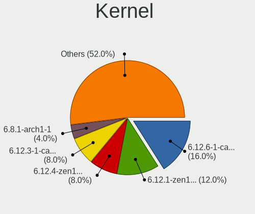
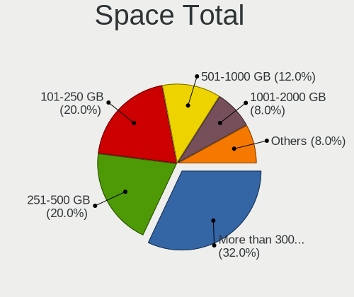
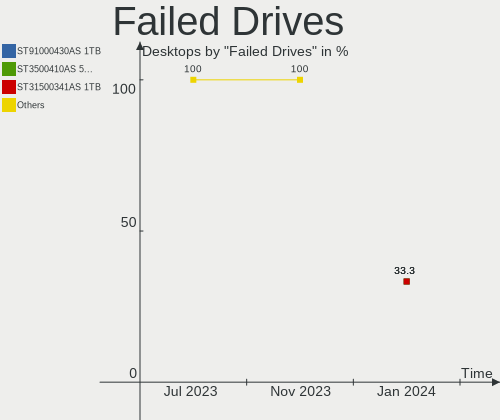
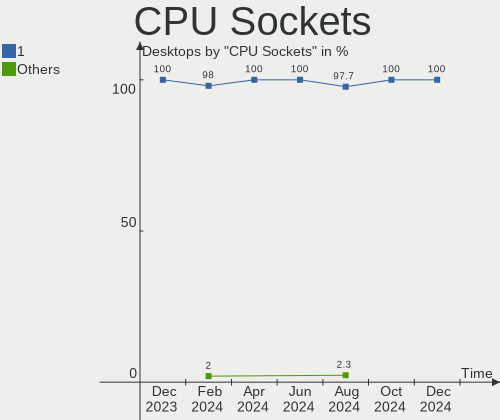
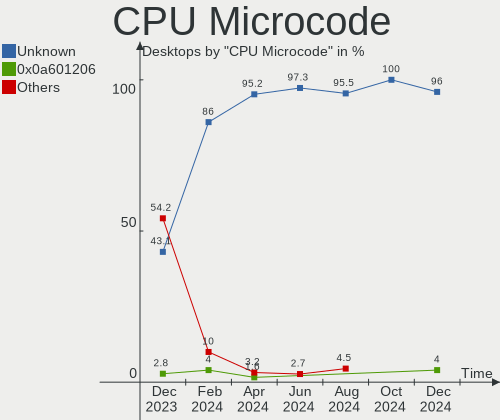
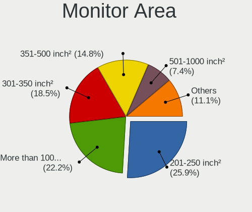
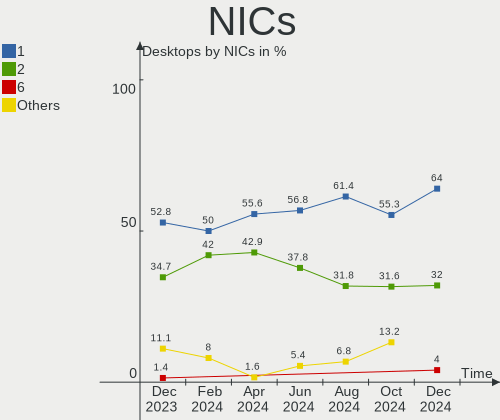

ArcoLinux - Hardware Trends (Desktops)
--------------------------------------

A project to identify most popular hardware characteristics and track their change
over time based on data collected by Linux users at https://Linux-Hardware.org.

Anyone can contribute to this report by the [hw-probe](https://github.com/linuxhw/hw-probe) tool:

    sudo -E hw-probe -all -upload

This report is for one last month. Overall report since the beginning of time: [TestCoverage](https://github.com/linuxhw/TestCoverage)

Period: Dec, 2022.

Contents
--------

* [ System ](#system)
  - [ OS                       ](#os)
  - [ OS Family                ](#os-family)
  - [ Kernel                   ](#kernel)
  - [ Kernel Family            ](#kernel-family)
  - [ Kernel Major Ver.        ](#kernel-major-ver)
  - [ Arch                     ](#arch)
  - [ DE                       ](#de)
  - [ Display Server           ](#display-server)
  - [ Display Manager          ](#display-manager)
  - [ OS Lang                  ](#os-lang)
  - [ Boot Mode                ](#boot-mode)
  - [ Filesystem               ](#filesystem)
  - [ Part. scheme             ](#part-scheme)
  - [ Dual Boot with Linux/BSD ](#dual-boot-with-linuxbsd)
  - [ Dual Boot (Win)          ](#dual-boot-win)

* [ Board ](#board)
  - [ Vendor                   ](#vendor)
  - [ Model                    ](#model)
  - [ Model Family             ](#model-family)
  - [ MFG Year                 ](#mfg-year)
  - [ Form Factor              ](#form-factor)
  - [ Secure Boot              ](#secure-boot)
  - [ Coreboot                 ](#coreboot)
  - [ RAM Size                 ](#ram-size)
  - [ RAM Used                 ](#ram-used)
  - [ Total Drives             ](#total-drives)
  - [ Has CD-ROM               ](#has-cd-rom)
  - [ Has Ethernet             ](#has-ethernet)
  - [ Has WiFi                 ](#has-wifi)
  - [ Has Bluetooth            ](#has-bluetooth)

* [ Location ](#location)
  - [ Country                  ](#country)
  - [ City                     ](#city)

* [ Drives ](#drives)
  - [ Drive Vendor             ](#drive-vendor)
  - [ Drive Model              ](#drive-model)
  - [ HDD Vendor               ](#hdd-vendor)
  - [ SSD Vendor               ](#ssd-vendor)
  - [ Drive Kind               ](#drive-kind)
  - [ Drive Connector          ](#drive-connector)
  - [ Drive Size               ](#drive-size)
  - [ Space Total              ](#space-total)
  - [ Space Used               ](#space-used)
  - [ Malfunc. Drives          ](#malfunc-drives)
  - [ Malfunc. Drive Vendor    ](#malfunc-drive-vendor)
  - [ Malfunc. HDD Vendor      ](#malfunc-hdd-vendor)
  - [ Malfunc. Drive Kind      ](#malfunc-drive-kind)
  - [ Failed Drives            ](#failed-drives)
  - [ Failed Drive Vendor      ](#failed-drive-vendor)
  - [ Drive Status             ](#drive-status)

* [ Storage controller ](#storage-controller)
  - [ Storage Vendor           ](#storage-vendor)
  - [ Storage Model            ](#storage-model)
  - [ Storage Kind             ](#storage-kind)

* [ Processor ](#processor)
  - [ CPU Vendor               ](#cpu-vendor)
  - [ CPU Model                ](#cpu-model)
  - [ CPU Model Family         ](#cpu-model-family)
  - [ CPU Cores                ](#cpu-cores)
  - [ CPU Sockets              ](#cpu-sockets)
  - [ CPU Threads              ](#cpu-threads)
  - [ CPU Op-Modes             ](#cpu-op-modes)
  - [ CPU Microcode            ](#cpu-microcode)
  - [ CPU Microarch            ](#cpu-microarch)

* [ Graphics ](#graphics)
  - [ GPU Vendor               ](#gpu-vendor)
  - [ GPU Model                ](#gpu-model)
  - [ GPU Combo                ](#gpu-combo)
  - [ GPU Driver               ](#gpu-driver)
  - [ GPU Memory               ](#gpu-memory)

* [ Monitor ](#monitor)
  - [ Monitor Vendor           ](#monitor-vendor)
  - [ Monitor Model            ](#monitor-model)
  - [ Monitor Resolution       ](#monitor-resolution)
  - [ Monitor Diagonal         ](#monitor-diagonal)
  - [ Monitor Width            ](#monitor-width)
  - [ Aspect Ratio             ](#aspect-ratio)
  - [ Monitor Area             ](#monitor-area)
  - [ Pixel Density            ](#pixel-density)
  - [ Multiple Monitors        ](#multiple-monitors)

* [ Network ](#network)
  - [ Net Controller Vendor    ](#net-controller-vendor)
  - [ Net Controller Model     ](#net-controller-model)
  - [ Wireless Vendor          ](#wireless-vendor)
  - [ Wireless Model           ](#wireless-model)
  - [ Ethernet Vendor          ](#ethernet-vendor)
  - [ Ethernet Model           ](#ethernet-model)
  - [ Net Controller Kind      ](#net-controller-kind)
  - [ Used Controller          ](#used-controller)
  - [ NICs                     ](#nics)
  - [ IPv6                     ](#ipv6)

* [ Bluetooth ](#bluetooth)
  - [ Bluetooth Vendor         ](#bluetooth-vendor)
  - [ Bluetooth Model          ](#bluetooth-model)

* [ Sound ](#sound)
  - [ Sound Vendor             ](#sound-vendor)
  - [ Sound Model              ](#sound-model)

* [ Memory ](#memory)
  - [ Memory Vendor            ](#memory-vendor)
  - [ Memory Model             ](#memory-model)
  - [ Memory Kind              ](#memory-kind)
  - [ Memory Form Factor       ](#memory-form-factor)
  - [ Memory Size              ](#memory-size)
  - [ Memory Speed             ](#memory-speed)

* [ Printers & scanners ](#printers--scanners)
  - [ Printer Vendor           ](#printer-vendor)
  - [ Printer Model            ](#printer-model)
  - [ Scanner Vendor           ](#scanner-vendor)
  - [ Scanner Model            ](#scanner-model)

* [ Camera ](#camera)
  - [ Camera Vendor            ](#camera-vendor)
  - [ Camera Model             ](#camera-model)

* [ Security ](#security)
  - [ Fingerprint Vendor       ](#fingerprint-vendor)
  - [ Fingerprint Model        ](#fingerprint-model)
  - [ Chipcard Vendor          ](#chipcard-vendor)
  - [ Chipcard Model           ](#chipcard-model)

* [ Unsupported ](#unsupported)
  - [ Unsupported Devices      ](#unsupported-devices)
  - [ Unsupported Device Types ](#unsupported-device-types)

System
------

OS
--

Installed operating systems

| Name              | Desktops | Percent |
|-------------------|----------|---------|
| ArcoLinux Rolling | 18       | 85.71%  |
| ArcoLinux         | 3        | 14.29%  |

OS Family
---------

OS without a version

| Name      | Desktops | Percent |
|-----------|----------|---------|
| ArcoLinux | 21       | 100%    |

Kernel
------

Version of the Linux kernel

| Version               | Desktops | Percent |
|-----------------------|----------|---------|
| 6.0.12-arch1-1        | 7        | 33.33%  |
| 6.1.1-zen1-1-zen      | 2        | 9.52%   |
| 6.0.12-zen1-1-zen     | 2        | 9.52%   |
| 6.0.11-arch1-1        | 2        | 9.52%   |
| 6.0.10-arch2-1        | 2        | 9.52%   |
| 6.0.9-x64v1-xanmod1-1 | 1        | 4.76%   |
| 6.0.8-arch1-1         | 1        | 4.76%   |
| 6.0.11-zen1-1-zen     | 1        | 4.76%   |
| 5.15.84-1-lts         | 1        | 4.76%   |
| 5.15.82-1-lts         | 1        | 4.76%   |
| 5.15.81-1-lts         | 1        | 4.76%   |

Kernel Family
-------------

Linux kernel without a distro release

| Version | Desktops | Percent |
|---------|----------|---------|
| 6.0.12  | 9        | 42.86%  |
| 6.0.11  | 3        | 14.29%  |
| 6.1.1   | 2        | 9.52%   |
| 6.0.10  | 2        | 9.52%   |
| 6.0.9   | 1        | 4.76%   |
| 6.0.8   | 1        | 4.76%   |
| 5.15.84 | 1        | 4.76%   |
| 5.15.82 | 1        | 4.76%   |
| 5.15.81 | 1        | 4.76%   |

Kernel Major Ver.
-----------------

Linux kernel major version

| Version | Desktops | Percent |
|---------|----------|---------|
| 6.0     | 16       | 76.19%  |
| 5.15    | 3        | 14.29%  |
| 6.1     | 2        | 9.52%   |

Arch
----

OS architecture (x86_64, i586, etc.)

| Name   | Desktops | Percent |
|--------|----------|---------|
| x86_64 | 21       | 100%    |

DE
--

Desktop Environment

| Name    | Desktops | Percent |
|---------|----------|---------|
| XFCE    | 7        | 33.33%  |
| KDE5    | 5        | 23.81%  |
| LeftWM  | 2        | 9.52%   |
| i3      | 2        | 9.52%   |
| GNOME   | 1        | 4.76%   |
| dwm     | 1        | 4.76%   |
| chadwm  | 1        | 4.76%   |
| Budgie  | 1        | 4.76%   |
| awesome | 1        | 4.76%   |

Display Server
--------------

X11 or Wayland

| Name    | Desktops | Percent |
|---------|----------|---------|
| X11     | 20       | 95.24%  |
| Wayland | 1        | 4.76%   |

Display Manager
---------------

SDDM, LightDM, etc.

| Name    | Desktops | Percent |
|---------|----------|---------|
| SDDM    | 14       | 66.67%  |
| LightDM | 3        | 14.29%  |
| Unknown | 3        | 14.29%  |
| GDM     | 1        | 4.76%   |

OS Lang
-------

Language

| Lang  | Desktops | Percent |
|-------|----------|---------|
| en_US | 16       | 76.19%  |
| ru_RU | 1        | 4.76%   |
| it_IT | 1        | 4.76%   |
| fr_FR | 1        | 4.76%   |
| en_GB | 1        | 4.76%   |
| de_DE | 1        | 4.76%   |

Boot Mode
---------

EFI or BIOS

| Mode | Desktops | Percent |
|------|----------|---------|
| EFI  | 16       | 76.19%  |
| BIOS | 5        | 23.81%  |

Filesystem
----------

Type of filesystem

| Type  | Desktops | Percent |
|-------|----------|---------|
| Ext4  | 16       | 76.19%  |
| Btrfs | 4        | 19.05%  |
| Xfs   | 1        | 4.76%   |

Part. scheme
------------

Scheme of partitioning

| Type    | Desktops | Percent |
|---------|----------|---------|
| GPT     | 18       | 85.71%  |
| Unknown | 3        | 14.29%  |

Dual Boot with Linux/BSD
------------------------

Hosting more than one Linux/BSD

| Dual boot | Desktops | Percent |
|-----------|----------|---------|
| No        | 18       | 85.71%  |
| Yes       | 3        | 14.29%  |

Dual Boot (Win)
---------------

Hosting Linux and Windows

| Dual boot | Desktops | Percent |
|-----------|----------|---------|
| No        | 12       | 57.14%  |
| Yes       | 9        | 42.86%  |

Board
-----

Vendor
------

Motherboard manufacturer

| Name                | Desktops | Percent |
|---------------------|----------|---------|
| ASUSTek Computer    | 8        | 38.1%   |
| Gigabyte Technology | 5        | 23.81%  |
| MSI                 | 4        | 19.05%  |
| Lenovo              | 1        | 4.76%   |
| Dell                | 1        | 4.76%   |
| ASRock              | 1        | 4.76%   |
| Acer                | 1        | 4.76%   |

Model
-----

Motherboard model

| Name                                 | Desktops | Percent |
|--------------------------------------|----------|---------|
| MSI MS-7C83                          | 1        | 4.76%   |
| MSI MS-7C79                          | 1        | 4.76%   |
| MSI MS-7B79                          | 1        | 4.76%   |
| MSI MS-7971                          | 1        | 4.76%   |
| Lenovo ThinkCentre M58 6258D3G       | 1        | 4.76%   |
| Gigabyte Z490I AORUS ULTRA           | 1        | 4.76%   |
| Gigabyte X570 AORUS PRO WIFI         | 1        | 4.76%   |
| Gigabyte X570 AORUS MASTER           | 1        | 4.76%   |
| Gigabyte B650 AORUS ELITE AX         | 1        | 4.76%   |
| Gigabyte 970A-UD3P                   | 1        | 4.76%   |
| Dell Inspiron 3847                   | 1        | 4.76%   |
| ASUS ROG STRIX X670E-I GAMING WIFI   | 1        | 4.76%   |
| ASUS ROG STRIX B550-I GAMING         | 1        | 4.76%   |
| ASUS ROG STRIX B550-F GAMING WIFI II | 1        | 4.76%   |
| ASUS PRIME Z490-A                    | 1        | 4.76%   |
| ASUS PRIME X570-P                    | 1        | 4.76%   |
| ASUS PRIME B450M-K                   | 1        | 4.76%   |
| ASUS PRIME A320M-K                   | 1        | 4.76%   |
| ASUS All Series                      | 1        | 4.76%   |
| ASRock B250M-HDV                     | 1        | 4.76%   |
| Acer Aspire XC-780                   | 1        | 4.76%   |

Model Family
------------

Motherboard model prefix

| Name               | Desktops | Percent |
|--------------------|----------|---------|
| ASUS PRIME         | 4        | 19.05%  |
| ASUS ROG           | 3        | 14.29%  |
| Gigabyte X570      | 2        | 9.52%   |
| MSI MS-7C83        | 1        | 4.76%   |
| MSI MS-7C79        | 1        | 4.76%   |
| MSI MS-7B79        | 1        | 4.76%   |
| MSI MS-7971        | 1        | 4.76%   |
| Lenovo ThinkCentre | 1        | 4.76%   |
| Gigabyte Z490I     | 1        | 4.76%   |
| Gigabyte B650      | 1        | 4.76%   |
| Gigabyte 970A-UD3P | 1        | 4.76%   |
| Dell Inspiron      | 1        | 4.76%   |
| ASUS All           | 1        | 4.76%   |
| ASRock B250M-HDV   | 1        | 4.76%   |
| Acer Aspire        | 1        | 4.76%   |

MFG Year
--------

Motherboard manufacture year

| Year | Desktops | Percent |
|------|----------|---------|
| 2020 | 5        | 23.81%  |
| 2019 | 4        | 19.05%  |
| 2022 | 2        | 9.52%   |
| 2017 | 2        | 9.52%   |
| 2013 | 2        | 9.52%   |
| 2021 | 1        | 4.76%   |
| 2018 | 1        | 4.76%   |
| 2016 | 1        | 4.76%   |
| 2015 | 1        | 4.76%   |
| 2014 | 1        | 4.76%   |
| 2008 | 1        | 4.76%   |

Form Factor
-----------

Physical design of the computer

| Name    | Desktops | Percent |
|---------|----------|---------|
| Desktop | 21       | 100%    |

Secure Boot
-----------

Enabled or disabled

| State    | Desktops | Percent |
|----------|----------|---------|
| Disabled | 21       | 100%    |

Coreboot
--------

Have coreboot on board

| Used | Desktops | Percent |
|------|----------|---------|
| No   | 21       | 100%    |

RAM Size
--------

Total RAM memory

| Size in GB  | Desktops | Percent |
|-------------|----------|---------|
| 32.01-64.0  | 6        | 28.57%  |
| 8.01-16.0   | 4        | 19.05%  |
| 64.01-256.0 | 3        | 14.29%  |
| 16.01-24.0  | 3        | 14.29%  |
| 4.01-8.0    | 2        | 9.52%   |
| 24.01-32.0  | 2        | 9.52%   |
| 3.01-4.0    | 1        | 4.76%   |

RAM Used
--------

Used RAM memory

| Used GB    | Desktops | Percent |
|------------|----------|---------|
| 3.01-4.0   | 6        | 28.57%  |
| 4.01-8.0   | 5        | 23.81%  |
| 1.01-2.0   | 4        | 19.05%  |
| 2.01-3.0   | 3        | 14.29%  |
| 8.01-16.0  | 2        | 9.52%   |
| 16.01-24.0 | 1        | 4.76%   |

Total Drives
------------

Number of drives on board

| Drives | Desktops | Percent |
|--------|----------|---------|
| 2      | 8        | 38.1%   |
| 1      | 5        | 23.81%  |
| 5      | 3        | 14.29%  |
| 3      | 3        | 14.29%  |
| 4      | 2        | 9.52%   |

Has CD-ROM
----------

Has CD-ROM on board

| Presented | Desktops | Percent |
|-----------|----------|---------|
| No        | 15       | 71.43%  |
| Yes       | 6        | 28.57%  |

Has Ethernet
------------

Has Ethernet on board

| Presented | Desktops | Percent |
|-----------|----------|---------|
| Yes       | 20       | 95.24%  |
| No        | 1        | 4.76%   |

Has WiFi
--------

Has WiFi module

| Presented | Desktops | Percent |
|-----------|----------|---------|
| Yes       | 15       | 71.43%  |
| No        | 6        | 28.57%  |

Has Bluetooth
-------------

Has Bluetooth module

| Presented | Desktops | Percent |
|-----------|----------|---------|
| Yes       | 13       | 61.9%   |
| No        | 8        | 38.1%   |

Location
--------

Country
-------

Geographic location (country)

| Country  | Desktops | Percent |
|----------|----------|---------|
| USA      | 5        | 23.81%  |
| Mexico   | 3        | 14.29%  |
| Sweden   | 2        | 9.52%   |
| UK       | 1        | 4.76%   |
| Slovenia | 1        | 4.76%   |
| Russia   | 1        | 4.76%   |
| Romania  | 1        | 4.76%   |
| Italy    | 1        | 4.76%   |
| Germany  | 1        | 4.76%   |
| France   | 1        | 4.76%   |
| Finland  | 1        | 4.76%   |
| Egypt    | 1        | 4.76%   |
| Canada   | 1        | 4.76%   |
| Belgium  | 1        | 4.76%   |

City
----

Geographic location (city)

| City                  | Desktops | Percent |
|-----------------------|----------|---------|
| Workington            | 1        | 4.76%   |
| Venustiano Carranza   | 1        | 4.76%   |
| Vellinge              | 1        | 4.76%   |
| Tyumen                | 1        | 4.76%   |
| Sharqia               | 1        | 4.76%   |
| San Luis Potosí City | 1        | 4.76%   |
| Radomlje              | 1        | 4.76%   |
| Portland              | 1        | 4.76%   |
| Parma                 | 1        | 4.76%   |
| Oulu                  | 1        | 4.76%   |
| Örebro               | 1        | 4.76%   |
| New York              | 1        | 4.76%   |
| Mexico City           | 1        | 4.76%   |
| Hercules              | 1        | 4.76%   |
| Grand Junction        | 1        | 4.76%   |
| Duffel                | 1        | 4.76%   |
| Draveil               | 1        | 4.76%   |
| Campina               | 1        | 4.76%   |
| Burlington            | 1        | 4.76%   |
| Berkeley              | 1        | 4.76%   |
| Albstadt              | 1        | 4.76%   |

Drives
------

Drive Vendor
------------

Hard drive vendors

| Vendor              | Desktops | Drives | Percent |
|---------------------|----------|--------|---------|
| Samsung Electronics | 10       | 15     | 25.64%  |
| WDC                 | 7        | 12     | 17.95%  |
| Seagate             | 3        | 4      | 7.69%   |
| Kingston            | 3        | 3      | 7.69%   |
| A-DATA Technology   | 3        | 3      | 7.69%   |
| SK hynix            | 2        | 3      | 5.13%   |
| Corsair             | 2        | 2      | 5.13%   |
| ADATA Technology    | 2        | 2      | 5.13%   |
| USB3.0              | 1        | 1      | 2.56%   |
| Unknown             | 1        | 1      | 2.56%   |
| Sandisk             | 1        | 2      | 2.56%   |
| PNY                 | 1        | 1      | 2.56%   |
| Phison Electronics  | 1        | 1      | 2.56%   |
| Intel               | 1        | 1      | 2.56%   |
| Crucial             | 1        | 1      | 2.56%   |

Drive Model
-----------

Hard drive models

| Model                                                           | Desktops | Percent |
|-----------------------------------------------------------------|----------|---------|
| WDC WD10EZEX-08WN4A0 1TB                                        | 2        | 4.08%   |
| Samsung NVMe SSD Controller SM981/PM981/PM983 500GB             | 2        | 4.08%   |
| ADATA XPG SX8200 Pro PCIe Gen3x4 M.2 2280 Solid State Drive 1TB | 2        | 4.08%   |
| WDC WDS100T2B0B-00YS70 1TB SSD                                  | 1        | 2.04%   |
| WDC WD5000AAKS-65A7B2 500GB                                     | 1        | 2.04%   |
| WDC WD5000AACS-00G8B1 500GB                                     | 1        | 2.04%   |
| WDC WD3200AVJS-63B6A0 320GB                                     | 1        | 2.04%   |
| WDC WD30EZRZ-00Z5HB0 3TB                                        | 1        | 2.04%   |
| WDC WD30EZRX-00DC0B0 3TB                                        | 1        | 2.04%   |
| WDC WD15EARS-00Z5B1 1TB                                         | 1        | 2.04%   |
| WDC WD10EZEX-75M2NA0 1TB                                        | 1        | 2.04%   |
| WDC WD10EZEX-22MFCA0 1TB                                        | 1        | 2.04%   |
| WDC WD10EZEX-00BN5A0 1TB                                        | 1        | 2.04%   |
| USB3.0 Disk 2TB                                                 | 1        | 2.04%   |
| Unknown SD/MMC/MS PRO 64GB                                      | 1        | 2.04%   |
| SK hynix SHPP41-2000GM 2TB                                      | 1        | 2.04%   |
| SK hynix C2S3T/240G 240GB SSD                                   | 1        | 2.04%   |
| Seagate ST8000DM004-2CX188 8TB                                  | 1        | 2.04%   |
| Seagate ST3500312CS 500GB                                       | 1        | 2.04%   |
| Seagate ST3320311CS 320GB                                       | 1        | 2.04%   |
| Seagate ST2000DM008-2UB102 2TB                                  | 1        | 2.04%   |
| Sandisk WD Black 2018/SN750 / PC SN720 NVMe SSD 256GB           | 1        | 2.04%   |
| Samsung SSD 990 PRO 1TB                                         | 1        | 2.04%   |
| Samsung SSD 980 1TB                                             | 1        | 2.04%   |
| Samsung SSD 870 QVO 2TB                                         | 1        | 2.04%   |
| Samsung SSD 870 EVO 1TB                                         | 1        | 2.04%   |
| Samsung SSD 860 PRO 512GB                                       | 1        | 2.04%   |
| Samsung SSD 850 PRO 512GB                                       | 1        | 2.04%   |
| Samsung SSD 850 EVO 500GB                                       | 1        | 2.04%   |
| Samsung SSD 850 EVO 250GB                                       | 1        | 2.04%   |
| Samsung NVMe SSD Controller SM961/PM961/SM963 256GB             | 1        | 2.04%   |
| Samsung NVMe SSD Controller SM951/PM951 512GB                   | 1        | 2.04%   |
| Samsung NVMe SSD Controller PM9A1/PM9A3/980PRO 2TB              | 1        | 2.04%   |
| Samsung HD502HI 500GB                                           | 1        | 2.04%   |
| PNY CS900 240GB SSD                                             | 1        | 2.04%   |
| Phison Force MP300 240GB                                        | 1        | 2.04%   |
| Kingston SNVS500G 500GB                                         | 1        | 2.04%   |
| Kingston SH103S3240G 240GB                                      | 1        | 2.04%   |
| Kingston SA400S37240G 240GB SSD                                 | 1        | 2.04%   |
| Intel SSD Pro 7600p/760p/E 6100p Series 1024GB                  | 1        | 2.04%   |

HDD Vendor
----------

Hard disk drive vendors

| Vendor              | Desktops | Drives | Percent |
|---------------------|----------|--------|---------|
| WDC                 | 7        | 11     | 53.85%  |
| Seagate             | 3        | 4      | 23.08%  |
| USB3.0              | 1        | 1      | 7.69%   |
| Unknown             | 1        | 1      | 7.69%   |
| Samsung Electronics | 1        | 1      | 7.69%   |

SSD Vendor
----------

Solid state drive vendors

| Vendor              | Desktops | Drives | Percent |
|---------------------|----------|--------|---------|
| Samsung Electronics | 5        | 7      | 31.25%  |
| A-DATA Technology   | 3        | 3      | 18.75%  |
| Kingston            | 2        | 2      | 12.5%   |
| Corsair             | 2        | 2      | 12.5%   |
| WDC                 | 1        | 1      | 6.25%   |
| SK hynix            | 1        | 1      | 6.25%   |
| PNY                 | 1        | 1      | 6.25%   |
| Crucial             | 1        | 1      | 6.25%   |

Drive Kind
----------

HDD or SSD

| Kind | Desktops | Drives | Percent |
|------|----------|--------|---------|
| NVMe | 12       | 16     | 34.29%  |
| SSD  | 12       | 18     | 34.29%  |
| HDD  | 11       | 18     | 31.43%  |

Drive Connector
---------------

SATA, SAS, NVMe, etc.

| Type | Desktops | Drives | Percent |
|------|----------|--------|---------|
| SATA | 18       | 34     | 56.25%  |
| NVMe | 12       | 16     | 37.5%   |
| SAS  | 2        | 2      | 6.25%   |

Drive Size
----------

Size of hard drive

| Size in TB | Desktops | Drives | Percent |
|------------|----------|--------|---------|
| 0.01-0.5   | 13       | 20     | 46.43%  |
| 0.51-1.0   | 9        | 10     | 32.14%  |
| 1.01-2.0   | 3        | 3      | 10.71%  |
| 2.01-3.0   | 2        | 2      | 7.14%   |
| 4.01-10.0  | 1        | 1      | 3.57%   |

Space Total
-----------

Amount of disk space available on the file system

| Size in GB | Desktops | Percent |
|------------|----------|---------|
| 1001-2000  | 8        | 38.1%   |
| 501-1000   | 6        | 28.57%  |
| 251-500    | 3        | 14.29%  |
| 101-250    | 2        | 9.52%   |
| 2001-3000  | 1        | 4.76%   |
| 51-100     | 1        | 4.76%   |

Space Used
----------

Amount of used disk space

| Used GB   | Desktops | Percent |
|-----------|----------|---------|
| 251-500   | 5        | 23.81%  |
| 101-250   | 4        | 19.05%  |
| 501-1000  | 4        | 19.05%  |
| 21-50     | 2        | 9.52%   |
| 1001-2000 | 2        | 9.52%   |
| 1-20      | 2        | 9.52%   |
| 51-100    | 2        | 9.52%   |

Malfunc. Drives
---------------

Drive models with a malfunction

| Model                             | Desktops | Drives | Percent |
|-----------------------------------|----------|--------|---------|
| WDC WD5000AACS-00G8B1 500GB       | 1        | 1      | 16.67%  |
| WDC WD3200AVJS-63B6A0 320GB       | 1        | 1      | 16.67%  |
| WDC WD30EZRZ-00Z5HB0 3TB          | 1        | 1      | 16.67%  |
| Samsung Electronics HD502HI 500GB | 1        | 1      | 16.67%  |
| Corsair CSSD-F60GB2 64GB          | 1        | 1      | 16.67%  |
| A-DATA Technology SU800 128GB SSD | 1        | 1      | 16.67%  |

Malfunc. Drive Vendor
---------------------

Vendors of faulty drives

| Vendor              | Desktops | Drives | Percent |
|---------------------|----------|--------|---------|
| WDC                 | 3        | 3      | 50%     |
| Samsung Electronics | 1        | 1      | 16.67%  |
| Corsair             | 1        | 1      | 16.67%  |
| A-DATA Technology   | 1        | 1      | 16.67%  |

Malfunc. HDD Vendor
-------------------

Vendors of faulty HDD drives

| Vendor              | Desktops | Drives | Percent |
|---------------------|----------|--------|---------|
| WDC                 | 3        | 3      | 75%     |
| Samsung Electronics | 1        | 1      | 25%     |

Malfunc. Drive Kind
-------------------

Kinds of faulty drives

| Kind | Desktops | Drives | Percent |
|------|----------|--------|---------|
| HDD  | 4        | 4      | 66.67%  |
| SSD  | 2        | 2      | 33.33%  |

Failed Drives
-------------

Failed drive models

| Model                           | Desktops | Drives | Percent |
|---------------------------------|----------|--------|---------|
| Samsung Electronics SSD 980 1TB | 1        | 1      | 100%    |

Failed Drive Vendor
-------------------

Failed drive vendors

| Vendor              | Desktops | Drives | Percent |
|---------------------|----------|--------|---------|
| Samsung Electronics | 1        | 1      | 100%    |

Drive Status
------------

Number of failed and malfunc. drives

| Status   | Desktops | Drives | Percent |
|----------|----------|--------|---------|
| Works    | 17       | 35     | 60.71%  |
| Detected | 5        | 10     | 17.86%  |
| Malfunc  | 5        | 6      | 17.86%  |
| Failed   | 1        | 1      | 3.57%   |

Storage controller
------------------

Storage Vendor
--------------

Storage controller vendors

| Vendor                      | Desktops | Percent |
|-----------------------------|----------|---------|
| Intel                       | 11       | 30.56%  |
| AMD                         | 11       | 30.56%  |
| Samsung Electronics         | 6        | 16.67%  |
| ADATA Technology            | 2        | 5.56%   |
| SK hynix                    | 1        | 2.78%   |
| SanDisk                     | 1        | 2.78%   |
| Phison Electronics          | 1        | 2.78%   |
| Marvell Technology Group    | 1        | 2.78%   |
| Kingston Technology Company | 1        | 2.78%   |
| ASMedia Technology          | 1        | 2.78%   |

Storage Model
-------------

Storage controller models

| Model                                                                          | Desktops | Percent |
|--------------------------------------------------------------------------------|----------|---------|
| AMD FCH SATA Controller [AHCI mode]                                            | 5        | 12.5%   |
| Intel Comet Lake SATA AHCI Controller                                          | 3        | 7.5%    |
| Samsung NVMe SSD Controller SM981/PM981/PM983                                  | 2        | 5%      |
| Intel Q170/Q150/B150/H170/H110/Z170/CM236 Chipset SATA Controller [AHCI Mode]  | 2        | 5%      |
| Intel 8 Series/C220 Series Chipset Family 6-port SATA Controller 1 [AHCI mode] | 2        | 5%      |
| AMD SATA controller                                                            | 2        | 5%      |
| AMD 500 Series Chipset SATA Controller                                         | 2        | 5%      |
| AMD 400 Series Chipset SATA Controller                                         | 2        | 5%      |
| ADATA XPG SX8200 Pro PCIe Gen3x4 M.2 2280 Solid State Drive                    | 2        | 5%      |
| SK hynix Non-Volatile memory controller                                        | 1        | 2.5%    |
| SanDisk WD Black 2018/SN750 / PC SN720 NVMe SSD                                | 1        | 2.5%    |
| Samsung NVMe SSD Controller SM961/PM961/SM963                                  | 1        | 2.5%    |
| Samsung NVMe SSD Controller SM951/PM951                                        | 1        | 2.5%    |
| Samsung NVMe SSD Controller PM9A1/PM9A3/980PRO                                 | 1        | 2.5%    |
| Samsung NVMe SSD Controller 980                                                | 1        | 2.5%    |
| Samsung Electronics Non-Volatile memory controller                             | 1        | 2.5%    |
| Phison NVMe Storage Controller                                                 | 1        | 2.5%    |
| Marvell Group 88SE9215 PCIe 2.0 x1 4-port SATA 6 Gb/s Controller               | 1        | 2.5%    |
| Kingston Company SNVS2000G [NV1 NVMe PCIe SSD 2TB]                             | 1        | 2.5%    |
| Intel SSD Pro 7600p/760p/E 6100p Series                                        | 1        | 2.5%    |
| Intel 82801JD/DO (ICH10 Family) SATA AHCI Controller                           | 1        | 2.5%    |
| Intel 400 Series Chipset Family SATA AHCI Controller                           | 1        | 2.5%    |
| Intel 4 Series Chipset PT IDER Controller                                      | 1        | 2.5%    |
| Intel 200 Series PCH SATA controller [AHCI mode]                               | 1        | 2.5%    |
| ASMedia ASM1166 Serial ATA Controller                                          | 1        | 2.5%    |
| AMD SB7x0/SB8x0/SB9x0 SATA Controller [AHCI mode]                              | 1        | 2.5%    |
| AMD FCH SATA Controller D                                                      | 1        | 2.5%    |

Storage Kind
------------

Kind of storage controller (IDE, SATA, NVMe, SAS, ...)

| Kind | Desktops | Percent |
|------|----------|---------|
| SATA | 21       | 61.76%  |
| NVMe | 12       | 35.29%  |
| IDE  | 1        | 2.94%   |

Processor
---------

CPU Vendor
----------

Processor vendors

| Vendor | Desktops | Percent |
|--------|----------|---------|
| AMD    | 11       | 52.38%  |
| Intel  | 10       | 47.62%  |

CPU Model
---------

Processor models

| Model                                       | Desktops | Percent |
|---------------------------------------------|----------|---------|
| AMD Ryzen 7 3700X 8-Core Processor          | 2        | 9.52%   |
| Intel Pentium CPU G3460 @ 3.50GHz           | 1        | 4.76%   |
| Intel Core i9-10900K CPU @ 3.70GHz          | 1        | 4.76%   |
| Intel Core i9-10850K CPU @ 3.60GHz          | 1        | 4.76%   |
| Intel Core i7-6700K CPU @ 4.00GHz           | 1        | 4.76%   |
| Intel Core i7-4790 CPU @ 3.60GHz            | 1        | 4.76%   |
| Intel Core i7-10700K CPU @ 3.80GHz          | 1        | 4.76%   |
| Intel Core i5-6400 CPU @ 2.70GHz            | 1        | 4.76%   |
| Intel Core i5-10400F CPU @ 2.90GHz          | 1        | 4.76%   |
| Intel Core i3-7100 CPU @ 3.90GHz            | 1        | 4.76%   |
| Intel Core 2 Duo CPU E7500 @ 2.93GHz        | 1        | 4.76%   |
| AMD Ryzen 9 7900X 12-Core Processor         | 1        | 4.76%   |
| AMD Ryzen 7 5800X 8-Core Processor          | 1        | 4.76%   |
| AMD Ryzen 5 7600X 6-Core Processor          | 1        | 4.76%   |
| AMD Ryzen 5 5600X 6-Core Processor          | 1        | 4.76%   |
| AMD Ryzen 5 3600X 6-Core Processor          | 1        | 4.76%   |
| AMD Ryzen 5 2600X Six-Core Processor        | 1        | 4.76%   |
| AMD Ryzen 3 3100 4-Core Processor           | 1        | 4.76%   |
| AMD Ryzen 3 2200G with Radeon Vega Graphics | 1        | 4.76%   |
| AMD FX-8350 Eight-Core Processor            | 1        | 4.76%   |

CPU Model Family
----------------

Processor model prefix

| Model            | Desktops | Percent |
|------------------|----------|---------|
| AMD Ryzen 5      | 4        | 19.05%  |
| Intel Core i7    | 3        | 14.29%  |
| AMD Ryzen 7      | 3        | 14.29%  |
| Intel Core i9    | 2        | 9.52%   |
| Intel Core i5    | 2        | 9.52%   |
| AMD Ryzen 3      | 2        | 9.52%   |
| Intel Pentium    | 1        | 4.76%   |
| Intel Core i3    | 1        | 4.76%   |
| Intel Core 2 Duo | 1        | 4.76%   |
| AMD Ryzen 9      | 1        | 4.76%   |
| AMD FX           | 1        | 4.76%   |

CPU Cores
---------

Number of processor cores

| Number | Desktops | Percent |
|--------|----------|---------|
| 4      | 6        | 28.57%  |
| 6      | 5        | 23.81%  |
| 8      | 4        | 19.05%  |
| 2      | 3        | 14.29%  |
| 10     | 2        | 9.52%   |
| 12     | 1        | 4.76%   |

CPU Sockets
-----------

Number of sockets

| Number | Desktops | Percent |
|--------|----------|---------|
| 1      | 21       | 100%    |

CPU Threads
-----------

Threads per core (Hyper-Threading)

| Number | Desktops | Percent |
|--------|----------|---------|
| 2      | 17       | 80.95%  |
| 1      | 4        | 19.05%  |

CPU Op-Modes
------------

CPU Operation Modes (32-bit, 64-bit)

| Op mode        | Desktops | Percent |
|----------------|----------|---------|
| 32-bit, 64-bit | 21       | 100%    |

CPU Microcode
-------------

Microcode number

| Number     | Desktops | Percent |
|------------|----------|---------|
| 0xa0655    | 4        | 19.05%  |
| Unknown    | 3        | 14.29%  |
| 0x506e3    | 2        | 9.52%   |
| 0x306c3    | 2        | 9.52%   |
| 0x08701021 | 2        | 9.52%   |
| 0x906e9    | 1        | 4.76%   |
| 0x0a601203 | 1        | 4.76%   |
| 0x0a601201 | 1        | 4.76%   |
| 0x0a201204 | 1        | 4.76%   |
| 0x0a201016 | 1        | 4.76%   |
| 0x08701013 | 1        | 4.76%   |
| 0x08101016 | 1        | 4.76%   |
| 0x06000852 | 1        | 4.76%   |

CPU Microarch
-------------

Microarchitecture

| Name       | Desktops | Percent |
|------------|----------|---------|
| Zen 2      | 4        | 19.05%  |
| CometLake  | 4        | 19.05%  |
| Zen 3      | 2        | 9.52%   |
| Skylake    | 2        | 9.52%   |
| Haswell    | 2        | 9.52%   |
| Unknown    | 2        | 9.52%   |
| Zen+       | 1        | 4.76%   |
| Zen        | 1        | 4.76%   |
| Piledriver | 1        | 4.76%   |
| Penryn     | 1        | 4.76%   |
| KabyLake   | 1        | 4.76%   |

Graphics
--------

GPU Vendor
----------

Vendors of graphics cards

| Vendor | Desktops | Percent |
|--------|----------|---------|
| Nvidia | 12       | 52.17%  |
| AMD    | 6        | 26.09%  |
| Intel  | 5        | 21.74%  |

GPU Model
---------

Graphics card models

| Model                                                                       | Desktops | Percent |
|-----------------------------------------------------------------------------|----------|---------|
| Nvidia GP106 [GeForce GTX 1060 6GB]                                         | 2        | 8%      |
| Intel Xeon E3-1200 v3/4th Gen Core Processor Integrated Graphics Controller | 2        | 8%      |
| AMD Raphael                                                                 | 2        | 8%      |
| AMD Navi 22 [Radeon RX 6700/6700 XT/6750 XT / 6800M]                        | 2        | 8%      |
| Nvidia TU116 [GeForce GTX 1660]                                             | 1        | 4%      |
| Nvidia TU116 [GeForce GTX 1650]                                             | 1        | 4%      |
| Nvidia TU106 [GeForce RTX 2070 Rev. A]                                      | 1        | 4%      |
| Nvidia TU106 [GeForce RTX 2060 Rev. A]                                      | 1        | 4%      |
| Nvidia TU104 [GeForce RTX 2060]                                             | 1        | 4%      |
| Nvidia GP104 [GeForce GTX 1070 Ti]                                          | 1        | 4%      |
| Nvidia GM204 [GeForce GTX 970]                                              | 1        | 4%      |
| Nvidia GF108 [GeForce GT 730]                                               | 1        | 4%      |
| Nvidia GA106 [GeForce RTX 3060 Lite Hash Rate]                              | 1        | 4%      |
| Nvidia GA104 [GeForce RTX 3070 Lite Hash Rate]                              | 1        | 4%      |
| Intel HD Graphics 630                                                       | 1        | 4%      |
| Intel HD Graphics 530                                                       | 1        | 4%      |
| Intel 4 Series Chipset Integrated Graphics Controller                       | 1        | 4%      |
| AMD Raven Ridge [Radeon Vega Series / Radeon Vega Mobile Series]            | 1        | 4%      |
| AMD Navi 10 [Radeon RX 5600 OEM/5600 XT / 5700/5700 XT]                     | 1        | 4%      |
| AMD Ellesmere [Radeon RX 470/480/570/570X/580/580X/590]                     | 1        | 4%      |
| AMD Cedar [Radeon HD 5000/6000/7350/8350 Series]                            | 1        | 4%      |

GPU Combo
---------

Combinations of graphics cards

| Name         | Desktops | Percent |
|--------------|----------|---------|
| 1 x Nvidia   | 10       | 47.62%  |
| 1 x Intel    | 5        | 23.81%  |
| 1 x AMD      | 3        | 14.29%  |
| AMD + Nvidia | 2        | 9.52%   |
| 2 x AMD      | 1        | 4.76%   |

GPU Driver
----------

Free vs proprietary

| Driver      | Desktops | Percent |
|-------------|----------|---------|
| Proprietary | 10       | 47.62%  |
| Free        | 10       | 47.62%  |
| Unknown     | 1        | 4.76%   |

GPU Memory
----------

Total video memory

| Size in GB | Desktops | Percent |
|------------|----------|---------|
| Unknown    | 7        | 33.33%  |
| 7.01-8.0   | 5        | 23.81%  |
| 5.01-6.0   | 4        | 19.05%  |
| 8.01-16.0  | 3        | 14.29%  |
| 3.01-4.0   | 1        | 4.76%   |
| 1.01-2.0   | 1        | 4.76%   |

Monitor
-------

Monitor Vendor
--------------

Monitor vendors

| Vendor               | Desktops | Percent |
|----------------------|----------|---------|
| Dell                 | 6        | 21.43%  |
| Goldstar             | 3        | 10.71%  |
| Ancor Communications | 3        | 10.71%  |
| Samsung Electronics  | 2        | 7.14%   |
| Philips              | 2        | 7.14%   |
| BenQ                 | 2        | 7.14%   |
| AOC                  | 2        | 7.14%   |
| Acer                 | 2        | 7.14%   |
| Vizio                | 1        | 3.57%   |
| Sony                 | 1        | 3.57%   |
| HZB                  | 1        | 3.57%   |
| Hewlett-Packard      | 1        | 3.57%   |
| Eizo                 | 1        | 3.57%   |
| ASUSTek Computer     | 1        | 3.57%   |

Monitor Model
-------------

Monitor models

| Model                                                                 | Desktops | Percent |
|-----------------------------------------------------------------------|----------|---------|
| Vizio E231-B1 VIZ0095 1360x768 534x311mm 24.3-inch                    | 1        | 3.45%   |
| Sony SDM-HS95 SNY2700 1280x1024 376x301mm 19.0-inch                   | 1        | 3.45%   |
| Samsung Electronics LCD Monitor SAM0C3C 1366x768 609x347mm 27.6-inch  | 1        | 3.45%   |
| Samsung Electronics C24F390 SAM0D2C 1920x1080 521x293mm 23.5-inch     | 1        | 3.45%   |
| Philips PHL 234E5 PHLC0C7 1920x1080 509x286mm 23.0-inch               | 1        | 3.45%   |
| Philips 190CW PHLC023 1440x900 408x255mm 18.9-inch                    | 1        | 3.45%   |
| HZB HDMI88 HZB3132 480x1920                                           | 1        | 3.45%   |
| Hewlett-Packard W2071d HWP299C 1600x900 443x249mm 20.0-inch           | 1        | 3.45%   |
| Goldstar ULTRAGEAR GSM775C 1920x1080 698x393mm 31.5-inch              | 1        | 3.45%   |
| Goldstar M2380D GSM57BC 1920x1080 598x336mm 27.0-inch                 | 1        | 3.45%   |
| Goldstar 34GK950F GSM7727 3440x1440 800x335mm 34.1-inch               | 1        | 3.45%   |
| Eizo EV2785 ENC2908 3840x2160 600x340mm 27.2-inch                     | 1        | 3.45%   |
| Dell U2515H DELD06E 2560x1440 553x311mm 25.0-inch                     | 1        | 3.45%   |
| Dell U2412M DELA07A 1920x1200 518x324mm 24.1-inch                     | 1        | 3.45%   |
| Dell P2414H DELA09A 1920x1080 530x300mm 24.0-inch                     | 1        | 3.45%   |
| Dell P1914S DELF049 1280x1024 380x300mm 19.1-inch                     | 1        | 3.45%   |
| Dell P190S DEL405A 1280x1024 376x301mm 19.0-inch                      | 1        | 3.45%   |
| Dell E2420HS DELF11D 1920x1080 527x296mm 23.8-inch                    | 1        | 3.45%   |
| Dell E2414H DEL4091 1920x1080 530x300mm 24.0-inch                     | 1        | 3.45%   |
| BenQ GW2780 BNQ78E6 1920x1080 600x340mm 27.2-inch                     | 1        | 3.45%   |
| BenQ GL2580 BNQ78E5 1920x1080 540x300mm 24.3-inch                     | 1        | 3.45%   |
| ASUSTek Computer VG249 AUS2421 1920x1080 527x296mm 23.8-inch          | 1        | 3.45%   |
| AOC Q3279WG5B AOC3279 2560x1440 725x428mm 33.1-inch                   | 1        | 3.45%   |
| AOC LCD Monitor 32G1WG4 1920x1080                                     | 1        | 3.45%   |
| Ancor Communications VG248 ACI24A5 1920x1080 530x300mm 24.0-inch      | 1        | 3.45%   |
| Ancor Communications VG248 ACI24A4 1920x1080 531x299mm 24.0-inch      | 1        | 3.45%   |
| Ancor Communications ASUS MG28U ACI28A7 3840x2160 620x340mm 27.8-inch | 1        | 3.45%   |
| Acer KG241 P ACR069A 1920x1080 530x300mm 24.0-inch                    | 1        | 3.45%   |
| Acer AL1916W ACRAD52 1440x900 408x255mm 18.9-inch                     | 1        | 3.45%   |

Monitor Resolution
------------------

Monitor screen resolution

| Resolution        | Desktops | Percent |
|-------------------|----------|---------|
| 1920x1080 (FHD)   | 11       | 44%     |
| 3840x2160 (4K)    | 2        | 8%      |
| 1440x900 (WXGA+)  | 2        | 8%      |
| 1366x768 (WXGA)   | 2        | 8%      |
| 1280x1024 (SXGA)  | 2        | 8%      |
| 480x1920          | 1        | 4%      |
| 3440x1440         | 1        | 4%      |
| 2560x1440 (QHD)   | 1        | 4%      |
| 2288x1287         | 1        | 4%      |
| 1920x1200 (WUXGA) | 1        | 4%      |
| 1600x900 (HD+)    | 1        | 4%      |

Monitor Diagonal
----------------

Diagonal size in inches

| Inches  | Desktops | Percent |
|---------|----------|---------|
| 24      | 5        | 20.83%  |
| 27      | 4        | 16.67%  |
| 31      | 3        | 12.5%   |
| 19      | 3        | 12.5%   |
| 23      | 2        | 8.33%   |
| Unknown | 2        | 8.33%   |
| 34      | 1        | 4.17%   |
| 33      | 1        | 4.17%   |
| 25      | 1        | 4.17%   |
| 20      | 1        | 4.17%   |
| 18      | 1        | 4.17%   |

Monitor Width
-------------

Physical width

| Width in mm | Desktops | Percent |
|-------------|----------|---------|
| 501-600     | 11       | 44%     |
| 601-700     | 4        | 16%     |
| 401-500     | 3        | 12%     |
| 351-400     | 3        | 12%     |
| 701-800     | 2        | 8%      |
| Unknown     | 2        | 8%      |

Aspect Ratio
------------

Proportional relationship between the width and the height

| Ratio   | Desktops | Percent |
|---------|----------|---------|
| 16/9    | 15       | 62.5%   |
| 5/4     | 3        | 12.5%   |
| 16/10   | 3        | 12.5%   |
| 21/9    | 1        | 4.17%   |
| 0.25    | 1        | 4.17%   |
| Unknown | 1        | 4.17%   |

Monitor Area
------------

Area in inch²

| Area in inch² | Desktops | Percent |
|----------------|----------|---------|
| 201-250        | 7        | 26.92%  |
| 351-500        | 5        | 19.23%  |
| 151-200        | 5        | 19.23%  |
| 301-350        | 4        | 15.38%  |
| 251-300        | 3        | 11.54%  |
| Unknown        | 2        | 7.69%   |

Pixel Density
-------------

Pixels per inch

| Density | Desktops | Percent |
|---------|----------|---------|
| 51-100  | 14       | 63.64%  |
| 1-50    | 2        | 9.09%   |
| 101-120 | 2        | 9.09%   |
| Unknown | 2        | 9.09%   |
| 161-240 | 1        | 4.55%   |
| 121-160 | 1        | 4.55%   |

Multiple Monitors
-----------------

Total monitors connected

| Total | Desktops | Percent |
|-------|----------|---------|
| 1     | 12       | 57.14%  |
| 2     | 6        | 28.57%  |
| 3     | 2        | 9.52%   |
| 0     | 1        | 4.76%   |

Network
-------

Net Controller Vendor
---------------------

Controller vendors

| Vendor                | Desktops | Percent |
|-----------------------|----------|---------|
| Realtek Semiconductor | 13       | 41.94%  |
| Intel                 | 13       | 41.94%  |
| MediaTek              | 3        | 9.68%   |
| Ralink Technology     | 1        | 3.23%   |
| Qualcomm Atheros      | 1        | 3.23%   |

Net Controller Model
--------------------

Controller models

| Model                                                             | Desktops | Percent |
|-------------------------------------------------------------------|----------|---------|
| Realtek RTL8111/8168/8411 PCI Express Gigabit Ethernet Controller | 9        | 23.68%  |
| Intel Wi-Fi 6 AX200                                               | 4        | 10.53%  |
| Intel Ethernet Controller I225-V                                  | 4        | 10.53%  |
| Realtek RTL8125 2.5GbE Controller                                 | 3        | 7.89%   |
| MediaTek MT7922 802.11ax PCI Express Wireless Network Adapter     | 2        | 5.26%   |
| Intel I211 Gigabit Network Connection                             | 2        | 5.26%   |
| Intel Dual Band Wireless-AC 3168NGW [Stone Peak]                  | 2        | 5.26%   |
| Intel Comet Lake PCH CNVi WiFi                                    | 2        | 5.26%   |
| Realtek RTL8188EUS 802.11n Wireless Network Adapter               | 1        | 2.63%   |
| Realtek RTL8153 Gigabit Ethernet Adapter                          | 1        | 2.63%   |
| Realtek 8821CE Wireless LAN 802.11ac PCIe NIC                     | 1        | 2.63%   |
| Ralink RT2870/RT3070 Wireless Adapter                             | 1        | 2.63%   |
| Ralink MT7601U Wireless Adapter                                   | 1        | 2.63%   |
| Qualcomm Atheros QCA9565 / AR9565 Wireless Network Adapter        | 1        | 2.63%   |
| MediaTek MT7921K (RZ608) Wi-Fi 6E 80MHz                           | 1        | 2.63%   |
| Intel Ethernet Connection I217-V                                  | 1        | 2.63%   |
| Intel Ethernet Connection (2) I219-V                              | 1        | 2.63%   |
| Intel 82567LM-3 Gigabit Network Connection                        | 1        | 2.63%   |

Wireless Vendor
---------------

Wireless vendors

| Vendor                | Desktops | Percent |
|-----------------------|----------|---------|
| Intel                 | 8        | 53.33%  |
| MediaTek              | 3        | 20%     |
| Realtek Semiconductor | 2        | 13.33%  |
| Ralink Technology     | 1        | 6.67%   |
| Qualcomm Atheros      | 1        | 6.67%   |

Wireless Model
--------------

Wireless models

| Model                                                         | Desktops | Percent |
|---------------------------------------------------------------|----------|---------|
| Intel Wi-Fi 6 AX200                                           | 4        | 25%     |
| MediaTek MT7922 802.11ax PCI Express Wireless Network Adapter | 2        | 12.5%   |
| Intel Dual Band Wireless-AC 3168NGW [Stone Peak]              | 2        | 12.5%   |
| Intel Comet Lake PCH CNVi WiFi                                | 2        | 12.5%   |
| Realtek RTL8188EUS 802.11n Wireless Network Adapter           | 1        | 6.25%   |
| Realtek 8821CE Wireless LAN 802.11ac PCIe NIC                 | 1        | 6.25%   |
| Ralink RT2870/RT3070 Wireless Adapter                         | 1        | 6.25%   |
| Ralink MT7601U Wireless Adapter                               | 1        | 6.25%   |
| Qualcomm Atheros QCA9565 / AR9565 Wireless Network Adapter    | 1        | 6.25%   |
| MediaTek MT7921K (RZ608) Wi-Fi 6E 80MHz                       | 1        | 6.25%   |

Ethernet Vendor
---------------

Ethernet vendors

| Vendor                | Desktops | Percent |
|-----------------------|----------|---------|
| Realtek Semiconductor | 12       | 57.14%  |
| Intel                 | 9        | 42.86%  |

Ethernet Model
--------------

Ethernet models

| Model                                                             | Desktops | Percent |
|-------------------------------------------------------------------|----------|---------|
| Realtek RTL8111/8168/8411 PCI Express Gigabit Ethernet Controller | 9        | 40.91%  |
| Intel Ethernet Controller I225-V                                  | 4        | 18.18%  |
| Realtek RTL8125 2.5GbE Controller                                 | 3        | 13.64%  |
| Intel I211 Gigabit Network Connection                             | 2        | 9.09%   |
| Realtek RTL8153 Gigabit Ethernet Adapter                          | 1        | 4.55%   |
| Intel Ethernet Connection I217-V                                  | 1        | 4.55%   |
| Intel Ethernet Connection (2) I219-V                              | 1        | 4.55%   |
| Intel 82567LM-3 Gigabit Network Connection                        | 1        | 4.55%   |

Net Controller Kind
-------------------

Ethernet, WiFi or modem

| Kind     | Desktops | Percent |
|----------|----------|---------|
| Ethernet | 20       | 57.14%  |
| WiFi     | 15       | 42.86%  |

Used Controller
---------------

Currently used network controller

| Kind     | Desktops | Percent |
|----------|----------|---------|
| Ethernet | 12       | 57.14%  |
| WiFi     | 9        | 42.86%  |

NICs
----

Total network controllers on board

| Total | Desktops | Percent |
|-------|----------|---------|
| 2     | 11       | 52.38%  |
| 1     | 9        | 42.86%  |
| 3     | 1        | 4.76%   |

IPv6
----

IPv6 vs IPv4

| Used | Desktops | Percent |
|------|----------|---------|
| No   | 14       | 66.67%  |
| Yes  | 7        | 33.33%  |

Bluetooth
---------

Bluetooth Vendor
----------------

Controller vendors

| Vendor                          | Desktops | Percent |
|---------------------------------|----------|---------|
| Intel                           | 8        | 61.54%  |
| MediaTek                        | 2        | 15.38%  |
| Qualcomm Atheros Communications | 1        | 7.69%   |
| Foxconn / Hon Hai               | 1        | 7.69%   |
| Cambridge Silicon Radio         | 1        | 7.69%   |

Bluetooth Model
---------------

Controller models

| Model                                               | Desktops | Percent |
|-----------------------------------------------------|----------|---------|
| Intel AX200 Bluetooth                               | 4        | 30.77%  |
| MediaTek Wireless_Device                            | 2        | 15.38%  |
| Intel Wireless-AC 3168 Bluetooth                    | 2        | 15.38%  |
| Intel AX201 Bluetooth                               | 2        | 15.38%  |
| Qualcomm Atheros AR9462 Bluetooth                   | 1        | 7.69%   |
| Foxconn / Hon Hai Wireless_Device                   | 1        | 7.69%   |
| Cambridge Silicon Radio Bluetooth Dongle (HCI mode) | 1        | 7.69%   |

Sound
-----

Sound Vendor
------------

Sound card vendors

| Vendor              | Desktops | Percent |
|---------------------|----------|---------|
| Nvidia              | 12       | 27.91%  |
| AMD                 | 12       | 27.91%  |
| Intel               | 10       | 23.26%  |
| Logitech            | 3        | 6.98%   |
| Texas Instruments   | 1        | 2.33%   |
| RODE Microphones    | 1        | 2.33%   |
| Kingston Technology | 1        | 2.33%   |
| Creative Technology | 1        | 2.33%   |
| C-Media Electronics | 1        | 2.33%   |
| ASUSTek Computer    | 1        | 2.33%   |

Sound Model
-----------

Sound card models

| Model                                                               | Desktops | Percent |
|---------------------------------------------------------------------|----------|---------|
| AMD Starship/Matisse HD Audio Controller                            | 5        | 10.2%   |
| Intel Comet Lake PCH cAVS                                           | 3        | 6.12%   |
| Nvidia TU116 High Definition Audio Controller                       | 2        | 4.08%   |
| Nvidia TU106 High Definition Audio Controller                       | 2        | 4.08%   |
| Nvidia GP106 High Definition Audio Controller                       | 2        | 4.08%   |
| Intel Xeon E3-1200 v3/4th Gen Core Processor HD Audio Controller    | 2        | 4.08%   |
| Intel 8 Series/C220 Series Chipset High Definition Audio Controller | 2        | 4.08%   |
| Intel 100 Series/C230 Series Chipset Family HD Audio Controller     | 2        | 4.08%   |
| AMD Rembrandt Radeon High Definition Audio Controller               | 2        | 4.08%   |
| AMD Navi 21/23 HDMI/DP Audio Controller                             | 2        | 4.08%   |
| AMD Family 17h/19h HD Audio Controller                              | 2        | 4.08%   |
| Texas Instruments PCM2902 Audio Codec                               | 1        | 2.04%   |
| RODE Microphones RODE NT-USB                                        | 1        | 2.04%   |
| Nvidia TU104 HD Audio Controller                                    | 1        | 2.04%   |
| Nvidia GP104 High Definition Audio Controller                       | 1        | 2.04%   |
| Nvidia GM204 High Definition Audio Controller                       | 1        | 2.04%   |
| Nvidia GF108 High Definition Audio Controller                       | 1        | 2.04%   |
| Nvidia GA106 High Definition Audio Controller                       | 1        | 2.04%   |
| Nvidia GA104 High Definition Audio Controller                       | 1        | 2.04%   |
| Logitech Yeti Nano                                                  | 1        | 2.04%   |
| Logitech V10 Notebook Speakers                                      | 1        | 2.04%   |
| Logitech Blue Microphones                                           | 1        | 2.04%   |
| Kingston Technology HyperX 7.1 Audio                                | 1        | 2.04%   |
| Intel Comet Lake PCH-V cAVS                                         | 1        | 2.04%   |
| Intel 82801JD/DO (ICH10 Family) HD Audio Controller                 | 1        | 2.04%   |
| Intel 200 Series PCH HD Audio                                       | 1        | 2.04%   |
| Creative Technology SB Tactic3D Rage Wireless                       | 1        | 2.04%   |
| C-Media Electronics CMI8788 [Oxygen HD Audio]                       | 1        | 2.04%   |
| ASUSTek Computer USB Audio                                          | 1        | 2.04%   |
| AMD SBx00 Azalia (Intel HDA)                                        | 1        | 2.04%   |
| AMD Raven/Raven2/Fenghuang HDMI/DP Audio Controller                 | 1        | 2.04%   |
| AMD Navi 10 HDMI Audio                                              | 1        | 2.04%   |
| AMD Family 17h (Models 00h-0fh) HD Audio Controller                 | 1        | 2.04%   |
| AMD Ellesmere HDMI Audio [Radeon RX 470/480 / 570/580/590]          | 1        | 2.04%   |

Memory
------

Memory Vendor
-------------

Memory module vendors

| Vendor              | Desktops | Percent |
|---------------------|----------|---------|
| Corsair             | 9        | 42.86%  |
| Kingston            | 4        | 19.05%  |
| SK hynix            | 2        | 9.52%   |
| Silicon Power       | 1        | 4.76%   |
| Samsung Electronics | 1        | 4.76%   |
| Neo Forza           | 1        | 4.76%   |
| G.Skill             | 1        | 4.76%   |
| Crucial             | 1        | 4.76%   |
| A-DATA Technology   | 1        | 4.76%   |

Memory Model
------------

Memory module models

| Model                                                    | Desktops | Percent |
|----------------------------------------------------------|----------|---------|
| Corsair RAM CMW16GX4M2C3200C16 8GB DIMM DDR4 3733MT/s    | 2        | 9.52%   |
| SK hynix RAM HMA81GU6CJR8N-XN 8GB DIMM DDR4 3200MT/s     | 1        | 4.76%   |
| SK hynix RAM HMA81GU6AFR8N-UH 8GB DIMM DDR4 2400MT/s     | 1        | 4.76%   |
| Silicon Power RAM Module 16GB DIMM DDR4 2133MT/s         | 1        | 4.76%   |
| Samsung RAM M378B5173QH0-YK0 4GB DIMM DDR3 1600MT/s      | 1        | 4.76%   |
| Neo Forza RAM NMUD480E85-2666E 8GB DIMM DDR4 2667MT/s    | 1        | 4.76%   |
| Kingston RAM KHX3200C16D4/8GX 8GB DIMM DDR4 3600MT/s     | 1        | 4.76%   |
| Kingston RAM KHX1866C10D3/ 4GB DIMM DDR3 1866MT/s        | 1        | 4.76%   |
| Kingston RAM KHX1600C10D3/4G 4GB DIMM DDR3 1866MT/s      | 1        | 4.76%   |
| Kingston RAM KF556C40-16 16GB DIMM DDR5 5600MT/s         | 1        | 4.76%   |
| G.Skill RAM F4-2666C15-8GVR 8GB DIMM DDR4 2800MT/s       | 1        | 4.76%   |
| Crucial RAM BL16G36C16U4B.M16FE1 16GB DIMM DDR4 3600MT/s | 1        | 4.76%   |
| Corsair RAM CMZ8GX3M2A1600C9 4GB DIMM DDR3 1600MT/s      | 1        | 4.76%   |
| Corsair RAM CMW32GX4M2E3200C16 16GB DIMM DDR4 3200MT/s   | 1        | 4.76%   |
| Corsair RAM CMK8GX4M2A2400C16 4GB DIMM DDR4 3020MT/s     | 1        | 4.76%   |
| Corsair RAM CMK32GX5M2B5200C40 16GB DIMM DDR5 5200MT/s   | 1        | 4.76%   |
| Corsair RAM CMK32GX4M2D3600C18 16GB DIMM DDR4 3600MT/s   | 1        | 4.76%   |
| Corsair RAM CMK32GX4M2B3200C16 16GB DIMM DDR4 3400MT/s   | 1        | 4.76%   |
| Corsair RAM CMH32GX4M2D3600C18 16GB DIMM DDR4 3600MT/s   | 1        | 4.76%   |
| A-DATA RAM DDR4 3200 16GB DIMM DDR4 3400MT/s             | 1        | 4.76%   |

Memory Kind
-----------

Memory module kinds

| Kind | Desktops | Percent |
|------|----------|---------|
| DDR4 | 13       | 72.22%  |
| DDR3 | 3        | 16.67%  |
| DDR5 | 2        | 11.11%  |

Memory Form Factor
------------------

Physical design of the memory module

| Name | Desktops | Percent |
|------|----------|---------|
| DIMM | 18       | 100%    |

Memory Size
-----------

Memory module size

| Size  | Desktops | Percent |
|-------|----------|---------|
| 16384 | 7        | 38.89%  |
| 8192  | 7        | 38.89%  |
| 4096  | 3        | 16.67%  |
| 32768 | 1        | 5.56%   |

Memory Speed
------------

Memory module speed

| Speed | Desktops | Percent |
|-------|----------|---------|
| 3600  | 4        | 19.05%  |
| 3733  | 2        | 9.52%   |
| 3400  | 2        | 9.52%   |
| 3200  | 2        | 9.52%   |
| 1866  | 2        | 9.52%   |
| 1600  | 2        | 9.52%   |
| 5600  | 1        | 4.76%   |
| 5200  | 1        | 4.76%   |
| 3020  | 1        | 4.76%   |
| 2800  | 1        | 4.76%   |
| 2667  | 1        | 4.76%   |
| 2400  | 1        | 4.76%   |
| 2133  | 1        | 4.76%   |

Printers & scanners
-------------------

Printer Vendor
--------------

Printer device vendors

| Vendor | Desktops | Percent |
|--------|----------|---------|
| Canon  | 1        | 100%    |

Printer Model
-------------

Printer device models

| Model               | Desktops | Percent |
|---------------------|----------|---------|
| Canon TS5100 series | 1        | 100%    |

Scanner Vendor
--------------

Scanner device vendors

Zero info for selected period =(

Scanner Model
-------------

Scanner device models

Zero info for selected period =(

Camera
------

Camera Vendor
-------------

Camera device vendors

| Vendor   | Desktops | Percent |
|----------|----------|---------|
| Logitech | 3        | 75%     |
| Microdia | 1        | 25%     |

Camera Model
------------

Camera device models

| Model                       | Desktops | Percent |
|-----------------------------|----------|---------|
| Microdia Camera             | 1        | 25%     |
| Logitech Webcam C930e       | 1        | 25%     |
| Logitech HD Webcam C510     | 1        | 25%     |
| Logitech HD Pro Webcam C920 | 1        | 25%     |

Security
--------

Fingerprint Vendor
------------------

Fingerprint sensor vendors

Zero info for selected period =(

Fingerprint Model
-----------------

Fingerprint sensor models

Zero info for selected period =(

Chipcard Vendor
---------------

Chipcard module vendors

Zero info for selected period =(

Chipcard Model
--------------

Chipcard module models

Zero info for selected period =(

Unsupported
-----------

Unsupported Devices
-------------------

Total unsupported devices on board

| Total | Desktops | Percent |
|-------|----------|---------|
| 0     | 19       | 90.48%  |
| 1     | 2        | 9.52%   |

Unsupported Device Types
------------------------

Types of unsupported devices

| Type          | Desktops | Percent |
|---------------|----------|---------|
| Network       | 1        | 50%     |
| Graphics card | 1        | 50%     |

