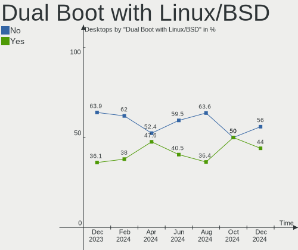
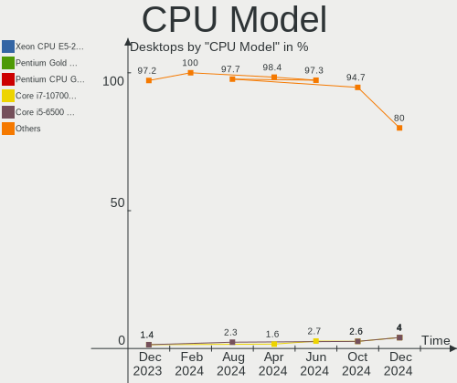
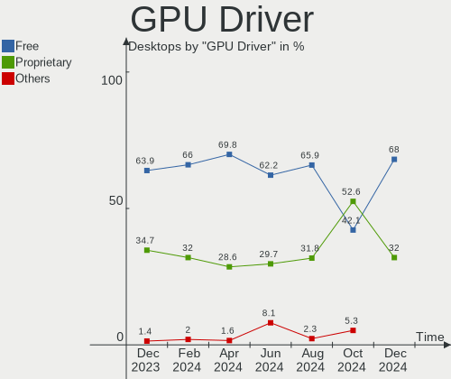
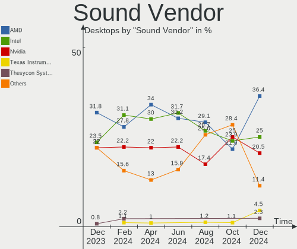

ArcoLinux - Hardware Trends (Desktops)
--------------------------------------

A project to identify most popular hardware characteristics and track their change
over time based on data collected by Linux users at https://Linux-Hardware.org.

Anyone can contribute to this report by the [hw-probe](https://github.com/linuxhw/hw-probe) tool:

    sudo -E hw-probe -all -upload

This report is for one last month. Overall report since the beginning of time: [TestCoverage](https://github.com/linuxhw/TestCoverage)

Period: Oct, 2022.

Contents
--------

* [ System ](#system)
  - [ OS                       ](#os)
  - [ OS Family                ](#os-family)
  - [ Kernel                   ](#kernel)
  - [ Kernel Family            ](#kernel-family)
  - [ Kernel Major Ver.        ](#kernel-major-ver)
  - [ Arch                     ](#arch)
  - [ DE                       ](#de)
  - [ Display Server           ](#display-server)
  - [ Display Manager          ](#display-manager)
  - [ OS Lang                  ](#os-lang)
  - [ Boot Mode                ](#boot-mode)
  - [ Filesystem               ](#filesystem)
  - [ Part. scheme             ](#part-scheme)
  - [ Dual Boot with Linux/BSD ](#dual-boot-with-linuxbsd)
  - [ Dual Boot (Win)          ](#dual-boot-win)

* [ Board ](#board)
  - [ Vendor                   ](#vendor)
  - [ Model                    ](#model)
  - [ Model Family             ](#model-family)
  - [ MFG Year                 ](#mfg-year)
  - [ Form Factor              ](#form-factor)
  - [ Secure Boot              ](#secure-boot)
  - [ Coreboot                 ](#coreboot)
  - [ RAM Size                 ](#ram-size)
  - [ RAM Used                 ](#ram-used)
  - [ Total Drives             ](#total-drives)
  - [ Has CD-ROM               ](#has-cd-rom)
  - [ Has Ethernet             ](#has-ethernet)
  - [ Has WiFi                 ](#has-wifi)
  - [ Has Bluetooth            ](#has-bluetooth)

* [ Location ](#location)
  - [ Country                  ](#country)
  - [ City                     ](#city)

* [ Drives ](#drives)
  - [ Drive Vendor             ](#drive-vendor)
  - [ Drive Model              ](#drive-model)
  - [ HDD Vendor               ](#hdd-vendor)
  - [ SSD Vendor               ](#ssd-vendor)
  - [ Drive Kind               ](#drive-kind)
  - [ Drive Connector          ](#drive-connector)
  - [ Drive Size               ](#drive-size)
  - [ Space Total              ](#space-total)
  - [ Space Used               ](#space-used)
  - [ Malfunc. Drives          ](#malfunc-drives)
  - [ Malfunc. Drive Vendor    ](#malfunc-drive-vendor)
  - [ Malfunc. HDD Vendor      ](#malfunc-hdd-vendor)
  - [ Malfunc. Drive Kind      ](#malfunc-drive-kind)
  - [ Failed Drives            ](#failed-drives)
  - [ Failed Drive Vendor      ](#failed-drive-vendor)
  - [ Drive Status             ](#drive-status)

* [ Storage controller ](#storage-controller)
  - [ Storage Vendor           ](#storage-vendor)
  - [ Storage Model            ](#storage-model)
  - [ Storage Kind             ](#storage-kind)

* [ Processor ](#processor)
  - [ CPU Vendor               ](#cpu-vendor)
  - [ CPU Model                ](#cpu-model)
  - [ CPU Model Family         ](#cpu-model-family)
  - [ CPU Cores                ](#cpu-cores)
  - [ CPU Sockets              ](#cpu-sockets)
  - [ CPU Threads              ](#cpu-threads)
  - [ CPU Op-Modes             ](#cpu-op-modes)
  - [ CPU Microcode            ](#cpu-microcode)
  - [ CPU Microarch            ](#cpu-microarch)

* [ Graphics ](#graphics)
  - [ GPU Vendor               ](#gpu-vendor)
  - [ GPU Model                ](#gpu-model)
  - [ GPU Combo                ](#gpu-combo)
  - [ GPU Driver               ](#gpu-driver)
  - [ GPU Memory               ](#gpu-memory)

* [ Monitor ](#monitor)
  - [ Monitor Vendor           ](#monitor-vendor)
  - [ Monitor Model            ](#monitor-model)
  - [ Monitor Resolution       ](#monitor-resolution)
  - [ Monitor Diagonal         ](#monitor-diagonal)
  - [ Monitor Width            ](#monitor-width)
  - [ Aspect Ratio             ](#aspect-ratio)
  - [ Monitor Area             ](#monitor-area)
  - [ Pixel Density            ](#pixel-density)
  - [ Multiple Monitors        ](#multiple-monitors)

* [ Network ](#network)
  - [ Net Controller Vendor    ](#net-controller-vendor)
  - [ Net Controller Model     ](#net-controller-model)
  - [ Wireless Vendor          ](#wireless-vendor)
  - [ Wireless Model           ](#wireless-model)
  - [ Ethernet Vendor          ](#ethernet-vendor)
  - [ Ethernet Model           ](#ethernet-model)
  - [ Net Controller Kind      ](#net-controller-kind)
  - [ Used Controller          ](#used-controller)
  - [ NICs                     ](#nics)
  - [ IPv6                     ](#ipv6)

* [ Bluetooth ](#bluetooth)
  - [ Bluetooth Vendor         ](#bluetooth-vendor)
  - [ Bluetooth Model          ](#bluetooth-model)

* [ Sound ](#sound)
  - [ Sound Vendor             ](#sound-vendor)
  - [ Sound Model              ](#sound-model)

* [ Memory ](#memory)
  - [ Memory Vendor            ](#memory-vendor)
  - [ Memory Model             ](#memory-model)
  - [ Memory Kind              ](#memory-kind)
  - [ Memory Form Factor       ](#memory-form-factor)
  - [ Memory Size              ](#memory-size)
  - [ Memory Speed             ](#memory-speed)

* [ Printers & scanners ](#printers--scanners)
  - [ Printer Vendor           ](#printer-vendor)
  - [ Printer Model            ](#printer-model)
  - [ Scanner Vendor           ](#scanner-vendor)
  - [ Scanner Model            ](#scanner-model)

* [ Camera ](#camera)
  - [ Camera Vendor            ](#camera-vendor)
  - [ Camera Model             ](#camera-model)

* [ Security ](#security)
  - [ Fingerprint Vendor       ](#fingerprint-vendor)
  - [ Fingerprint Model        ](#fingerprint-model)
  - [ Chipcard Vendor          ](#chipcard-vendor)
  - [ Chipcard Model           ](#chipcard-model)

* [ Unsupported ](#unsupported)
  - [ Unsupported Devices      ](#unsupported-devices)
  - [ Unsupported Device Types ](#unsupported-device-types)

System
------

OS
--

Installed operating systems

| Name              | Desktops | Percent |
|-------------------|----------|---------|
| ArcoLinux Rolling | 35       | 97.22%  |
| ArcoLinux         | 1        | 2.78%   |

OS Family
---------

OS without a version

| Name      | Desktops | Percent |
|-----------|----------|---------|
| ArcoLinux | 36       | 100%    |

Kernel
------

Version of the Linux kernel

| Version               | Desktops | Percent |
|-----------------------|----------|---------|
| 5.19.13-arch1-1       | 8        | 22.22%  |
| 6.0.2-arch1-1         | 5        | 13.89%  |
| 6.0.2-zen1-1-zen      | 4        | 11.11%  |
| 5.15.74-1-lts         | 4        | 11.11%  |
| 6.0.1-arch2-1         | 3        | 8.33%   |
| 6.0.5-arch1-1         | 2        | 5.56%   |
| 5.19.12-arch1-1       | 2        | 5.56%   |
| 6.0.6-arch1-1         | 1        | 2.78%   |
| 6.0.2-x64v1-xanmod1-1 | 1        | 2.78%   |
| 6.0.1-zen1-1-zen      | 1        | 2.78%   |
| 6.0.1-x64v2-xanmod1-1 | 1        | 2.78%   |
| 6.0.1-arch1-1         | 1        | 2.78%   |
| 5.19.15-xanmod1-1     | 1        | 2.78%   |
| 5.19.12-zen1-1-zen    | 1        | 2.78%   |
| 5.15.72-1-lts         | 1        | 2.78%   |

Kernel Family
-------------

Linux kernel without a distro release

| Version | Desktops | Percent |
|---------|----------|---------|
| 6.0.2   | 10       | 27.78%  |
| 5.19.13 | 8        | 22.22%  |
| 6.0.1   | 6        | 16.67%  |
| 5.15.74 | 4        | 11.11%  |
| 5.19.12 | 3        | 8.33%   |
| 6.0.5   | 2        | 5.56%   |
| 6.0.6   | 1        | 2.78%   |
| 5.19.15 | 1        | 2.78%   |
| 5.15.72 | 1        | 2.78%   |

Kernel Major Ver.
-----------------

Linux kernel major version

| Version | Desktops | Percent |
|---------|----------|---------|
| 6.0     | 19       | 52.78%  |
| 5.19    | 12       | 33.33%  |
| 5.15    | 5        | 13.89%  |

Arch
----

OS architecture (x86_64, i586, etc.)

| Name   | Desktops | Percent |
|--------|----------|---------|
| x86_64 | 36       | 100%    |

DE
--

Desktop Environment

| Name    | Desktops | Percent |
|---------|----------|---------|
| XFCE    | 13       | 36.11%  |
| KDE5    | 7        | 19.44%  |
| bspwm   | 5        | 13.89%  |
| i3      | 4        | 11.11%  |
| qtile   | 3        | 8.33%   |
| GNOME   | 2        | 5.56%   |
| LeftWM  | 1        | 2.78%   |
| awesome | 1        | 2.78%   |

Display Server
--------------

X11 or Wayland

| Name    | Desktops | Percent |
|---------|----------|---------|
| X11     | 33       | 91.67%  |
| Tty     | 2        | 5.56%   |
| Unknown | 1        | 2.78%   |

Display Manager
---------------

SDDM, LightDM, etc.

| Name    | Desktops | Percent |
|---------|----------|---------|
| SDDM    | 26       | 72.22%  |
| LightDM | 9        | 25%     |
| Unknown | 1        | 2.78%   |

OS Lang
-------

Language

| Lang  | Desktops | Percent |
|-------|----------|---------|
| en_US | 17       | 47.22%  |
| en_GB | 3        | 8.33%   |
| fr_FR | 2        | 5.56%   |
| de_DE | 2        | 5.56%   |
| C     | 2        | 5.56%   |
| tr_TR | 1        | 2.78%   |
| ru_RU | 1        | 2.78%   |
| pl_PL | 1        | 2.78%   |
| ja_JP | 1        | 2.78%   |
| hu_HU | 1        | 2.78%   |
| fr_CA | 1        | 2.78%   |
| es_MX | 1        | 2.78%   |
| en_PH | 1        | 2.78%   |
| en_IL | 1        | 2.78%   |
| en_AG | 1        | 2.78%   |

Boot Mode
---------

EFI or BIOS

| Mode | Desktops | Percent |
|------|----------|---------|
| EFI  | 30       | 83.33%  |
| BIOS | 6        | 16.67%  |

Filesystem
----------

Type of filesystem

| Type    | Desktops | Percent |
|---------|----------|---------|
| Ext4    | 24       | 66.67%  |
| Btrfs   | 11       | 30.56%  |
| Overlay | 1        | 2.78%   |

Part. scheme
------------

Scheme of partitioning

| Type    | Desktops | Percent |
|---------|----------|---------|
| GPT     | 32       | 88.89%  |
| MBR     | 3        | 8.33%   |
| Unknown | 1        | 2.78%   |

Dual Boot with Linux/BSD
------------------------

Hosting more than one Linux/BSD

| Dual boot | Desktops | Percent |
|-----------|----------|---------|
| No        | 22       | 61.11%  |
| Yes       | 14       | 38.89%  |

Dual Boot (Win)
---------------

Hosting Linux and Windows

| Dual boot | Desktops | Percent |
|-----------|----------|---------|
| Yes       | 19       | 52.78%  |
| No        | 17       | 47.22%  |

Board
-----

Vendor
------

Motherboard manufacturer

| Name                | Desktops | Percent |
|---------------------|----------|---------|
| ASUSTek Computer    | 10       | 27.78%  |
| Gigabyte Technology | 6        | 16.67%  |
| MSI                 | 5        | 13.89%  |
| Hewlett-Packard     | 5        | 13.89%  |
| ASRock              | 5        | 13.89%  |
| Lenovo              | 2        | 5.56%   |
| Dell                | 1        | 2.78%   |
| Casper              | 1        | 2.78%   |
| Acer                | 1        | 2.78%   |

Model
-----

Motherboard model

| Name                                | Desktops | Percent |
|-------------------------------------|----------|---------|
| MSI MS-7C95                         | 1        | 2.78%   |
| MSI MS-7C37                         | 1        | 2.78%   |
| MSI MS-7B89                         | 1        | 2.78%   |
| MSI MS-7B85                         | 1        | 2.78%   |
| MSI MS-7972                         | 1        | 2.78%   |
| Lenovo ThinkCentre M700 10J0S35C00  | 1        | 2.78%   |
| Lenovo Legion T5 28IMB05 90NC00R5US | 1        | 2.78%   |
| HP Z420 Workstation                 | 1        | 2.78%   |
| HP ProDesk 600 G1 SFF               | 1        | 2.78%   |
| HP Pavilion Power Desktop 580-1xx   | 1        | 2.78%   |
| HP Compaq Elite 8300 SFF            | 1        | 2.78%   |
| HP 700-527c                         | 1        | 2.78%   |
| Gigabyte X570 AORUS PRO WIFI        | 1        | 2.78%   |
| Gigabyte X570 AORUS MASTER          | 1        | 2.78%   |
| Gigabyte X570 AORUS ELITE           | 1        | 2.78%   |
| Gigabyte P55-USB3                   | 1        | 2.78%   |
| Gigabyte B360M-DS3H                 | 1        | 2.78%   |
| Gigabyte B360M-D3H                  | 1        | 2.78%   |
| Dell OptiPlex 3010                  | 1        | 2.78%   |
| Casper CASPER NIRVANA NOTEBOOK      | 1        | 2.78%   |
| ASUS TUF Gaming B560M-PLUS          | 1        | 2.78%   |
| ASUS ROG STRIX Z390-F GAMING        | 1        | 2.78%   |
| ASUS ROG STRIX B365-F GAMING        | 1        | 2.78%   |
| ASUS ROG CROSSHAIR VIII HERO        | 1        | 2.78%   |
| ASUS ROG CROSSHAIR VII HERO         | 1        | 2.78%   |
| ASUS PRIME Z490-A                   | 1        | 2.78%   |
| ASUS PRIME H270-PRO                 | 1        | 2.78%   |
| ASUS P8Z77-V DELUXE                 | 1        | 2.78%   |
| ASUS M4A785TD-V EVO                 | 1        | 2.78%   |
| ASUS All Series                     | 1        | 2.78%   |
| ASRock Z690 Steel Legend            | 1        | 2.78%   |
| ASRock H87M Pro4                    | 1        | 2.78%   |
| ASRock H310M-STX                    | 1        | 2.78%   |
| ASRock B450M Pro4-F R2.0            | 1        | 2.78%   |
| ASRock B250M-HDV                    | 1        | 2.78%   |
| Acer Predator G3-710                | 1        | 2.78%   |

Model Family
------------

Motherboard model prefix

| Name                | Desktops | Percent |
|---------------------|----------|---------|
| ASUS ROG            | 4        | 11.11%  |
| Gigabyte X570       | 3        | 8.33%   |
| ASUS PRIME          | 2        | 5.56%   |
| MSI MS-7C95         | 1        | 2.78%   |
| MSI MS-7C37         | 1        | 2.78%   |
| MSI MS-7B89         | 1        | 2.78%   |
| MSI MS-7B85         | 1        | 2.78%   |
| MSI MS-7972         | 1        | 2.78%   |
| Lenovo ThinkCentre  | 1        | 2.78%   |
| Lenovo Legion       | 1        | 2.78%   |
| HP Z420             | 1        | 2.78%   |
| HP ProDesk          | 1        | 2.78%   |
| HP Pavilion         | 1        | 2.78%   |
| HP Compaq           | 1        | 2.78%   |
| HP 700-527c         | 1        | 2.78%   |
| Gigabyte P55-USB3   | 1        | 2.78%   |
| Gigabyte B360M-DS3H | 1        | 2.78%   |
| Gigabyte B360M-D3H  | 1        | 2.78%   |
| Dell OptiPlex       | 1        | 2.78%   |
| Casper CASPER       | 1        | 2.78%   |
| ASUS TUF            | 1        | 2.78%   |
| ASUS P8Z77-V        | 1        | 2.78%   |
| ASUS M4A785TD-V     | 1        | 2.78%   |
| ASUS All            | 1        | 2.78%   |
| ASRock Z690         | 1        | 2.78%   |
| ASRock H87M         | 1        | 2.78%   |
| ASRock H310M-STX    | 1        | 2.78%   |
| ASRock B450M        | 1        | 2.78%   |
| ASRock B250M-HDV    | 1        | 2.78%   |
| Acer Predator       | 1        | 2.78%   |

MFG Year
--------

Motherboard manufacture year

| Year | Desktops | Percent |
|------|----------|---------|
| 2019 | 8        | 22.22%  |
| 2020 | 5        | 13.89%  |
| 2013 | 4        | 11.11%  |
| 2018 | 3        | 8.33%   |
| 2017 | 3        | 8.33%   |
| 2015 | 3        | 8.33%   |
| 2012 | 3        | 8.33%   |
| 2021 | 2        | 5.56%   |
| 2022 | 1        | 2.78%   |
| 2016 | 1        | 2.78%   |
| 2014 | 1        | 2.78%   |
| 2010 | 1        | 2.78%   |
| 2009 | 1        | 2.78%   |

Form Factor
-----------

Physical design of the computer

| Name    | Desktops | Percent |
|---------|----------|---------|
| Desktop | 36       | 100%    |

Secure Boot
-----------

Enabled or disabled

| State    | Desktops | Percent |
|----------|----------|---------|
| Disabled | 36       | 100%    |

Coreboot
--------

Have coreboot on board

| Used | Desktops | Percent |
|------|----------|---------|
| No   | 36       | 100%    |

RAM Size
--------

Total RAM memory

| Size in GB  | Desktops | Percent |
|-------------|----------|---------|
| 16.01-24.0  | 14       | 38.89%  |
| 32.01-64.0  | 11       | 30.56%  |
| 4.01-8.0    | 4        | 11.11%  |
| 8.01-16.0   | 4        | 11.11%  |
| 64.01-256.0 | 2        | 5.56%   |
| 24.01-32.0  | 1        | 2.78%   |

RAM Used
--------

Used RAM memory

| Used GB   | Desktops | Percent |
|-----------|----------|---------|
| 2.01-3.0  | 11       | 30.56%  |
| 3.01-4.0  | 7        | 19.44%  |
| 4.01-8.0  | 6        | 16.67%  |
| 0.51-1.0  | 5        | 13.89%  |
| 1.01-2.0  | 4        | 11.11%  |
| 8.01-16.0 | 3        | 8.33%   |

Total Drives
------------

Number of drives on board

| Drives | Desktops | Percent |
|--------|----------|---------|
| 3      | 11       | 30.56%  |
| 4      | 9        | 25%     |
| 2      | 9        | 25%     |
| 1      | 4        | 11.11%  |
| 5      | 2        | 5.56%   |
| 6      | 1        | 2.78%   |

Has CD-ROM
----------

Has CD-ROM on board

| Presented | Desktops | Percent |
|-----------|----------|---------|
| No        | 25       | 69.44%  |
| Yes       | 11       | 30.56%  |

Has Ethernet
------------

Has Ethernet on board

| Presented | Desktops | Percent |
|-----------|----------|---------|
| Yes       | 35       | 97.22%  |
| No        | 1        | 2.78%   |

Has WiFi
--------

Has WiFi module

| Presented | Desktops | Percent |
|-----------|----------|---------|
| No        | 19       | 52.78%  |
| Yes       | 17       | 47.22%  |

Has Bluetooth
-------------

Has Bluetooth module

| Presented | Desktops | Percent |
|-----------|----------|---------|
| No        | 19       | 52.78%  |
| Yes       | 17       | 47.22%  |

Location
--------

Country
-------

Geographic location (country)

| Country     | Desktops | Percent |
|-------------|----------|---------|
| USA         | 8        | 22.22%  |
| Germany     | 4        | 11.11%  |
| France      | 3        | 8.33%   |
| Mexico      | 2        | 5.56%   |
| Hungary     | 2        | 5.56%   |
| Vietnam     | 1        | 2.78%   |
| UK          | 1        | 2.78%   |
| Turkey      | 1        | 2.78%   |
| Spain       | 1        | 2.78%   |
| South Korea | 1        | 2.78%   |
| Russia      | 1        | 2.78%   |
| Romania     | 1        | 2.78%   |
| Poland      | 1        | 2.78%   |
| Philippines | 1        | 2.78%   |
| Pakistan    | 1        | 2.78%   |
| Netherlands | 1        | 2.78%   |
| Japan       | 1        | 2.78%   |
| Israel      | 1        | 2.78%   |
| Ireland     | 1        | 2.78%   |
| Greece      | 1        | 2.78%   |
| Canada      | 1        | 2.78%   |
| Belgium     | 1        | 2.78%   |

City
----

Geographic location (city)

| City                 | Desktops | Percent |
|----------------------|----------|---------|
| Dessau               | 2        | 5.56%   |
| Tel Aviv             | 1        | 2.78%   |
| Shinjuku             | 1        | 2.78%   |
| Seongnam-si          | 1        | 2.78%   |
| Rotherham            | 1        | 2.78%   |
| Quezon City          | 1        | 2.78%   |
| Paris                | 1        | 2.78%   |
| Palm City            | 1        | 2.78%   |
| Nagyer               | 1        | 2.78%   |
| Naaldwijk            | 1        | 2.78%   |
| Moscow               | 1        | 2.78%   |
| Montlebon            | 1        | 2.78%   |
| Monclova             | 1        | 2.78%   |
| Marquette            | 1        | 2.78%   |
| Las Vegas            | 1        | 2.78%   |
| Lahore               | 1        | 2.78%   |
| Kirchheim unter Teck | 1        | 2.78%   |
| Kayseri              | 1        | 2.78%   |
| Izbica Kujawska      | 1        | 2.78%   |
| Henderson            | 1        | 2.78%   |
| Hanoi                | 1        | 2.78%   |
| Guelph               | 1        | 2.78%   |
| Guadalajara          | 1        | 2.78%   |
| Greenville           | 1        | 2.78%   |
| Grandville           | 1        | 2.78%   |
| Gorey                | 1        | 2.78%   |
| Frankfurt am Main    | 1        | 2.78%   |
| el Prat de Llobregat | 1        | 2.78%   |
| Duffel               | 1        | 2.78%   |
| Cibolo               | 1        | 2.78%   |
| Castanet-Tolosan     | 1        | 2.78%   |
| Campina              | 1        | 2.78%   |
| Budapest             | 1        | 2.78%   |
| Athens               | 1        | 2.78%   |
| Abilene              | 1        | 2.78%   |

Drives
------

Drive Vendor
------------

Hard drive vendors

| Vendor                    | Desktops | Drives | Percent |
|---------------------------|----------|--------|---------|
| WDC                       | 18       | 21     | 19.35%  |
| Samsung Electronics       | 18       | 21     | 19.35%  |
| Seagate                   | 13       | 15     | 13.98%  |
| Kingston                  | 6        | 8      | 6.45%   |
| Crucial                   | 4        | 4      | 4.3%    |
| A-DATA Technology         | 4        | 5      | 4.3%    |
| Toshiba                   | 3        | 3      | 3.23%   |
| Silicon Motion            | 3        | 3      | 3.23%   |
| Sandisk                   | 3        | 4      | 3.23%   |
| Unknown                   | 2        | 2      | 2.15%   |
| Phison Electronics        | 2        | 3      | 2.15%   |
| Micron/Crucial Technology | 2        | 2      | 2.15%   |
| HGST                      | 2        | 2      | 2.15%   |
| VENO                      | 1        | 1      | 1.08%   |
| Team                      | 1        | 1      | 1.08%   |
| PNY                       | 1        | 1      | 1.08%   |
| Patriot                   | 1        | 1      | 1.08%   |
| OCZ                       | 1        | 1      | 1.08%   |
| JAMESDONKEY               | 1        | 1      | 1.08%   |
| Intenso                   | 1        | 1      | 1.08%   |
| Intel                     | 1        | 1      | 1.08%   |
| Hoodisk                   | 1        | 1      | 1.08%   |
| Hewlett-Packard           | 1        | 1      | 1.08%   |
| Gigabyte Technology       | 1        | 1      | 1.08%   |
| Corsair                   | 1        | 1      | 1.08%   |
| ADATA Technology          | 1        | 1      | 1.08%   |

Drive Model
-----------

Hard drive models

| Model                                                 | Desktops | Percent |
|-------------------------------------------------------|----------|---------|
| Samsung NVMe SSD Controller SM981/PM981/PM983 500GB   | 7        | 6.67%   |
| Kingston SA400S37240G 240GB SSD                       | 3        | 2.86%   |
| WDC WD5000LPVX-22V0TT0 500GB                          | 2        | 1.9%    |
| WDC WD40EFRX-68N32N0 4TB                              | 2        | 1.9%    |
| WDC WD10EZEX-08WN4A0 1TB                              | 2        | 1.9%    |
| Unknown SD/MMC/MS PRO 1TB                             | 2        | 1.9%    |
| Silicon Motion SM2262/SM2262EN SSD Controller 1024GB  | 2        | 1.9%    |
| Seagate ST1000DM003-1SB102 1TB                        | 2        | 1.9%    |
| Sandisk WD Black SN850 1TB                            | 2        | 1.9%    |
| Samsung SSD 860 EVO 500GB                             | 2        | 1.9%    |
| Kingston SNVS500G 500GB                               | 2        | 1.9%    |
| WDC WDS240G2G0B-00EPW0 240GB SSD                      | 1        | 0.95%   |
| WDC WDS240G2G0A-00JH30 240GB SSD                      | 1        | 0.95%   |
| WDC WD6003FZBX-00K5WB0 6TB                            | 1        | 0.95%   |
| WDC WD5000AACS-00ZUB0 500GB                           | 1        | 0.95%   |
| WDC WD5000AACS-00G8B1 500GB                           | 1        | 0.95%   |
| WDC WD40EZRZ-00GXCB0 4TB                              | 1        | 0.95%   |
| WDC WD40EZAZ-22SF3B0 4TB                              | 1        | 0.95%   |
| WDC WD40EFRX-68WT0N0 4TB                              | 1        | 0.95%   |
| WDC WD20EZBX-00AYRA0 2TB                              | 1        | 0.95%   |
| WDC WD20EZAZ-00GGJB0 2TB                              | 1        | 0.95%   |
| WDC WD10EZEX-60M2NA0 1TB                              | 1        | 0.95%   |
| WDC WD10EZEX-22BN5A0 1TB                              | 1        | 0.95%   |
| WDC WD1003FZEX-00K3CA0 1TB                            | 1        | 0.95%   |
| WDC WD1002FAEX-00Y9A0 1TB                             | 1        | 0.95%   |
| WDC WD1001FALS-00J7B0 1TB                             | 1        | 0.95%   |
| VENO SCORP-256GB SSD                                  | 1        | 0.95%   |
| Toshiba Q300 Pro 128GB SSD                            | 1        | 0.95%   |
| Toshiba HDWD120 2TB                                   | 1        | 0.95%   |
| Toshiba DT01ACA200 2TB                                | 1        | 0.95%   |
| Team TM8PS7001T 1TB SSD                               | 1        | 0.95%   |
| Silicon Motion SM2263EN/SM2263XT SSD Controller 256GB | 1        | 0.95%   |
| Seagate ST980811AS 80GB                               | 1        | 0.95%   |
| Seagate ST96812AS 64GB                                | 1        | 0.95%   |
| Seagate ST500LM012 HN-M500MBB 500GB                   | 1        | 0.95%   |
| Seagate ST3500418AS 500GB                             | 1        | 0.95%   |
| Seagate ST3160812AS 160GB                             | 1        | 0.95%   |
| Seagate ST3000DM007-1WY10G 3TB                        | 1        | 0.95%   |
| Seagate ST2000DX002-2DV164 2TB                        | 1        | 0.95%   |
| Seagate ST2000DM008-2FR102 2TB                        | 1        | 0.95%   |

HDD Vendor
----------

Hard disk drive vendors

| Vendor              | Desktops | Drives | Percent |
|---------------------|----------|--------|---------|
| WDC                 | 16       | 19     | 43.24%  |
| Seagate             | 13       | 15     | 35.14%  |
| Unknown             | 2        | 2      | 5.41%   |
| Toshiba             | 2        | 2      | 5.41%   |
| HGST                | 2        | 2      | 5.41%   |
| Samsung Electronics | 1        | 1      | 2.7%    |
| Hewlett-Packard     | 1        | 1      | 2.7%    |

SSD Vendor
----------

Solid state drive vendors

| Vendor              | Desktops | Drives | Percent |
|---------------------|----------|--------|---------|
| Samsung Electronics | 11       | 11     | 29.73%  |
| Kingston            | 5        | 6      | 13.51%  |
| Crucial             | 4        | 4      | 10.81%  |
| A-DATA Technology   | 4        | 5      | 10.81%  |
| WDC                 | 2        | 2      | 5.41%   |
| VENO                | 1        | 1      | 2.7%    |
| Toshiba             | 1        | 1      | 2.7%    |
| Team                | 1        | 1      | 2.7%    |
| PNY                 | 1        | 1      | 2.7%    |
| Patriot             | 1        | 1      | 2.7%    |
| OCZ                 | 1        | 1      | 2.7%    |
| JAMESDONKEY         | 1        | 1      | 2.7%    |
| Intenso             | 1        | 1      | 2.7%    |
| Hoodisk             | 1        | 1      | 2.7%    |
| Gigabyte Technology | 1        | 1      | 2.7%    |
| Corsair             | 1        | 1      | 2.7%    |

Drive Kind
----------

HDD or SSD

| Kind | Desktops | Drives | Percent |
|------|----------|--------|---------|
| HDD  | 28       | 42     | 37.84%  |
| SSD  | 27       | 39     | 36.49%  |
| NVMe | 19       | 25     | 25.68%  |

Drive Connector
---------------

SATA, SAS, NVMe, etc.

| Type | Desktops | Drives | Percent |
|------|----------|--------|---------|
| SATA | 35       | 78     | 61.4%   |
| NVMe | 19       | 25     | 33.33%  |
| SAS  | 3        | 3      | 5.26%   |

Drive Size
----------

Size of hard drive

| Size in TB | Desktops | Drives | Percent |
|------------|----------|--------|---------|
| 0.01-0.5   | 24       | 44     | 42.11%  |
| 0.51-1.0   | 20       | 22     | 35.09%  |
| 1.01-2.0   | 6        | 7      | 10.53%  |
| 3.01-4.0   | 4        | 5      | 7.02%   |
| 4.01-10.0  | 2        | 2      | 3.51%   |
| 2.01-3.0   | 1        | 1      | 1.75%   |

Space Total
-----------

Amount of disk space available on the file system

| Size in GB     | Desktops | Percent |
|----------------|----------|---------|
| 501-1000       | 10       | 27.78%  |
| 1001-2000      | 7        | 19.44%  |
| More than 3000 | 6        | 16.67%  |
| 101-250        | 6        | 16.67%  |
| 2001-3000      | 3        | 8.33%   |
| 251-500        | 2        | 5.56%   |
| 1-20           | 1        | 2.78%   |
| 51-100         | 1        | 2.78%   |

Space Used
----------

Amount of used disk space

| Used GB        | Desktops | Percent |
|----------------|----------|---------|
| 501-1000       | 8        | 22.22%  |
| 51-100         | 7        | 19.44%  |
| 101-250        | 5        | 13.89%  |
| 251-500        | 4        | 11.11%  |
| More than 3000 | 3        | 8.33%   |
| 21-50          | 3        | 8.33%   |
| 1-20           | 3        | 8.33%   |
| 1001-2000      | 2        | 5.56%   |
| 2001-3000      | 1        | 2.78%   |

Malfunc. Drives
---------------

Drive models with a malfunction

| Model                                                           | Desktops | Drives | Percent |
|-----------------------------------------------------------------|----------|--------|---------|
| WDC WDS240G2G0A-00JH30 240GB SSD                                | 1        | 1      | 10%     |
| WDC WD5000AACS-00G8B1 500GB                                     | 1        | 1      | 10%     |
| WDC WD10EZEX-22BN5A0 1TB                                        | 1        | 1      | 10%     |
| Seagate ST500LM012 HN-M500MBB 500GB                             | 1        | 1      | 10%     |
| Samsung Electronics SSD 870 EVO 1TB                             | 1        | 1      | 10%     |
| Samsung Electronics NVMe SSD Controller SM981/PM981/PM983 500GB | 1        | 1      | 10%     |
| Intel SSD 600P Series 256GB                                     | 1        | 1      | 10%     |
| Hewlett-Packard MB1000GCWCV 1TB                                 | 1        | 1      | 10%     |
| Crucial CT525MX300SSD1 528GB                                    | 1        | 1      | 10%     |
| Corsair CSSD-F60GB2 64GB                                        | 1        | 1      | 10%     |

Malfunc. Drive Vendor
---------------------

Vendors of faulty drives

| Vendor              | Desktops | Drives | Percent |
|---------------------|----------|--------|---------|
| WDC                 | 3        | 3      | 30%     |
| Samsung Electronics | 2        | 2      | 20%     |
| Seagate             | 1        | 1      | 10%     |
| Intel               | 1        | 1      | 10%     |
| Hewlett-Packard     | 1        | 1      | 10%     |
| Crucial             | 1        | 1      | 10%     |
| Corsair             | 1        | 1      | 10%     |

Malfunc. HDD Vendor
-------------------

Vendors of faulty HDD drives

| Vendor          | Desktops | Drives | Percent |
|-----------------|----------|--------|---------|
| WDC             | 2        | 2      | 50%     |
| Seagate         | 1        | 1      | 25%     |
| Hewlett-Packard | 1        | 1      | 25%     |

Malfunc. Drive Kind
-------------------

Kinds of faulty drives

| Kind | Desktops | Drives | Percent |
|------|----------|--------|---------|
| SSD  | 4        | 4      | 40%     |
| HDD  | 4        | 4      | 40%     |
| NVMe | 2        | 2      | 20%     |

Failed Drives
-------------

Failed drive models

Zero info for selected period =(

Failed Drive Vendor
-------------------

Failed drive vendors

Zero info for selected period =(

Drive Status
------------

Number of failed and malfunc. drives

| Status   | Desktops | Drives | Percent |
|----------|----------|--------|---------|
| Works    | 32       | 83     | 68.09%  |
| Malfunc  | 9        | 10     | 19.15%  |
| Detected | 6        | 13     | 12.77%  |

Storage controller
------------------

Storage Vendor
--------------

Storage controller vendors

| Vendor                      | Desktops | Percent |
|-----------------------------|----------|---------|
| Intel                       | 24       | 38.71%  |
| AMD                         | 12       | 19.35%  |
| Samsung Electronics         | 9        | 14.52%  |
| Silicon Motion              | 3        | 4.84%   |
| SanDisk                     | 3        | 4.84%   |
| Phison Electronics          | 2        | 3.23%   |
| Micron/Crucial Technology   | 2        | 3.23%   |
| Kingston Technology Company | 2        | 3.23%   |
| ASMedia Technology          | 2        | 3.23%   |
| Marvell Technology Group    | 1        | 1.61%   |
| JMicron Technology          | 1        | 1.61%   |
| ADATA Technology            | 1        | 1.61%   |

Storage Model
-------------

Storage controller models

| Model                                                                          | Desktops | Percent |
|--------------------------------------------------------------------------------|----------|---------|
| AMD FCH SATA Controller [AHCI mode]                                            | 8        | 11.27%  |
| Samsung NVMe SSD Controller SM981/PM981/PM983                                  | 7        | 9.86%   |
| Intel Cannon Lake PCH SATA AHCI Controller                                     | 4        | 5.63%   |
| Intel 8 Series/C220 Series Chipset Family 6-port SATA Controller 1 [AHCI mode] | 4        | 5.63%   |
| AMD 400 Series Chipset SATA Controller                                         | 4        | 5.63%   |
| Intel Q170/Q150/B150/H170/H110/Z170/CM236 Chipset SATA Controller [AHCI Mode]  | 3        | 4.23%   |
| Intel 200 Series PCH SATA controller [AHCI mode]                               | 3        | 4.23%   |
| Silicon Motion SM2262/SM2262EN SSD Controller                                  | 2        | 2.82%   |
| SanDisk WD PC SN810 / Black SN850 NVMe SSD                                     | 2        | 2.82%   |
| Intel 7 Series/C210 Series Chipset Family 6-port SATA Controller [AHCI mode]   | 2        | 2.82%   |
| ASMedia ASM1062 Serial ATA Controller                                          | 2        | 2.82%   |
| Silicon Motion SM2263EN/SM2263XT SSD Controller                                | 1        | 1.41%   |
| SanDisk WD Black SN750 / PC SN730 NVMe SSD                                     | 1        | 1.41%   |
| SanDisk WD Black 2018/SN750 / PC SN720 NVMe SSD                                | 1        | 1.41%   |
| Samsung NVMe SSD Controller SM961/PM961/SM963                                  | 1        | 1.41%   |
| Samsung NVMe SSD Controller SM951/PM951                                        | 1        | 1.41%   |
| Phison E7 NVMe Controller                                                      | 1        | 1.41%   |
| Phison E12 NVMe Controller                                                     | 1        | 1.41%   |
| Micron/Crucial P2 NVMe PCIe SSD                                                | 1        | 1.41%   |
| Micron/Crucial NVMe Controller                                                 | 1        | 1.41%   |
| Marvell Group 88SE9128 PCIe SATA 6 Gb/s RAID controller with HyperDuo          | 1        | 1.41%   |
| Kingston Company Company Non-Volatile memory controller                        | 1        | 1.41%   |
| Kingston Company SNVS2000G [NV1 NVMe PCIe SSD 2TB]                             | 1        | 1.41%   |
| JMicron JMB363 SATA/IDE Controller                                             | 1        | 1.41%   |
| Intel SSD 600P Series                                                          | 1        | 1.41%   |
| Intel Comet Lake PCH-H RAID                                                    | 1        | 1.41%   |
| Intel C602 chipset 4-Port SATA Storage Control Unit                            | 1        | 1.41%   |
| Intel C600/X79 series chipset SATA RAID Controller                             | 1        | 1.41%   |
| Intel C600/X79 series chipset IDE-r Controller                                 | 1        | 1.41%   |
| Intel Alder Lake-S PCH SATA Controller [AHCI Mode]                             | 1        | 1.41%   |
| Intel 9 Series Chipset Family SATA Controller [AHCI Mode]                      | 1        | 1.41%   |
| Intel 6 Series/C200 Series Chipset Family 6 port Desktop SATA AHCI Controller  | 1        | 1.41%   |
| Intel 500 Series Chipset Family SATA AHCI Controller                           | 1        | 1.41%   |
| Intel 5 Series/3400 Series Chipset 4 port SATA IDE Controller                  | 1        | 1.41%   |
| Intel 5 Series/3400 Series Chipset 2 port SATA IDE Controller                  | 1        | 1.41%   |
| Intel 400 Series Chipset Family SATA AHCI Controller                           | 1        | 1.41%   |
| AMD SB7x0/SB8x0/SB9x0 SATA Controller [AHCI mode]                              | 1        | 1.41%   |
| AMD SB7x0/SB8x0/SB9x0 IDE Controller                                           | 1        | 1.41%   |
| AMD 500 Series Chipset SATA Controller                                         | 1        | 1.41%   |
| AMD 300 Series Chipset SATA Controller                                         | 1        | 1.41%   |

Storage Kind
------------

Kind of storage controller (IDE, SATA, NVMe, SAS, ...)

| Kind | Desktops | Percent |
|------|----------|---------|
| SATA | 33       | 56.9%   |
| NVMe | 19       | 32.76%  |
| IDE  | 3        | 5.17%   |
| RAID | 2        | 3.45%   |
| SAS  | 1        | 1.72%   |

Processor
---------

CPU Vendor
----------

Processor vendors

| Vendor | Desktops | Percent |
|--------|----------|---------|
| Intel  | 24       | 66.67%  |
| AMD    | 12       | 33.33%  |

CPU Model
---------

Processor models

| Model                                  | Desktops | Percent |
|----------------------------------------|----------|---------|
| Intel Core i7-7700 CPU @ 3.60GHz       | 2        | 5.56%   |
| Intel Core i7-4790 CPU @ 3.60GHz       | 2        | 5.56%   |
| Intel Core i5-10400F CPU @ 2.90GHz     | 2        | 5.56%   |
| AMD Ryzen 9 3900X 12-Core Processor    | 2        | 5.56%   |
| Intel Xeon CPU E5-2697 v2 @ 2.70GHz    | 1        | 2.78%   |
| Intel Xeon CPU E3-1230 v3 @ 3.30GHz    | 1        | 2.78%   |
| Intel Core i9-9900K CPU @ 3.60GHz      | 1        | 2.78%   |
| Intel Core i7-3770K CPU @ 3.50GHz      | 1        | 2.78%   |
| Intel Core i7-10700K CPU @ 3.80GHz     | 1        | 2.78%   |
| Intel Core i5-9400F CPU @ 2.90GHz      | 1        | 2.78%   |
| Intel Core i5-9400 CPU @ 2.90GHz       | 1        | 2.78%   |
| Intel Core i5-8500 CPU @ 3.00GHz       | 1        | 2.78%   |
| Intel Core i5-6600K CPU @ 3.50GHz      | 1        | 2.78%   |
| Intel Core i5-6500T CPU @ 2.50GHz      | 1        | 2.78%   |
| Intel Core i5-4570 CPU @ 3.20GHz       | 1        | 2.78%   |
| Intel Core i5-4210M CPU @ 2.60GHz      | 1        | 2.78%   |
| Intel Core i5-3570 CPU @ 3.40GHz       | 1        | 2.78%   |
| Intel Core i5-3470 CPU @ 3.20GHz       | 1        | 2.78%   |
| Intel Core i5 CPU 750 @ 2.67GHz        | 1        | 2.78%   |
| Intel Core i3-8100 CPU @ 3.60GHz       | 1        | 2.78%   |
| Intel Core i3-7100 CPU @ 3.90GHz       | 1        | 2.78%   |
| Intel 12th Gen Core i3-12100F          | 1        | 2.78%   |
| AMD Ryzen 9 5900X 12-Core Processor    | 1        | 2.78%   |
| AMD Ryzen 7 5700X 8-Core Processor     | 1        | 2.78%   |
| AMD Ryzen 7 3700X 8-Core Processor     | 1        | 2.78%   |
| AMD Ryzen 7 2700 Eight-Core Processor  | 1        | 2.78%   |
| AMD Ryzen 5 5600G with Radeon Graphics | 1        | 2.78%   |
| AMD Ryzen 5 3600 6-Core Processor      | 1        | 2.78%   |
| AMD Ryzen 5 2600X Six-Core Processor   | 1        | 2.78%   |
| AMD Ryzen 5 2600 Six-Core Processor    | 1        | 2.78%   |
| AMD Ryzen 5 1600 Six-Core Processor    | 1        | 2.78%   |
| AMD Phenom II X4 955 Processor         | 1        | 2.78%   |

CPU Model Family
----------------

Processor model prefix

| Model            | Desktops | Percent |
|------------------|----------|---------|
| Intel Core i5    | 12       | 33.33%  |
| Intel Core i7    | 6        | 16.67%  |
| AMD Ryzen 5      | 5        | 13.89%  |
| AMD Ryzen 9      | 3        | 8.33%   |
| AMD Ryzen 7      | 3        | 8.33%   |
| Intel Xeon       | 2        | 5.56%   |
| Intel Core i3    | 2        | 5.56%   |
| Other            | 1        | 2.78%   |
| Intel Core i9    | 1        | 2.78%   |
| AMD Phenom II X4 | 1        | 2.78%   |

CPU Cores
---------

Number of processor cores

| Number | Desktops | Percent |
|--------|----------|---------|
| 4      | 15       | 41.67%  |
| 6      | 10       | 27.78%  |
| 8      | 5        | 13.89%  |
| 12     | 4        | 11.11%  |
| 2      | 2        | 5.56%   |

CPU Sockets
-----------

Number of sockets

| Number | Desktops | Percent |
|--------|----------|---------|
| 1      | 36       | 100%    |

CPU Threads
-----------

Threads per core (Hyper-Threading)

| Number | Desktops | Percent |
|--------|----------|---------|
| 2      | 25       | 69.44%  |
| 1      | 11       | 30.56%  |

CPU Op-Modes
------------

CPU Operation Modes (32-bit, 64-bit)

| Op mode        | Desktops | Percent |
|----------------|----------|---------|
| 32-bit, 64-bit | 36       | 100%    |

CPU Microcode
-------------

Microcode number

| Number     | Desktops | Percent |
|------------|----------|---------|
| 0x306c3    | 5        | 13.89%  |
| 0x906e9    | 3        | 8.33%   |
| 0x306a9    | 3        | 8.33%   |
| 0x0800820d | 3        | 8.33%   |
| Unknown    | 3        | 8.33%   |
| 0x906ed    | 2        | 5.56%   |
| 0x906ea    | 2        | 5.56%   |
| 0x506e3    | 2        | 5.56%   |
| 0x08701013 | 2        | 5.56%   |
| 0xa0655    | 1        | 2.78%   |
| 0xa0653    | 1        | 2.78%   |
| 0x906eb    | 1        | 2.78%   |
| 0x90675    | 1        | 2.78%   |
| 0x306e4    | 1        | 2.78%   |
| 0x106e5    | 1        | 2.78%   |
| 0x0a201205 | 1        | 2.78%   |
| 0x0a201016 | 1        | 2.78%   |
| 0x08701021 | 1        | 2.78%   |
| 0x08001126 | 1        | 2.78%   |
| 0x010000b6 | 1        | 2.78%   |

CPU Microarch
-------------

Microarchitecture

| Name             | Desktops | Percent |
|------------------|----------|---------|
| KabyLake         | 8        | 22.22%  |
| Haswell          | 5        | 13.89%  |
| Zen 2            | 4        | 11.11%  |
| IvyBridge        | 4        | 11.11%  |
| Zen+             | 3        | 8.33%   |
| Zen 3            | 3        | 8.33%   |
| CometLake        | 3        | 8.33%   |
| Skylake          | 2        | 5.56%   |
| Zen              | 1        | 2.78%   |
| Nehalem          | 1        | 2.78%   |
| K10              | 1        | 2.78%   |
| Alderlake Hybrid | 1        | 2.78%   |

Graphics
--------

GPU Vendor
----------

Vendors of graphics cards

| Vendor | Desktops | Percent |
|--------|----------|---------|
| Nvidia | 17       | 43.59%  |
| AMD    | 12       | 30.77%  |
| Intel  | 10       | 25.64%  |

GPU Model
---------

Graphics card models

| Model                                                                       | Desktops | Percent |
|-----------------------------------------------------------------------------|----------|---------|
| AMD Ellesmere [Radeon RX 470/480/570/570X/580/580X/590]                     | 5        | 12.82%  |
| Intel CoffeeLake-S GT2 [UHD Graphics 630]                                   | 3        | 7.69%   |
| Nvidia GK104 [GeForce GTX 770]                                              | 2        | 5.13%   |
| Intel Xeon E3-1200 v3/4th Gen Core Processor Integrated Graphics Controller | 2        | 5.13%   |
| Intel Xeon E3-1200 v2/3rd Gen Core processor Graphics Controller            | 2        | 5.13%   |
| Nvidia TU116 [GeForce GTX 1650]                                             | 1        | 2.56%   |
| Nvidia TU116 [GeForce GTX 1650 SUPER]                                       | 1        | 2.56%   |
| Nvidia TU106 [GeForce RTX 2070]                                             | 1        | 2.56%   |
| Nvidia TU106 [GeForce RTX 2060 Rev. A]                                      | 1        | 2.56%   |
| Nvidia TU104 [GeForce RTX 2070 SUPER]                                       | 1        | 2.56%   |
| Nvidia GP108 [GeForce GT 1030]                                              | 1        | 2.56%   |
| Nvidia GP107 [GeForce GTX 1050]                                             | 1        | 2.56%   |
| Nvidia GP106 [GeForce GTX 1060 6GB]                                         | 1        | 2.56%   |
| Nvidia GP106 [GeForce GTX 1060 3GB]                                         | 1        | 2.56%   |
| Nvidia GP104 [GeForce GTX 1080]                                             | 1        | 2.56%   |
| Nvidia GM108M [GeForce 840M]                                                | 1        | 2.56%   |
| Nvidia GM107 [GeForce GTX 750 Ti]                                           | 1        | 2.56%   |
| Nvidia GK107 [NVS 510]                                                      | 1        | 2.56%   |
| Nvidia GA104 [GeForce RTX 3060 Ti]                                          | 1        | 2.56%   |
| Nvidia GA102 [GeForce RTX 3090]                                             | 1        | 2.56%   |
| Intel HD Graphics 630                                                       | 1        | 2.56%   |
| Intel HD Graphics 530                                                       | 1        | 2.56%   |
| Intel 4th Gen Core Processor Integrated Graphics Controller                 | 1        | 2.56%   |
| AMD Oland PRO [Radeon R7 240/340 / Radeon 520]                              | 1        | 2.56%   |
| AMD Navi 23 [Radeon RX 6600/6600 XT/6600M]                                  | 1        | 2.56%   |
| AMD Navi 22 [Radeon RX 6700/6700 XT/6750 XT / 6800M]                        | 1        | 2.56%   |
| AMD Juniper XT [Radeon HD 5770]                                             | 1        | 2.56%   |
| AMD Curacao PRO [Radeon R7 370 / R9 270/370 OEM]                            | 1        | 2.56%   |
| AMD Cezanne                                                                 | 1        | 2.56%   |
| AMD Cape Verde XT [Radeon HD 7770/8760 / R7 250X]                           | 1        | 2.56%   |

GPU Combo
---------

Combinations of graphics cards

| Name           | Desktops | Percent |
|----------------|----------|---------|
| 1 x Nvidia     | 14       | 38.89%  |
| 1 x AMD        | 12       | 33.33%  |
| 1 x Intel      | 7        | 19.44%  |
| Intel + Nvidia | 3        | 8.33%   |

GPU Driver
----------

Free vs proprietary

| Driver      | Desktops | Percent |
|-------------|----------|---------|
| Free        | 19       | 52.78%  |
| Proprietary | 16       | 44.44%  |
| Unknown     | 1        | 2.78%   |

GPU Memory
----------

Total video memory

| Size in GB | Desktops | Percent |
|------------|----------|---------|
| Unknown    | 12       | 33.33%  |
| 7.01-8.0   | 9        | 25%     |
| 1.01-2.0   | 6        | 16.67%  |
| 5.01-6.0   | 2        | 5.56%   |
| 3.01-4.0   | 2        | 5.56%   |
| 0.51-1.0   | 2        | 5.56%   |
| 2.01-3.0   | 1        | 2.78%   |
| 16.01-24.0 | 1        | 2.78%   |
| 8.01-16.0  | 1        | 2.78%   |

Monitor
-------

Monitor Vendor
--------------

Monitor vendors

| Vendor               | Desktops | Percent |
|----------------------|----------|---------|
| Samsung Electronics  | 6        | 13.64%  |
| Goldstar             | 6        | 13.64%  |
| Acer                 | 5        | 11.36%  |
| BenQ                 | 4        | 9.09%   |
| Dell                 | 3        | 6.82%   |
| Philips              | 2        | 4.55%   |
| Iiyama               | 2        | 4.55%   |
| AOC                  | 2        | 4.55%   |
| Ancor Communications | 2        | 4.55%   |
| ViewSonic            | 1        | 2.27%   |
| Sony                 | 1        | 2.27%   |
| Sceptre Tech         | 1        | 2.27%   |
| PRISM+               | 1        | 2.27%   |
| Pixio                | 1        | 2.27%   |
| LG Display           | 1        | 2.27%   |
| Lenovo               | 1        | 2.27%   |
| HJW                  | 1        | 2.27%   |
| Gigabyte Technology  | 1        | 2.27%   |
| Eizo                 | 1        | 2.27%   |
| ASUSTek Computer     | 1        | 2.27%   |
| Albatron             | 1        | 2.27%   |

Monitor Model
-------------

Monitor models

| Model                                                                 | Desktops | Percent |
|-----------------------------------------------------------------------|----------|---------|
| Goldstar LG HDR 4K GSM7707 3840x2160 600x340mm 27.2-inch              | 2        | 4.35%   |
| ViewSonic VX2452 Series VSCDE2E 1920x1080 521x293mm 23.5-inch         | 1        | 2.17%   |
| Sony TV  *00 SNY8004 3840x2160 1220x680mm 55.0-inch                   | 1        | 2.17%   |
| Sceptre Tech Sceptre F27 SPT0AD7 1920x1080 600x330mm 27.0-inch        | 1        | 2.17%   |
| Samsung Electronics SyncMaster SAM010B 1280x1024 340x270mm 17.1-inch  | 1        | 2.17%   |
| Samsung Electronics S23B350 SAM08D6 1920x1080 510x287mm 23.0-inch     | 1        | 2.17%   |
| Samsung Electronics S22F350 SAM0D1A 1920x1080 480x270mm 21.7-inch     | 1        | 2.17%   |
| Samsung Electronics C32F391 SAM0D35 1920x1080 698x393mm 31.5-inch     | 1        | 2.17%   |
| Samsung Electronics C27F591 SAM0D37 1920x1080 598x336mm 27.0-inch     | 1        | 2.17%   |
| Samsung Electronics C27F591 SAM0D36 1920x1080 600x340mm 27.2-inch     | 1        | 2.17%   |
| Samsung Electronics C27F390 SAM0D32 1920x1080 598x336mm 27.0-inch     | 1        | 2.17%   |
| PRISM+ K3A8F HDMI INN3200 1920x1080 698x393mm 31.5-inch               | 1        | 2.17%   |
| Pixio PX275h WAM2700 2560x1440 600x330mm 27.0-inch                    | 1        | 2.17%   |
| Philips PHL 271E1 PHLC208 1920x1080 598x336mm 27.0-inch               | 1        | 2.17%   |
| Philips PHL 223V5 PHLC0CF 1920x1080 477x268mm 21.5-inch               | 1        | 2.17%   |
| LG Display LCD Monitor LGD045C 1366x768 345x194mm 15.6-inch           | 1        | 2.17%   |
| Lenovo LEN P24q-20 LEN61F5 2560x1440 530x300mm 24.0-inch              | 1        | 2.17%   |
| Iiyama PL2288H IVM5634 1920x1080 477x268mm 21.5-inch                  | 1        | 2.17%   |
| Iiyama PL1906 IVM483C 1280x1024 376x301mm 19.0-inch                   | 1        | 2.17%   |
| HJW HDMI TO USB HJW0001 1920x1080 708x398mm 32.0-inch                 | 1        | 2.17%   |
| Goldstar M2380D GSM57BC 1920x1080 598x336mm 27.0-inch                 | 1        | 2.17%   |
| Goldstar M2232 GSM595C 1920x1080 476x267mm 21.5-inch                  | 1        | 2.17%   |
| Goldstar LG ULTRAGEAR GSM5B80 2560x1440 600x340mm 27.2-inch           | 1        | 2.17%   |
| Goldstar LCD Monitor GSM5664 1680x1050 470x300mm 22.0-inch            | 1        | 2.17%   |
| Gigabyte Technology M27Q GBT270D 2560x1440 596x335mm 26.9-inch        | 1        | 2.17%   |
| Eizo S2411W ENC1850 1920x1200 519x324mm 24.1-inch                     | 1        | 2.17%   |
| Dell S2716DG DELA0D0 2560x1440 598x336mm 27.0-inch                    | 1        | 2.17%   |
| Dell S2421NX DEL41FC 1920x1080 527x296mm 23.8-inch                    | 1        | 2.17%   |
| Dell LCD Monitor SE2417HG 1920x1080                                   | 1        | 2.17%   |
| BenQ GW2780 BNQ78E6 1920x1080 598x336mm 27.0-inch                     | 1        | 2.17%   |
| BenQ GW2480 BNQ78E7 1920x1080 527x296mm 23.8-inch                     | 1        | 2.17%   |
| BenQ GW2270 BNQ78DB 1920x1080 480x270mm 21.7-inch                     | 1        | 2.17%   |
| BenQ EW2780 BNQ7952 1920x1080 598x336mm 27.0-inch                     | 1        | 2.17%   |
| ASUSTek Computer VZ239 AUS23CC 1920x1080 509x286mm 23.0-inch          | 1        | 2.17%   |
| AOC LCD Monitor 24G1WG3- 3840x1080                                    | 1        | 2.17%   |
| AOC 24V2W1G5 AOC2402 1920x1080 527x296mm 23.8-inch                    | 1        | 2.17%   |
| Ancor Communications ASUS VX279 ACI27E4 1920x1080 621x341mm 27.9-inch | 1        | 2.17%   |
| Ancor Communications ASUS VW228 ACI22E2 1920x1080 521x293mm 23.5-inch | 1        | 2.17%   |
| Albatron KW-VD-001 CAL07D6 1280x1024 370x300mm 18.8-inch              | 1        | 2.17%   |
| Acer XV272U ACR06C1 2560x1440 600x340mm 27.2-inch                     | 1        | 2.17%   |

Monitor Resolution
------------------

Monitor screen resolution

| Resolution         | Desktops | Percent |
|--------------------|----------|---------|
| 1920x1080 (FHD)    | 23       | 58.97%  |
| 2560x1440 (QHD)    | 5        | 12.82%  |
| 3840x2160 (4K)     | 4        | 10.26%  |
| 1280x1024 (SXGA)   | 3        | 7.69%   |
| 3840x1080          | 1        | 2.56%   |
| 1920x1200 (WUXGA)  | 1        | 2.56%   |
| 1680x1050 (WSXGA+) | 1        | 2.56%   |
| 1366x768 (WXGA)    | 1        | 2.56%   |

Monitor Diagonal
----------------

Diagonal size in inches

| Inches  | Desktops | Percent |
|---------|----------|---------|
| 27      | 13       | 29.55%  |
| 23      | 8        | 18.18%  |
| 24      | 5        | 11.36%  |
| 21      | 5        | 11.36%  |
| 31      | 4        | 9.09%   |
| Unknown | 2        | 4.55%   |
| 65      | 1        | 2.27%   |
| 32      | 1        | 2.27%   |
| 22      | 1        | 2.27%   |
| 19      | 1        | 2.27%   |
| 18      | 1        | 2.27%   |
| 17      | 1        | 2.27%   |
| 15      | 1        | 2.27%   |

Monitor Width
-------------

Physical width

| Width in mm | Desktops | Percent |
|-------------|----------|---------|
| 501-600     | 23       | 54.76%  |
| 401-500     | 6        | 14.29%  |
| 601-700     | 5        | 11.9%   |
| 351-400     | 2        | 4.76%   |
| 301-350     | 2        | 4.76%   |
| Unknown     | 2        | 4.76%   |
| 701-800     | 1        | 2.38%   |
| 1001-1500   | 1        | 2.38%   |

Aspect Ratio
------------

Proportional relationship between the width and the height

| Ratio   | Desktops | Percent |
|---------|----------|---------|
| 16/9    | 30       | 81.08%  |
| 5/4     | 2        | 5.41%   |
| 16/10   | 2        | 5.41%   |
| Unknown | 2        | 5.41%   |
| 6/5     | 1        | 2.7%    |

Monitor Area
------------

Area in inch

| Area in inch | Desktops | Percent |
|----------------|----------|---------|
| 201-250        | 14       | 34.15%  |
| 301-350        | 13       | 31.71%  |
| 351-500        | 5        | 12.2%   |
| 151-200        | 3        | 7.32%   |
| Unknown        | 2        | 4.88%   |
| More than 1000 | 1        | 2.44%   |
| 251-300        | 1        | 2.44%   |
| 141-150        | 1        | 2.44%   |
| 101-110        | 1        | 2.44%   |

Pixel Density
-------------

Pixels per inch

| Density | Desktops | Percent |
|---------|----------|---------|
| 51-100  | 25       | 65.79%  |
| 101-120 | 8        | 21.05%  |
| 161-240 | 2        | 5.26%   |
| Unknown | 2        | 5.26%   |
| 121-160 | 1        | 2.63%   |

Multiple Monitors
-----------------

Total monitors connected

| Total | Desktops | Percent |
|-------|----------|---------|
| 1     | 24       | 66.67%  |
| 2     | 10       | 27.78%  |
| 3     | 1        | 2.78%   |
| 0     | 1        | 2.78%   |

Network
-------

Net Controller Vendor
---------------------

Controller vendors

| Vendor                | Desktops | Percent |
|-----------------------|----------|---------|
| Intel                 | 22       | 48.89%  |
| Realtek Semiconductor | 20       | 44.44%  |
| Ralink Technology     | 1        | 2.22%   |
| Qualcomm Atheros      | 1        | 2.22%   |
| Broadcom              | 1        | 2.22%   |

Net Controller Model
--------------------

Controller models

| Model                                                             | Desktops | Percent |
|-------------------------------------------------------------------|----------|---------|
| Realtek RTL8111/8168/8411 PCI Express Gigabit Ethernet Controller | 15       | 27.27%  |
| Intel I211 Gigabit Network Connection                             | 6        | 10.91%  |
| Realtek RTL8125 2.5GbE Controller                                 | 4        | 7.27%   |
| Intel Wi-Fi 6 AX200                                               | 4        | 7.27%   |
| Intel Ethernet Connection (2) I219-V                              | 4        | 7.27%   |
| Intel Wireless-AC 9260                                            | 2        | 3.64%   |
| Intel Ethernet Connection I217-LM                                 | 2        | 3.64%   |
| Intel Ethernet Connection (7) I219-V                              | 2        | 3.64%   |
| Intel Dual Band Wireless-AC 3168NGW [Stone Peak]                  | 2        | 3.64%   |
| Intel 82579LM Gigabit Network Connection (Lewisville)             | 2        | 3.64%   |
| Realtek RTL8821CE 802.11ac PCIe Wireless Network Adapter          | 1        | 1.82%   |
| Realtek RTL8723AE PCIe Wireless Network Adapter                   | 1        | 1.82%   |
| Realtek RTL8192CE PCIe Wireless Network Adapter                   | 1        | 1.82%   |
| Realtek RTL8188CUS 802.11n WLAN Adapter                           | 1        | 1.82%   |
| Ralink RT2870/RT3070 Wireless Adapter                             | 1        | 1.82%   |
| Qualcomm Atheros AR9285 Wireless Network Adapter (PCI-Express)    | 1        | 1.82%   |
| Intel Wireless 7260                                               | 1        | 1.82%   |
| Intel Wi-Fi 6 AX210/AX211/AX411 160MHz                            | 1        | 1.82%   |
| Intel Ethernet Controller I225-V                                  | 1        | 1.82%   |
| Intel Ethernet Connection I217-V                                  | 1        | 1.82%   |
| Intel 82579V Gigabit Network Connection                           | 1        | 1.82%   |
| Broadcom BCM43228 802.11a/b/g/n                                   | 1        | 1.82%   |

Wireless Vendor
---------------

Wireless vendors

| Vendor                | Desktops | Percent |
|-----------------------|----------|---------|
| Intel                 | 10       | 58.82%  |
| Realtek Semiconductor | 4        | 23.53%  |
| Ralink Technology     | 1        | 5.88%   |
| Qualcomm Atheros      | 1        | 5.88%   |
| Broadcom              | 1        | 5.88%   |

Wireless Model
--------------

Wireless models

| Model                                                          | Desktops | Percent |
|----------------------------------------------------------------|----------|---------|
| Intel Wi-Fi 6 AX200                                            | 4        | 23.53%  |
| Intel Wireless-AC 9260                                         | 2        | 11.76%  |
| Intel Dual Band Wireless-AC 3168NGW [Stone Peak]               | 2        | 11.76%  |
| Realtek RTL8821CE 802.11ac PCIe Wireless Network Adapter       | 1        | 5.88%   |
| Realtek RTL8723AE PCIe Wireless Network Adapter                | 1        | 5.88%   |
| Realtek RTL8192CE PCIe Wireless Network Adapter                | 1        | 5.88%   |
| Realtek RTL8188CUS 802.11n WLAN Adapter                        | 1        | 5.88%   |
| Ralink RT2870/RT3070 Wireless Adapter                          | 1        | 5.88%   |
| Qualcomm Atheros AR9285 Wireless Network Adapter (PCI-Express) | 1        | 5.88%   |
| Intel Wireless 7260                                            | 1        | 5.88%   |
| Intel Wi-Fi 6 AX210/AX211/AX411 160MHz                         | 1        | 5.88%   |
| Broadcom BCM43228 802.11a/b/g/n                                | 1        | 5.88%   |

Ethernet Vendor
---------------

Ethernet vendors

| Vendor                | Desktops | Percent |
|-----------------------|----------|---------|
| Realtek Semiconductor | 19       | 50%     |
| Intel                 | 19       | 50%     |

Ethernet Model
--------------

Ethernet models

| Model                                                             | Desktops | Percent |
|-------------------------------------------------------------------|----------|---------|
| Realtek RTL8111/8168/8411 PCI Express Gigabit Ethernet Controller | 15       | 39.47%  |
| Intel I211 Gigabit Network Connection                             | 6        | 15.79%  |
| Realtek RTL8125 2.5GbE Controller                                 | 4        | 10.53%  |
| Intel Ethernet Connection (2) I219-V                              | 4        | 10.53%  |
| Intel Ethernet Connection I217-LM                                 | 2        | 5.26%   |
| Intel Ethernet Connection (7) I219-V                              | 2        | 5.26%   |
| Intel 82579LM Gigabit Network Connection (Lewisville)             | 2        | 5.26%   |
| Intel Ethernet Controller I225-V                                  | 1        | 2.63%   |
| Intel Ethernet Connection I217-V                                  | 1        | 2.63%   |
| Intel 82579V Gigabit Network Connection                           | 1        | 2.63%   |

Net Controller Kind
-------------------

Ethernet, WiFi or modem

| Kind     | Desktops | Percent |
|----------|----------|---------|
| Ethernet | 35       | 67.31%  |
| WiFi     | 17       | 32.69%  |

Used Controller
---------------

Currently used network controller

| Kind     | Desktops | Percent |
|----------|----------|---------|
| Ethernet | 30       | 73.17%  |
| WiFi     | 11       | 26.83%  |

NICs
----

Total network controllers on board

| Total | Desktops | Percent |
|-------|----------|---------|
| 1     | 21       | 58.33%  |
| 2     | 13       | 36.11%  |
| 3     | 2        | 5.56%   |

IPv6
----

IPv6 vs IPv4

| Used | Desktops | Percent |
|------|----------|---------|
| No   | 28       | 77.78%  |
| Yes  | 8        | 22.22%  |

Bluetooth
---------

Bluetooth Vendor
----------------

Controller vendors

| Vendor                  | Desktops | Percent |
|-------------------------|----------|---------|
| Intel                   | 9        | 50%     |
| Cambridge Silicon Radio | 3        | 16.67%  |
| Realtek Semiconductor   | 2        | 11.11%  |
| ASUSTek Computer        | 2        | 11.11%  |
| TP-Link                 | 1        | 5.56%   |
| IMC Networks            | 1        | 5.56%   |

Bluetooth Model
---------------

Controller models

| Model                                               | Desktops | Percent |
|-----------------------------------------------------|----------|---------|
| Intel Wireless-AC 9260 Bluetooth Adapter            | 3        | 16.67%  |
| Intel AX200 Bluetooth                               | 3        | 16.67%  |
| Cambridge Silicon Radio Bluetooth Dongle (HCI mode) | 3        | 16.67%  |
| Intel Wireless-AC 3168 Bluetooth                    | 2        | 11.11%  |
| TP-Link TPuLink UB500 Adapter                       | 1        | 5.56%   |
| Realtek  Bluetooth 4.2 Adapter                      | 1        | 5.56%   |
| Realtek Bluetooth Radio                             | 1        | 5.56%   |
| Intel Bluetooth wireless interface                  | 1        | 5.56%   |
| IMC Networks Bluetooth                              | 1        | 5.56%   |
| ASUS BCM20702A0                                     | 1        | 5.56%   |
| ASUS ASUS USB-BT500                                 | 1        | 5.56%   |

Sound
-----

Sound Vendor
------------

Sound card vendors

| Vendor                  | Desktops | Percent |
|-------------------------|----------|---------|
| Intel                   | 22       | 30.14%  |
| Nvidia                  | 16       | 21.92%  |
| AMD                     | 16       | 21.92%  |
| C-Media Electronics     | 4        | 5.48%   |
| Logitech                | 2        | 2.74%   |
| Kingston Technology     | 2        | 2.74%   |
| Creative Labs           | 2        | 2.74%   |
| XMOS                    | 1        | 1.37%   |
| RODE Microphones        | 1        | 1.37%   |
| RME                     | 1        | 1.37%   |
| Native Instruments      | 1        | 1.37%   |
| JMTek                   | 1        | 1.37%   |
| Focusrite-Novation      | 1        | 1.37%   |
| Elgato Systems          | 1        | 1.37%   |
| Creative Technology     | 1        | 1.37%   |
| BEHRINGER International | 1        | 1.37%   |

Sound Model
-----------

Sound card models

| Model                                                                      | Desktops | Percent |
|----------------------------------------------------------------------------|----------|---------|
| AMD Starship/Matisse HD Audio Controller                                   | 6        | 7.23%   |
| AMD Ellesmere HDMI Audio [Radeon RX 470/480 / 570/580/590]                 | 5        | 6.02%   |
| Intel 8 Series/C220 Series Chipset High Definition Audio Controller        | 4        | 4.82%   |
| AMD Family 17h (Models 00h-0fh) HD Audio Controller                        | 4        | 4.82%   |
| Intel Xeon E3-1200 v3/4th Gen Core Processor HD Audio Controller           | 3        | 3.61%   |
| Intel Cannon Lake PCH cAVS                                                 | 3        | 3.61%   |
| Intel 200 Series PCH HD Audio                                              | 3        | 3.61%   |
| AMD Oland/Hainan/Cape Verde/Pitcairn HDMI Audio [Radeon HD 7000 Series]    | 3        | 3.61%   |
| Nvidia TU116 High Definition Audio Controller                              | 2        | 2.41%   |
| Nvidia TU106 High Definition Audio Controller                              | 2        | 2.41%   |
| Nvidia GP106 High Definition Audio Controller                              | 2        | 2.41%   |
| Nvidia GK104 HDMI Audio Controller                                         | 2        | 2.41%   |
| Intel 7 Series/C216 Chipset Family High Definition Audio Controller        | 2        | 2.41%   |
| Intel 100 Series/C230 Series Chipset Family HD Audio Controller            | 2        | 2.41%   |
| AMD Navi 21/23 HDMI/DP Audio Controller                                    | 2        | 2.41%   |
| XMOS iFi (by AMR) HD USB Audio                                             | 1        | 1.2%    |
| RODE Microphones RODE NT-USB                                               | 1        | 1.2%    |
| RME ADI-2 DAC (59920196)                                                   | 1        | 1.2%    |
| Nvidia TU104 HD Audio Controller                                           | 1        | 1.2%    |
| Nvidia GP108 High Definition Audio Controller                              | 1        | 1.2%    |
| Nvidia GP107GL High Definition Audio Controller                            | 1        | 1.2%    |
| Nvidia GP104 High Definition Audio Controller                              | 1        | 1.2%    |
| Nvidia GM107 High Definition Audio Controller [GeForce 940MX]              | 1        | 1.2%    |
| Nvidia GK107 HDMI Audio Controller                                         | 1        | 1.2%    |
| Nvidia GA104 High Definition Audio Controller                              | 1        | 1.2%    |
| Nvidia GA102 High Definition Audio Controller                              | 1        | 1.2%    |
| Native Instruments Maschine MK3                                            | 1        | 1.2%    |
| Logitech Logi USB Headset                                                  | 1        | 1.2%    |
| Logitech G435 Wireless Gaming Headset                                      | 1        | 1.2%    |
| Kingston Technology HyperX Cloud Stinger S                                 | 1        | 1.2%    |
| Kingston Technology HyperX 7.1 Audio                                       | 1        | 1.2%    |
| JMTek USB PnP Audio Device                                                 | 1        | 1.2%    |
| Intel Comet Lake PCH-V cAVS                                                | 1        | 1.2%    |
| Intel Comet Lake PCH cAVS                                                  | 1        | 1.2%    |
| Intel C600/X79 series chipset High Definition Audio Controller             | 1        | 1.2%    |
| Intel Audio device                                                         | 1        | 1.2%    |
| Intel Alder Lake-S HD Audio Controller                                     | 1        | 1.2%    |
| Intel 9 Series Chipset Family HD Audio Controller                          | 1        | 1.2%    |
| Intel 6 Series/C200 Series Chipset Family High Definition Audio Controller | 1        | 1.2%    |
| Intel 5 Series/3400 Series Chipset High Definition Audio                   | 1        | 1.2%    |

Memory
------

Memory Vendor
-------------

Memory module vendors

| Vendor              | Desktops | Percent |
|---------------------|----------|---------|
| Crucial             | 8        | 22.22%  |
| SK hynix            | 5        | 13.89%  |
| Samsung Electronics | 4        | 11.11%  |
| G.Skill             | 4        | 11.11%  |
| Corsair             | 4        | 11.11%  |
| Unknown             | 3        | 8.33%   |
| Micron Technology   | 3        | 8.33%   |
| Kingston            | 3        | 8.33%   |
| Team                | 1        | 2.78%   |
| Panram              | 1        | 2.78%   |

Memory Model
------------

Memory module models

| Model                                                    | Desktops | Percent |
|----------------------------------------------------------|----------|---------|
| Unknown RAM Module 8GB DIMM 1333MT/s                     | 1        | 2.5%    |
| Unknown RAM Module 2GB DIMM 1333MT/s                     | 1        | 2.5%    |
| Unknown RAM 4000 C19 Series 8192MB DIMM DDR4 4000MT/s    | 1        | 2.5%    |
| Team RAM TEAMGROUP-UD4-3200 16GB DIMM DDR4 3733MT/s      | 1        | 2.5%    |
| SK hynix RAM HMT451U6BFR8A-PB 4GB DIMM DDR3 1600MT/s     | 1        | 2.5%    |
| SK hynix RAM HMT451U6AFR8C-PB 4GB DIMM DDR3 1600MT/s     | 1        | 2.5%    |
| SK hynix RAM HMT41GU6DFR8A-PB 8GB DIMM DDR3 1600MT/s     | 1        | 2.5%    |
| SK hynix RAM HMT351U6EFR8C-PB 4GB DIMM DDR3 1800MT/s     | 1        | 2.5%    |
| SK hynix RAM HMA81GU6MFR8N-UH 8GB DIMM DDR4 2400MT/s     | 1        | 2.5%    |
| SK hynix RAM HMA81GU6AFR8N-UH 8192MB DIMM DDR4 2400MT/s  | 1        | 2.5%    |
| Samsung RAM M471A1K43BB0-CPB 8GB SODIMM DDR4 2133MT/s    | 1        | 2.5%    |
| Samsung RAM M386B4G70BM0-YH92 32GB DIMM DDR3 1333MT/s    | 1        | 2.5%    |
| Samsung RAM M386B4G70BM0-YH90 32GB DIMM DDR3 1333MT/s    | 1        | 2.5%    |
| Samsung RAM M378B1G73QH0-CK0 8GB DIMM DDR3 1600MT/s      | 1        | 2.5%    |
| Samsung RAM M378A5244CB0-CRC 4GB DIMM DDR4 3066MT/s      | 1        | 2.5%    |
| Panram RAM PUD31600C118G2VS 8GB DIMM DDR3 1600MT/s       | 1        | 2.5%    |
| Micron RAM 18JSF1G72AZ-1G9E2 8GB DIMM DDR3 1600MT/s      | 1        | 2.5%    |
| Micron RAM 16KTF51264HZ-1G6M1 4GB SODIMM DDR3 1600MT/s   | 1        | 2.5%    |
| Micron RAM 16ATF2G64HZ-2G6J1 16GB SODIMM DDR4 2667MT/s   | 1        | 2.5%    |
| Kingston RAM KHX2400C15/8G 8GB DIMM DDR4 3400MT/s        | 1        | 2.5%    |
| Kingston RAM KHX2400C15/16G 16GB DIMM DDR4 3334MT/s      | 1        | 2.5%    |
| Kingston RAM KF3600C18D4/32GX 32GB DIMM DDR4 3600MT/s    | 1        | 2.5%    |
| G.Skill RAM F4-3200C16-16GVR 16GB DIMM DDR4 3200MT/s     | 1        | 2.5%    |
| G.Skill RAM F4-3200C14-8GVK 8GB DIMM DDR4 3600MT/s       | 1        | 2.5%    |
| G.Skill RAM F3-1600C7-8GTX 8GB DIMM DDR3 1600MT/s        | 1        | 2.5%    |
| G.Skill RAM F3-14900CL9-4GBSR 4GB DIMM DDR3 1867MT/s     | 1        | 2.5%    |
| Crucial RAM CT51264BF160BJ.C8F 4GB SODIMM DDR3 1600MT/s  | 1        | 2.5%    |
| Crucial RAM BLS8G4D30BESBK.8FD 8GB DIMM DDR4 3000MT/s    | 1        | 2.5%    |
| Crucial RAM BLS8G4D26BFSEK.8FD 8GB DIMM DDR4 3000MT/s    | 1        | 2.5%    |
| Crucial RAM BLS8G4D240FSEK.8FBD 8GB DIMM DDR4 2400MT/s   | 1        | 2.5%    |
| Crucial RAM BLS8G4D240FSE.16FBD 8GB DIMM DDR4 2400MT/s   | 1        | 2.5%    |
| Crucial RAM BLS8G4D240FSA.16FARG 8GB DIMM DDR4 2400MT/s  | 1        | 2.5%    |
| Crucial RAM BLM8G44C19U4B.M8FE1 8GB DIMM DDR4 3800MT/s   | 1        | 2.5%    |
| Crucial RAM BL8G32C16U4BL.M8FE 8GB DIMM DDR4 3600MT/s    | 1        | 2.5%    |
| Crucial RAM BL8G30C15U4W.M8FE1 8GB DIMM DDR4 3000MT/s    | 1        | 2.5%    |
| Crucial RAM BL16G36C16U4WL.M16FE 16GB DIMM DDR4 3800MT/s | 1        | 2.5%    |
| Corsair RAM CMW16GX4M2C3200C16 8GB DIMM DDR4 3266MT/s    | 1        | 2.5%    |
| Corsair RAM CMK8GX4M2A2400C16 4GB DIMM DDR4 3020MT/s     | 1        | 2.5%    |
| Corsair RAM CMK32GX4M2B3200C16 16GB DIMM DDR4 3400MT/s   | 1        | 2.5%    |
| Corsair RAM CMD16GX4M2B3200C16 8GB DIMM DDR4 3200MT/s    | 1        | 2.5%    |

Memory Kind
-----------

Memory module kinds

| Kind    | Desktops | Percent |
|---------|----------|---------|
| DDR4    | 23       | 67.65%  |
| DDR3    | 9        | 26.47%  |
| Unknown | 2        | 5.88%   |

Memory Form Factor
------------------

Physical design of the memory module

| Name   | Desktops | Percent |
|--------|----------|---------|
| DIMM   | 31       | 91.18%  |
| SODIMM | 3        | 8.82%   |

Memory Size
-----------

Memory module size

| Size  | Desktops | Percent |
|-------|----------|---------|
| 8192  | 20       | 57.14%  |
| 4096  | 6        | 17.14%  |
| 16384 | 5        | 14.29%  |
| 32768 | 3        | 8.57%   |
| 2048  | 1        | 2.86%   |

Memory Speed
------------

Memory module speed

| Speed | Desktops | Percent |
|-------|----------|---------|
| 1600  | 7        | 19.44%  |
| 2400  | 4        | 11.11%  |
| 3600  | 3        | 8.33%   |
| 3000  | 3        | 8.33%   |
| 1333  | 3        | 8.33%   |
| 3800  | 2        | 5.56%   |
| 3400  | 2        | 5.56%   |
| 3200  | 2        | 5.56%   |
| 4000  | 1        | 2.78%   |
| 3733  | 1        | 2.78%   |
| 3334  | 1        | 2.78%   |
| 3266  | 1        | 2.78%   |
| 3066  | 1        | 2.78%   |
| 3020  | 1        | 2.78%   |
| 2667  | 1        | 2.78%   |
| 2133  | 1        | 2.78%   |
| 1867  | 1        | 2.78%   |
| 1800  | 1        | 2.78%   |

Printers & scanners
-------------------

Printer Vendor
--------------

Printer device vendors

| Vendor             | Desktops | Percent |
|--------------------|----------|---------|
| Brother Industries | 2        | 100%    |

Printer Model
-------------

Printer device models

| Model              | Desktops | Percent |
|--------------------|----------|---------|
| Brother MFC-J450DW | 1        | 50%     |
| Brother MFC-7460DN | 1        | 50%     |

Scanner Vendor
--------------

Scanner device vendors

Zero info for selected period =(

Scanner Model
-------------

Scanner device models

Zero info for selected period =(

Camera
------

Camera Vendor
-------------

Camera device vendors

| Vendor              | Desktops | Percent |
|---------------------|----------|---------|
| Logitech            | 4        | 44.44%  |
| Samsung Electronics | 1        | 11.11%  |
| Razer USA           | 1        | 11.11%  |
| Microdia            | 1        | 11.11%  |
| Creative Technology | 1        | 11.11%  |
| Chicony Electronics | 1        | 11.11%  |

Camera Model
------------

Camera device models

| Model                                   | Desktops | Percent |
|-----------------------------------------|----------|---------|
| Samsung Galaxy series, misc. (MTP mode) | 1        | 11.11%  |
| Razer USA Razer Kiyo Pro                | 1        | 11.11%  |
| Microdia USB 2.0 Camera                 | 1        | 11.11%  |
| Logitech Webcam C930e                   | 1        | 11.11%  |
| Logitech Webcam C270                    | 1        | 11.11%  |
| Logitech Webcam C110                    | 1        | 11.11%  |
| Logitech HD Pro Webcam C920             | 1        | 11.11%  |
| Creative Live! Cam Chat HD [VF0700]     | 1        | 11.11%  |
| Chicony USB2.0 HD UVC WebCam            | 1        | 11.11%  |

Security
--------

Fingerprint Vendor
------------------

Fingerprint sensor vendors

Zero info for selected period =(

Fingerprint Model
-----------------

Fingerprint sensor models

Zero info for selected period =(

Chipcard Vendor
---------------

Chipcard module vendors

Zero info for selected period =(

Chipcard Model
--------------

Chipcard module models

Zero info for selected period =(

Unsupported
-----------

Unsupported Devices
-------------------

Total unsupported devices on board

| Total | Desktops | Percent |
|-------|----------|---------|
| 0     | 32       | 88.89%  |
| 1     | 4        | 11.11%  |

Unsupported Device Types
------------------------

Types of unsupported devices

| Type          | Desktops | Percent |
|---------------|----------|---------|
| Graphics card | 3        | 75%     |
| Camera        | 1        | 25%     |

