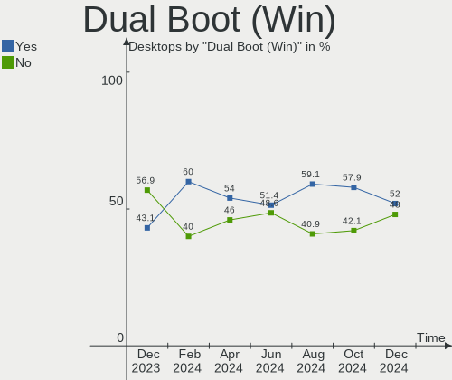
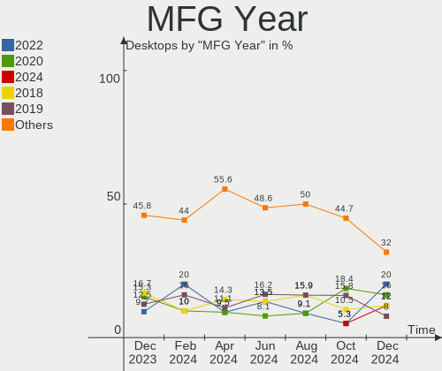
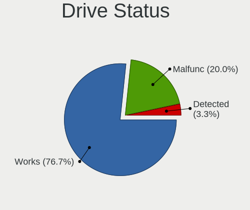
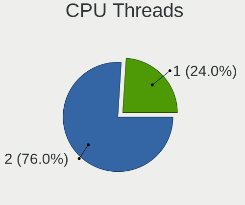
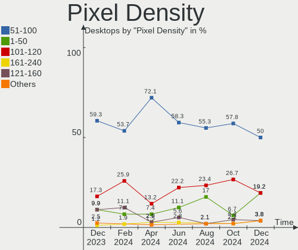
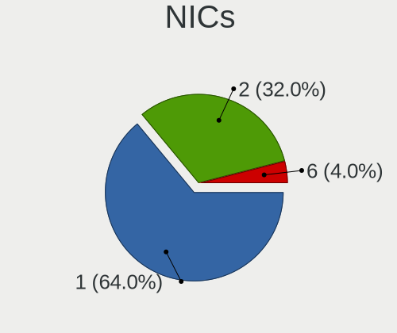
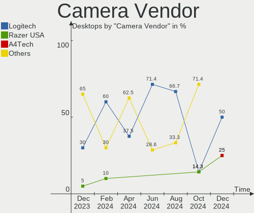

ArcoLinux Hardware Trends (Desktop)
-----------------------------------

A project to identify most popular hardware characteristics and track their change
over time based on data collected by ArcoLinux users at https://Linux-Hardware.org.

Anyone can contribute to the study by uploading probes of their computers by
the [hw-probe](https://github.com/linuxhw/hw-probe) tool:

    sudo -E hw-probe -all -upload

Full-feature report is available here: https://linux-hardware.org/?view=trends&formfactor=desktop

Period: Jan, 2021.

Contents
--------

- [ OS                       ](#os)
- [ OS Family                ](#os-family)
- [ Kernel                   ](#kernel)
- [ Kernel Family            ](#kernel-family)
- [ Kernel Major Ver.        ](#kernel-major-ver)
- [ Arch                     ](#arch)
- [ DE                       ](#de)
- [ Display Server           ](#display-server)
- [ Display Manager          ](#display-manager)
- [ OS Lang                  ](#os-lang)
- [ Boot Mode                ](#boot-mode)
- [ Filesystem               ](#filesystem)
- [ Part. scheme             ](#part-scheme)
- [ Dual Boot with Linux/BSD ](#dual-boot-with-linux/bsd)
- [ Dual Boot (Win)          ](#dual-boot-win)
- [ Country                  ](#country)
- [ City                     ](#city)
- [ Vendor                   ](#vendor)
- [ Model                    ](#model)
- [ Model Family             ](#model-family)
- [ MFG Year                 ](#mfg-year)
- [ Form Factor              ](#form-factor)
- [ Secure Boot              ](#secure-boot)
- [ Coreboot                 ](#coreboot)
- [ RAM Size                 ](#ram-size)
- [ RAM Used                 ](#ram-used)
- [ Has CD-ROM               ](#has-cd-rom)
- [ Total Drives             ](#total-drives)
- [ Has Ethernet             ](#has-ethernet)
- [ Drive Vendor             ](#drive-vendor)
- [ Drive Model              ](#drive-model)
- [ HDD Vendor               ](#hdd-vendor)
- [ SSD Vendor               ](#ssd-vendor)
- [ Drive Kind               ](#drive-kind)
- [ Drive Connector          ](#drive-connector)
- [ Drive Size               ](#drive-size)
- [ Space Total              ](#space-total)
- [ Space Used               ](#space-used)
- [ Malfunc. Drives          ](#malfunc-drives)
- [ Malfunc. Drive Vendor    ](#malfunc-drive-vendor)
- [ Malfunc. HDD Vendor      ](#malfunc-hdd-vendor)
- [ Malfunc. Drive Kind      ](#malfunc-drive-kind)
- [ Failed Drives            ](#failed-drives)
- [ Failed Drive Vendor      ](#failed-drive-vendor)
- [ Drive Status             ](#drive-status)
- [ Storage Vendor           ](#storage-vendor)
- [ Storage Model            ](#storage-model)
- [ Storage Kind             ](#storage-kind)
- [ CPU Vendor               ](#cpu-vendor)
- [ CPU Model                ](#cpu-model)
- [ CPU Model Family         ](#cpu-model-family)
- [ CPU Cores                ](#cpu-cores)
- [ CPU Sockets              ](#cpu-sockets)
- [ CPU Threads              ](#cpu-threads)
- [ CPU Op-Modes             ](#cpu-op-modes)
- [ CPU Microcode            ](#cpu-microcode)
- [ CPU Microarch            ](#cpu-microarch)
- [ GPU Vendor               ](#gpu-vendor)
- [ GPU Model                ](#gpu-model)
- [ GPU Combo                ](#gpu-combo)
- [ GPU Driver               ](#gpu-driver)
- [ GPU Memory               ](#gpu-memory)
- [ Monitor Vendor           ](#monitor-vendor)
- [ Monitor Model            ](#monitor-model)
- [ Monitor Resolution       ](#monitor-resolution)
- [ Monitor Diagonal         ](#monitor-diagonal)
- [ Monitor Width            ](#monitor-width)
- [ Aspect Ratio             ](#aspect-ratio)
- [ Monitor Area             ](#monitor-area)
- [ Pixel Density            ](#pixel-density)
- [ Multiple Monitors        ](#multiple-monitors)
- [ Net Controller Vendor    ](#net-controller-vendor)
- [ Net Controller Model     ](#net-controller-model)
- [ Wireless Vendor          ](#wireless-vendor)
- [ Wireless Model           ](#wireless-model)
- [ Ethernet Vendor          ](#ethernet-vendor)
- [ Ethernet Model           ](#ethernet-model)
- [ Net Controller Kind      ](#net-controller-kind)
- [ Used Controller          ](#used-controller)
- [ NICs                     ](#nics)
- [ Memory Vendor            ](#memory-vendor)
- [ Memory Model             ](#memory-model)
- [ Memory Kind              ](#memory-kind)
- [ Memory Form Factor       ](#memory-form-factor)
- [ Memory Size              ](#memory-size)
- [ Memory Speed             ](#memory-speed)
- [ Sound Vendor             ](#sound-vendor)
- [ Sound Model              ](#sound-model)
- [ Camera Vendor            ](#camera-vendor)
- [ Camera Model             ](#camera-model)
- [ Fingerprint Vendor       ](#fingerprint-vendor)
- [ Fingerprint Model        ](#fingerprint-model)
- [ Chipcard Vendor          ](#chipcard-vendor)
- [ Chipcard Model           ](#chipcard-model)
- [ Printer Vendor           ](#printer-vendor)
- [ Printer Model            ](#printer-model)
- [ Scanner Vendor           ](#scanner-vendor)
- [ Scanner Model            ](#scanner-model)
- [ Bluetooth Vendor         ](#bluetooth-vendor)
- [ Bluetooth Model          ](#bluetooth-model)
- [ Unsupported Devices      ](#unsupported-devices)
- [ Unsupported Device Types ](#unsupported-device-types)

OS
--

Installed operating systems

| Name              | Desktops | Percent |
|-------------------|----------|---------|
| ArcoLinux Rolling | 26       | 89.66%  |
| ArcoLinux         | 2        | 6.9%    |
| ArcoLinux 20.2.12 | 1        | 3.45%   |

OS Family
---------

OS without a version

| Name      | Desktops | Percent |
|-----------|----------|---------|
| ArcoLinux | 29       | 100%    |

Kernel
------

Version of the Linux kernel

| Version           | Desktops | Percent |
|-------------------|----------|---------|
| 5.10.7-arch1-1    | 4        | 13.79%  |
| 5.10.3-arch1-1    | 4        | 13.79%  |
| 5.10.9-arch1-1    | 3        | 10.34%  |
| 5.10.6-arch1-1    | 3        | 10.34%  |
| 5.10.5-arch1-1    | 3        | 10.34%  |
| 5.9.1-arch1-1     | 2        | 6.9%    |
| 5.4.89-1-lts      | 2        | 6.9%    |
| 5.4.86-1-lts      | 2        | 6.9%    |
| 5.4.92-1-lts      | 1        | 3.45%   |
| 5.4.87-1-lts      | 1        | 3.45%   |
| 5.10.4-zen2-1-zen | 1        | 3.45%   |
| 5.10.4-arch2-1    | 1        | 3.45%   |
| 5.10.11-arch1-1   | 1        | 3.45%   |
| 5.10.10-arch1-1   | 1        | 3.45%   |

Kernel Family
-------------

Linux kernel without a distro release

| Version | Desktops | Percent |
|---------|----------|---------|
| 5.10.7  | 4        | 13.79%  |
| 5.10.3  | 4        | 13.79%  |
| 5.10.9  | 3        | 10.34%  |
| 5.10.6  | 3        | 10.34%  |
| 5.10.5  | 3        | 10.34%  |
| 5.9.1   | 2        | 6.9%    |
| 5.4.89  | 2        | 6.9%    |
| 5.4.86  | 2        | 6.9%    |
| 5.10.4  | 2        | 6.9%    |
| 5.4.92  | 1        | 3.45%   |
| 5.4.87  | 1        | 3.45%   |
| 5.10.11 | 1        | 3.45%   |
| 5.10.10 | 1        | 3.45%   |

Kernel Major Ver.
-----------------

Linux kernel major version

| Version | Desktops | Percent |
|---------|----------|---------|
| 5.10    | 21       | 72.41%  |
| 5.4     | 6        | 20.69%  |
| 5.9     | 2        | 6.9%    |

Arch
----

OS architecture (x86_64, i586, etc.)

| Name   | Desktops | Percent |
|--------|----------|---------|
| x86_64 | 29       | 100%    |

DE
--

Desktop Environment

| Name       | Desktops | Percent |
|------------|----------|---------|
| XFCE       | 12       | 41.38%  |
| KDE5       | 3        | 10.34%  |
| i3         | 3        | 10.34%  |
| X-Cinnamon | 2        | 6.9%    |
| GNOME      | 2        | 6.9%    |
| dwm        | 2        | 6.9%    |
| xmonad     | 1        | 3.45%   |
| qtile      | 1        | 3.45%   |
| bspwm      | 1        | 3.45%   |
| awesome    | 1        | 3.45%   |
| Unknown    | 1        | 3.45%   |

Display Server
--------------

X11 or Wayland

| Name    | Desktops | Percent |
|---------|----------|---------|
| X11     | 27       | 93.1%   |
| Tty     | 1        | 3.45%   |
| Unknown | 1        | 3.45%   |

Display Manager
---------------

SDDM, LightDM, etc.

| Name    | Desktops | Percent |
|---------|----------|---------|
| TDM     | 21       | 72.41%  |
| SDDM    | 3        | 10.34%  |
| Unknown | 3        | 10.34%  |
| Ly      | 1        | 3.45%   |
| LightDM | 1        | 3.45%   |

OS Lang
-------

Language

| Lang  | Desktops | Percent |
|-------|----------|---------|
| en_US | 14       | 48.28%  |
| en_GB | 5        | 17.24%  |
| de_DE | 3        | 10.34%  |
| en_CA | 2        | 6.9%    |
| hu_HU | 1        | 3.45%   |
| es_ES | 1        | 3.45%   |
| en_IN | 1        | 3.45%   |
| en_AU | 1        | 3.45%   |
| de_AT | 1        | 3.45%   |

Boot Mode
---------

EFI or BIOS

| Mode | Desktops | Percent |
|------|----------|---------|
| EFI  | 20       | 68.97%  |
| BIOS | 9        | 31.03%  |

Filesystem
----------

Type of filesystem

| Type    | Desktops | Percent |
|---------|----------|---------|
| Ext4    | 25       | 86.21%  |
| Btrfs   | 3        | 10.34%  |
| Overlay | 1        | 3.45%   |

Part. scheme
------------

Scheme of partitioning

| Type    | Desktops | Percent |
|---------|----------|---------|
| GPT     | 24       | 82.76%  |
| MBR     | 3        | 10.34%  |
| Unknown | 2        | 6.9%    |

Dual Boot with Linux/BSD
------------------------

Hosting more than one Linux/BSD

| Dual boot | Desktops | Percent |
|-----------|----------|---------|
| No        | 20       | 68.97%  |
| Yes       | 9        | 31.03%  |

Dual Boot (Win)
---------------

Hosting Linux and Windows

| Dual boot | Desktops | Percent |
|-----------|----------|---------|
| No        | 17       | 58.62%  |
| Yes       | 12       | 41.38%  |

Country
-------

Geographic location (country)

| Country        | Desktops | Percent |
|----------------|----------|---------|
| USA            | 6        | 20.69%  |
| UK             | 4        | 13.79%  |
| Netherlands    | 3        | 10.34%  |
| Switzerland    | 2        | 6.9%    |
| Hungary        | 2        | 6.9%    |
| Germany        | 2        | 6.9%    |
| Colombia       | 2        | 6.9%    |
| Canada         | 2        | 6.9%    |
| Spain          | 1        | 3.45%   |
| India          | 1        | 3.45%   |
| Czech Republic | 1        | 3.45%   |
| Belgium        | 1        | 3.45%   |
| Austria        | 1        | 3.45%   |
| Australia      | 1        | 3.45%   |

City
----

Geographic location (city)

| City             | Desktops | Percent |
|------------------|----------|---------|
| Alblasserdam     | 2        | 6.9%    |
| Waterbury        | 1        | 3.45%   |
| Vienna           | 1        | 3.45%   |
| Viator           | 1        | 3.45%   |
| Toronto          | 1        | 3.45%   |
| Szombathely      | 1        | 3.45%   |
| Spencerport      | 1        | 3.45%   |
| Schiedam         | 1        | 3.45%   |
| Santiago de Cali | 1        | 3.45%   |
| Riehen           | 1        | 3.45%   |
| Québec          | 1        | 3.45%   |
| Portland         | 1        | 3.45%   |
| Pahrump          | 1        | 3.45%   |
| Nottingham       | 1        | 3.45%   |
| Newry            | 1        | 3.45%   |
| Medellín        | 1        | 3.45%   |
| Lucerne          | 1        | 3.45%   |
| Lier             | 1        | 3.45%   |
| Kaarst           | 1        | 3.45%   |
| Jacksonville     | 1        | 3.45%   |
| Gulberwick       | 1        | 3.45%   |
| Gatesville       | 1        | 3.45%   |
| Budapest         | 1        | 3.45%   |
| Brno             | 1        | 3.45%   |
| Berlin           | 1        | 3.45%   |
| Bengaluru        | 1        | 3.45%   |
| Belfast          | 1        | 3.45%   |
| Alexandria       | 1        | 3.45%   |

Vendor
------

Motherboard manufacturer

| Name                | Desktops | Percent |
|---------------------|----------|---------|
| MSI                 | 8        | 27.59%  |
| ASUSTek Computer    | 8        | 27.59%  |
| Lenovo              | 3        | 10.34%  |
| Hewlett-Packard     | 3        | 10.34%  |
| Unknown             | 3        | 10.34%  |
| Gigabyte Technology | 2        | 6.9%    |
| PROLINE             | 1        | 3.45%   |
| ASRock              | 1        | 3.45%   |

Model
-----

Motherboard model

| Name                                   | Desktops | Percent |
|----------------------------------------|----------|---------|
| Unknown                                | 3        | 10.34%  |
| MSI MS-7B79                            | 2        | 6.9%    |
| MSI MS-7A38                            | 2        | 6.9%    |
| ASUS ROG STRIX B450-F GAMING           | 2        | 6.9%    |
| PROLINE ProlinePartner                 | 1        | 3.45%   |
| MSI MS-7B86                            | 1        | 3.45%   |
| MSI MS-7A63                            | 1        | 3.45%   |
| MSI MS-7971                            | 1        | 3.45%   |
| MSI HPE-490uk                          | 1        | 3.45%   |
| Lenovo ThinkStation P310 30AV000DUS    | 1        | 3.45%   |
| Lenovo ThinkCentre M82 29293V4         | 1        | 3.45%   |
| Lenovo IdeaCentre 510-15ICB 90HU00CEGE | 1        | 3.45%   |
| HP Z400 Workstation                    | 1        | 3.45%   |
| HP Pavilion Desktop PC 570-p0xx        | 1        | 3.45%   |
| HP 750-150nz                           | 1        | 3.45%   |
| Gigabyte H310N 2.0                     | 1        | 3.45%   |
| Gigabyte B450 AORUS ELITE              | 1        | 3.45%   |
| ASUS STRIX Z270H GAMING                | 1        | 3.45%   |
| ASUS STRIX B250F GAMING                | 1        | 3.45%   |
| ASUS PRIME Z390-P                      | 1        | 3.45%   |
| ASUS PRIME X470-PRO                    | 1        | 3.45%   |
| ASUS PRIME H310M-E                     | 1        | 3.45%   |
| ASUS P8H61-M LX3 PLUS R2.0             | 1        | 3.45%   |
| ASRock J4105-ITX                       | 1        | 3.45%   |

Model Family
------------

Motherboard model prefix

| Name                   | Desktops | Percent |
|------------------------|----------|---------|
| ASUS PRIME             | 3        | 10.34%  |
| Unknown                | 3        | 10.34%  |
| MSI MS-7B79            | 2        | 6.9%    |
| MSI MS-7A38            | 2        | 6.9%    |
| ASUS STRIX             | 2        | 6.9%    |
| ASUS ROG               | 2        | 6.9%    |
| PROLINE ProlinePartner | 1        | 3.45%   |
| MSI MS-7B86            | 1        | 3.45%   |
| MSI MS-7A63            | 1        | 3.45%   |
| MSI MS-7971            | 1        | 3.45%   |
| MSI HPE-490uk          | 1        | 3.45%   |
| Lenovo ThinkStation    | 1        | 3.45%   |
| Lenovo ThinkCentre     | 1        | 3.45%   |
| Lenovo IdeaCentre      | 1        | 3.45%   |
| HP Z400                | 1        | 3.45%   |
| HP Pavilion            | 1        | 3.45%   |
| HP 750-150nz           | 1        | 3.45%   |
| Gigabyte H310N         | 1        | 3.45%   |
| Gigabyte B450          | 1        | 3.45%   |
| ASUS P8H61-M           | 1        | 3.45%   |
| ASRock J4105-ITX       | 1        | 3.45%   |

MFG Year
--------

Motherboard manufacture year

| Year | Desktops | Percent |
|------|----------|---------|
| 2019 | 8        | 27.59%  |
| 2020 | 7        | 24.14%  |
| 2018 | 7        | 24.14%  |
| 2017 | 2        | 6.9%    |
| 2016 | 1        | 3.45%   |
| 2015 | 1        | 3.45%   |
| 2014 | 1        | 3.45%   |
| 2013 | 1        | 3.45%   |
| 2010 | 1        | 3.45%   |

Form Factor
-----------

Physical design of the computer

| Name    | Desktops | Percent |
|---------|----------|---------|
| Desktop | 29       | 100%    |

Secure Boot
-----------

Enabled or disabled

| State    | Desktops | Percent |
|----------|----------|---------|
| Disabled | 29       | 100%    |

Coreboot
--------

Have coreboot on board

| Used | Desktops | Percent |
|------|----------|---------|
| No   | 29       | 100%    |

RAM Size
--------

Total RAM memory

| Size in GB | Desktops | Percent |
|------------|----------|---------|
| 16.01-24.0 | 12       | 41.38%  |
| 4.01-8.0   | 6        | 20.69%  |
| 32.01-64.0 | 6        | 20.69%  |
| 8.01-16.0  | 3        | 10.34%  |
| 3.01-4.0   | 1        | 3.45%   |
| 24.01-32.0 | 1        | 3.45%   |

RAM Used
--------

Used RAM memory

| Used GB  | Desktops | Percent |
|----------|----------|---------|
| 1.01-2.0 | 10       | 34.48%  |
| 2.01-3.0 | 8        | 27.59%  |
| 0.51-1.0 | 6        | 20.69%  |
| 4.01-8.0 | 2        | 6.9%    |
| 3.01-4.0 | 2        | 6.9%    |
| 0.01-0.5 | 1        | 3.45%   |

Has CD-ROM
----------

Has CD-ROM on board

| Presented | Desktops | Percent |
|-----------|----------|---------|
| No        | 22       | 75.86%  |
| Yes       | 7        | 24.14%  |

Total Drives
------------

Number of drives on board

| Drives | Desktops | Percent |
|--------|----------|---------|
| 3      | 11       | 37.93%  |
| 2      | 8        | 27.59%  |
| 1      | 6        | 20.69%  |
| 4      | 4        | 13.79%  |

Has Ethernet
------------

Has Ethernet on board

| Presented | Desktops | Percent |
|-----------|----------|---------|
| Yes       | 28       | 96.55%  |
| No        | 1        | 3.45%   |

Drive Vendor
------------

Hard drive vendors

| Vendor              | Desktops | Drives | Percent |
|---------------------|----------|--------|---------|
| Seagate             | 12       | 16     | 20%     |
| Samsung Electronics | 11       | 13     | 18.33%  |
| WDC                 | 10       | 14     | 16.67%  |
| Toshiba             | 4        | 5      | 6.67%   |
| Kingston            | 4        | 4      | 6.67%   |
| Crucial             | 3        | 4      | 5%      |
| Unknown             | 2        | 2      | 3.33%   |
| Silicon Motion      | 2        | 2      | 3.33%   |
| JMicron             | 2        | 2      | 3.33%   |
| Vaseky              | 1        | 1      | 1.67%   |
| SanDisk             | 1        | 1      | 1.67%   |
| PNY                 | 1        | 1      | 1.67%   |
| Phison              | 1        | 1      | 1.67%   |
| Patriot             | 1        | 1      | 1.67%   |
| KODAK               | 1        | 1      | 1.67%   |
| Intel               | 1        | 1      | 1.67%   |
| Hoodisk             | 1        | 1      | 1.67%   |
| Hitachi             | 1        | 1      | 1.67%   |
| A-DATA Technology   | 1        | 1      | 1.67%   |

Drive Model
-----------

Hard drive models

| Model                                        | Desktops | Percent |
|----------------------------------------------|----------|---------|
| WDC WDS500G2B0A-00SM50 500GB SSD             | 2        | 3.03%   |
| WDC WD10EZEX-08WN4A0 1TB                     | 2        | 3.03%   |
| Unknown SD/MMC/MS PRO 32GB                   | 2        | 3.03%   |
| Samsung SSD 850 EVO 120GB                    | 2        | 3.03%   |
| Kingston SA400S37480G 480GB SSD              | 2        | 3.03%   |
| Kingston SA400S37120G 120GB SSD              | 2        | 3.03%   |
| Crucial CT250MX500SSD1 250GB                 | 2        | 3.03%   |
| WDC WDS500G2B0C-00PXH0 500GB                 | 1        | 1.52%   |
| WDC WDS120G2G0A-00JH30 120GB SSD             | 1        | 1.52%   |
| WDC WD5000AZRX-00A8LB0 500GB                 | 1        | 1.52%   |
| WDC WD3200AAKS-61L9A0 320GB                  | 1        | 1.52%   |
| WDC WD20EZRZ-00Z5HB0 2TB                     | 1        | 1.52%   |
| WDC WD1600JS-55MHB1 160GB                    | 1        | 1.52%   |
| WDC WD10EARS-00Y5B1 1TB                      | 1        | 1.52%   |
| WDC WD1002FBYS-50A6B0 1TB                    | 1        | 1.52%   |
| WDC PC SN720 SDAQNTW-512G-1001 512GB         | 1        | 1.52%   |
| Vaseky V900/128G 128GB SSD                   | 1        | 1.52%   |
| Toshiba MG03ACA400 4TB                       | 1        | 1.52%   |
| Toshiba HDWD120 2TB                          | 1        | 1.52%   |
| Toshiba HDWD110 1TB                          | 1        | 1.52%   |
| Toshiba DT01ACA100 1TB                       | 1        | 1.52%   |
| Silicon Motion NVMe SSD Drive 256GB          | 1        | 1.52%   |
| Silicon Motion NVMe SSD 256G                 | 1        | 1.52%   |
| Seagate STM3160318AS 160GB                   | 1        | 1.52%   |
| Seagate ST6000DM003-2CY186 6TB               | 1        | 1.52%   |
| Seagate ST3000DM001-1E6166 3TB               | 1        | 1.52%   |
| Seagate ST2000VM003-1ET164 2TB               | 1        | 1.52%   |
| Seagate ST2000DM008-2FR102 2TB               | 1        | 1.52%   |
| Seagate ST2000DM001-1ER164 2TB               | 1        | 1.52%   |
| Seagate ST2000DM001-1CH164 2TB               | 1        | 1.52%   |
| Seagate ST1000LM048-2E7172 1TB               | 1        | 1.52%   |
| Seagate ST1000DM010-2EP102 1TB               | 1        | 1.52%   |
| Seagate ST1000DM003-1ER162 1TB               | 1        | 1.52%   |
| Seagate Expansion 1TB                        | 1        | 1.52%   |
| Seagate BUP Slim SL 1TB                      | 1        | 1.52%   |
| Seagate BUP Slim 2TB                         | 1        | 1.52%   |
| Seagate BarraCuda 120 SSD ZA250CM10003 250GB | 1        | 1.52%   |
| SanDisk X110 MSATA 128GB SSD                 | 1        | 1.52%   |
| Samsung SSD 970 EVO Plus 500GB               | 1        | 1.52%   |
| Samsung SSD 970 EVO Plus 250GB               | 1        | 1.52%   |
| Samsung SSD 960 EVO 500GB                    | 1        | 1.52%   |
| Samsung SSD 870 QVO 1TB                      | 1        | 1.52%   |
| Samsung SSD 860 EVO M.2 250GB                | 1        | 1.52%   |
| Samsung SSD 860 EVO 500GB                    | 1        | 1.52%   |
| Samsung SSD 860 EVO 250GB                    | 1        | 1.52%   |
| Samsung SSD 850 EVO 250GB                    | 1        | 1.52%   |
| Samsung MZVLW128HEGR-000H1 128GB             | 1        | 1.52%   |
| Samsung MZ7TE256HMHP-000H1 256GB SSD         | 1        | 1.52%   |
| PNY CS900 240GB SSD                          | 1        | 1.52%   |
| Phison Viper M.2 VPN100 256GB                | 1        | 1.52%   |
| Patriot Burst 240GB SSD                      | 1        | 1.52%   |
| KODAK X100 SSD 240GB                         | 1        | 1.52%   |
| JMicron Generic 500GB                        | 1        | 1.52%   |
| JMicron Disk 240GB                           | 1        | 1.52%   |
| Intel SSDPEKNW010T8 1TB                      | 1        | 1.52%   |
| Hoodisk SSD 128GB                            | 1        | 1.52%   |
| Hitachi HTS545025B9A300 250GB                | 1        | 1.52%   |
| Crucial CT1000P1SSD8 1TB                     | 1        | 1.52%   |
| A-DATA SU630 240GB SSD                       | 1        | 1.52%   |

HDD Vendor
----------

Hard disk drive vendors

| Vendor  | Desktops | Drives | Percent |
|---------|----------|--------|---------|
| Seagate | 11       | 13     | 47.83%  |
| WDC     | 7        | 9      | 30.43%  |
| Toshiba | 4        | 5      | 17.39%  |
| Hitachi | 1        | 1      | 4.35%   |

SSD Vendor
----------

Solid state drive vendors

| Vendor              | Desktops | Drives | Percent |
|---------------------|----------|--------|---------|
| Samsung Electronics | 7        | 8      | 26.92%  |
| Kingston            | 4        | 4      | 15.38%  |
| WDC                 | 3        | 3      | 11.54%  |
| JMicron             | 2        | 2      | 7.69%   |
| Crucial             | 2        | 3      | 7.69%   |
| Vaseky              | 1        | 1      | 3.85%   |
| Seagate             | 1        | 3      | 3.85%   |
| SanDisk             | 1        | 1      | 3.85%   |
| PNY                 | 1        | 1      | 3.85%   |
| Patriot             | 1        | 1      | 3.85%   |
| KODAK               | 1        | 1      | 3.85%   |
| Hoodisk             | 1        | 1      | 3.85%   |
| A-DATA Technology   | 1        | 1      | 3.85%   |

Drive Kind
----------

HDD or SSD

| Kind    | Desktops | Drives | Percent |
|---------|----------|--------|---------|
| HDD     | 22       | 28     | 40%     |
| SSD     | 21       | 30     | 38.18%  |
| NVMe    | 10       | 12     | 18.18%  |
| Unknown | 2        | 2      | 3.64%   |

Drive Connector
---------------

SATA, SAS, NVMe, etc.

| Type | Desktops | Drives | Percent |
|------|----------|--------|---------|
| SATA | 27       | 53     | 62.79%  |
| NVMe | 10       | 12     | 23.26%  |
| SAS  | 6        | 7      | 13.95%  |

Drive Size
----------

Size of hard drive

| Size in TB | Desktops | Drives | Percent |
|------------|----------|--------|---------|
| 0.01-0.5   | 23       | 34     | 53.49%  |
| 0.51-1.0   | 11       | 12     | 25.58%  |
| 1.01-2.0   | 6        | 9      | 13.95%  |
| 3.01-4.0   | 1        | 1      | 2.33%   |
| 2.01-3.0   | 1        | 1      | 2.33%   |
| 4.01-10.0  | 1        | 1      | 2.33%   |

Space Total
-----------

Amount of disk space available on the file system

| Size in GB     | Desktops | Percent |
|----------------|----------|---------|
| 101-250        | 7        | 24.14%  |
| 501-1000       | 5        | 17.24%  |
| 251-500        | 4        | 13.79%  |
| 1001-2000      | 4        | 13.79%  |
| More than 3000 | 3        | 10.34%  |
| 2001-3000      | 2        | 6.9%    |
| 21-50          | 1        | 3.45%   |
| 1-20           | 1        | 3.45%   |
| 51-100         | 1        | 3.45%   |
| Unknown        | 1        | 3.45%   |

Space Used
----------

Amount of used disk space

| Used GB        | Desktops | Percent |
|----------------|----------|---------|
| 1-20           | 10       | 34.48%  |
| 21-50          | 5        | 17.24%  |
| 101-250        | 4        | 13.79%  |
| 251-500        | 3        | 10.34%  |
| 1001-2000      | 2        | 6.9%    |
| 501-1000       | 2        | 6.9%    |
| More than 3000 | 1        | 3.45%   |
| 51-100         | 1        | 3.45%   |
| Unknown        | 1        | 3.45%   |

Malfunc. Drives
---------------

Drive models with a malfunction

| Model                                 | Desktops | Drives | Percent |
|---------------------------------------|----------|--------|---------|
| WDC WD10EARS-00Y5B1 1TB               | 1        | 1      | 25%     |
| Seagate ST3000DM001-1E6166 3TB        | 1        | 1      | 25%     |
| Samsung Electronics SSD 960 EVO 500GB | 1        | 1      | 25%     |
| Kingston SA400S37120G 120GB SSD       | 1        | 1      | 25%     |

Malfunc. Drive Vendor
---------------------

Vendors of faulty drives

| Vendor              | Desktops | Drives | Percent |
|---------------------|----------|--------|---------|
| WDC                 | 1        | 1      | 25%     |
| Seagate             | 1        | 1      | 25%     |
| Samsung Electronics | 1        | 1      | 25%     |
| Kingston            | 1        | 1      | 25%     |

Malfunc. HDD Vendor
-------------------

Vendors of faulty HDD drives

| Vendor  | Desktops | Drives | Percent |
|---------|----------|--------|---------|
| WDC     | 1        | 1      | 50%     |
| Seagate | 1        | 1      | 50%     |

Malfunc. Drive Kind
-------------------

Kinds of faulty drives

| Kind | Desktops | Drives | Percent |
|------|----------|--------|---------|
| NVMe | 1        | 1      | 33.33%  |
| SSD  | 1        | 1      | 33.33%  |
| HDD  | 1        | 2      | 33.33%  |

Failed Drives
-------------

Failed drive models

Zero info for selected period =(

Failed Drive Vendor
-------------------

Failed drive vendors

Zero info for selected period =(

Drive Status
------------

Number of failed and malfunc. drives

| Status   | Desktops | Drives | Percent |
|----------|----------|--------|---------|
| Works    | 27       | 57     | 71.05%  |
| Detected | 8        | 11     | 21.05%  |
| Malfunc  | 3        | 4      | 7.89%   |

Storage Vendor
--------------

Storage controller vendors

| Vendor                    | Desktops | Percent |
|---------------------------|----------|---------|
| Intel                     | 20       | 50%     |
| AMD                       | 9        | 22.5%   |
| Samsung Electronics       | 4        | 10%     |
| Silicon Motion            | 2        | 5%      |
| Sandisk                   | 2        | 5%      |
| Phison Electronics        | 1        | 2.5%    |
| Micron/Crucial Technology | 1        | 2.5%    |
| ASMedia Technology        | 1        | 2.5%    |

Storage Model
-------------

Storage controller models

| Model                                                                         | Desktops | Percent |
|-------------------------------------------------------------------------------|----------|---------|
| AMD 400 Series Chipset SATA Controller                                        | 9        | 18.37%  |
| AMD FCH SATA Controller [AHCI mode]                                           | 8        | 16.33%  |
| Intel 200 Series PCH SATA controller [AHCI mode]                              | 5        | 10.2%   |
| Intel Q170/Q150/B150/H170/H110/Z170/CM236 Chipset SATA Controller [AHCI Mode] | 3        | 6.12%   |
| Intel Cannon Lake PCH SATA AHCI Controller                                    | 3        | 6.12%   |
| Intel 7 Series/C210 Series Chipset Family 6-port SATA Controller [AHCI mode]  | 3        | 6.12%   |
| Silicon Motion SM2263EN/SM2263XT SSD Controller                               | 2        | 4.08%   |
| Samsung NVMe SSD Controller SM981/PM981/PM983                                 | 2        | 4.08%   |
| Samsung NVMe SSD Controller SM961/PM961/SM963                                 | 2        | 4.08%   |
| Intel SATA Controller [RAID mode]                                             | 2        | 4.08%   |
| Sandisk WD Blue SN550 NVMe SSD                                                | 1        | 2.04%   |
| Sandisk WD Black 2018 / PC SN720 NVMe SSD                                     | 1        | 2.04%   |
| Phison E12 NVMe Controller                                                    | 1        | 2.04%   |
| Micron/Crucial P1 NVMe PCIe SSD                                               | 1        | 2.04%   |
| Intel SSD 660P Series                                                         | 1        | 2.04%   |
| Intel Celeron/Pentium Silver Processor SATA Controller                        | 1        | 2.04%   |
| Intel Celeron N3350/Pentium N4200/Atom E3900 Series SATA AHCI Controller      | 1        | 2.04%   |
| Intel Cannon Point-LP SATA Controller [AHCI Mode]                             | 1        | 2.04%   |
| Intel 6 Series/C200 Series Chipset Family 6 port Desktop SATA AHCI Controller | 1        | 2.04%   |
| ASMedia ASM1062 Serial ATA Controller                                         | 1        | 2.04%   |

Storage Kind
------------

Kind of storage controller (IDE, SATA, NVMe, SAS, ...)

| Kind | Desktops | Percent |
|------|----------|---------|
| SATA | 27       | 69.23%  |
| NVMe | 10       | 25.64%  |
| RAID | 2        | 5.13%   |

CPU Vendor
----------

Processor vendors

| Vendor | Desktops | Percent |
|--------|----------|---------|
| Intel  | 20       | 68.97%  |
| AMD    | 9        | 31.03%  |

CPU Model
---------

Processor models

| Model                                       | Desktops | Percent |
|---------------------------------------------|----------|---------|
| Intel Core i7-7700K CPU @ 4.20GHz           | 3        | 10.34%  |
| Intel Core i5-8400 CPU @ 2.80GHz            | 2        | 6.9%    |
| AMD Ryzen 3 3200G with Radeon Vega Graphics | 2        | 6.9%    |
| Intel Xeon CPU W3550 @ 3.07GHz              | 1        | 3.45%   |
| Intel Xeon CPU E5-2640 0 @ 2.50GHz          | 1        | 3.45%   |
| Intel Xeon CPU E3-1245 v5 @ 3.50GHz         | 1        | 3.45%   |
| Intel Pentium Gold G5400 CPU @ 3.70GHz      | 1        | 3.45%   |
| Intel Pentium CPU G2020 @ 2.90GHz           | 1        | 3.45%   |
| Intel Core i7-8565U CPU @ 1.80GHz           | 1        | 3.45%   |
| Intel Core i7-6700 CPU @ 3.40GHz            | 1        | 3.45%   |
| Intel Core i7-3820 CPU @ 3.60GHz            | 1        | 3.45%   |
| Intel Core i7 CPU 870 @ 2.93GHz             | 1        | 3.45%   |
| Intel Core i5-9600K CPU @ 3.70GHz           | 1        | 3.45%   |
| Intel Core i5-7600K CPU @ 3.80GHz           | 1        | 3.45%   |
| Intel Core i5-7400 CPU @ 3.00GHz            | 1        | 3.45%   |
| Intel Core i3-3240 CPU @ 3.40GHz            | 1        | 3.45%   |
| Intel Celeron J4105 CPU @ 1.50GHz           | 1        | 3.45%   |
| Intel Celeron CPU J3455 @ 1.50GHz           | 1        | 3.45%   |
| AMD Ryzen 7 2700X Eight-Core Processor      | 1        | 3.45%   |
| AMD Ryzen 7 1700 Eight-Core Processor       | 1        | 3.45%   |
| AMD Ryzen 5 3600X 6-Core Processor          | 1        | 3.45%   |
| AMD Ryzen 5 3600 6-Core Processor           | 1        | 3.45%   |
| AMD Ryzen 5 2600 Six-Core Processor         | 1        | 3.45%   |
| AMD Ryzen 5 2400G with Radeon Vega Graphics | 1        | 3.45%   |
| AMD Ryzen 3 3100 4-Core Processor           | 1        | 3.45%   |

CPU Model Family
----------------

Processor model prefix

| Model              | Desktops | Percent |
|--------------------|----------|---------|
| Intel Core i7      | 7        | 24.14%  |
| Intel Core i5      | 5        | 17.24%  |
| AMD Ryzen 5        | 4        | 13.79%  |
| Intel Xeon         | 3        | 10.34%  |
| AMD Ryzen 3        | 3        | 10.34%  |
| Intel Celeron      | 2        | 6.9%    |
| AMD Ryzen 7        | 2        | 6.9%    |
| Intel Pentium Gold | 1        | 3.45%   |
| Intel Pentium      | 1        | 3.45%   |
| Intel Core i3      | 1        | 3.45%   |

CPU Cores
---------

Number of processor cores

| Number | Desktops | Percent |
|--------|----------|---------|
| 4      | 17       | 58.62%  |
| 6      | 7        | 24.14%  |
| 2      | 3        | 10.34%  |
| 8      | 2        | 6.9%    |

CPU Sockets
-----------

Number of sockets

| Number | Desktops | Percent |
|--------|----------|---------|
| 1      | 29       | 100%    |

CPU Threads
-----------

Threads per core (Hyper-Threading)

| Number | Desktops | Percent |
|--------|----------|---------|
| 2      | 19       | 65.52%  |
| 1      | 10       | 34.48%  |

CPU Op-Modes
------------

CPU Operation Modes (32-bit, 64-bit)

| Op mode        | Desktops | Percent |
|----------------|----------|---------|
| 32-bit, 64-bit | 29       | 100%    |

CPU Microcode
-------------

Microcode number

| Number     | Desktops | Percent |
|------------|----------|---------|
| 0x906e9    | 5        | 17.24%  |
| 0x906ea    | 3        | 10.34%  |
| 0x08701021 | 3        | 10.34%  |
| 0x506e3    | 2        | 6.9%    |
| 0x08108109 | 2        | 6.9%    |
| 0x0800820d | 2        | 6.9%    |
| Unknown    | 2        | 6.9%    |
| 0x906ec    | 1        | 3.45%   |
| 0x806eb    | 1        | 3.45%   |
| 0x706a1    | 1        | 3.45%   |
| 0x506c9    | 1        | 3.45%   |
| 0x306a9    | 1        | 3.45%   |
| 0x206d7    | 1        | 3.45%   |
| 0x106e5    | 1        | 3.45%   |
| 0x106a5    | 1        | 3.45%   |
| 0x0810100b | 1        | 3.45%   |
| 0x08001138 | 1        | 3.45%   |

CPU Microarch
-------------

Microarchitecture

| Name          | Desktops | Percent |
|---------------|----------|---------|
| KabyLake      | 10       | 34.48%  |
| Zen+          | 4        | 13.79%  |
| Zen 2         | 3        | 10.34%  |
| Zen           | 2        | 6.9%    |
| Skylake       | 2        | 6.9%    |
| SandyBridge   | 2        | 6.9%    |
| Nehalem       | 2        | 6.9%    |
| IvyBridge     | 2        | 6.9%    |
| Goldmont plus | 1        | 3.45%   |
| Goldmont      | 1        | 3.45%   |

GPU Vendor
----------

Vendors of graphics cards

| Vendor | Desktops | Percent |
|--------|----------|---------|
| Nvidia | 16       | 55.17%  |
| Intel  | 9        | 31.03%  |
| AMD    | 4        | 13.79%  |

GPU Model
---------

Graphics card models

| Model                                                            | Desktops | Percent |
|------------------------------------------------------------------|----------|---------|
| Nvidia GP104 [GeForce GTX 1070]                                  | 3        | 10.34%  |
| AMD Ellesmere [Radeon RX 470/480/570/570X/580/580X/590]          | 3        | 10.34%  |
| Nvidia TU116 [GeForce GTX 1660 SUPER]                            | 2        | 6.9%    |
| Nvidia GP106 [GeForce GTX 1060 6GB]                              | 2        | 6.9%    |
| Nvidia GM206 [GeForce GTX 960]                                   | 2        | 6.9%    |
| Intel Xeon E3-1200 v2/3rd Gen Core processor Graphics Controller | 2        | 6.9%    |
| Intel HD Graphics 630                                            | 2        | 6.9%    |
| Nvidia TU116 [GeForce GTX 1650 SUPER]                            | 1        | 3.45%   |
| Nvidia GP107GL [Quadro P1000]                                    | 1        | 3.45%   |
| Nvidia GP107 [GeForce GTX 1050 Ti]                               | 1        | 3.45%   |
| Nvidia GP102 [GeForce GTX 1080 Ti]                               | 1        | 3.45%   |
| Nvidia GK107 [GeForce GTX 650]                                   | 1        | 3.45%   |
| Nvidia GF100GL [Quadro 4000]                                     | 1        | 3.45%   |
| Nvidia G92 [GeForce GT 230 OEM]                                  | 1        | 3.45%   |
| Intel UHD Graphics 630 (Desktop)                                 | 1        | 3.45%   |
| Intel UHD Graphics 620 (Whiskey Lake)                            | 1        | 3.45%   |
| Intel UHD Graphics 610                                           | 1        | 3.45%   |
| Intel UHD Graphics 605                                           | 1        | 3.45%   |
| Intel HD Graphics 500                                            | 1        | 3.45%   |
| AMD Picasso                                                      | 1        | 3.45%   |

GPU Combo
---------

Combinations of graphics cards

| Name       | Desktops | Percent |
|------------|----------|---------|
| 1 x Nvidia | 16       | 55.17%  |
| 1 x Intel  | 9        | 31.03%  |
| 1 x AMD    | 4        | 13.79%  |

GPU Driver
----------

Free vs proprietary

| Driver      | Desktops | Percent |
|-------------|----------|---------|
| Free        | 22       | 75.86%  |
| Proprietary | 6        | 20.69%  |
| Unknown     | 1        | 3.45%   |

GPU Memory
----------

Total video memory

| Size in GB | Desktops | Percent |
|------------|----------|---------|
| Unknown    | 12       | 41.38%  |
| 1.01-2.0   | 6        | 20.69%  |
| 7.01-8.0   | 5        | 17.24%  |
| 3.01-4.0   | 3        | 10.34%  |
| 5.01-6.0   | 2        | 6.9%    |
| 8.01-16.0  | 1        | 3.45%   |

Monitor Vendor
--------------

Monitor vendors

| Vendor               | Desktops | Percent |
|----------------------|----------|---------|
| Acer                 | 6        | 18.75%  |
| AOC                  | 4        | 12.5%   |
| Ancor Communications | 4        | 12.5%   |
| Samsung Electronics  | 3        | 9.38%   |
| Goldstar             | 3        | 9.38%   |
| Dell                 | 3        | 9.38%   |
| Hewlett-Packard      | 2        | 6.25%   |
| Eizo                 | 2        | 6.25%   |
| Sony                 | 1        | 3.13%   |
| Philips              | 1        | 3.13%   |
| MStar                | 1        | 3.13%   |
| DTV                  | 1        | 3.13%   |
| BenQ                 | 1        | 3.13%   |

Monitor Model
-------------

Monitor models

| Model                                                                 | Desktops | Percent |
|-----------------------------------------------------------------------|----------|---------|
| Sony TV SNYE903 1920x1080 1600x900mm 72.3-inch                        | 1        | 3.13%   |
| Samsung Electronics SA300/SA350 SAM0790 1920x1080 510x287mm 23.0-inch | 1        | 3.13%   |
| Samsung Electronics S24F350 SAM0D20 1920x1080 521x293mm 23.5-inch     | 1        | 3.13%   |
| Samsung Electronics S22R35x SAM103A 1920x1080 476x268mm 21.5-inch     | 1        | 3.13%   |
| Philips PHL 275B1 PHL0946 2560x1440 597x336mm 27.0-inch               | 1        | 3.13%   |
| MStar TV_MONITOR MST0030 1440x900 1150x650mm 52.0-inch                | 1        | 3.13%   |
| Hewlett-Packard 27es HWP3327 1920x1080 600x340mm 27.2-inch            | 1        | 3.13%   |
| Hewlett-Packard 27ea HPN3395 1920x1080 527x296mm 23.8-inch            | 1        | 3.13%   |
| Goldstar W2340 GSM57A7 1920x1080 510x290mm 23.1-inch                  | 1        | 3.13%   |
| Goldstar W2040 GSM4EB2 1600x900 443x249mm 20.0-inch                   | 1        | 3.13%   |
| Goldstar IPS FULLHD GSM5AB7 1920x1080 480x270mm 21.7-inch             | 1        | 3.13%   |
| Eizo EV3285 ENC2971 3840x2160 698x393mm 31.5-inch                     | 1        | 3.13%   |
| Eizo CG223W ENC2144 1680x1050 474x297mm 22.0-inch                     | 1        | 3.13%   |
| DTV Digital TV DTV2011 1920x1080 1024x576mm 46.3-inch                 | 1        | 3.13%   |
| Dell U2410 DELF016 1920x1080 520x320mm 24.0-inch                      | 1        | 3.13%   |
| Dell E172FP DELA00A 1280x1024 338x270mm 17.0-inch                     | 1        | 3.13%   |
| Dell 2007FP DELA020 1600x1200 367x275mm 18.1-inch                     | 1        | 3.13%   |
| BenQ GW2480 BNQ78E7 1920x1080 527x296mm 23.8-inch                     | 1        | 3.13%   |
| AOC PD271F AOC2710 1920x1080 598x336mm 27.0-inch                      | 1        | 3.13%   |
| AOC 2963 AOC2963 1920x1080 670x280mm 28.6-inch                        | 1        | 3.13%   |
| AOC 24B1W AOC2401 1920x1080 521x293mm 23.5-inch                       | 1        | 3.13%   |
| AOC 1950w AOC1950 1366x768 410x230mm 18.5-inch                        | 1        | 3.13%   |
| Ancor Communications VX238 ACI23C1 1920x1080 510x290mm 23.1-inch      | 1        | 3.13%   |
| Ancor Communications VS248 ACI2498 1920x1080 531x299mm 24.0-inch      | 1        | 3.13%   |
| Ancor Communications ASUS VX279 ACI27E4 1920x1080 598x336mm 27.0-inch | 1        | 3.13%   |
| Ancor Communications ASUS VS228 ACI22FD 1920x1080 476x268mm 21.5-inch | 1        | 3.13%   |
| Acer S240HL ACR0289 1920x1080 531x299mm 24.0-inch                     | 1        | 3.13%   |
| Acer S202HL ACR020B 1600x900 443x249mm 20.0-inch                      | 1        | 3.13%   |
| Acer KA242Y A ACR078F 1920x1080 517x323mm 24.0-inch                   | 1        | 3.13%   |
| Acer KA240H ACR0538 1920x1080 531x299mm 24.0-inch                     | 1        | 3.13%   |
| Acer K272HUL ACR03DD 2560x1440 600x340mm 27.2-inch                    | 1        | 3.13%   |
| Acer K202HQLA ACR0498 1366x768 434x236mm 19.4-inch                    | 1        | 3.13%   |

Monitor Resolution
------------------

Monitor screen resolution

| Resolution         | Desktops | Percent |
|--------------------|----------|---------|
| 1920x1080 (FHD)    | 16       | 53.33%  |
| 2560x1440 (QHD)    | 3        | 10%     |
| 3840x2160 (4K)     | 2        | 6.67%   |
| 1600x900 (HD+)     | 2        | 6.67%   |
| 1366x768 (WXGA)    | 2        | 6.67%   |
| 2560x1080          | 1        | 3.33%   |
| 1920x1200 (WUXGA)  | 1        | 3.33%   |
| 1680x1050 (WSXGA+) | 1        | 3.33%   |
| 1600x1200          | 1        | 3.33%   |
| 1280x1024 (SXGA)   | 1        | 3.33%   |

Monitor Diagonal
----------------

Diagonal size in inches

| Inches | Desktops | Percent |
|--------|----------|---------|
| 24     | 6        | 20%     |
| 27     | 5        | 16.67%  |
| 23     | 5        | 16.67%  |
| 21     | 3        | 10%     |
| 20     | 2        | 6.67%   |
| 72     | 1        | 3.33%   |
| 52     | 1        | 3.33%   |
| 46     | 1        | 3.33%   |
| 31     | 1        | 3.33%   |
| 28     | 1        | 3.33%   |
| 22     | 1        | 3.33%   |
| 19     | 1        | 3.33%   |
| 18     | 1        | 3.33%   |
| 17     | 1        | 3.33%   |

Monitor Width
-------------

Physical width

| Width in mm | Desktops | Percent |
|-------------|----------|---------|
| 501-600     | 15       | 50%     |
| 401-500     | 7        | 23.33%  |
| 601-700     | 3        | 10%     |
| 1001-1500   | 2        | 6.67%   |
| 351-400     | 1        | 3.33%   |
| 301-350     | 1        | 3.33%   |
| 1501-2000   | 1        | 3.33%   |

Aspect Ratio
------------

Proportional relationship between the width and the height

| Ratio | Desktops | Percent |
|-------|----------|---------|
| 16/9  | 22       | 78.57%  |
| 16/10 | 3        | 10.71%  |
| 5/4   | 1        | 3.57%   |
| 4/3   | 1        | 3.57%   |
| 21/9  | 1        | 3.57%   |

Monitor Area
------------

Area in inch²

| Area in inch² | Desktops | Percent |
|----------------|----------|---------|
| 201-250        | 13       | 43.33%  |
| 301-350        | 5        | 16.67%  |
| 251-300        | 3        | 10%     |
| 151-200        | 3        | 10%     |
| More than 1000 | 2        | 6.67%   |
| 141-150        | 2        | 6.67%   |
| 351-500        | 1        | 3.33%   |
| 501-1000       | 1        | 3.33%   |

Pixel Density
-------------

Pixels per inch

| Density | Desktops | Percent |
|---------|----------|---------|
| 51-100  | 19       | 65.52%  |
| 101-120 | 6        | 20.69%  |
| 1-50    | 3        | 10.34%  |
| 121-160 | 1        | 3.45%   |

Multiple Monitors
-----------------

Total monitors connected

| Total | Desktops | Percent |
|-------|----------|---------|
| 1     | 23       | 79.31%  |
| 2     | 4        | 13.79%  |
| 3     | 1        | 3.45%   |
| 0     | 1        | 3.45%   |

Net Controller Vendor
---------------------

Controller vendors

| Vendor                         | Desktops | Percent |
|--------------------------------|----------|---------|
| Realtek Semiconductor          | 19       | 50%     |
| Intel                          | 15       | 39.47%  |
| Qualcomm Atheros               | 2        | 5.26%   |
| TP-Link                        | 1        | 2.63%   |
| Broadcom Inc. and subsidiaries | 1        | 2.63%   |

Net Controller Model
--------------------

Controller models

| Model                                                                   | Desktops | Percent |
|-------------------------------------------------------------------------|----------|---------|
| Realtek RTL8111/8168/8411 PCI Express Gigabit Ethernet Controller       | 19       | 47.5%   |
| Intel I211 Gigabit Network Connection                                   | 3        | 7.5%    |
| Intel Ethernet Connection (2) I219-V                                    | 3        | 7.5%    |
| Intel Wireless 3165                                                     | 2        | 5%      |
| TP-Link TL WN823N RTL8192EU                                             | 1        | 2.5%    |
| Realtek RTL8821AE 802.11ac PCIe Wireless Network Adapter                | 1        | 2.5%    |
| Realtek RTL8812AE 802.11ac PCIe Wireless Network Adapter                | 1        | 2.5%    |
| Qualcomm Atheros AR9485 Wireless Network Adapter                        | 1        | 2.5%    |
| Qualcomm Atheros AR9462 Wireless Network Adapter                        | 1        | 2.5%    |
| Intel Wireless 7265                                                     | 1        | 2.5%    |
| Intel Wi-Fi 6 AX200                                                     | 1        | 2.5%    |
| Intel Ethernet Connection (7) I219-V                                    | 1        | 2.5%    |
| Intel Ethernet Connection (2) I219-LM                                   | 1        | 2.5%    |
| Intel Dual Band Wireless-AC 3168NGW [Stone Peak]                        | 1        | 2.5%    |
| Intel Centrino Advanced-N 6200                                          | 1        | 2.5%    |
| Intel 82579LM Gigabit Network Connection (Lewisville)                   | 1        | 2.5%    |
| Broadcom Inc. and subsidiaries NetXtreme BCM5764M Gigabit Ethernet PCIe | 1        | 2.5%    |

Wireless Vendor
---------------

Wireless vendors

| Vendor                | Desktops | Percent |
|-----------------------|----------|---------|
| Intel                 | 6        | 54.55%  |
| Realtek Semiconductor | 2        | 18.18%  |
| Qualcomm Atheros      | 2        | 18.18%  |
| TP-Link               | 1        | 9.09%   |

Wireless Model
--------------

Wireless models

| Model                                                    | Desktops | Percent |
|----------------------------------------------------------|----------|---------|
| Intel Wireless 3165                                      | 2        | 18.18%  |
| TP-Link TL WN823N RTL8192EU                              | 1        | 9.09%   |
| Realtek RTL8821AE 802.11ac PCIe Wireless Network Adapter | 1        | 9.09%   |
| Realtek RTL8812AE 802.11ac PCIe Wireless Network Adapter | 1        | 9.09%   |
| Qualcomm Atheros AR9485 Wireless Network Adapter         | 1        | 9.09%   |
| Qualcomm Atheros AR9462 Wireless Network Adapter         | 1        | 9.09%   |
| Intel Wireless 7265                                      | 1        | 9.09%   |
| Intel Wi-Fi 6 AX200                                      | 1        | 9.09%   |
| Intel Dual Band Wireless-AC 3168NGW [Stone Peak]         | 1        | 9.09%   |
| Intel Centrino Advanced-N 6200                           | 1        | 9.09%   |

Ethernet Vendor
---------------

Ethernet vendors

| Vendor                         | Desktops | Percent |
|--------------------------------|----------|---------|
| Realtek Semiconductor          | 19       | 65.52%  |
| Intel                          | 9        | 31.03%  |
| Broadcom Inc. and subsidiaries | 1        | 3.45%   |

Ethernet Model
--------------

Ethernet models

| Model                                                                   | Desktops | Percent |
|-------------------------------------------------------------------------|----------|---------|
| Realtek RTL8111/8168/8411 PCI Express Gigabit Ethernet Controller       | 19       | 65.52%  |
| Intel I211 Gigabit Network Connection                                   | 3        | 10.34%  |
| Intel Ethernet Connection (2) I219-V                                    | 3        | 10.34%  |
| Intel Ethernet Connection (7) I219-V                                    | 1        | 3.45%   |
| Intel Ethernet Connection (2) I219-LM                                   | 1        | 3.45%   |
| Intel 82579LM Gigabit Network Connection (Lewisville)                   | 1        | 3.45%   |
| Broadcom Inc. and subsidiaries NetXtreme BCM5764M Gigabit Ethernet PCIe | 1        | 3.45%   |

Net Controller Kind
-------------------

Ethernet, WiFi or modem

| Kind     | Desktops | Percent |
|----------|----------|---------|
| Ethernet | 28       | 71.79%  |
| WiFi     | 11       | 28.21%  |

Used Controller
---------------

Currently used network controller

| Kind     | Desktops | Percent |
|----------|----------|---------|
| Ethernet | 25       | 80.65%  |
| WiFi     | 6        | 19.35%  |

NICs
----

Total network controllers on board

| Total | Desktops | Percent |
|-------|----------|---------|
| 1     | 19       | 65.52%  |
| 2     | 10       | 34.48%  |

Memory Vendor
-------------

Memory module vendors

| Vendor              | Desktops | Percent |
|---------------------|----------|---------|
| Corsair             | 9        | 27.27%  |
| G.Skill             | 6        | 18.18%  |
| Crucial             | 4        | 12.12%  |
| Unknown             | 2        | 6.06%   |
| SK Hynix            | 2        | 6.06%   |
| Samsung Electronics | 2        | 6.06%   |
| Kingston            | 2        | 6.06%   |
| A-DATA Technology   | 2        | 6.06%   |
| Unknown (ABCD)      | 1        | 3.03%   |
| Silicon Power       | 1        | 3.03%   |
| Micron Technology   | 1        | 3.03%   |
| Elpida              | 1        | 3.03%   |

Memory Model
------------

Memory module models

| Model                                                        | Desktops | Percent |
|--------------------------------------------------------------|----------|---------|
| Corsair RAM CMK8GX4M1D3000C16 8GB DIMM DDR4 3200MT/s         | 2        | 5.71%   |
| Corsair RAM CMK16GX4M2B3000C15 8192MB DIMM DDR4 3466MT/s     | 2        | 5.71%   |
| Unknown RAM V02D4LF8GB5285282400 8192MB DIMM DDR4 2400MT/s   | 1        | 2.86%   |
| Unknown RAM Module 4GB DIMM DDR3 1333MT/s                    | 1        | 2.86%   |
| Unknown (ABCD) RAM 123456789012345678 2GB DIMM DDR3 2400MT/s | 1        | 2.86%   |
| SK Hynix RAM HMT351U7BFR8C-H9 4GB DIMM DDR3 1333MT/s         | 1        | 2.86%   |
| SK Hynix RAM HMA41GU6AFR8N-TF 8192MB DIMM DDR4 2465MT/s      | 1        | 2.86%   |
| Silicon Power RAM SP016GBLFU266B02 16GB DIMM DDR4 2400MT/s   | 1        | 2.86%   |
| Samsung RAM M378B1G73EB0-YK0 8GB DIMM DDR3 1600MT/s          | 1        | 2.86%   |
| Samsung RAM M378A1K43CB2-CTD 8GB DIMM DDR4 3200MT/s          | 1        | 2.86%   |
| Micron RAM 16ATF1G64AZ-2G3A2 8GB DIMM DDR4 2400MT/s          | 1        | 2.86%   |
| Kingston RAM HP24D4U7S8MH-8 8GB DIMM DDR4 2400MT/s           | 1        | 2.86%   |
| Kingston RAM 99U5474-013.A00LF 2GB DIMM DDR3 1600MT/s        | 1        | 2.86%   |
| Kingston RAM 9905458-026.A00LF 4GB DIMM DDR3 1333MT/s        | 1        | 2.86%   |
| G.Skill RAM F4-3200C16-8GTZR 8192MB DIMM DDR4 3200MT/s       | 1        | 2.86%   |
| G.Skill RAM F4-3200C14-8GFX 8GB DIMM DDR4 3733MT/s           | 1        | 2.86%   |
| G.Skill RAM F4-3000C16-8GISB 8GB DIMM DDR4 3200MT/s          | 1        | 2.86%   |
| G.Skill RAM F4-3000C16-16GISB 16384MB DIMM DDR4 3000MT/s     | 1        | 2.86%   |
| G.Skill RAM F4-2666C15-4GVR 4GB DIMM DDR4 2933MT/s           | 1        | 2.86%   |
| G.Skill RAM F3-12800CL9-4 4GB DIMM DDR3 1600MT/s             | 1        | 2.86%   |
| Elpida RAM EBJ20UF8BCF0-DJ-F 2GB DIMM DDR3 1333MT/s          | 1        | 2.86%   |
| Crucial RAM CT4G4SFS824A.C8FF 4GB SODIMM DDR4 2400MT/s       | 1        | 2.86%   |
| Crucial RAM CT16G4SFD8266.M16FJ 16GB SODIMM DDR4 2667MT/s    | 1        | 2.86%   |
| Crucial RAM BLS8G4D26BFSE.16FD2 8GB DIMM DDR4 2667MT/s       | 1        | 2.86%   |
| Crucial RAM BLS4G4D26BFSB.8FB 4GB DIMM DDR4 2666MT/s         | 1        | 2.86%   |
| Corsair RAM CMW32GX4M2C3200C16 16GB DIMM DDR4 3200MT/s       | 1        | 2.86%   |
| Corsair RAM CMK4GX4M1A2400C16 4GB DIMM DDR4 2400MT/s         | 1        | 2.86%   |
| Corsair RAM CMK16GX4M2B3200C16 8GB DIMM DDR4 3266MT/s        | 1        | 2.86%   |
| Corsair RAM CMK16GX4M2A2666C16 8GB DIMM DDR4 3200MT/s        | 1        | 2.86%   |
| Corsair RAM CMK16GX4M2A2400C14 8GB DIMM DDR4 2800MT/s        | 1        | 2.86%   |
| Corsair RAM CMK16GX4M1D3000C16 16384MB DIMM DDR4 3000MT/s    | 1        | 2.86%   |
| A-DATA RAM DDR4 3200 8192MB DIMM DDR4 3200MT/s               | 1        | 2.86%   |
| A-DATA RAM DDR4 2400 2OZ 8GB DIMM DDR4 2400MT/s              | 1        | 2.86%   |

Memory Kind
-----------

Memory module kinds

| Kind   | Desktops | Percent |
|--------|----------|---------|
| DDR4   | 21       | 77.78%  |
| DDR3   | 5        | 18.52%  |
| LPDDR4 | 1        | 3.7%    |

Memory Form Factor
------------------

Physical design of the memory module

| Name   | Desktops | Percent |
|--------|----------|---------|
| DIMM   | 25       | 92.59%  |
| SODIMM | 2        | 7.41%   |

Memory Size
-----------

Memory module size

| Size  | Desktops | Percent |
|-------|----------|---------|
| 8192  | 17       | 53.13%  |
| 16384 | 7        | 21.88%  |
| 4096  | 7        | 21.88%  |
| 2048  | 1        | 3.13%   |

Memory Speed
------------

Memory module speed

| Speed | Desktops | Percent |
|-------|----------|---------|
| 2400  | 8        | 23.53%  |
| 3200  | 7        | 20.59%  |
| 1600  | 3        | 8.82%   |
| 1333  | 3        | 8.82%   |
| 3466  | 2        | 5.88%   |
| 3000  | 2        | 5.88%   |
| 2667  | 2        | 5.88%   |
| 3733  | 1        | 2.94%   |
| 3600  | 1        | 2.94%   |
| 3266  | 1        | 2.94%   |
| 2933  | 1        | 2.94%   |
| 2800  | 1        | 2.94%   |
| 2666  | 1        | 2.94%   |
| 2465  | 1        | 2.94%   |

Sound Vendor
------------

Sound card vendors

| Vendor              | Desktops | Percent |
|---------------------|----------|---------|
| Intel               | 20       | 41.67%  |
| Nvidia              | 15       | 31.25%  |
| AMD                 | 10       | 20.83%  |
| Kingston Technology | 1        | 2.08%   |
| Focusrite-Novation  | 1        | 2.08%   |
| C-Media Electronics | 1        | 2.08%   |

Sound Model
-----------

Sound card models

| Model                                                                      | Desktops | Percent |
|----------------------------------------------------------------------------|----------|---------|
| Intel 200 Series PCH HD Audio                                              | 5        | 9.8%    |
| Nvidia TU116 High Definition Audio Controller                              | 3        | 5.88%   |
| Nvidia GP104 High Definition Audio Controller                              | 3        | 5.88%   |
| Intel Cannon Lake PCH cAVS                                                 | 3        | 5.88%   |
| Intel 7 Series/C216 Chipset Family High Definition Audio Controller        | 3        | 5.88%   |
| Intel 100 Series/C230 Series Chipset Family HD Audio Controller            | 3        | 5.88%   |
| AMD Starship/Matisse HD Audio Controller                                   | 3        | 5.88%   |
| AMD Family 17h (Models 10h-1fh) HD Audio Controller                        | 3        | 5.88%   |
| AMD Family 17h (Models 00h-0fh) HD Audio Controller                        | 3        | 5.88%   |
| AMD Ellesmere HDMI Audio [Radeon RX 470/480 / 570/580/590]                 | 3        | 5.88%   |
| Nvidia GP107GL High Definition Audio Controller                            | 2        | 3.92%   |
| Nvidia GP106 High Definition Audio Controller                              | 2        | 3.92%   |
| Nvidia GM206 High Definition Audio Controller                              | 2        | 3.92%   |
| Nvidia GP102 HDMI Audio Controller                                         | 1        | 1.96%   |
| Nvidia GK107 HDMI Audio Controller                                         | 1        | 1.96%   |
| Nvidia GF100 High Definition Audio Controller                              | 1        | 1.96%   |
| Kingston Technology HyperX 7.1 Audio                                       | 1        | 1.96%   |
| Intel Celeron/Pentium Silver Processor High Definition Audio               | 1        | 1.96%   |
| Intel Celeron N3350/Pentium N4200/Atom E3900 Series Audio Cluster          | 1        | 1.96%   |
| Intel Cannon Point-LP High Definition Audio Controller                     | 1        | 1.96%   |
| Intel 82801JI (ICH10 Family) HD Audio Controller                           | 1        | 1.96%   |
| Intel 6 Series/C200 Series Chipset Family High Definition Audio Controller | 1        | 1.96%   |
| Intel 5 Series/3400 Series Chipset High Definition Audio                   | 1        | 1.96%   |
| Focusrite-Novation Scarlett 6i6                                            | 1        | 1.96%   |
| C-Media Electronics Audio Adapter (Unitek Y-247A)                          | 1        | 1.96%   |
| AMD Raven/Raven2/Fenghuang HDMI/DP Audio Controller                        | 1        | 1.96%   |

Camera Vendor
-------------

Camera device vendors

| Vendor    | Desktops | Percent |
|-----------|----------|---------|
| Logitech  | 3        | 60%     |
| Microsoft | 1        | 20%     |
| Microdia  | 1        | 20%     |

Camera Model
------------

Camera device models

| Model                     | Desktops | Percent |
|---------------------------|----------|---------|
| Logitech Webcam C270      | 2        | 40%     |
| Microsoft LifeCam HD-3000 | 1        | 20%     |
| Microdia Camera           | 1        | 20%     |
| Logitech Webcam C930e     | 1        | 20%     |

Fingerprint Vendor
------------------

Fingerprint sensor vendors

Zero info for selected period =(

Fingerprint Model
-----------------

Fingerprint sensor models

Zero info for selected period =(

Chipcard Vendor
---------------

Chipcard module vendors

Zero info for selected period =(

Chipcard Model
--------------

Chipcard module models

Zero info for selected period =(

Printer Vendor
--------------

Printer device vendors

Zero info for selected period =(

Printer Model
-------------

Printer device models

Zero info for selected period =(

Scanner Vendor
--------------

Scanner device vendors

Zero info for selected period =(

Scanner Model
-------------

Scanner device models

Zero info for selected period =(

Bluetooth Vendor
----------------

Controller vendors

| Vendor                          | Desktops | Percent |
|---------------------------------|----------|---------|
| Intel                           | 5        | 41.67%  |
| Realtek Semiconductor           | 2        | 16.67%  |
| Cambridge Silicon Radio         | 2        | 16.67%  |
| Qualcomm Atheros Communications | 1        | 8.33%   |
| Broadcom                        | 1        | 8.33%   |
| Belkin Components               | 1        | 8.33%   |

Bluetooth Model
---------------

Controller models

| Model                                                 | Desktops | Percent |
|-------------------------------------------------------|----------|---------|
| Intel Bluetooth wireless interface                    | 3        | 25%     |
| Realtek Bluetooth Radio                               | 2        | 16.67%  |
| Cambridge Silicon Radio Bluetooth Dongle (HCI mode)   | 2        | 16.67%  |
| Qualcomm Atheros  Bluetooth Device                    | 1        | 8.33%   |
| Intel Wireless-AC 3168 Bluetooth                      | 1        | 8.33%   |
| Intel AX200 Bluetooth                                 | 1        | 8.33%   |
| Broadcom BCM20702A0 Bluetooth 4.0                     | 1        | 8.33%   |
| Belkin Components F8T065BF Mini Bluetooth 4.0 Adapter | 1        | 8.33%   |

Unsupported Devices
-------------------

Total unsupported devices on board

| Total | Desktops | Percent |
|-------|----------|---------|
| 0     | 28       | 96.55%  |
| 1     | 1        | 3.45%   |

Unsupported Device Types
------------------------

Types of unsupported devices

| Type          | Desktops | Percent |
|---------------|----------|---------|
| Graphics card | 1        | 100%    |

